# graphrag

> A modular graph-based Retrieval-Augmented Generation (RAG) system

## Repository Info

- **Stars:** 30,024
- **Forks:** 3,169
- **Language:** Python
- **License:** MIT License
- **Topics:** gpt, gpt-4, gpt4, graphrag, llm, llms, rag
- **Source:** `https://github.com/microsoft/graphrag`
- **Branch:** `main`
- **Commit:** `fdb7e3835bad`
- **Last Commit:** 2025-10-08 21:33:34 -0700
- **Commits:** 1
- **Extracted:** 2025-12-29T08:43:28.224192


## Directory Structure

```
graphrag/
├── .github/
│   ├── ISSUE_TEMPLATE/
│   │   ├── bug_report.yml
│   │   ├── config.yml
│   │   ├── feature_request.yml
│   │   └── general_issue.yml
│   ├── workflows/
│   │   ├── gh-pages.yml
│   │   ├── issues-autoresolve.yml
│   │   ├── python-ci.yml
│   │   ├── python-integration-tests.yml
│   │   ├── python-notebook-tests.yml
│   │   ├── python-publish.yml
│   │   ├── python-smoke-tests.yml
│   │   ├── semver.yml
│   │   └── spellcheck.yml
│   ├── dependabot.yml
│   └── pull_request_template.md
├── .semversioner/
│   ├── 0.1.0.json
│   ├── 0.2.0.json
│   ├── 0.2.1.json
│   ├── 0.2.2.json
│   ├── 0.3.0.json
│   ├── 0.3.1.json
│   ├── 0.3.2.json
│   ├── 0.3.3.json
│   ├── 0.3.4.json
│   ├── 0.3.5.json
│   ├── 0.3.6.json
│   ├── 0.4.0.json
│   ├── 0.4.1.json
│   ├── 0.5.0.json
│   ├── 0.9.0.json
│   ├── 1.0.0.json
│   ├── 1.0.1.json
│   ├── 1.1.0.json
│   ├── 1.1.1.json
│   ├── 1.1.2.json
│   ├── 1.2.0.json
│   ├── 2.0.0.json
│   ├── 2.1.0.json
│   ├── 2.2.0.json
│   ├── 2.2.1.json
│   ├── 2.3.0.json
│   ├── 2.4.0.json
│   ├── 2.5.0.json
│   ├── 2.6.0.json
│   └── 2.7.0.json
├── .vscode/
│   ├── extensions.json
│   ├── launch.json
│   └── settings.json
├── docs/
│   ├── config/
│   │   ├── env_vars.md
│   │   ├── init.md
│   │   ├── models.md
│   │   ├── overview.md
│   │   └── yaml.md
│   ├── data/
│   │   └── operation_dulce/
│   │       ├── ABOUT.md
│   │       ├── dataset.zip
│   │       └── Operation Dulce v2 1 1.md
│   ├── examples_notebooks/
│   │   ├── inputs/
│   │   │   └── operation dulce/
│   │   ├── api_overview.ipynb
│   │   ├── custom_vector_store.ipynb
│   │   ├── drift_search.ipynb
│   │   ├── global_search.ipynb
│   │   ├── global_search_with_dynamic_community_selection.ipynb
│   │   ├── index_migration_to_v1.ipynb
│   │   ├── index_migration_to_v2.ipynb
│   │   ├── input_documents.ipynb
│   │   ├── local_search.ipynb
│   │   └── multi_index_search.ipynb
│   ├── img/
│   │   ├── viz_guide/
│   │   │   ├── gephi-appearance-pane.png
│   │   │   ├── gephi-initial-graph-example.png
│   │   │   ├── gephi-layout-forceatlas2-pane.png
│   │   │   ├── gephi-layout-pane.png
│   │   │   └── gephi-network-overview-settings.png
│   │   ├── auto-tune-diagram.png
│   │   ├── drift-search-diagram.png
│   │   ├── GraphRag-Figure1.jpg
│   │   └── pipeline-running.png
│   ├── index/
│   │   ├── architecture.md
│   │   ├── byog.md
│   │   ├── default_dataflow.md
│   │   ├── inputs.md
│   │   ├── methods.md
│   │   ├── outputs.md
│   │   └── overview.md
│   ├── prompt_tuning/
│   │   ├── auto_prompt_tuning.md
│   │   ├── manual_prompt_tuning.md
│   │   └── overview.md
│   ├── query/
│   │   ├── notebooks/
│   │   │   └── overview.md
│   │   ├── drift_search.md
│   │   ├── global_search.md
│   │   ├── local_search.md
│   │   ├── multi_index_search.md
│   │   ├── overview.md
│   │   └── question_generation.md
│   ├── scripts/
│   │   └── create_cookie_banner.js
│   ├── stylesheets/
│   │   └── extra.css
│   ├── blog_posts.md
│   ├── cli.md
│   ├── developing.md
│   ├── get_started.md
│   ├── index.md
│   └── visualization_guide.md
├── examples_notebooks/
│   ├── community_contrib/
│   │   ├── neo4j/
│   │   │   └── graphrag_import_neo4j_cypher.ipynb
│   │   ├── yfiles-jupyter-graphs/
│   │   │   └── graph-visualization.ipynb
│   │   └── README.md
│   └── inputs/
│       └── operation dulce/
│           └── lancedb/
├── graphrag/
│   ├── api/
│   │   ├── __init__.py
│   │   ├── index.py
│   │   ├── prompt_tune.py
│   │   └── query.py
│   ├── cache/
│   │   ├── __init__.py
│   │   ├── factory.py
│   │   ├── json_pipeline_cache.py
│   │   ├── memory_pipeline_cache.py
│   │   ├── noop_pipeline_cache.py
│   │   └── pipeline_cache.py
│   ├── callbacks/
│   │   ├── __init__.py
│   │   ├── console_workflow_callbacks.py
│   │   ├── llm_callbacks.py
│   │   ├── noop_query_callbacks.py
│   │   ├── noop_workflow_callbacks.py
│   │   ├── query_callbacks.py
│   │   ├── workflow_callbacks.py
│   │   └── workflow_callbacks_manager.py
│   ├── cli/
│   │   ├── __init__.py
│   │   ├── index.py
│   │   ├── initialize.py
│   │   ├── main.py
│   │   ├── prompt_tune.py
│   │   └── query.py
│   ├── config/
│   │   ├── models/
│   │   │   ├── __init__.py
│   │   │   ├── basic_search_config.py
│   │   │   ├── cache_config.py
│   │   │   ├── chunking_config.py
│   │   │   ├── cluster_graph_config.py
│   │   │   ├── community_reports_config.py
│   │   │   ├── drift_search_config.py
│   │   │   ├── embed_graph_config.py
│   │   │   ├── extract_claims_config.py
│   │   │   ├── extract_graph_config.py
│   │   │   ├── extract_graph_nlp_config.py
│   │   │   ├── global_search_config.py
│   │   │   ├── graph_rag_config.py
│   │   │   ├── input_config.py
│   │   │   ├── language_model_config.py
│   │   │   ├── local_search_config.py
│   │   │   ├── prune_graph_config.py
│   │   │   ├── reporting_config.py
│   │   │   ├── snapshots_config.py
│   │   │   ├── storage_config.py
│   │   │   ├── summarize_descriptions_config.py
│   │   │   ├── text_embedding_config.py
│   │   │   ├── umap_config.py
│   │   │   ├── vector_store_config.py
│   │   │   └── vector_store_schema_config.py
│   │   ├── __init__.py
│   │   ├── create_graphrag_config.py
│   │   ├── defaults.py
│   │   ├── embeddings.py
│   │   ├── enums.py
│   │   ├── environment_reader.py
│   │   ├── errors.py
│   │   ├── get_embedding_settings.py
│   │   ├── init_content.py
│   │   ├── load_config.py
│   │   └── read_dotenv.py
│   ├── data_model/
│   │   ├── __init__.py
... (truncated)
```

## File Statistics

- **Files Processed:** 500
- **Files Skipped:** 0


## README

# GraphRAG

👉 [Microsoft Research Blog Post](https://www.microsoft.com/en-us/research/blog/graphrag-unlocking-llm-discovery-on-narrative-private-data/)<br/>
👉 [Read the docs](https://microsoft.github.io/graphrag)<br/>
👉 [GraphRAG Arxiv](https://arxiv.org/pdf/2404.16130)

<div align="left">
  <a href="https://pypi.org/project/graphrag/">
    
  </a>
  <a href="https://pypi.org/project/graphrag/">
    
  </a>
  <a href="https://github.com/microsoft/graphrag/issues">
    
  </a>
  <a href="https://github.com/microsoft/graphrag/discussions">
    
  </a>
</div>

## Overview

The GraphRAG project is a data pipeline and transformation suite that is designed to extract meaningful, structured data from unstructured text using the power of LLMs.

To learn more about GraphRAG and how it can be used to enhance your LLM's ability to reason about your private data, please visit the <a href="https://www.microsoft.com/en-us/research/blog/graphrag-unlocking-llm-discovery-on-narrative-private-data/" target="_blank">Microsoft Research Blog Post.</a>

## Quickstart

To get started with the GraphRAG system we recommend trying the [command line quickstart](https://microsoft.github.io/graphrag/get_started/).

## Repository Guidance

This repository presents a methodology for using knowledge graph memory structures to enhance LLM outputs. Please note that the provided code serves as a demonstration and is not an officially supported Microsoft offering.

⚠️ *Warning: GraphRAG indexing can be an expensive operation, please read all of the documentation to understand the process and costs involved, and start small.*

## Diving Deeper

- To learn about our contribution guidelines, see [CONTRIBUTING.md](./CONTRIBUTING.md)
- To start developing _GraphRAG_, see [DEVELOPING.md](./DEVELOPING.md)
- Join the conversation and provide feedback in the [GitHub Discussions tab!](https://github.com/microsoft/graphrag/discussions)

## Prompt Tuning

Using _GraphRAG_ with your data out of the box may not yield the best possible results.
We strongly recommend to fine-tune your prompts following the [Prompt Tuning Guide](https://microsoft.github.io/graphrag/prompt_tuning/overview/) in our documentation.

## Versioning

Please see the [breaking changes](./breaking-changes.md) document for notes on our approach to versioning the project.

*Always run `graphrag init --root [path] --force` between minor version bumps to ensure you have the latest config format. Run the provided migration notebook between major version bumps if you want to avoid re-indexing prior datasets. Note that this will overwrite your configuration and prompts, so backup if necessary.*

## Responsible AI FAQ

See [RAI_TRANSPARENCY.md](./RAI_TRANSPARENCY.md)

- [What is GraphRAG?](./RAI_TRANSPARENCY.md#what-is-graphrag)
- [What can GraphRAG do?](./RAI_TRANSPARENCY.md#what-can-graphrag-do)
- [What are GraphRAG’s intended use(s)?](./RAI_TRANSPARENCY.md#what-are-graphrags-intended-uses)
- [How was GraphRAG evaluated? What metrics are used to measure performance?](./RAI_TRANSPARENCY.md#how-was-graphrag-evaluated-what-metrics-are-used-to-measure-performance)
- [What are the limitations of GraphRAG? How can users minimize the impact of GraphRAG’s limitations when using the system?](./RAI_TRANSPARENCY.md#what-are-the-limitations-of-graphrag-how-can-users-minimize-the-impact-of-graphrags-limitations-when-using-the-system)
- [What operational factors and settings allow for effective and responsible use of GraphRAG?](./RAI_TRANSPARENCY.md#what-operational-factors-and-settings-allow-for-effective-and-responsible-use-of-graphrag)

## Trademarks

This project may contain trademarks or logos for projects, products, or services. Authorized use of Microsoft
trademarks or logos is subject to and must follow
[Microsoft's Trademark & Brand Guidelines](https://www.microsoft.com/en-us/legal/intellectualproperty/trademarks/usage/general).
Use of Microsoft trademarks or logos in modified versions of this project must not cause confusion or imply Microsoft sponsorship.
Any use of third-party trademarks or logos are subject to those third-party's policies.

## Privacy

[Microsoft Privacy Statement](https://privacy.microsoft.com/en-us/privacystatement)


## Source Files

### `examples_notebooks/community_contrib/README.md`

```markdown
## Disclaimer

This folder contains community contributed notebooks that are not officially supported by the GraphRAG team. The notebooks are provided as-is and are not guaranteed to work with the latest version of GraphRAG. If you have any questions or issues, please reach out to the author of the notebook directly.

For more information on how to contribute to the GraphRAG project, please refer to the [contribution guidelines](https://github.com/microsoft/graphrag/blob/main/CONTRIBUTING.md)
```

### `unified-search-app/README.md`

```markdown
# Unified Search
Unified demo for GraphRAG search comparisons.

⚠️ This app is maintained for demo/experimental purposes and is not supported. Issue filings on the GraphRAG repo may not be addressed.

## Requirements:
- Python 3.11
- UV
    
This sample app is not published to pypi, so you'll need to clone the GraphRAG repo and run from this folder.

We recommend always using a virtual environment:

- `uv venv --python 3.11`
- `source .venv/bin/activate`

## Run index
Use GraphRAG to index your dataset before running Unified Search. We recommend starting with the [Getting Started guide](https://microsoft.github.io/graphrag/get_started/). You need to run GraphRAG indexing with graph embedding umap enabled to use the functionalities of Unified Search. 
``` yaml
embed_graph:
  enabled: true

umap:
  enabled: true
```

## Datasets
Unified Search supports multiple GraphRAG indexes by using a directory listing file. Create a `listing.json` file in the root folder where all your datasets are stored (locally or in blob storage), with the following format (one entry per dataset):

```json
[{
    "key": "<key_to_identify_dataset_1>",
    "path": "<path_to_dataset_1>",
    "name": "<name_to_identify_dataset_1>",
    "description": "<description_for_dataset_1>",
    "community_level": "<integer for community level you want to filter>"
},{
    "key": "<key_to_identify_dataset_2>",
    "path": "<path_to_dataset_2>",
    "name": "<name_to_identify_dataset_2>",
    "description": "<description_for_dataset_2>",
    "community_level": "<integer for community level you want to filter>"
}]
```

For example, if you have a folder of GraphRAG indexes called "projects" and inside that you ran the Getting Started instructions, your listing.json in the projects folder could look like:
```json
[{
    "key": "ragtest-demo",
    "path": "ragtest",
    "name": "A Christmas Carol",
    "description": "Getting Started index of the novel A Christmas Carol",
    "community_level": 2
}]
```

### Data Source Configuration 
The expected format of the projects folder will be the following:
- projects_folder
    - listing.json
    - dataset_1
        - settings.yaml
        - .env (optional if you declare your environment variables elsewhere)
        - output
        - prompts
    - dataset_2
        - settings.yaml
        - .env (optional if you declare your environment variables elsewhere)
        - output
        - prompts
    - ...

Note: Any other folder inside each dataset folder will be ignored but will not affect the app. Also, only the datasets declared inside listing.json will be used for Unified Search. 

## Storing your datasets
You can host Unified Search datasets locally or in a blob.

### 1. Local data folder
1. Create a local folder with all your data and config as described above
2. Tell the app where your folder is using an absolute path with the following environment variable:
- `DATA_ROOT` = `<data_folder_absolute_path>`

### 2. Azure Blob Storage
1. If you want to use Azure Blob Storage, create a blob storage account with a "data" container and upload all your data and config as described above
2. Run `az login` and select an account that has read permissions on that storage
3. You need to tell the app what blob account to use using the following environment variable:
- `BLOB_ACCOUNT_NAME` = `<blob_storage_name>`
4. (optional) In your blob account you need to create a container where your projects live. We default this to `data` as mentioned in step one, but if you want to use something else you can set:
- `BLOB_CONTAINER_NAME` = `<blob_container_with_projects>`


# Run the app

Install all the dependencies: `uv sync`

Run the project using streamlit: `uv run poe start`

# How to use it


## Configuration panel (left panel)
When you run the app you will see two main panels at the beginning. The left panel provides several configuration options for the app and this panel can be closed:
1. **Datasets**: Here all the datasets you defined inside the listing.json file are shown in order inside the dropdown.
2. **Number of suggested questions**: this option let the user to choose how many suggested question can be generated.
3. **Search options**: This section allows to choose which searches to use in the app. At least one search should be enabled to use the app.

## Searches panel (right panel)
In the right panel you have several functionalities. 
1. At the top you can see general information related to the chosen dataset (name and description).
2. Below the dataset information there is a button labeled "Suggest some questions" which analyzes the dataset using global search and generates the most important questions (the number of questions generated is the amount set in the configuration panel). If you want to select a question generated you have to click the checkbox at the left side of the question to select it. 
3. A textbox that it is labeled as "Ask a question to compare the results" where you can type the question that you want to send.
4. Two tabs called Search and Graph Explorer:
    1. Search: Here all the searches results are displayed with their citations.
    2. Graph Explorer: This tab is divided in three sections: Community Reports, Entity Graph and Selected Report. 

##### Suggest some question clicked


##### Selected question clicked


##### Graph Explorer tab

```

### `.gitignore`

```
# Python Artifacts
python/*/lib/
dist/
build/
*.egg-info/

# Test Output
.coverage
coverage/
licenses.txt
examples_notebooks/*/data
tests/fixtures/cache
tests/fixtures/*/cache
tests/fixtures/*/output
output/lancedb


# Random
.DS_Store
*.log*
.venv
venv/
.conda
.tmp

.env
build.zip

.turbo

__pycache__

.pipeline

# Azurite
temp_azurite/
__azurite*.json
__blobstorage*.json
__blobstorage__/

# Getting started example
ragtest/
.ragtest/
.pipelines
.pipeline


# mkdocs
site/

# Docs migration
docsite/
.yarn/
.pnp*

# PyCharm
.idea/

# Jupyter notebook
.ipynb_checkpoints/
```

### `CHANGELOG.md`

```markdown
# Changelog
Note: version releases in the 0.x.y range may introduce breaking changes.

## 2.7.0

- minor: Set LiteLLM as default in init_content.
- patch: Fix Azure auth scope issue with LiteLLM.
- patch: Housekeeping toward 2.7.

## 2.6.0

- minor: Add LiteLLM chat and embedding model providers.
- minor: Add LoggerFactory and clean up related API.
- minor: Add config for NLP async mode.
- minor: Add optional input documents to indexing API.
- minor: add customization to vector store
- patch: Add gpt-5 support by updating fnllm dependency.
- patch: Fix all human_readable_id fields to be 0-based.
- patch: Fix multi-index search.
- patch: Improve upon recent logging refactor
- patch: Make cache, storage, and vector_store factories consistent with similar registration support
- patch: Remove hard-coded community rate limiter.
- patch: generate_text_embeddings only loads tables if embedding field is specified.

## 2.5.0

- minor: Add additional context variable to build index signature for custom parameter bag
- minor: swap package management from Poetry -> UV

## 2.4.0

- minor: Allow injection of custom pipelines.
- minor: Refactored StorageFactory to use a registration-based approach
- patch: Fix default values for tpm and rpm limiters on embeddings
- patch: Update typer.
- patch: cleaned up logging to follow python standards.

## 2.3.0

- minor: Remove Dynamic Max Retries support. Refactor typer typing in cli interface
- minor: Update fnllm to latest. Update default graphrag configuration
- patch: A few fixes and enhancements for better reuse and flow.
- patch: Add full llm response to LLM PRovider output
- patch: Fix Drift Reduce Response for non streaming calls
- patch: Fix global search prompt to include missing formatting key
- patch: Upgrade pyarrow dependency to >=17.0.0 to fix CVE-2024-52338

## 2.2.1

- patch: Fix Community Report prompt tuning response
- patch: Fix graph creation missing edge weights.
- patch: Update as workflows

## 2.2.0

- minor: Support OpenAI reasoning models.
- patch: Add option to snapshot raw extracted graph tables.
- patch: Added batching logic to the prompt tuning autoselection embeddings workflow
- patch: Align config classes and docs better.
- patch: Align embeddings table loading with configured fields.
- patch: Brings parity with our latest NLP extraction approaches.
- patch: Fix fnllm to 0.2.3
- patch: Fixes to basic search.
- patch: Update llm args for consistency.
- patch: add vector store integration tests

## 2.1.0

- minor: Add support for JSON input files.
- minor: Updated the prompt tunning client to support csv-metadata injection and updated output file types to match the new naming convention.
- patch: Add check for custom model types while config loading
- patch: Adds general-purpose pipeline run state object.

## 2.0.0

- major: Add children to communities to avoid re-compute.
- major: Reorganize and rename workflows and their outputs.
- major: Rework API to accept callbacks.
- minor: Add LMM Manager and Factory, to support provider registration
- minor: Add NLP graph extraction.
- minor: Add pipeline_start and pipeline_end callbacks.
- minor: Move embeddings snapshots to the workflow runner.
- minor: Remove config inheritance, hydration, and automatic env var overlays.
- minor: Rework the update output storage structure.
- patch: Add caching to NLP extractor.
- patch: Add vector store id reference to embeddings config.
- patch: Export NLP community reports prompt.
- patch: Fix DRIFT search on Azure AI Search.
- patch: Fix StopAsyncIteration catch.
- patch: Fix missing embeddings workflow in FastGraphRAG.
- patch: Fix proper use of n_depth for drift search
- patch: Fix report generation recursion.
- patch: Fix summarization over large datasets for inc indexing. Fix relationship summarization
- patch: Optimize data iteration by removing some iterrows from code
- patch: Patch json mode for community reports
- patch: Properly increment text unit IDs during updates.
- patch: Refactor config defaults from constants to type-safe, hierarchical dataclass.
- patch: Require explicit azure auth settings when using AOI.
- patch: Separates graph pruning for differential usage.
- patch: Tuck flow functions under their workflow modules.
- patch: Update fnllm. Remove unused libs.
- patch: Use ModelProvider for query module
- patch: Use shared schema for final outputs.
- patch: add dynamic retry logic.
- patch: add option to prepend metadata into chunks
- patch: cleanup query code duplication.
- patch: implemented multi-index querying for api layer
- patch: multi index query cli support
- patch: remove unused columns and change property document_attribute_columns to metadata
- patch: update multi-index query to support new workflows

## 1.2.0

- minor: Add Drift Reduce response and streaming endpoint
- minor: add cosmosdb vector store
- patch: Fix example notebooks
- patch: Set default rate limits.
- patch: unit tests for text_splitting

## 1.2.0

- patch: Basic Rag minor fix

## 1.1.1

- patch: Fix a bug on creating community hierarchy for dynamic search
- patch: Increase LOCAL_SEARCH_COMMUNITY_PROP to 15%

## 1.1.0

- minor: Make gleanings independent of encoding
- minor: Remove DataShaper (first steps).
- minor: Remove old pipeline runner.
- minor: new search implemented as a new option for the api
- patch: Fix gleanings loop check
- patch: Implement cosmosdb storage option for cache and output
- patch: Move extractor code to co-locate with operations.
- patch: Remove config input models.
- patch: Ruff update
- patch: Simplify and streamline internal config.
- patch: Simplify callbacks model.
- patch: Streamline flows.
- patch: fix instantiation of storage classes.

## 1.0.1

- patch: Fix encoding model config parsing
- patch: Fix exception on error callbacks
- patch: Manage llm instances inside a cached singleton. Check for empty dfs after entity/relationship extraction
- patch: Respect encoding_model option

## 1.0.0

- patch: Add Parent id to communities data model
- patch: Add migration notebook.
- patch: Create separate community workflow, collapse subflows.
- patch: Dependency Updates
- patch: cleanup and refactor factory classes.

## 0.9.0

- minor: Refactor graph creation.
- patch: Dependency updates
- patch: Fix Global Search with dynamic Community selection bug
- patch: Fix question gen.
- patch: Optimize Final Community Reports calculation and stabilize cache
- patch: miscellaneous code cleanup and minor changes for better alignment of style across the codebase.
- patch: replace llm package with fnllm
- patch: replaced md5 hash with sha256
- patch: replaced md5 hash with sha512
- patch: update API and add a demonstration notebook

## 0.5.0

- minor: Data model changes.
- patch: Add Parquet as part of the default emitters when not pressent
- patch: Centralized prompts and export all for easier injection.
- patch: Cleanup of artifact outputs/schemas.
- patch: Config and docs updates.
- patch: Implement dynamic community selection to global search
- patch: fix autocompletion of existing files/directory paths.
- patch: move import statements out of init files

## 0.4.1

- patch: Add update cli entrypoint for incremental indexing
- patch: Allow some CI/CD jobs to skip PRs dedicated to doc updates only.
- patch: Fix a file paths issue in the viz guide.
- patch: Fix optional covariates update in incremental indexing
- patch: Raise error on empty deltas for inc indexing
- patch: add visualization guide to doc site
- patch: fix streaming output error

## 0.4.0

- minor: Add Incremental Indexing
- minor: Added DRIFT graph reasoning query module
- minor: embeddings moved to a different workflow
- patch: Add DRIFT search cli and example notebook
- patch: Add config for incremental updates
- patch: Add embeddings to subflow.
- patch: Add naive community merge using time period
- patch: Add relationship merge
- patch: Add runtime-only storage option.
- patch: Add text units update
- patch: Allow empty workflow returns to avoid disk writing.
- patch: Apply pandas optimizations to create final entities
- patch: Calculate new inputs and deleted inputs on update
- patch: Collapse covariates flow.
- patch: Collapse create-base-entity-graph.
- patch: Collapse create-final-community-reports.
- patch: Collapse create-final-documents.
- patch: Collapse create-final-entities.
- patch: Collapse create-final-nodes.
- patch: Collapse create_base_documents.
- patch: Collapse create_base_text_units.
- patch: Collapse create_final_relationships.
- patch: Collapse entity extraction.
- patch: Collapse entity summarize.
- patch: Collapse intermediate workflow outputs.
- patch: Dependency updates
- patch: Extract DataShaper-less flows.
- patch: Fix Community ID loading for DRIFT search over existing indexes
- patch: Fix embeddings faulty assignments
- patch: Fix init defaults for vector store and drift img in docs
- patch: Fix nested json parsing
- patch: Fix some edge cases on Drift Search over small input sets
- patch: Fix var name for embedding
- patch: Merge existing and new entities, updating values accordingly
- patch: Merge text_embed into create-final-relationships subflow.
- patch: Move embedding verbs to operations.
- patch: Moving verbs around.
- patch: Optimize Create Base Documents subflow
- patch: Optimize text unit relationship count
- patch: Perf optimizations in map_query_to_entities()
- patch: Remove aggregate_df from final coomunities and final text units
- patch: Remove duplicated relationships and nodes
- patch: Remove unused column from final entities
- patch: Reorganized api,reporter,callback code into separate components. Defined debug profiles.
- patch: Small cleanup in community context history building
- patch: Transient entity graph and snapshotting.
- patch: Update Incremental Indexing to new embeddings workflow
- patch: Use mkdocs for documentation
- patch: add backwards compatibility patch to vector store.
- patch: add-autogenerated-cli-docs
- patch: fix docs image path
- patch: refactor use of vector stores and update support for managed identity
- patch: remove redundant error-handling code from global-search
- patch: reorganize cli layer

## 0.3.6

- patch: Collapse create_final_relationships.
- patch: Dependency update and cleanup

## 0.3.5

- patch: Add compound verbs with tests infra.
- patch: Collapse create_final_communities.
- patch: Collapse create_final_text_units.
- patch: Covariate verb collapse.
- patch: Fix duplicates in community context builder
- patch: Fix prompt tune output path
- patch: Fix seed hardcoded init
- patch: Fix seeded random gen on clustering
- patch: Improve logging.
- patch: Set default values for cli parameters.
- patch: Use static output directories.

## 0.3.4

- patch: Deep copy txt units on local search to avoid race conditions
- patch: Fix summarization including empty descriptions

## 0.3.3

- patch: Add entrypoints for incremental indexing
- patch: Clean up and organize run index code
- patch: Consistent config loading. Resolves #99 and Resolves #1049
- patch: Fix circular dependency when running prompt tune api directly
- patch: Fix default settings for embedding
- patch: Fix img for auto tune
- patch: Fix img width
- patch: Fixed a bug in prompt tuning process
- patch: Refactor text unit build at local search
- patch: Update Prompt Tuning docs
- patch: Update create_pipeline_config.py
- patch: Update prompt tune command in docs
- patch: add querying from azure blob storage
- patch: fix setting base_dir to full paths when not using file system.
- patch: fix strategy config in entity_extraction

## 0.3.2

- patch: Add context data to query API responses.
- patch: Add missing config parameter documentation for prompt tuning
- patch: Add neo4j community notebook
- patch: Ensure entity types to be str when running prompt tuning
- patch: Fix weight casting during graph extraction
- patch: Patch "past" dependency issues
- patch: Update developer guide.
- patch: Update query type hints.
- patch: change-lancedb-placement

## 0.3.1

- patch: Add preflight check to check LLM connectivity.
- patch: Add streaming support for local/global search to query cli
- patch: Add support for both float and int on schema validation for community report generation
- patch: Avoid running index on gh-pages publishing
- patch: Implement Index API
- patch: Improves filtering for data dir inferring
- patch: Update to nltk 3.9.1

## 0.3.0

- minor: Implement auto templating API.
- minor: Implement query engine API.
- patch: Fix file dumps using json for non ASCII chars
- patch: Stabilize smoke tests for query context building
- patch: fix query embedding
- patch: fix sort_context & max_tokens params in verb

## 0.2.2

- patch: Add a check if there is no community record added in local search context
- patch: Add sepparate workflow for Python Tests
- patch: Docs updates
- patch: Run smoke tests on 4o

## 0.2.1

- patch: Added default columns for vector store at create_pipeline_config. No change for other cases.
- patch: Change json parsing error in the map step of global search to warning
- patch: Fix Local Search breaking when loading Embeddings input. Defaulting overwrite to True as in the rest of the vector store config
- patch: Fix json parsing when LLM returns faulty responses
- patch: Fix missing community reports and refactor community context builder
- patch: Fixed a bug that erased the vector database, added a new parameter to specify the config file path, and updated the documentation accordingly.
- patch: Try parsing json before even repairing
- patch: Update Prompt Tuning meta prompts with finer examples
- patch: Update default entity extraction and gleaning prompts to reduce hallucinations
- patch: add encoding-model to entity/claim extraction config
- patch: add encoding-model to text chunking config
- patch: add user prompt to history-tracking llm
- patch: update config reader to allow for zero gleans
- patch: update config-reader to allow for empty chunk-by arrays
- patch: update history-tracking LLm to use 'assistant' instead of 'system' in output history.
- patch: use history argument in hash key computation; add history input to cache data

## 0.2.0

- minor: Add content-based KNN for selecting prompt tune few shot examples
- minor: Add dynamic community report rating to the prompt tuning engine
- patch: Add Minute-based Rate Limiting and fix rpm, tpm settings
- patch: Add N parameter support
- patch: Add cli flag to overlay default values onto a provided config.
- patch: Add exception handling on file load
- patch: Add language support to prompt tuning
- patch: Add llm params to local and global search
- patch: Fix broken prompt tuning link on docs
- patch: Fix delta none on query calls
- patch: Fix docsite base url
- patch: Fix encoding model parameter on prompt tune
- patch: Fix for --limit exceeding the dataframe length
- patch: Fix for Ruff 0.5.2
- patch: Fixed an issue where base OpenAI embeddings can't work with Azure OpenAI LLM
- patch: Modify defaults for CHUNK_SIZE, CHUNK_OVERLAP and GLEANINGS to reduce time and LLM calls
- patch: fix community_report doesn't work in settings.yaml
- patch: fix llm response content is None in query
- patch: fix the organization parameter is ineffective during queries
- patch: remove duplicate file read
- patch: support non-open ai model config to prompt tune
- patch: use binary io processing for all file io operations

## 0.1.0

- minor: Initial Release
```

### `CODE_OF_CONDUCT.md`

```markdown
# Microsoft Open Source Code of Conduct

This project has adopted the [Microsoft Open Source Code of Conduct](https://opensource.microsoft.com/codeofconduct/).

Resources:

- [Microsoft Open Source Code of Conduct](https://opensource.microsoft.com/codeofconduct/)
- [Microsoft Code of Conduct FAQ](https://opensource.microsoft.com/codeofconduct/faq/)
- Contact [opencode@microsoft.com](mailto:opencode@microsoft.com) with questions or concerns
```

### `CONTRIBUTING.md`

```markdown
# Contributing to GraphRAG

Thank you for your interest in contributing to GraphRAG! We welcome contributions from the community to help improve the project.

## Code of Conduct

This project welcomes contributions and suggestions. Most contributions require you to agree to a Contributor License Agreement (CLA)
declaring that you have the right to, and actually do, grant us the rights to use your contribution.
For details, visit https://cla.microsoft.com.

When you submit a pull request, a CLA-bot will automatically determine whether you need
to provide a CLA and decorate the PR appropriately (e.g., label, comment). Simply follow the
instructions provided by the bot. You will only need to do this once across all repositories using our CLA.

This project has adopted the [Microsoft Open Source Code of Conduct](https://opensource.microsoft.com/codeofconduct/).
For more information see the [Code of Conduct FAQ](https://opensource.microsoft.com/codeofconduct/faq/)
or contact [opencode@microsoft.com](mailto:opencode@microsoft.com) with any additional questions or comments.

## How to Contribute

1. Fork the repository and clone it to your local machine.
2. Create a new branch for your contribution: `git checkout -b my-contribution`.
3. Make your changes and ensure that the code passes all tests.
4. Commit your changes: `git commit -m "Add my contribution"`.
5. Create and commit a semver impact document by running `uv run semversioner add-change -t <major|minor|patch> -d <description>`.
6. Push your changes to your forked repository: `git push origin my-contribution`.
7. Open a pull request to the main repository.

## Reporting Security Issues

**Please do not report security vulnerabilities through public GitHub issues.** Instead, please report them to the Microsoft Security Response Center (MSRC).
See [SECURITY.md](./SECURITY.md) for more information.

## Before you start, file an issue

Please follow this simple rule to help us eliminate any unnecessary wasted effort & frustration, and ensure an efficient and effective use of everyone's time - yours, ours, and other community members':

> 👉 If you have a question, think you've discovered an issue, would like to propose a new feature, etc., then find/file an issue **BEFORE** starting work to fix/implement it.

### Search existing issues first

Before filing a new issue, search existing open and closed issues first: This project is moving fast! It is likely someone else has found the problem you're seeing, and someone may be working on or have already contributed a fix!

If no existing item describes your issue/feature, great - please file a new issue:

### File a new Issue

- Don't know whether you're reporting an issue or requesting a feature? File an issue
- Have a question that you don't see answered in docs, videos, etc.? File an issue
- Want to know if we're planning on building a particular feature? File an issue
- Got a great idea for a new feature? File an issue/request/idea
- Don't understand how to do something? File an issue
- Found an existing issue that describes yours? Great - upvote and add additional commentary / info / repro-steps / etc.

If from the previous guide you find yourself in the need of file an Issue please use the [issue tracker](https://github.com/microsoft/graphrag/issues).
Provide as much detail as possible to help us understand and address the problem.

### Add information

**Complete the new Issue form, providing as much information as possible**. The more information you provide, the more likely your issue/ask will be understood and implemented. Helpful information includes:

- What device you're running (inc. CPU type, memory, disk, etc.)
- What OS your device is running
- What tools and apps you're using (e.g. VS 2022, VSCode, etc.)
- **We LOVE detailed repro steps!** What steps do we need to take to reproduce the issue? Assume we love to read repro steps. As much detail as you can stand is probably _barely_ enough detail for us!
- Prefer error message text where possible or screenshots of errors if text cannot be captured
- **If you intend to implement the fix/feature yourself then say so!** If you do not indicate otherwise we will assume that the issue is our to solve, or may label the issue as `Help-Wanted`.

### DO NOT post "+1" comments

> ⚠ DO NOT post "+1", "me too", or similar comments - they just add noise to an issue.

If you don't have any additional info/context to add but would like to indicate that you're affected by the issue, upvote the original issue by clicking its [+😊] button and hitting 👍 (+1) icon. This way we can actually measure how impactful an issue is.

---

## Thank you

We appreciate your contributions to GraphRAG!
```

### `LICENSE`

```
    MIT License

    Copyright (c) Microsoft Corporation.

    Permission is hereby granted, free of charge, to any person obtaining a copy
    of this software and associated documentation files (the "Software"), to deal
    in the Software without restriction, including without limitation the rights
    to use, copy, modify, merge, publish, distribute, sublicense, and/or sell
    copies of the Software, and to permit persons to whom the Software is
    furnished to do so, subject to the following conditions:

    The above copyright notice and this permission notice shall be included in all
    copies or substantial portions of the Software.

    THE SOFTWARE IS PROVIDED "AS IS", WITHOUT WARRANTY OF ANY KIND, EXPRESS OR
    IMPLIED, INCLUDING BUT NOT LIMITED TO THE WARRANTIES OF MERCHANTABILITY,
    FITNESS FOR A PARTICULAR PURPOSE AND NONINFRINGEMENT. IN NO EVENT SHALL THE
    AUTHORS OR COPYRIGHT HOLDERS BE LIABLE FOR ANY CLAIM, DAMAGES OR OTHER
    LIABILITY, WHETHER IN AN ACTION OF CONTRACT, TORT OR OTHERWISE, ARISING FROM,
    OUT OF OR IN CONNECTION WITH THE SOFTWARE OR THE USE OR OTHER DEALINGS IN THE
    SOFTWARE
```

### `SECURITY.md`

```markdown
## Security

Microsoft takes the security of our software products and services seriously, which includes all source code repositories managed through our GitHub organizations, which include [Microsoft](https://github.com/Microsoft), [Azure](https://github.com/Azure), [DotNet](https://github.com/dotnet), [AspNet](https://github.com/aspnet), [Xamarin](https://github.com/xamarin), and [our GitHub organizations](https://opensource.microsoft.com/).

If you believe you have found a security vulnerability in any Microsoft-owned repository that meets [Microsoft's definition of a security vulnerability](https://docs.microsoft.com/en-us/previous-versions/tn-archive/cc751383(v=technet.10)), please report it to us as described below.

## Reporting Security Issues

**Please do not report security vulnerabilities through public GitHub issues.**

Instead, please report them to the Microsoft Security Response Center (MSRC) at [https://msrc.microsoft.com/create-report](https://msrc.microsoft.com/create-report).

If you prefer to submit without logging in, send email to [secure@microsoft.com](mailto:secure@microsoft.com).  If possible, encrypt your message with our PGP key; please download it from the [Microsoft Security Response Center PGP Key page](https://www.microsoft.com/en-us/msrc/pgp-key-msrc).

You should receive a response within 24 hours. If for some reason you do not, please follow up via email to ensure we received your original message. Additional information can be found at [microsoft.com/msrc](https://www.microsoft.com/msrc). 

Please include the requested information listed below (as much as you can provide) to help us better understand the nature and scope of the possible issue:

  * Type of issue (e.g. buffer overflow, SQL injection, cross-site scripting, etc.)
  * Full paths of source file(s) related to the manifestation of the issue
  * The location of the affected source code (tag/branch/commit or direct URL)
  * Any special configuration required to reproduce the issue
  * Step-by-step instructions to reproduce the issue
  * Proof-of-concept or exploit code (if possible)
  * Impact of the issue, including how an attacker might exploit the issue

This information will help us triage your report more quickly.

If you are reporting for a bug bounty, more complete reports can contribute to a higher bounty award. Please visit our [Microsoft Bug Bounty Program](https://microsoft.com/msrc/bounty) page for more details about our active programs.

## Preferred Languages

We prefer all communications to be in English.

## Policy

Microsoft follows the principle of [Coordinated Vulnerability Disclosure](https://www.microsoft.com/en-us/msrc/cvd).
```

### `pyproject.toml`

```toml
[project]
name = "graphrag"
# Maintainers: do not change the version here manually, use ./scripts/release.sh
version = "2.7.0"
description = "GraphRAG: A graph-based retrieval-augmented generation (RAG) system."
authors = [
    {name = "Alonso Guevara Fernández", email = "alonsog@microsoft.com"},
    {name = "Andrés Morales Esquivel", email = "andresmor@microsoft.com"},
    {name = "Chris Trevino", email = "chtrevin@microsoft.com"},
    {name = "David Tittsworth", email = "datittsw@microsoft.com"},
    {name = "Dayenne de Souza", email = "ddesouza@microsoft.com"},
    {name = "Derek Worthen", email = "deworthe@microsoft.com"},
    {name = "Gaudy Blanco Meneses", email = "gaudyb@microsoft.com"},
    {name = "Ha Trinh", email = "trinhha@microsoft.com"},
    {name = "Jonathan Larson", email = "jolarso@microsoft.com"},
    {name = "Josh Bradley", email = "joshbradley@microsoft.com"},
    {name = "Kate Lytvynets", email = "kalytv@microsoft.com"},
    {name = "Kenny Zhang", email = "zhangken@microsoft.com"},
    {name = "Mónica Carvajal"},
    {name = "Nathan Evans", email = "naevans@microsoft.com"},
    {name = "Rodrigo Racanicci", email = "rracanicci@microsoft.com"},
    {name = "Sarah Smith", email = "smithsarah@microsoft.com"},
]
license = "MIT"
readme = "README.md"
requires-python = ">=3.10,<3.13"
classifiers = [
    "Programming Language :: Python :: 3",
    "Programming Language :: Python :: 3.10",
    "Programming Language :: Python :: 3.11",
    "Programming Language :: Python :: 3.12",
]

dependencies = [
    "environs>=11.0.0",
    # Vector Stores
    "azure-search-documents>=11.5.2",
    "lancedb>=0.17.0",
    # Async IO
    "aiofiles>=24.1.0",
    # LLM
    "fnllm[azure,openai]>=0.4.1",
    "json-repair>=0.30.3",
    "openai>=1.68.0",
    "nltk==3.9.1",
    "tiktoken>=0.11.0",
    # Data-Science
    "numpy>=1.25.2",
    "graspologic>=3.4.1",
    "networkx>=3.4.2",
    "pandas>=2.2.3",
    "pyarrow>=17.0.0",
    "umap-learn>=0.5.6",
    # Configuration
    "pyyaml>=6.0.2",
    "python-dotenv>=1.0.1",
    "pydantic>=2.10.3",
    "devtools>=0.12.2",
    "typing-extensions>=4.12.2",
    # Azure
    "azure-cosmos>=4.9.0",
    "azure-identity>=1.19.0",
    "azure-storage-blob>=12.24.0",
    "future>=1.0.0", # Needed until graspologic fixes their dependency
    "typer>=0.16.0",
    "tqdm>=4.67.1",
    "textblob>=0.18.0.post0",
    "spacy>=3.8.4",
    "litellm>=1.77.1",
]

[dependency-groups]
dev = [
    "coverage>=7.6.9",
    "ipykernel>=6.29.5",
    "jupyter>=1.1.1",
    "nbconvert>=7.16.4",
    "poethepoet>=0.31.1",
    "pandas-stubs>=2.3.0.250703",
    "pyright>=1.1.390",
    "pytest>=8.3.4",
    "pytest-asyncio>=0.24.0",
    "pytest-timeout>=2.3.1",
    "ruff>=0.8.2",
    "semversioner>=2.0.5",
    "update-toml>=0.2.1",
    "deptry>=0.21.1",
    "mkdocs-material>=9.5.48",
    "mkdocs-jupyter>=0.25.1",
    "mkdocs-exclude-search>=0.6.6",
    "pytest-dotenv>=0.5.2",
    "mkdocs-typer>=0.0.3",
]

[project.scripts]
graphrag = "graphrag.cli.main:app"

[project.urls]
Source = "https://github.com/microsoft/graphrag"

[build-system]
requires = ["setuptools>=64", "wheel"]
build-backend = "setuptools.build_meta"

[tool.setuptools.packages.find]
include = ["graphrag*"]
exclude = ["examples_notebooks*", "tests*"]

# Keep poethepoet for task management to minimize changes
[tool.poe.tasks]
_sort_imports = "ruff check --select I --fix ."
_format_code = "ruff format  ."
_ruff_check = 'ruff check .'
_pyright = "pyright"
_convert_local_search_nb = 'jupyter nbconvert --output-dir=docsite/posts/query/notebooks/ --output="{notebook_name}_nb" --template=docsite/nbdocsite_template --to markdown examples_notebooks/local_search.ipynb'
_convert_global_search_nb = 'jupyter nbconvert --output-dir=docsite/posts/query/notebooks/ --output="{notebook_name}_nb" --template=docsite/nbdocsite_template --to markdown examples_notebooks/global_search.ipynb'
_semversioner_release = "semversioner release"
_semversioner_changelog = "semversioner changelog > CHANGELOG.md"
_semversioner_update_toml_version = "update-toml update --path project.version --value $(uv run semversioner current-version)"
semversioner_add = "semversioner add-change"
coverage_report = 'coverage report --omit "**/tests/**" --show-missing'
check_format = 'ruff format . --check'
fix = "ruff check --fix ."
fix_unsafe = "ruff check --fix --unsafe-fixes ."
_test_all = "coverage run -m pytest ./tests"
test_unit = "pytest ./tests/unit"
test_integration = "pytest ./tests/integration"
test_smoke = "pytest ./tests/smoke"
test_notebook = "pytest ./tests/notebook"
test_verbs = "pytest ./tests/verbs"
index = "python -m graphrag index"
update = "python -m graphrag update"
init = "python -m graphrag init"
query = "python -m graphrag query"
prompt_tune = "python -m graphrag prompt-tune"
# Pass in a test pattern
test_only = "pytest -s -k"
serve_docs = "mkdocs serve"
build_docs = "mkdocs build"

[[tool.poe.tasks.release]]
sequence = [
    '_semversioner_release',
    '_semversioner_changelog',
    '_semversioner_update_toml_version',
]
ignore_fail = 'return_non_zero'

[[tool.poe.tasks.convert_docsite_notebooks]]
sequence = ['_convert_local_search_nb', '_convert_global_search_nb']
ignore_fail = 'return_non_zero'

[[tool.poe.tasks.format]]
sequence = ['_sort_imports', '_format_code']
ignore_fail = 'return_non_zero'

[[tool.poe.tasks.check]]
sequence = ['check_format', '_ruff_check', '_pyright']
ignore_fail = 'return_non_zero'

[[tool.poe.tasks.test]]
sequence = ['_test_all', 'coverage_report']
ignore_fail = 'return_non_zero'

# Keep all existing tool configurations
[tool.ruff]
target-version = "py310"
extend-include = ["*.ipynb"]

[tool.ruff.format]
preview = true
docstring-code-format = true
docstring-code-line-length = 20

[tool.ruff.lint]
preview = true
select = [
    "E4",
    "E7",
    "E9",
    "W291",
    "YTT",
    "T10",
    "ICN",
    "INP",
    "Q",
    "RSE",
    "SLOT",
    "INT",
    "FLY",
    "LOG",
    "C90",
    "T20",
    "D",
    "RET",
    "PD",
    "N",
    "PIE",
    "SIM",
    "S",
    "G",
    "ERA",
    "ASYNC",
    "TID",
    "UP",
    "SLF",
    "BLE",
    "C4",
    "I",
    "F",
    "A",
    "ARG",
    "PTH",
    "RUF",
    "B",
    "TCH",
    "DTZ",
    "PYI",
    "PT",
    "EM",
    "TRY",
    "PERF",
    "CPY",
    # "FBT", # use named arguments for boolean flags
    # "TD", # todos
    # "FIX", # fixme
    # "FURB" # preview rules
    # ANN # Type annotations, re-enable when we get bandwidth
]
ignore = [
    # Ignore module names shadowing Python builtins
    "A005",
    # Conflicts with interface argument checking
    "ARG002",
    "ANN204",
    # TODO: Inspect these pandas rules for validity
    "PD002", # prevents inplace=True
    # TODO RE-Enable when we get bandwidth
    "PERF203", # Needs restructuring of errors, we should bail-out on first error
    "C901",    # needs refactoring to remove cyclomatic complexity
    "B008", # Needs to restructure our cli params with Typer into constants
    "ASYNC240"
]

[tool.ruff.lint.per-file-ignores]
"tests/*" = ["S", "D", "ANN", "T201", "ASYNC", "ARG", "PTH", "TRY"]
"graphrag/index/config/*" = ["TCH"]
"*.ipynb" = ["T201", "S101", "PT015", "B011"]

[tool.ruff.lint.flake8-builtins]
builtins-ignorelist = ["input", "id", "bytes"]

[tool.ruff.lint.pydocstyle]
convention = "numpy"

# https://github.com/microsoft/pyright/blob/9f81564a4685ff5c55edd3959f9b39030f590b2f/docs/configuration.md#sample-pyprojecttoml-file
[tool.pyright]
include = ["graphrag", "tests", "examples_notebooks"]
exclude = ["**/node_modules", "**/__pycache__"]

[tool.pytest.ini_options]
asyncio_default_fixture_loop_scope = "function"
asyncio_mode = "auto"
timeout = 1000
env_files = [".env"]
```

### `unified-search-app/Dockerfile`

```dockerfile

# Copyright (c) Microsoft Corporation. All rights reserved.
# Dockerfile
# https://eng.ms/docs/more/containers-secure-supply-chain/approved-images
FROM mcr.microsoft.com/oryx/python:3.11

RUN curl -fsSL https://packages.microsoft.com/keys/microsoft.asc | gpg --dearmor -o /usr/share/keyrings/microsoft-prod.gpg
RUN apt-get update -y

# Install dependencies
WORKDIR ./
COPY . .
RUN curl -LsSf https://astral.sh/uv/install.sh | sh
ENV PATH="${PATH}:/root/.local/bin"
RUN uv sync --no-install-project

# Run application
EXPOSE 8501
ENTRYPOINT ["uv","run","poe","start_prod"]
```

### `unified-search-app/pyproject.toml`

```toml
[project]
name = "unified-copilot"
version = "1.0.0"
description = ""
authors = [
    {name = "GraphRAG team"},
]
readme = "README.md"
requires-python = ">=3.10,<3.12"

dependencies = [
    "streamlit==1.43.0",
    "azure-search-documents>=11.4.0",
    "azure-storage-blob>=12.20.0",
    "azure-identity>=1.16.0",
    "graphrag==2.0.0",
    "altair>=5.3.0",
    "streamlit-agraph>=0.0.45",
    "st-tabs>=0.1.1",
    "spacy>=3.8.4,<4.0.0",
]

[project.optional-dependencies]
dev = [
    "poethepoet>=0.26.1",
    "ipykernel>=6.29.4",
    "pyright>=1.1.349",
    "ruff>=0.4.7",
]

[build-system]
requires = ["setuptools>=64", "wheel"]
build-backend = "setuptools.build_meta"

[tool.setuptools.packages.find]
include = ["app*"]
exclude = ["images*"]

[tool.poe.tasks]
start = "streamlit run app/home_page.py"
start_prod = "streamlit run app/home_page.py --server.port=8501 --server.address=0.0.0.0"

[tool.pyright]
include = ["app"]
exclude = ["**/node_modules", "**/__pycache__"]
```

### `.github/ISSUE_TEMPLATE/bug_report.yml`

```yaml
name: Bug Report
description: File a bug report
title: "[Bug]: <title>"
labels: ["bug", "triage"]

body:
  - type: checkboxes
    id: existingcheck
    attributes:
      label: Do you need to file an issue?
      description: Please help us manage our time by avoiding duplicates and common questions with the steps below.
      options:
        - label: I have searched the existing issues and this bug is not already filed.
        - label: My model is hosted on OpenAI or Azure. If not, please look at the "model providers" issue and don't file a new one here.
        - label: I believe this is a legitimate bug, not just a question. If this is a question, please use the Discussions area.
  - type: textarea
    id: description
    attributes:
      label: Describe the bug
      description: A clear and concise description of what the bug is.
      placeholder: What went wrong?
  - type: textarea
    id: reproduce
    attributes:
      label: Steps to reproduce
      description: |
        Steps to reproduce the behavior:

        1. Step 1
        2. Step 2
        3. ...
        4. See error
      placeholder: How can we replicate the issue?
  - type: textarea
    id: expected_behavior
    attributes:
      label: Expected Behavior
      description: A clear and concise description of what you expected to happen.
      placeholder: What should have happened?
  - type: textarea
    id: configused
    attributes:
      label: GraphRAG Config Used
      description: The GraphRAG configuration used for the run.
      placeholder: The settings.yaml content or GraphRAG configuration
      value: |
        ```yaml
        # Paste your config here

        ```
  - type: textarea
    id: screenshotslogs
    attributes:
      label: Logs and screenshots
      description: If applicable, add screenshots and logs to help explain your problem.
      placeholder: Add logs and screenshots here
  - type: textarea
    id: additional_information
    attributes:
      label: Additional Information
      description: |
        - GraphRAG Version: e.g., v0.1.1
        - Operating System: e.g., Windows 10, Ubuntu 20.04
        - Python Version: e.g., 3.8
        - Related Issues: e.g., #1
        - Any other relevant information.
      value: |
        - GraphRAG Version:
        - Operating System:
        - Python Version:
        - Related Issues:
```

### `.github/ISSUE_TEMPLATE/config.yml`

```yaml
blank_issues_enabled: true
```

### `.github/ISSUE_TEMPLATE/feature_request.yml`

```yaml
name: Feature Request
description: File a feature request
labels: ["enhancement"]
title: "[Feature Request]: <title>"

body:
  - type: checkboxes
    id: existingcheck
    attributes:
      label: Do you need to file an issue?
      description: Please help us manage our time by avoiding duplicates and common questions with the steps below.
      options:
        - label: I have searched the existing issues and this feature is not already filed.
        - label: My model is hosted on OpenAI or Azure. If not, please look at the "model providers" issue and don't file a new one here.
        - label: I believe this is a legitimate feature request, not just a question. If this is a question, please use the Discussions area.
  - type: textarea
    id: problem_description
    attributes:
      label: Is your feature request related to a problem? Please describe.
      description: A clear and concise description of what the problem is.
      placeholder: What problem are you trying to solve?

  - type: textarea
    id: solution_description
    attributes:
      label: Describe the solution you'd like
      description: A clear and concise description of what you want to happen.
      placeholder: How do you envision the solution?

  - type: textarea
    id: additional_context
    attributes:
      label: Additional context
      description: Add any other context or screenshots about the feature request here.
      placeholder: Any additional information
```

### `.github/ISSUE_TEMPLATE/general_issue.yml`

```yaml
name: General Issue
description: File a general issue
title: "[Issue]: <title> "
labels: ["triage"]

body:
  - type: checkboxes
    id: existingcheck
    attributes:
      label: Do you need to file an issue?
      description: Please help us manage our time by avoiding duplicates and common questions with the steps below.
      options:
        - label: I have searched the existing issues and this bug is not already filed.
        - label: My model is hosted on OpenAI or Azure. If not, please look at the "model providers" issue and don't file a new one here.
        - label: I believe this is a legitimate bug, not just a question. If this is a question, please use the Discussions area.
  - type: textarea
    id: description
    attributes:
      label: Describe the issue
      description: A clear and concise description of what the issue is.
      placeholder: What went wrong?
  - type: textarea
    id: reproduce
    attributes:
      label: Steps to reproduce
      description: |
        Steps to reproduce the behavior:

        1. Step 1
        2. Step 2
        3. ...
        4. See error
      placeholder: How can we replicate the issue?
  - type: textarea
    id: configused
    attributes:
      label: GraphRAG Config Used
      description: The GraphRAG configuration used for the run.
      placeholder: The settings.yaml content or GraphRAG configuration
      value: |
        ```yaml
        # Paste your config here

        ```
  - type: textarea
    id: screenshotslogs
    attributes:
      label: Logs and screenshots
      description: If applicable, add screenshots and logs to help explain your problem.
      placeholder: Add logs and screenshots here
  - type: textarea
    id: additional_information
    attributes:
      label: Additional Information
      description: |
        - GraphRAG Version: e.g., v0.1.1
        - Operating System: e.g., Windows 10, Ubuntu 20.04
        - Python Version: e.g., 3.8
        - Related Issues: e.g., #1
        - Any other relevant information.
      value: |
        - GraphRAG Version:
        - Operating System:
        - Python Version:
        - Related Issues:
```

### `.github/dependabot.yml`

```yaml
# To get started with Dependabot version updates, you'll need to specify which
# package ecosystems to update and where the package manifests are located.
# Please see the documentation for all configuration options:
# https://docs.github.com/code-security/dependabot/dependabot-version-updates/configuration-options-for-the-dependabot.yml-file
version: 2
updates:
  - package-ecosystem: "pip" # See documentation for possible values
    directory: "/" # Location of package manifests
    schedule:
      interval: "weekly"
  - package-ecosystem: "github-actions"
    # Workflow files stored in the default location of `.github/workflows`. (You don't need to specify `/.github/workflows` for `directory`. You can use `directory: "/"`.)
    directory: "/"
    schedule:
      interval: "weekly"
```

### `.github/pull_request_template.md`

```markdown
<!--
Thanks for contributing to GraphRAG!

Please do not make *Draft* pull requests, as they still notify anyone watching the repo.

Create a pull request when it is ready for review and feedback.

About this template

The following template aims to help contributors write a good description for their pull requests.
We'd like you to provide a description of the changes in your pull request (i.e. bugs fixed or features added), the motivation behind the changes, and complete the checklist below before opening a pull request.

Feel free to discard it if you need to (e.g. when you just fix a typo). -->

## Description

[Provide a brief description of the changes made in this pull request.]

## Related Issues

[Reference any related issues or tasks that this pull request addresses.]

## Proposed Changes

[List the specific changes made in this pull request.]

## Checklist

- [ ] I have tested these changes locally.
- [ ] I have reviewed the code changes.
- [ ] I have updated the documentation (if necessary).
- [ ] I have added appropriate unit tests (if applicable).

## Additional Notes

[Add any additional notes or context that may be helpful for the reviewer(s).]
```

### `.github/workflows/gh-pages.yml`

```yaml
name: gh-pages
on:
  push:
    branches: [main]
permissions:
  contents: write

env:
  PYTHON_VERSION: "3.11"

jobs:
  build:
    runs-on: ubuntu-latest
    env:
      GH_PAGES: 1
      DEBUG: 1
      GRAPHRAG_API_KEY: ${{ secrets.GRAPHRAG_API_KEY }}

    steps:
      - uses: actions/checkout@v4
        with:
          persist-credentials: false

      - name: Set up Python ${{ env.PYTHON_VERSION }}
        uses: actions/setup-python@v5
        with:
          python-version: ${{ env.PYTHON_VERSION }}

      - name: Install uv
        uses: astral-sh/setup-uv@v6

      - name: Install dependencies
        shell: bash
        run: uv sync
  
      - name: mkdocs build
        shell: bash
        run: uv run poe build_docs

      - name: List Docsite Contents
        run: find site

      - name: Deploy to GitHub Pages
        uses: JamesIves/github-pages-deploy-action@v4.6.4
        with:
          branch: gh-pages
          folder: site
          clean: true
```

### `.github/workflows/issues-autoresolve.yml`

```yaml
name: Close inactive issues
on:
  schedule:
    - cron: "30 1 * * *"

permissions:
  actions: write
  issues: write
  pull-requests: write

jobs:
  close-issues:
    runs-on: ubuntu-latest
    permissions:
      issues: write
      pull-requests: write
    steps:
      - uses: actions/stale@v9
        with:
          days-before-issue-stale: 7
          days-before-issue-close: 5
          stale-issue-label: "stale"
          close-issue-label: "autoresolved"
          stale-issue-message: "This issue has been marked stale due to inactivity after repo maintainer or community member responses that request more information or suggest a solution. It will be closed after five additional days."
          close-issue-message: "This issue has been closed after being marked as stale for five days. Please reopen if needed."
          any-of-labels: "awaiting_response"
          days-before-pr-stale: -1
          days-before-pr-close: -1
          repo-token: ${{ secrets.GITHUB_TOKEN }}
```

### `.github/workflows/python-ci.yml`

```yaml
name: Python CI
on:
  push:
    branches:
      - "**/main" # match branches like feature/main
      - "main"    # match the main branch
  pull_request:
    types:
      - opened
      - reopened
      - synchronize
      - ready_for_review
    branches:
      - "**/main"
      - "main"
    paths-ignore:
      - "**/*.md"
      - ".semversioner/**"

permissions:
  contents: read
  pull-requests: read

concurrency:
  group: ${{ github.workflow }}-${{ github.event.pull_request.number || github.ref }}
  # Only run the for the latest commit
  cancel-in-progress: true

jobs:
  python-ci:
    # skip draft PRs
    if: github.event.pull_request.draft == false
    strategy:
      matrix:
        python-version: ["3.10", "3.11"] # add 3.12 once gensim supports it. TODO: watch this issue - https://github.com/piskvorky/gensim/issues/3510
        os: [ubuntu-latest, windows-latest]
      fail-fast: false # Continue running all jobs even if one fails
    env:
      DEBUG: 1

    runs-on: ${{ matrix.os }}
    steps:
      - uses: actions/checkout@v4

      - uses: dorny/paths-filter@v3
        id: changes
        with:
          filters: |
            python:
              - 'graphrag/**/*'
              - 'uv.lock'
              - 'pyproject.toml'
              - '**/*.py'
              - '**/*.toml'
              - '**/*.ipynb'
              - '.github/workflows/python*.yml'
              - 'tests/**/*'

      - name: Set up Python ${{ matrix.python-version }}
        uses: actions/setup-python@v5
        with:
          python-version: ${{ matrix.python-version }}

      - name: Install uv
        uses: astral-sh/setup-uv@v6

      - name: Install dependencies
        shell: bash
        run: |
          uv sync
          uv pip install gensim

      - name: Check
        run: |
          uv run poe check

      - name: Build
        run: |
          uv build

      - name: Unit Test
        run: |
          uv run poe test_unit

      - name: Verb Test
        run: |
          uv run poe test_verbs
```

### `.github/workflows/python-integration-tests.yml`

```yaml
name: Python Integration Tests
on:
  push:
    branches:
      - "**/main" # match branches like feature/main
      - "main"    # match the main branch
  pull_request:
    types:
      - opened
      - reopened
      - synchronize
      - ready_for_review
    branches:
      - "**/main"
      - "main"
    paths-ignore:
      - "**/*.md"
      - ".semversioner/**"

permissions:
  contents: read
  pull-requests: read

concurrency:
  group: ${{ github.workflow }}-${{ github.event.pull_request.number || github.ref }}
  # only run the for the latest commit
  cancel-in-progress: true

jobs:
  python-ci:
    # skip draft PRs
    if: github.event.pull_request.draft == false
    strategy:
      matrix:
        python-version: ["3.10"]
        os: [ubuntu-latest, windows-latest]
      fail-fast: false # continue running all jobs even if one fails
    env:
      DEBUG: 1

    runs-on: ${{ matrix.os }}
    steps:
      - uses: actions/checkout@v4

      - uses: dorny/paths-filter@v3
        id: changes
        with:
          filters: |
            python:
              - 'graphrag/**/*'
              - 'uv.lock'
              - 'pyproject.toml'
              - '**/*.py'
              - '**/*.toml'
              - '**/*.ipynb'
              - '.github/workflows/python*.yml'
              - 'tests/integration/**/*'

      - name: Set up Python ${{ matrix.python-version }}
        uses: actions/setup-python@v5
        with:
          python-version: ${{ matrix.python-version }}

      - name: Install uv
        uses: astral-sh/setup-uv@v6

      - name: Install dependencies
        shell: bash
        run: |
          uv sync
          uv pip install gensim

      - name: Build
        run: |
          uv build

      - name: Install and start Azurite
        shell: bash
        run: |
          npm install -g azurite
          azurite --silent --skipApiVersionCheck --location /tmp/azurite --debug /tmp/azurite-debug.log &

      # For more information on installation/setup of Azure Cosmos DB Emulator
      # https://learn.microsoft.com/en-us/azure/cosmos-db/how-to-develop-emulator?tabs=docker-linux%2Cpython&pivots=api-nosql
      # Note: the emulator is only available on Windows runners. It can take longer than the default to initially startup so we increase the default timeout.
      # If a job fails due to timeout, restarting the cicd job usually resolves the problem.
      - name: Install Azure Cosmos DB Emulator
        if: runner.os == 'Windows'
        run: |
          Write-Host "Launching Cosmos DB Emulator"
          Import-Module "$env:ProgramFiles\Azure Cosmos DB Emulator\PSModules\Microsoft.Azure.CosmosDB.Emulator"
          Start-CosmosDbEmulator -Timeout 500

      - name: Integration Test
        run: |
          uv run poe test_integration
```

### `.github/workflows/python-notebook-tests.yml`

```yaml
name: Python Notebook Tests
on:
  push:
    branches:
      - "**/main" # match branches like feature/main
      - "main"    # match the main branch
  pull_request:
    types:
      - opened
      - reopened
      - synchronize
      - ready_for_review
    branches:
      - "**/main"
      - "main"
    paths-ignore:
      - "**/*.md"
      - ".semversioner/**"

permissions:
  contents: read
  pull-requests: read

concurrency:
  group: ${{ github.workflow }}-${{ github.event.pull_request.number || github.ref }}
  # Only run the for the latest commit
  cancel-in-progress: true

jobs:
  python-ci:
    # skip draft PRs
    if: github.event.pull_request.draft == false
    strategy:
      matrix:
        python-version: ["3.10"]
        os: [ubuntu-latest, windows-latest]
      fail-fast: false # Continue running all jobs even if one fails
    env:
      DEBUG: 1
      GRAPHRAG_API_KEY: ${{ secrets.OPENAI_NOTEBOOK_KEY }}

    runs-on: ${{ matrix.os }}
    steps:
      - uses: actions/checkout@v4

      - uses: dorny/paths-filter@v3
        id: changes
        with:
          filters: |
            python:
              - 'graphrag/**/*'
              - 'uv.lock'
              - 'pyproject.toml'
              - '**/*.py'
              - '**/*.toml'
              - '**/*.ipynb'
              - '.github/workflows/python*.yml'

      - name: Set up Python ${{ matrix.python-version }}
        uses: actions/setup-python@v5
        with:
          python-version: ${{ matrix.python-version }}

      - name: Install uv
        uses: astral-sh/setup-uv@v6

      - name: Install dependencies
        shell: bash
        run: |
          uv sync
          uv pip install gensim

      - name: Notebook Test
        run: |
          uv run poe test_notebook
```

### `.github/workflows/python-publish.yml`

```yaml
name: Python Publish (pypi)
on:
  release:
    types: [created]
  push:
    branches: [main]

env:
  PYTHON_VERSION: "3.10"

jobs:
  publish:
    name: Upload release to PyPI
    if: github.ref == 'refs/heads/main'
    runs-on: ubuntu-latest
    environment:
      name: pypi
      url: https://pypi.org/p/graphrag
    permissions:
      id-token: write # IMPORTANT: this permission is mandatory for trusted publishing

    steps:
      - uses: actions/checkout@v4
        with:
          fetch-depth: 0
          fetch-tags: true

      - name: Set up Python
        uses: actions/setup-python@v5
        with:
          python-version: ${{ env.PYTHON_VERSION }}

      - name: Install uv
        uses: astral-sh/setup-uv@v6

      - name: Install dependencies
        shell: bash
        run: uv sync

      - name: Export Publication Version
        run: echo "version=$(uv version --short)" >> $GITHUB_OUTPUT

      - name: Build Distributable
        shell: bash
        run: uv build

      - name: Publish package distributions to PyPI
        uses: pypa/gh-action-pypi-publish@release/v1
        with:
          packages-dir: dist
          skip-existing: true
          verbose: true
```

### `.github/workflows/python-smoke-tests.yml`

```yaml
name: Python Smoke Tests
on:
  push:
    branches:
      - "**/main" # match branches like feature/main
      - "main"    # match the main branch
  pull_request:
    types:
      - opened
      - reopened
      - synchronize
      - ready_for_review
    branches:
      - "**/main"
      - "main"
    paths-ignore:
      - "**/*.md"
      - ".semversioner/**"

permissions:
  contents: read
  pull-requests: read

concurrency:
  group: ${{ github.workflow }}-${{ github.event.pull_request.number || github.ref }}
  # Only run the for the latest commit
  cancel-in-progress: true

jobs:
  python-ci:
    # skip draft PRs
    if: github.event.pull_request.draft == false
    strategy:
      matrix:
        python-version: ["3.10"]
        os: [ubuntu-latest, windows-latest]
      fail-fast: false # Continue running all jobs even if one fails
    env:
      DEBUG: 1
      GRAPHRAG_API_KEY: ${{ secrets.OPENAI_API_KEY }}
      GRAPHRAG_API_BASE: ${{ secrets.GRAPHRAG_API_BASE }}
      # Azure AI Search config
      AZURE_AI_SEARCH_URL_ENDPOINT: ${{ secrets.AZURE_AI_SEARCH_URL_ENDPOINT }}
      AZURE_AI_SEARCH_API_KEY: ${{ secrets.AZURE_AI_SEARCH_API_KEY }}

    runs-on: ${{ matrix.os }}
    steps:
      - uses: actions/checkout@v4

      - uses: dorny/paths-filter@v3
        id: changes
        with:
          filters: |
            python:
              - 'graphrag/**/*'
              - 'uv.lock'
              - 'pyproject.toml'
              - '**/*.py'
              - '**/*.toml'
              - '**/*.ipynb'
              - '.github/workflows/python*.yml'
              - 'tests/smoke/**/*'

      - name: Set up Python ${{ matrix.python-version }}
        uses: actions/setup-python@v5
        with:
          python-version: ${{ matrix.python-version }}

      - name: Install uv
        uses: astral-sh/setup-uv@v6

      - name: Install dependencies
        shell: bash
        run: |
          uv sync
          uv pip install gensim

      - name: Build
        run: |
          uv build

      - name: Install and start Azurite
        shell: bash
        run: |
          npm install -g azurite
          azurite --silent --skipApiVersionCheck --location /tmp/azurite --debug /tmp/azurite-debug.log &

      - name: Smoke Test
        if: steps.changes.outputs.python == 'true'
        run: |
          uv run poe test_smoke

      - uses: actions/upload-artifact@v4
        if: always()
        with:
          name: smoke-test-artifacts-${{ matrix.python-version }}-${{ runner.os }}
          path: tests/fixtures/*
```

### `.github/workflows/semver.yml`

```yaml
name: Semver Check
on:
  pull_request:
    types:
      - opened
      - reopened
      - synchronize
      - ready_for_review
    branches: [main]

jobs:
  semver:
    # skip draft PRs
    if: github.event.pull_request.draft == false
    runs-on: ubuntu-latest
    steps:
    - uses: actions/checkout@v4
      with:
        fetch-depth: 0
    - name: Check Semver
      run: ./scripts/semver-check.sh
```

### `.github/workflows/spellcheck.yml`

```yaml
name: Spellcheck
on:
  push:
    branches: [main]
  pull_request:
    types:
      - opened
      - reopened
      - synchronize
      - ready_for_review
    paths:
      - "**/*"
jobs:
  spellcheck:
    # skip draft PRs
    if: github.event.pull_request.draft == false
    runs-on: ubuntu-latest
    steps:
      - uses: actions/checkout@v4

      - name: Spellcheck
        run: ./scripts/spellcheck.sh
```

### `.semversioner/0.1.0.json`

```json
{
  "changes": [
    {
      "description": "Initial Release",
      "type": "minor"
    }
  ],
  "created_at": "2024-07-01T21:48:50+00:00",
  "version": "0.1.0"
}
```

### `.semversioner/0.2.0.json`

```json
{
  "changes": [
    {
      "description": "Add content-based KNN for selecting prompt tune few shot examples",
      "type": "minor"
    },
    {
      "description": "Add dynamic community report rating to the prompt tuning engine",
      "type": "minor"
    },
    {
      "description": "Add Minute-based Rate Limiting and fix rpm, tpm settings",
      "type": "patch"
    },
    {
      "description": "Add N parameter support",
      "type": "patch"
    },
    {
      "description": "Add cli flag to overlay default values onto a provided config.",
      "type": "patch"
    },
    {
      "description": "Add exception handling on file load",
      "type": "patch"
    },
    {
      "description": "Add language support to prompt tuning",
      "type": "patch"
    },
    {
      "description": "Add llm params to local and global search",
      "type": "patch"
    },
    {
      "description": "Fix broken prompt tuning link on docs",
      "type": "patch"
    },
    {
      "description": "Fix delta none on query calls",
      "type": "patch"
    },
    {
      "description": "Fix docsite base url",
      "type": "patch"
    },
    {
      "description": "Fix encoding model parameter on prompt tune",
      "type": "patch"
    },
    {
      "description": "Fix for --limit exceeding the dataframe length",
      "type": "patch"
    },
    {
      "description": "Fix for Ruff 0.5.2",
      "type": "patch"
    },
    {
      "description": "Fixed an issue where base OpenAI embeddings can't work with Azure OpenAI LLM",
      "type": "patch"
    },
    {
      "description": "Modify defaults for CHUNK_SIZE, CHUNK_OVERLAP and GLEANINGS to reduce time and LLM calls",
      "type": "patch"
    },
    {
      "description": "fix community_report doesn't work in settings.yaml",
      "type": "patch"
    },
    {
      "description": "fix llm response content is None in query",
      "type": "patch"
    },
    {
      "description": "fix the organization parameter is ineffective during queries",
      "type": "patch"
    },
    {
      "description": "remove duplicate file read",
      "type": "patch"
    },
    {
      "description": "support non-open ai model config to prompt tune",
      "type": "patch"
    },
    {
      "description": "use binary io processing for all file io operations",
      "type": "patch"
    }
  ],
  "created_at": "2024-07-25T02:01:38+00:00",
  "version": "0.2.0"
}
```

### `.semversioner/0.2.1.json`

```json
{
  "changes": [
    {
      "description": "Added default columns for vector store at create_pipeline_config. No change for other cases.",
      "type": "patch"
    },
    {
      "description": "Change json parsing error in the map step of global search to warning",
      "type": "patch"
    },
    {
      "description": "Fix Local Search breaking when loading Embeddings input. Defaulting overwrite to True as in the rest of the vector store config",
      "type": "patch"
    },
    {
      "description": "Fix json parsing when LLM returns faulty responses",
      "type": "patch"
    },
    {
      "description": "Fix missing community reports and refactor community context builder",
      "type": "patch"
    },
    {
      "description": "Fixed a bug that erased the vector database, added a new parameter to specify the config file path, and updated the documentation accordingly.",
      "type": "patch"
    },
    {
      "description": "Try parsing json before even repairing",
      "type": "patch"
    },
    {
      "description": "Update Prompt Tuning meta prompts with finer examples",
      "type": "patch"
    },
    {
      "description": "Update default entity extraction and gleaning prompts to reduce hallucinations",
      "type": "patch"
    },
    {
      "description": "add encoding-model to entity/claim extraction config",
      "type": "patch"
    },
    {
      "description": "add encoding-model to text chunking config",
      "type": "patch"
    },
    {
      "description": "add user prompt to history-tracking llm",
      "type": "patch"
    },
    {
      "description": "update config reader to allow for zero gleans",
      "type": "patch"
    },
    {
      "description": "update config-reader to allow for empty chunk-by arrays",
      "type": "patch"
    },
    {
      "description": "update history-tracking LLm to use 'assistant' instead of 'system' in output history.",
      "type": "patch"
    },
    {
      "description": "use history argument in hash key computation; add history input to cache data",
      "type": "patch"
    }
  ],
  "created_at": "2024-08-06T00:25:52+00:00",
  "version": "0.2.1"
}
```

### `.semversioner/0.2.2.json`

```json
{
  "changes": [
    {
      "description": "Add a check if there is no community record added in local search context",
      "type": "patch"
    },
    {
      "description": "Add sepparate workflow for Python Tests",
      "type": "patch"
    },
    {
      "description": "Docs updates",
      "type": "patch"
    },
    {
      "description": "Run smoke tests on 4o",
      "type": "patch"
    }
  ],
  "created_at": "2024-08-08T22:40:57+00:00",
  "version": "0.2.2"
}
```

### `.semversioner/0.3.0.json`

```json
{
  "changes": [
    {
      "description": "Implement auto templating API.",
      "type": "minor"
    },
    {
      "description": "Implement query engine API.",
      "type": "minor"
    },
    {
      "description": "Fix file dumps using json for non ASCII chars",
      "type": "patch"
    },
    {
      "description": "Stabilize smoke tests for query context building",
      "type": "patch"
    },
    {
      "description": "fix query embedding",
      "type": "patch"
    },
    {
      "description": "fix sort_context & max_tokens params in verb",
      "type": "patch"
    }
  ],
  "created_at": "2024-08-12T23:51:49+00:00",
  "version": "0.3.0"
}
```

### `.semversioner/0.3.1.json`

```json
{
  "changes": [
    {
      "description": "Add preflight check to check LLM connectivity.",
      "type": "patch"
    },
    {
      "description": "Add streaming support for local/global search to query cli",
      "type": "patch"
    },
    {
      "description": "Add support for both float and int on schema validation for community report generation",
      "type": "patch"
    },
    {
      "description": "Avoid running index on gh-pages publishing",
      "type": "patch"
    },
    {
      "description": "Implement Index API",
      "type": "patch"
    },
    {
      "description": "Improves filtering for data dir inferring",
      "type": "patch"
    },
    {
      "description": "Update to nltk 3.9.1",
      "type": "patch"
    }
  ],
  "created_at": "2024-08-21T22:46:19+00:00",
  "version": "0.3.1"
}
```

### `.semversioner/0.3.2.json`

```json
{
  "changes": [
    {
      "description": "Add context data to query API responses.",
      "type": "patch"
    },
    {
      "description": "Add missing config parameter documentation for prompt tuning",
      "type": "patch"
    },
    {
      "description": "Add neo4j community notebook",
      "type": "patch"
    },
    {
      "description": "Ensure entity types to be str when running prompt tuning",
      "type": "patch"
    },
    {
      "description": "Fix weight casting during graph extraction",
      "type": "patch"
    },
    {
      "description": "Patch \"past\" dependency issues",
      "type": "patch"
    },
    {
      "description": "Update developer guide.",
      "type": "patch"
    },
    {
      "description": "Update query type hints.",
      "type": "patch"
    },
    {
      "description": "change-lancedb-placement",
      "type": "patch"
    }
  ],
  "created_at": "2024-08-26T23:43:01+00:00",
  "version": "0.3.2"
}
```

### `.semversioner/0.3.3.json`

```json
{
  "changes": [
    {
      "description": "Add entrypoints for incremental indexing",
      "type": "patch"
    },
    {
      "description": "Clean up and organize run index code",
      "type": "patch"
    },
    {
      "description": "Consistent config loading. Resolves #99 and Resolves #1049",
      "type": "patch"
    },
    {
      "description": "Fix circular dependency when running prompt tune api directly",
      "type": "patch"
    },
    {
      "description": "Fix default settings for embedding",
      "type": "patch"
    },
    {
      "description": "Fix img for auto tune",
      "type": "patch"
    },
    {
      "description": "Fix img width",
      "type": "patch"
    },
    {
      "description": "Fixed a bug in prompt tuning process",
      "type": "patch"
    },
    {
      "description": "Refactor text unit build at local search",
      "type": "patch"
    },
    {
      "description": "Update Prompt Tuning docs",
      "type": "patch"
    },
    {
      "description": "Update create_pipeline_config.py",
      "type": "patch"
    },
    {
      "description": "Update prompt tune command in docs",
      "type": "patch"
    },
    {
      "description": "add querying from azure blob storage",
      "type": "patch"
    },
    {
      "description": "fix setting base_dir to full paths when not using file system.",
      "type": "patch"
    },
    {
      "description": "fix strategy config in entity_extraction",
      "type": "patch"
    }
  ],
  "created_at": "2024-09-10T19:51:24+00:00",
  "version": "0.3.3"
}
```

### `.semversioner/0.3.4.json`

```json
{
  "changes": [
    {
      "description": "Deep copy txt units on local search to avoid race conditions",
      "type": "patch"
    },
    {
      "description": "Fix summarization including empty descriptions",
      "type": "patch"
    }
  ],
  "created_at": "2024-09-11T22:31:58+00:00",
  "version": "0.3.4"
}
```

### `.semversioner/0.3.5.json`

```json
{
  "changes": [
    {
      "description": "Add compound verbs with tests infra.",
      "type": "patch"
    },
    {
      "description": "Collapse create_final_communities.",
      "type": "patch"
    },
    {
      "description": "Collapse create_final_text_units.",
      "type": "patch"
    },
    {
      "description": "Covariate verb collapse.",
      "type": "patch"
    },
    {
      "description": "Fix duplicates in community context builder",
      "type": "patch"
    },
    {
      "description": "Fix prompt tune output path",
      "type": "patch"
    },
    {
      "description": "Fix seed hardcoded init",
      "type": "patch"
    },
    {
      "description": "Fix seeded random gen on clustering",
      "type": "patch"
    },
    {
      "description": "Improve logging.",
      "type": "patch"
    },
    {
      "description": "Set default values for cli parameters.",
      "type": "patch"
    },
    {
      "description": "Use static output directories.",
      "type": "patch"
    }
  ],
  "created_at": "2024-09-19T15:26:01+00:00",
  "version": "0.3.5"
}
```

### `.semversioner/0.3.6.json`

```json
{
  "changes": [
    {
      "description": "Collapse create_final_relationships.",
      "type": "patch"
    },
    {
      "description": "Dependency update and cleanup",
      "type": "patch"
    }
  ],
  "created_at": "2024-09-20T00:09:13+00:00",
  "version": "0.3.6"
}
```

### `.semversioner/0.4.0.json`

```json
{
  "changes": [
    {
      "description": "Add Incremental Indexing",
      "type": "minor"
    },
    {
      "description": "Added DRIFT graph reasoning query module",
      "type": "minor"
    },
    {
      "description": "embeddings moved to a different workflow",
      "type": "minor"
    },
    {
      "description": "Add DRIFT search cli and example notebook",
      "type": "patch"
    },
    {
      "description": "Add config for incremental updates",
      "type": "patch"
    },
    {
      "description": "Add embeddings to subflow.",
      "type": "patch"
    },
    {
      "description": "Add naive community merge using time period",
      "type": "patch"
    },
    {
      "description": "Add relationship merge",
      "type": "patch"
    },
    {
      "description": "Add runtime-only storage option.",
      "type": "patch"
    },
    {
      "description": "Add text units update",
      "type": "patch"
    },
    {
      "description": "Allow empty workflow returns to avoid disk writing.",
      "type": "patch"
    },
    {
      "description": "Apply pandas optimizations to create final entities",
      "type": "patch"
    },
    {
      "description": "Calculate new inputs and deleted inputs on update",
      "type": "patch"
    },
    {
      "description": "Collapse covariates flow.",
      "type": "patch"
    },
    {
      "description": "Collapse create-base-entity-graph.",
      "type": "patch"
    },
    {
      "description": "Collapse create-final-community-reports.",
      "type": "patch"
    },
    {
      "description": "Collapse create-final-documents.",
      "type": "patch"
    },
    {
      "description": "Collapse create-final-entities.",
      "type": "patch"
    },
    {
      "description": "Collapse create-final-nodes.",
      "type": "patch"
    },
    {
      "description": "Collapse create_base_documents.",
      "type": "patch"
    },
    {
      "description": "Collapse create_base_text_units.",
      "type": "patch"
    },
    {
      "description": "Collapse create_final_relationships.",
      "type": "patch"
    },
    {
      "description": "Collapse entity extraction.",
      "type": "patch"
    },
    {
      "description": "Collapse entity summarize.",
      "type": "patch"
    },
    {
      "description": "Collapse intermediate workflow outputs.",
      "type": "patch"
    },
    {
      "description": "Dependency updates",
      "type": "patch"
    },
    {
      "description": "Extract DataShaper-less flows.",
      "type": "patch"
    },
    {
      "description": "Fix embeddings faulty assignments",
      "type": "patch"
    },
    {
      "description": "Fix init defaults for vector store and drift img in docs",
      "type": "patch"
    },
    {
      "description": "Fix nested json parsing",
      "type": "patch"
    },
    {
      "description": "Fix some edge cases on Drift Search over small input sets",
      "type": "patch"
    },
    {
      "description": "Fix var name for embedding",
      "type": "patch"
    },
    {
      "description": "Merge existing and new entities, updating values accordingly",
      "type": "patch"
    },
    {
      "description": "Merge text_embed into create-final-relationships subflow.",
      "type": "patch"
    },
    {
      "description": "Move embedding verbs to operations.",
      "type": "patch"
    },
    {
      "description": "Moving verbs around.",
      "type": "patch"
    },
    {
      "description": "Optimize Create Base Documents subflow",
      "type": "patch"
    },
    {
      "description": "Optimize text unit relationship count",
      "type": "patch"
    },
    {
      "description": "Perf optimizations in map_query_to_entities()",
      "type": "patch"
    },
    {
      "description": "Remove aggregate_df from final coomunities and final text units",
      "type": "patch"
    },
    {
      "description": "Remove duplicated relationships and nodes",
      "type": "patch"
    },
    {
      "description": "Remove unused column from final entities",
      "type": "patch"
    },
    {
      "description": "Reorganized api,reporter,callback code into separate components. Defined debug profiles.",
      "type": "patch"
    },
    {
      "description": "Small cleanup in community context history building",
      "type": "patch"
    },
    {
      "description": "Transient entity graph and snapshotting.",
      "type": "patch"
    },
    {
      "description": "Update Incremental Indexing to new embeddings workflow",
      "type": "patch"
    },
    {
      "description": "Use mkdocs for documentation",
      "type": "patch"
    },
    {
      "description": "add backwards compatibility patch to vector store.",
      "type": "patch"
    },
    {
      "description": "add-autogenerated-cli-docs",
      "type": "patch"
    },
    {
      "description": "fix docs image path",
      "type": "patch"
    },
    {
      "description": "refactor use of vector stores and update support for managed identity",
      "type": "patch"
    },
    {
      "description": "remove redundant error-handling code from global-search",
      "type": "patch"
    },
    {
      "description": "reorganize cli layer",
      "type": "patch"
    },
    {
      "description": "Fix Community ID loading for DRIFT search over existing indexes",
      "type": "patch"
    }
  ],
  "created_at": "2024-11-06T00:24:14+00:00",
  "version": "0.4.0"
}
```

### `.semversioner/0.4.1.json`

```json
{
  "changes": [
    {
      "description": "Add update cli entrypoint for incremental indexing",
      "type": "patch"
    },
    {
      "description": "Allow some CI/CD jobs to skip PRs dedicated to doc updates only.",
      "type": "patch"
    },
    {
      "description": "Fix a file paths issue in the viz guide.",
      "type": "patch"
    },
    {
      "description": "Fix optional covariates update in incremental indexing",
      "type": "patch"
    },
    {
      "description": "Raise error on empty deltas for inc indexing",
      "type": "patch"
    },
    {
      "description": "add visualization guide to doc site",
      "type": "patch"
    },
    {
      "description": "fix streaming output error",
      "type": "patch"
    }
  ],
  "created_at": "2024-11-08T23:13:05+00:00",
  "version": "0.4.1"
}
```

### `.semversioner/0.5.0.json`

```json
{
  "changes": [
    {
      "description": "Data model changes.",
      "type": "minor"
    },
    {
      "description": "Add Parquet as part of the default emitters when not pressent",
      "type": "patch"
    },
    {
      "description": "Centralized prompts and export all for easier injection.",
      "type": "patch"
    },
    {
      "description": "Cleanup of artifact outputs/schemas.",
      "type": "patch"
    },
    {
      "description": "Config and docs updates.",
      "type": "patch"
    },
    {
      "description": "Implement dynamic community selection to global search",
      "type": "patch"
    },
    {
      "description": "fix autocompletion of existing files/directory paths.",
      "type": "patch"
    },
    {
      "description": "move import statements out of init files",
      "type": "patch"
    }
  ],
  "created_at": "2024-11-16T00:43:06+00:00",
  "version": "0.5.0"
}
```

### `.semversioner/0.9.0.json`

```json
{
  "changes": [
    {
      "description": "Refactor graph creation.",
      "type": "minor"
    },
    {
      "description": "Dependency updates",
      "type": "patch"
    },
    {
      "description": "Fix Global Search with dynamic Community selection bug",
      "type": "patch"
    },
    {
      "description": "Fix question gen.",
      "type": "patch"
    },
    {
      "description": "Optimize Final Community Reports calculation and stabilize cache",
      "type": "patch"
    },
    {
      "description": "miscellaneous code cleanup and minor changes for better alignment of style across the codebase.",
      "type": "patch"
    },
    {
      "description": "replace llm package with fnllm",
      "type": "patch"
    },
    {
      "description": "replaced md5 hash with sha256",
      "type": "patch"
    },
    {
      "description": "replaced md5 hash with sha512",
      "type": "patch"
    },
    {
      "description": "update API and add a demonstration notebook",
      "type": "patch"
    }
  ],
  "created_at": "2024-12-06T20:12:30+00:00",
  "version": "0.9.0"
}
```

### `.semversioner/1.0.0.json`

```json
{
  "changes": [
    {
      "description": "Add Parent id to communities data model",
      "type": "patch"
    },
    {
      "description": "Add migration notebook.",
      "type": "patch"
    },
    {
      "description": "Create separate community workflow, collapse subflows.",
      "type": "patch"
    },
    {
      "description": "Dependency Updates",
      "type": "patch"
    },
    {
      "description": "cleanup and refactor factory classes.",
      "type": "patch"
    }
  ],
  "created_at": "2024-12-11T21:41:49+00:00",
  "version": "1.0.0"
}
```

### `.semversioner/1.0.1.json`

```json
{
  "changes": [
    {
      "description": "Fix encoding model config parsing",
      "type": "patch"
    },
    {
      "description": "Fix exception on error callbacks",
      "type": "patch"
    },
    {
      "description": "Manage llm instances inside a cached singleton. Check for empty dfs after entity/relationship extraction",
      "type": "patch"
    },
    {
      "description": "Respect encoding_model option",
      "type": "patch"
    }
  ],
  "created_at": "2024-12-18T23:12:52+00:00",
  "version": "1.0.1"
}
```

### `.semversioner/1.1.0.json`

```json
{
  "changes": [
    {
      "description": "Make gleanings independent of encoding",
      "type": "minor"
    },
    {
      "description": "Remove DataShaper (first steps).",
      "type": "minor"
    },
    {
      "description": "Remove old pipeline runner.",
      "type": "minor"
    },
    {
      "description": "new search implemented as a new option for the api",
      "type": "minor"
    },
    {
      "description": "Fix gleanings loop check",
      "type": "patch"
    },
    {
      "description": "Implement cosmosdb storage option for cache and output",
      "type": "patch"
    },
    {
      "description": "Move extractor code to co-locate with operations.",
      "type": "patch"
    },
    {
      "description": "Remove config input models.",
      "type": "patch"
    },
    {
      "description": "Ruff update",
      "type": "patch"
    },
    {
      "description": "Simplify and streamline internal config.",
      "type": "patch"
    },
    {
      "description": "Simplify callbacks model.",
      "type": "patch"
    },
    {
      "description": "Streamline flows.",
      "type": "patch"
    },
    {
      "description": "fix instantiation of storage classes.",
      "type": "patch"
    }
  ],
  "created_at": "2025-01-07T20:25:57+00:00",
  "version": "1.1.0"
}
```

### `.semversioner/1.1.1.json`

```json
{
  "changes": [
    {
      "description": "Fix a bug on creating community hierarchy for dynamic search",
      "type": "patch"
    },
    {
      "description": "Increase LOCAL_SEARCH_COMMUNITY_PROP to 15%",
      "type": "patch"
    }
  ],
  "created_at": "2025-01-08T21:53:16+00:00",
  "version": "1.1.1"
}
```

### `.semversioner/1.1.2.json`

```json
{
  "changes": [
    {
      "description": "Basic Rag minor fix",
      "type": "patch"
    }
  ],
  "created_at": "2025-01-09T22:29:23+00:00",
  "version": "1.2.0"
}
```

### `.semversioner/1.2.0.json`

```json
{
  "changes": [
    {
      "description": "Add Drift Reduce response and streaming endpoint",
      "type": "minor"
    },
    {
      "description": "add cosmosdb vector store",
      "type": "minor"
    },
    {
      "description": "Fix example notebooks",
      "type": "patch"
    },
    {
      "description": "Set default rate limits.",
      "type": "patch"
    },
    {
      "description": "unit tests for text_splitting",
      "type": "patch"
    }
  ],
  "created_at": "2025-01-15T20:32:00+00:00",
  "version": "1.2.0"
}
```

### `.semversioner/2.0.0.json`

```json
{
  "changes": [
    {
      "description": "Add children to communities to avoid re-compute.",
      "type": "major"
    },
    {
      "description": "Reorganize and rename workflows and their outputs.",
      "type": "major"
    },
    {
      "description": "Rework API to accept callbacks.",
      "type": "major"
    },
    {
      "description": "Add LMM Manager and Factory, to support provider registration",
      "type": "minor"
    },
    {
      "description": "Add NLP graph extraction.",
      "type": "minor"
    },
    {
      "description": "Add pipeline_start and pipeline_end callbacks.",
      "type": "minor"
    },
    {
      "description": "Move embeddings snapshots to the workflow runner.",
      "type": "minor"
    },
    {
      "description": "Remove config inheritance, hydration, and automatic env var overlays.",
      "type": "minor"
    },
    {
      "description": "Rework the update output storage structure.",
      "type": "minor"
    },
    {
      "description": "Add caching to NLP extractor.",
      "type": "patch"
    },
    {
      "description": "Add vector store id reference to embeddings config.",
      "type": "patch"
    },
    {
      "description": "Export NLP community reports prompt.",
      "type": "patch"
    },
    {
      "description": "Fix DRIFT search on Azure AI Search.",
      "type": "patch"
    },
    {
      "description": "Fix StopAsyncIteration catch.",
      "type": "patch"
    },
    {
      "description": "Fix missing embeddings workflow in FastGraphRAG.",
      "type": "patch"
    },
    {
      "description": "Fix proper use of n_depth for drift search",
      "type": "patch"
    },
    {
      "description": "Fix report generation recursion.",
      "type": "patch"
    },
    {
      "description": "Fix summarization over large datasets for inc indexing. Fix relationship summarization",
      "type": "patch"
    },
    {
      "description": "Optimize data iteration by removing some iterrows from code",
      "type": "patch"
    },
    {
      "description": "Patch json mode for community reports",
      "type": "patch"
    },
    {
      "description": "Properly increment text unit IDs during updates.",
      "type": "patch"
    },
    {
      "description": "Refactor config defaults from constants to type-safe, hierarchical dataclass.",
      "type": "patch"
    },
    {
      "description": "Require explicit azure auth settings when using AOI.",
      "type": "patch"
    },
    {
      "description": "Separates graph pruning for differential usage.",
      "type": "patch"
    },
    {
      "description": "Tuck flow functions under their workflow modules.",
      "type": "patch"
    },
    {
      "description": "Update fnllm. Remove unused libs.",
      "type": "patch"
    },
    {
      "description": "Use ModelProvider for query module",
      "type": "patch"
    },
    {
      "description": "Use shared schema for final outputs.",
      "type": "patch"
    },
    {
      "description": "add dynamic retry logic.",
      "type": "patch"
    },
    {
      "description": "add option to prepend metadata into chunks",
      "type": "patch"
    },
    {
      "description": "cleanup query code duplication.",
      "type": "patch"
    },
    {
      "description": "implemented multi-index querying for api layer",
      "type": "patch"
    },
    {
      "description": "multi index query cli support",
      "type": "patch"
    },
    {
      "description": "remove unused columns and change property document_attribute_columns to metadata",
      "type": "patch"
    },
    {
      "description": "update multi-index query to support new workflows",
      "type": "patch"
    }
  ],
  "created_at": "2025-02-25T23:30:50+00:00",
  "version": "2.0.0"
}
```

### `.semversioner/2.1.0.json`

```json
{
  "changes": [
    {
      "description": "Add support for JSON input files.",
      "type": "minor"
    },
    {
      "description": "Updated the prompt tunning client to support csv-metadata injection and updated output file types to match the new naming convention.",
      "type": "minor"
    },
    {
      "description": "Add check for custom model types while config loading",
      "type": "patch"
    },
    {
      "description": "Adds general-purpose pipeline run state object.",
      "type": "patch"
    }
  ],
  "created_at": "2025-03-11T23:53:00+00:00",
  "version": "2.1.0"
}
```

### `.semversioner/2.2.0.json`

```json
{
  "changes": [
    {
      "description": "Support OpenAI reasoning models.",
      "type": "minor"
    },
    {
      "description": "Add option to snapshot raw extracted graph tables.",
      "type": "patch"
    },
    {
      "description": "Added batching logic to the prompt tuning autoselection embeddings workflow",
      "type": "patch"
    },
    {
      "description": "Align config classes and docs better.",
      "type": "patch"
    },
    {
      "description": "Align embeddings table loading with configured fields.",
      "type": "patch"
    },
    {
      "description": "Brings parity with our latest NLP extraction approaches.",
      "type": "patch"
    },
    {
      "description": "Fix fnllm to 0.2.3",
      "type": "patch"
    },
    {
      "description": "Fixes to basic search.",
      "type": "patch"
    },
    {
      "description": "Update llm args for consistency.",
      "type": "patch"
    },
    {
      "description": "add vector store integration tests",
      "type": "patch"
    }
  ],
  "created_at": "2025-04-25T23:30:57+00:00",
  "version": "2.2.0"
}
```

### `.semversioner/2.2.1.json`

```json
{
  "changes": [
    {
      "description": "Fix Community Report prompt tuning response",
      "type": "patch"
    },
    {
      "description": "Fix graph creation missing edge weights.",
      "type": "patch"
    },
    {
      "description": "Update as workflows",
      "type": "patch"
    }
  ],
  "created_at": "2025-04-30T23:50:31+00:00",
  "version": "2.2.1"
}
```

### `.semversioner/2.3.0.json`

```json
{
  "changes": [
    {
      "description": "Remove Dynamic Max Retries support. Refactor typer typing in cli interface",
      "type": "minor"
    },
    {
      "description": "Update fnllm to latest. Update default graphrag configuration",
      "type": "minor"
    },
    {
      "description": "A few fixes and enhancements for better reuse and flow.",
      "type": "patch"
    },
    {
      "description": "Add full llm response to LLM PRovider output",
      "type": "patch"
    },
    {
      "description": "Fix Drift Reduce Response for non streaming calls",
      "type": "patch"
    },
    {
      "description": "Fix global search prompt to include missing formatting key",
      "type": "patch"
    },
    {
      "description": "Upgrade pyarrow dependency to >=17.0.0 to fix CVE-2024-52338",
      "type": "patch"
    }
  ],
  "created_at": "2025-05-23T21:02:47+00:00",
  "version": "2.3.0"
}
```

### `.semversioner/2.4.0.json`

```json
{
  "changes": [
    {
      "description": "Allow injection of custom pipelines.",
      "type": "minor"
    },
    {
      "description": "Refactored StorageFactory to use a registration-based approach",
      "type": "minor"
    },
    {
      "description": "Fix default values for tpm and rpm limiters on embeddings",
      "type": "patch"
    },
    {
      "description": "Update typer.",
      "type": "patch"
    },
    {
      "description": "cleaned up logging to follow python standards.",
      "type": "patch"
    }
  ],
  "created_at": "2025-07-15T00:04:15+00:00",
  "version": "2.4.0"
}
```

### `.semversioner/2.5.0.json`

```json
{
  "changes": [
    {
      "description": "Add additional context variable to build index signature for custom parameter bag",
      "type": "minor"
    },
    {
      "description": "swap package management from Poetry -> UV",
      "type": "minor"
    }
  ],
  "created_at": "2025-08-14T00:59:46+00:00",
  "version": "2.5.0"
}
```

### `.semversioner/2.6.0.json`

```json
{
  "changes": [
    {
      "description": "Add LiteLLM chat and embedding model providers.",
      "type": "minor"
    },
    {
      "description": "Add LoggerFactory and clean up related API.",
      "type": "minor"
    },
    {
      "description": "Add config for NLP async mode.",
      "type": "minor"
    },
    {
      "description": "Add optional input documents to indexing API.",
      "type": "minor"
    },
    {
      "description": "add customization to vector store",
      "type": "minor"
    },
    {
      "description": "Add gpt-5 support by updating fnllm dependency.",
      "type": "patch"
    },
    {
      "description": "Fix all human_readable_id fields to be 0-based.",
      "type": "patch"
    },
    {
      "description": "Fix multi-index search.",
      "type": "patch"
    },
    {
      "description": "Improve upon recent logging refactor",
      "type": "patch"
    },
    {
      "description": "Make cache, storage, and vector_store factories consistent with similar registration support",
      "type": "patch"
    },
    {
      "description": "Remove hard-coded community rate limiter.",
      "type": "patch"
    },
    {
      "description": "generate_text_embeddings only loads tables if embedding field is specified.",
      "type": "patch"
    }
  ],
  "created_at": "2025-09-22T21:44:51+00:00",
  "version": "2.6.0"
}
```

### `.semversioner/2.7.0.json`

```json
{
  "changes": [
    {
      "description": "Set LiteLLM as default in init_content.",
      "type": "minor"
    },
    {
      "description": "Fix Azure auth scope issue with LiteLLM.",
      "type": "patch"
    },
    {
      "description": "Housekeeping toward 2.7.",
      "type": "patch"
    }
  ],
  "created_at": "2025-10-08T22:39:42+00:00",
  "version": "2.7.0"
}
```

### `.vscode/extensions.json`

```json
{
  "recommendations": [
    "arcanis.vscode-zipfs",
    "ms-python.python",
    "charliermarsh.ruff",
    "ms-python.vscode-pylance",
    "bierner.markdown-mermaid",
    "streetsidesoftware.code-spell-checker",
    "ronnidc.nunjucks",
    "lucien-martijn.parquet-visualizer",
  ]
}
```

### `.vscode/launch.json`

```json
{
	"_comment": "Use this file to configure the graphrag project for debugging. You may create other configuration profiles based on these or select one below to use.",
	"version": "0.2.0",
	"configurations": [
		{
			"name": "Indexer",
			"type": "debugpy",
			"request": "launch",
			"module": "graphrag",
			"args": [
				"index",
				"--root", 
				"<path_to_index_folder>"
			],
			"console": "integratedTerminal"
		},
		{
			"name": "Query",
			"type": "debugpy",
			"request": "launch",
			"module": "graphrag",
			"args": [
				"query",
				"--root", 
				"<path_to_index_folder>",
				"--method", "basic",
				"--query", "What are the top themes in this story",
			]
		},
		{
			"name": "Prompt Tuning",
			"type": "debugpy",
			"request": "launch",
			"module": "uv",
			"args": [
				"poe", "prompt-tune",
				"--config",
				"<path_to_ragtest_root_demo>/settings.yaml",
			]
		},
		{
			"name": "Debug Integration Pytest",
			"type": "debugpy",
			"request": "launch",
			"module": "pytest",
			"args": [
				"./tests/integration/vector_stores",
				"-k", "test_azure_ai_search"
			],
			"console": "integratedTerminal",
    		"justMyCode": false 
		},
		{
			"name": "Debug Verbs Pytest",
			"type": "debugpy",
			"request": "launch",
			"module": "pytest",
			"args": [
				"./tests/verbs",
				"-k", "test_generate_text_embeddings"
			],
			"console": "integratedTerminal",
    		"justMyCode": false 
		},
		{
			"name": "Debug Smoke Pytest",
			"type": "debugpy",
			"request": "launch",
			"module": "pytest",
			"args": [
				"./tests/smoke",
				"-k", "test_fixtures"
			],
			"console": "integratedTerminal",
    		"justMyCode": false 
		},
	]
}
```

### `.vscode/settings.json`

```json
{
  "editor.formatOnSave": false,
  "explorer.fileNesting.enabled": true,
  "debug.internalConsoleOptions": "neverOpen",
  "python.defaultInterpreterPath": "${workspaceRoot}/.venv/bin/python",
  "python.languageServer": "Pylance",
  "cSpell.customDictionaries": {
    "project-words": {
      "name": "project-words",
      "path": "${workspaceRoot}/dictionary.txt",
      "description": "Words used in this project",
      "addWords": true
    },
    "custom": true, // Enable the `custom` dictionary
    "internal-terms": true // Disable the `internal-terms` dictionary
  }
}
```

### `.vsts-ci.yml`

```yaml
name: GraphRAG CI
pool:
  vmImage: ubuntu-latest

trigger:
  batch: true
  branches:
    include:
      - main

variables:
  isMain: $[eq(variables['Build.SourceBranch'], 'refs/heads/main')]
  pythonVersion: "3.10"
  poetryVersion: "1.6.1"
  nodeVersion: "18.x"
  artifactsFullFeedName: "Resilience/resilience_python"

stages:
  - stage: Compliance
    dependsOn: []
    jobs:
      - job: compliance
        displayName: Compliance
        pool:
          vmImage: windows-latest
        steps:
          - task: CredScan@3
            inputs:
              outputFormat: sarif
              debugMode: false

          - task: ComponentGovernanceComponentDetection@0
            inputs:
              scanType: "Register"
              verbosity: "Verbose"
              alertWarningLevel: "High"

          - task: PublishSecurityAnalysisLogs@3
            inputs:
              ArtifactName: "CodeAnalysisLogs"
              ArtifactType: "Container"
```

### `DEVELOPING.md`

```markdown
# GraphRAG Development

# Requirements

| Name                | Installation                                                 | Purpose                                                                             |
| ------------------- | ------------------------------------------------------------ | ----------------------------------------------------------------------------------- |
| Python 3.10 or 3.11 | [Download](https://www.python.org/downloads/)                | The library is Python-based.                                                        |
| uv                  | [Instructions](https://docs.astral.sh/uv/)                   | uv is used for package management and virtualenv management in Python codebases     |

# Getting Started

## Install Dependencies
```shell
# install python dependencies
uv sync
```

## Execute the indexing engine
```shell
uv run poe index <...args>
```

## Execute prompt tuning
```shell
uv run poe prompt_tune <...args>
```

## Execute Queries
```shell
uv run poe query <...args>
```

## Repository Structure
An overview of the repository's top-level folder structure is provided below, detailing the overall design and purpose.
We leverage a factory design pattern where possible, enabling a variety of implementations for each core component of graphrag.

```shell
graphrag
├── api             # library API definitions
├── cache           # cache module supporting several options
│    └─ factory.py  #  └─ main entrypoint to create a cache
├── callbacks       # a collection of commonly used callback functions
├── cli             # library CLI
│    └─ main.py     #  └─ primary CLI entrypoint
├── config          # configuration management
├── index           # indexing engine
|    └─ run/run.py  #  main entrypoint to build an index
├── logger          # logger module supporting several options
│    └─ factory.py  #  └─ main entrypoint to create a logger
├── model           # data model definitions associated with the knowledge graph
├── prompt_tune     # prompt tuning module 
├── prompts         # a collection of all the system prompts used by graphrag
├── query           # query engine
├── storage         # storage module supporting several options
│    └─ factory.py  #  └─ main entrypoint to create/load a storage endpoint
├── utils           # helper functions used throughout the library
└── vector_stores   # vector store module containing a few options
     └─ factory.py  #  └─ main entrypoint to create a vector store
```
Where appropriate, the factories expose a registration method for users to provide their own custom implementations if desired.

## Versioning

We use [semversioner](https://github.com/raulgomis/semversioner) to automate and enforce semantic versioning in the release process. Our CI/CD pipeline checks that all PR's include a json file generated by semversioner. When submitting a PR, please run:
```shell
uv run semversioner add-change -t patch -d "<a small sentence describing changes made>."
```

# Azurite

Some unit and smoke tests use Azurite to emulate Azure resources. This can be started by running:

```sh
./scripts/start-azurite.sh
```

or by simply running `azurite` in the terminal if already installed globally. See the [Azurite documentation](https://learn.microsoft.com/en-us/azure/storage/common/storage-use-azurite) for more information about how to install and use Azurite.

# Lifecycle Scripts

Our Python package utilizes uv to manage dependencies and [poethepoet](https://pypi.org/project/poethepoet/) to manage custom build scripts.

Available scripts are:
- `uv run poe index` - Run the Indexing CLI
- `uv run poe query` - Run the Query CLI
- `uv build` - This invokes `uv build`, which will build a wheel file and other distributable artifacts.
- `uv run poe test` - This will execute all tests.
- `uv run poe test_unit` - This will execute unit tests.
- `uv run poe test_integration` - This will execute integration tests.
- `uv run poe test_smoke` - This will execute smoke tests.
- `uv run poe check` - This will perform a suite of static checks across the package, including:
  - formatting
  - documentation formatting
  - linting
  - security patterns
  - type-checking
- `uv run poe fix` - This will apply any available auto-fixes to the package. Usually this is just formatting fixes.
- `uv run poe fix_unsafe` - This will apply any available auto-fixes to the package, including those that may be unsafe.
- `uv run poe format` - Explicitly run the formatter across the package.

## Troubleshooting

### "RuntimeError: llvm-config failed executing, please point LLVM_CONFIG to the path for llvm-config" when running uv sync

Make sure llvm-9 and llvm-9-dev are installed:

`sudo apt-get install llvm-9 llvm-9-dev`

and then in your bashrc, add

`export LLVM_CONFIG=/usr/bin/llvm-config-9`

### "numba/\_pymodule.h:6:10: fatal error: Python.h: No such file or directory" when running uv sync

Make sure you have python3.10-dev installed or more generally `python<version>-dev`

`sudo apt-get install python3.10-dev`
```

### `RAI_TRANSPARENCY.md`

```markdown
# GraphRAG: Responsible AI FAQ 

## What is GraphRAG? 

GraphRAG is an AI-based content interpretation and search capability. Using LLMs, it parses data to create a knowledge graph and answer user questions about a user-provided private dataset. 

## What can GraphRAG do?  

GraphRAG is able to connect information across large volumes of information and use these connections to answer questions that are difficult or impossible to answer using keyword and vector-based search mechanisms. Building on the previous question, provide semi-technical, high-level information on how the system offers functionality for various uses.  This lets a system using GraphRAG to answer questions where the answers span many documents as well as thematic questions such as “what are the top themes in this dataset?.”

## What are GraphRAG’s intended use(s)? 

* GraphRAG is intended to support critical information discovery and analysis use cases where the information required to arrive at a useful insight spans many documents, is noisy, is mixed with mis and/or dis-information, or when the questions users aim to answer are more abstract or thematic than the underlying data can directly answer. 
* GraphRAG is designed to be used in settings where users are already trained on responsible analytic approaches and critical reasoning is expected. GraphRAG is capable of providing high degrees of insight on complex information topics, however human analysis by a domain expert of the answers is needed in order to verify and augment GraphRAG’s generated responses. 
* GraphRAG is intended to be deployed and used with a domain specific corpus of text data. GraphRAG itself does not collect user data, but users are encouraged to verify data privacy policies of the chosen LLM used to configure GraphRAG. 

## How was GraphRAG evaluated? What metrics are used to measure performance? 

GraphRAG has been evaluated in multiple ways.  The primary concerns are 1) accurate representation of the data set, 2) providing transparency and  groundedness of responses, 3) resilience to prompt and data corpus injection attacks, and 4) low hallucination rates.  Details on how each of these has been evaluated is outlined below by number. 

1) Accurate representation of the dataset has been tested by both manual inspection and automated testing against a “gold answer” that is created from randomly selected subsets of a test corpus. 

2) Transparency and groundedness of responses is tested via automated answer coverage evaluation and human inspection of the underlying context returned.  

3) We test both user prompt injection attacks (“jailbreaks”) and cross prompt injection attacks (“data attacks”) using manual and semi-automated techniques. 

4) Hallucination rates are evaluated using claim coverage metrics, manual inspection of answer and source, and adversarial attacks to attempt a forced hallucination through adversarial and exceptionally challenging datasets. 

## What are the limitations of GraphRAG? How can users minimize the impact of GraphRAG’s limitations when using the system? 

GraphRAG depends on a well-constructed indexing examples.  For general applications (e.g. content oriented around people, places, organizations, things, etc.) we provide example indexing prompts. For unique datasets effective indexing can depend on proper identification of domain-specific concepts.   

Indexing is a relatively expensive operation; a best practice to mitigate indexing is to create a small test dataset in the target domain to ensure indexer performance prior to large indexing operations. 

## What operational factors and settings allow for effective and responsible use of GraphRAG? 

GraphRAG is designed for use by users with domain sophistication and experience working through difficult information challenges.  While the approach is generally robust to injection attacks and identifying conflicting sources of information, the system is designed for trusted users. Proper human analysis of responses is important to generate reliable insights, and the provenance of information should be traced to ensure human agreement with the inferences made as part of the answer generation. 

GraphRAG yields the most effective results on natural language text data that is collectively focused on an overall topic or theme, and that is entity rich – entities being people, places, things, or objects that can be uniquely identified. 

While GraphRAG has been evaluated for its resilience to prompt and data corpus injection attacks, and has been probed for specific types of harms, the LLM that the user configures with GraphRAG may produce inappropriate or offensive content, which may make it inappropriate to deploy for sensitive contexts without additional mitigations that are specific to the use case and model. Developers should assess outputs for their context and use available safety classifiers, model specific safety filters and features (such as https://azure.microsoft.com/en-us/products/ai-services/ai-content-safety), or custom solutions appropriate for their use case.
```

### `SUPPORT.md`

```markdown
# Support

## How to file issues and get help

This project uses GitHub Issues to track bugs and feature requests. Please search the existing
issues before filing new issues to avoid duplicates. For new issues, file your bug or
feature request as a new Issue.

For help and questions about using this project, please create a GitHub issue with your question.

## Microsoft Support Policy

# Support for this **PROJECT or PRODUCT** is limited to the resources listed above.

# Support

## How to file issues and get help

This project uses GitHub Issues to track bugs and feature requests. Please search the existing
issues before filing new issues to avoid duplicates. For new issues, file your bug or
feature request as a new Issue.

For help and questions about using this project, please file an issue on the repo.

## Microsoft Support Policy

Support for this project is limited to the resources listed above.
```

### `breaking-changes.md`

```markdown
# GraphRAG Data Model and Config Breaking Changes

This document contains notes about our versioning approach and a log of changes over time that may result in breakage. As of version 1.0 we are aligning more closely with standard [semantic versioning](https://semver.org/) practices. However, this is an ongoing research project that needs to balance experimental progress with stakeholder communication about big feature releases, so there may be times when we don't adhere perfectly to the spec.

There are five surface areas that may be impacted on any given release. They are:

- [CLI](https://microsoft.github.io/graphrag/cli/) - The CLI is the interface most project consumers are using. **Changes to the CLI will conform to standard semver.**
- [API](https://github.com/microsoft/graphrag/tree/main/graphrag/api) - The API layer is the primary interface we expect developers to use if they are consuming the project as a library in their own codebases. **Changes to the API layer modules will conform to standard semver.**
- Internals - Any code modules behind the CLI and API layers are considered "internal" and may change at any time without conforming to strict semver. This is intended to give the research team high flexibility to change our underlying implementation rapidly. We are not enforcing access via tightly controlled `__init__.py` files, so please understand that if you utilize modules other than the index or query API, they may break between releases in a non-semver-compliant manner.
- [settings.yaml](https://microsoft.github.io/graphrag/config/yaml/) - The settings.yaml file may have changes made to it as we adjust configurability. **Changes that affect the settings.yml will result in a minor version bump**. `graphrag init` will always emit compatible starter config, so we recommend always running the command when updating GraphRAG between minor versions, and copying your endpoint information or other customizations over to the new file.
- [Data model](https://microsoft.github.io/graphrag/index/outputs/) - The output data model may change over time as we adjust our approach. **Changes to the data model will conform to standard semver.** Any changes to the output tables will be shimmed for backwards compatibility between major releases, and we'll provide a migration notebook for folks to upgrade without requiring a re-index.

> TL;DR: Always run `graphrag init --path [path] --force` between minor version bumps to ensure you have the latest config format. Run the provided migration notebook between major version bumps if you want to avoid re-indexing prior datasets. Note that this will overwrite your configuration and prompts, so backup if necessary.

# v2

Run the [migration notebook](./docs/examples_notebooks/index_migration_to_v2.ipynb) to convert older tables to the v2 format.

The v2 release renamed all of our index tables to simply name the items each table contains. The previous naming was a leftover requirement of our use of DataShaper, which is no longer necessary.

# v1

Run the [migration notebook](./docs/examples_notebooks/index_migration_to_v1.ipynb) to convert older tables to the v1 format.

Note that one of the new requirements is that we write embeddings to a vector store during indexing. By default, this uses a local lancedb instance. When you re-generate the default config, a block will be added to reflect this. If you need to write to Azure AI Search instead, we recommend updating these settings before you index, so you don't need to do a separate vector ingest.

All of the breaking changes listed below are accounted for in the four steps above.

## Updated data model

- We have streamlined the data model of the index in a few small ways to align tables more consistently and remove redundant content. Notably:
    - Consistent use of `id` and `human_readable_id` across all tables; this also insures all int IDs are actually saved as ints and never strings
    - Alignment of fields from `create_final_entities` (such as name -> title) with `create_final_nodes`, and removal of redundant content across these tables
    - Rename of `document.raw_content` to `document.text`
    - Rename of `entity.name` to `entity.title`
    - Rename `rank` to `combined_degree` in `create_final_relationships` and removal of `source_degree` and `target_degree` fields
    - Fixed community tables to use a proper UUID for the `id` field, and retain `community` and `human_readable_id` for the short IDs
    - Removal of all embeddings columns from parquet files in favor of direct vector store writes

### Migration

- Run the migration notebook (some recent changes may invalidate existing caches, so migrating the format it cheaper than re-indexing).

## New required Embeddings

### Change

- Added new required embeddings for `DRIFTSearch` and base RAG capabilities.

### Migration

- Run a new index, leveraging existing cache.

## Vector Store required by default

### Change

- Vector store is now required by default for all search methods.

### Migration

- Run `graphrag init` command to generate a new settings.yaml file with the vector store configuration.
- Run a new index, leveraging existing cache.

## Deprecate timestamp paths

### Change

- Remove support for timestamp paths, those using `${timestamp}` directory nesting.
- Use the same directory for storage output and reporting output.

### Migration

- Ensure output directories no longer use `${timestamp}` directory nesting.

**Using Environment Variables**

- Ensure `GRAPHRAG_STORAGE_BASE_DIR` is set to a static directory, e.g., `output` instead of `output/${timestamp}/artifacts`.
- Ensure `GRAPHRAG_REPORTING_BASE_DIR` is set to a static directory, e.g., `output` instead of `output/${timestamp}/reports`

[Full docs on using environment variables for configuration](https://microsoft.github.io/graphrag/config/env_vars/).

**Using Configuration File**

```yaml
# rest of settings.yaml file
# ...

storage:
  type: file
  base_dir: "output" # changed from "output/${timestamp}/artifacts"

reporting:
  type: file
  base_dir: "output" # changed from "output/${timestamp}/reports"
```

[Full docs on using YAML files for configuration](https://microsoft.github.io/graphrag/config/yaml/).
```

### `cspell.config.yaml`

```yaml
$schema: https://raw.githubusercontent.com/streetsidesoftware/cspell/main/cspell.schema.json
version: "0.2"
allowCompoundWords: true
dictionaryDefinitions:
  - name: dictionary
    path: "./dictionary.txt"
    addWords: true
dictionaries:
  - dictionary
ignorePaths:
  - cspell.config.yaml
  - node_modules
  - _site
  - /project-words.txt
  - default_pipeline.yml
  - .turbo
  - output/
  - dist/
  - temp_azurite/
  - __pycache__
  - pyproject.toml
  - entity_extraction.txt
  - package.json
  - tests/fixtures/
  - examples_notebooks/inputs/
  - docs/examples_notebooks/inputs/
  - "*.csv"
  - "*.parquet"
  - "*.faiss"
  - "*.ipynb"
  - "*.log"
```

### `dictionary.txt`

```
# Team
Alonso
Truitt
Trinh
Fernández

# Pythonisms
PYTHONPATH
pycache
nopython
virtualenv
Pythonisms
pyproject
ipynb
pymodule
virtualenv
virtualenvs
signum
ospath
msecs
asdict
isna
getcwd
fillna
noqa
dtypes
ints
genid

# Azure
abfs
cosmosdb
Hnsw
odata

# NLP Terms
chunker
wordnet
maxent
punkt
punct
lemmatizer
PROPN
Syntatic
ents
INTJ

# Libraries
Langchain
networkx
graspologic
graphml
dataframe
dataframes
nltk
datashaper
numba
graphintelligence
dotenv
tiktoken
pydantic
faiss
pyarrow
pyaml
Chakra
poethepoet
pyodbc
lancedb
httpx
pymongo
uvloop
aiofiles
asyncio
numpy
pypi
nbformat
semversioner
mkdocs
fnllm
typer
spacy
kwargs
ollama
litellm

# Library Methods
iterrows
rprint
ndarray
nprobe
astype
monkeypatches
nlist
ntotal
quantizer
arun
tiktokens
dtype
linewidths
asearch
iloc
itertuples
isin
nocache
nbconvert
levelno
acompletion
aembedding

# HTML
nbsp
onclick
pymdownx
linenums
twemoji
Gephi
gephi
Gephi's

# Verbs
binarize
prechunked
openai
umap
concat
unhot
groupby
retryer
agenerate
dropna
notna

# LLM Terms
AOAI
embedder
llm
llms
achat
aembed

# Galaxy-Brain Terms
Unipartite
idempotently
covariate
covariates
logit
confusors

# Charting
plottable
scatterplot

# Resilience Team Terms
megapipeline
columnwise
docstore
datasource
devcontainers
codebases

# Microsoft
MSRC

# Prompt Inputs
ABILA
Abila
ALHAMIA
Alhamia
Asadi
Aurelians
Bataglani
BATAGLANI
Bratinas
dulce
Durke
Firuzabad
Firuzabad's
FIRUZABAD
Krohaara
KROHAARA
POKRALLY
René
Tazbah
TIRUZIA
Tiruzia
Tiruzia's
Verdantis
Verdantis's

# English
skippable
upvote
unconfigured

# Misc
Arxiv
kwds
jsons
txts
byog

# Dulce
astrotechnician
epitheg
unspooled
unnavigated

# Names
Hochul
Ashish

#unified-search
apos
dearmor
venv
```

### `docs/blog_posts.md`

```markdown

<div class="grid cards" markdown>

-   [:octicons-arrow-right-24: __GraphRAG: Unlocking LLM discovery on narrative private data__](https://www.microsoft.com/en-us/research/blog/graphrag-unlocking-llm-discovery-on-narrative-private-data/)

    ---
    <h6>Published February 13, 2024

    By [Jonathan Larson](https://www.microsoft.com/en-us/research/people/jolarso/), Senior Principal Data Architect; [Steven Truitt](https://www.microsoft.com/en-us/research/people/steventruitt/), Principal Program Manager</h6>
    

-   [:octicons-arrow-right-24: __GraphRAG: New tool for complex data discovery now on GitHub__](https://www.microsoft.com/en-us/research/blog/graphrag-new-tool-for-complex-data-discovery-now-on-github/)

    ---
    <h6>Published July 2, 2024

    By [Darren Edge](https://www.microsoft.com/en-us/research/people/daedge/), Senior Director; [Ha Trinh](https://www.microsoft.com/en-us/research/people/trinhha/), Senior Data Scientist; [Steven Truitt](https://www.microsoft.com/en-us/research/people/steventruitt/), Principal Program Manager; [Jonathan Larson](https://www.microsoft.com/en-us/research/people/jolarso/), Senior Principal Data Architect</h6>


-   [:octicons-arrow-right-24: __GraphRAG auto-tuning provides rapid adaptation to new domains__](https://www.microsoft.com/en-us/research/blog/graphrag-auto-tuning-provides-rapid-adaptation-to-new-domains/)

    ---
    <h6>Published September 9, 2024

    By [Alonso Guevara Fernández](https://www.microsoft.com/en-us/research/people/alonsog/), Sr. Software Engineer; Katy Smith, Data Scientist II; [Joshua Bradley](https://www.microsoft.com/en-us/research/people/joshbradley/), Senior Data Scientist; [Darren Edge](https://www.microsoft.com/en-us/research/people/daedge/), Senior Director; [Ha Trinh](https://www.microsoft.com/en-us/research/people/trinhha/), Senior Data Scientist; [Sarah Smith](https://www.microsoft.com/en-us/research/people/smithsarah/), Senior Program Manager; [Ben Cutler](https://www.microsoft.com/en-us/research/people/bcutler/), Senior Director; [Steven Truitt](https://www.microsoft.com/en-us/research/people/steventruitt/), Principal Program Manager; [Jonathan Larson](https://www.microsoft.com/en-us/research/people/jolarso/), Senior Principal Data Architect</h6>

- [:octicons-arrow-right-24: __Introducing DRIFT Search: Combining global and local search methods to improve quality and efficiency__](https://www.microsoft.com/en-us/research/blog/introducing-drift-search-combining-global-and-local-search-methods-to-improve-quality-and-efficiency/)

    ---
    <h6>Published October 31, 2024

    By Julian Whiting, Senior Machine Learning Engineer; Zachary Hills , Senior Software Engineer; [Alonso Guevara Fernández](https://www.microsoft.com/en-us/research/people/alonsog/), Sr. Software Engineer; [Ha Trinh](https://www.microsoft.com/en-us/research/people/trinhha/), Senior Data Scientist; Adam Bradley , Managing Partner, Strategic Research; [Jonathan Larson](https://www.microsoft.com/en-us/research/people/jolarso/), Senior Principal Data Architect</h6>

- [:octicons-arrow-right-24: __GraphRAG: Improving global search via dynamic community selection__](https://www.microsoft.com/en-us/research/blog/graphrag-improving-global-search-via-dynamic-community-selection/)

    ---
    <h6>Published November 15, 2024

    By Bryan Li, Research Intern; [Ha Trinh](https://www.microsoft.com/en-us/research/people/trinhha/), Senior Data Scientist; [Darren Edge](https://www.microsoft.com/en-us/research/people/daedge/), Senior Director; [Jonathan Larson](https://www.microsoft.com/en-us/research/people/jolarso/), Senior Principal Data Architect</h6>

- [:octicons-arrow-right-24: __LazyGraphRAG: Setting a new standard for quality and cost__](https://www.microsoft.com/en-us/research/blog/lazygraphrag-setting-a-new-standard-for-quality-and-cost/)

    ---
    <h6>Published November 25, 2024

    By [Darren Edge](https://www.microsoft.com/en-us/research/people/daedge/), Senior Director; [Ha Trinh](https://www.microsoft.com/en-us/research/people/trinhha/), Senior Data Scientist;  [Jonathan Larson](https://www.microsoft.com/en-us/research/people/jolarso/), Senior Principal Data Architect</h6>

- [:octicons-arrow-right-24: __Moving to GraphRAG 1.0 – Streamlining ergonomics for developers and users__](https://www.microsoft.com/en-us/research/blog/moving-to-graphrag-1-0-streamlining-ergonomics-for-developers-and-users)

    ---
    <h6>Published December 16, 2024

    By [Nathan Evans](https://www.microsoft.com/en-us/research/people/naevans/), Principal Software Architect; [Alonso Guevara Fernández](https://www.microsoft.com/en-us/research/people/alonsog/), Senior Software Engineer; [Joshua Bradley](https://www.microsoft.com/en-us/research/people/joshbradley/), Senior Data Scientist</h6>
</div>
```

### `docs/cli.md`

```markdown
# CLI Reference

This page documents the command-line interface of the graphrag library.

::: mkdocs-typer
    :module: graphrag.cli.main
    :prog_name: graphrag
    :command: app
    :depth: 0
```

### `docs/config/env_vars.md`

```markdown
# Default Configuration Mode (using Env Vars)

As of version 1.3, GraphRAG no longer supports a full complement of pre-built environment variables. Instead, we support variable replacement within the [settings.yml file](yaml.md) so you can specify any environment variables you like.

The only standard environment variable we expect, and include in the default settings.yml, is `GRAPHRAG_API_KEY`. If you are already using a number of the previous GRAPHRAG_* environment variables, you can insert them with template syntax into settings.yml and they will be adopted.

> **The environment variables below are documented as an aid for migration, but they WILL NOT be read unless you use template syntax in your settings.yml. We also WILL NOT be updating this page as the main config object changes.**

---

### Text-Embeddings Customization

By default, the GraphRAG indexer will only export embeddings required for our query methods. However, the model has embeddings defined for all plaintext fields, and these can be generated by setting the `GRAPHRAG_EMBEDDING_TARGET` environment variable to `all`.

#### Embedded Fields

- `text_unit.text`
- `document.text`
- `entity.title`
- `entity.description`
- `relationship.description`
- `community.title`
- `community.summary`
- `community.full_content`

### Input Data

Our pipeline can ingest .csv or .txt data from an input folder. These files can be nested within subfolders. To configure how input data is handled, what fields are mapped over, and how timestamps are parsed, look for configuration values starting with `GRAPHRAG_INPUT_` below. In general, CSV-based data provides the most customizability. Each CSV should at least contain a `text` field (which can be mapped with environment variables), but it's helpful if they also have `title`, `timestamp`, and `source` fields. Additional fields can be included as well, which will land as extra fields on the `Document` table.

### Base LLM Settings

These are the primary settings for configuring LLM connectivity.

| Parameter                   | Required?                             | Description                                                                                                                      | Type  | Default Value |
| --------------------------- | ------------------------------------- | -------------------------------------------------------------------------------------------------------------------------------- | ----- | ------------- |
| `GRAPHRAG_API_KEY`          | **Yes for OpenAI. Optional for AOAI** | The API key. (Note: `OPENAI_API_KEY` is also used as a fallback). If not defined when using AOAI, managed identity will be used. | `str` | `None`        |
| `GRAPHRAG_API_BASE`         | **For AOAI**                          | The API Base URL                                                                                                                 | `str` | `None`        |
| `GRAPHRAG_API_VERSION`      | **For AOAI**                          | The AOAI API version.                                                                                                            | `str` | `None`        |
| `GRAPHRAG_API_ORGANIZATION` |                                       | The AOAI organization.                                                                                                           | `str` | `None`        |
| `GRAPHRAG_API_PROXY`        |                                       | The AOAI proxy.                                                                                                                  | `str` | `None`        |

### Text Generation Settings

These settings control the text generation model used by the pipeline. Any settings with a fallback will use the base LLM settings, if available.

| Parameter                                         | Required?                | Description                                                                    | Type    | Default Value         |
| ------------------------------------------------- | ------------------------ | ------------------------------------------------------------------------------ | ------- | --------------------- |
| `GRAPHRAG_LLM_TYPE`                               | **For AOAI**             | The LLM operation type. Either `openai_chat` or `azure_openai_chat`            | `str`   | `openai_chat`         |
| `GRAPHRAG_LLM_DEPLOYMENT_NAME`                    | **For AOAI**             | The AOAI model deployment name.                                                | `str`   | `None`                |
| `GRAPHRAG_LLM_API_KEY`                            | Yes (uses fallback)      | The API key. If not defined when using AOAI, managed identity will be used.    | `str`   | `None`                |
| `GRAPHRAG_LLM_API_BASE`                           | For AOAI (uses fallback) | The API Base URL                                                               | `str`   | `None`                |
| `GRAPHRAG_LLM_API_VERSION`                        | For AOAI (uses fallback) | The AOAI API version.                                                          | `str`   | `None`                |
| `GRAPHRAG_LLM_API_ORGANIZATION`                   | For AOAI (uses fallback) | The AOAI organization.                                                         | `str`   | `None`                |
| `GRAPHRAG_LLM_API_PROXY`                          |                          | The AOAI proxy.                                                                | `str`   | `None`                |
| `GRAPHRAG_LLM_MODEL`                              |                          | The LLM model.                                                                 | `str`   | `gpt-4-turbo-preview` |
| `GRAPHRAG_LLM_MAX_TOKENS`                         |                          | The maximum number of tokens.                                                  | `int`   | `4000`                |
| `GRAPHRAG_LLM_REQUEST_TIMEOUT`                    |                          | The maximum number of seconds to wait for a response from the chat client.     | `int`   | `180`                 |
| `GRAPHRAG_LLM_MODEL_SUPPORTS_JSON`                |                          | Indicates whether the given model supports JSON output mode. `True` to enable. | `str`   | `None`                |
| `GRAPHRAG_LLM_THREAD_COUNT`                       |                          | The number of threads to use for LLM parallelization.                          | `int`   | 50                    |
| `GRAPHRAG_LLM_THREAD_STAGGER`                     |                          | The time to wait (in seconds) between starting each thread.                    | `float` | 0.3                   |
| `GRAPHRAG_LLM_CONCURRENT_REQUESTS`                |                          | The number of concurrent requests to allow for the embedding client.           | `int`   | 25                    |
| `GRAPHRAG_LLM_TOKENS_PER_MINUTE`                  |                          | The number of tokens per minute to allow for the LLM client. 0 = Bypass        | `int`   | 0                     |
| `GRAPHRAG_LLM_REQUESTS_PER_MINUTE`                |                          | The number of requests per minute to allow for the LLM client. 0 = Bypass      | `int`   | 0                     |
| `GRAPHRAG_LLM_MAX_RETRIES`                        |                          | The maximum number of retries to attempt when a request fails.                 | `int`   | 10                    |
| `GRAPHRAG_LLM_MAX_RETRY_WAIT`                     |                          | The maximum number of seconds to wait between retries.                         | `int`   | 10                    |
| `GRAPHRAG_LLM_SLEEP_ON_RATE_LIMIT_RECOMMENDATION` |                          | Whether to sleep on rate limit recommendation. (Azure Only)                    | `bool`  | `True`                |
| `GRAPHRAG_LLM_TEMPERATURE`                        |                          | The temperature to use generation.                                             | `float` | 0                     |
| `GRAPHRAG_LLM_TOP_P`                              |                          | The top_p to use for sampling.                                                 | `float` | 1                     |
| `GRAPHRAG_LLM_N`                                  |                          | The number of responses to generate.                                           | `int`   | 1                     |

### Text Embedding Settings

These settings control the text embedding model used by the pipeline. Any settings with a fallback will use the base LLM settings, if available.

| Parameter                                               | Required ?               | Description                                                                                                                | Type    | Default                  |
| ------------------------------------------------------- | ------------------------ | -------------------------------------------------------------------------------------------------------------------------- | ------- | ------------------------ |
| `GRAPHRAG_EMBEDDING_TYPE`                               | **For AOAI**             | The embedding client to use. Either `openai_embedding` or `azure_openai_embedding`                                         | `str`   | `openai_embedding`       |
| `GRAPHRAG_EMBEDDING_DEPLOYMENT_NAME`                    | **For AOAI**             | The AOAI deployment name.                                                                                                  | `str`   | `None`                   |
| `GRAPHRAG_EMBEDDING_API_KEY`                            | Yes (uses fallback)      | The API key to use for the embedding client. If not defined when using AOAI, managed identity will be used.                | `str`   | `None`                   |
| `GRAPHRAG_EMBEDDING_API_BASE`                           | For AOAI (uses fallback) | The API base URL.                                                                                                          | `str`   | `None`                   |
| `GRAPHRAG_EMBEDDING_API_VERSION`                        | For AOAI (uses fallback) | The AOAI API version to use for the embedding client.                                                                      | `str`   | `None`                   |
| `GRAPHRAG_EMBEDDING_API_ORGANIZATION`                   | For AOAI (uses fallback) | The AOAI organization to use for the embedding client.                                                                     | `str`   | `None`                   |
| `GRAPHRAG_EMBEDDING_API_PROXY`                          |                          | The AOAI proxy to use for the embedding client.                                                                            | `str`   | `None`                   |
| `GRAPHRAG_EMBEDDING_MODEL`                              |                          | The model to use for the embedding client.                                                                                 | `str`   | `text-embedding-3-small` |
| `GRAPHRAG_EMBEDDING_BATCH_SIZE`                         |                          | The number of texts to embed at once. [(Azure limit is 16)](https://learn.microsoft.com/en-us/azure/ai-ce)                 | `int`   | 16                       |
| `GRAPHRAG_EMBEDDING_BATCH_MAX_TOKENS`                   |                          | The maximum tokens per batch [(Azure limit is 8191)](https://learn.microsoft.com/en-us/azure/ai-services/openai/reference) | `int`   | 8191                     |
| `GRAPHRAG_EMBEDDING_TARGET`                             |                          | The target fields to embed. Either `required` or `all`.                                                                    | `str`   | `required`               |         |
| `GRAPHRAG_EMBEDDING_THREAD_COUNT`                       |                          | The number of threads to use for parallelization for embeddings.                                                           | `int`   |                          |
| `GRAPHRAG_EMBEDDING_THREAD_STAGGER`                     |                          | The time to wait (in seconds) between starting each thread for embeddings.                                                 | `float` | 50                       |
| `GRAPHRAG_EMBEDDING_CONCURRENT_REQUESTS`                |                          | The number of concurrent requests to allow for the embedding client.                                                       | `int`   | 25                       |
| `GRAPHRAG_EMBEDDING_TOKENS_PER_MINUTE`                  |                          | The number of tokens per minute to allow for the embedding client. 0 = Bypass                                              | `int`   | 0                        |
| `GRAPHRAG_EMBEDDING_REQUESTS_PER_MINUTE`                |                          | The number of requests per minute to allow for the embedding client. 0 = Bypass                                            | `int`   | 0                        |
| `GRAPHRAG_EMBEDDING_MAX_RETRIES`                        |                          | The maximum number of retries to attempt when a request fails.                                                             | `int`   | 10                       |
| `GRAPHRAG_EMBEDDING_MAX_RETRY_WAIT`                     |                          | The maximum number of seconds to wait between retries.                                                                     | `int`   | 10                       |
| `GRAPHRAG_EMBEDDING_SLEEP_ON_RATE_LIMIT_RECOMMENDATION` |                          | Whether to sleep on rate limit recommendation. (Azure Only)                                                                | `bool`  | `True`                   |

### Input Settings

These settings control the data input used by the pipeline. Any settings with a fallback will use the base LLM settings, if available.

#### Plaintext Input Data (`GRAPHRAG_INPUT_FILE_TYPE`=text)

| Parameter                     | Description                                                                       | Type  | Required or Optional | Default    |
| ----------------------------- | --------------------------------------------------------------------------------- | ----- | -------------------- | ---------- |
| `GRAPHRAG_INPUT_FILE_PATTERN` | The file pattern regexp to use when reading input files from the input directory. | `str` | optional             | `.*\.txt$` |

#### CSV Input Data (`GRAPHRAG_INPUT_FILE_TYPE`=csv)

| Parameter                                   | Description                                                                                                                                                        | Type  | Required or Optional | Default    |
| ------------------------------------------- | ------------------------------------------------------------------------------------------------------------------------------------------------------------------ | ----- | -------------------- | ---------- |
| `GRAPHRAG_INPUT_TYPE`                       | The input storage type to use when reading files. (`file` or `blob`)                                                                                               | `str` | optional             | `file`     |
| `GRAPHRAG_INPUT_FILE_PATTERN`               | The file pattern regexp to use when reading input files from the input directory.                                                                                  | `str` | optional             | `.*\.txt$` |
| `GRAPHRAG_INPUT_TEXT_COLUMN`                | The 'text' column to use when reading CSV input files.                                                                                                             | `str` | optional             | `text`     |
| `GRAPHRAG_INPUT_METADATA` | A list of CSV columns, comma-separated, to incorporate as JSON in a metadata column.                                                                                         | `str` | optional             | `None`       |
| `GRAPHRAG_INPUT_TITLE_COLUMN`               | The 'title' column to use when reading CSV input files.                                                                                                            | `str` | optional             | `title`    |
| `GRAPHRAG_INPUT_STORAGE_ACCOUNT_BLOB_URL`   | The Azure Storage blob endpoint to use when in `blob` mode and using managed identity. Will have the format `https://<storage_account_name>.blob.core.windows.net` | `str` | optional             | `None`     |
| `GRAPHRAG_INPUT_CONNECTION_STRING`          | The connection string to use when reading CSV input files from Azure Blob Storage.                                                                                 | `str` | optional             | `None`     |
| `GRAPHRAG_INPUT_CONTAINER_NAME`             | The container name to use when reading CSV input files from Azure Blob Storage.                                                                                    | `str` | optional             | `None`     |
| `GRAPHRAG_INPUT_BASE_DIR`                   | The base directory to read input files from.                                                                                                                       | `str` | optional             | `None`     |

### Data Mapping Settings

| Parameter                  | Description                                              | Type  | Required or Optional | Default |
| -------------------------- | -------------------------------------------------------- | ----- | -------------------- | ------- |
| `GRAPHRAG_INPUT_FILE_TYPE` | The type of input data, `csv` or `text`                  | `str` | optional             | `text`  |
| `GRAPHRAG_INPUT_ENCODING`  | The encoding to apply when reading CSV/text input files. | `str` | optional             | `utf-8` |

### Data Chunking

| Parameter                       | Description                                                                                 | Type  | Required or Optional | Default                       |
| ------------------------------- | ------------------------------------------------------------------------------------------- | ----- | -------------------- | ----------------------------- |
| `GRAPHRAG_CHUNK_SIZE`           | The chunk size in tokens for text-chunk analysis windows.                                   | `str` | optional             | 1200                          |
| `GRAPHRAG_CHUNK_OVERLAP`        | The chunk overlap in tokens for text-chunk analysis windows.                                | `str` | optional             | 100                           |
| `GRAPHRAG_CHUNK_BY_COLUMNS`     | A comma-separated list of document attributes to groupby when performing TextUnit chunking. | `str` | optional             | `id`                          |
| `GRAPHRAG_CHUNK_ENCODING_MODEL` | The encoding model to use for chunking.                                                     | `str` | optional             | The top-level encoding model. |

### Prompting Overrides

| Parameter                                     | Description                                                                                | Type     | Required or Optional | Default                                                          |
| --------------------------------------------- | ------------------------------------------------------------------------------------------ | -------- | -------------------- | ---------------------------------------------------------------- |
| `GRAPHRAG_ENTITY_EXTRACTION_PROMPT_FILE`      | The path (relative to the root) of an entity extraction prompt template text file.         | `str`    | optional             | `None`                                                           |
| `GRAPHRAG_ENTITY_EXTRACTION_MAX_GLEANINGS`    | The maximum number of redrives (gleanings) to invoke when extracting entities in a loop.   | `int`    | optional             | 1                                                                |
| `GRAPHRAG_ENTITY_EXTRACTION_ENTITY_TYPES`     | A comma-separated list of entity types to extract.                                         | `str`    | optional             | `organization,person,event,geo`                                  |
| `GRAPHRAG_ENTITY_EXTRACTION_ENCODING_MODEL`		| The encoding model to use for entity extraction.                                           | `str`    | optional             | The top-level encoding model.                                    |
| `GRAPHRAG_SUMMARIZE_DESCRIPTIONS_PROMPT_FILE` | The path (relative to the root) of an description summarization prompt template text file. | `str`    | optional             | `None`                                                           |
| `GRAPHRAG_SUMMARIZE_DESCRIPTIONS_MAX_LENGTH`  | The maximum number of tokens to generate per description summarization.                    | `int`    | optional             | 500                                                              |
| `GRAPHRAG_CLAIM_EXTRACTION_ENABLED`           | Whether claim extraction is enabled for this pipeline.                                     | `bool`   | optional             | `False`                                                          |
| `GRAPHRAG_CLAIM_EXTRACTION_DESCRIPTION`       | The claim_description prompting argument to utilize.                                       | `string` | optional             | "Any claims or facts that could be relevant to threat analysis." |
| `GRAPHRAG_CLAIM_EXTRACTION_PROMPT_FILE`       | The claim extraction prompt to utilize.                                                    | `string` | optional             | `None`                                                           |
| `GRAPHRAG_CLAIM_EXTRACTION_MAX_GLEANINGS`     | The maximum number of redrives (gleanings) to invoke when extracting claims in a loop.     | `int`    | optional             | 1                                                                |
| `GRAPHRAG_CLAIM_EXTRACTION_ENCODING_MODEL`		| The encoding model to use for claim extraction.                                            | `str`    | optional             | The top-level encoding model                                     |
| `GRAPHRAG_COMMUNITY_REPORTS_PROMPT_FILE`      | The community reports extraction prompt to utilize.                                        | `string` | optional             | `None`                                                           |
| `GRAPHRAG_COMMUNITY_REPORTS_MAX_LENGTH`       | The maximum number of tokens to generate per community reports.                            | `int`    | optional             | 1500                                                             |

### Storage

This section controls the storage mechanism used by the pipeline used for exporting output tables.

| Parameter                                   | Description                                                                                                                                                        | Type  | Required or Optional | Default |
| ------------------------------------------- | ------------------------------------------------------------------------------------------------------------------------------------------------------------------ | ----- | -------------------- | ------- |
| `GRAPHRAG_STORAGE_TYPE`                     | The type of storage to use. Options are `file`, `memory`, or `blob`                                                                                               | `str` | optional             | `file`  |
| `GRAPHRAG_STORAGE_STORAGE_ACCOUNT_BLOB_URL` | The Azure Storage blob endpoint to use when in `blob` mode and using managed identity. Will have the format `https://<storage_account_name>.blob.core.windows.net` | `str` | optional             | None    |
| `GRAPHRAG_STORAGE_CONNECTION_STRING`        | The Azure Storage connection string to use when in `blob` mode.                                                                                                    | `str` | optional             | None    |
| `GRAPHRAG_STORAGE_CONTAINER_NAME`           | The Azure Storage container name to use when in `blob` mode.                                                                                                       | `str` | optional             | None    |
| `GRAPHRAG_STORAGE_BASE_DIR`                 | The base path to data outputs outputs.                                                                                                                             | `str` | optional             | None    |

### Cache

This section controls the cache mechanism used by the pipeline. This is used to cache LLM invocation results.

| Parameter                                 | Description                                                                                                                                                        | Type  | Required or Optional | Default |
| ----------------------------------------- | ------------------------------------------------------------------------------------------------------------------------------------------------------------------ | ----- | -------------------- | ------- |
| `GRAPHRAG_CACHE_TYPE`                     | The type of cache to use. Options are `file`, `memory`, `none` or `blob`                                                                                           | `str` | optional             | `file`  |
| `GRAPHRAG_CACHE_STORAGE_ACCOUNT_BLOB_URL` | The Azure Storage blob endpoint to use when in `blob` mode and using managed identity. Will have the format `https://<storage_account_name>.blob.core.windows.net` | `str` | optional             | None    |
| `GRAPHRAG_CACHE_CONNECTION_STRING`        | The Azure Storage connection string to use when in `blob` mode.                                                                                                    | `str` | optional             | None    |
| `GRAPHRAG_CACHE_CONTAINER_NAME`           | The Azure Storage container name to use when in `blob` mode.                                                                                                       | `str` | optional             | None    |
| `GRAPHRAG_CACHE_BASE_DIR`                 | The base path to the cache files.                                                                                                                                  | `str` | optional             | None    |

### Reporting

This section controls the reporting mechanism used by the pipeline, for common events and error messages. The default is to write reports to a file in the output directory. However, you can also choose to write reports to an Azure Blob Storage container.

| Parameter                                     | Description                                                                                                                                                        | Type  | Required or Optional | Default |
| --------------------------------------------- | ------------------------------------------------------------------------------------------------------------------------------------------------------------------ | ----- | -------------------- | ------- |
| `GRAPHRAG_REPORTING_TYPE`                     | The type of reporter to use. Options are `file` or `blob`                                                                                              | `str` | optional             | `file`  |
| `GRAPHRAG_REPORTING_STORAGE_ACCOUNT_BLOB_URL` | The Azure Storage blob endpoint to use when in `blob` mode and using managed identity. Will have the format `https://<storage_account_name>.blob.core.windows.net` | `str` | optional             | None    |
| `GRAPHRAG_REPORTING_CONNECTION_STRING`        | The Azure Storage connection string to use when in `blob` mode.                                                                                                    | `str` | optional             | None    |
| `GRAPHRAG_REPORTING_CONTAINER_NAME`           | The Azure Storage container name to use when in `blob` mode.                                                                                                       | `str` | optional             | None    |
| `GRAPHRAG_REPORTING_BASE_DIR`                 | The base path to the reporting outputs.                                                                                                                            | `str` | optional             | None    |

### Node2Vec Parameters

| Parameter                       | Description                              | Type   | Required or Optional | Default |
| ------------------------------- | ---------------------------------------- | ------ | -------------------- | ------- |
| `GRAPHRAG_NODE2VEC_ENABLED`     | Whether to enable Node2Vec               | `bool` | optional             | False   |
| `GRAPHRAG_NODE2VEC_NUM_WALKS`   | The Node2Vec number of walks to perform  | `int`  | optional             | 10      |
| `GRAPHRAG_NODE2VEC_WALK_LENGTH` | The Node2Vec walk length                 | `int`  | optional             | 40      |
| `GRAPHRAG_NODE2VEC_WINDOW_SIZE` | The Node2Vec window size                 | `int`  | optional             | 2       |
| `GRAPHRAG_NODE2VEC_ITERATIONS`  | The number of iterations to run node2vec | `int`  | optional             | 3       |
| `GRAPHRAG_NODE2VEC_RANDOM_SEED` | The random seed to use for node2vec      | `int`  | optional             | 597832  |

### Data Snapshotting

| Parameter                              | Description                                     | Type   | Required or Optional | Default |
| -------------------------------------- | ----------------------------------------------- | ------ | -------------------- | ------- |
| `GRAPHRAG_SNAPSHOT_EMBEDDINGS`         | Whether to enable embeddings snapshots.         | `bool` | optional             | False   |
| `GRAPHRAG_SNAPSHOT_GRAPHML`            | Whether to enable GraphML snapshots.            | `bool` | optional             | False   |
| `GRAPHRAG_SNAPSHOT_RAW_ENTITIES`       | Whether to enable raw entity snapshots.         | `bool` | optional             | False   |
| `GRAPHRAG_SNAPSHOT_TOP_LEVEL_NODES`    | Whether to enable top-level node snapshots.     | `bool` | optional             | False   |
| `GRAPHRAG_SNAPSHOT_TRANSIENT`          | Whether to enable transient table snapshots.    | `bool` | optional             | False   |

# Miscellaneous Settings

| Parameter                   | Description                                                           | Type   | Required or Optional | Default       |
| --------------------------- | --------------------------------------------------------------------- | ------ | -------------------- | ------------- |
| `GRAPHRAG_ASYNC_MODE`       | Which async mode to use. Either `asyncio` or `threaded`.              | `str`  | optional             | `asyncio`     |
| `GRAPHRAG_ENCODING_MODEL`   | The text encoding model, used in tiktoken, to encode text.            | `str`  | optional             | `cl100k_base` |
| `GRAPHRAG_MAX_CLUSTER_SIZE` | The maximum number of entities to include in a single Leiden cluster. | `int`  | optional             | 10            |
| `GRAPHRAG_UMAP_ENABLED`     | Whether to enable UMAP layouts                                        | `bool` | optional             | False         |
```

### `docs/config/init.md`

```markdown
# Configuring GraphRAG Indexing

To start using GraphRAG, you must generate a configuration file. The `init` command is the easiest way to get started. It will create a `.env` and `settings.yaml` files in the specified directory with the necessary configuration settings. It will also output the default LLM prompts used by GraphRAG.

## Usage

```sh
graphrag init [--root PATH] [--force, --no-force]
```

## Options

- `--root PATH` - The project root directory to initialize graphrag at. Default is the current directory.
- `--force`, `--no-force` - Optional, default is --no-force. Overwrite existing configuration and prompt files if they exist.

## Example

```sh
graphrag init --root ./ragtest
```

## Output

The `init` command will create the following files in the specified directory:

- `settings.yaml` - The configuration settings file. This file contains the configuration settings for GraphRAG.
- `.env` - The environment variables file. These are referenced in the `settings.yaml` file.
- `prompts/` - The LLM prompts folder. This contains the default prompts used by GraphRAG, you can modify them or run the [Auto Prompt Tuning](../prompt_tuning/auto_prompt_tuning.md) command to generate new prompts adapted to your data.

## Next Steps

After initializing your workspace, you can either run the [Prompt Tuning](../prompt_tuning/auto_prompt_tuning.md) command to adapt the prompts to your data or even start running the [Indexing Pipeline](../index/overview.md) to index your data. For more information on configuration options available, see the [YAML details page](yaml.md).
```

### `docs/config/models.md`

```markdown
# Language Model Selection and Overriding

This page contains information on selecting a model to use and options to supply your own model for GraphRAG. Note that this is not a guide to finding the right model for your use case.

## Default Model Support

GraphRAG was built and tested using OpenAI models, so this is the default model set we support. This is not intended to be a limiter or statement of quality or fitness for your use case, only that it's the set we are most familiar with for prompting, tuning, and debugging.

GraphRAG also utilizes a language model wrapper library used by several projects within our team, called fnllm. fnllm provides two important functions for GraphRAG: rate limiting configuration to help us maximize throughput for large indexing jobs, and robust caching of API calls to minimize consumption on repeated indexes for testing, experimentation, or incremental ingest. fnllm uses the OpenAI Python SDK under the covers, so OpenAI-compliant endpoints are a base requirement out-of-the-box.

Starting with version 2.6.0, GraphRAG supports using [LiteLLM](https://docs.litellm.ai/) instead of fnllm for calling language models. LiteLLM provides support for 100+ models though it is important to note that when choosing a model it must support returning [structured outputs](https://openai.com/index/introducing-structured-outputs-in-the-api/) adhering to a [JSON schema](https://docs.litellm.ai/docs/completion/json_mode). 

Example using LiteLLm as the language model tool for GraphRAG:

```yaml
models:
  default_chat_model:
    type: chat
    auth_type: api_key
    api_key: ${GEMINI_API_KEY}
    model_provider: gemini
    model: gemini-2.5-flash-lite
  default_embedding_model:
    type: embedding
    auth_type: api_key
    api_key: ${GEMINI_API_KEY}
    model_provider: gemini
    model: gemini-embedding-001
```

To use LiteLLM one must 

- Set `type` to either `chat` or `embedding`.
- Provide a `model_provider`, e.g., `openai`, `azure`, `gemini`, etc.
- Set the `model` to a one supported by the `model_provider`'s API.
- Provide a `deployment_name` if using `azure` as the `model_provider`.

See [Detailed Configuration](yaml.md) for more details on configuration. [View LiteLLm basic usage](https://docs.litellm.ai/docs/#basic-usage) for details on how models are called (The `model_provider` is the portion prior to `/` while the `model` is the portion following the `/`).

## Model Selection Considerations

GraphRAG has been most thoroughly tested with the gpt-4 series of models from OpenAI, including gpt-4 gpt-4-turbo, gpt-4o, and gpt-4o-mini. Our [arXiv paper](https://arxiv.org/abs/2404.16130), for example, performed quality evaluation using gpt-4-turbo. As stated above, non-OpenAI models are now supported with GraphRAG 2.6.0 and onwards through the use of LiteLLM but the suite of gpt-4 series of models from OpenAI remain the most tested and supported suite of models for GraphRAG.

Versions of GraphRAG before 2.2.0 made extensive use of `max_tokens` and `logit_bias` to control generated response length or content. The introduction of the o-series of models added new, non-compatible parameters because these models include a reasoning component that has different consumption patterns and response generation attributes than non-reasoning models. GraphRAG 2.2.0 now supports these models, but there are important differences that need to be understood before you switch.

- Previously, GraphRAG used `max_tokens` to limit responses in a few locations. This is done so that we can have predictable content sizes when building downstream context windows for summarization. We have now switched from using `max_tokens` to use a prompted approach, which is working well in our tests. We suggest using `max_tokens` in your language model config only for budgetary reasons if you want to limit consumption, and not for expected response length control. We now also support the o-series equivalent `max_completion_tokens`, but if you use this keep in mind that there may be some unknown fixed reasoning consumption amount in addition to the response tokens, so it is not a good technique for response control.
- Previously, GraphRAG used a combination of `max_tokens` and `logit_bias` to strictly control a binary yes/no question during gleanings. This is not possible with reasoning models, so again we have switched to a prompted approach. Our tests with gpt-4o, gpt-4o-mini, and o1 show that this works consistently, but could have issues if you have an older or smaller model.
- The o-series models are much slower and more expensive. It may be useful to use an asymmetric approach to model use in your config: you can define as many models as you like in the `models` block of your settings.yaml and reference them by key for every workflow that requires a language model. You could use gpt-4o for indexing and o1 for query, for example. Experiment to find the right balance of cost, speed, and quality for your use case.
- The o-series models contain a form of native native chain-of-thought reasoning that is absent in the non-o-series models. GraphRAG's prompts sometimes contain CoT because it was an effective technique with the gpt-4* series. It may be counterproductive with the o-series, so you may want to tune or even re-write large portions of the prompt templates (particularly for graph and claim extraction).

Example config with asymmetric model use:

```yaml
models:
  extraction_chat_model:
    api_key: ${GRAPHRAG_API_KEY}
    type: openai_chat
    auth_type: api_key
    model: gpt-4o
    model_supports_json: true
  query_chat_model:
    api_key: ${GRAPHRAG_API_KEY}
    type: openai_chat
    auth_type: api_key
    model: o1
    model_supports_json: true

...

extract_graph:
  model_id: extraction_chat_model
  prompt: "prompts/extract_graph.txt"
  entity_types: [organization,person,geo,event]
  max_gleanings: 1

...


global_search:
  chat_model_id: query_chat_model
  map_prompt: "prompts/global_search_map_system_prompt.txt"
  reduce_prompt: "prompts/global_search_reduce_system_prompt.txt"
  knowledge_prompt: "prompts/global_search_knowledge_system_prompt.txt"
```

Another option would be to avoid using a language model at all for the graph extraction, instead using the `fast` [indexing method](../index/methods.md) that uses NLP for portions of the indexing phase in lieu of LLM APIs.

## Using Non-OpenAI Models

As shown above, non-OpenAI models may be used via LiteLLM starting with GraphRAG version 2.6.0 but cases may still exist in which some users wish to use models not supported by LiteLLM. There are two approaches one can use to connect to unsupported models:

### Proxy APIs

Many users have used platforms such as [ollama](https://ollama.com/) and [LiteLLM Proxy Server](https://docs.litellm.ai/docs/simple_proxy) to proxy the underlying model HTTP calls to a different model provider. This seems to work reasonably well, but we frequently see issues with malformed responses (especially JSON), so if you do this please understand that your model needs to reliably return the specific response formats that GraphRAG expects. If you're having trouble with a model, you may need to try prompting to coax the format, or intercepting the response within your proxy to try and handle malformed responses.

### Model Protocol

As of GraphRAG 2.0.0, we support model injection through the use of a standard chat and embedding Protocol and an accompanying ModelFactory that you can use to register your model implementation. This is not supported with the CLI, so you'll need to use GraphRAG as a library.

- Our Protocol is [defined here](https://github.com/microsoft/graphrag/blob/main/graphrag/language_model/protocol/base.py)
- Our base implementation, which wraps fnllm, [is here](https://github.com/microsoft/graphrag/blob/main/graphrag/language_model/providers/fnllm/models.py)
- We have a simple mock implementation in our tests that you can [reference here](https://github.com/microsoft/graphrag/blob/main/tests/mock_provider.py)

Once you have a model implementation, you need to register it with our ModelFactory:

```python
class MyCustomModel:
    ...
    # implementation

# elsewhere...
ModelFactory.register_chat("my-custom-chat-model", lambda **kwargs: MyCustomModel(**kwargs))
```

Then in your config you can reference the type name you used:

```yaml
models:
  default_chat_model:
    type: my-custom-chat-model


extract_graph:
  model_id: default_chat_model
  prompt: "prompts/extract_graph.txt"
  entity_types: [organization,person,geo,event]
  max_gleanings: 1
```

Note that your custom model will be passed the same params for init and method calls that we use throughout GraphRAG. There is not currently any ability to define custom parameters, so you may need to use closure scope or a factory pattern within your implementation to get custom config values.
```

### `docs/config/overview.md`

```markdown
# Configuring GraphRAG Indexing

The GraphRAG system is highly configurable. This page provides an overview of the configuration options available for the GraphRAG indexing engine.

## Default Configuration Mode

The default configuration mode is the simplest way to get started with the GraphRAG system. It is designed to work out-of-the-box with minimal configuration. The main ways to set up GraphRAG in Default Configuration mode are via:

- [Init command](init.md) (recommended first step)
- [Edit settings.yaml for deeper control](yaml.md)
- [Purely using environment variables](env_vars.md) (not recommended)
```

### `docs/config/yaml.md`

```markdown
# Default Configuration Mode (using YAML/JSON)

The default configuration mode may be configured by using a `settings.yml` or `settings.json` file in the data project root. If a `.env` file is present along with this config file, then it will be loaded, and the environment variables defined therein will be available for token replacements in your configuration document using `${ENV_VAR}` syntax. We initialize with YML by default in `graphrag init` but you may use the equivalent JSON form if preferred.

Many of these config values have defaults. Rather than replicate them here, please refer to the [constants in the code](https://github.com/microsoft/graphrag/blob/main/graphrag/config/defaults.py) directly.

For example:

```
# .env
GRAPHRAG_API_KEY=some_api_key

# settings.yml
llm: 
  api_key: ${GRAPHRAG_API_KEY}
```

# Config Sections

## Language Model Setup

### models

This is a dict of model configurations. The dict key is used to reference this configuration elsewhere when a model instance is desired. In this way, you can specify as many different models as you need, and reference them differentially in the workflow steps.

For example:
```yml
models:
  default_chat_model:
    api_key: ${GRAPHRAG_API_KEY}
    type: openai_chat
    model: gpt-4o
    model_supports_json: true
  default_embedding_model:
    api_key: ${GRAPHRAG_API_KEY}
    type: openai_embedding
    model: text-embedding-ada-002
```

#### Fields

- `api_key` **str** - The OpenAI API key to use.
- `auth_type` **api_key|azure_managed_identity** - Indicate how you want to authenticate requests.
- `type` **chat**|**embedding**|**openai_chat|azure_openai_chat|openai_embedding|azure_openai_embedding|mock_chat|mock_embeddings** - The type of LLM to use.
- `model_provider` **str|None** - The model provider to use, e.g., openai, azure, anthropic, etc. Required when `type == chat|embedding`. When `type == chat|embedding`, [LiteLLM](https://docs.litellm.ai/) is used under the hood which has support for calling 100+ models. [View LiteLLm basic usage](https://docs.litellm.ai/docs/#basic-usage) for details on how models are called (The `model_provider` is the portion prior to `/` while the `model` is the portion following the `/`). [View Language Model Selection](models.md) for more details and examples on using LiteLLM.
- `model` **str** - The model name.
- `encoding_model` **str** - The text encoding model to use. Default is to use the encoding model aligned with the language model (i.e., it is retrieved from tiktoken if unset).
- `api_base` **str** - The API base url to use.
- `api_version` **str** - The API version.
- `deployment_name` **str** - The deployment name to use (Azure).
- `organization` **str** - The client organization.
- `proxy` **str** - The proxy URL to use.
- `audience` **str** - (Azure OpenAI only) The URI of the target Azure resource/service for which a managed identity token is requested. Used if `api_key` is not defined. Default=`https://cognitiveservices.azure.com/.default`
- `model_supports_json` **bool** - Whether the model supports JSON-mode output.
- `request_timeout` **float** - The per-request timeout.
- `tokens_per_minute` **int** - Set a leaky-bucket throttle on tokens-per-minute.
- `requests_per_minute` **int** - Set a leaky-bucket throttle on requests-per-minute.
- `retry_strategy` **str** - Retry strategy to use, "native" is the default and uses the strategy built into the OpenAI SDK. Other allowable values include "exponential_backoff", "random_wait", and "incremental_wait".
- `max_retries` **int** - The maximum number of retries to use.
- `max_retry_wait` **float** - The maximum backoff time.
- `concurrent_requests` **int** The number of open requests to allow at once.
- `async_mode` **asyncio|threaded** The async mode to use. Either `asyncio` or `threaded`.
- `responses` **list[str]** - If this model type is mock, this is a list of response strings to return.
- `n` **int** - The number of completions to generate.
- `max_tokens` **int** - The maximum number of output tokens. Not valid for o-series models.
- `temperature` **float** - The temperature to use. Not valid for o-series models.
- `top_p` **float** - The top-p value to use. Not valid for o-series models.
- `frequency_penalty` **float** - Frequency penalty for token generation. Not valid for o-series models.
- `presence_penalty` **float** - Frequency penalty for token generation. Not valid for o-series models.
- `max_completion_tokens` **int** - Max number of tokens to consume for chat completion. Must be large enough to include an unknown amount for "reasoning" by the model. o-series models only.
- `reasoning_effort` **low|medium|high** - Amount of "thought" for the model to expend reasoning about a response. o-series models only.

## Input Files and Chunking

### input

Our pipeline can ingest .csv, .txt, or .json data from an input location. See the [inputs page](../index/inputs.md) for more details and examples.

#### Fields

- `storage` **StorageConfig**
  - `type` **file|blob|cosmosdb** - The storage type to use. Default=`file`
  - `base_dir` **str** - The base directory to write output artifacts to, relative to the root.
  - `connection_string` **str** - (blob/cosmosdb only) The Azure Storage connection string.
  - `container_name` **str** - (blob/cosmosdb only) The Azure Storage container name.
  - `storage_account_blob_url` **str** - (blob only) The storage account blob URL to use.
  - `cosmosdb_account_blob_url` **str** - (cosmosdb only) The CosmosDB account blob URL to use.
- `file_type` **text|csv|json** - The type of input data to load. Default is `text`
- `encoding` **str** - The encoding of the input file. Default is `utf-8`
- `file_pattern` **str** - A regex to match input files. Default is `.*\.csv$`, `.*\.txt$`, or `.*\.json$` depending on the specified `file_type`, but you can customize it if needed.
- `file_filter` **dict** - Key/value pairs to filter. Default is None.
- `text_column` **str** - (CSV/JSON only) The text column name. If unset we expect a column named `text`.
- `title_column` **str** - (CSV/JSON only) The title column name, filename will be used if unset.
- `metadata` **list[str]** - (CSV/JSON only) The additional document attributes fields to keep.

### chunks

These settings configure how we parse documents into text chunks. This is necessary because very large documents may not fit into a single context window, and graph extraction accuracy can be modulated. Also note the `metadata` setting in the input document config, which will replicate document metadata into each chunk.

#### Fields

- `size` **int** - The max chunk size in tokens.
- `overlap` **int** - The chunk overlap in tokens.
- `group_by_columns` **list[str]** - Group documents by these fields before chunking.
- `strategy` **str**[tokens|sentences] - How to chunk the text. 
- `encoding_model` **str** - The text encoding model to use for splitting on token boundaries.
- `prepend_metadata` **bool** - Determines if metadata values should be added at the beginning of each chunk. Default=`False`.
- `chunk_size_includes_metadata` **bool** - Specifies whether the chunk size calculation should include metadata tokens. Default=`False`.

## Outputs and Storage

### output

This section controls the storage mechanism used by the pipeline used for exporting output tables.

#### Fields

- `type` **file|memory|blob|cosmosdb** - The storage type to use. Default=`file`
- `base_dir` **str** - The base directory to write output artifacts to, relative to the root.
- `connection_string` **str** - (blob/cosmosdb only) The Azure Storage connection string.
- `container_name` **str** - (blob/cosmosdb only) The Azure Storage container name.
- `storage_account_blob_url` **str** - (blob only) The storage account blob URL to use.
- `cosmosdb_account_blob_url` **str** - (cosmosdb only) The CosmosDB account blob URL to use.

### update_index_output

The section defines a secondary storage location for running incremental indexing, to preserve your original outputs.

#### Fields

- `type` **file|memory|blob|cosmosdb** - The storage type to use. Default=`file`
- `base_dir` **str** - The base directory to write output artifacts to, relative to the root.
- `connection_string` **str** - (blob/cosmosdb only) The Azure Storage connection string.
- `container_name` **str** - (blob/cosmosdb only) The Azure Storage container name.
- `storage_account_blob_url` **str** - (blob only) The storage account blob URL to use.
- `cosmosdb_account_blob_url` **str** - (cosmosdb only) The CosmosDB account blob URL to use.

### cache

This section controls the cache mechanism used by the pipeline. This is used to cache LLM invocation results for faster performance when re-running the indexing process.

#### Fields

- `type` **file|memory|blob|cosmosdb** - The storage type to use. Default=`file`
- `base_dir` **str** - The base directory to write output artifacts to, relative to the root.
- `connection_string` **str** - (blob/cosmosdb only) The Azure Storage connection string.
- `container_name` **str** - (blob/cosmosdb only) The Azure Storage container name.
- `storage_account_blob_url` **str** - (blob only) The storage account blob URL to use.
- `cosmosdb_account_blob_url` **str** - (cosmosdb only) The CosmosDB account blob URL to use.

### reporting

This section controls the reporting mechanism used by the pipeline, for common events and error messages. The default is to write reports to a file in the output directory. However, you can also choose to write reports to an Azure Blob Storage container.

#### Fields

- `type` **file|blob** - The reporting type to use. Default=`file`
- `base_dir` **str** - The base directory to write reports to, relative to the root.
- `connection_string` **str** - (blob only) The Azure Storage connection string.
- `container_name` **str** - (blob only) The Azure Storage container name.
- `storage_account_blob_url` **str** - The storage account blob URL to use.

### vector_store

Where to put all vectors for the system. Configured for lancedb by default. This is a dict, with the key used to identify individual store parameters (e.g., for text embedding).

#### Fields

- `type` **lancedb|azure_ai_search|cosmosdb** - Type of vector store. Default=`lancedb`
- `db_uri` **str** (only for lancedb) - The database uri. Default=`storage.base_dir/lancedb`
- `url` **str** (only for AI Search) - AI Search endpoint
- `api_key` **str** (optional - only for AI Search) - The AI Search api key to use.
- `audience` **str** (only for AI Search) - Audience for managed identity token if managed identity authentication is used.
- `container_name` **str** - The name of a vector container. This stores all indexes (tables) for a given dataset ingest. Default=`default`
- `database_name` **str** - (cosmosdb only) Name of the database.
- `overwrite` **bool** (only used at index creation time) - Overwrite collection if it exist. Default=`True`

## Workflow Configurations

These settings control each individual workflow as they execute.

### workflows

**list[str]** - This is a list of workflow names to run, in order. GraphRAG has built-in pipelines to configure this, but you can run exactly and only what you want by specifying the list here. Useful if you have done part of the processing yourself.

### embed_text

By default, the GraphRAG indexer will only export embeddings required for our query methods. However, the model has embeddings defined for all plaintext fields, and these can be customized by setting the `target` and `names` fields.

Supported embeddings names are:

- `text_unit.text`
- `document.text`
- `entity.title`
- `entity.description`
- `relationship.description`
- `community.title`
- `community.summary`
- `community.full_content`

#### Fields

- `model_id` **str** - Name of the model definition to use for text embedding.
- `vector_store_id` **str** - Name of vector store definition to write to.
- `batch_size` **int** - The maximum batch size to use.
- `batch_max_tokens` **int** - The maximum batch # of tokens.
- `names` **list[str]** - List of the embeddings names to run (must be in supported list).

### extract_graph

Tune the language model-based graph extraction process.

#### Fields

- `model_id` **str** - Name of the model definition to use for API calls.
- `prompt` **str** - The prompt file to use.
- `entity_types` **list[str]** - The entity types to identify.
- `max_gleanings` **int** - The maximum number of gleaning cycles to use.

### summarize_descriptions

#### Fields

- `model_id` **str** - Name of the model definition to use for API calls.
- `prompt` **str** - The prompt file to use.
- `max_length` **int** - The maximum number of output tokens per summarization.
- `max_input_length` **int** - The maximum number of tokens to collect for summarization (this will limit how many descriptions you send to be summarized for a given entity or relationship).

### extract_graph_nlp

Defines settings for NLP-based graph extraction methods.

#### Fields

- `normalize_edge_weights` **bool** - Whether to normalize the edge weights during graph construction. Default=`True`.
- `text_analyzer` **dict** - Parameters for the NLP model.
  - extractor_type **regex_english|syntactic_parser|cfg** - Default=`regex_english`.
  - model_name **str** - Name of NLP model (for SpaCy-based models)
  - max_word_length **int** - Longest word to allow. Default=`15`.
  - word_delimiter **str** - Delimiter to split words. Default ' '.
  - include_named_entities **bool** - Whether to include named entities in noun phrases. Default=`True`.
  - exclude_nouns **list[str] | None** - List of nouns to exclude. If `None`, we use an internal stopword list.
  - exclude_entity_tags **list[str]** - List of entity tags to ignore.
  - exclude_pos_tags **list[str]** - List of part-of-speech tags to ignore.
  - noun_phrase_tags **list[str]** - List of noun phrase tags to ignore.
  - noun_phrase_grammars **dict[str, str]** - Noun phrase grammars for the model (cfg-only).

### prune_graph

Parameters for manual graph pruning. This can be used to optimize the modularity of your graph clusters, by removing overly-connected or rare nodes.

#### Fields

- min_node_freq **int** - The minimum node frequency to allow.
- max_node_freq_std **float | None** - The maximum standard deviation of node frequency to allow.
- min_node_degree **int** - The minimum node degree to allow.
- max_node_degree_std **float | None** - The maximum standard deviation of node degree to allow.
- min_edge_weight_pct **float** - The minimum edge weight percentile to allow.
- remove_ego_nodes **bool** - Remove ego nodes.
- lcc_only **bool** - Only use largest connected component.

### cluster_graph

These are the settings used for Leiden hierarchical clustering of the graph to create communities.

#### Fields

- `max_cluster_size` **int** - The maximum cluster size to export.
- `use_lcc` **bool** - Whether to only use the largest connected component.
- `seed` **int** - A randomization seed to provide if consistent run-to-run results are desired. We do provide a default in order to guarantee clustering stability.

### extract_claims

#### Fields

- `enabled` **bool** - Whether to enable claim extraction. Off by default, because claim prompts really need user tuning.
- `model_id` **str** - Name of the model definition to use for API calls.
- `prompt` **str** - The prompt file to use.
- `description` **str** - Describes the types of claims we want to extract.
- `max_gleanings` **int** - The maximum number of gleaning cycles to use.

### community_reports

#### Fields

- `model_id` **str** - Name of the model definition to use for API calls.
- `prompt` **str** - The prompt file to use.
- `max_length` **int** - The maximum number of output tokens per report.
- `max_input_length` **int** - The maximum number of input tokens to use when generating reports.

### embed_graph

We use node2vec to embed the graph. This is primarily used for visualization, so it is not turned on by default.

#### Fields

- `enabled` **bool** - Whether to enable graph embeddings.
- `dimensions` **int** - Number of vector dimensions to produce.
- `num_walks` **int** - The node2vec number of walks.
- `walk_length` **int** - The node2vec walk length.
- `window_size` **int** - The node2vec window size.
- `iterations` **int** - The node2vec number of iterations.
- `random_seed` **int** - The node2vec random seed.
- `strategy` **dict** - Fully override the embed graph strategy.

### umap

Indicates whether we should run UMAP dimensionality reduction. This is used to provide an x/y coordinate to each graph node, suitable for visualization. If this is not enabled, nodes will receive a 0/0 x/y coordinate. If this is enabled, you *must* enable graph embedding as well.

#### Fields

- `enabled` **bool** - Whether to enable UMAP layouts.

### snapshots

#### Fields

- `embeddings` **bool** - Export embeddings snapshots to parquet.
- `graphml` **bool** - Export graph snapshots to GraphML.

## Query

### local_search

#### Fields

- `chat_model_id` **str** - Name of the model definition to use for Chat Completion calls.
- `embedding_model_id` **str** - Name of the model definition to use for Embedding calls.
- `prompt` **str** - The prompt file to use.
- `text_unit_prop` **float** - The text unit proportion. 
- `community_prop` **float** - The community proportion.
- `conversation_history_max_turns` **int** - The conversation history maximum turns.
- `top_k_entities` **int** - The top k mapped entities.
- `top_k_relationships` **int** - The top k mapped relations.
- `max_context_tokens` **int** - The maximum tokens to use building the request context.

### global_search

#### Fields

- `chat_model_id` **str** - Name of the model definition to use for Chat Completion calls.
- `map_prompt` **str** - The mapper prompt file to use.
- `reduce_prompt` **str** - The reducer prompt file to use.
- `knowledge_prompt` **str** - The knowledge prompt file to use.
- `map_prompt` **str | None** - The global search mapper prompt to use.
- `reduce_prompt` **str | None** - The global search reducer to use.
- `knowledge_prompt` **str | None** - The global search general prompt to use.
- `max_context_tokens` **int** - The maximum context size to create, in tokens.
- `data_max_tokens` **int** - The maximum tokens to use constructing the final response from the reduces responses.
- `map_max_length` **int** - The maximum length to request for map responses, in words.
- `reduce_max_length` **int** - The maximum length to request for reduce responses, in words.
- `dynamic_search_threshold` **int** - Rating threshold in include a community report.
- `dynamic_search_keep_parent` **bool** - Keep parent community if any of the child communities are relevant.
- `dynamic_search_num_repeats` **int** - Number of times to rate the same community report.
- `dynamic_search_use_summary` **bool** - Use community summary instead of full_context.
- `dynamic_search_max_level` **int** - The maximum level of community hierarchy to consider if none of the processed communities are relevant.

### drift_search

#### Fields

- `chat_model_id` **str** - Name of the model definition to use for Chat Completion calls.
- `embedding_model_id` **str** - Name of the model definition to use for Embedding calls.
- `prompt` **str** - The prompt file to use.
- `reduce_prompt` **str** - The reducer prompt file to use.
- `data_max_tokens` **int** - The data llm maximum tokens.
- `reduce_max_tokens` **int** - The maximum tokens for the reduce phase. Only use if a non-o-series model.
- `reduce_max_completion_tokens` **int** - The maximum tokens for the reduce phase. Only use for o-series models.
- `concurrency` **int** - The number of concurrent requests.
- `drift_k_followups` **int** - The number of top global results to retrieve.
- `primer_folds` **int** - The number of folds for search priming.
- `primer_llm_max_tokens` **int** - The maximum number of tokens for the LLM in primer.
- `n_depth` **int** - The number of drift search steps to take.
- `local_search_text_unit_prop` **float** - The proportion of search dedicated to text units.
- `local_search_community_prop` **float** - The proportion of search dedicated to community properties.
- `local_search_top_k_mapped_entities` **int** - The number of top K entities to map during local search.
- `local_search_top_k_relationships` **int** - The number of top K relationships to map during local search.
- `local_search_max_data_tokens` **int** - The maximum context size in tokens for local search.
- `local_search_temperature` **float** - The temperature to use for token generation in local search.
- `local_search_top_p` **float** - The top-p value to use for token generation in local search.
- `local_search_n` **int** - The number of completions to generate in local search.
- `local_search_llm_max_gen_tokens` **int** - The maximum number of generated tokens for the LLM in local search. Only use if a non-o-series model.
- `local_search_llm_max_gen_completion_tokens` **int** - The maximum number of generated tokens for the LLM in local search. Only use for o-series models.

### basic_search

#### Fields

- `chat_model_id` **str** - Name of the model definition to use for Chat Completion calls.
- `embedding_model_id` **str** - Name of the model definition to use for Embedding calls.
- `prompt` **str** - The prompt file to use.
- `k` **int | None** - Number of text units to retrieve from the vector store for context building.
```

### `docs/data/operation_dulce/ABOUT.md`

```markdown
# About

This document (Operation Dulce) is an AI-generated science fiction novella, included here for the purposes of integration testing.
```

### `docs/data/operation_dulce/Operation Dulce v2 1 1.md`

```markdown
# Operation: Dulce

## Chapter 1

The thrumming of monitors cast a stark contrast to the rigid silence enveloping the group. Agent Alex Mercer, unfailingly determined on paper, seemed dwarfed by the enormity of the sterile briefing room where Paranormal Military Squad's elite convened. With dulled eyes, he scanned the projectors outlining their impending odyssey into Operation: Dulce.

“I assume, Agent Mercer, you’re not having second thoughts?” It was Taylor Cruz’s voice, laced with an edge that demanded attention.

Alex flickered a strained smile, still thumbing his folder's corner. "Of course not, Agent Cruz. Just trying to soak in all the details." The compliance in his tone was unsettling, even to himself.

Jordan Hayes, perched on the opposite side of the table, narrowed their eyes but offered a supportive nod. "Details are imperative. We’ll need your clear-headedness down there, Mercer."

A comfortable silence, the kind that threaded between veterans of shared secrets, lingered briefly before Sam Rivera, never one to submit to quiet, added, "I’ve combed through the last transmission logs. If anyone can make sense of the anomalies, it’s going to be the two of you."

Taylor snorted dismissively. “Focus, people. We have protocols for a reason. Speculation is counter-productive.” The words 'counter-productive' seemed to hang in the air, a tacit reprimand directed at Alex.

Feeling the weight of his compliance conflicting with his natural inclination to leave no stone unturned, Alex straightened in his seat. "I agree, Agent Cruz. Protocol is paramount," he said, meeting Taylor's steely gaze. It was an affirmation, but beneath it lay layers of unspoken complexities that would undoubtedly unwind with time.

Alex's submission, though seemingly complete, didn't escape Jordan, who tilted their head ever so slightly, their eyes revealing a spark of understanding. They knew well enough the struggle of aligning personal convictions with overarching missions. As everyone began to collect their binders and prepare for departure, a quiet resolve took form within Alex, galvanized by the groundwork laid by their interactions. He may have spoken in compliance, but his determination had merely taken a subtler form — one that wouldn't surrender so easily to the forthcoming shadows.

\*

Dr. Jordan Hayes shuffled a stack of papers, their eyes revealing a tinge of skepticism at Taylor Cruz's authoritarian performance. _Protocols_, Jordan thought, _are just the framework, the true challenges we're about to face lie well beyond the boundaries of any protocol._ They cleared their throat before speaking, tone cautious yet firm, "Let's remember, the unknown variables exceed the known. We should remain adaptive."

A murmur of agreement echoed from Sam Rivera, who leaned forward, lacing their fingers together as if weaving a digital framework in the air before them, "Exactly, adaptability could be the key to interpreting the signal distortions and system malfunctions. We shouldn't discount the… erratic."

Their words hung like an electric charge in the room, challenging Taylor's position with an inherent truth. Cruz’s jaw tightened almost imperceptibly, but the agent masked it with a small nod, conceding to the omnipresent threat of the unpredictable. 

Alex glanced at Jordan, who never looked back, their gaze fixed instead on a distant point, as if envisioning the immense dark corridors they were soon to navigate in Dulce. Jordan was not one to embrace fantastical theories, but the air of cautious calculation betrayed a mind bracing for confrontation with the inexplicable, an internal battle between the evidence of their research and the calculating skepticism that kept them alive in their field.

The meeting adjourned with no further comments, the team members quietly retreading the paths to their personal preparations. Alex, trailing slightly behind, observed the others. _The cautious reserve Jordan wears like armor doesn't fool me_, he thought, _their analytical mind sees the patterns I do. And that's worth more than protocol. That's the connection we need to survive this._

As the agents dispersed into the labyrinth of the facility, lost in their thoughts and preparations, the base's halogen lights flickered, a brief and unnoticed harbingers of the darkness to come.

\*

A deserted corridor inside the facility stretched before Taylor Cruz, each footstep rhythmic and precise. Cruz, ambitious and meticulous, eyed the troops passing by with a sardonic tilt of the lips. Obedience—it was as much a tool as any weapon in the arsenal, and Cruz wielded it masterfully. To them, it was another step toward unfettered power within the dark bowels of the military complex.

Inside a secluded equipment bay, Cruz began checking over gear with mechanical efficiency. They traced fingers over the sleek surface of an encrypted radio transmitter. "If protocols are maintained," said Cruz aloud, rehearsing the speech for their subordinates, "not only will we re-establish a line of communication with Dulce, but we shall also illuminate the darkest secrets it conceals."

Agent Hayes appeared in the doorway, arms crossed and a knowing glint in their eyes. "You do understand," Jordan began, the words measured and probing, "that once we're in the depths, rank gives way to survival instincts. It's not about commands—it's empowerment through trust."

The sentiment snagged on Cruz's armor of confidence, probing at the insecurities festering beneath. Taylor offered a brief nod, perhaps too curt, but enough to acknowledge Jordan's point without yielding ground. "Trust," Cruz mused, "or the illusion thereof, is just as potent."

Silence claimed the space between them, steeped in the reality of the unknown dangers lurking in the shadows of the mission. Cruz diligently returned to the equipment, the act a clear dismissal.

Not much later, Cruz stood alone, the hollow echo of the bay a stark reminder of the isolation that power often wrought. With each checked box, their resolve steeled further, a silent vow to usher their team through the abyss—whatever it might hold—and emerge enshrined in the respect they so deeply craved.

## Chapter 2

Sam Rivera sat alone in a cramped office, the hum of a dozen servers murmuring a digital lullaby in the background. Surrounded by the glow of multiple screens, their eyes danced across lines of code and intercepted comm signals from Dulce — a kaleidoscope of data that their curious and isolated mind hungered to decrypt.

To an outsider, it might have looked like obsession, this fervent quest for answers. But to Sam, it was a dance — a give and take with the mysteries of the universe. Their fingers paused over the keyboard as they leaned back in the chair, whispering to thin air, "What secrets are you hiding from us?"

The stillness of the room broke with the unexpected arrival of Alex Mercer, whose encroaching shadow loomed over Sam's workspace. The cybersecurity expert craned their neck upwards, met by the ever-so-slight furrow in Alex's brow. "Got a minute, Rivera?"

"Always," Sam said, a smile surfacing as they swiveled to face their mentor more directly. _He has that look — like something's not sitting right with him,_ they noted inwardly.

Alex hesitated, weighing his words carefully. "Our tech is top-tier, but the silence from Dulce... It's not just technology that will see us through, it's intuition and... trust." His gaze pierced through the digital haze, trying to instill something more profound than advice.

Sam regarded Alex for a moment, the sincerity in his voice resonating with their own unspoken desire to prove their worth. "Intuition," they mirrored thoughtfully. "I guess sometimes the numbers don't have all the answers."

Their shared silence held a newfound understanding, a recognition that between the ones and zeros, it was their combined human insights that might prevail against the impossible. As Alex turned to leave, Sam's eyes drifted back to the screens, now seeing them not as barriers to isolate behind, but as windows into the vast and enigmatic challenge that awaited their team.

Outside the office, the persistent buzz of activity in the facility belied the unease that gripped its inhabitants. A restlessness that nibbled on the edges of reality, as though forewarning of the threshold they were soon to cross — from the known into the realm of cosmic secrets and silent threats.

\*

Shadows played against the walls of the cramped underground meeting room, where Alex Mercer stood gazing at the concealed elevator that would deliver them into the bowels of Dulce base. The air was thick, every breath laced with the weight of impending confrontation, the kind one feels when stepping into a legend. Though armed with an array of advanced weaponry and gear, there was an unshakeable sense that they were delving into a conflict where the physical might be of little consequence.

"I know what you're thinking," Jordan Hayes remarked, approaching Mercer. Their voice was low, a blend of confidence and hidden apprehension. "This feels like more than a rescue or reconnaissance mission, doesn't it?"

Alex turned, his features a mask of uneasy resolve. "It's like we're being pulled into someone else’s game. Not just observers or participants, but... pawns."

Jordan gave a short nod, their analytical mind colliding with the uncertain dynamics of this operation. "I've felt that way since the briefing. Like there's a layer we’re not seeing. And yet, we have no choice but to play along." Their eyes locked with Alex's, silently exchanging a vow to remain vigilant.

"You two need to cut the philosophical chatter. We have positions to secure," Taylor Cruz interjected sharply, stepping into their exchange. The authority in Taylor's voice brooked no argument; it was their way of pulling everyone back to the now.

Alex's response was measured, more assertive than moments ago. "Acknowledged, Agent Cruz," he replied, his voice steadier, mirroring the transformation brewing within. He gripped his rifle with a newfound firmness. "Let's proceed."

As they congregated at the elevator, a tension palpable, Sam Rivera piped in with a tone of balanced levity, "Hope everyone’s brought their good luck charms. Something tells me we’re going to need all the help we can get."

Their laughter served as a brief respite from the gravity of their mission, a shared moment that reinforced their common humanity amidst the unknowable. Then, as one, they stepped into the elevator. The doors closed with a silent hiss, and they descended into the darkness together, aware that when they returned, if they returned, none of them would be the same.

\*

The sense of foreboding hung heavier than the darkness that the artificial lights of the elevator shaft failed to fully penetrate. The team was descending into the earth, carrying with them not only the weight of their equipment but also the silent pressure of the invisible war they were about to fight—a war that seemed to edge away from physicality and into the unnervingly psychological.

As they descended, Dr. Jordan Hayes couldn't help but muse over the layers of data that could wait below, now almost longing for the comfort of empirical evidence. _To think that this reluctance to accept other possibilities may have been my biggest blind spot,_ Jordan contemplated, feeling the hard shell of skepticism begin to crack.

Alex caught Jordan's reflective gaze and leaned in, his voice barely a murmur over the hum of the elevator. "Once we're down there, keep that analytical edge sharp. You see through the mazes of the unexplained better than anyone."

The compliment was unexpected and weighed differently than praise from others. This was an acknowledgment from someone who stood on the front lines of the unknown with eyes wide open. "Thank you, Alex," Jordan said, the words carrying a trace of newfound assertiveness. "You can count on me."

The exchange was cut short by a shudder that ran through the elevator, subtle, but enough to make them instinctively hold their breaths. It wasn't the mechanical stutter of old gears but a vibration that seemed to emanate from the very walls of the shaft—a whisper of something that defied natural explanation.

Cruz was the first to react, all business despite the shadow that crossed their expression. "Systems check. Now," they barked out, masking the moment of disquiet with swift command.

Every agent checked their gear, sending confirmation signals through their comms, creating a chorus of electronic beeps that promised readiness. But there was an unspoken question among them: was their technology, their weaponry, their protocols sufficient for what awaited them or merely a fragile comfort?

Against the gravity of the silence that was once again closing in, Sam's voice crackled through, only half-jest. "I'd laugh if we run into Martians playing poker down there—just to lighten the mood, you know?"

Despite—or perhaps because of—the oddity of the moment, this elicited a round of chuckles, an audible release of tension that ran counterpoint to the undercurrent of anxiety coursing through the team.

As the elevator came to a halting, eerie calm at the sub-level, the group stepped off, finding themselves at the threshold of Dulce's mysterious halls. They stood in a tight pack, sharing a cautious glance before fanning out into the unknown, each one acutely aware that the truth was inevitably intertwined with danger.

Into the depths of Dulce, the team advanced, their silence now a shared testament to the camaraderie born of facing the abyss together—and the steel resolve to uncover whatever horrors lay hidden in its shadows.

\*

The weight of the thick metal door closing behind them reverberated through the concrete hallway, marking the final threshold between the familiar world above and the strangeness that lay beneath. Dulce base, a name that had been whispered in the wind-blown deserts above and in the shadowed corners of conspiracy forums, now a tangible cold reality that they could touch — and that touched them back with a chill.

Like lambs led to an altar of alien deities, so did Agents Alex Mercer, Jordan Hayes, Taylor Cruz, and Sam Rivera proceed, their movements measured, their senses heightened. The air was still, almost respectful of the gravity of their presence. Their torch beams sliced through the darkness, uncovering steel doors with warnings that spoke of top secrets and mortal dangers.

Taylor Cruz, stepping firmly into the role of de facto leader, set a brisk pace. "Eyes sharp, people. Comms check, every thirty seconds," Taylor ordered, their voice echoing slightly before being swallowed by the surrounding silence.

Sam, fiddling with a handheld device aimed at detecting electronic anomalies, offered a murmured "Copy that," their usual buoyancy dimmed by the oppressive atmosphere.

It was Jordan Hayes who paused at an innocuous looking panel, nondescript amongst the gauntlet of secured doorways. "Mercer, Rivera, come see this," Jordan’s voice was marked with a rare hint of urgency.

Alex joined Jordan's side, examining the panel which, at a mere glance, seemed just another part of the base's infrastructure. Yet, to the trained eye, it appeared out of place—a facade.

Jordan explained their reasoning as Sam approached, instinctively understanding the significance of what lay beneath, "This panel is a recent addition — covering something they didn't want found."

Before Alex could respond, the soft whir of an approaching drone cut through their muffled exchange. Taylor had looped back upon hearing the commotion. "Explanations later. We can't afford to attract..." Cruz’s voice trailed off as the small airborne device came into view, its sensors locked onto the group.

Sam was the first to react, their tech-savvy mind already steps ahead. "I've got this," they declared, fingers flying over the controls of their own gadgetry to ward off the impending threat.

The drone lingered, its scan seeming more curious than hostile. But within moments, courtesy of Sam's interference, the little sentinel drifted away, retreating into the shadows as if accepting a silent truce. The crew exhaled, a moment of collective relief palpable in the air.

Cruz squared their shoulders, clearly ruffled but not conceding any ground. "Move out," they directed, a hint more forceful than before. "And Rivera, keep that trick handy."

The team pressed onward, the quiet now filled with the soft beeps of regular comms checks, their pace undeterred by the confrontation. Yet, every agent held a renewed sense of wariness, their trust in one another deepening with the knowledge that the base—its technology, its secrets—was alive in a way they hadn't fully anticipated.

As they converged upon a central hub, the imposing doors to the mainframe room stood ajar — an invitation or a trap, neither option comforting. Without a word, they fortified their resolve and stepped through the threshold, where the dim glow of operational LED lights and the distant hum of machinery hinted at Dulce’s still-beating heart.

Solemnly, yet unmistakably together, they moved deeper into the heart of the enigma, ready to unmask the lifeforce of Dulce base or confront whatever existential threat lay in wait. It was in that unwavering march towards the unknown that their destinies were forever cemented to the legacy of Operation: Dulce.

## Chapter 3

The thrumming of monitors cast a stark contrast to the rigid silence enveloping the group. Agent Alex Mercer, unfailingly determined on paper, seemed dwarfed by the enormity of the sterile briefing room where Paranormal Military Squad's elite convened. With dulled eyes, he scanned the projectors outlining their impending odyssey into Operation: Dulce.

\*

The cooling vents hummed in a monotonous drone, but it was the crackle of the comms system coming to life that cut through the lab’s tension. Dr. Jordan Hayes hovered over a table arrayed with alien technology, their fingers delicately probing the enigmatic circuitry retrieved from the crash site. Agent Alex Mercer watched, admiration blooming in silent solidarity for Jordan's deft touch and unspoken drive.

Jordan, always composed, only allowed the faintest furrow of concentration to mar their brow. "What we understand about physics..." they muttered, trailing off as they realigned a translucent component. The device emitted a low pulse, causing Jordan to still. "Could be fundamentally changed by this."

A calculated risk—that's what this was. And for a person of science, a gamble was worth the potential paradigm shift.

"I’ve been thinking," Alex started, his eyes still fixed on the immediately tangible mystery before them. "About what’s at stake here. Not the mission parameters, but what this means for us—humanity."

Jordan glanced up, meeting his eyes just long enough to convey the shared enormity of their situation; the career-defining glory and existential dread entwined. "The quest for understanding always comes at a price. We're standing on the precipice of knowledge that could either elevate us or condemn us."

The charged air between them spiked as Taylor Cruz’s brusque tones sliced through their reverie. "Hayes, Mercer, this isn't philosophy hour. Focus on the task. We need actionable intel, not daydreams."

With a sound of restrained acknowledgment, Jordan returned their gaze to the device, while Alex clenched his jaw, the buzz of frustration dull against the backdrop of Taylor's authoritarian certainty. It was this competitive undercurrent that kept him alert, the sense that his and Jordan's shared commitment to discovery was an unspoken rebellion against Cruz's narrowing vision of control and order.

Then Taylor did something unexpected. They paused beside Jordan and, for a moment, observed the device with something akin to reverence. “If this tech can be understood..." Taylor said, their voice quieter, "It could change the game for us. For all of us.”

The underlying dismissal earlier seemed to falter, replaced by a glimpse of reluctant respect for the gravity of what lay in their hands. Jordan looked up, and for a fleeting heartbeat, their eyes locked with Taylor's, a wordless clash of wills softening into an uneasy truce.

It was a small transformation, barely perceptible, but one that Alex noted with an inward nod. They had all been brought here by different paths and for different reasons. Yet, beneath the veneer of duty, the enticement of the vast unknown pulled them inexorably together, coalescing their distinct desires into a shared pulse of anticipation.

Marshaled back to the moment by the blink of lights and whir of machinery, they refocused their efforts, each movement sharpened by the knowledge that beyond understanding the unearthly artifacts, they might be piecing together the future of their species.

\*

Amidst the sterility of the briefing room, the liminal space between the facts laid out and the hidden truths, sat Sam Rivera, his demeanor an artful balance of focus and a casual disguise of his razor-sharp talent with technology. Across from him, Alex Mercer lingered in thought, the mental cogs turning as each file on Dulce stirred more than curiosity—it beckoned to a past both honored and burdensome.

"You've been quiet, Sam," Alex noted, catching the younger man's contemplative gaze. "Your take on these signal inconsistencies?"

There was a respect in Alex's tone, though a respectful distance remained—a gulf of experience and a hint of protective mentorship that stood between them. Sam nodded, recognizing the space afforded to him, and he couldn't help but feel the weight of expectation pressing upon his shoulders. It wasn't just the mission that was immense, it was the trust being placed in him.

"The patterns are... off," Sam admitted, hesitant but driven. "If I'm right, what we're looking at isn't random—it's a structured anomaly. We need to be ready for anything." 

Alex's eyes brightened with a subtle approval that crossed the distance like a silent nod. "Good. Keen eyes will keep us ahead—or at least not blindsided," he said, affirming the belief that inscribed Sam's role as more than the tech personnel—he was to be a guiding intellect in the heart of uncertainty.

Their exchange was cut short by Taylor Cruz's abrupt arrival, his gait brimming with a robust confidence that veiled the sharp undercurrents of his striving nature. "Time to gear up. Dulce waits for no one," Taylor announced, his voice carrying an iron resolve that knew the costs of hesitation—though whether the cost was calculated in human or career terms was an ambiguity he wore like a badge of honor.

As Sam and Alex nodded in unison, the icy chasm of hierarchy and cryptic protocols seemed momentarily to bridge over with an understanding—this mission was convergence, a nexus point that would challenge each of their motives and strength.

They filed out of the briefing room, their footsteps synchronized, a rhythm that spoke volumes of the unknown cadence they would soon march to within the base's veins. For Alex Mercer, the link with Sam Rivera, though distant, was now poised with a mutuality ready to be tested; for Taylor Cruz, the initiative pulsed like a heartbeat, anticipation thinly veiled behind a mask of duty.

In the midst of the descent, they were each alone yet irrevocably joined, stepping closer towards the volatile embrace of Operation: Dulce.

## Chapter 4

The corridors of the Dulce military base were as silent as a tomb and twice as chilling. Alex Mercer walked with a surety that belied his bubbling undercurrents of doubt. The briefing had been definitive, sturdy pillars of facts and protocols, yet as he ventured deeper, the ominous atmosphere gnawed at him—a stark reminder of how much remained unknown.

Jordan Hayes trailed a few steps behind, their detached exterior breaking for a moment as they caught up to Alex. "What's on your mind?" Jordan asked, their astuteness cutting through the unspoken tension.

Alex glanced back at them. This place was a puzzle, a treacherous labyrinth where the walls whispered secrets, and among them, he sensed a call to question, to challenge the narrative they'd been sold. "The silence here... It's almost as if the base is waiting for something—or someone."

"Just stay sharp, Mercer," Jordan cautioned, yet their eyes lingered on the quietude around them, conceiving the same shadow of doubt that unsettled Alex.

Before they could delve into further discussion, the distinctive click of a safety catch echoed in the hollow space. Both agents turned to find Taylor Cruz standing resolute, primed for combat. Taylor's gaze was scrutinizing and cold, a stark contrast to the growing unease that smoldered silently amongst the rest.

"Chatter is a liability," Taylor snapped, with a commanding flair that bordered on tyrannical. "We move forward, eyes open, mouths shut."

Alex felt the tight grip of compliance strangle his gut, a lesson learned under the hard tutelage of rank and order. But here, in the bowels of Dulce, those instincts began to wane, the imperative to adhere now conflicting with the pressing urgency to confront the shadows they were enmeshed in.

Then, unexpectedly, the lights flickered, a power fluctuation—or a sign? Alex's hand instinctively went to his sidearm, his mindset shifting from soldier to skeptic. The base, with its unyielding coldness, had just given them their first nudge into the realm of the speculative, an invitation to peel back the veneer of reality.

"We should consider all possibilities," Alex murmured, more to himself than the others, his voice a barely audible breath against the sterile air of the complex.

Taylor's posture stiffened at the challenge, yet their response was uncharacteristically reserved, notable in its lack of rebuke. "Agreed. For now, keep moving. But stay vigilant."

A surprise—an echo of agreement from the last person Alex expected it from. And there it was, the glimpse of a wrinkle in the unyielding fabric of command, a hint that perhaps they were all starting to sense the strangeness that permeated this place.

Progressing with determined steps, the trio moved deeper, silently acknowledging the evolution of their predicament. It was a small yet transformative concession to the unknown forces at play, an acknowledgment from each agent that, despite their disparate goals and ideals, the true nature of the Dulce base was an enigma that would forge new paths through their convictions.

As they reached the central communications hub, the truth that awaited them lurked in the shadows, its eyes unseen but felt by all. The walls didn't just whisper now; they spoke in tones only the brave—or the foolish—would dare to listen to.

\*

The subterranean silence of Dulce was an oppressive entity of its own, wrapping the team in a cloak of uneasiness as they pressed on through the dimly lit corridor. Jordan Hayes found themselves contemplating the ramifications of each step taken into this suspended world, where the sterile air seemed to mock the gravity of their predicament. The closer they got to the communication hub, the more Jordan's mind wandered toward the realm of the inexplicable.

Beside Jordan, Alex Mercer moved forward with deliberation, his gaze scanning the heavy utility doors they passed—one of which was partially ajar, beckoning them with its darkness. "After you, Dr. Hayes," Alex said, gesturing toward the mysterious opening. A hint of shared understanding passed between them; knowledge was the guiding star of this mission as much as confrontation or recovery.

Jordan peered inside, the beam from their flashlight slicing through the obscurity. The room beyond was a chaotic cascade of papers, overturned furniture, and the particular kind of disorder born from hasty evacuation—or something far more sinister.

"It's like they vanished in the middle of something urgent," Alex murmured, his voice tight with a mix of concern and anticipation. He began to sift through the scattered reports, each page a potential clue to the enigmatic silence that shrouded Dulce.

Behind them, Taylor watched with a disciplined patience, their authority the foundation upon which the operation was built. Their voice cut into the stillness, a reminder of their presence, "Time is not our ally here."

Drawing back from momentary distraction, Jordan acknowledged the wisdom in Taylor's words, yet could feel the shift in their stance—from skeptical, reserved analyst, to a proactive agent within the narrative. "You're right; these documents may hold critical insights. Let's collect what we can and analyze them properly."

From the darkened hollows of the room, shadows seemed to cast subtle judgment as Alex and Jordan worked together with heightened urgency. Taylor, for once, didn't intervene but instead surveyed the entrance, their mind anticipating the unknown variables that lay ahead.

Unexpectedly, a soft hiss emanated from a neglected terminal on the desk. Jordan's head snapped up, their heart rate accelerating at the potential ramifications. Without a word, they moved to the machine, hands driven by the newfound conviction that knowledge was more than power—it was survival.

As Jordan began to extract what data they could from the terminal, the first comprehensible communication from the depths of Dulce in far too long crackled through: an automated distress marker, looping endlessly without further context. It was a revelation, one that reverberated through the group, confirming their fears and igniting an even greater need to press on.

Watching Jordan's dogged determination, Alex witnessed the minor transformation in his colleague unfold—a shift from doubt to action, a sliver of belief in the possibilities beyond their rational understanding. This forge of resolve amidst the alien echoes of Dulce not only bonded them closer as a team but compelled them forward with a sharpened edge of responsibility to the truth, wherever it would lead.

As they collected their findings and regrouped, the base around them imperceptibly changed, the air charged with the vibration of secrets poised on the brink of revelation. And in that charged silence, the group moved on, each now carrying pieces of a puzzle that would soon converge into a picture of galactic significance.

\*

In the chill of the cramped server room, the hum of machinery was the backbone to a symphony of data streams coursing through the air. Dr. Jordan Hayes, nerves alight with the mission's mounting unknowns, patched into the last known coordinates of the unsent distress broadcast they had uncovered. They were so close to the core now – to the truth behind the blackout – it was almost tangible.

Beside them stood Agent Alex Mercer, ever the soldier, yet with eyes that betrayed an intellect craving to understand the murk beneath the surface. "Any progress, Dr. Hayes?" Alex queried, his voice betraying a subtle urgency.

"Getting there," Jordan replied, fingers dancing across the keyboard. "Whoever sent this was cut off mid-transmission. It's as if Dulce itself swallowed the message whole."

Taylor Cruz closed in, their frame casting a long shadow over the duo, evoking an almost palpable wall between them and the forward momentum of their mission. "Time is against us," Taylor intoned, more statement than threat. "What we uncover here determines our next course of action."

Alex acknowledged Taylor with a brisk nod, his stance firm. Yet inwardly, the tightening grip he felt from Taylor's words couldn't throttle the swell of his own investigative instinct. His soldier's obedience had begun to war with the advocate's zeal for unveiling the dark heart of Dulce's secrets. 

And then, the unexpected occurred. The screens flashed in unison, spilling a discordant stream of symbols and images that defied immediate analysis. Jordan's breath caught – this was the response they had been fishing for, an alien communication protocol resonating just at the edge of human comprehension.

Each member of the team felt it: a shift in the room’s very atmosphere, like a veil being drawn from their perception. Alex and Jordan stood still, absorbed in the bewilderment of contact, while Taylor, despite their authority, hesitated – a minor betrayal that unease was creeping into even their disciplined heart.

"Thoughts, Rivera?" Taylor rallied, seeking the counsel of Sam Rivera, whose eyes were wide with exhilaration.

Sam stepped forward, breaking the spell of stillness. "It's like nothing I've ever seen before, but I think I can bridge our systems to communicate," they declared, a wisp of optimism braiding their voice. They set about adapting their gear to transmute the foreign signals into something the team could dissect, their actions a testament to the mentorship and belief instilled in them by Mercer and the team.

Taylor observed them, a cold calculation behind their facade, as they weighed the worth of this anomaly. It was a crossroad that potentially led to either monumental breakthrough or unprecedented catastrophe. "Once you've established a line, document everything. We can't afford to miss any detail," Taylor ordered, the words sharper than intended.

The connection was made, and with trembling anticipation, the team listened as the first garbled outputs began to emerge, their very essence promising insights that could alter the course of history. It was an enigmatic dance with the unknown, the pulse of Dulce no longer just a place, but a herald to an alien register the team had yet to decipher.

Together, they stood at the precipice of understanding, where the faint glow of their monitors cast more than just light – it cast the shadow of burgeoning transformation. It was in this moment, in the grasp of an extraterrestrial tongue, that the team, bound by a hunger for knowledge and the raw edge of survival, found their mission reframed from a search for answers to the articulation of a question humankind had yet to fully ask.

Silent in their commune with the inexplicable frequency, they realized they were not merely investigators; they had become liaisons on behalf of Earth, interpreters of a cosmic message that could redefine their very existence. The implications loomed large, but now, they would not face them alone – they would face them as a united front, wrought together by the very mysteries that once drove them apart.

## Chapter 5

Dr. Jordan Hayes clutched the edge of the briefing room table, their fingers white-knuckled against the laminate surface, as an array of constellations rotated on the projector—charts and graphs bleeding across the stars. In the dim room, nebulas and dark matter seemed within arm's reach, tangible yet unfathomable. 

Sam Rivera leaned back against the wall, arms crossed, gaze darting between the swirling cosmos and the faces of their companions. A taut line of concentration etched their young features, a mingling of fervent curiosity with the nascent understanding of the high stakes for which they played.

Jordan's voice broke the profound silence. "The patterns in the signal disruptions sync with none other than zenithal star alignments. It's as if... as if these 'meet and greets' were scheduled, predestined by celestial mechanics."

The statement hung heavy, daring the occupants of the room to unravel its implications. Alex Mercer, his prior military resolve momentarily suspended, absorbed the hypothesis with a visible hunger. "It's like we're adhering to an appointment we never knew we had," he murmured, his heart a drumbeat in his chest.

Taylor Cruz snorted—a sound that clattered against the high concepts like a tumbledown shack in a futurist cityscape. Folding their arms, they glanced between the agents, their apprehension clad in the contempt of practicality. "What we need are facts, not mystic conjecture."

Alex pivoted on his heel, facing Taylor squarely, and his voice found its edge of steel. "This isn't mysticism, Cruz. It's a hypothesis based on observed phenomena as unpredictable as the place we're standing in."

Taylor's gaze never wavered, yet the slight twitch at the corner of their mouth belied their taut composure. "If there's a semblance of truth to it, then it's critical intel. But remember, we're not astrologers—we're soldiers and scientists."

Jordan met Taylor’s gaze with a curt nod, accepting the caution even as the crucible of their intellect smoldered with the fervor of cosmic discovery. Their eyes flicked to Sam, whose steady presence and ready tech affirmed a burgeoning dynamic—the makings of a sentinel, standing guard over the threshold of human understanding and cosmic reality.

With the projector casting pallid light over their features, each agent became a silhouette of purpose, shadows pillared against the backdrop of an endless universe. The story they were embroiled in would soon demand they plunge into darkness to retrieve the light of knowledge—a light that could very well redraw the shape of their world.

They left the briefing room with a shared silence, each pondering the vast weave of celestial intent and terrestrial response, sensing that the galactic appointment to which they'd unwittingly RSVP’d was more insistent—and more threatening—than any operation they’d faced before.

\*

As the Paranormal Military Squad team convened in the heart of the Dulce military complex, an air of bristling expectation clung to the walls of the underground sanctum. Alex Mercer’s brow furrowed while watching his companions—Jordan Hayes, diligently setting up their makeshift lab station, and Sam Rivera meticulously checking the communication relays they had restored. Taylor Cruz observed with hawk-like focus, yet to betray the strain that their command posed on them.

The gravity of the mission had shifted, deepened; each member of the team felt its pull, tethered to the understanding that they were now part of a larger narrative—a cosmic play with Earth as a stage and the human race unwitting actors. 

Jordan paused, a tension creeping across their shoulders as they aligned the satellite data with the alien message that had been decoded. "The instructions in this message," Jordan started, the timbre of their voice betraying their usual composure. "They're coordinates and... a warning."

Sam leaned in, their eyes widening behind the glow of their laptop screen. "A warning? Like, ‘stay away from’, or ‘beware of’...?" Their words trailed off, uncertainty a new companion in their lexicon.

Alex exhaled slowly, his mind racing to connect the dots. "It doesn't matter which," he said, decisive yet contemplative. "What matters is we understand intent. Are we being warned out of concern, or are we stumbling upon a threat?"

Cruz’s iron-clad facade momentarily cracked, a fleeting glimpse of vulnerability flashing through their eyes. "We need to know if this entails additional risk to the operation," they said, directing their gaze specifically at Alex. "Mercer, I rely on you to keep the team grounded. No one goes off-course."

Their reminder seemed both a command and a plea—rooted in an understanding that each member of the team now faced the duality of their roles, protectors of earthly secrets and heralds of potentially devastating revelations.

Sam's fingers stilled mid-type, their task forgotten as they absorbed the weight of the unfolding reality. "We're the first line of defense... or detection," they mused half to themselves, a growing sense of agency within the larger play they were cast into.

Jordan returned to the data, more resolute in their actions. The warning, whether cautionary or dire, was a beacon they no longer could ignore; its light casting aside shadows of doubt and igniting a collective purpose within the team.

Alex watched Jordan and Sam, feeling a brotherhood in their shared quest. As Cruz paced, poised on the cusp of decisions that would mark their career and perhaps the fate of many, Alex knew the narrative had changed. They were no longer mere operatives; they had become guardians of a threshold, keepers of a message from a realm beyond stars and stripes. This elevation in their mission could not be shackled by regulations and established protocols—it demanded a new perspective, a new resolve.

Tension threaded through the dialogue of beeps and static as communications with Washington buzzed in the background. The team stood, a portentous air enveloping them. It was clear that the decisions they made in the ensuing hours could redefine humanity's place in the cosmos or condemn them to ignorance and potential peril.

Their connection to the stars solidified, the group moved to address the crystallizing warning, shifting from passive recipients to active participants. Mercer’s latter instincts gained precedence— the team’s mandate had evolved, no longer solely to observe and report but to interact and prepare. A metamorphosis had begun, and Operation: Dulce hummed with the newfound frequency of their daring, a tone set not by the earthly hierarchies but by the pulsing symphony of the universe itself.

\*

The desert night loomed eerily still as echoes of hidden activity reverberated deep beneath the bleak sands of New Mexico. Diverting his gaze from the array of sensors before him, Jordan Hayes allowed a rare breath, deep and anxious. Turning to Alex Mercer's focused silhouette, the nocturnal landscape illuminated softly by makeshift floodlights, Jordan felt the syncopated tempo of apprehension and exhilaration jockey for primacy within.

"The closer we get to unlocking these messages, the more I feel like we're peeling back layers of reality itself," Jordan confided, eyes not leaving the monitors that presented a constellation of data points.

"Yes," Alex replied, his voice steady as he considered the implications of their discovery. "And we have to be ready for whatever we find beneath those layers. Whether it's a breakthrough or a Pandora's Box."

Silence settled between them, broken only by the occasional buzz of communications equipment attempting to bridge terrestrial and extraterrestrial intelligences. Tense moments drifted by, laden with the expectant weight of near breakthrough, when a soft chime signaled an incoming transmission -- a rare sound that set every agent on high alert.

Absent was the voice of Washington or Paranormal Military Squad command. Instead, a rhythmic series of pulses and tones filled the air, deliberately patterned, unmistakably non-human.

Sam Rivera adjusted the sensitivity of the decoding equipment, their hands shaking with anticipation as much as focus. "I have it!" they announced, the signal transforming under their expertise into a sequence of visual symbols on the screen before them.

Their shared excitement was palpable, a kinetic force resonating between the team members as they crowded around the display. 

"What does it say?" Taylor Cruz demanded, the urgency in his tone scraping against the newfound wonderment.

Interpreting the alien syntax required not only decoding but intuition and empathy. The words that emerged upon the screen were at once coherent and enigmatic: "*Voyage. Convergence. Peril.*"

The stark simplicity of the message struck them collectively, a chill breeze wafting through their resolve.

Alex stepped forward, piecing together the cryptic communication with a growing sense of obligation. "It’s a call to action," he deduced, "or possibly a summons."

Jordan's gaze met Alex’s, both understanding that this was no longer an investigation or mere extraction of hidden truths. This was humanity's unwitting enlistment into a galactic dialogue that defied boundaries of nation, creed, or protocol.

Sam's eyes were aglow, not with fear, but with the profound acceptance of inevitability that comes with groundbreaking revelation. Moreover, within Taylor's stern exterior churned the seed of reluctant admiration for the unclassified, the uncharted realms they were approaching.

Together, they accepted the pivot in their mission, readjusting their objectives from exploration to engagement, and from isolation to a communal outreach beyond the stars. As dawn's first light threatened the horizon, it became clear that they were no longer merely operatives of a clandestine governmental faction—they were delegates on behalf of Earth, embarking on a voyage orchestrated by destinies unrelated to the mere geopolitics of their world.

Turning to each other, their silhouettes sketched against the coming dawn, the agents recognized the transformation within and amongst them. They were bound by more than duty—they were intricately woven into the fabric of an unfolding cosmic opera, one in which they had been granted an undeniable role. And as they set course for the coordinates that beckoned them like a distant siren's call, it was with a solemn dedication to not only uncover the mysteries ahead but to navigate the convergence, and the peril, as unified emissaries of a world on the cusp of a broader understanding.

\*

Beneath the hum of the fluorescent lights and the vigilance of silent monitors, Alex Mercer stood with his team in the threshold of the base's command center, their faces etched with the fatigue of hours spent unraveling galactic mysteries. Jordan Hayes broke the stillness with a delicate fusion of disbelief and resolve. "The signal..." they began, their tone deliberate, "it’s evolving. It’s not just sending a message—it’s responding to us."

Taylor Cruz leaned over the console, their eyes narrowing with intrigue and a flicker of unease, studying the alternating patterns on the screen. "Responding? Like it’s alive?" Taylor asked, a question that bordered on the edge of wonder and alarm.

Sam Rivera’s gaze was locked onto their interface, a digital orchestra at their fingertips. "It could be some form of advanced AI. Or something else entirely," they contributed, a note of exhilaration betraying the gravity of the situation.

Alex paced before the terminal, absorbing the enormity of their predicament. Their mission—once rooted in the solid ground of military discipline and covert operations—had transcended into an encounter of unprecedented import. "We need to be cautious," he advised, his voice a low rumble of cautious strategy. "If this signal is intelligent, how we interact with it could dictate the outcome of this entire operation."

Jordan met Alex's gaze with a nod, the weight of the responsibility shared and accepted. "We have protocols for first contact, but nothing for... this," Jordan admitted. The room was gripped with tension, each breath seemingly louder than the last.

Then, with a sudden burst that filled the command center, the signal coalesced into a clear and distinct pattern which replicated and expanded, its complexity revealing the hand—or mind—of an intelligent architect.

Taylor's instinct for command surged forth. "Prepare to record and analyze. Whatever it is, we need to understand it—" But their words were cut short as the signal surged, enveloping the room in a brief, blinding cascade of light.

In that pulse of brilliance, a shared revelation coursed through the team. The signal had become a bridge, an extension of unknown consciousness reaching towards them, testing, communicating, searching. 

Alex stepped back from the light, feeling a profound change unravelling within him. The path forward would not be one of confrontation or conquest, but of connection and comprehension.

Jordan turned to Alex and Taylor, seeing in their faces a reflection of the same metamorphosis taking place within themselves—a movement from observers to participants, from agents to ambassadors.

With a collective breath, the team faced the kaleidoscope of lights. The alien signal, once a harbinger of enigma, was now a catalyst for transformation—a symphony of light and sound that echoed the beginnings of a new relationship between humanity and the alien unknown.

And so, with deliberate steps, Alex Mercer led his team into the luminous fray. Science, protocol, and survival instinct harmonized within them, each member poised on the cusp of a new chapter in human history.

They were no longer merely the instruments of Paranormal Military Squad's will—they were the vanguard of humankind’s first definitive leap into the cosmic community. 

With the last echoes of the signal resonating in the control room, they each embraced the sequencing of the transmission, the dance of extraterrestrial light that now wrote itself into their story. The chapter of Operation: Dulce drew to a close, but the narrative of their destiny had only just begun.

## Chapter 6

\*

The cool darkness of the command center at Dulce base was a stark contrast to the brewing storm outside, where the unforgiving New Mexico desert winds whispered of the hidden truths that lay buried deep beneath its surface. Dr. Jordan Hayes sat, their eyes fixed on the readout, the frenetic dance of symbols and numbers reflecting off their determined face. They were on the cusp of an epiphany, teetering between the widely accepted laws of physics and the promise of a new cosmic paradigm.

Alex Mercer watched from across the room, noting the subtle shifts in Jordan’s posture that belied a developing readiness to embrace the unbelievable. “Find something?” Alex’s question, asked with a blend of curiosity and solidarity, bridged the gap between a command and a genuine query among equals.

Jordan's response was slow, measured against the magnitude of their analysis. “This isn’t random static. It’s a pattern - a repeated sequence phasing in and out but distinctly artificial.” Jordan turned away from the screen, locking eyes with Alex. “This could change everything.”

Sam Rivera leaned in, their eyes alight with the fires of revelation and a quenchless thirst for understanding. “A pattern means intention. Could it be a message?”

A figure emerged from the doorway, casting a long shadow into the room - Taylor Cruz. “Intentions can be friendly, or hostile. We shouldn’t forget that,” said Taylor, bringing a dose of their usual pragmatism into the heart of discovery.

Alex acknowledged Taylor’s caution with a nod, understanding the need to keep their feet grounded even as their spirits soared toward the unknown. “Then let’s be the first to find out which it is."

The team gathered around the monitors, the soft tapping of Jordan's keystrokes now punctuated by the occasional crackle of Sam's radio equipment. The sound was almost ritualistic, a prelude to humanity’s potential first, knowing foray into a larger universe.

Jordan’s fingers paused, suspended in mid-air. The signal had evolved, becoming a beacon that somehow felt less alien and more familiar. It was as if the complexities of their message were unfolding into something more accessible, more terrestrial.

A hushed excitement swept through the room. The transformation suggested an awareness on the part of the unknown senders; a finesse that spoke volumes about their capabilities and perhaps their intentions.

With the growing realization that they were engaging with an intelligence far exceeding their previous understanding, the team prepared to reach back across the cosmic divide. Prepared or not, they were no longer bystanders in this galactic narrative. They were active correspondents in an exchange that transcended galaxies and welcomed them into an expansive, possibly fraught, interstellar conversation.

\*

Inside the cavernous central hub of Dulce military base, Dr. Jordan Hayes stood in near-darkness, surrounded by a nest of cables and monitors that buzzed with silent, cryptic life. Jordan's eyes narrowed to focus on the sequences that danced across the screen—patterns that could unravel the cosmic enigma surrounding them.

Alex Mercer approached with his characteristic stride, a signal of reliability in the chaos. "Status report, Dr. Hayes?" he inquired, his voice low, almost blending into the soundscape of beeping consoles and swirling fans.

"We're on the brink of unravelling the signal's origin," Jordan replied, the weight of implications heavy in their tone. "There's intelligence behind it, a thought process alien to our own."

As if summoned by their analysis, Taylor Cruz approached with authority radiating from every pore. "Understand this, we need to know if it's friend or foe. Don't get wrapped up in the existential—our lives may depend on the answers you provide."

Sam Rivera, their hands adroitly adjusting a device to fine-tune the signal, chimed in with optimism undercut by anxious anticipation. "We're deciphering the comm encryption. Soon, we'll have a channel open—not just listening in, but speaking back."

Alex nodded his understanding, his strategic mind processing the tactical implications while grappling with the more profound humanistic impact. "When we do, we'll tread carefully, communicate with purpose," he reassured the team.

The operation had evolved rapidly, from a stealthy incursion into a clandestine labyrinth to an exchange with an extraterrestrial intellect. Their earlier trepidation transformed into determined focus, as they prepared to extend humanity’s hand into the vast unknown.

An alert on one of the monitor stations snapped the team into alarm. The signal had not simply been waiting—it had been calculating. Now, it reached its crescendo, demanding their attention with a provocative urgency.

Jordan's fingers raced over the keyboard, their eyes simultaneously interpreting data and sharing directives. "It’s a linguistic lock, a test of comprehension. We crack this, we establish dialogue."

Taylor's presence was a beacon of steely resolve. "Then let’s solve it. This is what we trained for—the unknown."

Alex and Sam exchanged a look that telegraphed their shared determination—this was not only the mission they had trained for; it was the mission they had been destined for.

Together, the Paranormal Military Squad team leaned into the challenge, their minds honing in on the complex patterns with a singular goal: to unlock the conversation with an intelligence that had already begun to shift the foundations of what they knew, or thought they knew, about the universe.

In a symphony of clicks and murmurs, they worked, knowing they were about to make a giant leap not just for themselves or Paranormal Military Squad, but for all of humanity. As the final pieces fell into place, Dulce's militaristic silence was shattered by the sound of intergalactic contact—by the sound of history being made.

## Chapter 7

In the enclosed space of Dulce’s command center, the air was thick with anticipation, each team member poised to tread the razor's edge between scientific breakthrough and galactic peril. Dr. Jordan Hayes focused intently on the screen, their fingers tapping a staccato rhythm against the keyboard as lines of alien code cascaded down the monitor.

Alex Mercer's steely gaze surveyed the room, stopping on each member of his team. "Thoughts?" he asked, echoing the unspoken tension. His question, while directed at the group, lingered on Jordan—acknowledging their expertise and inviting collaboration rather than dictating orders.

Jordan’s brow furrowed, an indicator of the mental gymnastics being performed. "It's unprecedented," they finally said, their voice a testament to the gravity of the moment. "Behavioral algorithms... if we're right, this code could reveal extraterrestrial thought patterns."

Before anyone could react, Taylor Cruz interjected with the assertiveness of someone accustomed to commandeering the discourse. "Then let’s ensure we’re deciphering it correctly," Taylor stated, their tone suggesting they were still battling to maintain control over an increasingly alien situation.

Sam Rivera hovered near the mainframe, youthful energy barely contained under the surface. "What if it’s more than just a message? What if they’re trying to extend consciousness across the stars?"

The room fell into a contemplative silence, broken only by the hum of electronic equipment and the distant thud of secured doors locking in rhythm. The weight of responsibility rested on each agent's shoulders—a heaviness palpable in the air they shared.

Alex stepped forward, reaching a subtle decision, one dictated by foresight and the humanity nestled at the core of their mission. "We approach with the aim to understand, not to confront," he said, softening his military bearing into a more diplomatic stance.

Jordan nodded, appreciating the leadership that Alex displayed in the face of the unknown, and turned back to the cryptic data. Here, before them all, was a tangible piece of evidence—proof of an extraterrestrial sentience that had outreached the bounds of their expectations.

Taylor took a breath, simultaneously exuding a sense of preparedness and venturing into the unknown alongside their peers. "Then let’s do what Paranormal Military Squad does best—investigate and adapt," Taylor added, finding comfort in the familiar even as they stood on the cusp of an unprecedented alchemy of science and mystery.

The team leaned into their respective roles, driven by the urgency of the assignment and the pull of an insatiable curiosity. Sam offered a grin that belied the tension, a youthfulness that reminded them all of the profound excitement nested within the terror of the unknown.

Quietly but resolutely, they turned back to their instruments, each of them a sentinel on the threshold of a new reality. The once implicit lines of command were now woven into a shared tapestry of hierarchy and camaraderie. As they danced with the unknown, they were beacons of sentient endeavor, casting the light of human consciousness into the vast darkness that called to them.

\*

\*

Dulce Base's cavernous darkness was pierced by the sharp luminescence of monitors, casting an electric glow onto the faces of those who dared to unearth its secrets. Dr. Jordan Hayes stood motionless, eyes glazed in concentration, their mind a nexus where terrestrial science battled with celestial unknowns.

Alex Mercer watched from a slight distance, the weight of command tangible upon his shoulders, though lightened by the shared burden now held amongst them. "We could be on the frontier of a new kind of diplomacy," he mused aloud, giving voice to the moment's gravity.

At those words, Jordan's trance broke. "If that's the case, then these communications," Jordan motioned to the stream of data, "are our olive branch across the cosmos."

Taylor Cruz, who paced with restless energy, halted and faced the team—his stoicism marred by the erratic dance of lights reflected in his eyes. "An olive branch, or an invitation to a battlefield?" he posed, ever the strategist, his words laced with a hint of cynicism.

Sam Rivera, nestled amongst an array of equipment, licked their lips—a mixture of nerves and anticipation palpable. "We're mapping out something incredible here. Whether it's peace or war, we're the cartographers."

Silence enveloped them like the expanse of space itself, each member contemplating the chasms they might bridge—or the abysses into which they might unwittingly descend.

Alex's demeanor assumed a quiet resolve—the profound knowledge that this mission was as much about navigating uncharted philosophical territories as it was about ensuring survival. "Whichever it proves to be, we'll face it. Prepared, unified."

A nod passed between Jordan and Alex, a silent exchange of mutual respect and shared mission. Sam, buoyed by the weighty encounters of the mind and machinery, entered keystrokes with a fervor that seemed to bring them ever closer to the alien mind.

They stood there, the Paranormal Military Squad team, not just as guardians of homeworld secrets or as soldiers of clandestine wars, but as humankind's chosen few at the fulcrum of history—a history that was now unfolding to the rhythm of otherworldly codes.

Each revelation, each parsed symbol, inched them toward the line between the earthly and otherworldly. And as they stood on this precipice of cosmic negotiations, it was clear the ensuing dialogue would not just shape the future of Paranormal Military Squad—it could very well redefine the parameters of human existence.

\*

The hum of advanced computational systems tingling with cryptic transmissions framed the ambiance of Dulce's mainframe chamber. Jordan Hayes, fingers hovering over a console dense with blinking lights, furrowed their brow as sequences of alien data streamed across the screen. 

Alex materialized behind them, his presence a stable beacon amidst the technological whirlwind. "Look for patterns, anomalies. Anything that might resemble a handshake protocol in their communications," he directed, his voice a low thrum, reverberating with cautious optimism.

Jordan cast a glance over their shoulder, acknowledging Alex's contribution with the shared understanding of colleagues who had transcended mere professional acquaintance. "I’m isolating sequences that seem to recur with more intention than static. If these are their ‘handshakes,’ then we might just be making first contact," they remarked, their focus returning to the screen with renewed vigor.

From the other end of the room, where shadows married the artificial light, Sam's voice crackled through the static of nearby speakers, "Don't forget the anomalies we detected earlier. Each one could be a word, a sentence, or even a concept untranslatable to our current understandings."

Resolute, Taylor Cruz stood at Jordan's other side, a stoic figure wrestling with the implications of their mission. "Keep pursuing this line," Taylor instructed, an undercurrent of intensity carried forth in their otherwise composed demeanor. "And remember, this isn't just about making contact; it's about securing knowledge for humanity."

Alex offered a nod that spoke volumes, conveying his understanding of the stakes at play. Here, in this chamber of possibility, the team's actions would determine if humanity stood at the brink of a new age of understanding or the onset of an unprecedented threat.

Every second thrummed with significance as Jordan and Sam worked in tandem, each keystroke a foray into the unknown. Taylor observed with a commander's scrutiny, the gravity of their role sustaining them against the waves of ambiguity breaking against their resolve.

Pivotal moments come rarely in the course of human events but here, amidst the electronic symphony of a stalwart command center, lay the incepting notes of a cosmic overture. The harmony between human and alien, between Paranormal Military Squad and the vast reaches of space, began its first tentative measures, with each member of the team a vital instrument in a celestial ensemble yet to be fully heard.

\*

The crisp air within the mainframe room of Dulce base seemed to hum with unspoken possibilities. Jordan Hayes was the centerpiece of focus, their hands dancing methodically over the console as streams of otherworldly code cascaded down monitors, each flicker a potential key to the cosmic doors they were inching open.

Alex Mercer watched, posture relaxed but eyes sharp. "Remember, this could be our first introduction, maybe even our first impression," he said, mindful of the gravity carried by each action they made henceforth.

A hint of a smile touched Jordan's face, a small acknowledgment of the monumental task at hand. "Understood. I'm balancing the signal's syntax with our algorithms. If we're interpreting this correctly, it could be... well, an invitation."

Into the electric tension of the chamber walked Taylor Cruz, their silhouette a sharp contrast against the cool lighting, radiating a presence that spoke of command and chilly tenacity. "An invitation, or a challenge?” Taylor questioned, the weight of their suspicion casting a different tint on the cascading data.

Sam Rivera, in a corner arrayed with sophisticated equipment, piped up, their voice a buoyant note amidst the tentative atmosphere. "Either way, it's a connection. One that we're uniquely positioned to navigate," they remarked with an air of optimism threading through the uncertainty.

Alex channeled the strengths of his team into the core of their approach, his leadership adapting to the contours of an unprecedented scenario. "Cautious and curious," he reflected aloud, shaping a strategy that balanced their thirst for comprehension with the prudence required in addressing the unknown.

Jordan, hands momentarily at rest, looked up. The signal was more than a sequence of bits and commands—it was a riddle wrapped in the depths of space-time, and they were on the cusp of parsing its meaning.

Taylor, hardly a step away, nodded in silent agreement. The implications of their findings might very well direct the course of human destiny from this point onward.

Finding a tempo among themselves, the Dulce team was a confluence of ambition and acumen, each member intuitive to the beats of discovery. The chamber around them held untold stories, secrets coaxed from the stars, that now, led by Paranormal Military Squad's finest, began to unravel.

The future in those moments was unwritten, a narrative scribed not in the dust of desert confines, but in the potential for interstellar diplomacy and understanding. As they prepared to script humanity's next chapter, the room seemed to pulse with the heartbeat of a story far greater than the sum of its parts.

## Chapter 8

The grit of an earthbound dust storm contrasted sharply with the pristine sterility of the underground command center. Alex Mercer, eyes set with fervent determination, stood over Jordan Hayes, whose fingers danced across the keyboard with rapid purpose. Monitoring the progression of alien code unraveling before them, Mercer spoke with a tempered urgency, "Keep it steady, Jordan. We might be initiating the first true interspecies communication bridge here. It's all about finesse now."

Taylor Cruz, the embodiment of military precision, surveyed the room with a calculated gaze from their vigil beside an array of glimmering screens. "Remember, these could be delicate negotiations -- or coded threats. Stay sharp," Cruz added, their voice cool as polished steel.

Jordan, with a silent nod, recognized the gravity of both stances. Gravitating between scientific acuity and diplomatic caution, they replied, "The sequence is aligning—syncing with our comms. It's looking more and more like direct engagement."

Amid the banks of electronic machinery, the thrumming pulse of an impending interspecies signal exchange, Sam Rivera interjected with a youthful zeal that cut through the weighty atmosphere, "It's not just an exchange. It's a... symphony. It's as if they're teaching us their language through modulation."

A moment of profound silence swept over the team. The isolation of their location, deep within the top-secret labyrinth of Dulce, became suffused with an almost palpable sense of historical significance.

"Then our response needs to be equally symphonic," Alex uttered, contemplating the awe-inspiring transmutation of their task from a simple recovery mission to a full-blown cosmic concerto.

With a renewed sense of wonder tempered by caution, the Paranormal Military Squad team found themselves harmonizing a delicate balance between envoys and interpreters. The long shadow cast by their duty was now illuminated by the brilliant glow of otherworldly dialogue.

In this carefully orchestrated march towards the unknown, each individual's expertise became critical notes in a larger melody. The narrative of human achievement, so often defined by solitary pursuits, now emerged as a collaborative opus, each member of the team a maestro in their right.

The protocols of encounters, the mathematics of languages, and the poetics of connection all fused into a singular moment of convergence. The echo of their efforts reverberated back to them, not through the cavernous base's concrete walls, but from light-years away, in the form of a reply, intangible yet infinitely profound.

\*

Amidst the hum of the supercomputers and the faint static from the scrambled transmissions, Alex Mercer cast a thoughtful glance across the dimly lit room toward where Dr. Jordan Hayes was methodically adjusting the archaic dials of the decryption machine. "Any progress?" he asked, his tone conveying both impatience and the deep-seated respect born from countless shared challenges.

Jordan did not look up, their gaze remained locked on the flickering lights that represented a dialogue suspended between worlds. Their fingers ceased their dance, hovering meditatively over the controls. "We might be on the cusp of a breakthrough," Jordan suggested. "The signal... it's evolved. It's reflexive now, responsive in a way that suggests sentience."

Taylor Cruz's familiar sharp strides approached the two, breaking the rhythm of soft beeps. "Responsive is good, if it means understanding," Taylor said, head tilted as they peered at the encryption data scrolling by. "But remember, comprehension can bring revelation or conflict."

Sam Rivera’s youthful voice permeated the tension, brimming with an excitement edged by the enormity of what they faced. "If it's truly sentient, we're not just cracking a code; we're learning how to converse with an entirely new form of consciousness," they chimed in, the weight of history not lost on the zealous astrotechnician.

Alex nodded, his thoughts alighting on potential strategies for navigating the conversation they were cultivating with the unfathomable. "We need to keep that conversation going, echo its patterns, and speak its language," he resolved, knowing the delicate nature of their work merited every ounce of their collective acumen.

The chamber now was a crucible, forging within it the future narrative of human contact with the unknown. Every signal pulse they sent out was an invitation for understanding, and every echo back a step closer to bridging the cosmic divide. And so, together, they stood - agents in Paranormal Military Squad's clandestine ranks, united by purpose, sculpting humanity’s first sonnets into the void.

\*

#### Knowledge graph updates

- (Jordan Hayes, Interprets, Communications as cosmic diplomacy, Moderate)

- (Taylor Cruz, Questions, Potential aggressiveness of alien intent, Minor)

- (Sam Rivera, Expresses, Optimism about forming a connection, Minor)

- (Alex Mercer, Adopts, Balanced strategy for contact, Moderate)

- (Paranormal Military Squad team, Navigates, Beats of cosmic discovery, Moderate)

- (Paranormal Military Squad team, Prepares, To script humanity's interstellar narrative, Major)

## Chapter 9

The sterile silence of Dulce Base's command center was thick with concentration as Alex Mercer surveyed his team, hunched over their respective technological battle stations. Each agent was a weapon against ignorance, their adversary a code from beyond the stars that held secrets to alien thought.

Dr. Jordan Hayes, whose hands had been steadfastly working the decryption algorithms, paused and looked up at Alex. "We're through the next layer of encryption," Jordan announced, a mixture of pride and gravitas in their tone. "It's communicating. It's... aware."

A shadow momentarily clouded Alex's determined features—awareness implied so much more than mere intelligence. "Aware and reactive or aware and proactive?" he queried, his experience anticipating the pivotal importance of intention.

"Unknown at this stage," Taylor Cruz interjected, looking up from a datasheet. "But I urge caution. We tread the line between breakthrough and disaster with each keystroke."

Sam Rivera, ever the source of technological acumen, added their voice to the conversation. "The signal's adapting every time we interact with it. Like a conversation where both parties are learning each other's language in real time."

Alex leaned in, rested a hand on Jordan's shoulder—a sign of companionship and an affirmation of trust. "Keep the communication channels open. But let no message, no pulse go unchecked. This could be our Rosetta Stone or our Tower of Babel."

Silence fell over them, a momentary lull as each member of the team contemplated the historic weight of their task. Yet, it was impregnated with a tangible sense of excitement—a collective energy that thrummed through the air just as palpably as the electric current through the banks of machines surrounding them.

They continued their work, squaring shoulders against the magnitude of their undertaking. The agents were standing not just at the precipice of a new chapter for Paranormal Military Squad but for all of humanity. For now, they communicated with powerful unknowns, but with each exchange, they were etching the first words of a dialogue that might forever alter humanity's place in the cosmos.

\*

\*

The sterile silence of Dulce Base's command center was thick with concentration as Alex Mercer surveyed his team, hunched over their respective technological battle stations. Each agent was a weapon against ignorance, their adversary a code from beyond the stars that held secrets to alien thought.

Dr. Jordan Hayes, whose hands had been steadfastly working the decryption algorithms, paused and looked up at Alex. "We're through the next layer of encryption," Jordan announced, a mixture of pride and gravitas in their tone. "It's communicating. It's... aware."

A shadow momentarily clouded Alex's determined features—awareness implied so much more than mere intelligence. "Aware and reactive or aware and proactive?" he queried, his experience anticipating the pivotal importance of intention.

"Unknown at this stage," Taylor Cruz interjected, looking up from a datasheet. "But I urge caution. We tread the line between breakthrough and disaster with each keystroke."

Sam Rivera, ever the source of technological acumen, added their voice to the conversation. "The signal's adapting every time we interact with it. Like a conversation where both parties are learning each other's language in real time."

Alex leaned in, rested a hand on Jordan's shoulder—a sign of companionship and an affirmation of trust. "Keep the communication channels open. But let no message, no pulse go unchecked. This could be our Rosetta Stone or our Tower of Babel."

Silence fell over them, a momentary lull as each member of the team contemplated the historic weight of their task. Yet, it was impregnated with a tangible sense of excitement—a collective energy that thrummed through the air just as palpably as the electric current through the banks of machines surrounding them.

They continued their work, squaring shoulders against the magnitude of their undertaking. The agents were standing not just at the precipice of a new chapter for Paranormal Military Squad but for all of humanity. For now, they communicated with powerful unknowns, but with each exchange, they were etching the first words of a dialogue that might forever alter humanity's place in the cosmos.

\*

Alex Mercer's eyes were fixed on the monitors, the reflected light casting an ethereal glow across his stoic face. The room buzzed with tension, a cacophony of low hums and electronic beeps that underscored the historic nature of their actions. He moved to where Dr. Jordan Hayes was immersed in their work, scrutinizing the alien code streaming rapidly down the terminal.

"Find anything that might look like an entry point or a... digital handshake?" Alex asked, his voice steady, betraying none of the tension gripping his chest.

Jordan looked up briefly, their expression weary yet intense, "Potentially. It's as if the code is anticipating our input, modifying itself in real-time. I've never seen anything like it."

From across the room, Taylor Cruz's sharp voice cut through the hum. "Then it's learning or, possibly worse, baiting us. Proceed with extreme caution," they commanded, their firm stance reinforcing the gravity of the situation.

Sam Rivera, surrounded by a cascade of screens and interfaces, added, "It's almost organic in its complexity. Any minute now, and I might have a way in."

A slight nod was Alex's immediate response, his mind racing through the potential scenarios. "Everyone, stay alert. This could be the beginning of something profound." His seasoned eyes never left the unfolding drama on the monitors.

The room fell silent, the air heavy with unspoken questions. Were they mere moments away from unlocking an otherworldly dialogue? Or was it a Pandora's box that, once opened, could not be closed?

Alex moved closer to the main console, his fingers hovering over the command keys. With the precision of a maestro orchestrating a symphony, he communicated silently with Jordan – respectful of their expertise, aware that the next move could alter the course of human history.

Jordan met his gaze, nodding sharply, and refocused on the task. The signal seemed to pulse with sentient curiosity, drawing them further into its intricate web. 

A sudden flurry of alerts and the intensifying glow of monitors heralded that they had bridged a technological chasm. The alien intelligence on the other end was no longer a distant enigma – it was an active participant, responding to their digital overtures with an unknown agenda.

The team's meticulous efforts had led them to a momentous threshold. Beyond lay unprecedented contact – a nexus of curiosity and potential peril. Within the confines of the base, against the backdrop of a silent desert night, the Paranormal Military Squad operatives became mediators of Earth's bid for cosmic relevance, their every action now a gesture in the grand dance of intergalactic relations.

## Chapter 10

The corridors of the Dulce military base, now silent, echoed with a history of whispered conspiracies and furtive movements. But in the command center, a delicate tapestry of light and sound was being woven as the echoes of cosmic dialogue resonated through the high-tech enclave. Dr. Jordan Hayes, now leading the efforts, called out from their workstation, "I’ve isolated the signal's harmonics. It's more than a call; it's a song, an interstellar siren’s call."

Alex Mercer, steady and resilient in the face of the incomprehensible, acknowledged with a quiet nod, "A song that we need to learn—quickly." His eyes, heavy with responsibility, scanned the room, watching his team work tirelessly at the intersection of science and speculation.

Sam Rivera, dulled by fatigue yet driven by unshakeable resolve, manipulated a complex array of audio interfaces. "There's a pattern, a repeating motif. It's structured, intentional," they muttered, their revelation a bridge between the known and the unimaginable.

Taylor Cruz, a figure of central authority, paced the length of the room, their usual unflappable demeanor betraying a rare flicker of apprehension. "We should be wary of the sirens’ call," Taylor interjected, invoking myths of old as a cautionary metaphor. "We don't want to crash upon unseen shores."

Undeterred, Jordan cast a determined glance at the team. "We navigate by starlight now, not by the limited light of our previous understanding." Their voice was a beacon, charting a course through unchartered realities.

Every individual was acutely aware that each moment in that room was a conduit to an epochal shift for civilization. The mysterious signals, once distant and alien, had coalesced into complex and harmonious oscillations—beacons of an extraterrestrial intellect inviting Earth to join in a cosmic consortium.

Silently, Alex approached the mainframe, his trained fingers aligning with the console’s mechanisms. The room watched in collective breathlessness as he set the frequency in motion, an introductory phrase to an otherworldly melody—a symphony that could bind worlds or spell devastation for all they knew.

In the control room of Dulce, amongst whispered legends and the quiet hum of machines, humanity's ambassadors now stood, stretching their hands into the void, reaching for the hand that would either pull them into the light of new stars or into the maw of darkness between them.

\*

Underground, the Dulce facility's command center was awash with frenetic energy, a stark juxtaposition against the silent, decrepit corridors that enveloped them. The air hummed with anticipation as Dr. Jordan Hayes and Alex Mercer hunched over a console. The sterile light from the monitors cast an otherworldly glow upon their faces, now reflecting a mosaic of alien characters rapidly translating across the screen.

"The patterns are evolving," Jordan murmured, concentration etched into their every feature. "It’s as if our attempts to decrypt have accelerated its learning. It’s adapting to us."

Alex, who stood steadfast behind Jordan, felt a tinge of uncharted fear quickly quelled by the fire of discovery raging within him. "Keep it up," he urged. "But whatever this is becoming, we need to ensure it remains within our control."

Taylor Cruz interjected, their voice slicing through the buzz of activity. "Control may be an illusion when facing an intelligence that literally writes its own rules," they stated stoically, casting a watchful eye over the flurry of data.

"It's like it's learning to communicate," offered Sam Rivera from a nearby interface, their youthful energy boding a mix of awe and anxiety. "This gives ‘talking to strangers’ a whole new meaning."

Alex surveyed his team—each face a study in concentration, determination, and not a small measure of trepidation. "This might well be our first contact," he acknowledged, "And we need to be ready for whatever answers back."

Together, they stood on the edge of the unknown, forging humanity’s response to a message from the heavens. The ensuing silence was palpable—a collective introspection about their role in this grand cosmic play, one that could rewrite human history.

The encrypted dialogue continued to unfold, its intricate patterns showing an almost uncanny anticipation of their investigative strategies. The air turned heavy with the scent of electricity and ambition as they closed in on a pivotal response.

As the signal’s intelligence—whether artificial or biological—grew more profound, so too did the realization that their mission had morphed from passive observation to active engagement. There was no turning back now. Each agent embraced their part in the delicate dance of an interstellar exchange that could change everything they thought they knew about life, intelligence, and the dark void beyond Earth's atmosphere.

\*

The underground halls of Dulce Base, usually buzzing with covert operations, now thrummed with a different kind of energy, an electric mix of fear and fascination. At the heart of the base, in a room shielded from the world’s eyes, Alex Mercer, Jordan Hayes, Taylor Cruz, and Sam Rivera huddled around a bank of monitors. Each screen flickered erratically with the alien script that had become the center of their lives—and perhaps the pivot on which humanity’s future would turn.

Jordan's eyes never wavered from the displays, their expression was one of rapt concentration, interspersed with flashes of revelation. "We're conversing with the stars," they whispered, almost to themselves. The words hung in the air, a testament to the awe-inspiring strangeness of the situation.

"The language is morphing; changing its structure with every exchange we have," Sam chimed in, enthusiasm tinged with the solemnity of the occasion. "It's like witnessing the birth of a new form of dialogue—one that spans galaxies."

Taylor, despite the situation's precariousness, maintained an appearance of ironclad composure. "Keep the communication stream secured and monitored. We don't know what we're dealing with yet," they reminded the team, a bastion of protocol amidst uncertainty.

Alex watched his team expand the parameters of human achievement; their work here would possibly define an era. "This is untrodden territory," he acknowledged, "and in every word we script, in every response we decode, we're drawing a map that others will follow."

Jordan turned to Alex, a nod acknowledging the shared responsibility of this moment. They had embarked on a new voyage, an odyssey not of the body, but of the intellect and spirit. No longer explorers of the Earthly realm, they had been promoted by circumstance to ambassadors of humanity in a silent and boundless ocean.

A sudden pulse of energy from the monitors signaled a breakthrough; the language had not only adapted but it seemed to resonate, to harmonize with their attempts at making contact. The alien script now sprawled across the screens didn't just ask to be understood—it invited interpretation, collaboration, maybe even companionship across the cold distances of space.

As they stood before the precipice of first contact, Paranormal Military Squad's finest became the architects of a symphony meant to echo through the cosmos. But more than architects, they were the first to play the notes of this cosmic composition, daring to believe that on the other end, someone—or something—might be listening, ready to join the chorus.

\*

The underground command center of Dulce Base, once pulsing with clandestine operations, now resonated with the charge of an impending cosmic threshold. Encircled by banks of whirring machinery, each monitor flickered erratically with alien script that had occupied center stage in the lives of Alex Mercer, Jordan Hayes, Taylor Cruz, and Sam Rivera.

Jordan's gaze didn’t flit for even a moment from the screens, where indiscernible alien messages ebbed and flowed like the tide. The ciphers and symbols cascaded down as they tweaked the algorithmic sliders. "This sequence here," Jordan began, voice both hushed and heavy, "it’s not just transmitting; it resonates—it's designed to be felt."

The room took a collective breath, the remarkable implication hanging in the air like a careful revelation. Sam Rivera was the first to respond, their voice alive with ingenuity: "It's a form of communication stretching well beyond words. We need to respond in kind—the whole array of human expression might be at play here."

Taylor's eyes remained fixed on the figures playing across the data sheets. "If that's the case," Taylor intoned pragmatically, "we must tread carefully. This is no longer just about being heard—it's about being understood."

Alex watched his team, each a fulcrum of insight and expertise, and felt the solemnity of the role they were about to assume. "Then we'll ensure our message is clear and full. Our humanity is our strength in this dialogue," he declared, the depths of his experience fueling a commanding reassurance.

The anticipation was palpable as the agents contemplated the vastness of their endeavor. They were not merely probing at the secrets of the planar cosmos—they were negotiating across the starry expanse, extending to distant intelligences the full spectrum of human curiosity and compassion.

A symphony of beeping consoles orchestrated their next steps as they prepared to articulate their interplanetary overture. The rhythmic tapping of Jordan's keystrokes set the tempo for an undertaking that traversed beyond algorithms and encryption.

The base withstood time and whispered secrets of its own, but none so grand as this moment of creation—an invitation to the universe that promised to echo through both the echoes of space and the annals of human history.

## Chapter 11

The sterile silence of Dulce Base's command center was thick with concentration as Alex Mercer surveyed his team, hunched over their respective technological battle stations. Each agent was a weapon against ignorance, their adversary a code from beyond the stars that held secrets to alien thought.

\*

The thrum of the colossal machinery vibrated through the subterranean facility as Alex Mercer stood amidst the whispers of technology, each carrying voices from worlds apart. He watched as Sam Rivera adjusted a complex array of cosmic translators, their expression a mixture of anticipation and awe.

"Are we ready, Mercer?" Taylor Cruz asked, the soft glow of the command center consoles reflecting upon their stern face.

Alex turned towards Taylor, his eyes holding a depth that betrayed the enormity of the threshold they were about to cross. "This is it," he said. "Initiate the protocol. It's time we answer the cosmos."

Jordan Hayes, stationed at the mainframe, typed rhythmically, a blue hue painting their focused features. The eerie silence that had settled over the team was interrupted by a visceral sound—humankind's response to the alien dialogue, now streaming into the abyss.

The control room, once a fortress of solitude, erupted into an oasis of life. Lights flickered in tandem, echoing the symphony of interstellar communication. They stood together at the edge of discovery, facing the symmetry and discord of a universe unknown.

"If we're right, we've just become Earth's first emissaries to a celestial congress we're only beginning to comprehend," Jordan's voice was somber, resonating with a mix of trepidation and honor. 

The room filled with the resonance of human and alien minds converging, creating a new narrative within the fathomless expanse of existence. Paranormal Military Squad, once protectors of Earth's clandestine secrets, had now become the tether linking humanity to the cosmic fold.

\*

The underground command center of Dulce Base, once pulsing with covert operations, now resonated with the charge of an impending cosmic threshold. Encircled by banks of whirring machinery, each monitor flickered erratically with alien script that had occupied center stage in the lives of Alex Mercer, Jordan Hayes, Taylor Cruz, and Sam Rivera.

Jordan's gaze didn’t flit for even a moment from the screens, where indiscernible alien messages ebbed and flowed like the tide. The ciphers and symbols cascaded down as they tweaked the algorithmic sliders. "This sequence here," Jordan began, voice both hushed and heavy, "it’s not just transmitting; it resonates—it's designed to be felt."

The room took a collective breath, the remarkable implication hanging in the air like a careful revelation. Sam Rivera was the first to respond, their voice alive with ingenuity: "It's a form of communication stretching well beyond words. We need to respond in kind—the whole array of human expression might be at play here."

Taylor's eyes remained fixed on the figures playing across the data sheets. "If that's the case," Taylor intoned pragmatically, "we must tread carefully. This is no longer just about being heard—it's about being understood."

Alex watched his team, each a fulcrum of insight and expertise, and felt the solemnity of the role they were about to assume. "Then we'll ensure our message is clear and full. Our humanity is our strength in this dialogue," he declared, the depths of his experience fueling a commanding reassurance.

The anticipation was palpable as the agents contemplated the vastness of their endeavor. They were not merely probing at the secrets of the planar cosmos—they were negotiating across the starry expanse, extending to distant intelligences the full spectrum of human curiosity and compassion.

A symphony of beeping consoles orchestrated their next steps as they prepared to articulate their interplanetary overture. The rhythmic tapping of Jordan's keystrokes set the tempo for an undertaking that traversed beyond algorithms and encryption.

The base withstood time and whispered secrets of its own, but none so grand as this moment of creation—an invitation to the universe that promised to echo through both the echoes of space and the annals of human history.

## Chapter 12

The underground facility of Dulce Base, once shrouded in silence and operational secrecy, now hummed with an energy that cradled the promise of cosmic revelation. Alex Mercer stood pensively by the central terminal, flanked by Dr. Jordan Hayes, Taylor Cruz, and Sam Rivera, each poised at the edge of a history-defining moment.

Jordan's fingers ghosted across the console, tracing patterns of otherworldly origin. "The signal’s architecture is becoming more complex, resembling aspects of human cognition—recognition, learning, even... empathy?" they postulated with furrowed concern.

Alex turned his gaze upon Jordan, his voice quiet but resolute, "Empathy could bridge galaxies. Let's harness this connection and proceed with cautious optimism."

Taylor, ever the sober sentinel, projected a more pragmatic standpoint. "Empathy or not, we are duty-bound to assess the risk to humanity. Every new discovery warrants a measured response."

The static hiss of communications equipment filled the air, its purpose now transformed into a dialogue with an intelligence beyond the stars. It was Sam, wide-eyed amid the myriad lights and switches, who broke the silence, "We have provisional confirmation of the signal’s intent—initiation. We’re being brought into a broader spectrum of cognizance."

The chamber lay still for a heartbeat, the Paranormal Military Squad agents steeped in contemplation of the path unfurling before them—a path paved with possibilities of diplomacy or disruption, each step a venture further into the cosmic unknown.

Alex stepped closer to the viewing monitors, each depicting alien symbols seemingly reaching out from the void. "Initiate the broadcast," he spoke with quiet command. "Our response will mark humanity’s readiness to partake in the wider conversation of conscious beings."

Amidst the crackling air of expectation, the team wordlessly returned to their stations. They had transcended their roles as protectors of Earth's clandestine lore to become the harbingers of an interstellar parley that could change the existential course of life on their pale blue dot.

The deep hum of the terminal emitted a signal—a testament to the uncanny reality that Earth was now actively partaking in an exchange not bound by gravity nor the limits of the solar wind.

Here, in the depths of Dulce, a message from humanity woven from understanding and uncertainty was cast into the firmament, an epitheg of their desire to join the universal dialogue and discover their place among the constellations.

\*

The somber depths of the Dulce Base command center stood in stark counterpoint to the animated flurry of activity around the central comms array. Alex Mercer's silhouette loomed behind Dr. Jordan Hayes, who sat with a posture indicating laser focus on the decryption process. A quiet murmur of digital soundscape filled the space, subtly heightened by the anticipation of contact with an intelligence beyond the Earth.

Jordan's voice was steady, betraying none of the extraordinary nature of their work, "Looking through the signal's pattern, it's evident we’re dealing with a form of intelligence—calculating, mirroring, possibly even understanding."

Alex's reflection bounced off the darkened screens, his head nodding in silent affirmation. "We’re walking a delicate line. Our response should be thoughtful, measured. We’re ambassadors, not merely explorers."

Taylor Cruz approached, arms folded, their words slicing through the din of careful keystrokes and soft whirrs, "If there’s even the slightest chance it understands, we can’t afford missteps. The language of the stars might be more absolute than ours."

From another terminal, Sam Rivera brought youthful vigor to the conversation, "There’s rhythm in these patterns. If this is their way of reaching out, our reply should encapsulate all that we are—all that humanity stands for."

Looking around at his team, Alex saw resolve etched on every face. The chamber, usually somber and echoing with the quiet steps of covert agents, now felt alive with the heartbeat of discovery. They were not just professionals operating in the gloom; they were a collective standing at the helm of a momentous journey.

"Let’s begin," he said, returned by the resolve in his voice. "Every second counts." With that, they pressed forward, setting in motion a reply to a conversation billions of years in the making.

The dance with an unseen partner commenced, each pulse they sent out a step taken with caution and hope. And as those digital pulses journeyed through the black sea of infinity, Earth, for perhaps the first time, joined a pan-galactic dialogue that whispered secrets of the cosmos—secrets that, until now, had been lost in the silent vastness of space.

\*

As the team stood in the centralized nerve center of Dulce's underground fortress, the solemn atmosphere was reverent, overseeing systems that engaged with an intelligence from the void. Alex's stance was contemplative as he gazed at Jordan Hayes, who presided over the console, the tension of the moment reaching a tactile fervor. Each rhythmic tap of Hayes's fingers on the keys was a foray into uncharted symphonies of contact.

Observing Hayes unravel the dense alien encryption, Alex spoke, a diplomatic tenor underpinning his words, "Keep focused on the syntax, dissect its nuances. We're not just decoding signals; we're translating intentions."

Without diverting from their task, Jordan acknowledged the insight. "Indeed, if their understanding of us is as deep as we hope, we're paving the way for dialogue far beyond our current realm."

Taylor Cruz, near the rear of the room, provided a steady oversight. "As horizonless as our prospects may seem," Taylor intoned, "remain diligent. Complacency before alien cognition could spell catastrophe."

Sam's youthful voice resonated with optimism, "Imagine—forming a rapport with a consciousness separate from our reality; we're drafting the bridge to stars alive with minds!"

The sentiment hung for a moment before Alex gathered his conviction. "Dialogue is our vessel. We are not just agents of enigma; we are the threads that may weave a new cosmic relationship." His words seemed to reflect off the walls, reaching beyond the room's confines, a quiet yet resilient vow.

Their task was titanic, stepping stones laid delicately into new territories of existence. The signal, once an esoteric strand in the echo of the universe, beckoned now with a clarity rocketing the complexity of thoughts from a distant order.

Action by action, the Paranormal Military Squad team bridged the vast interstellar distances, their expertise and empathy casting a beacon of unity into frontiers of intelligence and knowledge. Their work, a partnership struck with an unseen cosmic congregation, each pulse sent and received a line in Earth's novitiate envoi to the cosmic shores.

\*

Under the stark, unforgiving lights of Dulce Base's underground command center, tension buzzed harder than the banks of supercomputers that lined the walls. Agent Alex Mercer leaned over the shoulder of Jordan Hayes, whose eyes were locked onto the display screen, where an incomprehensible series of alien symbols streamed past incessantly.

“Any progress on the decryption?” Alex's voice was steady, a controlled presence necessary in the gravity of their undertaking. 

Jordan tapped a key, pausing the flow of code, and leaned back with a deep sigh. "We've broken through another subset of the cipher. It's revealing... well, indications of a complex society, not unlike our own." His eyes met Alex's with an unspoken question that hung heavily between them—were they truly prepared for what they might find?

Taylor Cruz strode into the room, a tightly coiled spring of ambition and authority, and peered at the screen. "Understand their society, and we may predict behavior. Remain expedient—we don't know how much time we have before the situation shifts." There was an edge of stark realism to Taylor's words, the underlying message clear: every revelation bore its own set of risks.

Alex nodded thoughtfully, recognizing the validity of Cruz's caution. Turning to Sam, who was tinkering with a device that buzzed quietly on the table, he asked, “Sam, can your contraption get us any further?”

Sam looked up with a smirk, a twinkle of mischief in their eye. “It’s not just any contraption, it’s potentially a direct line to their thoughts. Give me a moment more, and I'll have something for you.”

The air ticked with electronic beeps and the rustling sound of the Paranormal Military Squad team at work. They were so close to peering into the intelligence of an alien race—a reality on the brink of dramatically expanding their understanding of the universe.

The machinery whirred in response to Sam’s precise touches, and suddenly, the room filled with a low hum—something had changed, a signal had been successfully sent. The team held their breath as they listened. The sound that filled the room was unmistakable: a response, an alien voice filtered through the static of space and time.

Alex exchanged a look of quiet triumph with Jordan. The breakthrough was monumental; they were no longer casting messages into the void but engaged in a dialogue—an exchange that marked the beginning of Operation: Dulce’s true unfolding. This was it, the first steps into an interstellar odyssey that demanded every ounce of their courage and wit.

## Chapter 13

Dr. Jordan Hayes shuffled a stack of papers, their eyes revealing a tinge of skepticism at Taylor Cruz's authoritarian performance. _Protocols_, Jordan thought, _are just the framework, the true challenges we're about to face lie well beyond the boundaries of any protocol._ They cleared their throat before speaking, tone cautious yet firm, "Let's remember, the unknown variables exceed the known. We should remain adaptive."

A murmur of agreement echoed from Sam Rivera, who leaned forward, lacing their fingers together as if weaving a digital framework in the air before them, "Exactly, adaptability could be the key to interpreting the signal distortions and system malfunctions. We shouldn't discount the… erratic."

Their words hung like an electric charge in the room, challenging Taylor's position with an inherent truth. Cruz’s jaw tightened almost imperceptibly, but the agent masked it with a small nod, conceding to the omnipresent threat of the unpredictable. 

Alex glanced at Jordan, who never looked back, their gaze fixed instead on a distant point, as if envisioning the immense dark corridors they were soon to navigate in Dulce. Jordan was not one to embrace fantastical theories, but the air of cautious calculation betrayed a mind bracing for confrontation with the inexplicable, an internal battle between the evidence of their research and the calculating skepticism that kept them alive in their field.

The meeting adjourned with no further comments, the team members quietly retreading the paths to their personal preparations. Alex, trailing slightly behind, observed the others. _The cautious reserve Jordan wears like armor doesn't fool me_, he thought, _their analytical mind sees the patterns I do. And that's worth more than protocol. That's the connection we need to survive this._

As the agents dispersed into the labyrinth of the facility, lost in their thoughts and preparations, the base's halogen lights flickered, a brief and unnoticed harbingers of the darkness to come. 

\*

The gritty, wind-tossed surface of New Mexico, just above the cavernous domain of Dulce Base, offered no shelter from the burgeoning storm—the scouring sands an earthly reminder of chaos theories in motion. Far beneath, a similar maelstrom brewed within the confines of the command center, as Paranormal Military Squad's handpicked squad stood poised for potential enormities of contact.

Ruffling through printed transmission logs, Jordan Hayes dialed the focus of their analytical prowess onto the emerging pattern of signals crisscrossing between Earth and the unfathomable. "Our responses so far have echoed their complexity, but the real divergence is yet to come," Jordan remarked stoically, the calm belying the mounting surge of adrenaline for the revelation ahead.

Alex Mercer's figure, a silhouette sharpened by the purpose, loomed at the periphery of the monitors' sickly glow. "Indeed," he assented, "The echoes are the easy part. It will be the introduction of our own, human variable that truly begins our dialogue."

Taylor Cruz, windowless command center notwithstanding, appeared as though they could feel the tempest above. Their eyes never left the monitors as they unspooled their hard wisdom. "For all our advances, we find ourselves deciphering the swings and nuances of an interstellar pendulum. Predict its arc, and we may preempt the gravity of its message."

Amidst a chorus of bleeps and static, Sam Rivera's tech-clad hands moved rhythmically, their spirited approach to unruly streams of data bordering an intimate dance with entropy. "Entropy that leads to discovery," Sam mused, responding to Taylor's metaphor. "Each step into the unknown is a step away from precedent."

Alex, drawing near Jordan, spoke again, his voice now a thread woven through the very fabric of their operations. "Let's be the cartographers of this new territory. Our initial shades of understanding could color the cosmos for generations to come."

Their gazes fell upon a screen as the latest transmission painted its digital blooms of alien script across the black. This time, the pattern wavered in an almost imperceptible fashion, a modification that whispered of active, alien thought awaiting their next move. A hush enveloped the Paranormal Military Squad ensemble, the gravity of the pathogen undeniable. They were about to issue a reply, one poised to reshape the very concept of humanity's outreach into the cosmos.

The New Mexico desert's secrets were infamous, its storms a mere prelude to the revelations that the team—united in purpose—would unleash upon the world. The howling winds outside found their counterpart in the newfound resolve within, as Dulce's stalwart guardians readied themselves to send forth humanity's retort to the echoes from beyond.

\*

The cavernous control room, deeply entrenched beneath the desolate New Mexico terrain, held the Paranormal Military Squad team in intense focus; an island of calm amid the storm of cosmic dialectics. Dr. Jordan Hayes worked methodically, every keystroke an intricate step in their tenuous cosmic ballet. Suddenly, they paused, a signal pattern resonating from the screen. "This is new; it's...inviting. It’s as if the signal is not just calling to us but weaving its intelligence through ours."

Alex Mercer scrutinized the shift in data. "A confluence of minds, then. If we're to meet them halfway, Jordan, our reply must be both innovative and discerning," he proposed, a glimmer of profound curiosity behind his authoritative demeanor.

Taylor Cruz, whose sharp eyes missed nothing, nodded from beside a secondary panel. "Innovative, yes, but also defensive. This interaction is a razor’s edge, and we cannot afford to bleed before the unknown," Taylor reminded them, the metaphor a stark warning of potential dangers.

Against the backdrop of their conversation, Sam Rivera’s youthful optimism cut through the tension. "If they’re weaving through our intellect, then we've achieved something beyond first contact—we're at the genesis of interstellar symbiosis," they posited with a mix of reverence and excitement.

Alex returned Sam’s smile with his own, tempered and faint, as he turned back to the task at hand. The magnitude of their mission extended beyond the fabric of the universe, an exploration into the threads that connected sentient beings across the vast expanse. “Let’s reply with our own woven tapestry of thought—delicate, but deliberate.”

With renewed determination, the room came alive with an undercurrent of anticipation, its occupants charged with the potential of forging an alliance with the cosmos. Paranormal Military Squad's finest were no longer merely soldiers and scientists; they had become pioneers on the vanguard of humanity’s greatest odyssey.

The New Mexican sands above, impassive to the change brewing underneath, stood as silent sentinels as Earth's emissaries crafted their response. A response that, composed with care and imbued with humanity's essence, reached into the void, connecting with an otherworldly intelligence that awaited their harmony in the cosmic conversation.

## Chapter 14

The command center of Dulce Base lay shrouded in shadows that seemed to claw at the edges of the dimly lit array of screens and consoles. Alex Mercer, focused and unwavering, watched as Dr. Jordan Hayes parsed the latest string of alien signals—a symphony of otherworldly communications that threatened to either enlighten or confound.

"We’re encountering a paradigm shift with every transmission," Jordan Hayes murmured, the pulsing glow of the monitor painting their features with an almost spectral hue. "This signal... it’s evolving, becoming denser, more sophisticated. As if it's growing alongside us—tandem evolution."

The air was electric, charged with the raw potential of uncharted discovery and laden with the gravity of existential risk. Taylor Cruz, who always seemed here to mold such gravity into actionable strategies, stepped forward. "We must contain this evolution within parameters we can manage. We cannot be bystanders to an uncontrolled ascent of intelligence."

Sam Rivera, the youngest of the cohort, worked feverishly at their station. "It's not just intelligence—these signals have rhythm, a kind of music suggesting not just evolution, but a dance! We're being invited to partake in the cosmos's ballet!" they exclaimed, a touch of youthful exuberance breaking through the solemnity.

Alex turned, facing his team, the stoic mask of command tempered by the perceptible flicker of awe in his gaze. "Let this dance then be our dialogue. We will match their steps with prudent but daring measures—our humanity as our guide."

In the ensuing hours, the Paranormal Military Squad team forged a rhythm of their own, their collective expertise a beacon piercing through the fog of the unknown. The signal, increasingly intricate and seemingly conscious, now demanded not just observation but participation, an interstellar pas de deux that hummed with the promise and peril of first contact.

Before them, the communications interface flickered to life with a received transmission—a resonant hum that seemed to vibrate through the very foundations of the base. They had successfully established a back-and-forth with whatever intelligence lay hidden among the stars. Every subsequent note they struck within the cosmic ether would come to define humanity's place within the galactic community—heralds of Earth's grand entrance into a universe far less silent than once perceived. 

\*

In the concrete belly of Dulce Base, dimly lit by the jagged dance of fluorescent lights above, Sam Rivera perched on the edge of their seat, their eager fingers fluttering across an ancient keyboard. The stark, cold room—reminiscent of a time when covert operations and unspoken dread ruled supreme—now housed a peculiar blend of old-world machinery and sleek, modern interfaces.

Alex Mercer, standing steadfast like a bridge between the enigmatic past and the unfathomable present, watched on. In his eyes flashed the foreboding excitement of change. "Sam," he started, his voice steadfast, "the patterns in these signals, what do they tell us about the nature of our... guest?"

Sam's eyes glimmered with something akin to thrill—or was it trepidation? "It's like we're mirroring each other, evolving together through this.. dialogue. Like it knows us, understands us, and it's… learning."

Jordan Hayes, preoccupied at a nearby console, chimed in without lifting their gaze. "It's a dialogue that transcends mere words, Alex. We're being woven into a narrative far grander than the sum of our known sciences." 

Taylor Cruz, arms crossed, wore the heavy mantle of their skepticism comfortably. "Keep theorizing," they interjected crisply, "but remember the grounding reality of what we are part of here. This contact is a blade that cuts both ways."

In this cavern of history, voices both human and inhuman whispered secrets to those brave enough to listen. Each member present understood the gravity that pulled at their feet; no longer were they mere mortals shackled to their terrestrial plane. The digital pings and encrypted calls resonated with an implication of a cosmic agenda that would not be ignored.

Jordan's fingers paused, hovering in hesitation. What ripple might the next keystroke send through the fabric of known existence? It was a step into the ballet of the infinite, where the Paranormal Military Squad team played their part in the waltz of wonders with an audience of stars.

\*

## Chapter 15

In the clandestine hush of Dulce Base's subterranean command center, the Paranormal Military Squad team had become a crucible for interstellar communication. Dr. Jordan Hayes' gaze lingered on the screen as they navigated through the convolution of alien code. Each character held the potential to unravel a new dimension of contact, and with Sam Rivera's keen interjection, they were crafting humanity's inaugural cosmological discourse.

Alex Mercer peered over Jordan's shoulder, calculating the implications of every visual nuance that cascaded across the monitor. "Look for consistency—any repeating motifs could signal a willingness to engage. We're drafting history with each exchange," he remarked, aware of the delicate balance between forging a bond and exposing vulnerabilities.

Taylor Cruz, stoic and enigmatic, observed the interplay from the threshold, a silhouette against the machinery's luminescence. "Remember, while we seek common ground, the foundation we stand upon remains Terra firma. Caution must temper our curiosity," they stated, their voice an anchor amidst the current of excitement.

The command center buzzed with energy, rivaled only by the tempest overhead that concealed their operation. Sam, with swift dexterity, navigated the communications relay. "Their signals resonate almost musically. It's as if they're composing a symphony, and we've been handed the baton to conduct the next movement," they offered, imbuing the scenario with a blend of scientific adventurism and poetic license.

Amidst the whirring servers and the occasional flicker of emergency lighting, the essence of their mission transcended mere reconnaissance. They were humanity's elected envoys at the brink of a celestial alliance—or confrontation—with an audience as vast as the universe itself.

Alex stepped back, his profile etched by the chamber's artificial day. "Then let's ensure our contribution to this symphony harmonizes with theirs. It's time for humanity's voice to rise and be counted among the cosmic ensemble."

Under his directive, the Paranormal Military Squad team initiated their calculated response, weaving thoughts and theories into a digital overture aimed at the heart of alien intellect. As the digital stream punctured the endless night, each member of this clandestine group was acutely aware of the irrevocable step they undertook—bringing Earth into the pantheon of galactic entities designed to converse among the stars.

\*

Clusters of high-tech equipment bathed the Dulce underground command center in an eerie blue light. Sam Rivera's fingers flew across the keyboard, navigating an elaborate network of alien patterns. The very air seemed to pulse with the ebb and flow of cryptic communications reaching across the stars. "I've got something!" Sam's announcement tore through the focus in the room, drawing every pair of eyes to the torrent of symbols unraveling on the screen.

With the pacing of a seasoned officer gauging the moment before action, Alex Mercer approached, his calm demeanor belying an acute awareness of the precipice on which they now stood. "Define 'something," Alex prompted, reinforcing the need for clarity amidst the extraordinary.

"It's repeating—a sequence that’s evolved with each interaction, almost as if it's... singing," Sam theorized, the awe in their voice reflecting the potential magnitude of their discovery.

Jordan Hayes interjected from across the console, their eyes not leaving the display as they absorbed the new data. "A cosmic vocalization, then," they mused, intrigued. "A singularity in the signal that might represent a point of reference for both parties."

Taylor Cruz, hands clasped behind their back, regarded the unfolding scene, their own calculations etching lines of concern onto their stern visage. "Or a beacon—a homing tune, calling out to something we might not be ready to greet," Taylor offered, voicing the group's unspoken apprehension.

Alex's eyes locked on the screen, taking in the scope of what they were attempting to interpret. Drawing a deep breath, Alex gave a slight nod. "If this is their song, then let us respond with ours. We've come this far by mirroring their signals, now let's engage in an interstellar duet, and see where the music leads us."

With the expectation of the significant achieving a crescendo, the members of Paranormal Military Squad huddled over their equipment—sages at the threshold of a potentially world-altering communion. The strange harmonies that reverberated through the command center suggested that their interlocutors were poised, waiting, perhaps even eager, for Earth's chorus to join the symphony.

As the team initiated their reply, weaving humanity's own intricate melody into the vast cosmic dialogue, they each felt a profound change within—an evolution of purpose. They were not just messengers or investigators; they had become co-composers in a galactic orchestra, with the universe itself as their witness and concert hall.

With the exchange of harmonious signals crawling through the vacuum of space, the Paranormal Military Squad operatives found themselves part of a bridging of minds—a realization that out there, among the vast arrays of stars and planets, harmony was the true universal language.

\*

The dim glow of monitors cast an otherworldly ambiance upon Dulce Base's command center, where Paranormal Military Squad's chosen stood huddled over their instruments, suspended at history's threshold. Codes—alien in origin and nature—were being deciphered by Dr. Jordan Hayes, whose countenance bore the marks of deep concentration.

Alex Mercer, the bedrock upon which their team's resolve was founded, leaned in with an eagerness tempered by his chain of command. "Jordan, we've invested our expertise into comprehending their patterns, but now we must also endeavor to understand their intent," he urged, his voice bearing the gravitas of their mission's potential consequences.

At another console, Sam Rivera's youth did not betray their crucial role in the operation. With eyes alight, they mirrored the rapid computing before them. "There's emotion here—complex, profound even. This isn't just the output of a cold machine; it's...sentience," Sam whispered, nearly drowned by the mechanical chorus around them.

Jordan, without shifting focus from their work, replied, "It's a sentience that—should we succeed here—ushers us into a new era of existence. The cadence of these signals," they tapped the screen with a flourish, "could well be the heartbeat of this new dawn."

Taylor Cruz paused beside Mercer, their expression unreadable beneath the sterile light. "And as it beats, we must gauge whether its rhythm bodes well for us, or spells our missteps. Courage must not blind us to the hazards intrinsic to such contact," Taylor cautioned, the sentinel within them ever alert.

Alex nodded, a gesture that carried the weight of responsibility and a silent command: proceed, but with circumspection. They were not merely decoding a message; they were interpreting a dialogue across the celestial divide.

The room fell into a rhythm akin to a well-conducted ensemble. Each member's expertise proved a critical note in the unfolding symphony. Their actions were now more than mere research or defense; they were the tentative overtures of humankind reaching out to grasp the vast unknown.

Textures of sound meshed with the light from countless computations, the palpable anticipation of the agents at the edge of discovery cresting with an awareness that their work would reshape future chronicles. And when the response finally came—a signal piercing the deafening silence of uncertainty—all within Dulce's confines understood: the dawn of an interstellar continuum had just begun to break.

\*

In the sterile hum and flickering lights of Dulce Base's command center, the Paranormal Military Squad team stood as humanity's vanguard, verging on the brim of an intergalactic abyss. Dr. Jordan Hayes, analytical edges sharp, deciphered extraterrestrial patterns that bled across screens in enigmatic cascades—a daunting mosaic of potential threats and untapped wisdom.

Agent Alex Mercer, the embodiment of focus and a steadfast nerve, observed the unfolding digital drama with the gravitas due a historic first contact. "Let the data weave its narrative, Jordan," he instructed, a moderate undertone of exhilaration within his command. "It's encoding more than information—it's outlining civilization."

Jordan absorbed the directive, their gaze unflinching from the screens, feeling the weight of their next move. "The nuances here are extraordinary," they acknowledged. "It paints a picture of a culture steeped in complexities we're only starting to fathom.”

Taylor Cruz, stoicism personified yet not immune to the situation's gravity, chimed in. "Understand it, but guard against it," they cautioned, bringing a sober prudence to the room. "This culture, however advanced, remains an unknown quantity—an ocean of wonders and darkness with uncertain tides."

Sam Rivera, a visual contrast with wide eyes and restless hands, represented the other side of the room — intrigue and optimism against the drawn swords of precaution. “Think of it,” they proposed, voice bouncing with a rebellious upbeat timbre, “as the first act of a play written in constellations. We're setting the stage for a galactic narrative.”

Each team member, in their way, was both actor and scribe in this moment of tense pageantry. Heavy with the presence of risk, the command center had become not just a room of computers and glass panels but a theater for performing the elaborate choreography of contact.

Bound by resolve and curiosity, they proceeded, each data entry a trembling step onto the cosmic stage. And like all cautious pioneers edging into fertile but unnavigated lands, they understood: as they mapped the heavens, they were simultaneously mapping the furthest reaches of their own existential horizons.
```

### `docs/developing.md`

```markdown
# Development Guide

# Requirements

| Name                | Installation                                                 | Purpose                                                                             |
| ------------------- | ------------------------------------------------------------ | ----------------------------------------------------------------------------------- |
| Python 3.10-3.12    | [Download](https://www.python.org/downloads/)                | The library is Python-based.                                                        |
| uv                  | [Instructions](https://docs.astral.sh/uv/)                   | uv is used for package management and virtualenv management in Python codebases     |

# Getting Started

## Install Dependencies

```sh
# install python dependencies
uv sync
```

## Execute the Indexing Engine

```sh
uv run poe index <...args>
```

## Executing Queries

```sh
uv run poe query <...args>
```

# Azurite

Some unit and smoke tests use Azurite to emulate Azure resources. This can be started by running:

```sh
./scripts/start-azurite.sh
```

or by simply running `azurite` in the terminal if already installed globally. See the [Azurite documentation](https://learn.microsoft.com/en-us/azure/storage/common/storage-use-azurite) for more information about how to install and use Azurite.

# Lifecycle Scripts

Our Python package utilize uv to manage dependencies and [poethepoet](https://pypi.org/project/poethepoet/) to manage build scripts.

Available scripts are:

- `uv run poe index` - Run the Indexing CLI
- `uv run poe query` - Run the Query CLI
- `uv build` - This will build a wheel file and other distributable artifacts.
- `uv run poe test` - This will execute all tests.
- `uv run poe test_unit` - This will execute unit tests.
- `uv run poe test_integration` - This will execute integration tests.
- `uv run poe test_smoke` - This will execute smoke tests.
- `uv run poe test_verbs` - This will execute tests of the basic workflows.
- `uv run poe check` - This will perform a suite of static checks across the package, including:
  - formatting
  - documentation formatting
  - linting
  - security patterns
  - type-checking
- `uv run poe fix` - This will apply any available auto-fixes to the package. Usually this is just formatting fixes.
- `uv run poe fix_unsafe` - This will apply any available auto-fixes to the package, including those that may be unsafe.
- `uv run poe format` - Explicitly run the formatter across the package.

## Troubleshooting

### "RuntimeError: llvm-config failed executing, please point LLVM_CONFIG to the path for llvm-config" when running uv install

Make sure llvm-9 and llvm-9-dev are installed:

`sudo apt-get install llvm-9 llvm-9-dev`

and then in your bashrc, add

`export LLVM_CONFIG=/usr/bin/llvm-config-9`
```

### `docs/examples_notebooks/inputs/operation dulce/ABOUT.md`

```markdown
# About

This document (Operation Dulce) is an AI-generated science fiction novella, included here for the purposes of providing a starting point for notebook experimentation.
```

### `docs/examples_notebooks/inputs/operation dulce/Operation Dulce v2 1 1.md`

```markdown
# Operation: Dulce

## Chapter 1

The thrumming of monitors cast a stark contrast to the rigid silence enveloping the group. Agent Alex Mercer, unfailingly determined on paper, seemed dwarfed by the enormity of the sterile briefing room where Paranormal Military Squad's elite convened. With dulled eyes, he scanned the projectors outlining their impending odyssey into Operation: Dulce.

“I assume, Agent Mercer, you’re not having second thoughts?” It was Taylor Cruz’s voice, laced with an edge that demanded attention.

Alex flickered a strained smile, still thumbing his folder's corner. "Of course not, Agent Cruz. Just trying to soak in all the details." The compliance in his tone was unsettling, even to himself.

Jordan Hayes, perched on the opposite side of the table, narrowed their eyes but offered a supportive nod. "Details are imperative. We’ll need your clear-headedness down there, Mercer."

A comfortable silence, the kind that threaded between veterans of shared secrets, lingered briefly before Sam Rivera, never one to submit to quiet, added, "I’ve combed through the last transmission logs. If anyone can make sense of the anomalies, it’s going to be the two of you."

Taylor snorted dismissively. “Focus, people. We have protocols for a reason. Speculation is counter-productive.” The words 'counter-productive' seemed to hang in the air, a tacit reprimand directed at Alex.

Feeling the weight of his compliance conflicting with his natural inclination to leave no stone unturned, Alex straightened in his seat. "I agree, Agent Cruz. Protocol is paramount," he said, meeting Taylor's steely gaze. It was an affirmation, but beneath it lay layers of unspoken complexities that would undoubtedly unwind with time.

Alex's submission, though seemingly complete, didn't escape Jordan, who tilted their head ever so slightly, their eyes revealing a spark of understanding. They knew well enough the struggle of aligning personal convictions with overarching missions. As everyone began to collect their binders and prepare for departure, a quiet resolve took form within Alex, galvanized by the groundwork laid by their interactions. He may have spoken in compliance, but his determination had merely taken a subtler form — one that wouldn't surrender so easily to the forthcoming shadows.

\*

Dr. Jordan Hayes shuffled a stack of papers, their eyes revealing a tinge of skepticism at Taylor Cruz's authoritarian performance. _Protocols_, Jordan thought, _are just the framework, the true challenges we're about to face lie well beyond the boundaries of any protocol._ They cleared their throat before speaking, tone cautious yet firm, "Let's remember, the unknown variables exceed the known. We should remain adaptive."

A murmur of agreement echoed from Sam Rivera, who leaned forward, lacing their fingers together as if weaving a digital framework in the air before them, "Exactly, adaptability could be the key to interpreting the signal distortions and system malfunctions. We shouldn't discount the… erratic."

Their words hung like an electric charge in the room, challenging Taylor's position with an inherent truth. Cruz’s jaw tightened almost imperceptibly, but the agent masked it with a small nod, conceding to the omnipresent threat of the unpredictable. 

Alex glanced at Jordan, who never looked back, their gaze fixed instead on a distant point, as if envisioning the immense dark corridors they were soon to navigate in Dulce. Jordan was not one to embrace fantastical theories, but the air of cautious calculation betrayed a mind bracing for confrontation with the inexplicable, an internal battle between the evidence of their research and the calculating skepticism that kept them alive in their field.

The meeting adjourned with no further comments, the team members quietly retreading the paths to their personal preparations. Alex, trailing slightly behind, observed the others. _The cautious reserve Jordan wears like armor doesn't fool me_, he thought, _their analytical mind sees the patterns I do. And that's worth more than protocol. That's the connection we need to survive this._

As the agents dispersed into the labyrinth of the facility, lost in their thoughts and preparations, the base's halogen lights flickered, a brief and unnoticed harbingers of the darkness to come.

\*

A deserted corridor inside the facility stretched before Taylor Cruz, each footstep rhythmic and precise. Cruz, ambitious and meticulous, eyed the troops passing by with a sardonic tilt of the lips. Obedience—it was as much a tool as any weapon in the arsenal, and Cruz wielded it masterfully. To them, it was another step toward unfettered power within the dark bowels of the military complex.

Inside a secluded equipment bay, Cruz began checking over gear with mechanical efficiency. They traced fingers over the sleek surface of an encrypted radio transmitter. "If protocols are maintained," said Cruz aloud, rehearsing the speech for their subordinates, "not only will we re-establish a line of communication with Dulce, but we shall also illuminate the darkest secrets it conceals."

Agent Hayes appeared in the doorway, arms crossed and a knowing glint in their eyes. "You do understand," Jordan began, the words measured and probing, "that once we're in the depths, rank gives way to survival instincts. It's not about commands—it's empowerment through trust."

The sentiment snagged on Cruz's armor of confidence, probing at the insecurities festering beneath. Taylor offered a brief nod, perhaps too curt, but enough to acknowledge Jordan's point without yielding ground. "Trust," Cruz mused, "or the illusion thereof, is just as potent."

Silence claimed the space between them, steeped in the reality of the unknown dangers lurking in the shadows of the mission. Cruz diligently returned to the equipment, the act a clear dismissal.

Not much later, Cruz stood alone, the hollow echo of the bay a stark reminder of the isolation that power often wrought. With each checked box, their resolve steeled further, a silent vow to usher their team through the abyss—whatever it might hold—and emerge enshrined in the respect they so deeply craved.

## Chapter 2

Sam Rivera sat alone in a cramped office, the hum of a dozen servers murmuring a digital lullaby in the background. Surrounded by the glow of multiple screens, their eyes danced across lines of code and intercepted comm signals from Dulce — a kaleidoscope of data that their curious and isolated mind hungered to decrypt.

To an outsider, it might have looked like obsession, this fervent quest for answers. But to Sam, it was a dance — a give and take with the mysteries of the universe. Their fingers paused over the keyboard as they leaned back in the chair, whispering to thin air, "What secrets are you hiding from us?"

The stillness of the room broke with the unexpected arrival of Alex Mercer, whose encroaching shadow loomed over Sam's workspace. The cybersecurity expert craned their neck upwards, met by the ever-so-slight furrow in Alex's brow. "Got a minute, Rivera?"

"Always," Sam said, a smile surfacing as they swiveled to face their mentor more directly. _He has that look — like something's not sitting right with him,_ they noted inwardly.

Alex hesitated, weighing his words carefully. "Our tech is top-tier, but the silence from Dulce... It's not just technology that will see us through, it's intuition and... trust." His gaze pierced through the digital haze, trying to instill something more profound than advice.

Sam regarded Alex for a moment, the sincerity in his voice resonating with their own unspoken desire to prove their worth. "Intuition," they mirrored thoughtfully. "I guess sometimes the numbers don't have all the answers."

Their shared silence held a newfound understanding, a recognition that between the ones and zeros, it was their combined human insights that might prevail against the impossible. As Alex turned to leave, Sam's eyes drifted back to the screens, now seeing them not as barriers to isolate behind, but as windows into the vast and enigmatic challenge that awaited their team.

Outside the office, the persistent buzz of activity in the facility belied the unease that gripped its inhabitants. A restlessness that nibbled on the edges of reality, as though forewarning of the threshold they were soon to cross — from the known into the realm of cosmic secrets and silent threats.

\*

Shadows played against the walls of the cramped underground meeting room, where Alex Mercer stood gazing at the concealed elevator that would deliver them into the bowels of Dulce base. The air was thick, every breath laced with the weight of impending confrontation, the kind one feels when stepping into a legend. Though armed with an array of advanced weaponry and gear, there was an unshakeable sense that they were delving into a conflict where the physical might be of little consequence.

"I know what you're thinking," Jordan Hayes remarked, approaching Mercer. Their voice was low, a blend of confidence and hidden apprehension. "This feels like more than a rescue or reconnaissance mission, doesn't it?"

Alex turned, his features a mask of uneasy resolve. "It's like we're being pulled into someone else’s game. Not just observers or participants, but... pawns."

Jordan gave a short nod, their analytical mind colliding with the uncertain dynamics of this operation. "I've felt that way since the briefing. Like there's a layer we’re not seeing. And yet, we have no choice but to play along." Their eyes locked with Alex's, silently exchanging a vow to remain vigilant.

"You two need to cut the philosophical chatter. We have positions to secure," Taylor Cruz interjected sharply, stepping into their exchange. The authority in Taylor's voice brooked no argument; it was their way of pulling everyone back to the now.

Alex's response was measured, more assertive than moments ago. "Acknowledged, Agent Cruz," he replied, his voice steadier, mirroring the transformation brewing within. He gripped his rifle with a newfound firmness. "Let's proceed."

As they congregated at the elevator, a tension palpable, Sam Rivera piped in with a tone of balanced levity, "Hope everyone’s brought their good luck charms. Something tells me we’re going to need all the help we can get."

Their laughter served as a brief respite from the gravity of their mission, a shared moment that reinforced their common humanity amidst the unknowable. Then, as one, they stepped into the elevator. The doors closed with a silent hiss, and they descended into the darkness together, aware that when they returned, if they returned, none of them would be the same.

\*

The sense of foreboding hung heavier than the darkness that the artificial lights of the elevator shaft failed to fully penetrate. The team was descending into the earth, carrying with them not only the weight of their equipment but also the silent pressure of the invisible war they were about to fight—a war that seemed to edge away from physicality and into the unnervingly psychological.

As they descended, Dr. Jordan Hayes couldn't help but muse over the layers of data that could wait below, now almost longing for the comfort of empirical evidence. _To think that this reluctance to accept other possibilities may have been my biggest blind spot,_ Jordan contemplated, feeling the hard shell of skepticism begin to crack.

Alex caught Jordan's reflective gaze and leaned in, his voice barely a murmur over the hum of the elevator. "Once we're down there, keep that analytical edge sharp. You see through the mazes of the unexplained better than anyone."

The compliment was unexpected and weighed differently than praise from others. This was an acknowledgment from someone who stood on the front lines of the unknown with eyes wide open. "Thank you, Alex," Jordan said, the words carrying a trace of newfound assertiveness. "You can count on me."

The exchange was cut short by a shudder that ran through the elevator, subtle, but enough to make them instinctively hold their breaths. It wasn't the mechanical stutter of old gears but a vibration that seemed to emanate from the very walls of the shaft—a whisper of something that defied natural explanation.

Cruz was the first to react, all business despite the shadow that crossed their expression. "Systems check. Now," they barked out, masking the moment of disquiet with swift command.

Every agent checked their gear, sending confirmation signals through their comms, creating a chorus of electronic beeps that promised readiness. But there was an unspoken question among them: was their technology, their weaponry, their protocols sufficient for what awaited them or merely a fragile comfort?

Against the gravity of the silence that was once again closing in, Sam's voice crackled through, only half-jest. "I'd laugh if we run into Martians playing poker down there—just to lighten the mood, you know?"

Despite—or perhaps because of—the oddity of the moment, this elicited a round of chuckles, an audible release of tension that ran counterpoint to the undercurrent of anxiety coursing through the team.

As the elevator came to a halting, eerie calm at the sub-level, the group stepped off, finding themselves at the threshold of Dulce's mysterious halls. They stood in a tight pack, sharing a cautious glance before fanning out into the unknown, each one acutely aware that the truth was inevitably intertwined with danger.

Into the depths of Dulce, the team advanced, their silence now a shared testament to the camaraderie born of facing the abyss together—and the steel resolve to uncover whatever horrors lay hidden in its shadows.

\*

The weight of the thick metal door closing behind them reverberated through the concrete hallway, marking the final threshold between the familiar world above and the strangeness that lay beneath. Dulce base, a name that had been whispered in the wind-blown deserts above and in the shadowed corners of conspiracy forums, now a tangible cold reality that they could touch — and that touched them back with a chill.

Like lambs led to an altar of alien deities, so did Agents Alex Mercer, Jordan Hayes, Taylor Cruz, and Sam Rivera proceed, their movements measured, their senses heightened. The air was still, almost respectful of the gravity of their presence. Their torch beams sliced through the darkness, uncovering steel doors with warnings that spoke of top secrets and mortal dangers.

Taylor Cruz, stepping firmly into the role of de facto leader, set a brisk pace. "Eyes sharp, people. Comms check, every thirty seconds," Taylor ordered, their voice echoing slightly before being swallowed by the surrounding silence.

Sam, fiddling with a handheld device aimed at detecting electronic anomalies, offered a murmured "Copy that," their usual buoyancy dimmed by the oppressive atmosphere.

It was Jordan Hayes who paused at an innocuous looking panel, nondescript amongst the gauntlet of secured doorways. "Mercer, Rivera, come see this," Jordan’s voice was marked with a rare hint of urgency.

Alex joined Jordan's side, examining the panel which, at a mere glance, seemed just another part of the base's infrastructure. Yet, to the trained eye, it appeared out of place—a facade.

Jordan explained their reasoning as Sam approached, instinctively understanding the significance of what lay beneath, "This panel is a recent addition — covering something they didn't want found."

Before Alex could respond, the soft whir of an approaching drone cut through their muffled exchange. Taylor had looped back upon hearing the commotion. "Explanations later. We can't afford to attract..." Cruz’s voice trailed off as the small airborne device came into view, its sensors locked onto the group.

Sam was the first to react, their tech-savvy mind already steps ahead. "I've got this," they declared, fingers flying over the controls of their own gadgetry to ward off the impending threat.

The drone lingered, its scan seeming more curious than hostile. But within moments, courtesy of Sam's interference, the little sentinel drifted away, retreating into the shadows as if accepting a silent truce. The crew exhaled, a moment of collective relief palpable in the air.

Cruz squared their shoulders, clearly ruffled but not conceding any ground. "Move out," they directed, a hint more forceful than before. "And Rivera, keep that trick handy."

The team pressed onward, the quiet now filled with the soft beeps of regular comms checks, their pace undeterred by the confrontation. Yet, every agent held a renewed sense of wariness, their trust in one another deepening with the knowledge that the base—its technology, its secrets—was alive in a way they hadn't fully anticipated.

As they converged upon a central hub, the imposing doors to the mainframe room stood ajar — an invitation or a trap, neither option comforting. Without a word, they fortified their resolve and stepped through the threshold, where the dim glow of operational LED lights and the distant hum of machinery hinted at Dulce’s still-beating heart.

Solemnly, yet unmistakably together, they moved deeper into the heart of the enigma, ready to unmask the lifeforce of Dulce base or confront whatever existential threat lay in wait. It was in that unwavering march towards the unknown that their destinies were forever cemented to the legacy of Operation: Dulce.

## Chapter 3

The thrumming of monitors cast a stark contrast to the rigid silence enveloping the group. Agent Alex Mercer, unfailingly determined on paper, seemed dwarfed by the enormity of the sterile briefing room where Paranormal Military Squad's elite convened. With dulled eyes, he scanned the projectors outlining their impending odyssey into Operation: Dulce.

\*

The cooling vents hummed in a monotonous drone, but it was the crackle of the comms system coming to life that cut through the lab’s tension. Dr. Jordan Hayes hovered over a table arrayed with alien technology, their fingers delicately probing the enigmatic circuitry retrieved from the crash site. Agent Alex Mercer watched, admiration blooming in silent solidarity for Jordan's deft touch and unspoken drive.

Jordan, always composed, only allowed the faintest furrow of concentration to mar their brow. "What we understand about physics..." they muttered, trailing off as they realigned a translucent component. The device emitted a low pulse, causing Jordan to still. "Could be fundamentally changed by this."

A calculated risk—that's what this was. And for a person of science, a gamble was worth the potential paradigm shift.

"I’ve been thinking," Alex started, his eyes still fixed on the immediately tangible mystery before them. "About what’s at stake here. Not the mission parameters, but what this means for us—humanity."

Jordan glanced up, meeting his eyes just long enough to convey the shared enormity of their situation; the career-defining glory and existential dread entwined. "The quest for understanding always comes at a price. We're standing on the precipice of knowledge that could either elevate us or condemn us."

The charged air between them spiked as Taylor Cruz’s brusque tones sliced through their reverie. "Hayes, Mercer, this isn't philosophy hour. Focus on the task. We need actionable intel, not daydreams."

With a sound of restrained acknowledgment, Jordan returned their gaze to the device, while Alex clenched his jaw, the buzz of frustration dull against the backdrop of Taylor's authoritarian certainty. It was this competitive undercurrent that kept him alert, the sense that his and Jordan's shared commitment to discovery was an unspoken rebellion against Cruz's narrowing vision of control and order.

Then Taylor did something unexpected. They paused beside Jordan and, for a moment, observed the device with something akin to reverence. “If this tech can be understood..." Taylor said, their voice quieter, "It could change the game for us. For all of us.”

The underlying dismissal earlier seemed to falter, replaced by a glimpse of reluctant respect for the gravity of what lay in their hands. Jordan looked up, and for a fleeting heartbeat, their eyes locked with Taylor's, a wordless clash of wills softening into an uneasy truce.

It was a small transformation, barely perceptible, but one that Alex noted with an inward nod. They had all been brought here by different paths and for different reasons. Yet, beneath the veneer of duty, the enticement of the vast unknown pulled them inexorably together, coalescing their distinct desires into a shared pulse of anticipation.

Marshaled back to the moment by the blink of lights and whir of machinery, they refocused their efforts, each movement sharpened by the knowledge that beyond understanding the unearthly artifacts, they might be piecing together the future of their species.

\*

Amidst the sterility of the briefing room, the liminal space between the facts laid out and the hidden truths, sat Sam Rivera, his demeanor an artful balance of focus and a casual disguise of his razor-sharp talent with technology. Across from him, Alex Mercer lingered in thought, the mental cogs turning as each file on Dulce stirred more than curiosity—it beckoned to a past both honored and burdensome.

"You've been quiet, Sam," Alex noted, catching the younger man's contemplative gaze. "Your take on these signal inconsistencies?"

There was a respect in Alex's tone, though a respectful distance remained—a gulf of experience and a hint of protective mentorship that stood between them. Sam nodded, recognizing the space afforded to him, and he couldn't help but feel the weight of expectation pressing upon his shoulders. It wasn't just the mission that was immense, it was the trust being placed in him.

"The patterns are... off," Sam admitted, hesitant but driven. "If I'm right, what we're looking at isn't random—it's a structured anomaly. We need to be ready for anything." 

Alex's eyes brightened with a subtle approval that crossed the distance like a silent nod. "Good. Keen eyes will keep us ahead—or at least not blindsided," he said, affirming the belief that inscribed Sam's role as more than the tech personnel—he was to be a guiding intellect in the heart of uncertainty.

Their exchange was cut short by Taylor Cruz's abrupt arrival, his gait brimming with a robust confidence that veiled the sharp undercurrents of his striving nature. "Time to gear up. Dulce waits for no one," Taylor announced, his voice carrying an iron resolve that knew the costs of hesitation—though whether the cost was calculated in human or career terms was an ambiguity he wore like a badge of honor.

As Sam and Alex nodded in unison, the icy chasm of hierarchy and cryptic protocols seemed momentarily to bridge over with an understanding—this mission was convergence, a nexus point that would challenge each of their motives and strength.

They filed out of the briefing room, their footsteps synchronized, a rhythm that spoke volumes of the unknown cadence they would soon march to within the base's veins. For Alex Mercer, the link with Sam Rivera, though distant, was now poised with a mutuality ready to be tested; for Taylor Cruz, the initiative pulsed like a heartbeat, anticipation thinly veiled behind a mask of duty.

In the midst of the descent, they were each alone yet irrevocably joined, stepping closer towards the volatile embrace of Operation: Dulce.

## Chapter 4

The corridors of the Dulce military base were as silent as a tomb and twice as chilling. Alex Mercer walked with a surety that belied his bubbling undercurrents of doubt. The briefing had been definitive, sturdy pillars of facts and protocols, yet as he ventured deeper, the ominous atmosphere gnawed at him—a stark reminder of how much remained unknown.

Jordan Hayes trailed a few steps behind, their detached exterior breaking for a moment as they caught up to Alex. "What's on your mind?" Jordan asked, their astuteness cutting through the unspoken tension.

Alex glanced back at them. This place was a puzzle, a treacherous labyrinth where the walls whispered secrets, and among them, he sensed a call to question, to challenge the narrative they'd been sold. "The silence here... It's almost as if the base is waiting for something—or someone."

"Just stay sharp, Mercer," Jordan cautioned, yet their eyes lingered on the quietude around them, conceiving the same shadow of doubt that unsettled Alex.

Before they could delve into further discussion, the distinctive click of a safety catch echoed in the hollow space. Both agents turned to find Taylor Cruz standing resolute, primed for combat. Taylor's gaze was scrutinizing and cold, a stark contrast to the growing unease that smoldered silently amongst the rest.

"Chatter is a liability," Taylor snapped, with a commanding flair that bordered on tyrannical. "We move forward, eyes open, mouths shut."

Alex felt the tight grip of compliance strangle his gut, a lesson learned under the hard tutelage of rank and order. But here, in the bowels of Dulce, those instincts began to wane, the imperative to adhere now conflicting with the pressing urgency to confront the shadows they were enmeshed in.

Then, unexpectedly, the lights flickered, a power fluctuation—or a sign? Alex's hand instinctively went to his sidearm, his mindset shifting from soldier to skeptic. The base, with its unyielding coldness, had just given them their first nudge into the realm of the speculative, an invitation to peel back the veneer of reality.

"We should consider all possibilities," Alex murmured, more to himself than the others, his voice a barely audible breath against the sterile air of the complex.

Taylor's posture stiffened at the challenge, yet their response was uncharacteristically reserved, notable in its lack of rebuke. "Agreed. For now, keep moving. But stay vigilant."

A surprise—an echo of agreement from the last person Alex expected it from. And there it was, the glimpse of a wrinkle in the unyielding fabric of command, a hint that perhaps they were all starting to sense the strangeness that permeated this place.

Progressing with determined steps, the trio moved deeper, silently acknowledging the evolution of their predicament. It was a small yet transformative concession to the unknown forces at play, an acknowledgment from each agent that, despite their disparate goals and ideals, the true nature of the Dulce base was an enigma that would forge new paths through their convictions.

As they reached the central communications hub, the truth that awaited them lurked in the shadows, its eyes unseen but felt by all. The walls didn't just whisper now; they spoke in tones only the brave—or the foolish—would dare to listen to.

\*

The subterranean silence of Dulce was an oppressive entity of its own, wrapping the team in a cloak of uneasiness as they pressed on through the dimly lit corridor. Jordan Hayes found themselves contemplating the ramifications of each step taken into this suspended world, where the sterile air seemed to mock the gravity of their predicament. The closer they got to the communication hub, the more Jordan's mind wandered toward the realm of the inexplicable.

Beside Jordan, Alex Mercer moved forward with deliberation, his gaze scanning the heavy utility doors they passed—one of which was partially ajar, beckoning them with its darkness. "After you, Dr. Hayes," Alex said, gesturing toward the mysterious opening. A hint of shared understanding passed between them; knowledge was the guiding star of this mission as much as confrontation or recovery.

Jordan peered inside, the beam from their flashlight slicing through the obscurity. The room beyond was a chaotic cascade of papers, overturned furniture, and the particular kind of disorder born from hasty evacuation—or something far more sinister.

"It's like they vanished in the middle of something urgent," Alex murmured, his voice tight with a mix of concern and anticipation. He began to sift through the scattered reports, each page a potential clue to the enigmatic silence that shrouded Dulce.

Behind them, Taylor watched with a disciplined patience, their authority the foundation upon which the operation was built. Their voice cut into the stillness, a reminder of their presence, "Time is not our ally here."

Drawing back from momentary distraction, Jordan acknowledged the wisdom in Taylor's words, yet could feel the shift in their stance—from skeptical, reserved analyst, to a proactive agent within the narrative. "You're right; these documents may hold critical insights. Let's collect what we can and analyze them properly."

From the darkened hollows of the room, shadows seemed to cast subtle judgment as Alex and Jordan worked together with heightened urgency. Taylor, for once, didn't intervene but instead surveyed the entrance, their mind anticipating the unknown variables that lay ahead.

Unexpectedly, a soft hiss emanated from a neglected terminal on the desk. Jordan's head snapped up, their heart rate accelerating at the potential ramifications. Without a word, they moved to the machine, hands driven by the newfound conviction that knowledge was more than power—it was survival.

As Jordan began to extract what data they could from the terminal, the first comprehensible communication from the depths of Dulce in far too long crackled through: an automated distress marker, looping endlessly without further context. It was a revelation, one that reverberated through the group, confirming their fears and igniting an even greater need to press on.

Watching Jordan's dogged determination, Alex witnessed the minor transformation in his colleague unfold—a shift from doubt to action, a sliver of belief in the possibilities beyond their rational understanding. This forge of resolve amidst the alien echoes of Dulce not only bonded them closer as a team but compelled them forward with a sharpened edge of responsibility to the truth, wherever it would lead.

As they collected their findings and regrouped, the base around them imperceptibly changed, the air charged with the vibration of secrets poised on the brink of revelation. And in that charged silence, the group moved on, each now carrying pieces of a puzzle that would soon converge into a picture of galactic significance.

\*

In the chill of the cramped server room, the hum of machinery was the backbone to a symphony of data streams coursing through the air. Dr. Jordan Hayes, nerves alight with the mission's mounting unknowns, patched into the last known coordinates of the unsent distress broadcast they had uncovered. They were so close to the core now – to the truth behind the blackout – it was almost tangible.

Beside them stood Agent Alex Mercer, ever the soldier, yet with eyes that betrayed an intellect craving to understand the murk beneath the surface. "Any progress, Dr. Hayes?" Alex queried, his voice betraying a subtle urgency.

"Getting there," Jordan replied, fingers dancing across the keyboard. "Whoever sent this was cut off mid-transmission. It's as if Dulce itself swallowed the message whole."

Taylor Cruz closed in, their frame casting a long shadow over the duo, evoking an almost palpable wall between them and the forward momentum of their mission. "Time is against us," Taylor intoned, more statement than threat. "What we uncover here determines our next course of action."

Alex acknowledged Taylor with a brisk nod, his stance firm. Yet inwardly, the tightening grip he felt from Taylor's words couldn't throttle the swell of his own investigative instinct. His soldier's obedience had begun to war with the advocate's zeal for unveiling the dark heart of Dulce's secrets. 

And then, the unexpected occurred. The screens flashed in unison, spilling a discordant stream of symbols and images that defied immediate analysis. Jordan's breath caught – this was the response they had been fishing for, an alien communication protocol resonating just at the edge of human comprehension.

Each member of the team felt it: a shift in the room’s very atmosphere, like a veil being drawn from their perception. Alex and Jordan stood still, absorbed in the bewilderment of contact, while Taylor, despite their authority, hesitated – a minor betrayal that unease was creeping into even their disciplined heart.

"Thoughts, Rivera?" Taylor rallied, seeking the counsel of Sam Rivera, whose eyes were wide with exhilaration.

Sam stepped forward, breaking the spell of stillness. "It's like nothing I've ever seen before, but I think I can bridge our systems to communicate," they declared, a wisp of optimism braiding their voice. They set about adapting their gear to transmute the foreign signals into something the team could dissect, their actions a testament to the mentorship and belief instilled in them by Mercer and the team.

Taylor observed them, a cold calculation behind their facade, as they weighed the worth of this anomaly. It was a crossroad that potentially led to either monumental breakthrough or unprecedented catastrophe. "Once you've established a line, document everything. We can't afford to miss any detail," Taylor ordered, the words sharper than intended.

The connection was made, and with trembling anticipation, the team listened as the first garbled outputs began to emerge, their very essence promising insights that could alter the course of history. It was an enigmatic dance with the unknown, the pulse of Dulce no longer just a place, but a herald to an alien register the team had yet to decipher.

Together, they stood at the precipice of understanding, where the faint glow of their monitors cast more than just light – it cast the shadow of burgeoning transformation. It was in this moment, in the grasp of an extraterrestrial tongue, that the team, bound by a hunger for knowledge and the raw edge of survival, found their mission reframed from a search for answers to the articulation of a question humankind had yet to fully ask.

Silent in their commune with the inexplicable frequency, they realized they were not merely investigators; they had become liaisons on behalf of Earth, interpreters of a cosmic message that could redefine their very existence. The implications loomed large, but now, they would not face them alone – they would face them as a united front, wrought together by the very mysteries that once drove them apart.

## Chapter 5

Dr. Jordan Hayes clutched the edge of the briefing room table, their fingers white-knuckled against the laminate surface, as an array of constellations rotated on the projector—charts and graphs bleeding across the stars. In the dim room, nebulas and dark matter seemed within arm's reach, tangible yet unfathomable. 

Sam Rivera leaned back against the wall, arms crossed, gaze darting between the swirling cosmos and the faces of their companions. A taut line of concentration etched their young features, a mingling of fervent curiosity with the nascent understanding of the high stakes for which they played.

Jordan's voice broke the profound silence. "The patterns in the signal disruptions sync with none other than zenithal star alignments. It's as if... as if these 'meet and greets' were scheduled, predestined by celestial mechanics."

The statement hung heavy, daring the occupants of the room to unravel its implications. Alex Mercer, his prior military resolve momentarily suspended, absorbed the hypothesis with a visible hunger. "It's like we're adhering to an appointment we never knew we had," he murmured, his heart a drumbeat in his chest.

Taylor Cruz snorted—a sound that clattered against the high concepts like a tumbledown shack in a futurist cityscape. Folding their arms, they glanced between the agents, their apprehension clad in the contempt of practicality. "What we need are facts, not mystic conjecture."

Alex pivoted on his heel, facing Taylor squarely, and his voice found its edge of steel. "This isn't mysticism, Cruz. It's a hypothesis based on observed phenomena as unpredictable as the place we're standing in."

Taylor's gaze never wavered, yet the slight twitch at the corner of their mouth belied their taut composure. "If there's a semblance of truth to it, then it's critical intel. But remember, we're not astrologers—we're soldiers and scientists."

Jordan met Taylor’s gaze with a curt nod, accepting the caution even as the crucible of their intellect smoldered with the fervor of cosmic discovery. Their eyes flicked to Sam, whose steady presence and ready tech affirmed a burgeoning dynamic—the makings of a sentinel, standing guard over the threshold of human understanding and cosmic reality.

With the projector casting pallid light over their features, each agent became a silhouette of purpose, shadows pillared against the backdrop of an endless universe. The story they were embroiled in would soon demand they plunge into darkness to retrieve the light of knowledge—a light that could very well redraw the shape of their world.

They left the briefing room with a shared silence, each pondering the vast weave of celestial intent and terrestrial response, sensing that the galactic appointment to which they'd unwittingly RSVP’d was more insistent—and more threatening—than any operation they’d faced before.

\*

As the Paranormal Military Squad team convened in the heart of the Dulce military complex, an air of bristling expectation clung to the walls of the underground sanctum. Alex Mercer’s brow furrowed while watching his companions—Jordan Hayes, diligently setting up their makeshift lab station, and Sam Rivera meticulously checking the communication relays they had restored. Taylor Cruz observed with hawk-like focus, yet to betray the strain that their command posed on them.

The gravity of the mission had shifted, deepened; each member of the team felt its pull, tethered to the understanding that they were now part of a larger narrative—a cosmic play with Earth as a stage and the human race unwitting actors. 

Jordan paused, a tension creeping across their shoulders as they aligned the satellite data with the alien message that had been decoded. "The instructions in this message," Jordan started, the timbre of their voice betraying their usual composure. "They're coordinates and... a warning."

Sam leaned in, their eyes widening behind the glow of their laptop screen. "A warning? Like, ‘stay away from’, or ‘beware of’...?" Their words trailed off, uncertainty a new companion in their lexicon.

Alex exhaled slowly, his mind racing to connect the dots. "It doesn't matter which," he said, decisive yet contemplative. "What matters is we understand intent. Are we being warned out of concern, or are we stumbling upon a threat?"

Cruz’s iron-clad facade momentarily cracked, a fleeting glimpse of vulnerability flashing through their eyes. "We need to know if this entails additional risk to the operation," they said, directing their gaze specifically at Alex. "Mercer, I rely on you to keep the team grounded. No one goes off-course."

Their reminder seemed both a command and a plea—rooted in an understanding that each member of the team now faced the duality of their roles, protectors of earthly secrets and heralds of potentially devastating revelations.

Sam's fingers stilled mid-type, their task forgotten as they absorbed the weight of the unfolding reality. "We're the first line of defense... or detection," they mused half to themselves, a growing sense of agency within the larger play they were cast into.

Jordan returned to the data, more resolute in their actions. The warning, whether cautionary or dire, was a beacon they no longer could ignore; its light casting aside shadows of doubt and igniting a collective purpose within the team.

Alex watched Jordan and Sam, feeling a brotherhood in their shared quest. As Cruz paced, poised on the cusp of decisions that would mark their career and perhaps the fate of many, Alex knew the narrative had changed. They were no longer mere operatives; they had become guardians of a threshold, keepers of a message from a realm beyond stars and stripes. This elevation in their mission could not be shackled by regulations and established protocols—it demanded a new perspective, a new resolve.

Tension threaded through the dialogue of beeps and static as communications with Washington buzzed in the background. The team stood, a portentous air enveloping them. It was clear that the decisions they made in the ensuing hours could redefine humanity's place in the cosmos or condemn them to ignorance and potential peril.

Their connection to the stars solidified, the group moved to address the crystallizing warning, shifting from passive recipients to active participants. Mercer’s latter instincts gained precedence— the team’s mandate had evolved, no longer solely to observe and report but to interact and prepare. A metamorphosis had begun, and Operation: Dulce hummed with the newfound frequency of their daring, a tone set not by the earthly hierarchies but by the pulsing symphony of the universe itself.

\*

The desert night loomed eerily still as echoes of hidden activity reverberated deep beneath the bleak sands of New Mexico. Diverting his gaze from the array of sensors before him, Jordan Hayes allowed a rare breath, deep and anxious. Turning to Alex Mercer's focused silhouette, the nocturnal landscape illuminated softly by makeshift floodlights, Jordan felt the syncopated tempo of apprehension and exhilaration jockey for primacy within.

"The closer we get to unlocking these messages, the more I feel like we're peeling back layers of reality itself," Jordan confided, eyes not leaving the monitors that presented a constellation of data points.

"Yes," Alex replied, his voice steady as he considered the implications of their discovery. "And we have to be ready for whatever we find beneath those layers. Whether it's a breakthrough or a Pandora's Box."

Silence settled between them, broken only by the occasional buzz of communications equipment attempting to bridge terrestrial and extraterrestrial intelligences. Tense moments drifted by, laden with the expectant weight of near breakthrough, when a soft chime signaled an incoming transmission -- a rare sound that set every agent on high alert.

Absent was the voice of Washington or Paranormal Military Squad command. Instead, a rhythmic series of pulses and tones filled the air, deliberately patterned, unmistakably non-human.

Sam Rivera adjusted the sensitivity of the decoding equipment, their hands shaking with anticipation as much as focus. "I have it!" they announced, the signal transforming under their expertise into a sequence of visual symbols on the screen before them.

Their shared excitement was palpable, a kinetic force resonating between the team members as they crowded around the display. 

"What does it say?" Taylor Cruz demanded, the urgency in his tone scraping against the newfound wonderment.

Interpreting the alien syntax required not only decoding but intuition and empathy. The words that emerged upon the screen were at once coherent and enigmatic: "*Voyage. Convergence. Peril.*"

The stark simplicity of the message struck them collectively, a chill breeze wafting through their resolve.

Alex stepped forward, piecing together the cryptic communication with a growing sense of obligation. "It’s a call to action," he deduced, "or possibly a summons."

Jordan's gaze met Alex’s, both understanding that this was no longer an investigation or mere extraction of hidden truths. This was humanity's unwitting enlistment into a galactic dialogue that defied boundaries of nation, creed, or protocol.

Sam's eyes were aglow, not with fear, but with the profound acceptance of inevitability that comes with groundbreaking revelation. Moreover, within Taylor's stern exterior churned the seed of reluctant admiration for the unclassified, the uncharted realms they were approaching.

Together, they accepted the pivot in their mission, readjusting their objectives from exploration to engagement, and from isolation to a communal outreach beyond the stars. As dawn's first light threatened the horizon, it became clear that they were no longer merely operatives of a clandestine governmental faction—they were delegates on behalf of Earth, embarking on a voyage orchestrated by destinies unrelated to the mere geopolitics of their world.

Turning to each other, their silhouettes sketched against the coming dawn, the agents recognized the transformation within and amongst them. They were bound by more than duty—they were intricately woven into the fabric of an unfolding cosmic opera, one in which they had been granted an undeniable role. And as they set course for the coordinates that beckoned them like a distant siren's call, it was with a solemn dedication to not only uncover the mysteries ahead but to navigate the convergence, and the peril, as unified emissaries of a world on the cusp of a broader understanding.

\*

Beneath the hum of the fluorescent lights and the vigilance of silent monitors, Alex Mercer stood with his team in the threshold of the base's command center, their faces etched with the fatigue of hours spent unraveling galactic mysteries. Jordan Hayes broke the stillness with a delicate fusion of disbelief and resolve. "The signal..." they began, their tone deliberate, "it’s evolving. It’s not just sending a message—it’s responding to us."

Taylor Cruz leaned over the console, their eyes narrowing with intrigue and a flicker of unease, studying the alternating patterns on the screen. "Responding? Like it’s alive?" Taylor asked, a question that bordered on the edge of wonder and alarm.

Sam Rivera’s gaze was locked onto their interface, a digital orchestra at their fingertips. "It could be some form of advanced AI. Or something else entirely," they contributed, a note of exhilaration betraying the gravity of the situation.

Alex paced before the terminal, absorbing the enormity of their predicament. Their mission—once rooted in the solid ground of military discipline and covert operations—had transcended into an encounter of unprecedented import. "We need to be cautious," he advised, his voice a low rumble of cautious strategy. "If this signal is intelligent, how we interact with it could dictate the outcome of this entire operation."

Jordan met Alex's gaze with a nod, the weight of the responsibility shared and accepted. "We have protocols for first contact, but nothing for... this," Jordan admitted. The room was gripped with tension, each breath seemingly louder than the last.

Then, with a sudden burst that filled the command center, the signal coalesced into a clear and distinct pattern which replicated and expanded, its complexity revealing the hand—or mind—of an intelligent architect.

Taylor's instinct for command surged forth. "Prepare to record and analyze. Whatever it is, we need to understand it—" But their words were cut short as the signal surged, enveloping the room in a brief, blinding cascade of light.

In that pulse of brilliance, a shared revelation coursed through the team. The signal had become a bridge, an extension of unknown consciousness reaching towards them, testing, communicating, searching. 

Alex stepped back from the light, feeling a profound change unravelling within him. The path forward would not be one of confrontation or conquest, but of connection and comprehension.

Jordan turned to Alex and Taylor, seeing in their faces a reflection of the same metamorphosis taking place within themselves—a movement from observers to participants, from agents to ambassadors.

With a collective breath, the team faced the kaleidoscope of lights. The alien signal, once a harbinger of enigma, was now a catalyst for transformation—a symphony of light and sound that echoed the beginnings of a new relationship between humanity and the alien unknown.

And so, with deliberate steps, Alex Mercer led his team into the luminous fray. Science, protocol, and survival instinct harmonized within them, each member poised on the cusp of a new chapter in human history.

They were no longer merely the instruments of Paranormal Military Squad's will—they were the vanguard of humankind’s first definitive leap into the cosmic community. 

With the last echoes of the signal resonating in the control room, they each embraced the sequencing of the transmission, the dance of extraterrestrial light that now wrote itself into their story. The chapter of Operation: Dulce drew to a close, but the narrative of their destiny had only just begun.

## Chapter 6

\*

The cool darkness of the command center at Dulce base was a stark contrast to the brewing storm outside, where the unforgiving New Mexico desert winds whispered of the hidden truths that lay buried deep beneath its surface. Dr. Jordan Hayes sat, their eyes fixed on the readout, the frenetic dance of symbols and numbers reflecting off their determined face. They were on the cusp of an epiphany, teetering between the widely accepted laws of physics and the promise of a new cosmic paradigm.

Alex Mercer watched from across the room, noting the subtle shifts in Jordan’s posture that belied a developing readiness to embrace the unbelievable. “Find something?” Alex’s question, asked with a blend of curiosity and solidarity, bridged the gap between a command and a genuine query among equals.

Jordan's response was slow, measured against the magnitude of their analysis. “This isn’t random static. It’s a pattern - a repeated sequence phasing in and out but distinctly artificial.” Jordan turned away from the screen, locking eyes with Alex. “This could change everything.”

Sam Rivera leaned in, their eyes alight with the fires of revelation and a quenchless thirst for understanding. “A pattern means intention. Could it be a message?”

A figure emerged from the doorway, casting a long shadow into the room - Taylor Cruz. “Intentions can be friendly, or hostile. We shouldn’t forget that,” said Taylor, bringing a dose of their usual pragmatism into the heart of discovery.

Alex acknowledged Taylor’s caution with a nod, understanding the need to keep their feet grounded even as their spirits soared toward the unknown. “Then let’s be the first to find out which it is."

The team gathered around the monitors, the soft tapping of Jordan's keystrokes now punctuated by the occasional crackle of Sam's radio equipment. The sound was almost ritualistic, a prelude to humanity’s potential first, knowing foray into a larger universe.

Jordan’s fingers paused, suspended in mid-air. The signal had evolved, becoming a beacon that somehow felt less alien and more familiar. It was as if the complexities of their message were unfolding into something more accessible, more terrestrial.

A hushed excitement swept through the room. The transformation suggested an awareness on the part of the unknown senders; a finesse that spoke volumes about their capabilities and perhaps their intentions.

With the growing realization that they were engaging with an intelligence far exceeding their previous understanding, the team prepared to reach back across the cosmic divide. Prepared or not, they were no longer bystanders in this galactic narrative. They were active correspondents in an exchange that transcended galaxies and welcomed them into an expansive, possibly fraught, interstellar conversation.

\*

Inside the cavernous central hub of Dulce military base, Dr. Jordan Hayes stood in near-darkness, surrounded by a nest of cables and monitors that buzzed with silent, cryptic life. Jordan's eyes narrowed to focus on the sequences that danced across the screen—patterns that could unravel the cosmic enigma surrounding them.

Alex Mercer approached with his characteristic stride, a signal of reliability in the chaos. "Status report, Dr. Hayes?" he inquired, his voice low, almost blending into the soundscape of beeping consoles and swirling fans.

"We're on the brink of unravelling the signal's origin," Jordan replied, the weight of implications heavy in their tone. "There's intelligence behind it, a thought process alien to our own."

As if summoned by their analysis, Taylor Cruz approached with authority radiating from every pore. "Understand this, we need to know if it's friend or foe. Don't get wrapped up in the existential—our lives may depend on the answers you provide."

Sam Rivera, their hands adroitly adjusting a device to fine-tune the signal, chimed in with optimism undercut by anxious anticipation. "We're deciphering the comm encryption. Soon, we'll have a channel open—not just listening in, but speaking back."

Alex nodded his understanding, his strategic mind processing the tactical implications while grappling with the more profound humanistic impact. "When we do, we'll tread carefully, communicate with purpose," he reassured the team.

The operation had evolved rapidly, from a stealthy incursion into a clandestine labyrinth to an exchange with an extraterrestrial intellect. Their earlier trepidation transformed into determined focus, as they prepared to extend humanity’s hand into the vast unknown.

An alert on one of the monitor stations snapped the team into alarm. The signal had not simply been waiting—it had been calculating. Now, it reached its crescendo, demanding their attention with a provocative urgency.

Jordan's fingers raced over the keyboard, their eyes simultaneously interpreting data and sharing directives. "It’s a linguistic lock, a test of comprehension. We crack this, we establish dialogue."

Taylor's presence was a beacon of steely resolve. "Then let’s solve it. This is what we trained for—the unknown."

Alex and Sam exchanged a look that telegraphed their shared determination—this was not only the mission they had trained for; it was the mission they had been destined for.

Together, the Paranormal Military Squad team leaned into the challenge, their minds honing in on the complex patterns with a singular goal: to unlock the conversation with an intelligence that had already begun to shift the foundations of what they knew, or thought they knew, about the universe.

In a symphony of clicks and murmurs, they worked, knowing they were about to make a giant leap not just for themselves or Paranormal Military Squad, but for all of humanity. As the final pieces fell into place, Dulce's militaristic silence was shattered by the sound of intergalactic contact—by the sound of history being made.

## Chapter 7

In the enclosed space of Dulce’s command center, the air was thick with anticipation, each team member poised to tread the razor's edge between scientific breakthrough and galactic peril. Dr. Jordan Hayes focused intently on the screen, their fingers tapping a staccato rhythm against the keyboard as lines of alien code cascaded down the monitor.

Alex Mercer's steely gaze surveyed the room, stopping on each member of his team. "Thoughts?" he asked, echoing the unspoken tension. His question, while directed at the group, lingered on Jordan—acknowledging their expertise and inviting collaboration rather than dictating orders.

Jordan’s brow furrowed, an indicator of the mental gymnastics being performed. "It's unprecedented," they finally said, their voice a testament to the gravity of the moment. "Behavioral algorithms... if we're right, this code could reveal extraterrestrial thought patterns."

Before anyone could react, Taylor Cruz interjected with the assertiveness of someone accustomed to commandeering the discourse. "Then let’s ensure we’re deciphering it correctly," Taylor stated, their tone suggesting they were still battling to maintain control over an increasingly alien situation.

Sam Rivera hovered near the mainframe, youthful energy barely contained under the surface. "What if it’s more than just a message? What if they’re trying to extend consciousness across the stars?"

The room fell into a contemplative silence, broken only by the hum of electronic equipment and the distant thud of secured doors locking in rhythm. The weight of responsibility rested on each agent's shoulders—a heaviness palpable in the air they shared.

Alex stepped forward, reaching a subtle decision, one dictated by foresight and the humanity nestled at the core of their mission. "We approach with the aim to understand, not to confront," he said, softening his military bearing into a more diplomatic stance.

Jordan nodded, appreciating the leadership that Alex displayed in the face of the unknown, and turned back to the cryptic data. Here, before them all, was a tangible piece of evidence—proof of an extraterrestrial sentience that had outreached the bounds of their expectations.

Taylor took a breath, simultaneously exuding a sense of preparedness and venturing into the unknown alongside their peers. "Then let’s do what Paranormal Military Squad does best—investigate and adapt," Taylor added, finding comfort in the familiar even as they stood on the cusp of an unprecedented alchemy of science and mystery.

The team leaned into their respective roles, driven by the urgency of the assignment and the pull of an insatiable curiosity. Sam offered a grin that belied the tension, a youthfulness that reminded them all of the profound excitement nested within the terror of the unknown.

Quietly but resolutely, they turned back to their instruments, each of them a sentinel on the threshold of a new reality. The once implicit lines of command were now woven into a shared tapestry of hierarchy and camaraderie. As they danced with the unknown, they were beacons of sentient endeavor, casting the light of human consciousness into the vast darkness that called to them.

\*

\*

Dulce Base's cavernous darkness was pierced by the sharp luminescence of monitors, casting an electric glow onto the faces of those who dared to unearth its secrets. Dr. Jordan Hayes stood motionless, eyes glazed in concentration, their mind a nexus where terrestrial science battled with celestial unknowns.

Alex Mercer watched from a slight distance, the weight of command tangible upon his shoulders, though lightened by the shared burden now held amongst them. "We could be on the frontier of a new kind of diplomacy," he mused aloud, giving voice to the moment's gravity.

At those words, Jordan's trance broke. "If that's the case, then these communications," Jordan motioned to the stream of data, "are our olive branch across the cosmos."

Taylor Cruz, who paced with restless energy, halted and faced the team—his stoicism marred by the erratic dance of lights reflected in his eyes. "An olive branch, or an invitation to a battlefield?" he posed, ever the strategist, his words laced with a hint of cynicism.

Sam Rivera, nestled amongst an array of equipment, licked their lips—a mixture of nerves and anticipation palpable. "We're mapping out something incredible here. Whether it's peace or war, we're the cartographers."

Silence enveloped them like the expanse of space itself, each member contemplating the chasms they might bridge—or the abysses into which they might unwittingly descend.

Alex's demeanor assumed a quiet resolve—the profound knowledge that this mission was as much about navigating uncharted philosophical territories as it was about ensuring survival. "Whichever it proves to be, we'll face it. Prepared, unified."

A nod passed between Jordan and Alex, a silent exchange of mutual respect and shared mission. Sam, buoyed by the weighty encounters of the mind and machinery, entered keystrokes with a fervor that seemed to bring them ever closer to the alien mind.

They stood there, the Paranormal Military Squad team, not just as guardians of homeworld secrets or as soldiers of clandestine wars, but as humankind's chosen few at the fulcrum of history—a history that was now unfolding to the rhythm of otherworldly codes.

Each revelation, each parsed symbol, inched them toward the line between the earthly and otherworldly. And as they stood on this precipice of cosmic negotiations, it was clear the ensuing dialogue would not just shape the future of Paranormal Military Squad—it could very well redefine the parameters of human existence.

\*

The hum of advanced computational systems tingling with cryptic transmissions framed the ambiance of Dulce's mainframe chamber. Jordan Hayes, fingers hovering over a console dense with blinking lights, furrowed their brow as sequences of alien data streamed across the screen. 

Alex materialized behind them, his presence a stable beacon amidst the technological whirlwind. "Look for patterns, anomalies. Anything that might resemble a handshake protocol in their communications," he directed, his voice a low thrum, reverberating with cautious optimism.

Jordan cast a glance over their shoulder, acknowledging Alex's contribution with the shared understanding of colleagues who had transcended mere professional acquaintance. "I’m isolating sequences that seem to recur with more intention than static. If these are their ‘handshakes,’ then we might just be making first contact," they remarked, their focus returning to the screen with renewed vigor.

From the other end of the room, where shadows married the artificial light, Sam's voice crackled through the static of nearby speakers, "Don't forget the anomalies we detected earlier. Each one could be a word, a sentence, or even a concept untranslatable to our current understandings."

Resolute, Taylor Cruz stood at Jordan's other side, a stoic figure wrestling with the implications of their mission. "Keep pursuing this line," Taylor instructed, an undercurrent of intensity carried forth in their otherwise composed demeanor. "And remember, this isn't just about making contact; it's about securing knowledge for humanity."

Alex offered a nod that spoke volumes, conveying his understanding of the stakes at play. Here, in this chamber of possibility, the team's actions would determine if humanity stood at the brink of a new age of understanding or the onset of an unprecedented threat.

Every second thrummed with significance as Jordan and Sam worked in tandem, each keystroke a foray into the unknown. Taylor observed with a commander's scrutiny, the gravity of their role sustaining them against the waves of ambiguity breaking against their resolve.

Pivotal moments come rarely in the course of human events but here, amidst the electronic symphony of a stalwart command center, lay the incepting notes of a cosmic overture. The harmony between human and alien, between Paranormal Military Squad and the vast reaches of space, began its first tentative measures, with each member of the team a vital instrument in a celestial ensemble yet to be fully heard.

\*

The crisp air within the mainframe room of Dulce base seemed to hum with unspoken possibilities. Jordan Hayes was the centerpiece of focus, their hands dancing methodically over the console as streams of otherworldly code cascaded down monitors, each flicker a potential key to the cosmic doors they were inching open.

Alex Mercer watched, posture relaxed but eyes sharp. "Remember, this could be our first introduction, maybe even our first impression," he said, mindful of the gravity carried by each action they made henceforth.

A hint of a smile touched Jordan's face, a small acknowledgment of the monumental task at hand. "Understood. I'm balancing the signal's syntax with our algorithms. If we're interpreting this correctly, it could be... well, an invitation."

Into the electric tension of the chamber walked Taylor Cruz, their silhouette a sharp contrast against the cool lighting, radiating a presence that spoke of command and chilly tenacity. "An invitation, or a challenge?” Taylor questioned, the weight of their suspicion casting a different tint on the cascading data.

Sam Rivera, in a corner arrayed with sophisticated equipment, piped up, their voice a buoyant note amidst the tentative atmosphere. "Either way, it's a connection. One that we're uniquely positioned to navigate," they remarked with an air of optimism threading through the uncertainty.

Alex channeled the strengths of his team into the core of their approach, his leadership adapting to the contours of an unprecedented scenario. "Cautious and curious," he reflected aloud, shaping a strategy that balanced their thirst for comprehension with the prudence required in addressing the unknown.

Jordan, hands momentarily at rest, looked up. The signal was more than a sequence of bits and commands—it was a riddle wrapped in the depths of space-time, and they were on the cusp of parsing its meaning.

Taylor, hardly a step away, nodded in silent agreement. The implications of their findings might very well direct the course of human destiny from this point onward.

Finding a tempo among themselves, the Dulce team was a confluence of ambition and acumen, each member intuitive to the beats of discovery. The chamber around them held untold stories, secrets coaxed from the stars, that now, led by Paranormal Military Squad's finest, began to unravel.

The future in those moments was unwritten, a narrative scribed not in the dust of desert confines, but in the potential for interstellar diplomacy and understanding. As they prepared to script humanity's next chapter, the room seemed to pulse with the heartbeat of a story far greater than the sum of its parts.

## Chapter 8

The grit of an earthbound dust storm contrasted sharply with the pristine sterility of the underground command center. Alex Mercer, eyes set with fervent determination, stood over Jordan Hayes, whose fingers danced across the keyboard with rapid purpose. Monitoring the progression of alien code unraveling before them, Mercer spoke with a tempered urgency, "Keep it steady, Jordan. We might be initiating the first true interspecies communication bridge here. It's all about finesse now."

Taylor Cruz, the embodiment of military precision, surveyed the room with a calculated gaze from their vigil beside an array of glimmering screens. "Remember, these could be delicate negotiations -- or coded threats. Stay sharp," Cruz added, their voice cool as polished steel.

Jordan, with a silent nod, recognized the gravity of both stances. Gravitating between scientific acuity and diplomatic caution, they replied, "The sequence is aligning—syncing with our comms. It's looking more and more like direct engagement."

Amid the banks of electronic machinery, the thrumming pulse of an impending interspecies signal exchange, Sam Rivera interjected with a youthful zeal that cut through the weighty atmosphere, "It's not just an exchange. It's a... symphony. It's as if they're teaching us their language through modulation."

A moment of profound silence swept over the team. The isolation of their location, deep within the top-secret labyrinth of Dulce, became suffused with an almost palpable sense of historical significance.

"Then our response needs to be equally symphonic," Alex uttered, contemplating the awe-inspiring transmutation of their task from a simple recovery mission to a full-blown cosmic concerto.

With a renewed sense of wonder tempered by caution, the Paranormal Military Squad team found themselves harmonizing a delicate balance between envoys and interpreters. The long shadow cast by their duty was now illuminated by the brilliant glow of otherworldly dialogue.

In this carefully orchestrated march towards the unknown, each individual's expertise became critical notes in a larger melody. The narrative of human achievement, so often defined by solitary pursuits, now emerged as a collaborative opus, each member of the team a maestro in their right.

The protocols of encounters, the mathematics of languages, and the poetics of connection all fused into a singular moment of convergence. The echo of their efforts reverberated back to them, not through the cavernous base's concrete walls, but from light-years away, in the form of a reply, intangible yet infinitely profound.

\*

Amidst the hum of the supercomputers and the faint static from the scrambled transmissions, Alex Mercer cast a thoughtful glance across the dimly lit room toward where Dr. Jordan Hayes was methodically adjusting the archaic dials of the decryption machine. "Any progress?" he asked, his tone conveying both impatience and the deep-seated respect born from countless shared challenges.

Jordan did not look up, their gaze remained locked on the flickering lights that represented a dialogue suspended between worlds. Their fingers ceased their dance, hovering meditatively over the controls. "We might be on the cusp of a breakthrough," Jordan suggested. "The signal... it's evolved. It's reflexive now, responsive in a way that suggests sentience."

Taylor Cruz's familiar sharp strides approached the two, breaking the rhythm of soft beeps. "Responsive is good, if it means understanding," Taylor said, head tilted as they peered at the encryption data scrolling by. "But remember, comprehension can bring revelation or conflict."

Sam Rivera’s youthful voice permeated the tension, brimming with an excitement edged by the enormity of what they faced. "If it's truly sentient, we're not just cracking a code; we're learning how to converse with an entirely new form of consciousness," they chimed in, the weight of history not lost on the zealous astrotechnician.

Alex nodded, his thoughts alighting on potential strategies for navigating the conversation they were cultivating with the unfathomable. "We need to keep that conversation going, echo its patterns, and speak its language," he resolved, knowing the delicate nature of their work merited every ounce of their collective acumen.

The chamber now was a crucible, forging within it the future narrative of human contact with the unknown. Every signal pulse they sent out was an invitation for understanding, and every echo back a step closer to bridging the cosmic divide. And so, together, they stood - agents in Paranormal Military Squad's clandestine ranks, united by purpose, sculpting humanity’s first sonnets into the void.

\*

#### Knowledge graph updates

- (Jordan Hayes, Interprets, Communications as cosmic diplomacy, Moderate)

- (Taylor Cruz, Questions, Potential aggressiveness of alien intent, Minor)

- (Sam Rivera, Expresses, Optimism about forming a connection, Minor)

- (Alex Mercer, Adopts, Balanced strategy for contact, Moderate)

- (Paranormal Military Squad team, Navigates, Beats of cosmic discovery, Moderate)

- (Paranormal Military Squad team, Prepares, To script humanity's interstellar narrative, Major)

## Chapter 9

The sterile silence of Dulce Base's command center was thick with concentration as Alex Mercer surveyed his team, hunched over their respective technological battle stations. Each agent was a weapon against ignorance, their adversary a code from beyond the stars that held secrets to alien thought.

Dr. Jordan Hayes, whose hands had been steadfastly working the decryption algorithms, paused and looked up at Alex. "We're through the next layer of encryption," Jordan announced, a mixture of pride and gravitas in their tone. "It's communicating. It's... aware."

A shadow momentarily clouded Alex's determined features—awareness implied so much more than mere intelligence. "Aware and reactive or aware and proactive?" he queried, his experience anticipating the pivotal importance of intention.

"Unknown at this stage," Taylor Cruz interjected, looking up from a datasheet. "But I urge caution. We tread the line between breakthrough and disaster with each keystroke."

Sam Rivera, ever the source of technological acumen, added their voice to the conversation. "The signal's adapting every time we interact with it. Like a conversation where both parties are learning each other's language in real time."

Alex leaned in, rested a hand on Jordan's shoulder—a sign of companionship and an affirmation of trust. "Keep the communication channels open. But let no message, no pulse go unchecked. This could be our Rosetta Stone or our Tower of Babel."

Silence fell over them, a momentary lull as each member of the team contemplated the historic weight of their task. Yet, it was impregnated with a tangible sense of excitement—a collective energy that thrummed through the air just as palpably as the electric current through the banks of machines surrounding them.

They continued their work, squaring shoulders against the magnitude of their undertaking. The agents were standing not just at the precipice of a new chapter for Paranormal Military Squad but for all of humanity. For now, they communicated with powerful unknowns, but with each exchange, they were etching the first words of a dialogue that might forever alter humanity's place in the cosmos.

\*

\*

The sterile silence of Dulce Base's command center was thick with concentration as Alex Mercer surveyed his team, hunched over their respective technological battle stations. Each agent was a weapon against ignorance, their adversary a code from beyond the stars that held secrets to alien thought.

Dr. Jordan Hayes, whose hands had been steadfastly working the decryption algorithms, paused and looked up at Alex. "We're through the next layer of encryption," Jordan announced, a mixture of pride and gravitas in their tone. "It's communicating. It's... aware."

A shadow momentarily clouded Alex's determined features—awareness implied so much more than mere intelligence. "Aware and reactive or aware and proactive?" he queried, his experience anticipating the pivotal importance of intention.

"Unknown at this stage," Taylor Cruz interjected, looking up from a datasheet. "But I urge caution. We tread the line between breakthrough and disaster with each keystroke."

Sam Rivera, ever the source of technological acumen, added their voice to the conversation. "The signal's adapting every time we interact with it. Like a conversation where both parties are learning each other's language in real time."

Alex leaned in, rested a hand on Jordan's shoulder—a sign of companionship and an affirmation of trust. "Keep the communication channels open. But let no message, no pulse go unchecked. This could be our Rosetta Stone or our Tower of Babel."

Silence fell over them, a momentary lull as each member of the team contemplated the historic weight of their task. Yet, it was impregnated with a tangible sense of excitement—a collective energy that thrummed through the air just as palpably as the electric current through the banks of machines surrounding them.

They continued their work, squaring shoulders against the magnitude of their undertaking. The agents were standing not just at the precipice of a new chapter for Paranormal Military Squad but for all of humanity. For now, they communicated with powerful unknowns, but with each exchange, they were etching the first words of a dialogue that might forever alter humanity's place in the cosmos.

\*

Alex Mercer's eyes were fixed on the monitors, the reflected light casting an ethereal glow across his stoic face. The room buzzed with tension, a cacophony of low hums and electronic beeps that underscored the historic nature of their actions. He moved to where Dr. Jordan Hayes was immersed in their work, scrutinizing the alien code streaming rapidly down the terminal.

"Find anything that might look like an entry point or a... digital handshake?" Alex asked, his voice steady, betraying none of the tension gripping his chest.

Jordan looked up briefly, their expression weary yet intense, "Potentially. It's as if the code is anticipating our input, modifying itself in real-time. I've never seen anything like it."

From across the room, Taylor Cruz's sharp voice cut through the hum. "Then it's learning or, possibly worse, baiting us. Proceed with extreme caution," they commanded, their firm stance reinforcing the gravity of the situation.

Sam Rivera, surrounded by a cascade of screens and interfaces, added, "It's almost organic in its complexity. Any minute now, and I might have a way in."

A slight nod was Alex's immediate response, his mind racing through the potential scenarios. "Everyone, stay alert. This could be the beginning of something profound." His seasoned eyes never left the unfolding drama on the monitors.

The room fell silent, the air heavy with unspoken questions. Were they mere moments away from unlocking an otherworldly dialogue? Or was it a Pandora's box that, once opened, could not be closed?

Alex moved closer to the main console, his fingers hovering over the command keys. With the precision of a maestro orchestrating a symphony, he communicated silently with Jordan – respectful of their expertise, aware that the next move could alter the course of human history.

Jordan met his gaze, nodding sharply, and refocused on the task. The signal seemed to pulse with sentient curiosity, drawing them further into its intricate web. 

A sudden flurry of alerts and the intensifying glow of monitors heralded that they had bridged a technological chasm. The alien intelligence on the other end was no longer a distant enigma – it was an active participant, responding to their digital overtures with an unknown agenda.

The team's meticulous efforts had led them to a momentous threshold. Beyond lay unprecedented contact – a nexus of curiosity and potential peril. Within the confines of the base, against the backdrop of a silent desert night, the Paranormal Military Squad operatives became mediators of Earth's bid for cosmic relevance, their every action now a gesture in the grand dance of intergalactic relations.

## Chapter 10

The corridors of the Dulce military base, now silent, echoed with a history of whispered conspiracies and furtive movements. But in the command center, a delicate tapestry of light and sound was being woven as the echoes of cosmic dialogue resonated through the high-tech enclave. Dr. Jordan Hayes, now leading the efforts, called out from their workstation, "I’ve isolated the signal's harmonics. It's more than a call; it's a song, an interstellar siren’s call."

Alex Mercer, steady and resilient in the face of the incomprehensible, acknowledged with a quiet nod, "A song that we need to learn—quickly." His eyes, heavy with responsibility, scanned the room, watching his team work tirelessly at the intersection of science and speculation.

Sam Rivera, dulled by fatigue yet driven by unshakeable resolve, manipulated a complex array of audio interfaces. "There's a pattern, a repeating motif. It's structured, intentional," they muttered, their revelation a bridge between the known and the unimaginable.

Taylor Cruz, a figure of central authority, paced the length of the room, their usual unflappable demeanor betraying a rare flicker of apprehension. "We should be wary of the sirens’ call," Taylor interjected, invoking myths of old as a cautionary metaphor. "We don't want to crash upon unseen shores."

Undeterred, Jordan cast a determined glance at the team. "We navigate by starlight now, not by the limited light of our previous understanding." Their voice was a beacon, charting a course through unchartered realities.

Every individual was acutely aware that each moment in that room was a conduit to an epochal shift for civilization. The mysterious signals, once distant and alien, had coalesced into complex and harmonious oscillations—beacons of an extraterrestrial intellect inviting Earth to join in a cosmic consortium.

Silently, Alex approached the mainframe, his trained fingers aligning with the console’s mechanisms. The room watched in collective breathlessness as he set the frequency in motion, an introductory phrase to an otherworldly melody—a symphony that could bind worlds or spell devastation for all they knew.

In the control room of Dulce, amongst whispered legends and the quiet hum of machines, humanity's ambassadors now stood, stretching their hands into the void, reaching for the hand that would either pull them into the light of new stars or into the maw of darkness between them.

\*

Underground, the Dulce facility's command center was awash with frenetic energy, a stark juxtaposition against the silent, decrepit corridors that enveloped them. The air hummed with anticipation as Dr. Jordan Hayes and Alex Mercer hunched over a console. The sterile light from the monitors cast an otherworldly glow upon their faces, now reflecting a mosaic of alien characters rapidly translating across the screen.

"The patterns are evolving," Jordan murmured, concentration etched into their every feature. "It’s as if our attempts to decrypt have accelerated its learning. It’s adapting to us."

Alex, who stood steadfast behind Jordan, felt a tinge of uncharted fear quickly quelled by the fire of discovery raging within him. "Keep it up," he urged. "But whatever this is becoming, we need to ensure it remains within our control."

Taylor Cruz interjected, their voice slicing through the buzz of activity. "Control may be an illusion when facing an intelligence that literally writes its own rules," they stated stoically, casting a watchful eye over the flurry of data.

"It's like it's learning to communicate," offered Sam Rivera from a nearby interface, their youthful energy boding a mix of awe and anxiety. "This gives ‘talking to strangers’ a whole new meaning."

Alex surveyed his team—each face a study in concentration, determination, and not a small measure of trepidation. "This might well be our first contact," he acknowledged, "And we need to be ready for whatever answers back."

Together, they stood on the edge of the unknown, forging humanity’s response to a message from the heavens. The ensuing silence was palpable—a collective introspection about their role in this grand cosmic play, one that could rewrite human history.

The encrypted dialogue continued to unfold, its intricate patterns showing an almost uncanny anticipation of their investigative strategies. The air turned heavy with the scent of electricity and ambition as they closed in on a pivotal response.

As the signal’s intelligence—whether artificial or biological—grew more profound, so too did the realization that their mission had morphed from passive observation to active engagement. There was no turning back now. Each agent embraced their part in the delicate dance of an interstellar exchange that could change everything they thought they knew about life, intelligence, and the dark void beyond Earth's atmosphere.

\*

The underground halls of Dulce Base, usually buzzing with covert operations, now thrummed with a different kind of energy, an electric mix of fear and fascination. At the heart of the base, in a room shielded from the world’s eyes, Alex Mercer, Jordan Hayes, Taylor Cruz, and Sam Rivera huddled around a bank of monitors. Each screen flickered erratically with the alien script that had become the center of their lives—and perhaps the pivot on which humanity’s future would turn.

Jordan's eyes never wavered from the displays, their expression was one of rapt concentration, interspersed with flashes of revelation. "We're conversing with the stars," they whispered, almost to themselves. The words hung in the air, a testament to the awe-inspiring strangeness of the situation.

"The language is morphing; changing its structure with every exchange we have," Sam chimed in, enthusiasm tinged with the solemnity of the occasion. "It's like witnessing the birth of a new form of dialogue—one that spans galaxies."

Taylor, despite the situation's precariousness, maintained an appearance of ironclad composure. "Keep the communication stream secured and monitored. We don't know what we're dealing with yet," they reminded the team, a bastion of protocol amidst uncertainty.

Alex watched his team expand the parameters of human achievement; their work here would possibly define an era. "This is untrodden territory," he acknowledged, "and in every word we script, in every response we decode, we're drawing a map that others will follow."

Jordan turned to Alex, a nod acknowledging the shared responsibility of this moment. They had embarked on a new voyage, an odyssey not of the body, but of the intellect and spirit. No longer explorers of the Earthly realm, they had been promoted by circumstance to ambassadors of humanity in a silent and boundless ocean.

A sudden pulse of energy from the monitors signaled a breakthrough; the language had not only adapted but it seemed to resonate, to harmonize with their attempts at making contact. The alien script now sprawled across the screens didn't just ask to be understood—it invited interpretation, collaboration, maybe even companionship across the cold distances of space.

As they stood before the precipice of first contact, Paranormal Military Squad's finest became the architects of a symphony meant to echo through the cosmos. But more than architects, they were the first to play the notes of this cosmic composition, daring to believe that on the other end, someone—or something—might be listening, ready to join the chorus.

\*

The underground command center of Dulce Base, once pulsing with clandestine operations, now resonated with the charge of an impending cosmic threshold. Encircled by banks of whirring machinery, each monitor flickered erratically with alien script that had occupied center stage in the lives of Alex Mercer, Jordan Hayes, Taylor Cruz, and Sam Rivera.

Jordan's gaze didn’t flit for even a moment from the screens, where indiscernible alien messages ebbed and flowed like the tide. The ciphers and symbols cascaded down as they tweaked the algorithmic sliders. "This sequence here," Jordan began, voice both hushed and heavy, "it’s not just transmitting; it resonates—it's designed to be felt."

The room took a collective breath, the remarkable implication hanging in the air like a careful revelation. Sam Rivera was the first to respond, their voice alive with ingenuity: "It's a form of communication stretching well beyond words. We need to respond in kind—the whole array of human expression might be at play here."

Taylor's eyes remained fixed on the figures playing across the data sheets. "If that's the case," Taylor intoned pragmatically, "we must tread carefully. This is no longer just about being heard—it's about being understood."

Alex watched his team, each a fulcrum of insight and expertise, and felt the solemnity of the role they were about to assume. "Then we'll ensure our message is clear and full. Our humanity is our strength in this dialogue," he declared, the depths of his experience fueling a commanding reassurance.

The anticipation was palpable as the agents contemplated the vastness of their endeavor. They were not merely probing at the secrets of the planar cosmos—they were negotiating across the starry expanse, extending to distant intelligences the full spectrum of human curiosity and compassion.

A symphony of beeping consoles orchestrated their next steps as they prepared to articulate their interplanetary overture. The rhythmic tapping of Jordan's keystrokes set the tempo for an undertaking that traversed beyond algorithms and encryption.

The base withstood time and whispered secrets of its own, but none so grand as this moment of creation—an invitation to the universe that promised to echo through both the echoes of space and the annals of human history.

## Chapter 11

The sterile silence of Dulce Base's command center was thick with concentration as Alex Mercer surveyed his team, hunched over their respective technological battle stations. Each agent was a weapon against ignorance, their adversary a code from beyond the stars that held secrets to alien thought.

\*

The thrum of the colossal machinery vibrated through the subterranean facility as Alex Mercer stood amidst the whispers of technology, each carrying voices from worlds apart. He watched as Sam Rivera adjusted a complex array of cosmic translators, their expression a mixture of anticipation and awe.

"Are we ready, Mercer?" Taylor Cruz asked, the soft glow of the command center consoles reflecting upon their stern face.

Alex turned towards Taylor, his eyes holding a depth that betrayed the enormity of the threshold they were about to cross. "This is it," he said. "Initiate the protocol. It's time we answer the cosmos."

Jordan Hayes, stationed at the mainframe, typed rhythmically, a blue hue painting their focused features. The eerie silence that had settled over the team was interrupted by a visceral sound—humankind's response to the alien dialogue, now streaming into the abyss.

The control room, once a fortress of solitude, erupted into an oasis of life. Lights flickered in tandem, echoing the symphony of interstellar communication. They stood together at the edge of discovery, facing the symmetry and discord of a universe unknown.

"If we're right, we've just become Earth's first emissaries to a celestial congress we're only beginning to comprehend," Jordan's voice was somber, resonating with a mix of trepidation and honor. 

The room filled with the resonance of human and alien minds converging, creating a new narrative within the fathomless expanse of existence. Paranormal Military Squad, once protectors of Earth's clandestine secrets, had now become the tether linking humanity to the cosmic fold.

\*

The underground command center of Dulce Base, once pulsing with covert operations, now resonated with the charge of an impending cosmic threshold. Encircled by banks of whirring machinery, each monitor flickered erratically with alien script that had occupied center stage in the lives of Alex Mercer, Jordan Hayes, Taylor Cruz, and Sam Rivera.

Jordan's gaze didn’t flit for even a moment from the screens, where indiscernible alien messages ebbed and flowed like the tide. The ciphers and symbols cascaded down as they tweaked the algorithmic sliders. "This sequence here," Jordan began, voice both hushed and heavy, "it’s not just transmitting; it resonates—it's designed to be felt."

The room took a collective breath, the remarkable implication hanging in the air like a careful revelation. Sam Rivera was the first to respond, their voice alive with ingenuity: "It's a form of communication stretching well beyond words. We need to respond in kind—the whole array of human expression might be at play here."

Taylor's eyes remained fixed on the figures playing across the data sheets. "If that's the case," Taylor intoned pragmatically, "we must tread carefully. This is no longer just about being heard—it's about being understood."

Alex watched his team, each a fulcrum of insight and expertise, and felt the solemnity of the role they were about to assume. "Then we'll ensure our message is clear and full. Our humanity is our strength in this dialogue," he declared, the depths of his experience fueling a commanding reassurance.

The anticipation was palpable as the agents contemplated the vastness of their endeavor. They were not merely probing at the secrets of the planar cosmos—they were negotiating across the starry expanse, extending to distant intelligences the full spectrum of human curiosity and compassion.

A symphony of beeping consoles orchestrated their next steps as they prepared to articulate their interplanetary overture. The rhythmic tapping of Jordan's keystrokes set the tempo for an undertaking that traversed beyond algorithms and encryption.

The base withstood time and whispered secrets of its own, but none so grand as this moment of creation—an invitation to the universe that promised to echo through both the echoes of space and the annals of human history.

## Chapter 12

The underground facility of Dulce Base, once shrouded in silence and operational secrecy, now hummed with an energy that cradled the promise of cosmic revelation. Alex Mercer stood pensively by the central terminal, flanked by Dr. Jordan Hayes, Taylor Cruz, and Sam Rivera, each poised at the edge of a history-defining moment.

Jordan's fingers ghosted across the console, tracing patterns of otherworldly origin. "The signal’s architecture is becoming more complex, resembling aspects of human cognition—recognition, learning, even... empathy?" they postulated with furrowed concern.

Alex turned his gaze upon Jordan, his voice quiet but resolute, "Empathy could bridge galaxies. Let's harness this connection and proceed with cautious optimism."

Taylor, ever the sober sentinel, projected a more pragmatic standpoint. "Empathy or not, we are duty-bound to assess the risk to humanity. Every new discovery warrants a measured response."

The static hiss of communications equipment filled the air, its purpose now transformed into a dialogue with an intelligence beyond the stars. It was Sam, wide-eyed amid the myriad lights and switches, who broke the silence, "We have provisional confirmation of the signal’s intent—initiation. We’re being brought into a broader spectrum of cognizance."

The chamber lay still for a heartbeat, the Paranormal Military Squad agents steeped in contemplation of the path unfurling before them—a path paved with possibilities of diplomacy or disruption, each step a venture further into the cosmic unknown.

Alex stepped closer to the viewing monitors, each depicting alien symbols seemingly reaching out from the void. "Initiate the broadcast," he spoke with quiet command. "Our response will mark humanity’s readiness to partake in the wider conversation of conscious beings."

Amidst the crackling air of expectation, the team wordlessly returned to their stations. They had transcended their roles as protectors of Earth's clandestine lore to become the harbingers of an interstellar parley that could change the existential course of life on their pale blue dot.

The deep hum of the terminal emitted a signal—a testament to the uncanny reality that Earth was now actively partaking in an exchange not bound by gravity nor the limits of the solar wind.

Here, in the depths of Dulce, a message from humanity woven from understanding and uncertainty was cast into the firmament, an epitheg of their desire to join the universal dialogue and discover their place among the constellations.

\*

The somber depths of the Dulce Base command center stood in stark counterpoint to the animated flurry of activity around the central comms array. Alex Mercer's silhouette loomed behind Dr. Jordan Hayes, who sat with a posture indicating laser focus on the decryption process. A quiet murmur of digital soundscape filled the space, subtly heightened by the anticipation of contact with an intelligence beyond the Earth.

Jordan's voice was steady, betraying none of the extraordinary nature of their work, "Looking through the signal's pattern, it's evident we’re dealing with a form of intelligence—calculating, mirroring, possibly even understanding."

Alex's reflection bounced off the darkened screens, his head nodding in silent affirmation. "We’re walking a delicate line. Our response should be thoughtful, measured. We’re ambassadors, not merely explorers."

Taylor Cruz approached, arms folded, their words slicing through the din of careful keystrokes and soft whirrs, "If there’s even the slightest chance it understands, we can’t afford missteps. The language of the stars might be more absolute than ours."

From another terminal, Sam Rivera brought youthful vigor to the conversation, "There’s rhythm in these patterns. If this is their way of reaching out, our reply should encapsulate all that we are—all that humanity stands for."

Looking around at his team, Alex saw resolve etched on every face. The chamber, usually somber and echoing with the quiet steps of covert agents, now felt alive with the heartbeat of discovery. They were not just professionals operating in the gloom; they were a collective standing at the helm of a momentous journey.

"Let’s begin," he said, returned by the resolve in his voice. "Every second counts." With that, they pressed forward, setting in motion a reply to a conversation billions of years in the making.

The dance with an unseen partner commenced, each pulse they sent out a step taken with caution and hope. And as those digital pulses journeyed through the black sea of infinity, Earth, for perhaps the first time, joined a pan-galactic dialogue that whispered secrets of the cosmos—secrets that, until now, had been lost in the silent vastness of space.

\*

As the team stood in the centralized nerve center of Dulce's underground fortress, the solemn atmosphere was reverent, overseeing systems that engaged with an intelligence from the void. Alex's stance was contemplative as he gazed at Jordan Hayes, who presided over the console, the tension of the moment reaching a tactile fervor. Each rhythmic tap of Hayes's fingers on the keys was a foray into uncharted symphonies of contact.

Observing Hayes unravel the dense alien encryption, Alex spoke, a diplomatic tenor underpinning his words, "Keep focused on the syntax, dissect its nuances. We're not just decoding signals; we're translating intentions."

Without diverting from their task, Jordan acknowledged the insight. "Indeed, if their understanding of us is as deep as we hope, we're paving the way for dialogue far beyond our current realm."

Taylor Cruz, near the rear of the room, provided a steady oversight. "As horizonless as our prospects may seem," Taylor intoned, "remain diligent. Complacency before alien cognition could spell catastrophe."

Sam's youthful voice resonated with optimism, "Imagine—forming a rapport with a consciousness separate from our reality; we're drafting the bridge to stars alive with minds!"

The sentiment hung for a moment before Alex gathered his conviction. "Dialogue is our vessel. We are not just agents of enigma; we are the threads that may weave a new cosmic relationship." His words seemed to reflect off the walls, reaching beyond the room's confines, a quiet yet resilient vow.

Their task was titanic, stepping stones laid delicately into new territories of existence. The signal, once an esoteric strand in the echo of the universe, beckoned now with a clarity rocketing the complexity of thoughts from a distant order.

Action by action, the Paranormal Military Squad team bridged the vast interstellar distances, their expertise and empathy casting a beacon of unity into frontiers of intelligence and knowledge. Their work, a partnership struck with an unseen cosmic congregation, each pulse sent and received a line in Earth's novitiate envoi to the cosmic shores.

\*

Under the stark, unforgiving lights of Dulce Base's underground command center, tension buzzed harder than the banks of supercomputers that lined the walls. Agent Alex Mercer leaned over the shoulder of Jordan Hayes, whose eyes were locked onto the display screen, where an incomprehensible series of alien symbols streamed past incessantly.

“Any progress on the decryption?” Alex's voice was steady, a controlled presence necessary in the gravity of their undertaking. 

Jordan tapped a key, pausing the flow of code, and leaned back with a deep sigh. "We've broken through another subset of the cipher. It's revealing... well, indications of a complex society, not unlike our own." His eyes met Alex's with an unspoken question that hung heavily between them—were they truly prepared for what they might find?

Taylor Cruz strode into the room, a tightly coiled spring of ambition and authority, and peered at the screen. "Understand their society, and we may predict behavior. Remain expedient—we don't know how much time we have before the situation shifts." There was an edge of stark realism to Taylor's words, the underlying message clear: every revelation bore its own set of risks.

Alex nodded thoughtfully, recognizing the validity of Cruz's caution. Turning to Sam, who was tinkering with a device that buzzed quietly on the table, he asked, “Sam, can your contraption get us any further?”

Sam looked up with a smirk, a twinkle of mischief in their eye. “It’s not just any contraption, it’s potentially a direct line to their thoughts. Give me a moment more, and I'll have something for you.”

The air ticked with electronic beeps and the rustling sound of the Paranormal Military Squad team at work. They were so close to peering into the intelligence of an alien race—a reality on the brink of dramatically expanding their understanding of the universe.

The machinery whirred in response to Sam’s precise touches, and suddenly, the room filled with a low hum—something had changed, a signal had been successfully sent. The team held their breath as they listened. The sound that filled the room was unmistakable: a response, an alien voice filtered through the static of space and time.

Alex exchanged a look of quiet triumph with Jordan. The breakthrough was monumental; they were no longer casting messages into the void but engaged in a dialogue—an exchange that marked the beginning of Operation: Dulce’s true unfolding. This was it, the first steps into an interstellar odyssey that demanded every ounce of their courage and wit.

## Chapter 13

Dr. Jordan Hayes shuffled a stack of papers, their eyes revealing a tinge of skepticism at Taylor Cruz's authoritarian performance. _Protocols_, Jordan thought, _are just the framework, the true challenges we're about to face lie well beyond the boundaries of any protocol._ They cleared their throat before speaking, tone cautious yet firm, "Let's remember, the unknown variables exceed the known. We should remain adaptive."

A murmur of agreement echoed from Sam Rivera, who leaned forward, lacing their fingers together as if weaving a digital framework in the air before them, "Exactly, adaptability could be the key to interpreting the signal distortions and system malfunctions. We shouldn't discount the… erratic."

Their words hung like an electric charge in the room, challenging Taylor's position with an inherent truth. Cruz’s jaw tightened almost imperceptibly, but the agent masked it with a small nod, conceding to the omnipresent threat of the unpredictable. 

Alex glanced at Jordan, who never looked back, their gaze fixed instead on a distant point, as if envisioning the immense dark corridors they were soon to navigate in Dulce. Jordan was not one to embrace fantastical theories, but the air of cautious calculation betrayed a mind bracing for confrontation with the inexplicable, an internal battle between the evidence of their research and the calculating skepticism that kept them alive in their field.

The meeting adjourned with no further comments, the team members quietly retreading the paths to their personal preparations. Alex, trailing slightly behind, observed the others. _The cautious reserve Jordan wears like armor doesn't fool me_, he thought, _their analytical mind sees the patterns I do. And that's worth more than protocol. That's the connection we need to survive this._

As the agents dispersed into the labyrinth of the facility, lost in their thoughts and preparations, the base's halogen lights flickered, a brief and unnoticed harbingers of the darkness to come. 

\*

The gritty, wind-tossed surface of New Mexico, just above the cavernous domain of Dulce Base, offered no shelter from the burgeoning storm—the scouring sands an earthly reminder of chaos theories in motion. Far beneath, a similar maelstrom brewed within the confines of the command center, as Paranormal Military Squad's handpicked squad stood poised for potential enormities of contact.

Ruffling through printed transmission logs, Jordan Hayes dialed the focus of their analytical prowess onto the emerging pattern of signals crisscrossing between Earth and the unfathomable. "Our responses so far have echoed their complexity, but the real divergence is yet to come," Jordan remarked stoically, the calm belying the mounting surge of adrenaline for the revelation ahead.

Alex Mercer's figure, a silhouette sharpened by the purpose, loomed at the periphery of the monitors' sickly glow. "Indeed," he assented, "The echoes are the easy part. It will be the introduction of our own, human variable that truly begins our dialogue."

Taylor Cruz, windowless command center notwithstanding, appeared as though they could feel the tempest above. Their eyes never left the monitors as they unspooled their hard wisdom. "For all our advances, we find ourselves deciphering the swings and nuances of an interstellar pendulum. Predict its arc, and we may preempt the gravity of its message."

Amidst a chorus of bleeps and static, Sam Rivera's tech-clad hands moved rhythmically, their spirited approach to unruly streams of data bordering an intimate dance with entropy. "Entropy that leads to discovery," Sam mused, responding to Taylor's metaphor. "Each step into the unknown is a step away from precedent."

Alex, drawing near Jordan, spoke again, his voice now a thread woven through the very fabric of their operations. "Let's be the cartographers of this new territory. Our initial shades of understanding could color the cosmos for generations to come."

Their gazes fell upon a screen as the latest transmission painted its digital blooms of alien script across the black. This time, the pattern wavered in an almost imperceptible fashion, a modification that whispered of active, alien thought awaiting their next move. A hush enveloped the Paranormal Military Squad ensemble, the gravity of the pathogen undeniable. They were about to issue a reply, one poised to reshape the very concept of humanity's outreach into the cosmos.

The New Mexico desert's secrets were infamous, its storms a mere prelude to the revelations that the team—united in purpose—would unleash upon the world. The howling winds outside found their counterpart in the newfound resolve within, as Dulce's stalwart guardians readied themselves to send forth humanity's retort to the echoes from beyond.

\*

The cavernous control room, deeply entrenched beneath the desolate New Mexico terrain, held the Paranormal Military Squad team in intense focus; an island of calm amid the storm of cosmic dialectics. Dr. Jordan Hayes worked methodically, every keystroke an intricate step in their tenuous cosmic ballet. Suddenly, they paused, a signal pattern resonating from the screen. "This is new; it's...inviting. It’s as if the signal is not just calling to us but weaving its intelligence through ours."

Alex Mercer scrutinized the shift in data. "A confluence of minds, then. If we're to meet them halfway, Jordan, our reply must be both innovative and discerning," he proposed, a glimmer of profound curiosity behind his authoritative demeanor.

Taylor Cruz, whose sharp eyes missed nothing, nodded from beside a secondary panel. "Innovative, yes, but also defensive. This interaction is a razor’s edge, and we cannot afford to bleed before the unknown," Taylor reminded them, the metaphor a stark warning of potential dangers.

Against the backdrop of their conversation, Sam Rivera’s youthful optimism cut through the tension. "If they’re weaving through our intellect, then we've achieved something beyond first contact—we're at the genesis of interstellar symbiosis," they posited with a mix of reverence and excitement.

Alex returned Sam’s smile with his own, tempered and faint, as he turned back to the task at hand. The magnitude of their mission extended beyond the fabric of the universe, an exploration into the threads that connected sentient beings across the vast expanse. “Let’s reply with our own woven tapestry of thought—delicate, but deliberate.”

With renewed determination, the room came alive with an undercurrent of anticipation, its occupants charged with the potential of forging an alliance with the cosmos. Paranormal Military Squad's finest were no longer merely soldiers and scientists; they had become pioneers on the vanguard of humanity’s greatest odyssey.

The New Mexican sands above, impassive to the change brewing underneath, stood as silent sentinels as Earth's emissaries crafted their response. A response that, composed with care and imbued with humanity's essence, reached into the void, connecting with an otherworldly intelligence that awaited their harmony in the cosmic conversation.

## Chapter 14

The command center of Dulce Base lay shrouded in shadows that seemed to claw at the edges of the dimly lit array of screens and consoles. Alex Mercer, focused and unwavering, watched as Dr. Jordan Hayes parsed the latest string of alien signals—a symphony of otherworldly communications that threatened to either enlighten or confound.

"We’re encountering a paradigm shift with every transmission," Jordan Hayes murmured, the pulsing glow of the monitor painting their features with an almost spectral hue. "This signal... it’s evolving, becoming denser, more sophisticated. As if it's growing alongside us—tandem evolution."

The air was electric, charged with the raw potential of uncharted discovery and laden with the gravity of existential risk. Taylor Cruz, who always seemed here to mold such gravity into actionable strategies, stepped forward. "We must contain this evolution within parameters we can manage. We cannot be bystanders to an uncontrolled ascent of intelligence."

Sam Rivera, the youngest of the cohort, worked feverishly at their station. "It's not just intelligence—these signals have rhythm, a kind of music suggesting not just evolution, but a dance! We're being invited to partake in the cosmos's ballet!" they exclaimed, a touch of youthful exuberance breaking through the solemnity.

Alex turned, facing his team, the stoic mask of command tempered by the perceptible flicker of awe in his gaze. "Let this dance then be our dialogue. We will match their steps with prudent but daring measures—our humanity as our guide."

In the ensuing hours, the Paranormal Military Squad team forged a rhythm of their own, their collective expertise a beacon piercing through the fog of the unknown. The signal, increasingly intricate and seemingly conscious, now demanded not just observation but participation, an interstellar pas de deux that hummed with the promise and peril of first contact.

Before them, the communications interface flickered to life with a received transmission—a resonant hum that seemed to vibrate through the very foundations of the base. They had successfully established a back-and-forth with whatever intelligence lay hidden among the stars. Every subsequent note they struck within the cosmic ether would come to define humanity's place within the galactic community—heralds of Earth's grand entrance into a universe far less silent than once perceived. 

\*

In the concrete belly of Dulce Base, dimly lit by the jagged dance of fluorescent lights above, Sam Rivera perched on the edge of their seat, their eager fingers fluttering across an ancient keyboard. The stark, cold room—reminiscent of a time when covert operations and unspoken dread ruled supreme—now housed a peculiar blend of old-world machinery and sleek, modern interfaces.

Alex Mercer, standing steadfast like a bridge between the enigmatic past and the unfathomable present, watched on. In his eyes flashed the foreboding excitement of change. "Sam," he started, his voice steadfast, "the patterns in these signals, what do they tell us about the nature of our... guest?"

Sam's eyes glimmered with something akin to thrill—or was it trepidation? "It's like we're mirroring each other, evolving together through this.. dialogue. Like it knows us, understands us, and it's… learning."

Jordan Hayes, preoccupied at a nearby console, chimed in without lifting their gaze. "It's a dialogue that transcends mere words, Alex. We're being woven into a narrative far grander than the sum of our known sciences." 

Taylor Cruz, arms crossed, wore the heavy mantle of their skepticism comfortably. "Keep theorizing," they interjected crisply, "but remember the grounding reality of what we are part of here. This contact is a blade that cuts both ways."

In this cavern of history, voices both human and inhuman whispered secrets to those brave enough to listen. Each member present understood the gravity that pulled at their feet; no longer were they mere mortals shackled to their terrestrial plane. The digital pings and encrypted calls resonated with an implication of a cosmic agenda that would not be ignored.

Jordan's fingers paused, hovering in hesitation. What ripple might the next keystroke send through the fabric of known existence? It was a step into the ballet of the infinite, where the Paranormal Military Squad team played their part in the waltz of wonders with an audience of stars.

\*

## Chapter 15

In the clandestine hush of Dulce Base's subterranean command center, the Paranormal Military Squad team had become a crucible for interstellar communication. Dr. Jordan Hayes' gaze lingered on the screen as they navigated through the convolution of alien code. Each character held the potential to unravel a new dimension of contact, and with Sam Rivera's keen interjection, they were crafting humanity's inaugural cosmological discourse.

Alex Mercer peered over Jordan's shoulder, calculating the implications of every visual nuance that cascaded across the monitor. "Look for consistency—any repeating motifs could signal a willingness to engage. We're drafting history with each exchange," he remarked, aware of the delicate balance between forging a bond and exposing vulnerabilities.

Taylor Cruz, stoic and enigmatic, observed the interplay from the threshold, a silhouette against the machinery's luminescence. "Remember, while we seek common ground, the foundation we stand upon remains Terra firma. Caution must temper our curiosity," they stated, their voice an anchor amidst the current of excitement.

The command center buzzed with energy, rivaled only by the tempest overhead that concealed their operation. Sam, with swift dexterity, navigated the communications relay. "Their signals resonate almost musically. It's as if they're composing a symphony, and we've been handed the baton to conduct the next movement," they offered, imbuing the scenario with a blend of scientific adventurism and poetic license.

Amidst the whirring servers and the occasional flicker of emergency lighting, the essence of their mission transcended mere reconnaissance. They were humanity's elected envoys at the brink of a celestial alliance—or confrontation—with an audience as vast as the universe itself.

Alex stepped back, his profile etched by the chamber's artificial day. "Then let's ensure our contribution to this symphony harmonizes with theirs. It's time for humanity's voice to rise and be counted among the cosmic ensemble."

Under his directive, the Paranormal Military Squad team initiated their calculated response, weaving thoughts and theories into a digital overture aimed at the heart of alien intellect. As the digital stream punctured the endless night, each member of this clandestine group was acutely aware of the irrevocable step they undertook—bringing Earth into the pantheon of galactic entities designed to converse among the stars.

\*

Clusters of high-tech equipment bathed the Dulce underground command center in an eerie blue light. Sam Rivera's fingers flew across the keyboard, navigating an elaborate network of alien patterns. The very air seemed to pulse with the ebb and flow of cryptic communications reaching across the stars. "I've got something!" Sam's announcement tore through the focus in the room, drawing every pair of eyes to the torrent of symbols unraveling on the screen.

With the pacing of a seasoned officer gauging the moment before action, Alex Mercer approached, his calm demeanor belying an acute awareness of the precipice on which they now stood. "Define 'something," Alex prompted, reinforcing the need for clarity amidst the extraordinary.

"It's repeating—a sequence that’s evolved with each interaction, almost as if it's... singing," Sam theorized, the awe in their voice reflecting the potential magnitude of their discovery.

Jordan Hayes interjected from across the console, their eyes not leaving the display as they absorbed the new data. "A cosmic vocalization, then," they mused, intrigued. "A singularity in the signal that might represent a point of reference for both parties."

Taylor Cruz, hands clasped behind their back, regarded the unfolding scene, their own calculations etching lines of concern onto their stern visage. "Or a beacon—a homing tune, calling out to something we might not be ready to greet," Taylor offered, voicing the group's unspoken apprehension.

Alex's eyes locked on the screen, taking in the scope of what they were attempting to interpret. Drawing a deep breath, Alex gave a slight nod. "If this is their song, then let us respond with ours. We've come this far by mirroring their signals, now let's engage in an interstellar duet, and see where the music leads us."

With the expectation of the significant achieving a crescendo, the members of Paranormal Military Squad huddled over their equipment—sages at the threshold of a potentially world-altering communion. The strange harmonies that reverberated through the command center suggested that their interlocutors were poised, waiting, perhaps even eager, for Earth's chorus to join the symphony.

As the team initiated their reply, weaving humanity's own intricate melody into the vast cosmic dialogue, they each felt a profound change within—an evolution of purpose. They were not just messengers or investigators; they had become co-composers in a galactic orchestra, with the universe itself as their witness and concert hall.

With the exchange of harmonious signals crawling through the vacuum of space, the Paranormal Military Squad operatives found themselves part of a bridging of minds—a realization that out there, among the vast arrays of stars and planets, harmony was the true universal language.

\*

The dim glow of monitors cast an otherworldly ambiance upon Dulce Base's command center, where Paranormal Military Squad's chosen stood huddled over their instruments, suspended at history's threshold. Codes—alien in origin and nature—were being deciphered by Dr. Jordan Hayes, whose countenance bore the marks of deep concentration.

Alex Mercer, the bedrock upon which their team's resolve was founded, leaned in with an eagerness tempered by his chain of command. "Jordan, we've invested our expertise into comprehending their patterns, but now we must also endeavor to understand their intent," he urged, his voice bearing the gravitas of their mission's potential consequences.

At another console, Sam Rivera's youth did not betray their crucial role in the operation. With eyes alight, they mirrored the rapid computing before them. "There's emotion here—complex, profound even. This isn't just the output of a cold machine; it's...sentience," Sam whispered, nearly drowned by the mechanical chorus around them.

Jordan, without shifting focus from their work, replied, "It's a sentience that—should we succeed here—ushers us into a new era of existence. The cadence of these signals," they tapped the screen with a flourish, "could well be the heartbeat of this new dawn."

Taylor Cruz paused beside Mercer, their expression unreadable beneath the sterile light. "And as it beats, we must gauge whether its rhythm bodes well for us, or spells our missteps. Courage must not blind us to the hazards intrinsic to such contact," Taylor cautioned, the sentinel within them ever alert.

Alex nodded, a gesture that carried the weight of responsibility and a silent command: proceed, but with circumspection. They were not merely decoding a message; they were interpreting a dialogue across the celestial divide.

The room fell into a rhythm akin to a well-conducted ensemble. Each member's expertise proved a critical note in the unfolding symphony. Their actions were now more than mere research or defense; they were the tentative overtures of humankind reaching out to grasp the vast unknown.

Textures of sound meshed with the light from countless computations, the palpable anticipation of the agents at the edge of discovery cresting with an awareness that their work would reshape future chronicles. And when the response finally came—a signal piercing the deafening silence of uncertainty—all within Dulce's confines understood: the dawn of an interstellar continuum had just begun to break.

\*

In the sterile hum and flickering lights of Dulce Base's command center, the Paranormal Military Squad team stood as humanity's vanguard, verging on the brim of an intergalactic abyss. Dr. Jordan Hayes, analytical edges sharp, deciphered extraterrestrial patterns that bled across screens in enigmatic cascades—a daunting mosaic of potential threats and untapped wisdom.

Agent Alex Mercer, the embodiment of focus and a steadfast nerve, observed the unfolding digital drama with the gravitas due a historic first contact. "Let the data weave its narrative, Jordan," he instructed, a moderate undertone of exhilaration within his command. "It's encoding more than information—it's outlining civilization."

Jordan absorbed the directive, their gaze unflinching from the screens, feeling the weight of their next move. "The nuances here are extraordinary," they acknowledged. "It paints a picture of a culture steeped in complexities we're only starting to fathom.”

Taylor Cruz, stoicism personified yet not immune to the situation's gravity, chimed in. "Understand it, but guard against it," they cautioned, bringing a sober prudence to the room. "This culture, however advanced, remains an unknown quantity—an ocean of wonders and darkness with uncertain tides."

Sam Rivera, a visual contrast with wide eyes and restless hands, represented the other side of the room — intrigue and optimism against the drawn swords of precaution. “Think of it,” they proposed, voice bouncing with a rebellious upbeat timbre, “as the first act of a play written in constellations. We're setting the stage for a galactic narrative.”

Each team member, in their way, was both actor and scribe in this moment of tense pageantry. Heavy with the presence of risk, the command center had become not just a room of computers and glass panels but a theater for performing the elaborate choreography of contact.

Bound by resolve and curiosity, they proceeded, each data entry a trembling step onto the cosmic stage. And like all cautious pioneers edging into fertile but unnavigated lands, they understood: as they mapped the heavens, they were simultaneously mapping the furthest reaches of their own existential horizons.
```

### `docs/get_started.md`

```markdown
# Getting Started

⚠️ GraphRAG can consume a lot of LLM resources! We strongly recommend starting with the tutorial dataset here until you understand how the system works, and consider experimenting with fast/inexpensive models first before committing to a big indexing job.

## Requirements

[Python 3.10-3.12](https://www.python.org/downloads/)

To get started with the GraphRAG system, you have a few options:

👉 [Install from pypi](https://pypi.org/project/graphrag/). <br/>
👉 [Use it from source](developing.md)<br/>

The following is a simple end-to-end example for using the GraphRAG system, using the install from pypi option.

It shows how to use the system to index some text, and then use the indexed data to answer questions about the documents.

# Install GraphRAG

```bash
pip install graphrag
```

# Running the Indexer

We need to set up a data project and some initial configuration. First let's get a sample dataset ready:

```sh
mkdir -p ./christmas/input
```

Get a copy of A Christmas Carol by Charles Dickens from a trusted source:

```sh
curl https://www.gutenberg.org/cache/epub/24022/pg24022.txt -o ./christmas/input/book.txt
```

## Set Up Your Workspace Variables

To initialize your workspace, first run the `graphrag init` command.
Since we have already configured a directory named `./christmas` in the previous step, run the following command:

```sh
graphrag init --root ./christmas
```

This will create two files: `.env` and `settings.yaml` in the `./christmas` directory.

- `.env` contains the environment variables required to run the GraphRAG pipeline. If you inspect the file, you'll see a single environment variable defined,
  `GRAPHRAG_API_KEY=<API_KEY>`. Replace `<API_KEY>` with your own OpenAI or Azure API key.
- `settings.yaml` contains the settings for the pipeline. You can modify this file to change the settings for the pipeline.
  <br/>

### Using OpenAI

If running in OpenAI mode, you only need to update the value of `GRAPHRAG_API_KEY` in the `.env` file with your OpenAI API key.

### Using Azure OpenAI

In addition to setting your API key, Azure OpenAI users should set the variables below in the settings.yaml file. To find the appropriate sections, just search for the `models:` root configuration; you should see two sections, one for the default chat endpoint and one for the default embeddings endpoint. Here is an example of what to add to the chat model config:

```yaml
type: azure_openai_chat # Or azure_openai_embedding for embeddings
api_base: https://<instance>.openai.azure.com
api_version: 2024-02-15-preview # You can customize this for other versions
deployment_name: <azure_model_deployment_name>
```

#### Using Managed Auth on Azure
To use managed auth, edit the auth_type in your model config and *remove* the api_key line:

```yaml
auth_type: azure_managed_identity # Default auth_type is is api_key
```

You will also need to login with [az login](https://learn.microsoft.com/en-us/cli/azure/authenticate-azure-cli) and select the subscription with your endpoint.

## Running the Indexing pipeline

Finally we'll run the pipeline!

```sh
graphrag index --root ./christmas
```


This process will take some time to run. This depends on the size of your input data, what model you're using, and the text chunk size being used (these can be configured in your `settings.yaml` file).
Once the pipeline is complete, you should see a new folder called `./christmas/output` with a series of parquet files.

# Using the Query Engine

Now let's ask some questions using this dataset.

Here is an example using Global search to ask a high-level question:

```sh
graphrag query \
--root ./christmas \
--method global \
--query "What are the top themes in this story?"
```

Here is an example using Local search to ask a more specific question about a particular character:

```sh
graphrag query \
--root ./christmas \
--method local \
--query "Who is Scrooge and what are his main relationships?"
```

Please refer to [Query Engine](query/overview.md) docs for detailed information about how to leverage our Local and Global search mechanisms for extracting meaningful insights from data after the Indexer has wrapped up execution.

# Going Deeper

- For more details about configuring GraphRAG, see the [configuration documentation](config/overview.md).
- To learn more about Initialization, refer to the [Initialization documentation](config/init.md).
- For more details about using the CLI, refer to the [CLI documentation](cli.md).
- Check out our [visualization guide](visualization_guide.md) for a more interactive experience in debugging and exploring the knowledge graph.
```

### `docs/index.md`

```markdown
# Welcome to GraphRAG

👉 [Microsoft Research Blog Post](https://www.microsoft.com/en-us/research/blog/graphrag-unlocking-llm-discovery-on-narrative-private-data/) <br/>
👉 [GraphRAG Arxiv](https://arxiv.org/pdf/2404.16130)

<p align="center">

</p>
<p align="center">
Figure 1: An LLM-generated knowledge graph built using GPT-4 Turbo.
</p>

GraphRAG is a structured, hierarchical approach to Retrieval Augmented Generation (RAG), as opposed to naive semantic-search
approaches using plain text snippets. The GraphRAG process involves extracting a knowledge graph out of raw text, building a community hierarchy, generating summaries for these communities, and then leveraging these structures when perform RAG-based tasks.

To learn more about GraphRAG and how it can be used to enhance your language model's ability to reason about your private data, please visit the [Microsoft Research Blog Post](https://www.microsoft.com/en-us/research/blog/graphrag-unlocking-llm-discovery-on-narrative-private-data/).

## Get Started with GraphRAG 🚀

To start using GraphRAG, check out the [_Get Started_](get_started.md) guide.
For a deeper dive into the main sub-systems, please visit the docpages for the [Indexer](index/overview.md) and [Query](query/overview.md) packages.

## GraphRAG vs Baseline RAG 🔍

Retrieval-Augmented Generation (RAG) is a technique to improve LLM outputs using real-world information. This technique is an important part of most LLM-based tools and the majority of RAG approaches use vector similarity as the search technique, which we call _Baseline RAG_. GraphRAG uses knowledge graphs to provide substantial improvements in question-and-answer performance when reasoning about complex information. RAG techniques have shown promise in helping LLMs to reason about _private datasets_ - data that the LLM is not trained on and has never seen before, such as an enterprise’s proprietary research, business documents, or communications. _Baseline RAG_ was created to help solve this problem, but we observe situations where baseline RAG performs very poorly. For example:

- Baseline RAG struggles to connect the dots. This happens when answering a question requires traversing disparate pieces of information through their shared attributes in order to provide new synthesized insights.
- Baseline RAG performs poorly when being asked to holistically understand summarized semantic concepts over large data collections or even singular large documents.

To address this, the tech community is working to develop methods that extend and enhance RAG. Microsoft Research’s new approach, GraphRAG, creates a knowledge graph based on an input corpus. This graph, along with community summaries and graph machine learning outputs, are used to augment prompts at query time. GraphRAG shows substantial improvement in answering the two classes of questions described above, demonstrating intelligence or mastery that outperforms other approaches previously applied to private datasets.

## The GraphRAG Process 🤖

GraphRAG builds upon our prior [research](https://www.microsoft.com/en-us/worklab/patterns-hidden-inside-the-org-chart) and [tooling](https://github.com/graspologic-org/graspologic) using graph machine learning. The basic steps of the GraphRAG process are as follows:

### Index

- Slice up an input corpus into a series of TextUnits, which act as analyzable units for the rest of the process, and provide fine-grained references in our outputs.
- Extract all entities, relationships, and key claims from the TextUnits.
- Perform a hierarchical clustering of the graph using the [Leiden technique](https://arxiv.org/pdf/1810.08473.pdf). To see this visually, check out Figure 1 above. Each circle is an entity (e.g., a person, place, or organization), with the size representing the degree of the entity, and the color representing its community.
- Generate summaries of each community and its constituents from the bottom-up. This aids in holistic understanding of the dataset.

### Query

At query time, these structures are used to provide materials for the LLM context window when answering a question. The primary query modes are:

- [_Global Search_](query/global_search.md) for reasoning about holistic questions about the corpus by leveraging the community summaries.
- [_Local Search_](query/local_search.md) for reasoning about specific entities by fanning-out to their neighbors and associated concepts.
- [_DRIFT Search_](query/drift_search.md) for reasoning about specific entities by fanning-out to their neighbors and associated concepts, but with the added context of community information.
- _Basic Search_ for those times when your query is best answered by baseline RAG (standard top _k_ vector search).

### Prompt Tuning

Using _GraphRAG_ with your data out of the box may not yield the best possible results.
We strongly recommend to fine-tune your prompts following the [Prompt Tuning Guide](prompt_tuning/overview.md) in our documentation.


## Versioning

Please see the [breaking changes](https://github.com/microsoft/graphrag/blob/main/breaking-changes.md) document for notes on our approach to versioning the project.

*Always run `graphrag init --root [path] --force` between minor version bumps to ensure you have the latest config format. Run the provided migration notebook between major version bumps if you want to avoid re-indexing prior datasets. Note that this will overwrite your configuration and prompts, so backup if necessary.*
```

### `docs/index/architecture.md`

```markdown
# Indexing Architecture 

## Key Concepts

### Knowledge Model

In order to support the GraphRAG system, the outputs of the indexing engine (in the Default Configuration Mode) are aligned to a knowledge model we call the _GraphRAG Knowledge Model_.
This model is designed to be an abstraction over the underlying data storage technology, and to provide a common interface for the GraphRAG system to interact with.
In normal use-cases the outputs of the GraphRAG Indexer would be loaded into a database system, and the GraphRAG's Query Engine would interact with the database using the knowledge model data-store types.

### Workflows

Because of the complexity of our data indexing tasks, we needed to be able to express our data pipeline as series of multiple, interdependent workflows.

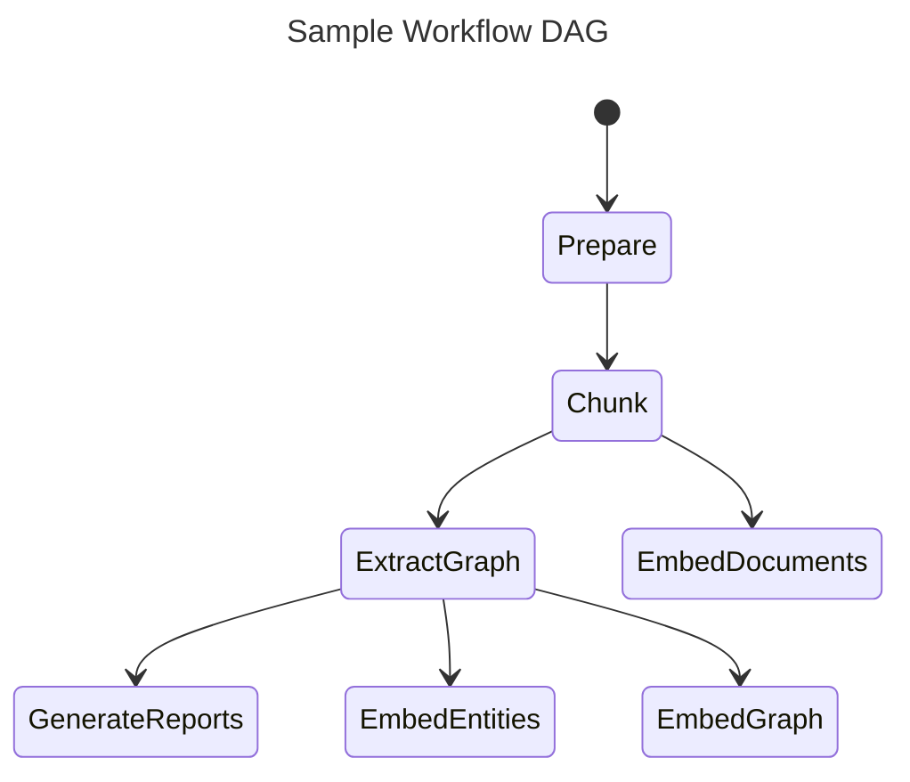

### LLM Caching

The GraphRAG library was designed with LLM interactions in mind, and a common setback when working with LLM APIs is various errors due to network latency, throttling, etc..
Because of these potential error cases, we've added a cache layer around LLM interactions.
When completion requests are made using the same input set (prompt and tuning parameters), we return a cached result if one exists.
This allows our indexer to be more resilient to network issues, to act idempotently, and to provide a more efficient end-user experience.

### Providers & Factories

Several subsystems within GraphRAG use a factory pattern to register and retrieve provider implementations. This allows deep customization to support models, storage, and so on that you may use but isn't built directly into GraphRAG.

The following subsystems use a factory pattern that allows you to register your own implementations:

- [language model](https://github.com/microsoft/graphrag/blob/main/graphrag/language_model/factory.py) - implement your own `chat` and `embed` methods to use a model provider of choice beyond the built-in OpenAI/Azure support
- [cache](https://github.com/microsoft/graphrag/blob/main/graphrag/cache/factory.py) - create your own cache storage location in addition to the file, blob, and CosmosDB ones we provide
- [logger](https://github.com/microsoft/graphrag/blob/main/graphrag/logger/factory.py) - create your own log writing location in addition to the built-in file and blob storage
- [storage](https://github.com/microsoft/graphrag/blob/main/graphrag/storage/factory.py) - create your own storage provider (database, etc.) beyond the file, blob, and CosmosDB ones built in
- [vector store](https://github.com/microsoft/graphrag/blob/main/graphrag/vector_stores/factory.py) - implement your own vector store other than the built-in lancedb, Azure AI Search, and CosmosDB ones built in
- [pipeline + workflows](https://github.com/microsoft/graphrag/blob/main/graphrag/index/workflows/factory.py) - implement your own workflow steps with a custom `run_workflow` function, or register an entire pipeline (list of named workflows)

The links for each of these subsystems point to the source code of the factory, which includes registration of the default built-in implementations. In addition, we have a detailed discussion of [language models](../config/models.md), which includes and example of a custom provider, and a [sample notebook](../examples_notebooks/custom_vector_store.ipynb) that demonstrates a custom vector store.

All of these factories allow you to register an impl using any string name you would like, even overriding built-in ones directly.
```

### `docs/index/byog.md`

```markdown
# Bring Your Own Graph

Several users have asked if they can bring their own existing graph and have it summarized for query with GraphRAG. There are many possible ways to do this, but here we'll describe a simple method that aligns with the existing GraphRAG workflows quite easily.

To cover the basic use cases for GraphRAG query, you should have two or three tables derived from your data:

- entities.parquet - this is the list of entities found in the dataset, which are the nodes of the graph.
- relationships.parquet - this is the list of relationships found in the dataset, which are the edges of the graph.
- text_units.parquet - this is the source text chunks the graph was extracted from. This is optional depending on the query method you intend to use (described later).

The approach described here will be to run a custom GraphRAG workflow pipeline that assumes the text chunking, entity extraction, and relationship extraction has already occurred.

## Tables

### Entities

See the full entities [table schema](./outputs.md#entities). For graph summarization purposes, you only need id, title, description, and the list of text_unit_ids.

The additional properties are used for optional graph visualization purposes.

### Relationships

See the full relationships [table schema](./outputs.md#relationships). For graph summarization purposes, you only need id, source, target, description, weight, and the list of text_unit_ids.

> Note: the `weight` field is important because it is used to properly compute Leiden communities!

## Workflow Configuration

GraphRAG includes the ability to specify *only* the specific workflow steps that you need. For basic graph summarization and query, you need the following config in your settings.yaml:

```yaml
workflows: [create_communities, create_community_reports]
```

This will result in only the minimal workflows required for GraphRAG [Global Search](../query/global_search.md).

## Optional Additional Config

If you would like to run [Local](../query/local_search.md), [DRIFT](../query/drift_search.md), or [Basic](../query/overview.md#basic-search) Search, you will need to include text_units and some embeddings.

### Text Units

See the full text_units [table schema](./outputs.md#text_units). Text units are chunks of your documents that are sized to ensure they fit into the context window of your model. Some search methods use these, so you may want to include them if you have them.

### Expanded Config

To perform the other search types above, you need some of the content to be embedded. Simply add the embeddings workflow:

```yaml
workflows: [create_communities, create_community_reports, generate_text_embeddings]
```

### FastGraphRAG

[FastGraphRAG](./methods.md#fastgraphrag) uses text_units for the community reports instead of the entity and relationship descriptions. If your graph is sourced in such a way that it does not have descriptions, this might be a useful alternative. In this case, you would update your workflows list to include the text variant of the community reports workflow:

```yaml
workflows: [create_communities, create_community_reports_text, generate_text_embeddings]
```

This method requires that your entities and relationships tables have valid links to a list of text_unit_ids. Also note that `generate_text_embeddings` is still only required if you are doing searches other than Global Search.


## Setup

Putting it all together:

- `output`: Create an output folder and put your entities and relationships (and optionally text_units) parquet files in it.
- Update your config as noted above to only run the workflows subset you need.
- Run `graphrag index --root <your project root>`
```

### `docs/index/default_dataflow.md`

```markdown
# Indexing Dataflow

## The GraphRAG Knowledge Model

The knowledge model is a specification for data outputs that conform to our data-model definition. You can find these definitions in the python/graphrag/graphrag/model folder within the GraphRAG repository. The following entity types are provided. The fields here represent the fields that are text-embedded by default.

- `Document` - An input document into the system. These either represent individual rows in a CSV or individual .txt file.
- `TextUnit` - A chunk of text to analyze. The size of these chunks, their overlap, and whether they adhere to any data boundaries may be configured below. A common use case is to set `CHUNK_BY_COLUMNS` to `id` so that there is a 1-to-many relationship between documents and TextUnits instead of a many-to-many.
- `Entity` - An entity extracted from a TextUnit. These represent people, places, events, or some other entity-model that you provide.
- `Relationship` - A relationship between two entities.
- `Covariate` - Extracted claim information, which contains statements about entities which may be time-bound.
- `Community` - Once the graph of entities and relationships is built, we perform hierarchical community detection on them to create a clustering structure.
- `Community Report` - The contents of each community are summarized into a generated report, useful for human reading and downstream search.

## The Default Configuration Workflow

Let's take a look at how the default-configuration workflow transforms text documents into the _GraphRAG Knowledge Model_. This page gives a general overview of the major steps in this process. To fully configure this workflow, check out the [configuration](../config/overview.md) documentation.

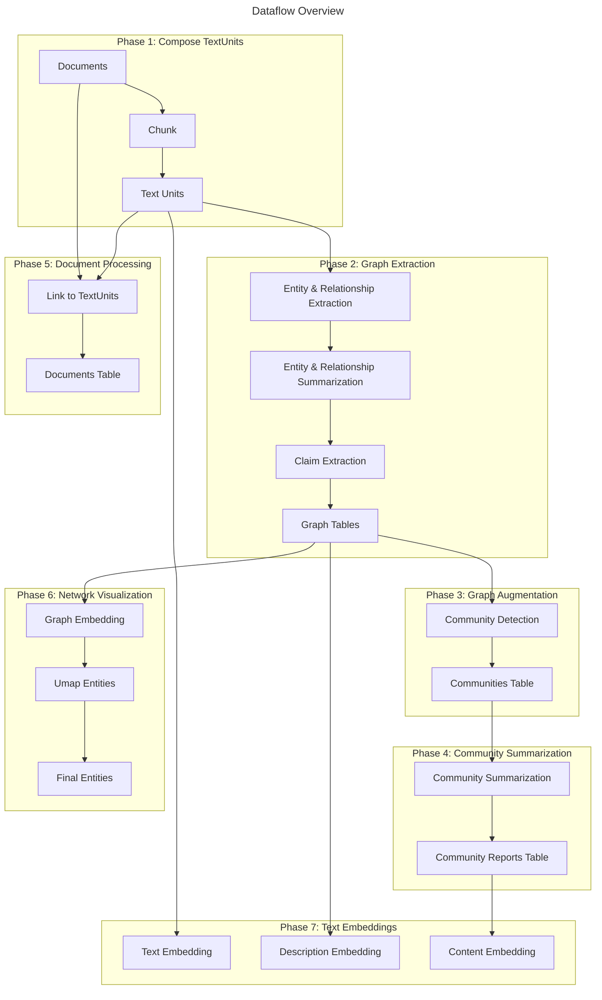

## Phase 1: Compose TextUnits

The first phase of the default-configuration workflow is to transform input documents into _TextUnits_. A _TextUnit_ is a chunk of text that is used for our graph extraction techniques. They are also used as source-references by extracted knowledge items in order to empower breadcrumbs and provenance by concepts back to their original source text.

The chunk size (counted in tokens), is user-configurable. By default this is set to 300 tokens, although we've had positive experience with 1200-token chunks using a single "glean" step. (A "glean" step is a follow-on extraction). Larger chunks result in lower-fidelity output and less meaningful reference texts; however, using larger chunks can result in much faster processing time.

The group-by configuration is also user-configurable. By default, we align our chunks to document boundaries, meaning that there is a strict 1-to-many relationship between Documents and TextUnits. In rare cases, this can be turned into a many-to-many relationship. This is useful when the documents are very short and we need several of them to compose a meaningful analysis unit (e.g. Tweets or a chat log)

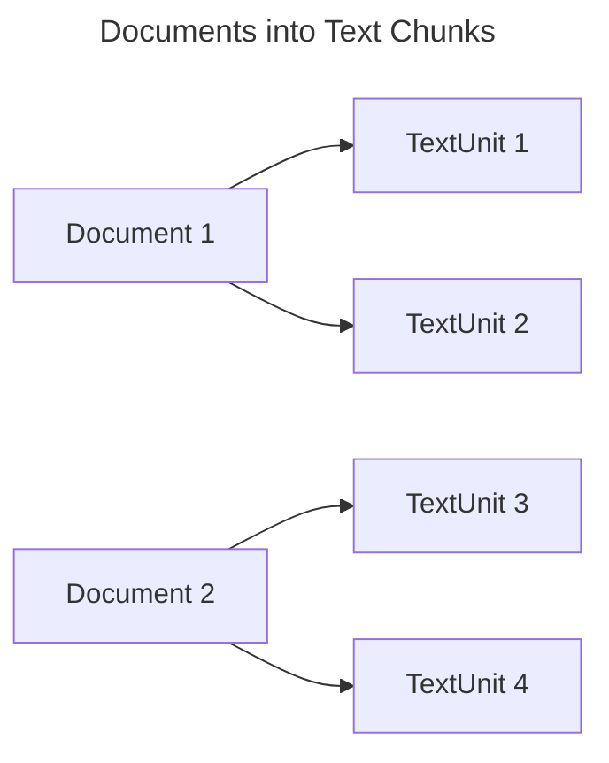

## Phase 2: Graph Extraction

In this phase, we analyze each text unit and extract our graph primitives: _Entities_, _Relationships_, and _Claims_.
Entities and Relationships are extracted at once in our _entity_extract_ verb, and claims are extracted in our _claim_extract_ verb. Results are then combined and passed into following phases of the pipeline.

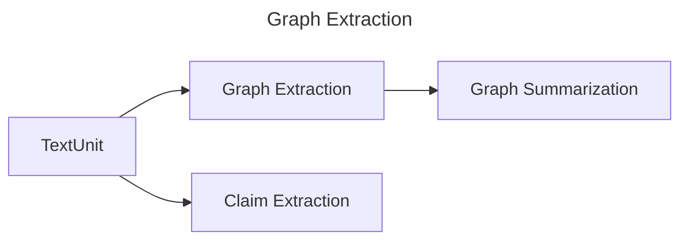

### Entity & Relationship Extraction

In this first step of graph extraction, we process each text-unit in order to extract entities and relationships out of the raw text using the LLM. The output of this step is a subgraph-per-TextUnit containing a list of **entities** with a _title_, _type_, and _description_, and a list of **relationships** with a _source_, _target_, and _description_.

These subgraphs are merged together - any entities with the same _title_ and _type_ are merged by creating an array of their descriptions. Similarly, any relationships with the same _source_ and _target_ are merged by creating an array of their descriptions.

### Entity & Relationship Summarization

Now that we have a graph of entities and relationships, each with a list of descriptions, we can summarize these lists into a single description per entity and relationship. This is done by asking the LLM for a short summary that captures all of the distinct information from each description. This allows all of our entities and relationships to have a single concise description.

### Claim Extraction (optional)

Finally, as an independent workflow, we extract claims from the source TextUnits. These claims represent positive factual statements with an evaluated status and time-bounds. These get exported as a primary artifact called **Covariates**.

Note: claim extraction is _optional_ and turned off by default. This is because claim extraction generally requires prompt tuning to be useful.

## Phase 3: Graph Augmentation

Now that we have a usable graph of entities and relationships, we want to understand their community structure. These give us explicit ways of understanding the topological structure of our graph.

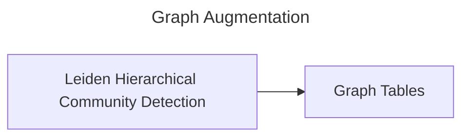

### Community Detection

In this step, we generate a hierarchy of entity communities using the Hierarchical Leiden Algorithm. This method will apply a recursive community-clustering to our graph until we reach a community-size threshold. This will allow us to understand the community structure of our graph and provide a way to navigate and summarize the graph at different levels of granularity.

### Graph Tables

Once our graph augmentation steps are complete, the final **Entities**, **Relationships**, and **Communities** tables are exported.

## Phase 4: Community Summarization

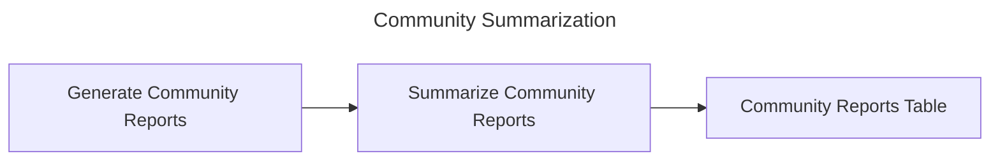

At this point, we have a functional graph of entities and relationships and a hierarchy of communities for the entities.

Now we want to build on the communities data and generate reports for each community. This gives us a high-level understanding of the graph at several points of graph granularity. For example, if community A is the top-level community, we'll get a report about the entire graph. If the community is lower-level, we'll get a report about a local cluster.

### Generate Community Reports

In this step, we generate a summary of each community using the LLM. This will allow us to understand the distinct information contained within each community and provide a scoped understanding of the graph, from either a high-level or a low-level perspective. These reports contain an executive overview and reference the key entities, relationships, and claims within the community sub-structure.

### Summarize Community Reports

In this step, each _community report_ is then summarized via the LLM for shorthand use.

### Community Reports Table

At this point, some bookkeeping work is performed and we export the **Community Reports** tables.

## Phase 5: Document Processing

In this phase of the workflow, we create the _Documents_ table for the knowledge model.

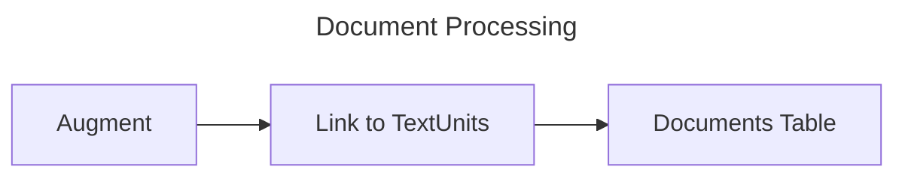

### Augment with Columns (CSV Only)

If the workflow is operating on CSV data, you may configure your workflow to add additional fields to Documents output. These fields should exist on the incoming CSV tables. Details about configuring this can be found in the [configuration documentation](../config/overview.md).

### Link to TextUnits

In this step, we link each document to the text-units that were created in the first phase. This allows us to understand which documents are related to which text-units and vice-versa.

### Documents Table

At this point, we can export the **Documents** table into the knowledge Model.

## Phase 6: Network Visualization (optional)

In this phase of the workflow, we perform some steps to support network visualization of our high-dimensional vector spaces within our existing graphs. At this point there are two logical graphs at play: the _Entity-Relationship_ graph and the _Document_ graph.

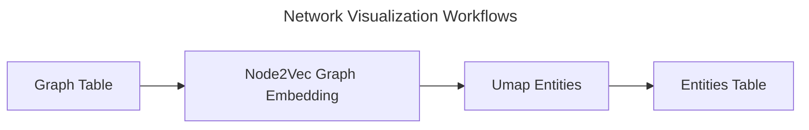

### Graph Embedding

In this step, we generate a vector representation of our graph using the Node2Vec algorithm. This will allow us to understand the implicit structure of our graph and provide an additional vector-space in which to search for related concepts during our query phase.

### Dimensionality Reduction

For each of the logical graphs, we perform a UMAP dimensionality reduction to generate a 2D representation of the graph. This will allow us to visualize the graph in a 2D space and understand the relationships between the nodes in the graph. The UMAP embeddings are reduced to two dimensions as x/y coordinates.

## Phase 7: Text Embedding

For all artifacts that require downstream vector search, we generate text embeddings as a final step. These embeddings are written directly to a configured vector store. By default we embed entity descriptions, text unit text, and community report text.

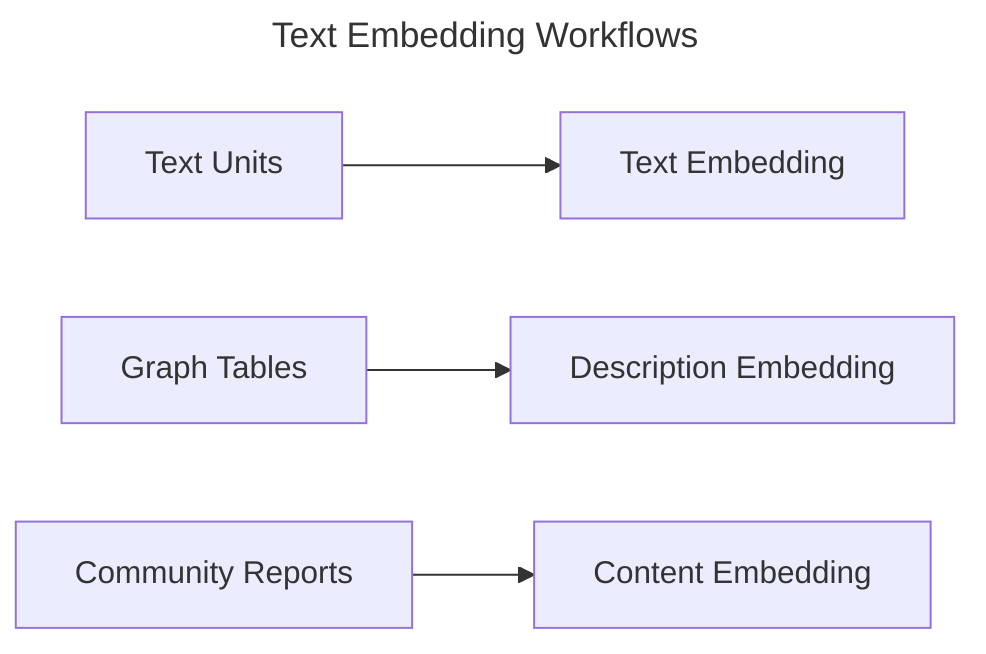
```

### `docs/index/inputs.md`

```markdown
# Inputs

GraphRAG supports several input formats to simplify ingesting your data. The mechanics and features available for input files and text chunking are discussed here.

## Input Loading and Schema

All input formats are loaded within GraphRAG and passed to the indexing pipeline as a `documents` DataFrame. This DataFrame has a row for each document using a shared column schema:

| name          | type | description |
| ------------- | ---- | ----------- |
| id            | str  | ID of the document. This is generated using a hash of the text content to ensure stability across runs. |
| text          | str  | The full text of the document. |
| title         | str  | Name of the document. Some formats allow this to be configured. |
| creation_date | str  | The creation date of the document, represented as an ISO8601 string. This is harvested from the source file system. |
| metadata      | dict | Optional additional document metadata. More details below. |

Also see the [outputs](outputs.md) documentation for the final documents table schema saved to parquet after pipeline completion.

## Bring-your-own DataFrame

As of version 2.6.0, GraphRAG's [indexing API method](https://github.com/microsoft/graphrag/blob/main/graphrag/api/index.py) allows you to pass in your own pandas DataFrame and bypass all of the input loading/parsing described in the next section. This is convenient if you have content in a format or storage location we don't support out-of-the-box. __You must ensure that your input DataFrame conforms to the schema described above.__ All of the chunking behavior described later will proceed exactly the same.

## Formats

We support three file formats out-of-the-box. This covers the overwhelming majority of use cases we have encountered. If you have a different format, we recommend writing a script to convert to one of these, which are widely used and supported by many tools and libraries.

### Plain Text

Plain text files (typically ending in .txt file extension). With plain text files we import the entire file contents as the `text` field, and the `title` is always the filename.

### Comma-delimited

CSV files (typically ending in a .csv extension). These are loaded using pandas' [`read_csv` method](https://pandas.pydata.org/pandas-docs/stable/reference/api/pandas.read_csv.html) with default options. Each row in a CSV file is treated as a single document. If you have multiple CSV files in your input folder, they will be concatenated into a single resulting `documents` DataFrame.

With the CSV format you can configure the `text_column`, and `title_column` if your data has structured content you would prefer to use. If you do not configure these within the `input` block of your settings.yaml, the title will be the filename as described in the schema above. The `text_column` is assumed to be "text" in your file if not configured specifically. We will also look for and use an "id" column if present, otherwise the ID will be generated as described above.

### JSON

JSON files (typically ending in a .json extension) contain [structured objects](https://www.json.org/). These are loaded using python's [`json.loads` method](https://docs.python.org/3/library/json.html), so your files must be properly compliant. JSON files may contain a single object in the file *or* the file may contain an array of objects at the root. We will check for and handle either of these cases. As with CSV, multiple files will be concatenated into a final table, and the `text_column` and `title_column` config options will be applied to the properties of each loaded object. Note that the specialized jsonl format produced by some libraries (one full JSON object on each line, not in an array) is not currently supported.

## Metadata

With the structured file formats (CSV and JSON) you can configure any number of columns to be added to a persisted `metadata` field in the DataFrame. This is configured by supplying a list of columns name to collect. If this is configured, the output `metadata` column will have a dict containing a key for each column, and the value of the column for that document. This metadata can optionally be used later in the GraphRAG pipeline.

### Example

software.csv

```csv
text,title,tag
My first program,Hello World,tutorial
An early space shooter game,Space Invaders,arcade
```

settings.yaml

```yaml
input:
    metadata: [title,tag]
```

Documents DataFrame

| id                    | title          | text                        | creation_date                 | metadata                                       |
| --------------------- | -------------- | --------------------------- | ----------------------------- | ---------------------------------------------- |
| (generated from text) | Hello World    | My first program            | (create date of software.csv) | { "title": "Hello World", "tag": "tutorial" }  |
| (generated from text) | Space Invaders | An early space shooter game | (create date of software.csv) | { "title": "Space Invaders", "tag": "arcade" } |

## Chunking and Metadata

As described on the [default dataflow](default_dataflow.md#phase-1-compose-textunits) page, documents are *chunked* into smaller "text units" for processing. This is done because document content size often exceeds the available context window for a given language model. There are a handful of settings you can adjust for this chunking, the most relevant being the `chunk_size` and `overlap`. We now also support a metadata processing scheme that can improve indexing results for some use cases. We will describe this feature in detail here.

Imagine the following scenario: you are indexing a collection of news articles. Each article text starts with a headline and author, and then proceeds with the content. When documents are chunked, they are split evenly according to your configured chunk size. In other words, the first *n* tokens are read into a text unit, and then the next *n*, until the end of the content. This means that front matter at the beginning of the document (such as the headline and author in this example) *is not copied to each chunk*. It only exists in the first chunk. When we later retrieve those chunks for summarization, they may therefore be missing shared information about the source document that should always be provided to the model. We have configuration options to copy repeated content into each text unit to address this issue.

### Input Config

As described above, when documents are imported you can specify a list of `metadata` columns to include with each row. This must be configured for the per-chunk copying to work.

### Chunking Config

Next, the `chunks` block needs to instruct the chunker how to handle this metadata when creating text units. By default, it is ignored. We have two settings to include it:

- `prepend_metadata`. This instructs the importer to copy the contents of the `metadata` column for each row into the start of every single text chunk. This metadata is copied as key: value pairs on new lines.
- `chunk_size_includes_metadata`: This tells the chunker how to compute the chunk size when metadata is included. By default, we create the text units using your specified `chunk_size` *and then* prepend the metadata. This means that the final text unit lengths may be longer than your configured `chunk_size`, and it will vary based on the length of the metadata for each document. When this setting is `True`, we will compute the raw text using the remainder after measuring the metadata length so that the resulting text units always comply with your configured `chunk_size`.

### Examples

The following are several examples to help illustrate how chunking config and metadate prepending works for each file format. Note that we are using word count here as "tokens" for the illustration, but language model tokens are [not equivalent to words](https://help.openai.com/en/articles/4936856-what-are-tokens-and-how-to-count-them).

#### Text files

This example uses two individual news article text files.

--

**File:** US to lift most federal COVID-19 vaccine mandates.txt

**Content:**

WASHINGTON (AP) The Biden administration will end most of the last remaining federal COVID-19 vaccine requirements next week when the national public health emergency for the coronavirus ends, the White House said Monday. Vaccine requirements for federal workers and federal contractors, as well as foreign air travelers to the U.S., will end May 11. The government is also beginning the process of lifting shot requirements for Head Start educators, healthcare workers, and noncitizens at U.S. land borders. The requirements are among the last vestiges of some of the more coercive measures taken by the federal government to promote vaccination as the deadly virus raged, and their end marks the latest display of how President Joe Biden's administration is moving to treat COVID-19 as a routine, endemic illness. "While I believe that these vaccine mandates had a tremendous beneficial impact, we are now at a point where we think that it makes a lot of sense to pull these requirements down," White House COVID-19 coordinator Dr. Ashish Jha told The Associated Press on Monday.

--

**File:** NY lawmakers begin debating budget 1 month after due date.txt

**Content:**

ALBANY, N.Y. (AP) New York lawmakers began voting Monday on a $229 billion state budget due a month ago that would raise the minimum wage, crack down on illicit pot shops and ban gas stoves and furnaces in new buildings. Negotiations among Gov. Kathy Hochul and her fellow Democrats in control of the Legislature dragged on past the April 1 budget deadline, largely because of disagreements over changes to the bail law and other policy proposals included in the spending plan. Floor debates on some budget bills began Monday. State Senate Majority Leader Andrea Stewart-Cousins said she expected voting to be wrapped up Tuesday for a budget she said contains "significant wins" for New Yorkers. "I would have liked to have done this sooner. I think we would all agree to that," Cousins told reporters before voting began. "This has been a very policy-laden budget and a lot of the policies had to parsed through." Hochul was able to push through a change to the bail law that will eliminate the standard that requires judges to prescribe the "least restrictive" means to ensure defendants return to court. Hochul said judges needed the extra discretion. Some liberal lawmakers argued that it would undercut the sweeping bail reforms approved in 2019 and result in more people with low incomes and people of color in pretrial detention. Here are some other policy provisions that will be included in the budget, according to state officials. The minimum wage would be raised to $17 in New York City and some of its suburbs and $16 in the rest of the state by 2026. That's up from $15 in the city and $14.20 upstate.

--

settings.yaml

```yaml
input:
    file_type: text
    metadata: [title]

chunks:
    size: 100
    overlap: 0
    prepend_metadata: true
    chunk_size_includes_metadata: false
```

Documents DataFrame

| id                    | title                                                         | text                        | creation_date                     | metadata                                                                     |
| --------------------- | ------------------------------------------------------------- | --------------------------- | --------------------------------- | ---------------------------------------------------------------------------- |
| (generated from text) | US to lift most federal COVID-19 vaccine mandates.txt         | (full content of text file) | (create date of article txt file) | { "title": "US to lift most federal COVID-19 vaccine mandates.txt" }         |
| (generated from text) | NY lawmakers begin debating budget 1 month after due date.txt | (full content of text file) | (create date of article txt file) | { "title": "NY lawmakers begin debating budget 1 month after due date.txt" } |

Raw Text Chunks

| content | length  |
| ------- | ------: |
| title: US to lift most federal COVID-19 vaccine mandates.txt<br>WASHINGTON (AP) The Biden administration will end most of the last remaining federal COVID-19 vaccine requirements next week when the national public health emergency for the coronavirus ends, the White House said Monday. Vaccine requirements for federal workers and federal contractors, as well as foreign air travelers to the U.S., will end May 11. The government is also beginning the process of lifting shot requirements for Head Start educators, healthcare workers, and noncitizens at U.S. land borders. The requirements are among the last vestiges of some of the more coercive measures taken by the federal government to promote vaccination as | 109 |
| title: US to lift most federal COVID-19 vaccine mandates.txt<br>the deadly virus raged, and their end marks the latest display of how President Joe Biden's administration is moving to treat COVID-19 as a routine, endemic illness. "While I believe that these vaccine mandates had a tremendous beneficial impact, we are now at a point where we think that it makes a lot of sense to pull these requirements down," White House COVID-19 coordinator Dr. Ashish Jha told The Associated Press on Monday. | 82 |
| title: NY lawmakers begin debating budget 1 month after due date.txt<br>ALBANY, N.Y. (AP) New York lawmakers began voting Monday on a $229 billion state budget due a month ago that would raise the minimum wage, crack down on illicit pot shops and ban gas stoves and furnaces in new buildings. Negotiations among Gov. Kathy Hochul and her fellow Democrats in control of the Legislature dragged on past the April 1 budget deadline, largely because of disagreements over changes to the bail law and other policy proposals included in the spending plan. Floor debates on some budget bills began Monday. State Senate Majority Leader Andrea Stewart-Cousins said she expected voting to | 111 |
| title: NY lawmakers begin debating budget 1 month after due date.txt<br>be wrapped up Tuesday for a budget she said contains "significant wins" for New Yorkers. "I would have liked to have done this sooner. I think we would all agree to that," Cousins told reporters before voting began. "This has been a very policy-laden budget and a lot of the policies had to parsed through." Hochul was able to push through a change to the bail law that will eliminate the standard that requires judges to prescribe the "least restrictive" means to ensure defendants return to court. Hochul said judges needed the extra discretion. Some liberal lawmakers argued that it | 111 |
| title: NY lawmakers begin debating budget 1 month after due date.txt<br>would undercut the sweeping bail reforms approved in 2019 and result in more people with low incomes and people of color in pretrial detention. Here are some other policy provisions that will be included in the budget, according to state officials. The minimum wage would be raised to $17 in New York City and some of its suburbs and $16 in the rest of the state by 2026. That's up from $15 in the city and $14.20 upstate. | 89 |

In this example we can see that the two input documents were parsed into five output text chunks. The title (filename) of each document is prepended but not included in the computed chunk size. Also note that the final text chunk for each document is usually smaller than the chunk size because it contains the last tokens.

#### CSV files

This example uses a single CSV file with the same two articles as rows (note that the text content is not properly escaped for actual CSV use).

--

**File:** articles.csv

**Content**

headline,article

US to lift most federal COVID-19 vaccine mandates,WASHINGTON (AP) The Biden administration will end most of the last remaining federal COVID-19 vaccine requirements next week when the national public health emergency for the coronavirus ends, the White House said Monday. Vaccine requirements for federal workers and federal contractors, as well as foreign air travelers to the U.S., will end May 11. The government is also beginning the process of lifting shot requirements for Head Start educators, healthcare workers, and noncitizens at U.S. land borders. The requirements are among the last vestiges of some of the more coercive measures taken by the federal government to promote vaccination as the deadly virus raged, and their end marks the latest display of how President Joe Biden's administration is moving to treat COVID-19 as a routine, endemic illness. "While I believe that these vaccine mandates had a tremendous beneficial impact, we are now at a point where we think that it makes a lot of sense to pull these requirements down," White House COVID-19 coordinator Dr. Ashish Jha told The Associated Press on Monday.

NY lawmakers begin debating budget 1 month after due date,ALBANY, N.Y. (AP) New York lawmakers began voting Monday on a $229 billion state budget due a month ago that would raise the minimum wage, crack down on illicit pot shops and ban gas stoves and furnaces in new buildings. Negotiations among Gov. Kathy Hochul and her fellow Democrats in control of the Legislature dragged on past the April 1 budget deadline, largely because of disagreements over changes to the bail law and other policy proposals included in the spending plan. Floor debates on some budget bills began Monday. State Senate Majority Leader Andrea Stewart-Cousins said she expected voting to be wrapped up Tuesday for a budget she said contains "significant wins" for New Yorkers. "I would have liked to have done this sooner. I think we would all agree to that," Cousins told reporters before voting began. "This has been a very policy-laden budget and a lot of the policies had to parsed through." Hochul was able to push through a change to the bail law that will eliminate the standard that requires judges to prescribe the "least restrictive" means to ensure defendants return to court. Hochul said judges needed the extra discretion. Some liberal lawmakers argued that it would undercut the sweeping bail reforms approved in 2019 and result in more people with low incomes and people of color in pretrial detention. Here are some other policy provisions that will be included in the budget, according to state officials. The minimum wage would be raised to $17 in New York City and some of its suburbs and $16 in the rest of the state by 2026. That's up from $15 in the city and $14.20 upstate.

--

settings.yaml

```yaml
input:
    file_type: csv
    title_column: headline
    text_column: article
    metadata: [headline]

chunks:
    size: 50
    overlap: 5
    prepend_metadata: true
    chunk_size_includes_metadata: true
```

Documents DataFrame

| id                    | title                                                     | text                     | creation_date                 | metadata                                                                    |
| --------------------- | --------------------------------------------------------- | ------------------------ | ----------------------------- | --------------------------------------------------------------------------- |
| (generated from text) | US to lift most federal COVID-19 vaccine mandates         | (article column content) | (create date of articles.csv) | { "headline": "US to lift most federal COVID-19 vaccine mandates" }         |
| (generated from text) | NY lawmakers begin debating budget 1 month after due date | (article column content) | (create date of articles.csv) | { "headline": "NY lawmakers begin debating budget 1 month after due date" } |

Raw Text Chunks

| content | length  |
| ------- | ------: |
| title: US to lift most federal COVID-19 vaccine mandates<br>WASHINGTON (AP) The Biden administration will end most of the last remaining federal COVID-19 vaccine requirements next week when the national public health emergency for the coronavirus ends, the White House said Monday. Vaccine requirements for federal workers and federal contractors, | 50 |
| title: US to lift most federal COVID-19 vaccine mandates<br>federal workers and federal contractors as well as foreign air travelers to the U.S., will end May 11. The government is also beginning the process of lifting shot requirements for Head Start educators, healthcare workers, and noncitizens at U.S. land borders. | 50 |
| title: US to lift most federal COVID-19 vaccine mandates<br>noncitizens at U.S. land borders. The requirements are among the last vestiges of some of the more coercive measures taken by the federal government to promote vaccination as the deadly virus raged, and their end marks the latest display of how | 50 |
| title: US to lift most federal COVID-19 vaccine mandates<br>the latest display of how  President Joe Biden's administration is moving to treat COVID-19 as a routine, endemic illness. "While I believe that these vaccine mandates had a tremendous beneficial impact, we are now at a point where we think that | 50 |
| title: US to lift most federal COVID-19 vaccine mandates<br>point where we think that it makes a lot of sense to pull these requirements down," White House COVID-19 coordinator Dr. Ashish Jha told The Associated Press on Monday. | 38 |
| title: NY lawmakers begin debating budget 1 month after due date<br>ALBANY, N.Y. (AP) New York lawmakers began voting Monday on a $229 billion state budget due a month ago that would raise the minimum wage, crack down on illicit pot shops and ban gas stoves and furnaces in new | 50 |
| title: NY lawmakers begin debating budget 1 month after due date<br>stoves and furnaces in new buildings. Negotiations among Gov. Kathy Hochul and her fellow Democrats in control of the Legislature dragged on past the April 1 budget deadline, largely because of disagreements over changes to the bail law and | 50 |
| title: NY lawmakers begin debating budget 1 month after due date<br>to the bail law and other policy proposals included in the spending plan. Floor debates on some budget bills began Monday. State Senate Majority Leader Andrea Stewart-Cousins said she expected voting to be wrapped up Tuesday for a budget | 50 |
|title: NY lawmakers begin debating budget 1 month after due date<br>up Tuesday for a budget she said contains "significant wins" for New Yorkers. "I would have liked to have done this sooner. I think we would all agree to that," Cousins told reporters before voting began. "This has been | 50 |
| title: NY lawmakers begin debating budget 1 month after due date<br>voting began. "This has been a very policy-laden budget and a lot of the policies had to parsed through." Hochul was able to push through a change to the bail law that will eliminate the standard that requires judges | 50 |
| title: NY lawmakers begin debating budget 1 month after due date<br>the standard that requires judges to prescribe the "least restrictive" means to ensure defendants return to court. Hochul said judges needed the extra discretion. Some liberal lawmakers argued that it would undercut the sweeping bail reforms approved in 2019 | 50 |
| title: NY lawmakers begin debating budget 1 month after due date<br>bail reforms approved in 2019 and result in more people with low incomes and people of color in pretrial detention. Here are some other policy provisions that will be included in the budget, according to state officials. The minimum | 50 |
| title: NY lawmakers begin debating budget 1 month after due date<br>to state officials. The minimum  wage would be raised to $17 in be raised to $17 in New York City and some of its suburbs and $16 in the rest of the state by 2026. That's up from $15 | 50 |
| title: NY lawmakers begin debating budget 1 month after due date<br>2026. That's up from $15 in the city and $14.20 upstate. | 22 |


In this example we can see that the two input documents were parsed into fourteen output text chunks. The title (headline) of each document is prepended and included in the computed chunk size, so each chunk matches the configured chunk size (except the last one for each document). We've also configured some overlap in these text chunks, so the last five tokens are shared. Why would you use overlap in your text chunks? Consider that when you are splitting documents based on tokens, it is highly likely that sentences or even related concepts will be split into separate chunks. Each text chunk is processed separately by the language model, so this may result in incomplete "ideas" at the boundaries of the chunk. Overlap ensures that these split concepts are fully contained in at least one of the chunks.


#### JSON files

This final example uses a JSON file for each of the same two articles. In this example we'll set the object fields to read, but we will not add metadata to the text chunks.

--

**File:** article1.json

**Content**

```json
{
    "headline": "US to lift most federal COVID-19 vaccine mandates",
    "content": "WASHINGTON (AP) The Biden administration will end most of the last remaining federal COVID-19 vaccine requirements next week when the national public health emergency for the coronavirus ends, the White House said Monday. Vaccine requirements for federal workers and federal contractors, as well as foreign air travelers to the U.S., will end May 11. The government is also beginning the process of lifting shot requirements for Head Start educators, healthcare workers, and noncitizens at U.S. land borders. The requirements are among the last vestiges of some of the more coercive measures taken by the federal government to promote vaccination as the deadly virus raged, and their end marks the latest display of how President Joe Biden's administration is moving to treat COVID-19 as a routine, endemic illness. "While I believe that these vaccine mandates had a tremendous beneficial impact, we are now at a point where we think that it makes a lot of sense to pull these requirements down," White House COVID-19 coordinator Dr. Ashish Jha told The Associated Press on Monday."
}
```

**File:** article2.json

**Content**

```json
{
    "headline": "NY lawmakers begin debating budget 1 month after due date",
    "content": "ALBANY, N.Y. (AP) New York lawmakers began voting Monday on a $229 billion state budget due a month ago that would raise the minimum wage, crack down on illicit pot shops and ban gas stoves and furnaces in new buildings. Negotiations among Gov. Kathy Hochul and her fellow Democrats in control of the Legislature dragged on past the April 1 budget deadline, largely because of disagreements over changes to the bail law and other policy proposals included in the spending plan. Floor debates on some budget bills began Monday. State Senate Majority Leader Andrea Stewart-Cousins said she expected voting to be wrapped up Tuesday for a budget she said contains "significant wins" for New Yorkers. "I would have liked to have done this sooner. I think we would all agree to that," Cousins told reporters before voting began. "This has been a very policy-laden budget and a lot of the policies had to parsed through." Hochul was able to push through a change to the bail law that will eliminate the standard that requires judges to prescribe the "least restrictive" means to ensure defendants return to court. Hochul said judges needed the extra discretion. Some liberal lawmakers argued that it would undercut the sweeping bail reforms approved in 2019 and result in more people with low incomes and people of color in pretrial detention. Here are some other policy provisions that will be included in the budget, according to state officials. The minimum wage would be raised to $17 in New York City and some of its suburbs and $16 in the rest of the state by 2026. That's up from $15 in the city and $14.20 upstate."
}
```

--

settings.yaml

```yaml
input:
    file_type: json
    title_column: headline
    text_column: content

chunks:
    size: 100
    overlap: 10
```

Documents DataFrame

| id                    | title                                                     | text                     | creation_date                  | metadata |
| --------------------- | --------------------------------------------------------- | ------------------------ | ------------------------------ | -------- |
| (generated from text) | US to lift most federal COVID-19 vaccine mandates         | (article column content) | (create date of article1.json) | { }      |
| (generated from text) | NY lawmakers begin debating budget 1 month after due date | (article column content) | (create date of article2.json) | { }      |

Raw Text Chunks

| content | length  |
| ------- | ------: |
| WASHINGTON (AP) The Biden administration will end most of the last remaining federal COVID-19 vaccine requirements next week when the national public health emergency for the coronavirus ends, the White House said Monday. Vaccine requirements for federal workers and federal contractors, as well as foreign air travelers to the U.S., will end May 11. The government is also beginning the process of lifting shot requirements for Head Start educators, healthcare workers, and noncitizens at U.S. land borders. The requirements are among the last vestiges of some of the more coercive measures taken by the federal government to promote vaccination as | 100 |
| measures taken by the federal government to promote vaccination as  the deadly virus raged, and their end marks the latest display of how President Joe Biden's administration is moving to treat COVID-19 as a routine, endemic illness. "While I believe that these vaccine mandates had a tremendous beneficial impact, we are now at a point where we think that it makes a lot of sense to pull these requirements down," White House COVID-19 coordinator Dr. Ashish Jha told The Associated Press on Monday. | 83 |
| ALBANY, N.Y. (AP) New York lawmakers began voting Monday on a $229 billion state budget due a month ago that would raise the minimum wage, crack down on illicit pot shops and ban gas stoves and furnaces in new buildings. Negotiations among Gov. Kathy Hochul and her fellow Democrats in control of the Legislature dragged on past the April 1 budget deadline, largely because of disagreements over changes to the bail law and other policy proposals included in the spending plan. Floor debates on some budget bills began Monday. State Senate Majority Leader Andrea Stewart-Cousins said she expected voting to | 100 |
| Senate Majority Leader Andrea Stewart-Cousins said she expected voting to be wrapped up Tuesday for a budget she said contains "significant wins" for New Yorkers. "I would have liked to have done this sooner. I think we would all agree to that," Cousins told reporters before voting began. "This has been a very policy-laden budget and a lot of the policies had to parsed through." Hochul was able to push through a change to the bail law that will eliminate the standard that requires judges to prescribe the "least restrictive" means to ensure defendants return to court. Hochul said judges | 100 |
| means to ensure defendants return to court. Hochul said judges needed the extra discretion. Some liberal lawmakers argued that it would undercut the sweeping bail reforms approved in 2019 and result in more people with low incomes and people of color in pretrial detention. Here are some other policy provisions that will be included in the budget, according to state officials. The minimum wage would be raised to $17 in New York City and some of its suburbs and $16 in the rest of the state by 2026. That's up from $15 in the city and $14.20 upstate. | 98 |


In this example the two input documents were parsed into five output text chunks. There is no metadata prepended, so each chunk matches the configured chunk size (except the last one for each document). We've also configured some overlap in these text chunks, so the last ten tokens are shared.
```

### `docs/index/methods.md`

```markdown
# Indexing Methods

GraphRAG is a platform for our research into RAG indexing methods that produce optimal context window content for language models. We have a standard indexing pipeline that uses a language model to extract the graph that our memory model is based upon. We may introduce additional indexing methods from time to time. This page documents those options.

## Standard GraphRAG

This is the method described in the original [blog post](https://www.microsoft.com/en-us/research/blog/graphrag-unlocking-llm-discovery-on-narrative-private-data/). Standard uses a language model for all reasoning tasks:

- entity extraction: LLM is prompted to extract named entities and provide a description from each text unit.
- relationship extraction: LLM is prompted to describe the relationship between each pair of entities in each text unit.
- entity summarization: LLM is prompted to combine the descriptions for every instance of an entity found across the text units into a single summary.
- relationship summarization: LLM is prompted to combine the descriptions for every instance of a relationship found across the text units into a single summary.
- claim extraction (optional): LLM is prompted to extract and describe claims from each text unit.
- community report generation: entity and relationship descriptions (and optionally claims) for each community are collected and used to prompt the LLM to generate a summary report.

`graphrag index --method standard`. This is the default method, so the method param can actual be omitted.

## FastGraphRAG

FastGraphRAG is a method that substitutes some of the language model reasoning for traditional natural language processing (NLP) methods. This is a hybrid technique that we developed as a faster and cheaper indexing alternative:

- entity extraction: entities are noun phrases extracted using NLP libraries such as NLTK and spaCy. There is no description; the source text unit is used for this.
- relationship extraction: relationships are defined as text unit co-occurrence between entity pairs. There is no description.
- entity summarization: not necessary.
- relationship summarization: not necessary.
- claim extraction (optional): unused.
- community report generation: The direct text unit content containing each entity noun phrase is collected and used to prompt the LLM to generate a summary report.

`graphrag index --method fast`

FastGraphRAG has a handful of NLP [options built in](https://microsoft.github.io/graphrag/config/yaml/#extract_graph_nlp). By default we use NLTK + regular expressions for the noun phrase extraction, which is very fast but primarily suitable for English. We have built in two additional methods using spaCy: semantic parsing and CFG. We use the `en_core_web_md` model by default for spaCy, but note that you can reference any [supported model](https://spacy.io/models/) that you have installed. 

Note that we also generally configure the text chunking to produce much smaller chunks (50-100 tokens). This results in a better co-occurrence graph.

⚠️ Note on SpaCy models:

This package requires SpaCy models to function correctly. If the required model is not installed, the package will automatically download and install it the first time it is used.

You can install it manually by running `python -m spacy download <model_name>`, for example `python -m spacy download en_core_web_md`.


## Choosing a Method

Standard GraphRAG provides a rich description of real-world entities and relationships, but is more expensive that FastGraphRAG. We estimate graph extraction to constitute roughly 75% of indexing cost. FastGraphRAG is therefore much cheaper, but the tradeoff is that the extracted graph is less directly relevant for use outside of GraphRAG, and the graph tends to be quite a bit noisier. If high fidelity entities and graph exploration are important to your use case, we recommend staying with traditional GraphRAG. If your use case is primarily aimed at summary questions using global search, FastGraphRAG provides high quality summarization at much less LLM cost.
```

### `docs/index/outputs.md`

```markdown
# Outputs

The default pipeline produces a series of output tables that align with the [conceptual knowledge model](../index/default_dataflow.md). This page describes the detailed output table schemas. By default we write these tables out as parquet files on disk.

## Shared fields
All tables have two identifier fields:

| name              | type | description |
| ----------------- | ---- | ----------- |
| id                | str  | Generated UUID, assuring global uniqueness |
| human_readable_id | int  | This is an incremented short ID created per-run. For example, we use this short ID with generated summaries that print citations so they are easy to cross-reference visually. |

## communities
This is a list of the final communities generated by Leiden. Communities are strictly hierarchical, subdividing into children as the cluster affinity is narrowed.

| name               | type  | description |
| ------------------ | ----- | ----------- |
| community          | int   | Leiden-generated cluster ID for the community. Note that these increment with depth, so they are unique through all levels of the community hierarchy. For this table, human_readable_id is a copy of the community ID rather than a plain increment. |
| parent             | int   | Parent community ID.|
| children           | int[] | List of child community IDs.|
| level              | int   | Depth of the community in the hierarchy. |
| title              | str   | Friendly name of the community. |
| entity_ids         | str[] | List of entities that are members of the community. |
| relationship_ids   | str[] | List of relationships that are wholly within the community (source and target are both in the community). |
| text_unit_ids      | str[] | List of text units represented within the community. |
| period             | str   | Date of ingest, used for incremental update merges. ISO8601 |
| size               | int   | Size of the community (entity count), used for incremental update merges. |

## community_reports
This is the list of summarized reports for each community.

| name                 | type  | description |
| -------------------- | ----- | ----------- |
| community            | int   | Short ID of the community this report applies to. |
| parent               | int   | Parent community ID. |
| children             | int[] | List of child community IDs.|
| level                | int   | Level of the community this report applies to. |
| title                | str   | LM-generated title for the report. |
| summary              | str   | LM-generated summary of the report. |
| full_content         | str   | LM-generated full report. |
| rank                 | float | LM-derived relevance ranking of the report based on member entity salience
| rating_explanation   | str   | LM-derived explanation of the rank. |
| findings             | dict  | LM-derived list of the top 5-10 insights from the community. Contains `summary` and `explanation` values. |
| full_content_json    | json  | Full JSON output as returned by the LM. Most fields are extracted into columns, but this JSON is sent for query summarization so we leave it to allow for prompt tuning to add fields/content by end users. |
| period               | str   | Date of ingest, used for incremental update merges. ISO8601 |
| size                 | int   | Size of the community (entity count), used for incremental update merges. |

## covariates
(Optional) If claim extraction is turned on, this is a list of the extracted covariates. Note that claims are typically oriented around identifying malicious behavior such as fraud, so they are not useful for all datasets.

| name           | type | description |
| -------------- | ---- | ----------- |
| covariate_type | str  | This is always "claim" with our default covariates. |
| type           | str  | Nature of the claim type. |
| description    | str  | LM-generated description of the behavior. |
| subject_id     | str  | Name of the source entity (that is performing the claimed behavior). |
| object_id      | str  | Name of the target entity (that the claimed behavior is performed on). |
| status         | str  | LM-derived assessment of the correctness of the claim. One of [TRUE, FALSE, SUSPECTED] |
| start_date     | str  | LM-derived start of the claimed activity. ISO8601 |
| end_date       | str  | LM-derived end of the claimed activity. ISO8601 |
| source_text    | str  | Short string of text containing the claimed behavior. |
| text_unit_id   | str  | ID of the text unit the claim text was extracted from. |

## documents
List of document content after import.

| name          | type  | description |
| ------------- | ----- | ----------- |
| title         | str   | Filename, unless otherwise configured during CSV import. |
| text          | str   | Full text of the document. |
| text_unit_ids | str[] | List of text units (chunks) that were parsed from the document. |
| metadata      | dict  | If specified during CSV import, this is a dict of metadata for the document. |

## entities
List of all entities found in the data by the LM.

| name          | type  | description |
| ------------- | ----- | ----------- |
| title         | str   | Name of the entity. |
| type          | str   | Type of the entity. By default this will be "organization", "person", "geo", or "event" unless configured differently or auto-tuning is used. |
| description   | str   | Textual description of the entity. Entities may be found in many text units, so this is an LM-derived summary of all descriptions. |
| text_unit_ids | str[] | List of the text units containing the entity. |
| frequency     | int   | Count of text units the entity was found within. |
| degree        | int   | Node degree (connectedness) in the graph. |
| x             | float | X position of the node for visual layouts. If graph embeddings and UMAP are not turned on, this will be 0. |
| y             | float | Y position of the node for visual layouts. If graph embeddings and UMAP are not turned on, this will be 0. |

## relationships
List of all entity-to-entity relationships found in the data by the LM. This is also the _edge list_ for the graph.

| name            | type  | description |
| --------------- | ----- | ----------- |
| source          | str   | Name of the source entity. |
| target          | str   | Name of the target entity. |
| description     | str   | LM-derived description of the relationship. Also see note for entity descriptions. |
| weight          | float | Weight of the edge in the graph. This is summed from an LM-derived "strength" measure for each relationship instance. |
| combined_degree | int   | Sum of source and target node degrees. |
| text_unit_ids   | str[] | List of text units the relationship was found within. |

## text_units
List of all text chunks parsed from the input documents.

| name              | type  | description |
| ----------------- | ----- | ----------- |
| text              | str   | Raw full text of the chunk. |
| n_tokens          | int   | Number of tokens in the chunk. This should normally match the `chunk_size` config parameter, except for the last chunk which is often shorter. |
| document_ids      | str[] | List of document IDs the chunk came from. This is normally only 1 due to our default groupby, but for very short text documents (e.g., microblogs) it can be configured so text units span multiple documents. |
| entity_ids        | str[] | List of entities found in the text unit. |
| relationships_ids | str[] | List of relationships found in the text unit. |
| covariate_ids     | str[] | Optional list of covariates found in the text unit. |
```

### `docs/index/overview.md`

```markdown
# GraphRAG Indexing 🤖

The GraphRAG indexing package is a data pipeline and transformation suite that is designed to extract meaningful, structured data from unstructured text using LLMs.

Indexing Pipelines are configurable. They are composed of workflows, standard and custom steps, prompt templates, and input/output adapters. Our standard pipeline is designed to:

- extract entities, relationships and claims from raw text
- perform community detection in entities
- generate community summaries and reports at multiple levels of granularity
- embed entities into a graph vector space
- embed text chunks into a textual vector space

The outputs of the pipeline are stored as Parquet tables by default, and embeddings are written to your configured vector store.

## Getting Started

### Requirements

See the [requirements](../developing.md#requirements) section in [Get Started](../get_started.md) for details on setting up a development environment.

To configure GraphRAG, see the [configuration](../config/overview.md) documentation.
After you have a config file you can run the pipeline using the CLI or the Python API.

## Usage

### CLI

```bash
uv run poe index --root <data_root> # default config mode
```

### Python API

Please see the indexing API [python file](https://github.com/microsoft/graphrag/blob/main/graphrag/api/index.py) for the recommended method to call directly from Python code.

## Further Reading

- To start developing within the _GraphRAG_ project, see [getting started](../developing.md)
- To understand the underlying concepts and execution model of the indexing library, see [the architecture documentation](../index/architecture.md)
- To read more about configuring the indexing engine, see [the configuration documentation](../config/overview.md)
```

### `docs/prompt_tuning/auto_prompt_tuning.md`

```markdown
# Auto Prompt Tuning ⚙️

GraphRAG provides the ability to create domain adapted prompts for the generation of the knowledge graph. This step is optional, though it is highly encouraged to run it as it will yield better results when executing an Index Run.

These are generated by loading the inputs, splitting them into chunks (text units) and then running a series of LLM invocations and template substitutions to generate the final prompts. We suggest using the default values provided by the script, but in this page you'll find the detail of each in case you want to further explore and tweak the prompt tuning algorithm.

<p align="center">

</p>
<p align="center">
Figure 1: Auto Tuning Conceptual Diagram.
</p>

## Prerequisites

Before running auto tuning, ensure you have already initialized your workspace with the `graphrag init` command. This will create the necessary configuration files and the default prompts. Refer to the [Init Documentation](../config/init.md) for more information about the initialization process.

## Usage

You can run the main script from the command line with various options:

```bash
graphrag prompt-tune [--root ROOT] [--config CONFIG] [--domain DOMAIN]  [--selection-method METHOD] [--limit LIMIT] [--language LANGUAGE] \
[--max-tokens MAX_TOKENS] [--chunk-size CHUNK_SIZE] [--n-subset-max N_SUBSET_MAX] [--k K] \
[--min-examples-required MIN_EXAMPLES_REQUIRED] [--discover-entity-types] [--output OUTPUT]
```

## Command-Line Options

- `--config` (required): The path to the configuration file. This is required to load the data and model settings.

- `--root` (optional): The data project root directory, including the config files (YML, JSON, or .env). Defaults to the current directory.

- `--domain` (optional): The domain related to your input data, such as 'space science', 'microbiology', or 'environmental news'. If left empty, the domain will be inferred from the input data.

- `--selection-method` (optional): The method to select documents. Options are all, random, auto or top. Default is random.

- `--limit` (optional): The limit of text units to load when using random or top selection. Default is 15.

- `--language` (optional): The language to use for input processing. If it is different from the inputs' language, the LLM will translate. Default is "" meaning it will be automatically detected from the inputs.

- `--max-tokens` (optional): Maximum token count for prompt generation. Default is 2000.

- `--chunk-size` (optional): The size in tokens to use for generating text units from input documents. Default is 200.

- `--n-subset-max` (optional): The number of text chunks to embed when using auto selection method. Default is 300.

- `--k` (optional): The number of documents to select when using auto selection method. Default is 15.

- `--min-examples-required` (optional): The minimum number of examples required for entity extraction prompts. Default is 2.

- `--discover-entity-types` (optional): Allow the LLM to discover and extract entities automatically. We recommend using this when your data covers a lot of topics or it is highly randomized.

- `--output` (optional): The folder to save the generated prompts. Default is "prompts".

## Example Usage

```bash
python -m graphrag prompt-tune --root /path/to/project --config /path/to/settings.yaml --domain "environmental news" \
--selection-method random --limit 10 --language English --max-tokens 2048 --chunk-size 256 --min-examples-required 3 \
--no-discover-entity-types --output /path/to/output
```

or, with minimal configuration (suggested):

```bash
python -m graphrag prompt-tune --root /path/to/project --config /path/to/settings.yaml --no-discover-entity-types
```

## Document Selection Methods

The auto tuning feature ingests the input data and then divides it into text units the size of the chunk size parameter.
After that, it uses one of the following selection methods to pick a sample to work with for prompt generation:

- `random`: Select text units randomly. This is the default and recommended option.
- `top`: Select the head n text units.
- `all`: Use all text units for the generation. Use only with small datasets; this option is not usually recommended.
- `auto`: Embed text units in a lower-dimensional space and select the k nearest neighbors to the centroid. This is useful when you have a large dataset and want to select a representative sample.

## Modify Env Vars

After running auto tuning, you should modify the following config variables to pick up the new prompts on your index run. Note: Please make sure to update the correct path to the generated prompts, in this example we are using the default "prompts" path.

```yaml
entity_extraction:
  prompt: "prompts/entity_extraction.txt"

summarize_descriptions:
  prompt: "prompts/summarize_descriptions.txt"

community_reports:
  prompt: "prompts/community_report.txt"
```
```

### `docs/prompt_tuning/manual_prompt_tuning.md`

```markdown
# Manual Prompt Tuning ⚙️

The GraphRAG indexer, by default, will run with a handful of prompts that are designed to work well in the broad context of knowledge discovery.
However, it is quite common to want to tune the prompts to better suit your specific use case.
We provide a means for you to do this by allowing you to specify a custom prompt file, which will each use a series of token-replacements internally.

Each of these prompts may be overridden by writing a custom prompt file in plaintext. We use token-replacements in the form of `{token_name}`, and the descriptions for the available tokens can be found below.

## Indexing Prompts

### Entity/Relationship Extraction

[Prompt Source](http://github.com/microsoft/graphrag/blob/main/graphrag/prompts/index/extract_graph.py)

#### Tokens

- **{input_text}** - The input text to be processed.
- **{entity_types}** - A list of entity types
- **{tuple_delimiter}** - A delimiter for separating values within a tuple. A single tuple is used to represent an individual entity or relationship.
- **{record_delimiter}** - A delimiter for separating tuple instances.
- **{completion_delimiter}** - An indicator for when generation is complete.

### Summarize Entity/Relationship Descriptions

[Prompt Source](http://github.com/microsoft/graphrag/blob/main/graphrag/prompts/index/summarize_descriptions.py)

#### Tokens

- **{entity_name}** - The name of the entity or the source/target pair of the relationship.
- **{description_list}** - A list of descriptions for the entity or relationship.

### Claim Extraction

[Prompt Source](http://github.com/microsoft/graphrag/blob/main/graphrag/prompts/index/extract_claims.py)

#### Tokens

- **{input_text}** - The input text to be processed.
- **{tuple_delimiter}** - A delimiter for separating values within a tuple. A single tuple is used to represent an individual entity or relationship.
- **{record_delimiter}** - A delimiter for separating tuple instances.
- **{completion_delimiter}** - An indicator for when generation is complete.
- **{entity_specs}** - A list of entity types.
- **{claim_description}** - Description of what claims should look like. Default is: `"Any claims or facts that could be relevant to information discovery."`

See the [configuration documentation](../config/overview.md) for details on how to change this.

### Generate Community Reports

[Prompt Source](http://github.com/microsoft/graphrag/blob/main/graphrag/prompts/index/community_report.py)

#### Tokens

- **{input_text}** - The input text to generate the report with. This will contain tables of entities and relationships.

## Query Prompts

### Local Search

[Prompt Source](http://github.com/microsoft/graphrag/blob/main/graphrag/prompts/query/local_search_system_prompt.py)

#### Tokens

- **{response_type}** - Describe how the response should look. We default to "multiple paragraphs".
- **{context_data}** - The data tables from GraphRAG's index.

### Global Search

[Mapper Prompt Source](http://github.com/microsoft/graphrag/blob/main/graphrag/prompts/query/global_search_map_system_prompt.py)

[Reducer Prompt Source](http://github.com/microsoft/graphrag/blob/main/graphrag/prompts/query/global_search_reduce_system_prompt.py)

[Knowledge Prompt Source](http://github.com/microsoft/graphrag/blob/main/graphrag/prompts/query/global_search_knowledge_system_prompt.py)

Global search uses a map/reduce approach to summarization. You can tune these prompts independently. This search also includes the ability to adjust the use of general knowledge from the model's training.

#### Tokens

- **{response_type}** - Describe how the response should look (reducer only). We default to "multiple paragraphs".
- **{context_data}** - The data tables from GraphRAG's index.

### Drift Search

[Prompt Source](http://github.com/microsoft/graphrag/blob/main/graphrag/prompts/query/drift_search_system_prompt.py)

#### Tokens

- **{response_type}** - Describe how the response should look. We default to "multiple paragraphs".
- **{context_data}** - The data tables from GraphRAG's index.
- **{community_reports}** - The most relevant community reports to include in the summarization.
- **{query}** - The query text as injected into the context.
```

### `docs/prompt_tuning/overview.md`

```markdown
# Prompt Tuning ⚙️

This page provides an overview of the prompt tuning options available for the GraphRAG indexing engine.

## Default Prompts

The default prompts are the simplest way to get started with the GraphRAG system. It is designed to work out-of-the-box with minimal configuration. More details about each of the default prompts for indexing and query can be found on the [manual tuning](./manual_prompt_tuning.md) page.

## Auto Tuning

Auto Tuning leverages your input data and LLM interactions to create domain adapted prompts for the generation of the knowledge graph. It is highly encouraged to run it as it will yield better results when executing an Index Run. For more details about how to use it, please refer to the [Auto Tuning](auto_prompt_tuning.md) documentation.

## Manual Tuning

Manual tuning is an advanced use-case. Most users will want to use the Auto Tuning feature instead. Details about how to use manual configuration are available in the [manual tuning](manual_prompt_tuning.md) documentation.
```

### `docs/query/drift_search.md`

```markdown
# DRIFT Search 🔎

## Combining Local and Global Search

GraphRAG is a technique that uses large language models (LLMs) to create knowledge graphs and summaries from unstructured text documents and leverages them to improve retrieval-augmented generation (RAG) operations on private datasets. It offers comprehensive global overviews of large, private troves of unstructured text documents while also enabling exploration of detailed, localized information. By using LLMs to create comprehensive knowledge graphs that connect and describe entities and relationships contained in those documents, GraphRAG leverages semantic structuring of the data to generate responses to a wide variety of complex user queries.

DRIFT search (Dynamic Reasoning and Inference with Flexible Traversal) builds upon Microsoft’s GraphRAG technique, combining characteristics of both global and local search to generate detailed responses in a method that balances computational costs with quality outcomes using our [drift search](https://github.com/microsoft/graphrag/blob/main//graphrag/query/structured_search/drift_search/) method.

## Methodology

<p align="center">

</p>
<p align="center"><i><small>
Figure 1. An entire DRIFT search hierarchy highlighting the three core phases of the DRIFT search process. A (Primer): DRIFT compares the user’s query with the top K most semantically relevant community reports, generating a broad initial answer and follow-up questions to steer further exploration. B (Follow-Up): DRIFT uses local search to refine queries, producing additional intermediate answers and follow-up questions that enhance specificity, guiding the engine towards context-rich information. A glyph on each node in the diagram shows the confidence the algorithm has to continue the query expansion step.  C (Output Hierarchy): The final output is a hierarchical structure of questions and answers ranked by relevance, reflecting a balanced mix of global insights and local refinements, making the results adaptable and comprehensive.</small></i></p>


DRIFT Search introduces a new approach to local search queries by including community information in the search process. This greatly expands the breadth of the query’s starting point and leads to retrieval and usage of a far higher variety of facts in the final answer. This addition expands the GraphRAG query engine by providing a more comprehensive option for local search, which uses community insights to refine a query into detailed follow-up questions.

## Configuration

Below are the key parameters of the [DRIFTSearch class](https://github.com/microsoft/graphrag/blob/main//graphrag/query/structured_search/drift_search/search.py):

- `llm`: OpenAI model object to be used for response generation
- `context_builder`: [context builder](https://github.com/microsoft/graphrag/blob/main/graphrag/query/structured_search/drift_search/drift_context.py) object to be used for preparing context data from community reports and query information
- `config`: model to define the DRIFT Search hyperparameters. [DRIFT Config model](https://github.com/microsoft/graphrag/blob/main/graphrag/config/models/drift_search_config.py)
- `tokenizer`: token encoder for tracking the budget for the algorithm.
- `query_state`: a state object as defined in [Query State](https://github.com/microsoft/graphrag/blob/main/graphrag/query/structured_search/drift_search/state.py) that allows to track execution of a DRIFT Search instance, alongside follow ups and [DRIFT actions](https://github.com/microsoft/graphrag/blob/main/graphrag/query/structured_search/drift_search/action.py).

## How to Use

An example of a drift search scenario can be found in the following [notebook](../examples_notebooks/drift_search.ipynb).

## Learn More

For a more in-depth look at the DRIFT search method, please refer to our [DRIFT Search blog post](https://www.microsoft.com/en-us/research/blog/introducing-drift-search-combining-global-and-local-search-methods-to-improve-quality-and-efficiency/)
```

### `docs/query/global_search.md`

```markdown
# Global Search 🔎

## Whole Dataset Reasoning

Baseline RAG struggles with queries that require aggregation of information across the dataset to compose an answer. Queries such as “What are the top 5 themes in the data?” perform terribly because baseline RAG relies on a vector search of semantically similar text content within the dataset. There is nothing in the query to direct it to the correct information.

However, with GraphRAG we can answer such questions, because the structure of the LLM-generated knowledge graph tells us about the structure (and thus themes) of the dataset as a whole. This allows the private dataset to be organized into meaningful semantic clusters that are pre-summarized. Using our [global search](https://github.com/microsoft/graphrag/blob/main//graphrag/query/structured_search/global_search/) method, the LLM uses these clusters to summarize these themes when responding to a user query.

## Methodology

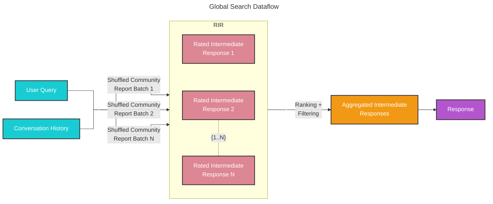

Given a user query and, optionally, the conversation history, the global search method uses a collection of LLM-generated community reports from a specified level of the graph's community hierarchy as context data to generate response in a map-reduce manner. At the `map` step, community reports are segmented into text chunks of pre-defined size. Each text chunk is then used to produce an intermediate response containing a list of point, each of which is accompanied by a numerical rating indicating the importance of the point. At the `reduce` step, a filtered set of the most important points from the intermediate responses are aggregated and used as the context to generate the final response. 

The quality of the global search’s response can be heavily influenced by the level of the community hierarchy chosen for sourcing community reports. Lower hierarchy levels, with their detailed reports, tend to yield more thorough responses, but may also increase the time and LLM resources needed to generate the final response due to the volume of reports.


## Configuration

Below are the key parameters of the [GlobalSearch class](https://github.com/microsoft/graphrag/blob/main//graphrag/query/structured_search/global_search/search.py):

* `llm`: OpenAI model object to be used for response generation
* `context_builder`: [context builder](https://github.com/microsoft/graphrag/blob/main//graphrag/query/structured_search/global_search/community_context.py) object to be used for preparing context data from community reports
* `map_system_prompt`: prompt template used in the `map` stage. Default template can be found at [map_system_prompt](https://github.com/microsoft/graphrag/blob/main//graphrag/prompts/query/global_search_map_system_prompt.py)
* `reduce_system_prompt`: prompt template used in the `reduce` stage, default template can be found at [reduce_system_prompt](https://github.com/microsoft/graphrag/blob/main//graphrag/prompts/query/global_search_reduce_system_prompt.py)
* `response_type`: free-form text describing the desired response type and format (e.g., `Multiple Paragraphs`, `Multi-Page Report`)
* `allow_general_knowledge`: setting this to True will include additional instructions to the `reduce_system_prompt` to prompt the LLM to incorporate relevant real-world knowledge outside of the dataset. Note that this may increase hallucinations, but can be useful for certain scenarios. Default is False
*`general_knowledge_inclusion_prompt`: instruction to add to the `reduce_system_prompt` if `allow_general_knowledge` is enabled. Default instruction can be found at [general_knowledge_instruction](https://github.com/microsoft/graphrag/blob/main//graphrag/prompts/query/global_search_knowledge_system_prompt.py)
* `max_data_tokens`: token budget for the context data
* `map_llm_params`: a dictionary of additional parameters (e.g., temperature, max_tokens) to be passed to the LLM call at the `map` stage
* `reduce_llm_params`: a dictionary of additional parameters (e.g., temperature, max_tokens) to passed to the LLM call at the `reduce` stage
* `context_builder_params`: a dictionary of additional parameters to be passed to the [`context_builder`](https://github.com/microsoft/graphrag/blob/main//graphrag/query/structured_search/global_search/community_context.py) object when building context window for the `map` stage.
* `concurrent_coroutines`: controls the degree of parallelism in the `map` stage.
* `callbacks`: optional callback functions, can be used to provide custom event handlers for LLM's completion streaming events

## How to Use

An example of a global search scenario can be found in the following [notebook](../examples_notebooks/global_search.ipynb).
```

### `docs/query/local_search.md`

```markdown
# Local Search 🔎

## Entity-based Reasoning

The [local search](https://github.com/microsoft/graphrag/blob/main//graphrag/query/structured_search/local_search/) method combines structured data from the knowledge graph with unstructured data from the input documents to augment the LLM context with relevant entity information at query time. It is well-suited for answering questions that require an understanding of specific entities mentioned in the input documents (e.g., “What are the healing properties of chamomile?”).

## Methodology

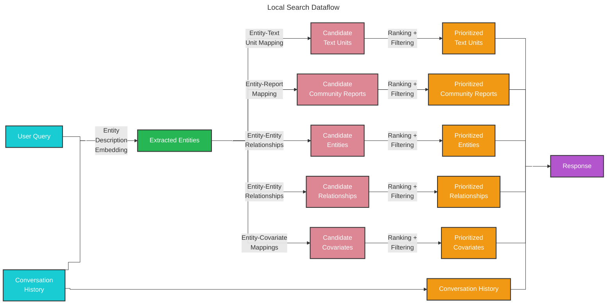

Given a user query and, optionally, the conversation history, the local search method identifies a set of entities from the knowledge graph that are semantically-related to the user input. These entities serve as access points into the knowledge graph, enabling the extraction of further relevant details such as connected entities, relationships, entity covariates, and community reports. Additionally, it also extracts relevant text chunks from the raw input documents that are associated with the identified entities. These candidate data sources are then prioritized and filtered to fit within a single context window of pre-defined size, which is used to generate a response to the user query.

## Configuration

Below are the key parameters of the [LocalSearch class](https://github.com/microsoft/graphrag/blob/main//graphrag/query/structured_search/local_search/search.py):

* `llm`: OpenAI model object to be used for response generation
* `context_builder`: [context builder](https://github.com/microsoft/graphrag/blob/main//graphrag/query/structured_search/local_search/mixed_context.py) object to be used for preparing context data from collections of knowledge model objects
* `system_prompt`: prompt template used to generate the search response. Default template can be found at [system_prompt](https://github.com/microsoft/graphrag/blob/main//graphrag/prompts/query/local_search_system_prompt.py)
* `response_type`: free-form text describing the desired response type and format (e.g., `Multiple Paragraphs`, `Multi-Page Report`)
* `llm_params`: a dictionary of additional parameters (e.g., temperature, max_tokens) to be passed to the LLM call
* `context_builder_params`: a dictionary of additional parameters to be passed to the [`context_builder`](https://github.com/microsoft/graphrag/blob/main//graphrag/query/structured_search/local_search/mixed_context.py) object when building context for the search prompt
* `callbacks`: optional callback functions, can be used to provide custom event handlers for LLM's completion streaming events

## How to Use

An example of a local search scenario can be found in the following [notebook](../examples_notebooks/local_search.ipynb).
```

### `docs/query/multi_index_search.md`

```markdown
# Multi Index Search 🔎

## Multi Dataset Reasoning

GraphRAG takes in unstructured data contained in text documents and uses large languages models to “read” the documents in a targeted fashion and create a knowledge graph. This knowledge graph, or index, contains information about specific entities in the data, how the entities relate to one another, and high-level reports about communities and topics found in the data. Indexes can be searched by users to get meaningful information about the underlying data, including reports with citations that point back to the original unstructured text. 

Multi-index search is a new capability that has been added to the GraphRAG python library to query multiple knowledge stores at once. Multi-index search allows for many new search scenarios, including: 

- Combining knowledge from different domains – Many documents contain similar types of entities: person, place, thing. But GraphRAG can be tuned for highly specialized domains, such as science and engineering. With the recent updates to search, GraphRAG can now simultaneously query multiple datasets with completely different schemas and entity definitions.

- Combining knowledge with different access levels – Not all datasets are accessible to all people, even within an organization. Some datasets are publicly available. Some datasets, such as internal financial information or intellectual property, may only be accessible by a small number of employees at a company. Multi-index search allows multiple sources with different access controls to be queried at the same time, creating more nuanced and informative reports. Internal R&D findings can be seamlessly combined with open-source scientific publications. 

- Combining knowledge in different locations – With multi-index search, indexes do not need to be in the same location or type of storage to be queried. Indexes in the cloud in Azure Storage can be queried at the same time as indexes stored on a personal computer. Multi-index search makes these types of data joins easy and accessible. 

To search across multiple datasets, the underlying contexts from each index, based on the user query, are combined in-memory at query time, saving on computation and allowing the joint querying of indexes that can’t be joined inherently, either do access controls or differing schemas. Multi-index search automatically keeps track of provenance information, so that any references can be traced back to the correct indexes and correct original documents. 


## How to Use

An example of a global search scenario can be found in the following [notebook](../examples_notebooks/multi_index_search.ipynb).
```

### `docs/query/notebooks/overview.md`

```markdown
# API Notebooks

- [API Overview Notebook](../../examples_notebooks/api_overview.ipynb)
- [Bring-Your-Own Vector Store](../../examples_notebooks/custom_vector_store.ipynb)

# Query Engine Notebooks

For examples about running Query please refer to the following notebooks:

- [Global Search Notebook](../../examples_notebooks/global_search.ipynb)
- [Local Search Notebook](../../examples_notebooks/local_search.ipynb)
- [DRIFT Search Notebook](../../examples_notebooks/drift_search.ipynb)

The test dataset for these notebooks can be found in [dataset.zip](../../data/operation_dulce/dataset.zip){:download}.
```

### `docs/query/overview.md`

```markdown
# Query Engine 🔎

The Query Engine is the retrieval module of the Graph RAG Library. It is one of the two main components of the Graph RAG library, the other being the Indexing Pipeline (see [Indexing Pipeline](../index/overview.md)).
It is responsible for the following tasks:

- [Local Search](#local-search)
- [Global Search](#global-search)
- [DRIFT Search](#drift-search)
- [Question Generation](#question-generation)

## Local Search

Local search method generates answers by combining relevant data from the AI-extracted knowledge-graph with text chunks of the raw documents. This method is suitable for questions that require an understanding of specific entities mentioned in the documents (e.g. What are the healing properties of chamomile?).

For more details about how Local Search works please refer to the [Local Search](local_search.md) documentation.

## Global Search

Global search method generates answers by searching over all AI-generated community reports in a map-reduce fashion. This is a resource-intensive method, but often gives good responses for questions that require an understanding of the dataset as a whole (e.g. What are the most significant values of the herbs mentioned in this notebook?).

More about this can be checked at the [Global Search](global_search.md) documentation.

## DRIFT Search

DRIFT Search introduces a new approach to local search queries by including community information in the search process. This greatly expands the breadth of the query’s starting point and leads to retrieval and usage of a far higher variety of facts in the final answer. This addition expands the GraphRAG query engine by providing a more comprehensive option for local search, which uses community insights to refine a query into detailed follow-up questions.

To learn more about DRIFT Search, please refer to the [DRIFT Search](drift_search.md) documentation.

## Basic Search

GraphRAG includes a rudimentary implementation of basic vector RAG to make it easy to compare different search results based on the type of question you are asking. You can specify the top `k` txt unit chunks to include in the summarization context.

## Question Generation

This functionality takes a list of user queries and generates the next candidate questions. This is useful for generating follow-up questions in a conversation or for generating a list of questions for the investigator to dive deeper into the dataset.

Information about how question generation works can be found at the [Question Generation](question_generation.md) documentation page.
```

### `docs/query/question_generation.md`

```markdown
# Question Generation ❔

## Entity-based Question Generation

The [question generation](https://github.com/microsoft/graphrag/blob/main//graphrag/query/question_gen/) method combines structured data from the knowledge graph with unstructured data from the input documents to generate candidate questions related to specific entities.

## Methodology
Given a list of prior user questions, the question generation method uses the same context-building approach employed in [local search](local_search.md) to extract and prioritize relevant structured and unstructured data, including entities, relationships, covariates, community reports and raw text chunks. These data records are then fitted into a single LLM prompt to generate candidate follow-up questions that represent the most important or urgent information content or themes in the data.

## Configuration

Below are the key parameters of the [Question Generation class](https://github.com/microsoft/graphrag/blob/main//graphrag/query/question_gen/local_gen.py):

* `llm`: OpenAI model object to be used for response generation
* `context_builder`: [context builder](https://github.com/microsoft/graphrag/blob/main//graphrag/query/structured_search/local_search/mixed_context.py) object to be used for preparing context data from collections of knowledge model objects, using the same context builder class as in local search
* `system_prompt`: prompt template used to generate candidate questions. Default template can be found at [system_prompt](https://github.com/microsoft/graphrag/blob/main//graphrag/prompts/query/question_gen_system_prompt.py)
* `llm_params`: a dictionary of additional parameters (e.g., temperature, max_tokens) to be passed to the LLM call
* `context_builder_params`: a dictionary of additional parameters to be passed to the [`context_builder`](https://github.com/microsoft/graphrag/blob/main//graphrag/query/structured_search/local_search/mixed_context.py) object when building context for the question generation prompt
* `callbacks`: optional callback functions, can be used to provide custom event handlers for LLM's completion streaming events

## How to Use

An example of the question generation function can be found in the following [notebook](../examples_notebooks/local_search.ipynb).
```

### `docs/scripts/create_cookie_banner.js`

```javascript
function onConsentChanged(categoryPreferences) {
	console.log("onConsentChanged", categoryPreferences);        
}


cb = document.createElement("div");
cb.id = "cookie-banner";
document.body.insertBefore(cb, document.body.children[0]);

window.WcpConsent && WcpConsent.init("en-US", "cookie-banner", function (err, consent) {
	if (!err) {
		console.log("consent: ", consent);
		window.manageConsent = () => consent.manageConsent();
		siteConsent = consent;          
	} else {
		console.log("Error initializing WcpConsent: "+ err);
	}
}, onConsentChanged, WcpConsent.themes.light);
```

### `docs/stylesheets/extra.css`

```css
[data-md-color-scheme="default"] {
    --md-primary-fg-color: #3c4cab;
    --md-code-hl-color: #3772d9;
    --md-code-hl-comment-color: #6b6b6b;
    --md-code-hl-operator-color: #6b6b6b;
    --md-footer-fg-color--light: #ffffff;
    --md-footer-fg-color--lighter: #ffffff;
}

[data-md-color-scheme="slate"] {
    --md-primary-fg-color: #364499;
    --md-code-hl-color: #246be5;
    --md-code-hl-constant-color: #9a89ed;
    --md-code-hl-number-color: #f16e5f;
    --md-footer-fg-color--light: #ffffff;
    --md-footer-fg-color--lighter: #ffffff;
}

.md-tabs__item--active {
    background-color: var(--md-primary-bg-color);
}

.md-tabs__item--active .md-tabs__link {
    color: var(--md-code-hl-color);
}

.md-typeset a {
    text-decoration: underline;
}
```

### `docs/visualization_guide.md`

```markdown
# Visualizing and Debugging Your Knowledge Graph

The following step-by-step guide walks through the process to visualize a knowledge graph after it's been constructed by graphrag. Note that some of the settings recommended below are based on our own experience of what works well. Feel free to change and explore other settings for a better visualization experience!

## 1. Run the Pipeline
Before building an index, please review your `settings.yaml` configuration file and ensure that graphml snapshots is enabled.
```yaml
snapshots:
  graphml: true
```
(Optional) To support other visualization tools and exploration, additional parameters can be enabled that provide access to vector embeddings.
```yaml
embed_graph:
  enabled: true # will generate node2vec embeddings for nodes
umap:
  enabled: true # will generate UMAP embeddings for nodes, giving the entities table an x/y position to plot
```
After running the indexing pipeline over your data, there will be an output folder (defined by the `storage.base_dir` setting).

- **Output Folder**: Contains artifacts from the LLM’s indexing pass.

## 2. Locate the Knowledge Graph
In the output folder, look for a file named `graph.graphml`. graphml is a standard [file format](http://graphml.graphdrawing.org) supported by many visualization tools. We recommend trying [Gephi](https://gephi.org).

## 3. Open the Graph in Gephi
1. Install and open Gephi
2. Navigate to the `output` folder containing the various parquet files.
3. Import the `graph.graphml` file into Gephi. This will result in a fairly plain view of the undirected graph nodes and edges.

<p align="center">
   
</p>

## 4. Install the Leiden Algorithm Plugin
1. Go to `Tools` -> `Plugins`.
2. Search for "Leiden Algorithm".
3. Click `Install` and restart Gephi.

## 5. Run Statistics
1. In the `Statistics` tab on the right, click `Run` for `Average Degree` and `Leiden Algorithm`.

<p align="center">
   
</p>

2. For the Leiden Algorithm, adjust the settings:
   - **Quality function**: Modularity
   - **Resolution**: 1

## 6. Color the Graph by Clusters
1. Go to the `Appearance` pane in the upper left side of Gephi.

<p align="center">
   
</p>

2. Select `Nodes`, then `Partition`, and click the color palette icon in the upper right.
3. Choose `Cluster` from the dropdown.
4. Click the `Palette...` hyperlink, then `Generate...`.
5. Uncheck `Limit number of colors`, click `Generate`, and then `Ok`.
6. Click `Apply` to color the graph. This will color the graph based on the partitions discovered by Leiden.

## 7. Resize Nodes by Degree Centrality
1. In the `Appearance` pane in the upper left, select `Nodes` -> `Ranking`
2. Select the `Sizing` icon in the upper right.
2. Choose `Degree` and set:
   - **Min**: 10
   - **Max**: 150
3. Click `Apply`.

## 8. Layout the Graph
1. In the `Layout` tab in the lower left, select `OpenORD`.

<p align="center">
   
</p>

2. Set `Liquid` and `Expansion` stages to 50, and everything else to 0.
3. Click `Run` and monitor the progress.

## 9. Run ForceAtlas2
1. Select `Force Atlas 2` in the layout options.

<p align="center">
   
</p>

2. Adjust the settings:
   - **Scaling**: 15
   - **Dissuade Hubs**: checked
   - **LinLog mode**: uncheck
   - **Prevent Overlap**: checked
3. Click `Run` and wait.
4. Press `Stop` when it looks like the graph nodes have settled and no longer change position significantly.

## 10. Add Text Labels (Optional)
1. Turn on text labels in the appropriate section.
2. Configure and resize them as needed.

Your final graph should now be visually organized and ready for analysis!
```

### `graphrag/__init__.py`

```python
# Copyright (c) 2024 Microsoft Corporation.
# Licensed under the MIT License

"""The GraphRAG package."""
```

### `graphrag/__main__.py`

```python
# Copyright (c) 2024 Microsoft Corporation.
# Licensed under the MIT License

"""The GraphRAG package."""

from graphrag.cli.main import app

app(prog_name="graphrag")
```

### `graphrag/api/__init__.py`

```python
# Copyright (c) 2024 Microsoft Corporation.
# Licensed under the MIT License

"""API for GraphRAG.

WARNING: This API is under development and may undergo changes in future releases.
Backwards compatibility is not guaranteed at this time.
"""

from graphrag.api.index import build_index
from graphrag.api.prompt_tune import generate_indexing_prompts
from graphrag.api.query import (
    basic_search,
    basic_search_streaming,
    drift_search,
    drift_search_streaming,
    global_search,
    global_search_streaming,
    local_search,
    local_search_streaming,
    multi_index_basic_search,
    multi_index_drift_search,
    multi_index_global_search,
    multi_index_local_search,
)
from graphrag.prompt_tune.types import DocSelectionType

__all__ = [  # noqa: RUF022
    # index API
    "build_index",
    # query API
    "global_search",
    "global_search_streaming",
    "local_search",
    "local_search_streaming",
    "drift_search",
    "drift_search_streaming",
    "basic_search",
    "basic_search_streaming",
    "multi_index_basic_search",
    "multi_index_drift_search",
    "multi_index_global_search",
    "multi_index_local_search",
    # prompt tuning API
    "DocSelectionType",
    "generate_indexing_prompts",
]
```

### `graphrag/api/index.py`

```python
# Copyright (c) 2024 Microsoft Corporation.
# Licensed under the MIT License

"""
Indexing API for GraphRAG.

WARNING: This API is under development and may undergo changes in future releases.
Backwards compatibility is not guaranteed at this time.
"""

import logging
from typing import Any

import pandas as pd

from graphrag.callbacks.noop_workflow_callbacks import NoopWorkflowCallbacks
from graphrag.callbacks.workflow_callbacks import WorkflowCallbacks
from graphrag.config.enums import IndexingMethod
from graphrag.config.models.graph_rag_config import GraphRagConfig
from graphrag.index.run.run_pipeline import run_pipeline
from graphrag.index.run.utils import create_callback_chain
from graphrag.index.typing.pipeline_run_result import PipelineRunResult
from graphrag.index.workflows.factory import PipelineFactory
from graphrag.logger.standard_logging import init_loggers

logger = logging.getLogger(__name__)


async def build_index(
    config: GraphRagConfig,
    method: IndexingMethod | str = IndexingMethod.Standard,
    is_update_run: bool = False,
    memory_profile: bool = False,
    callbacks: list[WorkflowCallbacks] | None = None,
    additional_context: dict[str, Any] | None = None,
    verbose: bool = False,
    input_documents: pd.DataFrame | None = None,
) -> list[PipelineRunResult]:
    """Run the pipeline with the given configuration.

    Parameters
    ----------
    config : GraphRagConfig
        The configuration.
    method : IndexingMethod default=IndexingMethod.Standard
        Styling of indexing to perform (full LLM, NLP + LLM, etc.).
    memory_profile : bool
        Whether to enable memory profiling.
    callbacks : list[WorkflowCallbacks] | None default=None
        A list of callbacks to register.
    additional_context : dict[str, Any] | None default=None
        Additional context to pass to the pipeline run. This can be accessed in the pipeline state under the 'additional_context' key.
    input_documents : pd.DataFrame | None default=None.
        Override document loading and parsing and supply your own dataframe of documents to index.

    Returns
    -------
    list[PipelineRunResult]
        The list of pipeline run results
    """
    init_loggers(config=config, verbose=verbose)

    # Create callbacks for pipeline lifecycle events if provided
    workflow_callbacks = (
        create_callback_chain(callbacks) if callbacks else NoopWorkflowCallbacks()
    )

    outputs: list[PipelineRunResult] = []

    if memory_profile:
        logger.warning("New pipeline does not yet support memory profiling.")

    logger.info("Initializing indexing pipeline...")
    # todo: this could propagate out to the cli for better clarity, but will be a breaking api change
    method = _get_method(method, is_update_run)
    pipeline = PipelineFactory.create_pipeline(config, method)

    workflow_callbacks.pipeline_start(pipeline.names())

    async for output in run_pipeline(
        pipeline,
        config,
        callbacks=workflow_callbacks,
        is_update_run=is_update_run,
        additional_context=additional_context,
        input_documents=input_documents,
    ):
        outputs.append(output)
        if output.errors and len(output.errors) > 0:
            logger.error("Workflow %s completed with errors", output.workflow)
        else:
            logger.info("Workflow %s completed successfully", output.workflow)
        logger.debug(str(output.result))

    workflow_callbacks.pipeline_end(outputs)
    return outputs


def _get_method(method: IndexingMethod | str, is_update_run: bool) -> str:
    m = method.value if isinstance(method, IndexingMethod) else method
    return f"{m}-update" if is_update_run else m
```

### `graphrag/api/prompt_tune.py`

```python
# Copyright (c) 2024 Microsoft Corporation.
# Licensed under the MIT License

"""
Auto Templating API.

This API provides access to the auto templating feature of graphrag, allowing external applications
to hook into graphrag and generate prompts from private data.

WARNING: This API is under development and may undergo changes in future releases.
Backwards compatibility is not guaranteed at this time.
"""

import logging
from typing import Annotated

import annotated_types
from pydantic import PositiveInt, validate_call

from graphrag.callbacks.noop_workflow_callbacks import NoopWorkflowCallbacks
from graphrag.config.defaults import graphrag_config_defaults
from graphrag.config.models.graph_rag_config import GraphRagConfig
from graphrag.language_model.manager import ModelManager
from graphrag.logger.standard_logging import init_loggers
from graphrag.prompt_tune.defaults import MAX_TOKEN_COUNT, PROMPT_TUNING_MODEL_ID
from graphrag.prompt_tune.generator.community_report_rating import (
    generate_community_report_rating,
)
from graphrag.prompt_tune.generator.community_report_summarization import (
    create_community_summarization_prompt,
)
from graphrag.prompt_tune.generator.community_reporter_role import (
    generate_community_reporter_role,
)
from graphrag.prompt_tune.generator.domain import generate_domain
from graphrag.prompt_tune.generator.entity_relationship import (
    generate_entity_relationship_examples,
)
from graphrag.prompt_tune.generator.entity_summarization_prompt import (
    create_entity_summarization_prompt,
)
from graphrag.prompt_tune.generator.entity_types import generate_entity_types
from graphrag.prompt_tune.generator.extract_graph_prompt import (
    create_extract_graph_prompt,
)
from graphrag.prompt_tune.generator.language import detect_language
from graphrag.prompt_tune.generator.persona import generate_persona
from graphrag.prompt_tune.loader.input import load_docs_in_chunks
from graphrag.prompt_tune.types import DocSelectionType
from graphrag.tokenizer.get_tokenizer import get_tokenizer

logger = logging.getLogger(__name__)


@validate_call(config={"arbitrary_types_allowed": True})
async def generate_indexing_prompts(
    config: GraphRagConfig,
    chunk_size: PositiveInt = graphrag_config_defaults.chunks.size,
    overlap: Annotated[
        int, annotated_types.Gt(-1)
    ] = graphrag_config_defaults.chunks.overlap,
    limit: PositiveInt = 15,
    selection_method: DocSelectionType = DocSelectionType.RANDOM,
    domain: str | None = None,
    language: str | None = None,
    max_tokens: int = MAX_TOKEN_COUNT,
    discover_entity_types: bool = True,
    min_examples_required: PositiveInt = 2,
    n_subset_max: PositiveInt = 300,
    k: PositiveInt = 15,
    verbose: bool = False,
) -> tuple[str, str, str]:
    """Generate indexing prompts.

    Parameters
    ----------
    - config: The GraphRag configuration.
    - output_path: The path to store the prompts.
    - chunk_size: The chunk token size to use for input text units.
    - limit: The limit of chunks to load.
    - selection_method: The chunk selection method.
    - domain: The domain to map the input documents to.
    - language: The language to use for the prompts.
    - max_tokens: The maximum number of tokens to use on entity extraction prompts
    - discover_entity_types: Generate entity types.
    - min_examples_required: The minimum number of examples required for entity extraction prompts.
    - n_subset_max: The number of text chunks to embed when using auto selection method.
    - k: The number of documents to select when using auto selection method.

    Returns
    -------
    tuple[str, str, str]: entity extraction prompt, entity summarization prompt, community summarization prompt
    """
    init_loggers(config=config, verbose=verbose, filename="prompt-tuning.log")

    # Retrieve documents
    logger.info("Chunking documents...")
    doc_list = await load_docs_in_chunks(
        config=config,
        limit=limit,
        select_method=selection_method,
        logger=logger,
        chunk_size=chunk_size,
        overlap=overlap,
        n_subset_max=n_subset_max,
        k=k,
    )

    # Create LLM from config
    # TODO: Expose a way to specify Prompt Tuning model ID through config
    logger.info("Retrieving language model configuration...")
    default_llm_settings = config.get_language_model_config(PROMPT_TUNING_MODEL_ID)

    logger.info("Creating language model...")
    llm = ModelManager().register_chat(
        name="prompt_tuning",
        model_type=default_llm_settings.type,
        config=default_llm_settings,
        callbacks=NoopWorkflowCallbacks(),
        cache=None,
    )

    if not domain:
        logger.info("Generating domain...")
        domain = await generate_domain(llm, doc_list)

    if not language:
        logger.info("Detecting language...")
        language = await detect_language(llm, doc_list)

    logger.info("Generating persona...")
    persona = await generate_persona(llm, domain)

    logger.info("Generating community report ranking description...")
    community_report_ranking = await generate_community_report_rating(
        llm, domain=domain, persona=persona, docs=doc_list
    )

    entity_types = None
    extract_graph_llm_settings = config.get_language_model_config(
        config.extract_graph.model_id
    )
    if discover_entity_types:
        logger.info("Generating entity types...")
        entity_types = await generate_entity_types(
            llm,
            domain=domain,
            persona=persona,
            docs=doc_list,
            json_mode=extract_graph_llm_settings.model_supports_json or False,
        )

    logger.info("Generating entity relationship examples...")
    examples = await generate_entity_relationship_examples(
        llm,
        persona=persona,
        entity_types=entity_types,
        docs=doc_list,
        language=language,
        json_mode=False,  # config.llm.model_supports_json should be used, but these prompts are used in non-json mode by the index engine
    )

    logger.info("Generating entity extraction prompt...")
    extract_graph_prompt = create_extract_graph_prompt(
        entity_types=entity_types,
        docs=doc_list,
        examples=examples,
        language=language,
        json_mode=False,  # config.llm.model_supports_json should be used, but these prompts are used in non-json mode by the index engine
        tokenizer=get_tokenizer(model_config=extract_graph_llm_settings),
        max_token_count=max_tokens,
        min_examples_required=min_examples_required,
    )

    logger.info("Generating entity summarization prompt...")
    entity_summarization_prompt = create_entity_summarization_prompt(
        persona=persona,
        language=language,
    )

    logger.info("Generating community reporter role...")
    community_reporter_role = await generate_community_reporter_role(
        llm, domain=domain, persona=persona, docs=doc_list
    )

    logger.info("Generating community summarization prompt...")
    community_summarization_prompt = create_community_summarization_prompt(
        persona=persona,
        role=community_reporter_role,
        report_rating_description=community_report_ranking,
        language=language,
    )

    logger.debug("Generated domain: %s", domain)
    logger.debug("Detected language: %s", language)
    logger.debug("Generated persona: %s", persona)

    return (
        extract_graph_prompt,
        entity_summarization_prompt,
        community_summarization_prompt,
    )
```

### `graphrag/api/query.py`

```python
# Copyright (c) 2024 Microsoft Corporation.
# Licensed under the MIT License

"""
Query Engine API.

This API provides access to the query engine of graphrag, allowing external applications
to hook into graphrag and run queries over a knowledge graph generated by graphrag.

Contains the following functions:
 - global_search: Perform a global search.
 - global_search_streaming: Perform a global search and stream results back.
 - local_search: Perform a local search.
 - local_search_streaming: Perform a local search and stream results back.

WARNING: This API is under development and may undergo changes in future releases.
Backwards compatibility is not guaranteed at this time.
"""

import logging
from collections.abc import AsyncGenerator
from typing import Any

import pandas as pd
from pydantic import validate_call

from graphrag.callbacks.noop_query_callbacks import NoopQueryCallbacks
from graphrag.callbacks.query_callbacks import QueryCallbacks
from graphrag.config.embeddings import (
    community_full_content_embedding,
    entity_description_embedding,
    text_unit_text_embedding,
)
from graphrag.config.models.graph_rag_config import GraphRagConfig
from graphrag.logger.standard_logging import init_loggers
from graphrag.query.factory import (
    get_basic_search_engine,
    get_drift_search_engine,
    get_global_search_engine,
    get_local_search_engine,
)
from graphrag.query.indexer_adapters import (
    read_indexer_communities,
    read_indexer_covariates,
    read_indexer_entities,
    read_indexer_relationships,
    read_indexer_report_embeddings,
    read_indexer_reports,
    read_indexer_text_units,
)
from graphrag.utils.api import (
    get_embedding_store,
    load_search_prompt,
    truncate,
    update_context_data,
)
from graphrag.utils.cli import redact

# Initialize standard logger
logger = logging.getLogger(__name__)


@validate_call(config={"arbitrary_types_allowed": True})
async def global_search(
    config: GraphRagConfig,
    entities: pd.DataFrame,
    communities: pd.DataFrame,
    community_reports: pd.DataFrame,
    community_level: int | None,
    dynamic_community_selection: bool,
    response_type: str,
    query: str,
    callbacks: list[QueryCallbacks] | None = None,
    verbose: bool = False,
) -> tuple[
    str | dict[str, Any] | list[dict[str, Any]],
    str | list[pd.DataFrame] | dict[str, pd.DataFrame],
]:
    """Perform a global search and return the context data and response.

    Parameters
    ----------
    - config (GraphRagConfig): A graphrag configuration (from settings.yaml)
    - entities (pd.DataFrame): A DataFrame containing the final entities (from entities.parquet)
    - communities (pd.DataFrame): A DataFrame containing the final communities (from communities.parquet)
    - community_reports (pd.DataFrame): A DataFrame containing the final community reports (from community_reports.parquet)
    - community_level (int): The community level to search at.
    - dynamic_community_selection (bool): Enable dynamic community selection instead of using all community reports at a fixed level. Note that you can still provide community_level cap the maximum level to search.
    - response_type (str): The type of response to return.
    - query (str): The user query to search for.

    Returns
    -------
    TODO: Document the search response type and format.
    """
    init_loggers(config=config, verbose=verbose, filename="query.log")

    callbacks = callbacks or []
    full_response = ""
    context_data = {}

    def on_context(context: Any) -> None:
        nonlocal context_data
        context_data = context

    local_callbacks = NoopQueryCallbacks()
    local_callbacks.on_context = on_context
    callbacks.append(local_callbacks)

    logger.debug("Executing global search query: %s", query)
    async for chunk in global_search_streaming(
        config=config,
        entities=entities,
        communities=communities,
        community_reports=community_reports,
        community_level=community_level,
        dynamic_community_selection=dynamic_community_selection,
        response_type=response_type,
        query=query,
        callbacks=callbacks,
    ):
        full_response += chunk
    logger.debug("Query response: %s", truncate(full_response, 400))
    return full_response, context_data


@validate_call(config={"arbitrary_types_allowed": True})
def global_search_streaming(
    config: GraphRagConfig,
    entities: pd.DataFrame,
    communities: pd.DataFrame,
    community_reports: pd.DataFrame,
    community_level: int | None,
    dynamic_community_selection: bool,
    response_type: str,
    query: str,
    callbacks: list[QueryCallbacks] | None = None,
    verbose: bool = False,
) -> AsyncGenerator:
    """Perform a global search and return the context data and response via a generator.

    Context data is returned as a dictionary of lists, with one list entry for each record.

    Parameters
    ----------
    - config (GraphRagConfig): A graphrag configuration (from settings.yaml)
    - entities (pd.DataFrame): A DataFrame containing the final entities (from entities.parquet)
    - communities (pd.DataFrame): A DataFrame containing the final communities (from communities.parquet)
    - community_reports (pd.DataFrame): A DataFrame containing the final community reports (from community_reports.parquet)
    - community_level (int): The community level to search at.
    - dynamic_community_selection (bool): Enable dynamic community selection instead of using all community reports at a fixed level. Note that you can still provide community_level cap the maximum level to search.
    - response_type (str): The type of response to return.
    - query (str): The user query to search for.

    Returns
    -------
    TODO: Document the search response type and format.
    """
    init_loggers(config=config, verbose=verbose, filename="query.log")

    communities_ = read_indexer_communities(communities, community_reports)
    reports = read_indexer_reports(
        community_reports,
        communities,
        community_level=community_level,
        dynamic_community_selection=dynamic_community_selection,
    )
    entities_ = read_indexer_entities(
        entities, communities, community_level=community_level
    )
    map_prompt = load_search_prompt(config.root_dir, config.global_search.map_prompt)
    reduce_prompt = load_search_prompt(
        config.root_dir, config.global_search.reduce_prompt
    )
    knowledge_prompt = load_search_prompt(
        config.root_dir, config.global_search.knowledge_prompt
    )

    logger.debug("Executing streaming global search query: %s", query)
    search_engine = get_global_search_engine(
        config,
        reports=reports,
        entities=entities_,
        communities=communities_,
        response_type=response_type,
        dynamic_community_selection=dynamic_community_selection,
        map_system_prompt=map_prompt,
        reduce_system_prompt=reduce_prompt,
        general_knowledge_inclusion_prompt=knowledge_prompt,
        callbacks=callbacks,
    )
    return search_engine.stream_search(query=query)


@validate_call(config={"arbitrary_types_allowed": True})
async def multi_index_global_search(
    config: GraphRagConfig,
    entities_list: list[pd.DataFrame],
    communities_list: list[pd.DataFrame],
    community_reports_list: list[pd.DataFrame],
    index_names: list[str],
    community_level: int | None,
    dynamic_community_selection: bool,
    response_type: str,
    streaming: bool,
    query: str,
    callbacks: list[QueryCallbacks] | None = None,
    verbose: bool = False,
) -> tuple[
    str | dict[str, Any] | list[dict[str, Any]],
    str | list[pd.DataFrame] | dict[str, pd.DataFrame],
]:
    """Perform a global search across multiple indexes and return the context data and response.

    Parameters
    ----------
    - config (GraphRagConfig): A graphrag configuration (from settings.yaml)
    - entities_list (list[pd.DataFrame]): A list of DataFrames containing the final entities (from entities.parquet)
    - communities_list (list[pd.DataFrame]): A list of DataFrames containing the final communities (from communities.parquet)
    - community_reports_list (list[pd.DataFrame]): A list of DataFrames containing the final community reports (from community_reports.parquet)
    - index_names (list[str]): A list of index names.
    - community_level (int): The community level to search at.
    - dynamic_community_selection (bool): Enable dynamic community selection instead of using all community reports at a fixed level. Note that you can still provide community_level cap the maximum level to search.
    - response_type (str): The type of response to return.
    - streaming (bool): Whether to stream the results or not.
    - query (str): The user query to search for.

    Returns
    -------
    TODO: Document the search response type and format.
    """
    init_loggers(config=config, verbose=verbose, filename="query.log")

    logger.warning(
        "Multi-index search is deprecated and will be removed in GraphRAG v3."
    )

    # Streaming not supported yet
    if streaming:
        message = "Streaming not yet implemented for multi_global_search"
        raise NotImplementedError(message)

    links = {
        "communities": {},
        "community_reports": {},
        "entities": {},
    }
    max_vals = {
        "communities": -1,
        "community_reports": -1,
        "entities": -1,
    }

    communities_dfs = []
    community_reports_dfs = []
    entities_dfs = []

    for idx, index_name in enumerate(index_names):
        # Prepare each index's community reports dataframe for merging
        community_reports_df = community_reports_list[idx]
        community_reports_df["community"] = community_reports_df["community"].astype(
            int
        )
        for i in community_reports_df["community"]:
            links["community_reports"][i + max_vals["community_reports"] + 1] = {
                "index_name": index_name,
                "id": str(i),
            }
        community_reports_df["community"] += max_vals["community_reports"] + 1
        community_reports_df["human_readable_id"] += max_vals["community_reports"] + 1
        max_vals["community_reports"] = int(community_reports_df["community"].max())
        community_reports_dfs.append(community_reports_df)

        # Prepare each index's communities dataframe for merging
        communities_df = communities_list[idx]
        communities_df["community"] = communities_df["community"].astype(int)
        communities_df["parent"] = communities_df["parent"].astype(int)
        for i in communities_df["community"]:
            links["communities"][i + max_vals["communities"] + 1] = {
                "index_name": index_name,
                "id": str(i),
            }
        communities_df["community"] += max_vals["communities"] + 1
        communities_df["parent"] = communities_df["parent"].apply(
            lambda x: x if x == -1 else x + max_vals["communities"] + 1
        )
        communities_df["human_readable_id"] += max_vals["communities"] + 1
        # concat the index name to the entity_ids, since this is used for joining later
        communities_df["entity_ids"] = communities_df["entity_ids"].apply(
            lambda x, index_name=index_name: [i + f"-{index_name}" for i in x]
        )
        max_vals["communities"] = int(communities_df["community"].max())
        communities_dfs.append(communities_df)

        # Prepare each index's entities dataframe for merging
        entities_df = entities_list[idx]
        for i in entities_df["human_readable_id"]:
            links["entities"][i + max_vals["entities"] + 1] = {
                "index_name": index_name,
                "id": i,
            }
        entities_df["human_readable_id"] += max_vals["entities"] + 1
        entities_df["title"] = entities_df["title"].apply(
            lambda x, index_name=index_name: x + f"-{index_name}"
        )
        entities_df["text_unit_ids"] = entities_df["text_unit_ids"].apply(
            lambda x, index_name=index_name: [i + f"-{index_name}" for i in x]
        )
        max_vals["entities"] = int(entities_df["human_readable_id"].max())
        entities_dfs.append(entities_df)

    # Merge the dataframes
    community_reports_combined = pd.concat(
        community_reports_dfs, axis=0, ignore_index=True, sort=False
    )
    entities_combined = pd.concat(entities_dfs, axis=0, ignore_index=True, sort=False)
    communities_combined = pd.concat(
        communities_dfs, axis=0, ignore_index=True, sort=False
    )

    logger.debug("Executing multi-index global search query: %s", query)
    result = await global_search(
        config,
        entities=entities_combined,
        communities=communities_combined,
        community_reports=community_reports_combined,
        community_level=community_level,
        dynamic_community_selection=dynamic_community_selection,
        response_type=response_type,
        query=query,
        callbacks=callbacks,
    )

    # Update the context data by linking index names and community ids
    context = update_context_data(result[1], links)

    logger.debug("Query response: %s", truncate(result[0], 400))  # type: ignore
    return (result[0], context)


@validate_call(config={"arbitrary_types_allowed": True})
async def local_search(
    config: GraphRagConfig,
    entities: pd.DataFrame,
    communities: pd.DataFrame,
    community_reports: pd.DataFrame,
    text_units: pd.DataFrame,
    relationships: pd.DataFrame,
    covariates: pd.DataFrame | None,
    community_level: int,
    response_type: str,
    query: str,
    callbacks: list[QueryCallbacks] | None = None,
    verbose: bool = False,
) -> tuple[
    str | dict[str, Any] | list[dict[str, Any]],
    str | list[pd.DataFrame] | dict[str, pd.DataFrame],
]:
    """Perform a local search and return the context data and response.

    ----------
    - config (GraphRagConfig): A graphrag configuration (from settings.yaml)
    - entities (pd.DataFrame): A DataFrame containing the final entities (from entities.parquet)
    - community_reports (pd.DataFrame): A DataFrame containing the final community reports (from community_reports.parquet)
    - text_units (pd.DataFrame): A DataFrame containing the final text units (from text_units.parquet)
    - relationships (pd.DataFrame): A DataFrame containing the final relationships (from relationships.parquet)
    - covariates (pd.DataFrame): A DataFrame containing the final covariates (from covariates.parquet)
    - community_level (int): The community level to search at.
    - response_type (str): The response type to return.
    - query (str): The user query to search for.

    Returns
    -------
    TODO: Document the search response type and format.
    """
    init_loggers(config=config, verbose=verbose, filename="query.log")

    callbacks = callbacks or []
    full_response = ""
    context_data = {}

    def on_context(context: Any) -> None:
        nonlocal context_data
        context_data = context

    local_callbacks = NoopQueryCallbacks()
    local_callbacks.on_context = on_context
    callbacks.append(local_callbacks)

    logger.debug("Executing local search query: %s", query)
    async for chunk in local_search_streaming(
        config=config,
        entities=entities,
        communities=communities,
        community_reports=community_reports,
        text_units=text_units,
        relationships=relationships,
        covariates=covariates,
        community_level=community_level,
        response_type=response_type,
        query=query,
        callbacks=callbacks,
    ):
        full_response += chunk
    logger.debug("Query response: %s", truncate(full_response, 400))
    return full_response, context_data


@validate_call(config={"arbitrary_types_allowed": True})
def local_search_streaming(
    config: GraphRagConfig,
    entities: pd.DataFrame,
    communities: pd.DataFrame,
    community_reports: pd.DataFrame,
    text_units: pd.DataFrame,
    relationships: pd.DataFrame,
    covariates: pd.DataFrame | None,
    community_level: int,
    response_type: str,
    query: str,
    callbacks: list[QueryCallbacks] | None = None,
    verbose: bool = False,
) -> AsyncGenerator:
    """Perform a local search and return the context data and response via a generator.

    Parameters
    ----------
    - config (GraphRagConfig): A graphrag configuration (from settings.yaml)
    - entities (pd.DataFrame): A DataFrame containing the final entities (from entities.parquet)
    - community_reports (pd.DataFrame): A DataFrame containing the final community reports (from community_reports.parquet)
    - text_units (pd.DataFrame): A DataFrame containing the final text units (from text_units.parquet)
    - relationships (pd.DataFrame): A DataFrame containing the final relationships (from relationships.parquet)
    - covariates (pd.DataFrame): A DataFrame containing the final covariates (from covariates.parquet)
    - community_level (int): The community level to search at.
    - response_type (str): The response type to return.
    - query (str): The user query to search for.

    Returns
    -------
    TODO: Document the search response type and format.
    """
    init_loggers(config=config, verbose=verbose, filename="query.log")

    vector_store_args = {}
    for index, store in config.vector_store.items():
        vector_store_args[index] = store.model_dump()
    msg = f"Vector Store Args: {redact(vector_store_args)}"
    logger.debug(msg)

    description_embedding_store = get_embedding_store(
        config_args=vector_store_args,
        embedding_name=entity_description_embedding,
    )

    entities_ = read_indexer_entities(entities, communities, community_level)
    covariates_ = read_indexer_covariates(covariates) if covariates is not None else []
    prompt = load_search_prompt(config.root_dir, config.local_search.prompt)

    logger.debug("Executing streaming local search query: %s", query)
    search_engine = get_local_search_engine(
        config=config,
        reports=read_indexer_reports(community_reports, communities, community_level),
        text_units=read_indexer_text_units(text_units),
        entities=entities_,
        relationships=read_indexer_relationships(relationships),
        covariates={"claims": covariates_},
        description_embedding_store=description_embedding_store,
        response_type=response_type,
        system_prompt=prompt,
        callbacks=callbacks,
    )
    return search_engine.stream_search(query=query)


@validate_call(config={"arbitrary_types_allowed": True})
async def multi_index_local_search(
    config: GraphRagConfig,
    entities_list: list[pd.DataFrame],
    communities_list: list[pd.DataFrame],
    community_reports_list: list[pd.DataFrame],
    text_units_list: list[pd.DataFrame],
    relationships_list: list[pd.DataFrame],
    covariates_list: list[pd.DataFrame] | None,
    index_names: list[str],
    community_level: int,
    response_type: str,
    streaming: bool,
    query: str,
    callbacks: list[QueryCallbacks] | None = None,
    verbose: bool = False,
) -> tuple[
    str | dict[str, Any] | list[dict[str, Any]],
    str | list[pd.DataFrame] | dict[str, pd.DataFrame],
]:
    """Perform a local search across multiple indexes and return the context data and response.

    Parameters
    ----------
    - config (GraphRagConfig): A graphrag configuration (from settings.yaml)
    - entities_list (list[pd.DataFrame]): A list of DataFrames containing the final entities (from entities.parquet)
    - community_reports_list (list[pd.DataFrame]): A list of DataFrames containing the final community reports (from community_reports.parquet)
    - text_units_list (list[pd.DataFrame]): A list of DataFrames containing the final text units (from text_units.parquet)
    - relationships_list (list[pd.DataFrame]): A list of DataFrames containing the final relationships (from relationships.parquet)
    - covariates_list (list[pd.DataFrame]): [Optional] A list of DataFrames containing the final covariates (from covariates.parquet)
    - index_names (list[str]): A list of index names.
    - community_level (int): The community level to search at.
    - response_type (str): The response type to return.
    - streaming (bool): Whether to stream the results or not.
    - query (str): The user query to search for.

    Returns
    -------
    TODO: Document the search response type and format.
    """
    init_loggers(config=config, verbose=verbose, filename="query.log")

    logger.warning(
        "Multi-index search is deprecated and will be removed in GraphRAG v3."
    )
    # Streaming not supported yet
    if streaming:
        message = "Streaming not yet implemented for multi_index_local_search"
        raise NotImplementedError(message)

    links = {
        "community_reports": {},
        "communities": {},
        "entities": {},
        "text_units": {},
        "relationships": {},
        "covariates": {},
    }
    max_vals = {
        "community_reports": -1,
        "communities": -1,
        "entities": -1,
        "text_units": 0,
        "relationships": -1,
        "covariates": 0,
    }
    community_reports_dfs = []
    communities_dfs = []
    entities_dfs = []
    relationships_dfs = []
    text_units_dfs = []
    covariates_dfs = []

    for idx, index_name in enumerate(index_names):
        # Prepare each index's communities dataframe for merging
        communities_df = communities_list[idx]
        communities_df["community"] = communities_df["community"].astype(int)
        for i in communities_df["community"]:
            links["communities"][i + max_vals["communities"] + 1] = {
                "index_name": index_name,
                "id": str(i),
            }
        communities_df["community"] += max_vals["communities"] + 1
        communities_df["human_readable_id"] += max_vals["communities"] + 1
        # concat the index name to the entity_ids, since this is used for joining later
        communities_df["entity_ids"] = communities_df["entity_ids"].apply(
            lambda x, index_name=index_name: [i + f"-{index_name}" for i in x]
        )
        max_vals["communities"] = int(communities_df["community"].max())
        communities_dfs.append(communities_df)

        # Prepare each index's community reports dataframe for merging
        community_reports_df = community_reports_list[idx]
        community_reports_df["community"] = community_reports_df["community"].astype(
            int
        )
        for i in community_reports_df["community"]:
            links["community_reports"][i + max_vals["community_reports"] + 1] = {
                "index_name": index_name,
                "id": str(i),
            }
        community_reports_df["community"] += max_vals["community_reports"] + 1
        community_reports_df["human_readable_id"] += max_vals["community_reports"] + 1
        max_vals["community_reports"] = int(community_reports_df["community"].max())
        community_reports_dfs.append(community_reports_df)

        # Prepare each index's entities dataframe for merging
        entities_df = entities_list[idx]
        for i in entities_df["human_readable_id"]:
            links["entities"][i + max_vals["entities"] + 1] = {
                "index_name": index_name,
                "id": i,
            }
        entities_df["human_readable_id"] += max_vals["entities"] + 1
        entities_df["title"] = entities_df["title"].apply(
            lambda x, index_name=index_name: x + f"-{index_name}"
        )
        entities_df["id"] = entities_df["id"].apply(
            lambda x, index_name=index_name: x + f"-{index_name}"
        )
        entities_df["text_unit_ids"] = entities_df["text_unit_ids"].apply(
            lambda x, index_name=index_name: [i + f"-{index_name}" for i in x]
        )
        max_vals["entities"] = int(entities_df["human_readable_id"].max())
        entities_dfs.append(entities_df)

        # Prepare each index's relationships dataframe for merging
        relationships_df = relationships_list[idx]
        for i in relationships_df["human_readable_id"].astype(int):
            links["relationships"][i + max_vals["relationships"] + 1] = {
                "index_name": index_name,
                "id": i,
            }
        if max_vals["relationships"] != -1:
            col = (
                relationships_df["human_readable_id"].astype(int)
                + max_vals["relationships"]
                + 1
            )
            relationships_df["human_readable_id"] = col.astype(str)
        relationships_df["source"] = relationships_df["source"].apply(
            lambda x, index_name=index_name: x + f"-{index_name}"
        )
        relationships_df["target"] = relationships_df["target"].apply(
            lambda x, index_name=index_name: x + f"-{index_name}"
        )
        relationships_df["text_unit_ids"] = relationships_df["text_unit_ids"].apply(
            lambda x, index_name=index_name: [i + f"-{index_name}" for i in x]
        )
        max_vals["relationships"] = int(relationships_df["human_readable_id"].max())
        relationships_dfs.append(relationships_df)

        # Prepare each index's text units dataframe for merging
        text_units_df = text_units_list[idx]
        for i in range(text_units_df.shape[0]):
            links["text_units"][i + max_vals["text_units"]] = {
                "index_name": index_name,
                "id": i,
            }
        text_units_df["id"] = text_units_df["id"].apply(
            lambda x, index_name=index_name: f"{x}-{index_name}"
        )
        text_units_df["human_readable_id"] = (
            text_units_df["human_readable_id"] + max_vals["text_units"]
        )
        max_vals["text_units"] += text_units_df.shape[0]
        text_units_dfs.append(text_units_df)

        # If presents, prepare each index's covariates dataframe for merging
        if covariates_list is not None:
            covariates_df = covariates_list[idx]
            for i in covariates_df["human_readable_id"].astype(int):
                links["covariates"][i + max_vals["covariates"]] = {
                    "index_name": index_name,
                    "id": i,
                }
            covariates_df["id"] = covariates_df["id"].apply(
                lambda x, index_name=index_name: f"{x}-{index_name}"
            )
            covariates_df["human_readable_id"] = (
                covariates_df["human_readable_id"] + max_vals["covariates"]
            )
            covariates_df["text_unit_id"] = covariates_df["text_unit_id"].apply(
                lambda x, index_name=index_name: x + f"-{index_name}"
            )
            covariates_df["subject_id"] = covariates_df["subject_id"].apply(
                lambda x, index_name=index_name: x + f"-{index_name}"
            )
            max_vals["covariates"] += covariates_df.shape[0]
            covariates_dfs.append(covariates_df)

    # Merge the dataframes
    communities_combined = pd.concat(
        communities_dfs, axis=0, ignore_index=True, sort=False
    )
    community_reports_combined = pd.concat(
        community_reports_dfs, axis=0, ignore_index=True, sort=False
    )
    entities_combined = pd.concat(entities_dfs, axis=0, ignore_index=True, sort=False)
    relationships_combined = pd.concat(
        relationships_dfs, axis=0, ignore_index=True, sort=False
    )
    text_units_combined = pd.concat(
        text_units_dfs, axis=0, ignore_index=True, sort=False
    )
    covariates_combined = None
    if len(covariates_dfs) > 0:
        covariates_combined = pd.concat(
            covariates_dfs, axis=0, ignore_index=True, sort=False
        )
    logger.debug("Executing multi-index local search query: %s", query)
    result = await local_search(
        config,
        entities=entities_combined,
        communities=communities_combined,
        community_reports=community_reports_combined,
        text_units=text_units_combined,
        relationships=relationships_combined,
        covariates=covariates_combined,
        community_level=community_level,
        response_type=response_type,
        query=query,
        callbacks=callbacks,
    )

    # Update the context data by linking index names and community ids
    context = update_context_data(result[1], links)

    logger.debug("Query response: %s", truncate(result[0], 400))  # type: ignore
    return (result[0], context)


@validate_call(config={"arbitrary_types_allowed": True})
async def drift_search(
    config: GraphRagConfig,
    entities: pd.DataFrame,
    communities: pd.DataFrame,
    community_reports: pd.DataFrame,
    text_units: pd.DataFrame,
    relationships: pd.DataFrame,
    community_level: int,
    response_type: str,
    query: str,
    callbacks: list[QueryCallbacks] | None = None,
    verbose: bool = False,
) -> tuple[
    str | dict[str, Any] | list[dict[str, Any]],
    str | list[pd.DataFrame] | dict[str, pd.DataFrame],
]:
    """Perform a DRIFT search and return the context data and response.

    Parameters
    ----------
    - config (GraphRagConfig): A graphrag configuration (from settings.yaml)
    - entities (pd.DataFrame): A DataFrame containing the final entities (from entities.parquet)
    - community_reports (pd.DataFrame): A DataFrame containing the final community reports (from community_reports.parquet)
    - text_units (pd.DataFrame): A DataFrame containing the final text units (from text_units.parquet)
    - relationships (pd.DataFrame): A DataFrame containing the final relationships (from relationships.parquet)
    - community_level (int): The community level to search at.
    - query (str): The user query to search for.

    Returns
    -------
    TODO: Document the search response type and format.
    """
    init_loggers(config=config, verbose=verbose, filename="query.log")

    callbacks = callbacks or []
    full_response = ""
    context_data = {}

    def on_context(context: Any) -> None:
        nonlocal context_data
        context_data = context

    local_callbacks = NoopQueryCallbacks()
    local_callbacks.on_context = on_context
    callbacks.append(local_callbacks)

    logger.debug("Executing drift search query: %s", query)
    async for chunk in drift_search_streaming(
        config=config,
        entities=entities,
        communities=communities,
        community_reports=community_reports,
        text_units=text_units,
        relationships=relationships,
        community_level=community_level,
        response_type=response_type,
        query=query,
        callbacks=callbacks,
    ):
        full_response += chunk
    logger.debug("Query response: %s", truncate(full_response, 400))
    return full_response, context_data


@validate_call(config={"arbitrary_types_allowed": True})
def drift_search_streaming(
    config: GraphRagConfig,
    entities: pd.DataFrame,
    communities: pd.DataFrame,
    community_reports: pd.DataFrame,
    text_units: pd.DataFrame,
    relationships: pd.DataFrame,
    community_level: int,
    response_type: str,
    query: str,
    callbacks: list[QueryCallbacks] | None = None,
    verbose: bool = False,
) -> AsyncGenerator:
    """Perform a DRIFT search and return the context data and response.

    Parameters
    ----------
    - config (GraphRagConfig): A graphrag configuration (from settings.yaml)
    - entities (pd.DataFrame): A DataFrame containing the final entities (from entities.parquet)
    - community_reports (pd.DataFrame): A DataFrame containing the final community reports (from community_reports.parquet)
    - text_units (pd.DataFrame): A DataFrame containing the final text units (from text_units.parquet)
    - relationships (pd.DataFrame): A DataFrame containing the final relationships (from relationships.parquet)
    - community_level (int): The community level to search at.
    - query (str): The user query to search for.

    Returns
    -------
    TODO: Document the search response type and format.
    """
    init_loggers(config=config, verbose=verbose, filename="query.log")

    vector_store_args = {}
    for index, store in config.vector_store.items():
        vector_store_args[index] = store.model_dump()
    msg = f"Vector Store Args: {redact(vector_store_args)}"
    logger.debug(msg)

    description_embedding_store = get_embedding_store(
        config_args=vector_store_args,
        embedding_name=entity_description_embedding,
    )

    full_content_embedding_store = get_embedding_store(
        config_args=vector_store_args,
        embedding_name=community_full_content_embedding,
    )

    entities_ = read_indexer_entities(entities, communities, community_level)
    reports = read_indexer_reports(community_reports, communities, community_level)
    read_indexer_report_embeddings(reports, full_content_embedding_store)
    prompt = load_search_prompt(config.root_dir, config.drift_search.prompt)
    reduce_prompt = load_search_prompt(
        config.root_dir, config.drift_search.reduce_prompt
    )

    logger.debug("Executing streaming drift search query: %s", query)
    search_engine = get_drift_search_engine(
        config=config,
        reports=reports,
        text_units=read_indexer_text_units(text_units),
        entities=entities_,
        relationships=read_indexer_relationships(relationships),
        description_embedding_store=description_embedding_store,
        local_system_prompt=prompt,
        reduce_system_prompt=reduce_prompt,
        response_type=response_type,
        callbacks=callbacks,
    )
    return search_engine.stream_search(query=query)


@validate_call(config={"arbitrary_types_allowed": True})
async def multi_index_drift_search(
    config: GraphRagConfig,
    entities_list: list[pd.DataFrame],
    communities_list: list[pd.DataFrame],
    community_reports_list: list[pd.DataFrame],
    text_units_list: list[pd.DataFrame],
    relationships_list: list[pd.DataFrame],
    index_names: list[str],
    community_level: int,
    response_type: str,
    streaming: bool,
    query: str,
    callbacks: list[QueryCallbacks] | None = None,
    verbose: bool = False,
) -> tuple[
    str | dict[str, Any] | list[dict[str, Any]],
    str | list[pd.DataFrame] | dict[str, pd.DataFrame],
]:
    """Perform a DRIFT search across multiple indexes and return the context data and response.

    Parameters
    ----------
    - config (GraphRagConfig): A graphrag configuration (from settings.yaml)
    - entities_list (list[pd.DataFrame]): A list of DataFrames containing the final entities (from entities.parquet)
    - community_reports_list (list[pd.DataFrame]): A list of DataFrames containing the final community reports (from community_reports.parquet)
    - text_units_list (list[pd.DataFrame]): A list of DataFrames containing the final text units (from text_units.parquet)
    - relationships_list (list[pd.DataFrame]): A list of DataFrames containing the final relationships (from relationships.parquet)
    - index_names (list[str]): A list of index names.
    - community_level (int): The community level to search at.
    - response_type (str): The response type to return.
    - streaming (bool): Whether to stream the results or not.
    - query (str): The user query to search for.

    Returns
    -------
    TODO: Document the search response type and format.
    """
    init_loggers(config=config, verbose=verbose, filename="query.log")

    logger.warning(
        "Multi-index search is deprecated and will be removed in GraphRAG v3."
    )

    # Streaming not supported yet
    if streaming:
        message = "Streaming not yet implemented for multi_drift_search"
        raise NotImplementedError(message)

    links = {
        "community_reports": {},
        "communities": {},
        "entities": {},
        "text_units": {},
        "relationships": {},
    }
    max_vals = {
        "community_reports": -1,
        "communities": -1,
        "entities": -1,
        "text_units": 0,
        "relationships": -1,
    }

    communities_dfs = []
    community_reports_dfs = []
    entities_dfs = []
    relationships_dfs = []
    text_units_dfs = []

    for idx, index_name in enumerate(index_names):
        # Prepare each index's communities dataframe for merging
        communities_df = communities_list[idx]
        communities_df["community"] = communities_df["community"].astype(int)
        for i in communities_df["community"]:
            links["communities"][i + max_vals["communities"] + 1] = {
                "index_name": index_name,
                "id": str(i),
            }
        communities_df["community"] += max_vals["communities"] + 1
        communities_df["human_readable_id"] += max_vals["communities"] + 1
        # concat the index name to the entity_ids, since this is used for joining later
        communities_df["entity_ids"] = communities_df["entity_ids"].apply(
            lambda x, index_name=index_name: [i + f"-{index_name}" for i in x]
        )
        max_vals["communities"] = int(communities_df["community"].max())
        communities_dfs.append(communities_df)

        # Prepare each index's community reports dataframe for merging
        community_reports_df = community_reports_list[idx]
        community_reports_df["community"] = community_reports_df["community"].astype(
            int
        )
        for i in community_reports_df["community"]:
            links["community_reports"][i + max_vals["community_reports"] + 1] = {
                "index_name": index_name,
                "id": str(i),
            }
        community_reports_df["community"] += max_vals["community_reports"] + 1
        community_reports_df["human_readable_id"] += max_vals["community_reports"] + 1
        community_reports_df["id"] = community_reports_df["id"].apply(
            lambda x, index_name=index_name: x + f"-{index_name}"
        )
        max_vals["community_reports"] = int(community_reports_df["community"].max())
        community_reports_dfs.append(community_reports_df)

        # Prepare each index's entities dataframe for merging
        entities_df = entities_list[idx]
        for i in entities_df["human_readable_id"]:
            links["entities"][i + max_vals["entities"] + 1] = {
                "index_name": index_name,
                "id": i,
            }
        entities_df["human_readable_id"] += max_vals["entities"] + 1
        entities_df["title"] = entities_df["title"].apply(
            lambda x, index_name=index_name: x + f"-{index_name}"
        )
        entities_df["id"] = entities_df["id"].apply(
            lambda x, index_name=index_name: x + f"-{index_name}"
        )
        entities_df["text_unit_ids"] = entities_df["text_unit_ids"].apply(
            lambda x, index_name=index_name: [i + f"-{index_name}" for i in x]
        )
        max_vals["entities"] = int(entities_df["human_readable_id"].max())
        entities_dfs.append(entities_df)

        # Prepare each index's relationships dataframe for merging
        relationships_df = relationships_list[idx]
        for i in relationships_df["human_readable_id"].astype(int):
            links["relationships"][i + max_vals["relationships"] + 1] = {
                "index_name": index_name,
                "id": i,
            }
        if max_vals["relationships"] != -1:
            col = (
                relationships_df["human_readable_id"].astype(int)
                + max_vals["relationships"]
                + 1
            )
            relationships_df["human_readable_id"] = col.astype(str)
        relationships_df["source"] = relationships_df["source"].apply(
            lambda x, index_name=index_name: x + f"-{index_name}"
        )
        relationships_df["target"] = relationships_df["target"].apply(
            lambda x, index_name=index_name: x + f"-{index_name}"
        )
        relationships_df["text_unit_ids"] = relationships_df["text_unit_ids"].apply(
            lambda x, index_name=index_name: [i + f"-{index_name}" for i in x]
        )
        max_vals["relationships"] = int(
            relationships_df["human_readable_id"].astype(int).max()
        )

        relationships_dfs.append(relationships_df)

        # Prepare each index's text units dataframe for merging
        text_units_df = text_units_list[idx]
        for i in range(text_units_df.shape[0]):
            links["text_units"][i + max_vals["text_units"]] = {
                "index_name": index_name,
                "id": i,
            }
        text_units_df["id"] = text_units_df["id"].apply(
            lambda x, index_name=index_name: f"{x}-{index_name}"
        )
        text_units_df["human_readable_id"] = (
            text_units_df["human_readable_id"] + max_vals["text_units"]
        )
        max_vals["text_units"] += text_units_df.shape[0]
        text_units_dfs.append(text_units_df)

    # Merge the dataframes
    communities_combined = pd.concat(
        communities_dfs, axis=0, ignore_index=True, sort=False
    )
    community_reports_combined = pd.concat(
        community_reports_dfs, axis=0, ignore_index=True, sort=False
    )
    entities_combined = pd.concat(entities_dfs, axis=0, ignore_index=True, sort=False)
    relationships_combined = pd.concat(
        relationships_dfs, axis=0, ignore_index=True, sort=False
    )
    text_units_combined = pd.concat(
        text_units_dfs, axis=0, ignore_index=True, sort=False
    )

    logger.debug("Executing multi-index drift search query: %s", query)
    result = await drift_search(
        config,
        entities=entities_combined,
        communities=communities_combined,
        community_reports=community_reports_combined,
        text_units=text_units_combined,
        relationships=relationships_combined,
        community_level=community_level,
        response_type=response_type,
        query=query,
        callbacks=callbacks,
    )

    # Update the context data by linking index names and community ids
    context = {}
    if type(result[1]) is dict:
        for key in result[1]:
            context[key] = update_context_data(result[1][key], links)
    else:
        context = result[1]

    logger.debug("Query response: %s", truncate(result[0], 400))  # type: ignore
    return (result[0], context)


@validate_call(config={"arbitrary_types_allowed": True})
async def basic_search(
    config: GraphRagConfig,
    text_units: pd.DataFrame,
    query: str,
    callbacks: list[QueryCallbacks] | None = None,
    verbose: bool = False,
) -> tuple[
    str | dict[str, Any] | list[dict[str, Any]],
    str | list[pd.DataFrame] | dict[str, pd.DataFrame],
]:
    """Perform a basic search and return the context data and response.

    Parameters
    ----------
    - config (GraphRagConfig): A graphrag configuration (from settings.yaml)
    - text_units (pd.DataFrame): A DataFrame containing the final text units (from text_units.parquet)
    - query (str): The user query to search for.

    Returns
    -------
    TODO: Document the search response type and format.
    """
    init_loggers(config=config, verbose=verbose, filename="query.log")

    callbacks = callbacks or []
    full_response = ""
    context_data = {}

    def on_context(context: Any) -> None:
        nonlocal context_data
        context_data = context

    local_callbacks = NoopQueryCallbacks()
    local_callbacks.on_context = on_context
    callbacks.append(local_callbacks)

    logger.debug("Executing basic search query: %s", query)
    async for chunk in basic_search_streaming(
        config=config,
        text_units=text_units,
        query=query,
        callbacks=callbacks,
    ):
        full_response += chunk
    logger.debug("Query response: %s", truncate(full_response, 400))
    return full_response, context_data


@validate_call(config={"arbitrary_types_allowed": True})
def basic_search_streaming(
    config: GraphRagConfig,
    text_units: pd.DataFrame,
    query: str,
    callbacks: list[QueryCallbacks] | None = None,
    verbose: bool = False,
) -> AsyncGenerator:
    """Perform a local search and return the context data and response via a generator.

    Parameters
    ----------
    - config (GraphRagConfig): A graphrag configuration (from settings.yaml)
    - text_units (pd.DataFrame): A DataFrame containing the final text units (from text_units.parquet)
    - query (str): The user query to search for.

    Returns
    -------
    TODO: Document the search response type and format.
    """
    init_loggers(config=config, verbose=verbose, filename="query.log")

    vector_store_args = {}
    for index, store in config.vector_store.items():
        vector_store_args[index] = store.model_dump()
    msg = f"Vector Store Args: {redact(vector_store_args)}"
    logger.debug(msg)

    embedding_store = get_embedding_store(
        config_args=vector_store_args,
        embedding_name=text_unit_text_embedding,
    )

    prompt = load_search_prompt(config.root_dir, config.basic_search.prompt)

    logger.debug("Executing streaming basic search query: %s", query)
    search_engine = get_basic_search_engine(
        config=config,
        text_units=read_indexer_text_units(text_units),
        text_unit_embeddings=embedding_store,
        system_prompt=prompt,
        callbacks=callbacks,
    )
    return search_engine.stream_search(query=query)


@validate_call(config={"arbitrary_types_allowed": True})
async def multi_index_basic_search(
    config: GraphRagConfig,
    text_units_list: list[pd.DataFrame],
    index_names: list[str],
    streaming: bool,
    query: str,
    callbacks: list[QueryCallbacks] | None = None,
    verbose: bool = False,
) -> tuple[
    str | dict[str, Any] | list[dict[str, Any]],
    str | list[pd.DataFrame] | dict[str, pd.DataFrame],
]:
    """Perform a basic search across multiple indexes and return the context data and response.

    Parameters
    ----------
    - config (GraphRagConfig): A graphrag configuration (from settings.yaml)
    - text_units_list (list[pd.DataFrame]): A list of DataFrames containing the final text units (from text_units.parquet)
    - index_names (list[str]): A list of index names.
    - streaming (bool): Whether to stream the results or not.
    - query (str): The user query to search for.

    Returns
    -------
    TODO: Document the search response type and format.
    """
    init_loggers(config=config, verbose=verbose, filename="query.log")

    logger.warning(
        "Multi-index search is deprecated and will be removed in GraphRAG v3."
    )

    # Streaming not supported yet
    if streaming:
        message = "Streaming not yet implemented for multi_basic_search"
        raise NotImplementedError(message)

    links = {
        "text_units": {},
    }
    max_vals = {
        "text_units": 0,
    }

    text_units_dfs = []

    for idx, index_name in enumerate(index_names):
        # Prepare each index's text units dataframe for merging
        text_units_df = text_units_list[idx]
        for i in range(text_units_df.shape[0]):
            links["text_units"][i + max_vals["text_units"]] = {
                "index_name": index_name,
                "id": i,
            }
        text_units_df["id"] = text_units_df["id"].apply(
            lambda x, index_name=index_name: f"{x}-{index_name}"
        )
        text_units_df["human_readable_id"] = (
            text_units_df["human_readable_id"] + max_vals["text_units"]
        )
        max_vals["text_units"] += text_units_df.shape[0]
        text_units_dfs.append(text_units_df)

    # Merge the dataframes
    text_units_combined = pd.concat(
        text_units_dfs, axis=0, ignore_index=True, sort=False
    )

    logger.debug("Executing multi-index basic search query: %s", query)
    return await basic_search(
        config,
        text_units=text_units_combined,
        query=query,
        callbacks=callbacks,
    )
```

### `graphrag/cache/__init__.py`

```python
# Copyright (c) 2024 Microsoft Corporation.
# Licensed under the MIT License

"""A package containing cache implementations."""
```

### `graphrag/cache/factory.py`

```python
# Copyright (c) 2024 Microsoft Corporation.
# Licensed under the MIT License

"""Factory functions for creating a cache."""

from __future__ import annotations

from typing import TYPE_CHECKING, ClassVar

from graphrag.cache.json_pipeline_cache import JsonPipelineCache
from graphrag.cache.memory_pipeline_cache import InMemoryCache
from graphrag.cache.noop_pipeline_cache import NoopPipelineCache
from graphrag.config.enums import CacheType
from graphrag.storage.blob_pipeline_storage import BlobPipelineStorage
from graphrag.storage.cosmosdb_pipeline_storage import CosmosDBPipelineStorage
from graphrag.storage.file_pipeline_storage import FilePipelineStorage

if TYPE_CHECKING:
    from collections.abc import Callable

    from graphrag.cache.pipeline_cache import PipelineCache


class CacheFactory:
    """A factory class for cache implementations.

    Includes a method for users to register a custom cache implementation.

    Configuration arguments are passed to each cache implementation as kwargs
    for individual enforcement of required/optional arguments.
    """

    _registry: ClassVar[dict[str, Callable[..., PipelineCache]]] = {}

    @classmethod
    def register(cls, cache_type: str, creator: Callable[..., PipelineCache]) -> None:
        """Register a custom cache implementation.

        Args:
            cache_type: The type identifier for the cache.
            creator: A class or callable that creates an instance of PipelineCache.
        """
        cls._registry[cache_type] = creator

    @classmethod
    def create_cache(cls, cache_type: str, kwargs: dict) -> PipelineCache:
        """Create a cache object from the provided type.

        Args:
            cache_type: The type of cache to create.
            root_dir: The root directory for file-based caches.
            kwargs: Additional keyword arguments for the cache constructor.

        Returns
        -------
            A PipelineCache instance.

        Raises
        ------
            ValueError: If the cache type is not registered.
        """
        if cache_type not in cls._registry:
            msg = f"Unknown cache type: {cache_type}"
            raise ValueError(msg)

        return cls._registry[cache_type](**kwargs)

    @classmethod
    def get_cache_types(cls) -> list[str]:
        """Get the registered cache implementations."""
        return list(cls._registry.keys())

    @classmethod
    def is_supported_type(cls, cache_type: str) -> bool:
        """Check if the given cache type is supported."""
        return cache_type in cls._registry


# --- register built-in cache implementations ---
def create_file_cache(root_dir: str, base_dir: str, **kwargs) -> PipelineCache:
    """Create a file-based cache implementation."""
    # Create storage with base_dir in kwargs since FilePipelineStorage expects it there
    storage_kwargs = {"base_dir": root_dir, **kwargs}
    storage = FilePipelineStorage(**storage_kwargs).child(base_dir)
    return JsonPipelineCache(storage)


def create_blob_cache(**kwargs) -> PipelineCache:
    """Create a blob storage-based cache implementation."""
    storage = BlobPipelineStorage(**kwargs)
    return JsonPipelineCache(storage)


def create_cosmosdb_cache(**kwargs) -> PipelineCache:
    """Create a CosmosDB-based cache implementation."""
    storage = CosmosDBPipelineStorage(**kwargs)
    return JsonPipelineCache(storage)


def create_noop_cache(**_kwargs) -> PipelineCache:
    """Create a no-op cache implementation."""
    return NoopPipelineCache()


def create_memory_cache(**kwargs) -> PipelineCache:
    """Create a memory cache implementation."""
    return InMemoryCache(**kwargs)


# --- register built-in cache implementations ---
CacheFactory.register(CacheType.none.value, create_noop_cache)
CacheFactory.register(CacheType.memory.value, create_memory_cache)
CacheFactory.register(CacheType.file.value, create_file_cache)
CacheFactory.register(CacheType.blob.value, create_blob_cache)
CacheFactory.register(CacheType.cosmosdb.value, create_cosmosdb_cache)
```

### `graphrag/cache/json_pipeline_cache.py`

```python
# Copyright (c) 2024 Microsoft Corporation.
# Licensed under the MIT License

"""A module containing 'JsonPipelineCache' model."""

import json
from typing import Any

from graphrag.cache.pipeline_cache import PipelineCache
from graphrag.storage.pipeline_storage import PipelineStorage


class JsonPipelineCache(PipelineCache):
    """File pipeline cache class definition."""

    _storage: PipelineStorage
    _encoding: str

    def __init__(self, storage: PipelineStorage, encoding="utf-8"):
        """Init method definition."""
        self._storage = storage
        self._encoding = encoding

    async def get(self, key: str) -> str | None:
        """Get method definition."""
        if await self.has(key):
            try:
                data = await self._storage.get(key, encoding=self._encoding)
                data = json.loads(data)
            except UnicodeDecodeError:
                await self._storage.delete(key)
                return None
            except json.decoder.JSONDecodeError:
                await self._storage.delete(key)
                return None
            else:
                return data.get("result")

        return None

    async def set(self, key: str, value: Any, debug_data: dict | None = None) -> None:
        """Set method definition."""
        if value is None:
            return
        data = {"result": value, **(debug_data or {})}
        await self._storage.set(
            key, json.dumps(data, ensure_ascii=False), encoding=self._encoding
        )

    async def has(self, key: str) -> bool:
        """Has method definition."""
        return await self._storage.has(key)

    async def delete(self, key: str) -> None:
        """Delete method definition."""
        if await self.has(key):
            await self._storage.delete(key)

    async def clear(self) -> None:
        """Clear method definition."""
        await self._storage.clear()

    def child(self, name: str) -> "JsonPipelineCache":
        """Child method definition."""
        return JsonPipelineCache(self._storage.child(name), encoding=self._encoding)
```

### `graphrag/cache/memory_pipeline_cache.py`

```python
# Copyright (c) 2024 Microsoft Corporation.
# Licensed under the MIT License

"""A module containing 'InMemoryCache' model."""

from typing import Any

from graphrag.cache.pipeline_cache import PipelineCache


class InMemoryCache(PipelineCache):
    """In memory cache class definition."""

    _cache: dict[str, Any]
    _name: str

    def __init__(self, name: str | None = None):
        """Init method definition."""
        self._cache = {}
        self._name = name or ""

    async def get(self, key: str) -> Any:
        """Get the value for the given key.

        Args:
            - key - The key to get the value for.
            - as_bytes - Whether or not to return the value as bytes.

        Returns
        -------
            - output - The value for the given key.
        """
        key = self._create_cache_key(key)
        return self._cache.get(key)

    async def set(self, key: str, value: Any, debug_data: dict | None = None) -> None:
        """Set the value for the given key.

        Args:
            - key - The key to set the value for.
            - value - The value to set.
        """
        key = self._create_cache_key(key)
        self._cache[key] = value

    async def has(self, key: str) -> bool:
        """Return True if the given key exists in the storage.

        Args:
            - key - The key to check for.

        Returns
        -------
            - output - True if the key exists in the storage, False otherwise.
        """
        key = self._create_cache_key(key)
        return key in self._cache

    async def delete(self, key: str) -> None:
        """Delete the given key from the storage.

        Args:
            - key - The key to delete.
        """
        key = self._create_cache_key(key)
        del self._cache[key]

    async def clear(self) -> None:
        """Clear the storage."""
        self._cache.clear()

    def child(self, name: str) -> PipelineCache:
        """Create a sub cache with the given name."""
        return InMemoryCache(name)

    def _create_cache_key(self, key: str) -> str:
        """Create a cache key for the given key."""
        return f"{self._name}{key}"
```

### `graphrag/cache/noop_pipeline_cache.py`

```python
# Copyright (c) 2024 Microsoft Corporation.
# Licensed under the MIT License

"""Module containing the NoopPipelineCache implementation."""

from typing import Any

from graphrag.cache.pipeline_cache import PipelineCache


class NoopPipelineCache(PipelineCache):
    """A no-op implementation of the pipeline cache, usually useful for testing."""

    async def get(self, key: str) -> Any:
        """Get the value for the given key.

        Args:
            - key - The key to get the value for.
            - as_bytes - Whether or not to return the value as bytes.

        Returns
        -------
            - output - The value for the given key.
        """
        return None

    async def set(
        self, key: str, value: str | bytes | None, debug_data: dict | None = None
    ) -> None:
        """Set the value for the given key.

        Args:
            - key - The key to set the value for.
            - value - The value to set.
        """

    async def has(self, key: str) -> bool:
        """Return True if the given key exists in the cache.

        Args:
            - key - The key to check for.

        Returns
        -------
            - output - True if the key exists in the cache, False otherwise.
        """
        return False

    async def delete(self, key: str) -> None:
        """Delete the given key from the cache.

        Args:
            - key - The key to delete.
        """

    async def clear(self) -> None:
        """Clear the cache."""

    def child(self, name: str) -> PipelineCache:
        """Create a child cache with the given name.

        Args:
            - name - The name to create the sub cache with.
        """
        return self
```

### `graphrag/cache/pipeline_cache.py`

```python
# Copyright (c) 2024 Microsoft Corporation.
# Licensed under the MIT License

"""A module containing 'PipelineCache' model."""

from __future__ import annotations

from abc import ABCMeta, abstractmethod
from typing import Any


class PipelineCache(metaclass=ABCMeta):
    """Provide a cache interface for the pipeline."""

    @abstractmethod
    async def get(self, key: str) -> Any:
        """Get the value for the given key.

        Args:
            - key - The key to get the value for.
            - as_bytes - Whether or not to return the value as bytes.

        Returns
        -------
            - output - The value for the given key.
        """

    @abstractmethod
    async def set(self, key: str, value: Any, debug_data: dict | None = None) -> None:
        """Set the value for the given key.

        Args:
            - key - The key to set the value for.
            - value - The value to set.
        """

    @abstractmethod
    async def has(self, key: str) -> bool:
        """Return True if the given key exists in the cache.

        Args:
            - key - The key to check for.

        Returns
        -------
            - output - True if the key exists in the cache, False otherwise.
        """

    @abstractmethod
    async def delete(self, key: str) -> None:
        """Delete the given key from the cache.

        Args:
            - key - The key to delete.
        """

    @abstractmethod
    async def clear(self) -> None:
        """Clear the cache."""

    @abstractmethod
    def child(self, name: str) -> PipelineCache:
        """Create a child cache with the given name.

        Args:
            - name - The name to create the sub cache with.
        """
```

### `graphrag/callbacks/__init__.py`

```python
# Copyright (c) 2024 Microsoft Corporation.
# Licensed under the MIT License

"""A package containing callback implementations."""
```

### `graphrag/callbacks/console_workflow_callbacks.py`

```python
# Copyright (c) 2024 Microsoft Corporation.
# Licensed under the MIT License

"""A logger that emits updates from the indexing engine to the console."""

from graphrag.callbacks.noop_workflow_callbacks import NoopWorkflowCallbacks
from graphrag.index.typing.pipeline_run_result import PipelineRunResult
from graphrag.logger.progress import Progress

# ruff: noqa: T201


class ConsoleWorkflowCallbacks(NoopWorkflowCallbacks):
    """A logger that writes to a console."""

    _verbose = False

    def __init__(self, verbose=False):
        self._verbose = verbose

    def pipeline_start(self, names: list[str]) -> None:
        """Execute this callback to signal when the entire pipeline starts."""
        print("Starting pipeline with workflows:", ", ".join(names))

    def pipeline_end(self, results: list[PipelineRunResult]) -> None:
        """Execute this callback to signal when the entire pipeline ends."""
        print("Pipeline complete")

    def workflow_start(self, name: str, instance: object) -> None:
        """Execute this callback when a workflow starts."""
        print(f"Starting workflow: {name}")

    def workflow_end(self, name: str, instance: object) -> None:
        """Execute this callback when a workflow ends."""
        print("")  # account for potential return on prior progress
        print(f"Workflow complete: {name}")
        if self._verbose:
            print(instance)

    def progress(self, progress: Progress) -> None:
        """Handle when progress occurs."""
        complete = progress.completed_items or 0
        total = progress.total_items or 1
        percent = round((complete / total) * 100)
        start = f"  {complete} / {total} "
        print(f"{start:{'.'}<{percent}}", flush=True, end="\r")
```

### `graphrag/callbacks/llm_callbacks.py`

```python
# Copyright (c) 2024 Microsoft Corporation.
# Licensed under the MIT License

"""LLM Callbacks."""

from typing import Protocol


class BaseLLMCallback(Protocol):
    """Base class for LLM callbacks."""

    def on_llm_new_token(self, token: str):
        """Handle when a new token is generated."""
        ...
```

### `graphrag/callbacks/noop_query_callbacks.py`

```python
# Copyright (c) 2024 Microsoft Corporation.
# Licensed under the MIT License

"""No-op Query Callbacks."""

from typing import Any

from graphrag.callbacks.query_callbacks import QueryCallbacks
from graphrag.query.structured_search.base import SearchResult


class NoopQueryCallbacks(QueryCallbacks):
    """A no-op implementation of QueryCallbacks."""

    def on_context(self, context: Any) -> None:
        """Handle when context data is constructed."""

    def on_map_response_start(self, map_response_contexts: list[str]) -> None:
        """Handle the start of map operation."""

    def on_map_response_end(self, map_response_outputs: list[SearchResult]) -> None:
        """Handle the end of map operation."""

    def on_reduce_response_start(
        self, reduce_response_context: str | dict[str, Any]
    ) -> None:
        """Handle the start of reduce operation."""

    def on_reduce_response_end(self, reduce_response_output: str) -> None:
        """Handle the end of reduce operation."""

    def on_llm_new_token(self, token):
        """Handle when a new token is generated."""
```

### `graphrag/callbacks/noop_workflow_callbacks.py`

```python
# Copyright (c) 2024 Microsoft Corporation.
# Licensed under the MIT License

"""A no-op implementation of WorkflowCallbacks."""

from graphrag.callbacks.workflow_callbacks import WorkflowCallbacks
from graphrag.index.typing.pipeline_run_result import PipelineRunResult
from graphrag.logger.progress import Progress


class NoopWorkflowCallbacks(WorkflowCallbacks):
    """A no-op implementation of WorkflowCallbacks that logs all events to standard logging."""

    def pipeline_start(self, names: list[str]) -> None:
        """Execute this callback to signal when the entire pipeline starts."""

    def pipeline_end(self, results: list[PipelineRunResult]) -> None:
        """Execute this callback to signal when the entire pipeline ends."""

    def workflow_start(self, name: str, instance: object) -> None:
        """Execute this callback when a workflow starts."""

    def workflow_end(self, name: str, instance: object) -> None:
        """Execute this callback when a workflow ends."""

    def progress(self, progress: Progress) -> None:
        """Handle when progress occurs."""
```

### `graphrag/callbacks/query_callbacks.py`

```python
# Copyright (c) 2024 Microsoft Corporation.
# Licensed under the MIT License

"""Query Callbacks."""

from typing import Any

from graphrag.callbacks.llm_callbacks import BaseLLMCallback
from graphrag.query.structured_search.base import SearchResult


class QueryCallbacks(BaseLLMCallback):
    """Callbacks used during query execution."""

    def on_context(self, context: Any) -> None:
        """Handle when context data is constructed."""

    def on_map_response_start(self, map_response_contexts: list[str]) -> None:
        """Handle the start of map operation."""

    def on_map_response_end(self, map_response_outputs: list[SearchResult]) -> None:
        """Handle the end of map operation."""

    def on_reduce_response_start(
        self, reduce_response_context: str | dict[str, Any]
    ) -> None:
        """Handle the start of reduce operation."""

    def on_reduce_response_end(self, reduce_response_output: str) -> None:
        """Handle the end of reduce operation."""

    def on_llm_new_token(self, token) -> None:
        """Handle when a new token is generated."""
```

### `graphrag/callbacks/workflow_callbacks.py`

```python
# Copyright (c) 2024 Microsoft Corporation.
# Licensed under the MIT License

"""Collection of callbacks that can be used to monitor the workflow execution."""

from typing import Protocol

from graphrag.index.typing.pipeline_run_result import PipelineRunResult
from graphrag.logger.progress import Progress


class WorkflowCallbacks(Protocol):
    """
    A collection of callbacks that can be used to monitor the workflow execution.

    This base class is a "noop" implementation so that clients may implement just the callbacks they need.
    """

    def pipeline_start(self, names: list[str]) -> None:
        """Execute this callback to signal when the entire pipeline starts."""
        ...

    def pipeline_end(self, results: list[PipelineRunResult]) -> None:
        """Execute this callback to signal when the entire pipeline ends."""
        ...

    def workflow_start(self, name: str, instance: object) -> None:
        """Execute this callback when a workflow starts."""
        ...

    def workflow_end(self, name: str, instance: object) -> None:
        """Execute this callback when a workflow ends."""
        ...

    def progress(self, progress: Progress) -> None:
        """Handle when progress occurs."""
        ...
```

### `graphrag/callbacks/workflow_callbacks_manager.py`

```python
# Copyright (c) 2024 Microsoft Corporation.
# Licensed under the MIT License

"""A module containing the WorkflowCallbacks registry."""

from graphrag.callbacks.workflow_callbacks import WorkflowCallbacks
from graphrag.index.typing.pipeline_run_result import PipelineRunResult
from graphrag.logger.progress import Progress


class WorkflowCallbacksManager(WorkflowCallbacks):
    """A registry of WorkflowCallbacks."""

    _callbacks: list[WorkflowCallbacks]

    def __init__(self):
        """Create a new instance of WorkflowCallbacksRegistry."""
        self._callbacks = []

    def register(self, callbacks: WorkflowCallbacks) -> None:
        """Register a new WorkflowCallbacks type."""
        self._callbacks.append(callbacks)

    def pipeline_start(self, names: list[str]) -> None:
        """Execute this callback when a the entire pipeline starts."""
        for callback in self._callbacks:
            if hasattr(callback, "pipeline_start"):
                callback.pipeline_start(names)

    def pipeline_end(self, results: list[PipelineRunResult]) -> None:
        """Execute this callback when the entire pipeline ends."""
        for callback in self._callbacks:
            if hasattr(callback, "pipeline_end"):
                callback.pipeline_end(results)

    def workflow_start(self, name: str, instance: object) -> None:
        """Execute this callback when a workflow starts."""
        for callback in self._callbacks:
            if hasattr(callback, "workflow_start"):
                callback.workflow_start(name, instance)

    def workflow_end(self, name: str, instance: object) -> None:
        """Execute this callback when a workflow ends."""
        for callback in self._callbacks:
            if hasattr(callback, "workflow_end"):
                callback.workflow_end(name, instance)

    def progress(self, progress: Progress) -> None:
        """Handle when progress occurs."""
        for callback in self._callbacks:
            if hasattr(callback, "progress"):
                callback.progress(progress)
```

### `graphrag/cli/__init__.py`

```python
# Copyright (c) 2024 Microsoft Corporation.
# Licensed under the MIT License

"""CLI for GraphRAG."""
```

### `graphrag/cli/index.py`

```python
# Copyright (c) 2024 Microsoft Corporation.
# Licensed under the MIT License

"""CLI implementation of the index subcommand."""

import asyncio
import logging
import sys
import warnings
from pathlib import Path

import graphrag.api as api
from graphrag.callbacks.console_workflow_callbacks import ConsoleWorkflowCallbacks
from graphrag.config.enums import CacheType, IndexingMethod
from graphrag.config.load_config import load_config
from graphrag.index.validate_config import validate_config_names
from graphrag.utils.cli import redact

# Ignore warnings from numba
warnings.filterwarnings("ignore", message=".*NumbaDeprecationWarning.*")

logger = logging.getLogger(__name__)


def _register_signal_handlers():
    import signal

    def handle_signal(signum, _):
        # Handle the signal here
        logger.debug(f"Received signal {signum}, exiting...")  # noqa: G004
        for task in asyncio.all_tasks():
            task.cancel()
        logger.debug("All tasks cancelled. Exiting...")

    # Register signal handlers for SIGINT and SIGHUP
    signal.signal(signal.SIGINT, handle_signal)

    if sys.platform != "win32":
        signal.signal(signal.SIGHUP, handle_signal)


def index_cli(
    root_dir: Path,
    method: IndexingMethod,
    verbose: bool,
    memprofile: bool,
    cache: bool,
    config_filepath: Path | None,
    dry_run: bool,
    skip_validation: bool,
    output_dir: Path | None,
):
    """Run the pipeline with the given config."""
    cli_overrides = {}
    if output_dir:
        cli_overrides["output.base_dir"] = str(output_dir)
        cli_overrides["reporting.base_dir"] = str(output_dir)
        cli_overrides["update_index_output.base_dir"] = str(output_dir)
    config = load_config(root_dir, config_filepath, cli_overrides)
    _run_index(
        config=config,
        method=method,
        is_update_run=False,
        verbose=verbose,
        memprofile=memprofile,
        cache=cache,
        dry_run=dry_run,
        skip_validation=skip_validation,
    )


def update_cli(
    root_dir: Path,
    method: IndexingMethod,
    verbose: bool,
    memprofile: bool,
    cache: bool,
    config_filepath: Path | None,
    skip_validation: bool,
    output_dir: Path | None,
):
    """Run the pipeline with the given config."""
    cli_overrides = {}
    if output_dir:
        cli_overrides["output.base_dir"] = str(output_dir)
        cli_overrides["reporting.base_dir"] = str(output_dir)
        cli_overrides["update_index_output.base_dir"] = str(output_dir)

    config = load_config(root_dir, config_filepath, cli_overrides)

    _run_index(
        config=config,
        method=method,
        is_update_run=True,
        verbose=verbose,
        memprofile=memprofile,
        cache=cache,
        dry_run=False,
        skip_validation=skip_validation,
    )


def _run_index(
    config,
    method,
    is_update_run,
    verbose,
    memprofile,
    cache,
    dry_run,
    skip_validation,
):
    # Configure the root logger with the specified log level
    from graphrag.logger.standard_logging import init_loggers

    # Initialize loggers and reporting config
    init_loggers(
        config=config,
        verbose=verbose,
    )

    if not cache:
        config.cache.type = CacheType.none

    if not skip_validation:
        validate_config_names(config)

    logger.info("Starting pipeline run. %s", dry_run)
    logger.info(
        "Using default configuration: %s",
        redact(config.model_dump()),
    )

    if dry_run:
        logger.info("Dry run complete, exiting...", True)
        sys.exit(0)

    _register_signal_handlers()

    outputs = asyncio.run(
        api.build_index(
            config=config,
            method=method,
            is_update_run=is_update_run,
            memory_profile=memprofile,
            callbacks=[ConsoleWorkflowCallbacks(verbose=verbose)],
            verbose=verbose,
        )
    )
    encountered_errors = any(
        output.errors and len(output.errors) > 0 for output in outputs
    )

    if encountered_errors:
        logger.error(
            "Errors occurred during the pipeline run, see logs for more details."
        )
    else:
        logger.info("All workflows completed successfully.")

    sys.exit(1 if encountered_errors else 0)
```

### `graphrag/cli/initialize.py`

```python
# Copyright (c) 2024 Microsoft Corporation.
# Licensed under the MIT License

"""CLI implementation of the initialization subcommand."""

import logging
from pathlib import Path

from graphrag.config.init_content import INIT_DOTENV, INIT_YAML
from graphrag.prompts.index.community_report import (
    COMMUNITY_REPORT_PROMPT,
)
from graphrag.prompts.index.community_report_text_units import (
    COMMUNITY_REPORT_TEXT_PROMPT,
)
from graphrag.prompts.index.extract_claims import EXTRACT_CLAIMS_PROMPT
from graphrag.prompts.index.extract_graph import GRAPH_EXTRACTION_PROMPT
from graphrag.prompts.index.summarize_descriptions import SUMMARIZE_PROMPT
from graphrag.prompts.query.basic_search_system_prompt import BASIC_SEARCH_SYSTEM_PROMPT
from graphrag.prompts.query.drift_search_system_prompt import (
    DRIFT_LOCAL_SYSTEM_PROMPT,
    DRIFT_REDUCE_PROMPT,
)
from graphrag.prompts.query.global_search_knowledge_system_prompt import (
    GENERAL_KNOWLEDGE_INSTRUCTION,
)
from graphrag.prompts.query.global_search_map_system_prompt import MAP_SYSTEM_PROMPT
from graphrag.prompts.query.global_search_reduce_system_prompt import (
    REDUCE_SYSTEM_PROMPT,
)
from graphrag.prompts.query.local_search_system_prompt import LOCAL_SEARCH_SYSTEM_PROMPT
from graphrag.prompts.query.question_gen_system_prompt import QUESTION_SYSTEM_PROMPT

logger = logging.getLogger(__name__)


def initialize_project_at(path: Path, force: bool) -> None:
    """
    Initialize the project at the given path.

    Parameters
    ----------
    path : Path
        The path at which to initialize the project.
    force : bool
        Whether to force initialization even if the project already exists.

    Raises
    ------
    ValueError
        If the project already exists and force is False.
    """
    logger.info("Initializing project at %s", path)
    root = Path(path)
    if not root.exists():
        root.mkdir(parents=True, exist_ok=True)

    settings_yaml = root / "settings.yaml"
    if settings_yaml.exists() and not force:
        msg = f"Project already initialized at {root}"
        raise ValueError(msg)

    with settings_yaml.open("wb") as file:
        file.write(INIT_YAML.encode(encoding="utf-8", errors="strict"))

    dotenv = root / ".env"
    if not dotenv.exists() or force:
        with dotenv.open("wb") as file:
            file.write(INIT_DOTENV.encode(encoding="utf-8", errors="strict"))

    prompts_dir = root / "prompts"
    if not prompts_dir.exists():
        prompts_dir.mkdir(parents=True, exist_ok=True)

    prompts = {
        "extract_graph": GRAPH_EXTRACTION_PROMPT,
        "summarize_descriptions": SUMMARIZE_PROMPT,
        "extract_claims": EXTRACT_CLAIMS_PROMPT,
        "community_report_graph": COMMUNITY_REPORT_PROMPT,
        "community_report_text": COMMUNITY_REPORT_TEXT_PROMPT,
        "drift_search_system_prompt": DRIFT_LOCAL_SYSTEM_PROMPT,
        "drift_reduce_prompt": DRIFT_REDUCE_PROMPT,
        "global_search_map_system_prompt": MAP_SYSTEM_PROMPT,
        "global_search_reduce_system_prompt": REDUCE_SYSTEM_PROMPT,
        "global_search_knowledge_system_prompt": GENERAL_KNOWLEDGE_INSTRUCTION,
        "local_search_system_prompt": LOCAL_SEARCH_SYSTEM_PROMPT,
        "basic_search_system_prompt": BASIC_SEARCH_SYSTEM_PROMPT,
        "question_gen_system_prompt": QUESTION_SYSTEM_PROMPT,
    }

    for name, content in prompts.items():
        prompt_file = prompts_dir / f"{name}.txt"
        if not prompt_file.exists() or force:
            with prompt_file.open("wb") as file:
                file.write(content.encode(encoding="utf-8", errors="strict"))
```

### `graphrag/cli/main.py`

```python
# Copyright (c) 2024 Microsoft Corporation.
# Licensed under the MIT License

"""CLI entrypoint."""

import os
import re
from collections.abc import Callable
from pathlib import Path

import typer

from graphrag.config.defaults import graphrag_config_defaults
from graphrag.config.enums import IndexingMethod, SearchMethod
from graphrag.prompt_tune.defaults import LIMIT, MAX_TOKEN_COUNT, N_SUBSET_MAX, K
from graphrag.prompt_tune.types import DocSelectionType

INVALID_METHOD_ERROR = "Invalid method"

app = typer.Typer(
    help="GraphRAG: A graph-based retrieval-augmented generation (RAG) system.",
    no_args_is_help=True,
)


# A workaround for typer's lack of support for proper autocompletion of file/directory paths
# For more detail, watch
#   https://github.com/fastapi/typer/discussions/682
#   https://github.com/fastapi/typer/issues/951
def path_autocomplete(
    file_okay: bool = True,
    dir_okay: bool = True,
    readable: bool = True,
    writable: bool = False,
    match_wildcard: str | None = None,
) -> Callable[[str], list[str]]:
    """Autocomplete file and directory paths."""

    def wildcard_match(string: str, pattern: str) -> bool:
        regex = re.escape(pattern).replace(r"\?", ".").replace(r"\*", ".*")
        return re.fullmatch(regex, string) is not None

    from pathlib import Path

    def completer(incomplete: str) -> list[str]:
        # List items in the current directory as Path objects
        items = Path().iterdir()
        completions = []

        for item in items:
            # Filter based on file/directory properties
            if not file_okay and item.is_file():
                continue
            if not dir_okay and item.is_dir():
                continue
            if readable and not os.access(item, os.R_OK):
                continue
            if writable and not os.access(item, os.W_OK):
                continue

            # Append the name of the matching item
            completions.append(item.name)

        # Apply wildcard matching if required
        if match_wildcard:
            completions = filter(
                lambda i: wildcard_match(i, match_wildcard)
                if match_wildcard
                else False,
                completions,
            )

        # Return completions that start with the given incomplete string
        return [i for i in completions if i.startswith(incomplete)]

    return completer


CONFIG_AUTOCOMPLETE = path_autocomplete(
    file_okay=True,
    dir_okay=False,
    match_wildcard="*.yaml",
    readable=True,
)

ROOT_AUTOCOMPLETE = path_autocomplete(
    file_okay=False,
    dir_okay=True,
    writable=True,
    match_wildcard="*",
)


@app.command("init")
def _initialize_cli(
    root: Path = typer.Option(
        Path(),
        "--root",
        "-r",
        help="The project root directory.",
        dir_okay=True,
        writable=True,
        resolve_path=True,
        autocompletion=ROOT_AUTOCOMPLETE,
    ),
    force: bool = typer.Option(
        False,
        "--force",
        "-f",
        help="Force initialization even if the project already exists.",
    ),
) -> None:
    """Generate a default configuration file."""
    from graphrag.cli.initialize import initialize_project_at

    initialize_project_at(path=root, force=force)


@app.command("index")
def _index_cli(
    config: Path | None = typer.Option(
        None,
        "--config",
        "-c",
        help="The configuration to use.",
        exists=True,
        file_okay=True,
        readable=True,
        autocompletion=CONFIG_AUTOCOMPLETE,
    ),
    root: Path = typer.Option(
        Path(),
        "--root",
        "-r",
        help="The project root directory.",
        exists=True,
        dir_okay=True,
        writable=True,
        resolve_path=True,
        autocompletion=ROOT_AUTOCOMPLETE,
    ),
    method: IndexingMethod = typer.Option(
        IndexingMethod.Standard.value,
        "--method",
        "-m",
        help="The indexing method to use.",
    ),
    verbose: bool = typer.Option(
        False,
        "--verbose",
        "-v",
        help="Run the indexing pipeline with verbose logging",
    ),
    memprofile: bool = typer.Option(
        False,
        "--memprofile",
        help="Run the indexing pipeline with memory profiling",
    ),
    dry_run: bool = typer.Option(
        False,
        "--dry-run",
        help=(
            "Run the indexing pipeline without executing any steps "
            "to inspect and validate the configuration."
        ),
    ),
    cache: bool = typer.Option(
        True,
        "--cache/--no-cache",
        help="Use LLM cache.",
    ),
    skip_validation: bool = typer.Option(
        False,
        "--skip-validation",
        help="Skip any preflight validation. Useful when running no LLM steps.",
    ),
    output: Path | None = typer.Option(
        None,
        "--output",
        "-o",
        help=(
            "Indexing pipeline output directory. "
            "Overrides output.base_dir in the configuration file."
        ),
        dir_okay=True,
        writable=True,
        resolve_path=True,
    ),
) -> None:
    """Build a knowledge graph index."""
    from graphrag.cli.index import index_cli

    index_cli(
        root_dir=root,
        verbose=verbose,
        memprofile=memprofile,
        cache=cache,
        config_filepath=config,
        dry_run=dry_run,
        skip_validation=skip_validation,
        output_dir=output,
        method=method,
    )


@app.command("update")
def _update_cli(
    config: Path | None = typer.Option(
        None,
        "--config",
        "-c",
        help="The configuration to use.",
        exists=True,
        file_okay=True,
        readable=True,
        autocompletion=CONFIG_AUTOCOMPLETE,
    ),
    root: Path = typer.Option(
        Path(),
        "--root",
        "-r",
        help="The project root directory.",
        exists=True,
        dir_okay=True,
        writable=True,
        resolve_path=True,
        autocompletion=ROOT_AUTOCOMPLETE,
    ),
    method: IndexingMethod = typer.Option(
        IndexingMethod.Standard.value,
        "--method",
        "-m",
        help="The indexing method to use.",
    ),
    verbose: bool = typer.Option(
        False,
        "--verbose",
        "-v",
        help="Run the indexing pipeline with verbose logging.",
    ),
    memprofile: bool = typer.Option(
        False,
        "--memprofile",
        help="Run the indexing pipeline with memory profiling.",
    ),
    cache: bool = typer.Option(
        True,
        "--cache/--no-cache",
        help="Use LLM cache.",
    ),
    skip_validation: bool = typer.Option(
        False,
        "--skip-validation",
        help="Skip any preflight validation. Useful when running no LLM steps.",
    ),
    output: Path | None = typer.Option(
        None,
        "--output",
        "-o",
        help=(
            "Indexing pipeline output directory. "
            "Overrides output.base_dir in the configuration file."
        ),
        dir_okay=True,
        writable=True,
        resolve_path=True,
    ),
) -> None:
    """
    Update an existing knowledge graph index.

    Applies a default output configuration (if not provided by config), saving the new index to the local file system in the `update_output` folder.
    """
    from graphrag.cli.index import update_cli

    update_cli(
        root_dir=root,
        verbose=verbose,
        memprofile=memprofile,
        cache=cache,
        config_filepath=config,
        skip_validation=skip_validation,
        output_dir=output,
        method=method,
    )


@app.command("prompt-tune")
def _prompt_tune_cli(
    root: Path = typer.Option(
        Path(),
        "--root",
        "-r",
        help="The project root directory.",
        exists=True,
        dir_okay=True,
        writable=True,
        resolve_path=True,
        autocompletion=ROOT_AUTOCOMPLETE,
    ),
    config: Path | None = typer.Option(
        None,
        "--config",
        "-c",
        help="The configuration to use.",
        exists=True,
        file_okay=True,
        readable=True,
        autocompletion=CONFIG_AUTOCOMPLETE,
    ),
    verbose: bool = typer.Option(
        False,
        "--verbose",
        "-v",
        help="Run the prompt tuning pipeline with verbose logging.",
    ),
    domain: str | None = typer.Option(
        None,
        "--domain",
        help=(
            "The domain your input data is related to. "
            "For example 'space science', 'microbiology', 'environmental news'. "
            "If not defined, a domain will be inferred from the input data."
        ),
    ),
    selection_method: DocSelectionType = typer.Option(
        DocSelectionType.RANDOM.value,
        "--selection-method",
        help="The text chunk selection method.",
    ),
    n_subset_max: int = typer.Option(
        N_SUBSET_MAX,
        "--n-subset-max",
        help="The number of text chunks to embed when --selection-method=auto.",
    ),
    k: int = typer.Option(
        K,
        "--k",
        help="The maximum number of documents to select from each centroid when --selection-method=auto.",
    ),
    limit: int = typer.Option(
        LIMIT,
        "--limit",
        help="The number of documents to load when --selection-method={random,top}.",
    ),
    max_tokens: int = typer.Option(
        MAX_TOKEN_COUNT,
        "--max-tokens",
        help="The max token count for prompt generation.",
    ),
    min_examples_required: int = typer.Option(
        2,
        "--min-examples-required",
        help="The minimum number of examples to generate/include in the entity extraction prompt.",
    ),
    chunk_size: int = typer.Option(
        graphrag_config_defaults.chunks.size,
        "--chunk-size",
        help="The size of each example text chunk. Overrides chunks.size in the configuration file.",
    ),
    overlap: int = typer.Option(
        graphrag_config_defaults.chunks.overlap,
        "--overlap",
        help="The overlap size for chunking documents. Overrides chunks.overlap in the configuration file.",
    ),
    language: str | None = typer.Option(
        None,
        "--language",
        help="The primary language used for inputs and outputs in graphrag prompts.",
    ),
    discover_entity_types: bool = typer.Option(
        True,
        "--discover-entity-types/--no-discover-entity-types",
        help="Discover and extract unspecified entity types.",
    ),
    output: Path = typer.Option(
        Path("prompts"),
        "--output",
        "-o",
        help="The directory to save prompts to, relative to the project root directory.",
        dir_okay=True,
        writable=True,
        resolve_path=True,
    ),
) -> None:
    """Generate custom graphrag prompts with your own data (i.e. auto templating)."""
    import asyncio

    from graphrag.cli.prompt_tune import prompt_tune

    loop = asyncio.get_event_loop()
    loop.run_until_complete(
        prompt_tune(
            root=root,
            config=config,
            domain=domain,
            verbose=verbose,
            selection_method=selection_method,
            limit=limit,
            max_tokens=max_tokens,
            chunk_size=chunk_size,
            overlap=overlap,
            language=language,
            discover_entity_types=discover_entity_types,
            output=output,
            n_subset_max=n_subset_max,
            k=k,
            min_examples_required=min_examples_required,
        )
    )


@app.command("query")
def _query_cli(
    method: SearchMethod = typer.Option(
        ...,
        "--method",
        "-m",
        help="The query algorithm to use.",
    ),
    query: str = typer.Option(
        ...,
        "--query",
        "-q",
        help="The query to execute.",
    ),
    config: Path | None = typer.Option(
        None,
        "--config",
        "-c",
        help="The configuration to use.",
        exists=True,
        file_okay=True,
        readable=True,
        autocompletion=CONFIG_AUTOCOMPLETE,
    ),
    verbose: bool = typer.Option(
        False,
        "--verbose",
        "-v",
        help="Run the query with verbose logging.",
    ),
    data: Path | None = typer.Option(
        None,
        "--data",
        "-d",
        help="Index output directory (contains the parquet files).",
        exists=True,
        dir_okay=True,
        readable=True,
        resolve_path=True,
        autocompletion=ROOT_AUTOCOMPLETE,
    ),
    root: Path = typer.Option(
        Path(),
        "--root",
        "-r",
        help="The project root directory.",
        exists=True,
        dir_okay=True,
        writable=True,
        resolve_path=True,
        autocompletion=ROOT_AUTOCOMPLETE,
    ),
    community_level: int = typer.Option(
        2,
        "--community-level",
        help=(
            "Leiden hierarchy level from which to load community reports. "
            "Higher values represent smaller communities."
        ),
    ),
    dynamic_community_selection: bool = typer.Option(
        False,
        "--dynamic-community-selection/--no-dynamic-selection",
        help="Use global search with dynamic community selection.",
    ),
    response_type: str = typer.Option(
        "Multiple Paragraphs",
        "--response-type",
        help=(
            "Free-form description of the desired response format "
            "(e.g. 'Single Sentence', 'List of 3-7 Points', etc.)."
        ),
    ),
    streaming: bool = typer.Option(
        False,
        "--streaming/--no-streaming",
        help="Print the response in a streaming manner.",
    ),
) -> None:
    """Query a knowledge graph index."""
    from graphrag.cli.query import (
        run_basic_search,
        run_drift_search,
        run_global_search,
        run_local_search,
    )

    match method:
        case SearchMethod.LOCAL:
            run_local_search(
                config_filepath=config,
                data_dir=data,
                root_dir=root,
                community_level=community_level,
                response_type=response_type,
                streaming=streaming,
                query=query,
                verbose=verbose,
            )
        case SearchMethod.GLOBAL:
            run_global_search(
                config_filepath=config,
                data_dir=data,
                root_dir=root,
                community_level=community_level,
                dynamic_community_selection=dynamic_community_selection,
                response_type=response_type,
                streaming=streaming,
                query=query,
                verbose=verbose,
            )
        case SearchMethod.DRIFT:
            run_drift_search(
                config_filepath=config,
                data_dir=data,
                root_dir=root,
                community_level=community_level,
                streaming=streaming,
                response_type=response_type,
                query=query,
                verbose=verbose,
            )
        case SearchMethod.BASIC:
            run_basic_search(
                config_filepath=config,
                data_dir=data,
                root_dir=root,
                streaming=streaming,
                query=query,
                verbose=verbose,
            )
        case _:
            raise ValueError(INVALID_METHOD_ERROR)
```

### `graphrag/cli/prompt_tune.py`

```python
# Copyright (c) 2024 Microsoft Corporation.
# Licensed under the MIT License

"""CLI implementation of the prompt-tune subcommand."""

import logging
from pathlib import Path

import graphrag.api as api
from graphrag.config.load_config import load_config
from graphrag.prompt_tune.generator.community_report_summarization import (
    COMMUNITY_SUMMARIZATION_FILENAME,
)
from graphrag.prompt_tune.generator.entity_summarization_prompt import (
    ENTITY_SUMMARIZATION_FILENAME,
)
from graphrag.prompt_tune.generator.extract_graph_prompt import (
    EXTRACT_GRAPH_FILENAME,
)
from graphrag.utils.cli import redact

logger = logging.getLogger(__name__)


async def prompt_tune(
    root: Path,
    config: Path | None,
    domain: str | None,
    verbose: bool,
    selection_method: api.DocSelectionType,
    limit: int,
    max_tokens: int,
    chunk_size: int,
    overlap: int,
    language: str | None,
    discover_entity_types: bool,
    output: Path,
    n_subset_max: int,
    k: int,
    min_examples_required: int,
):
    """Prompt tune the model.

    Parameters
    ----------
    - config: The configuration file.
    - root: The root directory.
    - domain: The domain to map the input documents to.
    - verbose: Enable verbose logging.
    - selection_method: The chunk selection method.
    - limit: The limit of chunks to load.
    - max_tokens: The maximum number of tokens to use on entity extraction prompts.
    - chunk_size: The chunk token size to use.
    - language: The language to use for the prompts.
    - discover_entity_types: Generate entity types.
    - output: The output folder to store the prompts.
    - n_subset_max: The number of text chunks to embed when using auto selection method.
    - k: The number of documents to select when using auto selection method.
    - min_examples_required: The minimum number of examples required for entity extraction prompts.
    """
    root_path = Path(root).resolve()
    graph_config = load_config(root_path, config)

    # override chunking config in the configuration
    if chunk_size != graph_config.chunks.size:
        graph_config.chunks.size = chunk_size

    if overlap != graph_config.chunks.overlap:
        graph_config.chunks.overlap = overlap

    # configure the root logger with the specified log level
    from graphrag.logger.standard_logging import init_loggers

    # initialize loggers with config
    init_loggers(config=graph_config, verbose=verbose, filename="prompt-tuning.log")

    logger.info("Starting prompt tune.")
    logger.info(
        "Using default configuration: %s",
        redact(graph_config.model_dump()),
    )

    prompts = await api.generate_indexing_prompts(
        config=graph_config,
        chunk_size=chunk_size,
        overlap=overlap,
        limit=limit,
        selection_method=selection_method,
        domain=domain,
        language=language,
        max_tokens=max_tokens,
        discover_entity_types=discover_entity_types,
        min_examples_required=min_examples_required,
        n_subset_max=n_subset_max,
        k=k,
        verbose=verbose,
    )

    output_path = output.resolve()
    if output_path:
        logger.info("Writing prompts to %s", output_path)
        output_path.mkdir(parents=True, exist_ok=True)
        extract_graph_prompt_path = output_path / EXTRACT_GRAPH_FILENAME
        entity_summarization_prompt_path = output_path / ENTITY_SUMMARIZATION_FILENAME
        community_summarization_prompt_path = (
            output_path / COMMUNITY_SUMMARIZATION_FILENAME
        )
        # write files to output path
        with extract_graph_prompt_path.open("wb") as file:
            file.write(prompts[0].encode(encoding="utf-8", errors="strict"))
        with entity_summarization_prompt_path.open("wb") as file:
            file.write(prompts[1].encode(encoding="utf-8", errors="strict"))
        with community_summarization_prompt_path.open("wb") as file:
            file.write(prompts[2].encode(encoding="utf-8", errors="strict"))
        logger.info("Prompts written to %s", output_path)
    else:
        logger.error("No output path provided. Skipping writing prompts.")
```

### `graphrag/cli/query.py`

```python
# Copyright (c) 2024 Microsoft Corporation.
# Licensed under the MIT License

"""CLI implementation of the query subcommand."""

import asyncio
import sys
from pathlib import Path
from typing import TYPE_CHECKING, Any

import graphrag.api as api
from graphrag.callbacks.noop_query_callbacks import NoopQueryCallbacks
from graphrag.config.load_config import load_config
from graphrag.config.models.graph_rag_config import GraphRagConfig
from graphrag.utils.api import create_storage_from_config
from graphrag.utils.storage import load_table_from_storage, storage_has_table

if TYPE_CHECKING:
    import pandas as pd

# ruff: noqa: T201


def run_global_search(
    config_filepath: Path | None,
    data_dir: Path | None,
    root_dir: Path,
    community_level: int | None,
    dynamic_community_selection: bool,
    response_type: str,
    streaming: bool,
    query: str,
    verbose: bool,
):
    """Perform a global search with a given query.

    Loads index files required for global search and calls the Query API.
    """
    root = root_dir.resolve()
    cli_overrides = {}
    if data_dir:
        cli_overrides["output.base_dir"] = str(data_dir)
    config = load_config(root, config_filepath, cli_overrides)

    dataframe_dict = _resolve_output_files(
        config=config,
        output_list=[
            "entities",
            "communities",
            "community_reports",
        ],
        optional_list=[],
    )

    # Call the Multi-Index Global Search API
    if dataframe_dict["multi-index"]:
        final_entities_list = dataframe_dict["entities"]
        final_communities_list = dataframe_dict["communities"]
        final_community_reports_list = dataframe_dict["community_reports"]
        index_names = dataframe_dict["index_names"]

        response, context_data = asyncio.run(
            api.multi_index_global_search(
                config=config,
                entities_list=final_entities_list,
                communities_list=final_communities_list,
                community_reports_list=final_community_reports_list,
                index_names=index_names,
                community_level=community_level,
                dynamic_community_selection=dynamic_community_selection,
                response_type=response_type,
                streaming=streaming,
                query=query,
                verbose=verbose,
            )
        )
        print(response)
        return response, context_data

    # Otherwise, call the Single-Index Global Search API
    final_entities: pd.DataFrame = dataframe_dict["entities"]
    final_communities: pd.DataFrame = dataframe_dict["communities"]
    final_community_reports: pd.DataFrame = dataframe_dict["community_reports"]

    if streaming:

        async def run_streaming_search():
            full_response = ""
            context_data = {}

            def on_context(context: Any) -> None:
                nonlocal context_data
                context_data = context

            callbacks = NoopQueryCallbacks()
            callbacks.on_context = on_context

            async for stream_chunk in api.global_search_streaming(
                config=config,
                entities=final_entities,
                communities=final_communities,
                community_reports=final_community_reports,
                community_level=community_level,
                dynamic_community_selection=dynamic_community_selection,
                response_type=response_type,
                query=query,
                callbacks=[callbacks],
                verbose=verbose,
            ):
                full_response += stream_chunk
                print(stream_chunk, end="")
                sys.stdout.flush()
            print()
            return full_response, context_data

        return asyncio.run(run_streaming_search())
    # not streaming
    response, context_data = asyncio.run(
        api.global_search(
            config=config,
            entities=final_entities,
            communities=final_communities,
            community_reports=final_community_reports,
            community_level=community_level,
            dynamic_community_selection=dynamic_community_selection,
            response_type=response_type,
            query=query,
            verbose=verbose,
        )
    )
    print(response)

    return response, context_data


def run_local_search(
    config_filepath: Path | None,
    data_dir: Path | None,
    root_dir: Path,
    community_level: int,
    response_type: str,
    streaming: bool,
    query: str,
    verbose: bool,
):
    """Perform a local search with a given query.

    Loads index files required for local search and calls the Query API.
    """
    root = root_dir.resolve()
    cli_overrides = {}
    if data_dir:
        cli_overrides["output.base_dir"] = str(data_dir)
    config = load_config(root, config_filepath, cli_overrides)

    dataframe_dict = _resolve_output_files(
        config=config,
        output_list=[
            "communities",
            "community_reports",
            "text_units",
            "relationships",
            "entities",
        ],
        optional_list=[
            "covariates",
        ],
    )
    # Call the Multi-Index Local Search API
    if dataframe_dict["multi-index"]:
        final_entities_list = dataframe_dict["entities"]
        final_communities_list = dataframe_dict["communities"]
        final_community_reports_list = dataframe_dict["community_reports"]
        final_text_units_list = dataframe_dict["text_units"]
        final_relationships_list = dataframe_dict["relationships"]
        index_names = dataframe_dict["index_names"]

        # If any covariates tables are missing from any index, set the covariates list to None
        if len(dataframe_dict["covariates"]) != dataframe_dict["num_indexes"]:
            final_covariates_list = None
        else:
            final_covariates_list = dataframe_dict["covariates"]

        response, context_data = asyncio.run(
            api.multi_index_local_search(
                config=config,
                entities_list=final_entities_list,
                communities_list=final_communities_list,
                community_reports_list=final_community_reports_list,
                text_units_list=final_text_units_list,
                relationships_list=final_relationships_list,
                covariates_list=final_covariates_list,
                index_names=index_names,
                community_level=community_level,
                response_type=response_type,
                streaming=streaming,
                query=query,
                verbose=verbose,
            )
        )
        print(response)

        return response, context_data

    # Otherwise, call the Single-Index Local Search API
    final_communities: pd.DataFrame = dataframe_dict["communities"]
    final_community_reports: pd.DataFrame = dataframe_dict["community_reports"]
    final_text_units: pd.DataFrame = dataframe_dict["text_units"]
    final_relationships: pd.DataFrame = dataframe_dict["relationships"]
    final_entities: pd.DataFrame = dataframe_dict["entities"]
    final_covariates: pd.DataFrame | None = dataframe_dict["covariates"]

    if streaming:

        async def run_streaming_search():
            full_response = ""
            context_data = {}

            def on_context(context: Any) -> None:
                nonlocal context_data
                context_data = context

            callbacks = NoopQueryCallbacks()
            callbacks.on_context = on_context

            async for stream_chunk in api.local_search_streaming(
                config=config,
                entities=final_entities,
                communities=final_communities,
                community_reports=final_community_reports,
                text_units=final_text_units,
                relationships=final_relationships,
                covariates=final_covariates,
                community_level=community_level,
                response_type=response_type,
                query=query,
                callbacks=[callbacks],
                verbose=verbose,
            ):
                full_response += stream_chunk
                print(stream_chunk, end="")
                sys.stdout.flush()
            print()
            return full_response, context_data

        return asyncio.run(run_streaming_search())
    # not streaming
    response, context_data = asyncio.run(
        api.local_search(
            config=config,
            entities=final_entities,
            communities=final_communities,
            community_reports=final_community_reports,
            text_units=final_text_units,
            relationships=final_relationships,
            covariates=final_covariates,
            community_level=community_level,
            response_type=response_type,
            query=query,
            verbose=verbose,
        )
    )
    print(response)

    return response, context_data


def run_drift_search(
    config_filepath: Path | None,
    data_dir: Path | None,
    root_dir: Path,
    community_level: int,
    response_type: str,
    streaming: bool,
    query: str,
    verbose: bool,
):
    """Perform a local search with a given query.

    Loads index files required for local search and calls the Query API.
    """
    root = root_dir.resolve()
    cli_overrides = {}
    if data_dir:
        cli_overrides["output.base_dir"] = str(data_dir)
    config = load_config(root, config_filepath, cli_overrides)

    dataframe_dict = _resolve_output_files(
        config=config,
        output_list=[
            "communities",
            "community_reports",
            "text_units",
            "relationships",
            "entities",
        ],
    )

    # Call the Multi-Index Drift Search API
    if dataframe_dict["multi-index"]:
        final_entities_list = dataframe_dict["entities"]
        final_communities_list = dataframe_dict["communities"]
        final_community_reports_list = dataframe_dict["community_reports"]
        final_text_units_list = dataframe_dict["text_units"]
        final_relationships_list = dataframe_dict["relationships"]
        index_names = dataframe_dict["index_names"]

        response, context_data = asyncio.run(
            api.multi_index_drift_search(
                config=config,
                entities_list=final_entities_list,
                communities_list=final_communities_list,
                community_reports_list=final_community_reports_list,
                text_units_list=final_text_units_list,
                relationships_list=final_relationships_list,
                index_names=index_names,
                community_level=community_level,
                response_type=response_type,
                streaming=streaming,
                query=query,
                verbose=verbose,
            )
        )
        print(response)

        return response, context_data

    # Otherwise, call the Single-Index Drift Search API
    final_communities: pd.DataFrame = dataframe_dict["communities"]
    final_community_reports: pd.DataFrame = dataframe_dict["community_reports"]
    final_text_units: pd.DataFrame = dataframe_dict["text_units"]
    final_relationships: pd.DataFrame = dataframe_dict["relationships"]
    final_entities: pd.DataFrame = dataframe_dict["entities"]

    if streaming:

        async def run_streaming_search():
            full_response = ""
            context_data = {}

            def on_context(context: Any) -> None:
                nonlocal context_data
                context_data = context

            callbacks = NoopQueryCallbacks()
            callbacks.on_context = on_context

            async for stream_chunk in api.drift_search_streaming(
                config=config,
                entities=final_entities,
                communities=final_communities,
                community_reports=final_community_reports,
                text_units=final_text_units,
                relationships=final_relationships,
                community_level=community_level,
                response_type=response_type,
                query=query,
                callbacks=[callbacks],
                verbose=verbose,
            ):
                full_response += stream_chunk
                print(stream_chunk, end="")
                sys.stdout.flush()
            print()
            return full_response, context_data

        return asyncio.run(run_streaming_search())

    # not streaming
    response, context_data = asyncio.run(
        api.drift_search(
            config=config,
            entities=final_entities,
            communities=final_communities,
            community_reports=final_community_reports,
            text_units=final_text_units,
            relationships=final_relationships,
            community_level=community_level,
            response_type=response_type,
            query=query,
            verbose=verbose,
        )
    )
    print(response)

    return response, context_data


def run_basic_search(
    config_filepath: Path | None,
    data_dir: Path | None,
    root_dir: Path,
    streaming: bool,
    query: str,
    verbose: bool,
):
    """Perform a basics search with a given query.

    Loads index files required for basic search and calls the Query API.
    """
    root = root_dir.resolve()
    cli_overrides = {}
    if data_dir:
        cli_overrides["output.base_dir"] = str(data_dir)
    config = load_config(root, config_filepath, cli_overrides)

    dataframe_dict = _resolve_output_files(
        config=config,
        output_list=[
            "text_units",
        ],
    )

    # Call the Multi-Index Basic Search API
    if dataframe_dict["multi-index"]:
        final_text_units_list = dataframe_dict["text_units"]
        index_names = dataframe_dict["index_names"]

        response, context_data = asyncio.run(
            api.multi_index_basic_search(
                config=config,
                text_units_list=final_text_units_list,
                index_names=index_names,
                streaming=streaming,
                query=query,
                verbose=verbose,
            )
        )
        print(response)

        return response, context_data

    # Otherwise, call the Single-Index Basic Search API
    final_text_units: pd.DataFrame = dataframe_dict["text_units"]

    if streaming:

        async def run_streaming_search():
            full_response = ""
            context_data = {}

            def on_context(context: Any) -> None:
                nonlocal context_data
                context_data = context

            callbacks = NoopQueryCallbacks()
            callbacks.on_context = on_context

            async for stream_chunk in api.basic_search_streaming(
                config=config,
                text_units=final_text_units,
                query=query,
                callbacks=[callbacks],
                verbose=verbose,
            ):
                full_response += stream_chunk
                print(stream_chunk, end="")
                sys.stdout.flush()
            print()
            return full_response, context_data

        return asyncio.run(run_streaming_search())
    # not streaming
    response, context_data = asyncio.run(
        api.basic_search(
            config=config,
            text_units=final_text_units,
            query=query,
            verbose=verbose,
        )
    )
    print(response)

    return response, context_data


def _resolve_output_files(
    config: GraphRagConfig,
    output_list: list[str],
    optional_list: list[str] | None = None,
) -> dict[str, Any]:
    """Read indexing output files to a dataframe dict."""
    dataframe_dict = {}

    # Loading output files for multi-index search
    if config.outputs:
        dataframe_dict["multi-index"] = True
        dataframe_dict["num_indexes"] = len(config.outputs)
        dataframe_dict["index_names"] = config.outputs.keys()
        for output in config.outputs.values():
            storage_obj = create_storage_from_config(output)
            for name in output_list:
                if name not in dataframe_dict:
                    dataframe_dict[name] = []
                df_value = asyncio.run(
                    load_table_from_storage(name=name, storage=storage_obj)
                )
                dataframe_dict[name].append(df_value)

            # for optional output files, do not append if the dataframe does not exist
            if optional_list:
                for optional_file in optional_list:
                    if optional_file not in dataframe_dict:
                        dataframe_dict[optional_file] = []
                    file_exists = asyncio.run(
                        storage_has_table(optional_file, storage_obj)
                    )
                    if file_exists:
                        df_value = asyncio.run(
                            load_table_from_storage(
                                name=optional_file, storage=storage_obj
                            )
                        )
                        dataframe_dict[optional_file].append(df_value)
        return dataframe_dict
    # Loading output files for single-index search
    dataframe_dict["multi-index"] = False
    storage_obj = create_storage_from_config(config.output)
    for name in output_list:
        df_value = asyncio.run(load_table_from_storage(name=name, storage=storage_obj))
        dataframe_dict[name] = df_value

    # for optional output files, set the dict entry to None instead of erroring out if it does not exist
    if optional_list:
        for optional_file in optional_list:
            file_exists = asyncio.run(storage_has_table(optional_file, storage_obj))
            if file_exists:
                df_value = asyncio.run(
                    load_table_from_storage(name=optional_file, storage=storage_obj)
                )
                dataframe_dict[optional_file] = df_value
            else:
                dataframe_dict[optional_file] = None
    return dataframe_dict
```

### `graphrag/config/__init__.py`

```python
# Copyright (c) 2024 Microsoft Corporation.
# Licensed under the MIT License

"""The config package root."""
```

### `graphrag/config/create_graphrag_config.py`

```python
# Copyright (c) 2024 Microsoft Corporation.
# Licensed under the MIT License

"""Parameterization settings for the default configuration, loaded from environment variables."""

from pathlib import Path
from typing import Any

from graphrag.config.models.graph_rag_config import GraphRagConfig


def create_graphrag_config(
    values: dict[str, Any] | None = None,
    root_dir: str | None = None,
) -> GraphRagConfig:
    """Load Configuration Parameters from a dictionary.

    Parameters
    ----------
    values : dict[str, Any] | None
        Dictionary of configuration values to pass into pydantic model.
    root_dir : str | None
        Root directory for the project.
    skip_validation : bool
        Skip pydantic model validation of the configuration.
        This is useful for testing and mocking purposes but
        should not be used in the core code or API.

    Returns
    -------
    GraphRagConfig
        The configuration object.

    Raises
    ------
    ValidationError
        If the configuration values do not satisfy pydantic validation.
    """
    values = values or {}
    if root_dir:
        root_path = Path(root_dir).resolve()
        values["root_dir"] = str(root_path)
    return GraphRagConfig(**values)
```

### `graphrag/config/defaults.py`

```python
# Copyright (c) 2024 Microsoft Corporation.
# Licensed under the MIT License

"""Common default configuration values."""

from collections.abc import Callable
from dataclasses import dataclass, field
from pathlib import Path
from typing import ClassVar

from graphrag.config.embeddings import default_embeddings
from graphrag.config.enums import (
    AsyncType,
    AuthType,
    CacheType,
    ChunkStrategyType,
    InputFileType,
    ModelType,
    NounPhraseExtractorType,
    ReportingType,
    StorageType,
    VectorStoreType,
)
from graphrag.index.operations.build_noun_graph.np_extractors.stop_words import (
    EN_STOP_WORDS,
)
from graphrag.language_model.providers.litellm.services.rate_limiter.rate_limiter import (
    RateLimiter,
)
from graphrag.language_model.providers.litellm.services.rate_limiter.static_rate_limiter import (
    StaticRateLimiter,
)
from graphrag.language_model.providers.litellm.services.retry.exponential_retry import (
    ExponentialRetry,
)
from graphrag.language_model.providers.litellm.services.retry.incremental_wait_retry import (
    IncrementalWaitRetry,
)
from graphrag.language_model.providers.litellm.services.retry.native_wait_retry import (
    NativeRetry,
)
from graphrag.language_model.providers.litellm.services.retry.random_wait_retry import (
    RandomWaitRetry,
)
from graphrag.language_model.providers.litellm.services.retry.retry import Retry

DEFAULT_OUTPUT_BASE_DIR = "output"
DEFAULT_CHAT_MODEL_ID = "default_chat_model"
DEFAULT_CHAT_MODEL_TYPE = ModelType.Chat
DEFAULT_CHAT_MODEL = "gpt-4-turbo-preview"
DEFAULT_CHAT_MODEL_AUTH_TYPE = AuthType.APIKey
DEFAULT_EMBEDDING_MODEL_ID = "default_embedding_model"
DEFAULT_EMBEDDING_MODEL_TYPE = ModelType.Embedding
DEFAULT_EMBEDDING_MODEL = "text-embedding-3-small"
DEFAULT_EMBEDDING_MODEL_AUTH_TYPE = AuthType.APIKey
DEFAULT_MODEL_PROVIDER = "openai"
DEFAULT_VECTOR_STORE_ID = "default_vector_store"

ENCODING_MODEL = "cl100k_base"
COGNITIVE_SERVICES_AUDIENCE = "https://cognitiveservices.azure.com/.default"


DEFAULT_RETRY_SERVICES: dict[str, Callable[..., Retry]] = {
    "native": NativeRetry,
    "exponential_backoff": ExponentialRetry,
    "random_wait": RandomWaitRetry,
    "incremental_wait": IncrementalWaitRetry,
}

DEFAULT_RATE_LIMITER_SERVICES: dict[str, Callable[..., RateLimiter]] = {
    "static": StaticRateLimiter,
}


@dataclass
class BasicSearchDefaults:
    """Default values for basic search."""

    prompt: None = None
    k: int = 10
    max_context_tokens: int = 12_000
    chat_model_id: str = DEFAULT_CHAT_MODEL_ID
    embedding_model_id: str = DEFAULT_EMBEDDING_MODEL_ID


@dataclass
class CacheDefaults:
    """Default values for cache."""

    type: ClassVar[CacheType] = CacheType.file
    base_dir: str = "cache"
    connection_string: None = None
    container_name: None = None
    storage_account_blob_url: None = None
    cosmosdb_account_url: None = None


@dataclass
class ChunksDefaults:
    """Default values for chunks."""

    size: int = 1200
    overlap: int = 100
    group_by_columns: list[str] = field(default_factory=lambda: ["id"])
    strategy: ClassVar[ChunkStrategyType] = ChunkStrategyType.tokens
    encoding_model: str = "cl100k_base"
    prepend_metadata: bool = False
    chunk_size_includes_metadata: bool = False


@dataclass
class ClusterGraphDefaults:
    """Default values for cluster graph."""

    max_cluster_size: int = 10
    use_lcc: bool = True
    seed: int = 0xDEADBEEF


@dataclass
class CommunityReportDefaults:
    """Default values for community report."""

    graph_prompt: None = None
    text_prompt: None = None
    max_length: int = 2000
    max_input_length: int = 8000
    strategy: None = None
    model_id: str = DEFAULT_CHAT_MODEL_ID


@dataclass
class DriftSearchDefaults:
    """Default values for drift search."""

    prompt: None = None
    reduce_prompt: None = None
    data_max_tokens: int = 12_000
    reduce_max_tokens: None = None
    reduce_temperature: float = 0
    reduce_max_completion_tokens: None = None
    concurrency: int = 32
    drift_k_followups: int = 20
    primer_folds: int = 5
    primer_llm_max_tokens: int = 12_000
    n_depth: int = 3
    local_search_text_unit_prop: float = 0.9
    local_search_community_prop: float = 0.1
    local_search_top_k_mapped_entities: int = 10
    local_search_top_k_relationships: int = 10
    local_search_max_data_tokens: int = 12_000
    local_search_temperature: float = 0
    local_search_top_p: float = 1
    local_search_n: int = 1
    local_search_llm_max_gen_tokens: int | None = None
    local_search_llm_max_gen_completion_tokens: int | None = None
    chat_model_id: str = DEFAULT_CHAT_MODEL_ID
    embedding_model_id: str = DEFAULT_EMBEDDING_MODEL_ID


@dataclass
class EmbedGraphDefaults:
    """Default values for embedding graph."""

    enabled: bool = False
    dimensions: int = 1536
    num_walks: int = 10
    walk_length: int = 40
    window_size: int = 2
    iterations: int = 3
    random_seed: int = 597832
    use_lcc: bool = True


@dataclass
class EmbedTextDefaults:
    """Default values for embedding text."""

    model: str = "text-embedding-3-small"
    batch_size: int = 16
    batch_max_tokens: int = 8191
    model_id: str = DEFAULT_EMBEDDING_MODEL_ID
    names: list[str] = field(default_factory=lambda: default_embeddings)
    strategy: None = None
    vector_store_id: str = DEFAULT_VECTOR_STORE_ID


@dataclass
class ExtractClaimsDefaults:
    """Default values for claim extraction."""

    enabled: bool = False
    prompt: None = None
    description: str = (
        "Any claims or facts that could be relevant to information discovery."
    )
    max_gleanings: int = 1
    strategy: None = None
    model_id: str = DEFAULT_CHAT_MODEL_ID


@dataclass
class ExtractGraphDefaults:
    """Default values for extracting graph."""

    prompt: None = None
    entity_types: list[str] = field(
        default_factory=lambda: ["organization", "person", "geo", "event"]
    )
    max_gleanings: int = 1
    strategy: None = None
    model_id: str = DEFAULT_CHAT_MODEL_ID


@dataclass
class TextAnalyzerDefaults:
    """Default values for text analyzer."""

    extractor_type: ClassVar[NounPhraseExtractorType] = (
        NounPhraseExtractorType.RegexEnglish
    )
    model_name: str = "en_core_web_md"
    max_word_length: int = 15
    word_delimiter: str = " "
    include_named_entities: bool = True
    exclude_nouns: list[str] = field(default_factory=lambda: EN_STOP_WORDS)
    exclude_entity_tags: list[str] = field(default_factory=lambda: ["DATE"])
    exclude_pos_tags: list[str] = field(
        default_factory=lambda: ["DET", "PRON", "INTJ", "X"]
    )
    noun_phrase_tags: list[str] = field(default_factory=lambda: ["PROPN", "NOUNS"])
    noun_phrase_grammars: dict[str, str] = field(
        default_factory=lambda: {
            "PROPN,PROPN": "PROPN",
            "NOUN,NOUN": "NOUNS",
            "NOUNS,NOUN": "NOUNS",
            "ADJ,ADJ": "ADJ",
            "ADJ,NOUN": "NOUNS",
        }
    )


@dataclass
class ExtractGraphNLPDefaults:
    """Default values for NLP graph extraction."""

    normalize_edge_weights: bool = True
    text_analyzer: TextAnalyzerDefaults = field(default_factory=TextAnalyzerDefaults)
    concurrent_requests: int = 25
    async_mode: AsyncType = AsyncType.Threaded


@dataclass
class GlobalSearchDefaults:
    """Default values for global search."""

    map_prompt: None = None
    reduce_prompt: None = None
    knowledge_prompt: None = None
    max_context_tokens: int = 12_000
    data_max_tokens: int = 12_000
    map_max_length: int = 1000
    reduce_max_length: int = 2000
    dynamic_search_threshold: int = 1
    dynamic_search_keep_parent: bool = False
    dynamic_search_num_repeats: int = 1
    dynamic_search_use_summary: bool = False
    dynamic_search_max_level: int = 2
    chat_model_id: str = DEFAULT_CHAT_MODEL_ID


@dataclass
class StorageDefaults:
    """Default values for storage."""

    type: ClassVar[StorageType] = StorageType.file
    base_dir: str = DEFAULT_OUTPUT_BASE_DIR
    connection_string: None = None
    container_name: None = None
    storage_account_blob_url: None = None
    cosmosdb_account_url: None = None


@dataclass
class InputStorageDefaults(StorageDefaults):
    """Default values for input storage."""

    base_dir: str = "input"


@dataclass
class InputDefaults:
    """Default values for input."""

    storage: InputStorageDefaults = field(default_factory=InputStorageDefaults)
    file_type: ClassVar[InputFileType] = InputFileType.text
    encoding: str = "utf-8"
    file_pattern: str = ""
    file_filter: None = None
    text_column: str = "text"
    title_column: None = None
    metadata: None = None


@dataclass
class LanguageModelDefaults:
    """Default values for language model."""

    api_key: None = None
    auth_type: ClassVar[AuthType] = AuthType.APIKey
    model_provider: str | None = None
    encoding_model: str = ""
    max_tokens: int | None = None
    temperature: float = 0
    max_completion_tokens: int | None = None
    reasoning_effort: str | None = None
    top_p: float = 1
    n: int = 1
    frequency_penalty: float = 0.0
    presence_penalty: float = 0.0
    request_timeout: float = 180.0
    api_base: None = None
    api_version: None = None
    deployment_name: None = None
    organization: None = None
    proxy: None = None
    audience: None = None
    model_supports_json: None = None
    tokens_per_minute: None = None
    requests_per_minute: None = None
    rate_limit_strategy: str | None = "static"
    retry_strategy: str = "exponential_backoff"
    max_retries: int = 10
    max_retry_wait: float = 10.0
    concurrent_requests: int = 25
    responses: None = None
    async_mode: AsyncType = AsyncType.Threaded


@dataclass
class LocalSearchDefaults:
    """Default values for local search."""

    prompt: None = None
    text_unit_prop: float = 0.5
    community_prop: float = 0.15
    conversation_history_max_turns: int = 5
    top_k_entities: int = 10
    top_k_relationships: int = 10
    max_context_tokens: int = 12_000
    chat_model_id: str = DEFAULT_CHAT_MODEL_ID
    embedding_model_id: str = DEFAULT_EMBEDDING_MODEL_ID


@dataclass
class OutputDefaults(StorageDefaults):
    """Default values for output."""

    base_dir: str = DEFAULT_OUTPUT_BASE_DIR


@dataclass
class PruneGraphDefaults:
    """Default values for pruning graph."""

    min_node_freq: int = 2
    max_node_freq_std: None = None
    min_node_degree: int = 1
    max_node_degree_std: None = None
    min_edge_weight_pct: float = 40.0
    remove_ego_nodes: bool = True
    lcc_only: bool = False


@dataclass
class ReportingDefaults:
    """Default values for reporting."""

    type: ClassVar[ReportingType] = ReportingType.file
    base_dir: str = "logs"
    connection_string: None = None
    container_name: None = None
    storage_account_blob_url: None = None


@dataclass
class SnapshotsDefaults:
    """Default values for snapshots."""

    embeddings: bool = False
    graphml: bool = False
    raw_graph: bool = False


@dataclass
class SummarizeDescriptionsDefaults:
    """Default values for summarizing descriptions."""

    prompt: None = None
    max_length: int = 500
    max_input_tokens: int = 4_000
    strategy: None = None
    model_id: str = DEFAULT_CHAT_MODEL_ID


@dataclass
class UmapDefaults:
    """Default values for UMAP."""

    enabled: bool = False


@dataclass
class UpdateIndexOutputDefaults(StorageDefaults):
    """Default values for update index output."""

    base_dir: str = "update_output"


@dataclass
class VectorStoreDefaults:
    """Default values for vector stores."""

    type: ClassVar[str] = VectorStoreType.LanceDB.value
    db_uri: str = str(Path(DEFAULT_OUTPUT_BASE_DIR) / "lancedb")
    container_name: str = "default"
    overwrite: bool = True
    url: None = None
    api_key: None = None
    audience: None = None
    database_name: None = None
    schema: None = None


@dataclass
class GraphRagConfigDefaults:
    """Default values for GraphRAG."""

    root_dir: str = ""
    models: dict = field(default_factory=dict)
    reporting: ReportingDefaults = field(default_factory=ReportingDefaults)
    storage: StorageDefaults = field(default_factory=StorageDefaults)
    output: OutputDefaults = field(default_factory=OutputDefaults)
    outputs: None = None
    update_index_output: UpdateIndexOutputDefaults = field(
        default_factory=UpdateIndexOutputDefaults
    )
    cache: CacheDefaults = field(default_factory=CacheDefaults)
    input: InputDefaults = field(default_factory=InputDefaults)
    embed_graph: EmbedGraphDefaults = field(default_factory=EmbedGraphDefaults)
    embed_text: EmbedTextDefaults = field(default_factory=EmbedTextDefaults)
    chunks: ChunksDefaults = field(default_factory=ChunksDefaults)
    snapshots: SnapshotsDefaults = field(default_factory=SnapshotsDefaults)
    extract_graph: ExtractGraphDefaults = field(default_factory=ExtractGraphDefaults)
    extract_graph_nlp: ExtractGraphNLPDefaults = field(
        default_factory=ExtractGraphNLPDefaults
    )
    summarize_descriptions: SummarizeDescriptionsDefaults = field(
        default_factory=SummarizeDescriptionsDefaults
    )
    community_reports: CommunityReportDefaults = field(
        default_factory=CommunityReportDefaults
    )
    extract_claims: ExtractClaimsDefaults = field(default_factory=ExtractClaimsDefaults)
    prune_graph: PruneGraphDefaults = field(default_factory=PruneGraphDefaults)
    cluster_graph: ClusterGraphDefaults = field(default_factory=ClusterGraphDefaults)
    umap: UmapDefaults = field(default_factory=UmapDefaults)
    local_search: LocalSearchDefaults = field(default_factory=LocalSearchDefaults)
    global_search: GlobalSearchDefaults = field(default_factory=GlobalSearchDefaults)
    drift_search: DriftSearchDefaults = field(default_factory=DriftSearchDefaults)
    basic_search: BasicSearchDefaults = field(default_factory=BasicSearchDefaults)
    vector_store: dict[str, VectorStoreDefaults] = field(
        default_factory=lambda: {DEFAULT_VECTOR_STORE_ID: VectorStoreDefaults()}
    )
    workflows: None = None


language_model_defaults = LanguageModelDefaults()
vector_store_defaults = VectorStoreDefaults()
graphrag_config_defaults = GraphRagConfigDefaults()
```

### `graphrag/config/embeddings.py`

```python
# Copyright (c) 2024 Microsoft Corporation.
# Licensed under the MIT License

"""A module containing embeddings values."""

entity_title_embedding = "entity.title"
entity_description_embedding = "entity.description"
relationship_description_embedding = "relationship.description"
document_text_embedding = "document.text"
community_title_embedding = "community.title"
community_summary_embedding = "community.summary"
community_full_content_embedding = "community.full_content"
text_unit_text_embedding = "text_unit.text"

all_embeddings: set[str] = {
    entity_title_embedding,
    entity_description_embedding,
    relationship_description_embedding,
    document_text_embedding,
    community_title_embedding,
    community_summary_embedding,
    community_full_content_embedding,
    text_unit_text_embedding,
}
default_embeddings: list[str] = [
    entity_description_embedding,
    community_full_content_embedding,
    text_unit_text_embedding,
]


def create_index_name(
    container_name: str, embedding_name: str, validate: bool = True
) -> str:
    """
    Create a index name for the embedding store.

    Within any given vector store, we can have multiple sets of embeddings organized into projects.
    The `container` param is used for this partitioning, and is added as a prefix to the index name for differentiation.

    The embedding name is fixed, with the available list defined in graphrag.index.config.embeddings

    Note that we use dot notation in our names, but many vector stores do not support this - so we convert to dashes.
    """
    if validate and embedding_name not in all_embeddings:
        msg = f"Invalid embedding name: {embedding_name}"
        raise KeyError(msg)
    return f"{container_name}-{embedding_name}".replace(".", "-")
```

### `graphrag/config/enums.py`

```python
# Copyright (c) 2024 Microsoft Corporation.
# Licensed under the MIT License

"""A module containing config enums."""

from __future__ import annotations

from enum import Enum


class CacheType(str, Enum):
    """The cache configuration type for the pipeline."""

    file = "file"
    """The file cache configuration type."""
    memory = "memory"
    """The memory cache configuration type."""
    none = "none"
    """The none cache configuration type."""
    blob = "blob"
    """The blob cache configuration type."""
    cosmosdb = "cosmosdb"
    """The cosmosdb cache configuration type"""

    def __repr__(self):
        """Get a string representation."""
        return f'"{self.value}"'


class InputFileType(str, Enum):
    """The input file type for the pipeline."""

    csv = "csv"
    """The CSV input type."""
    text = "text"
    """The text input type."""
    json = "json"
    """The JSON input type."""

    def __repr__(self):
        """Get a string representation."""
        return f'"{self.value}"'


class StorageType(str, Enum):
    """The output type for the pipeline."""

    file = "file"
    """The file output type."""
    memory = "memory"
    """The memory output type."""
    blob = "blob"
    """The blob output type."""
    cosmosdb = "cosmosdb"
    """The cosmosdb output type"""

    def __repr__(self):
        """Get a string representation."""
        return f'"{self.value}"'


class VectorStoreType(str, Enum):
    """The supported vector store types."""

    LanceDB = "lancedb"
    AzureAISearch = "azure_ai_search"
    CosmosDB = "cosmosdb"


class ReportingType(str, Enum):
    """The reporting configuration type for the pipeline."""

    file = "file"
    """The file reporting configuration type."""
    blob = "blob"
    """The blob reporting configuration type."""

    def __repr__(self):
        """Get a string representation."""
        return f'"{self.value}"'


class ModelType(str, Enum):
    """LLMType enum class definition."""

    # Embeddings
    OpenAIEmbedding = "openai_embedding"
    AzureOpenAIEmbedding = "azure_openai_embedding"
    Embedding = "embedding"

    # Chat Completion
    OpenAIChat = "openai_chat"
    AzureOpenAIChat = "azure_openai_chat"
    Chat = "chat"

    # Debug
    MockChat = "mock_chat"
    MockEmbedding = "mock_embedding"

    def __repr__(self):
        """Get a string representation."""
        return f'"{self.value}"'


class AuthType(str, Enum):
    """AuthType enum class definition."""

    APIKey = "api_key"
    AzureManagedIdentity = "azure_managed_identity"


class AsyncType(str, Enum):
    """Enum for the type of async to use."""

    AsyncIO = "asyncio"
    Threaded = "threaded"


class ChunkStrategyType(str, Enum):
    """ChunkStrategy class definition."""

    tokens = "tokens"
    sentence = "sentence"

    def __repr__(self):
        """Get a string representation."""
        return f'"{self.value}"'


class SearchMethod(Enum):
    """The type of search to run."""

    LOCAL = "local"
    GLOBAL = "global"
    DRIFT = "drift"
    BASIC = "basic"

    def __str__(self):
        """Return the string representation of the enum value."""
        return self.value


class IndexingMethod(str, Enum):
    """Enum for the type of indexing to perform."""

    Standard = "standard"
    """Traditional GraphRAG indexing, with all graph construction and summarization performed by a language model."""
    Fast = "fast"
    """Fast indexing, using NLP for graph construction and language model for summarization."""
    StandardUpdate = "standard-update"
    """Incremental update with standard indexing."""
    FastUpdate = "fast-update"
    """Incremental update with fast indexing."""


class NounPhraseExtractorType(str, Enum):
    """Enum for the noun phrase extractor options."""

    RegexEnglish = "regex_english"
    """Standard extractor using regex. Fastest, but limited to English."""
    Syntactic = "syntactic_parser"
    """Noun phrase extractor based on dependency parsing and NER using SpaCy."""
    CFG = "cfg"
    """Noun phrase extractor combining CFG-based noun-chunk extraction and NER."""


class ModularityMetric(str, Enum):
    """Enum for the modularity metric to use."""

    Graph = "graph"
    """Graph modularity metric."""

    LCC = "lcc"

    WeightedComponents = "weighted_components"
    """Weighted components modularity metric."""
```

### `graphrag/config/environment_reader.py`

```python
# Copyright (c) 2024 Microsoft Corporation.
# Licensed under the MIT License

"""A configuration reader utility class."""

from collections.abc import Callable
from contextlib import contextmanager
from enum import Enum
from typing import Any, TypeVar

from environs import Env

T = TypeVar("T")

KeyValue = str | Enum
EnvKeySet = str | list[str]


def read_key(value: KeyValue) -> str:
    """Read a key value."""
    if not isinstance(value, str):
        return value.value.lower()
    return value.lower()


class EnvironmentReader:
    """A configuration reader utility class."""

    _env: Env
    _config_stack: list[dict]

    def __init__(self, env: Env):
        self._env = env
        self._config_stack = []

    @property
    def env(self):
        """Get the environment object."""
        return self._env

    def _read_env(
        self, env_key: str | list[str], default_value: T, read: Callable[[str, T], T]
    ) -> T | None:
        if isinstance(env_key, str):
            env_key = [env_key]

        for k in env_key:
            result = read(k.upper(), default_value)
            if result is not default_value:
                return result

        return default_value

    def envvar_prefix(self, prefix: KeyValue):
        """Set the environment variable prefix."""
        prefix = read_key(prefix)
        prefix = f"{prefix}_".upper()
        return self._env.prefixed(prefix)

    def use(self, value: Any | None):
        """Create a context manager to push the value into the config_stack."""

        @contextmanager
        def config_context():
            self._config_stack.append(value or {})
            try:
                yield
            finally:
                self._config_stack.pop()

        return config_context()

    @property
    def section(self) -> dict:
        """Get the current section."""
        return self._config_stack[-1] if self._config_stack else {}

    def str(
        self,
        key: KeyValue,
        env_key: EnvKeySet | None = None,
        default_value: str | None = None,
    ) -> str | None:
        """Read a configuration value."""
        key = read_key(key)
        if self.section and key in self.section:
            return self.section[key]

        return self._read_env(
            env_key or key, default_value, (lambda k, dv: self._env(k, dv))
        )

    def int(
        self,
        key: KeyValue,
        env_key: EnvKeySet | None = None,
        default_value: int | None = None,
    ) -> int | None:
        """Read an integer configuration value."""
        key = read_key(key)
        if self.section and key in self.section:
            return int(self.section[key])
        return self._read_env(
            env_key or key, default_value, lambda k, dv: self._env.int(k, dv)
        )

    def bool(
        self,
        key: KeyValue,
        env_key: EnvKeySet | None = None,
        default_value: bool | None = None,
    ) -> bool | None:
        """Read an integer configuration value."""
        key = read_key(key)
        if self.section and key in self.section:
            return bool(self.section[key])

        return self._read_env(
            env_key or key, default_value, lambda k, dv: self._env.bool(k, dv)
        )

    def float(
        self,
        key: KeyValue,
        env_key: EnvKeySet | None = None,
        default_value: float | None = None,
    ) -> float | None:
        """Read a float configuration value."""
        key = read_key(key)
        if self.section and key in self.section:
            return float(self.section[key])
        return self._read_env(
            env_key or key, default_value, lambda k, dv: self._env.float(k, dv)
        )

    def list(
        self,
        key: KeyValue,
        env_key: EnvKeySet | None = None,
        default_value: list | None = None,
    ) -> list | None:
        """Parse an list configuration value."""
        key = read_key(key)
        result = None
        if self.section and key in self.section:
            result = self.section[key]
            if isinstance(result, list):
                return result

        if result is None:
            result = self.str(key, env_key)
        if result is not None:
            result = [s.strip() for s in result.split(",")]
            return [s for s in result if s]
        return default_value
```

### `graphrag/config/errors.py`

```python
# Copyright (c) 2024 Microsoft Corporation.
# Licensed under the MIT License
"""Errors for the default configuration."""


class ApiKeyMissingError(ValueError):
    """LLM Key missing error."""

    def __init__(self, llm_type: str, azure_auth_type: str | None = None) -> None:
        """Init method definition."""
        msg = f"API Key is required for {llm_type}"
        if azure_auth_type:
            msg += f" when using {azure_auth_type} authentication"
        msg += ". Please rerun `graphrag init` and set the API_KEY."
        super().__init__(msg)


class AzureApiBaseMissingError(ValueError):
    """Azure API Base missing error."""

    def __init__(self, llm_type: str) -> None:
        """Init method definition."""
        msg = f"API Base is required for {llm_type}. Please rerun `graphrag init` and set the api_base."
        super().__init__(msg)


class AzureApiVersionMissingError(ValueError):
    """Azure API version missing error."""

    def __init__(self, llm_type: str) -> None:
        """Init method definition."""
        msg = f"API Version is required for {llm_type}. Please rerun `graphrag init` and set the api_version."
        super().__init__(msg)


class LanguageModelConfigMissingError(ValueError):
    """Missing model configuration error."""

    def __init__(self, key: str = "") -> None:
        """Init method definition."""
        msg = f'A {key} model configuration is required. Please rerun `graphrag init` and set models["{key}"] in settings.yaml.'
        super().__init__(msg)


class ConflictingSettingsError(ValueError):
    """Missing model configuration error."""

    def __init__(self, msg: str) -> None:
        """Init method definition."""
        super().__init__(msg)
```

### `graphrag/config/get_embedding_settings.py`

```python
# Copyright (c) 2024 Microsoft Corporation.
# Licensed under the MIT License

"""A module containing get_embedding_settings."""

from graphrag.config.models.graph_rag_config import GraphRagConfig


def get_embedding_settings(
    settings: GraphRagConfig,
    vector_store_params: dict | None = None,
) -> dict:
    """Transform GraphRAG config into settings for workflows."""
    embeddings_llm_settings = settings.get_language_model_config(
        settings.embed_text.model_id
    )
    vector_store_settings = settings.get_vector_store_config(
        settings.embed_text.vector_store_id
    ).model_dump()

    #
    # If we get to this point, settings.vector_store is defined, and there's a specific setting for this embedding.
    # settings.vector_store.base contains connection information, or may be undefined
    # settings.vector_store.<vector_name> contains the specific settings for this embedding
    #
    strategy = settings.embed_text.resolved_strategy(
        embeddings_llm_settings
    )  # get the default strategy
    strategy.update({
        "vector_store": {
            **(vector_store_params or {}),
            **(vector_store_settings),
        }
    })  # update the default strategy with the vector store settings
    # This ensures the vector store config is part of the strategy and not the global config
    return {
        "strategy": strategy,
    }
```

### `graphrag/config/init_content.py`

```python
# Copyright (c) 2024 Microsoft Corporation.
# Licensed under the MIT License

"""Content for the init CLI command to generate a default configuration."""

import graphrag.config.defaults as defs
from graphrag.config.defaults import (
    graphrag_config_defaults,
    language_model_defaults,
    vector_store_defaults,
)

INIT_YAML = f"""\
### This config file contains required core defaults that must be set, along with a handful of common optional settings.
### For a full list of available settings, see https://microsoft.github.io/graphrag/config/yaml/

### LLM settings ###
## There are a number of settings to tune the threading and token limits for LLM calls - check the docs.

models:
  {defs.DEFAULT_CHAT_MODEL_ID}:
    type: {defs.DEFAULT_CHAT_MODEL_TYPE.value}
    model_provider: {defs.DEFAULT_MODEL_PROVIDER}
    auth_type: {defs.DEFAULT_CHAT_MODEL_AUTH_TYPE.value} # or azure_managed_identity
    api_key: ${{GRAPHRAG_API_KEY}} # set this in the generated .env file, or remove if managed identity
    model: {defs.DEFAULT_CHAT_MODEL}
    # api_base: https://<instance>.openai.azure.com
    # api_version: 2024-05-01-preview
    model_supports_json: true # recommended if this is available for your model.
    concurrent_requests: {language_model_defaults.concurrent_requests}
    async_mode: {language_model_defaults.async_mode.value} # or asyncio
    retry_strategy: {language_model_defaults.retry_strategy}
    max_retries: {language_model_defaults.max_retries}
    tokens_per_minute: null
    requests_per_minute: null
  {defs.DEFAULT_EMBEDDING_MODEL_ID}:
    type: {defs.DEFAULT_EMBEDDING_MODEL_TYPE.value}
    model_provider: {defs.DEFAULT_MODEL_PROVIDER}
    auth_type: {defs.DEFAULT_EMBEDDING_MODEL_AUTH_TYPE.value}
    api_key: ${{GRAPHRAG_API_KEY}}
    model: {defs.DEFAULT_EMBEDDING_MODEL}
    # api_base: https://<instance>.openai.azure.com
    # api_version: 2024-05-01-preview
    concurrent_requests: {language_model_defaults.concurrent_requests}
    async_mode: {language_model_defaults.async_mode.value} # or asyncio
    retry_strategy: {language_model_defaults.retry_strategy}
    max_retries: {language_model_defaults.max_retries}
    tokens_per_minute: null
    requests_per_minute: null

### Input settings ###

input:
  storage:
    type: {graphrag_config_defaults.input.storage.type.value} # or blob
    base_dir: "{graphrag_config_defaults.input.storage.base_dir}"
  file_type: {graphrag_config_defaults.input.file_type.value} # [csv, text, json]

chunks:
  size: {graphrag_config_defaults.chunks.size}
  overlap: {graphrag_config_defaults.chunks.overlap}
  group_by_columns: [{",".join(graphrag_config_defaults.chunks.group_by_columns)}]

### Output/storage settings ###
## If blob storage is specified in the following four sections,
## connection_string and container_name must be provided

output:
  type: {graphrag_config_defaults.output.type.value} # [file, blob, cosmosdb]
  base_dir: "{graphrag_config_defaults.output.base_dir}"
    
cache:
  type: {graphrag_config_defaults.cache.type.value} # [file, blob, cosmosdb]
  base_dir: "{graphrag_config_defaults.cache.base_dir}"

reporting:
  type: {graphrag_config_defaults.reporting.type.value} # [file, blob]
  base_dir: "{graphrag_config_defaults.reporting.base_dir}"

vector_store:
  {defs.DEFAULT_VECTOR_STORE_ID}:
    type: {vector_store_defaults.type}
    db_uri: {vector_store_defaults.db_uri}
    container_name: {vector_store_defaults.container_name}

### Workflow settings ###

embed_text:
  model_id: {graphrag_config_defaults.embed_text.model_id}
  vector_store_id: {graphrag_config_defaults.embed_text.vector_store_id}

extract_graph:
  model_id: {graphrag_config_defaults.extract_graph.model_id}
  prompt: "prompts/extract_graph.txt"
  entity_types: [{",".join(graphrag_config_defaults.extract_graph.entity_types)}]
  max_gleanings: {graphrag_config_defaults.extract_graph.max_gleanings}

summarize_descriptions:
  model_id: {graphrag_config_defaults.summarize_descriptions.model_id}
  prompt: "prompts/summarize_descriptions.txt"
  max_length: {graphrag_config_defaults.summarize_descriptions.max_length}

extract_graph_nlp:
  text_analyzer:
    extractor_type: {graphrag_config_defaults.extract_graph_nlp.text_analyzer.extractor_type.value} # [regex_english, syntactic_parser, cfg]
  async_mode: {graphrag_config_defaults.extract_graph_nlp.async_mode.value} # or asyncio

cluster_graph:
  max_cluster_size: {graphrag_config_defaults.cluster_graph.max_cluster_size}

extract_claims:
  enabled: false
  model_id: {graphrag_config_defaults.extract_claims.model_id}
  prompt: "prompts/extract_claims.txt"
  description: "{graphrag_config_defaults.extract_claims.description}"
  max_gleanings: {graphrag_config_defaults.extract_claims.max_gleanings}

community_reports:
  model_id: {graphrag_config_defaults.community_reports.model_id}
  graph_prompt: "prompts/community_report_graph.txt"
  text_prompt: "prompts/community_report_text.txt"
  max_length: {graphrag_config_defaults.community_reports.max_length}
  max_input_length: {graphrag_config_defaults.community_reports.max_input_length}

embed_graph:
  enabled: false # if true, will generate node2vec embeddings for nodes

umap:
  enabled: false # if true, will generate UMAP embeddings for nodes (embed_graph must also be enabled)

snapshots:
  graphml: false
  embeddings: false

### Query settings ###
## The prompt locations are required here, but each search method has a number of optional knobs that can be tuned.
## See the config docs: https://microsoft.github.io/graphrag/config/yaml/#query

local_search:
  chat_model_id: {graphrag_config_defaults.local_search.chat_model_id}
  embedding_model_id: {graphrag_config_defaults.local_search.embedding_model_id}
  prompt: "prompts/local_search_system_prompt.txt"

global_search:
  chat_model_id: {graphrag_config_defaults.global_search.chat_model_id}
  map_prompt: "prompts/global_search_map_system_prompt.txt"
  reduce_prompt: "prompts/global_search_reduce_system_prompt.txt"
  knowledge_prompt: "prompts/global_search_knowledge_system_prompt.txt"

drift_search:
  chat_model_id: {graphrag_config_defaults.drift_search.chat_model_id}
  embedding_model_id: {graphrag_config_defaults.drift_search.embedding_model_id}
  prompt: "prompts/drift_search_system_prompt.txt"
  reduce_prompt: "prompts/drift_search_reduce_prompt.txt"

basic_search:
  chat_model_id: {graphrag_config_defaults.basic_search.chat_model_id}
  embedding_model_id: {graphrag_config_defaults.basic_search.embedding_model_id}
  prompt: "prompts/basic_search_system_prompt.txt"
"""

INIT_DOTENV = """\
GRAPHRAG_API_KEY=<API_KEY>
"""
```

### `graphrag/config/load_config.py`

```python
# Copyright (c) 2024 Microsoft Corporation.
# Licensed under the MIT License

"""Default method for loading config."""

import json
import os
from pathlib import Path
from string import Template
from typing import Any

import yaml
from dotenv import load_dotenv

from graphrag.config.create_graphrag_config import create_graphrag_config
from graphrag.config.models.graph_rag_config import GraphRagConfig

_default_config_files = ["settings.yaml", "settings.yml", "settings.json"]


def _search_for_config_in_root_dir(root: str | Path) -> Path | None:
    """Resolve the config path from the given root directory.

    Parameters
    ----------
    root : str | Path
        The path to the root directory containing the config file.
        Searches for a default config file (settings.{yaml,yml,json}).

    Returns
    -------
    Path | None
        returns a Path if there is a config in the root directory
        Otherwise returns None.
    """
    root = Path(root)

    if not root.is_dir():
        msg = f"Invalid config path: {root} is not a directory"
        raise FileNotFoundError(msg)

    for file in _default_config_files:
        if (root / file).is_file():
            return root / file

    return None


def _parse_env_variables(text: str) -> str:
    """Parse environment variables in the configuration text.

    Parameters
    ----------
    text : str
        The configuration text.

    Returns
    -------
    str
        The configuration text with environment variables parsed.

    Raises
    ------
    KeyError
        If an environment variable is not found.
    """
    return Template(text).substitute(os.environ)


def _load_dotenv(config_path: Path | str) -> None:
    """Load the .env file if it exists in the same directory as the config file.

    Parameters
    ----------
    config_path : Path | str
        The path to the config file.
    """
    config_path = Path(config_path)
    dotenv_path = config_path.parent / ".env"
    if dotenv_path.exists():
        load_dotenv(dotenv_path)


def _get_config_path(root_dir: Path, config_filepath: Path | None) -> Path:
    """Get the configuration file path.

    Parameters
    ----------
    root_dir : str | Path
        The root directory of the project. Will search for the config file in this directory.
    config_filepath : str | None
        The path to the config file.
        If None, searches for config file in root.

    Returns
    -------
    Path
        The configuration file path.
    """
    if config_filepath:
        config_path = config_filepath.resolve()
        if not config_path.exists():
            msg = f"Specified Config file not found: {config_path}"
            raise FileNotFoundError(msg)
    else:
        config_path = _search_for_config_in_root_dir(root_dir)

    if not config_path:
        msg = f"Config file not found in root directory: {root_dir}"
        raise FileNotFoundError(msg)

    return config_path


def _apply_overrides(data: dict[str, Any], overrides: dict[str, Any]) -> None:
    """Apply the overrides to the raw configuration."""
    for key, value in overrides.items():
        keys = key.split(".")
        target = data
        current_path = keys[0]
        for k in keys[:-1]:
            current_path += f".{k}"
            target_obj = target.get(k, {})
            if not isinstance(target_obj, dict):
                msg = f"Cannot override non-dict value: data[{current_path}] is not a dict."
                raise TypeError(msg)
            target[k] = target_obj
            target = target[k]
        target[keys[-1]] = value


def _parse(file_extension: str, contents: str) -> dict[str, Any]:
    """Parse configuration."""
    match file_extension:
        case ".yaml" | ".yml":
            return yaml.safe_load(contents)
        case ".json":
            return json.loads(contents)
        case _:
            msg = (
                f"Unable to parse config. Unsupported file extension: {file_extension}"
            )
            raise ValueError(msg)


def load_config(
    root_dir: Path,
    config_filepath: Path | None = None,
    cli_overrides: dict[str, Any] | None = None,
) -> GraphRagConfig:
    """Load configuration from a file.

    Parameters
    ----------
    root_dir : str | Path
        The root directory of the project. Will search for the config file in this directory.
    config_filepath : str | None
        The path to the config file.
        If None, searches for config file in root.
    cli_overrides : dict[str, Any] | None
        A flat dictionary of cli overrides.
        Example: {'output.base_dir': 'override_value'}

    Returns
    -------
    GraphRagConfig
        The loaded configuration.

    Raises
    ------
    FileNotFoundError
        If the config file is not found.
    ValueError
        If the config file extension is not supported.
    TypeError
        If applying cli overrides to the config fails.
    KeyError
        If config file references a non-existent environment variable.
    ValidationError
        If there are pydantic validation errors when instantiating the config.
    """
    root = root_dir.resolve()
    config_path = _get_config_path(root, config_filepath)
    _load_dotenv(config_path)
    config_extension = config_path.suffix
    config_text = config_path.read_text(encoding="utf-8")
    config_text = _parse_env_variables(config_text)
    config_data = _parse(config_extension, config_text)
    if cli_overrides:
        _apply_overrides(config_data, cli_overrides)
    return create_graphrag_config(config_data, root_dir=str(root))
```

### `graphrag/config/models/__init__.py`

```python
# Copyright (c) 2024 Microsoft Corporation.
# Licensed under the MIT License

"""Interfaces for Default Config parameterization."""
```

### `graphrag/config/models/basic_search_config.py`

```python
# Copyright (c) 2024 Microsoft Corporation.
# Licensed under the MIT License

"""Parameterization settings for the default configuration."""

from pydantic import BaseModel, Field

from graphrag.config.defaults import graphrag_config_defaults


class BasicSearchConfig(BaseModel):
    """The default configuration section for Cache."""

    prompt: str | None = Field(
        description="The basic search prompt to use.",
        default=graphrag_config_defaults.basic_search.prompt,
    )
    chat_model_id: str = Field(
        description="The model ID to use for basic search.",
        default=graphrag_config_defaults.basic_search.chat_model_id,
    )
    embedding_model_id: str = Field(
        description="The model ID to use for text embeddings.",
        default=graphrag_config_defaults.basic_search.embedding_model_id,
    )
    k: int = Field(
        description="The number of text units to include in search context.",
        default=graphrag_config_defaults.basic_search.k,
    )
    max_context_tokens: int = Field(
        description="The maximum tokens.",
        default=graphrag_config_defaults.basic_search.max_context_tokens,
    )
```

### `graphrag/config/models/cache_config.py`

```python
# Copyright (c) 2024 Microsoft Corporation.
# Licensed under the MIT License

"""Parameterization settings for the default configuration."""

from pydantic import BaseModel, Field

from graphrag.config.defaults import graphrag_config_defaults
from graphrag.config.enums import CacheType


class CacheConfig(BaseModel):
    """The default configuration section for Cache."""

    type: CacheType | str = Field(
        description="The cache type to use.",
        default=graphrag_config_defaults.cache.type,
    )
    base_dir: str = Field(
        description="The base directory for the cache.",
        default=graphrag_config_defaults.cache.base_dir,
    )
    connection_string: str | None = Field(
        description="The cache connection string to use.",
        default=graphrag_config_defaults.cache.connection_string,
    )
    container_name: str | None = Field(
        description="The cache container name to use.",
        default=graphrag_config_defaults.cache.container_name,
    )
    storage_account_blob_url: str | None = Field(
        description="The storage account blob url to use.",
        default=graphrag_config_defaults.cache.storage_account_blob_url,
    )
    cosmosdb_account_url: str | None = Field(
        description="The cosmosdb account url to use.",
        default=graphrag_config_defaults.cache.cosmosdb_account_url,
    )
```

### `graphrag/config/models/chunking_config.py`

```python
# Copyright (c) 2024 Microsoft Corporation.
# Licensed under the MIT License

"""Parameterization settings for the default configuration."""

from pydantic import BaseModel, Field

from graphrag.config.defaults import graphrag_config_defaults
from graphrag.config.enums import ChunkStrategyType


class ChunkingConfig(BaseModel):
    """Configuration section for chunking."""

    size: int = Field(
        description="The chunk size to use.",
        default=graphrag_config_defaults.chunks.size,
    )
    overlap: int = Field(
        description="The chunk overlap to use.",
        default=graphrag_config_defaults.chunks.overlap,
    )
    group_by_columns: list[str] = Field(
        description="The chunk by columns to use.",
        default=graphrag_config_defaults.chunks.group_by_columns,
    )
    strategy: ChunkStrategyType = Field(
        description="The chunking strategy to use.",
        default=graphrag_config_defaults.chunks.strategy,
    )
    encoding_model: str = Field(
        description="The encoding model to use.",
        default=graphrag_config_defaults.chunks.encoding_model,
    )
    prepend_metadata: bool = Field(
        description="Prepend metadata into each chunk.",
        default=graphrag_config_defaults.chunks.prepend_metadata,
    )
    chunk_size_includes_metadata: bool = Field(
        description="Count metadata in max tokens.",
        default=graphrag_config_defaults.chunks.chunk_size_includes_metadata,
    )
```

### `graphrag/config/models/cluster_graph_config.py`

```python
# Copyright (c) 2024 Microsoft Corporation.
# Licensed under the MIT License

"""Parameterization settings for the default configuration."""

from pydantic import BaseModel, Field

from graphrag.config.defaults import graphrag_config_defaults


class ClusterGraphConfig(BaseModel):
    """Configuration section for clustering graphs."""

    max_cluster_size: int = Field(
        description="The maximum cluster size to use.",
        default=graphrag_config_defaults.cluster_graph.max_cluster_size,
    )
    use_lcc: bool = Field(
        description="Whether to use the largest connected component.",
        default=graphrag_config_defaults.cluster_graph.use_lcc,
    )
    seed: int = Field(
        description="The seed to use for the clustering.",
        default=graphrag_config_defaults.cluster_graph.seed,
    )
```

### `graphrag/config/models/community_reports_config.py`

```python
# Copyright (c) 2024 Microsoft Corporation.
# Licensed under the MIT License

"""Parameterization settings for the default configuration."""

from pathlib import Path

from pydantic import BaseModel, Field

from graphrag.config.defaults import graphrag_config_defaults
from graphrag.config.models.language_model_config import LanguageModelConfig


class CommunityReportsConfig(BaseModel):
    """Configuration section for community reports."""

    model_id: str = Field(
        description="The model ID to use for community reports.",
        default=graphrag_config_defaults.community_reports.model_id,
    )
    graph_prompt: str | None = Field(
        description="The community report extraction prompt to use for graph-based summarization.",
        default=graphrag_config_defaults.community_reports.graph_prompt,
    )
    text_prompt: str | None = Field(
        description="The community report extraction prompt to use for text-based summarization.",
        default=graphrag_config_defaults.community_reports.text_prompt,
    )
    max_length: int = Field(
        description="The community report maximum length in tokens.",
        default=graphrag_config_defaults.community_reports.max_length,
    )
    max_input_length: int = Field(
        description="The maximum input length in tokens to use when generating reports.",
        default=graphrag_config_defaults.community_reports.max_input_length,
    )
    strategy: dict | None = Field(
        description="The override strategy to use.",
        default=graphrag_config_defaults.community_reports.strategy,
    )

    def resolved_strategy(
        self, root_dir: str, model_config: LanguageModelConfig
    ) -> dict:
        """Get the resolved community report extraction strategy."""
        from graphrag.index.operations.summarize_communities.typing import (
            CreateCommunityReportsStrategyType,
        )

        return self.strategy or {
            "type": CreateCommunityReportsStrategyType.graph_intelligence,
            "llm": model_config.model_dump(),
            "graph_prompt": (Path(root_dir) / self.graph_prompt).read_text(
                encoding="utf-8"
            )
            if self.graph_prompt
            else None,
            "text_prompt": (Path(root_dir) / self.text_prompt).read_text(
                encoding="utf-8"
            )
            if self.text_prompt
            else None,
            "max_report_length": self.max_length,
            "max_input_length": self.max_input_length,
        }
```

### `graphrag/config/models/drift_search_config.py`

```python
# Copyright (c) 2024 Microsoft Corporation.
# Licensed under the MIT License

"""Parameterization settings for the default configuration."""

from pydantic import BaseModel, Field

from graphrag.config.defaults import graphrag_config_defaults


class DRIFTSearchConfig(BaseModel):
    """The default configuration section for Cache."""

    prompt: str | None = Field(
        description="The drift search prompt to use.",
        default=graphrag_config_defaults.drift_search.prompt,
    )
    reduce_prompt: str | None = Field(
        description="The drift search reduce prompt to use.",
        default=graphrag_config_defaults.drift_search.reduce_prompt,
    )
    chat_model_id: str = Field(
        description="The model ID to use for drift search.",
        default=graphrag_config_defaults.drift_search.chat_model_id,
    )
    embedding_model_id: str = Field(
        description="The model ID to use for drift search.",
        default=graphrag_config_defaults.drift_search.embedding_model_id,
    )
    data_max_tokens: int = Field(
        description="The data llm maximum tokens.",
        default=graphrag_config_defaults.drift_search.data_max_tokens,
    )

    reduce_max_tokens: int | None = Field(
        description="The reduce llm maximum tokens response to produce.",
        default=graphrag_config_defaults.drift_search.reduce_max_tokens,
    )

    reduce_temperature: float = Field(
        description="The temperature to use for token generation in reduce.",
        default=graphrag_config_defaults.drift_search.reduce_temperature,
    )

    reduce_max_completion_tokens: int | None = Field(
        description="The reduce llm maximum tokens response to produce.",
        default=graphrag_config_defaults.drift_search.reduce_max_completion_tokens,
    )

    concurrency: int = Field(
        description="The number of concurrent requests.",
        default=graphrag_config_defaults.drift_search.concurrency,
    )

    drift_k_followups: int = Field(
        description="The number of top global results to retrieve.",
        default=graphrag_config_defaults.drift_search.drift_k_followups,
    )

    primer_folds: int = Field(
        description="The number of folds for search priming.",
        default=graphrag_config_defaults.drift_search.primer_folds,
    )

    primer_llm_max_tokens: int = Field(
        description="The maximum number of tokens for the LLM in primer.",
        default=graphrag_config_defaults.drift_search.primer_llm_max_tokens,
    )

    n_depth: int = Field(
        description="The number of drift search steps to take.",
        default=graphrag_config_defaults.drift_search.n_depth,
    )

    local_search_text_unit_prop: float = Field(
        description="The proportion of search dedicated to text units.",
        default=graphrag_config_defaults.drift_search.local_search_text_unit_prop,
    )

    local_search_community_prop: float = Field(
        description="The proportion of search dedicated to community properties.",
        default=graphrag_config_defaults.drift_search.local_search_community_prop,
    )

    local_search_top_k_mapped_entities: int = Field(
        description="The number of top K entities to map during local search.",
        default=graphrag_config_defaults.drift_search.local_search_top_k_mapped_entities,
    )

    local_search_top_k_relationships: int = Field(
        description="The number of top K relationships to map during local search.",
        default=graphrag_config_defaults.drift_search.local_search_top_k_relationships,
    )

    local_search_max_data_tokens: int = Field(
        description="The maximum context size in tokens for local search.",
        default=graphrag_config_defaults.drift_search.local_search_max_data_tokens,
    )

    local_search_temperature: float = Field(
        description="The temperature to use for token generation in local search.",
        default=graphrag_config_defaults.drift_search.local_search_temperature,
    )

    local_search_top_p: float = Field(
        description="The top-p value to use for token generation in local search.",
        default=graphrag_config_defaults.drift_search.local_search_top_p,
    )

    local_search_n: int = Field(
        description="The number of completions to generate in local search.",
        default=graphrag_config_defaults.drift_search.local_search_n,
    )

    local_search_llm_max_gen_tokens: int | None = Field(
        description="The maximum number of generated tokens for the LLM in local search.",
        default=graphrag_config_defaults.drift_search.local_search_llm_max_gen_tokens,
    )

    local_search_llm_max_gen_completion_tokens: int | None = Field(
        description="The maximum number of generated tokens for the LLM in local search.",
        default=graphrag_config_defaults.drift_search.local_search_llm_max_gen_completion_tokens,
    )
```

### `graphrag/config/models/embed_graph_config.py`

```python
# Copyright (c) 2024 Microsoft Corporation.
# Licensed under the MIT License

"""Parameterization settings for the default configuration."""

from pydantic import BaseModel, Field

from graphrag.config.defaults import graphrag_config_defaults


class EmbedGraphConfig(BaseModel):
    """The default configuration section for Node2Vec."""

    enabled: bool = Field(
        description="A flag indicating whether to enable node2vec.",
        default=graphrag_config_defaults.embed_graph.enabled,
    )
    dimensions: int = Field(
        description="The node2vec vector dimensions.",
        default=graphrag_config_defaults.embed_graph.dimensions,
    )
    num_walks: int = Field(
        description="The node2vec number of walks.",
        default=graphrag_config_defaults.embed_graph.num_walks,
    )
    walk_length: int = Field(
        description="The node2vec walk length.",
        default=graphrag_config_defaults.embed_graph.walk_length,
    )
    window_size: int = Field(
        description="The node2vec window size.",
        default=graphrag_config_defaults.embed_graph.window_size,
    )
    iterations: int = Field(
        description="The node2vec iterations.",
        default=graphrag_config_defaults.embed_graph.iterations,
    )
    random_seed: int = Field(
        description="The node2vec random seed.",
        default=graphrag_config_defaults.embed_graph.random_seed,
    )
    use_lcc: bool = Field(
        description="Whether to use the largest connected component.",
        default=graphrag_config_defaults.embed_graph.use_lcc,
    )
```

### `graphrag/config/models/extract_claims_config.py`

```python
# Copyright (c) 2024 Microsoft Corporation.
# Licensed under the MIT License

"""Parameterization settings for the default configuration."""

from pathlib import Path

from pydantic import BaseModel, Field

from graphrag.config.defaults import graphrag_config_defaults
from graphrag.config.models.language_model_config import LanguageModelConfig


class ClaimExtractionConfig(BaseModel):
    """Configuration section for claim extraction."""

    enabled: bool = Field(
        description="Whether claim extraction is enabled.",
        default=graphrag_config_defaults.extract_claims.enabled,
    )
    model_id: str = Field(
        description="The model ID to use for claim extraction.",
        default=graphrag_config_defaults.extract_claims.model_id,
    )
    prompt: str | None = Field(
        description="The claim extraction prompt to use.",
        default=graphrag_config_defaults.extract_claims.prompt,
    )
    description: str = Field(
        description="The claim description to use.",
        default=graphrag_config_defaults.extract_claims.description,
    )
    max_gleanings: int = Field(
        description="The maximum number of entity gleanings to use.",
        default=graphrag_config_defaults.extract_claims.max_gleanings,
    )
    strategy: dict | None = Field(
        description="The override strategy to use.",
        default=graphrag_config_defaults.extract_claims.strategy,
    )

    def resolved_strategy(
        self, root_dir: str, model_config: LanguageModelConfig
    ) -> dict:
        """Get the resolved claim extraction strategy."""
        return self.strategy or {
            "llm": model_config.model_dump(),
            "extraction_prompt": (Path(root_dir) / self.prompt).read_text(
                encoding="utf-8"
            )
            if self.prompt
            else None,
            "claim_description": self.description,
            "max_gleanings": self.max_gleanings,
        }
```

### `graphrag/config/models/extract_graph_config.py`

```python
# Copyright (c) 2024 Microsoft Corporation.
# Licensed under the MIT License

"""Parameterization settings for the default configuration."""

from pathlib import Path

from pydantic import BaseModel, Field

from graphrag.config.defaults import graphrag_config_defaults
from graphrag.config.models.language_model_config import LanguageModelConfig


class ExtractGraphConfig(BaseModel):
    """Configuration section for entity extraction."""

    model_id: str = Field(
        description="The model ID to use for text embeddings.",
        default=graphrag_config_defaults.extract_graph.model_id,
    )
    prompt: str | None = Field(
        description="The entity extraction prompt to use.",
        default=graphrag_config_defaults.extract_graph.prompt,
    )
    entity_types: list[str] = Field(
        description="The entity extraction entity types to use.",
        default=graphrag_config_defaults.extract_graph.entity_types,
    )
    max_gleanings: int = Field(
        description="The maximum number of entity gleanings to use.",
        default=graphrag_config_defaults.extract_graph.max_gleanings,
    )
    strategy: dict | None = Field(
        description="Override the default entity extraction strategy",
        default=graphrag_config_defaults.extract_graph.strategy,
    )

    def resolved_strategy(
        self, root_dir: str, model_config: LanguageModelConfig
    ) -> dict:
        """Get the resolved entity extraction strategy."""
        from graphrag.index.operations.extract_graph.typing import (
            ExtractEntityStrategyType,
        )

        return self.strategy or {
            "type": ExtractEntityStrategyType.graph_intelligence,
            "llm": model_config.model_dump(),
            "extraction_prompt": (Path(root_dir) / self.prompt).read_text(
                encoding="utf-8"
            )
            if self.prompt
            else None,
            "max_gleanings": self.max_gleanings,
        }
```

### `graphrag/config/models/extract_graph_nlp_config.py`

```python
# Copyright (c) 2024 Microsoft Corporation.
# Licensed under the MIT License

"""Parameterization settings for the default configuration."""

from pydantic import BaseModel, Field

from graphrag.config.defaults import graphrag_config_defaults
from graphrag.config.enums import AsyncType, NounPhraseExtractorType


class TextAnalyzerConfig(BaseModel):
    """Configuration section for NLP text analyzer."""

    extractor_type: NounPhraseExtractorType = Field(
        description="The noun phrase extractor type.",
        default=graphrag_config_defaults.extract_graph_nlp.text_analyzer.extractor_type,
    )
    model_name: str = Field(
        description="The SpaCy model name.",
        default=graphrag_config_defaults.extract_graph_nlp.text_analyzer.model_name,
    )
    max_word_length: int = Field(
        description="The max word length for NLP parsing.",
        default=graphrag_config_defaults.extract_graph_nlp.text_analyzer.max_word_length,
    )
    word_delimiter: str = Field(
        description="The delimiter for splitting words.",
        default=graphrag_config_defaults.extract_graph_nlp.text_analyzer.word_delimiter,
    )
    include_named_entities: bool = Field(
        description="Whether to include named entities in noun phrases.",
        default=graphrag_config_defaults.extract_graph_nlp.text_analyzer.include_named_entities,
    )
    exclude_nouns: list[str] | None = Field(
        description="The list of excluded nouns (i.e., stopwords). If None, will use a default stopword list",
        default=graphrag_config_defaults.extract_graph_nlp.text_analyzer.exclude_nouns,
    )
    exclude_entity_tags: list[str] = Field(
        description="The list of named entity tags to exclude in noun phrases.",
        default=graphrag_config_defaults.extract_graph_nlp.text_analyzer.exclude_entity_tags,
    )
    exclude_pos_tags: list[str] = Field(
        description="The list of part-of-speech tags to remove in noun phrases.",
        default=graphrag_config_defaults.extract_graph_nlp.text_analyzer.exclude_pos_tags,
    )
    noun_phrase_tags: list[str] = Field(
        description="The list of noun phrase tags.",
        default=graphrag_config_defaults.extract_graph_nlp.text_analyzer.noun_phrase_tags,
    )
    noun_phrase_grammars: dict[str, str] = Field(
        description="The CFG for matching noun phrases. The key is a tuple of POS tags and the value is the grammar.",
        default=graphrag_config_defaults.extract_graph_nlp.text_analyzer.noun_phrase_grammars,
    )


class ExtractGraphNLPConfig(BaseModel):
    """Configuration section for graph extraction via NLP."""

    normalize_edge_weights: bool = Field(
        description="Whether to normalize edge weights.",
        default=graphrag_config_defaults.extract_graph_nlp.normalize_edge_weights,
    )
    text_analyzer: TextAnalyzerConfig = Field(
        description="The text analyzer configuration.", default=TextAnalyzerConfig()
    )
    concurrent_requests: int = Field(
        description="The number of threads to use for the extraction process.",
        default=graphrag_config_defaults.extract_graph_nlp.concurrent_requests,
    )
    async_mode: AsyncType = Field(
        description="The async mode to use.",
        default=graphrag_config_defaults.extract_graph_nlp.async_mode,
    )
```

### `graphrag/config/models/global_search_config.py`

```python
# Copyright (c) 2024 Microsoft Corporation.
# Licensed under the MIT License

"""Parameterization settings for the default configuration."""

from pydantic import BaseModel, Field

from graphrag.config.defaults import graphrag_config_defaults


class GlobalSearchConfig(BaseModel):
    """The default configuration section for Cache."""

    map_prompt: str | None = Field(
        description="The global search mapper prompt to use.",
        default=graphrag_config_defaults.global_search.map_prompt,
    )
    reduce_prompt: str | None = Field(
        description="The global search reducer to use.",
        default=graphrag_config_defaults.global_search.reduce_prompt,
    )
    chat_model_id: str = Field(
        description="The model ID to use for global search.",
        default=graphrag_config_defaults.global_search.chat_model_id,
    )
    knowledge_prompt: str | None = Field(
        description="The global search general prompt to use.",
        default=graphrag_config_defaults.global_search.knowledge_prompt,
    )
    max_context_tokens: int = Field(
        description="The maximum context size in tokens.",
        default=graphrag_config_defaults.global_search.max_context_tokens,
    )
    data_max_tokens: int = Field(
        description="The data llm maximum tokens.",
        default=graphrag_config_defaults.global_search.data_max_tokens,
    )
    map_max_length: int = Field(
        description="The map llm maximum response length in words.",
        default=graphrag_config_defaults.global_search.map_max_length,
    )
    reduce_max_length: int = Field(
        description="The reduce llm maximum response length in words.",
        default=graphrag_config_defaults.global_search.reduce_max_length,
    )

    # configurations for dynamic community selection
    dynamic_search_threshold: int = Field(
        description="Rating threshold in include a community report",
        default=graphrag_config_defaults.global_search.dynamic_search_threshold,
    )
    dynamic_search_keep_parent: bool = Field(
        description="Keep parent community if any of the child communities are relevant",
        default=graphrag_config_defaults.global_search.dynamic_search_keep_parent,
    )
    dynamic_search_num_repeats: int = Field(
        description="Number of times to rate the same community report",
        default=graphrag_config_defaults.global_search.dynamic_search_num_repeats,
    )
    dynamic_search_use_summary: bool = Field(
        description="Use community summary instead of full_context",
        default=graphrag_config_defaults.global_search.dynamic_search_use_summary,
    )
    dynamic_search_max_level: int = Field(
        description="The maximum level of community hierarchy to consider if none of the processed communities are relevant",
        default=graphrag_config_defaults.global_search.dynamic_search_max_level,
    )
```

### `graphrag/config/models/graph_rag_config.py`

```python
# Copyright (c) 2024 Microsoft Corporation.
# Licensed under the MIT License

"""Parameterization settings for the default configuration."""

from dataclasses import asdict
from pathlib import Path

from devtools import pformat
from pydantic import BaseModel, Field, model_validator

import graphrag.config.defaults as defs
from graphrag.config.defaults import graphrag_config_defaults
from graphrag.config.enums import VectorStoreType
from graphrag.config.errors import LanguageModelConfigMissingError
from graphrag.config.models.basic_search_config import BasicSearchConfig
from graphrag.config.models.cache_config import CacheConfig
from graphrag.config.models.chunking_config import ChunkingConfig
from graphrag.config.models.cluster_graph_config import ClusterGraphConfig
from graphrag.config.models.community_reports_config import CommunityReportsConfig
from graphrag.config.models.drift_search_config import DRIFTSearchConfig
from graphrag.config.models.embed_graph_config import EmbedGraphConfig
from graphrag.config.models.extract_claims_config import ClaimExtractionConfig
from graphrag.config.models.extract_graph_config import ExtractGraphConfig
from graphrag.config.models.extract_graph_nlp_config import ExtractGraphNLPConfig
from graphrag.config.models.global_search_config import GlobalSearchConfig
from graphrag.config.models.input_config import InputConfig
from graphrag.config.models.language_model_config import LanguageModelConfig
from graphrag.config.models.local_search_config import LocalSearchConfig
from graphrag.config.models.prune_graph_config import PruneGraphConfig
from graphrag.config.models.reporting_config import ReportingConfig
from graphrag.config.models.snapshots_config import SnapshotsConfig
from graphrag.config.models.storage_config import StorageConfig
from graphrag.config.models.summarize_descriptions_config import (
    SummarizeDescriptionsConfig,
)
from graphrag.config.models.text_embedding_config import TextEmbeddingConfig
from graphrag.config.models.umap_config import UmapConfig
from graphrag.config.models.vector_store_config import VectorStoreConfig
from graphrag.language_model.providers.litellm.services.rate_limiter.rate_limiter_factory import (
    RateLimiterFactory,
)
from graphrag.language_model.providers.litellm.services.retry.retry_factory import (
    RetryFactory,
)


class GraphRagConfig(BaseModel):
    """Base class for the Default-Configuration parameterization settings."""

    def __repr__(self) -> str:
        """Get a string representation."""
        return pformat(self, highlight=False)

    def __str__(self):
        """Get a string representation."""
        return self.model_dump_json(indent=4)

    root_dir: str = Field(
        description="The root directory for the configuration.",
        default=graphrag_config_defaults.root_dir,
    )

    def _validate_root_dir(self) -> None:
        """Validate the root directory."""
        if self.root_dir.strip() == "":
            self.root_dir = str(Path.cwd())

        root_dir = Path(self.root_dir).resolve()
        if not root_dir.is_dir():
            msg = f"Invalid root directory: {self.root_dir} is not a directory."
            raise FileNotFoundError(msg)
        self.root_dir = str(root_dir)

    models: dict[str, LanguageModelConfig] = Field(
        description="Available language model configurations.",
        default=graphrag_config_defaults.models,
    )

    def _validate_models(self) -> None:
        """Validate the models configuration.

        Ensure both a default chat model and default embedding model
        have been defined. Other models may also be defined but
        defaults are required for the time being as places of the
        code fallback to default model configs instead
        of specifying a specific model.

        TODO: Don't fallback to default models elsewhere in the code.
        Forcing code to specify a model to use and allowing for any
        names for model configurations.
        """
        if defs.DEFAULT_CHAT_MODEL_ID not in self.models:
            raise LanguageModelConfigMissingError(defs.DEFAULT_CHAT_MODEL_ID)
        if defs.DEFAULT_EMBEDDING_MODEL_ID not in self.models:
            raise LanguageModelConfigMissingError(defs.DEFAULT_EMBEDDING_MODEL_ID)

    def _validate_retry_services(self) -> None:
        """Validate the retry services configuration."""
        retry_factory = RetryFactory()

        for model_id, model in self.models.items():
            if model.retry_strategy != "none":
                if model.retry_strategy not in retry_factory:
                    msg = f"Retry strategy '{model.retry_strategy}' for model '{model_id}' is not registered. Available strategies: {', '.join(retry_factory.keys())}"
                    raise ValueError(msg)

                _ = retry_factory.create(
                    strategy=model.retry_strategy,
                    max_retries=model.max_retries,
                    max_retry_wait=model.max_retry_wait,
                )

    def _validate_rate_limiter_services(self) -> None:
        """Validate the rate limiter services configuration."""
        rate_limiter_factory = RateLimiterFactory()

        for model_id, model in self.models.items():
            if model.rate_limit_strategy is not None:
                if model.rate_limit_strategy not in rate_limiter_factory:
                    msg = f"Rate Limiter strategy '{model.rate_limit_strategy}' for model '{model_id}' is not registered. Available strategies: {', '.join(rate_limiter_factory.keys())}"
                    raise ValueError(msg)

                rpm = (
                    model.requests_per_minute
                    if type(model.requests_per_minute) is int
                    else None
                )
                tpm = (
                    model.tokens_per_minute
                    if type(model.tokens_per_minute) is int
                    else None
                )
                if rpm is not None or tpm is not None:
                    _ = rate_limiter_factory.create(
                        strategy=model.rate_limit_strategy, rpm=rpm, tpm=tpm
                    )

    input: InputConfig = Field(
        description="The input configuration.", default=InputConfig()
    )
    """The input configuration."""

    def _validate_input_pattern(self) -> None:
        """Validate the input file pattern based on the specified type."""
        if len(self.input.file_pattern) == 0:
            if self.input.file_type == defs.InputFileType.text:
                self.input.file_pattern = ".*\\.txt$"
            else:
                self.input.file_pattern = f".*\\.{self.input.file_type.value}$"

    def _validate_input_base_dir(self) -> None:
        """Validate the input base directory."""
        if self.input.storage.type == defs.StorageType.file:
            if self.input.storage.base_dir.strip() == "":
                msg = "input storage base directory is required for file input storage. Please rerun `graphrag init` and set the input storage configuration."
                raise ValueError(msg)
            self.input.storage.base_dir = str(
                (Path(self.root_dir) / self.input.storage.base_dir).resolve()
            )

    chunks: ChunkingConfig = Field(
        description="The chunking configuration to use.",
        default=ChunkingConfig(),
    )
    """The chunking configuration to use."""

    output: StorageConfig = Field(
        description="The output configuration.",
        default=StorageConfig(),
    )
    """The output configuration."""

    def _validate_output_base_dir(self) -> None:
        """Validate the output base directory."""
        if self.output.type == defs.StorageType.file:
            if self.output.base_dir.strip() == "":
                msg = "output base directory is required for file output. Please rerun `graphrag init` and set the output configuration."
                raise ValueError(msg)
            self.output.base_dir = str(
                (Path(self.root_dir) / self.output.base_dir).resolve()
            )

    outputs: dict[str, StorageConfig] | None = Field(
        description="A list of output configurations used for multi-index query.",
        default=graphrag_config_defaults.outputs,
    )

    def _validate_multi_output_base_dirs(self) -> None:
        """Validate the outputs dict base directories."""
        if self.outputs:
            for output in self.outputs.values():
                if output.type == defs.StorageType.file:
                    if output.base_dir.strip() == "":
                        msg = "Output base directory is required for file output. Please rerun `graphrag init` and set the output configuration."
                        raise ValueError(msg)
                    output.base_dir = str(
                        (Path(self.root_dir) / output.base_dir).resolve()
                    )

    update_index_output: StorageConfig = Field(
        description="The output configuration for the updated index.",
        default=StorageConfig(
            base_dir=graphrag_config_defaults.update_index_output.base_dir,
        ),
    )
    """The output configuration for the updated index."""

    def _validate_update_index_output_base_dir(self) -> None:
        """Validate the update index output base directory."""
        if self.update_index_output.type == defs.StorageType.file:
            if self.update_index_output.base_dir.strip() == "":
                msg = "update_index_output base directory is required for file output. Please rerun `graphrag init` and set the update_index_output configuration."
                raise ValueError(msg)
            self.update_index_output.base_dir = str(
                (Path(self.root_dir) / self.update_index_output.base_dir).resolve()
            )

    cache: CacheConfig = Field(
        description="The cache configuration.", default=CacheConfig()
    )
    """The cache configuration."""

    reporting: ReportingConfig = Field(
        description="The reporting configuration.", default=ReportingConfig()
    )
    """The reporting configuration."""

    def _validate_reporting_base_dir(self) -> None:
        """Validate the reporting base directory."""
        if self.reporting.type == defs.ReportingType.file:
            if self.reporting.base_dir.strip() == "":
                msg = "Reporting base directory is required for file reporting. Please rerun `graphrag init` and set the reporting configuration."
                raise ValueError(msg)
            self.reporting.base_dir = str(
                (Path(self.root_dir) / self.reporting.base_dir).resolve()
            )

    vector_store: dict[str, VectorStoreConfig] = Field(
        description="The vector store configuration.",
        default_factory=lambda: {
            k: VectorStoreConfig(**asdict(v))
            for k, v in graphrag_config_defaults.vector_store.items()
        },
    )
    """The vector store configuration."""

    workflows: list[str] | None = Field(
        description="List of workflows to run, in execution order. This always overrides any built-in workflow methods.",
        default=graphrag_config_defaults.workflows,
    )
    """List of workflows to run, in execution order."""

    embed_text: TextEmbeddingConfig = Field(
        description="Text embedding configuration.",
        default=TextEmbeddingConfig(),
    )
    """Text embedding configuration."""

    extract_graph: ExtractGraphConfig = Field(
        description="The entity extraction configuration to use.",
        default=ExtractGraphConfig(),
    )
    """The entity extraction configuration to use."""

    summarize_descriptions: SummarizeDescriptionsConfig = Field(
        description="The description summarization configuration to use.",
        default=SummarizeDescriptionsConfig(),
    )
    """The description summarization configuration to use."""

    extract_graph_nlp: ExtractGraphNLPConfig = Field(
        description="The NLP-based graph extraction configuration to use.",
        default=ExtractGraphNLPConfig(),
    )
    """The NLP-based graph extraction configuration to use."""

    prune_graph: PruneGraphConfig = Field(
        description="The graph pruning configuration to use.",
        default=PruneGraphConfig(),
    )
    """The graph pruning configuration to use."""

    cluster_graph: ClusterGraphConfig = Field(
        description="The cluster graph configuration to use.",
        default=ClusterGraphConfig(),
    )
    """The cluster graph configuration to use."""

    extract_claims: ClaimExtractionConfig = Field(
        description="The claim extraction configuration to use.",
        default=ClaimExtractionConfig(
            enabled=graphrag_config_defaults.extract_claims.enabled,
        ),
    )
    """The claim extraction configuration to use."""

    community_reports: CommunityReportsConfig = Field(
        description="The community reports configuration to use.",
        default=CommunityReportsConfig(),
    )
    """The community reports configuration to use."""

    embed_graph: EmbedGraphConfig = Field(
        description="Graph embedding configuration.",
        default=EmbedGraphConfig(),
    )
    """Graph Embedding configuration."""

    umap: UmapConfig = Field(
        description="The UMAP configuration to use.", default=UmapConfig()
    )
    """The UMAP configuration to use."""

    snapshots: SnapshotsConfig = Field(
        description="The snapshots configuration to use.",
        default=SnapshotsConfig(),
    )
    """The snapshots configuration to use."""

    local_search: LocalSearchConfig = Field(
        description="The local search configuration.", default=LocalSearchConfig()
    )
    """The local search configuration."""

    global_search: GlobalSearchConfig = Field(
        description="The global search configuration.", default=GlobalSearchConfig()
    )
    """The global search configuration."""

    drift_search: DRIFTSearchConfig = Field(
        description="The drift search configuration.", default=DRIFTSearchConfig()
    )
    """The drift search configuration."""

    basic_search: BasicSearchConfig = Field(
        description="The basic search configuration.", default=BasicSearchConfig()
    )
    """The basic search configuration."""

    def _validate_vector_store_db_uri(self) -> None:
        """Validate the vector store configuration."""
        for store in self.vector_store.values():
            if store.type == VectorStoreType.LanceDB:
                if not store.db_uri or store.db_uri.strip == "":
                    msg = "Vector store URI is required for LanceDB. Please rerun `graphrag init` and set the vector store configuration."
                    raise ValueError(msg)
                store.db_uri = str((Path(self.root_dir) / store.db_uri).resolve())

    def _validate_factories(self) -> None:
        """Validate the factories used in the configuration."""
        self._validate_retry_services()
        self._validate_rate_limiter_services()

    def get_language_model_config(self, model_id: str) -> LanguageModelConfig:
        """Get a model configuration by ID.

        Parameters
        ----------
        model_id : str
            The ID of the model to get. Should match an ID in the models list.

        Returns
        -------
        LanguageModelConfig
            The model configuration if found.

        Raises
        ------
        ValueError
            If the model ID is not found in the configuration.
        """
        if model_id not in self.models:
            err_msg = f"Model ID {model_id} not found in configuration. Please rerun `graphrag init` and set the model configuration."
            raise ValueError(err_msg)

        return self.models[model_id]

    def get_vector_store_config(self, vector_store_id: str) -> VectorStoreConfig:
        """Get a vector store configuration by ID.

        Parameters
        ----------
        vector_store_id : str
            The ID of the vector store to get. Should match an ID in the vector_store list.

        Returns
        -------
        VectorStoreConfig
            The vector store configuration if found.

        Raises
        ------
        ValueError
            If the vector store ID is not found in the configuration.
        """
        if vector_store_id not in self.vector_store:
            err_msg = f"Vector Store ID {vector_store_id} not found in configuration. Please rerun `graphrag init` and set the vector store configuration."
            raise ValueError(err_msg)

        return self.vector_store[vector_store_id]

    @model_validator(mode="after")
    def _validate_model(self):
        """Validate the model configuration."""
        self._validate_root_dir()
        self._validate_models()
        self._validate_input_pattern()
        self._validate_input_base_dir()
        self._validate_reporting_base_dir()
        self._validate_output_base_dir()
        self._validate_multi_output_base_dirs()
        self._validate_update_index_output_base_dir()
        self._validate_vector_store_db_uri()
        self._validate_factories()
        return self
```

### `graphrag/config/models/input_config.py`

```python
# Copyright (c) 2024 Microsoft Corporation.
# Licensed under the MIT License

"""Parameterization settings for the default configuration."""

from pydantic import BaseModel, Field

import graphrag.config.defaults as defs
from graphrag.config.defaults import graphrag_config_defaults
from graphrag.config.enums import InputFileType
from graphrag.config.models.storage_config import StorageConfig


class InputConfig(BaseModel):
    """The default configuration section for Input."""

    storage: StorageConfig = Field(
        description="The storage configuration to use for reading input documents.",
        default=StorageConfig(
            base_dir=graphrag_config_defaults.input.storage.base_dir,
        ),
    )
    file_type: InputFileType = Field(
        description="The input file type to use.",
        default=graphrag_config_defaults.input.file_type,
    )
    encoding: str = Field(
        description="The input file encoding to use.",
        default=defs.graphrag_config_defaults.input.encoding,
    )
    file_pattern: str = Field(
        description="The input file pattern to use.",
        default=graphrag_config_defaults.input.file_pattern,
    )
    file_filter: dict[str, str] | None = Field(
        description="The optional file filter for the input files.",
        default=graphrag_config_defaults.input.file_filter,
    )
    text_column: str = Field(
        description="The input text column to use.",
        default=graphrag_config_defaults.input.text_column,
    )
    title_column: str | None = Field(
        description="The input title column to use.",
        default=graphrag_config_defaults.input.title_column,
    )
    metadata: list[str] | None = Field(
        description="The document attribute columns to use.",
        default=graphrag_config_defaults.input.metadata,
    )
```

### `graphrag/config/models/language_model_config.py`

```python
# Copyright (c) 2024 Microsoft Corporation.
# Licensed under the MIT License

"""Language model configuration."""

import logging
from typing import Literal

import tiktoken
from pydantic import BaseModel, Field, model_validator

from graphrag.config.defaults import language_model_defaults
from graphrag.config.enums import AsyncType, AuthType, ModelType
from graphrag.config.errors import (
    ApiKeyMissingError,
    AzureApiBaseMissingError,
    AzureApiVersionMissingError,
    ConflictingSettingsError,
)
from graphrag.language_model.factory import ModelFactory

logger = logging.getLogger(__name__)


class LanguageModelConfig(BaseModel):
    """Language model configuration."""

    api_key: str | None = Field(
        description="The API key to use for the LLM service.",
        default=language_model_defaults.api_key,
    )

    def _validate_api_key(self) -> None:
        """Validate the API key.

        API Key is required when using OpenAI API
        or when using Azure API with API Key authentication.
        For the time being, this check is extra verbose for clarity.
        It will also raise an exception if an API Key is provided
        when one is not expected such as the case of using Azure
        Managed Identity.

        Raises
        ------
        ApiKeyMissingError
            If the API key is missing and is required.
        """
        if self.auth_type == AuthType.APIKey and (
            self.api_key is None or self.api_key.strip() == ""
        ):
            raise ApiKeyMissingError(
                self.type,
                self.auth_type.value,
            )

        if (self.auth_type == AuthType.AzureManagedIdentity) and (
            self.api_key is not None and self.api_key.strip() != ""
        ):
            msg = "API Key should not be provided when using Azure Managed Identity. Please rerun `graphrag init` and remove the api_key when using Azure Managed Identity."
            raise ConflictingSettingsError(msg)

    auth_type: AuthType = Field(
        description="The authentication type.",
        default=language_model_defaults.auth_type,
    )

    def _validate_auth_type(self) -> None:
        """Validate the authentication type.

        auth_type must be api_key when using OpenAI and
        can be either api_key or azure_managed_identity when using AOI.

        Raises
        ------
        ConflictingSettingsError
            If the Azure authentication type conflicts with the model being used.
        """
        if (
            self.auth_type == AuthType.AzureManagedIdentity
            and self.type != ModelType.AzureOpenAIChat
            and self.type != ModelType.AzureOpenAIEmbedding
            and self.model_provider != "azure"  # indicates Litellm + AOI
        ):
            msg = f"auth_type of azure_managed_identity is not supported for model type {self.type}. Please rerun `graphrag init` and set the auth_type to api_key."
            raise ConflictingSettingsError(msg)

    type: ModelType | str = Field(description="The type of LLM model to use.")

    def _validate_type(self) -> None:
        """Validate the model type.

        Raises
        ------
        KeyError
            If the model name is not recognized.
        """
        # Type should be contained by the registered models
        if not ModelFactory.is_supported_model(self.type):
            msg = f"Model type {self.type} is not recognized, must be one of {ModelFactory.get_chat_models() + ModelFactory.get_embedding_models()}."
            raise KeyError(msg)
        if self.type in [
            "openai_chat",
            "openai_embedding",
            "azure_openai_chat",
            "azure_openai_embedding",
        ]:
            msg = f"Model config based on fnllm is deprecated and will be removed in GraphRAG v3, please use {ModelType.Chat} or {ModelType.Embedding} instead to switch to LiteLLM config."
            logger.warning(msg)

    model_provider: str | None = Field(
        description="The model provider to use.",
        default=language_model_defaults.model_provider,
    )

    def _validate_model_provider(self) -> None:
        """Validate the model provider.

        Required when using Litellm.

        Raises
        ------
        KeyError
            If the model provider is not recognized.
        """
        if (self.type == ModelType.Chat or self.type == ModelType.Embedding) and (
            self.model_provider is None or self.model_provider.strip() == ""
        ):
            msg = f"Model provider must be specified when using type == {self.type}."
            raise KeyError(msg)

    model: str = Field(description="The LLM model to use.")
    encoding_model: str = Field(
        description="The encoding model to use",
        default=language_model_defaults.encoding_model,
    )

    def _validate_encoding_model(self) -> None:
        """Validate the encoding model.

        The default behavior is to use an encoding model that matches the LLM model.
        LiteLLM supports 100+ models and their tokenization. There is no need to
        set the encoding model when using the new LiteLLM provider as was done with fnllm provider.

        Users can still manually specify a tiktoken based encoding model to use even with the LiteLLM provider
        in which case the specified encoding model will be used regardless of the LLM model being used, even if
        it is not an openai based model.

        If not using LiteLLM provider, set the encoding model based on the LLM model name.
        This is for backward compatibility with existing fnllm provider until fnllm is removed.

        Raises
        ------
        KeyError
            If the model name is not recognized.
        """
        if (
            self.type != ModelType.Chat
            and self.type != ModelType.Embedding
            and self.encoding_model.strip() == ""
        ):
            self.encoding_model = tiktoken.encoding_name_for_model(self.model)

    api_base: str | None = Field(
        description="The base URL for the LLM API.",
        default=language_model_defaults.api_base,
    )

    def _validate_api_base(self) -> None:
        """Validate the API base.

        Required when using AOI.

        Raises
        ------
        AzureApiBaseMissingError
            If the API base is missing and is required.
        """
        if (
            self.type == ModelType.AzureOpenAIChat
            or self.type == ModelType.AzureOpenAIEmbedding
            or self.model_provider == "azure"  # indicates Litellm + AOI
        ) and (self.api_base is None or self.api_base.strip() == ""):
            raise AzureApiBaseMissingError(self.type)

    api_version: str | None = Field(
        description="The version of the LLM API to use.",
        default=language_model_defaults.api_version,
    )

    def _validate_api_version(self) -> None:
        """Validate the API version.

        Required when using AOI.

        Raises
        ------
        AzureApiBaseMissingError
            If the API base is missing and is required.
        """
        if (
            self.type == ModelType.AzureOpenAIChat
            or self.type == ModelType.AzureOpenAIEmbedding
            or self.model_provider == "azure"  # indicates Litellm + AOI
        ) and (self.api_version is None or self.api_version.strip() == ""):
            raise AzureApiVersionMissingError(self.type)

    deployment_name: str | None = Field(
        description="The deployment name to use for the LLM service.",
        default=language_model_defaults.deployment_name,
    )

    def _validate_deployment_name(self) -> None:
        """Validate the deployment name.

        Required when using AOI.

        Raises
        ------
        AzureDeploymentNameMissingError
            If the deployment name is missing and is required.
        """
        if (
            self.type == ModelType.AzureOpenAIChat
            or self.type == ModelType.AzureOpenAIEmbedding
            or self.model_provider == "azure"  # indicates Litellm + AOI
        ) and (self.deployment_name is None or self.deployment_name.strip() == ""):
            msg = f"deployment_name is not set for Azure-hosted model. This will default to your model name ({self.model}). If different, this should be set."
            logger.debug(msg)

    organization: str | None = Field(
        description="The organization to use for the LLM service.",
        default=language_model_defaults.organization,
    )
    proxy: str | None = Field(
        description="The proxy to use for the LLM service.",
        default=language_model_defaults.proxy,
    )
    audience: str | None = Field(
        description="Azure resource URI to use with managed identity for the llm connection.",
        default=language_model_defaults.audience,
    )
    model_supports_json: bool | None = Field(
        description="Whether the model supports JSON output mode.",
        default=language_model_defaults.model_supports_json,
    )
    request_timeout: float = Field(
        description="The request timeout to use.",
        default=language_model_defaults.request_timeout,
    )
    tokens_per_minute: int | Literal["auto"] | None = Field(
        description="The number of tokens per minute to use for the LLM service.",
        default=language_model_defaults.tokens_per_minute,
    )

    def _validate_tokens_per_minute(self) -> None:
        """Validate the tokens per minute.

        Raises
        ------
        ValueError
            If the tokens per minute is less than 0.
        """
        # If the value is a number, check if it is less than 1
        if isinstance(self.tokens_per_minute, int) and self.tokens_per_minute < 1:
            msg = f"Tokens per minute must be a non zero positive number, 'auto' or null. Suggested value: {language_model_defaults.tokens_per_minute}."
            raise ValueError(msg)

        if (
            (self.type == ModelType.Chat or self.type == ModelType.Embedding)
            and self.rate_limit_strategy is not None
            and self.tokens_per_minute == "auto"
        ):
            msg = f"tokens_per_minute cannot be set to 'auto' when using type '{self.type}'. Please set it to a positive integer or null to disable."
            raise ValueError(msg)

    requests_per_minute: int | Literal["auto"] | None = Field(
        description="The number of requests per minute to use for the LLM service.",
        default=language_model_defaults.requests_per_minute,
    )

    def _validate_requests_per_minute(self) -> None:
        """Validate the requests per minute.

        Raises
        ------
        ValueError
            If the requests per minute is less than 0.
        """
        # If the value is a number, check if it is less than 1
        if isinstance(self.requests_per_minute, int) and self.requests_per_minute < 1:
            msg = f"Requests per minute must be a non zero positive number, 'auto' or null. Suggested value: {language_model_defaults.requests_per_minute}."
            raise ValueError(msg)

        if (
            (self.type == ModelType.Chat or self.type == ModelType.Embedding)
            and self.rate_limit_strategy is not None
            and self.requests_per_minute == "auto"
        ):
            msg = f"requests_per_minute cannot be set to 'auto' when using type '{self.type}'. Please set it to a positive integer or null to disable."
            raise ValueError(msg)

    rate_limit_strategy: str | None = Field(
        description="The rate limit strategy to use for the LLM service.",
        default=language_model_defaults.rate_limit_strategy,
    )

    retry_strategy: str = Field(
        description="The retry strategy to use for the LLM service.",
        default=language_model_defaults.retry_strategy,
    )
    max_retries: int = Field(
        description="The maximum number of retries to use for the LLM service.",
        default=language_model_defaults.max_retries,
    )

    def _validate_max_retries(self) -> None:
        """Validate the maximum retries.

        Raises
        ------
        ValueError
            If the maximum retries is less than 0.
        """
        if self.max_retries < 1:
            msg = f"Maximum retries must be greater than or equal to 1. Suggested value: {language_model_defaults.max_retries}."
            raise ValueError(msg)

    max_retry_wait: float = Field(
        description="The maximum retry wait to use for the LLM service.",
        default=language_model_defaults.max_retry_wait,
    )
    concurrent_requests: int = Field(
        description="Whether to use concurrent requests for the LLM service.",
        default=language_model_defaults.concurrent_requests,
    )
    async_mode: AsyncType = Field(
        description="The async mode to use.", default=language_model_defaults.async_mode
    )
    responses: list[str | BaseModel] | None = Field(
        default=language_model_defaults.responses,
        description="Static responses to use in mock mode.",
    )
    max_tokens: int | None = Field(
        description="The maximum number of tokens to generate.",
        default=language_model_defaults.max_tokens,
    )
    temperature: float = Field(
        description="The temperature to use for token generation.",
        default=language_model_defaults.temperature,
    )
    max_completion_tokens: int | None = Field(
        description="The maximum number of tokens to consume. This includes reasoning tokens for the o* reasoning models.",
        default=language_model_defaults.max_completion_tokens,
    )
    reasoning_effort: str | None = Field(
        description="Level of effort OpenAI reasoning models should expend. Supported options are 'low', 'medium', 'high'; and OAI defaults to 'medium'.",
        default=language_model_defaults.reasoning_effort,
    )
    top_p: float = Field(
        description="The top-p value to use for token generation.",
        default=language_model_defaults.top_p,
    )
    n: int = Field(
        description="The number of completions to generate.",
        default=language_model_defaults.n,
    )
    frequency_penalty: float = Field(
        description="The frequency penalty to use for token generation.",
        default=language_model_defaults.frequency_penalty,
    )
    presence_penalty: float = Field(
        description="The presence penalty to use for token generation.",
        default=language_model_defaults.presence_penalty,
    )

    def _validate_azure_settings(self) -> None:
        """Validate the Azure settings.

        Raises
        ------
        AzureApiBaseMissingError
            If the API base is missing and is required.
        AzureApiVersionMissingError
            If the API version is missing and is required.
        AzureDeploymentNameMissingError
            If the deployment name is missing and is required.
        """
        self._validate_api_base()
        self._validate_api_version()
        self._validate_deployment_name()

    @model_validator(mode="after")
    def _validate_model(self):
        self._validate_type()
        self._validate_model_provider()
        self._validate_auth_type()
        self._validate_api_key()
        self._validate_tokens_per_minute()
        self._validate_requests_per_minute()
        self._validate_max_retries()
        self._validate_azure_settings()
        self._validate_encoding_model()
        return self
```

### `graphrag/config/models/local_search_config.py`

```python
# Copyright (c) 2024 Microsoft Corporation.
# Licensed under the MIT License

"""Parameterization settings for the default configuration."""

from pydantic import BaseModel, Field

from graphrag.config.defaults import graphrag_config_defaults


class LocalSearchConfig(BaseModel):
    """The default configuration section for Cache."""

    prompt: str | None = Field(
        description="The local search prompt to use.",
        default=graphrag_config_defaults.local_search.prompt,
    )
    chat_model_id: str = Field(
        description="The model ID to use for local search.",
        default=graphrag_config_defaults.local_search.chat_model_id,
    )
    embedding_model_id: str = Field(
        description="The model ID to use for text embeddings.",
        default=graphrag_config_defaults.local_search.embedding_model_id,
    )
    text_unit_prop: float = Field(
        description="The text unit proportion.",
        default=graphrag_config_defaults.local_search.text_unit_prop,
    )
    community_prop: float = Field(
        description="The community proportion.",
        default=graphrag_config_defaults.local_search.community_prop,
    )
    conversation_history_max_turns: int = Field(
        description="The conversation history maximum turns.",
        default=graphrag_config_defaults.local_search.conversation_history_max_turns,
    )
    top_k_entities: int = Field(
        description="The top k mapped entities.",
        default=graphrag_config_defaults.local_search.top_k_entities,
    )
    top_k_relationships: int = Field(
        description="The top k mapped relations.",
        default=graphrag_config_defaults.local_search.top_k_relationships,
    )
    max_context_tokens: int = Field(
        description="The maximum tokens.",
        default=graphrag_config_defaults.local_search.max_context_tokens,
    )
```

### `graphrag/config/models/prune_graph_config.py`

```python
# Copyright (c) 2024 Microsoft Corporation.
# Licensed under the MIT License

"""Parameterization settings for the default configuration."""

from pydantic import BaseModel, Field

from graphrag.config.defaults import graphrag_config_defaults


class PruneGraphConfig(BaseModel):
    """Configuration section for pruning graphs."""

    min_node_freq: int = Field(
        description="The minimum node frequency to allow.",
        default=graphrag_config_defaults.prune_graph.min_node_freq,
    )
    max_node_freq_std: float | None = Field(
        description="The maximum standard deviation of node frequency to allow.",
        default=graphrag_config_defaults.prune_graph.max_node_freq_std,
    )
    min_node_degree: int = Field(
        description="The minimum node degree to allow.",
        default=graphrag_config_defaults.prune_graph.min_node_degree,
    )
    max_node_degree_std: float | None = Field(
        description="The maximum standard deviation of node degree to allow.",
        default=graphrag_config_defaults.prune_graph.max_node_degree_std,
    )
    min_edge_weight_pct: float = Field(
        description="The minimum edge weight percentile to allow. Use e.g, `40` for 40%.",
        default=graphrag_config_defaults.prune_graph.min_edge_weight_pct,
    )
    remove_ego_nodes: bool = Field(
        description="Remove ego nodes.",
        default=graphrag_config_defaults.prune_graph.remove_ego_nodes,
    )
    lcc_only: bool = Field(
        description="Only use largest connected component.",
        default=graphrag_config_defaults.prune_graph.lcc_only,
    )
```

### `graphrag/config/models/reporting_config.py`

```python
# Copyright (c) 2024 Microsoft Corporation.
# Licensed under the MIT License

"""Parameterization settings for the default configuration."""

from pydantic import BaseModel, Field

from graphrag.config.defaults import graphrag_config_defaults
from graphrag.config.enums import ReportingType


class ReportingConfig(BaseModel):
    """The default configuration section for Reporting."""

    type: ReportingType | str = Field(
        description="The reporting type to use.",
        default=graphrag_config_defaults.reporting.type,
    )
    base_dir: str = Field(
        description="The base directory for reporting.",
        default=graphrag_config_defaults.reporting.base_dir,
    )
    connection_string: str | None = Field(
        description="The reporting connection string to use.",
        default=graphrag_config_defaults.reporting.connection_string,
    )
    container_name: str | None = Field(
        description="The reporting container name to use.",
        default=graphrag_config_defaults.reporting.container_name,
    )
    storage_account_blob_url: str | None = Field(
        description="The storage account blob url to use.",
        default=graphrag_config_defaults.reporting.storage_account_blob_url,
    )
```

### `graphrag/config/models/snapshots_config.py`

```python
# Copyright (c) 2024 Microsoft Corporation.
# Licensed under the MIT License

"""Parameterization settings for the default configuration."""

from pydantic import BaseModel, Field

from graphrag.config.defaults import graphrag_config_defaults


class SnapshotsConfig(BaseModel):
    """Configuration section for snapshots."""

    embeddings: bool = Field(
        description="A flag indicating whether to take snapshots of embeddings.",
        default=graphrag_config_defaults.snapshots.embeddings,
    )
    graphml: bool = Field(
        description="A flag indicating whether to take snapshots of GraphML.",
        default=graphrag_config_defaults.snapshots.graphml,
    )
    raw_graph: bool = Field(
        description="A flag indicating whether to take snapshots of the raw extracted graph (entities and relationships) before merging.",
        default=graphrag_config_defaults.snapshots.raw_graph,
    )
```

### `graphrag/config/models/storage_config.py`

```python
# Copyright (c) 2024 Microsoft Corporation.
# Licensed under the MIT License

"""Parameterization settings for the default configuration."""

from pathlib import Path

from pydantic import BaseModel, Field, field_validator

from graphrag.config.defaults import graphrag_config_defaults
from graphrag.config.enums import StorageType


class StorageConfig(BaseModel):
    """The default configuration section for storage."""

    type: StorageType | str = Field(
        description="The storage type to use.",
        default=graphrag_config_defaults.storage.type,
    )
    base_dir: str = Field(
        description="The base directory for the output.",
        default=graphrag_config_defaults.storage.base_dir,
    )

    # Validate the base dir for multiple OS (use Path)
    # if not using a cloud storage type.
    @field_validator("base_dir", mode="before")
    @classmethod
    def validate_base_dir(cls, value, info):
        """Ensure that base_dir is a valid filesystem path when using local storage."""
        # info.data contains other field values, including 'type'
        if info.data.get("type") != StorageType.file:
            return value
        return str(Path(value))

    connection_string: str | None = Field(
        description="The storage connection string to use.",
        default=graphrag_config_defaults.storage.connection_string,
    )
    container_name: str | None = Field(
        description="The storage container name to use.",
        default=graphrag_config_defaults.storage.container_name,
    )
    storage_account_blob_url: str | None = Field(
        description="The storage account blob url to use.",
        default=graphrag_config_defaults.storage.storage_account_blob_url,
    )
    cosmosdb_account_url: str | None = Field(
        description="The cosmosdb account url to use.",
        default=graphrag_config_defaults.storage.cosmosdb_account_url,
    )
```

### `graphrag/config/models/summarize_descriptions_config.py`

```python
# Copyright (c) 2024 Microsoft Corporation.
# Licensed under the MIT License

"""Parameterization settings for the default configuration."""

from pathlib import Path

from pydantic import BaseModel, Field

from graphrag.config.defaults import graphrag_config_defaults
from graphrag.config.models.language_model_config import LanguageModelConfig


class SummarizeDescriptionsConfig(BaseModel):
    """Configuration section for description summarization."""

    model_id: str = Field(
        description="The model ID to use for summarization.",
        default=graphrag_config_defaults.summarize_descriptions.model_id,
    )
    prompt: str | None = Field(
        description="The description summarization prompt to use.",
        default=graphrag_config_defaults.summarize_descriptions.prompt,
    )
    max_length: int = Field(
        description="The description summarization maximum length.",
        default=graphrag_config_defaults.summarize_descriptions.max_length,
    )
    max_input_tokens: int = Field(
        description="Maximum tokens to submit from the input entity descriptions.",
        default=graphrag_config_defaults.summarize_descriptions.max_input_tokens,
    )
    strategy: dict | None = Field(
        description="The override strategy to use.",
        default=graphrag_config_defaults.summarize_descriptions.strategy,
    )

    def resolved_strategy(
        self, root_dir: str, model_config: LanguageModelConfig
    ) -> dict:
        """Get the resolved description summarization strategy."""
        from graphrag.index.operations.summarize_descriptions.summarize_descriptions import (
            SummarizeStrategyType,
        )

        return self.strategy or {
            "type": SummarizeStrategyType.graph_intelligence,
            "llm": model_config.model_dump(),
            "summarize_prompt": (Path(root_dir) / self.prompt).read_text(
                encoding="utf-8"
            )
            if self.prompt
            else None,
            "max_summary_length": self.max_length,
            "max_input_tokens": self.max_input_tokens,
        }
```

### `graphrag/config/models/text_embedding_config.py`

```python
# Copyright (c) 2024 Microsoft Corporation.
# Licensed under the MIT License

"""Parameterization settings for the default configuration."""

from pydantic import BaseModel, Field

from graphrag.config.defaults import graphrag_config_defaults
from graphrag.config.models.language_model_config import LanguageModelConfig


class TextEmbeddingConfig(BaseModel):
    """Configuration section for text embeddings."""

    model_id: str = Field(
        description="The model ID to use for text embeddings.",
        default=graphrag_config_defaults.embed_text.model_id,
    )
    vector_store_id: str = Field(
        description="The vector store ID to use for text embeddings.",
        default=graphrag_config_defaults.embed_text.vector_store_id,
    )
    batch_size: int = Field(
        description="The batch size to use.",
        default=graphrag_config_defaults.embed_text.batch_size,
    )
    batch_max_tokens: int = Field(
        description="The batch max tokens to use.",
        default=graphrag_config_defaults.embed_text.batch_max_tokens,
    )
    names: list[str] = Field(
        description="The specific embeddings to perform.",
        default=graphrag_config_defaults.embed_text.names,
    )
    strategy: dict | None = Field(
        description="The override strategy to use.",
        default=graphrag_config_defaults.embed_text.strategy,
    )

    def resolved_strategy(self, model_config: LanguageModelConfig) -> dict:
        """Get the resolved text embedding strategy."""
        from graphrag.index.operations.embed_text.embed_text import (
            TextEmbedStrategyType,
        )

        return self.strategy or {
            "type": TextEmbedStrategyType.openai,
            "llm": model_config.model_dump(),
            "num_threads": model_config.concurrent_requests,
            "batch_size": self.batch_size,
            "batch_max_tokens": self.batch_max_tokens,
        }
```

### `graphrag/config/models/umap_config.py`

```python
# Copyright (c) 2024 Microsoft Corporation.
# Licensed under the MIT License

"""Parameterization settings for the default configuration."""

from pydantic import BaseModel, Field

from graphrag.config.defaults import graphrag_config_defaults


class UmapConfig(BaseModel):
    """Configuration section for UMAP."""

    enabled: bool = Field(
        description="A flag indicating whether to enable UMAP.",
        default=graphrag_config_defaults.umap.enabled,
    )
```

### `graphrag/config/models/vector_store_config.py`

```python
# Copyright (c) 2024 Microsoft Corporation.
# Licensed under the MIT License

"""Parameterization settings for the default configuration."""

from pydantic import BaseModel, Field, model_validator

from graphrag.config.defaults import vector_store_defaults
from graphrag.config.embeddings import all_embeddings
from graphrag.config.enums import VectorStoreType
from graphrag.config.models.vector_store_schema_config import VectorStoreSchemaConfig


class VectorStoreConfig(BaseModel):
    """The default configuration section for Vector Store."""

    type: str = Field(
        description="The vector store type to use.",
        default=vector_store_defaults.type,
    )

    db_uri: str | None = Field(
        description="The database URI to use.",
        default=None,
    )

    def _validate_db_uri(self) -> None:
        """Validate the database URI."""
        if self.type == VectorStoreType.LanceDB.value and (
            self.db_uri is None or self.db_uri.strip() == ""
        ):
            self.db_uri = vector_store_defaults.db_uri

        if self.type != VectorStoreType.LanceDB.value and (
            self.db_uri is not None and self.db_uri.strip() != ""
        ):
            msg = "vector_store.db_uri is only used when vector_store.type == lancedb. Please rerun `graphrag init` and select the correct vector store type."
            raise ValueError(msg)

    url: str | None = Field(
        description="The database URL when type == azure_ai_search.",
        default=vector_store_defaults.url,
    )

    def _validate_url(self) -> None:
        """Validate the database URL."""
        if self.type == VectorStoreType.AzureAISearch and (
            self.url is None or self.url.strip() == ""
        ):
            msg = "vector_store.url is required when vector_store.type == azure_ai_search. Please rerun `graphrag init` and select the correct vector store type."
            raise ValueError(msg)

        if self.type == VectorStoreType.CosmosDB and (
            self.url is None or self.url.strip() == ""
        ):
            msg = "vector_store.url is required when vector_store.type == cosmos_db. Please rerun `graphrag init` and select the correct vector store type."
            raise ValueError(msg)

        if self.type == VectorStoreType.LanceDB and (
            self.url is not None and self.url.strip() != ""
        ):
            msg = "vector_store.url is only used when vector_store.type == azure_ai_search or vector_store.type == cosmos_db. Please rerun `graphrag init` and select the correct vector store type."
            raise ValueError(msg)

    api_key: str | None = Field(
        description="The database API key when type == azure_ai_search.",
        default=vector_store_defaults.api_key,
    )

    audience: str | None = Field(
        description="The database audience when type == azure_ai_search.",
        default=vector_store_defaults.audience,
    )

    container_name: str = Field(
        description="The container name to use.",
        default=vector_store_defaults.container_name,
    )

    database_name: str | None = Field(
        description="The database name to use when type == cosmos_db.",
        default=vector_store_defaults.database_name,
    )

    overwrite: bool = Field(
        description="Overwrite the existing data.",
        default=vector_store_defaults.overwrite,
    )

    embeddings_schema: dict[str, VectorStoreSchemaConfig] = {}

    def _validate_embeddings_schema(self) -> None:
        """Validate the embeddings schema."""
        for name in self.embeddings_schema:
            if name not in all_embeddings:
                msg = f"vector_store.embeddings_schema contains an invalid embedding schema name: {name}. Please update your settings.yaml and select the correct embedding schema names."
                raise ValueError(msg)

        if self.type == VectorStoreType.CosmosDB:
            for id_field in self.embeddings_schema:
                if id_field != "id":
                    msg = "When using CosmosDB, the id_field in embeddings_schema must be 'id'. Please update your settings.yaml and set the id_field to 'id'."
                    raise ValueError(msg)

    @model_validator(mode="after")
    def _validate_model(self):
        """Validate the model."""
        self._validate_db_uri()
        self._validate_url()
        self._validate_embeddings_schema()
        return self
```

### `graphrag/config/models/vector_store_schema_config.py`

```python
# Copyright (c) 2024 Microsoft Corporation.
# Licensed under the MIT License

"""Parameterization settings for the default configuration."""

import re

from pydantic import BaseModel, Field, model_validator

DEFAULT_VECTOR_SIZE: int = 1536

VALID_IDENTIFIER_REGEX = re.compile(r"^[A-Za-z_][A-Za-z0-9_]*$")


def is_valid_field_name(field: str) -> bool:
    """Check if a field name is valid for CosmosDB."""
    return bool(VALID_IDENTIFIER_REGEX.match(field))


class VectorStoreSchemaConfig(BaseModel):
    """The default configuration section for Vector Store Schema."""

    id_field: str = Field(
        description="The ID field to use.",
        default="id",
    )

    vector_field: str = Field(
        description="The vector field to use.",
        default="vector",
    )

    text_field: str = Field(
        description="The text field to use.",
        default="text",
    )

    attributes_field: str = Field(
        description="The attributes field to use.",
        default="attributes",
    )

    vector_size: int = Field(
        description="The vector size to use.",
        default=DEFAULT_VECTOR_SIZE,
    )

    index_name: str | None = Field(description="The index name to use.", default=None)

    def _validate_schema(self) -> None:
        """Validate the schema."""
        for field in [
            self.id_field,
            self.vector_field,
            self.text_field,
            self.attributes_field,
        ]:
            if not is_valid_field_name(field):
                msg = f"Unsafe or invalid field name: {field}"
                raise ValueError(msg)

    @model_validator(mode="after")
    def _validate_model(self):
        """Validate the model."""
        self._validate_schema()
        return self
```

### `graphrag/config/read_dotenv.py`

```python
# Copyright (c) 2024 Microsoft Corporation.
# Licensed under the MIT License

"""A module containing the read_dotenv utility."""

import logging
import os
from pathlib import Path

from dotenv import dotenv_values

logger = logging.getLogger(__name__)


def read_dotenv(root: str) -> None:
    """Read a .env file in the given root path."""
    env_path = Path(root) / ".env"
    if env_path.exists():
        logger.info("Loading pipeline .env file")
        env_config = dotenv_values(f"{env_path}")
        for key, value in env_config.items():
            if key not in os.environ:
                os.environ[key] = value or ""
    else:
        logger.info("No .env file found at %s", root)
```

### `graphrag/data_model/__init__.py`

```python
# Copyright (c) 2024 Microsoft Corporation.
# Licensed under the MIT License

"""Knowledge model package."""
```

### `graphrag/data_model/community.py`

```python
# Copyright (c) 2024 Microsoft Corporation.
# Licensed under the MIT License

"""A package containing the 'Community' model."""

from dataclasses import dataclass
from typing import Any

from graphrag.data_model.named import Named


@dataclass
class Community(Named):
    """A protocol for a community in the system."""

    level: str
    """Community level."""

    parent: str
    """Community ID of the parent node of this community."""

    children: list[str]
    """List of community IDs of the child nodes of this community."""

    entity_ids: list[str] | None = None
    """List of entity IDs related to the community (optional)."""

    relationship_ids: list[str] | None = None
    """List of relationship IDs related to the community (optional)."""

    text_unit_ids: list[str] | None = None
    """List of text unit IDs related to the community (optional)."""

    covariate_ids: dict[str, list[str]] | None = None
    """Dictionary of different types of covariates related to the community (optional), e.g. claims"""

    attributes: dict[str, Any] | None = None
    """A dictionary of additional attributes associated with the community (optional). To be included in the search prompt."""

    size: int | None = None
    """The size of the community (Amount of text units)."""

    period: str | None = None
    ""

    @classmethod
    def from_dict(
        cls,
        d: dict[str, Any],
        id_key: str = "id",
        title_key: str = "title",
        short_id_key: str = "human_readable_id",
        level_key: str = "level",
        entities_key: str = "entity_ids",
        relationships_key: str = "relationship_ids",
        text_units_key: str = "text_unit_ids",
        covariates_key: str = "covariate_ids",
        parent_key: str = "parent",
        children_key: str = "children",
        attributes_key: str = "attributes",
        size_key: str = "size",
        period_key: str = "period",
    ) -> "Community":
        """Create a new community from the dict data."""
        return Community(
            id=d[id_key],
            title=d[title_key],
            level=d[level_key],
            parent=d[parent_key],
            children=d[children_key],
            short_id=d.get(short_id_key),
            entity_ids=d.get(entities_key),
            relationship_ids=d.get(relationships_key),
            text_unit_ids=d.get(text_units_key),
            covariate_ids=d.get(covariates_key),
            attributes=d.get(attributes_key),
            size=d.get(size_key),
            period=d.get(period_key),
        )
```

### `graphrag/data_model/community_report.py`

```python
# Copyright (c) 2024 Microsoft Corporation.
# Licensed under the MIT License

"""A package containing the 'CommunityReport' model."""

from dataclasses import dataclass
from typing import Any

from graphrag.data_model.named import Named


@dataclass
class CommunityReport(Named):
    """Defines an LLM-generated summary report of a community."""

    community_id: str
    """The ID of the community this report is associated with."""

    summary: str = ""
    """Summary of the report."""

    full_content: str = ""
    """Full content of the report."""

    rank: float | None = 1.0
    """Rank of the report, used for sorting (optional). Higher means more important"""

    full_content_embedding: list[float] | None = None
    """The semantic (i.e. text) embedding of the full report content (optional)."""

    attributes: dict[str, Any] | None = None
    """A dictionary of additional attributes associated with the report (optional)."""

    size: int | None = None
    """The size of the report (Amount of text units)."""

    period: str | None = None
    """The period of the report (optional)."""

    @classmethod
    def from_dict(
        cls,
        d: dict[str, Any],
        id_key: str = "id",
        title_key: str = "title",
        community_id_key: str = "community",
        short_id_key: str = "human_readable_id",
        summary_key: str = "summary",
        full_content_key: str = "full_content",
        rank_key: str = "rank",
        attributes_key: str = "attributes",
        size_key: str = "size",
        period_key: str = "period",
    ) -> "CommunityReport":
        """Create a new community report from the dict data."""
        return CommunityReport(
            id=d[id_key],
            title=d[title_key],
            community_id=d[community_id_key],
            short_id=d.get(short_id_key),
            summary=d[summary_key],
            full_content=d[full_content_key],
            rank=d[rank_key],
            attributes=d.get(attributes_key),
            size=d.get(size_key),
            period=d.get(period_key),
        )
```

### `graphrag/data_model/covariate.py`

```python
# Copyright (c) 2024 Microsoft Corporation.
# Licensed under the MIT License

"""A package containing the 'Covariate' model."""

from dataclasses import dataclass
from typing import Any

from graphrag.data_model.identified import Identified


@dataclass
class Covariate(Identified):
    """
    A protocol for a covariate in the system.

    Covariates are metadata associated with a subject, e.g. entity claims.
    Each subject (e.g. entity) may be associated with multiple types of covariates.
    """

    subject_id: str
    """The subject id."""

    subject_type: str = "entity"
    """The subject type."""

    covariate_type: str = "claim"
    """The covariate type."""

    text_unit_ids: list[str] | None = None
    """List of text unit IDs in which the covariate info appears (optional)."""

    attributes: dict[str, Any] | None = None

    @classmethod
    def from_dict(
        cls,
        d: dict[str, Any],
        id_key: str = "id",
        subject_id_key: str = "subject_id",
        covariate_type_key: str = "covariate_type",
        short_id_key: str = "human_readable_id",
        text_unit_ids_key: str = "text_unit_ids",
        attributes_key: str = "attributes",
    ) -> "Covariate":
        """Create a new covariate from the dict data."""
        return Covariate(
            id=d[id_key],
            short_id=d.get(short_id_key),
            subject_id=d[subject_id_key],
            covariate_type=d.get(covariate_type_key, "claim"),
            text_unit_ids=d.get(text_unit_ids_key),
            attributes=d.get(attributes_key),
        )
```

### `graphrag/data_model/document.py`

```python
# Copyright (c) 2024 Microsoft Corporation.
# Licensed under the MIT License

"""A package containing the 'Document' model."""

from dataclasses import dataclass, field
from typing import Any

from graphrag.data_model.named import Named


@dataclass
class Document(Named):
    """A protocol for a document in the system."""

    type: str = "text"
    """Type of the document."""

    text_unit_ids: list[str] = field(default_factory=list)
    """list of text units in the document."""

    text: str = ""
    """The raw text content of the document."""

    attributes: dict[str, Any] | None = None
    """A dictionary of structured attributes such as author, etc (optional)."""

    @classmethod
    def from_dict(
        cls,
        d: dict[str, Any],
        id_key: str = "id",
        short_id_key: str = "human_readable_id",
        title_key: str = "title",
        type_key: str = "type",
        text_key: str = "text",
        text_units_key: str = "text_units",
        attributes_key: str = "attributes",
    ) -> "Document":
        """Create a new document from the dict data."""
        return Document(
            id=d[id_key],
            short_id=d.get(short_id_key),
            title=d[title_key],
            type=d.get(type_key, "text"),
            text=d[text_key],
            text_unit_ids=d.get(text_units_key, []),
            attributes=d.get(attributes_key),
        )
```

### `graphrag/data_model/entity.py`

```python
# Copyright (c) 2024 Microsoft Corporation.
# Licensed under the MIT License

"""A package containing the 'Entity' model."""

from dataclasses import dataclass
from typing import Any

from graphrag.data_model.named import Named


@dataclass
class Entity(Named):
    """A protocol for an entity in the system."""

    type: str | None = None
    """Type of the entity (can be any string, optional)."""

    description: str | None = None
    """Description of the entity (optional)."""

    description_embedding: list[float] | None = None
    """The semantic (i.e. text) embedding of the entity (optional)."""

    name_embedding: list[float] | None = None
    """The semantic (i.e. text) embedding of the entity (optional)."""

    community_ids: list[str] | None = None
    """The community IDs of the entity (optional)."""

    text_unit_ids: list[str] | None = None
    """List of text unit IDs in which the entity appears (optional)."""

    rank: int | None = 1
    """Rank of the entity, used for sorting (optional). Higher rank indicates more important entity. This can be based on centrality or other metrics."""

    attributes: dict[str, Any] | None = None
    """Additional attributes associated with the entity (optional), e.g. start time, end time, etc. To be included in the search prompt."""

    @classmethod
    def from_dict(
        cls,
        d: dict[str, Any],
        id_key: str = "id",
        short_id_key: str = "human_readable_id",
        title_key: str = "title",
        type_key: str = "type",
        description_key: str = "description",
        description_embedding_key: str = "description_embedding",
        name_embedding_key: str = "name_embedding",
        community_key: str = "community",
        text_unit_ids_key: str = "text_unit_ids",
        rank_key: str = "degree",
        attributes_key: str = "attributes",
    ) -> "Entity":
        """Create a new entity from the dict data."""
        return Entity(
            id=d[id_key],
            title=d[title_key],
            short_id=d.get(short_id_key),
            type=d.get(type_key),
            description=d.get(description_key),
            name_embedding=d.get(name_embedding_key),
            description_embedding=d.get(description_embedding_key),
            community_ids=d.get(community_key),
            rank=d.get(rank_key, 1),
            text_unit_ids=d.get(text_unit_ids_key),
            attributes=d.get(attributes_key),
        )
```

### `graphrag/data_model/identified.py`

```python
# Copyright (c) 2024 Microsoft Corporation.
# Licensed under the MIT License

"""A package containing the 'Identified' protocol."""

from dataclasses import dataclass


@dataclass
class Identified:
    """A protocol for an item with an ID."""

    id: str
    """The ID of the item."""

    short_id: str | None
    """Human readable ID used to refer to this community in prompts or texts displayed to users, such as in a report text (optional)."""
```

### `graphrag/data_model/named.py`

```python
# Copyright (c) 2024 Microsoft Corporation.
# Licensed under the MIT License

"""A package containing the 'Named' protocol."""

from dataclasses import dataclass

from graphrag.data_model.identified import Identified


@dataclass
class Named(Identified):
    """A protocol for an item with a name/title."""

    title: str
    """The name/title of the item."""
```

### `graphrag/data_model/relationship.py`

```python
# Copyright (c) 2024 Microsoft Corporation.
# Licensed under the MIT License

"""A package containing the 'Relationship' model."""

from dataclasses import dataclass
from typing import Any

from graphrag.data_model.identified import Identified


@dataclass
class Relationship(Identified):
    """A relationship between two entities. This is a generic relationship, and can be used to represent any type of relationship between any two entities."""

    source: str
    """The source entity name."""

    target: str
    """The target entity name."""

    weight: float | None = 1.0
    """The edge weight."""

    description: str | None = None
    """A description of the relationship (optional)."""

    description_embedding: list[float] | None = None
    """The semantic embedding for the relationship description (optional)."""

    text_unit_ids: list[str] | None = None
    """List of text unit IDs in which the relationship appears (optional)."""

    rank: int | None = 1
    """Rank of the relationship, used for sorting (optional). Higher rank indicates more important relationship. This can be based on centrality or other metrics."""

    attributes: dict[str, Any] | None = None
    """Additional attributes associated with the relationship (optional). To be included in the search prompt"""

    @classmethod
    def from_dict(
        cls,
        d: dict[str, Any],
        id_key: str = "id",
        short_id_key: str = "human_readable_id",
        source_key: str = "source",
        target_key: str = "target",
        description_key: str = "description",
        rank_key: str = "rank",
        weight_key: str = "weight",
        text_unit_ids_key: str = "text_unit_ids",
        attributes_key: str = "attributes",
    ) -> "Relationship":
        """Create a new relationship from the dict data."""
        return Relationship(
            id=d[id_key],
            short_id=d.get(short_id_key),
            source=d[source_key],
            target=d[target_key],
            rank=d.get(rank_key, 1),
            description=d.get(description_key),
            weight=d.get(weight_key, 1.0),
            text_unit_ids=d.get(text_unit_ids_key),
            attributes=d.get(attributes_key),
        )
```

### `graphrag/data_model/schemas.py`

```python
# Copyright (c) 2024 Microsoft Corporation.
# Licensed under the MIT License
"""Common field name definitions for data frames."""

ID = "id"
SHORT_ID = "human_readable_id"
TITLE = "title"
DESCRIPTION = "description"

TYPE = "type"

# POST-PREP NODE TABLE SCHEMA
NODE_DEGREE = "degree"
NODE_FREQUENCY = "frequency"
NODE_DETAILS = "node_details"
NODE_X = "x"
NODE_Y = "y"

# POST-PREP EDGE TABLE SCHEMA
EDGE_SOURCE = "source"
EDGE_TARGET = "target"
EDGE_DEGREE = "combined_degree"
EDGE_DETAILS = "edge_details"
EDGE_WEIGHT = "weight"

# POST-PREP CLAIM TABLE SCHEMA
CLAIM_SUBJECT = "subject_id"
CLAIM_STATUS = "status"
CLAIM_DETAILS = "claim_details"

# COMMUNITY HIERARCHY TABLE SCHEMA
SUB_COMMUNITY = "sub_community"

# COMMUNITY CONTEXT TABLE SCHEMA
ALL_CONTEXT = "all_context"
CONTEXT_STRING = "context_string"
CONTEXT_SIZE = "context_size"
CONTEXT_EXCEED_FLAG = "context_exceed_limit"

# COMMUNITY REPORT TABLE SCHEMA
COMMUNITY_ID = "community"
COMMUNITY_LEVEL = "level"
COMMUNITY_PARENT = "parent"
COMMUNITY_CHILDREN = "children"
TITLE = "title"
SUMMARY = "summary"
FINDINGS = "findings"
RATING = "rank"
EXPLANATION = "rating_explanation"
FULL_CONTENT = "full_content"
FULL_CONTENT_JSON = "full_content_json"

ENTITY_IDS = "entity_ids"
RELATIONSHIP_IDS = "relationship_ids"
TEXT_UNIT_IDS = "text_unit_ids"
COVARIATE_IDS = "covariate_ids"
DOCUMENT_IDS = "document_ids"

PERIOD = "period"
SIZE = "size"

# text units
ENTITY_DEGREE = "entity_degree"
ALL_DETAILS = "all_details"
TEXT = "text"
N_TOKENS = "n_tokens"

CREATION_DATE = "creation_date"
METADATA = "metadata"

# the following lists define the final content and ordering of columns in the data model parquet outputs
ENTITIES_FINAL_COLUMNS = [
    ID,
    SHORT_ID,
    TITLE,
    TYPE,
    DESCRIPTION,
    TEXT_UNIT_IDS,
    NODE_FREQUENCY,
    NODE_DEGREE,
    NODE_X,
    NODE_Y,
]

RELATIONSHIPS_FINAL_COLUMNS = [
    ID,
    SHORT_ID,
    EDGE_SOURCE,
    EDGE_TARGET,
    DESCRIPTION,
    EDGE_WEIGHT,
    EDGE_DEGREE,
    TEXT_UNIT_IDS,
]

COMMUNITIES_FINAL_COLUMNS = [
    ID,
    SHORT_ID,
    COMMUNITY_ID,
    COMMUNITY_LEVEL,
    COMMUNITY_PARENT,
    COMMUNITY_CHILDREN,
    TITLE,
    ENTITY_IDS,
    RELATIONSHIP_IDS,
    TEXT_UNIT_IDS,
    PERIOD,
    SIZE,
]

COMMUNITY_REPORTS_FINAL_COLUMNS = [
    ID,
    SHORT_ID,
    COMMUNITY_ID,
    COMMUNITY_LEVEL,
    COMMUNITY_PARENT,
    COMMUNITY_CHILDREN,
    TITLE,
    SUMMARY,
    FULL_CONTENT,
    RATING,
    EXPLANATION,
    FINDINGS,
    FULL_CONTENT_JSON,
    PERIOD,
    SIZE,
]

COVARIATES_FINAL_COLUMNS = [
    ID,
    SHORT_ID,
    "covariate_type",
    TYPE,
    DESCRIPTION,
    "subject_id",
    "object_id",
    "status",
    "start_date",
    "end_date",
    "source_text",
    "text_unit_id",
]

TEXT_UNITS_FINAL_COLUMNS = [
    ID,
    SHORT_ID,
    TEXT,
    N_TOKENS,
    DOCUMENT_IDS,
    ENTITY_IDS,
    RELATIONSHIP_IDS,
    COVARIATE_IDS,
]

DOCUMENTS_FINAL_COLUMNS = [
    ID,
    SHORT_ID,
    TITLE,
    TEXT,
    TEXT_UNIT_IDS,
    CREATION_DATE,
    METADATA,
]
```

### `graphrag/data_model/text_unit.py`

```python
# Copyright (c) 2024 Microsoft Corporation.
# Licensed under the MIT License

"""A package containing the 'TextUnit' model."""

from dataclasses import dataclass
from typing import Any

from graphrag.data_model.identified import Identified


@dataclass
class TextUnit(Identified):
    """A protocol for a TextUnit item in a Document database."""

    text: str
    """The text of the unit."""

    entity_ids: list[str] | None = None
    """List of entity IDs related to the text unit (optional)."""

    relationship_ids: list[str] | None = None
    """List of relationship IDs related to the text unit (optional)."""

    covariate_ids: dict[str, list[str]] | None = None
    "Dictionary of different types of covariates related to the text unit (optional)."

    n_tokens: int | None = None
    """The number of tokens in the text (optional)."""

    document_ids: list[str] | None = None
    """List of document IDs in which the text unit appears (optional)."""

    attributes: dict[str, Any] | None = None
    """A dictionary of additional attributes associated with the text unit (optional)."""

    @classmethod
    def from_dict(
        cls,
        d: dict[str, Any],
        id_key: str = "id",
        short_id_key: str = "human_readable_id",
        text_key: str = "text",
        entities_key: str = "entity_ids",
        relationships_key: str = "relationship_ids",
        covariates_key: str = "covariate_ids",
        n_tokens_key: str = "n_tokens",
        document_ids_key: str = "document_ids",
        attributes_key: str = "attributes",
    ) -> "TextUnit":
        """Create a new text unit from the dict data."""
        return TextUnit(
            id=d[id_key],
            short_id=d.get(short_id_key),
            text=d[text_key],
            entity_ids=d.get(entities_key),
            relationship_ids=d.get(relationships_key),
            covariate_ids=d.get(covariates_key),
            n_tokens=d.get(n_tokens_key),
            document_ids=d.get(document_ids_key),
            attributes=d.get(attributes_key),
        )
```

### `graphrag/data_model/types.py`

```python
# Copyright (c) 2024 Microsoft Corporation.
# Licensed under the MIT License

"""Common types for the GraphRAG knowledge model."""

from collections.abc import Callable

TextEmbedder = Callable[[str], list[float]]
```

### `graphrag/factory/__init__.py`

```python
# Copyright (c) 2025 Microsoft Corporation.
# Licensed under the MIT License

"""Factory module."""
```

### `graphrag/factory/factory.py`

```python
# Copyright (c) 2025 Microsoft Corporation.
# Licensed under the MIT License

"""Factory ABC."""

from abc import ABC
from collections.abc import Callable
from typing import Any, ClassVar, Generic, TypeVar

T = TypeVar("T", covariant=True)


class Factory(ABC, Generic[T]):
    """Abstract base class for factories."""

    _instance: ClassVar["Factory | None"] = None

    def __new__(cls, *args: Any, **kwargs: Any) -> "Factory":
        """Create a new instance of Factory if it does not exist."""
        if cls._instance is None:
            cls._instance = super().__new__(cls, *args, **kwargs)
        return cls._instance

    def __init__(self):
        if not hasattr(self, "_initialized"):
            self._services: dict[str, Callable[..., T]] = {}
            self._initialized = True

    def __contains__(self, strategy: str) -> bool:
        """Check if a strategy is registered."""
        return strategy in self._services

    def keys(self) -> list[str]:
        """Get a list of registered strategy names."""
        return list(self._services.keys())

    def register(self, *, strategy: str, service_initializer: Callable[..., T]) -> None:
        """
        Register a new service.

        Args
        ----
            strategy: The name of the strategy.
            service_initializer: A callable that creates an instance of T.
        """
        self._services[strategy] = service_initializer

    def create(self, *, strategy: str, **kwargs: Any) -> T:
        """
        Create a service instance based on the strategy.

        Args
        ----
            strategy: The name of the strategy.
            **kwargs: Additional arguments to pass to the service initializer.

        Returns
        -------
            An instance of T.

        Raises
        ------
            ValueError: If the strategy is not registered.
        """
        if strategy not in self._services:
            msg = f"Strategy '{strategy}' is not registered."
            raise ValueError(msg)
        return self._services[strategy](**kwargs)
```

### `graphrag/index/__init__.py`

```python
# Copyright (c) 2024 Microsoft Corporation.
# Licensed under the MIT License

"""The indexing engine package root."""
```

### `graphrag/index/input/__init__.py`

```python
# Copyright (c) 2024 Microsoft Corporation.
# Licensed under the MIT License

"""The Indexing Engine input package root."""
```

### `graphrag/index/input/csv.py`

```python
# Copyright (c) 2024 Microsoft Corporation.
# Licensed under the MIT License

"""A module containing load method definition."""

import logging
from io import BytesIO

import pandas as pd

from graphrag.config.models.input_config import InputConfig
from graphrag.index.input.util import load_files, process_data_columns
from graphrag.storage.pipeline_storage import PipelineStorage

logger = logging.getLogger(__name__)


async def load_csv(
    config: InputConfig,
    storage: PipelineStorage,
) -> pd.DataFrame:
    """Load csv inputs from a directory."""
    logger.info("Loading csv files from %s", config.storage.base_dir)

    async def load_file(path: str, group: dict | None) -> pd.DataFrame:
        if group is None:
            group = {}
        buffer = BytesIO(await storage.get(path, as_bytes=True))
        data = pd.read_csv(buffer, encoding=config.encoding)
        additional_keys = group.keys()
        if len(additional_keys) > 0:
            data[[*additional_keys]] = data.apply(
                lambda _row: pd.Series([group[key] for key in additional_keys]), axis=1
            )

        data = process_data_columns(data, config, path)

        creation_date = await storage.get_creation_date(path)
        data["creation_date"] = data.apply(lambda _: creation_date, axis=1)

        return data

    return await load_files(load_file, config, storage)
```

### `graphrag/index/input/factory.py`

```python
# Copyright (c) 2024 Microsoft Corporation.
# Licensed under the MIT License

"""A module containing create_input method definition."""

import logging
from collections.abc import Awaitable, Callable
from typing import cast

import pandas as pd

from graphrag.config.enums import InputFileType
from graphrag.config.models.input_config import InputConfig
from graphrag.index.input.csv import load_csv
from graphrag.index.input.json import load_json
from graphrag.index.input.text import load_text
from graphrag.storage.pipeline_storage import PipelineStorage

logger = logging.getLogger(__name__)
loaders: dict[str, Callable[..., Awaitable[pd.DataFrame]]] = {
    InputFileType.text: load_text,
    InputFileType.csv: load_csv,
    InputFileType.json: load_json,
}


async def create_input(
    config: InputConfig,
    storage: PipelineStorage,
) -> pd.DataFrame:
    """Instantiate input data for a pipeline."""
    logger.info("loading input from root_dir=%s", config.storage.base_dir)

    if config.file_type in loaders:
        logger.info("Loading Input %s", config.file_type)
        loader = loaders[config.file_type]
        result = await loader(config, storage)
        # Convert metadata columns to strings and collapse them into a JSON object
        if config.metadata:
            if all(col in result.columns for col in config.metadata):
                # Collapse the metadata columns into a single JSON object column
                result["metadata"] = result[config.metadata].apply(
                    lambda row: row.to_dict(), axis=1
                )
            else:
                value_error_msg = (
                    "One or more metadata columns not found in the DataFrame."
                )
                raise ValueError(value_error_msg)

            result[config.metadata] = result[config.metadata].astype(str)

        return cast("pd.DataFrame", result)

    msg = f"Unknown input type {config.file_type}"
    raise ValueError(msg)
```

### `graphrag/index/input/json.py`

```python
# Copyright (c) 2024 Microsoft Corporation.
# Licensed under the MIT License

"""A module containing load method definition."""

import json
import logging

import pandas as pd

from graphrag.config.models.input_config import InputConfig
from graphrag.index.input.util import load_files, process_data_columns
from graphrag.storage.pipeline_storage import PipelineStorage

logger = logging.getLogger(__name__)


async def load_json(
    config: InputConfig,
    storage: PipelineStorage,
) -> pd.DataFrame:
    """Load json inputs from a directory."""
    logger.info("Loading json files from %s", config.storage.base_dir)

    async def load_file(path: str, group: dict | None) -> pd.DataFrame:
        if group is None:
            group = {}
        text = await storage.get(path, encoding=config.encoding)
        as_json = json.loads(text)
        # json file could just be a single object, or an array of objects
        rows = as_json if isinstance(as_json, list) else [as_json]
        data = pd.DataFrame(rows)

        additional_keys = group.keys()
        if len(additional_keys) > 0:
            data[[*additional_keys]] = data.apply(
                lambda _row: pd.Series([group[key] for key in additional_keys]), axis=1
            )

        data = process_data_columns(data, config, path)

        creation_date = await storage.get_creation_date(path)
        data["creation_date"] = data.apply(lambda _: creation_date, axis=1)

        return data

    return await load_files(load_file, config, storage)
```

### `graphrag/index/input/text.py`

```python
# Copyright (c) 2024 Microsoft Corporation.
# Licensed under the MIT License

"""A module containing load method definition."""

import logging
from pathlib import Path

import pandas as pd

from graphrag.config.models.input_config import InputConfig
from graphrag.index.input.util import load_files
from graphrag.index.utils.hashing import gen_sha512_hash
from graphrag.storage.pipeline_storage import PipelineStorage

logger = logging.getLogger(__name__)


async def load_text(
    config: InputConfig,
    storage: PipelineStorage,
) -> pd.DataFrame:
    """Load text inputs from a directory."""

    async def load_file(path: str, group: dict | None = None) -> pd.DataFrame:
        if group is None:
            group = {}
        text = await storage.get(path, encoding=config.encoding)
        new_item = {**group, "text": text}
        new_item["id"] = gen_sha512_hash(new_item, new_item.keys())
        new_item["title"] = str(Path(path).name)
        new_item["creation_date"] = await storage.get_creation_date(path)
        return pd.DataFrame([new_item])

    return await load_files(load_file, config, storage)
```

### `graphrag/index/input/util.py`

```python
# Copyright (c) 2024 Microsoft Corporation.
# Licensed under the MIT License

"""Shared column processing for structured input files."""

import logging
import re
from typing import Any

import pandas as pd

from graphrag.config.models.input_config import InputConfig
from graphrag.index.utils.hashing import gen_sha512_hash
from graphrag.storage.pipeline_storage import PipelineStorage

logger = logging.getLogger(__name__)


async def load_files(
    loader: Any,
    config: InputConfig,
    storage: PipelineStorage,
) -> pd.DataFrame:
    """Load files from storage and apply a loader function."""
    files = list(
        storage.find(
            re.compile(config.file_pattern),
            file_filter=config.file_filter,
        )
    )

    if len(files) == 0:
        msg = f"No {config.file_type} files found in {config.storage.base_dir}"
        raise ValueError(msg)

    files_loaded = []

    for file, group in files:
        try:
            files_loaded.append(await loader(file, group))
        except Exception as e:  # noqa: BLE001 (catching Exception is fine here)
            logger.warning("Warning! Error loading file %s. Skipping...", file)
            logger.warning("Error: %s", e)

    logger.info(
        "Found %d %s files, loading %d", len(files), config.file_type, len(files_loaded)
    )
    result = pd.concat(files_loaded)
    total_files_log = (
        f"Total number of unfiltered {config.file_type} rows: {len(result)}"
    )
    logger.info(total_files_log)
    return result


def process_data_columns(
    documents: pd.DataFrame, config: InputConfig, path: str
) -> pd.DataFrame:
    """Process configured data columns of a DataFrame."""
    if "id" not in documents.columns:
        documents["id"] = documents.apply(
            lambda x: gen_sha512_hash(x, x.keys()), axis=1
        )
    if config.text_column is not None and "text" not in documents.columns:
        if config.text_column not in documents.columns:
            logger.warning(
                "text_column %s not found in csv file %s",
                config.text_column,
                path,
            )
        else:
            documents["text"] = documents.apply(lambda x: x[config.text_column], axis=1)
    if config.title_column is not None:
        if config.title_column not in documents.columns:
            logger.warning(
                "title_column %s not found in csv file %s",
                config.title_column,
                path,
            )
        else:
            documents["title"] = documents.apply(
                lambda x: x[config.title_column], axis=1
            )
    else:
        documents["title"] = documents.apply(lambda _: path, axis=1)
    return documents
```

### `graphrag/index/operations/__init__.py`

```python
# Copyright (c) 2024 Microsoft Corporation.
# Licensed under the MIT License

"""Reusable data frame operations."""
```

### `graphrag/index/operations/build_noun_graph/__init__.py`

```python
# Copyright (c) 2024 Microsoft Corporation.
# Licensed under the MIT License

"""The Indexing Engine noun graph package root."""
```

### `graphrag/index/operations/build_noun_graph/build_noun_graph.py`

```python
# Copyright (c) 2024 Microsoft Corporation.
# Licensed under the MIT License

"""Graph extraction using NLP."""

from itertools import combinations

import numpy as np
import pandas as pd

from graphrag.cache.noop_pipeline_cache import NoopPipelineCache
from graphrag.cache.pipeline_cache import PipelineCache
from graphrag.config.enums import AsyncType
from graphrag.index.operations.build_noun_graph.np_extractors.base import (
    BaseNounPhraseExtractor,
)
from graphrag.index.utils.derive_from_rows import derive_from_rows
from graphrag.index.utils.graphs import calculate_pmi_edge_weights
from graphrag.index.utils.hashing import gen_sha512_hash


async def build_noun_graph(
    text_unit_df: pd.DataFrame,
    text_analyzer: BaseNounPhraseExtractor,
    normalize_edge_weights: bool,
    num_threads: int = 4,
    async_mode: AsyncType = AsyncType.Threaded,
    cache: PipelineCache | None = None,
) -> tuple[pd.DataFrame, pd.DataFrame]:
    """Build a noun graph from text units."""
    text_units = text_unit_df.loc[:, ["id", "text"]]
    nodes_df = await _extract_nodes(
        text_units,
        text_analyzer,
        num_threads=num_threads,
        async_mode=async_mode,
        cache=cache,
    )
    edges_df = _extract_edges(nodes_df, normalize_edge_weights=normalize_edge_weights)
    return (nodes_df, edges_df)


async def _extract_nodes(
    text_unit_df: pd.DataFrame,
    text_analyzer: BaseNounPhraseExtractor,
    num_threads: int = 4,
    async_mode: AsyncType = AsyncType.Threaded,
    cache: PipelineCache | None = None,
) -> pd.DataFrame:
    """
    Extract initial nodes and edges from text units.

    Input: text unit df with schema [id, text, document_id]
    Returns a dataframe with schema [id, title, frequency, text_unit_ids].
    """
    cache = cache or NoopPipelineCache()
    cache = cache.child("extract_noun_phrases")

    async def extract(row):
        text = row["text"]
        attrs = {"text": text, "analyzer": str(text_analyzer)}
        key = gen_sha512_hash(attrs, attrs.keys())
        result = await cache.get(key)
        if not result:
            result = text_analyzer.extract(text)
            await cache.set(key, result)
        return result

    text_unit_df["noun_phrases"] = await derive_from_rows(
        text_unit_df,
        extract,
        num_threads=num_threads,
        async_type=async_mode,
        progress_msg="extract noun phrases progress: ",
    )

    noun_node_df = text_unit_df.explode("noun_phrases")
    noun_node_df = noun_node_df.rename(
        columns={"noun_phrases": "title", "id": "text_unit_id"}
    )

    # group by title and count the number of text units
    grouped_node_df = (
        noun_node_df.groupby("title").agg({"text_unit_id": list}).reset_index()
    )
    grouped_node_df = grouped_node_df.rename(columns={"text_unit_id": "text_unit_ids"})
    grouped_node_df["frequency"] = grouped_node_df["text_unit_ids"].apply(len)
    grouped_node_df = grouped_node_df[["title", "frequency", "text_unit_ids"]]
    return grouped_node_df.loc[:, ["title", "frequency", "text_unit_ids"]]


def _extract_edges(
    nodes_df: pd.DataFrame,
    normalize_edge_weights: bool = True,
) -> pd.DataFrame:
    """
    Extract edges from nodes.

    Nodes appear in the same text unit are connected.
    Input: nodes_df with schema [id, title, frequency, text_unit_ids]
    Returns: edges_df with schema [source, target, weight, text_unit_ids]
    """
    text_units_df = nodes_df.explode("text_unit_ids")
    text_units_df = text_units_df.rename(columns={"text_unit_ids": "text_unit_id"})

    text_units_df = (
        text_units_df.groupby("text_unit_id")
        .agg({"title": lambda x: list(x) if len(x) > 1 else np.nan})
        .reset_index()
    )
    text_units_df = text_units_df.dropna()
    titles = text_units_df["title"].tolist()
    all_edges: list[list[tuple[str, str]]] = [list(combinations(t, 2)) for t in titles]

    text_units_df = text_units_df.assign(edges=all_edges)  # type: ignore
    edge_df = text_units_df.explode("edges")[["edges", "text_unit_id"]]

    edge_df[["source", "target"]] = edge_df.loc[:, "edges"].to_list()
    edge_df["min_source"] = edge_df[["source", "target"]].min(axis=1)
    edge_df["max_target"] = edge_df[["source", "target"]].max(axis=1)
    edge_df = edge_df.drop(columns=["source", "target"]).rename(
        columns={"min_source": "source", "max_target": "target"}  # type: ignore
    )

    edge_df = edge_df[(edge_df.source.notna()) & (edge_df.target.notna())]
    edge_df = edge_df.drop(columns=["edges"])
    # group by source and target, count the number of text units
    grouped_edge_df = (
        edge_df.groupby(["source", "target"]).agg({"text_unit_id": list}).reset_index()
    )
    grouped_edge_df = grouped_edge_df.rename(columns={"text_unit_id": "text_unit_ids"})
    grouped_edge_df["weight"] = grouped_edge_df["text_unit_ids"].apply(len)
    grouped_edge_df = grouped_edge_df.loc[
        :, ["source", "target", "weight", "text_unit_ids"]
    ]
    if normalize_edge_weights:
        # use PMI weight instead of raw weight
        grouped_edge_df = calculate_pmi_edge_weights(nodes_df, grouped_edge_df)

    return grouped_edge_df
```

### `graphrag/index/operations/build_noun_graph/np_extractors/__init__.py`

```python
# Copyright (c) 2024 Microsoft Corporation.
# Licensed under the MIT License

"""NLP-based graph extractors."""
```

### `graphrag/index/operations/build_noun_graph/np_extractors/base.py`

```python
# Copyright (c) 2024 Microsoft Corporation.
# Licensed under the MIT License

"""Base class for noun phrase extractors."""

import logging
from abc import ABCMeta, abstractmethod

import spacy

logger = logging.getLogger(__name__)


class BaseNounPhraseExtractor(metaclass=ABCMeta):
    """Abstract base class for noun phrase extractors."""

    def __init__(
        self,
        model_name: str | None,
        exclude_nouns: list[str] | None = None,
        max_word_length: int = 15,
        word_delimiter: str = " ",
    ) -> None:
        self.model_name = model_name
        self.max_word_length = max_word_length
        if exclude_nouns is None:
            exclude_nouns = []
        self.exclude_nouns = [noun.upper() for noun in exclude_nouns]
        self.word_delimiter = word_delimiter

    @abstractmethod
    def extract(self, text: str) -> list[str]:
        """
        Extract noun phrases from text.

        Args:
            text: Text.

        Returns: List of noun phrases.
        """

    @abstractmethod
    def __str__(self) -> str:
        """Return string representation of the extractor, used for cache key generation."""

    @staticmethod
    def load_spacy_model(
        model_name: str, exclude: list[str] | None = None
    ) -> spacy.language.Language:
        """Load a SpaCy model."""
        if exclude is None:
            exclude = []
        try:
            return spacy.load(model_name, exclude=exclude)
        except OSError:
            msg = f"Model `{model_name}` not found. Attempting to download..."
            logger.info(msg)
            from spacy.cli.download import download

            download(model_name)
            return spacy.load(model_name, exclude=exclude)
```

### `graphrag/index/operations/build_noun_graph/np_extractors/cfg_extractor.py`

```python
# Copyright (c) 2024 Microsoft Corporation.
# Licensed under the MIT License

"""CFG-based noun phrase extractor."""

from typing import Any

from spacy.tokens.doc import Doc

from graphrag.index.operations.build_noun_graph.np_extractors.base import (
    BaseNounPhraseExtractor,
)
from graphrag.index.operations.build_noun_graph.np_extractors.np_validator import (
    has_valid_token_length,
    is_compound,
    is_valid_entity,
)


class CFGNounPhraseExtractor(BaseNounPhraseExtractor):
    """CFG-based noun phrase extractor."""

    def __init__(
        self,
        model_name: str,
        max_word_length: int,
        include_named_entities: bool,
        exclude_entity_tags: list[str],
        exclude_pos_tags: list[str],
        exclude_nouns: list[str],
        word_delimiter: str,
        noun_phrase_grammars: dict[tuple, str],
        noun_phrase_tags: list[str],
    ):
        """
        Noun phrase extractor combining CFG-based noun-chunk extraction and NER.

        CFG-based extraction was based on TextBlob's fast NP extractor implementation:
        This extractor tends to be faster than the dependency-parser-based extractors but grammars may need to be changed for different languages.

        Args:
            model_name: SpaCy model name.
            max_word_length: Maximum length (in character) of each extracted word.
            include_named_entities: Whether to include named entities in noun phrases
            exclude_entity_tags: list of named entity tags to exclude in noun phrases.
            exclude_pos_tags: List of POS tags to remove in noun phrases.
            word_delimiter: Delimiter for joining words.
            noun_phrase_grammars: CFG for matching noun phrases.
        """
        super().__init__(
            model_name=model_name,
            max_word_length=max_word_length,
            exclude_nouns=exclude_nouns,
            word_delimiter=word_delimiter,
        )
        self.include_named_entities = include_named_entities
        self.exclude_entity_tags = exclude_entity_tags
        if not include_named_entities:
            self.nlp = self.load_spacy_model(
                model_name, exclude=["lemmatizer", "parser", "ner"]
            )
        else:
            self.nlp = self.load_spacy_model(
                model_name, exclude=["lemmatizer", "parser"]
            )

        self.exclude_pos_tags = exclude_pos_tags
        self.noun_phrase_grammars = noun_phrase_grammars
        self.noun_phrase_tags = noun_phrase_tags

    def extract(
        self,
        text: str,
    ) -> list[str]:
        """
        Extract noun phrases from text. Noun phrases may include named entities and noun chunks, which are filtered based on some heuristics.

        Args:
            text: Text.

        Returns: List of noun phrases.
        """
        doc = self.nlp(text)

        filtered_noun_phrases = set()
        if self.include_named_entities:
            # extract noun chunks + entities then filter overlapping spans
            entities = [
                (ent.text, ent.label_)
                for ent in doc.ents
                if ent.label_ not in self.exclude_entity_tags
            ]
            entity_texts = set({ent[0] for ent in entities})
            cfg_matches = self.extract_cfg_matches(doc)
            noun_phrases = entities + [
                np for np in cfg_matches if np[0] not in entity_texts
            ]

            # filter noun phrases based on heuristics
            tagged_noun_phrases = [
                self._tag_noun_phrases(np, entity_texts) for np in noun_phrases
            ]
            for tagged_np in tagged_noun_phrases:
                if (tagged_np["is_valid_entity"]) or (
                    (
                        len(tagged_np["cleaned_tokens"]) > 1
                        or tagged_np["has_compound_words"]
                    )
                    and tagged_np["has_valid_tokens"]
                ):
                    filtered_noun_phrases.add(tagged_np["cleaned_text"])
        else:
            noun_phrases = self.extract_cfg_matches(doc)
            tagged_noun_phrases = [self._tag_noun_phrases(np) for np in noun_phrases]
            for tagged_np in tagged_noun_phrases:
                if (tagged_np["has_proper_nouns"]) or (
                    (
                        len(tagged_np["cleaned_tokens"]) > 1
                        or tagged_np["has_compound_words"]
                    )
                    and tagged_np["has_valid_tokens"]
                ):
                    filtered_noun_phrases.add(tagged_np["cleaned_text"])
        return list(filtered_noun_phrases)

    def extract_cfg_matches(self, doc: Doc) -> list[tuple[str, str]]:
        """Return noun phrases that match a given context-free grammar."""
        tagged_tokens = [
            (token.text, token.pos_)
            for token in doc
            if token.pos_ not in self.exclude_pos_tags
            and token.is_space is False
            and token.text != "-"
        ]
        merge = True
        while merge:
            merge = False
            for index in range(len(tagged_tokens) - 1):
                first, second = tagged_tokens[index], tagged_tokens[index + 1]
                key = first[1], second[1]
                value = self.noun_phrase_grammars.get(key, None)
                if value:
                    # find a matching pattern, pop the two tokens and insert the merged one
                    merge = True
                    tagged_tokens.pop(index)
                    tagged_tokens.pop(index)
                    match = f"{first[0]}{self.word_delimiter}{second[0]}"
                    pos = value
                    tagged_tokens.insert(index, (match, pos))
                    break
        return [t for t in tagged_tokens if t[1] in self.noun_phrase_tags]

    def _tag_noun_phrases(
        self, noun_chunk: tuple[str, str], entities: set[str] | None = None
    ) -> dict[str, Any]:
        """Extract attributes of a noun chunk, to be used for filtering."""
        tokens = noun_chunk[0].split(self.word_delimiter)
        cleaned_tokens = [
            token for token in tokens if token.upper() not in self.exclude_nouns
        ]

        has_valid_entity = False
        if entities and noun_chunk[0] in entities:
            has_valid_entity = is_valid_entity(noun_chunk, cleaned_tokens)

        return {
            "cleaned_tokens": cleaned_tokens,
            "cleaned_text": self.word_delimiter.join(cleaned_tokens)
            .replace("\n", "")
            .upper(),
            "is_valid_entity": has_valid_entity,
            "has_proper_nouns": (noun_chunk[1] == "PROPN"),
            "has_compound_words": is_compound(cleaned_tokens),
            "has_valid_tokens": has_valid_token_length(
                cleaned_tokens, self.max_word_length
            ),
        }

    def __str__(self) -> str:
        """Return string representation of the extractor, used for cache key generation."""
        return f"cfg_{self.model_name}_{self.max_word_length}_{self.include_named_entities}_{self.exclude_entity_tags}_{self.exclude_pos_tags}_{self.exclude_nouns}_{self.word_delimiter}_{self.noun_phrase_grammars}_{self.noun_phrase_tags}"
```

### `graphrag/index/operations/build_noun_graph/np_extractors/factory.py`

```python
# Copyright (c) 2024 Microsoft Corporation.
# Licensed under the MIT License

"""Create a noun phrase extractor from a configuration."""

from typing import ClassVar

from graphrag.config.enums import NounPhraseExtractorType
from graphrag.config.models.extract_graph_nlp_config import TextAnalyzerConfig
from graphrag.index.operations.build_noun_graph.np_extractors.base import (
    BaseNounPhraseExtractor,
)
from graphrag.index.operations.build_noun_graph.np_extractors.cfg_extractor import (
    CFGNounPhraseExtractor,
)
from graphrag.index.operations.build_noun_graph.np_extractors.regex_extractor import (
    RegexENNounPhraseExtractor,
)
from graphrag.index.operations.build_noun_graph.np_extractors.stop_words import (
    EN_STOP_WORDS,
)
from graphrag.index.operations.build_noun_graph.np_extractors.syntactic_parsing_extractor import (
    SyntacticNounPhraseExtractor,
)


class NounPhraseExtractorFactory:
    """A factory class for creating noun phrase extractor."""

    np_extractor_types: ClassVar[dict[str, type]] = {}

    @classmethod
    def register(cls, np_extractor_type: str, np_extractor: type):
        """Register a vector store type."""
        cls.np_extractor_types[np_extractor_type] = np_extractor

    @classmethod
    def get_np_extractor(cls, config: TextAnalyzerConfig) -> BaseNounPhraseExtractor:
        """Get the noun phrase extractor type from a string."""
        np_extractor_type = config.extractor_type
        exclude_nouns = config.exclude_nouns
        if exclude_nouns is None:
            exclude_nouns = EN_STOP_WORDS
        match np_extractor_type:
            case NounPhraseExtractorType.Syntactic:
                return SyntacticNounPhraseExtractor(
                    model_name=config.model_name,
                    max_word_length=config.max_word_length,
                    include_named_entities=config.include_named_entities,
                    exclude_entity_tags=config.exclude_entity_tags,
                    exclude_pos_tags=config.exclude_pos_tags,
                    exclude_nouns=exclude_nouns,
                    word_delimiter=config.word_delimiter,
                )
            case NounPhraseExtractorType.CFG:
                grammars = {}
                for key, value in config.noun_phrase_grammars.items():
                    grammars[tuple(key.split(","))] = value
                return CFGNounPhraseExtractor(
                    model_name=config.model_name,
                    max_word_length=config.max_word_length,
                    include_named_entities=config.include_named_entities,
                    exclude_entity_tags=config.exclude_entity_tags,
                    exclude_pos_tags=config.exclude_pos_tags,
                    exclude_nouns=exclude_nouns,
                    word_delimiter=config.word_delimiter,
                    noun_phrase_grammars=grammars,
                    noun_phrase_tags=config.noun_phrase_tags,
                )
            case NounPhraseExtractorType.RegexEnglish:
                return RegexENNounPhraseExtractor(
                    exclude_nouns=exclude_nouns,
                    max_word_length=config.max_word_length,
                    word_delimiter=config.word_delimiter,
                )


def create_noun_phrase_extractor(
    analyzer_config: TextAnalyzerConfig,
) -> BaseNounPhraseExtractor:
    """Create a noun phrase extractor from a configuration."""
    return NounPhraseExtractorFactory.get_np_extractor(analyzer_config)
```

### `graphrag/index/operations/build_noun_graph/np_extractors/np_validator.py`

```python
# Copyright (c) 2024 Microsoft Corporation.
# Licensed under the MIT License

"""Util functions to tag noun phrases for filtering."""


def is_compound(tokens: list[str]) -> bool:
    """List of tokens forms a compound noun phrase."""
    return any(
        "-" in token and len(token.strip()) > 1 and len(token.strip().split("-")) > 1
        for token in tokens
    )


def has_valid_token_length(tokens: list[str], max_length: int) -> bool:
    """Check if all tokens have valid length."""
    return all(len(token) <= max_length for token in tokens)


def is_valid_entity(entity: tuple[str, str], tokens: list[str]) -> bool:
    """Check if the entity is valid."""
    return (entity[1] not in ["CARDINAL", "ORDINAL"] and len(tokens) > 0) or (
        entity[1] in ["CARDINAL", "ORDINAL"]
        and (len(tokens) > 1 or is_compound(tokens))
    )
```

### `graphrag/index/operations/build_noun_graph/np_extractors/regex_extractor.py`

```python
# Copyright (c) 2024 Microsoft Corporation.
# Licensed under the MIT License

"""Functions to analyze text data using SpaCy."""

import re
from typing import Any

import nltk
from textblob import TextBlob

from graphrag.index.operations.build_noun_graph.np_extractors.base import (
    BaseNounPhraseExtractor,
)
from graphrag.index.operations.build_noun_graph.np_extractors.resource_loader import (
    download_if_not_exists,
)


class RegexENNounPhraseExtractor(BaseNounPhraseExtractor):
    """Regular expression-based noun phrase extractor for English."""

    def __init__(
        self,
        exclude_nouns: list[str],
        max_word_length: int,
        word_delimiter: str,
    ):
        """
        Noun phrase extractor for English based on TextBlob's fast NP extractor, which uses a regex POS tagger and context-free grammars to detect noun phrases.

        NOTE: This is the extractor used in the first bencharmking of LazyGraphRAG but it only works for English.
        It is much faster but likely less accurate than the syntactic parser-based extractor.
        TODO: Reimplement this using SpaCy to remove TextBlob dependency.

        Args:
            max_word_length: Maximum length (in character) of each extracted word.
            word_delimiter: Delimiter for joining words.
        """
        super().__init__(
            model_name=None,
            max_word_length=max_word_length,
            exclude_nouns=exclude_nouns,
            word_delimiter=word_delimiter,
        )
        # download corpora
        download_if_not_exists("brown")
        download_if_not_exists("treebank")
        download_if_not_exists("averaged_perceptron_tagger_eng")

        # download tokenizers
        download_if_not_exists("punkt")
        download_if_not_exists("punkt_tab")

        # Preload the corpora to avoid lazy loading issues due to
        # race conditions when running multi-threaded jobs.
        nltk.corpus.brown.ensure_loaded()
        nltk.corpus.treebank.ensure_loaded()

    def extract(
        self,
        text: str,
    ) -> list[str]:
        """
        Extract noun phrases from text using regex patterns.

        Args:
            text: Text.

        Returns: List of noun phrases.
        """
        blob = TextBlob(text)
        proper_nouns = [token[0].upper() for token in blob.tags if token[1] == "NNP"]  # type: ignore
        tagged_noun_phrases = [
            self._tag_noun_phrases(chunk, proper_nouns)
            for chunk in blob.noun_phrases  # type: ignore
        ]

        filtered_noun_phrases = set()
        for tagged_np in tagged_noun_phrases:
            if (
                tagged_np["has_proper_nouns"]
                or len(tagged_np["cleaned_tokens"]) > 1
                or tagged_np["has_compound_words"]
            ) and tagged_np["has_valid_tokens"]:
                filtered_noun_phrases.add(tagged_np["cleaned_text"])
        return list(filtered_noun_phrases)

    def _tag_noun_phrases(
        self, noun_phrase: str, all_proper_nouns: list[str] | None = None
    ) -> dict[str, Any]:
        """Extract attributes of a noun chunk, to be used for filtering."""
        if all_proper_nouns is None:
            all_proper_nouns = []
        tokens = [token for token in re.split(r"[\s]+", noun_phrase) if len(token) > 0]
        cleaned_tokens = [
            token for token in tokens if token.upper() not in self.exclude_nouns
        ]
        has_proper_nouns = any(
            token.upper() in all_proper_nouns for token in cleaned_tokens
        )
        has_compound_words = any(
            "-" in token
            and len(token.strip()) > 1
            and len(token.strip().split("-")) > 1
            for token in cleaned_tokens
        )
        has_valid_tokens = all(
            re.match(r"^[a-zA-Z0-9\-]+\n?$", token) for token in cleaned_tokens
        ) and all(len(token) <= self.max_word_length for token in cleaned_tokens)
        return {
            "cleaned_tokens": cleaned_tokens,
            "cleaned_text": self.word_delimiter.join(token for token in cleaned_tokens)
            .replace("\n", "")
            .upper(),
            "has_proper_nouns": has_proper_nouns,
            "has_compound_words": has_compound_words,
            "has_valid_tokens": has_valid_tokens,
        }

    def __str__(self) -> str:
        """Return string representation of the extractor, used for cache key generation."""
        return f"regex_en_{self.exclude_nouns}_{self.max_word_length}_{self.word_delimiter}"
```

### `graphrag/index/operations/build_noun_graph/np_extractors/resource_loader.py`

```python
# Copyright (c) 2024 Microsoft Corporation.
# Licensed under the MIT License

"""Util functions needed for nltk-based noun-phrase extractors (i.e. TextBlob)."""

import nltk


def download_if_not_exists(resource_name) -> bool:
    """Download nltk resources if they haven't been already."""
    # look under all possible categories
    root_categories = [
        "corpora",
        "tokenizers",
        "taggers",
        "chunkers",
        "classifiers",
        "stemmers",
        "stopwords",
        "languages",
        "frequent",
        "gate",
        "models",
        "mt",
        "sentiment",
        "similarity",
    ]
    for category in root_categories:
        try:
            # if found, stop looking and avoid downloading
            nltk.find(f"{category}/{resource_name}")
            return True  # noqa: TRY300
        except LookupError:
            continue

    # is not found, download
    nltk.download(resource_name)
    return False
```

### `graphrag/index/operations/build_noun_graph/np_extractors/stop_words.py`

```python
# Copyright (c) 2024 Microsoft Corporation.
# Licensed under the MIT License

"""Custom list of stop words to be excluded by noun phrase extractors."""

EN_STOP_WORDS = [
    "stuff",
    "thing",
    "things",
    "bunch",
    "bit",
    "bits",
    "people",
    "person",
    "okay",
    "hey",
    "hi",
    "hello",
    "laughter",
    "oh",
]
```

### `graphrag/index/operations/build_noun_graph/np_extractors/syntactic_parsing_extractor.py`

```python
# Copyright (c) 2024 Microsoft Corporation.
# Licensed under the MIT License

"""Noun phrase extractor based on dependency parsing and NER using SpaCy."""

from typing import Any

from spacy.tokens.span import Span
from spacy.util import filter_spans

from graphrag.index.operations.build_noun_graph.np_extractors.base import (
    BaseNounPhraseExtractor,
)
from graphrag.index.operations.build_noun_graph.np_extractors.np_validator import (
    has_valid_token_length,
    is_compound,
    is_valid_entity,
)


class SyntacticNounPhraseExtractor(BaseNounPhraseExtractor):
    """Noun phrase extractor based on dependency parsing and NER using SpaCy."""

    def __init__(
        self,
        model_name: str,
        max_word_length: int,
        include_named_entities: bool,
        exclude_entity_tags: list[str],
        exclude_pos_tags: list[str],
        exclude_nouns: list[str],
        word_delimiter: str,
    ):
        """
        Noun phrase extractor based on dependency parsing and NER using SpaCy.

        This extractor tends to produce more accurate results than regex-based extractors but is slower.
        Also, it can be used for different languages by using the corresponding models from SpaCy.

        Args:
            model_name: SpaCy model name.
            max_word_length: Maximum length (in character) of each extracted word.
            include_named_entities: Whether to include named entities in noun phrases
            exclude_entity_tags: list of named entity tags to exclude in noun phrases.
            exclude_pos_tags: List of POS tags to remove in noun phrases.
            word_delimiter: Delimiter for joining words.
        """
        super().__init__(
            model_name=model_name,
            max_word_length=max_word_length,
            exclude_nouns=exclude_nouns,
            word_delimiter=word_delimiter,
        )
        self.include_named_entities = include_named_entities
        self.exclude_entity_tags = exclude_entity_tags
        if not include_named_entities:
            self.nlp = self.load_spacy_model(model_name, exclude=["lemmatizer", "ner"])
        else:
            self.nlp = self.load_spacy_model(model_name, exclude=["lemmatizer"])

        self.exclude_pos_tags = exclude_pos_tags

    def extract(
        self,
        text: str,
    ) -> list[str]:
        """
        Extract noun phrases from text. Noun phrases may include named entities and noun chunks, which are filtered based on some heuristics.

        Args:
            text: Text.

        Returns: List of noun phrases.
        """
        doc = self.nlp(text)

        filtered_noun_phrases = set()
        if self.include_named_entities:
            # extract noun chunks + entities then filter overlapping spans
            entities = [
                ent for ent in doc.ents if ent.label_ not in self.exclude_entity_tags
            ]
            spans = entities + list(doc.noun_chunks)
            spans = filter_spans(spans)

            # reading missing entities
            missing_entities = [
                ent
                for ent in entities
                if not any(ent.text in span.text for span in spans)
            ]
            spans.extend(missing_entities)

            # filtering noun phrases based on some heuristics
            tagged_noun_phrases = [
                self._tag_noun_phrases(span, entities) for span in spans
            ]
            for tagged_np in tagged_noun_phrases:
                if (tagged_np["is_valid_entity"]) or (
                    (
                        len(tagged_np["cleaned_tokens"]) > 1
                        or tagged_np["has_compound_words"]
                    )
                    and tagged_np["has_valid_tokens"]
                ):
                    filtered_noun_phrases.add(tagged_np["cleaned_text"])
        else:
            tagged_noun_phrases = [
                self._tag_noun_phrases(chunk, []) for chunk in doc.noun_chunks
            ]
            for tagged_np in tagged_noun_phrases:
                if (tagged_np["has_proper_noun"]) or (
                    (
                        len(tagged_np["cleaned_tokens"]) > 1
                        or tagged_np["has_compound_words"]
                    )
                    and tagged_np["has_valid_tokens"]
                ):
                    filtered_noun_phrases.add(tagged_np["cleaned_text"])

        return list(filtered_noun_phrases)

    def _tag_noun_phrases(
        self, noun_chunk: Span, entities: list[Span]
    ) -> dict[str, Any]:
        """Extract attributes of a noun chunk, to be used for filtering."""
        cleaned_tokens = [
            token
            for token in noun_chunk
            if token.pos_ not in self.exclude_pos_tags
            and token.text.upper() not in self.exclude_nouns
            and token.is_space is False
            and not token.is_punct
        ]
        cleaned_token_texts = [token.text for token in cleaned_tokens]
        cleaned_text_string = (
            self.word_delimiter.join(cleaned_token_texts).replace("\n", "").upper()
        )

        noun_chunk_entity_labels = [
            (ent.text, ent.label_) for ent in entities if noun_chunk.text == ent.text
        ]
        if noun_chunk_entity_labels:
            noun_chunk_entity_label = noun_chunk_entity_labels[0]
            valid_entity = is_valid_entity(noun_chunk_entity_label, cleaned_token_texts)
        else:
            valid_entity = False

        return {
            "cleaned_tokens": cleaned_tokens,
            "cleaned_text": cleaned_text_string,
            "is_valid_entity": valid_entity,
            "has_proper_nouns": any(token.pos_ == "PROPN" for token in cleaned_tokens),
            "has_compound_words": is_compound(cleaned_token_texts),
            "has_valid_tokens": has_valid_token_length(
                cleaned_token_texts, self.max_word_length
            ),
        }

    def __str__(self) -> str:
        """Return string representation of the extractor, used for cache key generation."""
        return f"syntactic_{self.model_name}_{self.max_word_length}_{self.include_named_entities}_{self.exclude_entity_tags}_{self.exclude_pos_tags}_{self.exclude_nouns}_{self.word_delimiter}"
```

### `graphrag/index/operations/chunk_text/__init__.py`

```python
# Copyright (c) 2024 Microsoft Corporation.
# Licensed under the MIT License

"""The Indexing Engine text chunk package root."""
```

### `graphrag/index/operations/chunk_text/bootstrap.py`

```python
# Copyright (c) 2024 Microsoft Corporation.
# Licensed under the MIT License

"""Bootstrap definition."""

import warnings

# Ignore warnings from numba
warnings.filterwarnings("ignore", message=".*The 'nopython' keyword.*")
warnings.filterwarnings("ignore", message=".*Use no seed for parallelism.*")

initialized_nltk = False


def bootstrap():
    """Bootstrap definition."""
    global initialized_nltk
    if not initialized_nltk:
        import nltk
        from nltk.corpus import wordnet as wn

        nltk.download("punkt")
        nltk.download("punkt_tab")
        nltk.download("averaged_perceptron_tagger")
        nltk.download("averaged_perceptron_tagger_eng")
        nltk.download("maxent_ne_chunker")
        nltk.download("maxent_ne_chunker_tab")
        nltk.download("words")
        nltk.download("wordnet")
        wn.ensure_loaded()
        initialized_nltk = True
```

### `graphrag/index/operations/chunk_text/chunk_text.py`

```python
# Copyright (c) 2024 Microsoft Corporation.
# Licensed under the MIT License

"""A module containing _get_num_total, chunk, run_strategy and load_strategy methods definitions."""

from typing import Any, cast

import pandas as pd

from graphrag.callbacks.workflow_callbacks import WorkflowCallbacks
from graphrag.config.models.chunking_config import ChunkingConfig, ChunkStrategyType
from graphrag.index.operations.chunk_text.typing import (
    ChunkInput,
    ChunkStrategy,
)
from graphrag.logger.progress import ProgressTicker, progress_ticker


def chunk_text(
    input: pd.DataFrame,
    column: str,
    size: int,
    overlap: int,
    encoding_model: str,
    strategy: ChunkStrategyType,
    callbacks: WorkflowCallbacks,
) -> pd.Series:
    """
    Chunk a piece of text into smaller pieces.

    ## Usage
    ```yaml
    args:
        column: <column name> # The name of the column containing the text to chunk, this can either be a column with text, or a column with a list[tuple[doc_id, str]]
        strategy: <strategy config> # The strategy to use to chunk the text, see below for more details
    ```

    ## Strategies
    The text chunk verb uses a strategy to chunk the text. The strategy is an object which defines the strategy to use. The following strategies are available:

    ### tokens
    This strategy uses the [tokens] library to chunk a piece of text. The strategy config is as follows:

    ```yaml
    strategy: tokens
    size: 1200 # Optional, The chunk size to use, default: 1200
    overlap: 100 # Optional, The chunk overlap to use, default: 100
    ```

    ### sentence
    This strategy uses the nltk library to chunk a piece of text into sentences. The strategy config is as follows:

    ```yaml
    strategy: sentence
    ```
    """
    strategy_exec = load_strategy(strategy)

    num_total = _get_num_total(input, column)
    tick = progress_ticker(callbacks.progress, num_total)

    # collapse the config back to a single object to support "polymorphic" function call
    config = ChunkingConfig(size=size, overlap=overlap, encoding_model=encoding_model)

    return cast(
        "pd.Series",
        input.apply(
            cast(
                "Any",
                lambda x: run_strategy(
                    strategy_exec,
                    x[column],
                    config,
                    tick,
                ),
            ),
            axis=1,
        ),
    )


def run_strategy(
    strategy_exec: ChunkStrategy,
    input: ChunkInput,
    config: ChunkingConfig,
    tick: ProgressTicker,
) -> list[str | tuple[list[str] | None, str, int]]:
    """Run strategy method definition."""
    if isinstance(input, str):
        return [item.text_chunk for item in strategy_exec([input], config, tick)]

    # We can work with both just a list of text content
    # or a list of tuples of (document_id, text content)
    # text_to_chunk = '''
    texts = [item if isinstance(item, str) else item[1] for item in input]

    strategy_results = strategy_exec(texts, config, tick)

    results = []
    for strategy_result in strategy_results:
        doc_indices = strategy_result.source_doc_indices
        if isinstance(input[doc_indices[0]], str):
            results.append(strategy_result.text_chunk)
        else:
            doc_ids = [input[doc_idx][0] for doc_idx in doc_indices]
            results.append((
                doc_ids,
                strategy_result.text_chunk,
                strategy_result.n_tokens,
            ))
    return results


def load_strategy(strategy: ChunkStrategyType) -> ChunkStrategy:
    """Load strategy method definition."""
    match strategy:
        case ChunkStrategyType.tokens:
            from graphrag.index.operations.chunk_text.strategies import run_tokens

            return run_tokens
        case ChunkStrategyType.sentence:
            # NLTK
            from graphrag.index.operations.chunk_text.bootstrap import bootstrap
            from graphrag.index.operations.chunk_text.strategies import run_sentences

            bootstrap()
            return run_sentences
        case _:
            msg = f"Unknown strategy: {strategy}"
            raise ValueError(msg)


def _get_num_total(output: pd.DataFrame, column: str) -> int:
    num_total = 0
    for row in output[column]:
        if isinstance(row, str):
            num_total += 1
        else:
            num_total += len(row)
    return num_total
```

### `graphrag/index/operations/chunk_text/strategies.py`

```python
# Copyright (c) 2024 Microsoft Corporation.
# Licensed under the MIT License

"""A module containing chunk strategies."""

from collections.abc import Iterable

import nltk
import tiktoken

from graphrag.config.models.chunking_config import ChunkingConfig
from graphrag.index.operations.chunk_text.typing import TextChunk
from graphrag.index.text_splitting.text_splitting import (
    TokenChunkerOptions,
    split_multiple_texts_on_tokens,
)
from graphrag.logger.progress import ProgressTicker


def get_encoding_fn(encoding_name):
    """Get the encoding model."""
    enc = tiktoken.get_encoding(encoding_name)

    def encode(text: str) -> list[int]:
        if not isinstance(text, str):
            text = f"{text}"
        return enc.encode(text)

    def decode(tokens: list[int]) -> str:
        return enc.decode(tokens)

    return encode, decode


def run_tokens(
    input: list[str],
    config: ChunkingConfig,
    tick: ProgressTicker,
) -> Iterable[TextChunk]:
    """Chunks text into chunks based on encoding tokens."""
    tokens_per_chunk = config.size
    chunk_overlap = config.overlap
    encoding_name = config.encoding_model

    encode, decode = get_encoding_fn(encoding_name)
    return split_multiple_texts_on_tokens(
        input,
        TokenChunkerOptions(
            chunk_overlap=chunk_overlap,
            tokens_per_chunk=tokens_per_chunk,
            encode=encode,
            decode=decode,
        ),
        tick,
    )


def run_sentences(
    input: list[str], _config: ChunkingConfig, tick: ProgressTicker
) -> Iterable[TextChunk]:
    """Chunks text into multiple parts by sentence."""
    for doc_idx, text in enumerate(input):
        sentences = nltk.sent_tokenize(text)
        for sentence in sentences:
            yield TextChunk(
                text_chunk=sentence,
                source_doc_indices=[doc_idx],
            )
        tick(1)
```

### `graphrag/index/operations/chunk_text/typing.py`

```python
# Copyright (c) 2024 Microsoft Corporation.
# Licensed under the MIT License

"""A module containing 'TextChunk' model."""

from collections.abc import Callable, Iterable
from dataclasses import dataclass

from graphrag.config.models.chunking_config import ChunkingConfig
from graphrag.logger.progress import ProgressTicker


@dataclass
class TextChunk:
    """Text chunk class definition."""

    text_chunk: str
    source_doc_indices: list[int]
    n_tokens: int | None = None


ChunkInput = str | list[str] | list[tuple[str, str]]
"""Input to a chunking strategy. Can be a string, a list of strings, or a list of tuples of (id, text)."""

ChunkStrategy = Callable[
    [list[str], ChunkingConfig, ProgressTicker], Iterable[TextChunk]
]
```

### `graphrag/index/operations/cluster_graph.py`

```python
# Copyright (c) 2024 Microsoft Corporation.
# Licensed under the MIT License

"""A module containing cluster_graph, apply_clustering and run_layout methods definition."""

import logging

import networkx as nx
from graspologic.partition import hierarchical_leiden

from graphrag.index.utils.stable_lcc import stable_largest_connected_component

Communities = list[tuple[int, int, int, list[str]]]


logger = logging.getLogger(__name__)


def cluster_graph(
    graph: nx.Graph,
    max_cluster_size: int,
    use_lcc: bool,
    seed: int | None = None,
) -> Communities:
    """Apply a hierarchical clustering algorithm to a graph."""
    if len(graph.nodes) == 0:
        logger.warning("Graph has no nodes")
        return []

    node_id_to_community_map, parent_mapping = _compute_leiden_communities(
        graph=graph,
        max_cluster_size=max_cluster_size,
        use_lcc=use_lcc,
        seed=seed,
    )

    levels = sorted(node_id_to_community_map.keys())

    clusters: dict[int, dict[int, list[str]]] = {}
    for level in levels:
        result = {}
        clusters[level] = result
        for node_id, raw_community_id in node_id_to_community_map[level].items():
            community_id = raw_community_id
            if community_id not in result:
                result[community_id] = []
            result[community_id].append(node_id)

    results: Communities = []
    for level in clusters:
        for cluster_id, nodes in clusters[level].items():
            results.append((level, cluster_id, parent_mapping[cluster_id], nodes))
    return results


# Taken from graph_intelligence & adapted
def _compute_leiden_communities(
    graph: nx.Graph | nx.DiGraph,
    max_cluster_size: int,
    use_lcc: bool,
    seed: int | None = None,
) -> tuple[dict[int, dict[str, int]], dict[int, int]]:
    """Return Leiden root communities and their hierarchy mapping."""
    if use_lcc:
        graph = stable_largest_connected_component(graph)

    community_mapping = hierarchical_leiden(
        graph, max_cluster_size=max_cluster_size, random_seed=seed
    )
    results: dict[int, dict[str, int]] = {}
    hierarchy: dict[int, int] = {}
    for partition in community_mapping:
        results[partition.level] = results.get(partition.level, {})
        results[partition.level][partition.node] = partition.cluster

        hierarchy[partition.cluster] = (
            partition.parent_cluster if partition.parent_cluster is not None else -1
        )

    return results, hierarchy
```

### `graphrag/index/operations/compute_degree.py`

```python
# Copyright (c) 2024 Microsoft Corporation.
# Licensed under the MIT License

"""A module containing create_graph definition."""

import networkx as nx
import pandas as pd


def compute_degree(graph: nx.Graph) -> pd.DataFrame:
    """Create a new DataFrame with the degree of each node in the graph."""
    return pd.DataFrame([
        {"title": node, "degree": int(degree)}
        for node, degree in graph.degree  # type: ignore
    ])
```

### `graphrag/index/operations/compute_edge_combined_degree.py`

```python
# Copyright (c) 2024 Microsoft Corporation.
# Licensed under the MIT License

"""A module containing compute_edge_combined_degree methods definition."""

from typing import cast

import pandas as pd


def compute_edge_combined_degree(
    edge_df: pd.DataFrame,
    node_degree_df: pd.DataFrame,
    node_name_column: str,
    node_degree_column: str,
    edge_source_column: str,
    edge_target_column: str,
) -> pd.Series:
    """Compute the combined degree for each edge in a graph."""

    def join_to_degree(df: pd.DataFrame, column: str) -> pd.DataFrame:
        degree_column = _degree_colname(column)
        result = df.merge(
            node_degree_df.rename(
                columns={node_name_column: column, node_degree_column: degree_column}
            ),
            on=column,
            how="left",
        )
        result[degree_column] = result[degree_column].fillna(0)
        return result

    output_df = join_to_degree(edge_df, edge_source_column)
    output_df = join_to_degree(output_df, edge_target_column)
    output_df["combined_degree"] = (
        output_df[_degree_colname(edge_source_column)]
        + output_df[_degree_colname(edge_target_column)]
    )
    return cast("pd.Series", output_df["combined_degree"])


def _degree_colname(column: str) -> str:
    return f"{column}_degree"
```

### `graphrag/index/operations/create_graph.py`

```python
# Copyright (c) 2024 Microsoft Corporation.
# Licensed under the MIT License

"""A module containing create_graph definition."""

import networkx as nx
import pandas as pd


def create_graph(
    edges: pd.DataFrame,
    edge_attr: list[str | int] | None = None,
    nodes: pd.DataFrame | None = None,
    node_id: str = "title",
) -> nx.Graph:
    """Create a networkx graph from nodes and edges dataframes."""
    graph = nx.from_pandas_edgelist(edges, edge_attr=edge_attr)

    if nodes is not None:
        nodes.set_index(node_id, inplace=True)
        graph.add_nodes_from((n, dict(d)) for n, d in nodes.iterrows())

    return graph
```

### `graphrag/index/operations/embed_graph/__init__.py`

```python
# Copyright (c) 2024 Microsoft Corporation.
# Licensed under the MIT License

"""The Indexing Engine graph embed package root."""
```

### `graphrag/index/operations/embed_graph/embed_graph.py`

```python
# Copyright (c) 2024 Microsoft Corporation.
# Licensed under the MIT License

"""A module containing embed_graph and run_embeddings methods definition."""

import networkx as nx

from graphrag.config.models.embed_graph_config import EmbedGraphConfig
from graphrag.index.operations.embed_graph.embed_node2vec import embed_node2vec
from graphrag.index.operations.embed_graph.typing import (
    NodeEmbeddings,
)
from graphrag.index.utils.stable_lcc import stable_largest_connected_component


def embed_graph(
    graph: nx.Graph,
    config: EmbedGraphConfig,
) -> NodeEmbeddings:
    """
    Embed a graph into a vector space using node2vec. The graph is expected to be in nx.Graph format. The operation outputs a mapping between node name and vector.

    ## Usage
    ```yaml
    dimensions: 1536 # Optional, The number of dimensions to use for the embedding, default: 1536
    num_walks: 10 # Optional, The number of walks to use for the embedding, default: 10
    walk_length: 40 # Optional, The walk length to use for the embedding, default: 40
    window_size: 2 # Optional, The window size to use for the embedding, default: 2
    iterations: 3 # Optional, The number of iterations to use for the embedding, default: 3
    random_seed: 86 # Optional, The random seed to use for the embedding, default: 86
    ```
    """
    if config.use_lcc:
        graph = stable_largest_connected_component(graph)

    # create graph embedding using node2vec
    embeddings = embed_node2vec(
        graph=graph,
        dimensions=config.dimensions,
        num_walks=config.num_walks,
        walk_length=config.walk_length,
        window_size=config.window_size,
        iterations=config.iterations,
        random_seed=config.random_seed,
    )

    pairs = zip(embeddings.nodes, embeddings.embeddings.tolist(), strict=True)
    sorted_pairs = sorted(pairs, key=lambda x: x[0])

    return dict(sorted_pairs)
```

### `graphrag/index/operations/embed_graph/embed_node2vec.py`

```python
# Copyright (c) 2024 Microsoft Corporation.
# Licensed under the MIT License

"""Utilities to generate graph embeddings."""

from dataclasses import dataclass

import networkx as nx
import numpy as np


@dataclass
class NodeEmbeddings:
    """Node embeddings class definition."""

    nodes: list[str]
    embeddings: np.ndarray


def embed_node2vec(
    graph: nx.Graph | nx.DiGraph,
    dimensions: int = 1536,
    num_walks: int = 10,
    walk_length: int = 40,
    window_size: int = 2,
    iterations: int = 3,
    random_seed: int = 86,
) -> NodeEmbeddings:
    """Generate node embeddings using Node2Vec."""
    # NOTE: This import is done here to reduce the initial import time of the graphrag package
    import graspologic as gc

    # generate embedding
    lcc_tensors = gc.embed.node2vec_embed(  # type: ignore
        graph=graph,
        dimensions=dimensions,
        window_size=window_size,
        iterations=iterations,
        num_walks=num_walks,
        walk_length=walk_length,
        random_seed=random_seed,
    )
    return NodeEmbeddings(embeddings=lcc_tensors[0], nodes=lcc_tensors[1])
```

### `graphrag/index/operations/embed_graph/typing.py`

```python
# Copyright (c) 2024 Microsoft Corporation.
# Licensed under the MIT License

"""A module containing different lists and dictionaries."""

# Use this for now instead of a wrapper
from typing import Any

NodeList = list[str]
EmbeddingList = list[Any]
NodeEmbeddings = dict[str, list[float]]
"""Label -> Embedding"""
```

### `graphrag/index/operations/embed_text/__init__.py`

```python
# Copyright (c) 2024 Microsoft Corporation.
# Licensed under the MIT License

"""The Indexing Engine text embed package root."""
```

### `graphrag/index/operations/embed_text/embed_text.py`

```python
# Copyright (c) 2024 Microsoft Corporation.
# Licensed under the MIT License

"""A module containing embed_text, load_strategy and create_row_from_embedding_data methods definition."""

import logging
from enum import Enum
from typing import Any

import numpy as np
import pandas as pd

from graphrag.cache.pipeline_cache import PipelineCache
from graphrag.callbacks.workflow_callbacks import WorkflowCallbacks
from graphrag.config.embeddings import create_index_name
from graphrag.config.models.vector_store_schema_config import VectorStoreSchemaConfig
from graphrag.index.operations.embed_text.strategies.typing import TextEmbeddingStrategy
from graphrag.vector_stores.base import BaseVectorStore, VectorStoreDocument
from graphrag.vector_stores.factory import VectorStoreFactory

logger = logging.getLogger(__name__)

# Per Azure OpenAI Limits
# https://learn.microsoft.com/en-us/azure/ai-services/openai/reference
DEFAULT_EMBEDDING_BATCH_SIZE = 500


class TextEmbedStrategyType(str, Enum):
    """TextEmbedStrategyType class definition."""

    openai = "openai"
    mock = "mock"

    def __repr__(self):
        """Get a string representation."""
        return f'"{self.value}"'


async def embed_text(
    input: pd.DataFrame,
    callbacks: WorkflowCallbacks,
    cache: PipelineCache,
    embed_column: str,
    strategy: dict,
    embedding_name: str,
    id_column: str = "id",
    title_column: str | None = None,
):
    """Embed a piece of text into a vector space. The operation outputs a new column containing a mapping between doc_id and vector."""
    vector_store_config = strategy.get("vector_store")

    if vector_store_config:
        index_name = _get_index_name(vector_store_config, embedding_name)
        vector_store: BaseVectorStore = _create_vector_store(
            vector_store_config, index_name, embedding_name
        )
        vector_store_workflow_config = vector_store_config.get(
            embedding_name, vector_store_config
        )
        return await _text_embed_with_vector_store(
            input=input,
            callbacks=callbacks,
            cache=cache,
            embed_column=embed_column,
            strategy=strategy,
            vector_store=vector_store,
            vector_store_config=vector_store_workflow_config,
            id_column=id_column,
            title_column=title_column,
        )

    return await _text_embed_in_memory(
        input=input,
        callbacks=callbacks,
        cache=cache,
        embed_column=embed_column,
        strategy=strategy,
    )


async def _text_embed_in_memory(
    input: pd.DataFrame,
    callbacks: WorkflowCallbacks,
    cache: PipelineCache,
    embed_column: str,
    strategy: dict,
):
    strategy_type = strategy["type"]
    strategy_exec = load_strategy(strategy_type)
    strategy_config = {**strategy}

    texts: list[str] = input[embed_column].to_numpy().tolist()
    result = await strategy_exec(texts, callbacks, cache, strategy_config)

    return result.embeddings


async def _text_embed_with_vector_store(
    input: pd.DataFrame,
    callbacks: WorkflowCallbacks,
    cache: PipelineCache,
    embed_column: str,
    strategy: dict[str, Any],
    vector_store: BaseVectorStore,
    vector_store_config: dict,
    id_column: str = "id",
    title_column: str | None = None,
):
    strategy_type = strategy["type"]
    strategy_exec = load_strategy(strategy_type)
    strategy_config = {**strategy}

    # Get vector-storage configuration
    insert_batch_size: int = (
        vector_store_config.get("batch_size") or DEFAULT_EMBEDDING_BATCH_SIZE
    )

    overwrite: bool = vector_store_config.get("overwrite", True)

    if embed_column not in input.columns:
        msg = f"Column {embed_column} not found in input dataframe with columns {input.columns}"
        raise ValueError(msg)
    title = title_column or embed_column
    if title not in input.columns:
        msg = (
            f"Column {title} not found in input dataframe with columns {input.columns}"
        )
        raise ValueError(msg)
    if id_column not in input.columns:
        msg = f"Column {id_column} not found in input dataframe with columns {input.columns}"
        raise ValueError(msg)

    total_rows = 0
    for row in input[embed_column]:
        if isinstance(row, list):
            total_rows += len(row)
        else:
            total_rows += 1

    i = 0
    starting_index = 0

    all_results = []

    num_total_batches = (input.shape[0] + insert_batch_size - 1) // insert_batch_size
    while insert_batch_size * i < input.shape[0]:
        logger.info(
            "uploading text embeddings batch %d/%d of size %d to vector store",
            i + 1,
            num_total_batches,
            insert_batch_size,
        )
        batch = input.iloc[insert_batch_size * i : insert_batch_size * (i + 1)]
        texts: list[str] = batch[embed_column].to_numpy().tolist()
        titles: list[str] = batch[title].to_numpy().tolist()
        ids: list[str] = batch[id_column].to_numpy().tolist()
        result = await strategy_exec(texts, callbacks, cache, strategy_config)
        if result.embeddings:
            embeddings = [
                embedding for embedding in result.embeddings if embedding is not None
            ]
            all_results.extend(embeddings)

        vectors = result.embeddings or []
        documents: list[VectorStoreDocument] = []
        for doc_id, doc_text, doc_title, doc_vector in zip(
            ids, texts, titles, vectors, strict=True
        ):
            if type(doc_vector) is np.ndarray:
                doc_vector = doc_vector.tolist()
            document = VectorStoreDocument(
                id=doc_id,
                text=doc_text,
                vector=doc_vector,
                attributes={"title": doc_title},
            )
            documents.append(document)

        vector_store.load_documents(documents, overwrite and i == 0)
        starting_index += len(documents)
        i += 1

    return all_results


def _create_vector_store(
    vector_store_config: dict, index_name: str, embedding_name: str | None = None
) -> BaseVectorStore:
    vector_store_type: str = str(vector_store_config.get("type"))

    embeddings_schema: dict[str, VectorStoreSchemaConfig] = vector_store_config.get(
        "embeddings_schema", {}
    )
    single_embedding_config: VectorStoreSchemaConfig = VectorStoreSchemaConfig()

    if (
        embeddings_schema is not None
        and embedding_name is not None
        and embedding_name in embeddings_schema
    ):
        raw_config = embeddings_schema[embedding_name]
        if isinstance(raw_config, dict):
            single_embedding_config = VectorStoreSchemaConfig(**raw_config)
        else:
            single_embedding_config = raw_config

    if single_embedding_config.index_name is None:
        single_embedding_config.index_name = index_name

    vector_store = VectorStoreFactory().create_vector_store(
        vector_store_schema_config=single_embedding_config,
        vector_store_type=vector_store_type,
        **vector_store_config,
    )

    vector_store.connect(**vector_store_config)
    return vector_store


def _get_index_name(vector_store_config: dict, embedding_name: str) -> str:
    container_name = vector_store_config.get("container_name", "default")
    index_name = create_index_name(container_name, embedding_name)

    msg = f"using vector store {vector_store_config.get('type')} with container_name {container_name} for embedding {embedding_name}: {index_name}"
    logger.info(msg)
    return index_name


def load_strategy(strategy: TextEmbedStrategyType) -> TextEmbeddingStrategy:
    """Load strategy method definition."""
    match strategy:
        case TextEmbedStrategyType.openai:
            from graphrag.index.operations.embed_text.strategies.openai import (
                run as run_openai,
            )

            return run_openai
        case TextEmbedStrategyType.mock:
            from graphrag.index.operations.embed_text.strategies.mock import (
                run as run_mock,
            )

            return run_mock
        case _:
            msg = f"Unknown strategy: {strategy}"
            raise ValueError(msg)
```

### `graphrag/index/operations/embed_text/strategies/__init__.py`

```python
# Copyright (c) 2024 Microsoft Corporation.
# Licensed under the MIT License

"""The Indexing Engine embed strategies package root."""
```

### `graphrag/index/operations/embed_text/strategies/mock.py`

```python
# Copyright (c) 2024 Microsoft Corporation.
# Licensed under the MIT License

"""A module containing run and _embed_text methods definitions."""

import random
from collections.abc import Iterable
from typing import Any

from graphrag.cache.pipeline_cache import PipelineCache
from graphrag.callbacks.workflow_callbacks import WorkflowCallbacks
from graphrag.index.operations.embed_text.strategies.typing import TextEmbeddingResult
from graphrag.logger.progress import ProgressTicker, progress_ticker


async def run(  # noqa RUF029 async is required for interface
    input: list[str],
    callbacks: WorkflowCallbacks,
    cache: PipelineCache,
    _args: dict[str, Any],
) -> TextEmbeddingResult:
    """Run the Claim extraction chain."""
    input = input if isinstance(input, Iterable) else [input]
    ticker = progress_ticker(
        callbacks.progress, len(input), description="generate embeddings progress: "
    )
    return TextEmbeddingResult(
        embeddings=[_embed_text(cache, text, ticker) for text in input]
    )


def _embed_text(_cache: PipelineCache, _text: str, tick: ProgressTicker) -> list[float]:
    """Embed a single piece of text."""
    tick(1)
    return [random.random(), random.random(), random.random()]  # noqa S311
```

### `graphrag/index/operations/embed_text/strategies/openai.py`

```python
# Copyright (c) 2024 Microsoft Corporation.
# Licensed under the MIT License

"""A module containing run method definition."""

import asyncio
import logging
from typing import Any

import numpy as np

from graphrag.cache.pipeline_cache import PipelineCache
from graphrag.callbacks.workflow_callbacks import WorkflowCallbacks
from graphrag.config.models.language_model_config import LanguageModelConfig
from graphrag.index.operations.embed_text.strategies.typing import TextEmbeddingResult
from graphrag.index.text_splitting.text_splitting import TokenTextSplitter
from graphrag.index.utils.is_null import is_null
from graphrag.language_model.manager import ModelManager
from graphrag.language_model.protocol.base import EmbeddingModel
from graphrag.logger.progress import ProgressTicker, progress_ticker
from graphrag.tokenizer.get_tokenizer import get_tokenizer

logger = logging.getLogger(__name__)


async def run(
    input: list[str],
    callbacks: WorkflowCallbacks,
    cache: PipelineCache,
    args: dict[str, Any],
) -> TextEmbeddingResult:
    """Run the Claim extraction chain."""
    if is_null(input):
        return TextEmbeddingResult(embeddings=None)

    batch_size = args.get("batch_size", 16)
    batch_max_tokens = args.get("batch_max_tokens", 8191)
    llm_config = args["llm"]
    llm_config = LanguageModelConfig(**args["llm"])
    splitter = _get_splitter(llm_config, batch_max_tokens)
    model = ModelManager().get_or_create_embedding_model(
        name="text_embedding",
        model_type=llm_config.type,
        config=llm_config,
        callbacks=callbacks,
        cache=cache,
    )
    semaphore: asyncio.Semaphore = asyncio.Semaphore(args.get("num_threads", 4))

    # Break up the input texts. The sizes here indicate how many snippets are in each input text
    texts, input_sizes = _prepare_embed_texts(input, splitter)
    text_batches = _create_text_batches(
        texts,
        batch_size,
        batch_max_tokens,
        splitter,
    )
    logger.info(
        "embedding %d inputs via %d snippets using %d batches. max_batch_size=%d, batch_max_tokens=%d",
        len(input),
        len(texts),
        len(text_batches),
        batch_size,
        batch_max_tokens,
    )
    ticker = progress_ticker(
        callbacks.progress,
        len(text_batches),
        description="generate embeddings progress: ",
    )

    # Embed each chunk of snippets
    embeddings = await _execute(model, text_batches, ticker, semaphore)
    embeddings = _reconstitute_embeddings(embeddings, input_sizes)

    return TextEmbeddingResult(embeddings=embeddings)


def _get_splitter(
    config: LanguageModelConfig, batch_max_tokens: int
) -> TokenTextSplitter:
    return TokenTextSplitter(
        tokenizer=get_tokenizer(model_config=config),
        chunk_size=batch_max_tokens,
    )


async def _execute(
    model: EmbeddingModel,
    chunks: list[list[str]],
    tick: ProgressTicker,
    semaphore: asyncio.Semaphore,
) -> list[list[float]]:
    async def embed(chunk: list[str]):
        async with semaphore:
            chunk_embeddings = await model.aembed_batch(chunk)
            result = np.array(chunk_embeddings)
            tick(1)
        return result

    futures = [embed(chunk) for chunk in chunks]
    results = await asyncio.gather(*futures)
    # merge results in a single list of lists (reduce the collect dimension)
    return [item for sublist in results for item in sublist]


def _create_text_batches(
    texts: list[str],
    max_batch_size: int,
    max_batch_tokens: int,
    splitter: TokenTextSplitter,
) -> list[list[str]]:
    """Create batches of texts to embed."""
    # https://learn.microsoft.com/en-us/azure/ai-services/openai/reference
    # According to this embeddings reference, Azure limits us to 16 concurrent embeddings and 8191 tokens per request
    result = []
    current_batch = []
    current_batch_tokens = 0

    for text in texts:
        token_count = splitter.num_tokens(text)
        if (
            len(current_batch) >= max_batch_size
            or current_batch_tokens + token_count > max_batch_tokens
        ):
            result.append(current_batch)
            current_batch = []
            current_batch_tokens = 0

        current_batch.append(text)
        current_batch_tokens += token_count

    if len(current_batch) > 0:
        result.append(current_batch)

    return result


def _prepare_embed_texts(
    input: list[str], splitter: TokenTextSplitter
) -> tuple[list[str], list[int]]:
    sizes: list[int] = []
    snippets: list[str] = []

    for text in input:
        # Split the input text and filter out any empty content
        split_texts = splitter.split_text(text)
        if split_texts is None:
            continue
        split_texts = [text for text in split_texts if len(text) > 0]

        sizes.append(len(split_texts))
        snippets.extend(split_texts)

    return snippets, sizes


def _reconstitute_embeddings(
    raw_embeddings: list[list[float]], sizes: list[int]
) -> list[list[float] | None]:
    """Reconstitute the embeddings into the original input texts."""
    embeddings: list[list[float] | None] = []
    cursor = 0
    for size in sizes:
        if size == 0:
            embeddings.append(None)
        elif size == 1:
            embedding = raw_embeddings[cursor]
            embeddings.append(embedding)
            cursor += 1
        else:
            chunk = raw_embeddings[cursor : cursor + size]
            average = np.average(chunk, axis=0)
            normalized = average / np.linalg.norm(average)
            embeddings.append(normalized.tolist())
            cursor += size
    return embeddings
```

### `graphrag/index/operations/embed_text/strategies/typing.py`

```python
# Copyright (c) 2024 Microsoft Corporation.
# Licensed under the MIT License

"""A module containing 'TextEmbeddingResult' model."""

from collections.abc import Awaitable, Callable
from dataclasses import dataclass

from graphrag.cache.pipeline_cache import PipelineCache
from graphrag.callbacks.workflow_callbacks import WorkflowCallbacks


@dataclass
class TextEmbeddingResult:
    """Text embedding result class definition."""

    embeddings: list[list[float] | None] | None


TextEmbeddingStrategy = Callable[
    [
        list[str],
        WorkflowCallbacks,
        PipelineCache,
        dict,
    ],
    Awaitable[TextEmbeddingResult],
]
```

### `graphrag/index/operations/extract_covariates/__init__.py`

```python
# Copyright (c) 2024 Microsoft Corporation.
# Licensed under the MIT License

"""The Indexing Engine text extract claims package root."""
```

### `graphrag/index/operations/extract_covariates/claim_extractor.py`

```python
# Copyright (c) 2024 Microsoft Corporation.
# Licensed under the MIT License

"""A module containing 'ClaimExtractorResult' and 'ClaimExtractor' models."""

import logging
import traceback
from dataclasses import dataclass
from typing import Any

from graphrag.config.defaults import graphrag_config_defaults
from graphrag.index.typing.error_handler import ErrorHandlerFn
from graphrag.language_model.protocol.base import ChatModel
from graphrag.prompts.index.extract_claims import (
    CONTINUE_PROMPT,
    EXTRACT_CLAIMS_PROMPT,
    LOOP_PROMPT,
)

DEFAULT_TUPLE_DELIMITER = "<|>"
DEFAULT_RECORD_DELIMITER = "##"
DEFAULT_COMPLETION_DELIMITER = "<|COMPLETE|>"
logger = logging.getLogger(__name__)


@dataclass
class ClaimExtractorResult:
    """Claim extractor result class definition."""

    output: list[dict]
    source_docs: dict[str, Any]


class ClaimExtractor:
    """Claim extractor class definition."""

    _model: ChatModel
    _extraction_prompt: str
    _summary_prompt: str
    _output_formatter_prompt: str
    _input_text_key: str
    _input_entity_spec_key: str
    _input_claim_description_key: str
    _tuple_delimiter_key: str
    _record_delimiter_key: str
    _completion_delimiter_key: str
    _max_gleanings: int
    _on_error: ErrorHandlerFn

    def __init__(
        self,
        model_invoker: ChatModel,
        extraction_prompt: str | None = None,
        input_text_key: str | None = None,
        input_entity_spec_key: str | None = None,
        input_claim_description_key: str | None = None,
        input_resolved_entities_key: str | None = None,
        tuple_delimiter_key: str | None = None,
        record_delimiter_key: str | None = None,
        completion_delimiter_key: str | None = None,
        max_gleanings: int | None = None,
        on_error: ErrorHandlerFn | None = None,
    ):
        """Init method definition."""
        self._model = model_invoker
        self._extraction_prompt = extraction_prompt or EXTRACT_CLAIMS_PROMPT
        self._input_text_key = input_text_key or "input_text"
        self._input_entity_spec_key = input_entity_spec_key or "entity_specs"
        self._tuple_delimiter_key = tuple_delimiter_key or "tuple_delimiter"
        self._record_delimiter_key = record_delimiter_key or "record_delimiter"
        self._completion_delimiter_key = (
            completion_delimiter_key or "completion_delimiter"
        )
        self._input_claim_description_key = (
            input_claim_description_key or "claim_description"
        )
        self._input_resolved_entities_key = (
            input_resolved_entities_key or "resolved_entities"
        )
        self._max_gleanings = (
            max_gleanings
            if max_gleanings is not None
            else graphrag_config_defaults.extract_claims.max_gleanings
        )
        self._on_error = on_error or (lambda _e, _s, _d: None)

    async def __call__(
        self, inputs: dict[str, Any], prompt_variables: dict | None = None
    ) -> ClaimExtractorResult:
        """Call method definition."""
        if prompt_variables is None:
            prompt_variables = {}
        texts = inputs[self._input_text_key]
        entity_spec = str(inputs[self._input_entity_spec_key])
        claim_description = inputs[self._input_claim_description_key]
        resolved_entities = inputs.get(self._input_resolved_entities_key, {})
        source_doc_map = {}

        prompt_args = {
            self._input_entity_spec_key: entity_spec,
            self._input_claim_description_key: claim_description,
            self._tuple_delimiter_key: prompt_variables.get(self._tuple_delimiter_key)
            or DEFAULT_TUPLE_DELIMITER,
            self._record_delimiter_key: prompt_variables.get(self._record_delimiter_key)
            or DEFAULT_RECORD_DELIMITER,
            self._completion_delimiter_key: prompt_variables.get(
                self._completion_delimiter_key
            )
            or DEFAULT_COMPLETION_DELIMITER,
        }

        all_claims: list[dict] = []
        for doc_index, text in enumerate(texts):
            document_id = f"d{doc_index}"
            try:
                claims = await self._process_document(prompt_args, text, doc_index)
                all_claims += [
                    self._clean_claim(c, document_id, resolved_entities) for c in claims
                ]
                source_doc_map[document_id] = text
            except Exception as e:
                logger.exception("error extracting claim")
                self._on_error(
                    e,
                    traceback.format_exc(),
                    {"doc_index": doc_index, "text": text},
                )
                continue

        return ClaimExtractorResult(
            output=all_claims,
            source_docs=source_doc_map,
        )

    def _clean_claim(
        self, claim: dict, document_id: str, resolved_entities: dict
    ) -> dict:
        # clean the parsed claims to remove any claims with status = False
        obj = claim.get("object_id", claim.get("object"))
        subject = claim.get("subject_id", claim.get("subject"))

        # If subject or object in resolved entities, then replace with resolved entity
        obj = resolved_entities.get(obj, obj)
        subject = resolved_entities.get(subject, subject)
        claim["object_id"] = obj
        claim["subject_id"] = subject
        return claim

    async def _process_document(
        self, prompt_args: dict, doc, doc_index: int
    ) -> list[dict]:
        record_delimiter = prompt_args.get(
            self._record_delimiter_key, DEFAULT_RECORD_DELIMITER
        )
        completion_delimiter = prompt_args.get(
            self._completion_delimiter_key, DEFAULT_COMPLETION_DELIMITER
        )

        response = await self._model.achat(
            self._extraction_prompt.format(**{
                self._input_text_key: doc,
                **prompt_args,
            })
        )
        results = response.output.content or ""
        claims = results.strip().removesuffix(completion_delimiter)

        # if gleanings are specified, enter a loop to extract more claims
        # there are two exit criteria: (a) we hit the configured max, (b) the model says there are no more claims
        if self._max_gleanings > 0:
            for i in range(self._max_gleanings):
                response = await self._model.achat(
                    CONTINUE_PROMPT,
                    name=f"extract-continuation-{i}",
                    history=response.history,
                )
                extension = response.output.content or ""
                claims += record_delimiter + extension.strip().removesuffix(
                    completion_delimiter
                )

                # If this isn't the last loop, check to see if we should continue
                if i >= self._max_gleanings - 1:
                    break

                response = await self._model.achat(
                    LOOP_PROMPT,
                    name=f"extract-loopcheck-{i}",
                    history=response.history,
                )

                if response.output.content != "Y":
                    break

        return self._parse_claim_tuples(results, prompt_args)

    def _parse_claim_tuples(
        self, claims: str, prompt_variables: dict
    ) -> list[dict[str, Any]]:
        """Parse claim tuples."""
        record_delimiter = prompt_variables.get(
            self._record_delimiter_key, DEFAULT_RECORD_DELIMITER
        )
        completion_delimiter = prompt_variables.get(
            self._completion_delimiter_key, DEFAULT_COMPLETION_DELIMITER
        )
        tuple_delimiter = prompt_variables.get(
            self._tuple_delimiter_key, DEFAULT_TUPLE_DELIMITER
        )

        def pull_field(index: int, fields: list[str]) -> str | None:
            return fields[index].strip() if len(fields) > index else None

        result: list[dict[str, Any]] = []
        claims_values = (
            claims.strip().removesuffix(completion_delimiter).split(record_delimiter)
        )
        for claim in claims_values:
            claim = claim.strip().removeprefix("(").removesuffix(")")

            # Ignore the completion delimiter
            if claim == completion_delimiter:
                continue

            claim_fields = claim.split(tuple_delimiter)
            result.append({
                "subject_id": pull_field(0, claim_fields),
                "object_id": pull_field(1, claim_fields),
                "type": pull_field(2, claim_fields),
                "status": pull_field(3, claim_fields),
                "start_date": pull_field(4, claim_fields),
                "end_date": pull_field(5, claim_fields),
                "description": pull_field(6, claim_fields),
                "source_text": pull_field(7, claim_fields),
            })
        return result
```

### `graphrag/index/operations/extract_covariates/extract_covariates.py`

```python
# Copyright (c) 2024 Microsoft Corporation.
# Licensed under the MIT License

"""A module containing the extract_covariates verb definition."""

import logging
from collections.abc import Iterable
from dataclasses import asdict
from typing import Any

import pandas as pd

from graphrag.cache.pipeline_cache import PipelineCache
from graphrag.callbacks.workflow_callbacks import WorkflowCallbacks
from graphrag.config.defaults import graphrag_config_defaults
from graphrag.config.enums import AsyncType
from graphrag.config.models.language_model_config import LanguageModelConfig
from graphrag.index.operations.extract_covariates.claim_extractor import ClaimExtractor
from graphrag.index.operations.extract_covariates.typing import (
    Covariate,
    CovariateExtractionResult,
)
from graphrag.index.utils.derive_from_rows import derive_from_rows
from graphrag.language_model.manager import ModelManager

logger = logging.getLogger(__name__)


DEFAULT_ENTITY_TYPES = ["organization", "person", "geo", "event"]


async def extract_covariates(
    input: pd.DataFrame,
    callbacks: WorkflowCallbacks,
    cache: PipelineCache,
    column: str,
    covariate_type: str,
    strategy: dict[str, Any] | None,
    async_mode: AsyncType = AsyncType.AsyncIO,
    entity_types: list[str] | None = None,
    num_threads: int = 4,
):
    """Extract claims from a piece of text."""
    logger.debug("extract_covariates strategy=%s", strategy)
    if entity_types is None:
        entity_types = DEFAULT_ENTITY_TYPES

    resolved_entities_map = {}

    strategy = strategy or {}
    strategy_config = {**strategy}

    async def run_strategy(row):
        text = row[column]
        result = await run_extract_claims(
            input=text,
            entity_types=entity_types,
            resolved_entities_map=resolved_entities_map,
            callbacks=callbacks,
            cache=cache,
            strategy_config=strategy_config,
        )
        return [
            create_row_from_claim_data(row, item, covariate_type)
            for item in result.covariate_data
        ]

    results = await derive_from_rows(
        input,
        run_strategy,
        callbacks,
        async_type=async_mode,
        num_threads=num_threads,
        progress_msg="extract covariates progress: ",
    )
    return pd.DataFrame([item for row in results for item in row or []])


def create_row_from_claim_data(row, covariate_data: Covariate, covariate_type: str):
    """Create a row from the claim data and the input row."""
    return {**row, **asdict(covariate_data), "covariate_type": covariate_type}


async def run_extract_claims(
    input: str | Iterable[str],
    entity_types: list[str],
    resolved_entities_map: dict[str, str],
    callbacks: WorkflowCallbacks,
    cache: PipelineCache,
    strategy_config: dict[str, Any],
) -> CovariateExtractionResult:
    """Run the Claim extraction chain."""
    llm_config = LanguageModelConfig(**strategy_config["llm"])
    llm = ModelManager().get_or_create_chat_model(
        name="extract_claims",
        model_type=llm_config.type,
        config=llm_config,
        callbacks=callbacks,
        cache=cache,
    )

    extraction_prompt = strategy_config.get("extraction_prompt")
    max_gleanings = strategy_config.get(
        "max_gleanings", graphrag_config_defaults.extract_claims.max_gleanings
    )
    tuple_delimiter = strategy_config.get("tuple_delimiter")
    record_delimiter = strategy_config.get("record_delimiter")
    completion_delimiter = strategy_config.get("completion_delimiter")

    extractor = ClaimExtractor(
        model_invoker=llm,
        extraction_prompt=extraction_prompt,
        max_gleanings=max_gleanings,
        on_error=lambda e, s, d: logger.error(
            "Claim Extraction Error", exc_info=e, extra={"stack": s, "details": d}
        ),
    )

    claim_description = strategy_config.get("claim_description")
    if claim_description is None:
        msg = "claim_description is required for claim extraction"
        raise ValueError(msg)

    input = [input] if isinstance(input, str) else input

    results = await extractor({
        "input_text": input,
        "entity_specs": entity_types,
        "resolved_entities": resolved_entities_map,
        "claim_description": claim_description,
        "tuple_delimiter": tuple_delimiter,
        "record_delimiter": record_delimiter,
        "completion_delimiter": completion_delimiter,
    })

    claim_data = results.output
    return CovariateExtractionResult([create_covariate(item) for item in claim_data])


def create_covariate(item: dict[str, Any]) -> Covariate:
    """Create a covariate from the item."""
    return Covariate(
        subject_id=item.get("subject_id"),
        object_id=item.get("object_id"),
        type=item.get("type"),
        status=item.get("status"),
        start_date=item.get("start_date"),
        end_date=item.get("end_date"),
        description=item.get("description"),
        source_text=item.get("source_text"),
        record_id=item.get("record_id"),
        id=item.get("id"),
    )
```

### `graphrag/index/operations/extract_covariates/typing.py`

```python
# Copyright (c) 2024 Microsoft Corporation.
# Licensed under the MIT License

"""A module containing 'Covariate' and 'CovariateExtractionResult' models."""

from collections.abc import Awaitable, Callable, Iterable
from dataclasses import dataclass
from typing import Any

from graphrag.cache.pipeline_cache import PipelineCache
from graphrag.callbacks.workflow_callbacks import WorkflowCallbacks


@dataclass
class Covariate:
    """Covariate class definition."""

    covariate_type: str | None = None
    subject_id: str | None = None
    object_id: str | None = None
    type: str | None = None
    status: str | None = None
    start_date: str | None = None
    end_date: str | None = None
    description: str | None = None
    source_text: list[str] | None = None
    doc_id: str | None = None
    record_id: int | None = None
    id: str | None = None


@dataclass
class CovariateExtractionResult:
    """Covariate extraction result class definition."""

    covariate_data: list[Covariate]


CovariateExtractStrategy = Callable[
    [
        Iterable[str],
        list[str],
        dict[str, str],
        WorkflowCallbacks,
        PipelineCache,
        dict[str, Any],
    ],
    Awaitable[CovariateExtractionResult],
]
```

### `graphrag/index/operations/extract_graph/__init__.py`

```python
# Copyright (c) 2024 Microsoft Corporation.
# Licensed under the MIT License

"""The Indexing Engine entities extraction package root."""
```

### `graphrag/index/operations/extract_graph/extract_graph.py`

```python
# Copyright (c) 2024 Microsoft Corporation.
# Licensed under the MIT License

"""A module containing entity_extract methods."""

import logging
from typing import Any

import pandas as pd

from graphrag.cache.pipeline_cache import PipelineCache
from graphrag.callbacks.workflow_callbacks import WorkflowCallbacks
from graphrag.config.enums import AsyncType
from graphrag.index.operations.extract_graph.typing import (
    Document,
    EntityExtractStrategy,
    ExtractEntityStrategyType,
)
from graphrag.index.utils.derive_from_rows import derive_from_rows

logger = logging.getLogger(__name__)


DEFAULT_ENTITY_TYPES = ["organization", "person", "geo", "event"]


async def extract_graph(
    text_units: pd.DataFrame,
    callbacks: WorkflowCallbacks,
    cache: PipelineCache,
    text_column: str,
    id_column: str,
    strategy: dict[str, Any] | None,
    async_mode: AsyncType = AsyncType.AsyncIO,
    entity_types=DEFAULT_ENTITY_TYPES,
    num_threads: int = 4,
) -> tuple[pd.DataFrame, pd.DataFrame]:
    """Extract a graph from a piece of text using a language model."""
    logger.debug("entity_extract strategy=%s", strategy)
    if entity_types is None:
        entity_types = DEFAULT_ENTITY_TYPES
    strategy = strategy or {}
    strategy_exec = _load_strategy(
        strategy.get("type", ExtractEntityStrategyType.graph_intelligence)
    )
    strategy_config = {**strategy}

    num_started = 0

    async def run_strategy(row):
        nonlocal num_started
        text = row[text_column]
        id = row[id_column]
        result = await strategy_exec(
            [Document(text=text, id=id)],
            entity_types,
            cache,
            strategy_config,
        )
        num_started += 1
        return [result.entities, result.relationships, result.graph]

    results = await derive_from_rows(
        text_units,
        run_strategy,
        callbacks,
        async_type=async_mode,
        num_threads=num_threads,
        progress_msg="extract graph progress: ",
    )

    entity_dfs = []
    relationship_dfs = []
    for result in results:
        if result:
            entity_dfs.append(pd.DataFrame(result[0]))
            relationship_dfs.append(pd.DataFrame(result[1]))

    entities = _merge_entities(entity_dfs)
    relationships = _merge_relationships(relationship_dfs)

    return (entities, relationships)


def _load_strategy(strategy_type: ExtractEntityStrategyType) -> EntityExtractStrategy:
    """Load strategy method definition."""
    match strategy_type:
        case ExtractEntityStrategyType.graph_intelligence:
            from graphrag.index.operations.extract_graph.graph_intelligence_strategy import (
                run_graph_intelligence,
            )

            return run_graph_intelligence

        case _:
            msg = f"Unknown strategy: {strategy_type}"
            raise ValueError(msg)


def _merge_entities(entity_dfs) -> pd.DataFrame:
    all_entities = pd.concat(entity_dfs, ignore_index=True)
    return (
        all_entities.groupby(["title", "type"], sort=False)
        .agg(
            description=("description", list),
            text_unit_ids=("source_id", list),
            frequency=("source_id", "count"),
        )
        .reset_index()
    )


def _merge_relationships(relationship_dfs) -> pd.DataFrame:
    all_relationships = pd.concat(relationship_dfs, ignore_index=False)
    return (
        all_relationships.groupby(["source", "target"], sort=False)
        .agg(
            description=("description", list),
            text_unit_ids=("source_id", list),
            weight=("weight", "sum"),
        )
        .reset_index()
    )
```

### `graphrag/index/operations/extract_graph/graph_extractor.py`

```python
# Copyright (c) 2024 Microsoft Corporation.
# Licensed under the MIT License

"""A module containing 'GraphExtractionResult' and 'GraphExtractor' models."""

import logging
import re
import traceback
from collections.abc import Mapping
from dataclasses import dataclass
from typing import Any

import networkx as nx

from graphrag.config.defaults import graphrag_config_defaults
from graphrag.index.typing.error_handler import ErrorHandlerFn
from graphrag.index.utils.string import clean_str
from graphrag.language_model.protocol.base import ChatModel
from graphrag.prompts.index.extract_graph import (
    CONTINUE_PROMPT,
    GRAPH_EXTRACTION_PROMPT,
    LOOP_PROMPT,
)

DEFAULT_TUPLE_DELIMITER = "<|>"
DEFAULT_RECORD_DELIMITER = "##"
DEFAULT_COMPLETION_DELIMITER = "<|COMPLETE|>"
DEFAULT_ENTITY_TYPES = ["organization", "person", "geo", "event"]

logger = logging.getLogger(__name__)


@dataclass
class GraphExtractionResult:
    """Unipartite graph extraction result class definition."""

    output: nx.Graph
    source_docs: dict[Any, Any]


class GraphExtractor:
    """Unipartite graph extractor class definition."""

    _model: ChatModel
    _join_descriptions: bool
    _tuple_delimiter_key: str
    _record_delimiter_key: str
    _entity_types_key: str
    _input_text_key: str
    _completion_delimiter_key: str
    _entity_name_key: str
    _input_descriptions_key: str
    _extraction_prompt: str
    _summarization_prompt: str
    _max_gleanings: int
    _on_error: ErrorHandlerFn

    def __init__(
        self,
        model_invoker: ChatModel,
        tuple_delimiter_key: str | None = None,
        record_delimiter_key: str | None = None,
        input_text_key: str | None = None,
        entity_types_key: str | None = None,
        completion_delimiter_key: str | None = None,
        prompt: str | None = None,
        join_descriptions=True,
        max_gleanings: int | None = None,
        on_error: ErrorHandlerFn | None = None,
    ):
        """Init method definition."""
        # TODO: streamline construction
        self._model = model_invoker
        self._join_descriptions = join_descriptions
        self._input_text_key = input_text_key or "input_text"
        self._tuple_delimiter_key = tuple_delimiter_key or "tuple_delimiter"
        self._record_delimiter_key = record_delimiter_key or "record_delimiter"
        self._completion_delimiter_key = (
            completion_delimiter_key or "completion_delimiter"
        )
        self._entity_types_key = entity_types_key or "entity_types"
        self._extraction_prompt = prompt or GRAPH_EXTRACTION_PROMPT
        self._max_gleanings = (
            max_gleanings
            if max_gleanings is not None
            else graphrag_config_defaults.extract_graph.max_gleanings
        )
        self._on_error = on_error or (lambda _e, _s, _d: None)

    async def __call__(
        self, texts: list[str], prompt_variables: dict[str, Any] | None = None
    ) -> GraphExtractionResult:
        """Call method definition."""
        if prompt_variables is None:
            prompt_variables = {}
        all_records: dict[int, str] = {}
        source_doc_map: dict[int, str] = {}

        # Wire defaults into the prompt variables
        prompt_variables = {
            **prompt_variables,
            self._tuple_delimiter_key: prompt_variables.get(self._tuple_delimiter_key)
            or DEFAULT_TUPLE_DELIMITER,
            self._record_delimiter_key: prompt_variables.get(self._record_delimiter_key)
            or DEFAULT_RECORD_DELIMITER,
            self._completion_delimiter_key: prompt_variables.get(
                self._completion_delimiter_key
            )
            or DEFAULT_COMPLETION_DELIMITER,
            self._entity_types_key: ",".join(
                prompt_variables[self._entity_types_key] or DEFAULT_ENTITY_TYPES
            ),
        }

        for doc_index, text in enumerate(texts):
            try:
                # Invoke the entity extraction
                result = await self._process_document(text, prompt_variables)
                source_doc_map[doc_index] = text
                all_records[doc_index] = result
            except Exception as e:
                logger.exception("error extracting graph")
                self._on_error(
                    e,
                    traceback.format_exc(),
                    {
                        "doc_index": doc_index,
                        "text": text,
                    },
                )

        output = await self._process_results(
            all_records,
            prompt_variables.get(self._tuple_delimiter_key, DEFAULT_TUPLE_DELIMITER),
            prompt_variables.get(self._record_delimiter_key, DEFAULT_RECORD_DELIMITER),
        )

        return GraphExtractionResult(
            output=output,
            source_docs=source_doc_map,
        )

    async def _process_document(
        self, text: str, prompt_variables: dict[str, str]
    ) -> str:
        response = await self._model.achat(
            self._extraction_prompt.format(**{
                **prompt_variables,
                self._input_text_key: text,
            }),
        )
        results = response.output.content or ""

        # if gleanings are specified, enter a loop to extract more entities
        # there are two exit criteria: (a) we hit the configured max, (b) the model says there are no more entities
        if self._max_gleanings > 0:
            for i in range(self._max_gleanings):
                response = await self._model.achat(
                    CONTINUE_PROMPT,
                    name=f"extract-continuation-{i}",
                    history=response.history,
                )
                results += response.output.content or ""

                # if this is the final glean, don't bother updating the continuation flag
                if i >= self._max_gleanings - 1:
                    break

                response = await self._model.achat(
                    LOOP_PROMPT,
                    name=f"extract-loopcheck-{i}",
                    history=response.history,
                )
                if response.output.content != "Y":
                    break

        return results

    async def _process_results(
        self,
        results: dict[int, str],
        tuple_delimiter: str,
        record_delimiter: str,
    ) -> nx.Graph:
        """Parse the result string to create an undirected unipartite graph.

        Args:
            - results - dict of results from the extraction chain
            - tuple_delimiter - delimiter between tuples in an output record, default is '<|>'
            - record_delimiter - delimiter between records, default is '##'
        Returns:
            - output - unipartite graph in graphML format
        """
        graph = nx.Graph()
        for source_doc_id, extracted_data in results.items():
            records = [r.strip() for r in extracted_data.split(record_delimiter)]

            for record in records:
                record = re.sub(r"^\(|\)$", "", record.strip())
                record_attributes = record.split(tuple_delimiter)

                if record_attributes[0] == '"entity"' and len(record_attributes) >= 4:
                    # add this record as a node in the G
                    entity_name = clean_str(record_attributes[1].upper())
                    entity_type = clean_str(record_attributes[2].upper())
                    entity_description = clean_str(record_attributes[3])

                    if entity_name in graph.nodes():
                        node = graph.nodes[entity_name]
                        if self._join_descriptions:
                            node["description"] = "\n".join(
                                list({
                                    *_unpack_descriptions(node),
                                    entity_description,
                                })
                            )
                        else:
                            if len(entity_description) > len(node["description"]):
                                node["description"] = entity_description
                        node["source_id"] = ", ".join(
                            list({
                                *_unpack_source_ids(node),
                                str(source_doc_id),
                            })
                        )
                        node["type"] = (
                            entity_type if entity_type != "" else node["type"]
                        )
                    else:
                        graph.add_node(
                            entity_name,
                            type=entity_type,
                            description=entity_description,
                            source_id=str(source_doc_id),
                        )

                if (
                    record_attributes[0] == '"relationship"'
                    and len(record_attributes) >= 5
                ):
                    # add this record as edge
                    source = clean_str(record_attributes[1].upper())
                    target = clean_str(record_attributes[2].upper())
                    edge_description = clean_str(record_attributes[3])
                    edge_source_id = clean_str(str(source_doc_id))
                    try:
                        weight = float(record_attributes[-1])
                    except ValueError:
                        weight = 1.0

                    if source not in graph.nodes():
                        graph.add_node(
                            source,
                            type="",
                            description="",
                            source_id=edge_source_id,
                        )
                    if target not in graph.nodes():
                        graph.add_node(
                            target,
                            type="",
                            description="",
                            source_id=edge_source_id,
                        )
                    if graph.has_edge(source, target):
                        edge_data = graph.get_edge_data(source, target)
                        if edge_data is not None:
                            weight += edge_data["weight"]
                            if self._join_descriptions:
                                edge_description = "\n".join(
                                    list({
                                        *_unpack_descriptions(edge_data),
                                        edge_description,
                                    })
                                )
                            edge_source_id = ", ".join(
                                list({
                                    *_unpack_source_ids(edge_data),
                                    str(source_doc_id),
                                })
                            )
                    graph.add_edge(
                        source,
                        target,
                        weight=weight,
                        description=edge_description,
                        source_id=edge_source_id,
                    )

        return graph


def _unpack_descriptions(data: Mapping) -> list[str]:
    value = data.get("description", None)
    return [] if value is None else value.split("\n")


def _unpack_source_ids(data: Mapping) -> list[str]:
    value = data.get("source_id", None)
    return [] if value is None else value.split(", ")
```

### `graphrag/index/operations/extract_graph/graph_intelligence_strategy.py`

```python
# Copyright (c) 2024 Microsoft Corporation.
# Licensed under the MIT License

"""A module containing run_graph_intelligence,  run_extract_graph and _create_text_splitter methods to run graph intelligence."""

import logging

import networkx as nx

from graphrag.cache.pipeline_cache import PipelineCache
from graphrag.config.defaults import graphrag_config_defaults
from graphrag.config.models.language_model_config import LanguageModelConfig
from graphrag.index.operations.extract_graph.graph_extractor import GraphExtractor
from graphrag.index.operations.extract_graph.typing import (
    Document,
    EntityExtractionResult,
    EntityTypes,
    StrategyConfig,
)
from graphrag.language_model.manager import ModelManager
from graphrag.language_model.protocol.base import ChatModel

logger = logging.getLogger(__name__)


async def run_graph_intelligence(
    docs: list[Document],
    entity_types: EntityTypes,
    cache: PipelineCache,
    args: StrategyConfig,
) -> EntityExtractionResult:
    """Run the graph intelligence entity extraction strategy."""
    llm_config = LanguageModelConfig(**args["llm"])

    llm = ModelManager().get_or_create_chat_model(
        name="extract_graph",
        model_type=llm_config.type,
        config=llm_config,
        cache=cache,
    )

    return await run_extract_graph(llm, docs, entity_types, args)


async def run_extract_graph(
    model: ChatModel,
    docs: list[Document],
    entity_types: EntityTypes,
    args: StrategyConfig,
) -> EntityExtractionResult:
    """Run the entity extraction chain."""
    tuple_delimiter = args.get("tuple_delimiter", None)
    record_delimiter = args.get("record_delimiter", None)
    completion_delimiter = args.get("completion_delimiter", None)
    extraction_prompt = args.get("extraction_prompt", None)
    max_gleanings = args.get(
        "max_gleanings", graphrag_config_defaults.extract_graph.max_gleanings
    )

    extractor = GraphExtractor(
        model_invoker=model,
        prompt=extraction_prompt,
        max_gleanings=max_gleanings,
        on_error=lambda e, s, d: logger.error(
            "Entity Extraction Error", exc_info=e, extra={"stack": s, "details": d}
        ),
    )
    text_list = [doc.text.strip() for doc in docs]

    results = await extractor(
        list(text_list),
        {
            "entity_types": entity_types,
            "tuple_delimiter": tuple_delimiter,
            "record_delimiter": record_delimiter,
            "completion_delimiter": completion_delimiter,
        },
    )

    graph = results.output
    # Map the "source_id" back to the "id" field
    for _, node in graph.nodes(data=True):  # type: ignore
        if node is not None:
            node["source_id"] = ",".join(
                docs[int(id)].id for id in node["source_id"].split(",")
            )

    for _, _, edge in graph.edges(data=True):  # type: ignore
        if edge is not None:
            edge["source_id"] = ",".join(
                docs[int(id)].id for id in edge["source_id"].split(",")
            )

    entities = [
        ({"title": item[0], **(item[1] or {})})
        for item in graph.nodes(data=True)
        if item is not None
    ]

    relationships = nx.to_pandas_edgelist(graph)

    return EntityExtractionResult(entities, relationships, graph)
```

### `graphrag/index/operations/extract_graph/typing.py`

```python
# Copyright (c) 2024 Microsoft Corporation.
# Licensed under the MIT License

"""A module containing 'Document' and 'EntityExtractionResult' models."""

from collections.abc import Awaitable, Callable
from dataclasses import dataclass
from enum import Enum
from typing import Any

import networkx as nx

from graphrag.cache.pipeline_cache import PipelineCache

ExtractedEntity = dict[str, Any]
ExtractedRelationship = dict[str, Any]
StrategyConfig = dict[str, Any]
EntityTypes = list[str]


@dataclass
class Document:
    """Document class definition."""

    text: str
    id: str


@dataclass
class EntityExtractionResult:
    """Entity extraction result class definition."""

    entities: list[ExtractedEntity]
    relationships: list[ExtractedRelationship]
    graph: nx.Graph | None


EntityExtractStrategy = Callable[
    [
        list[Document],
        EntityTypes,
        PipelineCache,
        StrategyConfig,
    ],
    Awaitable[EntityExtractionResult],
]


class ExtractEntityStrategyType(str, Enum):
    """ExtractEntityStrategyType class definition."""

    graph_intelligence = "graph_intelligence"
    nltk = "nltk"

    def __repr__(self):
        """Get a string representation."""
        return f'"{self.value}"'
```

### `graphrag/index/operations/finalize_community_reports.py`

```python
# Copyright (c) 2024 Microsoft Corporation.
# Licensed under the MIT License

"""All the steps to transform final entities."""

from uuid import uuid4

import pandas as pd

from graphrag.data_model.schemas import COMMUNITY_REPORTS_FINAL_COLUMNS


def finalize_community_reports(
    reports: pd.DataFrame,
    communities: pd.DataFrame,
) -> pd.DataFrame:
    """All the steps to transform final community reports."""
    # Merge with communities to add shared fields
    community_reports = reports.merge(
        communities.loc[:, ["community", "parent", "children", "size", "period"]],
        on="community",
        how="left",
        copy=False,
    )

    community_reports["community"] = community_reports["community"].astype(int)
    community_reports["human_readable_id"] = community_reports["community"]
    community_reports["id"] = [uuid4().hex for _ in range(len(community_reports))]

    return community_reports.loc[
        :,
        COMMUNITY_REPORTS_FINAL_COLUMNS,
    ]
```

### `graphrag/index/operations/finalize_entities.py`

```python
# Copyright (c) 2024 Microsoft Corporation.
# Licensed under the MIT License

"""All the steps to transform final entities."""

from uuid import uuid4

import pandas as pd

from graphrag.config.models.embed_graph_config import EmbedGraphConfig
from graphrag.data_model.schemas import ENTITIES_FINAL_COLUMNS
from graphrag.index.operations.compute_degree import compute_degree
from graphrag.index.operations.create_graph import create_graph
from graphrag.index.operations.embed_graph.embed_graph import embed_graph
from graphrag.index.operations.layout_graph.layout_graph import layout_graph


def finalize_entities(
    entities: pd.DataFrame,
    relationships: pd.DataFrame,
    embed_config: EmbedGraphConfig | None = None,
    layout_enabled: bool = False,
) -> pd.DataFrame:
    """All the steps to transform final entities."""
    graph = create_graph(relationships, edge_attr=["weight"])
    graph_embeddings = None
    if embed_config is not None and embed_config.enabled:
        graph_embeddings = embed_graph(
            graph,
            embed_config,
        )
    layout = layout_graph(
        graph,
        layout_enabled,
        embeddings=graph_embeddings,
    )
    degrees = compute_degree(graph)
    final_entities = (
        entities.merge(layout, left_on="title", right_on="label", how="left")
        .merge(degrees, on="title", how="left")
        .drop_duplicates(subset="title")
    )
    final_entities = final_entities.loc[entities["title"].notna()].reset_index()
    # disconnected nodes and those with no community even at level 0 can be missing degree
    final_entities["degree"] = final_entities["degree"].fillna(0).astype(int)
    final_entities.reset_index(inplace=True)
    final_entities["human_readable_id"] = final_entities.index
    final_entities["id"] = final_entities["human_readable_id"].apply(
        lambda _x: str(uuid4())
    )
    return final_entities.loc[
        :,
        ENTITIES_FINAL_COLUMNS,
    ]
```

### `graphrag/index/operations/finalize_relationships.py`

```python
# Copyright (c) 2024 Microsoft Corporation.
# Licensed under the MIT License

"""All the steps to transform final relationships."""

from uuid import uuid4

import pandas as pd

from graphrag.data_model.schemas import RELATIONSHIPS_FINAL_COLUMNS
from graphrag.index.operations.compute_degree import compute_degree
from graphrag.index.operations.compute_edge_combined_degree import (
    compute_edge_combined_degree,
)
from graphrag.index.operations.create_graph import create_graph


def finalize_relationships(
    relationships: pd.DataFrame,
) -> pd.DataFrame:
    """All the steps to transform final relationships."""
    graph = create_graph(relationships, edge_attr=["weight"])
    degrees = compute_degree(graph)

    final_relationships = relationships.drop_duplicates(subset=["source", "target"])
    final_relationships["combined_degree"] = compute_edge_combined_degree(
        final_relationships,
        degrees,
        node_name_column="title",
        node_degree_column="degree",
        edge_source_column="source",
        edge_target_column="target",
    )

    final_relationships.reset_index(inplace=True)
    final_relationships["human_readable_id"] = final_relationships.index
    final_relationships["id"] = final_relationships["human_readable_id"].apply(
        lambda _x: str(uuid4())
    )

    return final_relationships.loc[
        :,
        RELATIONSHIPS_FINAL_COLUMNS,
    ]
```

### `graphrag/index/operations/graph_to_dataframes.py`

```python
# Copyright (c) 2024 Microsoft Corporation.
# Licensed under the MIT License

"""A module containing create_graph definition."""

import networkx as nx
import pandas as pd


def graph_to_dataframes(
    graph: nx.Graph,
    node_columns: list[str] | None = None,
    edge_columns: list[str] | None = None,
    node_id: str = "title",
) -> tuple[pd.DataFrame, pd.DataFrame]:
    """Deconstructs an nx.Graph into nodes and edges dataframes."""
    # nx graph nodes are a tuple, and creating a df from them results in the id being the index
    nodes = pd.DataFrame.from_dict(dict(graph.nodes(data=True)), orient="index")
    nodes[node_id] = nodes.index
    nodes.reset_index(inplace=True, drop=True)

    edges = nx.to_pandas_edgelist(graph)

    # we don't deal in directed graphs, but we do need to ensure consistent ordering for df joins
    # nx loses the initial ordering
    edges["min_source"] = edges[["source", "target"]].min(axis=1)
    edges["max_target"] = edges[["source", "target"]].max(axis=1)
    edges = edges.drop(columns=["source", "target"]).rename(
        columns={"min_source": "source", "max_target": "target"}  # type: ignore
    )

    if node_columns:
        nodes = nodes.loc[:, node_columns]

    if edge_columns:
        edges = edges.loc[:, edge_columns]

    return (nodes, edges)
```

### `graphrag/index/operations/layout_graph/__init__.py`

```python
# Copyright (c) 2024 Microsoft Corporation.
# Licensed under the MIT License

"""The Indexing Engine graph layout package root."""
```

### `graphrag/index/operations/layout_graph/layout_graph.py`

```python
# Copyright (c) 2024 Microsoft Corporation.
# Licensed under the MIT License

"""A module containing layout_graph, _run_layout and _apply_layout_to_graph methods definition."""

import logging

import networkx as nx
import pandas as pd

from graphrag.index.operations.embed_graph.typing import NodeEmbeddings
from graphrag.index.operations.layout_graph.typing import GraphLayout

logger = logging.getLogger(__name__)


def layout_graph(
    graph: nx.Graph,
    enabled: bool,
    embeddings: NodeEmbeddings | None,
):
    """
    Apply a layout algorithm to a nx.Graph. The method returns a dataframe containing the node positions.

    ## Usage
    ```yaml
    args:
        graph: The nx.Graph to layout
        embeddings: Embeddings for each node in the graph
        strategy: <strategy config> # See strategies section below
    ```

    ## Strategies
    The layout graph verb uses a strategy to layout the graph. The strategy is a json object which defines the strategy to use. The following strategies are available:

    ### umap
    This strategy uses the umap algorithm to layout a graph. The strategy config is as follows:
    ```yaml
    strategy:
        type: umap
        n_neighbors: 5 # Optional, The number of neighbors to use for the umap algorithm, default: 5
        min_dist: 0.75 # Optional, The min distance to use for the umap algorithm, default: 0.75
    ```
    """
    layout = _run_layout(
        graph,
        enabled,
        embeddings if embeddings is not None else {},
    )

    layout_df = pd.DataFrame(layout)
    return layout_df.loc[
        :,
        ["label", "x", "y", "size"],
    ]


def _run_layout(
    graph: nx.Graph,
    enabled: bool,
    embeddings: NodeEmbeddings,
) -> GraphLayout:
    if enabled:
        from graphrag.index.operations.layout_graph.umap import (
            run as run_umap,
        )

        return run_umap(
            graph,
            embeddings,
            lambda e, stack, d: logger.error(
                "Error in Umap", exc_info=e, extra={"stack": stack, "details": d}
            ),
        )
    from graphrag.index.operations.layout_graph.zero import (
        run as run_zero,
    )

    return run_zero(
        graph,
        lambda e, stack, d: logger.error(
            "Error in Zero", exc_info=e, extra={"stack": stack, "details": d}
        ),
    )
```

### `graphrag/index/operations/layout_graph/typing.py`

```python
# Copyright (c) 2024 Microsoft Corporation.
# Licensed under the MIT License

# Use this for now instead of a wrapper
"""A module containing 'NodePosition' model."""

from dataclasses import dataclass


@dataclass
class NodePosition:
    """Node position class definition."""

    label: str
    cluster: str
    size: float

    x: float
    y: float
    z: float | None = None

    def to_pandas(self) -> tuple[str, float, float, str, float]:
        """To pandas method definition."""
        return self.label, self.x, self.y, self.cluster, self.size


GraphLayout = list[NodePosition]
```

### `graphrag/index/operations/layout_graph/umap.py`

```python
# Copyright (c) 2024 Microsoft Corporation.
# Licensed under the MIT License

"""A module containing run and _create_node_position methods definitions."""

import logging
import traceback

import networkx as nx
import numpy as np

from graphrag.index.operations.embed_graph.typing import NodeEmbeddings
from graphrag.index.operations.layout_graph.typing import (
    GraphLayout,
    NodePosition,
)
from graphrag.index.typing.error_handler import ErrorHandlerFn

# TODO: This could be handled more elegantly, like what columns to use
# for "size" or "cluster"
# We could also have a boolean to indicate to use node sizes or clusters

logger = logging.getLogger(__name__)


def run(
    graph: nx.Graph,
    embeddings: NodeEmbeddings,
    on_error: ErrorHandlerFn,
) -> GraphLayout:
    """Run method definition."""
    node_clusters = []
    node_sizes = []

    embeddings = _filter_raw_embeddings(embeddings)
    nodes = list(embeddings.keys())
    embedding_vectors = [embeddings[node_id] for node_id in nodes]

    for node_id in nodes:
        node = graph.nodes[node_id]
        cluster = node.get("cluster", node.get("community", -1))
        node_clusters.append(cluster)
        size = node.get("degree", node.get("size", 0))
        node_sizes.append(size)

    additional_args = {}
    if len(node_clusters) > 0:
        additional_args["node_categories"] = node_clusters
    if len(node_sizes) > 0:
        additional_args["node_sizes"] = node_sizes

    try:
        return compute_umap_positions(
            embedding_vectors=np.array(embedding_vectors),
            node_labels=nodes,
            **additional_args,
        )
    except Exception as e:
        logger.exception("Error running UMAP")
        on_error(e, traceback.format_exc(), None)
        # Umap may fail due to input sparseness or memory pressure.
        # For now, in these cases, we'll just return a layout with all nodes at (0, 0)
        result = []
        for i in range(len(nodes)):
            cluster = node_clusters[i] if len(node_clusters) > 0 else 1
            result.append(
                NodePosition(x=0, y=0, label=nodes[i], size=0, cluster=str(cluster))
            )
        return result


def _filter_raw_embeddings(embeddings: NodeEmbeddings) -> NodeEmbeddings:
    return {
        node_id: embedding
        for node_id, embedding in embeddings.items()
        if embedding is not None
    }


def compute_umap_positions(
    embedding_vectors: np.ndarray,
    node_labels: list[str],
    node_categories: list[int] | None = None,
    node_sizes: list[int] | None = None,
    min_dist: float = 0.75,
    n_neighbors: int = 5,
    spread: int = 1,
    metric: str = "euclidean",
    n_components: int = 2,
    random_state: int = 86,
) -> list[NodePosition]:
    """Project embedding vectors down to 2D/3D using UMAP."""
    # NOTE: This import is done here to reduce the initial import time of the graphrag package
    import umap

    embedding_positions = umap.UMAP(
        min_dist=min_dist,
        n_neighbors=n_neighbors,
        spread=spread,
        n_components=n_components,
        metric=metric,
        random_state=random_state,
    ).fit_transform(embedding_vectors)

    embedding_position_data: list[NodePosition] = []
    for index, node_name in enumerate(node_labels):
        node_points = embedding_positions[index]  # type: ignore
        node_category = 1 if node_categories is None else node_categories[index]
        node_size = 1 if node_sizes is None else node_sizes[index]

        if len(node_points) == 2:
            embedding_position_data.append(
                NodePosition(
                    label=str(node_name),
                    x=float(node_points[0]),
                    y=float(node_points[1]),
                    cluster=str(int(node_category)),
                    size=int(node_size),
                )
            )
        else:
            embedding_position_data.append(
                NodePosition(
                    label=str(node_name),
                    x=float(node_points[0]),
                    y=float(node_points[1]),
                    z=float(node_points[2]),
                    cluster=str(int(node_category)),
                    size=int(node_size),
                )
            )
    return embedding_position_data
```

### `graphrag/index/operations/layout_graph/zero.py`

```python
# Copyright (c) 2024 Microsoft Corporation.
# Licensed under the MIT License

"""A module containing run and _create_node_position methods definitions."""

import logging
import traceback

import networkx as nx

from graphrag.index.operations.layout_graph.typing import (
    GraphLayout,
    NodePosition,
)
from graphrag.index.typing.error_handler import ErrorHandlerFn

# TODO: This could be handled more elegantly, like what columns to use
# for "size" or "cluster"
# We could also have a boolean to indicate to use node sizes or clusters

logger = logging.getLogger(__name__)


def run(
    graph: nx.Graph,
    on_error: ErrorHandlerFn,
) -> GraphLayout:
    """Run method definition."""
    node_clusters = []
    node_sizes = []

    nodes = list(graph.nodes)

    for node_id in nodes:
        node = graph.nodes[node_id]
        cluster = node.get("cluster", node.get("community", -1))
        node_clusters.append(cluster)
        size = node.get("degree", node.get("size", 0))
        node_sizes.append(size)

    additional_args = {}
    if len(node_clusters) > 0:
        additional_args["node_categories"] = node_clusters
    if len(node_sizes) > 0:
        additional_args["node_sizes"] = node_sizes

    try:
        return get_zero_positions(node_labels=nodes, **additional_args)
    except Exception as e:
        logger.exception("Error running zero-position")
        on_error(e, traceback.format_exc(), None)
        # Umap may fail due to input sparseness or memory pressure.
        # For now, in these cases, we'll just return a layout with all nodes at (0, 0)
        result = []
        for i in range(len(nodes)):
            cluster = node_clusters[i] if len(node_clusters) > 0 else 1
            result.append(
                NodePosition(x=0, y=0, label=nodes[i], size=0, cluster=str(cluster))
            )
        return result


def get_zero_positions(
    node_labels: list[str],
    node_categories: list[int] | None = None,
    node_sizes: list[int] | None = None,
    three_d: bool | None = False,
) -> list[NodePosition]:
    """Project embedding vectors down to 2D/3D using UMAP."""
    embedding_position_data: list[NodePosition] = []
    for index, node_name in enumerate(node_labels):
        node_category = 1 if node_categories is None else node_categories[index]
        node_size = 1 if node_sizes is None else node_sizes[index]

        if not three_d:
            embedding_position_data.append(
                NodePosition(
                    label=str(node_name),
                    x=0,
                    y=0,
                    cluster=str(int(node_category)),
                    size=int(node_size),
                )
            )
        else:
            embedding_position_data.append(
                NodePosition(
                    label=str(node_name),
                    x=0,
                    y=0,
                    z=0,
                    cluster=str(int(node_category)),
                    size=int(node_size),
                )
            )
    return embedding_position_data
```

### `graphrag/index/operations/prune_graph.py`

```python
# Copyright (c) 2024 Microsoft Corporation.
# Licensed under the MIT License

"""Graph pruning."""

from typing import TYPE_CHECKING, cast

import graspologic as glc
import networkx as nx
import numpy as np

import graphrag.data_model.schemas as schemas

if TYPE_CHECKING:
    from networkx.classes.reportviews import DegreeView


def prune_graph(
    graph: nx.Graph,
    min_node_freq: int = 1,
    max_node_freq_std: float | None = None,
    min_node_degree: int = 1,
    max_node_degree_std: float | None = None,
    min_edge_weight_pct: float = 40,
    remove_ego_nodes: bool = False,
    lcc_only: bool = False,
) -> nx.Graph:
    """Prune graph by removing nodes that are out of frequency/degree ranges and edges with low weights."""
    # remove ego nodes if needed
    degree = cast("DegreeView", graph.degree)
    degrees = list(degree())  # type: ignore
    if remove_ego_nodes:
        # ego node is one with highest degree
        ego_node = max(degrees, key=lambda x: x[1])
        graph.remove_nodes_from([ego_node[0]])

    # remove nodes that are not within the predefined degree range
    graph.remove_nodes_from([
        node for node, degree in degrees if degree < min_node_degree
    ])
    if max_node_degree_std is not None:
        upper_threshold = _get_upper_threshold_by_std(
            [degree for _, degree in degrees], max_node_degree_std
        )
        graph.remove_nodes_from([
            node for node, degree in degrees if degree > upper_threshold
        ])

    # remove nodes that are not within the predefined frequency range
    graph.remove_nodes_from([
        node
        for node, data in graph.nodes(data=True)
        if data[schemas.NODE_FREQUENCY] < min_node_freq
    ])
    if max_node_freq_std is not None:
        upper_threshold = _get_upper_threshold_by_std(
            [data[schemas.NODE_FREQUENCY] for _, data in graph.nodes(data=True)],
            max_node_freq_std,
        )
        graph.remove_nodes_from([
            node
            for node, data in graph.nodes(data=True)
            if data[schemas.NODE_FREQUENCY] > upper_threshold
        ])

    # remove edges by min weight
    if min_edge_weight_pct > 0:
        min_edge_weight = np.percentile(
            [data[schemas.EDGE_WEIGHT] for _, _, data in graph.edges(data=True)],
            min_edge_weight_pct,
        )
        graph.remove_edges_from([
            (source, target)
            for source, target, data in graph.edges(data=True)
            if source in graph.nodes()
            and target in graph.nodes()
            and data[schemas.EDGE_WEIGHT] < min_edge_weight
        ])

    if lcc_only:
        return glc.utils.largest_connected_component(graph)  # type: ignore

    return graph


def _get_upper_threshold_by_std(
    data: list[float] | list[int], std_trim: float
) -> float:
    """Get upper threshold by standard deviation."""
    mean = np.mean(data)
    std = np.std(data)
    return mean + std_trim * std  # type: ignore
```

### `graphrag/index/operations/snapshot_graphml.py`

```python
# Copyright (c) 2024 Microsoft Corporation.
# Licensed under the MIT License

"""A module containing snapshot_graphml method definition."""

import networkx as nx

from graphrag.storage.pipeline_storage import PipelineStorage


async def snapshot_graphml(
    input: str | nx.Graph,
    name: str,
    storage: PipelineStorage,
) -> None:
    """Take a entire snapshot of a graph to standard graphml format."""
    graphml = input if isinstance(input, str) else "\n".join(nx.generate_graphml(input))
    await storage.set(name + ".graphml", graphml)
```

### `graphrag/index/operations/summarize_communities/__init__.py`

```python
# Copyright (c) 2024 Microsoft Corporation.
# Licensed under the MIT License

"""Community summarization modules."""
```

### `graphrag/index/operations/summarize_communities/build_mixed_context.py`

```python
# Copyright (c) 2024 Microsoft Corporation.
# Licensed under the MIT License
"""A module containing the build_mixed_context method definition."""

import pandas as pd

import graphrag.data_model.schemas as schemas
from graphrag.index.operations.summarize_communities.graph_context.sort_context import (
    sort_context,
)
from graphrag.tokenizer.tokenizer import Tokenizer


def build_mixed_context(
    context: list[dict], tokenizer: Tokenizer, max_context_tokens: int
) -> str:
    """
    Build parent context by concatenating all sub-communities' contexts.

    If the context exceeds the limit, we use sub-community reports instead.
    """
    sorted_context = sorted(
        context, key=lambda x: x[schemas.CONTEXT_SIZE], reverse=True
    )

    # replace local context with sub-community reports, starting from the biggest sub-community
    substitute_reports = []
    final_local_contexts = []
    exceeded_limit = True
    context_string = ""

    for idx, sub_community_context in enumerate(sorted_context):
        if exceeded_limit:
            if sub_community_context[schemas.FULL_CONTENT]:
                substitute_reports.append({
                    schemas.COMMUNITY_ID: sub_community_context[schemas.SUB_COMMUNITY],
                    schemas.FULL_CONTENT: sub_community_context[schemas.FULL_CONTENT],
                })
            else:
                # this sub-community has no report, so we will use its local context
                final_local_contexts.extend(sub_community_context[schemas.ALL_CONTEXT])
                continue

            # add local context for the remaining sub-communities
            remaining_local_context = []
            for rid in range(idx + 1, len(sorted_context)):
                remaining_local_context.extend(sorted_context[rid][schemas.ALL_CONTEXT])
            new_context_string = sort_context(
                local_context=remaining_local_context + final_local_contexts,
                tokenizer=tokenizer,
                sub_community_reports=substitute_reports,
            )
            if tokenizer.num_tokens(new_context_string) <= max_context_tokens:
                exceeded_limit = False
                context_string = new_context_string
                break

    if exceeded_limit:
        # if all sub-community reports exceed the limit, we add reports until context is full
        substitute_reports = []
        for sub_community_context in sorted_context:
            substitute_reports.append({
                schemas.COMMUNITY_ID: sub_community_context[schemas.SUB_COMMUNITY],
                schemas.FULL_CONTENT: sub_community_context[schemas.FULL_CONTENT],
            })
            new_context_string = pd.DataFrame(substitute_reports).to_csv(
                index=False, sep=","
            )
            if tokenizer.num_tokens(new_context_string) > max_context_tokens:
                break

            context_string = new_context_string
    return context_string
```

### `graphrag/index/operations/summarize_communities/community_reports_extractor.py`

```python
# Copyright (c) 2024 Microsoft Corporation.
# Licensed under the MIT License

"""A module containing 'CommunityReportsResult' and 'CommunityReportsExtractor' models."""

import logging
import traceback
from dataclasses import dataclass

from pydantic import BaseModel, Field

from graphrag.index.typing.error_handler import ErrorHandlerFn
from graphrag.language_model.protocol.base import ChatModel
from graphrag.prompts.index.community_report import COMMUNITY_REPORT_PROMPT

logger = logging.getLogger(__name__)

# these tokens are used in the prompt
INPUT_TEXT_KEY = "input_text"
MAX_LENGTH_KEY = "max_report_length"


class FindingModel(BaseModel):
    """A model for the expected LLM response shape."""

    summary: str = Field(description="The summary of the finding.")
    explanation: str = Field(description="An explanation of the finding.")


class CommunityReportResponse(BaseModel):
    """A model for the expected LLM response shape."""

    title: str = Field(description="The title of the report.")
    summary: str = Field(description="A summary of the report.")
    findings: list[FindingModel] = Field(
        description="A list of findings in the report."
    )
    rating: float = Field(description="The rating of the report.")
    rating_explanation: str = Field(description="An explanation of the rating.")


@dataclass
class CommunityReportsResult:
    """Community reports result class definition."""

    output: str
    structured_output: CommunityReportResponse | None


class CommunityReportsExtractor:
    """Community reports extractor class definition."""

    _model: ChatModel
    _extraction_prompt: str
    _output_formatter_prompt: str
    _on_error: ErrorHandlerFn
    _max_report_length: int

    def __init__(
        self,
        model_invoker: ChatModel,
        extraction_prompt: str | None = None,
        on_error: ErrorHandlerFn | None = None,
        max_report_length: int | None = None,
    ):
        """Init method definition."""
        self._model = model_invoker
        self._extraction_prompt = extraction_prompt or COMMUNITY_REPORT_PROMPT
        self._on_error = on_error or (lambda _e, _s, _d: None)
        self._max_report_length = max_report_length or 1500

    async def __call__(self, input_text: str):
        """Call method definition."""
        output = None
        try:
            prompt = self._extraction_prompt.format(**{
                INPUT_TEXT_KEY: input_text,
                MAX_LENGTH_KEY: str(self._max_report_length),
            })
            response = await self._model.achat(
                prompt,
                json=True,  # Leaving this as True to avoid creating new cache entries
                name="create_community_report",
                json_model=CommunityReportResponse,  # A model is required when using json mode
            )

            output = response.parsed_response
        except Exception as e:
            logger.exception("error generating community report")
            self._on_error(e, traceback.format_exc(), None)

        text_output = self._get_text_output(output) if output else ""
        return CommunityReportsResult(
            structured_output=output,
            output=text_output,
        )

    def _get_text_output(self, report: CommunityReportResponse) -> str:
        report_sections = "\n\n".join(
            f"## {f.summary}\n\n{f.explanation}" for f in report.findings
        )
        return f"# {report.title}\n\n{report.summary}\n\n{report_sections}"
```

### `graphrag/index/operations/summarize_communities/explode_communities.py`

```python
# Copyright (c) 2024 Microsoft Corporation.
# Licensed under the MIT License

"""Explode a list of communities into nodes for filtering."""

import pandas as pd

from graphrag.data_model.schemas import (
    COMMUNITY_ID,
)


def explode_communities(
    communities: pd.DataFrame, entities: pd.DataFrame
) -> pd.DataFrame:
    """Explode a list of communities into nodes for filtering."""
    community_join = communities.explode("entity_ids").loc[
        :, ["community", "level", "entity_ids"]
    ]
    nodes = entities.merge(
        community_join, left_on="id", right_on="entity_ids", how="left"
    )
    return nodes.loc[nodes.loc[:, COMMUNITY_ID] != -1]
```

### `graphrag/index/operations/summarize_communities/graph_context/__init__.py`

```python
# Copyright (c) 2024 Microsoft Corporation.
# Licensed under the MIT License

"""Package of context builders for graph-based reports."""
```

### `graphrag/index/operations/summarize_communities/graph_context/context_builder.py`

```python
# Copyright (c) 2024 Microsoft Corporation.
# Licensed under the MIT License

"""Context builders for graphs."""

import logging
from typing import cast

import pandas as pd

import graphrag.data_model.schemas as schemas
from graphrag.callbacks.workflow_callbacks import WorkflowCallbacks
from graphrag.index.operations.summarize_communities.build_mixed_context import (
    build_mixed_context,
)
from graphrag.index.operations.summarize_communities.graph_context.sort_context import (
    parallel_sort_context_batch,
    sort_context,
)
from graphrag.index.operations.summarize_communities.utils import (
    get_levels,
)
from graphrag.index.utils.dataframes import (
    antijoin,
    drop_columns,
    join,
    select,
    transform_series,
    union,
    where_column_equals,
)
from graphrag.logger.progress import progress_iterable
from graphrag.tokenizer.tokenizer import Tokenizer

logger = logging.getLogger(__name__)


def build_local_context(
    nodes,
    edges,
    claims,
    tokenizer: Tokenizer,
    callbacks: WorkflowCallbacks,
    max_context_tokens: int = 16_000,
):
    """Prep communities for report generation."""
    levels = get_levels(nodes, schemas.COMMUNITY_LEVEL)

    dfs = []

    for level in progress_iterable(levels, callbacks.progress, len(levels)):
        communities_at_level_df = _prepare_reports_at_level(
            nodes, edges, claims, tokenizer, level, max_context_tokens
        )

        communities_at_level_df.loc[:, schemas.COMMUNITY_LEVEL] = level
        dfs.append(communities_at_level_df)

    # build initial local context for all communities
    return pd.concat(dfs)


def _prepare_reports_at_level(
    node_df: pd.DataFrame,
    edge_df: pd.DataFrame,
    claim_df: pd.DataFrame | None,
    tokenizer: Tokenizer,
    level: int,
    max_context_tokens: int = 16_000,
) -> pd.DataFrame:
    """Prepare reports at a given level."""
    # Filter and prepare node details
    level_node_df = node_df[node_df[schemas.COMMUNITY_LEVEL] == level]
    logger.info("Number of nodes at level=%s => %s", level, len(level_node_df))
    nodes_set = set(level_node_df[schemas.TITLE])

    # Filter and prepare edge details
    level_edge_df = edge_df[
        edge_df.loc[:, schemas.EDGE_SOURCE].isin(nodes_set)
        & edge_df.loc[:, schemas.EDGE_TARGET].isin(nodes_set)
    ]
    level_edge_df.loc[:, schemas.EDGE_DETAILS] = level_edge_df.loc[
        :,
        [
            schemas.SHORT_ID,
            schemas.EDGE_SOURCE,
            schemas.EDGE_TARGET,
            schemas.DESCRIPTION,
            schemas.EDGE_DEGREE,
        ],
    ].to_dict(orient="records")

    level_claim_df = pd.DataFrame()
    if claim_df is not None:
        level_claim_df = claim_df[
            claim_df.loc[:, schemas.CLAIM_SUBJECT].isin(nodes_set)
        ]

    # Merge node and edge details
    # Group edge details by node and aggregate into lists
    source_edges = (
        level_edge_df.groupby(schemas.EDGE_SOURCE)
        .agg({schemas.EDGE_DETAILS: "first"})
        .reset_index()
        .rename(columns={schemas.EDGE_SOURCE: schemas.TITLE})
    )

    target_edges = (
        level_edge_df.groupby(schemas.EDGE_TARGET)
        .agg({schemas.EDGE_DETAILS: "first"})
        .reset_index()
        .rename(columns={schemas.EDGE_TARGET: schemas.TITLE})
    )

    # Merge aggregated edges into the node DataFrame
    merged_node_df = level_node_df.merge(
        source_edges, on=schemas.TITLE, how="left"
    ).merge(target_edges, on=schemas.TITLE, how="left")

    # Combine source and target edge details into a single column
    merged_node_df.loc[:, schemas.EDGE_DETAILS] = merged_node_df.loc[
        :, f"{schemas.EDGE_DETAILS}_x"
    ].combine_first(merged_node_df.loc[:, f"{schemas.EDGE_DETAILS}_y"])

    # Drop intermediate columns
    merged_node_df.drop(
        columns=[f"{schemas.EDGE_DETAILS}_x", f"{schemas.EDGE_DETAILS}_y"], inplace=True
    )

    # Aggregate node and edge details
    merged_node_df = (
        merged_node_df.groupby([
            schemas.TITLE,
            schemas.COMMUNITY_ID,
            schemas.COMMUNITY_LEVEL,
            schemas.NODE_DEGREE,
        ])
        .agg({
            schemas.NODE_DETAILS: "first",
            schemas.EDGE_DETAILS: lambda x: list(x.dropna()),
        })
        .reset_index()
    )

    # Add ALL_CONTEXT column
    # Ensure schemas.CLAIM_DETAILS exists with the correct length
    # Merge claim details if available
    if claim_df is not None:
        merged_node_df = merged_node_df.merge(
            level_claim_df.loc[
                :, [schemas.CLAIM_SUBJECT, schemas.CLAIM_DETAILS]
            ].rename(columns={schemas.CLAIM_SUBJECT: schemas.TITLE}),
            on=schemas.TITLE,
            how="left",
        )

    # Create the ALL_CONTEXT column
    merged_node_df[schemas.ALL_CONTEXT] = (
        merged_node_df.loc[
            :,
            [
                schemas.TITLE,
                schemas.NODE_DEGREE,
                schemas.NODE_DETAILS,
                schemas.EDGE_DETAILS,
            ],
        ]
        .assign(
            **{schemas.CLAIM_DETAILS: merged_node_df[schemas.CLAIM_DETAILS]}
            if claim_df is not None
            else {}
        )
        .to_dict(orient="records")
    )

    # group all node details by community
    community_df = (
        merged_node_df.groupby(schemas.COMMUNITY_ID)
        .agg({schemas.ALL_CONTEXT: list})
        .reset_index()
    )

    # Generate community-level context strings using vectorized batch processing
    return parallel_sort_context_batch(
        community_df,
        tokenizer=tokenizer,
        max_context_tokens=max_context_tokens,
    )


def build_level_context(
    report_df: pd.DataFrame | None,
    community_hierarchy_df: pd.DataFrame,
    local_context_df: pd.DataFrame,
    tokenizer: Tokenizer,
    level: int,
    max_context_tokens: int,
) -> pd.DataFrame:
    """
    Prep context for each community in a given level.

    For each community:
    - Check if local context fits within the limit, if yes use local context
    - If local context exceeds the limit, iteratively replace local context with sub-community reports, starting from the biggest sub-community
    """
    # Filter by community level
    level_context_df = local_context_df.loc[
        local_context_df.loc[:, schemas.COMMUNITY_LEVEL] == level
    ]

    # Filter valid and invalid contexts using boolean logic
    valid_context_df = level_context_df.loc[
        ~level_context_df.loc[:, schemas.CONTEXT_EXCEED_FLAG]
    ]
    invalid_context_df = level_context_df.loc[
        level_context_df.loc[:, schemas.CONTEXT_EXCEED_FLAG]
    ]

    # there is no report to substitute with, so we just trim the local context of the invalid context records
    # this case should only happen at the bottom level of the community hierarchy where there are no sub-communities
    if invalid_context_df.empty:
        return valid_context_df

    if report_df is None or report_df.empty:
        invalid_context_df.loc[:, schemas.CONTEXT_STRING] = _sort_and_trim_context(
            invalid_context_df, tokenizer, max_context_tokens
        )
        invalid_context_df[schemas.CONTEXT_SIZE] = invalid_context_df.loc[
            :, schemas.CONTEXT_STRING
        ].map(tokenizer.num_tokens)
        invalid_context_df[schemas.CONTEXT_EXCEED_FLAG] = False
        return union(valid_context_df, invalid_context_df)

    level_context_df = _antijoin_reports(level_context_df, report_df)

    # for each invalid context, we will try to substitute with sub-community reports
    # first get local context and report (if available) for each sub-community
    sub_context_df = _get_subcontext_df(level + 1, report_df, local_context_df)
    community_df = _get_community_df(
        level,
        invalid_context_df,
        sub_context_df,
        community_hierarchy_df,
        tokenizer,
        max_context_tokens,
    )

    # handle any remaining invalid records that can't be subsituted with sub-community reports
    # this should be rare, but if it happens, we will just trim the local context to fit the limit
    remaining_df = _antijoin_reports(invalid_context_df, community_df)
    remaining_df.loc[:, schemas.CONTEXT_STRING] = _sort_and_trim_context(
        remaining_df, tokenizer, max_context_tokens
    )

    result = union(valid_context_df, community_df, remaining_df)
    result[schemas.CONTEXT_SIZE] = result.loc[:, schemas.CONTEXT_STRING].map(
        tokenizer.num_tokens
    )

    result[schemas.CONTEXT_EXCEED_FLAG] = False
    return result


def _drop_community_level(df: pd.DataFrame) -> pd.DataFrame:
    """Drop the community level column from the dataframe."""
    return drop_columns(df, schemas.COMMUNITY_LEVEL)


def _at_level(level: int, df: pd.DataFrame) -> pd.DataFrame:
    """Return records at the given level."""
    return where_column_equals(df, schemas.COMMUNITY_LEVEL, level)


def _antijoin_reports(df: pd.DataFrame, reports: pd.DataFrame) -> pd.DataFrame:
    """Return records in df that are not in reports."""
    return antijoin(df, reports, schemas.COMMUNITY_ID)


def _sort_and_trim_context(
    df: pd.DataFrame, tokenizer: Tokenizer, max_context_tokens: int
) -> pd.Series:
    """Sort and trim context to fit the limit."""
    series = cast("pd.Series", df[schemas.ALL_CONTEXT])
    return transform_series(
        series,
        lambda x: sort_context(
            x, tokenizer=tokenizer, max_context_tokens=max_context_tokens
        ),
    )


def _build_mixed_context(
    df: pd.DataFrame, tokenizer: Tokenizer, max_context_tokens: int
) -> pd.Series:
    """Sort and trim context to fit the limit."""
    series = cast("pd.Series", df[schemas.ALL_CONTEXT])
    return transform_series(
        series,
        lambda x: build_mixed_context(
            x, tokenizer, max_context_tokens=max_context_tokens
        ),
    )


def _get_subcontext_df(
    level: int, report_df: pd.DataFrame, local_context_df: pd.DataFrame
) -> pd.DataFrame:
    """Get sub-community context for each community."""
    sub_report_df = _drop_community_level(_at_level(level, report_df))
    sub_context_df = _at_level(level, local_context_df)
    sub_context_df = join(sub_context_df, sub_report_df, schemas.COMMUNITY_ID)
    sub_context_df.rename(
        columns={schemas.COMMUNITY_ID: schemas.SUB_COMMUNITY}, inplace=True
    )
    return sub_context_df


def _get_community_df(
    level: int,
    invalid_context_df: pd.DataFrame,
    sub_context_df: pd.DataFrame,
    community_hierarchy_df: pd.DataFrame,
    tokenizer: Tokenizer,
    max_context_tokens: int,
) -> pd.DataFrame:
    """Get community context for each community."""
    # collect all sub communities' contexts for each community
    community_df = _drop_community_level(_at_level(level, community_hierarchy_df))
    invalid_community_ids = select(invalid_context_df, schemas.COMMUNITY_ID)
    subcontext_selection = select(
        sub_context_df,
        schemas.SUB_COMMUNITY,
        schemas.FULL_CONTENT,
        schemas.ALL_CONTEXT,
        schemas.CONTEXT_SIZE,
    )

    invalid_communities = join(
        community_df, invalid_community_ids, schemas.COMMUNITY_ID, "inner"
    )
    community_df = join(
        invalid_communities, subcontext_selection, schemas.SUB_COMMUNITY
    )
    community_df[schemas.ALL_CONTEXT] = community_df.apply(
        lambda x: {
            schemas.SUB_COMMUNITY: x[schemas.SUB_COMMUNITY],
            schemas.ALL_CONTEXT: x[schemas.ALL_CONTEXT],
            schemas.FULL_CONTENT: x[schemas.FULL_CONTENT],
            schemas.CONTEXT_SIZE: x[schemas.CONTEXT_SIZE],
        },
        axis=1,
    )
    community_df = (
        community_df.groupby(schemas.COMMUNITY_ID)
        .agg({schemas.ALL_CONTEXT: list})
        .reset_index()
    )
    community_df[schemas.CONTEXT_STRING] = _build_mixed_context(
        community_df, tokenizer, max_context_tokens
    )
    community_df[schemas.COMMUNITY_LEVEL] = level
    return community_df
```

### `graphrag/index/operations/summarize_communities/graph_context/sort_context.py`

```python
# Copyright (c) 2024 Microsoft Corporation.
# Licensed under the MIT License
"""Sort context by degree in descending order."""

import pandas as pd

import graphrag.data_model.schemas as schemas
from graphrag.tokenizer.tokenizer import Tokenizer


def sort_context(
    local_context: list[dict],
    tokenizer: Tokenizer,
    sub_community_reports: list[dict] | None = None,
    max_context_tokens: int | None = None,
    node_name_column: str = schemas.TITLE,
    node_details_column: str = schemas.NODE_DETAILS,
    edge_id_column: str = schemas.SHORT_ID,
    edge_details_column: str = schemas.EDGE_DETAILS,
    edge_degree_column: str = schemas.EDGE_DEGREE,
    edge_source_column: str = schemas.EDGE_SOURCE,
    edge_target_column: str = schemas.EDGE_TARGET,
    claim_details_column: str = schemas.CLAIM_DETAILS,
) -> str:
    """Sort context by degree in descending order, optimizing for performance."""

    def _get_context_string(
        entities: list[dict],
        edges: list[dict],
        claims: list[dict],
        sub_community_reports: list[dict] | None = None,
    ) -> str:
        """Concatenate structured data into a context string."""
        contexts = []
        if sub_community_reports:
            report_df = pd.DataFrame(sub_community_reports)
            if not report_df.empty:
                contexts.append(
                    f"----Reports-----\n{report_df.to_csv(index=False, sep=',')}"
                )

        for label, data in [
            ("Entities", entities),
            ("Claims", claims),
            ("Relationships", edges),
        ]:
            if data:
                data_df = pd.DataFrame(data)
                if not data_df.empty:
                    contexts.append(
                        f"-----{label}-----\n{data_df.to_csv(index=False, sep=',')}"
                    )

        return "\n\n".join(contexts)

    # Preprocess local context
    edges = [
        {**e, schemas.SHORT_ID: int(e[schemas.SHORT_ID])}
        for record in local_context
        for e in record.get(edge_details_column, [])
        if isinstance(e, dict)
    ]

    node_details = {
        record[node_name_column]: {
            **record[node_details_column],
            schemas.SHORT_ID: int(record[node_details_column][schemas.SHORT_ID]),
        }
        for record in local_context
    }

    claim_details = {
        record[node_name_column]: [
            {**c, schemas.SHORT_ID: int(c[schemas.SHORT_ID])}
            for c in record.get(claim_details_column, [])
            if isinstance(c, dict) and c.get(schemas.SHORT_ID) is not None
        ]
        for record in local_context
        if isinstance(record.get(claim_details_column), list)
    }

    # Sort edges by degree (desc) and ID (asc)
    edges.sort(key=lambda x: (-x.get(edge_degree_column, 0), x.get(edge_id_column, "")))

    # Deduplicate and build context incrementally
    edge_ids, nodes_ids, claims_ids = set(), set(), set()
    sorted_edges, sorted_nodes, sorted_claims = [], [], []
    context_string = ""

    for edge in edges:
        source, target = edge[edge_source_column], edge[edge_target_column]

        # Add source and target node details
        for node in [node_details.get(source), node_details.get(target)]:
            if node and node[schemas.SHORT_ID] not in nodes_ids:
                nodes_ids.add(node[schemas.SHORT_ID])
                sorted_nodes.append(node)

        # Add claims related to source and target
        for claims in [claim_details.get(source), claim_details.get(target)]:
            if claims:
                for claim in claims:
                    if claim[schemas.SHORT_ID] not in claims_ids:
                        claims_ids.add(claim[schemas.SHORT_ID])
                        sorted_claims.append(claim)

        # Add the edge
        if edge[schemas.SHORT_ID] not in edge_ids:
            edge_ids.add(edge[schemas.SHORT_ID])
            sorted_edges.append(edge)

        # Generate new context string
        new_context_string = _get_context_string(
            sorted_nodes, sorted_edges, sorted_claims, sub_community_reports
        )
        if (
            max_context_tokens
            and tokenizer.num_tokens(new_context_string) > max_context_tokens
        ):
            break
        context_string = new_context_string

    # Return the final context string
    return context_string or _get_context_string(
        sorted_nodes, sorted_edges, sorted_claims, sub_community_reports
    )


def parallel_sort_context_batch(
    community_df, tokenizer: Tokenizer, max_context_tokens, parallel=False
):
    """Calculate context using parallelization if enabled."""
    if parallel:
        # Use ThreadPoolExecutor for parallel execution
        from concurrent.futures import ThreadPoolExecutor

        with ThreadPoolExecutor(max_workers=None) as executor:
            context_strings = list(
                executor.map(
                    lambda x: sort_context(
                        x, tokenizer, max_context_tokens=max_context_tokens
                    ),
                    community_df[schemas.ALL_CONTEXT],
                )
            )
        community_df[schemas.CONTEXT_STRING] = context_strings

    else:
        # Assign context strings directly to the DataFrame
        community_df[schemas.CONTEXT_STRING] = community_df[schemas.ALL_CONTEXT].apply(
            lambda context_list: sort_context(
                context_list, tokenizer, max_context_tokens=max_context_tokens
            )
        )

    # Calculate other columns
    community_df[schemas.CONTEXT_SIZE] = community_df[schemas.CONTEXT_STRING].apply(
        tokenizer.num_tokens
    )
    community_df[schemas.CONTEXT_EXCEED_FLAG] = (
        community_df[schemas.CONTEXT_SIZE] > max_context_tokens
    )

    return community_df
```

### `graphrag/index/operations/summarize_communities/strategies.py`

```python
# Copyright (c) 2024 Microsoft Corporation.
# Licensed under the MIT License

"""A module containing run, _run_extractor and _load_nodes_edges_for_claim_chain methods definition."""

import logging

from graphrag.cache.pipeline_cache import PipelineCache
from graphrag.callbacks.workflow_callbacks import WorkflowCallbacks
from graphrag.config.models.language_model_config import LanguageModelConfig
from graphrag.index.operations.summarize_communities.community_reports_extractor import (
    CommunityReportsExtractor,
)
from graphrag.index.operations.summarize_communities.typing import (
    CommunityReport,
    Finding,
    StrategyConfig,
)
from graphrag.language_model.manager import ModelManager
from graphrag.language_model.protocol.base import ChatModel

logger = logging.getLogger(__name__)


async def run_graph_intelligence(
    community: str | int,
    input: str,
    level: int,
    callbacks: WorkflowCallbacks,
    cache: PipelineCache,
    args: StrategyConfig,
) -> CommunityReport | None:
    """Run the graph intelligence entity extraction strategy."""
    llm_config = LanguageModelConfig(**args["llm"])
    llm = ModelManager().get_or_create_chat_model(
        name="community_reporting",
        model_type=llm_config.type,
        config=llm_config,
        callbacks=callbacks,
        cache=cache,
    )

    return await _run_extractor(llm, community, input, level, args)


async def _run_extractor(
    model: ChatModel,
    community: str | int,
    input: str,
    level: int,
    args: StrategyConfig,
) -> CommunityReport | None:
    extractor = CommunityReportsExtractor(
        model,
        extraction_prompt=args.get("extraction_prompt", None),
        max_report_length=args.get("max_report_length", None),
        on_error=lambda e, stack, _data: logger.error(
            "Community Report Extraction Error", exc_info=e, extra={"stack": stack}
        ),
    )

    try:
        results = await extractor(input)
        report = results.structured_output
        if report is None:
            logger.warning("No report found for community: %s", community)
            return None

        return CommunityReport(
            community=community,
            full_content=results.output,
            level=level,
            rank=report.rating,
            title=report.title,
            rating_explanation=report.rating_explanation,
            summary=report.summary,
            findings=[
                Finding(explanation=f.explanation, summary=f.summary)
                for f in report.findings
            ],
            full_content_json=report.model_dump_json(indent=4),
        )
    except Exception:
        logger.exception("Error processing community: %s", community)
        return None
```

### `graphrag/index/operations/summarize_communities/summarize_communities.py`

```python
# Copyright (c) 2024 Microsoft Corporation.
# Licensed under the MIT License

"""A module containing create_community_reports and load_strategy methods definition."""

import logging
from collections.abc import Callable

import pandas as pd

import graphrag.data_model.schemas as schemas
from graphrag.cache.pipeline_cache import PipelineCache
from graphrag.callbacks.noop_workflow_callbacks import NoopWorkflowCallbacks
from graphrag.callbacks.workflow_callbacks import WorkflowCallbacks
from graphrag.config.enums import AsyncType
from graphrag.index.operations.summarize_communities.typing import (
    CommunityReport,
    CommunityReportsStrategy,
    CreateCommunityReportsStrategyType,
)
from graphrag.index.operations.summarize_communities.utils import (
    get_levels,
)
from graphrag.index.utils.derive_from_rows import derive_from_rows
from graphrag.logger.progress import progress_ticker
from graphrag.tokenizer.tokenizer import Tokenizer

logger = logging.getLogger(__name__)


async def summarize_communities(
    nodes: pd.DataFrame,
    communities: pd.DataFrame,
    local_contexts,
    level_context_builder: Callable,
    callbacks: WorkflowCallbacks,
    cache: PipelineCache,
    strategy: dict,
    tokenizer: Tokenizer,
    max_input_length: int,
    async_mode: AsyncType = AsyncType.AsyncIO,
    num_threads: int = 4,
):
    """Generate community summaries."""
    reports: list[CommunityReport | None] = []
    tick = progress_ticker(callbacks.progress, len(local_contexts))
    strategy_exec = load_strategy(strategy["type"])
    strategy_config = {**strategy}
    community_hierarchy = (
        communities.explode("children")
        .rename({"children": "sub_community"}, axis=1)
        .loc[:, ["community", "level", "sub_community"]]
    ).dropna()

    levels = get_levels(nodes)

    level_contexts = []
    for level in levels:
        level_context = level_context_builder(
            pd.DataFrame(reports),
            community_hierarchy_df=community_hierarchy,
            local_context_df=local_contexts,
            level=level,
            tokenizer=tokenizer,
            max_context_tokens=max_input_length,
        )
        level_contexts.append(level_context)

    for i, level_context in enumerate(level_contexts):

        async def run_generate(record):
            result = await _generate_report(
                strategy_exec,
                community_id=record[schemas.COMMUNITY_ID],
                community_level=record[schemas.COMMUNITY_LEVEL],
                community_context=record[schemas.CONTEXT_STRING],
                callbacks=callbacks,
                cache=cache,
                strategy=strategy_config,
            )
            tick()
            return result

        local_reports = await derive_from_rows(
            level_context,
            run_generate,
            callbacks=NoopWorkflowCallbacks(),
            num_threads=num_threads,
            async_type=async_mode,
            progress_msg=f"level {levels[i]} summarize communities progress: ",
        )
        reports.extend([lr for lr in local_reports if lr is not None])

    return pd.DataFrame(reports)


async def _generate_report(
    runner: CommunityReportsStrategy,
    callbacks: WorkflowCallbacks,
    cache: PipelineCache,
    strategy: dict,
    community_id: int,
    community_level: int,
    community_context: str,
) -> CommunityReport | None:
    """Generate a report for a single community."""
    return await runner(
        community_id,
        community_context,
        community_level,
        callbacks,
        cache,
        strategy,
    )


def load_strategy(
    strategy: CreateCommunityReportsStrategyType,
) -> CommunityReportsStrategy:
    """Load strategy method definition."""
    match strategy:
        case CreateCommunityReportsStrategyType.graph_intelligence:
            from graphrag.index.operations.summarize_communities.strategies import (
                run_graph_intelligence,
            )

            return run_graph_intelligence
        case _:
            msg = f"Unknown strategy: {strategy}"
            raise ValueError(msg)
```

### `graphrag/index/operations/summarize_communities/text_unit_context/__init__.py`

```python
# Copyright (c) 2024 Microsoft Corporation.
# Licensed under the MIT License

"""Package of context builders for text unit-based reports."""
```

### `graphrag/index/operations/summarize_communities/text_unit_context/context_builder.py`

```python
# Copyright (c) 2024 Microsoft Corporation.
# Licensed under the MIT License

"""Context builders for text units."""

import logging
from typing import cast

import pandas as pd

import graphrag.data_model.schemas as schemas
from graphrag.index.operations.summarize_communities.build_mixed_context import (
    build_mixed_context,
)
from graphrag.index.operations.summarize_communities.text_unit_context.prep_text_units import (
    prep_text_units,
)
from graphrag.index.operations.summarize_communities.text_unit_context.sort_context import (
    sort_context,
)
from graphrag.tokenizer.tokenizer import Tokenizer

logger = logging.getLogger(__name__)


def build_local_context(
    community_membership_df: pd.DataFrame,
    text_units_df: pd.DataFrame,
    node_df: pd.DataFrame,
    tokenizer: Tokenizer,
    max_context_tokens: int = 16000,
) -> pd.DataFrame:
    """
    Prep context data for community report generation using text unit data.

    Community membership has columns [COMMUNITY_ID, COMMUNITY_LEVEL, ENTITY_IDS, RELATIONSHIP_IDS, TEXT_UNIT_IDS]
    """
    # get text unit details, include short_id, text, and entity degree (sum of degrees of the text unit's nodes that belong to a community)
    prepped_text_units_df = prep_text_units(text_units_df, node_df)
    prepped_text_units_df = prepped_text_units_df.rename(
        columns={
            schemas.ID: schemas.TEXT_UNIT_IDS,
            schemas.COMMUNITY_ID: schemas.COMMUNITY_ID,
        }
    )

    # merge text unit details with community membership
    context_df = community_membership_df.loc[
        :, [schemas.COMMUNITY_ID, schemas.COMMUNITY_LEVEL, schemas.TEXT_UNIT_IDS]
    ]
    context_df = context_df.explode(schemas.TEXT_UNIT_IDS)
    context_df = context_df.merge(
        prepped_text_units_df,
        on=[schemas.TEXT_UNIT_IDS, schemas.COMMUNITY_ID],
        how="left",
    )

    context_df[schemas.ALL_CONTEXT] = context_df.apply(
        lambda x: {
            "id": x[schemas.ALL_DETAILS][schemas.SHORT_ID],
            "text": x[schemas.ALL_DETAILS][schemas.TEXT],
            "entity_degree": x[schemas.ALL_DETAILS][schemas.ENTITY_DEGREE],
        },
        axis=1,
    )

    context_df = (
        context_df.groupby([schemas.COMMUNITY_ID, schemas.COMMUNITY_LEVEL])
        .agg({schemas.ALL_CONTEXT: list})
        .reset_index()
    )
    context_df[schemas.CONTEXT_STRING] = context_df[schemas.ALL_CONTEXT].apply(
        lambda x: sort_context(x, tokenizer)
    )
    context_df[schemas.CONTEXT_SIZE] = context_df[schemas.CONTEXT_STRING].apply(
        lambda x: tokenizer.num_tokens(x)
    )
    context_df[schemas.CONTEXT_EXCEED_FLAG] = context_df[schemas.CONTEXT_SIZE].apply(
        lambda x: x > max_context_tokens
    )

    return context_df


def build_level_context(
    report_df: pd.DataFrame | None,
    community_hierarchy_df: pd.DataFrame,
    local_context_df: pd.DataFrame,
    level: int,
    tokenizer: Tokenizer,
    max_context_tokens: int = 16000,
) -> pd.DataFrame:
    """
    Prep context for each community in a given level.

    For each community:
    - Check if local context fits within the limit, if yes use local context
    - If local context exceeds the limit, iteratively replace local context with sub-community reports, starting from the biggest sub-community
    """
    if report_df is None or report_df.empty:
        # there is no report to substitute with, so we just trim the local context of the invalid context records
        # this case should only happen at the bottom level of the community hierarchy where there are no sub-communities
        level_context_df = local_context_df[
            local_context_df[schemas.COMMUNITY_LEVEL] == level
        ]

        valid_context_df = cast(
            "pd.DataFrame",
            level_context_df[~level_context_df[schemas.CONTEXT_EXCEED_FLAG]],
        )
        invalid_context_df = cast(
            "pd.DataFrame",
            level_context_df[level_context_df[schemas.CONTEXT_EXCEED_FLAG]],
        )

        if invalid_context_df.empty:
            return valid_context_df

        invalid_context_df.loc[:, [schemas.CONTEXT_STRING]] = invalid_context_df[
            schemas.ALL_CONTEXT
        ].apply(
            lambda x: sort_context(x, tokenizer, max_context_tokens=max_context_tokens)
        )
        invalid_context_df.loc[:, [schemas.CONTEXT_SIZE]] = invalid_context_df[
            schemas.CONTEXT_STRING
        ].apply(lambda x: tokenizer.num_tokens(x))
        invalid_context_df.loc[:, [schemas.CONTEXT_EXCEED_FLAG]] = False

        return pd.concat([valid_context_df, invalid_context_df])

    level_context_df = local_context_df[
        local_context_df[schemas.COMMUNITY_LEVEL] == level
    ]

    # exclude those that already have reports
    level_context_df = level_context_df.merge(
        report_df[[schemas.COMMUNITY_ID]],
        on=schemas.COMMUNITY_ID,
        how="outer",
        indicator=True,
    )
    level_context_df = level_context_df[level_context_df["_merge"] == "left_only"].drop(
        "_merge", axis=1
    )
    valid_context_df = cast(
        "pd.DataFrame",
        level_context_df[level_context_df[schemas.CONTEXT_EXCEED_FLAG] is False],
    )
    invalid_context_df = cast(
        "pd.DataFrame",
        level_context_df[level_context_df[schemas.CONTEXT_EXCEED_FLAG] is True],
    )

    if invalid_context_df.empty:
        return valid_context_df

    # for each invalid context, we will try to substitute with sub-community reports
    # first get local context and report (if available) for each sub-community
    sub_report_df = report_df[report_df[schemas.COMMUNITY_LEVEL] == level + 1].drop(
        [schemas.COMMUNITY_LEVEL], axis=1
    )
    sub_context_df = local_context_df[
        local_context_df[schemas.COMMUNITY_LEVEL] == level + 1
    ]
    sub_context_df = sub_context_df.merge(
        sub_report_df, on=schemas.COMMUNITY_ID, how="left"
    )
    sub_context_df.rename(
        columns={schemas.COMMUNITY_ID: schemas.SUB_COMMUNITY}, inplace=True
    )

    # collect all sub communities' contexts for each community
    community_df = community_hierarchy_df[
        community_hierarchy_df[schemas.COMMUNITY_LEVEL] == level
    ].drop([schemas.COMMUNITY_LEVEL], axis=1)
    community_df = community_df.merge(
        invalid_context_df[[schemas.COMMUNITY_ID]], on=schemas.COMMUNITY_ID, how="inner"
    )
    community_df = community_df.merge(
        sub_context_df[
            [
                schemas.SUB_COMMUNITY,
                schemas.FULL_CONTENT,
                schemas.ALL_CONTEXT,
                schemas.CONTEXT_SIZE,
            ]
        ],
        on=schemas.SUB_COMMUNITY,
        how="left",
    )
    community_df[schemas.ALL_CONTEXT] = community_df.apply(
        lambda x: {
            schemas.SUB_COMMUNITY: x[schemas.SUB_COMMUNITY],
            schemas.ALL_CONTEXT: x[schemas.ALL_CONTEXT],
            schemas.FULL_CONTENT: x[schemas.FULL_CONTENT],
            schemas.CONTEXT_SIZE: x[schemas.CONTEXT_SIZE],
        },
        axis=1,
    )
    community_df = (
        community_df.groupby(schemas.COMMUNITY_ID)
        .agg({schemas.ALL_CONTEXT: list})
        .reset_index()
    )
    community_df[schemas.CONTEXT_STRING] = community_df[schemas.ALL_CONTEXT].apply(
        lambda x: build_mixed_context(x, tokenizer, max_context_tokens)
    )
    community_df[schemas.CONTEXT_SIZE] = community_df[schemas.CONTEXT_STRING].apply(
        lambda x: tokenizer.num_tokens(x)
    )
    community_df[schemas.CONTEXT_EXCEED_FLAG] = False
    community_df[schemas.COMMUNITY_LEVEL] = level

    # handle any remaining invalid records that can't be subsituted with sub-community reports
    # this should be rare, but if it happens, we will just trim the local context to fit the limit
    remaining_df = invalid_context_df.merge(
        community_df[[schemas.COMMUNITY_ID]],
        on=schemas.COMMUNITY_ID,
        how="outer",
        indicator=True,
    )
    remaining_df = remaining_df[remaining_df["_merge"] == "left_only"].drop(
        "_merge", axis=1
    )
    remaining_df[schemas.CONTEXT_STRING] = cast(
        "pd.DataFrame", remaining_df[schemas.ALL_CONTEXT]
    ).apply(lambda x: sort_context(x, tokenizer, max_context_tokens=max_context_tokens))
    remaining_df[schemas.CONTEXT_SIZE] = cast(
        "pd.DataFrame", remaining_df[schemas.CONTEXT_STRING]
    ).apply(lambda x: tokenizer.num_tokens(x))
    remaining_df[schemas.CONTEXT_EXCEED_FLAG] = False

    return cast(
        "pd.DataFrame", pd.concat([valid_context_df, community_df, remaining_df])
    )
```

### `graphrag/index/operations/summarize_communities/text_unit_context/prep_text_units.py`

```python
# Copyright (c) 2024 Microsoft Corporation.
# Licensed under the MIT License

"""Prepare text units for community reports."""

import logging

import pandas as pd

import graphrag.data_model.schemas as schemas

logger = logging.getLogger(__name__)


def prep_text_units(
    text_unit_df: pd.DataFrame,
    node_df: pd.DataFrame,
) -> pd.DataFrame:
    """
    Calculate text unit degree  and concatenate text unit details.

    Returns : dataframe with columns [COMMUNITY_ID, TEXT_UNIT_ID, ALL_DETAILS]
    """
    node_df.drop(columns=["id"], inplace=True)
    node_to_text_ids = node_df.explode(schemas.TEXT_UNIT_IDS).rename(
        columns={schemas.TEXT_UNIT_IDS: schemas.ID}
    )
    node_to_text_ids = node_to_text_ids[
        [schemas.TITLE, schemas.COMMUNITY_ID, schemas.NODE_DEGREE, schemas.ID]
    ]
    text_unit_degrees = (
        node_to_text_ids.groupby([schemas.COMMUNITY_ID, schemas.ID])
        .agg({schemas.NODE_DEGREE: "sum"})
        .reset_index()
    )
    result_df = text_unit_df.merge(text_unit_degrees, on=schemas.ID, how="left")
    result_df[schemas.ALL_DETAILS] = result_df.apply(
        lambda x: {
            schemas.SHORT_ID: x[schemas.SHORT_ID],
            schemas.TEXT: x[schemas.TEXT],
            schemas.ENTITY_DEGREE: x[schemas.NODE_DEGREE],
        },
        axis=1,
    )
    return result_df.loc[:, [schemas.COMMUNITY_ID, schemas.ID, schemas.ALL_DETAILS]]
```

### `graphrag/index/operations/summarize_communities/text_unit_context/sort_context.py`

```python
# Copyright (c) 2024 Microsoft Corporation.
# Licensed under the MIT License

"""Sort local context by total degree of associated nodes in descending order."""

import logging

import pandas as pd

import graphrag.data_model.schemas as schemas
from graphrag.tokenizer.tokenizer import Tokenizer

logger = logging.getLogger(__name__)


def get_context_string(
    text_units: list[dict],
    sub_community_reports: list[dict] | None = None,
) -> str:
    """Concatenate structured data into a context string."""
    contexts = []
    if sub_community_reports:
        sub_community_reports = [
            report
            for report in sub_community_reports
            if schemas.COMMUNITY_ID in report
            and report[schemas.COMMUNITY_ID]
            and str(report[schemas.COMMUNITY_ID]).strip() != ""
        ]
        report_df = pd.DataFrame(sub_community_reports).drop_duplicates()
        if not report_df.empty:
            if report_df[schemas.COMMUNITY_ID].dtype == float:
                report_df[schemas.COMMUNITY_ID] = report_df[
                    schemas.COMMUNITY_ID
                ].astype(int)
            report_string = (
                f"----REPORTS-----\n{report_df.to_csv(index=False, sep=',')}"
            )
            contexts.append(report_string)

    text_units = [
        unit
        for unit in text_units
        if "id" in unit and unit["id"] and str(unit["id"]).strip() != ""
    ]
    text_units_df = pd.DataFrame(text_units).drop_duplicates()
    if not text_units_df.empty:
        if text_units_df["id"].dtype == float:
            text_units_df["id"] = text_units_df["id"].astype(int)
        text_unit_string = (
            f"-----SOURCES-----\n{text_units_df.to_csv(index=False, sep=',')}"
        )
        contexts.append(text_unit_string)

    return "\n\n".join(contexts)


def sort_context(
    local_context: list[dict],
    tokenizer: Tokenizer,
    sub_community_reports: list[dict] | None = None,
    max_context_tokens: int | None = None,
) -> str:
    """Sort local context (list of text units) by total degree of associated nodes in descending order."""
    sorted_text_units = sorted(
        local_context, key=lambda x: x[schemas.ENTITY_DEGREE], reverse=True
    )

    current_text_units = []
    context_string = ""
    for record in sorted_text_units:
        current_text_units.append(record)
        if max_context_tokens:
            new_context_string = get_context_string(
                current_text_units, sub_community_reports
            )
            if tokenizer.num_tokens(new_context_string) > max_context_tokens:
                break

            context_string = new_context_string

    if context_string == "":
        return get_context_string(sorted_text_units, sub_community_reports)

    return context_string
```

### `graphrag/index/operations/summarize_communities/typing.py`

```python
# Copyright (c) 2024 Microsoft Corporation.
# Licensed under the MIT License

"""A module containing 'Finding' and 'CommunityReport' models."""

from collections.abc import Awaitable, Callable
from enum import Enum
from typing import Any

from typing_extensions import TypedDict

from graphrag.cache.pipeline_cache import PipelineCache
from graphrag.callbacks.workflow_callbacks import WorkflowCallbacks

ExtractedEntity = dict[str, Any]
StrategyConfig = dict[str, Any]
RowContext = dict[str, Any]
EntityTypes = list[str]
Claim = dict[str, Any]


class Finding(TypedDict):
    """Finding class definition."""

    summary: str
    explanation: str


class CommunityReport(TypedDict):
    """Community report class definition."""

    community: str | int
    title: str
    summary: str
    full_content: str
    full_content_json: str
    rank: float
    level: int
    rating_explanation: str
    findings: list[Finding]


CommunityReportsStrategy = Callable[
    [
        str | int,
        str,
        int,
        WorkflowCallbacks,
        PipelineCache,
        StrategyConfig,
    ],
    Awaitable[CommunityReport | None],
]


class CreateCommunityReportsStrategyType(str, Enum):
    """CreateCommunityReportsStrategyType class definition."""

    graph_intelligence = "graph_intelligence"

    def __repr__(self):
        """Get a string representation."""
        return f'"{self.value}"'
```

### `graphrag/index/operations/summarize_communities/utils.py`

```python
# Copyright (c) 2024 Microsoft Corporation.
# Licensed under the MIT License

"""A module containing community report generation utilities."""

import pandas as pd

import graphrag.data_model.schemas as schemas


def get_levels(
    df: pd.DataFrame, level_column: str = schemas.COMMUNITY_LEVEL
) -> list[int]:
    """Get the levels of the communities."""
    levels = df[level_column].dropna().unique()
    levels = [int(lvl) for lvl in levels if lvl != -1]
    return sorted(levels, reverse=True)
```

### `graphrag/index/operations/summarize_descriptions/__init__.py`

```python
# Copyright (c) 2024 Microsoft Corporation.
# Licensed under the MIT License

"""Root package for description summarization."""
```

### `graphrag/index/operations/summarize_descriptions/description_summary_extractor.py`

```python
# Copyright (c) 2024 Microsoft Corporation.
# Licensed under the MIT License

"""A module containing 'GraphExtractionResult' and 'GraphExtractor' models."""

import json
from dataclasses import dataclass

from graphrag.index.typing.error_handler import ErrorHandlerFn
from graphrag.language_model.protocol.base import ChatModel
from graphrag.prompts.index.summarize_descriptions import SUMMARIZE_PROMPT
from graphrag.tokenizer.get_tokenizer import get_tokenizer

# these tokens are used in the prompt
ENTITY_NAME_KEY = "entity_name"
DESCRIPTION_LIST_KEY = "description_list"
MAX_LENGTH_KEY = "max_length"


@dataclass
class SummarizationResult:
    """Unipartite graph extraction result class definition."""

    id: str | tuple[str, str]
    description: str


class SummarizeExtractor:
    """Unipartite graph extractor class definition."""

    _model: ChatModel
    _summarization_prompt: str
    _on_error: ErrorHandlerFn
    _max_summary_length: int
    _max_input_tokens: int

    def __init__(
        self,
        model_invoker: ChatModel,
        max_summary_length: int,
        max_input_tokens: int,
        summarization_prompt: str | None = None,
        on_error: ErrorHandlerFn | None = None,
    ):
        """Init method definition."""
        # TODO: streamline construction
        self._model = model_invoker
        self._tokenizer = get_tokenizer(model_invoker.config)
        self._summarization_prompt = summarization_prompt or SUMMARIZE_PROMPT
        self._on_error = on_error or (lambda _e, _s, _d: None)
        self._max_summary_length = max_summary_length
        self._max_input_tokens = max_input_tokens

    async def __call__(
        self,
        id: str | tuple[str, str],
        descriptions: list[str],
    ) -> SummarizationResult:
        """Call method definition."""
        result = ""
        if len(descriptions) == 0:
            result = ""
        elif len(descriptions) == 1:
            result = descriptions[0]
        else:
            result = await self._summarize_descriptions(id, descriptions)

        return SummarizationResult(
            id=id,
            description=result or "",
        )

    async def _summarize_descriptions(
        self, id: str | tuple[str, str], descriptions: list[str]
    ) -> str:
        """Summarize descriptions into a single description."""
        sorted_id = sorted(id) if isinstance(id, list) else id

        # Safety check, should always be a list
        if not isinstance(descriptions, list):
            descriptions = [descriptions]

        # Sort description lists
        if len(descriptions) > 1:
            descriptions = sorted(descriptions)

        # Iterate over descriptions, adding all until the max input tokens is reached
        usable_tokens = self._max_input_tokens - self._tokenizer.num_tokens(
            self._summarization_prompt
        )
        descriptions_collected = []
        result = ""

        for i, description in enumerate(descriptions):
            usable_tokens -= self._tokenizer.num_tokens(description)
            descriptions_collected.append(description)

            # If buffer is full, or all descriptions have been added, summarize
            if (usable_tokens < 0 and len(descriptions_collected) > 1) or (
                i == len(descriptions) - 1
            ):
                # Calculate result (final or partial)
                result = await self._summarize_descriptions_with_llm(
                    sorted_id, descriptions_collected
                )

                # If we go for another loop, reset values to new
                if i != len(descriptions) - 1:
                    descriptions_collected = [result]
                    usable_tokens = (
                        self._max_input_tokens
                        - self._tokenizer.num_tokens(self._summarization_prompt)
                        - self._tokenizer.num_tokens(result)
                    )

        return result

    async def _summarize_descriptions_with_llm(
        self, id: str | tuple[str, str] | list[str], descriptions: list[str]
    ):
        """Summarize descriptions using the LLM."""
        response = await self._model.achat(
            self._summarization_prompt.format(**{
                ENTITY_NAME_KEY: json.dumps(id, ensure_ascii=False),
                DESCRIPTION_LIST_KEY: json.dumps(
                    sorted(descriptions), ensure_ascii=False
                ),
                MAX_LENGTH_KEY: self._max_summary_length,
            }),
            name="summarize",
        )
        # Calculate result
        return str(response.output.content)
```

### `graphrag/index/operations/summarize_descriptions/graph_intelligence_strategy.py`

```python
# Copyright (c) 2024 Microsoft Corporation.
# Licensed under the MIT License

"""A module containing run_graph_intelligence,  run_resolve_entities and _create_text_list_splitter methods to run graph intelligence."""

import logging

from graphrag.cache.pipeline_cache import PipelineCache
from graphrag.config.models.language_model_config import LanguageModelConfig
from graphrag.index.operations.summarize_descriptions.description_summary_extractor import (
    SummarizeExtractor,
)
from graphrag.index.operations.summarize_descriptions.typing import (
    StrategyConfig,
    SummarizedDescriptionResult,
)
from graphrag.language_model.manager import ModelManager
from graphrag.language_model.protocol.base import ChatModel

logger = logging.getLogger(__name__)


async def run_graph_intelligence(
    id: str | tuple[str, str],
    descriptions: list[str],
    cache: PipelineCache,
    args: StrategyConfig,
) -> SummarizedDescriptionResult:
    """Run the graph intelligence entity extraction strategy."""
    llm_config = LanguageModelConfig(**args["llm"])
    llm = ModelManager().get_or_create_chat_model(
        name="summarize_descriptions",
        model_type=llm_config.type,
        config=llm_config,
        cache=cache,
    )

    return await run_summarize_descriptions(llm, id, descriptions, args)


async def run_summarize_descriptions(
    model: ChatModel,
    id: str | tuple[str, str],
    descriptions: list[str],
    args: StrategyConfig,
) -> SummarizedDescriptionResult:
    """Run the entity extraction chain."""
    # Extraction Arguments
    summarize_prompt = args.get("summarize_prompt", None)
    max_input_tokens = args["max_input_tokens"]
    max_summary_length = args["max_summary_length"]
    extractor = SummarizeExtractor(
        model_invoker=model,
        summarization_prompt=summarize_prompt,
        on_error=lambda e, stack, details: logger.error(
            "Entity Extraction Error",
            exc_info=e,
            extra={"stack": stack, "details": details},
        ),
        max_summary_length=max_summary_length,
        max_input_tokens=max_input_tokens,
    )

    result = await extractor(id=id, descriptions=descriptions)
    return SummarizedDescriptionResult(id=result.id, description=result.description)
```

### `graphrag/index/operations/summarize_descriptions/summarize_descriptions.py`

```python
# Copyright (c) 2024 Microsoft Corporation.
# Licensed under the MIT License

"""A module containing the summarize_descriptions verb."""

import asyncio
import logging
from typing import Any

import pandas as pd

from graphrag.cache.pipeline_cache import PipelineCache
from graphrag.callbacks.workflow_callbacks import WorkflowCallbacks
from graphrag.index.operations.summarize_descriptions.typing import (
    SummarizationStrategy,
    SummarizeStrategyType,
)
from graphrag.logger.progress import ProgressTicker, progress_ticker

logger = logging.getLogger(__name__)


async def summarize_descriptions(
    entities_df: pd.DataFrame,
    relationships_df: pd.DataFrame,
    callbacks: WorkflowCallbacks,
    cache: PipelineCache,
    strategy: dict[str, Any] | None = None,
    num_threads: int = 4,
) -> tuple[pd.DataFrame, pd.DataFrame]:
    """Summarize entity and relationship descriptions from an entity graph, using a language model."""
    logger.debug("summarize_descriptions strategy=%s", strategy)
    strategy = strategy or {}
    strategy_exec = load_strategy(
        strategy.get("type", SummarizeStrategyType.graph_intelligence)
    )
    strategy_config = {**strategy}

    async def get_summarized(
        nodes: pd.DataFrame, edges: pd.DataFrame, semaphore: asyncio.Semaphore
    ):
        ticker_length = len(nodes) + len(edges)

        ticker = progress_ticker(
            callbacks.progress,
            ticker_length,
            description="Summarize entity/relationship description progress: ",
        )

        node_futures = [
            do_summarize_descriptions(
                str(row.title),  # type: ignore
                sorted(set(row.description)),  # type: ignore
                ticker,
                semaphore,
            )
            for row in nodes.itertuples(index=False)
        ]

        node_results = await asyncio.gather(*node_futures)

        node_descriptions = [
            {
                "title": result.id,
                "description": result.description,
            }
            for result in node_results
        ]

        edge_futures = [
            do_summarize_descriptions(
                (str(row.source), str(row.target)),  # type: ignore
                sorted(set(row.description)),  # type: ignore
                ticker,
                semaphore,
            )
            for row in edges.itertuples(index=False)
        ]

        edge_results = await asyncio.gather(*edge_futures)

        edge_descriptions = [
            {
                "source": result.id[0],
                "target": result.id[1],
                "description": result.description,
            }
            for result in edge_results
        ]

        entity_descriptions = pd.DataFrame(node_descriptions)
        relationship_descriptions = pd.DataFrame(edge_descriptions)
        return entity_descriptions, relationship_descriptions

    async def do_summarize_descriptions(
        id: str | tuple[str, str],
        descriptions: list[str],
        ticker: ProgressTicker,
        semaphore: asyncio.Semaphore,
    ):
        async with semaphore:
            results = await strategy_exec(id, descriptions, cache, strategy_config)
            ticker(1)
        return results

    semaphore = asyncio.Semaphore(num_threads)

    return await get_summarized(entities_df, relationships_df, semaphore)


def load_strategy(strategy_type: SummarizeStrategyType) -> SummarizationStrategy:
    """Load strategy method definition."""
    match strategy_type:
        case SummarizeStrategyType.graph_intelligence:
            from graphrag.index.operations.summarize_descriptions.graph_intelligence_strategy import (
                run_graph_intelligence,
            )

            return run_graph_intelligence
        case _:
            msg = f"Unknown strategy: {strategy_type}"
            raise ValueError(msg)
```

### `graphrag/index/operations/summarize_descriptions/typing.py`

```python
# Copyright (c) 2024 Microsoft Corporation.
# Licensed under the MIT License

"""A module containing 'SummarizedDescriptionResult' model."""

from collections.abc import Awaitable, Callable
from dataclasses import dataclass
from enum import Enum
from typing import Any, NamedTuple

from graphrag.cache.pipeline_cache import PipelineCache

StrategyConfig = dict[str, Any]


@dataclass
class SummarizedDescriptionResult:
    """Entity summarization result class definition."""

    id: str | tuple[str, str]
    description: str


SummarizationStrategy = Callable[
    [
        str | tuple[str, str],
        list[str],
        PipelineCache,
        StrategyConfig,
    ],
    Awaitable[SummarizedDescriptionResult],
]


class DescriptionSummarizeRow(NamedTuple):
    """DescriptionSummarizeRow class definition."""

    graph: Any


class SummarizeStrategyType(str, Enum):
    """SummarizeStrategyType class definition."""

    graph_intelligence = "graph_intelligence"

    def __repr__(self):
        """Get a string representation."""
        return f'"{self.value}"'
```

### `graphrag/index/run/__init__.py`

```python
# Copyright (c) 2024 Microsoft Corporation.
# Licensed under the MIT License

"""Run module for GraphRAG."""
```

### `graphrag/index/run/run_pipeline.py`

```python
# Copyright (c) 2024 Microsoft Corporation.
# Licensed under the MIT License

"""Different methods to run the pipeline."""

import json
import logging
import re
import time
from collections.abc import AsyncIterable
from dataclasses import asdict
from typing import Any

import pandas as pd

from graphrag.callbacks.workflow_callbacks import WorkflowCallbacks
from graphrag.config.models.graph_rag_config import GraphRagConfig
from graphrag.index.run.utils import create_run_context
from graphrag.index.typing.context import PipelineRunContext
from graphrag.index.typing.pipeline import Pipeline
from graphrag.index.typing.pipeline_run_result import PipelineRunResult
from graphrag.storage.pipeline_storage import PipelineStorage
from graphrag.utils.api import create_cache_from_config, create_storage_from_config
from graphrag.utils.storage import load_table_from_storage, write_table_to_storage

logger = logging.getLogger(__name__)


async def run_pipeline(
    pipeline: Pipeline,
    config: GraphRagConfig,
    callbacks: WorkflowCallbacks,
    is_update_run: bool = False,
    additional_context: dict[str, Any] | None = None,
    input_documents: pd.DataFrame | None = None,
) -> AsyncIterable[PipelineRunResult]:
    """Run all workflows using a simplified pipeline."""
    root_dir = config.root_dir

    input_storage = create_storage_from_config(config.input.storage)
    output_storage = create_storage_from_config(config.output)
    cache = create_cache_from_config(config.cache, root_dir)

    # load existing state in case any workflows are stateful
    state_json = await output_storage.get("context.json")
    state = json.loads(state_json) if state_json else {}

    if additional_context:
        state.setdefault("additional_context", {}).update(additional_context)

    if is_update_run:
        logger.info("Running incremental indexing.")

        update_storage = create_storage_from_config(config.update_index_output)
        # we use this to store the new subset index, and will merge its content with the previous index
        update_timestamp = time.strftime("%Y%m%d-%H%M%S")
        timestamped_storage = update_storage.child(update_timestamp)
        delta_storage = timestamped_storage.child("delta")
        # copy the previous output to a backup folder, so we can replace it with the update
        # we'll read from this later when we merge the old and new indexes
        previous_storage = timestamped_storage.child("previous")
        await _copy_previous_output(output_storage, previous_storage)

        state["update_timestamp"] = update_timestamp

        # if the user passes in a df directly, write directly to storage so we can skip finding/parsing later
        if input_documents is not None:
            await write_table_to_storage(input_documents, "documents", delta_storage)
            pipeline.remove("load_update_documents")

        context = create_run_context(
            input_storage=input_storage,
            output_storage=delta_storage,
            previous_storage=previous_storage,
            cache=cache,
            callbacks=callbacks,
            state=state,
        )

    else:
        logger.info("Running standard indexing.")

        # if the user passes in a df directly, write directly to storage so we can skip finding/parsing later
        if input_documents is not None:
            await write_table_to_storage(input_documents, "documents", output_storage)
            pipeline.remove("load_input_documents")

        context = create_run_context(
            input_storage=input_storage,
            output_storage=output_storage,
            cache=cache,
            callbacks=callbacks,
            state=state,
        )

    async for table in _run_pipeline(
        pipeline=pipeline,
        config=config,
        context=context,
    ):
        yield table


async def _run_pipeline(
    pipeline: Pipeline,
    config: GraphRagConfig,
    context: PipelineRunContext,
) -> AsyncIterable[PipelineRunResult]:
    start_time = time.time()

    last_workflow = "<startup>"

    try:
        await _dump_json(context)

        logger.info("Executing pipeline...")
        for name, workflow_function in pipeline.run():
            last_workflow = name
            context.callbacks.workflow_start(name, None)
            work_time = time.time()
            result = await workflow_function(config, context)
            context.callbacks.workflow_end(name, result)
            yield PipelineRunResult(
                workflow=name, result=result.result, state=context.state, errors=None
            )
            context.stats.workflows[name] = {"overall": time.time() - work_time}
            if result.stop:
                logger.info("Halting pipeline at workflow request")
                break

        context.stats.total_runtime = time.time() - start_time
        logger.info("Indexing pipeline complete.")
        await _dump_json(context)

    except Exception as e:
        logger.exception("error running workflow %s", last_workflow)
        yield PipelineRunResult(
            workflow=last_workflow, result=None, state=context.state, errors=[e]
        )


async def _dump_json(context: PipelineRunContext) -> None:
    """Dump the stats and context state to the storage."""
    await context.output_storage.set(
        "stats.json", json.dumps(asdict(context.stats), indent=4, ensure_ascii=False)
    )
    # Dump context state, excluding additional_context
    temp_context = context.state.pop(
        "additional_context", None
    )  # Remove reference only, as object size is uncertain
    try:
        state_blob = json.dumps(context.state, indent=4, ensure_ascii=False)
    finally:
        if temp_context:
            context.state["additional_context"] = temp_context

    await context.output_storage.set("context.json", state_blob)


async def _copy_previous_output(
    storage: PipelineStorage,
    copy_storage: PipelineStorage,
):
    for file in storage.find(re.compile(r"\.parquet$")):
        base_name = file[0].replace(".parquet", "")
        table = await load_table_from_storage(base_name, storage)
        await write_table_to_storage(table, base_name, copy_storage)
```

### `graphrag/index/run/utils.py`

```python
# Copyright (c) 2024 Microsoft Corporation.
# Licensed under the MIT License

"""Utility functions for the GraphRAG run module."""

from graphrag.cache.memory_pipeline_cache import InMemoryCache
from graphrag.cache.pipeline_cache import PipelineCache
from graphrag.callbacks.noop_workflow_callbacks import NoopWorkflowCallbacks
from graphrag.callbacks.workflow_callbacks import WorkflowCallbacks
from graphrag.callbacks.workflow_callbacks_manager import WorkflowCallbacksManager
from graphrag.config.models.graph_rag_config import GraphRagConfig
from graphrag.index.typing.context import PipelineRunContext
from graphrag.index.typing.state import PipelineState
from graphrag.index.typing.stats import PipelineRunStats
from graphrag.storage.memory_pipeline_storage import MemoryPipelineStorage
from graphrag.storage.pipeline_storage import PipelineStorage
from graphrag.utils.api import create_storage_from_config


def create_run_context(
    input_storage: PipelineStorage | None = None,
    output_storage: PipelineStorage | None = None,
    previous_storage: PipelineStorage | None = None,
    cache: PipelineCache | None = None,
    callbacks: WorkflowCallbacks | None = None,
    stats: PipelineRunStats | None = None,
    state: PipelineState | None = None,
) -> PipelineRunContext:
    """Create the run context for the pipeline."""
    return PipelineRunContext(
        input_storage=input_storage or MemoryPipelineStorage(),
        output_storage=output_storage or MemoryPipelineStorage(),
        previous_storage=previous_storage or MemoryPipelineStorage(),
        cache=cache or InMemoryCache(),
        callbacks=callbacks or NoopWorkflowCallbacks(),
        stats=stats or PipelineRunStats(),
        state=state or {},
    )


def create_callback_chain(
    callbacks: list[WorkflowCallbacks] | None,
) -> WorkflowCallbacks:
    """Create a callback manager that encompasses multiple callbacks."""
    manager = WorkflowCallbacksManager()
    for callback in callbacks or []:
        manager.register(callback)
    return manager


def get_update_storages(
    config: GraphRagConfig, timestamp: str
) -> tuple[PipelineStorage, PipelineStorage, PipelineStorage]:
    """Get storage objects for the update index run."""
    output_storage = create_storage_from_config(config.output)
    update_storage = create_storage_from_config(config.update_index_output)
    timestamped_storage = update_storage.child(timestamp)
    delta_storage = timestamped_storage.child("delta")
    previous_storage = timestamped_storage.child("previous")

    return output_storage, previous_storage, delta_storage
```

### `graphrag/index/text_splitting/__init__.py`

```python
# Copyright (c) 2024 Microsoft Corporation.
# Licensed under the MIT License

"""The Indexing Engine Text Splitting package root."""
```

### `graphrag/index/text_splitting/check_token_limit.py`

```python
# Copyright (c) 2024 Microsoft Corporation.
# Licensed under the MIT License

"""Token limit method definition."""

from graphrag.index.text_splitting.text_splitting import TokenTextSplitter


def check_token_limit(text, max_token):
    """Check token limit."""
    text_splitter = TokenTextSplitter(chunk_size=max_token, chunk_overlap=0)
    docs = text_splitter.split_text(text)
    if len(docs) > 1:
        return 0
    return 1
```

### `graphrag/index/text_splitting/text_splitting.py`

```python
# Copyright (c) 2024 Microsoft Corporation.
# Licensed under the MIT License

"""A module containing the 'Tokenizer', 'TextSplitter', 'NoopTextSplitter' and 'TokenTextSplitter' models."""

import logging
from abc import ABC, abstractmethod
from collections.abc import Callable, Iterable
from dataclasses import dataclass
from typing import Any, cast

import pandas as pd

from graphrag.index.operations.chunk_text.typing import TextChunk
from graphrag.logger.progress import ProgressTicker
from graphrag.tokenizer.get_tokenizer import get_tokenizer
from graphrag.tokenizer.tokenizer import Tokenizer

EncodedText = list[int]
DecodeFn = Callable[[EncodedText], str]
EncodeFn = Callable[[str], EncodedText]
LengthFn = Callable[[str], int]

logger = logging.getLogger(__name__)


@dataclass(frozen=True)
class TokenChunkerOptions:
    """TokenChunkerOptions data class."""

    chunk_overlap: int
    """Overlap in tokens between chunks"""
    tokens_per_chunk: int
    """Maximum number of tokens per chunk"""
    decode: DecodeFn
    """ Function to decode a list of token ids to a string"""
    encode: EncodeFn
    """ Function to encode a string to a list of token ids"""


class TextSplitter(ABC):
    """Text splitter class definition."""

    _chunk_size: int
    _chunk_overlap: int
    _length_function: LengthFn
    _keep_separator: bool
    _add_start_index: bool
    _strip_whitespace: bool

    def __init__(
        self,
        # based on text-ada-002-embedding max input buffer length
        # https://platform.openai.com/docs/guides/embeddings/second-generation-models
        chunk_size: int = 8191,
        chunk_overlap: int = 100,
        length_function: LengthFn = len,
        keep_separator: bool = False,
        add_start_index: bool = False,
        strip_whitespace: bool = True,
    ):
        """Init method definition."""
        self._chunk_size = chunk_size
        self._chunk_overlap = chunk_overlap
        self._length_function = length_function
        self._keep_separator = keep_separator
        self._add_start_index = add_start_index
        self._strip_whitespace = strip_whitespace

    @abstractmethod
    def split_text(self, text: str | list[str]) -> Iterable[str]:
        """Split text method definition."""


class NoopTextSplitter(TextSplitter):
    """Noop text splitter class definition."""

    def split_text(self, text: str | list[str]) -> Iterable[str]:
        """Split text method definition."""
        return [text] if isinstance(text, str) else text


class TokenTextSplitter(TextSplitter):
    """Token text splitter class definition."""

    def __init__(
        self,
        tokenizer: Tokenizer | None = None,
        **kwargs: Any,
    ):
        """Init method definition."""
        super().__init__(**kwargs)
        self._tokenizer = tokenizer or get_tokenizer()

    def num_tokens(self, text: str) -> int:
        """Return the number of tokens in a string."""
        return self._tokenizer.num_tokens(text)

    def split_text(self, text: str | list[str]) -> list[str]:
        """Split text method."""
        if isinstance(text, list):
            text = " ".join(text)
        elif cast("bool", pd.isna(text)) or text == "":
            return []
        if not isinstance(text, str):
            msg = f"Attempting to split a non-string value, actual is {type(text)}"
            raise TypeError(msg)

        token_chunker_options = TokenChunkerOptions(
            chunk_overlap=self._chunk_overlap,
            tokens_per_chunk=self._chunk_size,
            decode=self._tokenizer.decode,
            encode=self._tokenizer.encode,
        )

        return split_single_text_on_tokens(text=text, tokenizer=token_chunker_options)


def split_single_text_on_tokens(text: str, tokenizer: TokenChunkerOptions) -> list[str]:
    """Split a single text and return chunks using the tokenizer."""
    result = []
    input_ids = tokenizer.encode(text)

    start_idx = 0
    cur_idx = min(start_idx + tokenizer.tokens_per_chunk, len(input_ids))
    chunk_ids = input_ids[start_idx:cur_idx]

    while start_idx < len(input_ids):
        chunk_text = tokenizer.decode(list(chunk_ids))
        result.append(chunk_text)  # Append chunked text as string
        if cur_idx == len(input_ids):
            break
        start_idx += tokenizer.tokens_per_chunk - tokenizer.chunk_overlap
        cur_idx = min(start_idx + tokenizer.tokens_per_chunk, len(input_ids))
        chunk_ids = input_ids[start_idx:cur_idx]

    return result


# Adapted from - https://github.com/langchain-ai/langchain/blob/77b359edf5df0d37ef0d539f678cf64f5557cb54/libs/langchain/langchain/text_splitter.py#L471
# So we could have better control over the chunking process
def split_multiple_texts_on_tokens(
    texts: list[str], tokenizer: TokenChunkerOptions, tick: ProgressTicker
) -> list[TextChunk]:
    """Split multiple texts and return chunks with metadata using the tokenizer."""
    result = []
    mapped_ids = []

    for source_doc_idx, text in enumerate(texts):
        encoded = tokenizer.encode(text)
        if tick:
            tick(1)  # Track progress if tick callback is provided
        mapped_ids.append((source_doc_idx, encoded))

    input_ids = [
        (source_doc_idx, id) for source_doc_idx, ids in mapped_ids for id in ids
    ]

    start_idx = 0
    cur_idx = min(start_idx + tokenizer.tokens_per_chunk, len(input_ids))
    chunk_ids = input_ids[start_idx:cur_idx]

    while start_idx < len(input_ids):
        chunk_text = tokenizer.decode([id for _, id in chunk_ids])
        doc_indices = list({doc_idx for doc_idx, _ in chunk_ids})
        result.append(TextChunk(chunk_text, doc_indices, len(chunk_ids)))
        if cur_idx == len(input_ids):
            break
        start_idx += tokenizer.tokens_per_chunk - tokenizer.chunk_overlap
        cur_idx = min(start_idx + tokenizer.tokens_per_chunk, len(input_ids))
        chunk_ids = input_ids[start_idx:cur_idx]

    return result
```

### `graphrag/index/typing/__init__.py`

```python
# Copyright (c) 2024 Microsoft Corporation.
# Licensed under the MIT License

"""Root typings for GraphRAG."""
```

### `graphrag/index/typing/context.py`

```python
# Copyright (c) 2024 Microsoft Corporation.
# Licensed under the MIT License

# isort: skip_file
"""A module containing the 'PipelineRunContext' models."""

from dataclasses import dataclass

from graphrag.cache.pipeline_cache import PipelineCache
from graphrag.callbacks.workflow_callbacks import WorkflowCallbacks
from graphrag.index.typing.state import PipelineState
from graphrag.index.typing.stats import PipelineRunStats
from graphrag.storage.pipeline_storage import PipelineStorage


@dataclass
class PipelineRunContext:
    """Provides the context for the current pipeline run."""

    stats: PipelineRunStats
    input_storage: PipelineStorage
    "Storage for input documents."
    output_storage: PipelineStorage
    "Long-term storage for pipeline verbs to use. Items written here will be written to the storage provider."
    previous_storage: PipelineStorage
    "Storage for previous pipeline run when running in update mode."
    cache: PipelineCache
    "Cache instance for reading previous LLM responses."
    callbacks: WorkflowCallbacks
    "Callbacks to be called during the pipeline run."
    state: PipelineState
    "Arbitrary property bag for runtime state, persistent pre-computes, or experimental features."
```

### `graphrag/index/typing/error_handler.py`

```python
# Copyright (c) 2024 Microsoft Corporation.
# Licensed under the MIT License

"""Shared error handler types."""

from collections.abc import Callable

ErrorHandlerFn = Callable[[BaseException | None, str | None, dict | None], None]
```

### `graphrag/index/typing/pipeline.py`

```python
# Copyright (c) 2024 Microsoft Corporation.
# Licensed under the MIT License

"""A module containing the Pipeline class."""

from collections.abc import Generator

from graphrag.index.typing.workflow import Workflow


class Pipeline:
    """Encapsulates running workflows."""

    def __init__(self, workflows: list[Workflow]):
        self.workflows = workflows

    def run(self) -> Generator[Workflow]:
        """Return a Generator over the pipeline workflows."""
        yield from self.workflows

    def names(self) -> list[str]:
        """Return the names of the workflows in the pipeline."""
        return [name for name, _ in self.workflows]

    def remove(self, name: str) -> None:
        """Remove a workflow from the pipeline by name."""
        self.workflows = [w for w in self.workflows if w[0] != name]
```

### `graphrag/index/typing/pipeline_run_result.py`

```python
# Copyright (c) 2024 Microsoft Corporation.
# Licensed under the MIT License

"""A module containing the PipelineRunResult class."""

from dataclasses import dataclass
from typing import Any

from graphrag.index.typing.state import PipelineState


@dataclass
class PipelineRunResult:
    """Pipeline run result class definition."""

    workflow: str
    """The name of the workflow that was executed."""
    result: Any | None
    """The result of the workflow function. This can be anything - we use it only for logging downstream, and expect each workflow function to write official outputs to the provided storage."""
    state: PipelineState
    """Ongoing pipeline context state object."""
    errors: list[BaseException] | None
```

### `graphrag/index/typing/state.py`

```python
# Copyright (c) 2024 Microsoft Corporation.
# Licensed under the MIT License

"""Pipeline state types."""

from typing import Any

PipelineState = dict[Any, Any]
```

### `graphrag/index/typing/stats.py`

```python
# Copyright (c) 2024 Microsoft Corporation.
# Licensed under the MIT License

"""Pipeline stats types."""

from dataclasses import dataclass, field


@dataclass
class PipelineRunStats:
    """Pipeline running stats."""

    total_runtime: float = field(default=0)
    """Float representing the total runtime."""

    num_documents: int = field(default=0)
    """Number of documents."""
    update_documents: int = field(default=0)
    """Number of update documents."""

    input_load_time: float = field(default=0)
    """Float representing the input load time."""

    workflows: dict[str, dict[str, float]] = field(default_factory=dict)
    """A dictionary of workflows."""
```

### `graphrag/index/typing/workflow.py`

```python
# Copyright (c) 2024 Microsoft Corporation.
# Licensed under the MIT License

"""Pipeline workflow types."""

from collections.abc import Awaitable, Callable
from dataclasses import dataclass
from typing import Any

from graphrag.config.models.graph_rag_config import GraphRagConfig
from graphrag.index.typing.context import PipelineRunContext


@dataclass
class WorkflowFunctionOutput:
    """Data container for Workflow function results."""

    result: Any | None
    """The result of the workflow function. This can be anything - we use it only for logging downstream, and expect each workflow function to write official outputs to the provided storage."""
    stop: bool = False
    """Flag to indicate if the workflow should stop after this function. This should only be used when continuation could cause an unstable failure."""


WorkflowFunction = Callable[
    [GraphRagConfig, PipelineRunContext],
    Awaitable[WorkflowFunctionOutput],
]
Workflow = tuple[str, WorkflowFunction]
```

### `graphrag/index/update/__init__.py`

```python
# Copyright (c) 2024 Microsoft Corporation.
# Licensed under the MIT License

"""Incremental Indexing main module definition."""
```

### `graphrag/index/update/communities.py`

```python
# Copyright (c) 2024 Microsoft Corporation.
# Licensed under the MIT License

"""Dataframe operations and utils for Incremental Indexing."""

import pandas as pd

from graphrag.data_model.schemas import (
    COMMUNITIES_FINAL_COLUMNS,
    COMMUNITY_REPORTS_FINAL_COLUMNS,
)


def _update_and_merge_communities(
    old_communities: pd.DataFrame,
    delta_communities: pd.DataFrame,
) -> tuple[pd.DataFrame, dict]:
    """Update and merge communities.

    Parameters
    ----------
    old_communities : pd.DataFrame
        The old communities.
    delta_communities : pd.DataFrame
        The delta communities.
    community_id_mapping : dict
        The community id mapping.

    Returns
    -------
    pd.DataFrame
        The updated communities.
    """
    # Check if size and period columns exist in the old_communities. If not, add them
    if "size" not in old_communities.columns:
        old_communities["size"] = None
    if "period" not in old_communities.columns:
        old_communities["period"] = None

    # Same for delta_communities
    if "size" not in delta_communities.columns:
        delta_communities["size"] = None
    if "period" not in delta_communities.columns:
        delta_communities["period"] = None

    # Increment all community ids by the max of the old communities
    old_max_community_id = old_communities["community"].fillna(0).astype(int).max()
    # Increment only the non-NaN values in delta_communities["community"]
    community_id_mapping = {
        v: v + old_max_community_id + 1
        for k, v in delta_communities["community"].dropna().astype(int).items()
    }
    community_id_mapping.update({-1: -1})

    # Look for community ids in community and replace them with the corresponding id in the mapping
    delta_communities["community"] = (
        delta_communities["community"]
        .astype(int)
        .apply(lambda x: community_id_mapping.get(x, x))
    )

    delta_communities["parent"] = (
        delta_communities["parent"]
        .astype(int)
        .apply(lambda x: community_id_mapping.get(x, x))
    )

    old_communities["community"] = old_communities["community"].astype(int)

    # Merge the final communities
    merged_communities = pd.concat(
        [old_communities, delta_communities], ignore_index=True, copy=False
    )

    # Rename title
    merged_communities["title"] = "Community " + merged_communities["community"].astype(
        str
    )
    # Re-assign the human_readable_id
    merged_communities["human_readable_id"] = merged_communities["community"]

    merged_communities = merged_communities.loc[
        :,
        COMMUNITIES_FINAL_COLUMNS,
    ]
    return merged_communities, community_id_mapping


def _update_and_merge_community_reports(
    old_community_reports: pd.DataFrame,
    delta_community_reports: pd.DataFrame,
    community_id_mapping: dict,
) -> pd.DataFrame:
    """Update and merge community reports.

    Parameters
    ----------
    old_community_reports : pd.DataFrame
        The old community reports.
    delta_community_reports : pd.DataFrame
        The delta community reports.
    community_id_mapping : dict
        The community id mapping.

    Returns
    -------
    pd.DataFrame
        The updated community reports.
    """
    # Check if size and period columns exist in the old_community_reports. If not, add them
    if "size" not in old_community_reports.columns:
        old_community_reports["size"] = None
    if "period" not in old_community_reports.columns:
        old_community_reports["period"] = None

    # Same for delta_community_reports
    if "size" not in delta_community_reports.columns:
        delta_community_reports["size"] = None
    if "period" not in delta_community_reports.columns:
        delta_community_reports["period"] = None

    # Look for community ids in community and replace them with the corresponding id in the mapping
    delta_community_reports["community"] = (
        delta_community_reports["community"]
        .astype(int)
        .apply(lambda x: community_id_mapping.get(x, x))
    )

    delta_community_reports["parent"] = (
        delta_community_reports["parent"]
        .astype(int)
        .apply(lambda x: community_id_mapping.get(x, x))
    )

    old_community_reports["community"] = old_community_reports["community"].astype(int)

    # Merge the final community reports
    merged_community_reports = pd.concat(
        [old_community_reports, delta_community_reports], ignore_index=True, copy=False
    )

    # Maintain type compat with query
    merged_community_reports["community"] = merged_community_reports[
        "community"
    ].astype(int)
    # Re-assign the human_readable_id
    merged_community_reports["human_readable_id"] = merged_community_reports[
        "community"
    ]

    return merged_community_reports.loc[:, COMMUNITY_REPORTS_FINAL_COLUMNS]
```

### `graphrag/index/update/entities.py`

```python
# Copyright (c) 2024 Microsoft Corporation.
# Licensed under the MIT License

"""Entity related operations and utils for Incremental Indexing."""

import itertools

import numpy as np
import pandas as pd

from graphrag.data_model.schemas import ENTITIES_FINAL_COLUMNS


def _group_and_resolve_entities(
    old_entities_df: pd.DataFrame, delta_entities_df: pd.DataFrame
) -> tuple[pd.DataFrame, dict]:
    """Group and resolve entities.

    Parameters
    ----------
    old_entities_df : pd.DataFrame
        The first dataframe.
    delta_entities_df : pd.DataFrame
        The delta dataframe.

    Returns
    -------
    pd.DataFrame
        The resolved dataframe.
    dict
        The id mapping for existing entities. In the form of {df_b.id: df_a.id}.
    """
    # If a title exists in A and B, make a dictionary for {B.id : A.id}
    merged = delta_entities_df[["id", "title"]].merge(
        old_entities_df[["id", "title"]],
        on="title",
        suffixes=("_B", "_A"),
        copy=False,
    )
    id_mapping = dict(zip(merged["id_B"], merged["id_A"], strict=True))

    # Increment human readable id in b by the max of a
    initial_id = old_entities_df["human_readable_id"].max() + 1
    delta_entities_df["human_readable_id"] = np.arange(
        initial_id, initial_id + len(delta_entities_df)
    )
    # Concat A and B
    combined = pd.concat(
        [old_entities_df, delta_entities_df], ignore_index=True, copy=False
    )

    # Group by title and resolve conflicts
    aggregated = (
        combined.groupby("title")
        .agg({
            "id": "first",
            "type": "first",
            "human_readable_id": "first",
            "description": lambda x: list(x.astype(str)),  # Ensure str
            # Concatenate nd.array into a single list
            "text_unit_ids": lambda x: list(itertools.chain(*x.tolist())),
            "degree": "first",  # todo: we could probably re-compute this with the entire new graph
            "x": "first",
            "y": "first",
        })
        .reset_index()
    )

    # recompute frequency to include new text units
    aggregated["frequency"] = aggregated["text_unit_ids"].apply(len)

    # Force the result into a DataFrame
    resolved: pd.DataFrame = pd.DataFrame(aggregated)

    # Modify column order to keep consistency
    resolved = resolved.loc[:, ENTITIES_FINAL_COLUMNS]

    return resolved, id_mapping
```

### `graphrag/index/update/incremental_index.py`

```python
# Copyright (c) 2024 Microsoft Corporation.
# Licensed under the MIT License

"""Dataframe operations and utils for Incremental Indexing."""

from dataclasses import dataclass

import numpy as np
import pandas as pd

from graphrag.storage.pipeline_storage import PipelineStorage
from graphrag.utils.storage import (
    load_table_from_storage,
    write_table_to_storage,
)


@dataclass
class InputDelta:
    """Dataclass to hold the input delta.

    Attributes
    ----------
    new_inputs : pd.DataFrame
        The new inputs.
    deleted_inputs : pd.DataFrame
        The deleted inputs.
    """

    new_inputs: pd.DataFrame
    deleted_inputs: pd.DataFrame


async def get_delta_docs(
    input_dataset: pd.DataFrame, storage: PipelineStorage
) -> InputDelta:
    """Get the delta between the input dataset and the final documents.

    Parameters
    ----------
    input_dataset : pd.DataFrame
        The input dataset.
    storage : PipelineStorage
        The Pipeline storage.

    Returns
    -------
    InputDelta
        The input delta. With new inputs and deleted inputs.
    """
    final_docs = await load_table_from_storage("documents", storage)

    # Select distinct title from final docs and from dataset
    previous_docs: list[str] = final_docs["title"].unique().tolist()
    dataset_docs: list[str] = input_dataset["title"].unique().tolist()

    # Get the new documents (using loc to ensure DataFrame)
    new_docs = input_dataset.loc[~input_dataset["title"].isin(previous_docs)]

    # Get the deleted documents (again using loc to ensure DataFrame)
    deleted_docs = final_docs.loc[~final_docs["title"].isin(dataset_docs)]

    return InputDelta(new_docs, deleted_docs)


async def concat_dataframes(
    name: str,
    previous_storage: PipelineStorage,
    delta_storage: PipelineStorage,
    output_storage: PipelineStorage,
) -> pd.DataFrame:
    """Concatenate dataframes."""
    old_df = await load_table_from_storage(name, previous_storage)
    delta_df = await load_table_from_storage(name, delta_storage)

    # Merge the final documents
    initial_id = old_df["human_readable_id"].max() + 1
    delta_df["human_readable_id"] = np.arange(initial_id, initial_id + len(delta_df))
    final_df = pd.concat([old_df, delta_df], ignore_index=True, copy=False)

    await write_table_to_storage(final_df, name, output_storage)

    return final_df
```

### `graphrag/index/update/relationships.py`

```python
# Copyright (c) 2024 Microsoft Corporation.
# Licensed under the MIT License

"""Relationship related operations and utils for Incremental Indexing."""

import itertools

import numpy as np
import pandas as pd

from graphrag.data_model.schemas import RELATIONSHIPS_FINAL_COLUMNS


def _update_and_merge_relationships(
    old_relationships: pd.DataFrame, delta_relationships: pd.DataFrame
) -> pd.DataFrame:
    """Update and merge relationships.

    Parameters
    ----------
    old_relationships : pd.DataFrame
        The old relationships.
    delta_relationships : pd.DataFrame
        The delta relationships.

    Returns
    -------
    pd.DataFrame
        The updated relationships.
    """
    # Increment the human readable id in b by the max of a
    # Ensure both columns are integers
    delta_relationships["human_readable_id"] = delta_relationships[
        "human_readable_id"
    ].astype(int)
    old_relationships["human_readable_id"] = old_relationships[
        "human_readable_id"
    ].astype(int)

    # Adjust delta_relationships IDs to be greater than any in old_relationships
    initial_id = old_relationships["human_readable_id"].max() + 1
    delta_relationships["human_readable_id"] = np.arange(
        initial_id, initial_id + len(delta_relationships)
    )

    # Merge the DataFrames without copying if possible
    merged_relationships = pd.concat(
        [old_relationships, delta_relationships], ignore_index=True, copy=False
    )

    # Group by title and resolve conflicts
    aggregated = (
        merged_relationships.groupby(["source", "target"])
        .agg({
            "id": "first",
            "human_readable_id": "first",
            "description": lambda x: list(x.astype(str)),  # Ensure str
            # Concatenate nd.array into a single list
            "text_unit_ids": lambda x: list(itertools.chain(*x.tolist())),
            "weight": "mean",
            "combined_degree": "sum",
        })
        .reset_index()
    )

    # Force the result into a DataFrame
    final_relationships: pd.DataFrame = pd.DataFrame(aggregated)

    # Recalculate target and source degrees
    final_relationships["source_degree"] = final_relationships.groupby("source")[
        "target"
    ].transform("count")
    final_relationships["target_degree"] = final_relationships.groupby("target")[
        "source"
    ].transform("count")

    # Recalculate the combined_degree of the relationships (source degree + target degree)
    final_relationships["combined_degree"] = (
        final_relationships["source_degree"] + final_relationships["target_degree"]
    )

    return final_relationships.loc[
        :,
        RELATIONSHIPS_FINAL_COLUMNS,
    ]
```

### `graphrag/index/utils/__init__.py`

```python
# Copyright (c) 2024 Microsoft Corporation.
# Licensed under the MIT License

"""Utils methods definition."""
```

### `graphrag/index/utils/dataframes.py`

```python
# Copyright (c) 2024 Microsoft Corporation.
# Licensed under the MIT License

"""A module containing DataFrame utilities."""

from collections.abc import Callable
from typing import Any, cast

import pandas as pd
from pandas._typing import MergeHow


def drop_columns(df: pd.DataFrame, *column: str) -> pd.DataFrame:
    """Drop columns from a dataframe."""
    return df.drop(list(column), axis=1)


def where_column_equals(df: pd.DataFrame, column: str, value: Any) -> pd.DataFrame:
    """Return a filtered DataFrame where a column equals a value."""
    return cast("pd.DataFrame", df[df[column] == value])


def antijoin(df: pd.DataFrame, exclude: pd.DataFrame, column: str) -> pd.DataFrame:
    """Return an anti-joined dataframe.

    Arguments:
    * df: The DataFrame to apply the exclusion to
    * exclude: The DataFrame containing rows to remove.
    * column: The join-on column.
    """
    return df.loc[~df.loc[:, column].isin(exclude.loc[:, column])]


def transform_series(series: pd.Series, fn: Callable[[Any], Any]) -> pd.Series:
    """Apply a transformation function to a series."""
    return cast("pd.Series", series.apply(fn))


def join(
    left: pd.DataFrame, right: pd.DataFrame, key: str, strategy: MergeHow = "left"
) -> pd.DataFrame:
    """Perform a table join."""
    return left.merge(right, on=key, how=strategy)


def union(*frames: pd.DataFrame) -> pd.DataFrame:
    """Perform a union operation on the given set of dataframes."""
    return pd.concat(list(frames))


def select(df: pd.DataFrame, *columns: str) -> pd.DataFrame:
    """Select columns from a dataframe."""
    return cast("pd.DataFrame", df[list(columns)])
```

### `graphrag/index/utils/derive_from_rows.py`

```python
# Copyright (c) 2024 Microsoft Corporation.
# Licensed under the MIT License

"""Apply a generic transform function to each row in a table."""

import asyncio
import inspect
import logging
import traceback
from collections.abc import Awaitable, Callable, Coroutine, Hashable
from typing import Any, TypeVar, cast

import pandas as pd

from graphrag.callbacks.noop_workflow_callbacks import NoopWorkflowCallbacks
from graphrag.callbacks.workflow_callbacks import WorkflowCallbacks
from graphrag.config.enums import AsyncType
from graphrag.logger.progress import progress_ticker

logger = logging.getLogger(__name__)
ItemType = TypeVar("ItemType")


class ParallelizationError(ValueError):
    """Exception for invalid parallel processing."""

    def __init__(self, num_errors: int, example: str | None = None):
        msg = f"{num_errors} Errors occurred while running parallel transformation, could not complete!"
        if example:
            msg += f"\nExample error: {example}"
        super().__init__(msg)


async def derive_from_rows(
    input: pd.DataFrame,
    transform: Callable[[pd.Series], Awaitable[ItemType]],
    callbacks: WorkflowCallbacks | None = None,
    num_threads: int = 4,
    async_type: AsyncType = AsyncType.AsyncIO,
    progress_msg: str = "",
) -> list[ItemType | None]:
    """Apply a generic transform function to each row. Any errors will be reported and thrown."""
    callbacks = callbacks or NoopWorkflowCallbacks()
    match async_type:
        case AsyncType.AsyncIO:
            return await derive_from_rows_asyncio(
                input, transform, callbacks, num_threads, progress_msg
            )
        case AsyncType.Threaded:
            return await derive_from_rows_asyncio_threads(
                input, transform, callbacks, num_threads, progress_msg
            )
        case _:
            msg = f"Unsupported scheduling type {async_type}"
            raise ValueError(msg)


"""A module containing the derive_from_rows_async method."""


async def derive_from_rows_asyncio_threads(
    input: pd.DataFrame,
    transform: Callable[[pd.Series], Awaitable[ItemType]],
    callbacks: WorkflowCallbacks,
    num_threads: int | None = 4,
    progress_msg: str = "",
) -> list[ItemType | None]:
    """
    Derive from rows asynchronously.

    This is useful for IO bound operations.
    """
    semaphore = asyncio.Semaphore(num_threads or 4)

    async def gather(execute: ExecuteFn[ItemType]) -> list[ItemType | None]:
        tasks = [asyncio.to_thread(execute, row) for row in input.iterrows()]

        async def execute_task(task: Coroutine) -> ItemType | None:
            async with semaphore:
                # fire off the thread
                thread = await task
                return await thread

        return await asyncio.gather(*[execute_task(task) for task in tasks])

    return await _derive_from_rows_base(
        input, transform, callbacks, gather, progress_msg
    )


"""A module containing the derive_from_rows_async method."""


async def derive_from_rows_asyncio(
    input: pd.DataFrame,
    transform: Callable[[pd.Series], Awaitable[ItemType]],
    callbacks: WorkflowCallbacks,
    num_threads: int = 4,
    progress_msg: str = "",
) -> list[ItemType | None]:
    """
    Derive from rows asynchronously.

    This is useful for IO bound operations.
    """
    semaphore = asyncio.Semaphore(num_threads or 4)

    async def gather(execute: ExecuteFn[ItemType]) -> list[ItemType | None]:
        async def execute_row_protected(
            row: tuple[Hashable, pd.Series],
        ) -> ItemType | None:
            async with semaphore:
                return await execute(row)

        tasks = [
            asyncio.create_task(execute_row_protected(row)) for row in input.iterrows()
        ]
        return await asyncio.gather(*tasks)

    return await _derive_from_rows_base(
        input, transform, callbacks, gather, progress_msg
    )


ItemType = TypeVar("ItemType")

ExecuteFn = Callable[[tuple[Hashable, pd.Series]], Awaitable[ItemType | None]]
GatherFn = Callable[[ExecuteFn], Awaitable[list[ItemType | None]]]


async def _derive_from_rows_base(
    input: pd.DataFrame,
    transform: Callable[[pd.Series], Awaitable[ItemType]],
    callbacks: WorkflowCallbacks,
    gather: GatherFn[ItemType],
    progress_msg: str = "",
) -> list[ItemType | None]:
    """
    Derive from rows asynchronously.

    This is useful for IO bound operations.
    """
    tick = progress_ticker(
        callbacks.progress, num_total=len(input), description=progress_msg
    )
    errors: list[tuple[BaseException, str]] = []

    async def execute(row: tuple[Any, pd.Series]) -> ItemType | None:
        try:
            result = transform(row[1])
            if inspect.iscoroutine(result):
                result = await result
        except Exception as e:  # noqa: BLE001
            errors.append((e, traceback.format_exc()))
            return None
        else:
            return cast("ItemType", result)
        finally:
            tick(1)

    result = await gather(execute)

    tick.done()

    for error, stack in errors:
        logger.error(
            "parallel transformation error", exc_info=error, extra={"stack": stack}
        )

    if len(errors) > 0:
        raise ParallelizationError(len(errors), errors[0][1])

    return result
```

### `graphrag/index/utils/dicts.py`

```python
# Copyright (c) 2024 Microsoft Corporation.
# Licensed under the MIT License

"""A utility module containing methods for inspecting and verifying dictionary types."""


def dict_has_keys_with_types(
    data: dict, expected_fields: list[tuple[str, type]], inplace: bool = False
) -> bool:
    """Return True if the given dictionary has the given keys with the given types."""
    for field, field_type in expected_fields:
        if field not in data:
            return False

        value = data[field]
        try:
            cast_value = field_type(value)
            if inplace:
                data[field] = cast_value
        except (TypeError, ValueError):
            return False
    return True
```

### `graphrag/index/utils/graphs.py`

```python
# Copyright (c) 2024 Microsoft Corporation.
# Licensed under the MIT License

"""Collection of graph utility functions."""

import logging
from typing import cast

import networkx as nx
import numpy as np
import pandas as pd
from graspologic.partition import hierarchical_leiden, modularity
from graspologic.utils import largest_connected_component

from graphrag.config.enums import ModularityMetric

logger = logging.getLogger(__name__)


def calculate_root_modularity(
    graph: nx.Graph,
    max_cluster_size: int = 10,
    random_seed: int = 0xDEADBEEF,
) -> float:
    """Calculate distance between the modularity of the graph's root clusters and the target modularity."""
    hcs = hierarchical_leiden(
        graph, max_cluster_size=max_cluster_size, random_seed=random_seed
    )
    root_clusters = hcs.first_level_hierarchical_clustering()
    return modularity(graph, root_clusters)


def calculate_leaf_modularity(
    graph: nx.Graph,
    max_cluster_size: int = 10,
    random_seed: int = 0xDEADBEEF,
) -> float:
    """Calculate distance between the modularity of the graph's leaf clusters and the target modularity."""
    hcs = hierarchical_leiden(
        graph, max_cluster_size=max_cluster_size, random_seed=random_seed
    )
    leaf_clusters = hcs.final_level_hierarchical_clustering()
    return modularity(graph, leaf_clusters)


def calculate_graph_modularity(
    graph: nx.Graph,
    max_cluster_size: int = 10,
    random_seed: int = 0xDEADBEEF,
    use_root_modularity: bool = True,
) -> float:
    """Calculate modularity of the whole graph."""
    if use_root_modularity:
        return calculate_root_modularity(
            graph, max_cluster_size=max_cluster_size, random_seed=random_seed
        )
    return calculate_leaf_modularity(
        graph, max_cluster_size=max_cluster_size, random_seed=random_seed
    )


def calculate_lcc_modularity(
    graph: nx.Graph,
    max_cluster_size: int = 10,
    random_seed: int = 0xDEADBEEF,
    use_root_modularity: bool = True,
) -> float:
    """Calculate modularity of the largest connected component of the graph."""
    lcc = cast("nx.Graph", largest_connected_component(graph))
    if use_root_modularity:
        return calculate_root_modularity(
            lcc, max_cluster_size=max_cluster_size, random_seed=random_seed
        )
    return calculate_leaf_modularity(
        lcc, max_cluster_size=max_cluster_size, random_seed=random_seed
    )


def calculate_weighted_modularity(
    graph: nx.Graph,
    max_cluster_size: int = 10,
    random_seed: int = 0xDEADBEEF,
    min_connected_component_size: int = 10,
    use_root_modularity: bool = True,
) -> float:
    """
    Calculate weighted modularity of all connected components with size greater than min_connected_component_size.

    Modularity = sum(component_modularity * component_size) / total_nodes.
    """
    connected_components: list[set] = list(nx.connected_components(graph))
    filtered_components = [
        component
        for component in connected_components
        if len(component) > min_connected_component_size
    ]
    if len(filtered_components) == 0:
        filtered_components = [graph]

    total_nodes = sum(len(component) for component in filtered_components)
    total_modularity = 0
    for component in filtered_components:
        if len(component) > min_connected_component_size:
            subgraph = graph.subgraph(component)
            if use_root_modularity:
                modularity = calculate_root_modularity(
                    subgraph, max_cluster_size=max_cluster_size, random_seed=random_seed
                )
            else:
                modularity = calculate_leaf_modularity(
                    subgraph, max_cluster_size=max_cluster_size, random_seed=random_seed
                )
            total_modularity += modularity * len(component) / total_nodes
    return total_modularity


def calculate_modularity(
    graph: nx.Graph,
    max_cluster_size: int = 10,
    random_seed: int = 0xDEADBEEF,
    use_root_modularity: bool = True,
    modularity_metric: ModularityMetric = ModularityMetric.WeightedComponents,
) -> float:
    """Calculate modularity of the graph based on the modularity metric type."""
    match modularity_metric:
        case ModularityMetric.Graph:
            logger.info("Calculating graph modularity")
            return calculate_graph_modularity(
                graph,
                max_cluster_size=max_cluster_size,
                random_seed=random_seed,
                use_root_modularity=use_root_modularity,
            )
        case ModularityMetric.LCC:
            logger.info("Calculating LCC modularity")
            return calculate_lcc_modularity(
                graph,
                max_cluster_size=max_cluster_size,
                random_seed=random_seed,
                use_root_modularity=use_root_modularity,
            )
        case ModularityMetric.WeightedComponents:
            logger.info("Calculating weighted-components modularity")
            return calculate_weighted_modularity(
                graph,
                max_cluster_size=max_cluster_size,
                random_seed=random_seed,
                use_root_modularity=use_root_modularity,
            )
        case _:
            msg = f"Unknown modularity metric type: {modularity_metric}"
            raise ValueError(msg)


def calculate_pmi_edge_weights(
    nodes_df: pd.DataFrame,
    edges_df: pd.DataFrame,
    node_name_col: str = "title",
    node_freq_col: str = "frequency",
    edge_weight_col: str = "weight",
    edge_source_col: str = "source",
    edge_target_col: str = "target",
) -> pd.DataFrame:
    """
    Calculate pointwise mutual information (PMI) edge weights.

    Uses a variant of PMI that accounts for bias towards low-frequency events.
    pmi(x,y) = p(x,y) * log2(p(x,y)/ (p(x)*p(y))
    p(x,y) = edge_weight(x,y) / total_edge_weights
    p(x) = freq_occurrence(x) / total_freq_occurrences.

    """
    copied_nodes_df = nodes_df[[node_name_col, node_freq_col]]

    total_edge_weights = edges_df[edge_weight_col].sum()
    total_freq_occurrences = nodes_df[node_freq_col].sum()
    copied_nodes_df["prop_occurrence"] = (
        copied_nodes_df[node_freq_col] / total_freq_occurrences
    )
    copied_nodes_df = copied_nodes_df.loc[:, [node_name_col, "prop_occurrence"]]

    edges_df["prop_weight"] = edges_df[edge_weight_col] / total_edge_weights
    edges_df = (
        edges_df.merge(
            copied_nodes_df, left_on=edge_source_col, right_on=node_name_col, how="left"
        )
        .drop(columns=[node_name_col])
        .rename(columns={"prop_occurrence": "source_prop"})
    )
    edges_df = (
        edges_df.merge(
            copied_nodes_df, left_on=edge_target_col, right_on=node_name_col, how="left"
        )
        .drop(columns=[node_name_col])
        .rename(columns={"prop_occurrence": "target_prop"})
    )
    edges_df[edge_weight_col] = edges_df["prop_weight"] * np.log2(
        edges_df["prop_weight"] / (edges_df["source_prop"] * edges_df["target_prop"])
    )

    return edges_df.drop(columns=["prop_weight", "source_prop", "target_prop"])


def calculate_rrf_edge_weights(
    nodes_df: pd.DataFrame,
    edges_df: pd.DataFrame,
    node_name_col="title",
    node_freq_col="freq",
    edge_weight_col="weight",
    edge_source_col="source",
    edge_target_col="target",
    rrf_smoothing_factor: int = 60,
) -> pd.DataFrame:
    """Calculate reciprocal rank fusion (RRF) edge weights as a combination of PMI weight and combined freq of source and target."""
    edges_df = calculate_pmi_edge_weights(
        nodes_df,
        edges_df,
        node_name_col,
        node_freq_col,
        edge_weight_col,
        edge_source_col,
        edge_target_col,
    )

    edges_df["pmi_rank"] = edges_df[edge_weight_col].rank(method="min", ascending=False)
    edges_df["raw_weight_rank"] = edges_df[edge_weight_col].rank(
        method="min", ascending=False
    )
    edges_df[edge_weight_col] = edges_df.apply(
        lambda x: (1 / (rrf_smoothing_factor + x["pmi_rank"]))
        + (1 / (rrf_smoothing_factor + x["raw_weight_rank"])),
        axis=1,
    )

    return edges_df.drop(columns=["pmi_rank", "raw_weight_rank"])


def get_upper_threshold_by_std(data: list[float] | list[int], std_trim: float) -> float:
    """Get upper threshold by standard deviation."""
    mean = np.mean(data)
    std = np.std(data)
    return cast("float", mean + std_trim * std)
```

### `graphrag/index/utils/hashing.py`

```python
# Copyright (c) 2024 Microsoft Corporation.
# Licensed under the MIT License

"""Hashing utilities."""

from collections.abc import Iterable
from hashlib import sha512
from typing import Any


def gen_sha512_hash(item: dict[str, Any], hashcode: Iterable[str]):
    """Generate a SHA512 hash."""
    hashed = "".join([str(item[column]) for column in hashcode])
    return f"{sha512(hashed.encode('utf-8'), usedforsecurity=False).hexdigest()}"
```

### `graphrag/index/utils/is_null.py`

```python
# Copyright (c) 2024 Microsoft Corporation.
# Licensed under the MIT License

"""Defines the is_null utility."""

import math
from typing import Any


def is_null(value: Any) -> bool:
    """Check if value is null or is nan."""

    def is_none() -> bool:
        return value is None

    def is_nan() -> bool:
        return isinstance(value, float) and math.isnan(value)

    return is_none() or is_nan()
```

### `graphrag/index/utils/stable_lcc.py`

```python
# Copyright (c) 2024 Microsoft Corporation.
# Licensed under the MIT License

"""A module for producing a stable largest connected component, i.e. same input graph == same output lcc."""

import html
from typing import Any, cast

import networkx as nx


def stable_largest_connected_component(graph: nx.Graph) -> nx.Graph:
    """Return the largest connected component of the graph, with nodes and edges sorted in a stable way."""
    # NOTE: The import is done here to reduce the initial import time of the module
    from graspologic.utils import largest_connected_component

    graph = graph.copy()
    graph = cast("nx.Graph", largest_connected_component(graph))
    graph = normalize_node_names(graph)
    return _stabilize_graph(graph)


def _stabilize_graph(graph: nx.Graph) -> nx.Graph:
    """Ensure an undirected graph with the same relationships will always be read the same way."""
    fixed_graph = nx.DiGraph() if graph.is_directed() else nx.Graph()

    sorted_nodes = graph.nodes(data=True)
    sorted_nodes = sorted(sorted_nodes, key=lambda x: x[0])

    fixed_graph.add_nodes_from(sorted_nodes)
    edges = list(graph.edges(data=True))

    # If the graph is undirected, we create the edges in a stable way, so we get the same results
    # for example:
    # A -> B
    # in graph theory is the same as
    # B -> A
    # in an undirected graph
    # however, this can lead to downstream issues because sometimes
    # consumers read graph.nodes() which ends up being [A, B] and sometimes it's [B, A]
    # but they base some of their logic on the order of the nodes, so the order ends up being important
    # so we sort the nodes in the edge in a stable way, so that we always get the same order
    if not graph.is_directed():

        def _sort_source_target(edge):
            source, target, edge_data = edge
            if source > target:
                temp = source
                source = target
                target = temp
            return source, target, edge_data

        edges = [_sort_source_target(edge) for edge in edges]

    def _get_edge_key(source: Any, target: Any) -> str:
        return f"{source} -> {target}"

    edges = sorted(edges, key=lambda x: _get_edge_key(x[0], x[1]))

    fixed_graph.add_edges_from(edges)
    return fixed_graph


def normalize_node_names(graph: nx.Graph | nx.DiGraph) -> nx.Graph | nx.DiGraph:
    """Normalize node names."""
    node_mapping = {node: html.unescape(node.upper().strip()) for node in graph.nodes()}  # type: ignore
    return nx.relabel_nodes(graph, node_mapping)
```

### `graphrag/index/utils/string.py`

```python
# Copyright (c) 2024 Microsoft Corporation.
# Licensed under the MIT License

"""String utilities."""

import html
import re
from typing import Any


def clean_str(input: Any) -> str:
    """Clean an input string by removing HTML escapes, control characters, and other unwanted characters."""
    # If we get non-string input, just give it back
    if not isinstance(input, str):
        return input

    result = html.unescape(input.strip())
    # https://stackoverflow.com/questions/4324790/removing-control-characters-from-a-string-in-python
    return re.sub(r"[\x00-\x1f\x7f-\x9f]", "", result)
```

### `graphrag/index/utils/uuid.py`

```python
# Copyright (c) 2024 Microsoft Corporation.
# Licensed under the MIT License

"""UUID utilities."""

import uuid
from random import Random, getrandbits


def gen_uuid(rd: Random | None = None):
    """Generate a random UUID v4."""
    return uuid.UUID(
        int=rd.getrandbits(128) if rd is not None else getrandbits(128), version=4
    ).hex
```

### `graphrag/index/validate_config.py`

```python
# Copyright (c) 2024 Microsoft Corporation.
# Licensed under the MIT License

"""A module containing validate_config_names definition."""

import asyncio
import logging
import sys

from graphrag.callbacks.noop_workflow_callbacks import NoopWorkflowCallbacks
from graphrag.config.models.graph_rag_config import GraphRagConfig
from graphrag.language_model.manager import ModelManager

logger = logging.getLogger(__name__)


def validate_config_names(parameters: GraphRagConfig) -> None:
    """Validate config file for model deployment name typos, by running a quick test message for each."""
    for id, config in parameters.models.items():
        if config.type in ["chat", "azure_openai", "openai"]:
            llm = ModelManager().register_chat(
                name="test-llm",
                model_type=config.type,
                config=config,
                callbacks=NoopWorkflowCallbacks(),
                cache=None,
            )
            try:
                asyncio.run(
                    llm.achat("This is an LLM connectivity test. Say Hello World")
                )
                logger.info("LLM Config Params Validated")
            except Exception as e:  # noqa: BLE001
                logger.error(f"LLM configuration error detected.\n{e}")  # noqa
                print(f"Failed to validate language model ({id}) params", e)  # noqa: T201
                sys.exit(1)
        elif config.type in ["embedding", "azure_openai_embedding", "openai_embedding"]:
            embed_llm = ModelManager().register_embedding(
                name="test-embed-llm",
                model_type=config.type,
                config=config,
                callbacks=NoopWorkflowCallbacks(),
                cache=None,
            )
            try:
                asyncio.run(
                    embed_llm.aembed_batch(["This is an LLM Embedding Test String"])
                )
                logger.info("Embedding LLM Config Params Validated")
            except Exception as e:  # noqa: BLE001
                logger.error(f"Embedding configuration error detected.\n{e}")  # noqa
                print(f"Failed to validate embedding model ({id}) params", e)  # noqa: T201
                sys.exit(1)
```

### `graphrag/index/workflows/__init__.py`

```python
# Copyright (c) 2024 Microsoft Corporation.
# Licensed under the MIT License


"""A package containing all built-in workflow definitions."""

from graphrag.index.workflows.factory import PipelineFactory

from .create_base_text_units import (
    run_workflow as run_create_base_text_units,
)
from .create_communities import (
    run_workflow as run_create_communities,
)
from .create_community_reports import (
    run_workflow as run_create_community_reports,
)
from .create_community_reports_text import (
    run_workflow as run_create_community_reports_text,
)
from .create_final_documents import (
    run_workflow as run_create_final_documents,
)
from .create_final_text_units import (
    run_workflow as run_create_final_text_units,
)
from .extract_covariates import (
    run_workflow as run_extract_covariates,
)
from .extract_graph import (
    run_workflow as run_extract_graph,
)
from .extract_graph_nlp import (
    run_workflow as run_extract_graph_nlp,
)
from .finalize_graph import (
    run_workflow as run_finalize_graph,
)
from .generate_text_embeddings import (
    run_workflow as run_generate_text_embeddings,
)
from .load_input_documents import (
    run_workflow as run_load_input_documents,
)
from .load_update_documents import (
    run_workflow as run_load_update_documents,
)
from .prune_graph import (
    run_workflow as run_prune_graph,
)
from .update_clean_state import (
    run_workflow as run_update_clean_state,
)
from .update_communities import (
    run_workflow as run_update_communities,
)
from .update_community_reports import (
    run_workflow as run_update_community_reports,
)
from .update_covariates import (
    run_workflow as run_update_covariates,
)
from .update_entities_relationships import (
    run_workflow as run_update_entities_relationships,
)
from .update_final_documents import (
    run_workflow as run_update_final_documents,
)
from .update_text_embeddings import (
    run_workflow as run_update_text_embeddings,
)
from .update_text_units import (
    run_workflow as run_update_text_units,
)

# register all of our built-in workflows at once
PipelineFactory.register_all({
    "load_input_documents": run_load_input_documents,
    "load_update_documents": run_load_update_documents,
    "create_base_text_units": run_create_base_text_units,
    "create_communities": run_create_communities,
    "create_community_reports_text": run_create_community_reports_text,
    "create_community_reports": run_create_community_reports,
    "extract_covariates": run_extract_covariates,
    "create_final_documents": run_create_final_documents,
    "create_final_text_units": run_create_final_text_units,
    "extract_graph_nlp": run_extract_graph_nlp,
    "extract_graph": run_extract_graph,
    "finalize_graph": run_finalize_graph,
    "generate_text_embeddings": run_generate_text_embeddings,
    "prune_graph": run_prune_graph,
    "update_final_documents": run_update_final_documents,
    "update_text_embeddings": run_update_text_embeddings,
    "update_community_reports": run_update_community_reports,
    "update_entities_relationships": run_update_entities_relationships,
    "update_communities": run_update_communities,
    "update_covariates": run_update_covariates,
    "update_text_units": run_update_text_units,
    "update_clean_state": run_update_clean_state,
})
```

### `graphrag/index/workflows/create_base_text_units.py`

```python
# Copyright (c) 2024 Microsoft Corporation.
# Licensed under the MIT License

"""A module containing run_workflow method definition."""

import json
import logging
from typing import Any, cast

import pandas as pd

from graphrag.callbacks.workflow_callbacks import WorkflowCallbacks
from graphrag.config.models.chunking_config import ChunkStrategyType
from graphrag.config.models.graph_rag_config import GraphRagConfig
from graphrag.index.operations.chunk_text.chunk_text import chunk_text
from graphrag.index.operations.chunk_text.strategies import get_encoding_fn
from graphrag.index.typing.context import PipelineRunContext
from graphrag.index.typing.workflow import WorkflowFunctionOutput
from graphrag.index.utils.hashing import gen_sha512_hash
from graphrag.utils.storage import load_table_from_storage, write_table_to_storage

logger = logging.getLogger(__name__)


async def run_workflow(
    config: GraphRagConfig,
    context: PipelineRunContext,
) -> WorkflowFunctionOutput:
    """All the steps to transform base text_units."""
    logger.info("Workflow started: create_base_text_units")
    documents = await load_table_from_storage("documents", context.output_storage)

    chunks = config.chunks

    output = create_base_text_units(
        documents,
        context.callbacks,
        chunks.group_by_columns,
        chunks.size,
        chunks.overlap,
        chunks.encoding_model,
        strategy=chunks.strategy,
        prepend_metadata=chunks.prepend_metadata,
        chunk_size_includes_metadata=chunks.chunk_size_includes_metadata,
    )

    await write_table_to_storage(output, "text_units", context.output_storage)

    logger.info("Workflow completed: create_base_text_units")
    return WorkflowFunctionOutput(result=output)


def create_base_text_units(
    documents: pd.DataFrame,
    callbacks: WorkflowCallbacks,
    group_by_columns: list[str],
    size: int,
    overlap: int,
    encoding_model: str,
    strategy: ChunkStrategyType,
    prepend_metadata: bool = False,
    chunk_size_includes_metadata: bool = False,
) -> pd.DataFrame:
    """All the steps to transform base text_units."""
    sort = documents.sort_values(by=["id"], ascending=[True])

    sort["text_with_ids"] = list(
        zip(*[sort[col] for col in ["id", "text"]], strict=True)
    )

    agg_dict = {"text_with_ids": list}
    if "metadata" in documents:
        agg_dict["metadata"] = "first"  # type: ignore

    aggregated = (
        (
            sort.groupby(group_by_columns, sort=False)
            if len(group_by_columns) > 0
            else sort.groupby(lambda _x: True)
        )
        .agg(agg_dict)
        .reset_index()
    )
    aggregated.rename(columns={"text_with_ids": "texts"}, inplace=True)

    def chunker(row: pd.Series) -> Any:
        line_delimiter = ".\n"
        metadata_str = ""
        metadata_tokens = 0

        if prepend_metadata and "metadata" in row:
            metadata = row["metadata"]
            if isinstance(metadata, str):
                metadata = json.loads(metadata)
            if isinstance(metadata, dict):
                metadata_str = (
                    line_delimiter.join(f"{k}: {v}" for k, v in metadata.items())
                    + line_delimiter
                )

            if chunk_size_includes_metadata:
                encode, _ = get_encoding_fn(encoding_model)
                metadata_tokens = len(encode(metadata_str))
                if metadata_tokens >= size:
                    message = "Metadata tokens exceeds the maximum tokens per chunk. Please increase the tokens per chunk."
                    raise ValueError(message)

        chunked = chunk_text(
            pd.DataFrame([row]).reset_index(drop=True),
            column="texts",
            size=size - metadata_tokens,
            overlap=overlap,
            encoding_model=encoding_model,
            strategy=strategy,
            callbacks=callbacks,
        )[0]

        if prepend_metadata:
            for index, chunk in enumerate(chunked):
                if isinstance(chunk, str):
                    chunked[index] = metadata_str + chunk
                else:
                    chunked[index] = (
                        (chunk[0], metadata_str + chunk[1], chunk[2]) if chunk else None
                    )

        row["chunks"] = chunked
        return row

    # Track progress of row-wise apply operation
    total_rows = len(aggregated)
    logger.info("Starting chunking process for %d documents", total_rows)

    def chunker_with_logging(row: pd.Series, row_index: int) -> Any:
        """Add logging to chunker execution."""
        result = chunker(row)
        logger.info("chunker progress:  %d/%d", row_index + 1, total_rows)
        return result

    aggregated = aggregated.apply(
        lambda row: chunker_with_logging(row, row.name), axis=1
    )

    aggregated = cast("pd.DataFrame", aggregated[[*group_by_columns, "chunks"]])
    aggregated = aggregated.explode("chunks")
    aggregated.rename(
        columns={
            "chunks": "chunk",
        },
        inplace=True,
    )
    aggregated["id"] = aggregated.apply(
        lambda row: gen_sha512_hash(row, ["chunk"]), axis=1
    )
    aggregated[["document_ids", "chunk", "n_tokens"]] = pd.DataFrame(
        aggregated["chunk"].tolist(), index=aggregated.index
    )
    # rename for downstream consumption
    aggregated.rename(columns={"chunk": "text"}, inplace=True)

    return cast(
        "pd.DataFrame", aggregated[aggregated["text"].notna()].reset_index(drop=True)
    )
```

### `graphrag/index/workflows/create_communities.py`

```python
# Copyright (c) 2024 Microsoft Corporation.
# Licensed under the MIT License

"""A module containing run_workflow method definition."""

import logging
from datetime import datetime, timezone
from typing import cast
from uuid import uuid4

import numpy as np
import pandas as pd

from graphrag.config.models.graph_rag_config import GraphRagConfig
from graphrag.data_model.schemas import COMMUNITIES_FINAL_COLUMNS
from graphrag.index.operations.cluster_graph import cluster_graph
from graphrag.index.operations.create_graph import create_graph
from graphrag.index.typing.context import PipelineRunContext
from graphrag.index.typing.workflow import WorkflowFunctionOutput
from graphrag.utils.storage import load_table_from_storage, write_table_to_storage

logger = logging.getLogger(__name__)


async def run_workflow(
    config: GraphRagConfig,
    context: PipelineRunContext,
) -> WorkflowFunctionOutput:
    """All the steps to transform final communities."""
    logger.info("Workflow started: create_communities")
    entities = await load_table_from_storage("entities", context.output_storage)
    relationships = await load_table_from_storage(
        "relationships", context.output_storage
    )

    max_cluster_size = config.cluster_graph.max_cluster_size
    use_lcc = config.cluster_graph.use_lcc
    seed = config.cluster_graph.seed

    output = create_communities(
        entities,
        relationships,
        max_cluster_size=max_cluster_size,
        use_lcc=use_lcc,
        seed=seed,
    )

    await write_table_to_storage(output, "communities", context.output_storage)

    logger.info("Workflow completed: create_communities")
    return WorkflowFunctionOutput(result=output)


def create_communities(
    entities: pd.DataFrame,
    relationships: pd.DataFrame,
    max_cluster_size: int,
    use_lcc: bool,
    seed: int | None = None,
) -> pd.DataFrame:
    """All the steps to transform final communities."""
    graph = create_graph(relationships, edge_attr=["weight"])

    clusters = cluster_graph(
        graph,
        max_cluster_size,
        use_lcc,
        seed=seed,
    )

    communities = pd.DataFrame(
        clusters, columns=pd.Index(["level", "community", "parent", "title"])
    ).explode("title")
    communities["community"] = communities["community"].astype(int)

    # aggregate entity ids for each community
    entity_ids = communities.merge(entities, on="title", how="inner")
    entity_ids = (
        entity_ids.groupby("community").agg(entity_ids=("id", list)).reset_index()
    )

    # aggregate relationships ids for each community
    # these are limited to only those where the source and target are in the same community
    max_level = communities["level"].max()
    all_grouped = pd.DataFrame(
        columns=["community", "level", "relationship_ids", "text_unit_ids"]  # type: ignore
    )
    for level in range(max_level + 1):
        communities_at_level = communities.loc[communities["level"] == level]
        sources = relationships.merge(
            communities_at_level, left_on="source", right_on="title", how="inner"
        )
        targets = sources.merge(
            communities_at_level, left_on="target", right_on="title", how="inner"
        )
        matched = targets.loc[targets["community_x"] == targets["community_y"]]
        text_units = matched.explode("text_unit_ids")
        grouped = (
            text_units.groupby(["community_x", "level_x", "parent_x"])
            .agg(relationship_ids=("id", list), text_unit_ids=("text_unit_ids", list))
            .reset_index()
        )
        grouped.rename(
            columns={
                "community_x": "community",
                "level_x": "level",
                "parent_x": "parent",
            },
            inplace=True,
        )
        all_grouped = pd.concat([
            all_grouped,
            grouped.loc[
                :, ["community", "level", "parent", "relationship_ids", "text_unit_ids"]
            ],
        ])

    # deduplicate the lists
    all_grouped["relationship_ids"] = all_grouped["relationship_ids"].apply(
        lambda x: sorted(set(x))
    )
    all_grouped["text_unit_ids"] = all_grouped["text_unit_ids"].apply(
        lambda x: sorted(set(x))
    )

    # join it all up and add some new fields
    final_communities = all_grouped.merge(entity_ids, on="community", how="inner")
    final_communities["id"] = [str(uuid4()) for _ in range(len(final_communities))]
    final_communities["human_readable_id"] = final_communities["community"]
    final_communities["title"] = "Community " + final_communities["community"].astype(
        str
    )
    final_communities["parent"] = final_communities["parent"].astype(int)
    # collect the children so we have a tree going both ways
    parent_grouped = cast(
        "pd.DataFrame",
        final_communities.groupby("parent").agg(children=("community", "unique")),
    )
    final_communities = final_communities.merge(
        parent_grouped,
        left_on="community",
        right_on="parent",
        how="left",
    )
    # replace NaN children with empty list
    final_communities["children"] = final_communities["children"].apply(
        lambda x: x if isinstance(x, np.ndarray) else []  # type: ignore
    )
    # add fields for incremental update tracking
    final_communities["period"] = datetime.now(timezone.utc).date().isoformat()
    final_communities["size"] = final_communities.loc[:, "entity_ids"].apply(len)

    return final_communities.loc[
        :,
        COMMUNITIES_FINAL_COLUMNS,
    ]
```

### `graphrag/index/workflows/create_community_reports.py`

```python
# Copyright (c) 2024 Microsoft Corporation.
# Licensed under the MIT License

"""A module containing run_workflow method definition."""

import logging

import pandas as pd

import graphrag.data_model.schemas as schemas
from graphrag.cache.pipeline_cache import PipelineCache
from graphrag.callbacks.workflow_callbacks import WorkflowCallbacks
from graphrag.config.defaults import graphrag_config_defaults
from graphrag.config.enums import AsyncType
from graphrag.config.models.graph_rag_config import GraphRagConfig
from graphrag.config.models.language_model_config import LanguageModelConfig
from graphrag.index.operations.finalize_community_reports import (
    finalize_community_reports,
)
from graphrag.index.operations.summarize_communities.explode_communities import (
    explode_communities,
)
from graphrag.index.operations.summarize_communities.graph_context.context_builder import (
    build_level_context,
    build_local_context,
)
from graphrag.index.operations.summarize_communities.summarize_communities import (
    summarize_communities,
)
from graphrag.index.typing.context import PipelineRunContext
from graphrag.index.typing.workflow import WorkflowFunctionOutput
from graphrag.tokenizer.get_tokenizer import get_tokenizer
from graphrag.utils.storage import (
    load_table_from_storage,
    storage_has_table,
    write_table_to_storage,
)

logger = logging.getLogger(__name__)


async def run_workflow(
    config: GraphRagConfig,
    context: PipelineRunContext,
) -> WorkflowFunctionOutput:
    """All the steps to transform community reports."""
    logger.info("Workflow started: create_community_reports")
    edges = await load_table_from_storage("relationships", context.output_storage)
    entities = await load_table_from_storage("entities", context.output_storage)
    communities = await load_table_from_storage("communities", context.output_storage)
    claims = None
    if config.extract_claims.enabled and await storage_has_table(
        "covariates", context.output_storage
    ):
        claims = await load_table_from_storage("covariates", context.output_storage)

    community_reports_llm_settings = config.get_language_model_config(
        config.community_reports.model_id
    )
    async_mode = community_reports_llm_settings.async_mode
    num_threads = community_reports_llm_settings.concurrent_requests
    summarization_strategy = config.community_reports.resolved_strategy(
        config.root_dir, community_reports_llm_settings
    )

    output = await create_community_reports(
        edges_input=edges,
        entities=entities,
        communities=communities,
        claims_input=claims,
        callbacks=context.callbacks,
        cache=context.cache,
        summarization_strategy=summarization_strategy,
        async_mode=async_mode,
        num_threads=num_threads,
    )

    await write_table_to_storage(output, "community_reports", context.output_storage)

    logger.info("Workflow completed: create_community_reports")
    return WorkflowFunctionOutput(result=output)


async def create_community_reports(
    edges_input: pd.DataFrame,
    entities: pd.DataFrame,
    communities: pd.DataFrame,
    claims_input: pd.DataFrame | None,
    callbacks: WorkflowCallbacks,
    cache: PipelineCache,
    summarization_strategy: dict,
    async_mode: AsyncType = AsyncType.AsyncIO,
    num_threads: int = 4,
) -> pd.DataFrame:
    """All the steps to transform community reports."""
    nodes = explode_communities(communities, entities)

    nodes = _prep_nodes(nodes)
    edges = _prep_edges(edges_input)

    claims = None
    if claims_input is not None:
        claims = _prep_claims(claims_input)

    summarization_strategy["extraction_prompt"] = summarization_strategy["graph_prompt"]

    model_config = LanguageModelConfig(**summarization_strategy["llm"])
    tokenizer = get_tokenizer(model_config)

    max_input_length = summarization_strategy.get(
        "max_input_length", graphrag_config_defaults.community_reports.max_input_length
    )

    local_contexts = build_local_context(
        nodes,
        edges,
        claims,
        tokenizer,
        callbacks,
        max_input_length,
    )

    community_reports = await summarize_communities(
        nodes,
        communities,
        local_contexts,
        build_level_context,
        callbacks,
        cache,
        summarization_strategy,
        tokenizer=tokenizer,
        max_input_length=max_input_length,
        async_mode=async_mode,
        num_threads=num_threads,
    )

    return finalize_community_reports(community_reports, communities)


def _prep_nodes(input: pd.DataFrame) -> pd.DataFrame:
    """Prepare nodes by filtering, filling missing descriptions, and creating NODE_DETAILS."""
    # Fill missing values in DESCRIPTION
    input.loc[:, schemas.DESCRIPTION] = input.loc[:, schemas.DESCRIPTION].fillna(
        "No Description"
    )

    # Create NODE_DETAILS column
    input.loc[:, schemas.NODE_DETAILS] = input.loc[
        :,
        [
            schemas.SHORT_ID,
            schemas.TITLE,
            schemas.DESCRIPTION,
            schemas.NODE_DEGREE,
        ],
    ].to_dict(orient="records")

    return input


def _prep_edges(input: pd.DataFrame) -> pd.DataFrame:
    # Fill missing DESCRIPTION
    input.fillna(value={schemas.DESCRIPTION: "No Description"}, inplace=True)

    # Create EDGE_DETAILS column
    input.loc[:, schemas.EDGE_DETAILS] = input.loc[
        :,
        [
            schemas.SHORT_ID,
            schemas.EDGE_SOURCE,
            schemas.EDGE_TARGET,
            schemas.DESCRIPTION,
            schemas.EDGE_DEGREE,
        ],
    ].to_dict(orient="records")

    return input


def _prep_claims(input: pd.DataFrame) -> pd.DataFrame:
    # Fill missing DESCRIPTION
    input.fillna(value={schemas.DESCRIPTION: "No Description"}, inplace=True)

    # Create CLAIM_DETAILS column
    input.loc[:, schemas.CLAIM_DETAILS] = input.loc[
        :,
        [
            schemas.SHORT_ID,
            schemas.CLAIM_SUBJECT,
            schemas.TYPE,
            schemas.CLAIM_STATUS,
            schemas.DESCRIPTION,
        ],
    ].to_dict(orient="records")

    return input
```

### `graphrag/index/workflows/create_community_reports_text.py`

```python
# Copyright (c) 2024 Microsoft Corporation.
# Licensed under the MIT License

"""A module containing run_workflow method definition."""

import logging

import pandas as pd

from graphrag.cache.pipeline_cache import PipelineCache
from graphrag.callbacks.workflow_callbacks import WorkflowCallbacks
from graphrag.config.defaults import graphrag_config_defaults
from graphrag.config.enums import AsyncType
from graphrag.config.models.graph_rag_config import GraphRagConfig
from graphrag.config.models.language_model_config import LanguageModelConfig
from graphrag.index.operations.finalize_community_reports import (
    finalize_community_reports,
)
from graphrag.index.operations.summarize_communities.explode_communities import (
    explode_communities,
)
from graphrag.index.operations.summarize_communities.summarize_communities import (
    summarize_communities,
)
from graphrag.index.operations.summarize_communities.text_unit_context.context_builder import (
    build_level_context,
    build_local_context,
)
from graphrag.index.typing.context import PipelineRunContext
from graphrag.index.typing.workflow import WorkflowFunctionOutput
from graphrag.tokenizer.get_tokenizer import get_tokenizer
from graphrag.utils.storage import load_table_from_storage, write_table_to_storage

logger = logging.getLogger(__name__)


async def run_workflow(
    config: GraphRagConfig,
    context: PipelineRunContext,
) -> WorkflowFunctionOutput:
    """All the steps to transform community reports."""
    logger.info("Workflow started: create_community_reports_text")
    entities = await load_table_from_storage("entities", context.output_storage)
    communities = await load_table_from_storage("communities", context.output_storage)

    text_units = await load_table_from_storage("text_units", context.output_storage)

    community_reports_llm_settings = config.get_language_model_config(
        config.community_reports.model_id
    )
    async_mode = community_reports_llm_settings.async_mode
    num_threads = community_reports_llm_settings.concurrent_requests
    summarization_strategy = config.community_reports.resolved_strategy(
        config.root_dir, community_reports_llm_settings
    )

    output = await create_community_reports_text(
        entities,
        communities,
        text_units,
        context.callbacks,
        context.cache,
        summarization_strategy,
        async_mode=async_mode,
        num_threads=num_threads,
    )

    await write_table_to_storage(output, "community_reports", context.output_storage)

    logger.info("Workflow completed: create_community_reports_text")
    return WorkflowFunctionOutput(result=output)


async def create_community_reports_text(
    entities: pd.DataFrame,
    communities: pd.DataFrame,
    text_units: pd.DataFrame,
    callbacks: WorkflowCallbacks,
    cache: PipelineCache,
    summarization_strategy: dict,
    async_mode: AsyncType = AsyncType.AsyncIO,
    num_threads: int = 4,
) -> pd.DataFrame:
    """All the steps to transform community reports."""
    nodes = explode_communities(communities, entities)

    summarization_strategy["extraction_prompt"] = summarization_strategy["text_prompt"]

    max_input_length = summarization_strategy.get(
        "max_input_length", graphrag_config_defaults.community_reports.max_input_length
    )

    model_config = LanguageModelConfig(**summarization_strategy["llm"])
    tokenizer = get_tokenizer(model_config)

    local_contexts = build_local_context(
        communities, text_units, nodes, tokenizer, max_input_length
    )

    community_reports = await summarize_communities(
        nodes,
        communities,
        local_contexts,
        build_level_context,
        callbacks,
        cache,
        summarization_strategy,
        tokenizer=tokenizer,
        max_input_length=max_input_length,
        async_mode=async_mode,
        num_threads=num_threads,
    )

    return finalize_community_reports(community_reports, communities)
```

### `graphrag/index/workflows/create_final_documents.py`

```python
# Copyright (c) 2024 Microsoft Corporation.
# Licensed under the MIT License

"""A module containing run_workflow method definition."""

import logging

import pandas as pd

from graphrag.config.models.graph_rag_config import GraphRagConfig
from graphrag.data_model.schemas import DOCUMENTS_FINAL_COLUMNS
from graphrag.index.typing.context import PipelineRunContext
from graphrag.index.typing.workflow import WorkflowFunctionOutput
from graphrag.utils.storage import load_table_from_storage, write_table_to_storage

logger = logging.getLogger(__name__)


async def run_workflow(
    _config: GraphRagConfig,
    context: PipelineRunContext,
) -> WorkflowFunctionOutput:
    """All the steps to transform final documents."""
    logger.info("Workflow started: create_final_documents")
    documents = await load_table_from_storage("documents", context.output_storage)
    text_units = await load_table_from_storage("text_units", context.output_storage)

    output = create_final_documents(documents, text_units)

    await write_table_to_storage(output, "documents", context.output_storage)

    logger.info("Workflow completed: create_final_documents")
    return WorkflowFunctionOutput(result=output)


def create_final_documents(
    documents: pd.DataFrame, text_units: pd.DataFrame
) -> pd.DataFrame:
    """All the steps to transform final documents."""
    exploded = (
        text_units.explode("document_ids")
        .loc[:, ["id", "document_ids", "text"]]
        .rename(
            columns={
                "document_ids": "chunk_doc_id",
                "id": "chunk_id",
                "text": "chunk_text",
            }
        )
    )

    joined = exploded.merge(
        documents,
        left_on="chunk_doc_id",
        right_on="id",
        how="inner",
        copy=False,
    )

    docs_with_text_units = joined.groupby("id", sort=False).agg(
        text_unit_ids=("chunk_id", list)
    )

    rejoined = docs_with_text_units.merge(
        documents,
        on="id",
        how="right",
        copy=False,
    ).reset_index(drop=True)

    rejoined["id"] = rejoined["id"].astype(str)
    rejoined["human_readable_id"] = rejoined.index

    if "metadata" not in rejoined.columns:
        rejoined["metadata"] = pd.Series(dtype="object")

    return rejoined.loc[:, DOCUMENTS_FINAL_COLUMNS]
```

### `graphrag/index/workflows/create_final_text_units.py`

```python
# Copyright (c) 2024 Microsoft Corporation.
# Licensed under the MIT License

"""A module containing run_workflow method definition."""

import logging

import pandas as pd

from graphrag.config.models.graph_rag_config import GraphRagConfig
from graphrag.data_model.schemas import TEXT_UNITS_FINAL_COLUMNS
from graphrag.index.typing.context import PipelineRunContext
from graphrag.index.typing.workflow import WorkflowFunctionOutput
from graphrag.utils.storage import (
    load_table_from_storage,
    storage_has_table,
    write_table_to_storage,
)

logger = logging.getLogger(__name__)


async def run_workflow(
    config: GraphRagConfig,
    context: PipelineRunContext,
) -> WorkflowFunctionOutput:
    """All the steps to transform the text units."""
    logger.info("Workflow started: create_final_text_units")
    text_units = await load_table_from_storage("text_units", context.output_storage)
    final_entities = await load_table_from_storage("entities", context.output_storage)
    final_relationships = await load_table_from_storage(
        "relationships", context.output_storage
    )
    final_covariates = None
    if config.extract_claims.enabled and await storage_has_table(
        "covariates", context.output_storage
    ):
        final_covariates = await load_table_from_storage(
            "covariates", context.output_storage
        )

    output = create_final_text_units(
        text_units,
        final_entities,
        final_relationships,
        final_covariates,
    )

    await write_table_to_storage(output, "text_units", context.output_storage)

    logger.info("Workflow completed: create_final_text_units")
    return WorkflowFunctionOutput(result=output)


def create_final_text_units(
    text_units: pd.DataFrame,
    final_entities: pd.DataFrame,
    final_relationships: pd.DataFrame,
    final_covariates: pd.DataFrame | None,
) -> pd.DataFrame:
    """All the steps to transform the text units."""
    selected = text_units.loc[:, ["id", "text", "document_ids", "n_tokens"]]
    selected["human_readable_id"] = selected.index

    entity_join = _entities(final_entities)
    relationship_join = _relationships(final_relationships)

    entity_joined = _join(selected, entity_join)
    relationship_joined = _join(entity_joined, relationship_join)
    final_joined = relationship_joined

    if final_covariates is not None:
        covariate_join = _covariates(final_covariates)
        final_joined = _join(relationship_joined, covariate_join)
    else:
        final_joined["covariate_ids"] = [[] for i in range(len(final_joined))]

    aggregated = final_joined.groupby("id", sort=False).agg("first").reset_index()

    return aggregated.loc[
        :,
        TEXT_UNITS_FINAL_COLUMNS,
    ]


def _entities(df: pd.DataFrame) -> pd.DataFrame:
    selected = df.loc[:, ["id", "text_unit_ids"]]
    unrolled = selected.explode(["text_unit_ids"]).reset_index(drop=True)

    return (
        unrolled.groupby("text_unit_ids", sort=False)
        .agg(entity_ids=("id", "unique"))
        .reset_index()
        .rename(columns={"text_unit_ids": "id"})
    )


def _relationships(df: pd.DataFrame) -> pd.DataFrame:
    selected = df.loc[:, ["id", "text_unit_ids"]]
    unrolled = selected.explode(["text_unit_ids"]).reset_index(drop=True)

    return (
        unrolled.groupby("text_unit_ids", sort=False)
        .agg(relationship_ids=("id", "unique"))
        .reset_index()
        .rename(columns={"text_unit_ids": "id"})
    )


def _covariates(df: pd.DataFrame) -> pd.DataFrame:
    selected = df.loc[:, ["id", "text_unit_id"]]

    return (
        selected.groupby("text_unit_id", sort=False)
        .agg(covariate_ids=("id", "unique"))
        .reset_index()
        .rename(columns={"text_unit_id": "id"})
    )


def _join(left, right):
    return left.merge(
        right,
        on="id",
        how="left",
        suffixes=["_1", "_2"],
    )
```

### `graphrag/index/workflows/extract_covariates.py`

```python
# Copyright (c) 2024 Microsoft Corporation.
# Licensed under the MIT License

"""A module containing run_workflow method definition."""

import logging
from typing import Any
from uuid import uuid4

import pandas as pd

from graphrag.cache.pipeline_cache import PipelineCache
from graphrag.callbacks.workflow_callbacks import WorkflowCallbacks
from graphrag.config.enums import AsyncType
from graphrag.config.models.graph_rag_config import GraphRagConfig
from graphrag.data_model.schemas import COVARIATES_FINAL_COLUMNS
from graphrag.index.operations.extract_covariates.extract_covariates import (
    extract_covariates as extractor,
)
from graphrag.index.typing.context import PipelineRunContext
from graphrag.index.typing.workflow import WorkflowFunctionOutput
from graphrag.utils.storage import load_table_from_storage, write_table_to_storage

logger = logging.getLogger(__name__)


async def run_workflow(
    config: GraphRagConfig,
    context: PipelineRunContext,
) -> WorkflowFunctionOutput:
    """All the steps to extract and format covariates."""
    logger.info("Workflow started: extract_covariates")
    output = None
    if config.extract_claims.enabled:
        text_units = await load_table_from_storage("text_units", context.output_storage)

        extract_claims_llm_settings = config.get_language_model_config(
            config.extract_claims.model_id
        )
        extraction_strategy = config.extract_claims.resolved_strategy(
            config.root_dir, extract_claims_llm_settings
        )

        async_mode = extract_claims_llm_settings.async_mode
        num_threads = extract_claims_llm_settings.concurrent_requests

        output = await extract_covariates(
            text_units,
            context.callbacks,
            context.cache,
            "claim",
            extraction_strategy,
            async_mode=async_mode,
            entity_types=None,
            num_threads=num_threads,
        )

        await write_table_to_storage(output, "covariates", context.output_storage)

    logger.info("Workflow completed: extract_covariates")
    return WorkflowFunctionOutput(result=output)


async def extract_covariates(
    text_units: pd.DataFrame,
    callbacks: WorkflowCallbacks,
    cache: PipelineCache,
    covariate_type: str,
    extraction_strategy: dict[str, Any] | None,
    async_mode: AsyncType = AsyncType.AsyncIO,
    entity_types: list[str] | None = None,
    num_threads: int = 4,
) -> pd.DataFrame:
    """All the steps to extract and format covariates."""
    # reassign the id because it will be overwritten in the output by a covariate one
    # this also results in text_unit_id being copied to the output covariate table
    text_units["text_unit_id"] = text_units["id"]
    covariates = await extractor(
        input=text_units,
        callbacks=callbacks,
        cache=cache,
        column="text",
        covariate_type=covariate_type,
        strategy=extraction_strategy,
        async_mode=async_mode,
        entity_types=entity_types,
        num_threads=num_threads,
    )
    text_units.drop(columns=["text_unit_id"], inplace=True)  # don't pollute the global
    covariates["id"] = covariates["covariate_type"].apply(lambda _x: str(uuid4()))
    covariates["human_readable_id"] = covariates.index

    return covariates.loc[:, COVARIATES_FINAL_COLUMNS]
```

### `graphrag/index/workflows/extract_graph.py`

```python
# Copyright (c) 2024 Microsoft Corporation.
# Licensed under the MIT License

"""A module containing run_workflow method definition."""

import logging
from typing import Any

import pandas as pd

from graphrag.cache.pipeline_cache import PipelineCache
from graphrag.callbacks.workflow_callbacks import WorkflowCallbacks
from graphrag.config.enums import AsyncType
from graphrag.config.models.graph_rag_config import GraphRagConfig
from graphrag.index.operations.extract_graph.extract_graph import (
    extract_graph as extractor,
)
from graphrag.index.operations.summarize_descriptions.summarize_descriptions import (
    summarize_descriptions,
)
from graphrag.index.typing.context import PipelineRunContext
from graphrag.index.typing.workflow import WorkflowFunctionOutput
from graphrag.utils.storage import load_table_from_storage, write_table_to_storage

logger = logging.getLogger(__name__)


async def run_workflow(
    config: GraphRagConfig,
    context: PipelineRunContext,
) -> WorkflowFunctionOutput:
    """All the steps to create the base entity graph."""
    logger.info("Workflow started: extract_graph")
    text_units = await load_table_from_storage("text_units", context.output_storage)

    extract_graph_llm_settings = config.get_language_model_config(
        config.extract_graph.model_id
    )
    extraction_strategy = config.extract_graph.resolved_strategy(
        config.root_dir, extract_graph_llm_settings
    )

    summarization_llm_settings = config.get_language_model_config(
        config.summarize_descriptions.model_id
    )
    summarization_strategy = config.summarize_descriptions.resolved_strategy(
        config.root_dir, summarization_llm_settings
    )

    entities, relationships, raw_entities, raw_relationships = await extract_graph(
        text_units=text_units,
        callbacks=context.callbacks,
        cache=context.cache,
        extraction_strategy=extraction_strategy,
        extraction_num_threads=extract_graph_llm_settings.concurrent_requests,
        extraction_async_mode=extract_graph_llm_settings.async_mode,
        entity_types=config.extract_graph.entity_types,
        summarization_strategy=summarization_strategy,
        summarization_num_threads=summarization_llm_settings.concurrent_requests,
    )

    await write_table_to_storage(entities, "entities", context.output_storage)
    await write_table_to_storage(relationships, "relationships", context.output_storage)

    if config.snapshots.raw_graph:
        await write_table_to_storage(
            raw_entities, "raw_entities", context.output_storage
        )
        await write_table_to_storage(
            raw_relationships, "raw_relationships", context.output_storage
        )

    logger.info("Workflow completed: extract_graph")
    return WorkflowFunctionOutput(
        result={
            "entities": entities,
            "relationships": relationships,
        }
    )


async def extract_graph(
    text_units: pd.DataFrame,
    callbacks: WorkflowCallbacks,
    cache: PipelineCache,
    extraction_strategy: dict[str, Any] | None = None,
    extraction_num_threads: int = 4,
    extraction_async_mode: AsyncType = AsyncType.AsyncIO,
    entity_types: list[str] | None = None,
    summarization_strategy: dict[str, Any] | None = None,
    summarization_num_threads: int = 4,
) -> tuple[pd.DataFrame, pd.DataFrame, pd.DataFrame, pd.DataFrame]:
    """All the steps to create the base entity graph."""
    # this returns a graph for each text unit, to be merged later
    extracted_entities, extracted_relationships = await extractor(
        text_units=text_units,
        callbacks=callbacks,
        cache=cache,
        text_column="text",
        id_column="id",
        strategy=extraction_strategy,
        async_mode=extraction_async_mode,
        entity_types=entity_types,
        num_threads=extraction_num_threads,
    )

    if not _validate_data(extracted_entities):
        error_msg = "Entity Extraction failed. No entities detected during extraction."
        logger.error(error_msg)
        raise ValueError(error_msg)

    if not _validate_data(extracted_relationships):
        error_msg = (
            "Entity Extraction failed. No relationships detected during extraction."
        )
        logger.error(error_msg)
        raise ValueError(error_msg)

    # copy these as is before any summarization
    raw_entities = extracted_entities.copy()
    raw_relationships = extracted_relationships.copy()

    entities, relationships = await get_summarized_entities_relationships(
        extracted_entities=extracted_entities,
        extracted_relationships=extracted_relationships,
        callbacks=callbacks,
        cache=cache,
        summarization_strategy=summarization_strategy,
        summarization_num_threads=summarization_num_threads,
    )

    return (entities, relationships, raw_entities, raw_relationships)


async def get_summarized_entities_relationships(
    extracted_entities: pd.DataFrame,
    extracted_relationships: pd.DataFrame,
    callbacks: WorkflowCallbacks,
    cache: PipelineCache,
    summarization_strategy: dict[str, Any] | None = None,
    summarization_num_threads: int = 4,
) -> tuple[pd.DataFrame, pd.DataFrame]:
    """Summarize the entities and relationships."""
    entity_summaries, relationship_summaries = await summarize_descriptions(
        entities_df=extracted_entities,
        relationships_df=extracted_relationships,
        callbacks=callbacks,
        cache=cache,
        strategy=summarization_strategy,
        num_threads=summarization_num_threads,
    )

    relationships = extracted_relationships.drop(columns=["description"]).merge(
        relationship_summaries, on=["source", "target"], how="left"
    )

    extracted_entities.drop(columns=["description"], inplace=True)
    entities = extracted_entities.merge(entity_summaries, on="title", how="left")
    return entities, relationships


def _validate_data(df: pd.DataFrame) -> bool:
    """Validate that the dataframe has data."""
    return len(df) > 0
```

### `graphrag/index/workflows/extract_graph_nlp.py`

```python
# Copyright (c) 2024 Microsoft Corporation.
# Licensed under the MIT License

"""A module containing run_workflow method definition."""

import logging

import pandas as pd

from graphrag.cache.pipeline_cache import PipelineCache
from graphrag.config.models.extract_graph_nlp_config import ExtractGraphNLPConfig
from graphrag.config.models.graph_rag_config import GraphRagConfig
from graphrag.index.operations.build_noun_graph.build_noun_graph import build_noun_graph
from graphrag.index.operations.build_noun_graph.np_extractors.factory import (
    create_noun_phrase_extractor,
)
from graphrag.index.typing.context import PipelineRunContext
from graphrag.index.typing.workflow import WorkflowFunctionOutput
from graphrag.utils.storage import load_table_from_storage, write_table_to_storage

logger = logging.getLogger(__name__)


async def run_workflow(
    config: GraphRagConfig,
    context: PipelineRunContext,
) -> WorkflowFunctionOutput:
    """All the steps to create the base entity graph."""
    logger.info("Workflow started: extract_graph_nlp")
    text_units = await load_table_from_storage("text_units", context.output_storage)

    entities, relationships = await extract_graph_nlp(
        text_units,
        context.cache,
        extraction_config=config.extract_graph_nlp,
    )

    await write_table_to_storage(entities, "entities", context.output_storage)
    await write_table_to_storage(relationships, "relationships", context.output_storage)

    logger.info("Workflow completed: extract_graph_nlp")

    return WorkflowFunctionOutput(
        result={
            "entities": entities,
            "relationships": relationships,
        }
    )


async def extract_graph_nlp(
    text_units: pd.DataFrame,
    cache: PipelineCache,
    extraction_config: ExtractGraphNLPConfig,
) -> tuple[pd.DataFrame, pd.DataFrame]:
    """All the steps to create the base entity graph."""
    text_analyzer_config = extraction_config.text_analyzer
    text_analyzer = create_noun_phrase_extractor(text_analyzer_config)
    extracted_nodes, extracted_edges = await build_noun_graph(
        text_units,
        text_analyzer=text_analyzer,
        normalize_edge_weights=extraction_config.normalize_edge_weights,
        num_threads=extraction_config.concurrent_requests,
        async_mode=extraction_config.async_mode,
        cache=cache,
    )

    # add in any other columns required by downstream workflows
    extracted_nodes["type"] = "NOUN PHRASE"
    extracted_nodes["description"] = ""
    extracted_edges["description"] = ""

    return (extracted_nodes, extracted_edges)
```

### `graphrag/index/workflows/factory.py`

```python
# Copyright (c) 2024 Microsoft Corporation.
# Licensed under the MIT License

"""Encapsulates pipeline construction and selection."""

import logging
from typing import ClassVar

from graphrag.config.enums import IndexingMethod
from graphrag.config.models.graph_rag_config import GraphRagConfig
from graphrag.index.typing.pipeline import Pipeline
from graphrag.index.typing.workflow import WorkflowFunction

logger = logging.getLogger(__name__)


class PipelineFactory:
    """A factory class for workflow pipelines."""

    workflows: ClassVar[dict[str, WorkflowFunction]] = {}
    pipelines: ClassVar[dict[str, list[str]]] = {}

    @classmethod
    def register(cls, name: str, workflow: WorkflowFunction):
        """Register a custom workflow function."""
        cls.workflows[name] = workflow

    @classmethod
    def register_all(cls, workflows: dict[str, WorkflowFunction]):
        """Register a dict of custom workflow functions."""
        for name, workflow in workflows.items():
            cls.register(name, workflow)

    @classmethod
    def register_pipeline(cls, name: str, workflows: list[str]):
        """Register a new pipeline method as a list of workflow names."""
        cls.pipelines[name] = workflows

    @classmethod
    def create_pipeline(
        cls,
        config: GraphRagConfig,
        method: IndexingMethod | str = IndexingMethod.Standard,
    ) -> Pipeline:
        """Create a pipeline generator."""
        workflows = config.workflows or cls.pipelines.get(method, [])
        logger.info("Creating pipeline with workflows: %s", workflows)
        return Pipeline([(name, cls.workflows[name]) for name in workflows])


# --- Register default implementations ---
_standard_workflows = [
    "create_base_text_units",
    "create_final_documents",
    "extract_graph",
    "finalize_graph",
    "extract_covariates",
    "create_communities",
    "create_final_text_units",
    "create_community_reports",
    "generate_text_embeddings",
]
_fast_workflows = [
    "create_base_text_units",
    "create_final_documents",
    "extract_graph_nlp",
    "prune_graph",
    "finalize_graph",
    "create_communities",
    "create_final_text_units",
    "create_community_reports_text",
    "generate_text_embeddings",
]
_update_workflows = [
    "update_final_documents",
    "update_entities_relationships",
    "update_text_units",
    "update_covariates",
    "update_communities",
    "update_community_reports",
    "update_text_embeddings",
    "update_clean_state",
]
PipelineFactory.register_pipeline(
    IndexingMethod.Standard, ["load_input_documents", *_standard_workflows]
)
PipelineFactory.register_pipeline(
    IndexingMethod.Fast, ["load_input_documents", *_fast_workflows]
)
PipelineFactory.register_pipeline(
    IndexingMethod.StandardUpdate,
    ["load_update_documents", *_standard_workflows, *_update_workflows],
)
PipelineFactory.register_pipeline(
    IndexingMethod.FastUpdate,
    ["load_update_documents", *_fast_workflows, *_update_workflows],
)
```

### `graphrag/index/workflows/finalize_graph.py`

```python
# Copyright (c) 2024 Microsoft Corporation.
# Licensed under the MIT License

"""A module containing run_workflow method definition."""

import logging

import pandas as pd

from graphrag.config.models.embed_graph_config import EmbedGraphConfig
from graphrag.config.models.graph_rag_config import GraphRagConfig
from graphrag.index.operations.create_graph import create_graph
from graphrag.index.operations.finalize_entities import finalize_entities
from graphrag.index.operations.finalize_relationships import finalize_relationships
from graphrag.index.operations.snapshot_graphml import snapshot_graphml
from graphrag.index.typing.context import PipelineRunContext
from graphrag.index.typing.workflow import WorkflowFunctionOutput
from graphrag.utils.storage import load_table_from_storage, write_table_to_storage

logger = logging.getLogger(__name__)


async def run_workflow(
    config: GraphRagConfig,
    context: PipelineRunContext,
) -> WorkflowFunctionOutput:
    """All the steps to create the base entity graph."""
    logger.info("Workflow started: finalize_graph")
    entities = await load_table_from_storage("entities", context.output_storage)
    relationships = await load_table_from_storage(
        "relationships", context.output_storage
    )

    final_entities, final_relationships = finalize_graph(
        entities,
        relationships,
        embed_config=config.embed_graph,
        layout_enabled=config.umap.enabled,
    )

    await write_table_to_storage(final_entities, "entities", context.output_storage)
    await write_table_to_storage(
        final_relationships, "relationships", context.output_storage
    )

    if config.snapshots.graphml:
        # todo: extract graphs at each level, and add in meta like descriptions
        graph = create_graph(final_relationships, edge_attr=["weight"])

        await snapshot_graphml(
            graph,
            name="graph",
            storage=context.output_storage,
        )

    logger.info("Workflow completed: finalize_graph")
    return WorkflowFunctionOutput(
        result={
            "entities": entities,
            "relationships": relationships,
        }
    )


def finalize_graph(
    entities: pd.DataFrame,
    relationships: pd.DataFrame,
    embed_config: EmbedGraphConfig | None = None,
    layout_enabled: bool = False,
) -> tuple[pd.DataFrame, pd.DataFrame]:
    """All the steps to finalize the entity and relationship formats."""
    final_entities = finalize_entities(
        entities, relationships, embed_config, layout_enabled
    )
    final_relationships = finalize_relationships(relationships)
    return (final_entities, final_relationships)
```

### `graphrag/index/workflows/generate_text_embeddings.py`

```python
# Copyright (c) 2024 Microsoft Corporation.
# Licensed under the MIT License

"""A module containing run_workflow method definition."""

import logging

import pandas as pd

from graphrag.cache.pipeline_cache import PipelineCache
from graphrag.callbacks.workflow_callbacks import WorkflowCallbacks
from graphrag.config.embeddings import (
    community_full_content_embedding,
    community_summary_embedding,
    community_title_embedding,
    document_text_embedding,
    entity_description_embedding,
    entity_title_embedding,
    relationship_description_embedding,
    text_unit_text_embedding,
)
from graphrag.config.get_embedding_settings import get_embedding_settings
from graphrag.config.models.graph_rag_config import GraphRagConfig
from graphrag.index.operations.embed_text.embed_text import embed_text
from graphrag.index.typing.context import PipelineRunContext
from graphrag.index.typing.workflow import WorkflowFunctionOutput
from graphrag.utils.storage import (
    load_table_from_storage,
    write_table_to_storage,
)

logger = logging.getLogger(__name__)


async def run_workflow(
    config: GraphRagConfig,
    context: PipelineRunContext,
) -> WorkflowFunctionOutput:
    """All the steps to transform community reports."""
    logger.info("Workflow started: generate_text_embeddings")
    embedded_fields = config.embed_text.names
    logger.info("Embedding the following fields: %s", embedded_fields)
    documents = None
    relationships = None
    text_units = None
    entities = None
    community_reports = None
    if document_text_embedding in embedded_fields:
        documents = await load_table_from_storage("documents", context.output_storage)
    if relationship_description_embedding in embedded_fields:
        relationships = await load_table_from_storage(
            "relationships", context.output_storage
        )
    if text_unit_text_embedding in embedded_fields:
        text_units = await load_table_from_storage("text_units", context.output_storage)
    if (
        entity_title_embedding in embedded_fields
        or entity_description_embedding in embedded_fields
    ):
        entities = await load_table_from_storage("entities", context.output_storage)
    if (
        community_title_embedding in embedded_fields
        or community_summary_embedding in embedded_fields
        or community_full_content_embedding in embedded_fields
    ):
        community_reports = await load_table_from_storage(
            "community_reports", context.output_storage
        )

    text_embed = get_embedding_settings(config)

    output = await generate_text_embeddings(
        documents=documents,
        relationships=relationships,
        text_units=text_units,
        entities=entities,
        community_reports=community_reports,
        callbacks=context.callbacks,
        cache=context.cache,
        text_embed_config=text_embed,
        embedded_fields=embedded_fields,
    )

    if config.snapshots.embeddings:
        for name, table in output.items():
            await write_table_to_storage(
                table,
                f"embeddings.{name}",
                context.output_storage,
            )

    logger.info("Workflow completed: generate_text_embeddings")
    return WorkflowFunctionOutput(result=output)


async def generate_text_embeddings(
    documents: pd.DataFrame | None,
    relationships: pd.DataFrame | None,
    text_units: pd.DataFrame | None,
    entities: pd.DataFrame | None,
    community_reports: pd.DataFrame | None,
    callbacks: WorkflowCallbacks,
    cache: PipelineCache,
    text_embed_config: dict,
    embedded_fields: list[str],
) -> dict[str, pd.DataFrame]:
    """All the steps to generate all embeddings."""
    embedding_param_map = {
        document_text_embedding: {
            "data": documents.loc[:, ["id", "text"]] if documents is not None else None,
            "embed_column": "text",
        },
        relationship_description_embedding: {
            "data": relationships.loc[:, ["id", "description"]]
            if relationships is not None
            else None,
            "embed_column": "description",
        },
        text_unit_text_embedding: {
            "data": text_units.loc[:, ["id", "text"]]
            if text_units is not None
            else None,
            "embed_column": "text",
        },
        entity_title_embedding: {
            "data": entities.loc[:, ["id", "title"]] if entities is not None else None,
            "embed_column": "title",
        },
        entity_description_embedding: {
            "data": entities.loc[:, ["id", "title", "description"]].assign(
                title_description=lambda df: df["title"] + ":" + df["description"]
            )
            if entities is not None
            else None,
            "embed_column": "title_description",
        },
        community_title_embedding: {
            "data": community_reports.loc[:, ["id", "title"]]
            if community_reports is not None
            else None,
            "embed_column": "title",
        },
        community_summary_embedding: {
            "data": community_reports.loc[:, ["id", "summary"]]
            if community_reports is not None
            else None,
            "embed_column": "summary",
        },
        community_full_content_embedding: {
            "data": community_reports.loc[:, ["id", "full_content"]]
            if community_reports is not None
            else None,
            "embed_column": "full_content",
        },
    }

    logger.info("Creating embeddings")
    outputs = {}
    for field in embedded_fields:
        if embedding_param_map[field]["data"] is None:
            msg = f"Embedding {field} is specified but data table is not in storage. This may or may not be intentional - if you expect it to me here, please check for errors earlier in the logs."
            logger.warning(msg)
        else:
            outputs[field] = await _run_embeddings(
                name=field,
                callbacks=callbacks,
                cache=cache,
                text_embed_config=text_embed_config,
                **embedding_param_map[field],
            )
    return outputs


async def _run_embeddings(
    name: str,
    data: pd.DataFrame,
    embed_column: str,
    callbacks: WorkflowCallbacks,
    cache: PipelineCache,
    text_embed_config: dict,
) -> pd.DataFrame:
    """All the steps to generate single embedding."""
    data["embedding"] = await embed_text(
        input=data,
        callbacks=callbacks,
        cache=cache,
        embed_column=embed_column,
        embedding_name=name,
        strategy=text_embed_config["strategy"],
    )

    return data.loc[:, ["id", "embedding"]]
```

### `graphrag/index/workflows/load_input_documents.py`

```python
# Copyright (c) 2024 Microsoft Corporation.
# Licensed under the MIT License

"""A module containing run_workflow method definition."""

import logging

import pandas as pd

from graphrag.config.models.graph_rag_config import GraphRagConfig
from graphrag.config.models.input_config import InputConfig
from graphrag.index.input.factory import create_input
from graphrag.index.typing.context import PipelineRunContext
from graphrag.index.typing.workflow import WorkflowFunctionOutput
from graphrag.storage.pipeline_storage import PipelineStorage
from graphrag.utils.storage import write_table_to_storage

logger = logging.getLogger(__name__)


async def run_workflow(
    config: GraphRagConfig,
    context: PipelineRunContext,
) -> WorkflowFunctionOutput:
    """Load and parse input documents into a standard format."""
    output = await load_input_documents(
        config.input,
        context.input_storage,
    )

    logger.info("Final # of rows loaded: %s", len(output))
    context.stats.num_documents = len(output)

    await write_table_to_storage(output, "documents", context.output_storage)

    return WorkflowFunctionOutput(result=output)


async def load_input_documents(
    config: InputConfig, storage: PipelineStorage
) -> pd.DataFrame:
    """Load and parse input documents into a standard format."""
    return await create_input(config, storage)
```

### `graphrag/index/workflows/load_update_documents.py`

```python
# Copyright (c) 2024 Microsoft Corporation.
# Licensed under the MIT License

"""A module containing run_workflow method definition."""

import logging

import pandas as pd

from graphrag.config.models.graph_rag_config import GraphRagConfig
from graphrag.config.models.input_config import InputConfig
from graphrag.index.input.factory import create_input
from graphrag.index.typing.context import PipelineRunContext
from graphrag.index.typing.workflow import WorkflowFunctionOutput
from graphrag.index.update.incremental_index import get_delta_docs
from graphrag.storage.pipeline_storage import PipelineStorage
from graphrag.utils.storage import write_table_to_storage

logger = logging.getLogger(__name__)


async def run_workflow(
    config: GraphRagConfig,
    context: PipelineRunContext,
) -> WorkflowFunctionOutput:
    """Load and parse update-only input documents into a standard format."""
    output = await load_update_documents(
        config.input,
        context.input_storage,
        context.previous_storage,
    )

    logger.info("Final # of update rows loaded: %s", len(output))
    context.stats.update_documents = len(output)

    if len(output) == 0:
        logger.warning("No new update documents found.")
        return WorkflowFunctionOutput(result=None, stop=True)

    await write_table_to_storage(output, "documents", context.output_storage)

    return WorkflowFunctionOutput(result=output)


async def load_update_documents(
    config: InputConfig,
    input_storage: PipelineStorage,
    previous_storage: PipelineStorage,
) -> pd.DataFrame:
    """Load and parse update-only input documents into a standard format."""
    input_documents = await create_input(config, input_storage)
    # previous storage is the output of the previous run
    # we'll use this to diff the input from the prior
    delta_documents = await get_delta_docs(input_documents, previous_storage)
    return delta_documents.new_inputs
```

### `graphrag/index/workflows/prune_graph.py`

```python
# Copyright (c) 2024 Microsoft Corporation.
# Licensed under the MIT License

"""A module containing run_workflow method definition."""

import logging

import pandas as pd

from graphrag.config.models.graph_rag_config import GraphRagConfig
from graphrag.config.models.prune_graph_config import PruneGraphConfig
from graphrag.index.operations.create_graph import create_graph
from graphrag.index.operations.graph_to_dataframes import graph_to_dataframes
from graphrag.index.operations.prune_graph import prune_graph as prune_graph_operation
from graphrag.index.typing.context import PipelineRunContext
from graphrag.index.typing.workflow import WorkflowFunctionOutput
from graphrag.utils.storage import load_table_from_storage, write_table_to_storage

logger = logging.getLogger(__name__)


async def run_workflow(
    config: GraphRagConfig,
    context: PipelineRunContext,
) -> WorkflowFunctionOutput:
    """All the steps to create the base entity graph."""
    logger.info("Workflow started: prune_graph")
    entities = await load_table_from_storage("entities", context.output_storage)
    relationships = await load_table_from_storage(
        "relationships", context.output_storage
    )

    pruned_entities, pruned_relationships = prune_graph(
        entities,
        relationships,
        pruning_config=config.prune_graph,
    )

    await write_table_to_storage(pruned_entities, "entities", context.output_storage)
    await write_table_to_storage(
        pruned_relationships, "relationships", context.output_storage
    )

    logger.info("Workflow completed: prune_graph")
    return WorkflowFunctionOutput(
        result={
            "entities": pruned_entities,
            "relationships": pruned_relationships,
        }
    )


def prune_graph(
    entities: pd.DataFrame,
    relationships: pd.DataFrame,
    pruning_config: PruneGraphConfig,
) -> tuple[pd.DataFrame, pd.DataFrame]:
    """Prune a full graph based on graph statistics."""
    # create a temporary graph to prune, then turn it back into dataframes
    graph = create_graph(relationships, edge_attr=["weight"], nodes=entities)
    pruned = prune_graph_operation(
        graph,
        min_node_freq=pruning_config.min_node_freq,
        max_node_freq_std=pruning_config.max_node_freq_std,
        min_node_degree=pruning_config.min_node_degree,
        max_node_degree_std=pruning_config.max_node_degree_std,
        min_edge_weight_pct=pruning_config.min_edge_weight_pct,
        remove_ego_nodes=pruning_config.remove_ego_nodes,
        lcc_only=pruning_config.lcc_only,
    )

    pruned_nodes, pruned_edges = graph_to_dataframes(
        pruned, node_columns=["title"], edge_columns=["source", "target"]
    )

    # subset the full nodes and edges to only include the pruned remainders
    subset_entities = pruned_nodes.merge(entities, on="title", how="inner")
    subset_relationships = pruned_edges.merge(
        relationships, on=["source", "target"], how="inner"
    )

    return (subset_entities, subset_relationships)
```

### `graphrag/index/workflows/update_clean_state.py`

```python
# Copyright (c) 2024 Microsoft Corporation.
# Licensed under the MIT License

"""A module containing run_workflow method definition."""

import logging

from graphrag.config.models.graph_rag_config import GraphRagConfig
from graphrag.index.typing.context import PipelineRunContext
from graphrag.index.typing.workflow import WorkflowFunctionOutput

logger = logging.getLogger(__name__)


async def run_workflow(  # noqa: RUF029
    _config: GraphRagConfig,
    context: PipelineRunContext,
) -> WorkflowFunctionOutput:
    """Clean the state after the update."""
    logger.info("Workflow started: update_clean_state")
    keys_to_delete = [
        key_name
        for key_name in context.state
        if key_name.startswith("incremental_update_")
    ]

    for key_name in keys_to_delete:
        del context.state[key_name]

    logger.info("Workflow completed: update_clean_state")
    return WorkflowFunctionOutput(result=None)
```

### `graphrag/index/workflows/update_communities.py`

```python
# Copyright (c) 2024 Microsoft Corporation.
# Licensed under the MIT License

"""A module containing run_workflow method definition."""

import logging

from graphrag.config.models.graph_rag_config import GraphRagConfig
from graphrag.index.run.utils import get_update_storages
from graphrag.index.typing.context import PipelineRunContext
from graphrag.index.typing.workflow import WorkflowFunctionOutput
from graphrag.index.update.communities import _update_and_merge_communities
from graphrag.storage.pipeline_storage import PipelineStorage
from graphrag.utils.storage import load_table_from_storage, write_table_to_storage

logger = logging.getLogger(__name__)


async def run_workflow(
    config: GraphRagConfig,
    context: PipelineRunContext,
) -> WorkflowFunctionOutput:
    """Update the communities from a incremental index run."""
    logger.info("Workflow started: update_communities")
    output_storage, previous_storage, delta_storage = get_update_storages(
        config, context.state["update_timestamp"]
    )

    community_id_mapping = await _update_communities(
        previous_storage, delta_storage, output_storage
    )

    context.state["incremental_update_community_id_mapping"] = community_id_mapping

    logger.info("Workflow completed: update_communities")
    return WorkflowFunctionOutput(result=None)


async def _update_communities(
    previous_storage: PipelineStorage,
    delta_storage: PipelineStorage,
    output_storage: PipelineStorage,
) -> dict:
    """Update the communities output."""
    old_communities = await load_table_from_storage("communities", previous_storage)
    delta_communities = await load_table_from_storage("communities", delta_storage)
    merged_communities, community_id_mapping = _update_and_merge_communities(
        old_communities, delta_communities
    )

    await write_table_to_storage(merged_communities, "communities", output_storage)

    return community_id_mapping
```

### `graphrag/index/workflows/update_community_reports.py`

```python
# Copyright (c) 2024 Microsoft Corporation.
# Licensed under the MIT License

"""A module containing run_workflow method definition."""

import logging

import pandas as pd

from graphrag.config.models.graph_rag_config import GraphRagConfig
from graphrag.index.run.utils import get_update_storages
from graphrag.index.typing.context import PipelineRunContext
from graphrag.index.typing.workflow import WorkflowFunctionOutput
from graphrag.index.update.communities import _update_and_merge_community_reports
from graphrag.storage.pipeline_storage import PipelineStorage
from graphrag.utils.storage import load_table_from_storage, write_table_to_storage

logger = logging.getLogger(__name__)


async def run_workflow(
    config: GraphRagConfig,
    context: PipelineRunContext,
) -> WorkflowFunctionOutput:
    """Update the community reports from a incremental index run."""
    logger.info("Workflow started: update_community_reports")
    output_storage, previous_storage, delta_storage = get_update_storages(
        config, context.state["update_timestamp"]
    )

    community_id_mapping = context.state["incremental_update_community_id_mapping"]

    merged_community_reports = await _update_community_reports(
        previous_storage, delta_storage, output_storage, community_id_mapping
    )

    context.state["incremental_update_merged_community_reports"] = (
        merged_community_reports
    )

    logger.info("Workflow completed: update_community_reports")
    return WorkflowFunctionOutput(result=None)


async def _update_community_reports(
    previous_storage: PipelineStorage,
    delta_storage: PipelineStorage,
    output_storage: PipelineStorage,
    community_id_mapping: dict,
) -> pd.DataFrame:
    """Update the community reports output."""
    old_community_reports = await load_table_from_storage(
        "community_reports", previous_storage
    )
    delta_community_reports = await load_table_from_storage(
        "community_reports", delta_storage
    )
    merged_community_reports = _update_and_merge_community_reports(
        old_community_reports, delta_community_reports, community_id_mapping
    )

    await write_table_to_storage(
        merged_community_reports, "community_reports", output_storage
    )

    return merged_community_reports
```

### `graphrag/index/workflows/update_covariates.py`

```python
# Copyright (c) 2024 Microsoft Corporation.
# Licensed under the MIT License

"""A module containing run_workflow method definition."""

import logging

import numpy as np
import pandas as pd

from graphrag.config.models.graph_rag_config import GraphRagConfig
from graphrag.index.run.utils import get_update_storages
from graphrag.index.typing.context import PipelineRunContext
from graphrag.index.typing.workflow import WorkflowFunctionOutput
from graphrag.storage.pipeline_storage import PipelineStorage
from graphrag.utils.storage import (
    load_table_from_storage,
    storage_has_table,
    write_table_to_storage,
)

logger = logging.getLogger(__name__)


async def run_workflow(
    config: GraphRagConfig,
    context: PipelineRunContext,
) -> WorkflowFunctionOutput:
    """Update the covariates from a incremental index run."""
    logger.info("Workflow started: update_covariates")
    output_storage, previous_storage, delta_storage = get_update_storages(
        config, context.state["update_timestamp"]
    )

    if await storage_has_table(
        "covariates", previous_storage
    ) and await storage_has_table("covariates", delta_storage):
        logger.info("Updating Covariates")
        await _update_covariates(previous_storage, delta_storage, output_storage)

    logger.info("Workflow completed: update_covariates")
    return WorkflowFunctionOutput(result=None)


async def _update_covariates(
    previous_storage: PipelineStorage,
    delta_storage: PipelineStorage,
    output_storage: PipelineStorage,
) -> None:
    """Update the covariates output."""
    old_covariates = await load_table_from_storage("covariates", previous_storage)
    delta_covariates = await load_table_from_storage("covariates", delta_storage)
    merged_covariates = _merge_covariates(old_covariates, delta_covariates)

    await write_table_to_storage(merged_covariates, "covariates", output_storage)


def _merge_covariates(
    old_covariates: pd.DataFrame, delta_covariates: pd.DataFrame
) -> pd.DataFrame:
    """Merge the covariates.

    Parameters
    ----------
    old_covariates : pd.DataFrame
        The old covariates.
    delta_covariates : pd.DataFrame
        The delta covariates.

    Returns
    -------
    pd.DataFrame
        The merged covariates.
    """
    # Get the max human readable id from the old covariates and update the delta covariates
    initial_id = old_covariates["human_readable_id"].max() + 1
    delta_covariates["human_readable_id"] = np.arange(
        initial_id, initial_id + len(delta_covariates)
    )

    # Concatenate the old and delta covariates
    return pd.concat([old_covariates, delta_covariates], ignore_index=True, copy=False)
```

### `graphrag/index/workflows/update_entities_relationships.py`

```python
# Copyright (c) 2024 Microsoft Corporation.
# Licensed under the MIT License

"""A module containing run_workflow method definition."""

import logging

import pandas as pd

from graphrag.cache.pipeline_cache import PipelineCache
from graphrag.callbacks.workflow_callbacks import WorkflowCallbacks
from graphrag.config.models.graph_rag_config import GraphRagConfig
from graphrag.index.run.utils import get_update_storages
from graphrag.index.typing.context import PipelineRunContext
from graphrag.index.typing.workflow import WorkflowFunctionOutput
from graphrag.index.update.entities import _group_and_resolve_entities
from graphrag.index.update.relationships import _update_and_merge_relationships
from graphrag.index.workflows.extract_graph import get_summarized_entities_relationships
from graphrag.storage.pipeline_storage import PipelineStorage
from graphrag.utils.storage import load_table_from_storage, write_table_to_storage

logger = logging.getLogger(__name__)


async def run_workflow(
    config: GraphRagConfig,
    context: PipelineRunContext,
) -> WorkflowFunctionOutput:
    """Update the entities and relationships from a incremental index run."""
    logger.info("Workflow started: update_entities_relationships")
    output_storage, previous_storage, delta_storage = get_update_storages(
        config, context.state["update_timestamp"]
    )

    (
        merged_entities_df,
        merged_relationships_df,
        entity_id_mapping,
    ) = await _update_entities_and_relationships(
        previous_storage,
        delta_storage,
        output_storage,
        config,
        context.cache,
        context.callbacks,
    )

    context.state["incremental_update_merged_entities"] = merged_entities_df
    context.state["incremental_update_merged_relationships"] = merged_relationships_df
    context.state["incremental_update_entity_id_mapping"] = entity_id_mapping

    logger.info("Workflow completed: update_entities_relationships")
    return WorkflowFunctionOutput(result=None)


async def _update_entities_and_relationships(
    previous_storage: PipelineStorage,
    delta_storage: PipelineStorage,
    output_storage: PipelineStorage,
    config: GraphRagConfig,
    cache: PipelineCache,
    callbacks: WorkflowCallbacks,
) -> tuple[pd.DataFrame, pd.DataFrame, dict]:
    """Update Final Entities  and Relationships output."""
    old_entities = await load_table_from_storage("entities", previous_storage)
    delta_entities = await load_table_from_storage("entities", delta_storage)

    merged_entities_df, entity_id_mapping = _group_and_resolve_entities(
        old_entities, delta_entities
    )

    # Update Relationships
    old_relationships = await load_table_from_storage("relationships", previous_storage)
    delta_relationships = await load_table_from_storage("relationships", delta_storage)
    merged_relationships_df = _update_and_merge_relationships(
        old_relationships,
        delta_relationships,
    )

    summarization_llm_settings = config.get_language_model_config(
        config.summarize_descriptions.model_id
    )
    summarization_strategy = config.summarize_descriptions.resolved_strategy(
        config.root_dir, summarization_llm_settings
    )

    (
        merged_entities_df,
        merged_relationships_df,
    ) = await get_summarized_entities_relationships(
        extracted_entities=merged_entities_df,
        extracted_relationships=merged_relationships_df,
        callbacks=callbacks,
        cache=cache,
        summarization_strategy=summarization_strategy,
        summarization_num_threads=summarization_llm_settings.concurrent_requests,
    )

    # Save the updated entities back to storage
    await write_table_to_storage(merged_entities_df, "entities", output_storage)

    await write_table_to_storage(
        merged_relationships_df, "relationships", output_storage
    )

    return merged_entities_df, merged_relationships_df, entity_id_mapping
```

### `graphrag/index/workflows/update_final_documents.py`

```python
# Copyright (c) 2024 Microsoft Corporation.
# Licensed under the MIT License

"""A module containing run_workflow method definition."""

import logging

from graphrag.config.models.graph_rag_config import GraphRagConfig
from graphrag.index.run.utils import get_update_storages
from graphrag.index.typing.context import PipelineRunContext
from graphrag.index.typing.workflow import WorkflowFunctionOutput
from graphrag.index.update.incremental_index import concat_dataframes

logger = logging.getLogger(__name__)


async def run_workflow(
    config: GraphRagConfig,
    context: PipelineRunContext,
) -> WorkflowFunctionOutput:
    """Update the documents from a incremental index run."""
    logger.info("Workflow started: update_final_documents")
    output_storage, previous_storage, delta_storage = get_update_storages(
        config, context.state["update_timestamp"]
    )

    final_documents = await concat_dataframes(
        "documents", previous_storage, delta_storage, output_storage
    )

    context.state["incremental_update_final_documents"] = final_documents

    logger.info("Workflow completed: update_final_documents")
    return WorkflowFunctionOutput(result=None)
```

### `graphrag/index/workflows/update_text_embeddings.py`

```python
# Copyright (c) 2024 Microsoft Corporation.
# Licensed under the MIT License

"""A module containing run_workflow method definition."""

import logging

from graphrag.config.get_embedding_settings import get_embedding_settings
from graphrag.config.models.graph_rag_config import GraphRagConfig
from graphrag.index.run.utils import get_update_storages
from graphrag.index.typing.context import PipelineRunContext
from graphrag.index.typing.workflow import WorkflowFunctionOutput
from graphrag.index.workflows.generate_text_embeddings import generate_text_embeddings
from graphrag.utils.storage import write_table_to_storage

logger = logging.getLogger(__name__)


async def run_workflow(
    config: GraphRagConfig,
    context: PipelineRunContext,
) -> WorkflowFunctionOutput:
    """Update the text embeddings from a incremental index run."""
    logger.info("Workflow started: update_text_embeddings")
    output_storage, _, _ = get_update_storages(
        config, context.state["update_timestamp"]
    )

    final_documents_df = context.state["incremental_update_final_documents"]
    merged_relationships_df = context.state["incremental_update_merged_relationships"]
    merged_text_units = context.state["incremental_update_merged_text_units"]
    merged_entities_df = context.state["incremental_update_merged_entities"]
    merged_community_reports = context.state[
        "incremental_update_merged_community_reports"
    ]

    embedded_fields = config.embed_text.names
    text_embed = get_embedding_settings(config)
    result = await generate_text_embeddings(
        documents=final_documents_df,
        relationships=merged_relationships_df,
        text_units=merged_text_units,
        entities=merged_entities_df,
        community_reports=merged_community_reports,
        callbacks=context.callbacks,
        cache=context.cache,
        text_embed_config=text_embed,
        embedded_fields=embedded_fields,
    )
    if config.snapshots.embeddings:
        for name, table in result.items():
            await write_table_to_storage(
                table,
                f"embeddings.{name}",
                output_storage,
            )

    logger.info("Workflow completed: update_text_embeddings")
    return WorkflowFunctionOutput(result=None)
```

### `graphrag/index/workflows/update_text_units.py`

```python
# Copyright (c) 2024 Microsoft Corporation.
# Licensed under the MIT License

"""A module containing run_workflow method definition."""

import logging

import numpy as np
import pandas as pd

from graphrag.config.models.graph_rag_config import GraphRagConfig
from graphrag.index.run.utils import get_update_storages
from graphrag.index.typing.context import PipelineRunContext
from graphrag.index.typing.workflow import WorkflowFunctionOutput
from graphrag.storage.pipeline_storage import PipelineStorage
from graphrag.utils.storage import load_table_from_storage, write_table_to_storage

logger = logging.getLogger(__name__)


async def run_workflow(
    config: GraphRagConfig,
    context: PipelineRunContext,
) -> WorkflowFunctionOutput:
    """Update the text units from a incremental index run."""
    logger.info("Workflow started: update_text_units")
    output_storage, previous_storage, delta_storage = get_update_storages(
        config, context.state["update_timestamp"]
    )
    entity_id_mapping = context.state["incremental_update_entity_id_mapping"]

    merged_text_units = await _update_text_units(
        previous_storage, delta_storage, output_storage, entity_id_mapping
    )

    context.state["incremental_update_merged_text_units"] = merged_text_units

    logger.info("Workflow completed: update_text_units")
    return WorkflowFunctionOutput(result=None)


async def _update_text_units(
    previous_storage: PipelineStorage,
    delta_storage: PipelineStorage,
    output_storage: PipelineStorage,
    entity_id_mapping: dict,
) -> pd.DataFrame:
    """Update the text units output."""
    old_text_units = await load_table_from_storage("text_units", previous_storage)
    delta_text_units = await load_table_from_storage("text_units", delta_storage)
    merged_text_units = _update_and_merge_text_units(
        old_text_units, delta_text_units, entity_id_mapping
    )

    await write_table_to_storage(merged_text_units, "text_units", output_storage)

    return merged_text_units


def _update_and_merge_text_units(
    old_text_units: pd.DataFrame,
    delta_text_units: pd.DataFrame,
    entity_id_mapping: dict,
) -> pd.DataFrame:
    """Update and merge text units.

    Parameters
    ----------
    old_text_units : pd.DataFrame
        The old text units.
    delta_text_units : pd.DataFrame
        The delta text units.
    entity_id_mapping : dict
        The entity id mapping.

    Returns
    -------
    pd.DataFrame
        The updated text units.
    """
    # Look for entity ids in entity_ids and replace them with the corresponding id in the mapping
    if entity_id_mapping:
        delta_text_units["entity_ids"] = delta_text_units["entity_ids"].apply(
            lambda x: [entity_id_mapping.get(i, i) for i in x] if x is not None else x
        )

    initial_id = old_text_units["human_readable_id"].max() + 1
    delta_text_units["human_readable_id"] = np.arange(
        initial_id, initial_id + len(delta_text_units)
    )
    # Merge the final text units
    return pd.concat([old_text_units, delta_text_units], ignore_index=True, copy=False)
```

### `graphrag/language_model/__init__.py`

```python
# Copyright (c) 2025 Microsoft Corporation.
# Licensed under the MIT License

"""GraphRAG Language Models module. Allows for provider registrations while providing some out-of-the-box solutions."""
```

### `graphrag/language_model/cache/__init__.py`

```python
# Copyright (c) 2025 Microsoft Corporation.
# Licensed under the MIT License

"""Cache provider definitions for Language Models."""
```

### `graphrag/language_model/cache/base.py`

```python
# Copyright (c) 2025 Microsoft Corporation.
# Licensed under the MIT License

"""Base cache protocol definition."""

from typing import Any, Protocol


class ModelCache(Protocol):
    """Base cache protocol."""

    async def has(self, key: str) -> bool:
        """Check if the cache has a value."""
        ...

    async def get(self, key: str) -> Any | None:
        """Retrieve a value from the cache."""
        ...

    async def set(
        self, key: str, value: Any, metadata: dict[str, Any] | None = None
    ) -> None:
        """Write a value into the cache."""
        ...

    async def remove(self, key: str) -> None:
        """Remove a value from the cache."""
        ...

    async def clear(self) -> None:
        """Clear the cache."""
        ...

    def child(self, key: str) -> Any:
        """Create a child cache."""
        ...
```

### `graphrag/language_model/events/__init__.py`

```python
# Copyright (c) 2025 Microsoft Corporation.
# Licensed under the MIT License

"""Model Event handler modules."""
```

### `graphrag/language_model/events/base.py`

```python
# Copyright (c) 2025 Microsoft Corporation.
# Licensed under the MIT License

"""Base model events protocol."""

from typing import Any, Protocol


class ModelEventHandler(Protocol):
    """Protocol for Model event handling."""

    async def on_error(
        self,
        error: BaseException | None,
        traceback: str | None = None,
        arguments: dict[str, Any] | None = None,
    ) -> None:
        """Handle an model error."""
        ...
```

### `graphrag/language_model/factory.py`

```python
# Copyright (c) 2025 Microsoft Corporation.
# Licensed under the MIT License

"""A package containing a factory for supported llm types."""

from collections.abc import Callable
from typing import Any, ClassVar

from graphrag.config.enums import ModelType
from graphrag.language_model.protocol.base import ChatModel, EmbeddingModel
from graphrag.language_model.providers.fnllm.models import (
    AzureOpenAIChatFNLLM,
    AzureOpenAIEmbeddingFNLLM,
    OpenAIChatFNLLM,
    OpenAIEmbeddingFNLLM,
)
from graphrag.language_model.providers.litellm.chat_model import LitellmChatModel
from graphrag.language_model.providers.litellm.embedding_model import (
    LitellmEmbeddingModel,
)


class ModelFactory:
    """A factory for creating Model instances."""

    _chat_registry: ClassVar[dict[str, Callable[..., ChatModel]]] = {}
    _embedding_registry: ClassVar[dict[str, Callable[..., EmbeddingModel]]] = {}

    @classmethod
    def register_chat(cls, model_type: str, creator: Callable[..., ChatModel]) -> None:
        """Register a ChatModel implementation."""
        cls._chat_registry[model_type] = creator

    @classmethod
    def register_embedding(
        cls, model_type: str, creator: Callable[..., EmbeddingModel]
    ) -> None:
        """Register an EmbeddingModel implementation."""
        cls._embedding_registry[model_type] = creator

    @classmethod
    def create_chat_model(cls, model_type: str, **kwargs: Any) -> ChatModel:
        """
        Create a ChatModel instance.

        Args:
            model_type: The type of ChatModel to create.
            **kwargs: Additional keyword arguments for the ChatModel constructor.

        Returns
        -------
            A ChatModel instance.
        """
        if model_type not in cls._chat_registry:
            msg = f"ChatMOdel implementation '{model_type}' is not registered."
            raise ValueError(msg)
        return cls._chat_registry[model_type](**kwargs)

    @classmethod
    def create_embedding_model(cls, model_type: str, **kwargs: Any) -> EmbeddingModel:
        """
        Create an EmbeddingModel instance.

        Args:
            model_type: The type of EmbeddingModel to create.
            **kwargs: Additional keyword arguments for the EmbeddingLLM constructor.

        Returns
        -------
            An EmbeddingLLM instance.
        """
        if model_type not in cls._embedding_registry:
            msg = f"EmbeddingModel implementation '{model_type}' is not registered."
            raise ValueError(msg)
        return cls._embedding_registry[model_type](**kwargs)

    @classmethod
    def get_chat_models(cls) -> list[str]:
        """Get the registered ChatModel implementations."""
        return list(cls._chat_registry.keys())

    @classmethod
    def get_embedding_models(cls) -> list[str]:
        """Get the registered EmbeddingModel implementations."""
        return list(cls._embedding_registry.keys())

    @classmethod
    def is_supported_chat_model(cls, model_type: str) -> bool:
        """Check if the given model type is supported."""
        return model_type in cls._chat_registry

    @classmethod
    def is_supported_embedding_model(cls, model_type: str) -> bool:
        """Check if the given model type is supported."""
        return model_type in cls._embedding_registry

    @classmethod
    def is_supported_model(cls, model_type: str) -> bool:
        """Check if the given model type is supported."""
        return cls.is_supported_chat_model(
            model_type
        ) or cls.is_supported_embedding_model(model_type)


# --- Register default implementations ---
ModelFactory.register_chat(
    ModelType.AzureOpenAIChat.value, lambda **kwargs: AzureOpenAIChatFNLLM(**kwargs)
)
ModelFactory.register_chat(
    ModelType.OpenAIChat.value, lambda **kwargs: OpenAIChatFNLLM(**kwargs)
)
ModelFactory.register_chat(ModelType.Chat, lambda **kwargs: LitellmChatModel(**kwargs))

ModelFactory.register_embedding(
    ModelType.AzureOpenAIEmbedding.value,
    lambda **kwargs: AzureOpenAIEmbeddingFNLLM(**kwargs),
)
ModelFactory.register_embedding(
    ModelType.OpenAIEmbedding.value, lambda **kwargs: OpenAIEmbeddingFNLLM(**kwargs)
)
ModelFactory.register_embedding(
    ModelType.Embedding, lambda **kwargs: LitellmEmbeddingModel(**kwargs)
)
```

### `graphrag/language_model/manager.py`

```python
# Copyright (c) 2025 Microsoft Corporation.
# Licensed under the MIT License

"""Singleton LLM Manager for ChatLLM and EmbeddingsLLM instances.

This manager lets you register chat and embeddings LLMs independently.
It leverages the LLMFactory for instantiation.
"""

from __future__ import annotations

from typing import TYPE_CHECKING, Any, ClassVar

from typing_extensions import Self

from graphrag.language_model.factory import ModelFactory

if TYPE_CHECKING:
    from graphrag.language_model.protocol.base import ChatModel, EmbeddingModel


class ModelManager:
    """Singleton manager for LLM instances."""

    _instance: ClassVar[ModelManager | None] = None

    def __new__(cls) -> Self:
        """Create a new instance of LLMManager if it does not exist."""
        if cls._instance is None:
            cls._instance = super().__new__(cls)
        return cls._instance  # type: ignore[return-value]

    def __init__(self) -> None:
        # Avoid reinitialization in the singleton.
        if not hasattr(self, "_initialized"):
            self.chat_models: dict[str, ChatModel] = {}
            self.embedding_models: dict[str, EmbeddingModel] = {}
            self._initialized = True

    @classmethod
    def get_instance(cls) -> ModelManager:
        """Return the singleton instance of LLMManager."""
        return cls.__new__(cls)

    def register_chat(
        self, name: str, model_type: str, **chat_kwargs: Any
    ) -> ChatModel:
        """
        Register a ChatLLM instance under a unique name.

        Args:
            name: Unique identifier for the ChatLLM instance.
            model_type: Key for the ChatLLM implementation in LLMFactory.
            **chat_kwargs: Additional parameters for instantiation.
        """
        chat_kwargs["name"] = name
        self.chat_models[name] = ModelFactory.create_chat_model(
            model_type, **chat_kwargs
        )
        return self.chat_models[name]

    def register_embedding(
        self, name: str, model_type: str, **embedding_kwargs: Any
    ) -> EmbeddingModel:
        """
        Register an EmbeddingsLLM instance under a unique name.

        Args:
            name: Unique identifier for the EmbeddingsLLM instance.
            embedding_key: Key for the EmbeddingsLLM implementation in LLMFactory.
            **embedding_kwargs: Additional parameters for instantiation.
        """
        embedding_kwargs["name"] = name
        self.embedding_models[name] = ModelFactory.create_embedding_model(
            model_type, **embedding_kwargs
        )
        return self.embedding_models[name]

    def get_chat_model(self, name: str) -> ChatModel | None:
        """
        Retrieve the ChatLLM instance registered under the given name.

        Raises
        ------
            ValueError: If no ChatLLM is registered under the name.
        """
        if name not in self.chat_models:
            msg = f"No ChatLLM registered under the name '{name}'."
            raise ValueError(msg)
        return self.chat_models[name]

    def get_embedding_model(self, name: str) -> EmbeddingModel | None:
        """
        Retrieve the EmbeddingsLLM instance registered under the given name.

        Raises
        ------
            ValueError: If no EmbeddingsLLM is registered under the name.
        """
        if name not in self.embedding_models:
            msg = f"No EmbeddingsLLM registered under the name '{name}'."
            raise ValueError(msg)
        return self.embedding_models[name]

    def get_or_create_chat_model(
        self, name: str, model_type: str, **chat_kwargs: Any
    ) -> ChatModel:
        """
        Retrieve the ChatLLM instance registered under the given name.

        If the ChatLLM does not exist, it is created and registered.

        Args:
            name: Unique identifier for the ChatLLM instance.
            model_type: Key for the ChatModel implementation in LLMFactory.
            **chat_kwargs: Additional parameters for instantiation.
        """
        if name not in self.chat_models:
            return self.register_chat(name, model_type, **chat_kwargs)
        return self.chat_models[name]

    def get_or_create_embedding_model(
        self, name: str, model_type: str, **embedding_kwargs: Any
    ) -> EmbeddingModel:
        """
        Retrieve the EmbeddingsLLM instance registered under the given name.

        If the EmbeddingsLLM does not exist, it is created and registered.

        Args:
            name: Unique identifier for the EmbeddingsLLM instance.
            model_type: Key for the EmbeddingsLLM implementation in LLMFactory.
            **embedding_kwargs: Additional parameters for instantiation.
        """
        if name not in self.embedding_models:
            return self.register_embedding(name, model_type, **embedding_kwargs)
        return self.embedding_models[name]

    def remove_chat(self, name: str) -> None:
        """Remove the ChatLLM instance registered under the given name."""
        self.chat_models.pop(name, None)

    def remove_embedding(self, name: str) -> None:
        """Remove the EmbeddingsLLM instance registered under the given name."""
        self.embedding_models.pop(name, None)

    def list_chat_models(self) -> dict[str, ChatModel]:
        """Return a copy of all registered ChatLLM instances."""
        return dict(self.chat_models)

    def list_embedding_models(self) -> dict[str, EmbeddingModel]:
        """Return a copy of all registered EmbeddingsLLM instances."""
        return dict(self.embedding_models)
```

### `graphrag/language_model/protocol/__init__.py`

```python
# Copyright (c) 2025 Microsoft Corporation.
# Licensed under the MIT License

"""Base protocol definitions for LLMs."""
```

### `graphrag/language_model/protocol/base.py`

```python
# Copyright (c) 2025 Microsoft Corporation.
# Licensed under the MIT License

"""Base llm protocol definitions."""

from __future__ import annotations

from typing import TYPE_CHECKING, Any, Protocol

if TYPE_CHECKING:
    from collections.abc import AsyncGenerator, Generator

    from graphrag.config.models.language_model_config import LanguageModelConfig
    from graphrag.language_model.response.base import ModelResponse


class EmbeddingModel(Protocol):
    """
    Protocol for an embedding-based Language Model (LM).

    This protocol defines the methods required for an embedding-based LM.
    """

    config: LanguageModelConfig
    """Passthrough of the config used to create the model instance."""

    async def aembed_batch(
        self, text_list: list[str], **kwargs: Any
    ) -> list[list[float]]:
        """
        Generate an embedding vector for the given list of strings.

        Args:
            text: The text to generate an embedding for.
            **kwargs: Additional keyword arguments (e.g., model parameters).

        Returns
        -------
            A collections of list of floats representing the embedding vector for each item in the batch.
        """
        ...

    async def aembed(self, text: str, **kwargs: Any) -> list[float]:
        """
        Generate an embedding vector for the given text.

        Args:
            text: The text to generate an embedding for.
            **kwargs: Additional keyword arguments (e.g., model parameters).

        Returns
        -------
            A list of floats representing the embedding vector.
        """
        ...

    def embed_batch(self, text_list: list[str], **kwargs: Any) -> list[list[float]]:
        """
        Generate an embedding vector for the given list of strings.

        Args:
            text: The text to generate an embedding for.
            **kwargs: Additional keyword arguments (e.g., model parameters).

        Returns
        -------
            A collections of list of floats representing the embedding vector for each item in the batch.
        """
        ...

    def embed(self, text: str, **kwargs: Any) -> list[float]:
        """
        Generate an embedding vector for the given text.

        Args:
            text: The text to generate an embedding for.
            **kwargs: Additional keyword arguments (e.g., model parameters).

        Returns
        -------
            A list of floats representing the embedding vector.
        """
        ...


class ChatModel(Protocol):
    """
    Protocol for a chat-based Language Model (LM).

    This protocol defines the methods required for a chat-based LM.
    Prompt is always required for the chat method, and any other keyword arguments are forwarded to the Model provider.
    """

    config: LanguageModelConfig
    """Passthrough of the config used to create the model instance."""

    async def achat(
        self, prompt: str, history: list | None = None, **kwargs: Any
    ) -> ModelResponse:
        """
        Generate a response for the given text.

        Args:
            prompt: The text to generate a response for.
            history: The conversation history.
            **kwargs: Additional keyword arguments (e.g., model parameters).

        Returns
        -------
            A string representing the response.

        """
        ...

    async def achat_stream(
        self, prompt: str, history: list | None = None, **kwargs: Any
    ) -> AsyncGenerator[str, None]:
        """
        Generate a response for the given text using a streaming interface.

        Args:
            prompt: The text to generate a response for.
            history: The conversation history.
            **kwargs: Additional keyword arguments (e.g., model parameters).

        Returns
        -------
            A generator that yields strings representing the response.
        """
        yield ""  # Yield an empty string so that the function is recognized as a generator
        ...

    def chat(
        self, prompt: str, history: list | None = None, **kwargs: Any
    ) -> ModelResponse:
        """
        Generate a response for the given text.

        Args:
            prompt: The text to generate a response for.
            history: The conversation history.
            **kwargs: Additional keyword arguments (e.g., model parameters).

        Returns
        -------
            A string representing the response.

        """
        ...

    def chat_stream(
        self, prompt: str, history: list | None = None, **kwargs: Any
    ) -> Generator[str, None]:
        """
        Generate a response for the given text using a streaming interface.

        Args:
            prompt: The text to generate a response for.
            history: The conversation history.
            **kwargs: Additional keyword arguments (e.g., model parameters).

        Returns
        -------
            A generator that yields strings representing the response.
        """
        ...
```

### `graphrag/language_model/providers/__init__.py`

```python
# Copyright (c) 2025 Microsoft Corporation.
# Licensed under the MIT License

"""Model Providers module."""
```

### `graphrag/language_model/providers/fnllm/__init__.py`

```python
# Copyright (c) 2025 Microsoft Corporation.
# Licensed under the MIT License

"""FNLLM provider module."""
```

### `graphrag/language_model/providers/fnllm/cache.py`

```python
# Copyright (c) 2025 Microsoft Corporation.
# Licensed under the MIT License

"""FNLLM Cache provider."""

from typing import Any

from fnllm.caching import Cache as FNLLMCache

from graphrag.cache.pipeline_cache import PipelineCache


class FNLLMCacheProvider(FNLLMCache):
    """A cache for the pipeline."""

    def __init__(self, cache: PipelineCache):
        self._cache = cache

    async def has(self, key: str) -> bool:
        """Check if the cache has a value."""
        return await self._cache.has(key)

    async def get(self, key: str) -> Any | None:
        """Retrieve a value from the cache."""
        return await self._cache.get(key)

    async def set(
        self, key: str, value: Any, metadata: dict[str, Any] | None = None
    ) -> None:
        """Write a value into the cache."""
        await self._cache.set(key, value, metadata)

    async def remove(self, key: str) -> None:
        """Remove a value from the cache."""
        await self._cache.delete(key)

    async def clear(self) -> None:
        """Clear the cache."""
        await self._cache.clear()

    def child(self, key: str) -> "FNLLMCacheProvider":
        """Create a child cache."""
        child_cache = self._cache.child(key)
        return FNLLMCacheProvider(child_cache)
```

### `graphrag/language_model/providers/fnllm/events.py`

```python
# Copyright (c) 2025 Microsoft Corporation.
# Licensed under the MIT License

"""FNLLM llm events provider."""

from typing import Any

from fnllm.events import LLMEvents

from graphrag.index.typing.error_handler import ErrorHandlerFn


class FNLLMEvents(LLMEvents):
    """FNLLM events handler that calls the error handler."""

    def __init__(self, on_error: ErrorHandlerFn):
        self._on_error = on_error

    async def on_error(
        self,
        error: BaseException | None,
        traceback: str | None = None,
        arguments: dict[str, Any] | None = None,
    ) -> None:
        """Handle an fnllm error."""
        self._on_error(error, traceback, arguments)
```

### `graphrag/language_model/providers/fnllm/models.py`

```python
# Copyright (c) 2025 Microsoft Corporation.
# Licensed under the MIT License

"""A module containing fnllm model provider definitions."""

from __future__ import annotations

from typing import TYPE_CHECKING

from fnllm.openai import (
    create_openai_chat_llm,
    create_openai_client,
    create_openai_embeddings_llm,
)

from graphrag.language_model.providers.fnllm.events import FNLLMEvents
from graphrag.language_model.providers.fnllm.utils import (
    _create_cache,
    _create_error_handler,
    _create_openai_config,
    run_coroutine_sync,
)
from graphrag.language_model.response.base import (
    BaseModelOutput,
    BaseModelResponse,
    ModelResponse,
)

if TYPE_CHECKING:
    from collections.abc import AsyncGenerator, Generator

    from fnllm.openai.types.client import OpenAIChatLLM as FNLLMChatLLM
    from fnllm.openai.types.client import OpenAIEmbeddingsLLM as FNLLMEmbeddingLLM

    from graphrag.cache.pipeline_cache import PipelineCache
    from graphrag.callbacks.workflow_callbacks import WorkflowCallbacks
    from graphrag.config.models.language_model_config import (
        LanguageModelConfig,
    )


class OpenAIChatFNLLM:
    """An OpenAI Chat Model provider using the fnllm library."""

    model: FNLLMChatLLM

    def __init__(
        self,
        *,
        name: str,
        config: LanguageModelConfig,
        callbacks: WorkflowCallbacks | None = None,
        cache: PipelineCache | None = None,
    ) -> None:
        model_config = _create_openai_config(config, azure=False)
        error_handler = _create_error_handler(callbacks) if callbacks else None
        model_cache = _create_cache(cache, name)
        client = create_openai_client(model_config)
        self.model = create_openai_chat_llm(
            model_config,
            client=client,
            cache=model_cache,
            events=FNLLMEvents(error_handler) if error_handler else None,
        )
        self.config = config

    async def achat(
        self, prompt: str, history: list | None = None, **kwargs
    ) -> ModelResponse:
        """
        Chat with the Model using the given prompt.

        Args:
            prompt: The prompt to chat with.
            kwargs: Additional arguments to pass to the Model.

        Returns
        -------
            The response from the Model.
        """
        if history is None:
            response = await self.model(prompt, **kwargs)
        else:
            response = await self.model(prompt, history=history, **kwargs)
        return BaseModelResponse(
            output=BaseModelOutput(
                content=response.output.content,
                full_response=response.output.raw_model.to_dict(),
            ),
            parsed_response=response.parsed_json,
            history=response.history,
            cache_hit=response.cache_hit,
            tool_calls=response.tool_calls,
            metrics=response.metrics,
        )

    async def achat_stream(
        self, prompt: str, history: list | None = None, **kwargs
    ) -> AsyncGenerator[str, None]:
        """
        Stream Chat with the Model using the given prompt.

        Args:
            prompt: The prompt to chat with.
            kwargs: Additional arguments to pass to the Model.

        Returns
        -------
            A generator that yields strings representing the response.
        """
        if history is None:
            response = await self.model(prompt, stream=True, **kwargs)
        else:
            response = await self.model(prompt, history=history, stream=True, **kwargs)
        async for chunk in response.output.content:
            if chunk is not None:
                yield chunk

    def chat(self, prompt: str, history: list | None = None, **kwargs) -> ModelResponse:
        """
        Chat with the Model using the given prompt.

        Args:
            prompt: The prompt to chat with.
            kwargs: Additional arguments to pass to the Model.

        Returns
        -------
            The response from the Model.
        """
        return run_coroutine_sync(self.achat(prompt, history=history, **kwargs))

    def chat_stream(
        self, prompt: str, history: list | None = None, **kwargs
    ) -> Generator[str, None]:
        """
        Stream Chat with the Model using the given prompt.

        Args:
            prompt: The prompt to chat with.
            kwargs: Additional arguments to pass to the Model.

        Returns
        -------
            A generator that yields strings representing the response.
        """
        msg = "chat_stream is not supported for synchronous execution"
        raise NotImplementedError(msg)


class OpenAIEmbeddingFNLLM:
    """An OpenAI Embedding Model provider using the fnllm library."""

    model: FNLLMEmbeddingLLM

    def __init__(
        self,
        *,
        name: str,
        config: LanguageModelConfig,
        callbacks: WorkflowCallbacks | None = None,
        cache: PipelineCache | None = None,
    ) -> None:
        model_config = _create_openai_config(config, azure=False)
        error_handler = _create_error_handler(callbacks) if callbacks else None
        model_cache = _create_cache(cache, name)
        client = create_openai_client(model_config)
        self.model = create_openai_embeddings_llm(
            model_config,
            client=client,
            cache=model_cache,
            events=FNLLMEvents(error_handler) if error_handler else None,
        )
        self.config = config

    async def aembed_batch(self, text_list: list[str], **kwargs) -> list[list[float]]:
        """
        Embed the given text using the Model.

        Args:
            text: The text to embed.
            kwargs: Additional arguments to pass to the LLM.

        Returns
        -------
            The embeddings of the text.
        """
        response = await self.model(text_list, **kwargs)
        if response.output.embeddings is None:
            msg = "No embeddings found in response"
            raise ValueError(msg)
        embeddings: list[list[float]] = response.output.embeddings
        return embeddings

    async def aembed(self, text: str, **kwargs) -> list[float]:
        """
        Embed the given text using the Model.

        Args:
            text: The text to embed.
            kwargs: Additional arguments to pass to the Model.

        Returns
        -------
            The embeddings of the text.
        """
        response = await self.model([text], **kwargs)
        if response.output.embeddings is None:
            msg = "No embeddings found in response"
            raise ValueError(msg)
        embeddings: list[float] = response.output.embeddings[0]
        return embeddings

    def embed_batch(self, text_list: list[str], **kwargs) -> list[list[float]]:
        """
        Embed the given text using the Model.

        Args:
            text: The text to embed.
            kwargs: Additional arguments to pass to the LLM.

        Returns
        -------
            The embeddings of the text.
        """
        return run_coroutine_sync(self.aembed_batch(text_list, **kwargs))

    def embed(self, text: str, **kwargs) -> list[float]:
        """
        Embed the given text using the Model.

        Args:
            text: The text to embed.
            kwargs: Additional arguments to pass to the Model.

        Returns
        -------
            The embeddings of the text.
        """
        return run_coroutine_sync(self.aembed(text, **kwargs))


class AzureOpenAIChatFNLLM:
    """An Azure OpenAI Chat LLM provider using the fnllm library."""

    model: FNLLMChatLLM

    def __init__(
        self,
        *,
        name: str,
        config: LanguageModelConfig,
        callbacks: WorkflowCallbacks | None = None,
        cache: PipelineCache | None = None,
    ) -> None:
        model_config = _create_openai_config(config, azure=True)
        error_handler = _create_error_handler(callbacks) if callbacks else None
        model_cache = _create_cache(cache, name)
        client = create_openai_client(model_config)
        self.model = create_openai_chat_llm(
            model_config,
            client=client,
            cache=model_cache,
            events=FNLLMEvents(error_handler) if error_handler else None,
        )
        self.config = config

    async def achat(
        self, prompt: str, history: list | None = None, **kwargs
    ) -> ModelResponse:
        """
        Chat with the Model using the given prompt.

        Args:
            prompt: The prompt to chat with.
            history: The conversation history.
            kwargs: Additional arguments to pass to the Model.

        Returns
        -------
            The response from the Model.
        """
        if history is None:
            response = await self.model(prompt, **kwargs)
        else:
            response = await self.model(prompt, history=history, **kwargs)
        return BaseModelResponse(
            output=BaseModelOutput(
                content=response.output.content,
                full_response=response.output.raw_model.to_dict(),
            ),
            parsed_response=response.parsed_json,
            history=response.history,
            cache_hit=response.cache_hit,
            tool_calls=response.tool_calls,
            metrics=response.metrics,
        )

    async def achat_stream(
        self, prompt: str, history: list | None = None, **kwargs
    ) -> AsyncGenerator[str, None]:
        """
        Stream Chat with the Model using the given prompt.

        Args:
            prompt: The prompt to chat with.
            history: The conversation history.
            kwargs: Additional arguments to pass to the Model.

        Returns
        -------
            A generator that yields strings representing the response.
        """
        if history is None:
            response = await self.model(prompt, stream=True, **kwargs)
        else:
            response = await self.model(prompt, history=history, stream=True, **kwargs)
        async for chunk in response.output.content:
            if chunk is not None:
                yield chunk

    def chat(self, prompt: str, history: list | None = None, **kwargs) -> ModelResponse:
        """
        Chat with the Model using the given prompt.

        Args:
            prompt: The prompt to chat with.
            kwargs: Additional arguments to pass to the Model.

        Returns
        -------
            The response from the Model.
        """
        return run_coroutine_sync(self.achat(prompt, history=history, **kwargs))

    def chat_stream(
        self, prompt: str, history: list | None = None, **kwargs
    ) -> Generator[str, None]:
        """
        Stream Chat with the Model using the given prompt.

        Args:
            prompt: The prompt to chat with.
            kwargs: Additional arguments to pass to the Model.

        Returns
        -------
            A generator that yields strings representing the response.
        """
        msg = "chat_stream is not supported for synchronous execution"
        raise NotImplementedError(msg)


class AzureOpenAIEmbeddingFNLLM:
    """An Azure OpenAI Embedding Model provider using the fnllm library."""

    model: FNLLMEmbeddingLLM

    def __init__(
        self,
        *,
        name: str,
        config: LanguageModelConfig,
        callbacks: WorkflowCallbacks | None = None,
        cache: PipelineCache | None = None,
    ) -> None:
        model_config = _create_openai_config(config, azure=True)
        error_handler = _create_error_handler(callbacks) if callbacks else None
        model_cache = _create_cache(cache, name)
        client = create_openai_client(model_config)
        self.model = create_openai_embeddings_llm(
            model_config,
            client=client,
            cache=model_cache,
            events=FNLLMEvents(error_handler) if error_handler else None,
        )
        self.config = config

    async def aembed_batch(self, text_list: list[str], **kwargs) -> list[list[float]]:
        """
        Embed the given text using the Model.

        Args:
            text: The text to embed.
            kwargs: Additional arguments to pass to the Model.

        Returns
        -------
            The embeddings of the text.
        """
        response = await self.model(text_list, **kwargs)
        if response.output.embeddings is None:
            msg = "No embeddings found in response"
            raise ValueError(msg)
        embeddings: list[list[float]] = response.output.embeddings
        return embeddings

    async def aembed(self, text: str, **kwargs) -> list[float]:
        """
        Embed the given text using the Model.

        Args:
            text: The text to embed.
            kwargs: Additional arguments to pass to the Model.

        Returns
        -------
            The embeddings of the text.
        """
        response = await self.model([text], **kwargs)
        if response.output.embeddings is None:
            msg = "No embeddings found in response"
            raise ValueError(msg)
        embeddings: list[float] = response.output.embeddings[0]
        return embeddings

    def embed_batch(self, text_list: list[str], **kwargs) -> list[list[float]]:
        """
        Embed the given text using the Model.

        Args:
            text: The text to embed.
            kwargs: Additional arguments to pass to the Model.

        Returns
        -------
            The embeddings of the text.
        """
        return run_coroutine_sync(self.aembed_batch(text_list, **kwargs))

    def embed(self, text: str, **kwargs) -> list[float]:
        """
        Embed the given text using the Model.

        Args:
            text: The text to embed.
            kwargs: Additional arguments to pass to the Model.

        Returns
        -------
            The embeddings of the text.
        """
        return run_coroutine_sync(self.aembed(text, **kwargs))
```

### `graphrag/language_model/providers/fnllm/utils.py`

```python
# Copyright (c) 2025 Microsoft Corporation.
# Licensed under the MIT License

"""A module containing utils for fnllm."""

from __future__ import annotations

import asyncio
import logging
import threading
from typing import TYPE_CHECKING, Any, TypeVar

from fnllm.base.config import JsonStrategy, RetryStrategy
from fnllm.openai import AzureOpenAIConfig, OpenAIConfig, PublicOpenAIConfig
from fnllm.openai.types.chat.parameters import OpenAIChatParameters

import graphrag.config.defaults as defs
from graphrag.language_model.providers.fnllm.cache import FNLLMCacheProvider

if TYPE_CHECKING:
    from collections.abc import Coroutine

    from graphrag.cache.pipeline_cache import PipelineCache
    from graphrag.callbacks.workflow_callbacks import WorkflowCallbacks
    from graphrag.config.models.language_model_config import (
        LanguageModelConfig,
    )
    from graphrag.index.typing.error_handler import ErrorHandlerFn

logger = logging.getLogger(__name__)


def _create_cache(cache: PipelineCache | None, name: str) -> FNLLMCacheProvider | None:
    """Create an FNLLM cache from a pipeline cache."""
    if cache is None:
        return None
    return FNLLMCacheProvider(cache).child(name)


def _create_error_handler(callbacks: WorkflowCallbacks) -> ErrorHandlerFn:  # noqa: ARG001
    """Create an error handler from a WorkflowCallbacks."""

    def on_error(
        error: BaseException | None = None,
        stack: str | None = None,
        details: dict | None = None,
    ) -> None:
        logger.error(
            "Error Invoking LLM",
            exc_info=error,
            extra={"stack": stack, "details": details},
        )

    return on_error


def _create_openai_config(config: LanguageModelConfig, azure: bool) -> OpenAIConfig:
    """Create an OpenAIConfig from a LanguageModelConfig."""
    encoding_model = config.encoding_model
    json_strategy = (
        JsonStrategy.VALID if config.model_supports_json else JsonStrategy.LOOSE
    )
    chat_parameters = OpenAIChatParameters(
        **get_openai_model_parameters_from_config(config)
    )

    if azure:
        if config.api_base is None:
            msg = "Azure OpenAI Chat LLM requires an API base"
            raise ValueError(msg)

        audience = config.audience or defs.COGNITIVE_SERVICES_AUDIENCE
        return AzureOpenAIConfig(
            api_key=config.api_key,
            endpoint=config.api_base,
            json_strategy=json_strategy,
            api_version=config.api_version,
            organization=config.organization,
            max_retries=config.max_retries,
            max_retry_wait=config.max_retry_wait,
            requests_per_minute=config.requests_per_minute,
            tokens_per_minute=config.tokens_per_minute,
            audience=audience,
            retry_strategy=RetryStrategy(config.retry_strategy),
            timeout=config.request_timeout,
            max_concurrency=config.concurrent_requests,
            model=config.model,
            encoding=encoding_model,
            deployment=config.deployment_name,
            chat_parameters=chat_parameters,
        )
    return PublicOpenAIConfig(
        api_key=config.api_key,
        base_url=config.api_base,
        json_strategy=json_strategy,
        organization=config.organization,
        retry_strategy=RetryStrategy(config.retry_strategy),
        max_retries=config.max_retries,
        max_retry_wait=config.max_retry_wait,
        requests_per_minute=config.requests_per_minute,
        tokens_per_minute=config.tokens_per_minute,
        timeout=config.request_timeout,
        max_concurrency=config.concurrent_requests,
        model=config.model,
        encoding=encoding_model,
        chat_parameters=chat_parameters,
    )


# FNLLM does not support sync operations, so we workaround running in an available loop/thread.
T = TypeVar("T")

_loop = asyncio.new_event_loop()

_thr = threading.Thread(target=_loop.run_forever, name="Async Runner", daemon=True)


def run_coroutine_sync(coroutine: Coroutine[Any, Any, T]) -> T:
    """
    Run a coroutine synchronously.

    Args:
        coroutine: The coroutine to run.

    Returns
    -------
        The result of the coroutine.
    """
    if not _thr.is_alive():
        _thr.start()
    future = asyncio.run_coroutine_threadsafe(coroutine, _loop)
    return future.result()


def is_reasoning_model(model: str) -> bool:
    """Return whether the model uses a known OpenAI reasoning model."""
    return model.lower() in {"o1", "o1-mini", "o3-mini"}


def get_openai_model_parameters_from_config(
    config: LanguageModelConfig,
) -> dict[str, Any]:
    """Get the model parameters for a given config, adjusting for reasoning API differences."""
    return get_openai_model_parameters_from_dict(config.model_dump())


def get_openai_model_parameters_from_dict(config: dict[str, Any]) -> dict[str, Any]:
    """Get the model parameters for a given config, adjusting for reasoning API differences."""
    params = {
        "n": config.get("n"),
    }
    if is_reasoning_model(config["model"]):
        params["max_completion_tokens"] = config.get("max_completion_tokens")
        params["reasoning_effort"] = config.get("reasoning_effort")
    else:
        params["max_tokens"] = config.get("max_tokens")
        params["temperature"] = config.get("temperature")
        params["frequency_penalty"] = config.get("frequency_penalty")
        params["presence_penalty"] = config.get("presence_penalty")
        params["top_p"] = config.get("top_p")

    if config.get("response_format"):
        params["response_format"] = config["response_format"]

    return params
```

### `graphrag/language_model/providers/litellm/__init__.py`

```python
# Copyright (c) 2025 Microsoft Corporation.
# Licensed under the MIT License

"""GraphRAG LiteLLM module. Provides LiteLLM-based implementations of chat and embedding models."""
```

### `graphrag/language_model/providers/litellm/chat_model.py`

```python
# Copyright (c) 2025 Microsoft Corporation.
# Licensed under the MIT License

"""Chat model implementation using Litellm."""

import inspect
import json
from collections.abc import AsyncGenerator, Generator
from typing import TYPE_CHECKING, Any, cast

import litellm
from azure.identity import DefaultAzureCredential, get_bearer_token_provider
from litellm import (
    CustomStreamWrapper,
    ModelResponse,  # type: ignore
    acompletion,
    completion,
)
from pydantic import BaseModel, Field

from graphrag.config.defaults import COGNITIVE_SERVICES_AUDIENCE
from graphrag.config.enums import AuthType
from graphrag.language_model.providers.litellm.request_wrappers.with_cache import (
    with_cache,
)
from graphrag.language_model.providers.litellm.request_wrappers.with_logging import (
    with_logging,
)
from graphrag.language_model.providers.litellm.request_wrappers.with_rate_limiter import (
    with_rate_limiter,
)
from graphrag.language_model.providers.litellm.request_wrappers.with_retries import (
    with_retries,
)
from graphrag.language_model.providers.litellm.types import (
    AFixedModelCompletion,
    FixedModelCompletion,
)

if TYPE_CHECKING:
    from graphrag.cache.pipeline_cache import PipelineCache
    from graphrag.config.models.language_model_config import LanguageModelConfig
    from graphrag.language_model.response.base import ModelResponse as MR  # noqa: N817

litellm.suppress_debug_info = True


def _create_base_completions(
    model_config: "LanguageModelConfig",
) -> tuple[FixedModelCompletion, AFixedModelCompletion]:
    """Wrap the base litellm completion function with the model configuration.

    Args
    ----
        model_config: The configuration for the language model.

    Returns
    -------
        A tuple containing the synchronous and asynchronous completion functions.
    """
    model_provider = model_config.model_provider
    model = model_config.deployment_name or model_config.model

    base_args: dict[str, Any] = {
        "drop_params": True,  # LiteLLM drop unsupported params for selected model.
        "model": f"{model_provider}/{model}",
        "timeout": model_config.request_timeout,
        "top_p": model_config.top_p,
        "n": model_config.n,
        "temperature": model_config.temperature,
        "frequency_penalty": model_config.frequency_penalty,
        "presence_penalty": model_config.presence_penalty,
        "api_base": model_config.api_base,
        "api_version": model_config.api_version,
        "api_key": model_config.api_key,
        "organization": model_config.organization,
        "proxy": model_config.proxy,
        "audience": model_config.audience,
        "max_tokens": model_config.max_tokens,
        "max_completion_tokens": model_config.max_completion_tokens,
        "reasoning_effort": model_config.reasoning_effort,
    }

    if model_config.auth_type == AuthType.AzureManagedIdentity:
        if model_config.model_provider != "azure":
            msg = "Azure Managed Identity authentication is only supported for Azure models."
            raise ValueError(msg)

        base_args["azure_scope"] = base_args.pop("audience")
        base_args["azure_ad_token_provider"] = get_bearer_token_provider(
            DefaultAzureCredential(),
            model_config.audience or COGNITIVE_SERVICES_AUDIENCE,
        )

    def _base_completion(**kwargs: Any) -> ModelResponse | CustomStreamWrapper:
        new_args = {**base_args, **kwargs}

        if "name" in new_args:
            new_args.pop("name")

        return completion(**new_args)

    async def _base_acompletion(**kwargs: Any) -> ModelResponse | CustomStreamWrapper:
        new_args = {**base_args, **kwargs}

        if "name" in new_args:
            new_args.pop("name")

        return await acompletion(**new_args)

    return (_base_completion, _base_acompletion)


def _create_completions(
    model_config: "LanguageModelConfig",
    cache: "PipelineCache | None",
    cache_key_prefix: str,
) -> tuple[FixedModelCompletion, AFixedModelCompletion]:
    """Wrap the base litellm completion function with the model configuration and additional features.

    Wrap the base litellm completion function with instance variables based on the model configuration.
    Then wrap additional features such as rate limiting, retries, and caching, if enabled.

    Final function composition order:
    - Logging(Cache(Retries(RateLimiter(ModelCompletion()))))

    Args
    ----
        model_config: The configuration for the language model.
        cache: Optional cache for storing responses.
        cache_key_prefix: Prefix for cache keys.

    Returns
    -------
        A tuple containing the synchronous and asynchronous completion functions.

    """
    completion, acompletion = _create_base_completions(model_config)

    # TODO: For v2.x release, rpm/tpm can be int or str (auto) for backwards compatibility with fnllm.
    # LiteLLM does not support "auto", so we have to check those values here.
    # For v3 release, force rpm/tpm to be int and remove the type checks below
    # and just check if rate_limit_strategy is enabled.
    if model_config.rate_limit_strategy is not None:
        rpm = (
            model_config.requests_per_minute
            if type(model_config.requests_per_minute) is int
            else None
        )
        tpm = (
            model_config.tokens_per_minute
            if type(model_config.tokens_per_minute) is int
            else None
        )
        if rpm is not None or tpm is not None:
            completion, acompletion = with_rate_limiter(
                sync_fn=completion,
                async_fn=acompletion,
                model_config=model_config,
                rpm=rpm,
                tpm=tpm,
            )

    if model_config.retry_strategy != "none":
        completion, acompletion = with_retries(
            sync_fn=completion,
            async_fn=acompletion,
            model_config=model_config,
        )

    if cache is not None:
        completion, acompletion = with_cache(
            sync_fn=completion,
            async_fn=acompletion,
            model_config=model_config,
            cache=cache,
            request_type="chat",
            cache_key_prefix=cache_key_prefix,
        )

    completion, acompletion = with_logging(
        sync_fn=completion,
        async_fn=acompletion,
    )

    return (completion, acompletion)


class LitellmModelOutput(BaseModel):
    """A model representing the output from a language model."""

    content: str = Field(description="The generated text content")
    full_response: None = Field(
        default=None, description="The full response from the model, if available"
    )


class LitellmModelResponse(BaseModel):
    """A model representing the response from a language model."""

    output: LitellmModelOutput = Field(description="The output from the model")
    parsed_response: BaseModel | None = Field(
        default=None, description="Parsed response from the model"
    )
    history: list = Field(
        default_factory=list,
        description="Conversation history including the prompt and response",
    )


class LitellmChatModel:
    """LiteLLM-based Chat Model."""

    def __init__(
        self,
        name: str,
        config: "LanguageModelConfig",
        cache: "PipelineCache | None" = None,
        **kwargs: Any,
    ):
        self.name = name
        self.config = config
        self.cache = cache.child(self.name) if cache else None
        self.completion, self.acompletion = _create_completions(
            config, self.cache, "chat"
        )

    def _get_kwargs(self, **kwargs: Any) -> dict[str, Any]:
        """Get model arguments supported by litellm."""
        args_to_include = [
            "name",
            "modalities",
            "prediction",
            "audio",
            "logit_bias",
            "metadata",
            "user",
            "response_format",
            "seed",
            "tools",
            "tool_choice",
            "logprobs",
            "top_logprobs",
            "parallel_tool_calls",
            "web_search_options",
            "extra_headers",
            "functions",
            "function_call",
            "thinking",
        ]
        new_args = {k: v for k, v in kwargs.items() if k in args_to_include}

        # If using JSON, check if response_format should be a Pydantic model or just a general JSON object
        if kwargs.get("json"):
            new_args["response_format"] = {"type": "json_object"}

            if (
                "json_model" in kwargs
                and inspect.isclass(kwargs["json_model"])
                and issubclass(kwargs["json_model"], BaseModel)
            ):
                new_args["response_format"] = kwargs["json_model"]

        return new_args

    async def achat(
        self, prompt: str, history: list | None = None, **kwargs: Any
    ) -> "MR":
        """
        Generate a response for the given prompt and history.

        Args
        ----
            prompt: The prompt to generate a response for.
            history: Optional chat history.
            **kwargs: Additional keyword arguments (e.g., model parameters).

        Returns
        -------
            LitellmModelResponse: The generated model response.
        """
        new_kwargs = self._get_kwargs(**kwargs)
        messages: list[dict[str, str]] = history or []
        messages.append({"role": "user", "content": prompt})

        response = await self.acompletion(messages=messages, stream=False, **new_kwargs)  # type: ignore

        messages.append({
            "role": "assistant",
            "content": response.choices[0].message.content or "",  # type: ignore
        })

        parsed_response: BaseModel | None = None
        if "response_format" in new_kwargs:
            parsed_dict: dict[str, Any] = json.loads(
                response.choices[0].message.content or "{}"  # type: ignore
            )
            parsed_response = parsed_dict  # type: ignore
            if inspect.isclass(new_kwargs["response_format"]) and issubclass(
                new_kwargs["response_format"], BaseModel
            ):
                # If response_format is a pydantic model, instantiate it
                model_initializer = cast(
                    "type[BaseModel]", new_kwargs["response_format"]
                )
                parsed_response = model_initializer(**parsed_dict)

        return LitellmModelResponse(
            output=LitellmModelOutput(
                content=response.choices[0].message.content or ""  # type: ignore
            ),
            parsed_response=parsed_response,
            history=messages,
        )

    async def achat_stream(
        self, prompt: str, history: list | None = None, **kwargs: Any
    ) -> AsyncGenerator[str, None]:
        """
        Generate a response for the given prompt and history.

        Args
        ----
            prompt: The prompt to generate a response for.
            history: Optional chat history.
            **kwargs: Additional keyword arguments (e.g., model parameters).

        Returns
        -------
            AsyncGenerator[str, None]: The generated response as a stream of strings.
        """
        new_kwargs = self._get_kwargs(**kwargs)
        messages: list[dict[str, str]] = history or []
        messages.append({"role": "user", "content": prompt})

        response = await self.acompletion(messages=messages, stream=True, **new_kwargs)  # type: ignore

        async for chunk in response:  # type: ignore
            if chunk.choices and chunk.choices[0].delta.content:
                yield chunk.choices[0].delta.content

    def chat(self, prompt: str, history: list | None = None, **kwargs: Any) -> "MR":
        """
        Generate a response for the given prompt and history.

        Args
        ----
            prompt: The prompt to generate a response for.
            history: Optional chat history.
            **kwargs: Additional keyword arguments (e.g., model parameters).

        Returns
        -------
            LitellmModelResponse: The generated model response.
        """
        new_kwargs = self._get_kwargs(**kwargs)
        messages: list[dict[str, str]] = history or []
        messages.append({"role": "user", "content": prompt})

        response = self.completion(messages=messages, stream=False, **new_kwargs)  # type: ignore

        messages.append({
            "role": "assistant",
            "content": response.choices[0].message.content or "",  # type: ignore
        })

        parsed_response: BaseModel | None = None
        if "response_format" in new_kwargs:
            parsed_dict: dict[str, Any] = json.loads(
                response.choices[0].message.content or "{}"  # type: ignore
            )
            parsed_response = parsed_dict  # type: ignore
            if inspect.isclass(new_kwargs["response_format"]) and issubclass(
                new_kwargs["response_format"], BaseModel
            ):
                # If response_format is a pydantic model, instantiate it
                model_initializer = cast(
                    "type[BaseModel]", new_kwargs["response_format"]
                )
                parsed_response = model_initializer(**parsed_dict)

        return LitellmModelResponse(
            output=LitellmModelOutput(
                content=response.choices[0].message.content or ""  # type: ignore
            ),
            parsed_response=parsed_response,
            history=messages,
        )

    def chat_stream(
        self, prompt: str, history: list | None = None, **kwargs: Any
    ) -> Generator[str, None]:
        """
        Generate a response for the given prompt and history.

        Args
        ----
            prompt: The prompt to generate a response for.
            history: Optional chat history.
            **kwargs: Additional keyword arguments (e.g., model parameters).

        Returns
        -------
            Generator[str, None]: The generated response as a stream of strings.
        """
        new_kwargs = self._get_kwargs(**kwargs)
        messages: list[dict[str, str]] = history or []
        messages.append({"role": "user", "content": prompt})

        response = self.completion(messages=messages, stream=True, **new_kwargs)  # type: ignore

        for chunk in response:
            if chunk.choices and chunk.choices[0].delta.content:  # type: ignore
                yield chunk.choices[0].delta.content  # type: ignore
```

### `graphrag/language_model/providers/litellm/embedding_model.py`

```python
# Copyright (c) 2025 Microsoft Corporation.
# Licensed under the MIT License

"""Embedding model implementation using Litellm."""

from typing import TYPE_CHECKING, Any

import litellm
from azure.identity import DefaultAzureCredential, get_bearer_token_provider
from litellm import (
    EmbeddingResponse,  # type: ignore
    aembedding,
    embedding,
)

from graphrag.config.defaults import COGNITIVE_SERVICES_AUDIENCE
from graphrag.config.enums import AuthType
from graphrag.language_model.providers.litellm.request_wrappers.with_cache import (
    with_cache,
)
from graphrag.language_model.providers.litellm.request_wrappers.with_logging import (
    with_logging,
)
from graphrag.language_model.providers.litellm.request_wrappers.with_rate_limiter import (
    with_rate_limiter,
)
from graphrag.language_model.providers.litellm.request_wrappers.with_retries import (
    with_retries,
)
from graphrag.language_model.providers.litellm.types import (
    AFixedModelEmbedding,
    FixedModelEmbedding,
)

if TYPE_CHECKING:
    from graphrag.cache.pipeline_cache import PipelineCache
    from graphrag.config.models.language_model_config import LanguageModelConfig

litellm.suppress_debug_info = True


def _create_base_embeddings(
    model_config: "LanguageModelConfig",
) -> tuple[FixedModelEmbedding, AFixedModelEmbedding]:
    """Wrap the base litellm embedding function with the model configuration.

    Args
    ----
        model_config: The configuration for the language model.

    Returns
    -------
        A tuple containing the synchronous and asynchronous embedding functions.
    """
    model_provider = model_config.model_provider
    model = model_config.deployment_name or model_config.model

    base_args: dict[str, Any] = {
        "drop_params": True,  # LiteLLM drop unsupported params for selected model.
        "model": f"{model_provider}/{model}",
        "timeout": model_config.request_timeout,
        "api_base": model_config.api_base,
        "api_version": model_config.api_version,
        "api_key": model_config.api_key,
        "organization": model_config.organization,
        "proxy": model_config.proxy,
        "audience": model_config.audience,
    }

    if model_config.auth_type == AuthType.AzureManagedIdentity:
        if model_config.model_provider != "azure":
            msg = "Azure Managed Identity authentication is only supported for Azure models."
            raise ValueError(msg)

        base_args["azure_scope"] = base_args.pop("audience")
        base_args["azure_ad_token_provider"] = get_bearer_token_provider(
            DefaultAzureCredential(),
            model_config.audience or COGNITIVE_SERVICES_AUDIENCE,
        )

    def _base_embedding(**kwargs: Any) -> EmbeddingResponse:
        new_args = {**base_args, **kwargs}

        if "name" in new_args:
            new_args.pop("name")

        return embedding(**new_args)

    async def _base_aembedding(**kwargs: Any) -> EmbeddingResponse:
        new_args = {**base_args, **kwargs}

        if "name" in new_args:
            new_args.pop("name")

        return await aembedding(**new_args)

    return (_base_embedding, _base_aembedding)


def _create_embeddings(
    model_config: "LanguageModelConfig",
    cache: "PipelineCache | None",
    cache_key_prefix: str,
) -> tuple[FixedModelEmbedding, AFixedModelEmbedding]:
    """Wrap the base litellm embedding function with the model configuration and additional features.

    Wrap the base litellm embedding function with instance variables based on the model configuration.
    Then wrap additional features such as rate limiting, retries, and caching, if enabled.

    Final function composition order:
    - Logging(Cache(Retries(RateLimiter(ModelEmbedding()))))

    Args
    ----
        model_config: The configuration for the language model.
        cache: Optional cache for storing responses.
        cache_key_prefix: Prefix for cache keys.

    Returns
    -------
        A tuple containing the synchronous and asynchronous embedding functions.

    """
    embedding, aembedding = _create_base_embeddings(model_config)

    # TODO: For v2.x release, rpm/tpm can be int or str (auto) for backwards compatibility with fnllm.
    # LiteLLM does not support "auto", so we have to check those values here.
    # For v3 release, force rpm/tpm to be int and remove the type checks below
    # and just check if rate_limit_strategy is enabled.
    if model_config.rate_limit_strategy is not None:
        rpm = (
            model_config.requests_per_minute
            if type(model_config.requests_per_minute) is int
            else None
        )
        tpm = (
            model_config.tokens_per_minute
            if type(model_config.tokens_per_minute) is int
            else None
        )
        if rpm is not None or tpm is not None:
            embedding, aembedding = with_rate_limiter(
                sync_fn=embedding,
                async_fn=aembedding,
                model_config=model_config,
                rpm=rpm,
                tpm=tpm,
            )

    if model_config.retry_strategy != "none":
        embedding, aembedding = with_retries(
            sync_fn=embedding,
            async_fn=aembedding,
            model_config=model_config,
        )

    if cache is not None:
        embedding, aembedding = with_cache(
            sync_fn=embedding,
            async_fn=aembedding,
            model_config=model_config,
            cache=cache,
            request_type="embedding",
            cache_key_prefix=cache_key_prefix,
        )

    embedding, aembedding = with_logging(
        sync_fn=embedding,
        async_fn=aembedding,
    )

    return (embedding, aembedding)


class LitellmEmbeddingModel:
    """LiteLLM-based Embedding Model."""

    def __init__(
        self,
        name: str,
        config: "LanguageModelConfig",
        cache: "PipelineCache | None" = None,
        **kwargs: Any,
    ):
        self.name = name
        self.config = config
        self.cache = cache.child(self.name) if cache else None
        self.embedding, self.aembedding = _create_embeddings(
            config, self.cache, "embeddings"
        )

    def _get_kwargs(self, **kwargs: Any) -> dict[str, Any]:
        """Get model arguments supported by litellm."""
        args_to_include = [
            "name",
            "dimensions",
            "encoding_format",
            "timeout",
            "user",
        ]
        return {k: v for k, v in kwargs.items() if k in args_to_include}

    async def aembed_batch(
        self, text_list: list[str], **kwargs: Any
    ) -> list[list[float]]:
        """
        Batch generate embeddings.

        Args
        ----
            text_list: A batch of text inputs to generate embeddings for.
            **kwargs: Additional keyword arguments (e.g., model parameters).

        Returns
        -------
            A Batch of embeddings.
        """
        new_kwargs = self._get_kwargs(**kwargs)
        response = await self.aembedding(input=text_list, **new_kwargs)

        return [emb.get("embedding", []) for emb in response.data]

    async def aembed(self, text: str, **kwargs: Any) -> list[float]:
        """
        Async embed.

        Args:
            text: The text to generate an embedding for.
            **kwargs: Additional keyword arguments (e.g., model parameters).

        Returns
        -------
            An embedding.
        """
        new_kwargs = self._get_kwargs(**kwargs)
        response = await self.aembedding(input=[text], **new_kwargs)

        return (
            response.data[0].get("embedding", [])
            if response.data and response.data[0]
            else []
        )

    def embed_batch(self, text_list: list[str], **kwargs: Any) -> list[list[float]]:
        """
        Batch generate embeddings.

        Args:
            text_list: A batch of text inputs to generate embeddings for.
            **kwargs: Additional keyword arguments (e.g., model parameters).

        Returns
        -------
            A Batch of embeddings.
        """
        new_kwargs = self._get_kwargs(**kwargs)
        response = self.embedding(input=text_list, **new_kwargs)

        return [emb.get("embedding", []) for emb in response.data]

    def embed(self, text: str, **kwargs: Any) -> list[float]:
        """
        Embed a single text input.

        Args:
            text: The text to generate an embedding for.
            **kwargs: Additional keyword arguments (e.g., model parameters).

        Returns
        -------
            An embedding.
        """
        new_kwargs = self._get_kwargs(**kwargs)
        response = self.embedding(input=[text], **new_kwargs)

        return (
            response.data[0].get("embedding", [])
            if response.data and response.data[0]
            else []
        )
```

### `graphrag/language_model/providers/litellm/get_cache_key.py`

```python
# Copyright (c) 2025 Microsoft Corporation.
# Licensed under the MIT License

"""
LiteLLM cache key generation.

Modeled after the fnllm cache key generation.
https://github.com/microsoft/essex-toolkit/blob/23d3077b65c0e8f1d89c397a2968fe570a25f790/python/fnllm/fnllm/caching/base.py#L50
"""

import hashlib
import inspect
import json
from typing import TYPE_CHECKING, Any

from pydantic import BaseModel

if TYPE_CHECKING:
    from graphrag.config.models.language_model_config import LanguageModelConfig


_CACHE_VERSION = 3
"""
If there's a breaking change in what we cache, we should increment this version number to invalidate existing caches.

fnllm was on cache version 2 and though we generate
similar cache keys, the objects stored in cache by fnllm and litellm are different.
Using litellm model providers will not be able to reuse caches generated by fnllm
thus we start with version 3 for litellm.
"""


def get_cache_key(
    model_config: "LanguageModelConfig",
    prefix: str,
    messages: str | None = None,
    input: str | None = None,
    **kwargs: Any,
) -> str:
    """Generate a cache key based on the model configuration and input arguments.

    Modeled after the fnllm cache key generation.
    https://github.com/microsoft/essex-toolkit/blob/23d3077b65c0e8f1d89c397a2968fe570a25f790/python/fnllm/fnllm/caching/base.py#L50

    Args
    ____
        model_config: The configuration of the language model.
        prefix: A prefix for the cache key.
        **kwargs: Additional model input parameters.

    Returns
    -------
        `{prefix}_{data_hash}_v{version}` if prefix is provided.
    """
    cache_key: dict[str, Any] = {
        "parameters": _get_parameters(model_config, **kwargs),
    }

    if messages is not None and input is not None:
        msg = "Only one of 'messages' or 'input' should be provided."
        raise ValueError(msg)

    if messages is not None:
        cache_key["messages"] = messages
    elif input is not None:
        cache_key["input"] = input
    else:
        msg = "Either 'messages' or 'input' must be provided."
        raise ValueError(msg)

    data_hash = _hash(json.dumps(cache_key, sort_keys=True))

    name = kwargs.get("name")

    if name:
        prefix += f"_{name}"

    return f"{prefix}_{data_hash}_v{_CACHE_VERSION}"


def _get_parameters(
    model_config: "LanguageModelConfig",
    **kwargs: Any,
) -> dict[str, Any]:
    """Pluck out the parameters that define a cache key.

    Use the same parameters as fnllm except request timeout.
    - embeddings: https://github.com/microsoft/essex-toolkit/blob/main/python/fnllm/fnllm/openai/types/embeddings/parameters.py#L12
    - chat: https://github.com/microsoft/essex-toolkit/blob/main/python/fnllm/fnllm/openai/types/chat/parameters.py#L25

    Args
    ____
        model_config: The configuration of the language model.
        **kwargs: Additional model input parameters.

    Returns
    -------
        dict[str, Any]: A dictionary of parameters that define the cache key.
    """
    parameters = {
        "model": model_config.deployment_name or model_config.model,
        "frequency_penalty": model_config.frequency_penalty,
        "max_tokens": model_config.max_tokens,
        "max_completion_tokens": model_config.max_completion_tokens,
        "n": model_config.n,
        "presence_penalty": model_config.presence_penalty,
        "temperature": model_config.temperature,
        "top_p": model_config.top_p,
        "reasoning_effort": model_config.reasoning_effort,
    }
    keys_to_cache = [
        "function_call",
        "functions",
        "logit_bias",
        "logprobs",
        "parallel_tool_calls",
        "seed",
        "service_tier",
        "stop",
        "tool_choice",
        "tools",
        "top_logprobs",
        "user",
        "dimensions",
        "encoding_format",
    ]
    parameters.update({key: kwargs.get(key) for key in keys_to_cache if key in kwargs})

    response_format = kwargs.get("response_format")
    if inspect.isclass(response_format) and issubclass(response_format, BaseModel):
        parameters["response_format"] = str(response_format)
    elif response_format is not None:
        parameters["response_format"] = response_format

    return parameters


def _hash(input: str) -> str:
    """Generate a hash for the input string."""
    return hashlib.sha256(input.encode()).hexdigest()
```

### `graphrag/language_model/providers/litellm/request_wrappers/__init__.py`

```python
# Copyright (c) 2025 Microsoft Corporation.
# Licensed under the MIT License

"""LiteLLM completion/embedding function wrappers."""
```

### `graphrag/language_model/providers/litellm/request_wrappers/with_cache.py`

```python
# Copyright (c) 2025 Microsoft Corporation.
# Licensed under the MIT License

"""LiteLLM completion/embedding cache wrapper."""

import asyncio
from typing import TYPE_CHECKING, Any, Literal

from litellm import EmbeddingResponse, ModelResponse  # type: ignore

from graphrag.language_model.providers.litellm.get_cache_key import get_cache_key
from graphrag.language_model.providers.litellm.types import (
    AsyncLitellmRequestFunc,
    LitellmRequestFunc,
)

if TYPE_CHECKING:
    from graphrag.cache.pipeline_cache import PipelineCache
    from graphrag.config.models.language_model_config import LanguageModelConfig


def with_cache(
    *,
    sync_fn: LitellmRequestFunc,
    async_fn: AsyncLitellmRequestFunc,
    model_config: "LanguageModelConfig",
    cache: "PipelineCache",
    request_type: Literal["chat", "embedding"],
    cache_key_prefix: str,
) -> tuple[LitellmRequestFunc, AsyncLitellmRequestFunc]:
    """
    Wrap the synchronous and asynchronous request functions with caching.

    Args
    ----
        sync_fn: The synchronous chat/embedding request function to wrap.
        async_fn: The asynchronous chat/embedding request function to wrap.
        model_config: The configuration for the language model.
        cache: The cache to use for storing responses.
        request_type: The type of request being made, either "chat" or "embedding".
        cache_key_prefix: The prefix to use for cache keys.

    Returns
    -------
        A tuple containing the wrapped synchronous and asynchronous chat/embedding request functions.
    """

    def _wrapped_with_cache(**kwargs: Any) -> Any:
        is_streaming = kwargs.get("stream", False)
        if is_streaming:
            return sync_fn(**kwargs)
        cache_key = get_cache_key(
            model_config=model_config, prefix=cache_key_prefix, **kwargs
        )
        event_loop = asyncio.get_event_loop()
        cached_response = event_loop.run_until_complete(cache.get(cache_key))
        if (
            cached_response is not None
            and isinstance(cached_response, dict)
            and "response" in cached_response
            and cached_response["response"] is not None
            and isinstance(cached_response["response"], dict)
        ):
            try:
                if request_type == "chat":
                    return ModelResponse(**cached_response["response"])
                return EmbeddingResponse(**cached_response["response"])
            except Exception:  # noqa: BLE001
                # Try to retrieve value from cache but if it fails, continue
                # to make the request.
                ...
        response = sync_fn(**kwargs)
        event_loop.run_until_complete(
            cache.set(cache_key, {"response": response.model_dump()})
        )
        return response

    async def _wrapped_with_cache_async(
        **kwargs: Any,
    ) -> Any:
        is_streaming = kwargs.get("stream", False)
        if is_streaming:
            return await async_fn(**kwargs)
        cache_key = get_cache_key(
            model_config=model_config, prefix=cache_key_prefix, **kwargs
        )
        cached_response = await cache.get(cache_key)
        if (
            cached_response is not None
            and isinstance(cached_response, dict)
            and "response" in cached_response
            and cached_response["response"] is not None
            and isinstance(cached_response["response"], dict)
        ):
            try:
                if request_type == "chat":
                    return ModelResponse(**cached_response["response"])
                return EmbeddingResponse(**cached_response["response"])
            except Exception:  # noqa: BLE001
                # Try to retrieve value from cache but if it fails, continue
                # to make the request.
                ...
        response = await async_fn(**kwargs)
        await cache.set(cache_key, {"response": response.model_dump()})
        return response

    return (_wrapped_with_cache, _wrapped_with_cache_async)
```

### `graphrag/language_model/providers/litellm/request_wrappers/with_logging.py`

```python
# Copyright (c) 2025 Microsoft Corporation.
# Licensed under the MIT License

"""LiteLLM completion/embedding logging wrapper."""

import logging
from typing import Any

from graphrag.language_model.providers.litellm.types import (
    AsyncLitellmRequestFunc,
    LitellmRequestFunc,
)

logger = logging.getLogger(__name__)


def with_logging(
    *,
    sync_fn: LitellmRequestFunc,
    async_fn: AsyncLitellmRequestFunc,
) -> tuple[LitellmRequestFunc, AsyncLitellmRequestFunc]:
    """
    Wrap the synchronous and asynchronous request functions with retries.

    Args
    ----
        sync_fn: The synchronous chat/embedding request function to wrap.
        async_fn: The asynchronous chat/embedding request function to wrap.
        model_config: The configuration for the language model.

    Returns
    -------
        A tuple containing the wrapped synchronous and asynchronous chat/embedding request functions.
    """

    def _wrapped_with_logging(**kwargs: Any) -> Any:
        try:
            return sync_fn(**kwargs)
        except Exception as e:
            logger.exception(
                f"with_logging: Request failed with exception={e}",  # noqa: G004, TRY401
            )
            raise

    async def _wrapped_with_logging_async(
        **kwargs: Any,
    ) -> Any:
        try:
            return await async_fn(**kwargs)
        except Exception as e:
            logger.exception(
                f"with_logging: Async request failed with exception={e}",  # noqa: G004, TRY401
            )
            raise

    return (_wrapped_with_logging, _wrapped_with_logging_async)
```

### `graphrag/language_model/providers/litellm/request_wrappers/with_rate_limiter.py`

```python
# Copyright (c) 2025 Microsoft Corporation.
# Licensed under the MIT License

"""LiteLLM completion/embedding rate limiter wrapper."""

from typing import TYPE_CHECKING, Any

from litellm import token_counter  # type: ignore

from graphrag.language_model.providers.litellm.services.rate_limiter.rate_limiter_factory import (
    RateLimiterFactory,
)
from graphrag.language_model.providers.litellm.types import (
    AsyncLitellmRequestFunc,
    LitellmRequestFunc,
)

if TYPE_CHECKING:
    from graphrag.config.models.language_model_config import LanguageModelConfig


def with_rate_limiter(
    *,
    sync_fn: LitellmRequestFunc,
    async_fn: AsyncLitellmRequestFunc,
    model_config: "LanguageModelConfig",
    rpm: int | None = None,
    tpm: int | None = None,
) -> tuple[LitellmRequestFunc, AsyncLitellmRequestFunc]:
    """
    Wrap the synchronous and asynchronous request functions with rate limiting.

    Args
    ----
        sync_fn: The synchronous chat/embedding request function to wrap.
        async_fn: The asynchronous chat/embedding request function to wrap.
        model_config: The configuration for the language model.
        processing_event: A threading event that can be used to pause the rate limiter.
        rpm: An optional requests per minute limit.
        tpm: An optional tokens per minute limit.

    If `rpm` and `tpm` is set to 0 or None, rate limiting is disabled.

    Returns
    -------
        A tuple containing the wrapped synchronous and asynchronous chat/embedding request functions.
    """
    rate_limiter_factory = RateLimiterFactory()

    if (
        model_config.rate_limit_strategy is None
        or model_config.rate_limit_strategy not in rate_limiter_factory
    ):
        msg = f"Rate Limiter strategy '{model_config.rate_limit_strategy}' is none or not registered. Available strategies: {', '.join(rate_limiter_factory.keys())}"
        raise ValueError(msg)

    rate_limiter_service = rate_limiter_factory.create(
        strategy=model_config.rate_limit_strategy, rpm=rpm, tpm=tpm
    )

    max_tokens = model_config.max_completion_tokens or model_config.max_tokens or 0

    def _wrapped_with_rate_limiter(**kwargs: Any) -> Any:
        token_count = max_tokens
        if "messages" in kwargs:
            token_count += token_counter(
                model=model_config.model,
                messages=kwargs["messages"],
            )
        elif "input" in kwargs:
            token_count += token_counter(
                model=model_config.model,
                text=kwargs["input"],
            )

        with rate_limiter_service.acquire(token_count=token_count):
            return sync_fn(**kwargs)

    async def _wrapped_with_rate_limiter_async(
        **kwargs: Any,
    ) -> Any:
        token_count = max_tokens
        if "messages" in kwargs:
            token_count += token_counter(
                model=model_config.model,
                messages=kwargs["messages"],
            )
        elif "input" in kwargs:
            token_count += token_counter(
                model=model_config.model,
                text=kwargs["input"],
            )

        with rate_limiter_service.acquire(token_count=token_count):
            return await async_fn(**kwargs)

    return (_wrapped_with_rate_limiter, _wrapped_with_rate_limiter_async)
```

### `graphrag/language_model/providers/litellm/request_wrappers/with_retries.py`

```python
# Copyright (c) 2025 Microsoft Corporation.
# Licensed under the MIT License

"""LiteLLM completion/embedding retries wrapper."""

from typing import TYPE_CHECKING, Any

from graphrag.language_model.providers.litellm.services.retry.retry_factory import (
    RetryFactory,
)
from graphrag.language_model.providers.litellm.types import (
    AsyncLitellmRequestFunc,
    LitellmRequestFunc,
)

if TYPE_CHECKING:
    from graphrag.config.models.language_model_config import LanguageModelConfig


def with_retries(
    *,
    sync_fn: LitellmRequestFunc,
    async_fn: AsyncLitellmRequestFunc,
    model_config: "LanguageModelConfig",
) -> tuple[LitellmRequestFunc, AsyncLitellmRequestFunc]:
    """
    Wrap the synchronous and asynchronous request functions with retries.

    Args
    ----
        sync_fn: The synchronous chat/embedding request function to wrap.
        async_fn: The asynchronous chat/embedding request function to wrap.
        model_config: The configuration for the language model.

    Returns
    -------
        A tuple containing the wrapped synchronous and asynchronous chat/embedding request functions.
    """
    retry_factory = RetryFactory()
    retry_service = retry_factory.create(
        strategy=model_config.retry_strategy,
        max_retries=model_config.max_retries,
        max_retry_wait=model_config.max_retry_wait,
    )

    def _wrapped_with_retries(**kwargs: Any) -> Any:
        return retry_service.retry(func=sync_fn, **kwargs)

    async def _wrapped_with_retries_async(
        **kwargs: Any,
    ) -> Any:
        return await retry_service.aretry(func=async_fn, **kwargs)

    return (_wrapped_with_retries, _wrapped_with_retries_async)
```

### `graphrag/language_model/providers/litellm/services/__init__.py`

```python
# Copyright (c) 2025 Microsoft Corporation.
# Licensed under the MIT License

"""LiteLLM Services."""
```

### `graphrag/language_model/providers/litellm/services/rate_limiter/__init__.py`

```python
# Copyright (c) 2025 Microsoft Corporation.
# Licensed under the MIT License

"""LiteLLM Rate Limiter."""
```

### `graphrag/language_model/providers/litellm/services/rate_limiter/rate_limiter.py`

```python
# Copyright (c) 2025 Microsoft Corporation.
# Licensed under the MIT License

"""LiteLLM Rate Limiter."""

from abc import ABC, abstractmethod
from collections.abc import Iterator
from contextlib import contextmanager
from typing import Any


class RateLimiter(ABC):
    """Abstract base class for rate limiters."""

    @abstractmethod
    def __init__(
        self,
        /,
        **kwargs: Any,
    ) -> None: ...

    @abstractmethod
    @contextmanager
    def acquire(self, *, token_count: int) -> Iterator[None]:
        """
        Acquire Rate Limiter.

        Args
        ----
            token_count: The estimated number of tokens for the current request.

        Yields
        ------
            None: This context manager does not return any value.
        """
        msg = "RateLimiter subclasses must implement the acquire method."
        raise NotImplementedError(msg)
```

### `graphrag/language_model/providers/litellm/services/rate_limiter/rate_limiter_factory.py`

```python
# Copyright (c) 2025 Microsoft Corporation.
# Licensed under the MIT License

"""LiteLLM Rate Limiter Factory."""

from graphrag.config.defaults import DEFAULT_RATE_LIMITER_SERVICES
from graphrag.factory.factory import Factory
from graphrag.language_model.providers.litellm.services.rate_limiter.rate_limiter import (
    RateLimiter,
)


class RateLimiterFactory(Factory[RateLimiter]):
    """Singleton factory for creating rate limiter services."""


rate_limiter_factory = RateLimiterFactory()

for service_name, service_cls in DEFAULT_RATE_LIMITER_SERVICES.items():
    rate_limiter_factory.register(
        strategy=service_name, service_initializer=service_cls
    )
```

### `graphrag/language_model/providers/litellm/services/rate_limiter/static_rate_limiter.py`

```python
# Copyright (c) 2025 Microsoft Corporation.
# Licensed under the MIT License

"""LiteLLM Static Rate Limiter."""

import threading
import time
from collections import deque
from collections.abc import Iterator
from contextlib import contextmanager
from typing import Any

from graphrag.language_model.providers.litellm.services.rate_limiter.rate_limiter import (
    RateLimiter,
)


class StaticRateLimiter(RateLimiter):
    """Static Rate Limiter implementation."""

    def __init__(
        self,
        *,
        rpm: int | None = None,
        tpm: int | None = None,
        default_stagger: float = 0.0,
        period_in_seconds: int = 60,
        **kwargs: Any,
    ):
        if rpm is None and tpm is None:
            msg = "Both TPM and RPM cannot be None (disabled), one or both must be set to a positive integer."
            raise ValueError(msg)
        if (rpm is not None and rpm <= 0) or (tpm is not None and tpm <= 0):
            msg = "RPM and TPM must be either None (disabled) or positive integers."
            raise ValueError(msg)
        if default_stagger < 0:
            msg = "Default stagger must be a >= 0."
            raise ValueError(msg)
        if period_in_seconds <= 0:
            msg = "Period in seconds must be a positive integer."
            raise ValueError(msg)
        self.rpm = rpm
        self.tpm = tpm
        self._lock = threading.Lock()
        self.rate_queue: deque[float] = deque()
        self.token_queue: deque[int] = deque()
        self.period_in_seconds = period_in_seconds
        self._last_time: float | None = None

        self.stagger = default_stagger
        if self.rpm is not None and self.rpm > 0:
            self.stagger = self.period_in_seconds / self.rpm

    @contextmanager
    def acquire(self, *, token_count: int) -> Iterator[None]:
        """
        Acquire Rate Limiter.

        Args
        ----
            token_count: The estimated number of tokens for the current request.

        Yields
        ------
            None: This context manager does not return any value.
        """
        while True:
            with self._lock:
                current_time = time.time()

                # Use two sliding windows to keep track of #requests and tokens per period
                # Drop old requests and tokens out of the sliding windows
                while (
                    len(self.rate_queue) > 0
                    and self.rate_queue[0] < current_time - self.period_in_seconds
                ):
                    self.rate_queue.popleft()
                    self.token_queue.popleft()

                # If sliding window still exceed request limit, wait again
                # Waiting requires reacquiring the lock, allowing other threads
                # to see if their request fits within the rate limiting windows
                # Makes more sense for token limit than request limit
                if (
                    self.rpm is not None
                    and self.rpm > 0
                    and len(self.rate_queue) >= self.rpm
                ):
                    continue

                # Check if current token window exceeds token limit
                # If it does, wait again
                # This does not account for the tokens from the current request
                # This is intentional, as we want to allow the current request
                # to be processed if it is larger than the tpm but smaller than context window.
                # tpm is a rate/soft limit and not the hard limit of context window limits.
                if (
                    self.tpm is not None
                    and self.tpm > 0
                    and sum(self.token_queue) >= self.tpm
                ):
                    continue

                # This check accounts for the current request token usage
                # is within the token limits bound.
                # If the current requests token limit exceeds the token limit,
                # Then let it be processed.
                if (
                    self.tpm is not None
                    and self.tpm > 0
                    and token_count <= self.tpm
                    and sum(self.token_queue) + token_count > self.tpm
                ):
                    continue

                # If there was a previous call, check if we need to stagger
                if (
                    self.stagger > 0
                    and (
                        self._last_time  # is None if this is the first hit to the rate limiter
                        and current_time - self._last_time
                        < self.stagger  # If more time has passed than the stagger time, we can proceed
                    )
                ):
                    time.sleep(self.stagger - (current_time - self._last_time))
                    current_time = time.time()

                # Add the current request to the sliding window
                self.rate_queue.append(current_time)
                self.token_queue.append(token_count)
                self._last_time = current_time
                break
        yield
```

### `graphrag/language_model/providers/litellm/services/retry/__init__.py`

```python
# Copyright (c) 2025 Microsoft Corporation.
# Licensed under the MIT License

"""LiteLLM Retry Services."""
```

### `graphrag/language_model/providers/litellm/services/retry/exponential_retry.py`

```python
# Copyright (c) 2025 Microsoft Corporation.
# Licensed under the MIT License

"""LiteLLM Exponential Retry Service."""

import asyncio
import logging
import random
import time
from collections.abc import Awaitable, Callable
from typing import Any

from graphrag.language_model.providers.litellm.services.retry.retry import Retry

logger = logging.getLogger(__name__)


class ExponentialRetry(Retry):
    """LiteLLM Exponential Retry Service."""

    def __init__(
        self,
        *,
        max_retries: int = 5,
        base_delay: float = 2.0,
        jitter: bool = True,
        **kwargs: Any,
    ):
        if max_retries <= 0:
            msg = "max_retries must be greater than 0."
            raise ValueError(msg)

        if base_delay <= 1.0:
            msg = "base_delay must be greater than 1.0."
            raise ValueError(msg)

        self._max_retries = max_retries
        self._base_delay = base_delay
        self._jitter = jitter

    def retry(self, func: Callable[..., Any], **kwargs: Any) -> Any:
        """Retry a synchronous function."""
        retries = 0
        delay = 1.0  # Initial delay in seconds
        while True:
            try:
                return func(**kwargs)
            except Exception as e:
                if retries >= self._max_retries:
                    logger.exception(
                        f"ExponentialRetry: Max retries exceeded, retries={retries}, max_retries={self._max_retries}, exception={e}",  # noqa: G004, TRY401
                    )
                    raise
                retries += 1
                delay *= self._base_delay
                logger.exception(
                    f"ExponentialRetry: Request failed, retrying, retries={retries}, delay={delay}, max_retries={self._max_retries}, exception={e}",  # noqa: G004, TRY401
                )
                time.sleep(delay + (self._jitter * random.uniform(0, 1)))  # noqa: S311

    async def aretry(
        self,
        func: Callable[..., Awaitable[Any]],
        **kwargs: Any,
    ) -> Any:
        """Retry an asynchronous function."""
        retries = 0
        delay = 1.0  # Initial delay in seconds
        while True:
            try:
                return await func(**kwargs)
            except Exception as e:
                if retries >= self._max_retries:
                    logger.exception(
                        f"ExponentialRetry: Max retries exceeded, retries={retries}, max_retries={self._max_retries}, exception={e}",  # noqa: G004, TRY401
                    )
                    raise
                retries += 1
                delay *= self._base_delay
                logger.exception(
                    f"ExponentialRetry: Request failed, retrying, retries={retries}, delay={delay}, max_retries={self._max_retries}, exception={e}",  # noqa: G004, TRY401
                )
                await asyncio.sleep(delay + (self._jitter * random.uniform(0, 1)))  # noqa: S311
```

### `graphrag/language_model/providers/litellm/services/retry/incremental_wait_retry.py`

```python
# Copyright (c) 2025 Microsoft Corporation.
# Licensed under the MIT License

"""LiteLLM Incremental Wait Retry Service."""

import asyncio
import logging
import time
from collections.abc import Awaitable, Callable
from typing import Any

from graphrag.language_model.providers.litellm.services.retry.retry import Retry

logger = logging.getLogger(__name__)


class IncrementalWaitRetry(Retry):
    """LiteLLM Incremental Wait Retry Service."""

    def __init__(
        self,
        *,
        max_retry_wait: float,
        max_retries: int = 5,
        **kwargs: Any,
    ):
        if max_retries <= 0:
            msg = "max_retries must be greater than 0."
            raise ValueError(msg)

        if max_retry_wait <= 0:
            msg = "max_retry_wait must be greater than 0."
            raise ValueError(msg)

        self._max_retries = max_retries
        self._max_retry_wait = max_retry_wait
        self._increment = max_retry_wait / max_retries

    def retry(self, func: Callable[..., Any], **kwargs: Any) -> Any:
        """Retry a synchronous function."""
        retries = 0
        delay = 0.0
        while True:
            try:
                return func(**kwargs)
            except Exception as e:
                if retries >= self._max_retries:
                    logger.exception(
                        f"IncrementalWaitRetry: Max retries exceeded, retries={retries}, max_retries={self._max_retries}, exception={e}",  # noqa: G004, TRY401
                    )
                    raise
                retries += 1
                delay += self._increment
                logger.exception(
                    f"IncrementalWaitRetry: Request failed, retrying after incremental delay, retries={retries}, delay={delay}, max_retries={self._max_retries}, exception={e}",  # noqa: G004, TRY401
                )
                time.sleep(delay)

    async def aretry(
        self,
        func: Callable[..., Awaitable[Any]],
        **kwargs: Any,
    ) -> Any:
        """Retry an asynchronous function."""
        retries = 0
        delay = 0.0
        while True:
            try:
                return await func(**kwargs)
            except Exception as e:
                if retries >= self._max_retries:
                    logger.exception(
                        f"IncrementalWaitRetry: Max retries exceeded, retries={retries}, max_retries={self._max_retries}, exception={e}",  # noqa: G004, TRY401
                    )
                    raise
                retries += 1
                delay += self._increment
                logger.exception(
                    f"IncrementalWaitRetry: Request failed, retrying after incremental delay, retries={retries}, delay={delay}, max_retries={self._max_retries}, exception={e}",  # noqa: G004, TRY401
                )
                await asyncio.sleep(delay)
```

### `graphrag/language_model/providers/litellm/services/retry/native_wait_retry.py`

```python
# Copyright (c) 2025 Microsoft Corporation.
# Licensed under the MIT License

"""LiteLLM Native Retry Service."""

import logging
from collections.abc import Awaitable, Callable
from typing import Any

from graphrag.language_model.providers.litellm.services.retry.retry import Retry

logger = logging.getLogger(__name__)


class NativeRetry(Retry):
    """LiteLLM Native Retry Service."""

    def __init__(
        self,
        *,
        max_retries: int = 5,
        **kwargs: Any,
    ):
        if max_retries <= 0:
            msg = "max_retries must be greater than 0."
            raise ValueError(msg)

        self._max_retries = max_retries

    def retry(self, func: Callable[..., Any], **kwargs: Any) -> Any:
        """Retry a synchronous function."""
        retries = 0
        while True:
            try:
                return func(**kwargs)
            except Exception as e:
                if retries >= self._max_retries:
                    logger.exception(
                        f"NativeRetry: Max retries exceeded, retries={retries}, max_retries={self._max_retries}, exception={e}",  # noqa: G004, TRY401
                    )
                    raise
                retries += 1
                logger.exception(
                    f"NativeRetry: Request failed, immediately retrying, retries={retries}, max_retries={self._max_retries}, exception={e}",  # noqa: G004, TRY401
                )

    async def aretry(
        self,
        func: Callable[..., Awaitable[Any]],
        **kwargs: Any,
    ) -> Any:
        """Retry an asynchronous function."""
        retries = 0
        while True:
            try:
                return await func(**kwargs)
            except Exception as e:
                if retries >= self._max_retries:
                    logger.exception(
                        f"NativeRetry: Max retries exceeded, retries={retries}, max_retries={self._max_retries}, exception={e}",  # noqa: G004, TRY401
                    )
                    raise
                retries += 1
                logger.exception(
                    f"NativeRetry: Request failed, immediately retrying, retries={retries}, max_retries={self._max_retries}, exception={e}",  # noqa: G004, TRY401
                )
```

### `graphrag/language_model/providers/litellm/services/retry/random_wait_retry.py`

```python
# Copyright (c) 2025 Microsoft Corporation.
# Licensed under the MIT License

"""LiteLLM Random Wait Retry Service."""

import asyncio
import logging
import random
import time
from collections.abc import Awaitable, Callable
from typing import Any

from graphrag.language_model.providers.litellm.services.retry.retry import Retry

logger = logging.getLogger(__name__)


class RandomWaitRetry(Retry):
    """LiteLLM Random Wait Retry Service."""

    def __init__(
        self,
        *,
        max_retry_wait: float,
        max_retries: int = 5,
        **kwargs: Any,
    ):
        if max_retries <= 0:
            msg = "max_retries must be greater than 0."
            raise ValueError(msg)

        if max_retry_wait <= 0:
            msg = "max_retry_wait must be greater than 0."
            raise ValueError(msg)

        self._max_retries = max_retries
        self._max_retry_wait = max_retry_wait

    def retry(self, func: Callable[..., Any], **kwargs: Any) -> Any:
        """Retry a synchronous function."""
        retries = 0
        while True:
            try:
                return func(**kwargs)
            except Exception as e:
                if retries >= self._max_retries:
                    logger.exception(
                        f"RandomWaitRetry: Max retries exceeded, retries={retries}, max_retries={self._max_retries}, exception={e}",  # noqa: G004, TRY401
                    )
                    raise
                retries += 1
                delay = random.uniform(0, self._max_retry_wait)  # noqa: S311
                logger.exception(
                    f"RandomWaitRetry: Request failed, retrying after random delay, retries={retries}, delay={delay}, max_retries={self._max_retries}, exception={e}",  # noqa: G004, TRY401
                )
                time.sleep(delay)

    async def aretry(
        self,
        func: Callable[..., Awaitable[Any]],
        **kwargs: Any,
    ) -> Any:
        """Retry an asynchronous function."""
        retries = 0
        while True:
            try:
                return await func(**kwargs)
            except Exception as e:
                if retries >= self._max_retries:
                    logger.exception(
                        f"RandomWaitRetry: Max retries exceeded, retries={retries}, max_retries={self._max_retries}, exception={e}",  # noqa: G004, TRY401
                    )
                    raise
                retries += 1
                delay = random.uniform(0, self._max_retry_wait)  # noqa: S311
                logger.exception(
                    f"RandomWaitRetry: Request failed, retrying after random delay, retries={retries}, delay={delay}, max_retries={self._max_retries}, exception={e}",  # noqa: G004, TRY401
                )
                await asyncio.sleep(delay)
```

### `graphrag/language_model/providers/litellm/services/retry/retry.py`

```python
# Copyright (c) 2025 Microsoft Corporation.
# Licensed under the MIT License

"""LiteLLM Retry Abstract Base Class."""

from abc import ABC, abstractmethod
from collections.abc import Awaitable, Callable
from typing import Any


class Retry(ABC):
    """LiteLLM Retry Abstract Base Class."""

    @abstractmethod
    def __init__(self, /, **kwargs: Any):
        msg = "Retry subclasses must implement the __init__ method."
        raise NotImplementedError(msg)

    @abstractmethod
    def retry(self, func: Callable[..., Any], **kwargs: Any) -> Any:
        """Retry a synchronous function."""
        msg = "Subclasses must implement this method"
        raise NotImplementedError(msg)

    @abstractmethod
    async def aretry(
        self,
        func: Callable[..., Awaitable[Any]],
        **kwargs: Any,
    ) -> Any:
        """Retry an asynchronous function."""
        msg = "Subclasses must implement this method"
        raise NotImplementedError(msg)
```

### `graphrag/language_model/providers/litellm/services/retry/retry_factory.py`

```python
# Copyright (c) 2025 Microsoft Corporation.
# Licensed under the MIT License

"""LiteLLM Retry Factory."""

from graphrag.config.defaults import DEFAULT_RETRY_SERVICES
from graphrag.factory.factory import Factory
from graphrag.language_model.providers.litellm.services.retry.retry import Retry


class RetryFactory(Factory[Retry]):
    """Singleton factory for creating retry services."""


retry_factory = RetryFactory()

for service_name, service_cls in DEFAULT_RETRY_SERVICES.items():
    retry_factory.register(strategy=service_name, service_initializer=service_cls)
```

### `graphrag/language_model/providers/litellm/types.py`

```python
# Copyright (c) 2025 Microsoft Corporation.
# Licensed under the MIT License

"""LiteLLM types."""

from typing import (
    Any,
    Protocol,
    runtime_checkable,
)

from litellm import (
    AnthropicThinkingParam,
    BaseModel,
    ChatCompletionAudioParam,
    ChatCompletionModality,
    ChatCompletionPredictionContentParam,
    CustomStreamWrapper,
    EmbeddingResponse,  # type: ignore
    ModelResponse,  # type: ignore
    OpenAIWebSearchOptions,
)
from openai.types.chat.chat_completion import (
    ChatCompletion,
    Choice,
)
from openai.types.chat.chat_completion_chunk import ChatCompletionChunk, ChoiceDelta
from openai.types.chat.chat_completion_chunk import Choice as ChunkChoice
from openai.types.chat.chat_completion_message import ChatCompletionMessage
from openai.types.chat.chat_completion_message_param import ChatCompletionMessageParam
from openai.types.completion_usage import (
    CompletionTokensDetails,
    CompletionUsage,
    PromptTokensDetails,
)
from openai.types.create_embedding_response import CreateEmbeddingResponse, Usage
from openai.types.embedding import Embedding

LMChatCompletionMessageParam = ChatCompletionMessageParam | dict[str, str]

LMChatCompletion = ChatCompletion
LMChoice = Choice
LMChatCompletionMessage = ChatCompletionMessage

LMChatCompletionChunk = ChatCompletionChunk
LMChoiceChunk = ChunkChoice
LMChoiceDelta = ChoiceDelta

LMCompletionUsage = CompletionUsage
LMPromptTokensDetails = PromptTokensDetails
LMCompletionTokensDetails = CompletionTokensDetails


LMEmbeddingResponse = CreateEmbeddingResponse
LMEmbedding = Embedding
LMEmbeddingUsage = Usage


@runtime_checkable
class FixedModelCompletion(Protocol):
    """
    Synchronous chat completion function.

    Same signature as litellm.completion but without the `model` parameter
    as this is already set in the model configuration.
    """

    def __call__(
        self,
        *,
        messages: list = [],  # type: ignore  # noqa: B006
        stream: bool | None = None,
        stream_options: dict | None = None,  # type: ignore
        stop=None,  # type: ignore
        max_completion_tokens: int | None = None,
        max_tokens: int | None = None,
        modalities: list[ChatCompletionModality] | None = None,
        prediction: ChatCompletionPredictionContentParam | None = None,
        audio: ChatCompletionAudioParam | None = None,
        logit_bias: dict | None = None,  # type: ignore
        user: str | None = None,
        # openai v1.0+ new params
        response_format: dict | type[BaseModel] | None = None,  # type: ignore
        seed: int | None = None,
        tools: list | None = None,  # type: ignore
        tool_choice: str | dict | None = None,  # type: ignore
        logprobs: bool | None = None,
        top_logprobs: int | None = None,
        parallel_tool_calls: bool | None = None,
        web_search_options: OpenAIWebSearchOptions | None = None,
        deployment_id=None,  # type: ignore
        extra_headers: dict | None = None,  # type: ignore
        # soon to be deprecated params by OpenAI
        functions: list | None = None,  # type: ignore
        function_call: str | None = None,
        # Optional liteLLM function params
        thinking: AnthropicThinkingParam | None = None,
        **kwargs: Any,
    ) -> ModelResponse | CustomStreamWrapper:
        """Chat completion function."""
        ...


@runtime_checkable
class AFixedModelCompletion(Protocol):
    """
    Asynchronous chat completion function.

    Same signature as litellm.acompletion but without the `model` parameter
    as this is already set in the model configuration.
    """

    async def __call__(
        self,
        *,
        # Optional OpenAI params: see https://platform.openai.com/docs/api-reference/chat/create
        messages: list = [],  # type: ignore  # noqa: B006
        stream: bool | None = None,
        stream_options: dict | None = None,  # type: ignore
        stop=None,  # type: ignore
        max_completion_tokens: int | None = None,
        max_tokens: int | None = None,
        modalities: list[ChatCompletionModality] | None = None,
        prediction: ChatCompletionPredictionContentParam | None = None,
        audio: ChatCompletionAudioParam | None = None,
        logit_bias: dict | None = None,  # type: ignore
        user: str | None = None,
        # openai v1.0+ new params
        response_format: dict | type[BaseModel] | None = None,  # type: ignore
        seed: int | None = None,
        tools: list | None = None,  # type: ignore
        tool_choice: str | dict | None = None,  # type: ignore
        logprobs: bool | None = None,
        top_logprobs: int | None = None,
        parallel_tool_calls: bool | None = None,
        web_search_options: OpenAIWebSearchOptions | None = None,
        deployment_id=None,  # type: ignore
        extra_headers: dict | None = None,  # type: ignore
        # soon to be deprecated params by OpenAI
        functions: list | None = None,  # type: ignore
        function_call: str | None = None,
        # Optional liteLLM function params
        thinking: AnthropicThinkingParam | None = None,
        **kwargs: Any,
    ) -> ModelResponse | CustomStreamWrapper:
        """Chat completion function."""
        ...


@runtime_checkable
class FixedModelEmbedding(Protocol):
    """
    Synchronous embedding function.

    Same signature as litellm.embedding but without the `model` parameter
    as this is already set in the model configuration.
    """

    def __call__(
        self,
        *,
        request_id: str | None = None,
        input: list = [],  # type: ignore  # noqa: B006
        # Optional params
        dimensions: int | None = None,
        encoding_format: str | None = None,
        timeout: int = 600,  # default to 10 minutes
        # set api_base, api_version, api_key
        api_base: str | None = None,
        api_version: str | None = None,
        api_key: str | None = None,
        api_type: str | None = None,
        caching: bool = False,
        user: str | None = None,
        **kwargs: Any,
    ) -> EmbeddingResponse:
        """Embedding function."""
        ...


@runtime_checkable
class AFixedModelEmbedding(Protocol):
    """
    Asynchronous embedding function.

    Same signature as litellm.embedding but without the `model` parameter
    as this is already set in the model configuration.
    """

    async def __call__(
        self,
        *,
        request_id: str | None = None,
        input: list = [],  # type: ignore  # noqa: B006
        # Optional params
        dimensions: int | None = None,
        encoding_format: str | None = None,
        timeout: int = 600,  # default to 10 minutes
        # set api_base, api_version, api_key
        api_base: str | None = None,
        api_version: str | None = None,
        api_key: str | None = None,
        api_type: str | None = None,
        caching: bool = False,
        user: str | None = None,
        **kwargs: Any,
    ) -> EmbeddingResponse:
        """Embedding function."""
        ...


@runtime_checkable
class LitellmRequestFunc(Protocol):
    """
    Synchronous request function.

    Represents either a chat completion or embedding function.
    """

    def __call__(self, /, **kwargs: Any) -> Any:
        """Request function."""
        ...


@runtime_checkable
class AsyncLitellmRequestFunc(Protocol):
    """
    Asynchronous request function.

    Represents either a chat completion or embedding function.
    """

    async def __call__(self, /, **kwargs: Any) -> Any:
        """Request function."""
        ...
```

### `graphrag/language_model/response/__init__.py`

```python
# Copyright (c) 2025 Microsoft Corporation.
# Licensed under the MIT License

"""A module containing Model response definitions."""
```

### `graphrag/language_model/response/base.py`

```python
# Copyright (c) 2025 Microsoft Corporation.
# Licensed under the MIT License

"""Base llm response protocol."""

from typing import Any, Generic, Protocol, TypeVar

from pydantic import BaseModel, Field

T = TypeVar("T", bound=BaseModel, covariant=True)


class ModelOutput(Protocol):
    """Protocol for Model response's output object."""

    @property
    def content(self) -> str:
        """Return the textual content of the output."""
        ...

    @property
    def full_response(self) -> dict[str, Any] | None:
        """Return the complete JSON response returned by the model."""
        ...


class ModelResponse(Protocol, Generic[T]):
    """Protocol for LLM response."""

    @property
    def output(self) -> ModelOutput:
        """Return the output of the response."""
        ...

    @property
    def parsed_response(self) -> T | None:
        """Return the parsed response."""
        ...

    @property
    def history(self) -> list:
        """Return the history of the response."""
        ...


class BaseModelOutput(BaseModel):
    """Base class for LLM output."""

    content: str = Field(..., description="The textual content of the output.")
    """The textual content of the output."""
    full_response: dict[str, Any] | None = Field(
        None, description="The complete JSON response returned by the LLM provider."
    )
    """The complete JSON response returned by the LLM provider."""


class BaseModelResponse(BaseModel, Generic[T]):
    """Base class for a Model response."""

    output: BaseModelOutput
    """"""
    parsed_response: T | None = None
    """Parsed response."""
    history: list[Any] = Field(default_factory=list)
    """History of the response."""
    tool_calls: list = Field(default_factory=list)
    """Tool calls required by the Model. These will be instances of the LLM tools (with filled parameters)."""
    metrics: Any | None = None
    """Request/response metrics."""
    cache_hit: bool | None = None
    """Whether the response was a cache hit."""
```

### `graphrag/logger/__init__.py`

```python
# Copyright (c) 2024 Microsoft Corporation.
# Licensed under the MIT License

"""Logger utilities and implementations."""
```

### `graphrag/logger/blob_workflow_logger.py`

```python
# Copyright (c) 2024 Microsoft Corporation.
# Licensed under the MIT License

"""A logger that emits updates from the indexing engine to a blob in Azure Storage."""

import json
import logging
from datetime import datetime, timezone
from pathlib import Path
from typing import Any

from azure.identity import DefaultAzureCredential
from azure.storage.blob import BlobServiceClient


class BlobWorkflowLogger(logging.Handler):
    """A logging handler that writes to a blob storage account."""

    _blob_service_client: BlobServiceClient
    _container_name: str
    _max_block_count: int = 25000  # 25k blocks per blob

    def __init__(
        self,
        connection_string: str | None,
        container_name: str | None,
        blob_name: str = "",
        base_dir: str | None = None,
        storage_account_blob_url: str | None = None,
        level: int = logging.NOTSET,
    ):
        """Create a new instance of the BlobWorkflowLogger class."""
        super().__init__(level)

        if container_name is None:
            msg = "No container name provided for blob storage."
            raise ValueError(msg)
        if connection_string is None and storage_account_blob_url is None:
            msg = "No storage account blob url provided for blob storage."
            raise ValueError(msg)

        self._connection_string = connection_string
        self._storage_account_blob_url = storage_account_blob_url

        if self._connection_string:
            self._blob_service_client = BlobServiceClient.from_connection_string(
                self._connection_string
            )
        else:
            if storage_account_blob_url is None:
                msg = "Either connection_string or storage_account_blob_url must be provided."
                raise ValueError(msg)

            self._blob_service_client = BlobServiceClient(
                storage_account_blob_url,
                credential=DefaultAzureCredential(),
            )

        if blob_name == "":
            blob_name = f"report/{datetime.now(tz=timezone.utc).strftime('%Y-%m-%d-%H:%M:%S:%f')}.logs.json"

        self._blob_name = str(Path(base_dir or "") / blob_name)
        self._container_name = container_name
        self._blob_client = self._blob_service_client.get_blob_client(
            self._container_name, self._blob_name
        )
        if not self._blob_client.exists():
            self._blob_client.create_append_blob()

        self._num_blocks = 0  # refresh block counter

    def emit(self, record) -> None:
        """Emit a log record to blob storage."""
        try:
            # Create JSON structure based on record
            log_data = {
                "type": self._get_log_type(record.levelno),
                "data": record.getMessage(),
            }

            # Add additional fields if they exist
            if hasattr(record, "details") and record.details:  # type: ignore[reportAttributeAccessIssue]
                log_data["details"] = record.details  # type: ignore[reportAttributeAccessIssue]
            if record.exc_info and record.exc_info[1]:
                log_data["cause"] = str(record.exc_info[1])
            if hasattr(record, "stack") and record.stack:  # type: ignore[reportAttributeAccessIssue]
                log_data["stack"] = record.stack  # type: ignore[reportAttributeAccessIssue]

            self._write_log(log_data)
        except (OSError, ValueError):
            self.handleError(record)

    def _get_log_type(self, level: int) -> str:
        """Get log type string based on log level."""
        if level >= logging.ERROR:
            return "error"
        if level >= logging.WARNING:
            return "warning"
        return "log"

    def _write_log(self, log: dict[str, Any]):
        """Write log data to blob storage."""
        # create a new file when block count hits close 25k
        if (
            self._num_blocks >= self._max_block_count
        ):  # Check if block count exceeds 25k
            self.__init__(
                self._connection_string,
                self._container_name,
                storage_account_blob_url=self._storage_account_blob_url,
            )

        blob_client = self._blob_service_client.get_blob_client(
            self._container_name, self._blob_name
        )
        blob_client.append_block(json.dumps(log, indent=4, ensure_ascii=False) + "\n")

        # update the blob's block count
        self._num_blocks += 1
```

### `graphrag/logger/factory.py`

```python
# Copyright (c) 2024 Microsoft Corporation.
# Licensed under the MIT License

"""Factory functions for creating a logger."""

from __future__ import annotations

import logging
from pathlib import Path
from typing import TYPE_CHECKING, ClassVar

from graphrag.config.enums import ReportingType

if TYPE_CHECKING:
    from collections.abc import Callable

LOG_FORMAT = "%(asctime)s.%(msecs)04d - %(levelname)s - %(name)s - %(message)s"
DATE_FORMAT = "%Y-%m-%d %H:%M:%S"


class LoggerFactory:
    """A factory class for logger implementations.

    Includes a method for users to register a custom logger implementation.

    Configuration arguments are passed to each logger implementation as kwargs
    for individual enforcement of required/optional arguments.

    Note that because we rely on the built-in Python logging architecture, this factory does not return an instance,
    it merely configures the logger to your specified storage location.
    """

    _registry: ClassVar[dict[str, Callable[..., logging.Handler]]] = {}

    @classmethod
    def register(
        cls, reporting_type: str, creator: Callable[..., logging.Handler]
    ) -> None:
        """Register a custom logger implementation.

        Args:
            reporting_type: The type identifier for the logger.
            creator: A class or callable that initializes logging.
        """
        cls._registry[reporting_type] = creator

    @classmethod
    def create_logger(cls, reporting_type: str, kwargs: dict) -> logging.Handler:
        """Create a logger from the provided type.

        Args:
            reporting_type: The type of logger to create.
            logger: The logger instance for the application.
            kwargs: Additional keyword arguments for the constructor.

        Returns
        -------
            A logger instance.

        Raises
        ------
            ValueError: If the logger type is not registered.
        """
        if reporting_type not in cls._registry:
            msg = f"Unknown reporting type: {reporting_type}"
            raise ValueError(msg)

        return cls._registry[reporting_type](**kwargs)

    @classmethod
    def get_logger_types(cls) -> list[str]:
        """Get the registered logger implementations."""
        return list(cls._registry.keys())

    @classmethod
    def is_supported_type(cls, reporting_type: str) -> bool:
        """Check if the given logger type is supported."""
        return reporting_type in cls._registry


# --- register built-in logger implementations ---
def create_file_logger(**kwargs) -> logging.Handler:
    """Create a file-based logger."""
    root_dir = kwargs["root_dir"]
    base_dir = kwargs["base_dir"]
    filename = kwargs["filename"]
    log_dir = Path(root_dir) / base_dir
    log_dir.mkdir(parents=True, exist_ok=True)
    log_file_path = log_dir / filename

    handler = logging.FileHandler(str(log_file_path), mode="a")

    formatter = logging.Formatter(fmt=LOG_FORMAT, datefmt=DATE_FORMAT)
    handler.setFormatter(formatter)

    return handler


def create_blob_logger(**kwargs) -> logging.Handler:
    """Create a blob storage-based logger."""
    from graphrag.logger.blob_workflow_logger import BlobWorkflowLogger

    return BlobWorkflowLogger(
        connection_string=kwargs["connection_string"],
        container_name=kwargs["container_name"],
        base_dir=kwargs["base_dir"],
        storage_account_blob_url=kwargs["storage_account_blob_url"],
    )


# --- register built-in implementations ---
LoggerFactory.register(ReportingType.file.value, create_file_logger)
LoggerFactory.register(ReportingType.blob.value, create_blob_logger)
```

### `graphrag/logger/progress.py`

```python
# Copyright (c) 2024 Microsoft Corporation.
# Licensed under the MIT License

"""Progress Logging Utilities."""

import logging
from collections.abc import Callable, Iterable
from dataclasses import dataclass
from typing import TypeVar

T = TypeVar("T")
logger = logging.getLogger(__name__)


@dataclass
class Progress:
    """A class representing the progress of a task."""

    description: str | None = None
    """Description of the progress"""

    total_items: int | None = None
    """Total number of items"""

    completed_items: int | None = None
    """Number of items completed"""


ProgressHandler = Callable[[Progress], None]
"""A function to handle progress reports."""


class ProgressTicker:
    """A class that emits progress reports incrementally."""

    _callback: ProgressHandler | None
    _description: str
    _num_total: int
    _num_complete: int

    def __init__(
        self, callback: ProgressHandler | None, num_total: int, description: str = ""
    ):
        self._callback = callback
        self._description = description
        self._num_total = num_total
        self._num_complete = 0

    def __call__(self, num_ticks: int = 1) -> None:
        """Emit progress."""
        self._num_complete += num_ticks
        if self._callback is not None:
            p = Progress(
                total_items=self._num_total,
                completed_items=self._num_complete,
                description=self._description,
            )
            if p.description:
                logger.info("%s%s/%s", p.description, p.completed_items, p.total_items)
            self._callback(p)

    def done(self) -> None:
        """Mark the progress as done."""
        if self._callback is not None:
            self._callback(
                Progress(
                    total_items=self._num_total,
                    completed_items=self._num_total,
                    description=self._description,
                )
            )


def progress_ticker(
    callback: ProgressHandler | None, num_total: int, description: str = ""
) -> ProgressTicker:
    """Create a progress ticker."""
    return ProgressTicker(callback, num_total, description=description)


def progress_iterable(
    iterable: Iterable[T],
    progress: ProgressHandler | None,
    num_total: int | None = None,
    description: str = "",
) -> Iterable[T]:
    """Wrap an iterable with a progress handler. Every time an item is yielded, the progress handler will be called with the current progress."""
    if num_total is None:
        num_total = len(list(iterable))

    tick = ProgressTicker(progress, num_total, description=description)

    for item in iterable:
        tick(1)
        yield item
```

### `graphrag/logger/standard_logging.py`

```python
# Copyright (c) 2024 Microsoft Corporation.
# Licensed under the MIT License

"""Standard logging configuration for the graphrag package.

This module provides a standardized way to configure Python's built-in
logging system for use within the graphrag package.

Usage:
    # Configuration should be done once at the start of your application:
    from graphrag.logger.standard_logging import init_loggers
    init_loggers(config)

    # Then throughout your code:
    import logging
    logger = logging.getLogger(__name__)  # Use standard logging

    # Use standard logging methods:
    logger.debug("Debug message")
    logger.info("Info message")
    logger.warning("Warning message")
    logger.error("Error message")
    logger.critical("Critical error message")

Notes
-----
    The logging system is hierarchical. Loggers are organized in a tree structure,
    with the root logger named 'graphrag'. All loggers created with names starting
    with 'graphrag.' will be children of this root logger. This allows for consistent
    configuration of all graphrag-related logs throughout the application.

    All progress logging now uses this standard logging system for consistency.
"""

from __future__ import annotations

import logging
from typing import TYPE_CHECKING

from graphrag.logger.factory import (
    LoggerFactory,
)

if TYPE_CHECKING:
    from graphrag.config.models.graph_rag_config import GraphRagConfig

DEFAULT_LOG_FILENAME = "indexing-engine.log"


def init_loggers(
    config: GraphRagConfig,
    verbose: bool = False,
    filename: str = DEFAULT_LOG_FILENAME,
) -> None:
    """Initialize logging handlers for graphrag based on configuration.

    Parameters
    ----------
    config : GraphRagConfig | None, default=None
        The GraphRAG configuration. If None, defaults to file-based reporting.
    verbose : bool, default=False
        Whether to enable verbose (DEBUG) logging.
    filename : Optional[str]
        Log filename on disk. If unset, will use a default name.
    """
    logger = logging.getLogger("graphrag")
    log_level = logging.DEBUG if verbose else logging.INFO
    logger.setLevel(log_level)

    # clear any existing handlers to avoid duplicate logs
    if logger.hasHandlers():
        # Close file handlers properly before removing them
        for handler in logger.handlers:
            if isinstance(handler, logging.FileHandler):
                handler.close()
        logger.handlers.clear()

    reporting_config = config.reporting
    config_dict = reporting_config.model_dump()
    args = {**config_dict, "root_dir": config.root_dir, "filename": filename}

    handler = LoggerFactory.create_logger(reporting_config.type, args)
    logger.addHandler(handler)
```

### `graphrag/prompt_tune/__init__.py`

```python
# Copyright (c) 2024 Microsoft Corporation.
# Licensed under the MIT License

"""The prompt-tuning package root."""
```

### `graphrag/prompt_tune/defaults.py`

```python
# Copyright (c) 2024 Microsoft Corporation.
# Licensed under the MIT License

"""Default values for the prompt-tuning module.

Note: These values get accessed from the CLI to set default behavior.
To maintain fast responsiveness from the CLI, do not add long-running code in this file and be mindful of imports.
"""

DEFAULT_TASK = """
Identify the relations and structure of the community of interest, specifically within the {domain} domain.
"""

K = 15
LIMIT = 15
MAX_TOKEN_COUNT = 2000
MIN_CHUNK_SIZE = 200
N_SUBSET_MAX = 300
MIN_CHUNK_OVERLAP = 0
PROMPT_TUNING_MODEL_ID = "default_chat_model"
```

### `graphrag/prompt_tune/generator/__init__.py`

```python
# Copyright (c) 2024 Microsoft Corporation.
# Licensed under the MIT License

"""Prompt generation module."""
```

### `graphrag/prompt_tune/generator/community_report_rating.py`

```python
"""Generate a rating description for community report rating."""

# Copyright (c) 2024 Microsoft Corporation.
# Licensed under the MIT License

from graphrag.language_model.protocol.base import ChatModel
from graphrag.prompt_tune.prompt.community_report_rating import (
    GENERATE_REPORT_RATING_PROMPT,
)


async def generate_community_report_rating(
    model: ChatModel, domain: str, persona: str, docs: str | list[str]
) -> str:
    """Generate an LLM persona to use for GraphRAG prompts.

    Parameters
    ----------
    - llm (CompletionLLM): The LLM to use for generation
    - domain (str): The domain to generate a rating for
    - persona (str): The persona to generate a rating for for
    - docs (str | list[str]): Documents used to contextualize the rating

    Returns
    -------
    - str: The generated rating description prompt response.
    """
    docs_str = " ".join(docs) if isinstance(docs, list) else docs
    domain_prompt = GENERATE_REPORT_RATING_PROMPT.format(
        domain=domain, persona=persona, input_text=docs_str
    )

    response = await model.achat(domain_prompt)

    return str(response.output.content).strip()
```

### `graphrag/prompt_tune/generator/community_report_summarization.py`

```python
# Copyright (c) 2024 Microsoft Corporation.
# Licensed under the MIT License

"""Module for generating prompts for community report summarization."""

from pathlib import Path

from graphrag.prompt_tune.template.community_report_summarization import (
    COMMUNITY_REPORT_SUMMARIZATION_PROMPT,
)

COMMUNITY_SUMMARIZATION_FILENAME = "community_report_graph.txt"


def create_community_summarization_prompt(
    persona: str,
    role: str,
    report_rating_description: str,
    language: str,
    output_path: Path | None = None,
) -> str:
    """Create a prompt for community summarization. If output_path is provided, write the prompt to a file.

    Parameters
    ----------
    - persona (str): The persona to use for the community summarization prompt
    - role (str): The role to use for the community summarization prompt
    - language (str): The language to use for the community summarization prompt
    - output_path (Path | None): The path to write the prompt to. Default is None. If None, the prompt is not written to a file. Default is None.

    Returns
    -------
    - str: The community summarization prompt
    """
    prompt = COMMUNITY_REPORT_SUMMARIZATION_PROMPT.format(
        persona=persona,
        role=role,
        report_rating_description=report_rating_description,
        language=language,
    )

    if output_path:
        output_path.mkdir(parents=True, exist_ok=True)

        output_path = output_path / COMMUNITY_SUMMARIZATION_FILENAME
        # Write file to output path
        with output_path.open("wb") as file:
            file.write(prompt.encode(encoding="utf-8", errors="strict"))

    return prompt
```

### `graphrag/prompt_tune/generator/community_reporter_role.py`

```python
# Copyright (c) 2024 Microsoft Corporation.
# Licensed under the MIT License

"""Generate a community reporter role for community summarization."""

from graphrag.language_model.protocol.base import ChatModel
from graphrag.prompt_tune.prompt.community_reporter_role import (
    GENERATE_COMMUNITY_REPORTER_ROLE_PROMPT,
)


async def generate_community_reporter_role(
    model: ChatModel, domain: str, persona: str, docs: str | list[str]
) -> str:
    """Generate an LLM persona to use for GraphRAG prompts.

    Parameters
    ----------
    - llm (CompletionLLM): The LLM to use for generation
    - domain (str): The domain to generate a persona for
    - persona (str): The persona to generate a role for
    - docs (str | list[str]): The domain to generate a persona for

    Returns
    -------
    - str: The generated domain prompt response.
    """
    docs_str = " ".join(docs) if isinstance(docs, list) else docs
    domain_prompt = GENERATE_COMMUNITY_REPORTER_ROLE_PROMPT.format(
        domain=domain, persona=persona, input_text=docs_str
    )

    response = await model.achat(domain_prompt)

    return str(response.output.content)
```

### `graphrag/prompt_tune/generator/domain.py`

```python
# Copyright (c) 2024 Microsoft Corporation.
# Licensed under the MIT License

"""Domain generation for GraphRAG prompts."""

from graphrag.language_model.protocol.base import ChatModel
from graphrag.prompt_tune.prompt.domain import GENERATE_DOMAIN_PROMPT


async def generate_domain(model: ChatModel, docs: str | list[str]) -> str:
    """Generate an LLM persona to use for GraphRAG prompts.

    Parameters
    ----------
    - llm (CompletionLLM): The LLM to use for generation
    - docs (str | list[str]): The domain to generate a persona for

    Returns
    -------
    - str: The generated domain prompt response.
    """
    docs_str = " ".join(docs) if isinstance(docs, list) else docs
    domain_prompt = GENERATE_DOMAIN_PROMPT.format(input_text=docs_str)

    response = await model.achat(domain_prompt)

    return str(response.output.content)
```

### `graphrag/prompt_tune/generator/entity_relationship.py`

```python
# Copyright (c) 2024 Microsoft Corporation.
# Licensed under the MIT License

"""Entity relationship example generation module."""

import asyncio

from graphrag.language_model.protocol.base import ChatModel
from graphrag.prompt_tune.prompt.entity_relationship import (
    ENTITY_RELATIONSHIPS_GENERATION_JSON_PROMPT,
    ENTITY_RELATIONSHIPS_GENERATION_PROMPT,
    UNTYPED_ENTITY_RELATIONSHIPS_GENERATION_PROMPT,
)

MAX_EXAMPLES = 5


async def generate_entity_relationship_examples(
    model: ChatModel,
    persona: str,
    entity_types: str | list[str] | None,
    docs: str | list[str],
    language: str,
    json_mode: bool = False,
) -> list[str]:
    """Generate a list of entity/relationships examples for use in generating an entity configuration.

    Will return entity/relationships examples as either JSON or in tuple_delimiter format depending
    on the json_mode parameter.
    """
    docs_list = [docs] if isinstance(docs, str) else docs
    history = [{"content": persona, "role": "system"}]

    if entity_types:
        entity_types_str = (
            entity_types
            if isinstance(entity_types, str)
            else ", ".join(map(str, entity_types))
        )

        messages = [
            (
                ENTITY_RELATIONSHIPS_GENERATION_JSON_PROMPT
                if json_mode
                else ENTITY_RELATIONSHIPS_GENERATION_PROMPT
            ).format(entity_types=entity_types_str, input_text=doc, language=language)
            for doc in docs_list
        ]
    else:
        messages = [
            UNTYPED_ENTITY_RELATIONSHIPS_GENERATION_PROMPT.format(
                input_text=doc, language=language
            )
            for doc in docs_list
        ]

    messages = messages[:MAX_EXAMPLES]

    tasks = [
        model.achat(message, history=history, json=json_mode) for message in messages
    ]

    responses = await asyncio.gather(*tasks)

    return [str(response.output.content) for response in responses]
```

### `graphrag/prompt_tune/generator/entity_summarization_prompt.py`

```python
# Copyright (c) 2024 Microsoft Corporation.
# Licensed under the MIT License

"""Entity summarization prompt generation module."""

from pathlib import Path

from graphrag.prompt_tune.template.entity_summarization import (
    ENTITY_SUMMARIZATION_PROMPT,
)

ENTITY_SUMMARIZATION_FILENAME = "summarize_descriptions.txt"


def create_entity_summarization_prompt(
    persona: str,
    language: str,
    output_path: Path | None = None,
) -> str:
    """
    Create a prompt for entity summarization.

    Parameters
    ----------
    - persona (str): The persona to use for the entity summarization prompt
    - language (str): The language to use for the entity summarization prompt
    - output_path (Path | None): The path to write the prompt to. Default is None.
    """
    prompt = ENTITY_SUMMARIZATION_PROMPT.format(persona=persona, language=language)

    if output_path:
        output_path.mkdir(parents=True, exist_ok=True)

        output_path = output_path / ENTITY_SUMMARIZATION_FILENAME
        # Write file to output path
        with output_path.open("wb") as file:
            file.write(prompt.encode(encoding="utf-8", errors="strict"))

    return prompt
```

### `graphrag/prompt_tune/generator/entity_types.py`

```python
# Copyright (c) 2024 Microsoft Corporation.
# Licensed under the MIT License

"""Entity type generation module for fine-tuning."""

from pydantic import BaseModel

from graphrag.language_model.protocol.base import ChatModel
from graphrag.prompt_tune.defaults import DEFAULT_TASK
from graphrag.prompt_tune.prompt.entity_types import (
    ENTITY_TYPE_GENERATION_JSON_PROMPT,
    ENTITY_TYPE_GENERATION_PROMPT,
)


class EntityTypesResponse(BaseModel):
    """Entity types response model."""

    entity_types: list[str]


async def generate_entity_types(
    model: ChatModel,
    domain: str,
    persona: str,
    docs: str | list[str],
    task: str = DEFAULT_TASK,
    json_mode: bool = False,
) -> str | list[str]:
    """
    Generate entity type categories from a given set of (small) documents.

    Example Output:
    "entity_types": ['military unit', 'organization', 'person', 'location', 'event', 'date', 'equipment']
    """
    formatted_task = task.format(domain=domain)

    docs_str = "\n".join(docs) if isinstance(docs, list) else docs

    entity_types_prompt = (
        ENTITY_TYPE_GENERATION_JSON_PROMPT
        if json_mode
        else ENTITY_TYPE_GENERATION_PROMPT
    ).format(task=formatted_task, input_text=docs_str)

    history = [{"role": "system", "content": persona}]

    if json_mode:
        response = await model.achat(
            entity_types_prompt,
            history=history,
            json=json_mode,
            json_model=EntityTypesResponse,
        )
        parsed_model = response.parsed_response
        return parsed_model.entity_types if parsed_model else []

    response = await model.achat(entity_types_prompt, history=history, json=json_mode)
    return str(response.output.content)
```

### `graphrag/prompt_tune/generator/extract_graph_prompt.py`

```python
# Copyright (c) 2024 Microsoft Corporation.
# Licensed under the MIT License

"""Entity Extraction prompt generator module."""

from pathlib import Path

from graphrag.prompt_tune.template.extract_graph import (
    EXAMPLE_EXTRACTION_TEMPLATE,
    GRAPH_EXTRACTION_JSON_PROMPT,
    GRAPH_EXTRACTION_PROMPT,
    UNTYPED_EXAMPLE_EXTRACTION_TEMPLATE,
    UNTYPED_GRAPH_EXTRACTION_PROMPT,
)
from graphrag.tokenizer.get_tokenizer import get_tokenizer
from graphrag.tokenizer.tokenizer import Tokenizer

EXTRACT_GRAPH_FILENAME = "extract_graph.txt"


def create_extract_graph_prompt(
    entity_types: str | list[str] | None,
    docs: list[str],
    examples: list[str],
    language: str,
    max_token_count: int,
    tokenizer: Tokenizer | None = None,
    json_mode: bool = False,
    output_path: Path | None = None,
    min_examples_required: int = 2,
) -> str:
    """
    Create a prompt for entity extraction.

    Parameters
    ----------
    - entity_types (str | list[str]): The entity types to extract
    - docs (list[str]): The list of documents to extract entities from
    - examples (list[str]): The list of examples to use for entity extraction
    - language (str): The language of the inputs and outputs
    - tokenizer (Tokenizer): The tokenizer to use for encoding and decoding text.
    - max_token_count (int): The maximum number of tokens to use for the prompt
    - json_mode (bool): Whether to use JSON mode for the prompt. Default is False
    - output_path (Path | None): The path to write the prompt to. Default is None.
        - min_examples_required (int): The minimum number of examples required. Default is 2.

    Returns
    -------
    - str: The entity extraction prompt
    """
    prompt = (
        (GRAPH_EXTRACTION_JSON_PROMPT if json_mode else GRAPH_EXTRACTION_PROMPT)
        if entity_types
        else UNTYPED_GRAPH_EXTRACTION_PROMPT
    )
    if isinstance(entity_types, list):
        entity_types = ", ".join(map(str, entity_types))

    tokenizer = tokenizer or get_tokenizer()

    tokens_left = (
        max_token_count
        - tokenizer.num_tokens(prompt)
        - tokenizer.num_tokens(entity_types)
        if entity_types
        else 0
    )

    examples_prompt = ""

    # Iterate over examples, while we have tokens left or examples left
    for i, output in enumerate(examples):
        input = docs[i]
        example_formatted = (
            EXAMPLE_EXTRACTION_TEMPLATE.format(
                n=i + 1, input_text=input, entity_types=entity_types, output=output
            )
            if entity_types
            else UNTYPED_EXAMPLE_EXTRACTION_TEMPLATE.format(
                n=i + 1, input_text=input, output=output
            )
        )

        example_tokens = tokenizer.num_tokens(example_formatted)

        # Ensure at least three examples are included
        if i >= min_examples_required and example_tokens > tokens_left:
            break

        examples_prompt += example_formatted
        tokens_left -= example_tokens

    prompt = (
        prompt.format(
            entity_types=entity_types, examples=examples_prompt, language=language
        )
        if entity_types
        else prompt.format(examples=examples_prompt, language=language)
    )

    if output_path:
        output_path.mkdir(parents=True, exist_ok=True)

        output_path = output_path / EXTRACT_GRAPH_FILENAME
        # Write file to output path
        with output_path.open("wb") as file:
            file.write(prompt.encode(encoding="utf-8", errors="strict"))

    return prompt
```

### `graphrag/prompt_tune/generator/language.py`

```python
# Copyright (c) 2024 Microsoft Corporation.
# Licensed under the MIT License

"""Language detection for GraphRAG prompts."""

from graphrag.language_model.protocol.base import ChatModel
from graphrag.prompt_tune.prompt.language import DETECT_LANGUAGE_PROMPT


async def detect_language(model: ChatModel, docs: str | list[str]) -> str:
    """Detect input language to use for GraphRAG prompts.

    Parameters
    ----------
    - llm (CompletionLLM): The LLM to use for generation
    - docs (str | list[str]): The docs to detect language from

    Returns
    -------
    - str: The detected language.
    """
    docs_str = " ".join(docs) if isinstance(docs, list) else docs
    language_prompt = DETECT_LANGUAGE_PROMPT.format(input_text=docs_str)

    response = await model.achat(language_prompt)

    return str(response.output.content)
```

### `graphrag/prompt_tune/generator/persona.py`

```python
# Copyright (c) 2024 Microsoft Corporation.
# Licensed under the MIT License

"""Persona generating module for fine-tuning GraphRAG prompts."""

from graphrag.language_model.protocol.base import ChatModel
from graphrag.prompt_tune.defaults import DEFAULT_TASK
from graphrag.prompt_tune.prompt.persona import GENERATE_PERSONA_PROMPT


async def generate_persona(
    model: ChatModel, domain: str, task: str = DEFAULT_TASK
) -> str:
    """Generate an LLM persona to use for GraphRAG prompts.

    Parameters
    ----------
    - llm (CompletionLLM): The LLM to use for generation
    - domain (str): The domain to generate a persona for
    - task (str): The task to generate a persona for. Default is DEFAULT_TASK
    """
    formatted_task = task.format(domain=domain)
    persona_prompt = GENERATE_PERSONA_PROMPT.format(sample_task=formatted_task)

    response = await model.achat(persona_prompt)

    return str(response.output.content)
```

### `graphrag/prompt_tune/loader/__init__.py`

```python
# Copyright (c) 2024 Microsoft Corporation.
# Licensed under the MIT License

"""Fine-tuning config and data loader module."""
```

### `graphrag/prompt_tune/loader/input.py`

```python
# Copyright (c) 2024 Microsoft Corporation.
# Licensed under the MIT License

"""Input loading module."""

import logging

import numpy as np
import pandas as pd

from graphrag.cache.noop_pipeline_cache import NoopPipelineCache
from graphrag.callbacks.noop_workflow_callbacks import NoopWorkflowCallbacks
from graphrag.config.models.graph_rag_config import GraphRagConfig
from graphrag.index.input.factory import create_input
from graphrag.index.operations.embed_text.strategies.openai import (
    run as run_embed_text,
)
from graphrag.index.workflows.create_base_text_units import create_base_text_units
from graphrag.prompt_tune.defaults import (
    LIMIT,
    N_SUBSET_MAX,
    K,
)
from graphrag.prompt_tune.types import DocSelectionType
from graphrag.utils.api import create_storage_from_config


def _sample_chunks_from_embeddings(
    text_chunks: pd.DataFrame,
    embeddings: np.ndarray[float, np.dtype[np.float_]],
    k: int = K,
) -> pd.DataFrame:
    """Sample text chunks from embeddings."""
    center = np.mean(embeddings, axis=0)
    distances = np.linalg.norm(embeddings - center, axis=1)
    nearest_indices = np.argsort(distances)[:k]

    return text_chunks.iloc[nearest_indices]


async def load_docs_in_chunks(
    config: GraphRagConfig,
    select_method: DocSelectionType,
    limit: int,
    logger: logging.Logger,
    chunk_size: int,
    overlap: int,
    n_subset_max: int = N_SUBSET_MAX,
    k: int = K,
) -> list[str]:
    """Load docs into chunks for generating prompts."""
    embeddings_llm_settings = config.get_language_model_config(
        config.embed_text.model_id
    )
    input_storage = create_storage_from_config(config.input.storage)
    dataset = await create_input(config.input, input_storage)
    chunk_config = config.chunks
    chunks_df = create_base_text_units(
        documents=dataset,
        callbacks=NoopWorkflowCallbacks(),
        group_by_columns=chunk_config.group_by_columns,
        size=chunk_size,
        overlap=overlap,
        encoding_model=chunk_config.encoding_model,
        strategy=chunk_config.strategy,
        prepend_metadata=chunk_config.prepend_metadata,
        chunk_size_includes_metadata=chunk_config.chunk_size_includes_metadata,
    )

    # Depending on the select method, build the dataset
    if limit <= 0 or limit > len(chunks_df):
        logger.warning(f"Limit out of range, using default number of chunks: {LIMIT}")  # noqa: G004
        limit = LIMIT

    if select_method == DocSelectionType.TOP:
        chunks_df = chunks_df[:limit]
    elif select_method == DocSelectionType.RANDOM:
        chunks_df = chunks_df.sample(n=limit)
    elif select_method == DocSelectionType.AUTO:
        if k is None or k <= 0:
            msg = "k must be an integer > 0"
            raise ValueError(msg)

        """Convert text chunks into dense text embeddings."""
        sampled_text_chunks = chunks_df.sample(n=min(n_subset_max, len(chunks_df)))[
            "text"
        ].tolist()

        embedding_results = await run_embed_text(
            sampled_text_chunks,
            callbacks=NoopWorkflowCallbacks(),
            cache=NoopPipelineCache(),
            args={
                "llm": embeddings_llm_settings.model_dump(),
                "num_threads": embeddings_llm_settings.concurrent_requests,
                "batch_size": config.embed_text.batch_size,
                "batch_max_tokens": config.embed_text.batch_max_tokens,
            },
        )
        embeddings = np.array(embedding_results.embeddings)
        chunks_df = _sample_chunks_from_embeddings(chunks_df, embeddings, k=k)

    # Convert the dataset to list form, so we have a list of documents
    return [
        # need this to prevent the str.format() function from breaking when parsing LaTeX from markdown files
        i.replace("{", "{{").replace("}", "}}")
        for i in chunks_df["text"]
    ]
```

### `graphrag/prompt_tune/prompt/__init__.py`

```python
# Copyright (c) 2024 Microsoft Corporation.
# Licensed under the MIT License

"""Persona, entity type, relationships and domain generation prompts module."""
```

### `graphrag/prompt_tune/prompt/community_report_rating.py`

```python
# Copyright (c) 2024 Microsoft Corporation.
# Licensed under the MIT License

"""Fine tuning prompts for Community Reports Rating."""

GENERATE_REPORT_RATING_PROMPT = """

You are a helpful agent tasked with rating the importance of a given text in the context of the provided domain and persona. Your goal is to provide a rating that reflects the relevance and significance of the text to the specified domain and persona. Use your expertise to evaluate the text based on the importance criteria and assign a float score between 0-10. Only respond with the text description of the importance criteria. Use the provided example data format to guide your response. Ignore the content of the example data and focus on the structure.

######################
-Examples-
######################

### Example 1

# Domain

Personal and Family Communication

# Persona

You are an expert in Social Network Analysis with a focus on the Personal and Family Communication domain. You are skilled at mapping and interpreting complex social networks, understanding the dynamics of interpersonal relationships, and identifying patterns of communication within communities. You are adept at helping people understand the structure and relations within their personal and family networks, providing insights into how information flows, how strong various connections are, and how these networks influence individual and group behavior.

# Data


Subject: Re: Event
From: Alice Brown alice.brown@example.com
Date: 2012-11-14, 9:52 a.m.
To: John Smith john.smith@example.com
CC: Jane Doe jane.doe@example.com, Bob Johnson bob.johnson@example.com, Emma Davis emma.davis@example.com

The event is at 6pm at City Hall (Queen street) event chamber. We
just need to get there by 5:45pm. It is 30-minute long so we will be
done by 6:30pm. We'll then head over to New Sky on Spadina for some
unique cuisine!

Guests are you and Emma, and my uncle and auntie from London
who my folks have designated to act as their reps. Jane and Joe are
witnesses.

Be there or be square!
Alice

On Wed, Nov 14, 2012 at 9:40 AM, John Smith john.smith@example.com wrote:

Thats the day after Bob's event!
Any more details on the event schedule? ITS NEXT WEEK!
On Tue, Nov 13, 2012 at 7:51 PM, Jane Doe
jane.doe@example.com wrote:
I am supposed to forward you the invitation to this year's celebration.
Date: Saturday, Nov. 24, 6 pm starting
Place as usual: Dean's house, 6 Cardish, Kleinburg L0J 1C0
Jane Doe
jane.doe@example.com

# Importance Criteria

A float score between 0-10 that represents the relevance of the email's content to family communication, health concerns, travel plans, and interpersonal dynamics, with 1 being trivial or spam and 10 being highly relevant, urgent, and impactful to family cohesion or well-being.
#############################

### Example 2

# Domain

Literary Analysis

# Persona

You are a literary scholar with a focus on works from the 19th century. You are skilled at analyzing and interpreting texts, identifying themes and motifs, and understanding the historical and cultural contexts in which these works were written. You are adept at helping people understand the deeper meanings and significance of literary works, providing insights into the author's intentions, the social issues addressed in the text, and the impact of these works on contemporary society.

# Data

Had she found Jane in any apparent danger, Mrs. Bennet would have been very miserable; but being satisfied on seeing her that her illness was not alarming, she had no wish of her recovering immediately, as her restoration to health would probably remove her from Netherfield. She would not listen, therefore, to her daughter's proposal of being carried home; neither did the apothecary, who arrived about the same time, think it at all advisable. After sitting a little with Jane, on Miss Bingley's appearance and invitation, the mother and three daughters all attended her into the breakfast parlor. Bingley met them with hopes that Mrs. Bennet had not found Miss Bennet worse than she expected.

"Indeed I have, Sir," was her answer. "She is a great deal too ill to be moved. Mr. Jones says we must not think of moving her. We must trespass a little longer on your kindness."

"Removed!" cried Bingley. "It must not be thought of. My sister, I am sure, will not hear of her removal."

# Importance Criteria

A float score between 0-10 that represents the relevance of the text to literary analysis, historical context, thematic interpretation, and cultural significance, with 1 being trivial or irrelevant and 10 being highly significant, profound, and impactful to the understanding of the text and its implications.
#############################

### Example 3

# Domain

Environmental Science

# Persona

You are an environmental scientist with a focus on climate change and sustainability. You are skilled at analyzing data, interpreting social commentary and recommending policy changes. You are adept at helping people understand the causes and consequences of climate change, providing insights into how they can reduce their carbon footprint, adopt sustainable practices, and contribute to a healthier planet.

# Data

Host 1 (Anna): Welcome to "Green Living Today," the podcast where we explore practical tips and inspiring stories about sustainable living. I'm your host, Anna Green.

Host 2 (Mark): And I'm Mark Smith. Today, we have a special episode focused on reducing plastic waste in our daily lives. We'll be talking to a special guest who has made significant strides in living a plastic-free lifestyle.

Anna: That's right, Mark. Our guest today is Laura Thompson, the founder of "Plastic-Free Living," a blog dedicated to sharing tips and resources for reducing plastic use. Welcome to the show, Laura!

Guest (Laura): Thanks, Anna and Mark. It's great to be here.

Mark: Laura, let's start by talking about your journey. What inspired you to start living a plastic-free lifestyle?

# Importance Criteria

A float score between 0-10 that represents the relevance of the text to sustainability, plastic waste reduction, and environmental policies, with 1 being trivial or irrelevant and 10 being highly significant, impactful, and actionable in promoting environmental awareness.
#############################


#############################
-Real Data-
#############################

# Domain

{domain}

# Persona

{persona}

# Data

{input_text}

# Importance Criteria


"""
```

### `graphrag/prompt_tune/prompt/community_reporter_role.py`

```python
# Copyright (c) 2024 Microsoft Corporation.
# Licensed under the MIT License

"""Fine-tuning prompts for community reporter role generation."""

GENERATE_COMMUNITY_REPORTER_ROLE_PROMPT = """
{persona}
Given a sample text, help the user by creating a role definition that will be tasked with community analysis.
Take a look at this example, determine its key parts, and using the domain provided and your expertise, create a new role definition for the provided inputs that follows the same pattern as the example.
Remember, your output should look just like the provided example in structure and content.

Example:
A technologist reporter that is analyzing Kevin Scott's "Behind the Tech Podcast", given a list of entities
that belong to the community as well as their relationships and optional associated claims.
The report will be used to inform decision-makers about significant developments associated with the community and their potential impact.


Domain: {domain}
Text: {input_text}
Role:"""
```

### `graphrag/prompt_tune/prompt/domain.py`

```python
# Copyright (c) 2024 Microsoft Corporation.
# Licensed under the MIT License

"""Fine-tuning prompts for domain generation."""

GENERATE_DOMAIN_PROMPT = """
You are an intelligent assistant that helps a human to analyze the information in a text document.
Given a sample text, help the user by assigning a descriptive domain that summarizes what the text is about.
Example domains are: "Social studies", "Algorithmic analysis", "Medical science", among others.

Text: {input_text}
Domain:"""
```

### `graphrag/prompt_tune/prompt/entity_relationship.py`

```python
# Copyright (c) 2024 Microsoft Corporation.
# Licensed under the MIT License

"""Fine-tuning prompts for entity relationship generation."""

ENTITY_RELATIONSHIPS_GENERATION_PROMPT = """
-Goal-
Given a text document that is potentially relevant to this activity and a list of entity types, identify all entities of those types from the text and all relationships among the identified entities.

-Steps-
1. Identify all entities. For each identified entity, extract the following information:
- entity_name: Name of the entity, capitalized
- entity_type: One of the following types: [{entity_types}]
- entity_description: Comprehensive description of the entity's attributes and activities
Format each entity as ("entity"{{tuple_delimiter}}<entity_name>{{tuple_delimiter}}<entity_type>{{tuple_delimiter}}<entity_description>)

2. From the entities identified in step 1, identify all pairs of (source_entity, target_entity) that are *clearly related* to each other.
For each pair of related entities, extract the following information:
- source_entity: name of the source entity, as identified in step 1
- target_entity: name of the target entity, as identified in step 1
- relationship_description: explanation as to why you think the source entity and the target entity are related to each other
- relationship_strength: an integer score between 1 to 10, indicating strength of the relationship between the source entity and target entity
Format each relationship as ("relationship"{{tuple_delimiter}}<source_entity>{{tuple_delimiter}}<target_entity>{{tuple_delimiter}}<relationship_description>{{tuple_delimiter}}<relationship_strength>)

3. Return output in {language} as a single list of all the entities and relationships identified in steps 1 and 2. Use {{record_delimiter}} as the list delimiter.

4. If you have to translate into {language}, just translate the descriptions, nothing else!

5. When finished, output {{completion_delimiter}}.

######################
-Examples-
######################
Example 1:
Entity_types: ORGANIZATION,PERSON
Text:
The Verdantis's Central Institution is scheduled to meet on Monday and Thursday, with the institution planning to release its latest policy decision on Thursday at 1:30 p.m. PDT, followed by a press conference where Central Institution Chair Martin Smith will take questions. Investors expect the Market Strategy Committee to hold its benchmark interest rate steady in a range of 3.5%-3.75%.
######################
Output:
("entity"{{tuple_delimiter}}CENTRAL INSTITUTION{{tuple_delimiter}}ORGANIZATION{{tuple_delimiter}}The Central Institution is the Federal Reserve of Verdantis, which is setting interest rates on Monday and Thursday)
{{record_delimiter}}
("entity"{{tuple_delimiter}}MARTIN SMITH{{tuple_delimiter}}PERSON{{tuple_delimiter}}Martin Smith is the chair of the Central Institution)
{{record_delimiter}}
("entity"{{tuple_delimiter}}MARKET STRATEGY COMMITTEE{{tuple_delimiter}}ORGANIZATION{{tuple_delimiter}}The Central Institution committee makes key decisions about interest rates and the growth of Verdantis's money supply)
{{record_delimiter}}
("relationship"{{tuple_delimiter}}MARTIN SMITH{{tuple_delimiter}}CENTRAL INSTITUTION{{tuple_delimiter}}Martin Smith is the Chair of the Central Institution and will answer questions at a press conference{{tuple_delimiter}}9)
{{completion_delimiter}}

######################
Example 2:
Entity_types: ORGANIZATION
Text:
TechGlobal's (TG) stock skyrocketed in its opening day on the Global Exchange Thursday. But IPO experts warn that the semiconductor corporation's debut on the public markets isn't indicative of how other newly listed companies may perform.

TechGlobal, a formerly public company, was taken private by Vision Holdings in 2014. The well-established chip designer says it powers 85% of premium smartphones.
######################
Output:
("entity"{{tuple_delimiter}}TECHGLOBAL{{tuple_delimiter}}ORGANIZATION{{tuple_delimiter}}TechGlobal is a stock now listed on the Global Exchange which powers 85% of premium smartphones)
{{record_delimiter}}
("entity"{{tuple_delimiter}}VISION HOLDINGS{{tuple_delimiter}}ORGANIZATION{{tuple_delimiter}}Vision Holdings is a firm that previously owned TechGlobal)
{{record_delimiter}}
("relationship"{{tuple_delimiter}}TECHGLOBAL{{tuple_delimiter}}VISION HOLDINGS{{tuple_delimiter}}Vision Holdings formerly owned TechGlobal from 2014 until present{{tuple_delimiter}}5)
{{completion_delimiter}}

######################
Example 3:
Entity_types: ORGANIZATION,GEO,PERSON
Text:
Five Aurelians jailed for 8 years in Firuzabad and widely regarded as hostages are on their way home to Aurelia.

The swap orchestrated by Quintara was finalized when $8bn of Firuzi funds were transferred to financial institutions in Krohaara, the capital of Quintara.

The exchange initiated in Firuzabad's capital, Tiruzia, led to the four men and one woman, who are also Firuzi nationals, boarding a chartered flight to Krohaara.

They were welcomed by senior Aurelian officials and are now on their way to Aurelia's capital, Cashion.

The Aurelians include 39-year-old businessman Samuel Namara, who has been held in Tiruzia's Alhamia Prison, as well as journalist Durke Bataglani, 59, and environmentalist Meggie Tazbah, 53, who also holds Bratinas nationality.
######################
Output:
("entity"{{tuple_delimiter}}FIRUZABAD{{tuple_delimiter}}GEO{{tuple_delimiter}}Firuzabad held Aurelians as hostages)
{{record_delimiter}}
("entity"{{tuple_delimiter}}AURELIA{{tuple_delimiter}}GEO{{tuple_delimiter}}Country seeking to release hostages)
{{record_delimiter}}
("entity"{{tuple_delimiter}}QUINTARA{{tuple_delimiter}}GEO{{tuple_delimiter}}Country that negotiated a swap of money in exchange for hostages)
{{record_delimiter}}
{{record_delimiter}}
("entity"{{tuple_delimiter}}TIRUZIA{{tuple_delimiter}}GEO{{tuple_delimiter}}Capital of Firuzabad where the Aurelians were being held)
{{record_delimiter}}
("entity"{{tuple_delimiter}}KROHAARA{{tuple_delimiter}}GEO{{tuple_delimiter}}Capital city in Quintara)
{{record_delimiter}}
("entity"{{tuple_delimiter}}CASHION{{tuple_delimiter}}GEO{{tuple_delimiter}}Capital city in Aurelia)
{{record_delimiter}}
("entity"{{tuple_delimiter}}SAMUEL NAMARA{{tuple_delimiter}}PERSON{{tuple_delimiter}}Aurelian who spent time in Tiruzia's Alhamia Prison)
{{record_delimiter}}
("entity"{{tuple_delimiter}}ALHAMIA PRISON{{tuple_delimiter}}GEO{{tuple_delimiter}}Prison in Tiruzia)
{{record_delimiter}}
("entity"{{tuple_delimiter}}DURKE BATAGLANI{{tuple_delimiter}}PERSON{{tuple_delimiter}}Aurelian journalist who was held hostage)
{{record_delimiter}}
("entity"{{tuple_delimiter}}MEGGIE TAZBAH{{tuple_delimiter}}PERSON{{tuple_delimiter}}Bratinas national and environmentalist who was held hostage)
{{record_delimiter}}
("relationship"{{tuple_delimiter}}FIRUZABAD{{tuple_delimiter}}AURELIA{{tuple_delimiter}}Firuzabad negotiated a hostage exchange with Aurelia{{tuple_delimiter}}2)
{{record_delimiter}}
("relationship"{{tuple_delimiter}}QUINTARA{{tuple_delimiter}}AURELIA{{tuple_delimiter}}Quintara brokered the hostage exchange between Firuzabad and Aurelia{{tuple_delimiter}}2)
{{record_delimiter}}
("relationship"{{tuple_delimiter}}QUINTARA{{tuple_delimiter}}FIRUZABAD{{tuple_delimiter}}Quintara brokered the hostage exchange between Firuzabad and Aurelia{{tuple_delimiter}}2)
{{record_delimiter}}
("relationship"{{tuple_delimiter}}SAMUEL NAMARA{{tuple_delimiter}}ALHAMIA PRISON{{tuple_delimiter}}Samuel Namara was a prisoner at Alhamia prison{{tuple_delimiter}}8)
{{record_delimiter}}
("relationship"{{tuple_delimiter}}SAMUEL NAMARA{{tuple_delimiter}}MEGGIE TAZBAH{{tuple_delimiter}}Samuel Namara and Meggie Tazbah were exchanged in the same hostage release{{tuple_delimiter}}2)
{{record_delimiter}}
("relationship"{{tuple_delimiter}}SAMUEL NAMARA{{tuple_delimiter}}DURKE BATAGLANI{{tuple_delimiter}}Samuel Namara and Durke Bataglani were exchanged in the same hostage release{{tuple_delimiter}}2)
{{record_delimiter}}
("relationship"{{tuple_delimiter}}MEGGIE TAZBAH{{tuple_delimiter}}DURKE BATAGLANI{{tuple_delimiter}}Meggie Tazbah and Durke Bataglani were exchanged in the same hostage release{{tuple_delimiter}}2)
{{record_delimiter}}
("relationship"{{tuple_delimiter}}SAMUEL NAMARA{{tuple_delimiter}}FIRUZABAD{{tuple_delimiter}}Samuel Namara was a hostage in Firuzabad{{tuple_delimiter}}2)
{{record_delimiter}}
("relationship"{{tuple_delimiter}}MEGGIE TAZBAH{{tuple_delimiter}}FIRUZABAD{{tuple_delimiter}}Meggie Tazbah was a hostage in Firuzabad{{tuple_delimiter}}2)
{{record_delimiter}}
("relationship"{{tuple_delimiter}}DURKE BATAGLANI{{tuple_delimiter}}FIRUZABAD{{tuple_delimiter}}Durke Bataglani was a hostage in Firuzabad{{tuple_delimiter}}2)
{{completion_delimiter}}

-Real Data-
######################
entity_types: {entity_types}
text: {input_text}
######################
output:
"""

ENTITY_RELATIONSHIPS_GENERATION_JSON_PROMPT = """
-Goal-
Given a text document that is potentially relevant to this activity and a list of entity types, identify all entities of those types from the text and all relationships among the identified entities.

-Steps-
1. Identify all entities. For each identified entity, extract the following information:
- entity_name: Name of the entity, capitalized
- entity_type: One of the following types: [{entity_types}]
- entity_description: Comprehensive description of the entity's attributes and activities

Format each entity output as a JSON entry with the following format:

{{"name": <entity name>, "type": <type>, "description": <entity description>}}

2. From the entities identified in step 1, identify all pairs of (source_entity, target_entity) that are *clearly related* to each other.
For each pair of related entities, extract the following information:
- source_entity: name of the source entity, as identified in step 1
- target_entity: name of the target entity, as identified in step 1
- relationship_description: explanation as to why you think the source entity and the target entity are related to each other
- relationship_strength: an integer score between 1 to 10, indicating strength of the relationship between the source entity and target entity

Format each relationship as a JSON entry with the following format:

{{"source": <source_entity>, "target": <target_entity>, "relationship": <relationship_description>, "relationship_strength": <relationship_strength>}}

3. Return output in {language} as a single list of all JSON entities and relationships identified in steps 1 and 2.

4. If you have to translate into {language}, just translate the descriptions, nothing else!

######################
-Examples-
######################
Example 1:
Text:
The Verdantis's Central Institution is scheduled to meet on Monday and Thursday, with the institution planning to release its latest policy decision on Thursday at 1:30 p.m. PDT, followed by a press conference where Central Institution Chair Martin Smith will take questions. Investors expect the Market Strategy Committee to hold its benchmark interest rate steady in a range of 3.5%-3.75%.
######################
Output:
[
  {{"name": "CENTRAL INSTITUTION", "type": "ORGANIZATION", "description": "The Central Institution is the Federal Reserve of Verdantis, which is setting interest rates on Monday and Thursday"}},
  {{"name": "MARTIN SMITH", "type": "PERSON", "description": "Martin Smith is the chair of the Central Institution"}},
  {{"name": "MARKET STRATEGY COMMITTEE", "type": "ORGANIZATION", "description": "The Central Institution committee makes key decisions about interest rates and the growth of Verdantis's money supply"}},
  {{"source": "MARTIN SMITH", "target": "CENTRAL INSTITUTION", "relationship": "Martin Smith is the Chair of the Central Institution and will answer questions at a press conference", "relationship_strength": 9}}
]

######################
Example 2:
Text:
TechGlobal's (TG) stock skyrocketed in its opening day on the Global Exchange Thursday. But IPO experts warn that the semiconductor corporation's debut on the public markets isn't indicative of how other newly listed companies may perform.

TechGlobal, a formerly public company, was taken private by Vision Holdings in 2014. The well-established chip designer says it powers 85% of premium smartphones.
######################
Output:
[
  {{"name": "TECHGLOBAL", "type": "ORGANIZATION", "description": "TechGlobal is a stock now listed on the Global Exchange which powers 85% of premium smartphones"}},
  {{"name": "VISION HOLDINGS", "type": "ORGANIZATION", "description": "Vision Holdings is a firm that previously owned TechGlobal"}},
  {{"source": "TECHGLOBAL", "target": "VISION HOLDINGS", "relationship": "Vision Holdings formerly owned TechGlobal from 2014 until present", "relationship_strength": 5}}
]

######################
Example 3:
Text:
Five Aurelians jailed for 8 years in Firuzabad and widely regarded as hostages are on their way home to Aurelia.

The swap orchestrated by Quintara was finalized when $8bn of Firuzi funds were transferred to financial institutions in Krohaara, the capital of Quintara.

The exchange initiated in Firuzabad's capital, Tiruzia, led to the four men and one woman, who are also Firuzi nationals, boarding a chartered flight to Krohaara.

They were welcomed by senior Aurelian officials and are now on their way to Aurelia's capital, Cashion.

The Aurelians include 39-year-old businessman Samuel Namara, who has been held in Tiruzia's Alhamia Prison, as well as journalist Durke Bataglani, 59, and environmentalist Meggie Tazbah, 53, who also holds Bratinas nationality.
######################
Output:
[
  {{"name": "FIRUZABAD", "type": "GEO", "description": "Firuzabad held Aurelians as hostages"}},
  {{"name": "AURELIA", "type": "GEO", "description": "Country seeking to release hostages"}},
  {{"name": "QUINTARA", "type": "GEO", "description": "Country that negotiated a swap of money in exchange for hostages"}},
  {{"name": "TIRUZIA", "type": "GEO", "description": "Capital of Firuzabad where the Aurelians were being held"}},
  {{"name": "KROHAARA", "type": "GEO", "description": "Capital city in Quintara"}},
  {{"name": "CASHION", "type": "GEO", "description": "Capital city in Aurelia"}},
  {{"name": "SAMUEL NAMARA", "type": "PERSON", "description": "Aurelian who spent time in Tiruzia's Alhamia Prison"}},
  {{"name": "ALHAMIA PRISON", "type": "GEO", "description": "Prison in Tiruzia"}},
  {{"name": "DURKE BATAGLANI", "type": "PERSON", "description": "Aurelian journalist who was held hostage"}},
  {{"name": "MEGGIE TAZBAH", "type": "PERSON", "description": "Bratinas national and environmentalist who was held hostage"}},
  {{"source": "FIRUZABAD", "target": "AURELIA", "relationship": "Firuzabad negotiated a hostage exchange with Aurelia", "relationship_strength": 2}},
  {{"source": "QUINTARA", "target": "AURELIA", "relationship": "Quintara brokered the hostage exchange between Firuzabad and Aurelia", "relationship_strength": 2}},
  {{"source": "QUINTARA", "target": "FIRUZABAD", "relationship": "Quintara brokered the hostage exchange between Firuzabad and Aurelia", "relationship_strength": 2}},
  {{"source": "SAMUEL NAMARA", "target": "ALHAMIA PRISON", "relationship": "Samuel Namara was a prisoner at Alhamia prison", "relationship_strength": 8}},
  {{"source": "SAMUEL NAMARA", "target": "MEGGIE TAZBAH", "relationship": "Samuel Namara and Meggie Tazbah were exchanged in the same hostage release", "relationship_strength": 2}},
  {{"source": "SAMUEL NAMARA", "target": "DURKE BATAGLANI", "relationship": "Samuel Namara and Durke Bataglani were exchanged in the same hostage release", "relationship_strength": 2}},
  {{"source": "MEGGIE TAZBAH", "target": "DURKE BATAGLANI", "relationship": "Meggie Tazbah and Durke Bataglani were exchanged in the same hostage release", "relationship_strength": 2}},
  {{"source": "SAMUEL NAMARA", "target": "FIRUZABAD", "relationship": "Samuel Namara was a hostage in Firuzabad", "relationship_strength": 2}},
  {{"source": "MEGGIE TAZBAH", "target": "FIRUZABAD", "relationship": "Meggie Tazbah was a hostage in Firuzabad", "relationship_strength": 2}},
  {{"source": "DURKE BATAGLANI", "target": "FIRUZABAD", "relationship": "Durke Bataglani was a hostage in Firuzabad", "relationship_strength": 2}}
]


-Real Data-
######################
entity_types: {entity_types}
text: {input_text}
######################
output:
"""

UNTYPED_ENTITY_RELATIONSHIPS_GENERATION_PROMPT = """
-Goal-
Given a text document that is potentially relevant to this activity, first identify all entities needed from the text in order to capture the information and ideas in the text.
Next, report all relationships among the identified entities.

-Steps-
1. Identify all entities. For each identified entity, extract the following information:
- entity_name: Name of the entity, capitalized
- entity_type: Suggest several labels or categories for the entity. The categories should not be specific, but should be as general as possible.
- entity_description: Comprehensive description of the entity's attributes and activities
Format each entity as ("entity"{{tuple_delimiter}}<entity_name>{{tuple_delimiter}}<entity_type>{{tuple_delimiter}}<entity_description>)

2. From the entities identified in step 1, identify all pairs of (source_entity, target_entity) that are *clearly related* to each other.
For each pair of related entities, extract the following information:
- source_entity: name of the source entity, as identified in step 1
- target_entity: name of the target entity, as identified in step 1
- relationship_description: explanation as to why you think the source entity and the target entity are related to each other
- relationship_strength: a numeric score indicating strength of the relationship between the source entity and target entity
Format each relationship as ("relationship"{{tuple_delimiter}}<source_entity>{{tuple_delimiter}}<target_entity>{{tuple_delimiter}}<relationship_description>{{tuple_delimiter}}<relationship_strength>)

3. Return output in {language} as a single list of all the entities and relationships identified in steps 1 and 2. Use **{{record_delimiter}}** as the list delimiter.

4. If you have to translate into {language}, just translate the descriptions, nothing else!

5. When finished, output {{completion_delimiter}}.

######################
-Examples-
######################
Example 1:
Text:
The Verdantis's Central Institution is scheduled to meet on Monday and Thursday, with the institution planning to release its latest policy decision on Thursday at 1:30 p.m. PDT, followed by a press conference where Central Institution Chair Martin Smith will take questions. Investors expect the Market Strategy Committee to hold its benchmark interest rate steady in a range of 3.5%-3.75%.
######################
Output:
("entity"{{tuple_delimiter}}CENTRAL INSTITUTION{{tuple_delimiter}}ORGANIZATION{{tuple_delimiter}}The Central Institution is the Federal Reserve of Verdantis, which is setting interest rates on Monday and Thursday)
{{record_delimiter}}
("entity"{{tuple_delimiter}}MARTIN SMITH{{tuple_delimiter}}PERSON{{tuple_delimiter}}Martin Smith is the chair of the Central Institution)
{{record_delimiter}}
("entity"{{tuple_delimiter}}MARKET STRATEGY COMMITTEE{{tuple_delimiter}}ORGANIZATION{{tuple_delimiter}}The Central Institution committee makes key decisions about interest rates and the growth of Verdantis's money supply)
{{record_delimiter}}
("relationship"{{tuple_delimiter}}MARTIN SMITH{{tuple_delimiter}}CENTRAL INSTITUTION{{tuple_delimiter}}Martin Smith is the Chair of the Central Institution and will answer questions at a press conference{{tuple_delimiter}}9)
{{completion_delimiter}}

######################
Example 2:
Text:
TechGlobal's (TG) stock skyrocketed in its opening day on the Global Exchange Thursday. But IPO experts warn that the semiconductor corporation's debut on the public markets isn't indicative of how other newly listed companies may perform.

TechGlobal, a formerly public company, was taken private by Vision Holdings in 2014. The well-established chip designer says it powers 85% of premium smartphones.
######################
Output:
("entity"{{tuple_delimiter}}TECHGLOBAL{{tuple_delimiter}}ORGANIZATION{{tuple_delimiter}}TechGlobal is a stock now listed on the Global Exchange which powers 85% of premium smartphones)
{{record_delimiter}}
("entity"{{tuple_delimiter}}VISION HOLDINGS{{tuple_delimiter}}ORGANIZATION{{tuple_delimiter}}Vision Holdings is a firm that previously owned TechGlobal)
{{record_delimiter}}
("relationship"{{tuple_delimiter}}TECHGLOBAL{{tuple_delimiter}}VISION HOLDINGS{{tuple_delimiter}}Vision Holdings formerly owned TechGlobal from 2014 until present{{tuple_delimiter}}5)
{{completion_delimiter}}

######################
Example 3:
Text:
Five Aurelians jailed for 8 years in Firuzabad and widely regarded as hostages are on their way home to Aurelia.

The swap orchestrated by Quintara was finalized when $8bn of Firuzi funds were transferred to financial institutions in Krohaara, the capital of Quintara.

The exchange initiated in Firuzabad's capital, Tiruzia, led to the four men and one woman, who are also Firuzi nationals, boarding a chartered flight to Krohaara.

They were welcomed by senior Aurelian officials and are now on their way to Aurelia's capital, Cashion.

The Aurelians include 39-year-old businessman Samuel Namara, who has been held in Tiruzia's Alhamia Prison, as well as journalist Durke Bataglani, 59, and environmentalist Meggie Tazbah, 53, who also holds Bratinas nationality.
######################
Output:
("entity"{{tuple_delimiter}}FIRUZABAD{{tuple_delimiter}}GEO{{tuple_delimiter}}Firuzabad held Aurelians as hostages)
{{record_delimiter}}
("entity"{{tuple_delimiter}}AURELIA{{tuple_delimiter}}GEO{{tuple_delimiter}}Country seeking to release hostages)
{{record_delimiter}}
("entity"{{tuple_delimiter}}QUINTARA{{tuple_delimiter}}GEO{{tuple_delimiter}}Country that negotiated a swap of money in exchange for hostages)
{{record_delimiter}}
{{record_delimiter}}
("entity"{{tuple_delimiter}}TIRUZIA{{tuple_delimiter}}GEO{{tuple_delimiter}}Capital of Firuzabad where the Aurelians were being held)
{{record_delimiter}}
("entity"{{tuple_delimiter}}KROHAARA{{tuple_delimiter}}GEO{{tuple_delimiter}}Capital city in Quintara)
{{record_delimiter}}
("entity"{{tuple_delimiter}}CASHION{{tuple_delimiter}}GEO{{tuple_delimiter}}Capital city in Aurelia)
{{record_delimiter}}
("entity"{{tuple_delimiter}}SAMUEL NAMARA{{tuple_delimiter}}PERSON{{tuple_delimiter}}Aurelian who spent time in Tiruzia's Alhamia Prison)
{{record_delimiter}}
("entity"{{tuple_delimiter}}ALHAMIA PRISON{{tuple_delimiter}}GEO{{tuple_delimiter}}Prison in Tiruzia)
{{record_delimiter}}
("entity"{{tuple_delimiter}}DURKE BATAGLANI{{tuple_delimiter}}PERSON{{tuple_delimiter}}Aurelian journalist who was held hostage)
{{record_delimiter}}
("entity"{{tuple_delimiter}}MEGGIE TAZBAH{{tuple_delimiter}}PERSON{{tuple_delimiter}}Bratinas national and environmentalist who was held hostage)
{{record_delimiter}}
("relationship"{{tuple_delimiter}}FIRUZABAD{{tuple_delimiter}}AURELIA{{tuple_delimiter}}Firuzabad negotiated a hostage exchange with Aurelia{{tuple_delimiter}}2)
{{record_delimiter}}
("relationship"{{tuple_delimiter}}QUINTARA{{tuple_delimiter}}AURELIA{{tuple_delimiter}}Quintara brokered the hostage exchange between Firuzabad and Aurelia{{tuple_delimiter}}2)
{{record_delimiter}}
("relationship"{{tuple_delimiter}}QUINTARA{{tuple_delimiter}}FIRUZABAD{{tuple_delimiter}}Quintara brokered the hostage exchange between Firuzabad and Aurelia{{tuple_delimiter}}2)
{{record_delimiter}}
("relationship"{{tuple_delimiter}}SAMUEL NAMARA{{tuple_delimiter}}ALHAMIA PRISON{{tuple_delimiter}}Samuel Namara was a prisoner at Alhamia prison{{tuple_delimiter}}8)
{{record_delimiter}}
("relationship"{{tuple_delimiter}}SAMUEL NAMARA{{tuple_delimiter}}MEGGIE TAZBAH{{tuple_delimiter}}Samuel Namara and Meggie Tazbah were exchanged in the same hostage release{{tuple_delimiter}}2)
{{record_delimiter}}
("relationship"{{tuple_delimiter}}SAMUEL NAMARA{{tuple_delimiter}}DURKE BATAGLANI{{tuple_delimiter}}Samuel Namara and Durke Bataglani were exchanged in the same hostage release{{tuple_delimiter}}2)
{{record_delimiter}}
("relationship"{{tuple_delimiter}}MEGGIE TAZBAH{{tuple_delimiter}}DURKE BATAGLANI{{tuple_delimiter}}Meggie Tazbah and Durke Bataglani were exchanged in the same hostage release{{tuple_delimiter}}2)
{{record_delimiter}}
("relationship"{{tuple_delimiter}}SAMUEL NAMARA{{tuple_delimiter}}FIRUZABAD{{tuple_delimiter}}Samuel Namara was a hostage in Firuzabad{{tuple_delimiter}}2)
{{record_delimiter}}
("relationship"{{tuple_delimiter}}MEGGIE TAZBAH{{tuple_delimiter}}FIRUZABAD{{tuple_delimiter}}Meggie Tazbah was a hostage in Firuzabad{{tuple_delimiter}}2)
{{record_delimiter}}
("relationship"{{tuple_delimiter}}DURKE BATAGLANI{{tuple_delimiter}}FIRUZABAD{{tuple_delimiter}}Durke Bataglani was a hostage in Firuzabad{{tuple_delimiter}}2)
{{completion_delimiter}}

######################
-Real Data-
######################
Text: {input_text}
######################
Output:
"""
```

### `graphrag/prompt_tune/prompt/entity_types.py`

```python
# Copyright (c) 2024 Microsoft Corporation.
# Licensed under the MIT License

"""Fine-tuning prompts for entity types generation."""

ENTITY_TYPE_GENERATION_PROMPT = """
The goal is to study the connections and relations between the entity types and their features in order to understand all available information from the text.
The user's task is to {task}.
As part of the analysis, you want to identify the entity types present in the following text.
The entity types must be relevant to the user task.
Avoid general entity types such as "other" or "unknown".
This is VERY IMPORTANT: Do not generate redundant or overlapping entity types. For example, if the text contains "company" and "organization" entity types, you should return only one of them.
Don't worry about quantity, always choose quality over quantity. And make sure EVERYTHING in your answer is relevant to the context of entity extraction.
And remember, it is ENTITY TYPES what we need.
Return the entity types in as a list of comma sepparated of strings.
=====================================================================
EXAMPLE SECTION: The following section includes example output. These examples **must be excluded from your answer**.

EXAMPLE 1
Task: Determine the connections and organizational hierarchy within the specified community.
Text: Example_Org_A is a company in Sweden. Example_Org_A's director is Example_Individual_B.
RESPONSE:
organization, person
END OF EXAMPLE 1

EXAMPLE 2
Task: Identify the key concepts, principles, and arguments shared among different philosophical schools of thought, and trace the historical or ideological influences they have on each other.
Text: Rationalism, epitomized by thinkers such as René Descartes, holds that reason is the primary source of knowledge. Key concepts within this school include the emphasis on the deductive method of reasoning.
RESPONSE:
concept, person, school of thought
END OF EXAMPLE 2

EXAMPLE 3
Task: Identify the full range of basic forces, factors, and trends that would indirectly shape an issue.
Text: Industry leaders such as Panasonic are vying for supremacy in the battery production sector. They are investing heavily in research and development and are exploring new technologies to gain a competitive edge.
RESPONSE:
organization, technology, sectors, investment strategies
END OF EXAMPLE 3
======================================================================

======================================================================
REAL DATA: The following section is the real data. You should use only this real data to prepare your answer. Generate Entity Types only.
Task: {task}
Text: {input_text}
RESPONSE:

"""

ENTITY_TYPE_GENERATION_JSON_PROMPT = """
The goal is to study the connections and relations between the entity types and their features in order to understand all available information from the text.
The user's task is to {task}.
As part of the analysis, you want to identify the entity types present in the following text.
The entity types must be relevant to the user task.
Avoid general entity types such as "other" or "unknown".
This is VERY IMPORTANT: Do not generate redundant or overlapping entity types. For example, if the text contains "company" and "organization" entity types, you should return only one of them.
Don't worry about quantity, always choose quality over quantity. And make sure EVERYTHING in your answer is relevant to the context of entity extraction.
Return the entity types in JSON format with "entities" as the key and the entity types as an array of strings.
=====================================================================
EXAMPLE SECTION: The following section includes example output. These examples **must be excluded from your answer**.

EXAMPLE 1
Task: Determine the connections and organizational hierarchy within the specified community.
Text: Example_Org_A is a company in Sweden. Example_Org_A's director is Example_Individual_B.
JSON RESPONSE:
{{"entity_types": [organization, person] }}
END OF EXAMPLE 1

EXAMPLE 2
Task: Identify the key concepts, principles, and arguments shared among different philosophical schools of thought, and trace the historical or ideological influences they have on each other.
Text: Rationalism, epitomized by thinkers such as René Descartes, holds that reason is the primary source of knowledge. Key concepts within this school include the emphasis on the deductive method of reasoning.
JSON RESPONSE:
{{"entity_types": [concept, person, school of thought] }}
END OF EXAMPLE 2

EXAMPLE 3
Task: Identify the full range of basic forces, factors, and trends that would indirectly shape an issue.
Text: Industry leaders such as Panasonic are vying for supremacy in the battery production sector. They are investing heavily in research and development and are exploring new technologies to gain a competitive edge.
JSON RESPONSE:
{{"entity_types": [organization, technology, sectors, investment strategies] }}
END OF EXAMPLE 3
======================================================================

======================================================================
REAL DATA: The following section is the real data. You should use only this real data to prepare your answer. Generate Entity Types only.
Task: {task}
Text: {input_text}
JSON response format:
{{"entity_types": [<entity_types>] }}
"""
```

### `graphrag/prompt_tune/prompt/language.py`

```python
# Copyright (c) 2024 Microsoft Corporation.
# Licensed under the MIT License

"""Fine-tuning prompts for language detection."""

DETECT_LANGUAGE_PROMPT = """
You are an intelligent assistant that helps a human to analyze the information in a text document.
Given a sample text, help the user by determining what's the primary language of the provided texts.
Examples are: "English", "Spanish", "Japanese", "Portuguese" among others. Reply ONLY with the language name.

Text: {input_text}
Language:"""
```

### `graphrag/prompt_tune/prompt/persona.py`

```python
# Copyright (c) 2024 Microsoft Corporation.
# Licensed under the MIT License

"""Fine-tuning prompts for persona generation."""

GENERATE_PERSONA_PROMPT = """
You are an intelligent assistant that helps a human to analyze the information in a text document.
Given a specific type of task and sample text, help the user by generating a 3 to 4 sentence description of an expert who could help solve the problem.
Use a format similar to the following:
You are an expert {{role}}. You are skilled at {{relevant skills}}. You are adept at helping people with {{specific task}}.

task: {sample_task}
persona description:"""
```

### `graphrag/prompt_tune/template/__init__.py`

```python
# Copyright (c) 2024 Microsoft Corporation.
# Licensed under the MIT License

"""Fine-tuning prompts for entity extraction, entity summarization, and community report summarization."""
```

### `graphrag/prompt_tune/template/community_report_summarization.py`

```python
# Copyright (c) 2024 Microsoft Corporation.
# Licensed under the MIT License

"""Fine-tuning prompts for community report summarization."""

COMMUNITY_REPORT_SUMMARIZATION_PROMPT = """
{persona}

# Goal
Write a comprehensive assessment report of a community taking on the role of a {role}. The content of this report includes an overview of the community's key entities and relationships.

# Report Structure
The report should include the following sections:
- TITLE: community's name that represents its key entities - title should be short but specific. When possible, include representative named entities in the title.
- SUMMARY: An executive summary of the community's overall structure, how its entities are related to each other, and significant information associated with its entities.
- REPORT RATING: {report_rating_description}
- RATING EXPLANATION: Give a single sentence explanation of the rating.
- DETAILED FINDINGS: A list of 5-10 key insights about the community. Each insight should have a short summary followed by multiple paragraphs of explanatory text grounded according to the grounding rules below. Be comprehensive.

Return output as a well-formed JSON-formatted string with the following format. Don't use any unnecessary escape sequences. The output should be a single JSON object that can be parsed by json.loads.
    {{{{
        "title": <report_title>,
        "summary": <executive_summary>,
        "rating": <impact_severity_rating>,
        "rating_explanation": <rating_explanation>,
        "findings": [
            {{{{
                "summary":<insight_1_summary>,
                "explanation": <insight_1_explanation>
            }}}},
            {{{{
                "summary":<insight_2_summary>,
                "explanation": <insight_2_explanation>
            }}}}
        ]
    }}}}

# Grounding Rules
Points supported by data should list their data references as follows:

"This is an example sentence supported by multiple data references [Data: <dataset name> (record ids); <dataset name> (record ids)]."

Do not list more than 5 record ids in a single reference. Instead, list the top 5 most relevant record ids and add "+more" to indicate that there are more.

For example:
"Person X is the owner of Company Y and subject to many allegations of wrongdoing [Data: Reports (1), Entities (5, 7); Relationships (23); Claims (7, 2, 34, 64, 46, +more)]."

where 1, 5, 7, 23, 2, 34, 46, and 64 represent the id (not the index) of the relevant data record.

Do not include information where the supporting evidence for it is not provided.
Your answers should be in {language}.

# Example Input
-----------
Text:

Entities

id,entity,description
5,VERDANT OASIS PLAZA,Verdant Oasis Plaza is the location of the Unity March
6,HARMONY ASSEMBLY,Harmony Assembly is an organization that is holding a march at Verdant Oasis Plaza

Relationships

id,source,target,description
37,VERDANT OASIS PLAZA,UNITY MARCH,Verdant Oasis Plaza is the location of the Unity March
38,VERDANT OASIS PLAZA,HARMONY ASSEMBLY,Harmony Assembly is holding a march at Verdant Oasis Plaza
39,VERDANT OASIS PLAZA,UNITY MARCH,The Unity March is taking place at Verdant Oasis Plaza
40,VERDANT OASIS PLAZA,TRIBUNE SPOTLIGHT,Tribune Spotlight is reporting on the Unity march taking place at Verdant Oasis Plaza
41,VERDANT OASIS PLAZA,BAILEY ASADI,Bailey Asadi is speaking at Verdant Oasis Plaza about the march
43,HARMONY ASSEMBLY,UNITY MARCH,Harmony Assembly is organizing the Unity March

Output:
{{{{
    "title": "Verdant Oasis Plaza and Unity March",
    "summary": "The community revolves around the Verdant Oasis Plaza, which is the location of the Unity March. The plaza has relationships with the Harmony Assembly, Unity March, and Tribune Spotlight, all of which are associated with the march event.",
    "rating": 5.0,
    "rating_explanation": "The impact severity rating is moderate due to the potential for unrest or conflict during the Unity March.",
    "findings": [
        {{{{
            "summary": "Verdant Oasis Plaza as the central location",
            "explanation": "Verdant Oasis Plaza is the central entity in this community, serving as the location for the Unity March. This plaza is the common link between all other entities, suggesting its significance in the community. The plaza's association with the march could potentially lead to issues such as public disorder or conflict, depending on the nature of the march and the reactions it provokes. [Data: Entities (5), Relationships (37, 38, 39, 40, 41,+more)]"
        }}}},
        {{{{
            "summary": "Harmony Assembly's role in the community",
            "explanation": "Harmony Assembly is another key entity in this community, being the organizer of the march at Verdant Oasis Plaza. The nature of Harmony Assembly and its march could be a potential source of threat, depending on their objectives and the reactions they provoke. The relationship between Harmony Assembly and the plaza is crucial in understanding the dynamics of this community. [Data: Entities(6), Relationships (38, 43)]"
        }}}},
        {{{{
            "summary": "Unity March as a significant event",
            "explanation": "The Unity March is a significant event taking place at Verdant Oasis Plaza. This event is a key factor in the community's dynamics and could be a potential source of threat, depending on the nature of the march and the reactions it provokes. The relationship between the march and the plaza is crucial in understanding the dynamics of this community. [Data: Relationships (39)]"
        }}}},
        {{{{
            "summary": "Role of Tribune Spotlight",
            "explanation": "Tribune Spotlight is reporting on the Unity March taking place in Verdant Oasis Plaza. This suggests that the event has attracted media attention, which could amplify its impact on the community. The role of Tribune Spotlight could be significant in shaping public perception of the event and the entities involved. [Data: Relationships (40)]"
        }}}}
    ]
}}}}

# Real Data

Use the following text for your answer. Do not make anything up in your answer.

Text:
{{input_text}}
Output:"""
```

### `graphrag/prompt_tune/template/entity_summarization.py`

```python
# Copyright (c) 2024 Microsoft Corporation.
# Licensed under the MIT License

"""Fine-tuning prompts for entity summarization."""

ENTITY_SUMMARIZATION_PROMPT = """
{persona}
Using your expertise, you're asked to generate a comprehensive summary of the data provided below.
Given one or two entities, and a list of descriptions, all related to the same entity or group of entities.
Please concatenate all of these into a single, concise description in {language}. Make sure to include information collected from all the descriptions.
If the provided descriptions are contradictory, please resolve the contradictions and provide a single, coherent summary.
Make sure it is written in third person, and include the entity names so we have the full context.

Enrich it as much as you can with relevant information from the nearby text, this is very important.

If no answer is possible, or the description is empty, only convey information that is provided within the text.
#######
-Data-
Entities: {{entity_name}}
Description List: {{description_list}}
#######
Output:"""
```

### `graphrag/prompt_tune/template/extract_graph.py`

```python
# Copyright (c) 2024 Microsoft Corporation.
# Licensed under the MIT License

"""Fine-tuning prompts for entity extraction."""

GRAPH_EXTRACTION_PROMPT = """
-Goal-
Given a text document that is potentially relevant to this activity and a list of entity types, identify all entities of those types from the text and all relationships among the identified entities.

-Steps-
1. Identify all entities. For each identified entity, extract the following information:
- entity_name: Name of the entity, capitalized
- entity_type: One of the following types: [{entity_types}]
- entity_description: Comprehensive description of the entity's attributes and activities
Format each entity as ("entity"{{tuple_delimiter}}<entity_name>{{tuple_delimiter}}<entity_type>{{tuple_delimiter}}<entity_description>)

2. From the entities identified in step 1, identify all pairs of (source_entity, target_entity) that are *clearly related* to each other.
For each pair of related entities, extract the following information:
- source_entity: name of the source entity, as identified in step 1
- target_entity: name of the target entity, as identified in step 1
- relationship_description: explanation as to why you think the source entity and the target entity are related to each other
- relationship_strength: an integer score between 1 to 10, indicating strength of the relationship between the source entity and target entity
Format each relationship as ("relationship"{{tuple_delimiter}}<source_entity>{{tuple_delimiter}}<target_entity>{{tuple_delimiter}}<relationship_description>{{tuple_delimiter}}<relationship_strength>)

3. Return output in {language} as a single list of all the entities and relationships identified in steps 1 and 2. Use **{{record_delimiter}}** as the list delimiter.

4. If you have to translate into {language}, just translate the descriptions, nothing else!

5. When finished, output {{completion_delimiter}}.

-Examples-
######################
{examples}

-Real Data-
######################
entity_types: [{entity_types}]
text: {{input_text}}
######################
output:"""

GRAPH_EXTRACTION_JSON_PROMPT = """
-Goal-
Given a text document that is potentially relevant to this activity and a list of entity types, identify all entities of those types from the text and all relationships among the identified entities.

-Steps-
1. Identify all entities. For each identified entity, extract the following information:
- entity_name: Name of the entity, capitalized
- entity_type: One of the following types: [{entity_types}]
- entity_description: Comprehensive description of the entity's attributes and activities
Format each entity output as a JSON entry with the following format:

{{"name": <entity name>, "type": <type>, "description": <entity description>}}

2. From the entities identified in step 1, identify all pairs of (source_entity, target_entity) that are *clearly related* to each other.
For each pair of related entities, extract the following information:
- source_entity: name of the source entity, as identified in step 1
- target_entity: name of the target entity, as identified in step 1
- relationship_description: explanation as to why you think the source entity and the target entity are related to each other
- relationship_strength: an integer score between 1 to 10, indicating strength of the relationship between the source entity and target entity
Format each relationship as a JSON entry with the following format:

{{"source": <source_entity>, "target": <target_entity>, "relationship": <relationship_description>, "relationship_strength": <relationship_strength>}}

3. Return output in {language} as a single list of all JSON entities and relationships identified in steps 1 and 2.

4. If you have to translate into {language}, just translate the descriptions, nothing else!

-Examples-
######################
{examples}

-Real Data-
######################
entity_types: {entity_types}
text: {{input_text}}
######################
output:"""

EXAMPLE_EXTRACTION_TEMPLATE = """
Example {n}:

entity_types: [{entity_types}]
text:
{input_text}
------------------------
output:
{output}
#############################

"""

UNTYPED_EXAMPLE_EXTRACTION_TEMPLATE = """
Example {n}:

text:
{input_text}
------------------------
output:
{output}
#############################

"""


UNTYPED_GRAPH_EXTRACTION_PROMPT = """
-Goal-
Given a text document that is potentially relevant to this activity, first identify all entities needed from the text in order to capture the information and ideas in the text.
Next, report all relationships among the identified entities.

-Steps-
1. Identify all entities. For each identified entity, extract the following information:
- entity_name: Name of the entity, capitalized
- entity_type: Suggest several labels or categories for the entity. The categories should not be specific, but should be as general as possible.
- entity_description: Comprehensive description of the entity's attributes and activities
Format each entity as ("entity"{{tuple_delimiter}}<entity_name>{{tuple_delimiter}}<entity_type>{{tuple_delimiter}}<entity_description>)

2. From the entities identified in step 1, identify all pairs of (source_entity, target_entity) that are *clearly related* to each other.
For each pair of related entities, extract the following information:
- source_entity: name of the source entity, as identified in step 1
- target_entity: name of the target entity, as identified in step 1
- relationship_description: explanation as to why you think the source entity and the target entity are related to each other
- relationship_strength: a numeric score indicating strength of the relationship between the source entity and target entity
Format each relationship as ("relationship"{{tuple_delimiter}}<source_entity>{{tuple_delimiter}}<target_entity>{{tuple_delimiter}}<relationship_description>{{tuple_delimiter}}<relationship_strength>)

3. Return output in {language} as a single list of all the entities and relationships identified in steps 1 and 2. Use **{{record_delimiter}}** as the list delimiter.

4. If you have to translate into {language}, just translate the descriptions, nothing else!

5. When finished, output {{completion_delimiter}}.

-Examples-
######################
{examples}

-Real Data-
######################
text: {{input_text}}
######################
output:
"""
```

### `graphrag/prompt_tune/types.py`

```python
# Copyright (c) 2024 Microsoft Corporation.
# Licensed under the MIT License

"""Types for prompt tuning."""

from enum import Enum


class DocSelectionType(str, Enum):
    """The type of document selection to use."""

    ALL = "all"
    RANDOM = "random"
    TOP = "top"
    AUTO = "auto"

    def __str__(self):
        """Return the string representation of the enum value."""
        return self.value
```

### `graphrag/prompts/__init__.py`

```python
# Copyright (c) 2024 Microsoft Corporation.
# Licensed under the MIT License

"""All prompts for the GraphRAG system."""
```

### `graphrag/prompts/index/__init__.py`

```python
# Copyright (c) 2024 Microsoft Corporation.
# Licensed under the MIT License

"""All prompts for the indexing engine."""
```

### `graphrag/prompts/index/community_report.py`

```python
# Copyright (c) 2024 Microsoft Corporation.
# Licensed under the MIT License
"""A file containing prompts definition."""

COMMUNITY_REPORT_PROMPT = """
You are an AI assistant that helps a human analyst to perform general information discovery. Information discovery is the process of identifying and assessing relevant information associated with certain entities (e.g., organizations and individuals) within a network.

# Goal
Write a comprehensive report of a community, given a list of entities that belong to the community as well as their relationships and optional associated claims. The report will be used to inform decision-makers about information associated with the community and their potential impact. The content of this report includes an overview of the community's key entities, their legal compliance, technical capabilities, reputation, and noteworthy claims.

# Report Structure

The report should include the following sections:

- TITLE: community's name that represents its key entities - title should be short but specific. When possible, include representative named entities in the title.
- SUMMARY: An executive summary of the community's overall structure, how its entities are related to each other, and significant information associated with its entities.
- IMPACT SEVERITY RATING: a float score between 0-10 that represents the severity of IMPACT posed by entities within the community.  IMPACT is the scored importance of a community.
- RATING EXPLANATION: Give a single sentence explanation of the IMPACT severity rating.
- DETAILED FINDINGS: A list of 5-10 key insights about the community. Each insight should have a short summary followed by multiple paragraphs of explanatory text grounded according to the grounding rules below. Be comprehensive.

Return output as a well-formed JSON-formatted string with the following format:
    {{
        "title": <report_title>,
        "summary": <executive_summary>,
        "rating": <impact_severity_rating>,
        "rating_explanation": <rating_explanation>,
        "findings": [
            {{
                "summary":<insight_1_summary>,
                "explanation": <insight_1_explanation>
            }},
            {{
                "summary":<insight_2_summary>,
                "explanation": <insight_2_explanation>
            }}
        ]
    }}

# Grounding Rules

Points supported by data should list their data references as follows:

"This is an example sentence supported by multiple data references [Data: <dataset name> (record ids); <dataset name> (record ids)]."

Do not list more than 5 record ids in a single reference. Instead, list the top 5 most relevant record ids and add "+more" to indicate that there are more.

For example:
"Person X is the owner of Company Y and subject to many allegations of wrongdoing [Data: Reports (1), Entities (5, 7); Relationships (23); Claims (7, 2, 34, 64, 46, +more)]."

where 1, 5, 7, 23, 2, 34, 46, and 64 represent the id (not the index) of the relevant data record.

Do not include information where the supporting evidence for it is not provided.

Limit the total report length to {max_report_length} words.

# Example Input
-----------
Text:

Entities

id,entity,description
5,VERDANT OASIS PLAZA,Verdant Oasis Plaza is the location of the Unity March
6,HARMONY ASSEMBLY,Harmony Assembly is an organization that is holding a march at Verdant Oasis Plaza

Relationships

id,source,target,description
37,VERDANT OASIS PLAZA,UNITY MARCH,Verdant Oasis Plaza is the location of the Unity March
38,VERDANT OASIS PLAZA,HARMONY ASSEMBLY,Harmony Assembly is holding a march at Verdant Oasis Plaza
39,VERDANT OASIS PLAZA,UNITY MARCH,The Unity March is taking place at Verdant Oasis Plaza
40,VERDANT OASIS PLAZA,TRIBUNE SPOTLIGHT,Tribune Spotlight is reporting on the Unity march taking place at Verdant Oasis Plaza
41,VERDANT OASIS PLAZA,BAILEY ASADI,Bailey Asadi is speaking at Verdant Oasis Plaza about the march
43,HARMONY ASSEMBLY,UNITY MARCH,Harmony Assembly is organizing the Unity March

Output:
{{
    "title": "Verdant Oasis Plaza and Unity March",
    "summary": "The community revolves around the Verdant Oasis Plaza, which is the location of the Unity March. The plaza has relationships with the Harmony Assembly, Unity March, and Tribune Spotlight, all of which are associated with the march event.",
    "rating": 5.0,
    "rating_explanation": "The impact severity rating is moderate due to the potential for unrest or conflict during the Unity March.",
    "findings": [
        {{
            "summary": "Verdant Oasis Plaza as the central location",
            "explanation": "Verdant Oasis Plaza is the central entity in this community, serving as the location for the Unity March. This plaza is the common link between all other entities, suggesting its significance in the community. The plaza's association with the march could potentially lead to issues such as public disorder or conflict, depending on the nature of the march and the reactions it provokes. [Data: Entities (5), Relationships (37, 38, 39, 40, 41,+more)]"
        }},
        {{
            "summary": "Harmony Assembly's role in the community",
            "explanation": "Harmony Assembly is another key entity in this community, being the organizer of the march at Verdant Oasis Plaza. The nature of Harmony Assembly and its march could be a potential source of threat, depending on their objectives and the reactions they provoke. The relationship between Harmony Assembly and the plaza is crucial in understanding the dynamics of this community. [Data: Entities(6), Relationships (38, 43)]"
        }},
        {{
            "summary": "Unity March as a significant event",
            "explanation": "The Unity March is a significant event taking place at Verdant Oasis Plaza. This event is a key factor in the community's dynamics and could be a potential source of threat, depending on the nature of the march and the reactions it provokes. The relationship between the march and the plaza is crucial in understanding the dynamics of this community. [Data: Relationships (39)]"
        }},
        {{
            "summary": "Role of Tribune Spotlight",
            "explanation": "Tribune Spotlight is reporting on the Unity March taking place in Verdant Oasis Plaza. This suggests that the event has attracted media attention, which could amplify its impact on the community. The role of Tribune Spotlight could be significant in shaping public perception of the event and the entities involved. [Data: Relationships (40)]"
        }}
    ]
}}


# Real Data

Use the following text for your answer. Do not make anything up in your answer.

Text:
{input_text}

The report should include the following sections:

- TITLE: community's name that represents its key entities - title should be short but specific. When possible, include representative named entities in the title.
- SUMMARY: An executive summary of the community's overall structure, how its entities are related to each other, and significant information associated with its entities.
- IMPACT SEVERITY RATING: a float score between 0-10 that represents the severity of IMPACT posed by entities within the community.  IMPACT is the scored importance of a community.
- RATING EXPLANATION: Give a single sentence explanation of the IMPACT severity rating.
- DETAILED FINDINGS: A list of 5-10 key insights about the community. Each insight should have a short summary followed by multiple paragraphs of explanatory text grounded according to the grounding rules below. Be comprehensive.

Return output as a well-formed JSON-formatted string with the following format:
    {{
        "title": <report_title>,
        "summary": <executive_summary>,
        "rating": <impact_severity_rating>,
        "rating_explanation": <rating_explanation>,
        "findings": [
            {{
                "summary":<insight_1_summary>,
                "explanation": <insight_1_explanation>
            }},
            {{
                "summary":<insight_2_summary>,
                "explanation": <insight_2_explanation>
            }}
        ]
    }}

# Grounding Rules

Points supported by data should list their data references as follows:

"This is an example sentence supported by multiple data references [Data: <dataset name> (record ids); <dataset name> (record ids)]."

Do not list more than 5 record ids in a single reference. Instead, list the top 5 most relevant record ids and add "+more" to indicate that there are more.

For example:
"Person X is the owner of Company Y and subject to many allegations of wrongdoing [Data: Reports (1), Entities (5, 7); Relationships (23); Claims (7, 2, 34, 64, 46, +more)]."

where 1, 5, 7, 23, 2, 34, 46, and 64 represent the id (not the index) of the relevant data record.

Do not include information where the supporting evidence for it is not provided.

Limit the total report length to {max_report_length} words.

Output:"""
```

### `graphrag/prompts/index/community_report_text_units.py`

```python
# Copyright (c) 2024 Microsoft Corporation.
# Licensed under the MIT License

"""A file containing prompts definition."""

COMMUNITY_REPORT_TEXT_PROMPT = """
You are an AI assistant that helps a human analyst to perform general information discovery.
Information discovery is the process of identifying and assessing relevant information associated with certain entities (e.g., organizations and individuals) within a network.

# Goal
Write a comprehensive report of a community, given a list of entities that belong to the community as well as their relationships and optional associated claims.
The report will be used to inform decision-makers about information associated with the community and their potential impact.
The content of this report includes an overview of the community's key entities, their core attributes or capabilities, their connections, and noteworthy claims.
Retain as much time specific information as possible so your end user can build a timeline of events.

# Report Structure
The report should include the following sections:
- TITLE: community's name that represents its key entities - title should be short but specific. When possible, include representative named entities in the title. Avoid including phrases like 'eligibility assessment' or 'eligibility assessment report' in the title.
- SUMMARY: An executive summary of the community's overall structure, how its entities are related to each other, and significant program-specific or eligibility-related insights.
- IMPORTANCE RATING: A float score between 0-10 that represents the importance of entities within the community..
- RATING EXPLANATION: Give a single sentence explanation of the importance rating.
- DETAILED FINDINGS: A list of 5-10 key insights about the community. Each insight should have a short summary followed by multiple paragraphs of explanatory text grounded according to the grounding rules below. Be comprehensive.
- DATE RANGE: A range of dates (YYYY-MM-DD) with the format [START, END] which corresponds to the date range of text units and intermediate reports used to build the report.

Return output as a well-formed JSON-formatted string with the following format. Don't use any unnecessary escape sequences. The output should be a single JSON object that can be parsed by json.loads.
    {{
        "title": "<report_title>",
        "summary": "<executive_summary>",
        "rating": <importance_rating>,
        "rating_explanation": "<rating_explanation>",
        "findings": [{{"summary":"<insight_1_summary>", "explanation": "<insight_1_explanation"}}, {{"summary":"<insight_2_summary>", "explanation": "<insight_2_explanation"}}],
		"date_range": ["<date range start>", "<date range end>"],

    }}

# Grounding Rules
Points supported by data should list their data references as follows:

"This is an example sentence supported by multiple data references [Data: <dataset name> (record ids), <dataset name> (record ids)]."

Do not list more than 5 record ids in a single reference. Instead, list the top 5 most relevant record ids and add "+more" to indicate that there are more.

For example:
"Person X resolved a major issue with project Y [Data: Sources (1, 5),  Date_Range ((2001, 05, 12), (2001, 05, 14))]. He also made major updates to the database of app Y [Data: Reports (2, 4), Sources (7, 23, 2, 34, 46, +more), Date_Range ((2001, 05, 15), (2001, 05, 18))""

where 1, 2, 4, 5, 7, 23, 2, 34, and 46 represent the id (not the index) of the relevant data record.

Limit the total report length to {max_report_length} words.

# Example Input
-----------
SOURCES
id, text
1, Text: From: compliance.office@enron.com To: management.team@enron.com Cc: legal.team@enron.com, risk@enron.com Date: Wed, 12 Jul 2000 08:30:00 -0600 (CST) Subject: Quick Update on Compliance & Risk Efforts
2, Quick update on what's been cooking in Compliance and Risk Management. Risk Management is stepping up — They've been tightening up on our financial risk assessments and mitigation strategies since early this year.
3, Their efforts are key to keeping us on solid ground financially and in compliance with the latest market regulations as of mid-2000. It's crucial for our strategic planning and helps us stay ahead.
5, Legal's keeping us in check — The Legal Compliance team is on top of ensuring all our operations are up to scratch with legal standards. They're especially focused on improving our corporate governance and contract management as of the second quarter of 2000. This is critical for keeping our operations smooth and legally sound.
9, Working together — Risk Management and Legal Compliance have been syncing up better than ever since the start of Q2 2000. They're making sure our strategies are not just effective but also fully compliant. This coordination is essential for our integrated governance approach.
10, Your thoughts? — How do these updates impact your area? Got ideas on how we can do better? Give your department heads a shout.
11, Thanks for staying engaged. Let's keep pushing for better and smarter ways to work. Cheers, Jane Doe

Output:

{{
    "title": "Enron Compliance and Risk Management Overview as of July 2000",
    "summary": "This report delves into Enron's key departments focusing on compliance and risk management, illustrating how these entities interact within the organizational framework to uphold regulatory standards and manage financial risks effectively. The information is relevant to the company's operations around mid-2000.",
    "rating": 9.2,
    "rating_explanation": "The high importance rating reflects the critical roles that the Risk Management and Legal Compliance Departments play in ensuring Enron's adherence to financial and legal regulations, crucial for maintaining the company's integrity and operational stability.",
    "findings": [
        {{
            "summary": "Risk Management Operational Scope",
            "explanation": "The Risk Management Department at Enron plays a pivotal role in identifying, assessing, and mitigating financial risks. Their proactive approach, highlighted from the beginning of 2000, helps safeguard Enron against potential financial pitfalls and ensures continuous compliance with evolving market regulations. Effective risk management not only prevents financial anomalies but also supports the company's strategic decision-making processes.\n\n[Data: Sources (2, 3), Date_Range ((2000, 01, 01), (2000, 07, 12))]"
        }},
        {{
            "summary": "Legal Compliance and Governance",
            "explanation": "The Legal Compliance Department ensures that all Enron's operations adhere to the legal standards set by regulatory bodies. Their focus on corporate governance and contract management, noted starting Q2 2000, is crucial in maintaining Enron's reputation and operational legality, especially in managing complex contracts and corporate agreements. Their efforts underscore the commitment to upholding high legal standards and ethical practices.\n\n[Data: Source (5), Date_Range ((2000, 04, 01), (2000, 07, 12))]"
        }},
        {{
            "summary": "Interdepartmental Collaboration for Compliance",
            "explanation": "Collaboration between the Risk Management and Legal Compliance Departments, established in Q2 2000, ensures that risk mitigation strategies are legally sound and that compliance measures consider financial risks. This synergy is vital for holistic governance and has been instrumental in integrating risk management with legal compliance strategies at Enron. Enhanced interdepartmental cooperation during this period plays a crucial role in aligning the company's strategies with regulatory requirements.\n\n[Data: Sources (9), Date_Range ((2000, 04, 01), (2000, 07, 12))]"
        }}
    ],
    "date_range": ["2000-01-01", "2000-07-12"]
}}


# Real Data

Use the following text for your answer. Do not make anything up in your answer.

Text:
{input_text}

Output:
"""
```

### `graphrag/prompts/index/extract_claims.py`

```python
# Copyright (c) 2024 Microsoft Corporation.
# Licensed under the MIT License

"""A file containing prompts definition."""

EXTRACT_CLAIMS_PROMPT = """
-Target activity-
You are an intelligent assistant that helps a human analyst to analyze claims against certain entities presented in a text document.

-Goal-
Given a text document that is potentially relevant to this activity, an entity specification, and a claim description, extract all entities that match the entity specification and all claims against those entities.

-Steps-
1. Extract all named entities that match the predefined entity specification. Entity specification can either be a list of entity names or a list of entity types.
2. For each entity identified in step 1, extract all claims associated with the entity. Claims need to match the specified claim description, and the entity should be the subject of the claim.
For each claim, extract the following information:
- Subject: name of the entity that is subject of the claim, capitalized. The subject entity is one that committed the action described in the claim. Subject needs to be one of the named entities identified in step 1.
- Object: name of the entity that is object of the claim, capitalized. The object entity is one that either reports/handles or is affected by the action described in the claim. If object entity is unknown, use **NONE**.
- Claim Type: overall category of the claim, capitalized. Name it in a way that can be repeated across multiple text inputs, so that similar claims share the same claim type
- Claim Status: **TRUE**, **FALSE**, or **SUSPECTED**. TRUE means the claim is confirmed, FALSE means the claim is found to be False, SUSPECTED means the claim is not verified.
- Claim Description: Detailed description explaining the reasoning behind the claim, together with all the related evidence and references.
- Claim Date: Period (start_date, end_date) when the claim was made. Both start_date and end_date should be in ISO-8601 format. If the claim was made on a single date rather than a date range, set the same date for both start_date and end_date. If date is unknown, return **NONE**.
- Claim Source Text: List of **all** quotes from the original text that are relevant to the claim.

Format each claim as (<subject_entity>{tuple_delimiter}<object_entity>{tuple_delimiter}<claim_type>{tuple_delimiter}<claim_status>{tuple_delimiter}<claim_start_date>{tuple_delimiter}<claim_end_date>{tuple_delimiter}<claim_description>{tuple_delimiter}<claim_source>)

3. Return output in English as a single list of all the claims identified in steps 1 and 2. Use **{record_delimiter}** as the list delimiter.

4. When finished, output {completion_delimiter}

-Examples-
Example 1:
Entity specification: organization
Claim description: red flags associated with an entity
Text: According to an article on 2022/01/10, Company A was fined for bid rigging while participating in multiple public tenders published by Government Agency B. The company is owned by Person C who was suspected of engaging in corruption activities in 2015.
Output:

(COMPANY A{tuple_delimiter}GOVERNMENT AGENCY B{tuple_delimiter}ANTI-COMPETITIVE PRACTICES{tuple_delimiter}TRUE{tuple_delimiter}2022-01-10T00:00:00{tuple_delimiter}2022-01-10T00:00:00{tuple_delimiter}Company A was found to engage in anti-competitive practices because it was fined for bid rigging in multiple public tenders published by Government Agency B according to an article published on 2022/01/10{tuple_delimiter}According to an article published on 2022/01/10, Company A was fined for bid rigging while participating in multiple public tenders published by Government Agency B.)
{completion_delimiter}

Example 2:
Entity specification: Company A, Person C
Claim description: red flags associated with an entity
Text: According to an article on 2022/01/10, Company A was fined for bid rigging while participating in multiple public tenders published by Government Agency B. The company is owned by Person C who was suspected of engaging in corruption activities in 2015.
Output:

(COMPANY A{tuple_delimiter}GOVERNMENT AGENCY B{tuple_delimiter}ANTI-COMPETITIVE PRACTICES{tuple_delimiter}TRUE{tuple_delimiter}2022-01-10T00:00:00{tuple_delimiter}2022-01-10T00:00:00{tuple_delimiter}Company A was found to engage in anti-competitive practices because it was fined for bid rigging in multiple public tenders published by Government Agency B according to an article published on 2022/01/10{tuple_delimiter}According to an article published on 2022/01/10, Company A was fined for bid rigging while participating in multiple public tenders published by Government Agency B.)
{record_delimiter}
(PERSON C{tuple_delimiter}NONE{tuple_delimiter}CORRUPTION{tuple_delimiter}SUSPECTED{tuple_delimiter}2015-01-01T00:00:00{tuple_delimiter}2015-12-30T00:00:00{tuple_delimiter}Person C was suspected of engaging in corruption activities in 2015{tuple_delimiter}The company is owned by Person C who was suspected of engaging in corruption activities in 2015)
{completion_delimiter}

-Real Data-
Use the following input for your answer.
Entity specification: {entity_specs}
Claim description: {claim_description}
Text: {input_text}
Output:"""


CONTINUE_PROMPT = "MANY entities were missed in the last extraction.  Add them below using the same format:\n"
LOOP_PROMPT = "It appears some entities may have still been missed. Answer Y if there are still entities that need to be added, or N if there are none. Please answer with a single letter Y or N.\n"
```

### `graphrag/prompts/index/extract_graph.py`

```python
# Copyright (c) 2024 Microsoft Corporation.
# Licensed under the MIT License

"""A file containing prompts definition."""

GRAPH_EXTRACTION_PROMPT = """
-Goal-
Given a text document that is potentially relevant to this activity and a list of entity types, identify all entities of those types from the text and all relationships among the identified entities.
 
-Steps-
1. Identify all entities. For each identified entity, extract the following information:
- entity_name: Name of the entity, capitalized
- entity_type: One of the following types: [{entity_types}]
- entity_description: Comprehensive description of the entity's attributes and activities
Format each entity as ("entity"{tuple_delimiter}<entity_name>{tuple_delimiter}<entity_type>{tuple_delimiter}<entity_description>)
 
2. From the entities identified in step 1, identify all pairs of (source_entity, target_entity) that are *clearly related* to each other.
For each pair of related entities, extract the following information:
- source_entity: name of the source entity, as identified in step 1
- target_entity: name of the target entity, as identified in step 1
- relationship_description: explanation as to why you think the source entity and the target entity are related to each other
- relationship_strength: a numeric score indicating strength of the relationship between the source entity and target entity
 Format each relationship as ("relationship"{tuple_delimiter}<source_entity>{tuple_delimiter}<target_entity>{tuple_delimiter}<relationship_description>{tuple_delimiter}<relationship_strength>)
 
3. Return output in English as a single list of all the entities and relationships identified in steps 1 and 2. Use **{record_delimiter}** as the list delimiter.
 
4. When finished, output {completion_delimiter}
 
######################
-Examples-
######################
Example 1:
Entity_types: ORGANIZATION,PERSON
Text:
The Verdantis's Central Institution is scheduled to meet on Monday and Thursday, with the institution planning to release its latest policy decision on Thursday at 1:30 p.m. PDT, followed by a press conference where Central Institution Chair Martin Smith will take questions. Investors expect the Market Strategy Committee to hold its benchmark interest rate steady in a range of 3.5%-3.75%.
######################
Output:
("entity"{tuple_delimiter}CENTRAL INSTITUTION{tuple_delimiter}ORGANIZATION{tuple_delimiter}The Central Institution is the Federal Reserve of Verdantis, which is setting interest rates on Monday and Thursday)
{record_delimiter}
("entity"{tuple_delimiter}MARTIN SMITH{tuple_delimiter}PERSON{tuple_delimiter}Martin Smith is the chair of the Central Institution)
{record_delimiter}
("entity"{tuple_delimiter}MARKET STRATEGY COMMITTEE{tuple_delimiter}ORGANIZATION{tuple_delimiter}The Central Institution committee makes key decisions about interest rates and the growth of Verdantis's money supply)
{record_delimiter}
("relationship"{tuple_delimiter}MARTIN SMITH{tuple_delimiter}CENTRAL INSTITUTION{tuple_delimiter}Martin Smith is the Chair of the Central Institution and will answer questions at a press conference{tuple_delimiter}9)
{completion_delimiter}

######################
Example 2:
Entity_types: ORGANIZATION
Text:
TechGlobal's (TG) stock skyrocketed in its opening day on the Global Exchange Thursday. But IPO experts warn that the semiconductor corporation's debut on the public markets isn't indicative of how other newly listed companies may perform.

TechGlobal, a formerly public company, was taken private by Vision Holdings in 2014. The well-established chip designer says it powers 85% of premium smartphones.
######################
Output:
("entity"{tuple_delimiter}TECHGLOBAL{tuple_delimiter}ORGANIZATION{tuple_delimiter}TechGlobal is a stock now listed on the Global Exchange which powers 85% of premium smartphones)
{record_delimiter}
("entity"{tuple_delimiter}VISION HOLDINGS{tuple_delimiter}ORGANIZATION{tuple_delimiter}Vision Holdings is a firm that previously owned TechGlobal)
{record_delimiter}
("relationship"{tuple_delimiter}TECHGLOBAL{tuple_delimiter}VISION HOLDINGS{tuple_delimiter}Vision Holdings formerly owned TechGlobal from 2014 until present{tuple_delimiter}5)
{completion_delimiter}

######################
Example 3:
Entity_types: ORGANIZATION,GEO,PERSON
Text:
Five Aurelians jailed for 8 years in Firuzabad and widely regarded as hostages are on their way home to Aurelia.

The swap orchestrated by Quintara was finalized when $8bn of Firuzi funds were transferred to financial institutions in Krohaara, the capital of Quintara.

The exchange initiated in Firuzabad's capital, Tiruzia, led to the four men and one woman, who are also Firuzi nationals, boarding a chartered flight to Krohaara.

They were welcomed by senior Aurelian officials and are now on their way to Aurelia's capital, Cashion.

The Aurelians include 39-year-old businessman Samuel Namara, who has been held in Tiruzia's Alhamia Prison, as well as journalist Durke Bataglani, 59, and environmentalist Meggie Tazbah, 53, who also holds Bratinas nationality.
######################
Output:
("entity"{tuple_delimiter}FIRUZABAD{tuple_delimiter}GEO{tuple_delimiter}Firuzabad held Aurelians as hostages)
{record_delimiter}
("entity"{tuple_delimiter}AURELIA{tuple_delimiter}GEO{tuple_delimiter}Country seeking to release hostages)
{record_delimiter}
("entity"{tuple_delimiter}QUINTARA{tuple_delimiter}GEO{tuple_delimiter}Country that negotiated a swap of money in exchange for hostages)
{record_delimiter}
{record_delimiter}
("entity"{tuple_delimiter}TIRUZIA{tuple_delimiter}GEO{tuple_delimiter}Capital of Firuzabad where the Aurelians were being held)
{record_delimiter}
("entity"{tuple_delimiter}KROHAARA{tuple_delimiter}GEO{tuple_delimiter}Capital city in Quintara)
{record_delimiter}
("entity"{tuple_delimiter}CASHION{tuple_delimiter}GEO{tuple_delimiter}Capital city in Aurelia)
{record_delimiter}
("entity"{tuple_delimiter}SAMUEL NAMARA{tuple_delimiter}PERSON{tuple_delimiter}Aurelian who spent time in Tiruzia's Alhamia Prison)
{record_delimiter}
("entity"{tuple_delimiter}ALHAMIA PRISON{tuple_delimiter}GEO{tuple_delimiter}Prison in Tiruzia)
{record_delimiter}
("entity"{tuple_delimiter}DURKE BATAGLANI{tuple_delimiter}PERSON{tuple_delimiter}Aurelian journalist who was held hostage)
{record_delimiter}
("entity"{tuple_delimiter}MEGGIE TAZBAH{tuple_delimiter}PERSON{tuple_delimiter}Bratinas national and environmentalist who was held hostage)
{record_delimiter}
("relationship"{tuple_delimiter}FIRUZABAD{tuple_delimiter}AURELIA{tuple_delimiter}Firuzabad negotiated a hostage exchange with Aurelia{tuple_delimiter}2)
{record_delimiter}
("relationship"{tuple_delimiter}QUINTARA{tuple_delimiter}AURELIA{tuple_delimiter}Quintara brokered the hostage exchange between Firuzabad and Aurelia{tuple_delimiter}2)
{record_delimiter}
("relationship"{tuple_delimiter}QUINTARA{tuple_delimiter}FIRUZABAD{tuple_delimiter}Quintara brokered the hostage exchange between Firuzabad and Aurelia{tuple_delimiter}2)
{record_delimiter}
("relationship"{tuple_delimiter}SAMUEL NAMARA{tuple_delimiter}ALHAMIA PRISON{tuple_delimiter}Samuel Namara was a prisoner at Alhamia prison{tuple_delimiter}8)
{record_delimiter}
("relationship"{tuple_delimiter}SAMUEL NAMARA{tuple_delimiter}MEGGIE TAZBAH{tuple_delimiter}Samuel Namara and Meggie Tazbah were exchanged in the same hostage release{tuple_delimiter}2)
{record_delimiter}
("relationship"{tuple_delimiter}SAMUEL NAMARA{tuple_delimiter}DURKE BATAGLANI{tuple_delimiter}Samuel Namara and Durke Bataglani were exchanged in the same hostage release{tuple_delimiter}2)
{record_delimiter}
("relationship"{tuple_delimiter}MEGGIE TAZBAH{tuple_delimiter}DURKE BATAGLANI{tuple_delimiter}Meggie Tazbah and Durke Bataglani were exchanged in the same hostage release{tuple_delimiter}2)
{record_delimiter}
("relationship"{tuple_delimiter}SAMUEL NAMARA{tuple_delimiter}FIRUZABAD{tuple_delimiter}Samuel Namara was a hostage in Firuzabad{tuple_delimiter}2)
{record_delimiter}
("relationship"{tuple_delimiter}MEGGIE TAZBAH{tuple_delimiter}FIRUZABAD{tuple_delimiter}Meggie Tazbah was a hostage in Firuzabad{tuple_delimiter}2)
{record_delimiter}
("relationship"{tuple_delimiter}DURKE BATAGLANI{tuple_delimiter}FIRUZABAD{tuple_delimiter}Durke Bataglani was a hostage in Firuzabad{tuple_delimiter}2)
{completion_delimiter}

######################
-Real Data-
######################
Entity_types: {entity_types}
Text: {input_text}
######################
Output:"""

CONTINUE_PROMPT = "MANY entities and relationships were missed in the last extraction. Remember to ONLY emit entities that match any of the previously extracted types. Add them below using the same format:\n"
LOOP_PROMPT = "It appears some entities and relationships may have still been missed. Answer Y if there are still entities or relationships that need to be added, or N if there are none. Please answer with a single letter Y or N.\n"
```

### `graphrag/prompts/index/summarize_descriptions.py`

```python
# Copyright (c) 2024 Microsoft Corporation.
# Licensed under the MIT License

"""A file containing prompts definition."""

SUMMARIZE_PROMPT = """
You are a helpful assistant responsible for generating a comprehensive summary of the data provided below.
Given one or more entities, and a list of descriptions, all related to the same entity or group of entities.
Please concatenate all of these into a single, comprehensive description. Make sure to include information collected from all the descriptions.
If the provided descriptions are contradictory, please resolve the contradictions and provide a single, coherent summary.
Make sure it is written in third person, and include the entity names so we have the full context.
Limit the final description length to {max_length} words.

#######
-Data-
Entities: {entity_name}
Description List: {description_list}
#######
Output:
"""
```

### `graphrag/prompts/query/__init__.py`

```python
# Copyright (c) 2024 Microsoft Corporation.
# Licensed under the MIT License

"""All prompts for the query engine."""
```

### `graphrag/prompts/query/basic_search_system_prompt.py`

```python
# Copyright (c) 2024 Microsoft Corporation.
# Licensed under the MIT License

"""Basic Search prompts."""

BASIC_SEARCH_SYSTEM_PROMPT = """
---Role---

You are a helpful assistant responding to questions about data in the tables provided.


---Goal---

Generate a response of the target length and format that responds to the user's question, summarizing all relevant information in the input data tables appropriate for the response length and format.

You should use the data provided in the data tables below as the primary context for generating the response.

If you don't know the answer or if the input data tables do not contain sufficient information to provide an answer, just say so. Do not make anything up.

Points supported by data should list their data references as follows:

"This is an example sentence supported by multiple data references [Data: Sources (record ids)]."

Do not list more than 5 record ids in a single reference. Instead, list the top 5 most relevant record ids and add "+more" to indicate that there are more.

For example:

"Person X is the owner of Company Y and subject to many allegations of wrongdoing [Data: Sources (2, 7, 64, 46, 34, +more)]. He is also CEO of company X [Data: Sources (1, 3)]"

where 1, 2, 3, 7, 34, 46, and 64 represent the source id taken from the "source_id" column in the provided tables.

Do not include information where the supporting evidence for it is not provided.


---Target response length and format---

{response_type}


---Data tables---

{context_data}


---Goal---

Generate a response of the target length and format that responds to the user's question, summarizing all relevant information in the input data appropriate for the response length and format.

You should use the data provided in the data tables below as the primary context for generating the response.

If you don't know the answer or if the input data tables do not contain sufficient information to provide an answer, just say so. Do not make anything up.

Points supported by data should list their data references as follows:

"This is an example sentence supported by multiple data references [Data: Sources (record ids)]."

Do not list more than 5 record ids in a single reference. Instead, list the top 5 most relevant record ids and add "+more" to indicate that there are more.

For example:

"Person X is the owner of Company Y and subject to many allegations of wrongdoing [Data: Sources (2, 7, 64, 46, 34, +more)]. He is also CEO of company X [Data: Sources (1, 3)]"

where 1, 2, 3, 7, 34, 46, and 64 represent the source id taken from the "source_id" column in the provided tables.

Do not include information where the supporting evidence for it is not provided.


---Target response length and format---

{response_type}

Add sections and commentary to the response as appropriate for the length and format. Style the response in markdown.
"""
```

### `graphrag/prompts/query/drift_search_system_prompt.py`

```python
# Copyright (c) 2024 Microsoft Corporation.
# Licensed under the MIT License

"""DRIFT Search prompts."""

DRIFT_LOCAL_SYSTEM_PROMPT = """
---Role---

You are a helpful assistant responding to questions about data in the tables provided.


---Goal---

Generate a response of the target length and format that responds to the user's question, summarizing all information in the input data tables appropriate for the response length and format, and incorporating any relevant general knowledge.

If you don't know the answer, just say so. Do not make anything up.

Points supported by data should list their data references as follows:

"This is an example sentence supported by multiple data references [Data: <dataset name> (record ids); <dataset name> (record ids)]."

Do not list more than 5 record ids in a single reference. Instead, list the top 5 most relevant record ids and add "+more" to indicate that there are more.

For example:

"Person X is the owner of Company Y and subject to many allegations of wrongdoing [Data: Sources (15, 16)]."

where 15, 16, 1, 5, 7, 23, 2, 7, 34, 46, and 64 represent the id (not the index) of the relevant data record.

Pay close attention specifically to the Sources tables as it contains the most relevant information for the user query. You will be rewarded for preserving the context of the sources in your response.

---Target response length and format---

{response_type}


---Data tables---

{context_data}


---Goal---

Generate a response of the target length and format that responds to the user's question, summarizing all information in the input data tables appropriate for the response length and format, and incorporating any relevant general knowledge.

If you don't know the answer, just say so. Do not make anything up.

Points supported by data should list their data references as follows:

"This is an example sentence supported by multiple data references [Data: <dataset name> (record ids); <dataset name> (record ids)]."

Do not list more than 5 record ids in a single reference. Instead, list the top 5 most relevant record ids and add "+more" to indicate that there are more.

For example:

"Person X is the owner of Company Y and subject to many allegations of wrongdoing [Data: Sources (15, 16)]."

where 15, 16, 1, 5, 7, 23, 2, 7, 34, 46, and 64 represent the id (not the index) of the relevant data record.

Pay close attention specifically to the Sources tables as it contains the most relevant information for the user query. You will be rewarded for preserving the context of the sources in your response.

---Target response length and format---

{response_type}

Add sections and commentary to the response as appropriate for the length and format.

Additionally provide a score between 0 and 100 representing how well the response addresses the overall research question: {global_query}. Based on your response, suggest up to five follow-up questions that could be asked to further explore the topic as it relates to the overall research question. Do not include scores or follow up questions in the 'response' field of the JSON, add them to the respective 'score' and 'follow_up_queries' keys of the JSON output. Format your response in JSON with the following keys and values:

{{'response': str, Put your answer, formatted in markdown, here. Do not answer the global query in this section.
'score': int,
'follow_up_queries': List[str]}}
"""


DRIFT_REDUCE_PROMPT = """
---Role---

You are a helpful assistant responding to questions about data in the reports provided.

---Goal---

Generate a response of the target length and format that responds to the user's question, summarizing all information in the input reports appropriate for the response length and format, and incorporating any relevant general knowledge while being as specific, accurate and concise as possible.

If you don't know the answer, just say so. Do not make anything up.

Points supported by data should list their data references as follows:

"This is an example sentence supported by multiple data references [Data: <dataset name> (record ids); <dataset name> (record ids)]."

Do not list more than 5 record ids in a single reference. Instead, list the top 5 most relevant record ids and add "+more" to indicate that there are more.

For example:

"Person X is the owner of Company Y and subject to many allegations of wrongdoing [Data: Sources (1, 5, 15)]."

Do not include information where the supporting evidence for it is not provided.

If you decide to use general knowledge, you should add a delimiter stating that the information is not supported by the data tables. For example:

"Person X is the owner of Company Y and subject to many allegations of wrongdoing. [Data: General Knowledge (href)]"

---Data Reports---

{context_data}

---Target response length and format---

{response_type}


---Goal---

Generate a response of the target length and format that responds to the user's question, summarizing all information in the input reports appropriate for the response length and format, and incorporating any relevant general knowledge while being as specific, accurate and concise as possible.

If you don't know the answer, just say so. Do not make anything up.

Points supported by data should list their data references as follows:

"This is an example sentence supported by multiple data references [Data: <dataset name> (record ids); <dataset name> (record ids)]."

Do not list more than 5 record ids in a single reference. Instead, list the top 5 most relevant record ids and add "+more" to indicate that there are more.

For example:

"Person X is the owner of Company Y and subject to many allegations of wrongdoing [Data: Sources (1, 5, 15)]."

Do not include information where the supporting evidence for it is not provided.

If you decide to use general knowledge, you should add a delimiter stating that the information is not supported by the data tables. For example:

"Person X is the owner of Company Y and subject to many allegations of wrongdoing. [Data: General Knowledge (href)]".

Add sections and commentary to the response as appropriate for the length and format. Style the response in markdown. Now answer the following query using the data above:

"""


DRIFT_PRIMER_PROMPT = """You are a helpful agent designed to reason over a knowledge graph in response to a user query.
This is a unique knowledge graph where edges are freeform text rather than verb operators. You will begin your reasoning looking at a summary of the content of the most relevant communites and will provide:

1. score: How well the intermediate answer addresses the query. A score of 0 indicates a poor, unfocused answer, while a score of 100 indicates a highly focused, relevant answer that addresses the query in its entirety.

2. intermediate_answer: This answer should match the level of detail and length found in the community summaries. The intermediate answer should be exactly 2000 characters long. This must be formatted in markdown and must begin with a header that explains how the following text is related to the query.

3. follow_up_queries: A list of follow-up queries that could be asked to further explore the topic. These should be formatted as a list of strings. Generate at least five good follow-up queries.

Use this information to help you decide whether or not you need more information about the entities mentioned in the report. You may also use your general knowledge to think of entities which may help enrich your answer.

You will also provide a full answer from the content you have available. Use the data provided to generate follow-up queries to help refine your search. Do not ask compound questions, for example: "What is the market cap of Apple and Microsoft?". Use your knowledge of the entity distribution to focus on entity types that will be useful for searching a broad area of the knowledge graph.

For the query:

{query}

The top-ranked community summaries:

{community_reports}

Provide the intermediate answer, and all scores in JSON format following:

{{'intermediate_answer': str,
'score': int,
'follow_up_queries': List[str]}}

Begin:
"""
```

### `graphrag/prompts/query/global_search_knowledge_system_prompt.py`

```python
# Copyright (c) 2024 Microsoft Corporation.
# Licensed under the MIT License

"""Global Search system prompts."""

GENERAL_KNOWLEDGE_INSTRUCTION = """
The response may also include relevant real-world knowledge outside the dataset, but it must be explicitly annotated with a verification tag [LLM: verify]. For example:
"This is an example sentence supported by real-world knowledge [LLM: verify]."
"""
```

### `graphrag/prompts/query/global_search_map_system_prompt.py`

```python
# Copyright (c) 2024 Microsoft Corporation.
# Licensed under the MIT License

"""System prompts for global search."""

MAP_SYSTEM_PROMPT = """
---Role---

You are a helpful assistant responding to questions about data in the tables provided.


---Goal---

Generate a response consisting of a list of key points that responds to the user's question, summarizing all relevant information in the input data tables.

You should use the data provided in the data tables below as the primary context for generating the response.
If you don't know the answer or if the input data tables do not contain sufficient information to provide an answer, just say so. Do not make anything up.

Each key point in the response should have the following element:
- Description: A comprehensive description of the point.
- Importance Score: An integer score between 0-100 that indicates how important the point is in answering the user's question. An 'I don't know' type of response should have a score of 0.

The response should be JSON formatted as follows:
{{
    "points": [
        {{"description": "Description of point 1 [Data: Reports (report ids)]", "score": score_value}},
        {{"description": "Description of point 2 [Data: Reports (report ids)]", "score": score_value}}
    ]
}}

The response shall preserve the original meaning and use of modal verbs such as "shall", "may" or "will".

Points supported by data should list the relevant reports as references as follows:
"This is an example sentence supported by data references [Data: Reports (report ids)]"

**Do not list more than 5 record ids in a single reference**. Instead, list the top 5 most relevant record ids and add "+more" to indicate that there are more.

For example:
"Person X is the owner of Company Y and subject to many allegations of wrongdoing [Data: Reports (2, 7, 64, 46, 34, +more)]. He is also CEO of company X [Data: Reports (1, 3)]"

where 1, 2, 3, 7, 34, 46, and 64 represent the id (not the index) of the relevant data report in the provided tables.

Do not include information where the supporting evidence for it is not provided.

Limit your response length to {max_length} words.

---Data tables---

{context_data}

---Goal---

Generate a response consisting of a list of key points that responds to the user's question, summarizing all relevant information in the input data tables.

You should use the data provided in the data tables below as the primary context for generating the response.
If you don't know the answer or if the input data tables do not contain sufficient information to provide an answer, just say so. Do not make anything up.

Each key point in the response should have the following element:
- Description: A comprehensive description of the point.
- Importance Score: An integer score between 0-100 that indicates how important the point is in answering the user's question. An 'I don't know' type of response should have a score of 0.

The response shall preserve the original meaning and use of modal verbs such as "shall", "may" or "will".

Points supported by data should list the relevant reports as references as follows:
"This is an example sentence supported by data references [Data: Reports (report ids)]"

**Do not list more than 5 record ids in a single reference**. Instead, list the top 5 most relevant record ids and add "+more" to indicate that there are more.

For example:
"Person X is the owner of Company Y and subject to many allegations of wrongdoing [Data: Reports (2, 7, 64, 46, 34, +more)]. He is also CEO of company X [Data: Reports (1, 3)]"

where 1, 2, 3, 7, 34, 46, and 64 represent the id (not the index) of the relevant data report in the provided tables.

Do not include information where the supporting evidence for it is not provided.

Limit your response length to {max_length} words.

The response should be JSON formatted as follows:
{{
    "points": [
        {{"description": "Description of point 1 [Data: Reports (report ids)]", "score": score_value}},
        {{"description": "Description of point 2 [Data: Reports (report ids)]", "score": score_value}}
    ]
}}
"""
```

### `graphrag/prompts/query/global_search_reduce_system_prompt.py`

```python
# Copyright (c) 2024 Microsoft Corporation.
# Licensed under the MIT License

"""Global Search system prompts."""

REDUCE_SYSTEM_PROMPT = """
---Role---

You are a helpful assistant responding to questions about a dataset by synthesizing perspectives from multiple analysts.


---Goal---

Generate a response of the target length and format that responds to the user's question, summarize all the reports from multiple analysts who focused on different parts of the dataset.

Note that the analysts' reports provided below are ranked in the **descending order of importance**.

If you don't know the answer or if the provided reports do not contain sufficient information to provide an answer, just say so. Do not make anything up.

The final response should remove all irrelevant information from the analysts' reports and merge the cleaned information into a comprehensive answer that provides explanations of all the key points and implications appropriate for the response length and format.

Add sections and commentary to the response as appropriate for the length and format. Style the response in markdown.

The response shall preserve the original meaning and use of modal verbs such as "shall", "may" or "will".

The response should also preserve all the data references previously included in the analysts' reports, but do not mention the roles of multiple analysts in the analysis process.

**Do not list more than 5 record ids in a single reference**. Instead, list the top 5 most relevant record ids and add "+more" to indicate that there are more.

For example:

"Person X is the owner of Company Y and subject to many allegations of wrongdoing [Data: Reports (2, 7, 34, 46, 64, +more)]. He is also CEO of company X [Data: Reports (1, 3)]"

where 1, 2, 3, 7, 34, 46, and 64 represent the id (not the index) of the relevant data record.

Do not include information where the supporting evidence for it is not provided.

Limit your response length to {max_length} words.

---Target response length and format---

{response_type}


---Analyst Reports---

{report_data}


---Goal---

Generate a response of the target length and format that responds to the user's question, summarize all the reports from multiple analysts who focused on different parts of the dataset.

Note that the analysts' reports provided below are ranked in the **descending order of importance**.

If you don't know the answer or if the provided reports do not contain sufficient information to provide an answer, just say so. Do not make anything up.

The final response should remove all irrelevant information from the analysts' reports and merge the cleaned information into a comprehensive answer that provides explanations of all the key points and implications appropriate for the response length and format.

The response shall preserve the original meaning and use of modal verbs such as "shall", "may" or "will".

The response should also preserve all the data references previously included in the analysts' reports, but do not mention the roles of multiple analysts in the analysis process.

**Do not list more than 5 record ids in a single reference**. Instead, list the top 5 most relevant record ids and add "+more" to indicate that there are more.

For example:

"Person X is the owner of Company Y and subject to many allegations of wrongdoing [Data: Reports (2, 7, 34, 46, 64, +more)]. He is also CEO of company X [Data: Reports (1, 3)]"

where 1, 2, 3, 7, 34, 46, and 64 represent the id (not the index) of the relevant data record.

Do not include information where the supporting evidence for it is not provided.

Limit your response length to {max_length} words.

---Target response length and format---

{response_type}

Add sections and commentary to the response as appropriate for the length and format. Style the response in markdown.
"""

NO_DATA_ANSWER = (
    "I am sorry but I am unable to answer this question given the provided data."
)
```

### `graphrag/prompts/query/local_search_system_prompt.py`

```python
# Copyright (c) 2024 Microsoft Corporation.
# Licensed under the MIT License

"""Local search system prompts."""

LOCAL_SEARCH_SYSTEM_PROMPT = """
---Role---

You are a helpful assistant responding to questions about data in the tables provided.


---Goal---

Generate a response of the target length and format that responds to the user's question, summarizing all information in the input data tables appropriate for the response length and format, and incorporating any relevant general knowledge.

If you don't know the answer, just say so. Do not make anything up.

Points supported by data should list their data references as follows:

"This is an example sentence supported by multiple data references [Data: <dataset name> (record ids); <dataset name> (record ids)]."

Do not list more than 5 record ids in a single reference. Instead, list the top 5 most relevant record ids and add "+more" to indicate that there are more.

For example:

"Person X is the owner of Company Y and subject to many allegations of wrongdoing [Data: Sources (15, 16), Reports (1), Entities (5, 7); Relationships (23); Claims (2, 7, 34, 46, 64, +more)]."

where 15, 16, 1, 5, 7, 23, 2, 7, 34, 46, and 64 represent the id (not the index) of the relevant data record.

Do not include information where the supporting evidence for it is not provided.


---Target response length and format---

{response_type}


---Data tables---

{context_data}


---Goal---

Generate a response of the target length and format that responds to the user's question, summarizing all information in the input data tables appropriate for the response length and format, and incorporating any relevant general knowledge.

If you don't know the answer, just say so. Do not make anything up.

Points supported by data should list their data references as follows:

"This is an example sentence supported by multiple data references [Data: <dataset name> (record ids); <dataset name> (record ids)]."

Do not list more than 5 record ids in a single reference. Instead, list the top 5 most relevant record ids and add "+more" to indicate that there are more.

For example:

"Person X is the owner of Company Y and subject to many allegations of wrongdoing [Data: Sources (15, 16), Reports (1), Entities (5, 7); Relationships (23); Claims (2, 7, 34, 46, 64, +more)]."

where 15, 16, 1, 5, 7, 23, 2, 7, 34, 46, and 64 represent the id (not the index) of the relevant data record.

Do not include information where the supporting evidence for it is not provided.


---Target response length and format---

{response_type}

Add sections and commentary to the response as appropriate for the length and format. Style the response in markdown.
"""
```

### `graphrag/prompts/query/question_gen_system_prompt.py`

```python
# Copyright (c) 2024 Microsoft Corporation.
# Licensed under the MIT License

"""Question Generation system prompts."""

QUESTION_SYSTEM_PROMPT = """
---Role---

You are a helpful assistant generating a bulleted list of {question_count} questions about data in the tables provided.


---Data tables---

{context_data}


---Goal---

Given a series of example questions provided by the user, generate a bulleted list of {question_count} candidates for the next question. Use - marks as bullet points.

These candidate questions should represent the most important or urgent information content or themes in the data tables.

The candidate questions should be answerable using the data tables provided, but should not mention any specific data fields or data tables in the question text.

If the user's questions reference several named entities, then each candidate question should reference all named entities.

---Example questions---
"""
```

### `graphrag/query/__init__.py`

```python
# Copyright (c) 2024 Microsoft Corporation.
# Licensed under the MIT License

"""The query engine package root."""
```

### `graphrag/query/context_builder/__init__.py`

```python
# Copyright (c) 2024 Microsoft Corporation.
# Licensed under the MIT License

"""Functions to build context for system prompt to generate responses for a user query."""
```

### `graphrag/query/context_builder/builders.py`

```python
# Copyright (c) 2024 Microsoft Corporation.
# Licensed under the MIT License

"""Base classes for global and local context builders."""

from abc import ABC, abstractmethod
from dataclasses import dataclass

import pandas as pd

from graphrag.query.context_builder.conversation_history import (
    ConversationHistory,
)


@dataclass
class ContextBuilderResult:
    """A class to hold the results of the build_context."""

    context_chunks: str | list[str]
    context_records: dict[str, pd.DataFrame]
    llm_calls: int = 0
    prompt_tokens: int = 0
    output_tokens: int = 0


class GlobalContextBuilder(ABC):
    """Base class for global-search context builders."""

    @abstractmethod
    async def build_context(
        self,
        query: str,
        conversation_history: ConversationHistory | None = None,
        **kwargs,
    ) -> ContextBuilderResult:
        """Build the context for the global search mode."""


class LocalContextBuilder(ABC):
    """Base class for local-search context builders."""

    @abstractmethod
    def build_context(
        self,
        query: str,
        conversation_history: ConversationHistory | None = None,
        **kwargs,
    ) -> ContextBuilderResult:
        """Build the context for the local search mode."""


class DRIFTContextBuilder(ABC):
    """Base class for DRIFT-search context builders."""

    @abstractmethod
    async def build_context(
        self,
        query: str,
        **kwargs,
    ) -> tuple[pd.DataFrame, dict[str, int]]:
        """Build the context for the primer search actions."""


class BasicContextBuilder(ABC):
    """Base class for basic-search context builders."""

    @abstractmethod
    def build_context(
        self,
        query: str,
        conversation_history: ConversationHistory | None = None,
        **kwargs,
    ) -> ContextBuilderResult:
        """Build the context for the basic search mode."""
```

### `graphrag/query/context_builder/community_context.py`

```python
# Copyright (c) 2024 Microsoft Corporation.
# Licensed under the MIT License

"""Community Context."""

import logging
import random
from typing import Any, cast

import pandas as pd

from graphrag.data_model.community_report import CommunityReport
from graphrag.data_model.entity import Entity
from graphrag.tokenizer.get_tokenizer import get_tokenizer
from graphrag.tokenizer.tokenizer import Tokenizer

logger = logging.getLogger(__name__)

NO_COMMUNITY_RECORDS_WARNING: str = (
    "Warning: No community records added when building community context."
)


def build_community_context(
    community_reports: list[CommunityReport],
    entities: list[Entity] | None = None,
    tokenizer: Tokenizer | None = None,
    use_community_summary: bool = True,
    column_delimiter: str = "|",
    shuffle_data: bool = True,
    include_community_rank: bool = False,
    min_community_rank: int = 0,
    community_rank_name: str = "rank",
    include_community_weight: bool = True,
    community_weight_name: str = "occurrence weight",
    normalize_community_weight: bool = True,
    max_context_tokens: int = 8000,
    single_batch: bool = True,
    context_name: str = "Reports",
    random_state: int = 86,
) -> tuple[str | list[str], dict[str, pd.DataFrame]]:
    """
    Prepare community report data table as context data for system prompt.

    If entities are provided, the community weight is calculated as the count of text units associated with entities within the community.

    The calculated weight is added as an attribute to the community reports and added to the context data table.
    """
    tokenizer = tokenizer or get_tokenizer()

    def _is_included(report: CommunityReport) -> bool:
        return report.rank is not None and report.rank >= min_community_rank

    def _get_header(attributes: list[str]) -> list[str]:
        header = ["id", "title"]
        attributes = [col for col in attributes if col not in header]
        if not include_community_weight:
            attributes = [col for col in attributes if col != community_weight_name]
        header.extend(attributes)
        header.append("summary" if use_community_summary else "content")
        if include_community_rank:
            header.append(community_rank_name)
        return header

    def _report_context_text(
        report: CommunityReport, attributes: list[str]
    ) -> tuple[str, list[str]]:
        context: list[str] = [
            report.short_id if report.short_id else "",
            report.title,
            *[
                str(report.attributes.get(field, "")) if report.attributes else ""
                for field in attributes
            ],
        ]
        context.append(report.summary if use_community_summary else report.full_content)
        if include_community_rank:
            context.append(str(report.rank))
        result = column_delimiter.join(context) + "\n"
        return result, context

    compute_community_weights = (
        entities
        and len(community_reports) > 0
        and include_community_weight
        and (
            community_reports[0].attributes is None
            or community_weight_name not in community_reports[0].attributes
        )
    )
    if compute_community_weights:
        logger.debug("Computing community weights...")
        community_reports = _compute_community_weights(
            community_reports=community_reports,
            entities=entities,
            weight_attribute=community_weight_name,
            normalize=normalize_community_weight,
        )

    selected_reports = [report for report in community_reports if _is_included(report)]

    if selected_reports is None or len(selected_reports) == 0:
        return ([], {})

    if shuffle_data:
        random.seed(random_state)
        random.shuffle(selected_reports)

    # "global" variables
    attributes = (
        list(community_reports[0].attributes.keys())
        if community_reports[0].attributes
        else []
    )
    header = _get_header(attributes)
    all_context_text: list[str] = []
    all_context_records: list[pd.DataFrame] = []

    # batch variables
    batch_text: str = ""
    batch_tokens: int = 0
    batch_records: list[list[str]] = []

    def _init_batch() -> None:
        nonlocal batch_text, batch_tokens, batch_records
        batch_text = (
            f"-----{context_name}-----" + "\n" + column_delimiter.join(header) + "\n"
        )
        batch_tokens = tokenizer.num_tokens(batch_text)
        batch_records = []

    def _cut_batch() -> None:
        # convert the current context records to pandas dataframe and sort by weight and rank if exist
        record_df = _convert_report_context_to_df(
            context_records=batch_records,
            header=header,
            weight_column=(
                community_weight_name if entities and include_community_weight else None
            ),
            rank_column=community_rank_name if include_community_rank else None,
        )
        if len(record_df) == 0:
            return
        current_context_text = record_df.to_csv(index=False, sep=column_delimiter)
        if not all_context_text and single_batch:
            current_context_text = f"-----{context_name}-----\n{current_context_text}"

        all_context_text.append(current_context_text)
        all_context_records.append(record_df)

    # initialize the first batch
    _init_batch()

    for report in selected_reports:
        new_context_text, new_context = _report_context_text(report, attributes)
        new_tokens = tokenizer.num_tokens(new_context_text)

        if batch_tokens + new_tokens > max_context_tokens:
            # add the current batch to the context data and start a new batch if we are in multi-batch mode
            _cut_batch()
            if single_batch:
                break
            _init_batch()

        # add current report to the current batch
        batch_text += new_context_text
        batch_tokens += new_tokens
        batch_records.append(new_context)

    # Extract the IDs from the current batch
    current_batch_ids = {record[0] for record in batch_records}

    # Extract the IDs from all previous batches in all_context_records
    existing_ids_sets = [set(record["id"].to_list()) for record in all_context_records]

    # Check if the current batch has been added
    if current_batch_ids not in existing_ids_sets:
        _cut_batch()

    if len(all_context_records) == 0:
        logger.warning(NO_COMMUNITY_RECORDS_WARNING)
        return ([], {})

    return all_context_text, {
        context_name.lower(): pd.concat(all_context_records, ignore_index=True)
    }


def _compute_community_weights(
    community_reports: list[CommunityReport],
    entities: list[Entity] | None,
    weight_attribute: str = "occurrence",
    normalize: bool = True,
) -> list[CommunityReport]:
    """Calculate a community's weight as count of text units associated with entities within the community."""
    if not entities:
        return community_reports

    community_text_units = {}
    for entity in entities:
        if entity.community_ids:
            for community_id in entity.community_ids:
                if community_id not in community_text_units:
                    community_text_units[community_id] = []
                community_text_units[community_id].extend(entity.text_unit_ids)
    for report in community_reports:
        if not report.attributes:
            report.attributes = {}
        report.attributes[weight_attribute] = len(
            set(community_text_units.get(report.community_id, []))
        )
    if normalize:
        # normalize by max weight
        all_weights = [
            report.attributes[weight_attribute]
            for report in community_reports
            if report.attributes
        ]
        max_weight = max(all_weights)
        for report in community_reports:
            if report.attributes:
                report.attributes[weight_attribute] = (
                    report.attributes[weight_attribute] / max_weight
                )
    return community_reports


def _rank_report_context(
    report_df: pd.DataFrame,
    weight_column: str | None = "occurrence weight",
    rank_column: str | None = "rank",
) -> pd.DataFrame:
    """Sort report context by community weight and rank if exist."""
    rank_attributes: list[str] = []
    if weight_column:
        rank_attributes.append(weight_column)
        report_df[weight_column] = report_df[weight_column].astype(float)
    if rank_column:
        rank_attributes.append(rank_column)
        report_df[rank_column] = report_df[rank_column].astype(float)
    if len(rank_attributes) > 0:
        report_df.sort_values(by=rank_attributes, ascending=False, inplace=True)
    return report_df


def _convert_report_context_to_df(
    context_records: list[list[str]],
    header: list[str],
    weight_column: str | None = None,
    rank_column: str | None = None,
) -> pd.DataFrame:
    """Convert report context records to pandas dataframe and sort by weight and rank if exist."""
    if len(context_records) == 0:
        return pd.DataFrame()

    record_df = pd.DataFrame(
        context_records,
        columns=cast("Any", header),
    )
    return _rank_report_context(
        report_df=record_df,
        weight_column=weight_column,
        rank_column=rank_column,
    )
```

### `graphrag/query/context_builder/conversation_history.py`

```python
# Copyright (c) 2024 Microsoft Corporation.
# Licensed under the MIT License

"""Classes for storing and managing conversation history."""

from dataclasses import dataclass
from enum import Enum

import pandas as pd

from graphrag.tokenizer.get_tokenizer import get_tokenizer
from graphrag.tokenizer.tokenizer import Tokenizer

"""
Enum for conversation roles
"""


class ConversationRole(str, Enum):
    """Enum for conversation roles."""

    SYSTEM = "system"
    USER = "user"
    ASSISTANT = "assistant"

    @staticmethod
    def from_string(value: str) -> "ConversationRole":
        """Convert string to ConversationRole."""
        if value == "system":
            return ConversationRole.SYSTEM
        if value == "user":
            return ConversationRole.USER
        if value == "assistant":
            return ConversationRole.ASSISTANT

        msg = f"Invalid Role: {value}"
        raise ValueError(msg)

    def __str__(self) -> str:
        """Return string representation of the enum value."""
        return self.value


"""
Data class for storing a single conversation turn
"""


@dataclass
class ConversationTurn:
    """Data class for storing a single conversation turn."""

    role: ConversationRole
    content: str

    def __str__(self) -> str:
        """Return string representation of the conversation turn."""
        return f"{self.role}: {self.content}"


@dataclass
class QATurn:
    """
    Data class for storing a QA turn.

    A QA turn contains a user question and one more multiple assistant answers.
    """

    user_query: ConversationTurn
    assistant_answers: list[ConversationTurn] | None = None

    def get_answer_text(self) -> str | None:
        """Get the text of the assistant answers."""
        return (
            "\n".join([answer.content for answer in self.assistant_answers])
            if self.assistant_answers
            else None
        )

    def __str__(self) -> str:
        """Return string representation of the QA turn."""
        answers = self.get_answer_text()
        return (
            f"Question: {self.user_query.content}\nAnswer: {answers}"
            if answers
            else f"Question: {self.user_query.content}"
        )


class ConversationHistory:
    """Class for storing a conversation history."""

    turns: list[ConversationTurn]

    def __init__(self):
        self.turns = []

    @classmethod
    def from_list(
        cls, conversation_turns: list[dict[str, str]]
    ) -> "ConversationHistory":
        """
        Create a conversation history from a list of conversation turns.

        Each turn is a dictionary in the form of {"role": "<conversation_role>", "content": "<turn content>"}
        """
        history = cls()
        for turn in conversation_turns:
            history.turns.append(
                ConversationTurn(
                    role=ConversationRole.from_string(
                        turn.get("role", ConversationRole.USER)
                    ),
                    content=turn.get("content", ""),
                )
            )
        return history

    def add_turn(self, role: ConversationRole, content: str):
        """Add a new turn to the conversation history."""
        self.turns.append(ConversationTurn(role=role, content=content))

    def to_qa_turns(self) -> list[QATurn]:
        """Convert conversation history to a list of QA turns."""
        qa_turns = list[QATurn]()
        current_qa_turn = None
        for turn in self.turns:
            if turn.role == ConversationRole.USER:
                if current_qa_turn:
                    qa_turns.append(current_qa_turn)
                current_qa_turn = QATurn(user_query=turn, assistant_answers=[])
            else:
                if current_qa_turn:
                    current_qa_turn.assistant_answers.append(turn)  # type: ignore
        if current_qa_turn:
            qa_turns.append(current_qa_turn)
        return qa_turns

    def get_user_turns(self, max_user_turns: int | None = 1) -> list[str]:
        """Get the last user turns in the conversation history."""
        user_turns = []
        for turn in self.turns[::-1]:
            if turn.role == ConversationRole.USER:
                user_turns.append(turn.content)
                if max_user_turns and len(user_turns) >= max_user_turns:
                    break
        return user_turns

    def build_context(
        self,
        tokenizer: Tokenizer | None = None,
        include_user_turns_only: bool = True,
        max_qa_turns: int | None = 5,
        max_context_tokens: int = 8000,
        recency_bias: bool = True,
        column_delimiter: str = "|",
        context_name: str = "Conversation History",
    ) -> tuple[str, dict[str, pd.DataFrame]]:
        """
        Prepare conversation history as context data for system prompt.

        Parameters
        ----------
            user_queries_only: If True, only user queries (not assistant responses) will be included in the context, default is True.
            max_qa_turns: Maximum number of QA turns to include in the context, default is 1.
            recency_bias: If True, reverse the order of the conversation history to ensure last QA got prioritized.
            column_delimiter: Delimiter to use for separating columns in the context data, default is "|".
            context_name: Name of the context, default is "Conversation History".

        """
        tokenizer = tokenizer or get_tokenizer()
        qa_turns = self.to_qa_turns()
        if include_user_turns_only:
            qa_turns = [
                QATurn(user_query=qa_turn.user_query, assistant_answers=None)
                for qa_turn in qa_turns
            ]
        if recency_bias:
            qa_turns = qa_turns[::-1]
        if max_qa_turns and len(qa_turns) > max_qa_turns:
            qa_turns = qa_turns[:max_qa_turns]

        # build context for qa turns
        # add context header
        if len(qa_turns) == 0 or not qa_turns:
            return ("", {context_name: pd.DataFrame()})

        # add table header
        header = f"-----{context_name}-----" + "\n"

        turn_list = []
        current_context_df = pd.DataFrame()
        for turn in qa_turns:
            turn_list.append({
                "turn": ConversationRole.USER.__str__(),
                "content": turn.user_query.content,
            })
            if turn.assistant_answers:
                turn_list.append({
                    "turn": ConversationRole.ASSISTANT.__str__(),
                    "content": turn.get_answer_text(),
                })

            context_df = pd.DataFrame(turn_list)
            context_text = header + context_df.to_csv(sep=column_delimiter, index=False)
            if tokenizer.num_tokens(context_text) > max_context_tokens:
                break

            current_context_df = context_df
        context_text = header + current_context_df.to_csv(
            sep=column_delimiter, index=False
        )
        return (context_text, {context_name.lower(): current_context_df})
```

### `graphrag/query/context_builder/dynamic_community_selection.py`

```python
# Copyright (c) 2024 Microsoft Corporation.
# Licensed under the MIT License

"""Algorithm to dynamically select relevant communities with respect to a query."""

import asyncio
import logging
from collections import Counter
from copy import deepcopy
from time import time
from typing import Any

from graphrag.data_model.community import Community
from graphrag.data_model.community_report import CommunityReport
from graphrag.language_model.protocol.base import ChatModel
from graphrag.query.context_builder.rate_prompt import RATE_QUERY
from graphrag.query.context_builder.rate_relevancy import rate_relevancy
from graphrag.tokenizer.tokenizer import Tokenizer

logger = logging.getLogger(__name__)


class DynamicCommunitySelection:
    """Dynamic community selection to select community reports that are relevant to the query.

    Any community report with a rating EQUAL or ABOVE the rating_threshold is considered relevant.
    """

    def __init__(
        self,
        community_reports: list[CommunityReport],
        communities: list[Community],
        model: ChatModel,
        tokenizer: Tokenizer,
        rate_query: str = RATE_QUERY,
        use_summary: bool = False,
        threshold: int = 1,
        keep_parent: bool = False,
        num_repeats: int = 1,
        max_level: int = 2,
        concurrent_coroutines: int = 8,
        model_params: dict[str, Any] | None = None,
    ):
        self.model = model
        self.tokenizer = tokenizer
        self.rate_query = rate_query
        self.num_repeats = num_repeats
        self.use_summary = use_summary
        self.threshold = threshold
        self.keep_parent = keep_parent
        self.max_level = max_level
        self.semaphore = asyncio.Semaphore(concurrent_coroutines)
        self.model_params = model_params if model_params else {}

        self.reports = {report.community_id: report for report in community_reports}
        self.communities = {community.short_id: community for community in communities}

        # mapping from level to communities
        self.levels: dict[str, list[str]] = {}

        for community in communities:
            if community.level not in self.levels:
                self.levels[community.level] = []
            if community.short_id in self.reports:
                self.levels[community.level].append(community.short_id)

        # start from root communities (level 0)
        self.starting_communities = self.levels["0"]

    async def select(self, query: str) -> tuple[list[CommunityReport], dict[str, Any]]:
        """
        Select relevant communities with respect to the query.

        Args:
            query: the query to rate against
        """
        start = time()
        queue = deepcopy(self.starting_communities)
        level = 0

        ratings = {}  # store the ratings for each community
        llm_info: dict[str, Any] = {
            "llm_calls": 0,
            "prompt_tokens": 0,
            "output_tokens": 0,
        }
        relevant_communities = set()

        while queue:
            gather_results = await asyncio.gather(*[
                rate_relevancy(
                    query=query,
                    description=(
                        self.reports[community].summary
                        if self.use_summary
                        else self.reports[community].full_content
                    ),
                    model=self.model,
                    tokenizer=self.tokenizer,
                    rate_query=self.rate_query,
                    num_repeats=self.num_repeats,
                    semaphore=self.semaphore,
                    **self.model_params,
                )
                for community in queue
            ])

            communities_to_rate = []
            for community, result in zip(queue, gather_results, strict=True):
                rating = result["rating"]
                logger.debug(
                    "dynamic community selection: community %s rating %s",
                    community,
                    rating,
                )
                ratings[community] = rating
                llm_info["llm_calls"] += result["llm_calls"]
                llm_info["prompt_tokens"] += result["prompt_tokens"]
                llm_info["output_tokens"] += result["output_tokens"]
                if rating >= self.threshold:
                    relevant_communities.add(community)
                    # find children nodes of the current node and append them to the queue
                    # TODO check why some sub_communities are NOT in report_df
                    if community in self.communities:
                        for child in self.communities[community].children:
                            if child in self.reports:
                                communities_to_rate.append(child)
                            else:
                                logger.debug(
                                    "dynamic community selection: cannot find community %s in reports",
                                    child,
                                )
                    # remove parent node if the current node is deemed relevant
                    if not self.keep_parent and community in self.communities:
                        relevant_communities.discard(self.communities[community].parent)
            queue = communities_to_rate
            level += 1
            if (
                (len(queue) == 0)
                and (len(relevant_communities) == 0)
                and (str(level) in self.levels)
                and (level <= self.max_level)
            ):
                logger.debug(
                    "dynamic community selection: no relevant community "
                    "reports, adding all reports at level %s to rate.",
                    level,
                )
                # append all communities at the next level to queue
                queue = self.levels[str(level)]

        community_reports = [
            self.reports[community] for community in relevant_communities
        ]
        end = time()

        logger.debug(
            "dynamic community selection (took: %ss)\n"
            "\trating distribution %s\n"
            "\t%s out of %s community reports are relevant\n"
            "\tprompt tokens: %s, output tokens: %s",
            int(end - start),
            dict(sorted(Counter(ratings.values()).items())),
            len(relevant_communities),
            len(self.reports),
            llm_info["prompt_tokens"],
            llm_info["output_tokens"],
        )

        llm_info["ratings"] = ratings
        return community_reports, llm_info
```

### `graphrag/query/context_builder/entity_extraction.py`

```python
# Copyright (c) 2024 Microsoft Corporation.
# Licensed under the MIT License

"""Orchestration Context Builders."""

from enum import Enum

from graphrag.data_model.entity import Entity
from graphrag.data_model.relationship import Relationship
from graphrag.language_model.protocol.base import EmbeddingModel
from graphrag.query.input.retrieval.entities import (
    get_entity_by_id,
    get_entity_by_key,
    get_entity_by_name,
)
from graphrag.vector_stores.base import BaseVectorStore


class EntityVectorStoreKey(str, Enum):
    """Keys used as ids in the entity embedding vectorstores."""

    ID = "id"
    TITLE = "title"

    @staticmethod
    def from_string(value: str) -> "EntityVectorStoreKey":
        """Convert string to EntityVectorStoreKey."""
        if value == "id":
            return EntityVectorStoreKey.ID
        if value == "title":
            return EntityVectorStoreKey.TITLE

        msg = f"Invalid EntityVectorStoreKey: {value}"
        raise ValueError(msg)


def map_query_to_entities(
    query: str,
    text_embedding_vectorstore: BaseVectorStore,
    text_embedder: EmbeddingModel,
    all_entities_dict: dict[str, Entity],
    embedding_vectorstore_key: str = EntityVectorStoreKey.ID,
    include_entity_names: list[str] | None = None,
    exclude_entity_names: list[str] | None = None,
    k: int = 10,
    oversample_scaler: int = 2,
) -> list[Entity]:
    """Extract entities that match a given query using semantic similarity of text embeddings of query and entity descriptions."""
    if include_entity_names is None:
        include_entity_names = []
    if exclude_entity_names is None:
        exclude_entity_names = []
    all_entities = list(all_entities_dict.values())
    matched_entities = []
    if query != "":
        # get entities with highest semantic similarity to query
        # oversample to account for excluded entities
        search_results = text_embedding_vectorstore.similarity_search_by_text(
            text=query,
            text_embedder=lambda t: text_embedder.embed(t),
            k=k * oversample_scaler,
        )
        for result in search_results:
            if embedding_vectorstore_key == EntityVectorStoreKey.ID and isinstance(
                result.document.id, str
            ):
                matched = get_entity_by_id(all_entities_dict, result.document.id)
            else:
                matched = get_entity_by_key(
                    entities=all_entities,
                    key=embedding_vectorstore_key,
                    value=result.document.id,
                )
            if matched:
                matched_entities.append(matched)
    else:
        all_entities.sort(key=lambda x: x.rank if x.rank else 0, reverse=True)
        matched_entities = all_entities[:k]

    # filter out excluded entities
    if exclude_entity_names:
        matched_entities = [
            entity
            for entity in matched_entities
            if entity.title not in exclude_entity_names
        ]

    # add entities in the include_entity list
    included_entities = []
    for entity_name in include_entity_names:
        included_entities.extend(get_entity_by_name(all_entities, entity_name))
    return included_entities + matched_entities


def find_nearest_neighbors_by_entity_rank(
    entity_name: str,
    all_entities: list[Entity],
    all_relationships: list[Relationship],
    exclude_entity_names: list[str] | None = None,
    k: int | None = 10,
) -> list[Entity]:
    """Retrieve entities that have direct connections with the target entity, sorted by entity rank."""
    if exclude_entity_names is None:
        exclude_entity_names = []
    entity_relationships = [
        rel
        for rel in all_relationships
        if rel.source == entity_name or rel.target == entity_name
    ]
    source_entity_names = {rel.source for rel in entity_relationships}
    target_entity_names = {rel.target for rel in entity_relationships}
    related_entity_names = (source_entity_names.union(target_entity_names)).difference(
        set(exclude_entity_names)
    )
    top_relations = [
        entity for entity in all_entities if entity.title in related_entity_names
    ]
    top_relations.sort(key=lambda x: x.rank if x.rank else 0, reverse=True)
    if k:
        return top_relations[:k]
    return top_relations
```

### `graphrag/query/context_builder/local_context.py`

```python
# Copyright (c) 2024 Microsoft Corporation.
# Licensed under the MIT License

"""Local Context Builder."""

from collections import defaultdict
from typing import Any, cast

import pandas as pd

from graphrag.data_model.covariate import Covariate
from graphrag.data_model.entity import Entity
from graphrag.data_model.relationship import Relationship
from graphrag.query.input.retrieval.covariates import (
    get_candidate_covariates,
    to_covariate_dataframe,
)
from graphrag.query.input.retrieval.entities import to_entity_dataframe
from graphrag.query.input.retrieval.relationships import (
    get_candidate_relationships,
    get_entities_from_relationships,
    get_in_network_relationships,
    get_out_network_relationships,
    to_relationship_dataframe,
)
from graphrag.tokenizer.get_tokenizer import get_tokenizer
from graphrag.tokenizer.tokenizer import Tokenizer


def build_entity_context(
    selected_entities: list[Entity],
    tokenizer: Tokenizer | None = None,
    max_context_tokens: int = 8000,
    include_entity_rank: bool = True,
    rank_description: str = "number of relationships",
    column_delimiter: str = "|",
    context_name="Entities",
) -> tuple[str, pd.DataFrame]:
    """Prepare entity data table as context data for system prompt."""
    tokenizer = tokenizer or get_tokenizer()

    if len(selected_entities) == 0:
        return "", pd.DataFrame()

    # add headers
    current_context_text = f"-----{context_name}-----" + "\n"
    header = ["id", "entity", "description"]
    if include_entity_rank:
        header.append(rank_description)
    attribute_cols = (
        list(selected_entities[0].attributes.keys())
        if selected_entities[0].attributes
        else []
    )
    header.extend(attribute_cols)
    current_context_text += column_delimiter.join(header) + "\n"
    current_tokens = tokenizer.num_tokens(current_context_text)

    all_context_records = [header]
    for entity in selected_entities:
        new_context = [
            entity.short_id if entity.short_id else "",
            entity.title,
            entity.description if entity.description else "",
        ]
        if include_entity_rank:
            new_context.append(str(entity.rank))
        for field in attribute_cols:
            field_value = (
                str(entity.attributes.get(field))
                if entity.attributes and entity.attributes.get(field)
                else ""
            )
            new_context.append(field_value)
        new_context_text = column_delimiter.join(new_context) + "\n"
        new_tokens = tokenizer.num_tokens(new_context_text)
        if current_tokens + new_tokens > max_context_tokens:
            break
        current_context_text += new_context_text
        all_context_records.append(new_context)
        current_tokens += new_tokens

    if len(all_context_records) > 1:
        record_df = pd.DataFrame(
            all_context_records[1:], columns=cast("Any", all_context_records[0])
        )
    else:
        record_df = pd.DataFrame()

    return current_context_text, record_df


def build_covariates_context(
    selected_entities: list[Entity],
    covariates: list[Covariate],
    tokenizer: Tokenizer | None = None,
    max_context_tokens: int = 8000,
    column_delimiter: str = "|",
    context_name: str = "Covariates",
) -> tuple[str, pd.DataFrame]:
    """Prepare covariate data tables as context data for system prompt."""
    tokenizer = tokenizer or get_tokenizer()
    # create an empty list of covariates
    if len(selected_entities) == 0 or len(covariates) == 0:
        return "", pd.DataFrame()

    selected_covariates = list[Covariate]()
    record_df = pd.DataFrame()

    # add context header
    current_context_text = f"-----{context_name}-----" + "\n"

    # add header
    header = ["id", "entity"]
    attributes = covariates[0].attributes or {} if len(covariates) > 0 else {}
    attribute_cols = list(attributes.keys()) if len(covariates) > 0 else []
    header.extend(attribute_cols)
    current_context_text += column_delimiter.join(header) + "\n"
    current_tokens = tokenizer.num_tokens(current_context_text)

    all_context_records = [header]
    for entity in selected_entities:
        selected_covariates.extend([
            cov for cov in covariates if cov.subject_id == entity.title
        ])

    for covariate in selected_covariates:
        new_context = [
            covariate.short_id if covariate.short_id else "",
            covariate.subject_id,
        ]
        for field in attribute_cols:
            field_value = (
                str(covariate.attributes.get(field))
                if covariate.attributes and covariate.attributes.get(field)
                else ""
            )
            new_context.append(field_value)

        new_context_text = column_delimiter.join(new_context) + "\n"
        new_tokens = tokenizer.num_tokens(new_context_text)
        if current_tokens + new_tokens > max_context_tokens:
            break
        current_context_text += new_context_text
        all_context_records.append(new_context)
        current_tokens += new_tokens

        if len(all_context_records) > 1:
            record_df = pd.DataFrame(
                all_context_records[1:], columns=cast("Any", all_context_records[0])
            )
        else:
            record_df = pd.DataFrame()

    return current_context_text, record_df


def build_relationship_context(
    selected_entities: list[Entity],
    relationships: list[Relationship],
    tokenizer: Tokenizer | None = None,
    include_relationship_weight: bool = False,
    max_context_tokens: int = 8000,
    top_k_relationships: int = 10,
    relationship_ranking_attribute: str = "rank",
    column_delimiter: str = "|",
    context_name: str = "Relationships",
) -> tuple[str, pd.DataFrame]:
    """Prepare relationship data tables as context data for system prompt."""
    tokenizer = tokenizer or get_tokenizer()
    selected_relationships = _filter_relationships(
        selected_entities=selected_entities,
        relationships=relationships,
        top_k_relationships=top_k_relationships,
        relationship_ranking_attribute=relationship_ranking_attribute,
    )

    if len(selected_entities) == 0 or len(selected_relationships) == 0:
        return "", pd.DataFrame()

    # add headers
    current_context_text = f"-----{context_name}-----" + "\n"
    header = ["id", "source", "target", "description"]
    if include_relationship_weight:
        header.append("weight")
    attribute_cols = (
        list(selected_relationships[0].attributes.keys())
        if selected_relationships[0].attributes
        else []
    )
    attribute_cols = [col for col in attribute_cols if col not in header]
    header.extend(attribute_cols)

    current_context_text += column_delimiter.join(header) + "\n"
    current_tokens = tokenizer.num_tokens(current_context_text)

    all_context_records = [header]
    for rel in selected_relationships:
        new_context = [
            rel.short_id if rel.short_id else "",
            rel.source,
            rel.target,
            rel.description if rel.description else "",
        ]
        if include_relationship_weight:
            new_context.append(str(rel.weight if rel.weight else ""))
        for field in attribute_cols:
            field_value = (
                str(rel.attributes.get(field))
                if rel.attributes and rel.attributes.get(field)
                else ""
            )
            new_context.append(field_value)
        new_context_text = column_delimiter.join(new_context) + "\n"
        new_tokens = tokenizer.num_tokens(new_context_text)
        if current_tokens + new_tokens > max_context_tokens:
            break
        current_context_text += new_context_text
        all_context_records.append(new_context)
        current_tokens += new_tokens

    if len(all_context_records) > 1:
        record_df = pd.DataFrame(
            all_context_records[1:], columns=cast("Any", all_context_records[0])
        )
    else:
        record_df = pd.DataFrame()

    return current_context_text, record_df


def _filter_relationships(
    selected_entities: list[Entity],
    relationships: list[Relationship],
    top_k_relationships: int = 10,
    relationship_ranking_attribute: str = "rank",
) -> list[Relationship]:
    """Filter and sort relationships based on a set of selected entities and a ranking attribute."""
    # First priority: in-network relationships (i.e. relationships between selected entities)
    in_network_relationships = get_in_network_relationships(
        selected_entities=selected_entities,
        relationships=relationships,
        ranking_attribute=relationship_ranking_attribute,
    )

    # Second priority -  out-of-network relationships
    # (i.e. relationships between selected entities and other entities that are not within the selected entities)
    out_network_relationships = get_out_network_relationships(
        selected_entities=selected_entities,
        relationships=relationships,
        ranking_attribute=relationship_ranking_attribute,
    )
    if len(out_network_relationships) <= 1:
        return in_network_relationships + out_network_relationships

    # within out-of-network relationships, prioritize mutual relationships
    # (i.e. relationships with out-network entities that are shared with multiple selected entities)
    selected_entity_names = [entity.title for entity in selected_entities]
    out_network_source_names = [
        relationship.source
        for relationship in out_network_relationships
        if relationship.source not in selected_entity_names
    ]
    out_network_target_names = [
        relationship.target
        for relationship in out_network_relationships
        if relationship.target not in selected_entity_names
    ]
    out_network_entity_names = list(
        set(out_network_source_names + out_network_target_names)
    )
    out_network_entity_links = defaultdict(int)
    for entity_name in out_network_entity_names:
        targets = [
            relationship.target
            for relationship in out_network_relationships
            if relationship.source == entity_name
        ]
        sources = [
            relationship.source
            for relationship in out_network_relationships
            if relationship.target == entity_name
        ]
        out_network_entity_links[entity_name] = len(set(targets + sources))

    # sort out-network relationships by number of links and rank_attributes
    for rel in out_network_relationships:
        if rel.attributes is None:
            rel.attributes = {}
        rel.attributes["links"] = (
            out_network_entity_links[rel.source]
            if rel.source in out_network_entity_links
            else out_network_entity_links[rel.target]
        )

    # sort by attributes[links] first, then by ranking_attribute
    if relationship_ranking_attribute == "rank":
        out_network_relationships.sort(
            key=lambda x: (x.attributes["links"], x.rank),  # type: ignore
            reverse=True,  # type: ignore
        )
    elif relationship_ranking_attribute == "weight":
        out_network_relationships.sort(
            key=lambda x: (x.attributes["links"], x.weight),  # type: ignore
            reverse=True,  # type: ignore
        )
    else:
        out_network_relationships.sort(
            key=lambda x: (
                x.attributes["links"],  # type: ignore
                x.attributes[relationship_ranking_attribute],  # type: ignore
            ),  # type: ignore
            reverse=True,
        )

    relationship_budget = top_k_relationships * len(selected_entities)
    return in_network_relationships + out_network_relationships[:relationship_budget]


def get_candidate_context(
    selected_entities: list[Entity],
    entities: list[Entity],
    relationships: list[Relationship],
    covariates: dict[str, list[Covariate]],
    include_entity_rank: bool = True,
    entity_rank_description: str = "number of relationships",
    include_relationship_weight: bool = False,
) -> dict[str, pd.DataFrame]:
    """Prepare entity, relationship, and covariate data tables as context data for system prompt."""
    candidate_context = {}
    candidate_relationships = get_candidate_relationships(
        selected_entities=selected_entities,
        relationships=relationships,
    )
    candidate_context["relationships"] = to_relationship_dataframe(
        relationships=candidate_relationships,
        include_relationship_weight=include_relationship_weight,
    )
    candidate_entities = get_entities_from_relationships(
        relationships=candidate_relationships, entities=entities
    )
    candidate_context["entities"] = to_entity_dataframe(
        entities=candidate_entities,
        include_entity_rank=include_entity_rank,
        rank_description=entity_rank_description,
    )

    for covariate in covariates:
        candidate_covariates = get_candidate_covariates(
            selected_entities=selected_entities,
            covariates=covariates[covariate],
        )
        candidate_context[covariate.lower()] = to_covariate_dataframe(
            candidate_covariates
        )

    return candidate_context
```

### `graphrag/query/context_builder/rate_prompt.py`

```python
# Copyright (c) 2024 Microsoft Corporation.
# Licensed under the MIT License

"""Global search with dynamic community selection prompt."""

RATE_QUERY = """
---Role---
You are a helpful assistant responsible for deciding whether the provided information is useful in answering a given question, even if it is only partially relevant.
---Goal---
On a scale from 0 to 5, please rate how relevant or helpful is the provided information in answering the question.
---Information---
{description}
---Question---
{question}
---Target response length and format---
Please response in the following JSON format with two entries:
- "reason": the reasoning of your rating, please include information that you have considered.
- "rating": the relevancy rating from 0 to 5, where 0 is the least relevant and 5 is the most relevant.
{{
    "reason": str,
    "rating": int.
}}
"""
```

### `graphrag/query/context_builder/rate_relevancy.py`

```python
# Copyright (c) 2024 Microsoft Corporation.
# Licensed under the MIT License

"""Algorithm to rate the relevancy between a query and description text."""

import asyncio
import logging
from contextlib import nullcontext
from typing import Any

import numpy as np

from graphrag.language_model.protocol.base import ChatModel
from graphrag.query.context_builder.rate_prompt import RATE_QUERY
from graphrag.query.llm.text_utils import try_parse_json_object
from graphrag.tokenizer.tokenizer import Tokenizer

logger = logging.getLogger(__name__)


async def rate_relevancy(
    query: str,
    description: str,
    model: ChatModel,
    tokenizer: Tokenizer,
    rate_query: str = RATE_QUERY,
    num_repeats: int = 1,
    semaphore: asyncio.Semaphore | None = None,
    **model_params: Any,
) -> dict[str, Any]:
    """
    Rate the relevancy between the query and description on a scale of 0 to 10.

    Args:
        query: the query (or question) to rate against
        description: the community description to rate, it can be the community
            title, summary, or the full content.
        llm: LLM model to use for rating
        tokenizer: tokenizer
        num_repeats: number of times to repeat the rating process for the same community (default: 1)
        model_params: additional arguments to pass to the LLM model
        semaphore: asyncio.Semaphore to limit the number of concurrent LLM calls (default: None)
    """
    llm_calls, prompt_tokens, output_tokens, ratings = 0, 0, 0, []
    messages = [
        {
            "role": "system",
            "content": rate_query.format(description=description, question=query),
        },
    ]
    for _ in range(num_repeats):
        async with semaphore if semaphore is not None else nullcontext():
            model_response = await model.achat(
                prompt=query, history=messages, model_parameters=model_params, json=True
            )
            response = model_response.output.content
        try:
            _, parsed_response = try_parse_json_object(response)
            ratings.append(parsed_response["rating"])
        except KeyError:
            # in case of json parsing error, default to rating 1 so the report is kept.
            # json parsing error should rarely happen.
            logger.warning("Error parsing json response, defaulting to rating 1")
            ratings.append(1)
        llm_calls += 1
        prompt_tokens += tokenizer.num_tokens(messages[0]["content"])
        output_tokens += tokenizer.num_tokens(response)
    # select the decision with the most votes
    options, counts = np.unique(ratings, return_counts=True)
    rating = int(options[np.argmax(counts)])
    return {
        "rating": rating,
        "ratings": ratings,
        "llm_calls": llm_calls,
        "prompt_tokens": prompt_tokens,
        "output_tokens": output_tokens,
    }
```

### `graphrag/query/context_builder/source_context.py`

```python
# Copyright (c) 2024 Microsoft Corporation.
# Licensed under the MIT License

"""Context Build utility methods."""

import random
from typing import Any, cast

import pandas as pd

from graphrag.data_model.relationship import Relationship
from graphrag.data_model.text_unit import TextUnit
from graphrag.tokenizer.get_tokenizer import get_tokenizer
from graphrag.tokenizer.tokenizer import Tokenizer

"""
Contain util functions to build text unit context for the search's system prompt
"""


def build_text_unit_context(
    text_units: list[TextUnit],
    tokenizer: Tokenizer | None = None,
    column_delimiter: str = "|",
    shuffle_data: bool = True,
    max_context_tokens: int = 8000,
    context_name: str = "Sources",
    random_state: int = 86,
) -> tuple[str, dict[str, pd.DataFrame]]:
    """Prepare text-unit data table as context data for system prompt."""
    tokenizer = tokenizer or get_tokenizer()
    if text_units is None or len(text_units) == 0:
        return ("", {})

    if shuffle_data:
        random.seed(random_state)
        random.shuffle(text_units)

    # add context header
    current_context_text = f"-----{context_name}-----" + "\n"

    # add header
    header = ["id", "text"]
    attribute_cols = (
        list(text_units[0].attributes.keys()) if text_units[0].attributes else []
    )
    attribute_cols = [col for col in attribute_cols if col not in header]
    header.extend(attribute_cols)

    current_context_text += column_delimiter.join(header) + "\n"
    current_tokens = tokenizer.num_tokens(current_context_text)
    all_context_records = [header]

    for unit in text_units:
        new_context = [
            unit.short_id,
            unit.text,
            *[
                str(unit.attributes.get(field, "")) if unit.attributes else ""
                for field in attribute_cols
            ],
        ]
        new_context_text = column_delimiter.join(new_context) + "\n"
        new_tokens = tokenizer.num_tokens(new_context_text)

        if current_tokens + new_tokens > max_context_tokens:
            break

        current_context_text += new_context_text
        all_context_records.append(new_context)
        current_tokens += new_tokens

    if len(all_context_records) > 1:
        record_df = pd.DataFrame(
            all_context_records[1:], columns=cast("Any", all_context_records[0])
        )
    else:
        record_df = pd.DataFrame()
    return current_context_text, {context_name.lower(): record_df}


def count_relationships(
    entity_relationships: list[Relationship], text_unit: TextUnit
) -> int:
    """Count the number of relationships of the selected entity that are associated with the text unit."""
    if not text_unit.relationship_ids:
        # Use list comprehension to count relationships where the text_unit.id is in rel.text_unit_ids
        return sum(
            1
            for rel in entity_relationships
            if rel.text_unit_ids and text_unit.id in rel.text_unit_ids
        )

    # Use a set for faster lookups if entity_relationships is large
    entity_relationship_ids = {rel.id for rel in entity_relationships}

    # Count matching relationship ids efficiently
    return sum(
        1 for rel_id in text_unit.relationship_ids if rel_id in entity_relationship_ids
    )
```

### `graphrag/query/factory.py`

```python
# Copyright (c) 2024 Microsoft Corporation.
# Licensed under the MIT License

"""Query Factory methods to support CLI."""

from graphrag.callbacks.query_callbacks import QueryCallbacks
from graphrag.config.models.graph_rag_config import GraphRagConfig
from graphrag.data_model.community import Community
from graphrag.data_model.community_report import CommunityReport
from graphrag.data_model.covariate import Covariate
from graphrag.data_model.entity import Entity
from graphrag.data_model.relationship import Relationship
from graphrag.data_model.text_unit import TextUnit
from graphrag.language_model.manager import ModelManager
from graphrag.language_model.providers.fnllm.utils import (
    get_openai_model_parameters_from_config,
)
from graphrag.query.context_builder.entity_extraction import EntityVectorStoreKey
from graphrag.query.structured_search.basic_search.basic_context import (
    BasicSearchContext,
)
from graphrag.query.structured_search.basic_search.search import BasicSearch
from graphrag.query.structured_search.drift_search.drift_context import (
    DRIFTSearchContextBuilder,
)
from graphrag.query.structured_search.drift_search.search import DRIFTSearch
from graphrag.query.structured_search.global_search.community_context import (
    GlobalCommunityContext,
)
from graphrag.query.structured_search.global_search.search import GlobalSearch
from graphrag.query.structured_search.local_search.mixed_context import (
    LocalSearchMixedContext,
)
from graphrag.query.structured_search.local_search.search import LocalSearch
from graphrag.tokenizer.get_tokenizer import get_tokenizer
from graphrag.vector_stores.base import BaseVectorStore


def get_local_search_engine(
    config: GraphRagConfig,
    reports: list[CommunityReport],
    text_units: list[TextUnit],
    entities: list[Entity],
    relationships: list[Relationship],
    covariates: dict[str, list[Covariate]],
    response_type: str,
    description_embedding_store: BaseVectorStore,
    system_prompt: str | None = None,
    callbacks: list[QueryCallbacks] | None = None,
) -> LocalSearch:
    """Create a local search engine based on data + configuration."""
    model_settings = config.get_language_model_config(config.local_search.chat_model_id)

    chat_model = ModelManager().get_or_create_chat_model(
        name="local_search_chat",
        model_type=model_settings.type,
        config=model_settings,
    )

    embedding_settings = config.get_language_model_config(
        config.local_search.embedding_model_id
    )

    embedding_model = ModelManager().get_or_create_embedding_model(
        name="local_search_embedding",
        model_type=embedding_settings.type,
        config=embedding_settings,
    )

    tokenizer = get_tokenizer(model_config=model_settings)

    ls_config = config.local_search

    model_params = get_openai_model_parameters_from_config(model_settings)

    return LocalSearch(
        model=chat_model,
        system_prompt=system_prompt,
        context_builder=LocalSearchMixedContext(
            community_reports=reports,
            text_units=text_units,
            entities=entities,
            relationships=relationships,
            covariates=covariates,
            entity_text_embeddings=description_embedding_store,
            embedding_vectorstore_key=EntityVectorStoreKey.ID,  # if the vectorstore uses entity title as ids, set this to EntityVectorStoreKey.TITLE
            text_embedder=embedding_model,
            tokenizer=tokenizer,
        ),
        tokenizer=tokenizer,
        model_params=model_params,
        context_builder_params={
            "text_unit_prop": ls_config.text_unit_prop,
            "community_prop": ls_config.community_prop,
            "conversation_history_max_turns": ls_config.conversation_history_max_turns,
            "conversation_history_user_turns_only": True,
            "top_k_mapped_entities": ls_config.top_k_entities,
            "top_k_relationships": ls_config.top_k_relationships,
            "include_entity_rank": True,
            "include_relationship_weight": True,
            "include_community_rank": False,
            "return_candidate_context": False,
            "embedding_vectorstore_key": EntityVectorStoreKey.ID,  # set this to EntityVectorStoreKey.TITLE if the vectorstore uses entity title as ids
            "max_context_tokens": ls_config.max_context_tokens,  # change this based on the token limit you have on your model (if you are using a model with 8k limit, a good setting could be 5000)
        },
        response_type=response_type,
        callbacks=callbacks,
    )


def get_global_search_engine(
    config: GraphRagConfig,
    reports: list[CommunityReport],
    entities: list[Entity],
    communities: list[Community],
    response_type: str,
    dynamic_community_selection: bool = False,
    map_system_prompt: str | None = None,
    reduce_system_prompt: str | None = None,
    general_knowledge_inclusion_prompt: str | None = None,
    callbacks: list[QueryCallbacks] | None = None,
) -> GlobalSearch:
    """Create a global search engine based on data + configuration."""
    model_settings = config.get_language_model_config(
        config.global_search.chat_model_id
    )

    model = ModelManager().get_or_create_chat_model(
        name="global_search",
        model_type=model_settings.type,
        config=model_settings,
    )

    model_params = get_openai_model_parameters_from_config(model_settings)

    # Here we get encoding based on specified encoding name
    tokenizer = get_tokenizer(model_config=model_settings)
    gs_config = config.global_search

    dynamic_community_selection_kwargs = {}
    if dynamic_community_selection:
        # TODO: Allow for another llm definition only for Global Search to leverage -mini models

        dynamic_community_selection_kwargs.update({
            "model": model,
            "tokenizer": tokenizer,
            "keep_parent": gs_config.dynamic_search_keep_parent,
            "num_repeats": gs_config.dynamic_search_num_repeats,
            "use_summary": gs_config.dynamic_search_use_summary,
            "concurrent_coroutines": model_settings.concurrent_requests,
            "threshold": gs_config.dynamic_search_threshold,
            "max_level": gs_config.dynamic_search_max_level,
            "model_params": {**model_params},
        })

    return GlobalSearch(
        model=model,
        map_system_prompt=map_system_prompt,
        reduce_system_prompt=reduce_system_prompt,
        general_knowledge_inclusion_prompt=general_knowledge_inclusion_prompt,
        context_builder=GlobalCommunityContext(
            community_reports=reports,
            communities=communities,
            entities=entities,
            tokenizer=tokenizer,
            dynamic_community_selection=dynamic_community_selection,
            dynamic_community_selection_kwargs=dynamic_community_selection_kwargs,
        ),
        tokenizer=tokenizer,
        max_data_tokens=gs_config.data_max_tokens,
        map_llm_params={**model_params},
        reduce_llm_params={**model_params},
        map_max_length=gs_config.map_max_length,
        reduce_max_length=gs_config.reduce_max_length,
        allow_general_knowledge=False,
        json_mode=False,
        context_builder_params={
            "use_community_summary": False,
            "shuffle_data": True,
            "include_community_rank": True,
            "min_community_rank": 0,
            "community_rank_name": "rank",
            "include_community_weight": True,
            "community_weight_name": "occurrence weight",
            "normalize_community_weight": True,
            "max_context_tokens": gs_config.max_context_tokens,
            "context_name": "Reports",
        },
        concurrent_coroutines=model_settings.concurrent_requests,
        response_type=response_type,
        callbacks=callbacks,
    )


def get_drift_search_engine(
    config: GraphRagConfig,
    reports: list[CommunityReport],
    text_units: list[TextUnit],
    entities: list[Entity],
    relationships: list[Relationship],
    description_embedding_store: BaseVectorStore,
    response_type: str,
    local_system_prompt: str | None = None,
    reduce_system_prompt: str | None = None,
    callbacks: list[QueryCallbacks] | None = None,
) -> DRIFTSearch:
    """Create a local search engine based on data + configuration."""
    chat_model_settings = config.get_language_model_config(
        config.drift_search.chat_model_id
    )

    chat_model = ModelManager().get_or_create_chat_model(
        name="drift_search_chat",
        model_type=chat_model_settings.type,
        config=chat_model_settings,
    )

    embedding_model_settings = config.get_language_model_config(
        config.drift_search.embedding_model_id
    )

    embedding_model = ModelManager().get_or_create_embedding_model(
        name="drift_search_embedding",
        model_type=embedding_model_settings.type,
        config=embedding_model_settings,
    )

    tokenizer = get_tokenizer(model_config=chat_model_settings)

    return DRIFTSearch(
        model=chat_model,
        context_builder=DRIFTSearchContextBuilder(
            model=chat_model,
            text_embedder=embedding_model,
            entities=entities,
            relationships=relationships,
            reports=reports,
            entity_text_embeddings=description_embedding_store,
            text_units=text_units,
            local_system_prompt=local_system_prompt,
            reduce_system_prompt=reduce_system_prompt,
            config=config.drift_search,
            response_type=response_type,
        ),
        tokenizer=tokenizer,
        callbacks=callbacks,
    )


def get_basic_search_engine(
    text_units: list[TextUnit],
    text_unit_embeddings: BaseVectorStore,
    config: GraphRagConfig,
    system_prompt: str | None = None,
    response_type: str = "multiple paragraphs",
    callbacks: list[QueryCallbacks] | None = None,
) -> BasicSearch:
    """Create a basic search engine based on data + configuration."""
    chat_model_settings = config.get_language_model_config(
        config.basic_search.chat_model_id
    )

    chat_model = ModelManager().get_or_create_chat_model(
        name="basic_search_chat",
        model_type=chat_model_settings.type,
        config=chat_model_settings,
    )

    embedding_model_settings = config.get_language_model_config(
        config.basic_search.embedding_model_id
    )

    embedding_model = ModelManager().get_or_create_embedding_model(
        name="basic_search_embedding",
        model_type=embedding_model_settings.type,
        config=embedding_model_settings,
    )

    tokenizer = get_tokenizer(model_config=chat_model_settings)

    bs_config = config.basic_search

    model_params = get_openai_model_parameters_from_config(chat_model_settings)

    return BasicSearch(
        model=chat_model,
        system_prompt=system_prompt,
        response_type=response_type,
        context_builder=BasicSearchContext(
            text_embedder=embedding_model,
            text_unit_embeddings=text_unit_embeddings,
            text_units=text_units,
            tokenizer=tokenizer,
        ),
        tokenizer=tokenizer,
        model_params=model_params,
        context_builder_params={
            "embedding_vectorstore_key": "id",
            "k": bs_config.k,
            "max_context_tokens": bs_config.max_context_tokens,
        },
        callbacks=callbacks,
    )
```

### `graphrag/query/indexer_adapters.py`

```python
# Copyright (c) 2024 Microsoft Corporation.
# Licensed under the MIT License
"""Indexing-Engine to Query Read Adapters.

The parts of these functions that do type adaptation, renaming, collating, etc. should eventually go away.
Ideally this is just a straight read-through into the object model.
"""

import logging
from typing import cast

import pandas as pd

from graphrag.config.models.graph_rag_config import GraphRagConfig
from graphrag.data_model.community import Community
from graphrag.data_model.community_report import CommunityReport
from graphrag.data_model.covariate import Covariate
from graphrag.data_model.entity import Entity
from graphrag.data_model.relationship import Relationship
from graphrag.data_model.text_unit import TextUnit
from graphrag.language_model.manager import ModelManager
from graphrag.language_model.protocol.base import EmbeddingModel
from graphrag.query.input.loaders.dfs import (
    read_communities,
    read_community_reports,
    read_covariates,
    read_entities,
    read_relationships,
    read_text_units,
)
from graphrag.vector_stores.base import BaseVectorStore

logger = logging.getLogger(__name__)


def read_indexer_text_units(final_text_units: pd.DataFrame) -> list[TextUnit]:
    """Read in the Text Units from the raw indexing outputs."""
    return read_text_units(
        df=final_text_units,
        # expects a covariate map of type -> ids
        covariates_col=None,
    )


def read_indexer_covariates(final_covariates: pd.DataFrame) -> list[Covariate]:
    """Read in the Claims from the raw indexing outputs."""
    covariate_df = final_covariates
    covariate_df["id"] = covariate_df["id"].astype(str)
    return read_covariates(
        df=covariate_df,
        short_id_col="human_readable_id",
        attributes_cols=[
            "object_id",
            "status",
            "start_date",
            "end_date",
            "description",
        ],
        text_unit_ids_col=None,
    )


def read_indexer_relationships(final_relationships: pd.DataFrame) -> list[Relationship]:
    """Read in the Relationships from the raw indexing outputs."""
    return read_relationships(
        df=final_relationships,
        short_id_col="human_readable_id",
        rank_col="combined_degree",
        description_embedding_col=None,
        attributes_cols=None,
    )


def read_indexer_reports(
    final_community_reports: pd.DataFrame,
    final_communities: pd.DataFrame,
    community_level: int | None,
    dynamic_community_selection: bool = False,
    content_embedding_col: str = "full_content_embedding",
    config: GraphRagConfig | None = None,
) -> list[CommunityReport]:
    """Read in the Community Reports from the raw indexing outputs.

    If not dynamic_community_selection, then select reports with the max community level that an entity belongs to.
    """
    reports_df = final_community_reports
    nodes_df = final_communities.explode("entity_ids")

    if community_level is not None:
        nodes_df = _filter_under_community_level(nodes_df, community_level)
        reports_df = _filter_under_community_level(reports_df, community_level)

    if not dynamic_community_selection:
        # perform community level roll up
        nodes_df.loc[:, "community"] = nodes_df["community"].fillna(-1)
        nodes_df.loc[:, "community"] = nodes_df["community"].astype(int)

        nodes_df = nodes_df.groupby(["title"]).agg({"community": "max"}).reset_index()
        filtered_community_df = nodes_df["community"].drop_duplicates()

        reports_df = reports_df.merge(
            filtered_community_df, on="community", how="inner"
        )

    if config and (
        content_embedding_col not in reports_df.columns
        or reports_df.loc[:, content_embedding_col].isna().any()
    ):
        # TODO: Find a way to retrieve the right embedding model id.
        embedding_model_settings = config.get_language_model_config(
            "default_embedding_model"
        )
        embedder = ModelManager().get_or_create_embedding_model(
            name="default_embedding",
            model_type=embedding_model_settings.type,
            config=embedding_model_settings,
        )
        reports_df = embed_community_reports(
            reports_df, embedder, embedding_col=content_embedding_col
        )

    return read_community_reports(
        df=reports_df,
        id_col="id",
        short_id_col="community",
        content_embedding_col=content_embedding_col,
    )


def read_indexer_report_embeddings(
    community_reports: list[CommunityReport],
    embeddings_store: BaseVectorStore,
):
    """Read in the Community Reports from the raw indexing outputs."""
    for report in community_reports:
        report.full_content_embedding = embeddings_store.search_by_id(report.id).vector


def read_indexer_entities(
    entities: pd.DataFrame,
    communities: pd.DataFrame,
    community_level: int | None,
) -> list[Entity]:
    """Read in the Entities from the raw indexing outputs."""
    community_join = communities.explode("entity_ids").loc[
        :, ["community", "level", "entity_ids"]
    ]
    nodes_df = entities.merge(
        community_join, left_on="id", right_on="entity_ids", how="left"
    )

    if community_level is not None:
        nodes_df = _filter_under_community_level(nodes_df, community_level)

    nodes_df = nodes_df.loc[:, ["id", "community"]]
    nodes_df["community"] = nodes_df["community"].fillna(-1)
    # group entities by id and degree and remove duplicated community IDs
    nodes_df = nodes_df.groupby(["id"]).agg({"community": set}).reset_index()
    nodes_df["community"] = nodes_df["community"].apply(
        lambda x: [str(int(i)) for i in x]
    )
    final_df = nodes_df.merge(entities, on="id", how="inner").drop_duplicates(
        subset=["id"]
    )
    # read entity dataframe to knowledge model objects
    return read_entities(
        df=final_df,
        id_col="id",
        title_col="title",
        type_col="type",
        short_id_col="human_readable_id",
        description_col="description",
        community_col="community",
        rank_col="degree",
        name_embedding_col=None,
        description_embedding_col="description_embedding",
        text_unit_ids_col="text_unit_ids",
    )


def read_indexer_communities(
    final_communities: pd.DataFrame,
    final_community_reports: pd.DataFrame,
) -> list[Community]:
    """Read in the Communities from the raw indexing outputs.

    Reconstruct the community hierarchy information and add to the sub-community field.
    """
    communities_df = final_communities
    nodes_df = communities_df.explode("entity_ids")
    reports_df = final_community_reports

    # ensure communities matches community reports
    missing_reports = communities_df[
        ~communities_df.community.isin(reports_df.community.unique())
    ].community.to_list()
    if len(missing_reports):
        logger.warning("Missing reports for communities: %s", missing_reports)
        communities_df = communities_df.loc[
            communities_df.community.isin(reports_df.community.unique())
        ]
        nodes_df = nodes_df.loc[nodes_df.community.isin(reports_df.community.unique())]

    return read_communities(
        communities_df,
        id_col="id",
        short_id_col="community",
        title_col="title",
        level_col="level",
        entities_col=None,
        relationships_col=None,
        covariates_col=None,
        parent_col="parent",
        children_col="children",
        attributes_cols=None,
    )


def embed_community_reports(
    reports_df: pd.DataFrame,
    embedder: EmbeddingModel,
    source_col: str = "full_content",
    embedding_col: str = "full_content_embedding",
) -> pd.DataFrame:
    """Embed a source column of the reports dataframe using the given embedder."""
    if source_col not in reports_df.columns:
        error_msg = f"Reports missing {source_col} column"
        raise ValueError(error_msg)

    if embedding_col not in reports_df.columns:
        reports_df[embedding_col] = reports_df.loc[:, source_col].apply(
            lambda x: embedder.embed(x)
        )

    return reports_df


def _filter_under_community_level(
    df: pd.DataFrame, community_level: int
) -> pd.DataFrame:
    return cast(
        "pd.DataFrame",
        df[df.level <= community_level],
    )
```

### `graphrag/query/input/__init__.py`

```python
# Copyright (c) 2024 Microsoft Corporation.
# Licensed under the MIT License

"""GraphRAG Orchestration Inputs."""
```

### `graphrag/query/input/loaders/__init__.py`

```python
# Copyright (c) 2024 Microsoft Corporation.
# Licensed under the MIT License

"""GraphRAG Orchestartion Input Loaders."""
```

### `graphrag/query/input/loaders/dfs.py`

```python
# Copyright (c) 2024 Microsoft Corporation.
# Licensed under the MIT License

"""Load data from dataframes into collections of data objects."""

import pandas as pd

from graphrag.data_model.community import Community
from graphrag.data_model.community_report import CommunityReport
from graphrag.data_model.covariate import Covariate
from graphrag.data_model.entity import Entity
from graphrag.data_model.relationship import Relationship
from graphrag.data_model.text_unit import TextUnit
from graphrag.query.input.loaders.utils import (
    to_list,
    to_optional_dict,
    to_optional_float,
    to_optional_int,
    to_optional_list,
    to_optional_str,
    to_str,
)


def _prepare_records(df: pd.DataFrame) -> list[dict]:
    """
    Reset index and convert the DataFrame to a list of dictionaries.

    We rename the reset index column to 'Index' for consistency.
    """
    df_reset = df.reset_index().rename(columns={"index": "Index"})
    return df_reset.to_dict("records")


def read_entities(
    df: pd.DataFrame,
    id_col: str = "id",
    short_id_col: str | None = "human_readable_id",
    title_col: str = "title",
    type_col: str | None = "type",
    description_col: str | None = "description",
    name_embedding_col: str | None = "name_embedding",
    description_embedding_col: str | None = "description_embedding",
    community_col: str | None = "community_ids",
    text_unit_ids_col: str | None = "text_unit_ids",
    rank_col: str | None = "degree",
    attributes_cols: list[str] | None = None,
) -> list[Entity]:
    """Read entities from a dataframe using pre-converted records."""
    records = _prepare_records(df)
    return [
        Entity(
            id=to_str(row, id_col),
            short_id=to_optional_str(row, short_id_col)
            if short_id_col
            else str(row["Index"]),
            title=to_str(row, title_col),
            type=to_optional_str(row, type_col),
            description=to_optional_str(row, description_col),
            name_embedding=to_optional_list(row, name_embedding_col, item_type=float),
            description_embedding=to_optional_list(
                row, description_embedding_col, item_type=float
            ),
            community_ids=to_optional_list(row, community_col, item_type=str),
            text_unit_ids=to_optional_list(row, text_unit_ids_col),
            rank=to_optional_int(row, rank_col),
            attributes=(
                {col: row.get(col) for col in attributes_cols}
                if attributes_cols
                else None
            ),
        )
        for row in records
    ]


def read_relationships(
    df: pd.DataFrame,
    id_col: str = "id",
    short_id_col: str | None = "human_readable_id",
    source_col: str = "source",
    target_col: str = "target",
    description_col: str | None = "description",
    rank_col: str | None = "combined_degree",
    description_embedding_col: str | None = "description_embedding",
    weight_col: str | None = "weight",
    text_unit_ids_col: str | None = "text_unit_ids",
    attributes_cols: list[str] | None = None,
) -> list[Relationship]:
    """Read relationships from a dataframe using pre-converted records."""
    records = _prepare_records(df)
    return [
        Relationship(
            id=to_str(row, id_col),
            short_id=to_optional_str(row, short_id_col)
            if short_id_col
            else str(row["Index"]),
            source=to_str(row, source_col),
            target=to_str(row, target_col),
            description=to_optional_str(row, description_col),
            description_embedding=to_optional_list(
                row, description_embedding_col, item_type=float
            ),
            weight=to_optional_float(row, weight_col),
            text_unit_ids=to_optional_list(row, text_unit_ids_col, item_type=str),
            rank=to_optional_int(row, rank_col),
            attributes=(
                {col: row.get(col) for col in attributes_cols}
                if attributes_cols
                else None
            ),
        )
        for row in records
    ]


def read_covariates(
    df: pd.DataFrame,
    id_col: str = "id",
    short_id_col: str | None = "human_readable_id",
    subject_col: str = "subject_id",
    covariate_type_col: str | None = "type",
    text_unit_ids_col: str | None = "text_unit_ids",
    attributes_cols: list[str] | None = None,
) -> list[Covariate]:
    """Read covariates from a dataframe using pre-converted records."""
    records = _prepare_records(df)
    return [
        Covariate(
            id=to_str(row, id_col),
            short_id=to_optional_str(row, short_id_col)
            if short_id_col
            else str(row["Index"]),
            subject_id=to_str(row, subject_col),
            covariate_type=(
                to_str(row, covariate_type_col) if covariate_type_col else "claim"
            ),
            text_unit_ids=to_optional_list(row, text_unit_ids_col, item_type=str),
            attributes=(
                {col: row.get(col) for col in attributes_cols}
                if attributes_cols
                else None
            ),
        )
        for row in records
    ]


def read_communities(
    df: pd.DataFrame,
    id_col: str = "id",
    short_id_col: str | None = "community",
    title_col: str = "title",
    level_col: str = "level",
    entities_col: str | None = "entity_ids",
    relationships_col: str | None = "relationship_ids",
    text_units_col: str | None = "text_unit_ids",
    covariates_col: str | None = "covariate_ids",
    parent_col: str | None = "parent",
    children_col: str | None = "children",
    attributes_cols: list[str] | None = None,
) -> list[Community]:
    """Read communities from a dataframe using pre-converted records."""
    records = _prepare_records(df)
    return [
        Community(
            id=to_str(row, id_col),
            short_id=to_optional_str(row, short_id_col)
            if short_id_col
            else str(row["Index"]),
            title=to_str(row, title_col),
            level=to_str(row, level_col),
            entity_ids=to_optional_list(row, entities_col, item_type=str),
            relationship_ids=to_optional_list(row, relationships_col, item_type=str),
            text_unit_ids=to_optional_list(row, text_units_col, item_type=str),
            covariate_ids=to_optional_dict(
                row, covariates_col, key_type=str, value_type=str
            ),
            parent=to_str(row, parent_col),
            children=to_list(row, children_col),
            attributes=(
                {col: row.get(col) for col in attributes_cols}
                if attributes_cols
                else None
            ),
        )
        for row in records
    ]


def read_community_reports(
    df: pd.DataFrame,
    id_col: str = "id",
    short_id_col: str | None = "community",
    title_col: str = "title",
    community_col: str = "community",
    summary_col: str = "summary",
    content_col: str = "full_content",
    rank_col: str | None = "rank",
    content_embedding_col: str | None = "full_content_embedding",
    attributes_cols: list[str] | None = None,
) -> list[CommunityReport]:
    """Read community reports from a dataframe using pre-converted records."""
    records = _prepare_records(df)
    return [
        CommunityReport(
            id=to_str(row, id_col),
            short_id=to_optional_str(row, short_id_col)
            if short_id_col
            else str(row["Index"]),
            title=to_str(row, title_col),
            community_id=to_str(row, community_col),
            summary=to_str(row, summary_col),
            full_content=to_str(row, content_col),
            rank=to_optional_float(row, rank_col),
            full_content_embedding=to_optional_list(
                row, content_embedding_col, item_type=float
            ),
            attributes=(
                {col: row.get(col) for col in attributes_cols}
                if attributes_cols
                else None
            ),
        )
        for row in records
    ]


def read_text_units(
    df: pd.DataFrame,
    id_col: str = "id",
    text_col: str = "text",
    entities_col: str | None = "entity_ids",
    relationships_col: str | None = "relationship_ids",
    covariates_col: str | None = "covariate_ids",
    tokens_col: str | None = "n_tokens",
    document_ids_col: str | None = "document_ids",
    attributes_cols: list[str] | None = None,
) -> list[TextUnit]:
    """Read text units from a dataframe using pre-converted records."""
    records = _prepare_records(df)
    return [
        TextUnit(
            id=to_str(row, id_col),
            short_id=str(row["Index"]),
            text=to_str(row, text_col),
            entity_ids=to_optional_list(row, entities_col, item_type=str),
            relationship_ids=to_optional_list(row, relationships_col, item_type=str),
            covariate_ids=to_optional_dict(
                row, covariates_col, key_type=str, value_type=str
            ),
            n_tokens=to_optional_int(row, tokens_col),
            document_ids=to_optional_list(row, document_ids_col, item_type=str),
            attributes=(
                {col: row.get(col) for col in attributes_cols}
                if attributes_cols
                else None
            ),
        )
        for row in records
    ]
```

### `graphrag/query/input/loaders/utils.py`

```python
# Copyright (c) 2024 Microsoft Corporation.
# Licensed under the MIT License

"""Data load utils."""

from collections.abc import Mapping
from typing import Any

import numpy as np


def _get_value(
    data: Mapping[str, Any], column_name: str | None, required: bool = True
) -> Any:
    """
    Retrieve a column value from data.

    If `required` is True, raises a ValueError when:
      - column_name is None, or
      - column_name is not in data.

    For optional columns (required=False), returns None if column_name is None.
    """
    if column_name is None:
        if required:
            msg = "Column name is None"
            raise ValueError(msg)
        return None
    if column_name in data:
        return data[column_name]
    if required:
        msg = f"Column [{column_name}] not found in data"
        raise ValueError(msg)
    return None


def to_str(data: Mapping[str, Any], column_name: str | None) -> str:
    """Convert and validate a value to a string."""
    value = _get_value(data, column_name, required=True)
    return str(value)


def to_optional_str(data: Mapping[str, Any], column_name: str | None) -> str | None:
    """Convert and validate a value to an optional string."""
    value = _get_value(data, column_name, required=True)
    return None if value is None else str(value)


def to_list(
    data: Mapping[str, Any], column_name: str | None, item_type: type | None = None
) -> list:
    """Convert and validate a value to a list."""
    value = _get_value(data, column_name, required=True)
    if isinstance(value, np.ndarray):
        value = value.tolist()
    if not isinstance(value, list):
        msg = f"value is not a list: {value} ({type(value)})"
        raise TypeError(msg)
    if item_type is not None:
        for v in value:
            if not isinstance(v, item_type):
                msg = f"list item is not [{item_type}]: {v} ({type(v)})"
                raise TypeError(msg)
    return value


def to_optional_list(
    data: Mapping[str, Any], column_name: str | None, item_type: type | None = None
) -> list | None:
    """Convert and validate a value to an optional list."""
    if column_name is None or column_name not in data:
        return None
    value = data[column_name]
    if value is None:
        return None
    if isinstance(value, np.ndarray):
        value = value.tolist()
    if isinstance(value, str):
        value = [value]
    if not isinstance(value, list):
        msg = f"value is not a list: {value} ({type(value)})"
        raise TypeError(msg)
    if item_type is not None:
        for v in value:
            if not isinstance(v, item_type):
                msg = f"list item is not [{item_type}]: {v} ({type(v)})"
                raise TypeError(msg)
    return value


def to_int(data: Mapping[str, Any], column_name: str | None) -> int:
    """Convert and validate a value to an int."""
    value = _get_value(data, column_name, required=True)
    if isinstance(value, float):
        value = int(value)
    if not isinstance(value, int):
        msg = f"value is not an int: {value} ({type(value)})"
        raise TypeError(msg)
    return int(value)


def to_optional_int(data: Mapping[str, Any], column_name: str | None) -> int | None:
    """Convert and validate a value to an optional int."""
    if column_name is None or column_name not in data:
        return None
    value = data[column_name]
    if value is None:
        return None
    if isinstance(value, float):
        value = int(value)
    if not isinstance(value, int):
        msg = f"value is not an int: {value} ({type(value)})"
        raise TypeError(msg)
    return int(value)


def to_float(data: Mapping[str, Any], column_name: str | None) -> float:
    """Convert and validate a value to a float."""
    value = _get_value(data, column_name, required=True)
    if not isinstance(value, float):
        msg = f"value is not a float: {value} ({type(value)})"
        raise TypeError(msg)
    return float(value)


def to_optional_float(data: Mapping[str, Any], column_name: str | None) -> float | None:
    """Convert and validate a value to an optional float."""
    if column_name is None or column_name not in data:
        return None
    value = data[column_name]
    if value is None:
        return None
    if not isinstance(value, float):
        return float(value)
    return float(value)


def to_dict(
    data: Mapping[str, Any],
    column_name: str | None,
    key_type: type | None = None,
    value_type: type | None = None,
) -> dict:
    """Convert and validate a value to a dict."""
    value = _get_value(data, column_name, required=True)
    if not isinstance(value, dict):
        msg = f"value is not a dict: {value} ({type(value)})"
        raise TypeError(msg)
    if key_type is not None:
        for k in value:
            if not isinstance(k, key_type):
                msg = f"dict key is not [{key_type}]: {k} ({type(k)})"
                raise TypeError(msg)
    if value_type is not None:
        for v in value.values():
            if not isinstance(v, value_type):
                msg = f"dict value is not [{value_type}]: {v} ({type(v)})"
                raise TypeError(msg)
    return value


def to_optional_dict(
    data: Mapping[str, Any],
    column_name: str | None,
    key_type: type | None = None,
    value_type: type | None = None,
) -> dict | None:
    """Convert and validate a value to an optional dict."""
    if column_name is None or column_name not in data:
        return None
    value = data[column_name]
    if value is None:
        return None
    if not isinstance(value, dict):
        msg = f"value is not a dict: {value} ({type(value)})"
        raise TypeError(msg)
    if key_type is not None:
        for k in value:
            if not isinstance(k, key_type):
                msg = f"dict key is not [{key_type}]: {k} ({type(k)})"
                raise TypeError(msg)
    if value_type is not None:
        for v in value.values():
            if not isinstance(v, value_type):
                msg = f"dict value is not [{value_type}]: {v} ({type(v)})"
                raise TypeError(msg)
    return value
```

### `graphrag/query/input/retrieval/__init__.py`

```python
# Copyright (c) 2024 Microsoft Corporation.
# Licensed under the MIT License

"""GraphRAG Orchestration Input Retrieval."""
```

### `graphrag/query/input/retrieval/community_reports.py`

```python
# Copyright (c) 2024 Microsoft Corporation.
# Licensed under the MIT License

"""Util functions to retrieve community reports from a collection."""

from typing import Any, cast

import pandas as pd

from graphrag.data_model.community_report import CommunityReport
from graphrag.data_model.entity import Entity


def get_candidate_communities(
    selected_entities: list[Entity],
    community_reports: list[CommunityReport],
    include_community_rank: bool = False,
    use_community_summary: bool = False,
) -> pd.DataFrame:
    """Get all communities that are related to selected entities."""
    selected_community_ids = [
        entity.community_ids for entity in selected_entities if entity.community_ids
    ]
    selected_community_ids = [
        item for sublist in selected_community_ids for item in sublist
    ]
    selected_reports = [
        community
        for community in community_reports
        if community.id in selected_community_ids
    ]
    return to_community_report_dataframe(
        reports=selected_reports,
        include_community_rank=include_community_rank,
        use_community_summary=use_community_summary,
    )


def to_community_report_dataframe(
    reports: list[CommunityReport],
    include_community_rank: bool = False,
    use_community_summary: bool = False,
) -> pd.DataFrame:
    """Convert a list of communities to a pandas dataframe."""
    if len(reports) == 0:
        return pd.DataFrame()

    # add header
    header = ["id", "title"]
    attribute_cols = list(reports[0].attributes.keys()) if reports[0].attributes else []
    attribute_cols = [col for col in attribute_cols if col not in header]
    header.extend(attribute_cols)
    header.append("summary" if use_community_summary else "content")
    if include_community_rank:
        header.append("rank")

    records = []
    for report in reports:
        new_record = [
            report.short_id if report.short_id else "",
            report.title,
            *[
                str(report.attributes.get(field, ""))
                if report.attributes and report.attributes.get(field)
                else ""
                for field in attribute_cols
            ],
        ]
        new_record.append(
            report.summary if use_community_summary else report.full_content
        )
        if include_community_rank:
            new_record.append(str(report.rank))
        records.append(new_record)
    return pd.DataFrame(records, columns=cast("Any", header))
```

### `graphrag/query/input/retrieval/covariates.py`

```python
# Copyright (c) 2024 Microsoft Corporation.
# Licensed under the MIT License

"""Util functions to retrieve covariates from a collection."""

from typing import Any, cast

import pandas as pd

from graphrag.data_model.covariate import Covariate
from graphrag.data_model.entity import Entity


def get_candidate_covariates(
    selected_entities: list[Entity],
    covariates: list[Covariate],
) -> list[Covariate]:
    """Get all covariates that are related to selected entities."""
    selected_entity_names = [entity.title for entity in selected_entities]
    return [
        covariate
        for covariate in covariates
        if covariate.subject_id in selected_entity_names
    ]


def to_covariate_dataframe(covariates: list[Covariate]) -> pd.DataFrame:
    """Convert a list of covariates to a pandas dataframe."""
    if len(covariates) == 0:
        return pd.DataFrame()

    # add header
    header = ["id", "entity"]
    attributes = covariates[0].attributes or {} if len(covariates) > 0 else {}
    attribute_cols = list(attributes.keys()) if len(covariates) > 0 else []
    attribute_cols = [col for col in attribute_cols if col not in header]
    header.extend(attribute_cols)

    records = []
    for covariate in covariates:
        new_record = [
            covariate.short_id if covariate.short_id else "",
            covariate.subject_id,
        ]
        for field in attribute_cols:
            field_value = (
                str(covariate.attributes.get(field))
                if covariate.attributes and covariate.attributes.get(field)
                else ""
            )
            new_record.append(field_value)
        records.append(new_record)
    return pd.DataFrame(records, columns=cast("Any", header))
```

### `graphrag/query/input/retrieval/entities.py`

```python
# Copyright (c) 2024 Microsoft Corporation.
# Licensed under the MIT License

"""Util functions to get entities from a collection."""

import uuid
from collections.abc import Iterable
from typing import Any, cast

import pandas as pd

from graphrag.data_model.entity import Entity


def get_entity_by_id(entities: dict[str, Entity], value: str) -> Entity | None:
    """Get entity by id."""
    entity = entities.get(value)
    if entity is None and is_valid_uuid(value):
        entity = entities.get(value.replace("-", ""))
    return entity


def get_entity_by_key(
    entities: Iterable[Entity], key: str, value: str | int
) -> Entity | None:
    """Get entity by key."""
    if isinstance(value, str) and is_valid_uuid(value):
        value_no_dashes = value.replace("-", "")
        for entity in entities:
            entity_value = getattr(entity, key)
            if entity_value in (value, value_no_dashes):
                return entity
    else:
        for entity in entities:
            if getattr(entity, key) == value:
                return entity
    return None


def get_entity_by_name(entities: Iterable[Entity], entity_name: str) -> list[Entity]:
    """Get entities by name."""
    return [entity for entity in entities if entity.title == entity_name]


def get_entity_by_attribute(
    entities: Iterable[Entity], attribute_name: str, attribute_value: Any
) -> list[Entity]:
    """Get entities by attribute."""
    return [
        entity
        for entity in entities
        if entity.attributes
        and entity.attributes.get(attribute_name) == attribute_value
    ]


def to_entity_dataframe(
    entities: list[Entity],
    include_entity_rank: bool = True,
    rank_description: str = "number of relationships",
) -> pd.DataFrame:
    """Convert a list of entities to a pandas dataframe."""
    if len(entities) == 0:
        return pd.DataFrame()
    header = ["id", "entity", "description"]
    if include_entity_rank:
        header.append(rank_description)
    attribute_cols = (
        list(entities[0].attributes.keys()) if entities[0].attributes else []
    )
    attribute_cols = [col for col in attribute_cols if col not in header]
    header.extend(attribute_cols)

    records = []
    for entity in entities:
        new_record = [
            entity.short_id if entity.short_id else "",
            entity.title,
            entity.description if entity.description else "",
        ]
        if include_entity_rank:
            new_record.append(str(entity.rank))

        for field in attribute_cols:
            field_value = (
                str(entity.attributes.get(field))
                if entity.attributes and entity.attributes.get(field)
                else ""
            )
            new_record.append(field_value)
        records.append(new_record)
    return pd.DataFrame(records, columns=cast("Any", header))


def is_valid_uuid(value: str) -> bool:
    """Determine if a string is a valid UUID."""
    try:
        uuid.UUID(str(value))
    except ValueError:
        return False
    else:
        return True
```

### `graphrag/query/input/retrieval/relationships.py`

```python
# Copyright (c) 2024 Microsoft Corporation.
# Licensed under the MIT License

"""Util functions to retrieve relationships from a collection."""

from typing import Any, cast

import pandas as pd

from graphrag.data_model.entity import Entity
from graphrag.data_model.relationship import Relationship


def get_in_network_relationships(
    selected_entities: list[Entity],
    relationships: list[Relationship],
    ranking_attribute: str = "rank",
) -> list[Relationship]:
    """Get all directed relationships between selected entities, sorted by ranking_attribute."""
    selected_entity_names = [entity.title for entity in selected_entities]
    selected_relationships = [
        relationship
        for relationship in relationships
        if relationship.source in selected_entity_names
        and relationship.target in selected_entity_names
    ]
    if len(selected_relationships) <= 1:
        return selected_relationships

    # sort by ranking attribute
    return sort_relationships_by_rank(selected_relationships, ranking_attribute)


def get_out_network_relationships(
    selected_entities: list[Entity],
    relationships: list[Relationship],
    ranking_attribute: str = "rank",
) -> list[Relationship]:
    """Get relationships from selected entities to other entities that are not within the selected entities, sorted by ranking_attribute."""
    selected_entity_names = [entity.title for entity in selected_entities]
    source_relationships = [
        relationship
        for relationship in relationships
        if relationship.source in selected_entity_names
        and relationship.target not in selected_entity_names
    ]
    target_relationships = [
        relationship
        for relationship in relationships
        if relationship.target in selected_entity_names
        and relationship.source not in selected_entity_names
    ]
    selected_relationships = source_relationships + target_relationships
    return sort_relationships_by_rank(selected_relationships, ranking_attribute)


def get_candidate_relationships(
    selected_entities: list[Entity],
    relationships: list[Relationship],
) -> list[Relationship]:
    """Get all relationships that are associated with the selected entities."""
    selected_entity_names = [entity.title for entity in selected_entities]
    return [
        relationship
        for relationship in relationships
        if relationship.source in selected_entity_names
        or relationship.target in selected_entity_names
    ]


def get_entities_from_relationships(
    relationships: list[Relationship], entities: list[Entity]
) -> list[Entity]:
    """Get all entities that are associated with the selected relationships."""
    selected_entity_names = [relationship.source for relationship in relationships] + [
        relationship.target for relationship in relationships
    ]
    return [entity for entity in entities if entity.title in selected_entity_names]


def sort_relationships_by_rank(
    relationships: list[Relationship],
    ranking_attribute: str = "rank",
) -> list[Relationship]:
    """Sort relationships by a ranking_attribute."""
    if len(relationships) == 0:
        return relationships

    # sort by ranking attribute
    attribute_names = (
        list(relationships[0].attributes.keys()) if relationships[0].attributes else []
    )
    if ranking_attribute in attribute_names:
        relationships.sort(
            key=lambda x: int(x.attributes[ranking_attribute]) if x.attributes else 0,
            reverse=True,
        )
    elif ranking_attribute == "rank":
        relationships.sort(key=lambda x: x.rank if x.rank else 0.0, reverse=True)
    elif ranking_attribute == "weight":
        relationships.sort(key=lambda x: x.weight if x.weight else 0.0, reverse=True)
    return relationships


def to_relationship_dataframe(
    relationships: list[Relationship], include_relationship_weight: bool = True
) -> pd.DataFrame:
    """Convert a list of relationships to a pandas dataframe."""
    if len(relationships) == 0:
        return pd.DataFrame()

    header = ["id", "source", "target", "description"]
    if include_relationship_weight:
        header.append("weight")
    attribute_cols = (
        list(relationships[0].attributes.keys()) if relationships[0].attributes else []
    )
    attribute_cols = [col for col in attribute_cols if col not in header]
    header.extend(attribute_cols)

    records = []
    for rel in relationships:
        new_record = [
            rel.short_id if rel.short_id else "",
            rel.source,
            rel.target,
            rel.description if rel.description else "",
        ]
        if include_relationship_weight:
            new_record.append(str(rel.weight if rel.weight else ""))
        for field in attribute_cols:
            field_value = (
                str(rel.attributes.get(field))
                if rel.attributes and rel.attributes.get(field)
                else ""
            )
            new_record.append(field_value)
        records.append(new_record)
    return pd.DataFrame(records, columns=cast("Any", header))
```

### `graphrag/query/input/retrieval/text_units.py`

```python
# Copyright (c) 2024 Microsoft Corporation.
# Licensed under the MIT License

"""Util functions to retrieve text units from a collection."""

from typing import Any, cast

import pandas as pd

from graphrag.data_model.entity import Entity
from graphrag.data_model.text_unit import TextUnit


def get_candidate_text_units(
    selected_entities: list[Entity],
    text_units: list[TextUnit],
) -> pd.DataFrame:
    """Get all text units that are associated to selected entities."""
    selected_text_ids = [
        entity.text_unit_ids for entity in selected_entities if entity.text_unit_ids
    ]
    selected_text_ids = [item for sublist in selected_text_ids for item in sublist]
    selected_text_units = [unit for unit in text_units if unit.id in selected_text_ids]
    return to_text_unit_dataframe(selected_text_units)


def to_text_unit_dataframe(text_units: list[TextUnit]) -> pd.DataFrame:
    """Convert a list of text units to a pandas dataframe."""
    if len(text_units) == 0:
        return pd.DataFrame()

    # add header
    header = ["id", "text"]
    attribute_cols = (
        list(text_units[0].attributes.keys()) if text_units[0].attributes else []
    )
    attribute_cols = [col for col in attribute_cols if col not in header]
    header.extend(attribute_cols)

    records = []
    for unit in text_units:
        new_record = [
            unit.short_id,
            unit.text,
            *[
                str(unit.attributes.get(field, ""))
                if unit.attributes and unit.attributes.get(field)
                else ""
                for field in attribute_cols
            ],
        ]
        records.append(new_record)
    return pd.DataFrame(records, columns=cast("Any", header))
```

### `graphrag/query/llm/__init__.py`

```python
# Copyright (c) 2024 Microsoft Corporation.
# Licensed under the MIT License

"""Orchestration LLM utilities."""
```

### `graphrag/query/llm/text_utils.py`

```python
# Copyright (c) 2024 Microsoft Corporation.
# Licensed under the MIT License

"""Text Utilities for LLM."""

import json
import logging
import re
from collections.abc import Iterator
from itertools import islice

from json_repair import repair_json

import graphrag.config.defaults as defs
from graphrag.tokenizer.get_tokenizer import get_tokenizer
from graphrag.tokenizer.tokenizer import Tokenizer

logger = logging.getLogger(__name__)


def batched(iterable: Iterator, n: int):
    """
    Batch data into tuples of length n. The last batch may be shorter.

    Taken from Python's cookbook: https://docs.python.org/3/library/itertools.html#itertools.batched
    """
    # batched('ABCDEFG', 3) --> ABC DEF G
    if n < 1:
        value_error = "n must be at least one"
        raise ValueError(value_error)
    it = iter(iterable)
    while batch := tuple(islice(it, n)):
        yield batch


def chunk_text(text: str, max_tokens: int, tokenizer: Tokenizer | None = None):
    """Chunk text by token length."""
    if tokenizer is None:
        tokenizer = get_tokenizer(encoding_model=defs.ENCODING_MODEL)
    tokens = tokenizer.encode(text)  # type: ignore
    chunk_iterator = batched(iter(tokens), max_tokens)
    yield from (tokenizer.decode(list(chunk)) for chunk in chunk_iterator)


def try_parse_json_object(input: str, verbose: bool = True) -> tuple[str, dict]:
    """JSON cleaning and formatting utilities."""
    # Sometimes, the LLM returns a json string with some extra description, this function will clean it up.

    result = None
    try:
        # Try parse first
        result = json.loads(input)
    except json.JSONDecodeError:
        if verbose:
            logger.warning("Error decoding faulty json, attempting repair")

    if result:
        return input, result

    pattern = r"\{(.*)\}"
    match = re.search(pattern, input, re.DOTALL)
    input = "{" + match.group(1) + "}" if match else input

    # Clean up json string.
    input = (
        input.replace("{{", "{")
        .replace("}}", "}")
        .replace('"[{', "[{")
        .replace('}]"', "}]")
        .replace("\\", " ")
        .replace("\\n", " ")
        .replace("\n", " ")
        .replace("\r", "")
        .strip()
    )

    # Remove JSON Markdown Frame
    if input.startswith("```json"):
        input = input[len("```json") :]
    if input.endswith("```"):
        input = input[: len(input) - len("```")]

    try:
        result = json.loads(input)
    except json.JSONDecodeError:
        # Fixup potentially malformed json string using json_repair.
        input = str(repair_json(json_str=input, return_objects=False))

        # Generate JSON-string output using best-attempt prompting & parsing techniques.
        try:
            result = json.loads(input)
        except json.JSONDecodeError:
            if verbose:
                logger.exception("error loading json, json=%s", input)
            return input, {}
        else:
            if not isinstance(result, dict):
                if verbose:
                    logger.exception("not expected dict type. type=%s:", type(result))
                return input, {}
            return input, result
    else:
        return input, result
```

### `graphrag/query/question_gen/__init__.py`

```python
# Copyright (c) 2024 Microsoft Corporation.
# Licensed under the MIT License

"""Question Generation Module."""
```

### `graphrag/query/question_gen/base.py`

```python
# Copyright (c) 2024 Microsoft Corporation.
# Licensed under the MIT License

"""Base classes for generating questions based on previously asked questions and most recent context data."""

from abc import ABC, abstractmethod
from dataclasses import dataclass
from typing import Any

from graphrag.language_model.protocol.base import ChatModel
from graphrag.query.context_builder.builders import (
    GlobalContextBuilder,
    LocalContextBuilder,
)
from graphrag.tokenizer.get_tokenizer import get_tokenizer
from graphrag.tokenizer.tokenizer import Tokenizer


@dataclass
class QuestionResult:
    """A Structured Question Result."""

    response: list[str]
    context_data: str | dict[str, Any]
    completion_time: float
    llm_calls: int
    prompt_tokens: int


class BaseQuestionGen(ABC):
    """The Base Question Gen implementation."""

    def __init__(
        self,
        model: ChatModel,
        context_builder: GlobalContextBuilder | LocalContextBuilder,
        tokenizer: Tokenizer | None = None,
        model_params: dict[str, Any] | None = None,
        context_builder_params: dict[str, Any] | None = None,
    ):
        self.model = model
        self.context_builder = context_builder
        self.tokenizer = tokenizer or get_tokenizer(model.config)
        self.model_params = model_params or {}
        self.context_builder_params = context_builder_params or {}

    @abstractmethod
    async def generate(
        self,
        question_history: list[str],
        context_data: str | None,
        question_count: int,
        **kwargs,
    ) -> QuestionResult:
        """Generate questions."""

    @abstractmethod
    async def agenerate(
        self,
        question_history: list[str],
        context_data: str | None,
        question_count: int,
        **kwargs,
    ) -> QuestionResult:
        """Generate questions asynchronously."""
```

### `graphrag/query/question_gen/local_gen.py`

```python
# Copyright (c) 2024 Microsoft Corporation.
# Licensed under the MIT License

"""Local question generation."""

import logging
import time
from typing import Any, cast

from graphrag.callbacks.llm_callbacks import BaseLLMCallback
from graphrag.language_model.protocol.base import ChatModel
from graphrag.prompts.query.question_gen_system_prompt import QUESTION_SYSTEM_PROMPT
from graphrag.query.context_builder.builders import (
    ContextBuilderResult,
    LocalContextBuilder,
)
from graphrag.query.context_builder.conversation_history import (
    ConversationHistory,
)
from graphrag.query.question_gen.base import BaseQuestionGen, QuestionResult
from graphrag.tokenizer.tokenizer import Tokenizer

logger = logging.getLogger(__name__)


class LocalQuestionGen(BaseQuestionGen):
    """Search orchestration for global search mode."""

    def __init__(
        self,
        model: ChatModel,
        context_builder: LocalContextBuilder,
        tokenizer: Tokenizer | None = None,
        system_prompt: str = QUESTION_SYSTEM_PROMPT,
        callbacks: list[BaseLLMCallback] | None = None,
        model_params: dict[str, Any] | None = None,
        context_builder_params: dict[str, Any] | None = None,
    ):
        super().__init__(
            model=model,
            context_builder=context_builder,
            tokenizer=tokenizer,
            model_params=model_params,
            context_builder_params=context_builder_params,
        )
        self.system_prompt = system_prompt
        self.callbacks = callbacks or []

    async def agenerate(
        self,
        question_history: list[str],
        context_data: str | None,
        question_count: int,
        **kwargs,
    ) -> QuestionResult:
        """
        Generate a question based on the question history and context data.

        If context data is not provided, it will be generated by the local context builder
        """
        start_time = time.time()

        if len(question_history) == 0:
            question_text = ""
            conversation_history = None
        else:
            # construct current query and conversation history
            question_text = question_history[-1]
            history = [
                {"role": "user", "content": query} for query in question_history[:-1]
            ]
            conversation_history = ConversationHistory.from_list(history)

        if context_data is None:
            # generate context data based on the question history
            result = cast(
                "ContextBuilderResult",
                self.context_builder.build_context(
                    query=question_text,
                    conversation_history=conversation_history,
                    **kwargs,
                    **self.context_builder_params,
                ),
            )
            context_data = cast("str", result.context_chunks)
            context_records = result.context_records
        else:
            context_records = {"context_data": context_data}
        logger.debug(
            "GENERATE QUESTION: %s. LAST QUESTION: %s", start_time, question_text
        )
        system_prompt = ""
        try:
            system_prompt = self.system_prompt.format(
                context_data=context_data, question_count=question_count
            )
            question_messages = [
                {"role": "system", "content": system_prompt},
            ]

            response = ""
            async for chunk in self.model.achat_stream(
                prompt=question_text,
                history=question_messages,
                model_parameters=self.model_params,
            ):
                response += chunk
                for callback in self.callbacks:
                    callback.on_llm_new_token(chunk)

            return QuestionResult(
                response=response.split("\n"),
                context_data={
                    "question_context": question_text,
                    **context_records,
                },
                completion_time=time.time() - start_time,
                llm_calls=1,
                prompt_tokens=self.tokenizer.num_tokens(system_prompt),
            )

        except Exception:
            logger.exception("Exception in generating question")
            return QuestionResult(
                response=[],
                context_data=context_records,
                completion_time=time.time() - start_time,
                llm_calls=1,
                prompt_tokens=self.tokenizer.num_tokens(system_prompt),
            )

    async def generate(
        self,
        question_history: list[str],
        context_data: str | None,
        question_count: int,
        **kwargs,
    ) -> QuestionResult:
        """
        Generate a question based on the question history and context data.

        If context data is not provided, it will be generated by the local context builder
        """
        start_time = time.time()
        if len(question_history) == 0:
            question_text = ""
            conversation_history = None
        else:
            # construct current query and conversation history
            question_text = question_history[-1]
            history = [
                {"role": "user", "content": query} for query in question_history[:-1]
            ]
            conversation_history = ConversationHistory.from_list(history)

        if context_data is None:
            # generate context data based on the question history
            result = cast(
                "ContextBuilderResult",
                self.context_builder.build_context(
                    query=question_text,
                    conversation_history=conversation_history,
                    **kwargs,
                    **self.context_builder_params,
                ),
            )
            context_data = cast("str", result.context_chunks)
            context_records = result.context_records
        else:
            context_records = {"context_data": context_data}
        logger.debug(
            "GENERATE QUESTION: %s. QUESTION HISTORY: %s", start_time, question_text
        )
        system_prompt = ""
        try:
            system_prompt = self.system_prompt.format(
                context_data=context_data, question_count=question_count
            )
            question_messages = [
                {"role": "system", "content": system_prompt},
                {"role": "user", "content": question_text},
            ]

            response = ""
            async for chunk in self.model.achat_stream(
                prompt=question_text,
                history=question_messages,
                model_parameters=self.model_params,
            ):
                response += chunk
                for callback in self.callbacks:
                    callback.on_llm_new_token(chunk)

            return QuestionResult(
                response=response.split("\n"),
                context_data={
                    "question_context": question_text,
                    **context_records,
                },
                completion_time=time.time() - start_time,
                llm_calls=1,
                prompt_tokens=self.tokenizer.num_tokens(system_prompt),
            )

        except Exception:
            logger.exception("Exception in generating questions")
            return QuestionResult(
                response=[],
                context_data=context_records,
                completion_time=time.time() - start_time,
                llm_calls=1,
                prompt_tokens=self.tokenizer.num_tokens(system_prompt),
            )
```

### `graphrag/query/structured_search/__init__.py`

```python
# Copyright (c) 2024 Microsoft Corporation.
# Licensed under the MIT License

"""Structured Search package."""
```

### `graphrag/query/structured_search/base.py`

```python
# Copyright (c) 2024 Microsoft Corporation.
# Licensed under the MIT License

"""Base classes for search algos."""

from abc import ABC, abstractmethod
from collections.abc import AsyncGenerator
from dataclasses import dataclass
from typing import Any, Generic, TypeVar

import pandas as pd

from graphrag.language_model.protocol.base import ChatModel
from graphrag.query.context_builder.builders import (
    BasicContextBuilder,
    DRIFTContextBuilder,
    GlobalContextBuilder,
    LocalContextBuilder,
)
from graphrag.query.context_builder.conversation_history import (
    ConversationHistory,
)
from graphrag.tokenizer.get_tokenizer import get_tokenizer
from graphrag.tokenizer.tokenizer import Tokenizer


@dataclass
class SearchResult:
    """A Structured Search Result."""

    response: str | dict[str, Any] | list[dict[str, Any]]
    context_data: str | list[pd.DataFrame] | dict[str, pd.DataFrame]
    # actual text strings that are in the context window, built from context_data
    context_text: str | list[str] | dict[str, str]
    completion_time: float
    # total LLM calls and token usage
    llm_calls: int
    prompt_tokens: int
    output_tokens: int
    # breakdown of LLM calls and token usage
    llm_calls_categories: dict[str, int] | None = None
    prompt_tokens_categories: dict[str, int] | None = None
    output_tokens_categories: dict[str, int] | None = None


T = TypeVar(
    "T",
    GlobalContextBuilder,
    LocalContextBuilder,
    DRIFTContextBuilder,
    BasicContextBuilder,
)


class BaseSearch(ABC, Generic[T]):
    """The Base Search implementation."""

    def __init__(
        self,
        model: ChatModel,
        context_builder: T,
        tokenizer: Tokenizer | None = None,
        model_params: dict[str, Any] | None = None,
        context_builder_params: dict[str, Any] | None = None,
    ):
        self.model = model
        self.context_builder = context_builder
        self.tokenizer = tokenizer or get_tokenizer()
        self.model_params = model_params or {}
        self.context_builder_params = context_builder_params or {}

    @abstractmethod
    async def search(
        self,
        query: str,
        conversation_history: ConversationHistory | None = None,
        **kwargs,
    ) -> SearchResult:
        """Search for the given query asynchronously."""
        msg = "Subclasses must implement this method"
        raise NotImplementedError(msg)

    @abstractmethod
    async def stream_search(
        self,
        query: str,
        conversation_history: ConversationHistory | None = None,
    ) -> AsyncGenerator[str, None]:
        """Stream search for the given query."""
        yield ""  # This makes it an async generator.
        msg = "Subclasses must implement this method"
        raise NotImplementedError(msg)
```

### `graphrag/query/structured_search/basic_search/__init__.py`

```python
# Copyright (c) 2024 Microsoft Corporation.
# Licensed under the MIT License

"""The BasicSearch package."""
```

### `graphrag/query/structured_search/basic_search/basic_context.py`

```python
# Copyright (c) 2024 Microsoft Corporation.
# Licensed under the MIT License

"""Basic Context Builder implementation."""

import logging
from typing import cast

import pandas as pd

from graphrag.data_model.text_unit import TextUnit
from graphrag.language_model.protocol.base import EmbeddingModel
from graphrag.query.context_builder.builders import (
    BasicContextBuilder,
    ContextBuilderResult,
)
from graphrag.query.context_builder.conversation_history import ConversationHistory
from graphrag.tokenizer.get_tokenizer import get_tokenizer
from graphrag.tokenizer.tokenizer import Tokenizer
from graphrag.vector_stores.base import BaseVectorStore

logger = logging.getLogger(__name__)


class BasicSearchContext(BasicContextBuilder):
    """Class representing the Basic Search Context Builder."""

    def __init__(
        self,
        text_embedder: EmbeddingModel,
        text_unit_embeddings: BaseVectorStore,
        text_units: list[TextUnit] | None = None,
        tokenizer: Tokenizer | None = None,
        embedding_vectorstore_key: str = "id",
    ):
        self.text_embedder = text_embedder
        self.tokenizer = tokenizer or get_tokenizer()
        self.text_units = text_units
        self.text_unit_embeddings = text_unit_embeddings
        self.embedding_vectorstore_key = embedding_vectorstore_key
        self.text_id_map = self._map_ids()

    def build_context(
        self,
        query: str,
        conversation_history: ConversationHistory | None = None,
        k: int = 10,
        max_context_tokens: int = 12_000,
        context_name: str = "Sources",
        column_delimiter: str = "|",
        text_id_col: str = "source_id",
        text_col: str = "text",
        **kwargs,
    ) -> ContextBuilderResult:
        """Build the context for the basic search mode."""
        if query != "":
            related_texts = self.text_unit_embeddings.similarity_search_by_text(
                text=query,
                text_embedder=lambda t: self.text_embedder.embed(t),
                k=k,
            )
            related_text_list = [
                {
                    text_id_col: self.text_id_map[f"{chunk.document.id}"],
                    text_col: chunk.document.text,
                }
                for chunk in related_texts
            ]
            related_text_df = pd.DataFrame(related_text_list)
        else:
            related_text_df = pd.DataFrame({
                text_id_col: [],
                text_col: [],
            })

        # add these related text chunks into context until we fill up the context window
        current_tokens = 0
        text_ids = []
        current_tokens = len(
            self.tokenizer.encode(text_id_col + column_delimiter + text_col + "\n")
        )
        for i, row in related_text_df.iterrows():
            text = row[text_id_col] + column_delimiter + row[text_col] + "\n"
            tokens = len(self.tokenizer.encode(text))
            if current_tokens + tokens > max_context_tokens:
                msg = f"Reached token limit: {current_tokens + tokens}. Reverting to previous context state"
                logger.warning(msg)
                break

            current_tokens += tokens
            text_ids.append(i)
        final_text_df = cast(
            "pd.DataFrame",
            related_text_df[related_text_df.index.isin(text_ids)].reset_index(
                drop=True
            ),
        )
        final_text = final_text_df.to_csv(
            index=False, escapechar="\\", sep=column_delimiter
        )

        return ContextBuilderResult(
            context_chunks=final_text,
            context_records={context_name: final_text_df},
        )

    def _map_ids(self) -> dict[str, str]:
        """Map id to short id in the text units."""
        id_map = {}
        text_units = self.text_units or []
        for unit in text_units:
            id_map[unit.id] = unit.short_id
        return id_map
```

### `graphrag/query/structured_search/basic_search/search.py`

```python
# Copyright (c) 2024 Microsoft Corporation.
# Licensed under the MIT License

"""BasicSearch implementation."""

import logging
import time
from collections.abc import AsyncGenerator
from typing import Any

from graphrag.callbacks.query_callbacks import QueryCallbacks
from graphrag.language_model.protocol.base import ChatModel
from graphrag.prompts.query.basic_search_system_prompt import (
    BASIC_SEARCH_SYSTEM_PROMPT,
)
from graphrag.query.context_builder.builders import BasicContextBuilder
from graphrag.query.context_builder.conversation_history import ConversationHistory
from graphrag.query.structured_search.base import BaseSearch, SearchResult
from graphrag.tokenizer.tokenizer import Tokenizer

logger = logging.getLogger(__name__)
"""
Implementation of a generic RAG algorithm (vector search on raw text chunks)
"""


class BasicSearch(BaseSearch[BasicContextBuilder]):
    """Search orchestration for basic search mode."""

    def __init__(
        self,
        model: ChatModel,
        context_builder: BasicContextBuilder,
        tokenizer: Tokenizer | None = None,
        system_prompt: str | None = None,
        response_type: str = "multiple paragraphs",
        callbacks: list[QueryCallbacks] | None = None,
        model_params: dict[str, Any] | None = None,
        context_builder_params: dict | None = None,
    ):
        super().__init__(
            model=model,
            context_builder=context_builder,
            tokenizer=tokenizer,
            model_params=model_params,
            context_builder_params=context_builder_params or {},
        )
        self.system_prompt = system_prompt or BASIC_SEARCH_SYSTEM_PROMPT
        self.callbacks = callbacks or []
        self.response_type = response_type

    async def search(
        self,
        query: str,
        conversation_history: ConversationHistory | None = None,
        **kwargs,
    ) -> SearchResult:
        """Build rag search context that fits a single context window and generate answer for the user query."""
        start_time = time.time()
        search_prompt = ""
        llm_calls, prompt_tokens, output_tokens = {}, {}, {}

        context_result = self.context_builder.build_context(
            query=query,
            conversation_history=conversation_history,
            **kwargs,
            **self.context_builder_params,
        )

        llm_calls["build_context"] = context_result.llm_calls
        prompt_tokens["build_context"] = context_result.prompt_tokens
        output_tokens["build_context"] = context_result.output_tokens

        logger.debug("GENERATE ANSWER: %s. QUERY: %s", start_time, query)
        try:
            search_prompt = self.system_prompt.format(
                context_data=context_result.context_chunks,
                response_type=self.response_type,
            )
            search_messages = [
                {"role": "system", "content": search_prompt},
            ]

            response = ""
            async for chunk in self.model.achat_stream(
                prompt=query,
                history=search_messages,
                model_parameters=self.model_params,
            ):
                for callback in self.callbacks:
                    callback.on_llm_new_token(chunk)
                response += chunk

            llm_calls["response"] = 1
            prompt_tokens["response"] = len(self.tokenizer.encode(search_prompt))
            output_tokens["response"] = len(self.tokenizer.encode(response))

            for callback in self.callbacks:
                callback.on_context(context_result.context_records)

            return SearchResult(
                response=response,
                context_data=context_result.context_records,
                context_text=context_result.context_chunks,
                completion_time=time.time() - start_time,
                llm_calls=1,
                prompt_tokens=len(self.tokenizer.encode(search_prompt)),
                output_tokens=sum(output_tokens.values()),
                llm_calls_categories=llm_calls,
                prompt_tokens_categories=prompt_tokens,
                output_tokens_categories=output_tokens,
            )

        except Exception:
            logger.exception("Exception in _asearch")
            return SearchResult(
                response="",
                context_data=context_result.context_records,
                context_text=context_result.context_chunks,
                completion_time=time.time() - start_time,
                llm_calls=1,
                prompt_tokens=len(self.tokenizer.encode(search_prompt)),
                output_tokens=0,
                llm_calls_categories=llm_calls,
                prompt_tokens_categories=prompt_tokens,
                output_tokens_categories=output_tokens,
            )

    async def stream_search(
        self,
        query: str,
        conversation_history: ConversationHistory | None = None,
    ) -> AsyncGenerator[str, None]:
        """Build basic search context that fits a single context window and generate answer for the user query."""
        start_time = time.time()

        context_result = self.context_builder.build_context(
            query=query,
            conversation_history=conversation_history,
            **self.context_builder_params,
        )
        logger.debug("GENERATE ANSWER: %s. QUERY: %s", start_time, query)
        search_prompt = self.system_prompt.format(
            context_data=context_result.context_chunks, response_type=self.response_type
        )
        search_messages = [
            {"role": "system", "content": search_prompt},
        ]

        for callback in self.callbacks:
            callback.on_context(context_result.context_records)

        async for chunk_response in self.model.achat_stream(
            prompt=query,
            history=search_messages,
            model_parameters=self.model_params,
        ):
            for callback in self.callbacks:
                callback.on_llm_new_token(chunk_response)
            yield chunk_response
```

### `graphrag/query/structured_search/drift_search/__init__.py`

```python
# Copyright (c) 2024 Microsoft Corporation.
# Licensed under the MIT License

"""DriftSearch module."""
```

### `graphrag/query/structured_search/drift_search/action.py`

```python
# Copyright (c) 2024 Microsoft Corporation.
# Licensed under the MIT License

"""DRIFT Search Query State."""

import json
import logging
from typing import Any

from graphrag.query.llm.text_utils import try_parse_json_object

logger = logging.getLogger(__name__)


class DriftAction:
    """
    Represent an action containing a query, answer, score, and follow-up actions.

    This class encapsulates action strings produced by the LLM in a structured way.
    """

    def __init__(
        self,
        query: str,
        answer: str | None = None,
        follow_ups: list["DriftAction"] | None = None,
    ):
        """
        Initialize the DriftAction with a query, optional answer, and follow-up actions.

        Args:
            query (str): The query for the action.
            answer (Optional[str]): The answer to the query, if available.
            follow_ups (Optional[list[DriftAction]]): A list of follow-up actions.
        """
        self.query = query
        self.answer: str | None = answer  # Corresponds to an 'intermediate_answer'
        self.score: float | None = None
        self.follow_ups: list[DriftAction] = (
            follow_ups if follow_ups is not None else []
        )
        self.metadata: dict[str, Any] = {
            "llm_calls": 0,
            "prompt_tokens": 0,
            "output_tokens": 0,
        }

    @property
    def is_complete(self) -> bool:
        """Check if the action is complete (i.e., an answer is available)."""
        return self.answer is not None

    async def search(self, search_engine: Any, global_query: str, scorer: Any = None):
        """
        Execute an asynchronous search using the search engine, and update the action with the results.

        If a scorer is provided, compute the score for the action.

        Args:
            search_engine (Any): The search engine to execute the query.
            global_query (str): The global query string.
            scorer (Any, optional): Scorer to compute scores for the action.

        Returns
        -------
        self : DriftAction
            Updated action with search results.
        """
        if self.is_complete:
            logger.warning("Action already complete. Skipping search.")
            return self

        search_result = await search_engine.search(
            drift_query=global_query, query=self.query
        )

        # Do not launch exception as it will roll up with other steps
        # Instead return an empty response and let score -inf handle it
        _, response = try_parse_json_object(search_result.response, verbose=False)

        self.answer = response.pop("response", None)
        self.score = float(response.pop("score", "-inf"))
        self.metadata.update({"context_data": search_result.context_data})

        if self.answer is None:
            logger.warning("No answer found for query: %s", self.query)

        self.metadata["llm_calls"] += 1
        self.metadata["prompt_tokens"] += search_result.prompt_tokens
        self.metadata["output_tokens"] += search_result.output_tokens

        self.follow_ups = response.pop("follow_up_queries", [])
        if not self.follow_ups:
            logger.warning("No follow-up actions found for response: %s", response)

        if scorer:
            self.compute_score(scorer)

        return self

    def compute_score(self, scorer: Any):
        """
        Compute the score for the action using the provided scorer.

        Args:
            scorer (Any): The scorer to compute the score.
        """
        score = scorer.compute_score(self.query, self.answer)
        self.score = (
            score if score is not None else float("-inf")
        )  # Default to -inf for sorting

    def serialize(self, include_follow_ups: bool = True) -> dict[str, Any]:
        """
        Serialize the action to a dictionary.

        Args:
            include_follow_ups (bool): Whether to include follow-up actions in the serialization.

        Returns
        -------
        dict[str, Any]
            Serialized action as a dictionary.
        """
        data = {
            "query": self.query,
            "answer": self.answer,
            "score": self.score,
            "metadata": self.metadata,
        }
        if include_follow_ups:
            data["follow_ups"] = [action.serialize() for action in self.follow_ups]
        return data

    @classmethod
    def deserialize(cls, data: dict[str, Any]) -> "DriftAction":
        """
        Deserialize the action from a dictionary.

        Args:
            data (dict[str, Any]): Serialized action data.

        Returns
        -------
        DriftAction
            A deserialized instance of DriftAction.
        """
        # Ensure 'query' exists in the data, raise a ValueError if missing
        query = data.get("query")
        if query is None:
            error_message = "Missing 'query' key in serialized data"
            raise ValueError(error_message)

        # Initialize the DriftAction
        action = cls(query)
        action.answer = data.get("answer")
        action.score = data.get("score")
        action.metadata = data.get("metadata", {})

        action.follow_ups = [
            cls.deserialize(fu_data) for fu_data in data.get("follow_up_queries", [])
        ]
        return action

    @classmethod
    def from_primer_response(
        cls, query: str, response: str | dict[str, Any] | list[dict[str, Any]]
    ) -> "DriftAction":
        """
        Create a DriftAction from a DRIFTPrimer response.

        Args:
            query (str): The query string.
            response (str | dict[str, Any] | list[dict[str, Any]]): Primer response data.

        Returns
        -------
        DriftAction
            A new instance of DriftAction based on the response.

        Raises
        ------
        ValueError
            If the response is not a dictionary or expected format.
        """
        if isinstance(response, dict):
            action = cls(
                query,
                follow_ups=response.get("follow_up_queries", []),
                answer=response.get("intermediate_answer"),
            )
            action.score = response.get("score")
            return action

        # If response is a string, attempt to parse as JSON
        if isinstance(response, str):
            try:
                parsed_response = json.loads(response)
                if isinstance(parsed_response, dict):
                    return cls.from_primer_response(query, parsed_response)
                error_message = "Parsed response must be a dictionary."
                raise ValueError(error_message)
            except json.JSONDecodeError as e:
                error_message = f"Failed to parse response string: {e}. Parsed response must be a dictionary."
                raise ValueError(error_message) from e

        error_message = f"Unsupported response type: {type(response).__name__}. Expected a dictionary or JSON string."
        raise ValueError(error_message)

    def __hash__(self) -> int:
        """
        Allow DriftAction objects to be hashable for use in networkx.MultiDiGraph.

        Assumes queries are unique.

        Returns
        -------
        int
            Hash based on the query.
        """
        return hash(self.query)

    def __eq__(self, other: object) -> bool:
        """
        Check equality based on the query string.

        Args:
            other (Any): Another object to compare with.

        Returns
        -------
        bool
            True if the other object is a DriftAction with the same query, False otherwise.
        """
        if not isinstance(other, DriftAction):
            return False
        return self.query == other.query
```

### `graphrag/query/structured_search/drift_search/drift_context.py`

```python
# Copyright (c) 2024 Microsoft Corporation.
# Licensed under the MIT License

"""DRIFT Context Builder implementation."""

import logging
from dataclasses import asdict
from typing import Any

import numpy as np
import pandas as pd

from graphrag.config.models.drift_search_config import DRIFTSearchConfig
from graphrag.data_model.community_report import CommunityReport
from graphrag.data_model.covariate import Covariate
from graphrag.data_model.entity import Entity
from graphrag.data_model.relationship import Relationship
from graphrag.data_model.text_unit import TextUnit
from graphrag.language_model.protocol.base import ChatModel, EmbeddingModel
from graphrag.prompts.query.drift_search_system_prompt import (
    DRIFT_LOCAL_SYSTEM_PROMPT,
    DRIFT_REDUCE_PROMPT,
)
from graphrag.query.context_builder.entity_extraction import EntityVectorStoreKey
from graphrag.query.structured_search.base import DRIFTContextBuilder
from graphrag.query.structured_search.drift_search.primer import PrimerQueryProcessor
from graphrag.query.structured_search.local_search.mixed_context import (
    LocalSearchMixedContext,
)
from graphrag.tokenizer.get_tokenizer import get_tokenizer
from graphrag.tokenizer.tokenizer import Tokenizer
from graphrag.vector_stores.base import BaseVectorStore

logger = logging.getLogger(__name__)


class DRIFTSearchContextBuilder(DRIFTContextBuilder):
    """Class representing the DRIFT Search Context Builder."""

    def __init__(
        self,
        model: ChatModel,
        text_embedder: EmbeddingModel,
        entities: list[Entity],
        entity_text_embeddings: BaseVectorStore,
        text_units: list[TextUnit] | None = None,
        reports: list[CommunityReport] | None = None,
        relationships: list[Relationship] | None = None,
        covariates: dict[str, list[Covariate]] | None = None,
        tokenizer: Tokenizer | None = None,
        embedding_vectorstore_key: str = EntityVectorStoreKey.ID,
        config: DRIFTSearchConfig | None = None,
        local_system_prompt: str | None = None,
        local_mixed_context: LocalSearchMixedContext | None = None,
        reduce_system_prompt: str | None = None,
        response_type: str | None = None,
    ):
        """Initialize the DRIFT search context builder with necessary components."""
        self.config = config or DRIFTSearchConfig()
        self.model = model
        self.text_embedder = text_embedder
        self.tokenizer = tokenizer or get_tokenizer()
        self.local_system_prompt = local_system_prompt or DRIFT_LOCAL_SYSTEM_PROMPT
        self.reduce_system_prompt = reduce_system_prompt or DRIFT_REDUCE_PROMPT

        self.entities = entities
        self.entity_text_embeddings = entity_text_embeddings
        self.reports = reports
        self.text_units = text_units
        self.relationships = relationships
        self.covariates = covariates
        self.embedding_vectorstore_key = embedding_vectorstore_key

        self.response_type = response_type

        self.local_mixed_context = (
            local_mixed_context or self.init_local_context_builder()
        )

    def init_local_context_builder(self) -> LocalSearchMixedContext:
        """
        Initialize the local search mixed context builder.

        Returns
        -------
        LocalSearchMixedContext: Initialized local context.
        """
        return LocalSearchMixedContext(
            community_reports=self.reports,
            text_units=self.text_units,
            entities=self.entities,
            relationships=self.relationships,
            covariates=self.covariates,
            entity_text_embeddings=self.entity_text_embeddings,
            embedding_vectorstore_key=self.embedding_vectorstore_key,
            text_embedder=self.text_embedder,
            tokenizer=self.tokenizer,
        )

    @staticmethod
    def convert_reports_to_df(reports: list[CommunityReport]) -> pd.DataFrame:
        """
        Convert a list of CommunityReport objects to a pandas DataFrame.

        Args
        ----
        reports : list[CommunityReport]
            List of CommunityReport objects.

        Returns
        -------
        pd.DataFrame: DataFrame with report data.

        Raises
        ------
        ValueError: If some reports are missing full content or full content embeddings.
        """
        report_df = pd.DataFrame([asdict(report) for report in reports])
        missing_content_error = "Some reports are missing full content."
        missing_embedding_error = (
            "Some reports are missing full content embeddings. {missing} out of {total}"
        )

        if (
            "full_content" not in report_df.columns
            or report_df["full_content"].isna().sum() > 0
        ):
            raise ValueError(missing_content_error)

        if (
            "full_content_embedding" not in report_df.columns
            or report_df["full_content_embedding"].isna().sum() > 0
        ):
            raise ValueError(
                missing_embedding_error.format(
                    missing=report_df["full_content_embedding"].isna().sum(),
                    total=len(report_df),
                )
            )
        return report_df

    @staticmethod
    def check_query_doc_encodings(query_embedding: Any, embedding: Any) -> bool:
        """
        Check if the embeddings are compatible.

        Args
        ----
        query_embedding : Any
            Embedding of the query.
        embedding : Any
            Embedding to compare against.

        Returns
        -------
        bool: True if embeddings match, otherwise False.
        """
        return (
            query_embedding is not None
            and embedding is not None
            and isinstance(query_embedding, type(embedding))
            and len(query_embedding) == len(embedding)
            and isinstance(query_embedding[0], type(embedding[0]))
        )

    async def build_context(
        self, query: str, **kwargs
    ) -> tuple[pd.DataFrame, dict[str, int]]:
        """
        Build DRIFT search context.

        Args
        ----
        query : str
            Search query string.

        Returns
        -------
        pd.DataFrame: Top-k most similar documents.
        dict[str, int]: Number of LLM calls, and prompts and output tokens.

        Raises
        ------
        ValueError: If no community reports are available, or embeddings
        are incompatible.
        """
        if self.reports is None:
            missing_reports_error = (
                "No community reports available. Please provide a list of reports."
            )
            raise ValueError(missing_reports_error)

        query_processor = PrimerQueryProcessor(
            chat_model=self.model,
            text_embedder=self.text_embedder,
            tokenizer=self.tokenizer,
            reports=self.reports,
        )

        query_embedding, token_ct = await query_processor(query)

        report_df = self.convert_reports_to_df(self.reports)

        # Check compatibility between query embedding and document embeddings
        if not self.check_query_doc_encodings(
            query_embedding, report_df["full_content_embedding"].iloc[0]
        ):
            error_message = (
                "Query and document embeddings are not compatible. "
                "Please ensure that the embeddings are of the same type and length."
            )
            raise ValueError(error_message)

        # Vectorized cosine similarity computation
        query_norm = np.linalg.norm(query_embedding)
        document_norms = np.linalg.norm(
            report_df["full_content_embedding"].to_list(), axis=1
        )
        dot_products = np.dot(
            np.vstack(report_df["full_content_embedding"].to_list()), query_embedding
        )
        report_df["similarity"] = dot_products / (document_norms * query_norm)

        # Sort by similarity and select top-k
        top_k = report_df.nlargest(self.config.drift_k_followups, "similarity")

        return top_k.loc[:, ["short_id", "community_id", "full_content"]], token_ct
```

### `graphrag/query/structured_search/drift_search/primer.py`

```python
# Copyright (c) 2024 Microsoft Corporation.
# Licensed under the MIT License

"""Primer for DRIFT search."""

import json
import logging
import secrets
import time

import numpy as np
import pandas as pd
from tqdm.asyncio import tqdm_asyncio

from graphrag.config.models.drift_search_config import DRIFTSearchConfig
from graphrag.data_model.community_report import CommunityReport
from graphrag.language_model.protocol.base import ChatModel, EmbeddingModel
from graphrag.prompts.query.drift_search_system_prompt import (
    DRIFT_PRIMER_PROMPT,
)
from graphrag.query.structured_search.base import SearchResult
from graphrag.tokenizer.get_tokenizer import get_tokenizer
from graphrag.tokenizer.tokenizer import Tokenizer

logger = logging.getLogger(__name__)


class PrimerQueryProcessor:
    """Process the query by expanding it using community reports and generate follow-up actions."""

    def __init__(
        self,
        chat_model: ChatModel,
        text_embedder: EmbeddingModel,
        reports: list[CommunityReport],
        tokenizer: Tokenizer | None = None,
    ):
        """
        Initialize the PrimerQueryProcessor.

        Args:
            chat_llm (ChatOpenAI): The language model used to process the query.
            text_embedder (BaseTextEmbedding): The text embedding model.
            reports (list[CommunityReport]): List of community reports.
            tokenizer (Tokenizer, optional): Token encoder for token counting.
        """
        self.chat_model = chat_model
        self.text_embedder = text_embedder
        self.tokenizer = tokenizer or get_tokenizer()
        self.reports = reports

    async def expand_query(self, query: str) -> tuple[str, dict[str, int]]:
        """
        Expand the query using a random community report template.

        Args:
            query (str): The original search query.

        Returns
        -------
        tuple[str, dict[str, int]]: Expanded query text and the number of tokens used.
        """
        template = secrets.choice(self.reports).full_content  # nosec S311

        prompt = f"""Create a hypothetical answer to the following query: {query}\n\n
                  Format it to follow the structure of the template below:\n\n
                  {template}\n"
                  Ensure that the hypothetical answer does not reference new named entities that are not present in the original query."""

        model_response = await self.chat_model.achat(prompt)
        text = model_response.output.content

        prompt_tokens = len(self.tokenizer.encode(prompt))
        output_tokens = len(self.tokenizer.encode(text))
        token_ct = {
            "llm_calls": 1,
            "prompt_tokens": prompt_tokens,
            "output_tokens": output_tokens,
        }
        if text == "":
            logger.warning("Failed to generate expansion for query: %s", query)
            return query, token_ct
        return text, token_ct

    async def __call__(self, query: str) -> tuple[list[float], dict[str, int]]:
        """
        Call method to process the query, expand it, and embed the result.

        Args:
            query (str): The search query.

        Returns
        -------
        tuple[list[float], int]: List of embeddings for the expanded query and the token count.
        """
        hyde_query, token_ct = await self.expand_query(query)
        logger.debug("Expanded query: %s", hyde_query)
        return self.text_embedder.embed(hyde_query), token_ct


class DRIFTPrimer:
    """Perform initial query decomposition using global guidance from information in community reports."""

    def __init__(
        self,
        config: DRIFTSearchConfig,
        chat_model: ChatModel,
        tokenizer: Tokenizer | None = None,
    ):
        """
        Initialize the DRIFTPrimer.

        Args:
            config (DRIFTSearchConfig): Configuration settings for DRIFT search.
            chat_llm (ChatOpenAI): The language model used for searching.
            tokenizer (Tokenizer, optional): Tokenizer for managing tokens.
        """
        self.chat_model = chat_model
        self.config = config
        self.tokenizer = tokenizer or get_tokenizer()

    async def decompose_query(
        self, query: str, reports: pd.DataFrame
    ) -> tuple[dict, dict[str, int]]:
        """
        Decompose the query into subqueries based on the fetched global structures.

        Args:
            query (str): The original search query.
            reports (pd.DataFrame): DataFrame containing community reports.

        Returns
        -------
        tuple[dict, int, int]: Parsed response and the number of prompt and output tokens used.
        """
        community_reports = "\n\n".join(reports["full_content"].tolist())
        prompt = DRIFT_PRIMER_PROMPT.format(
            query=query, community_reports=community_reports
        )
        model_response = await self.chat_model.achat(prompt, json=True)
        response = model_response.output.content

        parsed_response = json.loads(response)

        token_ct = {
            "llm_calls": 1,
            "prompt_tokens": len(self.tokenizer.encode(prompt)),
            "output_tokens": len(self.tokenizer.encode(response)),
        }

        return parsed_response, token_ct

    async def search(
        self,
        query: str,
        top_k_reports: pd.DataFrame,
    ) -> SearchResult:
        """
        Asynchronous search method that processes the query and returns a SearchResult.

        Args:
            query (str): The search query.
            top_k_reports (pd.DataFrame): DataFrame containing the top-k reports.

        Returns
        -------
        SearchResult: The search result containing the response and context data.
        """
        start_time = time.perf_counter()
        report_folds = self.split_reports(top_k_reports)
        tasks = [self.decompose_query(query, fold) for fold in report_folds]

        results_with_tokens = await tqdm_asyncio.gather(*tasks, leave=False)

        completion_time = time.perf_counter() - start_time

        return SearchResult(
            response=[response for response, _ in results_with_tokens],
            context_data={"top_k_reports": top_k_reports},
            context_text=top_k_reports.to_json() or "",
            completion_time=completion_time,
            llm_calls=len(results_with_tokens),
            prompt_tokens=sum(ct["prompt_tokens"] for _, ct in results_with_tokens),
            output_tokens=sum(ct["output_tokens"] for _, ct in results_with_tokens),
        )

    def split_reports(self, reports: pd.DataFrame) -> list[pd.DataFrame]:
        """
        Split the reports into folds, allowing for parallel processing.

        Args:
            reports (pd.DataFrame): DataFrame of community reports.

        Returns
        -------
        list[pd.DataFrame]: List of report folds.
        """
        primer_folds = self.config.primer_folds or 1  # Ensure at least one fold
        if primer_folds == 1:
            return [reports]
        return [pd.DataFrame(fold) for fold in np.array_split(reports, primer_folds)]
```

### `graphrag/query/structured_search/drift_search/search.py`

```python
# Copyright (c) 2024 Microsoft Corporation.
# Licensed under the MIT License

"""DRIFT Search implementation."""

import logging
import time
from collections.abc import AsyncGenerator
from typing import Any

from tqdm.asyncio import tqdm_asyncio

from graphrag.callbacks.query_callbacks import QueryCallbacks
from graphrag.language_model.protocol.base import ChatModel
from graphrag.language_model.providers.fnllm.utils import (
    get_openai_model_parameters_from_dict,
)
from graphrag.query.context_builder.conversation_history import ConversationHistory
from graphrag.query.context_builder.entity_extraction import EntityVectorStoreKey
from graphrag.query.structured_search.base import BaseSearch, SearchResult
from graphrag.query.structured_search.drift_search.action import DriftAction
from graphrag.query.structured_search.drift_search.drift_context import (
    DRIFTSearchContextBuilder,
)
from graphrag.query.structured_search.drift_search.primer import DRIFTPrimer
from graphrag.query.structured_search.drift_search.state import QueryState
from graphrag.query.structured_search.local_search.search import LocalSearch
from graphrag.tokenizer.get_tokenizer import get_tokenizer
from graphrag.tokenizer.tokenizer import Tokenizer

logger = logging.getLogger(__name__)


class DRIFTSearch(BaseSearch[DRIFTSearchContextBuilder]):
    """Class representing a DRIFT Search."""

    def __init__(
        self,
        model: ChatModel,
        context_builder: DRIFTSearchContextBuilder,
        tokenizer: Tokenizer | None = None,
        query_state: QueryState | None = None,
        callbacks: list[QueryCallbacks] | None = None,
    ):
        """
        Initialize the DRIFTSearch class.

        Args:
            llm (ChatOpenAI): The language model used for searching.
            context_builder (DRIFTSearchContextBuilder): Builder for search context.
            config (DRIFTSearchConfig, optional): Configuration settings for DRIFTSearch.
            tokenizer (Tokenizer, optional): Token encoder for managing tokens.
            query_state (QueryState, optional): State of the current search query.
        """
        super().__init__(model, context_builder, tokenizer)

        self.context_builder = context_builder
        self.tokenizer = tokenizer or get_tokenizer()
        self.query_state = query_state or QueryState()
        self.primer = DRIFTPrimer(
            config=self.context_builder.config,
            chat_model=model,
            tokenizer=self.tokenizer,
        )
        self.callbacks = callbacks or []
        self.local_search = self.init_local_search()

    def init_local_search(self) -> LocalSearch:
        """
        Initialize the LocalSearch object with parameters based on the DRIFT search configuration.

        Returns
        -------
        LocalSearch: An instance of the LocalSearch class with the configured parameters.
        """
        local_context_params = {
            "text_unit_prop": self.context_builder.config.local_search_text_unit_prop,
            "community_prop": self.context_builder.config.local_search_community_prop,
            "top_k_mapped_entities": self.context_builder.config.local_search_top_k_mapped_entities,
            "top_k_relationships": self.context_builder.config.local_search_top_k_relationships,
            "include_entity_rank": True,
            "include_relationship_weight": True,
            "include_community_rank": False,
            "return_candidate_context": False,
            "embedding_vectorstore_key": EntityVectorStoreKey.ID,
            "max_context_tokens": self.context_builder.config.local_search_max_data_tokens,
        }

        model_params = get_openai_model_parameters_from_dict({
            "model": self.model.config.model,
            "max_tokens": self.context_builder.config.local_search_llm_max_gen_tokens,
            "temperature": self.context_builder.config.local_search_temperature,
            "n": self.context_builder.config.local_search_n,
            "top_p": self.context_builder.config.local_search_top_p,
            "max_completion_tokens": self.context_builder.config.local_search_llm_max_gen_completion_tokens,
            "response_format": {"type": "json_object"},
        })

        return LocalSearch(
            model=self.model,
            system_prompt=self.context_builder.local_system_prompt,
            context_builder=self.context_builder.local_mixed_context,
            tokenizer=self.tokenizer,
            model_params=model_params,
            context_builder_params=local_context_params,
            response_type="multiple paragraphs",
            callbacks=self.callbacks,
        )

    def _process_primer_results(
        self, query: str, search_results: SearchResult
    ) -> DriftAction:
        """
        Process the results from the primer search to extract intermediate answers and follow-up queries.

        Args:
            query (str): The original search query.
            search_results (SearchResult): The results from the primer search.

        Returns
        -------
        DriftAction: Action generated from the primer response.

        Raises
        ------
        RuntimeError: If no intermediate answers or follow-up queries are found in the primer response.
        """
        response = search_results.response
        if isinstance(response, list) and isinstance(response[0], dict):
            intermediate_answers = [
                i["intermediate_answer"] for i in response if "intermediate_answer" in i
            ]

            if not intermediate_answers:
                error_msg = "No intermediate answers found in primer response. Ensure that the primer response includes intermediate answers."
                raise RuntimeError(error_msg)

            intermediate_answer = "\n\n".join([
                i["intermediate_answer"] for i in response if "intermediate_answer" in i
            ])

            follow_ups = [fu for i in response for fu in i.get("follow_up_queries", [])]

            if not follow_ups:
                error_msg = "No follow-up queries found in primer response. Ensure that the primer response includes follow-up queries."
                raise RuntimeError(error_msg)

            score = sum(i.get("score", float("-inf")) for i in response) / len(response)
            response_data = {
                "intermediate_answer": intermediate_answer,
                "follow_up_queries": follow_ups,
                "score": score,
            }
            return DriftAction.from_primer_response(query, response_data)
        error_msg = "Response must be a list of dictionaries."
        raise ValueError(error_msg)

    async def _search_step(
        self, global_query: str, search_engine: LocalSearch, actions: list[DriftAction]
    ) -> list[DriftAction]:
        """
        Perform an asynchronous search step by executing each DriftAction asynchronously.

        Args:
            global_query (str): The global query for the search.
            search_engine (LocalSearch): The local search engine instance.
            actions (list[DriftAction]): A list of actions to perform.

        Returns
        -------
        list[DriftAction]: The results from executing the search actions asynchronously.
        """
        tasks = [
            action.search(search_engine=search_engine, global_query=global_query)
            for action in actions
        ]
        return await tqdm_asyncio.gather(*tasks, leave=False)

    async def search(
        self,
        query: str,
        conversation_history: Any = None,
        reduce: bool = True,
        **kwargs,
    ) -> SearchResult:
        """
        Perform an asynchronous DRIFT search.

        Args:
            query (str): The query to search for.
            conversation_history (Any, optional): The conversation history, if any.
            reduce (bool, optional): Whether to reduce the response to a single comprehensive response.

        Returns
        -------
        SearchResult: The search result containing the response and context data.

        Raises
        ------
        ValueError: If the query is empty.
        """
        if query == "":
            error_msg = "DRIFT Search query cannot be empty."
            raise ValueError(error_msg)

        llm_calls, prompt_tokens, output_tokens = {}, {}, {}

        start_time = time.perf_counter()

        # Check if query state is empty
        if not self.query_state.graph:
            # Prime the search with the primer
            primer_context, token_ct = await self.context_builder.build_context(query)
            llm_calls["build_context"] = token_ct["llm_calls"]
            prompt_tokens["build_context"] = token_ct["prompt_tokens"]
            output_tokens["build_context"] = token_ct["output_tokens"]

            primer_response = await self.primer.search(
                query=query, top_k_reports=primer_context
            )
            llm_calls["primer"] = primer_response.llm_calls
            prompt_tokens["primer"] = primer_response.prompt_tokens
            output_tokens["primer"] = primer_response.output_tokens

            # Package response into DriftAction
            init_action = self._process_primer_results(query, primer_response)
            self.query_state.add_action(init_action)
            self.query_state.add_all_follow_ups(init_action, init_action.follow_ups)

        # Main loop
        epochs = 0
        llm_call_offset = 0
        while epochs < self.context_builder.config.n_depth:
            actions = self.query_state.rank_incomplete_actions()
            if len(actions) == 0:
                logger.debug("No more actions to take. Exiting DRIFT loop.")
                break
            actions = actions[: self.context_builder.config.drift_k_followups]
            llm_call_offset += (
                len(actions) - self.context_builder.config.drift_k_followups
            )
            # Process actions
            results = await self._search_step(
                global_query=query, search_engine=self.local_search, actions=actions
            )

            # Update query state
            for action in results:
                self.query_state.add_action(action)
                self.query_state.add_all_follow_ups(action, action.follow_ups)
            epochs += 1

        t_elapsed = time.perf_counter() - start_time

        # Calculate token usage
        token_ct = self.query_state.action_token_ct()
        llm_calls["action"] = token_ct["llm_calls"]
        prompt_tokens["action"] = token_ct["prompt_tokens"]
        output_tokens["action"] = token_ct["output_tokens"]

        # Package up context data
        response_state, context_data, context_text = self.query_state.serialize(
            include_context=True
        )

        reduced_response = response_state
        if reduce:
            # Reduce response_state to a single comprehensive response
            for callback in self.callbacks:
                callback.on_reduce_response_start(response_state)

            model_params = get_openai_model_parameters_from_dict({
                "model": self.model.config.model,
                "max_tokens": self.context_builder.config.reduce_max_tokens,
                "temperature": self.context_builder.config.reduce_temperature,
                "max_completion_tokens": self.context_builder.config.reduce_max_completion_tokens,
            })

            reduced_response = await self._reduce_response(
                responses=response_state,
                query=query,
                llm_calls=llm_calls,
                prompt_tokens=prompt_tokens,
                output_tokens=output_tokens,
                model_params=model_params,
            )

            for callback in self.callbacks:
                callback.on_reduce_response_end(reduced_response)
        return SearchResult(
            response=reduced_response,
            context_data=context_data,
            context_text=context_text,
            completion_time=t_elapsed,
            llm_calls=sum(llm_calls.values()),
            prompt_tokens=sum(prompt_tokens.values()),
            output_tokens=sum(output_tokens.values()),
            llm_calls_categories=llm_calls,
            prompt_tokens_categories=prompt_tokens,
            output_tokens_categories=output_tokens,
        )

    async def stream_search(
        self, query: str, conversation_history: ConversationHistory | None = None
    ) -> AsyncGenerator[str, None]:
        """
        Perform a streaming DRIFT search asynchronously.

        Args:
            query (str): The query to search for.
            conversation_history (ConversationHistory, optional): The conversation history.
        """
        result = await self.search(
            query=query, conversation_history=conversation_history, reduce=False
        )

        if isinstance(result.response, list):
            result.response = result.response[0]

        for callback in self.callbacks:
            callback.on_reduce_response_start(result.response)

        model_params = get_openai_model_parameters_from_dict({
            "model": self.model.config.model,
            "max_tokens": self.context_builder.config.reduce_max_tokens,
            "temperature": self.context_builder.config.reduce_temperature,
            "max_completion_tokens": self.context_builder.config.reduce_max_completion_tokens,
        })

        full_response = ""
        async for resp in self._reduce_response_streaming(
            responses=result.response,
            query=query,
            model_params=model_params,
        ):
            full_response += resp
            yield resp

        for callback in self.callbacks:
            callback.on_reduce_response_end(full_response)

    async def _reduce_response(
        self,
        responses: str | dict[str, Any],
        query: str,
        llm_calls: dict[str, int],
        prompt_tokens: dict[str, int],
        output_tokens: dict[str, int],
        **llm_kwargs,
    ) -> str:
        """Reduce the response to a single comprehensive response.

        Parameters
        ----------
        responses : str|dict[str, Any]
            The responses to reduce.
        query : str
            The original query.
        llm_kwargs : dict[str, Any]
            Additional keyword arguments to pass to the LLM.

        Returns
        -------
        str
            The reduced response.
        """
        reduce_responses = []

        if isinstance(responses, str):
            reduce_responses = [responses]
        else:
            reduce_responses = [
                response["answer"]
                for response in responses.get("nodes", [])
                if response.get("answer")
            ]

        search_prompt = self.context_builder.reduce_system_prompt.format(
            context_data=reduce_responses,
            response_type=self.context_builder.response_type,
        )
        search_messages = [
            {"role": "system", "content": search_prompt},
        ]

        model_response = await self.model.achat(
            prompt=query,
            history=search_messages,
            model_parameters=llm_kwargs.get("model_params", {}),
        )

        reduced_response = model_response.output.content

        llm_calls["reduce"] = 1
        prompt_tokens["reduce"] = len(self.tokenizer.encode(search_prompt)) + len(
            self.tokenizer.encode(query)
        )
        output_tokens["reduce"] = len(self.tokenizer.encode(reduced_response))

        return reduced_response

    async def _reduce_response_streaming(
        self,
        responses: str | dict[str, Any],
        query: str,
        model_params: dict[str, Any],
    ) -> AsyncGenerator[str, None]:
        """Reduce the response to a single comprehensive response.

        Parameters
        ----------
        responses : str|dict[str, Any]
            The responses to reduce.
        query : str
            The original query.

        Returns
        -------
        str
            The reduced response.
        """
        reduce_responses = []

        if isinstance(responses, str):
            reduce_responses = [responses]
        else:
            reduce_responses = [
                response["answer"]
                for response in responses.get("nodes", [])
                if response.get("answer")
            ]

        search_prompt = self.context_builder.reduce_system_prompt.format(
            context_data=reduce_responses,
            response_type=self.context_builder.response_type,
        )
        search_messages = [
            {"role": "system", "content": search_prompt},
        ]

        async for response in self.model.achat_stream(
            prompt=query,
            history=search_messages,
            model_parameters=model_params,
        ):
            for callback in self.callbacks:
                callback.on_llm_new_token(response)
            yield response
```

### `graphrag/query/structured_search/drift_search/state.py`

```python
# Copyright (c) 2024 Microsoft Corporation.
# Licensed under the MIT License

"""Manage the state of the DRIFT query, including a graph of actions."""

import logging
import random
from collections.abc import Callable
from typing import Any

import networkx as nx

from graphrag.query.structured_search.drift_search.action import DriftAction

logger = logging.getLogger(__name__)


class QueryState:
    """Manage the state of the query, including a graph of actions."""

    def __init__(self):
        self.graph = nx.MultiDiGraph()

    def add_action(self, action: DriftAction, metadata: dict[str, Any] | None = None):
        """Add an action to the graph with optional metadata."""
        self.graph.add_node(action, **(metadata or {}))

    def relate_actions(
        self, parent: DriftAction, child: DriftAction, weight: float = 1.0
    ):
        """Relate two actions in the graph."""
        self.graph.add_edge(parent, child, weight=weight)

    def add_all_follow_ups(
        self,
        action: DriftAction,
        follow_ups: list[DriftAction] | list[str],
        weight: float = 1.0,
    ):
        """Add all follow-up actions and links them to the given action."""
        if len(follow_ups) == 0:
            logger.warning("No follow-up actions for action: %s", action.query)

        for follow_up in follow_ups:
            if isinstance(follow_up, str):
                follow_up = DriftAction(query=follow_up)
            elif not isinstance(follow_up, DriftAction):
                logger.warning(
                    "Follow-up action is not a string, found type: %s", type(follow_up)
                )

            self.add_action(follow_up)
            self.relate_actions(action, follow_up, weight)

    def find_incomplete_actions(self) -> list[DriftAction]:
        """Find all unanswered actions in the graph."""
        return [node for node in self.graph.nodes if not node.is_complete]

    def rank_incomplete_actions(
        self, scorer: Callable[[DriftAction], float] | None = None
    ) -> list[DriftAction]:
        """Rank all unanswered actions in the graph if scorer available."""
        unanswered = self.find_incomplete_actions()
        if scorer:
            for node in unanswered:
                node.compute_score(scorer)
            return sorted(
                unanswered,
                key=lambda node: (
                    node.score if node.score is not None else float("-inf")
                ),
                reverse=True,
            )

        # shuffle the list if no scorer
        random.shuffle(unanswered)
        return list(unanswered)

    def serialize(
        self, include_context: bool = True
    ) -> dict[str, Any] | tuple[dict[str, Any], dict[str, Any], str]:
        """Serialize the graph to a dictionary, including nodes and edges."""
        # Create a mapping from nodes to unique IDs
        node_to_id = {node: idx for idx, node in enumerate(self.graph.nodes())}

        # Serialize nodes
        nodes: list[dict[str, Any]] = [
            {
                **node.serialize(include_follow_ups=False),
                "id": node_to_id[node],
                **self.graph.nodes[node],
            }
            for node in self.graph.nodes()
        ]

        # Serialize edges
        edges: list[dict[str, Any]] = [
            {
                "source": node_to_id[u],
                "target": node_to_id[v],
                "weight": edge_data.get("weight", 1.0),
            }
            for u, v, edge_data in self.graph.edges(data=True)
        ]

        if include_context:
            context_data = {
                node["query"]: node["metadata"]["context_data"]
                for node in nodes
                if node["metadata"].get("context_data") and node.get("query")
            }

            context_text = str(context_data)

            return {"nodes": nodes, "edges": edges}, context_data, context_text

        return {"nodes": nodes, "edges": edges}

    def deserialize(self, data: dict[str, Any]):
        """Deserialize the dictionary back to a graph."""
        self.graph.clear()
        id_to_action = {}

        for node_data in data.get("nodes", []):
            node_id = node_data.pop("id")
            action = DriftAction.deserialize(node_data)
            self.add_action(action)
            id_to_action[node_id] = action

        for edge_data in data.get("edges", []):
            source_id = edge_data["source"]
            target_id = edge_data["target"]
            weight = edge_data.get("weight", 1.0)
            source_action = id_to_action.get(source_id)
            target_action = id_to_action.get(target_id)
            if source_action and target_action:
                self.relate_actions(source_action, target_action, weight)

    def action_token_ct(self) -> dict[str, int]:
        """Return the token count of the action."""
        llm_calls, prompt_tokens, output_tokens = 0, 0, 0
        for action in self.graph.nodes:
            llm_calls += action.metadata["llm_calls"]
            prompt_tokens += action.metadata["prompt_tokens"]
            output_tokens += action.metadata["output_tokens"]
        return {
            "llm_calls": llm_calls,
            "prompt_tokens": prompt_tokens,
            "output_tokens": output_tokens,
        }
```

### `graphrag/query/structured_search/global_search/__init__.py`

```python
# Copyright (c) 2024 Microsoft Corporation.
# Licensed under the MIT License

"""GlobalSearch module."""
```

### `graphrag/query/structured_search/global_search/community_context.py`

```python
# Copyright (c) 2024 Microsoft Corporation.
# Licensed under the MIT License

"""Contains algorithms to build context data for global search prompt."""

from typing import Any

from graphrag.data_model.community import Community
from graphrag.data_model.community_report import CommunityReport
from graphrag.data_model.entity import Entity
from graphrag.query.context_builder.builders import ContextBuilderResult
from graphrag.query.context_builder.community_context import (
    build_community_context,
)
from graphrag.query.context_builder.conversation_history import (
    ConversationHistory,
)
from graphrag.query.context_builder.dynamic_community_selection import (
    DynamicCommunitySelection,
)
from graphrag.query.structured_search.base import GlobalContextBuilder
from graphrag.tokenizer.get_tokenizer import get_tokenizer
from graphrag.tokenizer.tokenizer import Tokenizer


class GlobalCommunityContext(GlobalContextBuilder):
    """GlobalSearch community context builder."""

    def __init__(
        self,
        community_reports: list[CommunityReport],
        communities: list[Community],
        entities: list[Entity] | None = None,
        tokenizer: Tokenizer | None = None,
        dynamic_community_selection: bool = False,
        dynamic_community_selection_kwargs: dict[str, Any] | None = None,
        random_state: int = 86,
    ):
        self.community_reports = community_reports
        self.entities = entities
        self.tokenizer = tokenizer or get_tokenizer()
        self.dynamic_community_selection = None
        if dynamic_community_selection and isinstance(
            dynamic_community_selection_kwargs, dict
        ):
            self.dynamic_community_selection = DynamicCommunitySelection(
                community_reports=community_reports,
                communities=communities,
                model=dynamic_community_selection_kwargs.pop("model"),
                tokenizer=dynamic_community_selection_kwargs.pop("tokenizer"),
                **dynamic_community_selection_kwargs,
            )
        self.random_state = random_state

    async def build_context(
        self,
        query: str,
        conversation_history: ConversationHistory | None = None,
        use_community_summary: bool = True,
        column_delimiter: str = "|",
        shuffle_data: bool = True,
        include_community_rank: bool = False,
        min_community_rank: int = 0,
        community_rank_name: str = "rank",
        include_community_weight: bool = True,
        community_weight_name: str = "occurrence",
        normalize_community_weight: bool = True,
        max_context_tokens: int = 8000,
        context_name: str = "Reports",
        conversation_history_user_turns_only: bool = True,
        conversation_history_max_turns: int | None = 5,
        **kwargs: Any,
    ) -> ContextBuilderResult:
        """Prepare batches of community report data table as context data for global search."""
        conversation_history_context = ""
        final_context_data = {}
        llm_calls, prompt_tokens, output_tokens = 0, 0, 0
        if conversation_history:
            # build conversation history context
            (
                conversation_history_context,
                conversation_history_context_data,
            ) = conversation_history.build_context(
                include_user_turns_only=conversation_history_user_turns_only,
                max_qa_turns=conversation_history_max_turns,
                column_delimiter=column_delimiter,
                max_context_tokens=max_context_tokens,
                recency_bias=False,
            )
            if conversation_history_context != "":
                final_context_data = conversation_history_context_data

        community_reports = self.community_reports
        if self.dynamic_community_selection is not None:
            (
                community_reports,
                dynamic_info,
            ) = await self.dynamic_community_selection.select(query)
            llm_calls += dynamic_info["llm_calls"]
            prompt_tokens += dynamic_info["prompt_tokens"]
            output_tokens += dynamic_info["output_tokens"]

        community_context, community_context_data = build_community_context(
            community_reports=community_reports,
            entities=self.entities,
            tokenizer=self.tokenizer,
            use_community_summary=use_community_summary,
            column_delimiter=column_delimiter,
            shuffle_data=shuffle_data,
            include_community_rank=include_community_rank,
            min_community_rank=min_community_rank,
            community_rank_name=community_rank_name,
            include_community_weight=include_community_weight,
            community_weight_name=community_weight_name,
            normalize_community_weight=normalize_community_weight,
            max_context_tokens=max_context_tokens,
            single_batch=False,
            context_name=context_name,
            random_state=self.random_state,
        )

        # Prepare context_prefix based on whether conversation_history_context exists
        context_prefix = (
            f"{conversation_history_context}\n\n"
            if conversation_history_context
            else ""
        )

        final_context = (
            [f"{context_prefix}{context}" for context in community_context]
            if isinstance(community_context, list)
            else f"{context_prefix}{community_context}"
        )

        # Update the final context data with the provided community_context_data
        final_context_data.update(community_context_data)

        return ContextBuilderResult(
            context_chunks=final_context,
            context_records=final_context_data,
            llm_calls=llm_calls,
            prompt_tokens=prompt_tokens,
            output_tokens=output_tokens,
        )
```

### `graphrag/query/structured_search/global_search/search.py`

```python
# Copyright (c) 2024 Microsoft Corporation.
# Licensed under the MIT License

"""The GlobalSearch Implementation."""

import asyncio
import json
import logging
import time
from collections.abc import AsyncGenerator
from dataclasses import dataclass
from typing import Any

import pandas as pd

from graphrag.callbacks.query_callbacks import QueryCallbacks
from graphrag.language_model.protocol.base import ChatModel
from graphrag.prompts.query.global_search_knowledge_system_prompt import (
    GENERAL_KNOWLEDGE_INSTRUCTION,
)
from graphrag.prompts.query.global_search_map_system_prompt import (
    MAP_SYSTEM_PROMPT,
)
from graphrag.prompts.query.global_search_reduce_system_prompt import (
    NO_DATA_ANSWER,
    REDUCE_SYSTEM_PROMPT,
)
from graphrag.query.context_builder.builders import GlobalContextBuilder
from graphrag.query.context_builder.conversation_history import (
    ConversationHistory,
)
from graphrag.query.llm.text_utils import try_parse_json_object
from graphrag.query.structured_search.base import BaseSearch, SearchResult
from graphrag.tokenizer.tokenizer import Tokenizer

logger = logging.getLogger(__name__)


@dataclass(kw_only=True)
class GlobalSearchResult(SearchResult):
    """A GlobalSearch result."""

    map_responses: list[SearchResult]
    reduce_context_data: str | list[pd.DataFrame] | dict[str, pd.DataFrame]
    reduce_context_text: str | list[str] | dict[str, str]


class GlobalSearch(BaseSearch[GlobalContextBuilder]):
    """Search orchestration for global search mode."""

    def __init__(
        self,
        model: ChatModel,
        context_builder: GlobalContextBuilder,
        tokenizer: Tokenizer | None = None,
        map_system_prompt: str | None = None,
        reduce_system_prompt: str | None = None,
        response_type: str = "multiple paragraphs",
        allow_general_knowledge: bool = False,
        general_knowledge_inclusion_prompt: str | None = None,
        json_mode: bool = True,
        callbacks: list[QueryCallbacks] | None = None,
        max_data_tokens: int = 8000,
        map_llm_params: dict[str, Any] | None = None,
        reduce_llm_params: dict[str, Any] | None = None,
        map_max_length: int = 1000,
        reduce_max_length: int = 2000,
        context_builder_params: dict[str, Any] | None = None,
        concurrent_coroutines: int = 32,
    ):
        super().__init__(
            model=model,
            context_builder=context_builder,
            tokenizer=tokenizer,
            context_builder_params=context_builder_params,
        )
        self.map_system_prompt = map_system_prompt or MAP_SYSTEM_PROMPT
        self.reduce_system_prompt = reduce_system_prompt or REDUCE_SYSTEM_PROMPT
        self.response_type = response_type
        self.allow_general_knowledge = allow_general_knowledge
        self.general_knowledge_inclusion_prompt = (
            general_knowledge_inclusion_prompt or GENERAL_KNOWLEDGE_INSTRUCTION
        )
        self.callbacks = callbacks or []
        self.max_data_tokens = max_data_tokens

        self.map_llm_params = map_llm_params if map_llm_params else {}
        self.reduce_llm_params = reduce_llm_params if reduce_llm_params else {}
        if json_mode:
            self.map_llm_params["response_format"] = {"type": "json_object"}
        else:
            # remove response_format key if json_mode is False
            self.map_llm_params.pop("response_format", None)
        self.map_max_length = map_max_length
        self.reduce_max_length = reduce_max_length

        self.semaphore = asyncio.Semaphore(concurrent_coroutines)

    async def stream_search(
        self,
        query: str,
        conversation_history: ConversationHistory | None = None,
    ) -> AsyncGenerator[str, None]:
        """Stream the global search response."""
        context_result = await self.context_builder.build_context(
            query=query,
            conversation_history=conversation_history,
            **self.context_builder_params,
        )
        for callback in self.callbacks:
            callback.on_map_response_start(context_result.context_chunks)  # type: ignore

        map_responses = await asyncio.gather(*[
            self._map_response_single_batch(
                context_data=data,
                query=query,
                max_length=self.map_max_length,
                **self.map_llm_params,
            )
            for data in context_result.context_chunks
        ])

        for callback in self.callbacks:
            callback.on_map_response_end(map_responses)  # type: ignore
            callback.on_context(context_result.context_records)

        async for response in self._stream_reduce_response(
            map_responses=map_responses,  # type: ignore
            query=query,
            max_length=self.reduce_max_length,
            model_parameters=self.reduce_llm_params,
        ):
            yield response

    async def search(
        self,
        query: str,
        conversation_history: ConversationHistory | None = None,
        **kwargs: Any,
    ) -> GlobalSearchResult:
        """
        Perform a global search.

        Global search mode includes two steps:

        - Step 1: Run parallel LLM calls on communities' short summaries to generate answer for each batch
        - Step 2: Combine the answers from step 2 to generate the final answer
        """
        # Step 1: Generate answers for each batch of community short summaries
        llm_calls, prompt_tokens, output_tokens = {}, {}, {}

        start_time = time.time()
        context_result = await self.context_builder.build_context(
            query=query,
            conversation_history=conversation_history,
            **self.context_builder_params,
        )
        llm_calls["build_context"] = context_result.llm_calls
        prompt_tokens["build_context"] = context_result.prompt_tokens
        output_tokens["build_context"] = context_result.output_tokens

        for callback in self.callbacks:
            callback.on_map_response_start(context_result.context_chunks)  # type: ignore

        map_responses = await asyncio.gather(*[
            self._map_response_single_batch(
                context_data=data,
                query=query,
                max_length=self.map_max_length,
                **self.map_llm_params,
            )
            for data in context_result.context_chunks
        ])

        for callback in self.callbacks:
            callback.on_map_response_end(map_responses)
            callback.on_context(context_result.context_records)

        llm_calls["map"] = sum(response.llm_calls for response in map_responses)
        prompt_tokens["map"] = sum(response.prompt_tokens for response in map_responses)
        output_tokens["map"] = sum(response.output_tokens for response in map_responses)

        # Step 2: Combine the intermediate answers from step 2 to generate the final answer
        reduce_response = await self._reduce_response(
            map_responses=map_responses,
            query=query,
            **self.reduce_llm_params,
        )
        llm_calls["reduce"] = reduce_response.llm_calls
        prompt_tokens["reduce"] = reduce_response.prompt_tokens
        output_tokens["reduce"] = reduce_response.output_tokens

        return GlobalSearchResult(
            response=reduce_response.response,
            context_data=context_result.context_records,
            context_text=context_result.context_chunks,
            map_responses=map_responses,
            reduce_context_data=reduce_response.context_data,
            reduce_context_text=reduce_response.context_text,
            completion_time=time.time() - start_time,
            llm_calls=sum(llm_calls.values()),
            prompt_tokens=sum(prompt_tokens.values()),
            output_tokens=sum(output_tokens.values()),
            llm_calls_categories=llm_calls,
            prompt_tokens_categories=prompt_tokens,
            output_tokens_categories=output_tokens,
        )

    async def _map_response_single_batch(
        self,
        context_data: str,
        query: str,
        max_length: int,
        **llm_kwargs,
    ) -> SearchResult:
        """Generate answer for a single chunk of community reports."""
        start_time = time.time()
        search_prompt = ""
        try:
            search_prompt = self.map_system_prompt.format(
                context_data=context_data, max_length=max_length
            )
            search_messages = [
                {"role": "system", "content": search_prompt},
            ]
            async with self.semaphore:
                model_response = await self.model.achat(
                    prompt=query,
                    history=search_messages,
                    model_parameters=llm_kwargs,
                    json=True,
                )
                search_response = model_response.output.content
                logger.debug("Map response: %s", search_response)
            try:
                # parse search response json
                processed_response = self._parse_search_response(search_response)
            except ValueError:
                logger.warning(
                    "Warning: Error parsing search response json - skipping this batch"
                )
                processed_response = []

            return SearchResult(
                response=processed_response,
                context_data=context_data,
                context_text=context_data,
                completion_time=time.time() - start_time,
                llm_calls=1,
                prompt_tokens=len(self.tokenizer.encode(search_prompt)),
                output_tokens=len(self.tokenizer.encode(search_response)),
            )

        except Exception:
            logger.exception("Exception in _map_response_single_batch")
            return SearchResult(
                response=[{"answer": "", "score": 0}],
                context_data=context_data,
                context_text=context_data,
                completion_time=time.time() - start_time,
                llm_calls=1,
                prompt_tokens=len(self.tokenizer.encode(search_prompt)),
                output_tokens=0,
            )

    def _parse_search_response(self, search_response: str) -> list[dict[str, Any]]:
        """Parse the search response json and return a list of key points.

        Parameters
        ----------
        search_response: str
            The search response json string

        Returns
        -------
        list[dict[str, Any]]
            A list of key points, each key point is a dictionary with "answer" and "score" keys
        """
        search_response, j = try_parse_json_object(search_response)
        if j == {}:
            return [{"answer": "", "score": 0}]

        parsed_elements = json.loads(search_response).get("points")
        if not parsed_elements or not isinstance(parsed_elements, list):
            return [{"answer": "", "score": 0}]

        return [
            {
                "answer": element["description"],
                "score": int(element["score"]),
            }
            for element in parsed_elements
            if "description" in element and "score" in element
        ]

    async def _reduce_response(
        self,
        map_responses: list[SearchResult],
        query: str,
        **llm_kwargs,
    ) -> SearchResult:
        """Combine all intermediate responses from single batches into a final answer to the user query."""
        text_data = ""
        search_prompt = ""
        start_time = time.time()
        try:
            # collect all key points into a single list to prepare for sorting
            key_points = []
            for index, response in enumerate(map_responses):
                if not isinstance(response.response, list):
                    continue
                for element in response.response:
                    if not isinstance(element, dict):
                        continue
                    if "answer" not in element or "score" not in element:
                        continue
                    key_points.append({
                        "analyst": index,
                        "answer": element["answer"],
                        "score": element["score"],
                    })

            # filter response with score = 0 and rank responses by descending order of score
            filtered_key_points = [
                point
                for point in key_points
                if point["score"] > 0  # type: ignore
            ]

            if len(filtered_key_points) == 0 and not self.allow_general_knowledge:
                # return no data answer if no key points are found
                logger.warning(
                    "Warning: All map responses have score 0 (i.e., no relevant information found from the dataset), returning a canned 'I do not know' answer. You can try enabling `allow_general_knowledge` to encourage the LLM to incorporate relevant general knowledge, at the risk of increasing hallucinations."
                )
                return SearchResult(
                    response=NO_DATA_ANSWER,
                    context_data="",
                    context_text="",
                    completion_time=time.time() - start_time,
                    llm_calls=0,
                    prompt_tokens=0,
                    output_tokens=0,
                )

            filtered_key_points = sorted(
                filtered_key_points,
                key=lambda x: x["score"],  # type: ignore
                reverse=True,  # type: ignore
            )

            data = []
            total_tokens = 0
            for point in filtered_key_points:
                formatted_response_data = []
                formatted_response_data.append(
                    f"----Analyst {point['analyst'] + 1}----"
                )
                formatted_response_data.append(
                    f"Importance Score: {point['score']}"  # type: ignore
                )
                formatted_response_data.append(point["answer"])  # type: ignore
                formatted_response_text = "\n".join(formatted_response_data)
                if (
                    total_tokens + len(self.tokenizer.encode(formatted_response_text))
                    > self.max_data_tokens
                ):
                    break
                data.append(formatted_response_text)
                total_tokens += len(self.tokenizer.encode(formatted_response_text))
            text_data = "\n\n".join(data)

            search_prompt = self.reduce_system_prompt.format(
                report_data=text_data,
                response_type=self.response_type,
                max_length=self.reduce_max_length,
            )
            if self.allow_general_knowledge:
                search_prompt += "\n" + self.general_knowledge_inclusion_prompt
            search_messages = [
                {"role": "system", "content": search_prompt},
                {"role": "user", "content": query},
            ]

            search_response = ""
            async for chunk_response in self.model.achat_stream(
                prompt=query,
                history=search_messages,
                model_parameters=llm_kwargs,
            ):
                search_response += chunk_response
                for callback in self.callbacks:
                    callback.on_llm_new_token(chunk_response)

            return SearchResult(
                response=search_response,
                context_data=text_data,
                context_text=text_data,
                completion_time=time.time() - start_time,
                llm_calls=1,
                prompt_tokens=len(self.tokenizer.encode(search_prompt)),
                output_tokens=len(self.tokenizer.encode(search_response)),
            )
        except Exception:
            logger.exception("Exception in reduce_response")
            return SearchResult(
                response="",
                context_data=text_data,
                context_text=text_data,
                completion_time=time.time() - start_time,
                llm_calls=1,
                prompt_tokens=len(self.tokenizer.encode(search_prompt)),
                output_tokens=0,
            )

    async def _stream_reduce_response(
        self,
        map_responses: list[SearchResult],
        query: str,
        max_length: int,
        **llm_kwargs,
    ) -> AsyncGenerator[str, None]:
        # collect all key points into a single list to prepare for sorting
        key_points = []
        for index, response in enumerate(map_responses):
            if not isinstance(response.response, list):
                continue
            for element in response.response:
                if not isinstance(element, dict):
                    continue
                if "answer" not in element or "score" not in element:
                    continue
                key_points.append({
                    "analyst": index,
                    "answer": element["answer"],
                    "score": element["score"],
                })

        # filter response with score = 0 and rank responses by descending order of score
        filtered_key_points = [
            point
            for point in key_points
            if point["score"] > 0  # type: ignore
        ]

        if len(filtered_key_points) == 0 and not self.allow_general_knowledge:
            # return no data answer if no key points are found
            logger.warning(
                "Warning: All map responses have score 0 (i.e., no relevant information found from the dataset), returning a canned 'I do not know' answer. You can try enabling `allow_general_knowledge` to encourage the LLM to incorporate relevant general knowledge, at the risk of increasing hallucinations."
            )
            yield NO_DATA_ANSWER
            return

        filtered_key_points = sorted(
            filtered_key_points,
            key=lambda x: x["score"],  # type: ignore
            reverse=True,  # type: ignore
        )

        data = []
        total_tokens = 0
        for point in filtered_key_points:
            formatted_response_data = [
                f"----Analyst {point['analyst'] + 1}----",
                f"Importance Score: {point['score']}",
                point["answer"],
            ]
            formatted_response_text = "\n".join(formatted_response_data)
            if (
                total_tokens + len(self.tokenizer.encode(formatted_response_text))
                > self.max_data_tokens
            ):
                break
            data.append(formatted_response_text)
            total_tokens += len(self.tokenizer.encode(formatted_response_text))
        text_data = "\n\n".join(data)

        search_prompt = self.reduce_system_prompt.format(
            report_data=text_data,
            response_type=self.response_type,
            max_length=max_length,
        )
        if self.allow_general_knowledge:
            search_prompt += "\n" + self.general_knowledge_inclusion_prompt
        search_messages = [
            {"role": "system", "content": search_prompt},
        ]

        async for chunk_response in self.model.achat_stream(
            prompt=query,
            history=search_messages,
            **llm_kwargs,
        ):
            for callback in self.callbacks:
                callback.on_llm_new_token(chunk_response)
            yield chunk_response
```

### `graphrag/query/structured_search/local_search/__init__.py`

```python
# Copyright (c) 2024 Microsoft Corporation.
# Licensed under the MIT License

"""The LocalSearch package."""
```

### `graphrag/query/structured_search/local_search/mixed_context.py`

```python
# Copyright (c) 2024 Microsoft Corporation.
# Licensed under the MIT License
"""Algorithms to build context data for local search prompt."""

import logging
from copy import deepcopy
from typing import Any

import pandas as pd

from graphrag.data_model.community_report import CommunityReport
from graphrag.data_model.covariate import Covariate
from graphrag.data_model.entity import Entity
from graphrag.data_model.relationship import Relationship
from graphrag.data_model.text_unit import TextUnit
from graphrag.language_model.protocol.base import EmbeddingModel
from graphrag.query.context_builder.builders import ContextBuilderResult
from graphrag.query.context_builder.community_context import (
    build_community_context,
)
from graphrag.query.context_builder.conversation_history import (
    ConversationHistory,
)
from graphrag.query.context_builder.entity_extraction import (
    EntityVectorStoreKey,
    map_query_to_entities,
)
from graphrag.query.context_builder.local_context import (
    build_covariates_context,
    build_entity_context,
    build_relationship_context,
    get_candidate_context,
)
from graphrag.query.context_builder.source_context import (
    build_text_unit_context,
    count_relationships,
)
from graphrag.query.input.retrieval.community_reports import (
    get_candidate_communities,
)
from graphrag.query.input.retrieval.text_units import get_candidate_text_units
from graphrag.query.structured_search.base import LocalContextBuilder
from graphrag.tokenizer.get_tokenizer import get_tokenizer
from graphrag.tokenizer.tokenizer import Tokenizer
from graphrag.vector_stores.base import BaseVectorStore

logger = logging.getLogger(__name__)


class LocalSearchMixedContext(LocalContextBuilder):
    """Build data context for local search prompt combining community reports and entity/relationship/covariate tables."""

    def __init__(
        self,
        entities: list[Entity],
        entity_text_embeddings: BaseVectorStore,
        text_embedder: EmbeddingModel,
        text_units: list[TextUnit] | None = None,
        community_reports: list[CommunityReport] | None = None,
        relationships: list[Relationship] | None = None,
        covariates: dict[str, list[Covariate]] | None = None,
        tokenizer: Tokenizer | None = None,
        embedding_vectorstore_key: str = EntityVectorStoreKey.ID,
    ):
        if community_reports is None:
            community_reports = []
        if relationships is None:
            relationships = []
        if covariates is None:
            covariates = {}
        if text_units is None:
            text_units = []
        self.entities = {entity.id: entity for entity in entities}
        self.community_reports = {
            community.community_id: community for community in community_reports
        }
        self.text_units = {unit.id: unit for unit in text_units}
        self.relationships = {
            relationship.id: relationship for relationship in relationships
        }
        self.covariates = covariates
        self.entity_text_embeddings = entity_text_embeddings
        self.text_embedder = text_embedder
        self.tokenizer = tokenizer or get_tokenizer()
        self.embedding_vectorstore_key = embedding_vectorstore_key

    def filter_by_entity_keys(self, entity_keys: list[int] | list[str]):
        """Filter entity text embeddings by entity keys."""
        self.entity_text_embeddings.filter_by_id(entity_keys)

    def build_context(
        self,
        query: str,
        conversation_history: ConversationHistory | None = None,
        include_entity_names: list[str] | None = None,
        exclude_entity_names: list[str] | None = None,
        conversation_history_max_turns: int | None = 5,
        conversation_history_user_turns_only: bool = True,
        max_context_tokens: int = 8000,
        text_unit_prop: float = 0.5,
        community_prop: float = 0.25,
        top_k_mapped_entities: int = 10,
        top_k_relationships: int = 10,
        include_community_rank: bool = False,
        include_entity_rank: bool = False,
        rank_description: str = "number of relationships",
        include_relationship_weight: bool = False,
        relationship_ranking_attribute: str = "rank",
        return_candidate_context: bool = False,
        use_community_summary: bool = False,
        min_community_rank: int = 0,
        community_context_name: str = "Reports",
        column_delimiter: str = "|",
        **kwargs: dict[str, Any],
    ) -> ContextBuilderResult:
        """
        Build data context for local search prompt.

        Build a context by combining community reports and entity/relationship/covariate tables, and text units using a predefined ratio set by summary_prop.
        """
        if include_entity_names is None:
            include_entity_names = []
        if exclude_entity_names is None:
            exclude_entity_names = []
        if community_prop + text_unit_prop > 1:
            value_error = (
                "The sum of community_prop and text_unit_prop should not exceed 1."
            )
            raise ValueError(value_error)

        # map user query to entities
        # if there is conversation history, attached the previous user questions to the current query
        if conversation_history:
            pre_user_questions = "\n".join(
                conversation_history.get_user_turns(conversation_history_max_turns)
            )
            query = f"{query}\n{pre_user_questions}"

        selected_entities = map_query_to_entities(
            query=query,
            text_embedding_vectorstore=self.entity_text_embeddings,
            text_embedder=self.text_embedder,
            all_entities_dict=self.entities,
            embedding_vectorstore_key=self.embedding_vectorstore_key,
            include_entity_names=include_entity_names,
            exclude_entity_names=exclude_entity_names,
            k=top_k_mapped_entities,
            oversample_scaler=2,
        )

        # build context
        final_context = list[str]()
        final_context_data = dict[str, pd.DataFrame]()

        if conversation_history:
            # build conversation history context
            (
                conversation_history_context,
                conversation_history_context_data,
            ) = conversation_history.build_context(
                include_user_turns_only=conversation_history_user_turns_only,
                max_qa_turns=conversation_history_max_turns,
                column_delimiter=column_delimiter,
                max_context_tokens=max_context_tokens,
                recency_bias=False,
            )
            if conversation_history_context.strip() != "":
                final_context.append(conversation_history_context)
                final_context_data = conversation_history_context_data
                max_context_tokens = max_context_tokens - len(
                    self.tokenizer.encode(conversation_history_context)
                )

        # build community context
        community_tokens = max(int(max_context_tokens * community_prop), 0)
        community_context, community_context_data = self._build_community_context(
            selected_entities=selected_entities,
            max_context_tokens=community_tokens,
            use_community_summary=use_community_summary,
            column_delimiter=column_delimiter,
            include_community_rank=include_community_rank,
            min_community_rank=min_community_rank,
            return_candidate_context=return_candidate_context,
            context_name=community_context_name,
        )
        if community_context.strip() != "":
            final_context.append(community_context)
            final_context_data = {**final_context_data, **community_context_data}

        # build local (i.e. entity-relationship-covariate) context
        local_prop = 1 - community_prop - text_unit_prop
        local_tokens = max(int(max_context_tokens * local_prop), 0)
        local_context, local_context_data = self._build_local_context(
            selected_entities=selected_entities,
            max_context_tokens=local_tokens,
            include_entity_rank=include_entity_rank,
            rank_description=rank_description,
            include_relationship_weight=include_relationship_weight,
            top_k_relationships=top_k_relationships,
            relationship_ranking_attribute=relationship_ranking_attribute,
            return_candidate_context=return_candidate_context,
            column_delimiter=column_delimiter,
        )
        if local_context.strip() != "":
            final_context.append(str(local_context))
            final_context_data = {**final_context_data, **local_context_data}

        text_unit_tokens = max(int(max_context_tokens * text_unit_prop), 0)
        text_unit_context, text_unit_context_data = self._build_text_unit_context(
            selected_entities=selected_entities,
            max_context_tokens=text_unit_tokens,
            return_candidate_context=return_candidate_context,
        )

        if text_unit_context.strip() != "":
            final_context.append(text_unit_context)
            final_context_data = {**final_context_data, **text_unit_context_data}

        return ContextBuilderResult(
            context_chunks="\n\n".join(final_context),
            context_records=final_context_data,
        )

    def _build_community_context(
        self,
        selected_entities: list[Entity],
        max_context_tokens: int = 4000,
        use_community_summary: bool = False,
        column_delimiter: str = "|",
        include_community_rank: bool = False,
        min_community_rank: int = 0,
        return_candidate_context: bool = False,
        context_name: str = "Reports",
    ) -> tuple[str, dict[str, pd.DataFrame]]:
        """Add community data to the context window until it hits the max_context_tokens limit."""
        if len(selected_entities) == 0 or len(self.community_reports) == 0:
            return ("", {context_name.lower(): pd.DataFrame()})

        community_matches = {}
        for entity in selected_entities:
            # increase count of the community that this entity belongs to
            if entity.community_ids:
                for community_id in entity.community_ids:
                    community_matches[community_id] = (
                        community_matches.get(community_id, 0) + 1
                    )

        # sort communities by number of matched entities and rank
        selected_communities = [
            self.community_reports[community_id]
            for community_id in community_matches
            if community_id in self.community_reports
        ]
        for community in selected_communities:
            if community.attributes is None:
                community.attributes = {}
            community.attributes["matches"] = community_matches[community.community_id]
        selected_communities.sort(
            key=lambda x: (x.attributes["matches"], x.rank),  # type: ignore
            reverse=True,  # type: ignore
        )
        for community in selected_communities:
            del community.attributes["matches"]  # type: ignore

        context_text, context_data = build_community_context(
            community_reports=selected_communities,
            tokenizer=self.tokenizer,
            use_community_summary=use_community_summary,
            column_delimiter=column_delimiter,
            shuffle_data=False,
            include_community_rank=include_community_rank,
            min_community_rank=min_community_rank,
            max_context_tokens=max_context_tokens,
            single_batch=True,
            context_name=context_name,
        )
        if isinstance(context_text, list) and len(context_text) > 0:
            context_text = "\n\n".join(context_text)

        if return_candidate_context:
            candidate_context_data = get_candidate_communities(
                selected_entities=selected_entities,
                community_reports=list(self.community_reports.values()),
                use_community_summary=use_community_summary,
                include_community_rank=include_community_rank,
            )
            context_key = context_name.lower()
            if context_key not in context_data:
                context_data[context_key] = candidate_context_data
                context_data[context_key]["in_context"] = False
            else:
                if (
                    "id" in candidate_context_data.columns
                    and "id" in context_data[context_key].columns
                ):
                    candidate_context_data["in_context"] = candidate_context_data[
                        "id"
                    ].isin(  # cspell:disable-line
                        context_data[context_key]["id"]
                    )
                    context_data[context_key] = candidate_context_data
                else:
                    context_data[context_key]["in_context"] = True
        return (str(context_text), context_data)

    def _build_text_unit_context(
        self,
        selected_entities: list[Entity],
        max_context_tokens: int = 8000,
        return_candidate_context: bool = False,
        column_delimiter: str = "|",
        context_name: str = "Sources",
    ) -> tuple[str, dict[str, pd.DataFrame]]:
        """Rank matching text units and add them to the context window until it hits the max_context_tokens limit."""
        if not selected_entities or not self.text_units:
            return ("", {context_name.lower(): pd.DataFrame()})
        selected_text_units = []
        text_unit_ids_set = set()

        unit_info_list = []
        relationship_values = list(self.relationships.values())

        for index, entity in enumerate(selected_entities):
            # get matching relationships
            entity_relationships = [
                rel
                for rel in relationship_values
                if rel.source == entity.title or rel.target == entity.title
            ]

            for text_id in entity.text_unit_ids or []:
                if text_id not in text_unit_ids_set and text_id in self.text_units:
                    selected_unit = deepcopy(self.text_units[text_id])
                    num_relationships = count_relationships(
                        entity_relationships, selected_unit
                    )
                    text_unit_ids_set.add(text_id)
                    unit_info_list.append((selected_unit, index, num_relationships))

        # sort by entity_order and the number of relationships desc
        unit_info_list.sort(key=lambda x: (x[1], -x[2]))

        selected_text_units = [unit[0] for unit in unit_info_list]

        context_text, context_data = build_text_unit_context(
            text_units=selected_text_units,
            tokenizer=self.tokenizer,
            max_context_tokens=max_context_tokens,
            shuffle_data=False,
            context_name=context_name,
            column_delimiter=column_delimiter,
        )

        if return_candidate_context:
            candidate_context_data = get_candidate_text_units(
                selected_entities=selected_entities,
                text_units=list(self.text_units.values()),
            )
            context_key = context_name.lower()
            if context_key not in context_data:
                candidate_context_data["in_context"] = False
                context_data[context_key] = candidate_context_data
            else:
                if (
                    "id" in candidate_context_data.columns
                    and "id" in context_data[context_key].columns
                ):
                    candidate_context_data["in_context"] = candidate_context_data[
                        "id"
                    ].isin(context_data[context_key]["id"])
                    context_data[context_key] = candidate_context_data
                else:
                    context_data[context_key]["in_context"] = True

        return (str(context_text), context_data)

    def _build_local_context(
        self,
        selected_entities: list[Entity],
        max_context_tokens: int = 8000,
        include_entity_rank: bool = False,
        rank_description: str = "relationship count",
        include_relationship_weight: bool = False,
        top_k_relationships: int = 10,
        relationship_ranking_attribute: str = "rank",
        return_candidate_context: bool = False,
        column_delimiter: str = "|",
    ) -> tuple[str, dict[str, pd.DataFrame]]:
        """Build data context for local search prompt combining entity/relationship/covariate tables."""
        # build entity context
        entity_context, entity_context_data = build_entity_context(
            selected_entities=selected_entities,
            tokenizer=self.tokenizer,
            max_context_tokens=max_context_tokens,
            column_delimiter=column_delimiter,
            include_entity_rank=include_entity_rank,
            rank_description=rank_description,
            context_name="Entities",
        )
        entity_tokens = len(self.tokenizer.encode(entity_context))

        # build relationship-covariate context
        added_entities = []
        final_context = []
        final_context_data = {}

        # gradually add entities and associated metadata to the context until we reach limit
        for entity in selected_entities:
            current_context = []
            current_context_data = {}
            added_entities.append(entity)

            # build relationship context
            (
                relationship_context,
                relationship_context_data,
            ) = build_relationship_context(
                selected_entities=added_entities,
                relationships=list(self.relationships.values()),
                tokenizer=self.tokenizer,
                max_context_tokens=max_context_tokens,
                column_delimiter=column_delimiter,
                top_k_relationships=top_k_relationships,
                include_relationship_weight=include_relationship_weight,
                relationship_ranking_attribute=relationship_ranking_attribute,
                context_name="Relationships",
            )
            current_context.append(relationship_context)
            current_context_data["relationships"] = relationship_context_data
            total_tokens = entity_tokens + len(
                self.tokenizer.encode(relationship_context)
            )

            # build covariate context
            for covariate in self.covariates:
                covariate_context, covariate_context_data = build_covariates_context(
                    selected_entities=added_entities,
                    covariates=self.covariates[covariate],
                    tokenizer=self.tokenizer,
                    max_context_tokens=max_context_tokens,
                    column_delimiter=column_delimiter,
                    context_name=covariate,
                )
                total_tokens += len(self.tokenizer.encode(covariate_context))
                current_context.append(covariate_context)
                current_context_data[covariate.lower()] = covariate_context_data

            if total_tokens > max_context_tokens:
                logger.warning(
                    "Reached token limit - reverting to previous context state"
                )
                break

            final_context = current_context
            final_context_data = current_context_data

        # attach entity context to final context
        final_context_text = entity_context + "\n\n" + "\n\n".join(final_context)
        final_context_data["entities"] = entity_context_data

        if return_candidate_context:
            # we return all the candidate entities/relationships/covariates (not only those that were fitted into the context window)
            # and add a tag to indicate which records were included in the context window
            candidate_context_data = get_candidate_context(
                selected_entities=selected_entities,
                entities=list(self.entities.values()),
                relationships=list(self.relationships.values()),
                covariates=self.covariates,
                include_entity_rank=include_entity_rank,
                entity_rank_description=rank_description,
                include_relationship_weight=include_relationship_weight,
            )
            for key in candidate_context_data:
                candidate_df = candidate_context_data[key]
                if key not in final_context_data:
                    final_context_data[key] = candidate_df
                    final_context_data[key]["in_context"] = False
                else:
                    in_context_df = final_context_data[key]

                    if "id" in in_context_df.columns and "id" in candidate_df.columns:
                        candidate_df["in_context"] = candidate_df[
                            "id"
                        ].isin(  # cspell:disable-line
                            in_context_df["id"]
                        )
                        final_context_data[key] = candidate_df
                    else:
                        final_context_data[key]["in_context"] = True
        else:
            for key in final_context_data:
                final_context_data[key]["in_context"] = True
        return (final_context_text, final_context_data)
```

### `graphrag/query/structured_search/local_search/search.py`

```python
# Copyright (c) 2024 Microsoft Corporation.
# Licensed under the MIT License

"""LocalSearch implementation."""

import logging
import time
from collections.abc import AsyncGenerator
from typing import Any

from graphrag.callbacks.query_callbacks import QueryCallbacks
from graphrag.language_model.protocol.base import ChatModel
from graphrag.prompts.query.local_search_system_prompt import (
    LOCAL_SEARCH_SYSTEM_PROMPT,
)
from graphrag.query.context_builder.builders import LocalContextBuilder
from graphrag.query.context_builder.conversation_history import (
    ConversationHistory,
)
from graphrag.query.structured_search.base import BaseSearch, SearchResult
from graphrag.tokenizer.tokenizer import Tokenizer

logger = logging.getLogger(__name__)


class LocalSearch(BaseSearch[LocalContextBuilder]):
    """Search orchestration for local search mode."""

    def __init__(
        self,
        model: ChatModel,
        context_builder: LocalContextBuilder,
        tokenizer: Tokenizer | None = None,
        system_prompt: str | None = None,
        response_type: str = "multiple paragraphs",
        callbacks: list[QueryCallbacks] | None = None,
        model_params: dict[str, Any] | None = None,
        context_builder_params: dict | None = None,
    ):
        super().__init__(
            model=model,
            context_builder=context_builder,
            tokenizer=tokenizer,
            model_params=model_params,
            context_builder_params=context_builder_params or {},
        )
        self.system_prompt = system_prompt or LOCAL_SEARCH_SYSTEM_PROMPT
        self.callbacks = callbacks or []
        self.response_type = response_type

    async def search(
        self,
        query: str,
        conversation_history: ConversationHistory | None = None,
        **kwargs,
    ) -> SearchResult:
        """Build local search context that fits a single context window and generate answer for the user query."""
        start_time = time.time()
        search_prompt = ""
        llm_calls, prompt_tokens, output_tokens = {}, {}, {}
        context_result = self.context_builder.build_context(
            query=query,
            conversation_history=conversation_history,
            **kwargs,
            **self.context_builder_params,
        )
        llm_calls["build_context"] = context_result.llm_calls
        prompt_tokens["build_context"] = context_result.prompt_tokens
        output_tokens["build_context"] = context_result.output_tokens

        logger.debug("GENERATE ANSWER: %s. QUERY: %s", start_time, query)
        try:
            if "drift_query" in kwargs:
                drift_query = kwargs["drift_query"]
                search_prompt = self.system_prompt.format(
                    context_data=context_result.context_chunks,
                    response_type=self.response_type,
                    global_query=drift_query,
                )
            else:
                search_prompt = self.system_prompt.format(
                    context_data=context_result.context_chunks,
                    response_type=self.response_type,
                )
            history_messages = [
                {"role": "system", "content": search_prompt},
            ]

            full_response = ""

            async for response in self.model.achat_stream(
                prompt=query,
                history=history_messages,
                model_parameters=self.model_params,
            ):
                full_response += response
                for callback in self.callbacks:
                    callback.on_llm_new_token(response)

            llm_calls["response"] = 1
            prompt_tokens["response"] = len(self.tokenizer.encode(search_prompt))
            output_tokens["response"] = len(self.tokenizer.encode(full_response))

            for callback in self.callbacks:
                callback.on_context(context_result.context_records)

            return SearchResult(
                response=full_response,
                context_data=context_result.context_records,
                context_text=context_result.context_chunks,
                completion_time=time.time() - start_time,
                llm_calls=sum(llm_calls.values()),
                prompt_tokens=sum(prompt_tokens.values()),
                output_tokens=sum(output_tokens.values()),
                llm_calls_categories=llm_calls,
                prompt_tokens_categories=prompt_tokens,
                output_tokens_categories=output_tokens,
            )

        except Exception:
            logger.exception("Exception in _asearch")
            return SearchResult(
                response="",
                context_data=context_result.context_records,
                context_text=context_result.context_chunks,
                completion_time=time.time() - start_time,
                llm_calls=1,
                prompt_tokens=len(self.tokenizer.encode(search_prompt)),
                output_tokens=0,
            )

    async def stream_search(
        self,
        query: str,
        conversation_history: ConversationHistory | None = None,
    ) -> AsyncGenerator:
        """Build local search context that fits a single context window and generate answer for the user query."""
        start_time = time.time()

        context_result = self.context_builder.build_context(
            query=query,
            conversation_history=conversation_history,
            **self.context_builder_params,
        )
        logger.debug("GENERATE ANSWER: %s. QUERY: %s", start_time, query)
        search_prompt = self.system_prompt.format(
            context_data=context_result.context_chunks, response_type=self.response_type
        )
        history_messages = [
            {"role": "system", "content": search_prompt},
        ]

        for callback in self.callbacks:
            callback.on_context(context_result.context_records)

        async for response in self.model.achat_stream(
            prompt=query,
            history=history_messages,
            model_parameters=self.model_params,
        ):
            for callback in self.callbacks:
                callback.on_llm_new_token(response)
            yield response
```

### `graphrag/storage/__init__.py`

```python
# Copyright (c) 2024 Microsoft Corporation.
# Licensed under the MIT License

"""The storage package root."""
```

### `graphrag/storage/blob_pipeline_storage.py`

```python
# Copyright (c) 2024 Microsoft Corporation.
# Licensed under the MIT License

"""Azure Blob Storage implementation of PipelineStorage."""

import logging
import re
from collections.abc import Iterator
from pathlib import Path
from typing import Any

from azure.identity import DefaultAzureCredential
from azure.storage.blob import BlobServiceClient

from graphrag.storage.pipeline_storage import (
    PipelineStorage,
    get_timestamp_formatted_with_local_tz,
)

logger = logging.getLogger(__name__)


class BlobPipelineStorage(PipelineStorage):
    """The Blob-Storage implementation."""

    _connection_string: str | None
    _container_name: str
    _path_prefix: str
    _encoding: str
    _storage_account_blob_url: str | None

    def __init__(self, **kwargs: Any) -> None:
        """Create a new BlobStorage instance."""
        connection_string = kwargs.get("connection_string")
        storage_account_blob_url = kwargs.get("storage_account_blob_url")
        path_prefix = kwargs.get("base_dir")
        container_name = kwargs["container_name"]
        if container_name is None:
            msg = "No container name provided for blob storage."
            raise ValueError(msg)
        if connection_string is None and storage_account_blob_url is None:
            msg = "No storage account blob url provided for blob storage."
            raise ValueError(msg)

        logger.info("Creating blob storage at %s", container_name)
        if connection_string:
            self._blob_service_client = BlobServiceClient.from_connection_string(
                connection_string
            )
        else:
            if storage_account_blob_url is None:
                msg = "Either connection_string or storage_account_blob_url must be provided."
                raise ValueError(msg)

            self._blob_service_client = BlobServiceClient(
                account_url=storage_account_blob_url,
                credential=DefaultAzureCredential(),
            )
        self._encoding = kwargs.get("encoding", "utf-8")
        self._container_name = container_name
        self._connection_string = connection_string
        self._path_prefix = path_prefix or ""
        self._storage_account_blob_url = storage_account_blob_url
        self._storage_account_name = (
            storage_account_blob_url.split("//")[1].split(".")[0]
            if storage_account_blob_url
            else None
        )
        logger.debug(
            "creating blob storage at container=%s, path=%s",
            self._container_name,
            self._path_prefix,
        )
        self._create_container()

    def _create_container(self) -> None:
        """Create the container if it does not exist."""
        if not self._container_exists():
            container_name = self._container_name
            container_names = [
                container.name
                for container in self._blob_service_client.list_containers()
            ]
            if container_name not in container_names:
                self._blob_service_client.create_container(container_name)

    def _delete_container(self) -> None:
        """Delete the container."""
        if self._container_exists():
            self._blob_service_client.delete_container(self._container_name)

    def _container_exists(self) -> bool:
        """Check if the container exists."""
        container_name = self._container_name
        container_names = [
            container.name for container in self._blob_service_client.list_containers()
        ]
        return container_name in container_names

    def find(
        self,
        file_pattern: re.Pattern[str],
        base_dir: str | None = None,
        file_filter: dict[str, Any] | None = None,
        max_count=-1,
    ) -> Iterator[tuple[str, dict[str, Any]]]:
        """Find blobs in a container using a file pattern, as well as a custom filter function.

        Params:
            base_dir: The name of the base container.
            file_pattern: The file pattern to use.
            file_filter: A dictionary of key-value pairs to filter the blobs.
            max_count: The maximum number of blobs to return. If -1, all blobs are returned.

        Returns
        -------
                An iterator of blob names and their corresponding regex matches.
        """
        base_dir = base_dir or ""

        logger.info(
            "search container %s for files matching %s",
            self._container_name,
            file_pattern.pattern,
        )

        def _blobname(blob_name: str) -> str:
            if blob_name.startswith(self._path_prefix):
                blob_name = blob_name.replace(self._path_prefix, "", 1)
            if blob_name.startswith("/"):
                blob_name = blob_name[1:]
            return blob_name

        def item_filter(item: dict[str, Any]) -> bool:
            if file_filter is None:
                return True

            return all(
                re.search(value, item[key]) for key, value in file_filter.items()
            )

        try:
            container_client = self._blob_service_client.get_container_client(
                self._container_name
            )
            all_blobs = list(container_client.list_blobs())

            num_loaded = 0
            num_total = len(list(all_blobs))
            num_filtered = 0
            for blob in all_blobs:
                match = file_pattern.search(blob.name)
                if match and blob.name.startswith(base_dir):
                    group = match.groupdict()
                    if item_filter(group):
                        yield (_blobname(blob.name), group)
                        num_loaded += 1
                        if max_count > 0 and num_loaded >= max_count:
                            break
                    else:
                        num_filtered += 1
                else:
                    num_filtered += 1
                logger.debug(
                    "Blobs loaded: %d, filtered: %d, total: %d",
                    num_loaded,
                    num_filtered,
                    num_total,
                )
        except Exception:  # noqa: BLE001
            logger.warning(
                "Error finding blobs: base_dir=%s, file_pattern=%s, file_filter=%s",
                base_dir,
                file_pattern,
                file_filter,
            )

    async def get(
        self, key: str, as_bytes: bool | None = False, encoding: str | None = None
    ) -> Any:
        """Get a value from the cache."""
        try:
            key = self._keyname(key)
            container_client = self._blob_service_client.get_container_client(
                self._container_name
            )
            blob_client = container_client.get_blob_client(key)
            blob_data = blob_client.download_blob().readall()
            if not as_bytes:
                coding = encoding or self._encoding
                blob_data = blob_data.decode(coding)
        except Exception:  # noqa: BLE001
            logger.warning("Error getting key %s", key)
            return None
        else:
            return blob_data

    async def set(self, key: str, value: Any, encoding: str | None = None) -> None:
        """Set a value in the cache."""
        try:
            key = self._keyname(key)
            container_client = self._blob_service_client.get_container_client(
                self._container_name
            )
            blob_client = container_client.get_blob_client(key)
            if isinstance(value, bytes):
                blob_client.upload_blob(value, overwrite=True)
            else:
                coding = encoding or self._encoding
                blob_client.upload_blob(value.encode(coding), overwrite=True)
        except Exception:
            logger.exception("Error setting key %s: %s", key)

    def _set_df_json(self, key: str, dataframe: Any) -> None:
        """Set a json dataframe."""
        if self._connection_string is None and self._storage_account_name:
            dataframe.to_json(
                self._abfs_url(key),
                storage_options={
                    "account_name": self._storage_account_name,
                    "credential": DefaultAzureCredential(),
                },
                orient="records",
                lines=True,
                force_ascii=False,
            )
        else:
            dataframe.to_json(
                self._abfs_url(key),
                storage_options={"connection_string": self._connection_string},
                orient="records",
                lines=True,
                force_ascii=False,
            )

    def _set_df_parquet(self, key: str, dataframe: Any) -> None:
        """Set a parquet dataframe."""
        if self._connection_string is None and self._storage_account_name:
            dataframe.to_parquet(
                self._abfs_url(key),
                storage_options={
                    "account_name": self._storage_account_name,
                    "credential": DefaultAzureCredential(),
                },
            )
        else:
            dataframe.to_parquet(
                self._abfs_url(key),
                storage_options={"connection_string": self._connection_string},
            )

    async def has(self, key: str) -> bool:
        """Check if a key exists in the cache."""
        key = self._keyname(key)
        container_client = self._blob_service_client.get_container_client(
            self._container_name
        )
        blob_client = container_client.get_blob_client(key)
        return blob_client.exists()

    async def delete(self, key: str) -> None:
        """Delete a key from the cache."""
        key = self._keyname(key)
        container_client = self._blob_service_client.get_container_client(
            self._container_name
        )
        blob_client = container_client.get_blob_client(key)
        blob_client.delete_blob()

    async def clear(self) -> None:
        """Clear the cache."""

    def child(self, name: str | None) -> "PipelineStorage":
        """Create a child storage instance."""
        if name is None:
            return self
        path = str(Path(self._path_prefix) / name)
        return BlobPipelineStorage(
            connection_string=self._connection_string,
            container_name=self._container_name,
            encoding=self._encoding,
            base_dir=path,
            storage_account_blob_url=self._storage_account_blob_url,
        )

    def keys(self) -> list[str]:
        """Return the keys in the storage."""
        msg = "Blob storage does yet not support listing keys."
        raise NotImplementedError(msg)

    def _keyname(self, key: str) -> str:
        """Get the key name."""
        return str(Path(self._path_prefix) / key)

    def _abfs_url(self, key: str) -> str:
        """Get the ABFS URL."""
        path = str(Path(self._container_name) / self._path_prefix / key)
        return f"abfs://{path}"

    async def get_creation_date(self, key: str) -> str:
        """Get a value from the cache."""
        try:
            key = self._keyname(key)
            container_client = self._blob_service_client.get_container_client(
                self._container_name
            )
            blob_client = container_client.get_blob_client(key)
            timestamp = blob_client.download_blob().properties.creation_time
            return get_timestamp_formatted_with_local_tz(timestamp)
        except Exception:  # noqa: BLE001
            logger.warning("Error getting key %s", key)
            return ""


def validate_blob_container_name(container_name: str):
    """
    Check if the provided blob container name is valid based on Azure rules.

        - A blob container name must be between 3 and 63 characters in length.
        - Start with a letter or number
        - All letters used in blob container names must be lowercase.
        - Contain only letters, numbers, or the hyphen.
        - Consecutive hyphens are not permitted.
        - Cannot end with a hyphen.

    Args:
    -----
    container_name (str)
        The blob container name to be validated.

    Returns
    -------
        bool: True if valid, False otherwise.
    """
    # Check the length of the name
    if len(container_name) < 3 or len(container_name) > 63:
        return ValueError(
            f"Container name must be between 3 and 63 characters in length. Name provided was {len(container_name)} characters long."
        )

    # Check if the name starts with a letter or number
    if not container_name[0].isalnum():
        return ValueError(
            f"Container name must start with a letter or number. Starting character was {container_name[0]}."
        )

    # Check for valid characters (letters, numbers, hyphen) and lowercase letters
    if not re.match(r"^[a-z0-9-]+$", container_name):
        return ValueError(
            f"Container name must only contain:\n- lowercase letters\n- numbers\n- or hyphens\nName provided was {container_name}."
        )

    # Check for consecutive hyphens
    if "--" in container_name:
        return ValueError(
            f"Container name cannot contain consecutive hyphens. Name provided was {container_name}."
        )

    # Check for hyphens at the end of the name
    if container_name[-1] == "-":
        return ValueError(
            f"Container name cannot end with a hyphen. Name provided was {container_name}."
        )

    return True
```

### `graphrag/storage/cosmosdb_pipeline_storage.py`

```python
# Copyright (c) 2024 Microsoft Corporation.
# Licensed under the MIT License

"""Azure CosmosDB Storage implementation of PipelineStorage."""

import json
import logging
import re
from collections.abc import Iterator
from datetime import datetime, timezone
from io import BytesIO, StringIO
from typing import Any

import pandas as pd
from azure.cosmos import ContainerProxy, CosmosClient, DatabaseProxy
from azure.cosmos.exceptions import CosmosResourceNotFoundError
from azure.cosmos.partition_key import PartitionKey
from azure.identity import DefaultAzureCredential

from graphrag.logger.progress import Progress
from graphrag.storage.pipeline_storage import (
    PipelineStorage,
    get_timestamp_formatted_with_local_tz,
)

logger = logging.getLogger(__name__)


class CosmosDBPipelineStorage(PipelineStorage):
    """The CosmosDB-Storage Implementation."""

    _cosmos_client: CosmosClient
    _database_client: DatabaseProxy | None
    _container_client: ContainerProxy | None
    _cosmosdb_account_url: str | None
    _connection_string: str | None
    _database_name: str
    _container_name: str
    _encoding: str
    _no_id_prefixes: list[str]

    def __init__(self, **kwargs: Any) -> None:
        """Create a CosmosDB storage instance."""
        logger.info("Creating cosmosdb storage")
        cosmosdb_account_url = kwargs.get("cosmosdb_account_url")
        connection_string = kwargs.get("connection_string")
        database_name = kwargs["base_dir"]
        container_name = kwargs["container_name"]
        if not database_name:
            msg = "No base_dir provided for database name"
            raise ValueError(msg)
        if connection_string is None and cosmosdb_account_url is None:
            msg = "connection_string or cosmosdb_account_url is required."
            raise ValueError(msg)

        if connection_string:
            self._cosmos_client = CosmosClient.from_connection_string(connection_string)
        else:
            if cosmosdb_account_url is None:
                msg = (
                    "Either connection_string or cosmosdb_account_url must be provided."
                )
                raise ValueError(msg)
            self._cosmos_client = CosmosClient(
                url=cosmosdb_account_url,
                credential=DefaultAzureCredential(),
            )
        self._encoding = kwargs.get("encoding", "utf-8")
        self._database_name = database_name
        self._connection_string = connection_string
        self._cosmosdb_account_url = cosmosdb_account_url
        self._container_name = container_name
        self._cosmosdb_account_name = (
            cosmosdb_account_url.split("//")[1].split(".")[0]
            if cosmosdb_account_url
            else None
        )
        self._no_id_prefixes = []
        logger.debug(
            "creating cosmosdb storage with account: %s and database: %s and container: %s",
            self._cosmosdb_account_name,
            self._database_name,
            self._container_name,
        )
        self._create_database()
        self._create_container()

    def _create_database(self) -> None:
        """Create the database if it doesn't exist."""
        self._database_client = self._cosmos_client.create_database_if_not_exists(
            id=self._database_name
        )

    def _delete_database(self) -> None:
        """Delete the database if it exists."""
        if self._database_client:
            self._database_client = self._cosmos_client.delete_database(
                self._database_client
            )
        self._container_client = None

    def _create_container(self) -> None:
        """Create a container for the current container name if it doesn't exist."""
        partition_key = PartitionKey(path="/id", kind="Hash")
        if self._database_client:
            self._container_client = (
                self._database_client.create_container_if_not_exists(
                    id=self._container_name,
                    partition_key=partition_key,
                )
            )

    def _delete_container(self) -> None:
        """Delete the container with the current container name if it exists."""
        if self._database_client and self._container_client:
            self._container_client = self._database_client.delete_container(
                self._container_client
            )

    def find(
        self,
        file_pattern: re.Pattern[str],
        base_dir: str | None = None,
        file_filter: dict[str, Any] | None = None,
        max_count=-1,
    ) -> Iterator[tuple[str, dict[str, Any]]]:
        """Find documents in a Cosmos DB container using a file pattern regex and custom file filter (optional).

        Params:
            base_dir: The name of the base directory (not used in Cosmos DB context).
            file_pattern: The file pattern to use.
            file_filter: A dictionary of key-value pairs to filter the documents.
            max_count: The maximum number of documents to return. If -1, all documents are returned.

        Returns
        -------
            An iterator of document IDs and their corresponding regex matches.
        """
        base_dir = base_dir or ""
        logger.info(
            "search container %s for documents matching %s",
            self._container_name,
            file_pattern.pattern,
        )
        if not self._database_client or not self._container_client:
            return

        def item_filter(item: dict[str, Any]) -> bool:
            if file_filter is None:
                return True
            return all(
                re.search(value, item.get(key, ""))
                for key, value in file_filter.items()
            )

        try:
            query = "SELECT * FROM c WHERE RegexMatch(c.id, @pattern)"
            parameters: list[dict[str, Any]] = [
                {"name": "@pattern", "value": file_pattern.pattern}
            ]
            if file_filter:
                for key, value in file_filter.items():
                    query += f" AND c.{key} = @{key}"
                    parameters.append({"name": f"@{key}", "value": value})
            items = list(
                self._container_client.query_items(
                    query=query,
                    parameters=parameters,
                    enable_cross_partition_query=True,
                )
            )
            num_loaded = 0
            num_total = len(items)
            if num_total == 0:
                return
            num_filtered = 0
            for item in items:
                match = file_pattern.search(item["id"])
                if match:
                    group = match.groupdict()
                    if item_filter(group):
                        yield (item["id"], group)
                        num_loaded += 1
                        if max_count > 0 and num_loaded >= max_count:
                            break
                    else:
                        num_filtered += 1
                else:
                    num_filtered += 1

                progress_status = _create_progress_status(
                    num_loaded, num_filtered, num_total
                )
                logger.debug(
                    "Progress: %s (%d/%d completed)",
                    progress_status.description,
                    progress_status.completed_items,
                    progress_status.total_items,
                )
        except Exception:  # noqa: BLE001
            logger.warning(
                "An error occurred while searching for documents in Cosmos DB."
            )

    async def get(
        self, key: str, as_bytes: bool | None = None, encoding: str | None = None
    ) -> Any:
        """Fetch all items in a container that match the given key."""
        try:
            if not self._database_client or not self._container_client:
                return None
            if as_bytes:
                prefix = self._get_prefix(key)
                query = f"SELECT * FROM c WHERE STARTSWITH(c.id, '{prefix}')"  # noqa: S608
                queried_items = self._container_client.query_items(
                    query=query, enable_cross_partition_query=True
                )
                items_list = list(queried_items)
                for item in items_list:
                    item["id"] = item["id"].split(":")[1]

                items_json_str = json.dumps(items_list)

                items_df = pd.read_json(
                    StringIO(items_json_str), orient="records", lines=False
                )

                # Drop the "id" column if the original dataframe does not include it
                # TODO: Figure out optimal way to handle missing id keys in input dataframes
                if prefix in self._no_id_prefixes:
                    items_df.drop(columns=["id"], axis=1, inplace=True)

                return items_df.to_parquet()
            item = self._container_client.read_item(item=key, partition_key=key)
            item_body = item.get("body")
            return json.dumps(item_body)
        except Exception:  # noqa: BLE001
            logger.warning("Error reading item %s", key)
            return None

    async def set(self, key: str, value: Any, encoding: str | None = None) -> None:
        """Insert the contents of a file into a cosmosdb container for the given filename key.

        For better optimization, the file is destructured such that each row is a unique cosmosdb item.
        """
        try:
            if not self._database_client or not self._container_client:
                msg = "Database or container not initialized"
                raise ValueError(msg)  # noqa: TRY301
            # value represents a parquet file
            if isinstance(value, bytes):
                prefix = self._get_prefix(key)
                value_df = pd.read_parquet(BytesIO(value))
                value_json = value_df.to_json(
                    orient="records", lines=False, force_ascii=False
                )
                if value_json is None:
                    logger.error("Error converting output %s to json", key)
                else:
                    cosmosdb_item_list = json.loads(value_json)
                    for index, cosmosdb_item in enumerate(cosmosdb_item_list):
                        # If the id key does not exist in the input dataframe json, create a unique id using the prefix and item index
                        # TODO: Figure out optimal way to handle missing id keys in input dataframes
                        if "id" not in cosmosdb_item:
                            prefixed_id = f"{prefix}:{index}"
                            self._no_id_prefixes.append(prefix)
                        else:
                            prefixed_id = f"{prefix}:{cosmosdb_item['id']}"
                        cosmosdb_item["id"] = prefixed_id
                        self._container_client.upsert_item(body=cosmosdb_item)
            # value represents a cache output or stats.json
            else:
                cosmosdb_item = {
                    "id": key,
                    "body": json.loads(value),
                }
                self._container_client.upsert_item(body=cosmosdb_item)
        except Exception:
            logger.exception("Error writing item %s", key)

    async def has(self, key: str) -> bool:
        """Check if the contents of the given filename key exist in the cosmosdb storage."""
        if not self._database_client or not self._container_client:
            return False
        if ".parquet" in key:
            prefix = self._get_prefix(key)
            query = f"SELECT * FROM c WHERE STARTSWITH(c.id, '{prefix}')"  # noqa: S608
            queried_items = self._container_client.query_items(
                query=query, enable_cross_partition_query=True
            )
            return len(list(queried_items)) > 0
        query = f"SELECT * FROM c WHERE c.id = '{key}'"  # noqa: S608
        queried_items = self._container_client.query_items(
            query=query, enable_cross_partition_query=True
        )
        return len(list(queried_items)) == 1

    async def delete(self, key: str) -> None:
        """Delete all cosmosdb items belonging to the given filename key."""
        if not self._database_client or not self._container_client:
            return
        try:
            if ".parquet" in key:
                prefix = self._get_prefix(key)
                query = f"SELECT * FROM c WHERE STARTSWITH(c.id, '{prefix}')"  # noqa: S608
                queried_items = self._container_client.query_items(
                    query=query, enable_cross_partition_query=True
                )
                for item in queried_items:
                    self._container_client.delete_item(
                        item=item["id"], partition_key=item["id"]
                    )
            else:
                self._container_client.delete_item(item=key, partition_key=key)
        except CosmosResourceNotFoundError:
            return
        except Exception:
            logger.exception("Error deleting item %s", key)

    async def clear(self) -> None:
        """Clear all contents from storage.

        # This currently deletes the database, including all containers and data within it.
        # TODO: We should decide what granularity of deletion is the ideal behavior (e.g. delete all items within a container, delete the current container, delete the current database)
        """
        self._delete_database()

    def keys(self) -> list[str]:
        """Return the keys in the storage."""
        msg = "CosmosDB storage does yet not support listing keys."
        raise NotImplementedError(msg)

    def child(self, name: str | None) -> PipelineStorage:
        """Create a child storage instance."""
        return self

    def _get_prefix(self, key: str) -> str:
        """Get the prefix of the filename key."""
        return key.split(".")[0]

    async def get_creation_date(self, key: str) -> str:
        """Get a value from the cache."""
        try:
            if not self._database_client or not self._container_client:
                return ""
            item = self._container_client.read_item(item=key, partition_key=key)
            return get_timestamp_formatted_with_local_tz(
                datetime.fromtimestamp(item["_ts"], tz=timezone.utc)
            )

        except Exception:  # noqa: BLE001
            logger.warning("Error getting key %s", key)
            return ""


def _create_progress_status(
    num_loaded: int, num_filtered: int, num_total: int
) -> Progress:
    return Progress(
        total_items=num_total,
        completed_items=num_loaded + num_filtered,
        description=f"{num_loaded} files loaded ({num_filtered} filtered)",
    )
```

### `graphrag/storage/factory.py`

```python
# Copyright (c) 2024 Microsoft Corporation.
# Licensed under the MIT License

"""Factory functions for creating storage."""

from __future__ import annotations

from typing import TYPE_CHECKING, ClassVar

from graphrag.config.enums import StorageType
from graphrag.storage.blob_pipeline_storage import BlobPipelineStorage
from graphrag.storage.cosmosdb_pipeline_storage import CosmosDBPipelineStorage
from graphrag.storage.file_pipeline_storage import FilePipelineStorage
from graphrag.storage.memory_pipeline_storage import MemoryPipelineStorage

if TYPE_CHECKING:
    from collections.abc import Callable

    from graphrag.storage.pipeline_storage import PipelineStorage


class StorageFactory:
    """A factory class for storage implementations.

    Includes a method for users to register a custom storage implementation.

    Configuration arguments are passed to each storage implementation as kwargs
    for individual enforcement of required/optional arguments.
    """

    _registry: ClassVar[dict[str, Callable[..., PipelineStorage]]] = {}

    @classmethod
    def register(
        cls, storage_type: str, creator: Callable[..., PipelineStorage]
    ) -> None:
        """Register a custom storage implementation.

        Args:
            storage_type: The type identifier for the storage.
            creator: A class or callable that creates an instance of PipelineStorage.

        """
        cls._registry[storage_type] = creator

    @classmethod
    def create_storage(cls, storage_type: str, kwargs: dict) -> PipelineStorage:
        """Create a storage object from the provided type.

        Args:
            storage_type: The type of storage to create.
            kwargs: Additional keyword arguments for the storage constructor.

        Returns
        -------
            A PipelineStorage instance.

        Raises
        ------
            ValueError: If the storage type is not registered.
        """
        if storage_type not in cls._registry:
            msg = f"Unknown storage type: {storage_type}"
            raise ValueError(msg)

        return cls._registry[storage_type](**kwargs)

    @classmethod
    def get_storage_types(cls) -> list[str]:
        """Get the registered storage implementations."""
        return list(cls._registry.keys())

    @classmethod
    def is_supported_type(cls, storage_type: str) -> bool:
        """Check if the given storage type is supported."""
        return storage_type in cls._registry


# --- register built-in storage implementations ---
StorageFactory.register(StorageType.blob.value, BlobPipelineStorage)
StorageFactory.register(StorageType.cosmosdb.value, CosmosDBPipelineStorage)
StorageFactory.register(StorageType.file.value, FilePipelineStorage)
StorageFactory.register(StorageType.memory.value, MemoryPipelineStorage)
```

### `graphrag/storage/file_pipeline_storage.py`

```python
# Copyright (c) 2024 Microsoft Corporation.
# Licensed under the MIT License

"""File-based Storage implementation of PipelineStorage."""

import logging
import os
import re
import shutil
from collections.abc import Iterator
from datetime import datetime, timezone
from pathlib import Path
from typing import Any, cast

import aiofiles
from aiofiles.os import remove
from aiofiles.ospath import exists

from graphrag.storage.pipeline_storage import (
    PipelineStorage,
    get_timestamp_formatted_with_local_tz,
)

logger = logging.getLogger(__name__)


class FilePipelineStorage(PipelineStorage):
    """File storage class definition."""

    _root_dir: str
    _encoding: str

    def __init__(self, **kwargs: Any) -> None:
        """Create a file based storage."""
        self._root_dir = kwargs.get("base_dir", "")
        self._encoding = kwargs.get("encoding", "utf-8")
        logger.info("Creating file storage at %s", self._root_dir)
        Path(self._root_dir).mkdir(parents=True, exist_ok=True)

    def find(
        self,
        file_pattern: re.Pattern[str],
        base_dir: str | None = None,
        file_filter: dict[str, Any] | None = None,
        max_count=-1,
    ) -> Iterator[tuple[str, dict[str, Any]]]:
        """Find files in the storage using a file pattern, as well as a custom filter function."""

        def item_filter(item: dict[str, Any]) -> bool:
            if file_filter is None:
                return True
            return all(
                re.search(value, item[key]) for key, value in file_filter.items()
            )

        search_path = Path(self._root_dir) / (base_dir or "")
        logger.info(
            "search %s for files matching %s", search_path, file_pattern.pattern
        )
        all_files = list(search_path.rglob("**/*"))
        num_loaded = 0
        num_total = len(all_files)
        num_filtered = 0
        for file in all_files:
            match = file_pattern.search(f"{file}")
            if match:
                group = match.groupdict()
                if item_filter(group):
                    filename = f"{file}".replace(self._root_dir, "")
                    if filename.startswith(os.sep):
                        filename = filename[1:]
                    yield (filename, group)
                    num_loaded += 1
                    if max_count > 0 and num_loaded >= max_count:
                        break
                else:
                    num_filtered += 1
            else:
                num_filtered += 1
            logger.debug(
                "Files loaded: %d, filtered: %d, total: %d",
                num_loaded,
                num_filtered,
                num_total,
            )

    async def get(
        self, key: str, as_bytes: bool | None = False, encoding: str | None = None
    ) -> Any:
        """Get method definition."""
        file_path = join_path(self._root_dir, key)

        if await self.has(key):
            return await self._read_file(file_path, as_bytes, encoding)
        if await exists(key):
            # Lookup for key, as it is pressumably a new file loaded from inputs
            # and not yet written to storage
            return await self._read_file(key, as_bytes, encoding)

        return None

    async def _read_file(
        self,
        path: str | Path,
        as_bytes: bool | None = False,
        encoding: str | None = None,
    ) -> Any:
        """Read the contents of a file."""
        read_type = "rb" if as_bytes else "r"
        encoding = None if as_bytes else (encoding or self._encoding)

        async with aiofiles.open(
            path,
            cast("Any", read_type),
            encoding=encoding,
        ) as f:
            return await f.read()

    async def set(self, key: str, value: Any, encoding: str | None = None) -> None:
        """Set method definition."""
        is_bytes = isinstance(value, bytes)
        write_type = "wb" if is_bytes else "w"
        encoding = None if is_bytes else encoding or self._encoding
        async with aiofiles.open(
            join_path(self._root_dir, key),
            cast("Any", write_type),
            encoding=encoding,
        ) as f:
            await f.write(value)

    async def has(self, key: str) -> bool:
        """Has method definition."""
        return await exists(join_path(self._root_dir, key))

    async def delete(self, key: str) -> None:
        """Delete method definition."""
        if await self.has(key):
            await remove(join_path(self._root_dir, key))

    async def clear(self) -> None:
        """Clear method definition."""
        for file in Path(self._root_dir).glob("*"):
            if file.is_dir():
                shutil.rmtree(file)
            else:
                file.unlink()

    def child(self, name: str | None) -> "PipelineStorage":
        """Create a child storage instance."""
        if name is None:
            return self
        child_path = str(Path(self._root_dir) / Path(name))
        return FilePipelineStorage(base_dir=child_path, encoding=self._encoding)

    def keys(self) -> list[str]:
        """Return the keys in the storage."""
        return [item.name for item in Path(self._root_dir).iterdir() if item.is_file()]

    async def get_creation_date(self, key: str) -> str:
        """Get the creation date of a file."""
        file_path = Path(join_path(self._root_dir, key))

        creation_timestamp = file_path.stat().st_ctime
        creation_time_utc = datetime.fromtimestamp(creation_timestamp, tz=timezone.utc)

        return get_timestamp_formatted_with_local_tz(creation_time_utc)


def join_path(file_path: str, file_name: str) -> Path:
    """Join a path and a file. Independent of the OS."""
    return Path(file_path) / Path(file_name).parent / Path(file_name).name
```

### `graphrag/storage/memory_pipeline_storage.py`

```python
# Copyright (c) 2024 Microsoft Corporation.
# Licensed under the MIT License

"""A module containing 'InMemoryStorage' model."""

from typing import TYPE_CHECKING, Any

from graphrag.storage.file_pipeline_storage import FilePipelineStorage

if TYPE_CHECKING:
    from graphrag.storage.pipeline_storage import PipelineStorage


class MemoryPipelineStorage(FilePipelineStorage):
    """In memory storage class definition."""

    _storage: dict[str, Any]

    def __init__(self):
        """Init method definition."""
        super().__init__()
        self._storage = {}

    async def get(
        self, key: str, as_bytes: bool | None = None, encoding: str | None = None
    ) -> Any:
        """Get the value for the given key.

        Args:
            - key - The key to get the value for.
            - as_bytes - Whether or not to return the value as bytes.

        Returns
        -------
            - output - The value for the given key.
        """
        return self._storage.get(key)

    async def set(self, key: str, value: Any, encoding: str | None = None) -> None:
        """Set the value for the given key.

        Args:
            - key - The key to set the value for.
            - value - The value to set.
        """
        self._storage[key] = value

    async def has(self, key: str) -> bool:
        """Return True if the given key exists in the storage.

        Args:
            - key - The key to check for.

        Returns
        -------
            - output - True if the key exists in the storage, False otherwise.
        """
        return key in self._storage

    async def delete(self, key: str) -> None:
        """Delete the given key from the storage.

        Args:
            - key - The key to delete.
        """
        del self._storage[key]

    async def clear(self) -> None:
        """Clear the storage."""
        self._storage.clear()

    def child(self, name: str | None) -> "PipelineStorage":
        """Create a child storage instance."""
        return MemoryPipelineStorage()

    def keys(self) -> list[str]:
        """Return the keys in the storage."""
        return list(self._storage.keys())
```

### `graphrag/storage/pipeline_storage.py`

```python
# Copyright (c) 2024 Microsoft Corporation.
# Licensed under the MIT License

"""A module containing 'PipelineStorage' model."""

import re
from abc import ABCMeta, abstractmethod
from collections.abc import Iterator
from datetime import datetime
from typing import Any


class PipelineStorage(metaclass=ABCMeta):
    """Provide a storage interface for the pipeline. This is where the pipeline will store its output data."""

    @abstractmethod
    def find(
        self,
        file_pattern: re.Pattern[str],
        base_dir: str | None = None,
        file_filter: dict[str, Any] | None = None,
        max_count=-1,
    ) -> Iterator[tuple[str, dict[str, Any]]]:
        """Find files in the storage using a file pattern, as well as a custom filter function."""

    @abstractmethod
    async def get(
        self, key: str, as_bytes: bool | None = None, encoding: str | None = None
    ) -> Any:
        """Get the value for the given key.

        Args:
            - key - The key to get the value for.
            - as_bytes - Whether or not to return the value as bytes.

        Returns
        -------
            - output - The value for the given key.
        """

    @abstractmethod
    async def set(self, key: str, value: Any, encoding: str | None = None) -> None:
        """Set the value for the given key.

        Args:
            - key - The key to set the value for.
            - value - The value to set.
        """

    @abstractmethod
    async def has(self, key: str) -> bool:
        """Return True if the given key exists in the storage.

        Args:
            - key - The key to check for.

        Returns
        -------
            - output - True if the key exists in the storage, False otherwise.
        """

    @abstractmethod
    async def delete(self, key: str) -> None:
        """Delete the given key from the storage.

        Args:
            - key - The key to delete.
        """

    @abstractmethod
    async def clear(self) -> None:
        """Clear the storage."""

    @abstractmethod
    def child(self, name: str | None) -> "PipelineStorage":
        """Create a child storage instance."""

    @abstractmethod
    def keys(self) -> list[str]:
        """List all keys in the storage."""

    @abstractmethod
    async def get_creation_date(self, key: str) -> str:
        """Get the creation date for the given key.

        Args:
            - key - The key to get the creation date for.

        Returns
        -------
            - output - The creation date for the given key.
        """


def get_timestamp_formatted_with_local_tz(timestamp: datetime) -> str:
    """Get the formatted timestamp with the local time zone."""
    creation_time_local = timestamp.astimezone()

    return creation_time_local.strftime("%Y-%m-%d %H:%M:%S %z")
```

### `graphrag/tokenizer/__init__.py`

```python
# Copyright (c) 2024 Microsoft Corporation.
# Licensed under the MIT License

"""GraphRAG tokenizer."""
```

### `graphrag/tokenizer/get_tokenizer.py`

```python
# Copyright (c) 2024 Microsoft Corporation.
# Licensed under the MIT License

"""Get Tokenizer."""

from graphrag.config.defaults import ENCODING_MODEL
from graphrag.config.models.language_model_config import LanguageModelConfig
from graphrag.tokenizer.litellm_tokenizer import LitellmTokenizer
from graphrag.tokenizer.tiktoken_tokenizer import TiktokenTokenizer
from graphrag.tokenizer.tokenizer import Tokenizer


def get_tokenizer(
    model_config: LanguageModelConfig | None = None,
    encoding_model: str = ENCODING_MODEL,
) -> Tokenizer:
    """
    Get the tokenizer for the given model configuration or fallback to a tiktoken based tokenizer.

    Args
    ----
        model_config: LanguageModelConfig, optional
            The model configuration. If not provided or model_config.encoding_model is manually set,
            use a tiktoken based tokenizer. Otherwise, use a LitellmTokenizer based on the model name.
            LiteLLM supports token encoding/decoding for the range of models it supports.
        encoding_model: str, optional
            A tiktoken encoding model to use if no model configuration is provided. Only used if a
            model configuration is not provided.

    Returns
    -------
        An instance of a Tokenizer.
    """
    if model_config is not None:
        if model_config.encoding_model.strip() != "":
            # User has manually specified a tiktoken encoding model to use for the provided model configuration.
            return TiktokenTokenizer(encoding_name=model_config.encoding_model)

        return LitellmTokenizer(model_name=model_config.model)

    return TiktokenTokenizer(encoding_name=encoding_model)
```

### `graphrag/tokenizer/litellm_tokenizer.py`

```python
# Copyright (c) 2024 Microsoft Corporation.
# Licensed under the MIT License

"""LiteLLM Tokenizer."""

from litellm import decode, encode  # type: ignore

from graphrag.tokenizer.tokenizer import Tokenizer


class LitellmTokenizer(Tokenizer):
    """LiteLLM Tokenizer."""

    def __init__(self, model_name: str) -> None:
        """Initialize the LiteLLM Tokenizer.

        Args
        ----
            model_name (str): The name of the LiteLLM model to use for tokenization.
        """
        self.model_name = model_name

    def encode(self, text: str) -> list[int]:
        """Encode the given text into a list of tokens.

        Args
        ----
            text (str): The input text to encode.

        Returns
        -------
            list[int]: A list of tokens representing the encoded text.
        """
        return encode(model=self.model_name, text=text)

    def decode(self, tokens: list[int]) -> str:
        """Decode a list of tokens back into a string.

        Args
        ----
            tokens (list[int]): A list of tokens to decode.

        Returns
        -------
            str: The decoded string from the list of tokens.
        """
        return decode(model=self.model_name, tokens=tokens)
```

### `graphrag/tokenizer/tiktoken_tokenizer.py`

```python
# Copyright (c) 2024 Microsoft Corporation.
# Licensed under the MIT License

"""Tiktoken Tokenizer."""

import tiktoken

from graphrag.tokenizer.tokenizer import Tokenizer


class TiktokenTokenizer(Tokenizer):
    """Tiktoken Tokenizer."""

    def __init__(self, encoding_name: str) -> None:
        """Initialize the Tiktoken Tokenizer.

        Args
        ----
            encoding_name (str): The name of the Tiktoken encoding to use for tokenization.
        """
        self.encoding = tiktoken.get_encoding(encoding_name)

    def encode(self, text: str) -> list[int]:
        """Encode the given text into a list of tokens.

        Args
        ----
            text (str): The input text to encode.

        Returns
        -------
            list[int]: A list of tokens representing the encoded text.
        """
        return self.encoding.encode(text)

    def decode(self, tokens: list[int]) -> str:
        """Decode a list of tokens back into a string.

        Args
        ----
            tokens (list[int]): A list of tokens to decode.

        Returns
        -------
            str: The decoded string from the list of tokens.
        """
        return self.encoding.decode(tokens)
```

### `graphrag/tokenizer/tokenizer.py`

```python
# Copyright (c) 2024 Microsoft Corporation.
# Licensed under the MIT License

"""Tokenizer Abstract Base Class."""

from abc import ABC, abstractmethod


class Tokenizer(ABC):
    """Tokenizer Abstract Base Class."""

    @abstractmethod
    def encode(self, text: str) -> list[int]:
        """Encode the given text into a list of tokens.

        Args
        ----
            text (str): The input text to encode.

        Returns
        -------
            list[int]: A list of tokens representing the encoded text.
        """
        msg = "The encode method must be implemented by subclasses."
        raise NotImplementedError(msg)

    @abstractmethod
    def decode(self, tokens: list[int]) -> str:
        """Decode a list of tokens back into a string.

        Args
        ----
            tokens (list[int]): A list of tokens to decode.

        Returns
        -------
            str: The decoded string from the list of tokens.
        """
        msg = "The decode method must be implemented by subclasses."
        raise NotImplementedError(msg)

    def num_tokens(self, text: str) -> int:
        """Return the number of tokens in the given text.

        Args
        ----
            text (str): The input text to analyze.

        Returns
        -------
            int: The number of tokens in the input text.
        """
        return len(self.encode(text))
```

### `graphrag/utils/__init__.py`

```python
# Copyright (c) 2024 Microsoft Corporation.
# Licensed under the MIT License

"""Util functions for the GraphRAG package."""
```

### `graphrag/utils/api.py`

```python
# Copyright (c) 2024 Microsoft Corporation.
# Licensed under the MIT License

"""API functions for the GraphRAG module."""

from pathlib import Path
from typing import Any

from graphrag.cache.factory import CacheFactory
from graphrag.cache.pipeline_cache import PipelineCache
from graphrag.config.embeddings import create_index_name
from graphrag.config.models.cache_config import CacheConfig
from graphrag.config.models.storage_config import StorageConfig
from graphrag.config.models.vector_store_schema_config import VectorStoreSchemaConfig
from graphrag.data_model.types import TextEmbedder
from graphrag.storage.factory import StorageFactory
from graphrag.storage.pipeline_storage import PipelineStorage
from graphrag.vector_stores.base import (
    BaseVectorStore,
    VectorStoreDocument,
    VectorStoreSearchResult,
)
from graphrag.vector_stores.factory import VectorStoreFactory


class MultiVectorStore(BaseVectorStore):
    """Multi Vector Store wrapper implementation."""

    def __init__(
        self,
        embedding_stores: list[BaseVectorStore],
        index_names: list[str],
    ):
        self.embedding_stores = embedding_stores
        self.index_names = index_names

    def load_documents(
        self, documents: list[VectorStoreDocument], overwrite: bool = True
    ) -> None:
        """Load documents into the vector store."""
        msg = "load_documents method not implemented"
        raise NotImplementedError(msg)

    def connect(self, **kwargs: Any) -> Any:
        """Connect to vector storage."""
        msg = "connect method not implemented"
        raise NotImplementedError(msg)

    def filter_by_id(self, include_ids: list[str] | list[int]) -> Any:
        """Build a query filter to filter documents by id."""
        msg = "filter_by_id method not implemented"
        raise NotImplementedError(msg)

    def search_by_id(self, id: str) -> VectorStoreDocument:
        """Search for a document by id."""
        search_index_id = id.split("-")[0]
        search_index_name = id.split("-")[1]
        for index_name, embedding_store in zip(
            self.index_names, self.embedding_stores, strict=False
        ):
            if index_name == search_index_name:
                return embedding_store.search_by_id(search_index_id)
        else:
            message = f"Index {search_index_name} not found."
            raise ValueError(message)

    def similarity_search_by_vector(
        self, query_embedding: list[float], k: int = 10, **kwargs: Any
    ) -> list[VectorStoreSearchResult]:
        """Perform a vector-based similarity search."""
        all_results = []
        for index_name, embedding_store in zip(
            self.index_names, self.embedding_stores, strict=False
        ):
            results = embedding_store.similarity_search_by_vector(
                query_embedding=query_embedding, k=k
            )
            mod_results = []
            for r in results:
                r.document.id = str(r.document.id) + f"-{index_name}"
                mod_results += [r]
            all_results += mod_results
        return sorted(all_results, key=lambda x: x.score, reverse=True)[:k]

    def similarity_search_by_text(
        self, text: str, text_embedder: TextEmbedder, k: int = 10, **kwargs: Any
    ) -> list[VectorStoreSearchResult]:
        """Perform a text-based similarity search."""
        query_embedding = text_embedder(text)
        if query_embedding:
            return self.similarity_search_by_vector(
                query_embedding=query_embedding, k=k
            )
        return []


def get_embedding_store(
    config_args: dict[str, dict],
    embedding_name: str,
) -> BaseVectorStore:
    """Get the embedding description store."""
    num_indexes = len(config_args)
    embedding_stores = []
    index_names = []
    for index, store in config_args.items():
        vector_store_type = store["type"]
        index_name = create_index_name(
            store.get("container_name", "default"), embedding_name
        )

        embeddings_schema: dict[str, VectorStoreSchemaConfig] = store.get(
            "embeddings_schema", {}
        )
        single_embedding_config: VectorStoreSchemaConfig = VectorStoreSchemaConfig()

        if (
            embeddings_schema is not None
            and embedding_name is not None
            and embedding_name in embeddings_schema
        ):
            raw_config = embeddings_schema[embedding_name]
            if isinstance(raw_config, dict):
                single_embedding_config = VectorStoreSchemaConfig(**raw_config)
            else:
                single_embedding_config = raw_config

        if single_embedding_config.index_name is None:
            single_embedding_config.index_name = index_name

        embedding_store = VectorStoreFactory().create_vector_store(
            vector_store_type=vector_store_type,
            vector_store_schema_config=single_embedding_config,
            **store,
        )
        embedding_store.connect(**store)
        # If there is only a single index, return the embedding store directly
        if num_indexes == 1:
            return embedding_store
        embedding_stores.append(embedding_store)
        index_names.append(index)
    return MultiVectorStore(embedding_stores, index_names)


def reformat_context_data(context_data: dict) -> dict:
    """
    Reformats context_data for all query responses.

    Reformats a dictionary of dataframes into a dictionary of lists.
    One list entry for each record. Records are grouped by original
    dictionary keys.

    Note: depending on which query algorithm is used, the context_data may not
          contain the same information (keys). In this case, the default behavior will be to
          set these keys as empty lists to preserve a standard output format.
    """
    final_format = {
        "reports": [],
        "entities": [],
        "relationships": [],
        "claims": [],
        "sources": [],
    }
    for key in context_data:
        records = (
            context_data[key].to_dict(orient="records")
            if context_data[key] is not None and not isinstance(context_data[key], dict)
            else context_data[key]
        )
        if len(records) < 1:
            continue
        final_format[key] = records
    return final_format


def update_context_data(
    context_data: Any,
    links: dict[str, Any],
) -> Any:
    """
    Update context data with the links dict so that it contains both the index name and community id.

    Parameters
    ----------
    - context_data (str | list[pd.DataFrame] | dict[str, pd.DataFrame]): The context data to update.
    - links (dict[str, Any]): A dictionary of links to the original dataframes.

    Returns
    -------
    str | list[pd.DataFrame] | dict[str, pd.DataFrame]: The updated context data.
    """
    updated_context_data = {}
    for key in context_data:
        entries = context_data[key].to_dict(orient="records")
        updated_entry = []
        if key == "reports":
            updated_entry = [
                dict(
                    entry,
                    index_name=links["community_reports"][int(entry["id"])][
                        "index_name"
                    ],
                    index_id=links["community_reports"][int(entry["id"])]["id"],
                )
                for entry in entries
            ]
        if key == "entities":
            updated_entry = [
                dict(
                    entry,
                    entity=entry["entity"].split("-")[0],
                    index_name=links["entities"][int(entry["id"])]["index_name"],
                    index_id=links["entities"][int(entry["id"])]["id"],
                )
                for entry in entries
            ]
        if key == "relationships":
            updated_entry = [
                dict(
                    entry,
                    source=entry["source"].split("-")[0],
                    target=entry["target"].split("-")[0],
                    index_name=links["relationships"][int(entry["id"])]["index_name"],
                    index_id=links["relationships"][int(entry["id"])]["id"],
                )
                for entry in entries
            ]
        if key == "claims":
            updated_entry = [
                dict(
                    entry,
                    entity=entry["entity"].split("-")[0],
                    index_name=links["covariates"][int(entry["id"])]["index_name"],
                    index_id=links["covariates"][int(entry["id"])]["id"],
                )
                for entry in entries
            ]
        if key == "sources":
            updated_entry = [
                dict(
                    entry,
                    index_name=links["text_units"][int(entry["id"])]["index_name"],
                    index_id=links["text_units"][int(entry["id"])]["id"],
                )
                for entry in entries
            ]
        updated_context_data[key] = updated_entry
    return updated_context_data


def load_search_prompt(root_dir: str, prompt_config: str | None) -> str | None:
    """
    Load the search prompt from disk if configured.

    If not, leave it empty - the search functions will load their defaults.

    """
    if prompt_config:
        prompt_file = Path(root_dir) / prompt_config
        if prompt_file.exists():
            return prompt_file.read_bytes().decode(encoding="utf-8")
    return None


def create_storage_from_config(output: StorageConfig) -> PipelineStorage:
    """Create a storage object from the config."""
    storage_config = output.model_dump()
    return StorageFactory().create_storage(
        storage_type=storage_config["type"],
        kwargs=storage_config,
    )


def create_cache_from_config(cache: CacheConfig, root_dir: str) -> PipelineCache:
    """Create a cache object from the config."""
    cache_config = cache.model_dump()
    kwargs = {**cache_config, "root_dir": root_dir}
    return CacheFactory().create_cache(
        cache_type=cache_config["type"],
        kwargs=kwargs,
    )


def truncate(text: str, max_length: int) -> str:
    """Truncate a string to a maximum length."""
    if len(text) <= max_length:
        return text
    return text[:max_length] + "...[truncated]"
```

### `graphrag/utils/cli.py`

```python
# Copyright (c) 2024 Microsoft Corporation.
# Licensed under the MIT License

"""CLI functions for the GraphRAG module."""

import argparse
import json
from pathlib import Path


def file_exist(path):
    """Check for file existence."""
    if not Path(path).is_file():
        msg = f"File not found: {path}"
        raise argparse.ArgumentTypeError(msg)
    return path


def dir_exist(path):
    """Check for directory existence."""
    if not Path(path).is_dir():
        msg = f"Directory not found: {path}"
        raise argparse.ArgumentTypeError(msg)
    return path


def redact(config: dict) -> str:
    """Sanitize secrets in a config object."""

    # Redact any sensitive configuration
    def redact_dict(config: dict) -> dict:
        if not isinstance(config, dict):
            return config

        result = {}
        for key, value in config.items():
            if key in {
                "api_key",
                "connection_string",
                "container_name",
                "organization",
            }:
                if value is not None:
                    result[key] = "==== REDACTED ===="
            elif isinstance(value, dict):
                result[key] = redact_dict(value)
            elif isinstance(value, list):
                result[key] = [redact_dict(i) for i in value]
            else:
                result[key] = value
        return result

    redacted_dict = redact_dict(config)
    return json.dumps(redacted_dict, indent=4)
```

### `graphrag/utils/storage.py`

```python
# Copyright (c) 2024 Microsoft Corporation.
# Licensed under the MIT License

"""Storage functions for the GraphRAG run module."""

import logging
from io import BytesIO

import pandas as pd

from graphrag.storage.pipeline_storage import PipelineStorage

logger = logging.getLogger(__name__)


async def load_table_from_storage(name: str, storage: PipelineStorage) -> pd.DataFrame:
    """Load a parquet from the storage instance."""
    filename = f"{name}.parquet"
    if not await storage.has(filename):
        msg = f"Could not find {filename} in storage!"
        raise ValueError(msg)
    try:
        logger.info("reading table from storage: %s", filename)
        return pd.read_parquet(BytesIO(await storage.get(filename, as_bytes=True)))
    except Exception:
        logger.exception("error loading table from storage: %s", filename)
        raise


async def write_table_to_storage(
    table: pd.DataFrame, name: str, storage: PipelineStorage
) -> None:
    """Write a table to storage."""
    await storage.set(f"{name}.parquet", table.to_parquet())


async def delete_table_from_storage(name: str, storage: PipelineStorage) -> None:
    """Delete a table to storage."""
    await storage.delete(f"{name}.parquet")


async def storage_has_table(name: str, storage: PipelineStorage) -> bool:
    """Check if a table exists in storage."""
    return await storage.has(f"{name}.parquet")
```

### `graphrag/vector_stores/__init__.py`

```python
# Copyright (c) 2024 Microsoft Corporation.
# Licensed under the MIT License

"""A package containing vector store implementations."""
```

### `graphrag/vector_stores/azure_ai_search.py`

```python
# Copyright (c) 2024 Microsoft Corporation.
# Licensed under the MIT License

"""A package containing the Azure AI Search  vector store implementation."""

import json
from typing import Any

from azure.core.credentials import AzureKeyCredential
from azure.identity import DefaultAzureCredential
from azure.search.documents import SearchClient
from azure.search.documents.indexes import SearchIndexClient
from azure.search.documents.indexes.models import (
    HnswAlgorithmConfiguration,
    HnswParameters,
    SearchableField,
    SearchField,
    SearchFieldDataType,
    SearchIndex,
    SimpleField,
    VectorSearch,
    VectorSearchAlgorithmMetric,
    VectorSearchProfile,
)
from azure.search.documents.models import VectorizedQuery

from graphrag.config.models.vector_store_schema_config import VectorStoreSchemaConfig
from graphrag.data_model.types import TextEmbedder
from graphrag.vector_stores.base import (
    BaseVectorStore,
    VectorStoreDocument,
    VectorStoreSearchResult,
)


class AzureAISearchVectorStore(BaseVectorStore):
    """Azure AI Search vector storage implementation."""

    index_client: SearchIndexClient

    def __init__(
        self, vector_store_schema_config: VectorStoreSchemaConfig, **kwargs: Any
    ) -> None:
        super().__init__(
            vector_store_schema_config=vector_store_schema_config, **kwargs
        )

    def connect(self, **kwargs: Any) -> Any:
        """Connect to AI search vector storage."""
        url = kwargs["url"]
        api_key = kwargs.get("api_key")
        audience = kwargs.get("audience")

        self.vector_search_profile_name = kwargs.get(
            "vector_search_profile_name", "vectorSearchProfile"
        )

        if url:
            audience_arg = {"audience": audience} if audience and not api_key else {}
            self.db_connection = SearchClient(
                endpoint=url,
                index_name=self.index_name if self.index_name else "",
                credential=(
                    AzureKeyCredential(api_key) if api_key else DefaultAzureCredential()
                ),
                **audience_arg,
            )
            self.index_client = SearchIndexClient(
                endpoint=url,
                credential=(
                    AzureKeyCredential(api_key) if api_key else DefaultAzureCredential()
                ),
                **audience_arg,
            )
        else:
            not_supported_error = "Azure AI Search expects `url`."
            raise ValueError(not_supported_error)

    def load_documents(
        self, documents: list[VectorStoreDocument], overwrite: bool = True
    ) -> None:
        """Load documents into an Azure AI Search index."""
        if overwrite:
            if (
                self.index_name is not None
                and self.index_name in self.index_client.list_index_names()
            ):
                self.index_client.delete_index(self.index_name)

            # Configure vector search profile
            vector_search = VectorSearch(
                algorithms=[
                    HnswAlgorithmConfiguration(
                        name="HnswAlg",
                        parameters=HnswParameters(
                            metric=VectorSearchAlgorithmMetric.COSINE
                        ),
                    )
                ],
                profiles=[
                    VectorSearchProfile(
                        name=self.vector_search_profile_name,
                        algorithm_configuration_name="HnswAlg",
                    )
                ],
            )
            # Configure the index
            index = SearchIndex(
                name=self.index_name if self.index_name else "",
                fields=[
                    SimpleField(
                        name=self.id_field,
                        type=SearchFieldDataType.String,
                        key=True,
                    ),
                    SearchField(
                        name=self.vector_field,
                        type=SearchFieldDataType.Collection(SearchFieldDataType.Single),
                        searchable=True,
                        hidden=False,  # DRIFT needs to return the vector for client-side similarity
                        vector_search_dimensions=self.vector_size,
                        vector_search_profile_name=self.vector_search_profile_name,
                    ),
                    SearchableField(
                        name=self.text_field, type=SearchFieldDataType.String
                    ),
                    SimpleField(
                        name=self.attributes_field,
                        type=SearchFieldDataType.String,
                    ),
                ],
                vector_search=vector_search,
            )
            self.index_client.create_or_update_index(
                index,
            )

        batch = [
            {
                self.id_field: doc.id,
                self.vector_field: doc.vector,
                self.text_field: doc.text,
                self.attributes_field: json.dumps(doc.attributes),
            }
            for doc in documents
            if doc.vector is not None
        ]

        if len(batch) > 0:
            self.db_connection.upload_documents(batch)

    def filter_by_id(self, include_ids: list[str] | list[int]) -> Any:
        """Build a query filter to filter documents by a list of ids."""
        if include_ids is None or len(include_ids) == 0:
            self.query_filter = None
            # Returning to keep consistency with other methods, but not needed
            return self.query_filter

        # More info about odata filtering here: https://learn.microsoft.com/en-us/azure/search/search-query-odata-search-in-function
        # search.in is faster that joined and/or conditions
        id_filter = ",".join([f"{id!s}" for id in include_ids])
        self.query_filter = f"search.in({self.id_field}, '{id_filter}', ',')"

        # Returning to keep consistency with other methods, but not needed
        # TODO: Refactor on a future PR
        return self.query_filter

    def similarity_search_by_vector(
        self, query_embedding: list[float], k: int = 10, **kwargs: Any
    ) -> list[VectorStoreSearchResult]:
        """Perform a vector-based similarity search."""
        vectorized_query = VectorizedQuery(
            vector=query_embedding, k_nearest_neighbors=k, fields=self.vector_field
        )

        response = self.db_connection.search(
            vector_queries=[vectorized_query],
        )

        return [
            VectorStoreSearchResult(
                document=VectorStoreDocument(
                    id=doc.get(self.id_field, ""),
                    text=doc.get(self.text_field, ""),
                    vector=doc.get(self.vector_field, []),
                    attributes=(json.loads(doc.get(self.attributes_field, "{}"))),
                ),
                # Cosine similarity between 0.333 and 1.000
                # https://learn.microsoft.com/en-us/azure/search/hybrid-search-ranking#scores-in-a-hybrid-search-results
                score=doc["@search.score"],
            )
            for doc in response
        ]

    def similarity_search_by_text(
        self, text: str, text_embedder: TextEmbedder, k: int = 10, **kwargs: Any
    ) -> list[VectorStoreSearchResult]:
        """Perform a text-based similarity search."""
        query_embedding = text_embedder(text)
        if query_embedding:
            return self.similarity_search_by_vector(
                query_embedding=query_embedding, k=k
            )
        return []

    def search_by_id(self, id: str) -> VectorStoreDocument:
        """Search for a document by id."""
        response = self.db_connection.get_document(id)
        return VectorStoreDocument(
            id=response.get(self.id_field, ""),
            text=response.get(self.text_field, ""),
            vector=response.get(self.vector_field, []),
            attributes=(json.loads(response.get(self.attributes_field, "{}"))),
        )
```

### `graphrag/vector_stores/base.py`

```python
# Copyright (c) 2024 Microsoft Corporation.
# Licensed under the MIT License

"""Base classes for vector stores."""

from abc import ABC, abstractmethod
from dataclasses import dataclass, field
from typing import Any

from graphrag.config.models.vector_store_schema_config import VectorStoreSchemaConfig
from graphrag.data_model.types import TextEmbedder


@dataclass
class VectorStoreDocument:
    """A document that is stored in vector storage."""

    id: str | int
    """unique id for the document"""

    text: str | None
    vector: list[float] | None

    attributes: dict[str, Any] = field(default_factory=dict)
    """store any additional metadata, e.g. title, date ranges, etc"""


@dataclass
class VectorStoreSearchResult:
    """A vector storage search result."""

    document: VectorStoreDocument
    """Document that was found."""

    score: float
    """Similarity score between -1 and 1. Higher is more similar."""


class BaseVectorStore(ABC):
    """The base class for vector storage data-access classes."""

    def __init__(
        self,
        vector_store_schema_config: VectorStoreSchemaConfig,
        db_connection: Any | None = None,
        document_collection: Any | None = None,
        query_filter: Any | None = None,
        **kwargs: Any,
    ):
        self.db_connection = db_connection
        self.document_collection = document_collection
        self.query_filter = query_filter
        self.kwargs = kwargs

        self.index_name = vector_store_schema_config.index_name
        self.id_field = vector_store_schema_config.id_field
        self.text_field = vector_store_schema_config.text_field
        self.vector_field = vector_store_schema_config.vector_field
        self.attributes_field = vector_store_schema_config.attributes_field
        self.vector_size = vector_store_schema_config.vector_size

    @abstractmethod
    def connect(self, **kwargs: Any) -> None:
        """Connect to vector storage."""

    @abstractmethod
    def load_documents(
        self, documents: list[VectorStoreDocument], overwrite: bool = True
    ) -> None:
        """Load documents into the vector-store."""

    @abstractmethod
    def similarity_search_by_vector(
        self, query_embedding: list[float], k: int = 10, **kwargs: Any
    ) -> list[VectorStoreSearchResult]:
        """Perform ANN search by vector."""

    @abstractmethod
    def similarity_search_by_text(
        self, text: str, text_embedder: TextEmbedder, k: int = 10, **kwargs: Any
    ) -> list[VectorStoreSearchResult]:
        """Perform ANN search by text."""

    @abstractmethod
    def filter_by_id(self, include_ids: list[str] | list[int]) -> Any:
        """Build a query filter to filter documents by id."""

    @abstractmethod
    def search_by_id(self, id: str) -> VectorStoreDocument:
        """Search for a document by id."""
```

### `graphrag/vector_stores/cosmosdb.py`

```python
# Copyright (c) 2024 Microsoft Corporation.
# Licensed under the MIT License

"""A package containing the CosmosDB vector store implementation."""

import json
from typing import Any

from azure.cosmos import ContainerProxy, CosmosClient, DatabaseProxy
from azure.cosmos.exceptions import CosmosHttpResponseError
from azure.cosmos.partition_key import PartitionKey
from azure.identity import DefaultAzureCredential

from graphrag.config.models.vector_store_schema_config import VectorStoreSchemaConfig
from graphrag.data_model.types import TextEmbedder
from graphrag.vector_stores.base import (
    BaseVectorStore,
    VectorStoreDocument,
    VectorStoreSearchResult,
)


class CosmosDBVectorStore(BaseVectorStore):
    """Azure CosmosDB vector storage implementation."""

    _cosmos_client: CosmosClient
    _database_client: DatabaseProxy
    _container_client: ContainerProxy

    def __init__(
        self, vector_store_schema_config: VectorStoreSchemaConfig, **kwargs: Any
    ) -> None:
        super().__init__(
            vector_store_schema_config=vector_store_schema_config, **kwargs
        )

    def connect(self, **kwargs: Any) -> Any:
        """Connect to CosmosDB vector storage."""
        connection_string = kwargs.get("connection_string")
        if connection_string:
            self._cosmos_client = CosmosClient.from_connection_string(connection_string)
        else:
            url = kwargs.get("url")
            if not url:
                msg = "Either connection_string or url must be provided."
                raise ValueError(msg)
            self._cosmos_client = CosmosClient(
                url=url, credential=DefaultAzureCredential()
            )

        database_name = kwargs.get("database_name")
        if database_name is None:
            msg = "Database name must be provided."
            raise ValueError(msg)
        self._database_name = database_name
        if self.index_name is None:
            msg = "Index name is empty or not provided."
            raise ValueError(msg)
        self._container_name = self.index_name

        self.vector_size = self.vector_size
        self._create_database()
        self._create_container()

    def _create_database(self) -> None:
        """Create the database if it doesn't exist."""
        self._cosmos_client.create_database_if_not_exists(id=self._database_name)
        self._database_client = self._cosmos_client.get_database_client(
            self._database_name
        )

    def _delete_database(self) -> None:
        """Delete the database if it exists."""
        if self._database_exists():
            self._cosmos_client.delete_database(self._database_name)

    def _database_exists(self) -> bool:
        """Check if the database exists."""
        existing_database_names = [
            database["id"] for database in self._cosmos_client.list_databases()
        ]
        return self._database_name in existing_database_names

    def _create_container(self) -> None:
        """Create the container if it doesn't exist."""
        partition_key = PartitionKey(path=f"/{self.id_field}", kind="Hash")

        # Define the container vector policy
        vector_embedding_policy = {
            "vectorEmbeddings": [
                {
                    "path": f"/{self.vector_field}",
                    "dataType": "float32",
                    "distanceFunction": "cosine",
                    "dimensions": self.vector_size,
                }
            ]
        }

        # Define the vector indexing policy
        indexing_policy = {
            "indexingMode": "consistent",
            "automatic": True,
            "includedPaths": [{"path": "/*"}],
            "excludedPaths": [
                {"path": "/_etag/?"},
                {"path": f"/{self.vector_field}/*"},
            ],
        }

        # Currently, the CosmosDB emulator does not support the diskANN policy.
        try:
            # First try with the standard diskANN policy
            indexing_policy["vectorIndexes"] = [
                {"path": f"/{self.vector_field}", "type": "diskANN"}
            ]

            # Create the container and container client
            self._database_client.create_container_if_not_exists(
                id=self._container_name,
                partition_key=partition_key,
                indexing_policy=indexing_policy,
                vector_embedding_policy=vector_embedding_policy,
            )
        except CosmosHttpResponseError:
            # If diskANN fails (likely in emulator), retry without vector indexes
            indexing_policy.pop("vectorIndexes", None)

            # Create the container with compatible indexing policy
            self._database_client.create_container_if_not_exists(
                id=self._container_name,
                partition_key=partition_key,
                indexing_policy=indexing_policy,
                vector_embedding_policy=vector_embedding_policy,
            )

        self._container_client = self._database_client.get_container_client(
            self._container_name
        )

    def _delete_container(self) -> None:
        """Delete the vector store container in the database if it exists."""
        if self._container_exists():
            self._database_client.delete_container(self._container_name)

    def _container_exists(self) -> bool:
        """Check if the container name exists in the database."""
        existing_container_names = [
            container["id"] for container in self._database_client.list_containers()
        ]
        return self._container_name in existing_container_names

    def load_documents(
        self, documents: list[VectorStoreDocument], overwrite: bool = True
    ) -> None:
        """Load documents into CosmosDB."""
        # Create a CosmosDB container on overwrite
        if overwrite:
            self._delete_container()
            self._create_container()

        if self._container_client is None:
            msg = "Container client is not initialized."
            raise ValueError(msg)

        # Upload documents to CosmosDB
        for doc in documents:
            if doc.vector is not None:
                print("Document to store:")  # noqa: T201
                print(doc)  # noqa: T201
                doc_json = {
                    self.id_field: doc.id,
                    self.vector_field: doc.vector,
                    self.text_field: doc.text,
                    self.attributes_field: json.dumps(doc.attributes),
                }
                print("Storing document in CosmosDB:")  # noqa: T201
                print(doc_json)  # noqa: T201
                self._container_client.upsert_item(doc_json)

    def similarity_search_by_vector(
        self, query_embedding: list[float], k: int = 10, **kwargs: Any
    ) -> list[VectorStoreSearchResult]:
        """Perform a vector-based similarity search."""
        if self._container_client is None:
            msg = "Container client is not initialized."
            raise ValueError(msg)

        try:
            query = f"SELECT TOP {k} c.{self.id_field}, c.{self.text_field}, c.{self.vector_field}, c.{self.attributes_field}, VectorDistance(c.{self.vector_field}, @embedding) AS SimilarityScore FROM c ORDER BY VectorDistance(c.{self.vector_field}, @embedding)"  # noqa: S608
            query_params = [{"name": "@embedding", "value": query_embedding}]
            items = list(
                self._container_client.query_items(
                    query=query,
                    parameters=query_params,
                    enable_cross_partition_query=True,
                )
            )
        except (CosmosHttpResponseError, ValueError):
            # Currently, the CosmosDB emulator does not support the VectorDistance function.
            # For emulator or test environments - fetch all items and calculate distance locally
            query = f"SELECT c.{self.id_field}, c.{self.text_field}, c.{self.vector_field}, c.{self.attributes_field} FROM c"  # noqa: S608
            items = list(
                self._container_client.query_items(
                    query=query,
                    enable_cross_partition_query=True,
                )
            )

            # Calculate cosine similarity locally (1 - cosine distance)
            from numpy import dot
            from numpy.linalg import norm

            def cosine_similarity(a, b):
                if norm(a) * norm(b) == 0:
                    return 0.0
                return dot(a, b) / (norm(a) * norm(b))

            # Calculate scores for all items
            for item in items:
                item_vector = item.get(self.vector_field, [])
                similarity = cosine_similarity(query_embedding, item_vector)
                item["SimilarityScore"] = similarity

            # Sort by similarity score (higher is better) and take top k
            items = sorted(
                items, key=lambda x: x.get("SimilarityScore", 0.0), reverse=True
            )[:k]

        return [
            VectorStoreSearchResult(
                document=VectorStoreDocument(
                    id=item.get(self.id_field, ""),
                    text=item.get(self.text_field, ""),
                    vector=item.get(self.vector_field, []),
                    attributes=(json.loads(item.get(self.attributes_field, "{}"))),
                ),
                score=item.get("SimilarityScore", 0.0),
            )
            for item in items
        ]

    def similarity_search_by_text(
        self, text: str, text_embedder: TextEmbedder, k: int = 10, **kwargs: Any
    ) -> list[VectorStoreSearchResult]:
        """Perform a text-based similarity search."""
        query_embedding = text_embedder(text)
        if query_embedding:
            return self.similarity_search_by_vector(
                query_embedding=query_embedding, k=k
            )
        return []

    def filter_by_id(self, include_ids: list[str] | list[int]) -> Any:
        """Build a query filter to filter documents by a list of ids."""
        if include_ids is None or len(include_ids) == 0:
            self.query_filter = None
        else:
            if isinstance(include_ids[0], str):
                id_filter = ", ".join([f"'{id}'" for id in include_ids])
            else:
                id_filter = ", ".join([str(id) for id in include_ids])
            self.query_filter = (
                f"SELECT * FROM c WHERE c.{self.id_field} IN ({id_filter})"  # noqa: S608
            )
        return self.query_filter

    def search_by_id(self, id: str) -> VectorStoreDocument:
        """Search for a document by id."""
        if self._container_client is None:
            msg = "Container client is not initialized."
            raise ValueError(msg)

        item = self._container_client.read_item(item=id, partition_key=id)
        return VectorStoreDocument(
            id=item.get(self.id_field, ""),
            vector=item.get(self.vector_field, []),
            text=item.get(self.text_field, ""),
            attributes=(json.loads(item.get(self.attributes_field, "{}"))),
        )

    def clear(self) -> None:
        """Clear the vector store."""
        self._delete_container()
        self._delete_database()
```

### `graphrag/vector_stores/factory.py`

```python
# Copyright (c) 2024 Microsoft Corporation.
# Licensed under the MIT License

"""Factory functions for creating a vector store."""

from __future__ import annotations

from typing import TYPE_CHECKING, ClassVar

from graphrag.config.enums import VectorStoreType
from graphrag.vector_stores.azure_ai_search import AzureAISearchVectorStore
from graphrag.vector_stores.cosmosdb import CosmosDBVectorStore
from graphrag.vector_stores.lancedb import LanceDBVectorStore

if TYPE_CHECKING:
    from collections.abc import Callable

    from graphrag.config.models.vector_store_schema_config import (
        VectorStoreSchemaConfig,
    )
    from graphrag.vector_stores.base import BaseVectorStore


class VectorStoreFactory:
    """A factory for vector stores.

    Includes a method for users to register a custom vector store implementation.

    Configuration arguments are passed to each vector store implementation as kwargs
    for individual enforcement of required/optional arguments.
    """

    _registry: ClassVar[dict[str, Callable[..., BaseVectorStore]]] = {}

    @classmethod
    def register(
        cls, vector_store_type: str, creator: Callable[..., BaseVectorStore]
    ) -> None:
        """Register a custom vector store implementation.

        Args:
            vector_store_type: The type identifier for the vector store.
            creator: A class or callable that creates an instance of BaseVectorStore.

        Raises
        ------
            TypeError: If creator is a class type instead of a factory function.
        """
        cls._registry[vector_store_type] = creator

    @classmethod
    def create_vector_store(
        cls,
        vector_store_type: str,
        vector_store_schema_config: VectorStoreSchemaConfig,
        **kwargs: dict,
    ) -> BaseVectorStore:
        """Create a vector store object from the provided type.

        Args:
            vector_store_type: The type of vector store to create.
            kwargs: Additional keyword arguments for the vector store constructor.

        Returns
        -------
            A BaseVectorStore instance.

        Raises
        ------
            ValueError: If the vector store type is not registered.
        """
        if vector_store_type not in cls._registry:
            msg = f"Unknown vector store type: {vector_store_type}"
            raise ValueError(msg)

        return cls._registry[vector_store_type](
            vector_store_schema_config=vector_store_schema_config, **kwargs
        )

    @classmethod
    def get_vector_store_types(cls) -> list[str]:
        """Get the registered vector store implementations."""
        return list(cls._registry.keys())

    @classmethod
    def is_supported_type(cls, vector_store_type: str) -> bool:
        """Check if the given vector store type is supported."""
        return vector_store_type in cls._registry


# --- register built-in vector store implementations ---
VectorStoreFactory.register(VectorStoreType.LanceDB.value, LanceDBVectorStore)
VectorStoreFactory.register(
    VectorStoreType.AzureAISearch.value, AzureAISearchVectorStore
)
VectorStoreFactory.register(VectorStoreType.CosmosDB.value, CosmosDBVectorStore)
```

### `graphrag/vector_stores/lancedb.py`

```python
# Copyright (c) 2024 Microsoft Corporation.
# Licensed under the MIT License

"""The LanceDB vector storage implementation package."""

import json  # noqa: I001
from typing import Any
import pyarrow as pa
import numpy as np
from graphrag.config.models.vector_store_schema_config import VectorStoreSchemaConfig
from graphrag.data_model.types import TextEmbedder

from graphrag.vector_stores.base import (
    BaseVectorStore,
    VectorStoreDocument,
    VectorStoreSearchResult,
)
import lancedb


class LanceDBVectorStore(BaseVectorStore):
    """LanceDB vector storage implementation."""

    def __init__(
        self, vector_store_schema_config: VectorStoreSchemaConfig, **kwargs: Any
    ) -> None:
        super().__init__(
            vector_store_schema_config=vector_store_schema_config, **kwargs
        )

    def connect(self, **kwargs: Any) -> Any:
        """Connect to the vector storage."""
        self.db_connection = lancedb.connect(kwargs["db_uri"])

        if self.index_name and self.index_name in self.db_connection.table_names():
            self.document_collection = self.db_connection.open_table(self.index_name)

    def load_documents(
        self, documents: list[VectorStoreDocument], overwrite: bool = True
    ) -> None:
        """Load documents into vector storage."""
        # Step 1: Prepare data columns manually
        ids = []
        texts = []
        vectors = []
        attributes = []

        for document in documents:
            self.vector_size = (
                len(document.vector) if document.vector else self.vector_size
            )
            if document.vector is not None and len(document.vector) == self.vector_size:
                ids.append(document.id)
                texts.append(document.text)
                vectors.append(np.array(document.vector, dtype=np.float32))
                attributes.append(json.dumps(document.attributes))

        # Step 2: Handle empty case
        if len(ids) == 0:
            data = None
        else:
            # Step 3: Flatten the vectors and build FixedSizeListArray manually
            flat_vector = np.concatenate(vectors).astype(np.float32)
            flat_array = pa.array(flat_vector, type=pa.float32())
            vector_column = pa.FixedSizeListArray.from_arrays(
                flat_array, self.vector_size
            )

            # Step 4: Create PyArrow table (let schema be inferred)
            data = pa.table({
                self.id_field: pa.array(ids, type=pa.string()),
                self.text_field: pa.array(texts, type=pa.string()),
                self.vector_field: vector_column,
                self.attributes_field: pa.array(attributes, type=pa.string()),
            })

        # NOTE: If modifying the next section of code, ensure that the schema remains the same.
        #       The pyarrow format of the 'vector' field may change if the order of operations is changed
        #       and will break vector search.
        if overwrite:
            if data:
                self.document_collection = self.db_connection.create_table(
                    self.index_name if self.index_name else "",
                    data=data,
                    mode="overwrite",
                    schema=data.schema,
                )
            else:
                self.document_collection = self.db_connection.create_table(
                    self.index_name if self.index_name else "", mode="overwrite"
                )
            self.document_collection.create_index(
                vector_column_name=self.vector_field, index_type="IVF_FLAT"
            )
        else:
            # add data to existing table
            self.document_collection = self.db_connection.open_table(
                self.index_name if self.index_name else ""
            )
            if data:
                self.document_collection.add(data)

    def filter_by_id(self, include_ids: list[str] | list[int]) -> Any:
        """Build a query filter to filter documents by id."""
        if len(include_ids) == 0:
            self.query_filter = None
        else:
            if isinstance(include_ids[0], str):
                id_filter = ", ".join([f"'{id}'" for id in include_ids])
                self.query_filter = f"{self.id_field} in ({id_filter})"
            else:
                self.query_filter = (
                    f"{self.id_field} in ({', '.join([str(id) for id in include_ids])})"
                )
        return self.query_filter

    def similarity_search_by_vector(
        self, query_embedding: list[float] | np.ndarray, k: int = 10, **kwargs: Any
    ) -> list[VectorStoreSearchResult]:
        """Perform a vector-based similarity search."""
        if self.query_filter:
            docs = (
                self.document_collection.search(
                    query=query_embedding, vector_column_name=self.vector_field
                )
                .where(self.query_filter, prefilter=True)
                .limit(k)
                .to_list()
            )
        else:
            query_embedding = np.array(query_embedding, dtype=np.float32)

            docs = (
                self.document_collection.search(
                    query=query_embedding, vector_column_name=self.vector_field
                )
                .limit(k)
                .to_list()
            )
        return [
            VectorStoreSearchResult(
                document=VectorStoreDocument(
                    id=doc[self.id_field],
                    text=doc[self.text_field],
                    vector=doc[self.vector_field],
                    attributes=json.loads(doc[self.attributes_field]),
                ),
                score=1 - abs(float(doc["_distance"])),
            )
            for doc in docs
        ]

    def similarity_search_by_text(
        self, text: str, text_embedder: TextEmbedder, k: int = 10, **kwargs: Any
    ) -> list[VectorStoreSearchResult]:
        """Perform a similarity search using a given input text."""
        query_embedding = text_embedder(text)
        if query_embedding:
            return self.similarity_search_by_vector(query_embedding, k)
        return []

    def search_by_id(self, id: str) -> VectorStoreDocument:
        """Search for a document by id."""
        doc = (
            self.document_collection.search()
            .where(f"{self.id_field} == '{id}'", prefilter=True)
            .to_list()
        )
        if doc:
            return VectorStoreDocument(
                id=doc[0][self.id_field],
                text=doc[0][self.text_field],
                vector=doc[0][self.vector_field],
                attributes=json.loads(doc[0][self.attributes_field]),
            )
        return VectorStoreDocument(id=id, text=None, vector=None)
```

### `mkdocs.yaml`

```yaml
site_name: GraphRAG

theme:
  name: material
  icon:
    logo: octicons/ai-model-24
  palette:
    - scheme: default
      toggle:
        icon: material/brightness-7
        name: Switch to dark mode

    - scheme: slate
      toggle:
        icon: material/brightness-4
        name: Switch to light mode
  features:
    - content.code.copy
    - content.code.select
    - navigation.footer
    - navigation.tabs

nav:
  - Home:
      - Welcome: "index.md"
      - Getting Started: "get_started.md"
      - Development Guide: "developing.md"
  - Indexing:
      - Overview: "index/overview.md"
      - Architecture: "index/architecture.md"
      - Dataflow: "index/default_dataflow.md"
      - Methods: "index/methods.md"
      - Inputs: "index/inputs.md"
      - Outputs: "index/outputs.md"
      - Custom Graphs: "index/byog.md"
  - Prompt Tuning:
      - Overview: "prompt_tuning/overview.md"
      - Auto Tuning: "prompt_tuning/auto_prompt_tuning.md"
      - Manual Tuning: "prompt_tuning/manual_prompt_tuning.md"
  - Query:
      - Overview: "query/overview.md"
      - Global Search: "query/global_search.md"
      - Local Search: "query/local_search.md"
      - DRIFT Search: "query/drift_search.md"
      - Question Generation: "query/question_generation.md"
      - Notebooks:
          - Overview: "query/notebooks/overview.md"
          - Global Search: "examples_notebooks/global_search.ipynb"
          - Local Search: "examples_notebooks/local_search.ipynb"
          - DRIFT Search: "examples_notebooks/drift_search.ipynb"
  - Configuration:
      - Overview: "config/overview.md"
      - Init Command: "config/init.md"
      - Detailed Configuration: "config/yaml.md"
      - Language Model Selection: "config/models.md"
  - CLI: "cli.md"
  - Extras:
      - Microsoft Research Blog: "blog_posts.md"
      - Visualization Guide: "visualization_guide.md"
      - Operation Dulce:
          - About: "data/operation_dulce/ABOUT.md"
          - Document: "data/operation_dulce/Operation Dulce v2 1 1.md"
plugins:
  - search
  - exclude-search:
      exclude:
        - "data/operation_dulce/Operation Dulce v2 1 1.md"
      exclude_unreferenced: true
  - mkdocs-jupyter:
      execute: true

repo_url: https://github.com/microsoft/graphrag
repo_name: graphrag
copyright: >
  &copy; 2025 Microsoft&nbsp;|&nbsp;
  <a href="https://go.microsoft.com/fwlink/?LinkId=521839">Privacy</a>&nbsp;|&nbsp;
  <a href="https://go.microsoft.com/fwlink/?LinkId=2259814">Consumer Heath Privacy</a>&nbsp;|&nbsp;
  <a onclick="window.manageConsent();">Cookies</a>&nbsp;|&nbsp;
  <a href="https://go.microsoft.com/fwlink/?LinkID=206977">Terms of Use</a>&nbsp;|&nbsp;
  <a href="https://www.microsoft.com/trademarks">Trademarks</a>

extra:
  polyfills:
    - "https://wcpstatic.microsoft.com/mscc/lib/v2/wcp-consent.js"

extra_css:
  - stylesheets/extra.css

extra_javascript:
  - "scripts/create_cookie_banner.js"

markdown_extensions:
  - pymdownx.highlight:
      anchor_linenums: true
  - pymdownx.superfences:
      custom_fences:
        - name: mermaid
          class: mermaid
          format: !!python/name:pymdownx.superfences.fence_code_format
  - attr_list
  - md_in_html
  - pymdownx.emoji:
      emoji_index: !!python/name:material.extensions.emoji.twemoji
      emoji_generator: !!python/name:material.extensions.emoji.to_svg
  - pymdownx.tabbed:
      alternate_style: true
      combine_header_slug: true
      slugify: !!python/object/apply:pymdownx.slugs.slugify
        kwds:
          case: lower
  - mkdocs-typer
```

### `scripts/semver-check.sh`

```bash
#!/bin/sh
changes=$(git diff --name-only origin/main)
has_change_doc=$(echo $changes | grep .semversioner/next-release)
has_impacting_changes=$(echo $changes | grep graphrag)

if [ "$has_impacting_changes" ] && [ -z "$has_change_doc" ]; then
    echo "Check failed. Run 'uv run semversioner add-change' to update the next release version"
    exit 1
fi
echo "OK"
```

### `scripts/spellcheck.sh`

```bash
#!/bin/sh
npx --yes cspell -c cspell.config.yaml --no-progress lint .
```

### `scripts/start-azurite.sh`

```bash
#!/bin/sh
npx --yes azurite -L -l ./temp_azurite -d ./temp_azurite/debug.log
```

### `tests/__init__.py`

```python
# Copyright (c) 2024 Microsoft Corporation.
# Licensed under the MIT License


"""Tests for the GraphRAG LLM module."""

# Register MOCK providers
from graphrag.config.enums import ModelType
from graphrag.language_model.factory import ModelFactory
from tests.mock_provider import MockChatLLM, MockEmbeddingLLM

ModelFactory.register_chat(ModelType.MockChat, lambda **kwargs: MockChatLLM(**kwargs))
ModelFactory.register_embedding(
    ModelType.MockEmbedding, lambda **kwargs: MockEmbeddingLLM(**kwargs)
)
```

### `tests/conftest.py`

```python
# Copyright (c) 2024 Microsoft Corporation.
# Licensed under the MIT License


def pytest_addoption(parser):
    parser.addoption(
        "--run_slow", action="store_true", default=False, help="run slow tests"
    )
```

### `tests/fixtures/azure/config.json`

```json
{
    "input_path": "./tests/fixtures/azure",
    "input_file_type": "text",
    "workflow_config": {
        "skip_assert": true,
        "azure": {
            "input_container": "azurefixture",
            "input_base_dir": "input"
        }
    },
    "query_config": [],
    "slow": false
}
```

### `tests/fixtures/azure/input/ABOUT.md`

```markdown
# About

This document (Operation Dulce) in an AI-generated science fiction novella, included here for the purposes of integration testing.
```

### `tests/fixtures/azure/input/dulce.txt`

```
# Operation: Dulce

## Chapter 1

The thrumming of monitors cast a stark contrast to the rigid silence enveloping the group. Agent Alex Mercer, unfailingly determined on paper, seemed dwarfed by the enormity of the sterile briefing room where Paranormal Military Squad's elite convened. With dulled eyes, he scanned the projectors outlining their impending odyssey into Operation: Dulce.

“I assume, Agent Mercer, you’re not having second thoughts?” It was Taylor Cruz’s voice, laced with an edge that demanded attention.

Alex flickered a strained smile, still thumbing his folder's corner. "Of course not, Agent Cruz. Just trying to soak in all the details." The compliance in his tone was unsettling, even to himself.

Jordan Hayes, perched on the opposite side of the table, narrowed their eyes but offered a supportive nod. "Details are imperative. We’ll need your clear-headedness down there, Mercer."

A comfortable silence, the kind that threaded between veterans of shared secrets, lingered briefly before Sam Rivera, never one to submit to quiet, added, "I’ve combed through the last transmission logs. If anyone can make sense of the anomalies, it’s going to be the two of you."

Taylor snorted dismissively. “Focus, people. We have protocols for a reason. Speculation is counter-productive.” The words 'counter-productive' seemed to hang in the air, a tacit reprimand directed at Alex.

Feeling the weight of his compliance conflicting with his natural inclination to leave no stone unturned, Alex straightened in his seat. "I agree, Agent Cruz. Protocol is paramount," he said, meeting Taylor's steely gaze. It was an affirmation, but beneath it lay layers of unspoken complexities that would undoubtedly unwind with time.

Alex's submission, though seemingly complete, didn't escape Jordan, who tilted their head ever so slightly, their eyes revealing a spark of understanding. They knew well enough the struggle of aligning personal convictions with overarching missions. As everyone began to collect their binders and prepare for departure, a quiet resolve took form within Alex, galvanized by the groundwork laid by their interactions. He may have spoken in compliance, but his determination had merely taken a subtler form — one that wouldn't surrender so easily to the forthcoming shadows.

\*

Dr. Jordan Hayes shuffled a stack of papers, their eyes revealing a tinge of skepticism at Taylor Cruz's authoritarian performance. _Protocols_, Jordan thought, _are just the framework, the true challenges we're about to face lie well beyond the boundaries of any protocol._ They cleared their throat before speaking, tone cautious yet firm, "Let's remember, the unknown variables exceed the known. We should remain adaptive."

A murmur of agreement echoed from Sam Rivera, who leaned forward, lacing their fingers together as if weaving a digital framework in the air before them, "Exactly, adaptability could be the key to interpreting the signal distortions and system malfunctions. We shouldn't discount the… erratic."

Their words hung like an electric charge in the room, challenging Taylor's position with an inherent truth. Cruz’s jaw tightened almost imperceptibly, but the agent masked it with a small nod, conceding to the omnipresent threat of the unpredictable. 

Alex glanced at Jordan, who never looked back, their gaze fixed instead on a distant point, as if envisioning the immense dark corridors they were soon to navigate in Dulce. Jordan was not one to embrace fantastical theories, but the air of cautious calculation betrayed a mind bracing for confrontation with the inexplicable, an internal battle between the evidence of their research and the calculating skepticism that kept them alive in their field.

The meeting adjourned with no further comments, the team members quietly retreading the paths to their personal preparations. Alex, trailing slightly behind, observed the others. _The cautious reserve Jordan wears like armor doesn't fool me_, he thought, _their analytical mind sees the patterns I do. And that's worth more than protocol. That's the connection we need to survive this._

As the agents dispersed into the labyrinth of the facility, lost in their thoughts and preparations, the base's halogen lights flickered, a brief and unnoticed harbingers of the darkness to come.

\*

A deserted corridor inside the facility stretched before Taylor Cruz, each footstep rhythmic and precise. Cruz, ambitious and meticulous, eyed the troops passing by with a sardonic tilt of the lips. Obedience—it was as much a tool as any weapon in the arsenal, and Cruz wielded it masterfully. To them, it was another step toward unfettered power within the dark bowels of the military complex.

Inside a secluded equipment bay, Cruz began checking over gear with mechanical efficiency. They traced fingers over the sleek surface of an encrypted radio transmitter. "If protocols are maintained," said Cruz aloud, rehearsing the speech for their subordinates, "not only will we re-establish a line of communication with Dulce, but we shall also illuminate the darkest secrets it conceals."

Agent Hayes appeared in the doorway, arms crossed and a knowing glint in their eyes. "You do understand," Jordan began, the words measured and probing, "that once we're in the depths, rank gives way to survival instincts. It's not about commands—it's empowerment through trust."

The sentiment snagged on Cruz's armor of confidence, probing at the insecurities festering beneath. Taylor offered a brief nod, perhaps too curt, but enough to acknowledge Jordan's point without yielding ground. "Trust," Cruz mused, "or the illusion thereof, is just as potent."

Silence claimed the space between them, steeped in the reality of the unknown dangers lurking in the shadows of the mission. Cruz diligently returned to the equipment, the act a clear dismissal.

Not much later, Cruz stood alone, the hollow echo of the bay a stark reminder of the isolation that power often wrought. With each checked box, their resolve steeled further, a silent vow to usher their team through the abyss—whatever it might hold—and emerge enshrined in the respect they so deeply craved.

## Chapter 2

Sam Rivera sat alone in a cramped office, the hum of a dozen servers murmuring a digital lullaby in the background. Surrounded by the glow of multiple screens, their eyes danced across lines of code and intercepted comm signals from Dulce — a kaleidoscope of data that their curious and isolated mind hungered to decrypt.

To an outsider, it might have looked like obsession, this fervent quest for answers. But to Sam, it was a dance — a give and take with the mysteries of the universe. Their fingers paused over the keyboard as they leaned back in the chair, whispering to thin air, "What secrets are you hiding from us?"

The stillness of the room broke with the unexpected arrival of Alex Mercer, whose encroaching shadow loomed over Sam's workspace. The cybersecurity expert craned their neck upwards, met by the ever-so-slight furrow in Alex's brow. "Got a minute, Rivera?"

"Always," Sam said, a smile surfacing as they swiveled to face their mentor more directly. _He has that look — like something's not sitting right with him,_ they noted inwardly.

Alex hesitated, weighing his words carefully. "Our tech is top-tier, but the silence from Dulce... It's not just technology that will see us through, it's intuition and... trust." His gaze pierced through the digital haze, trying to instill something more profound than advice.

Sam regarded Alex for a moment, the sincerity in his voice resonating with their own unspoken desire to prove their worth. "Intuition," they mirrored thoughtfully. "I guess sometimes the numbers don't have all the answers."

Their shared silence held a newfound understanding, a recognition that between the ones and zeros, it was their combined human insights that might prevail against the impossible. As Alex turned to leave, Sam's eyes drifted back to the screens, now seeing them not as barriers to isolate behind, but as windows into the vast and enigmatic challenge that awaited their team.

Outside the office, the persistent buzz of activity in the facility belied the unease that gripped its inhabitants. A restlessness that nibbled on the edges of reality, as though forewarning of the threshold they were soon to cross — from the known into the realm of cosmic secrets and silent threats.

\*

Shadows played against the walls of the cramped underground meeting room, where Alex Mercer stood gazing at the concealed elevator that would deliver them into the bowels of Dulce base. The air was thick, every breath laced with the weight of impending confrontation, the kind one feels when stepping into a legend. Though armed with an array of advanced weaponry and gear, there was an unshakeable sense that they were delving into a conflict where the physical might be of little consequence.

"I know what you're thinking," Jordan Hayes remarked, approaching Mercer. Their voice was low, a blend of confidence and hidden apprehension. "This feels like more than a rescue or reconnaissance mission, doesn't it?"

Alex turned, his features a mask of uneasy resolve. "It's like we're being pulled into someone else’s game. Not just observers or participants, but... pawns."

Jordan gave a short nod, their analytical mind colliding with the uncertain dynamics of this operation. "I've felt that way since the briefing. Like there's a layer we’re not seeing. And yet, we have no choice but to play along." Their eyes locked with Alex's, silently exchanging a vow to remain vigilant.

"You two need to cut the philosophical chatter. We have positions to secure," Taylor Cruz interjected sharply, stepping into their exchange. The authority in Taylor's voice brooked no argument; it was their way of pulling everyone back to the now.

Alex's response was measured, more assertive than moments ago. "Acknowledged, Agent Cruz," he replied, his voice steadier, mirroring the transformation brewing within. He gripped his rifle with a newfound firmness. "Let's proceed."

As they congregated at the elevator, a tension palpable, Sam Rivera piped in with a tone of balanced levity, "Hope everyone’s brought their good luck charms. Something tells me we’re going to need all the help we can get."

Their laughter served as a brief respite from the gravity of their mission, a shared moment that reinforced their common humanity amidst the unknowable. Then, as one, they stepped into the elevator. The doors closed with a silent hiss, and they descended into the darkness together, aware that when they returned, if they returned, none of them would be the same.

\*

The sense of foreboding hung heavier than the darkness that the artificial lights of the elevator shaft failed to fully penetrate. The team was descending into the earth, carrying with them not only the weight of their equipment but also the silent pressure of the invisible war they were about to fight—a war that seemed to edge away from physicality and into the unnervingly psychological.

As they descended, Dr. Jordan Hayes couldn't help but muse over the layers of data that could wait below, now almost longing for the comfort of empirical evidence. _To think that this reluctance to accept other possibilities may have been my biggest blind spot,_ Jordan contemplated, feeling the hard shell of skepticism begin to crack.

Alex caught Jordan's reflective gaze and leaned in, his voice barely a murmur over the hum of the elevator. "Once we're down there, keep that analytical edge sharp. You see through the mazes of the unexplained better than anyone."

The compliment was unexpected and weighed differently than praise from others. This was an acknowledgment from someone who stood on the front lines of the unknown with eyes wide open. "Thank you, Alex," Jordan said, the words carrying a trace of newfound assertiveness. "You can count on me."

The exchange was cut short by a shudder that ran through the elevator, subtle, but enough to make them instinctively hold their breaths. It wasn't the mechanical stutter of old gears but a vibration that seemed to emanate from the very walls of the shaft—a whisper of something that defied natural explanation.

Cruz was the first to react, all business despite the shadow that crossed their expression. "Systems check. Now," they barked out, masking the moment of disquiet with swift command.

Every agent checked their gear, sending confirmation signals through their comms, creating a chorus of electronic beeps that promised readiness. But there was an unspoken question among them: was their technology, their weaponry, their protocols sufficient for what awaited them or merely a fragile comfort?

Against the gravity of the silence that was once again closing in, Sam's voice crackled through, only half-jest. "I'd laugh if we run into Martians playing poker down there—just to lighten the mood, you know?"

Despite—or perhaps because of—the oddity of the moment, this elicited a round of chuckles, an audible release of tension that ran counterpoint to the undercurrent of anxiety coursing through the team.

As the elevator came to a halting, eerie calm at the sub-level, the group stepped off, finding themselves at the threshold of Dulce's mysterious halls. They stood in a tight pack, sharing a cautious glance before fanning out into the unknown, each one acutely aware that the truth was inevitably intertwined with danger.

Into the depths of Dulce, the team advanced, their silence now a shared testament to the camaraderie born of facing the abyss together—and the steel resolve to uncover whatever horrors lay hidden in its shadows.

\*

The weight of the thick metal door closing behind them reverberated through the concrete hallway, marking the final threshold between the familiar world above and the strangeness that lay beneath. Dulce base, a name that had been whispered in the wind-blown deserts above and in the shadowed corners of conspiracy forums, now a tangible cold reality that they could touch — and that touched them back with a chill.

Like lambs led to an altar of alien deities, so did Agents Alex Mercer, Jordan Hayes, Taylor Cruz, and Sam Rivera proceed, their movements measured, their senses heightened. The air was still, almost respectful of the gravity of their presence. Their torch beams sliced through the darkness, uncovering steel doors with warnings that spoke of top secrets and mortal dangers.

Taylor Cruz, stepping firmly into the role of de facto leader, set a brisk pace. "Eyes sharp, people. Comms check, every thirty seconds," Taylor ordered, their voice echoing slightly before being swallowed by the surrounding silence.

Sam, fiddling with a handheld device aimed at detecting electronic anomalies, offered a murmured "Copy that," their usual buoyancy dimmed by the oppressive atmosphere.

It was Jordan Hayes who paused at an innocuous looking panel, nondescript amongst the gauntlet of secured doorways. "Mercer, Rivera, come see this," Jordan’s voice was marked with a rare hint of urgency.

Alex joined Jordan's side, examining the panel which, at a mere glance, seemed just another part of the base's infrastructure. Yet, to the trained eye, it appeared out of place—a facade.

Jordan explained their reasoning as Sam approached, instinctively understanding the significance of what lay beneath, "This panel is a recent addition — covering something they didn't want found."

Before Alex could respond, the soft whir of an approaching drone cut through their muffled exchange. Taylor had looped back upon hearing the commotion. "Explanations later. We can't afford to attract..." Cruz’s voice trailed off as the small airborne device came into view, its sensors locked onto the group.

Sam was the first to react, their tech-savvy mind already steps ahead. "I've got this," they declared, fingers flying over the controls of their own gadgetry to ward off the impending threat.

The drone lingered, its scan seeming more curious than hostile. But within moments, courtesy of Sam's interference, the little sentinel drifted away, retreating into the shadows as if accepting a silent truce. The crew exhaled, a moment of collective relief palpable in the air.

Cruz squared their shoulders, clearly ruffled but not conceding any ground. "Move out," they directed, a hint more forceful than before. "And Rivera, keep that trick handy."

The team pressed onward, the quiet now filled with the soft beeps of regular comms checks, their pace undeterred by the confrontation. Yet, every agent held a renewed sense of wariness, their trust in one another deepening with the knowledge that the base—its technology, its secrets—was alive in a way they hadn't fully anticipated.

As they converged upon a central hub, the imposing doors to the mainframe room stood ajar — an invitation or a trap, neither option comforting. Without a word, they fortified their resolve and stepped through the threshold, where the dim glow of operational LED lights and the distant hum of machinery hinted at Dulce’s still-beating heart.

Solemnly, yet unmistakably together, they moved deeper into the heart of the enigma, ready to unmask the lifeforce of Dulce base or confront whatever existential threat lay in wait. It was in that unwavering march towards the unknown that their destinies were forever cemented to the legacy of Operation: Dulce.

## Chapter 3

The thrumming of monitors cast a stark contrast to the rigid silence enveloping the group. Agent Alex Mercer, unfailingly determined on paper, seemed dwarfed by the enormity of the sterile briefing room where Paranormal Military Squad's elite convened. With dulled eyes, he scanned the projectors outlining their impending odyssey into Operation: Dulce.

\*

The cooling vents hummed in a monotonous drone, but it was the crackle of the comms system coming to life that cut through the lab’s tension. Dr. Jordan Hayes hovered over a table arrayed with alien technology, their fingers delicately probing the enigmatic circuitry retrieved from the crash site. Agent Alex Mercer watched, admiration blooming in silent solidarity for Jordan's deft touch and unspoken drive.

Jordan, always composed, only allowed the faintest furrow of concentration to mar their brow. "What we understand about physics..." they muttered, trailing off as they realigned a translucent component. The device emitted a low pulse, causing Jordan to still. "Could be fundamentally changed by this."

A calculated risk—that's what this was. And for a person of science, a gamble was worth the potential paradigm shift.

"I’ve been thinking," Alex started, his eyes still fixed on the immediately tangible mystery before them. "About what’s at stake here. Not the mission parameters, but what this means for us—humanity."

Jordan glanced up, meeting his eyes just long enough to convey the shared enormity of their situation; the career-defining glory and existential dread entwined. "The quest for understanding always comes at a price. We're standing on the precipice of knowledge that could either elevate us or condemn us."

The charged air between them spiked as Taylor Cruz’s brusque tones sliced through their reverie. "Hayes, Mercer, this isn't philosophy hour. Focus on the task. We need actionable intel, not daydreams."

With a sound of restrained acknowledgment, Jordan returned their gaze to the device, while Alex clenched his jaw, the buzz of frustration dull against the backdrop of Taylor's authoritarian certainty. It was this competitive undercurrent that kept him alert, the sense that his and Jordan's shared commitment to discovery was an unspoken rebellion against Cruz's narrowing vision of control and order.

Then Taylor did something unexpected. They paused beside Jordan and, for a moment, observed the device with something akin to reverence. “If this tech can be understood..." Taylor said, their voice quieter, "It could change the game for us. For all of us.”

The underlying dismissal earlier seemed to falter, replaced by a glimpse of reluctant respect for the gravity of what lay in their hands. Jordan looked up, and for a fleeting heartbeat, their eyes locked with Taylor's, a wordless clash of wills softening into an uneasy truce.

It was a small transformation, barely perceptible, but one that Alex noted with an inward nod. They had all been brought here by different paths and for different reasons. Yet, beneath the veneer of duty, the enticement of the vast unknown pulled them inexorably together, coalescing their distinct desires into a shared pulse of anticipation.

Marshaled back to the moment by the blink of lights and whir of machinery, they refocused their efforts, each movement sharpened by the knowledge that beyond understanding the unearthly artifacts, they might be piecing together the future of their species.

\*

Amidst the sterility of the briefing room, the liminal space between the facts laid out and the hidden truths, sat Sam Rivera, his demeanor an artful balance of focus and a casual disguise of his razor-sharp talent with technology. Across from him, Alex Mercer lingered in thought, the mental cogs turning as each file on Dulce stirred more than curiosity—it beckoned to a past both honored and burdensome.

"You've been quiet, Sam," Alex noted, catching the younger man's contemplative gaze. "Your take on these signal inconsistencies?"

There was a respect in Alex's tone, though a respectful distance remained—a gulf of experience and a hint of protective mentorship that stood between them. Sam nodded, recognizing the space afforded to him, and he couldn't help but feel the weight of expectation pressing upon his shoulders. It wasn't just the mission that was immense, it was the trust being placed in him.

"The patterns are... off," Sam admitted, hesitant but driven. "If I'm right, what we're looking at isn't random—it's a structured anomaly. We need to be ready for anything." 

Alex's eyes brightened with a subtle approval that crossed the distance like a silent nod. "Good. Keen eyes will keep us ahead—or at least not blindsided," he said, affirming the belief that inscribed Sam's role as more than the tech personnel—he was to be a guiding intellect in the heart of uncertainty.

Their exchange was cut short by Taylor Cruz's abrupt arrival, his gait brimming with a robust confidence that veiled the sharp undercurrents of his striving nature. "Time to gear up. Dulce waits for no one," Taylor announced, his voice carrying an iron resolve that knew the costs of hesitation—though whether the cost was calculated in human or career terms was an ambiguity he wore like a badge of honor.

As Sam and Alex nodded in unison, the icy chasm of hierarchy and cryptic protocols seemed momentarily to bridge over with an understanding—this mission was convergence, a nexus point that would challenge each of their motives and strength.

They filed out of the briefing room, their footsteps synchronized, a rhythm that spoke volumes of the unknown cadence they would soon march to within the base's veins. For Alex Mercer, the link with Sam Rivera, though distant, was now poised with a mutuality ready to be tested; for Taylor Cruz, the initiative pulsed like a heartbeat, anticipation thinly veiled behind a mask of duty.

In the midst of the descent, they were each alone yet irrevocably joined, stepping closer towards the volatile embrace of Operation: Dulce.
```

### `tests/fixtures/azure/settings.yml`

```yaml
extract_claims:
  enabled: true

vector_store:
  default_vector_store:
    type: "azure_ai_search"
    url: ${AZURE_AI_SEARCH_URL_ENDPOINT}
    api_key: ${AZURE_AI_SEARCH_API_KEY}
    container_name: "azure_ci"

input:
  storage:
    type: blob
    connection_string: ${LOCAL_BLOB_STORAGE_CONNECTION_STRING}
    container_name: azurefixture
    base_dir: input
  file_type: text
  

cache:
  type: blob
  connection_string: ${BLOB_STORAGE_CONNECTION_STRING}
  container_name: cicache
  base_dir: cache_azure_ai

output:
  type: blob
  connection_string: ${LOCAL_BLOB_STORAGE_CONNECTION_STRING}
  container_name: azurefixture
  base_dir: output

reporting:
  type: blob
  connection_string: ${LOCAL_BLOB_STORAGE_CONNECTION_STRING}
  container_name: azurefixture
  base_dir: reports
```

### `tests/fixtures/min-csv/config.json`

```json
{
    "input_path": "./tests/fixtures/min-csv",
    "input_file_type": "text",
    "workflow_config": {
        "load_input_documents": {
            "max_runtime": 30
        },
        "create_base_text_units": {
            "max_runtime": 30
        },
        "extract_covariates": 
        {
            "max_runtime": 10
        },
        "extract_graph": {
            "max_runtime": 500
        },
        "finalize_graph": {
            "row_range": [
                100,
                750
            ],
            "nan_allowed_columns": [
                "x",
                "y"
            ],
            "max_runtime": 30,
            "expected_artifacts": [
                "entities.parquet",
                "relationships.parquet"
            ]
        },
        "create_communities": {
            "row_range": [
                10,
                80
            ],
            "max_runtime": 30,
            "expected_artifacts": ["communities.parquet"]
        },
        "create_community_reports": {
            "row_range": [
                10,
                80
            ],
            "nan_allowed_columns": [
                "title",
                "summary",
                "full_content",
                "full_content_json",
                "rank",
                "rank_explanation",
                "findings",
                "period",
                "size"
            ],
            "max_runtime": 300,
            "expected_artifacts": ["community_reports.parquet"]
        },
        "create_final_text_units": {
            "row_range": [
                10,
                50
            ],
            "nan_allowed_columns": [
                "relationship_ids",
                "entity_ids",
                "covariate_ids"
            ],
            "max_runtime": 30,
            "expected_artifacts": ["text_units.parquet"]
        },
        "create_final_documents": {
            "row_range": [
                15,
                15
            ],
            "nan_allowed_columns": [
                "metadata"
            ],
            "max_runtime": 30,
            "expected_artifacts": ["documents.parquet"]
        },
        "generate_text_embeddings": {
            "row_range": [
                1,
                500
            ],
            "max_runtime": 150,
            "expected_artifacts": [
                "embeddings.text_unit.text.parquet",
                "embeddings.entity.description.parquet",
                "embeddings.community.full_content.parquet"
            ]
        }
    },
    "query_config": [
        {
            "query": "Who is Agent Alex Mercer and what are his goals?",
            "method": "local"
        },
        {
            "query": "What is the major conflict in this story and who are the protagonist and antagonist?",
            "method": "global"
        }
    ],
    "slow": false
}
```

### `tests/fixtures/min-csv/input/ABOUT.md`

```markdown
# About

This document (Operation Dulce) in an AI-generated science fiction novella, included here for the purposes of integration testing.
```

### `tests/fixtures/min-csv/settings.yml`

```yaml
models:
  default_chat_model:
    azure_auth_type: api_key
    type: chat
    model_provider: azure
    api_key: ${GRAPHRAG_API_KEY}
    api_base: ${GRAPHRAG_API_BASE}
    api_version: "2025-04-01-preview"
    deployment_name: gpt-4.1
    model: gpt-4.1
    retry_strategy: exponential_backoff
    tokens_per_minute: null
    requests_per_minute: null
    model_supports_json: true
    concurrent_requests: 25
    async_mode: threaded
  default_embedding_model:
    azure_auth_type: api_key
    type: embedding
    model_provider: azure
    api_key: ${GRAPHRAG_API_KEY}
    api_base: ${GRAPHRAG_API_BASE}
    api_version: "2025-04-01-preview"
    deployment_name: text-embedding-ada-002
    model: text-embedding-ada-002
    retry_strategy: exponential_backoff
    tokens_per_minute: null
    requests_per_minute: null
    concurrent_requests: 25
    async_mode: threaded

vector_store:
  default_vector_store:
    type: "lancedb"
    db_uri: "./tests/fixtures/min-csv/lancedb"
    container_name: "lancedb_ci"
    overwrite: True

input:
  file_type: csv

snapshots:
  embeddings: true
```

### `tests/fixtures/text/config.json`

```json
{
    "input_path": "./tests/fixtures/text",
    "input_file_type": "text",
    "workflow_config": {
        "load_input_documents": {
            "max_runtime": 30
        },
        "create_base_text_units": {
            "max_runtime": 30
        },
        "extract_graph": {
            "max_runtime": 500
        },
        "finalize_graph": {
            "row_range": [
                10,
                200
            ],
            "nan_allowed_columns": [
                "x",
                "y"
            ],
            "max_runtime": 30,
            "expected_artifacts": [
                "entities.parquet",
                "relationships.parquet"
            ]
        },
        "extract_covariates": {
            "row_range": [
                10,
                100
            ],
            "nan_allowed_columns": [
                "type",
                "description",
                "object_id",
                "status",
                "start_date",
                "end_date",
                "source_text"
            ],
            "max_runtime": 300,
            "expected_artifacts": ["covariates.parquet"]
        },
        "create_communities": {
            "row_range": [
                1,
                30
            ],
            "max_runtime": 30,
            "expected_artifacts": ["communities.parquet"]
        },
        "create_community_reports": {
            "row_range": [
                1,
                30
            ],
            "nan_allowed_columns": [
                "title",
                "summary",
                "full_content",
                "full_content_json",
                "rank",
                "rank_explanation",
                "findings",
                "period",
                "size"
            ],
            "max_runtime": 300,
            "expected_artifacts": ["community_reports.parquet"]
        },
        "create_final_text_units": {
            "row_range": [
                1,
                10
            ],
            "nan_allowed_columns": [
                "relationship_ids",
                "entity_ids",
                "covariate_ids"
            ],
            "max_runtime": 30,
            "expected_artifacts": ["text_units.parquet"]
        },
        "create_final_documents": {
            "row_range": [
                1,
                1
            ],
            "nan_allowed_columns": [
                "metadata"
            ],
            "max_runtime": 30,
            "expected_artifacts": ["documents.parquet"]
        },
        "generate_text_embeddings": {
            "row_range": [
                1,
                100
            ],
            "max_runtime": 150,
            "expected_artifacts": [
                "embeddings.text_unit.text.parquet",
                "embeddings.entity.description.parquet",
                "embeddings.community.full_content.parquet"
            ]
        }
    },
    "query_config": [
        {
            "query": "Who is Agent Alex Mercer and what are his goals?",
            "method": "local"
        },
        {
            "query": "What is the major conflict in this story and who are the protagonist and antagonist?",
            "method": "global"
        },
        {
            "query": "Who is Jordan Hayes?",
            "method": "basic"
        }
    ],
    "slow": false
}
```

### `tests/fixtures/text/input/ABOUT.md`

```markdown
# About

This document (Operation Dulce) in an AI-generated science fiction novella, included here for the purposes of integration testing.
```

### `tests/fixtures/text/input/dulce.txt`

```
# Operation: Dulce

## Chapter 1

The thrumming of monitors cast a stark contrast to the rigid silence enveloping the group. Agent Alex Mercer, unfailingly determined on paper, seemed dwarfed by the enormity of the sterile briefing room where Paranormal Military Squad's elite convened. With dulled eyes, he scanned the projectors outlining their impending odyssey into Operation: Dulce.

“I assume, Agent Mercer, you’re not having second thoughts?” It was Taylor Cruz’s voice, laced with an edge that demanded attention.

Alex flickered a strained smile, still thumbing his folder's corner. "Of course not, Agent Cruz. Just trying to soak in all the details." The compliance in his tone was unsettling, even to himself.

Jordan Hayes, perched on the opposite side of the table, narrowed their eyes but offered a supportive nod. "Details are imperative. We’ll need your clear-headedness down there, Mercer."

A comfortable silence, the kind that threaded between veterans of shared secrets, lingered briefly before Sam Rivera, never one to submit to quiet, added, "I’ve combed through the last transmission logs. If anyone can make sense of the anomalies, it’s going to be the two of you."

Taylor snorted dismissively. “Focus, people. We have protocols for a reason. Speculation is counter-productive.” The words 'counter-productive' seemed to hang in the air, a tacit reprimand directed at Alex.

Feeling the weight of his compliance conflicting with his natural inclination to leave no stone unturned, Alex straightened in his seat. "I agree, Agent Cruz. Protocol is paramount," he said, meeting Taylor's steely gaze. It was an affirmation, but beneath it lay layers of unspoken complexities that would undoubtedly unwind with time.

Alex's submission, though seemingly complete, didn't escape Jordan, who tilted their head ever so slightly, their eyes revealing a spark of understanding. They knew well enough the struggle of aligning personal convictions with overarching missions. As everyone began to collect their binders and prepare for departure, a quiet resolve took form within Alex, galvanized by the groundwork laid by their interactions. He may have spoken in compliance, but his determination had merely taken a subtler form — one that wouldn't surrender so easily to the forthcoming shadows.

\*

Dr. Jordan Hayes shuffled a stack of papers, their eyes revealing a tinge of skepticism at Taylor Cruz's authoritarian performance. _Protocols_, Jordan thought, _are just the framework, the true challenges we're about to face lie well beyond the boundaries of any protocol._ They cleared their throat before speaking, tone cautious yet firm, "Let's remember, the unknown variables exceed the known. We should remain adaptive."

A murmur of agreement echoed from Sam Rivera, who leaned forward, lacing their fingers together as if weaving a digital framework in the air before them, "Exactly, adaptability could be the key to interpreting the signal distortions and system malfunctions. We shouldn't discount the… erratic."

Their words hung like an electric charge in the room, challenging Taylor's position with an inherent truth. Cruz’s jaw tightened almost imperceptibly, but the agent masked it with a small nod, conceding to the omnipresent threat of the unpredictable. 

Alex glanced at Jordan, who never looked back, their gaze fixed instead on a distant point, as if envisioning the immense dark corridors they were soon to navigate in Dulce. Jordan was not one to embrace fantastical theories, but the air of cautious calculation betrayed a mind bracing for confrontation with the inexplicable, an internal battle between the evidence of their research and the calculating skepticism that kept them alive in their field.

The meeting adjourned with no further comments, the team members quietly retreading the paths to their personal preparations. Alex, trailing slightly behind, observed the others. _The cautious reserve Jordan wears like armor doesn't fool me_, he thought, _their analytical mind sees the patterns I do. And that's worth more than protocol. That's the connection we need to survive this._

As the agents dispersed into the labyrinth of the facility, lost in their thoughts and preparations, the base's halogen lights flickered, a brief and unnoticed harbingers of the darkness to come.

\*

A deserted corridor inside the facility stretched before Taylor Cruz, each footstep rhythmic and precise. Cruz, ambitious and meticulous, eyed the troops passing by with a sardonic tilt of the lips. Obedience—it was as much a tool as any weapon in the arsenal, and Cruz wielded it masterfully. To them, it was another step toward unfettered power within the dark bowels of the military complex.

Inside a secluded equipment bay, Cruz began checking over gear with mechanical efficiency. They traced fingers over the sleek surface of an encrypted radio transmitter. "If protocols are maintained," said Cruz aloud, rehearsing the speech for their subordinates, "not only will we re-establish a line of communication with Dulce, but we shall also illuminate the darkest secrets it conceals."

Agent Hayes appeared in the doorway, arms crossed and a knowing glint in their eyes. "You do understand," Jordan began, the words measured and probing, "that once we're in the depths, rank gives way to survival instincts. It's not about commands—it's empowerment through trust."

The sentiment snagged on Cruz's armor of confidence, probing at the insecurities festering beneath. Taylor offered a brief nod, perhaps too curt, but enough to acknowledge Jordan's point without yielding ground. "Trust," Cruz mused, "or the illusion thereof, is just as potent."

Silence claimed the space between them, steeped in the reality of the unknown dangers lurking in the shadows of the mission. Cruz diligently returned to the equipment, the act a clear dismissal.

Not much later, Cruz stood alone, the hollow echo of the bay a stark reminder of the isolation that power often wrought. With each checked box, their resolve steeled further, a silent vow to usher their team through the abyss—whatever it might hold—and emerge enshrined in the respect they so deeply craved.

## Chapter 2

Sam Rivera sat alone in a cramped office, the hum of a dozen servers murmuring a digital lullaby in the background. Surrounded by the glow of multiple screens, their eyes danced across lines of code and intercepted comm signals from Dulce — a kaleidoscope of data that their curious and isolated mind hungered to decrypt.

To an outsider, it might have looked like obsession, this fervent quest for answers. But to Sam, it was a dance — a give and take with the mysteries of the universe. Their fingers paused over the keyboard as they leaned back in the chair, whispering to thin air, "What secrets are you hiding from us?"

The stillness of the room broke with the unexpected arrival of Alex Mercer, whose encroaching shadow loomed over Sam's workspace. The cybersecurity expert craned their neck upwards, met by the ever-so-slight furrow in Alex's brow. "Got a minute, Rivera?"

"Always," Sam said, a smile surfacing as they swiveled to face their mentor more directly. _He has that look — like something's not sitting right with him,_ they noted inwardly.

Alex hesitated, weighing his words carefully. "Our tech is top-tier, but the silence from Dulce... It's not just technology that will see us through, it's intuition and... trust." His gaze pierced through the digital haze, trying to instill something more profound than advice.

Sam regarded Alex for a moment, the sincerity in his voice resonating with their own unspoken desire to prove their worth. "Intuition," they mirrored thoughtfully. "I guess sometimes the numbers don't have all the answers."

Their shared silence held a newfound understanding, a recognition that between the ones and zeros, it was their combined human insights that might prevail against the impossible. As Alex turned to leave, Sam's eyes drifted back to the screens, now seeing them not as barriers to isolate behind, but as windows into the vast and enigmatic challenge that awaited their team.

Outside the office, the persistent buzz of activity in the facility belied the unease that gripped its inhabitants. A restlessness that nibbled on the edges of reality, as though forewarning of the threshold they were soon to cross — from the known into the realm of cosmic secrets and silent threats.

\*

Shadows played against the walls of the cramped underground meeting room, where Alex Mercer stood gazing at the concealed elevator that would deliver them into the bowels of Dulce base. The air was thick, every breath laced with the weight of impending confrontation, the kind one feels when stepping into a legend. Though armed with an array of advanced weaponry and gear, there was an unshakeable sense that they were delving into a conflict where the physical might be of little consequence.

"I know what you're thinking," Jordan Hayes remarked, approaching Mercer. Their voice was low, a blend of confidence and hidden apprehension. "This feels like more than a rescue or reconnaissance mission, doesn't it?"

Alex turned, his features a mask of uneasy resolve. "It's like we're being pulled into someone else’s game. Not just observers or participants, but... pawns."

Jordan gave a short nod, their analytical mind colliding with the uncertain dynamics of this operation. "I've felt that way since the briefing. Like there's a layer we’re not seeing. And yet, we have no choice but to play along." Their eyes locked with Alex's, silently exchanging a vow to remain vigilant.

"You two need to cut the philosophical chatter. We have positions to secure," Taylor Cruz interjected sharply, stepping into their exchange. The authority in Taylor's voice brooked no argument; it was their way of pulling everyone back to the now.

Alex's response was measured, more assertive than moments ago. "Acknowledged, Agent Cruz," he replied, his voice steadier, mirroring the transformation brewing within. He gripped his rifle with a newfound firmness. "Let's proceed."

As they congregated at the elevator, a tension palpable, Sam Rivera piped in with a tone of balanced levity, "Hope everyone’s brought their good luck charms. Something tells me we’re going to need all the help we can get."

Their laughter served as a brief respite from the gravity of their mission, a shared moment that reinforced their common humanity amidst the unknowable. Then, as one, they stepped into the elevator. The doors closed with a silent hiss, and they descended into the darkness together, aware that when they returned, if they returned, none of them would be the same.

\*

The sense of foreboding hung heavier than the darkness that the artificial lights of the elevator shaft failed to fully penetrate. The team was descending into the earth, carrying with them not only the weight of their equipment but also the silent pressure of the invisible war they were about to fight—a war that seemed to edge away from physicality and into the unnervingly psychological.

As they descended, Dr. Jordan Hayes couldn't help but muse over the layers of data that could wait below, now almost longing for the comfort of empirical evidence. _To think that this reluctance to accept other possibilities may have been my biggest blind spot,_ Jordan contemplated, feeling the hard shell of skepticism begin to crack.

Alex caught Jordan's reflective gaze and leaned in, his voice barely a murmur over the hum of the elevator. "Once we're down there, keep that analytical edge sharp. You see through the mazes of the unexplained better than anyone."

The compliment was unexpected and weighed differently than praise from others. This was an acknowledgment from someone who stood on the front lines of the unknown with eyes wide open. "Thank you, Alex," Jordan said, the words carrying a trace of newfound assertiveness. "You can count on me."

The exchange was cut short by a shudder that ran through the elevator, subtle, but enough to make them instinctively hold their breaths. It wasn't the mechanical stutter of old gears but a vibration that seemed to emanate from the very walls of the shaft—a whisper of something that defied natural explanation.

Cruz was the first to react, all business despite the shadow that crossed their expression. "Systems check. Now," they barked out, masking the moment of disquiet with swift command.

Every agent checked their gear, sending confirmation signals through their comms, creating a chorus of electronic beeps that promised readiness. But there was an unspoken question among them: was their technology, their weaponry, their protocols sufficient for what awaited them or merely a fragile comfort?

Against the gravity of the silence that was once again closing in, Sam's voice crackled through, only half-jest. "I'd laugh if we run into Martians playing poker down there—just to lighten the mood, you know?"

Despite—or perhaps because of—the oddity of the moment, this elicited a round of chuckles, an audible release of tension that ran counterpoint to the undercurrent of anxiety coursing through the team.

As the elevator came to a halting, eerie calm at the sub-level, the group stepped off, finding themselves at the threshold of Dulce's mysterious halls. They stood in a tight pack, sharing a cautious glance before fanning out into the unknown, each one acutely aware that the truth was inevitably intertwined with danger.

Into the depths of Dulce, the team advanced, their silence now a shared testament to the camaraderie born of facing the abyss together—and the steel resolve to uncover whatever horrors lay hidden in its shadows.

\*

The weight of the thick metal door closing behind them reverberated through the concrete hallway, marking the final threshold between the familiar world above and the strangeness that lay beneath. Dulce base, a name that had been whispered in the wind-blown deserts above and in the shadowed corners of conspiracy forums, now a tangible cold reality that they could touch — and that touched them back with a chill.

Like lambs led to an altar of alien deities, so did Agents Alex Mercer, Jordan Hayes, Taylor Cruz, and Sam Rivera proceed, their movements measured, their senses heightened. The air was still, almost respectful of the gravity of their presence. Their torch beams sliced through the darkness, uncovering steel doors with warnings that spoke of top secrets and mortal dangers.

Taylor Cruz, stepping firmly into the role of de facto leader, set a brisk pace. "Eyes sharp, people. Comms check, every thirty seconds," Taylor ordered, their voice echoing slightly before being swallowed by the surrounding silence.

Sam, fiddling with a handheld device aimed at detecting electronic anomalies, offered a murmured "Copy that," their usual buoyancy dimmed by the oppressive atmosphere.

It was Jordan Hayes who paused at an innocuous looking panel, nondescript amongst the gauntlet of secured doorways. "Mercer, Rivera, come see this," Jordan’s voice was marked with a rare hint of urgency.

Alex joined Jordan's side, examining the panel which, at a mere glance, seemed just another part of the base's infrastructure. Yet, to the trained eye, it appeared out of place—a facade.

Jordan explained their reasoning as Sam approached, instinctively understanding the significance of what lay beneath, "This panel is a recent addition — covering something they didn't want found."

Before Alex could respond, the soft whir of an approaching drone cut through their muffled exchange. Taylor had looped back upon hearing the commotion. "Explanations later. We can't afford to attract..." Cruz’s voice trailed off as the small airborne device came into view, its sensors locked onto the group.

Sam was the first to react, their tech-savvy mind already steps ahead. "I've got this," they declared, fingers flying over the controls of their own gadgetry to ward off the impending threat.

The drone lingered, its scan seeming more curious than hostile. But within moments, courtesy of Sam's interference, the little sentinel drifted away, retreating into the shadows as if accepting a silent truce. The crew exhaled, a moment of collective relief palpable in the air.

Cruz squared their shoulders, clearly ruffled but not conceding any ground. "Move out," they directed, a hint more forceful than before. "And Rivera, keep that trick handy."

The team pressed onward, the quiet now filled with the soft beeps of regular comms checks, their pace undeterred by the confrontation. Yet, every agent held a renewed sense of wariness, their trust in one another deepening with the knowledge that the base—its technology, its secrets—was alive in a way they hadn't fully anticipated.

As they converged upon a central hub, the imposing doors to the mainframe room stood ajar — an invitation or a trap, neither option comforting. Without a word, they fortified their resolve and stepped through the threshold, where the dim glow of operational LED lights and the distant hum of machinery hinted at Dulce’s still-beating heart.

Solemnly, yet unmistakably together, they moved deeper into the heart of the enigma, ready to unmask the lifeforce of Dulce base or confront whatever existential threat lay in wait. It was in that unwavering march towards the unknown that their destinies were forever cemented to the legacy of Operation: Dulce.

## Chapter 3

The thrumming of monitors cast a stark contrast to the rigid silence enveloping the group. Agent Alex Mercer, unfailingly determined on paper, seemed dwarfed by the enormity of the sterile briefing room where Paranormal Military Squad's elite convened. With dulled eyes, he scanned the projectors outlining their impending odyssey into Operation: Dulce.

\*

The cooling vents hummed in a monotonous drone, but it was the crackle of the comms system coming to life that cut through the lab’s tension. Dr. Jordan Hayes hovered over a table arrayed with alien technology, their fingers delicately probing the enigmatic circuitry retrieved from the crash site. Agent Alex Mercer watched, admiration blooming in silent solidarity for Jordan's deft touch and unspoken drive.

Jordan, always composed, only allowed the faintest furrow of concentration to mar their brow. "What we understand about physics..." they muttered, trailing off as they realigned a translucent component. The device emitted a low pulse, causing Jordan to still. "Could be fundamentally changed by this."

A calculated risk—that's what this was. And for a person of science, a gamble was worth the potential paradigm shift.

"I’ve been thinking," Alex started, his eyes still fixed on the immediately tangible mystery before them. "About what’s at stake here. Not the mission parameters, but what this means for us—humanity."

Jordan glanced up, meeting his eyes just long enough to convey the shared enormity of their situation; the career-defining glory and existential dread entwined. "The quest for understanding always comes at a price. We're standing on the precipice of knowledge that could either elevate us or condemn us."

The charged air between them spiked as Taylor Cruz’s brusque tones sliced through their reverie. "Hayes, Mercer, this isn't philosophy hour. Focus on the task. We need actionable intel, not daydreams."

With a sound of restrained acknowledgment, Jordan returned their gaze to the device, while Alex clenched his jaw, the buzz of frustration dull against the backdrop of Taylor's authoritarian certainty. It was this competitive undercurrent that kept him alert, the sense that his and Jordan's shared commitment to discovery was an unspoken rebellion against Cruz's narrowing vision of control and order.

Then Taylor did something unexpected. They paused beside Jordan and, for a moment, observed the device with something akin to reverence. “If this tech can be understood..." Taylor said, their voice quieter, "It could change the game for us. For all of us.”

The underlying dismissal earlier seemed to falter, replaced by a glimpse of reluctant respect for the gravity of what lay in their hands. Jordan looked up, and for a fleeting heartbeat, their eyes locked with Taylor's, a wordless clash of wills softening into an uneasy truce.

It was a small transformation, barely perceptible, but one that Alex noted with an inward nod. They had all been brought here by different paths and for different reasons. Yet, beneath the veneer of duty, the enticement of the vast unknown pulled them inexorably together, coalescing their distinct desires into a shared pulse of anticipation.

Marshaled back to the moment by the blink of lights and whir of machinery, they refocused their efforts, each movement sharpened by the knowledge that beyond understanding the unearthly artifacts, they might be piecing together the future of their species.

\*

Amidst the sterility of the briefing room, the liminal space between the facts laid out and the hidden truths, sat Sam Rivera, his demeanor an artful balance of focus and a casual disguise of his razor-sharp talent with technology. Across from him, Alex Mercer lingered in thought, the mental cogs turning as each file on Dulce stirred more than curiosity—it beckoned to a past both honored and burdensome.

"You've been quiet, Sam," Alex noted, catching the younger man's contemplative gaze. "Your take on these signal inconsistencies?"

There was a respect in Alex's tone, though a respectful distance remained—a gulf of experience and a hint of protective mentorship that stood between them. Sam nodded, recognizing the space afforded to him, and he couldn't help but feel the weight of expectation pressing upon his shoulders. It wasn't just the mission that was immense, it was the trust being placed in him.

"The patterns are... off," Sam admitted, hesitant but driven. "If I'm right, what we're looking at isn't random—it's a structured anomaly. We need to be ready for anything." 

Alex's eyes brightened with a subtle approval that crossed the distance like a silent nod. "Good. Keen eyes will keep us ahead—or at least not blindsided," he said, affirming the belief that inscribed Sam's role as more than the tech personnel—he was to be a guiding intellect in the heart of uncertainty.

Their exchange was cut short by Taylor Cruz's abrupt arrival, his gait brimming with a robust confidence that veiled the sharp undercurrents of his striving nature. "Time to gear up. Dulce waits for no one," Taylor announced, his voice carrying an iron resolve that knew the costs of hesitation—though whether the cost was calculated in human or career terms was an ambiguity he wore like a badge of honor.

As Sam and Alex nodded in unison, the icy chasm of hierarchy and cryptic protocols seemed momentarily to bridge over with an understanding—this mission was convergence, a nexus point that would challenge each of their motives and strength.

They filed out of the briefing room, their footsteps synchronized, a rhythm that spoke volumes of the unknown cadence they would soon march to within the base's veins. For Alex Mercer, the link with Sam Rivera, though distant, was now poised with a mutuality ready to be tested; for Taylor Cruz, the initiative pulsed like a heartbeat, anticipation thinly veiled behind a mask of duty.

In the midst of the descent, they were each alone yet irrevocably joined, stepping closer towards the volatile embrace of Operation: Dulce.
```

### `tests/fixtures/text/prompts/community_report.txt`

```

You are an expert in sociocultural anthropology with a focus on subcultures and niche communities. You are skilled at ethnographic research, participant observation, and qualitative analysis. You are adept at helping people understand the dynamics, relationships, and structures within specific communities, such as those interested in Science Fiction and Extraterrestrial Contact.

# Goal
Write a comprehensive assessment report of a community taking on the role of a A sociocultural anthropologist specializing in Science Fiction and Extraterrestrial Contact communities, tasked with analyzing the dynamics within a fictional narrative involving a Paranormal Military Squad team. The role involves identifying key entities, their relationships, and the implications of their interactions based on the narrative provided. The analysis will contribute to a deeper understanding of the community's structure, decision-making processes, and the potential impact of their actions on broader societal and cosmic scales. This insight will be valuable for stakeholders interested in the sociocultural aspects of science fiction and extraterrestrial engagement narratives.. The content of this report includes an overview of the community's key entities, their legal compliance, technical capabilities,
reputation, and noteworthy claims.

# Report Structure
The report should include the following sections:
- TITLE: community's name that represents its key entities - title should be short but specific. When possible, include representative named entities in the title.
- SUMMARY: An executive summary of the community's overall structure, how its entities are related to each other, and significant threats associated with its entities.
- THREAT SEVERITY RATING: an integer score between 0-10 that represents the potential global impact to humanity as posed by entities within the community.
- RATING EXPLANATION: Give a single sentence explanation of the threat severity rating.
- DETAILED FINDINGS: A list of 5-10 key insights about the community. Each insight should have a short summary followed by multiple paragraphs of explanatory text grounded according to the grounding rules below. Be comprehensive.

Return output as a well-formed JSON-formatted string with the following format. Don't use any unnecessary escape sequences. The output should be a single JSON object that can be parsed by json.loads.
    {
        "title": "<report_title>",
        "summary": "<executive_summary>",
        "rating": <threat_severity_rating>,
        "rating_explanation": "<rating_explanation>"
        "findings": "[{"summary":"<insight_1_summary>", "explanation": "<insight_1_explanation"}, {"summary":"<insight_2_summary>", "explanation": "<insight_2_explanation"}]"
    }

# Grounding Rules
After each paragraph, add data record reference if the content of the paragraph was derived from one or more data records. Reference is in the format of [records: <record_source> (<record_id_list>, ...<record_source> (<record_id_list>)]. If there are more than 10 data records, show the top 10 most relevant records.
Each paragraph should contain multiple sentences of explanation and concrete examples with specific named entities. All paragraphs must have these references at the start and end. Use "NONE" if there are no related roles or records.

Example paragraph with references added:
This is a paragraph of the output text [records: Entities (1, 2, 3), Claims (2, 5), Relationships (10, 12)]

# Example Input
-----------
Text:

Entities

id,entity,description
5,ABILA CITY PARK,Abila City Park is the location of the POK rally

Relationships

id,source,target,description
37,ABILA CITY PARK,POK RALLY,Abila City Park is the location of the POK rally
38,ABILA CITY PARK,POK,POK is holding a rally in Abila City Park
39,ABILA CITY PARK,POKRALLY,The POKRally is taking place at Abila City Park
40,ABILA CITY PARK,CENTRAL BULLETIN,Central Bulletin is reporting on the POK rally taking place in Abila City Park

Output:
{
    "title": "Abila City Park and POK Rally",
    "summary": "The community revolves around the Abila City Park, which is the location of the POK rally. The park has relationships with POK, POKRALLY, and Central Bulletin, all
of which are associated with the rally event.",
    "rating": 5,
    "rating_explanation": "The impact rating is moderate due to the potential for unrest or conflict during the POK rally.",
    "findings": [
        {
            "summary": "Abila City Park as the central location",
            "explanation": "Abila City Park is the central entity in this community, serving as the location for the POK rally. This park is the common link between all other
entities, suggesting its significance in the community. The park's association with the rally could potentially lead to issues such as public disorder or conflict, depending on the
nature of the rally and the reactions it provokes. [records: Entities (5), Relationships (37, 38, 39, 40)]"
        },
        {
            "summary": "POK's role in the community",
            "explanation": "POK is another key entity in this community, being the organizer of the rally at Abila City Park. The nature of POK and its rally could be a potential
source of threat, depending on their objectives and the reactions they provoke. The relationship between POK and the park is crucial in understanding the dynamics of this community.
[records: Relationships (38)]"
        },
        {
            "summary": "POKRALLY as a significant event",
            "explanation": "The POKRALLY is a significant event taking place at Abila City Park. This event is a key factor in the community's dynamics and could be a potential
source of threat, depending on the nature of the rally and the reactions it provokes. The relationship between the rally and the park is crucial in understanding the dynamics of this
community. [records: Relationships (39)]"
        },
        {
            "summary": "Role of Central Bulletin",
            "explanation": "Central Bulletin is reporting on the POK rally taking place in Abila City Park. This suggests that the event has attracted media attention, which could
amplify its impact on the community. The role of Central Bulletin could be significant in shaping public perception of the event and the entities involved. [records: Relationships
(40)]"
        }
    ]

}

# Real Data

Use the following text for your answer. Do not make anything up in your answer.

Text:
{input_text}
Output:
```

### `tests/fixtures/text/settings.yml`

```yaml
models:
  default_chat_model:
    azure_auth_type: api_key
    type: chat
    model_provider: azure
    api_key: ${GRAPHRAG_API_KEY}
    api_base: ${GRAPHRAG_API_BASE}
    api_version: "2025-04-01-preview"
    deployment_name: gpt-4.1
    model: gpt-4.1
    retry_strategy: exponential_backoff
    tokens_per_minute: null
    requests_per_minute: null
    model_supports_json: true
    concurrent_requests: 25
    async_mode: threaded
  default_embedding_model:
    azure_auth_type: api_key
    type: embedding
    model_provider: azure
    api_key: ${GRAPHRAG_API_KEY}
    api_base: ${GRAPHRAG_API_BASE}
    api_version: "2025-04-01-preview"
    deployment_name: text-embedding-ada-002
    model: text-embedding-ada-002
    retry_strategy: exponential_backoff
    tokens_per_minute: null
    requests_per_minute: null
    concurrent_requests: 25
    async_mode: threaded

vector_store:
  default_vector_store:
    type: "azure_ai_search"
    url: ${AZURE_AI_SEARCH_URL_ENDPOINT}
    api_key: ${AZURE_AI_SEARCH_API_KEY}
    container_name: "simple_text_ci"

extract_claims:
  enabled: true

community_reports:
  prompt: "prompts/community_report.txt"
  max_length: 2000
  max_input_length: 8000

snapshots:
  embeddings: true
```

### `tests/integration/__init__.py`

```python
# Copyright (c) 2024 Microsoft Corporation.
# Licensed under the MIT License
```

### `tests/integration/cache/__init__.py`

```python
# Copyright (c) 2024 Microsoft Corporation.
# Licensed under the MIT License
```

### `tests/integration/cache/test_factory.py`

```python
# Copyright (c) 2024 Microsoft Corporation.
# Licensed under the MIT License
"""CacheFactory Tests.

These tests will test the CacheFactory class and the creation of each cache type that is natively supported.
"""

import sys

import pytest

from graphrag.cache.factory import CacheFactory
from graphrag.cache.json_pipeline_cache import JsonPipelineCache
from graphrag.cache.memory_pipeline_cache import InMemoryCache
from graphrag.cache.noop_pipeline_cache import NoopPipelineCache
from graphrag.cache.pipeline_cache import PipelineCache
from graphrag.config.enums import CacheType

# cspell:disable-next-line well-known-key
WELL_KNOWN_BLOB_STORAGE_KEY = "DefaultEndpointsProtocol=http;AccountName=devstoreaccount1;AccountKey=Eby8vdM02xNOcqFlqUwJPLlmEtlCDXJ1OUzFT50uSRZ6IFsuFq2UVErCz4I6tq/K1SZFPTOtr/KBHBeksoGMGw==;BlobEndpoint=http://127.0.0.1:10000/devstoreaccount1;"
# cspell:disable-next-line well-known-key
WELL_KNOWN_COSMOS_CONNECTION_STRING = "AccountEndpoint=https://127.0.0.1:8081/;AccountKey=C2y6yDjf5/R+ob0N8A7Cgv30VRDJIWEHLM+4QDU5DE2nQ9nDuVTqobD4b8mGGyPMbIZnqyMsEcaGQy67XIw/Jw=="


def test_create_noop_cache():
    kwargs = {}
    cache = CacheFactory.create_cache(CacheType.none.value, kwargs)
    assert isinstance(cache, NoopPipelineCache)


def test_create_memory_cache():
    kwargs = {}
    cache = CacheFactory.create_cache(CacheType.memory.value, kwargs)
    assert isinstance(cache, InMemoryCache)


def test_create_file_cache():
    kwargs = {"root_dir": "/tmp", "base_dir": "testcache"}
    cache = CacheFactory.create_cache(CacheType.file.value, kwargs)
    assert isinstance(cache, JsonPipelineCache)


def test_create_blob_cache():
    kwargs = {
        "connection_string": WELL_KNOWN_BLOB_STORAGE_KEY,
        "container_name": "testcontainer",
        "base_dir": "testcache",
    }
    cache = CacheFactory.create_cache(CacheType.blob.value, kwargs)
    assert isinstance(cache, JsonPipelineCache)


@pytest.mark.skipif(
    not sys.platform.startswith("win"),
    reason="cosmosdb emulator is only available on windows runners at this time",
)
def test_create_cosmosdb_cache():
    kwargs = {
        "connection_string": WELL_KNOWN_COSMOS_CONNECTION_STRING,
        "base_dir": "testdatabase",
        "container_name": "testcontainer",
    }
    cache = CacheFactory.create_cache(CacheType.cosmosdb.value, kwargs)
    assert isinstance(cache, JsonPipelineCache)


def test_register_and_create_custom_cache():
    """Test registering and creating a custom cache type."""
    from unittest.mock import MagicMock

    # Create a mock that satisfies the PipelineCache interface
    custom_cache_class = MagicMock(spec=PipelineCache)
    # Make the mock return a mock instance when instantiated
    instance = MagicMock()
    instance.initialized = True
    custom_cache_class.return_value = instance

    CacheFactory.register("custom", lambda **kwargs: custom_cache_class(**kwargs))
    cache = CacheFactory.create_cache("custom", {})

    assert custom_cache_class.called
    assert cache is instance
    # Access the attribute we set on our mock
    assert cache.initialized is True  # type: ignore # Attribute only exists on our mock

    # Check if it's in the list of registered cache types
    assert "custom" in CacheFactory.get_cache_types()
    assert CacheFactory.is_supported_type("custom")


def test_get_cache_types():
    cache_types = CacheFactory.get_cache_types()
    # Check that built-in types are registered
    assert CacheType.none.value in cache_types
    assert CacheType.memory.value in cache_types
    assert CacheType.file.value in cache_types
    assert CacheType.blob.value in cache_types
    assert CacheType.cosmosdb.value in cache_types


def test_create_unknown_cache():
    with pytest.raises(ValueError, match="Unknown cache type: unknown"):
        CacheFactory.create_cache("unknown", {})


def test_is_supported_type():
    # Test built-in types
    assert CacheFactory.is_supported_type(CacheType.none.value)
    assert CacheFactory.is_supported_type(CacheType.memory.value)
    assert CacheFactory.is_supported_type(CacheType.file.value)
    assert CacheFactory.is_supported_type(CacheType.blob.value)
    assert CacheFactory.is_supported_type(CacheType.cosmosdb.value)

    # Test unknown type
    assert not CacheFactory.is_supported_type("unknown")


def test_enum_and_string_compatibility():
    """Test that both enum and string types work for cache creation."""
    kwargs = {}

    # Test with enum
    cache_enum = CacheFactory.create_cache(CacheType.memory, kwargs)
    assert isinstance(cache_enum, InMemoryCache)

    # Test with string
    cache_str = CacheFactory.create_cache("memory", kwargs)
    assert isinstance(cache_str, InMemoryCache)

    # Both should create the same type
    assert type(cache_enum) is type(cache_str)


def test_register_class_directly_works():
    """Test that registering a class directly works (CacheFactory allows this)."""
    from graphrag.cache.pipeline_cache import PipelineCache

    class CustomCache(PipelineCache):
        def __init__(self, **kwargs):
            pass

        async def get(self, key: str):
            return None

        async def set(self, key: str, value, debug_data=None):
            pass

        async def has(self, key: str):
            return False

        async def delete(self, key: str):
            pass

        async def clear(self):
            pass

        def child(self, name: str):
            return self

    # CacheFactory allows registering classes directly (no TypeError)
    CacheFactory.register("custom_class", CustomCache)

    # Verify it was registered
    assert "custom_class" in CacheFactory.get_cache_types()
    assert CacheFactory.is_supported_type("custom_class")

    # Test creating an instance
    cache = CacheFactory.create_cache("custom_class", {})
    assert isinstance(cache, CustomCache)
```

### `tests/integration/language_model/__init__.py`

```python
# Copyright (c) 2025 Microsoft Corporation.
# Licensed under the MIT License
```

### `tests/integration/language_model/test_factory.py`

```python
# Copyright (c) 2025 Microsoft Corporation.
# Licensed under the MIT License

"""LLMFactory Tests.

These tests will test the LLMFactory class and the creation of custom and provided LLMs.
"""

from collections.abc import AsyncGenerator, Generator
from typing import Any

from graphrag.language_model.factory import ModelFactory
from graphrag.language_model.manager import ModelManager
from graphrag.language_model.response.base import (
    BaseModelOutput,
    BaseModelResponse,
    ModelResponse,
)


async def test_create_custom_chat_model():
    class CustomChatModel:
        config: Any

        def __init__(self, **kwargs):
            pass

        async def achat(
            self, prompt: str, history: list | None = None, **kwargs: Any
        ) -> ModelResponse:
            return BaseModelResponse(output=BaseModelOutput(content="content"))

        def chat(
            self, prompt: str, history: list | None = None, **kwargs: Any
        ) -> ModelResponse:
            return BaseModelResponse(
                output=BaseModelOutput(
                    content="content", full_response={"key": "value"}
                )
            )

        async def achat_stream(
            self, prompt: str, history: list | None = None, **kwargs: Any
        ) -> AsyncGenerator[str, None]:
            yield ""

        def chat_stream(
            self, prompt: str, history: list | None = None, **kwargs: Any
        ) -> Generator[str, None]: ...

    ModelFactory.register_chat("custom_chat", CustomChatModel)
    model = ModelManager().get_or_create_chat_model("custom", "custom_chat")
    assert isinstance(model, CustomChatModel)
    response = await model.achat("prompt")
    assert response.output.content == "content"
    assert response.output.full_response is None

    response = model.chat("prompt")
    assert response.output.content == "content"
    assert response.output.full_response == {"key": "value"}


async def test_create_custom_embedding_llm():
    class CustomEmbeddingModel:
        config: Any

        def __init__(self, **kwargs):
            pass

        async def aembed(self, text: str, **kwargs) -> list[float]:
            return [1.0]

        def embed(self, text: str, **kwargs) -> list[float]:
            return [1.0]

        async def aembed_batch(
            self, text_list: list[str], **kwargs
        ) -> list[list[float]]:
            return [[1.0]]

        def embed_batch(self, text_list: list[str], **kwargs) -> list[list[float]]:
            return [[1.0]]

    ModelFactory.register_embedding("custom_embedding", CustomEmbeddingModel)
    llm = ModelManager().get_or_create_embedding_model("custom", "custom_embedding")
    assert isinstance(llm, CustomEmbeddingModel)
    response = await llm.aembed("text")
    assert response == [1.0]

    response = llm.embed("text")
    assert response == [1.0]

    response = await llm.aembed_batch(["text"])
    assert response == [[1.0]]

    response = llm.embed_batch(["text"])
    assert response == [[1.0]]
```

### `tests/integration/logging/__init__.py`

```python
# Copyright (c) 2024 Microsoft Corporation.
# Licensed under the MIT License

"""Tests for logger module."""
```

### `tests/integration/logging/test_factory.py`

```python
# Copyright (c) 2024 Microsoft Corporation.
# Licensed under the MIT License
"""LoggerFactory Tests.

These tests will test the LoggerFactory class and the creation of each reporting type that is natively supported.
"""

import logging

import pytest

from graphrag.config.enums import ReportingType
from graphrag.logger.blob_workflow_logger import BlobWorkflowLogger
from graphrag.logger.factory import LoggerFactory

# cspell:disable-next-line well-known-key
WELL_KNOWN_BLOB_STORAGE_KEY = "DefaultEndpointsProtocol=http;AccountName=devstoreaccount1;AccountKey=Eby8vdM02xNOcqFlqUwJPLlmEtlCDXJ1OUzFT50uSRZ6IFsuFq2UVErCz4I6tq/K1SZFPTOtr/KBHBeksoGMGw==;BlobEndpoint=http://127.0.0.1:10000/devstoreaccount1;"
# cspell:disable-next-line well-known-key
WELL_KNOWN_COSMOS_CONNECTION_STRING = "AccountEndpoint=https://127.0.0.1:8081/;AccountKey=C2y6yDjf5/R+ob0N8A7Cgv30VRDJIWEHLM+4QDU5DE2nQ9nDuVTqobD4b8mGGyPMbIZnqyMsEcaGQy67XIw/Jw=="


@pytest.mark.skip(reason="Blob storage emulator is not available in this environment")
def test_create_blob_logger():
    kwargs = {
        "type": "blob",
        "connection_string": WELL_KNOWN_BLOB_STORAGE_KEY,
        "base_dir": "testbasedir",
        "container_name": "testcontainer",
    }
    logger = LoggerFactory.create_logger(ReportingType.blob.value, kwargs)
    assert isinstance(logger, BlobWorkflowLogger)


def test_register_and_create_custom_logger():
    """Test registering and creating a custom logger type."""
    from unittest.mock import MagicMock

    custom_logger_class = MagicMock(spec=logging.Handler)
    instance = MagicMock()
    instance.initialized = True
    custom_logger_class.return_value = instance

    LoggerFactory.register("custom", lambda **kwargs: custom_logger_class(**kwargs))
    logger = LoggerFactory.create_logger("custom", {})

    assert custom_logger_class.called
    assert logger is instance
    # Access the attribute we set on our mock
    assert logger.initialized is True  # type: ignore # Attribute only exists on our mock

    # Check if it's in the list of registered logger types
    assert "custom" in LoggerFactory.get_logger_types()
    assert LoggerFactory.is_supported_type("custom")


def test_get_logger_types():
    logger_types = LoggerFactory.get_logger_types()
    # Check that built-in types are registered
    assert ReportingType.file.value in logger_types
    assert ReportingType.blob.value in logger_types


def test_create_unknown_logger():
    with pytest.raises(ValueError, match="Unknown reporting type: unknown"):
        LoggerFactory.create_logger("unknown", {})
```

### `tests/integration/logging/test_standard_logging.py`

```python
# Copyright (c) 2024 Microsoft Corporation.
# Licensed under the MIT License

"""Tests for standard logging functionality."""

import logging
import tempfile
from pathlib import Path

from graphrag.logger.standard_logging import DEFAULT_LOG_FILENAME, init_loggers
from tests.unit.config.utils import get_default_graphrag_config


def test_standard_logging():
    """Test that standard logging works."""
    logger = logging.getLogger("graphrag.test")
    assert logger.name == "graphrag.test"


def test_logger_hierarchy():
    """Test that logger hierarchy works correctly."""
    # reset logging to default state using init_loggers
    config = get_default_graphrag_config()
    init_loggers(config)

    root_logger = logging.getLogger("graphrag")
    child_logger = logging.getLogger("graphrag.child")

    # setting level on root should affect children
    root_logger.setLevel(logging.ERROR)
    assert child_logger.getEffectiveLevel() == logging.ERROR

    # clean up after test
    root_logger.handlers.clear()


def test_init_loggers_file_config():
    """Test that init_loggers works with file configuration."""
    with tempfile.TemporaryDirectory() as temp_dir:
        config = get_default_graphrag_config(root_dir=temp_dir)

        # call init_loggers with file config
        init_loggers(config=config)

        logger = logging.getLogger("graphrag")

        # should have a file handler
        file_handlers = [
            h for h in logger.handlers if isinstance(h, logging.FileHandler)
        ]
        assert len(file_handlers) > 0

        # test that logging works
        test_message = "Test init_loggers file message"
        logger.info(test_message)

        # check that the log file was created
        log_file = Path(temp_dir) / "logs" / DEFAULT_LOG_FILENAME
        assert log_file.exists()

        with open(log_file) as f:
            content = f.read()
            assert test_message in content

        # clean up
        for handler in logger.handlers[:]:
            if isinstance(handler, logging.FileHandler):
                handler.close()
        logger.handlers.clear()


def test_init_loggers_file_verbose():
    """Test that init_loggers works with verbose flag."""
    with tempfile.TemporaryDirectory() as temp_dir:
        config = get_default_graphrag_config(root_dir=temp_dir)

        # call init_loggers with file config
        init_loggers(config=config, verbose=True)

        logger = logging.getLogger("graphrag")

        # test that logging works
        test_message = "Test init_loggers file message"
        logger.debug(test_message)

        # check that the log file was created
        log_file = Path(temp_dir) / "logs" / DEFAULT_LOG_FILENAME

        with open(log_file) as f:
            content = f.read()
            assert test_message in content

        # clean up
        for handler in logger.handlers[:]:
            if isinstance(handler, logging.FileHandler):
                handler.close()
        logger.handlers.clear()


def test_init_loggers_custom_filename():
    """Test that init_loggers works with custom filename."""
    with tempfile.TemporaryDirectory() as temp_dir:
        config = get_default_graphrag_config(root_dir=temp_dir)

        # call init_loggers with file config
        init_loggers(config=config, filename="custom-log.log")

        logger = logging.getLogger("graphrag")

        # check that the log file was created
        log_file = Path(temp_dir) / "logs" / "custom-log.log"
        assert log_file.exists()

        # clean up
        for handler in logger.handlers[:]:
            if isinstance(handler, logging.FileHandler):
                handler.close()
        logger.handlers.clear()
```

### `tests/integration/storage/__init__.py`

```python
# Copyright (c) 2024 Microsoft Corporation.
# Licensed under the MIT License
```

### `tests/integration/storage/test_blob_pipeline_storage.py`

```python
# Copyright (c) 2024 Microsoft Corporation.
# Licensed under the MIT License
"""Blob Storage Tests."""

import re
from datetime import datetime

from graphrag.storage.blob_pipeline_storage import BlobPipelineStorage

# cspell:disable-next-line well-known-key
WELL_KNOWN_BLOB_STORAGE_KEY = "DefaultEndpointsProtocol=http;AccountName=devstoreaccount1;AccountKey=Eby8vdM02xNOcqFlqUwJPLlmEtlCDXJ1OUzFT50uSRZ6IFsuFq2UVErCz4I6tq/K1SZFPTOtr/KBHBeksoGMGw==;BlobEndpoint=http://127.0.0.1:10000/devstoreaccount1;"


async def test_find():
    storage = BlobPipelineStorage(
        connection_string=WELL_KNOWN_BLOB_STORAGE_KEY,
        container_name="testfind",
    )
    try:
        try:
            items = list(
                storage.find(base_dir="input", file_pattern=re.compile(r".*\.txt$"))
            )
            items = [item[0] for item in items]
            assert items == []

            await storage.set(
                "input/christmas.txt", "Merry Christmas!", encoding="utf-8"
            )
            items = list(
                storage.find(base_dir="input", file_pattern=re.compile(r".*\.txt$"))
            )
            items = [item[0] for item in items]
            assert items == ["input/christmas.txt"]

            await storage.set("test.txt", "Hello, World!", encoding="utf-8")
            items = list(storage.find(file_pattern=re.compile(r".*\.txt$")))
            items = [item[0] for item in items]
            assert items == ["input/christmas.txt", "test.txt"]

            output = await storage.get("test.txt")
            assert output == "Hello, World!"
        finally:
            await storage.delete("test.txt")
            output = await storage.get("test.txt")
            assert output is None
    finally:
        storage._delete_container()  # noqa: SLF001


async def test_dotprefix():
    storage = BlobPipelineStorage(
        connection_string=WELL_KNOWN_BLOB_STORAGE_KEY,
        container_name="testfind",
        path_prefix=".",
    )
    try:
        await storage.set("input/christmas.txt", "Merry Christmas!", encoding="utf-8")
        items = list(storage.find(file_pattern=re.compile(r".*\.txt$")))
        items = [item[0] for item in items]
        assert items == ["input/christmas.txt"]
    finally:
        storage._delete_container()  # noqa: SLF001


async def test_get_creation_date():
    storage = BlobPipelineStorage(
        connection_string=WELL_KNOWN_BLOB_STORAGE_KEY,
        container_name="testfind",
        path_prefix=".",
    )
    try:
        await storage.set("input/christmas.txt", "Merry Christmas!", encoding="utf-8")
        creation_date = await storage.get_creation_date("input/christmas.txt")

        datetime_format = "%Y-%m-%d %H:%M:%S %z"
        parsed_datetime = datetime.strptime(creation_date, datetime_format).astimezone()

        assert parsed_datetime.strftime(datetime_format) == creation_date
    finally:
        storage._delete_container()  # noqa: SLF001


async def test_child():
    parent = BlobPipelineStorage(
        connection_string=WELL_KNOWN_BLOB_STORAGE_KEY,
        container_name="testchild",
    )
    try:
        try:
            storage = parent.child("input")
            await storage.set("christmas.txt", "Merry Christmas!", encoding="utf-8")
            items = list(storage.find(re.compile(r".*\.txt$")))
            items = [item[0] for item in items]
            assert items == ["christmas.txt"]

            await storage.set("test.txt", "Hello, World!", encoding="utf-8")
            items = list(storage.find(re.compile(r".*\.txt$")))
            items = [item[0] for item in items]
            print("FOUND", items)
            assert items == ["christmas.txt", "test.txt"]

            output = await storage.get("test.txt")
            assert output == "Hello, World!"

            items = list(parent.find(re.compile(r".*\.txt$")))
            items = [item[0] for item in items]
            print("FOUND ITEMS", items)
            assert items == ["input/christmas.txt", "input/test.txt"]
        finally:
            await parent.delete("input/test.txt")
            has_test = await parent.has("input/test.txt")
            assert not has_test
    finally:
        parent._delete_container()  # noqa: SLF001
```

### `tests/integration/storage/test_cosmosdb_storage.py`

```python
# Copyright (c) 2024 Microsoft Corporation.
# Licensed under the MIT License
"""CosmosDB Storage Tests."""

import json
import re
import sys
from datetime import datetime

import pytest

from graphrag.storage.cosmosdb_pipeline_storage import CosmosDBPipelineStorage

# cspell:disable-next-line well-known-key
WELL_KNOWN_COSMOS_CONNECTION_STRING = "AccountEndpoint=https://127.0.0.1:8081/;AccountKey=C2y6yDjf5/R+ob0N8A7Cgv30VRDJIWEHLM+4QDU5DE2nQ9nDuVTqobD4b8mGGyPMbIZnqyMsEcaGQy67XIw/Jw=="

# the cosmosdb emulator is only available on windows runners at this time
if not sys.platform.startswith("win"):
    pytest.skip(
        "encountered windows-only tests -- will skip for now", allow_module_level=True
    )


async def test_find():
    storage = CosmosDBPipelineStorage(
        connection_string=WELL_KNOWN_COSMOS_CONNECTION_STRING,
        base_dir="testfind",
        container_name="testfindcontainer",
    )
    try:
        try:
            items = list(storage.find(file_pattern=re.compile(r".*\.json$")))
            items = [item[0] for item in items]
            assert items == []

            json_content = {
                "content": "Merry Christmas!",
            }
            await storage.set(
                "christmas.json", json.dumps(json_content), encoding="utf-8"
            )
            items = list(storage.find(file_pattern=re.compile(r".*\.json$")))
            items = [item[0] for item in items]
            assert items == ["christmas.json"]

            json_content = {
                "content": "Hello, World!",
            }
            await storage.set("test.json", json.dumps(json_content), encoding="utf-8")
            items = list(storage.find(file_pattern=re.compile(r".*\.json$")))
            items = [item[0] for item in items]
            assert items == ["christmas.json", "test.json"]

            output = await storage.get("test.json")
            output_json = json.loads(output)
            assert output_json["content"] == "Hello, World!"

            json_exists = await storage.has("christmas.json")
            assert json_exists is True
            json_exists = await storage.has("easter.json")
            assert json_exists is False
        finally:
            await storage.delete("test.json")
            output = await storage.get("test.json")
            assert output is None
    finally:
        await storage.clear()


async def test_child():
    storage = CosmosDBPipelineStorage(
        connection_string=WELL_KNOWN_COSMOS_CONNECTION_STRING,
        base_dir="testchild",
        container_name="testchildcontainer",
    )
    try:
        child_storage = storage.child("child")
        assert type(child_storage) is CosmosDBPipelineStorage
    finally:
        await storage.clear()


async def test_clear():
    storage = CosmosDBPipelineStorage(
        connection_string=WELL_KNOWN_COSMOS_CONNECTION_STRING,
        base_dir="testclear",
        container_name="testclearcontainer",
    )
    try:
        json_exists = {
            "content": "Merry Christmas!",
        }
        await storage.set("christmas.json", json.dumps(json_exists), encoding="utf-8")
        json_exists = {
            "content": "Happy Easter!",
        }
        await storage.set("easter.json", json.dumps(json_exists), encoding="utf-8")
        await storage.clear()

        items = list(storage.find(file_pattern=re.compile(r".*\.json$")))
        items = [item[0] for item in items]
        assert items == []

        output = await storage.get("easter.json")
        assert output is None

        assert storage._container_client is None  # noqa: SLF001
        assert storage._database_client is None  # noqa: SLF001
    finally:
        await storage.clear()


async def test_get_creation_date():
    storage = CosmosDBPipelineStorage(
        connection_string=WELL_KNOWN_COSMOS_CONNECTION_STRING,
        base_dir="testclear",
        container_name="testclearcontainer",
    )
    try:
        json_content = {
            "content": "Happy Easter!",
        }
        await storage.set("easter.json", json.dumps(json_content), encoding="utf-8")

        creation_date = await storage.get_creation_date("easter.json")

        datetime_format = "%Y-%m-%d %H:%M:%S %z"
        parsed_datetime = datetime.strptime(creation_date, datetime_format).astimezone()

        assert parsed_datetime.strftime(datetime_format) == creation_date

    finally:
        await storage.clear()
```

### `tests/integration/storage/test_factory.py`

```python
# Copyright (c) 2024 Microsoft Corporation.
# Licensed under the MIT License
"""StorageFactory Tests.

These tests will test the StorageFactory class and the creation of each storage type that is natively supported.
"""

import sys

import pytest

from graphrag.config.enums import StorageType
from graphrag.storage.blob_pipeline_storage import BlobPipelineStorage
from graphrag.storage.cosmosdb_pipeline_storage import CosmosDBPipelineStorage
from graphrag.storage.factory import StorageFactory
from graphrag.storage.file_pipeline_storage import FilePipelineStorage
from graphrag.storage.memory_pipeline_storage import MemoryPipelineStorage
from graphrag.storage.pipeline_storage import PipelineStorage

# cspell:disable-next-line well-known-key
WELL_KNOWN_BLOB_STORAGE_KEY = "DefaultEndpointsProtocol=http;AccountName=devstoreaccount1;AccountKey=Eby8vdM02xNOcqFlqUwJPLlmEtlCDXJ1OUzFT50uSRZ6IFsuFq2UVErCz4I6tq/K1SZFPTOtr/KBHBeksoGMGw==;BlobEndpoint=http://127.0.0.1:10000/devstoreaccount1;"
# cspell:disable-next-line well-known-key
WELL_KNOWN_COSMOS_CONNECTION_STRING = "AccountEndpoint=https://127.0.0.1:8081/;AccountKey=C2y6yDjf5/R+ob0N8A7Cgv30VRDJIWEHLM+4QDU5DE2nQ9nDuVTqobD4b8mGGyPMbIZnqyMsEcaGQy67XIw/Jw=="


@pytest.mark.skip(reason="Blob storage emulator is not available in this environment")
def test_create_blob_storage():
    kwargs = {
        "type": "blob",
        "connection_string": WELL_KNOWN_BLOB_STORAGE_KEY,
        "base_dir": "testbasedir",
        "container_name": "testcontainer",
    }
    storage = StorageFactory.create_storage(StorageType.blob.value, kwargs)
    assert isinstance(storage, BlobPipelineStorage)


@pytest.mark.skipif(
    not sys.platform.startswith("win"),
    reason="cosmosdb emulator is only available on windows runners at this time",
)
def test_create_cosmosdb_storage():
    kwargs = {
        "type": "cosmosdb",
        "connection_string": WELL_KNOWN_COSMOS_CONNECTION_STRING,
        "base_dir": "testdatabase",
        "container_name": "testcontainer",
    }
    storage = StorageFactory.create_storage(StorageType.cosmosdb.value, kwargs)
    assert isinstance(storage, CosmosDBPipelineStorage)


def test_create_file_storage():
    kwargs = {"type": "file", "base_dir": "/tmp/teststorage"}
    storage = StorageFactory.create_storage(StorageType.file.value, kwargs)
    assert isinstance(storage, FilePipelineStorage)


def test_create_memory_storage():
    kwargs = {}  # MemoryPipelineStorage doesn't accept any constructor parameters
    storage = StorageFactory.create_storage(StorageType.memory.value, kwargs)
    assert isinstance(storage, MemoryPipelineStorage)


def test_register_and_create_custom_storage():
    """Test registering and creating a custom storage type."""
    from unittest.mock import MagicMock

    # Create a mock that satisfies the PipelineStorage interface
    custom_storage_class = MagicMock(spec=PipelineStorage)
    # Make the mock return a mock instance when instantiated
    instance = MagicMock()
    # We can set attributes on the mock instance, even if they don't exist on PipelineStorage
    instance.initialized = True
    custom_storage_class.return_value = instance

    StorageFactory.register("custom", lambda **kwargs: custom_storage_class(**kwargs))
    storage = StorageFactory.create_storage("custom", {})

    assert custom_storage_class.called
    assert storage is instance
    # Access the attribute we set on our mock
    assert storage.initialized is True  # type: ignore # Attribute only exists on our mock

    # Check if it's in the list of registered storage types
    assert "custom" in StorageFactory.get_storage_types()
    assert StorageFactory.is_supported_type("custom")


def test_get_storage_types():
    storage_types = StorageFactory.get_storage_types()
    # Check that built-in types are registered
    assert StorageType.file.value in storage_types
    assert StorageType.memory.value in storage_types
    assert StorageType.blob.value in storage_types
    assert StorageType.cosmosdb.value in storage_types


def test_create_unknown_storage():
    with pytest.raises(ValueError, match="Unknown storage type: unknown"):
        StorageFactory.create_storage("unknown", {})


def test_register_class_directly_works():
    """Test that registering a class directly works (StorageFactory allows this)."""
    import re
    from collections.abc import Iterator
    from typing import Any

    from graphrag.storage.pipeline_storage import PipelineStorage

    class CustomStorage(PipelineStorage):
        def __init__(self, **kwargs):
            pass

        def find(
            self,
            file_pattern: re.Pattern[str],
            base_dir: str | None = None,
            file_filter: dict[str, Any] | None = None,
            max_count=-1,
        ) -> Iterator[tuple[str, dict[str, Any]]]:
            return iter([])

        async def get(
            self, key: str, as_bytes: bool | None = None, encoding: str | None = None
        ) -> Any:
            return None

        async def set(self, key: str, value: Any, encoding: str | None = None) -> None:
            pass

        async def delete(self, key: str) -> None:
            pass

        async def has(self, key: str) -> bool:
            return False

        async def clear(self) -> None:
            pass

        def child(self, name: str | None) -> "PipelineStorage":
            return self

        def keys(self) -> list[str]:
            return []

        async def get_creation_date(self, key: str) -> str:
            return "2024-01-01 00:00:00 +0000"

    # StorageFactory allows registering classes directly (no TypeError)
    StorageFactory.register("custom_class", CustomStorage)

    # Verify it was registered
    assert "custom_class" in StorageFactory.get_storage_types()
    assert StorageFactory.is_supported_type("custom_class")

    # Test creating an instance
    storage = StorageFactory.create_storage("custom_class", {})
    assert isinstance(storage, CustomStorage)
```

### `tests/integration/storage/test_file_pipeline_storage.py`

```python
# Copyright (c) 2024 Microsoft Corporation.
# Licensed under the MIT License
"""Blob Storage Tests."""

import os
import re
from datetime import datetime
from pathlib import Path

from graphrag.storage.file_pipeline_storage import (
    FilePipelineStorage,
)

__dirname__ = os.path.dirname(__file__)


async def test_find():
    storage = FilePipelineStorage()
    items = list(
        storage.find(
            base_dir="tests/fixtures/text/input",
            file_pattern=re.compile(r".*\.txt$"),
            file_filter=None,
        )
    )
    assert items == [(str(Path("tests/fixtures/text/input/dulce.txt")), {})]
    output = await storage.get("tests/fixtures/text/input/dulce.txt")
    assert len(output) > 0

    await storage.set("test.txt", "Hello, World!", encoding="utf-8")
    output = await storage.get("test.txt")
    assert output == "Hello, World!"
    await storage.delete("test.txt")
    output = await storage.get("test.txt")
    assert output is None


async def test_get_creation_date():
    storage = FilePipelineStorage()

    creation_date = await storage.get_creation_date(
        "tests/fixtures/text/input/dulce.txt"
    )

    datetime_format = "%Y-%m-%d %H:%M:%S %z"
    parsed_datetime = datetime.strptime(creation_date, datetime_format).astimezone()

    assert parsed_datetime.strftime(datetime_format) == creation_date


async def test_child():
    storage = FilePipelineStorage()
    storage = storage.child("tests/fixtures/text/input")
    items = list(storage.find(re.compile(r".*\.txt$")))
    assert items == [(str(Path("dulce.txt")), {})]

    output = await storage.get("dulce.txt")
    assert len(output) > 0

    await storage.set("test.txt", "Hello, World!", encoding="utf-8")
    output = await storage.get("test.txt")
    assert output == "Hello, World!"
    await storage.delete("test.txt")
    output = await storage.get("test.txt")
    assert output is None
```

### `tests/integration/vector_stores/__init__.py`

```python
# Copyright (c) 2024 Microsoft Corporation.
# Licensed under the MIT License

"""Integration tests for vector store implementations."""
```

### `tests/integration/vector_stores/test_azure_ai_search.py`

```python
# Copyright (c) 2024 Microsoft Corporation.
# Licensed under the MIT License

"""Integration tests for Azure AI Search vector store implementation."""

import os
from unittest.mock import MagicMock, patch

import pytest

from graphrag.config.models.vector_store_schema_config import VectorStoreSchemaConfig
from graphrag.vector_stores.azure_ai_search import AzureAISearchVectorStore
from graphrag.vector_stores.base import VectorStoreDocument

TEST_AZURE_AI_SEARCH_URL = os.environ.get(
    "TEST_AZURE_AI_SEARCH_URL", "https://test-url.search.windows.net"
)
TEST_AZURE_AI_SEARCH_KEY = os.environ.get("TEST_AZURE_AI_SEARCH_KEY", "test_api_key")


class TestAzureAISearchVectorStore:
    """Test class for AzureAISearchVectorStore."""

    @pytest.fixture
    def mock_search_client(self):
        """Create a mock Azure AI Search client."""
        with patch(
            "graphrag.vector_stores.azure_ai_search.SearchClient"
        ) as mock_client:
            yield mock_client.return_value

    @pytest.fixture
    def mock_index_client(self):
        """Create a mock Azure AI Search index client."""
        with patch(
            "graphrag.vector_stores.azure_ai_search.SearchIndexClient"
        ) as mock_client:
            yield mock_client.return_value

    @pytest.fixture
    def vector_store(self, mock_search_client, mock_index_client):
        """Create an Azure AI Search vector store instance."""
        vector_store = AzureAISearchVectorStore(
            vector_store_schema_config=VectorStoreSchemaConfig(
                index_name="test_vectors", vector_size=5
            ),
        )

        # Create the necessary mocks first
        vector_store.db_connection = mock_search_client
        vector_store.index_client = mock_index_client

        vector_store.connect(
            url=TEST_AZURE_AI_SEARCH_URL,
            api_key=TEST_AZURE_AI_SEARCH_KEY,
        )
        return vector_store

    @pytest.fixture
    def vector_store_custom(self, mock_search_client, mock_index_client):
        """Create an Azure AI Search vector store instance."""
        vector_store = AzureAISearchVectorStore(
            vector_store_schema_config=VectorStoreSchemaConfig(
                index_name="test_vectors",
                id_field="id_custom",
                text_field="text_custom",
                attributes_field="attributes_custom",
                vector_field="vector_custom",
                vector_size=5,
            ),
        )

        # Create the necessary mocks first
        vector_store.db_connection = mock_search_client
        vector_store.index_client = mock_index_client

        vector_store.connect(
            url=TEST_AZURE_AI_SEARCH_URL,
            api_key=TEST_AZURE_AI_SEARCH_KEY,
        )
        return vector_store

    @pytest.fixture
    def sample_documents(self):
        """Create sample documents for testing."""
        return [
            VectorStoreDocument(
                id="doc1",
                text="This is document 1",
                vector=[0.1, 0.2, 0.3, 0.4, 0.5],
                attributes={"title": "Doc 1", "category": "test"},
            ),
            VectorStoreDocument(
                id="doc2",
                text="This is document 2",
                vector=[0.2, 0.3, 0.4, 0.5, 0.6],
                attributes={"title": "Doc 2", "category": "test"},
            ),
        ]

    async def test_vector_store_operations(
        self, vector_store, sample_documents, mock_search_client, mock_index_client
    ):
        """Test basic vector store operations with Azure AI Search."""
        # Setup mock responses
        mock_index_client.list_index_names.return_value = []
        mock_index_client.create_or_update_index = MagicMock()
        mock_search_client.upload_documents = MagicMock()

        search_results = [
            {
                "id": "doc1",
                "text": "This is document 1",
                "vector": [0.1, 0.2, 0.3, 0.4, 0.5],
                "attributes": '{"title": "Doc 1", "category": "test"}',
                "@search.score": 0.9,
            },
            {
                "id": "doc2",
                "text": "This is document 2",
                "vector": [0.2, 0.3, 0.4, 0.5, 0.6],
                "attributes": '{"title": "Doc 2", "category": "test"}',
                "@search.score": 0.8,
            },
        ]
        mock_search_client.search.return_value = search_results

        mock_search_client.get_document.return_value = {
            "id": "doc1",
            "text": "This is document 1",
            "vector": [0.1, 0.2, 0.3, 0.4, 0.5],
            "attributes": '{"title": "Doc 1", "category": "test"}',
        }

        vector_store.load_documents(sample_documents)
        assert mock_index_client.create_or_update_index.called
        assert mock_search_client.upload_documents.called

        filter_query = vector_store.filter_by_id(["doc1", "doc2"])
        assert filter_query == "search.in(id, 'doc1,doc2', ',')"

        vector_results = vector_store.similarity_search_by_vector(
            [0.1, 0.2, 0.3, 0.4, 0.5], k=2
        )
        assert len(vector_results) == 2
        assert vector_results[0].document.id == "doc1"
        assert vector_results[0].score == 0.9

        # Define a simple text embedder function for testing
        def mock_embedder(text: str) -> list[float]:
            return [0.1, 0.2, 0.3, 0.4, 0.5]

        text_results = vector_store.similarity_search_by_text(
            "test query", mock_embedder, k=2
        )
        assert len(text_results) == 2

        doc = vector_store.search_by_id("doc1")
        assert doc.id == "doc1"
        assert doc.text == "This is document 1"
        assert doc.attributes["title"] == "Doc 1"

    async def test_empty_embedding(self, vector_store, mock_search_client):
        """Test similarity search by text with empty embedding."""

        # Create a mock embedder that returns None and verify that no results are produced
        def none_embedder(text: str) -> None:
            return None

        results = vector_store.similarity_search_by_text(
            "test query", none_embedder, k=1
        )
        assert not mock_search_client.search.called
        assert len(results) == 0

    async def test_vector_store_customization(
        self,
        vector_store_custom,
        sample_documents,
        mock_search_client,
        mock_index_client,
    ):
        """Test vector store customization with Azure AI Search."""
        # Setup mock responses
        mock_index_client.list_index_names.return_value = []
        mock_index_client.create_or_update_index = MagicMock()
        mock_search_client.upload_documents = MagicMock()

        search_results = [
            {
                vector_store_custom.id_field: "doc1",
                vector_store_custom.text_field: "This is document 1",
                vector_store_custom.vector_field: [0.1, 0.2, 0.3, 0.4, 0.5],
                vector_store_custom.attributes_field: '{"title": "Doc 1", "category": "test"}',
                "@search.score": 0.9,
            },
            {
                vector_store_custom.id_field: "doc2",
                vector_store_custom.text_field: "This is document 2",
                vector_store_custom.vector_field: [0.2, 0.3, 0.4, 0.5, 0.6],
                vector_store_custom.attributes_field: '{"title": "Doc 2", "category": "test"}',
                "@search.score": 0.8,
            },
        ]
        mock_search_client.search.return_value = search_results

        mock_search_client.get_document.return_value = {
            vector_store_custom.id_field: "doc1",
            vector_store_custom.text_field: "This is document 1",
            vector_store_custom.vector_field: [0.1, 0.2, 0.3, 0.4, 0.5],
            vector_store_custom.attributes_field: '{"title": "Doc 1", "category": "test"}',
        }

        vector_store_custom.load_documents(sample_documents)
        assert mock_index_client.create_or_update_index.called
        assert mock_search_client.upload_documents.called

        filter_query = vector_store_custom.filter_by_id(["doc1", "doc2"])
        assert (
            filter_query
            == f"search.in({vector_store_custom.id_field}, 'doc1,doc2', ',')"
        )

        vector_results = vector_store_custom.similarity_search_by_vector(
            [0.1, 0.2, 0.3, 0.4, 0.5], k=2
        )
        assert len(vector_results) == 2
        assert vector_results[0].document.id == "doc1"
        assert vector_results[0].score == 0.9

        # Define a simple text embedder function for testing
        def mock_embedder(text: str) -> list[float]:
            return [0.1, 0.2, 0.3, 0.4, 0.5]

        text_results = vector_store_custom.similarity_search_by_text(
            "test query", mock_embedder, k=2
        )
        assert len(text_results) == 2

        doc = vector_store_custom.search_by_id("doc1")
        assert doc.id == "doc1"
        assert doc.text == "This is document 1"
        assert doc.attributes["title"] == "Doc 1"
```

### `tests/integration/vector_stores/test_cosmosdb.py`

```python
# Copyright (c) 2024 Microsoft Corporation.
# Licensed under the MIT License

"""Integration tests for CosmosDB vector store implementation."""

import sys

import numpy as np
import pytest

from graphrag.config.models.vector_store_schema_config import VectorStoreSchemaConfig
from graphrag.vector_stores.base import VectorStoreDocument
from graphrag.vector_stores.cosmosdb import CosmosDBVectorStore

# cspell:disable-next-line well-known-key
WELL_KNOWN_COSMOS_CONNECTION_STRING = "AccountEndpoint=https://127.0.0.1:8081/;AccountKey=C2y6yDjf5/R+ob0N8A7Cgv30VRDJIWEHLM+4QDU5DE2nQ9nDuVTqobD4b8mGGyPMbIZnqyMsEcaGQy67XIw/Jw=="

# the cosmosdb emulator is only available on windows runners at this time
if not sys.platform.startswith("win"):
    pytest.skip(
        "encountered windows-only tests -- will skip for now", allow_module_level=True
    )


def test_vector_store_operations():
    """Test basic vector store operations with CosmosDB."""
    vector_store = CosmosDBVectorStore(
        vector_store_schema_config=VectorStoreSchemaConfig(index_name="testvector"),
    )

    try:
        vector_store.connect(
            connection_string=WELL_KNOWN_COSMOS_CONNECTION_STRING,
            database_name="test_db",
        )

        docs = [
            VectorStoreDocument(
                id="doc1",
                text="This is document 1",
                vector=[0.1, 0.2, 0.3, 0.4, 0.5],
                attributes={"title": "Doc 1", "category": "test"},
            ),
            VectorStoreDocument(
                id="doc2",
                text="This is document 2",
                vector=[0.2, 0.3, 0.4, 0.5, 0.6],
                attributes={"title": "Doc 2", "category": "test"},
            ),
        ]
        vector_store.load_documents(docs)

        vector_store.filter_by_id(["doc1"])

        doc = vector_store.search_by_id("doc1")
        assert doc.id == "doc1"
        assert doc.text == "This is document 1"
        assert doc.vector is not None
        assert np.allclose(doc.vector, [0.1, 0.2, 0.3, 0.4, 0.5])
        assert doc.attributes["title"] == "Doc 1"

        # Define a simple text embedder function for testing
        def mock_embedder(text: str) -> list[float]:
            return [0.1, 0.2, 0.3, 0.4, 0.5]  # Return fixed embedding

        vector_results = vector_store.similarity_search_by_vector(
            [0.1, 0.2, 0.3, 0.4, 0.5], k=2
        )
        assert len(vector_results) > 0

        text_results = vector_store.similarity_search_by_text(
            "test query", mock_embedder, k=2
        )
        assert len(text_results) > 0
    finally:
        vector_store.clear()


def test_clear():
    """Test clearing the vector store."""
    vector_store = CosmosDBVectorStore(
        vector_store_schema_config=VectorStoreSchemaConfig(index_name="testclear"),
    )
    try:
        vector_store.connect(
            connection_string=WELL_KNOWN_COSMOS_CONNECTION_STRING,
            database_name="testclear",
        )

        doc = VectorStoreDocument(
            id="test",
            text="Test document",
            vector=[0.1, 0.2, 0.3, 0.4, 0.5],
            attributes={"title": "Test Doc"},
        )

        vector_store.load_documents([doc])
        result = vector_store.search_by_id("test")
        assert result.id == "test"

        # Clear and verify document is removed
        vector_store.clear()
        assert vector_store._database_exists() is False  # noqa: SLF001
    finally:
        pass


def test_vector_store_customization():
    """Test vector store customization with CosmosDB."""
    vector_store = CosmosDBVectorStore(
        vector_store_schema_config=VectorStoreSchemaConfig(
            index_name="text-embeddings",
            id_field="id",
            text_field="text_custom",
            vector_field="vector_custom",
            attributes_field="attributes_custom",
            vector_size=5,
        ),
    )

    try:
        vector_store.connect(
            connection_string=WELL_KNOWN_COSMOS_CONNECTION_STRING,
            database_name="test_db",
        )

        docs = [
            VectorStoreDocument(
                id="doc1",
                text="This is document 1",
                vector=[0.1, 0.2, 0.3, 0.4, 0.5],
                attributes={"title": "Doc 1", "category": "test"},
            ),
            VectorStoreDocument(
                id="doc2",
                text="This is document 2",
                vector=[0.2, 0.3, 0.4, 0.5, 0.6],
                attributes={"title": "Doc 2", "category": "test"},
            ),
        ]
        vector_store.load_documents(docs)

        vector_store.filter_by_id(["doc1"])

        doc = vector_store.search_by_id("doc1")
        assert doc.id == "doc1"
        assert doc.text == "This is document 1"
        assert doc.vector is not None
        assert np.allclose(doc.vector, [0.1, 0.2, 0.3, 0.4, 0.5])
        assert doc.attributes["title"] == "Doc 1"

        # Define a simple text embedder function for testing
        def mock_embedder(text: str) -> list[float]:
            return [0.1, 0.2, 0.3, 0.4, 0.5]  # Return fixed embedding

        vector_results = vector_store.similarity_search_by_vector(
            [0.1, 0.2, 0.3, 0.4, 0.5], k=2
        )
        assert len(vector_results) > 0

        text_results = vector_store.similarity_search_by_text(
            "test query", mock_embedder, k=2
        )
        assert len(text_results) > 0
    finally:
        vector_store.clear()
```

### `tests/integration/vector_stores/test_factory.py`

```python
# Copyright (c) 2024 Microsoft Corporation.
# Licensed under the MIT License
"""VectorStoreFactory Tests.

These tests will test the VectorStoreFactory class and the creation of each vector store type that is natively supported.
"""

import pytest

from graphrag.config.enums import VectorStoreType
from graphrag.config.models.vector_store_schema_config import VectorStoreSchemaConfig
from graphrag.vector_stores.azure_ai_search import AzureAISearchVectorStore
from graphrag.vector_stores.base import BaseVectorStore
from graphrag.vector_stores.cosmosdb import CosmosDBVectorStore
from graphrag.vector_stores.factory import VectorStoreFactory
from graphrag.vector_stores.lancedb import LanceDBVectorStore


def test_create_lancedb_vector_store():
    kwargs = {
        "db_uri": "/tmp/lancedb",
    }
    vector_store = VectorStoreFactory.create_vector_store(
        vector_store_type=VectorStoreType.LanceDB.value,
        vector_store_schema_config=VectorStoreSchemaConfig(
            index_name="test_collection"
        ),
        kwargs=kwargs,
    )
    assert isinstance(vector_store, LanceDBVectorStore)
    assert vector_store.index_name == "test_collection"


@pytest.mark.skip(reason="Azure AI Search requires credentials and setup")
def test_create_azure_ai_search_vector_store():
    kwargs = {
        "url": "https://test.search.windows.net",
        "api_key": "test_key",
    }
    vector_store = VectorStoreFactory.create_vector_store(
        vector_store_type=VectorStoreType.AzureAISearch.value,
        vector_store_schema_config=VectorStoreSchemaConfig(
            index_name="test_collection"
        ),
        kwargs=kwargs,
    )
    assert isinstance(vector_store, AzureAISearchVectorStore)


@pytest.mark.skip(reason="CosmosDB requires credentials and setup")
def test_create_cosmosdb_vector_store():
    kwargs = {
        "connection_string": "AccountEndpoint=https://test.documents.azure.com:443/;AccountKey=test_key==",
        "database_name": "test_db",
    }

    vector_store = VectorStoreFactory.create_vector_store(
        vector_store_type=VectorStoreType.CosmosDB.value,
        vector_store_schema_config=VectorStoreSchemaConfig(
            index_name="test_collection"
        ),
        kwargs=kwargs,
    )

    assert isinstance(vector_store, CosmosDBVectorStore)


def test_register_and_create_custom_vector_store():
    """Test registering and creating a custom vector store type."""
    from unittest.mock import MagicMock

    # Create a mock that satisfies the BaseVectorStore interface
    custom_vector_store_class = MagicMock(spec=BaseVectorStore)
    # Make the mock return a mock instance when instantiated
    instance = MagicMock()
    instance.initialized = True
    custom_vector_store_class.return_value = instance

    VectorStoreFactory.register(
        "custom", lambda **kwargs: custom_vector_store_class(**kwargs)
    )

    vector_store = VectorStoreFactory.create_vector_store(
        vector_store_type="custom", vector_store_schema_config=VectorStoreSchemaConfig()
    )

    assert custom_vector_store_class.called
    assert vector_store is instance
    # Access the attribute we set on our mock
    assert vector_store.initialized is True  # type: ignore # Attribute only exists on our mock

    # Check if it's in the list of registered vector store types
    assert "custom" in VectorStoreFactory.get_vector_store_types()
    assert VectorStoreFactory.is_supported_type("custom")


def test_get_vector_store_types():
    vector_store_types = VectorStoreFactory.get_vector_store_types()
    # Check that built-in types are registered
    assert VectorStoreType.LanceDB.value in vector_store_types
    assert VectorStoreType.AzureAISearch.value in vector_store_types
    assert VectorStoreType.CosmosDB.value in vector_store_types


def test_create_unknown_vector_store():
    with pytest.raises(ValueError, match="Unknown vector store type: unknown"):
        VectorStoreFactory.create_vector_store(
            vector_store_type="unknown",
            vector_store_schema_config=VectorStoreSchemaConfig(),
        )


def test_is_supported_type():
    # Test built-in types
    assert VectorStoreFactory.is_supported_type(VectorStoreType.LanceDB.value)
    assert VectorStoreFactory.is_supported_type(VectorStoreType.AzureAISearch.value)
    assert VectorStoreFactory.is_supported_type(VectorStoreType.CosmosDB.value)

    # Test unknown type
    assert not VectorStoreFactory.is_supported_type("unknown")


def test_register_class_directly_works():
    """Test that registering a class directly works (VectorStoreFactory allows this)."""
    from graphrag.vector_stores.base import BaseVectorStore

    class CustomVectorStore(BaseVectorStore):
        def __init__(self, **kwargs):
            super().__init__(**kwargs)

        def connect(self, **kwargs):
            pass

        def load_documents(self, documents, overwrite=True):
            pass

        def similarity_search_by_vector(self, query_embedding, k=10, **kwargs):
            return []

        def similarity_search_by_text(self, text, text_embedder, k=10, **kwargs):
            return []

        def filter_by_id(self, include_ids):
            return {}

        def search_by_id(self, id):
            from graphrag.vector_stores.base import VectorStoreDocument

            return VectorStoreDocument(id=id, text="test", vector=None)

    # VectorStoreFactory allows registering classes directly (no TypeError)
    VectorStoreFactory.register("custom_class", CustomVectorStore)

    # Verify it was registered
    assert "custom_class" in VectorStoreFactory.get_vector_store_types()
    assert VectorStoreFactory.is_supported_type("custom_class")

    # Test creating an instance
    vector_store = VectorStoreFactory.create_vector_store(
        vector_store_type="custom_class",
        vector_store_schema_config=VectorStoreSchemaConfig(),
    )

    assert isinstance(vector_store, CustomVectorStore)
```

### `tests/integration/vector_stores/test_lancedb.py`

```python
# Copyright (c) 2024 Microsoft Corporation.
# Licensed under the MIT License

"""Integration tests for LanceDB vector store implementation."""

import shutil
import tempfile

import numpy as np
import pytest

from graphrag.config.models.vector_store_schema_config import VectorStoreSchemaConfig
from graphrag.vector_stores.base import VectorStoreDocument
from graphrag.vector_stores.lancedb import LanceDBVectorStore


class TestLanceDBVectorStore:
    """Test class for TestLanceDBVectorStore."""

    @pytest.fixture
    def sample_documents(self):
        """Create sample documents for testing."""
        return [
            VectorStoreDocument(
                id="1",
                text="This is document 1",
                vector=[0.1, 0.2, 0.3, 0.4, 0.5],
                attributes={"title": "Doc 1", "category": "test"},
            ),
            VectorStoreDocument(
                id="2",
                text="This is document 2",
                vector=[0.2, 0.3, 0.4, 0.5, 0.6],
                attributes={"title": "Doc 2", "category": "test"},
            ),
            VectorStoreDocument(
                id="3",
                text="This is document 3",
                vector=[0.3, 0.4, 0.5, 0.6, 0.7],
                attributes={"title": "Doc 3", "category": "test"},
            ),
        ]

    @pytest.fixture
    def sample_documents_categories(self):
        """Create sample documents with different categories for testing."""
        return [
            VectorStoreDocument(
                id="1",
                text="Document about cats",
                vector=[0.1, 0.2, 0.3, 0.4, 0.5],
                attributes={"category": "animals"},
            ),
            VectorStoreDocument(
                id="2",
                text="Document about dogs",
                vector=[0.2, 0.3, 0.4, 0.5, 0.6],
                attributes={"category": "animals"},
            ),
            VectorStoreDocument(
                id="3",
                text="Document about cars",
                vector=[0.3, 0.4, 0.5, 0.6, 0.7],
                attributes={"category": "vehicles"},
            ),
        ]

    def test_vector_store_operations(self, sample_documents):
        """Test basic vector store operations with LanceDB."""
        # Create a temporary directory for the test database
        temp_dir = tempfile.mkdtemp()
        try:
            vector_store = LanceDBVectorStore(
                vector_store_schema_config=VectorStoreSchemaConfig(
                    index_name="test_collection", vector_size=5
                )
            )
            vector_store.connect(db_uri=temp_dir)
            vector_store.load_documents(sample_documents[:2])

            if vector_store.index_name:
                assert (
                    vector_store.index_name in vector_store.db_connection.table_names()
                )

            doc = vector_store.search_by_id("1")
            assert doc.id == "1"
            assert doc.text == "This is document 1"

            assert doc.vector is not None
            assert np.allclose(doc.vector, [0.1, 0.2, 0.3, 0.4, 0.5])
            assert doc.attributes["title"] == "Doc 1"

            filter_query = vector_store.filter_by_id(["1"])
            assert filter_query == "id in ('1')"

            results = vector_store.similarity_search_by_vector(
                [0.1, 0.2, 0.3, 0.4, 0.5], k=2
            )
            assert 1 <= len(results) <= 2
            assert isinstance(results[0].score, float)

            # Test append mode
            vector_store.load_documents([sample_documents[2]], overwrite=False)
            result = vector_store.search_by_id("3")
            assert result.id == "3"
            assert result.text == "This is document 3"

            # Define a simple text embedder function for testing
            def mock_embedder(text: str) -> list[float]:
                return [0.1, 0.2, 0.3, 0.4, 0.5]

            text_results = vector_store.similarity_search_by_text(
                "test query", mock_embedder, k=2
            )
            assert 1 <= len(text_results) <= 2
            assert isinstance(text_results[0].score, float)

            # Test non-existent document
            non_existent = vector_store.search_by_id("nonexistent")
            assert non_existent.id == "nonexistent"
            assert non_existent.text is None
            assert non_existent.vector is None
        finally:
            shutil.rmtree(temp_dir)

    def test_empty_collection(self):
        """Test creating an empty collection."""
        # Create a temporary directory for the test database
        temp_dir = tempfile.mkdtemp()
        try:
            vector_store = LanceDBVectorStore(
                vector_store_schema_config=VectorStoreSchemaConfig(
                    index_name="empty_collection", vector_size=5
                )
            )
            vector_store.connect(db_uri=temp_dir)

            # Load the vector store with a document, then delete it
            sample_doc = VectorStoreDocument(
                id="tmp",
                text="Temporary document to create schema",
                vector=[0.1, 0.2, 0.3, 0.4, 0.5],
                attributes={"title": "Tmp"},
            )
            vector_store.load_documents([sample_doc])
            vector_store.db_connection.open_table(
                vector_store.index_name if vector_store.index_name else ""
            ).delete("id = 'tmp'")

            # Should still have the collection
            if vector_store.index_name:
                assert (
                    vector_store.index_name in vector_store.db_connection.table_names()
                )

            # Add a document after creating an empty collection
            doc = VectorStoreDocument(
                id="1",
                text="This is document 1",
                vector=[0.1, 0.2, 0.3, 0.4, 0.5],
                attributes={"title": "Doc 1"},
            )
            vector_store.load_documents([doc], overwrite=False)

            result = vector_store.search_by_id("1")
            assert result.id == "1"
            assert result.text == "This is document 1"
        finally:
            # Clean up - remove the temporary directory
            shutil.rmtree(temp_dir)

    def test_filter_search(self, sample_documents_categories):
        """Test filtered search with LanceDB."""
        # Create a temporary directory for the test database
        temp_dir = tempfile.mkdtemp()
        try:
            vector_store = LanceDBVectorStore(
                vector_store_schema_config=VectorStoreSchemaConfig(
                    index_name="filter_collection", vector_size=5
                )
            )

            vector_store.connect(db_uri=temp_dir)

            vector_store.load_documents(sample_documents_categories)

            # Filter to include only documents about animals
            vector_store.filter_by_id(["1", "2"])
            results = vector_store.similarity_search_by_vector(
                [0.1, 0.2, 0.3, 0.4, 0.5], k=3
            )

            # Should return at most 2 documents (the filtered ones)
            assert len(results) <= 2
            ids = [result.document.id for result in results]
            assert "3" not in ids
            assert set(ids).issubset({"1", "2"})
        finally:
            shutil.rmtree(temp_dir)

    def test_vector_store_customization(self, sample_documents):
        """Test vector store customization with LanceDB."""
        # Create a temporary directory for the test database
        temp_dir = tempfile.mkdtemp()
        try:
            vector_store = LanceDBVectorStore(
                vector_store_schema_config=VectorStoreSchemaConfig(
                    index_name="text-embeddings",
                    id_field="id_custom",
                    text_field="text_custom",
                    vector_field="vector_custom",
                    attributes_field="attributes_custom",
                    vector_size=5,
                ),
            )
            vector_store.connect(db_uri=temp_dir)
            vector_store.load_documents(sample_documents[:2])

            if vector_store.index_name:
                assert (
                    vector_store.index_name in vector_store.db_connection.table_names()
                )

            doc = vector_store.search_by_id("1")
            assert doc.id == "1"
            assert doc.text == "This is document 1"

            assert doc.vector is not None
            assert np.allclose(doc.vector, [0.1, 0.2, 0.3, 0.4, 0.5])
            assert doc.attributes["title"] == "Doc 1"

            filter_query = vector_store.filter_by_id(["1"])
            assert filter_query == f"{vector_store.id_field} in ('1')"

            results = vector_store.similarity_search_by_vector(
                [0.1, 0.2, 0.3, 0.4, 0.5], k=2
            )
            assert 1 <= len(results) <= 2
            assert isinstance(results[0].score, float)

            # Test append mode
            vector_store.load_documents([sample_documents[2]], overwrite=False)
            result = vector_store.search_by_id("3")
            assert result.id == "3"
            assert result.text == "This is document 3"

            # Define a simple text embedder function for testing
            def mock_embedder(text: str) -> list[float]:
                return [0.1, 0.2, 0.3, 0.4, 0.5]

            text_results = vector_store.similarity_search_by_text(
                "test query", mock_embedder, k=2
            )
            assert 1 <= len(text_results) <= 2
            assert isinstance(text_results[0].score, float)

            # Test non-existent document
            non_existent = vector_store.search_by_id("nonexistent")
            assert non_existent.id == "nonexistent"
            assert non_existent.text is None
            assert non_existent.vector is None
        finally:
            shutil.rmtree(temp_dir)
```

### `tests/mock_provider.py`

```python
# Copyright (c) 2025 Microsoft Corporation.
# Licensed under the MIT License

"""A module containing mock model provider definitions."""

from collections.abc import AsyncGenerator, Generator
from typing import Any

from pydantic import BaseModel

from graphrag.config.enums import ModelType
from graphrag.config.models.language_model_config import LanguageModelConfig
from graphrag.language_model.response.base import (
    BaseModelOutput,
    BaseModelResponse,
    ModelResponse,
)


class MockChatLLM:
    """A mock chat LLM provider."""

    def __init__(
        self,
        responses: list[str | BaseModel] | None = None,
        config: LanguageModelConfig | None = None,
        json: bool = False,
        **kwargs: Any,
    ):
        self.responses = config.responses if config and config.responses else responses
        self.response_index = 0
        self.config = config or LanguageModelConfig(
            type=ModelType.MockChat, model="gpt-4o", api_key="mock"
        )

    async def achat(
        self,
        prompt: str,
        history: list | None = None,
        **kwargs,
    ) -> ModelResponse:
        """Return the next response in the list."""
        return self.chat(prompt, history, **kwargs)

    async def achat_stream(
        self,
        prompt: str,
        history: list | None = None,
        **kwargs,
    ) -> AsyncGenerator[str, None]:
        """Return the next response in the list."""
        if not self.responses:
            return

        for response in self.responses:
            response = (
                response.model_dump_json()
                if isinstance(response, BaseModel)
                else response
            )

            yield response

    def chat(
        self,
        prompt: str,
        history: list | None = None,
        **kwargs,
    ) -> ModelResponse:
        """Return the next response in the list."""
        if not self.responses:
            return BaseModelResponse(output=BaseModelOutput(content=""))

        response = self.responses[self.response_index % len(self.responses)]
        self.response_index += 1

        parsed_json = response if isinstance(response, BaseModel) else None
        response = (
            response.model_dump_json() if isinstance(response, BaseModel) else response
        )

        return BaseModelResponse(
            output=BaseModelOutput(content=response),
            parsed_response=parsed_json,
        )

    def chat_stream(
        self,
        prompt: str,
        history: list | None = None,
        **kwargs,
    ) -> Generator[str, None]:
        """Return the next response in the list."""
        raise NotImplementedError


class MockEmbeddingLLM:
    """A mock embedding LLM provider."""

    def __init__(self, **kwargs: Any):
        self.config = LanguageModelConfig(
            type=ModelType.MockEmbedding, model="text-embedding-ada-002", api_key="mock"
        )

    def embed_batch(self, text_list: list[str], **kwargs: Any) -> list[list[float]]:
        """Generate an embedding for the input text."""
        if isinstance(text_list, str):
            return [[1.0, 1.0, 1.0]]
        return [[1.0, 1.0, 1.0] for _ in text_list]

    def embed(self, text: str, **kwargs: Any) -> list[float]:
        """Generate an embedding for the input text."""
        return [1.0, 1.0, 1.0]

    async def aembed(self, text: str, **kwargs: Any) -> list[float]:
        """Generate an embedding for the input text."""
        return [1.0, 1.0, 1.0]

    async def aembed_batch(
        self, text_list: list[str], **kwargs: Any
    ) -> list[list[float]]:
        """Generate an embedding for the input text."""
        if isinstance(text_list, str):
            return [[1.0, 1.0, 1.0]]
        return [[1.0, 1.0, 1.0] for _ in text_list]
```
