# pytorch

> Tensors and Dynamic neural networks in Python with strong GPU acceleration

## Repository Info

- **Stars:** 96,158
- **Forks:** 26,367
- **Language:** Python
- **License:** Other
- **Topics:** autograd, deep-learning, gpu, machine-learning, neural-network, numpy, python, tensor
- **Source:** `https://github.com/pytorch/pytorch`
- **Branch:** `main`
- **Commit:** `1f9a64fa96bb`
- **Last Commit:** 2025-12-27 11:02:20 +0000
- **Commits:** 1
- **Extracted:** 2025-12-27T13:12:06.977409


## Directory Structure

```
pytorch/
├── .ci/
│   ├── caffe2/
│   │   ├── common.sh
│   │   ├── README.md
│   │   └── test.sh
│   ├── docker/
│   │   ├── almalinux/
│   │   │   ├── build.sh
│   │   │   └── Dockerfile
│   │   ├── centos-rocm/
│   │   │   └── Dockerfile
│   │   ├── ci_commit_pins/
│   │   │   ├── executorch.txt
│   │   │   ├── halide.txt
│   │   │   ├── huggingface-requirements.txt
│   │   │   ├── jax.txt
│   │   │   ├── nccl.txt
│   │   │   ├── rocm-composable-kernel.txt
│   │   │   ├── timm.txt
│   │   │   ├── torchbench.txt
│   │   │   ├── triton-cpu.txt
│   │   │   ├── triton-xpu.txt
│   │   │   └── triton.txt
│   │   ├── common/
│   │   │   ├── cache_vision_models.sh
│   │   │   ├── common_utils.sh
│   │   │   ├── install_acl.sh
│   │   │   ├── install_amdsmi.sh
│   │   │   ├── install_base.sh
│   │   │   ├── install_cache.sh
│   │   │   ├── install_clang.sh
│   │   │   ├── install_conda.sh
│   │   │   ├── install_conda_docker.sh
│   │   │   ├── install_cpython.sh
│   │   │   ├── install_cuda.sh
│   │   │   ├── install_cudss.sh
│   │   │   ├── install_cusparselt.sh
│   │   │   ├── install_devtoolset.sh
│   │   │   ├── install_docs_reqs.sh
│   │   │   ├── install_executorch.sh
│   │   │   ├── install_gcc.sh
│   │   │   ├── install_glibc.sh
│   │   │   ├── install_halide.sh
│   │   │   ├── install_inductor_benchmark_deps.sh
│   │   │   ├── install_jax.sh
│   │   │   ├── install_jni.sh
│   │   │   ├── install_lcov.sh
│   │   │   ├── install_libgomp.sh
│   │   │   ├── install_libpng.sh
│   │   │   ├── install_linter.sh
│   │   │   ├── install_magma.sh
│   │   │   ├── install_magma_conda.sh
│   │   │   ├── install_mingw.sh
│   │   │   ├── install_miopen.sh
│   │   │   ├── install_mkl.sh
│   │   │   ├── install_mnist.sh
│   │   │   ├── install_nccl.sh
│   │   │   ├── install_ninja.sh
│   │   │   ├── install_nvpl.sh
│   │   │   ├── install_onnx.sh
│   │   │   ├── install_openblas.sh
│   │   │   ├── install_openmpi.sh
│   │   │   ├── install_openssl.sh
│   │   │   ├── install_patchelf.sh
│   │   │   ├── install_python.sh
│   │   │   ├── install_rocm.sh
│   │   │   ├── install_rocm_drm.sh
│   │   │   ├── install_rocm_magma.sh
│   │   │   ├── install_triton.sh
│   │   │   ├── install_ucc.sh
│   │   │   ├── install_user.sh
│   │   │   ├── install_vision.sh
│   │   │   ├── install_xpu.sh
│   │   │   └── patch_libstdc.sh
│   │   ├── java/
│   │   │   └── jni.h
│   │   ├── libtorch/
│   │   │   ├── build.sh
│   │   │   └── Dockerfile
│   │   ├── linter/
│   │   │   └── Dockerfile
│   │   ├── linter-cuda/
│   │   │   └── Dockerfile
│   │   ├── manywheel/
│   │   │   ├── build_scripts/
│   │   │   ├── build.sh
│   │   │   ├── Dockerfile_2_28
│   │   │   ├── Dockerfile_2_28_aarch64
│   │   │   ├── Dockerfile_cuda_aarch64
│   │   │   └── Dockerfile_s390x
│   │   ├── ubuntu/
│   │   │   └── Dockerfile
│   │   ├── ubuntu-cross-riscv/
│   │   │   └── Dockerfile
│   │   ├── ubuntu-rocm/
│   │   │   ├── .gitignore
│   │   │   └── Dockerfile
│   │   ├── ubuntu-xpu/
│   │   │   └── Dockerfile
│   │   ├── build.sh
│   │   ├── README.md
│   │   ├── requirements-ci.txt
│   │   ├── requirements-docs.txt
│   │   ├── triton_version.txt
│   │   └── triton_xpu_version.txt
│   ├── libtorch/
│   │   └── build.sh
│   ├── lumen_cli/
│   │   ├── cli/
│   │   │   ├── build_cli/
│   │   │   ├── lib/
│   │   │   ├── test_cli/
│   │   │   └── run.py
│   │   ├── tests/
│   │   │   ├── test_app.py
│   │   │   ├── test_cli_helper.py
│   │   │   ├── test_docker_helper.py
│   │   │   ├── test_envs_helper.py
│   │   │   ├── test_path_helper.py
│   │   │   ├── test_run_plan.py
│   │   │   ├── test_utils.py
│   │   │   └── test_vllm.py
│   │   ├── pyproject.toml
│   │   └── README.md
│   ├── magma/
│   │   ├── package_files/
│   │   │   ├── build.sh
│   │   │   ├── CMake.patch
│   │   │   ├── cmakelists.patch
│   │   │   ├── cuda13.patch
│   │   │   ├── getrf_nbparam.patch
│   │   │   ├── getrf_shfl.patch
│   │   │   ├── magma-2.6.1.sha256
│   │   │   └── thread_queue.patch
│   │   ├── .gitignore
│   │   ├── build_magma.sh
│   │   ├── Makefile
│   │   └── README.md
│   ├── magma-rocm/
│   │   ├── package_files/
│   │   │   └── build.sh
│   │   ├── .gitignore
│   │   ├── build_magma.sh
│   │   ├── Makefile
│   │   └── README.md
│   ├── manywheel/
│   │   ├── build.sh
│   │   ├── build_common.sh
│   │   ├── build_cpu.sh
│   │   ├── build_cuda.sh
│   │   ├── build_libtorch.sh
│   │   ├── build_rocm.sh
│   │   ├── build_xpu.sh
│   │   ├── LICENSE
│   │   ├── set_desired_python.sh
│   │   └── test_wheel.sh
│   ├── onnx/
│   │   ├── common.sh
│   │   ├── README.md
│   │   └── test.sh
│   ├── pytorch/
│   │   ├── fake_numpy/
│   │   │   └── numpy.py
│   │   ├── smoke_test/
│   │   │   ├── check_binary_symbols.py
│   │   │   ├── check_gomp.py
│   │   │   ├── max_autotune.py
│   │   │   └── smoke_test.py
│   │   ├── test_example_code/
│   │   │   ├── check-torch-cuda.cpp
│   │   │   ├── check-torch-mkl.cpp
│   │   │   ├── check-torch-xnnpack.cpp
│   │   │   ├── CMakeLists.txt
│   │   │   ├── cnn_smoke.py
│   │   │   ├── cnn_smoke_win_arm64.py
│   │   │   ├── rnn_smoke.py
│   │   │   ├── rnn_smoke_win_arm64.py
│   │   │   └── simple-torch-test.cpp
│   │   ├── win-test-helpers/
│   │   │   ├── arm64/
│   │   │   ├── installation-helpers/
│   │   │   ├── build_pytorch.bat
│   │   │   ├── choose_runtime_cuda_version.bat
│   │   │   ├── run_python_nn_smoketests.py
│   │   │   ├── setup_pytorch_env.bat
│   │   │   ├── test_custom_backend.bat
│   │   │   ├── test_custom_script_ops.bat
│   │   │   ├── test_distributed.bat
│   │   │   ├── test_libtorch.bat
│   │   │   ├── test_openreg.bat
│   │   │   ├── test_python_jit_legacy.bat
│   │   │   └── test_python_shard.bat
│   │   ├── windows/
│   │   │   ├── arm64/
│   │   │   ├── internal/
│   │   │   ├── build_pytorch.bat
│   │   │   ├── cpu.bat
│   │   │   ├── cuda126.bat
│   │   │   ├── cuda128.bat
... (truncated)
```

## File Statistics

- **Files Processed:** 500
- **Files Skipped:** 0


## README


--------------------------------------------------------------------------------

PyTorch is a Python package that provides two high-level features:
- Tensor computation (like NumPy) with strong GPU acceleration
- Deep neural networks built on a tape-based autograd system

You can reuse your favorite Python packages such as NumPy, SciPy, and Cython to extend PyTorch when needed.

Our trunk health (Continuous Integration signals) can be found at [hud.pytorch.org](https://hud.pytorch.org/ci/pytorch/pytorch/main).

<!-- toc -->

- [More About PyTorch](#more-about-pytorch)
  - [A GPU-Ready Tensor Library](#a-gpu-ready-tensor-library)
  - [Dynamic Neural Networks: Tape-Based Autograd](#dynamic-neural-networks-tape-based-autograd)
  - [Python First](#python-first)
  - [Imperative Experiences](#imperative-experiences)
  - [Fast and Lean](#fast-and-lean)
  - [Extensions Without Pain](#extensions-without-pain)
- [Installation](#installation)
  - [Binaries](#binaries)
    - [NVIDIA Jetson Platforms](#nvidia-jetson-platforms)
  - [From Source](#from-source)
    - [Prerequisites](#prerequisites)
      - [NVIDIA CUDA Support](#nvidia-cuda-support)
      - [AMD ROCm Support](#amd-rocm-support)
      - [Intel GPU Support](#intel-gpu-support)
    - [Get the PyTorch Source](#get-the-pytorch-source)
    - [Install Dependencies](#install-dependencies)
    - [Install PyTorch](#install-pytorch)
      - [Adjust Build Options (Optional)](#adjust-build-options-optional)
  - [Docker Image](#docker-image)
    - [Using pre-built images](#using-pre-built-images)
    - [Building the image yourself](#building-the-image-yourself)
  - [Building the Documentation](#building-the-documentation)
    - [Building a PDF](#building-a-pdf)
  - [Previous Versions](#previous-versions)
- [Getting Started](#getting-started)
- [Resources](#resources)
- [Communication](#communication)
- [Releases and Contributing](#releases-and-contributing)
- [The Team](#the-team)
- [License](#license)

<!-- tocstop -->

## More About PyTorch

[Learn the basics of PyTorch](https://pytorch.org/tutorials/beginner/basics/intro.html)

At a granular level, PyTorch is a library that consists of the following components:

| Component | Description |
| ---- | --- |
| [**torch**](https://pytorch.org/docs/stable/torch.html) | A Tensor library like NumPy, with strong GPU support |
| [**torch.autograd**](https://pytorch.org/docs/stable/autograd.html) | A tape-based automatic differentiation library that supports all differentiable Tensor operations in torch |
| [**torch.jit**](https://pytorch.org/docs/stable/jit.html) | A compilation stack (TorchScript) to create serializable and optimizable models from PyTorch code  |
| [**torch.nn**](https://pytorch.org/docs/stable/nn.html) | A neural networks library deeply integrated with autograd designed for maximum flexibility |
| [**torch.multiprocessing**](https://pytorch.org/docs/stable/multiprocessing.html) | Python multiprocessing, but with magical memory sharing of torch Tensors across processes. Useful for data loading and Hogwild training |
| [**torch.utils**](https://pytorch.org/docs/stable/data.html) | DataLoader and other utility functions for convenience |

Usually, PyTorch is used either as:

- A replacement for NumPy to use the power of GPUs.
- A deep learning research platform that provides maximum flexibility and speed.

Elaborating Further:

### A GPU-Ready Tensor Library

If you use NumPy, then you have used Tensors (a.k.a. ndarray).


PyTorch provides Tensors that can live either on the CPU or the GPU and accelerates the
computation by a huge amount.

We provide a wide variety of tensor routines to accelerate and fit your scientific computation needs
such as slicing, indexing, mathematical operations, linear algebra, reductions.
And they are fast!

### Dynamic Neural Networks: Tape-Based Autograd

PyTorch has a unique way of building neural networks: using and replaying a tape recorder.

Most frameworks such as TensorFlow, Theano, Caffe, and CNTK have a static view of the world.
One has to build a neural network and reuse the same structure again and again.
Changing the way the network behaves means that one has to start from scratch.

With PyTorch, we use a technique called reverse-mode auto-differentiation, which allows you to
change the way your network behaves arbitrarily with zero lag or overhead. Our inspiration comes
from several research papers on this topic, as well as current and past work such as
[torch-autograd](https://github.com/twitter/torch-autograd),
[autograd](https://github.com/HIPS/autograd),
[Chainer](https://chainer.org), etc.

While this technique is not unique to PyTorch, it's one of the fastest implementations of it to date.
You get the best of speed and flexibility for your crazy research.


### Python First

PyTorch is not a Python binding into a monolithic C++ framework.
It is built to be deeply integrated into Python.
You can use it naturally like you would use [NumPy](https://www.numpy.org/) / [SciPy](https://www.scipy.org/) / [scikit-learn](https://scikit-learn.org) etc.
You can write your new neural network layers in Python itself, using your favorite libraries
and use packages such as [Cython](https://cython.org/) and [Numba](http://numba.pydata.org/).
Our goal is to not reinvent the wheel where appropriate.

### Imperative Experiences

PyTorch is designed to be intuitive, linear in thought, and easy to use.
When you execute a line of code, it gets executed. There isn't an asynchronous view of the world.
When you drop into a debugger or receive error messages and stack traces, understanding them is straightforward.
The stack trace points to exactly where your code was defined.
We hope you never spend hours debugging your code because of bad stack traces or asynchronous and opaque execution engines.

### Fast and Lean

PyTorch has minimal framework overhead. We integrate acceleration libraries
such as [Intel MKL](https://software.intel.com/mkl) and NVIDIA ([cuDNN](https://developer.nvidia.com/cudnn), [NCCL](https://developer.nvidia.com/nccl)) to maximize speed.
At the core, its CPU and GPU Tensor and neural network backends
are mature and have been tested for years.

Hence, PyTorch is quite fast — whether you run small or large neural networks.

The memory usage in PyTorch is extremely efficient compared to Torch or some of the alternatives.
We've written custom memory allocators for the GPU to make sure that
your deep learning models are maximally memory efficient.
This enables you to train bigger deep learning models than before.

### Extensions Without Pain

Writing new neural network modules, or interfacing with PyTorch's Tensor API was designed to be straightforward
and with minimal abstractions.

You can write new neural network layers in Python using the torch API
[or your favorite NumPy-based libraries such as SciPy](https://pytorch.org/tutorials/advanced/numpy_extensions_tutorial.html).

If you want to write your layers in C/C++, we provide a convenient extension API that is efficient and with minimal boilerplate.
No wrapper code needs to be written. You can see [a tutorial here](https://pytorch.org/tutorials/advanced/cpp_extension.html) and [an example here](https://github.com/pytorch/extension-cpp).


## Installation

### Binaries
Commands to install binaries via Conda or pip wheels are on our website: [https://pytorch.org/get-started/locally/](https://pytorch.org/get-started/locally/)


#### NVIDIA Jetson Platforms

Python wheels for NVIDIA's Jetson Nano, Jetson TX1/TX2, Jetson Xavier NX/AGX, and Jetson AGX Orin are provided [here](https://forums.developer.nvidia.com/t/pytorch-for-jetson-version-1-10-now-available/72048) and the L4T container is published [here](https://catalog.ngc.nvidia.com/orgs/nvidia/containers/l4t-pytorch)

They require JetPack 4.2 and above, and [@dusty-nv](https://github.com/dusty-nv) and [@ptrblck](https://github.com/ptrblck) are maintaining them.


### From Source

#### Prerequisites
If you are installing from source, you will need:
- Python 3.10 or later
- A compiler that fully supports C++17, such as clang or gcc (gcc 9.4.0 or newer is required, on Linux)
- Visual Studio or Visual Studio Build Tool (Windows only)

\* PyTorch CI uses Visual C++ BuildTools, which come with Visual Studio Enterprise,
Professional, or Community Editions. You can also install the build tools from
https://visualstudio.microsoft.com/visual-cpp-build-tools/. The build tools *do not*
come with Visual Studio Code by default.

An example of environment setup is shown below:

* Linux:

```bash
$ source <CONDA_INSTALL_DIR>/bin/activate
$ conda create -y -n <CONDA_NAME>
$ conda activate <CONDA_NAME>
```

* Windows:

```bash
$ source <CONDA_INSTALL_DIR>\Scripts\activate.bat
$ conda create -y -n <CONDA_NAME>
$ conda activate <CONDA_NAME>
$ call "C:\Program Files\Microsoft Visual Studio\<VERSION>\Community\VC\Auxiliary\Build\vcvarsall.bat" x64
```

A conda environment is not required.  You can also do a PyTorch build in a
standard virtual environment, e.g., created with tools like `uv`, provided
your system has installed all the necessary dependencies unavailable as pip
packages (e.g., CUDA, MKL.)

##### NVIDIA CUDA Support
If you want to compile with CUDA support, [select a supported version of CUDA from our support matrix](https://pytorch.org/get-started/locally/), then install the following:
- [NVIDIA CUDA](https://developer.nvidia.com/cuda-downloads)
- [NVIDIA cuDNN](https://developer.nvidia.com/cudnn) v8.5 or above
- [Compiler](https://gist.github.com/ax3l/9489132) compatible with CUDA

Note: You could refer to the [cuDNN Support Matrix](https://docs.nvidia.com/deeplearning/cudnn/backend/latest/reference/support-matrix.html) for cuDNN versions with the various supported CUDA, CUDA driver, and NVIDIA hardware.

If you want to disable CUDA support, export the environment variable `USE_CUDA=0`.
Other potentially useful environment variables may be found in `setup.py`.  If
CUDA is installed in a non-standard location, set PATH so that the nvcc you
want to use can be found (e.g., `export PATH=/usr/local/cuda-12.8/bin:$PATH`).

If you are building for NVIDIA's Jetson platforms (Jetson Nano, TX1, TX2, AGX Xavier), Instructions to install PyTorch for Jetson Nano are [available here](https://devtalk.nvidia.com/default/topic/1049071/jetson-nano/pytorch-for-jetson-nano/)

##### AMD ROCm Support
If you want to compile with ROCm support, install
- [AMD ROCm](https://rocm.docs.amd.com/en/latest/deploy/linux/quick_start.html) 4.0 and above installation
- ROCm is currently supported only for Linux systems.

By default the build system expects ROCm to be installed in `/opt/rocm`. If ROCm is installed in a different directory, the `ROCM_PATH` environment variable must be set to the ROCm installation directory. The build system automatically detects the AMD GPU architecture. Optionally, the AMD GPU architecture can be explicitly set with the `PYTORCH_ROCM_ARCH` environment variable [AMD GPU architecture](https://rocm.docs.amd.com/projects/install-on-linux/en/latest/reference/system-requirements.html#supported-gpus)

If you want to disable ROCm support, export the environment variable `USE_ROCM=0`.
Other potentially useful environment variables may be found in `setup.py`.

##### Intel GPU Support
If you want to compile with Intel GPU support, follow these
- [PyTorch Prerequisites for Intel GPUs](https://www.intel.com/content/www/us/en/developer/articles/tool/pytorch-prerequisites-for-intel-gpu.html) instructions.
- Intel GPU is supported for Linux and Windows.

If you want to disable Intel GPU support, export the environment variable `USE_XPU=0`.
Other potentially useful environment variables may be found in `setup.py`.

#### Get the PyTorch Source

```bash
git clone https://github.com/pytorch/pytorch
cd pytorch
# if you are updating an existing checkout
git submodule sync
git submodule update --init --recursive
```

#### Install Dependencies

**Common**

```bash
# Run this command from the PyTorch directory after cloning the source code using the “Get the PyTorch Source“ section above
pip install --group dev
```

**On Linux**

```bash
pip install mkl-static mkl-include
# CUDA only: Add LAPACK support for the GPU if needed
# magma installation: run with active conda environment. specify CUDA version to install
.ci/docker/common/install_magma_conda.sh 12.4

# (optional) If using torch.compile with inductor/triton, install the matching version of triton
# Run from the pytorch directory after cloning
# For Intel GPU support, please explicitly `export USE_XPU=1` before running command.
make triton
```

**On MacOS**

```bash
# Add this package on intel x86 processor machines only
pip install mkl-static mkl-include
# Add these packages if torch.distributed is needed
conda install pkg-config libuv
```

**On Windows**

```bash
pip install mkl-static mkl-include
# Add these packages if torch.distributed is needed.
# Distributed package support on Windows is a prototype feature and is subject to changes.
conda install -c conda-forge libuv=1.51
```

#### Install PyTorch

**On Linux**

If you're compiling for AMD ROCm then first run this command:

```bash
# Only run this if you're compiling for ROCm
python tools/amd_build/build_amd.py
```

Install PyTorch

```bash
# the CMake prefix for conda environment
export CMAKE_PREFIX_PATH="${CONDA_PREFIX:-'$(dirname $(which conda))/../'}:${CMAKE_PREFIX_PATH}"
python -m pip install --no-build-isolation -v -e .

# the CMake prefix for non-conda environment, e.g. Python venv
# call following after activating the venv
export CMAKE_PREFIX_PATH="${VIRTUAL_ENV}:${CMAKE_PREFIX_PATH}"
```

**On macOS**

```bash
python -m pip install --no-build-isolation -v -e .
```

**On Windows**

If you want to build legacy python code, please refer to [Building on legacy code and CUDA](https://github.com/pytorch/pytorch/blob/main/CONTRIBUTING.md#building-on-legacy-code-and-cuda)

**CPU-only builds**

In this mode PyTorch computations will run on your CPU, not your GPU.

```cmd
python -m pip install --no-build-isolation -v -e .
```

Note on OpenMP: The desired OpenMP implementation is Intel OpenMP (iomp). In order to link against iomp, you'll need to manually download the library and set up the building environment by tweaking `CMAKE_INCLUDE_PATH` and `LIB`. The instruction [here](https://github.com/pytorch/pytorch/blob/main/docs/source/notes/windows.rst#building-from-source) is an example for setting up both MKL and Intel OpenMP. Without these configurations for CMake, Microsoft Visual C OpenMP runtime (vcomp) will be used.

**CUDA based build**

In this mode PyTorch computations will leverage your GPU via CUDA for faster number crunching

[NVTX](https://docs.nvidia.com/gameworks/content/gameworkslibrary/nvtx/nvidia_tools_extension_library_nvtx.htm) is needed to build Pytorch with CUDA.
NVTX is a part of CUDA distributive, where it is called "Nsight Compute". To install it onto an already installed CUDA run CUDA installation once again and check the corresponding checkbox.
Make sure that CUDA with Nsight Compute is installed after Visual Studio.

Currently, VS 2017 / 2019, and Ninja are supported as the generator of CMake. If `ninja.exe` is detected in `PATH`, then Ninja will be used as the default generator, otherwise, it will use VS 2017 / 2019.
<br/> If Ninja is selected as the generator, the latest MSVC will get selected as the underlying toolchain.

Additional libraries such as
[Magma](https://developer.nvidia.com/magma), [oneDNN, a.k.a. MKLDNN or DNNL](https://github.com/oneapi-src/oneDNN), and [Sccache](https://github.com/mozilla/sccache) are often needed. Please refer to the [installation-helper](https://github.com/pytorch/pytorch/tree/main/.ci/pytorch/win-test-helpers/installation-helpers) to install them.

You can refer to the [build_pytorch.bat](https://github.com/pytorch/pytorch/blob/main/.ci/pytorch/win-test-helpers/build_pytorch.bat) script for some other environment variables configurations

```cmd
cmd

:: Set the environment variables after you have downloaded and unzipped the mkl package,
:: else CMake would throw an error as `Could NOT find OpenMP`.
set CMAKE_INCLUDE_PATH={Your directory}\mkl\include
set LIB={Your directory}\mkl\lib;%LIB%

:: Read the content in the previous section carefully before you proceed.
:: [Optional] If you want to override the underlying toolset used by Ninja and Visual Studio with CUDA, please run the following script block.
:: "Visual Studio 2019 Developer Command Prompt" will be run automatically.
:: Make sure you have CMake >= 3.12 before you do this when you use the Visual Studio generator.
set CMAKE_GENERATOR_TOOLSET_VERSION=14.27
set DISTUTILS_USE_SDK=1
for /f "usebackq tokens=*" %i in (`"%ProgramFiles(x86)%\Microsoft Visual Studio\Installer\vswhere.exe" -version [15^,17^) -products * -latest -property installationPath`) do call "%i\VC\Auxiliary\Build\vcvarsall.bat" x64 -vcvars_ver=%CMAKE_GENERATOR_TOOLSET_VERSION%

:: [Optional] If you want to override the CUDA host compiler
set CUDAHOSTCXX=C:\Program Files (x86)\Microsoft Visual Studio\2019\Community\VC\Tools\MSVC\14.27.29110\bin\HostX64\x64\cl.exe

python -m pip install --no-build-isolation -v -e .
```

**Intel GPU builds**

In this mode PyTorch with Intel GPU support will be built.

Please make sure [the common prerequisites](#prerequisites) as well as [the prerequisites for Intel GPU](#intel-gpu-support) are properly installed and the environment variables are configured prior to starting the build. For build tool support, `Visual Studio 2022` is required.

Then PyTorch can be built with the command:

```cmd
:: CMD Commands:
:: Set the CMAKE_PREFIX_PATH to help find corresponding packages
:: %CONDA_PREFIX% only works after `conda activate custom_env`

if defined CMAKE_PREFIX_PATH (
    set "CMAKE_PREFIX_PATH=%CONDA_PREFIX%\Library;%CMAKE_PREFIX_PATH%"
) else (
    set "CMAKE_PREFIX_PATH=%CONDA_PREFIX%\Library"
)

python -m pip install --no-build-isolation -v -e .
```

##### Adjust Build Options (Optional)

You can adjust the configuration of cmake variables optionally (without building first), by doing
the following. For example, adjusting the pre-detected directories for CuDNN or BLAS can be done
with such a step.

On Linux

```bash
export CMAKE_PREFIX_PATH="${CONDA_PREFIX:-'$(dirname $(which conda))/../'}:${CMAKE_PREFIX_PATH}"
CMAKE_ONLY=1 python setup.py build
ccmake build  # or cmake-gui build
```

On macOS

```bash
export CMAKE_PREFIX_PATH="${CONDA_PREFIX:-'$(dirname $(which conda))/../'}:${CMAKE_PREFIX_PATH}"
MACOSX_DEPLOYMENT_TARGET=11.0 CMAKE_ONLY=1 python setup.py build
ccmake build  # or cmake-gui build
```

### Docker Image

#### Using pre-built images

You can also pull a pre-built docker image from Docker Hub and run with docker v19.03+

```bash
docker run --gpus all --rm -ti --ipc=host pytorch/pytorch:latest
```

Please note that PyTorch uses shared memory to share data between processes, so if torch multiprocessing is used (e.g.
for multithreaded data loaders) the default shared memory segment size that container runs with is not enough, and you
should increase shared memory size either with `--ipc=host` or `--shm-size` command line options to `nvidia-docker run`.

#### Building the image yourself

**NOTE:** Must be built with a docker version > 18.06

The `Dockerfile` is supplied to build images with CUDA 11.1 support and cuDNN v8.
You can pass `PYTHON_VERSION=x.y` make variable to specify which Python version is to be used by Miniconda, or leave it
unset to use the default.

```bash
make -f docker.Makefile
# images are tagged as docker.io/${your_docker_username}/pytorch
```

You can also pass the `CMAKE_VARS="..."` environment variable to specify additional CMake variables to be passed to CMake during the build.
See [setup.py](./setup.py) for the list of available variables.

```bash
make -f docker.Makefile
```

### Building the Documentation

To build documentation in various formats, you will need [Sphinx](http://www.sphinx-doc.org)
and the pytorch_sphinx_theme2.

Before you build the documentation locally, ensure `torch` is
installed in your environment. For small fixes, you can install the
nightly version as described in [Getting Started](https://pytorch.org/get-started/locally/).

For more complex fixes, such as adding a new module and docstrings for
the new module, you might need to install torch [from source](#from-source).
See [Docstring Guidelines](https://github.com/pytorch/pytorch/wiki/Docstring-Guidelines)
for docstring conventions.

```bash
cd docs/
pip install -r requirements.txt
make html
make serve
```

Run `make` to get a list of all available output formats.

If you get a katex error run `npm install katex`.  If it persists, try
`npm install -g katex`

> [!NOTE]
> If you installed `nodejs` with a different package manager (e.g.,
> `conda`) then `npm` will probably install a version of `katex` that is not
> compatible with your version of `nodejs` and doc builds will fail.
> A combination of versions that is known to work is `node@6.13.1` and
> `katex@0.13.18`. To install the latter with `npm` you can run
> ```npm install -g katex@0.13.18```

> [!NOTE]
> If you see a numpy incompatibility error, run:
> ```
> pip install 'numpy<2'
> ```

When you make changes to the dependencies run by CI, edit the
`.ci/docker/requirements-docs.txt` file.

#### Building a PDF

To compile a PDF of all PyTorch documentation, ensure you have
`texlive` and LaTeX installed. On macOS, you can install them using:

```
brew install --cask mactex
```

To create the PDF:

1. Run:

   ```
   make latexpdf
   ```

   This will generate the necessary files in the `build/latex` directory.

2. Navigate to this directory and execute:

   ```
   make LATEXOPTS="-interaction=nonstopmode"
   ```

   This will produce a `pytorch.pdf` with the desired content. Run this
   command one more time so that it generates the correct table
   of contents and index.

> [!NOTE]
> To view the Table of Contents, switch to the **Table of Contents**
> view in your PDF viewer.


### Previous Versions

Installation instructions and binaries for previous PyTorch versions may be found
on [our website](https://pytorch.org/get-started/previous-versions).


## Getting Started

Three pointers to get you started:
- [Tutorials: get you started with understanding and using PyTorch](https://pytorch.org/tutorials/)
- [Examples: easy to understand PyTorch code across all domains](https://github.com/pytorch/examples)
- [The API Reference](https://pytorch.org/docs/)
- [Glossary](https://github.com/pytorch/pytorch/blob/main/GLOSSARY.md)

## Resources

* [PyTorch.org](https://pytorch.org/)
* [PyTorch Tutorials](https://pytorch.org/tutorials/)
* [PyTorch Examples](https://github.com/pytorch/examples)
* [PyTorch Models](https://pytorch.org/hub/)
* [Intro to Deep Learning with PyTorch from Udacity](https://www.udacity.com/course/deep-learning-pytorch--ud188)
* [Intro to Machine Learning with PyTorch from Udacity](https://www.udacity.com/course/intro-to-machine-learning-nanodegree--nd229)
* [Deep Neural Networks with PyTorch from Coursera](https://www.coursera.org/learn/deep-neural-networks-with-pytorch)
* [PyTorch Twitter](https://twitter.com/PyTorch)
* [PyTorch Blog](https://pytorch.org/blog/)
* [PyTorch YouTube](https://www.youtube.com/channel/UCWXI5YeOsh03QvJ59PMaXFw)

## Communication
* Forums: Discuss implementations, research, etc. https://discuss.pytorch.org
* GitHub Issues: Bug reports, feature requests, install issues, RFCs, thoughts, etc.
* Slack: The [PyTorch Slack](https://pytorch.slack.com/) hosts a primary audience of moderate to experienced PyTorch users and developers for general chat, online discussions, collaboration, etc. If you are a beginner looking for help, the primary medium is [PyTorch Forums](https://discuss.pytorch.org). If you need a slack invite, please fill this form: https://goo.gl/forms/PP1AGvNHpSaJP8to1
* Newsletter: No-noise, a one-way email newsletter with important announcements about PyTorch. You can sign-up here: https://eepurl.com/cbG0rv
* Facebook Page: Important announcements about PyTorch. https://www.facebook.com/pytorch
* For brand guidelines, please visit our website at [pytorch.org](https://pytorch.org/)

## Releases and Contributing

Typically, PyTorch has three minor releases a year. Please let us know if you encounter a bug by [filing an issue](https://github.com/pytorch/pytorch/issues).

We appreciate all contributions. If you are planning to contribute back bug-fixes, please do so without any further discussion.

If you plan to contribute new features, utility functions, or extensions to the core, please first open an issue and discuss the feature with us.
Sending a PR without discussion might end up resulting in a rejected PR because we might be taking the core in a different direction than you might be aware of.

To learn more about making a contribution to Pytorch, please see our [Contribution page](CONTRIBUTING.md). For more information about PyTorch releases, see [Release page](RELEASE.md).

## The Team

PyTorch is a community-driven project with several skillful engineers and researchers contributing to it.

PyTorch is currently maintained by [Soumith Chintala](http://soumith.ch), [Gregory Chanan](https://github.com/gchanan), [Dmytro Dzhulgakov](https://github.com/dzhulgakov), [Edward Yang](https://github.com/ezyang), [Alban Desmaison](https://github.com/albanD), [Piotr Bialecki](https://github.com/ptrblck) and [Nikita Shulga](https://github.com/malfet) with major contributions coming from hundreds of talented individuals in various forms and means.
A non-exhaustive but growing list needs to mention: [Trevor Killeen](https://github.com/killeent), [Sasank Chilamkurthy](https://github.com/chsasank), [Sergey Zagoruyko](https://github.com/szagoruyko), [Adam Lerer](https://github.com/adamlerer), [Francisco Massa](https://github.com/fmassa), [Alykhan Tejani](https://github.com/alykhantejani), [Luca Antiga](https://github.com/lantiga), [Alban Desmaison](https://github.com/albanD), [Andreas Koepf](https://github.com/andreaskoepf), [James Bradbury](https://github.com/jekbradbury), [Zeming Lin](https://github.com/ebetica), [Yuandong Tian](https://github.com/yuandong-tian), [Guillaume Lample](https://github.com/glample), [Marat Dukhan](https://github.com/Maratyszcza), [Natalia Gimelshein](https://github.com/ngimel), [Christian Sarofeen](https://github.com/csarofeen), [Martin Raison](https://github.com/martinraison), [Edward Yang](https://github.com/ezyang), [Zachary Devito](https://github.com/zdevito). <!-- codespell:ignore -->

Note: This project is unrelated to [hughperkins/pytorch](https://github.com/hughperkins/pytorch) with the same name. Hugh is a valuable contributor to the Torch community and has helped with many things Torch and PyTorch.

## License

PyTorch has a BSD-style license, as found in the [LICENSE](LICENSE) file.


## Source Files

### `.ci/caffe2/README.md`

```markdown
# Jenkins

The scripts in this directory are the entrypoint for testing Caffe2.

The environment variable `BUILD_ENVIRONMENT` is expected to be set to
the build environment you intend to test. It is a hint for the build
and test scripts to configure Caffe2 a certain way and include/exclude
tests. Docker images, they equal the name of the image itself. For
example: `py2-cuda9.0-cudnn7-ubuntu16.04`. The Docker images that are
built on Jenkins and are used in triggered builds already have this
environment variable set in their manifest. Also see
`./docker/jenkins/*/Dockerfile` and search for `BUILD_ENVIRONMENT`.
```

### `.ci/docker/README.md`

```markdown
# Docker images for GitHub CI and CD

This directory contains everything needed to build the Docker images
that are used in our CI.

The Dockerfiles located in subdirectories are parameterized to
conditionally run build stages depending on build arguments passed to
`docker build`. This lets us use only a few Dockerfiles for many
images. The different configurations are identified by a freeform
string that we call a _build environment_. This string is persisted in
each image as the `BUILD_ENVIRONMENT` environment variable.

See `build.sh` for valid build environments (it's the giant switch).

## Docker CI builds

* `build.sh` -- dispatch script to launch all builds
* `common` -- scripts used to execute individual Docker build stages
* `ubuntu` -- Dockerfile for Ubuntu image for CPU build and test jobs
* `ubuntu-cuda` -- Dockerfile for Ubuntu image with CUDA support for nvidia-docker
* `ubuntu-rocm` -- Dockerfile for Ubuntu image with ROCm support
* `ubuntu-xpu` -- Dockerfile for Ubuntu image with XPU support

### Docker CD builds

* `conda` - Dockerfile and build.sh to build Docker images used in nightly conda builds
* `manywheel` - Dockerfile and build.sh to build Docker images used in nightly manywheel builds
* `libtorch` - Dockerfile and build.sh to build Docker images used in nightly libtorch builds

## Usage

```bash
# Build a specific image
./build.sh pytorch-linux-bionic-py3.8-gcc9 -t myimage:latest

# Set flags (see build.sh) and build image
sudo bash -c 'TRITON=1 ./build.sh pytorch-linux-bionic-py3.8-gcc9 -t myimage:latest
```

## [Guidance] Adding a New Base Docker Image

### Background

The base Docker images in directory `.ci/docker/` are built by the `docker-builds.yml` workflow. Those images are used throughout the PyTorch CI/CD pipeline. You should only create or modify a base Docker image if you need specific environment changes or dependencies before building PyTorch on CI.

1. **Automatic Rebuilding**:
   - The Docker image building process is triggered automatically when changes are made to files in the `.ci/docker/*` directory
   - This ensures all images stay up-to-date with the latest dependencies and configurations

2. **Image Reuse in PyTorch Build Workflows** (example: linux-build):
   - The images generated by `docker-builds.yml` are reused in `_linux-build.yml` through the `calculate-docker-image` step
   - The `_linux-build.yml` workflow:
     - Pulls the Docker image determined by the `calculate-docker-image` step
     - Runs a Docker container with that image
     - Executes `.ci/pytorch/build.sh` inside the container to build PyTorch

3. **Usage in Test Workflows** (example: linux-test):
   - The same Docker images are also used in `_linux-test.yml` for running tests
   - The `_linux-test.yml` workflow follows a similar pattern:
     - It uses the `calculate-docker-image` step to determine which Docker image to use
     - It pulls the Docker image and runs a container with that image
     - It installs the wheels from the artifacts generated by PyTorch build jobs
     - It executes test scripts (like `.ci/pytorch/test.sh` or `.ci/pytorch/multigpu-test.sh`) inside the container

### Understanding File Purposes

#### `.ci/docker/build.sh` vs `.ci/pytorch/build.sh`
- **`.ci/docker/build.sh`**:
  - Used for building base Docker images
  - Executed by the `docker-builds.yml` workflow to pre-build Docker images for CI
  - Contains configurations for different Docker build environments

- **`.ci/pytorch/build.sh`**:
  - Used for building PyTorch inside a Docker container
  - Called by workflows like `_linux-build.yml` after the Docker container is started
  - Builds PyTorch wheels and other artifacts

#### `.ci/docker/ci_commit_pins/` vs `.github/ci_commit_pins`
- **`.ci/docker/ci_commit_pins/`**:
  - Used for pinning dependency versions during base Docker image building
  - Ensures consistent environments for building PyTorch
  - Changes here trigger base Docker image rebuilds

- **`.github/ci_commit_pins`**:
  - Used for pinning dependency versions during PyTorch building and tests
  - Ensures consistent dependencies for PyTorch across different builds
  - Used by build scripts running inside Docker containers

### Step-by-Step Guide for Adding a New Base Docker Image

#### 1. Add Pinned Commits (If Applicable)

We use pinned commits for build stability. The `nightly.yml` workflow checks and updates pinned commits for certain repository dependencies daily.

If your new Docker image needs a library installed from a specific pinned commit or built from source:

1. Add the repository you want to track in `nightly.yml` and `merge-rules.yml`
2. Add the initial pinned commit in `.ci/docker/ci_commit_pins/`. The text filename should match the one defined in step 1

#### 2. Configure the Base Docker Image
1. **Add new Base Docker image configuration** (if applicable):

   Add the configuration in `.ci/docker/build.sh`. For example:
   ```bash
   pytorch-linux-jammy-cuda12.8-cudnn9-py3.12-gcc11-new1)
     CUDA_VERSION=12.8.1
     ANACONDA_PYTHON_VERSION=3.12
     GCC_VERSION=11
     VISION=yes
     KATEX=yes
     UCX_COMMIT=${_UCX_COMMIT}
     UCC_COMMIT=${_UCC_COMMIT}
     TRITON=yes
     NEW_ARG_1=yes
     ;;
   ```

2. **Add build arguments to Docker build command**:

   If you're introducing a new argument to the Docker build, make sure to add it in the Docker build step in `.ci/docker/build.sh`:
   ```bash
   docker build \
     ....
     --build-arg "NEW_ARG_1=${NEW_ARG_1}"
   ```

3. **Update Dockerfile logic**:

   Update the Dockerfile to use the new argument. For example, in `ubuntu/Dockerfile`:
   ```dockerfile
   ARG NEW_ARG_1
   # Set up environment for NEW_ARG_1
   RUN if [ -n "${NEW_ARG_1}" ]; then bash ./do_something.sh; fi
   ```

4. **Add the Docker configuration** in `.github/workflows/docker-builds.yml`:

   The `docker-builds.yml` workflow pre-builds the Docker images whenever changes occur in the `.ci/docker/` directory. This includes the
   pinned commit updates.
```

### `.ci/lumen_cli/README.md`

```markdown
# 🔧 Lumen_cli
A Python CLI tool for building and testing PyTorch-based components, using a YAML configuration file for structured, repeatable workflows.


## Features
- **Build**
    - external projects (e.g. vLLM)

## 📦 Installation
at the root of the pytorch repo
```bash
pip install -e .ci/lumen_cli
```

## Run the cli tool
The cli tool must be used at root of pytorch repo, as example to run build external vllm:
```bash
python -m cli.run build external vllm
```
this will run the build steps with default behaviour for vllm project.

to see help messages, run
```bash
python3 -m cli.run --help
```

## Add customized external build logics
To add a new external build, for instance, add a new external build logics:
1. create the build function in cli/lib folder
2. register your target and the main build function at  EXTERNAL_BUILD_TARGET_DISPATCH in `cli/build_cli/register_build.py`
3. [optional] create your ci config file in .github/ci_configs/${EXTERNAL_PACKAGE_NAME}.yaml
```

### `.ci/magma-rocm/README.md`

```markdown
# Magma ROCm

This folder contains the scripts and configurations to build libmagma.so, linked for various versions of ROCm.

## Building

Look in the `Makefile` for available targets to build. To build any target, for example `magma-rocm63`, run

```
# Using `docker`
make magma-rocm63

# Using `podman`
DOCKER_CMD=podman make magma-rocm63
```

This spawns a `pytorch/manylinux-rocm<version>` docker image, which has the required `devtoolset` and ROCm versions installed.
Within the docker image, it runs `build_magma.sh` with the correct environment variables set, which package the necessary files
into a tarball, with the following structure:

```
.
├── include       # header files
├── lib           # libmagma.so
├── info
│   ├── licenses  # license file
│   └── recipe    # build script
```

More specifically, `build_magma.sh` copies over the relevant files from the `package_files` directory depending on the ROCm version.
Outputted binaries should be in the `output` folder.

## Pushing

Packages can be uploaded to an S3 bucket using:

```
aws s3 cp output/*/magma-cuda*.bz2 <bucket-with-path>
```

If you do not have upload permissions, please ping @seemethere or @soumith to gain access

## New versions

New ROCm versions can be added by creating a new make target with the next desired version. For ROCm version N.n, the target should be named `magma-rocmNn`.

Make sure to edit the appropriate environment variables (e.g., DESIRED_ROCM) in the `Makefile` accordingly. Remember also to check `build_magma.sh` to ensure the logic for copying over the files remains correct.
```

### `.ci/magma/README.md`

```markdown
# Magma

This folder contains the scripts and configurations to build magma, statically linked for various versions of CUDA.

## Building

Look in the `Makefile` for available targets to build. To build any target, for example `magma-cuda118`, run

```
# Using `docker`
make magma-cuda118

# Using `podman`
DOCKER_CMD=podman make magma-cuda118
```

This spawns a `pytorch/manylinux-cuda<version>` docker image, which has the required `devtoolset` and CUDA versions installed.
Within the docker image, it runs `build_magma.sh` with the correct environment variables set, which package the necessary files
into a tarball, with the following structure:

```
.
├── include       # header files
├── lib           # libmagma.a
├── info
│   ├── licenses  # license file
│   └── recipe    # build script and patches
```

More specifically, `build_magma.sh` copies over the relevant files from the `package_files` directory depending on the CUDA version.
Outputted binaries should be in the `output` folder.


## Pushing

Packages can be uploaded to an S3 bucket using:

```
aws s3 cp output/*/magma-cuda*.bz2 <bucket-with-path>
```

If you do not have upload permissions, please ping @seemethere or @soumith to gain access

## New versions

New CUDA versions can be added by creating a new make target with the next desired version. For CUDA version NN.n, the target should be named `magma-cudaNNn`.

Make sure to edit the appropriate environment variables (e.g., DESIRED_CUDA, CUDA_ARCH_LIST) in the `Makefile` accordingly. Remember also to check `build_magma.sh` to ensure the logic for copying over the files remains correct.

New patches can be added by editing `Makefile` and`build_magma.sh` the same way `getrf_nbparam.patch` is implemented.
```

### `.ci/onnx/README.md`

```markdown
# Jenkins

The scripts in this directory are the entrypoint for testing ONNX exporter.

The environment variable `BUILD_ENVIRONMENT` is expected to be set to
the build environment you intend to test. It is a hint for the build
and test scripts to configure Caffe2 a certain way and include/exclude
tests. Docker images, they equal the name of the image itself. For
example: `py2-cuda9.0-cudnn7-ubuntu16.04`. The Docker images that are
built on Jenkins and are used in triggered builds already have this
environment variable set in their manifest. Also see
`./docker/jenkins/*/Dockerfile` and search for `BUILD_ENVIRONMENT`.
```

### `.ci/pytorch/README.md`

```markdown
This directory contains scripts for our continuous integration.
```

### `.circleci/README.md`

```markdown
Warning
=======

PyTorch migration from CircleCI to github actions has been completed. All continuous integration & deployment workflows are defined in  `.github/workflows` folder
```

### `.circleci/scripts/README.md`

```markdown
All the scripts in this directory are callable from `~/workspace/.circleci/scripts/foo.sh`.
Don't try to call them as `.circleci/scripts/foo.sh`, that won't
(necessarily) work.  See Note [Workspace for CircleCI scripts] in
job-specs-setup.yml for more details.
```

### `.devcontainer/README.md`

```markdown
# Step by step guide on using PyTorch's DevContainer

Using PyTorch's DevContainer environment involves a series of steps that will help you set up a development environment that is isolated and replicable. Below, we'll guide you through each step to make this process as smooth as possible:

## Step 1: Install VSCode

1. Navigate to the [Visual Studio Code website](https://code.visualstudio.com/).
2. Download the appropriate installer for your operating system (Windows, Linux, or macOS).
3. Run the installer and follow the on-screen instructions to install VSCode on your system.
4. After installation, launch VSCode.

## Step 2: Install DevContainer Extension

1. In VSCode, go to the Extensions view by clicking on the Extensions icon in the Activity Bar on the side of the window.
2. Search for "Dev Containers" in the Extensions view search bar.
3. Find the "Dev Containers" extension in the search results and click on the install button to install it.

You can also go to the extension's [homepage](https://marketplace.visualstudio.com/items?itemName=ms-vscode-remote.remote-containers) and [documentation page](https://code.visualstudio.com/docs/devcontainers/containers) to find more details.

## Step 3: Install Docker and Add Current Login User to Docker Group

1. Follow the [official guide](https://docs.docker.com/get-docker/) to install Docker. Don't forget the [post installation steps](https://docs.docker.com/engine/install/linux-postinstall/).

If you are using [Visual Studio Code Remote - SSH](https://code.visualstudio.com/docs/remote/ssh), then you only need to install Docker in the remote host, not your local computer. And the following steps should be run in the remote host.

## Step 4 (Optional): Install NVIDIA Container Toolkit for GPU Usage

1. If you intend to use GPU resources, first ensure you have NVIDIA drivers installed on your system. Check if `nvidia-smi` works to verify your GPU setup.
2. Follow the [official guide](https://docs.nvidia.com/datacenter/cloud-native/container-toolkit/latest/install-guide.html#docker) to install the NVIDIA Container Toolkit.
3. After installation, verify that the toolkit is installed correctly by running:
   ```
   docker run --rm --runtime=nvidia --gpus all nvidia/cuda:11.6.2-base-ubuntu20.04 nvidia-smi
   ```

## Step 5: Clone PyTorch

1. Open a terminal or command prompt.
2. Use the following command to clone the PyTorch repository:
   ```
   git clone https://github.com/pytorch/pytorch
   ```
3. Navigate to the cloned directory:
   ```
   cd pytorch
   ```

## Step 6: Open in DevContainer

1. In VSCode, use the Command Palette (`Ctrl+Shift+P` or `Cmd+Shift+P` on macOS) to run the "Dev Containers: Open Folder in Container..." command.
2. You will be prompted with two options: CPU dev container or CUDA dev container. Choose the one you want to run.

## Step 7: Wait for Building the Environment

1. After opening the folder in a DevContainer, VSCode will start building the container. This process can take some time as it involves downloading necessary images and setting up the environment.
2. You can monitor the progress in the VSCode terminal.
3. Once the build process completes, you'll have a fully configured PyTorch development environment in a container.
4. The next time you open the same dev container, it will be much faster, as it does not require building the image again.

You are now all set to start developing with PyTorch in a DevContainer environment. This setup ensures you have a consistent and isolated development environment for your PyTorch projects.

## Step 8: Build PyTorch

To build pytorch from source, simply run:
   ```bash
   python -m pip install --no-build-isolation -v -e .
   ```

The process involves compiling thousands of files, and would take a long time. Fortunately, the compiled objects can be useful for your next build. When you modify some files, you only need to compile the changed files the next time.

Note that only contents in the `pytorch` directory are saved to disk. This directory is mounted to the docker image, while other contents in the docker image are all temporary, and will be lost if docker restarts the image or the server reboots.

For an in-depth understanding of Dev Container and its caveats, please refer to [the full documentation](https://code.visualstudio.com/docs/devcontainers/containers).
```

### `.github/requirements/README.md`

```markdown
### Cached requirements and consolidation of conda and pip installation

At the moment, the installation of conda and pip dependencies happens at
different places in the CI depending at the whim of different
developers, which makes it very challenging to handle issues like
network flakiness or upstream dependency failures gracefully. So, this
center directory is created to gradually include all the conda environment
and pip requirement files that are used to setup CI jobs. Not only it
gives a clear picture of all the dependencies required by different CI
jobs, but it also allows them to be cached properly to improve CI
reliability.

The list of support files are as follows:
* Pip:
  * pip-requirements-macOS.txt. This is used by MacOS build and test jobs to
    setup the pip environment
```

### `.github/scripts/README.md`

```markdown
# pytorch/.github

> NOTE: This README contains information for the `.github` directory but cannot be located there because it will overwrite the
repo README.

This directory contains workflows and scripts to support our CI infrastructure that runs on GitHub Actions.

## Workflows

- Pull CI (`pull.yml`) is run on PRs and on main.
- Trunk CI (`trunk.yml`) is run on trunk to validate incoming commits. Trunk jobs are usually more expensive to run so we do not run them on PRs unless specified.
- Scheduled CI (`periodic.yml`) is a subset of trunk CI that is run every few hours on main.
- Binary CI is run to package binaries for distribution for all platforms.

## Templates

Templates written in [Jinja](https://jinja.palletsprojects.com/en/3.0.x/) are located in the `.github/templates` directory
and used to generate workflow files for binary jobs found in the `.github/workflows/` directory. These are also a
couple of utility templates used to discern common utilities that can be used amongst different templates.

### (Re)Generating workflow files

You will need `jinja2` in order to regenerate the workflow files which can be installed using:
```bash
pip install -r .github/requirements/regenerate-requirements.txt
```

Workflows can be generated / regenerated using the following command:
```bash
.github/regenerate.sh
```

### Adding a new generated binary workflow

New generated binary workflows can be added in the `.github/scripts/generate_ci_workflows.py` script. You can reference
examples from that script in order to add the workflow to the stream that is relevant to what you particularly
care about.

Different parameters can be used to achieve different goals, i.e. running jobs on a cron, running only on trunk, etc.

#### ciflow (trunk)

The label `ciflow/trunk` can be used to run `trunk` only workflows. This is especially useful if trying to re-land a PR that was
reverted for failing a `non-default` workflow.

## Infra

Currently most of our self hosted runners are hosted on AWS, for a comprehensive list of available runner types you
can reference `.github/scale-config.yml`.

Exceptions to AWS for self hosted:
* ROCM runners

### Adding new runner types

New runner types can be added by committing changes to `.github/scale-config.yml`. Example: https://github.com/pytorch/pytorch/pull/70474

> NOTE: New runner types can only be used once the changes to `.github/scale-config.yml` have made their way into the default branch

### Testing [pytorch/builder](https://github.com/pytorch/builder) changes

In order to test changes to the builder scripts:

1. Specify your builder PR's branch and repo as `builder_repo` and  `builder_branch` in [`.github/templates/common.yml.j2`](https://github.com/pytorch/pytorch/blob/32356aaee6a77e0ae424435a7e9da3d99e7a4ca5/.github/templates/common.yml.j2#LL10C26-L10C32).
2. Regenerate workflow files with `.github/regenerate.sh` (see above).
3. Submit fake PR to PyTorch. If changing binaries build, add an appropriate label like `ciflow/binaries` to trigger the builds.
```

### `.github/scripts/s390x-ci/README.md`

```markdown
# Configuring the builder.

## Install prerequisites.

```
$ sudo dnf install podman podman-docker jq
```

## Add services.

```
$ sudo cp self-hosted-builder/*.service /etc/systemd/system/
$ sudo systemctl daemon-reload
```

## Download qemu-user-static image

```
# sudo docker pull docker.io/iiilinuxibmcom/qemu-user-static:6.1.0-1
```

## Autostart the x86_64 emulation support.

```
$ sudo systemctl enable --now qemu-user-static
```

## Rebuild the image

First build s390x builder image `docker.io/pytorch/manylinuxs390x-builder`,
using following commands:

```
$ cd ~
$ git clone https://github.com/pytorch/pytorch
$ cd pytorch
$ git submodule update --init --recursive
$ GPU_ARCH_TYPE=cpu-s390x "$(pwd)/.ci/docker/manywheel/build.sh" manylinuxs390x-builder
$ docker image tag localhost/pytorch/manylinuxs390x-builder docker.io/pytorch/manylinuxs390x-builder:cpu-s390x
$ docker image save -o ~/manywheel-s390x.tar docker.io/pytorch/manylinuxs390x-builder:cpu-s390x
```

Next step is to build `actions-runner` image using:

```
$ cd self-hosted-builder
$ sudo docker build \
      --pull \
      -f actions-runner.Dockerfile \
      -t iiilinuxibmcom/actions-runner.<name> \
      .
```

If there are failures, ensure that selinux doesn't prevent it from working.
In worst case, selinux can be disabled with `setenforce 0`.

Now prepare all necessary files for runner registration:

```
$ sudo mkdir -p /etc/actions-runner/<name>
$ sudo chmod 700 /etc/actions-runner/<name>
$ sudo /bin/cp <github_app_private_key_file> /etc/actions-runner/<name>/key_private.pem
$ sudo echo <github_app_id> | sudo tee /etc/actions-runner/<name>/appid.env
$ sudo echo <github_app_install_id> | sudo tee /etc/actions-runner/<name>/installid.env
$ sudo echo NAME=<worker_name> | sudo tee    /etc/actions-runner/<name>/env
$ sudo echo ORG=<github_org>   | sudo tee -a /etc/actions-runner/<name>/env
$ cd self-hosted-builder
$ sudo /bin/cp helpers/*.sh /usr/local/bin/
$ sudo chmod 755 /usr/local/bin/app_token.sh /usr/local/bin/gh_token_generator.sh
```

## Autostart the runner.

```
$ sudo systemctl enable --now actions-runner@$NAME
```
```

### `android/README.md`

```markdown
# Android

## Demo applications and tutorials

Please refer to [meta-pytorch/executorch-examples](https://github.com/meta-pytorch/executorch-examples/tree/main/dl3/android/DeepLabV3Demo) for the Android demo app based on [ExecuTorch](https://github.com/pytorch/executorch).

Please join our [Discord](https://discord.com/channels/1334270993966825602/1349854760299270284) for any questions.

## Publishing

##### Release
Release artifacts are published to jcenter:

```groovy
repositories {
    jcenter()
}

# lite interpreter build
dependencies {
    implementation 'org.pytorch:pytorch_android_lite:1.10.0'
    implementation 'org.pytorch:pytorch_android_torchvision_lite:1.10.0'
}

# full jit build
dependencies {
    implementation 'org.pytorch:pytorch_android:1.10.0'
    implementation 'org.pytorch:pytorch_android_torchvision:1.10.0'
}
```

##### Nightly

Nightly(snapshots) builds are published every night from `master` branch to [nexus sonatype snapshots repository](https://oss.sonatype.org/#nexus-search;quick~pytorch_android)

To use them repository must be specified explicitly:
```groovy
repositories {
    maven {
        url "https://oss.sonatype.org/content/repositories/snapshots"
    }
}

# lite interpreter build
dependencies {
    ...
    implementation 'org.pytorch:pytorch_android_lite:1.12.0-SNAPSHOT'
    implementation 'org.pytorch:pytorch_android_torchvision_lite:1.12.0-SNAPSHOT'
    ...
}

# full jit build
dependencies {
    ...
    implementation 'org.pytorch:pytorch_android:1.12.0-SNAPSHOT'
    implementation 'org.pytorch:pytorch_android_torchvision:1.12.0-SNAPSHOT'
    ...
}
```
The current nightly(snapshots) version is the value of `VERSION_NAME` in `gradle.properties` in current folder, at this moment it is `1.8.0-SNAPSHOT`.

## Building PyTorch Android from Source

In some cases you might want to use a local build of pytorch android, for example you may build custom libtorch binary with another set of operators or to make local changes.

For this you can use `./scripts/build_pytorch_android.sh` script.
```bash
git clone https://github.com/pytorch/pytorch.git
cd pytorch
git submodule update --init --recursive
bash ./scripts/build_pytorch_android.sh
```

The workflow contains several steps:

1\. Build libtorch for android for all 4 android abis (armeabi-v7a, arm64-v8a, x86, x86_64)

2\. Create symbolic links to the results of those builds:
`android/pytorch_android/src/main/jniLibs/${abi}` to the directory with output libraries
`android/pytorch_android/src/main/cpp/libtorch_include/${abi}` to the directory with headers. These directories are used to build `libpytorch.so` library that will be loaded on android device.

3\. And finally run `gradle` in `android/pytorch_android` directory with task `assembleRelease`

Script requires that Android SDK, Android NDK and gradle are installed.
They are specified as environment variables:

`ANDROID_HOME` - path to [Android SDK](https://developer.android.com/studio/command-line/sdkmanager.html)

`ANDROID_NDK` - path to [Android NDK](https://developer.android.com/studio/projects/install-ndk). It's recommended to use NDK 21.x.

`GRADLE_HOME` - path to [gradle](https://gradle.org/releases/)


After successful build you should see the result as aar file:

```bash
$ find pytorch_android/build/ -type f -name *aar
pytorch_android/build/outputs/aar/pytorch_android.aar
pytorch_android_torchvision/build/outputs/aar/pytorch_android.aar
```

It can be used directly in android projects, as a gradle dependency:
```groovy
allprojects {
    repositories {
        flatDir {
            dirs 'libs'
        }
    }
}

dependencies {
    implementation(name:'pytorch_android', ext:'aar')
    implementation(name:'pytorch_android_torchvision', ext:'aar')
    ...
    implementation 'com.facebook.soloader:nativeloader:0.10.5'
    implementation 'com.facebook.fbjni:fbjni-java-only:0.2.2'
}
```
We also have to add all transitive dependencies of our aars.
As `pytorch_android` [depends](https://github.com/pytorch/pytorch/blob/master/android/pytorch_android/build.gradle#L76-L77) on `'com.facebook.soloader:nativeloader:0.10.5'` and `'com.facebook.fbjni:fbjni-java-only:0.2.2'`, we need to add them.
(In case of using maven dependencies they are added automatically from `pom.xml`).

## Linking to prebuilt libtorch library from gradle dependency

In some cases, you may want to use libtorch from your android native build.
You can do it without building libtorch android, using native libraries from PyTorch android gradle dependency.
For that, you will need to add the next lines to your gradle build.
```groovy
android {
...
    configurations {
       extractForNativeBuild
    }
...
    compileOptions {
        externalNativeBuild {
            cmake {
                arguments "-DANDROID_STL=c++_shared"
            }
        }
    }
...
    externalNativeBuild {
        cmake {
            path "CMakeLists.txt"
        }
    }
}

dependencies {
    extractForNativeBuild('org.pytorch:pytorch_android:1.10.0')
}

task extractAARForNativeBuild {
    doLast {
        configurations.extractForNativeBuild.files.each {
            def file = it.absoluteFile
            copy {
                from zipTree(file)
                into "$buildDir/$file.name"
                include "headers/**"
                include "jni/**"
            }
        }
    }
}

tasks.whenTaskAdded { task ->
  if (task.name.contains('externalNativeBuild')) {
    task.dependsOn(extractAARForNativeBuild)
  }
}
```

pytorch_android aar contains headers to link in `headers` folder and native libraries in `jni/$ANDROID_ABI/`.
As PyTorch native libraries use `ANDROID_STL` - we should use `ANDROID_STL=c++_shared` to have only one loaded binary of STL.

The added task will unpack them to gradle build directory.

In your native build you can link to them adding these lines to your CMakeLists.txt:


```cmake
# Relative path of gradle build directory to CMakeLists.txt
set(build_DIR ${CMAKE_SOURCE_DIR}/build)

file(GLOB PYTORCH_INCLUDE_DIRS "${build_DIR}/pytorch_android*.aar/headers")
file(GLOB PYTORCH_LINK_DIRS "${build_DIR}/pytorch_android*.aar/jni/${ANDROID_ABI}")

set(BUILD_SUBDIR ${ANDROID_ABI})
target_include_directories(${PROJECT_NAME} PRIVATE
  ${PYTORCH_INCLUDE_DIRS}
)

find_library(PYTORCH_LIBRARY pytorch_jni
  PATHS ${PYTORCH_LINK_DIRS}
  NO_CMAKE_FIND_ROOT_PATH)

find_library(FBJNI_LIBRARY fbjni
  PATHS ${PYTORCH_LINK_DIRS}
  NO_CMAKE_FIND_ROOT_PATH)

target_link_libraries(${PROJECT_NAME}
  ${PYTORCH_LIBRARY}
  ${FBJNI_LIBRARY})

```
If your CMakeLists.txt file is located in the same directory as your build.gradle, `set(build_DIR ${CMAKE_SOURCE_DIR}/build)` should work for you. But if you have another location of it, you may need to change it.

After that, you can use libtorch C++ API from your native code.
```cpp
#include <string>
#include <ATen/NativeFunctions.h>
#include <torch/script.h>
namespace pytorch_testapp_jni {
namespace {
    struct JITCallGuard {
      c10::InferenceMode guard;
      torch::jit::GraphOptimizerEnabledGuard no_optimizer_guard{false};
    };
}

void loadAndForwardModel(const std::string& modelPath) {
  JITCallGuard guard;
  torch::jit::Module module = torch::jit::load(modelPath);
  module.eval();
  torch::Tensor t = torch::randn({1, 3, 224, 224});
  c10::IValue t_out = module.forward({t});
}
}
```

To load torchscript model for mobile we need some special setup which is placed in `struct JITCallGuard` in this example. It may change in future, you can track the latest changes keeping an eye in our [pytorch android jni code]([https://github.com/pytorch/pytorch/blob/master/android/pytorch_android/src/main/cpp/pytorch_jni_jit.cpp#L28)

## PyTorch Android API Javadoc

You can find more details about the PyTorch Android API in the [Javadoc](https://pytorch.org/javadoc/).
```

### `aten/src/ATen/core/README.md`

```markdown
ATen Core
---------

ATen Core is a minimal subset of ATen which is suitable for deployment
on mobile.  Binary size of files in this folder is an important constraint.
```

### `aten/src/ATen/core/dispatch/README.md`

```markdown
This folder contains the c10 dispatcher. This dispatcher is a single point
through which we are planning to route all kernel calls.
Existing dispatch mechanisms from legacy PyTorch or caffe2 are planned to
be replaced.

This folder contains the following files:
- Dispatcher.h: Main facade interface. Code using the dispatcher should only use this.
- DispatchTable.h: Implementation of the actual dispatch mechanism. Hash table with kernels, lookup, ...
- KernelFunction.h: The core interface (i.e. function pointer) for calling a kernel
```

### `aten/src/ATen/core/op_registration/README.md`

```markdown
# Howto: Writing PyTorch & Caffe2 Operators

So you want to write a new operator or a new kernel for an existing operator. How do you do that and what API should you use? So glad you asked.

## native_functions.yaml vs custom operators

All operators that are part of the public API of PyTorch are defined in `native_functions.yaml`. Just add an entry there and write the corresponding C++ kernel function. It’s very easy and there is a good introduction at https://github.com/pytorch/pytorch/blob/master/aten/src/ATen/native/README.md.

### So when should you **not** use `native_functions.yaml`?

There’s four main use cases

* You’re writing a new operator that isn’t supposed to be part of the public PyTorch API.
* You’re writing a new operator but don’t want to change the core pytorch code base, say you’re developing a shared library with operators.
* You’re writing a C++ extension for PyTorch or you’re using inline c++ in your .py model files.
* You’re writing a backend library like XLA or MAIA that adds new kernels to all operators defined in `native_functions.yaml`.

For these use cases, the custom operator API is the better solution.

### What is the price for using the custom operator API instead of `native_functions.yaml`?

If you’re just using the custom operator API to add new kernels for existing operators (e.g. the XLA/MAIA example above), then you’re fine and don’t pay any price. If, however, you define a new operator purely using the custom op API, i.e. your operator never shows up in `native_functions.yaml`, then you need to be aware of a few caveats.

* It will not get a C++ API generated. There will not be `Tensor::your_op()` methods or `at::your_op()` functions to call your operator.
* The API for calling the operator from Python looks a little bit different. It needs to be called through `torch.ops.your_op()` instead of `torch._C`.
* Setting up autograd for custom operators is harder. You don’t get it automatically but need to use `torch::autograd::Function` to implement autograd ([example](https://github.com/pytorch/pytorch/blob/d762ad09df7f5808196b0e2e417b6592e0d30a30/test/cpp/api/autograd.cpp#L126-L152)). Note also that `torch::autograd::Function` does not work together with dispatch yet, so if you have different kernels for different backends (say CPU and CUDA), you need to manually write if/else statements for that.

## Writing custom operators

So, you’ve read all above but still want to use the custom operator API? Great. Here’s how you do it.

There's two ways you can write kernels for a PyTorch operator. You can write them as functions or as lambdas.

### As functions

This is probably the most simple way to write an operator. Just write a kernel function and register it with the PyTorch operator library.

```
namespace { Tensor my_kernel_cpu(const Tensor& a, const Tensor& b) {...} }

static auto registry = torch::RegisterOperators()
   .op("my_namespace::my_op",  torch::RegisterOperators::options()
       .kernel<decltype(my_kernel_cpu), &my_kernel_cpu>(CPU()));
```

It is recommended to put your kernel into an anonymous namespace because that allows for better linker optimizations and smaller binary size.
The dispatch key argument (i.e. `CPU()`) takes care that this kernel is only called for tensors from the CPU backend, more on that below.

### As lambdas

Very short and simple kernels can be written as lambdas directly in the registration call:

```
static auto registry = torch::RegisterOperators()
    .op("my_namespace::my_op", torch::RegisterOperators::options()
        .kernel(CPU(), [] (const Tensor& a) -> Tensor{...}));
```

These lambdas must be stateless, i.e. not have a closure. The registration will fail if the lambda has a closure.

### Catch-all kernels

You can register catch-all kernels that are called for every backend. This disables dispatch for this operator and just always calls into the kernel you provide. You cannot combine catch-all kernels and regular device-bound kernels for the same operator.

```
namespace { Tensor my_kernel_fallback(Tensor a, Tensor b) {...} }

static auto registry = torch::RegisterOperators()
   .op("my_namespace::my_op", torch::RegisterOperators::options()
       .catchAllKernel<decltype(my_kernel_fallback), &my_kernel_fallback>());
```

The other ways of specifying kernels mentioned above (as functions, functors or lambdas) also work with `catchAllKernel()`.

### Syntactic Sugar

You can use the following syntactic sugar to define a catch-all kernel function more easily:

```
namespace { Tensor my_kernel_cpu(const Tensor& a, const Tensor& b) {...}

static auto registry = torch::RegisterOperators()
 .op("my_namespace::my_op", &my_kernel_cpu);
```

or for lambdas:

```
static auto registry = torch::RegisterOperators()
 .op("my_namespace::my_op", [] (Tensor a, Tensor b) {...});
```

## Chaining

Multiple operator registrations can be chained into the same registry by calling `.op()` multiple times:

```
static auto registry = torch::RegisterOperators()
    .op("my_namespace::my_op_1", torch::RegisterOperators::options()
        .kernel<MyKernel1>(CPU()))
    .op("my_namespace::my_op_2", torch::RegisterOperators::options()
        .kernel<MyKernel2>(CPU()));
```

## Multiple Backends

You can register different kernels for the same operator for different backends.

```
namespace {
Tensor my_kernel_cpu(const Tensor& a, const Tensor& b) {...}
Tensor my_kernel_cuda(const Tensor& a, const Tensor& b) {...}
}

static auto registry = torch::RegisterOperators()
   .op("my_namespace::my_op",  torch::RegisterOperators::options()
       .kernel<decltype(my_kernel_cpu), &my_kernel_cpu>(CPU()))
   .op("my_namespace::my_op",  torch::RegisterOperators::options()
       .kernel<decltype(my_kernel_cuda), &my_kernel_cuda>(CUDA()));
```

Note that here, the CPU and CUDA kernel were registered directly next to each other, but that's not necessary. You could even put them into different shared libraries if you want and as long as both are loaded into your process, things will work as you expect.

## The operator schema

### Explicitly defining the schema

All examples above automatically inferred the operator schema from the kernel function/lambda. Sometimes, however, you want to specify the schema manually. To specify annotations for example, or default values for arguments (default values will not be inferred from the c++ kernel function), or simply for documentation purposes or to make sure the schema matches your expectations.

```
namespace { Tensor my_kernel_cpu(const Tensor& a, const Tensor& b) {...} }

static auto registry = torch::RegisterOperators()
   .op("my_namespace::my_op(Tensor a, Tensor b) -> Tensor",
       torch::RegisterOperators::options()
         .kernel<decltype(my_kernel_cpu), &my_kernel_cpu>(CPU()));
```

Or with annotations:

```
namespace {
    Tensor my_kernel_cpu(const Tensor& a, int64_t b, std::optional<int64_t> c) {...}
}

static auto registry = torch::RegisterOperators()
   .op("my_namespace::my_op(Tensor(a) x, int y = 3, int? z = None) -> Tensor(a|b)",
       torch::RegisterOperators::options()
         .kernel<decltype(my_kernel_cpu), &my_kernel_cpu>(CPU()));
```

If the schema is explicitly specified but doesn't match the kernel signature, you will get an error when registering it.

### Multiple outputs

The kernel function can either return `void` or a single element like `Tensor` in the examples above, or it can return multiple values using `std::tuple` as shown in the following example:

```
namespace {
  std::tuple<Tensor, int64_t, Tensor>
     my_kernel_cpu(const Tensor& a, const Tensor& b, int64_t c) {...}
}

static auto registry = torch::RegisterOperators()
   .op("my_namespace::my_op", torch::RegisterOperators::options()
       .kernel<decltype(my_kernel_cpu), &my_kernel_cpu>(CPU()));
```

### Supported Input and output types

The kernel function can take any of the following types as inputs or outputs:

* `at::Tensor`
* `double` (note: `float` is not supported)
* `int64_t` (note: other integer types like `int`, `uint64_t`, `int32_t`, `...` are not supported)
* `bool`
* `std::string_view`
* `at::Scalar` (this is a type that can hold either an integer or a floating point value)
* `std::optional<T>` with T being any type from the list above

The kernel function can take and return list inputs by using `torch::List<T>`. `T` must be one of the supported types from above excluding `at::Scalar`.

The kernel function can take and return dicts by using `torch::Dict<Key, Value>`. `Key` must be `int64_t`, `std::string_view`, `double` or `bool`, and `Value` must be from the list of supported types above excluding `at::Scalar`.

When taken as input, any of these types can be taken by value (i.e. `Tensor`) or by const-reference (i.e. `const Tensor&`). We recommend taking all arguments by value, even Tensors. They will be moved in, so there is no performance overhead.

If you need another type, it might work but not be officially supported (yet). Please reach out to Sebastian Messmer and we'll see what we can do.

### Overloads

When multiple kernels are registered for the same operator, they must have the same schema or registration will fail.
*Note: This also includes schema properties like annotations or default arguments. If one kernel specifies a schema with annotations or a default argument, all kernels for this operator must do this. Schemas automatically inferred from kernel functions will not have annotations or default arguments. This means to use annotations or default arguments, all kernels for this operator must explicitly specify the schema.*

If you want to reuse the same operator name for a different schema, you can use overloads. Overloads must be named and the name is appended to the operator name after a dot:

```
namespace {
  Tensor my_kernel_cpu_1(const Tensor& a) {...}
  Tensor my_kernel_cpu_2(const Tensor& a, const Tensor& b) {...}
}

static auto registry = torch::RegisterOperators()
   .op("my_namespace::my_op.overload1(Tensor a) -> Tensor",
       torch::RegisterOperators::options()
         .kernel<decltype(my_kernel_cpu_1), &my_kernel_cpu>(CPU()))
   .op("my_namespace::my_op.overload2(Tensor a, Tensor b) -> Tensor",
       torch::RegisterOperators::options()
         .kernel<decltype(my_kernel_cpu_2), &my_kernel_cpu>(CPU()));
```

Kernels registered for the same overload must have exactly matching schemas, but kernels registered for different overloads are allowed to have different schemas. This also works when different overloads come from different shared libraries.

### Schema-only operators

You can register an operator without a kernel:

```
static auto registry = torch::RegisterOperators()
   .op("my_namespace::my_op(Tensor a, Tensor b) -> Tensor");
```

In this case, you must explicitly specify the full schema and you must not specify a dispatch key.
This is useful to define the interface of an operator when you don't know a kernel yet. As mentioned above in the “Overloads” section, you will get an error if any kernel registered for this operator has a mismatching signature.

## Calling custom operators

### From PyTorch/JIT

All registered operators are automatically available to PyTorch and JIT under `torch.ops.XXX`. If your operator was `my_namespace::my_op`, you can call it from python or JIT using `torch.ops.my_namespace.my_op(a, b)`.

### From caffe2

Custom operators are not available to the caffe2 frontend by default, but there's a simple macro you can add if you want to make it available. To expose a CPU kernel:

```
// Expose "my_namespace::my_op" custom operator to caffe2.
// In caffe2, the operator will be called "MyCaffe2OperatorName".
C10_EXPORT_C10_OP_TO_CAFFE2_CPU(
    MyCaffe2OperatorName, "my_namespace::my_op")
```

And to expose a CUDA kernel:

```
C10_EXPORT_C10_OP_TO_CAFFE2_CUDA(
    MyCaffe2OperatorName, "my_namespace::my_op")
```

Note that this doesn't autogenerate a caffe2 operator schema for you (yet). If there's need, we might consider adding that in future, but for now you have to write the caffe2 `OPERATOR_SCHEMA` macro manually if you need it.

Also, there's some requirements on the operator schema for it to be callable from caffe2. Some of these restrictions are just because the functionality isn't implemented. If you have a use case that is blocked by them, please reach out to Sebastian Messmer.

* There must be either one or more arguments of type `Tensor`, or one argument of type `Tensor[]`. You cannot have both `Tensor` and `Tensor[]`.
* Except for `Tensor` or `Tensor[]`, only arguments of type `int`, `double` and `bool` are supported. These can be in any position in the argument list and will be read from the caffe2 operator arguments, based on the argument name in the operator schema.
* We do not support lists (`int[]`, `double[]` or `bool[]`) or optionals (`int?`, `double?`, `bool?`) yet.
* The operator must return a single `Tensor` or multiple tensors as in `(Tensor, Tensor, Tensor)`. It cannot return a list `Tensor[]`, optional `Tensor?` or any primitive types.
```

### `aten/src/ATen/cuda/tunable/README.md`

```markdown
# TunableOp

This directory implements a TunableOp interface.

Some operations, such as GEMMs, could be implemented using more than one library or more than one technique. For
example, a GEMM could be implemented for CUDA or ROCm using either the blas or blasLt libraries. Further, ROCm's
rocblas and hipblaslt libraries allow the user to query for all possible algorithms and then choose one. How does one
know which implementation is the fastest and should be chosen? That's what TunableOp provides.

## Enabling TunableOp and Tuning Separately
The TunableOp feature is enabled separately from enabling the tuning phase itself. Enabling TunableOp means that PyTorch
will replace any standard operators with their Tunable implementations. Any call to a TunableOp first checks whether it
has already been tuned for the given operator inputs. If so, it will immediately call the tuned operation; no further
tuning will take place even when the tuning setting is enabled. Instead if no tuning result is found, and tuning is
enabled, the TunableOp will benchmark every registered implementation of that operator for the given set of inputs and
select the fastest.

## File Input and Output
The first time any TunableOp is invoked, the internal database of tuned operations will be prepared by attempting to
read the results from the given file. The default filename is 'tunableop_results.csv'. To support tuning when multiple
GPUs are used across multiple processes, the GPU device ordinal is automatically inserted into the filename to avoid
multiple processes overwriting the same file.

If tuning is enabled and new tunings are discovered during the course of your workload, it will also write out to this
same filename with all tunings, both the ones it read in at startup as well as the new ones found at runtime. This can
be used, for example, to build up a tunings file across many workloads by reusing the same file. The output file is
automatically created when the application terminates. This behavior can be controlled by the C++ and Python APIs but
not the environment variables.

Assuming you specified a filename, you'll end up with a CSV file with contents like so:

```
Validator,PT_VERSION,2.2.0
Validator,ROCM_VERSION,6.0.0.0-12969-1544e39
Validator,HIPBLASLT_VERSION,0.6.0-a9c5cc7
Validator,ROCBLAS_VERSION,4.0.0-72e57364-dirty
GemmTunableOp_float_NT,nt_25088_4096_64,1219,1.262
GemmTunableOp_float_NT,nt_4096_4096_64,1216,0.033
```

Note the "Validator" lines. If you change a library version, or ROCm version, or PyTorch version, TunableOp will detect
this and reject the tunings file because the prior tunings are likely affected by other software changes.

The remaining lines are the tuned solutions for each TunableOp encountered during your execution. Each line consists of
4 comma-separated fields: operator name, operator parameters, solution name, and average execution time. The execution
time is an optional field. The CSV file can be edited, but with caution. For example, the solution name (field 3) can be
changed to "Default" and it will fall back to the original PyTorch untuned implementation. Or, in the case of ROCm's
hipBLAS or hipBLASLt libraries, if you know the specific solution index you can override the solution that TunableOp
selected by replacing the value. The operator name and parameters (fields 1 and 2) are internally named and should not
be modified. In the case of GemmTunableOp, field 1 indicates the datatype and whether the inputs are transposed (T) or
not (N) and field 2 indicates the M, N, K input shapes.

There is an option to enable verbose output but it is only recommended for debugging purposes. This will produce a lot
of diagnostic messages but may be useful to see if TunableOp is being used at all. Otherwise, TunableOp is completely
silent, besides file output, unless there is a warning or error during its use.

## A Note on Tuning Behavior, Warmup, and Cache Effects
Tuning an operator consists of iterating through the list or registered implementations and profiling each one. The
profile is established by running a single implementation in a loop multiple times and taking the average execution
time. There is also an optional warmup phase prior to tuning that can help with reaching stable power states by the
hardware. During tuning of a workload the various hardware caches will more likely produce hits than when not tuning.
There are options for flushing the instruction cache and rotate the input tensors which might help produce a more
faithful profile of the tuned operator as if the operator were run within a larger workload instead of in a tight,
repetitive loop.

By default, each possible solution for a given operator will be run for either 100 iterations or as many iterations that
can be run within 30ms, whichever is smaller, and its average execution will be calculated. The fastest solution among
all that were successfully profiled will be chosen. A profile might fail if the given solution doesn't achieve the same
accuracy as the default implementation or if the solution returns an error code.

## Current Tunable Operators

### TunableGemm for ROCm
Currently only a TunableGemm for ROCm is implemented. Note that CUDA builds of PyTorch will function correctly when
using TunableOp but the only solution available to CUDA builds is the 'Default' implementation i.e. the original cuBLAS
default, now called through TunableOp. Any call to at::cuda::blas::gemm() or ::bgemm() will be routed through TunableOp
when enabled. Calling gemm() for a given set of input arguments (transa, transb, m, n, k) will attempt to use the
fastest available implementation across both rocblas and hipblaslt.

## Offline Tuning

### Motivation
There are a couple of uses cases for offline tuning.

One use case, is a workload with a high-memory utilization where one might run out of memory with regular tuning.

Another use case would be a workload that is compute intensive to run and it would be more resource efficient to collect
the GEMMs for the workload once, and then tune repeatedly with different tuning parameters or libraries.

### Workflow
There are basically two steps:
1) Set the environment variables to collect the untuned GEMM and this will generate `tunableop_untuned0.csv`
```
PYTORCH_TUNABLEOP_ENABLED=1
PYTORCH_TUNABLEOP_TUNING=0
PYTORCH_TUNABLEOP_RECORD_UNTUNED=1
...
```
2) Run a Python script that reads the `tunableop_untuned0.csv` and generates the `tunableop_results0.csv`, like:
```
import torch.cuda.tunable as tunable
import os

os.putenv('PYTORCH_TUNABLEOP_ENABLED', '1')
os.putenv('PYTORCH_TUNABLEOP_TUNING', '1')
os.putenv('PYTORCH_TUNABLEOP_RECORD_UNTUNED', '0')
tunable.tune_gemm_in_file("tunableop_untuned0.csv")
```

It is also possible to take multiple untuned files and distribute the GEMMs for tuning to multiple GPUs
within a single node. In the first step, the GEMMs are first gathered and duplicate GEMMs are eliminated.
Next, the GEMMs are distributed to different GPUs for tuning. After all GEMMs are tuned, the results from
all the GPUs are then gathered into a single file whose base filename has `_full0` appended to it
(e.g. `tunableop_results_full0.csv`). Finally, this new file, containing the gathered results, will be
duplicated N times, once for each GPU as convenience to the user will run the workload with the tuned
configuration on N GPUs.

```
if __name__ == "__main__":
    num_gpus = 8 # number of GPUs that will be used during the tuning process
    tunable.mgpu_tune_gemm_in_file("tunableop_untuned?.csv", num_gpus)
```

Note that the usage of the `mgpu_tune_gemm_in_file` API is different from its single GPU counterpart
(`tune_gemm_in_file`). The body of the Python script that calls the API must be wrapped in `main()` as shown
due to the use of concurrent futures module. The argument to `mgpu_tune_gemm_in_file` must contain a wild card
expression (? or *) to generate the list of untuned files containing the GEMMs to be processed. The `num_gpus`
must between 1 and the total number of GPUs available.

## Tuning Context
The behavior of TunableOp is currently manipulated through environment variables, the C++ interface of
at::cuda::tunable::getTuningContext(), or the `torch.cuda.tunable` python interfaces. The environment variables take
precedence over any setting you manipulate using the C++ or Python APIs.

### Environment Variable Interface
Environment variables are cached the first time they are read. You cannot use the environment variable interface
programmatically since the settings become fixed. Use the C++ or Python APIs instead.

| Environment Variable | Description |
| -------------------- | ----------- |
| PYTORCH_TUNABLEOP_ENABLED | Default is 0. Set to 1 to enable. |
| PYTORCH_TUNABLEOP_TUNING | Default is 1. Set to 0 to disable. |
| PYTORCH_TUNABLEOP_RECORD_UNTUNED | Default is 0. Set to 1 to enable. |
| PYTORCH_TUNABLEOP_UNTUNED_FILENAME | Default is 'tunableop_untuned.csv'. |
| PYTORCH_TUNABLEOP_VERBOSE | Default is 0. Set to 1 to enable basic logging. 2 for basic tuning status. 3 for full trace. |
| PYTORCH_TUNABLEOP_VERBOSE_FILENAME | Default is "err" for stderr. Set to "out" for stdout or a filename for capturing verbose logging. |
| PYTORCH_TUNABLEOP_FILENAME | Default is 'tunableop_results.csv'. |
| PYTORCH_TUNABLEOP_NUMERICAL_CHECK | Default is off. Set 'atol_rtol' to enable, for example "1e-5_1e-5". |
| PYTORCH_TUNABLEOP_ROCBLAS_ENABLED | Default is 1. Set to 0 to disable rocblas being considered during tuning. |
| PYTORCH_TUNABLEOP_HIPBLASLT_ENABLED | Default is 1. Set to 0 to disable hipblaslt being considered during tuning. |
| PYTORCH_TUNABLEOP_MAX_TUNING_DURATION_MS | Default is 30. Unit is milliseconds. |
| PYTORCH_TUNABLEOP_MAX_TUNING_ITERATIONS | Default is 100. |
| PYTORCH_TUNABLEOP_MAX_WARMUP_DURATION_MS | Default is 0, meaning it is not used. Unit is milliseconds. |
| PYTORCH_TUNABLEOP_MAX_WARMUP_ITERATIONS | Default is 0, meaning it is not used. |
| PYTORCH_TUNABLEOP_ICACHE_FLUSH_ENABLED | Default is 1. Set to 0 to disable. |
| PYTORCH_TUNABLEOP_ROTATING_BUFFER_SIZE | Default (or < 0) is to query L2 cache size. Set to 0 to disable. Otherwise, set to the number of MiB to use for the pool of operator parameters. For example, setting this to the size of your device's memory cache will guarantee that every tuning iteration will use a cold cache. |
| PYTORCH_TUNABLEOP_BLAS_LOG | Default is 0. Set to 1 to enable. Write BLAS parameters to tuning CSV file. |

### Python Interface
All python APIs exist in the `torch.cuda.tunable` module.

| Python API | Description |
| ---------- | ----------- |
| enable(val: bool = True) -> None | |
| is_enabled() -> bool | |
| tuning_enable(val: bool = True) -> None | Default is True. |
| tuning_is_enabled() -> bool | |
| record_untuned_enable(val: bool = True) -> None | Default is True. |
| record_untuned_is_enabled() -> bool | |
| set_max_tuning_duration(duration: int) -> None | |
| get_max_tuning_duration() -> int | |
| set_max_tuning_iterations(iterations: int) -> None | |
| get_max_tuning_iterations() -> int | |
| set_filename(filename: str, insert_device_ordinal: bool = False) -> None | |
| get_filename() -> str | |
| set_numerical_check_tolerances(enable: bool, atol: float, rtol: float) -> None | Enable or disable numerical checking; atol and rtol default to 1e-5.
| get_results() -> Tuple[str, str, str, float] | |
| get_validators() -> Tuple[str, str] | |
| read_file(filename: Optional[str] = None) -> None | If filename not given, it will call get_filename(). |
| tune_gemm_in_file(filename: str) -> None | read an untuned file and tune GEMMs in it. |
| mgpu_tune_gemm_in_file(filename_pattern: str, num_gpus: int) -> None: -> None | read one or more untuned files and tune all unique GEMMs on one or more GPUs. |

### C++ Interface
Example:
```C++
#include <ATen/cuda/tunable/Tunable.h>

at::cuda::tunable::getTuningContext()->EnableTunableOp(true);
```

| C++ API | Description |
| ------- | ----------- |
| void EnableTunableOp(bool value); | |
| bool IsTunableOpEnabled() const; | |
| void EnableTuning(bool value); | |
| bool IsTuningEnabled() const; | |
| void SetMaxTuningDurationMs(int max_duration_ms); | |
| int GetMaxTuningDurationMs() const; | |
| void SetMaxTuningIterations(int max_iter); | |
| int GetMaxTuningIterations() const; | |
| TuningResults GetTuningResults(); | |
| void SetFilename(const std::string& filename, bool insert_device_ordinal=false); | |
| std::string GetFilename() const; | |
| void WriteFileOnExit(bool value); | |
| bool ReadFile(const std::string& filename={}); | |
| bool WriteFile(const std::string& filename={}); | |
```

### `aten/src/ATen/cudnn/README.md`

```markdown
All files living in this directory are written with the assumption that cuDNN is available,
which means that these code are not guarded by `#if AT_CUDNN_ENABLED()`. Therefore, whenever
you need to use definitions from here, please guard the `#include<ATen/cudnn/*.h>` and
definition usages with `#if AT_CUDNN_ENABLED()` macro, e.g. [native/cudnn/BatchNorm.cpp](../native/cudnn/BatchNorm.cpp).
```

### `aten/src/ATen/mkl/README.md`

```markdown
All files living in this directory are written with the assumption that MKL is available,
which means that these code are not guarded by `#if AT_MKL_ENABLED()`. Therefore, whenever
you need to use definitions from here, please guard the `#include<ATen/mkl/*.h>` and
definition usages with `#if AT_MKL_ENABLED()` macro, e.g. [SpectralOps.cpp](../native/mkl/SpectralOps.cpp).
```

### `aten/src/ATen/native/README.md`

```markdown
ATen "native" functions are the modern mechanism for adding operators and
functions to ATen.  Native functions
are declared in `native_functions.yaml` and have implementations defined
in one of the `cpp` files in this directory.

Like all ATen methods/functions, native functions are made available
from both ATen's C++ and Python APIs.  In C++, they are made available
either as methods on `Tensor` (`t.mymeth()`) and functions in the ATen
namespace (`at::myfunc()`).  In PyTorch, they are made available as
methods on `Variable` or as functions on `torch._C._FunctionBase`.
(It is the user's responsibility to re-export these functions in
a more user-facing module.)

The rest of this document describes how to implement an ATen function.

## Registering a function in `native_functions.yaml`

Every native function must have an entry in
`native_functions.yaml`.  The format can be summarized as:

```
- func: func_name(ArgType arg0[=default], ArgType arg1[=default], ...) -> Return
  variants: function, method
  dispatch:
    CPU: func_cpu
    CUDA: func_cuda
```

Each component is described in more detail below:

### `func`

```
- func: func_name[.overload_name](ArgType arg0[=default], ArgType arg1[=default], ...) -> Return
```

The `func` entry is a string describing the name of the function and its type
signature.

**Argument types.** These types are permissible as ArgType:

- `Tensor`.  A `Tensor` argument translates into a C++ argument of type `const Tensor&`
  (except when the argument is "inplace"; in this case, it is simply `Tensor&`).
  A trailing `?`, as in `Tensor?`, indicates that the tensor argument is optional
  and may be omitted by passing std::nullopt.  When a function takes multiple
  `Tensor` arguments, these tensors are assumed to be the same type (e.g.,
  if one argument is a `FloatTensor`, all other arguments are checked
  to be `FloatTensor`s).
  `Tensor` or `Tensor?` must sometimes be annotated to indicate aliasing and mutability.
  In general annotations can be defined via the following situations:
  - `Tensor(a)` - `a` is a set of Tensors that may alias to the same data. The set could have a size of one.
  - `Tensor(a!)` - members of `a` may be written to thus mutating the underlying data.
  - `Tensor(a! -> a|b)` - Tensor is in set `a`, written to, and after the write is in set `a` AND `b`.
  For more details on when and why this needs to happen, please see the section on annotations.
- `Tensor[]`.  A `Tensor[]` argument translates into a C++ argument of type `ArrayRef<Tensor>`
  (a.k.a. `TensorList`)
- `int[]`.  `int[]` accepts an optional length specifier, e.g., `int[2]`, which
  has no effect in C++ but extends our Python bindings to accept a bare number, which will be
  expanded into an appropriately sized list by repeating the number.
- `int`. Think about this like a Python int. This is translated into a C++ argument of type `int64_t`.
- `float`. Think about this like a Python `float`. It is translated into a C++ argument of type `double`.
- `bool`
- `str`.  It is translated into a C++ argument of non-owning type `std::string_view`
- `Scalar`. `Scalar` supports binding to any numerical types from Python, including integral types,
  floating point types, and zero dimensional tensors. `int` and `float` bind to the corresponding Python
  numerical types. However, you probably don't want to use `Scalar`;
  `float` and `int` argument types should suffice for most algorithms
  (you should only use `Scalar` if the operator truly may accept either
  type).
- `Generator?`, the state for a random number generator,
- `bool[N]` (where N is `1-4`).
- `*` is a special sentinel argument, which doesn't translate into an actual
  argument, but indicates that in the Python bindings, any subsequent arguments
  must be specified as keyword arguments (and cannot be provided positionally).
- `?` is trailing question mark that annotates an argument to be an optional type. Grep for
  `optional` to find some example usages. In general, most functions will not need to use
  this, but there are some cases that we want to use optional for the different types:
    - You want to pass a `None` to an ATen function/method from Python and handle the
      None type on the C++ side. For example, `clamp(Tensor self, Scalar? min=None, Scalar? max=None)`
      can take `None` for its `min` and `max` parameter, but does not dispatch to different
      backends if one of the parameters is `None`. Optional type can accept a `None` type
      (`nullopt` in C++) from Python and use the [C++ Optional class](https://en.cppreference.com/w/cpp/utility/optional) to interact with the parameters.
    - You want a default value, which is fine in Python, but would cause ambiguity in C++.
      For example, `norm(Tensor self, Scalar p=2, int dim, bool keepdim=False)` would
      cause ambiguity in C++ since its default args must be adjacent (`p` could not
      have a default value when `dim` does not). Therefore, we need to make `p` as a
      optional Scalar, and make `p=2` when `p` is not passed in (nullopt).
    - You want a value to default to the same value as another argument (this cannot be
      expressed in C++ default arguments).

Functions with no tensor inputs are called *factory functions*, and
are handled specially by code generation.  If your function is behaving
differently than another example, check first and see if one is a
factory while another is not. In some rare cases, factory function might have a
tensor argument. In this case mark it with `category_override: factory`
explicitly.

**Argument names.** Argument names are meaningful; downstream binding code may make use of the specific
argument name you provide, and a rename of an argument name is considered a BC-breaking
change (e.g., you will probably need to update `tools/autograd/derivatives.yaml` at
least, and it may affect Python keyword arguments). For more details please see the section on `variants`.

As a convention we use 'out' to indicate an output argument. This aligns with the
Python bindings. Even if a function might not be used in the Python bindings, we
still advise to follow this convention. Check the generated code when making a change
to make sure you're not breaking the API when renaming an argument name of an
existing function.

**Defaults.** Any suffix of arguments can have a default value defined;
these default values translate into C++/Python default values which
are applied when those positional arguments are not specified.

Here are the supported default values:

* Numbers (e.g., `0` or `5.0` for `int`, `float` and `int[]`
  with an explicit length (e.g., `int[2]`)--in the case of `int[]`
  a number is replicated to fill the length (e.g., `int[2] x=2`
  is equivalent to `int[2] x=[2,2]`).
* Lists of numbers (e.g., `[0, 0]`) for `IntList`.
* Booleans (e.g., `True`) for `bool`.
* Empty initializer lists (e.g., `[]`) for `Tensor` (this implicitly changes
  a `Tensor` argument to accept undefined tensors).
* `None` for pointer types (e.g., `Generator?`)

**Returns.** The following are permissible on Return:

Non-tuple return:
```
ReturnType [retarg0]
```

Tuple return:
```
(ReturnType [retarg0], ReturnType [retarg1], ...)
```

The following are permissible on ReturnType:
- `Tensor` and `Tensor[]`, which translate into the C++ types `Tensor` and `std::vector<Tensor>`,
  respectively (unless the operation is in-place, in which case the return type
  is `Tensor&`.
- A tuple of any number of `Tensor`, e.g., `(Tensor, Tensor)`, translating into
  the C++ `std::tuple<Tensor, Tensor>`.

If you need a type that is not listed in this list, it may be possible to extend ATen's
code generation to support it.  ATen's philosophy on types to support is that it supports
only simple, universal types, as well as a handful of fundamental Tensor structures
(e.g., `Tensor` and `Generator?`), because these types can be easily ported to any language
bound to ATen (in practice, C++ and Python.)

Return also supports specifying (optional) return argument names. These serve
two functions:

- They let you easily write derivatives in terms of return arguments in
  `tools/autograd/derivatives.yaml`

- They correspond to the named field the output can be referred to from
  Python.  (This means that changing a return argument name is
  BC-breaking, be careful!)

Note that argument type modifiers such as defaults and optional are not currently supported on Return.


**Overloads.** You can register multiple functions with the same name and different
function signatures if you give them unique overload names. An overload name
is specified after the function name, separated by a dot.

Overload names do not have to be globally unique, but must be unique in the set
of all overloads for the same function. Overload names cannot be changed for
backwards compatibility reasons. Please try to make overload names semantically
meaningful. An overload name that just enumerates all the argument types isn't
helpful. In many cases, a semantic name is clear from what the overload is doing
differently. As a fallback, you can use the name or type of the first differing
argument as an overload name.

If you add a new overload to an existing function, please leave the existing
overload names as they are (for backwards compatibility), but give the new
overload a new, unique name.  Although overload names are not directly
used by the Python or C++ APIs, they are public API surface for external
backends (who register to specific overload names) and deployed mobile
models (which use overload names as part of the serialization format.)

Not specifying an overload name is equivalent to specifying an empty overload
name. If you add a new function with multiple overloads, give them unique
overload names, at most one overload is allowed to have an empty overload name.


The declarations also support the following attributes.

**Namespaces.** User can register operators in different namespaces than `aten`, by simply putting custom namespaces before the function name. Currently nested namespace is not supported for function name. If not specified, all the functions will be registered in `aten` namespace.

For example, suppose we are registering `my_op` into `custom` namespace, we can have:
```
- func: custom::my_op(Tensor(a) self, ...) -> Tensor(a)
  variants: function, method
  dispatch:
    CPU: my_op_cpu
    CUDA: my_op_cuda
```

Note that we have a one-off `TORCH_LIBRARY` APIs to achieve the same goal of registering an operator in a custom namespace. Comparing with that API, having custom namespace in `native_functions.yaml` is useful in cases where the function does not really belong to ATen but is also widely used and it is preferred to have a shared place to register it.

### `variants`

```
variants: function, method
```

Controls whether Tensor method (`t.foo()`) or namespace Function (`at::foo()`) is
generated as a result of this declaration.  If the declaration is a method,
you must have an argument `Tensor self` at some position in the method;
in the method variant this argument will be elided from the argument
list.  For example, given the declaration `where(BoolTensor cond, Tensor self, Tensor other)`,
this generates the function `at::where(cond, self, other)` and the method
`self.where(cond, other)`.

By default, ATen generates only the function variant for a native function.
When should you also generate a method variant? Tensor operations as methods
are appropriate for "core" Tensor operations (e.g., add, sub, etc.), but not for
more complicated neural network layers (e.g., `conv2d`) and internal functions
designed specifically for binding (e.g., `cudnn_convolution`).

As we progress along our schema unification of the `func` schema with the JIT
signature schema, we must introduce features that allow us to increase compliance.
One of these features are Tensor annotations. As of now we use naming conventions
to indicate whether an argument of a function is going to be mutated and returned.

### `annotations`

There are two typical situations in which we mutate the memory of an argument in the Python
frontend:
a) For an inplace operations such as `self.abs_()`
b) for a function with an output keyword argument such as `torch.abs(input, out=None)`.

In order to provide implementations for these Python functions the legacy schema
requires C++ implementations for three situations `abs(Tensor self)  -> Tensor`,
`abs_(Tensor self) -> Tensor` and `abs_out(Tensor out, Tensor self) -> Tensor`.

Now, as we move towards the unification, we start to use a different syntax to represent
this by using annotations. In the end we still translate to the legacy schema for the downstream
consumers such as the C++ code generation, but this will soon change.

If two Tensors carry the same annotation, they both *may* represent the same memory.
A write annotation, as indicated by an exclamation mark, indicates that they both *may*
also be written to.

Let's revisit the previous native function declarations and see the conventions of adding annotations.
  - `abs(Tensor self) -> Tensor` stays the same as it will always allocate new memory.
  - `abs_(Tensor(a!) self) -> Tensor(a!)`
    `self` may be written to and returned. Further, the annotation indicates that the return value
    may alias the input. This indicates an inplace function and by convention ends in a single '\_'.
  - `abs(Tensor self, *, Tensor(a!) out) -> Tensor(a!)`
    In the Python frontend `out` can be passed as a keyword argument and may be written to.
    In this case it indicates the schema for a function that must accept `out` as this does not
    provide a default argument. The idea behind representing this as a optional argument is to
    document the intended usage. This maps to the legacy `abs_out(Tensor out, Tensor self) -> Tensor`.
    As with the legacy `_out` function you must call the argument `Tensor out` or `Tensor out0`,
    `Tensor out1` in the context of multiple arguments.

There is also another situation in which we use annotations, namely views.
  - `transpose(Tensor(a) self, int dim0, int dim1) -> Tensor(a)`
    An alias to the memory represented by `self` may be also returned, however it is not mutated.

When a Tensor views are contained in a Tensor list, we need to represent that the output list
contains Tensors that alias the input.
  - `func: chunk(Tensor(a -> *) self, int chunks, int dim=0) -> Tensor(a)[]`
We assume lists contain memory which aliases the heap, so in order to correctly set up the aliasing
relationship between the output and input, we annotate that the input Tensor enters the wildcard set `(a -> *)`.
For more details, see the JIT [README](https://github.com/pytorch/pytorch/blob/master/torch/csrc/jit/OVERVIEW.md#aliasing-and-mutation-annotations-in-functionschema).

We have some asserts to check whether a developer uses these annotations correctly and throw asserts
if she doesn't. For example, any out function must use the `(a!)` annotation as described above.
 If this causes a lot of confusion please add @cpuhrsch to your PR.

### `dispatch`

```
dispatch:
    CPU: func_cpu
    CUDA: func_cuda
```

This specifies the actual name of the function you want to dispatch to, so you
can dispatch to different functions depending on which backend the passed tensors
belong to.  Notice that custom namespaces is supported on these names, it's useful when the native function listed lives in a namespace other than the default `at::native`. Currently we support nested namespace with maximum level of 2. For example:
```
dispatch:
    CPU: custom::ns::func_cpu
```
The example above hinted the native function can be found under `custom::ns::native` namespace (the trailing `::native` is added automatically).

If the dispatch table is omitted, we assume a default dispatch
table:

```
# overload is ignored
func: func.overload(...) -> ...
dispatch:
    CompositeImplicitAutograd: func

# overload is ignored, but out functions get suffixed with _out in their name
# (NB: no out functions in PyTorch today actually support autograd, but if they
# did, you could call them here and autograd would be inferred)
func: func.out_overload(...) -> ...
dispatch:
    CompositeImplicitAutograd: func_out
```

If two backends have the same dispatch function, you can write `CPU, CUDA: func`
to reuse the same function name in both cases.

Available backend options can be found by searching `dispatch_keys` in
[codegen](https://github.com/pytorch/pytorch/blob/master/torchgen/gen.py).
There are also three special "generic" backends:

  - `CompositeExplicitAutograd` (previously known as `DefaultBackend`):
    implementations of kernels that work for all backends, but require an
    explicit definition of backward function in `derivatives.yaml` to support autograd.
    The most typical use of this key are for delegating functions; i.e.,
    functions that do a very small amount of work and then delegate to another
    operator to do the actual heavy lifting.  Under the hood, registering a
    kernel to `CompositeExplicitAutograd` is equivalent to registering that
    kernel to every backend (e.g., `CPU, CUDA`). Note: kernels which call
    DispatchStub should NOT be registered as CompositeExplicitAutograd, as
    DispatchStub only works for `CPU, CUDA`)

  - `CompositeExplicitAutogradNonFunctional`:
    Similar to CompositeExplicitAutograd, but this key should be used if:
    (1) Your kernel is written for a non-aliasing operator.
    (2) *and* it calls internally into an aliasing operator.
    An example of this is select_backward, which is non-aliasing, but decomposes into select.
    We would like to distinguish between "ordinary" CompositeExplicitAutograd kernels
    and these kernels, because some backends would not like
    to decompose an non-aliasing op into an aliasing op.
    LazyTensor + XLA are the two current examples of this - since they operate on a functional IR,
    they would prefer to directly implement a non-aliasing operator with their own kernel,
    instead of using a decomposition that results in more aliasing operators.

  - `CompositeImplicitAutograd` (previously known as `Math`): implementations of
    kernels that work for all backends, and also can implicitly support autograd,
    because all of the operations it calls support autograd.  Direct use of
    this key should be rare: if you provide no dispatch table, we default to
    registering your kernel as `CompositeImplicitAutograd`.  Explicitly adding
    this key to an existing dispatch table may be useful if you have specialized
    CPU and CUDA implementations, but you might want to provide a fallback
    lowering for external backends that may not have a specialized
    implementation.

Functions registered to composite backends should work for any backend, if the
nested functions they call work for those backends.

For example, suppose `my_op` can be implemented in the following way:

```
at::Tensor my_op(const Tensor& self, const Tensor& other) {
  return self + 2 * other;
}
```

If we already know inference kernels and derivative formulas for operators `+` and `*` in our system,
you can just register `my_op` to `CompositeImplicitAutograd` and both inference & autograd will just work.
Although it seems we only write down the inference formula here, PyTorch autograd system would correctly
set up the backward for `my_op` using the chain formula and derivatives of `+` & `*` operators.
In other words `d_out/d_self = 1; d_out/d_other = 2` can be derived automatically from
the `my_op` inference kernel. Of course if we don't have derivative formula defined for either `+` or `*`,
backward of `my_op` can no longer be derived automatically.

Whether to use implicit or explicit autograd for your kernel can be decided by the following steps:
1. If you can, always start with a `CompositeImplicitAutograd` kernel that's composable from existing operators.
2. If you don't want to use the derived gradient formula from `CompositeImplicitAutograd` kernel for autograd, either to
   get better performance or better numerical stability, you should register the kernel with `CompositeExplicitAutograd`
   so that it's only used in inference.
   Later for autograd, depending on whether your autograd kernel works for all backends or not,
   you can put them in alias `Autograd` or specific keys like `AutogradCPU`.
3. If you prefer to write backend-specific kernels, use reserved dispatch keys for your backend instead,
   e.g. `CPU/AutogradCPU`.

**Important**: because a `CompositeImplicitAutograd` kernel is implicitly registered for ops with no `dispatch:` section,
when you add a backend-specific kernel (and hence a `dispatch:` section) to one of these, you **must** also
add a `CompositeImplicitAutograd:` entry that names the old kernel implementation (it's named after the op, with _<overload name>
added if applicable), so that it's still available for other backends to use.

If you implemented a native function in C++ and want to find out which dispatch keyword
should be used in native_functions.yaml, please [follow steps in dispatch keywords](#choosing-the-right-dispatch-keyword)

### Composite Compliance

Definition: a "composite function" is an Operator registered as
CompositeImplicitAutograd or a (Python or C++) function that consists of PyTorch
operations. Examples of the latter include backward formulas and forward-mode AD formulas.

Composite functions defined in the PyTorch library MUST work for most, if not
all, backends/subclasses. This means that we impose a set of constraints that make it more
difficult to write composite functions inside PyTorch library code than users
writing PyTorch code.

If you wish to do something that is banned (you may wish to do this for perf
reasons), please write a backwards formula for your function so it is no longer
hide parts of the function in a new aten operator that is not CompositeImplicitAutograd.

Composite functions may not:
- call `resize_` or moral equivalents. These are tricky to handle for
many backends, like vmap and meta.
- call `out=` operations. These are impossible to handle for vmap and can cause
dispatch-to-python objects to lose their subclassing.
- Change the metadata of a Tensor without performing dispatches. Examples of these
operations are directly accessing the TensorImpl API to modify the
sizes/strides/metadata of a Tensor.
- In the same vein as the last point, `data_ptr` access or `item` access are not
allowed. These operations do not go through the dispatcher.
- `copy_` is a marginal case. If you're able to rewrite your operation without
`copy_` you should definitely do so; this should be trivial if you're not copy-ing
into a view. Otherwise, it is fine to leave the code as-is.

We have CompositeImplicitAutograd compliance tests in `test/test_ops.py`. These
tests aren't perfect (it's pretty difficult to check for all of the above) so if
something looks wrong please shout.

### `device_guard`

```
device_guard: False
```

By default, ATen code generation will generate a DeviceGuard invocation,
which will ensure that kernel code will run with the current device set
to match the device of the first Tensor argument (or first tensor of
the first Tensor[] argument, if the function takes a list of tensors).
For the most part, this means kernel authors do not have to worry about
setting devices.

However, in some cases, setting the device is unnecessary, because,
e.g., you call a function already manages device guard setting, or
you're a function that simply does not interact with any devices. In
that case, code generation of the device guard can be disabled by adding
`device_guard: False` to your function definition.

### `device_check`

```
device_check: NoCheck
```

By default, ATen code generation will generate device check,
which will ensure all the tensor parameters passed to kernel are
on the same device.

However, in some cases, checking the device is unnecessary, because,
e.g., you call a function allows to work on multiple devices.
In that case, code generation of the device check can be disabled by adding
`device_check: NoCheck` to your function definition.

### `manual_kernel_registration`

```
manual_kernel_registration: True
```

With this flag set, we will not generate code to automatically register the C++ operator implementation
to TypeDefault (catchAll dispatch key) with the dispatcher.
It doesn't make sense to have both `dispatch` section and `manual_kernel_registration: True` for the same op.
You can find the manual registrations in torch/csrc/autograd/VariableTypeManual.cpp.
Currently ops have this field set to True should match `MANUAL_CATCHALL` in tools/autograd/gen_variable_type.py
(It can be a superset of `MANUAL_CATCHALL` but we don't have a use case for it).
This field should only be used rarely.

### `use_const_ref_for_mutable_tensors`

```
use_const_ref_for_mutable_tensors: True
```

With this flag set, we will generate arguments for Tensors whose underlying data may change as
`const Tensor&` (or similar), just like we would for other Tensors. Previously, we generated these
as `Tensor &`, which 1) allowed changing which `TensorImpl` the `Tensor` itself referred to and 2)
was not necessary to allow the underlying data to change. (This was like using `T * const` when we
wanted `const T*`.)

### `autogen`

```
- func: my_op_(Tensor(a!) self) -> Tensor(a!)
...
  autogen: my_op, my_op.out
```

`autogen` keyword is being used to specify which native function the codegen system should generate
implementations for.
* For an in-place variant of a native function (op name ends with an `_`), we will generate a functional
variant and an out= variant.
* If a functional variant is given, we generate an out= variant.
* We don't support `autogen` for view ops, ops that bypass the dispatcher as well as composite ops.

We also generate kernels for generated ops, which merely copy and return the result from the base ops.
These generated kernels can be found in `<gen-out>/aten/src/ATen/CompositeViewCopyKernels.cpp`.

Also notice that for new operators being added to `native_functions.yaml`, if they satisfy the requirements
mentioned above, they should include `autogen` keyword, since functionalization depends on it. We will
enforce this in codegen.


## Writing an implementation in C++

Implementations of native functions go in an appropriate C++ file in the
`native/` directory (they are organized roughly by topic, but there is no
semantic meaning to their organization aside for the `cuda` directory,
which is the only place the build system knows how to build `cu` files.)
To write a native function, you only need to write a C++
implementation (no header necessary) with a matching signature to
the generated header from the ATen metadata.  There are many
simple native functions; take a look at some of them to see what to do.

Although writing an ATen function is mostly writing the algorithm you want
to implement, there are some less obvious details you should also consider.

### Will your function be automatically differentiable?

If you are writing a pair of functions `foo` and `foo_backward`, with
the intent that `foo_backward` implements the derivative of `foo`, then
your implementation of `foo` is probably not automatically differentiable:
it might make use of functions like `data_ptr()` or it dispatches differently
depending on if it's operating on CPU or CUDA tensors.  Once you write these two functions,
you will have to write an entry correlating them together in
`tools/autograd/derivatives.yaml`.

However, in some situations, you can write a function in ATen and it
will be automatically differentiated! This can be the case if the function implementation
only calls other operations which are themselves differentiable.  In this
case, you don't have to write an entry in `tools/autograd/derivatives.yaml`.

### Choosing the right dispatch keyword

After writing a native function in C++, it's important to think about which dispatch keyword
to use in native_functions.yaml as it gives the dispatcher information about backend and autograd support
of the implementation.

Here're steps to follow to decide the right dispatch keyword:

1. Think about inference: does your kernel work for all backends?

    - No: you're likely providing different kernels for different backends, e.g.
      backend-dependent logic is used in the implementation or it's implemented through DispatchStub.
      DispatchStub only support a backend if you explicitly provide a kernel through `REGISTER_DISPATCH`.
      Typically it only supports a few in-tree backends like CPU, CUDA, QuantizedCPU etc but not
      out-of-tree backends like XLA.
      Write a dispatch section, enumerate all supported backends and point them to the implementations.
      ```
      dispatch:
        CPU: kernel_cpu
        CUDA: kernel_cuda
        QuantizedCPU: kernel_quantized_cpu
      ```

      You're done. Now this op will be called in `CPU/CUDA/QuantizedCPU` backend inference!

      Note: to support training, you're required to write a formula in
      derivatives.yaml since your backend implementations don't support autograd.

    - Yes: you're likely calling other `at::` ops in the implementation. Go to step 2.

2. Think about training: does your kernel support autograd? [check autograd support](#will-your-function-be-automatically-differentiable)
    - Yes: in other words, you're providing a `CompositeImplicitAutograd` kernel which supports both inference and autograd.
      To use autograd support for training, simply skip adding a dispatch
      section and you're done. This will allow this op to be correctly
      registered for both inference and training.

    - Yes, but you still want to provide a numerically stable gradient formula instead of using autograd, write
      ```
      dispatch:
        CompositeExplicitAutograd: kernel
      ```

      You're done. This op will be called in inference for all backends.

      Note: to support training you're required to add an autograd formula,
      or it'll error out in backward pass when calling with a Tensor has requires_grad=True.

    - No: ops in this category are mainly using `_out` boilerplate where its out version doesn't have a derivative
      formula defined. For example:
      ```
      Tensor& sign_out(Tensor& result, const Tensor& self) { return unary_op_impl_out(result, self, sign_stub); }
      Tensor sign(const Tensor& self) { return unary_op_impl(self, at::sign_out); }
      Tensor& sign_(Tensor& self) { return unary_op_impl_(self, at::sign_out); }
      ```

      `sign_out` uses DispatchStub so the supported backends are enumerated in its dispatch section.
      For `sign` and `sign_`, write
      ```
      dispatch:
        CompositeExplicitAutograd: kernel
      ```

      You're done. This op will be called in inference for all backends.

      Note: to support training you're required to add an autograd formula for `sign`,
      or it'll error out in backward pass when calling with a Tensor has requires_grad=True.

      Note: current plan on record for ops using this boilerplate is to replace `at::` with `at::native` in
      the implementations and add dispatch section with device keywords instead.
3. Validate the computed dispatch table matches what you want. You can use `PythonDispatcher` provided in
[torch/_python_dispatcher.py](https://github.com/pytorch/pytorch/blob/master/torch/_python_dispatcher.py).
It shows for a certain operator, what the computed dispatch table looks like after your registrations.

    ```
    dispatcher = PythonDispatcher()
    dispatcher.register(["CPU", "XLA", "AutogradCPU", "CompositeImplicitAutograd"])
    print(dispatcher.dispatchTable()) # Tells you exactly which kernel is used for certain backend.
    ```

4. TODO: AutogradCPUOrCUDA

Note that in native_functions.yaml you can mix using backend keywords and alias keywords above for one op:
  - direct registration to backend always has higher precedence than alias
  - DO NOT provide multiple alias keywords to the same op: alias keywords have precedence `CompositeExplicitAutograd > CompositeImplicitAutograd`,
    e.g. adding both `CompositeImplicitAutograd` and `CompositeExplicitAutograd` kernels for one op will completely ignore `CompositeImplicitAutograd` kernel for
    both inference and training. Thus this will trigger an error when native_functions.yaml is parsed.


### Will this function be exposed to python? What are the namespaces?

We don't generate python bindings for all functions. There're certain patterns in function
name that we skip in python binding generation, e.g. `*_backward`. Check
`tools/autograd/gen_python_functions.py` for the latest rules.

The generated bindings are either exposed as methods on python_variable or functions on
the torch._C._nn (marked with `python_module: nn`),
torch._C._fft (marked with `python_module: fft`),
torch._C._linalg (marked with `python_module: linalg`) objects,
torch._C._sparse (marked with `python_module: sparse`) objects,
torch._C._special (marked with `python_module: special`) objects,
or torch._C._nested (marked with `python_module: nested`) objects.

### Undefined tensor conventions

By default, `Tensor` arguments to ATen functions are always defined, unless
you explicitly specified that an undefined tensor was permissible by writing
`Tensor?` or `Tensor? x=[]`, the latter one is needed when you have to assign
a default value in C++ (e.g. in the middle of other parameters with default values).

The rules for returning undefined Tensors are a bit more subtle, but there
is only one case you have to remember:

* If the function in question is a backward function which accepts a
  `std::array<bool,N> output_mask` argument, you MUST return an undefined
  `Tensor` at every tuple position `i` for which `output_mask[i]` is false, otherwise

* You MUST NOT return an undefined tensor.

The most common situations where you might be tempted to return undefined tensors
are when:

- You have a forward function that may return a buffer if training is enabled, but does not
  return the buffer in inference mode.  In this case, just return an appropriately
  typed zero-size tensor.

- You have a backward function where the gradient for an input is zero.  In this case, you
  are expected to create a zero-filled tensor of appropriate size to return for this input.
  To get the shape, it may be helpful to take a `TensorGeometry` of the input to use.

### Debugging tips

If you build ATen and get a linker error, that probably means you copy-pasted
the C++ definition of your function incorrectly.  Double check your `Tensor`
arguments, and make sure you wrote `const Tensor&` in your signature.
```

### `aten/src/ATen/native/ao_sparse/README`

```
For C++ implementation, there are no plans to migrate quantization kernels.  For sparsity, we plan to follow the structure below:

./torch/aten/src/ATen
├── (...)
├── native
│   ├── ao_sparse  # New folder containing ops with sparse packed weights
│   │   ├── cpu
│   │   ├── cuda
│   │   └── quantized  # New folder with fused sparse and quantized packed weights
│   │       ├── cpu
│   │       └── cuda
│   ├── quantized  # Existing quantized kernels
│   │   ├── cpu
│   │   │   ├── kernels
│   │   │   └── qnnpack  # Existing mobile quantized and sparse kernels
│   │   ├── cuda
│   │   ├── QTensor.cpp
│   │   ├── library.cpp
│   │   └── (*.cpp, *.h)
│   └── sparse  # Existing folder containing torch.sparse methods
└── quantized  # Quantized Tensor definition and methods
    ├── QTensorImpl.{cpp,h}
    └── Quantizer.{cpp,h}
```

### `aten/src/ATen/native/cpu/README.md`

```markdown
The most important things to know:

**Don't add a kernel to this folder unless you want it to be
compiled multiple times for different instruction sets.**  Yes,
this folder is named `cpu`, but that doesn't mean put any old
CPU kernel it.  Only put CPU kernels which need to be compiled
multiple times to take advantage of AVX512/AVX2/SSE instructions, but
only on processors that support them.

**Ensure that all implementations in this folder are put in an
anonymous namespace.**  The files in this folder are compiled multiple
times with different headers. It's important that these functions have
internal linkage so that kernels for different architectures don't get
combined during linking.  It's sufficient to label functions "static",
but class methods must be an unnamed namespace to have internal linkage
(since static means something different in the context of classes).

**The basic recipe is to define your kernel, and then register
it using DECLARE/REGISTER DISPATCH.**  Writing a kernel requires
three steps:

1. Declare your dispatch in a header file using
  `DECLARE_DISPATCH(fn_type, fnNameImpl)`
   where `fn_type` is the function pointer type of the kernel (e.g.,
   defined as `using fn_type = void(*)(Tensor&, const Tensor&)`
   and `fnNameImpl` is the name of your dispatch registry.
   (It doesn't really matter where you  put this declaration.)

2. Define your dispatch in a C++ file that is NOT in the cpu
   directory (dispatch must be defined exactly once) using
   `DEFINE_DISPATCH(fnNameImpl)` (matching the name of your declaration.)
   Include the header file that declares the dispatch in this C++
   file.  Conventionally, we define the dispatch in the same file
   we will define our native function in.

3. Define a native function which calls into the dispatch using
   `fnNameImpl(kCPU, arguments...)`, where the arguments are
   the arguments according to the `fn_type` you defined in the
   declaration.

4. Write your actual kernel (e.g., `your_kernel`) in the
   cpu directory, and register it to
   the dispatch using `REGISTER_DISPATCH(fnNameImpl, &your_kernel)`, if
   it does not perform as well with AVX512, as it does with AVX2.
   Otherwise, if it performs well with AVX512, register it with `ALSO_REGISTER_AVX512_DISPATCH(fnNameImpl, &your_kernel)`.
   Compute-intensive kernels tend to perform better with AVX512, than with AVX2.
   Comparing AVX2 & AVX512 variants of a kernel can be done by registering a kernel with `ALSO_REGISTER_AVX512_DISPATCH(fnNameImpl, &your_kernel)`, building from source, and then benchmarking the kernel's performance by running a benchmarking script with the environment variables `ATEN_CPU_CAPABILITY=avx2` and `ATEN_CPU_CAPABILITY=avx512`, respectively.
   tcmalloc/jemalloc can be preloaded for minimal run-to-run variation.

There are plenty of existing examples, look at them for more details.

----

TODO: Clarify and add more documentation all around.

All of the `*.cpp` files in this folder will be compiled under all compiler
flags specified by `CPU_CAPABILITY_FLAGS` in `aten/src/ATen/CMakeLists.txt`.

The purpose of this is to allow the compilation with various compiler
flags to enable features such as AVX2 or AVX512 instructions, while using
runtime dispatch, which makes sure only valid instructions will be used on any
given platform.

vec.h provides a generic implementation of vec type that allows
the programmer to write code packing various primitives (such as floats)
within 256bit & 512bits registers. vec defines various operators such as
+ and * and provides functions to allow operations such as max, min, etc.

As an example `ReduceOpsKernel.cpp` implements a generic `kernel_` that reduces
an entire array using a given associative binary operation such as +.

More explicitly, calling `kernel_` with template argument `std::plus` will cause
it to sum up the entire array into a single value.

`ReduceOpsKernel.cpp` uses the `CPU_CAPABILITY_*` macros to "know" under which
compiler flags it is currently compiled. This allows the programmer to write
generic code, which will be compiled under multiplied compilation settings.

`../ReduceOps.cpp` now includes the header `ReduceOpsKernel.h`, which contains
a generic definition of `sumImplAll`. This function allows the user to reduce
over a dimension or all dimensions. The appropriate capability is chosen at
runtime using cpuinfo. If the current platform has AVX2, `sumImpl` will be set
to `sumImplAll<CPUCapability::AVX2>`.

At runtime, the following environment variables control which codepath is taken:

x64 options:
ATEN_CPU_CAPABILITY=avx2    # Force AVX2 codepaths to be used
ATEN_CPU_CAPABILITY=avx     # Force AVX codepaths to be used
ATEN_CPU_CAPABILITY=default # Use oldest supported vector instruction set
```

### `aten/src/ATen/native/cuda/cutlass_extensions/README.md`

```markdown
This directory contains files copied from
`src/fastertransformer/cutlass_extensions/include/cutlass_extensions`
directory of the source tree of
[*FasterTransformer*](https://github.com/NVIDIA/FasterTransformer)
project.  These are intended for supporting mixed datatypes GEMM
implementation, in `aten/src/ATen/native/cuda/MixedDTypesLinear.cu`
file of *PyTorch* source tree.  Not all files from given directory of
*FasterTransformer* project are here, only ones necessary to support
mentioned functionality.

The original copy of these files is made from commit `f8e42aa` of
*FasterTransformer project*.  The changes from original files are
minimal, just to support *CUTLASS* 3.x (*FasterTransfomer* project
was, as of mentioned commit, based on *CUTLASS* 2.10).  However, the
copies of files in the *PyTorch* source tree are linted using
*PyTorch* lint rules, so at this stage they differ quite a bit from
the original files.  Thus, for keeping track of the original changes,
here is the diff between the two sets of files, before linting:

```
Only in FasterTransformer/src/fastertransformer/cutlass_extensions/include/cutlass_extensions: compute_occupancy.h
Only in FasterTransformer/src/fastertransformer/cutlass_extensions/include/cutlass_extensions/epilogue: epilogue_quant_helper.h
Only in FasterTransformer/src/fastertransformer/cutlass_extensions/include/cutlass_extensions/epilogue: threadblock
diff -r FasterTransformer/src/fastertransformer/cutlass_extensions/include/cutlass_extensions/gemm/kernel/fpA_intB_gemm.h pytorch/aten/src/ATen/native/cuda/cutlass_extensions/gemm/kernel/fpA_intB_gemm.h
157c157,158
<     struct Params {
---
>     struct Params
>     {
183d183
<         CUTLASS_HOST_DEVICE
186d185
<         CUTLASS_HOST_DEVICE
188,190c187,188
<                cutlass::gemm::GemmCoord const& grid_tiled_shape,
<                const int                       gemm_k_size,
<                void*                           workspace = nullptr):
---
>                int                             device_sms,
>                int                             sm_occupancy):
192d189
<             grid_tiled_shape(grid_tiled_shape),
205,206d201
<             semaphore(static_cast<int*>(workspace)),
<             gemm_k_size(gemm_k_size),
210a206,227
>             ThreadblockSwizzle swizzle;
>             grid_tiled_shape = swizzle.get_tiled_shape(
>                 args.problem_size,
>                 {ThreadblockShape::kM, ThreadblockShape::kN, ThreadblockShape::kK},
>                 args.batch_count);
>
>             gemm_k_size = args.problem_size.k();
>         }
>
>         size_t get_workspace_size() const
>         {
>             return 0;
>         }
>
>         Status init_workspace(void *workspace,cudaStream_t stream = nullptr)
>         {
>             return Status::kSuccess;
>         }
>
>         dim3 get_grid_dims() const
>         {
>             return ThreadblockSwizzle().get_grid_shape(grid_tiled_shape);
278,283d294
<     static size_t get_extra_workspace_size(Arguments const& args, cutlass::gemm::GemmCoord const& grid_tiled_shape)
<     {
<
<         return 0;
<     }
<
464a476,482
>     CUTLASS_DEVICE
>     static void invoke(Params const &params, SharedStorage &shared_storage)
>     {
>         GemmFpAIntB op;
>         op(params, shared_storage);
>     }
>
492c510
< }  // namespace cutlass
\ No newline at end of file
---
> }  // namespace cutlass
Only in FasterTransformer/src/fastertransformer/cutlass_extensions/include/cutlass_extensions/gemm/kernel: gemm_moe_problem_visitor.h
Only in FasterTransformer/src/fastertransformer/cutlass_extensions/include/cutlass_extensions/gemm/kernel: gemm_with_epilogue_visitor.h
Only in FasterTransformer/src/fastertransformer/cutlass_extensions/include/cutlass_extensions/gemm/kernel: moe_cutlass_kernel.h
Only in FasterTransformer/src/fastertransformer/cutlass_extensions/include/cutlass_extensions/gemm/kernel: moe_problem_visitor.h
diff -r FasterTransformer/src/fastertransformer/cutlass_extensions/include/cutlass_extensions/gemm/warp/mma_tensorop_dequantizer.h pytorch/aten/src/ATen/native/cuda/cutlass_extensions/gemm/warp/mma_tensorop_dequantizer.h
55c55,58
< #include <src/fastertransformer/utils/cuda_bf16_wrapper.h>
---
> //#include <src/fastertransformer/utils/cuda_bf16_wrapper.h>
> //#ifdef ENABLE_BF16
> #include <cuda_bf16.h>
> //#endif
155c158,159
< #if (defined(__CUDA_ARCH__) && (__CUDA_ARCH__ >= 800) && defined(ENABLE_BF16))
---
> //#if (defined(__CUDA_ARCH__) && (__CUDA_ARCH__ >= 800) && defined(ENABLE_BF16))
> #if (defined(__CUDA_ARCH__) && (__CUDA_ARCH__ >= 800))
470c474
< ////////////////////////////////////////////////////////////////////////////////
\ No newline at end of file
---
> ////////////////////////////////////////////////////////////////////////////////
```

As mentioned [here](https://github.com/NVIDIA/cutlass/discussions/911)
and [here](https://github.com/NVIDIA/cutlass/issues/1060), *CUTLASS*
itself is expected to include the functionality provided by these
extensions, so hopefully this whole directory will be removed from
*PyTorch* source tree at some later time.
```

### `aten/src/ATen/native/nested/README.md`

```markdown
# NestedTensors
So you decided to look at the source code.. let's give you a quick overview of the codebase.

## NestedTensor Data Structure

NestedTensors are a generalization of torch Tensors which eases working with data of different shapes and lengths. They are primarily used to represent a list of N tensors, where each tensor in the list (referred to as a tensor_component) has the same number of dimensions. The tensor_components are flattened and combined into a single NestedTensor, which includes the information required to reconstruct the original tensor_components:

- nested_sizes_: 2d tensor of n_tensor_components x n_dims
- nested_strides_: 2d tensor of n_tensor_components x n_dims
- storage_offsets_: 1d tensor of offsets corresponding to the start position of each tensor component
- storage_: The storage object that contains the flattened tensor_components (defined on c10::TensorImp)

NestedTensors inherit from c10::TensorImpl whose definition can be found here: [NestedTensorImpl.h](../../NestedTensorImpl.h).

When constructing a NestedTensor in C++ you will likely not be using the NestedTensorImpl constructor directly but using the `wrap_buffer` function defined in [NestedTensorUtils.h](NestedTensorUtils.h). This is a thin wrapper around the NestedTensorImpl constructor that ensures that the input tensor is contiguous. This is because when constructing a NestedTensor from a dense tensor we create a shallow copy of the input's Storage object and if the input tensor did not satisfy `tensor.numel() == tensor.storage.numel()` this could lead to undefined behavior.

##  Code Structure

The NestedTensor code is split into two parts: the C++ code and the Python code. The C++ code is located in [aten/src/ATen/native/nested](.) and the Python code is located in [torch/nested/__init__.py](../../../../../torch/nested/__init__.py). The C++ code is split into the following files:

- `NestedTensorImpl.h | NestedTensorImpl.cpp`: The NestedTensor data structure and its methods.
- `NestedTensorUtils.h | NestedTensorUtils.cpp`: Utility functions for working with NestedTensors. (This is where you will find  `map_nested_tensor` which is discussed below in the section on implementing new functions.)
- `NestedTensorUnaryOps.cpp`: Unary operations on NestedTensors (functions that can be efficiently implemented via map_nt)
- `NestedTensorBinaryOps.h | NestedTensorBinaryOps.cpp`: Binary operations on NestedTensors (functions that can be efficiently implemented via NestedTensor_elementwise_Tensor which can be found in the cpp file)
- `NestedTensorFactories.cpp`: Functions for creating NestedTensors (e.g. empty_like)
- `NestedTensorMath.h | NestedTensorMath.cpp`: Math functions on NestedTensors (e.g. softmax, embedding)
- `NestedTensorMatmul.cpp`: Matmul functions on NestedTensors (e.g. matmul, linear, bmm)
- `NestedTensorTransformerFunctions.h | NestedTensorTransformerFunctions.cpp`: Functions for enabling the BetterTransformer work stream
- `cuda/`: CUDA implementations of the NestedTensor functions

##  Implementing new functions
There are two main classes of functions that can be implemented on NestedTensors: functions that can be efficiently implemented by viewing the NestedTensor as dense tensor where the raggedness has been folded into the dense dimensions and those that can't. Unary operations (e.g. abs, log, relu) and binary operations (e.g. add, mul, div) that act elementwise on one or more NestedTensors are examples of functions that can be efficiently implemented. Efficient implementation of these functions is relatively straightforward.

The definition of map_nt is:

```cpp
template <typename Func>
Tensor map_nt(const Tensor& nt, Func f) {
  auto* nt_impl = get_nested_tensor_impl(nt);
  const auto& sizes = nt_impl->get_nested_sizes();
  return at::detail::make_tensor<NestedTensorImpl>(f(nt_impl->get_buffer()), sizes);
}
```
1. Get the NestedTensorImpl from the input NestedTensor.
2. Get the sizes of the NestedTensor.
3. Call get_buffer() which returns a flat, dense tensor whose storage shares that of the input NestedTensor.
4. Call the function f on the dense tensor.
5. Construct a new NestedTensor from the output of f and the sizes of the input NestedTensor.

There are also important functions that, under certain conditions of regularity, can be implemented effectively by accessing the underlying buffer and viewing it in a special manner. For a good example of this see the implementation of `linear` in [NestedTensorTransformerFunctions.cpp](NestedTensorTransformerFunctions.cpp).

The second class of functions can't be efficiently implemented by viewing the NestedTensor as a dense tensor. An example of this is `softmax_nested` over ragged dimensions. The implementation of this function can be found in [NestedTensorMath.cpp](NestedTensorMath.cpp). When computing the softmax over a ragged dimension of a NestedTensor the problem boundaries are not trivially separable, i.e. it is not possible to determine which elements belong to what tensor_component when folding the ragged dimension into another. Instead we apply the softmax function to each tensor_component individually.

The problem with this though is that iterating over a potentially large number of tensor_components and launching individual cuda kernels for each one is very inefficient. Ideally we would launch one kernel that operates on all the tensor_components in parallel.

If performance is not your main concern and you would like to enable coverage the function `map_nested_tensor` can be found in [NestedTensorUtils.h](NestedTensorUtils.h). This function iterates over tensor components to applying a function to each tensor_component individually. However, this approach may not be efficient for CUDA implementations, as it will launch a new CUDA kernel for every tensor_component. On the other hand, this function can serve as a good baseline for CPU implementations.

## Triton

##  Best Practices

## Testing
Unit tests for NestedTensors can be found at [test/test_nestedtensor.py](../../../../../test/test_nestedtensor.py). If a new operator is added to NestedTensors it is important to add a unit test for it. The unit tests are run on the CI and if they fail the PR will not be merged.
```

### `aten/src/ATen/native/quantized/README.md`

```markdown
The quantized folder holds the implementation of the low-level quantized kernel.
The kernels are registered in `torch::_ops` namespace, and operate on the quantized `at::Tensor` data type.
You can learn more about the quantized tensors in the [quantized tensor API wiki](https://github.com/pytorch/pytorch/wiki/Introducing-Quantized-Tensor) page.

This document serves as an entry point for quantized kernel implementation.

## Implementing native quantized ops

The new quantized ops are almost always located under the `ATen/native/quantized/cpu` folder. For
the sake of an example, let us implement an element-wise quantized [logical XAND](https://en.wiktionary.org/wiki/XAND)
operation under `ATen/native/quantized/cpu/qxand.cpp`.

### Step 0. Implement the quantized function

Before writing the quantized kernel and registering it, let us implement a quantized function.
That would assist in any further discussion.
The snippet below shows the implementation of a quantized XAND operator, with the support of all implemented quantized types.

```c++
Tensor quantized_xand(Tensor qa, Tensor qb) {
  // Some type checks for qa and qb should be here...
  Tensor qc;
  double scale = qa.q_scale();
  int64_t zero_point = qa.q_zero_point();

  auto iter = TensorIterator::binary_op(qc, qa, qb);

  AT_DISPATCH_QINT_TYPES(qa.scalar_type(), "quantized_xand", [&]() {
    Tensor qc = at::_empty_affine_quantized(
        qa.sizes(), at::device(kCPU).dtype(SCALAR_TYPE), scale, zero_point);
    cpu_kernel(iter, [&](scalar_t a_value, scalar_t b_value) -> scalar_t {
      return scalar_t(a_value.val_ & b_value.val_);
    });
  });
  return qc;
}
```

The code above is fairly straight-forward:
It takes two quantized tensors `qa` and `qb`, and uses `binary_kernel` to produce a quantized tensor `qc`.
We also use the [`TensorIterator`](https://caffe2.ai/doxygen-c/html/structat_1_1_tensor_iterator.html) in this example.
The only part that requires explicit explanation is the `AT_DISPATCH_QINT_TYPES`.
This macro makes sure that the underlying code works with all quantized types.
It provides several useful "aliases":

- `SCALAR_TYPE` -- `ScalarType` of the quantized tensor (e.g. `kQInt8`)
- `scalar_t` -- quantized data type (dtype, e.g. `qint8`)
- `underlying_t` -- underlying POD data type (dtype, e.g. `int8_t`)

The macro takes three arguments:

1. Quantized data type. This will define what the "aliases" are.
In the example above, the resulting tensor will be the same as the `qa.scalar_type()`.
2. Function name. This argument is currently used for error reporting.
3. Implementation lambda. The main implementation should sit in the body of this lambda.
it should also use the aliases for the quantized data types instead of the explicit data types.

### Step 1. Define the schema

Update `aten/src/ATen/native/quantized/library.cpp` and add
a `def` for your new operator:

```c++
TORCH_LIBRARY(quantized, m) {
  // ... the existing definitions ...
  m.def("quantized::xand(Tensor qa, Tensor qb) -> Tensor");
}
```

Def takes a **function schema string**: This schema describes the usage of the op.
In the example above the schema is `"quantized::xand(Tensor qa, Tensor qb) -> Tensor"`.
This translates to `torch._ops.ops.quantized.xand` function in Python of the appropriate signature.

### Step 2. Register the implementation

The registration is done using `TORCH_LIBRARY_IMPL`.

```c++
TORCH_LIBRARY_IMPL(quantized, QuantizedCPU, m) {
  m.impl("xand", TORCH_FN(quantized_xand));
}
```

### Step 2b. [Optional] Registering the operation with the `native_functions.yaml`

In some cases, if the signature of the quantized function and its non-quantized counterpart are the same, it is worth adding it to the `ATen/native/native_functions.yaml`.
A detailed explanation on this file can be found [here](https://github.com/pytorch/pytorch/blob/master/aten/src/ATen/native/README.md).

**If adding a new entry to the `native_functions.yaml`:**

```yaml
- func: quantized_xand(Tensor qa, Tensor qb) -> Tensor
  dispatch:
    QuantizedCPU: quantized_xand
```

**If adding to an existing entry in the `native_functions.yaml`:**

If you find an entry in the yaml file, and would like to add a quantized kernel to it, you can just add a new dispatch entry for it.
For example, let's assume there existed a `xand` function in the YAML file.
In that case, modification would look as:

```yaml
- func: xand(Tensor a, Tensor b) -> Tensor
  dispatch:
    CPU: _xand_cpu     # Assume this existed
    CUDA: _xand_cuda   # Assume this existed
    QuantizedCPU: quantized_xand
```

### Putting it all together

The final file `ATen/native/quantized/cpu/qxand.cpp` would look as follows

```c++
#include <ATen/ATen.h>
#include <ATen/NativeFunctions.h> // Need that for the `native_functions.yaml`
#include <ATen/core/Type.h>
#include <torch/library.h>
#include <ATen/native/TensorIterator.h>
#include <ATen/native/cpu/Loops.h>

namespace at {
  namespace native {
  Tensor quantized_xand(Tensor qa, Tensor qb) {
    // The awesome op implementation...
    return qc;
  }

  TORCH_LIBRARY_IMPL(quantized, QuantizedCPU, m) {
    m.impl("xand", TORCH_FN(quantized_xand));
  }
}}  // namespace at::native
```

### Step 3. Administrative stuff

Before the op can be used, it needs to be compiled.
If the op is placed under `native/quantized/cpu`, this already done for you.
However, if the location is changed, two files must be notified:

- *`caffe2/aten/TARGETS`* -- You can follow the same example, and add your path in somewhere in that file. Notice in this file we places the path to the quantized source files:
```bash
ATEN_NATIVE_CPP = glob([
#...
  "src/ATen/native/quantized/**/*.cpp",
])
```

- *`caffe2/aten/src/ATen/CMakeLists.txt`* -- Again, following the example, you must add your paths.
The current quantization paths are added as

```bash
FILE(GLOB native_quantized_cpp
          "native/quantized/*.cpp"
          "native/quantized/cpu/*.cpp")
```

## Using quantized ops

### Python

Usage in Python is pretty easy.
To implement the python quantized function using our kernel, you can do the following

```python
from torch._ops import ops

def quantized_xand(qa, qb):
#Notice the schema changed from `quantized::xand` to `quantized.xand`
  return ops.quantized.xand(qa, qb)
```

**Note:** If writing new pytorch functions that use quantized kernels,
it is strongly encouraged to place them in the `torch/ao/nn/quantized/functional.py`.

### C++

You should not need to use the registered kernels in C++.
Although **officially not supported**, you can use the following

```c++
  Tensor quantized_xand(Tensor qa, Tensor qb) {
    static const c10::OperatorHandle op = c10::Dispatcher::singleton().findSchema({"quantized::xand", ""}).value();
    return op.call<Tensor, Tensor, Tensor>(qa, qb);
  }
```
```

### `aten/src/ATen/native/quantized/cpu/kernels/README.md`

```markdown
 The files in this directory are compiled multiple times for different CPU vector instruction
 sets (e.g. AVX, AVX2). The purpose of putting code in this directory is to make
 sure we can generate the optimal code for a given processor's vector
 capabilities. Much of this is done via preprocessor guards in vec256_qint.h.

 The considerations for code written in this directory include:
  - Keep code in this directory to a minimum, since we're compiling it several
    times.
  - All code in this file should go through the DECLARE_DISPATCH,
    DEFINE_DISPATCH, and REGISTER_DISPATCH mechanism to ensure the correct
    runtime dispatch occurs.
  - THE CODE MUST RESIDE IN THE ANONYMOUS NAMESPACE. FAILURE TO ENSURE THIS
    IS THE CASE CAN LEAD TO HARD-TO-DEBUG ODR VIOLATIONS.
  - **Make sure different variants of the code (AVX, AVX2) are tested!**
    There are build variants that do things like have NO AVX and NO AVX2 in
    CI. Make sure they work!
```

### `aten/src/ATen/native/quantized/cpu/qnnpack/README.md`

```markdown
# QNNPACK
QNNPACK (Quantized Neural Networks PACKage) is a mobile-optimized library for low-precision high-performance neural network inference. QNNPACK provides implementation of common neural network operators on quantized 8-bit tensors.

QNNPACK is not intended to be directly used by machine learning researchers; instead it provides low-level performance primitives for high-level deep learning frameworks. As of today, QNNPACK is integrated in [PyTorch 1.0](https://github.com/pytorch/pytorch) with Caffe2 graph representation.

## Operator Coverage

Currently implemented and planned for implementation operators are below:

- [x] 2D Convolution
- [x] 2D Deconvolution
- [x] Channel Shuffle
- [x] Fully Connected
- [ ] Locally Connected
- [x] 2D Max Pooling
- [x] 2D Average Pooling
- [x] Global Average Pooling
- [x] Sigmoid
- [x] TanH
- [x] Leaky ReLU
- [x] Hardsigmoid
- [x] Hardswish
- [x] Clamp (can be used for ReLU, ReLU6 if it is not fused in another operator)
- [x] SoftArgMax (aka SoftMax)
- [ ] Group Normalization

## Building

QNNPACK provides standard CMake-based build scripts.

### Native compilation

Users are recommended to use `scripts/build-local.sh` script to build QNNPACK for the host machine.

### Cross-compilation for Android

To cross-compile for Android, set `$ANDROID_NDK` environment variable (where `$ANDROID_NDK` is the path to Android NDK directory, e.g. `/opt/android-ndk-r15c`) and use one of the scripts from the table below:

| ABI         | Build script                     | Restrictions               |
| ----------- | ---------------------------------| -------------------------- |
| armeabi-v7a | `scripts/build-android-armv7.sh` | Requires CPU with ARM NEON |
| arm64-v8a   | `scripts/build-android-arm64.sh` |                            |
| x86         | `scripts/build-android-x86.sh`   |                            |

Notes:
- On **armeabi-v7a** `pytorch_qnnp_initialize` will fail with `pytorch_qnnp_status_unsupported_hardware` if the mobile CPU does not support ARM NEON. Don't set `-DANDROID_ARM_NEON=1` for QNNPACK compilation as it can make `pytorch_qnnp_initialize` crash on CPUs without ARM NEON.

### Cross-compilation for iOS

To cross-compile for iOS, clone [ios-cmake](https://github.com/leetal/ios-cmake), and set `$IOS_CMAKE_TOOLCHAIN_FILE` environment variable (where `$IOS_CMAKE_TOOLCHAIN_FILE` is the path to `ios.toolchain.cmake` file in [ios-cmake](https://github.com/leetal/ios-cmake)), and use one of the scripts from the table below:

| Architecture | Build script                  | Notes                     |
| ------------ | ----------------------------- | ------------------------- |
| armv7        | `scripts/build-ios-armv7.sh`  | iPhone 3GS/4/4S           |
| armv7        | `scripts/build-ios-armv7s.sh` | iPhone 5 and newer        |
| arm64        | `scripts/build-ios-arm64.sh`  | iPhone 5S and newer       |
| arm64e       | `scripts/build-ios-arm64e.sh` | iPhone XS/XR              |
| i386         | `scripts/build-ios-i386.sh`   | iPhone Simulator (32-bit) |
| x86_64       | `scripts/build-ios-x86_64.sh` | iPhone Simulator (64-bit) |

## End-to-End Benchmarking

Caffe2 backend of PyTorch 1.0 natively integrates QNNPACK, and provides a [pre-trained quantized MobileNet v2 model](https://github.com/caffe2/models/tree/master/mobilenet_v2_quantized). Below are instructions for benchmarking this model end-to-end with QNNPACK.

### Raspberry Pi 2 or 3

```bash
# Clone PyTorch 1.0 repo
git clone --recursive https://github.com/pytorch/pytorch.git
cd pytorch

# Optional: update QNNPACK submodule to latest revision
git submodule update --remote third_party/QNNPACK

# Build Caffe2 (including binaries) for the host system
# Use only 1 thread for build to avoid out-of-memory failures
MAX_JOBS=1 scripts/build_local.sh -DBUILD_BINARY=ON -DBUILD_PYTHON=OFF \
    -DUSE_OBSERVERS=OFF -DUSE_DISTRIBUTED=OFF

# Download model weights
wget https://s3.amazonaws.com/download.caffe2.ai/models/mobilenet_v2_1.0_224_quant/init_net.pb  # @lint-ignore

# Download model graph
wget https://s3.amazonaws.com/download.caffe2.ai/models/mobilenet_v2_1.0_224_quant/predict_net.pb  # @lint-ignore

# Run speed benchmark with 50 warm-up iterations and 10 measurement iterations
build/bin/speed_benchmark --net predict_net.pb --init_net init_net.pb \
    --input data --input_dims 1,3,224,224 --input_type float \
    --warmup 50 --iter 10
```

### ARMv7 (32-bit) Android

```bash
# Clone PyTorch 1.0 repo
git clone --recursive https://github.com/pytorch/pytorch.git
cd pytorch

# Optional: update QNNPACK submodule to latest revision
git submodule update --remote third_party/QNNPACK

# Build Caffe2 (including binaries) for Android, and push to device
scripts/build_android.sh -DANDROID_TOOLCHAIN=clang -DBUILD_BINARY=ON
adb push build_android/bin/speed_benchmark /data/local/tmp/speed_benchmark

# Download model weights and copy them to Android device
wget https://s3.amazonaws.com/download.caffe2.ai/models/mobilenet_v2_1.0_224_quant/init_net.pb  # @lint-ignore
adb push init_net.pb /data/local/tmp/init_net.pb

# Download model graph and copy it to Android device
wget https://s3.amazonaws.com/download.caffe2.ai/models/mobilenet_v2_1.0_224_quant/predict_net.pb  # @lint-ignore
adb push predict_net.pb /data/local/tmp/predict_net.pb

# Run speed benchmark with 50 warm-up iterations and 10 measurement iterations
adb shell /data/local/tmp/speed_benchmark \
    --net /data/local/tmp/predict_net.pb \
    --init_net /data/local/tmp/init_net.pb \
    --input data --input_dims 1,3,224,224 --input_type float \
    --warmup 50 --iter 10
```

### ARM64 (64-bit) Android

```bash
# Clone PyTorch 1.0 repo
git clone --recursive https://github.com/pytorch/pytorch.git
cd pytorch

# Optional: update QNNPACK submodule to latest revision
git submodule update --remote third_party/QNNPACK

# Build Caffe2 (including binaries) for Android, and push to device
scripts/build_android.sh -DANDROID_ABI=arm64-v8a -DANDROID_TOOLCHAIN=clang -DBUILD_BINARY=ON
adb push build_android/bin/speed_benchmark /data/local/tmp/speed_benchmark

# Download model weights and copy them to Android device
wget https://s3.amazonaws.com/download.caffe2.ai/models/mobilenet_v2_1.0_224_quant/init_net.pb  # @lint-ignore
adb push init_net.pb /data/local/tmp/init_net.pb

# Download model graph and copy it to Android device
wget https://s3.amazonaws.com/download.caffe2.ai/models/mobilenet_v2_1.0_224_quant/predict_net.pb  # @lint-ignore
adb push predict_net.pb /data/local/tmp/predict_net.pb

# Run speed benchmark with 50 warm-up iterations and 10 measurement iterations
adb shell /data/local/tmp/speed_benchmark \
    --net /data/local/tmp/predict_net.pb \
    --init_net /data/local/tmp/init_net.pb \
    --input data --input_dims 1,3,224,224 --input_type float \
    --warmup 50 --iter 10
```

### PEP (Performance Evaluation Platform) Method

[Facebook AI Performance Evaluation Platform](https://github.com/facebook/FAI-PEP) is a framework and backend agnostic benchmarking platform to compare machine learning inferencing runtime metrics on a set of models and a variety of backends.

We use PEP to produce the results we have in our [blog](https://code.fb.com/ml-applications/qnnpack/)

With an ARMv7 device connected:

```bash
# Clone PyTorch 1.0 repo
mkdir ~/Code && cd ~/Code
git clone --recursive https://github.com/pytorch/pytorch.git
cd pytorch

# Optional: update QNNPACK submodule to latest revision
git submodule update --remote third_party/QNNPACK

# Clone PEP repo
cd ~/Code
git clone --recursive https://github.com/facebook/FAI-PEP.git aibench
cd aibench

# Run PEP benchmark with cool specifications. Try changing that cmd with more specifications!
# First time compile could take 20+ minutes
./benchmarking/run_bench.py \
  --platform android \
  -b ~/Code/aibench/specifications/models/caffe2/mobilenet_v2/mobilenet_v2_quant.json \
  --platform android --repo_dir ~/Code/pytorch \
  --frameworks_dir ~/Code/aibench/specifications/frameworks --framework caffe2
```

## Acknowledgements

QNNPACK is developed by Marat Dukhan, Yiming Wu, Hao Lu, and Bert Maher. We thank Andrew Tulloch and Yangqing Jia for advice during the development of QNNPACK.

## License

QNNPACK is BSD licensed, as found in the [`LICENSE`](LICENSE) file.
```

### `aten/src/ATen/native/quantized/cpu/qnnpack/deps/clog/README.md`

```markdown
# clog: C-style (a-la printf) logging library

[](https://github.com/pytorch/cpuinfo/blob/master/deps/clog/LICENSE)

C-style library for logging errors, warnings, information notes, and debug information.

## Features

- printf-style interface for formatting variadic parameters.
- Separate functions for logging errors, warnings, information notes, and debug information.
- Independent logging settings for different modules.
- Logging to logcat on Android and stderr/stdout on other platforms.
- Compatible with C99 and C++.
- Covered with unit tests.

## Example

```c
#include <clog.h>

#ifndef MYMODULE_LOG_LEVEL
    #define MYMODULE_LOG_LEVEL CLOG_DEBUG
#endif

CLOG_DEFINE_LOG_DEBUG(mymodule_, "My Module", MYMODULE_LOG_LEVEL);
CLOG_DEFINE_LOG_INFO(mymodule_, "My Module", MYMODULE_LOG_LEVEL);
CLOG_DEFINE_LOG_WARNING(mymodule_, "My Module", MYMODULE_LOG_LEVEL);
CLOG_DEFINE_LOG_ERROR(mymodule_, "My Module", MYMODULE_LOG_LEVEL);

...

void some_function(...) {
    int status = ...
    if (status != 0) {
        mymodule_log_error(
            "something really bad happened: "
            "operation failed with status %d", status);
    }

    uint32_t expected_zero = ...
    if (expected_zero != 0) {
        mymodule_log_warning(
            "something suspicious happened (var = %"PRIu32"), "
            "fall back to generic implementation", expected_zero);
    }

    void* usually_non_null = ...
    if (usually_non_null == NULL) {
        mymodule_log_info(
            "something unusual, but common, happened: "
            "enabling work-around");
    }

    float a = ...
    mymodule_log_debug("computed a = %.7f", a);
}
```
```

### `aten/src/README.md`

```markdown
This directory contains the low-level tensor libraries for PyTorch,
as well as the new ATen C++ bindings.

The low-level libraries trace their lineage from the original Torch.  There are
multiple variants of the library, summarized here:

* TH = TorcH
* THC = TorcH Cuda
* THCS = TorcH Cuda Sparse (now defunct)
* THNN = TorcH Neural Network (now defunct)
* THS = TorcH Sparse (now defunct)  <!-- codespell:ignore -->

(You'll also see these abbreviations show up in symbol names.)

## Reference counting

PyTorch employs reference counting in order to permit tensors to provide
differing views on a common underlying storage.  For example, when you call
view() on a Tensor, a new THTensor is allocated with differing dimensions,
but it shares the same c10::StorageImpl with the original tensor.

Unfortunately, this means we are in the business of manually tracking reference
counts inside our C library code.  Fortunately, for most of our library code implementing
tensor operations, there is only one rule you have to remember:

> **Golden Rule of Reference Counting:** You must either FREE or RETURN
> a pointer which was returned by a function whose name begins with
> `new` or which you called `retain` on.
> If you return this pointer, your function name must begin with `new`.

In a long function, there may be many invocations of functions with `new` in
their name.  Your responsibility is to go through each of them and ensure
that there is a matching `free` for it for EACH exit point of the function.

### Examples

Suppose you want to get a reference to the indices of a sparse tensor.  This
function is called `newIndices`.  The `new` means you MUST free it when you're
done (usually at the end of your function.)  (It's worth noting that
`newIndices` doesn't actually allocate a fresh indices tensor; it just gives
you a pointer to the existing one.)  DO NOT directly access the member
variables of the struct.

```
THIndexTensor *indices = THSTensor_(newIndices)(state, sparse);
// ... do some stuff ...
THIndexTensor_(free)(state, indices);
```

Let's take a look at the implementation of `newIndices`.  This doesn't free the
return result of `newNarrow`, but returns it.  This justifies the `new` in its
name.

```
THIndexTensor *THSTensor_(newIndices)(const THSTensor *self) {
  // ...
  return THIndexTensor_(newNarrow)(self->indices, 1, 0, self->nnz);
}
```

Passing an object to another function does NOT absolve you of responsibility
of freeing it.  If that function holds on to a pointer to the object, it
will `retain` it itself.

```
  THByteStorage *inferred_size = THByteStorage_newInferSize(size, numel);
  THTensor_(setStorage)(self, tensor->storage, tensor->storageOffset, inferred_size, NULL);
  c10::raw::intrusive_ptr::decref(inferred_size);
```

Sometimes, you have a tensor in hand which you'd like to use directly, but
under some conditions you have to call, e.g., `newContiguous`, to get it into
the correct form:

```
  if (!(k_->stride(3) == 1) || !(k_->stride[2] == k_->size(3))) {
    kernel = THTensor_(newContiguous)(k_);
  } else {
    THTensor_(retain)(k_);
    kernel = k_;
  }
  ...
  c10::raw::intrusive_ptr::decref(kernel);
```

In this case, we have (redundantly) called `retain` on `k_`, so that we can
unconditionally free `kernel` at the end of the function; intuitively, you
want it to be possible to replace the conditional expression with an equivalent
function call, e.g., `kernel = THTensor_(newContiguous2D)(k_)`.

### Tips

* If you have an early exit in a function (via a `return`), don't forget to
  `free` any pointers which you allocated up to this point.  If at all possible,
  move early exits prior to these allocations, so that you don't have to clean up.

* Very occasionally, you may be able to implement an algorithm more efficiently
  if you "destroy" its input.  This is a `move`; after moving an object away,
  you must NOT `free` it.  This is the one exception to the rule, and at the
  moment there is only one instance of `move` in the code base.

* We use `THError` to signal error cases, and fortunately,
  you do NOT need to make sure you've freed everything before calling `THError`,
  because by default, it aborts the entire process.  However, it's good style
  to call `THError` before performing any allocations, since in some cases we
  sketchily throw a C++ exception and try to recover (in particular, the test
  suite does this.)
```

### `benchmarks/README.md`

```markdown
# PyTorch Benchmarks

This folder contains scripts that produce reproducible timings of various PyTorch features.

It also provides mechanisms to compare PyTorch with other frameworks.

## Setup environment
Make sure you're on a machine with CUDA, torchvision, and pytorch installed. Install in the following order:
```
# Install torchvision. It comes with the pytorch stable release binary
python -m pip install torch torchvision

# Install the latest pytorch master from source.
# It should supersede the installation from the release binary.
cd $PYTORCH_HOME
python -m pip install --no-build-isolation -v -e .

# Check the pytorch installation version
python -c "import torch; print(torch.__version__)"
```

## Benchmark List

Please refer to each subfolder to discover each benchmark suite. Links are provided where descriptions exist:

* [Fast RNNs](fastrnns/README.md)
* [Dynamo](dynamo/README.md)
* [Functional autograd](functional_autograd_benchmark/README.md)
* [Instruction counts](instruction_counts/README.md)
* [Operator](operator_benchmark/README.md)
* [Overrides](overrides_benchmark/README.md)
* [Sparse](sparse/README.md)
* [Tensor expression](tensorexpr/HowToRun.md)
* [Data](data/README.md)
```

### `benchmarks/data/README.md`

```markdown
# PyTorch Data Benchmarks

This directory contains benchmarks for the `torch.utils.data` module components, focusing on the performance of samplers.

## Dependencies

The benchmarks require the following dependencies:
```
numpy
tabulate
```

You can install them using pip:
```bash
pip install numpy tabulate
```

## Running the benchmarks

To run the BatchSampler benchmark:
```bash
python samplers_benchmark.py
```

## Sampler Benchmark

The `samplers_benchmark.py` script benchmarks the performance of PyTorch's BatchSampler against an alternative implementation as an example. It tests with the following parameters:

- Batch sizes: 4, 8, 64, 640, 6400, 64000
- Drop last options: True, False
- Each configuration is run 10 times and averaged
- Results include speedup percentage calculations

### Output

The benchmark outputs a table with the following columns:
- Batch Size
- Drop Last
- Original (s): Time taken by the original implementation
- New (s): Time taken by the alternative implementation
- Speedup: Percentage improvement of the new implementation over the original

Example output:
```
+------------+-----------+---------------+----------+---------+
| Batch Size | Drop Last | Original (s)  | New (s)  | Speedup |
+============+===========+===============+==========+=========+
|          4 | True      | 0.1234        | 0.1000   | 18.96%  |
+------------+-----------+---------------+----------+---------+
|          4 | False     | 0.1345        | 0.1100   | 18.22%  |
+------------+-----------+---------------+----------+---------+
...
```

### Extending the Benchmark

To benchmark a different implementation:

On local:
1. Modify the `NewBatchSampler` class in `samplers_benchmark.py` with your implementation. Similarly replace `BatchSampler` with the corresponding PyTorch implementation.
    * Ensure to include all inputs like `replacement` for `RandomSampler` and its variations
2. Run the benchmark to compare its performance against the original
```

### `benchmarks/distributed/ddp/README.md`

```markdown
# Distributed Data Parallel Benchmark

This tool is used to measure distributed training iteration time. This
is helpful for evaluating the performance impact of code changes to
`torch.nn.parallel.DistributedDataParallel`, `torch.distributed`, or
anything in between.

It optionally produces a JSON file with all measurements, allowing for
an easy A/B comparison of code, configuration, or environment. This
comparison can be produced by `diff.py`.

## Requirements

This benchmark depends on PyTorch and torchvision.

## How to run

Run as many copies of this script as you have model replicas.

If you launch a single task per machine with multiple GPUs, consider
using [`torch.distributed.launch`][launch] to spawn multiple processes
per machine.

[launch]: https://pytorch.org/docs/stable/distributed.html#launch-utility

Example output (only on rank 0):

```
-----------------------------------
PyTorch distributed benchmark suite
-----------------------------------

* PyTorch version: 1.4.0a0+05140f0
* CUDA version: 10.0
* Distributed backend: nccl

--- nvidia-smi topo -m ---

        GPU0    GPU1    GPU2    GPU3    GPU4    GPU5    GPU6    GPU7    mlx5_2  mlx5_0  mlx5_3  mlx5_1  CPU Affinity
GPU0     X      NV1     NV1     NV2     NV2     SYS     SYS     SYS     SYS     PIX     SYS     PHB     0-19,40-59
GPU1    NV1      X      NV2     NV1     SYS     NV2     SYS     SYS     SYS     PIX     SYS     PHB     0-19,40-59
GPU2    NV1     NV2      X      NV2     SYS     SYS     NV1     SYS     SYS     PHB     SYS     PIX     0-19,40-59
GPU3    NV2     NV1     NV2      X      SYS     SYS     SYS     NV1     SYS     PHB     SYS     PIX     0-19,40-59
GPU4    NV2     SYS     SYS     SYS      X      NV1     NV1     NV2     PIX     SYS     PHB     SYS     0-19,40-59
GPU5    SYS     NV2     SYS     SYS     NV1      X      NV2     NV1     PIX     SYS     PHB     SYS     0-19,40-59
GPU6    SYS     SYS     NV1     SYS     NV1     NV2      X      NV2     PHB     SYS     PIX     SYS     0-19,40-59
GPU7    SYS     SYS     SYS     NV1     NV2     NV1     NV2      X      PHB     SYS     PIX     SYS     0-19,40-59
mlx5_2  SYS     SYS     SYS     SYS     PIX     PIX     PHB     PHB      X      SYS     PHB     SYS
mlx5_0  PIX     PIX     PHB     PHB     SYS     SYS     SYS     SYS     SYS      X      SYS     PHB
mlx5_3  SYS     SYS     SYS     SYS     PHB     PHB     PIX     PIX     PHB     SYS      X      SYS
mlx5_1  PHB     PHB     PIX     PIX     SYS     SYS     SYS     SYS     SYS     PHB     SYS      X

Legend:

  X    = Self
  SYS  = Connection traversing PCIe as well as the SMP interconnect between NUMA nodes (e.g., QPI/UPI)
  NODE = Connection traversing PCIe as well as the interconnect between PCIe Host Bridges within a NUMA node
  PHB  = Connection traversing PCIe as well as a PCIe Host Bridge (typically the CPU)
  PXB  = Connection traversing multiple PCIe switches (without traversing the PCIe Host Bridge)
  PIX  = Connection traversing a single PCIe switch
  NV#  = Connection traversing a bonded set of # NVLinks

--------------------------


Benchmark: resnet50 with batch size 32

                            sec/iter    ex/sec      sec/iter    ex/sec      sec/iter    ex/sec      sec/iter    ex/sec
   1 GPUs --   no ddp:  p50:  0.097s     329/s  p75:  0.097s     329/s  p90:  0.097s     329/s  p95:  0.097s     329/s
   1 GPUs --    1M/1G:  p50:  0.100s     319/s  p75:  0.100s     318/s  p90:  0.100s     318/s  p95:  0.100s     318/s
   2 GPUs --    1M/2G:  p50:  0.103s     310/s  p75:  0.103s     310/s  p90:  0.103s     310/s  p95:  0.103s     309/s
   4 GPUs --    1M/4G:  p50:  0.103s     310/s  p75:  0.103s     310/s  p90:  0.103s     310/s  p95:  0.103s     310/s
   8 GPUs --    1M/8G:  p50:  0.104s     307/s  p75:  0.104s     307/s  p90:  0.104s     306/s  p95:  0.104s     306/s
  16 GPUs --    2M/8G:  p50:  0.104s     306/s  p75:  0.104s     306/s  p90:  0.104s     306/s  p95:  0.104s     306/s

Benchmark: resnet101 with batch size 32

                            sec/iter    ex/sec      sec/iter    ex/sec      sec/iter    ex/sec      sec/iter    ex/sec
   1 GPUs --   no ddp:  p50:  0.162s     197/s  p75:  0.162s     197/s  p90:  0.162s     197/s  p95:  0.162s     197/s
   1 GPUs --    1M/1G:  p50:  0.171s     187/s  p75:  0.171s     186/s  p90:  0.171s     186/s  p95:  0.172s     185/s
   2 GPUs --    1M/2G:  p50:  0.176s     182/s  p75:  0.176s     181/s  p90:  0.176s     181/s  p95:  0.176s     181/s
   4 GPUs --    1M/4G:  p50:  0.176s     182/s  p75:  0.176s     181/s  p90:  0.176s     181/s  p95:  0.176s     181/s
   8 GPUs --    1M/8G:  p50:  0.179s     179/s  p75:  0.179s     178/s  p90:  0.180s     178/s  p95:  0.180s     177/s
  16 GPUs --    2M/8G:  p50:  0.179s     178/s  p75:  0.180s     177/s  p90:  0.183s     174/s  p95:  0.188s     170/s

Benchmark: resnext50_32x4d with batch size 32

                            sec/iter    ex/sec      sec/iter    ex/sec      sec/iter    ex/sec      sec/iter    ex/sec
   1 GPUs --   no ddp:  p50:  0.145s     220/s  p75:  0.145s     220/s  p90:  0.145s     220/s  p95:  0.145s     220/s
   1 GPUs --    1M/1G:  p50:  0.147s     217/s  p75:  0.147s     217/s  p90:  0.148s     216/s  p95:  0.148s     216/s
   2 GPUs --    1M/2G:  p50:  0.153s     209/s  p75:  0.153s     209/s  p90:  0.153s     209/s  p95:  0.153s     209/s
   4 GPUs --    1M/4G:  p50:  0.153s     208/s  p75:  0.153s     208/s  p90:  0.154s     208/s  p95:  0.154s     208/s
   8 GPUs --    1M/8G:  p50:  0.157s     204/s  p75:  0.157s     204/s  p90:  0.157s     203/s  p95:  0.157s     203/s
  16 GPUs --    2M/8G:  p50:  0.157s     203/s  p75:  0.157s     203/s  p90:  0.158s     203/s  p95:  0.158s     202/s

Benchmark: resnext101_32x8d with batch size 32

                            sec/iter    ex/sec      sec/iter    ex/sec      sec/iter    ex/sec      sec/iter    ex/sec
   1 GPUs --   no ddp:  p50:  0.415s      77/s  p75:  0.415s      77/s  p90:  0.416s      76/s  p95:  0.417s      76/s
   1 GPUs --    1M/1G:  p50:  0.425s      75/s  p75:  0.426s      75/s  p90:  0.426s      75/s  p95:  0.426s      75/s
   2 GPUs --    1M/2G:  p50:  0.438s      73/s  p75:  0.439s      72/s  p90:  0.439s      72/s  p95:  0.439s      72/s
   4 GPUs --    1M/4G:  p50:  0.439s      72/s  p75:  0.439s      72/s  p90:  0.440s      72/s  p95:  0.440s      72/s
   8 GPUs --    1M/8G:  p50:  0.447s      71/s  p75:  0.447s      71/s  p90:  0.448s      71/s  p95:  0.448s      71/s
  16 GPUs --    2M/8G:  p50:  0.450s      71/s  p75:  0.451s      70/s  p90:  0.451s      70/s  p95:  0.451s      70/s
```

## How to diff

Run the benchmark with the `--json PATH_TO_REPORT_FILE` argument to
produce the JSON file that the diff script can consume.

Then, run the diff script as follows:

```
$ python3 diff.py PATH_TO_BASELINE_FILE PATH_TO_TEST_FILE
                                 baseline                      test
                     --------------------      --------------------
bucket_size:                           25  vs                     1
cuda_version:                        10.0  vs                  10.0
distributed_backend:                 nccl  vs                  nccl
pytorch_version:          1.4.0a0+05140f0  vs       1.4.0a0+05140f0

Benchmark: resnet50 with batch size 32

                  sec/iter    ex/sec      diff        sec/iter    ex/sec      diff
   1 GPUs:  p75:    0.101s     317/s     -0.3%  p95:    0.101s     317/s     -0.4%
   2 GPUs:  p75:    0.104s     306/s     -1.0%  p95:    0.104s     306/s     -1.0%
   4 GPUs:  p75:    0.105s     305/s     -1.6%  p95:    0.105s     304/s     -1.8%
   8 GPUs:  p75:    0.107s     299/s     -2.6%  p95:    0.107s     298/s     -2.7%
  16 GPUs:  p75:    0.108s     294/s     -3.8%  p95:    0.122s     262/s    -16.4%

Benchmark: resnet101 with batch size 32

                  sec/iter    ex/sec      diff        sec/iter    ex/sec      diff
   1 GPUs:  p75:    0.172s     185/s     -1.2%  p95:    0.172s     185/s     -1.3%
   2 GPUs:  p75:    0.179s     178/s     -2.1%  p95:    0.179s     178/s     -2.0%
   4 GPUs:  p75:    0.180s     177/s     -2.6%  p95:    0.180s     177/s     -2.6%
   8 GPUs:  p75:    0.184s     173/s     -3.5%  p95:    0.184s     173/s     -3.5%
  16 GPUs:  p75:    0.187s     170/s     -0.1%  p95:    0.204s     157/s     -7.9%

Benchmark: resnext50_32x4d with batch size 32

                  sec/iter    ex/sec      diff        sec/iter    ex/sec      diff
   1 GPUs:  p75:    0.149s     214/s     -1.0%  p95:    0.149s     214/s     -0.9%
   2 GPUs:  p75:    0.156s     205/s     -1.5%  p95:    0.156s     205/s     -1.6%
   4 GPUs:  p75:    0.156s     204/s     -1.6%  p95:    0.157s     204/s     -1.8%
   8 GPUs:  p75:    0.159s     200/s     -1.5%  p95:    0.159s     200/s     -1.5%
  16 GPUs:  p75:    0.161s     198/s     -1.9%  p95:    0.162s     197/s     -2.3%

Benchmark: resnext101_32x8d with batch size 32

                  sec/iter    ex/sec      diff        sec/iter    ex/sec      diff
   1 GPUs:  p75:    0.427s      74/s     -0.8%  p95:    0.428s      74/s     -0.7%
   2 GPUs:  p75:    0.444s      72/s     -1.3%  p95:    0.445s      71/s     -0.7%
   4 GPUs:  p75:    0.444s      72/s     -1.1%  p95:    0.445s      71/s     -0.8%
   8 GPUs:  p75:    0.452s      70/s     -1.3%  p95:    0.452s      70/s     -1.3%
  16 GPUs:  p75:    0.455s      70/s     -0.7%  p95:    0.456s      70/s     -0.6%
```

This compares throughput between `bucket_cap_mb=25` (the default) and
`bucket_cap_mb=1` on 8 DGX machines with V100 GPUs. It confirms that
even for a relatively small model on machines with a very fast
interconnect (4x 100Gb InfiniBand per machine), it still pays off to
batch allreduce calls.
```

### `benchmarks/dynamo/README.md`

```markdown
# `torch.compile()` Benchmarking

This directory contains benchmarking code for TorchDynamo and many
backends including TorchInductor.  It includes three main benchmark suites:

- [TorchBenchmark](https://github.com/pytorch/benchmark): A diverse set of models, initially seeded from
highly cited research models as ranked by [Papers With Code](https://paperswithcode.com).  See [torchbench
installation](https://github.com/pytorch/benchmark#installation) and `torchbench.py` for the low-level runner.
[Makefile](Makefile) also contains the commands needed to setup TorchBenchmark to match the versions used in
PyTorch CI.

- Models from [HuggingFace](https://github.com/huggingface/transformers): Primarily transformer models, with
representative models chosen for each category available.  The low-level runner (`huggingface.py`) automatically
downloads and installs the needed dependencies on first run.

- Models from [TIMM](https://github.com/huggingface/pytorch-image-models): Primarily vision models, with representative
models chosen for each category available.  The low-level runner (`timm_models.py`) automatically downloads and
installs the needed dependencies on first run.


## GPU Performance Dashboard

Daily results from the benchmarks here are available in the [TorchInductor
Performance Dashboard](https://hud.pytorch.org/benchmark/compilers),
currently run on an NVIDIA A100 GPU.

The [inductor-perf-test-nightly.yml](https://github.com/pytorch/pytorch/actions/workflows/inductor-perf-test-nightly.yml)
workflow generates the data in the performance dashboard.  If you have the needed permissions, you can benchmark
your own branch on the PyTorch GitHub repo by:
1) Select "Run workflow" in the top right of the [workflow](https://github.com/pytorch/pytorch/actions/workflows/inductor-perf-test-nightly.yml)
2) Select your branch you want to benchmark
3) Choose the options (such as training vs inference)
4) Click "Run workflow"
5) Wait for the job to complete (4 to 12 hours depending on backlog)
6) Go to the [dashboard](https://hud.pytorch.org/benchmark/compilers)
7) Select your branch and commit at the top of the dashboard

The dashboard compares two commits a "Base Commit" and a "New Commit".
An entry such as `2.38x → 2.41x` means that the performance improved
from `2.38x` in the base to `2.41x` in the new commit.  All performance
results are normalized to eager mode PyTorch (`1x`), and higher is better.


## CPU Performance Dashboard

The [TorchInductor CPU Performance
Dashboard](https://github.com/pytorch/pytorch/issues/93531) is tracked
on a GitHub issue and updated periodically.

## Running Locally

Raw commands used to generate the data for
the performance dashboards can be found
[here](https://github.com/pytorch/pytorch/blob/641ec2115f300a3e3b39c75f6a32ee3f64afcf30/.ci/pytorch/test.sh#L343-L418).

To summarize there are three scripts to run each set of benchmarks:
- `./benchmarks/dynamo/torchbench.py ...`
- `./benchmarks/dynamo/huggingface.py ...`
- `./benchmarks/dynamo/timm_models.py ...`

Each of these scripts takes the same set of arguments.  The ones used by dashboards are:
- `--accuracy` or `--performance`: selects between checking correctness and measuring speedup (both are run for dashboard).
- `--training` or `--inference`: selects between measuring training or inference (both are run for dashboard).
- `--device=cuda` or `--device=cpu`: selects device to measure.
- `--amp`, `--bfloat16`, `--float16`, `--float32`:  selects precision to use `--amp` is used for training and `--bfloat16` for inference.
- `--cold-start-latency`: disables caching to accurately measure compile times.
- `--backend=inductor`: selects TorchInductor as the compiler backend to measure.  Many more are available, see `--help`.
- `--output=<filename>.csv`: where to write results to.
- `--dynamic-shapes --dynamic-batch-only`: used when the `dynamic` config is enabled.
- `--disable-cudagraphs`: used by configurations without cudagraphs enabled (default).
- `--freezing`: enable additional inference-only optimizations.
- `--cpp-wrapper`: enable C++ wrapper code to lower overheads.
- `TORCHINDUCTOR_MAX_AUTOTUNE=1` (environment variable): used to measure max-autotune mode, which is run weekly due to longer compile times.
- `--export-aot-inductor`: benchmarks ahead-of-time compilation mode.
- `--total-partitions` and `--partition-id`: used to parallel benchmarking across different machines.

For debugging you can run just a single benchmark by adding the `--only=<NAME>` flag.

A complete list of options can be seen by running each of the runners with the `--help` flag.

As an example, the commands to run first line of the dashboard (performance only) would be:
```
./benchmarks/dynamo/torchbench.py --performance --training --amp --backend=inductor --output=torchbench_training.csv
./benchmarks/dynamo/torchbench.py --performance --inference --bfloat16 --backend=inductor --output=torchbench_inference.csv

./benchmarks/dynamo/huggingface.py --performance --training --amp --backend=inductor --output=huggingface_training.csv
./benchmarks/dynamo/huggingface.py --performance --inference --bfloat16 --backend=inductor --output=huggingface_inference.csv

./benchmarks/dynamo/timm_models.py --performance --training --amp --backend=inductor --output=timm_models_training.csv
./benchmarks/dynamo/timm_models.py --performance --inference --bfloat16 --backend=inductor --output=timm_models_inference.csv
```
```

### `benchmarks/dynamo/genai_layers/README.md`

```markdown
# GenAI Kernel Benchmark

This directory contains benchmarks for the GenAI kernels. It compares pytorch eager, pytorch compiler, quack, and liger.


## Setup

Assuming pytorch is installed.

```
pip install -r requirements.txt
```

## Run

```
  python benchmark.py --list                    # List all available benchmarks
  python benchmark.py --all                     # Run all benchmarks
  python benchmark.py cross_entropy_forward     # Run specific benchmark
  python benchmark.py softmax_forward softmax_backward  # Run multiple benchmarks
```

Add `--visualize` to plot graph for the benchmark results.
```

### `benchmarks/dynamo/pr_time_benchmarks/README.md`

```markdown
# Instructions on how to make a new compile time benchmark

1. Make a new benchmark file in /benchmarks/dynamo/pr_time_benchmarks/benchmarks/ eg. https://github.com/pytorch/pytorch/blob/0b75b7ff2b8ab8f40e433a52b06a671d6377997f/benchmarks/dynamo/pr_time_benchmarks/benchmarks/add_loop.py
2. cd into the pr_time_benchmarks directory `cd benchmarks/dynamo/pr_time_benchmarks`
3. Run `PYTHONPATH=./ python benchmarks/[YOUR_BENCHMARK].py a.txt`
4. (Optional) flip a flag that you know will change the benchmark and run again with b.txt `PYTHONPATH=./ python benchmarks/[YOUR_BENCHMARK].py a.txt`
5. Compare `a.txt` and `b.txt` located within the `benchmarks/dynamo/pr_time_benchmarks` folder to make sure things look as you expect
6. Check in your new benchmark file and submit a new PR
7. In a few days, if your benchmark is stable, bug Laith Sakka to enable running your benchmark on all PRs. If you are a meta employee, you can find the dashboard here: https://internalfb.com/intern/unidash/dashboard/pt2_diff_time_metrics
```

### `benchmarks/fastrnns/README.md`

```markdown
# Fast RNN benchmarks

Benchmarks for TorchScript models

For most stable results, do the following:
- Set CPU Governor to performance mode (as opposed to energy save)
- Turn off turbo for all CPUs (assuming Intel CPUs)
- Shield cpus via `cset shield` when running benchmarks.

Some of these scripts accept command line args but most of them do not because
I was lazy. They will probably be added sometime in the future, but the default
sizes are pretty reasonable.

## Test fastrnns (fwd + bwd) correctness

Test the fastrnns benchmarking scripts with the following:
`python -m fastrnns.test`
or run the test independently:
`python -m fastrnns.test --rnns jit`

## Run benchmarks

`python -m fastrnns.bench`

should give a good comparison, or you can specify the type of model to run

`python -m fastrnns.bench --rnns cudnn aten jit --group rnns`

## Run model profiling, calls nvprof

`python -m fastrnns.profile`

should generate nvprof file for all models somewhere.
you can also specify the models to generate nvprof files separately:

`python -m fastrnns.profile --rnns aten jit`

### Caveats

Use Linux for the most accurate timing. A lot of these tests only run
on CUDA.
```

### `benchmarks/functional_autograd_benchmark/README.md`

```markdown
# Benchmarking tool for the autograd API

This folder contain a set of self-contained scripts that allows you to benchmark autograd with different common models.
It is designed to run the benchmark before and after your change and will generate a table to share on the PR.

To do so, you can use `functional_autograd_benchmark.py` to run the benchmarks before your change (using as output `before.txt`) and after your change (using as output `after.txt`).
You can then use `compare.py` to get a markdown table comparing the two runs.

The default arguments of `functional_autograd_benchmark.py` should be used in general. You can change them though to force a given device or force running even the (very) slow settings.

### Sample usage

```bash
# Make sure you compile pytorch in release mode and with the same flags before/after
export DEBUG=0
# When running on CPU, it might be required to limit the number of cores to avoid oversubscription
export OMP_NUM_THREADS=10

# Compile pytorch with the base revision
git checkout main
python -m pip install --no-build-isolation -v -e .

# Install dependencies:
# Scipy is required by detr
pip install scipy

# Run the benchmark for the base
# This will use the GPU if available.
pushd benchmarks/functional_autograd_benchmark
python functional_autograd_benchmark.py --output before.txt

# Compile pytorch with your change
popd
git checkout your_feature_branch
python -m pip install --no-build-isolation -v -e .

# Run the benchmark for the new version
pushd benchmarks/functional_autograd_benchmark
python functional_autograd_benchmark.py --output after.txt

# Get the markdown table that you can paste in your github PR
python compare.py

popd

```

### Files in this folder:
- `functional_autograd_benchmark.py` is the main entry point to run the benchmark.
- `compare.py` is the entry point to run the comparison script that generates a markdown table.
- `torchaudio_models.py` and `torchvision_models.py`  contains code extracted from torchaudio and torchvision to be able to run the models without having a specific version of these libraries installed.
- `ppl_models.py`, `vision_models.py` and `audio_text_models.py` contain all the getter functions used for the benchmark.


### Benchmarking against `functorch`

```bash
# Install stable functorch:
pip install functorch
# or install from source:
pip install git+https://github.com/pytorch/functorch

# Run the benchmark for the base
# This will use the GPU if available.
pushd benchmarks/functional_autograd_benchmark
python functional_autograd_benchmark.py --output bench-with-functorch.txt
```
```

### `benchmarks/inference/README.md`

```markdown
## Inference benchmarks

This folder contains a work in progress simulation of a python inference server.

The v0 version of this has a backend worker that is a single process. It loads a
ResNet-18 checkpoint to 'cuda:0' and compiles the model. It accepts requests in
the form of (tensor, request_time) from a `multiprocessing.Queue`, runs
inference on the request and returns (output, request_time) in the a separate
response `multiprocessing.Queue`.

The frontend worker is a process with three threads
1. A thread that generates fake data of a given batch size in the form of CPU
   tensors and puts the data into the request queue
2. A thread that reads responses from the response queue and collects metrics on
   the latency of the first response, which corresponds to the cold start time,
   average, minimum and maximum response latency as well as throughput.
3. A thread that polls nvidia-smi for GPU utilization metrics.

For now we omit data preprocessing as well as result post-processing.

### Running a single benchmark

The togglable command line arguments to the script are as follows:
  - `num_iters` (default: 100): how many requests to send to the backend
    excluding the first warmup request
  - `batch_size` (default: 32): the batch size of the requests.
  - `model_dir` (default: '.'): the directory to load the checkpoint from
  - `compile` (default: compile): or `--no-compile` whether to `torch.compile()`
    the model
  - `output_file` (default: output.csv): The name of the csv file to write the outputs to in the `results/` directory.
  - `num_workers` (default: 2): The `max_threads` passed to the `ThreadPoolExecutor` in charge of model prediction

e.g. A sample command to run the benchmark

```
python -W ignore server.py --num_iters 1000 --batch_size 32
```

the results will be found in `results/output.csv`, which will be appended to if the file already exists.

Note that `m.compile()` time in the csv file is not the time for the model to be compiled,
which happens during the first iteration, but rather the time for PT2 components
to be lazily imported (e.g. triton).

### Running a sweep

The script `runner.sh` will run a sweep of the benchmark over different batch
sizes with compile on and off and collect the mean and standard deviation of warmup latency,
average latency, throughput and GPU utilization for each. The `results/` directory will contain the metrics
from running a sweep as we develop this benchmark where `results/output_{batch_size}_{compile}.md`
will contain the mean and standard deviation of results for a given batch size and compile setting.
If the file already exists, the metrics from the run will be appended as a new row in the markdown table.
```

### `benchmarks/instruction_counts/README.md`

```markdown
# Instruction count microbenchmarks
## Quick start

### To run the benchmark:

```
# From pytorch root
cd benchmarks/instruction_counts
python main.py
```

Currently `main.py` contains a very simple threadpool (so that run time isn't
unbearably onerous) and simply prints the results. These components will be
upgraded in subsequent PRs.

### To define a new benchmark:
* `TimerArgs`: Low level definition which maps directly to
`torch.utils.benchmark.Timer`
* `GroupedStmts`: Benchmark a snippet. (Python, C++, or both) Can automatically
generate TorchScript and autograd variants.
* `GroupedModules`: Like `GroupedStmts`, but takes `nn.Module`s
* `GroupedVariants`: Benchmark-per-line to define many related benchmarks in a
single code block.

## Architecture
### Benchmark definition.

One primary goal of this suite is to make it easy to define semantically
related clusters of benchmarks. The crux of this effort is the
`GroupedBenchmark` class, which is defined in `core/api.py`. It takes a
definition for a set of related benchmarks, and produces one or more concrete
cases. It's helpful to see an example to understand how the machinery works.
Consider the following benchmark:

```
# `GroupedStmts` is an alias of `GroupedBenchmark.init_from_stmts`
benchmark = GroupedStmts(
    py_stmt=r"y = x * w",
    cpp_stmt=r"auto y = x * w;",

    setup=GroupedSetup(
        py_setup="""
            x = torch.ones((4, 4))
            w = torch.ones((4, 4), requires_grad=True)
        """,
        cpp_setup="""
            auto x = torch::ones((4, 4));
            auto w = torch::ones((4, 4));
            w.set_requires_grad(true);
        """,
    ),

    signature="f(x, w) -> y",
    torchscript=True,
    autograd=True,
),
```

It is trivial to generate Timers for the eager forward mode case (ignoring
`num_threads` for now):

```
Timer(
    stmt=benchmark.py_fwd_stmt,
    setup=benchmark.setup.py_setup,
)

Timer(
    stmt=benchmark.cpp_fwd_stmt,
    setup=benchmark.setup.cpp_setup,
    language="cpp",
)
```

Moreover, because `signature` is provided we know that creation of `x` and `w`
is part of setup, and the overall computation uses `x` and `w` to produce `y`.
As a result, we can derive TorchScript'd and AutoGrad variants as well. We can
deduce that a TorchScript model will take the form:

```
@torch.jit.script
def f(x, w):
    # Paste `benchmark.py_fwd_stmt` into the function body.
    y = x * w
    return y  # Set by `-> y` in signature.
```

And because we will want to use this model in both Python and C++, we save it to
disk and load it as needed. At this point Timers for TorchScript become:

```
Timer(
    stmt="""
        y = jit_model(x, w)
    """,
    setup=""",
        # benchmark.setup.py_setup
        # jit_model = torch.jit.load(...)
        # Warm up jit_model
    """,
)

Timer(
    stmt="""
        std::vector<torch::jit::IValue> ivalue_inputs(
            torch::jit::IValue({x}),
            torch::jit::IValue({w})
        );
        auto y = jit_model.forward(ivalue_inputs);
    """,
    setup="""
        # benchmark.setup.cpp_setup
        # jit_model = torch::jit::load(...)
        # Warm up jit_model
    """,
)
```

While nothing above is particularly complex, there is non-trivial bookkeeping
(managing the model artifact, setting up IValues) which if done manually would
be rather bug-prone and hard to read.

The story is similar for autograd: because we know the output variable (`y`)
and we make sure to assign it when calling TorchScript models, testing AutoGrad
is as simple as appending `y.backward()` (or `y.backward();` in C++) to the
stmt of the forward only variant. Of course this requires that `signature` be
provided, as there is nothing special about the name `y`.

The logic for the manipulations above is split between `core/api.py` (for
generating `stmt` based on language, Eager/TorchScript, with or without AutoGrad)
and `core/expand.py` (for larger, more expansive generation). The benchmarks
themselves are defined in `definitions/standard.py`. The current set is chosen
to demonstrate the various model definition APIs, and will be expanded when the
benchmark runner infrastructure is better equipped to deal with a larger run.

### Benchmark execution.

Once `expand.materialize` has flattened the abstract benchmark definitions into
`TimerArgs`, they can be sent to a worker (`worker/main.py`) subprocess to
execution. This worker has no concept of the larger benchmark suite; `TimerArgs`
is a one-to-one and direct mapping to the `torch.utils.benchmark.Timer` instance
that the worker instantiates.
```

### `benchmarks/operator_benchmark/README.md`

```markdown
# PyTorch Operator Micro-benchmarks

This benchmark suite provides a systemic way to measure the performance of operators for a wide range of inputs. The generated benchmark data fully characterized the performance of an operator in terms of execution time and the efficiency of the PyTorch frameworks used.

## Features

Key Features:

1\. Language used: Python

2\. Supported Frameworks: PyTorch

3\. Supported PyTorch mode: eager and JIT

4\. Input shapes: user-defined shapes, randomly generated shapes

## Getting Started

## Initial Setup
The instruction below installs a cpp\_extension for PyTorch and it is required to run the benchmark suite.
```bash
cd pt_extension
python -m pip install . -v --no-build-isolation
```

## How to run the benchmarks:

Run `torch.add` benchmark:
```bash
cd pytorch/benchmarks/operator_benchmark
python -m pt.add_test --omp-num-threads 1 --mkl-num-threads 1
```
Note: we set the number of OpenMP and MKL threads both to 1. If you want to benchmark operators with multithreading (intra-op parallelism), use the `--omp-num-threads` and `--mkl-num-threads` flags.

List all the supported tests:
```bash
python -m pt.add_test --list-tests
```

Filter and run a test (use `add_M8_N16_K32` as an example):
```bash
python -m pt.add_test --test-name add_K32_M8_N1
--omp-num-threads 1 --mkl-num-threads 1
```

Run all the supported benchmarks:
```bash
python -m benchmark_all_test
```

## Code to support `torch.add` in the benchmark
The following example shows the code to support `torch.add` with 27 different tests. In the subpages of this wiki, we'll step through the complete flow of adding PyTorch operators to the benchmark suite. Existing benchmarks for operators are in the `pt` directory and we highly recommend putting your new operators in those locations.

```python
add_short_configs = op_bench.cross_product_configs(
    M=[8, 64, 128],
    N=range(2, 10, 3),
    K=[2 ** x for x in range(0, 3)],
    tags=["short"]
)

class AddBenchmark(op_bench.TorchBenchmarkBase):
    def init(self, M, N, K, device):
        self.inputs = {
            "input_one": torch.rand(M, N, K, device=device, requires_grad=self.auto_set()),
            "input_two": torch.rand(M, N, K, device=device, requires_grad=self.auto_set())
        }
        self.set_module_name("add")

    def forward(self, input_one, input_two):
        return torch.add(input_one, input_two)

op_bench.generate_pt_test(add_short_configs, AddBenchmark)
```

## Output and Command Line Control of the Benchmark
The output is intended to be a human readable format. Here is an example output for `torch.add`:
```
# ----------------------------------------
# PyTorch Operator Micro-benchmarks
# ----------------------------------------
# Tag : short

# Benchmarking PyTorch: add
# Mode: Eager
# Name: add_M8_N16_K32
# Input: M: 8, N: 16, K: 32
Forward Execution Time (us) : 6.651

# Benchmarking PyTorch: add
# Mode: Eager
# Name: add_M16_N16_K64
# Input: M: 16, N: 16, K: 64
Forward Execution Time (us) : 11.976

# Benchmarking PyTorch: add
# Mode: Eager
# Name: add_M64_N64_K128
# Input: M: 64, N: 64, K: 128
Forward Execution Time (us) : 222.370
```
At a high level, the output includes the execution time of `torch.add` with three different inputs. Let's look at each line in detail:

1\. `Tag: short` tags a group of inputs. For each operator, you could be interested in a large number of inputs, but you may not always want to run all the inputs. `Tag` allows you to only run some of the inputs. Most of the inputs to operators being supported in the benchmark are grouped using two tags. One group is tagged with `short` which stores some commonly used shapes. The other group is tagged with `long` which stores many random inputs to have better coverage compared with `short`.

2\. `Benchmarking PyTorch: Add` shows name of the operator being benchmarked.

3\. `Mode: Eager` shows that PyTorch eager mode is here.

4\. `Name: add_M8_N16_K32` is the name of the test and it can be used to filter tests.

5\. `Input: M: 8, N: 16, K: 32` shows inputs to the operator.

6\. `Forward Execution Time (us) : 6.651` reports the execution time of an operator in microseconds.

### Command-Line Control
You can control all the aspects of the benchmark suite through the command-line. Please find details of those arguments by running the following command or look into `benchmark_runner.py`.
```bash
python benchmark_runner.py --help
```

Run all the supported benchmarks:
```bash
python -m benchmark_all_test --omp-num-threads 1 --mkl-num-threads 1
```

List all the supported operators:
```bash
python -m benchmark_all_test --list-ops
```

List all the supported tests:
```bash
python -m benchmark_all_test --list-tests
```

Filter and run an operator (use add as an example):
```bash
python -m benchmark_all_test --operators add --omp-num-threads 1 --mkl-num-threads 1
```
Note: this filter is based on the operator name rather than the file name.

Run torch.add benchmark with tag 'long':
```bash
python -m pt.add_test --tag-filter long
```

## CI Regression Tracking

The operator benchmarks are continuously monitored in CI to track performance regressions across a diverse set of CPU and GPU devices. Two GitHub Actions workflows run these benchmarks on a regular schedule:

### CPU Microbenchmarks

The [operator_benchmark.yml](../../.github/workflows/operator_benchmark.yml) workflow runs operator benchmarks on CPU devices:

**Devices:**
- x86_64: `linux.12xlarge` (Intel/AMD CPUs)
- aarch64: `linux.arm64.m8g.4xlarge` (ARM64 CPUs)

**Operators Tracked:** All operators in the `pt/` directory with tag: `short`

**Schedule:** Weekly on Sundays at 07:00 UTC

**Test Modes:** `short`, `long`, or `all` (default: `short`)

**Triggers:**
- Scheduled runs (weekly)
- Manual workflow dispatch with configurable test mode
- Push to `ciflow/op-benchmark/*` tags
- Pull requests that modify benchmark files

### GPU Microbenchmarks

The [operator_microbenchmark.yml](../../.github/workflows/operator_microbenchmark.yml) workflow runs operator microbenchmarks on GPU devices:

**CUDA Devices:**
- H100 GPUs (`linux.aws.h100`) - CUDA 12.8, sm_90
- A100 GPUs (`linux.aws.a100`) - CUDA 12.8, sm_80
- B200 GPUs (`linux.dgx.b200`) - CUDA 12.8, sm_100

**ROCm Devices:**
- MI300X GPUs (`linux.rocm.gpu.gfx942.1`) - gfx942

**Operators Tracked in CI:** `matmul`, `mm`, `addmm`, `bmm`, `conv` (with tag `long`)
- Other operators in the `pt/` directory can be run ad-hoc using the workflow dispatch

**Schedule:** Daily at 06:00 UTC

**Performance Dashboard:** [PyTorch Operator Microbenchmark Dashboard](https://hud.pytorch.org/benchmark/v3/dashboard/pytorch_operator_microbenchmark) @lint-ignore

**Triggers:**
- Scheduled runs (daily)
- Manual workflow dispatch
- Push to `ciflow/op-benchmark/*` tags

### Running Manual Benchmarks

To trigger a manual run of the benchmarks:

1. Navigate to the GitHub Actions workflows
2. Select either [operator_benchmark](https://github.com/pytorch/pytorch/actions/workflows/operator_benchmark.yml) or [operator_microbenchmark](https://github.com/pytorch/pytorch/actions/workflows/operator_microbenchmark.yml)
3. Click "Run workflow" in the top right
4. For CPU benchmarks, optionally select a test mode (`short`, `long`, or `all`)
5. Click "Run workflow" to start the benchmark run

## Adding New Operators to the Benchmark Suite
In the previous sections, we gave several examples to show how to run the already available operators in the benchmark suite. In the following sections, we'll step through the complete flow of adding PyTorch operators to the benchmark suite. Existing benchmarks for operators are in the `pt` directory and we highly recommend putting your new operators in those directories as well.

### Add a New PyTorch Operator
Let's say you want to measure the execution time of the following operator:
```python
C = torch.add(A, B) # Shape of A and B is [M, N, K]
```
The code below shows how to add it to the benchmark suite. Let's go over the example line by line.
```python
import operator_benchmark as op_bench
import torch

add_long_configs = op_bench.cross_product_configs(
    M=[8, 64, 128],
    N=range(2, 10, 3),
    K=[2 ** x for x in range(0, 3)],
    tags=["long"]
)

add_short_configs = op_bench.config_list(
    attr_names=["M", "N", "K"],
    attrs=[
        [8, 16, 32],
        [16, 16, 64],
        [64, 64, 128],
    ],
    tags=["short"],
)

class AddBenchmark(op_bench.TorchBenchmarkBase):
    def init(self, M, N, K, device):
        self.inputs = {
            "input_one": torch.rand(M, N, K, device=device, requires_grad=self.auto_set()),
            "input_two": torch.rand(M, N, K, device=device, requires_grad=self.auto_set())
        }
        self.set_module_name("add")

    def forward(self, input_one, input_two):
        return torch.add(input_one, input_two)

op_bench.generate_pt_test(add_long_configs + add_short_configs, AddBenchmark)

if __name__ == "__main__":
    op_bench.benchmark_runner.main()
```

#### Part 1. Specify Inputs to Operators
For the `torch.add` operator, we would like to make sure it delivers good performance with input tensors which are of small, medium and large sizes. We have introduced two helper functions for users to easily generate a combination of inputs.
```python
# Generate list configurations that will be used for benchmark experiments
add_long_configs = op_bench.cross_product_configs(
    M=[8, 64, 128],
    N=range(2, 10, 3),
    K=[2 ** x for x in range(0, 3)],
    tags=["long"]
)

add_short_configs = op_bench.config_list(
    attr_names=["M", "N", "K"],
    attrs=[
        [8, 16, 32],
        [16, 16, 64],
        [64, 64, 128],
    ],
    tags=["short"],
)
```
Let's look at it in detail:

1\. `op_bench.config_list` is a helper function which specifies a list of inputs to operators. It takes three parameters which are `attrs_names, attrs, and tags`, all of them are python lists. `attr_names` stores the names of the inputs. `attrs` stores the real value of each input. In this example, three different inputs will be returned which are: `M=8, N=16, K=32; M=16, N=16, K=64; M=64, N=64, K=128`.

2\. `op_bench.cross_product_configs` is another helper function to generate a cartesian product of the inputs. Each input is specified in a python list. In this example, the helper method will return a combination of 27 (len(M) * len(N) * len(K)) inputs.

#### Part 2. Create Tensors and Add Computation
After inputs are provided, we now look at adding the computation of an operator. Adding a new operator requires implementing a new `TorchBenchmarkBase` subclass. Every new class is required to implement 2 methods:
* `init` is used to create tensors based on the inputs we provided before. In this example, the parameters to `init` are `M, N, and K` which have been specified in the input configuration. `init` also packed all the needed inputs together into a dictionary `self.inputs` which will be provided to `forward` as arguments for running the benchmark.
* `forward` includes the operator to be tested and the computation based on the created tensors in `init`. Apart from `self`, the order of the arguments must match the entries specified in `self.inputs`.

The example below shows the code for `torch.add`:
```python
# Given one set of M, N, K, the init method creates input tensors based on
# that. The forward method does torch.add calculation on those input tensors.

class AddBenchmark(op_bench.TorchBenchmarkBase):
    def init(self, M, N, K, device):
        # this is the method where you need to create tensors
        # M, N, and K can be in different order, but they must match with
        # names in the configs.
        self.inputs = {
            "input_one": torch.rand(M, N, K, device=device, requires_grad=self.auto_set()),
            "input_two": torch.rand(M, N, K, device=device, requires_grad=self.auto_set())
        }
        self.set_module_name("add")

    def forward(self, input_one, input_two):
        # this is the method to have operator and do computation
        return torch.add(input_one, input_two)
```

#### Part 3. Register Tests With the Benchmark Suite
After we have inputs and the benchmark class, it's time to register them with our benchmark suite. Here is how it looks like:
```python
op_bench.generate_pt_test(add_long_configs + add_short_configs, AddBenchmark)
```
`generate_pt_test` takes two parameters which are inputs configs and the benchmark class.

#### Part 4. Run the Registered Tests
To run the benchmark, we use the main method in `benchmark_runner` module.
```python
if __name__ == "__main__":
    op_bench.benchmark_runner.main()
```
That's it. You just added a new operator to the benchmark suite!

### Add a List of Operators
In the previous sections, we introduced the steps required to add a single operator to the benchmark suite. There are scenarios where you want to extend the benchmark suite with a list of operators which can share the same inputs. For example, to benchmark `abs` and `acos` operators, you can use the same set of inputs for both.

Let's say we want to benchmark the following operators separately:
```python
C = torch.abs(A) # Shape of A [M, N]
C = torch.acos(A) # Shape of A [M, N]
```
The following code shows how to do that:
```python
import operator_benchmark as op_bench
import torch

unary_ops_configs = op_bench.config_list(
    attrs=[
        [128, 128],
        [256, 256],
        [1024, 1024],
    ],
    attr_names=["M", "N"],
    tags=["short"]
)

unary_ops_list = op_bench.op_list(
    attr_names=["op_name", "op_func"],
    attrs=[
        ["abs", torch.abs],
        ["acos", torch.acos],
    ],
)

class UnaryOpBenchmark(op_bench.TorchBenchmarkBase):
    def init(self, M, N, device, op_func):
        self.inputs = {
            "input": torch.rand(M, N, device=device)
        }
        self.op_func = op_func

    def forward(self, input):
        return self.op_func(input)

op_bench.generate_pt_tests_from_op_list(unary_ops_list, unary_ops_configs, UnaryOpBenchmark)

if __name__ == "__main__":
    op_bench.benchmark_runner.main()
```
The inputs to those operators are specified using the same method we went over before. So we just skip it here.

#### Part 1. Specify the List of Operators
To add a list of operators to the benchmark suite, we introduce the `op_bench.op_list` method which takes two parameters:
* `attrs` stores the name of the operator and the method to do the real calculation.
* `attr_names` stores the names of values in attrs.

The example below shows the code to add `torch.abs` and `torch.acos` :
```python
unary_ops_list = op_bench.op_list(
    attr_names=["op_name", "op_func"],
    attrs=[
        ["abs", torch.abs],
        ["acos", torch.acos],
    ],
)
```

#### Part 2. Create Tensors and Add Computation
In this example, both operators share the same input so we only need to implement one TorchBenchmarkBase subclass.
Every new subclass is required to implement 3 methods:
* `init` is used to create tensors and set the operator name and function. In this example, the parameters to `init` are `M`, `N`, and `op_func` which have been specified in the configurations.
* `forward` includes the operator to be tested and the computation based on the created tensors in `init`. Apart from `self`, the order of the arguments must match the entries specified in `self.inputs`.
Here is the code for `abs` and `acos`:

```python
class UnaryOpBenchmark(op_bench.TorchBenchmarkBase):
    def init(self, M, N, device, op_func):
        # The M and N match with the attr_names in the input configuration
        # The op_func matches with the attr_name in the ops configuration
        self.inputs = {
            "input": torch.rand(M, N, device=device)
        }
        self.op_func = op_func

    def forward(self, input):
        return self.op_func(input)
```

#### Part 3. Register a List of Operators
To register multiple operators,  we introduced the `generate_pt_tests_from_op_list` function which takes three parameters. First, the list of operators. Second,the configs. Third, the benchmark class.
Here is an example:
```python
op_bench.generate_pt_tests_from_op_list(unary_ops_list, unary_ops_configs, UnaryOpBenchmark)
```


### Add Gradient Ops
In this section, we go over the steps to benchmark the backward path of operators.
#### For PyTorch Gradient Ops
To measure the performance of an operator in its backward path, there are only two changes needed in addition to the steps we covered for the forward path:

1\. Specify `requires_grad=True` when creating the tensor. This is a standard PyTorch way of enabling backward path.

2\. Use `generate_pt_gradient_test` to register the tests.

The example below shows the relevant code for that:
```python
self.input_one = torch.rand(M, N, K, requires_grad=True)
generate_pt_gradient_test(long_configs + short_configs, TorchAddBenchmark)
```
```

### `benchmarks/overrides_benchmark/README.md`

```markdown
# `__torch_function__` micro-benchmarks

This benchmark suite provides a systemic way to measure the performance of `__torch_function__` overhead.

## Getting started
### Initial Setup
Install `py-spy` by doing:

```bash
pip install py-spy
```

Note that more extensive documentation on using `py-spy` is available in `CONTRIBUTING.md`.

### Running the benchmark
Run one of the following commands in the terminal, with the working directory being `${PYTORCH_CLONE_DIR}/benchmarks/overrides_benchmark`:

```bash
# Benchmark all the cases
python bench.py

# Flame graph pertaining to each case.
py-spy record -o tensor.svg --native -- python pyspybench.py Tensor
py-spy record -o subtensor.svg --native -- python pyspybench.py SubTensor
py-spy record -o overridden.svg --native -- python pyspybench.py WithTorchFunction
py-spy record -o suboverridden.svg --native -- python pyspybench.py SubWithTorchFunction
```

Here is a brief overview of what the results should look like, if run correctly:

* Overhead for `torch` functions when run on `torch.Tensor` objects is on the order of 2 μs.
* `__torch_function__` should add zero overhead for `torch.Tensor` inputs, a small overhead for subclasses of `torch.Tensor`, and a couple of microseconds for `Tensor`-likes with `__torch_function__`.
* Changing the dispatching mechanism may result in changes that are on the order of 100 ns, which are hard to detect due to noise, but important.

## Reporting benchmark results
When modifying any of the machinery around `__torch_function__`, run the benchmark for both the feature branch and the point it diverges from `master`. For each of these:

* Run `bench.py`, and include the output in your result.
* For each case where `bench.py` shows a regression, run the commands described above, prefixing the output SVG filename (the input to the `-o` switch) with `base-` or `branch-` depending on the commit you are running the benchmark on.
* For each SVG, open it in the browser, take a screenshot and include it in your result. Also include a ZIP file with all SVGs thus produced included.
```

### `benchmarks/sparse/README.md`

```markdown
#Sparse benchmarks

These sets of benchmarks are for the sparse matrix functionality. They exist for
comparing the performance of sparse matrix routines such as SpMV between various
sparse matrix formats and with other frameworks such as TensorFlow.
```

### `benchmarks/sparse/dlmc/README.md`

```markdown
# Sparse benchmarks

These sets of benchmarks are for the sparse matrix functionality using a popular real dataset collection called the Deep Learning Matrix Collection (DLMC), which were used in recent studies [1, 2].

Performance benchmarks scripts for matrix-matrix and matrix-vector ops (dense-sparse, sparse-sparse, and compare to dense-dense) are implemented here.

- `matmul_bench.py` with `--operation sparse@sparse|sparse@dense` is for Sparse matrix-matrix multiplication (SPMM) performance test. It can run in forward and backward mode with `--backward-test`, on CPU or CUDA with `--with-cuda`, using different datasets from the dataset collection DLMC. For more details see `test.sh` file.

- `matmul_bench.py` with `--operation sparse@vector` is for Sparse matrix-vector multiplication (SPMV) performance test.

References:

1. Trevor Gale, Matei Zaharia, Cliff Young, Erich Elsen. Sparse GPU Kernels for Deep Learning. Proceedings of the International Conference for High Performance Computing, 2020. https://github.com/google-research/google-research/tree/master/sgk

2. Trevor Gale, Erich Elsen, Sara Hooker. The State of Sparsity in Deep Neural Networks. https://github.com/google-research/google-research/tree/master/state_of_sparsity
```

### `c10/core/impl/README.md`

```markdown
c10/core/impl provides headers for functionality that is only needed in very
*specific* use-cases (e.g., you are defining a new device type), which are
generally only needed by C10 or PyTorch code.  If you are an ordinary end-user,
you **should not** use headers in this folder.  We permanently give NO
backwards-compatibility guarantees for implementations in this folder.

Compare with [c10/util](../../util), which provides functionality that is not
directly related to being a deep learning library (e.g., C++20 polyfills), but
may still be generally useful and visible to users.

(We don't call this c10/detail, because the detail namespace convention is for
*header private* details.  However, c10::impl may be utilized from external
headers; it simply indicates that the functionality is not for end users.)
```

### `c10/cuda/README.md`

```markdown
c10/cuda is a core library with CUDA functionality.  It is distinguished
from c10 in that it links against the CUDA library, but like c10 it doesn't
contain any kernels, and consists solely of core functionality that is generally
useful when writing CUDA code; for example, C++ wrappers for the CUDA C API.

**Important notes for developers.** If you want to add files or functionality
to this folder, TAKE NOTE.  The code in this folder is very special,
because on our AMD GPU build, we transpile it into c10/hip to provide a
ROCm environment.  Thus, if you write:

```
// c10/cuda/CUDAFoo.h
namespace c10 { namespace cuda {

void my_func();

}}
```

this will get transpiled into:


```
// c10/hip/HIPFoo.h
namespace c10 { namespace hip {

void my_func();

}}
```

Thus, if you add new functionality to c10, you must also update `C10_MAPPINGS`
`torch/utils/hipify/cuda_to_hip_mappings.py` to transpile
occurrences of `cuda::my_func` to `hip::my_func`.  (At the moment,
we do NOT have a catch all `cuda::` to `hip::` namespace conversion,
as not all `cuda` namespaces are converted to `hip::`, even though
c10's are.)

Transpilation inside this folder is controlled by `CAFFE2_SPECIFIC_MAPPINGS`
(oddly enough.)  `C10_MAPPINGS` apply to ALL source files.

If you add a new directory to this folder, you MUST update both
c10/cuda/CMakeLists.txt and c10/hip/CMakeLists.txt
```

### `cmake/Modules/README.md`

```markdown
This folder contains various custom cmake modules for finding libraries and packages. Details about some of them are listed below.

### [`FindOpenMP.cmake`](./FindOpenMP.cmake)

This is modified from [the file included in CMake 3.13 release](https://github.com/Kitware/CMake/blob/05a2ca7f87b9ae73f373e9967fde1ee5210e33af/Modules/FindOpenMP.cmake), with the following changes:

+ Replace `VERSION_GREATER_EQUAL` with `NOT ... VERSION_LESS` as `VERSION_GREATER_EQUAL` is not supported in CMake 3.5 (our min supported version).

+ Update the `separate_arguments` commands to not use `NATIVE_COMMAND` which is not supported in CMake 3.5 (our min supported version).

+ Make it respect the `QUIET` flag so that, when it is set, `try_compile` failures are not reported.

+ For `AppleClang` compilers, use `-Xpreprocessor` instead of `-Xclang` as the later is not documented.

+ For `AppleClang` compilers, an extra flag option is tried, which is `-Xpreprocessor -openmp -I${DIR_OF_omp_h}`, where `${DIR_OF_omp_h}` is a obtained using `find_path` on `omp.h` with `brew`'s default include directory as a hint. Without this, the compiler will complain about missing headers as they are not natively included in Apple's LLVM.

+ For non-GNU compilers, whenever we try a candidate OpenMP flag, first try it with directly linking MKL's `libomp` if it has one. Otherwise, we may end up linking two `libomp`s and end up with this nasty error:

  ```
  OMP: Error #15: Initializing libomp.dylib, but found libiomp5.dylib already
  initialized.

  OMP: Hint This means that multiple copies of the OpenMP runtime have been
  linked into the program. That is dangerous, since it can degrade performance
  or cause incorrect results. The best thing to do is to ensure that only a
  single OpenMP runtime is linked into the process, e.g. by avoiding static
  linking of the OpenMP runtime in any library. As an unsafe, unsupported,
  undocumented workaround you can set the environment variable
  KMP_DUPLICATE_LIB_OK=TRUE to allow the program to continue to execute, but
  that may cause crashes or silently produce incorrect results. For more
  information, please see http://openmp.llvm.org/
  ```

  See NOTE [ Linking both MKL and OpenMP ] for details.
```

### `cmake/Modules_CUDA_fix/README.md`

```markdown
This `./upstream` subfolder contains fixes for `FindCUDA` that are introduced in
later versions of cmake but cause generator expression errors in earlier CMake
versions. Specifically:

1. a problem where a generator expression for include directories was
passed to NVCC, where the generator expression itself was prefixed by `-I`.
As the NNPACK include directory generator expression expands to multiple
directories, the second and later ones were not prefixed by `-I`, causing
NVCC to return an error. First fixed in CMake 3.7 (see
[Kitware/CMake@7ded655f](https://github.com/Kitware/CMake/commit/7ded655f)).

2. Windows VS2017 fixes that allows one to define the ccbin path
differently between earlier versions of Visual Studio and VS2017. First
introduced after 3.10.1 master version (see
[Kitware/CMake@bc88329e](https://github.com/Kitware/CMake/commit/bc88329e)).

The downside of using these fixes is that `./upstream/CMakeInitializeConfigs.cmake`,
defining some new CMake variables (added in
[Kitware/CMake@48f7e2d3](https://github.com/Kitware/CMake/commit/48f7e2d3)),
must be included before `./upstream/FindCUDA.cmake` to support older CMake
versions. A wrapper `./FindCUDA.cmake` is created to do this automatically, and
to allow submodules to use these fixes because we can't patch their
`CMakeList.txt`.

If you need to update files under `./upstream` folder, we recommend you issue PRs
against [the CMake mainline branch](https://github.com/Kitware/CMake/blob/master/Modules/FindCUDA.cmake),
and then backport it here for earlier CMake compatibility.
```

### `cmake/Modules_CUDA_fix/upstream/README.md`

```markdown
If you need to update files under this folder, we recommend you issue PRs
against [the CMake mainline branch](https://github.com/Kitware/CMake/blob/master/Modules/FindCUDA.cmake),
and then backport it here for earlier CMake compatibility.

See [this](../README.md) for more details.
```

### `docs/README.md`

```markdown
Please see the [Writing documentation section of CONTRIBUTING.md](../CONTRIBUTING.md#writing-documentation)
for details on both writing and building the docs.
```

### `functorch/README.md`

```markdown
# functorch

[**Why functorch?**](#why-composable-function-transforms)
| [**Install guide**](#install)
| [**Transformations**](#what-are-the-transforms)
| [**Documentation**](#documentation)
| [**Future Plans**](#future-plans)

**This library is currently under heavy development - if you have suggestions
on the API or use-cases you'd like to be covered, please open a GitHub issue
or reach out. We'd love to hear about how you're using the library.**

`functorch` is [JAX-like](https://github.com/google/jax) composable function
transforms for PyTorch.

It aims to provide composable `vmap` and `grad` transforms that work with
PyTorch modules and PyTorch autograd with good eager-mode performance.

In addition, there is experimental functionality to trace through these
transformations using FX in order to capture the results of these transforms
ahead of time. This would allow us to compile the results of vmap or grad
to improve performance.

## Why composable function transforms?

There are a number of use cases that are tricky to do in
PyTorch today:
- computing per-sample-gradients (or other per-sample quantities)
- running ensembles of models on a single machine
- efficiently batching together tasks in the inner-loop of MAML
- efficiently computing Jacobians and Hessians
- efficiently computing batched Jacobians and Hessians

Composing `vmap`, `grad`, `vjp`, and `jvp` transforms allows us to express the above
without designing a separate subsystem for each. This idea of composable function
transforms comes from the [JAX framework](https://github.com/google/jax).

## Install

There are two ways to install functorch:
1. functorch from source
2. functorch beta (compatible with recent PyTorch releases)

We recommend trying out the functorch beta first.

### Installing functorch from source

<details><summary>Click to expand</summary>
<p>

#### Using Colab

Follow the instructions [in this Colab notebook](https://colab.research.google.com/drive/1CrLkqIrydBYP_svnF89UUO-aQEqNPE8x?usp=sharing)

#### Locally

As of 9/21/2022, `functorch` comes installed alongside a nightly PyTorch binary.
Please install a Preview (nightly) PyTorch binary; see  https://pytorch.org/
for instructions.

Once you've done that, run a quick sanity check in Python:
```py
import torch
from functorch import vmap
x = torch.randn(3)
y = vmap(torch.sin)(x)
assert torch.allclose(y, x.sin())
```

#### functorch development setup

As of 9/21/2022, `functorch` comes installed alongside PyTorch and is in the
PyTorch source tree. Please install
[PyTorch from source](https://github.com/pytorch/pytorch#from-source), then,
you will be able to `import functorch`.

Try to run some tests to make sure all is OK:
```bash
pytest test/test_vmap.py -v
pytest test/test_eager_transforms.py -v
```

AOTAutograd has some additional optional requirements. You can install them via:
```bash
pip install networkx
```

To run functorch tests, please install our test dependencies (`expecttest`, `pyyaml`).


</p>
</details>

### Installing functorch beta (compatible with recent PyTorch releases)

<details><summary>Click to expand</summary>
<p>

#### Using Colab

Follow the instructions [here](https://colab.research.google.com/drive/1GNfb01W_xf8JRu78ZKoNnLqiwcrJrbYG#scrollTo=HJ1srOGeNCGA)

#### pip

Prerequisite: [Install PyTorch](https://pytorch.org/get-started/locally/)


```bash
pip install functorch
```

Finally, run a quick sanity check in python:
```py
import torch
from functorch import vmap
x = torch.randn(3)
y = vmap(torch.sin)(x)
assert torch.allclose(y, x.sin())
```

</p>
</details>

## What are the transforms?

Right now, we support the following transforms:
- `grad`, `vjp`, `jvp`,
- `jacrev`, `jacfwd`, `hessian`
- `vmap`

Furthermore, we have some utilities for working with PyTorch modules.
- `make_functional(model)`
- `make_functional_with_buffers(model)`

### vmap

Note: `vmap` imposes restrictions on the code that it can be used on.
For more details, please read its docstring.

`vmap(func)(*inputs)` is a transform that adds a dimension to all Tensor
operations in `func`. `vmap(func)` returns a new function that maps `func` over
some dimension (default: 0) of each Tensor in `inputs`.

`vmap` is useful for hiding batch dimensions: one can write a function `func`
that runs on examples and then lift it to a function that can take batches of
examples with `vmap(func)`, leading to a simpler modeling experience:

```py
from functorch import vmap
batch_size, feature_size = 3, 5
weights = torch.randn(feature_size, requires_grad=True)

def model(feature_vec):
    # Very simple linear model with activation
    assert feature_vec.dim() == 1
    return feature_vec.dot(weights).relu()

examples = torch.randn(batch_size, feature_size)
result = vmap(model)(examples)
```

### grad

`grad(func)(*inputs)` assumes `func` returns a single-element Tensor. It computes
the gradients of the output of func w.r.t. to `inputs[0]`.

```py
from functorch import grad
x = torch.randn([])
cos_x = grad(lambda x: torch.sin(x))(x)
assert torch.allclose(cos_x, x.cos())

# Second-order gradients
neg_sin_x = grad(grad(lambda x: torch.sin(x)))(x)
assert torch.allclose(neg_sin_x, -x.sin())
```

When composed with `vmap`, `grad` can be used to compute per-sample-gradients:
```py
from functorch import vmap
batch_size, feature_size = 3, 5

def model(weights,feature_vec):
    # Very simple linear model with activation
    assert feature_vec.dim() == 1
    return feature_vec.dot(weights).relu()

def compute_loss(weights, example, target):
    y = model(weights, example)
    return ((y - target) ** 2).mean()  # MSELoss

weights = torch.randn(feature_size, requires_grad=True)
examples = torch.randn(batch_size, feature_size)
targets = torch.randn(batch_size)
inputs = (weights, examples, targets)
grad_weight_per_example = vmap(grad(compute_loss), in_dims=(None, 0, 0))(*inputs)
```

### vjp

The `vjp` transform applies `func` to `inputs` and returns a new function that
computes vjps given some `cotangents` Tensors.
```py
from functorch import vjp
outputs, vjp_fn = vjp(func, inputs); vjps = vjp_fn(*cotangents)
```

### jvp

The `jvp` transforms computes Jacobian-vector-products and is also known as
"forward-mode AD". It is not a higher-order function unlike most other transforms,
but it returns the outputs of `func(inputs)` as well as the `jvp`s.
```py
from functorch import jvp
x = torch.randn(5)
y = torch.randn(5)
f = lambda x, y: (x * y)
_, output = jvp(f, (x, y), (torch.ones(5), torch.ones(5)))
assert torch.allclose(output, x + y)
```

### jacrev, jacfwd, and hessian

The `jacrev` transform returns a new function that takes in `x` and returns the
Jacobian of `torch.sin` with respect to `x` using reverse-mode AD.
```py
from functorch import jacrev
x = torch.randn(5)
jacobian = jacrev(torch.sin)(x)
expected = torch.diag(torch.cos(x))
assert torch.allclose(jacobian, expected)
```
Use `jacrev` to compute the jacobian. This can be composed with vmap to produce
batched jacobians:

```py
x = torch.randn(64, 5)
jacobian = vmap(jacrev(torch.sin))(x)
assert jacobian.shape == (64, 5, 5)
```

`jacfwd` is a drop-in replacement for `jacrev` that computes Jacobians using
forward-mode AD:
```py
from functorch import jacfwd
x = torch.randn(5)
jacobian = jacfwd(torch.sin)(x)
expected = torch.diag(torch.cos(x))
assert torch.allclose(jacobian, expected)
```

Composing `jacrev` with itself or `jacfwd` can produce hessians:
```py
def f(x):
  return x.sin().sum()

x = torch.randn(5)
hessian0 = jacrev(jacrev(f))(x)
hessian1 = jacfwd(jacrev(f))(x)
```

The `hessian` is a convenience function that combines `jacfwd` and `jacrev`:
```py
from functorch import hessian

def f(x):
  return x.sin().sum()

x = torch.randn(5)
hess = hessian(f)(x)
```

### Tracing through the transformations
We can also trace through these transformations in order to capture the results as new code using `make_fx`. There is also experimental integration with the NNC compiler (only works on CPU for now!).

```py
from functorch import make_fx, grad
def f(x):
    return torch.sin(x).sum()
x = torch.randn(100)
grad_f = make_fx(grad(f))(x)
print(grad_f.code)

def forward(self, x_1):
    sin = torch.ops.aten.sin(x_1)
    sum_1 = torch.ops.aten.sum(sin, None);  sin = None
    cos = torch.ops.aten.cos(x_1);  x_1 = None
    _tensor_constant0 = self._tensor_constant0
    mul = torch.ops.aten.mul(_tensor_constant0, cos);  _tensor_constant0 = cos = None
    return mul
```

### Working with NN modules: make_functional and friends

Sometimes you may want to perform a transform with respect to the parameters
and/or buffers of an nn.Module. This can happen for example in:
- model ensembling, where all of your weights and buffers have an additional
dimension
- per-sample-gradient computation where you want to compute per-sample-grads
of the loss with respect to the model parameters

Our solution to this right now is an API that, given an nn.Module, creates a
stateless version of it that can be called like a function.

- `make_functional(model)` returns a functional version of `model` and the
`model.parameters()`
- `make_functional_with_buffers(model)` returns a functional version of
`model` and the `model.parameters()` and `model.buffers()`.

Here's an example where we compute per-sample-gradients using an nn.Linear
layer:

```py
import torch
from functorch import make_functional, vmap, grad

model = torch.nn.Linear(3, 3)
data = torch.randn(64, 3)
targets = torch.randn(64, 3)

func_model, params = make_functional(model)

def compute_loss(params, data, targets):
    preds = func_model(params, data)
    return torch.mean((preds - targets) ** 2)

per_sample_grads = vmap(grad(compute_loss), (None, 0, 0))(params, data, targets)
```

If you're making an ensemble of models, you may find
`combine_state_for_ensemble` useful.

## Documentation

For more documentation, see [our docs website](https://pytorch.org/functorch).

## Debugging
`torch._C._functorch.dump_tensor`: Dumps dispatch keys on stack
`torch._C._functorch._set_vmap_fallback_warning_enabled(False)` if the vmap warning spam bothers you.

## Future Plans

In the end state, we'd like to upstream this into PyTorch once we iron out the
design details. To figure out the details, we need your help -- please send us
your use cases by starting a conversation in the issue tracker or trying our
project out.

## License
Functorch has a BSD-style license, as found in the [LICENSE](LICENSE) file.

## Citing functorch

If you use functorch in your publication, please cite it by using the following BibTeX entry.

```bibtex
@Misc{functorch2021,
  author =       {Horace He, Richard Zou},
  title =        {functorch: JAX-like composable function transforms for PyTorch},
  howpublished = {\url{https://github.com/pytorch/functorch}},
  year =         {2021}
}
```
```

### `functorch/dim/README.md`

```markdown
Named Tensors using First-class Dimensions in PyTorch
=====================================================

-- Zachary DeVito [@Zachary_DeVito](https://twitter.com/Zachary_DeVito)

_An implementation of [named tensors](https://namedtensor.github.io) with the functionality of [einsum](http://einops.rocks]http://einops.rocks) , batching ([vmap](https://jax.readthedocs.io/en/latest/jax.html#vectorization-vmap), [xmap](https://jax.readthedocs.io/en/latest/notebooks/xmap_tutorial.html)), and tensor indexing by adding dimension objects to PyTorch_.

The tensor input to a resnet might have the shape [8, 3, 224, 224] but informally we think of those dimensions as 'batch', 'channel', 'width', and 'height'. Even though 'width' and 'height' have the same _size_ we still think of them as separate dimensions, and if we have two _different_ images, we think of both as sharing the _same_ 'channel' dimension.

Named tensors gives these dimensions names. [PyTorch's current implementation](https://pytorch.org/docs/stable/named_tensor.html) uses strings to name dimensions. Instead, this library introduces a Python object, a `Dim`, to represent the concept. By expanding the semantics of tensors with dim objects, in addition to naming dimensions, we can get behavior equivalent to batching transforms (xmap, vmap), einops-style rearrangement, and loop-style tensor indexing.

A preview:

```py
from torchdim import dims

# einsum
def mm(A: torch.Tensor, B: torch.Tensor):
    i, j, k = dims(3)
    r = (A[i, k] * B[k, j]).sum(k)
    return r.order(i, j)

# rearrange
def pixel_shuffle(img: torch.Tensor, upscale_factor=2):
    h2, w2, c, b, h, w = dims(6)
    h2.size = w2.size = upscale_factor
    return img[b, (c, h2, w2), h, w].order(b, c, (h, h2), (w, w2))

# batching
def bmm(A: torch.Tensor, B: torch.Tensor):
    i = dims(1)
    return mm(A[i], B[i]).order(i)

# indexing
def embedding_bag(input: torch.Tensor, embedding_weights: torch.Tensor):
    batch, sequence, features = dims(3)
    r = embedding_weights[input[batch, sequence], features].sum(sequence)
    return r.order(batch, features)
```

Installation
============


_torchdim is a preview release so that we can collect feedback on the API. It may have bugs, and there are known places where performance can be improved._

First-class dims are a library that extends PyTorch, so they need to be installed separately.
We may eventually upstream them into PyTorch itself along with `functorch`.


We have to install a nightly build of PyTorch so first set up an environment:

```sh
python -m venv dim
source dim/bin/activate  # or `& .\dim\Scripts\Activate.ps1` on Windows
```

First-class dims requires a fairly recent nightly build of PyTorch so that functorch will work. You can install it using one of these commands:

```sh
# For CUDA
pip3 install torch torchvision torchaudio --index-url https://download.pytorch.org/whl/nightly/cu116

# For CPU-only build
pip3 install torch torchvision torchaudio --index-url https://download.pytorch.org/whl/cpu
```

Install dim. You will be asked for github credentials to access the fairinternal organization.

```sh
pip install ninja  # Makes the build go faster
pip install --user "git+https://github.com/facebookresearch/torchdim"
```

Creating and Binding Dims
=========================

Python objects that represent dimension are created using the `dims` operator.[^1]

```py
import torch
from torchdim import dims

batch, channel, width, height = dims(4)
```

The existing implementation of [Named Tensors](https://pytorch.org/docs/stable/named_tensor.html) in PyTorch, or [JAX's xmap](https://jax.readthedocs.io/en/latest/notebooks/xmap_tutorial.html) use strings to name dimensions. We call these dimensions _first class_ because they are Python objects.

In addition to the normal _positional_ dimensions in a tensor, tensors can also have a separate set of first-class dimensions.

You can create tensors with first-class dimensions by indexing the normal positional dimensions of a tensor with a dimension object. The `ndim` property continues to list the number of positional dimensions, while the new `dims` property lists all the bound first-class dimensions.

```py
input = torch.rand(2, 3, 224, 224)
print(input.ndim)
> 4

input_fc = input[batch, channel, width, height]
print(input_fc.dims) # first class dimensions
> (batch, channel, width, height)


# since we converted all the positional dimensions
# first class `input_fc` has 0 positional dimensions now.
print(input_fc.ndim)
> 0
```

Notice that indexing creates a _new_ Tensor, `input_fc` with bound first-class dimensions. It does not modify the original tensor `input`, which still has 4 positional dimensions.

```py
print(input.ndim) # unchanged
> 4
```

Importantly, indexing with square brackets _applies only to positional dimensions_, so attempting to index a tensor with only first class dims will error[^2]:

```py
try:
    input_fc[0]
except ValueError as ve:
    print(ve)
> at least 1 indices were supplied but the tensor only has 0 dimensions
```

Generally, it is possible to construct tensors with a mixture of positional and first class dimensions:

```py
input_mixed = input[batch, :, :, height]
print(input_mixed.dims)
> (batch, height)

print(input_mixed.ndim)
> 2
```

Dimension Sizes
---------------

Dimensions will take on the size of the first thing they are bound to:

```py
input = torch.rand(3)
x = dims(1)
input_fc = input[x]
print(x.size)
> 3
```

But you can also directly set the size of dimension:

```py
i = dims(1)

i.size = 5 # ok, i previously did not have a size

i.size = 5 # ok, it already had the size 5
try:
    i.size = 3
except Exception as e:
    print(e)
> Dim 'i' previously bound to a dimension of size 5 cannot bind to a dimension of size 3

j = dims(sizes=[4]) # can also be set on construction
```

[^1]: We use a bit of Python introspection to set the debug names for the dimensions based on the names of the variables they are assigned to.
[^2]: Indexing of first-class dimensions can be done with the `index` method by specifying the dimension to be index into (e.g. `input_fc.index(batch, 0)`.

Semantics of Dimensions
=======================
The power of named tensors arises from how the first-class dimensions in the Tensors composed with existing operations.

Three rules define how dimension objects behave with existing Tensors.

Rule 1: Implicit Batching
-------------------------
**Tensor operations (e.g. `input + bias`) are implicitly batched over the union of the first-class dimensions in their inputs.**

If `input` has dimensions `batch, channel` and `bias` has dimension `channel`, the output will have the union of those dimensions (`batch, channel`), and the result will be computed as if there was a loop over all the first-class dimensions.[^3]

```py
input_positional = torch.rand(128, 32)
bias_positional = torch.rand(32)

batch, channel = dims(2)
input = input_positional[batch, channel]
bias = bias_positional[channel]

result = input + bias
print(result.dims)
> (batch, channel)
```

It is helpful to think of operators on tensors with first-class dimensions by analogy to code with explicit loops over dimensions, with the first-class dimensions of the inputs acting as implicit `for` loops, and the values in the tensor being scalars within the body of the loop:

```py
# mental model: loop-level analogy
for batch in range(batch.size):
    for channel in range(channel.size):
        input = input_positional[batch, channels]
        bias = bias_positional[channels]
        result[batch, channels] =  input + bias # arithmetic on scalars
```

Positional dimensions behave as they did before (e.g. for + they will broadcast), and can be thought of as being a standard tensor _used within the implicit loops_ defined by first-class dimensions.

In this example, we broke down the expression into lines that bind the dimension to positional tensors and then another line to do the compute. In practice, we often combine these in one statement:

```py
result = input_positional[batch, channel] + bias_positional[channel]
result.dims
```

[^3] This rule is similar to how named dimensions in xmap behave within a function, but instead of introducing the dimensions via a functional transform, they are bound on the objects using indexing.


Rule 2: Specifying dimensions
-----------------------------
**Wherever an integer is used to specify a dimension in the existing torch operator, a first-class dimensions can be used instead to tell the operator to work over that dimension.**

```py
batch, channel, width, height = dims(4)
input_positional = torch.rand(2, 3, 224, 224)
input = input_positional[batch, channel, width, height]
avg_pixel_color = input.mean((width, height))

print(avg_pixel_color.dims)
> (batch, channel)
```

Any other first-class dimensions (e.g. batch, channel) are still implicitly batched according to Rule #1.

Rule 3: Dims are Tensors
------------------------
**A first-class dimension `d` can be used wherever a Tensor is expected. It will act as if it were a tensor whose only dimension is itself, `d`, and the values along the dimension are the indices of each entry `(0, 1, 2, ..., d.size - 1)`**

```py
print(channel.dims)
> (channel,)

print(channel + 1000)
> tensor([1000, 1001, 1002])
> with dims=(channel,) sizes=(3,)
```

This means that a dimension used as a tensor acts as an index into that dimension. Going back to our loop-level analogy, it is analogous to using the loop variable as a value:

```py
# mental model: loop-level analogy
for channel in range(batch.size):
    result[channel] = channel + 1000
```

Arithmetic using dimension indices comes up a lot, such as the mask for an upper triangular part of a matrix. Using dims as tensors makes it easy:

```py
from torchdim import dims
i, j = dims(sizes=[4, 4])
print(i <= j)
> tensor([[ True,  True,  True,  True],
>         [False,  True,  True,  True],
>         [False, False,  True,  True],
>         [False, False, False,  True]])
> with dims=(i, j) sizes=(4, 4)
```

Because of the intentional similarity to loop-level code, using dimensions as tensors makes complicated indexing arithmetic easier to read.

Here is code that lookups up features in an embedding table given a sequence of ids:

```py
sequence, features = dims(2)
embeddings = torch.rand(8, 128)
words = torch.tensor([5, 4, 0,])

state = embeddings[words[sequence], features]
print(state.dims)
> (sequence, features)
```

With the following analogy to loops:

```py
# mental model: loop-level analogy

for sequence in range(words.size(0)):
    for features in range(embeddings.size(1)):
        state = embeddings[words[sequence], features]
```

Earlier we showed how binding tensors dimension is done with indexing `A[i, j]`. In fact, this binding is just the normal indexing operator. Its behavior follows directly from the behavior of indexing with tensor indices combined with Rule #3 and Rule #1. The expression `A[i + 1, j]` also creates a tensor with dimensions `i` and `j` but with different indexing math. The implementation knows when simple indexing patterns are used and only actually runs a kernel to do indexing when needed.

Unbinding Dims
-------------
The `order` method converts first-class dimensions in a tensor back to normal positional dimensions by specifying an order for those dimensions.[^4]

By specifying a different order from how things were originally bound, it is easy to do transpositions.

```py
i, j = dims(2)
A = torch.rand(3, 4)
A_T = A[i, j].order(j, i)
assert torch.allclose(A.T, A_T)
```

Indexing acts left-to-right, and `order` also places the new dimensions back on the left, so it possible to work on tensors that have mixed positional and first-class dimensions:

```py
B = torch.rand(3, 4, 5)
B_T = B[i, j].order(j, i)
assert torch.allclose(B.permute(1, 0, 2), B_T)
```

[^4] `order` is actually just a synonym for the already-existing `permute` method, which takes a list a dimension specifiers and puts the tensor in that order because rule #2 says that first-class dims can be passed as arguments to functions that previously took only integers as dimensions. However, the name `permute` is confusing in this context since it implies dim objects have an original order, so we prefer to use `order` when writing code.

Flattening and Splitting Dims
-----------------------------

**Tuples of dimensions** can be passed to both indexing and `order`. In indexing, this will split the dimension being indexed across the dimensions in the tuple.  In `order` it will flatten the dimensions in a single positional dimension:

```py
i, j, k = dims(3)
j.size = 2
A = torch.rand(6, 4)
a = A[(i, j), k] # split dim 0 into i,j
print(i.size, j.size, k.size)
> 3 2 4

r = a.order(i, (j, k)) # flatten j and k
print(r.shape)
> torch.Size([3, 8])
```

The size of one unsized dimension in a tuple such as `i` can be inferred if the other sizes are known.

Examples
========

The usefulness of dimension objects is best seen through examples. Let's look at some different ways they can be used.

Einsum-style Products
---------------------
Rather than having [einsum](https://pytorch.org/docs/stable/generated/torch.einsum.html) as a custom operator, it is possible to express matrix products directly as a composition of multiplies and summations. The implementation will pattern match any multiplication followed by a sum to the right matrix-multiply operator.

```py
def mm(A, B):
    i, j, k = dims(3)
    r = (A[i, k] * B[k, j]).sum(k)
    return r.order(i, j)
mm(torch.rand(3, 4), torch.rand(4, 5)).shape
```

The implementation of named tensors delays the execution of multiply to see if a summation follows it as it does above. If so, it will turn this pattern into the correct _optimized matrix product_, similar to how the `einsum` function works.

Since it is no longer necessary to manually match math to matrix functions, other tensor products are easier to express, like the Gram matrix used in style transfer:

```py
def gram_matrix_new(y):
    b, c, c2, h, w = dims()
    r = (y[b, c, h, w] * y[b, c2, h, w]).sum((h, w))
    r = r / (h.size * w.size)
    return r.order(b, c, c2)

gram_matrix_new(torch.rand(1, 2, 3, 4))
# [example adapted from http://einops.rocks/pytorch-examples.html]
```

Attention is another example that has several matrix products embedded inside it:

```py
from torchdim import softmax
def attention(K, Q, V):
    batch, channel, key, query = dims(4)
    k = K[batch, channel, key]
    q = Q[batch, channel, query]
    v = V[batch, channel, key]

    a = (k * q).sum(channel) # matrix multiply
    a = softmax(a * (channel.size ** -0.5), dim=key)
    r = (v * a).sum(key) # matrix multiply
    return torch.cat((r.order(batch, channel, query), Q), dim=1)

inputs = (torch.rand(2, 3, 4) for _ in range(3))
attention(*inputs)
# [example adapted from http://einops.rocks/pytorch-examples.html]
```

Reshaping tensors (einops)
--------------------------

Lots of operations in deep learning are just different ways of reshaping, splitting, and joining dimensions, such as the pixel shuffle used to upscale an image by turning channels into pixels:

```py
def pixel_shuffle(img, upscale_factor=2):
    h2, w2, c, b, h, w = dims(6)
    h2.size = w2.size = upscale_factor
    return img[b, (c, h2, w2), h, w].order(b, c, (h, h2), (w, w2))
```

[Einops](http://einops.rocks) is an extension to einsum that adds support for the manipulation of dimensions through a few custom operators such as `rearrange`:

```py
def pixel_shuffle_einops(img, upscale_factor=2):
    from einops import rearrange
    return rearrange(img, 'b (c h2 w2) h w -> b c (h h2) (w w2)', h2=upscale_factor, w2=upscale_factor)
```

Named tensors with first-class dimensions can accomplish the same goal, but using PyTorch's existing operator set.

Automatically batching Code (`vmap`, `xmap`)
-----------------------------

The implicit batching of Rule #1 means it is easy to created batched versions of existing PyTorch code. Simply bind a dim to the dimensions that should act as a batch, and then pass the tensor to the unbatched function. Since the unbatched function does not know about the dim, the dim will be implicitly batched over:

```py
batch_size, feature_size = 3, 5
weights = torch.randn(feature_size)

def model(feature_vec):
    # Very simple linear model with activation
    assert feature_vec.dim() == 1
    return feature_vec.dot(weights).relu()

examples = torch.randn(batch_size, feature_size)
batch = dims(1)
r = model(examples[batch])
print(r)
# in functorch: result = functorch.vmap(model)(examples)
> tensor([0.4775, 0.0000, 0.3423])
> with dims=(batch,) sizes=(3,)
```

This pattern also composes well with other code that also uses first class dimensions. For instance, we can write batched matrix multiply `bmm` by batching the `mm` operator.

It doesn't matter whether the implementation of the function uses dimension objects, it is also possible to add additional batch dimensions and then call a function:

```py
def bmm(A, B):
    i = dims(1) # note: i here is a different value from i inside mm so it works
    return mm(A[i], B[i]).order(i)
```

The equivalent code in JAX, using [xmap or vmap](https://jax.readthedocs.io/en/latest/notebooks/quickstart.html#auto-vectorization-with-vmap) are transforms over functions. So there is a lot of syntactic distance between the specification of the dimension mappings, and the values where those mappings apply. Dims express the mapping as indexing of the tensor, right at the place where the function is being applied.


[xmap examples](https://jax.readthedocs.io/en/latest/notebooks/xmap_tutorial.html):

```py
in_axes = [['inputs', 'hidden', ...],
           ['hidden', 'classes', ...],
           ['batch', 'inputs', ...],
           ['batch', ...]]

loss = xmap(named_loss, in_axes=in_axes, out_axes=[...])
print(loss(w1, w2, images, labels))
```

Equivalent with dimension objects:

```py
batch, inputs, hidden, classes = dims(4)
print(loss(w1[inputs, hidden], w2[hidden, classes], images[batch, inputs], labels[batch],
      batch, inputs, hidden, classes))
```


Composing matrix products, reshaping, and batching:
---------------------

Multi-headed attention is a good example of how these different uses compose. It reshapes the inputs, splitting out different attention heads. It batches over those attention heads, and it uses matrix products to compute attention scores.

```py
from torchdim import softmax
def multiheadattention(q, k, v, num_attention_heads, dropout_prob, use_positional_embedding):
    batch, query_sequence, key_sequence, heads, features = dims(5)
    heads.size = num_attention_heads

    # binding dimensions, and unflattening the heads from the feature dimension
    q = q[batch, query_sequence, [heads, features]]
    k = k[batch, key_sequence, [heads, features]]
    v = v[batch, key_sequence, [heads, features]]

    # einsum-style operators to calculate scores,
    attention_scores = (q*k).sum(features) * (features.size ** -0.5)

    # use first-class dim to specify dimension for softmax
    attention_probs = softmax(attention_scores, dim=key_sequence)

    # dropout work pointwise, following Rule #1
    attention_probs = torch.nn.functional.dropout(attention_probs, p=dropout_prob)

    # another matrix product
    context_layer = (attention_probs*v).sum(key_sequence)

    # flatten heads back into features
    return context_layer.order(batch, query_sequence, [heads, features])
```

Indexing
--------

Rule #3 enables indexing because dimensions act as loop indices when used as a tensor. This allows for a lot of powerful behavior. The simplest might be using the dimensions to compute masks, such as extracting the upper triangular part of a matrix:

```py
from torch import where
def triu(A):
    i,j = dims()
    a = A[i, j]
    return where(i <= j, a, 0).order(i, j)
triu(torch.rand(3, 4))
```

Embedding bag does an embedding table lookup followed by a sum, which can be expressed concisely:

```py
def embedding_bag(input, embedding_weights):
    batch, sequence, features = dims(3)
    r = embedding_weights[input[batch, sequence], features].sum(sequence)
    return r.order(batch, features)

input = torch.tensor([[1, 0, 4, 3]])
W = torch.rand(5,2)
embedding_bag(input, W)
```

Relative positional embeddings associate an embedding vector with the distance between the query and the key in the sequence.
For instance, a key 3 and query 5 will have embedding ID `(5-3)=2`. We can use first-class dimensions to do the indexing arithmetic, and the embedding lookup:

```py
def relative_positional_embedding(q, k, distance_embedding_weight):
    batch, query_sequence, key_sequence, heads, features = dims(5)
    q = q[batch, query_sequence, [heads, features]]
    k = k[batch, key_sequence, [heads, features]]

    distance = query_sequence - key_sequence
    n_embeddings = distance_embedding_weight.size(0)
    index_bias = n_embeddings // 2

    assert key_sequence.size + bias <= n_embeddings

    # indexing with dims
    positional_embedding = distance_embedding_weight[distance + index_bias, features]

    # matrix multiplies with dims
    relative_position_scores_query = (q*positional_embedding).sum(features)
    relative_position_scores_key = (k*positional_embedding).sum(features)
    return  (relative_position_scores_query + relative_position_scores_key).order(batch, heads, key_sequence, query_sequence)
```

Tensor Puzzlers
===============

[Tensor Puzzlers](https://github.com/srush/Tensor-Puzzles), created by Sasha Rush, are a good exercise for learning the numpy and torch APIs by figuring out how to define common operations using a small set of primitive tensor operations.

However, the difficulty of many of the puzzlers lies not in how to compute the answer but the awkwardness of the primitives themselves.

**With first class dimensions, these puzzlers are nearly the same as the spec that defines them**


### Puzzle 3 - outer

Compute [outer](https://numpy.org/doc/stable/reference/generated/numpy.outer.html) - the outer product of two vectors.

```py
def outer_spec(a, b, out):
    for i in range(len(out)):
        for j in range(len(out[0])):
            out[i][j] = a[i] * b[j]

def outer(a, b):
    i, j = dims(2)
    return (a[i] * b[j]).order(i, j)
```

### Puzzle 4 - diag

Compute [diag](https://numpy.org/doc/stable/reference/generated/numpy.diag.html) - the diagonal vector of a square matrix.

```py
def diag_spec(a, out):
    for i in range(len(a)):
        out[i] = a[i][i]

def diag(a):
    i = dims(1)
    return a[i, i].order(i)
```

### Puzzle 5 - eye

Compute [eye](https://numpy.org/doc/stable/reference/generated/numpy.eye.html) - the identity matrix.

```py
from torch import where
def eye_spec(out):
    for i in range(len(out)):
        out[i][i] = 1

def eye(j: int):
    i,j = dims(sizes=[j, j])
    return where(i == j, 1, 0).order(i, j)
```

### Puzzle 6 - triu

Compute [triu](https://numpy.org/doc/stable/reference/generated/numpy.triu.html) - the upper triangular matrix.

```py
def triu_spec(out):
    for i in range(len(out)):
        for j in range(len(out)):
            if i <= j:
                out[i][j] = 1
            else:
                out[i][j] = 0

def triu(j: int):
    i,j = dims(sizes=[j, j])
    return where(i <= j, 1, 0).order(i, j)
```

### Puzzle 8 - diff

Compute [diff](https://numpy.org/doc/stable/reference/generated/numpy.diff.html) - the running difference.

```py
def diff_spec(a, out):
    out[0] = a[0]
    for i in range(1, len(out)):
        out[i] = a[i] - a[i - 1]
def diff(a, i: int):
    i = dims(1)
    d = a[i] - a[i - 1]
    return where(i - 1 >= 0, d, a[i]).order(i)
```

### Puzzle 9 - vstack

Compute [vstack](https://numpy.org/doc/stable/reference/generated/numpy.vstack.html) - the matrix of two vectors

```py
def vstack_spec(a, b, out):
    for i in range(len(out[0])):
        out[0][i] = a[i]
        out[1][i] = b[i]

def vstack(a, b):
    v, i = dims(sizes=[2, None])
    return where(v == 0,  a[i], b[i]).order(v, i)
```

### Puzzle 10 - roll

Compute [roll](https://numpy.org/doc/stable/reference/generated/numpy.roll.html) - the vector shifted 1 circular position.

```py
def roll_spec(a, out):
    for i in range(len(out)):
        if i + 1 < len(out):
            out[i] = a[i + 1]
        else:
            out[i] = a[i + 1 - len(out)]

def roll(a, i: int):
    i = dims(sizes=[a.size(0)])
    return a[where(i + 1 < i.size, i + 1, 0)].order(i)
```

### Puzzle 11 - flip

Compute [flip](https://numpy.org/doc/stable/reference/generated/numpy.flip.html) - the reversed vector

```py
def flip_spec(a, out):
    for i in range(len(out)):
        out[i] = a[len(out) - i - 1]

def flip(a, i: int):
    i = dims(sizes=[a.size(0)])
    return a[i.size - i - 1].order(i)
```

### Puzzle 14 - sequence_mask


Compute [sequence_mask](https://www.tensorflow.org/api_docs/python/tf/sequence_mask) - pad out to length per batch.

```py
def sequence_mask_spec(values, length, out):
    for i in range(len(out)):
        for j in range(len(out[0])):
            if j < length[i]:
                out[i][j] = values[i][j]
            else:
                out[i][j] = 0

def sequence_mask(values, length):
    j, i = dims()
    v = values[i, j]
    return where(j < length[i], v, 0).order(i, j)
```

Advantages of First-class Dimensions over String Dimensions
===================================================================

The most prominent difference between named tensors using first-class dimensions and alternatives (einops, named tensors implemented in PyTorch today , [tensors considered harmful](https://nlp.seas.harvard.edu/NamedTensor), or xmap) is that dimensions are objects rather than strings. Using objects has a number of nice properties.

### Avoiding naming conflicts

Using strings for dimensions introduces the possibility that two unrelated dimensions are given the same name. Using objects instead makes it clear the same names are not the same dimension. It's like the difference between having only global variables, and having the ability to locally bind names in functions.
 For instance, we defined `bmm` by batching a call to `mm`, and even though they both use the name `i` to identify a dimension.  Because each `i` is a different object, there is no naming conflict:

```py
def mm(A, B):
    i, j, k = dims()
    r = (A[i, k] * B[k, j]).sum(k)
    return r.order(i, j)

def bmm(A, B):
    i = dims() # note: doesn't matter than mm internally also uses i
    return mm(A[i], B[i])
```

Einops avoids conflicts by ensuring names are all introduced and removed in a single expression, but this precludes using long-lived dimensions to present implicit batching similar to xmap. When nested, JAX's xmap seems to consider axes the same if the string name matches. In the above example it would consider the `i` dimension to be the same dimension in both `bmm` and `mm` so the code would error.


### Reuse the same operator set

Having a new object type allows us to extend the existing operator set of PyTorch rather than come up with new operators. For instance, binding dimensions using indexing follows semantically from Rules #1 and #3, so there is no need for a special operator to do binding. Even unbinding is just the `permute` operator which follows from Rule #2, though we call it `order` for clarity. In contrast, using strings requires coming up with new APIs such as `einsum` for matrix multiplies, or `rearrange` for doing permutations.

### Allows dims to act as tensors

Rule #3 is not possible with strings since we cannot make strings behave as tensors. Without this rule, all of the indirect indexing that dims enable would not be easy to express.

### Dims can have methods
For instance, as objects, dims can have a size, which allows us to do size inference of dimensions in various places in the API where string based APIs would have to take additional arguments specifying size.


Comparison to tensor compilers or languages (e.g. TVM or Dex)
=============================================================

The semantics and surface syntax of dimension objects resembles the kind of code written in tensor compilers such as [Halide](https://halide-lang.org), [TVM](https://tvm.apache.org), [Tensor Comprehensions](https://github.com/facebookresearch/TensorComprehensions), or the language [Dex](https://github.com/google-research/dex-lang).

These compilers and language have syntax and semantics that resemble the loop-level analogy similar to first-class dimensions. However, as compilers or statically typed languages, they require some binding code to go from running deep learning framework code in Python to using the compiled language. This often at least requires refactoring the compiled parts into their own functions, and may require defining a gradient function. Similar to graph mode frameworks, this adds friction to using and debugging the code.

Dimension objects are just an extension of the existing PyTorch tensors and eager semantics, so there is no friction switching between normal Python code and code that uses them. However, since loops over the dimensions are defined implicitly, they can still execute in Python with good performance compared to explicit loops. Furthermore, with dimension objects, a tensors containing dimensions can compute through code that is oblivious to the dimension such as batching examples. There is no need to separate code into 'compiled' vs 'eager'.

In this way, first-class dims are a way of adapting the nicer syntax of these array compilers and languages to eager numpy-style libraries.  Note, however, that first class dimensions are not natively compiled, so if you write code that performs many outer products with the expectation of it being fused, you will generally not get good performance or memory use (except for matrix-multiply-like patterns specifically.)


Performance Expectations
========================
First-class dimensions are not a compiler. They provide syntax for existing PyTorch operations such as advanced indexing that is easier to read and write. For large sized tensors, the performance of any statements including them will be the same as using the already existing operations. An important exception is the pattern matching of products and summation, where performance will be improved by issuing to a matrix-multiply kernel.

Originally, there was a C++ implementation of dimensions adds a small overhead of around 2us on top of PyTorch's normal overhead of 8us to each function that uses them.  However, this implementation had some manual memory managemetn bugs and was not kept up to date with CPython updates.  The latest Python implementation is two orders of magnitude slower due to CPU overhead; for overhead sensitive applications you should compile the code to eliminate this overhead.


## License
Functorch has a BSD-style license, as found in the [LICENSE](LICENSE) file.
```

### `functorch/docs/README.md`

```markdown
functorch docs build
--------------------

## Build Locally

Install requirements:
```
pip install -r requirements.txt
```

One may also need to install [pandoc](https://pandoc.org/installing.html). On Linux we can use: `sudo apt-get install pandoc`. Or using `conda` we can use: `conda install -c conda-forge pandoc`.

To run the docs build:
```
make html
```

Check out the output files in `build/html`.

## Deploy

The functorch docs website does not updated automatically. We need to periodically regenerate it.

You need write permissions to functorch to do this. We use GitHub Pages to serve docs.

1. Build the docs
2. Save the build/html folder somewhere
3. Checkout the branch `gh-pages`.
4. Delete the contents of the branch and replace it with the build/html folder. `index.html` should be at the root.
5. Commit the changes and push the changes to the `gh-pages` branch.
```

### `functorch/examples/compilation/README.md`

```markdown
## Compilation Examples

> **WARNING**: Compilation is currently very experimental and example
here don't work out of the box with functorch
```

### `functorch/examples/dp_cifar10/README.md`

```markdown
## Differential Privacy with ResNet18

### Differential Privacy
Differential privacy is a way of training models that ensures no attacker can figure out the training
data from the gradient updates of the model. Recently, a paper was published comparing the performance of
Opacus to a JAX-based system.

[Original differential privacy paper](https://people.csail.mit.edu/asmith/PS/sensitivity-tcc-final.pdf)
[JAX-based differential privacy paper](https://arxiv.org/pdf/2010.09063.pdf)

### Opacus
Opacus is a differential privacy library built for PyTorch. They have added hooks to PyTorch's
autograd that compute per sample gradients and a differential privacy engine that computes
differentially private weight updates.

### Example
This example runs ResNet18 by either having Opacus compute the differentially private updates or
getting the per sample gradients using vmap and grad and computing the differentially private update
from those.

As a caveat, the transforms version may not be computing the exact same values as the opacus version.
No verification has been done yet for this.

### Requirements
These examples use Opacus version 1.0.1 and torchvision 0.11.2
```

### `functorch/examples/maml_omniglot/README.md`

```markdown
# Omniglot MAML examples

In this directory we've provided some examples of training omniglot that reproduce the experiments from [the original MAML paper](https://arxiv.org/abs/1703.03400).

They can be run via `python {filename}`.

`maml-omniglot-higher.py` uses the [facebookresearch/higher](https://github.com/facebookresearch/higher) metalearning package and is the reference implementation. It runs all of its tasks sequentially.

`maml-omniglot-transforms.py` uses functorch. It runs all of its tasks in parallel. In theory this should lead to some speedups, but we haven't finished implementing all the rules for vmap that would actually make training faster.

`maml-omniglot-ptonly.py` is an implementation of `maml-omniglot-transforms.py` that runs all of its tasks sequentially (and also doesn't use the higher package).
```

### `scripts/README.md`

```markdown
This directory contains the useful tools.
```

### `scripts/release/README.md`

```markdown
# PyTorch release scripts performing branch cut and applying release only changes

These are a collection of scripts that are to be used for release activities.

> NOTE: All scripts should do no actual work unless the `DRY_RUN` environment variable is set
>       to `disabled`.
>       The basic idea being that there should be no potential to do anything dangerous unless
>       `DRY_RUN` is explicitly set to `disabled`.

### Order of Execution

1. Run cut-release-branch.sh to cut the release branch
2. Run apply-release-changes.sh to apply release only changes to create a PR with release only changes similar to this [PR](https://github.com/pytorch/pytorch/pull/149056)

#### Promoting packages

 Scripts for Promotion of PyTorch packages are under test-infra repository. Please follow [README.md](https://github.com/pytorch/test-infra/blob/main/release/README.md)
```

### `scripts/release_notes/README.md`

```markdown
# Summary
These are a collection of scripts for access lists of commits between releases. There are other scripts for automatically generating labels for commits.

The release_notes Runbook and other supporting docs can be found here: [Release Notes Supporting Docs](https://drive.google.com/drive/folders/1J0Uwz8oE7TrdcP95zc-id1gdSBPnMKOR?usp=sharing)

An example of generated docs for submodule owners: [2.0 release notes submodule docs](https://drive.google.com/drive/folders/1zQtmF_ak7BkpGEM58YgJfnpNXTnFl25q?usp=share_link)

### Authentication:
First run the `test_release_notes.py` script to make sure you have the correct authentication set up. This script will try to access the GitHub API and will fail if you are not authenticated.

- If you have enabled ghstack then authentication should be set up correctly.
- Otherwise go to `https://github.com/settings/tokens` and create a token. You can either follow the steps to setup ghstack or set the env variable `GITHUB_TOKEN`.


## Steps:

### Part 1: getting a list of commits

You are going to get a list of commits since the last release in csv format. The usage is the following:
Assuming tags/v1.13.1 is last released version
From this directory run:
`python commitlist.py --create_new tags/v1.13.1 <commit_hash> `

This saves a commit list to `results/commitlist.csv`.  Please confirm visually that the oldest commits weren’t included in the branch cut for the last release as a sanity check.

NB: the commit list contains commits from the merge-base of tags/<most_recent_release_tag> and whatever commit hash you give it, so it may have commits that were cherry-picked to <most_recent_release_tag>!

* Go through the list of cherry-picked commits to the last release and delete them from results/commitlist.csv.
* This is done manually:
    * Look for all the PRs that were merged in the release branch with a github query like: https://github.com/pytorch/pytorch/pulls?q=is%3Apr+base%3Arelease%2F<most_recent_release_tag>+is%3Amerged
    *  Look at the commit history https://github.com/pytorch/pytorch/commits/release/<most_recent_release_tag>, to find all the direct push in the release branch (usually for reverts)


If you already have a commit list and want to update it, use the following command. This command can be helpful if there are cherry-picks to the release branch or if you’re categorizing commits throughout the three months up to a release. Warning: this is not very well tested. Make sure that you’re on the same branch (e.g., release/<upcoming_release_tag>) as the last time you ran this command, and that you always *commit* your csv before running this command to avoid losing work.

`python commitlist.py --update_to <commit_hash>`

### Part 2: categorizing commits

#### Exploration and cleanup

In this folder is an ipython notebook that I used for exploration and finding relevant commits. For example the commitlist attempts to categorize commits based off the `release notes:` label. Users of PyTorch often add new release notes labels. This Notebook has a cell that can help you identify new labels.

There is a list of all known categories defined in `common.py`. It has designations for types of categories as well such as `_frontend`.

The `categorize` function in commitlist.py does an adequate job of adding the appropriate categories. Since new categories though may be created for your release you may find it helpful to add new heuristics around files changed to help with categorization.

If you update the automatic categorization you can run the following to update the commit list.
`python commitlist.py --rerun_with_new_filters` Note that this will only update the commits in the commit list that have a category of "Uncategorized".

One you have dug through the commits and done as much automated categorization you can run the following for an interface to categorize any remaining commits.

#### Training a commit classifier
I added scripts to train a commit classifier from the set of labeled commits in commitlist.csv. This will utilize the title, author, and files changed features of the commits. The file requires torchtext, and tqdm. I had to install torchtext from source but if you are also a PyTorch developer this would likely already be installed.

- There should already exist a `results/` directory from gathering the commitlist.csv. The next step is to create `mkdir results/classifier`
- Run `python classifier.py --train` This will train the model and save for inference.
- Run `python categorize.py --use_classifier` This will pre-populate the output with the most likely category. And pressing enter will confirm selection.
 - Or run `python categorize.py` to label without the classifier.

The interface modifies results/commitlist.csv. If you want to take a coffee break, you can CTRL-C out of it (results/commitlist.csv gets written to on each categorization) and then commit and push results/commitlist.csv to a branch for safekeeping.

If you want to revert a change you just made, you can edit results/commitlist.csv directly.

For each commit, after choosing the category, you can also choose a topic. For the frontend category, you should take the time to do it to save time in the next step. For other categories, you can do it but only of you are 100% sure as it is confusing for submodule owners otherwise.

The categories are as follow:
 Be sure to update this list if you add a new category to common.py

* jit: Everything related to the jit (including tensorexpr)
* quantization: Everything related to the quantization mode/passes/operators
* mobile: Everything related to the mobile build/ops/features
* onnx: Everything related to onnx
* caffe2: Everything that happens in the caffe2 folder. No need to add any topics here as these are ignored (they don’t make it into the final release notes)
* distributed: Everything related to distributed training and rpc
* visualization: Everything related to tensorboard and visualization in general
* releng: Everything related to release engineering (circle CI, docker images, etc)
* amd: Everything related to rocm and amd CPUs
* cuda: Everything related to cuda backend
* benchmark: Everything related to the opbench folder and utils.benchmark submodule
* package: Everything related to torch.package
* performance as a product: All changes that improve perfs
* profiler: Everything related to the profiler
* composability: Everything related to the dispatcher and ATen native binding
* fx: Everything related to torch.fx
* code_coverage: Everything related to the code coverage tool
* vulkan: Everything related to vulkan support (mobile GPU backend)
* skip: Everything that is not end user or dev facing like code refactoring or internal implementation changes
* frontend: To ease your future work, we split things here (may be merged in the final document)
    * python_api
    * cpp_api
    * complex
    * vmap
    * autograd
    * build
    * memory_format
    * foreach
    * dataloader
    * nestedtensor
    * sparse
    * mps


The topics are as follow:

* bc_breaking: All commits marked as BC-breaking (the script should highlight them). If any other commit look like it could be BC-breaking, add it here as well!
* deprecation: All commits introducing deprecation. Should be clear from commit msg.
* new_features: All commits introducing a new feature (new functions, new submodule, new supported platform etc)
* improvements: All commits providing improvements to existing feature should be here (new backend for a function, new argument, better numerical stability)
* bug fixes: All commits that fix bugs and behaviors that do not match the documentation
* performance: All commits that are here mainly for performance (we separate this from improvements above to make it easier for users to look for it)
* documentation: All commits that add/update documentation
* devs: All commits that are not end-user facing but still impact people that compile from source, develop into pytorch, extend pytorch, cpp extensions, etc
* unknown


### Part 3: export categories to markdown

`python commitlist.py --export_markdown`

The above exports results/commitlist.csv to markdown by listing every commit under its respective category.
It will create one file per category in the results/export/ folder.

This part is a little tedious but it seems to work. May want to explore using pandoc to convert the markdown to google doc format.

1. Make sure you are using the light theme of VSCode.
2. Open a preview of the markdown file and copy the Preview.
3. In the correct google doc copy the preview and make sure to paste WITH formatting.
4. You can now send these google docs to the relevant submodule owners for review.
5. Install the google doc extension [docs to markdown](https://github.com/evbacher/gd2md-html)
6. Start to compile back down these markdown files into a single markdown file.

`TODO`: This is by far the most manual process and is ripe for automation. If the next person up would like to investigate Google Doc APIS there is some room for improvement here.

### Part 4: Cherry Picks

You will likely have started this process prior to the branch-cut being finalized. This means Cherry Picks.
This was my process for keeping track. I use a notes app to log my progress as I periodically incorporate the new cherry picks.
I will have initially ran something like:
``` Bash
python commitlist.py --create_new tags/v1.13.1 <commit-hash>
```
I keep track of that commit-hash. Once there are some cherry-picks that you would like to incorporate I rebase the release branch to upstream
and run:
```Bash
python commitlist.py --update_to <latest-cherry-pick-hash>
```
I then run
``` Python
import pandas as pd

commit_list_df = pd.read_csv("results/commitlist.csv")
last_known_good_hash = "<the most recent hash>"

previous_index = commit_list_df[commit_list_df.commit_hash == last_known_good_hash].index.values[0]
cherry_pick_df = commit_list_df.iloc[previous_index+1:]
path = "<your_path>/cherry_picks.csv"
cherry_pick_df.to_csv(path, index=False)


from commitlist import CommitList, to_markdown
cherry_pick_commit_list = CommitList.from_existing(path)

import os
categories = list(cherry_pick_commit_list.stat().keys())
for category in categories:
    print(f"Exporting {category}...")
    lines =to_markdown(cherry_pick_commit_list, category)
    filename = f'/tmp/cherry_pick/results/result_{category}.md'
    os.makedirs(os.path.dirname(filename), exist_ok=True)
    with open(filename, 'w') as f:
        f.writelines(lines)

```

This will create new markdown files only from cherry picked commits. And I manually copied and pasted these into the submodule google docs and commented so that
the submodule owners will see these new commits.


### Part 5: Pulling on the submodules into one
I pretty much followed the run book here. One thing I did was use the [markdown-all-in-one](https://marketplace.visualstudio.com/items?itemName=yzhang.markdown-all-in-one)
extension to create a table of contents which was really helpful in jumping to sections and copy and pasting the appropriate commits.

You will then create a release at [Pytorch Release](https://github.com/pytorch/pytorch/releases) and if you save as a draft you can see how it will be rendered.


#### Tidbits
You will probably have a release note that doesn't fit into the character limit of github. I used the following regex:
`\[#(\d+)\]\(https://github.com/pytorch/pytorch/pull/\d+\)` to replace the full links to (#<pull-request-number>).
This will get formatted correctly in the github UI and can be checked when creating a draft release.


The following markdown code is helpful for creating side-by-side tables of BC breaking/ deprecated code:


``` Markdown
<table>
<tr>
<th>PRIOR RELEASE NUM</th>
<th>NEW RELEASE NUM</th>
</tr>
<tr>
<td>

```Python
# Code Snippet 1
```

</td>
<td>

```Python
# Code Snippet 2
```

</td>
</tr>
</table>
```
```

### `test/cpp/aoti_abi_check/README.md`

```markdown
Tests in this directory are meant to guard certain ATen/c10 util functions and data structures are implemented in a header-only fashion, to make sure AOTInductor generated CPU model code is ABI backward-compatible.
```

### `test/cpp/api/README.md`

```markdown
# C++ Frontend Tests

In this folder live the tests for PyTorch's C++ Frontend. They use the
[GoogleTest](https://github.com/google/googletest) test framework.

## CUDA Tests

To make a test runnable only on platforms with CUDA, you should suffix your
test with `_CUDA`, e.g.

```cpp
TEST(MyTestSuite, MyTestCase_CUDA) { }
```

To make it runnable only on platforms with at least two CUDA machines, suffix
it with `_MultiCUDA` instead of `_CUDA`, e.g.

```cpp
TEST(MyTestSuite, MyTestCase_MultiCUDA) { }
```

There is logic in `main.cpp` that detects the availability and number of CUDA
devices and supplies the appropriate negative filters to GoogleTest.

## Integration Tests

Integration tests use the MNIST dataset. You must download it by running the
following command from the PyTorch root folder:

```sh
$ python tools/download_mnist.py -d test/cpp/api/mnist
```

The required paths will be referenced as `test/cpp/api/mnist/...` in the test
code, so you *must* run the integration tests from the PyTorch root folder.
```

### `test/cpp/jit/README.md`

```markdown
# JIT C++ Tests

## Adding a new test
First, create a new test file. Test files should have be placed in this
directory, with a name that starts with `test_`, like `test_foo.cpp`.

In general a single test suite

Add your test file to the `JIT_TEST_SRCS` list in `test/cpp/jit/CMakeLists.txt`.

A test file may look like:
```cpp
#include <gtest/gtest.h>

using namespace ::torch::jit

TEST(FooTest, BarBaz) {
   // ...
}

// Append '_CUDA' to the test case name will automatically filter it out if CUDA
// is not compiled.
TEST(FooTest, NeedsAGpu_CUDA) {
   // ...
}

// Similarly, if only one GPU is detected, tests with `_MultiCUDA` at the end
// will not be run.
TEST(FooTest, NeedsMultipleGpus_MultiCUDA) {
   // ...
}
```

## Building and running the tests
The following commands assume you are in PyTorch root.

```bash
# ... Build PyTorch from source, e.g.
python -m pip install --no-build-isolation -v -e .
# (re)build just the binary
ninja -C build bin/test_jit
# run tests
build/bin/test_jit --gtest_filter='glob_style_filter*'
```
```

### `test/cpp_extensions/open_registration_extension/torch_openreg/README.md`

```markdown
# PyTorch OpenReg

## Background

The third-party device integration mechanism based on PrivateUse1 has become the official mainstream method for new backends to integrate with PyTorch. Ensuring the availability of this mechanism is crucial for enriching PyTorch's hardware ecosystem.

**Note:**

The goal of `torch_openreg` is **not to implement a fully functional, high-performance PyTorch backend**, but to serve as a **minimalist reference implementation for mechanism verification**.

### Purpose

- **Test Backend**: To serve as an in-tree test backend for PrivateUse1, ensuring quality stability through CI/CD.
- **Integration Example**: To serve as a reference example for new backend integration.
- **Integration Documentation**: To provide module-level integration documentation that corresponds with the code.

### Design Principles

- **Minimality Principle**: The fundamental goal is to enable/verify all integration paths/mechanisms for a new backend to integrate to PyTorch. All functions follow a "just right" strategy to ensure the correctness of relevant integration capabilities.
- **Authenticity Principle**: To complete the OpenReg integration in the same way a real accelerator backend would integrate with PyTorch.

## Directory Structure

```shell
torch_openreg/
├── CMakeLists.txt
├── csrc
│   ├── amp
│   │   └── autocast_mode.cpp
│   ├── aten
│   │   ├── native
│   │   │   ├── Extra.cpp
│   │   │   ├── Minimal.cpp
│   │   │   └── ...
│   │   ├── OpenRegExtra.cpp
│   │   └── OpenRegMinimal.cpp
│   ├── CMakeLists.txt
│   └── runtime
│       ├── OpenRegDeviceAllocator.cpp
│       ├── OpenRegDeviceAllocator.h
│       ├── OpenRegFunctions.cpp
│       ├── OpenRegFunctions.h
│       ├── OpenRegGenerator.cpp
│       ├── OpenRegGenerator.h
│       ├── OpenRegGuard.cpp
│       ├── OpenRegGuard.h
│       ├── OpenRegHooks.cpp
│       ├── OpenRegHooks.h
│       ├── OpenRegHostAllocator.cpp
│       ├── OpenRegHostAllocator.h
│       └── ...
├── pyproject.toml
├── README.md
├── setup.py
├── third_party
│   └── openreg
└── torch_openreg
    ├── csrc
    │   ├── CMakeLists.txt
    │   ├── Module.cpp
    │   └── stub.c
    ├── __init__.py
    └── openreg
        ├── amp
        │   └── __init__.py
        ├── __init__.py
        ├── meta.py
        └── random.py
```

**Dependencies**:


There are 4 DSOs in torch_openreg, and the dependencies between them are as follows:

- `_C.so`:
  - **sources**: torch_openreg/csrc/stub.c
  - **description**: Python C module entry point.
- `libtorch_bindings.so`: The bridging code between Python and C++ should go here.
  - **sources**: torch_openreg/csrc
  - **description**: A thin glue layer between Python and C++.
- `libtorch_openreg.so`: All core implementations should go here.
  - **sources**: csrc
  - **description**: All core functionality, such as device runtime, operators, etc.
- `libopenreg.so`: A DSO that uses the CPU to emulate a CUDA-like device, you can ignore it.
  - **sources**: third_party/openreg
  - **description**: Provides low-level device functionality similar to libcudart.so.

**Key Directories**:

- `csrc/`: Core device implementation, including operator registration, runtime, etc.
  - `csrc/amp/`: AMP(Automatic Mixed Precision)
  - `csrc/aten/`: Operator registration
    - `csrc/aten/native/`: Specific operator implementations for the OpenReg device.
      - `csrc/aten/native/OpenRegMinimal.cpp`: The most minimal set of operator implementations (allowing for the creation of Tensors and related operations upon completion).
      - `csrc/aten/native/OpenRegExtra.cpp`: Implementations for other types of operators.
  - `csrc/runtime/`: Implementations for Host memory, device memory, Guard, Hooks, etc.
- `third_party/`: A C++ library that simulates a CUDA-like device using the CPU.
- `torch_openreg/`: Python interface implementation (Python code and C++ Bindings).
  - `torch_openreg/csrc/`: Python C++ binding code.
  - `torch_openreg/openreg/`: Python API.

## Currently Implemented Features

### Operator Registration

- Operator Implementation

  - Register for builtin PyTorch Operators
    - `TORCH_LIBRARY_IMPL` form: See `empty.memory_format
    - `STUB` form: See `abs_stub`
  - Register for custom operators
    - Schema Registration: See `custom_abs`
    - Kernel Registration: See `custom_abs`
    - Fallback Registration for `AutogradPriavateUse1`: See `custom_abs`
    - Meta Registration: See `custom_abs`
    - `torch.autograd.Function`: See `custom_autograd_fn_aliasing`
  - Register for fallback
    - Per-operator Fallback: See `sub.Tensor`
    - Global Fallback: See `wrapper_cpu_fallback`

### Autoload

When `import torch`, installed accelerators (such as `torch_openreg`) will be automatically loaded, achieving the same experience as the built-in backends.

- Register the backend with Python `entry points`: See `setup` in `setup.py`
- Add a callable function for backend initialization: See `_autoload` in `torch_openreg/__init__.py`
- Dynamically loading the backend without explicit imports: See [Usage Example](#usage-example)

### AMP(Automatic Mixed Precision)

`AMP` provides convenience methods for mixed precision, where some operations use the `torch.float32` datatype and other operations use `lower precision` floating point datatype: `torch.float16` or `torch.bfloat16`.

- Register specific operator conversion rules: See `autocat_mode.cpp` in `csrc/amp`.
- Add support for new data types for different accelerators: See `get_amp_supported_dtype` in `torch_openreg/openreg/amp/__init__.py`

## Installation and Usage

### Installation

```python
python -m pip install --no-build-isolation -e . # for develop
python -m pip install --no-build-isolation . # for install
```

### Usage Example

After installation, you can use the `openreg` device in Python just like any other regular device.

```python
import torch

if not torch.openreg.is_available():
    print("OpenReg backend is not available in this build.")
    exit()

print("OpenReg backend is available!")

device = torch.device("openreg")

x = torch.tensor([[1., 2.], [3., 4.]], device=device)
y = x + 2
print("Result y:\n", y)
print(f"Device of y: {y.device}")

z = y.cpu()
print("Result z:\n", z)
print(f"Device of z: {z.device}")
```

## Documentation

Please refer to [this](https://docs.pytorch.org/docs/main/accelerator/index.html) for a series of documents on integrating new accelerators into PyTorch, which will be kept in sync with the `OpenReg` codebase as well.

## Future Plans

- **Enhance Features**:
  - Device-agnostic APIs
  - Memory Management
  - Generator
  - Distributed
  - Custom Tensor&Storage
  - ...
- **Improve Tests**: Add more test cases related to the integration mechanism.
```

### `test/cpp_extensions/open_registration_extension/torch_openreg/third_party/openreg/README.md`

```markdown
# OpenReg: An Accelerator Backend that Simulates CUDA Behavior on a CPU

## Introduction

OpenReg is a C++ backend library that simulates the behavior of a CUDA-like device on a CPU. Its core objective is **not to accelerate computation or improve performance**, but rather to **simulate modern CUDA programming, enabling developers to prototype and test in an environment without actual GPU hardware**. The current design principles are as follows:

* **API Consistency**: Provide an interface consistent with the CUDA Runtime API, allowing upper-level applications (like PyTorch's `PrivateUse1` backend) to switch and test seamlessly.
* **Functional Consistency**: Provide behavior consistent with the CUDA Runtime, such as memory isolation, device context management, etc.
* **Completeness**: Aim to support `PrivateUse1` device integration and safeguard the third-party device integration mechanism, without striving to cover all capabilities of the CUDA Runtime.

## Directory Structure

The project's code is organized with a clear structure and separation of responsibilities:

```text
openreg/
├── README.md               # Comprehensive introduction of OpenReg.
├── CMakeLists.txt          # Top-level CMake build script, used to compile and generate libopenreg.so
├── cmake/
│   └── GTestTargets.cmake  # Utils of fetching GoogleTest.
├── include/
│   ├── openreg.h           # Public API header file, external users only need to include this file
│   └── openreg.inl         # Public API header file, as an extension of openreg.h, cannot be included separately.
├── example/
│   └── example.cpp         # Example for OpenReg.
├── tests/
│   ├── event_tests.cpp     # Testcases about OpenReg Event.
│   ├── stream_tests.cpp    # Testcases about OpenReg Stream.
│   ├── device_tests.cpp    # Testcases about OpenReg Device.
│   └── memory_tests.cpp    # Testcases about OpenReg Memory.
└── csrc/
    ├── device.cpp          # Implementation of device management APIs
    ├── memory.cpp          # Implementation of memory management APIs
    └── stream.cpp          # Implementation of stream and event APIs.
```

* `CMakeLists.txt`: Responsible for compiling and linking all source files under the `csrc/` directory to generate the final `libopenreg.so` shared library.
* `include`: Defines all externally exposed APIs, data structures, and enums.
  * `openreg.h`: Defines all externally exposed C-style APIs.
  * `openreg.inl`: Defines all externally exposed C++ APIs.
* `csrc/`: Contains the C++ implementation source code for all core functionalities.
  * `device.cpp`: Implements the core functions of device management: device discovery and context management.
  * `memory.cpp`: Implements the core functions of memory management: allocation, free, copy and memory protection.
  * `stream.cpp`: Implements the core functions of stream and event: creation, destroy, record, synchronization and so on.

## Implemented APIs

OpenReg currently provides a set of APIs covering basic memory and device management.

### Device Management APIs

| OpenReg                          | CUDA                               | Feature Description                |
| :------------------------------- | :--------------------------------- | :--------------------------------- |
| `orGetDeviceCount`               | `cudaGetDeviceCount`               | Get the number of available GPUs   |
| `orSetDevice`                    | `cudaSetDevice`                    | Set the active GPU                 |
| `orGetDevice`                    | `cudaGetDevice`                    | Get the current GPU                |
| `orDeviceSynchronize`            | `cudaDeviceSynchronize`            | Wait for all GPU tasks to finish   |
| `orDeviceGetStreamPriorityRange` | `cudaDeviceGetStreamPriorityRange` | Get the range of stream priorities |

### Memory Management APIs

| OpenReg                  | CUDA                       | Feature Description                       |
| :----------------------- | :------------------------- | :---------------------------------------- |
| `orMalloc`               | `cudaMalloc`               | Allocate device memory                    |
| `orFree`                 | `cudaFree`                 | Free device memory                        |
| `orMallocHost`           | `cudaMallocHost`           | Allocate page-locked (Pinned) host memory |
| `orFreeHost`             | `cudaFreeHost`             | Free page-locked host memory              |
| `orMemcpy`               | `cudaMemcpy`               | Synchronous memory copy                   |
| `orMemcpyAsyn`           | `cudaMemcpyAsyn`           | Asynchronous memory copy                  |
| `orPointerGetAttributes` | `cudaPointerGetAttributes` | Get pointer attributes                    |

### Stream APIs

| OpenReg                      | CUDA                           | Feature Description                    |
| :--------------------------- | :----------------------------- | :------------------------------------- |
| `orStreamCreate`             | `cudaStreamCreate`             |  Create a default-priority stream      |
| `orStreamCreateWithPriority` | `cudaStreamCreateWithPriority` |  Create a stream with a given priority |
| `orStreamDestroy`            | `cudaStreamDestroy`            |  Destroy a stream                      |
| `orStreamQuery`              | `cudaStreamQuery`              |  Check if a stream has completed       |
| `orStreamSynchronize`        | `cudaStreamSynchronize`        |  Wait for a stream to complete         |
| `orStreamWaitEvent`          | `cudaStreamWaitEvent`          |  Make a stream wait for an event       |
| `orStreamGetPriority`        | `cudaStreamGetPriority`        |  Get a stream’s priority               |

### Event APIs

| OpenReg                  | CUDA                       | Feature Description                 |
| :----------------------- | :------------------------- | :---------------------------------- |
| `orEventCreate`          | `cudaEventCreate`          | Create an event with default flag   |
| `orEventCreateWithFlags` | `cudaEventCreateWithFlags` | Create an event with specific flag  |
| `orEventDestroy`         | `cudaEventDestroy`         | Destroy an event                    |
| `orEventRecord`          | `cudaEventRecord`          | Record an event in a stream         |
| `orEventSynchronize`     | `cudaEventSynchronize`     | Wait for an event to complete       |
| `orEventQuery`           | `cudaEventQuery`           | Check if an event has completed     |
| `orEventElapsedTime`     | `cudaEventElapsedTime`     | Get time elapsed between two events |

## Implementation Principles

### Device Management Principles

Simulating multiple devices and thread-safe device context switching:

1. **Device Count**: The total number of simulated devices is defined by the compile-time constant `constexpr int kDeviceCount`.
2. **Device Switching**: Device switching in multi-threaded scenarios is simulated using a **TLS (Thread-Local Storage) global variable**.

### Memory Management Principles

Simulating device memory, host memory, and memory copies:

1. **Allocation**: A page-aligned memory block is allocated using `mmap` + `mprotect` with the permission flag `PROT_NONE`. Read, write, and execute operations on this memory region are all prohibited.
2. **Deallocation**: Memory is freed using `munmap`.
3. **Authorization**: When a legitimate memory access is required, an RAII guard restores the memory permissions to `PROT_READ | PROT_WRITE`. The permissions are automatically reverted to `PROT_NONE` when the scope is exited.

### Stream&Event Principles

Simulating creation, release and synchronization for event and steam:

1. **Event**: Each event is encapsulated as a task function and placed into a stream, which acts as a thread. Upon completion of the task, a flag within the event is modified to simulate the event's status.
2. **Stream**: When each stream is requested, a new thread is created, which sequentially processes each task in the task queue within the stream structure. Tasks can be wrappers around kernel functions or events.
3. **Synchronization**: Synchronization between streams and events is achieved using multithreading, condition variables, and mutexes.

## Usage Example

Please refer to [example](example/example.cpp) for example.

The command to compile example.cpp is as follow:

```Shell
# The same directory as the current README.md file.
mkdir build

pushd build
cmake ..
make -j 32
popd

g++ -o out example/example.cpp -L ./build -lopenreg -I ./
LD_LIBRARY_PATH=./build ./out
```

The output is as follow:

```Shell
Current environment have 2 devices
Current is 0 device
All tasks have been submitted.
Kernel execution time: 0.238168 ms
Verification PASSED!
```

## Next Steps

The most basic functions of the OpenReg backend are currently supported, and will be dynamically optimized and expanded based on the needs of PyTorch integration.
```

### `test/distributed/tensor/README.md`

```markdown
## Run distributed tensor tests:

from root, run (either CPU or GPU)

`pytest test/distributed/tensor/test_dtensor.py`


run specific test cases and print stdout/stderr:

`pytest test/distributed/tensor/test_dtensor.py -s -k test_from_local`
```

### `test/dynamo/cpython/3_13/data/README`

```
This empty directory serves as destination for temporary files
created by some tests, in particular, the test_codecmaps_* tests.
```

### `test/mobile/model_test/README.md`

```markdown
## What is this?
Python scripts in this folder are used to generate lite interpreter models for Android and iOS simulator tests. The goal of these tests is to detect changes that would break existing mobile models used in production (usually they are generated by earlier PyTorch versions). These scripts are based on PyTorch public API (https://pytorch.org/docs/stable/), and are grouped in a similar way:
- math_ops (https://pytorch.org/docs/stable/torch.html#math-operations)
  - pointwise_ops
  - reduction_ops
  - comparison_ops
  - spectral_ops
  - other_math_ops
  - blas_lapack_ops
- sampling_ops (https://pytorch.org/docs/stable/torch.html#random-sampling)
- tensor ops (https://pytorch.org/docs/stable/torch.html#tensors)
  - tensor_general_ops
  - tensor_creation_ops
  - tensor_indexing_ops
  - tensor_typing_ops
  - tensor_view_ops
- nn ops (https://pytorch.org/docs/stable/nn.html)
  - convolution_ops
  - pooling_ops
  - padding_ops
  - activation_ops
  - normalization_ops
  - recurrent_ops
  - transformer_ops
  - linear_ops
  - dropout_ops
  - sparse_ops
  - distance_function_ops
  - loss_function_ops
  - vision_function_ops
  - shuffle_ops
  - nn_utils_ops
- quantization ops (https://pytorch.org/docs/stable/quantization.html)
  - general_quant_ops
  - dynamic_quant_ops
  - static_quant_ops
  - fused_quant_ops
- TorchScript builtin ops (https://pytorch.org/docs/stable/jit_builtin_functions.html)
  - torchscript_builtin_ops
  - torchscript_collection_ops
- torchvision_models (https://pytorch.org/vision/stable/models.html)
  - mobilenet_v2

The generated models are located at
https://github.com/pytorch/pytorch/tree/master/android/pytorch_android/src/androidTest/assets (Android)
https://github.com/pytorch/pytorch/tree/master/ios/TestApp/models/ (iOS) <!-- @lint-ignore -->

These test models will be executed in Android and iOS simulator tests. Note that we only check if there's error in model execution, but don't check the correctness of model output.

## Checked-in models and on-the-fly models
Each test model has a checked-in version and a on-the-fly version. The checked-in versions are stored in this repo (see above model paths) and will only be updated when necessary. The on-the-fly version will be generated during simulator test, with a "_temp" suffix, e.g., "reduction_ops_temp.ptl". Do not commit them.

NOTE: currently Android simulator test does not generate on-the-fly models. Only iOS test does.

## Diagnose failed test
If the simulator test is falling, that means the current change will potentially break a production model. So be careful. The detailed error message can be found in test log. If the change has to be made, make sure it doesn't break existing production models, and update the failed test model as appropriate (see the next section).

You can also run these tests locally, please see the instruction in android and ios folder. Remember to generate on-the-fly test models if you want to test it locally (but don't commit these models with _temp suffix).
```
python test/mobile/model_test/gen_test_model.py ios-test
```

## Update test model
If for any reason a test model needs to be updated, run this script:
```
python test/mobile/model_test/gen_test_model.py <model_name_without_suffix>
```
For example,
```
python test/mobile/model_test/gen_test_model.py reduction_ops
python test/mobile/model_test/gen_test_model.py mobilenet_v2
```

You can also update all test models for android and iOS:
```
python test/mobile/model_test/gen_test_model.py android
python test/mobile/model_test/gen_test_model.py ios
```

## Test Coverage
The test coverage is based on the number of root ops tested in these test models. The full list of generated ops can be found in:
https://github.com/pytorch/pytorch/blob/master/test/mobile/model_test/coverage.yaml

In additional, the simulator tests will also report the percentage of Meta's production ops that are covered. The list of production ops changes overtime, so a Meta employee needs to regularly update the list it using
```
python test/mobile/model_test/update_production_ops.py ~/fbsource/xplat/pytorch_models/build/all_mobile_model_configs.yaml
```
```

### `test/onnx/exporter/README.md`

```markdown
Directory for all ExportedProgram exporter logic.
```

### `test/onnx/torchlib/README.md`

```markdown
# Test op correctness by comparing with PyTorch results using OpInfo

`OpInfo` is PyTorch's standard mechanism for composing test data for operators.
Read more about them on https://github.com/pytorch/pytorch/blob/ce4a097bf769d753712a1fd969b446c59e29d8b9/torch/testing/_internal/opinfo/core.py#L362.

## Usage

```bash
# All
python -m pytest test_ops.py

# To run tests on a specific operator (e.g. torch.ceil):
python -m pytest test_ops.py -k ceil

# To run tests on a nn operator (e.g. nn.functional.scaled_dot_product_attention):
python -m pytest test_ops.py -k nn_functional_scaled_dot_product_attention
```

### Environment variables

1. Set environment variable `CATCH_ORT_SEGFAULT=1` to catch segmentation faults
in onnxruntime by running the inference sessions in a separate process.
2. Set `CREATE_REPRODUCTION_REPORT=1` to create markdown files for reproduction of errors. E.g.

    ```bash
    CREATE_REPRODUCTION_REPORT=1 python -m pytest test/onnx/torchlib/test_ops.py -k div_mode_int
    ```

## How to add a new operator test

See _usage_ in [`ops_test_data.py`](./ops_test_data.py)

## How to add custom OpInfo tests

Sometimes, there is no existing OpInfo that fits our need to test an operator. You want to create a custom OpInfo for it.

Follow the steps below to create new OpInfo tests:

1. Use the implementation for `ops.aten.slice_scatter` as a reference (https://github.com/microsoft/onnxscript/blob/e67335101e4a06b8cc98cb4129935a9af5062c77/tests/function_libs/torch_lib/extra_opinfo.py#L2412-L2418) to declare an `OpInfo` in `extra_opinfo.py`.

   ```py
    opinfo_core.OpInfo(
        "ops.aten.slice_scatter",
        aten_name="slice_scatter",
        dtypes=common_dtype.all_types_and(torch.bfloat16, torch.half, torch.bool),
        sample_inputs_func=sample_inputs_slice_scatter,
        supports_out=False,
    ),
    ```

   - The first argument should be the operator name under the `torch.ops` namespace. For example, if you want to test the `prims.var` op, then put `"ops.prims.var"`. It should almost always start with `ops.`.
   - Follow existing examples to specify the `dtypes` you want to test the op on.
   - Specify `op=` if the target operator is not the same as the OpInfo name (first arg). For example https://github.com/microsoft/onnxscript/blob/e67335101e4a06b8cc98cb4129935a9af5062c77/tests/function_libs/torch_lib/extra_opinfo.py#L2065-L2068.

    ```py
        opinfo_core.OpInfo(
            "ops.aten.bernoulli.p_deterministic",
            op=torch.ops.aten.bernoulli.p,
    ```

    The op is `torch.ops.aten.bernoulli.p`, which is different from the name `ops.aten.bernoulli.p_deterministic`. OpInfo names need to be globally unique in a test suite. When `op` is not specified, it will look for the op in `torch.` using its name.

2. Implement the `sample_inputs_func`. (Ref: https://github.com/microsoft/onnxscript/blob/e67335101e4a06b8cc98cb4129935a9af5062c77/tests/function_libs/torch_lib/extra_opinfo.py#L1242-L1268)
   1. Copy the function and decide what the input shapes should be. Use `make_arg` to generate a torch.Tensor. Alternatively you could also use `torch.tensor` to generate the tensor yourself. Be sure to double check the dtype and device. Finally yield each test cases with

   ```py
   yield opinfo_core.SampleInput(input, args=(...), kwargs={...})
   ```

   `input` is the first arg. The rest of the args are in `args`.
3. Enable the test case in [`ops_test_data.py`](./ops_test_data.py)
    1. Add a `TorchLibOpInfo` entry to the `TESTED_TORCHLIB_OPS` list. (For example https://github.com/microsoft/onnxscript/blob/e67335101e4a06b8cc98cb4129935a9af5062c77/tests/function_libs/torch_lib/ops_test_data.py#L2116)

    ```py
    TorchLibOpInfo("ops.aten.slice_scatter", core_ops.aten_slice_scatter)
    ```

    You can additionally specify dtype tolerance (https://github.com/microsoft/onnxscript/blob/e67335101e4a06b8cc98cb4129935a9af5062c77/tests/function_libs/torch_lib/ops_test_data.py#L539) or conditional skips (https://github.com/microsoft/onnxscript/blob/e67335101e4a06b8cc98cb4129935a9af5062c77/tests/function_libs/torch_lib/ops_test_data.py#L586-L590).

Now that the test is added, you may run the test like mentioned above. Set `CREATE_REPRODUCTION_REPORT=1` to get markdown reports and view failing input combinations should any test case fails.
```

### `third_party/README.md`

```markdown
This folder contains vendored copies of third-party libraries that we
use.
```

### `third_party/concurrentqueue/README.md`

```markdown
## How to update moodycamel

To update the moodycamel directory with the latest files from the concurrentqueue repository, run the following command:

```bash
cd third_party/concurrentqueue
./update.sh
```

## Why not a submodule

We didn’t want to deal with license issues from the test/ directory so we decided on a non-submodule approach. 
This script allows us to keep the moodycamel directory up-to-date with the latest files from the concurrentqueue 
repository without having to worry about submodule complexities.

## Original source

repo: https://github.com/cameron314/concurrentqueue
commit: 24b78782bd6ca5a5853ef46917708806112dc142
```

### `third_party/miniz-3.0.2/readme.md`

```markdown
## Miniz

Miniz is a lossless, high performance data compression library in a single source file that implements the zlib (RFC 1950) and Deflate (RFC 1951) compressed data format specification standards. It supports the most commonly used functions exported by the zlib library, but is a completely independent implementation so zlib's licensing requirements do not apply. Miniz also contains simple to use functions for writing .PNG format image files and reading/writing/appending .ZIP format archives. Miniz's compression speed has been tuned to be comparable to zlib's, and it also has a specialized real-time compressor function designed to compare well against fastlz/minilzo.

## Usage

Releases are available at the [releases page](https://github.com/richgel999/miniz/releases) as a pair of `miniz.c`/`miniz.h` files which can be simply added to a project. To create this file pair the different source and header files are [amalgamated](https://www.sqlite.org/amalgamation.html) during build. Alternatively use as cmake or meson module (or build system of your choice).

## Features

* MIT licensed
* A portable, single source and header file library written in plain C. Tested with GCC, clang and Visual Studio.
* Easily tuned and trimmed down by defines
* A drop-in replacement for zlib's most used API's (tested in several open source projects that use zlib, such as libpng and libzip).
* Fills a single threaded performance vs. compression ratio gap between several popular real-time compressors and zlib. For example, at level 1, miniz.c compresses around 5-9% better than minilzo, but is approx. 35% slower. At levels 2-9, miniz.c is designed to compare favorably against zlib's ratio and speed. See the miniz performance comparison page for example timings.
* Not a block based compressor: miniz.c fully supports stream based processing using a coroutine-style implementation. The zlib-style API functions can be called a single byte at a time if that's all you've got.
* Easy to use. The low-level compressor (tdefl) and decompressor (tinfl) have simple state structs which can be saved/restored as needed with simple memcpy's. The low-level codec API's don't use the heap in any way.
* Entire inflater (including optional zlib header parsing and Adler-32 checking) is implemented in a single function as a coroutine, which is separately available in a small (~550 line) source file: miniz_tinfl.c
* A fairly complete (but totally optional) set of .ZIP archive manipulation and extraction API's. The archive functionality is intended to solve common problems encountered in embedded, mobile, or game development situations. (The archive API's are purposely just powerful enough to write an entire archiver given a bit of additional higher-level logic.)

## Building miniz - Using vcpkg

You can download and install miniz using the [vcpkg](https://github.com/Microsoft/vcpkg) dependency manager:

    git clone https://github.com/Microsoft/vcpkg.git
    cd vcpkg
    ./bootstrap-vcpkg.sh
    ./vcpkg integrate install
    ./vcpkg install miniz

The miniz port in vcpkg is kept up to date by Microsoft team members and community contributors. If the version is out of date, please [create an issue or pull request](https://github.com/Microsoft/vcpkg) on the vcpkg repository.

## Known Problems

* No support for encrypted archives. Not sure how useful this stuff is in practice.
* Minimal documentation. The assumption is that the user is already familiar with the basic zlib API. I need to write an API wiki - for now I've tried to place key comments before each enum/API, and I've included 6 examples that demonstrate how to use the module's major features.

## Special Thanks

Thanks to Alex Evans for the PNG writer function. Also, thanks to Paul Holden and Thorsten Scheuermann for feedback and testing, Matt Pritchard for all his encouragement, and Sean Barrett's various public domain libraries for inspiration (and encouraging me to write miniz.c in C, which was much more enjoyable and less painful than I thought it would be considering I've been programming in C++ for so long).

Thanks to Bruce Dawson for reporting a problem with the level_and_flags archive API parameter (which is fixed in v1.12) and general feedback, and Janez Zemva for indirectly encouraging me into writing more examples.

## Patents

I was recently asked if miniz avoids patent issues. miniz purposely uses the same core algorithms as the ones used by zlib. The compressor uses vanilla hash chaining as described [here](https://datatracker.ietf.org/doc/html/rfc1951#section-4). Also see the [gzip FAQ](https://web.archive.org/web/20160308045258/http://www.gzip.org/#faq11). In my opinion, if miniz falls prey to a patent attack then zlib/gzip are likely to be at serious risk too.
```

### `third_party/valgrind-headers/README.md`

```markdown
This folder contains 2 Valgrind headers, downloaded from
https://sourceware.org/git/?p=valgrind.git;a=blob;f=callgrind/callgrind.h;hb=HEAD
https://sourceware.org/git/?p=valgrind.git;a=blob;f=include/valgrind.h;hb=HEAD
```

### `tools/README.md`

```markdown
This folder contains a number of scripts which are used as
part of the PyTorch build process.  This directory also doubles
as a Python module hierarchy (thus the `__init__.py`).

## Overview

Modern infrastructure:

* [autograd](autograd) - Code generation for autograd.  This
  includes definitions of all our derivatives.
* [jit](jit) - Code generation for JIT
* [shared](shared) - Generic infrastructure that scripts in
  tools may find useful.
  * [module_loader.py](shared/module_loader.py) - Makes it easier
    to import arbitrary Python files in a script, without having to add
    them to the PYTHONPATH first.

Build system pieces:

* [setup_helpers](setup_helpers) - Helper code for searching for
  third-party dependencies on the user system.
* [build_pytorch_libs.py](build_pytorch_libs.py) - cross-platform script that
  builds all of the constituent libraries of PyTorch,
  but not the PyTorch Python extension itself.
* [build_libtorch.py](build_libtorch.py) - Script for building
  libtorch, a standalone C++ library without Python support.  This
  build script is tested in CI.

Developer tools which you might find useful:

* [git_add_generated_dirs.sh](git_add_generated_dirs.sh) and
  [git_reset_generated_dirs.sh](git_reset_generated_dirs.sh) -
  Use this to force add generated files to your Git index, so that you
  can conveniently run diffs on them when working on code-generation.
  (See also [generated_dirs.txt](generated_dirs.txt) which
  specifies the list of directories with generated files.)

Important if you want to run on AMD GPU:

* [amd_build](amd_build) - HIPify scripts, for transpiling CUDA
  into AMD HIP.  Right now, PyTorch and Caffe2 share logic for how to
  do this transpilation, but have separate entry-points for transpiling
  either PyTorch or Caffe2 code.
  * [build_amd.py](amd_build/build_amd.py) - Top-level entry
    point for HIPifying our codebase.

Tools which are only situationally useful:

* [docker](docker) - Dockerfile for running (but not developing)
  PyTorch, using the official conda binary distribution.  Context:
  https://github.com/pytorch/pytorch/issues/1619
* [download_mnist.py](download_mnist.py) - Download the MNIST
  dataset; this is necessary if you want to run the C++ API tests.

[actions/github-script]: https://github.com/actions/github-script
[flake8]: https://flake8.pycqa.org/en/latest/
[github actions expressions]: https://docs.github.com/en/actions/reference/context-and-expression-syntax-for-github-actions#about-contexts-and-expressions
[pytorch/add-annotations-github-action]: https://github.com/pytorch/add-annotations-github-action
[shellcheck]: https://github.com/koalaman/shellcheck
```

### `tools/autograd/README.md`

```markdown
If you add a file to this directory, you **MUST** update
`torch/CMakeLists.txt` and add the file as a dependency to
the `add_custom_command` call.
```

### `tools/code_coverage/README.md`

```markdown
# Code Coverage Tool for Pytorch

## Overview

This tool is designed for calculating code coverage for Pytorch project.
It’s an integrated tool. You can use this tool to run and generate both file-level and line-level report for C++ and Python tests. It will also be the tool we use in *CircleCI* to generate report for each main commit.

### Simple
* *Simple command to run:*
    * `python oss_coverage.py  `
* *Argument `--clean` will do all the messy clean up things for you*

### But Powerful

* *Choose your own interested folder*:
    * Default folder will be good enough in most times
    * Flexible: you can specify one or more folder(s) that you are interested in
* *Run only the test you want:*
    * By default it will run all the c++ and python tests
    * Flexible: you can specify one or more test(s) that you want to run
* *Final report:*
    * File-Level: The coverage percentage for each file you are interested in
    * Line-Level: The coverage details for each line in each file you are interested in
    * Html-Report (only for `gcc`): The beautiful HTML report supported by `lcov`, combine file-level report and line-lever report into a graphical view.
* *More complex but flexible options:*
    * Use different stages like *--run, --export, --summary* to achieve more flexible functionality

## How to use
This part will introduce about the arguments you can use when run this tool. The arguments are powerful, giving you full flexibility to do different work.
We have two different compilers, `gcc` and `clang`, and this tool supports both. But it is recommended to use `gcc` because it's much faster and use less disk place. The examples will also be divided to two parts, for `gcc` and `clang`.

## Preparation
The first step is to [build *Pytorch* from source](https://github.com/pytorch/pytorch#from-source) with `USE_CPP_CODE_COVERAGE` option `ON`. You may also want to set `BUILD_TEST` option `ON` to get the test binaries. Besides, if you are under `gcc` compiler, to get accurate result, it is recommended to also select `CMAKE_BUILD_TYPE=Debug`.
See: [how to adjust build options](https://github.com/pytorch/pytorch#adjust-build-options-optional) for reference. Following is one way to adjust build option:
```
# in build/ folder (all build artifacts must in `build/` folder)
cmake .. -DUSE_CPP_CODE_COVERAGE=ON -DBUILD_TEST=ON -DCMAKE_BUILD_TYPE=Debug
```


## Examples
The tool will auto-detect compiler type in your operating system, but if you are using another one, you need to specify it. Besides, if you are using `clang`, `llvm` tools are required. So the first step is to set some environment value if needed:
```bash
# set compiler type, the default is auto detected, you can check it at the start of log.txt
export COMPILER_TYPE="CLANG"
# set llvm path for clang, by default is /usr/local/opt/llvm/bin
export LLVM_TOOL_PATH=...
```

Great, you are ready to run the code coverage tool for the first time! Start from the simple command:
```
python oss_coverage.py --run-only=atest
```
This command will run `atest` binary in `build/bin/` folder and generate reports over the entire *Pytorch* folder. You can find the reports in `profile/summary`. But you may only be interested in the `aten` folder, in this case, try:
```
python oss_coverage.py --run-only=atest --interest-only=aten
```
In *Pytorch*, `c++` tests located in `build/bin/` and `python` tests located in `test/`. If you want to run `python` test, try:
```
python oss_coverage.py --run-only=test_complex.py
```

You may also want to specify more than one test or interested folder, in this case, try:
```
python oss_coverage.py --run-only=atest c10_logging_test --interest-only aten/src/Aten c10/core
```
That it is! With these two simple options, you can customize many different functionality according to your need.
By default, the tool will run all tests in `build/bin` folder (by running all executable binaries in it) and `test/` folder (by running `run_test.py`), and then collect coverage over the entire *Pytorch* folder. If this is what you want, try:
*(Note: It's not recommended to run default all tests in clang, because it will take too much space)*
```bash
python oss_coverage.py
```

### For more complex arguments and functionalities
#### GCC
The code coverage with `gcc` compiler can be divided into 3 step:
1. run the tests: `--run`
2. run `gcov` to get json report: `--export`
3. summarize it to human readable file report and line report: `--summary`

By default all steps will be run, but you can specify only run one of them. Following is some usage scenario:

**1. Interested in different folder**
`—summary` is useful when you have different interested folder. For example,
```bash
# after run this command
python oss_coverage.py --run-only=atest --interest-only=aten
# you may then want to learn atest's coverage over c10, instead of running the test again, you can:
python oss_coverage.py --run-only=atest --interest-only=c10 --summary
```


**2. Run tests yourself**
When you are developing a new feature, you may first run the tests yourself to make sure the implementation is all right and then want to learn its coverage. But sometimes the test take very long time and you don't want to wait to run it again when doing code coverage. In this case, you can use these arguments to accelerate your development (make sure you build pytorch with the coverage option!):
```
# run tests when you are developing a new feature, assume the test is `test_nn.py`
python oss_coverage.py --run-only=test_nn.py
# or you can run it yourself
cd test/ && python test_nn.py
# then you want to learn about code coverage, you can just run:
python oss_coverage.py --run-only=test_nn.py --export --summary
```

### CLANG
The steps for `clang` is very similar to `gcc`, but the export stage is divided into two step:
1. run the tests: `--run`
2. run `gcov` to get json report: `--merge` `--export`
3. summarize it to human readable file report and line report: `--summary`

Therefore, just replace `--export` in `gcc` examples with `--merge` and `--export`, you will find it work!

## Reference

For `gcc`
* See about how to invoke `gcov`, read [Invoking gcov](https://gcc.gnu.org/onlinedocs/gcc/Invoking-Gcov.html#Invoking-Gcov) will be helpful

For `clang`
* If you are not familiar with the procedure of generating code coverage report by using `clang`, read [Source-based Code Coverage](https://clang.llvm.org/docs/SourceBasedCodeCoverage.html) will be helpful.
```

### `tools/coverage_plugins_package/README.md`

```markdown
# What is this?

This folder hosts a minimal package for coverage plug-ins. Currently, the only plug-in is a JIT plug-in that helps coverage mark functions and methods passed through `torch.jit.script` and `torch.jit.script_method` as covered code.
```

### `tools/experimental/torchfuzz/README.md`

```markdown
# TorchFuzz - PyTorch Compile End-to-End Fuzz Testing Framework

TorchFuzz is a comprehensive fuzzing framework for testing PyTorch operations. It generates random operation graphs, converts them to executable Python code, and validates correctness across eager execution and various `torch.compile()` configurations.

## Overview

TorchFuzz employs a sophisticated four-stage fuzzing pipeline:

1. **Random Specification Generation** - Creates target tensor/scalar specifications with varied shapes, strides, and dtypes
2. **Operation Graph Construction** - Builds Directed Acyclic Graphs (DAGs) of PyTorch operations through recursive decomposition with dependency tracking
3. **Code Generation** - Converts operation graphs to executable Python code using topological ordering
4. **Validation** - Executes generated programs in both eager and compiled modes, comparing outputs for correctness

### How It Works: Example Walkthrough

**Step 1: Target Specification**
```python
TensorSpec(size=(2, 3), stride=(3, 1), dtype=torch.float32)
```

**Step 2: Operation Graph Construction**
```
OperationGraph (root: node_0, target: TensorSpec(size=(2, 3), stride=(3, 1), dtype=torch.float32))
  node_2: arg_0 -> TensorSpec(size=(2, 3), stride=(3, 1), dtype=torch.float32) (depth 0)
  node_3: arg_1 -> TensorSpec(size=(2, 3), stride=(3, 1), dtype=torch.float32) (depth 0)
  node_0: torch.add -> TensorSpec(size=(2, 3), stride=(3, 1), dtype=torch.float32) (depth 2) <- ['node_2', 'node_3']
```

**Step 3: Generated Python Code**
```python
import torch
torch._dynamo.config.capture_scalar_outputs = True
torch.manual_seed(42)

def fuzzed_program(arg_0, arg_1, sentinel):
    var_node_2 = arg_0  # TensorSpec(size=(2, 3), stride=(3, 1), dtype=torch.float32)
    var_node_3 = arg_1  # TensorSpec(size=(2, 3), stride=(3, 1), dtype=torch.float32)
    var_node_0 = torch.add(var_node_2, var_node_3)  # TensorSpec(...)
    result = var_node_0 * sentinel
    return result

sentinel = torch.tensor(1.0, requires_grad=True)
arg_0 = torch.randn((2, 3), dtype=torch.float32)
arg_1 = torch.randn((2, 3), dtype=torch.float32)
args = (arg_0, arg_1)

# Run eager and compiled versions
out_eager = fuzzed_program(*args, sentinel)
out_eager.sum().backward()
print('Eager Success! ✅')

compiled_program = torch.compile(fuzzed_program, fullgraph=True, dynamic=True)
out_compiled = compiled_program(*args, sentinel)
out_compiled.sum().backward()
print('Compile Success! ✅')
```

## Graph Visualization


## Quick Start

### Single Seed Execution

```bash
cd tools/experimental/torchfuzz
python fuzzer.py --seed 42
```

The fuzzer is deterministic: given the same seed and Git commit, it will generate identical programs.

### Multi-Process Fuzzing

Run multiple seeds in parallel across CPU cores:

```bash
# Run seeds 0-999 with 8 worker processes
python fuzzer.py --start 0 --count 1000 -p 8

# Run seeds 1000-1099 with verbose output
python fuzzer.py --start 1000 --count 100 --verbose
```

### Template-Based Fuzzing

Use specialized templates for different testing scenarios:

```bash
# Default template: neural network operations with numerics checks
python fuzzer.py --seed 42 --template default

# DTensor template: distributed tensor operations
python fuzzer.py --seed 42 --template dtensor

# Unbacked template: data-dependent operations (nonzero, unique, etc.)
python fuzzer.py --seed 42 --template unbacked
```

### Debug Mode

```bash
python fuzzer.py --seed 42 --log-level DEBUG --max-depth 5
```

## Command Line Reference

### Single Seed Execution

| Option | Description | Example |
|--------|-------------|---------|
| `--seed INT` | Random seed for reproducible tests | `--seed 42` |
| `--max-depth INT` | Maximum operation graph depth (1-20) | `--max-depth 5` |
| `--template NAME` | Template to use (default, dtensor, unbacked) | `--template unbacked` |
| `--log-level LEVEL` | Logging verbosity (DEBUG, INFO, WARNING, ERROR) | `--log-level DEBUG` |

### Multi-Process Fuzzing

| Option | Description | Example |
|--------|-------------|---------|
| `--start INT` | Starting seed value (inclusive) | `--start 0` |
| `--count INT` | Number of seeds to run | `--count 1000` |
| `--processes INT` | Number of worker processes (default: 75% of CPU cores) | `-p 16` |
| `--verbose` | Print detailed output for all runs | `--verbose` |
| `--template NAME` | Template to use for all runs | `--template default` |

## Restricting supported ops and weighting examples

You can restrict the fuzzer to a specific set of fully-qualified torch ops and optionally weight them to bias sampling.

- Restrict to only torch.add and torch.matmul (equal likelihood):

```bash
python fuzzer.py --seed 42 \
  --supported-ops "torch.add,torch.matmul"
```

- Restrict to only torch.add and torch.matmul, and make matmul 5x more likely than add:

```bash
python fuzzer.py --seed 42 \
  --supported-ops "torch.add,torch.matmul=5"
```

Notes:
- Use fully-qualified torch op names (e.g., torch.matmul, torch.nn.functional.rms_norm).
- Weights must be > 0. If both --supported-ops and --op-weights specify a weight for the same op, the value from --supported-ops takes precedence.

## Architecture

### Core Components

| Component | Responsibility |
|-----------|----------------|
| `fuzzer.py` | Main CLI orchestrator, coordinates fuzzing workflow |
| `tensor_fuzzer.py` | Generates random tensor/scalar specifications |
| `ops_fuzzer.py` | Builds operation graphs via recursive decomposition |
| `codegen.py` | Converts operation graphs to executable Python code |
| `runner.py` | Executes generated programs and reports results |
| `multi_process_fuzzer.py` | Parallel fuzzing across multiple processes |
| `visualize_graph.py` | Creates visual diagrams of operation graphs |
| `checks.py` | Defines validation strategies (eager vs compiled) |
| `operators/` | Modular operator implementations |

### Operator System

TorchFuzz uses a plugin-based operator system where each operation is a class implementing the `Operator` interface:

```python
class Operator(ABC):
    def can_produce(self, output_spec: Spec) -> bool:
        """Check if operator can produce the target specification."""

    def fuzz_inputs_specs(self, output_spec: Spec) -> list[Spec]:
        """Generate input specifications via decomposition."""

    def codegen(self, output_name: str, input_names: list[str], output_spec: Spec) -> str:
        """Generate executable code for this operation."""
```

### Supported Operations

#### Pointwise Operations
- **Tensor-Tensor**: `torch.add`, `torch.sub`, `torch.mul`, `torch.div`
- **Scalar-Tensor**: Scalar versions of above operations

#### Shape Operations
- `torch.Tensor.view`, `torch.reshape`, `torch.flatten`
- `torch.squeeze`, `torch.unsqueeze`

#### Matrix Operations
- `torch.mm` - Matrix multiplication
- `torch.addmm` - Additive matrix multiplication
- `torch.bmm` - Batch matrix multiplication
- `torch.matmul` - General matrix multiplication

#### Neural Network Operations
- **Layers**: `F.embedding`, `F.linear`
- **Activations**: `F.relu`, `F.leaky_relu`, `F.elu`, `F.gelu`, `F.silu`, `torch.sigmoid`, `torch.tanh`, `F.softmax`
- **Normalization**: `F.layer_norm`, `F.rms_norm`, `F.batch_norm`, `F.group_norm`
- **Regularization**: `F.dropout`

#### Data-Dependent Operations
- `torch.ops.aten.nonzero` - Find non-zero elements
- `torch.ops.aten.masked_select` - Select elements by mask
- `torch.ops.aten.unique` - Find unique elements
- `torch.ops.aten.item` - Extract scalar from tensor

#### Input Operations
- `arg` - Function arguments
- `constant` - Constant scalar values

## Templates

Templates define specialized fuzzing strategies with custom operator sets, checks, and argument generation.

### Default Template

**Focus**: Neural network operations with numerical validation

**Operators**: All operations except data-dependent ones

**Check**: Compares eager vs compiled outputs with numerical tolerance (5% relative + 1.0 absolute difference)

**Use Case**: General PyTorch compilation testing

```bash
python fuzzer.py --seed 42 --template default
```

### DTensor Template

**Focus**: Distributed tensor operations

**Operators**: Basic arithmetic and matrix operations

**Check**: Validates compilation correctness (no numerical comparison)

**Special Features**:
- Initializes fake distributed process group
- Creates 2D device mesh
- Wraps all tensors as DTensors with Replicate placement

**Use Case**: Testing torch.compile with distributed tensors

```bash
python fuzzer.py --seed 42 --template dtensor
```

### Unbacked Template

**Focus**: Data-dependent operations that produce unbacked SymInts

**Operators**: `nonzero`, `masked_select`, `unique`, `item`, plus basic arithmetic

**Check**: Validates compilation correctness

**Special Features**:
- 50/50 tensor/scalar distribution
- Integer/float dtypes only (no bool)
- Custom tensor initialization for meaningful data-dependent results

**Use Case**: Testing dynamic shape handling and unbacked SymInt scenarios

```bash
python fuzzer.py --seed 42 --template unbacked
```

## Multi-Process Fuzzing

The multi-process fuzzer distributes seeds across worker processes for high-throughput testing:

### Features

- **Parallel Execution**: Automatically uses 75% of available CPU cores (configurable)
- **Progress Tracking**: Real-time progress bars with throughput statistics (requires `tqdm`)
- **Failure Detection**: Immediately reports failing seeds with full output
- **Known Issue Filtering**: Automatically skips known bugs based on regex patterns
- **Operation Statistics**: Aggregates operation distribution across all runs
- **Graceful Interruption**: Ctrl+C shows partial summary

### Output Example

```
🚀 Starting multi-process fuzzer with 12 processes
📊 Processing seeds 0 to 999 (1000 total)
🔧 Command template: python fuzzer.py --seed {seed} --template default
============================================================
Processing seeds |████████████████████| 1000/1000 [05:23<00:00] ✅/❌/❓=947/45/8 | throughput: 185.61 seeds/hr
============================================================
📈 SUMMARY
============================================================
✅ Successful: 947/1000 (94.7%)
❌ Failed:     45/1000 (4.5%)
⏱️  Total time: 323.45s
⚡ Throughput: 185.61 seeds/hr

❌ Failed seeds: [23, 47, 89, ...]
✅ Successful seeds: [0, 1, 2, ...]

🚫 Ignored seeds: [12, 56, 78, ...]

📊 OPERATION DISTRIBUTION
============================================================
Total operations executed: 15847
  torch.add                      3421 times ( 21.6%)
  torch.mul                      2890 times ( 18.2%)
  torch.nn.functional.relu       1567 times (  9.9%)
  ...
```

### Known Issue Filtering

Edit `multi_process_fuzzer.py` to add regex patterns for known bugs:

```python
IGNORE_PATTERNS: list[re.Pattern] = [
    re.compile(r"RuntimeError: self\.stride\(-1\) must be 1 to view ComplexDouble as"),
    re.compile(r"BooleanAtom not allowed in this context"),
    re.compile(r"Your custom error pattern here"),
]
```

Ignored failures are tracked separately and don't count as failures in the summary.

## Custom Checks

Checks define how generated programs are validated. Create custom checks by subclassing `Check`:

```python
from torchfuzz.checks import Check

class MyCustomCheck(Check):
    def codegen(self, args_tuple: str) -> list[str]:
        """Generate validation code."""
        return [
            f"args = {args_tuple}",
            "result = fuzzed_program(*args)",
            "# Add your validation logic here",
            "assert result.sum() > 0, 'Custom validation failed'",
        ]
```

### Built-in Checks

#### EagerVsFullGraphDynamicCompileCheck

Validates that eager and compiled execution both succeed (no output comparison).

#### EagerVsFullGraphDynamicCompileWithNumericsCheck

Validates that eager and compiled outputs match within tolerance:
- **Relative tolerance**: 5%
- **Absolute tolerance**: 1.0

Includes backward pass validation.

## API Usage

### Programmatic Interface

```python
from torchfuzz.fuzzer import fuzz_and_execute
from torchfuzz.ops_fuzzer import fuzz_operation_graph, fuzz_spec
from torchfuzz.codegen import convert_graph_to_python_code

# Generate and execute a single test
fuzz_and_execute(seed=42, max_depth=5, template="default")

# Generate operation graph only
target_spec = fuzz_spec("default")
operation_graph = fuzz_operation_graph(target_spec, max_depth=5, seed=42, template="default")

# Generate code without executing
python_code = convert_graph_to_python_code(operation_graph, seed=42, template="default")
print(python_code)

# Explore graph structure
print(f"Graph has {len(operation_graph.nodes)} nodes")
print(f"Root node: {operation_graph.root_node_id}")
print(f"Topological order: {operation_graph.get_topological_order()}")
print(f"Leaf nodes: {operation_graph.get_leaf_nodes()}")
```

## Adding New Operations

TorchFuzz uses a modular operator system. To add a new operation:

### Step 1: Create Operator Class

Create a new file in `operators/` (e.g., `operators/my_op.py`):

```python
from torchfuzz.operators.base import Operator
from torchfuzz.tensor_fuzzer import TensorSpec

class MyOperator(Operator):
    def __init__(self):
        super().__init__("my_op")

    @property
    def torch_op_name(self):
        return "torch.my_op"

    def can_produce(self, output_spec):
        """Check if this operator can produce the output specification."""
        if not isinstance(output_spec, TensorSpec):
            return False
        # Add your constraints here
        return True

    def fuzz_inputs_specs(self, output_spec):
        """Generate input specifications via decomposition."""
        # Decompose output spec into input specs
        return [
            TensorSpec(size=output_spec.size, stride=output_spec.stride, dtype=output_spec.dtype),
            TensorSpec(size=output_spec.size, stride=output_spec.stride, dtype=output_spec.dtype),
        ]

    def codegen(self, output_name, input_names, output_spec):
        """Generate code for this operation."""
        return f"{output_name} = torch.my_op({', '.join(input_names)})"
```

### Step 2: Register Operator

Add your operator to `operators/registry.py`:

```python
from torchfuzz.operators.my_op import MyOperator

class OperatorRegistry:
    def _register_default_operators(self):
        # ... existing registrations ...
        self.register(MyOperator())
```

### Step 3: Add to Template (Optional)

If you want the operator in specific templates, add its torch_op_name to the template's `supported_ops` list in `codegen.py`:

```python
class DefaultFuzzTemplate(FuzzTemplate):
    def __init__(self):
        super().__init__(
            supported_ops=[
                # ... existing ops ...
                "torch.my_op",
            ],
            check=EagerVsFullGraphDynamicCompileWithNumericsCheck(),
        )
```

### Step 4: Test Your Operator

```bash
python fuzzer.py --seed 42 --template default
```

## Artifacts and Debugging

### Generated Artifacts

Each fuzzing run creates artifacts in `/tmp/fuzzing_seed_{seed}_{timestamp}_{status}/`:

- `summary.txt` - Seed, depth, success status, target spec, operation count
- `operation_stack.txt` - Detailed operation graph with dependencies
- `operation_graph.png` - Visual diagram of the operation graph (if GraphViz installed)

### Debugging Failed Seeds

```bash
# Reproduce a failed seed
python fuzzer.py --seed 12345 --log-level DEBUG

# View generated program
ls /tmp/torchfuzz/fuzz_*.py

# Run generated program directly
python /tmp/torchfuzz/fuzz_<hash>.py
```

## Best Practices

### For Continuous Fuzzing

1. **Start with small seed ranges**: Test with `--count 10` first
2. **Monitor the first few failures**: Check if they're legitimate bugs or known issues
3. **Add known issues to ignore list**: Update `IGNORE_PATTERNS` in `multi_process_fuzzer.py`
4. **Use appropriate templates**: Match template to your testing goals
5. **Save successful seeds**: Track seeds that find bugs for regression testing

### For Operation Development

1. **Start simple**: Test with `--max-depth 2` initially
2. **Verify determinism**: Run the same seed multiple times
3. **Check operator coverage**: Use `--verbose` to see operation statistics
4. **Test edge cases**: Create targeted specs
```

### `tools/linter/adapters/README.md`

```markdown
# lintrunner adapters

These files adapt our various linters to work with `lintrunner`.

## Adding a new linter
1. init and linter
2. {{DRYRUN}} and {{PATHSFILE}}
3. never exit uncleanly
4. Communication protocol
5. Self-contained
```

### `tools/stats/README.md`

```markdown
# PyTorch CI Stats

We track various stats about each CI job.

1. Jobs upload their artifacts to an intermediate data store (either GitHub
   Actions artifacts or S3, depending on what permissions the job has). Example:
   https://github.com/pytorch/pytorch/blob/a9f6a35a33308f3be2413cc5c866baec5cfe3ba1/.github/workflows/_linux-build.yml#L144-L151
2. When a workflow completes, a `workflow_run` event [triggers
   `upload-test-stats.yml`](https://github.com/pytorch/pytorch/blob/d9fca126fca7d7780ae44170d30bda901f4fe35e/.github/workflows/upload-test-stats.yml#L4).
3. `upload-test-stats` downloads the raw stats from the intermediate data store
   and uploads them as JSON to s3, which then uploads to our database backend


Why this weird indirection? Because writing to the database requires special
permissions which, for security reasons, we do not want to give to pull request
CI. Instead, we implemented GitHub's [recommended
pattern](https://securitylab.github.com/research/github-actions-preventing-pwn-requests/)
for cases like this.

For more details about what stats we export, check out
[`upload-test-stats.yml`](https://github.com/pytorch/pytorch/blob/d9fca126fca7d7780ae44170d30bda901f4fe35e/.github/workflows/upload-test-stats.yml)
```

### `torch/_inductor/analysis/README.md`

```markdown
# `torch._inductor.analysis`
Contains scripts for inductor performance analysis.

## Analysis
This will analyze a chrome trace to create a table useful for performance work. We mainly care about . Currently, it will add the flops and the memory reads of a kernel via formula (it's not looking at program counters or anything.) These, combined with the kernel duration, can be use to calculate achieved flops, achieved memory bandwidth, and roofline calculations.

### Usage
```
python profile_analysis.py --analysis <input_json_profile> <default_dtype>
```

### Arguments
 - `input_json_profile`: The json profile files generated by `torch.profile.export_chrome_trace()`.
 - `default_dtype`: The default dtype of the model. Sometimes the dtypes of the kernel inputs are not available in the profile, so we use the default dtype to infer the dtypes of the inputs.

## Diff
This mode will diff two different profiles and output a table of the differences. It groups by kernel name, which can fail to properly match across hardware vendors. More intelligent grouping coming soon.

### Usage
```
python profile_analysis.py --diff <json_profile_1> <profile_name_1> <json_profile_2> <profile_name_2> <default_dtype> --name_limit 50
```

### Arguments
 - `json_profile_1` `json_profile_2`: The json profile files generated by `torch.profile.export_chrome_trace()`.
 - `profile_name_1` `profile_name_2`: The name of the profile. This is used to identify the profile in the output table.
 - `default_dtype`: The default dtype of the model. Sometimes the dtypes of the kernel inputs are not available in the profile, so we use the default dtype to infer the dtypes of the inputs.
 - `name_limit`: The maximum number of characters in the kernel name (they can be quite lengthy and hard to read).

## Augment
This mode will add post-hoc analysis to a profile. Currently, it will add the flops and the memory reads of a kernel via formula (it's not looking at program counters or anything.) These, combined with the kernel duration, can be use to calculate achieved flops, achieved memory bandwidth, and roofline calculations.

### Usage
```
python profile_analysis.py --augment_trace <input_json_profile> <output_json_profile> <default_dtype>
```

### Arguments
 - `input_json_profile`: The json profile files generated by `torch.profile.export_chrome_trace()`.
 - `output_json_profile`: Where the augmented profile is written.
 - `default_dtype`: The default dtype of the model. Sometimes the dtypes of the kernel inputs are not available in the profile, so we use the default dtype to infer the dtypes of the inputs.
```

### `torch/_inductor/codegen/cutedsl/README.md`

```markdown
# CuteDSL Template System

## Quick Start

Writing a CuteDSL template:

```python
from torch._inductor.codegen.cutedsl import CuteDSLTemplate

template_source = """
@cute.kernel
def {{kernel_name}}_kernel(A, B, C):
    # Your CUTLASS kernel logic here
    pass

{{def_kernel("A", "B", "C")}}
    # Call the kernel
    {{kernel_name}}_kernel(A, B, C)
    return C
"""

my_template = CuteDSLTemplate(
    name="my_gemm",
    source=template_source,
)
```

## Architecture

- **[CuteDSLTemplate](cutedsl_template.py#L39)**: Template definition and registration. Generates ChoiceCallers for autotuning.
- **[CuteDSLTemplateKernel](cutedsl_kernel.py#L61)**: Handles code generation, provides template hooks (`def_kernel`), manages args.
- **[CuteDSLScheduling](cutedsl_scheduling.py#L28)**: Integrates with Inductor's scheduler, handles kernel compilation via [`async_compile.cutedsl()`](../../async_compile.py#L756).
- **[CuteDSLTemplateBuffer](../../ir.py)**: IR node representing a CuteDSL template operation in the graph.

### Compilation Process

CuteDSL requires source files for compilation (cannot compile from strings directly). The process:

1. **[CuteDSLScheduling](cutedsl_scheduling.py#L59)** generates the kernel code string and calls [`async_compile.cutedsl()`](../../async_compile.py#L756)
2. **[async_compile.cutedsl()](../../async_compile.py#L756)** uses [`PyCodeCache.write()`](../../codecache.py) to write source to a temporary `.py` file
3. **[PyCodeCache](../../codecache.py)** loads the module from disk, enabling CUTLASS compilation
4. The compiled kernel is wrapped in **[CuteDSLKernelWrapper](cutedsl_kernel.py#L22)** to provide a `.run()` interface
5. The generated Python file is cached via PyCodeCache, but CUTLASS compilation runs every time (no kernel-level caching yet)

**Debug tip**: Use `TORCH_LOGS="kernel_code"` to see the generated kernel source and file path during compilation.

## Writing Templates

Templates use Jinja2 syntax with these available hooks:

- `{{kernel_name}}` - Unique kernel identifier
- `{{def_kernel(args...)}}` - Generates kernel function signature and argument handling
- `{{input_nodes}}` - List of input buffers
- `{{output_node}}` - Output buffer
- `{{gen_defines()}}` - Generates autotunable parameter definitions with proper CuteDSL typing

## Autotunable Parameters

CuteDSL templates support autotunable parameters similar to Triton's `tl.constexpr` system:

```python
template_source = r"""
{{gen_defines()}}

@cute.kernel
def {{kernel_name}}_kernel(gA: cute.Tensor, gB: cute.Tensor, gC: cute.Tensor):
    threads_per_block = THREADS_PER_BLOCK  # Uses autotuned value
    block_size = BLOCK_SIZE
    # ... kernel implementation
"""

# Pass parameters when generating template choices
template.maybe_append_choice(
    choices,
    input_nodes=[a, b],
    layout=layout,
    THREADS_PER_BLOCK=256,    # cutlass.Constexpr = 256
    BLOCK_SIZE=128,           # cutlass.Constexpr = 128
    SCALE_FACTOR=1.5,         # cutlass.Constexpr = 1.5
)
```

Templates must:
1. Define a `@cute.kernel` decorated function
2. Use `{{def_kernel()}}` to create the entry point
3. Return the output tensor
4. Use `{{gen_defines()}}` for autotunable parameters

See [test_cutedsl_template.py](../../../../test/inductor/test_cutedsl_template.py) for complete examples.

## Current Limitations / TODOs

- **No fusion support**: `can_fuse_vertical` and `can_fuse_horizontal` return False
- **Subgraph management**: Bodies and masks not fully implemented
- **File-based compilation**: Requires writing to disk (uses PyCodeCache)
- **Missing epilogue/prologue**: No support for fused operations yet
- **Fixed kernel suffix**: Uses hardcoded "_main" suffix
- **No CUTLASS kernel caching**: Only PyCodeCache works; CUTLASS compilation runs every time (major perf issue)


Note: Requires CUTLASS Python package (`pip install nvidia-cutlass`)
```

### `torch/_inductor/fx_passes/README.md`

```markdown
# Implicit Invariants for writing FX Graph Passes
## Fake Tensor metadata on node
Each FX node has metadata on it, and in particular, stores a faketensor representing the metadata of that node `node.meta['val']`. This FakeTensor has properties like 1. shape, 2. stride, and 3. aliasing information. However, various passes may change the faketensor values, and so we need to maintain consistency.

The current way we do this is through FakeTensorUpdater (in _inductor/fx_utils.py). Read it for more details, and run it if your pass needs accurate faketensor metadata.

## Mutations throughout the stack
The invariant about mutation we have is:

**After AOTDispatch tracing and before Inductor, we have no mutation in our graph, except for a copy_ epilogue at the end of the graph.**

For example, passes operating on the joint_graph and post_grad graph do not need to worry about mutation at all.

However, we do still have aliasing in the graph. This does not matter most of the time, but it does mean that **our passes are not allowed to cause any additional inputs/outputs to alias if they did not alias in the original graph**.

For example
```python
def f(x: Tensor):
    return x.clone()
```
cannot be turned into a no-op, as this would change the semantics of the compiled graph.

In addition, AOTDispatch can introduce a copy_ epilogue into the graph. For example, we may have a graph like
```python
def f(x: Tensor):
    y = x.clone()
    x.copy_(y)
    return y
```
In this case, we are also not allowed to eliminate `x.clone()`. Luckily, the
condition for when this can cause problems is the same as with aliasing,
which is that **our passes are not allowed to cause the input and output to
alias if they did not alias in the original graph**. To check whether the
inputs and outputs have any aliasing, it suffices to check whether the
storages of the input and the storages of the output have any overlap. See
`remove_noop_ops` for an example of how to do this.

Additionally, we do have one pass that *does* introduce mutation - `reinplace_inplaceable_ops`. This pass must run *just before Inductor lowering*, as otherwise this breaks our invariant.
```

### `torch/_inductor/lookup_table/README.md`

```markdown
# Template Lookup Table System

The template lookup table system provides a way to pre-configure kernel template parameters for specific operations and
input configurations, bypassing the default choice generation and autotuning process.

## Overview

The lookup table system replaces default choice generation with pre-configured template parameters for specific
operations and input configurations. It sits orthogonal to `max-autotune(-gemm)` in the following way

If a lookup table is provided and there is a match

- We check whether the template(s) in the match are currently in use
- If so, we use the pre-configured template(s) and config and bypass choice generation
  - If more than one choice is provided, we run autotune among the pre-configured choices
- If not, we fall back to the default choice generation process, including max-autotune(-gemm) logic

If there is no match, we fall back to the default choice generation process, including max-autotune(-gemm) logic

## Configuration

Enable the system by setting both:

```python
from torch._inductor import config
config.lookup_table.table = your_table_dict
# You also need to set it as the default choice handler
from torch._inductor.lookup_table import LookupTableChoices
torch._inductor.V.set_choices_handler(LookupTableChoices())
```

### Device Key Handling

The key schema format is described in detail in the [Key Schemas](#key-schemas) section below.

Configure device key behavior:

```python
# Control whether entries include device-specific keys for lookups
# Device-agnostic entries work across different GPU models
```

**Lookup Behavior**: During lookup, the system automatically tries both key formats:

1. **Device-specific key** (e.g., `"NVIDIA H100+input_data+mm"`) - tried first
1. **Device-agnostic key** (e.g., `"input_data+mm"`) - tried if device-specific fails

**Priority**: If both device-specific and device-agnostic entries exist for the same inputs, the device-specific entry
takes priority.

**NOTE**: Device-based keys simplify hardware-specific optimization without complex build rules. Currently limited to
device name only. If you need additional conditional key attributes (e.g., CUDA version filtering), please file an issue
or submit a patch.

## Behavior

When the table is active, the following behavior occurs for all supported operations:

### Match Found

- Uses pre-configured choices from the table instead of generating default choices
- Bypasses autotuning if only a single choice is provided
- If multiple choices are provided, autotuning occurs among those choices only

### No Match Found

- Standard default behavior - generates choices using heuristics and max-autotune settings

### Table Not Set or Inactive

- Standard default behavior - generates choices using heuristics and max-autotune settings

## Supported Operations

Currently supports: `mm`, `addmm`, `bmm`, `mm_plus_mm`, `scaled_mm` operations with

- Triton
- ATEN
- DecomposeK

## Table Format

The table is a dictionary with keys in the format:

```
"input_key+op_name"
```

Where:

- `input_key`: Generated from `KernelInputs.key` property, represents tensor shapes/dtypes/strides
- `op_name`: Operation name (`"mm"`, `"addmm"`, etc.)

Each value is a list of configuration dictionaries containing:

- `template_id`: Template identifier (`"triton:mm"`, `"triton::mm_persistent_tma"`, `"decompose_k"`, etc.)
- Template-specific parameters (`BLOCK_M`, `BLOCK_N`, `BLOCK_K`, `num_warps`, etc.)

## Key Schemas

**NOTE**: The key schema format is subject to change as the system evolves.

The lookup table uses composite keys to match kernel configurations. See
[Implementation Details](#implementation-details) below for more technical information about key generation. This
section describes the structure of these keys.

### Key Format Structure

Keys follow the pattern:

```
[device_name+]input_key+[additional_params+]op_name
```

Components:

- **device_name** (optional): GPU device identifier (e.g., `"NVIDIA H100"`)

  - Obtained from `torch.cuda.get_device_properties().gcnArchName`
  - Enables device-specific optimizations
  - When omitted, creates device-agnostic entries that work across hardware

- **input_key**: Tensor configuration representation from `KernelInputs.key`

  - Format: `((dtype, shape, stride), (dtype, shape, stride), ...)`
  - Each tuple represents one input tensor's properties
  - Example: `((torch.float16, [128, 256], [0, 1]), (torch.float16, [64, 256], [256, 1]))`
  - Order matches the operation's input argument order

- **additional_params** (optional): Operation-specific parameters

  - Format: `key1=value1&key2=value2`
  - Example: `alpha=1&beta=1` for addmm operations

- **op_name**: Operation identifier

  - Examples: `"mm"`, `"addmm"`, `"bmm"`, `"mm_plus_mm"`, `"scaled_mm"`

### Key Examples

**Device-specific key for addmm:**

```
"NVIDIA H100+((torch.float16, [128, 256], [0, 1]), (torch.float16, [128, 64], [64, 1]), (torch.float16, [64, 256], [256, 1]))+alpha=1&beta=1+addmm"
```

**Device-agnostic key for mm:**

```
"((torch.float16, [64, 128], [128, 1]), (torch.float16, [128, 256], [256, 1]))+mm"
```

**Key with no additional parameters:**

```
"((torch.float32, [512, 512], [512, 1]), (torch.float32, [512, 512], [512, 1]))+bmm"
```

### Lookup Strategy

During lookup, the system tries keys in priority order:

1. **Device-specific key** - checked first if device information is available
1. **Device-agnostic key** - fallback if device-specific lookup fails

This allows tables to contain:

- Device-optimized configurations (higher priority)
- Portable configurations that work across devices
- Mix of both for flexible deployment

## Example Table

This is an example table for a single input showing two configurations

```python
table = {
  "((torch.float16, [128, 256], [0, 1]), (torch.float16, [128, 64], [64, 1]), (torch.float16, [64, 256], [256, 1]))+alpha=1&beta=1+addmm": [
    {
      "template_id": "triton::mm",
      "EVEN_K": true,
      "USE_FAST_ACCUM": false,
      "ACC_TYPE": "tl.float32",
      "num_stages": 2,
      "num_warps": 4,
      "BLOCK_M": 32,
      "BLOCK_N": 32,
      "BLOCK_K": 64,
      "hint_override": null,
      "GROUP_M": 8,
      "template_hash": "0717af5834e39dcca7ea817f896b8d85b4886422da7a3ab5f6911b4cfe568896"
    },
    {
      "template_id": "aten::bias_addmm"
    },
  ]
}
```

## Source Hashing Safety

The lookup table system includes source hashing to prevent using stale configurations when template code changes.

### Configuration

- **Enabled by default**: `torch._inductor.config.lookup_table.check_src_hash = True`
- **Optional field**: Add `"template_hash"` to table entries for enhanced safety

### Behavior

When source hash checking is enabled:

- Template configurations with `"template_hash"` fields are validated against current template source hashes
- Mismatched hashes indicate the template code has changed since the configuration was created
- Stale configurations are automatically filtered out with a warning message
- Configurations without hash fields are preserved for backward compatibility or if the user wants to fly looser

### Example with Template Hash

```python
{
  "template_id": "triton::mm",
  "BLOCK_M": 32,
  "BLOCK_N": 32,
  "BLOCK_K": 16,
  "template_hash": "0717af5834e39dcca7ea817f896b8d85b4886422da7a3ab5f6911b4cfe568896"
}
```

## Performance Impact

- **Lookup Hit**: Eliminates heuristic choice generation and autotuning overhead (if a single choice)
- **Lookup Miss**: Default behavior, including heuristic choice generation and autotuning
- **Memory**: Table stored in memory, minimal overhead for key generation and lookup

## Implementation Details

### Key Generation

- Device key: Uses `torch.cuda.get_device_properties().gcnArchName` (e.g., "NVIDIA H100")
- Input key: Generated from `KernelInputs.key` containing tensor properties

### Entry Points

The system is accessed through:

- `lookup_template_configs(kernel_inputs, op_name, template_uids)` - Main lookup function
- `LookupTableChoices._finalize_template_configs()` - Integration point with existing choice system

### Error Handling

- Validates config dictionaries contain required `template_id` field
- Gracefully handles non-CUDA devices by returning empty results
```

### `torch/_inductor/runtime/README.md`

```markdown
# `torch._inductor.runtime`

This folder contains code needed at runtime by the output code of
Inductor.  The output code of Inductor will import `torch` and
`torch._inductor.runtime`, but should not import from other files in
`torch._inductor.*`.  Note that this code includes code that is
needed to actually perform Triton compilation, but is not needed
in the actual, final runtime execution of kernels.

Runtime includes Triton/C++ generated code, which are compiled (sometimes in
parallel) when the output code of Inductor is imported.  It also includes
the autotuning code and heuristics to decide block sizes of generated code.

One of the original motivations for this directory split was so that the Triton
compile subprocesses could access Triton and our compiler support code while
mocking out most of `torch`, which can take seconds to import (sometimes more
than a Triton compile itself).  An abandoned prototype of this can be found
[here](https://github.com/pytorch/pytorch/pull/124682/files).
```

### `torch/_numpy/README.md`

```markdown
# NumPy <> PyTorch Compat Layer

This folder contains an implementation of (most of) the NumPy public API using PyTorch tensors.
Note that this folder does not depend on NumPy in any way. This is a standalone implementation.

This implementation is used by Dynamo to through NumPy code and lower it into PyTorch code.

To see design decisions that went into this implementation, please see the [rfc](https://github.com/pytorch/rfcs/pull/54).

## Structure of the code

This folder exports a drop-in replacement for the NumPy namespace and its modules `linalg`, `fft` and `random` via its `__init__.py`.

The implementation is split into files that work with PyTorch objects (PyTorch `Tensor`s, dtypes, etc) and files that
use these PyTorch-only files and convert them into functions/objects that can process all the types that the NumPy functions
accept. In particular, they accept `torch._numpy.dtype`s or `torch._numpy.ndarray`s.

The PyTorch-only files are the `*_impl.py` files, while the wrapper files are those that do not have an `*_impl.py`. This creates a
hierarchy, wherein, for example, `_dtypes.py` will import `_dtypes_impl.py`, but not the other way around. In particular, `*_impl.py`
will only depend on other `*_impl.py` files.

As discussed in the [rfc](https://github.com/pytorch/rfcs/pull/54), we use types as tags in our PyTorch implementations. We then use
a decorator called `normalizer` that will inspect these types and preprocess the inputs before sending them to the function. This
preprocessing is the one in charge of mapping array-like objects into `Tensor`s, dtype-like objects into PyTorch dtypes, implement
the `out=` behaviour and so on.

In the files `_funcs.py` and `_ufuncs.py` we use register the `normalizer` decorator to all the `*_impl.py` functions.

In the file `_ndarray.py` we define the `ndarray` class, which is just a thin wrapper around a PyTorch tensor. We use the free functions
and a bit of metaprogramming to implement many of the methods.

## Adding a new function

You just need to add a function in the relevant `*_impl.py` file. You will need to tag the inputs with the relevant Types. After that, you
can assume that the inputs are all PyTorch objects. Your function should return PyTorch tensors. The `normalizer` will make sure that you
always get PyTorch objects. If in doubt, you can see the implementation of the normalization attached to each type annotation in the file
`_normalizations.py`.

## Debugging

It may be useful to figure out whether a given bug is caused by dynamo or the compatibility layer. You may use the compat layer in eager mode
simply by changing `import numpy as np` by `import torch._numpy as np` in your program, without having to call `torch.compile` at all.
Note that `torch._numpy` will be quite slow when used  in eager mode, and it is in no way a replacement or an alternative to the regular PyTorch API.
This should only be used as a debugging tool.
```

### `torch/_vendor/README.md`

```markdown
# Vendored libraries

## `packaging`

Source: https://github.com/pypa/packaging/

PyPI: https://pypi.org/project/packaging/

Vendored version: `23.2.0`

Instructions to update:

- Copy the file `packaging/version.py` and all files that it is depending on
- Check if the licensing has changed from the BSD / Apache dual licensing and update the license files accordingly
```

### `torch/ao/pruning/_experimental/activation_sparsifier/README.md`

```markdown
# Activation Sparsifier

## Introduction
Activation sparsifier attaches itself to a layer(s) in the model and prunes the activations passing through them. **Note that the layer weights are not pruned here.**

## How does it work?
The idea is to compute a mask to prune the activations. To compute the mask, we need a representative tensor that generalizes activations coming from all the batches in the dataset.

There are 3 main steps involved:
1. **Aggregation**: The activations coming from inputs across all the batches are aggregated using a user-defined `aggregate_fn`.
A simple example is the add function.
2. **Reduce**: The aggregated activations are then reduced using a user-defined `reduce_fn`. A simple example is average.
3. **Masking**: The reduced activations are then passed into a user-defined `mask_fn` to compute the mask.

Essentially, the high level idea of computing the mask is

```
>>> aggregated_tensor = aggregate_fn([activation for activation in all_activations])
>>> reduced_tensor = reduce_fn(aggregated_tensor)
>>> mask = mask_fn(reduced_tensor)
```

*The activation sparsifier also supports per-feature/channel sparsity. This means that a desired set of features in an activation can be also pruned. The mask will be stored per feature.*

```
>>> # when features = None, mask is a tensor computed on the entire activation tensor
>>> # otherwise, mask is a list of tensors of length = len(features), computed on each feature of activations
>>>
>>> # On a high level, this is how the mask is computed if features is not None
>>> for i in range(len(features)):
>>>    aggregated_tensor_feature = aggregate_fn([activation[features[i]] for activation in all_activations])
>>>    mask[i] = mask_fn(reduce_fn(aggregated_tensor_feature))
```

## Implementation Details
The activation sparsifier attaches itself to a set of layers in a model and then attempts to sparsify the activations flowing through them. *Attach* means registering a [`forward_pre_hook()`](https://pytorch.org/docs/stable/_modules/torch/nn/modules/module.html#register_forward_pre_hook) to the layer.

Let's go over the 3 steps again -
1. **Aggregation**: The activation of aggregation happens by attaching a hook to the layer that specifically applies and stores the aggregated data. The aggregation happens per feature, if the features are specified, otherwise it happens on the entire tensor.
The `aggregate_fn` should accept two input tensors and return an aggregated tensor. Example:
```
def aggregate_fn(tensor1, tensor2):
    return tensor1 + tensor2
```

2. **Reduce**: This is initiated once the `step()` is called. The `reduce_fn()` is called on the aggregated tensor. The goal is to squash the aggregated tensor.
The `reduce_fn` should accept one tensor as argument and return a reduced tensor. Example:
```
def reduce_fn(agg_tensor):
    return agg_tensor.mean(dim=0)
```

3. **Masking**: The computation of the mask happens immediately after the reduce operation. The `mask_fn()` is applied on the reduced tensor. Again, this happens per-feature, if the features are specified.
The `mask_fn` should accept a tensor (reduced) and sparse config as arguments and return a mask (computed using tensor according to the config). Example:
```
def mask_fn(tensor, threshold):  # threshold is the sparse config here
    mask = torch.ones_like(tensor)
    mask[torch.abs(tensor) < threshold] = 0.0
    return mask
```

## API Design
`ActivationSparsifier`: Attaches itself to a model layer and sparsifies the activation flowing through that layer. The user can pass in the default `aggregate_fn`, `reduce_fn` and `mask_fn`. Additionally, `features` and `feature_dim` are also accepted.

`register_layer`: Registers a layer for sparsification. Specifically, registers `forward_pre_hook()` that performs aggregation.

`step`: For each registered layer, applies the `reduce_fn` on aggregated activations and then applies `mask_fn` after reduce operation.

`squash_mask`: Unregisters aggregate hook that was applied earlier and registers sparsification hooks if `attach_sparsify_hook=True`. Sparsification hooks applies the computed mask to the activations before it flows into the registered layer.

## Example

```
# Fetch model
model = SomeModel()

# define some aggregate, reduce and mask functions
def aggregate_fn(tensor1, tensor2):
    return tensor1 + tensor2

def reduce_fn(tensor):
    return tensor.mean(dim=0)

def mask_fn(data, threshold):
    mask = torch.ones_like(tensor)
    mask[torch.abs(tensor) < threshold] = 0.0
    return mask)

# sparse config
default_sparse_config = {"threshold": 0.5}

# define activation sparsifier
act_sparsifier = ActivationSparsifier(model=model, aggregate_fn=aggregate_fn, reduce_fn=reduce_fn, mask_fn=mask_fn, **threshold)

# register some layer to sparsify their activations
act_sparsifier.register_layer(model.some_layer, threshold=0.8)  # custom sparse config

for epoch in range(EPOCHS):
    for input, target in dataset:
        ...
        out = model(input)
        ...
    act_sparsifier.step()  # mask is computed

act_sparsifier.squash_mask(attach_sparsify_hook=True)  # activations are multiplied with the computed mask before flowing through the layer
```
```

### `torch/ao/pruning/_experimental/data_scheduler/README.md`

```markdown
# Data Scheduler
## Intro
The data scheduler is used to control the update of the data sparsification parameters and works specifically with the data sparsifier class.
This class controls a specific config param (specified by the `schedule_param` argument) of
the data sparsifier class and varies it across the training process (or across time).

## API details
`BaseDataScheduler`: base class with abstract method `get_schedule_param` that computes the data sparsification parameter for all the data. The constructor accepts
1. `data_sparsifier`: The data sparsifier object whose parameter will be scheduled.
2. `schedule_param` : a specific config of the passed data sparsifier that needs to be scheduled/varied.

`get_last_param`: gets the last scheduled parameter. Basically, a dictionary of name (of data) to schedule_param value mapping.

`step`: Applies the `get_schedule_param` logic every epoch/step depending on when it is called. This should always be called after the `sparsifier.step()` has been called.

## Write your own data scheduler
The custom data scheduler must be inherit from the `BaseDataScheduler` class and should have the `get_schedule_param()` function implemented. For example, that gradually multiplies the sparsity level by `gamma` every epoch.
It also takes an argument `threshold_sl` which when reached does not increase further.

```
class GammaScheduler(BaseDataScheduler):
    def __init__(self, data_sparsifier, gamma, threshold_sl):
        super().__init__(data_sparsifier, "sparsity_level")
        self.gamma = gamma
        self.threshold_sl = threshold_sl

    def get_schedule_param(self):
        if self.last_epoch > 0:
            return {name: min(self.threshold_sl, config["sparsity_level"] * self.gamma) for name, config in self.data_sparsifier.data_groups.items()}
        else:
            return {name: 0.0 for name, config in self.data_sparsifier.data_groups.items()}
```

## Using data scheduler with data sparsifier
Suppose the need is to vary data sparsity levels (or any sparsity `param`) during training, then a custom data scheduler can be implemented and used along with the data sparsifier.

Example:

```
model = SomeModel()
optimizer = SomeOptimizer(model.parameters(), lr=...)
data_sparsifier = SomeDataSparsifier(...)


data_scheduler = SomeDataScheduler(data_sparsifier, ...)


data_name = 'train_data'

for epoch in range(EPOCHS):
    for input, target in dataset:
        input = data_sparsifier.add_data(name=data_name, data=input)

        optimizer.zero_grad()
        output = model(input)
        loss = loss_fn(output, target)
        loss.backward()
        optimizer.step()
        data_sparsifier.step()

    data_scheduler.step()
```

### Note:
1. `get_schedule_param()` should return a dictionary wherein the keys are the names of the data and the values are the corresponding values of the `schedule_param` for the next step.
2. It is the responsibility of the `BaseDataScheduler` to call the `get_schedule_param()` when necessary.
```

### `torch/ao/pruning/_experimental/data_sparsifier/README.md`

```markdown
# Data Sparsifier
## Intro
The data sparsifier inherits from the `BaseSparsifier` class. It attempts to sparsify data tensors in general (trainable and non-trainable).

## Implementation Details
The data sparsifier does not receive a model or a layer to sparsify. Hence, the mask needs to be owned by the data sparsifier. This is achieved by introducing a private container model that registers the data as a parametrized buffer.

The BaseDataSparsifier handles all the housekeeping while allowing the user to just implement the `update_mask` logic in their implementation.

## Supported data
1. torch tensors (torch.Tensor)
2. parameters (nn.Parameter)
3. embedding and embedding bags (nn.Embeddings / nn.EmbeddingBag)

## API details
`BaseDataSparsifier`: base class with abstract method `update_mask` that computes the new mask for all the data.

`add_data`: Accepts name, data tuple and registers the data as a parametrized buffer inside the container model. Note that the data is always associated to a name. A custom sparse config can be provided along with the name, data pair. If not provided, the default config will be applied while doing the sparsification.
If the named data already exists, then it is replaced with the new data. The config and mask will be retained for the new data unless not specified to.
To not the old mask, set `reuse_mask=False`. If the `config` is explicitly passed in, it will be updated.

**Note**: name containing '.' is not a valid name for the data sparsifier

```
data_sparsifier = ImplementedDataSparsifier()
data_sparsifier.add_data(name=name, data=data, **some_config)
```

`step`: applies the update_mask() logic to all the data.

```
data_sparsifier.step()
```

`get_mask`: retrieves the mask given the name of the data.

`get_data`: retrieves the data given the `name` argument. Accepts additional argument `return_original` which when set to `True` does not apply the mask while returning
the data tensor. Example:

```
original_data = data_sparsifier.get_data(name=name, return_original=True)  # returns data with no mask applied
sparsified_data = data_sparsifier.get_data(name=name, return_original=False)  # returns data * mask
```

`squash_mask`: removes the parametrizations on the data and applies mask to the data when `leave_parametrized=True`.Also, accepts list of strings to squash mask for. If none, squashes mask for all the keys.
```
data_sparsifier.squash_mask()
```

`state_dict`: Returns dictionary that can be serialized.

## Write your own data sparsifier.
The custom data sparsifier should be inherited from the BaseDataSparsifier class and the `update_mask()` should be implemented. For example, the following data sparsifier zeros out all entries of the tensor smaller than some threshold value.

```
class ImplementedDataSparsifier(BaseDataSparsifier):
    def __init__(self, threshold):
        super().__init__(threshold=threshold)

    def update_mask(self, name, data, threshold):
        mask = self.get_mask(name)
        mask[torch.abs(data) < threshold] = 0.0
```

## Using Data Sparsifier
### Simple example

```
tensor1 = torch.randn(100, 100)
param1 = nn.Parameter(torch.randn(200, 32))

my_sparsifier = ImplementedDataSparsifier(threshold=0.2)
my_sparsifier.add_data(name='tensor1', data=tensor1, threshold=0.5)
my_sparsifier.add_data(name='param1', data=param1)

my_sparsifier.step()  # computes mask

my_sparsifier.squash_mask()  # applies and removes mask
```

### Sparsifying model embeddings

```
class Model(nn.Module):
    def __init__(self, feature_dim, emb_dim, num_classes):
        self.emb = nn.EmbeddingBag(feature_dim, emb_dim)
        self.linear1 = nn.Linear(emb_dim, 32)
        self.linear2 = nn.Linear(32, num_classes)
        self.relu = nn.ReLU()

    def forward(self, x):
        out = self.emb(x)
        out = self.relu(self.linear1(out))
        out = self.linear2(out)
        return out

model = Model(100, 32, 10)
my_sparsifier = ImplementedDataSparsifier(threshold=0.5)
my_sparsifier.add_data(name='emb', data=model.emb)

...
# Train model
...

my_sparsifier.step()  # creates mask for embeddings

my_sparsifier.squash_mask()  # applies and removes mask
```

### Using in the context of training data
Sometimes if the input data can be sparsified before sending it to the model, then we can do so by using the data sparsifier.

The batched input data needs to be attached to the data sparsified before sending it to the model.

```
model = SomeModel()

data_sparsifier = ImplementedDataSparsifier(threshold=0.2)

data_name = 'train_data'

for x, y in train_data_loader:
    x = data_sparsifier.add_data(name=data_name, data=x)
    ...
    y_out = model(x)
    ...
    data_sparsifier.step()

```


**Note**:
1. It is the responsibility of the `BaseDataSparsifier` to call the `self.update_mask` when appropriate.
2. The mask should be modified in place.

    Some valid inplace operations are:
    1. Change a portion of a mask: `mask[:10] = torch.zeros(10)`
    2. Use an inplace operator: `mask *= another_mask`
    3. Change the underlying data: `mask.data = torch.zeros_like(mask)`

    Non-inplace operations are not valid, and might lead to bugs. For example:

    1. Reassignment of a mask: `mask = torch.zeros_like(mask)`
    2. Non-inplace arithmetic operations: `mask = mask * another_mask`
3. Data sparsifier `name` argument cannot have a '.' in it.
```

### `torch/ao/pruning/_experimental/data_sparsifier/benchmarks/README.md`

```markdown
# Data Sparsifier Benchmarking using the DLRM Model

## Introduction
The objective of this exercise is to use the data sparsifier to prune the embedding bags of the [DLRM Model](https://github.com/facebookresearch/dlrm) and observe the following -

1. **Disk usage savings**: Savings in model size after pruning.
2. **Model Quality**: How and by how much does performance deteriorate after pruning the embedding bags?
3. **Model forward time**: Can we speed up the model forward time by utilizing the sparsity? Specifically, can we introduce torch.sparse interim to reduce number of computations.

## Scope
The [DataNormSparsifier](https://github.com/pytorch/pytorch/blob/main/torch/ao/pruning/_experimental/data_sparsifier/data_norm_sparsifier.py) is used to sparsify the embeddings of the DLRM model. The model is sparsified for all the combinations of -
1. Sparsity Levels: [0.0, 0.1, 0.2, ... 0.9, 0.91, 0.92, ... 0.99, 1.0]
2. Sparse Block shapes: (1,1) and (1,4)
3. Norm: L1 and L2

## Dataset
The benchmarks are created for the dlrm model on the Kaggle CriteoDataset which can be downloaded from [here](https://ailab.criteo.com/ressources/) or [here](https://figshare.com/articles/dataset/Kaggle_Display_Advertising_Challenge_dataset/5732310/1). <!-- codespell:ignore -->

## Results
1. **Disk Usage**: Introducing sparsity in the embeddings reduces file size after compression. The compressed model size goes down from 1.9 GB to 150 MB after 100% sparsity.


2. **Model Quality**: The model accuracy decreases slowly with sparsity levels. Even at 90% sparsity levels, the model accuracy decreases only by 2%.


3. **Model forward time**: Sparse coo tensors are introduced on the features before feeding into the top layer of the dlrm model. Post that, we perform a sparse ```torch.mm``` with the first linear weight of the top layer.
The takeaway is that the dlrm model with sparse coo tensor is slower (roughly 2x). This is because even though the sparsity levels are high in the embedding weights, the interaction step between the dense and sparse features increases the sparsity levels. Hence, creating sparse coo tensor on this not so sparse features actually slows down the model.


## Setup
The benchmark codes depend on the [DLRM codebase](https://github.com/facebookresearch/dlrm).
1. Clone the dlrm git repository
2. Download the dataset from [here](https://ailab.criteo.com/ressources/) or [here](https://figshare.com/articles/dataset/Kaggle_Display_Advertising_Challenge_dataset/5732310/1) <!-- codespell:ignore -->
3. The DLRM model can be trained using the following script
```
# Make sure you go into the file and make sure that the path to dataset is correct.

./bench/dlrm_s_criteo_kaggle.sh --save-model=./models/criteo_model.ckpt [--use-gpu]

# This should also dump kaggleAdDisplayChallenge_processed.npz in the path where data is present
```

4. Copy the scripts data sparsifier benchmark scripts into to the dlrm directory.

## Scripts to run each experiment.

### **Disk savings**
```
python evaluate_disk_savings.py --model-path=<path_to_model_checkpoint> --sparsified-model-dump-path=<path_to_dump_sparsified_models>
```

Running this script should dump
* sparsified model checkpoints: model is sparsified for all the
    combinations of sparsity levels, block shapes and norms and dumped.

* ```sparse_model_metadata.csv```: This contains the compressed file size and path info for all the sparsified models. This file will be used for other experiments


### **Model Quality**
```
python evaluate_model_metrics.py --raw-data-file=<path_to_raw_data_txt_file> --processed-data-file=<path_to_kaggleAdDisplayChallenge_processed.npz> --sparse-model-metadata=<path_to_sparse_model_metadata_csv>
```
Running this script should dump ```sparse_model_metrics.csv``` that contains evaluation metrics for all sparsified models.

### **Model forward time**:
```
python evaluate_forward_time.py --raw-data-file=<path_to_raw_data_txt_file> --processed-data-file=<path_to_kaggleAdDisplayChallenge_processed.npz> --sparse-model-metadata=<path_to_sparse_model_metadata_csv>
```
Running this script should dump ```dlrm_forward_time_info.csv``` that contains forward time for all sparsified models with and without torch.sparse in the forward pass.

## Requirements
pytorch (latest)

scikit-learn

numpy

pandas

## Machine specs to create benchmark
AI AWS was used to run everything i.e. training the dlrm model and running data sparsifier benchmarks.

Machine: AI AWS

Instance Type: p4d.24xlarge

GPU: A100


## Future work
1. **Evaluate memory savings**: The idea is to use torch.sparse tensors to store weights of the embedding bags so that the model memory consumption improves. This will be possible once the embedding bags starts supporting torch.sparse backend.

2. **Sparsifying activations**: Use activation sparsifier to sparsify the activations of the dlrm model. The idea is to sparsify the features before feeding to the top dense layer (sparsify ```z``` [here](https://github.com/facebookresearch/dlrm/blob/11afc52120c5baaf0bfe418c610bc5cccb9c5777/dlrm_s_pytorch.py#L595)).
```

### `torch/ao/pruning/_experimental/data_sparsifier/lightning/callbacks/README.md`

```markdown
# Lightning callbacks for data sparsifier and scheduler

**These are callback scripts for lightning and does not introduce pytorch lightning dependency on PyTorch.**

## Introduction
Callbacks for PytorchLightning that specifies on when and how to sparsify the data weights of the model.

## Types of Data Sparsity Callbacks
There are 2 types of data sparsity callbacks
1. **Post Training data sparsifier callback**: Sparsification of the model parameters *post* training.

2. **Training Aware data sparsifier callback**: Sparsification of the model parameters *during* training.

## API Design
1. `PostTrainingDataSparsity`: callback class that sparsifies the model parameters post training. Accepts
    1.  `data_sparsifier_class`: class/type of data sparsifier that needs to be used. Only the class should be passed, the data sparsifier object
    will be created internally and will be attached to the model by the callback whenever necessary.
    2. `data_sparsifier_args`: the arguments/config for the data sparsifier constructor that will be used while creating the object.

    Example:
    ```
    from data_sparsity import PostTrainingDataSparsity
    sparsifier_args = {
        'sparsity_level': 0.5,
        'sparse_block_shape': (1, 4),
        'zeros_per_block': 4
    }
    pt_callback = PostTrainingDataSparsity(data_sparsifier_class=DataNormSparsifier, data_sparsifier_args=sparsifier_args)
    ```

2. `TrainingAwareDataSparsity`: callback class to sparsify model during training. In addition to `data_sparsifier_class` and `data_sparsifier_args`,
    also accepts
    1. `data_scheduler_class`: class/type of data scheduler to schedule the sparsity levels during training. Only the class should be passed, the object
    will be created internally whenever necessary.
    2. `data_scheduler_args`: the arguments/config for the data scheduler constructor that will be used while creating the object.

    Example:

    ```
    from data_sparsity import TrainingAwareDataSparsity
    sparsifier_args = {
        'sparsity_level': 0.5,
        'sparse_block_shape': (1, 4),
        'zeros_per_block': 4
    }
    scheduler_args = {
        'gamma': 2,
        'step_size': 1
    }

    ta_callback = TrainingAwareDataSparsity(
        data_sparsifier_class=DataNormSparsifier,
        data_sparsifier_args=sparsifier_args,
        data_scheduler_class=StepSLScheduler,
        data_scheduler_args=scheduler_args
    )
    ```

**Note:**
1. The model is copied and then sparsified, so the existing model is not modified.
2. The sparsified model can be accessed using `sparsified` attribute and can be used for comparison with the original version.
3. The data sparsifier/scheduler object will be created internally and will be attached to the model by the callback whenever necessary.

## Usage
```
pl_module = SomePLModule()  # pl_module.model should specify the pytorch model

ds_callback = SomeDataSparsifierCallback(data_sparsifier_class=..., data_sparsifier_args=..., ...)  # add scheduler if TrainingAwareDataSparsifier
trainer = Trainer(callbacks=[ds_callback])

trainer.fit(pl_module, train_data_loader, val_data_loader)

# NOTE: pl_module.model is not sparsified

# access sparsified model
sparsified_model = ds_callback.sparsified
```
```

### `torch/ao/pruning/_experimental/pruner/README.md`

```markdown
# Structured Pruning

## Intro / Motivation

**Pruning** is the technique of removing parameters from a model to reduce the computational cost. The goal of pruning is to improve the performance of the model while maintaining it's accuracy.

### Unstructured vs. Structured Pruning
One way to do this is to consider each parameter individually. This gives us the greatest granularity when pruning and is called **unstructured pruning**.

For example, consider a simple linear regression model that is parametrized by a weight tensor W.

```
W = [[1 2 3]
     [4 5 6]
     [7 1 9]]
```

We can prune the lowest absolute value elements in W in order to preserve as much information as possible.
Below we've removed three parameters from W.

```
W_pruned = [[0 0 3]
            [4 5 6]
            [7 0 9]]
```

Unfortunately, zeroing out parameters does not offer a speed-up to the model out of the box. We need custom sparse kernels that are designed to take advantage of sparsity to speed up computation. For more information about unstructured pruning check out our tutorials [here]().

However, if we zero out a row of parameters at a time instead of a single parameter, we can speed up computation by resizing the weight matrix. This is called **structured pruning** and is what this folder implements.

```
W_pruned = [[0 0 0] = [[4, 5, 6],
            [4 5 6]    [7, 1, 9]]
            [7 1 9]]

```
### Weight Resizing

However, since the pruned weight tensor has a different shape than the original weight tensor, subsequent operations will cause an error due to this shape mismatch. We need to remove both the weights of the original weight tensor and the columns of subsequent tensors that correspond to the pruned rows.

You can see an example of this below for a model containing two linear layers, one parametrized by W and another by U


By removing a row from U and a column from W, we can avoid a shape mismatch.


One benefit of **structured pruning** is that it uses the same dense kernels that the original model uses, and does not rely on custom sparse kernel like **unstructured pruning**.
However, structured pruning degrades accuracy more than unstructured pruning because of the lack of granularity, so it is not always the right choice.

Generally the structured pruning process looks something like this:
1. Define what layers in the model you want to structured prune.
2. Evaluate the importance of each row in each layer in the model.
3. Remove rows by resizing the weight matrices of each layer
4. Stop if target sparsity level is met.

The accuracy degradation of pruning can be quite large initially. Once we are satisfied with our pruned tensor, we usually retrain the model after pruning in order to restore some of this accuracy loss.

## Quickstart Guide

**Your model must be FX symbolically traceable**.

You can test this with the following bit of code:

```python
from torch.fx import symbolic_trace
model = MyModel()
symbolic_trace(model)
```

Using `torch.fx` we can get a compute graph of our model. Each operation (add, multiply, ReLU) is a node in the graph, and the order of operations is defined by the edges of the graph.

Structured pruning works by traversing this graph and looking for specific **patterns**, which are just a specific sequence of operations.

Each pattern is tied to a pruning function, which is responsible for structured pruning the graph nodes that match the pattern.

The above [example](#weight-resizing) of two linear layers would match against a `(nn.Linear, nn.Linear)` pattern. This is how we identify the rows to remove and the columns of the subsequent layer.

Structured pruning also works on other patterns other than two adjacent Linear layers,

- linear -> linear
- linear -> activation -> linear
- conv2d -> conv2d
- conv2d -> activation -> conv2d
- conv2d -> activation -> pool -> conv2d
- conv2d -> pool -> activation -> conv2d
- conv2d -> adaptive pool -> flatten -> linear

A complete set of the patterns we support can be found [here](https://github.com/pytorch/pytorch/blob/master/torch/ao/pruning/_experimental/pruner/base_structured_sparsifier.py#L85).

If you are looking to prune a currently unsupported pattern, you can do this by modifying the pattern dict that we provide to the pruner, see [here](#writing-custom-patterns-and-pruning-functions-for-structured-pruning). Feel free to open a PR to add in new patterns.


Here is an example script that will prune away 50% of the rows for all the linear layers in the model, based on the saliency of each row.
```python
from torch.ao.pruning._experimental.pruner import SaliencyPruner

# Define model
class Model(nn.Module):
    def __init__(self) -> None:
        super().__init__()
        self.seq = nn.Sequential(
            nn.Linear(700, 500, bias=True),
            nn.ReLU(),
            nn.Linear(500, 800, bias=False),
            nn.ReLU(),
            nn.Linear(800, 600, bias=True),
            nn.ReLU(),
        )
        self.linear = nn.Linear(600, 4, bias=False)

    def forward(self, x):
        x = self.seq(x)
        x = self.linear(x)
        return x

# Define pruning_config, which specifies which tensors you wish to prune.
# The SaliencyPruner also needs a sparsity_level parameter to specify what % of rows to prune.
pruning_config = [
    {"tensor_fqn": "seq.0.weight", "sparsity_level": 0.5},
    {"tensor_fqn": "seq.2.weight", "sparsity_level": 0.5},
    {"tensor_fqn": "seq.4.weight", "sparsity_level": 0.5},
    {"tensor_fqn": "linear.weight", "sparsity_level": 0.5},
]

original = Model()
# define defaults
# for structured pruning, we also prune biases by default.
defaults = {"prune_bias": True}
# any configs passed in here are defaults that are propagated
# Your selection criteria is decided by which pruner you use
pruner = SaliencyPruner(defaults, patterns=patterns)

# Next we call `prepare`, which will attach `FakeStructuredSparsity` parameterizations
# to the tensors specified in the config. These parameterizations will zero out
# the appropriate weights in order to make the model behave as if it has been pruned.
pruner.prepare(original, sparse_config)

# take one pruning step. This will update the masks
pruner.enable_mask_update = True
pruner.step()

# pruner.prune() will find patterns and apply that patterns pruning function to it's matching nodes.
# The output of pruner.prune() is a model with resized weights and the masks / parametrizations removed.
pruned_model = pruner.prune()
```
Afterwards, by printing the name and size of each parameter in our model, we can see that it has been pruned.

```
# original model
Parameter name      | Shape           |  # of elements
--------------------|-----------------|---------------
seq.0.weight        | 500, 700        |    350000
seq.0.bias          | 500             |       500
seq.2.weight        | 800, 500        |    400000
seq.4.weight        | 600, 800        |    480000
seq.4.bias          | 600             |       600
linear.weight       | 4, 600          |      2400
=== Total Number of Parameters: 1233500 ===
```
```
# pruned model
Parameter name      | Shape           |  # of elements
--------------------|-----------------|---------------
seq.0.weight        | 250, 700        |    175000
seq.0.bias          | 250             |       250
seq.2.weight        | 400, 250        |    100000
seq.4.weight        | 300, 400        |    120000
seq.4.bias          | 300             |       300
linear.weight       | 2, 300          |       600
=== Total Number of Parameters: 396150 ===
```

Although we pruned 50% of the rows, the total number of parameters is 25% of the original model.

Since we remove both the rows of a weight tensor and the columns of the subsequent tensor. The total number of parameters is roughly (1-0.5)* (1-0.5) = 0.25 of the original number of parameters.

## Advanced Tutorial

###  Pruning Config

To specify the layers to prune we just need the fully qualified name (FQN) of the tensor you are looking to prune in the module.
You can get the FQN of a tensor by printing out `model.named_parameters()`.

To prune multiple layers, we just append entries to the pruning config.
**tensor_fqn** is the only required key in the pruning config. You can pass additional information in the config, for example the sparsity level you want to prune to by adding a key to the config. You can then access this additional information when you update the masks.

### Implementing a Pruner

If you want to prune weights using a different pruning criteria than saliency, you'll need to implement your own pruner.

To do this, we need to extend a `BaseStructuredSparsifier` with a custom `update_mask` function.

This `update_mask` function contains the user logic for picking what weights to prune.

One common pruning criteria is to use the **saliency** of a row, which is defined as the sum of all the L1 norms of the weights in the row.
The idea is to remove the weights that are small, since they wouldn't contribute much to the final prediction.

Below we can see an implemented Saliency Pruner

```python
class SaliencyPruner(BaseStructuredSparsifier):
     """
     Prune filters based on the saliency
     The saliency for a filter is given by the sum of the L1 norms of all of its weights
     """

     def update_mask(self, module, tensor_name, **kwargs):
        # tensor_name will give you the FQN, all other keys in pruning config are present in kwargs
         weights = getattr(module, tensor_name)
         mask = getattr(module.parametrizations, tensor_name)[0].mask

         # use negative weights so we can use topk (we prune out the smallest)
         saliency = -weights.norm(dim=tuple(range(1, weights.dim())), p=1)
         num_to_pick = int(len(mask) * kwargs["sparsity_level"])
         prune = saliency.topk(num_to_pick).indices

         # Set the mask to be false for the rows we want to prune
         mask.data[prune] = False

```

### Writing Custom Patterns and Pruning Functions for Structured Pruning
If you're working with linear/conv2d layers, it's very probable that you just need to add an entry to the pattern dict mapping your pattern to an existing prune_function.

This is because there are many modules, for example **pooling** that behave the same way and do not need to be modified by the pruning code.

```python
from torch.ao.pruning._experimental.pruner.prune_functions import prune_conv2d_activation_conv2d

def prune_conv2d_pool_activation_conv2d(
    c1: nn.Conv2d,
    pool: nn.Module,
    activation: Optional[Callable[[Tensor], Tensor]],
    c2: nn.Conv2d,
) -> None:
    prune_conv2d_activation_conv2d(c1, activation, c2)

# note how the pattern defined in the key will be passed to the pruning function as args
my_patterns = {(nn.Conv2d, nn.MaxPool2d, nn.ReLU, nn.Conv2d): prune_conv2d_activation_conv2d}

pruning_patterns = _get_default_structured_pruning_patterns()
pruning_patterns.update(my_patterns)

pruner = SaliencyPruner({}, patterns=pruning_patterns)
```
However, there are also modules like batch norm, which will not work properly without being pruned as well. In this instance, you would need to write a custom pruning function in order to handle that logic properly.

You can see the implemented pruning functions [here](https://github.com/pytorch/pytorch/blob/master/torch/ao/pruning/_experimental/pruner/prune_functions.py) for examples. Please feel free to open a PR so we get a complete set of the patterns and pruning functions.
```

### `torch/ao/quantization/backend_config/README.md`

```markdown
## BackendConfig Overview

BackendConfig allows PyTorch quantization to work with different backend or kernel libraries. These backends may have different sets of supported quantized operator patterns, and the same operator patterns may require different handling across different backends. To make quantization work with different backends and allow maximum flexibility, we strived to make all the parts of the quantization flow configurable with BackendConfig. Currently, it is only used by FX graph mode quantization. For more details on how it integrates with the FX graph mode quantization flow, refer to this [README](../fx/README.md).

BackendConfig configures quantization behavior in terms of operator patterns. For each operator pattern, we need to specify what the supported data types are for the input and output activations, weights, and biases, and also specify the QAT modules, the reference quantized modules etc., which will be used in module swapping during the quantization passes.

Quantized backends can have different support in terms of the following aspects:
* Quantization scheme (symmetric vs asymmetric, per-channel vs per-tensor)
* Data type (float32, float16, int8, uint8, bfloat16, etc.) for input/output/weight/bias
* Quantized (and fused) mapping: Some quantized operators may have different numerics compared to a naive (dequant - float_op - quant) reference implementation. For weighted operators, such as conv and linear, we need to be able to specify custom reference modules and a mapping from the float modules
* QAT mapping: For weighted operators, we need to swap them with the Quantization Aware Training (QAT) versions that add fake quantization to the weights

As an example, here is what fbgemm looks like:
|                                           | fbgemm                                                                |
|-------------------------------------------|-----------------------------------------------------------------------|
| Quantization Scheme                       | activation: per tensor, weight: per tensor or per channel             |
| Data Type                                 | activation: quint8 (with qmin/qmax range restrictions), weight: qint8 |
| Quantized and Fused Operators and Mapping | e.g. torch.nn.Conv2d -> torch.ao.nn.quantized.reference.Conv2d        |
| QAT Module Mapping                        | e.g. torch.nn.Conv2d -> torch.ao.nn.qat.Conv2d                        |

Instead of hardcoding the fusion mappings, float to reference quantized module mappings, fusion patterns etc., we will derive everything from the BackendConfig throughout the code base. This allows PyTorch Quantization to work with all first-party (fbgemm and qnnpack) and third-party backends (TensorRT, executorch etc.) that may differ from native backends in different aspects. With the recent addition of xnnpack, integrated as part of the qnnpack backend in PyTorch, the BackendConfig is needed to define the new constraints required for xnnpack quantized operators.

## Pattern Specification

The operator patterns used in BackendConfig are float modules, functional operators, pytorch operators, or a tuple combination of the above. For example:
* torch.nn.Linear
* torch.nn.functional.linear
* torch.add
* operator.add
* (torch.nn.functional.linear, torch.nn.functional.relu)
* (torch.nn.Conv2d, torch.nn.BatchNorm2d, torch.nn.ReLU)

Tuple patterns are treated as sequential patterns, and currently only tuples of 2 or 3 elements are supported.

### Advanced Pattern Specification

The above format should satisfy the vast majority of use cases. However, it does not handle more complex scenarios such as graph patterns. For these use cases, the BackendConfig API offers an alternative "reverse nested tuple" pattern format, enabled through `BackendPatternConfig()._set_pattern_complex_format(...)`. Note that this format is deprecated and will be replaced in a future version of PyTorch.
```
operator = module_type | functional | torch op | native op | MatchAllNode
Pattern = (operator, Pattern, Pattern, ...) | operator
```
where the first item for each Pattern is the operator, and the rest are the patterns for the arguments of the operator.
For example, the pattern (nn.ReLU, (operator.add, MatchAllNode, (nn.BatchNorm2d, nn.Conv2d))) would match the following graph:
```
tensor_1            tensor_2
 |                    |
 *(MatchAllNode)  nn.Conv2d
 |                    |
 |             nn.BatchNorm2d
 \                  /
  -- operator.add --
         |
      nn.ReLU
```

During prepare and convert, we’ll match the last node, which will be the anchor point of the match, and we can retrieve the whole graph by tracing back from the node. E.g. in the example above, we matched the `nn.ReLU` node, and `node.args[0]` is the `operator.add` node.

## BackendConfig Implementation

The BackendConfig is comprised of a list of BackendPatternConfigs, each of which define the specifications and the requirements for an operator pattern. Here is an example usage:

```
import torch
from torch.ao.quantization.backend_config import (
    BackendConfig,
    BackendPatternConfig,
    DTypeConfig,
    ObservationType,
)

weighted_int8_dtype_config = DTypeConfig(
    input_dtype=torch.quint8,
    output_dtype=torch.quint8,
    weight_dtype=torch.qint8,
    bias_dtype=torch.float)

def fuse_conv2d_relu(is_qat, conv, relu):
    """Return a fused ConvReLU2d from individual conv and relu modules."""
    return torch.ao.nn.intrinsic.ConvReLU2d(conv, relu)

# For quantizing Linear
linear_config = BackendPatternConfig(torch.nn.Linear) \
    .set_observation_type(ObservationType.OUTPUT_USE_DIFFERENT_OBSERVER_AS_INPUT) \
    .add_dtype_config(weighted_int8_dtype_config) \
    .set_root_module(torch.nn.Linear) \
    .set_qat_module(torch.ao.nn.qat.Linear) \
    .set_reference_quantized_module(torch.ao.nn.quantized.reference.Linear)

# For fusing Conv2d + ReLU into ConvReLU2d
conv_relu_config = BackendPatternConfig((torch.nn.Conv2d, torch.nn.ReLU)) \
    .set_observation_type(ObservationType.OUTPUT_USE_DIFFERENT_OBSERVER_AS_INPUT) \
    .add_dtype_config(weighted_int8_dtype_config) \
    .set_fused_module(torch.ao.nn.intrinsic.ConvReLU2d) \
    .set_fuser_method(fuse_conv2d_relu)

# For quantizing ConvReLU2d
fused_conv_relu_config = BackendPatternConfig(torch.ao.nn.intrinsic.ConvReLU2d) \
    .set_observation_type(ObservationType.OUTPUT_USE_DIFFERENT_OBSERVER_AS_INPUT) \
    .add_dtype_config(weighted_int8_dtype_config) \
    .set_root_module(torch.nn.Conv2d) \
    .set_qat_module(torch.ao.nn.intrinsic.qat.ConvReLU2d) \
    .set_reference_quantized_module(torch.ao.nn.quantized.reference.Conv2d)

backend_config = BackendConfig("my_backend") \
    .set_backend_pattern_config(linear_config) \
    .set_backend_pattern_config(conv_relu_config) \
    .set_backend_pattern_config(fused_conv_relu_config)
```

### Observer Insertion

Relevant APIs:
* `set_observation_type`

During the prepare phase, we insert observers (or QuantDeQuantStubs in the future) into the graph for this operator pattern based on the observation type, which specifies whether to use different observers for the inputs and the outputs of the pattern. For more detail, see `torch.ao.quantization.backend_config.ObservationType`.

### Reference Quantized Patterns

Relevant APIs:
* `set_root_module`
* `set_reference_quantized_module`

During the convert phase, when we construct the reference quantized model, the root modules (e.g. `torch.nn.Linear` for `nni.LinearReLU` or `nniqat.LinearReLU`) will be swapped to the corresponding reference quantized modules (e.g. `torch.ao.nn.reference.Linear`). This allows custom backends to specify custom reference quantized module implementations to match the numerics of their lowered operators. Since this is a one-to-one mapping, both the root module and the reference quantized module must be specified in the same BackendPatternConfig in order for the conversion to take place.

### Fusion

Relevant APIs:
* `set_fuser_method`
* `set_fused_module`
* `_set_root_node_getter`
* `_set_extra_inputs_getter`

As an optimization, operator patterns such as (`torch.nn.Linear`, `torch.nn.ReLU`) may be fused into `nni.LinearReLU`. This is performed during the prepare phase according to the function specified in `set_fuser_method`, which replaces the pattern with the fused module. During the convert phase, these fused modules (identified by `set_fused_module`) will then be converted to the reference quantized versions of the modules.

In FX graph mode quantization, we replace the corresponding nodes in the graph using two helper functions set by the user: `root_node_getter`, which returns the root node (typically the weighted module in the pattern like `torch.nn.Linear`) to replace the matched pattern in the graph, and `extra_inputs_getter`, which returns a list of extra input arguments that will be appended to the existing arguments of the fused module (copied over from the root node). See [this snippet](https://gist.github.com/jerryzh168/8bea7180a8ba3c279f2c9b050f2a69a6) for an example usage.

### Data Type Restrictions

Relevant APIs:
* `add_dtype_config`
* `set_dtype_configs`

DTypeConfig specifies a set of supported data types for input/output/weight/bias along with the associated constraints, if any. There are two ways of specifying `input_dtype`, `output_dtype`, and `weight_dtype`, as simple `torch.dtype`s or as `DTypeWithConstraints`, e.g.:

```
import torch
from torch.ao.quantization.backend import DTypeConfig, DTypeWithConstraints

dtype_config = DTypeConfig(
    input_dtype=torch.quint8,
    output_dtype=torch.quint8,
    weight_dtype=torch.qint8,
    bias_dtype=torch.float)

dtype_config_with_constraints = DTypeConfig(
    input_dtype=DTypeWithConstraints(
        dtype=torch.quint8,
        quant_min_lower_bound=0,
        quant_max_upper_bound=255,
        scale_min_lower_bound=2 ** -12,
    ),
    output_dtype=DTypeWithConstraints(
        dtype=torch.quint8,
        quant_min_lower_bound=0,
        quant_max_upper_bound=255,
        scale_min_lower_bound=2 ** -12,
    ),
    weight_dtype=DTypeWithConstraints(
        dtype=torch.qint8,
        quant_min_lower_bound=-128,
        quant_max_upper_bound=127,
        scale_min_lower_bound=2 ** -12,
    ),
    bias_dtype=torch.float)
```

During the prepare phase of quantization, we will compare the data types specified in these DTypeConfigs to the ones specified in the matching QConfig for a given operator pattern. If the data types do not match (or the constraints are not satisfied) for all the DTypeConfigs specified for the operator pattern, then we will simply ignore the QConfig and skip quantizing this pattern.

#### Quantization range

The user's QConfig may specify `quant_min` and `quant_max`, which are min and max restrictions on the quantization values. Here we set the lower bound for the `quant_min` and then upper bound for the `quant_max` to represent the limits of the backend. If a QConfig exceeds these limits in either direction, it will be treated as violating this constraint.

#### Scale range

Similarly, the user's QConfig may specify a minimum value for the quantization scale (currently exposed as `eps` but will change in the future to better reflect the semantics). Here we set the lower bound for the `scale_min` to represent the limits of the backend. If a QConfig's min scale value falls below this limit, the QConfig will be treated as violating this constraint. Note that `scale_max_upper_bound` is currently not used, because there is no corresponding mechanism to enforce this on the observer yet.

#### Fixed quantization parameters

For ops with fixed quantization parameters such as `torch.nn.Sigmoid` or `torch.nn.Tanh`, the BackendConfig can specify the specific scale and zero point values as constraints on the input and output activations. The user's QConfigs for these ops must use `FixedQParamsObserver` or `FixedQParamsFakeQuantize` for their activations with matching scale and zero point values, otherwise these QConfigs will be ignored.
```

### `torch/ao/quantization/fx/README.md`

```markdown
# FX Graph Mode Quantization Design Doc
<!---
```
float_model            QConfigMapping           BackendConfig
    \                          |                        /
     \                         |                      /
      \                        |                    /
(prepare_fx/prepare_qat_fx)                        /
—-------------------------------------------------------
|                         Fuse                         |
|                  QAT Module Swap                     |
|                 Insert Observers                     |
—-------------------------------------------------------
                              |
                      Calibrate/Train
                              |
(convert_fx)                  |
—--------------------------------------------------------
|                         Convert                       |
|                        Lowering                       |
—--------------------------------------------------------
                              |
                       Quantized Model
```
-->

```mermaid
---
title: High Level FX Graph Mode Quantization Flow
---
flowchart TD
    classDef nofs fill:none,stroke:none
    classDef sub fill:#D6EAF8,stroke:none
    float_model:::nofs --> prepare_fx:::sub
    QConfigMapping:::nofs --> prepare_fx
    BackendConfig:::nofs --> prepare_fx
    subgraph prepare_fx["`_(prepare_fx/prepare_qat_fx)_`"]
    Fuse:::nofs --> swap[QAT Module Swap]:::nofs --> obs[Insert Observers]:::nofs
    end
    prepare_fx --> Calibrate/Train:::nofs --> convert_fx:::sub
    subgraph convert_fx["`_(convert_fx)_`"]
    Convert:::nofs --> Lowering:::nofs
    end
    convert_fx --> qm[Quantized Model]:::nofs
```



Please refer to [TODO: link] for definitions of terminologies.

## Overview
The FX graph representation is pretty close to python/eager mode, it preserves many python/eager mode constructs like modules, functionals, torch ops, so overall the implementation reuses some of building blocks and utilities from eager mode quantization, this includes the QConfig, QConfig propagation (might be removed), fused modules, QAT module, quantized modules, QAT module swapping utility. Also the overall flow exactly matches eager mode quantization, the only difference is that the transformations like fusion, inserting stubs are fully automated and controlled by QConfigMapping and BackendConfig.

## High Level Flow with Simple Example

`prepare_fx`:
```
Floating Point Model --> (1.1 `_fuse_fx`) --> Fused Model
                     --> (1.2 QAT Module Swap) --> Model with QAT modules
                     --> (1.3 Insert Observers) --> Prepared Model
```

`convert_fx`:
```
Prepared Model --> (2.1 `convert_to_reference`) --> Reference Quantized Model
               --> (2.2 Lower to Native Backend) --> Quantized Model
```

In the following, I’ll first have a detailed description for each step, and then talk about the corresponding settings in BackendConfig. We’ll follow the terminologies defined in (draft) README.md of quantization syntax transforms in this doc.

### 0. Original Model

```
class LinearReLUModule(torch.nn.Module):
   def __init__(self) -> None:
       super().__init__()
       self.linear = torch.nn.Linear(5, 10).float()
       self.relu = torch.nn.ReLU()

   def forward(self, x):
       return self.relu(self.linear(x))
```

### 1.1 Fusion
```
fused: GraphModule(
  (linear): LinearReLU(
    (0): Linear(in_features=5, out_features=10, bias=True)
    (1): ReLU()
  )
)

def forward(self, x):
    linear = self.linear(x);  x = None
    return linear
```

What we did in this example are:

* Identify (Linear - ReLU) subgraph by searching through the model graph
* For each of the identified subgraph, we replace the `root_node` (typically the weighted module in the pattern, like Linear), with a fused module by calling the fuser_method for this pattern, a fused module is a sequential of a few modules, e.g. nni.LinearReLU is a sequential of linear and relu module

`backend_config` configurations relevant to this step are:

```
def fuse_linear_relu(is_qat, linear, relu):
    return nni.LinearReLU(linear, relu)

BackendPatternConfig((torch.nn.Linear, torch.nn.ReLU))
    .set_fuser_method(fuse_linear_relu)
    ._set_root_node_getter(my_root_node_getter)
    ._set_extra_inputs_getter(my_extra_inputs_getter)
```


`BackendPatternConfig` takes in a pattern that specifies the fusion pattern that we want to search for, pattern format can be found in https://github.com/pytorch/pytorch/blob/master/torch/ao/quantization/backend_config/README.md

`set_dtype_configs`: dtype_configs are used to check against the qconfig for the pattern, to see if the qconfig is supported in the target backend or not. Currently it’s not used in fusion, but we can add this check in the future, or remove this and always fuse these patterns.
`set_fuser_method`: specifies the fuser method to use for the pattern, a fuser method will take the matched object and fuse them into a fused module.
`_set_root_node_getter`: sets a function that takes a node pattern and returns the root node in the pattern.
`_set_extra_inputs_getter`: all input args of root node will be copied over to fused module, if there are extra inputs, this function will return a list of extra inputs given the pattern.

Example usage of `root_node_getter` and `extra_input_getter`: https://gist.github.com/jerryzh168/8bea7180a8ba3c279f2c9b050f2a69a6

### 1.2 QAT Module Swap
```
GraphModule(
  (linear): LinearReLU(
    in_features=5, out_features=10, bias=True
    (weight_fake_quant): MinMaxObserver(min_val=inf, max_val=-inf)
  )
)

def forward(self, x):
    linear = self.linear(x);  x = None
    return linear
```

In this step we swap the fused module to qat module, for example, swap nn.intrinsic.LinearReLU instances to nn.intrinsic.qat.LinearReLU module where we fake quantize the weight of linear.
For modules that has corresponding QAT modules we’ll call eager mode `convert` function with a mapping from float module to QAT module which will swap all float module (and fused module) with QAT module, this step is exactly the same as eager mode quantization, just called inside the `prepare_fx/prepare_qat_fx` function.

`backend_config` configurations relevant in this step are:
```
BackendPatternConfig(nni.LinearReLU)
    .set_qat_module(nniqat.LinearReLU)
```

The pattern used to initialize BackendPatternConfig is the class type for original or fused floating point module class.
`set_qat_module` sets the qat module class corresponding to the module class specified in the pattern.

### 1.3 QuantDeQuantStub and Observer/FakeQuantize Insertion
```
GraphModule(
  (activation_post_process_0): MinMaxObserver(min_val=inf, max_val=-inf)
  (linear): LinearReLU(
    (0): Linear(in_features=5, out_features=10, bias=True)
    (1): ReLU()
  )
  (activation_post_process_1): MinMaxObserver(min_val=inf, max_val=-inf)
)

def forward(self, x):
    activation_post_process_0 = self.activation_post_process_0(x);  x = None
    linear = self.linear(activation_post_process_0);  activation_post_process_0 = None
    activation_post_process_1 = self.activation_post_process_1(linear);  linear = None
    return activation_post_process_1
```

Note: activation_post_process_0 and activation_post_process_1 will be updated with QuantDeQuantStub

QuantDeQuantStubs are inserted based on the `qconfig_mapping` provided by users. Also we have a backend_config that specifies the configs that are supported by the backend. In this step, we will
* Check if `qconfig_mapping` is compatible with `backend_config` or not, if user requested a qconfig that is not compatible with `backend_config`, we’ll not insert observers for the operator, the config would just be ignored.
* Insert observer for the input and output of the subgraph, based on the `qconfig_mapping` (what user requested) and the `backend_config` (how the operator should be observed in a backend).

Detailed walkthrough for this step in `prepare_qat_fx` (inserting QDQStub and FakeQuantize modules):
Note: We could also insert QStub and DQStub in this step when users request to change the interface dtype for the model, standalone module or custom modules.
```
# fused and qat swapped model
# graph 1:
input - qat_linear_relu - output
              |
          FakeQuantize
(need to be updated with QDQStub + FakeQuantize)
              |
           weight

# qconfig_mapping (simplified, shown as dict)
{'qat_linear_relu': QConfig(
  weight=MinMaxObserver.with_args(dtype=torch.qint8),
  activation=HistogramObserver.with_args(dtype=torch.quint8),
)}

# backend_config (simplified)
{
  'pattern': nnqat.LinearReLU,
  'dtype_configs': [{input: torch.quint8, output: torch.quint8, weight: torch.qint8}],
}
```

step 1: assign qconfig to each op (please see [TODO: link] for details)

step 2: determine which qconfigs are valid according to the backend configuration (please see [TODO: link] for details)
(we should add a warning here)

step 3: for subgraphs with validated qconfigs, insert qstub/dqstub/qdqstub needed

To talk about what happens in this step, let’s first define some terms. Let’s view the computation graph we showed above as a Graph consists of nodes and edges, each node here will be an FX Node that represents some computation, for example linear, and each edge will be a connection between two nodes, and each edge can both be viewed as the output of the previous Node or the input of the next Node.

The end goal for this step is to insert QDQStubs at edges so that we produce a graph of quantized reference model when each QDQStub represents a quantize operator followed by a dequantize operator.

```
# graph 2:
input - QDQStub1 (FakeQuantize) - qat_linear_relu - QDQStub2 (FakeQuantize) - output
                                      |
                                FakeQuantize
                  (need to be updated with QDQStub + FakeQuantize)
                                      |
                                    weight
```
Note: weight + FakeQuantize is a part of qat_linear_relu

The overall logic to insert QDQStub1 and QDQStub2 inplace is the following:
0. For each node in the original graph, we compute the target_dtype for input and output for it based on qconfig, for graph1, configured with qconfig_mapping, we have:
```
# node_name_to_target_dtype_info =
# {
#     # this is placeholder node in FX Graph
#     "input" : {"input_activation": torch.float32, "output_activation": torch.float32},
#     "qat_linear_relu": {"input_activation": torch.quint8, "output_activation": torch.quint8, "weight": ...}
#     # this is the return node in FX Graph
#     "output": {"input_activation": torch.float32, "output_activation": torch.float32}
# }
```
Note: this map is generated before we insert qdqstub to graph1, and will not change in the process.

1. Inserting QDQStub1 (for input of qat_linear_relu)
   We need to look at the edge between `input` Node and `qat_linear_relu` Node here, we need to decide if we need to insert a
   QDQStub at this edge, which could serve as an input argument for `qat_linear_relu` Node (and also output for `input` Node)
   The way we decide if we want to insert QDQStub here is to figure out

   (1). The target dtype for output of `input` Node, which is torch.float32

   (2). The target dtype for input of `qat_linear_relu` Node, which is torch.quint8
   There is a mismatch here and (2) is a quantized dtype, so we need to insert QDQStub at the edge.

   We also need to attach observer/fakequant module to the QDQStub we inserted here.
2. Insert QDQStub2 (for output of qat_linear_relu)
   The logic for inserting QDQStub for output is much easier, since we assume all modules/functions in the graph produce fp32 output
   by default (we can have additional checks and extend this to work for other dtypes after we have type inference ready),
   we just need to look at the target output dtype for qat_linear_relu Node, and if it is a quantized dtype (quint8, qint8, float16),
   we would insert a QDQStub here.

Questions: How to avoid inserting duplicate QDQStubs?
e.g. when we have a single input being used by multiple ops:
```
input — linear1 —-
     \--- linear2 —
```
how do we make sure we only insert one QDQStub for input of both linear1 and linear2?
```
input - QDQStub — linear1 -
             \ —- linear2 -
```

The way we do it right now is before we insert QDQStub, we look at all users of `input` Node here and make sure there is no QDQStubs
with the same target_dtype, that is, if we already inserted a QDQStub with dtype quint8 for linear1, and linear2 is also connected to it, if we request another QDQStub with dtype quint8 when processing linear2 Node, we’ll detect that the desired QDQStub already exists and do nothing

Question: What is the logic for keeping output to be float32?
Let’s say the output of `qat_linear_relu` Node is configured as float32, both in qconfig_mapping and backend_config:
```
# qconfig_mapping (simplified, shown as dict)
{'qat_linear_relu': QConfig(
  weight=MinMaxObserver.with_args(dtype=torch.qint8),
  input_activation=HistogramObserver.with_args(dtype=torch.quint8),
  output_activation=PlaceholderObserver.with_args(dtype=torch.float32),
)}

# backend_config (simplified)
{
  'pattern': nnqat.LinearReLU,
  'dtype_configs': [{input: torch.quint8, output: torch.float32, weight: torch.qint8}],
}
```

What we’ll do here is when we are trying to insert output QDQStub for `qat_linear_relu`, we look at the target output dtype for this node (node_name_to_target_dtype_info["qat_linear_relu"]["output_activation"], and find that it is float, which is not a quantized dtype, so
will do nothing here.
Note that this does not prevent other operators following `qat_linear_relu` to insert a QDQStub at the output of `qat_linear_relu`, since we are dealing with an `edge` of the graph here, and an `edge` is connected to two nodes, which means
the output of `qat_linear_relu` will also be the input of a node following `qat_linear_relu`.

`backend_config` configurations used in this step:
```
BackendConfig(nniqat.LinearReLU)
    .set_observation_type(ObservationType.OUTPUT_USE_DIFFERENT_OBSERVER_AS_INPUT)
    .set_dtype_configs([
        DTypeConfig(input_dtype=torch.quint8, output_dtype = torch.quint8, weight_dtype = torch.qint8, bias_dtype = torch.float32)]
    )
```

Pattern in this case is the same as before, it defines the pattern for the subgraph we are dealing with

`set_observation_type`: sets the observation type for the pattern, currently only two types:

`OUTPUT_USE_DIFFERENT_OBSERVER_AS_INPUT` means the output observer instance will be different from the input, which is the most common type of observer placement.

`OUTPUT_SHARE_OBSERVER_WITH_INPUT` means the output observer is shared with input, they will be the same instance. This is useful for operators like cat.

`set_dtype_configs`: sets a list of supported (activation, weight, bias, etc.) dtype combinations for qconfigs for the pattern. Note that we represent different modes of quantization (static/dynamic/`weight_only`) purely through this combination, for example, fbgemm static quantization can be represented as:
```
{
  "input_activation": torch.quint8,
  "weight": torch.qint8,
  "output_activation": torch.quint8
}
```

Note: the dtype config will be used to configure the support for dynamic quantization as well

Note: we may extend this to support more fine grained configurations of args, kwargs, attributes and outputs in the future

Note: we are referring to observer here, which is an implementation detail, we can change this to talk about quantization parameters instead, e.g. `QParamsType.OUTPUT_USE_DIFFERENT_QPARAMS_AS_INPUT` and `QParamsType.OUTPUT_USE_SAME_QPARAMS_AS_INPUT`

### 2. Calibration/Training
After we insert observers, we run the model to calibrate observers or to fine tune. This step is identical to eager mode quantization. After that the observer/fakequantize modules contain sufficient information to determine quantization parameters according to the observed data.

### 3.1 Conversion to Reference Quantized Model
```
quantized: GraphModule(
  (linear): LinearReLU(
    (0): QuantizedLinear(Reference)(in_features=5, out_features=10, bias=True)
    (1): ReLU()
  )
)

def forward(self, x):
    linear_input_scale_0 = self.linear_input_scale_0
    linear_input_zero_point_0 = self.linear_input_zero_point_0
    quantize_per_tensor = torch.quantize_per_tensor(x, linear_input_scale_0, linear_input_zero_point_0, torch.quint8);  x = linear_input_scale_0 = linear_input_zero_point_0 = None
    dequantize = quantize_per_tensor.dequantize();  quantize_per_tensor = None
    linear = self.linear(dequantize);  dequantize = None
    linear_scale_0 = self.linear_scale_0
    linear_zero_point_0 = self.linear_zero_point_0
    quantize_per_tensor_1 = torch.quantize_per_tensor(linear, linear_scale_0, linear_zero_point_0, torch.quint8);  linear = linear_scale_0 = linear_zero_point_0 = None
    dequantize_1 = quantize_per_tensor_1.dequantize();  quantize_per_tensor_1 = None
    return dequantize_1
```

After we insert observers, we’ll need to convert the model to a reference quantized model. Reference quantized model is a model that uses reference patterns to represent quantized operators, this serves as the standard interface for quantized operators between PyTorch quantization and backend lowering passes. For more details, please take a look at this [RFC](https://github.com/pytorch/rfcs/blob/master/RFC-0019-Extending-PyTorch-Quantization-to-Custom-Backends.md). This pass is pretty straightforward, what we do is:

(1). for each QDQStub (attached with Observer for FakeQuantize modules) in the graph, we'll convert it to calls to quantize and dequantize functions based on the attributes of attached Observer and FakeQuantize modules (e.g. qscheme, dtype etc.)

(2). for weighted modules like linear/conv, we convert them to corresponding reference quantized module.

Example:
```
# graph 1
input - QDQStub1 (FakeQuantize) - qat_linear_relu - QDQStub2 (FakeQuantize) - output
                                      |
                                FakeQuantize
                  (need to be updated with QDQStub + FakeQuantize)
                                      |
                                    Weight

Note: weight + FakeQuantize is a part of qat_linear_relu module

# graph 2
input - quantize - dequantize - reference_linear_relu - quantize - dequantize - output
                                        |
                                   dequantize
                                        |
                                    quantize
                                        |
                                      weight
```
Note: weight + quantize + dequantize is a part of reference_linear_relu module

To decide which quantize node we want to use, we’ll look at:

(1). dtype of attached Observer/FakeQuantize module

(2). qscheme of attached Observer/FakeQuantize module

(3). (optionally) other attributes of attached Observer/FakeQuantize module

The quantize operator we can choose from right now are: (quantize_per_tensor, quantize_per_channel, to, quantize_per_tensor_dynamic)

```
backend_config configurations used in this step:
BackendConfig(nniqat.LinearReLU)
    .set_root_module(nn.Linear)
    .set_reference_quantized_module_for_root(nnqr.Linear)
    .set_fused_module(nni.LinearReLU)
```

Pattern in this case is the same as before, it defines the pattern for the subgraph we are dealing with

`set_root_module`: Sets a module class for the root of the pattern, e.g. nn.Linear for a nni.LinearReLU/nniqat.LinearReLU, used to identify the modules that needs to be swapped to reference quantized module

`set_reference_quantized_module_for_root`: Sets the corresponding reference quantized module class for root module class, e.g. when root_module is nn.Linear, this will be nn.quantized.reference.Linear, used to swap the root module to be a reference quantized module.

Note: we are only swapping `root_module` here, for example, in the current example, the original module is `nniqat.LinearReLU`, when we are converting weight modules(step (2)), we first convert `nniqat.LinearReLU` to a float module, in this case, the fused LinearReLU module: `nni.LinearReLU`, and then swap the root_module (`nn.Linear`) with reference quantized module (`nnqr.Linear`), so we end up with a `nni.LinearReLU` module, which is a sequential module of a `nnqr.Linear` and `nn.ReLU`.

Basically, the corresponding reference quantized module for both `nniqat.LinearReLU` and `nni.LinearReLU` would be a `nni.LinearReLU` Sequential module (originally `nn.Linear` + `nn.ReLU`) with `nn.Linear` being replaced by `nnqr.Linear`: `nni.LinearReLU(nnqr.Linear, nn.ReLU)`.

`set_fused_module`: This is the corresponding fused module class for the pattern, used to identify fused modules that needs to be converted to reference quantized module

### 3.2 Lower to PyTorch Native Backend
```
GraphModule(
  (linear): QuantizedLinearReLU(in_features=5, out_features=10, scale=1.0, zero_point=0, qscheme=torch.per_tensor_affine)
)

def forward(self, x):
    linear_input_scale_0 = self.linear_input_scale_0
    linear_input_zero_point_0 = self.linear_input_zero_point_0
    quantize_per_tensor = torch.quantize_per_tensor(x, linear_input_scale_0, linear_input_zero_point_0, torch.quint8);  x = linear_input_scale_0 = linear_input_zero_point_0 = None
    linear = self.linear(quantize_per_tensor);  quantize_per_tensor = None
    dequantize_1 = linear.dequantize();  linear = None
    return dequantize_1
```

Currently, PyTorch has native quantized backends: fbgemm and qnnpack, so we need a lowering pass to lower the reference quantized model to a model that is using native quantized operators in PyTorch. What this pass did is

1. Recognize the reference patterns like: "dequantize - `float_op` - quantize" in the graph and replace them with the quantized modules (under torch.nn.quantized namespace) or operators (under torch.ops.quantized namespace, or torch namespace)
In general there are three types of patterns:

* Static quantization:
```
dequantize -> float_op -> quantize_per_tensor
```

* Dynamic quantization:
```
quantize_per_tensor_dynamic -> dequantize -> float_op
```

* Weight only quantization:
```
                                       input - float_op - output
      weight - quantize_per_tensor - dequantize /
```

2. Prepack and fold the weights for quantized linear and quantized conv operator
3. The lowering pass is also going to keep some patterns for quantized operators unfused, since user may explicitly request some operators to stay in float by configuring the qconfig to be None

There are no configurations related to lowering in `backend_config` since it is backend developer’s responsibility to implement lowering pass and each of the backend developers may have their own configurations. So from end to end, `backend_config` and together with qconfig_mapping controls what Reference Quantized Model is produced by FX Graph Mode Quantization, not lowered model.

However, for some operator based backends, like the current pytorch native backends including fbgemm and qnnpack. We could interpret `backend_config` in terms of configurations for operators as well. e.g. configuring `input_dtype=quint8`, `weight_dtype=qint8`, `output_dtype=torch.quint8` for nn.Linear is saying that the quantized linear will take a `quint8` activation and `qint8` weight as input and outputs a `quint8` activation. But there is no guarantee that this interpretation will always work in the future, especially when we add new flavors of quantized operators.

## Extensibility

FX graph mode quantization can be extended to work with different backends, which may have different sets of supported quantized operator patterns and different requirements for each pattern. For more detail, please refer to the [BackendConfig README](../backend_config/README.md).
```

### `torch/ao/quantization/fx/_model_report/README.md`

```markdown
ModelReport
========

## Model Report Class in Fx Workflow

 > ⚠️ *While the example below uses the Fx Workflow, the use of the ModelReport class **does not depend** on the Fx Workflow to work*.
 The requirements are detector dependent.
 Most detectors require a **traceable GraphModule**, but some (ex. `PerChannelDetector`) require just an `nn.Module`.

#### Typical Fx Workflow
- Initialize model &rarr; Prepare model &rarr; Calibrate model &rarr; Convert model &rarr; ...

#### Fx Workflow with ModelReport
- Initialize model &rarr; Prepare model &rarr; **Add detector observers** &rarr; Calibrate model &rarr; **Generate report** &rarr; **Remove detector observers** &rarr; Convert model &rarr; ...

 > ⚠️ **You can only prepare and remove observers once with a given ModelReport Instance**: Be very careful here!

## Usage

This snippet should be ready to copy, paste, and use with the exception of a few small parts denoted in `#TODO` comments

```python
# prep model
qconfig_mapping = torch.ao.quantization.get_default_qconfig_mapping()
model = Model() # TODO define model
example_input = torch.randn((*args)) # TODO get example data for calibration
prepared_model = quantize_fx.prepare_fx(model, qconfig_mapping, example_input)

# create ModelReport instance and insert observers
detector_set = set([DynamicStaticDetector()]) # TODO add all desired detectors
model_report = ModelReport(model, detector_set)
ready_for_callibrate = model_report.prepare_detailed_callibration()

# calibrate model and generate report
ready_for_callibrate(example_input) # TODO run calibration of model with relevant data
reports = model_report.generate_model_report(remove_inserted_observers=True)
for report_name in report.keys():
    text_report, report_dict = reports[report_name]
    print(text_report, report_dict)

# Optional: we get a ModelReportVisualizer instance to do any visualizations desired
mod_rep_visualizer = tracer_reporter.generate_visualizer()
mod_rep_visualizer.generate_table_visualization() # shows collected data as a table

# TODO updated qconfig based on suggestions
```

There is a tutorial in the works that will walk through a full usage of the ModelReport API.
This tutorial will show the ModelReport API being used on toy model in both an Fx Graph Mode workflow and an alternative workflow with just a traceable model.
This README will be updated with a link to the tutorial upon completion of the tutorial.

# Key Modules Overview

## ModelReport Overview

The `ModelReport` class is the primary class the user will be interacting with in the ModelReport workflow.
There are three primary methods to be familiar with when using the ModelReport class:

- `__init__(self, model: GraphModule, desired_report_detectors: Set[DetectorBase])` constructor that takes in instances of the model we wish to generate report for (must be traceable GraphModule) and desired detectors and stores them.
This is so that we can keep track of where we want to insert observers on a detector by detector basis and also keep track of which detectors to generate reports for.
- `prepare_detailed_calibration(self)` &rarr; `GraphModule` inserts observers into the locations specified by each detector in the model.
It then returns the GraphModule with the detectors inserted into both the regular module structure as well as the node structure.
- `generate_model_report(self, remove_inserted_observers: bool)` &rarr; `Dict[str, Tuple[str, Dict]]` uses calibrated GraphModule to optionally removes inserted observers, and generate, for each detector the ModelReport instance was initialized with:
  - A string-based report that is easily digestable and actionable explaining the data collected by relevant observers for that detector
  - A dictionary containing statistics collected by the relevant observers and values calculated by the detector for further analysis or plotting

## ModelReportVisualizer Overview

After you have generated reports using the `ModelReport` instance,
you can visualize some of the collected statistics using the `ModelReportVisualizer`.
To get a `ModelReportVisualizer` instance from the `ModelReport` instance,
call `model_report.generate_visualizer()`.

When you first create the `ModelReportVisualizer` instance,
it reorganizes the reports so instead of being in a:

```
report_name
|
-- module_fqn
   |
   -- feature_name
      |
      -- feature value
```

format, it will instead be in a:
```
-- module_fqn [ordered]
   |
   -- feature_name
      |
      -- feature value
```

Essentially, all the information for each of the modules are consolidated across the different reports.
Moreover, the modules are kept in the same chronological order they would appear in the model's `forward()` method.

Then, when it comes to the visualizer, there are two main things you can do:
1. Call `mod_rep_visualizer.generate_filtered_tables()` to get a table of values you can manipulate
2. Call one of the generate visualization methods, which don't return anything but generate an output
  - `mod_rep_visualizer.generate_table_visualization()` prints out a neatly formatted table
  - `mod_rep_visualizer.generate_plot_visualization()` and `mod_rep_visualizer.generate_histogram_visualization()`
  output plots.

For both of the two things listed above, you can filter the data by either `module_fqn` or by `feature_name`.
To get a list of all the modules or features, you can call `mod_rep_visualizer.get_all_unique_module_fqns()`
and `mod_rep_visualizer.get_all_unique_feature_names()` respectively.
For the features, because some features are not plottable, you can set the flag to only get plottable features
in the aforementioned `get_all_unique_feature_names` method.

## Detector Overview

The main way to add functionality to the ModelReport API is to add more Detectors.
Detectors each have a specific focus in terms of the type of information they collect.
For example, the `DynamicStaticDetector` figures out whether Dynamic or Static Quantization is appropriate for different layers.
Meanwhile, the `InputWeightEqualizationDetector` determines whether Input-Weight Equalization should be applied for each layer.


### Requirements to Implement A Detector
All Detectors inherit from the `DetectorBase` class, and all of them (including any custom detectors you create) will need to implement 3 methods:
- `determine_observer_insert_points(self, model)` -> `Dict`: determines which observers you want to insert into a model to gather statistics and where in the model.
All of them return a dictionary mapping unique observer fully qualified names (fqns), which is where we want to insert them, to a dictionary of location and argument information in the format:

```python
return_dict = {
    "[unique_observer_fqn_of_insert_location]" :
    {
        "target_node" -> the node we are trying to observe with this observer (torch.fx.node.Node),
        "insert_observer" -> the initialized observer we wish to insert (ObserverBase),
        "insert_post" -> True if this is meant to be a post-observer for target_node, False if pre-observer,
        "observer_args" -> The arguments that are meant to be passed into the observer,
    }
}
```
- `get_detector_name(self)` -> `str`: returns the name of the detector.
You should give your detector a unique name different from existing detectors.
- `generate_detector_report(self, model)` -> `Tuple[str, Dict[str, Any]]`: generates a report based on the information the detector is trying to collect.
This report consists of both a text-based report as well as a dictionary of collected and calculated statistics.
This report is returned to the `ModelReport` instance, which will then compile all the reports of all the Detectors requested by the user.

## ModelReportObserver Overview

As seen in the [requirements to implement a detector section](#requirements-to-implement-a-detector), one of the key parts of implementing a detector is to specify what `Observer` we are trying to insert.
All the detectors in the ModelReport API use the [`ModelReportObserver`](https://github.com/pytorch/pytorch/blob/master/torch/ao/quantization/fx/_model_report/model_report_observer.py).
While the core purpose of many observers in PyTorch's Quantization API is to collect min / max information to help determine quantization parameters, the `ModelReportObserver` collects additional statistics.

The statistics collected by the `ModelReportObserver` include:
- Average batch activation range
- Epoch level activation range
- Per-channel min / max values
- Ratio of 100th percentile to some *n*th percentile
- Number of constant value batches to pass through each channel

After the `ModelReportObserver` collects the statistics above during the calibration process, the detectors then extract the information they need to generate their reports from the relevant observers.

### Using Your Own Observer

If you wish to implement your own custom Observer to use with the ModelReport API for your own custom detector, there are a few things to keep in mind.
- Make sure your detector inherits from [`torch.ao.quantization.observer.ObserverBase`](https://www.internalfb.com/code/fbsource/[20eb160510847bd24bf21a5b95092c160642155f]/fbcode/caffe2/torch/ao/quantization/observer.py?lines=122)
- In the custom detector class, come up with a descriptive and unique `PRE_OBSERVER_NAME` (and/or `POST_OBSERVER_NAME`) so that you can generate a fully qualified name (fqn) for each observer that acts a key in the returned dictionary described [here](#requirements-to-implement-a-detector)
  - [Code Example](https://github.com/pytorch/pytorch/blob/master/torch/ao/quantization/fx/_model_report/detector.py#L958)
- In the `determine_observer_insert_points()` method in your detector, initialize your custom Observer and add it to the returned dictionary described [here](#requirements-to-implement-a-detector)
  - [Code Example](https://github.com/pytorch/pytorch/blob/master/torch/ao/quantization/fx/_model_report/detector.py#L1047)

Since you are also implementing your own detector in this case, it is up to you to determine where your observers should be placed in the model, and what type of information you wish to extract from them to generate your report.

# Folder Structure

./: the main folder all the model report code is under
- `__init__.py`: File to mark ModelReport as package directory
- `detector.py`: File containing Detector classes
  - Contains `DetectorBase` class which all detectors inherit from
  - Contains several implemented detectors including:
    - `PerChannelDetector`
    - `DynamicStaticDetector`
    - `InputWeightEqualizationDetector`
    - `OutlierDetector`
- `model_report_observer.py`: File containing the `ModelReportObserver` class
  - Primary observer inserted by Detectors to collect necessary information to generate reports
- `model_report_visualizer.py`: File containing the `ModelReportVisualizer` class
  - Reorganizes reports generated by the `ModelReport` class to be:
    1. Ordered by module as they appear in a model's forward method
    2. Organized by module_fqn --> feature_name --> feature values
  - Helps generate visualizations of three different types:
    - A formatted table
    - A line plot (for both per-tensor and per-channel statistics)
    - A histogram (for both per-tensor and per-channel statistics)
- `model_report.py`: File containing the `ModelReport` class
  - Main class users are interacting with to go through the ModelReport workflow
  - API described in detail in [Overview section](#modelreport-overview)

# Tests

Tests for the ModelReport API are found in the `test_model_report_fx.py` file found [here](https://github.com/pytorch/pytorch/blob/master/test/quantization/fx/test_model_report_fx.py).

These tests include:
- Test class for the `ModelReportObserver`
- Test class for the `ModelReport` class
- Test class for the `ModelReportVisualizer` class
- Test class for **each** of the implemented Detectors

If you wish to add a Detector, make sure to create a test class modeled after one of the existing classes and test your detector.
Because users will be interacting with the Detectors through the `ModelReport` class and not directly, ensure that the tests follow this as well.

# Future Tasks and Improvements

Below is a list of tasks that can help further improve the API or bug fixes that give the API more stability:

- [ ] For DynamicStaticDetector, change method of calculating stationarity from variance to variance of variance to help account for outliers
- [ ] Add more types of visualizations for data
- [ ] Add ability to visualize histograms of histogram observers
- [ ] Automatically generate QConfigs from given suggestions
- [ ] Tune default arguments for detectors with further research and analysis on what appropriate thresholds are
- [ ] Merge the generation of the reports and the qconfig generation together
- [ ] Make a lot of the dicts returned object classes
- [ ] Change type of equalization config from `QConfigMapping` to `EqualizationMapping`
```

### `torch/csrc/README.md`

```markdown
# csrc

The csrc directory contains all of the code concerned with integration
with Python.  This is in contrast to lib, which contains the Torch
libraries that are Python agnostic.  csrc depends on lib, but not vice
versa.

There are a number of utilities for easing integration with Python which
are worth knowing about, which we briefly describe here.  But the most
important gotchas:

* DO NOT forget to take out the GIL with `pybind11::gil_scoped_acquire`
  before calling Python API or bringing a `THPObjectPtr` into scope.

* Make sure you include `Python.h` first in your header files, before
  any system headers; otherwise, you will get `error: "_XOPEN_SOURCE" redefined`
  error.  If you pay attention to warnings, you will see where you need to
  do this.

## Notes

### Note [Storage is not nullptr]

Historically, Torch supported nullptr storage, as a minor optimization to
avoid having to allocate a storage object when it would be empty.
However, this is actually a confusing special case to deal with, so
by-in-large, PyTorch assumes that, in fact, storage is never nullptr.

One important case where this assumption is important is when tracking
the CUDA device a tensor is stored in: this information is stored
solely in the storage, so if a storage is nullptr, we lose this information.

Although storage is never nullptr, the data field of c10::StorageImpl may be
nullptr.  This
mostly occurs when we want to pre-allocate an output tensor struct, but then
have it be resized and filled with data by some operator: there's no point in
allocating data for it in this case!

## Files

### `Exceptions.h`

Frequently when working with the Python API, you may call a function
which returns an error.  In this case, we want to return directly to the
Python interpreter, so that this exception can be propagated
accordingly; however, because the Python API is C-based, what actually
will happen is it will return control to whatever C++ code called it.
Similarly, if we raise a C++ exception, prior to returning to the Python
interpreter, we must set the Python error flags, so it turns into a C++
exception.

Moreover, when using the following macros, the generated warnings
will be converted into python warnings that can be caught by the user.

Exceptions define helpers for two main cases:
* For code where you write the python binding by hand, `HANDLE_TH_ERRORS`,
`END_HANDLE_TH_ERRORS` and an exception class `python_error`.  You call them like this:

```
// Entry point from Python interpreter
PyObject* run(PyObject* arg) {
  HANDLE_TH_ERRORS
  ...
  if (!x) throw python_error();
  // From c10/Exception.h
  TORCH_CHECK(cond, "cond was false here");
  TORCH_WARN("Warning message");
  ...
  END_HANDLE_TH_ERRORS
}
```

The `HANDLE_TH_ERRORS` macro will catch all exceptions and convert them
into an appropriate Python signal.  `python_error` is a special
exception which doesn't contain any info, instead it says, "An error
occurred in the Python API; if you return to the interpreter, Python
will raise that exception, nothing else needs to be done."

* For code that you bind using pybind, `HANDLE_TH_ERRORS` and `END_HANDLE_TH_ERRORS_PYBIND`
can be used. They will work jointly with pybind error handling to raise
pytorch errors and warnings natively and let pybind handle other errors. It can be used as:

```
// Function given to the pybind binding
at::Tensor foo(at::Tensor x) {
  HANDLE_TH_ERRORS
  ...
  if (!x) throw python_error();
  // pybind native error
  if (!x) throw py::value_error();
  // From c10/Exception.h
  TORCH_CHECK(cond, "cond was false here");
  TORCH_WARN("Warning message");
  ...
  END_HANDLE_TH_ERRORS_PYBIND
}
```


### GIL

Whenever you make any calls to the Python API, you must have taken out
the Python GIL, as none of these calls are thread safe.
`pybind11::gil_scoped_acquire` is a RAII struct which handles taking and
releasing the GIL.  Use it like this:

```
void iWantToUsePython() {
  pybind11::gil_scoped_acquire gil;
  ...
}
```

In general, the compiler will NOT warn you if you use Python
functionality without taking out the GIL, so DO NOT FORGET this call.

### `utils/object_ptr.h`

`THPPointer` is a smart pointer class analogous to `std::shared_ptr`,
but which is overloaded to handle reference counting scheme of various
objects which are not based on `shared_ptr`.  The most important overloads are:

* `PyObject` (so important we've aliased it as `THPObjectPtr`), which
  hooks into Python reference counting.  (By the way, that means you
  MUST take out the GIL before bringing one of these into scope!)

* The various TH tensor and storage types (e.g., `THTensor`), which
  hook into TH's reference counting.  (TH's reference counting
  IS thread safe, no locks necessary.)
```

### `torch/csrc/autograd/README.md`

```markdown
## Autograd

Autograd is a hotspot for PyTorch performance, so most of the heavy lifting is
implemented in C++. This implies that we have to do some shuffling between
Python and C++; and in general, we want data to be in a form that is convenient
to manipulate from C++.

Our general model is that for any key data type that autograd manipulates,
there are two implementations: a C++ type and a Python object type.  For
example, consider variables in autograd: we have both `Variable` in `variable.h`
(the C++ type) and `THPVariable` in `python_variable.h` (the Python type.)
(By the way, THP stands for TorcH Python, not to be confused with THPP, TorcH
C++).  `Variable` contains the payload of a variable, while `THPVariable` just
contains a `shared_ptr` reference to `Variable`, as well as references to other
Python objects which the Python runtime needs to know about.  A lot of
data accessor implementations in `python_variable.cpp` simply reach through
to the underlying `Variable` and return the appropriate value.

The most complicated application of this principle is Function, which also
supports users implementing custom behavior in Python.  We have the following
classes:

* `Node` in `function.h`, the C++ type.
* `THPFunction` in `python_function.h`, the Python object type.  In
  `python_function.cpp`, you can see the boilerplate that tells the Python
  interpreter about this object.
* `PyNode` in `python_function.h`, a subclass of `Node` which forwards
  `apply` to a Python `THPFunction`. (NOT a Python object, despite its name!)

Outside of `PyNode`, the C++ objects largely avoid referencing Python
objects (there are a few exceptions, like `pyobj` in `Variable`, and
`PyNode`, whose whole point is to let C++ call into Python). And `pyobj`
in `Node` to ensure uniqueness of the associated python wrapper (if it exists).
```

### `torch/csrc/jit/README.md`

```markdown
# PyTorch JIT

This folder contains (most of) the C++ code for the PyTorch JIT, a language
and compiler stack for executing PyTorch models portably and efficiently. To
learn more about the JIT from a user perspective, please consult our
[reference documentation](https://pytorch.org/docs/stable/jit.html) and
[tutorials](https://pytorch.org/tutorials/beginner/Intro_to_TorchScript_tutorial.html).

A brief summary of the source tree:
- [OVERVIEW.md](OVERVIEW.md): High-level technical overview of the JIT.
- [frontend/](frontend): Taking PyTorch modules in Python and translating them into the
  JIT IR.
- [ir/](ir): Core IR abstractions.
- [runtime/](runtime): Interpreter, graph execution, and JIT operators.
- [codegen/](codegen): Generating efficient, hardware-specific code for JIT subgraphs.
- [serialization/](serialization): Saving and loading modules.
- [api/](api): Any user-facing C++ or Python interfaces.
- [python/](python): Binding stuff into Python or accessing information from the Python
  environment.
- [testing/](testing): Utilities and helpers for testing.
- [mobile/](mobile): Mobile-specific implementations of runtime components.
- [passes/](passes): IR-to-IR passes, generally for optimization and lowering.
- [generated/](generated): This folder is generated by the PyTorch build, and contains
  bindings for native PyTorch operators into the JIT.

**Refer** to each folder for more in-depth documentation.

Other relevant parts of the codebase not contained here:
- [aten/src/ATen/core](../../../aten/src/ATen/core): contains JIT code reused by other elements of the
  runtime system (eager, mobile, etc.)
```

### `torch/csrc/jit/codegen/cuda/README.md`

```markdown
# NVFuser - A Fusion Code Generator for NVIDIA GPUs
_NVFuser is integrated as a backend for TorchScript's Profiling Graph Executor. NVFuser is the default fuser for NVIDIA GPUs._

## Simple knobs to change fusion behavior

1. Allow single node fusion `torch._C._jit_set_nvfuser_single_node_mode(True)`
Fusion group is only created when two or more compatible ops are grouped together. Turn on single node fusion would allow fusion pass to create fusion group with a single node, this is very handy for testing and could be useful when single node generated kernel out-performs native cuda kernels in framework.

2. Allow horizontal fusion `torch._C._jit_set_nvfuser_horizontal_mode(True)`
Fusion pass fuses producer to consumer, horizontal mode allows sibling nodes that shared tensor input to be fused together. This could save input memory bandwidth.

3. Turn off guard for fusion `torch._C._jit_set_nvfuser_guard_mode(False)`
This disables the runtime check on fusion group pre-assumptions (tensor meta information / constant inputs / profiled constants), this really is only used for testing as we want to ensure generated kernels are indeed tested and you should avoid using this in training scripts.

4. Turn off fusion for certain node kinds `torch._C._jit_set_nvfuser_skip_node_kind("aten::add", True)`
This disables fusion for certain nodes, but allows other nodes to continue being fused. The first parameter is the node kind, and the second parameter is whether to toggle the node on or off in fusion.

## Fusion Debugging

Given the following script as an example

```
import torch

def forward(x):
    o = x + 1.0
    o = o.relu()
    return o

shape = (2, 32, 128, 512)
input = torch.rand(*shape).cuda()
t = torch.jit.script(forward)

with torch.jit.fuser("fuser2"):
    for k in range(4):
        o = t(input)
```

### TorchScript Based Debugging

#### 1. TorchScript IR Graph

##### Usage

Two easy ways to checkout fusion for graph: The first one is to print out graph in python script after a few runs (for optimization to kick in).

`print(t.graph_for(input))`

The second way is to turn on graph dumping in profiling executor via command line below:

```
PYTORCH_JIT_LOG_LEVEL="profiling_graph_executor_impl" python <your pytorch script>
```

##### Example Output

Graph print out is straight forward and you should look for `prim::CudaFusionGroup_X` for fused kernels. While profiling executor dumps many things, but the most important part is `Optimized Graph`. In this example, it shows a Fusion Group, which is an indication that fusion is happening and you should be expecting fused kernel!

```
  Optimized Graph:
  graph(%x.1 : Tensor):
    %12 : bool = prim::CudaFusionGuard[types=[Float(2, 32, 128, 512, strides=[2097152, 65536, 512, 1], requires_grad=0, device=cuda:0)]](%x.1)
    %11 : Tensor = prim::If(%12)
      block0():
        %o.8 : Tensor = prim::CudaFusionGroup_0[cache_id=0](%x.1)
        -> (%o.8)
      block1():
        %18 : Function = prim::Constant[name="fallback_function", fallback=1]()
        %19 : (Float(2, 32, 128, 512, strides=[2097152, 65536, 512, 1], requires_grad=0, device=cuda:0)) = prim::CallFunction(%18, %x.1)
        %20 : Float(2, 32, 128, 512, strides=[2097152, 65536, 512, 1], requires_grad=0, device=cuda:0) = prim::TupleUnpack(%19)
        -> (%20)
    return (%11)
  with prim::CudaFusionGroup_0 = graph(%2 : Float(2, 32, 128, 512, strides=[2097152, 65536, 512, 1], requires_grad=0, device=cuda:0)):
    %4 : int = prim::Constant[value=1]()
    %3 : float = prim::Constant[value=1.]() # test.py:6:12
    %o.1 : Float(2, 32, 128, 512, strides=[2097152, 65536, 512, 1], requires_grad=0, device=cuda:0) = aten::add(%2, %3, %4) # test.py:6:8
    %o.5 : Float(2, 32, 128, 512, strides=[2097152, 65536, 512, 1], requires_grad=0, device=cuda:0) = aten::relu(%o.1) # test.py:7:8
    return (%o.5)
```

Note that one thing that could prevents fusion when you are running training is autodiff. Fusion pass only runs within `prim::DifferentiableGraph`, so the first thing you should check is to that targeted ops are within differentiable graph subgraphs.
Graph dump could be quite confusing to look at, since it naively dumps all graphs executed by profiling executor and differentiable graphs are executed via a nested graph executor. So for each graph, you might see a few segmented `Optimized Graph` where each corresponds to a differentiable node in the original graph.

#### 2. Cuda Fusion Graphs

##### Usage

Cuda fusion dump gives the input and output graph to fusion pass. This is a good place to check fusion pass logic.

```
PYTORCH_JIT_LOG_LEVEL="graph_fuser" python <your pytorch script>
```

##### Example Output

Running the same script above, in the log, you should be looking for two graphs `Before Fusion` shows the subgraph where fusion pass runs on; `Before Compilation` shows the graph sent to codegen backend, where each `CudaFusionGroup` will trigger codegen runtime system to generate kernel(s) to execute the subgraph.

```
  Before Fusion:
  graph(%x.1 : Tensor):
    %2 : float = prim::Constant[value=1.]()
    %1 : int = prim::Constant[value=1]()
    %3 : Tensor = prim::profile[profiled_type=Float(2, 32, 128, 512, strides=[2097152, 65536, 512, 1], requires_grad=0, device=cuda:0)](%x.1)
    %o.10 : Tensor = aten::add(%3, %2, %1) # test.py:6:8
    %5 : Tensor = prim::profile[profiled_type=Float(2, 32, 128, 512, strides=[2097152, 65536, 512, 1], requires_grad=0, device=cuda:0)](%o.10)
    %o.7 : Tensor = aten::relu(%5) # test.py:7:8
    %7 : Tensor = prim::profile[profiled_type=Float(2, 32, 128, 512, strides=[2097152, 65536, 512, 1], requires_grad=0, device=cuda:0)](%o.7)
    %8 : Tensor = prim::profile[profiled_type=Float(2, 32, 128, 512, strides=[2097152, 65536, 512, 1], requires_grad=0, device=cuda:0)](%o.7)
    return (%7, %8)

  Before Compilation:
  graph(%x.1 : Tensor):
    %13 : bool = prim::CudaFusionGuard[types=[Float(2, 32, 128, 512, strides=[2097152, 65536, 512, 1], requires_grad=0, device=cuda:0)]](%x.1)
    %12 : Tensor = prim::If(%13)
      block0():
        %o.11 : Tensor = prim::CudaFusionGroup_0(%x.1)
        -> (%o.11)
      block1():
        %o.7 : Tensor = prim::FallbackGraph_1(%x.1)
        -> (%o.7)
    return (%12, %12)
  with prim::CudaFusionGroup_0 = graph(%2 : Float(2, 32, 128, 512, strides=[2097152, 65536, 512, 1], requires_grad=0, device=cuda:0)):
    %4 : int = prim::Constant[value=1]()
    %3 : float = prim::Constant[value=1.]()
    %o.10 : Float(2, 32, 128, 512, strides=[2097152, 65536, 512, 1], requires_grad=0, device=cuda:0) = aten::add(%2, %3, %4) # test.py:6:8
    %o.7 : Float(2, 32, 128, 512, strides=[2097152, 65536, 512, 1], requires_grad=0, device=cuda:0) = aten::relu(%o.10) # test.py:7:8
    return (%o.7)
  with prim::FallbackGraph_1 = graph(%x.1 : Float(2, 32, 128, 512, strides=[2097152, 65536, 512, 1], requires_grad=0, device=cuda:0)):
    %1 : int = prim::Constant[value=1]()
    %2 : float = prim::Constant[value=1.]()
    %o.10 : Float(2, 32, 128, 512, strides=[2097152, 65536, 512, 1], requires_grad=0, device=cuda:0) = aten::add(%x.1, %2, %1) # test.py:6:8
    %o.7 : Float(2, 32, 128, 512, strides=[2097152, 65536, 512, 1], requires_grad=0, device=cuda:0) = aten::relu(%o.10) # test.py:7:8
    return (%o.7)
```

### General ideas of debug no-fusion

Currently there we have a few consumers that utilizes nvfuser via lowering computations to TorchScript and executing that through a ProfilingExecutor.

Without going into too much details about how the integration is done, a few notes on debugging no-fusion on ProfilingExecutor:

1. Run TorchScript module multiple times (5 could be a lucky number) to enable fusion.
    Because ProfilingExecutor takes the first (few) runs for profiling, later optimization (including the fusion pass the enables nvfuser) relies on profiling information to run, so your initial runs are not going to trigger fused kernels.
    Note that the number of profiling runs is dependent on your model.

2. Fused kernel should show up in TorchScript IR as `prim::CudaFusionGroup`. You can look at your TorchScript optimized graph to see if fusion is happening `jit_model.graph_for(*inputs)`.

3. If your scripted model has inputs requiring gradient, fusion is only happening for graphs inside `prim::DifferentiableGraph`.
    There are many reasons why your graph is not autodiff-able. Take a look at `/torch/csrc/jit/runtime/symbolic_scripts.cpp`, which lists all autodiff-able ops (note that this is a different list from autograd-supported ops). There's also a threshold where tiny autodiff graph are inlined/reverted, which could be disabled via `torch._C._debug_set_autodiff_subgraph_inlining(False)`.

### General ideas of debug nvfuser mal-functioning

Assuming we have ProfilingExecutor things worked out properly, that is, you see a region that's supposed to be fused but did not ended up in a fused kernel, here's ways to dig deeper:

1. Dump fusion pass result:
    `PYTORCH_JIT_LOG_LEVEL=graph_fuser python your_script.py &> log`

    Looks for graph dumped with `Before Fusion` & `Before Compilation`, which shows the portion of graph where fusion pass runs on and the result of fusion (`CudaFusionGroup`).

2. Check out which ops are not fused and roughly why:
    `PYTORCH_JIT_LOG_LEVEL=">partition:graph_fuser" python your_script.py &> log`

    Enabling GRAPH_UPDATE from partition.cpp dumps a log when a given node is rejected by fusion.

3. Disabling FALLBACK path:
    If you see a warning where a FALLBACK path has been taken while executing your model with nvfuser enabled, it's indicating that either codegen or fusion pass has failed unexpectedly. This is likely to cause regression on model performance, even though it's still functionally correct. We recommend to disable FALLBACK path, so error would be reported properly to open an informative issue.

    `PYTORCH_NVFUSER_DISABLE=fallback python your_script.py &> log`

4. Pin point kernel/fusion pattern that's causing error:
    With a larger model that includes multiple fusion patterns, it could be tricky to figure out which exact fusion is causing FALLBACK and build up a minimal python repro.
    One quick thing to try is to run the example with a few knobs turned on:

    ```
    PYTORCH_NVFUSER_DISABLE=fallback \
    PYTORCH_JIT_LOG_LEVEL=">partition:graph_fuser:>>kernel_cache" \
    python your_script.py &> log
    ```

    This logs all TorchScript IR parsed to codegen IR as well as kernel generated and executed by nvfuser. Since fallback path is disabled, it's likely that the last log would indicate the failing fusion.

    Hint: look for last `Before Compilation:` that indicates a parsing failure, or `running GraphCache: xxxxx`, which indicates jit compilation/execution failure (also search for the GraphCache address, which would should have dumped a TorchScript IR earlier.

### Query nvfuser codegen kernels

There're a few debug dump that could be turned on via environment variables. Look for `PYTORCH_NVFUSER_DUMP` inside `[pytorch_source_path]/torch/csrc/jit/codegen/cuda/utils.cpp`. A few useful ones are:
1. `dump_eff_bandwidth`: print out effective bandwidth of each generated kernel. This naively measure the kernel time divided by I/O buffer size and is a good/simple metric of performance for bandwidth bound kernels
2. `cuda_kernel`: print out generated cuda kernels
3. `launch_param`: print out launch config of generated kernels
4. `kernel_args`: print out input/output/buffer tensors of all executed codegen kernels, note that for buffers, we indicate whether they are zero-initialized, which hints on an extra kernel to fill the tensor before codegen kernels.

### FAQs

1. There's regression after turning on nvfuser.

First thing is to check that you have fusion kernel running properly. Try to run your model with fallback disabled to see if you hit any errors that caused fallback via `export PYTORCH_NVFUSER_DISABLE=fallback`.

If turning on NVFuser produces unexpected outputs, set the `PYTORCH_NVFUSER_DISABLE` environment variable to disable some of the optional features, e.g.:
- `fma`: disable using FMA instructions
- `index_hoist`: disable optimization to hoist common index expressions
- `predicate_elimination`: disable optimization to eliminate redundant predicates
- `unroll_with_rng`: disable unrolling when RNG is used

For example, `export PYTORCH_NVFUSER_DISABLE=fma,index_hoist` would disable FMA and index hoisting.

2. I didn't see any speedup with nvfuser.

Check if there is fusion in your script model. Run your script with `PYTORCH_JIT_LOG_LEVEL="graph_fuser"`, you should see some log dump of before/after graph regarding fusion pass. If nothing shows up in the log, that means something in TorchScript is not right and fusion pass are not executed. Check [General ideals of debug no-fusion] for more details.

3. I ran into codegen issues with nvfuser, how do I disable nvfuser?

There are three ways to disable nvfuser. Listed below with descending priorities:

- Force using NNC instead of nvfuser for GPU fusion with env variable `export PYTORCH_JIT_USE_NNC_NOT_NVFUSER=1`.
- Disabling nvfuser with torch API `torch._C._jit_set_nvfuser_enabled(False)`.
- Disable nvfuser with env variable `export PYTORCH_JIT_ENABLE_NVFUSER=0`.

4. Is there any more knobs to tune nvfuser fusion?

Some opt-out features in nvfuser are exposed via env var `PYTORCH_NVFUSER_DISABLE`. e.g. `fallback` to disable aten fallback during compilation failure and `fma` to disable fused multiply-add, you would set `export PYTORCH_NVFUSER_DISABLE="fallback,fma"`. Note that disabling fma would usually regress on performance so we strongly encourage to not disable it.

There's also opt-in features via env var `PYTORCH_NVFUSER_ENABLE`.
- `complex` would enable complex floating type support in nvfuser (currently experimental and turned off by default to avoid functional regression);
- `linear_decomposition` enables decomposition of the bias add in linear layer. Similarly, `conv_decomposition` enables decomposition of the bias add in conv layer. In some small benchmark models, we noticed that such decompositions added more overhead in compilation that out-weighs the benefit of faster kernel. Hence we decided to change these to be opt-in instead.
```

### `torch/csrc/jit/codegen/fuser/README.md`

```markdown
# PyTorch Fuser

The fuser accepts subgraphs wrapped in "fusion nodes" and tries to execute them by just-in-time (JIT) compiling kernels that run all the graph operations.

## Code Organization

The fuser is designed hierarchically with device-independent logic eventually deferring to device-specific logic and implementation. The device-specific code is (mostly) found in each devices' subdirectory. The device-independent logic has six components:

* The Interface (interface.h/cpp) has functions to register and run fusions, interrogate fusion functionality, and perform debugging.
* The Compiler (compiler.h/cpp) performs "upfront" and "runtime" compilation. When fusions are registered, upfront compilation produces fallback code and performs some shape inference. When a fusion is run, runtime compilation invokes code generation and the device-specific compilation logic.
* The Code Generator (codegen.h/cpp) produces the string to be compiled on the device.
* The Executor (executor.h/cpp) runs requested fusions. It performs shape inference, expands tensors as necessary, determines the device to run on, acquires a cached compiled kernel or requests the Compiler produce a new one, invokes device-specific code to launch the kernel and updates the stack.
* The Fallback (fallback.h/cpp) runs subgraphs that can't be fused because shape inference didn't determine a common tensor size or the device the tensors are on doesn't support fusion.
* The Kernel Specification Cache (kernel_cache.h/cpp) is a thread-safe cache holding the device-independent specifications produced during upfront compilation. These specifications each have their own thread-safe stores of compiled kernels that the Executor checks before requesting runtime compilation.

The device-specific components have logic for compiling and running code in FusedKernelCPU (cpu/fused_kernel.h/cpp) and FusedKernelCUDA (cuda/fused_kernel.h/cpp).
```

### `torch/csrc/jit/codegen/onednn/README.md`

```markdown
# Pytorch - oneDNN Graph API Bridge
This is a PyTorch JIT graph fuser based on [oneDNN Graph API](https://oneapi-spec.uxlfoundation.org/specifications/oneapi/latest/elements/onednn/source/graph/programming_model), which provides a flexible API for aggressive fusion. Float & BFloat16 inference is supported. However, BFloat16 only performs well on Intel Xeon Cooper Lake platform & beyond, as they have native BFloat16 support. Also, currently, PyTorch has divergent AMP support in JIT & eager modes, so one should disable JIT AMP support & leverage eager mode AMP support to use BFloat16. Please refer to the BFloat16 example below.

Currently, speedup is achieved only for static shapes, although we'd soon add dynamic-shape support. When oneDNN Graph is enabled, weights are cached, as they're constant during inference.

## Graph Optimization
We have registered optimization passes in the custom pre-passes set of PyTorch:

1. Alias and mutation reduction

    The operators of oneDNN graph are pure functional while PyTorch has operators in in-place forms or create views for buffer sharing.
    Due to the semantic gaps between the backend operators and the PyTorch operators, we have a pass to reduce mutation with best effort at the beginning.

2. Graph passing

    With a PyTorch TorchScript graph, the integration maps PyTorch operators on the graph to the corresponding oneDNN Graph operators to form a backend graph.

3. Partitioning

    The backend selects regions to be fused in the graph and returns a list of partitions. Each partition corresponds to a set of fused operators.

4. Graph rewriting

    The original PyTorch JIT graph will be re-written based on the partitions returned from the backend. The operators in one partition will be grouped together to form a JIT operator, referred to as a oneDNN Graph fusion group.

5. Layout propagation

    This pass is to eliminate unnecessary layout conversions at partition boundaries. We set different formats to the output of a partition so that the backend could perform layout conversion internally. When `ANY` is set, the layout at boundaries will be fully decided by the backend. Otherwise, the backend should follow the layout set by PyTorch. Currently, we set `ANY` layout for a tensor that's an output of a oneDNN Graph partition, and an input to another.

## Graph Executor
During runtime execution of a (re-written) PyTorch JIT graph, oneDNN graph partitions will be dispatched to the oneDNN graph JIT variadic Operator.
Inside the oneDNN graph JIT Op, input PyTorch tensors of each partition will be mapped to oneDNN graph tensors. The partition will then be [compiled](https://oneapi-spec.uxlfoundation.org/specifications/oneapi/latest/elements/onednn/source/graph/programming_model#partition) and [executed](https://oneapi-spec.uxlfoundation.org/specifications/oneapi/latest/elements/onednn/source/graph/programming_model#compiled-partition). The output oneDNN graph tensor will be mapped back to PyTorch tensors to be fed to the next operator on the PyTorch JIT graph.


## Tests

```bash
pytest test/test_jit_llga_fuser.py
```

## Quick Start

A simple cascaded Conv-Relu example is provided in test. Please consider enabling log outputs to familiarize yourself with the whole pipeline:

**Mutation Removal -> Prepare Binary -> Defer Size Check -> Graph Fuser -> Layout Propagation -> Type Guard -> Kernel Execution**

oneDNN Graph was formerly known as LLGA (Low Level Graph API),
and thus LLGA in the codebase corresponds to oneDNN Graph.

```bash
DNNL_VERBOSE=1 PYTORCH_JIT_LOG_LEVEL=">>graph_helper:>>graph_fuser:>>kernel:>>interface" python -u test/test_jit_llga_fuser.py -k test_conv2d_eltwise
```

## Codebase structure

Most of the source code is placed in

```bash
torch/csrc/jit/codegen/onednn/*
```

Tensor related code is located at

```bash
torch/csrc/jit/codegen/onednn/LlgaTensorImpl.h
torch/csrc/jit/codegen/onednn/LlgaTensorImpl.cpp
```

CMake files where bridge code is included:

```bash
caffe2/CMakeLists.txt
```

CMake files where oneDNN Graph submodule are included:

```bash
third_party/ideep/mkl-dnn
cmake/public/mkldnn.cmake
cmake/Modules/FindMKLDNN.cmake
cmake/Dependencies.cmake
```

To map another op to oneDNN Graph, you should add an entry for it in createOperator in torch/csrc/jit/codegen/onednn/graph_helper.cpp.
If it has an inplace variant, you should add it in the lambda being passed to RemoveTensorMutation in
torch/csrc/jit/codegen/onednn/interface.cpp. You might also want to add it to canFuseNode in torch/csrc/jit/codegen/onednn/register_interface.cpp.

## Example with Float


```python
# enable oneDNN graph fusion globally
torch.jit.enable_onednn_fusion(True)

# define the model
def MyModel(torch.nn.Module):
    ...

# construct the model
model = MyModel(…)
with torch.no_grad():
    model.eval()
    model = torch.jit.trace(model, torch.rand(args.batch_size, 3, 224, 224))

# run the model
with torch.no_grad():
    # oneDNN graph fusion will be triggered during runtime
    output = model(images)
```

## Example with BFloat16

```python
# Assuming we have a model of the name 'model'

example_input = torch.rand(1, 3, 224, 224)

# enable oneDNN Graph
torch.jit.enable_onednn_fusion(True)
# Disable AMP for JIT
torch._C._jit_set_autocast_mode(False)
with torch.no_grad(), torch.cpu.amp.autocast():
    model = torch.jit.trace(model, (example_input))
    model = torch.jit.freeze(model)
     # 2 warm-ups (2 for tracing/scripting with an example, 3 without an example)
    model(example_input)
    model(example_input)

    # speedup would be observed in subsequent runs.
    model(example_input)
```
```

### `torch/csrc/jit/operator_upgraders/README.md`

```markdown
# Guidance for Operator Developer

PyTorch’s operators sometimes require changes for different reasons (e.g. from improving their usability to fixing bugs). These changes can be backward compatibility (BC) breaking, where older programs will no longer run as expected (or at all) on the latest version of PyTorch (an old program / new runtime problem), or forward compatibility (FC) breaking, where new programs will not run on older versions of PyTorch (a new program / old runtime problem). This guidance focuses on the requirements for maintaining backwards compatibility when making changes to an operator.
In order to do this we introduce the concept of the *upgrader*: a method to adapt the new operator to mimic the old operator behavior.
When a new runtime reads an old program containing the old operator definition, the upgrader will adapt the old operator definition to comply with the new operator implementation. As you would expect, an upgrader is only applied when an old operation definition is encountered (i.e. if there are no "old" operators in the program, no upgrader would be used).
For more details on the reasoning behind this new requirement please refer to the [PyTorch Operator Versioning RFC](https://github.com/pytorch/rfcs/blob/master/RFC-0017-PyTorch-Operator-Versioning.md).

If the change to the operator is BC-breaking in either the schema or the semantics, you are responsible for writing an upgrader to prevent the change from becoming BC breaking.

You can determine if your change in the operator is BC breaking, if it fails `test/forward_backward_compatibility/check_forward_backward_compatibility.py `.

### Some examples BC breaking changes

When making changes to the operators, the first thing to identify is if it's BC/FC breaking. Again, we only targeting for BC breaking changes on this guidance. Here are some examples to help understanding what a BC changes may look like:

#### Backward Compatibility Breakage:

- Return types are more generic than the older version
  - Old: `foo(Tensor self, int a) -> int`
  - New: `foo(Tensor self, int a) -> Scalar`
- Argument types are more specific than the older version
  - Old: `foo(Tensor self, Scalar a) -> int`
  - New: `foo(Tensor self, int a) -> int`
- Added new arguments don’t have associated default values
  - Old: `foo(Tensor self, int a) -> int`
  - New: `foo(Tensor self, int a, int b) -> int`
- Internal implementation change even when the schema remains the same
- Deprecating an operator


### The steps to write upgrader:

### 1.Preparation

[Build PyTorch from source](https://github.com/pytorch/pytorch#from-source) and prepare a test model before making changes to the operator, following the process below. A test model before making the operator changes is needed to test the upgrader. Otherwise, after the change to operator, the new runtime will no longer be able to produce a model with the historic operator and can't test it anymore.

    1. Add a test module in `test/jit/fixtures_srcs/fixtures_src.py`. In `test/jit/fixtures_srcs/generate_models.py`,
  ```
  class TestVersionedLinspaceV7(torch.nn.Module):
      def __init__(self) -> None:
          super().__init__()

      def forward(self, a: Union[int, float, complex], b: Union[int, float, complex]):
          c = torch.linspace(a, b, steps=5)
          d = torch.linspace(a, b)
          return c, d
  ```
        Please make sure the module uses the changed operator and follow the name schema ` TestVersioned{${OpnameOverloadedname}}V${kProducedFileFormatVersion}`. [`kProducedFileFormatVersion`](https://github.com/pytorch/pytorch/blob/master/caffe2/serialize/versions.h#L82) can be found in `versions.h`. The example operator usage can be found on [PyTorch Docs](https://pytorch.org/docs/stable/index.html), like [linspace operator](https://pytorch.org/docs/stable/generated/torch.linspace.html)
     2. Register its corresponding changed operator in ALL_MODULES like following. Use an instance as the key and the changed operator as the value. It will ensure the test model covers everything needed. It's important to check in a valid test model before making the change to the runtime, as it will be really challenging to switch to the revision of the source code and regenerate the test model after the change is merged.

  ```
  # key: test module instance, value: changed operator name
  ALL_MODULES = {
      TestVersionedLinspaceV7(): "aten::linspace",
  }
  ```

        This module should include the changed operator. If the operator isn't covered in the model, the model export process will fail.

     3. Export the model to `test/jit/fixtures` by running
  ```
  python test/jit/fixtures_src/generate_models.py
  ```

     4. Commit the change and submit a pull request.

### 2. Make changes to the operator and write an upgrader.
    1. Make the operator change.
    2. Write an upgrader in `torch/csrc/jit/operator_upgraders/upgraders_entry.cpp` file inside a map `kUpgradersEntryMap`. The softly enforced naming format is `<operator_name>_<operator_overload>_<start>_<end>`. The start and end means the upgrader can be applied to the operator exported during when [the global operator version](https://github.com/pytorch/pytorch/blob/master/caffe2/serialize/versions.h#L82) within the range `[start, end]`. Let's take an operator `linspace` with the overloaded name `out` as an example. The first thing is to check if the upgrader exists in [upgraders_entry.cpp](https://github.com/pytorch/pytorch/blob/master/torch/csrc/jit/operator_upgraders/upgraders_entry.cpp).
        1. If the upgrader doesn't exist in `upgraders_entry.cpp`, the upgrader name can be `linspace_out_0_{kProducedFileFormatVersion}`, where [`kProducedFileFormatVersion`](https://github.com/pytorch/pytorch/blob/master/caffe2/serialize/versions.h#L82) can be found in [versions.h](https://github.com/pytorch/pytorch/blob/master/caffe2/serialize/versions.h).
        2. If the upgrader exist in `upgraders_entry.cpp`, for example `linspace_out_0_7` (means `linspace.out` operator is changed when operator version is bumped from 7 to 8),
            1. If it's possible to write an upgrader valid for `linspace` before versioning bumping to 8, after versioning bumping to 8, write an upgrader `linspace_out_0_{kProducedFileFormatVersion}`
            2. If it's impossible to write an upgrader valid for `linspace` before versioning bumping to 8, check the date when the version is bumped to 8  at [`versions.h`](https://github.com/pytorch/pytorch/blob/master/caffe2/serialize/versions.h#L82). If it has been 180 days, write an upgrader `linspace_out_8_{kProducedFileFormatVersion}` for `linspace.out` after bumping to 8, and deprecate the old upgrader. If it hasn't been 180 days, wait until 180 days and do the same changes as above.

    To write an upgrader, you would need to know how the new runtime with the new `linspace` operator can handle an old model with the old `linspace` operator. When `linspace` is bumped to 8, the change is to make `step` a required argument, instead of an optional argument. The old schema is:
  ```
  linspace(start: Union[int, float, complex], end: Union[int, float, complex], steps: Optional[int], dtype: Optional[int], layout: Optional[int],
                    device: Optional[Device], pin_memory: Optional[bool]):
  ```
    And the new schema is:
  ```
  linspace(start: Union[int, float, complex], end: Union[int, float, complex], steps: int, dtype: Optional[int], layout: Optional[int],
                    device: Optional[Device], pin_memory: Optional[bool]):
  ```
    An upgrader will only be applied to an old model and it won't be applied to a new model. The upgrader can be written with the following logic:
  ```
  def linspace_0_7(start: Union[int, float, complex], end: Union[int, float, complex], steps: Optional[int], *, dtype: Optional[int], layout: Optional[int],
                    device: Optional[Device], pin_memory: Optional[bool]):
    if (steps is None):
      return torch.linspace(start=start, end=end, steps=100, dtype=dtype, layout=layout, device=device, pin_memory=pin_memory)
    return torch.linspace(start=start, end=end, steps=steps, dtype=dtype, layout=layout, device=device, pin_memory=pin_memory)
  ```

    The actual upgrader needs to be written as [TorchScript](https://pytorch.org/docs/stable/jit.html), and the below example is the actual upgrader of the operator `linspace.out `and the operator ` linspace` exported at version from 0 to 7.
  ```
  static std::unordered_map<std::string, std::string> kUpgradersEntryMap(
      {
        {"linspace_0_7", R"SCRIPT(
  def linspace_0_7(start: Union[int, float, complex], end: Union[int, float, complex], steps: Optional[int], *, dtype: Optional[int], layout: Optional[int],
                    device: Optional[Device], pin_memory: Optional[bool]):
    if (steps is None):
      return torch.linspace(start=start, end=end, steps=100, dtype=dtype, layout=layout, device=device, pin_memory=pin_memory)
    return torch.linspace(start=start, end=end, steps=steps, dtype=dtype, layout=layout, device=device, pin_memory=pin_memory)
  )SCRIPT"},
      }
  ```
    With the upgrader, when a new runtime loads an old model, it will first check the operator version of the old model. If it's older than the current runtime, it will replace the operator from the old model with the upgrader above.

    3. Bump [`kMaxSupportedFileFormatVersion`](https://github.com/pytorch/pytorch/blob/master/caffe2/serialize/versions.h#L15) the [`kProducedFileFormatVersion`](https://github.com/pytorch/pytorch/blob/master/caffe2/serialize/versions.h#L82) by 1 and provide the reasons under [`versions.h`](https://github.com/pytorch/pytorch/blob/master/caffe2/serialize/versions.h#L73-L81)
  ```

  constexpr uint64_t kMaxSupportedFileFormatVersion = 0x9L;

  ...
  // We describe new operator version bump reasons here:
  // 1) [01/24/2022]
  //     We bump the version number to 8 to update aten::linspace
  //     and aten::linspace.out to error out when steps is not
  //     provided. (see: https://github.com/pytorch/pytorch/issues/55951)
  // 2) [01/30/2022]
  //     Bump the version number to 9 to update aten::logspace and
  //     and aten::logspace.out to error out when steps is not
  //     provided. (see: https://github.com/pytorch/pytorch/issues/55951)
  constexpr uint64_t kProducedFileFormatVersion = 0x9L;
  ```

    4. In `torch/csrc/jit/operator_upgraders/version_map.cpp`, add changes like below. You will need to make sure that the entry is **SORTED** by the bumped to version number.
  ```
  {{${operator_name.overloaded_name},
    {{${bump_to_version},
      "${upgrader_name}",
      "${old operator schema}"}}},
  ```
    For the example operator `linspace`, if there are two version bumps, one is bumped to 8 and one is bumped to 12, the sorted result is:
  ```
  {{"aten::linspace",
    {{12,
      "linspace_0_11",
      "aten::linspace(Scalar start, Scalar end, int? steps=None, *, ScalarType? dtype=None, Layout? layout=None, Device? device=None, bool? pin_memory=None) -> Tensor"}}},
    {{8,
      "linspace_0_7",
      "aten::linspace(Scalar start, Scalar end, int? steps=None, *, ScalarType? dtype=None, Layout? layout=None, Device? device=None, bool? pin_memory=None) -> Tensor"}}},
  ```

    5. After [rebuilding PyTorch](https://github.com/pytorch/pytorch#from-source), run the following command to auto update the file [`torch/csrc/jit/mobile/upgrader_mobile.cpp`](https://github.com/pytorch/pytorch/blob/8757e21c6a4fc00e83539aa7f9c28eb11eff53c1/torch/csrc/jit/mobile/upgrader_mobile.cpp). After rebuild PyTorch from source (`python setup.py`), run

  ```
  python pytorch/torchgen/operator_versions/gen_mobile_upgraders.py
  ```

    6. Add a test. With the model generated from step 1, you will need to add tests in `test/test_save_load_for_op_versions.py`. Following is an example to write a test

  ```
        @settings(max_examples=10, deadline=200000)  # A total of 10 examples will be generated
        @given(
            sample_input=st.tuples(st.integers(min_value=5, max_value=199), st.floats(min_value=5.0, max_value=199.0))
        )  # Generate a pair (integer, float)
        @example((2, 3, 2.0, 3.0))  # Ensure this example will be covered
        def test_versioned_div_scalar(self, sample_input):
            # Step 1. Write down the old behavior of this operator, if possible
            def historic_div_scalar_float(self, other: float):
                return torch.true_divide(self, other)

            # Step 2. Write down how current module should look like
            class MyModuleFloat(torch.nn.Module):
                def __init__(self) -> None:
                    super().__init__()

                def forward(self, a, b: float):
                    return a / b
            try:
                # Step 3. Load the old model and it will apply upgrader
                v3_mobile_module_float = _load_for_lite_interpreter(
                    pytorch_test_dir + "/jit/fixtures/test_versioned_div_scalar_float_v2.ptl")
                v3_server_module_float = torch.jit.load(
                    pytorch_test_dir + "/jit/fixtures/test_versioned_div_scalar_float_v2.ptl")
            except Exception as e:
                self.skipTest("Failed to load fixture!")

            # Step4. Load the new model and it won't apply the upgrader
            current_mobile_module_float = self._save_load_mobile_module(MyModuleFloat)
            current_server_module_float = self._save_load_module(MyModuleFloat)

            for val_a, val_b in product(sample_input, sample_input):
                a = torch.tensor((val_a,))
                b = val_b

                def _helper(m, fn):
                    m_result = self._try_fn(m, a, b)
                    fn_result = self._try_fn(fn, a, b)

                    if isinstance(m_result, Exception):
                        self.assertTrue(fn_result, Exception)
                    else:
                        self.assertEqual(m_result, fn_result)

                # Ensure the module loaded from the old model with upgrader
                # has the same result as the module loaded from the new model
                _helper(v3_mobile_module_float, current_mobile_module_float)
                _helper(v3_mobile_module_float, current_server_module_float)

                # Ensure the module loaded from the new model with upgrader
                # has the same result as the module loaded from the new model
                _helper(current_mobile_module_float, torch.div)
                _helper(current_server_module_float, torch.div)
  ```

    7. Commit all changes made in step 2 in a single pull request and submit it.

You can look at following PRs to get the rough idea of what needs to be done:
1. [PR that adds `logspace` test modules](https://github.com/pytorch/pytorch/pull/72052)
2. [PR that updates `logspace`](https://github.com/pytorch/pytorch/pull/72051)

---
**NOTE**

1. Adding arguments with a default value to an operator is not BC breaking, and thus does not require an upgrader. For example, the following change to operator `foo` is backwards compatible:
```
# before
def foo(x, y):
    return x, y
```
```
# after
def foo(x, y, z=100):
    return x, y, z
```

2. To help understanding the BC/FC breakage changes, here are some FC breaking changes examples. The solution to resolve it is not there yet. If it's desired, please report it in either [PyTorch Forum](https://discuss.pytorch.org/) or [PyTorch GitHub](https://github.com/pytorch/pytorch). We will prioritize it accordingly.

    - Adding new default argument:
    - Adding a new default argument not RIGHT BEFORE the out arguments which can be 0 or more.
      - Old: `foo(Tensor self, int a, int b=1, Tensor(a!) out) -> (Tensor(a!))`
      - New: `foo(Tensor self, int a, int c=1, int b=1, Tensor(a!) out) -> (Tensor(a!))`

    - Adding out argument NOT at the end of the schema.
      - Old: `foo(Tensor self, int a, int b=1, Tensor(a!) out) -> (Tensor(a!))`
      - New: `foo(Tensor self, int a, Tensor(d!), int b=1, Tensor(a!) out) -> (Tensor(a!), Tensor(d!))`

    - Adding default arguments with container types such as ListType or DictType (list or dict).
      - Old: `foo(Tensor self, int a, int b=1, Tensor(a!) out) -> (Tensor(a!))`
      - New: `foo(Tensor self, int a, int b=1, int[2] c=1, Tensor(a!) out) -> (Tensor(a!))`
    - Changing default argument’s name
      - This will only work when the default argument always uses the default value (so that serialization will ignore it). In all other cases, it will fail.
      - Old: `foo(Tensor self, int a, int b=1, Tensor(a!) out) -> (Tensor(a!))`
      - New: `foo(Tensor self, int a, int c=1, Tensor(a!) out) -> (Tensor(a!))`
    - Changing default argument’s default value. This will break when this argument is saved with the default value in newer runtime. Older runtime will use its old default value which will lead to wrong output.
      - Old: `foo(Tensor self, int a, int b=1, Tensor(a!) out) -> (Tensor(a!))`
      - New: `foo(Tensor self, int a, int b=4, Tensor(a!) out) -> (Tensor(a!))`
    - Adding new operator

---
```

### `torch/csrc/jit/passes/onnx/README.md`

```markdown
The optimization passes in this directory work exclusively on ONNX-style IRs,
e.g., IRs that have had ToONNX applied to them.  ONNX defines operators
differently from ATen, so there are different opportunities for peephole
optimization.
```

### `torch/csrc/jit/runtime/static/README.md`

```markdown
> :warning: **This is an experimental feature**

# Static Runtime

Static Runtime is an optimized CPU inference runtime for PyTorch models.
It can be used as a drop-in replacement for the TorchScript JIT interpreter
in either C++ or Python.

Static Runtime is mainly useful if the following conditions are met:
1. The model has very little control flow.
2. PyTorch overhead (tensor creation, etc) accounts for
a non-trivial fraction of the model's runtime. In particular, if
tensor allocation consumes a significant amount of time, Static
Runtime can help. Memory for intermediate tensors is coalesced into
a single slab, so most dynamic allocations are avoided during
inference.
3. Inference performance is extremely important.

## Assumptions

This is a list of current assumptions for use with
this feature.

- Inference only execution, CPU only
- Static input dtypes
- Static input shapes (the runtime supports dynamic shapes, but excessive dynamic shapes may degrade performance)

## Threading model
Static runtime supports two execution modes.

Mode 1: single-threaded with no parallelism except for intra-op parallelism.
For this mode, you can do either:
```
  // m is the TorchScript module
  auto runtime = StaticRuntime(m, opts);
  auto output = runtime.run(args, kwargs);
```
or
```
  auto mod = PrepareForStaticRuntime(m);
  auto runtime = StaticRuntime(mod, opts);
  auto output = runtime.run(args, kwargs);
```
Mode 2: similar to data parallelism, run the same model for different inputs
on different threads at the same time. In this case, run
`PrepareForStaticRuntime` to prepare the graph for Static Runtime. You
should have one InferenceModule instance per model, and one Static Runtime instance
per running thread. To avoiding creating StaticRuntime on the fly, use a
synchronized stack (i.e. `boost::lockfree::stack`) to cache all the Static
Runtime instances in your code.
```
  // initialization
  auto mod = PrepareForStaticRuntime(m);
  // 128 is good for most cases. Pick a number that works for you
  boost::lockfree::stack<std::shared_ptr<StaticRuntime>,
    boost::lockfree::fixed_sized<true>> pool(128);

  // inference
  std::shared_ptr<StaticRuntime> runtime = nullptr;
  pool.pop(runtime);
  if (!runtime) {
    runtime = std::make_shared<StaticRuntime>(mod, opts);
  }
  auto output = runtime->run(args, kwargs);
  pool.push(runtime);
```

**In both modes, `StaticRuntime` may not be used after its associated `StaticModule` is destructed!**

## Memory Planning
Static runtime's memory planner does two things:

1) Coalesces internal allocations for tensor storage
2) Does static analysis to figure out how to efficiently reuse memory.

### Standard Resizing
Static runtime will record the space required for each intermediate managed tensor it sees
on the first inference iteration. An intermediate tensor is *managed* if two conditions
are satisfied:

1) The op that produces it has an out variant. Out variants are wrappers around ops that
conceptually transform the op's signature from `Tensor some_op(const Tensor& some_arg)`
into `void some_op(Tensor& output, const Tensor& some_arg)`. Out variants are registered
with static runtime via the `REGISTER_OPERATOR_FUNCTOR` macro; see "Registering Ops" for
more info.

2) The tensor does not alias a graph output. Output tensors are handled separately by
the memory planner, see "Managed Output Tensors" for details.

With this algorithm, static analysis is used to group the tensors in `StorageGroup`s.
Tensors in the same storage group share memory, and two tensors can be in the same storage group
if their lifetimes do not overlap.

On the subsequent iterations, static runtime allocates the tensor buffer at the start of the run.
The amount of memory allocated is `sum([max(tensor.size()) for tensor in storage_groups])`.

If a tensor needs to be bigger than the allocated space on subsequent runs, a dynamic allocation
will occur. This is why dynamic shapes will degrade performance. With the standard resizing
strategy, static runtime will record the new largest tensor size in each storage group at the
end of the iteration and allocate a buffer that is possibly bigger on the next iteration.

### Managed Output Tensors

`StaticRuntime` can optionally manage output tensors via the `manage_output_tensors` option in `StaticModuleOptions`.
When this flag is turned on, we coalesce allocations for output tensors together. Note that the buffer containing
output tensors is separated from the one containing intermediate tensors. The former needs to live past the end
of the inference run, but the latter needs deallocated at the end of the run.

Under the hood, we store a refcounted pointer to the output arena in each returned `Tensor`. The arena is destroyed
explicitly.

## Registering Ops
Static runtime has three op execution modes:

1) Out variants: ops that return tensors which we may be able to manage. See "Memory Planning" for more
details. Out variants are registered via the `REGISTER_OPERATOR_FUNCTOR` macro in `ops.h`.
```
REGISTER_OPERATOR_FUNCTOR(
  aten::op_name,
  aten_op_name, // This macro generates a struct, this field names it
  [](torch::jit::Node* n) -> SROperator {
    // This mechanism lets us support a subset of schemas
    if (n->matches(some_schema)) {
      return some_overload;
    } else if (n->matches(another_schema)) {
      return another_overload;
    }
    return nullptr;
  })
```

A `SROperator` is a type alias for `std::function<void(ProcessedNode*)>`. See "Implementation Details" for more
details on `ProcessedNode`.

2) Native functions: just like out variants, except their outputs cannot be managed. This is because the op's return
type is not a tensor or it is a view op (returns a tensor alias instead of a new tensor). Registration is done with
`REGISTER_NATIVE_OPERATOR_FUNCTOR`. This macro is used in the same way as `REGISTER_OPERATOR_FUNCTOR`.

3) JIT fallback: static runtime has no implementation for this op, so the implementation that the JIT interpreter uses
is selected instead.

When loading a model, ops are selected for each `torch::jit::Node` in the graph as follows:

1) If an out variant is registered, pass the node to the function that produces the `SROperator`. If
the result is not `nullptr`, use that op.
2) If a native function is registered, pass the node to the function that produces the `SROperator`. If
the result is not `nullptr`, use that op.
3) Use the JIT implementation. Static runtime will throw an exception if it does not exist.

## Implementation Details

### Structure and Lifetime Details

The following diagram shows the core data structure. An arrow from `A` to `B` means that
`A` stores a reference to `B`. If the reference is unowned,
`A` may not out live `B` or anything that `B` stores a reference to (directly or indirectly).
If the reference is owned, the lifetimes of `A` and `B` are the same.
```

                         IValue array◄────────────────┐─────────────────────────────────────────┐
                              ▲                       │               Owns                      │       Owns
                              │                       │  ┌───────────────────────────────►ProcessedNode───────►BlockRunner
                              │Owns                   │  │                                      │                  │
                              │         Owns          │  │   Owns                               │                  │
StaticModule◄───────────StaticRuntime───────────►BlockRunner────────►MemoryPlanner              │                  ▼
    │     │                                           │                  │                      │                 ...
Owns│     │                                           │                  │                      │
    ▼     │                                           │                  │                      │
BlockInfo◄├───────────────────────────────────────────┘──────────────────┘                      │
          │                                                                                     │
      Owns│                                                                                     │
          ▼                                                                                     │
ProcessedFunction ◄─────────────────────────────────────────────────────────────────────────────┘
```

Each class is described in detail below.

### `StaticModule` and `StaticRuntime`

`StaticModule`s are constructed from `torch::jit::Module`s and can be used to construct `StaticRuntime`
instances. Each `StaticModule` caches exactly one `StaticRuntime` instance - it is lazily initialized when
you access it via `runtime()`.

`StaticModule::operator()` can be used directly to make predictions. Under the hood, this method just
forwards to the cached runtime's `StaticRuntime::operator()`. One upshot of this behavior is that
`StaticModule::operator()` is not thread-safe.

The way to use static runtime in a multi-threaded context is to give each thread its own `StaticRuntime`
instance. New runtime instances can be created directly (`StaticRuntime(static_module)`) or `clone()`'d from
an existing runtimes.

`StaticModule` takes a set of options that control the behavior of the runtime instances that it spawns;
see `StaticModuleOptions` for more details.

Internally, `StaticRuntime` owns an array of `IValue`s that is referenced from all `BlockRunner`s and
`ProcessedNode`s. All values that are generated at runtime are stored in this array.

### `BlockRunner`

A `BlockRunner` represents a single sub-block in the graph. Every graph has at least one `BlockRunner`
corresponding to the top-level block, and `StaticRuntime` starts its inference run by invoking
`(*top_level_block)(args, kwargs)`. Each `BlockRunner` has its own `MemoryPlanner` and set of `ProcessedNode`s.
Special nodes that have sub-blocks (like `prim::If`) might own `BlockRunner`s. The op implementations are responsible
for invoking `BlockRunner`s corresponding to sub-blocks.

### `MemoryPlanner`

See the "Memory Planning" section. `MemoryPlanner` is an abstract base class. Each sub-class implements a different
memory planning algorithm.

In addition to the memory planning we do for tensors, `MemoryPlanner` encapsulates a few other optimizations.

* Managed output tensors (see "Managed Output Tensors")
* Borrowed `IValue`s; ops that just unpack their inputs (e.g. `dict_unpack`) might produce weak-references to
avoid refcount bumps, the `MemoryPlanner` needs to destroy these borrows appropriately.

### `ProcessedNode` and `ProcessedFunction`

`ProcessedNode` is our abstraction for a single op. Each `ProcessedNode` stores an unowned reference to `StaticRuntime`'s
`IValue` array. It knows how to map input/output indices to indices in this array (so `processed_node->output(i)` returns
a reference to `ivalue_array[some_set_of_indices[i]]`)

Each `ProcessedNode` stores a `ProcessedFunction`, which represents the actual op to execute. `ProcessedFunction`s are initialized
upon `StaticModule` construction according to the out variant/native/JIT fallback lookup rules described in "Registering Ops".
**Note that all `ProcessedFunction`s are shared amongst all runtime instances**, so all `ProcessedFunction`s must be thread-safe.

### `ProcessedNodeMetadata`

`ProcessedNodeMetadata` holds various "extra" fields on behalf of `ProcessedNode`. Typically, this field is unused. But a few ops need extra machinery to work:
* `prim::If` operations have two `BlockRunner`s for the execution of true and false sub-blocks depending upon the condition check.
* `prim::Loop` operations have a `BlockRunner` for the execution of the looping sub-block.
* `prim::fork` operations have `torch::jit::TaskLauncher` (`std::function<void(std::function<void()>)>`) responsible for forked graph execution.

### Asynchronous Execution

The `StaticRuntime::runAsync()` API allows the execution of asynchronous operations on the `TaskLauncher` passed as arguments.
`StaticRuntime::runAsync()` performs inline execution of the parent graph on the caller thread. Asynchronous operations like `prim::fork` are executed
on the launcher passed in. In the case that no launcher is provided, the execution happens via `at::launch`, i.e. on the inter-op thread pool.
```

### `torch/csrc/lazy/generated/README.md`

```markdown
This folder contains generated sources for the lazy torchscript backend.

The main input file that drives which operators get codegen support for torchscript backend is
[../../../../aten/src/ATen/native/ts_native_functions.yaml](../../../../aten/src/ATen/native/ts_native_functions.yaml)

The code generator lives at `torchgen/gen_lazy_tensor.py`.

It is called automatically by the torch autograd codegen (`tools/setup_helpers/generate_code.py`)
as a part of the build process in OSS builds (CMake/Bazel) and Buck.

External backends (e.g. torch/xla) call `gen_lazy_tensor.py` directly,
and feed it command line args indicating where the output files should go.

For more information on codegen, see these resources:
* Info about lazy tensor codegen: [gen_lazy_tensor.py docs](../../../../torchgen/gen_lazy_tensor.py)
* Lazy TorchScript backend native functions: [ts_native_functions.yaml](../../../../aten/src/ATen/native/ts_native_functions.yaml)
* Source of truth for native func definitions [ATen native_functions.yaml](../../../../aten/src/ATen/native/native_functions.yaml)
* Info about native functions [ATen nativefunc README.md](../../../../aten/src/ATen/native/README.md)
```

### `torch/csrc/lazy/python/README.md`

```markdown
# Lazy Tensor Python Code

Lazy Tensor Core is part of libtorch, which can not depend on python.

Parts of lazy tensor core use python for 2 purposes
A) py bindings let python programs call into lazy tensor c++ code
B) lazy tensor core calls into python to use it (e.g. for grabbing stack traces)

(A) is trivial since the python bindings only depend on libtorch;
(B) requires making libtorch_python register a function with libtorch if loaded, and having a default (no-op) function otherwise.  Any functionality that strictly needs to depend on python should be part of the 'python' folder.
```

### `torch/csrc/profiler/README.md`

```markdown
# Profiler Overview

This README describes the details of how the profiler is implemented.

The profiler instruments PyTorch to collect information about the model's execution. Its main features are:
* Instrumenting op calls on the CPU side
* Interfacing with [Kineto](https://github.com/pytorch/kineto/) to collect information from the GPU (or other accelerators)
* Collecting python stack traces
* Exporting this information, e.g. in a chrome trace, or to be processed by downstream tools like [HTA](https://github.com/facebookresearch/HolisticTraceAnalysis)

## Table of Contents

- [Codebase Structure](#codebase-structure)
- [`RecordFunction`](#recordfunction)
- [Autograd Integration](#autograd-integration)
- [Torch Operation Collection](#torch-operation-collection)
- [Allocation Event Collection](#allocation-event-collection)
- [Kineto Integration](#kineto-integration)
- [Python Tracing](#python-tracing)
- [Clock Alignment](#clock-alignment)

## Codebase Structure ##

This section highlights directories an files that are significant to the profiler. Lesser relevant files, directories, and modules are omitted.
```
torch/
│
├── profiler/                # Main package containing the core frontend logic
│   ├── __init__.py          # Initialization file for profiler package
│   ├── profiler.py          # Main profiler frontend class
│   └── _utils.py            # FunctionEvent utils
│
├── autograd/               # Autograd package
│   ├── __init__.py          # Initialization file for autograd package
│   ├── profiler.py          # Main profiler backend class
│   └── profiler_utils.py    # FunctionEvent utils
│
├── csrc/                   # C and C++ source code
│   └── profiler/            # Profiler C++ source code
│       ├── collection.cpp                 # Main collection logic
│       ├── collection.h                   # Collection definitions
│       ├── kineto_client_interface.cpp   # Interface to call Profiler from kineto (on-demand only)
│       ├── kineto_client_interface.h     # Client interface definitions
│       ├── kineto_shim.cpp                # Shim to call kineto from profiler
│       ├── kineto_shim.h                  # Shim definitions
│       ├── util.cpp                       # utils for handling args in profiler events
│       ├── util.h                         # util definitions
│       └── README.md                      # This file
│   └── autograd/            # Autograd C++ source code
│       ├── profiler_python.cpp          # Main python stack collection logic
│       ├── profiler_python.h            # Python stack collection definitions
│       ├── profiler_kineto.cpp          # Profiler backend logic for starting collection/kineto
│       └── profiler_kineto.h            # Profiler backend definitions for starting collection/kineto
│   └── ATen/                # ATen C++ source code
│       ├── record_function.cpp          # RecordFunction collection logic
│       └── record_function.h            # RecordFunction definitions
└── LICENSE                  # License information
```
## `RecordFunction` ##

[aten/src/ATen/record_function.h](../../../aten/src/ATen/record_function.h)

`RecordFunction` is used by the profiler to instrument CPU-side events.

`RecordFunction` is a general method of instrumenting function calls in PyTorch. It can be used for other general applications, e.g. see [Features for Large-Scale Deployments](https://pytorch.org/docs/stable/notes/large_scale_deployments.html). In PyTorch, it is already included at some important locations; notably, in the [dispatcher](https://github.com/pytorch/pytorch/blob/247c603da9b780534e25fb1d90b6e5a528b625b1/aten/src/ATen/core/dispatch/Dispatcher.h#L650), surrounding every op.

Users (or PyTorch itself) can register callbacks that will be executed whenever a `RecordFunction` guard is encountered. The profiler uses this mechanism to record the start and end times for each op call, as well as user-provided `RecordFunction` annotations. The `RecordFunction` machinery is designed to have relatively low overhead, especially when there are no callbacks registered. Nevertheless, there can still be some overhead.

There is also a python binding for `RecordFunction` in python (`with torch.profiler.record_function`); this is often used by users to annotate events corresponding to module-level events.

## Autograd Integration ##

The autograd engine is responsible for automatically computing gradients.

The profiler records two pieces of information from the autograd engine:
* [Sequence number](../../../aten/src/ATen/SequenceNumber.h): this is a unique-per-thread index assigned to each op call(\*) in the forward pass. When a backward op is triggered, it is also assigned a sequence number matching the sequence number of the forward op that caused that backward op to be executed. Using this information, the profiler is able to match forward and backward ops; in chrome traces, this feature can be enabled with the "fwd_bwd" flow events
* [Forward thread id](https://github.com/pytorch/pytorch/blob/2e3fce54506ba82eee2c890410bf7a1405a64ec6/aten/src/ATen/record_function.h#L357): Autograd can be used in multi-threaded environments. The forward thread ID indicates the ID of the thread on which the forward op was executed on. This information is needed because the sequence number, mentioned above, is only unique within a thread; the forward thread ID is used for differentiating different ops with the same sequence number.

(\*) Note that only op invocations whose inputs require gradients are assigned a sequence number

## Torch Operation Collection ##
This section describes the general flow for collecting torch operations during auto-trace (in-process, synchronous tracing). For details on on-demand tracing (out-of-process, asynchronous), please refer to the Libkineto README.

When a trace begins, the autograd/profiler backend calls into `profiler_kineto.cpp` to prepare, start, or stop collection. At the start of tracing, the `onFunctionEnter` and `onFunctionExit` callbacks defined in `profiler_kineto.cpp` are registered.

Callback registration can be either global or local, depending on the `ExperimentalConfig` used:
- **Global:** The callback is registered to all threads throughout execution.
- **Local:** The callback is registered only to threads present *at the start* of tracing.
Within `onFunctionEnter`, the profiler creates a `ThreadLocalSubqueue` instance for each thread, ensuring that each CPU operation is associated with the thread on which it was executed. When a torch operation is entered, the profiler calls `begin_op` (defined in `collection.cpp`) to record the necessary information. The `begin_op` routine is intentionally lightweight, as it is on the "hot path" during profiling. Excessive overhead here would distort the profile and reduce its usefulness. Therefore, only minimal information is collected during the callback; most logic occurs during post-processing.

## Allocation Event Collection ##

Unlike torch operations, which have a start and stop, allocation events are represented as `cpu_instant_event` (zero duration). As a result, `RecordFunction` is bypassed for these events. Instead, `emplace_allocation_event` is called directly to enqueue the event into the appropriate `ThreadLocalSubqueue`.

## Kineto Integration ##

Kineto serves as an abstraction layer for collecting events across multiple architectures. It interacts with libraries such as CUPTI to receive GPU and accelerator events, which are then forwarded to the frontend profiler. Kineto requires time to "prepare" (also referred to as "warmup") these third-party modules to avoid distorting the profile with initialization routines. While this could theoretically be done at job startup, keeping a heavy library like CUPTI running unnecessarily introduces significant overhead.
As previously mentioned, `profiler_kineto.cpp` is used in the backend to invoke the appropriate profiler stage. It also calls into `kineto_shim.cpp`, which triggers the corresponding routines in Kineto. Once a trace is complete, all events collected by Kineto are forwarded to the profiler for two main reasons:
1. To coalesce all data and complete any post-processing between profiler and Kineto events.
2. To forward these events to the Python frontend as `FunctionEvents`.
The final step in integration is file export. After all events have been collected and post-processed, they can be exported to a JSON file for visualization in Perfetto or Chrome Tracer. This is done by calling Kineto's `ActivityTraceInterface::save`, which writes all event information to disk.

## Python Tracing ##

When `with_stack=True` is set in the profiler, the Python stack tracer is generated using the `make` function defined in `PythonTracerBase`. The implementation resides in `profiler_python.cpp`.
To profile the stack, `PyEval_SetProfile` is used to trace and handle various execution events within a Python program. This enables comprehensive profiling by monitoring and responding to specific cases:
- **Python Function Calls (`PyTrace_CALL`):** The `recordPyCall` method logs each Python function call, capturing essential details for later analysis.
- **C Function Calls (`PyTrace_C_CALL`):** The `recordCCall` method documents calls to C functions, including relevant arguments, providing a complete view of the program's execution flow.
- **Python Function Returns (`PyTrace_RETURN`):** Exit times of Python functions are recorded, enabling precise measurement of function execution durations.
- **C Function Returns and Exceptions (`PyTrace_C_RETURN` and `PyTrace_C_EXCEPTION`):** Exit times for C functions are tracked, whether they conclude normally or due to an exception, ensuring all execution paths are accounted for.
This setup allows for detailed and accurate data collection on both Python and C function executions, facilitating thorough post-processing and analysis. After profiling, the accumulated event stacks are processed to match entrances and exits, constructing complete events for further analysis by the profiler.
**Note:** For Python 3.12.0–3.12.4, a bug in CPython requires the use of `sys.monitoring` as a workaround.

## Clock Alignment ##

Depending on the system environment, the profiler will use the most efficient clock when creating a timestamp. The default for most Linux systems is TSC, which records time in the form of CPU cycles. To convert from this time to the unix time in nanoseconds, we create a clock converter. If Kineto is included in the profiler, this converter will also be passed into Kineto as well to ensure alignment.
```

### `torch/distributed/benchmarks/README.md`

```markdown
# Benchmark combining Distributed Data Parallel and Distributed RPC

This Benchmark is used to measure distributed training iteration time. It combines Distributed Data Parallelism with Distributed Model Parallelism leveraging PyTorch DDP and the Distributed RPC Framework. The number of trainer nodes and parameter servers are configurable. The default is 8 trainers, 1 master node and 8 parameter servers.

## Background

There are different training paradigms where combining these two techniques might be useful. For example:
1) If we have a model with a sparse part (large embedding table) and a dense
   part (FC layers), we might want to set the embedding table on a parameter
   server and replicate the FC layer across multiple trainers using [DistributedDataParallel](https://pytorch.org/docs/stable/nn.html#torch.nn.parallel.DistributedDataParallel). The [Distributed RPC framework](https://pytorch.org/docs/main/rpc.html) comes handy to perform embedding lookups on the parameter servers.
2) Enable hybrid parallelism as described in the [PipeDream](https://arxiv.org/abs/1806.03377) paper. We can use the [Distributed RPC framework](https://pytorch.org/docs/main/rpc.html) to pipeline stages of the model across multiple workers and replicate each stage (if needed) using [DistributedDataParallel](https://pytorch.org/docs/stable/nn.html#torch.nn.parallel.DistributedDataParallel).

## Training Process
This benchmark focuses on the first paradigm above. The training process is executed as follows:

1) The master creates embedding tables on each of the 8 Parameter Servers and holds an [RRef](https://pytorch.org/docs/main/rpc.html#rref) to it.
2) The master, then kicks off the training loop on the 8 trainers and passes the embedding table RRef to the trainers.
3) The trainers create a `HybridModel` which performs embedding lookups in all 8 Parameter Servers using the embedding table RRef provided by the master and then executes the FC layer which is wrapped and replicated via DDP (DistributedDataParallel).
4) The trainer executes the forward pass of the model and uses the loss to
   execute the backward pass using [Distributed Autograd](https://pytorch.org/docs/main/rpc.html#distributed-autograd-framework).
5) As part of the backward pass, the gradients for the FC layer are computed
   first and synced to all trainers via allreduce in DDP.
6) Next, Distributed Autograd propagates the gradients to the parameter servers,
   where the gradients for the embedding table are updated.
7) Finally, the [Distributed Optimizer](https://pytorch.org/docs/main/rpc.html#module-torch.distributed.optim) is used to update all parameters.


## Example Benchmark output:

---------- Info ---------

* PyTorch version: 1.7.0
* CUDA version: 9.2.0

---------- nvidia-smi topo -m ---------

    GPU0    GPU1    GPU2    GPU3    GPU4    GPU5    GPU6    GPU7    CPU     Affinity
    GPU0     X      NV2     NV1     NV2     NV1     NODE    NODE    NODE    0-19,40-59
    GPU1    NV2      X      NV2     NV1     NODE    NV1     NODE    NODE    0-19,40-59
    GPU2    NV1     NV2      X      NV1     NODE    NODE    NV2     NODE    0-19,40-59
    GPU3    NV2     NV1     NV1      X      NODE    NODE    NODE    NV2     0-19,40-59
    GPU4    NV1     NODE    NODE    NODE     X      NV2     NV1     NV2     0-19,40-59
    GPU5    NODE    NV1     NODE    NODE    NV2      X      NV2     NV1     0-19,40-59
    GPU6    NODE    NODE    NV2     NODE    NV1     NV2      X      NV1     0-19,40-59
    GPU7    NODE    NODE    NODE    NV2     NV2     NV1     NV1      X      0-19,40-59

Legend:

  X    = Self
  SYS  = Connection traversing PCIe as well as the SMP interconnect between NUMA nodes (e.g., QPI/UPI)
  NODE = Connection traversing PCIe as well as the interconnect between PCIe Host Bridges within a NUMA node
  PHB  = Connection traversing PCIe as well as a PCIe Host Bridge (typically the CPU)
  PXB  = Connection traversing multiple PCIe switches (without traversing the PCIe Host Bridge)
  PIX  = Connection traversing a single PCIe switch
  NV#  = Connection traversing a bonded set of # NVLinks

------------------  PyTorch Distributed Benchmark (DDP and RPC) ---------------------

                    sec/epoch  epoch/sec    sec/epoch  epoch/sec    sec/epoch  epoch/sec    sec/epoch  epoch/sec
    Trainer0:  p50:  0.376s     185/s  p75:  0.384s     182/s  p90:  0.390s     179/s  p95:  0.396s     176/s
    Trainer1:  p50:  0.377s     204/s  p75:  0.384s     200/s  p90:  0.389s     197/s  p95:  0.393s     195/s
    Trainer2:  p50:  0.377s     175/s  p75:  0.384s     172/s  p90:  0.390s     169/s  p95:  0.395s     166/s
    Trainer3:  p50:  0.377s     161/s  p75:  0.384s     158/s  p90:  0.390s     156/s  p95:  0.393s     155/s
    Trainer4:  p50:  0.377s     172/s  p75:  0.383s     169/s  p90:  0.389s     166/s  p95:  0.395s     164/s
    Trainer5:  p50:  0.377s     180/s  p75:  0.383s     177/s  p90:  0.389s     174/s  p95:  0.395s     172/s
    Trainer6:  p50:  0.377s     204/s  p75:  0.384s     200/s  p90:  0.390s     197/s  p95:  0.394s     195/s
    Trainer7:  p50:  0.377s     185/s  p75:  0.384s     182/s  p90:  0.389s     179/s  p95:  0.394s     177/s
         All:  p50:  0.377s    1470/s  p75:  0.384s    1443/s  p90:  0.390s    1421/s  p95:  0.396s    1398/s
```

### `torch/distributed/pipelining/README.md`

```markdown
# Pipeline Parallelism for PyTorch

`torch.distributed.pipelining` is a package for implementing pipeline parallelism on your model.

Our documentation is available [here](https://pytorch.org/docs/main/distributed.pipelining.html).


```

### `torch/distributed/tensor/README.md`

```markdown
# PyTorch DTensor (Prototype Release)

This folder contains the DTensor (a.k.a DistributedTensor) implementation in PyTorch.

## Introduction
We propose distributed tensor primitives to allow easier distributed computation authoring in SPMD(Single Program Multiple Devices) paradigm. The primitives are simple but powerful when used to express tensor distributions with both sharding and replication parallelism strategies. This could empower native Tensor parallelism among other advanced parallelism explorations. For example, to shard a big tensor across devices with 3 lines of code:

```python
# to run this file (i.e. dtensor_example.py):
# torchrun --standalone --nnodes=1 --nproc-per-node=4 dtensor_example.py
import os
import torch
from torch.distributed.tensor import init_device_mesh, Shard, distribute_tensor

# Create a mesh topology with the available devices:
# 1. We can directly create the mesh using elastic launcher, (recommended)
# 2. If using mp.spawn, one need to initialize the world process_group first and set device
#   i.e. torch.distributed.init_process_group(backend="nccl", world_size=world_size)

mesh = init_device_mesh("cuda", (int(os.environ["WORLD_SIZE"]),))
big_tensor = torch.randn(100000, 88)
# Shard this tensor over the mesh by sharding `big_tensor`'s 0th dimension over the 0th dimension of `mesh`.
my_dtensor = distribute_tensor(big_tensor, mesh, [Shard(dim=0)])
```

## Motivation

Today there are mainly three ways to scale up distributed training: Data Parallel, Tensor Parallel and Pipeline Parallel. Each of them works on a separate dimension where solutions have been built independently (i.e. PyTorch DDP, FSDP, ShardedTensor, PiPPy, etc.). When training really large models, users would like to use these technologies together (i.e. 3-D Parallelism), while the interoperability of the existing solutions are not great and often hard to use (i.e. users might want arbitrary combinations of the data parallel, tensor parallel and pipeline parallel). This is becoming an issue for users and one of the biggest reasons is that there is no common abstraction that build the bridge between different parallelism strategies.

An ideal scenario is that users could build their distributed program just like authoring in a single node/device, without worrying about how to do distributed training in a cluster, and our solutions could help them run distributed training in an efficient manner. For example, researchers just need to build the big transformer model, and PyTorch Distributed automatically figures out how to split the model and run pipeline parallel across different nodes, how to run data parallel and tensor parallel within each node. In order to achieve this, we need some common abstractions to distribute tensor values and distributed computations accordingly.

There're many recent works that working on tensor level parallelism to provide common abstractions, see the `Related Works` in the last section for more details. Inspired by [GSPMD](https://arxiv.org/pdf/2105.04663.pdf), [Oneflow](https://arxiv.org/pdf/2110.15032.pdf) and [TF’s DTensor](https://www.tensorflow.org/guide/dtensor_overview), we introduce PyTorch DTensor as the next generation of ShardedTensor to provide basic abstractions for distributing storage and computation. It serves as one of the basic building blocks for distributed program translations and describes the layout of a distributed training program. With the DTensor abstraction, we can seamlessly build parallelism strategies such as tensor parallelism, DDP and FSDP.

## Value Proposition

PyTorch DTensor primarily:
-   Offers a uniform way to save/load `state_dict` during checkpointing, even when there’re complex tensor storage distribution strategies such as combining tensor parallelism with parameter sharding in FSDP.
-   Enables Tensor Parallelism in eager mode. Compared to ShardedTensor, DistributedTensor allows additional flexibility to mix sharding and replication.
-   Serves as the entry point of an SPMD programming model and the foundational building block for compiler-based distributed training.

## PyTorch DTensor

### DTensor API

We offer both a lower level DistributedTensor API and a module level API to create a `nn.Module` with “distributed” parameters.

#### Basic DTensor API Examples

Here are some basic DTensor API examples that showcase:
1. How to construct a DTensor directly, to represent different types of sharding, replication, sharding + replication strategies.
2. How to create DTensor from a local `torch.Tensor`.
3. How to “reshard” an existing DTensor to a different DTensor with a new DTensor Layout.

```python
# torchrun --standalone --nnodes=1 --nproc-per-node=4 dtensor_example.py
import torch
from torch.distributed.tensor import DTensor, Shard, Replicate, distribute_tensor, distribute_module, init_device_mesh

# construct a device mesh with available devices (multi-host or single host)
device_mesh = init_device_mesh("cuda", (4,))
# if we want to do row-wise sharding
rowwise_placement=[Shard(0)]
# if we want to do col-wise sharding
colwise_placement=[Shard(1)]

big_tensor = torch.randn(888, 12)
# distributed tensor returned will be sharded across the dimension specified in placements
rowwise_tensor = distribute_tensor(big_tensor, device_mesh=device_mesh, placements=rowwise_placement)

# if we want to do replication across a certain device list
replica_placement = [Replicate()]
# distributed tensor will be replicated to all four GPUs.
replica_tensor = distribute_tensor(big_tensor, device_mesh=device_mesh, placements=replica_placement)

# if we want to distributed a tensor with both replication and sharding
device_mesh = init_device_mesh("cuda", (2, 2))
# replicate across the first dimension of device mesh, then sharding on the second dimension of device mesh
spec=[Replicate(), Shard(0)]
partial_replica = distribute_tensor(big_tensor, device_mesh=device_mesh, placements=spec)

# create a DistributedTensor that shards on dim 0, from a local torch.Tensor
local_tensor = torch.randn((8, 8), requires_grad=True)
rowwise_tensor = DTensor.from_local(local_tensor, device_mesh, rowwise_placement)

# reshard the current row-wise tensor to a colwise tensor or replicate tensor
colwise_tensor = rowwise_tensor.redistribute(device_mesh, colwise_placement)
replica_tensor = colwise_tensor.redistribute(device_mesh, replica_placement)
```

#### High level User Facing APIs

Users can use DTensor tensor constructors directly to create a distributed tensor (i.e. `distributed.ones/empty`), but for existing modules like `nn.Linear` that are already having `torch.Tensor` as parameters, how to make them distributed parameters? We offer a way to directly distribute a `torch.Tensor` and a module level APIs to directly distribute the module parameters. Below is the high level API we introduce:

```python
def distribute_tensor(tensor: torch.Tensor, device_mesh: DeviceMesh=None, placements: List[Placement]=None):
    '''
    distribute the tensor according to device_mesh and placements, `tensor` could be a "meta" tensor.
    '''

def distribute_module(
    module: nn.Module,
    device_mesh: DeviceMesh=None,
    partition_fn: Callable[[str, nn.Module, DeviceMesh], ...]=None,
    input_fn: Callable[...., None]=None,
    output_fn: Callable[...., None]=None,
):
    '''
    This function converts all module parameters to distributed tensor parameters according to the `partition_fn` specified.
    It could also control the input/output of the module by specifying the `input_fn` and `output_fn`.
    '''
```

#### High level API examples:

```python
import torch.nn as nn
from torch.distributed.tensor import Shard, distribute_tensor, distribute_module, init_device_mesh

class MyModule(nn.Module):
    def __init__(self) -> None:
        super().__init__()
        self.fc1 = nn.Linear(8, 8)
        self.fc2 = nn.Linear(8, 8)
        self.relu = nn.ReLU()

    def forward(self, input):
        return self.relu(self.fc1(input) + self.fc2(input))

mesh = init_device_mesh("cuda", (4,))

def shard_params(mod_name, mod, mesh):
    col_linear_placement = [Shard(0)]
    # shard fc1 and fc2
    if isinstance(mod, nn.Linear):
        for name, param in mod.named_parameters():
            dist_param = nn.Parameter(
                distribute_tensor(param, mesh, col_linear_placement)
            )
            mod.register_parameter(name, dist_param)

sharded_module = distribute_module(MyModule(), mesh, partition_fn=shard_params)

```

## Compiler and PyTorch DTensor

DTensor provides efficient solutions for cases like Tensor Parallelism. But when using the DTensor's replication in a data parallel fashion, it might become observably slower compared to our existing solutions like DDP/FSDP. This is mainly because DDP/FSDP have a global view of the entire model architecture, thus could optimize for data parallel specifically, i.e. collective fusion and computation overlap, etc. In contrast, DistributedTensor as a Tensor-like object can only optimize within individual tensor operations.

To improve efficiency of DTensor-based data parallel training, we are exploring a compiler-based solution on top of DTensor, which can extract graph information from user programs to expose more performance optimization opportunities.

## Related Works

This work is mainly inspired by [GSPMD](https://arxiv.org/pdf/2105.04663.pdf), [Oneflow](https://arxiv.org/pdf/2110.15032.pdf) and [TF’s DTensor](https://www.tensorflow.org/guide/dtensor_overview). All of these three works use a single “distributed tensor” concept for both replication and sharding, and the solutions could enable users to build up their distributed training program in a uniform SPMD programming model. Specifically:

GSPMD:
-   GSPMD is now the fundamental component of JAX/TensorFlow distributed training and enables various optimizations with the XLA compiler to allow users to train their models efficiently in a large scale setting.
-   Fundamentally, GSPMD have three types of sharding strategies within a tensor: “tiled”, “replicated”, “partially tiled” to represent sharding and replication.
-   At the core of GSPMD Partitioner, it utilizes the XLA compiler to do advanced optimizations, i.e. sharding propagation and compiler based fusion.
-   XLA mark_sharding API: PyTorch XLA’s [mark_sharding](https://github.com/pytorch/xla/pull/3476) API uses [XLAShardedTensor](https://github.com/pytorch/xla/issues/3871) abstraction (i.e. sharding specs) in PyTorch/XLA. Under the hood XLAShardedTensor is utilizing the GSPMD partitioner to enable SPMD style training on TPU.

OneFlow GlobalTensor:

-  OneFlow is building up their own solution of the “GlobalTensor” concept, which is a variant form of GSPMD sharding, allowing users to explore different parallel strategies with GlobalTensor.
-  OneFlow also has three types of tensor, but they are slightly different from GSPMD: “split”, “broadcast”, and “partial sum”. They don’t use partially tiled and instead have a concept of partial sum to partition the values.

TensorFlow DTensor:
-   [DTensor Concepts](https://www.tensorflow.org/guide/dtensor_overview) is an extension of TensorFlow synchronous distributed training. its sharding API, supported features and its compilation passes with MLIR.
-   DTensor also allows sharding and replication on an n-d mesh like device network.
-   DTensor implements MLIR passes to do propagation and operator implementations.

There are also several cutting edge research fields that embeds tensor sharding as part of the system, i.e. [Megatron-LM](https://arxiv.org/pdf/1909.08053.pdf) for tensor parallelism on Transformer based models. [DeepSpeed](https://github.com/deepspeedai/DeepSpeed) for training large scale models with different optimization techniques on top of tensor sharding.

### Additional context

RFC: https://github.com/pytorch/pytorch/issues/88838

We are gathering early feedbacks about this proposal. We have also posted this [RFC](https://dev-discuss.pytorch.org/t/rfc-pytorch-distributedtensor/740) to the dev-discuss forum, please feel free to comment directly in the above issue or in the forum post. To see a complete design doc with additional details about DTensor, please refer to this [doc](https://docs.google.com/document/d/1nFeJ8NSFNhNlCkNgWK31ZGRqm1L9rd0i_XN_RprphaI/edit#heading=h.6sovjqv9jiqn)
```

### `torch/fx/README.md`

```markdown
# FX Technical Overview

FX is a toolkit for pass writers to facilitate Python-to-Python transformation of `nn.Module` instances. This toolkit aims to support a subset of Python language semantics—rather than the whole Python language—to facilitate ease of implementation of transforms. Currently, this feature is under a Beta release and its API may change.

## Table of Contents

<!-- toc -->

- [Introduction](#introduction)
  - [Use Cases](#use-cases)
  - [Technical Details](#technical-details)
- [Internal Structure](#internal-structure)
  - [Graph](#graph)
  - [Node](#node)
  - [GraphModule](#graphmodule)
- [Tracing](#tracing)
  - [Symbolic Tracer](#symbolic-tracer)
  - [Proxy](#proxy)
  - [TorchDynamo](#torchdynamo)
- [The FX IR Container](#the-fx-ir-container)
- [Transformation and Codegen](#transformation-and-codegen)
- [Next steps](#next-steps)

<!-- tocstop -->

# Introduction

## Use Cases ##

FX should be used by pass writers to provide functionality for capturing and constructing nn.Module code in a structured way. We do not expect end users to utilize FX directly. A useful property of framing FX in this way is that passes can be seen as functions of the form `pass(in_mod : nn.Module) -> nn.Module`. This means we can create composable pipelines of transformations.


In this example pipeline, we have a Quantize transformation, which is then composed with a Split transformation, then a Lower to Accelerator transformation. Finally, the transformed Modules are compiled with TorchScript for deployment. This last point emphasizes that not only should FX transforms be composable with each other, but their products are composable with other systems like TorchScript compilation or tracing.

By using `nn.Module` as the interface between passes, FX transforms are interoperable with each other, and the resulting model can be used anywhere an `nn.Module` can be used.

## Technical Details ##

The following sections will walk us through the components that transform from original `torch.nn.Module` to FX IR and finally to generated Python code and a GraphModule instance:

FX’s front-end makes use of the dynamic nature of Python to intercept call-sites for various entities (PyTorch operators, Module invocations, and Tensor method invocations). The simplest way to get an FX graph is by using `torch.fx.symbolic_trace`.  We can see how this works by way of an example:

```python
import torch

class MyModule(torch.nn.Module):
  def __init__(self) -> None:
    super().__init__()
    self.param = torch.nn.Parameter(
        torch.rand(3, 4))
    self.linear = torch.nn.Linear(4, 5)

  def forward(self, x):
    return self.linear(x + self.param).clamp(min=0.0, max=1.0)

from torch.fx import symbolic_trace
module = MyModule()
symbolic_traced : torch.fx.GraphModule = symbolic_trace(module)

input = torch.rand(3, 4)
torch.testing.assert_close(symbolic_traced(input), module(input))
```

Here, we set up a simple Module that exercises different language features: fetching a parameter, applying an arithmetic operator, applying a submodule (linear), and applying a Tensor method. `symbolic_trace` returns an instance of GraphModule, which is in itself a subclass of `nn.Module`. We can see that the `symbolic_traced` instance runs and returns the same result as the original module instance module.

# Internal Structure

## [Graph](https://pytorch.org/docs/main/fx.html#torch.fx.Graph) ##
The `fx.Graph` is a core data structure in FX that represents the operations and their dependencies in a structured format. It consists of a List of `fx.Node` representing individual operations and their inputs and outputs. The Graph enables simple manipulation and analysis of the model structure, which is essential for implementing various transformations and optimizations.

## Node
An `fx.Node` is a data structure that represents individual operations within an `fx.Graph`, it maps to callsites such as operators, methods and modules. Each `fx.Node` keeps track of its inputs, the previous and next nodes, the stacktrace so you can map back the node to a line of code in your python file and some optional metadata stored in a `meta` dict.

## [GraphModule](https://pytorch.org/docs/main/fx.html#torch.fx.GraphModule) ##
The `fx.GraphModule` is a subclass of `nn.Module` that holds the transformed Graph, the original module's parameter attributes and its source code. It serves as the primary output of FX transformations and can be used like any other `nn.Module`. `fx.GraphModule` allows for the execution of the transformed model, as it generates a valid forward method based on the Graph's structure.


# Tracing

## [Symbolic Tracer](https://pytorch.org/docs/main/fx.html#torch.fx.Tracer) ##

`Tracer` is the class that implements the symbolic tracing functionality of `torch.fx.symbolic_trace`. A call to `symbolic_trace(m)` is equivalent to `Tracer().trace(m)`. Tracer can be subclassed to override various behaviors of the tracing process. The different behaviors that can be overridden are described in the docstrings of the methods on the class.

In the default implementation of `Tracer().trace`, the tracer first creates Proxy objects for all arguments in the `forward` function. (This happens in the call to `create_args_for_root`.) Next, the `forward` function is called with the new Proxy arguments. As the Proxies flow through the program, they record all the operations (`torch` function calls, method calls, and operators) that they touch into the growing FX Graph as Nodes.

## Proxy ##

Proxy objects are Node wrappers used by the Tracer to record operations seen during symbolic tracing. The mechanism through which Proxy objects record computation is [`__torch_function__`](https://pytorch.org/docs/stable/notes/extending.html#extending-torch). If any custom Python type defines a method named `__torch_function__`, PyTorch will invoke that `__torch_function__` implementation when an instance of that custom type is passed to a function in the `torch` namespace. In FX, when operations on Proxy are dispatched to the `__torch_function__` handler, the `__torch_function__` handler records the operation in the Graph as a Node. The Node that was recorded in the Graph is then itself wrapped in a Proxy, facilitating further application of ops on that value.

Consider the following example:

```python
  class M(torch.nn.Module):
      def forward(self, x):
          return torch.relu(x)

  m = M()
  traced = symbolic_trace(m)
```

During the call to `symbolic_trace`, the parameter `x` is transformed into a Proxy object and the corresponding Node (a Node with op = “placeholder” and target = “x”) is added to the Graph. Then, the Module is run with Proxies as inputs, and recording happens via the `__torch_function__` dispatch path.

If you're doing graph transforms, you can wrap your own Proxy method around a raw Node so that you can use the overloaded operators to add additional things to a Graph.

## [TorchDynamo](https://pytorch.org/docs/main/torch.compiler_dynamo_deepdive.html) ##

Tracing has limitations in that it can't deal with dynamic control flow and is limited to outputting a single graph at a time, so a better alternative is the new `torch.compile()` infrastructure where you can output multiple subgraphs in either an aten or torch IR using `torch.fx`. [This tutorial](https://colab.research.google.com/drive/1Zh-Uo3TcTH8yYJF-LLo5rjlHVMtqvMdf) gives more context on how this works.


# The FX IR Container

Tracing captures an intermediate representation (IR), which is represented as a doubly-linked list of Nodes.

Node is the data structure that represents individual operations within a Graph. For the most part, Nodes represent callsites to various entities, such as operators, methods, and Modules (some exceptions include Nodes that specify function inputs and outputs). Each Node has a function specified by its `op` property. The Node semantics for each value of `op` are as follows:

- `placeholder` represents a function input. The `name` attribute specifies the name this value will take on. `target` is similarly the name of the argument. `args` holds either: 1) nothing, or 2) a single argument denoting the default parameter of the function input. `kwargs` is ignored. Placeholders correspond to the function parameters (e.g. `x`) in the graph printout.
- `get_attr` retrieves a parameter from the module hierarchy. `name` is similarly the name the result of the fetch is assigned to. `target` is the fully-qualified name of the parameter's position in the module hierarchy. `args` and `kwargs` are ignored
- `call_function` applies a free function to some values. `name` is similarly the name of the value to assign to. `target` is the function to be applied. `args` and `kwargs` represent the arguments to the function, following the Python calling convention
- `call_module` applies a module in the module hierarchy's `forward()` method to given arguments. `name` is as previous. `target` is the fully-qualified name of the module in the module hierarchy to call. `args` and `kwargs` represent the arguments to invoke the module on, *including the self argument*.
- `call_method` calls a method on a value. `name` is similar. `target` is the string name of the method to apply to the `self` argument. `args` and `kwargs` represent the arguments to invoke the module on, *including the self argument*
- `output` contains the output of the traced function in its `args[0]` attribute. This corresponds to the "return" statement in the Graph printout.

To facilitate easier analysis of data dependencies, Nodes have read-only properties `input_nodes` and `users`, which specify which Nodes in the Graph are used by this Node and which Nodes use this Node, respectively. Although Nodes are represented as a doubly-linked list, the use-def relationships form an acyclic graph and can be traversed as such.

# Transformation and Codegen

An invocation of `symbolic_traced` above requires a valid `forward()` method to be defined on the Module instance. How does this work? GraphModule actually generates valid Python source code based on the IR it is instantiated with. This can be seen by accessing the code attribute on the GraphModule: `print(symbolic_traced.code)`.

After tracing, the code given under [Technical Details](#technical-details) is represented as follows:

```python
def forward(self, x):
    param = self.param
    add_1 = x + param;  x = param = None
    linear_1 = self.linear(add_1);  add_1 = None
    clamp_1 = linear_1.clamp(min = 0.0, max = 1.0);  linear_1 = None
    return clamp_1
```

This is the core of why FX is a Python-to-Python translation toolkit. Outside users can treat the results of FX transformations as they would any other `nn.Module` instance.

# Next steps
If you're interested in learning more about obtaining fx graphs, which kinds of IRs are available to you and how to execute simple transformations make sure to check out [this tutorial](https://colab.research.google.com/drive/1Zh-Uo3TcTH8yYJF-LLo5rjlHVMtqvMdf)
```

### `torch/fx/passes/README.md`

```markdown
## FX Pass Infrastructure
This folder contains the pass infrastructure and passes for transforming fx.Graph.


## Code Structure

* [infra](infra) - Common infrastructure, such as PassManager, PassBase
    * [partitioner.py](infra/partitioner.py) - backend agnostic FX graph partitioner
* [utils](utils) - Utility classes and functions
    * [common.py](utils/common.py) - common utility functions
    * [fuser_utils.py](utils/fuser_utils.py) - utility functions for fusing list of nodes into a single node
* [dialect](dialect) - dialect specific passes
    * [common](dialect/common) - common passes that can be shared by all dialects
        * [cse_pass.py](dialect/common/cse_pass.py) - a CSE pass
* [backends](backends) - Backend specific passes
* [conversion](conversion) - Conversion passes between dialects
```

### `torch/headeronly/README.md`

```markdown
## torch/headeronly

The inlined C++ headers in the `torch::headeronly` namespace living this subdirectory are completely decoupled from LibTorch. These APIs are also globally listed in [torch/header_only_apis.txt](https://github.com/pytorch/pytorch/blob/main/torch/header_only_apis.txt).

There are two types of LibTorch independent header-only headers:
1. OG header-only. Originally header-only APIs, such as `ScalarType`, `Half`, `BFloat16`, have always been implemented in headers only. For them to move into torch/headeronly only required a code migration, a copy-pasta, if you will.
2. Made to be header-only. There are also APIs that were NOT header-only that we made to be header-only. One example of such an API is `STD_TORCH_CHECK`, which was derived from `TORCH_CHECK`. `STD_TORCH_CHECK` calls into `std::runtime_error` instead of relying on `c10::Error`, which relies on libtorch.so. As a result, `STD_TORCH_CHECK` does not have the full `TORCH_CHECK` functionality that displays a fanciful traceback when the check is not met. We intentionally maintain the design that functions that do different things should be explicitly named differently.
```

### `torch/legacy/README.md`

```markdown
If you're looking for this legacy code please consider versions of PyTorch before 0.5
```

### `torch/onnx/README.md`

```markdown
# torch.onnx

Torch->ONNX converter / exporter.

- User-facing docs: https://pytorch.org/docs/main/onnx.html
- Developer docs: https://github.com/pytorch/pytorch/wiki/PyTorch-ONNX-exporter
```

### `torch/onnx/_internal/torchscript_exporter/README.md`

```markdown
# TorchScript Exporter

> [!NOTE]
> This directory hosts code for the legacy TorchScript-based ONNX exporter. It is *deprecated* since PyTorch 2.9 and should be removed along with TorchScript.

## Symbolic functions Opsets

Opset 9 is the base version. It is selected as the base version because

1. It is the first opset version supported by PyTorch export.
2. Opset 9 is more robust than previous opset versions. Opset versions like 7/8 have limitations
    that certain basic operators cannot be expressed in ONNX. Instead of basing on these limitations,
    we chose to handle them as special cases separately.

Backward support for opset versions beyond opset 7 is not in our roadmap.

For opset versions other than 9, by default they will inherit the symbolic functions defined in
symbolic_opset9.py.

To extend support for updated operators in different opset versions on top of opset 9,
simply add the updated symbolic functions in the respective symbolic_opset{version}.py file.
Check out topk in symbolic_opset10.py, and upsample_nearest2d in symbolic_opset8.py for example.

## Editing Symbolic Files

- Use the internal `registration.onnx_symbolic` decorator to register a new symbolic function. Search for `def reshape(g, self, shape):` to see an example.
- Parameter names must *exactly* match the names in
  aten/src/ATen/native/native_functions.yaml, because
  dispatch is done with keyword arguments.
- Looking for inplace ops? They're detected by
  `_jit_pass_onnx_remove_inplace_ops_for_onnx`, and
  transparently dispatched to their non inplace versions in
  "run_symbolic_function". See Note [Export inplace](#export-inplace)

### A note on Tensor types

In general, we should avoid depending on the type of Tensor Values contained
within the trace graph. However, this is sometimes unavoidable (due to ONNX
spec requirements, etc). The TensorType object has accessors for these properties that return the property if it is statically known and return nullopt otherwise.

In general, we should prefer to rely on the least specific information possible.
For example, not relying on tensor properties at all is better than relying
on the number of dimensions which is better than relying on
concrete shapes. Doing so will make the export symbolics
more robust to different graphs.

### Extra context for symbolic functions

The first argument of a symbolic function is always a `GraphContext` object.

`GraphContext` contains all methods defined in a `torch.Graph` object and context
for the symbolic function.

In general, symbolic functions only require inputs and attributes to
the original node. An example of a symbolic function needing context is
`prim::Loop`. It needs access to the sub-block of the original node.

### Export inplace

It would be better for us to export inplace annotations,
than to not export them, since it is useful information that can
help the target of an ONNX export export more efficiently. However,
ONNX doesn't currently formalize inplace. Fortunately, it's sound to drop
inplace annotations, but we are losing information this way.

### Pointwise by scalar

What happens if you add a tensor with a constant (e.g., x + 2)?  There are
some moving parts to implementing the ONNX translation in this case:

- By the time we get the scalar in a symbolic function here, it is no longer a
  Python long/float, but a PyTorch tensor with `numel == 1` (eventually, we want
  it to be a zero dim tensor but this change has not happened yet.) However, the
  type of this scalar is *exactly* what the user wrote in Python, which may not
  match the tensor it is being added to. PyTorch will do implicit conversions on
  scalars; however, ONNX will not, so we must do the conversion ourselves. This
  is what `symbolic_helper._if_scalar_type_as()` and
  `_jit_pass_onnx_scalar_type_analysis` does.

- Dispatch to these functions takes advantage an outrageous coincidence
    between the tensor and scalar name.  When we add two tensors together,
    you get the dispatch:

    add(*[self, other], **{"alpha": alpha})

    When you add a tensor and a scalar, you get the dispatch:

    add(*[self], **{"other": other, "alpha": alpha})

    By having the argument name line up with the name of the scalar attribute
    if it exists, we can write a single function for both overloads.
```

### `torch/utils/benchmark/README.md`

```markdown
# Modular Benchmarking Components:

NOTE: These components are currently work in progress.

## Timer
This class is modeled on the `timeit.Timer` API, but with PyTorch specific
facilities which make it more suitable for benchmarking kernels. These fall
into two broad categories:

### Managing 'gotchas':

  `Timer` will invoke `torch.cuda.synchronize()` if applicable, control the
  number of torch threads, add a warmup, and warn if a measurement appears
  suspect or downright unreliable.

### Integration and better measurement:

  `Timer`, while modeled after the `timeit` analog, uses a slightly different
  API from `timeit.Timer`.

  * The constructor accepts additional metadata and timing methods return
  a `Measurement` class rather than a float. This `Measurement` class is
  serializable and allows many examples to be grouped and interpreted.
  (See `Compare` for more details.)

  * `Timer` implements the `blocked_autorange` function which is a
  mixture of `timeit.Timer.repeat` and `timeit.Timer.autorange`. This function
  selects an appropriate number and runs for a roughly fixed amount of time
  (like `autorange`), but is less wasteful than `autorange` which discards
  ~75% of measurements. It runs many times, similar to `repeat`, and returns
  a `Measurement` containing all of the run results.

## Compare

`Compare` takes a list of `Measurement`s in its constructor, and displays them
as a formatted table for easier analysis. Identical measurements will be
merged, which allows `Compare` to process replicate measurements. Several
convenience methods are also provided to truncate displayed values based on
the number of significant figures and color code measurements to highlight
performance differences. Grouping and layout is based on metadata passed to
`Timer`:
* `label`: This is a top level description. (e.g. `add`, or `multiply`) one
table will be generated per unique label.

* `sub_label`: This is the label for a given configuration. Multiple statements
may be logically equivalent differ in implementation. Assigning separate
sub_labels will result in a row per sub_label. If a sublabel is not provided,
`stmt` is used instead. Statistics (such as computing the fastest
implementation) use all sub_labels.

* `description`: This describes the inputs. For instance, `stmt=torch.add(x, y)`
can be run over several values of `x` and `y`. Each pair should be given its
own `description`, which allows them to appear in separate columns.
Statistics do not mix values of different descriptions, since comparing the
run time of drastically different inputs is generally not meaningful.

* `env`: An optional description of the torch environment. (e.g. `master` or
`my_branch`). Like sub_labels, statistics are calculated across envs. (Since
comparing a branch to master or a stable release is a common use case.)
However `Compare` will visually group rows which are run with the same `env`.

* `num_threads`: By default, `Timer` will run in single-threaded mode. If
`Measurements` with different numbers of threads are given to `Compare`, they
will be grouped into separate blocks of rows.

## Fuzzing

The `Fuzzer` class is designed to allow very flexible and repeatable
construction of a wide variety of Tensors while automating away some
of the tedium that comes with creating good benchmark inputs. The two
APIs of interest are the constructor and `Fuzzer.take(self, n: int)`.
At construction, a `Fuzzer` is a spec for the kind of Tensors that
should be created. It takes a list of `FuzzedParameters`, a list of
`FuzzedTensors`, and an integer with which to seed the Fuzzer.

The reason for distinguishing between parameters and Tensors is that the shapes
and data of Tensors is often linked (e.g. shapes must be identical or
broadcastable, indices must fall within a given range, etc.) As a result we
must first materialize values for each parameter, and then use them to
construct Tensors in a second pass. As a concrete reference, the following
will create Tensors `x` and `y`, where `x` is a 2D Tensor and `y` is
broadcastable to the shape of `x`:

```
fuzzer = Fuzzer(
  parameters=[
    FuzzedParameter("k0", 16, 16 * 1024, "loguniform"),
    FuzzedParameter("k1", 16, 16 * 1024, "loguniform"),
  ],
  tensors=[
    FuzzedTensor(
      name="x", size=("k0", "k1"), probability_contiguous=0.75
    ),
    FuzzedTensor(
      name="y", size=("k0", 1), probability_contiguous=0.75
    ),
  ],
  seed=0,
)
```

Calling `fuzzer.take(n)` will create a generator with `n` elements which
yields randomly generated Tensors satisfying the above definition, as well
as some metadata about the parameters and Tensors. Critically, calling
`.take(...)` multiple times will produce generators which select the same
parameters, allowing repeat measurements and different environments to
conduct the same trial. `FuzzedParameter` and `FuzzedTensor` support a
fairly involved set of behaviors to reflect the rich character of Tensor
operations and representations. (For instance, note the
`probability_contiguous` argument which signals that some fraction of the
time non-contiguous Tensors should be created.) The best way to understand
`Fuzzer`, however, is probably to experiment with `examples.fuzzer`.

# Examples:
`python -m examples.simple_timeit`

`python -m examples.compare`

`python -m examples.fuzzer`

`python -m examples.end_to_end`
```

### `torch/utils/data/datapipes/README.md`

```markdown
The [`datapipes`](https://github.com/pytorch/pytorch/tree/main/torch/utils/data/datapipes) folder holds the implementation of the `IterDataPipe` and `MapDataPipe`.

This document serves as an entry point for DataPipe implementation.

## Implementing DataPipe
For the sake of an example, let us implement an `IterDataPipe` to apply a callable over data under [`iter`](https://github.com/pytorch/pytorch/tree/main/torch/utils/data/datapipes/iter).
For `MapDataPipe`, please take reference from files in [map](https://github.com/pytorch/pytorch/tree/main/torch/utils/data/datapipes/map) folder and implement the corresponding `__getitem__` method.

### Naming
The naming convention for DataPipe is Operation-er and with suffix of `IterDataPipe` because each DataPipe behaves like a container to apply the operation to data yielded from the source DataPipe.
And, when importing the DataPipe into `iter` module under `datapipes`, each DataPipe will be aliased as Op-er without the suffix of `IterDataPipe`.
Please check [`__init__.py`](https://github.com/pytorch/pytorch/blob/main/torch/utils/data/datapipes/iter/__init__.py) in `iter` module for how we aliasing each DataPipe class.
Like the example of `IterDataPipe` to map a function, we are going to name it as `MapperIterDataPipe` and alias it as `iter.Mapper` under `datapipes`.

### Constructor
As DataSet now constructed by a stack of DataPipe-s, each DataPipe normally takes a source DataPipe as the first argument.
```py
class MapperIterDataPipe(IterDataPipe):
    def __init__(self, dp, fn):
        super().__init__()
        self.dp = dp
        self.fn = fn
```
Note:
- Avoid loading data from the source DataPipe in `__init__` function, in order to support lazy data loading and save memory.
- If `IterDataPipe` instance holds data in memory, please be ware of the in-place modification of data. When second iterator is created from the instance, the data may have already changed. Please take [`IterableWrapper`](https://github.com/pytorch/pytorch/blob/main/torch/utils/data/datapipes/iter/utils.py) class as reference to `deepcopy` data for each iterator.

### Iterator
For `IterDataPipe`, an `__iter__` function is needed to consume data from the source `IterDataPipe` then apply operation over the data before yield.
```py
class MapperIterDataPipe(IterDataPipe):
    ...

    def __iter__(self):
        for d in self.dp:
            yield self.fn(d)
```

### Length
In the most common cases, as the example of `MapperIterDataPipe` above, the `__len__` method of DataPipe should return the length of source DataPipe.
Take care that `__len__` must be computed dynamically, because the length of source data-pipes might change after initialization (for example if sharding is applied).

```py
class MapperIterDataPipe(IterDataPipe):
    ...

    def __len__(self):
        return len(self.dp)
```
Note that `__len__` method is optional for `IterDataPipe`.
Like `CSVParserIterDataPipe` in the [Using DataPipe sector](#using-datapipe), `__len__` is not implemented because the size of each file streams is unknown for us before loading it.

Besides, in some special cases, `__len__` method can be provided, but it would either return an integer length or raise Error depending on the arguments of DataPipe.
And, the Error is required to be `TypeError` to support Python's built-in functions like `list(dp)`.
Please check NOTE [ Lack of Default `__len__` in Python Abstract Base Classes ] for detailed reason in PyTorch.

### Registering DataPipe with functional API
Each DataPipe can be registered to support functional API using the decorator `functional_datapipe`.
```py
@functional_datapipe("map")
class MapperIterDataPipe(IterDataPipe):
    ...
```
Then, the stack of DataPipe can be constructed in functional-programming manner.
```py
>>> import torch.utils.data.datapipes as dp
>>> datapipes1 = dp.iter.FileOpener(['a.file', 'b.file']).map(fn=decoder).shuffle().batch(2)

>>> datapipes2 = dp.iter.FileOpener(['a.file', 'b.file'])
>>> datapipes2 = dp.iter.Mapper(datapipes2)
>>> datapipes2 = dp.iter.Shuffler(datapipes2)
>>> datapipes2 = dp.iter.Batcher(datapipes2, 2)
```
In the above example, `datapipes1` and `datapipes2` represent the exact same stack of `IterDataPipe`-s.

## Using DataPipe
For example, we want to load data from CSV files with the following data pipeline:
- List all csv files
- Load csv files
- Parse csv file and yield rows

To support the above pipeline, `CSVParser` is registered as `parse_csv_files` to consume file streams and expand them as rows.
```py
@functional_datapipe("parse_csv_files")
class CSVParserIterDataPipe(IterDataPipe):
    def __init__(self, dp, **fmtparams):
        self.dp = dp
        self.fmtparams = fmtparams

    def __iter__(self):
        for filename, stream in self.dp:
            reader = csv.reader(stream, **self.fmtparams)
            for row in reader:
                yield filename, row
```
Then, the pipeline can be assembled as following:
```py
>>> import torch.utils.data.datapipes as dp

>>> FOLDER = 'path/2/csv/folder'
>>> datapipe = dp.iter.FileLister([FOLDER]).filter(fn=lambda filename: filename.endswith('.csv'))
>>> datapipe = dp.iter.FileOpener(datapipe, mode='rt')
>>> datapipe = datapipe.parse_csv_files(delimiter=' ')

>>> for d in datapipe: # Start loading data
...     pass
```
```

### `torchgen/_autoheuristic/README.md`

```markdown
# AutoHeuristic
AutoHeuristic is a framework that allows one to use results from autotuning to learn a heuristic as a decision tree, that can be generated to code and shipped with compiler.

## How to use AutoHeuristic
In general, the following steps have to performed:
- The AutoHeuristic constructor has to be called.
- A script that runs benchmarks in order to collect training data has to be implemented.
- The train_decision.py (if you want to learn a decision tree) or train_regression.py (if you want to learn a regression tree) script has to be run in order to learn the heuristic and generate it to code.

## Step 1: Calling the AutoHeuristic constructor
Currently, two use cases are supported:

### Use case 1: Local autotuning
When your feedback function is able to immediately return a result, you can just call the AutoHeuristic constructor. This is done e.g. for pad_mm
```
autoheuristic = AutoHeuristic(
    fallback=fallback,
    choices=choices,
    feedback=feedback,
    context=context,
    name=name,
    augment_context=pad_mm_operations(),
    precondition=pad_mm_precondition,
)
```
Here, `feedback` is a function that benchmarks a given choice and returns the execution time. For an example, see: https://github.com/pytorch/pytorch/blob/main/torch/_inductor/fx_passes/pad_mm.py.

### Use case 2: Kernel choice selection
If you want to use AutoHeuristic for kernel choice selection, you have to call the AutoHeuristicSelectAlgorithm constructor. This is done e.g. for mixed_mm
```
autoheuristic = AutoHeuristicSelectAlgorithm(
    fallback=fallback,
    choices=choices,
    input_nodes=input_nodes,
    context=context,
    name=name,
    augment_context=ops,
    precondition=precondition,
)
```
This call has to be followed by a call to `autotune_select_algorithm()`,
```
autotune_select_algorithm(name, choices, input_nodes, layout)
```
Note that `choices`, `input_nodes`, and `name` in the `AutoHeuristicSelectAlgorithm()` and `autotune_select_algorithm()` calls have to match when you want to use AutoHeuristic to collect data.

For an example, see: https://github.com/pytorch/pytorch/blob/main/torch/_inductor/kernel/mm.py

## Step 2: Collecting training data
After adding the call to the AutoHeuristic constructor, you need to collect training data in order to learn a heuristic. Let's say you have a script `run.py` that triggers the AutoHeuristic constructor that you just added. Run the following command in order to store data into file `train.txt`:
```
TORCHINDUCTOR_AUTOHEURISTIC_LOG_PATH="train.txt" \
  TORCHINDUCTOR_AUTOHEURISTIC_COLLECT="pad_mm" python run.py
```
Replace "pad_mm" with the name you provided in the call to the AutoHeuristic constructor.

AutoHeuristic provides a `BenchmarkRunner` class (https://github.com/pytorch/pytorch/blob/main/torchgen/_autoheuristic/benchmark_runner.py) that simplifies the process of collecting data. To use it, create a new class that subclasses `BenchmarkRunner`, and implements the `run_benchmark()` and `create_input()` methods.

These examples might be helpful:
- https://github.com/pytorch/pytorch/blob/main/torchgen/_autoheuristic/pad_mm/gen_data_pad_mm.py
- https://github.com/pytorch/pytorch/blob/main/torchgen/_autoheuristic/mixed_mm/gen_data_mixed_mm.py


## Step 3: Learning a heuristic and using it
Once you have collected enough training data, you are ready to learn a heuristic:
```
python torchgen/_autoheuristic/train_decision.py train.txt --heuristic-name SimpleHeuristic
```
will learn a heuristic and generate it to `torch/_inductor/autoheuristic/artifacts/_SimpleHeuristic.py`.

You can now use your learned heuristic:
```
TORCHINDUCTOR_AUTOHEURISTIC_USE="pad_mm" python run.py
```
Here, you again have to replace "pad_mm" with the name you provided in the call to the AutoHeuristic constructor.

Instead of just running the `train_decision.py` script, you probably want to customize the training process in some way. To do this, create a new class that subclasses `AHTrainDecision` and override methods you want to customize. Here are some examples:
- https://github.com/pytorch/pytorch/blob/main/torchgen/_autoheuristic/mixed_mm/train_decision_mixedmm.py
- https://github.com/pytorch/pytorch/blob/main/torchgen/_autoheuristic/pad_mm/train_decision_pad_mm.py

## Other

### How do I specify features that the heuristic is going to use to make a decision?
The AutoHeuristic constructor requires a `context` argument of type `AHContext`, which will contain all features. You specify features in the following way:
```
context = AHContext()

# adding numerical features
context.add_feature("m", mat1.shape[0])
context.add_feature("k", mat1.shape[1])

# adding a categorical feature
context.add_feature("mat1_dtype", mat1.dtype, is_categorical=True)
```

You might want to use features that are a combination of other features, such as `m*k`. You can of course add such features in the same way as above, i.e.,
```
context.add_feature("m*k", mat1.shape[0] * mat1.shape[1])
```
but AutoHeuristic also provides a way to 'augment' features. Augmented features are not stored when data is collected, instead they are created before a heuristic is learned, or before a learned heuristic is used. You can specify such augmented features by creating a list of `AHOperation` objects:
```
def m_times_k(data: Any) -> float:
    return data['m'] * data['k']

m_times_k_op = AHOperation("m*k', m_times_k)
ah_operations = [m_times_k_op]

# specify augmented features by setting `augment_context` to `ah_operations`
autoheuristic = AutoHeuristic(..., augment_context=ah_operations, ...)
```

Note that you also have to specify these operations when you want to learn a heuristic. Look at the `add_new_features()` method in these examples, to see how it is done:
- https://github.com/pytorch/pytorch/blob/main/torchgen/_autoheuristic/mixed_mm/train_decision_mixedmm.py
- https://github.com/pytorch/pytorch/blob/main/torchgen/_autoheuristic/pad_mm/train_decision_pad_mm.py

### Where has AutoHeuristic already been used?
Take a look at the following PRs in which AutoHeuristic has enabled for various optimizations.
Looking at these examples may be helpful if you want to use AutoHeuristic yourself.
- pad_mm: https://github.com/pytorch/pytorch/pull/128643
- mixed_mm:
    - Enabling of AutoHeuristic: https://github.com/pytorch/pytorch/pull/131610
    - Script to collect data: https://github.com/pytorch/pytorch/pull/131611
    - A100 heuristic: https://github.com/pytorch/pytorch/pull/131613
    - H100 heuristic: https://github.com/pytorch/pytorch/pull/132685
- flex_attention: https://github.com/pytorch/pytorch/pull/130398
- mm (heuristic for ranking choices):
    - https://github.com/pytorch/pytorch/pull/131615
    - https://github.com/pytorch/pytorch/pull/131617
    - https://github.com/pytorch/pytorch/pull/131705
    - https://github.com/pytorch/pytorch/pull/131714
```

### `torchgen/_autoheuristic/mixed_mm/README.md`

```markdown
If you just want to re-generate existing heuristics with already collected data for mixed_mm for A100/H100, run the following scripts:

`bash get_mixedmm_dataset.sh # Downloads A100 and H100 datasets`
`bash gen_mixedmm_heuristic_a100.sh # Generates A100 heuristic`
`bash gen_mixedmm_heuristic_h100.sh # Generates H100 heuristic`

If you want to collect new data, or generate a heuristic for another GPU, use the `generate_heuristic.sh` script:
First, go into the generate_heuristic.sh and modify the variables according to the comments.
Then run the script to perform benchmarks and collect training data:

`bash generate_heuristic.sh collect`

Depending on how many GPUs you are using, this might take a day.
Afterwards, run the script in order to learn the heuristic:

`bash generate_heuristic.sh generate`
```

### `torchgen/_autoheuristic/mm/README.md`

```markdown
If you just want to re-generate existing heuristics with already collected data for mm for A100/H100, run the following scripts:

`bash get_mm_dataset.sh # Downloads A100 and H100 datasets`
`bash gen_heuristic_a100.sh # Generates A100 heuristic`
`bash gen_heuristic_h100.sh # Generates H100 heuristic`

If you want to collect new data, or generate a heuristic for another GPU, use the `generate_heuristic_mm.sh` script:
First, go into the generate_heuristic_mm.sh and modify the variables according to the comments. Then, run the script to perform benchmarks and collect training data:

`bash generate_heuristic.sh collect`

This will collect training data on random inputs. Depending on how many GPUs you are using, this might take a day.
If you use multiple GPU, you will have one file per GPU, e.g. "data_6.txt", "data_7.txt" if you used GPUs with id 6 and 7.
To merge this into a single file run:
`python torchgen/_autuoheuristic/merge_data.py mm_train.txt data_6.txt data_7.txt`

For mm, we also want to incorporate data from huggingface and TIMM models into the training data.

To collect data for huggingface, run the following command:

```
TORCHINDUCTOR_AUTOHEURISTIC_USE="" TORCHINDUCTOR_AUTOHEURISTIC_COLLECT="mm" TORCHINDUCTOR_AUTOHEURISTIC_LOG_PATH="hf_train_mm.txt" TORCHINDUCTOR_MAX_AUTOTUNE=1 time python ../../../benchmarks/dynamo/huggingface.py --ci --performance --timing --explain --inductor --device cuda --train --amp
```

To collect data for TIMM models, run the following command
```
TORCHINDUCTOR_AUTOHEURISTIC_USE="" TORCHINDUCTOR_AUTOHEURISTIC_COLLECT="mm" TORCHINDUCTOR_AUTOHEURISTIC_LOG_PATH="timm_train_mm.txt" TORCHINDUCTOR_MAX_AUTOTUNE=1 time python ../../../benchmarks/dynamo/timm_models.py --ci --performance --timing --explain --inductor --device cuda --train --amp
```

Afterwards, run the script in order to learn the heuristic:

`bash generate_heuristic_mm.sh generate`
```

### `torchgen/_autoheuristic/pad_mm/README.md`

```markdown
If you just want to re-generate existing heuristics with already collected data for pad_mm for A100, run the following scripts:

`bash get_padmm_dataset.sh # Downloads A100`
`bash gen_pad_mm_a100.sh # Generates A100 heuristic`

If you want to collect new data, or generate a heuristic for another GPU, use the `generate_heuristic_pad_mm.sh` script:
First, go into the generate_heuristic_mm.sh and modify the variables according to the comments. Then, run the script to perform benchmarks and collect training data:

`bash generate_heuristic_pad_mm.sh collect`

This will collect training data on random inputs. Depending on how many GPUs you are using, this might take a day.
Afterwards, run the script in order to learn the heuristic:

`bash generate_heuristic_pad_mm.sh generate`
```

### `c10/core/impl/README-cow.md`

```markdown
Copy-on-write storage
=====================
This library adds support for copy-on-write storage, i.e. lazy copies,
to tensors. The design maintains the PyTorch invariant that tensors
alias if and only if they share a storage. Thus, tensors that are lazy
copies of one another will have distinct storages that share a data
allocation.

Thread-safety
-------------
The correctness of this design hinges on the pre-existing PyTorch user
requirement (and general default programming assumption) that users
are responsible for guaranteeing that writes do not take places
concurrently with reads and other writes.

Lazily copied tensors add a complication to this programming model
because users are not required to know if lazy copies exist and are
not required to serialize writes across lazy copies. For example: two
tensors with distinct storages that share a copy-on-write data context
may be given to different threads that may do whatever they wish to
them, and the runtime is required to guarantee its safety.

It turns out that this is not that difficult to protect because, due
to the copy-on-write requirement, we just need to materialize a tensor
upon writing. This could be done entirely without synchronization if
we materialized each copy, however, we have a common-sense
optimization to elide the copy for the last remaining reference. This
requires waiting for any pending copies.

### Thread-safety detailed design
There are two operations that affect the copy-on-write details of a
tensor:

1) lazy-clone (e.g. an explicit call or a hidden implementation detail
   added through an operator like reshape)
2) materialization (i.e. any write to the tensor)

The key insight that we exploit is that lazy-clone is logically a read
operation and materialization is logically a write operation. This
means that, for a given set of tensors that share a storage, if
materialization is taking place, no other read operation, including
lazy-clone, can be concurrent with it.

However, this insight only applies within a set of tensors that share
a storage. We also have to be concerned with tensors with different
storages that share a copy-on-write context. In this world,
materialization can race with lazy-clone or even other
materializations. _However_, in order for this to be the case, there
must be _at least_ two references to the context. This means that the
context _can not_ vanish out from under you if you are performing a
lazy-clone, and hence, it only requires an atomic refcount bump.

The most complicated case is that all lazy-copies are concurrently
materializing. In this case, because a write is occurring, there are
no in-flight lazy-copies taking place. We must simply ensure that all
lazy-copies are able to materialize (read the data) concurrently. If
we didn't have the aforementioned optimization where the last copy
steals the data, we could get away with no locking whatsoever: each
makes a copy and decrements the refcount. However, because of the
optimization, we require the loser of the materializing race wait for
the pending copies to finish, and then steal the data without copying
it.

We implement this by taking a shared lock when copying the data and
taking an exclusive lock when stealing the data. The exclusive lock
acquisition ensures that all pending shared locks are finished before
we steal the data.
```

### `.ci/docker/almalinux/Dockerfile`

```dockerfile
ARG CUDA_VERSION=12.6
ARG BASE_TARGET=cuda${CUDA_VERSION}
ARG ROCM_IMAGE=rocm/dev-almalinux-8:6.3-complete
FROM amd64/almalinux:8.10-20250519 as base

ENV LC_ALL en_US.UTF-8
ENV LANG en_US.UTF-8
ENV LANGUAGE en_US.UTF-8

ARG DEVTOOLSET_VERSION=13

RUN yum -y update
RUN yum -y install epel-release
# install glibc-langpack-en make sure en_US.UTF-8 locale is available
RUN yum -y install glibc-langpack-en
RUN yum install -y sudo wget curl perl util-linux xz bzip2 git patch which perl zlib-devel openssl-devel yum-utils autoconf automake make gcc-toolset-${DEVTOOLSET_VERSION}-gcc gcc-toolset-${DEVTOOLSET_VERSION}-gcc-c++ gcc-toolset-${DEVTOOLSET_VERSION}-gcc-gfortran gcc-toolset-${DEVTOOLSET_VERSION}-gdb
# Just add everything as a safe.directory for git since these will be used in multiple places with git
RUN git config --global --add safe.directory '*'
ENV PATH=/opt/rh/gcc-toolset-${DEVTOOLSET_VERSION}/root/usr/bin:$PATH

# cmake-3.18.4 from pip
RUN yum install -y python3-pip && \
    python3 -mpip install cmake==3.18.4 && \
    ln -s /usr/local/bin/cmake /usr/bin/cmake3
RUN rm -rf /usr/local/cuda-*

FROM base as openssl
ADD ./common/install_openssl.sh install_openssl.sh
RUN bash ./install_openssl.sh && rm install_openssl.sh

FROM base as patchelf
# Install patchelf
ADD ./common/install_patchelf.sh install_patchelf.sh
RUN bash ./install_patchelf.sh && rm install_patchelf.sh && cp $(which patchelf) /patchelf

FROM base as conda
# Install Anaconda
ADD ./common/install_conda_docker.sh install_conda.sh
RUN bash ./install_conda.sh && rm install_conda.sh

# Install CUDA
FROM base as cuda
ARG CUDA_VERSION=12.6
ARG DEVTOOLSET_VERSION=13
RUN rm -rf /usr/local/cuda-*
ADD ./common/install_cuda.sh install_cuda.sh
COPY ./common/install_nccl.sh install_nccl.sh
COPY ./ci_commit_pins/nccl* /ci_commit_pins/
COPY ./common/install_cusparselt.sh install_cusparselt.sh
ENV CUDA_HOME=/usr/local/cuda-${CUDA_VERSION}
# Preserve CUDA_VERSION for the builds
ENV CUDA_VERSION=${CUDA_VERSION}
# Make things in our path by default
ENV PATH=/usr/local/cuda-${CUDA_VERSION}/bin:/opt/rh/gcc-toolset-${DEVTOOLSET_VERSION}/root/usr/bin:$PATH


FROM cuda as cuda12.6
RUN bash ./install_cuda.sh 12.6
ENV DESIRED_CUDA=12.6

FROM cuda as cuda12.8
RUN bash ./install_cuda.sh 12.8
ENV DESIRED_CUDA=12.8

FROM cuda as cuda12.9
RUN bash ./install_cuda.sh 12.9
ENV DESIRED_CUDA=12.9

FROM cuda as cuda13.0
RUN bash ./install_cuda.sh 13.0
ENV DESIRED_CUDA=13.0

FROM ${ROCM_IMAGE} as rocm_base
ARG DEVTOOLSET_VERSION=13
ENV LC_ALL en_US.UTF-8
ENV LANG en_US.UTF-8
ENV LANGUAGE en_US.UTF-8
# Install devtoolset on ROCm base image
RUN yum -y update && \
    yum -y install epel-release && \
    yum -y install glibc-langpack-en && \
    yum install -y sudo wget curl perl util-linux xz bzip2 git patch which perl zlib-devel openssl-devel yum-utils autoconf automake make gcc-toolset-${DEVTOOLSET_VERSION}-gcc gcc-toolset-${DEVTOOLSET_VERSION}-gcc-c++ gcc-toolset-${DEVTOOLSET_VERSION}-gcc-gfortran gcc-toolset-${DEVTOOLSET_VERSION}-gdb
RUN git config --global --add safe.directory '*'
ENV PATH=/opt/rh/gcc-toolset-${DEVTOOLSET_VERSION}/root/usr/bin:$PATH

FROM rocm_base as rocm
ARG PYTORCH_ROCM_ARCH
ARG DEVTOOLSET_VERSION=13
ENV PYTORCH_ROCM_ARCH ${PYTORCH_ROCM_ARCH}
ADD ./common/install_mkl.sh install_mkl.sh
RUN bash ./install_mkl.sh && rm install_mkl.sh
ENV MKLROOT /opt/intel

# Install MNIST test data
FROM base as mnist
ADD ./common/install_mnist.sh install_mnist.sh
RUN bash ./install_mnist.sh

FROM base as all_cuda
COPY --from=cuda12.6  /usr/local/cuda-12.6 /usr/local/cuda-12.6
COPY --from=cuda12.8  /usr/local/cuda-12.8 /usr/local/cuda-12.8
COPY --from=cuda12.9  /usr/local/cuda-12.9 /usr/local/cuda-12.9
COPY --from=cuda13.0  /usr/local/cuda-13.0 /usr/local/cuda-13.0

# Final step
FROM ${BASE_TARGET} as final
ARG DEVTOOLSET_VERSION=13
COPY --from=openssl            /opt/openssl           /opt/openssl
COPY --from=patchelf           /patchelf              /usr/local/bin/patchelf
COPY --from=conda              /opt/conda             /opt/conda

# Add jni.h for java host build.
COPY ./common/install_jni.sh install_jni.sh
COPY ./java/jni.h jni.h
RUN bash ./install_jni.sh && rm install_jni.sh

ENV PATH /opt/conda/bin:$PATH
ENV LD_LIBRARY_PATH=/opt/rh/gcc-toolset-${DEVTOOLSET_VERSION}/root/usr/lib64:/opt/rh/gcc-toolset-${DEVTOOLSET_VERSION}/root/usr/lib:$LD_LIBRARY_PATH
COPY --from=mnist  /usr/local/mnist /usr/local/mnist
RUN rm -rf /usr/local/cuda
RUN chmod o+rw /usr/local
RUN touch /.condarc && \
    chmod o+rw /.condarc && \
    chmod -R o+rw /opt/conda
```

### `.ci/docker/centos-rocm/Dockerfile`

```dockerfile
ARG CENTOS_VERSION

FROM centos:${CENTOS_VERSION}

ARG CENTOS_VERSION

# Set AMD gpu targets to build for
ARG PYTORCH_ROCM_ARCH
ENV PYTORCH_ROCM_ARCH ${PYTORCH_ROCM_ARCH}

# Install required packages to build Caffe2

# Install common dependencies (so that this step can be cached separately)
COPY ./common/install_base.sh install_base.sh
RUN bash ./install_base.sh && rm install_base.sh

# Update CentOS git version
RUN yum -y remove git
RUN yum -y remove git-*
RUN yum -y install https://packages.endpointdev.com/rhel/7/os/x86_64/endpoint-repo-1.9-1.x86_64.rpm && \
    sed -i 's/packages.endpoint/packages.endpointdev/' /etc/yum.repos.d/endpoint.repo
RUN yum install -y git

# Install devtoolset
ARG DEVTOOLSET_VERSION
COPY ./common/install_devtoolset.sh install_devtoolset.sh
RUN bash ./install_devtoolset.sh && rm install_devtoolset.sh
ENV BASH_ENV "/etc/profile"

# (optional) Install non-default glibc version
ARG GLIBC_VERSION
COPY ./common/install_glibc.sh install_glibc.sh
RUN if [ -n "${GLIBC_VERSION}" ]; then bash ./install_glibc.sh; fi
RUN rm install_glibc.sh

# Install user
COPY ./common/install_user.sh install_user.sh
RUN bash ./install_user.sh && rm install_user.sh

# Install conda and other packages (e.g., numpy, pytest)
ARG ANACONDA_PYTHON_VERSION
ARG BUILD_ENVIRONMENT
ENV ANACONDA_PYTHON_VERSION=$ANACONDA_PYTHON_VERSION
ENV PATH /opt/conda/envs/py_$ANACONDA_PYTHON_VERSION/bin:/opt/conda/bin:$PATH
COPY requirements-ci.txt /opt/conda/requirements-ci.txt
COPY ./common/install_conda.sh install_conda.sh
COPY ./common/common_utils.sh common_utils.sh
RUN bash ./install_conda.sh && rm install_conda.sh common_utils.sh /opt/conda/requirements-ci.txt

# (optional) Install vision packages like OpenCV
ARG VISION
COPY ./common/install_vision.sh ./common/cache_vision_models.sh ./common/common_utils.sh ./
RUN if [ -n "${VISION}" ]; then bash ./install_vision.sh; fi
RUN rm install_vision.sh cache_vision_models.sh common_utils.sh
ENV INSTALLED_VISION ${VISION}

# Install rocm
ARG ROCM_VERSION
RUN mkdir ci_commit_pins
COPY ./common/common_utils.sh common_utils.sh
COPY ./ci_commit_pins/rocm-composable-kernel.txt ci_commit_pins/rocm-composable-kernel.txt
COPY ./common/install_rocm.sh install_rocm.sh
RUN bash ./install_rocm.sh
RUN rm install_rocm.sh common_utils.sh
RUN rm -r ci_commit_pins
COPY ./common/install_rocm_magma.sh install_rocm_magma.sh
RUN bash ./install_rocm_magma.sh ${ROCM_VERSION}
RUN rm install_rocm_magma.sh
COPY ./common/install_amdsmi.sh install_amdsmi.sh
RUN bash ./install_amdsmi.sh
RUN rm install_amdsmi.sh
ENV PATH /opt/rocm/bin:$PATH
ENV PATH /opt/rocm/hcc/bin:$PATH
ENV PATH /opt/rocm/hip/bin:$PATH
ENV PATH /opt/rocm/opencl/bin:$PATH
ENV PATH /opt/rocm/llvm/bin:$PATH
ENV MAGMA_HOME /opt/rocm/magma
ENV LANG en_US.utf8
ENV LC_ALL en_US.utf8

# (optional) Install non-default Ninja version
ARG NINJA_VERSION
COPY ./common/install_ninja.sh install_ninja.sh
RUN if [ -n "${NINJA_VERSION}" ]; then bash ./install_ninja.sh; fi
RUN rm install_ninja.sh

ARG TRITON
# Install triton, this needs to be done before sccache because the latter will
# try to reach out to S3, which docker build runners don't have access
ENV CMAKE_C_COMPILER cc
ENV CMAKE_CXX_COMPILER c++
COPY ./common/install_triton.sh install_triton.sh
COPY ./common/common_utils.sh common_utils.sh
COPY ci_commit_pins/triton.txt triton.txt
COPY triton_version.txt triton_version.txt
RUN if [ -n "${TRITON}" ]; then bash ./install_triton.sh; fi
RUN rm install_triton.sh common_utils.sh triton.txt triton_version.txt

# Install ccache/sccache (do this last, so we get priority in PATH)
COPY ./common/install_cache.sh install_cache.sh
ENV PATH /opt/cache/bin:$PATH
RUN bash ./install_cache.sh && rm install_cache.sh

# Include BUILD_ENVIRONMENT environment variable in image
ARG BUILD_ENVIRONMENT
ENV BUILD_ENVIRONMENT ${BUILD_ENVIRONMENT}

USER jenkins
CMD ["bash"]
```

### `.ci/docker/libtorch/Dockerfile`

```dockerfile
ARG BASE_TARGET=base
ARG GPU_IMAGE=ubuntu:20.04
FROM ${GPU_IMAGE} as base

ENV DEBIAN_FRONTEND=noninteractive

RUN apt-get clean && apt-get update
RUN apt-get install -y curl locales g++ git-all autoconf automake make cmake wget unzip sudo
# Just add everything as a safe.directory for git since these will be used in multiple places with git
RUN git config --global --add safe.directory '*'

RUN locale-gen en_US.UTF-8

ENV LC_ALL en_US.UTF-8
ENV LANG en_US.UTF-8
ENV LANGUAGE en_US.UTF-8

# Install openssl
FROM base as openssl
ADD ./common/install_openssl.sh install_openssl.sh
RUN bash ./install_openssl.sh && rm install_openssl.sh

# Install python
FROM base as python
ADD common/install_cpython.sh install_cpython.sh
RUN apt-get update -y && \
    apt-get install build-essential gdb lcov libbz2-dev libffi-dev \
        libgdbm-dev liblzma-dev libncurses5-dev libreadline6-dev \
        libsqlite3-dev libssl-dev lzma lzma-dev tk-dev uuid-dev zlib1g-dev -y && \
    bash ./install_cpython.sh && \
    rm install_cpython.sh && \
    apt-get clean

FROM base as conda
ADD ./common/install_conda_docker.sh install_conda.sh
RUN bash ./install_conda.sh && rm install_conda.sh

FROM base as cpu
# Install Anaconda
COPY --from=conda /opt/conda /opt/conda
# Install python
COPY --from=python /opt/python    /opt/python
COPY --from=python /opt/_internal /opt/_internal
ENV PATH=/opt/conda/bin:/usr/local/cuda/bin:$PATH
# Install MKL
ADD ./common/install_mkl.sh install_mkl.sh
RUN bash ./install_mkl.sh && rm install_mkl.sh

FROM cpu as cuda
ADD ./common/install_cuda.sh install_cuda.sh
ADD ./common/install_magma.sh install_magma.sh
COPY ./common/install_nccl.sh install_nccl.sh
COPY ./ci_commit_pins/nccl* /ci_commit_pins/
COPY ./common/install_cusparselt.sh install_cusparselt.sh
ENV CUDA_HOME /usr/local/cuda

FROM cuda as cuda12.6
RUN bash ./install_cuda.sh 12.6
RUN bash ./install_magma.sh 12.6
RUN ln -sf /usr/local/cuda-12.6 /usr/local/cuda

FROM cuda as cuda12.8
RUN bash ./install_cuda.sh 12.8
RUN bash ./install_magma.sh 12.8
RUN ln -sf /usr/local/cuda-12.8 /usr/local/cuda

FROM cuda as cuda12.9
RUN bash ./install_cuda.sh 12.9
RUN bash ./install_magma.sh 12.9
RUN ln -sf /usr/local/cuda-12.9 /usr/local/cuda

FROM cuda as cuda13.0
RUN bash ./install_cuda.sh 13.0
RUN bash ./install_magma.sh 13.0
RUN ln -sf /usr/local/cuda-13.0 /usr/local/cuda

# Install libibverbs for libtorch and copy to CUDA directory
RUN apt-get update -y && \
    apt-get install -y libibverbs-dev librdmacm-dev && \
    cp /usr/lib/x86_64-linux-gnu/libmlx5.so* /usr/local/cuda/lib64/ && \
    cp /usr/lib/x86_64-linux-gnu/librdmacm.so* /usr/local/cuda/lib64/ && \
    cp /usr/lib/x86_64-linux-gnu/libibverbs.so* /usr/local/cuda/lib64/ && \
    cp /usr/lib/x86_64-linux-gnu/libnl* /usr/local/cuda/lib64/

FROM cpu as rocm
ARG ROCM_VERSION
ARG PYTORCH_ROCM_ARCH
ENV PYTORCH_ROCM_ARCH ${PYTORCH_ROCM_ARCH}
ENV MKLROOT /opt/intel
# Adding ROCM_PATH env var so that LoadHip.cmake (even with logic updated for ROCm6.0)
# find HIP works for ROCm5.7. Not needed for ROCm6.0 and above.
# Remove below when ROCm5.7 is not in support matrix anymore.
ENV ROCM_PATH /opt/rocm
# No need to install ROCm as base docker image should have full ROCm install
#ADD ./common/install_rocm.sh install_rocm.sh
ADD ./common/install_rocm_drm.sh install_rocm_drm.sh
ADD ./common/install_rocm_magma.sh install_rocm_magma.sh
# gfortran and python needed for building magma from source for ROCm
RUN apt-get update -y && \
    apt-get install gfortran -y && \
    apt-get install python3 python-is-python3 -y && \
    apt-get clean

RUN bash ./install_rocm_drm.sh && rm install_rocm_drm.sh
RUN bash ./install_rocm_magma.sh ${ROCM_VERSION} && rm install_rocm_magma.sh

FROM ${BASE_TARGET} as final
COPY --from=openssl            /opt/openssl           /opt/openssl
# Install patchelf
ADD ./common/install_patchelf.sh install_patchelf.sh
RUN bash ./install_patchelf.sh && rm install_patchelf.sh
# Install Anaconda
COPY --from=conda /opt/conda /opt/conda
# Install python
COPY --from=python /opt/python    /opt/python
COPY --from=python /opt/_internal /opt/_internal
ENV PATH=/opt/conda/bin:/usr/local/cuda/bin:$PATH
```

### `.ci/docker/linter-cuda/Dockerfile`

```dockerfile
ARG UBUNTU_VERSION

FROM ubuntu:${UBUNTU_VERSION}

ARG UBUNTU_VERSION

ENV DEBIAN_FRONTEND noninteractive

# Install common dependencies (so that this step can be cached separately)
COPY ./common/install_base.sh install_base.sh
RUN bash ./install_base.sh && rm install_base.sh

# Install missing libomp-dev
RUN apt-get update && apt-get install -y --no-install-recommends libomp-dev && apt-get autoclean && apt-get clean && rm -rf /var/lib/apt/lists/* /tmp/* /var/tmp/*

# Install user
COPY ./common/install_user.sh install_user.sh
RUN bash ./install_user.sh && rm install_user.sh

# Install conda and other packages (e.g., numpy, pytest)
ARG PYTHON_VERSION
ARG PIP_CMAKE
# Put venv into the env vars so users don't need to activate it
ENV PATH /var/lib/jenkins/ci_env/bin:$PATH
ENV VIRTUAL_ENV /var/lib/jenkins/ci_env
COPY requirements-ci.txt /opt/requirements-ci.txt
COPY ./common/install_python.sh install_python.sh
RUN bash ./install_python.sh && rm install_python.sh /opt/requirements-ci.txt

# Install cuda and cudnn
ARG CUDA_VERSION
COPY ./common/install_cuda.sh install_cuda.sh
COPY ./common/install_nccl.sh install_nccl.sh
COPY ./ci_commit_pins/nccl* /ci_commit_pins/
COPY ./common/install_cusparselt.sh install_cusparselt.sh
RUN bash ./install_cuda.sh ${CUDA_VERSION} && rm install_cuda.sh install_nccl.sh /ci_commit_pins/nccl* install_cusparselt.sh
ENV DESIRED_CUDA ${CUDA_VERSION}
ENV PATH /usr/local/nvidia/bin:/usr/local/cuda/bin:$PATH

# Note that Docker build forbids copying file outside the build context
COPY ./common/install_linter.sh install_linter.sh
RUN bash ./install_linter.sh
RUN rm install_linter.sh

RUN chown -R jenkins:jenkins /var/lib/jenkins/ci_env

USER jenkins
CMD ["bash"]
```

### `.ci/docker/linter/Dockerfile`

```dockerfile
ARG UBUNTU_VERSION

FROM ubuntu:${UBUNTU_VERSION}

ARG UBUNTU_VERSION

ENV DEBIAN_FRONTEND noninteractive

# Install common dependencies (so that this step can be cached separately)
COPY ./common/install_base.sh install_base.sh
RUN bash ./install_base.sh && rm install_base.sh

# Install user
COPY ./common/install_user.sh install_user.sh
RUN bash ./install_user.sh && rm install_user.sh

# Install conda and other packages (e.g., numpy, pytest)
ARG PYTHON_VERSION
ENV PATH /var/lib/jenkins/ci_env/bin:$PATH
ENV VIRTUAL_ENV /var/lib/jenkins/ci_env
COPY requirements-ci.txt /opt/requirements-ci.txt
COPY ./common/install_python.sh install_python.sh
RUN bash ./install_python.sh && rm install_python.sh /opt/requirements-ci.txt

# Note that Docker build forbids copying file outside the build context
COPY ./common/install_linter.sh install_linter.sh
RUN bash ./install_linter.sh
RUN rm install_linter.sh

RUN chown -R jenkins:jenkins /var/lib/jenkins/ci_env

USER jenkins
CMD ["bash"]
```

### `.ci/docker/ubuntu-cross-riscv/Dockerfile`

```dockerfile
# Cross-compilation Docker container for RISC-V architecture
ARG UBUNTU_VERSION
FROM --platform=linux/amd64 ubuntu:${UBUNTU_VERSION} as base

ARG UBUNTU_VERSION

ENV GCC_VERSION=14
ENV PYTHON_VERSION=3.12.3
ENV DEBIAN_FRONTEND=noninteractive
ENV CC=riscv64-linux-gnu-gcc-${GCC_VERSION}
ENV CXX=riscv64-linux-gnu-g++-${GCC_VERSION}
ENV QEMU_LD_PREFIX=/usr/riscv64-linux-gnu/
ENV SYSROOT=/opt/sysroot

# Install basic dependencies
RUN apt-get update && apt-get install -y \
    ninja-build \
    autoconf \
    automake \
    libtool \
    patchelf \
    ccache \
    git \
    wget \
    python3-pip \
    python3-venv \
    python-is-python3 \
    cmake \
    sudo \
    lsb-release \
    gcc-${GCC_VERSION}-riscv64-linux-gnu \
    g++-${GCC_VERSION}-riscv64-linux-gnu \
    pkg-config \
    && rm -rf /var/lib/apt/lists/*

# Install user
COPY ./common/install_user.sh install_user.sh
RUN bash ./install_user.sh && rm install_user.sh

FROM base as python
ARG ZLIB_VERSION=1.3.1
ARG FFI_VERSION=3.4.6
ARG BZ2_VERSION=1.0.8
ARG XZ_VERSION=5.4.6
ARG OPENSSL_VERSION=3.2.1

# Set up sysroot directory for dependencies
ENV PKG_CONFIG_PATH=${SYSROOT}/lib/pkgconfig
ENV PKG_CONFIG_SYSROOT_DIR=${SYSROOT}

WORKDIR /opt

# Build zlib (for compression)
RUN echo "--- Building zlib ---" \
    && wget -c https://www.zlib.net/zlib-${ZLIB_VERSION}.tar.gz \
    && tar -xf zlib-${ZLIB_VERSION}.tar.gz --no-same-permissions --no-same-owner \
    && cd zlib-${ZLIB_VERSION}/ \
    && mkdir build && cd build \
    && ../configure --prefix=${SYSROOT} \
    && make -j$(nproc) && make install \
    && cd ../..

# Build libffi (for ctypes module)
RUN echo "--- Building libffi ---" \
    && wget -c https://github.com/libffi/libffi/releases/download/v${FFI_VERSION}/libffi-${FFI_VERSION}.tar.gz \
    && tar -xf libffi-${FFI_VERSION}.tar.gz --no-same-permissions --no-same-owner \
    && cd libffi-${FFI_VERSION}/ \
    && mkdir build && cd build \
    && ../configure --prefix=${SYSROOT} --host=riscv64-linux-gnu --build=x86_64-linux-gnu \
    && make -j$(nproc) && make install \
    && cd ../..

# Build bzip2 (for bz2 module)
RUN echo "--- Building bzip2 ---" \
    && wget -c https://sourceware.org/pub/bzip2/bzip2-${BZ2_VERSION}.tar.gz \
    && tar -xf bzip2-${BZ2_VERSION}.tar.gz --no-same-permissions --no-same-owner \
    && cd bzip2-${BZ2_VERSION}/ \
    && make CC=riscv64-linux-gnu-gcc-${GCC_VERSION} bzip2 bzip2recover libbz2.a \
    && make CC=riscv64-linux-gnu-gcc-${GCC_VERSION} -f Makefile-libbz2_so \
    && make install PREFIX=${SYSROOT} \
    && cp libbz2.so.${BZ2_VERSION} ${SYSROOT}/lib/ \
    && cd ${SYSROOT}/lib/ \
    && ln -sf libbz2.so.${BZ2_VERSION} libbz2.so.1.0 \
    && ln -sf libbz2.so.1.0 libbz2.so \
    && cd /opt/

# Build xz (for lzma module)
RUN echo "--- Building xz ---" \
    && wget -c https://github.com/tukaani-project/xz/releases/download/v${XZ_VERSION}/xz-${XZ_VERSION}.tar.gz \
    && tar -xf xz-${XZ_VERSION}.tar.gz --no-same-permissions --no-same-owner \
    && cd xz-${XZ_VERSION} \
    && mkdir build && cd build \
    && ../configure --prefix=${SYSROOT} --host=riscv64-linux-gnu --build=x86_64-linux-gnu \
    && make -j$(nproc) && make install \
    && cd ../..

# Build OpenSSL (for ssl module)
RUN echo "--- Building OpenSSL ---" \
    && wget -c https://www.openssl.org/source/openssl-${OPENSSL_VERSION}.tar.gz \
    && tar -xf openssl-${OPENSSL_VERSION}.tar.gz --no-same-permissions --no-same-owner \
    && cd openssl-${OPENSSL_VERSION}/ \
    && mkdir build && cd build \
    && ../Configure linux64-riscv64 --prefix=${SYSROOT} \
    && make -j$(nproc) && make install_sw \
    && cd ../..

# Build SQLite3 (for sqlite3 module)
RUN echo "--- Building SQLite3 ---" \
    && wget -c https://www.sqlite.org/2024/sqlite-autoconf-3450200.tar.gz \
    && tar -xf sqlite-autoconf-3450200.tar.gz --no-same-permissions --no-same-owner \
    && cd sqlite-autoconf-3450200 \
    && mkdir build && cd build \
    && ../configure --prefix=${SYSROOT} --host=riscv64-linux-gnu --build=x86_64-linux-gnu \
    && make -j$(nproc) && make install \
    && cd ../..

# Build and install RISC-V Python with all modules
RUN wget -c https://www.python.org/ftp/python/${PYTHON_VERSION}/Python-${PYTHON_VERSION}.tgz \
    && tar -xf Python-${PYTHON_VERSION}.tgz --no-same-permissions --no-same-owner \
    && cd Python-${PYTHON_VERSION} \
    && mkdir build && cd build \
    && ../configure \
        --host=riscv64-linux-gnu \
        --build=x86_64-linux-gnu \
        --prefix=${SYSROOT} \
        --enable-shared \
        --disable-ipv6 \
        --with-build-python=/usr/bin/python3 \
        --with-ensurepip=no \
        ac_cv_file__dev_ptmx=yes \
        ac_cv_file__dev_ptc=no \
    && make -j$(nproc) \
    && make install

FROM base as final
COPY --from=python             /opt/sysroot                       /opt/sysroot

# Install crossenv and cmake
RUN pip install crossenv cmake==4.0.0 --break-system-packages \
    && /usr/bin/python3 -m crossenv ${SYSROOT}/bin/python3 /opt/riscv-cross-env

# Add pip-installed cmake binaries to PATH
ENV PATH="/usr/local/bin:${PATH}"

# Set up cross Python environment
SHELL ["/bin/bash", "-c"]
RUN source /opt/riscv-cross-env/bin/activate \
    && pip install setuptools pyyaml typing_extensions wheel

# Set default environment variables for PyTorch build
ENV Python_ROOT_DIR=${SYSROOT}
ENV OPENSSL_ROOT_DIR=${SYSROOT}

USER jenkins
CMD ["bash"]
```

### `.ci/docker/ubuntu-rocm/.gitignore`

```
*.sh
```

### `.ci/docker/ubuntu-rocm/Dockerfile`

```dockerfile
ARG UBUNTU_VERSION

FROM ubuntu:${UBUNTU_VERSION}

ARG UBUNTU_VERSION

ENV DEBIAN_FRONTEND noninteractive

# Set AMD gpu targets to build for
ARG PYTORCH_ROCM_ARCH
ENV PYTORCH_ROCM_ARCH ${PYTORCH_ROCM_ARCH}

# Install common dependencies (so that this step can be cached separately)
COPY ./common/install_base.sh install_base.sh
RUN bash ./install_base.sh && rm install_base.sh

# Install user
COPY ./common/install_user.sh install_user.sh
RUN bash ./install_user.sh && rm install_user.sh

# Install katex
ARG KATEX
COPY ./common/install_docs_reqs.sh install_docs_reqs.sh
RUN bash ./install_docs_reqs.sh && rm install_docs_reqs.sh

# Install conda and other packages (e.g., numpy, pytest)
ARG ANACONDA_PYTHON_VERSION
ARG BUILD_ENVIRONMENT
ENV ANACONDA_PYTHON_VERSION=$ANACONDA_PYTHON_VERSION
ENV PATH /opt/conda/envs/py_$ANACONDA_PYTHON_VERSION/bin:/opt/conda/bin:$PATH
COPY requirements-ci.txt /opt/conda/requirements-ci.txt
COPY ./common/install_conda.sh install_conda.sh
COPY ./common/common_utils.sh common_utils.sh
RUN bash ./install_conda.sh && rm install_conda.sh common_utils.sh /opt/conda/requirements-ci.txt

# Install gcc
ARG GCC_VERSION
COPY ./common/install_gcc.sh install_gcc.sh
RUN bash ./install_gcc.sh && rm install_gcc.sh

# Install clang
ARG CLANG_VERSION
COPY ./common/install_clang.sh install_clang.sh
RUN bash ./install_clang.sh && rm install_clang.sh

# (optional) Install vision packages like OpenCV
ARG VISION
COPY ./common/install_vision.sh ./common/cache_vision_models.sh ./common/common_utils.sh ./
RUN if [ -n "${VISION}" ]; then bash ./install_vision.sh; fi
RUN rm install_vision.sh cache_vision_models.sh common_utils.sh
ENV INSTALLED_VISION ${VISION}

# Install rocm
ARG ROCM_VERSION
ENV ROCM_VERSION=${ROCM_VERSION}
RUN mkdir ci_commit_pins
COPY ./common/common_utils.sh common_utils.sh
COPY ./ci_commit_pins/rocm-composable-kernel.txt ci_commit_pins/rocm-composable-kernel.txt
COPY ./common/install_rocm.sh install_rocm.sh
RUN bash ./install_rocm.sh
RUN rm install_rocm.sh common_utils.sh
RUN rm -r ci_commit_pins
COPY ./common/install_rocm_magma.sh install_rocm_magma.sh
RUN if [ "${ROCM_VERSION}" != "nightly" ]; then bash ./install_rocm_magma.sh ${ROCM_VERSION}; fi
RUN rm install_rocm_magma.sh
ADD ./common/install_miopen.sh install_miopen.sh
RUN if [ "${ROCM_VERSION}" != "nightly" ]; then bash ./install_miopen.sh ${ROCM_VERSION}; fi && rm install_miopen.sh

# ROCm environment variables are set in /etc/rocm_env.sh by install_rocm.sh
# and sourced via /etc/bash.bashrc for interactive shells.
# CI scripts should source /etc/rocm_env.sh directly.
ENV LANG C.UTF-8
ENV LC_ALL C.UTF-8

# Install amdsmi
COPY ./common/install_amdsmi.sh install_amdsmi.sh
RUN bash ./install_amdsmi.sh
RUN rm install_amdsmi.sh

# (optional) Install UCC
ARG UCX_COMMIT
ARG UCC_COMMIT
ENV UCX_COMMIT $UCX_COMMIT
ENV UCC_COMMIT $UCC_COMMIT
ENV UCX_HOME /usr
ENV UCC_HOME /usr
ADD ./common/install_ucc.sh install_ucc.sh
RUN if [ -n "${UCX_COMMIT}" ] && [ -n "${UCC_COMMIT}" ]; then bash ./install_ucc.sh; fi
RUN rm install_ucc.sh

COPY ./common/install_openssl.sh install_openssl.sh
ENV OPENSSL_ROOT_DIR /opt/openssl
RUN bash ./install_openssl.sh
ENV OPENSSL_DIR /opt/openssl

ARG INDUCTOR_BENCHMARKS
ARG ANACONDA_PYTHON_VERSION
ENV ANACONDA_PYTHON_VERSION=$ANACONDA_PYTHON_VERSION
COPY ./common/install_inductor_benchmark_deps.sh install_inductor_benchmark_deps.sh
COPY ./common/common_utils.sh common_utils.sh
COPY ci_commit_pins/huggingface-requirements.txt huggingface-requirements.txt
COPY ci_commit_pins/timm.txt timm.txt
COPY ci_commit_pins/torchbench.txt torchbench.txt
RUN if [ -n "${INDUCTOR_BENCHMARKS}" ]; then bash ./install_inductor_benchmark_deps.sh; fi
RUN rm install_inductor_benchmark_deps.sh common_utils.sh timm.txt huggingface-requirements.txt torchbench.txt

# (optional) Install non-default Ninja version
ARG NINJA_VERSION
COPY ./common/install_ninja.sh install_ninja.sh
RUN if [ -n "${NINJA_VERSION}" ]; then bash ./install_ninja.sh; fi
RUN rm install_ninja.sh

ARG TRITON
# Install triton, this needs to be done before sccache because the latter will
# try to reach out to S3, which docker build runners don't have access
COPY ./common/install_triton.sh install_triton.sh
COPY ./common/common_utils.sh common_utils.sh
COPY ci_commit_pins/triton.txt triton.txt
COPY triton_version.txt triton_version.txt
RUN if [ -n "${TRITON}" ]; then bash ./install_triton.sh; fi
RUN rm install_triton.sh common_utils.sh triton.txt triton_version.txt


# Install ccache/sccache (do this last, so we get priority in PATH)
COPY ./common/install_cache.sh install_cache.sh
ENV PATH /opt/cache/bin:$PATH
RUN bash ./install_cache.sh && rm install_cache.sh

# Install Open MPI for ROCm
COPY ./common/install_openmpi.sh install_openmpi.sh
RUN if [ -n "${CUDA_VERSION}" ]; then bash install_openmpi.sh; fi
RUN rm install_openmpi.sh

# Include BUILD_ENVIRONMENT environment variable in image
ARG BUILD_ENVIRONMENT
ENV BUILD_ENVIRONMENT ${BUILD_ENVIRONMENT}

# Install LLVM dev version (Defined in the pytorch/builder github repository)
COPY --from=pytorch/llvm:9.0.1 /opt/llvm /opt/llvm

USER jenkins
CMD ["bash"]
```

### `.ci/docker/ubuntu-xpu/Dockerfile`

```dockerfile
ARG UBUNTU_VERSION

FROM ubuntu:${UBUNTU_VERSION}

ARG UBUNTU_VERSION

ENV DEBIAN_FRONTEND noninteractive

ARG CLANG_VERSION

# Install common dependencies (so that this step can be cached separately)
COPY ./common/install_base.sh install_base.sh
RUN bash ./install_base.sh && rm install_base.sh

# Install clang
ARG LLVMDEV
COPY ./common/install_clang.sh install_clang.sh
RUN bash ./install_clang.sh && rm install_clang.sh

# Install user
COPY ./common/install_user.sh install_user.sh
RUN bash ./install_user.sh && rm install_user.sh

# Install katex
ARG KATEX
COPY ./common/install_docs_reqs.sh install_docs_reqs.sh
RUN bash ./install_docs_reqs.sh && rm install_docs_reqs.sh

# Install conda and other packages (e.g., numpy, pytest)
ARG ANACONDA_PYTHON_VERSION
ARG DOCS
ARG BUILD_ENVIRONMENT
ENV ANACONDA_PYTHON_VERSION=$ANACONDA_PYTHON_VERSION
ENV PATH /opt/conda/envs/py_$ANACONDA_PYTHON_VERSION/bin:/opt/conda/bin:$PATH
ENV DOCS=$DOCS
COPY requirements-ci.txt requirements-docs.txt /opt/conda/
COPY ./common/install_conda.sh install_conda.sh
COPY ./common/common_utils.sh common_utils.sh
RUN bash ./install_conda.sh && rm install_conda.sh common_utils.sh /opt/conda/requirements-ci.txt /opt/conda/requirements-docs.txt

# Install gcc
ARG GCC_VERSION
COPY ./common/install_gcc.sh install_gcc.sh
RUN bash ./install_gcc.sh && rm install_gcc.sh

# Install lcov for C++ code coverage
COPY ./common/install_lcov.sh install_lcov.sh
RUN  bash ./install_lcov.sh && rm install_lcov.sh

COPY ./common/install_openssl.sh install_openssl.sh
RUN bash ./install_openssl.sh
ENV OPENSSL_ROOT_DIR /opt/openssl
ENV OPENSSL_DIR /opt/openssl
RUN rm install_openssl.sh

ARG INDUCTOR_BENCHMARKS
ARG ANACONDA_PYTHON_VERSION
ENV ANACONDA_PYTHON_VERSION=$ANACONDA_PYTHON_VERSION
COPY ./common/install_inductor_benchmark_deps.sh install_inductor_benchmark_deps.sh
COPY ./common/common_utils.sh common_utils.sh
COPY ci_commit_pins/huggingface-requirements.txt huggingface-requirements.txt
COPY ci_commit_pins/timm.txt timm.txt
COPY ci_commit_pins/torchbench.txt torchbench.txt
RUN if [ -n "${INDUCTOR_BENCHMARKS}" ]; then bash ./install_inductor_benchmark_deps.sh; fi
RUN rm install_inductor_benchmark_deps.sh common_utils.sh timm.txt huggingface-requirements.txt torchbench.txt

# Install XPU Dependencies
ARG XPU_VERSION
COPY ./common/install_xpu.sh install_xpu.sh
RUN bash ./install_xpu.sh && rm install_xpu.sh

ARG TRITON
# Install triton, this needs to be done before sccache because the latter will
# try to reach out to S3, which docker build runners don't have access
COPY ./common/install_triton.sh install_triton.sh
COPY ./common/common_utils.sh common_utils.sh
COPY ci_commit_pins/triton-xpu.txt triton-xpu.txt
COPY triton_xpu_version.txt triton_version.txt
RUN if [ -n "${TRITON}" ]; then bash ./install_triton.sh; fi
RUN rm install_triton.sh common_utils.sh triton-xpu.txt triton_version.txt

# (optional) Install vision packages like OpenCV
ARG VISION
COPY ./common/install_vision.sh ./common/cache_vision_models.sh ./common/common_utils.sh ./
RUN if [ -n "${VISION}" ]; then bash ./install_vision.sh; fi
RUN rm install_vision.sh cache_vision_models.sh common_utils.sh
ENV INSTALLED_VISION ${VISION}

# (optional) Install non-default Ninja version
ARG NINJA_VERSION
COPY ./common/install_ninja.sh install_ninja.sh
RUN if [ -n "${NINJA_VERSION}" ]; then bash ./install_ninja.sh; fi
RUN rm install_ninja.sh

# Install ccache/sccache (do this last, so we get priority in PATH)
COPY ./common/install_cache.sh install_cache.sh
ENV PATH /opt/cache/bin:$PATH
RUN bash ./install_cache.sh && rm install_cache.sh

# Include BUILD_ENVIRONMENT environment variable in image
ARG BUILD_ENVIRONMENT
ENV BUILD_ENVIRONMENT ${BUILD_ENVIRONMENT}

# Install LLVM dev version (Defined in the pytorch/builder github repository)
COPY --from=pytorch/llvm:9.0.1 /opt/llvm /opt/llvm

USER jenkins
CMD ["bash"]
```

### `.ci/docker/ubuntu/Dockerfile`

```dockerfile
ARG UBUNTU_VERSION

FROM ubuntu:${UBUNTU_VERSION} as base

ARG UBUNTU_VERSION

ENV DEBIAN_FRONTEND noninteractive

ARG CLANG_VERSION

# Install common dependencies (so that this step can be cached separately)
COPY ./common/install_base.sh install_base.sh
RUN bash ./install_base.sh && rm install_base.sh

# Install clang
ARG LLVMDEV
COPY ./common/install_clang.sh install_clang.sh
RUN bash ./install_clang.sh && rm install_clang.sh

# Install user
COPY ./common/install_user.sh install_user.sh
RUN bash ./install_user.sh && rm install_user.sh

# Install katex
ARG KATEX
COPY ./common/install_docs_reqs.sh install_docs_reqs.sh
RUN bash ./install_docs_reqs.sh && rm install_docs_reqs.sh

# Install conda and other packages (e.g., numpy, pytest)
ARG ANACONDA_PYTHON_VERSION
ARG DOCS
ENV ANACONDA_PYTHON_VERSION=$ANACONDA_PYTHON_VERSION
ENV PATH /opt/conda/envs/py_$ANACONDA_PYTHON_VERSION/bin:/opt/conda/bin:$PATH
ENV DOCS=$DOCS
COPY requirements-ci.txt requirements-docs.txt /opt/conda/
COPY ./common/install_conda.sh install_conda.sh
COPY ./common/common_utils.sh common_utils.sh
COPY ./common/install_magma_conda.sh install_magma_conda.sh
RUN bash ./install_conda.sh && rm install_conda.sh install_magma_conda.sh common_utils.sh /opt/conda/requirements-ci.txt /opt/conda/requirements-docs.txt
RUN if [ -n "${UNINSTALL_DILL}" ]; then pip uninstall -y dill; fi

# Install gcc
ARG GCC_VERSION
COPY ./common/install_gcc.sh install_gcc.sh
RUN bash ./install_gcc.sh && rm install_gcc.sh

# Install lcov for C++ code coverage
COPY ./common/install_lcov.sh install_lcov.sh
RUN  bash ./install_lcov.sh && rm install_lcov.sh

# Install cuda and cudnn
ARG CUDA_VERSION
COPY ./common/install_cuda.sh install_cuda.sh
COPY ./common/install_nccl.sh install_nccl.sh
COPY ./ci_commit_pins/nccl* /ci_commit_pins/
COPY ./common/install_cusparselt.sh install_cusparselt.sh
RUN bash ./install_cuda.sh ${CUDA_VERSION} && rm install_cuda.sh install_nccl.sh /ci_commit_pins/nccl* install_cusparselt.sh
ENV DESIRED_CUDA ${CUDA_VERSION}
ENV PATH /usr/local/nvidia/bin:/usr/local/cuda/bin:$PATH
# No effect if cuda not installed
ENV USE_SYSTEM_NCCL=1
ENV NCCL_INCLUDE_DIR="/usr/local/cuda/include/"
ENV NCCL_LIB_DIR="/usr/local/cuda/lib64/"


# (optional) Install UCC
ARG UCX_COMMIT
ARG UCC_COMMIT
ARG CUDA_VERSION
ENV UCX_COMMIT $UCX_COMMIT
ENV UCC_COMMIT $UCC_COMMIT
ENV UCX_HOME /usr
ENV UCC_HOME /usr
ADD ./common/install_ucc.sh install_ucc.sh
RUN if [ -n "${UCX_COMMIT}" ] && [ -n "${UCC_COMMIT}" ]; then bash ./install_ucc.sh; fi
RUN rm install_ucc.sh

# (optional) Install vision packages like OpenCV
ARG VISION
COPY ./common/install_vision.sh ./common/cache_vision_models.sh ./common/common_utils.sh ./
RUN if [ -n "${VISION}" ]; then bash ./install_vision.sh; fi
RUN rm install_vision.sh cache_vision_models.sh common_utils.sh
ENV INSTALLED_VISION ${VISION}

# (optional) Install non-default Ninja version
ARG NINJA_VERSION
COPY ./common/install_ninja.sh install_ninja.sh
RUN if [ -n "${NINJA_VERSION}" ]; then bash ./install_ninja.sh; fi
RUN rm install_ninja.sh

COPY ./common/install_openssl.sh install_openssl.sh
RUN bash ./install_openssl.sh
ENV OPENSSL_ROOT_DIR /opt/openssl
ENV OPENSSL_DIR /opt/openssl
RUN rm install_openssl.sh

ARG INDUCTOR_BENCHMARKS
COPY ./common/install_inductor_benchmark_deps.sh install_inductor_benchmark_deps.sh
COPY ./common/common_utils.sh common_utils.sh
COPY ci_commit_pins/huggingface-requirements.txt huggingface-requirements.txt
COPY ci_commit_pins/timm.txt timm.txt
COPY ci_commit_pins/torchbench.txt torchbench.txt
# Only build aoti cpp tests when INDUCTOR_BENCHMARKS is set to True
ENV BUILD_AOT_INDUCTOR_TEST ${INDUCTOR_BENCHMARKS}
RUN if [ -n "${INDUCTOR_BENCHMARKS}" ]; then bash ./install_inductor_benchmark_deps.sh; fi
RUN rm install_inductor_benchmark_deps.sh common_utils.sh timm.txt huggingface-requirements.txt torchbench.txt

ARG INSTALL_MINGW
COPY ./common/install_mingw.sh install_mingw.sh
RUN if [ -n "${INSTALL_MINGW}" ]; then bash ./install_mingw.sh; fi
RUN rm install_mingw.sh

ARG TRITON
ARG TRITON_CPU

# Create a separate stage for building Triton and Triton-CPU.  install_triton
# will check for the presence of env vars
FROM base as triton-builder
COPY ./common/install_triton.sh install_triton.sh
COPY ./common/common_utils.sh common_utils.sh
COPY ci_commit_pins/triton.txt triton.txt
COPY ci_commit_pins/triton-cpu.txt triton-cpu.txt
RUN bash ./install_triton.sh

FROM base as final
COPY --from=triton-builder /opt/triton /opt/triton
RUN if [ -n "${TRITON}" ] || [ -n "${TRITON_CPU}" ]; then pip install /opt/triton/*.whl; chown -R jenkins:jenkins /opt/conda; fi
RUN rm -rf /opt/triton

ARG EXECUTORCH
# Build and install executorch
COPY ./common/install_executorch.sh install_executorch.sh
COPY ./common/common_utils.sh common_utils.sh
COPY ci_commit_pins/executorch.txt executorch.txt
RUN if [ -n "${EXECUTORCH}" ]; then bash ./install_executorch.sh; fi
RUN rm install_executorch.sh common_utils.sh executorch.txt

ARG HALIDE
# Build and install halide
COPY ./common/install_halide.sh install_halide.sh
COPY ./common/common_utils.sh common_utils.sh
COPY ci_commit_pins/halide.txt halide.txt
RUN if [ -n "${HALIDE}" ]; then bash ./install_halide.sh; fi
RUN rm install_halide.sh common_utils.sh halide.txt

ARG PALLAS
ARG TPU
ARG CUDA_VERSION
# Install JAX (for Pallas) - with TPU/CUDA support based on args
# TPU=yes -> install JAX with TPU support
# PALLAS=yes + CUDA_VERSION -> install JAX with CUDA support
# PALLAS=yes (no CUDA) -> install JAX CPU-only
COPY ./common/install_jax.sh install_jax.sh
COPY ./common/common_utils.sh common_utils.sh
COPY ./ci_commit_pins/jax.txt /ci_commit_pins/jax.txt
RUN if [ -n "${TPU}" ]; then bash ./install_jax.sh tpu; \
    elif [ -n "${PALLAS}" ]; then bash ./install_jax.sh ${CUDA_VERSION:-cpu}; fi
RUN rm -f install_jax.sh common_utils.sh /ci_commit_pins/jax.txt

ARG ONNX
# Install ONNX dependencies
COPY ./common/install_onnx.sh ./common/common_utils.sh ./
RUN if [ -n "${ONNX}" ]; then bash ./install_onnx.sh; fi
RUN rm install_onnx.sh common_utils.sh

# (optional) Build ACL
ARG ACL
COPY ./common/install_acl.sh install_acl.sh
RUN if [ -n "${ACL}" ]; then bash ./install_acl.sh; fi
RUN rm install_acl.sh
ENV INSTALLED_ACL ${ACL}

ARG OPENBLAS
COPY ./common/install_openblas.sh install_openblas.sh
RUN if [ -n "${OPENBLAS}" ]; then bash ./install_openblas.sh; fi
RUN rm install_openblas.sh
ENV INSTALLED_OPENBLAS ${OPENBLAS}

# Install ccache/sccache (do this last, so we get priority in PATH)
ARG SKIP_SCCACHE_INSTALL
COPY ./common/install_cache.sh install_cache.sh
ENV PATH /opt/cache/bin:$PATH
RUN if [ -z "${SKIP_SCCACHE_INSTALL}" ]; then bash ./install_cache.sh; fi
RUN rm install_cache.sh

# Add jni.h for java host build
COPY ./common/install_jni.sh install_jni.sh
COPY ./java/jni.h jni.h
RUN bash ./install_jni.sh && rm install_jni.sh

# Install Open MPI for CUDA
COPY ./common/install_openmpi.sh install_openmpi.sh
RUN if [ -n "${CUDA_VERSION}" ]; then bash install_openmpi.sh; fi
RUN rm install_openmpi.sh

# Include BUILD_ENVIRONMENT environment variable in image
ARG BUILD_ENVIRONMENT
ENV BUILD_ENVIRONMENT ${BUILD_ENVIRONMENT}

# Install LLVM dev version (Defined in the pytorch/builder github repository)
ARG SKIP_LLVM_SRC_BUILD_INSTALL
COPY --from=pytorch/llvm:9.0.1 /opt/llvm /opt/llvm
RUN if [ -n "${SKIP_LLVM_SRC_BUILD_INSTALL}" ]; then set -eu; rm -rf /opt/llvm; fi

# AWS specific CUDA build guidance
ENV TORCH_NVCC_FLAGS "-Xfatbin -compress-all"
ENV CUDA_PATH /usr/local/cuda

USER jenkins
CMD ["bash"]
```

### `.ci/lumen_cli/pyproject.toml`

```toml
[project]
name = "lumen-ci"
version = "0.1.0"
dependencies = [
    "pyyaml==6.0.2",
    "GitPython==3.1.45",
    "docker==7.1.0",
    "pytest==7.3.2",
    "uv==0.9.6"
]

[tool.setuptools]
packages = ["cli"]

[tool.setuptools.package-dir]
cli = "cli"

[tool.ruff.lint]
# Enable preview mode for linting
preview = true

# Now you can select your preview rules, like RUF048
extend-select = ["RUF048"]

[tool.ruff.lint.per-file-ignores]
"tests/*.py" = ["S101"]
```

### `.ci/magma-rocm/.gitignore`

```
output/
magma-rocm*/
```

### `.ci/magma-rocm/Makefile`

```makefile
SHELL=/usr/bin/env bash

DOCKER_CMD ?= docker
DESIRED_ROCM ?= 7.1
DESIRED_ROCM_SHORT = $(subst .,,$(DESIRED_ROCM))
PACKAGE_NAME = magma-rocm
# inherit this from underlying docker image, do not pass this env var to docker
#PYTORCH_ROCM_ARCH ?= gfx900;gfx906;gfx908;gfx90a;gfx942;gfx950;gfx1030;gfx1100;gfx1101;gfx1102;gfx1150;gfx1151;gfx1200;gfx1201

DOCKER_RUN = set -eou pipefail; ${DOCKER_CMD} run --rm -i \
	-v $(shell git rev-parse --show-toplevel)/.ci:/builder \
	-w /builder \
	-e PACKAGE_NAME=${PACKAGE_NAME}${DESIRED_ROCM_SHORT} \
	-e DESIRED_ROCM=${DESIRED_ROCM} \
	"pytorch/almalinux-builder:rocm${DESIRED_ROCM}" \
	magma-rocm/build_magma.sh

.PHONY: all
all: magma-rocm71
all: magma-rocm70
all: magma-rocm64

.PHONY:
clean:
	$(RM) -r magma-*
	$(RM) -r output

.PHONY: magma-rocm71
magma-rocm71: DESIRED_ROCM := 7.1
magma-rocm71:
	$(DOCKER_RUN)

.PHONY: magma-rocm70
magma-rocm70: DESIRED_ROCM := 7.0
magma-rocm70:
	$(DOCKER_RUN)

.PHONY: magma-rocm64
magma-rocm64: DESIRED_ROCM := 6.4
magma-rocm64:
	$(DOCKER_RUN)
```

### `.ci/magma/.gitignore`

```
output/
magma-cuda*/
```

### `.ci/magma/Makefile`

```makefile
SHELL=/usr/bin/env bash

DOCKER_CMD ?= docker
DESIRED_CUDA ?= 12.8
DESIRED_CUDA_SHORT = $(subst .,,$(DESIRED_CUDA))
PACKAGE_NAME = magma-cuda
CUDA_ARCH_LIST ?= -gencode arch=compute_50,code=sm_50 -gencode arch=compute_60,code=sm_60 -gencode arch=compute_70,code=sm_70 -gencode arch=compute_80,code=sm_80 -gencode arch=compute_86,code=sm_86 -gencode arch=compute_90,code=sm_90

DOCKER_RUN = set -eou pipefail; ${DOCKER_CMD} run --rm -i \
	-v $(shell git rev-parse --show-toplevel)/.ci:/builder \
	-w /builder \
	-e PACKAGE_NAME=${PACKAGE_NAME}${DESIRED_CUDA_SHORT} \
	-e DESIRED_CUDA=${DESIRED_CUDA} \
	-e CUDA_ARCH_LIST="${CUDA_ARCH_LIST}" \
	"pytorch/almalinux-builder:cuda${DESIRED_CUDA}-main" \
	magma/build_magma.sh

.PHONY: all
all: magma-cuda130
all: magma-cuda129
all: magma-cuda128
all: magma-cuda126

.PHONY:
clean:
	$(RM) -r magma-*
	$(RM) -r output

.PHONY: magma-cuda130
magma-cuda130: DESIRED_CUDA := 13.0
magma-cuda130: CUDA_ARCH_LIST := -gencode arch=compute_80,code=sm_80 -gencode arch=compute_86,code=sm_86 -gencode arch=compute_90,code=sm_90 -gencode arch=compute_100,code=sm_100 -gencode arch=compute_120,code=sm_120
magma-cuda130:
	$(DOCKER_RUN)

.PHONY: magma-cuda129
magma-cuda129: DESIRED_CUDA := 12.9
magma-cuda129: CUDA_ARCH_LIST += -gencode arch=compute_100,code=sm_100 -gencode arch=compute_120,code=sm_120
magma-cuda129:
	$(DOCKER_RUN)

.PHONY: magma-cuda128
magma-cuda128: DESIRED_CUDA := 12.8
magma-cuda128: CUDA_ARCH_LIST += -gencode arch=compute_100,code=sm_100 -gencode arch=compute_120,code=sm_120
magma-cuda128:
	$(DOCKER_RUN)

.PHONY: magma-cuda126
magma-cuda126: DESIRED_CUDA := 12.6
magma-cuda126:
	$(DOCKER_RUN)
```

### `.ci/manywheel/LICENSE`

```
The MIT License (MIT)

Copyright (c) 2016 manylinux

Permission is hereby granted, free of charge, to any person obtaining a copy
of this software and associated documentation files (the "Software"), to deal
in the Software without restriction, including without limitation the rights
to use, copy, modify, merge, publish, distribute, sublicense, and/or sell
copies of the Software, and to permit persons to whom the Software is
furnished to do so, subject to the following conditions:

The above copyright notice and this permission notice shall be included in all
copies or substantial portions of the Software.

THE SOFTWARE IS PROVIDED "AS IS", WITHOUT WARRANTY OF ANY KIND, EXPRESS OR
IMPLIED, INCLUDING BUT NOT LIMITED TO THE WARRANTIES OF MERCHANTABILITY,
FITNESS FOR A PARTICULAR PURPOSE AND NONINFRINGEMENT. IN NO EVENT SHALL THE
AUTHORS OR COPYRIGHT HOLDERS BE LIABLE FOR ANY CLAIM, DAMAGES OR OTHER
LIABILITY, WHETHER IN AN ACTION OF CONTRACT, TORT OR OTHERWISE, ARISING FROM,
OUT OF OR IN CONNECTION WITH THE SOFTWARE OR THE USE OR OTHER DEALINGS IN THE
SOFTWARE.
```

### `.circleci/.gitignore`

```
*.svg
*.png
```

### `.devcontainer/Dockerfile`

```dockerfile
FROM mcr.microsoft.com/vscode/devcontainers/base:ubuntu-22.04

# Tools needed for development
RUN apt-get -y update && \
    apt-get install -y \
    build-essential \
    cmake \
    ninja-build \
    git \
    python3 \
    python3-pip \
    python3-dev \
    python3-venv \
    libopenblas-dev

# Tools needed for llvm
RUN apt-get install --no-install-recommends -y lsb-release wget software-properties-common gnupg && \
    sudo apt-get clean -y

# Create Python virtual environment
# RUN python3 -m venv /opt/venv
# ENV PATH="/opt/venv/bin:$PATH"
RUN pip3 install --upgrade pip

# Install CLANG if version is specified
ARG CLANG_VERSION
RUN if [ -n "$CLANG_VERSION" ]; then \
    wget https://apt.llvm.org/llvm.sh; \
    chmod +x llvm.sh; \
    ./llvm.sh "${CLANG_VERSION}"; \
    echo 'export CC=clang' >> ~/.bashrc; \
    echo 'export CXX=clang++' >> ~/.bashrc; \
    apt-get install --no-install-recommends -y clang libomp-dev && \
    apt-get clean -y; \
    fi


# Install CUDA if version is specified
ARG CUDA_VERSION
RUN if [ -n "$CUDA_VERSION" ]; then \
    CUDA_REPO_VERSION=$(echo ${CUDA_VERSION} | sed 's/\./\-/g'); \
    wget https://developer.download.nvidia.com/compute/cuda/repos/ubuntu2204/x86_64/cuda-keyring_1.0-1_all.deb && \
    dpkg -i cuda-keyring_1.0-1_all.deb && \
    apt-get install --no-install-recommends -y cuda-toolkit-${CUDA_VERSION} && \
    apt-get clean -y; \
    fi

# Set PATH for CUDA
ENV PATH="/usr/local/cuda/bin:${PATH}"
ENV LD_LIBRARY_PATH="/usr/local/cuda/lib64:${LD_LIBRARY_PATH}"
ENV PIP_BREAK_SYSTEM_PACKAGES=1
```

### `.devcontainer/cuda/requirements.txt`

```
cmake
ninja
```

### `.editorconfig`

```
root = true

[*]
charset = utf-8
end_of_line = lf
insert_final_newline = true

# Python
[*.{py,pyi,py.in,pyi.in}]
indent_style = space
indent_size = 4

# C/C++/CUDA
[*.{cpp,hpp,cxx,cc,c,h,cu,cuh}]
indent_style = space
indent_size = 2

# Objective-C
[*.{mm,m,M}]
indent_style = space
indent_size = 2

# Clang tools
[.clang-{format,tidy}]
indent_style = space
indent_size = 2

# Make
[Makefile]
indent_style = tab

# Batch file
[*.bat]
indent_style = space
indent_size = 2
end_of_line = crlf
```

### `.github/ci_configs/vllm/Dockerfile`

```dockerfile
ARG CUDA_VERSION=12.9.1
ARG PYTHON_VERSION=3.12

# BUILD_BASE_IMAGE: used to build vllm wheels, It can be replaced with a different base image from local machine,
# by default, it uses the torch-nightly-base stage from this docker image
ARG BUILD_BASE_IMAGE=torch-nightly-base
ARG FINAL_BASE_IMAGE=nvidia/cuda:${CUDA_VERSION}-devel-ubuntu22.04

# The logic is copied from https://github.com/vllm-project/vllm/blob/main/docker/Dockerfile
ARG GET_PIP_URL="https://bootstrap.pypa.io/get-pip.py"

#################### TORCH NIGHTLY BASE IMAGE ####################
FROM nvidia/cuda:${CUDA_VERSION}-devel-ubuntu22.04 as torch-nightly-base

ARG CUDA_VERSION
ARG PYTHON_VERSION
ARG GET_PIP_URL

# Install system dependencies and uv, then create Python virtual environment
RUN apt-get update -y \
    && apt-get install -y ccache software-properties-common git curl sudo vim python3-pip \
    && curl -LsSf https://astral.sh/uv/install.sh | sh \
    && $HOME/.local/bin/uv venv /opt/venv --python ${PYTHON_VERSION} \
    && rm -f /usr/bin/python3 /usr/bin/python3-config /usr/bin/pip \
    && ln -s /opt/venv/bin/python3 /usr/bin/python3 \
    && ln -s /opt/venv/bin/python3-config /usr/bin/python3-config \
    && ln -s /opt/venv/bin/pip /usr/bin/pip \
    && python3 --version && python3 -m pip --version

# Upgrade to GCC 10 to avoid https://gcc.gnu.org/bugzilla/show_bug.cgi?id=92519
# as it was causing spam when compiling the CUTLASS kernels
RUN apt-get install -y gcc-10 g++-10
RUN update-alternatives --install /usr/bin/gcc gcc /usr/bin/gcc-10 110 --slave /usr/bin/g++ g++ /usr/bin/g++-10
RUN <<EOF
gcc --version
EOF

# Install uv for faster pip installs
RUN --mount=type=cache,target=/root/.cache/uv \
    python3 -m pip install uv==0.8.4

ENV UV_HTTP_TIMEOUT=500
ENV UV_INDEX_STRATEGY="unsafe-best-match"
# Use copy mode to avoid hardlink failures with Docker cache mounts
ENV UV_LINK_MODE=copy
#################### TORCH NIGHTLY  BASE IMAGE ####################


#################### BASE BUILD IMAGE ####################
FROM ${BUILD_BASE_IMAGE} AS base
USER root

ARG CUDA_VERSION
ARG PYTHON_VERSION

# Only work with PyTorch manylinux builder
ENV PATH="/opt/python/cp312-cp312/bin:${PATH}"

# Install some system dependencies and double check python version
RUN if command -v apt-get >/dev/null; then \
        apt-get update -y \
        && apt-get install -y ccache software-properties-common git wget sudo vim; \
    else \
        dnf install -y git wget sudo; \
    fi \
    && python3 --version && python3 -m pip --version

# Install uv for faster pip installs if not existed
RUN --mount=type=cache,target=/root/.cache/uv \
    python3 -m pip install uv==0.8.4

ENV UV_HTTP_TIMEOUT=500
ENV UV_INDEX_STRATEGY="unsafe-best-match"
# Use copy mode to avoid hardlink failures with Docker cache mounts
ENV UV_LINK_MODE=copy

WORKDIR /workspace

# Install build and runtime dependencies
COPY requirements/common.txt requirements/common.txt
COPY use_existing_torch.py use_existing_torch.py
COPY pyproject.toml pyproject.toml

# Install build and runtime dependencies without stable torch version
RUN python3 use_existing_torch.py

# Default mount file as placeholder, this just avoid the mount error
# change to a different vllm folder if this does not exist anymore
ARG TORCH_WHEELS_PATH="./requirements"
ARG PINNED_TORCH_VERSION

# Install torch, torchaudio and torchvision based on the input
# if TORCH_WHEELS_PATH is default "./requirements", it will pull thethe nightly versions using pip
# otherwise, it will use the whls from TORCH_WHEELS_PATH from the host machine
RUN --mount=type=bind,source=${TORCH_WHEELS_PATH},target=/dist \
    --mount=type=cache,target=/root/.cache/uv \
    if [ -n "$TORCH_WHEELS_PATH" ] && [ "$TORCH_WHEELS_PATH" != "./requirements" ] && [ -d "/dist" ] && ls /dist/torch*.whl >/dev/null 2>&1; then \
        echo "[INFO] Installing torch wheels to build vllm"; \
        torch_whl=$(find /dist -maxdepth 1 -name 'torch-*.whl' -print -quit); \
        vision_whl=$(find /dist -name 'torchvision*.whl' | head -n1 | xargs); \
        audio_whl=$(find /dist -name 'torchaudio*.whl' | head -n1 | xargs); \
        uv pip install --system "${torch_whl}[opt-einsum]" "${vision_whl}" "${audio_whl}" /dist/*.whl; \
    elif [ -n "$PINNED_TORCH_VERSION" ]; then \
        echo "[INFO] Installing pinned torch nightly version to build vllm: $PINNED_TORCH_VERSION"; \
        uv pip install --system "$PINNED_TORCH_VERSION" --index-url https://download.pytorch.org/whl/nightly/cu$(echo $CUDA_VERSION | cut -d. -f1,2 | tr -d '.'); \
    else \
        echo "[INFO] Installing torch nightly with latest one to build vllm"; \
        uv pip install --system torch torchvision torchaudio --index-url https://download.pytorch.org/whl/nightly/cu$(echo $CUDA_VERSION | cut -d. -f1,2 | tr -d '.'); \
    fi

# Install numba 0.61.2 for cuda environment
RUN --mount=type=cache,target=/root/.cache/uv \
    uv pip install --system numba==0.61.2

# Install common dependencies from vllm common.txt
RUN --mount=type=cache,target=/root/.cache/uv \
    uv pip install --system -r requirements/common.txt

RUN uv pip freeze | grep -i '^torch\|^torchvision\|^torchaudio' > torch_build_versions.txt
RUN cat torch_build_versions.txt
RUN pip freeze | grep -E 'torch|torchvision|torchaudio'
#################### BASE BUILD IMAGE ####################


#################### WHEEL BUILD IMAGE ####################
FROM base AS build
ARG TARGETPLATFORM

COPY . .
RUN python3 use_existing_torch.py

RUN --mount=type=cache,target=/root/.cache/uv \
    uv pip install --system -r requirements/build.txt

ARG GIT_REPO_CHECK=0
RUN --mount=type=bind,source=.git,target=.git \
    if [ "$GIT_REPO_CHECK" != "0" ]; then bash tools/check_repo.sh ; fi

ARG max_jobs=16
ENV MAX_JOBS=${max_jobs}
ARG nvcc_threads=8
ENV NVCC_THREADS=$nvcc_threads

ARG USE_SCCACHE
ARG SCCACHE_BUCKET_NAME=vllm-build-sccache
ARG SCCACHE_REGION_NAME=us-west-2
ARG SCCACHE_S3_NO_CREDENTIALS=0

# Use sccache to speed up compilation
RUN --mount=type=cache,target=/root/.cache/uv \
    --mount=type=bind,source=.git,target=.git \
    if [ "$USE_SCCACHE" = "1" ]; then \
        echo "Installing sccache..."; \
        if [ "$TARGETPLATFORM" = "linux/arm64" ]; then \
            SCCACHE_ARCHIVE="sccache-v0.8.1-aarch64-unknown-linux-musl"; \
        else \
            SCCACHE_ARCHIVE="sccache-v0.8.1-x86_64-unknown-linux-musl"; \
        fi; \
        curl -L -o sccache.tar.gz "https://github.com/mozilla/sccache/releases/download/v0.8.1/${SCCACHE_ARCHIVE}.tar.gz" \
        && tar -xzf sccache.tar.gz \
        && sudo mv "${SCCACHE_ARCHIVE}"/sccache /usr/bin/sccache \
        && rm -rf sccache.tar.gz "${SCCACHE_ARCHIVE}" \
        && export SCCACHE_BUCKET=${SCCACHE_BUCKET_NAME} \
        && export SCCACHE_REGION=${SCCACHE_REGION_NAME} \
        && export SCCACHE_S3_NO_CREDENTIALS=${SCCACHE_S3_NO_CREDENTIALS} \
        && export SCCACHE_IDLE_TIMEOUT=0 \
        && export CMAKE_BUILD_TYPE=Release \
        && export VLLM_DOCKER_BUILD_CONTEXT=1 \
        && sccache --show-stats \
        && python3 setup.py bdist_wheel --dist-dir=vllm-dist --py-limited-api=cp38 \
        && sccache --show-stats; \
    fi

ARG torch_cuda_arch_list='8.0 8.6 8.9 9.0'
ENV TORCH_CUDA_ARCH_LIST=${torch_cuda_arch_list}

ARG vllm_target_device="cuda"
ENV VLLM_TARGET_DEVICE=${vllm_target_device}
ENV CCACHE_DIR=/root/.cache/ccache
RUN --mount=type=cache,target=/root/.cache/ccache \
    --mount=type=cache,target=/root/.cache/uv \
    --mount=type=bind,source=.git,target=.git  \
    if [ "$USE_SCCACHE" != "1" ]; then \
        # Clean any existing CMake artifacts
        rm -rf .deps && \
        mkdir -p .deps && \
        export VLLM_DOCKER_BUILD_CONTEXT=1 && \
        python3 setup.py bdist_wheel --dist-dir=vllm-dist --py-limited-api=cp38; \
    fi
#################### WHEEL BUILD IMAGE ####################


################### VLLM INSTALLED IMAGE ####################
FROM ${FINAL_BASE_IMAGE} AS vllm-base
USER root

ARG CUDA_VERSION
ARG PYTHON_VERSION
ARG GET_PIP_URL

# Only work with PyTorch manylinux builder
ENV PATH="/opt/python/cp312-cp312/bin:${PATH}"

# prepare for environment starts
WORKDIR /workspace

# Install Python and other dependencies
RUN if command -v apt-get >/dev/null; then \
        apt-get update -y \
        && apt-get install -y ccache software-properties-common git sudo vim python3-pip; \
    else \
        dnf install -y git wget sudo; \
    fi \
    && curl -LsSf https://astral.sh/uv/install.sh | sh \
    && $HOME/.local/bin/uv venv /opt/venv --python ${PYTHON_VERSION} \
    && rm -f /usr/bin/python3 /usr/bin/python3-config /usr/bin/pip \
    && ln -s /opt/venv/bin/python3 /usr/bin/python3 \
    && ln -s /opt/venv/bin/python3-config /usr/bin/python3-config \
    && ln -s /opt/venv/bin/pip /usr/bin/pip \
    && python3 --version && python3 -m pip --version

# Get the torch versions, and whls used in previous stage
COPY --from=base /workspace/torch_build_versions.txt ./torch_build_versions.txt
COPY --from=build /workspace/vllm-dist /wheels/vllm
RUN echo "[INFO] Listing current directory before torch install step:" && \
    ls -al && \
    echo "[INFO] Showing torch_build_versions.txt content:" && \
    cat torch_build_versions.txt

# Install uv for faster pip installs if not existed
RUN --mount=type=cache,target=/root/.cache/uv \
    python3 -m pip install uv==0.8.4

ENV UV_HTTP_TIMEOUT=500
ENV UV_INDEX_STRATEGY="unsafe-best-match"
# Use copy mode to avoid hardlink failures with Docker cache mounts
ENV UV_LINK_MODE=copy

# Install build and runtime dependencies
COPY requirements/build.txt requirements/build.txt
COPY use_existing_torch.py use_existing_torch.py
RUN python3 use_existing_torch.py
RUN cat requirements/build.txt

RUN --mount=type=cache,target=/root/.cache/uv \
    uv pip install --system -r requirements/build.txt

# Default mount file as placeholder, this just avoid the mount error
ARG TORCH_WHEELS_PATH="./requirements"
# Install torch, torchaudio and torchvision. If TORCH_WHEELS_PATH is default
# to ./requirements, it will pull the nightly versions using pip. Otherwise,
# it will use the local wheels from TORCH_WHEELS_PATH
RUN --mount=type=bind,source=${TORCH_WHEELS_PATH},target=/dist \
    --mount=type=cache,target=/root/.cache/uv \
    if [ -n "$TORCH_WHEELS_PATH" ] && [ "$TORCH_WHEELS_PATH" != "./requirements" ] && [ -d "/dist" ] && ls /dist/torch*.whl >/dev/null 2>&1; then \
        torch_whl=$(find /dist -maxdepth 1 -name 'torch-*.whl' -print -quit); \
        vision_whl=$(find /dist -name 'torchvision*.whl' | head -n1 | xargs); \
        audio_whl=$(find /dist -name 'torchaudio*.whl' | head -n1 | xargs); \
        echo "[INFO] Use wheels to build : '${torch_whl}' '${audio_whl}' '${vision_whl}'"; \
        uv pip install --system "${torch_whl}[opt-einsum]" "${vision_whl}" "${audio_whl}" /dist/*.whl; \
    else \
        echo "[INFO] Installing torch versions from torch_build_versions.txt"; \
        uv pip install --system $(cat torch_build_versions.txt | xargs) --index-url https://download.pytorch.org/whl/nightly/cu$(echo $CUDA_VERSION | cut -d. -f1,2 | tr -d '.'); \
    fi

RUN --mount=type=cache,target=/root/.cache/uv \
    uv pip install --system --pre apache-tvm-ffi==0.1.0b15

# Install the vllm wheel from previous stage
RUN --mount=type=cache,target=/root/.cache/uv \
    uv pip install --system /wheels/vllm/*.whl --verbose

# Logging to confirm the torch versions
RUN pip freeze | grep -E 'torch|vllm'
RUN uv pip freeze | grep -i '^torch\|^torchvision\|^torchaudio\|^vllm' > build_summary.txt
################### VLLM INSTALLED IMAGE ####################


#################### EXPORT STAGE ####################
FROM scratch as export-wheels

# Just copy the wheels we prepared in previous stages
COPY --from=build /workspace/vllm-dist /wheels/vllm
COPY --from=vllm-base /workspace/build_summary.txt /wheels/build_summary.txt
```

### `.gitignore`

```
# READ THIS BEFORE YOU REFACTOR ME
#
# setup.py uses the list of patterns in this file to decide
# what to delete, but it's not 100% sound.  So, for example,
# if you delete aten/build/ because it's redundant with build/,
# aten/build/ will stop being cleaned.  So be careful when
# refactoring this file!

## PyTorch

.coverage
coverage.xml
.dmypy.json
.gradle
.hypothesis
.mypy_cache
.additional_ci_files
.lintrunner.private.toml
/.extracted_scripts/
**/.pytorch_specified_test_cases.csv
**/.pytorch-disabled-tests.json
*/*.pyc
*/*.so*
*/**/__pycache__
*/**/*.dylib*
*/**/*.pyc
*/**/*.pyd
*/**/*.so*
*/**/**/*.pyc
*/**/**/**/*.pyc
*/**/**/**/**/*.pyc
aten/build/
aten/src/ATen/Config.h
aten/src/ATen/cuda/CUDAConfig.h
aten/src/ATen/hip/HIPConfig.h
benchmarks/.data
caffe2/cpp_test/
dist/
docs/build/
docs/cpp/src
docs/src/**/*
docs/cpp/build
docs/cpp/source/api
docs/cpp/source/html/
docs/cpp/source/latex/
docs/source/compile/generated/
docs/source/generated/
docs/source/compile/generated/
log
usage_log.txt
usage_log*
test-reports/
test/*.bak
test/**/*.bak
test/.coverage
test/.hypothesis/
test/cpp/api/mnist
test/custom_operator/model.pt
test/debug/
test/jit_hooks/*.pt
test/data/legacy_modules.t7
test/data/*.pt
test/forward_backward_compatibility/nightly_schemas.txt
dropout_model.pt
test/generated_type_hints_smoketest.py
test/htmlcov
test/cpp_extensions/**/install
test/kernel.errors.txt
third_party/build/
third_party/nccl/
tools/coverage_plugins_package/pip-wheel-metadata/
tools/shared/_utils_internal.py
tools/fast_nvcc/wrap_nvcc.sh
tools/fast_nvcc/wrap_nvcc.bat
tools/fast_nvcc/tmp/
torch.egg-info/
torch/_C/__init__.pyi
torch/_C/_nn.pyi
torch/_C/_VariableFunctions.pyi
torch/_VF.pyi
torch/return_types.pyi
torch/nn/functional.pyi
torch/utils/data/datapipes/datapipe.pyi
torch/csrc/autograd/generated/*
torch/csrc/functionalization/generated/*
torch/csrc/lazy/generated/*.[!m]*
torch_compile_debug/
# Listed manually because some files in this directory are not generated
torch/testing/_internal/generated/annotated_fn_args.py
torch/testing/_internal/data/*.pt
torch/headeronly/version.h
torch/csrc/cudnn/cuDNN.cpp
torch/csrc/generated
torch/csrc/generic/TensorMethods.cpp
torch/csrc/inductor/aoti_torch/generated/*.cpp
torch/csrc/inductor/aoti_torch/generated/extend/*
torch/csrc/jit/generated/*
torch/csrc/jit/fuser/config.h
torch/csrc/nn/THCUNN.cpp
torch/csrc/nn/THCUNN.cwrap
torch/bin/
torch/cmake/
torch/lib/*.a*
torch/lib/*.dll*
torch/lib/*.exe*
torch/lib/*.dylib*
torch/lib/*.h
torch/lib/*.lib
torch/lib/*.pdb
torch/lib/*.so*
torch/lib/protobuf*.pc
torch/lib/build
torch/lib/caffe2/
torch/lib/cmake
torch/lib/include
torch/lib/pkgconfig
torch/lib/protoc
torch/lib/protobuf/
torch/lib/tmp_install
torch/lib/torch_shm_manager
torch/lib/site-packages/
torch/lib/python*
torch/lib64
torch/include/
torch/share/
torch/test/
torch/utils/benchmark/utils/valgrind_wrapper/callgrind.h
torch/utils/benchmark/utils/valgrind_wrapper/valgrind.h
torch/version.py
torch/_inductor/kernel/vendored_templates/*
minifier_launcher.py
aten/src/ATen/native/transformers/hip/flash_attn/ck/fmha_fwd_d*
aten/src/ATen/native/transformers/hip/flash_attn/ck/fmha_bwd_d*
aten/src/ATen/native/transformers/hip/flash_attn/ck/fmha_bwd_convert*
aten/src/ATen/native/transformers/hip/flash_attn/ck/fwd_blob*
aten/src/ATen/native/transformers/hip/flash_attn/ck/bwd_blob*
aten/src/ATen/native/transformers/hip/flash_attn/ck/fmha_fwd_api*
aten/src/ATen/native/transformers/hip/flash_attn/ck/fmha_bwd_api*
# Root level file used in CI to specify certain env configs.
# E.g., see .circleci/config.yaml
env
.circleci/scripts/COMMIT_MSG
scripts/release_notes/*.json
sccache-stats*.json
lint.json
merge_record.json
.github/scripts/nightly_source_matrix.json

# These files get copied over on invoking setup.py
torchgen/packaged/*
!torchgen/packaged/README.md

# This file is injected by ROCm build scripts to bootstrap in torch/__init__.py.
torch/_rocm_init.py

# IPython notebook checkpoints
.ipynb_checkpoints

# Editor temporaries
*.swa
*.swb
*.swc
*.swd
*.swe
*.swf
*.swg
*.swh
*.swi
*.swj
*.swk
*.swl
*.swm
*.swn
*.swo
*.swp
*~
.~lock.*

# macOS dir files
.DS_Store

# Ninja files
.ninja_deps
.ninja_log
compile_commands.json
*.egg-info/
docs/source/scripts/activation_images/
docs/source/scripts/quantization_backend_configs/
docs/source/scripts/lr_scheduler_images/

## General

# Compiled Object files
*.slo
*.lo
*.o
*.cuo
*.obj

# Compiled Dynamic libraries
*.so
*.dylib
*.dll

# Compiled Static libraries
*.lai
*.la
*.a
*.lib

# Compiled protocol buffers
*.pb.h
*.pb.cc
*_pb2.py

# Compiled python
*.pyc
*.pyd

# Compiled MATLAB
*.mex*

# NFS handle files
**/.nfs*

# Sublime Text settings
*.sublime-workspace
*.sublime-project

# Eclipse Project settings
*.*project
.settings

# QtCreator files
*.user

# PyCharm files
.idea

# GDB history
.gdb_history

## Caffe2

# build, distribute, and bins (+ python proto bindings)
build/
# Allow tools/build/ for build support.
!tools/build/
build_host_protoc
build_android
build_ios
.build_debug/*
.build_release/*
.build_profile/*
distribute/*
*.testbin
*.bin
cmake_build
.cmake_build
gen
.setuptools-cmake-build
.pytest_cache
aten/build/*

# Linker scripts for prioritized text optimization
cmake/linker_script.ld

# Bram
plsdontbreak

# Generated documentation
docs/_site
docs/gathered
_site
doxygen
docs/dev

# LevelDB files
*.sst
*.ldb
LOCK
CURRENT
MANIFEST-*

# generated version file
caffe2/version.py

# setup.py intermediates
.eggs
caffe2.egg-info
MANIFEST

# Atom/Watchman required file
.watchmanconfig
.watchman

# Files generated by CLion
cmake-build-debug

# BEGIN NOT-CLEAN-FILES (setup.py handles this marker. Do not change.)
#
# Below files are not deleted by "setup.py clean".

# Downloaded bazel
tools/bazel

# Visual Studio Code files
.vs
/.vscode/*
!/.vscode/extensions.json
!/.vscode/settings_recommended.json

# YouCompleteMe config file
.ycm_extra_conf.py

# Files generated when a patch is rejected
*.orig
*.rej

# Files generated by ctags
CTAGS
GTAGS
GRTAGS
GSYMS
GPATH
tags
TAGS


# ccls file
.ccls-cache/

# clang tooling storage location
.clang-format-bin
.clang-tidy-bin
.lintbin

# clangd background index
.clangd/
.cache/

# bazel symlinks
bazel-*

# xla repo
xla/

# direnv, posh-direnv
.env
.envrc
.psenvrc

# generated shellcheck directories
.shellcheck_generated*/

# zip archives
*.zip

# core dump files
**/core.[1-9]*

# Generated if you use the pre-commit script for clang-tidy
pr.diff

# coverage files
*/**/.coverage.*

# buck generated files
.buckd/
.lsp-buck-out/
.lsp.buckd/
buck-out/

# Downloaded libraries
third_party/ruy/
third_party/glog/

# Virtualenv
.venv/
venv/

# Log files
*.log
sweep/

# Android build artifacts
android/pytorch_android/.cxx
android/pytorch_android_torchvision/.cxx

# Pyre configs (for internal usage)
.pyre_configuration
.pyre_configuration.codenav
.arcconfig
.stable_pyre_client
.pyre_client

# Claude Code local configuration
CLAUDE.local.md
/test_*.py
/debug_*.py
CLAUDE_CONTEXT/
/.claude/settings.local.json
```

### `CODE_OF_CONDUCT.md`

```markdown
# Code of Conduct

## Our Pledge

In the interest of fostering an open and welcoming environment, we as
contributors and maintainers pledge to make participation in our project and
our community a harassment-free experience for everyone, regardless of age, body
size, disability, ethnicity, sex characteristics, gender identity and expression,
level of experience, education, socio-economic status, nationality, personal
appearance, race, religion, or sexual identity and orientation.

## Our Standards

Examples of behavior that contributes to creating a positive environment
include:

* Using welcoming and inclusive language
* Being respectful of differing viewpoints and experiences
* Gracefully accepting constructive criticism
* Focusing on what is best for the community
* Showing empathy towards other community members

Examples of unacceptable behavior by participants include:

* The use of sexualized language or imagery and unwelcome sexual attention or
advances
* Trolling, insulting/derogatory comments, and personal or political attacks
* Public or private harassment
* Publishing others' private information, such as a physical or electronic
address, without explicit permission
* Other conduct which could reasonably be considered inappropriate in a
professional setting

## Our Responsibilities

Project maintainers are responsible for clarifying the standards of acceptable
behavior and are expected to take appropriate and fair corrective action in
response to any instances of unacceptable behavior.

Project maintainers have the right and responsibility to remove, edit, or
reject comments, commits, code, wiki edits, issues, and other contributions
that are not aligned to this Code of Conduct, or to ban temporarily or
permanently any contributor for other behaviors that they deem inappropriate,
threatening, offensive, or harmful.

## Scope

This Code of Conduct applies within all project spaces, and it also applies when
an individual is representing the project or its community in public spaces.
Examples of representing a project or community include using an official
project e-mail address, posting via an official social media account, or acting
as an appointed representative at an online or offline event. Representation of
a project may be further defined and clarified by project maintainers.

## Enforcement

Instances of abusive, harassing, or otherwise unacceptable behavior may be
reported by contacting the project team at <conduct@pytorch.org>. All
complaints will be reviewed and investigated and will result in a response that
is deemed necessary and appropriate to the circumstances. The project team is
obligated to maintain confidentiality with regard to the reporter of an incident.
Further details of specific enforcement policies may be posted separately.

Project maintainers who do not follow or enforce the Code of Conduct in good
faith may face temporary or permanent repercussions as determined by other
members of the project's leadership.

## Attribution

This Code of Conduct is adapted from the [Contributor Covenant][homepage], version 1.4,
available at https://www.contributor-covenant.org/version/1/4/code-of-conduct.html

[homepage]: https://www.contributor-covenant.org

For answers to common questions about this code of conduct, see
https://www.contributor-covenant.org/faq
```

### `CONTRIBUTING.md`

```markdown
Thank you for your interest in contributing to PyTorch!
If you're a new contributor, please first take a read through our
[Contributing Guide](https://github.com/pytorch/pytorch/wiki/The-Ultimate-Guide-to-PyTorch-Contributions), specifically the [Submitting a Change](https://github.com/pytorch/pytorch/wiki/The-Ultimate-Guide-to-PyTorch-Contributions#submitting-a-change) section
that walks through the process of contributing a change to PyTorch.

The rest of this document (CONTRIBUTING.md) covers some of the more technical
aspects of contributing to PyTorch.

# Table of Contents

<!-- toc -->

- [Developing PyTorch](#developing-pytorch)
  - [Tips and Debugging](#tips-and-debugging)
- [Nightly Checkout & Pull](#nightly-checkout--pull)
- [Codebase structure](#codebase-structure)
- [Spin](#spin)
  - [Linting](#linting)
    - [default lint](#default-lint)
  - [Regenerating](#regenerating)
- [Unit testing](#unit-testing)
  - [Python Unit Testing](#python-unit-testing)
  - [Better local unit tests with `pytest`](#better-local-unit-tests-with-pytest)
  - [Local linting](#local-linting)
    - [Running `pyrefly`](#running-pyrefly)
  - [C++ Unit Testing](#c-unit-testing)
  - [Run Specific CI Jobs](#run-specific-ci-jobs)
- [Merging your Change](#merging-your-change)
- [Writing documentation](#writing-documentation)
  - [Docstring type formatting](#docstring-type-formatting)
  - [Building documentation](#building-documentation)
    - [Tips](#tips)
    - [Building C++ Documentation](#building-c-documentation)
  - [Previewing changes locally](#previewing-changes-locally)
  - [Previewing documentation on PRs](#previewing-documentation-on-prs)
  - [Adding documentation tests](#adding-documentation-tests)
- [Profiling with `py-spy`](#profiling-with-py-spy)
- [Managing multiple build trees](#managing-multiple-build-trees)
- [C++ development tips](#c-development-tips)
  - [Build only what you need](#build-only-what-you-need)
  - [Code completion and IDE support](#code-completion-and-ide-support)
  - [Make no-op build fast](#make-no-op-build-fast)
    - [Use Ninja](#use-ninja)
    - [Use CCache](#use-ccache)
    - [Use a faster linker](#use-a-faster-linker)
    - [Use pre-compiled headers](#use-pre-compiled-headers)
    - [Workaround for header dependency bug in nvcc](#workaround-for-header-dependency-bug-in-nvcc)
  - [Rebuild few files with debug information](#rebuild-few-files-with-debug-information)
  - [C++ frontend development tips](#c-frontend-development-tips)
  - [GDB integration](#gdb-integration)
  - [C++ stacktraces](#c-stacktraces)
- [CUDA development tips](#cuda-development-tips)
- [Windows development tips](#windows-development-tips)
  - [Known MSVC (and MSVC with NVCC) bugs](#known-msvc-and-msvc-with-nvcc-bugs)
  - [Building on legacy code and CUDA](#building-on-legacy-code-and-cuda)
- [Pre-commit tidy/linting hook](#pre-commit-tidylinting-hook)
- [Building PyTorch with ASAN](#building-pytorch-with-asan)
  - [Getting `ccache` to work](#getting-ccache-to-work)
  - [Why this stuff with `LD_PRELOAD` and `LIBASAN_RT`?](#why-this-stuff-with-ld_preload-and-libasan_rt)
  - [Why LD_PRELOAD in the build function?](#why-ld_preload-in-the-build-function)
  - [Why no leak detection?](#why-no-leak-detection)
- [Caffe2 notes](#caffe2-notes)
- [CI failure tips](#ci-failure-tips)
  - [Which commit is used in CI?](#which-commit-is-used-in-ci)
- [Dev Infra Office Hours](#dev-infra-office-hours)

<!-- tocstop -->

## Developing PyTorch

Follow the instructions for [installing PyTorch from source](https://github.com/pytorch/pytorch#from-source). If you get stuck when developing PyTorch on your machine, check out the [tips and debugging](#tips-and-debugging) section below for common solutions.

### Tips and Debugging

* If you want to have no-op incremental rebuilds (which are fast), see [Make no-op build fast](#make-no-op-build-fast) below.

* When installing with `python -m pip install -e . -v --no-build-isolation` (in contrast to `python -m pip install . -v --no-build-isolation`) Python runtime will use
  the current local source-tree when importing `torch` package. (This is done by creating [`.egg-link`](https://wiki.python.org/moin/PythonPackagingTerminology#egg-link) file in `site-packages` folder)
  This way you do not need to repeatedly install after modifying Python files (`.py`).
  However, you would need to reinstall if you modify Python interface (`.pyi`, `.pyi.in`) or non-Python files (`.cpp`, `.cc`, `.cu`, `.h`, ...).


  One way to avoid running `python -m pip install -e . -v --no-build-isolation` every time one makes a change to C++/CUDA/ObjectiveC files on Linux/Mac,
  is to create a symbolic link from `build` folder to `torch/lib`, for example, by issuing following:
  ```bash
  pushd torch/lib; sh -c "ln -sf ../../build/lib/libtorch_cpu.* ."; popd
  ```
  Afterwards rebuilding a library (for example to rebuild `libtorch_cpu.so` issue `ninja torch_cpu` from `build` folder),
  would be sufficient to make change visible in `torch` package.


  To reinstall, first uninstall all existing PyTorch installs. You may need to run `pip
  uninstall torch` multiple times. You'll know `torch` is fully
  uninstalled when you see `WARNING: Skipping torch as it is not
  installed`. (You should only have to `pip uninstall` a few times, but
  you can always `uninstall` with `timeout` or in a loop if you're feeling
  lazy.)

  ```bash
  pip uninstall torch
  ```

  Next run `python setup.py clean`. After that, you can install in editable mode again.

* If you run into errors when running `python -m pip install -e . -v --no-build-isolation`, here are some debugging steps:
  1. Run `printf '#include <stdio.h>\nint main() { printf("Hello World");}'|clang -x c -; ./a.out` to make sure
  your CMake works and can compile this simple Hello World program without errors.
  2. Nuke your `build` directory. The `setup.py` script compiles binaries into the `build` folder and caches many
  details along the way, which saves time the next time you build. If you're running into issues, you can always
  `rm -rf build` from the toplevel `pytorch` directory and start over.
  3. If you have made edits to the PyTorch repo, commit any change you'd like to keep and clean the repo with the
  following commands (note that clean _really_ removes all untracked files and changes.):
      ```bash
      git submodule deinit -f .
      git clean -xdf
      python setup.py clean
      git submodule update --init --recursive
      python -m pip install --group dev
      python -m pip install --no-build-isolation -v -e .
      ```
  4. The main step within `python -m pip install -e . -v --no-build-isolation` is running `make` from the `build` directory. If you want to
    experiment with some environment variables, you can pass them into the command:
      ```bash
      ENV_KEY1=ENV_VAL1[, ENV_KEY2=ENV_VAL2]* CMAKE_FRESH=1 python -m pip install --no-build-isolation -v -e .
      ```
  5. Try installing PyTorch without build isolation by adding `--no-build-isolation` to the `pip install` command.
  This will use the current environment's packages instead of creating a new isolated environment for the build.
      ```bash
      python -m pip install --no-build-isolation -v -e .
      ```


* If you run into an issue running `git submodule update --init --recursive`, please try the following:
  - If you encounter an error such as
    ```
    error: Submodule 'third_party/pybind11' could not be updated
    ```
    check whether your Git local or global config file contains any `submodule.*` settings. If yes, remove them and try again.
    (please reference [this doc](https://git-scm.com/docs/git-config#Documentation/git-config.txt-submoduleltnamegturl) for more info).

  - If you encounter an error such as
    ```
    fatal: unable to access 'https://github.com/pybind/pybind11.git': could not load PEM client certificate ...
    ```
    it is likely that you are using HTTP proxying and the certificate expired. To check if the certificate is valid, run
    `git config --global --list` and search for config like `http.proxysslcert=<cert_file>`. Then check certificate validity dates by running
    ```bash
    openssl x509 -noout -in <cert_file> -dates
    ```

  - If you encounter an error that some third_party modules are not checked out correctly, such as
    ```
    Could not find .../pytorch/third_party/pybind11/CMakeLists.txt
    ```
    remove any `submodule.*` settings in your local git config (`.git/config` of your pytorch repo) and try again.
* If you're a Windows contributor, please check out [Best Practices](https://github.com/pytorch/pytorch/wiki/Best-Practices-to-Edit-and-Compile-Pytorch-Source-Code-On-Windows).
* For help with any part of the contributing process, please don’t hesitate to utilize our Zoom office hours! See details [here](https://github.com/pytorch/pytorch/wiki/Dev-Infra-Office-Hours)

## Nightly Checkout & Pull

The `tools/nightly.py` script is provided to ease pure Python development of
PyTorch. This uses `venv` and `git` to check out the nightly development
version of PyTorch and installs pre-built binaries into the current repository.
This is like a development or editable install, but without needing the ability
to compile any C++ code.

You can use this script to check out a new nightly branch with the following:

```bash
./tools/nightly.py checkout -b my-nightly-branch
source venv/bin/activate  # or `. .\venv\Scripts\activate` on Windows
```

To install the nightly binaries built with CUDA, you can pass in the flag `--cuda`:

```bash
./tools/nightly.py checkout -b my-nightly-branch --cuda
source venv/bin/activate  # or `. .\venv\Scripts\activate` on Windows
```

To install the nightly binaries built with ROCm, you can pass in the flag `--rocm`:

```bash
./tools/nightly.py checkout -b my-nightly-branch --rocm
source venv/bin/activate  # or `. .\venv\Scripts\activate` on Windows
```

You can also use this tool to pull the nightly commits into the current branch:

```bash
./tools/nightly.py pull
source venv/bin/activate  # or `. .\venv\Scripts\activate` on Windows
```

To create the virtual environment with a specific Python interpreter, you can
pass in the `--python` argument:

```bash
./tools/nightly.py --python /path/to/python3.12
source venv/bin/activate  # or `. .\venv\Scripts\activate` on Windows
```

Pulling will recreate a fresh virtual environment and reinstall the development
dependencies as well as the nightly binaries into the repo directory.

## Codebase structure

* [c10](c10) - Core library files that work everywhere, both server
  and mobile. We are slowly moving pieces from [ATen/core](aten/src/ATen/core)
  here. This library is intended only to contain essential functionality,
  and appropriate to use in settings where binary size matters. (But
  you'll have a lot of missing functionality if you try to use it
  directly.)
* [aten](aten) - C++ tensor library for PyTorch (no autograd support)
  * [src](aten/src) - [README](aten/src/README.md)
    * [ATen](aten/src/ATen)
      * [core](aten/src/ATen/core) - Core functionality of ATen. This
        is migrating to top-level c10 folder.
      * [native](aten/src/ATen/native) - Modern implementations of
        operators. If you want to write a new operator, here is where
        it should go. Most CPU operators go in the top level directory,
        except for operators which need to be compiled specially; see
        cpu below.
        * [cpu](aten/src/ATen/native/cpu) - Not actually CPU
          implementations of operators, but specifically implementations
          which are compiled with processor-specific instructions, like
          AVX. See the [README](aten/src/ATen/native/cpu/README.md) for more
          details.
        * [cuda](aten/src/ATen/native/cuda) - CUDA implementations of
          operators.
        * [mps](aten/src/ATen/native/mps) - MPS implementations of
          operators for Apple's Metal GPU family.
        * [sparse](aten/src/ATen/native/sparse) - CPU and CUDA
          implementations of COO sparse tensor operations
        * [mkl](aten/src/ATen/native/mkl) [mkldnn](aten/src/ATen/native/mkldnn)
          [miopen](aten/src/ATen/native/miopen) [cudnn](aten/src/ATen/native/cudnn)
          - implementations of operators which simply bind to some
            backend library.
        * [quantized](aten/src/ATen/native/quantized/) - Quantized tensor (i.e. QTensor) operation implementations. [README](aten/src/ATen/native/quantized/README.md) contains details including how to implement native quantized operations.
* [torch](torch) - The actual PyTorch library. Everything that is not
  in [csrc](torch/csrc) is a Python module, following the PyTorch Python
  frontend module structure.
  * [csrc](torch/csrc) - C++ files composing the PyTorch library. Files
    in this directory tree are a mix of Python binding code, and C++
    heavy lifting. Consult `setup.py` for the canonical list of Python
    binding files; conventionally, they are often prefixed with
    `python_`. [README](torch/csrc/README.md)
    * [jit](torch/csrc/jit) - Compiler and frontend for TorchScript JIT
      frontend. [README](torch/csrc/jit/README.md)
    * [autograd](torch/csrc/autograd) - Implementation of reverse-mode automatic differentiation. [README](torch/csrc/autograd/README.md)
    * [api](torch/csrc/api) - The PyTorch C++ frontend.
    * [distributed](torch/csrc/distributed) - Distributed training
      support for PyTorch.
* [tools](tools) - Code generation scripts for the PyTorch library.
  See [README](tools/README.md) of this directory for more details.
* [torchgen](torchgen) - contains the logic and tooling for generating PyTorch's low-level C++ and Python bindings from operator definitions, typically specified in native_functions.yaml
* [test](test) - Python unit tests for PyTorch Python frontend.
  * [test_torch.py](test/test_torch.py) - Basic tests for PyTorch
    functionality.
  * [test_autograd.py](test/test_autograd.py) - Tests for non-NN
    automatic differentiation support.
  * [test_nn.py](test/test_nn.py) - Tests for NN operators and
    their automatic differentiation.
  * [test_jit.py](test/test_jit.py) - Tests for the JIT compiler
    and TorchScript.
  * ...
  * [cpp](test/cpp) - C++ unit tests for PyTorch C++ frontend.
    * [api](test/cpp/api) - [README](test/cpp/api/README.md)
    * [jit](test/cpp/jit) - [README](test/cpp/jit/README.md)
    * [tensorexpr](test/cpp/tensorexpr) - [README](test/cpp/tensorexpr/README.md)
  * [expect](test/expect) - Automatically generated "expect" files
    which are used to compare against expected output.
  * [onnx](test/onnx) - Tests for ONNX export functionality,
    using both PyTorch and Caffe2.
* [caffe2](caffe2) - The Caffe2 library.
  * [core](caffe2/core) - Core files of Caffe2, e.g., tensor, workspace,
    blobs, etc.
  * ...
* [.circleci](.circleci) - CircleCI configuration management. [README](.circleci/README.md)

## Spin

[Spin](https://github.com/scientific-python/spin) is a developer cli tool that
helps running common tasks.
To list the available tasks, run `spin --help`.
Currently, we support the following tasks with Spin:

### Linting

Spin helps with linting by making sure that lintrunner is installed correctly
and by isolating the lintrunner environment from the general development
environment using uv.
You can pass additional arguments to lintrunner by adding them after a
separating double dash (`--`), for example `spin quicklint -- --take CLANGTIDY`.

|command||
|-|-|
|`lint`|perform default lint (see below)|
|`quicklint`|perform lint on all files changed in the latest commit and the working directory|
|`quickfix`|autofix issues on all files changed in the latest commit and the working directory|

#### default lint

Since some linters take a long time to run, we categorize all linters as either
fast or slow. In the default lint, only the fast linters are run on all files;
the slow linters are run on the changed files only.

### Regenerating

Pytorch makes use of a number of code generations, which range from the version
information in `torch/version.py` over type stubs and other linter support to
github workflows.
With Spin, we offer a unified interface to these tasks.

|command||
|-|-|
|`regenerate-version`|regenerate `torch/version.py`|
|`regenerate-type-stubs`|regenerates type stubs for use by static type checkers|
|`regenerate-clangtidy-files`|regenerates clang related files needed for linting|
|`regenerate-github-workflows`|regenerates github workflows from jinja templates|

## Unit testing

### Python Unit Testing

**Prerequisites**:
The following packages should be installed with `pip`:
- `expecttest` and `hypothesis` - required to run tests
- `pyrefly` - recommended for type checking. [Pyrefly](https://pyrefly.org/)
- `pytest` - recommended to run tests more selectively
Running
```
pip install --group dev
```
will install these dependencies for you.

All PyTorch test suites are located in the `test` folder and start with
`test_`. Run the entire test
suite with

```bash
python test/run_test.py
```

or run individual test suites using the command `python test/FILENAME.py`,
where `FILENAME` represents the file containing the test suite you wish
to run.

For example, to run all the TorchScript JIT tests (located at
`test/test_jit.py`), you would run:

```bash
python test/test_jit.py
```

You can narrow down what you're testing even further by specifying the
name of an individual test with `TESTCLASSNAME.TESTNAME`. Here,
`TESTNAME` is the name of the test you want to run, and `TESTCLASSNAME`
is the name of the class in which it is defined.

Going off the above example, let's say you want to run
`test_Sequential`, which is defined as part of the `TestJit` class
in `test/test_jit.py`. Your command would be:

```bash
python test/test_jit.py TestJit.test_Sequential
```

**Weird note:** In our CI (Continuous Integration) jobs, we actually run the tests from the `test` folder and **not** the root of the repo, since there are various dependencies we set up for CI that expects the tests to be run from the test folder. As such, there may be some inconsistencies between local testing and CI testing--if you observe an inconsistency, please [file an issue](https://github.com/pytorch/pytorch/issues/new/choose).

### Better local unit tests with `pytest`

We don't officially support `pytest`, but it works well with our
`unittest` tests and offers a number of useful features for local
developing. Install it via `pip install pytest`.

If you want to just run tests that contain a specific substring, you can
use the `-k` flag:

```bash
pytest test/test_nn.py -k Loss -v
```

The above is an example of testing a change to all Loss functions: this
command runs tests such as `TestNN.test_BCELoss` and
`TestNN.test_MSELoss` and can be useful to save keystrokes.

### Local linting

You can run the same linting steps that are used in CI locally via `make`:

```bash
make lint
```

Learn more about the linter on the [lintrunner wiki page](https://github.com/pytorch/pytorch/wiki/lintrunner)

#### Running `pyrefly`

[Pyrefly](https://pyrefly.org/) is a high-performance static type checker for Python. It provides fast type checking along with IDE features like autocomplete and instant error feedback.

PyTorch uses Pyrefly for type checking across the codebase. The configuration is managed in `pyrefly.toml` at the root of the repository.

**Getting Started with Pyrefly:**

To run type checking on the PyTorch codebase:
```bash
pyrefly check
```

For more detailed error information with summaries:
```bash
pyrefly check --summarize-errors
```

**Learn More:**
- [Pyrefly Configuration](https://pyrefly.org/en/docs/configuration/) - Detailed configuration options
- [Pyrefly IDE Features](https://pyrefly.org/en/docs/IDE-features/) - Set up Pyrefly in your editor for real-time type checking
- [Python Typing Tutorial](https://pyrefly.org/en/docs/typing-for-python-developers/) - Learn about Python type annotations

See [Guide for adding type annotations to
PyTorch](https://github.com/pytorch/pytorch/wiki/Guide-for-adding-type-annotations-to-PyTorch)
for PyTorch-specific guidance on how to set up `pyrefly` and tackle type annotation tasks in this codebase.

### C++ Unit Testing

PyTorch offers a series of tests located in the `test/cpp` folder.
These tests are written in C++ and use the Google Test testing framework.
After compiling PyTorch from source, the test runner binaries will be
written to the `build/bin` folder. The command to run one of these tests
is `./build/bin/FILENAME --gtest_filter=TESTSUITE.TESTNAME`, where
`TESTNAME` is the name of the test you'd like to run and `TESTSUITE` is
the suite that test is defined in.

For example, if you wanted to run the test `MayContainAlias`, which
is part of the test suite `ContainerAliasingTest` in the file
`test/cpp/jit/test_alias_analysis.cpp`, the command would be:

```bash
./build/bin/test_jit --gtest_filter=ContainerAliasingTest.MayContainAlias
```


### Run Specific CI Jobs

You can generate a commit that limits the CI to only run a specific job by using
`tools/testing/explicit_ci_jobs.py` like so:

```bash
# --job: specify one or more times to filter to a specific job + its dependencies
# --filter-gha: specify github actions workflows to keep
# --make-commit: commit CI changes to git with a message explaining the change
python tools/testing/explicit_ci_jobs.py --job binary_linux_manywheel_3_6m_cpu_devtoolset7_nightly_test --filter-gha '*generated*gcc5.4*' --make-commit

# Make your changes

ghstack submit
```

**NB**: It is not recommended to use this workflow unless you are also using
[`ghstack`](https://github.com/ezyang/ghstack). It creates a large commit that is
of very low signal to reviewers.

## Merging your Change
If you know the right people or team that should approve your PR (and you have the required permissions to do so), add them to the Reviewers list.

If not, leave the Reviewers section empty. Our triage squad will review your PR, add a module label, and assign it to the appropriate reviewer in a couple business days.  The reviewer will then look at your PR and respond.

Occasionally, things might fall through the cracks (sorry!). In case your PR either doesn't get assigned to a reviewer or doesn't get any response from the reviewer for 4 business days, please leave comment on the PR (mentioning the reviewer if one has been assigned). That'll get it nudged back onto people's radar.

If that still doesn't help, come see us during [our office hours](https://github.com/pytorch/pytorch/wiki/Dev-Infra-Office-Hours)

Once your PR is approved, you can merge it in by entering a comment with the content `@pytorchmergebot merge` ([what's this bot?](https://github.com/pytorch/pytorch/wiki/Bot-commands))

## Writing documentation

So you want to write some documentation and don't know where to start?
PyTorch has two main types of documentation:
- **User facing documentation**:
These are the docs that you see over at [our docs website](https://pytorch.org/docs).
- **Developer facing documentation**:
Developer facing documentation is spread around our READMEs in our codebase and in
the [PyTorch Developer Wiki](https://github.com/pytorch/pytorch/wiki).
If you're interested in adding new developer docs, please read this [page on the wiki](https://github.com/pytorch/pytorch/wiki/Where-or-how-should-I-add-documentation) on our best practices for where to put it.

The rest of this section is about user-facing documentation.

PyTorch uses [Google style](https://www.sphinx-doc.org/en/master/usage/extensions/example_google.html)
for formatting docstrings. Each line inside a docstrings block must be limited to 80 characters so that it fits into Jupyter documentation popups.


### Docstring type formatting

In addition to the standard Google Style docstring formatting rules, the following guidelines should be followed for docstring types (docstring types are the type information contained in the round brackets after the variable name):

* The "`Callable`", "`Any`", "`Iterable`", "`Iterator`", "`Generator`" types should have their first letter capitalized.

* The "`list`" and "`tuple`" types should be completely lowercase.

* Types should not be made plural. For example: `tuple of int` should be used instead of `tuple of ints`.

* The only acceptable delimiter words for types are `or` and `of`. No other non-type words should be used other than `optional`.

* The word `optional` should only be used after the types, and it is only used if the user does not have to specify a value for the variable. Default values are listed after the variable description. Example:

    ```
    my_var (int, optional): Variable description. Default: 1
    ```

* Basic Python types should match their type name so that the [Intersphinx](https://www.sphinx-doc.org/en/master/usage/extensions/intersphinx.html) extension can correctly identify them. For example:
    * Use `str` instead of `string`.
    * Use `bool` instead of `boolean`.
    * Use `dict` instead of `dictionary`.

* Square brackets should be used for the dictionary type. For example:

    ```
    my_var (dict[str, int]): Variable description.
    ```

* If a variable has two different possible types, then the word `or` should be used without a comma. Otherwise variables with 3 or more types should use commas to separate the types. Example:

    ```
    x (type1 or type2): Variable description.
    y (type1, type2, or type3): Variable description.
    ```


### Building documentation

Note that the docs will only build with Python versions <3.13. To build the documentation:

1. Build and install PyTorch

2. Install the prerequisites

```bash
cd docs
pip install -r requirements.txt
# `katex` must also be available in your PATH.
# You can either install katex globally if you have properly configured npm:
# npm install -g katex
# Or if you prefer an uncontaminated global executable environment or do not want to go through the node configuration:
# npm install katex && export PATH="$PATH:$(pwd)/node_modules/.bin"
```
> Note: if you installed `nodejs` with a different package manager then `npm` will probably install a version of `katex` that is not
compatible with your version of `nodejs` and doc builds will fail.
A combination of versions that is known to work is `node@6.13.1` and
`katex@0.13.18`. To install the latter with `npm` you can run
```npm install -g katex@0.13.18```


> Note that if you are a Facebook employee using a devserver, yarn may be more convenient to install katex:

```bash
yarn global add katex
```
> If a specific version is required you can use for example `yarn global add katex@0.13.18`.

3. Generate the documentation HTML files. The generated files will be in `docs/build/html`.

```bash
make html
```

#### Tips

The `.rst` source files live in [docs/source](docs/source). Some of the `.rst`
files pull in docstrings from PyTorch Python code (for example, via
the `autofunction` or `autoclass` directives). To vastly shorten doc build times,
it is helpful to remove the files you are not working on, only keeping the base
`index.rst` file and the files you are editing. The Sphinx build will produce
missing file warnings but will still complete. For example, to work on `jit.rst`:

```bash
cd docs/source
find . -type f | grep rst | grep -v index | grep -v jit | xargs rm

# Make your changes, build the docs, etc.

# Don't commit the deletions!
git add index.rst jit.rst
...
```

#### Building C++ Documentation

For C++ documentation (https://pytorch.org/cppdocs), we use
[Doxygen](http://www.doxygen.nl/) and then convert it to
[Sphinx](http://www.sphinx-doc.org/) via
[Breathe](https://github.com/michaeljones/breathe) and
[Exhale](https://github.com/svenevs/exhale). Check the [Doxygen
reference](https://www.doxygen.nl/manual/) for more
information on the documentation syntax.

We run Doxygen in CI (Travis) to verify that you do not use invalid Doxygen
commands. To run this check locally, run `./check-doxygen.sh` from inside
`docs/cpp/source`.

To build the documentation, follow the same steps as above, but run them from
`docs/cpp` instead of `docs`.

### Previewing changes locally

To view HTML files locally, you can open the files in your web browser. For example,
navigate to `file:///your_pytorch_folder/docs/build/html/index.html` in a web
browser.

If you are developing on a remote machine, you can set up an SSH tunnel so that
you can access the HTTP server on the remote machine from your local machine. To map
remote port 8000 to local port 8000, use either of the following commands.

```bash
# For SSH
ssh my_machine -L 8000:my_machine:8000

# For Eternal Terminal
et my_machine -t="8000:8000"
```

Then navigate to `localhost:8000` in your web browser.

**Tip:**
You can start a lightweight HTTP server on the remote machine with:

```bash
python -m http.server 8000 <path_to_html_output>
```

Alternatively, you can run `rsync` on your local machine to copy the files from
your remote machine:

```bash
mkdir -p build cpp/build
rsync -az me@my_machine:/path/to/pytorch/docs/build/html build
rsync -az me@my_machine:/path/to/pytorch/docs/cpp/build/html cpp/build
```

### Previewing documentation on PRs

PyTorch will host documentation previews at `https://docs-preview.pytorch.org/pytorch/pytorch/<pr number>/index.html` once the docs GitHub Actions job has completed on your PR. You can find its link in the automated pytorchbot comment on your PR or go to the URL
directly.

### Adding documentation tests

It is easy for code snippets in docstrings and `.rst` files to get out of date. The docs
build includes the [Sphinx Doctest Extension](https://www.sphinx-doc.org/en/master/usage/extensions/doctest.html),
which can run code in documentation as a unit test. To use the extension, use
the `.. testcode::` directive in your `.rst` and docstrings.

To manually run these tests, follow steps 1 and 2 above, then run:

```bash
cd docs
make doctest
```

## Profiling with `py-spy`

Evaluating the performance impact of code changes in PyTorch can be complicated,
particularly if code changes happen in compiled code. One simple way to profile
both Python and C++ code in PyTorch is to use
[`py-spy`](https://github.com/benfred/py-spy), a sampling profiler for Python
that has the ability to profile native code and Python code in the same session.

`py-spy` can be installed via `pip`:

```bash
pip install py-spy
```

To use `py-spy`, first write a Python test script that exercises the
functionality you would like to profile. For example, this script profiles
`torch.add`:

```python
import torch

t1 = torch.tensor([[1, 1], [1, 1.]])
t2 = torch.tensor([[0, 0], [0, 0.]])

for _ in range(1000000):
    torch.add(t1, t2)
```

Since the `torch.add` operation happens in microseconds, we repeat it a large
number of times to get good statistics. The most straightforward way to use
`py-spy` with such a script is to generate a [flame
graph](http://www.brendangregg.com/flamegraphs.html):

```bash
py-spy record -o profile.svg --native -- python test_tensor_tensor_add.py
```

This will output a file named `profile.svg` containing a flame graph you can
view in a web browser or SVG viewer. Individual stack frame entries in the graph
can be selected interactively with your mouse to zoom in on a particular part of
the program execution timeline. The `--native` command-line option tells
`py-spy` to record stack frame entries for PyTorch C++ code. To get line numbers
for C++ code it may be necessary to compile PyTorch in debug mode by prepending
your `python -m pip install -e . -v --no-build-isolation` call to compile
PyTorch with `DEBUG=1`. Depending on your operating system it may also be
necessary to run `py-spy` with root privileges.

`py-spy` can also work in an `htop`-like "live profiling" mode and can be
tweaked to adjust the stack sampling rate, see the `py-spy` readme for more
details.

## Managing multiple build trees

One downside to using `python -m pip install -e . -v --no-build-isolation` is
that your development version of PyTorch will be installed globally on your
account (e.g., if you run `import torch` anywhere else, the development version
will be used).

If you want to manage multiple builds of PyTorch, you can make use of
[venv environments](https://docs.python.org/3/library/venv.html) to maintain
separate Python package environments, each of which can be tied to a
specific build of PyTorch. To set one up:

```bash
python -m venv pytorch-myfeature
source pytorch-myfeature/bin/activate  # or `& .\pytorch-myfeature\Scripts\Activate.ps1` on Windows
# if you run python now, torch will NOT be installed
python -m pip install --no-build-isolation -v -e .
```

## C++ development tips

If you are working on the C++ code, there are a few important things that you
will want to keep in mind:

1. How to rebuild only the code you are working on.
2. How to make rebuilds in the absence of changes go faster.

### Build only what you need

`python setup.py build` will build everything by default, but sometimes you are
only interested in a specific component.

- Working on a test binary? Run `(cd build && ninja bin/test_binary_name)` to
  rebuild only that test binary (without rerunning cmake). (Replace `ninja` with
  `make` if you don't have ninja installed).

On the initial build, you can also speed things up with the environment
variables `DEBUG`, `USE_DISTRIBUTED`, `USE_MKLDNN`, `USE_CUDA`, `USE_FLASH_ATTENTION`, `USE_MEM_EFF_ATTENTION`, `BUILD_TEST`, `USE_FBGEMM`, `USE_NNPACK` and `USE_QNNPACK`.

- `DEBUG=1` will enable debug builds (-g -O0)
- `REL_WITH_DEB_INFO=1` will enable debug symbols with optimizations (-g -O3)
- `USE_DISTRIBUTED=0` will disable distributed (c10d, gloo, mpi, etc.) build.
- `USE_MKLDNN=0` will disable using MKL-DNN.
- `USE_CUDA=0` will disable compiling CUDA (in case you are developing on something not CUDA related), to save compile time.
- `BUILD_TEST=0` will disable building C++ test binaries.
- `USE_FBGEMM=0` will disable using FBGEMM (quantized 8-bit server operators).
- `USE_NNPACK=0` will disable compiling with NNPACK.
- `USE_QNNPACK=0` will disable QNNPACK build (quantized 8-bit operators).
- `USE_XNNPACK=0` will disable compiling with XNNPACK.
- `USE_FLASH_ATTENTION=0` and `USE_MEM_EFF_ATTENTION=0` will disable compiling flash attention and memory efficient kernels respectively

For example:

```bash
DEBUG=1 USE_DISTRIBUTED=0 USE_MKLDNN=0 USE_CUDA=0 BUILD_TEST=0 \
    USE_FBGEMM=0 USE_NNPACK=0 USE_QNNPACK=0 USE_XNNPACK=0 \
    python -m pip install --no-build-isolation -v -e .
```

For subsequent builds (i.e., when `build/CMakeCache.txt` exists), the build
options passed for the first time will persist; please run `ccmake build/`, run
`cmake-gui build/`, or directly edit `build/CMakeCache.txt` to adapt build
options.

### Code completion and IDE support

When using `python -m pip install -e . -v --no-build-isolation`, PyTorch will generate
a `compile_commands.json` file that can be used by many editors
to provide command completion and error highlighting for PyTorch's
C++ code. You need to `pip install ninja` to generate accurate
information for the code in `torch/csrc`. More information at:
- https://sarcasm.github.io/notes/dev/compilation-database.html

### Make no-op build fast

#### Use Ninja

By default, cmake will use its Makefile generator to generate your build
system.  You can get faster builds if you install the ninja build system
with `pip install ninja`.  If PyTorch was already built, you will need
to run `python setup.py clean` once after installing ninja for builds to
succeed.

Note: Make sure to use a machine with a larger number of CPU cores;this will significantly reduce your build times.

#### Use CCache

Even when dependencies are tracked with file modification, there are many
situations where files get rebuilt when a previous compilation was exactly the
same. Using ccache in a situation like this is a real time-saver.

Before building PyTorch, install ccache from your package manager of choice:

```bash
sudo apt install ccache
sudo yum install ccache
brew install ccache
```

You may also find the default cache size in ccache is too small to be useful.
The cache sizes can be increased from the command line:

```bash
# config: cache dir is ~/.ccache, conf file ~/.ccache/ccache.conf
# max size of cache
ccache -M 25Gi  # -M 0 for unlimited
# unlimited number of files
ccache -F 0
```

To check this is working, do two clean builds of PyTorch in a row. The second
build should be substantially and noticeably faster than the first build. If
this doesn't seem to be the case, check the `CMAKE_<LANG>_COMPILER_LAUNCHER`
rules in `build/CMakeCache.txt`, where `<LANG>` is `C`, `CXX` and `CUDA`.
Each of these 3 variables should contain ccache, e.g.

```
//CXX compiler launcher
CMAKE_CXX_COMPILER_LAUNCHER:STRING=/usr/bin/ccache
```

If not, you can define these variables on the command line before invoking `setup.py`.

```bash
export CMAKE_C_COMPILER_LAUNCHER=ccache
export CMAKE_CXX_COMPILER_LAUNCHER=ccache
export CMAKE_CUDA_COMPILER_LAUNCHER=ccache
python -m pip install --no-build-isolation -v -e .
```

#### Use a faster linker

If you are editing a single file and rebuilding in a tight loop, the time spent linking will dominate. The system linker available in most Linux distributions (GNU `ld`) is quite slow. To improve build times, consider using a faster linker such as [mold](https://github.com/rui314/mold) or [lld](https://lld.llvm.org/).

- **mold**: A modern, high-performance linker that significantly reduces linking time. It is typically available via package managers like `apt` or `yum`. Note that `mold` requires GCC version 12 or higher.
- **lld**: A fast linker from the LLVM project. The easiest way to get `lld` is from a [LLVM release](https://releases.llvm.org/download.html).

Starting with CMake 3.29, you can specify the linker type using the [`CMAKE_LINKER_TYPE`](https://cmake.org/cmake/help/latest/variable/CMAKE_LINKER_TYPE.html) variable. For example, with `mold` installed:

```sh
CMAKE_LINKER_TYPE=MOLD python -m pip install --no-build-isolation -v -e .
```

#### Use pre-compiled headers

Sometimes there's no way of getting around rebuilding lots of files, for example
editing `native_functions.yaml` usually means 1000+ files being rebuilt. If
you're using CMake newer than 3.16, you can enable pre-compiled headers by
setting `USE_PRECOMPILED_HEADERS=1` either on first setup, or in the
`CMakeCache.txt` file.

```sh
USE_PRECOMPILED_HEADERS=1 python -m pip install --no-build-isolation -v -e .
```

This adds a build step where the compiler takes `<ATen/ATen.h>` and essentially
dumps its internal AST to a file so the compiler can avoid repeating itself for
every `.cpp` file.

One caveat is that when enabled, this header gets included in every file by default,
which may change what code is legal, for example:
- internal functions can never alias existing names in `<ATen/ATen.h>`
- names in `<ATen/ATen.h>` will work even if you don't explicitly include it.

#### Workaround for header dependency bug in nvcc
If re-building without modifying any files results in several CUDA files being
re-compiled, you may be running into an `nvcc` bug where header dependencies are
not converted to absolute paths before reporting it to the build system. This
makes `ninja` think one of the header files has been deleted, so it runs the
build again.

A compiler-wrapper to fix this is provided in `tools/nvcc_fix_deps.py`. You can use
this as a compiler launcher, similar to `ccache`
```bash
export CMAKE_CUDA_COMPILER_LAUNCHER="python;`pwd`/tools/nvcc_fix_deps.py;ccache"
python -m pip install --no-build-isolation -v -e .
```

### Rebuild few files with debug information

While debugging a problem, one often has to maintain a debug build in a separate folder.
But often only a few files need to be rebuilt with debug info to get a symbolicated backtrace or enable source debugging.
One can easily solve this with the help of `tools/build_with_debinfo.py`

For example, suppose one wants to debug what is going on while a tensor index is selected, which can be achieved by setting a breakpoint at `applySelect` function:
```
% lldb -o "b applySelect" -o "process launch" -- python3 -c "import torch;print(torch.rand(5)[3])"
(lldb) target create "python"
Current executable set to '/usr/bin/python3' (arm64).
(lldb) settings set -- target.run-args  "-c" "import torch;print(torch.rand(5)[3])"
(lldb) b applySelect
Breakpoint 1: no locations (pending).
WARNING:  Unable to resolve breakpoint to any actual locations.
(lldb) process launch
2 locations added to breakpoint 1
Process 87729 stopped
* thread #1, queue = 'com.apple.main-thread', stop reason = breakpoint 1.1
    frame #0: 0x00000001023d55a8 libtorch_python.dylib`at::indexing::impl::applySelect(at::Tensor const&, long long, c10::SymInt, long long, c10::Device const&, std::__1::optional<c10::ArrayRef<c10::SymInt>> const&)
libtorch_python.dylib`at::indexing::impl::applySelect:
->  0x1023d55a8 <+0>:  sub    sp, sp, #0xd0
    0x1023d55ac <+4>:  stp    x24, x23, [sp, #0x90]
    0x1023d55b0 <+8>:  stp    x22, x21, [sp, #0xa0]
    0x1023d55b4 <+12>: stp    x20, x19, [sp, #0xb0]
Target 0: (python) stopped.
Process 87729 launched: '/usr/bin/python' (arm64)
```
This is not very informative, but can be easily remedied by rebuilding `python_variable_indexing.cpp` with debug information.
```
% ./tools/build_with_debinfo.py torch/csrc/autograd/python_variable_indexing.cpp
[1 / 2] Building caffe2/torch/CMakeFiles/torch_python.dir/csrc/autograd/python_variable_indexing.cpp.o
[2 / 2] Building lib/libtorch_python.dylib
```
And afterwards:
```
% lldb -o "b applySelect" -o "process launch" -- python3 -c "import torch;print(torch.rand(5)[3])"
(lldb) target create "python"
Current executable set to '/usr/bin/python3' (arm64).
(lldb) settings set -- target.run-args  "-c" "import torch;print(torch.rand(5)[3])"
(lldb) b applySelect
Breakpoint 1: no locations (pending).
WARNING:  Unable to resolve breakpoint to any actual locations.
(lldb) process launch
2 locations added to breakpoint 1
Process 87741 stopped
* thread #1, queue = 'com.apple.main-thread', stop reason = breakpoint 1.1
    frame #0: 0x00000001024e2628 libtorch_python.dylib`at::indexing::impl::applySelect(self=0x00000001004ee8a8, dim=0, index=(data_ = 3), real_dim=0, (null)=0x000000016fdfe535, self_sizes= Has Value=true ) at TensorIndexing.h:239:7
   236         const at::Device& /*self_device*/,
   237         const std::optional<SymIntArrayRef>& self_sizes) {
   238       // See NOTE [nested tensor size for indexing]
-> 239       if (self_sizes.has_value()) {
   240         auto maybe_index = index.maybe_as_int();
   241         if (maybe_index.has_value()) {
   242           TORCH_CHECK_INDEX(
Target 0: (python) stopped.
Process 87741 launched: '/usr/bin/python3' (arm64)
```
This is much more useful, isn't it?

### C++ frontend development tips

We have very extensive tests in the [test/cpp/api](test/cpp/api) folder. The
tests are a great way to see how certain components are intended to be used.
When compiling PyTorch from source, the test runner binary will be written to
`build/bin/test_api`. The tests use the [GoogleTest](https://github.com/google/googletest/blob/master/googletest)
framework, which you can read up about to learn how to configure the test runner. When
submitting a new feature, we care very much that you write appropriate tests.
Please follow the lead of the other tests to see how to write a new test case.

### GDB integration

If you are debugging PyTorch inside GDB, you might be interested in
[pytorch-gdb](tools/gdb/pytorch-gdb.py). This script introduces some
PyTorch-specific commands which you can use from the GDB prompt. In
particular, `torch-tensor-repr` prints a human-readable representation of an at::Tensor
object. Example of usage:

```
$ gdb python
GNU gdb (GDB) 9.2
[...]
(gdb) # insert a breakpoint when we call .neg()
(gdb) break at::Tensor::neg
Function "at::Tensor::neg" not defined.
Make breakpoint pending on future shared library load? (y or [n]) y
Breakpoint 1 (at::Tensor::neg) pending.

(gdb) run
[...]
>>> import torch
>>> t = torch.tensor([1, 2, 3, 4], dtype=torch.float64)
>>> t
tensor([1., 2., 3., 4.], dtype=torch.float64)
>>> t.neg()

Thread 1 "python" hit Breakpoint 1, at::Tensor::neg (this=0x7ffb118a9c88) at aten/src/ATen/core/TensorBody.h:3295
3295    inline at::Tensor Tensor::neg() const {
(gdb) # the default repr of 'this' is not very useful
(gdb) p this
$1 = (const at::Tensor * const) 0x7ffb118a9c88
(gdb) p *this
$2 = {impl_ = {target_ = 0x55629b5cd330}}
(gdb) torch-tensor-repr *this
Python-level repr of *this:
tensor([1., 2., 3., 4.], dtype=torch.float64)
```

GDB tries to automatically load `pytorch-gdb` thanks to the
[.gdbinit](.gdbinit) at the root of the PyTorch repository. However, auto-loading is disabled by default, because of security reasons:

```bash
$ gdb
warning: File "/path/to/pytorch/.gdbinit" auto-loading has been declined by your `auto-load safe-path' set to "$debugdir:$datadir/auto-load".
To enable execution of this file add
        add-auto-load-safe-path /path/to/pytorch/.gdbinit
line to your configuration file "/home/YOUR-USERNAME/.gdbinit".
To completely disable this security protection add
        set auto-load safe-path /
line to your configuration file "/home/YOUR-USERNAME/.gdbinit".
For more information about this security protection see the
"Auto-loading safe path" section in the GDB manual.  E.g., run from the shell:
        info "(gdb)Auto-loading safe path"
(gdb)
```

As gdb itself suggests, the best way to enable auto-loading of `pytorch-gdb`
is to add the following line to your `~/.gdbinit` (i.e., the `.gdbinit` file
which is in your home directory, **not** `/path/to/pytorch/.gdbinit`):

```bash
add-auto-load-safe-path /path/to/pytorch/.gdbinit
```

### C++ stacktraces
Set `TORCH_SHOW_CPP_STACKTRACES=1` to get the C++ stacktrace when an error occurs in Python.

## CUDA development tips

If you are working on the CUDA code, here are some useful CUDA debugging tips:

1. `CUDA_DEVICE_DEBUG=1` will enable CUDA device function debug symbols (`-g -G`).
    This will be particularly helpful in debugging device code. However, it will
    slow down the build process for about 50% (compared to only `DEBUG=1`), so use wisely.
2. `cuda-gdb` and `cuda-memcheck` are your best CUDA debugging friends. Unlike`gdb`,
   `cuda-gdb` can display actual values in a CUDA tensor (rather than all zeros).
3. CUDA supports a lot of C++11/14 features such as, `std::numeric_limits`, `std::nextafter`,
   `std::tuple` etc. in device code. Many of such features are possible because of the
   [--expt-relaxed-constexpr](https://docs.nvidia.com/cuda/cuda-c-programming-guide/index.html#constexpr-functions)
   nvcc flag. There is a known [issue](https://github.com/ROCm/hip/issues/374)
   that ROCm errors out on device code, which uses such STL functions.
4. A good performance metric for a CUDA kernel is the
   [Effective Memory Bandwidth](https://devblogs.nvidia.com/how-implement-performance-metrics-cuda-cc/).
   It is useful for you to measure this metric whenever you are writing/optimizing a CUDA
   kernel. Following script shows how we can measure the effective bandwidth of CUDA `uniform_`
   kernel.
   ```python
   import torch
   from torch.utils.benchmark import Timer
   size = 128*512
   nrep = 100
   nbytes_read_write = 4 # this is number of bytes read + written by a kernel. Change this to fit your kernel.

   for i in range(10):
       a=torch.empty(size).cuda().uniform_()
       torch.cuda.synchronize()
       out = a.uniform_()
       torch.cuda.synchronize()
       t = Timer(stmt="a.uniform_()", globals=globals())
       res = t.blocked_autorange()
       timec = res.median
       print("uniform, size, elements", size, "forward", timec, "bandwidth (GB/s)", size*(nbytes_read_write)*1e-9/timec)
       size *=2
   ```

  See more cuda development tips [here](https://github.com/pytorch/pytorch/wiki/CUDA-basics)

## Windows development tips

For building from source on Windows, consult
[our documentation](https://pytorch.org/docs/stable/notes/windows.html) on it.

Occasionally, you will write a patch which works on Linux, but fails CI on Windows.
There are a few aspects in which MSVC (the Windows compiler toolchain we use) is stricter
than Linux, which are worth keeping in mind when fixing these problems.

1. Symbols are NOT exported by default on Windows; instead, you have to explicitly
   mark a symbol as exported/imported in a header file with `__declspec(dllexport)` /
   `__declspec(dllimport)`. We have codified this pattern into a set of macros
   which follow the convention `*_API`, e.g., `TORCH_API` inside Caffe2, Aten and Torch.
   (Every separate shared library needs a unique macro name, because symbol visibility
   is on a per shared library basis. See c10/macros/Macros.h for more details.)

   The upshot is if you see an "unresolved external" error in your Windows build, this
   is probably because you forgot to mark a function with `*_API`. However, there is
   one important counterexample to this principle: if you want a *templated* function
   to be instantiated at the call site, do NOT mark it with `*_API` (if you do mark it,
   you'll have to explicitly instantiate all of the specializations used by the call
   sites.)

2. If you link against a library, this does not make its dependencies transitively
   visible. You must explicitly specify a link dependency against every library whose
   symbols you use. (This is different from Linux where in most environments,
   transitive dependencies can be used to fulfill unresolved symbols.)

3. If you have a Windows box (we have a few on EC2 which you can request access to) and
   you want to run the build, the easiest way is to just run `.ci/pytorch/win-build.sh`.
   If you need to rebuild, run `REBUILD=1 .ci/pytorch/win-build.sh`.

Even if you don't know anything about MSVC, you can use cmake to build simple programs on
Windows; this can be helpful if you want to learn more about some peculiar linking behavior
by reproducing it on a small example. Here's a simple example cmake file that defines
two dynamic libraries, one linking with the other:

```CMake
project(myproject CXX)
set(CMAKE_CXX_STANDARD 14)
add_library(foo SHARED foo.cpp)
add_library(bar SHARED bar.cpp)
# NB: don't forget to __declspec(dllexport) at least one symbol from foo,
# otherwise foo.lib will not be created.
target_link_libraries(bar PUBLIC foo)
```

You can build it with:

```bash
mkdir build
cd build
cmake ..
cmake --build .
```

### Known MSVC (and MSVC with NVCC) bugs

The PyTorch codebase sometimes likes to use exciting C++ features, and
these exciting features lead to exciting bugs in Windows compilers.
To add insult to injury, the error messages will often not tell you
which line of code actually induced the erroring template instantiation.

We've found the most effective way to debug these problems is to
carefully read over diffs, keeping in mind known bugs in MSVC/NVCC.
Here are a few well known pitfalls and workarounds:

* This is not actually a bug per se, but in general, code generated by MSVC
  is more sensitive to memory errors; you may have written some code
  that does a use-after-free or stack overflows; on Linux the code
  might work, but on Windows your program will crash. ASAN may not
  catch all of these problems: stay vigilant to the possibility that
  your crash is due to a real memory problem.

* `constexpr` generally works less well on MSVC.

  * The idiom `static_assert(f() == f())` to test if `f` is constexpr
    does not work; you'll get "error C2131: expression did not evaluate
    to a constant". Don't use these asserts on Windows.
    (Example: `c10/util/intrusive_ptr.h`)

* (NVCC) Code you access inside a `static_assert` will eagerly be
  evaluated as if it were device code, and so you might get an error
  that the code is "not accessible".

```cpp
class A {
  static A singleton_;
  static constexpr inline A* singleton() {
    return &singleton_;
  }
};
static_assert(std::is_same(A*, decltype(A::singleton()))::value, "hmm");
```

* The compiler will run out of heap space if you attempt to compile files that
  are too large. Splitting such files into separate files helps.
  (Example: `THTensorMath`, `THTensorMoreMath`, `THTensorEvenMoreMath`.)

* MSVC's preprocessor (but not the standard compiler) has a bug
  where it incorrectly tokenizes raw string literals, ending when it sees a `"`.
  This causes preprocessor tokens inside the literal like an`#endif`  to be incorrectly
  treated as preprocessor directives. See https://godbolt.org/z/eVTIJq as an example.

* Either MSVC or the Windows headers have a PURE macro defined and will replace
  any occurrences of the PURE token in code with an empty string. This is why
  we have AliasAnalysisKind::PURE_FUNCTION and not AliasAnalysisKind::PURE.
  The same is likely true for other identifiers that we just didn't try to use yet.

### Building on legacy code and CUDA

CUDA, MSVC, and PyTorch versions are interdependent; please install matching versions from this table:
| CUDA version | Newest supported VS version                             | PyTorch version |
| ------------ | ------------------------------------------------------- | --------------- |
| 10.1         | Visual Studio 2019 (16.X) (`_MSC_VER` < 1930)           |  1.3.0 ~ 1.7.0  |
| 10.2         | Visual Studio 2019 (16.X) (`_MSC_VER` < 1930)           |  1.5.0 ~ 1.7.0  |
| 11.0         | Visual Studio 2019 (16.X) (`_MSC_VER` < 1930)           |      1.7.0      |

Note: There's a [compilation issue](https://github.com/uxlfoundation/oneDNN/issues/812) in several Visual Studio 2019 versions since 16.7.1, so please make sure your Visual Studio 2019 version is not in 16.7.1 ~ 16.7.5

## Pre-commit tidy/linting hook

We use clang-tidy to perform additional
formatting and semantic checking of code. We provide a pre-commit git hook for
performing these checks, before a commit is created:

  ```bash
  ln -s ../../tools/git-pre-commit .git/hooks/pre-commit
  ```

If you have already committed files and
CI reports `flake8` errors, you can run the check locally in your PR branch with:

  ```bash
  flake8 $(git diff --name-only $(git merge-base --fork-point main))
  ```

You'll need to install an appropriately configured flake8; see
[Lint as you type](https://github.com/pytorch/pytorch/wiki/Lint-as-you-type)
for documentation on how to do this.

Fix the code so that no errors are reported when you re-run the above check again,
and then commit the fix.

## Building PyTorch with ASAN

[ASAN](https://github.com/google/sanitizers/wiki/AddressSanitizer) is very
useful for debugging memory errors in C++. We run it in CI, but here's how to
get the same thing to run on your local machine.

First, install LLVM 8. The easiest way is to get [prebuilt
binaries](http://releases.llvm.org/download.html#8.0.0) and extract them to
folder (later called `$LLVM_ROOT`).

Then set up the appropriate scripts. You can put this in your `.bashrc`:

```bash
LLVM_ROOT=<wherever your llvm install is>
PYTORCH_ROOT=<wherever your pytorch checkout is>

LIBASAN_RT="$LLVM_ROOT/lib/clang/8.0.0/lib/linux/libclang_rt.asan-x86_64.so"
build_with_asan()
{
  LD_PRELOAD=${LIBASAN_RT} \
  CC="$LLVM_ROOT/bin/clang" \
  CXX="$LLVM_ROOT/bin/clang++" \
  LDSHARED="clang --shared" \
  LDFLAGS="-stdlib=libstdc++" \
  CFLAGS="-fsanitize=address -fno-sanitize-recover=all -shared-libasan -pthread" \
  CXX_FLAGS="-pthread" \
  USE_CUDA=0 USE_OPENMP=0 USE_DISTRIBUTED=0 DEBUG=1 \
  python -m pip install --no-build-isolation -v -e .
}

run_with_asan()
{
  LD_PRELOAD=${LIBASAN_RT} $@
}

# you can look at build-asan.sh to find the latest options the CI uses
export ASAN_OPTIONS=detect_leaks=0:symbolize=1:strict_init_order=true
export UBSAN_OPTIONS=print_stacktrace=1:suppressions=$PYTORCH_ROOT/ubsan.supp
export ASAN_SYMBOLIZER_PATH=$LLVM_ROOT/bin/llvm-symbolizer
```

Then you can use the scripts like:

```
suo-devfair ~/pytorch ❯ build_with_asan
suo-devfair ~/pytorch ❯ run_with_asan python test/test_jit.py
```

### Getting `ccache` to work

The scripts above specify the `clang` and `clang++` binaries directly, which
bypasses `ccache`. Here's how to get `ccache` to work:

1. Make sure the ccache symlinks for `clang` and `clang++` are set up (see
   CONTRIBUTING.md)
2. Make sure `$LLVM_ROOT/bin` is available on your `$PATH`.
3. Change the `CC` and `CXX` variables in `build_with_asan()` to point
   directly to `clang` and `clang++`.

### Why this stuff with `LD_PRELOAD` and `LIBASAN_RT`?

The “standard” workflow for ASAN assumes you have a standalone binary:

1. Recompile your binary with `-fsanitize=address`.
2. Run the binary, and ASAN will report whatever errors it find.

Unfortunately, PyTorch is a distributed as a shared library that is loaded by
a third-party executable (Python). It’s too much of a hassle to recompile all
of Python every time we want to use ASAN. Luckily, the ASAN folks have a
workaround for cases like this:

1. Recompile your library with `-fsanitize=address -shared-libasan`. The
   extra `-shared-libasan` tells the compiler to ask for the shared ASAN
   runtime library.
2. Use `LD_PRELOAD` to tell the dynamic linker to load the ASAN runtime
   library before anything else.

More information can be found
[here](https://github.com/google/sanitizers/wiki/AddressSanitizerAsDso).

### Why LD_PRELOAD in the build function?

We need `LD_PRELOAD` because there is a cmake check that ensures that a
simple program builds and runs. If we are building with ASAN as a shared
library, we need to use `LD_PRELOAD` to load the runtime library, otherwise there will be
dynamic linker errors and the check will fail.

We don’t actually need either of these if we fix the cmake checks.

### Why no leak detection?

Python leaks a lot of memory. Possibly we could configure a suppression file,
but we haven’t gotten around to it.

## Caffe2 notes

In 2018, we merged Caffe2 into the PyTorch source repository. While the
steady state aspiration is that Caffe2 and PyTorch share code freely,
in the meantime there will be some separation.

There are a few "unusual" directories which, for historical reasons,
are Caffe2/PyTorch specific. Here they are:

- `CMakeLists.txt`, `Makefile`, `binaries`, `cmake`, `modules`,
  `scripts` are Caffe2-specific. Don't put PyTorch code in them without
  extra coordination.

- `mypy*`, `requirements.txt`, `setup.py`, `test`, `tools` are
  PyTorch-specific. Don't put Caffe2 code in them without extra
  coordination.

## CI failure tips

Once you submit a PR or push a new commit to a branch that is in
an active PR, CI jobs will be run automatically. Some of these may
fail and you will need to find out why, by looking at the logs.

Fairly often, a CI failure might be unrelated to your changes. You can
confirm by going to our [HUD](https://hud.pytorch.org) and seeing if the CI job
is failing upstream already. In this case, you
can usually ignore the failure. See [the following
subsection](#which-commit-is-used-in-ci) for more details.

Some failures might be related to specific hardware or environment
configurations. In this case, if you're a Meta employee, you can ssh into
the job's session to perform manual debugging following the instructions in
our [CI wiki](https://github.com/pytorch/pytorch/wiki/Debugging-using-with-ssh-for-Github-Actions).


### Which commit is used in CI?

For CI run on `main`, this repository is checked out for a given `main`
commit, and CI is run on that commit (there isn't really any other choice).

For PRs, however, it's a bit more complicated. Consider this commit graph, where
`main` is at commit `A`, and the branch for PR #42 (just a placeholder) is at
commit `B`:

```
       o---o---B (refs/pull/42/head)
      /         \
     /           C (refs/pull/42/merge)
    /           /
---o---o---o---A (merge-destination) - usually main
```

There are two possible choices for which commit to use:

1. Checkout commit `B`, the head of the PR (manually committed by the PR
   author).
2. Checkout commit `C`, the hypothetical result of what would happen if the PR
   were merged into its destination (usually `main`).

For all practical purposes, most people can think of the commit being used as
commit `B` (choice **1**).

However, if workflow files (which govern CI behavior) were modified (either by your PR or since dev branch was created) there's
a nuance to know about:
The workflow files themselves get taken from checkpoint `C`, the merger of your
PR and the `main` branch. But only the workflow files get taken from that merged
checkpoint. Everything else (tests, code, etc) all get taken directly from your
PR's commit (commit `B`). Please note, this scenario would never affect PRs authored by `ghstack` as they would not automatically ingest the updates from default branch.


## Dev Infra Office Hours
[Dev Infra Office Hours](https://github.com/pytorch/pytorch/wiki/Dev-Infra-Office-Hours) are hosted every Friday to answer any questions regarding developer experience, Green HUD, and CI.
```

### `Dockerfile`

```dockerfile
# syntax=docker/dockerfile:1

# NOTE: Building this image require's docker version >= 23.0.
#
# For reference:
# - https://docs.docker.com/build/dockerfile/frontend/#stable-channel

ARG BASE_IMAGE=ubuntu:24.04

FROM ${BASE_IMAGE} as dev-base
RUN apt-get update && DEBIAN_FRONTEND=noninteractive apt-get install -y --no-install-recommends \
        build-essential \
        ca-certificates \
        ccache \
        cmake \
        curl \
        git \
        libjpeg-dev \
        libpng-dev \
        python3 \
        python3-pip \
        python-is-python3 \
        python3-dev && \
    rm -rf /var/lib/apt/lists/*
# Remove PEP 668 restriction (safe in containers)
RUN rm -f /usr/lib/python*/EXTERNALLY-MANAGED
RUN /usr/sbin/update-ccache-symlinks
RUN mkdir /opt/ccache && ccache --set-config=cache_dir=/opt/ccache

FROM dev-base as python-deps
COPY requirements.txt requirements-build.txt .
# Install Python packages to system Python
RUN pip3 install --upgrade --ignore-installed pip setuptools wheel && \
    pip3 install cmake pyyaml numpy ipython -r requirements.txt

FROM dev-base as submodule-update
WORKDIR /opt/pytorch
COPY . .
RUN git submodule update --init --recursive

FROM python-deps as pytorch-installs
ARG CUDA_PATH=cu121
ARG INSTALL_CHANNEL=whl/nightly
# Automatically set by buildx
ARG TARGETPLATFORM

# INSTALL_CHANNEL whl - release, whl/nightly - nightly, whl/test - test channels
RUN case ${TARGETPLATFORM} in \
         "linux/arm64")  pip3 install --extra-index-url https://download.pytorch.org/whl/cpu/ torch torchvision torchaudio ;; \
         *)              pip3 install --index-url https://download.pytorch.org/${INSTALL_CHANNEL}/${CUDA_PATH#.}/ torch torchvision torchaudio ;; \
    esac
RUN pip3 install torchelastic
RUN IS_CUDA=$(python3 -c 'import torch ; print(torch.cuda._is_compiled())'); \
    echo "Is torch compiled with cuda: ${IS_CUDA}"; \
    if test "${IS_CUDA}" != "True" -a ! -z "${CUDA_VERSION}"; then \
        exit 1; \
    fi

FROM ${BASE_IMAGE} as official
ARG PYTORCH_VERSION
ARG TRITON_VERSION
ARG TARGETPLATFORM
ARG CUDA_VERSION
LABEL com.nvidia.volumes.needed="nvidia_driver"
RUN apt-get update && DEBIAN_FRONTEND=noninteractive apt-get install -y --no-install-recommends \
        ca-certificates \
        libjpeg-dev \
        libpng-dev \
        python-is-python3 \
        python3 \
        python3-dev \
        python3-pip \
        && rm -rf /var/lib/apt/lists/*
# Copy Python packages from pytorch-installs stage
COPY --from=pytorch-installs /usr/local/lib/python3.12 /usr/local/lib/python3.12
COPY --from=pytorch-installs /usr/local/bin /usr/local/bin
RUN if test -n "${CUDA_VERSION}" -a "${TARGETPLATFORM}" != "linux/arm64"; then \
        apt-get update -qq && \
        DEBIAN_FRONTEND=noninteractive apt-get install -y --no-install-recommends gcc && \
        rm -rf /var/lib/apt/lists/*; \
    fi
ENV NVIDIA_VISIBLE_DEVICES all
ENV NVIDIA_DRIVER_CAPABILITIES compute,utility
ENV LD_LIBRARY_PATH /usr/local/nvidia/lib:/usr/local/nvidia/lib64
ENV PATH /usr/local/nvidia/bin:/usr/local/cuda/bin:$PATH
ENV PYTORCH_VERSION ${PYTORCH_VERSION}
WORKDIR /workspace

FROM official as dev
# Should override the already installed version from the official-image stage
COPY --from=python-deps /usr/local/lib/python3.12 /usr/local/lib/python3.12
COPY --from=python-deps /usr/local/bin /usr/local/bin
COPY --from=submodule-update /opt/pytorch /opt/pytorch
```

### `LICENSE`

```
From PyTorch:

Copyright (c) 2016-     Facebook, Inc            (Adam Paszke)
Copyright (c) 2014-     Facebook, Inc            (Soumith Chintala)
Copyright (c) 2011-2014 Idiap Research Institute (Ronan Collobert)
Copyright (c) 2012-2014 Deepmind Technologies    (Koray Kavukcuoglu)
Copyright (c) 2011-2012 NEC Laboratories America (Koray Kavukcuoglu)
Copyright (c) 2011-2013 NYU                      (Clement Farabet)
Copyright (c) 2006-2010 NEC Laboratories America (Ronan Collobert, Leon Bottou, Iain Melvin, Jason Weston)
Copyright (c) 2006      Idiap Research Institute (Samy Bengio)
Copyright (c) 2001-2004 Idiap Research Institute (Ronan Collobert, Samy Bengio, Johnny Mariethoz)

From Caffe2:

Copyright (c) 2016-present, Facebook Inc. All rights reserved.

All contributions by Facebook:
Copyright (c) 2016 Facebook Inc.

All contributions by Google:
Copyright (c) 2015 Google Inc.
All rights reserved.

All contributions by Yangqing Jia:
Copyright (c) 2015 Yangqing Jia
All rights reserved.

All contributions by Kakao Brain:
Copyright 2019-2020 Kakao Brain

All contributions by Cruise LLC:
Copyright (c) 2022 Cruise LLC.
All rights reserved.

All contributions by Tri Dao:
Copyright (c) 2024 Tri Dao.
All rights reserved.

All contributions by Arm:
Copyright (c) 2021, 2023-2025 Arm Limited and/or its affiliates

All contributions from Caffe:
Copyright(c) 2013, 2014, 2015, the respective contributors
All rights reserved.

All other contributions:
Copyright(c) 2015, 2016 the respective contributors
All rights reserved.

Caffe2 uses a copyright model similar to Caffe: each contributor holds
copyright over their contributions to Caffe2. The project versioning records
all such contribution and copyright details. If a contributor wants to further
mark their specific copyright on a particular contribution, they should
indicate their copyright solely in the commit message of the change when it is
committed.

All rights reserved.

Redistribution and use in source and binary forms, with or without
modification, are permitted provided that the following conditions are met:

1. Redistributions of source code must retain the above copyright
   notice, this list of conditions and the following disclaimer.

2. Redistributions in binary form must reproduce the above copyright
   notice, this list of conditions and the following disclaimer in the
   documentation and/or other materials provided with the distribution.

3. Neither the names of Facebook, Deepmind Technologies, NYU, NEC Laboratories America
   and IDIAP Research Institute nor the names of its contributors may be
   used to endorse or promote products derived from this software without
   specific prior written permission.

THIS SOFTWARE IS PROVIDED BY THE COPYRIGHT HOLDERS AND CONTRIBUTORS "AS IS"
AND ANY EXPRESS OR IMPLIED WARRANTIES, INCLUDING, BUT NOT LIMITED TO, THE
IMPLIED WARRANTIES OF MERCHANTABILITY AND FITNESS FOR A PARTICULAR PURPOSE
ARE DISCLAIMED. IN NO EVENT SHALL THE COPYRIGHT OWNER OR CONTRIBUTORS BE
LIABLE FOR ANY DIRECT, INDIRECT, INCIDENTAL, SPECIAL, EXEMPLARY, OR
CONSEQUENTIAL DAMAGES (INCLUDING, BUT NOT LIMITED TO, PROCUREMENT OF
SUBSTITUTE GOODS OR SERVICES; LOSS OF USE, DATA, OR PROFITS; OR BUSINESS
INTERRUPTION) HOWEVER CAUSED AND ON ANY THEORY OF LIABILITY, WHETHER IN
CONTRACT, STRICT LIABILITY, OR TORT (INCLUDING NEGLIGENCE OR OTHERWISE)
ARISING IN ANY WAY OUT OF THE USE OF THIS SOFTWARE, EVEN IF ADVISED OF THE
POSSIBILITY OF SUCH DAMAGE.
```

### `MANIFEST.in`

```
# Reference: https://setuptools.pypa.io/en/latest/userguide/miscellaneous.html

# Include individual top-level files
include CITATION.cff
include CODEOWNERS
include Dockerfile
include LICENSE
include MANIFEST.in
include Makefile
include NOTICE
include .bc-linter.yml
include .clang-format .clang-tidy
include .cmakelintrc
include .coveragerc
include .dockerignore
include .editorconfig
include .flake8
include .gdbinit
include .lintrunner.toml
include .lldbinit
include codex_setup.sh
include docker.Makefile
include pyrefly.toml
include ubsan.supp

# Include bazel and BUCK related files
include BUILD.bazel BUCK.oss
include WORKSPACE
include *.bzl
include .bazelignore .bazelrc .bazelversion

# Include general configuration files
include *.ini
# Include important top-level information
include *.md
# Include technical text files at the moment, comprises
# version.txt, CMakeLists.txt, requirements.txt
include *.txt

# Include ctags configuration
include .ctags.d/*.ctags

# Include subfolders completely
graft .devcontainer
graft .vscode
graft android
graft aten
graft benchmarks
graft binaries
graft c10
graft caffe2
graft cmake
graft docs
graft functorch
graft ios
graft mypy_plugins
graft scripts
graft test
graft third_party
graft tools
graft torch
graft torchgen
# FIXME: torch-xla build during codegen will fail if include this file in wheel
exclude torchgen/BUILD.bazel

# The following exclusions omit parts from third-party dependencies that
# contain invalid symlinks[1] and that are not needed for pytorch, such as
# bindings for unused languages
prune third_party/flatbuffers/java
prune third_party/flatbuffers/kotlin
prune third_party/ittapi/rust
prune third_party/nccl/pkg/debian
prune third_party/opentelemetry-cpp/third_party/prometheus-cpp/cmake/project-import-*

# The following document is also an invalid symlink[1] and superfluous
exclude third_party/flatbuffers/docs/source/CONTRIBUTING.md

# Omit autogenerated code
prune torchgen/packaged

# Omit caches, compiled, and scm related content
prune */__pycache__
prune **/.github
prune **/.gitlab
global-exclude *.o *.obj *.so *.dylib *.a *.pxd *.dll *.lib
global-exclude *.py[cod] *.swp *~
global-exclude .git .git-blame-ignore-revs .gitattributes .gitignore .gitmodules
global-exclude .gitlab-ci.yml

# Misc files needed for custom setuptools command
include .gitignore
include .gitmodules

# [1] Invalid symlinks for the purposes of Python source distributions are,
# according to the source distribution format[2] links pointing outside the
# destination directory or links with a `..` component, which is those of
# concern here.

# [2] https://packaging.python.org/en/latest/specifications/source-distribution-format/#source-distribution-archive-features
```

### `Makefile`

```makefile
# This makefile does nothing but delegating the actual building to cmake.

SHELL        = /bin/bash
.SHELLFLAGS := -eu -o pipefail -c
PYTHON      ?= $(shell command -v python3 || command -v python)
PIP          = $(PYTHON) -m pip
NIGHTLY_TOOL_OPTS := pull

.PHONY: all
all:
	@cmake -S . -B build $(shell $(PYTHON) ./scripts/get_python_cmake_flags.py) && \
		cmake --build build --parallel --

.PHONY: triton
triton:
	$(PIP) uninstall -y triton
	@./scripts/install_triton_wheel.sh

.PHONY: clean
clean: # This will remove ALL build folders.
	@rm -r build*/ || true

.PHONY: linecount
linecount:
	@cloc --read-lang-def=caffe.cloc caffe2 || \
		echo "Cloc is not available on the machine. You can install cloc with " && \
		echo "    sudo apt-get install cloc"

.PHONY: ensure-branch-clean
ensure-branch-clean:
	@if [ -n "$(shell git status --porcelain)" ]; then \
		echo "Please commit or stash all changes before running this script"; \
		exit 1; \
	fi

.PHONY: setup-env
setup-env: ensure-branch-clean
	$(PYTHON) tools/nightly.py $(NIGHTLY_TOOL_OPTS)

.PHONY: setup-env-cuda
setup-env-cuda:
	$(MAKE) setup-env PYTHON="$(PYTHON)" NIGHTLY_TOOL_OPTS="$(NIGHTLY_TOOL_OPTS) --cuda"

.PHONY: setup-env-rocm
setup-env-rocm:
	$(MAKE) setup-env PYTHON="$(PYTHON)" NIGHTLY_TOOL_OPTS="$(NIGHTLY_TOOL_OPTS) --rocm"

.PHONY: setup-lint
setup-lint .lintbin/.lintrunner.sha256: requirements.txt pyproject.toml .lintrunner.toml
	@echo "Setting up lintrunner..."
	$(PIP) install lintrunner
	lintrunner init
	@echo "Generating .lintrunner.sha256..."
	@mkdir -p .lintbin
	@sha256sum requirements.txt pyproject.toml .lintrunner.toml > .lintbin/.lintrunner.sha256

.PHONY: lazy-setup-lint
lazy-setup-lint: .lintbin/.lintrunner.sha256
	@if [ ! -x "$(shell command -v lintrunner)" ]; then \
		$(MAKE) setup-lint; \
	fi

.PHONY: lint
lint: lazy-setup-lint
	lintrunner --all-files

.PHONY: quicklint
quicklint: lazy-setup-lint
	lintrunner

.PHONY: quickfix
quickfix: lazy-setup-lint
	lintrunner --apply-patches

# Deprecated target aliases
.PHONY: setup_env setup_env_cuda setup_env_rocm setup_lint
setup_env: setup-env
setup_env_cuda: setup-env-cuda
setup_env_rocm: setup-env-rocm
setup_lint: setup-lint
```

### `SECURITY.md`

```markdown
# Security Policy

 - [**Reporting a Vulnerability**](#reporting-a-vulnerability)
 - [**Using PyTorch Securely**](#using-pytorch-securely)
   - [Untrusted models](#untrusted-models)
   - [TorchScript models](#torchscript-models)
   - [Untrusted inputs](#untrusted-inputs)
   - [Data privacy](#data-privacy)
   - [Using distributed features](#using-distributed-features)
- [**CI/CD security principles**](#cicd-security-principles)
## Reporting Security Issues

Beware that none of the topics under [Using PyTorch Securely](#using-pytorch-securely) are considered vulnerabilities of PyTorch.

However, if you believe you have found a security vulnerability in PyTorch, we encourage you to let us know right away. We will investigate all legitimate reports and do our best to quickly fix the problem.

Please report security issues using https://github.com/pytorch/pytorch/security/advisories/new

All reports submitted through the security advisories mechanism would **either be made public or dismissed by the team within 90 days of the submission**. If advisory has been closed on the grounds that it is not a security issue, please do not hesitate to create an [new issue](https://github.com/pytorch/pytorch/issues/new?template=bug-report.yml) as it is still likely a valid issue within the framework.

**Note on crashes and out of bounds access**: PyTorch is a computational framework that performs operations on behalf of the caller. Like many low-level libraries, PyTorch generally does not validate all inputs to every function—the responsibility for providing valid arguments lies with the calling code. While crashes and out of bounds memory access should be reported as bugs, they are generally not considered security vulnerabilities in PyTorch's threat model.

Please refer to the following page for our responsible disclosure policy, reward guidelines, and those things that should not be reported:

https://www.facebook.com/whitehat


## Using PyTorch Securely
**PyTorch models are programs**, so treat its security seriously -- running untrusted models is equivalent to running untrusted code. In general we recommend that model weights and the python code for the model are distributed independently. That said, be careful about where you get the python code from and who wrote it (preferentially check for a provenance or checksums, do not run any pip installed package).

### Untrusted models
Be careful when running untrusted models. This classification includes models created by unknown developers or utilizing data obtained from unknown sources[^data-poisoning-sources].

**Prefer to execute untrusted models within a secure, isolated environment such as a sandbox** (e.g., containers, virtual machines). This helps protect your system from potentially malicious code. You can find further details and instructions in [this page](https://developers.google.com/code-sandboxing).

**Be mindful of risky model formats**. Give preference to share and load weights with the appropriate format for your use case. [Safetensors](https://huggingface.co/docs/safetensors/en/index) gives the most safety but is the most restricted in what it supports. [`torch.load`](https://pytorch.org/docs/stable/generated/torch.load.html#torch.load) has a significantly larger surface of attack but is more flexible in what it can serialize. See the documentation for more details.

Even for more secure serialization formats, unexpected inputs to the downstream system can cause diverse security threats (e.g. denial of service, out of bound reads/writes) and thus we recommend extensive validation of any untrusted inputs.

Important Note: The trustworthiness of a model is not binary. You must always determine the proper level of caution depending on the specific model and how it matches your use case and risk tolerance.

[^data-poisoning-sources]: To understand risks of utilization of data from unknown sources, read the following Cornell papers on Data poisoning:
    https://arxiv.org/abs/2312.04748
    https://arxiv.org/abs/2401.05566

### TorchScript models

TorchScript models should be treated the same way as locally executable code from an unknown source. Only run TorchScript models if you trust the provider. Please note, that tools for introspecting TorchScript models (such as `torch.utils.model_dump`) may also execute partial or full code stored in those models, therefore they should be used only if you trust the provider of the binary you are about to load.

### Untrusted inputs during training and prediction

If you plan to open your model to untrusted inputs, be aware that inputs can also be used as vectors by malicious agents. To minimize risks, make sure to give your model only the permissions strictly required, and keep your libraries updated with the latest security patches.

If applicable, prepare your model against bad inputs and prompt injections. Some recommendations:
- Pre-analysis: check how the model performs by default when exposed to prompt injection (e.g. using fuzzing for prompt injection).
- Input Sanitation: Before feeding data to the model, sanitize inputs rigorously. This involves techniques such as:
    - Validation: Enforce strict rules on allowed characters and data types.
    - Filtering: Remove potentially malicious scripts or code fragments.
    - Encoding: Convert special characters into safe representations.
    - Verification: Run tooling that identifies potential script injections (e.g. [models that detect prompt injection attempts](https://python.langchain.com/docs/guides/safety/hugging_face_prompt_injection)).

### Data privacy

**Take special security measures if you train your models with sensitive data**. Prioritize [sandboxing](https://developers.google.com/code-sandboxing) your models and:
- Do not feed sensitive data to an untrusted model (even if runs in a sandboxed environment)
- If you consider publishing a model that was partially trained with sensitive data, be aware that data can potentially be recovered from the trained weights (especially if the model overfits).

### Using distributed features

PyTorch can be used for distributed computing, and as such there is a `torch.distributed` package. PyTorch Distributed features are intended for internal communication only. They are not built for use in untrusted environments or networks.

For performance reasons, none of the PyTorch Distributed primitives (including c10d, RPC, and TCPStore) include any authorization protocol and will send messages unencrypted. They accept connections from anywhere, and execute the workload sent without performing any checks. Therefore, if you run a PyTorch Distributed program on your network, anybody with access to the network can execute arbitrary code with the privileges of the user running PyTorch.

## CI/CD security principles
_Audience_: Contributors and reviewers, especially if modifying the workflow files/build system.

PyTorch CI/CD security philosophy is based on finding a balance between open and transparent CI pipelines while keeping the environment efficient and safe.

PyTorch testing requirements are complex, and a large part of the code base can only be tested on specialized powerful hardware, such as GPU, making it a lucrative target for resource misuse. To prevent this, we require workflow run approval for PRs from non-member contributors. To keep the volume of those approvals relatively low, we easily extend write permissions to the repository to regular contributors.

More widespread write access to the repo presents challenges when it comes to reviewing changes, merging code into trunk, and creating releases. [Protected branches](https://docs.github.com/en/repositories/configuring-branches-and-merges-in-your-repository/managing-protected-branches/about-protected-branches) are used to restrict the ability to merge to the trunk/release branches only to the repository administrators and merge bot. The merge bot is responsible for mechanistically merging the change and validating reviews against the path-based rules defined in [merge_rules.yml](https://github.com/pytorch/pytorch/blob/main/.github/merge_rules.yaml). Once a PR has been reviewed by person(s) mentioned in these rules, leaving a `@pytorchbot merge` comment on the PR will initiate the merge process. To protect merge bot credentials from leaking, merge actions must be executed only on ephemeral runners (see definition below) using a specialized deployment environment.

To speed up the CI system, build steps of the workflow rely on the distributed caching mechanism backed by [sccache](https://github.com/mozilla/sccache), making them susceptible to cache corruption compromises. For that reason binary artifacts generated during CI should not be executed in an environment that contains an access to any sensitive/non-public information and should not be published for use by general audience. One should not have any expectation about the lifetime of those artifacts, although in practice they likely remain accessible for about two weeks after the PR has been closed.

To speed up CI system setup, PyTorch relies heavily on Docker to pre-build and pre-install the dependencies. To prevent a potentially malicious PR from altering ones that were published in the past, ECR has been configured to use immutable tags.

To improve runner availability and more efficient resource utilization, some of the CI runners are non-ephemeral, i.e., workflow steps from completely unrelated PRs could be scheduled sequentially on the same runner, making them susceptible to reverse shell attacks. For that reason, PyTorch does not rely on the repository secrets mechanism, as these can easily be compromised in such attacks.

### Release pipelines security

To ensure safe binary releases, PyTorch release pipelines are built on the following principles:
 - All binary builds/upload jobs must be run on ephemeral runners, i.e., on a machine that is allocated from the cloud to do the build and released back to the cloud after the build is finished. This protects those builds from interference from external actors, who potentially can get reverse shell access to a non-ephemeral runner and wait there for a binary build.
 - All binary builds are cold-start builds, i.e., distributed caching/incremental builds are not permitted. This renders builds much slower than incremental CI builds but isolates them from potential compromises of the intermediate artifacts caching systems.
 - All upload jobs are executed in a [deployment environments](https://docs.github.com/en/actions/deployment/targeting-different-environments/using-environments-for-deployment) that are restricted to protected branches
 - Security credentials needed to upload binaries to PyPI/conda or stable indexes `download.pytorch.org/whl` are never uploaded to repo secrets storage/environment. This requires an extra manual step to publish the release but ensures that access to those would not be compromised by deliberate/accidental leaks of secrets stored in the cloud.
 - No binary artifacts should be published to GitHub releases pages, as these are overwritable by anyone with write permission to the repo.
```

### `android/.gitignore`

```
local.properties
**/*.iml
.gradle
.idea/*
.externalNativeBuild
build
pytorch_android/src/main/cpp/libtorch_include/**
pytorch_android/src/main/jniLibs/**
```

### `aten/src/ATen/.gitignore`

```
Config.h
```

### `aten/src/ATen/native/quantized/cpu/qnnpack/.gitignore`

```
# Ninja files
build.ninja

# Build objects and artifacts
deps/
build/
build-*/
bin/
lib/
out/
obj/
libs/
*.pyc
*.pyo
*.log

# System files
.DS_Store
.DS_Store?
._*
.Spotlight-V100
.Trashes
ehthumbs.db
Thumbs.db
```

### `aten/src/ATen/native/quantized/cpu/qnnpack/CODE_OF_CONDUCT.md`

```markdown
# Code of Conduct

Facebook has adopted a Code of Conduct that we expect project participants to adhere to.
Please read the [full text](https://code.fb.com/codeofconduct/)
so that you can understand what actions will and will not be tolerated.
```

### `aten/src/ATen/native/quantized/cpu/qnnpack/CONTRIBUTING.md`

```markdown
# Contributing to QNNPACK
We want to make contributing to this project as easy and transparent as
possible.

## Code of Conduct
The code of conduct is described in [`CODE_OF_CONDUCT.md`](CODE_OF_CONDUCT.md).

## Pull Requests
We actively welcome your pull requests.

1. Fork the repo and create your branch from `master`.
2. If you've added code that should be tested, add tests.
3. If you've added new micro-kernels, update or add micro-benchmarks.
4. Ensure the test suite passes.
5. Make sure your code lints.
6. If you haven't already, complete the Contributor License Agreement ("CLA").

## Contributor License Agreement ("CLA")
In order to accept your pull request, we need you to submit a CLA. You only need
to do this once to work on any of Facebook's open source projects.

Complete your CLA here: <https://code.facebook.com/cla>

## Issues
We use GitHub issues to track public bugs. Please ensure your description is
clear and has sufficient instructions to be able to reproduce the issue.

Facebook has a [bounty program](https://www.facebook.com/whitehat/) for the safe
disclosure of security bugs. In those cases, please go through the process
outlined on that page and do not file a public issue.

## License
By contributing to QNNPACK, you agree that your contributions will be licensed
under the LICENSE file in the root directory of this source tree.
```

### `aten/src/ATen/native/quantized/cpu/qnnpack/LICENSE`

```
BSD License

For QNNPACK software

Copyright (c) Facebook, Inc. and its affiliates. All rights reserved.

Redistribution and use in source and binary forms, with or without modification,
are permitted provided that the following conditions are met:

 * Redistributions of source code must retain the above copyright notice, this
   list of conditions and the following disclaimer.

 * Redistributions in binary form must reproduce the above copyright notice,
   this list of conditions and the following disclaimer in the documentation
   and/or other materials provided with the distribution.

 * Neither the name Facebook nor the names of its contributors may be used to
   endorse or promote products derived from this software without specific
   prior written permission.

THIS SOFTWARE IS PROVIDED BY THE COPYRIGHT HOLDERS AND CONTRIBUTORS "AS IS" AND
ANY EXPRESS OR IMPLIED WARRANTIES, INCLUDING, BUT NOT LIMITED TO, THE IMPLIED
WARRANTIES OF MERCHANTABILITY AND FITNESS FOR A PARTICULAR PURPOSE ARE
DISCLAIMED. IN NO EVENT SHALL THE COPYRIGHT HOLDER OR CONTRIBUTORS BE LIABLE FOR
ANY DIRECT, INDIRECT, INCIDENTAL, SPECIAL, EXEMPLARY, OR CONSEQUENTIAL DAMAGES
(INCLUDING, BUT NOT LIMITED TO, PROCUREMENT OF SUBSTITUTE GOODS OR SERVICES;
LOSS OF USE, DATA, OR PROFITS; OR BUSINESS INTERRUPTION) HOWEVER CAUSED AND ON
ANY THEORY OF LIABILITY, WHETHER IN CONTRACT, STRICT LIABILITY, OR TORT
(INCLUDING NEGLIGENCE OR OTHERWISE) ARISING IN ANY WAY OUT OF THE USE OF THIS
SOFTWARE, EVEN IF ADVISED OF THE POSSIBILITY OF SUCH DAMAGE.
```

### `aten/src/ATen/native/quantized/cpu/qnnpack/deps/clog/.gitignore`

```
# Ninja files
build.ninja

# Build objects and artifacts
deps/
build/
bin/
lib/
*.pyc
*.pyo

# System files
.DS_Store
.DS_Store?
._*
.Spotlight-V100
.Trashes
ehthumbs.db
Thumbs.db
```

### `aten/src/ATen/native/quantized/cpu/qnnpack/deps/clog/LICENSE`

```
Copyright (C) 2018 Marat Dukhan
Copyright (c) 2017-2018 Facebook Inc.
Copyright (c) 2017 Georgia Institute of Technology

All rights reserved.

Redistribution and use in source and binary forms, with or without
modification, are permitted provided that the following conditions are met:

* Redistributions of source code must retain the above copyright notice, this
  list of conditions and the following disclaimer.

* Redistributions in binary form must reproduce the above copyright notice,
  this list of conditions and the following disclaimer in the documentation
  and/or other materials provided with the distribution.

THIS SOFTWARE IS PROVIDED BY THE COPYRIGHT HOLDERS AND CONTRIBUTORS "AS IS"
AND ANY EXPRESS OR IMPLIED WARRANTIES, INCLUDING, BUT NOT LIMITED TO, THE
IMPLIED WARRANTIES OF MERCHANTABILITY AND FITNESS FOR A PARTICULAR PURPOSE ARE
DISCLAIMED. IN NO EVENT SHALL THE COPYRIGHT HOLDER OR CONTRIBUTORS BE LIABLE
FOR ANY DIRECT, INDIRECT, INCIDENTAL, SPECIAL, EXEMPLARY, OR CONSEQUENTIAL
DAMAGES (INCLUDING, BUT NOT LIMITED TO, PROCUREMENT OF SUBSTITUTE GOODS OR
SERVICES; LOSS OF USE, DATA, OR PROFITS; OR BUSINESS INTERRUPTION) HOWEVER
CAUSED AND ON ANY THEORY OF LIABILITY, WHETHER IN CONTRACT, STRICT LIABILITY,
OR TORT (INCLUDING NEGLIGENCE OR OTHERWISE) ARISING IN ANY WAY OUT OF THE USE
OF THIS SOFTWARE, EVEN IF ADVISED OF THE POSSIBILITY OF SUCH DAMAGE.
```

### `benchmarks/dynamo/Makefile`

```makefile
# Usage:
#   make build-deps TORCHBENCH_MODELS=<model_names>
#   Support install a single torchbench model (e.g., "alexnet"),
#   or multiple torchbench model names (e.g., "alexnet basic_gnn_gcn BERT_pytorch"),
#   or empty (i.e., "") for installing all torchbench models.

clone-deps:
	(cd ../../.. \
		&& (test -e torchvision || git clone --recursive https://github.com/pytorch/vision torchvision) \
		&& (test -e torchdata || git clone --recursive https://github.com/pytorch/data.git torchdata) \
		&& (test -e torchtext || git clone --recursive https://github.com/pytorch/text torchtext) \
		&& (test -e torchaudio || git clone --recursive https://github.com/pytorch/audio torchaudio) \
		&& (test -e detectron2 || git clone --recursive https://github.com/facebookresearch/detectron2) \
		&& (test -e FBGEMM || git clone --recursive https://github.com/pytorch/FBGEMM) \
		&& (test -e torchrec || git clone --recursive https://github.com/pytorch/torchrec) \
		&& (test -e torchbenchmark || git clone --recursive https://github.com/pytorch/benchmark torchbenchmark) \
	)

pull-deps: clone-deps
	(cd ../../../torchvision    && git fetch && git checkout "$$(cat ../pytorch/.github/ci_commit_pins/vision.txt)" && git submodule update --init --recursive)
	(cd ../../../torchdata      && git fetch && git checkout "$$(cat ../pytorch/.github/ci_commit_pins/data.txt)" && git submodule update --init --recursive)
	(cd ../../../torchtext      && git fetch && git checkout "$$(cat ../pytorch/.github/ci_commit_pins/text.txt)" && git submodule update --init --recursive)
	(cd ../../../torchaudio     && git fetch && git checkout "$$(cat ../pytorch/.github/ci_commit_pins/audio.txt)" && git submodule update --init --recursive)
	(cd ../../../FBGEMM         && git fetch && git checkout "$$(cat ../pytorch/.github/ci_commit_pins/fbgemm.txt)" && git submodule update --init --recursive)
	(cd ../../../torchrec       && git fetch && git checkout "$$(cat ../pytorch/.github/ci_commit_pins/torchrec.txt)" && git submodule update --init --recursive)
	(cd ../../../detectron2     && git fetch && git checkout HEAD && git submodule update --init --recursive)
	(cd ../../../torchbenchmark && git fetch && git checkout HEAD && git submodule update --init --recursive)

build-deps: clone-deps
	uv pip install numpy scipy ninja pyyaml six mkl mkl-include setuptools wheel cmake \
		typing-extensions requests protobuf numba cython scikit-learn librosa
	(cd ../../../torchvision && uv pip install -e . --no-build-isolation)
	(cd ../../../torchdata && uv pip install -e .)
	(cd ../../../torchaudio && uv pip install -e . --no-build-isolation)
	(cd ../../../FBGEMM/fbgemm_gpu && uv pip install -r requirements.txt && uv pip install -e . --no-build-isolation)
	(cd ../../../torchrec && uv pip install -e .)
	(cd ../../../detectron2 && uv pip install -e . --no-build-isolation)
	(cd ../../../torchbenchmark && python install.py --continue_on_fail $(if $(TORCHBENCH_MODELS),models $(TORCHBENCH_MODELS)))
	uv pip uninstall torchrec-nightly fbgemm-gpu-nightly
```

### `benchmarks/dynamo/genai_layers/requirements.txt`

```
quack-kernels
liger-kernel
nvidia-cutlass-dsl==4.1.0.dev0
matplotlib
```

### `benchmarks/dynamo/microbenchmarks/.gitignore`

```
*.prof
```

### `benchmarks/inference/CHANGELOG.md`

```markdown
### [#115286](https://github.com/pytorch/pytorch/pull/115286)
* Prior to this PR, the backend worker was a process that read from the request queue, ran the model's forward and put the output in the response queue. In this PR, create a `ThreadPoolExecutor` with 1 worker and asynchronously run the model forward and response step in the executor so that it doesn't block polling the queue for more requests.

##### Results
* Warmup latency improved (likely due to the backend no longer being a new process) but all other metrics were worse.


### [#116188](https://github.com/pytorch/pytorch/pull/116188)
* Fixed two bugs in metrics calculation:
    * Before this PR, each `request_time` was separated by the time for a `torch.randn(...)` to create the fake `data` tensor on CPU. This meant that the gap between requests incorrectly scaled with the batch size. Since the latency was calculated by `response_time - request_time`, the latencies were not comparable over different batch sizes.
    * Corrected calculation of throughput: previously `(num_batches * batch_size) / sum(response_times)`, now `(num_batches * batch_size) / (last_response_time - first_request_time)`
* Fixed bug where responses sent to frontend are on GPU.
* Used a semaphore to ensure writing to `metrics_dict` in `metrics_thread` and `gpu_utilization_thread` in a thread-safe manner.

##### Results
* Baseline metrics were reset due to the bugs listed above.


### [#116189](https://github.com/pytorch/pytorch/pull/116189)
* Added two `ThreadPoolExecutor`s with 1 worker each for D2H and H2D copies. Each uses its own `cuda.Stream`. The purpose is to try to overlap D2H and H2D with compute and allow the worker handling prediction to launch compute kernels without being blocked by D2H/H2D.
    * One thread pins memory of the CPU request and copies it into a CUDA tensor
    * One thread moves the response to CPU and places it into the response queue
Semaphores are used in conjunction with `cuda.Event`s to ensure proper synchronization among the threads.

##### Results:
* Warmup latency decreases as compared to the baseline for all batch sizes.
* For batch sizes 1, 32, 64 we observed that metrics were worse
    * Average latency increased
    * Throughput decreased
    * GPU utilization decreased
* For batch sizes 128 and 256 we observed metrics improved
    * Average latency decreased
    * Throughput increased
    * GPU utilization increased


### [#116190](https://github.com/pytorch/pytorch/pull/116190)
* Added a `--num_workers` option to `server.py` that allows more than 1 worker in the `ThreadPoolWorker` used for model predictions. Each worker uses its own `cuda.Stream()` that is created when the worker thread is initialized.

##### Results:
Benchmarks were only run for `compile=False` since `torch.compile()` is not thread-safe. Benchmarks were run with `num_workers={2, 3, 4}`.

For the 2 worker case:
* All metrics improved compared to the single worker case across all batch sizes.
* For batch sizes 1, 32 and 64 we observed that the metrics were still slightly worse than the baseline.
* For batch sizes 128 and 256 we observed that all metrics beat the baseline (e.g. ~300 samples/sec increase in throughput, ~5s decrease in average latency and ~2s decrease in warmup latency for bs=256)


```

### `benchmarks/instruction_counts/definitions/setup.py`

```python
"""Define some common setup blocks which benchmarks can reuse."""

# mypy: ignore-errors

import enum

from core.api import GroupedSetup
from core.utils import parse_stmts


_TRIVIAL_2D = GroupedSetup(r"x = torch.ones((4, 4))", r"auto x = torch::ones({4, 4});")


_TRIVIAL_3D = GroupedSetup(
    r"x = torch.ones((4, 4, 4))", r"auto x = torch::ones({4, 4, 4});"
)


_TRIVIAL_4D = GroupedSetup(
    r"x = torch.ones((4, 4, 4, 4))", r"auto x = torch::ones({4, 4, 4, 4});"
)


_TRAINING = GroupedSetup(
    *parse_stmts(
        r"""
        Python                                   | C++
        ---------------------------------------- | ----------------------------------------
        # Inputs                                 | // Inputs
        x = torch.ones((1,))                     | auto x = torch::ones({1});
        y = torch.ones((1,))                     | auto y = torch::ones({1});
                                                 |
        # Weights                                | // Weights
        w0 = torch.ones(                         | auto w0 = torch::ones({1});
            (1,), requires_grad=True)            | w0.set_requires_grad(true);
        w1 = torch.ones(                         | auto w1 = torch::ones({1});
            (1,), requires_grad=True)            | w1.set_requires_grad(true);
        w2 = torch.ones(                         | auto w2 = torch::ones({2});
            (2,), requires_grad=True)            | w2.set_requires_grad(true);
    """
    )
)


class Setup(enum.Enum):
    TRIVIAL_2D = _TRIVIAL_2D
    TRIVIAL_3D = _TRIVIAL_3D
    TRIVIAL_4D = _TRIVIAL_4D
    TRAINING = _TRAINING
```

### `benchmarks/operator_benchmark/pt_extension/setup.py`

```python
from setuptools import setup

from torch.utils.cpp_extension import BuildExtension, CppExtension


setup(
    name="benchmark_cpp_extension",
    ext_modules=[CppExtension("benchmark_cpp_extension", ["extension.cpp"])],
    cmdclass={"build_ext": BuildExtension},
)
```

### `docs/.gitignore`

```
node_modules/
package-lock.json
package.json
yarn.lock
```

### `docs/Makefile`

```makefile
# Minimal makefile for Sphinx documentation
#

# You can set these variables from the command line.
SPHINXOPTS    ?= -j auto -WT --keep-going
SPHINXBUILD   ?= sphinx-build
SPHINXPROJ    ?= PyTorch
SOURCEDIR     ?= source
BUILDDIR      ?= build
PYCMD         ?= python

# Put it first so that "make" without argument is like "make help".
help:
	@$(SPHINXBUILD) -M help "$(SOURCEDIR)" "$(BUILDDIR)" $(SPHINXOPTS) $(O)

figures:
	@$(PYCMD) source/scripts/build_activation_images.py
	@$(PYCMD) source/scripts/build_lr_scheduler_images.py

opset:
	@$(PYCMD) source/scripts/build_opsets.py

exportdb:
	@$(PYCMD) source/scripts/exportdb/generate_example_rst.py

docset: html
	doc2dash --name $(SPHINXPROJ) --icon $(SOURCEDIR)/_static/img/pytorch-logo-flame.png --enable-js --online-redirect-url https://pytorch.org/docs/ --force $(BUILDDIR)/html/

	# Manually fix because Zeal doesn't deal well with `icon.png`-only at 2x resolution.
	cp $(SPHINXPROJ).docset/icon.png $(SPHINXPROJ).docset/icon@2x.png
	convert $(SPHINXPROJ).docset/icon@2x.png -resize 16x16 $(SPHINXPROJ).docset/icon.png

html-stable:
	# stable differs from `make html` in two ways:
	# 1) The stable logo is used instead of the unstable logo
	# 2) There will not be a link to the stable docs.
	# See conf.py for more details.
	RELEASE=1 make html

.PHONY: help Makefile docset onnx exportdb serve

serve:
	@cd $(BUILDDIR)/html && $(PYCMD) -m http.server $(PORT)

# Catch-all target: route all unknown targets to Sphinx using the new
# "make mode" option.  $(O) is meant as a shortcut for $(SPHINXOPTS).
%: Makefile figures onnx opset exportdb
	@$(SPHINXBUILD) -M $@ "$(SOURCEDIR)" "$(BUILDDIR)" $(SPHINXOPTS) $(O)

clean:
	@echo "Removing everything under 'build' and 'source/generated'.."
	@rm -rf $(BUILDDIR)/html/ $(BUILDDIR)/doctrees $(SOURCEDIR)/generated $(BUILDDIR)/auto_gen_aten_op_list.csv
```

### `docs/cpp/Makefile`

```makefile
# Minimal makefile for Sphinx documentation

# You can set these variables from the command line.
SPHINXOPTS    = -j auto
SPHINXBUILD   = sphinx-build
SPHINXPROJ    = PyTorch
SOURCEDIR     = source
BUILDDIR      = build
PYCMD         = python

# Put it first so that "make" without argument is like "make help".
help:
	@$(SPHINXBUILD) -M help "$(SOURCEDIR)" "$(BUILDDIR)" $(SPHINXOPTS) $(O)

.PHONY: help Makefile clean

clean:
	@# Clean up sphinx and doxygen build artifacts.
	@$(SPHINXBUILD) -M $@ "$(SOURCEDIR)" "$(BUILDDIR)" $(SPHINXOPTS) $(O)
	@# Clean up exhale generated api.
	@echo "Removing everything under generated 'source/api'..."
	@rm -rf $(SOURCEDIR)/api

# Catch-all target: route all unknown targets to Sphinx using the new
# "make mode" option.  $(O) is meant as a shortcut for $(SPHINXOPTS).
%: Makefile
	@$(SPHINXBUILD) -M $@ "$(SOURCEDIR)" "$(BUILDDIR)" $(SPHINXOPTS) $(O)
```

### `docs/requirements.txt`

```
sphinx==7.2.6
#Description: This is used to generate PyTorch docs
#Pinned versions: 7.2.6

pytorch_sphinx_theme2==0.2.0
#Description: This is needed to generate PyTorch docs
#Pinned versions: 0.2.0

# TODO: sphinxcontrib.katex 0.9.0 adds a local KaTeX server to speed up pre-rendering
# but it doesn't seem to work and hangs around idly. The initial thought that it is probably
# something related to Docker setup. We can investigate this later.

sphinxcontrib.katex==0.8.6
#Description: This is used to generate PyTorch docs
#Pinned versions: 0.8.6

sphinxext-opengraph==0.9.1
#Description: This is used to generate PyTorch docs
#Pinned versions: 0.9.1

sphinx_sitemap==2.6.0
#Description: This is used to generate sitemap for PyTorch docs
#Pinned versions: 2.6.0

matplotlib==3.5.3 ; python_version < "3.13"
matplotlib==3.6.3 ; python_version >= "3.13"
#Description: This is used to generate PyTorch docs
#Pinned versions: 3.6.3 if python > 3.12. Otherwise 3.5.3.

tensorboard==2.13.0 ; python_version < "3.13"
tensorboard==2.18.0 ; python_version >= "3.13"
#Description: This is used to generate PyTorch docs
#Pinned versions: 2.13.0

breathe==4.36.0
#Description: This is used to generate PyTorch C++ docs
#Pinned versions: 4.36.0

exhale==0.3.7
#Description: This is used to generate PyTorch C++ docs
#Pinned versions: 0.3.7

docutils==0.20
#Description: This is used to generate PyTorch C++ docs
#Pinned versions: 0.20

bs4==0.0.1
#Description: This is used to generate PyTorch C++ docs
#Pinned versions: 0.0.1

IPython==8.12.0
#Description: This is used to generate PyTorch functorch docs
#Pinned versions: 8.12.0

myst-nb==1.3.0
#Description: This is used to generate PyTorch functorch and torch.compile docs.
#Pinned versions: 1.3.0

# The following are required to build torch.distributed.elastic.rendezvous.etcd* docs
python-etcd==0.4.5
sphinx-copybutton==0.5.0
sphinx-design==0.6.1
sphinxcontrib-mermaid==1.0.0
myst-parser==4.0.1
```

### `functorch/.gitignore`

```
build/
dist/
functorch.egg-info/
*__pycache__*
functorch/version.py
.gdbinit
t.py
.vscode/
ccache.sh
docs/build
docs/src
docs/source/generated
.DS_Store
op_analysis/*.txt

# Editor temporaries
*.swn
*.swo
*.swp
*.swm
```

### `functorch/docs/.gitignore`

```
node_modules/
package-lock.json
package.json
yarn.lock
```

### `functorch/docs/Makefile`

```makefile
# Minimal makefile for Sphinx documentation
#

# You can set these variables from the command line.
SPHINXOPTS    ?= -WT --keep-going
SPHINXBUILD   ?= sphinx-build
SPHINXPROJ    ?= functorch
SOURCEDIR     ?= source
BUILDDIR      ?= build
PYCMD         ?= python

# Put it first so that "make" without argument is like "make help".
help:
	@$(SPHINXBUILD) -M help "$(SOURCEDIR)" "$(BUILDDIR)" $(SPHINXOPTS) $(O)

docset: html
	doc2dash --name $(SPHINXPROJ) --icon $(SOURCEDIR)/_static/img/pytorch-logo-flame.png --enable-js --online-redirect-url https://pytorch.org/docs/ --force $(BUILDDIR)/html/

	# Manually fix because Zeal doesn't deal well with `icon.png`-only at 2x resolution.
	cp $(SPHINXPROJ).docset/icon.png $(SPHINXPROJ).docset/icon@2x.png
	convert $(SPHINXPROJ).docset/icon@2x.png -resize 16x16 $(SPHINXPROJ).docset/icon.png

html-stable:
	# stable differs from `make html` in two ways:
	# 1) The stable logo is used instead of the unstable logo
	# 2) There will not be a link to the stable docs.
	# See conf.py for more details.
	RELEASE=1 make html

.PHONY: help Makefile docset

# Catch-all target: route all unknown targets to Sphinx using the new
# "make mode" option.  $(O) is meant as a shortcut for $(SPHINXOPTS).
%: Makefile
	@$(SPHINXBUILD) -M $@ "$(SOURCEDIR)" "$(BUILDDIR)" $(SPHINXOPTS) $(O)

clean:
	@echo "Removing everything under 'build' and 'source/generated'.."
	@rm -rf $(BUILDDIR)/html/ $(BUILDDIR)/doctrees $(SOURCEDIR)/generated
```

### `functorch/examples/.gitignore`

```
cifar10/
```

### `functorch/examples/maml_omniglot/.gitignore`

```
omniglot/
maml-accs.png
```

### `pyproject.toml`

```toml
# Package ######################################################################

[build-system]
requires = [
    # 70.1.0: min version for integrated bdist_wheel command from wheel package
    # 77.0.0: min version for SPDX expression support for project.license
    "setuptools>=70.1.0",
    "cmake>=3.27",
    "ninja",
    "numpy",
    "packaging",
    "pyyaml",
    "requests",
    "six",  # dependency chain: NNPACK -> PeachPy -> six
    "typing-extensions>=4.10.0",
]
build-backend = "setuptools.build_meta"

[dependency-groups]
dev = [
    # This list should be kept in sync with the requirements-build.txt
    # in PyTorch root until the project fully migrates to pyproject.toml
    # after which this can be removed as it is already specified in the
    # [build-system] section
    "setuptools>=70.1.0,<80.0",  # setuptools develop deprecated on 80.0
    "cmake>=3.27",
    "ninja",
    "numpy",
    "packaging",
    "pyyaml",
    "requests",
    "six",  # dependency chain: NNPACK -> PeachPy -> six
    "typing-extensions>=4.10.0",

    # This list should be kept in sync with the requirements.txt in
    # PyTorch root until the project fully migrates to pyproject.toml
    "build[uv]",
    "expecttest>=0.3.0",
    "filelock",
    "fsspec>=0.8.5",
    "hypothesis",
    "jinja2",
    "lintrunner; platform_machine != 's390x' and platform_machine != 'riscv64'",
    "networkx>=2.5.1",
    "optree>=0.13.0",
    "psutil",
    "sympy>=1.13.3",
    "typing-extensions>=4.15.0",
    "wheel",
]

[project]
name = "torch"
description = "Tensors and Dynamic neural networks in Python with strong GPU acceleration"
readme = "README.md"
requires-python = ">=3.10"
# TODO: change to `license = "BSD-3-Clause"` and enable PEP 639 after pinning setuptools>=77
# FIXME: As of 2025.06.20, it is hard to ensure the minimum version of setuptools in our CI environment.
# TOML-table-based license deprecated in setuptools>=77, and the deprecation warning will be changed
# to an error on 2026.02.18. See also: https://github.com/pypa/setuptools/issues/4903
license = { text = "BSD-3-Clause" }
authors = [{ name = "PyTorch Team", email = "packages@pytorch.org" }]
keywords = ["pytorch", "machine learning"]
classifiers = [
    "Development Status :: 5 - Production/Stable",
    "Intended Audience :: Developers",
    "Intended Audience :: Education",
    "Intended Audience :: Science/Research",
    "Topic :: Scientific/Engineering",
    "Topic :: Scientific/Engineering :: Mathematics",
    "Topic :: Scientific/Engineering :: Artificial Intelligence",
    "Topic :: Software Development",
    "Topic :: Software Development :: Libraries",
    "Topic :: Software Development :: Libraries :: Python Modules",
    "Programming Language :: C++",
    "Programming Language :: Python :: 3 :: Only",
    "Programming Language :: Python :: 3.10",
    "Programming Language :: Python :: 3.11",
    "Programming Language :: Python :: 3.12",
    "Programming Language :: Python :: 3.13",
    "Programming Language :: Python :: 3.14",
]
dynamic = [
    "entry-points",
    "dependencies",
    "scripts",
    "version",
]

[project.urls]
Homepage = "https://pytorch.org"
Repository = "https://github.com/pytorch/pytorch"
Documentation = "https://pytorch.org/docs"
"Issue Tracker" = "https://github.com/pytorch/pytorch/issues"
Forum = "https://discuss.pytorch.org"

[project.optional-dependencies]
optree = ["optree>=0.13.0"]
opt-einsum = ["opt-einsum>=3.3"]
pyyaml = ["pyyaml"]

# Linter tools #################################################################

[tool.isort]
src_paths = ["caffe2", "torch", "torchgen", "functorch", "test"]
extra_standard_library = ["typing_extensions"]
skip_gitignore = true
skip_glob = ["third_party/*"]
atomic = true
profile = "black"
indent = 4
line_length = 88
lines_after_imports = 2
multi_line_output = 3
include_trailing_comma = true
combine_as_imports = true

[tool.usort.known]
first_party = ["caffe2", "torch", "torchgen", "functorch", "test"]
standard_library = ["typing_extensions"]

[tool.ruff]
line-length = 88
src = ["caffe2", "torch", "torchgen", "functorch", "test"]

[tool.ruff.format]
docstring-code-format = true
quote-style = "double"

[tool.ruff.lint]
# NOTE: Synchoronize the ignores with .flake8
external = [
    "B001",
    "B902",
    "B950",
    "E121",
    "E122",
    "E128",
    "E131",
    "E704",
    "E723",
    "F723",
    "F812",
    "P201",
    "P204",
    "T484",
    "TOR901",
]
ignore = [
    # these ignores are from flake8-bugbear; please fix!
    "B007", "B008", "B017",
    "B018", # Useless expression
    "B023",
    "B028", # No explicit `stacklevel` keyword argument found
    "E402",
    "C408", # C408 ignored because we like the dict keyword argument syntax
    "E501", # E501 is not flexible enough, we're using B950 instead
    "E741",
    "EXE001",
    "F405",
    "FURB122", # writelines
    # these ignores are from ruff NPY; please fix!
    "NPY002",
    # these ignores are from ruff PERF; please fix!
    "PERF203",
    "PERF401",
    # these ignores are from PYI; please fix!
    "PYI024",
    "PYI036",
    "PYI041",
    "PYI056",
    "SIM102", "SIM103", "SIM112", # flake8-simplify code styles
    "SIM105", # these ignores are from flake8-simplify. please fix or ignore with commented reason
    "SIM108", # SIM108 ignored because we prefer if-else-block instead of ternary expression
    "SIM110", # Checks for for loops that can be replaced with a builtin function, like any or all.
    "SIM114", # Combine `if` branches using logical `or` operator
    "SIM116", # Disable Use a dictionary instead of consecutive `if` statements
    "SIM117",
    "SIM300", # Yoda condition detected
    "UP007", # keep-runtime-typing
    "UP045", # keep-runtime-typing
    "TC006",
    # TODO: Remove Python-3.10 specific suppressions
    "B905",
]
select = [
    "B",
    "B904", # Re-raised error without specifying the cause via the from keyword
    "C4",
    "G",
    "E",
    "EXE",
    "F",
    "SIM",
    "W",
    # Not included in flake8
    "FURB",
    "LOG",
    "NPY",
    "PERF",
    "PGH004",
    "PIE",
    "PLC0131", # type bivariance
    "PLC0132", # type param mismatch
    "PLC1802", # len({expression}) used as condition without comparison
    "PLC0205", # string as __slots__
    "PLC3002", # unnecessary-direct-lambda-call
    "PLC0414", # Import alias does not rename original package
    "PLE",
    "PLR0133", # constant comparison
    "PLR0206", # property with params
    "PLR1722", # use sys exit
    "PLR1736", # unnecessary list index
    "PLW0127", # Self-assignment of variable
    "PLW0129", # assert on string literal
    "PLW0131", # named expr without context
    "PLW0133", # useless exception statement
    "PLW0245", # super without brackets
    "PLW0406", # import self
    "PLW0711", # binary op exception
    "PLW1501", # bad open mode
    "PLW1507", # shallow copy os.environ
    "PLW1509", # preexec_fn not safe with threads
    "PLW2101", # useless lock statement
    "PLW3301", # nested min max
    "PT006", # TODO: enable more PT rules
    "PT014", # duplicate parameterize case
    "PT022",
    "PT023",
    "PT024",
    "PT025",
    "PT026",
    "PYI",
    "Q003",  # avoidable escaped quote
    "Q004",  # unnecessary escaped quote
    "RSE",
    "RUF007", # pairwise over zip
    "RUF008", # mutable dataclass default
    "RUF013", # ban implicit optional
    "RUF015", # access first ele in constant time
    "RUF016", # type error non-integer index
    "RUF017",
    "RUF018", # no assignment in assert
    "RUF019", # unnecessary-key-check
    "RUF020", # never union
    "RUF024", # from keys mutable
    "RUF026", # default factory kwarg
    "RUF030", # No print statement in assert
    "RUF033", # default values __post_init__ dataclass
    "RUF041", # simplify nested Literal
    "RUF048", # properly parse `__version__`
    "RUF200", # validate pyproject.toml
    "S324", # for hashlib FIPS compliance
    "SLOT",
    "TC",
    "TRY002", # ban vanilla raise (todo fix NOQAs)
    "TRY203",
    "TRY401", # verbose-log-message
    "UP",
    "YTT",
    "S101",
]

[tool.ruff.lint.pyupgrade]
# Preserve types, even if a file imports `from __future__ import annotations`.
keep-runtime-typing = true

[tool.ruff.lint.per-file-ignores]
"__init__.py" = [
    "F401",
]
"*.pyi" = [
    "PYI011", # typed-argument-default-in-stub
    "PYI021", # docstring-in-stub
    "PYI053", # string-or-bytes-too-long
]
"functorch/docs/source/tutorials/**" = [
    "F401",
]
"test/export/**" = [
    "PGH004"
]
"test/typing/**" = [
    "PGH004"
]
"test/typing/reveal/**" = [
    "F821",
]
"test/torch_np/numpy_tests/**" = [
    "F821",
    "NPY201",
]
"test/dynamo/test_bytecode_utils.py" = [
    "F821",
]
"test/dynamo/test_debug_utils.py" = [
    "UP037",
]
"test/dynamo/test_misc.py" = [
    "PGH004",
]
"test/jit/**" = [
    "PLR0133", # tests require this for JIT
    "PYI",
    "RUF015",
    "UP", # We don't want to modify the jit test as they test specify syntax
]
"test/test_jit.py" = [
    "PLR0133", # tests require this for JIT
    "PYI",
    "RUF015",
    "UP", # We don't want to modify the jit test as they test specify syntax
]
"test/inductor/s429861_repro.py" = [
    "PGH004",
]
"test/inductor/test_torchinductor.py" = [
    "UP037",
]
# autogenerated #TODO figure out why file level noqa is ignored
"torch/_appdirs.py" = ["PGH004"]
"torch/jit/_shape_functions.py" = ["PGH004"]
"torch/_inductor/fx_passes/serialized_patterns/**" = ["F401", "F501"]
"torch/_inductor/autoheuristic/artifacts/**" = ["F401", "F501"]
"torch/_inductor/codegen/**" = [
    "PGH004"
]
"torchgen/api/types/__init__.py" = [
    "F401",
    "F403",
]
"torch/utils/collect_env.py" = [
    "UP", # collect_env.py needs to work with older versions of Python
]
"torch/_vendor/**" = [
    "UP", # No need to mess with _vendor
]
"tools/linter/**" = [
    "LOG015" # please fix
]
"benchmarks/**" = [
    "S101"
]
"test/**" = [
    "S101"
]
"torchgen/**" = [
    "S101"
]
"torch/_decomp/decompositions.py" = ["S101"]
"torch/_dynamo/**" = ["S101"]
"torch/_export/**" = ["S101"]
"torch/_functorch/**" = ["S101"]
"torch/_higher_order_ops/**" = ["S101"]
"torch/_inductor/**" = ["S101"]
"torch/_library/**" = ["S101"]
"torch/_meta_registrations.py" = ["S101"]
"torch/_numpy/testing/**" = ["S101"]
"torch/_prims/**" = ["S101"]
"torch/_prims_common/**" = ["S101"]
"torch/_refs/__init__.py" = ["S101"]
"torch/_refs/special/**" = ["S101"]
"torch/_subclasses/**" = ["S101"]
"torch/ao/nn/**" = ["S101"]
"torch/ao/pruning/_experimental/data_sparsifier/lightning/tests/test_callbacks.py" = ["S101"]
"torch/backends/_nnapi/**" = ["S101"]
"torch/cuda/**" = ["S101"]
"torch/distributed/**" = ["S101"]
"torch/export/**" = ["S101"]
"torch/fx/**" = ["S101"]
"torch/jit/**" = ["S101"]
"torch/nn/modules/**" = ["S101"]
"torch/onnx/_internal/**" = ["S101"]
"torch/testing/**" = ["S101"]
"tools/**" = [
    "S101"
]
"setup.py" = [
    "S101"
]
"functorch/**" = [
    "S101"
]
"docs/source/scripts/exportdb/generate_example_rst.py" = ["S101"]
"android/pytorch_android/generate_test_torchscripts.py" = ["S101"]
".github/scripts/gitutils.py" = ["S101"]
".github/scripts/test_trymerge.py" = ["S101"]
".github/scripts/trymerge.py" = ["S101"]

[tool.codespell]
ignore-words = "tools/linter/dictionary.txt"

[tool.spin]
package = 'torch'

[tool.spin.commands]
"Build" = [
  ".spin/cmds.py:lint",
  ".spin/cmds.py:fixlint",
  ".spin/cmds.py:quicklint",
  ".spin/cmds.py:quickfix",
]
"Regenerate" = [
  ".spin/cmds.py:regenerate_version",
  ".spin/cmds.py:regenerate_type_stubs",
  ".spin/cmds.py:regenerate_clangtidy_files",
  ".spin/cmds.py:regenerate_github_workflows",
]
```

### `requirements.txt`

```
# Python dependencies required for development

# Build System requirements
--requirement requirements-build.txt

# Install / Development extra requirements
build[uv]  # for building sdist and wheel
expecttest>=0.3.0
filelock
fsspec>=0.8.5
hypothesis
jinja2
lintrunner ; platform_machine != "s390x" and platform_machine != "riscv64"
networkx>=2.5.1
optree>=0.13.0
psutil
spin
sympy>=1.13.3
typing-extensions>=4.15.0
wheel
```

### `scripts/release_notes/.gitignore`

```
results/*
```

### `scripts/release_notes/requirements.txt`

```
PyGithub
tqdm
```

### `setup.py`

```python
# Welcome to the PyTorch setup.py.
# Environment variables you are probably interested in:
#
#   DEBUG
#     build with -O0 and -g (debug symbols)
#
#   REL_WITH_DEB_INFO
#     build with optimizations and -g (debug symbols)
#
#   USE_CUSTOM_DEBINFO="path/to/file1.cpp;path/to/file2.cpp"
#     build with debug info only for specified files
#
#   MAX_JOBS
#     maximum number of compile jobs we should use to compile your code
#
#   USE_CUDA=0
#     disables CUDA build
#
#   CFLAGS
#     flags to apply to both C and C++ files to be compiled (a quirk of setup.py
#     which we have faithfully adhered to in our build system is that CFLAGS
#     also applies to C++ files (unless CXXFLAGS is set), in contrast to the
#     default behavior of autogoo and cmake build systems.)
#
#     A specific flag that can be used is
#     -DHAS_TORCH_SHOW_DISPATCH_TRACE
#       build with dispatch trace that can be enabled with
#       TORCH_SHOW_DISPATCH_TRACE=1 at runtime.
#
#   CC
#     the C/C++ compiler to use
#
#   CMAKE_FRESH=1
#     force a fresh cmake configuration run, ignoring the existing cmake cache
#
#   CMAKE_ONLY=1
#     run cmake and stop; do not build the project
#
# Environment variables for feature toggles:
#
#   DEBUG_CUDA=1
#     if used in conjunction with DEBUG or REL_WITH_DEB_INFO, will also
#     build CUDA kernels with -lineinfo --source-in-ptx.  Note that
#     on CUDA 12 this may cause nvcc to OOM, so this is disabled by default.
#
#   USE_CUDNN=0
#     disables the cuDNN build
#
#   USE_CUSPARSELT=0
#     disables the cuSPARSELt build
#
#   USE_CUDSS=0
#     disables the cuDSS build
#
#   USE_CUFILE=0
#     disables the cuFile build
#
#   USE_FBGEMM=0
#     disables the FBGEMM build
#
#   USE_FBGEMM_GENAI=0
#     disables the FBGEMM GenAI build
#
#   USE_KINETO=0
#     disables usage of libkineto library for profiling
#
#   USE_NUMPY=0
#     disables the NumPy build
#
#   BUILD_TEST=0
#     disables the test build
#
#   USE_MKLDNN=0
#     disables use of MKLDNN
#
#   USE_MKLDNN_ACL
#     enables use of Compute Library backend for MKLDNN on Arm;
#     USE_MKLDNN must be explicitly enabled.
#
#   MKLDNN_CPU_RUNTIME
#     MKL-DNN threading mode: TBB or OMP (default)
#
#   USE_STATIC_MKL
#     Prefer to link with MKL statically - Unix only
#   USE_ITT=0
#     disable use of Intel(R) VTune Profiler's ITT functionality
#
#   USE_NNPACK=0
#     disables NNPACK build
#
#   USE_DISTRIBUTED=0
#     disables distributed (c10d, gloo, mpi, etc.) build
#
#   USE_TENSORPIPE=0
#     disables distributed Tensorpipe backend build
#
#   USE_GLOO=0
#     disables distributed gloo backend build
#
#   USE_MPI=0
#     disables distributed MPI backend build
#
#   USE_SYSTEM_NCCL=0
#     disables use of system-wide nccl (we will use our submoduled
#     copy in third_party/nccl)
#
#   USE_OPENMP=0
#     disables use of OpenMP for parallelization
#
#   USE_FLASH_ATTENTION=0
#     disables building flash attention for scaled dot product attention
#
#   USE_MEM_EFF_ATTENTION=0
#    disables building memory efficient attention for scaled dot product attention
#
#   BUILD_BINARY
#     enables the additional binaries/ build
#
#   ATEN_AVX512_256=TRUE
#     ATen AVX2 kernels can use 32 ymm registers, instead of the default 16.
#     This option can be used if AVX512 doesn't perform well on a machine.
#     The FBGEMM library also uses AVX512_256 kernels on Xeon D processors,
#     but it also has some (optimized) assembly code.
#
#   PYTORCH_BUILD_VERSION
#   PYTORCH_BUILD_NUMBER
#     specify the version of PyTorch, rather than the hard-coded version
#     in this file; used when we're building binaries for distribution
#
#   TORCH_CUDA_ARCH_LIST
#     specify which CUDA architectures to build for.
#     ie `TORCH_CUDA_ARCH_LIST="6.0;7.0"`
#     These are not CUDA versions, instead, they specify what
#     classes of NVIDIA hardware we should generate PTX for.
#
#   TORCH_XPU_ARCH_LIST
#     specify which XPU architectures to build for.
#     ie `TORCH_XPU_ARCH_LIST="ats-m150,lnl-m"`
#
#   PYTORCH_ROCM_ARCH
#     specify which AMD GPU targets to build for.
#     ie `PYTORCH_ROCM_ARCH="gfx900;gfx906"`
#
#   ONNX_NAMESPACE
#     specify a namespace for ONNX built here rather than the hard-coded
#     one in this file; needed to build with other frameworks that share ONNX.
#
#   BLAS
#     BLAS to be used by Caffe2. Can be MKL, Eigen, ATLAS, FlexiBLAS, or OpenBLAS. If set
#     then the build will fail if the requested BLAS is not found, otherwise
#     the BLAS will be chosen based on what is found on your system.
#
#   MKL_THREADING
#     MKL threading mode: SEQ, TBB or OMP (default)
#
#   USE_ROCM_KERNEL_ASSERT=1
#     Enable kernel assert in ROCm platform
#
#   USE_LAYERNORM_FAST_RECIPROCAL
#     If set, enables the use of builtin functions for fast reciprocals (1/x) w.r.t.
#     layer normalization. Default: enabled.
#
#   USE_ROCM_CK_GEMM=1
#     Enable building CK GEMM backend in ROCm platform
#
#   USE_ROCM_CK_SDPA=1
#     Enable building CK SDPA backend in ROCm platform
#
# Environment variables we respect (these environment variables are
# conventional and are often understood/set by other software.)
#
#   CUDA_HOME (Linux/OS X)
#   CUDA_PATH (Windows)
#     specify where CUDA is installed; usually /usr/local/cuda or
#     /usr/local/cuda-x.y
#   CUDAHOSTCXX
#     specify a different compiler than the system one to use as the CUDA
#     host compiler for nvcc.
#
#   CUDA_NVCC_EXECUTABLE
#     Specify a NVCC to use. This is used in our CI to point to a cached nvcc
#
#   CUDNN_LIB_DIR
#   CUDNN_INCLUDE_DIR
#   CUDNN_LIBRARY
#     specify where cuDNN is installed
#
#   MIOPEN_LIB_DIR
#   MIOPEN_INCLUDE_DIR
#   MIOPEN_LIBRARY
#     specify where MIOpen is installed
#
#   NCCL_ROOT
#   NCCL_LIB_DIR
#   NCCL_INCLUDE_DIR
#     specify where nccl is installed
#
#   ACL_ROOT_DIR
#     specify where Compute Library is installed
#
#   LIBRARY_PATH
#   LD_LIBRARY_PATH
#     we will search for libraries in these paths
#
#   ATEN_THREADING
#     ATen parallel backend to use for intra- and inter-op parallelism
#     possible values:
#       OMP - use OpenMP for intra-op and native backend for inter-op tasks
#       NATIVE - use native thread pool for both intra- and inter-op tasks
#
#   USE_SYSTEM_LIBS (work in progress)
#      Use system-provided libraries to satisfy the build dependencies.
#      When turned on, the following cmake variables will be toggled as well:
#        USE_SYSTEM_CPUINFO=ON
#        USE_SYSTEM_SLEEF=ON
#        USE_SYSTEM_GLOO=ON
#        BUILD_CUSTOM_PROTOBUF=OFF
#        USE_SYSTEM_EIGEN_INSTALL=ON
#        USE_SYSTEM_FP16=ON
#        USE_SYSTEM_PTHREADPOOL=ON
#        USE_SYSTEM_PSIMD=ON
#        USE_SYSTEM_FXDIV=ON
#        USE_SYSTEM_BENCHMARK=ON
#        USE_SYSTEM_ONNX=ON
#        USE_SYSTEM_XNNPACK=ON
#        USE_SYSTEM_PYBIND11=ON
#        USE_SYSTEM_NCCL=ON
#        USE_SYSTEM_NVTX=ON
#
#   USE_MIMALLOC
#      Static link mimalloc into C10, and use mimalloc in alloc_cpu & alloc_free.
#      By default, It is only enabled on Windows and AArch64.
#
#   BUILD_LIBTORCH_WHL
#      Builds libtorch.so and its dependencies as a wheel
#
#   BUILD_PYTHON_ONLY
#      Builds pytorch as a wheel using libtorch.so from a separate wheel
#
#   USE_NIGHTLY=VERSION
#      Skip cmake build and instead download and extract nightly PyTorch wheel
#      matching the specified version (e.g., USE_NIGHTLY="2.8.0.dev20250608+cpu")
#      into the local directory for development use

from __future__ import annotations

import os
import sys


if sys.platform == "win32" and sys.maxsize.bit_length() == 31:
    print(
        "32-bit Windows Python runtime is not supported. "
        "Please switch to 64-bit Python.",
        file=sys.stderr,
    )
    sys.exit(-1)

import platform


# Also update `project.requires-python` in pyproject.toml when changing this
python_min_version = (3, 10, 0)
python_min_version_str = ".".join(map(str, python_min_version))
if sys.version_info < python_min_version:
    print(
        f"You are using Python {platform.python_version()}. "
        f"Python >={python_min_version_str} is required.",
        file=sys.stderr,
    )
    sys.exit(-1)

import filecmp
import glob
import importlib
import itertools
import json
import shutil
import subprocess
import sysconfig
import tempfile
import textwrap
import time
import zipfile
from collections import defaultdict
from pathlib import Path
from typing import Any, ClassVar, IO

import setuptools.command.bdist_wheel
import setuptools.command.build_ext
import setuptools.command.sdist
import setuptools.errors
from setuptools import Command, Extension, find_packages, setup
from setuptools.dist import Distribution


CWD = Path(__file__).absolute().parent

# Add the current directory to the Python path so that we can import `tools`.
# This is required when running this script with a PEP-517-enabled build backend.
#
# From the PEP-517 documentation: https://peps.python.org/pep-0517
#
# > When importing the module path, we do *not* look in the directory containing
# > the source tree, unless that would be on `sys.path` anyway (e.g. because it
# > is specified in `PYTHONPATH`).
#
sys.path.insert(0, str(CWD))  # this only affects the current process
# Add the current directory to PYTHONPATH so that we can import `tools` in subprocesses
os.environ["PYTHONPATH"] = os.pathsep.join(
    [
        str(CWD),
        os.getenv("PYTHONPATH", ""),
    ]
).rstrip(os.pathsep)

from tools.build_pytorch_libs import build_pytorch
from tools.generate_torch_version import get_torch_version
from tools.setup_helpers.cmake import CMake, CMakeValue
from tools.setup_helpers.env import (
    BUILD_DIR,
    build_type,
    IS_DARWIN,
    IS_LINUX,
    IS_WINDOWS,
)


def str2bool(value: str | None) -> bool:
    """Convert environment variables to boolean values."""
    if not value:
        return False
    if not isinstance(value, str):
        raise ValueError(
            f"Expected a string value for boolean conversion, got {type(value)}"
        )
    value = value.strip().lower()
    if value in (
        "1",
        "true",
        "t",
        "yes",
        "y",
        "on",
        "enable",
        "enabled",
        "found",
    ):
        return True
    if value in (
        "0",
        "false",
        "f",
        "no",
        "n",
        "off",
        "disable",
        "disabled",
        "notfound",
        "none",
        "null",
        "nil",
        "undefined",
        "n/a",
    ):
        return False
    raise ValueError(f"Invalid string value for boolean conversion: {value}")


def _get_package_path(package_name: str) -> Path:
    from importlib.util import find_spec

    spec = find_spec(package_name)
    if spec:
        # The package might be a namespace package, so get_data may fail
        try:
            loader = spec.loader
            if loader is not None:
                file_path = loader.get_filename()  # type: ignore[attr-defined]
                return Path(file_path).parent
        except AttributeError:
            pass
    return CWD / package_name


BUILD_LIBTORCH_WHL = str2bool(os.getenv("BUILD_LIBTORCH_WHL"))
BUILD_PYTHON_ONLY = str2bool(os.getenv("BUILD_PYTHON_ONLY"))

if BUILD_PYTHON_ONLY:
    os.environ["BUILD_LIBTORCHLESS"] = "ON"
    os.environ["LIBTORCH_LIB_PATH"] = (_get_package_path("torch") / "lib").as_posix()

################################################################################
# Parameters parsed from environment
################################################################################

VERBOSE_SCRIPT = str2bool(os.getenv("VERBOSE", "1"))
RUN_BUILD_DEPS = True
# see if the user passed a quiet flag to setup.py arguments and respect
# that in our parts of the build
EMIT_BUILD_WARNING = False
RERUN_CMAKE = str2bool(os.environ.pop("CMAKE_FRESH", None))
CMAKE_ONLY = str2bool(os.environ.pop("CMAKE_ONLY", None))
filtered_args = []
for i, arg in enumerate(sys.argv):
    if arg == "--cmake":
        RERUN_CMAKE = True
        continue
    if arg == "--cmake-only":
        # Stop once cmake terminates. Leave users a chance to adjust build
        # options.
        CMAKE_ONLY = True
        continue
    if arg == "rebuild" or arg == "build":
        arg = "build"  # rebuild is gone, make it build
        EMIT_BUILD_WARNING = True
    if arg == "develop":
        print(
            (
                "WARNING: Redirecting 'python setup.py develop' to 'pip install -e . -v --no-build-isolation',"
                " for more info see https://github.com/pytorch/pytorch/issues/152276"
            ),
            file=sys.stderr,
        )
        result = subprocess.run(
            [
                sys.executable,
                "-m",
                "pip",
                "install",
                "-e",
                ".",
                "-v",
                "--no-build-isolation",
            ],
            env={**os.environ},
        )
        sys.exit(result.returncode)
    if arg == "install":
        print(
            (
                "WARNING: Redirecting 'python setup.py install' to 'pip install . -v --no-build-isolation',"
                " for more info see https://github.com/pytorch/pytorch/issues/152276"
            ),
            file=sys.stderr,
        )
        result = subprocess.run(
            [sys.executable, "-m", "pip", "install", ".", "-v", "--no-build-isolation"],
            env={**os.environ},
        )
        sys.exit(result.returncode)
    if arg == "--":
        filtered_args += sys.argv[i:]
        break
    if arg == "-q" or arg == "--quiet":
        VERBOSE_SCRIPT = False
    if arg in ["clean", "dist_info", "egg_info", "sdist"]:
        RUN_BUILD_DEPS = False
    filtered_args.append(arg)
sys.argv = filtered_args

if VERBOSE_SCRIPT:

    def report(
        *args: Any, file: IO[str] = sys.stderr, flush: bool = True, **kwargs: Any
    ) -> None:
        print(*args, file=file, flush=flush, **kwargs)

else:

    def report(
        *args: Any, file: IO[str] = sys.stderr, flush: bool = True, **kwargs: Any
    ) -> None:
        pass

    # Make distutils respect --quiet too
    setuptools.distutils.log.warn = report  # type: ignore[attr-defined]

# Constant known variables used throughout this file
TORCH_DIR = CWD / "torch"
TORCH_LIB_DIR = TORCH_DIR / "lib"
THIRD_PARTY_DIR = CWD / "third_party"

# CMAKE: full path to python library
if IS_WINDOWS:
    CMAKE_PYTHON_LIBRARY = (
        Path(sysconfig.get_config_var("prefix"))
        / "libs"
        / f"python{sysconfig.get_config_var('VERSION')}.lib"
    )
    # Fix virtualenv builds
    if not CMAKE_PYTHON_LIBRARY.exists():
        CMAKE_PYTHON_LIBRARY = (
            Path(sys.base_prefix)
            / "libs"
            / f"python{sysconfig.get_config_var('VERSION')}.lib"
        )
else:
    CMAKE_PYTHON_LIBRARY = Path(
        sysconfig.get_config_var("LIBDIR")
    ) / sysconfig.get_config_var("INSTSONAME")


################################################################################
# Version, create_version_file, and package_name
################################################################################

TORCH_PACKAGE_NAME = os.getenv("TORCH_PACKAGE_NAME", "torch")
LIBTORCH_PKG_NAME = os.getenv("LIBTORCH_PACKAGE_NAME", "torch_no_python")
if BUILD_LIBTORCH_WHL:
    TORCH_PACKAGE_NAME = LIBTORCH_PKG_NAME

TORCH_VERSION = get_torch_version()
report(f"Building wheel {TORCH_PACKAGE_NAME}-{TORCH_VERSION}")

cmake = CMake()


def get_submodule_folders() -> list[Path]:
    git_modules_file = CWD / ".gitmodules"
    default_modules_path = [
        THIRD_PARTY_DIR / name
        for name in [
            "gloo",
            "cpuinfo",
            "onnx",
            "fbgemm",
            "cutlass",
        ]
    ]
    if not git_modules_file.exists():
        return default_modules_path
    with git_modules_file.open(encoding="utf-8") as f:
        return [
            CWD / line.partition("=")[-1].strip()
            for line in f
            if line.strip().startswith("path")
        ]


def check_submodules() -> None:
    def check_for_files(folder: Path, files: list[str]) -> None:
        if not any((folder / f).exists() for f in files):
            report("Could not find any of {} in {}".format(", ".join(files), folder))
            report("Did you run 'git submodule update --init --recursive'?")
            sys.exit(1)

    def not_exists_or_empty(folder: Path) -> bool:
        return not folder.exists() or (
            folder.is_dir() and next(folder.iterdir(), None) is None
        )

    if str2bool(os.getenv("USE_SYSTEM_LIBS")):
        return
    folders = get_submodule_folders()
    # If none of the submodule folders exists, try to initialize them
    if all(not_exists_or_empty(folder) for folder in folders):
        try:
            report(" --- Trying to initialize submodules")
            start = time.time()
            subprocess.check_call(
                ["git", "submodule", "update", "--init", "--recursive"], cwd=CWD
            )
            end = time.time()
            report(f" --- Submodule initialization took {end - start:.2f} sec")
        except Exception:
            report(" --- Submodule initialization failed")
            report("Please run:\n\tgit submodule update --init --recursive")
            sys.exit(1)
    for folder in folders:
        check_for_files(
            folder,
            [
                "CMakeLists.txt",
                "Makefile",
                "setup.py",
                "LICENSE",
                "LICENSE.md",
                "LICENSE.txt",
            ],
        )
    check_for_files(
        THIRD_PARTY_DIR / "fbgemm" / "external" / "asmjit",
        ["CMakeLists.txt"],
    )


# Windows has very bad support for symbolic links.
# Instead of using symlinks, we're going to copy files over
def mirror_files_into_torchgen() -> None:
    # (new_path, orig_path)
    # Directories are OK and are recursively mirrored.
    paths = [
        (
            CWD / "torchgen/packaged/ATen/native/native_functions.yaml",
            CWD / "aten/src/ATen/native/native_functions.yaml",
        ),
        (
            CWD / "torchgen/packaged/ATen/native/tags.yaml",
            CWD / "aten/src/ATen/native/tags.yaml",
        ),
        (
            CWD / "torchgen/packaged/ATen/templates",
            CWD / "aten/src/ATen/templates",
        ),
        (
            CWD / "torchgen/packaged/autograd",
            CWD / "tools/autograd",
        ),
        (
            CWD / "torchgen/packaged/autograd/templates",
            CWD / "tools/autograd/templates",
        ),
    ]
    for new_path, orig_path in paths:
        # Create the dirs involved in new_path if they don't exist
        if not new_path.exists():
            new_path.parent.mkdir(parents=True, exist_ok=True)

        # Copy the files from the orig location to the new location
        if orig_path.is_file():
            shutil.copyfile(orig_path, new_path)
            continue
        if orig_path.is_dir():
            if new_path.exists():
                # copytree fails if the tree exists already, so remove it.
                shutil.rmtree(new_path)
            shutil.copytree(orig_path, new_path)
            continue
        raise RuntimeError("Check the file paths in `mirror_files_into_torchgen()`")


def mirror_inductor_external_kernels() -> None:
    """
    Copy external kernels into Inductor so they are importable.
    """
    cuda_is_disabled = not str2bool(os.getenv("USE_CUDA"))
    paths = [
        (
            CWD / "torch/_inductor/kernel/vendored_templates/cutedsl_grouped_gemm.py",
            CWD
            / "third_party/cutlass/examples/python/CuTeDSL/blackwell/grouped_gemm.py",
            True,
        ),
    ]
    for new_path, orig_path, allow_missing_if_cuda_is_disabled in paths:
        # Create the dirs involved in new_path if they don't exist
        if not new_path.exists():
            new_path.parent.mkdir(parents=True, exist_ok=True)
            # Add `__init__.py` for find_packages to see `new_path.parent` as a submodule
            (new_path.parent / "__init__.py").touch(exist_ok=True)

        # Copy the files from the orig location to the new location
        if orig_path.is_file():
            shutil.copyfile(orig_path, new_path)
            continue
        if orig_path.is_dir():
            if new_path.exists():
                # copytree fails if the tree exists already, so remove it.
                shutil.rmtree(new_path)
            shutil.copytree(orig_path, new_path)
            continue
        if (
            not orig_path.exists()
            and allow_missing_if_cuda_is_disabled
            and cuda_is_disabled
        ):
            continue
        raise RuntimeError(
            "Check the file paths in `mirror_inductor_external_kernels()`"
        )


# ATTENTION: THIS IS AI SLOP
def extract_variant_from_version(version: str) -> str:
    """Extract variant from version string, defaulting to 'cpu'."""
    import re

    variant_match = re.search(r"\+([^-\s,)]+)", version)
    return variant_match.group(1) if variant_match else "cpu"


# ATTENTION: THIS IS AI SLOP
def get_nightly_git_hash(version: str) -> str:
    """Download a nightly wheel and extract the git hash from its version.py file."""
    # Extract variant from version to construct correct URL
    variant = extract_variant_from_version(version)
    nightly_index_url = f"https://download.pytorch.org/whl/nightly/{variant}/"

    torch_version_spec = f"torch=={version}"

    # Create a temporary directory for downloading
    with tempfile.TemporaryDirectory(prefix="pytorch-hash-extract-") as temp_dir:
        temp_path = Path(temp_dir)

        # Download the wheel
        report(f"-- Downloading {version} wheel to extract git hash...")
        download_cmd = [
            "uvx",
            "pip",
            "download",
            "--index-url",
            nightly_index_url,
            "--pre",
            "--no-deps",
            "--dest",
            str(temp_path),
            torch_version_spec,
        ]

        result = subprocess.run(download_cmd, capture_output=True, text=True)
        if result.returncode != 0:
            raise RuntimeError(
                f"Failed to download {version} wheel for git hash extraction: {result.stderr}"
            )

        # Find the downloaded wheel file
        wheel_files = list(temp_path.glob("torch-*.whl"))
        if not wheel_files:
            raise RuntimeError(f"No torch wheel found after downloading {version}")

        wheel_file = wheel_files[0]

        # Extract the wheel and look for version.py
        with tempfile.TemporaryDirectory(
            prefix="pytorch-wheel-extract-"
        ) as extract_dir:
            extract_path = Path(extract_dir)

            with zipfile.ZipFile(wheel_file, "r") as zip_ref:
                zip_ref.extractall(extract_path)

            # Find torch directory and version.py
            torch_dirs = list(extract_path.glob("torch"))
            if not torch_dirs:
                torch_dirs = list(extract_path.glob("*/torch"))

            if not torch_dirs:
                raise RuntimeError(f"Could not find torch directory in {version} wheel")

            version_file = torch_dirs[0] / "version.py"
            if not version_file.exists():
                raise RuntimeError(f"Could not find version.py in {version} wheel")

            # Read and parse version.py to extract git_version (nightly branch commit)
            from ast import literal_eval

            nightly_commit = None
            with version_file.open(encoding="utf-8") as f:
                for line in f:
                    if line.strip().startswith("git_version"):
                        try:
                            # Parse the git_version assignment, e.g., git_version = "abc123def456"
                            nightly_commit = literal_eval(
                                line.partition("=")[2].strip()
                            )
                            break
                        except (ValueError, SyntaxError):
                            continue

            if not nightly_commit:
                raise RuntimeError(
                    f"Could not parse git_version from {version} wheel's version.py"
                )

            # Now fetch the nightly branch and extract the real source commit from the message
            report("-- Fetching nightly branch to extract source commit...")

            # Fetch only the nightly branch
            subprocess.check_call(["git", "fetch", "origin", "nightly"], cwd=str(CWD))

            # Get the commit message from the nightly commit
            commit_message = subprocess.check_output(
                ["git", "show", "--no-patch", "--format=%s", nightly_commit],
                cwd=str(CWD),
                text=True,
            ).strip()

            # Parse the commit message to extract the real hash
            # Format: "2025-08-06 nightly release (74a754aae98aabc2aca67e5edb41cc684fae9a82)"
            import re

            hash_match = re.search(r"\(([0-9a-fA-F]{40})\)", commit_message)
            if hash_match:
                real_commit = hash_match.group(1)
                report(f"-- Extracted source commit: {real_commit[:12]}...")
                return real_commit
            else:
                raise RuntimeError(
                    f"Could not parse commit hash from nightly commit message: {commit_message}"
                )


# ATTENTION: THIS IS AI SLOP
def get_latest_nightly_version(variant: str = "cpu") -> str:
    """Get the latest available nightly version using pip to query the PyTorch nightly index."""
    # Get the latest available nightly version for the specified variant
    nightly_index_url = f"https://download.pytorch.org/whl/nightly/{variant}/"

    # Run pip index to get available versions
    output = subprocess.check_output(
        [
            "uvx",
            "pip",
            "index",
            "versions",
            "--index-url",
            nightly_index_url,
            "--pre",
            "torch",
        ],
        text=True,
        timeout=30,
    )

    # Parse the first line to get the latest version
    # Format: "torch (2.9.0.dev20250806)" or "torch (2.9.0.dev20250806+cpu)"
    first_line = output.strip().split("\n")[0]
    if "(" in first_line and ")" in first_line:
        # Extract version from parentheses exactly as reported
        version = first_line.split("(")[1].split(")")[0]
        return version

    raise RuntimeError(f"Could not parse version from pip index output: {first_line}")


# ATTENTION: THIS IS AI SLOP
def download_and_extract_nightly_wheel(version: str) -> None:
    """Download and extract nightly PyTorch wheel for USE_NIGHTLY=VERSION builds."""

    # Extract variant from version (e.g., cpu, cu121, cu118, rocm5.7)
    variant = extract_variant_from_version(version)
    nightly_index_url = f"https://download.pytorch.org/whl/nightly/{variant}/"

    # Construct the full torch version spec
    torch_version_spec = f"torch=={version}"

    # Create a temporary directory for downloading
    with tempfile.TemporaryDirectory(prefix="pytorch-nightly-") as temp_dir:
        temp_path = Path(temp_dir)

        # Use pip to download the specific nightly wheel
        download_cmd = [
            "uvx",
            "pip",
            "download",
            "--index-url",
            nightly_index_url,
            "--pre",
            "--no-deps",
            "--dest",
            str(temp_path),
            torch_version_spec,
        ]

        report("-- Downloading nightly PyTorch wheel...")
        result = subprocess.run(download_cmd, capture_output=True, text=True)
        if result.returncode != 0:
            # Try to get the latest nightly version for the same variant to help the user
            variant = extract_variant_from_version(version)
            try:
                report(f"-- Detecting latest {variant} nightly version...")
                latest_version = get_latest_nightly_version(variant)
                error_msg = f"Failed to download nightly wheel for version {version}: {result.stderr.strip()}"
                error_msg += (
                    f"\n\nLatest available {variant} nightly version: {latest_version}"
                )
                error_msg += f'\nTry: USE_NIGHTLY="{latest_version}"'

                # Also get the git hash for the latest version
                git_hash = get_nightly_git_hash(latest_version)
                error_msg += f"\n\nIMPORTANT: You must checkout the matching source commit:\ngit checkout {git_hash}"
            except Exception:
                # If we can't get latest for this variant, try CPU as fallback
                try:
                    report("-- Detecting latest CPU nightly version...")
                    latest_version = get_latest_nightly_version("cpu")
                    error_msg = f"Failed to download nightly wheel for version {version}: {result.stderr.strip()}"
                    error_msg += f"\n\nCould not find {variant} nightlies. Latest available CPU nightly version: {latest_version}"
                    error_msg += f'\nTry: USE_NIGHTLY="{latest_version}"'
                except Exception:
                    error_msg = f"Failed to download nightly wheel for version {version}: {result.stderr.strip()}"
                    error_msg += "\n\nCould not determine latest nightly version. "
                    error_msg += "Check https://download.pytorch.org/whl/nightly/ for available versions."

            raise RuntimeError(error_msg)

        # Find the downloaded wheel file
        wheel_files = list(temp_path.glob("torch-*.whl"))
        if not wheel_files:
            raise RuntimeError("No torch wheel found after download")
        elif len(wheel_files) > 1:
            raise RuntimeError(f"Multiple torch wheels found: {wheel_files}")

        wheel_file = wheel_files[0]
        report(f"-- Downloaded wheel: {wheel_file.name}")

        # Extract the wheel
        with tempfile.TemporaryDirectory(
            prefix="pytorch-wheel-extract-"
        ) as extract_dir:
            extract_path = Path(extract_dir)

            # Use Python's zipfile to extract the wheel
            with zipfile.ZipFile(wheel_file, "r") as zip_ref:
                zip_ref.extractall(extract_path)

            # Find the torch directory in the extracted wheel
            torch_dirs = list(extract_path.glob("torch"))
            if not torch_dirs:
                # Sometimes the torch directory might be nested
                torch_dirs = list(extract_path.glob("*/torch"))

            if not torch_dirs:
                raise RuntimeError("Could not find torch directory in extracted wheel")

            source_torch_dir = torch_dirs[0]
            target_torch_dir = TORCH_DIR

            report(
                f"-- Extracting wheel contents from {source_torch_dir} to {target_torch_dir}"
            )

            # Copy the essential files from the wheel to our local directory
            # Based on the file listing logic from tools/nightly.py
            files_to_copy: list[Path] = []

            # Get platform-specific binary files
            if IS_LINUX:
                files_to_copy.extend(source_torch_dir.glob("*.so"))
                files_to_copy.extend(
                    (source_torch_dir / "lib").glob("*.so*")
                    if (source_torch_dir / "lib").exists()
                    else []
                )
            elif IS_DARWIN:
                files_to_copy.extend(source_torch_dir.glob("*.so"))
                files_to_copy.extend(
                    (source_torch_dir / "lib").glob("*.dylib")
                    if (source_torch_dir / "lib").exists()
                    else []
                )
            elif IS_WINDOWS:
                files_to_copy.extend(source_torch_dir.glob("*.pyd"))
                files_to_copy.extend(
                    (source_torch_dir / "lib").glob("*.lib")
                    if (source_torch_dir / "lib").exists()
                    else []
                )
                files_to_copy.extend(
                    (source_torch_dir / "lib").glob("*.dll")
                    if (source_torch_dir / "lib").exists()
                    else []
                )

            # Add essential directories and files
            essential_items = ["version.py", "bin", "include", "lib"]
            for item_name in essential_items:
                item_path = source_torch_dir / item_name
                if item_path.exists():
                    files_to_copy.append(item_path)

            # Add testing internal generated files
            testing_generated = source_torch_dir / "testing" / "_internal" / "generated"
            if testing_generated.exists():
                files_to_copy.append(testing_generated)

            # Copy all the files and directories
            for src_path in files_to_copy:
                rel_path = src_path.relative_to(source_torch_dir)
                dst_path = target_torch_dir / rel_path

                # Copy files and directories, preserving existing subdirectories
                if src_path.is_dir():
                    # Create destination directory if it doesn't exist
                    dst_path.mkdir(parents=True, exist_ok=True)
                    # Copy individual entries from source directory
                    for src_item in src_path.iterdir():
                        dst_item = dst_path / src_item.name
                        if src_item.is_dir():
                            # Recursively copy subdirectories (this will preserve existing ones)
                            shutil.copytree(src_item, dst_item, dirs_exist_ok=True)
                        else:
                            # Copy individual files, overwriting existing ones
                            shutil.copy2(src_item, dst_item)
                else:
                    # For files, remove existing and copy new
                    if dst_path.exists():
                        dst_path.unlink()
                    dst_path.parent.mkdir(parents=True, exist_ok=True)
                    shutil.copy2(src_path, dst_path)

                report(f"   Copied {rel_path}")

    report("-- Nightly wheel extraction completed")


# all the work we need to do _before_ setup runs
def build_deps() -> None:
    report(f"-- Building version {TORCH_VERSION}")

    # ATTENTION: THIS IS AI SLOP
    # Check for USE_NIGHTLY=VERSION to bypass normal build and download nightly wheel
    nightly_version = os.getenv("USE_NIGHTLY")
    if nightly_version is not None:
        import re

        if (
            nightly_version == ""
            or nightly_version == "cpu"
            or re.match(r"^cu\d+$", nightly_version)
            or re.match(r"^rocm\d+\.\d+$", nightly_version)
        ):
            # Empty string or variant-only specification, show error with latest version
            variant = "cpu" if nightly_version == "" else nightly_version
            report(f"-- Detecting latest {variant} nightly version...")
            latest_version = get_latest_nightly_version(variant)
            # Also get the git hash to tell user which commit to checkout
            git_hash = get_nightly_git_hash(latest_version)

            if nightly_version == "":
                error_msg = f"USE_NIGHTLY cannot be empty. Latest available version: {latest_version}\n"
            else:
                error_msg = (
                    "USE_NIGHTLY requires a specific version, not just a variant. "
                    "Latest available {nightly_version} version: {latest_version}\n"
                )

            error_msg += f'Try: USE_NIGHTLY="{latest_version}"'
            error_msg += f"\n\nIMPORTANT: You must checkout the matching source commit for this binary:\ngit checkout {git_hash}"
            raise RuntimeError(error_msg)
        else:
            # Full version specification
            report(
                f"-- USE_NIGHTLY={nightly_version} detected, downloading nightly wheel"
            )
            download_and_extract_nightly_wheel(nightly_version)
            return

    check_submodules()
    check_pydep("yaml", "pyyaml")
    build_pytorch(
        version=TORCH_VERSION,
        cmake_python_library=CMAKE_PYTHON_LIBRARY.as_posix(),
        build_python=not BUILD_LIBTORCH_WHL,
        rerun_cmake=RERUN_CMAKE,
        cmake_only=CMAKE_ONLY,
        cmake=cmake,
    )

    if CMAKE_ONLY:
        report(
            'Finished running cmake. Run "ccmake build" or '
            '"cmake-gui build" to adjust build options and '
            '"python -m pip install --no-build-isolation -v ." to build.'
        )
        sys.exit()

    # Use copies instead of symbolic files.
    # Windows has very poor support for them.
    sym_files = [
        CWD / "tools/shared/_utils_internal.py",
        CWD / "torch/utils/benchmark/utils/valgrind_wrapper/callgrind.h",
        CWD / "torch/utils/benchmark/utils/valgrind_wrapper/valgrind.h",
    ]
    orig_files = [
        CWD / "torch/_utils_internal.py",
        CWD / "third_party/valgrind-headers/callgrind.h",
        CWD / "third_party/valgrind-headers/valgrind.h",
    ]
    for sym_file, orig_file in zip(sym_files, orig_files):
        same = False
        if sym_file.exists():
            if filecmp.cmp(sym_file, orig_file):
                same = True
            else:
                sym_file.unlink()
        if not same:
            shutil.copyfile(orig_file, sym_file)


################################################################################
# Building dependent libraries
################################################################################

missing_pydep = """
Missing build dependency: Unable to `import {importname}`.
Please install it via `conda install {module}` or `pip install {module}`
""".strip()


def check_pydep(importname: str, module: str) -> None:
    try:
        importlib.import_module(importname)
    except ImportError as e:
        raise RuntimeError(
            missing_pydep.format(importname=importname, module=module)
        ) from e


class build_ext(setuptools.command.build_ext.build_ext):
    def _wrap_headers_with_macro(self, include_dir: Path) -> None:
        """Wrap all header files with #if !defined(TORCH_STABLE_ONLY) && !defined(TORCH_TARGET_VERSION).

        Excludes:
        - torch/headeronly/*
        - torch/csrc/stable/*
        - torch/csrc/inductor/aoti_torch/c/ (only shim headers)
        - torch/csrc/inductor/aoti_torch/generated/

        This method is idempotent - it will not wrap headers that are already wrapped.
        """
        header_extensions = (".h", ".hpp", ".cuh")
        header_files = [
            f for ext in header_extensions for f in include_dir.rglob(f"*{ext}")
        ]

        # Paths to exclude from wrapping (relative to include_dir)
        exclude_dir_patterns = [
            "torch/headeronly/",
            "torch/csrc/stable/",
            "torch/csrc/inductor/aoti_torch/c/",
            "torch/csrc/inductor/aoti_torch/generated/",
        ]

        # Marker to detect if a header is already wrapped
        wrap_start_marker = (
            "#if !defined(TORCH_STABLE_ONLY) && !defined(TORCH_TARGET_VERSION)\n"
        )

        for header_file in header_files:
            rel_path = header_file.relative_to(include_dir).as_posix()

            if any(rel_path.startswith(pattern) for pattern in exclude_dir_patterns):
                report(f"Skipping header: {rel_path}")
                continue

            original_content = header_file.read_text(encoding="utf-8")

            # Check if already wrapped (idempotency check)
            if original_content.startswith(wrap_start_marker):
                report(f"Already wrapped, skipping: {rel_path}")
                continue

            wrapped_content = (
                wrap_start_marker
                + f"{original_content}"
                + "\n#else\n"
                + '#error "This file should not be included when either TORCH_STABLE_ONLY or TORCH_TARGET_VERSION is defined."\n'
                + "#endif  // !defined(TORCH_STABLE_ONLY) && !defined(TORCH_TARGET_VERSION)\n"
            )

            header_file.write_text(wrapped_content, encoding="utf-8")
            report(f"Wrapped header: {rel_path}")

    def _embed_libomp(self) -> None:
        # Copy libiomp5.dylib/libomp.dylib inside the wheel package on MacOS
        build_lib = Path(self.build_lib)
        build_torch_lib_dir = build_lib / "torch" / "lib"
        build_torch_include_dir = build_lib / "torch" / "include"
        libtorch_cpu_path = build_torch_lib_dir / "libtorch_cpu.dylib"
        if not libtorch_cpu_path.exists():
            return
        # Parse libtorch_cpu load commands
        otool_cmds = (
            subprocess.check_output(["otool", "-l", str(libtorch_cpu_path)])
            .decode("utf-8")
            .split("\n")
        )
        rpaths: list[str] = []
        libs: list[str] = []
        for idx, line in enumerate(otool_cmds):
            if line.strip() == "cmd LC_LOAD_DYLIB":
                lib_name = otool_cmds[idx + 2].strip()
                assert lib_name.startswith("name ")
                libs.append(lib_name.split(" ", 1)[1].rsplit("(", 1)[0][:-1])

            if line.strip() == "cmd LC_RPATH":
                rpath = otool_cmds[idx + 2].strip()
                assert rpath.startswith("path ")
                rpaths.append(rpath.split(" ", 1)[1].rsplit("(", 1)[0][:-1])

        omplib_path: str = get_cmake_cache_vars()["OpenMP_libomp_LIBRARY"]  # type: ignore[assignment]
        omplib_name: str = get_cmake_cache_vars()["OpenMP_C_LIB_NAMES"]  # type: ignore[assignment]
        omplib_name += ".dylib"
        omplib_rpath_path = os.path.join("@rpath", omplib_name)

        # This logic is fragile and checks only two cases:
        # - libtorch_cpu depends on `@rpath/libomp.dylib`e (happens when built inside miniconda environment)
        # - libtorch_cpu depends on `/abs/path/to/libomp.dylib` (happens when built with libomp from homebrew)
        if not any(c in libs for c in [omplib_path, omplib_rpath_path]):
            return

        # Copy libomp/libiomp5 from rpath locations
        target_lib = build_torch_lib_dir / omplib_name
        libomp_relocated = False
        install_name_tool_args: list[str] = []
        for rpath in rpaths:
            source_lib = os.path.join(rpath, omplib_name)
            if not os.path.exists(source_lib):
                continue
            self.copy_file(source_lib, target_lib)
            # Delete old rpath and add @loader_lib to the rpath
            # This should prevent deallocate from attempting to package another instance
            # of OpenMP library in torch wheel as well as loading two libomp.dylib into
            # the address space, as libraries are cached by their unresolved names
            install_name_tool_args = [
                "-rpath",
                rpath,
                "@loader_path",
            ]
            libomp_relocated = True
            break
        if not libomp_relocated and os.path.exists(omplib_path):
            self.copy_file(omplib_path, target_lib)
            install_name_tool_args = [
                "-change",
                omplib_path,
                omplib_rpath_path,
            ]
            if "@loader_path" not in rpaths:
                install_name_tool_args += [
                    "-add_rpath",
                    "@loader_path",
                ]
            libomp_relocated = True
        if libomp_relocated:
            install_name_tool_args = [
                "install_name_tool",
                *install_name_tool_args,
                str(libtorch_cpu_path),
            ]
            subprocess.check_call(install_name_tool_args)
        # Copy omp.h from OpenMP_C_FLAGS and copy it into include folder
        omp_cflags: str = get_cmake_cache_vars()["OpenMP_C_FLAGS"]  # type: ignore[assignment]
        if not omp_cflags:
            return
        for include_dir in [
            Path(f.removeprefix("-I"))
            for f in omp_cflags.split(" ")
            if f.startswith("-I")
        ]:
            omp_h = include_dir / "omp.h"
            if not omp_h.exists():
                continue
            target_omp_h = build_torch_include_dir / "omp.h"
            self.copy_file(omp_h, target_omp_h)
            break

    def run(self) -> None:
        # Report build options. This is run after the build completes so # `CMakeCache.txt` exists
        # and we can get an accurate report on what is used and what is not.
        cmake_cache_vars = get_cmake_cache_vars()
        if cmake_cache_vars["USE_NUMPY"]:
            report("-- Building with NumPy bindings")
        else:
            report("-- NumPy not found")
        if cmake_cache_vars["USE_CUDNN"]:
            report(
                "-- Detected cuDNN at "
                f"{cmake_cache_vars['CUDNN_LIBRARY']}, "
                f"{cmake_cache_vars['CUDNN_INCLUDE_DIR']}"
            )
        else:
            report("-- Not using cuDNN")
        if cmake_cache_vars["USE_CUDA"]:
            report(f"-- Detected CUDA at {cmake_cache_vars['CUDA_TOOLKIT_ROOT_DIR']}")
        else:
            report("-- Not using CUDA")
        if cmake_cache_vars["USE_XPU"]:
            report(f"-- Detected XPU runtime at {cmake_cache_vars['SYCL_LIBRARY_DIR']}")
        else:
            report("-- Not using XPU")
        if cmake_cache_vars["USE_MKLDNN"]:
            report("-- Using MKLDNN")
            if cmake_cache_vars["USE_MKLDNN_ACL"]:
                report("-- Using Compute Library for the Arm architecture with MKLDNN")
            else:
                report(
                    "-- Not using Compute Library for the Arm architecture with MKLDNN"
                )
            if cmake_cache_vars["USE_MKLDNN_CBLAS"]:
                report("-- Using CBLAS in MKLDNN")
            else:
                report("-- Not using CBLAS in MKLDNN")
        else:
            report("-- Not using MKLDNN")
        if cmake_cache_vars["USE_NCCL"] and cmake_cache_vars["USE_SYSTEM_NCCL"]:
            report(
                "-- Using system provided NCCL library at "
                f"{cmake_cache_vars['NCCL_LIBRARIES']}, "
                f"{cmake_cache_vars['NCCL_INCLUDE_DIRS']}"
            )
        elif cmake_cache_vars["USE_NCCL"]:
            report("-- Building NCCL library")
        else:
            report("-- Not using NCCL")
        if cmake_cache_vars["USE_DISTRIBUTED"]:
            if IS_WINDOWS:
                report("-- Building without distributed package")
            else:
                report("-- Building with distributed package: ")
                report(f"  -- USE_TENSORPIPE={cmake_cache_vars['USE_TENSORPIPE']}")
                report(f"  -- USE_GLOO={cmake_cache_vars['USE_GLOO']}")
                report(f"  -- USE_MPI={cmake_cache_vars['USE_OPENMPI']}")
        else:
            report("-- Building without distributed package")
        if cmake_cache_vars["STATIC_DISPATCH_BACKEND"]:
            report(
                "-- Using static dispatch with "
                f"backend {cmake_cache_vars['STATIC_DISPATCH_BACKEND']}"
            )
        if cmake_cache_vars["USE_LIGHTWEIGHT_DISPATCH"]:
            report("-- Using lightweight dispatch")

        if cmake_cache_vars["USE_ITT"]:
            report("-- Using ITT")
        else:
            report("-- Not using ITT")

        super().run()

        # Wrap headers with TORCH_STABLE_ONLY and TORCH_TARGET_VERSION guards
        build_lib = Path(self.build_lib)
        build_torch_include_dir = build_lib / "torch" / "include"
        if build_torch_include_dir.exists():
            report(
                "-- Wrapping header files with if !defined(TORCH_STABLE_ONLY) && !defined(TORCH_TARGET_VERSION)"
            )
            self._wrap_headers_with_macro(build_torch_include_dir)

        if IS_DARWIN:
            self._embed_libomp()

        # Copy the essential export library to compile C++ extensions.
        if IS_WINDOWS:
            build_temp = Path(self.build_temp)
            build_lib = Path(self.build_lib)

            ext_filename = self.get_ext_filename("_C")
            lib_filename = ".".join(ext_filename.split(".")[:-1]) + ".lib"

            export_lib = build_temp / "torch" / "csrc" / lib_filename
            target_lib = build_lib / "torch" / "lib" / "_C.lib"

            # Create "torch/lib" directory if not exists.
            # (It is not created yet in "develop" mode.)
            target_dir = target_lib.parent
            target_dir.mkdir(parents=True, exist_ok=True)
            self.copy_file(export_lib, target_lib)

    def build_extensions(self) -> None:
        self.create_compile_commands()

        super().build_extensions()

    def get_outputs(self) -> list[str]:
        outputs = super().get_outputs()
        outputs.append(os.path.join(self.build_lib, "caffe2"))
        report(f"setup.py::get_outputs returning {outputs}")
        return outputs

    def create_compile_commands(self) -> None:
        def load(file: Path) -> list[dict[str, Any]]:
            return json.loads(file.read_text(encoding="utf-8"))

        ninja_files = (CWD / BUILD_DIR).glob("*compile_commands.json")
        cmake_files = (CWD / "torch" / "lib" / "build").glob("*/compile_commands.json")
        all_commands = [
            entry
            for f in itertools.chain(ninja_files, cmake_files)
            for entry in load(f)
        ]

        # cquery does not like c++ compiles that start with gcc.
        # It forgets to include the c++ header directories.
        # We can work around this by replacing the gcc calls that python
        # setup.py generates with g++ calls instead
        for command in all_commands:
            if command["command"].startswith("gcc "):
                command["command"] = "g++ " + command["command"][4:]

        new_contents = json.dumps(all_commands, indent=2)
        contents = ""
        compile_commands_json = CWD / "compile_commands.json"
        if compile_commands_json.exists():
            contents = compile_commands_json.read_text(encoding="utf-8")
        if contents != new_contents:
            compile_commands_json.write_text(new_contents, encoding="utf-8")


class concat_license_files:
    """Merge LICENSE and LICENSES_BUNDLED.txt as a context manager

    LICENSE is the main PyTorch license, LICENSES_BUNDLED.txt is auto-generated
    from all the licenses found in ./third_party/. We concatenate them so there
    is a single license file in the sdist and wheels with all of the necessary
    licensing info.
    """

    def __init__(self, include_files: bool = False) -> None:
        self.f1 = CWD / "LICENSE"
        self.f2 = THIRD_PARTY_DIR / "LICENSES_BUNDLED.txt"
        self.include_files = include_files
        self.bsd_text = ""

    def __enter__(self) -> None:
        """Concatenate files"""

        old_path = sys.path
        sys.path.append(str(THIRD_PARTY_DIR))
        try:
            from build_bundled import create_bundled  # type: ignore[import-not-found]
        finally:
            sys.path = old_path

        self.bsd_text = self.f1.read_text(encoding="utf-8")

        with self.f1.open(mode="a", encoding="utf-8") as f1:
            f1.write("\n\n")
            create_bundled(
                str(THIRD_PARTY_DIR.resolve()),
                f1,
                include_files=self.include_files,
            )

    def __exit__(self, *exc_info: object) -> None:
        """Restore content of f1"""
        self.f1.write_text(self.bsd_text, encoding="utf-8")


# Need to create the proper LICENSE.txt for the wheel
class bdist_wheel(setuptools.command.bdist_wheel.bdist_wheel):
    def run(self) -> None:
        with concat_license_files(include_files=True):
            super().run()

    def write_wheelfile(self, *args: Any, **kwargs: Any) -> None:
        super().write_wheelfile(*args, **kwargs)

        if BUILD_LIBTORCH_WHL:
            assert self.bdist_dir is not None
            bdist_dir = Path(self.bdist_dir)
            # Remove extraneneous files in the libtorch wheel
            for file in itertools.chain(
                bdist_dir.rglob("*.a"),
                bdist_dir.rglob("*.so"),
            ):
                if (bdist_dir / file.name).is_file():
                    file.unlink()
            for file in bdist_dir.rglob("*.py"):
                file.unlink()
            # need an __init__.py file otherwise we wouldn't have a package
            (bdist_dir / "torch" / "__init__.py").touch()


class clean(Command):
    user_options: ClassVar[list[tuple[str, str | None, str]]] = []

    def initialize_options(self) -> None:
        pass

    def finalize_options(self) -> None:
        pass

    def run(self) -> None:
        ignores = (CWD / ".gitignore").read_text(encoding="utf-8")
        for wildcard in filter(None, ignores.splitlines()):
            if wildcard.strip().startswith("#"):
                if "BEGIN NOT-CLEAN-FILES" in wildcard:
                    # Marker is found and stop reading .gitignore.
                    break
                # Ignore lines which begin with '#'.
            else:
                # Don't remove absolute paths from the system
                wildcard = wildcard.lstrip("./")
                for filename in glob.iglob(wildcard):
                    try:
                        os.remove(filename)
                    except OSError:
                        shutil.rmtree(filename, ignore_errors=True)


# Need to dump submodule hashes and create the proper LICENSE.txt for the sdist
class sdist(setuptools.command.sdist.sdist):
    def run(self) -> None:
        with concat_license_files():
            super().run()


def get_cmake_cache_vars() -> defaultdict[str, CMakeValue]:
    try:
        return defaultdict(lambda: False, cmake.get_cmake_cache_variables())
    except FileNotFoundError:
        # CMakeCache.txt does not exist.
        # Probably running "python setup.py clean" over a clean directory.
        return defaultdict(lambda: False)


def configure_extension_build() -> tuple[
    list[Extension],  # ext_modules
    dict[str, type[Command]],  # cmdclass
    list[str],  # packages
    dict[str, list[str]],  # entry_points
    list[str],  # extra_install_requires
]:
    r"""Configures extension build options according to system environment and user's choice.

    Returns:
      The input to parameters ext_modules, cmdclass, packages, and entry_points as required in setuptools.setup.
    """

    cmake_cache_vars = get_cmake_cache_vars()

    ################################################################################
    # Configure compile flags
    ################################################################################

    library_dirs: list[str] = [str(TORCH_LIB_DIR)]
    extra_install_requires: list[str] = []

    if IS_WINDOWS:
        # /NODEFAULTLIB makes sure we only link to DLL runtime
        # and matches the flags set for protobuf and ONNX
        extra_link_args: list[str] = ["/NODEFAULTLIB:LIBCMT.LIB"]
        # /MD links against DLL runtime
        # and matches the flags set for protobuf and ONNX
        # /EHsc is about standard C++ exception handling
        extra_compile_args: list[str] = ["/MD", "/FS", "/EHsc"]
    else:
        extra_link_args = []
        extra_compile_args = [
            "-Wall",
            "-Wextra",
            "-Wno-strict-overflow",
            "-Wno-unused-parameter",
            "-Wno-missing-field-initializers",
            "-Wno-unknown-pragmas",
            # Python 2.6 requires -fno-strict-aliasing, see
            # http://legacy.python.org/dev/peps/pep-3123/
            # We also depend on it in our code (even Python 3).
            "-fno-strict-aliasing",
        ]

    main_compile_args: list[str] = []
    main_libraries: list[str] = ["torch_python"]

    main_link_args: list[str] = []
    main_sources: list[str] = ["torch/csrc/stub.c"]

    if BUILD_LIBTORCH_WHL:
        main_libraries = ["torch"]
        main_sources = []

    if build_type.is_debug():
        if IS_WINDOWS:
            extra_compile_args += ["/Z7"]
            extra_link_args += ["/DEBUG:FULL"]
        else:
            extra_compile_args += ["-O0", "-g"]
            extra_link_args += ["-O0", "-g"]

    if build_type.is_rel_with_deb_info():
        if IS_WINDOWS:
            extra_compile_args += ["/Z7"]
            extra_link_args += ["/DEBUG:FULL"]
        else:
            extra_compile_args += ["-g"]
            extra_link_args += ["-g"]

    # pypi cuda package that requires installation of cuda runtime, cudnn and cublas
    # should be included in all wheels uploaded to pypi
    pytorch_extra_install_requires = os.getenv("PYTORCH_EXTRA_INSTALL_REQUIREMENTS")
    if pytorch_extra_install_requires:
        report(f"pytorch_extra_install_requirements: {pytorch_extra_install_requires}")
        extra_install_requires.extend(
            map(str.strip, pytorch_extra_install_requires.split("|"))
        )

    # Cross-compile for M1
    if IS_DARWIN:
        macos_target_arch = os.getenv("CMAKE_OSX_ARCHITECTURES", "")
        if macos_target_arch in ["arm64", "x86_64"]:
            macos_sysroot_path = os.getenv("CMAKE_OSX_SYSROOT")
            if macos_sysroot_path is None:
                macos_sysroot_path = (
                    subprocess.check_output(
                        ["xcrun", "--show-sdk-path", "--sdk", "macosx"]
                    )
                    .decode("utf-8")
                    .strip()
                )
            extra_compile_args += [
                "-arch",
                macos_target_arch,
                "-isysroot",
                macos_sysroot_path,
            ]
            extra_link_args += ["-arch", macos_target_arch]

    def make_relative_rpath_args(path: str) -> list[str]:
        if IS_DARWIN:
            return ["-Wl,-rpath,@loader_path/" + path]
        elif IS_WINDOWS:
            return []
        else:
            return ["-Wl,-rpath,$ORIGIN/" + path]

    ################################################################################
    # Declare extensions and package
    ################################################################################

    ext_modules: list[Extension] = []
    # packages that we want to install into site-packages and include them in wheels
    includes = ["torch", "torch.*", "torchgen", "torchgen.*"]
    # exclude folders that they look like Python packages but are not wanted in wheels
    excludes = ["tools", "tools.*", "caffe2", "caffe2.*"]
    if cmake_cache_vars["BUILD_FUNCTORCH"]:
        includes.extend(["functorch", "functorch.*"])
    else:
        excludes.extend(["functorch", "functorch.*"])
    packages = find_packages(include=includes, exclude=excludes)
    C = Extension(
        "torch._C",
        libraries=main_libraries,
        sources=main_sources,
        language="c",
        extra_compile_args=[
            *main_compile_args,
            *extra_compile_args,
        ],
        include_dirs=[],
        library_dirs=library_dirs,
        extra_link_args=[
            *extra_link_args,
            *main_link_args,
            *make_relative_rpath_args("lib"),
        ],
    )
    ext_modules.append(C)

    cmdclass = {
        "bdist_wheel": bdist_wheel,
        "build_ext": build_ext,
        "clean": clean,
        "sdist": sdist,
    }

    entry_points = {
        "console_scripts": [
            "torchrun = torch.distributed.run:main",
        ],
        "torchrun.logs_specs": [
            "default = torch.distributed.elastic.multiprocessing:DefaultLogsSpecs",
        ],
    }

    if cmake_cache_vars["USE_DISTRIBUTED"]:
        # Only enable fr_trace command if distributed is enabled
        entry_points["console_scripts"].append(
            "torchfrtrace = torch.distributed.flight_recorder.fr_trace:main",
        )
    return ext_modules, cmdclass, packages, entry_points, extra_install_requires


# post run, warnings, printed at the end to make them more visible
build_update_message = """
It is no longer necessary to use the 'build' or 'rebuild' targets

To install:
  $ python -m pip install --no-build-isolation -v .
To develop locally:
  $ python -m pip install --no-build-isolation -v -e .
To force cmake to re-generate native build files (off by default):
  $ CMAKE_FRESH=1 python -m pip install --no-build-isolation -v -e .
""".strip()


def print_box(msg: str) -> None:
    msg = textwrap.dedent(msg).strip()
    lines = ["", *msg.split("\n"), ""]
    max_width = max(len(l) for l in lines)
    print("+" + "-" * (max_width + 4) + "+", file=sys.stderr, flush=True)
    for line in lines:
        print(f"|  {line:<{max_width}s}  |", file=sys.stderr, flush=True)
    print("+" + "-" * (max_width + 4) + "+", file=sys.stderr, flush=True)


def main() -> None:
    if BUILD_LIBTORCH_WHL and BUILD_PYTHON_ONLY:
        raise RuntimeError(
            "Conflict: 'BUILD_LIBTORCH_WHL' and 'BUILD_PYTHON_ONLY' can't both be 1. "
            "Set one to 0 and rerun."
        )

    install_requires = [
        "filelock",
        "typing-extensions>=4.10.0",
        'setuptools ; python_version >= "3.12"',
        "sympy>=1.13.3",
        "networkx>=2.5.1",
        "jinja2",
        "fsspec>=0.8.5",
    ]
    if BUILD_PYTHON_ONLY:
        install_requires += [f"{LIBTORCH_PKG_NAME}=={TORCH_VERSION}"]

    # Parse the command line and check the arguments before we proceed with
    # building deps and setup. We need to set values so `--help` works.
    dist = Distribution()
    dist.script_name = os.path.basename(sys.argv[0])
    dist.script_args = sys.argv[1:]
    try:
        dist.parse_command_line()
    except setuptools.errors.BaseError as e:
        print(e, file=sys.stderr)
        sys.exit(1)

    mirror_files_into_torchgen()
    if RUN_BUILD_DEPS:
        build_deps()
        mirror_inductor_external_kernels()

    (
        ext_modules,
        cmdclass,
        packages,
        entry_points,
        extra_install_requires,
    ) = configure_extension_build()
    install_requires += extra_install_requires

    torch_package_data = [
        "py.typed",
        "bin/*",
        "test/*",
        "*.pyi",
        "**/*.pyi",
        "lib/*.pdb",
        "lib/**/*.pdb",
        "lib/*shm*",
        "lib/torch_shm_manager",
        "lib/*.h",
        "lib/**/*.h",
        "include/*.h",
        "include/**/*.h",
        "include/*.hpp",
        "include/**/*.hpp",
        "include/*.cuh",
        "include/**/*.cuh",
        "csrc/inductor/aoti_runtime/model.h",
        "_inductor/codegen/*.h",
        "_inductor/codegen/aoti_runtime/*.h",
        "_inductor/codegen/aoti_runtime/*.cpp",
        "_inductor/script.ld",
        "_inductor/kernel/flex/templates/*.jinja",
        "_inductor/kernel/templates/*.jinja",
        "_export/serde/*.yaml",
        "_export/serde/*.thrift",
        "share/cmake/ATen/*.cmake",
        "share/cmake/Caffe2/*.cmake",
        "share/cmake/Caffe2/public/*.cmake",
        "share/cmake/Caffe2/Modules_CUDA_fix/*.cmake",
        "share/cmake/Caffe2/Modules_CUDA_fix/upstream/*.cmake",
        "share/cmake/Caffe2/Modules_CUDA_fix/upstream/FindCUDA/*.cmake",
        "share/cmake/Gloo/*.cmake",
        "share/cmake/Tensorpipe/*.cmake",
        "share/cmake/Torch/*.cmake",
        "utils/benchmark/utils/*.cpp",
        "utils/benchmark/utils/valgrind_wrapper/*.cpp",
        "utils/benchmark/utils/valgrind_wrapper/*.h",
        "utils/model_dump/skeleton.html",
        "utils/model_dump/code.js",
        "utils/model_dump/*.mjs",
        "_dynamo/graph_break_registry.json",
        "tools/dynamo/gb_id_mapping.py",
    ]

    if not BUILD_LIBTORCH_WHL:
        torch_package_data += [
            "lib/libtorch_python.so",
            "lib/libtorch_python.dylib",
            "lib/libtorch_python.dll",
        ]
    if not BUILD_PYTHON_ONLY:
        torch_package_data += [
            "lib/*.so*",
            "lib/*.dylib*",
            "lib/*.dll",
            "lib/*.lib",
        ]
        # XXX: Why not use wildcards ["lib/aotriton.images/*", "lib/aotriton.images/**/*"] here?
        aotriton_image_path = TORCH_DIR / "lib" / "aotriton.images"
        aks2_files = [
            file.relative_to(TORCH_DIR).as_posix()
            for file in aotriton_image_path.rglob("*")
            if file.is_file()
        ]
        torch_package_data += aks2_files
    if get_cmake_cache_vars()["USE_TENSORPIPE"]:
        torch_package_data += [
            "include/tensorpipe/*.h",
            "include/tensorpipe/**/*.h",
        ]
    if get_cmake_cache_vars()["USE_KINETO"]:
        torch_package_data += [
            "include/kineto/*.h",
            "include/kineto/**/*.h",
        ]
    torchgen_package_data = [
        "packaged/*",
        "packaged/**/*",
    ]
    package_data = {
        "torch": torch_package_data,
    }
    # some win libraries are excluded
    # these are statically linked
    exclude_windows_libs = [
        "lib/dnnl.lib",
        "lib/kineto.lib",
        "lib/libprotobuf-lite.lib",
        "lib/libprotobuf.lib",
        "lib/libprotoc.lib",
    ]
    exclude_package_data = {
        "torch": exclude_windows_libs,
    }

    if not BUILD_LIBTORCH_WHL:
        package_data["torchgen"] = torchgen_package_data
        exclude_package_data["torchgen"] = ["*.py[co]"]
    else:
        # no extensions in BUILD_LIBTORCH_WHL mode
        ext_modules = []

    setup(
        name=TORCH_PACKAGE_NAME,
        version=TORCH_VERSION,
        ext_modules=ext_modules,
        cmdclass=cmdclass,
        packages=packages,
        entry_points=entry_points,
        install_requires=install_requires,
        package_data=package_data,
        exclude_package_data=exclude_package_data,
        # Disable automatic inclusion of data files because we want to
        # explicitly control with `package_data` above.
        include_package_data=False,
    )
    if EMIT_BUILD_WARNING:
        print_box(build_update_message)


if __name__ == "__main__":
    main()
```

### `test/cpp_extensions/libtorch_agn_2_10_extension/setup.py`

```python
import distutils.command.clean
import shutil
from pathlib import Path

from setuptools import find_packages, setup

import torch
from torch.utils.cpp_extension import BuildExtension, CppExtension, CUDAExtension


ROOT_DIR = Path(__file__).parent
CSRC_DIR = ROOT_DIR / "csrc"


class clean(distutils.command.clean.clean):
    def run(self):
        # Run default behavior first
        distutils.command.clean.clean.run(self)

        # Remove extension
        for path in (ROOT_DIR / "libtorch_agn_2_10").glob("**/*.so"):
            path.unlink()
        # Remove build and dist and egg-info directories
        dirs = [
            ROOT_DIR / "build",
            ROOT_DIR / "dist",
            ROOT_DIR / "libtorch_agn_2_10.egg-info",
        ]
        for path in dirs:
            if path.exists():
                shutil.rmtree(str(path), ignore_errors=True)


def get_extension():
    extra_compile_args = {
        "cxx": [
            "-fdiagnostics-color=always",
            "-DTORCH_TARGET_VERSION=0x020a000000000000",
        ],
    }
    sources = list(CSRC_DIR.glob("**/*.cpp"))

    extension = CppExtension
    # allow including <cuda_runtime.h>
    if torch.cuda.is_available():
        extra_compile_args["cxx"].append("-DLAE_USE_CUDA")
        extra_compile_args["nvcc"] = ["-O2", "-DUSE_CUDA"]
        extension = CUDAExtension
        sources.extend(CSRC_DIR.glob("**/*.cu"))

    return [
        extension(
            "libtorch_agn_2_10._C",
            sources=sorted(str(s) for s in sources),
            py_limited_api=True,
            extra_compile_args=extra_compile_args,
            extra_link_args=[],
        )
    ]


setup(
    name="libtorch_agn_2_10",
    version="0.0",
    author="PyTorch Core Team",
    description="Example of libtorch agnostic extension for PyTorch 2.10+",
    packages=find_packages(exclude=("test",)),
    package_data={"libtorch_agn_2_10": ["*.dll", "*.dylib", "*.so"]},
    install_requires=[
        "torch",
    ],
    ext_modules=get_extension(),
    cmdclass={
        "build_ext": BuildExtension.with_options(no_python_abi_suffix=True),
        "clean": clean,
    },
    options={"bdist_wheel": {"py_limited_api": "cp39"}},
)
```

### `test/cpp_extensions/libtorch_agn_2_9_extension/setup.py`

```python
import distutils.command.clean
import shutil
from pathlib import Path

from setuptools import find_packages, setup

import torch
from torch.utils.cpp_extension import BuildExtension, CppExtension, CUDAExtension


ROOT_DIR = Path(__file__).parent
CSRC_DIR = ROOT_DIR / "csrc"


class clean(distutils.command.clean.clean):
    def run(self):
        # Run default behavior first
        distutils.command.clean.clean.run(self)

        # Remove extension
        for path in (ROOT_DIR / "libtorch_agn_2_9").glob("**/*.so"):
            path.unlink()
        # Remove build and dist and egg-info directories
        dirs = [
            ROOT_DIR / "build",
            ROOT_DIR / "dist",
            ROOT_DIR / "libtorch_agn_2_9.egg-info",
        ]
        for path in dirs:
            if path.exists():
                shutil.rmtree(str(path), ignore_errors=True)


def get_extension():
    extra_compile_args = {
        "cxx": [
            "-fdiagnostics-color=always",
            "-DTORCH_STABLE_ONLY",
            "-DTORCH_TARGET_VERSION=0x0209000000000000",
        ],
    }
    sources = list(CSRC_DIR.glob("**/*.cpp"))

    extension = CppExtension
    # allow including <cuda_runtime.h>
    if torch.cuda.is_available():
        extra_compile_args["cxx"].append("-DLAE_USE_CUDA")
        extra_compile_args["nvcc"] = [
            "-O2",
            "-DTORCH_TARGET_VERSION=0x0209000000000000",
        ]
        extension = CUDAExtension
        sources.extend(CSRC_DIR.glob("**/*.cu"))

    return [
        extension(
            "libtorch_agn_2_9._C",
            sources=sorted(str(s) for s in sources),
            py_limited_api=True,
            extra_compile_args=extra_compile_args,
            extra_link_args=[],
        )
    ]


setup(
    name="libtorch_agn_2_9",
    version="0.0",
    author="PyTorch Core Team",
    description="Example of libtorch agnostic extension for PyTorch 2.9",
    packages=find_packages(exclude=("test",)),
    package_data={"libtorch_agn_2_9": ["*.dll", "*.dylib", "*.so"]},
    install_requires=[
        "torch",
    ],
    ext_modules=get_extension(),
    cmdclass={
        "build_ext": BuildExtension.with_options(no_python_abi_suffix=True),
        "clean": clean,
    },
    options={"bdist_wheel": {"py_limited_api": "cp39"}},
)
```

### `test/cpp_extensions/no_python_abi_suffix_test/setup.py`

```python
from setuptools import setup

from torch.utils.cpp_extension import BuildExtension, CppExtension


setup(
    name="no_python_abi_suffix_test",
    ext_modules=[
        CppExtension("no_python_abi_suffix_test", ["no_python_abi_suffix_test.cpp"])
    ],
    cmdclass={"build_ext": BuildExtension.with_options(no_python_abi_suffix=True)},
)
```

### `test/cpp_extensions/open_registration_extension/torch_openreg/pyproject.toml`

```toml
[build-system]
requires = [
    "setuptools",
    "wheel",
    "torch", # Needed by setup.py for getting include of PyTorch
]

build-backend = "setuptools.build_meta"

[project]
name = "torch_openreg"
version = "0.0.1"
description = "A minimal reference implementation of an out-of-tree backend"
readme = "README.md"
requires-python = ">=3.10"
license = { text = "BSD-3-Clause" }
authors = [{ name = "PyTorch Team", email = "packages@pytorch.org" }]
dependencies = [
    "torch",
]
# Add classifiers info for making lint happy
classifiers = [
    "Development Status :: 4 - Beta",
    "Topic :: Software Development",
    "Topic :: Software Development :: Libraries",
    "Topic :: Software Development :: Libraries :: Python Modules",
    "Programming Language :: C++",
    "Programming Language :: Python :: 3 :: Only",
]

[project.urls]
Homepage = "https://pytorch.org"
Repository = "https://github.com/pytorch/pytorch"
Documentation = "https://pytorch.org/docs"
Forum = "https://discuss.pytorch.org"
```

### `test/cpp_extensions/open_registration_extension/torch_openreg/setup.py`

```python
import multiprocessing
import os
import platform
import shutil
import subprocess
import sys
import sysconfig
from distutils.command.clean import clean

from setuptools import Extension, find_packages, setup


# Env Variables
IS_DARWIN = platform.system() == "Darwin"
IS_WINDOWS = platform.system() == "Windows"

BASE_DIR = os.path.dirname(os.path.realpath(__file__))
RUN_BUILD_DEPS = any(arg in {"clean", "dist_info"} for arg in sys.argv)


def make_relative_rpath_args(path):
    if IS_DARWIN:
        return ["-Wl,-rpath,@loader_path/" + path]
    elif IS_WINDOWS:
        return []
    else:
        return ["-Wl,-rpath,$ORIGIN/" + path]


def get_pytorch_dir():
    # Disable autoload of the accelerator

    # We must do this for two reasons:
    # We only need to get the PyTorch installation directory, so whether the accelerator is loaded or not is irrelevant
    # If the accelerator has been previously built and not uninstalled, importing torch will cause a circular import error
    os.environ["TORCH_DEVICE_BACKEND_AUTOLOAD"] = "0"
    import torch

    return os.path.dirname(os.path.realpath(torch.__file__))


def build_deps():
    build_dir = os.path.join(BASE_DIR, "build")
    os.makedirs(build_dir, exist_ok=True)

    cmake_args = [
        "-DCMAKE_INSTALL_PREFIX="
        + os.path.realpath(os.path.join(BASE_DIR, "torch_openreg")),
        "-DPYTHON_INCLUDE_DIR=" + sysconfig.get_paths().get("include"),
        "-DPYTORCH_INSTALL_DIR=" + get_pytorch_dir(),
    ]

    subprocess.check_call(
        ["cmake", BASE_DIR] + cmake_args, cwd=build_dir, env=os.environ
    )

    build_args = [
        "--build",
        ".",
        "--target",
        "install",
        "--config",  # For multi-config generators
        "Release",
        "--",
    ]

    if IS_WINDOWS:
        build_args += ["/m:" + str(multiprocessing.cpu_count())]
    else:
        build_args += ["-j", str(multiprocessing.cpu_count())]

    command = ["cmake"] + build_args
    subprocess.check_call(command, cwd=build_dir, env=os.environ)


class BuildClean(clean):
    def run(self):
        for i in ["build", "install", "torch_openreg/lib"]:
            dirs = os.path.join(BASE_DIR, i)
            if os.path.exists(dirs) and os.path.isdir(dirs):
                shutil.rmtree(dirs)

        for dirpath, _, filenames in os.walk(os.path.join(BASE_DIR, "torch_openreg")):
            for filename in filenames:
                if filename.endswith(".so"):
                    os.remove(os.path.join(dirpath, filename))


def main():
    if not RUN_BUILD_DEPS:
        build_deps()

    if IS_WINDOWS:
        # /NODEFAULTLIB makes sure we only link to DLL runtime
        # and matches the flags set for protobuf and ONNX
        extra_link_args: list[str] = ["/NODEFAULTLIB:LIBCMT.LIB"] + [
            *make_relative_rpath_args("lib")
        ]
        # /MD links against DLL runtime
        # and matches the flags set for protobuf and ONNX
        # /EHsc is about standard C++ exception handling
        extra_compile_args: list[str] = ["/MD", "/FS", "/EHsc"]
    else:
        extra_link_args = [*make_relative_rpath_args("lib")]
        extra_compile_args = [
            "-Wall",
            "-Wextra",
            "-Wno-strict-overflow",
            "-Wno-unused-parameter",
            "-Wno-missing-field-initializers",
            "-Wno-unknown-pragmas",
            "-fno-strict-aliasing",
        ]

    ext_modules = [
        Extension(
            name="torch_openreg._C",
            sources=["torch_openreg/csrc/stub.c"],
            language="c",
            extra_compile_args=extra_compile_args,
            libraries=["torch_bindings"],
            library_dirs=[os.path.join(BASE_DIR, "torch_openreg/lib")],
            extra_link_args=extra_link_args,
        )
    ]

    package_data = {
        "torch_openreg": [
            "lib/*.so*",
            "lib/*.dylib*",
            "lib/*.dll",
            "lib/*.lib",
        ]
    }

    # LITERALINCLUDE START: SETUP
    setup(
        packages=find_packages(),
        package_data=package_data,
        ext_modules=ext_modules,
        cmdclass={
            "clean": BuildClean,  # type: ignore[misc]
        },
        include_package_data=False,
        entry_points={
            "torch.backends": [
                "torch_openreg = torch_openreg:_autoload",
            ],
        },
    )
    # LITERALINCLUDE END: SETUP


if __name__ == "__main__":
    main()
```

### `test/cpp_extensions/python_agnostic_extension/setup.py`

```python
# Copyright (c) Meta Platforms, Inc. and affiliates.
# All rights reserved.
# This source code is licensed under the license found in the
# LICENSE file in the root directory of this source tree.

import distutils.command.clean
import shutil
from pathlib import Path

from setuptools import setup

import torch
from torch.utils.cpp_extension import BuildExtension, CUDAExtension, SyclExtension


ROOT_DIR = Path(__file__).parent
CSRC_DIR = ROOT_DIR / "python_agnostic" / "csrc"


class clean(distutils.command.clean.clean):
    def run(self):
        # Run default behavior first
        distutils.command.clean.clean.run(self)

        # Remove extension
        for path in (ROOT_DIR / "python_agnostic").glob("**/*.so"):
            path.unlink()
        # Remove build and dist and egg-info directories
        dirs = [
            ROOT_DIR / "build",
            ROOT_DIR / "dist",
            ROOT_DIR / "python_agnostic.egg-info",
        ]
        for path in dirs:
            if path.exists():
                shutil.rmtree(str(path), ignore_errors=True)


def get_extension():
    extra_compile_args = {
        "cxx": ["-fdiagnostics-color=always"],
    }

    if torch.cuda.is_available():
        sources = list(CSRC_DIR.glob("**/*.cu"))
        extension = CUDAExtension
    elif torch.xpu.is_available():
        sources = list(CSRC_DIR.glob("**/*.sycl"))
        extension = SyclExtension
    else:
        raise AssertionError("Expected CUDA or XPU device backend, found none")

    return [
        extension(
            "python_agnostic._C",
            sources=sorted(str(s) for s in sources),
            py_limited_api=True,
            extra_compile_args=extra_compile_args,
            extra_link_args=[],
        )
    ]


setup(
    name="python_agnostic",
    version="0.0",
    author="PyTorch Core Team",
    description="Example of python agnostic extension",
    ext_modules=get_extension(),
    cmdclass={
        "build_ext": BuildExtension.with_options(no_python_abi_suffix=True),
        "clean": clean,
    },
    options={"bdist_wheel": {"py_limited_api": "cp39"}},
)
```

### `test/cpp_extensions/setup.py`

```python
import os
import sys

from setuptools import setup

import torch.cuda
from torch.testing._internal.common_utils import IS_WINDOWS
from torch.utils.cpp_extension import (
    BuildExtension,
    CppExtension,
    CUDA_HOME,
    CUDAExtension,
    ROCM_HOME,
    SyclExtension,
)


if sys.platform == "win32":
    vc_version = os.getenv("VCToolsVersion", "")
    if vc_version.startswith("14.16."):
        CXX_FLAGS = ["/sdl"]
    else:
        CXX_FLAGS = ["/sdl", "/permissive-"]
else:
    CXX_FLAGS = ["-g"]

USE_NINJA = os.getenv("USE_NINJA") == "1"

ext_modules = [
    CppExtension(
        "torch_test_cpp_extension.cpp", ["extension.cpp"], extra_compile_args=CXX_FLAGS
    ),
    CppExtension(
        "torch_test_cpp_extension.maia",
        ["maia_extension.cpp"],
        extra_compile_args=CXX_FLAGS,
    ),
    CppExtension(
        "torch_test_cpp_extension.rng",
        ["rng_extension.cpp"],
        extra_compile_args=CXX_FLAGS,
    ),
]

if torch.cuda.is_available() and (CUDA_HOME is not None or ROCM_HOME is not None):
    extension = CUDAExtension(
        "torch_test_cpp_extension.cuda",
        [
            "cuda_extension.cpp",
            "cuda_extension_kernel.cu",
            "cuda_extension_kernel2.cu",
        ],
        extra_compile_args={"cxx": CXX_FLAGS, "nvcc": ["-O2"]},
    )
    ext_modules.append(extension)

if torch.cuda.is_available() and (CUDA_HOME is not None or ROCM_HOME is not None):
    extension = CUDAExtension(
        "torch_test_cpp_extension.torch_library",
        ["torch_library.cu"],
        extra_compile_args={"cxx": CXX_FLAGS, "nvcc": ["-O2"]},
    )
    ext_modules.append(extension)

if torch.backends.mps.is_available():
    extension = CppExtension(
        "torch_test_cpp_extension.mps",
        ["mps_extension.mm"],
        extra_compile_args=CXX_FLAGS,
    )
    ext_modules.append(extension)

if torch.xpu.is_available() and USE_NINJA:
    extension = SyclExtension(
        "torch_test_cpp_extension.sycl",
        ["xpu_extension.sycl"],
        extra_compile_args={"cxx": CXX_FLAGS, "sycl": ["-O2"]},
    )
    ext_modules.append(extension)


# todo(mkozuki): Figure out the root cause
if (not IS_WINDOWS) and torch.cuda.is_available() and CUDA_HOME is not None:
    # malfet: One should not assume that PyTorch re-exports CUDA dependencies
    cublas_extension = CUDAExtension(
        name="torch_test_cpp_extension.cublas_extension",
        sources=["cublas_extension.cpp"],
        libraries=["cublas"] if torch.version.hip is None else [],
    )
    ext_modules.append(cublas_extension)

    cusolver_extension = CUDAExtension(
        name="torch_test_cpp_extension.cusolver_extension",
        sources=["cusolver_extension.cpp"],
        libraries=["cusolver"] if torch.version.hip is None else [],
    )
    ext_modules.append(cusolver_extension)

if (
    USE_NINJA
    and (not IS_WINDOWS)
    and torch.cuda.is_available()
    and CUDA_HOME is not None
):
    extension = CUDAExtension(
        name="torch_test_cpp_extension.cuda_dlink",
        sources=[
            "cuda_dlink_extension.cpp",
            "cuda_dlink_extension_kernel.cu",
            "cuda_dlink_extension_add.cu",
        ],
        dlink=True,
        extra_compile_args={"cxx": CXX_FLAGS, "nvcc": ["-O2", "-dc"]},
    )
    ext_modules.append(extension)

setup(
    name="torch_test_cpp_extension",
    packages=["torch_test_cpp_extension"],
    ext_modules=ext_modules,
    include_dirs="self_compiler_include_dirs_test",
    cmdclass={"build_ext": BuildExtension.with_options(use_ninja=USE_NINJA)},
    entry_points={
        "torch.backends": [
            "device_backend = torch_test_cpp_extension:_autoload",
        ],
    },
)
```

### `test/distributed/elastic/rendezvous/out_of_tree_test_package/pyproject.toml`

```toml
[project]
name = "testbackend"
version = "0.0.1"

[project.entry-points.'torchrun.handlers']
testbackend = 'testbackend:test_handler'
```

### `test/dynamo/cpython/3_13/LICENSE`

```
PYTHON SOFTWARE FOUNDATION LICENSE VERSION 2
--------------------------------------------

1. This LICENSE AGREEMENT is between the Python Software Foundation
("PSF"), and the Individual or Organization ("Licensee") accessing and
otherwise using this software ("Python") in source or binary form and
its associated documentation.

2. Subject to the terms and conditions of this License Agreement, PSF hereby
grants Licensee a nonexclusive, royalty-free, world-wide license to reproduce,
analyze, test, perform and/or display publicly, prepare derivative works,
distribute, and otherwise use Python alone or in any derivative version,
provided, however, that PSF's License Agreement and PSF's notice of copyright,
i.e., "Copyright (c) 2001 Python Software Foundation; All Rights Reserved"
are retained in Python alone or in any derivative version prepared by Licensee.

3. In the event Licensee prepares a derivative work that is based on
or incorporates Python or any part thereof, and wants to make
the derivative work available to others as provided herein, then
Licensee hereby agrees to include in any such work a brief summary of
the changes made to Python.

4. PSF is making Python available to Licensee on an "AS IS"
basis.  PSF MAKES NO REPRESENTATIONS OR WARRANTIES, EXPRESS OR
IMPLIED.  BY WAY OF EXAMPLE, BUT NOT LIMITATION, PSF MAKES NO AND
DISCLAIMS ANY REPRESENTATION OR WARRANTY OF MERCHANTABILITY OR FITNESS
FOR ANY PARTICULAR PURPOSE OR THAT THE USE OF PYTHON WILL NOT
INFRINGE ANY THIRD PARTY RIGHTS.

5. PSF SHALL NOT BE LIABLE TO LICENSEE OR ANY OTHER USERS OF PYTHON
FOR ANY INCIDENTAL, SPECIAL, OR CONSEQUENTIAL DAMAGES OR LOSS AS
A RESULT OF MODIFYING, DISTRIBUTING, OR OTHERWISE USING PYTHON,
OR ANY DERIVATIVE THEREOF, EVEN IF ADVISED OF THE POSSIBILITY THEREOF.

6. This License Agreement will automatically terminate upon a material
breach of its terms and conditions.

7. Nothing in this License Agreement shall be deemed to create any
relationship of agency, partnership, or joint venture between PSF and
Licensee.  This License Agreement does not grant permission to use PSF
trademarks or trade name in a trademark sense to endorse or promote
products or services of Licensee, or any third party.

8. By copying, installing or otherwise using Python, Licensee
agrees to be bound by the terms and conditions of this License
Agreement.
```

### `test/inductor/cpp/.gitignore`

```
CMakeLists.txt.user
CMakeCache.txt
CMakeFiles
CMakeScripts
Testing
Makefile
cmake_install.cmake
install_manifest.txt
compile_commands.json
CTestTestfile.cmake
_deps
lib
bin
```

### `third_party/concurrentqueue/moodycamel/LICENSE.md`

```markdown
This license file applies to everything in this repository except that which
is explicitly annotated as being written by other authors, i.e. the Boost
queue (included in the benchmarks for comparison), Intel's TBB library (ditto),
dlib::pipe (ditto),
the CDSChecker tool (used for verification), the Relacy model checker (ditto),
and Jeff Preshing's semaphore implementation (used in the blocking queue) which
has a zlib license (embedded in lightweightsempahore.h).

---

Simplified BSD License:

Copyright (c) 2013-2016, Cameron Desrochers.
All rights reserved.

Redistribution and use in source and binary forms, with or without modification,
are permitted provided that the following conditions are met:

- Redistributions of source code must retain the above copyright notice, this list of
conditions and the following disclaimer.
- Redistributions in binary form must reproduce the above copyright notice, this list of
conditions and the following disclaimer in the documentation and/or other materials
provided with the distribution.

THIS SOFTWARE IS PROVIDED BY THE COPYRIGHT HOLDERS AND CONTRIBUTORS "AS IS" AND ANY
EXPRESS OR IMPLIED WARRANTIES, INCLUDING, BUT NOT LIMITED TO, THE IMPLIED WARRANTIES OF
MERCHANTABILITY AND FITNESS FOR A PARTICULAR PURPOSE ARE DISCLAIMED. IN NO EVENT SHALL
THE COPYRIGHT HOLDER OR CONTRIBUTORS BE LIABLE FOR ANY DIRECT, INDIRECT, INCIDENTAL,
SPECIAL, EXEMPLARY, OR CONSEQUENTIAL DAMAGES (INCLUDING, BUT NOT LIMITED TO, PROCUREMENT
OF SUBSTITUTE GOODS OR SERVICES; LOSS OF USE, DATA, OR PROFITS; OR BUSINESS INTERRUPTION)
HOWEVER CAUSED AND ON ANY THEORY OF LIABILITY, WHETHER IN CONTRACT, STRICT LIABILITY, OR
TORT (INCLUDING NEGLIGENCE OR OTHERWISE) ARISING IN ANY WAY OUT OF THE USE OF THIS SOFTWARE,
EVEN IF ADVISED OF THE POSSIBILITY OF SUCH DAMAGE.

---

I have also chosen to dual-license under the Boost Software License as an alternative to
the Simplified BSD license above:

Boost Software License - Version 1.0 - August 17th, 2003

Permission is hereby granted, free of charge, to any person or organization
obtaining a copy of the software and accompanying documentation covered by
this license (the "Software") to use, reproduce, display, distribute,
execute, and transmit the Software, and to prepare derivative works of the
Software, and to permit third-parties to whom the Software is furnished to
do so, all subject to the following:

The copyright notices in the Software and this entire statement, including
the above license grant, this restriction and the following disclaimer,
must be included in all copies of the Software, in whole or in part, and
all derivative works of the Software, unless such copies or derivative
works are solely in the form of machine-executable object code generated by
a source language processor.

THE SOFTWARE IS PROVIDED "AS IS", WITHOUT WARRANTY OF ANY KIND, EXPRESS OR
IMPLIED, INCLUDING BUT NOT LIMITED TO THE WARRANTIES OF MERCHANTABILITY,
FITNESS FOR A PARTICULAR PURPOSE, TITLE AND NON-INFRINGEMENT. IN NO EVENT
SHALL THE COPYRIGHT HOLDERS OR ANYONE DISTRIBUTING THE SOFTWARE BE LIABLE
FOR ANY DAMAGES OR OTHER LIABILITY, WHETHER IN CONTRACT, TORT OR OTHERWISE,
ARISING FROM, OUT OF OR IN CONNECTION WITH THE SOFTWARE OR THE USE OR OTHER
DEALINGS IN THE SOFTWARE.
```

### `third_party/miniz-3.0.2/ChangeLog.md`

```markdown
## Changelog

### 3.0.2

 - Fix buffer overrun in mz_utf8z_to_widechar on Windows

### 3.0.1

 - Fix compilation error with MINIZ_USE_UNALIGNED_LOADS_AND_STORES=1

### 3.0.0

 - Reduce memory usage for inflate. This changes `struct tinfl_decompressor_tag` and therefore requires a major version bump (breaks ABI compatibility)
 - Add padding to structures so it continues to work if features differ. This also changes some structures
 - Use _ftelli64, _fseeki64 and stat with MinGW32 and OpenWatcom
 - Fix varios warnings with OpenWatcom compiler
 - Avoid using unaligned memory access in UBSan builds
 - Set MINIZ_LITTLE_ENDIAN only if not set
 - Add MINIZ_NO_DEFLATE_APIS and MINIZ_NO_INFLATE_APIS
 - Fix use of uninitialized memory in tinfl_decompress_mem_to_callback()
 - Use wfopen on windows
 - Use _wstat64 instead _stat64 on windows
 - Use level_and_flags after MZ_DEFAULT_COMPRESSION has been handled
 - Improve endianess detection
 - Don't use unaligned stores and loads per default
 - Fix function declaration if MINIZ_NO_STDIO is used
 - Fix MZ_ZIP_GENERAL_PURPOSE_BIT_FLAG_UTF8 not being set
 - Remove total files check (its 32-bit uint)
 - tinfl_decompress: avoid NULL ptr arithmetic UB
 - miniz_zip: fix mz_zip_reader_extract_to_heap to read correct sizes
 - Eliminate 64-bit operations on 32-bit machines
 - Disable treating warnings as error with MSVC
 - Disable building shared lib via CMake by default
 - Fixed alignment problems on MacOS
 - Fixed get error string for MZ_ZIP_TOTAL_ERRORS
 - Write correct FLEVEL 2-bit value in zlib header
 - miniz.pc.in: fix include path not containing the "miniz" suffix
 - Fix compatibility with FreeBSD
 - pkg-config tweaks
 - Fix integer overflow in header corruption check
 - Fix some warnings
 - tdefl_compress_normal: Avoid NULL ptr arithmetic UB
 - replace use of stdint.h types with mz_ variants


### 2.2.0

 - Fix examples with amalgamation
 - Modified cmake script to support shared library mode and find_package
 - Fix for misleading doc comment on `mz_zip_reader_init_cfile` function
 - Add include location tolerance and stop forcing `_GNU_SOURCE`
 - Fix: mz_zip_reader_locate_file_v2 returns an mz_bool
 - Fix large file system checks
 - Add #elif to enable an external mz_crc32() to be linked in
 - Write with dynamic size (size of file/data to be added not known before adding)
 - Added uncompress2 for zlib compatibility
 - Add support for building as a Meson subproject
 - Added OSSFuzz support; Integrate with CIFuzz
 - Add pkg-config file
 - Fixed use-of-uninitialized value msan error when copying dist bytes with no output bytes written.
 - mz_zip_validate_file(): fix memory leak on errors
 - Fixed MSAN use-of-uninitialized in tinfl_decompress when invalid dist is decoded. In this instance dist was 31 which s_dist_base translates as 0
 - Add flag to set (compressed) size in local file header
 - avoid use of uninitialized value in tdefl_record_literal

### 2.1.0

 - More instances of memcpy instead of cast and use memcpy per default
 - Remove inline for c90 support
 - New function to read files via callback functions when adding them
 - Fix out of bounds read while reading Zip64 extended information
 - guard memcpy when n == 0 because buffer may be NULL
 - Implement inflateReset() function
 - Move comp/decomp alloc/free  prototypes under guarding #ifndef MZ_NO_MALLOC
 - Fix large file support under Windows
 - Don't warn if _LARGEFILE64_SOURCE is not defined to 1
 - Fixes for MSVC warnings
 - Remove check that path of file added to archive contains ':' or '\'
 - Add !defined check on MINIZ_USE_ALIGNED_LOADS_AND_STORES

### 2.0.8

 - Remove unimplemented functions (mz_zip_locate_file and mz_zip_locate_file_v2)
 - Add license, changelog, readme and example files to release zip
 - Fix heap overflow to user buffer in tinfl_status tinfl_decompress
 - Fix corrupt archive if uncompressed file smaller than 4 byte and the file is added by mz_zip_writer_add_mem*

### 2.0.7

 - Removed need in C++ compiler in cmake build
 - Fixed a lot of uninitialized value errors found with Valgrind by memsetting m_dict to 0 in tdefl_init
 - Fix resource leak in mz_zip_reader_init_file_v2
 - Fix assert with mz_zip_writer_add_mem* w/MZ_DEFAULT_COMPRESSION
 - cmake build: install library and headers
 - Remove _LARGEFILE64_SOURCE requirement from apple defines for large files

### 2.0.6

 - Improve MZ_ZIP_FLAG_WRITE_ZIP64 documentation
 - Remove check for cur_archive_file_ofs > UINT_MAX because cur_archive_file_ofs is not used after this point
 - Add cmake debug configuration
 - Fix PNG height when creating png files
 - Add "iterative" file extraction method based on mz_zip_reader_extract_to_callback.
 - Option to use memcpy for unaligned data access
 - Define processor/arch macros as zero if not set to one

### 2.0.4/2.0.5

 - Fix compilation with the various omission compile definitions

### 2.0.3

- Fix GCC/clang compile warnings
- Added callback for periodic flushes (for ZIP file streaming)
- Use UTF-8 for file names in ZIP files per default

### 2.0.2

- Fix source backwards compatibility with 1.x
- Fix a ZIP bit not being set correctly

### 2.0.1

- Added some tests
- Added CI
- Make source code ANSI C compatible

### 2.0.0 beta

- Matthew Sitton merged miniz 1.x to Rich Geldreich's vogl ZIP64 changes. Miniz is now licensed as MIT since the vogl code base is MIT licensed
- Miniz is now split into several files
- Miniz does now not seek backwards when creating ZIP files. That is the ZIP files can be streamed
- Miniz automatically switches to the ZIP64 format when the created ZIP files goes over ZIP file limits
- Similar to [SQLite](https://www.sqlite.org/amalgamation.html) the Miniz source code is amalgamated into one miniz.c/miniz.h pair in a build step (amalgamate.sh). Please use miniz.c/miniz.h in your projects
- Miniz 2 is only source back-compatible with miniz 1.x. It breaks binary compatibility because structures changed

### v1.16 BETA Oct 19, 2013

Still testing, this release is downloadable from [here](http://www.tenacioussoftware.com/miniz_v116_beta_r1.7z). Two key inflator-only robustness and streaming related changes. Also merged in tdefl_compressor_alloc(), tdefl_compressor_free() helpers to make script bindings easier for rustyzip. I would greatly appreciate any help with testing or any feedback.

The inflator in raw (non-zlib) mode is now usable on gzip or similar streams that have a bunch of bytes following the raw deflate data (problem discovered by rustyzip author williamw520). This version should never read beyond the last byte of the raw deflate data independent of how many bytes you pass into the input buffer.

The inflator now has a new failure status TINFL_STATUS_FAILED_CANNOT_MAKE_PROGRESS (-4). Previously, if the inflator was starved of bytes and could not make progress (because the input buffer was empty and the caller did not set the TINFL_FLAG_HAS_MORE_INPUT flag - say on truncated or corrupted compressed data stream) it would append all 0's to the input and try to soldier on. This is scary behavior if the caller didn't know when to stop accepting output (because it didn't know how much uncompressed data was expected, or didn't enforce a sane maximum). v1.16 will instead return TINFL_STATUS_FAILED_CANNOT_MAKE_PROGRESS immediately if it needs 1 or more bytes to make progress, the input buf is empty, and the caller has indicated that no more input is available. This is a "soft" failure, so you can call the inflator again with more input and it will try to continue, or you can give up and fail. This could be very useful in network streaming scenarios.

- The inflator coroutine func. is subtle and complex so I'm being cautious about this release. I would greatly appreciate any help with testing or any feedback.
         I feel good about these changes, and they've been through several hours of automated testing, but they will probably not fix anything for the majority of prev. users so I'm
         going to mark this release as beta for a few weeks and continue testing it at work/home on various things.
- The inflator in raw (non-zlib) mode is now usable on gzip or similar data streams that have a bunch of bytes following the raw deflate data (problem discovered by rustyzip author williamw520).
         This version should *never* read beyond the last byte of the raw deflate data independent of how many bytes you pass into the input buffer. This issue was caused by the various Huffman bitbuffer lookahead optimizations, and
         would not be an issue if the caller knew and enforced the precise size of the raw compressed data *or* if the compressed data was in zlib format (i.e. always followed by the byte aligned zlib adler32).
         So in other words, you can now call the inflator on deflate streams that are followed by arbitrary amounts of data and it's guaranteed that decompression will stop exactly on the last byte.
- The inflator now has a new failure status: TINFL_STATUS_FAILED_CANNOT_MAKE_PROGRESS (-4). Previously, if the inflator was starved of bytes and could not make progress (because the input buffer was empty and the
         caller did not set the TINFL_FLAG_HAS_MORE_INPUT flag - say on truncated or corrupted compressed data stream) it would append all 0's to the input and try to soldier on.
         This is scary, because in the worst case, I believe it was possible for the prev. inflator to start outputting large amounts of literal data. If the caller didn't know when to stop accepting output
         (because it didn't know how much uncompressed data was expected, or didn't enforce a sane maximum) it could continue forever. v1.16 cannot fall into this failure mode, instead it'll return
         TINFL_STATUS_FAILED_CANNOT_MAKE_PROGRESS immediately if it needs 1 or more bytes to make progress, the input buf is empty, and the caller has indicated that no more input is available. This is a "soft"
         failure, so you can call the inflator again with more input and it will try to continue, or you can give up and fail. This could be very useful in network streaming scenarios.
- Added documentation to all the tinfl return status codes, fixed miniz_tester so it accepts double minus params for Linux, tweaked example1.c, added a simple "follower bytes" test to miniz_tester.cpp.
### v1.15 r4 STABLE - Oct 13, 2013

Merged over a few very minor bug fixes that I fixed in the zip64 branch. This is downloadable from [here](http://code.google.com/p/miniz/downloads/list) and also in SVN head (as of 10/19/13).


### v1.15 - Oct. 13, 2013

Interim bugfix release while I work on the next major release with zip64 and streaming compression/decompression support. Fixed the MZ_ZIP_FLAG_DO_NOT_SORT_CENTRAL_DIRECTORY bug (thanks kahmyong.moon@hp.com), which could cause the locate files func to not find files when this flag was specified. Also fixed a bug in mz_zip_reader_extract_to_mem_no_alloc() with user provided read buffers (thanks kymoon). I also merged lots of compiler fixes from various github repo branches and Google Code issue reports. I finally added cmake support (only tested under for Linux so far), compiled and tested with clang v3.3 and gcc 4.6 (under Linux), added defl_write_image_to_png_file_in_memory_ex() (supports Y flipping for OpenGL use, real-time compression), added a new PNG example (example6.c - Mandelbrot), and I added 64-bit file I/O support (stat64(), etc.) for glibc.

- Critical fix for the MZ_ZIP_FLAG_DO_NOT_SORT_CENTRAL_DIRECTORY bug (thanks kahmyong.moon@hp.com) which could cause locate files to not find files. This bug
        would only have occurred in earlier versions if you explicitly used this flag, OR if you used mz_zip_extract_archive_file_to_heap() or mz_zip_add_mem_to_archive_file_in_place()
        (which used this flag). If you can't switch to v1.15 but want to fix this bug, just remove the uses of this flag from both helper funcs (and of course don't use the flag).
- Bugfix in mz_zip_reader_extract_to_mem_no_alloc() from kymoon when pUser_read_buf is not NULL and compressed size is > uncompressed size
- Fixing mz_zip_reader_extract_*() funcs so they don't try to extract compressed data from directory entries, to account for weird zipfiles which contain zero-size compressed data on dir entries.
         Hopefully this fix won't cause any issues on weird zip archives, because it assumes the low 16-bits of zip external attributes are DOS attributes (which I believe they always are in practice).
- Fixing mz_zip_reader_is_file_a_directory() so it doesn't check the internal attributes, just the filename and external attributes
- mz_zip_reader_init_file() - missing MZ_FCLOSE() call if the seek failed
- Added cmake support for Linux builds which builds all the examples, tested with clang v3.3 and gcc v4.6.
- Clang fix for tdefl_write_image_to_png_file_in_memory() from toffaletti
- Merged MZ_FORCEINLINE fix from hdeanclark
- Fix <time.h> include before config #ifdef, thanks emil.brink
- Added tdefl_write_image_to_png_file_in_memory_ex(): supports Y flipping (super useful for OpenGL apps), and explicit control over the compression level (so you can
        set it to 1 for real-time compression).
- Merged in some compiler fixes from paulharris's github repro.
- Retested this build under Windows (VS 2010, including static analysis), tcc  0.9.26, gcc v4.6 and clang v3.3.
- Added example6.c, which dumps an image of the mandelbrot set to a PNG file.
- Modified example2 to help test the MZ_ZIP_FLAG_DO_NOT_SORT_CENTRAL_DIRECTORY flag more.
- In r3: Bugfix to mz_zip_writer_add_file() found during merge: Fix possible src file fclose() leak if alignment bytes+local header file write faiiled
- In r4: Minor bugfix to mz_zip_writer_add_from_zip_reader(): Was pushing the wrong central dir header offset, appears harmless in this release, but it became a problem in the zip64 branch

### v1.14 - May 20, 2012

(SVN Only) Minor tweaks to get miniz.c compiling with the Tiny C Compiler, added #ifndef MINIZ_NO_TIME guards around utime.h includes. Adding mz_free() function, so the caller can free heap blocks returned by miniz using whatever heap functions it has been configured to use, MSVC specific fixes to use "safe" variants of several functions (localtime_s, fopen_s, freopen_s).

MinGW32/64 GCC 4.6.1 compiler fixes: added MZ_FORCEINLINE, #include <time.h> (thanks fermtect).

Compiler specific fixes, some from fermtect. I upgraded to TDM GCC 4.6.1 and now static __forceinline is giving it fits, so I'm changing all usage of __forceinline to MZ_FORCEINLINE and forcing gcc to use __attribute__((__always_inline__)) (and MSVC to use __forceinline). Also various fixes from fermtect for MinGW32: added #include , 64-bit ftell/fseek fixes.

### v1.13 - May 19, 2012

From jason@cornsyrup.org and kelwert@mtu.edu - Most importantly, fixed mz_crc32() so it doesn't compute the wrong CRC-32's when mz_ulong is 64-bits. Temporarily/locally slammed in "typedef unsigned long mz_ulong" and re-ran a randomized regression test on ~500k files. Other stuff:

Eliminated a bunch of warnings when compiling with GCC 32-bit/64. Ran all examples, miniz.c, and tinfl.c through MSVC 2008's /analyze (static analysis) option and fixed all warnings (except for the silly "Use of the comma-operator in a tested expression.." analysis warning, which I purposely use to work around a MSVC compiler warning).

Created 32-bit and 64-bit Codeblocks projects/workspace. Built and tested Linux executables. The codeblocks workspace is compatible with Linux+Win32/x64. Added miniz_tester solution/project, which is a useful little app derived from LZHAM's tester app that I use as part of the regression test. Ran miniz.c and tinfl.c through another series of regression testing on ~500,000 files and archives. Modified example5.c so it purposely disables a bunch of high-level functionality (MINIZ_NO_STDIO, etc.). (Thanks to corysama for the MINIZ_NO_STDIO bug report.)

Fix ftell() usage in a few of the examples so they exit with an error on files which are too large (a limitation of the examples, not miniz itself). Fix fail logic handling in mz_zip_add_mem_to_archive_file_in_place() so it always calls mz_zip_writer_finalize_archive() and mz_zip_writer_end(), even if the file add fails.

- From jason@cornsyrup.org and kelwert@mtu.edu - Fix mz_crc32() so it doesn't compute the wrong CRC-32's when mz_ulong is 64-bit.
- Temporarily/locally slammed in "typedef unsigned long mz_ulong" and re-ran a randomized regression test on ~500k files.
- Eliminated a bunch of warnings when compiling with GCC 32-bit/64.
- Ran all examples, miniz.c, and tinfl.c through MSVC 2008's /analyze (static analysis) option and fixed all warnings (except for the silly
"Use of the comma-operator in a tested expression.." analysis warning, which I purposely use to work around a MSVC compiler warning).
- Created 32-bit and 64-bit Codeblocks projects/workspace. Built and tested Linux executables. The codeblocks workspace is compatible with Linux+Win32/x64.
- Added miniz_tester solution/project, which is a useful little app derived from LZHAM's tester app that I use as part of the regression test.
- Ran miniz.c and tinfl.c through another series of regression testing on ~500,000 files and archives.
- Modified example5.c so it purposely disables a bunch of high-level functionality (MINIZ_NO_STDIO, etc.). (Thanks to corysama for the MINIZ_NO_STDIO bug report.)
- Fix ftell() usage in examples so they exit with an error on files which are too large (a limitation of the examples, not miniz itself).

### v1.12 - 4/12/12

More comments, added low-level example5.c, fixed a couple minor level_and_flags issues in the archive API's.
level_and_flags can now be set to MZ_DEFAULT_COMPRESSION. Thanks to Bruce Dawson <bruced@valvesoftware.com> for the feedback/bug report.

### v1.11 - 5/28/11

Added statement from unlicense.org

### v1.10 - 5/27/11

- Substantial compressor optimizations:
- Level 1 is now ~4x faster than before. The L1 compressor's throughput now varies between 70-110MB/sec. on a Core i7 (actual throughput varies depending on the type of data, and x64 vs. x86).
- Improved baseline L2-L9 compression perf. Also, greatly improved compression perf. issues on some file types.
- Refactored the compression code for better readability and maintainability.
- Added level 10 compression level (L10 has slightly better ratio than level 9, but could have a potentially large drop in throughput on some files).

### v1.09 - 5/15/11

Initial stable release.
```

### `third_party/miniz-3.0.2/LICENSE`

```
Copyright 2013-2014 RAD Game Tools and Valve Software
Copyright 2010-2014 Rich Geldreich and Tenacious Software LLC

All Rights Reserved.

Permission is hereby granted, free of charge, to any person obtaining a copy
of this software and associated documentation files (the "Software"), to deal
in the Software without restriction, including without limitation the rights
to use, copy, modify, merge, publish, distribute, sublicense, and/or sell
copies of the Software, and to permit persons to whom the Software is
furnished to do so, subject to the following conditions:

The above copyright notice and this permission notice shall be included in
all copies or substantial portions of the Software.

THE SOFTWARE IS PROVIDED "AS IS", WITHOUT WARRANTY OF ANY KIND, EXPRESS OR
IMPLIED, INCLUDING BUT NOT LIMITED TO THE WARRANTIES OF MERCHANTABILITY,
FITNESS FOR A PARTICULAR PURPOSE AND NONINFRINGEMENT. IN NO EVENT SHALL THE
AUTHORS OR COPYRIGHT HOLDERS BE LIABLE FOR ANY CLAIM, DAMAGES OR OTHER
LIABILITY, WHETHER IN AN ACTION OF CONTRACT, TORT OR OTHERWISE, ARISING FROM,
OUT OF OR IN CONNECTION WITH THE SOFTWARE OR THE USE OR OTHER DEALINGS IN
THE SOFTWARE.
```

### `tools/coverage_plugins_package/pyproject.toml`

```toml
[build-system]
requires = ["setuptools>=77"]
build-backend = "setuptools.build_meta"

[project]
name = "coverage-plugins"
version = "0.0.1"
description = "Plug-in to coverage for PyTorch JIT"
readme = "README.md"
license = "MIT"
authors = [{ name = "PyTorch Team", email = "packages@pytorch.org" }]
classifiers = [
    "Programming Language :: Python :: 3",
    "Operating System :: OS Independent",
]

[project.urls]
Repository = "https://github.com/pytorch/pytorch"
"Issue Tracker" = "https://github.com/pytorch/pytorch/issues"

[tool.setuptools.packages.find]
where = ["src"]
```

### `torch/_vendor/packaging/LICENSE`

```
This software is made available under the terms of *either* of the licenses
found in LICENSE.APACHE or LICENSE.BSD. Contributions to this software is made
under the terms of *both* these licenses.
```

### `torch/distributed/CONTRIBUTING.md`

```markdown
# Contributing to PyTorch Distributed

Please go through PyTorch's top level [Contributing Guide](../../CONTRIBUTING.md) before proceeding with this guide.

[PyTorch Distributed Overview](https://pytorch.org/tutorials//beginner/dist_overview.html) is a great starting point with a lot of tutorials, documentation and design docs covering PyTorch Distributed. We highly recommend going through some of that material before you start working on PyTorch Distributed.

In this document, we mostly focus on some of the code structure for PyTorch distributed and implementation details.

### Onboarding Tasks

A list of onboarding tasks can be found [here](https://github.com/pytorch/pytorch/issues?q=is%3Aopen%20is%3Aissue%20label%3A%22pt_distributed_rampup%22).


## Code Pointers

The relevant code for different modules is either inside the c++ C10D library or the torch python library.

#### Collectives and Communication Library (C10D)

This is the place to look if you are trying to find low-level communication APIs, process group creation, etc.

- API layer: [torch/distributed/distributed_c10d.py](https://github.com/pytorch/pytorch/blob/main/torch/distributed/distributed_c10d.py)
- Python Bindings: [torch/csrc/distributed/c10d/init.cpp](https://github.com/pytorch/pytorch/blob/main/torch/csrc/distributed/c10d/init.cpp)
- Implementations: [torch/csrc/distributed/c10d/ProcessGroupNCCL.cpp](https://github.com/pytorch/pytorch/blob/main/torch/csrc/distributed/c10d/ProcessGroupNCCL.cpp)

#### DTensor

- API layer: ([torch/distributed/_tensor/api.py](https://github.com/pytorch/pytorch/blob/main/torch/distributed/_tensor/api.py))
- Implementation: see other files in the same folder

#### Distributed Data Parallel (DDP)

- API layer: [torch/nn/parallel/distributed.py](https://github.com/pytorch/pytorch/blob/main/torch/nn/parallel/distributed.py)
- Reducer (backend that schedules allreduces): [torch/csrc/distributed/c10d/reducer.cpp](https://github.com/pytorch/pytorch/blob/main/torch/csrc/distributed/c10d/reducer.cpp)
- Mixed Precision Hooks: [torch/distributed/algorithms/ddp_comm_hooks/default_hooks.py](https://github.com/pytorch/pytorch/blob/main/torch/distributed/algorithms/ddp_comm_hooks/default_hooks.py)
#### Fully Sharded Data Parallel (FSDP)

- FSDP: [torch/distributed/fsdp/api.py](https://github.com/pytorch/pytorch/blob/main/torch/distributed/fsdp/api.py)
- FSDP2: [torch/distributed/_composable/fsdp/fully_shard.py](https://github.com/pytorch/pytorch/blob/main/torch/distributed/_composable/fsdp/fully_shard.py)
- Implementations are contained in other files in the same folder as the API for each variant

#### Tensor Parallel (TP)

- API layer: [torch/distributed/tensor/parallel/api.py](https://github.com/pytorch/pytorch/blob/main/torch/distributed/tensor/parallel/api.py)
- Implementation: see other files in the same folder

#### Pipeline Parallel (PP)

- Pipeline Schedules: [torch/distributed/pipelining/schedules.py](https://github.com/pytorch/pytorch/blob/main/torch/distributed/pipelining/schedules.py)
- Pipeline Stage: [torch/distributed/pipelining/stage.py](https://github.com/pytorch/pytorch/blob/main/torch/distributed/pipelining/stage.py)


## Adding Tests

You should write tests for your changes just like in other parts of PyTorch, but you may need to use some test infrastructure to run either multi-process tests on multiple GPUs, or use a FakeProcessGroup to mock out communications.

Most testing can be done from python, and you can find existing python tests [here](https://github.com/pytorch/pytorch/tree/main/test/distributed).

For an example of using the MultiProcessTestCase to run a test on multiple GPUs, see tests in [test_c10d_nccl.py](https://github.com/pytorch/pytorch/blob/main/test/distributed/test_c10d_nccl.py)

## Testing Your Changes

All the unit tests can be found under the [test/distributed](../../test/distributed) directory and RPC tests in particular are under [test/distributed/rpc](../../test/distributed/rpc). A few examples on how to run unit tests:


```
# Run the c10d unit tests.
python test/distributed/test_c10d_common.py
python test/distributed/test_c10d_gloo.py
python test/distributed/test_c10d_nccl.py

# Run the Store tests.
python test/distributed/test_store.py

# Run Process Group Wrapper tests.
python test/distributed/test_pg_wrapper.py

# Run distributed tests, including tests for Distributed Data Parallel.
python test/run_test.py --verbose -i distributed/test_distributed_spawn

# Run a single test in the test_distributed_spawn test suite.
touch /tmp/barrier && TEMP_DIR="/tmp" BACKEND="nccl" WORLD_SIZE="2" python test/distributed/test_distributed_spawn.py -v TestDistBackendWithSpawn.test_ddp_profiling_torch_profiler

# Run a specific test method. Uses pytest (pip install pytest).
# ProcessGroup gloo/nccl test
pytest -vs test/distributed/test_c10d_common.py -k test_multi_limit_single_dtype
```
```

### `torch/fx/experimental/unification/LICENSE.txt`

```
Copyright (c) 2014 Matthew Rocklin

All rights reserved.

Redistribution and use in source and binary forms, with or without
modification, are permitted provided that the following conditions are met:

  a. Redistributions of source code must retain the above copyright notice,
     this list of conditions and the following disclaimer.
  b. Redistributions in binary form must reproduce the above copyright
     notice, this list of conditions and the following disclaimer in the
     documentation and/or other materials provided with the distribution.
  c. Neither the name of Unification nor the names of its contributors
     may be used to endorse or promote products derived from this software
     without specific prior written permission.


THIS SOFTWARE IS PROVIDED BY THE COPYRIGHT HOLDERS AND CONTRIBUTORS "AS IS"
AND ANY EXPRESS OR IMPLIED WARRANTIES, INCLUDING, BUT NOT LIMITED TO, THE
IMPLIED WARRANTIES OF MERCHANTABILITY AND FITNESS FOR A PARTICULAR PURPOSE
ARE DISCLAIMED. IN NO EVENT SHALL THE REGENTS OR CONTRIBUTORS BE LIABLE FOR
ANY DIRECT, INDIRECT, INCIDENTAL, SPECIAL, EXEMPLARY, OR CONSEQUENTIAL
DAMAGES (INCLUDING, BUT NOT LIMITED TO, PROCUREMENT OF SUBSTITUTE GOODS OR
SERVICES; LOSS OF USE, DATA, OR PROFITS; OR BUSINESS INTERRUPTION) HOWEVER
CAUSED AND ON ANY THEORY OF LIABILITY, WHETHER IN CONTRACT, STRICT
LIABILITY, OR TORT (INCLUDING NEGLIGENCE OR OTHERWISE) ARISING IN ANY WAY
OUT OF THE USE OF THIS SOFTWARE, EVEN IF ADVISED OF THE POSSIBILITY OF SUCH
DAMAGE.
```

### `torchgen/_autoheuristic/requirements.txt`

```
pandas
scikit-learn
```

### `.bc-linter.yml`

```yaml
version: 1
paths:
include:
  - "**/*.py"
exclude:
  - ".*"
  - ".*/**"
  - "**/.*/**"
  - "**/.*"
  - "**/_*/**"
  - "**/_*.py"
  - "**/test/**"
  - "**/benchmarks/**"
  - "**/test_*.py"
  - "**/*_test.py"
  - "tools/**"
```

### `.ci/caffe2/common.sh`

```bash
set -ex

LOCAL_DIR=$(cd "$(dirname "${BASH_SOURCE[0]}")" && pwd)
ROOT_DIR=$(cd "$LOCAL_DIR"/../.. && pwd)
TEST_DIR="$ROOT_DIR/test"
gtest_reports_dir="${TEST_DIR}/test-reports/cpp"
pytest_reports_dir="${TEST_DIR}/test-reports/python"

# Figure out which Python to use
PYTHON="$(which python)"
if [[ "${BUILD_ENVIRONMENT}" =~ py((2|3)\.?[0-9]?\.?[0-9]?) ]]; then
  PYTHON=$(which "python${BASH_REMATCH[1]}")
fi

if [[ "${BUILD_ENVIRONMENT}" == *rocm* ]]; then
    # HIP_PLATFORM is auto-detected by hipcc; unset to avoid build errors
    unset HIP_PLATFORM
    if which sccache > /dev/null; then
        # Save sccache logs to file
        sccache --stop-server || true
        rm -f ~/sccache_error.log || true
        SCCACHE_ERROR_LOG=~/sccache_error.log SCCACHE_IDLE_TIMEOUT=0 sccache --start-server

        # Report sccache stats for easier debugging
        sccache --zero-stats
    fi
fi

# /usr/local/caffe2 is where the cpp bits are installed to in cmake-only
# builds. In +python builds the cpp tests are copied to /usr/local/caffe2 so
# that the test code in .ci/test.sh is the same
INSTALL_PREFIX="/usr/local/caffe2"

mkdir -p "$gtest_reports_dir" || true
mkdir -p "$pytest_reports_dir" || true
mkdir -p "$INSTALL_PREFIX" || true
```

### `.ci/caffe2/test.sh`

```bash
#!/bin/bash

# shellcheck source=./common.sh
source "$(dirname "${BASH_SOURCE[0]}")/common.sh"

if [[ ${BUILD_ENVIRONMENT} == *onnx* ]]; then
  pip install click mock tabulate networkx==2.0
  pip -q install "file:///var/lib/jenkins/workspace/third_party/onnx#egg=onnx"
fi

# Skip tests in environments where they are not built/applicable
if [[ "${BUILD_ENVIRONMENT}" == *-android* ]]; then
  echo 'Skipping tests'
  exit 0
fi
# These additional packages are needed for circleci ROCm builds.
if [[ $BUILD_ENVIRONMENT == *rocm* ]]; then
    # Need networkx 2.0 because bellmand_ford was moved in 2.1 . Scikit-image by
    # defaults installs the most recent networkx version, so we install this lower
    # version explicitly before scikit-image pulls it in as a dependency
    pip install networkx==2.0
    # click - onnx
    pip install --progress-bar off click protobuf tabulate virtualenv mock typing-extensions
fi

# Find where cpp tests and Caffe2 itself are installed
if [[ "$BUILD_ENVIRONMENT" == *cmake* ]]; then
  # For cmake only build we install everything into /usr/local
  cpp_test_dir="$INSTALL_PREFIX/cpp_test"
  ld_library_path="$INSTALL_PREFIX/lib"
else
  # For Python builds we install into python
  # cd to /usr first so the python import doesn't get confused by any 'caffe2'
  # directory in cwd
  python_installation="$(dirname $(dirname $(cd /usr && $PYTHON -c 'import os; import caffe2; print(os.path.realpath(caffe2.__file__))')))"
  caffe2_pypath="$python_installation/caffe2"
  cpp_test_dir="$python_installation/torch/test"
  ld_library_path="$python_installation/torch/lib"
fi

################################################################################
# C++ tests #
################################################################################
# Only run cpp tests in the first shard, don't run cpp tests a second time in the second shard
if [[ "${SHARD_NUMBER:-1}" == "1" ]]; then
  echo "Running C++ tests.."
  for test in $(find "$cpp_test_dir" -executable -type f); do
    case "$test" in
      # skip tests we know are hanging or bad
      */mkl_utils_test|*/aten/integer_divider_test)
        continue
        ;;
      */scalar_tensor_test|*/basic|*/native_test)
        if [[ "$BUILD_ENVIRONMENT" == *rocm* ]]; then
          continue
        else
          LD_LIBRARY_PATH="$ld_library_path" "$test"
        fi
        ;;
      */*_benchmark)
        LD_LIBRARY_PATH="$ld_library_path" "$test" --benchmark_color=false
        ;;
      *)
        # Currently, we use a mixture of gtest (caffe2) and Catch2 (ATen). While
        # planning to migrate to gtest as the common PyTorch c++ test suite, we
        # currently do NOT use the xml test reporter, because Catch doesn't
        # support multiple reporters
        # c.f. https://github.com/catchorg/Catch2/blob/master/docs/release-notes.md#223
        # which means that enabling XML output means you lose useful stdout
        # output for Jenkins.  It's more important to have useful console
        # output than it is to have XML output for Jenkins.
        # Note: in the future, if we want to use xml test reporter once we switch
        # to all gtest, one can simply do:
        LD_LIBRARY_PATH="$ld_library_path" \
            "$test" --gtest_output=xml:"$gtest_reports_dir/$(basename $test).xml"
        ;;
    esac
  done
fi

################################################################################
# Python tests #
################################################################################
if [[ "$BUILD_ENVIRONMENT" == *cmake* ]]; then
  exit 0
fi

# If pip is installed as root, we must use sudo.
# CircleCI docker images could install conda as jenkins user, or use the OS's python package.
PIP=$(which pip)
PIP_USER=$(stat --format '%U' $PIP)
CURRENT_USER=$(id -u -n)
if [[ "$PIP_USER" = root && "$CURRENT_USER" != root ]]; then
  MAYBE_SUDO=sudo
fi

# Uninstall pre-installed hypothesis and coverage to use an older version as newer
# versions remove the timeout parameter from settings which ideep/conv_transpose_test.py uses
$MAYBE_SUDO pip -q uninstall -y hypothesis
$MAYBE_SUDO pip -q uninstall -y coverage

# "pip install hypothesis==3.44.6" from official server is unreliable on
# CircleCI, so we host a copy on S3 instead
$MAYBE_SUDO pip -q install attrs==18.1.0 -f https://s3.amazonaws.com/ossci-linux/wheels/attrs-18.1.0-py2.py3-none-any.whl
$MAYBE_SUDO pip -q install coverage==4.5.1 -f https://s3.amazonaws.com/ossci-linux/wheels/coverage-4.5.1-cp36-cp36m-macosx_10_12_x86_64.whl
$MAYBE_SUDO pip -q install hypothesis==3.44.6 -f https://s3.amazonaws.com/ossci-linux/wheels/hypothesis-3.44.6-py3-none-any.whl

# Collect additional tests to run (outside caffe2/python)
EXTRA_TESTS=()

# CUDA builds always include NCCL support
if [[ "$BUILD_ENVIRONMENT" == *-cuda* ]] || [[ "$BUILD_ENVIRONMENT" == *-rocm* ]]; then
  EXTRA_TESTS+=("$caffe2_pypath/contrib/nccl")
fi

rocm_ignore_test=()
if [[ $BUILD_ENVIRONMENT == *-rocm* ]]; then
  # Currently these tests are failing on ROCM platform:

  # On ROCm, RCCL (distributed) development isn't complete.
  # https://github.com/ROCmSoftwarePlatform/rccl
  rocm_ignore_test+=("--ignore $caffe2_pypath/python/data_parallel_model_test.py")

  # This test has been flaky in ROCm CI (but note the tests are
  # cpu-only so should be unrelated to ROCm)
  rocm_ignore_test+=("--ignore $caffe2_pypath/python/operator_test/blobs_queue_db_test.py")
  # This test is skipped on Jenkins(compiled without MKL) and otherwise known flaky
  rocm_ignore_test+=("--ignore $caffe2_pypath/python/ideep/convfusion_op_test.py")
  # This test is skipped on Jenkins(compiled without MKL) and causing segfault on Circle
  rocm_ignore_test+=("--ignore $caffe2_pypath/python/ideep/pool_op_test.py")
fi

echo "Running Python tests.."
# locale setting is required by click package
for loc in "en_US.utf8" "C.UTF-8"; do
  if locale -a | grep "$loc" >/dev/null 2>&1; then
    export LC_ALL="$loc"
    export LANG="$loc"
    break;
  fi
done

# Some Caffe2 tests fail when run using AVX512 ISA, see https://github.com/pytorch/pytorch/issues/66111
export DNNL_MAX_CPU_ISA=AVX2

# Should still run even in the absence of SHARD_NUMBER
if [[ "${SHARD_NUMBER:-1}" == "1" ]]; then
  # TODO(sdym@meta.com) remove this when the linked issue resolved.
  # py is temporary until https://github.com/Teemu/pytest-sugar/issues/241 is fixed
  pip install py==1.11.0
  pip install pytest-sugar
  # NB: Warnings are disabled because they make it harder to see what
  # the actual erroring test is
  "$PYTHON" \
    -m pytest \
    -x \
    -v \
    --disable-warnings \
    --junit-xml="$pytest_reports_dir/result.xml" \
    --ignore "$caffe2_pypath/python/test/executor_test.py" \
    --ignore "$caffe2_pypath/python/operator_test/matmul_op_test.py" \
    --ignore "$caffe2_pypath/python/operator_test/pack_ops_test.py" \
    --ignore "$caffe2_pypath/python/mkl/mkl_sbn_speed_test.py" \
    --ignore "$caffe2_pypath/python/trt/test_pt_onnx_trt.py" \
    ${rocm_ignore_test[@]} \
    "$caffe2_pypath/python" \
    "${EXTRA_TESTS[@]}"
fi
```

### `.ci/docker/almalinux/build.sh`

```bash
#!/usr/bin/env bash
# Script used only in CD pipeline

set -exou pipefail

image="$1"
shift

if [ -z "${image}" ]; then
  echo "Usage: $0 IMAGENAME:ARCHTAG"
  exit 1
fi

# Go from imagename:tag to tag
DOCKER_TAG_PREFIX=$(echo "${image}" | awk -F':' '{print $2}')

CUDA_VERSION=""
ROCM_VERSION=""
EXTRA_BUILD_ARGS=""
if [[ "${DOCKER_TAG_PREFIX}" == cuda* ]]; then
    # extract cuda version from image name and tag.  e.g. manylinux2_28-builder:cuda12.8 returns 12.8
    CUDA_VERSION=$(echo "${DOCKER_TAG_PREFIX}" | awk -F'cuda' '{print $2}')
    EXTRA_BUILD_ARGS="--build-arg CUDA_VERSION=${CUDA_VERSION}"
elif [[ "${DOCKER_TAG_PREFIX}" == rocm* ]]; then
    # extract rocm version from image name and tag.  e.g. manylinux2_28-builder:rocm6.2.4 returns 6.2.4
    ROCM_VERSION=$(echo "${DOCKER_TAG_PREFIX}" | awk -F'rocm' '{print $2}')
    EXTRA_BUILD_ARGS="--build-arg ROCM_IMAGE=rocm/dev-almalinux-8:${ROCM_VERSION}-complete"
fi

case ${DOCKER_TAG_PREFIX} in
  cpu)
    BASE_TARGET=base
    ;;
  cuda*)
    BASE_TARGET=cuda${CUDA_VERSION}
    ;;
  rocm*)
    BASE_TARGET=rocm
    PYTORCH_ROCM_ARCH="gfx900;gfx906;gfx908;gfx90a;gfx942;gfx1030;gfx1100;gfx1101;gfx1102;gfx1200;gfx1201;gfx950;gfx1150;gfx1151"
    EXTRA_BUILD_ARGS="${EXTRA_BUILD_ARGS} --build-arg PYTORCH_ROCM_ARCH=${PYTORCH_ROCM_ARCH}"
    ;;
  *)
    echo "ERROR: Unknown docker tag ${DOCKER_TAG_PREFIX}"
    exit 1
    ;;
esac

# TODO: Remove LimitNOFILE=1048576 patch once https://github.com/pytorch/test-infra/issues/5712
# is resolved. This patch is required in order to fix timing out of Docker build on Amazon Linux 2023.
sudo sed -i s/LimitNOFILE=infinity/LimitNOFILE=1048576/ /usr/lib/systemd/system/docker.service
sudo systemctl daemon-reload
sudo systemctl restart docker

export DOCKER_BUILDKIT=1
TOPDIR=$(git rev-parse --show-toplevel)
tmp_tag=$(basename "$(mktemp -u)" | tr '[:upper:]' '[:lower:]')

docker build \
  --target final \
  --progress plain \
  --build-arg "BASE_TARGET=${BASE_TARGET}" \
  --build-arg "DEVTOOLSET_VERSION=13" \
  ${EXTRA_BUILD_ARGS} \
  -t ${tmp_tag} \
  $@ \
  -f "${TOPDIR}/.ci/docker/almalinux/Dockerfile" \
  ${TOPDIR}/.ci/docker/

if [ -n "${CUDA_VERSION}" ]; then
  # Test that we're using the right CUDA compiler
  docker run --rm "${tmp_tag}" nvcc --version | grep "cuda_${CUDA_VERSION}"
fi
```

### `.ci/docker/build.sh`

```bash
#!/bin/bash
# The purpose of this script is to:
# 1. Extract the set of parameters to be used for a docker build based on the provided image name.
# 2. Run docker build with the parameters found in step 1.
# 3. Run the built image and print out the expected and actual versions of packages installed.

set -ex

image="$1"
shift

if [ -z "${image}" ]; then
  echo "Usage: $0 IMAGE"
  exit 1
fi

function extract_version_from_image_name() {
  eval export $2=$(echo "${image}" | perl -n -e"/$1(\d+(\.\d+)?(\.\d+)?)/ && print \$1")
  if [ "x${!2}" = x ]; then
    echo "variable '$2' not correctly parsed from image='$image'"
    exit 1
  fi
}

function extract_all_from_image_name() {
  # parts $image into array, splitting on '-'
  keep_IFS="$IFS"
  IFS="-"
  declare -a parts=($image)
  IFS="$keep_IFS"
  unset keep_IFS

  for part in "${parts[@]}"; do
    name=$(echo "${part}" | perl -n -e"/([a-zA-Z]+)\d+(\.\d+)?(\.\d+)?/ && print \$1")
    vername="${name^^}_VERSION"
    # "py" is the odd one out, needs this special case
    if [ "x${name}" = xpy ]; then
      vername=ANACONDA_PYTHON_VERSION
    fi
    # skip non-conforming fields such as "pytorch", "linux" or "bionic" without version string
    if [ -n "${name}" ]; then
      extract_version_from_image_name "${name}" "${vername}"
    fi
  done
}

# Use the same pre-built XLA test image from PyTorch/XLA
if [[ "$image" == *xla* ]]; then
  echo "Using pre-built XLA test image..."
  exit 0
fi

if [[ "$image" == *-jammy* ]]; then
  UBUNTU_VERSION=22.04
elif [[ "$image" == *-noble* ]]; then
  UBUNTU_VERSION=24.04
elif [[ "$image" == *ubuntu* ]]; then
  extract_version_from_image_name ubuntu UBUNTU_VERSION
fi

if [ -n "${UBUNTU_VERSION}" ]; then
  OS="ubuntu"
else
  echo "Unable to derive operating system base..."
  exit 1
fi

DOCKERFILE="${OS}/Dockerfile"
if [[ "$image" == *rocm* ]]; then
  DOCKERFILE="${OS}-rocm/Dockerfile"
elif [[ "$image" == *xpu* ]]; then
  DOCKERFILE="${OS}-xpu/Dockerfile"
elif [[ "$image" == *cuda*linter* ]]; then
  # Use a separate Dockerfile for linter to keep a small image size
  DOCKERFILE="linter-cuda/Dockerfile"
elif [[ "$image" == *linter* ]]; then
  # Use a separate Dockerfile for linter to keep a small image size
  DOCKERFILE="linter/Dockerfile"
elif [[ "$image" == *riscv* ]]; then
  # Use RISC-V specific Dockerfile
  DOCKERFILE="ubuntu-cross-riscv/Dockerfile"
fi

_UCX_COMMIT=7836b165abdbe468a2f607e7254011c07d788152
_UCC_COMMIT=430e241bf5d38cbc73fc7a6b89155397232e3f96
if [[ "$image" == *rocm* ]]; then
  _UCX_COMMIT=29831d319e6be55cb8c768ca61de335c934ca39e
  _UCC_COMMIT=9f4b242cbbd8b1462cbc732eb29316cdfa124b77
fi

tag=$(echo $image | awk -F':' '{print $2}')
# If no tag (no colon in image name), use the image name itself
if [[ -z "$tag" ]]; then
  tag="$image"
fi

# It's annoying to rename jobs every time you want to rewrite a
# configuration, so we hardcode everything here rather than do it
# from scratch
case "$tag" in
  pytorch-linux-jammy-cuda12.4-cudnn9-py3-gcc11)
    CUDA_VERSION=12.4
    ANACONDA_PYTHON_VERSION=3.10
    GCC_VERSION=11
    VISION=yes
    KATEX=yes
    UCX_COMMIT=${_UCX_COMMIT}
    UCC_COMMIT=${_UCC_COMMIT}
    TRITON=yes
    ;;
  pytorch-linux-jammy-cuda12.8-cudnn9-py3-gcc11)
    CUDA_VERSION=12.8.1
    ANACONDA_PYTHON_VERSION=3.10
    GCC_VERSION=11
    VISION=yes
    KATEX=yes
    UCX_COMMIT=${_UCX_COMMIT}
    UCC_COMMIT=${_UCC_COMMIT}
    TRITON=yes
    INSTALL_MINGW=yes
    ;;
  pytorch-linux-jammy-cuda13.0-cudnn9-py3-gcc11)
    CUDA_VERSION=13.0.2
    ANACONDA_PYTHON_VERSION=3.10
    GCC_VERSION=11
    VISION=yes
    KATEX=yes
    UCX_COMMIT=${_UCX_COMMIT}
    UCC_COMMIT=${_UCC_COMMIT}
    TRITON=yes
    ;;
  pytorch-linux-jammy-cuda12.8-cudnn9-py3-gcc11-inductor-benchmarks)
    CUDA_VERSION=12.8.1
    ANACONDA_PYTHON_VERSION=3.10
    GCC_VERSION=11
    VISION=yes
    KATEX=yes
    UCX_COMMIT=${_UCX_COMMIT}
    UCC_COMMIT=${_UCC_COMMIT}
    TRITON=yes
    INDUCTOR_BENCHMARKS=yes
    ;;
  pytorch-linux-jammy-cuda13.0-cudnn9-py3-gcc11-inductor-benchmarks)
    CUDA_VERSION=13.0.2
    ANACONDA_PYTHON_VERSION=3.10
    GCC_VERSION=11
    VISION=yes
    KATEX=yes
    UCX_COMMIT=${_UCX_COMMIT}
    UCC_COMMIT=${_UCC_COMMIT}
    TRITON=yes
    INDUCTOR_BENCHMARKS=yes
    ;;
  pytorch-linux-jammy-cuda12.9-cudnn9-py3.12-gcc11-vllm)
    CUDA_VERSION=12.9.1
    ANACONDA_PYTHON_VERSION=3.12
    GCC_VERSION=11
    VISION=yes
    KATEX=yes
    UCX_COMMIT=${_UCX_COMMIT}
    UCC_COMMIT=${_UCC_COMMIT}
    TRITON=yes
    ;;
  pytorch-linux-jammy-py3-clang12-onnx)
    ANACONDA_PYTHON_VERSION=3.10
    CLANG_VERSION=12
    VISION=yes
    ONNX=yes
    ;;
  pytorch-linux-jammy-py3.10-clang12)
    ANACONDA_PYTHON_VERSION=3.10
    CLANG_VERSION=12
    VISION=yes
    TRITON=yes
    ;;
  pytorch-linux-jammy-py3.11-clang12)
    ANACONDA_PYTHON_VERSION=3.11
    CLANG_VERSION=12
    VISION=no
    TRITON=no
    ;;
  pytorch-linux-jammy-py3.12-clang12)
    ANACONDA_PYTHON_VERSION=3.12
    CLANG_VERSION=12
    VISION=no
    TRITON=no
    ;;
  pytorch-linux-jammy-rocm-n-py3 | pytorch-linux-jammy-rocm-n-py3-benchmarks | pytorch-linux-noble-rocm-n-py3)
    if [[ $tag =~ "jammy" ]]; then
      ANACONDA_PYTHON_VERSION=3.10
    else
      ANACONDA_PYTHON_VERSION=3.12
    fi
    GCC_VERSION=11
    VISION=yes
    ROCM_VERSION=7.1
    NINJA_VERSION=1.9.0
    TRITON=yes
    KATEX=yes
    UCX_COMMIT=${_UCX_COMMIT}
    UCC_COMMIT=${_UCC_COMMIT}
    PYTORCH_ROCM_ARCH="gfx90a;gfx942;gfx950;gfx1100"
    if [[ $tag =~ "benchmarks" ]]; then
      INDUCTOR_BENCHMARKS=yes
    fi
    ;;
  pytorch-linux-noble-rocm-nightly-py3)
    ANACONDA_PYTHON_VERSION=3.12
    GCC_VERSION=11
    VISION=yes
    ROCM_VERSION=nightly
    NINJA_VERSION=1.9.0
    TRITON=yes
    KATEX=yes
    UCX_COMMIT=${_UCX_COMMIT}
    UCC_COMMIT=${_UCC_COMMIT}
    PYTORCH_ROCM_ARCH="gfx942"
    ;;
  pytorch-linux-jammy-xpu-n-1-py3)
    ANACONDA_PYTHON_VERSION=3.10
    GCC_VERSION=11
    VISION=yes
    XPU_VERSION=2025.2
    NINJA_VERSION=1.9.0
    TRITON=yes
    ;;
  pytorch-linux-noble-xpu-n-py3 | pytorch-linux-noble-xpu-n-py3-inductor-benchmarks)
    ANACONDA_PYTHON_VERSION=3.10
    GCC_VERSION=13
    VISION=yes
    XPU_VERSION=2025.3
    NINJA_VERSION=1.9.0
    TRITON=yes
    if [[ $tag =~ "benchmarks" ]]; then
      INDUCTOR_BENCHMARKS=yes
    fi
    ;;
  pytorch-linux-jammy-py3-gcc11-inductor-benchmarks)
    ANACONDA_PYTHON_VERSION=3.10
    GCC_VERSION=11
    VISION=yes
    KATEX=yes
    TRITON=yes
    DOCS=yes
    INDUCTOR_BENCHMARKS=yes
    ;;
  pytorch-linux-jammy-cuda12.8-cudnn9-py3.10-clang12)
    ANACONDA_PYTHON_VERSION=3.10
    CUDA_VERSION=12.8.1
    CLANG_VERSION=12
    VISION=yes
    TRITON=yes
    ;;
  pytorch-linux-jammy-py3-clang18-asan)
    ANACONDA_PYTHON_VERSION=3.10
    CLANG_VERSION=18
    VISION=yes
    ;;
  pytorch-linux-jammy-py3.10-gcc11)
    ANACONDA_PYTHON_VERSION=3.10
    GCC_VERSION=11
    VISION=yes
    KATEX=yes
    TRITON=yes
    DOCS=yes
    UNINSTALL_DILL=yes
    ;;
  pytorch-linux-jammy-py3-clang12-executorch)
    ANACONDA_PYTHON_VERSION=3.10
    CLANG_VERSION=12
    EXECUTORCH=yes
    ;;
  pytorch-linux-jammy-py3.12-halide)
    CUDA_VERSION=12.6
    ANACONDA_PYTHON_VERSION=3.12
    GCC_VERSION=11
    HALIDE=yes
    TRITON=yes
    ;;
  pytorch-linux-jammy-py3.12-pallas)
    ANACONDA_PYTHON_VERSION=3.12
    GCC_VERSION=11
    PALLAS=yes
    ;;
  pytorch-linux-jammy-cuda12.8-py3.12-pallas)
    CUDA_VERSION=12.8.1
    ANACONDA_PYTHON_VERSION=3.12
    GCC_VERSION=11
    PALLAS=yes
    TRITON=yes
    ;;
  pytorch-linux-jammy-tpu-py3.12-pallas)
    ANACONDA_PYTHON_VERSION=3.12
    GCC_VERSION=11
    PALLAS=yes
    TPU=yes
    ;;
  pytorch-linux-jammy-py3.12-triton-cpu)
    CUDA_VERSION=12.6
    ANACONDA_PYTHON_VERSION=3.12
    GCC_VERSION=11
    TRITON_CPU=yes
    ;;
  pytorch-linux-jammy-linter)
    PYTHON_VERSION=3.10
    ;;
  pytorch-linux-jammy-cuda12.8-cudnn9-py3.10-linter)
    PYTHON_VERSION=3.10
    CUDA_VERSION=12.8.1
    ;;
  pytorch-linux-jammy-aarch64-py3.10-gcc13)
    ANACONDA_PYTHON_VERSION=3.10
    GCC_VERSION=13
    ACL=yes
    VISION=yes
    OPENBLAS=yes
    # snadampal: skipping llvm src build install because the current version
    # from pytorch/llvm:9.0.1 is x86 specific
    SKIP_LLVM_SRC_BUILD_INSTALL=yes
    ;;
  pytorch-linux-jammy-aarch64-py3.10-clang21)
    ANACONDA_PYTHON_VERSION=3.10
    CLANG_VERSION=21
    ACL=yes
    VISION=yes
    OPENBLAS=yes
    # snadampal: skipping llvm src build install because the current version
    # from pytorch/llvm:9.0.1 is x86 specific
    SKIP_LLVM_SRC_BUILD_INSTALL=yes
    ;;
  pytorch-linux-jammy-aarch64-py3.10-gcc13-inductor-benchmarks)
    ANACONDA_PYTHON_VERSION=3.10
    GCC_VERSION=13
    ACL=yes
    VISION=yes
    OPENBLAS=yes
    # snadampal: skipping llvm src build install because the current version
    # from pytorch/llvm:9.0.1 is x86 specific
    SKIP_LLVM_SRC_BUILD_INSTALL=yes
    INDUCTOR_BENCHMARKS=yes
    ;;
  pytorch-linux-noble-riscv64-py3.12-gcc14)
    GCC_VERSION=14
    ;;
  *)
    # Catch-all for builds that are not hardcoded.
    VISION=yes
    echo "image '$image' did not match an existing build configuration"
    if [[ "$image" == *py* ]]; then
      extract_version_from_image_name py ANACONDA_PYTHON_VERSION
    fi
    if [[ "$image" == *cuda* ]]; then
      extract_version_from_image_name cuda CUDA_VERSION
    fi
    if [[ "$image" == *rocm* ]]; then
      if [[ -z "$ROCM_VERSION" ]]; then
        extract_version_from_image_name rocm ROCM_VERSION
      fi
      NINJA_VERSION=1.9.0
      TRITON=yes
      # To ensure that any ROCm config will build using conda cmake
      # and thus have LAPACK/MKL enabled
      fi
    if [[ "$image" == *centos7* ]]; then
      NINJA_VERSION=1.10.2
    fi
    if [[ "$image" == *gcc* ]]; then
      extract_version_from_image_name gcc GCC_VERSION
    fi
    if [[ "$image" == *clang* ]]; then
      extract_version_from_image_name clang CLANG_VERSION
    fi
    if [[ "$image" == *devtoolset* ]]; then
      extract_version_from_image_name devtoolset DEVTOOLSET_VERSION
    fi
    if [[ "$image" == *glibc* ]]; then
      extract_version_from_image_name glibc GLIBC_VERSION
    fi
  ;;
esac

tmp_tag=$(basename "$(mktemp -u)" | tr '[:upper:]' '[:lower:]')

no_cache_flag=""
progress_flag=""
# Do not use cache and progress=plain when in CI
if [[ -n "${CI:-}" ]]; then
  no_cache_flag="--no-cache"
  progress_flag="--progress=plain"
fi

# Build image
docker build \
       ${no_cache_flag} \
       ${progress_flag} \
       --build-arg "BUILD_ENVIRONMENT=${image}" \
       --build-arg "LLVMDEV=${LLVMDEV:-}" \
       --build-arg "VISION=${VISION:-}" \
       --build-arg "UBUNTU_VERSION=${UBUNTU_VERSION}" \
       --build-arg "DEVTOOLSET_VERSION=${DEVTOOLSET_VERSION}" \
       --build-arg "GLIBC_VERSION=${GLIBC_VERSION}" \
       --build-arg "CLANG_VERSION=${CLANG_VERSION}" \
       --build-arg "ANACONDA_PYTHON_VERSION=${ANACONDA_PYTHON_VERSION}" \
       --build-arg "PYTHON_VERSION=${PYTHON_VERSION}" \
       --build-arg "GCC_VERSION=${GCC_VERSION}" \
       --build-arg "CUDA_VERSION=${CUDA_VERSION}" \
       --build-arg "NINJA_VERSION=${NINJA_VERSION:-}" \
       --build-arg "KATEX=${KATEX:-}" \
       --build-arg "ROCM_VERSION=${ROCM_VERSION:-}" \
       --build-arg "PYTORCH_ROCM_ARCH=${PYTORCH_ROCM_ARCH}" \
       --build-arg "IMAGE_NAME=${IMAGE_NAME}" \
       --build-arg "UCX_COMMIT=${UCX_COMMIT}" \
       --build-arg "UCC_COMMIT=${UCC_COMMIT}" \
       --build-arg "TRITON=${TRITON}" \
       --build-arg "TRITON_CPU=${TRITON_CPU}" \
       --build-arg "ONNX=${ONNX}" \
       --build-arg "DOCS=${DOCS}" \
       --build-arg "INDUCTOR_BENCHMARKS=${INDUCTOR_BENCHMARKS}" \
       --build-arg "EXECUTORCH=${EXECUTORCH}" \
       --build-arg "HALIDE=${HALIDE}" \
       --build-arg "PALLAS=${PALLAS}" \
       --build-arg "TPU=${TPU}" \
       --build-arg "XPU_VERSION=${XPU_VERSION}" \
       --build-arg "UNINSTALL_DILL=${UNINSTALL_DILL}" \
       --build-arg "ACL=${ACL:-}" \
       --build-arg "OPENBLAS=${OPENBLAS:-}" \
       --build-arg "SKIP_SCCACHE_INSTALL=${SKIP_SCCACHE_INSTALL:-}" \
       --build-arg "SKIP_LLVM_SRC_BUILD_INSTALL=${SKIP_LLVM_SRC_BUILD_INSTALL:-}" \
       --build-arg "INSTALL_MINGW=${INSTALL_MINGW:-}" \
       -f $(dirname ${DOCKERFILE})/Dockerfile \
       -t "$tmp_tag" \
       "$@" \
       .

# NVIDIA dockers for RC releases use tag names like `11.0-cudnn9-devel-ubuntu18.04-rc`,
# for this case we will set UBUNTU_VERSION to `18.04-rc` so that the Dockerfile could
# find the correct image. As a result, here we have to replace the
#   "$UBUNTU_VERSION" == "18.04-rc"
# with
#   "$UBUNTU_VERSION" == "18.04"
UBUNTU_VERSION=$(echo ${UBUNTU_VERSION} | sed 's/-rc$//')

function drun() {
  docker run --rm "$tmp_tag" "$@"
}

if [[ "$OS" == "ubuntu" ]]; then

  if !(drun lsb_release -a 2>&1 | grep -qF Ubuntu); then
    echo "OS=ubuntu, but:"
    drun lsb_release -a
    exit 1
  fi
  if !(drun lsb_release -a 2>&1 | grep -qF "$UBUNTU_VERSION"); then
    echo "UBUNTU_VERSION=$UBUNTU_VERSION, but:"
    drun lsb_release -a
    exit 1
  fi
fi

if [ -n "$ANACONDA_PYTHON_VERSION" ]; then
  if !(drun python --version 2>&1 | grep -qF "Python $ANACONDA_PYTHON_VERSION"); then
    echo "ANACONDA_PYTHON_VERSION=$ANACONDA_PYTHON_VERSION, but:"
    drun python --version
    exit 1
  fi
fi

if [ -n "$GCC_VERSION" ]; then
  if [[ "$image" == *riscv* ]]; then
    # Check RISC-V cross-compilation toolchain version
    if !(drun riscv64-linux-gnu-gcc-${GCC_VERSION} --version 2>&1 | grep -q " $GCC_VERSION\\W"); then
      echo "RISC-V GCC_VERSION=$GCC_VERSION, but:"
      drun riscv64-linux-gnu-gcc-${GCC_VERSION} --version
      exit 1
    fi
  elif !(drun gcc --version 2>&1 | grep -q " $GCC_VERSION\\W"); then
    echo "GCC_VERSION=$GCC_VERSION, but:"
    drun gcc --version
    exit 1
  fi
fi

if [ -n "$CLANG_VERSION" ]; then
  if !(drun clang --version 2>&1 | grep -qF "clang version $CLANG_VERSION"); then
    echo "CLANG_VERSION=$CLANG_VERSION, but:"
    drun clang --version
    exit 1
  fi
fi

if [ -n "$KATEX" ]; then
  if !(drun katex --version); then
    echo "KATEX=$KATEX, but:"
    drun katex --version
    exit 1
  fi
fi

HAS_TRITON=$(drun python -c "import triton" > /dev/null 2>&1 && echo "yes" || echo "no")
if [[ -n "$TRITON" || -n "$TRITON_CPU" ]]; then
  if [ "$HAS_TRITON" = "no" ]; then
    echo "expecting triton to be installed, but it is not"
    exit 1
  fi
elif [ "$HAS_TRITON" = "yes" ]; then
  echo "expecting triton to not be installed, but it is"
  exit 1
fi
```

### `.ci/docker/ci_commit_pins/executorch.txt`

```
deb42f2a8e48f5032b4a98ee781a15fa87a157cf
```

### `.ci/docker/ci_commit_pins/halide.txt`

```
461c12871f336fe6f57b55d6a297f13ef209161b
```

### `.ci/docker/ci_commit_pins/huggingface-requirements.txt`

```
transformers==4.57.3
soxr==0.5.0
```

### `.ci/docker/ci_commit_pins/jax.txt`

```
0.8.1
```

### `.ci/docker/ci_commit_pins/nccl.txt`

```
v2.28.9-1
```

### `.ci/docker/ci_commit_pins/rocm-composable-kernel.txt`

```
7fe50dc3da2069d6645d9deb8c017a876472a977
```

### `.ci/docker/ci_commit_pins/timm.txt`

```
af3732eebe8c1964e5ba5f2769f955e6e0deb980
```

### `.ci/docker/ci_commit_pins/torchbench.txt`

```
74a23feff57432129df84d8099e622773cf77925
```

### `.ci/docker/ci_commit_pins/triton-cpu.txt`

```
c7711371cace304afe265c1ffa906415ab82fc66
```

### `.ci/docker/ci_commit_pins/triton-xpu.txt`

```
225cdbde3ea155d5ed4c0aad1f2aa4bd2b3c4a3d
```

### `.ci/docker/ci_commit_pins/triton.txt`

```
9844da955a9db14ec69c9aac828ee9803085e288
```

### `.ci/docker/common/cache_vision_models.sh`

```bash
#!/bin/bash

set -ex

source "$(dirname "${BASH_SOURCE[0]}")/common_utils.sh"

# Cache the test models at ~/.cache/torch/hub/
IMPORT_SCRIPT_FILENAME="/tmp/torchvision_import_script.py"
as_jenkins echo 'import torchvision; torchvision.models.mobilenet_v2(pretrained=True); torchvision.models.mobilenet_v3_large(pretrained=True);' > "${IMPORT_SCRIPT_FILENAME}"

pip_install --pre torch torchvision --index-url https://download.pytorch.org/whl/nightly/cpu
# Very weird quoting behavior here https://github.com/conda/conda/issues/10972,
# so echo the command to a file and run the file instead
conda_run python "${IMPORT_SCRIPT_FILENAME}"

# Cleaning up
conda_run pip uninstall -y torch torchvision
rm "${IMPORT_SCRIPT_FILENAME}" || true
```

### `.ci/docker/common/common_utils.sh`

```bash
#!/bin/bash

# Work around bug where devtoolset replaces sudo and breaks it.
if [ -n "$DEVTOOLSET_VERSION" ]; then
  export SUDO=/bin/sudo
else
  export SUDO=sudo
fi

as_jenkins() {
  # NB: unsetting the environment variables works around a conda bug
  # https://github.com/conda/conda/issues/6576
  # NB: Pass on PATH and LD_LIBRARY_PATH to sudo invocation
  # NB: This must be run from a directory that jenkins has access to,
  # works around https://github.com/conda/conda-package-handling/pull/34
  $SUDO -E -H -u jenkins env -u SUDO_UID -u SUDO_GID -u SUDO_COMMAND -u SUDO_USER env "PATH=$PATH" "LD_LIBRARY_PATH=$LD_LIBRARY_PATH" $*
}

conda_install() {
  # Ensure that the install command don't upgrade/downgrade Python
  # This should be called as
  #   conda_install pkg1 pkg2 ... [-c channel]
  as_jenkins conda install -q -n py_$ANACONDA_PYTHON_VERSION -y python="$ANACONDA_PYTHON_VERSION" $*
}

conda_install_through_forge() {
  as_jenkins conda install -c conda-forge -q -n py_$ANACONDA_PYTHON_VERSION -y python="$ANACONDA_PYTHON_VERSION" $*
}

conda_run() {
  as_jenkins conda run -n py_$ANACONDA_PYTHON_VERSION --no-capture-output $*
}

pip_install() {
  as_jenkins conda run -n py_$ANACONDA_PYTHON_VERSION pip install --progress-bar off $*
}

get_pinned_commit() {
  cat "${1}".txt
}
```

### `.ci/docker/common/install_acl.sh`

```bash
#!/bin/bash
# Script used only in CD pipeline

set -eux

ACL_VERSION=${ACL_VERSION:-"v52.6.0"}
ACL_INSTALL_DIR="/acl"

# Clone ACL
git clone https://github.com/ARM-software/ComputeLibrary.git -b "${ACL_VERSION}" --depth 1 --shallow-submodules

ACL_CHECKOUT_DIR="ComputeLibrary"
# Build with scons
pushd $ACL_CHECKOUT_DIR
scons -j8  Werror=0 debug=0 neon=1 opencl=0 embed_kernels=0 \
  os=linux arch=armv8a build=native multi_isa=1 \
  fixed_format_kernels=1 openmp=1 cppthreads=0
popd

# Install ACL
sudo mkdir -p ${ACL_INSTALL_DIR}
for d in arm_compute include utils support src build
do
  sudo cp -r ${ACL_CHECKOUT_DIR}/${d} ${ACL_INSTALL_DIR}/${d}
done

rm -rf $ACL_CHECKOUT_DIR
```

### `.ci/docker/common/install_amdsmi.sh`

```bash
#!/bin/bash

set -ex

source /etc/rocm_env.sh

# For theRock nightly, amd_smi may already be installed or in a different location
if [ -d "${ROCM_PATH}/share/amd_smi" ]; then
  echo "Installing amdsmi from: ${ROCM_PATH}/share/amd_smi"
  cd ${ROCM_PATH}/share/amd_smi && pip install .
else
  echo "AMD SMI not found at ${ROCM_PATH}/share/amd_smi - skipping (may already be installed via pip)"
fi
```

### `.ci/docker/common/install_base.sh`

```bash
#!/bin/bash

set -ex

install_ubuntu() {
  # NVIDIA dockers for RC releases use tag names like `11.0-cudnn9-devel-ubuntu18.04-rc`,
  # for this case we will set UBUNTU_VERSION to `18.04-rc` so that the Dockerfile could
  # find the correct image. As a result, here we have to check for
  #   "$UBUNTU_VERSION" == "18.04"*
  # instead of
  #   "$UBUNTU_VERSION" == "18.04"
  if [[ "$UBUNTU_VERSION" == "20.04"* ]]; then
    cmake3="cmake=3.16*"
    maybe_libiomp_dev=""
  elif [[ "$UBUNTU_VERSION" == "22.04"* ]]; then
    cmake3="cmake=3.22*"
    maybe_libiomp_dev=""
  elif [[ "$UBUNTU_VERSION" == "24.04"* ]]; then
    cmake3="cmake=3.28*"
    maybe_libiomp_dev=""
  else
    cmake3="cmake=3.5*"
    maybe_libiomp_dev="libiomp-dev"
  fi

  if [[ "$CLANG_VERSION" == 15 ]]; then
    maybe_libomp_dev="libomp-15-dev"
  elif [[ "$CLANG_VERSION" == 12 ]]; then
    maybe_libomp_dev="libomp-12-dev"
  elif [[ "$CLANG_VERSION" == 10 ]]; then
    maybe_libomp_dev="libomp-10-dev"
  else
    maybe_libomp_dev=""
  fi

  # Install common dependencies
  apt-get update
  # TODO: Some of these may not be necessary
  ccache_deps="asciidoc docbook-xml docbook-xsl xsltproc"
  deploy_deps="libffi-dev libbz2-dev libreadline-dev libncurses5-dev libncursesw5-dev libgdbm-dev libsqlite3-dev uuid-dev tk-dev"
  numpy_deps="gfortran"
  apt-get install -y --no-install-recommends \
    $ccache_deps \
    $numpy_deps \
    ${deploy_deps} \
    ${cmake3} \
    apt-transport-https \
    autoconf \
    automake \
    build-essential \
    ca-certificates \
    curl \
    git \
    libatlas-base-dev \
    libc6-dbg \
    ${maybe_libiomp_dev} \
    libyaml-dev \
    libz-dev \
    libjemalloc2 \
    libjpeg-dev \
    libasound2-dev \
    libsndfile-dev \
    ${maybe_libomp_dev} \
    software-properties-common \
    wget \
    sudo \
    vim \
    jq \
    libtool \
    vim \
    unzip \
    gpg-agent \
    gdb \
    bc

  # Should resolve issues related to various apt package repository cert issues
  # see: https://github.com/pytorch/pytorch/issues/65931
  apt-get install -y libgnutls30

  # Cleanup package manager
  apt-get autoclean && apt-get clean
  rm -rf /var/lib/apt/lists/* /tmp/* /var/tmp/*
}

install_centos() {
  # Need EPEL for many packages we depend on.
  # See http://fedoraproject.org/wiki/EPEL
  yum --enablerepo=extras install -y epel-release

  ccache_deps="asciidoc docbook-dtds docbook-style-xsl libxslt"
  numpy_deps="gcc-gfortran"
  yum install -y \
    $ccache_deps \
    $numpy_deps \
    autoconf \
    automake \
    bzip2 \
    cmake \
    cmake3 \
    curl \
    gcc \
    gcc-c++ \
    gflags-devel \
    git \
    glibc-devel \
    glibc-headers \
    glog-devel \
    libstdc++-devel \
    libsndfile-devel \
    make \
    opencv-devel \
    sudo \
    wget \
    vim \
    unzip \
    gdb

  # Cleanup
  yum clean all
  rm -rf /var/cache/yum
  rm -rf /var/lib/yum/yumdb
  rm -rf /var/lib/yum/history
}

# Install base packages depending on the base OS
ID=$(grep -oP '(?<=^ID=).+' /etc/os-release | tr -d '"')
case "$ID" in
  ubuntu)
    install_ubuntu
    ;;
  centos)
    install_centos
    ;;
  *)
    echo "Unable to determine OS..."
    exit 1
    ;;
esac

# Install Valgrind separately since the apt-get version is too old.
mkdir valgrind_build && cd valgrind_build
VALGRIND_VERSION=3.20.0
wget https://ossci-linux.s3.amazonaws.com/valgrind-${VALGRIND_VERSION}.tar.bz2
tar -xjf valgrind-${VALGRIND_VERSION}.tar.bz2
cd valgrind-${VALGRIND_VERSION}
./configure --prefix=/usr/local
make -j$[$(nproc) - 2]
sudo make install
cd ../../
rm -rf valgrind_build
alias valgrind="/usr/local/bin/valgrind"
```

### `.ci/docker/common/install_cache.sh`

```bash
#!/bin/bash

set -ex

install_ubuntu() {
  echo "Preparing to build sccache from source"
  apt-get update
  # libssl-dev will not work as it is upgraded to libssl3 in Ubuntu-22.04.
  # Instead use lib and headers from OpenSSL1.1 installed in `install_openssl.sh``
  apt-get install -y cargo
  echo "Checking out sccache repo"
  git clone https://github.com/mozilla/sccache -b v0.10.0
  cd sccache
  echo "Building sccache"
  cargo build --release
  cp target/release/sccache /opt/cache/bin
  echo "Cleaning up"
  cd ..
  rm -rf sccache
  apt-get remove -y cargo rustc
  apt-get autoclean && apt-get clean

  echo "Downloading old sccache binary from S3 repo for PCH builds"
  curl --retry 3 https://s3.amazonaws.com/ossci-linux/sccache -o /opt/cache/bin/sccache-0.2.14a
  chmod 755 /opt/cache/bin/sccache-0.2.14a
}

install_binary() {
  echo "Downloading sccache binary from S3 repo"
  curl --retry 3 https://s3.amazonaws.com/ossci-linux/sccache -o /opt/cache/bin/sccache
}

mkdir -p /opt/cache/bin
mkdir -p /opt/cache/lib
sed -e 's|PATH="\(.*\)"|PATH="/opt/cache/bin:\1"|g' -i /etc/environment
export PATH="/opt/cache/bin:$PATH"

# Setup compiler cache
install_ubuntu
chmod a+x /opt/cache/bin/sccache

function write_sccache_stub() {
  # Unset LD_PRELOAD for ps because of asan + ps issues
  # https://gcc.gnu.org/bugzilla/show_bug.cgi?id=90589
  if [ $1 == "gcc" ]; then
    # Do not call sccache recursively when dumping preprocessor argument
    # For some reason it's very important for the first cached nvcc invocation
    cat >"/opt/cache/bin/$1" <<EOF
#!/bin/sh

# sccache does not support -E flag, so we need to call the original compiler directly in order to avoid calling this wrapper recursively
for arg in "\$@"; do
  if [ "\$arg" = "-E" ]; then
    exec $(which $1) "\$@"
  fi
done

if [ \$(env -u LD_PRELOAD ps -p \$PPID -o comm=) != sccache ]; then
  exec sccache $(which $1) "\$@"
else
  exec $(which $1) "\$@"
fi
EOF
  else
    cat >"/opt/cache/bin/$1" <<EOF
#!/bin/sh

if [ \$(env -u LD_PRELOAD ps -p \$PPID -o comm=) != sccache ]; then
  exec sccache $(which $1) "\$@"
else
  exec $(which $1) "\$@"
fi
EOF
  fi
  chmod a+x "/opt/cache/bin/$1"
}

write_sccache_stub cc
write_sccache_stub c++
write_sccache_stub gcc
write_sccache_stub g++

# NOTE: See specific ROCM_VERSION case below.
if [ "x$ROCM_VERSION" = x ]; then
  write_sccache_stub clang
  write_sccache_stub clang++
fi

if [ -n "$CUDA_VERSION" ]; then
  # TODO: This is a workaround for the fact that PyTorch's FindCUDA
  # implementation cannot find nvcc if it is setup this way, because it
  # appears to search for the nvcc in PATH, and use its path to infer
  # where CUDA is installed.  Instead, we install an nvcc symlink outside
  # of the PATH, and set CUDA_NVCC_EXECUTABLE so that we make use of it.

  write_sccache_stub nvcc
  mv /opt/cache/bin/nvcc /opt/cache/lib/
fi

if [ -n "$ROCM_VERSION" ]; then
  # Skip sccache wrapping for theRock nightly - sccache has issues parsing
  # theRock's complex include paths and causes hipconfig to fail
  if [ "$ROCM_VERSION" = "nightly" ]; then
    echo "Skipping sccache wrapping for theRock nightly ROCm"
  else
    source /etc/rocm_env.sh

    # ROCm compiler is hcc or clang. However, it is commonly invoked via hipcc wrapper.
    # hipcc will call either hcc or clang using an absolute path starting with $ROCM_PATH,
    # causing the /opt/cache/bin to be skipped. We must create the sccache wrappers
    # directly under $ROCM_PATH while also preserving the original compiler names.
    # Note symlinks will chain as follows: [hcc or clang++] -> clang -> clang-??
    # Final link in symlink chain must point back to original directory.

    # Original compiler is moved one directory deeper. Wrapper replaces it.
    function write_sccache_stub_rocm() {
      OLDCOMP=$1
      COMPNAME=$(basename $OLDCOMP)
      TOPDIR=$(dirname $OLDCOMP)
      WRAPPED="$TOPDIR/original/$COMPNAME"
      mv "$OLDCOMP" "$WRAPPED"
      printf "#!/bin/sh\nexec sccache $WRAPPED \"\$@\"" >"$OLDCOMP"
      chmod a+x "$OLDCOMP"
    }

    # ROCm 3.5 and beyond use llvm/bin/clang
    if [[ -e "${ROCM_PATH}/llvm/bin/clang" ]]; then
      mkdir ${ROCM_PATH}/llvm/bin/original
      write_sccache_stub_rocm ${ROCM_PATH}/llvm/bin/clang
      write_sccache_stub_rocm ${ROCM_PATH}/llvm/bin/clang++
      # Fix last link in symlink chain for traditional ROCm where clang -> clang-17
      pushd ${ROCM_PATH}/llvm/bin/original
      if [[ -L clang ]] && [[ "$(readlink clang)" == clang-* ]]; then
        ln -s ../$(readlink clang)
      fi
      popd
    else
      echo "Cannot find ROCm compiler."
      exit 1
    fi
  fi
fi
```

### `.ci/docker/common/install_clang.sh`

```bash
#!/bin/bash

set -ex

if [ -n "$CLANG_VERSION" ]; then

  if [[ $UBUNTU_VERSION == 22.04 ]]; then
    # work around ubuntu apt-get conflicts
    sudo apt-get -y -f install
    wget --no-check-certificate -O - https://apt.llvm.org/llvm-snapshot.gpg.key | sudo apt-key add -
    if [[ $CLANG_VERSION -ge 18 ]]; then
      apt-add-repository "deb http://apt.llvm.org/jammy/ llvm-toolchain-jammy-${CLANG_VERSION} main"
    fi
  fi

  sudo apt-get update
  if [[ $CLANG_VERSION -ge 18 ]]; then
    apt-get install -y libomp-${CLANG_VERSION}-dev libclang-rt-${CLANG_VERSION}-dev clang-"$CLANG_VERSION" llvm-"$CLANG_VERSION"
  else
    apt-get install -y --no-install-recommends clang-"$CLANG_VERSION" llvm-"$CLANG_VERSION"
  fi

  # Install dev version of LLVM.
  if [ -n "$LLVMDEV" ]; then
    sudo apt-get install -y --no-install-recommends llvm-"$CLANG_VERSION"-dev
  fi

  # Use update-alternatives to make this version the default
  update-alternatives --install /usr/bin/clang clang /usr/bin/clang-"$CLANG_VERSION" 50
  update-alternatives --install /usr/bin/clang++ clang++ /usr/bin/clang++-"$CLANG_VERSION" 50
  # Override cc/c++ to clang as well
  update-alternatives --install /usr/bin/cc cc /usr/bin/clang 50
  update-alternatives --install /usr/bin/c++ c++ /usr/bin/clang++ 50

  # clang's packaging is a little messed up (the runtime libs aren't
  # added into the linker path), so give it a little help
  clang_lib=("/usr/lib/llvm-$CLANG_VERSION/lib/clang/"*"/lib/linux")
  echo "$clang_lib" >/etc/ld.so.conf.d/clang.conf
  ldconfig

  # Cleanup package manager
  apt-get autoclean && apt-get clean
  rm -rf /var/lib/apt/lists/* /tmp/* /var/tmp/*

fi
```

### `.ci/docker/common/install_conda.sh`

```bash
#!/bin/bash

set -ex

# Optionally install conda
if [ -n "$ANACONDA_PYTHON_VERSION" ]; then
  BASE_URL="https://github.com/conda-forge/miniforge/releases/latest/download"  # @lint-ignore
  CONDA_FILE="Miniforge3-Linux-$(uname -m).sh"

  MAJOR_PYTHON_VERSION=$(echo "$ANACONDA_PYTHON_VERSION" | cut -d . -f 1)
  MINOR_PYTHON_VERSION=$(echo "$ANACONDA_PYTHON_VERSION" | cut -d . -f 2)

  case "$MAJOR_PYTHON_VERSION" in
    3);;
    *)
      echo "Unsupported ANACONDA_PYTHON_VERSION: $ANACONDA_PYTHON_VERSION"
      exit 1
      ;;
  esac
  mkdir -p /opt/conda
  chown jenkins:jenkins /opt/conda

  SCRIPT_FOLDER="$( cd "$(dirname "$0")" ; pwd -P )"
  source "${SCRIPT_FOLDER}/common_utils.sh"

  pushd /tmp
  wget -q "${BASE_URL}/${CONDA_FILE}"
  # NB: Manually invoke bash per https://github.com/conda/conda/issues/10431
  as_jenkins bash "${CONDA_FILE}" -b -f -p "/opt/conda"
  popd

  # NB: Don't do this, rely on the rpath to get it right
  #echo "/opt/conda/lib" > /etc/ld.so.conf.d/conda-python.conf
  #ldconfig
  sed -e 's|PATH="\(.*\)"|PATH="/opt/conda/bin:\1"|g' -i /etc/environment
  export PATH="/opt/conda/bin:$PATH"

  # Ensure we run conda in a directory that jenkins has write access to
  pushd /opt/conda

  # Prevent conda from updating to 4.14.0, which causes docker build failures
  # See https://hud.pytorch.org/pytorch/pytorch/commit/754d7f05b6841e555cea5a4b2c505dd9e0baec1d
  # Uncomment the below when resolved to track the latest conda update
  # as_jenkins conda update -y -n base conda

  if [[ $(uname -m) == "aarch64" ]]; then
    export SYSROOT_DEP="sysroot_linux-aarch64=2.17"
  else
    export SYSROOT_DEP="sysroot_linux-64=2.17"
  fi

  # Install correct Python version
  # Also ensure sysroot is using a modern GLIBC to match system compilers
  as_jenkins conda create -n py_$ANACONDA_PYTHON_VERSION -y\
             python="$ANACONDA_PYTHON_VERSION" \
             ${SYSROOT_DEP} \
             "icu<78"


  # libstdcxx from conda default channels are too old, we need GLIBCXX_3.4.30
  # which is provided in libstdcxx 12 and up.
  conda_install libstdcxx-ng=12.3.0 --update-deps -c conda-forge

  # Miniforge installer doesn't install sqlite by default
  if [[ "$BUILD_ENVIRONMENT" == *rocm* ]]; then
    conda_install sqlite
  fi

  # Install PyTorch conda deps, as per https://github.com/pytorch/pytorch README
  if [[ $(uname -m) != "aarch64" ]]; then
    pip_install mkl==2024.2.0
    pip_install mkl-static==2024.2.0
    pip_install mkl-include==2024.2.0
  fi

  # Install llvm-8 as it is required to compile llvmlite-0.30.0 from source
  # and libpython-static for torch deploy
  conda_install llvmdev=8.0.0 "libpython-static=${ANACONDA_PYTHON_VERSION}"

  # Magma package names are concatenation of CUDA major and minor ignoring revision
  # I.e. magma-cuda102 package corresponds to CUDA_VERSION=10.2 and CUDA_VERSION=10.2.89
  # Magma is installed from a tarball in the ossci-linux bucket into the conda env
  if [ -n "$CUDA_VERSION" ]; then
    conda_run ${SCRIPT_FOLDER}/install_magma_conda.sh $(cut -f1-2 -d'.' <<< ${CUDA_VERSION})
  fi

  if [[ "$UBUNTU_VERSION" == "24.04"* ]] ; then
    conda_install_through_forge libstdcxx-ng=14
  fi

  # NS: Workaround for https://github.com/pytorch/pytorch/issues/169586
  # Downgrade cpython to 3.14.0
  if [ "$ANACONDA_PYTHON_VERSION" = "3.14" ]; then
    conda_install python==3.14.0
  fi

  # Install some other packages, including those needed for Python test reporting
  pip_install -r /opt/conda/requirements-ci.txt

  if [ -n "$DOCS" ]; then
    apt-get update
    apt-get -y install expect-dev

    # We are currently building docs with python 3.8 (min support version)
    pip_install -r /opt/conda/requirements-docs.txt
  fi

  popd
fi
```

### `.ci/docker/common/install_conda_docker.sh`

```bash
#!/bin/bash
# Script used only in CD pipeline
set -ex

# Anaconda
# Latest anaconda is using openssl-3 which is incompatible with all currently published versions of git
# Which are using openssl-1.1.1, see https://anaconda.org/anaconda/git/files?version=2.40.1 for example
MINICONDA_URL=https://repo.anaconda.com/miniconda/Miniconda3-py311_23.5.2-0-Linux-x86_64.sh
wget -q $MINICONDA_URL
# NB: Manually invoke bash per https://github.com/conda/conda/issues/10431
bash $(basename "$MINICONDA_URL") -b -p /opt/conda
rm $(basename "$MINICONDA_URL")
export PATH=/opt/conda/bin:$PATH
# See https://github.com/pytorch/builder/issues/1473
# Pin conda to 23.5.2 as it's the last one compatible with openssl-1.1.1
conda install -y conda=23.5.2 conda-build anaconda-client git ninja
# The cmake version here needs to match with the minimum version of cmake
# supported by PyTorch (3.18). There is only 3.18.2 on anaconda
/opt/conda/bin/pip3 install cmake==3.18.2
conda remove -y --force patchelf
```

### `.ci/docker/common/install_cpython.sh`

```bash
#!/bin/bash
# Script used only in CD pipeline
set -uex -o pipefail

PYTHON_DOWNLOAD_URL=https://www.python.org/ftp/python
GET_PIP_URL=https://bootstrap.pypa.io/get-pip.py

# Python versions to be installed in /opt/$VERSION_NO
CPYTHON_VERSIONS=${CPYTHON_VERSIONS:-"3.9.0 3.10.1 3.11.0 3.12.0 3.13.0 3.13.0t 3.14.0 3.14.0t"}

function check_var {
    if [ -z "$1" ]; then
        echo "required variable not defined"
        exit 1
    fi
}

function do_cpython_build {
    local py_ver=$1
    local py_folder=$2
    check_var $py_ver
    check_var $py_folder
    tar -xzf Python-$py_ver.tgz

    local additional_flags=""
    if [[ "$py_ver" == *"t" ]]; then
        additional_flags=" --disable-gil"
    fi

    pushd $py_folder

    local prefix="/opt/_internal/cpython-${py_ver}"
    mkdir -p ${prefix}/lib
    if [[ -n $(which patchelf) ]]; then
        local shared_flags="--enable-shared"
    else
        local shared_flags="--disable-shared"
    fi
    if [[ -z  "${WITH_OPENSSL+x}" ]]; then
        local openssl_flags=""
    else
        local openssl_flags="--with-openssl=${WITH_OPENSSL} --with-openssl-rpath=auto"
    fi


    # -Wformat added for https://bugs.python.org/issue17547 on Python 2.6
    CFLAGS="-Wformat" ./configure --prefix=${prefix} ${openssl_flags} ${shared_flags} ${additional_flags} > /dev/null

    make -j40 > /dev/null
    make install > /dev/null

    if [[ "${shared_flags}" == "--enable-shared" ]]; then
        patchelf --set-rpath '$ORIGIN/../lib' ${prefix}/bin/python3
    fi

    popd
    rm -rf $py_folder
    # Some python's install as bin/python3. Make them available as
    # bin/python.
    if [ -e ${prefix}/bin/python3 ]; then
        ln -s python3 ${prefix}/bin/python
    fi
    ${prefix}/bin/python get-pip.py
    if [ -e ${prefix}/bin/pip3 ] && [ ! -e ${prefix}/bin/pip ]; then
        ln -s pip3 ${prefix}/bin/pip
    fi
    # install setuptools since python 3.12 is required to use distutils
    # packaging is needed to create symlink since wheel no longer provides needed information
    ${prefix}/bin/pip install packaging==25.0 wheel==0.45.1 setuptools==80.9.0
    local abi_tag=$(${prefix}/bin/python -c "from packaging.tags import interpreter_name, interpreter_version; import sysconfig ; from sysconfig import get_config_var; print('{0}{1}-{0}{1}{2}'.format(interpreter_name(), interpreter_version(), 't' if sysconfig.get_config_var('Py_GIL_DISABLED') else ''))")
    ln -sf ${prefix} /opt/python/${abi_tag}
}

function build_cpython {
    local py_ver=$1
    check_var $py_ver
    local py_suffix=$py_ver
    local py_folder=$py_ver

    # Special handling for nogil
    if [[ "${py_ver}" == *"t" ]]; then
        py_suffix=${py_ver::-1}
        py_folder=$py_suffix
    fi
    wget -q $PYTHON_DOWNLOAD_URL/$py_folder/Python-$py_suffix.tgz -O Python-$py_ver.tgz
    do_cpython_build $py_ver Python-$py_suffix

    rm -f Python-$py_ver.tgz
}

function build_cpythons {
    check_var $GET_PIP_URL
    curl -sLO $GET_PIP_URL
    for py_ver in $@; do
        build_cpython $py_ver
    done
    rm -f get-pip.py
}

mkdir -p /opt/python
mkdir -p /opt/_internal
build_cpythons $CPYTHON_VERSIONS
```

### `.ci/docker/common/install_cuda.sh`

```bash
#!/bin/bash

set -ex

arch_path=''
targetarch=${TARGETARCH:-$(uname -m)}
if [ ${targetarch} = 'amd64' ] || [ "${targetarch}" = 'x86_64' ]; then
  arch_path='x86_64'
else
  arch_path='sbsa'
fi

NVSHMEM_VERSION=3.4.5

function install_cuda {
  version=$1
  runfile=$2
  major_minor=${version%.*}
  rm -rf /usr/local/cuda-${major_minor} /usr/local/cuda
  if [[ ${arch_path} == 'sbsa' ]]; then
      runfile="${runfile}_sbsa"
  fi
  runfile="${runfile}.run"
  wget -q https://developer.download.nvidia.com/compute/cuda/${version}/local_installers/${runfile} -O ${runfile}
  chmod +x ${runfile}
  ./${runfile} --toolkit --silent
  rm -f ${runfile}
  rm -f /usr/local/cuda && ln -s /usr/local/cuda-${major_minor} /usr/local/cuda
}

function install_cudnn {
  cuda_major_version=$1
  cudnn_version=$2
  mkdir tmp_cudnn && cd tmp_cudnn
  # cuDNN license: https://developer.nvidia.com/cudnn/license_agreement
  filepath="cudnn-linux-${arch_path}-${cudnn_version}_cuda${cuda_major_version}-archive"
  wget -q https://developer.download.nvidia.com/compute/cudnn/redist/cudnn/linux-${arch_path}/${filepath}.tar.xz
  tar xf ${filepath}.tar.xz
  cp -a ${filepath}/include/* /usr/local/cuda/include/
  cp -a ${filepath}/lib/* /usr/local/cuda/lib64/
  cd ..
  rm -rf tmp_cudnn
}

function install_nvshmem {
  cuda_major_version=$1      # e.g. "12"
  nvshmem_version=$2         # e.g. "3.3.9"

  case "${arch_path}" in
    sbsa)
      dl_arch="aarch64"
      ;;
    x86_64)
      dl_arch="x64"
      ;;
    *)
      dl_arch="${arch}"
      ;;
  esac

  tmpdir="tmp_nvshmem"
  mkdir -p "${tmpdir}" && cd "${tmpdir}"

  # nvSHMEM license: https://docs.nvidia.com/nvshmem/api/sla.html
  # This pattern is a lie as it is not consistent across versions, for 3.3.9 it was cuda_ver-arch-nvshhem-ver
  filename="libnvshmem-linux-${arch_path}-${nvshmem_version}_cuda${cuda_major_version}-archive"
  suffix=".tar.xz"
  url="https://developer.download.nvidia.com/compute/nvshmem/redist/libnvshmem/linux-${arch_path}/${filename}${suffix}"

  # download, unpack, install
  wget -q "${url}"
  tar xf "${filename}${suffix}"
  cp -a "${filename}/include/"* /usr/local/cuda/include/
  cp -a "${filename}/lib/"*     /usr/local/cuda/lib64/

  # cleanup
  cd ..
  rm -rf "${tmpdir}"

  echo "nvSHMEM ${nvshmem_version} for CUDA ${cuda_major_version} (${arch_path}) installed."
}

function install_124 {
  CUDNN_VERSION=9.1.0.70
  echo "Installing CUDA 12.4.1 and cuDNN ${CUDNN_VERSION} and NCCL and cuSparseLt-0.6.2"
  install_cuda 12.4.1 cuda_12.4.1_550.54.15_linux

  install_cudnn 12 $CUDNN_VERSION

  CUDA_VERSION=12.4 bash install_nccl.sh

  CUDA_VERSION=12.4 bash install_cusparselt.sh

  ldconfig
}

function install_126 {
  CUDNN_VERSION=9.10.2.21
  echo "Installing CUDA 12.6.3 and cuDNN ${CUDNN_VERSION} and NVSHMEM and NCCL and cuSparseLt-0.7.1"
  install_cuda 12.6.3 cuda_12.6.3_560.35.05_linux

  install_cudnn 12 $CUDNN_VERSION

  install_nvshmem 12 $NVSHMEM_VERSION

  CUDA_VERSION=12.6 bash install_nccl.sh

  CUDA_VERSION=12.6 bash install_cusparselt.sh

  ldconfig
}

function install_129 {
  CUDNN_VERSION=9.10.2.21
  echo "Installing CUDA 12.9.1 and cuDNN ${CUDNN_VERSION} and NVSHMEM and NCCL and cuSparseLt-0.7.1"
  # install CUDA 12.9.1 in the same container
  install_cuda 12.9.1 cuda_12.9.1_575.57.08_linux

  # cuDNN license: https://developer.nvidia.com/cudnn/license_agreement
  install_cudnn 12 $CUDNN_VERSION

  install_nvshmem 12 $NVSHMEM_VERSION

  CUDA_VERSION=12.9 bash install_nccl.sh

  CUDA_VERSION=12.9 bash install_cusparselt.sh

  ldconfig
}

function install_128 {
  CUDNN_VERSION=9.10.2.21
  echo "Installing CUDA 12.8.1 and cuDNN ${CUDNN_VERSION} and NVSHMEM and NCCL and cuSparseLt-0.7.1"
  # install CUDA 12.8.1 in the same container
  install_cuda 12.8.1 cuda_12.8.1_570.124.06_linux

  # cuDNN license: https://developer.nvidia.com/cudnn/license_agreement
  install_cudnn 12 $CUDNN_VERSION

  install_nvshmem 12 $NVSHMEM_VERSION

  CUDA_VERSION=12.8 bash install_nccl.sh

  CUDA_VERSION=12.8 bash install_cusparselt.sh

  ldconfig
}

function install_130 {
  CUDNN_VERSION=9.15.1.9
  echo "Installing CUDA 13.0 and cuDNN ${CUDNN_VERSION} and NVSHMEM and NCCL and cuSparseLt-0.7.1"
  # install CUDA 13.0 in the same container
  install_cuda 13.0.2 cuda_13.0.2_580.95.05_linux

  # cuDNN license: https://developer.nvidia.com/cudnn/license_agreement
  install_cudnn 13 $CUDNN_VERSION

  install_nvshmem 13 $NVSHMEM_VERSION

  CUDA_VERSION=13.0 bash install_nccl.sh

  CUDA_VERSION=13.0 bash install_cusparselt.sh

  ldconfig
}

# idiomatic parameter and option handling in sh
while test $# -gt 0
do
    case "$1" in
    12.4) install_124;
        ;;
    12.6|12.6.*) install_126;
        ;;
    12.8|12.8.*) install_128;
        ;;
    12.9|12.9.*) install_129;
        ;;
    13.0|13.0.*) install_130;
        ;;
    *) echo "bad argument $1"; exit 1
        ;;
    esac
    shift
done
```

### `.ci/docker/common/install_cudss.sh`

```bash
#!/bin/bash

set -ex

# cudss license: https://docs.nvidia.com/cuda/cudss/license.html
mkdir tmp_cudss && cd tmp_cudss

if [[ ${CUDA_VERSION:0:4} =~ ^12\.[1-4]$ ]]; then
    arch_path='sbsa'
    export TARGETARCH=${TARGETARCH:-$(uname -m)}
    if [ ${TARGETARCH} = 'amd64' ] || [ "${TARGETARCH}" = 'x86_64' ]; then
        arch_path='x86_64'
    fi
    CUDSS_NAME="libcudss-linux-${arch_path}-0.3.0.9_cuda12-archive"
    curl --retry 3 -OLs https://developer.download.nvidia.com/compute/cudss/redist/libcudss/linux-${arch_path}/${CUDSS_NAME}.tar.xz

    # only for cuda 12
    tar xf ${CUDSS_NAME}.tar.xz
    cp -a ${CUDSS_NAME}/include/* /usr/local/cuda/include/
    cp -a ${CUDSS_NAME}/lib/* /usr/local/cuda/lib64/
fi

cd ..
rm -rf tmp_cudss
ldconfig
```

### `.ci/docker/common/install_cusparselt.sh`

```bash
#!/bin/bash

set -ex

# cuSPARSELt license: https://docs.nvidia.com/cuda/cusparselt/license.html
mkdir tmp_cusparselt && cd tmp_cusparselt

if [[ ${CUDA_VERSION:0:4} =~ "13" ]]; then
    arch_path='sbsa'
    export TARGETARCH=${TARGETARCH:-$(uname -m)}
    if [ ${TARGETARCH} = 'amd64' ] || [ "${TARGETARCH}" = 'x86_64' ]; then
        arch_path='x86_64'
    fi
    CUSPARSELT_NAME="libcusparse_lt-linux-${arch_path}-0.8.0.4_cuda13-archive"
    curl --retry 3 -OLs https://developer.download.nvidia.com/compute/cusparselt/redist/libcusparse_lt/linux-${arch_path}/${CUSPARSELT_NAME}.tar.xz
elif [[ ${CUDA_VERSION:0:4} =~ ^12\.[5-9]$ ]]; then
    arch_path='sbsa'
    export TARGETARCH=${TARGETARCH:-$(uname -m)}
    if [ ${TARGETARCH} = 'amd64' ] || [ "${TARGETARCH}" = 'x86_64' ]; then
        arch_path='x86_64'
    fi
    CUSPARSELT_NAME="libcusparse_lt-linux-${arch_path}-0.7.1.0-archive"
    curl --retry 3 -OLs https://developer.download.nvidia.com/compute/cusparselt/redist/libcusparse_lt/linux-${arch_path}/${CUSPARSELT_NAME}.tar.xz
elif [[ ${CUDA_VERSION:0:4} == "12.4" ]]; then
    arch_path='sbsa'
    export TARGETARCH=${TARGETARCH:-$(uname -m)}
    if [ ${TARGETARCH} = 'amd64' ] || [ "${TARGETARCH}" = 'x86_64' ]; then
        arch_path='x86_64'
    fi
    CUSPARSELT_NAME="libcusparse_lt-linux-${arch_path}-0.6.2.3-archive"
    curl --retry 3 -OLs https://developer.download.nvidia.com/compute/cusparselt/redist/libcusparse_lt/linux-${arch_path}/${CUSPARSELT_NAME}.tar.xz
else
    echo "Not sure which libcusparselt version to install for this ${CUDA_VERSION}"
fi

tar xf ${CUSPARSELT_NAME}.tar.xz
cp -a ${CUSPARSELT_NAME}/include/* /usr/local/cuda/include/
cp -a ${CUSPARSELT_NAME}/lib/* /usr/local/cuda/lib64/
cd ..
rm -rf tmp_cusparselt
ldconfig
```

### `.ci/docker/common/install_devtoolset.sh`

```bash
#!/bin/bash

set -ex

[ -n "$DEVTOOLSET_VERSION" ]

yum install -y centos-release-scl
yum install -y devtoolset-$DEVTOOLSET_VERSION

echo "source scl_source enable devtoolset-$DEVTOOLSET_VERSION" > "/etc/profile.d/devtoolset-$DEVTOOLSET_VERSION.sh"
```

### `.ci/docker/common/install_docs_reqs.sh`

```bash
#!/bin/bash

set -ex

if [ -n "$KATEX" ]; then
  apt-get update
  # Ignore error if gpg-agent doesn't exist (for Ubuntu 16.04)
  apt-get install -y gpg-agent || :

  curl --retry 3 -sL https://deb.nodesource.com/setup_16.x | sudo -E bash -
  sudo apt-get install -y nodejs

  curl --retry 3 -sS https://dl.yarnpkg.com/debian/pubkey.gpg | sudo apt-key add -
  echo "deb https://dl.yarnpkg.com/debian/ stable main" | sudo tee /etc/apt/sources.list.d/yarn.list

  apt-get update
  apt-get install -y --no-install-recommends yarn
  yarn global add katex --prefix /usr/local

  sudo apt-get -y install doxygen

  apt-get autoclean && apt-get clean
  rm -rf /var/lib/apt/lists/* /tmp/* /var/tmp/*

fi
```

### `.ci/docker/common/install_executorch.sh`

```bash
#!/bin/bash

set -ex

source "$(dirname "${BASH_SOURCE[0]}")/common_utils.sh"

clone_executorch() {
  EXECUTORCH_PINNED_COMMIT=$(get_pinned_commit executorch)

  # Clone the Executorch
  git clone https://github.com/pytorch/executorch.git

  # and fetch the target commit
  pushd executorch
  git checkout "${EXECUTORCH_PINNED_COMMIT}"
  git submodule update --init --recursive
  popd

  chown -R jenkins executorch
}

install_buck2() {
  pushd executorch/.ci/docker

  BUCK2_VERSION=$(cat ci_commit_pins/buck2.txt)
  source common/install_buck.sh

  popd
}

install_conda_dependencies() {
  pushd executorch/.ci/docker
  # Install conda dependencies like flatbuffer
  conda_install --file conda-env-ci.txt
  popd
}

install_pip_dependencies() {
  pushd executorch
  as_jenkins bash install_executorch.sh

  # A workaround, ExecuTorch has moved to numpy 2.0 which is not compatible with the current
  # numba and scipy version used in PyTorch CI
  conda_run pip uninstall -y numba scipy
  # Yaspin is needed for running CI test (get_benchmark_analysis_data.py)
  pip_install yaspin==3.1.0

  popd
}

setup_executorch() {
  export PYTHON_EXECUTABLE=python
  export CMAKE_ARGS="-DEXECUTORCH_BUILD_PYBIND=ON -DEXECUTORCH_BUILD_XNNPACK=ON -DEXECUTORCH_BUILD_KERNELS_QUANTIZED=ON -DEXECUTORCH_BUILD_TESTS=ON"

  as_jenkins .ci/scripts/setup-linux.sh --build-tool cmake || true
}

if [ $# -eq 0 ]; then
  clone_executorch
  install_buck2
  install_conda_dependencies
  install_pip_dependencies
  pushd executorch
  setup_executorch
  popd
else
  "$@"
fi
```

### `.ci/docker/common/install_gcc.sh`

```bash
#!/bin/bash

set -ex

if [ -n "$GCC_VERSION" ]; then

  # Need the official toolchain repo to get alternate packages
  add-apt-repository ppa:ubuntu-toolchain-r/test
  apt-get update
  apt-get install -y g++-$GCC_VERSION gfortran-$GCC_VERSION
  update-alternatives --install /usr/bin/gcc gcc /usr/bin/gcc-"$GCC_VERSION" 50
  update-alternatives --install /usr/bin/g++ g++ /usr/bin/g++-"$GCC_VERSION" 50
  update-alternatives --install /usr/bin/gcov gcov /usr/bin/gcov-"$GCC_VERSION" 50
  update-alternatives --install /usr/bin/gfortran gfortran /usr/bin/gfortran-"$GCC_VERSION" 50

  # Cleanup package manager
  apt-get autoclean && apt-get clean
  rm -rf /var/lib/apt/lists/* /tmp/* /var/tmp/*

fi
```

### `.ci/docker/common/install_glibc.sh`

```bash
#!/bin/bash

set -ex

[ -n "$GLIBC_VERSION" ]
if [[ -n "$CENTOS_VERSION" ]]; then
  [ -n "$DEVTOOLSET_VERSION" ]
fi

yum install -y wget sed

mkdir -p /packages && cd /packages
wget -q http://ftp.gnu.org/gnu/glibc/glibc-$GLIBC_VERSION.tar.gz
tar xzf glibc-$GLIBC_VERSION.tar.gz
if [[ "$GLIBC_VERSION" == "2.26" ]]; then
  cd glibc-$GLIBC_VERSION
  sed -i 's/$name ne "nss_test1"/$name ne "nss_test1" \&\& $name ne "nss_test2"/' scripts/test-installation.pl
  cd ..
fi
mkdir -p glibc-$GLIBC_VERSION-build && cd glibc-$GLIBC_VERSION-build

if [[ -n "$CENTOS_VERSION" ]]; then
  export PATH=/opt/rh/devtoolset-$DEVTOOLSET_VERSION/root/usr/bin:$PATH
fi

../glibc-$GLIBC_VERSION/configure --prefix=/usr CFLAGS='-Wno-stringop-truncation -Wno-format-overflow -Wno-restrict -Wno-format-truncation -g -O2'
make -j$(nproc)
make install

# Cleanup
rm -rf /packages
rm -rf /var/cache/yum/*
rm -rf /var/lib/rpm/__db.*
yum clean all
```

### `.ci/docker/common/install_halide.sh`

```bash
#!/bin/bash
set -ex

source "$(dirname "${BASH_SOURCE[0]}")/common_utils.sh"

COMMIT=$(get_pinned_commit halide)
test -n "$COMMIT"

# activate conda to populate CONDA_PREFIX
test -n "$ANACONDA_PYTHON_VERSION"
eval "$(conda shell.bash hook)"
conda activate py_$ANACONDA_PYTHON_VERSION

if [ -n "${UBUNTU_VERSION}" ];then
    apt update
    apt-get install -y lld liblld-15-dev libpng-dev libjpeg-dev libgl-dev \
                  libopenblas-dev libeigen3-dev libatlas-base-dev libzstd-dev
fi

pip_install numpy scipy imageio cmake ninja

git clone --depth 1 --branch release/16.x --recursive https://github.com/llvm/llvm-project.git
cmake -DCMAKE_BUILD_TYPE=Release \
        -DLLVM_ENABLE_PROJECTS="clang" \
        -DLLVM_TARGETS_TO_BUILD="X86;NVPTX" \
        -DLLVM_ENABLE_TERMINFO=OFF -DLLVM_ENABLE_ASSERTIONS=ON \
        -DLLVM_ENABLE_EH=ON -DLLVM_ENABLE_RTTI=ON -DLLVM_BUILD_32_BITS=OFF \
        -S llvm-project/llvm -B llvm-build -G Ninja
cmake --build llvm-build
cmake --install llvm-build --prefix llvm-install
export LLVM_ROOT=`pwd`/llvm-install
export LLVM_CONFIG=$LLVM_ROOT/bin/llvm-config

git clone https://github.com/halide/Halide.git
pushd Halide
git checkout ${COMMIT} && git submodule update --init --recursive
pip_install -r requirements.txt
# NOTE: pybind has a requirement for cmake > 3.5 so set the minimum cmake version here with a flag
#       Context: https://github.com/pytorch/pytorch/issues/150420
cmake -G Ninja -DCMAKE_POLICY_VERSION_MINIMUM=3.5 -DCMAKE_BUILD_TYPE=Release -S . -B build
cmake --build build
test -e ${CONDA_PREFIX}/lib/python3 || ln -s python${ANACONDA_PYTHON_VERSION} ${CONDA_PREFIX}/lib/python3
cmake --install build --prefix ${CONDA_PREFIX}
chown -R jenkins ${CONDA_PREFIX}
popd
rm -rf Halide llvm-build llvm-project llvm-install

python -c "import halide"  # check for errors
```

### `.ci/docker/common/install_inductor_benchmark_deps.sh`

```bash
#!/bin/bash

set -ex

source "$(dirname "${BASH_SOURCE[0]}")/common_utils.sh"

function install_huggingface() {
  pip_install -r huggingface-requirements.txt
}

function install_timm() {
  local commit
  commit=$(get_pinned_commit timm)

  pip_install "git+https://github.com/huggingface/pytorch-image-models@${commit}"
}

function install_torchbench() {
  local commit
  commit=$(get_pinned_commit torchbench)
  git clone https://github.com/pytorch/benchmark torchbench
  pushd torchbench
  git checkout "$commit"

  python install.py --continue_on_fail

  echo "Print all dependencies after TorchBench is installed"
  python -mpip freeze
  popd

  chown -R jenkins torchbench
  chown -R jenkins /opt/conda
}

# Pango is needed for weasyprint which is needed for doctr
conda_install pango

# Detect CUDA version and use appropriate wheel index
# DESIRED_CUDA is set as ENV in the Dockerfile (e.g., "13.0.2", "12.8.1")
if [[ "${DESIRED_CUDA}" == 13.* ]]; then
  CUDA_INDEX_URL="https://download.pytorch.org/whl/cu130"
  echo "DESIRED_CUDA=${DESIRED_CUDA}, using cu130 wheels"
else
  # Default to cu128 for CUDA 12.x
  CUDA_INDEX_URL="https://download.pytorch.org/whl/cu128"
  echo "DESIRED_CUDA=${DESIRED_CUDA}, using cu128 wheels"
fi

# Stable packages are ok here, just to satisfy TorchBench check
pip_install torch torchvision torchaudio --index-url "${CUDA_INDEX_URL}"

install_torchbench
install_huggingface
install_timm

# Clean up
# NS: It's very important to uninstall some of the system dependencies
# Otherwise torchnbench test might start to fail with hard to detect errors
# Especially if cudnn/nccl version are different between nightly and last release
conda_run pip uninstall -y torch torchvision torchaudio triton torchao
if [[ "${DESIRED_CUDA}" == 13.* ]]; then
  conda_run pip uninstall -y nvidia-nccl-cu13
  conda_run pip uninstall -y nvidia-cudnn-cu13
else
  conda_run pip uninstall -y nvidia-nccl-cu12
  conda_run pip uninstall -y nvidia-cudnn-cu12
fi
```

### `.ci/docker/common/install_jax.sh`

```bash
#!/bin/bash

set -ex

source "$(dirname "${BASH_SOURCE[0]}")/common_utils.sh"

# Get the pinned JAX version (same for all CUDA versions)
JAX_VERSION=$(get_pinned_commit /ci_commit_pins/jax)

function install_jax_cpu() {
  echo "Installing JAX ${JAX_VERSION} (CPU only)"
  pip_install "jax[cpu]==${JAX_VERSION}"

  # Verify installation
  python -c "import jax"  # check for errors
  echo "JAX ${JAX_VERSION} installation completed successfully (CPU only)"
}

function install_jax_12() {
  echo "Installing JAX ${JAX_VERSION} with CUDA 12 support"
  pip_install "jax[cuda12]==${JAX_VERSION}" -f https://storage.googleapis.com/jax-releases/jax_cuda_releases.html

  # Verify installation
  python -c "import jax"  # check for errors
  echo "JAX ${JAX_VERSION} installation completed successfully for CUDA 12"
}

function install_jax_13() {
  echo "Installing JAX ${JAX_VERSION} with CUDA 13 support"
  pip_install "jax[cuda13]==${JAX_VERSION}" -f https://storage.googleapis.com/jax-releases/jax_cuda_releases.html

  # Verify installation
  python -c "import jax"  # check for errors
  echo "JAX ${JAX_VERSION} installation completed successfully for CUDA 13"
}

function install_jax_tpu() {
  echo "Installing JAX ${JAX_VERSION} with TPU support"
  pip_install "jax[tpu]==${JAX_VERSION}" -f https://storage.googleapis.com/jax-releases/libtpu_releases.html

  # Verify installation
  python -c "import jax"  # check for errors
  echo "JAX ${JAX_VERSION} installation completed successfully for TPU"
}

# idiomatic parameter and option handling in sh
while test $# -gt 0
do
    case "$1" in
    cpu) install_jax_cpu;
        ;;
    tpu) install_jax_tpu;
        ;;
    12.4|12.6|12.6.*|12.8|12.8.*|12.9|12.9.*) install_jax_12;
        ;;
    13.0|13.0.*) install_jax_13;
        ;;
    *) echo "bad argument $1"; exit 1
        ;;
    esac
    shift
done
```

### `.ci/docker/common/install_jni.sh`

```bash
#!/bin/bash

set -ex

mkdir -p /usr/local/include
cp jni.h /usr/local/include
```

### `.ci/docker/common/install_lcov.sh`

```bash
#!/bin/bash

set -ex

git clone --branch v1.15 https://github.com/linux-test-project/lcov.git
pushd lcov
sudo make install   # will be installed in /usr/local/bin/lcov
popd
```

### `.ci/docker/common/install_libgomp.sh`

```bash
#!/bin/bash
# Script used only in CD pipeline

set -ex

# install dependencies
dnf -y install gmp-devel libmpc-devel texinfo flex bison

cd /usr/local/src
# fetch source for gcc 13
git clone --depth 1 --single-branch -b releases/gcc-13.3.0 https://github.com/gcc-mirror/gcc.git gcc-13.3.0

mkdir -p gcc-13.3.0/build-gomp
cd gcc-13.3.0/build-gomp

# configure gcc build
# I got these flags by:
# 1. downloading the source rpm for gcc-11 on AlmaLinux 8 container
#    dnf install -y dnf-plugins-core rpmdevtools
#   dnf download --source libgomp
# 2. extracting the gcc.spec from the source.
#    rpmdev-extract gcc-xx.src.rpm
# 3. extracting optflags and ld_flags from gcc.spec:
#    rpm --eval '%{optflags}'
#    rpm --eval '%{build_ldflags}'
#
# I had to remove the following flags because they didn't compile for this version of libgomp:
#   -Werror=format-security
#   -specs=/usr/lib/rpm/redhat/redhat-hardened-cc1
#   -specs=/usr/lib/rpm/redhat/redhat-annobin-cc1
#
# I added -march=armv8-a -mtune=generic to make them explicit. I don't think they're strictly needed.

OPT_FLAGS='-O2 -march=armv8-a -mtune=generic'\
' -fexceptions -g -grecord-gcc-switches -pipe -Wall'\
' -Wp,-D_FORTIFY_SOURCE=2 -Wp,-D_GLIBCXX_ASSERTIONS'\
' -fstack-protector-strong -fasynchronous-unwind-tables'\
' -fstack-clash-protection'

LDFLAGS='-Wl,-z,relro -Wl,--as-needed -Wl,-z,now'

CFLAGS="$OPT_FLAGS" \
CXXFLAGS="$OPT_FLAGS" \
LDFLAGS="$LDFLAGS" \
../configure \
  --prefix=/usr \
  --libdir=/usr/lib64 \
  --enable-languages=c,c++ \
  --disable-multilib \
  --disable-bootstrap \
  --enable-libgomp

# only build libgomp
make -j$(nproc) all-target-libgomp

make install-target-libgomp
```

### `.ci/docker/common/install_libpng.sh`

```bash
#!/bin/bash
# Script used only in CD pipeline

set -ex

LIBPNG_VERSION=1.6.37

mkdir -p libpng
pushd libpng

wget http://download.sourceforge.net/libpng/libpng-$LIBPNG_VERSION.tar.gz
tar -xvzf libpng-$LIBPNG_VERSION.tar.gz

pushd libpng-$LIBPNG_VERSION

./configure
make
make install

popd

popd
rm -rf libpng
```

### `.ci/docker/common/install_linter.sh`

```bash
#!/bin/bash

set -ex

if [ -n "${UBUNTU_VERSION}" ]; then
  apt update
  apt-get install -y clang doxygen git graphviz nodejs npm libtinfo5
fi

# Do shallow clone of PyTorch so that we can init lintrunner in Docker build context
git clone https://github.com/pytorch/pytorch.git --depth 1
chown -R jenkins pytorch

pushd pytorch
# Install all linter dependencies
pip install -r requirements.txt
lintrunner init

# Cache .lintbin directory as part of the Docker image
cp -r .lintbin /tmp
popd

# Node dependencies required by toc linter job
npm install -g markdown-toc

# Cleaning up
rm -rf pytorch
```

### `.ci/docker/common/install_magma.sh`

```bash
#!/usr/bin/env bash
# Script used only in CD pipeline

set -eou pipefail

function do_install() {
    cuda_version=$1
    cuda_version_nodot=${1/./}

    MAGMA_VERSION="2.6.1"
    magma_archive="magma-cuda${cuda_version_nodot}-${MAGMA_VERSION}-1.tar.bz2"

    cuda_dir="/usr/local/cuda-${cuda_version}"
    (
        set -x
        tmp_dir=$(mktemp -d)
        pushd ${tmp_dir}
        curl -OLs https://ossci-linux.s3.us-east-1.amazonaws.com/${magma_archive}
        tar -xvf "${magma_archive}"
        mkdir -p "${cuda_dir}/magma"
        mv include "${cuda_dir}/magma/include"
        mv lib "${cuda_dir}/magma/lib"
        popd
    )
}

do_install $1
```

### `.ci/docker/common/install_magma_conda.sh`

```bash
#!/usr/bin/env bash
# Script that installs magma from tarball inside conda environment.
# It replaces anaconda magma-cuda package which is no longer published.
# Execute it inside active conda environment.
# See issue: https://github.com/pytorch/pytorch/issues/138506

set -eou pipefail

cuda_version_nodot=${1/./}
anaconda_dir=${CONDA_PREFIX:-"$(dirname $(which conda))/../"}

MAGMA_VERSION="2.6.1"
magma_archive="magma-cuda${cuda_version_nodot}-${MAGMA_VERSION}-1.tar.bz2"
(
    set -x
    tmp_dir=$(mktemp -d)
    pushd ${tmp_dir}
    curl -OLs https://ossci-linux.s3.us-east-1.amazonaws.com/${magma_archive}
    tar -xvf "${magma_archive}"
    mv include/* "${anaconda_dir}/include/"
    mv lib/* "${anaconda_dir}/lib"
    popd
)
```

### `.ci/docker/common/install_mingw.sh`

```bash
#!/bin/bash

set -ex

# Install MinGW-w64 for Windows cross-compilation
apt-get update
apt-get install -y g++-mingw-w64-x86-64-posix

echo "MinGW-w64 installed successfully"
x86_64-w64-mingw32-g++ --version
```

### `.ci/docker/common/install_miopen.sh`

```bash
#!/bin/bash
# Script used only in CD pipeline

set -ex

ROCM_VERSION=$1

if [[ -z $ROCM_VERSION ]]; then
    echo "missing ROCM_VERSION"
    exit 1;
fi

IS_UBUNTU=0
ID=$(grep -oP '(?<=^ID=).+' /etc/os-release | tr -d '"')
case "$ID" in
  ubuntu)
    IS_UBUNTU=1
    ;;
  centos|almalinux)
    IS_UBUNTU=0
    ;;
  *)
    echo "Unable to determine OS..."
    exit 1
    ;;
esac

# To make version comparison easier, create an integer representation.
save_IFS="$IFS"
IFS=. ROCM_VERSION_ARRAY=(${ROCM_VERSION})
IFS="$save_IFS"
if [[ ${#ROCM_VERSION_ARRAY[@]} == 2 ]]; then
    ROCM_VERSION_MAJOR=${ROCM_VERSION_ARRAY[0]}
    ROCM_VERSION_MINOR=${ROCM_VERSION_ARRAY[1]}
    ROCM_VERSION_PATCH=0
elif [[ ${#ROCM_VERSION_ARRAY[@]} == 3 ]]; then
    ROCM_VERSION_MAJOR=${ROCM_VERSION_ARRAY[0]}
    ROCM_VERSION_MINOR=${ROCM_VERSION_ARRAY[1]}
    ROCM_VERSION_PATCH=${ROCM_VERSION_ARRAY[2]}
else
    echo "Unhandled ROCM_VERSION ${ROCM_VERSION}"
    exit 1
fi
ROCM_INT=$(($ROCM_VERSION_MAJOR * 10000 + $ROCM_VERSION_MINOR * 100 + $ROCM_VERSION_PATCH))

# Function to retry functions that sometimes timeout or have flaky failures
retry () {
    $*  || (sleep 1 && $*) || (sleep 2 && $*) || (sleep 4 && $*) || (sleep 8 && $*)
}

# Build custom MIOpen to use comgr for offline compilation.

## Need a sanitized ROCM_VERSION without patchlevel; patchlevel version 0 must be added to paths.
ROCM_DOTS=$(echo ${ROCM_VERSION} | tr -d -c '.' | wc -c)
if [[ ${ROCM_DOTS} == 1 ]]; then
    ROCM_VERSION_NOPATCH="${ROCM_VERSION}"
    ROCM_INSTALL_PATH="/opt/rocm-${ROCM_VERSION}.0"
else
    ROCM_VERSION_NOPATCH="${ROCM_VERSION%.*}"
    ROCM_INSTALL_PATH="/opt/rocm-${ROCM_VERSION}"
fi

MIOPEN_CMAKE_COMMON_FLAGS="
-DMIOPEN_USE_COMGR=ON
-DMIOPEN_BUILD_DRIVER=OFF
"
if [[ $ROCM_INT -ge 60200 ]] && [[ $ROCM_INT -lt 60204 ]]; then
    MIOPEN_BRANCH="release/rocm-rel-6.2-staging"
else
    echo "ROCm ${ROCM_VERSION} does not need any patches, do not build from source"
    exit 0
fi


if [[ ${IS_UBUNTU} == 1 ]]; then
  apt-get remove -y miopen-hip
else
  # Workaround since almalinux manylinux image already has this and cget doesn't like that
  rm -rf /usr/local/lib/pkgconfig/sqlite3.pc

  # Versioned package name needs regex match
  # Use --noautoremove to prevent other rocm packages from being uninstalled
  yum remove -y miopen-hip* --noautoremove
fi

git clone https://github.com/ROCm/MIOpen -b ${MIOPEN_BRANCH}
pushd MIOpen
# remove .git to save disk space since CI runner was running out
rm -rf .git
# Don't build CK to save docker build time
sed -i '/composable_kernel/d' requirements.txt
## MIOpen minimum requirements
cmake -P install_deps.cmake --minimum

# clean up since CI runner was running out of disk space
rm -rf /tmp/*
if [[ ${IS_UBUNTU} == 1 ]]; then
  apt-get autoclean && apt-get clean
  rm -rf /var/lib/apt/lists/* /tmp/* /var/tmp/*
else
  yum clean all
  rm -rf /var/cache/yum
  rm -rf /var/lib/yum/yumdb
  rm -rf /var/lib/yum/history
fi

## Build MIOpen
mkdir -p build
cd build
PKG_CONFIG_PATH=/usr/local/lib/pkgconfig CXX=${ROCM_INSTALL_PATH}/llvm/bin/clang++ cmake .. \
    ${MIOPEN_CMAKE_COMMON_FLAGS} \
    ${MIOPEN_CMAKE_DB_FLAGS} \
    -DCMAKE_PREFIX_PATH="${ROCM_INSTALL_PATH}"
make MIOpen -j $(nproc)

# Build MIOpen package
make -j $(nproc) package

# clean up since CI runner was running out of disk space
rm -rf /usr/local/cget

if [[ ${IS_UBUNTU} == 1 ]]; then
  sudo dpkg -i miopen-hip*.deb
else
  yum install -y miopen-*.rpm
fi

popd
rm -rf MIOpen
```

### `.ci/docker/common/install_mkl.sh`

```bash
#!/bin/bash
set -ex

# MKL
MKL_VERSION=2024.2.0

MKLROOT=/opt/intel
mkdir -p ${MKLROOT}
pushd /tmp

python3 -mpip install wheel
python3 -mpip download -d . mkl-static==${MKL_VERSION}
python3 -m wheel unpack mkl_static-${MKL_VERSION}-py2.py3-none-manylinux1_x86_64.whl
python3 -m wheel unpack mkl_include-${MKL_VERSION}-py2.py3-none-manylinux1_x86_64.whl
mv mkl_static-${MKL_VERSION}/mkl_static-${MKL_VERSION}.data/data/lib ${MKLROOT}
mv mkl_include-${MKL_VERSION}/mkl_include-${MKL_VERSION}.data/data/include ${MKLROOT}
```

### `.ci/docker/common/install_mnist.sh`

```bash
#!/bin/bash
# Script used only in CD pipeline

set -ex

mkdir -p /usr/local/mnist/

cd /usr/local/mnist

for img in train-images-idx3-ubyte.gz train-labels-idx1-ubyte.gz t10k-images-idx3-ubyte.gz t10k-labels-idx1-ubyte.gz; do
  wget -q https://ossci-datasets.s3.amazonaws.com/mnist/$img
  gzip -d $img
done
```

### `.ci/docker/common/install_nccl.sh`

```bash
#!/bin/bash

set -ex

# Most of the time, NCCL version won't diverge for different CUDA versions,
# so we can just use the default NCCL version.
NCCL_VERSION=$(cat ci_commit_pins/nccl.txt)

# If NCCL version diverges for different CUDA versions, uncomment the following
# block and add the appropriate files (using CUDA 11 and 12 as an example)

# if [[ ${CUDA_VERSION:0:2} == "11" ]]; then
#   NCCL_VERSION=$(cat ci_commit_pins/nccl-cu11.txt)
# elif [[ ${CUDA_VERSION:0:2} == "12" ]]; then
#   NCCL_VERSION=$(cat ci_commit_pins/nccl-cu12.txt)
# else
#   echo "Unexpected CUDA_VERSION ${CUDA_VERSION}"
#   exit 1
# fi

if [[ -n "${NCCL_VERSION}" ]]; then
  # NCCL license: https://docs.nvidia.com/deeplearning/nccl/#licenses
  # Follow build: https://github.com/NVIDIA/nccl/tree/master?tab=readme-ov-file#build
  git clone -b $NCCL_VERSION --depth 1 https://github.com/NVIDIA/nccl.git
  pushd nccl
  make -j src.build
  cp -a build/include/* /usr/local/cuda/include/
  cp -a build/lib/* /usr/local/cuda/lib64/
  popd
  rm -rf nccl
  ldconfig
fi
```

### `.ci/docker/common/install_ninja.sh`

```bash
#!/bin/bash

set -ex

[ -n "$NINJA_VERSION" ]

arch=$(uname -m)
if [ "$arch" == "aarch64" ]; then
    url="https://github.com/ninja-build/ninja/releases/download/v${NINJA_VERSION}/ninja-linux-aarch64.zip"
else
    url="https://github.com/ninja-build/ninja/releases/download/v${NINJA_VERSION}/ninja-linux.zip"
fi

pushd /tmp
wget --no-verbose --output-document=ninja-linux.zip "$url"
unzip ninja-linux.zip -d /usr/local/bin
rm -f ninja-linux.zip
popd
```

### `.ci/docker/common/install_nvpl.sh`

```bash
#!/bin/bash

set -ex

function install_nvpl {

    mkdir -p /opt/nvpl/lib /opt/nvpl/include

    wget https://developer.download.nvidia.com/compute/nvpl/redist/nvpl_blas/linux-sbsa/nvpl_blas-linux-sbsa-0.3.0-archive.tar.xz
    tar xf nvpl_blas-linux-sbsa-0.3.0-archive.tar.xz
    cp -r nvpl_blas-linux-sbsa-0.3.0-archive/lib/* /opt/nvpl/lib/
    cp -r nvpl_blas-linux-sbsa-0.3.0-archive/include/* /opt/nvpl/include/

    wget https://developer.download.nvidia.com/compute/nvpl/redist/nvpl_lapack/linux-sbsa/nvpl_lapack-linux-sbsa-0.2.3.1-archive.tar.xz
    tar xf nvpl_lapack-linux-sbsa-0.2.3.1-archive.tar.xz
    cp -r nvpl_lapack-linux-sbsa-0.2.3.1-archive/lib/* /opt/nvpl/lib/
    cp -r nvpl_lapack-linux-sbsa-0.2.3.1-archive/include/* /opt/nvpl/include/
}

install_nvpl
```

### `.ci/docker/common/install_onnx.sh`

```bash
#!/bin/bash

set -ex

source "$(dirname "${BASH_SOURCE[0]}")/common_utils.sh"

retry () {
    "$@" || (sleep 10 && "$@") || (sleep 20 && "$@") || (sleep 40 && "$@")
}

# ONNXRuntime should be installed before installing
# onnx-weekly. Otherwise, onnx-weekly could be
# overwritten by onnx.
pip_install \
  parameterized==0.8.1 \
  pytest-cov==4.0.0 \
  pytest-subtests==0.10.0 \
  tabulate==0.9.0 \
  transformers==4.36.2

pip_install coloredlogs packaging
pip_install onnxruntime==1.23.1
pip_install onnx-ir==0.1.12
pip_install onnxscript==0.5.4

# Cache the transformers model to be used later by ONNX tests. We need to run the transformers
# package to download the model. By default, the model is cached at ~/.cache/huggingface/hub/
IMPORT_SCRIPT_FILENAME="/tmp/onnx_import_script.py"
as_jenkins echo 'import transformers; transformers.GPTJForCausalLM.from_pretrained("hf-internal-testing/tiny-random-gptj");' > "${IMPORT_SCRIPT_FILENAME}"

# Need a PyTorch version for transformers to work
pip_install --pre torch --index-url https://download.pytorch.org/whl/nightly/cpu
# Very weird quoting behavior here https://github.com/conda/conda/issues/10972,
# so echo the command to a file and run the file instead
conda_run python "${IMPORT_SCRIPT_FILENAME}"

# Cleaning up
conda_run pip uninstall -y torch
rm "${IMPORT_SCRIPT_FILENAME}" || true
```

### `.ci/docker/common/install_openblas.sh`

```bash
#!/bin/bash
# Script used only in CD pipeline

set -ex

OPENBLAS_VERSION=${OPENBLAS_VERSION:-"v0.3.30"}

# Clone OpenBLAS
git clone https://github.com/OpenMathLib/OpenBLAS.git -b "${OPENBLAS_VERSION}" --depth 1 --shallow-submodules

OPENBLAS_CHECKOUT_DIR="OpenBLAS"
OPENBLAS_BUILD_FLAGS="
CC=gcc
NUM_THREADS=128
USE_OPENMP=1
NO_SHARED=0
DYNAMIC_ARCH=1
TARGET=ARMV8
CFLAGS=-O3
BUILD_BFLOAT16=1
"

make -j8 ${OPENBLAS_BUILD_FLAGS} -C $OPENBLAS_CHECKOUT_DIR
sudo make install -C $OPENBLAS_CHECKOUT_DIR

rm -rf $OPENBLAS_CHECKOUT_DIR
```

### `.ci/docker/common/install_openmpi.sh`

```bash
#!/bin/bash

sudo apt-get update
# also install ssh to avoid error of:
# --------------------------------------------------------------------------
# The value of the MCA parameter "plm_rsh_agent" was set to a path
# that could not be found:
#   plm_rsh_agent: ssh : rsh
sudo apt-get install -y ssh
sudo apt-get install -y --allow-downgrades --allow-change-held-packages openmpi-bin libopenmpi-dev
```

### `.ci/docker/common/install_openssl.sh`

```bash
#!/bin/bash

set -ex

OPENSSL=openssl-1.1.1k

wget -q -O "${OPENSSL}.tar.gz" "https://ossci-linux.s3.amazonaws.com/${OPENSSL}.tar.gz"
tar xf "${OPENSSL}.tar.gz"
cd "${OPENSSL}"
./config --prefix=/opt/openssl -d '-Wl,--enable-new-dtags,-rpath,$(LIBRPATH)'
# NOTE: openssl install errors out when built with the -j option
NPROC=$[$(nproc) - 2]
make -j${NPROC}; make install_sw
# Link the ssl libraries to the /usr/lib folder.
sudo ln -s /opt/openssl/lib/lib* /usr/lib
cd ..
rm -rf "${OPENSSL}"
```

### `.ci/docker/common/install_patchelf.sh`

```bash
#!/bin/bash
# Script used only in CD pipeline

set -ex

# Pin the version to latest release 0.17.2, building newer commit starts
# to fail on the current image
git clone -b 0.17.2 --single-branch https://github.com/NixOS/patchelf
cd patchelf
sed -i 's/serial/parallel/g' configure.ac
./bootstrap.sh
./configure
make
make install
cd ..
rm -rf patchelf
```

### `.ci/docker/common/install_python.sh`

```bash
#!/bin/bash
set -ex

apt-get update
# Use deadsnakes in case we need an older python version
sudo add-apt-repository ppa:deadsnakes/ppa
apt-get install -y python${PYTHON_VERSION} python${PYTHON_VERSION}-dev python3-pip python${PYTHON_VERSION}-venv

# Use a venv because uv and some other package managers don't support --user install
ln -s /usr/bin/python${PYTHON_VERSION} /usr/bin/python
python -m venv /var/lib/jenkins/ci_env
source /var/lib/jenkins/ci_env/bin/activate

python -mpip install --upgrade pip
python -mpip install -r /opt/requirements-ci.txt
```

### `.ci/docker/common/install_rocm.sh`

```bash
#!/bin/bash

set -ex

# for pip_install function
source "$(dirname "${BASH_SOURCE[0]}")/common_utils.sh"

ROCM_COMPOSABLE_KERNEL_VERSION="$(cat $(dirname $0)/../ci_commit_pins/rocm-composable-kernel.txt)"

ver() {
    printf "%3d%03d%03d%03d" $(echo "$1" | tr '.' ' ');
}

install_ubuntu() {
    apt-get update
    # gpg-agent is not available by default
    apt-get install -y --no-install-recommends gpg-agent
    if [[ $(ver $UBUNTU_VERSION) -ge $(ver 22.04) ]]; then
        echo -e 'Package: *\nPin: release o=repo.radeon.com\nPin-Priority: 600' \
            | sudo tee /etc/apt/preferences.d/rocm-pin-600
    fi
    apt-get install -y kmod
    apt-get install -y wget

    # Need the libc++1 and libc++abi1 libraries to allow torch._C to load at runtime
    apt-get install -y libc++1
    apt-get install -y libc++abi1

    # When ROCM_VERSION=nightly, install ROCm from TheRock nightly wheels
    if [[ "${ROCM_VERSION}" == "nightly" ]]; then
      echo "install_rocm.sh: installing ROCm from TheRock nightly wheels"

      # Clean any previous ROCm installation in the base CI image.
      if [[ -d /opt/rocm ]]; then
        echo "Removing existing /opt/rocm from base image"
        rm -rf /opt/rocm
      fi

      # Determine theRock nightly URL based on GPU architecture
      # Check BUILD_ENVIRONMENT or PYTORCH_ROCM_ARCH for the target GPU
      if [[ -z "${THEROCK_NIGHTLY_INDEX_URL:-}" ]]; then
        if [[ "${BUILD_ENVIRONMENT}" == *"gfx950"* ]] || [[ "${PYTORCH_ROCM_ARCH}" == *"gfx950"* ]]; then
          # MI350 (gfx950)
          THEROCK_NIGHTLY_INDEX_URL="https://rocm.nightlies.amd.com/v2/gfx950-dcgpu/"
          echo "Detected gfx950 architecture - using MI350 theRock nightly repository"
        else
          # Default to MI300 (gfx942/gfx94X)
          THEROCK_NIGHTLY_INDEX_URL="https://rocm.nightlies.amd.com/v2/gfx94X-dcgpu/"
          echo "Using gfx94X (MI300) theRock nightly repository"
        fi
      fi

      export THEROCK_NIGHTLY_INDEX_URL
      echo "TheRock Index URL: ${THEROCK_NIGHTLY_INDEX_URL}"

      python3 -m pip install \
        --index-url "${THEROCK_NIGHTLY_INDEX_URL}" \
        "rocm[libraries,devel]"

      # Use the rocm-sdk CLI helper to populate environment defaults
      ROCM_HOME="$(rocm-sdk path --root)"
      ROCM_BIN="$(rocm-sdk path --bin)"
      ROCM_CMAKE_PREFIX="$(rocm-sdk path --cmake)"

      echo "ROCM_HOME=${ROCM_HOME}"
      echo "ROCM_BIN=${ROCM_BIN}"
      echo "ROCM_CMAKE_PREFIX=${ROCM_CMAKE_PREFIX}"

      export ROCM_HOME
      export ROCM_PATH="${ROCM_HOME}"
      export PATH="${ROCM_BIN}:${PATH}"
      export CMAKE_PREFIX_PATH="${ROCM_CMAKE_PREFIX}:${CMAKE_PREFIX_PATH:-}"

      # theRock bundles system dependencies like libdrm, liblzma in rocm_sysdeps
      ROCM_SYSDEPS="${ROCM_HOME}/lib/rocm_sysdeps"
      ROCM_SYSDEPS_INCLUDE="${ROCM_SYSDEPS}/include"
      ROCM_SYSDEPS_PKGCONFIG="${ROCM_SYSDEPS}/lib/pkgconfig"

      # Write environment to file that can be sourced by CI scripts and users
      cat > /etc/rocm_env.sh << ROCM_ENV
# ROCm paths
export ROCM_PATH="${ROCM_HOME}"
export ROCM_HOME="${ROCM_HOME}"
export ROCM_SOURCE_DIR="${ROCM_HOME}"
export ROCM_BIN="${ROCM_BIN}"
export ROCM_CMAKE="${ROCM_CMAKE_PREFIX}"
export PATH="${ROCM_BIN}:\${PATH}"
export CMAKE_PREFIX_PATH="${ROCM_CMAKE_PREFIX}:\${CMAKE_PREFIX_PATH:-}"
# Device library paths
export HIP_DEVICE_LIB_PATH="${ROCM_HOME}/lib/llvm/amdgcn/bitcode"
export ROCM_DEVICE_LIB_PATH="${ROCM_HOME}/lib/llvm/amdgcn/bitcode"
# theRock system dependencies
export ROCM_SYSDEPS_INCLUDE="${ROCM_SYSDEPS_INCLUDE}"
export CPLUS_INCLUDE_PATH="${ROCM_SYSDEPS_INCLUDE}:\${CPLUS_INCLUDE_PATH:-}"
export C_INCLUDE_PATH="${ROCM_SYSDEPS_INCLUDE}:\${C_INCLUDE_PATH:-}"
export PKG_CONFIG_PATH="${ROCM_SYSDEPS_PKGCONFIG}:\${PKG_CONFIG_PATH:-}"
export LD_LIBRARY_PATH="${ROCM_SYSDEPS}/lib:\${LD_LIBRARY_PATH:-}"
export LIBRARY_PATH="${ROCM_SYSDEPS}/lib:\${LIBRARY_PATH:-}"
export MAGMA_HOME="${ROCM_HOME}/magma"
# Disable FBGEMM_GENAI for theRock nightly (not yet supported)
export USE_FBGEMM_GENAI=0
ROCM_ENV

      # Append to bash.bashrc so interactive shells get the env vars
      echo "source /etc/rocm_env.sh" >> /etc/bash.bashrc

      echo "install_rocm.sh: TheRock nightly ROCm install complete"
      exit 0
    fi

    # Make sure rocm packages from repo.radeon.com have highest priority
    cat << EOF > /etc/apt/preferences.d/rocm-pin-600
Package: *
Pin: release o=repo.radeon.com
Pin-Priority: 600
EOF

    # we want the patch version of 6.4 instead
    if [[ $(ver $ROCM_VERSION) -eq $(ver 6.4) ]]; then
        ROCM_VERSION="${ROCM_VERSION}.2"
    fi

    # Default url values
    rocm_baseurl="http://repo.radeon.com/rocm/apt/${ROCM_VERSION}"
    UBUNTU_VERSION_NAME=`cat /etc/os-release | grep UBUNTU_CODENAME | awk -F= '{print $2}'`

    # Add rocm repository
    wget -qO - http://repo.radeon.com/rocm/rocm.gpg.key | apt-key add -
    echo "deb [arch=amd64] ${rocm_baseurl} ${UBUNTU_VERSION_NAME} main" > /etc/apt/sources.list.d/rocm.list
    apt-get update --allow-insecure-repositories

    DEBIAN_FRONTEND=noninteractive apt-get install -y --allow-unauthenticated \
                   rocm-dev \
                   rocm-utils \
                   rocm-libs \
                   rccl \
                   rocprofiler-dev \
                   roctracer-dev \
                   amd-smi-lib

    if [[ $(ver $ROCM_VERSION) -ge $(ver 6.1) ]]; then
        DEBIAN_FRONTEND=noninteractive apt-get install -y --allow-unauthenticated rocm-llvm-dev
    fi

    if [[ $(ver $ROCM_VERSION) -lt $(ver 7.1) ]]; then
      # precompiled miopen kernels added in ROCm 3.5, renamed in ROCm 5.5, removed in ROCm 7.1
      # search for all unversioned packages
      # if search fails it will abort this script; use true to avoid case where search fails
      MIOPENHIPGFX=$(apt-cache search --names-only miopen-hip-gfx | awk '{print $1}' | grep -F -v . || true)
      if [[ "x${MIOPENHIPGFX}" = x ]]; then
        echo "miopen-hip-gfx package not available" && exit 1
      else
        DEBIAN_FRONTEND=noninteractive apt-get install -y --allow-unauthenticated ${MIOPENHIPGFX}
      fi
    fi

    # ROCm 6.0 had a regression where journal_mode was enabled on the kdb files resulting in permission errors at runtime
    for kdb in /opt/rocm/share/miopen/db/*.kdb
    do
        sqlite3 $kdb "PRAGMA journal_mode=off; PRAGMA VACUUM;"
    done

    # ROCm 6.3 had a regression where initializing static code objects had significant overhead
    # CI no longer builds for ROCm 6.3, but
    # ROCm 6.4 did not yet fix the regression, also HIP branch names are different
    if [[ $(ver $ROCM_VERSION) -ge $(ver 6.4) ]] && [[ $(ver $ROCM_VERSION) -lt $(ver 7.0) ]]; then
        if [[ $(ver $ROCM_VERSION) -eq $(ver 6.4.2) ]]; then
            HIP_TAG=rocm-6.4.2
            CLR_HASH=74d78ba3ac4bac235d02bcb48511c30b5cfdd457  # branch release/rocm-rel-6.4.2-statco-hotfix
        elif [[ $(ver $ROCM_VERSION) -eq $(ver 6.4.1) ]]; then
            HIP_TAG=rocm-6.4.1
            CLR_HASH=efe6c35790b9206923bfeed1209902feff37f386  # branch release/rocm-rel-6.4.1-statco-hotfix
        elif [[ $(ver $ROCM_VERSION) -eq $(ver 6.4) ]]; then
            HIP_TAG=rocm-6.4.0
            CLR_HASH=600f5b0d2baed94d5121e2174a9de0851b040b0c  # branch release/rocm-rel-6.4-statco-hotfix
        fi
        # clr build needs CppHeaderParser but can only find it using conda's python
        python -m pip install CppHeaderParser
        git clone https://github.com/ROCm/HIP -b $HIP_TAG
        HIP_COMMON_DIR=$(readlink -f HIP)
        git clone https://github.com/jeffdaily/clr
        pushd clr
        git checkout $CLR_HASH
        popd
        mkdir -p clr/build
        pushd clr/build
        # Need to point CMake to the correct python installation to find CppHeaderParser
        cmake .. -DPython3_EXECUTABLE=/opt/conda/envs/py_${ANACONDA_PYTHON_VERSION}/bin/python3 -DCLR_BUILD_HIP=ON -DHIP_COMMON_DIR=$HIP_COMMON_DIR
        make -j
        cp hipamd/lib/libamdhip64.so.6.4.* /opt/rocm/lib/libamdhip64.so.6.4.*
        popd
        rm -rf HIP clr
    fi

    pip_install "git+https://github.com/rocm/composable_kernel@$ROCM_COMPOSABLE_KERNEL_VERSION"

    # Write environment to file that can be sourced by CI scripts and users
    cat > /etc/rocm_env.sh << ROCM_ENV
# ROCm paths
export ROCM_PATH=/opt/rocm
export ROCM_HOME=/opt/rocm
export ROCM_SOURCE_DIR=/opt/rocm
export ROCM_BIN=/opt/rocm/bin
export ROCM_CMAKE=/opt/rocm
export PATH=/opt/rocm/bin:/opt/rocm/llvm/bin:\${PATH}
# Device library paths
export ROCM_DEVICE_LIB_PATH=/opt/rocm/amdgcn/bitcode
export HIP_DEVICE_LIB_PATH=/opt/rocm/amdgcn/bitcode
export MAGMA_HOME=/opt/rocm/magma
ROCM_ENV

    # Append to bash.bashrc so interactive shells get the env vars
    echo "source /etc/rocm_env.sh" >> /etc/bash.bashrc

    # Cleanup
    apt-get autoclean && apt-get clean
    rm -rf /var/lib/apt/lists/* /tmp/* /var/tmp/*
}

install_centos() {

  yum update -y
  yum install -y kmod
  yum install -y wget
  yum install -y openblas-devel

  yum install -y epel-release
  yum install -y dkms kernel-headers-`uname -r` kernel-devel-`uname -r`

  # Add amdgpu repository
  local amdgpu_baseurl
  if [[ $OS_VERSION == 9 ]]; then
      amdgpu_baseurl="https://repo.radeon.com/amdgpu/${ROCM_VERSION}/rhel/9.0/main/x86_64"
  else
      amdgpu_baseurl="https://repo.radeon.com/amdgpu/${ROCM_VERSION}/rhel/7.9/main/x86_64"
  fi
  echo "[AMDGPU]" > /etc/yum.repos.d/amdgpu.repo
  echo "name=AMDGPU" >> /etc/yum.repos.d/amdgpu.repo
  echo "baseurl=${amdgpu_baseurl}" >> /etc/yum.repos.d/amdgpu.repo
  echo "enabled=1" >> /etc/yum.repos.d/amdgpu.repo
  echo "gpgcheck=1" >> /etc/yum.repos.d/amdgpu.repo
  echo "gpgkey=http://repo.radeon.com/rocm/rocm.gpg.key" >> /etc/yum.repos.d/amdgpu.repo

  local rocm_baseurl="http://repo.radeon.com/rocm/yum/${ROCM_VERSION}"
  echo "[ROCm]" > /etc/yum.repos.d/rocm.repo
  echo "name=ROCm" >> /etc/yum.repos.d/rocm.repo
  echo "baseurl=${rocm_baseurl}" >> /etc/yum.repos.d/rocm.repo
  echo "enabled=1" >> /etc/yum.repos.d/rocm.repo
  echo "gpgcheck=1" >> /etc/yum.repos.d/rocm.repo
  echo "gpgkey=http://repo.radeon.com/rocm/rocm.gpg.key" >> /etc/yum.repos.d/rocm.repo

  yum update -y

  yum install -y \
                   rocm-dev \
                   rocm-utils \
                   rocm-libs \
                   rccl \
                   rocprofiler-dev \
                   roctracer-dev \
                   amd-smi-lib

  # precompiled miopen kernels; search for all unversioned packages
  # if search fails it will abort this script; use true to avoid case where search fails
  MIOPENHIPGFX=$(yum -q search miopen-hip-gfx | grep miopen-hip-gfx | awk '{print $1}'| grep -F kdb. || true)
  if [[ "x${MIOPENHIPGFX}" = x ]]; then
    echo "miopen-hip-gfx package not available" && exit 1
  else
    yum install -y ${MIOPENHIPGFX}
  fi

  # ROCm 6.0 had a regression where journal_mode was enabled on the kdb files resulting in permission errors at runtime
  for kdb in /opt/rocm/share/miopen/db/*.kdb
  do
      sqlite3 $kdb "PRAGMA journal_mode=off; PRAGMA VACUUM;"
  done

  pip_install "git+https://github.com/rocm/composable_kernel@$ROCM_COMPOSABLE_KERNEL_VERSION"

  # Cleanup
  yum clean all
  rm -rf /var/cache/yum
  rm -rf /var/lib/yum/yumdb
  rm -rf /var/lib/yum/history
}

# Install Python packages depending on the base OS
ID=$(grep -oP '(?<=^ID=).+' /etc/os-release | tr -d '"')
case "$ID" in
  ubuntu)
    install_ubuntu
    ;;
  centos)
    install_centos
    ;;
  *)
    echo "Unable to determine OS..."
    exit 1
    ;;
esac
```

### `.ci/docker/common/install_rocm_drm.sh`

```bash
#!/bin/bash
# Script used only in CD pipeline

###########################
### prereqs
###########################
# Install Python packages depending on the base OS
ID=$(grep -oP '(?<=^ID=).+' /etc/os-release | tr -d '"')
case "$ID" in
  ubuntu)
    apt-get update -y
    apt-get install -y libpciaccess-dev pkg-config
    apt-get clean
    ;;
  centos|almalinux)
    yum install -y libpciaccess-devel pkgconfig
    ;;
  *)
    echo "Unable to determine OS..."
    exit 1
    ;;
esac
python3 -m pip install meson ninja

###########################
### clone repo
###########################
GIT_SSL_NO_VERIFY=true git clone https://gitlab.freedesktop.org/mesa/drm.git
pushd drm

###########################
### patch
###########################
patch -p1 <<'EOF'
diff --git a/amdgpu/amdgpu_asic_id.c b/amdgpu/amdgpu_asic_id.c
index a5007ffc..13fa07fc 100644
--- a/amdgpu/amdgpu_asic_id.c
+++ b/amdgpu/amdgpu_asic_id.c
@@ -22,6 +22,13 @@
  *
  */

+#define _XOPEN_SOURCE 700
+#define _LARGEFILE64_SOURCE
+#define _FILE_OFFSET_BITS 64
+#include <ftw.h>
+#include <link.h>
+#include <limits.h>
+
 #include <ctype.h>
 #include <stdio.h>
 #include <stdlib.h>
@@ -34,6 +41,19 @@
 #include "amdgpu_drm.h"
 #include "amdgpu_internal.h"

+static char *amdgpuids_path = NULL;
+static const char* amdgpuids_path_msg = NULL;
+
+static int check_for_location_of_amdgpuids(const char *filepath, const struct stat *info, const int typeflag, struct FTW *pathinfo)
+{
+	if (typeflag == FTW_F && strstr(filepath, "amdgpu.ids")) {
+		amdgpuids_path = strdup(filepath);
+		return 1;
+	}
+
+	return 0;
+}
+
 static int parse_one_line(struct amdgpu_device *dev, const char *line)
 {
 	char *buf, *saveptr;
@@ -113,10 +133,46 @@ void amdgpu_parse_asic_ids(struct amdgpu_device *dev)
 	int line_num = 1;
 	int r = 0;

+	// attempt to find typical location for amdgpu.ids file
 	fp = fopen(AMDGPU_ASIC_ID_TABLE, "r");
+
+	// if it doesn't exist, search
+	if (!fp) {
+
+	char self_path[ PATH_MAX ];
+	ssize_t count;
+	ssize_t i;
+
+	count = readlink( "/proc/self/exe", self_path, PATH_MAX );
+	if (count > 0) {
+		self_path[count] = '\0';
+
+		// remove '/bin/python' from self_path
+		for (i=count; i>0; --i) {
+			if (self_path[i] == '/') break;
+			self_path[i] = '\0';
+		}
+		self_path[i] = '\0';
+		for (; i>0; --i) {
+			if (self_path[i] == '/') break;
+			self_path[i] = '\0';
+		}
+		self_path[i] = '\0';
+
+		if (1 == nftw(self_path, check_for_location_of_amdgpuids, 5, FTW_PHYS)) {
+			fp = fopen(amdgpuids_path, "r");
+			amdgpuids_path_msg = amdgpuids_path;
+		}
+	}
+
+	}
+	else {
+		amdgpuids_path_msg = AMDGPU_ASIC_ID_TABLE;
+	}
+
+	// both hard-coded location and search have failed
 	if (!fp) {
-		fprintf(stderr, "%s: %s\n", AMDGPU_ASIC_ID_TABLE,
-			strerror(errno));
+		//fprintf(stderr, "amdgpu.ids: No such file or directory\n");
 		return;
 	}

@@ -132,7 +188,7 @@ void amdgpu_parse_asic_ids(struct amdgpu_device *dev)
 			continue;
 		}

-		drmMsg("%s version: %s\n", AMDGPU_ASIC_ID_TABLE, line);
+		drmMsg("%s version: %s\n", amdgpuids_path_msg, line);
 		break;
 	}

@@ -150,7 +206,7 @@ void amdgpu_parse_asic_ids(struct amdgpu_device *dev)

 	if (r == -EINVAL) {
 		fprintf(stderr, "Invalid format: %s: line %d: %s\n",
-			AMDGPU_ASIC_ID_TABLE, line_num, line);
+			amdgpuids_path_msg, line_num, line);
 	} else if (r && r != -EAGAIN) {
 		fprintf(stderr, "%s: Cannot parse ASIC IDs: %s\n",
 			__func__, strerror(-r));
EOF

###########################
### build
###########################
meson builddir --prefix=/opt/amdgpu
pushd builddir
ninja install

popd
popd
```

### `.ci/docker/common/install_rocm_magma.sh`

```bash
#!/usr/bin/env bash
# Script used only in CD pipeline

set -eou pipefail

function do_install() {
    rocm_version=$1
    if [[ ${rocm_version} =~ ^[0-9]+\.[0-9]+\.[0-9]+$ ]]; then
        # chop off any patch version
        rocm_version="${rocm_version%.*}"
    fi

    rocm_version_nodot=${rocm_version//./}

    # https://github.com/icl-utk-edu/magma/pull/65
    MAGMA_VERSION=d6e4117bc88e73f06d26c6c2e14f064e8fc3d1ec
    magma_archive="magma-rocm${rocm_version_nodot}-${MAGMA_VERSION}-1.tar.bz2"

    rocm_dir="/opt/rocm"
    (
        set -x
        tmp_dir=$(mktemp -d)
        pushd ${tmp_dir}
        curl -OLs https://ossci-linux.s3.us-east-1.amazonaws.com/${magma_archive}
        if tar -xvf "${magma_archive}"
        then
            mkdir -p "${rocm_dir}/magma"
            mv include "${rocm_dir}/magma/include"
            mv lib "${rocm_dir}/magma/lib"
        else
            echo "${magma_archive} not found, skipping magma install"
        fi
        popd
    )
}

do_install $1
```

### `.ci/docker/common/install_triton.sh`

```bash
#!/bin/bash

set -ex

mkdir -p /opt/triton
if [ -z "${TRITON}" ] && [ -z "${TRITON_CPU}" ]; then
  echo "TRITON and TRITON_CPU are not set. Exiting..."
  exit 0
fi

source "$(dirname "${BASH_SOURCE[0]}")/common_utils.sh"

get_pip_version() {
  conda_run pip list | grep -w $* | head -n 1 | awk '{print $2}'
}

if [ -n "${XPU_VERSION}" ]; then
  TRITON_REPO="https://github.com/intel/intel-xpu-backend-for-triton"
  TRITON_TEXT_FILE="triton-xpu"
elif [ -n "${TRITON_CPU}" ]; then
  TRITON_REPO="https://github.com/triton-lang/triton-cpu"
  TRITON_TEXT_FILE="triton-cpu"
else
  TRITON_REPO="https://github.com/triton-lang/triton"
  TRITON_TEXT_FILE="triton"
fi

# The logic here is copied from .ci/pytorch/common_utils.sh
TRITON_PINNED_COMMIT=$(get_pinned_commit ${TRITON_TEXT_FILE})

if [ -n "${UBUNTU_VERSION}" ];then
    apt update
    apt-get install -y gpg-agent
fi

# Keep the current cmake and numpy version here, so we can reinstall them later
CMAKE_VERSION=$(get_pip_version cmake)
NUMPY_VERSION=$(get_pip_version numpy)

if [ -z "${MAX_JOBS}" ]; then
    export MAX_JOBS=$(nproc)
fi

# Git checkout triton
mkdir /var/lib/jenkins/triton
chown -R jenkins /var/lib/jenkins/triton
chgrp -R jenkins /var/lib/jenkins/triton
pushd /var/lib/jenkins/

as_jenkins git clone --recursive ${TRITON_REPO} triton
cd triton
as_jenkins git checkout ${TRITON_PINNED_COMMIT}
as_jenkins git submodule update --init --recursive

# Old versions of python have setup.py in ./python; newer versions have it in ./
if [ ! -f setup.py ]; then
  cd python
fi

pip_install pybind11==3.0.1

# TODO: remove patch setup.py once we have a proper fix for https://github.com/triton-lang/triton/issues/4527
as_jenkins sed -i -e 's/https:\/\/tritonlang.blob.core.windows.net\/llvm-builds/https:\/\/oaitriton.blob.core.windows.net\/public\/llvm-builds/g' setup.py

if [ -n "${UBUNTU_VERSION}" ] && [ -n "${GCC_VERSION}" ] && [[ "${GCC_VERSION}" == "7" ]]; then
  # Triton needs at least gcc-9 to build
  apt-get install -y g++-9

  CXX=g++-9 conda_run python -m build --wheel --no-isolation
elif [ -n "${UBUNTU_VERSION}" ] && [ -n "${CLANG_VERSION}" ]; then
  # Triton needs <filesystem> which surprisingly is not available with clang-9 toolchain
  add-apt-repository -y ppa:ubuntu-toolchain-r/test
  apt-get install -y g++-9

  CXX=g++-9 conda_run python -m build --wheel --no-isolation
else
  conda_run python -m build --wheel --no-isolation
fi

# Copy the wheel to /opt for multi stage docker builds
cp dist/*.whl /opt/triton
# Install the wheel for docker builds that don't use multi stage
pip_install dist/*.whl

# TODO: This is to make sure that the same cmake and numpy version from install conda
# script is used. Without this step, the newer cmake version (3.25.2) downloaded by
# triton build step via pip will fail to detect conda MKL. Once that issue is fixed,
# this can be removed.
#
# The correct numpy version also needs to be set here because conda claims that it
# causes inconsistent environment.  Without this, conda will attempt to install the
# latest numpy version, which fails ASAN tests with the following import error: Numba
# needs NumPy 1.20 or less.
# Note that we install numpy with pip as conda might not have the version we want
if [ -n "${CMAKE_VERSION}" ]; then
  pip_install "cmake==${CMAKE_VERSION}"
fi
if [ -n "${NUMPY_VERSION}" ]; then
  pip_install "numpy==${NUMPY_VERSION}"
fi

# IMPORTANT: helion needs to be installed without dependencies.
# It depends on torch and triton. We don't want to install
# triton and torch from production on Docker CI images
if [[ "$ANACONDA_PYTHON_VERSION" != 3.9* ]]; then
  pip_install helion --no-deps
fi
```

### `.ci/docker/common/install_ucc.sh`

```bash
#!/bin/bash

set -ex

if [[ -d "/usr/local/cuda/" ]];  then
  with_cuda=/usr/local/cuda/
else
  with_cuda=no
fi

if [[ -f /etc/rocm_env.sh ]]; then
  source /etc/rocm_env.sh
fi

if [[ -d "${ROCM_PATH}" ]]; then
  with_rocm="${ROCM_PATH}"
else
  with_rocm=no
fi

function install_ucx() {
  set -ex
  git clone --recursive https://github.com/openucx/ucx.git
  pushd ucx
  git checkout ${UCX_COMMIT}
  git submodule update --init --recursive

  ./autogen.sh
  ./configure --prefix=$UCX_HOME      \
      --enable-mt                     \
      --with-cuda=$with_cuda          \
      --with-rocm=$with_rocm          \
      --enable-profiling              \
      --enable-stats
  time make -j
  sudo make install

  popd
  rm -rf ucx
}

function install_ucc() {
  set -ex
  git clone --recursive https://github.com/openucx/ucc.git
  pushd ucc
  git checkout ${UCC_COMMIT}
  git submodule update --init --recursive

  ./autogen.sh

  if [[ -n "$CUDA_VERSION"  && $CUDA_VERSION == 13* ]]; then
    NVCC_GENCODE="-gencode=arch=compute_86,code=compute_86"
  else
    # We only run distributed tests on Tesla M60 and A10G
    NVCC_GENCODE="-gencode=arch=compute_52,code=sm_52 -gencode=arch=compute_86,code=compute_86"
  fi

  if [[ -n "$ROCM_VERSION" ]]; then
    if [[ -n "$PYTORCH_ROCM_ARCH" ]]; then
      amdgpu_targets=`echo $PYTORCH_ROCM_ARCH | sed 's/;/ /g'`
    else
      amdgpu_targets=`rocm_agent_enumerator | grep -v gfx000 | sort -u | xargs`
    fi
    for arch in $amdgpu_targets; do
      HIP_OFFLOAD="$HIP_OFFLOAD --offload-arch=$arch"
    done
    HIP_OFFLOAD="$HIP_OFFLOAD --rocm-path=${ROCM_PATH}"

    # Set device library path if detected (handles TheRock vs traditional ROCm)
    if [ -n "${ROCM_DEVICE_LIB_PATH}" ] && [ -d "${ROCM_DEVICE_LIB_PATH}" ]; then
      HIP_OFFLOAD="$HIP_OFFLOAD --rocm-device-lib-path=${ROCM_DEVICE_LIB_PATH}"
    fi
  else
    HIP_OFFLOAD="all-arch-no-native"
  fi

  ./configure --prefix=$UCC_HOME          \
    --with-ucx=$UCX_HOME                  \
    --with-cuda=$with_cuda                \
    --with-nvcc-gencode="${NVCC_GENCODE}" \
    --with-rocm=$with_rocm                \
    --with-rocm-arch="${HIP_OFFLOAD}"
  time make -j
  sudo make install

  popd
  rm -rf ucc
}

install_ucx
install_ucc
```

### `.ci/docker/common/install_user.sh`

```bash
#!/bin/bash

set -ex

# Since version 24 the system ships with user 'ubuntu' that has id 1000
# We need a work-around to enable id 1000 usage for this script
if [[ $UBUNTU_VERSION == 24.04 ]]; then
    # touch is used to disable harmless error message
    touch /var/mail/ubuntu && chown ubuntu /var/mail/ubuntu && userdel -r ubuntu
fi

# Mirror jenkins user in container
# jenkins user as ec2-user should have the same user-id
echo "jenkins:x:1000:1000::/var/lib/jenkins:" >> /etc/passwd
echo "jenkins:x:1000:" >> /etc/group
# Needed on focal or newer
echo "jenkins:*:19110:0:99999:7:::" >>/etc/shadow

# Create $HOME
mkdir -p /var/lib/jenkins
chown jenkins:jenkins /var/lib/jenkins
mkdir -p /var/lib/jenkins/.ccache
chown jenkins:jenkins /var/lib/jenkins/.ccache

# Allow writing to /usr/local (for make install)
chown jenkins:jenkins /usr/local

# Allow sudo
# TODO: Maybe we shouldn't
echo 'jenkins ALL=(ALL) NOPASSWD:ALL' > /etc/sudoers.d/jenkins

# Work around bug where devtoolset replaces sudo and breaks it.
if [ -n "$DEVTOOLSET_VERSION" ]; then
  SUDO=/bin/sudo
else
  SUDO=sudo
fi

# Test that sudo works
$SUDO -u jenkins $SUDO -v
```

### `.ci/docker/common/install_vision.sh`

```bash
#!/bin/bash

set -ex

install_ubuntu() {
  apt-get update
  apt-get install -y --no-install-recommends \
          libopencv-dev

  # Cleanup
  apt-get autoclean && apt-get clean
  rm -rf /var/lib/apt/lists/* /tmp/* /var/tmp/*
}

install_centos() {
  # Need EPEL for many packages we depend on.
  # See http://fedoraproject.org/wiki/EPEL
  yum --enablerepo=extras install -y epel-release

  yum install -y \
      opencv-devel

  # Cleanup
  yum clean all
  rm -rf /var/cache/yum
  rm -rf /var/lib/yum/yumdb
  rm -rf /var/lib/yum/history
}

# Install base packages depending on the base OS
ID=$(grep -oP '(?<=^ID=).+' /etc/os-release | tr -d '"')
case "$ID" in
  ubuntu)
    install_ubuntu
    ;;
  centos)
    install_centos
    ;;
  *)
    echo "Unable to determine OS..."
    exit 1
    ;;
esac

# Cache vision models used by the test
source "$(dirname "${BASH_SOURCE[0]}")/cache_vision_models.sh"
```

### `.ci/docker/common/install_xpu.sh`

```bash
#!/bin/bash
set -xe
# Script used in CI and CD pipeline

# Intel® software for general purpose GPU capabilities.
# Refer to https://www.intel.com/content/www/us/en/developer/articles/tool/pytorch-prerequisites-for-intel-gpus.html

# Users should update to the latest version as it becomes available

function install_ubuntu() {
    . /etc/os-release
    if [[ ! " jammy noble " =~ " ${VERSION_CODENAME} " ]]; then
        echo "Ubuntu version ${VERSION_CODENAME} not supported"
        exit
    fi

    apt-get update -y
    apt-get install -y gpg-agent wget
    # To add the online network package repository for the GPU Driver
    wget -qO - https://repositories.intel.com/gpu/intel-graphics.key \
        | gpg --yes --dearmor --output /usr/share/keyrings/intel-graphics.gpg
    echo "deb [arch=amd64 signed-by=/usr/share/keyrings/intel-graphics.gpg] \
        https://repositories.intel.com/gpu/ubuntu ${VERSION_CODENAME}${XPU_DRIVER_VERSION} unified" \
        | tee /etc/apt/sources.list.d/intel-gpu-${VERSION_CODENAME}.list
    # To add the online network network package repository for the Intel Support Packages
    wget -O- https://apt.repos.intel.com/intel-gpg-keys/GPG-PUB-KEY-INTEL-SW-PRODUCTS.PUB \
        | gpg --dearmor > /usr/share/keyrings/oneapi-archive-keyring.gpg.gpg
    echo "deb [signed-by=/usr/share/keyrings/oneapi-archive-keyring.gpg.gpg] \
        https://apt.repos.intel.com/oneapi all main" \
        | tee /etc/apt/sources.list.d/oneAPI.list

    # Update the packages list and repository index
    apt-get update

    # The xpu-smi packages
    apt-get install -y flex bison xpu-smi

    # Compute and Media Runtimes
    if [[ " ${VERSION_CODENAME} " =~ " noble " ]]; then
        apt-get install -y \
            intel-opencl-icd libze-intel-gpu1 libze1 \
            intel-media-va-driver-non-free libmfx-gen1 libvpl2 \
            libegl-mesa0 libegl1-mesa-dev libgbm1 libgl1-mesa-dev libgl1-mesa-dri \
            libglapi-mesa libgles2-mesa-dev libglx-mesa0 libigdgmm12 libxatracker2 mesa-va-drivers \
            mesa-vdpau-drivers mesa-vulkan-drivers va-driver-all vainfo hwinfo clinfo intel-ocloc
    else # jammy
        apt-get install -y \
            intel-opencl-icd libze-intel-gpu1 libze1 \
            intel-media-va-driver-non-free libmfx-gen1 libvpl2 \
            libegl-mesa0 libegl1-mesa libegl1-mesa-dev libgbm1 libgl1-mesa-dev libgl1-mesa-dri \
            libglapi-mesa libglx-mesa0 libigdgmm12 libxatracker2 mesa-va-drivers \
            mesa-vdpau-drivers mesa-vulkan-drivers va-driver-all vainfo hwinfo clinfo intel-ocloc
    fi
    # Development Packages
    apt-get install -y libigc-dev intel-igc-cm libigdfcl-dev libigfxcmrt-dev libze-dev

    # Install Intel Support Packages
    apt-get install -y ${XPU_PACKAGES}

    # Cleanup
    apt-get autoclean && apt-get clean
    rm -rf /var/lib/apt/lists/* /tmp/* /var/tmp/*
}

function install_rhel() {
    . /etc/os-release
    if [[ ! " 8.8 8.10 9.0 9.2 9.3 " =~ " ${VERSION_ID} " ]]; then
        echo "RHEL version ${VERSION_ID} not supported"
        exit
    fi
    # Using testing channel for CD build
    if [[ "${ID}" == "almalinux" ]]; then
        XPU_DRIVER_VERSION="/testing"
    fi

    dnf install -y 'dnf-command(config-manager)'
    # To add the online network package repository for the GPU Driver
    dnf config-manager --add-repo \
        https://repositories.intel.com/gpu/rhel/${VERSION_ID}${XPU_DRIVER_VERSION}/unified/intel-gpu-${VERSION_ID}.repo
    # To add the online network network package repository for the Intel Support Packages
    tee > /etc/yum.repos.d/oneAPI.repo << EOF
[oneAPI]
name=Intel for Pytorch GPU dev repository
baseurl=https://yum.repos.intel.com/oneapi
enabled=1
gpgcheck=1
repo_gpgcheck=1
gpgkey=https://yum.repos.intel.com/intel-gpg-keys/GPG-PUB-KEY-INTEL-SW-PRODUCTS.PUB
EOF

    # Install Intel Support Packages
    yum install -y ${XPU_PACKAGES}
    # The xpu-smi packages
    dnf install -y xpu-smi
    # Compute and Media Runtimes
    dnf install --skip-broken -y \
        intel-opencl intel-media intel-mediasdk libmfxgen1 libvpl2\
        level-zero intel-level-zero-gpu mesa-dri-drivers mesa-vulkan-drivers \
        mesa-vdpau-drivers libdrm mesa-libEGL mesa-libgbm mesa-libGL \
        mesa-libxatracker libvpl-tools intel-metrics-discovery \
        intel-metrics-library intel-igc-core intel-igc-cm \
        libva libva-utils intel-gmmlib libmetee intel-gsc intel-ocloc
    # Development packages
    dnf install -y --refresh \
        intel-igc-opencl-devel level-zero-devel intel-gsc-devel libmetee-devel \
        level-zero-devel

    # Cleanup
    dnf clean all
    rm -rf /var/cache/yum
    rm -rf /var/lib/yum/yumdb
    rm -rf /var/lib/yum/history
}

function install_sles() {
    . /etc/os-release
    VERSION_SP=${VERSION_ID//./sp}
    if [[ ! " 15sp4 15sp5 " =~ " ${VERSION_SP} " ]]; then
        echo "SLES version ${VERSION_ID} not supported"
        exit
    fi

    # To add the online network package repository for the GPU Driver
    zypper addrepo -f -r \
        https://repositories.intel.com/gpu/sles/${VERSION_SP}${XPU_DRIVER_VERSION}/unified/intel-gpu-${VERSION_SP}.repo
    rpm --import https://repositories.intel.com/gpu/intel-graphics.key
    # To add the online network network package repository for the Intel Support Packages
    zypper addrepo https://yum.repos.intel.com/oneapi oneAPI
    rpm --import https://yum.repos.intel.com/intel-gpg-keys/GPG-PUB-KEY-INTEL-SW-PRODUCTS.PUB

    # The xpu-smi packages
    zypper install -y lsb-release flex bison xpu-smi
    # Compute and Media Runtimes
    zypper install -y intel-level-zero-gpu level-zero intel-gsc intel-opencl intel-ocloc \
        intel-media-driver libigfxcmrt7 libvpl2 libvpl-tools libmfxgen1 libmfx1
    # Development packages
    zypper install -y libigdfcl-devel intel-igc-cm libigfxcmrt-devel level-zero-devel

    # Install Intel Support Packages
    zypper install -y ${XPU_PACKAGES}

}

# Default use GPU driver rolling releases
XPU_DRIVER_VERSION=""
if [[ "${XPU_DRIVER_TYPE,,}" == "lts" ]]; then
    # Use GPU driver LTS releases
    XPU_DRIVER_VERSION="/lts/2523"
fi

# Default use Intel® oneAPI Deep Learning Essentials 2025.2
if [[ "$XPU_VERSION" == "2025.3" ]]; then
    XPU_PACKAGES="intel-deep-learning-essentials-2025.3"
else
    XPU_PACKAGES="intel-deep-learning-essentials-2025.2"
fi

# The installation depends on the base OS
ID=$(grep -oP '(?<=^ID=).+' /etc/os-release | tr -d '"')
case "$ID" in
    ubuntu)
        install_ubuntu
    ;;
    rhel|almalinux)
        install_rhel
    ;;
    sles)
        install_sles
    ;;
    *)
        echo "Unable to determine OS..."
        exit 1
    ;;
esac
```

### `.ci/docker/common/patch_libstdc.sh`

```bash
#!/bin/bash
set -xe
# Script used in Linux x86 and aarch64 CD pipeline

# Workaround for exposing statically linked libstdc++ CXX11 ABI symbols.
# see: https://github.com/pytorch/pytorch/issues/133437
LIBNONSHARED=$(gcc -print-file-name=libstdc++_nonshared.a)
nm -g $LIBNONSHARED | grep " T " | grep recursive_directory_iterator | cut -c 20-  > weaken-symbols.txt
objcopy --weaken-symbols weaken-symbols.txt $LIBNONSHARED $LIBNONSHARED
```

### `.ci/docker/java/jni.h`

```c
/*
 * Copyright (C) 2006 The Android Open Source Project
 *
 * Licensed under the Apache License, Version 2.0 (the "License");
 * you may not use this file except in compliance with the License.
 * You may obtain a copy of the License at
 *
 *      http://www.apache.org/licenses/LICENSE-2.0
 *
 * Unless required by applicable law or agreed to in writing, software
 * distributed under the License is distributed on an "AS IS" BASIS,
 * WITHOUT WARRANTIES OR CONDITIONS OF ANY KIND, either express or implied.
 * See the License for the specific language governing permissions and
 * limitations under the License.
 */

/*
 * JNI specification, as defined by Sun:
 * http://java.sun.com/javase/6/docs/technotes/guides/jni/spec/jniTOC.html
 *
 * Everything here is expected to be VM-neutral.
 */

#ifndef JNI_H_
#define JNI_H_

#include <stdarg.h>
#include <stdint.h>

/* Primitive types that match up with Java equivalents. */
typedef uint8_t  jboolean; /* unsigned 8 bits */
typedef int8_t   jbyte;    /* signed 8 bits */
typedef uint16_t jchar;    /* unsigned 16 bits */
typedef int16_t  jshort;   /* signed 16 bits */
typedef int32_t  jint;     /* signed 32 bits */
typedef int64_t  jlong;    /* signed 64 bits */
typedef float    jfloat;   /* 32-bit IEEE 754 */
typedef double   jdouble;  /* 64-bit IEEE 754 */

/* "cardinal indices and sizes" */
typedef jint     jsize;

#ifdef __cplusplus
/*
 * Reference types, in C++
 */
class _jobject {};
class _jclass : public _jobject {};
class _jstring : public _jobject {};
class _jarray : public _jobject {};
class _jobjectArray : public _jarray {};
class _jbooleanArray : public _jarray {};
class _jbyteArray : public _jarray {};
class _jcharArray : public _jarray {};
class _jshortArray : public _jarray {};
class _jintArray : public _jarray {};
class _jlongArray : public _jarray {};
class _jfloatArray : public _jarray {};
class _jdoubleArray : public _jarray {};
class _jthrowable : public _jobject {};

typedef _jobject*       jobject;
typedef _jclass*        jclass;
typedef _jstring*       jstring;
typedef _jarray*        jarray;
typedef _jobjectArray*  jobjectArray;
typedef _jbooleanArray* jbooleanArray;
typedef _jbyteArray*    jbyteArray;
typedef _jcharArray*    jcharArray;
typedef _jshortArray*   jshortArray;
typedef _jintArray*     jintArray;
typedef _jlongArray*    jlongArray;
typedef _jfloatArray*   jfloatArray;
typedef _jdoubleArray*  jdoubleArray;
typedef _jthrowable*    jthrowable;
typedef _jobject*       jweak;


#else /* not __cplusplus */

/*
 * Reference types, in C.
 */
typedef void*           jobject;
typedef jobject         jclass;
typedef jobject         jstring;
typedef jobject         jarray;
typedef jarray          jobjectArray;
typedef jarray          jbooleanArray;
typedef jarray          jbyteArray;
typedef jarray          jcharArray;
typedef jarray          jshortArray;
typedef jarray          jintArray;
typedef jarray          jlongArray;
typedef jarray          jfloatArray;
typedef jarray          jdoubleArray;
typedef jobject         jthrowable;
typedef jobject         jweak;

#endif /* not __cplusplus */

struct _jfieldID;                       /* opaque structure */
typedef struct _jfieldID* jfieldID;     /* field IDs */

struct _jmethodID;                      /* opaque structure */
typedef struct _jmethodID* jmethodID;   /* method IDs */

struct JNIInvokeInterface;

typedef union jvalue {
    jboolean    z;
    jbyte       b;
    jchar       c;
    jshort      s;
    jint        i;
    jlong       j;
    jfloat      f;
    jdouble     d;
    jobject     l;
} jvalue;

typedef enum jobjectRefType {
    JNIInvalidRefType = 0,
    JNILocalRefType = 1,
    JNIGlobalRefType = 2,
    JNIWeakGlobalRefType = 3
} jobjectRefType;

typedef struct {
    const char* name;
    const char* signature;
    void*       fnPtr;
} JNINativeMethod;

struct _JNIEnv;
struct _JavaVM;
typedef const struct JNINativeInterface* C_JNIEnv;

#if defined(__cplusplus)
typedef _JNIEnv JNIEnv;
typedef _JavaVM JavaVM;
#else
typedef const struct JNINativeInterface* JNIEnv;
typedef const struct JNIInvokeInterface* JavaVM;
#endif

/*
 * Table of interface function pointers.
 */
struct JNINativeInterface {
    void*       reserved0;
    void*       reserved1;
    void*       reserved2;
    void*       reserved3;

    jint        (*GetVersion)(JNIEnv *);

    jclass      (*DefineClass)(JNIEnv*, const char*, jobject, const jbyte*,
                        jsize);
    jclass      (*FindClass)(JNIEnv*, const char*);

    jmethodID   (*FromReflectedMethod)(JNIEnv*, jobject);
    jfieldID    (*FromReflectedField)(JNIEnv*, jobject);
    /* spec doesn't show jboolean parameter */
    jobject     (*ToReflectedMethod)(JNIEnv*, jclass, jmethodID, jboolean);

    jclass      (*GetSuperclass)(JNIEnv*, jclass);
    jboolean    (*IsAssignableFrom)(JNIEnv*, jclass, jclass);

    /* spec doesn't show jboolean parameter */
    jobject     (*ToReflectedField)(JNIEnv*, jclass, jfieldID, jboolean);

    jint        (*Throw)(JNIEnv*, jthrowable);
    jint        (*ThrowNew)(JNIEnv *, jclass, const char *);
    jthrowable  (*ExceptionOccurred)(JNIEnv*);
    void        (*ExceptionDescribe)(JNIEnv*);
    void        (*ExceptionClear)(JNIEnv*);
    void        (*FatalError)(JNIEnv*, const char*);

    jint        (*PushLocalFrame)(JNIEnv*, jint);
    jobject     (*PopLocalFrame)(JNIEnv*, jobject);

    jobject     (*NewGlobalRef)(JNIEnv*, jobject);
    void        (*DeleteGlobalRef)(JNIEnv*, jobject);
    void        (*DeleteLocalRef)(JNIEnv*, jobject);
    jboolean    (*IsSameObject)(JNIEnv*, jobject, jobject);

    jobject     (*NewLocalRef)(JNIEnv*, jobject);
    jint        (*EnsureLocalCapacity)(JNIEnv*, jint);

    jobject     (*AllocObject)(JNIEnv*, jclass);
    jobject     (*NewObject)(JNIEnv*, jclass, jmethodID, ...);
    jobject     (*NewObjectV)(JNIEnv*, jclass, jmethodID, va_list);
    jobject     (*NewObjectA)(JNIEnv*, jclass, jmethodID, const jvalue*);

    jclass      (*GetObjectClass)(JNIEnv*, jobject);
    jboolean    (*IsInstanceOf)(JNIEnv*, jobject, jclass);
    jmethodID   (*GetMethodID)(JNIEnv*, jclass, const char*, const char*);

    jobject     (*CallObjectMethod)(JNIEnv*, jobject, jmethodID, ...);
    jobject     (*CallObjectMethodV)(JNIEnv*, jobject, jmethodID, va_list);
    jobject     (*CallObjectMethodA)(JNIEnv*, jobject, jmethodID, const jvalue*);
    jboolean    (*CallBooleanMethod)(JNIEnv*, jobject, jmethodID, ...);
    jboolean    (*CallBooleanMethodV)(JNIEnv*, jobject, jmethodID, va_list);
    jboolean    (*CallBooleanMethodA)(JNIEnv*, jobject, jmethodID, const jvalue*);
    jbyte       (*CallByteMethod)(JNIEnv*, jobject, jmethodID, ...);
    jbyte       (*CallByteMethodV)(JNIEnv*, jobject, jmethodID, va_list);
    jbyte       (*CallByteMethodA)(JNIEnv*, jobject, jmethodID, const jvalue*);
    jchar       (*CallCharMethod)(JNIEnv*, jobject, jmethodID, ...);
    jchar       (*CallCharMethodV)(JNIEnv*, jobject, jmethodID, va_list);
    jchar       (*CallCharMethodA)(JNIEnv*, jobject, jmethodID, const jvalue*);
    jshort      (*CallShortMethod)(JNIEnv*, jobject, jmethodID, ...);
    jshort      (*CallShortMethodV)(JNIEnv*, jobject, jmethodID, va_list);
    jshort      (*CallShortMethodA)(JNIEnv*, jobject, jmethodID, const jvalue*);
    jint        (*CallIntMethod)(JNIEnv*, jobject, jmethodID, ...);
    jint        (*CallIntMethodV)(JNIEnv*, jobject, jmethodID, va_list);
    jint        (*CallIntMethodA)(JNIEnv*, jobject, jmethodID, const jvalue*);
    jlong       (*CallLongMethod)(JNIEnv*, jobject, jmethodID, ...);
    jlong       (*CallLongMethodV)(JNIEnv*, jobject, jmethodID, va_list);
    jlong       (*CallLongMethodA)(JNIEnv*, jobject, jmethodID, const jvalue*);
    jfloat      (*CallFloatMethod)(JNIEnv*, jobject, jmethodID, ...);
    jfloat      (*CallFloatMethodV)(JNIEnv*, jobject, jmethodID, va_list);
    jfloat      (*CallFloatMethodA)(JNIEnv*, jobject, jmethodID, const jvalue*);
    jdouble     (*CallDoubleMethod)(JNIEnv*, jobject, jmethodID, ...);
    jdouble     (*CallDoubleMethodV)(JNIEnv*, jobject, jmethodID, va_list);
    jdouble     (*CallDoubleMethodA)(JNIEnv*, jobject, jmethodID, const jvalue*);
    void        (*CallVoidMethod)(JNIEnv*, jobject, jmethodID, ...);
    void        (*CallVoidMethodV)(JNIEnv*, jobject, jmethodID, va_list);
    void        (*CallVoidMethodA)(JNIEnv*, jobject, jmethodID, const jvalue*);

    jobject     (*CallNonvirtualObjectMethod)(JNIEnv*, jobject, jclass,
                        jmethodID, ...);
    jobject     (*CallNonvirtualObjectMethodV)(JNIEnv*, jobject, jclass,
                        jmethodID, va_list);
    jobject     (*CallNonvirtualObjectMethodA)(JNIEnv*, jobject, jclass,
                        jmethodID, const jvalue*);
    jboolean    (*CallNonvirtualBooleanMethod)(JNIEnv*, jobject, jclass,
                        jmethodID, ...);
    jboolean    (*CallNonvirtualBooleanMethodV)(JNIEnv*, jobject, jclass,
                         jmethodID, va_list);
    jboolean    (*CallNonvirtualBooleanMethodA)(JNIEnv*, jobject, jclass,
                         jmethodID, const jvalue*);
    jbyte       (*CallNonvirtualByteMethod)(JNIEnv*, jobject, jclass,
                        jmethodID, ...);
    jbyte       (*CallNonvirtualByteMethodV)(JNIEnv*, jobject, jclass,
                        jmethodID, va_list);
    jbyte       (*CallNonvirtualByteMethodA)(JNIEnv*, jobject, jclass,
                        jmethodID, const jvalue*);
    jchar       (*CallNonvirtualCharMethod)(JNIEnv*, jobject, jclass,
                        jmethodID, ...);
    jchar       (*CallNonvirtualCharMethodV)(JNIEnv*, jobject, jclass,
                        jmethodID, va_list);
    jchar       (*CallNonvirtualCharMethodA)(JNIEnv*, jobject, jclass,
                        jmethodID, const jvalue*);
    jshort      (*CallNonvirtualShortMethod)(JNIEnv*, jobject, jclass,
                        jmethodID, ...);
    jshort      (*CallNonvirtualShortMethodV)(JNIEnv*, jobject, jclass,
                        jmethodID, va_list);
    jshort      (*CallNonvirtualShortMethodA)(JNIEnv*, jobject, jclass,
                        jmethodID, const jvalue*);
    jint        (*CallNonvirtualIntMethod)(JNIEnv*, jobject, jclass,
                        jmethodID, ...);
    jint        (*CallNonvirtualIntMethodV)(JNIEnv*, jobject, jclass,
                        jmethodID, va_list);
    jint        (*CallNonvirtualIntMethodA)(JNIEnv*, jobject, jclass,
                        jmethodID, const jvalue*);
    jlong       (*CallNonvirtualLongMethod)(JNIEnv*, jobject, jclass,
                        jmethodID, ...);
    jlong       (*CallNonvirtualLongMethodV)(JNIEnv*, jobject, jclass,
                        jmethodID, va_list);
    jlong       (*CallNonvirtualLongMethodA)(JNIEnv*, jobject, jclass,
                        jmethodID, const jvalue*);
    jfloat      (*CallNonvirtualFloatMethod)(JNIEnv*, jobject, jclass,
                        jmethodID, ...);
    jfloat      (*CallNonvirtualFloatMethodV)(JNIEnv*, jobject, jclass,
                        jmethodID, va_list);
    jfloat      (*CallNonvirtualFloatMethodA)(JNIEnv*, jobject, jclass,
                        jmethodID, const jvalue*);
    jdouble     (*CallNonvirtualDoubleMethod)(JNIEnv*, jobject, jclass,
                        jmethodID, ...);
    jdouble     (*CallNonvirtualDoubleMethodV)(JNIEnv*, jobject, jclass,
                        jmethodID, va_list);
    jdouble     (*CallNonvirtualDoubleMethodA)(JNIEnv*, jobject, jclass,
                        jmethodID, const jvalue*);
    void        (*CallNonvirtualVoidMethod)(JNIEnv*, jobject, jclass,
                        jmethodID, ...);
    void        (*CallNonvirtualVoidMethodV)(JNIEnv*, jobject, jclass,
                        jmethodID, va_list);
    void        (*CallNonvirtualVoidMethodA)(JNIEnv*, jobject, jclass,
                        jmethodID, const jvalue*);

    jfieldID    (*GetFieldID)(JNIEnv*, jclass, const char*, const char*);

    jobject     (*GetObjectField)(JNIEnv*, jobject, jfieldID);
    jboolean    (*GetBooleanField)(JNIEnv*, jobject, jfieldID);
    jbyte       (*GetByteField)(JNIEnv*, jobject, jfieldID);
    jchar       (*GetCharField)(JNIEnv*, jobject, jfieldID);
    jshort      (*GetShortField)(JNIEnv*, jobject, jfieldID);
    jint        (*GetIntField)(JNIEnv*, jobject, jfieldID);
    jlong       (*GetLongField)(JNIEnv*, jobject, jfieldID);
    jfloat      (*GetFloatField)(JNIEnv*, jobject, jfieldID);
    jdouble     (*GetDoubleField)(JNIEnv*, jobject, jfieldID);

    void        (*SetObjectField)(JNIEnv*, jobject, jfieldID, jobject);
    void        (*SetBooleanField)(JNIEnv*, jobject, jfieldID, jboolean);
    void        (*SetByteField)(JNIEnv*, jobject, jfieldID, jbyte);
    void        (*SetCharField)(JNIEnv*, jobject, jfieldID, jchar);
    void        (*SetShortField)(JNIEnv*, jobject, jfieldID, jshort);
    void        (*SetIntField)(JNIEnv*, jobject, jfieldID, jint);
    void        (*SetLongField)(JNIEnv*, jobject, jfieldID, jlong);
    void        (*SetFloatField)(JNIEnv*, jobject, jfieldID, jfloat);
    void        (*SetDoubleField)(JNIEnv*, jobject, jfieldID, jdouble);

    jmethodID   (*GetStaticMethodID)(JNIEnv*, jclass, const char*, const char*);

    jobject     (*CallStaticObjectMethod)(JNIEnv*, jclass, jmethodID, ...);
    jobject     (*CallStaticObjectMethodV)(JNIEnv*, jclass, jmethodID, va_list);
    jobject     (*CallStaticObjectMethodA)(JNIEnv*, jclass, jmethodID, const jvalue*);
    jboolean    (*CallStaticBooleanMethod)(JNIEnv*, jclass, jmethodID, ...);
    jboolean    (*CallStaticBooleanMethodV)(JNIEnv*, jclass, jmethodID,
                        va_list);
    jboolean    (*CallStaticBooleanMethodA)(JNIEnv*, jclass, jmethodID, const jvalue*);
    jbyte       (*CallStaticByteMethod)(JNIEnv*, jclass, jmethodID, ...);
    jbyte       (*CallStaticByteMethodV)(JNIEnv*, jclass, jmethodID, va_list);
    jbyte       (*CallStaticByteMethodA)(JNIEnv*, jclass, jmethodID, const jvalue*);
    jchar       (*CallStaticCharMethod)(JNIEnv*, jclass, jmethodID, ...);
    jchar       (*CallStaticCharMethodV)(JNIEnv*, jclass, jmethodID, va_list);
    jchar       (*CallStaticCharMethodA)(JNIEnv*, jclass, jmethodID, const jvalue*);
    jshort      (*CallStaticShortMethod)(JNIEnv*, jclass, jmethodID, ...);
    jshort      (*CallStaticShortMethodV)(JNIEnv*, jclass, jmethodID, va_list);
    jshort      (*CallStaticShortMethodA)(JNIEnv*, jclass, jmethodID, const jvalue*);
    jint        (*CallStaticIntMethod)(JNIEnv*, jclass, jmethodID, ...);
    jint        (*CallStaticIntMethodV)(JNIEnv*, jclass, jmethodID, va_list);
    jint        (*CallStaticIntMethodA)(JNIEnv*, jclass, jmethodID, const jvalue*);
    jlong       (*CallStaticLongMethod)(JNIEnv*, jclass, jmethodID, ...);
    jlong       (*CallStaticLongMethodV)(JNIEnv*, jclass, jmethodID, va_list);
    jlong       (*CallStaticLongMethodA)(JNIEnv*, jclass, jmethodID, const jvalue*);
    jfloat      (*CallStaticFloatMethod)(JNIEnv*, jclass, jmethodID, ...);
    jfloat      (*CallStaticFloatMethodV)(JNIEnv*, jclass, jmethodID, va_list);
    jfloat      (*CallStaticFloatMethodA)(JNIEnv*, jclass, jmethodID, const jvalue*);
    jdouble     (*CallStaticDoubleMethod)(JNIEnv*, jclass, jmethodID, ...);
    jdouble     (*CallStaticDoubleMethodV)(JNIEnv*, jclass, jmethodID, va_list);
    jdouble     (*CallStaticDoubleMethodA)(JNIEnv*, jclass, jmethodID, const jvalue*);
    void        (*CallStaticVoidMethod)(JNIEnv*, jclass, jmethodID, ...);
    void        (*CallStaticVoidMethodV)(JNIEnv*, jclass, jmethodID, va_list);
    void        (*CallStaticVoidMethodA)(JNIEnv*, jclass, jmethodID, const jvalue*);

    jfieldID    (*GetStaticFieldID)(JNIEnv*, jclass, const char*,
                        const char*);

    jobject     (*GetStaticObjectField)(JNIEnv*, jclass, jfieldID);
    jboolean    (*GetStaticBooleanField)(JNIEnv*, jclass, jfieldID);
    jbyte       (*GetStaticByteField)(JNIEnv*, jclass, jfieldID);
    jchar       (*GetStaticCharField)(JNIEnv*, jclass, jfieldID);
    jshort      (*GetStaticShortField)(JNIEnv*, jclass, jfieldID);
    jint        (*GetStaticIntField)(JNIEnv*, jclass, jfieldID);
    jlong       (*GetStaticLongField)(JNIEnv*, jclass, jfieldID);
    jfloat      (*GetStaticFloatField)(JNIEnv*, jclass, jfieldID);
    jdouble     (*GetStaticDoubleField)(JNIEnv*, jclass, jfieldID);

    void        (*SetStaticObjectField)(JNIEnv*, jclass, jfieldID, jobject);
    void        (*SetStaticBooleanField)(JNIEnv*, jclass, jfieldID, jboolean);
    void        (*SetStaticByteField)(JNIEnv*, jclass, jfieldID, jbyte);
    void        (*SetStaticCharField)(JNIEnv*, jclass, jfieldID, jchar);
    void        (*SetStaticShortField)(JNIEnv*, jclass, jfieldID, jshort);
    void        (*SetStaticIntField)(JNIEnv*, jclass, jfieldID, jint);
    void        (*SetStaticLongField)(JNIEnv*, jclass, jfieldID, jlong);
    void        (*SetStaticFloatField)(JNIEnv*, jclass, jfieldID, jfloat);
    void        (*SetStaticDoubleField)(JNIEnv*, jclass, jfieldID, jdouble);

    jstring     (*NewString)(JNIEnv*, const jchar*, jsize);
    jsize       (*GetStringLength)(JNIEnv*, jstring);
    const jchar* (*GetStringChars)(JNIEnv*, jstring, jboolean*);
    void        (*ReleaseStringChars)(JNIEnv*, jstring, const jchar*);
    jstring     (*NewStringUTF)(JNIEnv*, const char*);
    jsize       (*GetStringUTFLength)(JNIEnv*, jstring);
    /* JNI spec says this returns const jbyte*, but that's inconsistent */
    const char* (*GetStringUTFChars)(JNIEnv*, jstring, jboolean*);
    void        (*ReleaseStringUTFChars)(JNIEnv*, jstring, const char*);
    jsize       (*GetArrayLength)(JNIEnv*, jarray);
    jobjectArray (*NewObjectArray)(JNIEnv*, jsize, jclass, jobject);
    jobject     (*GetObjectArrayElement)(JNIEnv*, jobjectArray, jsize);
    void        (*SetObjectArrayElement)(JNIEnv*, jobjectArray, jsize, jobject);

    jbooleanArray (*NewBooleanArray)(JNIEnv*, jsize);
    jbyteArray    (*NewByteArray)(JNIEnv*, jsize);
    jcharArray    (*NewCharArray)(JNIEnv*, jsize);
    jshortArray   (*NewShortArray)(JNIEnv*, jsize);
    jintArray     (*NewIntArray)(JNIEnv*, jsize);
    jlongArray    (*NewLongArray)(JNIEnv*, jsize);
    jfloatArray   (*NewFloatArray)(JNIEnv*, jsize);
    jdoubleArray  (*NewDoubleArray)(JNIEnv*, jsize);

    jboolean*   (*GetBooleanArrayElements)(JNIEnv*, jbooleanArray, jboolean*);
    jbyte*      (*GetByteArrayElements)(JNIEnv*, jbyteArray, jboolean*);
    jchar*      (*GetCharArrayElements)(JNIEnv*, jcharArray, jboolean*);
    jshort*     (*GetShortArrayElements)(JNIEnv*, jshortArray, jboolean*);
    jint*       (*GetIntArrayElements)(JNIEnv*, jintArray, jboolean*);
    jlong*      (*GetLongArrayElements)(JNIEnv*, jlongArray, jboolean*);
    jfloat*     (*GetFloatArrayElements)(JNIEnv*, jfloatArray, jboolean*);
    jdouble*    (*GetDoubleArrayElements)(JNIEnv*, jdoubleArray, jboolean*);

    void        (*ReleaseBooleanArrayElements)(JNIEnv*, jbooleanArray,
                        jboolean*, jint);
    void        (*ReleaseByteArrayElements)(JNIEnv*, jbyteArray,
                        jbyte*, jint);
    void        (*ReleaseCharArrayElements)(JNIEnv*, jcharArray,
                        jchar*, jint);
    void        (*ReleaseShortArrayElements)(JNIEnv*, jshortArray,
                        jshort*, jint);
    void        (*ReleaseIntArrayElements)(JNIEnv*, jintArray,
                        jint*, jint);
    void        (*ReleaseLongArrayElements)(JNIEnv*, jlongArray,
                        jlong*, jint);
    void        (*ReleaseFloatArrayElements)(JNIEnv*, jfloatArray,
                        jfloat*, jint);
    void        (*ReleaseDoubleArrayElements)(JNIEnv*, jdoubleArray,
                        jdouble*, jint);

    void        (*GetBooleanArrayRegion)(JNIEnv*, jbooleanArray,
                        jsize, jsize, jboolean*);
    void        (*GetByteArrayRegion)(JNIEnv*, jbyteArray,
                        jsize, jsize, jbyte*);
    void        (*GetCharArrayRegion)(JNIEnv*, jcharArray,
                        jsize, jsize, jchar*);
    void        (*GetShortArrayRegion)(JNIEnv*, jshortArray,
                        jsize, jsize, jshort*);
    void        (*GetIntArrayRegion)(JNIEnv*, jintArray,
                        jsize, jsize, jint*);
    void        (*GetLongArrayRegion)(JNIEnv*, jlongArray,
                        jsize, jsize, jlong*);
    void        (*GetFloatArrayRegion)(JNIEnv*, jfloatArray,
                        jsize, jsize, jfloat*);
    void        (*GetDoubleArrayRegion)(JNIEnv*, jdoubleArray,
                        jsize, jsize, jdouble*);

    /* spec shows these without const; some jni.h do, some don't */
    void        (*SetBooleanArrayRegion)(JNIEnv*, jbooleanArray,
                        jsize, jsize, const jboolean*);
    void        (*SetByteArrayRegion)(JNIEnv*, jbyteArray,
                        jsize, jsize, const jbyte*);
    void        (*SetCharArrayRegion)(JNIEnv*, jcharArray,
                        jsize, jsize, const jchar*);
    void        (*SetShortArrayRegion)(JNIEnv*, jshortArray,
                        jsize, jsize, const jshort*);
    void        (*SetIntArrayRegion)(JNIEnv*, jintArray,
                        jsize, jsize, const jint*);
    void        (*SetLongArrayRegion)(JNIEnv*, jlongArray,
                        jsize, jsize, const jlong*);
    void        (*SetFloatArrayRegion)(JNIEnv*, jfloatArray,
                        jsize, jsize, const jfloat*);
    void        (*SetDoubleArrayRegion)(JNIEnv*, jdoubleArray,
                        jsize, jsize, const jdouble*);

    jint        (*RegisterNatives)(JNIEnv*, jclass, const JNINativeMethod*,
                        jint);
    jint        (*UnregisterNatives)(JNIEnv*, jclass);
    jint        (*MonitorEnter)(JNIEnv*, jobject);
    jint        (*MonitorExit)(JNIEnv*, jobject);
    jint        (*GetJavaVM)(JNIEnv*, JavaVM**);

    void        (*GetStringRegion)(JNIEnv*, jstring, jsize, jsize, jchar*);
    void        (*GetStringUTFRegion)(JNIEnv*, jstring, jsize, jsize, char*);

    void*       (*GetPrimitiveArrayCritical)(JNIEnv*, jarray, jboolean*);
    void        (*ReleasePrimitiveArrayCritical)(JNIEnv*, jarray, void*, jint);

    const jchar* (*GetStringCritical)(JNIEnv*, jstring, jboolean*);
    void        (*ReleaseStringCritical)(JNIEnv*, jstring, const jchar*);

    jweak       (*NewWeakGlobalRef)(JNIEnv*, jobject);
    void        (*DeleteWeakGlobalRef)(JNIEnv*, jweak);

    jboolean    (*ExceptionCheck)(JNIEnv*);

    jobject     (*NewDirectByteBuffer)(JNIEnv*, void*, jlong);
    void*       (*GetDirectBufferAddress)(JNIEnv*, jobject);
    jlong       (*GetDirectBufferCapacity)(JNIEnv*, jobject);

    /* added in JNI 1.6 */
    jobjectRefType (*GetObjectRefType)(JNIEnv*, jobject);
};

/*
 * C++ object wrapper.
 *
 * This is usually overlaid on a C struct whose first element is a
 * JNINativeInterface*.  We rely somewhat on compiler behavior.
 */
struct _JNIEnv {
    /* do not rename this; it does not seem to be entirely opaque */
    const struct JNINativeInterface* functions;

#if defined(__cplusplus)

    jint GetVersion()
    { return functions->GetVersion(this); }

    jclass DefineClass(const char *name, jobject loader, const jbyte* buf,
        jsize bufLen)
    { return functions->DefineClass(this, name, loader, buf, bufLen); }

    jclass FindClass(const char* name)
    { return functions->FindClass(this, name); }

    jmethodID FromReflectedMethod(jobject method)
    { return functions->FromReflectedMethod(this, method); }

    jfieldID FromReflectedField(jobject field)
    { return functions->FromReflectedField(this, field); }

    jobject ToReflectedMethod(jclass cls, jmethodID methodID, jboolean isStatic)
    { return functions->ToReflectedMethod(this, cls, methodID, isStatic); }

    jclass GetSuperclass(jclass clazz)
    { return functions->GetSuperclass(this, clazz); }

    jboolean IsAssignableFrom(jclass clazz1, jclass clazz2)
    { return functions->IsAssignableFrom(this, clazz1, clazz2); }

    jobject ToReflectedField(jclass cls, jfieldID fieldID, jboolean isStatic)
    { return functions->ToReflectedField(this, cls, fieldID, isStatic); }

    jint Throw(jthrowable obj)
    { return functions->Throw(this, obj); }

    jint ThrowNew(jclass clazz, const char* message)
    { return functions->ThrowNew(this, clazz, message); }

    jthrowable ExceptionOccurred()
    { return functions->ExceptionOccurred(this); }

    void ExceptionDescribe()
    { functions->ExceptionDescribe(this); }

    void ExceptionClear()
    { functions->ExceptionClear(this); }

    void FatalError(const char* msg)
    { functions->FatalError(this, msg); }

    jint PushLocalFrame(jint capacity)
    { return functions->PushLocalFrame(this, capacity); }

    jobject PopLocalFrame(jobject result)
    { return functions->PopLocalFrame(this, result); }

    jobject NewGlobalRef(jobject obj)
    { return functions->NewGlobalRef(this, obj); }

    void DeleteGlobalRef(jobject globalRef)
    { functions->DeleteGlobalRef(this, globalRef); }

    void DeleteLocalRef(jobject localRef)
    { functions->DeleteLocalRef(this, localRef); }

    jboolean IsSameObject(jobject ref1, jobject ref2)
    { return functions->IsSameObject(this, ref1, ref2); }

    jobject NewLocalRef(jobject ref)
    { return functions->NewLocalRef(this, ref); }

    jint EnsureLocalCapacity(jint capacity)
    { return functions->EnsureLocalCapacity(this, capacity); }

    jobject AllocObject(jclass clazz)
    { return functions->AllocObject(this, clazz); }

    jobject NewObject(jclass clazz, jmethodID methodID, ...)
    {
        va_list args;
        va_start(args, methodID);
        jobject result = functions->NewObjectV(this, clazz, methodID, args);
        va_end(args);
        return result;
    }

    jobject NewObjectV(jclass clazz, jmethodID methodID, va_list args)
    { return functions->NewObjectV(this, clazz, methodID, args); }

    jobject NewObjectA(jclass clazz, jmethodID methodID, const jvalue* args)
    { return functions->NewObjectA(this, clazz, methodID, args); }

    jclass GetObjectClass(jobject obj)
    { return functions->GetObjectClass(this, obj); }

    jboolean IsInstanceOf(jobject obj, jclass clazz)
    { return functions->IsInstanceOf(this, obj, clazz); }

    jmethodID GetMethodID(jclass clazz, const char* name, const char* sig)
    { return functions->GetMethodID(this, clazz, name, sig); }

#define CALL_TYPE_METHOD(_jtype, _jname)                                    \
    _jtype Call##_jname##Method(jobject obj, jmethodID methodID, ...)       \
    {                                                                       \
        _jtype result;                                                      \
        va_list args;                                                       \
        va_start(args, methodID);                                           \
        result = functions->Call##_jname##MethodV(this, obj, methodID,      \
                    args);                                                  \
        va_end(args);                                                       \
        return result;                                                      \
    }
#define CALL_TYPE_METHODV(_jtype, _jname)                                   \
    _jtype Call##_jname##MethodV(jobject obj, jmethodID methodID,           \
        va_list args)                                                       \
    { return functions->Call##_jname##MethodV(this, obj, methodID, args); }
#define CALL_TYPE_METHODA(_jtype, _jname)                                   \
    _jtype Call##_jname##MethodA(jobject obj, jmethodID methodID,           \
                                 const jvalue* args)                        \
    { return functions->Call##_jname##MethodA(this, obj, methodID, args); }

#define CALL_TYPE(_jtype, _jname)                                           \
    CALL_TYPE_METHOD(_jtype, _jname)                                        \
    CALL_TYPE_METHODV(_jtype, _jname)                                       \
    CALL_TYPE_METHODA(_jtype, _jname)

    CALL_TYPE(jobject, Object)
    CALL_TYPE(jboolean, Boolean)
    CALL_TYPE(jbyte, Byte)
    CALL_TYPE(jchar, Char)
    CALL_TYPE(jshort, Short)
    CALL_TYPE(jint, Int)
    CALL_TYPE(jlong, Long)
    CALL_TYPE(jfloat, Float)
    CALL_TYPE(jdouble, Double)

    void CallVoidMethod(jobject obj, jmethodID methodID, ...)
    {
        va_list args;
        va_start(args, methodID);
        functions->CallVoidMethodV(this, obj, methodID, args);
        va_end(args);
    }
    void CallVoidMethodV(jobject obj, jmethodID methodID, va_list args)
    { functions->CallVoidMethodV(this, obj, methodID, args); }
    void CallVoidMethodA(jobject obj, jmethodID methodID, const jvalue* args)
    { functions->CallVoidMethodA(this, obj, methodID, args); }

#define CALL_NONVIRT_TYPE_METHOD(_jtype, _jname)                            \
    _jtype CallNonvirtual##_jname##Method(jobject obj, jclass clazz,        \
        jmethodID methodID, ...)                                            \
    {                                                                       \
        _jtype result;                                                      \
        va_list args;                                                       \
        va_start(args, methodID);                                           \
        result = functions->CallNonvirtual##_jname##MethodV(this, obj,      \
                    clazz, methodID, args);                                 \
        va_end(args);                                                       \
        return result;                                                      \
    }
#define CALL_NONVIRT_TYPE_METHODV(_jtype, _jname)                           \
    _jtype CallNonvirtual##_jname##MethodV(jobject obj, jclass clazz,       \
        jmethodID methodID, va_list args)                                   \
    { return functions->CallNonvirtual##_jname##MethodV(this, obj, clazz,   \
        methodID, args); }
#define CALL_NONVIRT_TYPE_METHODA(_jtype, _jname)                           \
    _jtype CallNonvirtual##_jname##MethodA(jobject obj, jclass clazz,       \
        jmethodID methodID, const jvalue* args)                             \
    { return functions->CallNonvirtual##_jname##MethodA(this, obj, clazz,   \
        methodID, args); }

#define CALL_NONVIRT_TYPE(_jtype, _jname)                                   \
    CALL_NONVIRT_TYPE_METHOD(_jtype, _jname)                                \
    CALL_NONVIRT_TYPE_METHODV(_jtype, _jname)                               \
    CALL_NONVIRT_TYPE_METHODA(_jtype, _jname)

    CALL_NONVIRT_TYPE(jobject, Object)
    CALL_NONVIRT_TYPE(jboolean, Boolean)
    CALL_NONVIRT_TYPE(jbyte, Byte)
    CALL_NONVIRT_TYPE(jchar, Char)
    CALL_NONVIRT_TYPE(jshort, Short)
    CALL_NONVIRT_TYPE(jint, Int)
    CALL_NONVIRT_TYPE(jlong, Long)
    CALL_NONVIRT_TYPE(jfloat, Float)
    CALL_NONVIRT_TYPE(jdouble, Double)

    void CallNonvirtualVoidMethod(jobject obj, jclass clazz,
        jmethodID methodID, ...)
    {
        va_list args;
        va_start(args, methodID);
        functions->CallNonvirtualVoidMethodV(this, obj, clazz, methodID, args);
        va_end(args);
    }
    void CallNonvirtualVoidMethodV(jobject obj, jclass clazz,
        jmethodID methodID, va_list args)
    { functions->CallNonvirtualVoidMethodV(this, obj, clazz, methodID, args); }
    void CallNonvirtualVoidMethodA(jobject obj, jclass clazz,
        jmethodID methodID, const jvalue* args)
    { functions->CallNonvirtualVoidMethodA(this, obj, clazz, methodID, args); }

    jfieldID GetFieldID(jclass clazz, const char* name, const char* sig)
    { return functions->GetFieldID(this, clazz, name, sig); }

    jobject GetObjectField(jobject obj, jfieldID fieldID)
    { return functions->GetObjectField(this, obj, fieldID); }
    jboolean GetBooleanField(jobject obj, jfieldID fieldID)
    { return functions->GetBooleanField(this, obj, fieldID); }
    jbyte GetByteField(jobject obj, jfieldID fieldID)
    { return functions->GetByteField(this, obj, fieldID); }
    jchar GetCharField(jobject obj, jfieldID fieldID)
    { return functions->GetCharField(this, obj, fieldID); }
    jshort GetShortField(jobject obj, jfieldID fieldID)
    { return functions->GetShortField(this, obj, fieldID); }
    jint GetIntField(jobject obj, jfieldID fieldID)
    { return functions->GetIntField(this, obj, fieldID); }
    jlong GetLongField(jobject obj, jfieldID fieldID)
    { return functions->GetLongField(this, obj, fieldID); }
    jfloat GetFloatField(jobject obj, jfieldID fieldID)
    { return functions->GetFloatField(this, obj, fieldID); }
    jdouble GetDoubleField(jobject obj, jfieldID fieldID)
    { return functions->GetDoubleField(this, obj, fieldID); }

    void SetObjectField(jobject obj, jfieldID fieldID, jobject value)
    { functions->SetObjectField(this, obj, fieldID, value); }
    void SetBooleanField(jobject obj, jfieldID fieldID, jboolean value)
    { functions->SetBooleanField(this, obj, fieldID, value); }
    void SetByteField(jobject obj, jfieldID fieldID, jbyte value)
    { functions->SetByteField(this, obj, fieldID, value); }
    void SetCharField(jobject obj, jfieldID fieldID, jchar value)
    { functions->SetCharField(this, obj, fieldID, value); }
    void SetShortField(jobject obj, jfieldID fieldID, jshort value)
    { functions->SetShortField(this, obj, fieldID, value); }
    void SetIntField(jobject obj, jfieldID fieldID, jint value)
    { functions->SetIntField(this, obj, fieldID, value); }
    void SetLongField(jobject obj, jfieldID fieldID, jlong value)
    { functions->SetLongField(this, obj, fieldID, value); }
    void SetFloatField(jobject obj, jfieldID fieldID, jfloat value)
    { functions->SetFloatField(this, obj, fieldID, value); }
    void SetDoubleField(jobject obj, jfieldID fieldID, jdouble value)
    { functions->SetDoubleField(this, obj, fieldID, value); }

    jmethodID GetStaticMethodID(jclass clazz, const char* name, const char* sig)
    { return functions->GetStaticMethodID(this, clazz, name, sig); }

#define CALL_STATIC_TYPE_METHOD(_jtype, _jname)                             \
    _jtype CallStatic##_jname##Method(jclass clazz, jmethodID methodID,     \
        ...)                                                                \
    {                                                                       \
        _jtype result;                                                      \
        va_list args;                                                       \
        va_start(args, methodID);                                           \
        result = functions->CallStatic##_jname##MethodV(this, clazz,        \
                    methodID, args);                                        \
        va_end(args);                                                       \
        return result;                                                      \
    }
#define CALL_STATIC_TYPE_METHODV(_jtype, _jname)                            \
    _jtype CallStatic##_jname##MethodV(jclass clazz, jmethodID methodID,    \
        va_list args)                                                       \
    { return functions->CallStatic##_jname##MethodV(this, clazz, methodID,  \
        args); }
#define CALL_STATIC_TYPE_METHODA(_jtype, _jname)                            \
    _jtype CallStatic##_jname##MethodA(jclass clazz, jmethodID methodID,    \
                                       const jvalue* args)                  \
    { return functions->CallStatic##_jname##MethodA(this, clazz, methodID,  \
        args); }

#define CALL_STATIC_TYPE(_jtype, _jname)                                    \
    CALL_STATIC_TYPE_METHOD(_jtype, _jname)                                 \
    CALL_STATIC_TYPE_METHODV(_jtype, _jname)                                \
    CALL_STATIC_TYPE_METHODA(_jtype, _jname)

    CALL_STATIC_TYPE(jobject, Object)
    CALL_STATIC_TYPE(jboolean, Boolean)
    CALL_STATIC_TYPE(jbyte, Byte)
    CALL_STATIC_TYPE(jchar, Char)
    CALL_STATIC_TYPE(jshort, Short)
    CALL_STATIC_TYPE(jint, Int)
    CALL_STATIC_TYPE(jlong, Long)
    CALL_STATIC_TYPE(jfloat, Float)
    CALL_STATIC_TYPE(jdouble, Double)

    void CallStaticVoidMethod(jclass clazz, jmethodID methodID, ...)
    {
        va_list args;
        va_start(args, methodID);
        functions->CallStaticVoidMethodV(this, clazz, methodID, args);
        va_end(args);
    }
    void CallStaticVoidMethodV(jclass clazz, jmethodID methodID, va_list args)
    { functions->CallStaticVoidMethodV(this, clazz, methodID, args); }
    void CallStaticVoidMethodA(jclass clazz, jmethodID methodID, const jvalue* args)
    { functions->CallStaticVoidMethodA(this, clazz, methodID, args); }

    jfieldID GetStaticFieldID(jclass clazz, const char* name, const char* sig)
    { return functions->GetStaticFieldID(this, clazz, name, sig); }

    jobject GetStaticObjectField(jclass clazz, jfieldID fieldID)
    { return functions->GetStaticObjectField(this, clazz, fieldID); }
    jboolean GetStaticBooleanField(jclass clazz, jfieldID fieldID)
    { return functions->GetStaticBooleanField(this, clazz, fieldID); }
    jbyte GetStaticByteField(jclass clazz, jfieldID fieldID)
    { return functions->GetStaticByteField(this, clazz, fieldID); }
    jchar GetStaticCharField(jclass clazz, jfieldID fieldID)
    { return functions->GetStaticCharField(this, clazz, fieldID); }
    jshort GetStaticShortField(jclass clazz, jfieldID fieldID)
    { return functions->GetStaticShortField(this, clazz, fieldID); }
    jint GetStaticIntField(jclass clazz, jfieldID fieldID)
    { return functions->GetStaticIntField(this, clazz, fieldID); }
    jlong GetStaticLongField(jclass clazz, jfieldID fieldID)
    { return functions->GetStaticLongField(this, clazz, fieldID); }
    jfloat GetStaticFloatField(jclass clazz, jfieldID fieldID)
    { return functions->GetStaticFloatField(this, clazz, fieldID); }
    jdouble GetStaticDoubleField(jclass clazz, jfieldID fieldID)
    { return functions->GetStaticDoubleField(this, clazz, fieldID); }

    void SetStaticObjectField(jclass clazz, jfieldID fieldID, jobject value)
    { functions->SetStaticObjectField(this, clazz, fieldID, value); }
    void SetStaticBooleanField(jclass clazz, jfieldID fieldID, jboolean value)
    { functions->SetStaticBooleanField(this, clazz, fieldID, value); }
    void SetStaticByteField(jclass clazz, jfieldID fieldID, jbyte value)
    { functions->SetStaticByteField(this, clazz, fieldID, value); }
    void SetStaticCharField(jclass clazz, jfieldID fieldID, jchar value)
    { functions->SetStaticCharField(this, clazz, fieldID, value); }
    void SetStaticShortField(jclass clazz, jfieldID fieldID, jshort value)
    { functions->SetStaticShortField(this, clazz, fieldID, value); }
    void SetStaticIntField(jclass clazz, jfieldID fieldID, jint value)
    { functions->SetStaticIntField(this, clazz, fieldID, value); }
    void SetStaticLongField(jclass clazz, jfieldID fieldID, jlong value)
    { functions->SetStaticLongField(this, clazz, fieldID, value); }
    void SetStaticFloatField(jclass clazz, jfieldID fieldID, jfloat value)
    { functions->SetStaticFloatField(this, clazz, fieldID, value); }
    void SetStaticDoubleField(jclass clazz, jfieldID fieldID, jdouble value)
    { functions->SetStaticDoubleField(this, clazz, fieldID, value); }

    jstring NewString(const jchar* unicodeChars, jsize len)
    { return functions->NewString(this, unicodeChars, len); }

    jsize GetStringLength(jstring string)
    { return functions->GetStringLength(this, string); }

    const jchar* GetStringChars(jstring string, jboolean* isCopy)
    { return functions->GetStringChars(this, string, isCopy); }

    void ReleaseStringChars(jstring string, const jchar* chars)
    { functions->ReleaseStringChars(this, string, chars); }

    jstring NewStringUTF(const char* bytes)
    { return functions->NewStringUTF(this, bytes); }

    jsize GetStringUTFLength(jstring string)
    { return functions->GetStringUTFLength(this, string); }

    const char* GetStringUTFChars(jstring string, jboolean* isCopy)
    { return functions->GetStringUTFChars(this, string, isCopy); }

    void ReleaseStringUTFChars(jstring string, const char* utf)
    { functions->ReleaseStringUTFChars(this, string, utf); }

    jsize GetArrayLength(jarray array)
    { return functions->GetArrayLength(this, array); }

    jobjectArray NewObjectArray(jsize length, jclass elementClass,
        jobject initialElement)
    { return functions->NewObjectArray(this, length, elementClass,
        initialElement); }

    jobject GetObjectArrayElement(jobjectArray array, jsize index)
    { return functions->GetObjectArrayElement(this, array, index); }

    void SetObjectArrayElement(jobjectArray array, jsize index, jobject value)
    { functions->SetObjectArrayElement(this, array, index, value); }

    jbooleanArray NewBooleanArray(jsize length)
    { return functions->NewBooleanArray(this, length); }
    jbyteArray NewByteArray(jsize length)
    { return functions->NewByteArray(this, length); }
    jcharArray NewCharArray(jsize length)
    { return functions->NewCharArray(this, length); }
    jshortArray NewShortArray(jsize length)
    { return functions->NewShortArray(this, length); }
    jintArray NewIntArray(jsize length)
    { return functions->NewIntArray(this, length); }
    jlongArray NewLongArray(jsize length)
    { return functions->NewLongArray(this, length); }
    jfloatArray NewFloatArray(jsize length)
    { return functions->NewFloatArray(this, length); }
    jdoubleArray NewDoubleArray(jsize length)
    { return functions->NewDoubleArray(this, length); }

    jboolean* GetBooleanArrayElements(jbooleanArray array, jboolean* isCopy)
    { return functions->GetBooleanArrayElements(this, array, isCopy); }
    jbyte* GetByteArrayElements(jbyteArray array, jboolean* isCopy)
    { return functions->GetByteArrayElements(this, array, isCopy); }
    jchar* GetCharArrayElements(jcharArray array, jboolean* isCopy)
    { return functions->GetCharArrayElements(this, array, isCopy); }
    jshort* GetShortArrayElements(jshortArray array, jboolean* isCopy)
    { return functions->GetShortArrayElements(this, array, isCopy); }
    jint* GetIntArrayElements(jintArray array, jboolean* isCopy)
    { return functions->GetIntArrayElements(this, array, isCopy); }
    jlong* GetLongArrayElements(jlongArray array, jboolean* isCopy)
    { return functions->GetLongArrayElements(this, array, isCopy); }
    jfloat* GetFloatArrayElements(jfloatArray array, jboolean* isCopy)
    { return functions->GetFloatArrayElements(this, array, isCopy); }
    jdouble* GetDoubleArrayElements(jdoubleArray array, jboolean* isCopy)
    { return functions->GetDoubleArrayElements(this, array, isCopy); }

    void ReleaseBooleanArrayElements(jbooleanArray array, jboolean* elems,
        jint mode)
    { functions->ReleaseBooleanArrayElements(this, array, elems, mode); }
    void ReleaseByteArrayElements(jbyteArray array, jbyte* elems,
        jint mode)
    { functions->ReleaseByteArrayElements(this, array, elems, mode); }
    void ReleaseCharArrayElements(jcharArray array, jchar* elems,
        jint mode)
    { functions->ReleaseCharArrayElements(this, array, elems, mode); }
    void ReleaseShortArrayElements(jshortArray array, jshort* elems,
        jint mode)
    { functions->ReleaseShortArrayElements(this, array, elems, mode); }
    void ReleaseIntArrayElements(jintArray array, jint* elems,
        jint mode)
    { functions->ReleaseIntArrayElements(this, array, elems, mode); }
    void ReleaseLongArrayElements(jlongArray array, jlong* elems,
        jint mode)
    { functions->ReleaseLongArrayElements(this, array, elems, mode); }
    void ReleaseFloatArrayElements(jfloatArray array, jfloat* elems,
        jint mode)
    { functions->ReleaseFloatArrayElements(this, array, elems, mode); }
    void ReleaseDoubleArrayElements(jdoubleArray array, jdouble* elems,
        jint mode)
    { functions->ReleaseDoubleArrayElements(this, array, elems, mode); }

    void GetBooleanArrayRegion(jbooleanArray array, jsize start, jsize len,
        jboolean* buf)
    { functions->GetBooleanArrayRegion(this, array, start, len, buf); }
    void GetByteArrayRegion(jbyteArray array, jsize start, jsize len,
        jbyte* buf)
    { functions->GetByteArrayRegion(this, array, start, len, buf); }
    void GetCharArrayRegion(jcharArray array, jsize start, jsize len,
        jchar* buf)
    { functions->GetCharArrayRegion(this, array, start, len, buf); }
    void GetShortArrayRegion(jshortArray array, jsize start, jsize len,
        jshort* buf)
    { functions->GetShortArrayRegion(this, array, start, len, buf); }
    void GetIntArrayRegion(jintArray array, jsize start, jsize len,
        jint* buf)
    { functions->GetIntArrayRegion(this, array, start, len, buf); }
    void GetLongArrayRegion(jlongArray array, jsize start, jsize len,
        jlong* buf)
    { functions->GetLongArrayRegion(this, array, start, len, buf); }
    void GetFloatArrayRegion(jfloatArray array, jsize start, jsize len,
        jfloat* buf)
    { functions->GetFloatArrayRegion(this, array, start, len, buf); }
    void GetDoubleArrayRegion(jdoubleArray array, jsize start, jsize len,
        jdouble* buf)
    { functions->GetDoubleArrayRegion(this, array, start, len, buf); }

    void SetBooleanArrayRegion(jbooleanArray array, jsize start, jsize len,
        const jboolean* buf)
    { functions->SetBooleanArrayRegion(this, array, start, len, buf); }
    void SetByteArrayRegion(jbyteArray array, jsize start, jsize len,
        const jbyte* buf)
    { functions->SetByteArrayRegion(this, array, start, len, buf); }
    void SetCharArrayRegion(jcharArray array, jsize start, jsize len,
        const jchar* buf)
    { functions->SetCharArrayRegion(this, array, start, len, buf); }
    void SetShortArrayRegion(jshortArray array, jsize start, jsize len,
        const jshort* buf)
    { functions->SetShortArrayRegion(this, array, start, len, buf); }
    void SetIntArrayRegion(jintArray array, jsize start, jsize len,
        const jint* buf)
    { functions->SetIntArrayRegion(this, array, start, len, buf); }
    void SetLongArrayRegion(jlongArray array, jsize start, jsize len,
        const jlong* buf)
    { functions->SetLongArrayRegion(this, array, start, len, buf); }
    void SetFloatArrayRegion(jfloatArray array, jsize start, jsize len,
        const jfloat* buf)
    { functions->SetFloatArrayRegion(this, array, start, len, buf); }
    void SetDoubleArrayRegion(jdoubleArray array, jsize start, jsize len,
        const jdouble* buf)
    { functions->SetDoubleArrayRegion(this, array, start, len, buf); }

    jint RegisterNatives(jclass clazz, const JNINativeMethod* methods,
        jint nMethods)
    { return functions->RegisterNatives(this, clazz, methods, nMethods); }

    jint UnregisterNatives(jclass clazz)
    { return functions->UnregisterNatives(this, clazz); }

    jint MonitorEnter(jobject obj)
    { return functions->MonitorEnter(this, obj); }

    jint MonitorExit(jobject obj)
    { return functions->MonitorExit(this, obj); }

    jint GetJavaVM(JavaVM** vm)
    { return functions->GetJavaVM(this, vm); }

    void GetStringRegion(jstring str, jsize start, jsize len, jchar* buf)
    { functions->GetStringRegion(this, str, start, len, buf); }

    void GetStringUTFRegion(jstring str, jsize start, jsize len, char* buf)
    { return functions->GetStringUTFRegion(this, str, start, len, buf); }

    void* GetPrimitiveArrayCritical(jarray array, jboolean* isCopy)
    { return functions->GetPrimitiveArrayCritical(this, array, isCopy); }

    void ReleasePrimitiveArrayCritical(jarray array, void* carray, jint mode)
    { functions->ReleasePrimitiveArrayCritical(this, array, carray, mode); }

    const jchar* GetStringCritical(jstring string, jboolean* isCopy)
    { return functions->GetStringCritical(this, string, isCopy); }

    void ReleaseStringCritical(jstring string, const jchar* carray)
    { functions->ReleaseStringCritical(this, string, carray); }

    jweak NewWeakGlobalRef(jobject obj)
    { return functions->NewWeakGlobalRef(this, obj); }

    void DeleteWeakGlobalRef(jweak obj)
    { functions->DeleteWeakGlobalRef(this, obj); }

    jboolean ExceptionCheck()
    { return functions->ExceptionCheck(this); }

    jobject NewDirectByteBuffer(void* address, jlong capacity)
    { return functions->NewDirectByteBuffer(this, address, capacity); }

    void* GetDirectBufferAddress(jobject buf)
    { return functions->GetDirectBufferAddress(this, buf); }

    jlong GetDirectBufferCapacity(jobject buf)
    { return functions->GetDirectBufferCapacity(this, buf); }

    /* added in JNI 1.6 */
    jobjectRefType GetObjectRefType(jobject obj)
    { return functions->GetObjectRefType(this, obj); }
#endif /*__cplusplus*/
};


/*
 * JNI invocation interface.
 */
struct JNIInvokeInterface {
    void*       reserved0;
    void*       reserved1;
    void*       reserved2;

    jint        (*DestroyJavaVM)(JavaVM*);
    jint        (*AttachCurrentThread)(JavaVM*, JNIEnv**, void*);
    jint        (*DetachCurrentThread)(JavaVM*);
    jint        (*GetEnv)(JavaVM*, void**, jint);
    jint        (*AttachCurrentThreadAsDaemon)(JavaVM*, JNIEnv**, void*);
};

/*
 * C++ version.
 */
struct _JavaVM {
    const struct JNIInvokeInterface* functions;

#if defined(__cplusplus)
    jint DestroyJavaVM()
    { return functions->DestroyJavaVM(this); }
    jint AttachCurrentThread(JNIEnv** p_env, void* thr_args)
    { return functions->AttachCurrentThread(this, p_env, thr_args); }
    jint DetachCurrentThread()
    { return functions->DetachCurrentThread(this); }
    jint GetEnv(void** env, jint version)
    { return functions->GetEnv(this, env, version); }
    jint AttachCurrentThreadAsDaemon(JNIEnv** p_env, void* thr_args)
    { return functions->AttachCurrentThreadAsDaemon(this, p_env, thr_args); }
#endif /*__cplusplus*/
};

struct JavaVMAttachArgs {
    jint        version;    /* must be >= JNI_VERSION_1_2 */
    const char* name;       /* NULL or name of thread as modified UTF-8 str */
    jobject     group;      /* global ref of a ThreadGroup object, or NULL */
};
typedef struct JavaVMAttachArgs JavaVMAttachArgs;

/*
 * JNI 1.2+ initialization.  (As of 1.6, the pre-1.2 structures are no
 * longer supported.)
 */
typedef struct JavaVMOption {
    const char* optionString;
    void*       extraInfo;
} JavaVMOption;

typedef struct JavaVMInitArgs {
    jint        version;    /* use JNI_VERSION_1_2 or later */

    jint        nOptions;
    JavaVMOption* options;
    jboolean    ignoreUnrecognized;
} JavaVMInitArgs;

#ifdef __cplusplus
extern "C" {
#endif
/*
 * VM initialization functions.
 *
 * Note these are the only symbols exported for JNI by the VM.
 */
jint JNI_GetDefaultJavaVMInitArgs(void*);
jint JNI_CreateJavaVM(JavaVM**, JNIEnv**, void*);
jint JNI_GetCreatedJavaVMs(JavaVM**, jsize, jsize*);

#define JNIIMPORT
#define JNIEXPORT  __attribute__ ((visibility ("default")))
#define JNICALL

/*
 * Prototypes for functions exported by loadable shared libs.  These are
 * called by JNI, not provided by JNI.
 */
JNIEXPORT jint JNI_OnLoad(JavaVM* vm, void* reserved);
JNIEXPORT void JNI_OnUnload(JavaVM* vm, void* reserved);

#ifdef __cplusplus
}
#endif


/*
 * Manifest constants.
 */
#define JNI_FALSE   0
#define JNI_TRUE    1

#define JNI_VERSION_1_1 0x00010001
#define JNI_VERSION_1_2 0x00010002
#define JNI_VERSION_1_4 0x00010004
#define JNI_VERSION_1_6 0x00010006

#define JNI_OK          (0)         /* no error */
#define JNI_ERR         (-1)        /* generic error */
#define JNI_EDETACHED   (-2)        /* thread detached from the VM */
#define JNI_EVERSION    (-3)        /* JNI version error */
#define JNI_ENOMEM      (-4)        /* Out of memory */
#define JNI_EEXIST      (-5)        /* VM already created */
#define JNI_EINVAL      (-6)        /* Invalid argument */

#define JNI_COMMIT      1           /* copy content, do not free buffer */
#define JNI_ABORT       2           /* free buffer w/o copying back */

#endif  /* JNI_H_ */
```

### `.ci/docker/libtorch/build.sh`

```bash
#!/usr/bin/env bash
# Script used only in CD pipeline

set -eoux pipefail

image="$1"
shift

if [ -z "${image}" ]; then
  echo "Usage: $0 IMAGENAME:ARCHTAG"
  exit 1
fi

TOPDIR=$(git rev-parse --show-toplevel)

DOCKER=${DOCKER:-docker}

# Go from imagename:tag to tag
DOCKER_TAG_PREFIX=$(echo "${image}" | awk -F':' '{print $2}')

GPU_ARCH_VERSION=""
if [[ "${DOCKER_TAG_PREFIX}" == cuda* ]]; then
    # extract cuda version from image name.  e.g. manylinux2_28-builder:cuda12.8 returns 12.8
    GPU_ARCH_VERSION=$(echo "${DOCKER_TAG_PREFIX}" | awk -F'cuda' '{print $2}')
elif [[ "${DOCKER_TAG_PREFIX}" == rocm* ]]; then
    # extract rocm version from image name.  e.g. manylinux2_28-builder:rocm6.2.4 returns 6.2.4
    GPU_ARCH_VERSION=$(echo "${DOCKER_TAG_PREFIX}" | awk -F'rocm' '{print $2}')
fi

case ${DOCKER_TAG_PREFIX} in
    cpu)
        BASE_TARGET=cpu
        GPU_IMAGE=ubuntu:20.04
        DOCKER_GPU_BUILD_ARG=""
        ;;
    cuda*)
        BASE_TARGET=cuda${GPU_ARCH_VERSION}
        GPU_IMAGE=ubuntu:20.04
        DOCKER_GPU_BUILD_ARG=""
        ;;
    rocm*)
        # we want the patch version of 7.1 instead
        if [[ "$GPU_ARCH_VERSION" == *"7.1"* ]]; then
            GPU_ARCH_VERSION="${GPU_ARCH_VERSION}.1"
        fi
        # we want the patch version of 7.0 instead
        if [[ "$GPU_ARCH_VERSION" == *"7.0"* ]]; then
            GPU_ARCH_VERSION="${GPU_ARCH_VERSION}.2"
        fi
        # we want the patch version of 6.4 instead
        if [[ "$GPU_ARCH_VERSION" == *"6.4"* ]]; then
            GPU_ARCH_VERSION="${GPU_ARCH_VERSION}.4"
        fi
        BASE_TARGET=rocm
        GPU_IMAGE=rocm/dev-ubuntu-22.04:${GPU_ARCH_VERSION}-complete
        PYTORCH_ROCM_ARCH="gfx900;gfx906;gfx908;gfx90a;gfx942;gfx1030;gfx1100;gfx1101;gfx1102;gfx1200;gfx1201;gfx950;gfx1150;gfx1151"
        DOCKER_GPU_BUILD_ARG="--build-arg PYTORCH_ROCM_ARCH=${PYTORCH_ROCM_ARCH} --build-arg ROCM_VERSION=${GPU_ARCH_VERSION}"
        ;;
    *)
        echo "ERROR: Unrecognized DOCKER_TAG_PREFIX: ${DOCKER_TAG_PREFIX}"
        exit 1
        ;;
esac

tmp_tag=$(basename "$(mktemp -u)" | tr '[:upper:]' '[:lower:]')

DOCKER_BUILDKIT=1 ${DOCKER} build \
    --target final \
    ${DOCKER_GPU_BUILD_ARG} \
    --build-arg "GPU_IMAGE=${GPU_IMAGE}" \
    --build-arg "BASE_TARGET=${BASE_TARGET}" \
    -t "${tmp_tag}" \
    $@ \
    -f "${TOPDIR}/.ci/docker/libtorch/Dockerfile" \
    "${TOPDIR}/.ci/docker/"
```

### `.ci/docker/manywheel/build.sh`

```bash
#!/usr/bin/env bash
# Script used only in CD pipeline

set -exou pipefail

TOPDIR=$(git rev-parse --show-toplevel)

image="$1"
shift

if [ -z "${image}" ]; then
  echo "Usage: $0 IMAGE:ARCHTAG"
  exit 1
fi

# Go from imagename:tag to tag
DOCKER_TAG_PREFIX=$(echo "${image}" | awk -F':' '{print $2}')

GPU_ARCH_VERSION=""
if [[ "${DOCKER_TAG_PREFIX}" == cuda* ]]; then
    # extract cuda version from image name.  e.g. manylinux2_28-builder:cuda12.8 returns 12.8
    GPU_ARCH_VERSION=$(echo "${DOCKER_TAG_PREFIX}" | awk -F'cuda' '{print $2}')
elif [[ "${DOCKER_TAG_PREFIX}" == rocm* ]]; then
    # extract rocm version from image name.  e.g. manylinux2_28-builder:rocm6.2.4 returns 6.2.4
    GPU_ARCH_VERSION=$(echo "${DOCKER_TAG_PREFIX}" | awk -F'rocm' '{print $2}')
fi

MANY_LINUX_VERSION=${MANY_LINUX_VERSION:-}
DOCKERFILE_SUFFIX=${DOCKERFILE_SUFFIX:-}
OPENBLAS_VERSION=${OPENBLAS_VERSION:-}
ACL_VERSION=${ACL_VERSION:-}

case ${image} in
    manylinux2_28-builder:cpu)
        TARGET=cpu_final
        GPU_IMAGE=amd64/almalinux:8
        DOCKER_GPU_BUILD_ARG=" --build-arg DEVTOOLSET_VERSION=13"
        MANY_LINUX_VERSION="2_28"
        ;;
    manylinux2_28_aarch64-builder:cpu-aarch64)
        TARGET=final
        GPU_IMAGE=arm64v8/almalinux:8
        DOCKER_GPU_BUILD_ARG=" --build-arg DEVTOOLSET_VERSION=13 --build-arg NINJA_VERSION=1.12.1"
        MANY_LINUX_VERSION="2_28_aarch64"
        ;;
    manylinuxs390x-builder:cpu-s390x)
        TARGET=final
        GPU_IMAGE=s390x/almalinux:8
        DOCKER_GPU_BUILD_ARG=""
        MANY_LINUX_VERSION="s390x"
        ;;
    manylinux2_28-builder:cuda11*)
        TARGET=cuda_final
        GPU_IMAGE=amd64/almalinux:8
        DOCKER_GPU_BUILD_ARG="--build-arg BASE_CUDA_VERSION=${GPU_ARCH_VERSION} --build-arg DEVTOOLSET_VERSION=11"
        MANY_LINUX_VERSION="2_28"
        ;;
    manylinux2_28-builder:cuda12*)
        TARGET=cuda_final
        GPU_IMAGE=amd64/almalinux:8
        DOCKER_GPU_BUILD_ARG="--build-arg BASE_CUDA_VERSION=${GPU_ARCH_VERSION} --build-arg DEVTOOLSET_VERSION=13"
        MANY_LINUX_VERSION="2_28"
        ;;
    manylinux2_28-builder:cuda13*)
        TARGET=cuda_final
        GPU_IMAGE=amd64/almalinux:8
        DOCKER_GPU_BUILD_ARG="--build-arg BASE_CUDA_VERSION=${GPU_ARCH_VERSION} --build-arg DEVTOOLSET_VERSION=13"
        MANY_LINUX_VERSION="2_28"
        ;;
    manylinuxaarch64-builder:cuda*)
        TARGET=cuda_final
        GPU_IMAGE=amd64/almalinux:8
        DOCKER_GPU_BUILD_ARG="--build-arg BASE_CUDA_VERSION=${GPU_ARCH_VERSION} --build-arg DEVTOOLSET_VERSION=13"
        MANY_LINUX_VERSION="aarch64"
        DOCKERFILE_SUFFIX="_cuda_aarch64"
        ;;
    manylinux2_28-builder:rocm*)
        # we want the patch version of 7.1 instead
        if [[ "$GPU_ARCH_VERSION" == *"7.1"* ]]; then
            GPU_ARCH_VERSION="${GPU_ARCH_VERSION}.1"
        fi
        # we want the patch version of 7.0 instead
        if [[ "$GPU_ARCH_VERSION" == *"7.0"* ]]; then
            GPU_ARCH_VERSION="${GPU_ARCH_VERSION}.2"
        fi
        # we want the patch version of 6.4 instead
        if [[ "$GPU_ARCH_VERSION" == *"6.4"* ]]; then
            GPU_ARCH_VERSION="${GPU_ARCH_VERSION}.4"
        fi
        TARGET=rocm_final
        MANY_LINUX_VERSION="2_28"
        DEVTOOLSET_VERSION="11"
        GPU_IMAGE=rocm/dev-almalinux-8:${GPU_ARCH_VERSION}-complete
        PYTORCH_ROCM_ARCH="gfx900;gfx906;gfx908;gfx90a;gfx942;gfx1030;gfx1100;gfx1101;gfx1102;gfx1200;gfx1201;gfx950;gfx1150;gfx1151"
        DOCKER_GPU_BUILD_ARG="--build-arg ROCM_VERSION=${GPU_ARCH_VERSION} --build-arg PYTORCH_ROCM_ARCH=${PYTORCH_ROCM_ARCH} --build-arg DEVTOOLSET_VERSION=${DEVTOOLSET_VERSION}"
        ;;
    manylinux2_28-builder:xpu)
        TARGET=xpu_final
        GPU_IMAGE=amd64/almalinux:8
        DOCKER_GPU_BUILD_ARG=" --build-arg DEVTOOLSET_VERSION=13"
        MANY_LINUX_VERSION="2_28"
        ;;
    *)
        echo "ERROR: Unrecognized image name: ${image}"
        exit 1
        ;;
esac

if [[ -n ${MANY_LINUX_VERSION} && -z ${DOCKERFILE_SUFFIX} ]]; then
    DOCKERFILE_SUFFIX=_${MANY_LINUX_VERSION}
fi
# Only activate this if in CI
if [ "$(uname -m)" != "s390x" ] && [ -v CI ]; then
    # TODO: Remove LimitNOFILE=1048576 patch once https://github.com/pytorch/test-infra/issues/5712
    # is resolved. This patch is required in order to fix timing out of Docker build on Amazon Linux 2023.
    sudo sed -i s/LimitNOFILE=infinity/LimitNOFILE=1048576/ /usr/lib/systemd/system/docker.service
    sudo systemctl daemon-reload
    sudo systemctl restart docker
fi

tmp_tag=$(basename "$(mktemp -u)" | tr '[:upper:]' '[:lower:]')

DOCKER_BUILDKIT=1 docker build  \
    ${DOCKER_GPU_BUILD_ARG} \
    --build-arg "GPU_IMAGE=${GPU_IMAGE}" \
    --build-arg "OPENBLAS_VERSION=${OPENBLAS_VERSION:-}" \
    --build-arg "ACL_VERSION=${ACL_VERSION:-}" \
    --target "${TARGET}" \
    -t "${tmp_tag}" \
    $@ \
    -f "${TOPDIR}/.ci/docker/manywheel/Dockerfile${DOCKERFILE_SUFFIX}" \
    "${TOPDIR}/.ci/docker/"
```

### `.ci/docker/manywheel/build_scripts/build.sh`

```bash
#!/bin/bash
# Top-level build script called from Dockerfile
# Script used only in CD pipeline

# Stop at any error, show all commands
set -ex

# openssl version to build, with expected sha256 hash of .tar.gz
# archive
OPENSSL_ROOT=openssl-1.1.1l
OPENSSL_HASH=0b7a3e5e59c34827fe0c3a74b7ec8baef302b98fa80088d7f9153aa16fa76bd1
DEVTOOLS_HASH=a8ebeb4bed624700f727179e6ef771dafe47651131a00a78b342251415646acc
PATCHELF_HASH=d9afdff4baeacfbc64861454f368b7f2c15c44d245293f7587bbf726bfe722fb
CURL_ROOT=curl-7.73.0
CURL_HASH=cf34fe0b07b800f1c01a499a6e8b2af548f6d0e044dca4a29d88a4bee146d131
AUTOCONF_ROOT=autoconf-2.69
AUTOCONF_HASH=954bd69b391edc12d6a4a51a2dd1476543da5c6bbf05a95b59dc0dd6fd4c2969

# Dependencies for compiling Python that we want to remove from
# the final image after compiling Python
PYTHON_COMPILE_DEPS="zlib-devel bzip2-devel ncurses-devel sqlite-devel readline-devel tk-devel gdbm-devel libpcap-devel xz-devel libffi-devel"

if [ "$(uname -m)" != "s390x" ] ; then
    PYTHON_COMPILE_DEPS="${PYTHON_COMPILE_DEPS} db4-devel"
else
    PYTHON_COMPILE_DEPS="${PYTHON_COMPILE_DEPS} libdb-devel"
fi

# Libraries that are allowed as part of the manylinux1 profile
MANYLINUX1_DEPS="glibc-devel libstdc++-devel glib2-devel libX11-devel libXext-devel libXrender-devel  mesa-libGL-devel libICE-devel libSM-devel ncurses-devel"

# Get build utilities
MY_DIR=$(dirname "${BASH_SOURCE[0]}")
source $MY_DIR/build_utils.sh

# Development tools and libraries
yum -y install bzip2 make git patch unzip bison yasm diffutils \
    automake which file \
    ${PYTHON_COMPILE_DEPS}

# Install newest autoconf
build_autoconf $AUTOCONF_ROOT $AUTOCONF_HASH
autoconf --version

# Compile the latest Python releases.
# (In order to have a proper SSL module, Python is compiled
# against a recent openssl [see env vars above], which is linked
# statically. We delete openssl afterwards.)
build_openssl $OPENSSL_ROOT $OPENSSL_HASH
/build_scripts/install_cpython.sh

PY39_BIN=/opt/python/cp39-cp39/bin

# Our openssl doesn't know how to find the system CA trust store
#   (https://github.com/pypa/manylinux/issues/53)
# And it's not clear how up-to-date that is anyway
# So let's just use the same one pip and everyone uses
$PY39_BIN/pip install certifi
ln -s $($PY39_BIN/python -c 'import certifi; print(certifi.where())') \
      /opt/_internal/certs.pem
# If you modify this line you also have to modify the versions in the
# Dockerfiles:
export SSL_CERT_FILE=/opt/_internal/certs.pem

# Install newest curl
build_curl $CURL_ROOT $CURL_HASH
rm -rf /usr/local/include/curl /usr/local/lib/libcurl* /usr/local/lib/pkgconfig/libcurl.pc
hash -r
curl --version
curl-config --features

# Install patchelf (latest with unreleased bug fixes)
curl -sLOk https://nixos.org/releases/patchelf/patchelf-0.10/patchelf-0.10.tar.gz
# check_sha256sum patchelf-0.9njs2.tar.gz $PATCHELF_HASH
tar -xzf patchelf-0.10.tar.gz
(cd patchelf-0.10 && ./configure && make && make install)
rm -rf patchelf-0.10.tar.gz patchelf-0.10

# Install latest pypi release of auditwheel
$PY39_BIN/pip install auditwheel
ln -s $PY39_BIN/auditwheel /usr/local/bin/auditwheel

# Clean up development headers and other unnecessary stuff for
# final image
yum -y erase wireless-tools gtk2 libX11 hicolor-icon-theme \
    avahi freetype bitstream-vera-fonts \
    ${PYTHON_COMPILE_DEPS} || true > /dev/null 2>&1
yum -y install ${MANYLINUX1_DEPS}
yum -y clean all > /dev/null 2>&1
yum list installed

# we don't need libpython*.a, and they're many megabytes
find /opt/_internal -name '*.a' -print0 | xargs -0 rm -f
# Strip what we can -- and ignore errors, because this just attempts to strip
# *everything*, including non-ELF files:
find /opt/_internal -type f -print0 \
    | xargs -0 -n1 strip --strip-unneeded 2>/dev/null || true
# We do not need the Python test suites, or indeed the precompiled .pyc and
# .pyo files. Partially cribbed from:
#    https://github.com/docker-library/python/blob/master/3.4/slim/Dockerfile  # @lint-ignore
find /opt/_internal \
     \( -type d -a -name test -o -name tests \) \
  -o \( -type f -a -name '*.pyc' -o -name '*.pyo' \) \
  -print0 | xargs -0 rm -f

for PYTHON in /opt/python/*/bin/python; do
    # Smoke test to make sure that our Pythons work, and do indeed detect as
    # being manylinux compatible:
    $PYTHON $MY_DIR/manylinux1-check.py
    # Make sure that SSL cert checking works
    $PYTHON $MY_DIR/ssl-check.py
done

# Fix libc headers to remain compatible with C99 compilers.
find /usr/include/ -type f -exec sed -i 's/\bextern _*inline_*\b/extern __inline __attribute__ ((__gnu_inline__))/g' {} +

# Now we can delete our built SSL
rm -rf /usr/local/ssl
```

### `.ci/docker/manywheel/build_scripts/build_utils.sh`

```bash
#!/bin/bash
# Helper utilities for build
# Script used only in CD pipeline

OPENSSL_DOWNLOAD_URL=https://www.openssl.org/source/old/1.1.1/  # @lint-ignore
CURL_DOWNLOAD_URL=https://curl.se/download

AUTOCONF_DOWNLOAD_URL=https://ftp.gnu.org/gnu/autoconf


function check_var {
    if [ -z "$1" ]; then
        echo "required variable not defined"
        exit 1
    fi
}


function do_openssl_build {
    ./config no-ssl2 no-shared -fPIC --prefix=/usr/local/ssl > /dev/null
    make > /dev/null
    make install > /dev/null
}


function check_sha256sum {
    local fname=$1
    check_var ${fname}
    local sha256=$2
    check_var ${sha256}

    echo "${sha256}  ${fname}" > ${fname}.sha256
    sha256sum -c ${fname}.sha256
    rm -f ${fname}.sha256
}


function build_openssl {
    local openssl_fname=$1
    check_var ${openssl_fname}
    local openssl_sha256=$2
    check_var ${openssl_sha256}
    check_var ${OPENSSL_DOWNLOAD_URL}
    curl -sLO ${OPENSSL_DOWNLOAD_URL}/${openssl_fname}.tar.gz
    check_sha256sum ${openssl_fname}.tar.gz ${openssl_sha256}
    tar -xzf ${openssl_fname}.tar.gz
    (cd ${openssl_fname} && do_openssl_build)
    rm -rf ${openssl_fname} ${openssl_fname}.tar.gz
}


function do_curl_build {
    LIBS=-ldl ./configure --with-ssl --disable-shared > /dev/null
    make > /dev/null
    make install > /dev/null
}


function build_curl {
    local curl_fname=$1
    check_var ${curl_fname}
    local curl_sha256=$2
    check_var ${curl_sha256}
    check_var ${CURL_DOWNLOAD_URL}
    curl -sLO ${CURL_DOWNLOAD_URL}/${curl_fname}.tar.bz2
    check_sha256sum ${curl_fname}.tar.bz2 ${curl_sha256}
    tar -jxf ${curl_fname}.tar.bz2
    (cd ${curl_fname} && do_curl_build)
    rm -rf ${curl_fname} ${curl_fname}.tar.bz2
}


function do_standard_install {
    ./configure > /dev/null
    make > /dev/null
    make install > /dev/null
}


function build_autoconf {
    local autoconf_fname=$1
    check_var ${autoconf_fname}
    local autoconf_sha256=$2
    check_var ${autoconf_sha256}
    check_var ${AUTOCONF_DOWNLOAD_URL}
    curl -sLO ${AUTOCONF_DOWNLOAD_URL}/${autoconf_fname}.tar.gz
    check_sha256sum ${autoconf_fname}.tar.gz ${autoconf_sha256}
    tar -zxf ${autoconf_fname}.tar.gz
    (cd ${autoconf_fname} && do_standard_install)
    rm -rf ${autoconf_fname} ${autoconf_fname}.tar.gz
}
```

### `.ci/docker/manywheel/build_scripts/manylinux1-check.py`

```python
# Logic copied from PEP 513


def is_manylinux1_compatible():
    # Only Linux, and only x86-64 / i686
    from distutils.util import get_platform

    if get_platform() not in ["linux-x86_64", "linux-i686", "linux-s390x"]:
        return False

    # Check for presence of _manylinux module
    try:
        import _manylinux

        return bool(_manylinux.manylinux1_compatible)
    except (ImportError, AttributeError):
        # Fall through to heuristic check below
        pass

    # Check glibc version. CentOS 5 uses glibc 2.5.
    return have_compatible_glibc(2, 5)


def have_compatible_glibc(major, minimum_minor):
    import ctypes

    process_namespace = ctypes.CDLL(None)
    try:
        gnu_get_libc_version = process_namespace.gnu_get_libc_version
    except AttributeError:
        # Symbol doesn't exist -> therefore, we are not linked to
        # glibc.
        return False

    # Call gnu_get_libc_version, which returns a string like "2.5".
    gnu_get_libc_version.restype = ctypes.c_char_p
    version_str = gnu_get_libc_version()
    # py2 / py3 compatibility:
    if not isinstance(version_str, str):
        version_str = version_str.decode("ascii")

    # Parse string and check against requested version.
    version = [int(piece) for piece in version_str.split(".")]
    if len(version) != 2:
        raise AssertionError(
            f"Expected version to have 2 components (major.minor), got {len(version)}: {version_str}"
        )
    if major != version[0]:
        return False
    if minimum_minor > version[1]:
        return False
    return True


import sys


if is_manylinux1_compatible():
    print(f"{sys.executable} is manylinux1 compatible")
    sys.exit(0)
else:
    print(f"{sys.executable} is NOT manylinux1 compatible")
    sys.exit(1)
```

### `.ci/docker/manywheel/build_scripts/ssl-check.py`

```python
# cf. https://github.com/pypa/manylinux/issues/53

import sys
from urllib.request import urlopen


GOOD_SSL = "https://google.com"
BAD_SSL = "https://self-signed.badssl.com"


print("Testing SSL certificate checking for Python:", sys.version)

EXC = OSError

print(f"Connecting to {GOOD_SSL} should work")
urlopen(GOOD_SSL)
print("...it did, yay.")

print(f"Connecting to {BAD_SSL} should fail")
try:
    urlopen(BAD_SSL)
    # If we get here then we failed:
    print("...it DIDN'T!!!!!11!!1one!")
    sys.exit(1)
except EXC:
    print("...it did, yay.")
```

### `.ci/docker/requirements-ci.txt`

```
# Python dependencies required for unit tests

#awscli==1.6 #this breaks some platforms
#Description: AWS command line interface
#Pinned versions: 1.6
#test that import:

boto3==1.35.42
#Description: AWS SDK for python
#Pinned versions: 1.19.12, 1.16.34
#test that import:

build==1.3.0
#Description: A simple, correct Python build frontend.
#Pinned versions: 1.3.0
#test that import:

click
#Description: Command Line Interface Creation Kit
#Pinned versions:
#test that import:

coremltools==5.0b5 ; python_version < "3.12"
coremltools==8.3 ; python_version == "3.12"
#Description: Apple framework for ML integration
#Pinned versions: 5.0b5
#test that import:

#dataclasses #this breaks some platforms
#Description: Provides decorators for auto adding special methods to user classes
#Pinned versions:
#test that import:

dill==0.3.7
#Description: dill extends pickle with serializing and de-serializing for most built-ins
#Pinned versions: 0.3.7
#test that import: dynamo/test_replay_record.py test_dataloader.py test_datapipe.py test_serialization.py

expecttest==0.3.0
#Description: method for writing tests where test framework auto populates
# the expected output based on previous runs
#Pinned versions: 0.3.0
#test that import:

fbscribelogger==0.1.7
#Description: write to scribe from authenticated jobs on CI
#Pinned versions: 0.1.6
#test that import:

flatbuffers==24.12.23
#Description: cross platform serialization library
#Pinned versions: 24.12.23
#test that import:

hypothesis==6.56.4
# Pin hypothesis to avoid flakiness: https://github.com/pytorch/pytorch/issues/31136
#Description: advanced library for generating parametrized tests
#Pinned versions: 6.56.4
#test that import: test_xnnpack_integration.py, test_pruning_op.py, test_nn.py

junitparser==2.1.1
#Description: unitparser handles JUnit/xUnit Result XML files
#Pinned versions: 2.1.1
#test that import:

lark==0.12.0
#Description: parser
#Pinned versions: 0.12.0
#test that import:

librosa>=0.6.2 ; python_version < "3.11" and platform_machine != "s390x"
librosa==0.10.2 ; python_version == "3.12" and platform_machine != "s390x"
#Description: A python package for music and audio analysis
#Pinned versions: >=0.6.2
#test that import: test_spectral_ops.py
#librosa depends on numba; disable it for s390x while numba is disabled too

#mkl #this breaks linux-bionic-rocm4.5-py3.7
#Description: Intel oneAPI Math Kernel Library
#Pinned versions:
#test that import: test_profiler.py, test_public_bindings.py, test_testing.py,
#test_nn.py, test_mkldnn.py, test_jit.py, test_fx_experimental.py,
#test_autograd.py

#mkl-devel
# see mkl

#mock
#Description: A testing library that allows you to replace parts of your
#system under test with mock objects
#Pinned versions:
#test that import: test_modules.py, test_nn.py,
#test_testing.py

#MonkeyType # breaks pytorch-xla-linux-bionic-py3.7-clang8
#Description: collects runtime types of function arguments and return
#values, and can automatically generate stub files
#Pinned versions:
#test that import:

mypy==1.16.0 ; platform_system == "Linux"
# Pin MyPy version because new errors are likely to appear with each release
# Skip on Windows as lots of type annotations are POSIX specific
#Description: linter
#Pinned versions: 1.16.0
#test that import: test_typing.py, test_type_hints.py

networkx==2.8.8
#Description: creation, manipulation, and study of
#the structure, dynamics, and functions of complex networks
#Pinned versions: 2.8.8
#test that import: functorch

ninja==1.11.1.4
#Description: build system. Used in some tests. Used in build to generate build
#time tracing information
#Pinned versions: 1.11.1.4
#test that import: run_test.py, test_cpp_extensions_aot.py,test_determination.py

numba==0.57.1 ; python_version == "3.10" and platform_machine != "s390x"
numba==0.60.0 ; python_version == "3.12" and platform_machine != "s390x"
#Description: Just-In-Time Compiler for Numerical Functions
#Pinned versions: 0.55.2, 0.60.0
#test that import: test_numba_integration.py
#Need release > 0.61.2 for s390x due to https://github.com/numba/numba/pull/10073

#numpy
#Description: Provides N-dimensional arrays and linear algebra
#Pinned versions: 1.26.2
#test that import: test_view_ops.py, test_unary_ufuncs.py, test_type_promotion.py,
#test_type_info.py, test_torch.py, test_tensorexpr_pybind.py, test_tensorexpr.py,
#test_tensorboard.py, test_tensor_creation_ops.py, test_static_runtime.py,
#test_spectral_ops.py, test_sort_and_select.py, test_shape_ops.py,
#test_segment_reductions.py, test_reductions.py, test_pruning_op.py,
#test_overrides.py, test_numpy_interop.py, test_numba_integration.py
#test_nn.py, test_namedtensor.py, test_linalg.py, test_jit_cuda_fuser.py,
#test_jit.py, test_indexing.py, test_datapipe.py, test_dataloader.py,
#test_binary_ufuncs.py
numpy==1.23.2; python_version == "3.10"
numpy==1.26.2; python_version == "3.11" or python_version == "3.12"
numpy==2.1.2; python_version >= "3.13" and python_version < "3.14"
numpy==2.3.4; python_version >= "3.14"

pandas==2.0.3; python_version < "3.13"
pandas==2.2.3; python_version >= "3.13" and python_version < "3.14"
pandas==2.3.3; python_version >= "3.14"

#onnxruntime
#Description: scoring engine for Open Neural Network Exchange (ONNX) models
#Pinned versions: 1.9.0
#test that import:

opt-einsum==3.3
#Description: Python library to optimize tensor contraction order, used in einsum
#Pinned versions: 3.3
#test that import: test_linalg.py

optree==0.13.0 ; python_version < "3.14"
optree==0.17.0 ; python_version >= "3.14"
#Description: A library for tree manipulation
#Pinned versions: 0.13.0
#test that import: test_vmap.py, test_aotdispatch.py, test_dynamic_shapes.py,
#test_pytree.py, test_ops.py, test_control_flow.py, test_modules.py,
#common_utils.py, test_eager_transforms.py, test_python_dispatch.py,
#test_expanded_weights.py, test_decomp.py, test_overrides.py, test_masked.py,
#test_ops.py, test_prims.py, test_subclass.py, test_functionalization.py,
#test_schema_check.py, test_profiler_tree.py, test_meta.py, test_torchxla_num_output.py,
#test_utils.py, test_proxy_tensor.py, test_memory_profiler.py, test_view_ops.py,
#test_pointwise_ops.py, test_dtensor_ops.py, test_torchinductor.py, test_fx.py,
#test_fake_tensor.py, test_mps.py

pillow==11.0.0
#Description:  Python Imaging Library fork
#Pinned versions: 11.0.0
#test that import:

protobuf==5.29.5
#Description:  Google's data interchange format
#Pinned versions: 5.29.5
#test that import: test_tensorboard.py, test/onnx/*

psutil
#Description: information on running processes and system utilization
#Pinned versions:
#test that import: test_profiler.py, test_openmp.py, test_dataloader.py

pytest==7.3.2
#Description: testing framework
#Pinned versions:
#test that import: test_typing.py, test_cpp_extensions_aot.py, run_test.py

pytest-xdist==3.3.1
#Description: plugin for running pytest in parallel
#Pinned versions:
#test that import:

pytest-flakefinder==1.1.0
#Description: plugin for rerunning tests a fixed number of times in pytest
#Pinned versions: 1.1.0
#test that import:

pytest-rerunfailures>=10.3
#Description: plugin for rerunning failure tests in pytest
#Pinned versions:
#test that import:

pytest-subtests==0.13.1
#Description: plugin for subtest support
#Pinned versions:
#test that import:

#pytest-benchmark
#Description: fixture for benchmarking code
#Pinned versions: 3.2.3
#test that import:

#pytest-sugar
#Description: shows failures and errors instantly
#Pinned versions:
#test that import:

xdoctest==1.3.0
#Description: runs doctests in pytest
#Pinned versions: 1.1.0
#test that import:

pygments==2.15.0
#Description: support doctest highlighting
#Pinned versions: 2.12.0
#test that import: the doctests

#pyyaml
#Description: data serialization format
#Pinned versions: 6.0.2
#test that import:

#requests
#Description: HTTP library
#Pinned versions:
#test that import: test_type_promotion.py

#rich
#Description: rich text and beautiful formatting in the terminal
#Pinned versions: 14.1.0
#test that import:

scikit-image==0.22.0
#Description: image processing routines
#Pinned versions: 0.22.0
#test that import: test_nn.py

#scikit-learn
#Description: machine learning package
#Pinned versions: 0.20.3
#test that import:

scipy==1.10.1 ; python_version <= "3.11"
scipy==1.14.1 ; python_version > "3.11" and python_version < "3.14"
scipy==1.16.2 ; python_version >= "3.14"
# Pin SciPy because of failing distribution tests (see #60347)
#Description: scientific python
#Pinned versions: 1.10.1
#test that import: test_unary_ufuncs.py, test_torch.py,test_tensor_creation_ops.py
#test_spectral_ops.py, test_sparse_csr.py, test_reductions.py,test_nn.py
#test_linalg.py, test_binary_ufuncs.py

#tabulate
#Description: Pretty-print tabular data
#Pinned versions:
#test that import:

# needed by torchgen utils
typing-extensions==4.12.2 ; python_version < "3.14"
typing-extensions==4.15.0 ; python_version >= "3.14"
#Description: type hints for python
#Pinned versions:
#test that import:

#virtualenv
#Description: virtual environment for python
#Pinned versions:
#test that import:

unittest-xml-reporting<=3.2.0,>=2.0.0
#Description: saves unit test results to xml
#Pinned versions:
#test that import:

#lintrunner is supported on aarch64-linux only from 0.12.4 version
lintrunner==0.12.7
#Description: all about linters!
#Pinned versions: 0.12.7
#test that import:

redis>=4.0.0
#Description: redis database
#test that import: anything that tests OSS caching/mocking (inductor/test_codecache.py, inductor/test_max_autotune.py)

ghstack==0.8.0
#Description: ghstack tool
#Pinned versions: 0.8.0
#test that import:

jinja2==3.1.6
#Description: jinja2 template engine
#Pinned versions: 3.1.4
#test that import:

pytest-cpp==2.3.0
#Description: This is used by pytest to invoke C++ tests
#Pinned versions: 2.3.0
#test that import:

z3-solver==4.15.1.0 ; platform_machine != "s390x"
#Description: The Z3 Theorem Prover Project
#Pinned versions:
#test that import:

tensorboard==2.13.0 ; python_version < "3.13"
tensorboard==2.18.0 ; python_version >= "3.13"
#Description: Also included in .ci/docker/requirements-docs.txt
#Pinned versions:
#test that import: test_tensorboard

pywavelets==1.4.1 ; python_version < "3.12"
pywavelets==1.7.0 ; python_version >= "3.12"
#Description: This is a requirement of scikit-image, we need to pin
# it here because 1.5.0 conflicts with numpy 1.21.2 used in CI
#Pinned versions: 1.4.1
#test that import:

lxml==5.3.0 ; python_version < "3.14"
lxml==6.0.2 ; python_version >= "3.14"
#Description: This is a requirement of unittest-xml-reporting

PyGithub==2.3.0

sympy==1.13.3
#Description: Required by coremltools, also pinned in .github/requirements/pip-requirements-macOS.txt
#Pinned versions:
#test that import:

onnx==1.20.0
#Description: Required by onnx tests, and mypy and test_public_bindings.py when checking torch.onnx._internal
#Pinned versions:
#test that import:

onnxscript==0.5.4
#Description: Required by mypy and test_public_bindings.py when checking torch.onnx._internal
#Pinned versions:
#test that import:

onnx-ir==0.1.12
#Description: In-memory IR for ONNX, dependency of onnxscript. Pinned to avoid breaking changes in newer versions.
#Pinned versions: 0.1.12
#test that import:

parameterized==0.8.1
#Description: Parameterizes unittests, both the tests themselves and the entire testing class
#Pinned versions:
#test that import:

#Description: required for testing torch/distributed/_tools/sac_estimator.py
#Pinned versions: 1.24.0
#test that import: test_sac_estimator.py

pwlf==2.2.1
#Description: required for testing torch/distributed/_tools/sac_estimator.py
#Pinned versions: 2.2.1
#test that import: test_sac_estimator.py

# To build PyTorch itself
pyyaml==6.0.3
pyzstd
setuptools==78.1.1
packaging==23.1
six

scons==4.5.2 ; platform_machine == "aarch64"

pulp==2.9.0
#Description: required for testing ilp formulaiton under torch/distributed/_tools
#Pinned versions: 2.9.0
#test that import: test_sac_ilp.py

dataclasses_json==0.6.7
#Description: required for data pipeline and scripts under tools/stats
#Pinned versions: 0.6.7
#test that import:

cmake==3.31.6
#Description: required for building

tlparse==0.4.0
#Description: required for log parsing

filelock==3.20.1
#Description: required for inductor testing

cuda-bindings>=12.0,<13.0 ; platform_machine != "s390x" and platform_system != "Darwin"
#Description: required for testing CUDAGraph::raw_cuda_graph(). See https://nvidia.github.io/cuda-python/cuda-bindings/latest/support.html for how this version was chosen. Note "Any fix in the latest bindings would be backported to the prior major version" means that only the newest version of cuda-bindings will get fixes. Depending on the latest version of 12.x is okay because all 12.y versions will be supported via "CUDA minor version compatibility". Pytorch builds against 13.z versions of cuda toolkit work with 12.x versions of cuda-bindings as well because newer drivers work with old toolkits.
#test that import: test_cuda.py

setuptools-git-versioning==2.1.0
scikit-build==0.18.1
pyre-extensions==0.0.32
tabulate==0.9.0
#Description: These package are needed to build FBGEMM and torchrec on PyTorch CI

tqdm>=4.66.0
#Description: progress bar library required for dynamo benchmarks
#test that import: benchmarks/dynamo/*

Jinja2==3.1.6
aiohttp==3.13.2
#Description: required for torch.distributed.debug
```

### `.ci/docker/requirements-docs.txt`

```
sphinx==7.2.6
#Description: This is used to generate PyTorch docs
#Pinned versions: 7.2.6

pytorch_sphinx_theme2==0.2.0
#Description: This is needed to generate PyTorch docs
#Pinned versions: 0.2.0

# TODO: sphinxcontrib.katex 0.9.0 adds a local KaTeX server to speed up pre-rendering
# but it doesn't seem to work and hangs around idly. The initial thought that it is probably
# something related to Docker setup. We can investigate this later.

sphinxcontrib.katex==0.8.6
#Description: This is used to generate PyTorch docs
#Pinned versions: 0.8.6

sphinxext-opengraph==0.9.1
#Description: This is used to generate PyTorch docs
#Pinned versions: 0.9.1

sphinx_sitemap==2.6.0
#Description: This is used to generate sitemap for PyTorch docs
#Pinned versions: 2.6.0

matplotlib==3.5.3 ; python_version < "3.13"
matplotlib==3.6.3 ; python_version >= "3.13"
#Description: This is used to generate PyTorch docs
#Pinned versions: 3.6.3 if python > 3.12. Otherwise 3.5.3.

tensorboard==2.13.0 ; python_version < "3.13"
tensorboard==2.18.0 ; python_version >= "3.13"
#Description: This is used to generate PyTorch docs
#Pinned versions: 2.13.0

breathe==4.36.0
#Description: This is used to generate PyTorch C++ docs
#Pinned versions: 4.36.0

exhale==0.3.7
#Description: This is used to generate PyTorch C++ docs
#Pinned versions: 0.3.7

docutils==0.20
#Description: This is used to generate PyTorch C++ docs
#Pinned versions: 0.20

bs4==0.0.1
#Description: This is used to generate PyTorch C++ docs
#Pinned versions: 0.0.1

IPython==8.12.0
#Description: This is used to generate PyTorch functorch docs
#Pinned versions: 8.12.0

myst-nb==1.3.0
#Description: This is used to generate PyTorch functorch and torch.compile docs.
#Pinned versions: 1.3.0

# The following are required to build torch.distributed.elastic.rendezvous.etcd* docs
python-etcd==0.4.5
sphinx-copybutton==0.5.0
sphinx-design==0.6.1
sphinxcontrib-mermaid==1.0.0
myst-parser==4.0.1
```

### `.ci/docker/triton_version.txt`

```
3.6.0
```

### `.ci/docker/triton_xpu_version.txt`

```
3.6.0
```

### `.ci/libtorch/build.sh`

```bash
#!/usr/bin/env bash

# This is mostly just a shim to manywheel/build.sh
# TODO: Make this a dedicated script to build just libtorch

set -ex

SCRIPTPATH="$( cd "$( dirname "${BASH_SOURCE[0]}" )" >/dev/null 2>&1 && pwd )"

USE_NVSHMEM=0 USE_CUSPARSELT=0 BUILD_PYTHONLESS=1 DESIRED_PYTHON="3.10" ${SCRIPTPATH}/../manywheel/build.sh
```

### `.ci/lumen_cli/cli/build_cli/__init__.py`

```python

```

### `.ci/lumen_cli/cli/build_cli/register_build.py`

```python
import argparse
import logging

from cli.lib.common.cli_helper import register_targets, RichHelp, TargetSpec
from cli.lib.core.vllm.vllm_build import VllmBuildRunner


logger = logging.getLogger(__name__)

# Maps targets to their argparse configuration and runner
# it adds new target to path python -m cli.run build external {target} with buildrunner
_TARGETS: dict[str, TargetSpec] = {
    "vllm": {
        "runner": VllmBuildRunner,
        "help": "Build vLLM using docker buildx.",
    }
    # add yours ...
}


def register_build_commands(subparsers: argparse._SubParsersAction) -> None:
    build_parser = subparsers.add_parser(
        "build",
        help="Build related commands",
        formatter_class=RichHelp,
    )
    build_subparsers = build_parser.add_subparsers(dest="build_command", required=True)
    overview = "\n".join(
        f"  {name:12} {spec.get('help', '')}" for name, spec in _TARGETS.items()
    )
    external_parser = build_subparsers.add_parser(
        "external",
        help="Build external targets",
        description="Build third-party targets.\n\nAvailable targets:\n" + overview,
        formatter_class=RichHelp,
    )
    register_targets(external_parser, _TARGETS)
```

### `.ci/lumen_cli/cli/lib/__init__.py`

```python

```

### `.ci/lumen_cli/cli/lib/common/cli_helper.py`

```python
"""
Cli Argparser Utility helpers for CLI tasks.

"""

import argparse
from abc import ABC, abstractmethod


try:
    from collections.abc import Callable  # Python 3.11+
    from typing import Any, Required, TypedDict
except ImportError:
    from collections.abc import Callable
    from typing import Any, TypedDict

    from typing_extensions import Required  # Fallback for Python <3.11


class BaseRunner(ABC):
    def __init__(self, args: Any) -> None:
        self.args = args

    @abstractmethod
    def run(self) -> None:
        """runs main logics, required"""


# Pretty help: keep newlines + show defaults
class RichHelp(
    argparse.ArgumentDefaultsHelpFormatter, argparse.RawDescriptionHelpFormatter
):
    pass


class TargetSpec(TypedDict, total=False):
    """CLI subcommand specification with bA."""

    runner: Required[type[BaseRunner]]
    help: str
    description: str
    add_arguments: Callable[[argparse.ArgumentParser], None]


def register_targets(
    parser: argparse.ArgumentParser,
    target_specs: dict[str, TargetSpec],
    common_args: Callable[[argparse.ArgumentParser], None] = lambda _: None,
) -> None:
    """Register target subcommands."""
    targets = parser.add_subparsers(
        dest="target",
        required=True,
        metavar="{" + ",".join(target_specs.keys()) + "}",
    )

    for name, spec in target_specs.items():
        desc = spec.get("description") or spec["runner"].__doc__ or ""

        p = targets.add_parser(
            name,
            help=spec.get("help", ""),
            description=desc.strip(),
            formatter_class=RichHelp,
        )
        p.set_defaults(
            func=lambda args, cls=spec["runner"]: cls(args).run(),
            _runner_class=spec["runner"],
        )
        if "add_arguments" in spec and callable(spec["add_arguments"]):
            spec["add_arguments"](p)
        if common_args:
            common_args(p)
```

### `.ci/lumen_cli/cli/lib/common/docker_helper.py`

```python
"""
Docker Utility helpers for CLI tasks.
"""

import logging
from typing import Optional

import docker
from docker.errors import APIError, NotFound


logger = logging.getLogger(__name__)

# lazy singleton so we don't reconnect every call
_docker_client: Optional[docker.DockerClient] = None


def _get_client() -> docker.DockerClient:
    global _docker_client
    if _docker_client is None:
        _docker_client = docker.from_env()
    return _docker_client


def local_image_exists(
    image_name: str, client: Optional[docker.DockerClient] = None
) -> bool:
    """Return True if a local Docker image exists."""
    if not image_name:
        return False

    client = client or _get_client()
    try:
        client.images.get(image_name)
        return True
    except (NotFound, APIError) as e:
        logger.error(
            "Error when checking Docker image '%s': %s",
            image_name,
            e.explanation if hasattr(e, "explanation") else str(e),
        )
        return False
```

### `.ci/lumen_cli/cli/lib/common/envs_helper.py`

```python
"""
Environment Variables and Dataclasses Utility helpers for CLI tasks.
"""

import os
from dataclasses import field, fields, is_dataclass, MISSING
from pathlib import Path
from textwrap import indent
from typing import Optional, Union

from cli.lib.common.utils import str2bool


def get_env(name: str, default: str = "") -> str:
    """Get environment variable with default fallback."""
    return os.environ.get(name) or default


def env_path_optional(
    name: str,
    default: Optional[Union[str, Path]] = None,
    resolve: bool = True,
) -> Optional[Path]:
    """Get environment variable as optional Path."""
    val = get_env(name) or default
    if not val:
        return None

    path = Path(val)
    return path.resolve() if resolve else path


def env_path(
    name: str,
    default: Optional[Union[str, Path]] = None,
    resolve: bool = True,
) -> Path:
    """Get environment variable as Path, raise if missing."""
    path = env_path_optional(name, default, resolve)
    if not path:
        raise ValueError(f"Missing path value for {name}")
    return path


def env_bool(
    name: str,
    default: bool = False,
) -> bool:
    val = get_env(name)
    if not val:
        return default
    return str2bool(val)


def env_bool_field(
    name: str,
    default: bool = False,
):
    return field(default_factory=lambda: env_bool(name, default))


def env_path_field(
    name: str,
    default: Union[str, Path] = "",
    *,
    resolve: bool = True,
) -> Path:
    return field(default_factory=lambda: env_path(name, default, resolve=resolve))


def env_str_field(
    name: str,
    default: str = "",
) -> str:
    return field(default_factory=lambda: get_env(name, default))


def generate_dataclass_help(cls) -> str:
    """Auto-generate help text for dataclass fields."""
    if not is_dataclass(cls):
        raise TypeError(f"{cls} is not a dataclass")

    def get_value(f):
        if f.default is not MISSING:
            return f.default
        if f.default_factory is not MISSING:
            try:
                return f.default_factory()
            except Exception as e:
                return f"<error: {e}>"
        return "<required>"

    lines = [f"{f.name:<22} = {repr(get_value(f))}" for f in fields(cls)]
    return indent("\n".join(lines), "    ")


def with_params_help(params_cls: type, title: str = "Parameter defaults"):
    """
    Class decorator that appends a help table generated from another dataclass
    (e.g., VllmParameters) to the decorated class's docstring.
    """
    if not is_dataclass(params_cls):
        raise TypeError(f"{params_cls} must be a dataclass")

    def _decorator(cls: type) -> type:
        block = generate_dataclass_help(params_cls)
        cls.__doc__ = (cls.__doc__ or "") + f"\n\n{title}:\n{block}"
        return cls

    return _decorator
```

### `.ci/lumen_cli/cli/lib/common/gh_summary.py`

```python
from __future__ import annotations

import logging
import os
import textwrap
from pathlib import Path
from typing import TYPE_CHECKING

from cli.lib.common.utils import get_wheels
from jinja2 import Template


if TYPE_CHECKING:
    from collections.abc import Iterable, Mapping


logger = logging.getLogger(__name__)

_TPL_CONTENT = Template(
    textwrap.dedent("""\
    ## {{ title }}

    ```{{ lang }}
    {{ content }}
    ```
""")
)

_TPL_LIST_ITEMS = Template(
    textwrap.dedent("""\
    ## {{ title }}
    
    - {{ it.pkg }}: {{ it.relpath }}
    
    _(no item found)_
    
    """)
)

_TPL_TABLE = Template(
    textwrap.dedent("""\
    
    | {{ cols | join(' | ') }} |
    | --- |
    
    |  {{ r.get(c, "") }} |
    
    
    _(no data)_
    
""")
)


def gh_summary_path() -> Path | None:
    """Return the Path to the GitHub step summary file, or None if not set."""
    p = os.environ.get("GITHUB_STEP_SUMMARY")
    return Path(p) if p else None


def write_gh_step_summary(md: str, *, append_content: bool = True) -> bool:
    """
    Write Markdown content to the GitHub Step Summary file if GITHUB_STEP_SUMMARY is set.
    append_content: default true, if True, append to the end of the file, else overwrite the whole file

    Returns:
        True if written successfully (in GitHub Actions environment),
        False if skipped (e.g., running locally where the variable is not set).
    """
    sp = gh_summary_path()
    if not sp:
        logger.info("[gh-summary] GITHUB_STEP_SUMMARY not set, skipping write.")
        return False

    md_clean = textwrap.dedent(md).strip() + "\n"

    mode = "a" if append_content else "w"
    with sp.open(mode, encoding="utf-8") as f:
        f.write(md_clean)
    return True


def md_heading(text: str, level: int = 2) -> str:
    """Generate a Markdown heading string with the given level (1-6)."""
    return f"{'#' * max(1, min(level, 6))} {text}\n"


def md_details(summary: str, content: str) -> str:
    """Generate a collapsible <details> block with a summary and inner content."""
    return f"<details>\n<summary>{summary}</summary>\n\n{content}\n\n</details>\n"


def summarize_content_from_file(
    output_dir: Path,
    freeze_file: str,
    title: str = "Content from file",
    code_lang: str = "",  # e.g. "text" or "ini"
) -> bool:
    f = Path(output_dir) / freeze_file
    if not f.exists():
        return False
    content = f.read_text(encoding="utf-8").strip()
    md = render_content(content, title=title, lang=code_lang)
    return write_gh_step_summary(md)


def summarize_wheels(path: Path, title: str = "Wheels", max_depth: int = 3):
    items = get_wheels(path, max_depth=max_depth)
    if not items:
        return False
    md = render_list(items, title=title)
    return write_gh_step_summary(md)


def md_kv_table(rows: Iterable[Mapping[str, str | int | float]]) -> str:
    """
    Render a list of dicts as a Markdown table using Jinja template.
    """
    rows = list(rows)
    cols = list({k for r in rows for k in r})
    md = _TPL_TABLE.render(cols=cols, rows=rows).strip() + "\n"
    return md


def render_list(
    items: Iterable[str],
    *,
    title: str = "List",
) -> str:
    tpl = _TPL_LIST_ITEMS
    md = tpl.render(title=title, items=items)
    return md


def render_content(
    content: str,
    *,
    title: str = "Content",
    lang: str = "text",
) -> str:
    tpl = _TPL_CONTENT
    md = tpl.render(title=title, content=content, lang=lang)
    return md
```

### `.ci/lumen_cli/cli/lib/common/git_helper.py`

```python
"""
Git Utility helpers for CLI tasks.
"""

import logging
from pathlib import Path

from cli.lib.common.path_helper import remove_dir
from git import GitCommandError, RemoteProgress, Repo


logger = logging.getLogger(__name__)


class PrintProgress(RemoteProgress):
    """Simple progress logger for git operations."""

    def __init__(self, interval: int = 5):
        super().__init__()
        self._last_percent = -1
        self._interval = interval

    def update(self, op_code, cur, max=None, message=""):
        msg = self._cur_line or message
        if max and cur:
            percent = int(cur / max * 100)
            if percent != self._last_percent and percent % self._interval == 0:
                self._last_percent = percent
                logger.info("Progress: %d%% - %s", percent, msg)
        elif msg:
            logger.info(msg)


def clone_external_repo(target: str, repo: str, dst: str = "", update_submodules=False):
    """Clone repository with pinned commit and optional submodules."""
    dst = dst or target

    try:
        logger.info("Cloning %s to %s", target, dst)

        # Clone and fetch
        remove_dir(dst)
        r = Repo.clone_from(repo, dst, progress=PrintProgress())
        r.git.fetch("--all", "--tags")

        # Checkout pinned commit
        commit = get_post_build_pinned_commit(target)
        logger.info("Checking out pinned %s commit %s", target, commit)
        r.git.checkout(commit)

        # Update submodules if requested
        if update_submodules and r.submodules:
            logger.info("Updating %d submodule(s)", len(r.submodules))
            for sm in r.submodules:
                sm.update(init=True, recursive=True, progress=PrintProgress())

        logger.info("Successfully cloned %s", target)
        return r, commit

    except GitCommandError:
        logger.exception("Git operation failed")
        raise


def get_post_build_pinned_commit(name: str, prefix=".github/ci_commit_pins") -> str:
    path = Path(prefix) / f"{name}.txt"
    if not path.exists():
        raise FileNotFoundError(f"Pin file not found: {path}")
    return path.read_text(encoding="utf-8").strip()
```

### `.ci/lumen_cli/cli/lib/common/logger.py`

```python
"""
Logger Utility helpers for CLI tasks.
"""

import logging
import sys


def setup_logging(level: int = logging.INFO):
    logging.basicConfig(
        level=level,
        format="%(asctime)s [%(levelname)s] %(name)s: %(message)s",
        stream=sys.stdout,
    )
```

### `.ci/lumen_cli/cli/lib/common/path_helper.py`

```python
"""Path utility helpers for CLI tasks."""

import logging
import shutil
from pathlib import Path
from typing import Union


logger = logging.getLogger(__name__)


def get_path(path: Union[str, Path], resolve: bool = False) -> Path:
    """Convert to Path object, optionally resolving to absolute path."""
    if not path:
        raise ValueError("Path cannot be None or empty")
    result = Path(path)
    return result.resolve() if resolve else result


def ensure_dir_exists(path: Union[str, Path]) -> Path:
    """Create directory if it doesn't exist."""
    path_obj = get_path(path)
    path_obj.mkdir(parents=True, exist_ok=True)
    return path_obj


def remove_dir(path: Union[str, Path, None]) -> None:
    """Remove directory if it exists."""
    if not path:
        return
    path_obj = get_path(path)
    if path_obj.exists():
        shutil.rmtree(path_obj)


def force_create_dir(path: Union[str, Path]) -> Path:
    """Remove directory if exists, then create fresh empty directory."""
    remove_dir(path)
    return ensure_dir_exists(path)


def copy(src: Union[str, Path], dst: Union[str, Path]) -> None:
    """Copy file or directory from src to dst."""
    src_path = get_path(src, resolve=True)
    dst_path = get_path(dst, resolve=True)

    if not src_path.exists():
        raise FileNotFoundError(f"Source does not exist: {src_path}")

    dst_path.parent.mkdir(parents=True, exist_ok=True)

    if src_path.is_file():
        shutil.copy2(src_path, dst_path)
    elif src_path.is_dir():
        shutil.copytree(src_path, dst_path, dirs_exist_ok=True)
    else:
        raise ValueError(f"Unsupported path type: {src_path}")


def is_path_exist(path: Union[str, Path, None]) -> bool:
    """Check if path exists."""
    return bool(path and get_path(path).exists())
```

### `.ci/lumen_cli/cli/lib/common/pip_helper.py`

```python
import glob
import logging
import shlex
import shutil
import sys
from collections.abc import Iterable
from importlib.metadata import PackageNotFoundError, version  # noqa: UP035
from typing import Optional, Union

from cli.lib.common.utils import run_command


logger = logging.getLogger(__name__)


def pip_install_packages(
    packages: Iterable[str] = (),
    env=None,
    *,
    requirements: Optional[str] = None,
    constraints: Optional[str] = None,
    prefer_uv: bool = False,
) -> None:
    use_uv = prefer_uv and shutil.which("uv") is not None
    base = (
        [sys.executable, "-m", "uv", "pip", "install"]
        if use_uv
        else [sys.executable, "-m", "pip", "install"]
    )
    cmd = base[:]
    if requirements:
        cmd += ["-r", requirements]
    if constraints:
        cmd += ["-c", constraints]
    cmd += list(packages)
    logger.info("pip installing packages: %s", " ".join(map(shlex.quote, cmd)))
    run_command(" ".join(map(shlex.quote, cmd)), env=env)


def pip_install_first_match(pattern: str, extras: Optional[str] = None, pref_uv=False):
    wheel = first_matching_pkg(pattern)
    target = f"{wheel}[{extras}]" if extras else wheel
    logger.info("Installing %s...", target)
    pip_install_packages([target], prefer_uv=pref_uv)


def run_python(args: Union[str, list[str]], env=None):
    """
    Run the python in the current environment.
    """
    if isinstance(args, str):
        args = shlex.split(args)
    cmd = [sys.executable] + args
    run_command(" ".join(map(shlex.quote, cmd)), env=env)


def pkg_exists(name: str) -> bool:
    try:
        pkg_version = version(name)
        logger.info("%s already exist with version: %s", name, pkg_version)
        return True
    except PackageNotFoundError:
        logger.info("%s is not installed", name)
        return False


def first_matching_pkg(pattern: str) -> str:
    matches = sorted(glob.glob(pattern))
    if not matches:
        raise FileNotFoundError(f"No wheel matching: {pattern}")
    return matches[0]
```

### `.ci/lumen_cli/cli/lib/common/utils.py`

```python
"""
General Utility helpers for CLI tasks.
"""

import logging
import os
import shlex
import subprocess
import sys
from contextlib import contextmanager
from pathlib import Path
from typing import Optional


logger = logging.getLogger(__name__)


def run_command(
    cmd: str,
    use_shell: bool = False,
    log_cmd: bool = True,
    cwd: Optional[str] = None,
    env: Optional[dict] = None,
    check: bool = True,
) -> int:
    """Run a command with optional shell execution."""
    if use_shell:
        args = cmd
        log_prefix = "[shell]"
        executable = "/bin/bash"
    else:
        args = shlex.split(cmd)
        log_prefix = "[cmd]"
        executable = None

    if log_cmd:
        display_cmd = cmd if use_shell else " ".join(args)
        logger.info("%s %s", log_prefix, display_cmd)

    run_env = {**os.environ, **(env or {})}

    proc = subprocess.run(
        args,
        shell=use_shell,
        executable=executable,
        stdout=sys.stdout,
        stderr=sys.stderr,
        cwd=cwd,
        env=run_env,
        check=False,
    )

    if check and proc.returncode != 0:
        logger.error(
            "%s Command failed (exit %s): %s", log_prefix, proc.returncode, cmd
        )
        raise subprocess.CalledProcessError(
            proc.returncode, args if not use_shell else cmd
        )

    return proc.returncode


def str2bool(value: Optional[str]) -> bool:
    """Convert environment variables to boolean values."""
    if not value:
        return False
    if not isinstance(value, str):
        raise ValueError(
            f"Expected a string value for boolean conversion, got {type(value)}"
        )
    value = value.strip().lower()

    true_value_set = {"1", "true", "t", "yes", "y", "on", "enable", "enabled", "found"}
    false_value_set = {"0", "false", "f", "no", "n", "off", "disable"}

    if value in true_value_set:
        return True
    if value in false_value_set:
        return False
    raise ValueError(f"Invalid string value for boolean conversion: {value}")


@contextmanager
def temp_environ(updates: dict[str, str]):
    """
    Temporarily set environment variables and restore them after the block.
    Args:
        updates: Dict of environment variables to set.
    """
    missing = object()
    old: dict[str, str | object] = {k: os.environ.get(k, missing) for k in updates}
    try:
        os.environ.update(updates)
        yield
    finally:
        for k, v in old.items():
            if v is missing:
                os.environ.pop(k, None)
            else:
                os.environ[k] = v  # type: ignore[arg-type]


@contextmanager
def working_directory(path: str):
    """
    Temporarily change the working directory inside a context.
    """
    if not path:
        # No-op context
        yield
        return
    prev_cwd = os.getcwd()
    try:
        os.chdir(path)
        yield
    finally:
        os.chdir(prev_cwd)


def get_wheels(
    output_dir: Path,
    max_depth: Optional[int] = None,
) -> list[str]:
    """Return a list of wheels found in the given output directory."""
    root = Path(output_dir)
    if not root.exists():
        return []
    items = []
    for dirpath, _, filenames in os.walk(root):
        depth = Path(dirpath).relative_to(root).parts
        if max_depth is not None and len(depth) > max_depth:
            continue
        for fname in sorted(filenames):
            if fname.endswith(".whl"):
                pkg = fname.split("-")[0]
                relpath = str((Path(dirpath) / fname).relative_to(root))
                items.append({"pkg": pkg, "relpath": relpath})
    return items
```

### `.ci/lumen_cli/cli/lib/core/vllm/lib.py`

```python
import logging
import os
import textwrap
from pathlib import Path
from typing import Any

import yaml
from cli.lib.common.gh_summary import write_gh_step_summary
from cli.lib.common.git_helper import clone_external_repo
from cli.lib.common.pip_helper import pip_install_packages
from cli.lib.common.utils import run_command, temp_environ, working_directory
from jinja2 import Template


logger = logging.getLogger(__name__)

_VLLM_TEST_LIBRARY_PATH = Path(__file__).parent / "vllm_test_library.yaml"


def _load_vllm_test_library_yaml() -> dict[str, Any]:
    """
    Load the VLLM test library configuration from YAML file.

    Returns:
        Dictionary containing the test library configuration.
    """
    if not _VLLM_TEST_LIBRARY_PATH.exists():
        raise FileNotFoundError(
            f"VLLM test library YAML file not found: {_VLLM_TEST_LIBRARY_PATH}"
        )

    with open(_VLLM_TEST_LIBRARY_PATH, encoding="utf-8") as f:
        _vllm_test_library_cache = yaml.safe_load(f)

    return _vllm_test_library_cache


_TPL_VLLM_INFO = Template(
    textwrap.dedent("""\
    ##  Vllm against Pytorch CI Test Summary
    **Vllm Commit**: [{{ vllm_commit }}](https://github.com/vllm-project/vllm/commit/{{ vllm_commit }})
    
    **Pytorch Commit**: [{{ torch_sha }}](https://github.com/pytorch/pytorch/commit/{{ torch_sha }})
    
""")
)


def sample_vllm_test_library() -> dict[str, Any]:
    """
    Load the VLLM test library configuration from YAML file.

    This is a simple sample to unblock the vllm ci development, which mimics
    https://github.com/vllm-project/vllm/blob/main/.buildkite/test-pipeline.yaml
    See run_test_plan for more details.

    Returns:
        Dictionary containing test configurations loaded from vllm_test_library.yaml
    """
    return _load_vllm_test_library_yaml()


def check_parallelism(tests: Any, title: str, shard_id: int = 0, num_shards: int = 0):
    """
    a method to check if the test plan is parallelism or not.
    """
    parallelism = int(tests.get("parallelism", "0"))
    is_parallel = parallelism and parallelism > 1

    if not is_parallel:
        return False

    if shard_id > num_shards:
        raise RuntimeError(
            f"Test {title} expects {num_shards} shards, but invalid {shard_id} is provided"
        )

    if num_shards != parallelism:
        raise RuntimeError(
            f"Test {title} expects {parallelism} shards, but invalid {num_shards} is provided"
        )

    return True


def run_test_plan(
    test_plan: str,
    test_target: str,
    tests_map: dict[str, Any],
    shard_id: int = 0,
    num_shards: int = 0,
):
    """
    a method to run list of tests based on the test plan.
    """
    logger.info("run %s tests.....", test_target)
    if test_plan not in tests_map:
        raise RuntimeError(
            f"test {test_plan} not found, please add it to test plan pool"
        )
    tests = tests_map[test_plan]
    pkgs = tests.get("package_install", [])
    title = tests.get("title", "unknown test")

    is_parallel = check_parallelism(tests, title, shard_id, num_shards)
    if is_parallel:
        title = title.replace("%N", f"{shard_id}/{num_shards}")

    logger.info("Running tests: %s", title)
    if pkgs:
        logger.info("Installing packages: %s", pkgs)
        pip_install_packages(packages=pkgs, prefer_uv=True)
    with (
        working_directory(tests.get("working_directory", "tests")),
        temp_environ(tests.get("env_vars", {})),
    ):
        failures = []
        for step in tests["steps"]:
            logger.info("Running step: %s", step)
            if is_parallel:
                step = replace_buildkite_placeholders(step, shard_id, num_shards)
                logger.info("Running parallel step: %s", step)
            code = run_command(cmd=step, check=False, use_shell=True)
            if code != 0:
                failures.append(step)
            logger.info("Finish running step: %s", step)
        if failures:
            logger.error("Failed tests: %s", failures)
            raise RuntimeError(f"{len(failures)} pytest runs failed: {failures}")
        logger.info("Done. All tests passed")


def clone_vllm(dst: str = "vllm"):
    _, commit = clone_external_repo(
        target="vllm",
        repo="https://github.com/vllm-project/vllm.git",
        dst=dst,
        update_submodules=True,
    )
    return commit


def replace_buildkite_placeholders(step: str, shard_id: int, num_shards: int) -> str:
    mapping = {
        "$$BUILDKITE_PARALLEL_JOB_COUNT": str(num_shards),
        "$$BUILDKITE_PARALLEL_JOB": str(shard_id),
    }
    for k in sorted(mapping, key=len, reverse=True):
        step = step.replace(k, mapping[k])
    return step


def summarize_build_info(vllm_commit: str) -> bool:
    torch_sha = os.getenv("GITHUB_SHA")
    md = (
        _TPL_VLLM_INFO.render(vllm_commit=vllm_commit, torch_sha=torch_sha).strip()
        + "\n"
    )
    return write_gh_step_summary(md)
```

### `.ci/lumen_cli/cli/lib/core/vllm/vllm_build.py`

```python
import logging
import os
import textwrap
from dataclasses import dataclass
from pathlib import Path
from typing import Optional

from cli.lib.common.cli_helper import BaseRunner
from cli.lib.common.docker_helper import local_image_exists
from cli.lib.common.envs_helper import (
    env_bool_field,
    env_path_field,
    env_str_field,
    with_params_help,
)
from cli.lib.common.gh_summary import (
    gh_summary_path,
    summarize_content_from_file,
    summarize_wheels,
)
from cli.lib.common.path_helper import (
    copy,
    ensure_dir_exists,
    force_create_dir,
    get_path,
    is_path_exist,
)
from cli.lib.common.utils import run_command
from cli.lib.core.vllm.lib import clone_vllm, summarize_build_info


logger = logging.getLogger(__name__)


# Default path for docker build artifacts
_DEFAULT_RESULT_PATH = "./shared"

# Temp folder in vllm work place to cp torch whls in vllm work directory for docker build
_VLLM_TEMP_FOLDER = "tmp"


@dataclass
class VllmBuildParameters:
    """
    Parameters defining the vllm external input configurations.
    Combine with VllmDockerBuildArgs to define the vllm build environment
    """

    # USE_TORCH_WHEEL: when true, use local Torch wheels; requires TORCH_WHEELS_PATH.
    # Otherwise docker build pull torch nightly during build
    # TORCH_WHEELS_PATH: directory containing local torch wheels when use_torch_whl is True
    use_torch_whl: bool = env_bool_field("USE_TORCH_WHEEL", True)
    torch_whls_path: Path = env_path_field("TORCH_WHEELS_PATH", "./dist")

    # USE_LOCAL_BASE_IMAGE: when true, use an existing local Docker base image; requires BASE_IMAGE
    # Otherwise, pull dockerfile's default image remotely
    # BASE_IMAGE: name:tag (only needed when use_local_base_image is True)
    use_local_base_image: bool = env_bool_field("USE_LOCAL_BASE_IMAGE", True)
    base_image: str = env_str_field("BASE_IMAGE")

    # USE_LOCAL_DOCKERFILE: when true("1"), use a local Dockerfile; requires DOCKERFILE_PATH.
    # otherwise, use vllm's default dockerfile.torch_nightly for build
    # DOCKERFILE_PATH: path to Dockerfile used when use_local_dockerfile is True"
    use_local_dockerfile: bool = env_bool_field("USE_LOCAL_DOCKERFILE", True)
    dockerfile_path: Path = env_path_field(
        "DOCKERFILE_PATH", ".github/ci_configs/vllm/Dockerfile"
    )

    # the cleaning script to remove torch dependencies from pip
    cleaning_script: Path = env_path_field(
        "cleaning_script", ".github/ci_configs/vllm/use_existing_torch.py"
    )

    # OUTPUT_DIR: where docker buildx (local exporter) will write artifacts
    output_dir: Path = env_path_field("OUTPUT_DIR", "external/vllm")

    # --- Build args ----------------------------------------------------------
    target_stage: str = env_str_field("TARGET_STAGE", "export-wheels")

    tag_name: str = env_str_field("TAG", "vllm-wheels")

    cuda_version: str = env_str_field("CUDA_VERSION", "12.8.1")

    python_version: str = env_str_field("PYTHON_VERSION", "3.12")

    max_jobs: str = env_str_field("MAX_JOBS", "64")

    sccache_bucket: str = env_str_field("SCCACHE_BUCKET")

    sccache_region: str = env_str_field("SCCACHE_REGION")

    torch_cuda_arch_list: str = env_str_field("TORCH_CUDA_ARCH_LIST", "8.9")

    def __post_init__(self):
        checks = [
            (
                self.use_torch_whl,  # flag
                True,  # trigger_value
                "torch_whls_path",  # resource
                is_path_exist,  # check_func
                "TORCH_WHEELS_PATH is not provided, but USE_TORCH_WHEEL is set to 1",
            ),
            (
                self.use_local_base_image,
                True,
                "base_image",
                local_image_exists,
                f"BASE_IMAGE {self.base_image} does not found, but USE_LOCAL_BASE_IMAGE is set to 1",
            ),
            (
                self.use_local_dockerfile,
                True,
                "dockerfile_path",
                is_path_exist,
                " DOCKERFILE_PATH path does not found, but USE_LOCAL_DOCKERFILE is set to 1",
            ),
        ]
        for flag, trigger_value, attr_name, check_func, error_msg in checks:
            value = getattr(self, attr_name)
            if flag == trigger_value:
                if not value or not check_func(value):
                    raise ValueError(error_msg)
            else:
                logger.info("flag  %s is not set", flag)
        if not self.output_dir:
            raise ValueError("missing required output_dir")


@with_params_help(VllmBuildParameters)
class VllmBuildRunner(BaseRunner):
    """
    Build vLLM using docker buildx.

    Environment variable options:
        "USE_TORCH_WHEEL":      "1: use local wheels; 0: pull nightly from pypi",
        "TORCH_WHEELS_PATH":    "Path to local wheels (when USE_TORCH_WHEEL=1)",

        "USE_LOCAL_BASE_IMAGE": "1: use local base image; 0: default image",
         "BASE_IMAGE":           "name:tag to indicate base image the dockerfile depends on (when USE_LOCAL_BASE_IMAGE=1)",

        "USE_LOCAL_DOCKERFILE": "1: use local Dockerfile; 0: vllm repo default dockerfile.torch_nightly",
        "DOCKERFILE_PATH":      "Path to Dockerfile (when USE_LOCAL_DOCKERFILE=1)",

        "OUTPUT_DIR":           "e.g. './shared'",

        "TORCH_CUDA_ARCH_LIST": "e.g. '8.0' or '8.0;9.0'",
        "CUDA_VERSION":         "e.g. '12.8.1'",
        "PYTHON_VERSION":       "e.g. '3.12'",
        "MAX_JOBS":             "e.g. '64'",
        "SCCACHE_BUCKET":       "e.g. 'my-bucket'",
        "SCCACHE_REGION":       "e.g. 'us-west-2'",
    """

    def __init__(self, args=None):
        self.work_directory = "vllm"

    def run(self):
        """
        main function to run vllm build
        1. prepare vllm build environment
        2. prepare the docker build command args
        3. run docker build
        """
        inputs = VllmBuildParameters()
        logger.info("Running vllm build with inputs: %s", inputs)
        vllm_commit = clone_vllm()

        self.cp_torch_cleaning_script(inputs)
        self.cp_dockerfile_if_exist(inputs)
        # cp torch wheels from root direct to vllm workspace if exist
        self.cp_torch_whls_if_exist(inputs)

        # make sure the output dir to store the build artifacts exist
        ensure_dir_exists(Path(inputs.output_dir))

        cmd = self._generate_docker_build_cmd(inputs)
        logger.info("Running docker build: \n %s", cmd)

        try:
            run_command(cmd, cwd="vllm", env=os.environ.copy())
        finally:
            self.genearte_vllm_build_summary(vllm_commit, inputs)

    def genearte_vllm_build_summary(
        self, vllm_commit: str, inputs: VllmBuildParameters
    ):
        if not gh_summary_path():
            return logger.info("Skipping, not detect GH Summary env var....")
        logger.info("Generate GH Summary ...")
        # summarize vllm build info
        summarize_build_info(vllm_commit)

        # summarize vllm build artifacts
        vllm_artifact_dir = inputs.output_dir / "wheels"
        summarize_content_from_file(
            vllm_artifact_dir,
            "build_summary.txt",
            title="Vllm build env pip package summary",
        )
        summarize_wheels(
            inputs.torch_whls_path, max_depth=3, title="Torch Wheels Artifacts"
        )
        summarize_wheels(vllm_artifact_dir, max_depth=3, title="Vllm Wheels Artifacts")

    def cp_torch_whls_if_exist(self, inputs: VllmBuildParameters) -> str:
        if not inputs.use_torch_whl:
            return ""
        tmp_dir = f"./{self.work_directory}/{_VLLM_TEMP_FOLDER}"
        tmp_path = Path(tmp_dir)
        force_create_dir(tmp_path)
        copy(inputs.torch_whls_path, tmp_dir)
        return tmp_dir

    def cp_torch_cleaning_script(self, inputs: VllmBuildParameters):
        script = get_path(inputs.cleaning_script, resolve=True)
        vllm_script = Path(f"./{self.work_directory}/use_existing_torch.py")
        copy(script, vllm_script)

    def cp_dockerfile_if_exist(self, inputs: VllmBuildParameters):
        if not inputs.use_local_dockerfile:
            logger.info("using vllm default dockerfile.torch_nightly for build")
            return
        dockerfile_path = get_path(inputs.dockerfile_path, resolve=True)
        vllm_torch_dockerfile = Path(
            f"./{self.work_directory}/docker/Dockerfile.nightly_torch"
        )
        copy(dockerfile_path, vllm_torch_dockerfile)

    def get_result_path(self, path):
        """
        Get the absolute path of the result path
        """
        if not path:
            path = _DEFAULT_RESULT_PATH
        abs_path = get_path(path, resolve=True)
        return abs_path

    def _get_torch_wheel_path_arg(self, torch_whl_dir: Optional[Path]) -> str:
        if not torch_whl_dir:
            return ""
        return f"--build-arg TORCH_WHEELS_PATH={_VLLM_TEMP_FOLDER}"

    def _get_base_image_args(self, inputs: VllmBuildParameters) -> tuple[str, str, str]:
        """
        Returns:
            - base_image_arg: docker buildx arg string for base image
            - final_base_image_arg:  docker buildx arg string for vllm-base stage
            - pull_flag: --pull=true or --pull=false depending on whether the image exists locally
        """
        if not inputs.use_local_base_image:
            return "", "", ""

        base_image = inputs.base_image

        # set both base image and final base image to the same local image
        base_image_arg = f"--build-arg BUILD_BASE_IMAGE={base_image}"
        final_base_image_arg = f"--build-arg FINAL_BASE_IMAGE={base_image}"

        if local_image_exists(base_image):
            pull_flag = "--pull=false"
            return base_image_arg, final_base_image_arg, pull_flag
        logger.info(
            "[INFO] Local image not found:%s will try to pull from remote", {base_image}
        )
        return base_image_arg, final_base_image_arg, ""

    def _generate_docker_build_cmd(
        self,
        inputs: VllmBuildParameters,
    ) -> str:
        base_image_arg, final_base_image_arg, pull_flag = self._get_base_image_args(
            inputs
        )
        torch_arg = self._get_torch_wheel_path_arg(inputs.torch_whls_path)

        return textwrap.dedent(
            f"""
            docker buildx build \
                --output type=local,dest={inputs.output_dir} \
                -f docker/Dockerfile.nightly_torch \
                {pull_flag} \
                {torch_arg} \
                {base_image_arg} \
                {final_base_image_arg} \
                --build-arg max_jobs={inputs.max_jobs} \
                --build-arg CUDA_VERSION={inputs.cuda_version} \
                --build-arg PYTHON_VERSION={inputs.python_version} \
                --build-arg USE_SCCACHE={int(bool(inputs.sccache_bucket and inputs.sccache_region))} \
                --build-arg SCCACHE_BUCKET_NAME={inputs.sccache_bucket} \
                --build-arg SCCACHE_REGION_NAME={inputs.sccache_region} \
                --build-arg torch_cuda_arch_list='{inputs.torch_cuda_arch_list}' \
                --target {inputs.target_stage} \
                -t {inputs.tag_name} \
                --progress=plain .
        """
        ).strip()
```

### `.ci/lumen_cli/cli/lib/core/vllm/vllm_test.py`

```python
import logging
import os
import re
import subprocess
import sys
from collections.abc import Iterable
from dataclasses import dataclass
from enum import Enum
from pathlib import Path
from typing import Any

from cli.lib.common.cli_helper import BaseRunner
from cli.lib.common.envs_helper import env_path_field, env_str_field, get_env
from cli.lib.common.path_helper import copy, get_path, remove_dir
from cli.lib.common.pip_helper import (
    pip_install_first_match,
    pip_install_packages,
    pkg_exists,
    run_python,
)
from cli.lib.common.utils import run_command, working_directory
from cli.lib.core.vllm.lib import clone_vllm, run_test_plan, sample_vllm_test_library


logger = logging.getLogger(__name__)


@dataclass
class VllmTestParameters:
    """
    Parameters defining the vllm external test input

    !!!DO NOT ADD SECRETS IN THIS CLASS!!!
    you can put environment variable name in VllmTestParameters if it's not the same as the secret one
    fetch secrests directly from env variables during runtime
    """

    torch_whls_path: Path = env_path_field("WHEELS_PATH", "./dist")

    vllm_whls_path: Path = env_path_field(
        "VLLM_WHEELS_PATH", "./dist/external/vllm/wheels"
    )

    torch_cuda_arch_list: str = env_str_field("TORCH_CUDA_ARCH_LIST", "8.9")

    cleaning_script: Path = env_path_field(
        "cleaning_script", ".github/ci_configs/vllm/use_existing_torch.py"
    )

    def __post_init__(self):
        if not self.torch_whls_path.exists():
            raise ValueError("missing torch_whls_path")
        if not self.vllm_whls_path.exists():
            raise ValueError("missing vllm_whls_path")


class TestInpuType(Enum):
    TEST_PLAN = "test_plan"
    UNKNOWN = "unknown"


class VllmTestRunner(BaseRunner):
    def __init__(self, args: Any):
        self.work_directory = "vllm"
        self.test_plan = ""
        self.test_type = TestInpuType.UNKNOWN

        self.shard_id = args.shard_id
        self.num_shards = args.num_shards

        if args.test_plan:
            self.test_plan = args.test_plan
            self.test_type = TestInpuType.TEST_PLAN

        # Matches the structeur in the artifacts.zip from torcb build
        self.TORCH_WHL_PATH_REGEX = "torch*.whl"
        self.TORCH_WHL_EXTRA = "opt-einsum"
        self.TORCH_ADDITIONAL_WHLS_REGEX = [
            "vision/torchvision*.whl",
            "audio/torchaudio*.whl",
        ]

        # Match the structure of the artifacts.zip from vllm external build
        self.VLLM_TEST_WHLS_REGEX = [
            "vllm/vllm*.whl",
        ]

    def prepare(self):
        """
        prepare test environment for vllm. This includes clone vllm repo, install all wheels, test dependencies and set env
        """
        params = VllmTestParameters()
        logger.info("Display VllmTestParameters %s", params)
        self._set_envs(params)

        clone_vllm(dst=self.work_directory)
        self.cp_torch_cleaning_script(params)
        with working_directory(self.work_directory):
            remove_dir(Path("vllm"))
            self._install_wheels(params)
            self._install_dependencies()
        # verify the torches are not overridden by test dependencies

        check_versions()

    def run(self):
        """
        main function to run vllm test
        """
        self.prepare()
        try:
            with working_directory(self.work_directory):
                if self.test_type == TestInpuType.TEST_PLAN:
                    if self.num_shards > 1:
                        run_test_plan(
                            self.test_plan,
                            "vllm",
                            sample_vllm_test_library(),
                            self.shard_id,
                            self.num_shards,
                        )
                    else:
                        run_test_plan(
                            self.test_plan, "vllm", sample_vllm_test_library()
                        )
                else:
                    raise ValueError(f"Unknown test type {self.test_type}")
        finally:
            # double check the torches are not overridden by other packages
            check_versions()

    def cp_torch_cleaning_script(self, params: VllmTestParameters):
        script = get_path(params.cleaning_script, resolve=True)
        vllm_script = Path(f"./{self.work_directory}/use_existing_torch.py")
        copy(script, vllm_script)

    def _install_wheels(self, params: VllmTestParameters):
        logger.info("Running vllm test with inputs: %s", params)
        if not pkg_exists("torch"):
            # install torch from local whls if it's not installed yet.
            torch_p = f"{str(params.torch_whls_path)}/{self.TORCH_WHL_PATH_REGEX}"
            pip_install_first_match(torch_p, self.TORCH_WHL_EXTRA)

        torch_whls_path = [
            f"{str(params.torch_whls_path)}/{whl_path}"
            for whl_path in self.TORCH_ADDITIONAL_WHLS_REGEX
        ]
        for torch_whl in torch_whls_path:
            pip_install_first_match(torch_whl)
        logger.info("Done. Installed torch and other torch-related wheels ")

        logger.info("Installing vllm wheels")
        vllm_whls_path = [
            f"{str(params.vllm_whls_path)}/{whl_path}"
            for whl_path in self.VLLM_TEST_WHLS_REGEX
        ]
        for vllm_whl in vllm_whls_path:
            pip_install_first_match(vllm_whl)
        logger.info("Done. Installed vllm wheels")

    def _install_test_dependencies(self):
        """
        This method replaces torch dependencies with local torch wheel info in
        requirements/test.in file from vllm repo. then generates the test.txt
        in runtime
        """
        logger.info("generate test.txt from requirements/test.in with local torch whls")
        preprocess_test_in()
        copy("requirements/test.txt", "snapshot_constraint.txt")

        run_command(
            f"{sys.executable} -m uv pip compile requirements/test.in "
            "-o test.txt "
            "--index-strategy unsafe-best-match "
            "--constraint snapshot_constraint.txt "
            "--torch-backend cu128"
        )
        pip_install_packages(requirements="test.txt", prefer_uv=True)
        logger.info("Done. installed requirements for test dependencies")

    def _install_dependencies(self):
        pip_install_packages(packages=["-e", "tests/vllm_test_utils"], prefer_uv=True)
        pip_install_packages(packages=["hf_transfer"], prefer_uv=True)
        os.environ["HF_HUB_ENABLE_HF_TRANSFER"] = "1"

        # using script from vllm repo to remove all torch packages from requirements txt
        run_python("use_existing_torch.py")

        # install common packages
        for requirements in ["requirements/common.txt", "requirements/build.txt"]:
            pip_install_packages(
                requirements=requirements,
                prefer_uv=True,
            )
        # install test packages
        self._install_test_dependencies()

    def _set_envs(self, inputs: VllmTestParameters):
        os.environ["TORCH_CUDA_ARCH_LIST"] = inputs.torch_cuda_arch_list
        if not validate_cuda(get_env("TORCH_CUDA_ARCH_LIST")):
            logger.warning(
                "Missing supported TORCH_CUDA_ARCH_LIST. "
                "Currently support TORCH_CUDA_ARCH_LIST env var "
                "with supported arch [8.0, 8.9, 9.0]"
            )

        os.environ["HF_TOKEN"] = os.getenv("VLLM_TEST_HUGGING_FACE_TOKEN", "")
        if not get_env("HF_TOKEN"):
            raise ValueError(
                "missing required HF_TOKEN, please set VLLM_TEST_HUGGING_FACE_TOKEN env var"
            )
        if not get_env("TORCH_CUDA_ARCH_LIST"):
            raise ValueError(
                "missing required TORCH_CUDA_ARCH_LIST, please set TORCH_CUDA_ARCH_LIST env var"
            )


def preprocess_test_in(
    target_file: str = "requirements/test.in", additional_packages: Iterable[str] = ()
):
    """
    This modifies the target_file file in place in vllm work directory.
    It removes torch and unwanted packages in target_file and replace with local torch whls
    package with format "$WHEEL_PACKAGE_NAME @ file://<LOCAL_PATH>"
    """
    additional_package_to_move = list(additional_packages or ())
    pkgs_to_remove = [
        "torch",
        "torchvision",
        "torchaudio",
        "mamba_ssm",
    ] + additional_package_to_move
    # Read current requirements
    target_path = Path(target_file)
    lines = target_path.read_text().splitlines()

    pkgs_to_add = []

    # Remove lines starting with the package names (==, @, >=) — case-insensitive
    pattern = re.compile(rf"^({'|'.join(pkgs_to_remove)})\s*(==|@|>=)", re.IGNORECASE)
    kept_lines = [line for line in lines if not pattern.match(line)]

    # Get local installed torch/vision/audio from pip freeze
    # This is hacky, but it works
    pip_freeze = subprocess.check_output(["pip", "freeze"], text=True)
    header_lines = [
        line
        for line in pip_freeze.splitlines()
        if re.match(
            r"^(torch|torchvision|torchaudio)\s*@\s*file://", line, re.IGNORECASE
        )
    ]

    # Write back: header_lines + blank + kept_lines
    out_lines = header_lines + [""] + kept_lines
    if pkgs_to_add:
        out_lines += [""] + pkgs_to_add

    out = "\n".join(out_lines) + "\n"
    target_path.write_text(out)
    logger.info("[INFO] Updated %s", target_file)


def validate_cuda(value: str) -> bool:
    VALID_VALUES = {"8.0", "8.9", "9.0"}
    return all(v in VALID_VALUES for v in value.split())


def check_versions():
    """
    check installed packages version
    """
    logger.info("Double check installed packages")
    patterns = ["torch", "torchvision", "torchaudio", "vllm"]
    for pkg in patterns:
        pkg_exists(pkg)
    logger.info("Done. checked installed packages")
```

### `.ci/lumen_cli/cli/lib/core/vllm/vllm_test_library.yaml`

```yaml
# VLLM Test Library Configuration
# This file defines the test plans for vllm CI development
# See https://github.com/vllm-project/vllm/blob/main/.buildkite/test-pipeline.yaml

vllm_basic_correctness_test:
  title: Basic Correctness Test
  id: vllm_basic_correctness_test
  env_vars:
    VLLM_WORKER_MULTIPROC_METHOD: spawn
  steps:
    - pytest -v -s basic_correctness/test_cumem.py
    - pytest -v -s basic_correctness/test_basic_correctness.py
    - pytest -v -s basic_correctness/test_cpu_offload.py

vllm_basic_models_test:
  title: Basic models test
  id: vllm_basic_models_test
  steps:
    - pytest -v -s models/test_transformers.py
    - pytest -v -s models/test_registry.py
    - pytest -v -s models/test_utils.py
    - pytest -v -s models/test_vision.py
    - pytest -v -s models/test_initialization.py

vllm_entrypoints_test:
  title: Entrypoints Test
  id: vllm_entrypoints_test
  env_vars:
    VLLM_WORKER_MULTIPROC_METHOD: spawn
  steps:
    - pytest -v -s entrypoints/llm --ignore=entrypoints/llm/test_generate.py --ignore=entrypoints/llm/test_collective_rpc.py
    - pytest -v -s entrypoints/llm/test_generate.py
    - pytest -v -s entrypoints/offline_mode

vllm_regression_test:
  title: Regression Test
  id: vllm_regression_test
  package_install:
    - modelscope
  steps:
    - pytest -v -s test_regression.py

vllm_lora_tp_test_distributed:
  title: LoRA TP Test (Distributed)
  id: vllm_lora_tp_test_distributed
  env_vars:
    VLLM_WORKER_MULTIPROC_METHOD: spawn
  num_gpus: 4
  steps:
    - pytest -v -s -x lora/test_chatglm3_tp.py
    - pytest -v -s -x lora/test_llama_tp.py
    - pytest -v -s -x lora/test_llm_with_multi_loras.py

vllm_distributed_test_28_failure_test:
  title: Distributed Tests (2 GPUs) pytorch 2.8 release failure
  id: vllm_distributed_test_28_failure_test
  env_vars:
    VLLM_WORKER_MULTIPROC_METHOD: spawn
  num_gpus: 4
  steps:
    - pytest -v -s distributed/test_sequence_parallel.py

vllm_lora_28_failure_test:
  title: LoRA pytorch 2.8 failure test
  id: vllm_lora_28_failure_test
  steps:
    - pytest -v lora/test_quant_model.py

vllm_multi_model_processor_test:
  title: Multi-Modal Processor Test
  id: vllm_multi_model_processor_test
  package_install:
    - git+https://github.com/TIGER-AI-Lab/Mantis.git
  steps:
    - pytest -v -s models/multimodal/processing --ignore models/multimodal/processing/test_tensor_schema.py

vllm_multi_model_test_28_failure_test:
  title: Multi-Model Test (Failed 2.8 release)
  id: vllm_multi_model_test_28_failure_test
  package_install:
    - git+https://github.com/TIGER-AI-Lab/Mantis.git
  steps:
    - pytest -v -s models/multimodal/generation/test_voxtral.py
    - pytest -v -s models/multimodal/pooling

vllm_pytorch_compilation_unit_tests:
  title: PyTorch Compilation Unit Tests
  id: vllm_pytorch_compilation_unit_tests
  steps:
    - pytest -v -s compile/test_pass_manager.py
    - pytest -v -s compile/test_fusion.py
    - pytest -v -s compile/test_fusion_attn.py
    - pytest -v -s compile/test_silu_mul_quant_fusion.py
    - pytest -v -s compile/distributed/test_sequence_parallelism.py
    - pytest -v -s compile/distributed/test_async_tp.py
    - pytest -v -s compile/distributed/test_fusion_all_reduce.py
    - pytest -v -s compile/test_decorator.py

vllm_language_model_test_extended_generation_28_failure_test:
  title: Language Models Test (Extended Generation) 2.8 release failure
  id: vllm_languagde_model_test_extended_generation_28_failure_test
  package_install:
    - --no-build-isolation
    - git+https://github.com/Dao-AILab/causal-conv1d@v1.5.0.post8
  steps:
    - pytest -v -s models/language/generation/test_mistral.py

vllm_distributed_test_2_gpu_28_failure_test:
  title: Distributed Tests (2 GPUs) pytorch 2.8 release failure
  id: vllm_distributed_test_2_gpu_28_failure_test
  env_vars:
    VLLM_WORKER_MULTIPROC_METHOD: spawn
  num_gpus: 4
  steps:
    - pytest -v -s distributed/test_sequence_parallel.py

# TODO(elainewy): need to add g6 with 4 gpus to run this test
vllm_lora_test:
  title: LoRA Test %N
  id: lora_test
  parallelism: 4
  steps:
    - "echo '[checking] list sharded lora tests:'"
    - pytest -q --collect-only lora --shard-id=$$BUILDKITE_PARALLEL_JOB --num-shards=$$BUILDKITE_PARALLEL_JOB_COUNT --ignore=lora/test_chatglm3_tp.py --ignore=lora/test_llama_tp.py --ignore=lora/test_llm_with_multi_loras.py --ignore=lora/test_olmoe_tp.py --ignore=lora/test_deepseekv2_tp.py --ignore=lora/test_gptoss_tp.py --ignore=lora/test_qwen3moe_tp.py
    - "echo '[checking] Done. list lora tests'"
    - pytest -v -s lora --shard-id=$$BUILDKITE_PARALLEL_JOB --num-shards=$$BUILDKITE_PARALLEL_JOB_COUNT --ignore=lora/test_chatglm3_tp.py --ignore=lora/test_llama_tp.py --ignore=lora/test_llm_with_multi_loras.py --ignore=lora/test_olmoe_tp.py --ignore=lora/test_deepseekv2_tp.py --ignore=lora/test_gptoss_tp.py --ignore=lora/test_qwen3moe_tp.py
```

### `.ci/lumen_cli/cli/run.py`

```python
# main.py

import argparse
import logging

from cli.build_cli.register_build import register_build_commands
from cli.lib.common.logger import setup_logging
from cli.test_cli.register_test import register_test_commands


logger = logging.getLogger(__name__)


def main():
    # Define top-level parser
    parser = argparse.ArgumentParser(description="Lumos CLI")
    subparsers = parser.add_subparsers(dest="command", required=True)
    parser.add_argument(
        "--log-level", default="INFO", help="Log level (DEBUG, INFO, WARNING, ERROR)"
    )

    # registers second-level subcommands
    register_build_commands(subparsers)
    register_test_commands(subparsers)

    # parse args after all options are registered
    args = parser.parse_args()

    # setup global logging
    setup_logging(getattr(logging, args.log_level.upper(), logging.INFO))
    logger.debug("Parsed args: %s", args)

    if hasattr(args, "func"):
        args.func(args)
    else:
        parser.print_help()


if __name__ == "__main__":
    main()
```

### `.ci/lumen_cli/cli/test_cli/__init__.py`

```python

```

### `.ci/lumen_cli/cli/test_cli/register_test.py`

```python
import argparse
import logging

from cli.lib.common.cli_helper import register_targets, RichHelp, TargetSpec
from cli.lib.core.vllm.vllm_test import VllmTestRunner


logger = logging.getLogger(__name__)

# Maps targets to their argparse configuration and runner
# it adds new target to path python -m cli.run build external {target} with buildrunner
_TARGETS: dict[str, TargetSpec] = {
    "vllm": {
        "runner": VllmTestRunner,
        "help": "test vLLM with pytorch main",
    }
    # add yours ...
}


def common_args(parser: argparse.ArgumentParser) -> None:
    """
    Add common CLI arguments to the given parser.
    """
    parser.add_argument(
        "--shard-id",
        type=int,
        default=1,
        help="a shard id to run, e.g. '0,1,2,3'",
    )
    parser.add_argument(
        "--num-shards",
        type=int,
        default=1,
        help="a number of shards to run, e.g. '4'",
    )
    group = parser.add_mutually_exclusive_group(required=True)
    group.add_argument(
        "-tp",
        "--test-plan",
        type=str,
        help="a pre-defined test plan to run, e.g. 'basic_correctness_test'",
    )


def register_test_commands(subparsers: argparse._SubParsersAction) -> None:
    build_parser = subparsers.add_parser(
        "test",
        help="test related commands",
        formatter_class=RichHelp,
    )
    build_subparsers = build_parser.add_subparsers(dest="test_command", required=True)
    overview = "\n".join(
        f"  {name:12} {spec.get('help', '')}" for name, spec in _TARGETS.items()
    )
    external_parser = build_subparsers.add_parser(
        "external",
        help="Test external targets",
        description="Test third-party targets.\n\nAvailable targets:\n" + overview,
        formatter_class=RichHelp,
    )
    register_targets(external_parser, _TARGETS, common_args=common_args)
```

### `.ci/lumen_cli/tests/test_app.py`

```python
# tests/test_cli.py
import io
import sys
import unittest
from contextlib import redirect_stderr, redirect_stdout
from unittest.mock import patch

from cli.run import main


class TestArgparseCLI(unittest.TestCase):
    @patch("cli.build_cli.register_build.VllmBuildRunner.run", return_value=None)
    @patch("cli.build_cli.register_build.VllmBuildRunner.__init__", return_value=None)
    def test_cli_run_build_external(self, mock_init, mock_run):
        from cli.run import main  # import after patches if needed

        test_args = ["cli.run", "build", "external", "vllm"]
        with patch.object(sys, "argv", test_args):
            # argparse may call sys.exit on error; capture to avoid test aborts
            try:
                main()
            except SystemExit:
                pass
        mock_init.assert_called_once()  # got constructed
        mock_run.assert_called_once_with()  # run() called

    def test_build_help(self):
        test_args = ["cli.run", "build", "--help"]

        with patch.object(sys, "argv", test_args):
            stdout = io.StringIO()
            stderr = io.StringIO()

            # --help always raises SystemExit(0)
            with self.assertRaises(SystemExit) as cm:
                with redirect_stdout(stdout), redirect_stderr(stderr):
                    main()

            self.assertEqual(cm.exception.code, 0)

            output = stdout.getvalue()
            self.assertIn("usage", output)
            self.assertIn("external", output)


if __name__ == "__main__":
    unittest.main()
```

### `.ci/lumen_cli/tests/test_cli_helper.py`

```python
import argparse
import io
import unittest
from contextlib import redirect_stderr
from unittest.mock import patch

from cli.lib.common.cli_helper import BaseRunner, register_targets, RichHelp, TargetSpec


# ---- Dummy runners for unittests----
class FooRunner(BaseRunner):
    """Foo description from docstring."""

    def run(self) -> None:  # replaced by mock
        pass


class BarRunner(BaseRunner):
    def run(self) -> None:  # replaced by mock
        pass


def add_foo_args(p: argparse.ArgumentParser) -> None:
    p.add_argument("--x", type=int, required=True, help="x value")


def common_args(p: argparse.ArgumentParser) -> None:
    p.add_argument("--verbose", action="store_true", help="verbose flag")


def build_parser(specs: dict[str, TargetSpec]) -> argparse.ArgumentParser:
    parser = argparse.ArgumentParser(prog="app", formatter_class=RichHelp)
    register_targets(
        parser=parser,
        target_specs=specs,
        common_args=common_args,
    )
    return parser


def get_subparser(
    parser: argparse.ArgumentParser, name: str
) -> argparse.ArgumentParser:
    subparsers_action = next(
        a
        for a in parser._subparsers._group_actions  # type: ignore[attr-defined]
        if isinstance(a, argparse._SubParsersAction)
    )
    return subparsers_action.choices[name]


class TestRegisterTargets(unittest.TestCase):
    def test_metavar_lists_targets(self):
        specs: dict[str, TargetSpec] = {
            "foo": {"runner": FooRunner, "add_arguments": add_foo_args},
            "bar": {"runner": BarRunner},
        }
        parser = build_parser(specs)
        subparsers_action = next(
            a
            for a in parser._subparsers._group_actions  # type: ignore[attr-defined]
            if isinstance(a, argparse._SubParsersAction)
        )
        self.assertEqual(subparsers_action.metavar, "{foo,bar}")

    def test_add_arguments_and_common_args_present(self):
        specs: dict[str, TargetSpec] = {
            "foo": {"runner": FooRunner, "add_arguments": add_foo_args},
        }
        parser = build_parser(specs)
        foo = get_subparser(parser, "foo")
        help_text = foo.format_help()
        self.assertIn("--x", help_text)
        self.assertIn("--verbose", help_text)

    def test_runner_constructed_with_ns_and_run_called(self):
        specs: dict[str, TargetSpec] = {
            "foo": {"runner": FooRunner, "add_arguments": add_foo_args},
        }
        parser = build_parser(specs)

        with (
            patch.object(FooRunner, "__init__", return_value=None) as mock_init,
            patch.object(FooRunner, "run", return_value=None) as mock_run,
        ):
            ns = parser.parse_args(["foo", "--x", "3", "--verbose"])
            ns.func(ns)  # set by register_targets
            # __init__ received the Namespace
            self.assertEqual(mock_init.call_count, 1)
            (called_ns,), _ = mock_init.call_args
            self.assertIsInstance(called_ns, argparse.Namespace)
            # run() called with no args
            mock_run.assert_called_once_with()

    def test_runner_docstring_used_as_description_when_missing(self):
        specs: dict[str, TargetSpec] = {
            "foo": {"runner": FooRunner, "add_arguments": add_foo_args},
        }
        parser = build_parser(specs)
        foo = get_subparser(parser, "foo")
        help_text = foo.format_help()
        self.assertIn("Foo description from docstring.", help_text)

    def test_missing_target_raises_systemexit_with_usage(self):
        specs: dict[str, TargetSpec] = {"foo": {"runner": FooRunner}}
        parser = build_parser(specs)
        buf = io.StringIO()
        with self.assertRaises(SystemExit), redirect_stderr(buf):
            parser.parse_args([])
        err = buf.getvalue()
        self.assertIn("usage:", err)


if __name__ == "__main__":
    unittest.main()
```

### `.ci/lumen_cli/tests/test_docker_helper.py`

```python
import unittest
from unittest import mock
from unittest.mock import MagicMock

import docker.errors as derr
from cli.lib.common.docker_helper import _get_client, local_image_exists


class TestDockerImageHelpers(unittest.TestCase):
    def setUp(self):
        # Reset the singleton in the target module
        patcher = mock.patch("cli.lib.common.docker_helper._docker_client", None)
        self.addCleanup(patcher.stop)
        patcher.start()

    def test_local_image_exists_true(self):
        # Mock a docker client whose images.get returns an object (no exception)
        mock_client = MagicMock()
        mock_client.images.get.return_value = object()
        ok = local_image_exists("repo:tag", client=mock_client)
        self.assertTrue(ok)

    def test_local_image_exists_not_found_false(self):
        mock_client = MagicMock()
        # Raise docker.errors.NotFound
        mock_client.images.get.side_effect = derr.NotFound("nope")
        ok = local_image_exists("missing:latest", client=mock_client)
        self.assertFalse(ok)

    def test_local_image_exists_api_error_false(self):
        mock_client = MagicMock()
        mock_client.images.get.side_effect = derr.APIError("boom", None)

        ok = local_image_exists("broken:tag", client=mock_client)
        self.assertFalse(ok)

    def test_local_image_exists_uses_lazy_singleton(self):
        # Patch docker.from_env used by _get_client()
        with mock.patch(
            "cli.lib.common.docker_helper.docker.from_env"
        ) as mock_from_env:
            mock_docker_client = MagicMock()
            mock_from_env.return_value = mock_docker_client

            # First call should create and cache the client
            c1 = _get_client()
            self.assertIs(c1, mock_docker_client)
            mock_from_env.assert_called_once()

            # Second call should reuse cached client (no extra from_env calls)
            c2 = _get_client()
            self.assertIs(c2, mock_docker_client)
            mock_from_env.assert_called_once()  # still once

    def test_local_image_exists_without_client_param_calls_get_client_once(self):
        # Ensure _get_client is called and cached; local_image_exists should reuse it
        with mock.patch("cli.lib.common.docker_helper._get_client") as mock_get_client:
            mock_client = MagicMock()
            mock_get_client.return_value = mock_client

            # 1st call
            local_image_exists("repo:tag")
            # 2nd call
            local_image_exists("repo:tag2")

            # local_image_exists should call _get_client each time,
            # but your _get_client itself caches docker.from_env.
            self.assertEqual(mock_get_client.call_count, 2)
            self.assertEqual(mock_client.images.get.call_count, 2)
            mock_client.images.get.assert_any_call("repo:tag")
            mock_client.images.get.assert_any_call("repo:tag2")


if __name__ == "__main__":
    unittest.main()
```

### `.ci/lumen_cli/tests/test_envs_helper.py`

```python
import os
import unittest
from dataclasses import dataclass
from pathlib import Path
from unittest.mock import patch

import cli.lib.common.envs_helper as m


class TestEnvHelpers(unittest.TestCase):
    def setUp(self):
        # Keep a copy of the original environment to restore later
        self._env_backup = dict(os.environ)

    def tearDown(self):
        # Restore environment to original state
        os.environ.clear()
        os.environ.update(self._env_backup)

    # -------- get_env --------
    def test_get_env_unset_returns_default(self):
        with patch.dict(os.environ, {}, clear=True):
            self.assertEqual(m.get_env("FOO", "default"), "default")

    def test_get_env_empty_returns_default(self):
        with patch.dict(os.environ, {"FOO": ""}, clear=True):
            self.assertEqual(m.get_env("FOO", "default"), "default")

    def test_get_env_set_returns_value(self):
        with patch.dict(os.environ, {"FOO": "bar"}, clear=True):
            self.assertEqual(m.get_env("FOO", "default"), "bar")

    def test_get_env_not_exist_returns_default(self):
        with patch.dict(os.environ, {"FOO": "bar"}, clear=True):
            self.assertEqual(m.get_env("TEST_NOT_EXIST", "default"), "default")

    def test_get_env_not_exist_without_default(self):
        with patch.dict(os.environ, {"FOO": "bar"}, clear=True):
            self.assertEqual(m.get_env("TEST_NOT_EXIST"), "")

    # -------- env_bool --------
    def test_env_bool_uses_default_when_unset(self):
        with patch.dict(os.environ, {}, clear=True):
            self.assertTrue(m.env_bool("FLAG", default=True))
            self.assertFalse(m.env_bool("FLAG", default=False))

    def test_env_bool_uses_str2bool_when_set(self):
        # Patch str2bool used by env_bool so we don't depend on its exact behavior
        def fake_str2bool(s: str) -> bool:
            return s.lower() in {"1", "true", "yes", "on", "y"}

        with (
            patch.dict(os.environ, {"FLAG": "yEs"}, clear=True),
            patch.object(m, "str2bool", fake_str2bool),
        ):
            self.assertTrue(m.env_bool("FLAG", default=False))

    # -------- env_path_optional / env_path --------
    def test_env_path_optional_unset_returns_none_by_default(self):
        with patch.dict(os.environ, {}, clear=True):
            self.assertIsNone(m.env_path_optional("P"))

    def test_env_path_optional_unset_returns_none_when_env_var_is_empty(self):
        with patch.dict(os.environ, {"P": ""}, clear=True):
            self.assertIsNone(m.env_path_optional("P"))

    def test_env_path_optional_unset_returns_default_str(self):
        # default as string; resolve=True by default -> absolute path
        default_str = "x/y"
        with patch.dict(os.environ, {}, clear=True):
            p = m.env_path_optional("P", default=default_str)
            self.assertIsInstance(p, Path)
            self.assertIsNotNone(p)
            if p:
                self.assertTrue(p.is_absolute())
                self.assertEqual(p.parts[-2:], ("x", "y"))

    def test_env_path_optional_unset_returns_default_path_no_resolve(self):
        d = Path("z")
        with patch.dict(os.environ, {}, clear=True):
            p = m.env_path_optional("P", default=d, resolve=False)
            self.assertEqual(p, d)

    def test_env_path_optional_respects_resolve_true(self):
        with patch.dict(os.environ, {"P": "a/b"}, clear=True):
            p = m.env_path_optional("P", resolve=True)
            self.assertIsInstance(p, Path)
            if p:
                self.assertTrue(p.is_absolute())

    def test_env_path_optional_respects_resolve_false(self):
        with patch.dict(os.environ, {"P": "rel/dir"}, clear=True):
            p = m.env_path_optional("P", resolve=False)
            self.assertEqual(p, Path("rel/dir"))
            if p:
                self.assertFalse(p.is_absolute())

    def test_env_path_raises_when_missing_and_default_none(self):
        with patch.dict(os.environ, {}, clear=True):
            with self.assertRaises(ValueError):
                m.env_path("P", None, resolve=True)

    def test_env_path_returns_path_when_present(self):
        tmp = Path("./b").resolve()
        with patch.dict(os.environ, {"P": str(tmp)}, clear=True):
            p = m.env_path("P", None, resolve=True)
            self.assertEqual(p, tmp)

    # -------- dataclass field helpers --------
    def test_dataclass_fields_read_env_at_instantiation(self):
        @dataclass
        class Cfg:
            flag: bool = m.env_bool_field("FLAG", default=False)
            out: Path = m.env_path_field("OUT", default="ab", resolve=True)
            name: str = m.env_str_field("NAME", default="anon")

        # First instantiation
        with patch.dict(
            os.environ, {"FLAG": "true", "OUT": "outdir", "NAME": "alice"}, clear=True
        ):
            cfg1 = Cfg()
            self.assertTrue(cfg1.flag)
            self.assertIsInstance(cfg1.out, Path)
            self.assertTrue(cfg1.out.is_absolute())
            self.assertEqual(cfg1.name, "alice")
            cfg1.name = "bob"  # change instance value
            self.assertEqual(cfg1.name, "bob")  # change is reflected

        # Change env; new instance should reflect new values
        with patch.dict(os.environ, {"FLAG": "false", "NAME": ""}, clear=True):
            cfg2 = Cfg()
            self.assertFalse(cfg2.flag)  # str2bool("false") -> False
            self.assertTrue("ab" in str(cfg2.out))
            self.assertIsInstance(cfg2.out, Path)
            self.assertTrue(cfg2.out.is_absolute())
            self.assertEqual(cfg2.name, "anon")  # empty -> fallback to default

    def test_dataclass_path_field_with_default_value(self):
        @dataclass
        class C2:
            out: Path = m.env_path_field("OUT", default="some/dir", resolve=False)

        with patch.dict(os.environ, {}, clear=True):
            c = C2()
            self.assertEqual(c.out, Path("some/dir"))


if __name__ == "__main__":
    unittest.main()
```

### `.ci/lumen_cli/tests/test_path_helper.py`

```python
# test_path_utils.py
# Run: pytest -q

import os
import unittest
from pathlib import Path
from tempfile import TemporaryDirectory

from cli.lib.common.path_helper import (
    copy,
    ensure_dir_exists,
    force_create_dir,
    get_path,
    is_path_exist,
    remove_dir,
)


class TestPathHelper(unittest.TestCase):
    def setUp(self):
        self.tmpdir = TemporaryDirectory()
        self.tmp_path = Path(self.tmpdir.name)

    def tearDown(self):
        self.tmpdir.cleanup()

    # -------- get_path --------
    def test_get_path_returns_path_for_str(self):
        # Use relative path to avoid absolute-ness
        rel_str = "sub/f.txt"
        os.chdir(self.tmp_path)
        p = get_path(rel_str, resolve=False)
        self.assertIsInstance(p, Path)
        self.assertFalse(p.is_absolute())
        self.assertEqual(str(p), rel_str)

    def test_get_path_resolves(self):
        rel_str = "sub/f.txt"
        p = get_path(str(self.tmp_path / rel_str), resolve=True)
        self.assertTrue(p.is_absolute())
        self.assertTrue(str(p).endswith(rel_str))

    def test_get_path_with_path_input(self):
        p_in = self.tmp_path / "sub/f.txt"
        p_out = get_path(p_in, resolve=False)
        self.assertTrue(str(p_out) == str(p_in))

    def test_get_path_with_none_raises(self):
        with self.assertRaises(ValueError):
            get_path(None)  # type: ignore[arg-type]

    def test_get_path_invalid_type_raises(self):
        with self.assertRaises(TypeError):
            get_path(123)  # type: ignore[arg-type]

    # -------- ensure_dir_exists / force_create_dir / remove_dir --------
    def test_ensure_dir_exists_creates_and_is_idempotent(self):
        d = self.tmp_path / "made"
        ensure_dir_exists(d)
        self.assertTrue(d.exists() and d.is_dir())
        ensure_dir_exists(d)

    def test_force_create_dir_clears_existing(self):
        d = self.tmp_path / "fresh"
        (d / "inner").mkdir(parents=True)
        (d / "inner" / "f.txt").write_text("x")
        force_create_dir(d)
        self.assertTrue(d.exists())
        self.assertEqual(list(d.iterdir()), [])

    def test_remove_dir_none_is_noop(self):
        remove_dir(None)  # type: ignore[arg-type]

    def test_remove_dir_nonexistent_is_noop(self):
        ghost = self.tmp_path / "ghost"
        remove_dir(ghost)

    def test_remove_dir_accepts_str(self):
        d = self.tmp_path / "to_rm"
        d.mkdir()
        remove_dir(str(d))
        self.assertFalse(d.exists())

    # -------- copy --------
    def test_copy_file_to_file(self):
        src = self.tmp_path / "src.txt"
        dst = self.tmp_path / "out" / "dst.txt"
        src.write_text("hello")
        copy(src, dst)
        self.assertEqual(dst.read_text(), "hello")

    def test_copy_dir_to_new_dir(self):
        src = self.tmp_path / "srcdir"
        (src / "a").mkdir(parents=True)
        (src / "a" / "f.txt").write_text("content")
        dst = self.tmp_path / "destdir"
        copy(src, dst)
        self.assertEqual((dst / "a" / "f.txt").read_text(), "content")

    def test_copy_dir_into_existing_dir_overwrite_true_merges(self):
        src = self.tmp_path / "srcdir"
        dst = self.tmp_path / "destdir"
        (src / "x").mkdir(parents=True)
        (src / "x" / "new.txt").write_text("new")
        dst.mkdir()
        (dst / "existing.txt").write_text("old")
        copy(src, dst)
        self.assertEqual((dst / "existing.txt").read_text(), "old")
        self.assertEqual((dst / "x" / "new.txt").read_text(), "new")

    def test_is_str_path_exist(self):
        p = self.tmp_path / "x.txt"
        p.write_text("1")
        self.assertTrue(is_path_exist(str(p)))
        self.assertTrue(is_path_exist(p))
        self.assertFalse(is_path_exist(str(self.tmp_path / "missing")))
        self.assertFalse(is_path_exist(self.tmp_path / "missing"))
        self.assertFalse(is_path_exist(""))


if __name__ == "__main__":
    unittest.main()
```

### `.ci/lumen_cli/tests/test_run_plan.py`

```python
# tests/test_run_test_plan.py
import importlib
from contextlib import nullcontext
from types import SimpleNamespace
from unittest.mock import MagicMock

import pytest


MOD = "cli.lib.core.vllm.lib"

# We import inside tests so the MOD override above applies everywhere
run_test_plan_import_path = f"{MOD}.run_test_plan"


def _get_cmd(c):
    # Support both kwargs and positional args
    return c.kwargs.get("cmd", c.args[0] if c.args else None)


def _get_check(c):
    if "check" in c.kwargs:
        return c.kwargs["check"]
    # If positional, assume second arg is 'check' when present; default False
    return c.args[1] if len(c.args) > 1 else False


@pytest.fixture
def patch_module(monkeypatch):
    """
    Patch helpers ('pip_install_packages', 'temp_environ', 'working_directory',
    'run_command', 'logger') inside the target module and expose them.
    """
    module = importlib.import_module(MOD)

    # Create fakes/mocks
    pip_install_packages = MagicMock(name="pip_install_packages")
    run_command = MagicMock(name="run_command", return_value=0)

    # temp_environ / working_directory: record calls but act as context managers
    temp_calls: list[dict] = []
    workdir_calls: list[str] = []

    def fake_working_directory(path: str):
        workdir_calls.append(path)
        return nullcontext()

    def fake_temp_env(map: dict[str, str]):
        temp_calls.append(map)
        return nullcontext()

    logger = SimpleNamespace(
        info=MagicMock(name="logger.info"),
        error=MagicMock(name="logger.error"),
    )

    # Apply patches (raise if attribute doesn't exist)
    monkeypatch.setattr(
        module, "pip_install_packages", pip_install_packages, raising=True
    )
    monkeypatch.setattr(module, "run_command", run_command, raising=True)
    monkeypatch.setattr(
        module, "working_directory", fake_working_directory, raising=True
    )
    monkeypatch.setattr(module, "temp_environ", fake_temp_env, raising=True)
    monkeypatch.setattr(module, "logger", logger, raising=True)

    return SimpleNamespace(
        module=module,
        run_test_plan=module.run_test_plan,  # expose to avoid getattr("constant") (Ruff B009)
        pip_install_packages=pip_install_packages,
        run_command=run_command,
        temp_calls=temp_calls,
        workdir_calls=workdir_calls,
        logger=logger,
    )


def test_success_runs_all_steps_and_uses_env_and_workdir(monkeypatch, patch_module):
    run_test_plan = patch_module.run_test_plan

    tests_map = {
        "basic": {
            "title": "Basic suite",
            "package_install": [],
            "working_directory": "tests",
            "env_vars": {"GLOBAL_FLAG": "1"},
            "steps": [
                "export A=x && pytest -q",
                "export B=y && pytest -q tests/unit",
            ],
        }
    }

    # One exit code per step (export + two pytest)
    patch_module.run_command.side_effect = [0, 0, 0]

    run_test_plan("basic", "cpu", tests_map)

    calls = patch_module.run_command.call_args_list
    cmds = [_get_cmd(c) for c in calls]
    checks = [_get_check(c) for c in calls]

    expected_cmds = [
        "export A=x && pytest -q",
        "export B=y && pytest -q tests/unit",
    ]
    if cmds != expected_cmds:
        raise AssertionError(f"Expected cmds={expected_cmds}, got cmds={cmds}")
    if not all(chk is False for chk in checks):
        raise AssertionError(f"Expected all checks to be False, got checks={checks}")

    if patch_module.workdir_calls != ["tests"]:
        raise AssertionError(
            f"Expected workdir_calls=['tests'], got {patch_module.workdir_calls}"
        )
    if patch_module.temp_calls != [{"GLOBAL_FLAG": "1"}]:
        raise AssertionError(
            f"Expected temp_calls=[{{'GLOBAL_FLAG': '1'}}], got {patch_module.temp_calls}"
        )


def test_installs_packages_when_present(monkeypatch, patch_module):
    run_test_plan = patch_module.module.run_test_plan

    tests_map = {
        "with_pkgs": {
            "title": "Needs deps",
            "package_install": ["timm==1.0.0", "flash-attn"],
            "steps": ["pytest -q"],
        }
    }

    patch_module.run_command.return_value = 0

    run_test_plan("with_pkgs", "gpu", tests_map)

    patch_module.pip_install_packages.assert_called_once_with(
        packages=["timm==1.0.0", "flash-attn"],
        prefer_uv=True,
    )


def test_raises_on_missing_plan(patch_module):
    run_test_plan = patch_module.module.run_test_plan
    with pytest.raises(RuntimeError) as ei:
        run_test_plan("nope", "cpu", tests_map={})

    if "test nope not found" not in str(ei.value):
        raise AssertionError(
            f"Expected 'test nope not found' in error, got: {ei.value}"
        )


def test_aggregates_failures_and_raises(monkeypatch, patch_module):
    run_test_plan = patch_module.module.run_test_plan

    tests_map = {
        "mix": {
            "title": "Some pass some fail",
            "steps": [
                "pytest test_a.py",  # 0 → pass
                "pytest test_b.py",  # 1 → fail
                "pytest test_c.py",  # 2 → fail
            ],
        }
    }

    # Simulate pass, fail, fail
    patch_module.run_command.side_effect = [0, 1, 2]

    with pytest.raises(RuntimeError) as ei:
        run_test_plan("mix", "cpu", tests_map)

    msg = str(ei.value)
    if "2 pytest runs failed" not in msg:
        raise AssertionError(f"Expected '2 pytest runs failed' in error, got: {msg}")
    # Ensure logger captured failed tests list
    patch_module.logger.error.assert_called_once()
    # And we attempted all three commands
    if patch_module.run_command.call_count != 3:
        raise AssertionError(
            f"Expected run_command.call_count=3, got {patch_module.run_command.call_count}"
        )


def test_custom_working_directory_used(patch_module):
    run_test_plan = patch_module.module.run_test_plan

    tests_map = {
        "customwd": {
            "title": "Custom wd",
            "working_directory": "examples/ci",
            "steps": ["pytest -q"],
        }
    }

    patch_module.run_command.return_value = 0
    run_test_plan("customwd", "cpu", tests_map)

    if patch_module.workdir_calls != ["examples/ci"]:
        raise AssertionError(
            f"Expected workdir_calls=['examples/ci'], got {patch_module.workdir_calls}"
        )
```

### `.ci/lumen_cli/tests/test_utils.py`

```python
import os
import tempfile
import unittest
from pathlib import Path

from cli.lib.common.utils import temp_environ, working_directory  # <-- replace import


class EnvIsolatedTestCase(unittest.TestCase):
    """Base class that snapshots os.environ and CWD for isolation."""

    def setUp(self):
        import os
        import tempfile

        self._env_backup = dict(os.environ)

        # Snapshot/repair CWD if it's gone
        try:
            self._cwd_backup = os.getcwd()
        except FileNotFoundError:
            # If CWD no longer exists, switch to a safe place and record that
            self._cwd_backup = tempfile.gettempdir()
            os.chdir(self._cwd_backup)

        # Create a temporary directory for the test to run in
        self._temp_dir = tempfile.mkdtemp()
        os.chdir(self._temp_dir)

    def tearDown(self):
        import os
        import shutil
        import tempfile

        # Restore cwd first (before cleaning up temp dir)
        try:
            os.chdir(self._cwd_backup)
        except OSError:
            os.chdir(tempfile.gettempdir())

        # Clean up temporary directory
        try:
            shutil.rmtree(self._temp_dir, ignore_errors=True)
        except Exception:
            pass  # Ignore cleanup errors

        # Restore env
        to_del = set(os.environ.keys()) - set(self._env_backup.keys())
        for k in to_del:
            os.environ.pop(k, None)
        for k, v in self._env_backup.items():
            os.environ[k] = v


class TestTempEnviron(EnvIsolatedTestCase):
    def test_sets_and_restores_new_var(self):
        var = "TEST_TMP_ENV_NEW"
        self.assertNotIn(var, os.environ)

        with temp_environ({var: "123"}):
            self.assertEqual(os.environ[var], "123")

        self.assertNotIn(var, os.environ)  # removed after exit

    def test_overwrites_and_restores_existing_var(self):
        var = "TEST_TMP_ENV_OVERWRITE"
        os.environ[var] = "orig"

        with temp_environ({var: "override"}):
            self.assertEqual(os.environ[var], "override")

        self.assertEqual(os.environ[var], "orig")  # restored

    def test_multiple_vars_and_missing_cleanup(self):
        v1, v2 = "TEST_ENV_V1", "TEST_ENV_V2"
        os.environ.pop(v1, None)
        os.environ[v2] = "keep"

        with temp_environ({v1: "a", v2: "b"}):
            self.assertEqual(os.environ[v1], "a")
            self.assertEqual(os.environ[v2], "b")

        self.assertNotIn(v1, os.environ)  # newly-added -> removed
        self.assertEqual(os.environ[v2], "keep")  # pre-existing -> restored

    def test_restores_even_on_exception(self):
        var = "TEST_TMP_ENV_EXCEPTION"
        self.assertNotIn(var, os.environ)

        with self.assertRaises(RuntimeError):
            with temp_environ({var: "x"}):
                self.assertEqual(os.environ[var], "x")
                raise RuntimeError("boom")

        self.assertNotIn(var, os.environ)  # removed after exception


class TestWorkingDirectory(EnvIsolatedTestCase):
    def test_changes_and_restores(self):
        start = Path.cwd()
        with tempfile.TemporaryDirectory() as td:
            target = Path(td) / "wd"
            target.mkdir()

            with working_directory(str(target)):
                self.assertEqual(Path.cwd().resolve(), target.resolve())

        self.assertEqual(Path.cwd(), start)

    def test_noop_when_empty_path(self):
        start = Path.cwd()
        with working_directory(""):
            self.assertEqual(Path.cwd(), start)
        self.assertEqual(Path.cwd(), start)

    def test_restores_on_exception(self):
        start = Path.cwd()

        with tempfile.TemporaryDirectory() as td:
            target = Path(td) / "wd_exc"
            target.mkdir()

            with self.assertRaises(ValueError):
                with working_directory(str(target)):
                    # Normalize both sides to handle /var -> /private/var
                    self.assertEqual(Path.cwd().resolve(), target.resolve())
                    raise ValueError("boom")

        self.assertEqual(Path.cwd().resolve(), start.resolve())

    def test_raises_for_missing_dir(self):
        start = Path.cwd()
        with tempfile.TemporaryDirectory() as td:
            missing = Path(td) / "does_not_exist"
            with self.assertRaises(FileNotFoundError):
                # os.chdir should raise before yielding
                with working_directory(str(missing)):
                    pass
        self.assertEqual(Path.cwd(), start)


if __name__ == "__main__":
    unittest.main(verbosity=2)
```

### `.ci/lumen_cli/tests/test_vllm.py`

```python
import os
import tempfile
import unittest
from pathlib import Path
from unittest.mock import MagicMock, patch

import cli.lib.core.vllm.vllm_build as vllm_build


_VLLM_BUILD_MODULE = "cli.lib.core.vllm.vllm_build"


class TestVllmBuildParameters(unittest.TestCase):
    @patch(f"{_VLLM_BUILD_MODULE}.local_image_exists", return_value=True)
    @patch(f"{_VLLM_BUILD_MODULE}.is_path_exist", return_value=True)
    @patch(
        "cli.lib.common.envs_helper.env_path_optional",
        side_effect=lambda name, default=None, resolve=True: {
            "DOCKERFILE_PATH": Path("/abs/vllm/Dockerfile"),
            "TORCH_WHEELS_PATH": Path("/abs/dist"),
            "OUTPUT_DIR": Path("/abs/shared"),
        }.get(name, Path(default) if default is not None else None),
    )
    @patch.dict(
        os.environ,
        {
            "USE_TORCH_WHEEL": "1",
            "USE_LOCAL_BASE_IMAGE": "1",
            "USE_LOCAL_DOCKERFILE": "1",
            "BASE_IMAGE": "my/image:tag",
            "DOCKERFILE_PATH": "vllm/Dockerfile",
            "TORCH_WHEELS_PATH": "dist",
            "OUTPUT_DIR": "shared",
        },
        clear=True,
    )
    def test_params_success_normalizes_and_validates(
        self, mock_env_path, mock_is_path, mock_local_img
    ):
        params = vllm_build.VllmBuildParameters()
        self.assertEqual(params.torch_whls_path, Path("/abs/dist"))
        self.assertEqual(params.dockerfile_path, Path("/abs/vllm/Dockerfile"))
        self.assertEqual(params.output_dir, Path("/abs/shared"))
        self.assertEqual(params.base_image, "my/image:tag")

    @patch(f"{_VLLM_BUILD_MODULE}.is_path_exist", return_value=False)
    @patch.dict(
        os.environ, {"USE_TORCH_WHEEL": "1", "TORCH_WHEELS_PATH": "dist"}, clear=True
    )
    def test_params_missing_torch_whls_raises(self, _is_path):
        with tempfile.TemporaryDirectory() as td:
            os.chdir(td)
            with self.assertRaises(ValueError) as cm:
                vllm_build.VllmBuildParameters(
                    use_local_base_image=False,
                    use_local_dockerfile=False,
                )
        err = cm.exception
        self.assertIn("TORCH_WHEELS_PATH", str(err))

    @patch(f"{_VLLM_BUILD_MODULE}.local_image_exists", return_value=False)
    @patch.dict(
        os.environ, {"USE_LOCAL_BASE_IMAGE": "1", "BASE_IMAGE": "img:tag"}, clear=True
    )
    def test_params_missing_local_base_image_raises(self, _local_img):
        with tempfile.TemporaryDirectory() as td:
            os.chdir(td)
            with self.assertRaises(ValueError) as cm:
                vllm_build.VllmBuildParameters(
                    use_torch_whl=False,
                    use_local_dockerfile=False,
                )
        err = cm.exception
        self.assertIn("BASE_IMAGE", str(err))

    @patch(f"{_VLLM_BUILD_MODULE}.is_path_exist", return_value=False)
    @patch.dict(
        os.environ,
        {"USE_LOCAL_DOCKERFILE": "1", "DOCKERFILE_PATH": "Dockerfile"},
        clear=True,
    )
    def test_params_missing_dockerfile_raises(self, _is_path):
        with tempfile.TemporaryDirectory() as td:
            os.chdir(td)
            with self.assertRaises(ValueError) as cm:
                vllm_build.VllmBuildParameters(
                    use_torch_whl=False,
                    use_local_base_image=False,
                )
        err = cm.exception
        self.assertIn("DOCKERFILE_PATH", str(err))

    @patch(f"{_VLLM_BUILD_MODULE}.is_path_exist", return_value=False)
    @patch.dict(
        os.environ,
        {"OUTPUT_DIR": ""},
        clear=True,
    )
    def test_params_missing_output_dir(self, _is_path):
        with self.assertRaises(FileNotFoundError):
            vllm_build.VllmBuildParameters()


class TestBuildCmdAndRun(unittest.TestCase):
    @patch(f"{_VLLM_BUILD_MODULE}.local_image_exists", return_value=True)
    def test_generate_docker_build_cmd_includes_bits(self, _exists):
        runner = vllm_build.VllmBuildRunner()
        inputs = MagicMock()
        inputs.output_dir = Path("/abs/out")
        inputs.use_local_base_image = True
        inputs.base_image = "img:tag"
        inputs.torch_whls_path = Path("./vllm/tmp")
        inputs.max_jobs = 64
        inputs.cuda_version = "12.8.1"
        inputs.python_version = "3.12"
        inputs.sccache_bucket = "my-bucket"
        inputs.sccache_region = "us-west-2"
        inputs.torch_cuda_arch_list = "8.0;9.0"
        inputs.target_stage = "export-wheels"
        inputs.tag_name = "vllm-wheels"

        cmd = runner._generate_docker_build_cmd(inputs)
        squashed = " ".join(cmd.split())

        self.assertIn("--output type=local,dest=/abs/out", squashed)
        self.assertIn("-f docker/Dockerfile.nightly_torch", squashed)
        self.assertIn("--pull=false", squashed)
        self.assertIn("--build-arg TORCH_WHEELS_PATH=tmp", squashed)
        self.assertIn("--build-arg BUILD_BASE_IMAGE=img:tag", squashed)
        self.assertIn("--build-arg FINAL_BASE_IMAGE=img:tag", squashed)
        self.assertIn("--build-arg max_jobs=64", squashed)
        self.assertIn("--build-arg CUDA_VERSION=12.8.1", squashed)
        self.assertIn("--build-arg PYTHON_VERSION=3.12", squashed)
        self.assertIn("--build-arg USE_SCCACHE=1", squashed)
        self.assertIn("--build-arg SCCACHE_BUCKET_NAME=my-bucket", squashed)
        self.assertIn("--build-arg SCCACHE_REGION_NAME=us-west-2", squashed)
        self.assertIn("--build-arg torch_cuda_arch_list='8.0;9.0'", squashed)
        self.assertIn("--target export-wheels", squashed)
        self.assertIn("-t vllm-wheels", squashed)

    @patch(f"{_VLLM_BUILD_MODULE}.run_command")
    @patch(f"{_VLLM_BUILD_MODULE}.ensure_dir_exists")
    @patch(f"{_VLLM_BUILD_MODULE}.clone_vllm")
    @patch.object(
        vllm_build.VllmBuildRunner,
        "_generate_docker_build_cmd",
        return_value="docker buildx ...",
    )
    @patch.dict(
        os.environ,
        {
            "USE_TORCH_WHEEL": "0",
            "USE_LOCAL_BASE_IMAGE": "0",
            "USE_LOCAL_DOCKERFILE": "0",
            "OUTPUT_DIR": "shared",
        },
        clear=True,
    )
    def test_run_calls_clone_prepare_and_build(
        self, mock_gen, mock_clone, mock_ensure, mock_run
    ):
        params = MagicMock()
        params.output_dir = Path("shared")
        params.use_local_dockerfile = False
        params.use_torch_whl = False

        with patch(f"{_VLLM_BUILD_MODULE}.VllmBuildParameters", return_value=params):
            runner = vllm_build.VllmBuildRunner()
            runner.run()

        mock_clone.assert_called_once()
        mock_ensure.assert_called_once_with(Path("shared"))
        mock_gen.assert_called_once_with(params)
        mock_run.assert_called_once()
        _, kwargs = mock_run.call_args
        if kwargs.get("cwd") != "vllm":
            raise AssertionError(f"Expected cwd='vllm', got cwd={kwargs.get('cwd')!r}")
```

### `.ci/magma-rocm/build_magma.sh`

```bash
#!/usr/bin/env bash

set -eou pipefail

# Environment variables
# The script expects DESIRED_CUDA and PACKAGE_NAME to be set
ROOT_DIR="$(cd "$(dirname "${BASH_SOURCE[0]}")/.." && pwd)"

# https://github.com/icl-utk-edu/magma/pull/65
MAGMA_VERSION=d6e4117bc88e73f06d26c6c2e14f064e8fc3d1ec

# Folders for the build
PACKAGE_FILES=${ROOT_DIR}/magma-rocm/package_files # metadata
PACKAGE_DIR=${ROOT_DIR}/magma-rocm/${PACKAGE_NAME} # build workspace
PACKAGE_OUTPUT=${ROOT_DIR}/magma-rocm/output # where tarballs are stored
PACKAGE_BUILD=${PACKAGE_DIR} # where the content of the tarball is prepared
PACKAGE_RECIPE=${PACKAGE_BUILD}/info/recipe
PACKAGE_LICENSE=${PACKAGE_BUILD}/info/licenses
mkdir -p ${PACKAGE_DIR} ${PACKAGE_OUTPUT}/linux-64 ${PACKAGE_BUILD} ${PACKAGE_RECIPE} ${PACKAGE_LICENSE}

# Fetch magma sources and verify checksum
pushd ${PACKAGE_DIR}
git clone https://github.com/jeffdaily/magma
pushd magma
git checkout ${MAGMA_VERSION}
popd
popd

# build
pushd ${PACKAGE_DIR}/magma
# The build.sh script expects to be executed from the sources root folder
INSTALL_DIR=${PACKAGE_BUILD} ${PACKAGE_FILES}/build.sh
popd

# Package recipe, license and tarball
# Folder and package name are backward compatible for the build workflow
cp ${PACKAGE_FILES}/build.sh ${PACKAGE_RECIPE}/build.sh
cp ${PACKAGE_DIR}/magma/COPYRIGHT ${PACKAGE_LICENSE}/COPYRIGHT
pushd ${PACKAGE_BUILD}
tar cjf ${PACKAGE_OUTPUT}/linux-64/${PACKAGE_NAME}-${MAGMA_VERSION}-1.tar.bz2 include lib info
echo Built in ${PACKAGE_OUTPUT}/linux-64/${PACKAGE_NAME}-${MAGMA_VERSION}-1.tar.bz2
popd
```

### `.ci/magma-rocm/package_files/build.sh`

```bash
# Magma build scripts need `python`
ln -sf /usr/bin/python3 /usr/bin/python

ID=$(grep -oP '(?<=^ID=).+' /etc/os-release | tr -d '"')
case "$ID" in
  almalinux)
    yum install -y gcc-gfortran
    ;;
  *)
    echo "No preinstalls to build magma..."
    ;;
esac

MKLROOT=${MKLROOT:-/opt/conda/envs/py_$ANACONDA_PYTHON_VERSION}

cp make.inc-examples/make.inc.hip-gcc-mkl make.inc
echo 'LIBDIR += -L$(MKLROOT)/lib' >> make.inc
if [[ -f "${MKLROOT}/lib/libmkl_core.a" ]]; then
    echo 'LIB = -Wl,--start-group -lmkl_gf_lp64 -lmkl_gnu_thread -lmkl_core -Wl,--end-group -lpthread -lstdc++ -lm -lgomp -lhipblas -lhipsparse' >> make.inc
fi
echo 'LIB += -Wl,--enable-new-dtags -Wl,--rpath,/opt/rocm/lib -Wl,--rpath,$(MKLROOT)/lib -Wl,--rpath,/opt/rocm/magma/lib -ldl' >> make.inc
echo 'DEVCCFLAGS += --gpu-max-threads-per-block=256' >> make.inc
export PATH="${PATH}:/opt/rocm/bin"
if [[ -n "$PYTORCH_ROCM_ARCH" ]]; then
  amdgpu_targets=`echo $PYTORCH_ROCM_ARCH | sed 's/;/ /g'`
else
  amdgpu_targets=`rocm_agent_enumerator | grep -v gfx000 | sort -u | xargs`
fi
for arch in $amdgpu_targets; do
  echo "DEVCCFLAGS += --offload-arch=$arch" >> make.inc
done
# hipcc with openmp flag may cause isnan() on __device__ not to be found; depending on context, compiler may attempt to match with host definition
sed -i 's/^FOPENMP/#FOPENMP/g' make.inc
make -f make.gen.hipMAGMA -j $(nproc)
LANG=C.UTF-8 make lib/libmagma.so -j $(nproc) MKLROOT="${MKLROOT}"
make testing/testing_dgemm -j $(nproc) MKLROOT="${MKLROOT}"
cp -R lib ${INSTALL_DIR}
cp -R include ${INSTALL_DIR}
```

### `.ci/magma/build_magma.sh`

```bash
#!/usr/bin/env bash

set -eou pipefail

# Environment variables
# The script expects DESIRED_CUDA and PACKAGE_NAME to be set
ROOT_DIR="$(cd "$(dirname "${BASH_SOURCE[0]}")/.." && pwd)"
MAGMA_VERSION=2.6.1

# Folders for the build
PACKAGE_FILES=${ROOT_DIR}/magma/package_files # source patches and metadata
PACKAGE_DIR=${ROOT_DIR}/magma/${PACKAGE_NAME} # build workspace
PACKAGE_OUTPUT=${ROOT_DIR}/magma/output # where tarballs are stored
PACKAGE_BUILD=${PACKAGE_DIR}/build # where the content of the tarball is prepared
PACKAGE_RECIPE=${PACKAGE_BUILD}/info/recipe
PACKAGE_LICENSE=${PACKAGE_BUILD}/info/licenses
mkdir -p ${PACKAGE_DIR} ${PACKAGE_OUTPUT}/linux-64 ${PACKAGE_BUILD} ${PACKAGE_RECIPE} ${PACKAGE_LICENSE}

# Fetch magma sources and verify checksum
pushd ${PACKAGE_DIR}
curl -LO http://icl.utk.edu/projectsfiles/magma/downloads/magma-${MAGMA_VERSION}.tar.gz
tar zxf magma-${MAGMA_VERSION}.tar.gz
sha256sum --check < ${PACKAGE_FILES}/magma-${MAGMA_VERSION}.sha256
popd

# Apply patches and build
pushd ${PACKAGE_DIR}/magma-${MAGMA_VERSION}
patch < ${PACKAGE_FILES}/CMake.patch
patch < ${PACKAGE_FILES}/cmakelists.patch
patch -p0 < ${PACKAGE_FILES}/thread_queue.patch
patch -p1 < ${PACKAGE_FILES}/cuda13.patch
patch -p1 < ${PACKAGE_FILES}/getrf_shfl.patch
patch -p1 < ${PACKAGE_FILES}/getrf_nbparam.patch
# The build.sh script expects to be executed from the sources root folder
INSTALL_DIR=${PACKAGE_BUILD} ${PACKAGE_FILES}/build.sh
popd

# Package recipe, license and tarball
# Folder and package name are backward compatible for the build workflow
cp ${PACKAGE_FILES}/build.sh ${PACKAGE_RECIPE}/build.sh
cp ${PACKAGE_FILES}/cuda13.patch ${PACKAGE_RECIPE}/cuda13.patch
cp ${PACKAGE_FILES}/thread_queue.patch ${PACKAGE_RECIPE}/thread_queue.patch
cp ${PACKAGE_FILES}/cmakelists.patch ${PACKAGE_RECIPE}/cmakelists.patch
cp ${PACKAGE_FILES}/getrf_shfl.patch ${PACKAGE_RECIPE}/getrf_shfl.patch
cp ${PACKAGE_FILES}/getrf_nbparam.patch ${PACKAGE_RECIPE}/getrf_nbparam.patch
cp ${PACKAGE_FILES}/CMake.patch ${PACKAGE_RECIPE}/CMake.patch
cp ${PACKAGE_FILES}/magma-${MAGMA_VERSION}.sha256 ${PACKAGE_RECIPE}/magma-${MAGMA_VERSION}.sha256
cp ${PACKAGE_DIR}/magma-${MAGMA_VERSION}/COPYRIGHT ${PACKAGE_LICENSE}/COPYRIGHT
pushd ${PACKAGE_BUILD}
tar cjf ${PACKAGE_OUTPUT}/linux-64/${PACKAGE_NAME}-${MAGMA_VERSION}-1.tar.bz2 include lib info
echo Built in ${PACKAGE_OUTPUT}/linux-64/${PACKAGE_NAME}-${MAGMA_VERSION}-1.tar.bz2
popd
```

### `.ci/magma/package_files/build.sh`

```bash
CUDA__VERSION=$(nvcc --version|sed -n 4p|cut -f5 -d" "|cut -f1 -d",")
if [ "$CUDA__VERSION" != "$DESIRED_CUDA" ]; then
    echo "CUDA Version is not $DESIRED_CUDA. CUDA Version found: $CUDA__VERSION"
    exit 1
fi

mkdir build
cd build
cmake .. -DUSE_FORTRAN=OFF -DGPU_TARGET="All" -DCMAKE_INSTALL_PREFIX="$INSTALL_DIR" -DCUDA_ARCH_LIST="$CUDA_ARCH_LIST"
make -j$(getconf _NPROCESSORS_CONF)
make install
cd ..
```

### `.ci/manywheel/build.sh`

```bash
#!/usr/bin/env bash

set -ex

SCRIPTPATH="$( cd "$( dirname "${BASH_SOURCE[0]}" )" >/dev/null 2>&1 && pwd )"

case "${GPU_ARCH_TYPE:-BLANK}" in
    cuda | cuda-aarch64)
        bash "${SCRIPTPATH}/build_cuda.sh"
        ;;
    rocm)
        bash "${SCRIPTPATH}/build_rocm.sh"
        ;;
    cpu | cpu-cxx11-abi | cpu-aarch64 | cpu-s390x)
        bash "${SCRIPTPATH}/build_cpu.sh"
        ;;
    xpu)
        bash "${SCRIPTPATH}/build_xpu.sh"
        ;;
    *)
        echo "Un-recognized GPU_ARCH_TYPE '${GPU_ARCH_TYPE}', exiting..."
        exit 1
        ;;
esac
```

### `.ci/manywheel/build_common.sh`

```bash
#!/usr/bin/env bash
# meant to be called only from the neighboring build.sh and build_cpu.sh scripts

set -ex
SOURCE_DIR="$( cd "$( dirname "${BASH_SOURCE[0]}" )" >/dev/null && pwd )"

source ${SOURCE_DIR}/set_desired_python.sh


if [[ -n "$BUILD_PYTHONLESS" && -z "$LIBTORCH_VARIANT" ]]; then
    echo "BUILD_PYTHONLESS is set, so need LIBTORCH_VARIANT to also be set"
    echo "LIBTORCH_VARIANT should be one of shared-with-deps shared-without-deps static-with-deps static-without-deps"
    exit 1
fi

# Function to retry functions that sometimes timeout or have flaky failures
retry () {
    $*  || (sleep 1 && $*) || (sleep 2 && $*) || (sleep 4 && $*) || (sleep 8 && $*)
}

# Detect architecture first
ARCH=$(uname -m)
echo "Detected architecture: $ARCH"

PLATFORM=""
# TODO move this into the Docker images
OS_NAME=$(awk -F= '/^NAME/{print $2}' /etc/os-release)
if [[ "$OS_NAME" == *"AlmaLinux"* ]]; then
    retry yum install -q -y zip openssl
    # Set platform based on architecture
    case $ARCH in
        x86_64)
            PLATFORM="manylinux_2_28_x86_64"
            ;;
        aarch64)
            PLATFORM="manylinux_2_28_aarch64"
            ;;
        *)
            echo "Other architectures: $ARCH, not setting PLATFORM"
            ;;
    esac
elif [[ "$OS_NAME" == *"Red Hat Enterprise Linux"* ]]; then
    retry dnf install -q -y zip openssl
elif [[ "$OS_NAME" == *"Ubuntu"* ]]; then
    # TODO: Remove this once nvidia package repos are back online
    # Comment out nvidia repositories to prevent them from getting apt-get updated, see https://github.com/pytorch/pytorch/issues/74968
    # shellcheck disable=SC2046
    sed -i 's/.*nvidia.*/# &/' $(find /etc/apt/ -type f -name "*.list")
    retry apt-get update
    retry apt-get -y install zip openssl
else
    echo "Unknown OS: '$OS_NAME'"
    exit 1
fi

echo "Platform set to: $PLATFORM"

# We use the package name to test the package by passing this to 'pip install'
# This is the env variable that setup.py uses to name the package. Note that
# pip 'normalizes' the name first by changing all - to _
if [[ -z "$TORCH_PACKAGE_NAME" ]]; then
    TORCH_PACKAGE_NAME='torch'
fi

if [[ -z "$TORCH_NO_PYTHON_PACKAGE_NAME" ]]; then
    TORCH_NO_PYTHON_PACKAGE_NAME='torch_no_python'
fi

TORCH_PACKAGE_NAME="$(echo $TORCH_PACKAGE_NAME | tr '-' '_')"
TORCH_NO_PYTHON_PACKAGE_NAME="$(echo $TORCH_NO_PYTHON_PACKAGE_NAME | tr '-' '_')"
echo "Expecting the built wheels to all be called '$TORCH_PACKAGE_NAME' or '$TORCH_NO_PYTHON_PACKAGE_NAME'"

# Version: setup.py uses $PYTORCH_BUILD_VERSION.post$PYTORCH_BUILD_NUMBER if
# PYTORCH_BUILD_NUMBER > 1
build_version="$PYTORCH_BUILD_VERSION"
build_number="$PYTORCH_BUILD_NUMBER"
if [[ -n "$OVERRIDE_PACKAGE_VERSION" ]]; then
    # This will be the *exact* version, since build_number<1
    build_version="$OVERRIDE_PACKAGE_VERSION"
    build_number=0
fi
if [[ -z "$build_version" ]]; then
    build_version=1.0.0
fi
if [[ -z "$build_number" ]]; then
    build_number=1
fi
export PYTORCH_BUILD_VERSION=$build_version
export PYTORCH_BUILD_NUMBER=$build_number

export CMAKE_LIBRARY_PATH="/opt/intel/lib:/lib:$CMAKE_LIBRARY_PATH"
export CMAKE_INCLUDE_PATH="/opt/intel/include:$CMAKE_INCLUDE_PATH"

if [[ -e /opt/openssl ]]; then
    export OPENSSL_ROOT_DIR=/opt/openssl
    export CMAKE_INCLUDE_PATH="/opt/openssl/include":$CMAKE_INCLUDE_PATH
fi

mkdir -p /tmp/$WHEELHOUSE_DIR

export PATCHELF_BIN=/usr/local/bin/patchelf
patchelf_version=$($PATCHELF_BIN --version)
echo "patchelf version: " $patchelf_version
if [[ "$patchelf_version" == "patchelf 0.9" ]]; then
    echo "Your patchelf version is too old. Please use version >= 0.10."
    exit 1
fi

########################################################
# Compile wheels as well as libtorch
#######################################################
if [[ -z "$PYTORCH_ROOT" ]]; then
    echo "Need to set PYTORCH_ROOT env variable"
    exit 1
fi
pushd "$PYTORCH_ROOT"
retry pip install -qUr requirements-build.txt
python setup.py clean
retry pip install -qr requirements.txt
case ${DESIRED_PYTHON} in
  cp31*)
    retry pip install -q --pre numpy==2.1.0
    ;;
  # Should catch 3.9+
  *)
    retry pip install -q --pre numpy==2.0.2
    ;;
esac

if [[ "$DESIRED_CUDA" == *"rocm"* ]]; then
    echo "Calling build_amd.py at $(date)"
    python tools/amd_build/build_amd.py
fi

# This value comes from binary_linux_build.sh (and should only be set to true
# for master / release branches)
BUILD_DEBUG_INFO=${BUILD_DEBUG_INFO:=0}

if [[ $BUILD_DEBUG_INFO == "1" ]]; then
    echo "Building wheel and debug info"
else
    echo "BUILD_DEBUG_INFO was not set, skipping debug info"
fi

if [[ "$DISABLE_RCCL" = 1 ]]; then
    echo "Disabling NCCL/RCCL in pyTorch"
    USE_RCCL=0
    USE_NCCL=0
    USE_KINETO=0
else
    USE_RCCL=1
    USE_NCCL=1
    USE_KINETO=1
fi

echo "Calling setup.py bdist at $(date)"

time CMAKE_ARGS=${CMAKE_ARGS[@]} \
    EXTRA_CAFFE2_CMAKE_FLAGS=${EXTRA_CAFFE2_CMAKE_FLAGS[@]} \
    BUILD_LIBTORCH_CPU_WITH_DEBUG=$BUILD_DEBUG_INFO \
    USE_NCCL=${USE_NCCL} USE_RCCL=${USE_RCCL} USE_KINETO=${USE_KINETO} \
    python -m build --wheel --no-isolation --outdir /tmp/$WHEELHOUSE_DIR
echo "Finished setup.py bdist at $(date)"

# Build libtorch packages
if [[ -n "$BUILD_PYTHONLESS" ]]; then
    # Now build pythonless libtorch
    # Note - just use whichever python we happen to be on
    python setup.py clean

    if [[ $LIBTORCH_VARIANT = *"static"* ]]; then
        STATIC_CMAKE_FLAG="-DTORCH_STATIC=1"
    fi

    mkdir -p build
    pushd build
    echo "Calling tools/build_libtorch.py at $(date)"
    time CMAKE_ARGS=${CMAKE_ARGS[@]} \
         EXTRA_CAFFE2_CMAKE_FLAGS="${EXTRA_CAFFE2_CMAKE_FLAGS[@]} $STATIC_CMAKE_FLAG" \
         python ../tools/build_libtorch.py
    echo "Finished tools/build_libtorch.py at $(date)"
    popd

    mkdir -p libtorch/{lib,bin,include,share}
    cp -r build/build/lib libtorch/

    # for now, the headers for the libtorch package will just be copied in
    # from one of the wheels (this is from when this script built multiple
    # wheels at once)
    ANY_WHEEL=$(ls /tmp/$WHEELHOUSE_DIR/torch*.whl | head -n1)
    unzip -d any_wheel $ANY_WHEEL
    if [[ -d any_wheel/torch/include ]]; then
        cp -r any_wheel/torch/include libtorch/
    else
        cp -r any_wheel/torch/lib/include libtorch/
    fi
    cp -r any_wheel/torch/share/cmake libtorch/share/
    rm -rf any_wheel

    echo $PYTORCH_BUILD_VERSION > libtorch/build-version
    echo "$(pushd $PYTORCH_ROOT && git rev-parse HEAD)" > libtorch/build-hash

    mkdir -p /tmp/$LIBTORCH_HOUSE_DIR

    zip -rq /tmp/$LIBTORCH_HOUSE_DIR/libtorch-$LIBTORCH_ABI$LIBTORCH_VARIANT-$PYTORCH_BUILD_VERSION.zip libtorch
    cp /tmp/$LIBTORCH_HOUSE_DIR/libtorch-$LIBTORCH_ABI$LIBTORCH_VARIANT-$PYTORCH_BUILD_VERSION.zip \
       /tmp/$LIBTORCH_HOUSE_DIR/libtorch-$LIBTORCH_ABI$LIBTORCH_VARIANT-latest.zip
fi

popd

#######################################################################
# ADD DEPENDENCIES INTO THE WHEEL
#
# auditwheel repair doesn't work correctly and is buggy
# so manually do the work of copying dependency libs and patchelfing
# and fixing RECORDS entries correctly
######################################################################

fname_with_sha256() {
    HASH=$(sha256sum $1 | cut -c1-8)
    DIRNAME=$(dirname $1)
    BASENAME=$(basename $1)
    # Do not rename nvrtc-builtins.so as they are dynamically loaded
    # by libnvrtc.so
    # Similarly don't mangle libcudnn and libcublas library names
    if [[ $BASENAME == "libnvrtc-builtins.s"* || $BASENAME == "libcudnn"* || $BASENAME == "libcublas"*  ]]; then
        echo $1
    else
        INITNAME=$(echo $BASENAME | cut -f1 -d".")
        ENDNAME=$(echo $BASENAME | cut -f 2- -d".")
        echo "$DIRNAME/$INITNAME-$HASH.$ENDNAME"
    fi
}

fname_without_so_number() {
    LINKNAME=$(echo $1 | sed -e 's/\.so.*/.so/g')
    echo "$LINKNAME"
}

make_wheel_record() {
    FPATH=$1
    if echo $FPATH | grep RECORD >/dev/null 2>&1; then
        # if the RECORD file, then
        echo "\"$FPATH\",,"
    else
        HASH=$(openssl dgst -sha256 -binary $FPATH | openssl base64 | sed -e 's/+/-/g' | sed -e 's/\//_/g' | sed -e 's/=//g')
        FSIZE=$(ls -nl $FPATH | awk '{print $5}')
        echo "\"$FPATH\",sha256=$HASH,$FSIZE"
    fi
}

replace_needed_sofiles() {
    find $1 -name '*.so*' | while read sofile; do
        origname=$2
        patchedname=$3
        if [[ "$origname" != "$patchedname" ]] || [[ "$DESIRED_CUDA" == *"rocm"* ]]; then
            set +e
            origname=$($PATCHELF_BIN --print-needed $sofile | grep "$origname.*")
            ERRCODE=$?
            set -e
            if [ "$ERRCODE" -eq "0" ]; then
                echo "patching $sofile entry $origname to $patchedname"
                $PATCHELF_BIN --replace-needed $origname $patchedname $sofile
            fi
        fi
    done
}

echo 'Built this wheel:'
ls /tmp/$WHEELHOUSE_DIR
mkdir -p "/$WHEELHOUSE_DIR"
mv /tmp/$WHEELHOUSE_DIR/torch*linux*.whl /$WHEELHOUSE_DIR/

if [[ -n "$BUILD_PYTHONLESS" ]]; then
    mkdir -p /$LIBTORCH_HOUSE_DIR
    mv /tmp/$LIBTORCH_HOUSE_DIR/*.zip /$LIBTORCH_HOUSE_DIR
    rm -rf /tmp/$LIBTORCH_HOUSE_DIR
fi
rm -rf /tmp/$WHEELHOUSE_DIR
rm -rf /tmp_dir
mkdir /tmp_dir
pushd /tmp_dir

for pkg in /$WHEELHOUSE_DIR/torch_no_python*.whl /$WHEELHOUSE_DIR/torch*linux*.whl /$LIBTORCH_HOUSE_DIR/libtorch*.zip; do

    # if the glob didn't match anything
    if [[ ! -e $pkg ]]; then
        continue
    fi

    rm -rf tmp
    mkdir -p tmp
    cd tmp
    cp $pkg .

    unzip -q $(basename $pkg)
    rm -f $(basename $pkg)

    if [[ -d torch ]]; then
        PREFIX=torch
    else
        PREFIX=libtorch
    fi

    if [[ $pkg != *"without-deps"* ]]; then
        # copy over needed dependent .so files over and tag them with their hash
        patched=()
        for filepath in "${DEPS_LIST[@]}"; do
            filename=$(basename $filepath)
            destpath=$PREFIX/lib/$filename
            if [[ "$filepath" != "$destpath" ]]; then
                cp $filepath $destpath
            fi

            # ROCm workaround for roctracer dlopens
            if [[ "$DESIRED_CUDA" == *"rocm"* ]]; then
                patchedpath=$(fname_without_so_number $destpath)
            # Keep the so number for XPU dependencies, libgomp.so.1, ACL libraries, and NVPL libraries to avoid twice load
            elif [[ "$DESIRED_CUDA" == *"xpu"* || "$filename" == "libgomp.so.1" || "$filename" == libarm_compute* || "$filename" == libnvpl* || "$filename" == "libgfortran.so.5" ]]; then
                patchedpath=$destpath
            else
                patchedpath=$(fname_with_sha256 $destpath)
            fi
            patchedname=$(basename $patchedpath)
            if [[ "$destpath" != "$patchedpath" ]]; then
                mv $destpath $patchedpath
            fi
            patched+=("$patchedname")
            echo "Copied $filepath to $patchedpath"
        done

        echo "patching to fix the so names to the hashed names"
        for ((i=0;i<${#DEPS_LIST[@]};++i)); do
            replace_needed_sofiles $PREFIX ${DEPS_SONAME[i]} ${patched[i]}
            # do the same for caffe2, if it exists
            if [[ -d caffe2 ]]; then
                replace_needed_sofiles caffe2 ${DEPS_SONAME[i]} ${patched[i]}
            fi
        done

        # copy over needed auxiliary files
        for ((i=0;i<${#DEPS_AUX_SRCLIST[@]};++i)); do
            srcpath=${DEPS_AUX_SRCLIST[i]}
            dstpath=$PREFIX/${DEPS_AUX_DSTLIST[i]}
            mkdir -p $(dirname $dstpath)
            cp $srcpath $dstpath
        done
    fi

    # set RPATH of _C.so and similar to $ORIGIN, $ORIGIN/lib
    find $PREFIX -maxdepth 1 -type f -name "*.so*" | while read sofile; do
        echo "Setting rpath of $sofile to ${C_SO_RPATH:-'$ORIGIN:$ORIGIN/lib'}"
        $PATCHELF_BIN --set-rpath ${C_SO_RPATH:-'$ORIGIN:$ORIGIN/lib'} ${FORCE_RPATH:-} $sofile
        $PATCHELF_BIN --print-rpath $sofile
    done

    # set RPATH of lib/ files to $ORIGIN
    find $PREFIX/lib -maxdepth 1 -type f -name "*.so*" | while read sofile; do
        echo "Setting rpath of $sofile to ${LIB_SO_RPATH:-'$ORIGIN'}"
        $PATCHELF_BIN --set-rpath ${LIB_SO_RPATH:-'$ORIGIN'} ${FORCE_RPATH:-} $sofile
        $PATCHELF_BIN --print-rpath $sofile
    done

    # create Manylinux 2_28 tag this needs to happen before regenerate the RECORD
    if [[ $PLATFORM == "manylinux_2_28_x86_64" && $GPU_ARCH_TYPE != "cpu-s390x" && $GPU_ARCH_TYPE != "xpu" ]]; then
        wheel_file=$(echo $(basename $pkg) | sed -e 's/-cp.*$/.dist-info\/WHEEL/g')
        sed -i -e s#linux_x86_64#"${PLATFORM}"# $wheel_file;
    fi
    if [[ $PLATFORM == "manylinux_2_28_aarch64" ]]; then
        wheel_file=$(echo $(basename $pkg) | sed -e 's/-cp.*$/.dist-info\/WHEEL/g')
        sed -i -e s#linux_aarch64#"${PLATFORM}"# $wheel_file;
    fi

    # regenerate the RECORD file with new hashes
    record_file=$(echo $(basename $pkg) | sed -e 's/-cp.*$/.dist-info\/RECORD/g')
    if [[ -e $record_file ]]; then
        echo "Generating new record file $record_file"
        : > "$record_file"
        # generate records for folders in wheel
        find * -type f | while read fname; do
            make_wheel_record "$fname" >>"$record_file"
        done
    fi

    if [[ $BUILD_DEBUG_INFO == "1" ]]; then
        pushd "$PREFIX/lib"

        # Duplicate library into debug lib
        cp libtorch_cpu.so libtorch_cpu.so.dbg

        # Keep debug symbols on debug lib
        strip --only-keep-debug libtorch_cpu.so.dbg

        # Remove debug info from release lib
        strip --strip-debug libtorch_cpu.so

        objcopy libtorch_cpu.so --add-gnu-debuglink=libtorch_cpu.so.dbg

        # Zip up debug info
        mkdir -p /tmp/debug
        mv libtorch_cpu.so.dbg /tmp/debug/libtorch_cpu.so.dbg
        CRC32=$(objcopy --dump-section .gnu_debuglink=>(tail -c4 | od -t x4 -An | xargs echo) libtorch_cpu.so)

        pushd /tmp
        PKG_NAME=$(basename "$pkg" | sed 's/\.whl$//g')
        zip /tmp/debug-whl-libtorch-"$PKG_NAME"-"$CRC32".zip /tmp/debug/libtorch_cpu.so.dbg
        cp /tmp/debug-whl-libtorch-"$PKG_NAME"-"$CRC32".zip "$PYTORCH_FINAL_PACKAGE_DIR"
        popd

        popd
    fi

    # Rename wheel for Manylinux 2_28
    if [[ $PLATFORM == "manylinux_2_28_x86_64" && $GPU_ARCH_TYPE != "cpu-s390x" && $GPU_ARCH_TYPE != "xpu" ]]; then
        pkg_name=$(echo $(basename $pkg) | sed -e s#linux_x86_64#"${PLATFORM}"#)
        zip -rq $pkg_name $PREIX*
        rm -f $pkg
        mv $pkg_name $(dirname $pkg)/$pkg_name
    elif [[ $PLATFORM == "manylinux_2_28_aarch64" ]]; then
        pkg_name=$(echo $(basename $pkg) | sed -e s#linux_aarch64#"${PLATFORM}"#)
        zip -rq $pkg_name $PREIX*
        rm -f $pkg
        mv $pkg_name $(dirname $pkg)/$pkg_name
    else
        # zip up the wheel back
        zip -rq $(basename $pkg) $PREIX*
        # remove original wheel
        rm -f $pkg
        mv $(basename $pkg) $pkg
    fi

    cd ..
    rm -rf tmp
done

# Copy wheels to host machine for persistence before testing
if [[ -n "$PYTORCH_FINAL_PACKAGE_DIR" ]]; then
    mkdir -p "$PYTORCH_FINAL_PACKAGE_DIR" || true
    if [[ -n "$BUILD_PYTHONLESS" ]]; then
        cp /$LIBTORCH_HOUSE_DIR/libtorch*.zip "$PYTORCH_FINAL_PACKAGE_DIR"
    else
        cp /$WHEELHOUSE_DIR/torch*.whl "$PYTORCH_FINAL_PACKAGE_DIR"
    fi
fi

# remove stuff before testing
rm -rf /opt/rh
if ls /usr/local/cuda* >/dev/null 2>&1; then
    rm -rf /usr/local/cuda*
fi


# Test that all the wheels work
if [[ -z "$BUILD_PYTHONLESS" ]]; then
  export OMP_NUM_THREADS=4 # on NUMA machines this takes too long
  pushd $PYTORCH_ROOT/test

  # Install the wheel for this Python version
  pip uninstall -y "$TORCH_PACKAGE_NAME"

  pip install "$TORCH_PACKAGE_NAME" --no-index -f /$WHEELHOUSE_DIR --no-dependencies -v

  # Print info on the libraries installed in this wheel
  # Rather than adjust find command to skip non-library files with an embedded *.so* in their name,
  # since this is only for reporting purposes, we add the || true to the ldd command.
  installed_libraries=($(find "$pydir/lib/python${py_majmin}/site-packages/torch/" -name '*.so*'))
  echo "The wheel installed all of the libraries: ${installed_libraries[@]}"
  for installed_lib in "${installed_libraries[@]}"; do
      ldd "$installed_lib" || true
  done

  # Run the tests
  echo "$(date) :: Running tests"
  pushd "$PYTORCH_ROOT"


  LD_LIBRARY_PATH=/usr/local/nvidia/lib64 \
          "${PYTORCH_ROOT}/.ci/pytorch/run_tests.sh" manywheel "${py_majmin}" "$DESIRED_CUDA"
  popd
  echo "$(date) :: Finished tests"
fi
```

### `.ci/manywheel/build_cpu.sh`

```bash
#!/usr/bin/env bash

set -ex

export TH_BINARY_BUILD=1
export USE_CUDA=0

# Keep an array of cmake variables to add to
if [[ -z "$CMAKE_ARGS" ]]; then
    # These are passed to tools/build_pytorch_libs.sh::build()
    CMAKE_ARGS=()
fi
if [[ -z "$EXTRA_CAFFE2_CMAKE_FLAGS" ]]; then
    # These are passed to tools/build_pytorch_libs.sh::build_caffe2()
    EXTRA_CAFFE2_CMAKE_FLAGS=()
fi

# Detect architecture
ARCH=$(uname -m)
echo "Building CPU wheel for architecture: $ARCH"

# Detect and configure OpenBLAS and ARM Compute Libraryfor CPU aarch64
if [[ "$ARCH" == "aarch64" ]]; then
    # Use OpenBLAS for BLAS/LAPACK on CPU aarch64 builds
    if [[ ! -f "/opt/OpenBLAS/lib/libopenblas.so.0" ]]; then
        echo "ERROR: OpenBLAS not found at /opt/OpenBLAS/lib/"
        echo "OpenBLAS (BLAS/LAPACK) is required for CPU aarch64 builds"
        exit 1
    fi
    echo "Using OpenBLAS for CPU aarch64"
    export BLAS=OpenBLAS
    export OpenBLAS_HOME=/opt/OpenBLAS

    # ACL is required for aarch64 builds
    if [[ ! -d "/acl" ]]; then
        echo "ERROR: ARM Compute Library not found at /acl"
        echo "ACL is required for aarch64 builds. Check Docker image setup."
        exit 1
    fi

    export USE_MKLDNN=1
    export USE_MKLDNN_ACL=1
    export ACL_ROOT_DIR=/acl
    echo "ARM Compute Library enabled for MKLDNN: ACL_ROOT_DIR=/acl"
fi

WHEELHOUSE_DIR="wheelhousecpu"
LIBTORCH_HOUSE_DIR="libtorch_housecpu"
if [[ -z "$PYTORCH_FINAL_PACKAGE_DIR" ]]; then
    if [[ -z "$BUILD_PYTHONLESS" ]]; then
        PYTORCH_FINAL_PACKAGE_DIR="/remote/wheelhousecpu"
    else
        PYTORCH_FINAL_PACKAGE_DIR="/remote/libtorch_housecpu"
    fi
fi
mkdir -p "$PYTORCH_FINAL_PACKAGE_DIR" || true

OS_NAME=$(awk -F= '/^NAME/{print $2}' /etc/os-release)
if [[ "$OS_NAME" == *"CentOS Linux"* ]]; then
    LIBGOMP_PATH="/usr/lib64/libgomp.so.1"
elif [[ "$OS_NAME" == *"Red Hat Enterprise Linux"* ]]; then
    LIBGOMP_PATH="/usr/lib64/libgomp.so.1"
elif [[ "$OS_NAME" == *"AlmaLinux"* ]]; then
    LIBGOMP_PATH="/usr/lib64/libgomp.so.1"
elif [[ "$OS_NAME" == *"Ubuntu"* ]]; then
    if [[ "$ARCH" == "s390x" ]]; then
        LIBGOMP_PATH="/usr/lib/s390x-linux-gnu/libgomp.so.1"
    elif [[ "$ARCH" == "aarch64" ]]; then
        LIBGOMP_PATH="/usr/lib/aarch64-linux-gnu/libgomp.so.1"
    else
        LIBGOMP_PATH="/usr/lib/x86_64-linux-gnu/libgomp.so.1"
    fi
fi

DEPS_LIST=(
    "$LIBGOMP_PATH"
)

DEPS_SONAME=(
    "libgomp.so.1"
)

# Add ARM-specific library dependencies for CPU builds
if [[ "$ARCH" == "aarch64" ]]; then
    echo "Adding ARM-specific CPU library dependencies"

    # ARM Compute Library (if available)
    if [[ -d "/acl/build" ]]; then
        echo "Adding ARM Compute Library for CPU"
        DEPS_LIST+=(
            "/acl/build/libarm_compute.so"
            "/acl/build/libarm_compute_graph.so"
        )
        DEPS_SONAME+=(
            "libarm_compute.so"
            "libarm_compute_graph.so"
        )
    fi

    # ARM system libraries
    DEPS_LIST+=(
        "/usr/lib64/libgfortran.so.5"
        "/opt/OpenBLAS/lib/libopenblas.so.0"
    )
    DEPS_SONAME+=(
        "libgfortran.so.5"
        "libopenblas.so.0"
    )
fi

rm -rf /usr/local/cuda*

SOURCE_DIR="$( cd "$( dirname "${BASH_SOURCE[0]}" )" >/dev/null && pwd )"
if [[ -z "$BUILD_PYTHONLESS" ]]; then
    BUILD_SCRIPT=build_common.sh
else
    BUILD_SCRIPT=build_libtorch.sh
fi
source ${SOURCE_DIR}/${BUILD_SCRIPT}
```

### `.ci/manywheel/build_cuda.sh`

```bash
#!/usr/bin/env bash

set -ex

SCRIPTPATH="$( cd "$(dirname "$0")" ; pwd -P ))"

export TORCH_NVCC_FLAGS="-Xfatbin -compress-all"
export NCCL_ROOT_DIR=/usr/local/cuda
export TH_BINARY_BUILD=1
export USE_STATIC_CUDNN=1
export USE_STATIC_NCCL=1
export ATEN_STATIC_CUDA=1
export USE_CUDA_STATIC_LINK=1
export INSTALL_TEST=0 # dont install test binaries into site-packages
export USE_CUPTI_SO=0
export USE_CUSPARSELT=${USE_CUSPARSELT:-1} # Enable if not disabled by libtorch build
export USE_CUFILE=${USE_CUFILE:-1}
export USE_SYSTEM_NCCL=1
export NCCL_INCLUDE_DIR="/usr/local/cuda/include/"
export NCCL_LIB_DIR="/usr/local/cuda/lib64/"

# Keep an array of cmake variables to add to
if [[ -z "$CMAKE_ARGS" ]]; then
    # These are passed to tools/build_pytorch_libs.sh::build()
    CMAKE_ARGS=()
fi
if [[ -z "$EXTRA_CAFFE2_CMAKE_FLAGS" ]]; then
    # These are passed to tools/build_pytorch_libs.sh::build_caffe2()
    EXTRA_CAFFE2_CMAKE_FLAGS=()
fi

# Detect architecture
ARCH=$(uname -m)
echo "Building for architecture: $ARCH"

# Detect and configure NVPL for BLAS/LAPACK and ARM Compute Library for CUDA aarch64
if [[ "$ARCH" == "aarch64" ]]; then
    # Use NVPL (NVIDIA Performance Libraries) for ARM
    # NVPL provides optimized BLAS and LAPACK for better cpu performance on NVIDIA platforms
    if [[ ! -f "/usr/local/lib/libnvpl_blas_lp64_gomp.so.0" ]]; then
        echo "ERROR: NVPL not found at /usr/local/lib/"
        echo "NVPL (BLAS/LAPACK) is required for CUDA aarch64 builds"
        exit 1
    fi
    echo "Using NVPL BLAS/LAPACK for CUDA aarch64"
    export BLAS=NVPL

    # ACL is required for aarch64 builds
    if [[ ! -d "/acl" ]]; then
        echo "ERROR: ARM Compute Library not found at /acl"
        echo "ACL is required for aarch64 builds. Check Docker image setup."
        exit 1
    fi

    export USE_MKLDNN=1
    export USE_MKLDNN_ACL=1
    export ACL_ROOT_DIR=/acl
    echo "ARM Compute Library enabled for MKLDNN: ACL_ROOT_DIR=/acl"
fi

# Determine CUDA version and architectures to build for
#
# NOTE: We should first check `DESIRED_CUDA` when determining `CUDA_VERSION`,
# because in some cases a single Docker image can have multiple CUDA versions
# on it, and `nvcc --version` might not show the CUDA version we want.
if [[ -n "$DESIRED_CUDA" ]]; then
    # If the DESIRED_CUDA already matches the format that we expect
    if [[ ${DESIRED_CUDA} =~ ^[0-9]+\.[0-9]+$ ]]; then
        CUDA_VERSION=${DESIRED_CUDA}
    else
        # cu126, cu128 etc...
        if [[ ${#DESIRED_CUDA} -eq 5 ]]; then
            CUDA_VERSION="${DESIRED_CUDA:2:2}.${DESIRED_CUDA:4:1}"
        fi
    fi
    echo "Using CUDA $CUDA_VERSION as determined by DESIRED_CUDA"
else
    CUDA_VERSION=$(nvcc --version|grep release|cut -f5 -d" "|cut -f1 -d",")
    echo "CUDA $CUDA_VERSION Detected"
fi

cuda_version_nodot=$(echo $CUDA_VERSION | tr -d '.')
EXTRA_CAFFE2_CMAKE_FLAGS+=("-DATEN_NO_TEST=ON")

# Function to remove architectures from a list
remove_archs() {
    local result="$1"
    shift
    for arch in "$@"; do
        result="${result//${arch};/}"
    done
    echo "$result"
}

# Function to filter CUDA architectures for aarch64
# aarch64 ARM GPUs only support certain compute capabilities
# Keep: 8.0 (A100), 9.0+ (Hopper, Grace Hopper, newer)
# Remove: < 8.0 (no ARM GPUs), 8.6 (x86_64 RTX 3090/A6000 only)
filter_aarch64_archs() {
    local arch_list="$1"
    # Explicitly remove architectures not needed on aarch64
    arch_list=$(remove_archs "$arch_list" "5.0" "6.0" "7.0" "7.5" "8.6")
    echo "$arch_list"
}

# Base: Common architectures across all modern CUDA versions
TORCH_CUDA_ARCH_LIST="7.0;7.5;8.0;8.6;9.0"

case ${CUDA_VERSION} in
    12.6) TORCH_CUDA_ARCH_LIST="5.0;6.0;${TORCH_CUDA_ARCH_LIST}" ;;  # Only 12.6 includes Legacy Maxwell/Pascal that will be removed in future releases
    12.8) TORCH_CUDA_ARCH_LIST="${TORCH_CUDA_ARCH_LIST};10.0;12.0" ;;  # +Hopper/Blackwell support
    12.9) TORCH_CUDA_ARCH_LIST="${TORCH_CUDA_ARCH_LIST};10.0;12.0+PTX" # +Hopper/Blackwell support + PTX for forward compatibility
        if [[ "$PACKAGE_TYPE" == "libtorch" ]]; then
            TORCH_CUDA_ARCH_LIST="${TORCH_CUDA_ARCH_LIST//7.0;/}"  # Remove 7.0 to resolve the ld error
            TORCH_CUDA_ARCH_LIST="${TORCH_CUDA_ARCH_LIST//8.6;/}"  # Remove 8.6 for libtorch
        fi
        ;;
    13.0)
        TORCH_CUDA_ARCH_LIST="7.5;8.0;8.6;9.0;10.0;$([[ "$ARCH" == "aarch64" ]] && echo "11.0;" || echo "")12.0+PTX"
        export TORCH_NVCC_FLAGS="-compress-mode=size"
        export BUILD_BUNDLE_PTXAS=1
        ;;
    *) echo "unknown cuda version $CUDA_VERSION"; exit 1 ;;
esac

# Filter for aarch64: Remove < 8.0 and 8.6
[[ "$ARCH" == "aarch64" ]] && TORCH_CUDA_ARCH_LIST=$(filter_aarch64_archs "$TORCH_CUDA_ARCH_LIST")

echo "TORCH_CUDA_ARCH_LIST set to: $TORCH_CUDA_ARCH_LIST"
export TORCH_CUDA_ARCH_LIST=${TORCH_CUDA_ARCH_LIST}
echo "${TORCH_CUDA_ARCH_LIST}"

# Disable MAGMA for aarch64 as pre-built libraries are x86-64 only
if [[ "$ARCH" == "aarch64" ]]; then
    echo "Disabling MAGMA for aarch64 architecture"
    export USE_MAGMA=0
fi

# Package directories
WHEELHOUSE_DIR="wheelhouse$cuda_version_nodot"
LIBTORCH_HOUSE_DIR="libtorch_house$cuda_version_nodot"
if [[ -z "$PYTORCH_FINAL_PACKAGE_DIR" ]]; then
    if [[ -z "$BUILD_PYTHONLESS" ]]; then
        PYTORCH_FINAL_PACKAGE_DIR="/remote/wheelhouse$cuda_version_nodot"
    else
        PYTORCH_FINAL_PACKAGE_DIR="/remote/libtorch_house$cuda_version_nodot"
    fi
fi
mkdir -p "$PYTORCH_FINAL_PACKAGE_DIR" || true

OS_NAME=$(awk -F= '/^NAME/{print $2}' /etc/os-release)
if [[ "$OS_NAME" == *"AlmaLinux"* ]]; then
    LIBGOMP_PATH="/usr/lib64/libgomp.so.1"
elif [[ "$OS_NAME" == *"Red Hat Enterprise Linux"* ]]; then
    LIBGOMP_PATH="/usr/lib64/libgomp.so.1"
elif [[ "$OS_NAME" == *"Ubuntu"* ]]; then
    LIBGOMP_PATH="/usr/lib/x86_64-linux-gnu/libgomp.so.1"
else
    echo "Unknown OS: '$OS_NAME'"
    exit 1
fi

DEPS_LIST=(
    "$LIBGOMP_PATH"
)
DEPS_SONAME=(
    "libgomp.so.1"
)


# CUDA_VERSION 12.*, 13.*
if [[ $CUDA_VERSION == 12* || $CUDA_VERSION == 13* ]]; then
    export USE_STATIC_CUDNN=0
    # Try parallelizing nvcc as well
    TORCH_NVCC_FLAGS="-Xfatbin -compress-all --threads 2"
    # Compress the fatbin with -compress-mode=size for CUDA 13
    if [[ $CUDA_VERSION == 13* ]]; then
        export TORCH_NVCC_FLAGS="$TORCH_NVCC_FLAGS -compress-mode=size"
    fi
    if [[ -z "$PYTORCH_EXTRA_INSTALL_REQUIREMENTS" ]]; then
        echo "Bundling with cudnn and cublas."

        DEPS_LIST+=(
            "/usr/local/cuda/lib64/libcudnn_adv.so.9"
            "/usr/local/cuda/lib64/libcudnn_cnn.so.9"
            "/usr/local/cuda/lib64/libcudnn_graph.so.9"
            "/usr/local/cuda/lib64/libcudnn_ops.so.9"
            "/usr/local/cuda/lib64/libcudnn_engines_runtime_compiled.so.9"
            "/usr/local/cuda/lib64/libcudnn_engines_precompiled.so.9"
            "/usr/local/cuda/lib64/libcudnn_heuristic.so.9"
            "/usr/local/cuda/lib64/libcudnn.so.9"
            "/usr/local/cuda/lib64/libcusparseLt.so.0"
            "/usr/local/cuda/lib64/libnvrtc-builtins.so"
            "/usr/local/cuda/lib64/libcufile.so.0"
            "/usr/local/cuda/lib64/libcufile_rdma.so.1"
            "/usr/local/cuda/lib64/libnvshmem_host.so.3"
            "/usr/local/cuda/extras/CUPTI/lib64/libnvperf_host.so"
        )
        DEPS_SONAME+=(
            "libcudnn_adv.so.9"
            "libcudnn_cnn.so.9"
            "libcudnn_graph.so.9"
            "libcudnn_ops.so.9"
            "libcudnn_engines_runtime_compiled.so.9"
            "libcudnn_engines_precompiled.so.9"
            "libcudnn_heuristic.so.9"
            "libcudnn.so.9"
            "libcusparseLt.so.0"
            "libnvrtc-builtins.so"
            "libnvshmem_host.so.3"
            "libcufile.so.0"
            "libcufile_rdma.so.1"
            "libnvperf_host.so"
        )
        # Add libnvToolsExt only if CUDA version is not 12.9
        if [[ $CUDA_VERSION == 13* ]]; then
            DEPS_LIST+=(
                "/usr/local/cuda/lib64/libcublas.so.13"
                "/usr/local/cuda/lib64/libcublasLt.so.13"
                "/usr/local/cuda/lib64/libcudart.so.13"
                "/usr/local/cuda/lib64/libnvrtc.so.13"
                "/usr/local/cuda/extras/CUPTI/lib64/libcupti.so.13"
                "/usr/local/cuda/lib64/libibverbs.so.1"
                "/usr/local/cuda/lib64/librdmacm.so.1"
                "/usr/local/cuda/lib64/libmlx5.so.1"
                "/usr/local/cuda/lib64/libnl-3.so.200"
                "/usr/local/cuda/lib64/libnl-route-3.so.200")
            DEPS_SONAME+=(
                "libcublas.so.13"
                "libcublasLt.so.13"
                "libcudart.so.13"
                "libnvrtc.so.13"
                "libcupti.so.13"
                "libibverbs.so.1"
                "librdmacm.so.1"
                "libmlx5.so.1"
                "libnl-3.so.200"
                "libnl-route-3.so.200")
            export USE_CUPTI_SO=1
            export ATEN_STATIC_CUDA=0
            export USE_CUDA_STATIC_LINK=0
            export USE_CUFILE=0
        else
            DEPS_LIST+=(
                "/usr/local/cuda/lib64/libcublas.so.12"
                "/usr/local/cuda/lib64/libcublasLt.so.12"
                "/usr/local/cuda/lib64/libcudart.so.12"
                "/usr/local/cuda/lib64/libnvrtc.so.12"
                "/usr/local/cuda/extras/CUPTI/lib64/libcupti.so.12")
            DEPS_SONAME+=(
                "libcublas.so.12"
                "libcublasLt.so.12"
                "libcudart.so.12"
                "libnvrtc.so.12"
                "libcupti.so.12")

            if [[ $CUDA_VERSION != 12.9* ]]; then
                DEPS_LIST+=("/usr/local/cuda/lib64/libnvToolsExt.so.1")
                DEPS_SONAME+=("libnvToolsExt.so.1")
            fi
        fi
    else
        echo "Using nvidia libs from pypi."
        CUDA_RPATHS=(
            '$ORIGIN/../../nvidia/cudnn/lib'
            '$ORIGIN/../../nvidia/nvshmem/lib'
            '$ORIGIN/../../nvidia/nccl/lib'
            '$ORIGIN/../../nvidia/cusparselt/lib'
        )
        if [[ $CUDA_VERSION == 13* ]]; then
            CUDA_RPATHS+=('$ORIGIN/../../nvidia/cu13/lib')
        else
            CUDA_RPATHS+=(
                '$ORIGIN/../../nvidia/cublas/lib'
                '$ORIGIN/../../nvidia/cuda_cupti/lib'
                '$ORIGIN/../../nvidia/cuda_nvrtc/lib'
                '$ORIGIN/../../nvidia/cuda_runtime/lib'
                '$ORIGIN/../../nvidia/cufft/lib'
                '$ORIGIN/../../nvidia/curand/lib'
                '$ORIGIN/../../nvidia/cusolver/lib'
                '$ORIGIN/../../nvidia/cusparse/lib'
                '$ORIGIN/../../cusparselt/lib'
                '$ORIGIN/../../nvidia/nvtx/lib'
                '$ORIGIN/../../nvidia/cufile/lib'
            )
        fi

        CUDA_RPATHS=$(IFS=: ; echo "${CUDA_RPATHS[*]}")
        export C_SO_RPATH=$CUDA_RPATHS':$ORIGIN:$ORIGIN/lib'
        export LIB_SO_RPATH=$CUDA_RPATHS':$ORIGIN'
        export FORCE_RPATH="--force-rpath"
        export USE_STATIC_NCCL=0
        export ATEN_STATIC_CUDA=0
        export USE_CUDA_STATIC_LINK=0
        export USE_CUPTI_SO=1
    fi
else
    echo "Unknown cuda version $CUDA_VERSION"
    exit 1
fi

# Add ARM-specific library dependencies
if [[ "$ARCH" == "aarch64" ]]; then
    echo "Adding ARM-specific library dependencies"

    # ARM Compute Library (if available)
    if [[ -d "/acl/build" ]]; then
        echo "Adding ARM Compute Library"
        DEPS_LIST+=(
            "/acl/build/libarm_compute.so"
            "/acl/build/libarm_compute_graph.so"
        )
        DEPS_SONAME+=(
            "libarm_compute.so"
            "libarm_compute_graph.so"
        )
    fi

    # ARM system libraries
    DEPS_LIST+=(
        "/lib64/libgomp.so.1"
        "/usr/lib64/libgfortran.so.5"
    )
    DEPS_SONAME+=(
        "libgomp.so.1"
        "libgfortran.so.5"
    )

    # NVPL libraries (ARM optimized BLAS/LAPACK)
    if [[ -d "/usr/local/lib" && -f "/usr/local/lib/libnvpl_blas_lp64_gomp.so.0" ]]; then
        echo "Adding NVPL libraries for ARM"
        DEPS_LIST+=(
            "/usr/local/lib/libnvpl_lapack_lp64_gomp.so.0"
            "/usr/local/lib/libnvpl_blas_lp64_gomp.so.0"
            "/usr/local/lib/libnvpl_lapack_core.so.0"
            "/usr/local/lib/libnvpl_blas_core.so.0"
        )
        DEPS_SONAME+=(
            "libnvpl_lapack_lp64_gomp.so.0"
            "libnvpl_blas_lp64_gomp.so.0"
            "libnvpl_lapack_core.so.0"
            "libnvpl_blas_core.so.0"
        )
    fi
fi

# run_tests.sh requires DESIRED_CUDA to know what tests to exclude
export DESIRED_CUDA="$cuda_version_nodot"

# Switch `/usr/local/cuda` to the desired CUDA version
rm -rf /usr/local/cuda || true
ln -s "/usr/local/cuda-${CUDA_VERSION}" /usr/local/cuda

# Switch `/usr/local/magma` to the desired CUDA version (skip for aarch64)
if [[ "$ARCH" != "aarch64" ]]; then
    rm -rf /usr/local/magma || true
    ln -s /usr/local/cuda-${CUDA_VERSION}/magma /usr/local/magma
fi

export CUDA_VERSION=$(ls /usr/local/cuda/lib64/libcudart.so.*|sort|tac | head -1 | rev | cut -d"." -f -3 | rev) # 10.0.130
export CUDA_VERSION_SHORT=$(ls /usr/local/cuda/lib64/libcudart.so.*|sort|tac | head -1 | rev | cut -d"." -f -3 | rev | cut -f1,2 -d".") # 10.0
export CUDNN_VERSION=$(ls /usr/local/cuda/lib64/libcudnn.so.*|sort|tac | head -1 | rev | cut -d"." -f -3 | rev)

SCRIPTPATH="$( cd "$(dirname "$0")" ; pwd -P )"
if [[ -z "$BUILD_PYTHONLESS" ]]; then
    BUILD_SCRIPT=build_common.sh
else
    BUILD_SCRIPT=build_libtorch.sh
fi
source $SCRIPTPATH/${BUILD_SCRIPT}
```

### `.ci/manywheel/build_libtorch.sh`

```bash
#!/usr/bin/env bash
# meant to be called only from the neighboring build.sh and build_cpu.sh scripts

set -e pipefail
SOURCE_DIR="$( cd "$( dirname "${BASH_SOURCE[0]}" )" >/dev/null && pwd )"

# Require only one python installation
if [[ -z "$DESIRED_PYTHON" ]]; then
    echo "Need to set DESIRED_PYTHON env variable"
    exit 1
fi
if [[ -n "$BUILD_PYTHONLESS" && -z "$LIBTORCH_VARIANT" ]]; then
    echo "BUILD_PYTHONLESS is set, so need LIBTORCH_VARIANT to also be set"
    echo "LIBTORCH_VARIANT should be one of shared-with-deps shared-without-deps static-with-deps static-without-deps"
    exit 1
fi

# Function to retry functions that sometimes timeout or have flaky failures
retry () {
    $*  || (sleep 1 && $*) || (sleep 2 && $*) || (sleep 4 && $*) || (sleep 8 && $*)
}

# TODO move this into the Docker images
OS_NAME=`awk -F= '/^NAME/{print $2}' /etc/os-release`
if [[ "$OS_NAME" == *"AlmaLinux"* ]]; then
    retry yum install -q -y zip openssl
elif [[ "$OS_NAME" == *"Red Hat Enterprise Linux"* ]]; then
    retry dnf install -q -y zip openssl
elif [[ "$OS_NAME" == *"Ubuntu"* ]]; then
    # TODO: Remove this once nvidia package repos are back online
    # Comment out nvidia repositories to prevent them from getting apt-get updated, see https://github.com/pytorch/pytorch/issues/74968
    # shellcheck disable=SC2046
    sed -i 's/.*nvidia.*/# &/' $(find /etc/apt/ -type f -name "*.list")
    retry apt-get update
    retry apt-get -y install zip openssl
else
    echo "Unknown OS: '$OS_NAME'"
    exit 1
fi

# Version: setup.py uses $PYTORCH_BUILD_VERSION.post$PYTORCH_BUILD_NUMBER if
# PYTORCH_BUILD_NUMBER > 1
build_version="$PYTORCH_BUILD_VERSION"
build_number="$PYTORCH_BUILD_NUMBER"
if [[ -n "$OVERRIDE_PACKAGE_VERSION" ]]; then
    # This will be the *exact* version, since build_number<1
    build_version="$OVERRIDE_PACKAGE_VERSION"
    build_number=0
fi
if [[ -z "$build_version" ]]; then
    build_version=1.0.0
fi
if [[ -z "$build_number" ]]; then
    build_number=1
fi
export PYTORCH_BUILD_VERSION=$build_version
export PYTORCH_BUILD_NUMBER=$build_number

export CMAKE_LIBRARY_PATH="/opt/intel/lib:/lib:$CMAKE_LIBRARY_PATH"
export CMAKE_INCLUDE_PATH="/opt/intel/include:$CMAKE_INCLUDE_PATH"

# set OPENSSL_ROOT_DIR=/opt/openssl if it exists
if [[ -e /opt/openssl ]]; then
    export OPENSSL_ROOT_DIR=/opt/openssl
    export CMAKE_INCLUDE_PATH="/opt/openssl/include":$CMAKE_INCLUDE_PATH
fi

# If given a python version like 3.6m or 2.7mu, convert this to the format we
# expect. The binary CI jobs pass in python versions like this; they also only
# ever pass one python version, so we assume that DESIRED_PYTHON is not a list
# in this case
if [[ -n "$DESIRED_PYTHON" && "$DESIRED_PYTHON" != cp* ]]; then
    python_nodot="$(echo $DESIRED_PYTHON | tr -d m.u)"
    DESIRED_PYTHON="cp${python_nodot}-cp${python_nodot}"
fi
pydir="/opt/python/$DESIRED_PYTHON"
export PATH="$pydir/bin:$PATH"

export PATCHELF_BIN=/usr/local/bin/patchelf
patchelf_version=`$PATCHELF_BIN --version`
echo "patchelf version: " $patchelf_version
if [[ "$patchelf_version" == "patchelf 0.9" ]]; then
    echo "Your patchelf version is too old. Please use version >= 0.10."
    exit 1
fi

########################################################
# Compile wheels as well as libtorch
#######################################################
if [[ -z "$PYTORCH_ROOT" ]]; then
    echo "Need to set PYTORCH_ROOT env variable"
    exit 1
fi
pushd "$PYTORCH_ROOT"
retry pip install -qUr requirements-build.txt
python setup.py clean
retry pip install -qr requirements.txt
retry pip install -q numpy==2.0.1

if [[ "$DESIRED_CUDA" == *"rocm"* ]]; then
    echo "Calling build_amd.py at $(date)"
    python tools/amd_build/build_amd.py
    # TODO remove this work-around once pytorch sources are updated
    export ROCclr_DIR=/opt/rocm/rocclr/lib/cmake/rocclr
fi

echo "Calling -m pip install . -v --no-build-isolation at $(date)"

if [[ $LIBTORCH_VARIANT = *"static"* ]]; then
    STATIC_CMAKE_FLAG="-DTORCH_STATIC=1"
fi

(
    set -x

    mkdir -p build

    time CMAKE_ARGS=${CMAKE_ARGS[@]} \
        EXTRA_CAFFE2_CMAKE_FLAGS="${EXTRA_CAFFE2_CMAKE_FLAGS[@]} $STATIC_CMAKE_FLAG" \
        # TODO: Remove this flag once https://github.com/pytorch/pytorch/issues/55952 is closed
        CFLAGS='-Wno-deprecated-declarations' \
        BUILD_LIBTORCH_CPU_WITH_DEBUG=1 \
        python -m pip install --no-build-isolation -v .

    mkdir -p libtorch/{lib,bin,include,share}

    # Make debug folder separate so it doesn't get zipped up with the rest of
    # libtorch
    mkdir debug

    # Copy over all lib files
    cp -rv build/lib/*                libtorch/lib/
    cp -rv build/lib*/torch/lib/*     libtorch/lib/

    # Copy over all include files
    cp -rv build/include/*            libtorch/include/
    cp -rv build/lib*/torch/include/* libtorch/include/

    # Copy over all of the cmake files
    cp -rv build/lib*/torch/share/*   libtorch/share/

    # Split libtorch into debug / release version
    cp libtorch/lib/libtorch_cpu.so libtorch/lib/libtorch_cpu.so.dbg

    # Keep debug symbols on debug lib
    strip --only-keep-debug libtorch/lib/libtorch_cpu.so.dbg

    # Remove debug info from release lib
    strip --strip-debug libtorch/lib/libtorch_cpu.so

    # Add a debug link to the release lib to the debug lib (debuggers will then
    # search for symbols in a file called libtorch_cpu.so.dbg in some
    # predetermined locations) and embed a CRC32 of the debug library into the .so
    cd libtorch/lib

    objcopy libtorch_cpu.so --add-gnu-debuglink=libtorch_cpu.so.dbg
    cd ../..

    # Move the debug symbols to its own directory so it doesn't get processed /
    # zipped with all the other libraries
    mv libtorch/lib/libtorch_cpu.so.dbg debug/libtorch_cpu.so.dbg

    echo "${PYTORCH_BUILD_VERSION}" > libtorch/build-version
    echo "$(pushd $PYTORCH_ROOT && git rev-parse HEAD)" > libtorch/build-hash

)

(
    set -x

    mkdir -p /tmp/$LIBTORCH_HOUSE_DIR

    # objcopy installs a CRC32 into libtorch_cpu above so, so add that to the name here
    CRC32=$(objcopy --dump-section .gnu_debuglink=>(tail -c4 | od -t x4 -An | xargs echo) libtorch/lib/libtorch_cpu.so)

    # Zip debug symbols
    zip /tmp/$LIBTORCH_HOUSE_DIR/debug-libtorch-$LIBTORCH_ABI$LIBTORCH_VARIANT-$PYTORCH_BUILD_VERSION-$CRC32.zip debug/libtorch_cpu.so.dbg

    # Zip and copy libtorch
    zip -rq /tmp/$LIBTORCH_HOUSE_DIR/libtorch-$LIBTORCH_ABI$LIBTORCH_VARIANT-$PYTORCH_BUILD_VERSION.zip libtorch
    cp /tmp/$LIBTORCH_HOUSE_DIR/libtorch-$LIBTORCH_ABI$LIBTORCH_VARIANT-$PYTORCH_BUILD_VERSION.zip \
       /tmp/$LIBTORCH_HOUSE_DIR/libtorch-$LIBTORCH_ABI$LIBTORCH_VARIANT-latest.zip
)


popd

#######################################################################
# ADD DEPENDENCIES INTO THE WHEEL
#
# auditwheel repair doesn't work correctly and is buggy
# so manually do the work of copying dependency libs and patchelfing
# and fixing RECORDS entries correctly
######################################################################

fname_with_sha256() {
    HASH=$(sha256sum $1 | cut -c1-8)
    DIRNAME=$(dirname $1)
    BASENAME=$(basename $1)
    if [[ $BASENAME == "libnvrtc-builtins.so" || $BASENAME == "libcudnn"* ]]; then
        echo $1
    else
        INITNAME=$(echo $BASENAME | cut -f1 -d".")
        ENDNAME=$(echo $BASENAME | cut -f 2- -d".")
        echo "$DIRNAME/$INITNAME-$HASH.$ENDNAME"
    fi
}

fname_without_so_number() {
    LINKNAME=$(echo $1 | sed -e 's/\.so.*/.so/g')
    echo "$LINKNAME"
}

make_wheel_record() {
    FPATH=$1
    if echo $FPATH | grep RECORD >/dev/null 2>&1; then
        # if the RECORD file, then
        echo "\"$FPATH\",,"
    else
        HASH=$(openssl dgst -sha256 -binary $FPATH | openssl base64 | sed -e 's/+/-/g' | sed -e 's/\//_/g' | sed -e 's/=//g')
        FSIZE=$(ls -nl $FPATH | awk '{print $5}')
        echo "\"$FPATH\",sha256=$HASH,$FSIZE"
    fi
}

echo 'Built this package:'
(
    set -x
    mkdir -p /$LIBTORCH_HOUSE_DIR
    mv /tmp/$LIBTORCH_HOUSE_DIR/*.zip /$LIBTORCH_HOUSE_DIR
    rm -rf /tmp/$LIBTORCH_HOUSE_DIR
)
TMP_DIR=$(mktemp -d)
trap "rm -rf ${TMP_DIR}" EXIT
pushd "${TMP_DIR}"

for pkg in /$LIBTORCH_HOUSE_DIR/libtorch*.zip; do

    # if the glob didn't match anything
    if [[ ! -e $pkg ]]; then
        continue
    fi

    rm -rf tmp
    mkdir -p tmp
    cd tmp
    cp $pkg .

    unzip -q $(basename $pkg)
    rm -f $(basename $pkg)

    PREFIX=libtorch

    if [[ $pkg != *"without-deps"* ]]; then
        # copy over needed dependent .so files over and tag them with their hash
        patched=()
        for filepath in "${DEPS_LIST[@]}"; do
            filename=$(basename $filepath)
            destpath=$PREFIX/lib/$filename
            if [[ "$filepath" != "$destpath" ]]; then
                cp $filepath $destpath
            fi

            if [[ "$DESIRED_CUDA" == *"rocm"* ]]; then
                patchedpath=$(fname_without_so_number $destpath)
            else
                patchedpath=$(fname_with_sha256 $destpath)
            fi
            patchedname=$(basename $patchedpath)
            if [[ "$destpath" != "$patchedpath" ]]; then
                mv $destpath $patchedpath
            fi
            patched+=("$patchedname")
            echo "Copied $filepath to $patchedpath"
        done

        echo "patching to fix the so names to the hashed names"
        for ((i=0;i<${#DEPS_LIST[@]};++i)); do
            find $PREFIX -name '*.so*' | while read sofile; do
                origname=${DEPS_SONAME[i]}
                patchedname=${patched[i]}
                if [[ "$origname" != "$patchedname" ]] || [[ "$DESIRED_CUDA" == *"rocm"* ]]; then
                    set +e
                    origname=$($PATCHELF_BIN --print-needed $sofile | grep "$origname.*")
                    ERRCODE=$?
                    set -e
                    if [ "$ERRCODE" -eq "0" ]; then
                        echo "patching $sofile entry $origname to $patchedname"
                        $PATCHELF_BIN --replace-needed $origname $patchedname $sofile
                    fi
                fi
            done
        done

        # copy over needed auxiliary files
        for ((i=0;i<${#DEPS_AUX_SRCLIST[@]};++i)); do
            srcpath=${DEPS_AUX_SRCLIST[i]}
            dstpath=$PREFIX/${DEPS_AUX_DSTLIST[i]}
            mkdir -p $(dirname $dstpath)
            cp $srcpath $dstpath
        done
    fi

    # set RPATH of _C.so and similar to $ORIGIN, $ORIGIN/lib
    find $PREFIX -maxdepth 1 -type f -name "*.so*" | while read sofile; do
        echo "Setting rpath of $sofile to " '$ORIGIN:$ORIGIN/lib'
        $PATCHELF_BIN --set-rpath '$ORIGIN:$ORIGIN/lib' $sofile
        $PATCHELF_BIN --print-rpath $sofile
    done

    # set RPATH of lib/ files to $ORIGIN
    find $PREFIX/lib -maxdepth 1 -type f -name "*.so*" | while read sofile; do
        echo "Setting rpath of $sofile to " '$ORIGIN'
        $PATCHELF_BIN --set-rpath '$ORIGIN' $sofile
        $PATCHELF_BIN --print-rpath $sofile
    done

    # regenerate the RECORD file with new hashes
    record_file=`echo $(basename $pkg) | sed -e 's/-cp.*$/.dist-info\/RECORD/g'`
    if [[ -e $record_file ]]; then
        echo "Generating new record file $record_file"
        rm -f $record_file
        # generate records for folders in wheel
        find * -type f | while read fname; do
            echo $(make_wheel_record $fname) >>$record_file
        done
    fi

    # zip up the wheel back
    zip -rq $(basename $pkg) $PREFIX*

    # replace original wheel
    rm -f $pkg
    mv $(basename $pkg) $pkg
    cd ..
    rm -rf tmp
done

# Copy wheels to host machine for persistence before testing
if [[ -n "$PYTORCH_FINAL_PACKAGE_DIR" ]]; then
    cp /$LIBTORCH_HOUSE_DIR/libtorch*.zip "$PYTORCH_FINAL_PACKAGE_DIR"
    cp /$LIBTORCH_HOUSE_DIR/debug-libtorch*.zip "$PYTORCH_FINAL_PACKAGE_DIR"
fi
```

### `.ci/manywheel/build_rocm.sh`

```bash
#!/usr/bin/env bash

set -ex

export ROCM_HOME=/opt/rocm
export MAGMA_HOME=$ROCM_HOME/magma
# TODO: libtorch_cpu.so is broken when building with Debug info
export BUILD_DEBUG_INFO=0

# TODO Are these all used/needed?
export TH_BINARY_BUILD=1
export USE_STATIC_CUDNN=1
export USE_STATIC_NCCL=1
export ATEN_STATIC_CUDA=1
export USE_CUDA_STATIC_LINK=1
export INSTALL_TEST=0 # dont install test binaries into site-packages
# Set RPATH instead of RUNPATH when using patchelf to avoid LD_LIBRARY_PATH override
export FORCE_RPATH="--force-rpath"

# Keep an array of cmake variables to add to
if [[ -z "$CMAKE_ARGS" ]]; then
    # These are passed to tools/build_pytorch_libs.sh::build()
    CMAKE_ARGS=()
fi
if [[ -z "$EXTRA_CAFFE2_CMAKE_FLAGS" ]]; then
    # These are passed to tools/build_pytorch_libs.sh::build_caffe2()
    EXTRA_CAFFE2_CMAKE_FLAGS=()
fi

# Determine ROCm version and architectures to build for
#
# NOTE: We should first check `DESIRED_CUDA` when determining `ROCM_VERSION`
if [[ -n "$DESIRED_CUDA" ]]; then
    if ! echo "${DESIRED_CUDA}"| grep "^rocm" >/dev/null 2>/dev/null; then
        export DESIRED_CUDA="rocm${DESIRED_CUDA}"
    fi
    # rocm3.7, rocm3.5.1
    ROCM_VERSION="$DESIRED_CUDA"
    echo "Using $ROCM_VERSION as determined by DESIRED_CUDA"
else
    echo "Must set DESIRED_CUDA"
    exit 1
fi

# Package directories
WHEELHOUSE_DIR="wheelhouse$ROCM_VERSION"
LIBTORCH_HOUSE_DIR="libtorch_house$ROCM_VERSION"
if [[ -z "$PYTORCH_FINAL_PACKAGE_DIR" ]]; then
    if [[ -z "$BUILD_PYTHONLESS" ]]; then
        PYTORCH_FINAL_PACKAGE_DIR="/remote/wheelhouse$ROCM_VERSION"
    else
        PYTORCH_FINAL_PACKAGE_DIR="/remote/libtorch_house$ROCM_VERSION"
    fi
fi
mkdir -p "$PYTORCH_FINAL_PACKAGE_DIR" || true

# To make version comparison easier, create an integer representation.
ROCM_VERSION_CLEAN=$(echo ${ROCM_VERSION} | sed s/rocm//)
save_IFS="$IFS"
IFS=. ROCM_VERSION_ARRAY=(${ROCM_VERSION_CLEAN})
IFS="$save_IFS"
if [[ ${#ROCM_VERSION_ARRAY[@]} == 2 ]]; then
    ROCM_VERSION_MAJOR=${ROCM_VERSION_ARRAY[0]}
    ROCM_VERSION_MINOR=${ROCM_VERSION_ARRAY[1]}
    ROCM_VERSION_PATCH=0
elif [[ ${#ROCM_VERSION_ARRAY[@]} == 3 ]]; then
    ROCM_VERSION_MAJOR=${ROCM_VERSION_ARRAY[0]}
    ROCM_VERSION_MINOR=${ROCM_VERSION_ARRAY[1]}
    ROCM_VERSION_PATCH=${ROCM_VERSION_ARRAY[2]}
else
    echo "Unhandled ROCM_VERSION ${ROCM_VERSION}"
    exit 1
fi
ROCM_INT=$(($ROCM_VERSION_MAJOR * 10000 + $ROCM_VERSION_MINOR * 100 + $ROCM_VERSION_PATCH))

# Required ROCm libraries
ROCM_SO_FILES=(
    "libMIOpen.so"
    "libamdhip64.so"
    "libhipblas.so"
    "libhipfft.so"
    "libhiprand.so"
    "libhipsolver.so"
    "libhipsparse.so"
    "libhsa-runtime64.so"
    "libamd_comgr.so"
    "libmagma.so"
    "librccl.so"
    "librocblas.so"
    "librocfft.so"
    "librocm_smi64.so"
    "librocrand.so"
    "librocsolver.so"
    "librocsparse.so"
    "libroctracer64.so"
    "libroctx64.so"
    "libhipblaslt.so"
    "libhipsparselt.so"
    "libhiprtc.so"
)

if [[ $ROCM_INT -ge 60100 ]]; then
    ROCM_SO_FILES+=("librocprofiler-register.so")
fi

if [[ $ROCM_INT -ge 60200 ]]; then
    ROCM_SO_FILES+=("librocm-core.so")
fi

if [[ $ROCM_INT -ge 70000 ]]; then
    ROCM_SO_FILES+=("librocroller.so")
fi

OS_NAME=`awk -F= '/^NAME/{print $2}' /etc/os-release`
if [[ "$OS_NAME" == *"CentOS Linux"* || "$OS_NAME" == *"AlmaLinux"* ]]; then
    LIBGOMP_PATH="/usr/lib64/libgomp.so.1"
    LIBNUMA_PATH="/usr/lib64/libnuma.so.1"
    LIBELF_PATH="/usr/lib64/libelf.so.1"
    if [[ "$OS_NAME" == *"CentOS Linux"* ]]; then
        LIBTINFO_PATH="/usr/lib64/libtinfo.so.5"
    else
        LIBTINFO_PATH="/usr/lib64/libtinfo.so.6"
    fi
    LIBDRM_PATH="/opt/amdgpu/lib64/libdrm.so.2"
    LIBDRM_AMDGPU_PATH="/opt/amdgpu/lib64/libdrm_amdgpu.so.1"
    if [[ $ROCM_INT -ge 60100 && $ROCM_INT -lt 60300 ]]; then
        # Below libs are direct dependencies of libhipsolver
        LIBSUITESPARSE_CONFIG_PATH="/lib64/libsuitesparseconfig.so.4"
        if [[ "$OS_NAME" == *"CentOS Linux"* ]]; then
            LIBCHOLMOD_PATH="/lib64/libcholmod.so.2"
            # Below libs are direct dependencies of libsatlas
            LIBGFORTRAN_PATH="/lib64/libgfortran.so.3"
        else
            LIBCHOLMOD_PATH="/lib64/libcholmod.so.3"
            # Below libs are direct dependencies of libsatlas
            LIBGFORTRAN_PATH="/lib64/libgfortran.so.5"
        fi
        # Below libs are direct dependencies of libcholmod
        LIBAMD_PATH="/lib64/libamd.so.2"
        LIBCAMD_PATH="/lib64/libcamd.so.2"
        LIBCCOLAMD_PATH="/lib64/libccolamd.so.2"
        LIBCOLAMD_PATH="/lib64/libcolamd.so.2"
        LIBSATLAS_PATH="/lib64/atlas/libsatlas.so.3"
        # Below libs are direct dependencies of libsatlas
        LIBQUADMATH_PATH="/lib64/libquadmath.so.0"
    fi
    MAYBE_LIB64=lib64
elif [[ "$OS_NAME" == *"Ubuntu"* ]]; then
    LIBGOMP_PATH="/usr/lib/x86_64-linux-gnu/libgomp.so.1"
    LIBNUMA_PATH="/usr/lib/x86_64-linux-gnu/libnuma.so.1"
    LIBELF_PATH="/usr/lib/x86_64-linux-gnu/libelf.so.1"
    if [[ $ROCM_INT -ge 50300 ]]; then
        LIBTINFO_PATH="/lib/x86_64-linux-gnu/libtinfo.so.6"
    else
        LIBTINFO_PATH="/lib/x86_64-linux-gnu/libtinfo.so.5"
    fi
    LIBDRM_PATH="/usr/lib/x86_64-linux-gnu/libdrm.so.2"
    LIBDRM_AMDGPU_PATH="/usr/lib/x86_64-linux-gnu/libdrm_amdgpu.so.1"
    if [[ $ROCM_INT -ge 60100 && $ROCM_INT -lt 60300 ]]; then
        # Below libs are direct dependencies of libhipsolver
        LIBCHOLMOD_PATH="/lib/x86_64-linux-gnu/libcholmod.so.3"
        # Below libs are direct dependencies of libcholmod
        LIBSUITESPARSE_CONFIG_PATH="/lib/x86_64-linux-gnu/libsuitesparseconfig.so.5"
        LIBAMD_PATH="/lib/x86_64-linux-gnu/libamd.so.2"
        LIBCAMD_PATH="/lib/x86_64-linux-gnu/libcamd.so.2"
        LIBCCOLAMD_PATH="/lib/x86_64-linux-gnu/libccolamd.so.2"
        LIBCOLAMD_PATH="/lib/x86_64-linux-gnu/libcolamd.so.2"
        LIBMETIS_PATH="/lib/x86_64-linux-gnu/libmetis.so.5"
        LIBLAPACK_PATH="/lib/x86_64-linux-gnu/liblapack.so.3"
        LIBBLAS_PATH="/lib/x86_64-linux-gnu/libblas.so.3"
        # Below libs are direct dependencies of libblas
        LIBGFORTRAN_PATH="/lib/x86_64-linux-gnu/libgfortran.so.5"
        LIBQUADMATH_PATH="/lib/x86_64-linux-gnu/libquadmath.so.0"
    fi
    MAYBE_LIB64=lib
fi
OS_SO_PATHS=($LIBGOMP_PATH $LIBNUMA_PATH\
             $LIBELF_PATH $LIBTINFO_PATH\
             $LIBDRM_PATH $LIBDRM_AMDGPU_PATH\
             $LIBSUITESPARSE_CONFIG_PATH\
             $LIBCHOLMOD_PATH $LIBAMD_PATH\
             $LIBCAMD_PATH $LIBCCOLAMD_PATH\
             $LIBCOLAMD_PATH $LIBSATLAS_PATH\
             $LIBGFORTRAN_PATH $LIBQUADMATH_PATH\
             $LIBMETIS_PATH $LIBLAPACK_PATH\
             $LIBBLAS_PATH)
OS_SO_FILES=()
for lib in "${OS_SO_PATHS[@]}"
do
    file_name="${lib##*/}" # Substring removal of path to get filename
    OS_SO_FILES[${#OS_SO_FILES[@]}]=$file_name # Append lib to array
done

ARCH=$(echo $PYTORCH_ROCM_ARCH | sed 's/;/|/g') # Replace ; separated arch list to bar for grep

# rocBLAS library files
ROCBLAS_LIB_SRC=$ROCM_HOME/lib/rocblas/library
ROCBLAS_LIB_DST=lib/rocblas/library
ROCBLAS_ARCH_SPECIFIC_FILES=$(ls $ROCBLAS_LIB_SRC | grep -E $ARCH)
ROCBLAS_OTHER_FILES=$(ls $ROCBLAS_LIB_SRC | grep -v gfx)
ROCBLAS_LIB_FILES=($ROCBLAS_ARCH_SPECIFIC_FILES $ROCBLAS_OTHER_FILES)

# hipblaslt library files
HIPBLASLT_LIB_SRC=$ROCM_HOME/lib/hipblaslt/library
HIPBLASLT_LIB_DST=lib/hipblaslt/library
HIPBLASLT_ARCH_SPECIFIC_FILES=$(ls $HIPBLASLT_LIB_SRC | grep -E $ARCH)
HIPBLASLT_OTHER_FILES=$(ls $HIPBLASLT_LIB_SRC | grep -v gfx)
HIPBLASLT_LIB_FILES=($HIPBLASLT_ARCH_SPECIFIC_FILES $HIPBLASLT_OTHER_FILES)

# hipsparselt library files
HIPSPARSELT_LIB_SRC=$ROCM_HOME/lib/hipsparselt/library
HIPSPARSELT_LIB_DST=lib/hipsparselt/library
HIPSPARSELT_ARCH_SPECIFIC_FILES=$(ls $HIPSPARSELT_LIB_SRC | grep -E $ARCH)
#HIPSPARSELT_OTHER_FILES=$(ls $HIPSPARSELT_LIB_SRC | grep -v gfx)
HIPSPARSELT_LIB_FILES=($HIPSPARSELT_ARCH_SPECIFIC_FILES $HIPSPARSELT_OTHER_FILES)

# ROCm library files
ROCM_SO_PATHS=()
for lib in "${ROCM_SO_FILES[@]}"
do
    file_path=($(find $ROCM_HOME/lib/ -name "$lib")) # First search in lib
    if [[ -z $file_path ]]; then
        if [ -d "$ROCM_HOME/lib64/" ]; then
            file_path=($(find $ROCM_HOME/lib64/ -name "$lib")) # Then search in lib64
        fi
    fi
    if [[ -z $file_path ]]; then
        file_path=($(find $ROCM_HOME/ -name "$lib")) # Then search in ROCM_HOME
    fi
    if [[ -z $file_path ]]; then
        echo "Error: Library file $lib is not found." >&2
        exit 1
    fi
    ROCM_SO_PATHS[${#ROCM_SO_PATHS[@]}]="$file_path" # Append lib to array
done

DEPS_LIST=(
    ${ROCM_SO_PATHS[*]}
    ${OS_SO_PATHS[*]}
)

DEPS_SONAME=(
    ${ROCM_SO_FILES[*]}
    ${OS_SO_FILES[*]}
)

DEPS_AUX_SRCLIST=(
    "${ROCBLAS_LIB_FILES[@]/#/$ROCBLAS_LIB_SRC/}"
    "${HIPBLASLT_LIB_FILES[@]/#/$HIPBLASLT_LIB_SRC/}"
    "${HIPSPARSELT_LIB_FILES[@]/#/$HIPSPARSELT_LIB_SRC/}"
    "/opt/amdgpu/share/libdrm/amdgpu.ids"
)

DEPS_AUX_DSTLIST=(
    "${ROCBLAS_LIB_FILES[@]/#/$ROCBLAS_LIB_DST/}"
    "${HIPBLASLT_LIB_FILES[@]/#/$HIPBLASLT_LIB_DST/}"
    "${HIPSPARSELT_LIB_FILES[@]/#/$HIPSPARSELT_LIB_DST/}"
    "share/libdrm/amdgpu.ids"
)

# MIOpen library files
MIOPEN_SHARE_SRC=$ROCM_HOME/share/miopen/db
MIOPEN_SHARE_DST=share/miopen/db
MIOPEN_SHARE_FILES=($(ls $MIOPEN_SHARE_SRC | grep -E $ARCH))
DEPS_AUX_SRCLIST+=(${MIOPEN_SHARE_FILES[@]/#/$MIOPEN_SHARE_SRC/})
DEPS_AUX_DSTLIST+=(${MIOPEN_SHARE_FILES[@]/#/$MIOPEN_SHARE_DST/})

# RCCL library files
RCCL_SHARE_SRC=$ROCM_HOME/share/rccl/msccl-algorithms
RCCL_SHARE_DST=share/rccl/msccl-algorithms
RCCL_SHARE_FILES=($(ls $RCCL_SHARE_SRC))
DEPS_AUX_SRCLIST+=(${RCCL_SHARE_FILES[@]/#/$RCCL_SHARE_SRC/})
DEPS_AUX_DSTLIST+=(${RCCL_SHARE_FILES[@]/#/$RCCL_SHARE_DST/})

echo "PYTORCH_ROCM_ARCH: ${PYTORCH_ROCM_ARCH}"

SCRIPTPATH="$( cd "$(dirname "$0")" ; pwd -P )"
if [[ -z "$BUILD_PYTHONLESS" ]]; then
    BUILD_SCRIPT=build_common.sh
else
    BUILD_SCRIPT=build_libtorch.sh
fi
source $SCRIPTPATH/${BUILD_SCRIPT}
```

### `.ci/manywheel/build_xpu.sh`

```bash
#!/usr/bin/env bash

set -ex

export TH_BINARY_BUILD=1
export USE_CUDA=0

# Keep an array of cmake variables to add to
if [[ -z "$CMAKE_ARGS" ]]; then
    # These are passed to tools/build_pytorch_libs.sh::build()
    CMAKE_ARGS=()
fi
if [[ -z "$EXTRA_CAFFE2_CMAKE_FLAGS" ]]; then
    # These are passed to tools/build_pytorch_libs.sh::build_caffe2()
    EXTRA_CAFFE2_CMAKE_FLAGS=()
fi


# Refer https://www.intel.com/content/www/us/en/developer/articles/tool/pytorch-prerequisites-for-intel-gpus.html
source /opt/intel/oneapi/compiler/latest/env/vars.sh
source /opt/intel/oneapi/pti/latest/env/vars.sh
source /opt/intel/oneapi/umf/latest/env/vars.sh
source /opt/intel/oneapi/ccl/latest/env/vars.sh
source /opt/intel/oneapi/mpi/latest/env/vars.sh
export USE_STATIC_MKL=1
export USE_ONEMKL=1
export USE_XCCL=1
export USE_MPI=0

WHEELHOUSE_DIR="wheelhousexpu"
LIBTORCH_HOUSE_DIR="libtorch_housexpu"
if [[ -z "$PYTORCH_FINAL_PACKAGE_DIR" ]]; then
    if [[ -z "$BUILD_PYTHONLESS" ]]; then
        PYTORCH_FINAL_PACKAGE_DIR="/remote/wheelhousexpu"
    else
        PYTORCH_FINAL_PACKAGE_DIR="/remote/libtorch_housexpu"
    fi
fi
mkdir -p "$PYTORCH_FINAL_PACKAGE_DIR" || true

OS_NAME=$(awk -F= '/^NAME/{print $2}' /etc/os-release)
if [[ "$OS_NAME" == *"CentOS Linux"* ]]; then
    LIBGOMP_PATH="/usr/lib64/libgomp.so.1"
elif [[ "$OS_NAME" == *"Red Hat Enterprise Linux"* ]]; then
    LIBGOMP_PATH="/usr/lib64/libgomp.so.1"
elif [[ "$OS_NAME" == *"AlmaLinux"* ]]; then
    LIBGOMP_PATH="/usr/lib64/libgomp.so.1"
elif [[ "$OS_NAME" == *"Ubuntu"* ]]; then
    if [[ "$(uname -m)" == "s390x" ]]; then
        LIBGOMP_PATH="/usr/lib/s390x-linux-gnu/libgomp.so.1"
    else
        LIBGOMP_PATH="/usr/lib/x86_64-linux-gnu/libgomp.so.1"
    fi
fi

DEPS_LIST=(
    "$LIBGOMP_PATH"
    "/opt/intel/oneapi/compiler/latest/lib/libOpenCL.so.1"
)

DEPS_SONAME=(
    "libgomp.so.1"
    "libOpenCL.so.1"
)

if [[ -z "$PYTORCH_EXTRA_INSTALL_REQUIREMENTS" ]]; then
    echo "Bundling with xpu support package libs."
    DEPS_LIST+=(
        "/opt/intel/oneapi/compiler/latest/lib/libsycl.so.8"
        "/opt/intel/oneapi/compiler/latest/lib/libur_loader.so.0"
        "/opt/intel/oneapi/compiler/latest/lib/libur_adapter_level_zero.so.0"
        "/opt/intel/oneapi/compiler/latest/lib/libur_adapter_opencl.so.0"
        "/opt/intel/oneapi/compiler/latest/lib/libsvml.so"
        "/opt/intel/oneapi/compiler/latest/lib/libirng.so"
        "/opt/intel/oneapi/compiler/latest/lib/libimf.so"
        "/opt/intel/oneapi/compiler/latest/lib/libintlc.so.5"
        "/opt/intel/oneapi/pti/latest/lib/libpti_view.so.0.10"
        "/opt/intel/oneapi/umf/latest/lib/libumf.so.0"
        "/opt/intel/oneapi/tcm/latest/lib/libhwloc.so.15"
    )
    DEPS_SONAME+=(
        "libsycl.so.8"
        "libur_loader.so.0"
        "libur_adapter_level_zero.so.0"
        "libur_adapter_opencl.so.0"
        "libsvml.so"
        "libirng.so"
        "libimf.so"
        "libintlc.so.5"
        "libpti_view.so.0.10"
        "libumf.so.0"
        "libhwloc.so.15"
    )
else
    echo "Using xpu runtime libs from pypi."
    XPU_RPATHS=(
        '$ORIGIN/../../../..'
    )
    XPU_RPATHS=$(IFS=: ; echo "${XPU_RPATHS[*]}")
    export C_SO_RPATH=$XPU_RPATHS':$ORIGIN:$ORIGIN/lib'
    export LIB_SO_RPATH=$XPU_RPATHS':$ORIGIN'
    export FORCE_RPATH="--force-rpath"
fi

rm -rf /usr/local/cuda*

SOURCE_DIR="$( cd "$( dirname "${BASH_SOURCE[0]}" )" >/dev/null && pwd )"
if [[ -z "$BUILD_PYTHONLESS" ]]; then
    BUILD_SCRIPT=build_common.sh
else
    BUILD_SCRIPT=build_libtorch.sh
fi
source ${SOURCE_DIR}/${BUILD_SCRIPT}
```

### `.ci/manywheel/set_desired_python.sh`

```bash
#!/usr/bin/env bash

# Require only one python installation
if [[ -z "$DESIRED_PYTHON" ]]; then
    echo "Need to set DESIRED_PYTHON env variable"
    exit 1
fi

# If given a python version like 3.6m or 2.7mu, convert this to the format we
# expect. The binary CI jobs pass in python versions like this; they also only
# ever pass one python version, so we assume that DESIRED_PYTHON is not a list
# in this case
if [[ -n "$DESIRED_PYTHON" && $DESIRED_PYTHON =~ ([0-9].[0-9]+)t ]]; then
    python_digits="$(echo $DESIRED_PYTHON | tr -cd [:digit:])"
    py_majmin="${DESIRED_PYTHON}"
    DESIRED_PYTHON="cp${python_digits}-cp${python_digits}t"
elif [[ -n "$DESIRED_PYTHON" && "$DESIRED_PYTHON" != cp* ]]; then
    python_nodot="$(echo $DESIRED_PYTHON | tr -d m.u)"
    DESIRED_PYTHON="cp${python_nodot}-cp${python_nodot}"
    if [[ ${python_nodot} -ge 310 ]]; then
        py_majmin="${DESIRED_PYTHON:2:1}.${DESIRED_PYTHON:3:2}"
    else
        py_majmin="${DESIRED_PYTHON:2:1}.${DESIRED_PYTHON:3:1}"
    fi
fi

pydir="/opt/python/$DESIRED_PYTHON"
export DESIRED_PYTHON_BIN_DIR="${pydir}/bin"
export PATH="$DESIRED_PYTHON_BIN_DIR:$PATH"
echo "Will build for Python version: ${DESIRED_PYTHON}"
```

### `.ci/manywheel/test_wheel.sh`

```bash
#!/usr/bin/env bash
set -e

yum install -y wget git

rm -rf /usr/local/cuda*

# Install Anaconda
if ! ls /py
then
    echo "Miniconda needs to be installed"
    wget https://repo.continuum.io/miniconda/Miniconda3-latest-Linux-x86_64.sh -O ~/miniconda.sh
    bash ~/miniconda.sh -b -p /py
else
    echo "Miniconda is already installed"
fi

export PATH="/py/bin:$PATH"

# Anaconda token
if ls /remote/token
then
   source /remote/token
fi

conda install -y conda-build anaconda-client
```

### `.ci/onnx/common.sh`

```bash
#!/bin/bash

set -ex

source "$(dirname "${BASH_SOURCE[0]}")/../pytorch/common_utils.sh"

LOCAL_DIR=$(cd "$(dirname "${BASH_SOURCE[0]}")" && pwd)
ROOT_DIR=$(cd "$LOCAL_DIR"/../.. && pwd)
TEST_DIR="$ROOT_DIR/test"
pytest_reports_dir="${TEST_DIR}/test-reports/python"

# Figure out which Python to use
PYTHON="$(which python)"
if [[ "${BUILD_ENVIRONMENT}" =~ py((2|3)\.?[0-9]?\.?[0-9]?) ]]; then
  PYTHON=$(which "python${BASH_REMATCH[1]}")
fi

if [[ "${BUILD_ENVIRONMENT}" == *rocm* ]]; then
    # HIP_PLATFORM is auto-detected by hipcc; unset to avoid build errors
    unset HIP_PLATFORM
fi

mkdir -p "$pytest_reports_dir" || true

##########################################
# copied from .ci/pytorch/common_utils.sh
##########################################

function get_pinned_commit() {
  cat .github/ci_commit_pins/"${1}".txt
}

function pip_install_whl() {
  # This is used to install PyTorch and other build artifacts wheel locally
  # without using any network connection

  # Convert the input arguments into an array
  local args=("$@")

  # Check if the first argument contains multiple paths separated by spaces
  if [[ "${args[0]}" == *" "* ]]; then
    # Split the string by spaces into an array
    IFS=' ' read -r -a paths <<< "${args[0]}"
    # Loop through each path and install individually
    for path in "${paths[@]}"; do
      echo "Installing $path"
      python3 -mpip install --no-index --no-deps "$path"
    done
  else
    # Loop through each argument and install individually
    for path in "${args[@]}"; do
      echo "Installing $path"
      python3 -mpip install --no-index --no-deps "$path"
    done
  fi
}

function pip_build_and_install() {
  local build_target=$1
  local wheel_dir=$2

  local found_whl=0
  for file in "${wheel_dir}"/*.whl
  do
    if [[ -f "${file}" ]]; then
      found_whl=1
      break
    fi
  done

  # Build the wheel if it doesn't exist
  if [ "${found_whl}" == "0" ]; then
    python3 -m pip wheel \
      --no-build-isolation \
      --no-deps \
      -w "${wheel_dir}" \
      "${build_target}"
  fi

  for file in "${wheel_dir}"/*.whl
  do
    pip_install_whl "${file}"
  done
}

function install_torchvision() {
  local orig_preload
  local commit
  commit=$(get_pinned_commit vision)
  orig_preload=${LD_PRELOAD}
  if [ -n "${LD_PRELOAD}" ]; then
    # Silence dlerror to work-around glibc ASAN bug, see https://sourceware.org/bugzilla/show_bug.cgi?id=27653#c9
    echo 'char* dlerror(void) { return "";}'|gcc -fpic -shared -o "${HOME}/dlerror.so" -x c -
    LD_PRELOAD=${orig_preload}:${HOME}/dlerror.so
  fi

  if [[ "${BUILD_ENVIRONMENT}" == *cuda* ]]; then
    # Not sure if both are needed, but why not
    export FORCE_CUDA=1
    export WITH_CUDA=1
  fi
  pip_build_and_install "git+https://github.com/pytorch/vision.git@${commit}" dist/vision

  if [ -n "${LD_PRELOAD}" ]; then
    LD_PRELOAD=${orig_preload}
  fi
}
```

### `.ci/onnx/test.sh`

```bash
#!/bin/bash

# shellcheck source=./common.sh
source "$(dirname "${BASH_SOURCE[0]}")/common.sh"

# Workaround for dind-rootless userid mapping (https://github.com/pytorch/ci-infra/issues/96)
WORKSPACE_ORIGINAL_OWNER_ID=$(stat -c '%u' "/var/lib/jenkins/workspace")
cleanup_workspace() {
  echo "sudo may print the following warning message that can be ignored. The chown command will still run."
  echo "    sudo: setrlimit(RLIMIT_STACK): Operation not permitted"
  echo "For more details refer to https://github.com/sudo-project/sudo/issues/42"
  sudo chown -R "$WORKSPACE_ORIGINAL_OWNER_ID" /var/lib/jenkins/workspace
}
# Disable shellcheck SC2064 as we want to parse the original owner immediately.
# shellcheck disable=SC2064
trap_add cleanup_workspace EXIT
sudo chown -R jenkins /var/lib/jenkins/workspace
git config --global --add safe.directory /var/lib/jenkins/workspace

if [[ "$BUILD_ENVIRONMENT" == *onnx* ]]; then
  # TODO: This can be removed later once vision is also part of the Docker image
  install_torchvision
  # JIT C++ extensions require ninja, so put it into PATH.
  export PATH="/var/lib/jenkins/.local/bin:$PATH"
  # NB: ONNX test is fast (~15m) so it's ok to retry it few more times to avoid any flaky issue, we
  # need to bring this to the standard PyTorch run_test eventually. The issue will be tracked in
  # https://github.com/pytorch/pytorch/issues/98626
  "$ROOT_DIR/scripts/onnx/test.sh"
fi
```

### `.ci/pytorch/build.sh`

```bash
#!/bin/bash

set -ex -o pipefail

# Required environment variable: $BUILD_ENVIRONMENT
# (This is set by default in the Docker images we build, so you don't
# need to set it yourself.

# shellcheck source=./common.sh
source "$(dirname "${BASH_SOURCE[0]}")/common.sh"
# shellcheck source=./common-build.sh
source "$(dirname "${BASH_SOURCE[0]}")/common-build.sh"

echo "Python version:"
python --version

echo "GCC version:"
gcc --version

echo "CMake version:"
cmake --version

echo "Environment variables:"
env

# The sccache wrapped version of nvcc gets put in /opt/cache/lib in docker since
# there are some issues if it is always wrapped, so we need to add it to PATH
# during CI builds.
# https://github.com/pytorch/pytorch/blob/0b6c0898e6c352c8ea93daec854e704b41485375/.ci/docker/common/install_cache.sh#L97
export PATH="/opt/cache/lib:$PATH"

if [[ "$BUILD_ENVIRONMENT" == *cuda* ]]; then
  # Use jemalloc during compilation to mitigate https://github.com/pytorch/pytorch/issues/116289
  export LD_PRELOAD=/usr/lib/x86_64-linux-gnu/libjemalloc.so.2
  echo "NVCC version:"
  nvcc --version
fi

if [[ "$BUILD_ENVIRONMENT" == *cuda13* ]]; then
  # Disable FBGEMM for CUDA 13 builds
  export USE_FBGEMM=0
fi

if [[ "$BUILD_ENVIRONMENT" == *cuda11* ]]; then
  if [[ "$BUILD_ENVIRONMENT" != *clang* ]]; then
    # TODO: there is a linking issue when building with UCC using clang,
    # disable it for now and to be fix later.
    # TODO: disable UCC temporarily to enable CUDA 12.1 in CI
    export USE_UCC=1
    export USE_SYSTEM_UCC=1
  fi
fi

if [[ ${BUILD_ENVIRONMENT} == *"parallelnative"* ]]; then
  export ATEN_THREADING=NATIVE
fi


if ! which conda; then
  # In ROCm CIs, we are doing cross compilation on build machines with
  # intel cpu and later run tests on machines with amd cpu.
  # Also leave out two builds to make sure non-mkldnn builds still work.
  if [[ "$BUILD_ENVIRONMENT" != *rocm* ]]; then
    export USE_MKLDNN=1
  else
    export USE_MKLDNN=0
  fi
else
  # CMAKE_PREFIX_PATH precedences
  # 1. $CONDA_PREFIX, if defined. This follows the pytorch official build instructions.
  # 2. /opt/conda/envs/py_${ANACONDA_PYTHON_VERSION}, if ANACONDA_PYTHON_VERSION defined.
  #    This is for CI, which defines ANACONDA_PYTHON_VERSION but not CONDA_PREFIX.
  # 3. $(conda info --base). The fallback value of pytorch official build
  #    instructions actually refers to this.
  #    Commonly this is /opt/conda/
  if [[ -v CONDA_PREFIX ]]; then
    export CMAKE_PREFIX_PATH=${CONDA_PREFIX}
  elif [[ -v ANACONDA_PYTHON_VERSION ]]; then
    export CMAKE_PREFIX_PATH="/opt/conda/envs/py_${ANACONDA_PYTHON_VERSION}"
  else
    # already checked by `! which conda`
    CMAKE_PREFIX_PATH="$(conda info --base)"
    export CMAKE_PREFIX_PATH
  fi

  # Workaround required for MKL library linkage
  # https://github.com/pytorch/pytorch/issues/119557
  if [[ "$ANACONDA_PYTHON_VERSION" = "3.12" || "$ANACONDA_PYTHON_VERSION" = "3.13" ]]; then
    export CMAKE_LIBRARY_PATH="/opt/conda/envs/py_$ANACONDA_PYTHON_VERSION/lib/"
    export CMAKE_INCLUDE_PATH="/opt/conda/envs/py_$ANACONDA_PYTHON_VERSION/include/"
  fi
fi

if [[ "$BUILD_ENVIRONMENT" == *aarch64* ]]; then
  export USE_MKLDNN=1
  export USE_MKLDNN_ACL=1
  export ACL_ROOT_DIR=/acl
fi

if [[ "$BUILD_ENVIRONMENT" == *riscv64* ]]; then
  if [[ -f /opt/riscv-cross-env/bin/activate ]]; then
    # shellcheck disable=SC1091
    source /opt/riscv-cross-env/bin/activate
  else
    echo "Activation file not found"
    exit 1
  fi

  export CMAKE_CROSSCOMPILING=TRUE
  export CMAKE_SYSTEM_NAME=Linux
  export CMAKE_SYSTEM_PROCESSOR=riscv64

  export USE_CUDA=0
  export USE_MKLDNN=0

  export SLEEF_TARGET_EXEC_USE_QEMU=ON
  sudo chown -R jenkins /var/lib/jenkins/workspace /opt

fi

if [[ "$BUILD_ENVIRONMENT" == *libtorch* ]]; then
  POSSIBLE_JAVA_HOMES=()
  POSSIBLE_JAVA_HOMES+=(/usr/local)
  POSSIBLE_JAVA_HOMES+=(/usr/lib/jvm/java-8-openjdk-amd64)
  POSSIBLE_JAVA_HOMES+=(/Library/Java/JavaVirtualMachines/*.jdk/Contents/Home)
  # Add the Windows-specific JNI
  POSSIBLE_JAVA_HOMES+=("$PWD/.circleci/windows-jni/")
  for JH in "${POSSIBLE_JAVA_HOMES[@]}" ; do
    if [[ -e "$JH/include/jni.h" ]] ; then
      # Skip if we're not on Windows but haven't found a JAVA_HOME
      if [[ "$JH" == "$PWD/.circleci/windows-jni/" && "$OSTYPE" != "msys" ]] ; then
        break
      fi
      echo "Found jni.h under $JH"
      export JAVA_HOME="$JH"
      export BUILD_JNI=ON
      break
    fi
  done
  if [ -z "$JAVA_HOME" ]; then
    echo "Did not find jni.h"
  fi
fi

# Use special scripts for Android builds

if [[ "$BUILD_ENVIRONMENT" == *vulkan* ]]; then
  export USE_VULKAN=1
  # shellcheck disable=SC1091
  source /var/lib/jenkins/vulkansdk/setup-env.sh
fi

if [[ "$BUILD_ENVIRONMENT" == *rocm* ]]; then
  # hcc used to run out of memory, silently exiting without stopping
  # the build process, leaving undefined symbols in the shared lib,
  # causing undefined symbol errors when later running tests.
  # We used to set MAX_JOBS to 4 to avoid, but this is no longer an issue.
  if [ -z "$MAX_JOBS" ]; then
    export MAX_JOBS=$(($(nproc) - 1))
  fi

  if [[ -n "$CI" && -z "$PYTORCH_ROCM_ARCH" ]]; then
      # Set ROCM_ARCH to gfx906 for CI builds, if user doesn't override.
      echo "Limiting PYTORCH_ROCM_ARCH to gfx906 for CI builds"
      export PYTORCH_ROCM_ARCH="gfx906"
  fi

  # hipify sources
  python tools/amd_build/build_amd.py
fi

if [[ "$BUILD_ENVIRONMENT" == *xpu* ]]; then
  # shellcheck disable=SC1091
  source /opt/intel/oneapi/compiler/latest/env/vars.sh
  # shellcheck disable=SC1091
  source /opt/intel/oneapi/umf/latest/env/vars.sh
  # shellcheck disable=SC1091
  source /opt/intel/oneapi/ccl/latest/env/vars.sh
  # shellcheck disable=SC1091
  source /opt/intel/oneapi/mpi/latest/env/vars.sh
  # shellcheck disable=SC1091
  source /opt/intel/oneapi/pti/latest/env/vars.sh
  # Enable XCCL build
  export USE_XCCL=1
  export USE_MPI=0
  export TORCH_XPU_ARCH_LIST=pvc
fi

# sccache will fail for CUDA builds if all cores are used for compiling
# gcc 7 with sccache seems to have intermittent OOM issue if all cores are used
if [ -z "$MAX_JOBS" ]; then
  if { [[ "$BUILD_ENVIRONMENT" == *cuda* ]]; } && which sccache > /dev/null; then
    export MAX_JOBS=$(($(nproc) - 1))
  fi
fi

# TORCH_CUDA_ARCH_LIST must be passed from an environment variable
if [[ "$BUILD_ENVIRONMENT" == *cuda* && -z "$TORCH_CUDA_ARCH_LIST" ]]; then
  echo "TORCH_CUDA_ARCH_LIST must be defined"
  exit 1
fi

# We only build FlashAttention files for CUDA 8.0+, and they require large amounts of
# memory to build and will OOM

if [[ "$BUILD_ENVIRONMENT" == *cuda* ]] && echo "${TORCH_CUDA_ARCH_LIST}" | tr ' ' '\n' | sed 's/$/>= 8.0/' | bc | grep -q 1; then
  J=2  # default to 2 jobs
  case "$RUNNER" in
    linux.12xlarge.memory|linux.24xlarge.memory)
      J=24
      ;;
  esac
  echo "Building FlashAttention with job limit $J"
  export BUILD_CUSTOM_STEP="ninja -C build flash_attention -j ${J}"
fi

if [[ "${BUILD_ENVIRONMENT}" == *clang* ]]; then
  export CC=clang
  export CXX=clang++
fi

if [[ "$BUILD_ENVIRONMENT" == *-clang*-asan* ]]; then
  if [[ "$BUILD_ENVIRONMENT" == *cuda* ]]; then
    export USE_CUDA=1
  fi
  export USE_ASAN=1
  export REL_WITH_DEB_INFO=1
  export UBSAN_FLAGS="-fno-sanitize-recover=all"
fi

if [[ "${BUILD_ENVIRONMENT}" == *no-ops* ]]; then
  export USE_PER_OPERATOR_HEADERS=0
fi

if [[ "${BUILD_ENVIRONMENT}" == *-pch* ]]; then
    export USE_PRECOMPILED_HEADERS=1
fi

if [[ "${BUILD_ENVIRONMENT}" != *cuda* ]]; then
  export BUILD_STATIC_RUNTIME_BENCHMARK=ON
fi

if [[ "$BUILD_ENVIRONMENT" == *-full-debug* ]]; then
  export CMAKE_BUILD_TYPE=Debug
elif [[ "$BUILD_ENVIRONMENT" == *-debug* ]]; then
  export CMAKE_BUILD_TYPE=RelWithAssert
fi

# Do not change workspace permissions for ROCm and s390x CI jobs
# as it can leave workspace with bad permissions for cancelled jobs
if [[ "$BUILD_ENVIRONMENT" != *rocm* && "$BUILD_ENVIRONMENT" != *s390x* && "$BUILD_ENVIRONMENT" != *riscv64* && -d /var/lib/jenkins/workspace ]]; then
  # Workaround for dind-rootless userid mapping (https://github.com/pytorch/ci-infra/issues/96)
  WORKSPACE_ORIGINAL_OWNER_ID=$(stat -c '%u' "/var/lib/jenkins/workspace")
  cleanup_workspace() {
    echo "sudo may print the following warning message that can be ignored. The chown command will still run."
    echo "    sudo: setrlimit(RLIMIT_STACK): Operation not permitted"
    echo "For more details refer to https://github.com/sudo-project/sudo/issues/42"
    sudo chown -R "$WORKSPACE_ORIGINAL_OWNER_ID" /var/lib/jenkins/workspace
  }
  # Disable shellcheck SC2064 as we want to parse the original owner immediately.
  # shellcheck disable=SC2064
  trap_add cleanup_workspace EXIT
  sudo chown -R jenkins /var/lib/jenkins/workspace
  git config --global --add safe.directory /var/lib/jenkins/workspace
fi

if [[ "$BUILD_ENVIRONMENT" == *-bazel-* ]]; then
  set -e -o pipefail

  get_bazel
  python3 tools/optional_submodules.py checkout_eigen

  # Leave 1 CPU free and use only up to 80% of memory to reduce the change of crashing
  # the runner
  BAZEL_MEM_LIMIT="--local_ram_resources=HOST_RAM*.8"
  BAZEL_CPU_LIMIT="--local_cpu_resources=HOST_CPUS-1"

  if [[ "$CUDA_VERSION" == "cpu" ]]; then
    # Build torch, the Python module, and tests for CPU-only
    tools/bazel build --config=no-tty "${BAZEL_MEM_LIMIT}" "${BAZEL_CPU_LIMIT}" --config=cpu-only :torch :torch/_C.so :all_tests
  else
    tools/bazel build --config=no-tty "${BAZEL_MEM_LIMIT}" "${BAZEL_CPU_LIMIT}" //...
  fi
else
  # check that setup.py would fail with bad arguments
  echo "The next three invocations are expected to fail with invalid command error messages."
  ( ! get_exit_code python setup.py bad_argument )
  ( ! get_exit_code python setup.py clean] )
  ( ! get_exit_code python setup.py clean bad_argument )

  if [[ "$BUILD_ENVIRONMENT" != *libtorch* ]]; then
    # rocm builds fail when WERROR=1
    # XLA test build fails when WERROR=1
    # set only when building other architectures
    # or building non-XLA tests.
    if [[ "$BUILD_ENVIRONMENT" != *rocm*  && "$BUILD_ENVIRONMENT" != *xla* && "$BUILD_ENVIRONMENT" != *riscv64* ]]; then
      # Install numpy-2.0.2 for builds which are backward compatible with 1.X
      python -mpip install numpy==2.0.2

      WERROR=1 python setup.py clean

      WERROR=1 python -m build --wheel --no-isolation
    else
      python setup.py clean
      if [[ "$BUILD_ENVIRONMENT" == *xla* ]]; then
        source .ci/pytorch/install_cache_xla.sh
      fi
      python -m build --wheel --no-isolation
    fi
    pip_install_whl "$(echo dist/*.whl)"
    if [[ "$BUILD_ENVIRONMENT" == *full-debug* ]]; then
      # Regression test for https://github.com/pytorch/pytorch/issues/164297
      # Torch should be importable and that's about it
      pushd /; python -c "import torch;print(torch.__config__.show(), torch.randn(5) + 1.7)"; popd
    fi

    if [[ "${BUILD_ADDITIONAL_PACKAGES:-}" == *vision* ]]; then
      install_torchvision
    fi

    if [[ "${BUILD_ADDITIONAL_PACKAGES:-}" == *audio* ]]; then
      install_torchaudio
    fi

    if [[ "${BUILD_ADDITIONAL_PACKAGES:-}" == *torchrec* || "${BUILD_ADDITIONAL_PACKAGES:-}" == *fbgemm* ]]; then
      install_torchrec_and_fbgemm
    fi

    if [[ "${BUILD_ADDITIONAL_PACKAGES:-}" == *torchao* ]]; then
      install_torchao
    fi

    if [[ "$BUILD_ENVIRONMENT" == *xpu* ]]; then
      echo "Checking that xpu is compiled"
      pushd dist/
      if python -c 'import torch; exit(0 if torch.xpu._is_compiled() else 1)'; then
        echo "XPU support is compiled in."
      else
        echo "XPU support is NOT compiled in."
        exit 1
      fi
      popd
    fi

    # TODO: I'm not sure why, but somehow we lose verbose commands
    set -x

    assert_git_not_dirty
    # Copy ninja build logs to dist folder
    mkdir -p dist
    if [ -f build/.ninja_log ]; then
      cp build/.ninja_log dist
    fi

    if [[ "$BUILD_ENVIRONMENT" == *rocm* ]]; then
      # remove sccache wrappers post-build; runtime compilation of MIOpen kernels does not yet fully support them
      sudo rm -f /opt/cache/bin/cc
      sudo rm -f /opt/cache/bin/c++
      sudo rm -f /opt/cache/bin/gcc
      sudo rm -f /opt/cache/bin/g++
      # Restore original clang compilers that were backed up during sccache wrapping.
      # Skip for theRock nightly: sccache wrapping is disabled, so no backup exists.
      # theRock also uses ${ROCM_PATH}/lib/llvm/bin instead of /opt/rocm/llvm/bin.
      if [[ -d /opt/rocm/llvm/bin ]]; then
        pushd /opt/rocm/llvm/bin
        if [[ -d original ]]; then
          sudo mv original/clang .
          sudo mv original/clang++ .
        fi
        sudo rm -rf original
        popd
      fi
    fi

    CUSTOM_TEST_ARTIFACT_BUILD_DIR=${CUSTOM_TEST_ARTIFACT_BUILD_DIR:-"build/custom_test_artifacts"}
    CUSTOM_TEST_USE_ROCM=$([[ "$BUILD_ENVIRONMENT" == *rocm* ]] && echo "ON" || echo "OFF")
    CUSTOM_TEST_MODULE_PATH="${PWD}/cmake/public"
    mkdir -pv "${CUSTOM_TEST_ARTIFACT_BUILD_DIR}"

    # Build custom operator tests.
    CUSTOM_OP_BUILD="${CUSTOM_TEST_ARTIFACT_BUILD_DIR}/custom-op-build"
    CUSTOM_OP_TEST="$PWD/test/custom_operator"
    python --version
    SITE_PACKAGES="$(python -c 'import site; print(";".join([x for x in site.getsitepackages()] + [x + "/torch" for x in site.getsitepackages()]))')"

    mkdir -p "$CUSTOM_OP_BUILD"
    pushd "$CUSTOM_OP_BUILD"
    cmake "$CUSTOM_OP_TEST" -DCMAKE_PREFIX_PATH="$SITE_PACKAGES" -DPython_EXECUTABLE="$(which python)" \
          -DCMAKE_MODULE_PATH="$CUSTOM_TEST_MODULE_PATH" -DUSE_ROCM="$CUSTOM_TEST_USE_ROCM"
    make VERBOSE=1
    popd
    assert_git_not_dirty

    # Build jit hook tests
    JIT_HOOK_BUILD="${CUSTOM_TEST_ARTIFACT_BUILD_DIR}/jit-hook-build"
    JIT_HOOK_TEST="$PWD/test/jit_hooks"
    python --version
    SITE_PACKAGES="$(python -c 'import site; print(";".join([x for x in site.getsitepackages()] + [x + "/torch" for x in site.getsitepackages()]))')"
    mkdir -p "$JIT_HOOK_BUILD"
    pushd "$JIT_HOOK_BUILD"
    cmake "$JIT_HOOK_TEST" -DCMAKE_PREFIX_PATH="$SITE_PACKAGES" -DPython_EXECUTABLE="$(which python)" \
          -DCMAKE_MODULE_PATH="$CUSTOM_TEST_MODULE_PATH" -DUSE_ROCM="$CUSTOM_TEST_USE_ROCM"
    make VERBOSE=1
    popd
    assert_git_not_dirty

    # Build custom backend tests.
    CUSTOM_BACKEND_BUILD="${CUSTOM_TEST_ARTIFACT_BUILD_DIR}/custom-backend-build"
    CUSTOM_BACKEND_TEST="$PWD/test/custom_backend"
    python --version
    mkdir -p "$CUSTOM_BACKEND_BUILD"
    pushd "$CUSTOM_BACKEND_BUILD"
    cmake "$CUSTOM_BACKEND_TEST" -DCMAKE_PREFIX_PATH="$SITE_PACKAGES" -DPython_EXECUTABLE="$(which python)" \
          -DCMAKE_MODULE_PATH="$CUSTOM_TEST_MODULE_PATH" -DUSE_ROCM="$CUSTOM_TEST_USE_ROCM"
    make VERBOSE=1
    popd
    assert_git_not_dirty
  else
    # Test no-Python build
    echo "Building libtorch"

    # This is an attempt to mitigate flaky libtorch build OOM error. By default, the build parallelization
    # is set to be the number of CPU minus 2. So, let's try a more conservative value here. A 4xlarge has
    # 16 CPUs
    MAX_JOBS=$(nproc --ignore=4)
    export MAX_JOBS

    # NB: Install outside of source directory (at the same level as the root
    # pytorch folder) so that it doesn't get cleaned away prior to docker push.
    BUILD_LIBTORCH_PY=$PWD/tools/build_libtorch.py
    mkdir -p ../cpp-build/caffe2
    pushd ../cpp-build/caffe2
    WERROR=1 VERBOSE=1 DEBUG=1 python "$BUILD_LIBTORCH_PY"
    popd
  fi
fi

if [[ "$BUILD_ENVIRONMENT" != *libtorch* && "$BUILD_ENVIRONMENT" != *bazel* ]]; then
  # export test times so that potential sharded tests that'll branch off this build will use consistent data
  # don't do this for libtorch as libtorch is C++ only and thus won't have python tests run on its build
  PYTHONPATH=. python tools/stats/export_test_times.py
fi
# don't do this for bazel or s390x or riscv64 as they don't use sccache
if [[ "$BUILD_ENVIRONMENT" != *s390x* && "$BUILD_ENVIRONMENT" != *riscv64* && "$BUILD_ENVIRONMENT" != *-bazel-* ]]; then
  print_sccache_stats
fi
```

### `.ci/pytorch/check_binary.sh`

```bash
#!/bin/bash

# shellcheck disable=SC2086,SC2006,SC2207,SC2076,SC2155,SC2046,SC1091,SC2143
# TODO: Re-enable shellchecks above

set -eux -o pipefail

# This script checks the following things on binaries
# 1. The gcc abi matches DESIRED_DEVTOOLSET
# 2. MacOS binaries do not link against OpenBLAS
# 3. There are no protobuf symbols of any sort anywhere (turned off, because
#    this is currently not true)
# 4. Standard Python imports work
# 5. MKL is available everywhere except for MacOS wheels
# 6. XNNPACK is available everywhere except for MacOS wheels
# 7. CUDA is setup correctly and does not hang
# 8. Magma is available for CUDA builds
# 9. CuDNN is available for CUDA builds
#
# This script needs the env variables DESIRED_PYTHON, DESIRED_CUDA,
# DESIRED_DEVTOOLSET and PACKAGE_TYPE
#
# This script expects PyTorch to be installed into the active Python (the
# Python returned by `which python`). Or, if this is testing a libtorch
# Pythonless binary, then it expects to be in the root folder of the unzipped
# libtorch package.

# ensure we don't link to system libraries, linked libraries should be found from RPATH
# Save the old LD_LIBRARY_PATH to restore it later
OLD_LD_LIBRARY_PATH="${LD_LIBRARY_PATH:-}"
unset LD_LIBRARY_PATH

if [[ -z ${DESIRED_PYTHON:-} ]]; then
  export DESIRED_PYTHON=${MATRIX_PYTHON_VERSION:-}
fi
if [[ -z ${DESIRED_CUDA:-} ]]; then
  export DESIRED_CUDA=${MATRIX_DESIRED_CUDA:-}
fi
if [[ -z ${DESIRED_DEVTOOLSET:-} ]]; then
  export DESIRED_DEVTOOLSET=${MATRIX_DESIRED_DEVTOOLSET:-}
fi
if [[ -z ${PACKAGE_TYPE:-} ]]; then
  export PACKAGE_TYPE=${MATRIX_PACKAGE_TYPE:-}
fi

# The install root depends on both the package type and the os
# All MacOS packages use conda, even for the wheel packages.
if [[ "$PACKAGE_TYPE" == libtorch ]]; then
  # NOTE: Only $PWD works on both CentOS and Ubuntu
  export install_root="$PWD"
else

  if [[ $DESIRED_PYTHON =~ ^cp([0-9])([0-9][0-9])(-cp[0-9]+)?t?$ ]]; then
    # Handle inputs like cp310-cp310 or cp310-cp310t
    py_dot="${BASH_REMATCH[1]}.${BASH_REMATCH[2]}"
  elif [[ $DESIRED_PYTHON =~ ([0-9].[0-9]+)t ]]; then
    # For python that is maj.mint keep original version
    py_dot="$DESIRED_PYTHON"
  elif [[ $DESIRED_PYTHON =~ ([0-9].[0-9]+) ]];  then
    # Strip everything but major.minor from DESIRED_PYTHON version
    py_dot="${BASH_REMATCH[0]}"
  else
    echo "Unexpected ${DESIRED_PYTHON} format"
    exit 1
  fi
  export install_root="$(dirname $(which python))/../lib/python${py_dot}/site-packages/torch/"
fi

###############################################################################
# Check GCC ABI
###############################################################################

# NOTE: As of https://github.com/pytorch/pytorch/issues/126551 we only produce
#       wheels with cxx11-abi

echo "Checking that the gcc ABI is what we expect"
if [[ "$(uname)" != 'Darwin' ]]; then
  # We also check that there are cxx11 symbols in libtorch
  #
  echo "Checking that symbols in libtorch.so have the right gcc abi"
  python3 "$(dirname ${BASH_SOURCE[0]})/smoke_test/check_binary_symbols.py"

  echo "cxx11 symbols seem to be in order"
fi # if on Darwin

###############################################################################
# Check for no OpenBLAS
# TODO Check for no Protobuf symbols (not finished)
# Print *all* runtime dependencies
###############################################################################
# We have to loop through all shared libraries for this
if [[ "$(uname)" == 'Darwin' ]]; then
  all_dylibs=($(find "$install_root" -name '*.dylib'))
  for dylib in "${all_dylibs[@]}"; do
    echo "All dependencies of $dylib are $(otool -L $dylib) with rpath $(otool -l $dylib | grep LC_RPATH -A2)"

    # Check that OpenBlas is not linked to on Macs
    echo "Checking the OpenBLAS is not linked to"
    if [[ -n "$(otool -L $dylib | grep -i openblas)" ]]; then
      echo "ERROR: Found openblas as a dependency of $dylib"
      echo "Full dependencies is: $(otool -L $dylib)"
      exit 1
    fi

    # Check for protobuf symbols
    #proto_symbols="$(nm $dylib | grep protobuf)" || true
    #if [[ -n "$proto_symbols" ]]; then
    #  echo "ERROR: Detected protobuf symbols in $dylib"
    #  echo "Symbols are $proto_symbols"
    #  exit 1
    #fi
  done
else
  all_libs=($(find "$install_root" -name '*.so'))
  for lib in "${all_libs[@]}"; do
    echo "All dependencies of $lib are $(ldd $lib) with runpath $(objdump -p $lib | grep RUNPATH)"

    # Check for protobuf symbols
    #proto_symbols=$(nm $lib | grep protobuf) || true
    #if [[ -n "$proto_symbols" ]]; then
    #  echo "ERROR: Detected protobuf symbols in $lib"
    #  echo "Symbols are $proto_symbols"
    #  exit 1
    #fi
  done
fi

setup_link_flags () {
  REF_LIB="-Wl,-R${install_root}/lib"
  if [[ "$(uname)" == 'Darwin' ]]; then
    REF_LIB="-Wl,-rpath ${install_root}/lib"
  fi
  ADDITIONAL_LINKER_FLAGS=""
  if [[ "$(uname)" == 'Linux' ]]; then
    ADDITIONAL_LINKER_FLAGS="-Wl,--no-as-needed"
  fi
  C10_LINK_FLAGS=""
  if [ -f "${install_root}/lib/libc10.so" ] || [ -f "${install_root}/lib/libc10.dylib" ]; then
    C10_LINK_FLAGS="-lc10"
  fi
  TORCH_CPU_LINK_FLAGS=""
  if [ -f "${install_root}/lib/libtorch_cpu.so" ] || [ -f "${install_root}/lib/libtorch_cpu.dylib" ]; then
    TORCH_CPU_LINK_FLAGS="-ltorch_cpu"
  fi
  TORCH_CUDA_LINK_FLAGS=""
  if [ -f "${install_root}/lib/libtorch_cuda.so" ] || [ -f "${install_root}/lib/libtorch_cuda.dylib" ]; then
    TORCH_CUDA_LINK_FLAGS="-ltorch_cuda"
  elif [ -f "${install_root}/lib/libtorch_cuda_cpp.so" ] && [ -f "${install_root}/lib/libtorch_cuda_cpp.so" ] || \
    [ -f "${install_root}/lib/libtorch_cuda_cu.dylib" ] && [ -f "${install_root}/lib/libtorch_cuda_cu.dylib" ]; then
    TORCH_CUDA_LINK_FLAGS="-ltorch_cuda_cpp -ltorch_cuda_cu"
  fi
}

TEST_CODE_DIR="$(dirname $(realpath ${BASH_SOURCE[0]}))/test_example_code"
build_and_run_example_cpp () {
  setup_link_flags
  g++ ${TEST_CODE_DIR}/$1.cpp -I${install_root}/include -I${install_root}/include/torch/csrc/api/include -std=gnu++17 -L${install_root}/lib ${REF_LIB} ${ADDITIONAL_LINKER_FLAGS} -ltorch $TORCH_CPU_LINK_FLAGS $TORCH_CUDA_LINK_FLAGS $C10_LINK_FLAGS -o $1
  ./$1
}

###############################################################################
# Check simple Python/C++ calls
###############################################################################
if [[ "$PACKAGE_TYPE" == 'libtorch' ]]; then
  # NS: Set LD_LIBRARY_PATH for CUDA builds, but perhaps it should be removed
  if [[ "$DESIRED_CUDA" == "cu"* ]]; then
    export LD_LIBRARY_PATH=/usr/local/cuda/lib64
  fi
  build_and_run_example_cpp simple-torch-test
else
  pushd /tmp
  python -c 'import torch'
  popd
fi

###############################################################################
# Check torch.git_version
###############################################################################
if [[ "$PACKAGE_TYPE" != 'libtorch' ]]; then
  pushd /tmp
  python -c 'import torch; assert torch.version.git_version != "Unknown"'
  python -c 'import torch; assert torch.version.git_version != None'
  popd
fi


###############################################################################
# Check for MKL
###############################################################################

if [[ "$PACKAGE_TYPE" == 'libtorch' ]]; then
  echo "Checking that MKL is available"
  build_and_run_example_cpp check-torch-mkl
elif [[ "$(uname -m)" != "arm64" && "$(uname -m)" != "s390x" ]]; then
  if [[ "$(uname)" != 'Darwin' || "$PACKAGE_TYPE" != *wheel ]]; then
    if [[ "$(uname -m)" == "aarch64" ]]; then
      echo "Checking that MKLDNN is available on aarch64"
      pushd /tmp
      python -c 'import torch; exit(0 if torch.backends.mkldnn.is_available() else 1)'
      popd
    else
      echo "Checking that MKL is available"
      pushd /tmp
      python -c 'import torch; exit(0 if torch.backends.mkl.is_available() else 1)'
      popd
    fi
  fi
fi

###############################################################################
# Check for XNNPACK
###############################################################################

if [[ "$PACKAGE_TYPE" == 'libtorch' ]]; then
  echo "Checking that XNNPACK is available"
  build_and_run_example_cpp check-torch-xnnpack
else
  if [[ "$(uname)" != 'Darwin' || "$PACKAGE_TYPE" != *wheel ]] && [[ "$(uname -m)" != "s390x"  ]]; then
    echo "Checking that XNNPACK is available"
    pushd /tmp
    python -c 'import torch.backends.xnnpack; exit(0 if torch.backends.xnnpack.enabled else 1)'
    popd
  fi
fi

###############################################################################
# Check XPU configured correctly
###############################################################################
if [[ "$DESIRED_CUDA" == 'xpu' && "$PACKAGE_TYPE" != 'libtorch' ]]; then
  echo "Checking that xpu is compiled"
  python -c 'import torch; exit(0 if torch.xpu._is_compiled() else 1)'
fi

###############################################################################
# Check CUDA configured correctly
###############################################################################
# Skip these for Windows machines without GPUs
if [[ "$OSTYPE" == "msys" ]]; then
    GPUS=$(wmic path win32_VideoController get name)
    if [[ ! "$GPUS" == *NVIDIA* ]]; then
        echo "Skip CUDA tests for machines without a Nvidia GPU card"
        exit 0
    fi
fi

# Test that CUDA builds are setup correctly
# Skip CUDA hardware checks for aarch64 as they run on CPU-only runners
if [[ "$DESIRED_CUDA" != 'cpu' && "$DESIRED_CUDA" != 'xpu' && "$DESIRED_CUDA" != 'cpu-cxx11-abi' && "$DESIRED_CUDA" != *"rocm"* && "$(uname -m)" != "s390x" && "$(uname -m)" != "aarch64" ]]; then
  if [[ "$PACKAGE_TYPE" == 'libtorch' ]]; then
    build_and_run_example_cpp check-torch-cuda
  else
    pushd /tmp
    echo "Checking that CUDA archs are setup correctly"
    timeout 20 python -c 'import torch; torch.randn([3,5]).cuda()'

    # These have to run after CUDA is initialized

    echo "Checking that magma is available"
    python -c 'import torch; torch.rand(1).cuda(); exit(0 if torch.cuda.has_magma else 1)'

    echo "Checking that CuDNN is available"
    python -c 'import torch; exit(0 if torch.backends.cudnn.is_available() else 1)'

    # Validates builds is free of linker regressions reported in https://github.com/pytorch/pytorch/issues/57744
    echo "Checking that exception handling works"
    python -c "import torch; from unittest import TestCase;TestCase().assertRaises(RuntimeError, lambda:torch.eye(7, 7, device='cuda:7'))"

    echo "Checking that basic RNN works"
    python ${TEST_CODE_DIR}/rnn_smoke.py

    echo "Checking that basic CNN works"
    python "${TEST_CODE_DIR}/cnn_smoke.py"

    echo "Test that linalg works"
    python -c "import torch;x=torch.rand(3,3,device='cuda');print(torch.linalg.svd(torch.mm(x.t(), x)))"

    popd
  fi # if libtorch
fi # if cuda

##########################
# Run parts of smoke tests
##########################
if [[ "$PACKAGE_TYPE" != 'libtorch' ]]; then
  pushd "$(dirname ${BASH_SOURCE[0]})/smoke_test"
  python -c "from smoke_test import test_linalg; test_linalg()"
  # Skip CUDA linalg test for aarch64 as they run on CPU-only runners
  # TODO: Remove this once CUDA ARM runner is available
  if [[ "$DESIRED_CUDA" == *cuda* && "$(uname -m)" != "aarch64" ]]; then
    python -c "from smoke_test import test_linalg; test_linalg('cuda')"
  fi
  popd
fi

###############################################################################
# Check PyTorch supports TCP_TLS gloo transport
###############################################################################

if [[ "$(uname)" == 'Linux' && "$PACKAGE_TYPE" != 'libtorch' ]]; then
  GLOO_CHECK="import torch.distributed as dist
try:
    dist.init_process_group('gloo', rank=0, world_size=1)
except RuntimeError as e:
    print(e)
"
  RESULT=`GLOO_DEVICE_TRANSPORT=TCP_TLS MASTER_ADDR=localhost MASTER_PORT=63945 python -c "$GLOO_CHECK"`
  GLOO_TRANSPORT_IS_NOT_SUPPORTED='gloo transport is not supported'
  if [[ "$RESULT" =~ "$GLOO_TRANSPORT_IS_NOT_SUPPORTED" ]]; then
    echo "PyTorch doesn't support TLS_TCP transport, please build with USE_GLOO_WITH_OPENSSL=1"
    exit 1
  fi
fi

###############################################################################
# Restore LD_LIBRARY_PATH to its original value
###############################################################################
if [[ -n "$OLD_LD_LIBRARY_PATH" ]]; then
  export LD_LIBRARY_PATH="$OLD_LD_LIBRARY_PATH"
fi
```

### `.ci/pytorch/codegen-test.sh`

```bash
#!/usr/bin/env bash

# This script can also be used to test whether your diff changes any codegen output.
#
# Run it before and after your change:
#   .ci/pytorch/codegen-test.sh <baseline_output_dir>
#   .ci/pytorch/codegen-test.sh <test_output_dir>
#
# Then run diff to compare the generated files:
#   diff -Naur <baseline_output_dir> <test_output_dir>

set -eu -o pipefail

if [ "$#" -eq 0 ]; then
  # shellcheck source=./common.sh
  source "$(dirname "${BASH_SOURCE[0]}")/common.sh"
  OUT="$(dirname "${BASH_SOURCE[0]}")/../../codegen_result"
else
  OUT=$1
fi

set -x

rm -rf "$OUT"

# aten codegen
python -m torchgen.gen \
  -s aten/src/ATen \
  -d "$OUT"/torch/share/ATen

# torch codegen
python -m tools.setup_helpers.generate_code \
  --install_dir "$OUT"

# pyi codegen
mkdir -p "$OUT"/pyi/torch/_C
mkdir -p "$OUT"/pyi/torch/nn
python -m tools.pyi.gen_pyi \
  --native-functions-path aten/src/ATen/native/native_functions.yaml \
  --tags-path aten/src/ATen/native/tags.yaml \
  --deprecated-functions-path tools/autograd/deprecated.yaml \
  --out "$OUT"/pyi

# autograd codegen (called by torch codegen but can run independently)
python -m tools.autograd.gen_autograd \
  "$OUT"/torch/share/ATen/Declarations.yaml \
  aten/src/ATen/native/native_functions.yaml \
  aten/src/ATen/native/tags.yaml \
  "$OUT"/autograd \
  tools/autograd

# annotated_fn_args codegen (called by torch codegen but can run independently)
mkdir -p "$OUT"/annotated_fn_args
python -m tools.autograd.gen_annotated_fn_args \
  aten/src/ATen/native/native_functions.yaml \
  aten/src/ATen/native/tags.yaml \
  "$OUT"/annotated_fn_args \
  tools/autograd
```

### `.ci/pytorch/common-build.sh`

```bash
#!/bin/bash
# Required environment variables:
#   $BUILD_ENVIRONMENT (should be set by your Docker image)

if [[ "$BUILD_ENVIRONMENT" != *win-* ]]; then
    # Save the absolute path in case later we chdir (as occurs in the gpu perf test)
    script_dir="$( cd "$(dirname "${BASH_SOURCE[0]}")" || exit ; pwd -P )"

    if [[ "${BUILD_ENVIRONMENT}" == *-pch* ]]; then
        # This is really weird, but newer sccache somehow produces broken binary
        # see https://github.com/pytorch/pytorch/issues/139188
        sudo mv /opt/cache/bin/sccache-0.2.14a /opt/cache/bin/sccache
    fi

    if which sccache > /dev/null; then
        # Clear SCCACHE_BUCKET and SCCACHE_REGION if they are empty, otherwise
        # sccache will complain about invalid bucket configuration
        if [[ -z "${SCCACHE_BUCKET:-}" ]]; then
          unset SCCACHE_BUCKET
          unset SCCACHE_REGION
        fi

        # Save sccache logs to file
        sccache --stop-server > /dev/null  2>&1 || true
        rm -f ~/sccache_error.log || true

        function sccache_epilogue() {
            echo "::group::Sccache Compilation Log"
            echo '=================== sccache compilation log ==================='
            python "$script_dir/print_sccache_log.py" ~/sccache_error.log 2>/dev/null || true
            echo '=========== If your build fails, please take a look at the log above for possible reasons ==========='
            sccache --show-stats
            sccache --stop-server || true
            echo "::endgroup::"
        }

        # Register the function here so that the error log can be printed even when
        # sccache fails to start, i.e. timeout error
        trap_add sccache_epilogue EXIT

        if [[ -n "${SKIP_SCCACHE_INITIALIZATION:-}" ]]; then
            # sccache --start-server seems to hang forever on self hosted runners for GHA
            # so let's just go ahead and skip the --start-server altogether since it seems
            # as though sccache still gets used even when the sscache server isn't started
            # explicitly
            echo "Skipping sccache server initialization, setting environment variables"
            export SCCACHE_IDLE_TIMEOUT=0
            export SCCACHE_ERROR_LOG=~/sccache_error.log
            export RUST_LOG=sccache::server=error
        elif [[ "${BUILD_ENVIRONMENT}" == *rocm* ]]; then
            SCCACHE_ERROR_LOG=~/sccache_error.log SCCACHE_IDLE_TIMEOUT=0 sccache --start-server
        else
            # increasing SCCACHE_IDLE_TIMEOUT so that extension_backend_test.cpp can build after this PR:
            # https://github.com/pytorch/pytorch/pull/16645
            SCCACHE_ERROR_LOG=~/sccache_error.log SCCACHE_IDLE_TIMEOUT=0 RUST_LOG=sccache::server=error sccache --start-server
        fi

        # Report sccache stats for easier debugging. It's ok if this commands
        # timeouts and fails on MacOS
        sccache --zero-stats || true
    fi

    if which ccache > /dev/null; then
        # Report ccache stats for easier debugging
        ccache --zero-stats
        ccache --show-stats
        function ccache_epilogue() {
            ccache --show-stats
        }
        trap_add ccache_epilogue EXIT
    fi
fi
```

### `.ci/pytorch/common.sh`

```bash
#!/bin/bash

# Common setup for all Jenkins scripts
# shellcheck source=./common_utils.sh
source "$(dirname "${BASH_SOURCE[0]}")/common_utils.sh"
set -ex -o pipefail

# for ROCm environment variables
if [[ "${BUILD_ENVIRONMENT}" == *rocm* ]]; then
  # shellcheck disable=SC1091
  source /etc/rocm_env.sh
fi

# Required environment variables:
#   $BUILD_ENVIRONMENT (should be set by your Docker image)

# Figure out which Python to use for ROCm
if [[ "${BUILD_ENVIRONMENT}" == *rocm* ]]; then
  # HIP_PLATFORM is auto-detected by hipcc; unset to avoid build errors
  unset HIP_PLATFORM
  export PYTORCH_TEST_WITH_ROCM=1
fi

# TODO: Reenable libtorch testing for MacOS, see https://github.com/pytorch/pytorch/issues/62598
# shellcheck disable=SC2034
BUILD_TEST_LIBTORCH=0
```

### `.ci/pytorch/common_utils.sh`

```bash
#!/bin/bash

# Common util **functions** that can be sourced in other scripts.

# note: printf is used instead of echo to avoid backslash
# processing and to properly handle values that begin with a '-'.

log() { printf '%s\n' "$*"; }
error() { log "ERROR: $*" >&2; }
fatal() { error "$@"; exit 1; }

retry () {
    "$@" || (sleep 10 && "$@") || (sleep 20 && "$@") || (sleep 40 && "$@")
}

# compositional trap taken from https://stackoverflow.com/a/7287873/23845
# appends a command to a trap
#
# - 1st arg:  code to add
# - remaining args:  names of traps to modify
#
trap_add() {
    trap_add_cmd=$1; shift || fatal "${FUNCNAME[0]} usage error"
    for trap_add_name in "$@"; do
        trap -- "$(
            # helper fn to get existing trap command from output
            # of trap -p
            extract_trap_cmd() { printf '%s\n' "$3"; }
            # print existing trap command with newline
            eval "extract_trap_cmd $(trap -p "${trap_add_name}")"
            # print the new trap command
            printf '%s\n' "${trap_add_cmd}"
        )" "${trap_add_name}" \
            || fatal "unable to add to trap ${trap_add_name}"
    done
}
# set the trace attribute for the above function.  this is
# required to modify DEBUG or RETURN traps because functions don't
# inherit them unless the trace attribute is set
declare -f -t trap_add

function assert_git_not_dirty() {
    # TODO: we should add an option to `build_amd.py` that reverts the repo to
    #       an unmodified state.
    if [[ "$BUILD_ENVIRONMENT" != *rocm* ]] && [[ "$BUILD_ENVIRONMENT" != *xla* ]] ; then
        git_status=$(git status --porcelain | grep -v '?? third_party' || true)
        if [[ $git_status ]]; then
            echo "Build left local git repository checkout dirty"
            echo "git status --porcelain:"
            echo "${git_status}"
            exit 1
        fi
    fi
}

function pip_install_whl() {
  # This is used to install PyTorch and other build artifacts wheel locally
  # without using any network connection

  # Convert the input arguments into an array
  local args=("$@")

  # Check if the first argument contains multiple paths separated by spaces
  if [[ "${args[0]}" == *" "* ]]; then
    # Split the string by spaces into an array
    IFS=' ' read -r -a paths <<< "${args[0]}"
    # Loop through each path and install individually
    for path in "${paths[@]}"; do
      echo "Installing $path"
      python3 -mpip install --no-index --no-deps "$path"
    done
  else
    # Loop through each argument and install individually
    for path in "${args[@]}"; do
      echo "Installing $path"
      python3 -mpip install --no-index --no-deps "$path"
    done
  fi
}

function pip_build_and_install() {
  local build_target=$1
  local wheel_dir=$2

  local found_whl=0
  for file in "${wheel_dir}"/*.whl
  do
    if [[ -f "${file}" ]]; then
      found_whl=1
      break
    fi
  done

  # Build the wheel if it doesn't exist
  if [ "${found_whl}" == "0" ]; then
    python3 -m pip wheel \
      --no-build-isolation \
      --no-deps \
      -w "${wheel_dir}" \
      "${build_target}"
  fi

  for file in "${wheel_dir}"/*.whl
  do
    pip_install_whl "${file}"
  done
}

function pip_install() {
  # retry 3 times
  pip_install_pkg="python3 -m pip install --progress-bar off"
  ${pip_install_pkg} "$@" || \
    ${pip_install_pkg} "$@" || \
    ${pip_install_pkg} "$@"
}

function pip_uninstall() {
  # uninstall 2 times
  pip3 uninstall -y "$@" || pip3 uninstall -y "$@"
}

function get_exit_code() {
  set +e
  "$@"
  retcode=$?
  set -e
  return $retcode
}

function get_bazel() {
  # Download and use the cross-platform, dependency-free Python
  # version of Bazelisk to fetch the platform specific version of
  # Bazel to use from .bazelversion.
  retry curl --location --output tools/bazel \
    https://raw.githubusercontent.com/bazelbuild/bazelisk/v1.23.0/bazelisk.py
  shasum --algorithm=1 --check \
    <(echo '01df9cf7f08dd80d83979ed0d0666a99349ae93c  tools/bazel')
  chmod u+x tools/bazel
}

function install_monkeytype {
  # Install MonkeyType
  pip_install MonkeyType
}


function get_pinned_commit() {
  cat .github/ci_commit_pins/"${1}".txt
}

function detect_cuda_arch() {
  if [[ "${BUILD_ENVIRONMENT}" == *cuda* ]]; then
    if command -v nvidia-smi; then
      TORCH_CUDA_ARCH_LIST=$(nvidia-smi --query-gpu=compute_cap --format=csv | tail -n 1)
    elif [[ "${TEST_CONFIG}" == *nogpu* ]]; then
      # There won't be nvidia-smi in nogpu tests, so just set TORCH_CUDA_ARCH_LIST to the default
      # minimum supported value here
      TORCH_CUDA_ARCH_LIST=8.0
    fi
    export TORCH_CUDA_ARCH_LIST
  fi
}

function install_torchaudio() {
  local commit
  commit=$(get_pinned_commit audio)
  pip_build_and_install "git+https://github.com/pytorch/audio.git@${commit}" dist/audio
}

function install_torchtext() {
  local data_commit
  local text_commit
  data_commit=$(get_pinned_commit data)
  text_commit=$(get_pinned_commit text)
  pip_build_and_install "git+https://github.com/pytorch/data.git@${data_commit}" dist/data
  pip_build_and_install "git+https://github.com/pytorch/text.git@${text_commit}" dist/text
}

function install_torchvision() {
  local orig_preload
  local commit
  commit=$(get_pinned_commit vision)
  orig_preload=${LD_PRELOAD}
  if [ -n "${LD_PRELOAD}" ]; then
    # Silence dlerror to work-around glibc ASAN bug, see https://sourceware.org/bugzilla/show_bug.cgi?id=27653#c9
    echo 'char* dlerror(void) { return "";}'|gcc -fpic -shared -o "${HOME}/dlerror.so" -x c -
    LD_PRELOAD=${orig_preload}:${HOME}/dlerror.so
  fi

  if [[ "${BUILD_ENVIRONMENT}" == *cuda* ]]; then
    # Not sure if both are needed, but why not
    export FORCE_CUDA=1
    export WITH_CUDA=1
  fi
  pip_build_and_install "git+https://github.com/pytorch/vision.git@${commit}" dist/vision

  if [ -n "${LD_PRELOAD}" ]; then
    LD_PRELOAD=${orig_preload}
  fi
}

function install_torchrec_and_fbgemm() {
  local torchrec_commit
  torchrec_commit=$(get_pinned_commit torchrec)
  local fbgemm_commit
  fbgemm_commit=$(get_pinned_commit fbgemm)
  if [[ "$BUILD_ENVIRONMENT" == *rocm* ]] ; then
    fbgemm_commit=$(get_pinned_commit fbgemm_rocm)
  fi
  pip_uninstall torchrec-nightly
  pip_uninstall fbgemm-gpu-nightly
  pip_install setuptools-git-versioning scikit-build pyre-extensions

  if [[ "$BUILD_ENVIRONMENT" == *rocm* ]] ; then
    # install torchrec first because it installs fbgemm nightly on top of rocm fbgemm
    pip_build_and_install "git+https://github.com/pytorch/torchrec.git@${torchrec_commit}" dist/torchrec
    pip_uninstall fbgemm-gpu-nightly

    # Find rocm_version.h header file for ROCm version extract
    rocm_version_h="${ROCM_HOME}/include/rocm-core/rocm_version.h"
    if [ ! -f "$rocm_version_h" ]; then
        rocm_version_h="${ROCM_HOME}/include/rocm_version.h"
    fi

    # Error out if rocm_version.h not found
    if [ ! -f "$rocm_version_h" ]; then
        echo "Error: rocm_version.h not found in expected locations." >&2
        exit 1
    fi

    # Extract major, minor and patch ROCm version numbers
    MAJOR_VERSION=$(grep 'ROCM_VERSION_MAJOR' "$rocm_version_h" | awk '{print $3}')
    MINOR_VERSION=$(grep 'ROCM_VERSION_MINOR' "$rocm_version_h" | awk '{print $3}')
    PATCH_VERSION=$(grep 'ROCM_VERSION_PATCH' "$rocm_version_h" | awk '{print $3}')
    ROCM_INT=$((MAJOR_VERSION * 10000 + MINOR_VERSION * 100 + PATCH_VERSION))
    echo "ROCm version: $ROCM_INT"
    export BUILD_ROCM_VERSION="$MAJOR_VERSION.$MINOR_VERSION"

    pip_install tabulate  # needed for newer fbgemm
    pip_install patchelf  # needed for rocm fbgemm

    local wheel_dir=dist/fbgemm_gpu
    local found_whl=0
    for file in "${wheel_dir}"/*.whl
    do
      if [[ -f "${file}" ]]; then
        found_whl=1
        break
      fi
    done

    # Build the wheel if it doesn't exist
    if [ "${found_whl}" == "0" ]; then
      git clone --recursive https://github.com/pytorch/fbgemm
      pushd fbgemm/fbgemm_gpu
      git checkout "${fbgemm_commit}" --recurse-submodules
      # until the fbgemm_commit includes the tbb patch
      patch <<'EOF'
--- a/FbgemmGpu.cmake
+++ b/FbgemmGpu.cmake
@@ -184,5 +184,6 @@ gpu_cpp_library(
     fbgemm_gpu_tbe_cache
     fbgemm_gpu_tbe_optimizers
     fbgemm_gpu_tbe_utils
+    tbb
   DESTINATION
     fbgemm_gpu)
EOF
      python setup.py bdist_wheel --build-variant=rocm
      popd

      # Save the wheel before cleaning up
      mkdir -p dist/fbgemm_gpu
      cp fbgemm/fbgemm_gpu/dist/*.whl dist/fbgemm_gpu
    fi

    for file in "${wheel_dir}"/*.whl
    do
      pip_install_whl "${file}"
    done

    rm -rf fbgemm
  else
    pip_build_and_install "git+https://github.com/pytorch/torchrec.git@${torchrec_commit}" dist/torchrec
    # Skip fbgemm for CUDA 13 as it's not compatible yet
    if [[ "$BUILD_ENVIRONMENT" != *cuda13* ]]; then
      pip_build_and_install "git+https://github.com/pytorch/FBGEMM.git@${fbgemm_commit}#subdirectory=fbgemm_gpu" dist/fbgemm_gpu
    fi
  fi
}

function clone_pytorch_xla() {
  if [[ ! -d ./xla ]]; then
    git clone --recursive --quiet https://github.com/pytorch/xla.git
    pushd xla
    # pin the xla hash so that we don't get broken by changes to xla
    git checkout "$(cat ../.github/ci_commit_pins/xla.txt)"
    git submodule sync
    git submodule update --init --recursive
    popd
  fi
}

function install_torchao() {
  local commit
  commit=$(get_pinned_commit torchao)
  pip_build_and_install "git+https://github.com/pytorch/ao.git@${commit}" dist/ao
}

function install_flash_attn_cute() {
  echo "Installing FlashAttention CuTe from GitHub..."
  # Grab latest main til we have a pinned commit
  local flash_attn_commit
  flash_attn_commit=$(git ls-remote https://github.com/Dao-AILab/flash-attention.git HEAD | cut -f1)

  # Clone the repo to a temporary directory
  rm -rf flash-attention-build
  git clone --depth 1 --recursive https://github.com/Dao-AILab/flash-attention.git flash-attention-build

  pushd flash-attention-build
  git checkout "${flash_attn_commit}"

  # Install only the 'cute' sub-directory
  pip_install -e flash_attn/cute/
  popd

  # remove the local repo
  rm -rf flash-attention-build
  echo "FlashAttention CuTe installation complete."
}

function install_cutlass_dsl() {
  # cutlass-dsl requires Python >= 3.12
  local py_version
  py_version=$(python3 -c "import sys; print(f'{sys.version_info.major}.{sys.version_info.minor}')")
  if [[ "$(echo -e "3.12\n$py_version" | sort -V | head -n1)" != "3.12" ]]; then
    echo "Skipping CUTLASS DSL install: requires Python >= 3.12, have $py_version"
    return 0
  fi

  echo "Installing NVIDIA CUTLASS DSL from PyPI..."
  pip_install nvidia-cutlass-dsl
  echo "NVIDIA CUTLASS DSL installation complete."
}

function install_cutlass_api() {
  # cutlass-api requires Python >= 3.12
  local py_version
  py_version=$(python3 -c "import sys; print(f'{sys.version_info.major}.{sys.version_info.minor}')")
  if [[ "$(echo -e "3.12\n$py_version" | sort -V | head -n1)" != "3.12" ]]; then
    echo "Skipping CUTLASS API install: requires Python >= 3.12, have $py_version"
    return 0
  fi

  echo "Installing CUTLASS API from Github..."

  # Install CuTeDSL dependency first
  install_cutlass_dsl

  # Grab latest til we have a pinned commit
  local cutlass_commit
  cutlass_commit=$(git ls-remote https://github.com/NVIDIA/cutlass.git refs/heads/cutlass_api | cut -f1)

  rm -rf cutlass-build
  git clone --depth 1 -b cutlass_api https://github.com/NVIDIA/cutlass.git cutlass-build

  pushd cutlass-build
  git checkout "${cutlass_commit}"

  # Install cutlass_api with torch extras
  pip_install -e "python/cutlass_api[torch]"
  popd

  rm -rf cutlass-build
  echo "CUTLASS API installation complete."
}

function print_sccache_stats() {
  echo 'PyTorch Build Statistics'
  sccache --show-stats

  if [[ -n "${OUR_GITHUB_JOB_ID}" ]]; then
    sccache --show-stats --stats-format json | jq .stats \
      > "sccache-stats-${BUILD_ENVIRONMENT}-${OUR_GITHUB_JOB_ID}.json"
  else
    echo "env var OUR_GITHUB_JOB_ID not set, will not write sccache stats to json"
  fi
}
```

### `.ci/pytorch/cpp_doc_push_script.sh`

```bash
#!/bin/bash

# This is where the local pytorch install in the docker image is located
pt_checkout="/var/lib/jenkins/workspace"

# Since we're cat-ing this file, we need to escape all $'s
echo "cpp_doc_push_script.sh: Invoked with $*"

# for statements like ${1:-${DOCS_INSTALL_PATH:-docs/}}
# the order of operations goes:
#   1. Check if there's an argument $1
#   2. If no argument check for environment var DOCS_INSTALL_PATH
#   3. If no environment var fall back to default 'docs/'

# NOTE: It might seem weird to gather the second argument before gathering the first argument
#       but since DOCS_INSTALL_PATH can be derived from DOCS_VERSION it's probably better to
#       try and gather it first, just so we don't potentially break people who rely on this script
# Argument 2: What version of the Python API docs we are building.
version="${2:-${DOCS_VERSION:-main}}"
if [ -z "$version" ]; then
echo "error: cpp_doc_push_script.sh: version (arg2) not specified"
  exit 1
fi

# Argument 1: Where to copy the built documentation for Python API to
# (pytorch.github.io/$install_path)
install_path="${1:-${DOCS_INSTALL_PATH:-docs/${DOCS_VERSION}}}"
if [ -z "$install_path" ]; then
echo "error: cpp_doc_push_script.sh: install_path (arg1) not specified"
  exit 1
fi

echo "install_path: $install_path  version: $version"

# ======================== Building PyTorch C++ API Docs ========================

echo "Building PyTorch C++ API docs..."

# Clone the cppdocs repo
rm -rf cppdocs
git clone https://github.com/pytorch/cppdocs

set -ex -o pipefail

# Generate ATen files
pushd "${pt_checkout}"
time python -m torchgen.gen \
  -s aten/src/ATen \
  -d build/aten/src/ATen

# Copy some required files
cp torch/_utils_internal.py tools/shared

# Generate PyTorch files
time python tools/setup_helpers/generate_code.py \
  --native-functions-path aten/src/ATen/native/native_functions.yaml \
  --tags-path aten/src/ATen/native/tags.yaml

# Build the docs
pushd docs/cpp
time make VERBOSE=1 html

popd
popd

pushd cppdocs

# Purge everything with some exceptions
mkdir /tmp/cppdocs-sync
mv _config.yml README.md /tmp/cppdocs-sync/
rm -rf ./*

# Copy over all the newly generated HTML
cp -r "${pt_checkout}"/docs/cpp/build/html/* .

# Copy back _config.yml
rm -rf _config.yml
mv /tmp/cppdocs-sync/* .

# Make a new commit
git add . || true
git status
git config user.email "soumith+bot@pytorch.org"
git config user.name "pytorchbot"
# If there aren't changes, don't make a commit; push is no-op
git commit -m "Generate C++ docs from pytorch/pytorch@${GITHUB_SHA}" || true
git status

if [[ "${WITH_PUSH:-}" == true ]]; then
  git push -u origin
fi

popd
```

### `.ci/pytorch/docker-build-test.sh`

```bash
#!/bin/bash

# shellcheck source=./common.sh
source "$(dirname "${BASH_SOURCE[0]}")/common.sh"

docker build -t pytorch .
```

### `.ci/pytorch/docs-test.sh`

```bash
#!/bin/bash

# shellcheck source=./common.sh
source "$(dirname "${BASH_SOURCE[0]}")/common.sh"

echo "Testing pytorch docs"

cd docs
TERM=vt100 make doctest
```

### `.ci/pytorch/fake_numpy/numpy.py`

```python
raise ModuleNotFoundError("Sorry PyTorch, but our NumPy is in the other folder")
```

### `.ci/pytorch/install_cache_xla.sh`

```bash
#!/bin/bash

# Script for installing sccache on the xla build job, which uses xla's docker
# image, which has sccache installed but doesn't write the stubs.  This is
# mostly copied from .ci/docker/install_cache.sh.  Changes are: removing checks
# that will always return the same thing, ex checks for for rocm, CUDA, changing
# the path where sccache is installed, not changing /etc/environment, and not
# installing/downloading sccache as it is already in the docker image.

set -ex -o pipefail

mkdir -p /tmp/cache/bin
export PATH="/tmp/cache/bin:$PATH"

function write_sccache_stub() {
  # Unset LD_PRELOAD for ps because of asan + ps issues
  # https://gcc.gnu.org/bugzilla/show_bug.cgi?id=90589
  if [ "$1" == "gcc" ]; then
    # Do not call sccache recursively when dumping preprocessor argument
    # For some reason it's very important for the first cached nvcc invocation
    cat >"/tmp/cache/bin/$1" <<EOF
#!/bin/sh

# sccache does not support -E flag, so we need to call the original compiler directly in order to avoid calling this wrapper recursively
for arg in "\$@"; do
  if [ "\$arg" = "-E" ]; then
    exec $(which "$1") "\$@"
  fi
done

if [ \$(env -u LD_PRELOAD ps -p \$PPID -o comm=) != sccache ]; then
  exec sccache $(which "$1") "\$@"
else
  exec $(which "$1") "\$@"
fi
EOF
  else
    cat >"/tmp/cache/bin/$1" <<EOF
#!/bin/sh

if [ \$(env -u LD_PRELOAD ps -p \$PPID -o comm=) != sccache ]; then
  exec sccache $(which "$1") "\$@"
else
  exec $(which "$1") "\$@"
fi
EOF
  fi
  chmod a+x "/tmp/cache/bin/$1"
}

write_sccache_stub cc
write_sccache_stub c++
write_sccache_stub gcc
write_sccache_stub g++
write_sccache_stub clang
write_sccache_stub clang++
```

### `.ci/pytorch/macos-build-test.sh`

```bash
#!/bin/bash

if [ -z "${BUILD_ENVIRONMENT}" ] || [[ "${BUILD_ENVIRONMENT}" == *-build* ]]; then
  # shellcheck source=./macos-build.sh
  source "$(dirname "${BASH_SOURCE[0]}")/macos-build.sh"
fi

if [ -z "${BUILD_ENVIRONMENT}" ] || [[ "${BUILD_ENVIRONMENT}" == *-test* ]]; then
# shellcheck source=./macos-test.sh
  source "$(dirname "${BASH_SOURCE[0]}")/macos-test.sh"
fi
```

### `.ci/pytorch/macos-build.sh`

```bash
#!/bin/bash

# shellcheck disable=SC2034
# shellcheck source=./macos-common.sh
source "$(dirname "${BASH_SOURCE[0]}")/macos-common.sh"
# shellcheck source=./common-build.sh
source "$(dirname "${BASH_SOURCE[0]}")/common-build.sh"

# Build PyTorch
if [ -z "${CI}" ]; then
  export DEVELOPER_DIR=/Applications/Xcode9.app/Contents/Developer
fi

# This helper function wraps calls to binaries with sccache, but only if they're not already wrapped with sccache.
# For example, `clang` will be `sccache clang`, but `sccache clang` will not become `sccache sccache clang`.
# The way this is done is by detecting the command of the parent pid of the current process and checking whether
# that is sccache, and wrapping sccache around the process if its parent were not already sccache.
function write_sccache_stub() {
  output=$1
  binary=$(basename "${output}")

  printf "#!/bin/sh\nif [ \$(ps auxc \$(ps auxc -o ppid \$\$ | grep \$\$ | rev | cut -d' ' -f1 | rev) | tr '\\\\n' ' ' | rev | cut -d' ' -f2 | rev) != sccache ]; then\n  exec sccache %s \"\$@\"\nelse\n  exec %s \"\$@\"\nfi" "$(which "${binary}")" "$(which "${binary}")" > "${output}"
  chmod a+x "${output}"
}

if which sccache > /dev/null; then
  # Create temp directory for sccache shims
  tmp_dir=$(mktemp -d)
  trap 'rm -rfv ${tmp_dir}' EXIT
  write_sccache_stub "${tmp_dir}/clang++"
  write_sccache_stub "${tmp_dir}/clang"

  export PATH="${tmp_dir}:$PATH"
fi

print_cmake_info
if [[ ${BUILD_ENVIRONMENT} == *"distributed"* ]]; then
  # Needed for inductor benchmarks, as lots of HF networks make `torch.distribtued` calls
  USE_DISTRIBUTED=1 USE_OPENMP=1 WERROR=1 python -m build --wheel --no-isolation
else
  # Explicitly set USE_DISTRIBUTED=0 to align with the default build config on mac. This also serves as the sole CI config that tests
  # that building with USE_DISTRIBUTED=0 works at all. See https://github.com/pytorch/pytorch/issues/86448
  USE_DISTRIBUTED=0 USE_OPENMP=1 MACOSX_DEPLOYMENT_TARGET=11.0 WERROR=1 BUILD_TEST=OFF USE_PYTORCH_METAL=1 python -m build --wheel --no-isolation -C--build-option=--plat-name=macosx_11_0_arm64
fi
if which sccache > /dev/null; then
  print_sccache_stats
fi

python tools/stats/export_test_times.py

assert_git_not_dirty
```

### `.ci/pytorch/macos-common.sh`

```bash
#!/bin/bash

# Common prelude for macos-build.sh and macos-test.sh

# shellcheck source=./common.sh
source "$(dirname "${BASH_SOURCE[0]}")/common.sh"

sysctl -a | grep machdep.cpu

# These are required for both the build job and the test job.
# In the latter to test cpp extensions.
export MACOSX_DEPLOYMENT_TARGET=11.1
export CXX=clang++
export CC=clang

print_cmake_info() {
  CMAKE_EXEC=$(which cmake)
  echo "$CMAKE_EXEC"

  CONDA_INSTALLATION_DIR=$(dirname "$CMAKE_EXEC")
  # Print all libraries under cmake rpath for debugging
  ls -la "$CONDA_INSTALLATION_DIR/../lib"
}
```

### `.ci/pytorch/macos-test.sh`

```bash
#!/bin/bash
set -x

# shellcheck disable=SC2034
# shellcheck source=./macos-common.sh
source "$(dirname "${BASH_SOURCE[0]}")/macos-common.sh"

# Test that OpenMP is enabled
pushd test
if [[ ! $(python -c "import torch; print(int(torch.backends.openmp.is_available()))") == "1" ]]; then
  echo "Build should have OpenMP enabled, but torch.backends.openmp.is_available() is False"
  exit 1
fi
popd

# enable debug asserts in serialization
export TORCH_SERIALIZATION_DEBUG=1

setup_test_python() {
  # The CircleCI worker hostname doesn't resolve to an address.
  # This environment variable makes ProcessGroupGloo default to
  # using the address associated with the loopback interface.
  export GLOO_SOCKET_IFNAME=lo0
  echo "Ninja version: $(ninja --version)"
  echo "Python version: $(which python) ($(python --version))"

  # Set the limit on open file handles to 16384
  # might help with intermittent compiler test failures
  ulimit -n 16384
}

test_python_all() {
  setup_test_python

  time python test/run_test.py --verbose --exclude-jit-executor

  assert_git_not_dirty
}

test_python_mps() {
  setup_test_python

  time python test/run_test.py --verbose --mps
  MTL_CAPTURE_ENABLED=1 ${CONDA_RUN} python3 test/test_mps.py --verbose -k test_metal_capture

  assert_git_not_dirty
}

test_python_openreg() {
  setup_test_python

  time python test/run_test.py --openreg --verbose

  assert_git_not_dirty
}


test_python_shard() {
  if [[ -z "$NUM_TEST_SHARDS" ]]; then
    echo "NUM_TEST_SHARDS must be defined to run a Python test shard"
    exit 1
  fi

  setup_test_python

  time python test/run_test.py --verbose --exclude-jit-executor --exclude-distributed-tests --exclude-quantization-tests --shard "$1" "$NUM_TEST_SHARDS"

  assert_git_not_dirty
}

test_libtorch() {
  # C++ API

  if [[ "$BUILD_TEST_LIBTORCH" == "1" ]]; then
    # NB: Install outside of source directory (at the same level as the root
    # pytorch folder) so that it doesn't get cleaned away prior to docker push.
    # But still clean it before we perform our own build.

    echo "Testing libtorch"

    CPP_BUILD="$PWD/../cpp-build"
    rm -rf "$CPP_BUILD"
    mkdir -p "$CPP_BUILD"/caffe2

    BUILD_LIBTORCH_PY=$PWD/tools/build_libtorch.py
    pushd "$CPP_BUILD"/caffe2
    VERBOSE=1 DEBUG=1 python "$BUILD_LIBTORCH_PY"
    popd

    MNIST_DIR="${PWD}/test/cpp/api/mnist"
    python tools/download_mnist.py --quiet -d "${MNIST_DIR}"

    # Unfortunately it seems like the test can't load from miniconda3
    # without these paths being set
    export DYLD_LIBRARY_PATH="$DYLD_LIBRARY_PATH:$PWD/miniconda3/lib"
    export LD_LIBRARY_PATH="$LD_LIBRARY_PATH:$PWD/miniconda3/lib"
    TORCH_CPP_TEST_MNIST_PATH="${MNIST_DIR}" CPP_TESTS_DIR="${CPP_BUILD}/caffe2/bin" python test/run_test.py --cpp --verbose -i cpp/test_api

    assert_git_not_dirty
  fi
}

test_custom_backend() {
  print_cmake_info

  echo "Testing custom backends"
  pushd test/custom_backend
  rm -rf build && mkdir build
  pushd build
  SITE_PACKAGES="$(python -c 'from distutils.sysconfig import get_python_lib; print(get_python_lib())')"
  CMAKE_PREFIX_PATH="$SITE_PACKAGES/torch" "${CMAKE_EXEC}" ..
  make VERBOSE=1
  popd

  # Run Python tests and export a lowered module.
  python test_custom_backend.py -v
  python backend.py --export-module-to=model.pt
  # Run C++ tests using the exported module.
  build/test_custom_backend ./model.pt
  rm -f ./model.pt
  popd
  assert_git_not_dirty
}

test_custom_script_ops() {
  print_cmake_info

  echo "Testing custom script operators"
  pushd test/custom_operator
  # Build the custom operator library.
  rm -rf build && mkdir build
  pushd build
  SITE_PACKAGES="$(python -c 'from distutils.sysconfig import get_python_lib; print(get_python_lib())')"
  CMAKE_PREFIX_PATH="$SITE_PACKAGES/torch" "${CMAKE_EXEC}" ..
  make VERBOSE=1
  popd

  # Run tests Python-side and export a script module.
  python test_custom_ops.py -v
  python model.py --export-script-module=model.pt
  # Run tests C++-side and load the exported script module.
  build/test_custom_ops ./model.pt
  popd
  assert_git_not_dirty
}

test_jit_hooks() {
  print_cmake_info

  echo "Testing jit hooks in cpp"
  pushd test/jit_hooks
  # Build the custom operator library.
  rm -rf build && mkdir build
  pushd build
  SITE_PACKAGES="$(python -c 'from distutils.sysconfig import get_python_lib; print(get_python_lib())')"
  CMAKE_PREFIX_PATH="$SITE_PACKAGES/torch" "${CMAKE_EXEC}" ..
  make VERBOSE=1
  popd

  # Run tests Python-side and export a script module.
  python model.py --export-script-module=model
  # Run tests C++-side and load the exported script module.
  build/test_jit_hooks ./model
  popd
  assert_git_not_dirty
}

# Shellcheck doesn't like it when you pass no arguments to a function
# that can take args. See https://www.shellcheck.net/wiki/SC2120
# shellcheck disable=SC2120
checkout_install_torchbench() {
  local commit
  commit=$(cat .ci/docker/ci_commit_pins/torchbench.txt)
  git clone https://github.com/pytorch/benchmark torchbench
  pushd torchbench
  git checkout "$commit"

  if [ "$1" ]; then
    python install.py --continue_on_fail models "$@"
  else
    # Occasionally the installation may fail on one model but it is ok to continue
    # to install and test other models
    python install.py --continue_on_fail
  fi
  popd

  pip install -r .ci/docker/ci_commit_pins/huggingface-requirements.txt
  # https://github.com/pytorch/pytorch/issues/160689 to remove torchao because
  # its current version 0.12.0 doesn't work with transformers 4.54.0
  pip uninstall -y torchao

  echo "Print all dependencies after TorchBench is installed"
  python -mpip freeze
}

torchbench_setup_macos() {
  git clone --recursive https://github.com/pytorch/vision torchvision
  git clone --recursive https://github.com/pytorch/audio torchaudio
  brew install jpeg-turbo libpng

  pushd torchvision
  git fetch
  git checkout "$(cat ../.github/ci_commit_pins/vision.txt)"
  git submodule update --init --recursive
  python setup.py clean
  python -m pip install -e . -v --no-build-isolation
  popd

  pushd torchaudio
  git fetch
  git checkout "$(cat ../.github/ci_commit_pins/audio.txt)"
  git submodule update --init --recursive
  python setup.py clean
  #TODO: Remove me, when figure out how to make TorchAudio find brew installed openmp
  USE_OPENMP=0 python -m pip install -e . -v --no-build-isolation
  popd

  checkout_install_torchbench
}

pip_benchmark_deps() {
  python -mpip install --no-input requests cython scikit-learn six
}


test_torchbench_perf() {
  print_cmake_info

  echo "Launching torchbench setup"
  pip_benchmark_deps
  torchbench_setup_macos

  TEST_REPORTS_DIR=$(pwd)/test/test-reports
  mkdir -p "$TEST_REPORTS_DIR"

  local backend=eager
  local dtype=notset
  local device=mps

  echo "Setup complete, launching torchbench training performance run"
  PYTHONPATH="$(pwd)"/torchbench python benchmarks/dynamo/torchbench.py \
    --performance --backend "$backend" --training --devices "$device" \
    --output "$TEST_REPORTS_DIR/inductor_${backend}_torchbench_${dtype}_training_${device}_performance.csv"

  echo "Launching torchbench inference performance run"
  PYTHONPATH="$(pwd)"/torchbench python benchmarks/dynamo/torchbench.py \
    --performance --backend "$backend" --inference --devices "$device" \
    --output "$TEST_REPORTS_DIR/inductor_${backend}_torchbench_${dtype}_inference_${device}_performance.csv"

  echo "Pytorch benchmark on mps device completed"
}

test_torchbench_smoketest() {
  print_cmake_info

  echo "Launching torchbench setup"
  pip_benchmark_deps
  # shellcheck disable=SC2119,SC2120
  torchbench_setup_macos

  TEST_REPORTS_DIR=$(pwd)/test/test-reports
  mkdir -p "$TEST_REPORTS_DIR"

  local device=mps
  local dtypes=(undefined float16 bfloat16 notset)
  local dtype=${dtypes[$1]}
  local models=(llama BERT_pytorch dcgan yolov3 resnet152 sam sam_fast pytorch_unet stable_diffusion_text_encoder speech_transformer Super_SloMo doctr_det_predictor doctr_reco_predictor vgg16)

  for backend in eager inductor; do

    echo "Launching torchbench inference performance run for backend ${backend} and dtype ${dtype}"
    local dtype_arg="--${dtype}"
    if [ "$dtype" == notset ]; then
        dtype_arg="--float32"
    fi
    touch "$TEST_REPORTS_DIR/inductor_${backend}_torchbench_${dtype}_inference_${device}_performance.csv"
    for model in "${models[@]}"; do
      PYTHONPATH="$(pwd)"/torchbench python benchmarks/dynamo/torchbench.py \
        --performance --only "$model" --backend "$backend" --inference --devices "$device" "$dtype_arg" \
        --output "$TEST_REPORTS_DIR/inductor_${backend}_torchbench_${dtype}_inference_${device}_performance.csv" || true
      if [ "$backend" == "inductor" ]; then
        PYTHONPATH="$(pwd)"/torchbench python benchmarks/dynamo/torchbench.py \
          --accuracy --only "$model" --backend "$backend" --inference --devices "$device" "$dtype_arg" \
          --output "$TEST_REPORTS_DIR/inductor_${backend}_torchbench_${dtype}_inference_${device}_accuracy.csv" || true
      fi
    done
    if [ "$backend" == "inductor" ]; then
      PYTHONPATH="$(pwd)"/torchbench python benchmarks/dynamo/huggingface.py \
        --performance --backend "$backend" --inference --devices "$device" "$dtype_arg" \
        --output "$TEST_REPORTS_DIR/inductor_${backend}_huggingface_${dtype}_inference_${device}_performance.csv" || true
      PYTHONPATH="$(pwd)"/torchbench python benchmarks/dynamo/huggingface.py \
        --accuracy --backend "$backend" --inference --devices "$device" "$dtype_arg" \
        --output "$TEST_REPORTS_DIR/inductor_${backend}_huggingface_${dtype}_inference_${device}_accuracy.csv" || true
    fi

    if [ "$dtype" == notset ]; then
      for dtype_ in notset amp; do
        echo "Launching torchbench training performance run for backend ${backend} and dtype ${dtype_}"
        touch "$TEST_REPORTS_DIR/inductor_${backend}_torchbench_${dtype_}_training_${device}_performance.csv"
        local dtype_arg="--${dtype_}"
        if [ "$dtype_" == notset ]; then
          dtype_arg="--float32"
        fi
        for model in "${models[@]}"; do
          PYTHONPATH="$(pwd)"/torchbench python benchmarks/dynamo/torchbench.py \
            --performance --only "$model" --backend "$backend" --training --devices "$device" "$dtype_arg" \
            --output "$TEST_REPORTS_DIR/inductor_${backend}_torchbench_${dtype_}_training_${device}_performance.csv" || true
        done
      done
    fi

  done
  echo "Pytorch benchmark on mps device completed"
}

test_aoti_torchbench_smoketest() {
  print_cmake_info

  echo "Launching AOTInductor torchbench setup"
  pip_benchmark_deps
  # shellcheck disable=SC2119,SC2120
  torchbench_setup_macos

  TEST_REPORTS_DIR=$(pwd)/test/test-reports
  mkdir -p "$TEST_REPORTS_DIR"

  local device=mps
  local dtypes=(undefined float16 bfloat16 notset)
  local dtype=${dtypes[$1]}
  local models=(llama BERT_pytorch dcgan yolov3 resnet152 sam sam_fast pytorch_unet stable_diffusion_text_encoder speech_transformer Super_SloMo doctr_det_predictor doctr_reco_predictor vgg16)

  echo "Launching torchbench inference performance run for AOT Inductor and dtype ${dtype}"
  local dtype_arg="--${dtype}"
  if [ "$dtype" == notset ]; then
      dtype_arg="--float32"
  fi
  touch "$TEST_REPORTS_DIR/aot_inductor_torchbench_${dtype}_inference_${device}_performance.csv"
  for model in "${models[@]}"; do
    PYTHONPATH="$(pwd)"/torchbench python benchmarks/dynamo/torchbench.py \
      --performance --only "$model" --export-aot-inductor --inference --devices "$device" "$dtype_arg" \
      --output "$TEST_REPORTS_DIR/aot_inductor_torchbench_${dtype}_inference_${device}_performance.csv" || true
    PYTHONPATH="$(pwd)"/torchbench python benchmarks/dynamo/torchbench.py \
      --accuracy --only "$model" --export-aot-inductor --inference --devices "$device" "$dtype_arg" \
      --output "$TEST_REPORTS_DIR/aot_inductor_torchbench_${dtype}_inference_${device}_accuracy.csv" || true
  done

  echo "Launching HuggingFace inference performance run for AOT Inductor and dtype ${dtype}"
  PYTHONPATH="$(pwd)"/torchbench python benchmarks/dynamo/huggingface.py \
    --performance --export-aot-inductor --inference --devices "$device" "$dtype_arg" \
    --output "$TEST_REPORTS_DIR/aot_inductor_huggingface_${dtype}_inference_${device}_performance.csv" || true
  PYTHONPATH="$(pwd)"/torchbench python benchmarks/dynamo/huggingface.py \
    --accuracy --export-aot-inductor --inference --devices "$device" "$dtype_arg" \
    --output "$TEST_REPORTS_DIR/aot_inductor_huggingface_${dtype}_inference_${device}_accuracy.csv" || true

  echo "Pytorch benchmark on mps device completed"
}

test_hf_perf() {
  print_cmake_info
  TEST_REPORTS_DIR=$(pwd)/test/test-reports
  mkdir -p "$TEST_REPORTS_DIR"
  pip_benchmark_deps
  torchbench_setup_macos

  echo "Launching HuggingFace training perf run"
  python "$(pwd)"/benchmarks/dynamo/huggingface.py --backend eager --device mps --performance --training --output="${TEST_REPORTS_DIR}"/hf_training.csv

  echo "Launching HuggingFace inference perf run"
  python "$(pwd)"/benchmarks/dynamo/huggingface.py --backend eager --device mps --performance --training --output="${TEST_REPORTS_DIR}"/hf_inference.csv

  echo "HuggingFace benchmark on mps device completed"
}

test_timm_perf() {
  print_cmake_info
  TEST_REPORTS_DIR=$(pwd)/test/test-reports
  mkdir -p "$TEST_REPORTS_DIR"
  pip_benchmark_deps
  torchbench_setup_macos

  echo "Launching timm training perf run"
  python "$(pwd)"/benchmarks/dynamo/timm_models.py --backend eager --device mps --performance --training --output="${TEST_REPORTS_DIR}"/timm_training.csv

  echo "Launching timm inference perf run"
  python "$(pwd)"/benchmarks/dynamo/timm_models.py --backend eager --device mps --performance --training --output="${TEST_REPORTS_DIR}"/timm_inference.csv

  echo "timm benchmark on mps device completed"
}

if [[ $TEST_CONFIG == *"perf_all"* ]]; then
  test_torchbench_perf
  test_hf_perf
  test_timm_perf
elif [[ $TEST_CONFIG == *"perf_torchbench"* ]]; then
  test_torchbench_perf
elif [[ $TEST_CONFIG == *"perf_hf"* ]]; then
  test_hf_perf
elif [[ $TEST_CONFIG == *"perf_timm"* ]]; then
  test_timm_perf
elif [[ $TEST_CONFIG == *"perf_smoketest"* ]]; then
  test_torchbench_smoketest "${SHARD_NUMBER}"
elif [[ $TEST_CONFIG == *"aot_inductor_perf_smoketest"* ]]; then
  test_aoti_torchbench_smoketest "${SHARD_NUMBER}"
elif [[ $TEST_CONFIG == *"openreg"* ]]; then
  test_python_openreg
elif [[ $TEST_CONFIG == *"mps"* ]]; then
  test_python_mps
elif [[ $NUM_TEST_SHARDS -gt 1 ]]; then
  test_python_shard "${SHARD_NUMBER}"
  if [[ "${SHARD_NUMBER}" == 1 ]]; then
    test_libtorch
    test_custom_script_ops
  elif [[ "${SHARD_NUMBER}" == 2 ]]; then
    test_jit_hooks
    test_custom_backend
  fi
else
  test_python_all
  test_libtorch
  test_custom_script_ops
  test_jit_hooks
  test_custom_backend
fi
```

### `.ci/pytorch/multigpu-test.sh`

```bash
#!/bin/bash

# Required environment variable: $BUILD_ENVIRONMENT
# (This is set by default in the Docker images we build, so you don't
# need to set it yourself.

# shellcheck source=./common.sh
source "$(dirname "${BASH_SOURCE[0]}")/common.sh"

echo "Testing pytorch"
# When adding more tests, please use HUD to see which shard is shorter
if [[ "${SHARD_NUMBER:-1}" == "1" ]]; then
    # FSDP tests
    for f in test/distributed/fsdp/*.py ; do time python test/run_test.py --verbose -i "${f#*/}" ; done
fi

if [[ "${SHARD_NUMBER:-2}" == "2" ]]; then
    time python test/run_test.py --include test_cuda_multigpu test_cuda_primary_ctx --verbose

    # Disabling tests to see if they solve timeout issues; see https://github.com/pytorch/pytorch/issues/70015
    # python tools/download_mnist.py --quiet -d test/cpp/api/mnist
    # OMP_NUM_THREADS=2 TORCH_CPP_TEST_MNIST_PATH="test/cpp/api/mnist" build/bin/test_api
    time python test/run_test.py --verbose -i distributed/test_c10d_common
    time python test/run_test.py --verbose -i distributed/test_c10d_gloo
    time python test/run_test.py --verbose -i distributed/test_c10d_nccl
    time python test/run_test.py --verbose -i distributed/test_c10d_spawn_gloo
    time python test/run_test.py --verbose -i distributed/test_c10d_spawn_nccl
    time python test/run_test.py --verbose -i distributed/test_compute_comm_reordering
    time python test/run_test.py --verbose -i distributed/test_aten_comm_compute_reordering
    time python test/run_test.py --verbose -i distributed/test_store
    time python test/run_test.py --verbose -i distributed/test_symmetric_memory
    time python test/run_test.py --verbose -i distributed/test_pg_wrapper
    time python test/run_test.py --verbose -i distributed/rpc/cuda/test_tensorpipe_agent

    # ShardedTensor tests
    time python test/run_test.py --verbose -i distributed/checkpoint/test_checkpoint
    time python test/run_test.py --verbose -i distributed/checkpoint/test_file_system_checkpoint
    time python test/run_test.py --verbose -i distributed/_shard/sharding_spec/test_sharding_spec
    time python test/run_test.py --verbose -i distributed/_shard/sharding_plan/test_sharding_plan
    time python test/run_test.py --verbose -i distributed/_shard/sharded_tensor/test_sharded_tensor
    time python test/run_test.py --verbose -i distributed/_shard/sharded_tensor/test_sharded_tensor_reshard

    # functional collective tests
    time python test/run_test.py --verbose -i distributed/test_functional_api

    # DTensor tests
    time python test/run_test.py --verbose -i distributed/tensor/test_random_ops
    time python test/run_test.py --verbose -i distributed/tensor/test_dtensor_compile
    time python test/run_test.py --verbose -i distributed/tensor/test_utils.py

    # DeviceMesh test
    time python test/run_test.py --verbose -i distributed/test_device_mesh

    # DTensor/TP tests
    time python test/run_test.py --verbose -i distributed/tensor/parallel/test_tp_examples
    time python test/run_test.py --verbose -i distributed/tensor/parallel/test_tp_random_state

    # FSDP2 tests
    time python test/run_test.py --verbose -i distributed/_composable/fsdp/test_fully_shard_training -- -k test_2d_mlp_with_nd_mesh

    # ND composability tests
    time python test/run_test.py --verbose -i distributed/_composable/test_composability/test_2d_composability
    time python test/run_test.py --verbose -i distributed/_composable/test_composability/test_pp_composability

    # Other tests
    time python test/run_test.py --verbose -i test_cuda_primary_ctx
    time python test/run_test.py --verbose -i test_optim -- -k test_forloop_goes_right_direction_multigpu
    time python test/run_test.py --verbose -i test_optim -- -k test_mixed_device_dtype
    time python test/run_test.py --verbose -i test_foreach -- -k test_tensors_grouping
fi
assert_git_not_dirty
```

### `.ci/pytorch/print_sccache_log.py`

```python
import sys


log_file_path = sys.argv[1]

with open(log_file_path) as f:
    lines = f.readlines()

for line in lines:
    # Ignore errors from CPU instruction set, symbol existing testing,
    # or compilation error formatting
    ignored_keywords = [
        "src.c",
        "CheckSymbolExists.c",
        "test_compilation_error_formatting",
    ]
    if all(keyword not in line for keyword in ignored_keywords):
        print(line)
```

### `.ci/pytorch/python_doc_push_script.sh`

```bash
#!/bin/bash

# This is where the local pytorch install in the docker image is located
pt_checkout="/var/lib/jenkins/workspace"

source "$pt_checkout/.ci/pytorch/common_utils.sh"

echo "python_doc_push_script.sh: Invoked with $*"

set -ex -o pipefail

# for statements like ${1:-${DOCS_INSTALL_PATH:-docs/}}
# the order of operations goes:
#   1. Check if there's an argument $1
#   2. If no argument check for environment var DOCS_INSTALL_PATH
#   3. If no environment var fall back to default 'docs/'

# NOTE: It might seem weird to gather the second argument before gathering the first argument
#       but since DOCS_INSTALL_PATH can be derived from DOCS_VERSION it's probably better to
#       try and gather it first, just so we don't potentially break people who rely on this script
# Argument 2: What version of the docs we are building.
version="${2:-${DOCS_VERSION:-main}}"
if [ -z "$version" ]; then
echo "error: python_doc_push_script.sh: version (arg2) not specified"
  exit 1
fi

# Argument 1: Where to copy the built documentation to
# (pytorch_docs/$install_path)
install_path="${1:-${DOCS_INSTALL_PATH:-${DOCS_VERSION}}}"
if [ -z "$install_path" ]; then
echo "error: python_doc_push_script.sh: install_path (arg1) not specified"
  exit 1
fi

is_main_doc=false
if [ "$version" == "main" ]; then
  is_main_doc=true
fi

# Argument 3: The branch to push to. Usually is "site"
branch="${3:-${DOCS_BRANCH:-site}}"
if [ -z "$branch" ]; then
echo "error: python_doc_push_script.sh: branch (arg3) not specified"
  exit 1
fi

echo "install_path: $install_path  version: $version"


build_docs () {
  set +e
  set -o pipefail
  make "$1" 2>&1 | tee /tmp/docs_build.txt
  code=$?
  if [ $code -ne 0 ]; then
    set +x
    echo =========================
    grep "WARNING:" /tmp/docs_build.txt
    echo =========================
    echo Docs build failed. If the failure is not clear, scan back in the log
    echo for any WARNINGS or for the line "build finished with problems"
    echo "(tried to echo the WARNINGS above the ==== line)"
    echo =========================
  fi
  set -ex -o pipefail
  return $code
}


git clone https://github.com/pytorch/docs pytorch_docs -b "$branch" --depth 1
pushd pytorch_docs

export LC_ALL=C
export PATH=/opt/conda/bin:$PATH
if [ -n "$ANACONDA_PYTHON_VERSION" ]; then
  export PATH=/opt/conda/envs/py_$ANACONDA_PYTHON_VERSION/bin:$PATH
fi

rm -rf pytorch || true

# Get all the documentation sources, put them in one place
pushd "$pt_checkout"
pushd docs

# Build the docs
if [ "$is_main_doc" = true ]; then
  build_docs html || exit $?

  make coverage
  # Now we have the coverage report, we need to make sure it is empty.
  # Sphinx 7.2.6+ format: python.txt contains a statistics table with a TOTAL row
  # showing the undocumented count in the third column.
  # Example: | TOTAL | 99.83% | 2 |
  #
  # Also: see docs/source/conf.py for "coverage_ignore*" items, which should
  # be documented then removed from there.

  # Extract undocumented count from TOTAL row in Sphinx 7.2.6 statistics table
  # The table format is: | Module | Coverage | Undocumented |
  # Extract the third column (undocumented count) from the TOTAL row
  undocumented=$(grep "| TOTAL" build/coverage/python.txt | awk -F'|' '{print $4}' | tr -d ' ')

  if [ -z "$undocumented" ] || ! [[ "$undocumented" =~ ^[0-9]+$ ]]; then
    echo coverage output not found
    exit 1
  elif [ "$undocumented" -gt 0 ]; then
    set +x  # Disable command echoing for cleaner output
    echo ""
    echo "====================="
    echo "UNDOCUMENTED OBJECTS:"
    echo "====================="
    echo ""
    # Find the line number of the TOTAL row and print only what comes after it
    total_line=$(grep -n "| TOTAL" build/coverage/python.txt | cut -d: -f1)
    if [ -n "$total_line" ]; then
      # Print only the detailed list (skip the statistics table)
      tail -n +$((total_line + 2)) build/coverage/python.txt
    else
      # Fallback to showing entire file if TOTAL line not found
      cat build/coverage/python.txt
    fi
    echo ""
    echo "Make sure you've updated relevant .rsts in docs/source!"
    echo "You can reproduce locally by running 'cd docs && make coverage && tail -n +\$((grep -n \"| TOTAL\" build/coverage/python.txt | cut -d: -f1) + 2)) build/coverage/python.txt'"
    set -x  # Re-enable command echoing
    exit 1
  fi
else
  # skip coverage, format for stable or tags
  build_docs html-stable || exit $?
fi

# Move them into the docs repo
popd
popd
git rm -rf "$install_path" || true
mv "$pt_checkout/docs/build/html" "$install_path"

git add "$install_path" || true
git status
git config user.email "soumith+bot@pytorch.org"
git config user.name "pytorchbot"
# If there aren't changes, don't make a commit; push is no-op
git commit -m "Generate Python docs from pytorch/pytorch@${GITHUB_SHA}" || true
git status

if [[ "${WITH_PUSH:-}" == true ]]; then
  # push to a temp branch first to trigger CLA check and satisfy branch protections
  git push -u origin HEAD:pytorchbot/temp-branch-py -f
  git push -u origin HEAD^:pytorchbot/base -f
  sleep 30
  git push -u origin "${branch}"
fi

popd
```

### `.ci/pytorch/run_tests.sh`

```bash
#!/bin/bash
# shellcheck disable=SC2086,SC2048,SC2068,SC2145,SC2034,SC2207,SC2143
# TODO: Re-enable shellchecks above

set -eux -o pipefail

# Essentially runs pytorch/test/run_test.py, but keeps track of which tests to
# skip in a centralized place.
#
# TODO Except for a few tests, this entire file is a giant TODO. Why are these
# tests # failing?
# TODO deal with Windows

# This script expects to be in the pytorch root folder
if [[ ! -d 'test' || ! -f 'test/run_test.py' ]]; then
    echo "run_tests.sh expects to be run from the Pytorch root directory " \
         "but I'm actually in $(pwd)"
    exit 2
fi

# Allow master skip of all tests
if [[ -n "${SKIP_ALL_TESTS:-}" ]]; then
    exit 0
fi

# If given specific test params then just run those
if [[ -n "${RUN_TEST_PARAMS:-}" ]]; then
    echo "$(date) :: Calling user-command $(pwd)/test/run_test.py ${RUN_TEST_PARAMS[@]}"
    python test/run_test.py ${RUN_TEST_PARAMS[@]}
    exit 0
fi

# Function to retry functions that sometimes timeout or have flaky failures
retry () {
    $*  || (sleep 1 && $*) || (sleep 2 && $*) || (sleep 4 && $*) || (sleep 8 && $*)
}

# Parameters
##############################################################################
if [[ "$#" != 3 ]]; then
  if [[ -z "${DESIRED_PYTHON:-}" || -z "${DESIRED_CUDA:-}" || -z "${PACKAGE_TYPE:-}" ]]; then
    echo "USAGE: run_tests.sh  PACKAGE_TYPE  DESIRED_PYTHON  DESIRED_CUDA"
    echo "The env variable PACKAGE_TYPE must be set to 'manywheel' or 'libtorch'"
    echo "The env variable DESIRED_PYTHON must be set like '2.7mu' or '3.6m' etc"
    echo "The env variable DESIRED_CUDA must be set like 'cpu' or 'cu80' etc"
    exit 1
  fi
  package_type="$PACKAGE_TYPE"
  py_ver="$DESIRED_PYTHON"
  cuda_ver="$DESIRED_CUDA"
else
  package_type="$1"
  py_ver="$2"
  cuda_ver="$3"
fi

if [[ "$cuda_ver" == 'cpu-cxx11-abi' ]]; then
    cuda_ver="cpu"
fi

# cu80, cu90, cu100, cpu
if [[ ${#cuda_ver} -eq 4 ]]; then
    cuda_ver_majmin="${cuda_ver:2:1}.${cuda_ver:3:1}"
elif [[ ${#cuda_ver} -eq 5 ]]; then
    cuda_ver_majmin="${cuda_ver:2:2}.${cuda_ver:4:1}"
fi

NUMPY_PACKAGE=""
if [[ ${py_ver} == "3.10" ]]; then
    PROTOBUF_PACKAGE="protobuf>=3.17.2"
    NUMPY_PACKAGE="numpy>=1.21.2"
else
    PROTOBUF_PACKAGE="protobuf=3.14.0"
fi

# Environment initialization
retry pip install -qUr requirements-build.txt
if [[ "$(uname)" == Darwin ]]; then
    # Install the testing dependencies
    retry pip install -q future hypothesis ${NUMPY_PACKAGE} ${PROTOBUF_PACKAGE} pytest
else
    retry pip install -qr requirements.txt || true
    retry pip install -q hypothesis protobuf pytest || true
    numpy_ver=1.15
    case "$(python --version 2>&1)" in
      *2* | *3.5* | *3.6*)
        numpy_ver=1.11
        ;;
    esac
    retry pip install -q "numpy==${numpy_ver}" || true
fi

echo "Testing with:"
pip freeze

##############################################################################
# Smoke tests
##############################################################################
# TODO use check_binary.sh, which requires making sure it runs on Windows
pushd /
echo "Smoke testing imports"
python -c 'import torch'

# Test that MKL is there
if [[ "$(uname)" == 'Darwin' && "$package_type" == *wheel ]]; then
    echo 'Not checking for MKL on Darwin wheel packages'
else
    echo "Checking that MKL is available"
    python -c 'import torch; exit(0 if torch.backends.mkl.is_available() else 1)'
fi

if [[ "$OSTYPE" == "msys" ]]; then
    GPUS=$(wmic path win32_VideoController get name)
    if [[ ! "$GPUS" == *NVIDIA* ]]; then
        echo "Skip CUDA tests for machines without a Nvidia GPU card"
        exit 0
    fi
fi

# Test that the version number is consistent during building and testing
if [[ "$PYTORCH_BUILD_NUMBER" -gt 1 ]]; then
    expected_version="${PYTORCH_BUILD_VERSION}.post${PYTORCH_BUILD_NUMBER}"
else
    expected_version="${PYTORCH_BUILD_VERSION}"
fi
echo "Checking that we are testing the package that is just built"
python -c "import torch; exit(0 if torch.__version__ == '$expected_version' else 1)"

# Test that CUDA builds are setup correctly
if [[ "$cuda_ver" != 'cpu' ]]; then
    cuda_installed=1
    nvidia-smi || cuda_installed=0
    if [[ "$cuda_installed" == 0 ]]; then
      echo "Skip CUDA tests for machines without a Nvidia GPU card"
    else
      # Test CUDA archs
      echo "Checking that CUDA archs are setup correctly"
      timeout 20 python -c 'import torch; torch.randn([3,5]).cuda()'

      # These have to run after CUDA is initialized
      echo "Checking that magma is available"
      python -c 'import torch; torch.rand(1).cuda(); exit(0 if torch.cuda.has_magma else 1)'
      echo "Checking that CuDNN is available"
      python -c 'import torch; exit(0 if torch.backends.cudnn.is_available() else 1)'
    fi
fi

# Check that OpenBlas is not linked to on MacOS
if [[ "$(uname)" == 'Darwin' ]]; then
    echo "Checking the OpenBLAS is not linked to"
    all_dylibs=($(find "$(python -c "import site; print(site.getsitepackages()[0])")"/torch -name '*.dylib'))
    for dylib in "${all_dylibs[@]}"; do
        if [[ -n "$(otool -L $dylib | grep -i openblas)" ]]; then
            echo "Found openblas as a dependency of $dylib"
            echo "Full dependencies is: $(otool -L $dylib)"
            exit 1
        fi
    done

    echo "Checking that OpenMP is available"
    python -c "import torch; exit(0 if torch.backends.openmp.is_available() else 1)"
fi

popd

# TODO re-enable the other tests after the nightlies are moved to CI. This is
# because the binaries keep breaking, often from additional tests, that aren't
# real problems. Once these are on circleci and a smoke-binary-build is added
# to PRs then this should stop happening and these can be re-enabled.
echo "Not running unit tests. Hopefully these problems are caught by CI"
exit 0


##############################################################################
# Running unit tests (except not right now)
##############################################################################
echo "$(date) :: Starting tests for $package_type package for python$py_ver and $cuda_ver"

# We keep track of exact tests to skip, as otherwise we would be hardly running
# any tests. But b/c of issues working with pytest/normal-python-test/ and b/c
# of special snowflake tests in test/run_test.py we also take special care of
# those
tests_to_skip=()

#
# Entire file exclusions
##############################################################################
entire_file_exclusions=("-x")

# cpp_extensions doesn't work with pytest, so we exclude it from the pytest run
# here and then manually run it later. Note that this is only because this
# entire_fil_exclusions flag is only passed to the pytest run
entire_file_exclusions+=("cpp_extensions")

# TODO temporary line to fix next days nightlies, but should be removed when
# issue is fixed
entire_file_exclusions+=('type_info')

if [[ "$cuda_ver" == 'cpu' ]]; then
    # test/test_cuda.py exits early if the installed torch is not built with
    # CUDA, but the exit doesn't work when running with pytest, so pytest will
    # still try to run all the CUDA tests and then fail
    entire_file_exclusions+=("cuda")
    entire_file_exclusions+=("nccl")
fi

if [[ "$(uname)" == 'Darwin' || "$OSTYPE" == "msys" ]]; then
    # pytest on Mac doesn't like the exits in these files
    entire_file_exclusions+=('c10d')
    entire_file_exclusions+=('distributed')

    # pytest doesn't mind the exit but fails the tests. On Mac we run this
    # later without pytest
    entire_file_exclusions+=('thd_distributed')
fi


#
# Universal flaky tests
##############################################################################

# RendezvousEnvTest sometimes hangs forever
# Otherwise it will fail on CUDA with
#   Traceback (most recent call last):
#     File "test_c10d.py", line 179, in test_common_errors
#       next(gen)
#   AssertionError: ValueError not raised
tests_to_skip+=('RendezvousEnvTest and test_common_errors')

# This hung forever once on conda_3.5_cu92
tests_to_skip+=('TestTorch and test_sum_dim')

# test_trace_warn isn't actually flaky, but it doesn't work with pytest so we
# just skip it
tests_to_skip+=('TestJit and test_trace_warn')
#
# Python specific flaky tests
##############################################################################

# test_dataloader.py:721: AssertionError
# looks like a timeout, but interestingly only appears on python 3
if [[ "$py_ver" == 3* ]]; then
    tests_to_skip+=('TestDataLoader and test_proper_exit')
fi

#
# CUDA flaky tests, all package types
##############################################################################
if [[ "$cuda_ver" != 'cpu' ]]; then

    #
    # DistributedDataParallelTest
    # All of these seem to fail
    tests_to_skip+=('DistributedDataParallelTest')

    #
    # RendezvousEnvTest
    # Traceback (most recent call last):
    #   File "test_c10d.py", line 201, in test_nominal
    #     store0, rank0, size0 = next(gen0)
    #   File "/opt/python/cp36-cp36m/lib/python3.6/site-packages/torch/distributed/rendezvous.py", line 131, in _env_rendezvous_handler
    #     store = TCPStore(master_addr, master_port, start_daemon)
    # RuntimeError: Address already in use
    tests_to_skip+=('RendezvousEnvTest and test_nominal')

    #
    # TestCppExtension
    #
    # Traceback (most recent call last):
    #   File "test_cpp_extensions.py", line 134, in test_jit_cudnn_extension
    #     with_cuda=True)
    #   File "/opt/python/cp35-cp35m/lib/python3.5/site-packages/torch/utils/cpp_extension.py", line 552, in load
    #     with_cuda)
    #   File "/opt/python/cp35-cp35m/lib/python3.5/site-packages/torch/utils/cpp_extension.py", line 729, in _jit_compile
    #     return _import_module_from_library(name, build_directory)
    #   File "/opt/python/cp35-cp35m/lib/python3.5/site-packages/torch/utils/cpp_extension.py", line 867, in _import_module_from_library
    #     return imp.load_module(module_name, file, path, description)
    #   File "/opt/python/cp35-cp35m/lib/python3.5/imp.py", line 243, in load_module
    #     return load_dynamic(name, filename, file)
    #   File "/opt/python/cp35-cp35m/lib/python3.5/imp.py", line 343, in load_dynamic
    #     return _load(spec)
    #   File "<frozen importlib._bootstrap>", line 693, in _load
    #   File "<frozen importlib._bootstrap>", line 666, in _load_unlocked
    #   File "<frozen importlib._bootstrap>", line 577, in module_from_spec
    #   File "<frozen importlib._bootstrap_external>", line 938, in create_module
    #   File "<frozen importlib._bootstrap>", line 222, in _call_with_frames_removed
    # ImportError: libcudnn.so.7: cannot open shared object file: No such file or directory
    tests_to_skip+=('TestCppExtension and test_jit_cudnn_extension')

    #
    # TestCuda
    #

    # 3.7_cu80
    #  RuntimeError: CUDA error: out of memory
    tests_to_skip+=('TestCuda and test_arithmetic_large_tensor')

    # 3.7_cu80
    # RuntimeError: cuda runtime error (2) : out of memory at /opt/conda/conda-bld/pytorch-nightly_1538097262541/work/aten/src/THC/THCTensorCopy.cu:205
    tests_to_skip+=('TestCuda and test_autogpu')

    #
    # TestDistBackend
    #

    # Traceback (most recent call last):
    #   File "test_thd_distributed.py", line 1046, in wrapper
    #     self._join_and_reduce(fn)
    #   File "test_thd_distributed.py", line 1108, in _join_and_reduce
    #     self.assertEqual(p.exitcode, first_process.exitcode)
    #   File "/pytorch/test/common.py", line 399, in assertEqual
    #     super(TestCase, self).assertEqual(x, y, message)
    # AssertionError: None != 77 :
    tests_to_skip+=('TestDistBackend and test_all_gather_group')
    tests_to_skip+=('TestDistBackend and test_all_reduce_group_max')
    tests_to_skip+=('TestDistBackend and test_all_reduce_group_min')
    tests_to_skip+=('TestDistBackend and test_all_reduce_group_sum')
    tests_to_skip+=('TestDistBackend and test_all_reduce_group_product')
    tests_to_skip+=('TestDistBackend and test_barrier_group')
    tests_to_skip+=('TestDistBackend and test_broadcast_group')

    # Traceback (most recent call last):
    #   File "test_thd_distributed.py", line 1046, in wrapper
    #     self._join_and_reduce(fn)
    #   File "test_thd_distributed.py", line 1108, in _join_and_reduce
    #     self.assertEqual(p.exitcode, first_process.exitcode)
    #   File "/pytorch/test/common.py", line 397, in assertEqual
    #     super(TestCase, self).assertLessEqual(abs(x - y), prec, message)
    # AssertionError: 12 not less than or equal to 1e-05
    tests_to_skip+=('TestDistBackend and test_barrier')

    # Traceback (most recent call last):
    #   File "test_distributed.py", line 1267, in wrapper
    #     self._join_and_reduce(fn)
    #   File "test_distributed.py", line 1350, in _join_and_reduce
    #     self.assertEqual(p.exitcode, first_process.exitcode)
    #   File "/pytorch/test/common.py", line 399, in assertEqual
    #     super(TestCase, self).assertEqual(x, y, message)
    # AssertionError: None != 1
    tests_to_skip+=('TestDistBackend and test_broadcast')

    # Memory leak very similar to all the conda ones below, but appears on manywheel
    # 3.6m_cu80
    # AssertionError: 1605632 not less than or equal to 1e-05 : __main__.TestEndToEndHybridFrontendModels.test_vae_cuda leaked 1605632 bytes CUDA memory on device 0
    tests_to_skip+=('TestEndToEndHybridFrontendModels and test_vae_cuda')

    # ________________________ TestNN.test_embedding_bag_cuda ________________________
    #
    # self = <test_nn.TestNN testMethod=test_embedding_bag_cuda>
    # dtype = torch.float32
    #
    #     @unittest.skipIf(not TEST_CUDA, "CUDA unavailable")
    #     @repeat_test_for_types(ALL_TENSORTYPES)
    #     @skipIfRocm
    #     def test_embedding_bag_cuda(self, dtype=torch.float):
    #         self._test_EmbeddingBag(True, 'sum', False, dtype)
    #         self._test_EmbeddingBag(True, 'mean', False, dtype)
    #         self._test_EmbeddingBag(True, 'max', False, dtype)
    #         if dtype != torch.half:
    #             # torch.cuda.sparse.HalfTensor is not enabled.
    #             self._test_EmbeddingBag(True, 'sum', True, dtype)
    # >           self._test_EmbeddingBag(True, 'mean', True, dtype)
    #
    # test_nn.py:2144:
    # _ _ _ _ _ _ _ _ _ _ _ _ _ _ _ _ _ _ _ _ _ _ _ _ _ _ _ _ _ _ _ _ _ _ _ _ _ _ _ _
    # test_nn.py:2062: in _test_EmbeddingBag
    #     _test_vs_Embedding(N, D, B, L)
    # test_nn.py:2059: in _test_vs_Embedding
    #     self.assertEqual(es_weight_grad, e.weight.grad, needed_prec)
    # common.py:373: in assertEqual
    #     assertTensorsEqual(x, y)
    # common.py:365: in assertTensorsEqual
    #     self.assertLessEqual(max_err, prec, message)
    # E   AssertionError: tensor(0.0000, device='cuda:0', dtype=torch.float32) not less than or equal to 2e-05 :
    #  1 failed, 1202 passed, 19 skipped, 2 xfailed, 796 warnings in 1166.73 seconds =
    # Traceback (most recent call last):
    #   File "test/run_test.py", line 391, in <module>
    #     main()
    #   File "test/run_test.py", line 383, in main
    #     raise RuntimeError(message)
    tests_to_skip+=('TestNN and test_embedding_bag_cuda')
fi

##############################################################################
# MacOS specific flaky tests
##############################################################################

if [[ "$(uname)" == 'Darwin' ]]; then
    # TestCppExtensions by default uses a temp folder in /tmp. This doesn't
    # work for this Mac machine cause there is only one machine and /tmp is
    # shared. (All the linux builds are on docker so have their own /tmp).
    tests_to_skip+=('TestCppExtension')
fi

# Turn the set of tests to skip into an invocation that pytest understands
excluded_tests_logic=''
for exclusion in "${tests_to_skip[@]}"; do
    if [[ -z "$excluded_tests_logic" ]]; then
        # Only true for i==0
        excluded_tests_logic="not ($exclusion)"
    else
        excluded_tests_logic="$excluded_tests_logic and not ($exclusion)"
    fi
done


##############################################################################
# Run the tests
##############################################################################
echo
echo "$(date) :: Calling 'python test/run_test.py -v -p pytest ${entire_file_exclusions[@]} -- --disable-pytest-warnings -k '$excluded_tests_logic'"

python test/run_test.py -v -p pytest ${entire_file_exclusions[@]} -- --disable-pytest-warnings -k "'" "$excluded_tests_logic" "'"

echo
echo "$(date) :: Finished 'python test/run_test.py -v -p pytest ${entire_file_exclusions[@]} -- --disable-pytest-warnings -k '$excluded_tests_logic'"

# cpp_extensions don't work with pytest, so we run them without pytest here,
# except there's a failure on CUDA builds (documented above), and
# cpp_extensions doesn't work on a shared mac machine (also documented above)
if [[ "$cuda_ver" == 'cpu' && "$(uname)" != 'Darwin' ]]; then
    echo
    echo "$(date) :: Calling 'python test/run_test.py -v -i cpp_extensions'"
    python test/run_test.py -v -i cpp_extensions
    echo
    echo "$(date) :: Finished 'python test/run_test.py -v -i cpp_extensions'"
fi

# thd_distributed can run on Mac but not in pytest
if [[ "$(uname)" == 'Darwin' ]]; then
    echo
    echo "$(date) :: Calling 'python test/run_test.py -v -i thd_distributed'"
    python test/run_test.py -v -i thd_distributed
    echo
    echo "$(date) :: Finished 'python test/run_test.py -v -i thd_distributed'"
fi
```

### `.ci/pytorch/smoke_test/check_binary_symbols.py`

```python
#!/usr/bin/env python3
import concurrent.futures
import distutils.sysconfig
import functools
import itertools
import os
import re
from pathlib import Path
from typing import Any


# We also check that there are [not] cxx11 symbols in libtorch
#
# To check whether it is using cxx11 ABI, check non-existence of symbol:
PRE_CXX11_SYMBOLS = (
    "std::basic_string<",
    "std::list",
)
# To check whether it is using pre-cxx11 ABI, check non-existence of symbol:
CXX11_SYMBOLS = (
    "std::__cxx11::basic_string",
    "std::__cxx11::list",
)
# NOTE: Checking the above symbols in all namespaces doesn't work, because
# devtoolset7 always produces some cxx11 symbols even if we build with old ABI,
# and CuDNN always has pre-cxx11 symbols even if we build with new ABI using gcc 5.4.
# Instead, we *only* check the above symbols in the following namespaces:
LIBTORCH_NAMESPACE_LIST = (
    "c10::",
    "at::",
    "caffe2::",
    "torch::",
)

# Patterns for detecting statically linked libstdc++ symbols
STATICALLY_LINKED_CXX11_ABI = [re.compile(r".*recursive_directory_iterator.*")]


def _apply_libtorch_symbols(symbols):
    return [
        re.compile(f"{x}.*{y}")
        for (x, y) in itertools.product(LIBTORCH_NAMESPACE_LIST, symbols)
    ]


LIBTORCH_CXX11_PATTERNS = _apply_libtorch_symbols(CXX11_SYMBOLS)

LIBTORCH_PRE_CXX11_PATTERNS = _apply_libtorch_symbols(PRE_CXX11_SYMBOLS)


@functools.lru_cache(100)
def get_symbols(lib: str) -> list[tuple[str, str, str]]:
    from subprocess import check_output

    lines = check_output(f'nm "{lib}"|c++filt', shell=True)
    return [x.split(" ", 2) for x in lines.decode("latin1").split("\n")[:-1]]


def grep_symbols(
    lib: str, patterns: list[Any], symbol_type: str | None = None
) -> list[str]:
    def _grep_symbols(
        symbols: list[tuple[str, str, str]], patterns: list[Any]
    ) -> list[str]:
        rc = []
        for _s_addr, _s_type, s_name in symbols:
            # Filter by symbol type if specified
            if symbol_type and _s_type != symbol_type:
                continue
            for pattern in patterns:
                if pattern.match(s_name):
                    rc.append(s_name)
                    continue
        return rc

    all_symbols = get_symbols(lib)
    num_workers = 32
    chunk_size = (len(all_symbols) + num_workers - 1) // num_workers

    def _get_symbols_chunk(i):
        return all_symbols[i * chunk_size : (i + 1) * chunk_size]

    with concurrent.futures.ThreadPoolExecutor(max_workers=32) as executor:
        tasks = [
            executor.submit(_grep_symbols, _get_symbols_chunk(i), patterns)
            for i in range(num_workers)
        ]
        return functools.reduce(list.__add__, (x.result() for x in tasks), [])


def check_lib_statically_linked_libstdc_cxx_abi_symbols(lib: str) -> None:
    cxx11_statically_linked_symbols = grep_symbols(
        lib, STATICALLY_LINKED_CXX11_ABI, symbol_type="T"
    )
    num_statically_linked_symbols = len(cxx11_statically_linked_symbols)
    print(f"num_statically_linked_symbols (T): {num_statically_linked_symbols}")
    if num_statically_linked_symbols > 0:
        raise RuntimeError(
            f"Found statically linked libstdc++ symbols (recursive_directory_iterator): {cxx11_statically_linked_symbols[:100]}"
        )


def _compile_and_extract_symbols(
    cpp_content: str, compile_flags: list[str], exclude_list: list[str] | None = None
) -> list[str]:
    """
    Helper to compile a C++ file and extract all symbols.

    Args:
        cpp_content: C++ source code to compile
        compile_flags: Compilation flags
        exclude_list: List of symbol names to exclude. Defaults to ["main"].

    Returns:
        List of all symbols found in the object file (excluding those in exclude_list).
    """
    import subprocess
    import tempfile

    if exclude_list is None:
        exclude_list = ["main"]

    with tempfile.TemporaryDirectory() as tmpdir:
        tmppath = Path(tmpdir)
        cpp_file = tmppath / "test.cpp"
        obj_file = tmppath / "test.o"

        cpp_file.write_text(cpp_content)

        result = subprocess.run(
            compile_flags + [str(cpp_file), "-o", str(obj_file)],
            capture_output=True,
            text=True,
            timeout=60,
        )

        if result.returncode != 0:
            raise RuntimeError(f"Compilation failed: {result.stderr}")

        symbols = get_symbols(str(obj_file))

        # Return all symbol names, excluding those in the exclude list
        return [name for _addr, _stype, name in symbols if name not in exclude_list]


def check_stable_only_symbols(install_root: Path) -> None:
    """
    Test TORCH_STABLE_ONLY and TORCH_TARGET_VERSION by compiling test code.

    This approach tests:
    1. WITHOUT macros -> many torch symbols exposed (compilation succeeds)
    2. WITH TORCH_STABLE_ONLY -> compilation fails with #error directive
    3. WITH TORCH_TARGET_VERSION -> compilation fails with #error directive
    4. WITH both macros -> compilation fails with #error directive
    """
    import subprocess
    import tempfile

    include_dir = install_root / "include"
    if not include_dir.exists():
        raise AssertionError(f"Expected {include_dir} to be present")

    test_cpp_content = """
// Main torch C++ API headers
#include <torch/torch.h>
#include <torch/all.h>

// ATen tensor library
#include <ATen/ATen.h>

// Core c10 headers (commonly used)
#include <c10/core/Device.h>
#include <c10/core/DeviceType.h>
#include <c10/core/ScalarType.h>
#include <c10/core/TensorOptions.h>
#include <c10/util/Optional.h>

int main() { return 0; }
"""

    base_compile_flags = [
        "g++",
        "-std=c++17",
        f"-I{include_dir}",
        f"-I{include_dir}/torch/csrc/api/include",
        "-c",  # Compile only, don't link
    ]

    # Compile WITHOUT any macros - should succeed
    symbols_without = _compile_and_extract_symbols(
        cpp_content=test_cpp_content,
        compile_flags=base_compile_flags,
    )

    # We expect constexpr symbols, inline functions used by other headers etc.
    # to produce symbols
    num_symbols_without = len(symbols_without)
    print(f"Found {num_symbols_without} symbols without any macros defined")
    if num_symbols_without == 0:
        raise AssertionError("Expected a non-zero number of symbols without any macros")

    # Helper to verify compilation fails with expected error
    def _expect_compilation_failure(compile_flags: list[str], macro_name: str) -> None:
        with tempfile.TemporaryDirectory() as tmpdir:
            tmppath = Path(tmpdir)
            cpp_file = tmppath / "test.cpp"
            obj_file = tmppath / "test.o"

            cpp_file.write_text(test_cpp_content)

            result = subprocess.run(
                compile_flags + [str(cpp_file), "-o", str(obj_file)],
                capture_output=True,
                text=True,
                timeout=60,
            )

            if result.returncode == 0:
                raise RuntimeError(
                    f"Expected compilation to fail with {macro_name} defined, but it succeeded"
                )

            stderr = result.stderr
            expected_error_msg = (
                "This file should not be included when either TORCH_STABLE_ONLY "
                "or TORCH_TARGET_VERSION is defined."
            )

            if expected_error_msg not in stderr:
                raise RuntimeError(
                    f"Expected error message to contain:\n  '{expected_error_msg}'\n"
                    f"but got:\n{stderr[:1000]}"
                )

            print(f"Compilation correctly failed with {macro_name} defined")

    compile_flags_with_stable_only = base_compile_flags + ["-DTORCH_STABLE_ONLY"]
    _expect_compilation_failure(compile_flags_with_stable_only, "TORCH_STABLE_ONLY")

    compile_flags_with_target_version = base_compile_flags + [
        "-DTORCH_TARGET_VERSION=1"
    ]
    _expect_compilation_failure(
        compile_flags_with_target_version, "TORCH_TARGET_VERSION"
    )

    compile_flags_with_both = base_compile_flags + [
        "-DTORCH_STABLE_ONLY",
        "-DTORCH_TARGET_VERSION=1",
    ]
    _expect_compilation_failure(compile_flags_with_both, "both macros")


def check_stable_api_symbols(install_root: Path) -> None:
    """
    Test that stable API headers still expose symbols with TORCH_STABLE_ONLY.
    The torch/csrc/stable/c/shim.h header is tested in check_stable_c_shim_symbols
    """
    include_dir = install_root / "include"
    if not include_dir.exists():
        raise AssertionError(f"Expected {include_dir} to be present")

    stable_dir = include_dir / "torch" / "csrc" / "stable"
    if not stable_dir.exists():
        raise AssertionError(f"Expected {stable_dir} to be present")

    stable_headers = list(stable_dir.rglob("*.h"))
    if not stable_headers:
        raise RuntimeError("Could not find any stable headers")

    includes = []
    for header in stable_headers:
        rel_path = header.relative_to(include_dir)
        includes.append(f"#include <{rel_path.as_posix()}>")

    includes_str = "\n".join(includes)
    test_stable_content = f"""
{includes_str}
int main() {{ return 0; }}
"""

    compile_flags = [
        "g++",
        "-std=c++17",
        f"-I{include_dir}",
        f"-I{include_dir}/torch/csrc/api/include",
        "-c",
        "-DTORCH_STABLE_ONLY",
    ]

    symbols_stable = _compile_and_extract_symbols(
        cpp_content=test_stable_content,
        compile_flags=compile_flags,
    )
    num_symbols_stable = len(symbols_stable)
    print(f"Found {num_symbols_stable} symbols in torch/csrc/stable")
    if num_symbols_stable <= 0:
        raise AssertionError(
            f"Expected stable headers to expose symbols with TORCH_STABLE_ONLY, "
            f"but found {num_symbols_stable} symbols"
        )


def check_headeronly_symbols(install_root: Path) -> None:
    """
    Test that header-only utility headers still expose symbols with TORCH_STABLE_ONLY.
    """
    include_dir = install_root / "include"
    if not include_dir.exists():
        raise AssertionError(f"Expected {include_dir} to be present")

    # Find all headers in torch/headeronly
    headeronly_dir = include_dir / "torch" / "headeronly"
    if not headeronly_dir.exists():
        raise AssertionError(f"Expected {headeronly_dir} to be present")
    headeronly_headers = list(headeronly_dir.rglob("*.h"))
    if not headeronly_headers:
        raise RuntimeError("Could not find any headeronly headers")

    # Filter out platform-specific headers that may not compile everywhere
    platform_specific_keywords = [
        "cpu/vec",
    ]

    filtered_headers = []
    for header in headeronly_headers:
        rel_path = header.relative_to(include_dir).as_posix()
        if not any(
            keyword in rel_path.lower() for keyword in platform_specific_keywords
        ):
            filtered_headers.append(header)

    includes = []
    for header in filtered_headers:
        rel_path = header.relative_to(include_dir)
        includes.append(f"#include <{rel_path.as_posix()}>")

    includes_str = "\n".join(includes)
    test_headeronly_content = f"""
{includes_str}
int main() {{ return 0; }}
"""

    compile_flags = [
        "g++",
        "-std=c++17",
        f"-I{include_dir}",
        f"-I{include_dir}/torch/csrc/api/include",
        "-c",
        "-DTORCH_STABLE_ONLY",
    ]

    symbols_headeronly = _compile_and_extract_symbols(
        cpp_content=test_headeronly_content,
        compile_flags=compile_flags,
    )
    num_symbols_headeronly = len(symbols_headeronly)
    print(f"Found {num_symbols_headeronly} symbols in torch/headeronly")
    if num_symbols_headeronly <= 0:
        raise AssertionError(
            f"Expected headeronly headers to expose symbols with TORCH_STABLE_ONLY, "
            f"but found {num_symbols_headeronly} symbols"
        )


def check_aoti_shim_symbols(install_root: Path) -> None:
    """
    Test that AOTI shim headers still expose symbols with TORCH_STABLE_ONLY.
    """
    include_dir = install_root / "include"
    if not include_dir.exists():
        raise AssertionError(f"Expected {include_dir} to be present")

    # There are no constexpr symbols etc., so we need to actually use functions
    # so that some symbols are found.
    test_shim_content = """
#include <torch/csrc/inductor/aoti_torch/c/shim.h>
int main() {
    int32_t (*fp1)() = &aoti_torch_device_type_cpu;
    int32_t (*fp2)() = &aoti_torch_dtype_float32;
    (void)fp1; (void)fp2;
    return 0;
}
"""

    compile_flags = [
        "g++",
        "-std=c++17",
        f"-I{include_dir}",
        f"-I{include_dir}/torch/csrc/api/include",
        "-c",
        "-DTORCH_STABLE_ONLY",
    ]

    symbols_shim = _compile_and_extract_symbols(
        cpp_content=test_shim_content,
        compile_flags=compile_flags,
    )
    num_symbols_shim = len(symbols_shim)
    if num_symbols_shim <= 0:
        raise AssertionError(
            f"Expected shim headers to expose symbols with TORCH_STABLE_ONLY, "
            f"but found {num_symbols_shim} symbols"
        )


def check_stable_c_shim_symbols(install_root: Path) -> None:
    """
    Test that stable C shim headers still expose symbols with TORCH_STABLE_ONLY.
    """
    include_dir = install_root / "include"
    if not include_dir.exists():
        raise AssertionError(f"Expected {include_dir} to be present")

    # Check if the stable C shim exists
    stable_shim = include_dir / "torch" / "csrc" / "stable" / "c" / "shim.h"
    if not stable_shim.exists():
        raise RuntimeError("Could not find stable c shim")

    # There are no constexpr symbols etc., so we need to actually use functions
    # so that some symbols are found.
    test_stable_shim_content = """
#include <torch/csrc/stable/c/shim.h>
int main() {
    // Reference stable C API functions to create undefined symbols
    AOTITorchError (*fp1)(const char*, uint32_t*, int32_t*) = &torch_parse_device_string;
    AOTITorchError (*fp2)(uint32_t*) = &torch_get_num_threads;
    (void)fp1; (void)fp2;
    return 0;
}
"""

    compile_flags = [
        "g++",
        "-std=c++17",
        f"-I{include_dir}",
        f"-I{include_dir}/torch/csrc/api/include",
        "-c",
        "-DTORCH_STABLE_ONLY",
    ]

    symbols_stable_shim = _compile_and_extract_symbols(
        cpp_content=test_stable_shim_content,
        compile_flags=compile_flags,
    )
    num_symbols_stable_shim = len(symbols_stable_shim)
    if num_symbols_stable_shim <= 0:
        raise AssertionError(
            f"Expected stable C shim headers to expose symbols with TORCH_STABLE_ONLY, "
            f"but found {num_symbols_stable_shim} symbols"
        )


def check_lib_symbols_for_abi_correctness(lib: str) -> None:
    print(f"lib: {lib}")
    cxx11_symbols = grep_symbols(lib, LIBTORCH_CXX11_PATTERNS)
    pre_cxx11_symbols = grep_symbols(lib, LIBTORCH_PRE_CXX11_PATTERNS)
    num_cxx11_symbols = len(cxx11_symbols)
    num_pre_cxx11_symbols = len(pre_cxx11_symbols)
    print(f"num_cxx11_symbols: {num_cxx11_symbols}")
    print(f"num_pre_cxx11_symbols: {num_pre_cxx11_symbols}")
    if num_pre_cxx11_symbols > 0:
        raise RuntimeError(
            f"Found pre-cxx11 symbols, but there shouldn't be any, see: {pre_cxx11_symbols[:100]}"
        )
    if num_cxx11_symbols < 100:
        raise RuntimeError("Didn't find enough cxx11 symbols")


def main() -> None:
    if "install_root" in os.environ:
        install_root = Path(os.getenv("install_root"))  # noqa: SIM112
    else:
        if os.getenv("PACKAGE_TYPE") == "libtorch":
            install_root = Path(os.getcwd())
        else:
            install_root = Path(distutils.sysconfig.get_python_lib()) / "torch"

    libtorch_cpu_path = str(install_root / "lib" / "libtorch_cpu.so")
    check_lib_symbols_for_abi_correctness(libtorch_cpu_path)
    check_lib_statically_linked_libstdc_cxx_abi_symbols(libtorch_cpu_path)

    # Check symbols when TORCH_STABLE_ONLY is defined
    check_stable_only_symbols(install_root)
    check_stable_api_symbols(install_root)
    check_headeronly_symbols(install_root)
    check_aoti_shim_symbols(install_root)
    check_stable_c_shim_symbols(install_root)


if __name__ == "__main__":
    main()
```

### `.ci/pytorch/smoke_test/check_gomp.py`

```python
import ctypes
import os
import sys
from pathlib import Path


def get_gomp_thread():
    """
    Retrieves the maximum number of OpenMP threads after loading the `libgomp.so.1` library
    and the `libtorch_cpu.so` library. It then queries the
    maximum number of threads available for OpenMP parallel regions using the
    `omp_get_max_threads` function.

    Returns:
        int: The maximum number of OpenMP threads available.

    Notes:
        - The function assumes the default path for `libgomp.so.1` on AlmaLinux OS.
        - The path to `libtorch_cpu.so` is constructed based on the Python executable's
          installation directory.
        - This function is specific to environments where PyTorch and OpenMP are used
          together and may require adjustments for other setups.
    """
    python_path = Path(sys.executable).resolve()
    python_prefix = (
        python_path.parent.parent
    )  # Typically goes to the Python installation root

    # Get the additional ABI flags (if any); it may be an empty string.
    abiflags = getattr(sys, "abiflags", "")

    # Construct the Python directory name correctly (e.g., "python3.13t").
    python_version = (
        f"python{sys.version_info.major}.{sys.version_info.minor}{abiflags}"
    )

    libtorch_cpu_path = (
        python_prefix
        / "lib"
        / python_version
        / "site-packages"
        / "torch"
        / "lib"
        / "libtorch_cpu.so"
    )

    # use the default gomp path of AlmaLinux OS
    libgomp_path = "/usr/lib64/libgomp.so.1"
    # if it does not exist, try Ubuntu path
    if not os.path.exists(libgomp_path):
        libgomp_path = f"/usr/lib/{os.uname().machine}-linux-gnu/libgomp.so.1"

    os.environ["GOMP_CPU_AFFINITY"] = "0-3"

    libgomp = ctypes.CDLL(libgomp_path)
    libgomp = ctypes.CDLL(libtorch_cpu_path)

    libgomp.omp_get_max_threads.restype = ctypes.c_int
    libgomp.omp_get_max_threads.argtypes = []

    omp_max_threads = libgomp.omp_get_max_threads()
    return omp_max_threads


def main():
    omp_max_threads = get_gomp_thread()
    print(
        f"omp_max_threads after loading libgomp.so and libtorch_cpu.so: {omp_max_threads}"
    )
    if omp_max_threads == 1:
        raise RuntimeError(
            "omp_max_threads is 1. Check whether libgomp.so is loaded twice."
        )


if __name__ == "__main__":
    main()
```

### `.ci/pytorch/smoke_test/max_autotune.py`

```python
import argparse

from torchvision import datasets, transforms

import torch
import torch.nn as nn
import torch.nn.functional as F
import torch.optim as optim
from torch.optim.lr_scheduler import StepLR


class Net(nn.Module):
    def __init__(self):
        super(Net, self).__init__()  # noqa: UP008
        self.conv1 = nn.Conv2d(1, 32, 3, 1)
        self.conv2 = nn.Conv2d(32, 64, 3, 1)
        self.dropout1 = nn.Dropout(0.25)
        self.dropout2 = nn.Dropout(0.5)
        self.fc1 = nn.Linear(9216, 128)
        self.fc2 = nn.Linear(128, 10)

    def forward(self, x):
        x = self.conv1(x)
        x = F.relu(x)
        x = self.conv2(x)
        x = F.relu(x)
        x = F.max_pool2d(x, 2)
        x = self.dropout1(x)
        x = torch.flatten(x, 1)
        x = self.fc1(x)
        x = F.relu(x)
        x = self.dropout2(x)
        x = self.fc2(x)
        output = F.log_softmax(x, dim=1)
        return output


def train(args, model, device, train_loader, optimizer, epoch):
    model.train()
    for batch_idx, (data, target) in enumerate(train_loader):
        data, target = data.to(device), target.to(device)
        optimizer.zero_grad()
        output = model(data)
        loss = F.nll_loss(output, target)
        loss.backward()
        optimizer.step()
        if batch_idx % args.log_interval == 0:
            print(
                f"Train Epoch: {epoch} "
                f"[{batch_idx * len(data)}/{len(train_loader.dataset)} "
                f"({100.0 * batch_idx / len(train_loader):.0f}%)]\tLoss: {loss.item():.6f}"
            )
            if args.dry_run:
                break


def test(model, device, test_loader):
    model.eval()
    test_loss = 0
    correct = 0
    with torch.no_grad():
        for data, target in test_loader:
            data, target = data.to(device), target.to(device)
            output = model(data)
            test_loss += F.nll_loss(
                output, target, reduction="sum"
            ).item()  # sum up batch loss
            pred = output.argmax(
                dim=1, keepdim=True
            )  # get the index of the max log-probability
            correct += pred.eq(target.view_as(pred)).sum().item()

    test_loss /= len(test_loader.dataset)

    print(
        f"\nTest set: Average loss: {test_loss:.4f}, "
        f"Accuracy: {correct}/{len(test_loader.dataset)} "
        f"({100.0 * correct / len(test_loader.dataset):.0f}%)\n"
    )


def timed(fn):
    start = torch.cuda.Event(enable_timing=True)
    end = torch.cuda.Event(enable_timing=True)
    start.record()
    result = fn()
    end.record()
    torch.cuda.synchronize()
    return result, start.elapsed_time(end) / 1000


def main():
    # Training settings
    parser = argparse.ArgumentParser(description="PyTorch MNIST Example")
    parser.add_argument(
        "--batch-size",
        type=int,
        default=64,
        metavar="N",
        help="input batch size for training (default: 64)",
    )
    parser.add_argument(
        "--test-batch-size",
        type=int,
        default=1000,
        metavar="N",
        help="input batch size for testing (default: 1000)",
    )
    parser.add_argument(
        "--epochs",
        type=int,
        default=4,
        metavar="N",
        help="number of epochs to train (default: 14)",
    )
    parser.add_argument(
        "--lr",
        type=float,
        default=1.0,
        metavar="LR",
        help="learning rate (default: 1.0)",
    )
    parser.add_argument(
        "--gamma",
        type=float,
        default=0.7,
        metavar="M",
        help="Learning rate step gamma (default: 0.7)",
    )
    parser.add_argument(
        "--no-cuda", action="store_true", default=False, help="disables CUDA training"
    )
    parser.add_argument(
        "--no-mps",
        action="store_true",
        default=False,
        help="disables macOS GPU training",
    )
    parser.add_argument(
        "--dry-run",
        action="store_true",
        default=False,
        help="quickly check a single pass",
    )
    parser.add_argument(
        "--seed", type=int, default=1, metavar="S", help="random seed (default: 1)"
    )
    parser.add_argument(
        "--log-interval",
        type=int,
        default=100,
        metavar="N",
        help="how many batches to wait before logging training status",
    )
    parser.add_argument(
        "--save-model",
        action="store_true",
        default=False,
        help="For Saving the current Model",
    )
    args = parser.parse_args()
    use_cuda = not args.no_cuda and torch.cuda.is_available()
    use_mps = not args.no_mps and torch.backends.mps.is_available()

    torch.manual_seed(args.seed)
    torch.backends.cuda.matmul.allow_tf32 = True

    if use_cuda:
        device = torch.device("cuda")
    elif use_mps:
        device = torch.device("mps")
    else:
        device = torch.device("cpu")

    train_kwargs = {"batch_size": args.batch_size}
    test_kwargs = {"batch_size": args.test_batch_size}
    if use_cuda:
        cuda_kwargs = {"num_workers": 1, "pin_memory": True, "shuffle": True}
        train_kwargs.update(cuda_kwargs)
        test_kwargs.update(cuda_kwargs)

    transform = transforms.Compose(
        [transforms.ToTensor(), transforms.Normalize((0.1307,), (0.3081,))]
    )
    dataset1 = datasets.MNIST("../data", train=True, download=True, transform=transform)
    dataset2 = datasets.MNIST("../data", train=False, transform=transform)
    train_loader = torch.utils.data.DataLoader(dataset1, **train_kwargs)
    test_loader = torch.utils.data.DataLoader(dataset2, **test_kwargs)

    model = Net().to(device)
    opt_model = torch.compile(model, mode="max-autotune")
    optimizer = optim.Adadelta(opt_model.parameters(), lr=args.lr)

    scheduler = StepLR(optimizer, step_size=1, gamma=args.gamma)
    for epoch in range(1, args.epochs + 1):
        print(
            f"Training Time: {timed(lambda: train(args, opt_model, device, train_loader, optimizer, epoch))[1]}"
        )
        print(
            f"Evaluation Time: {timed(lambda: test(opt_model, device, test_loader))[1]}"
        )
        scheduler.step()

    if args.save_model:
        torch.save(opt_model.state_dict(), "mnist_cnn.pt")


if __name__ == "__main__":
    main()
```

### `.ci/pytorch/smoke_test/smoke_test.py`

```python
import argparse
import importlib
import json
import os
import re
import subprocess
import sys
from pathlib import Path
from tempfile import NamedTemporaryFile
from typing import Optional

import torch
import torch._dynamo
import torch.nn as nn
import torch.nn.functional as F


if "MATRIX_GPU_ARCH_VERSION" in os.environ:
    gpu_arch_ver = os.getenv("MATRIX_GPU_ARCH_VERSION")
else:
    gpu_arch_ver = os.getenv("GPU_ARCH_VERSION")  # Use fallback if available
gpu_arch_type = os.getenv("MATRIX_GPU_ARCH_TYPE")
channel = os.getenv("MATRIX_CHANNEL")
package_type = os.getenv("MATRIX_PACKAGE_TYPE")
target_os = os.getenv("TARGET_OS", sys.platform)
BASE_DIR = Path(__file__).parent.parent.parent

is_cuda_system = gpu_arch_type == "cuda"
NIGHTLY_ALLOWED_DELTA = 3

MODULES = [
    {
        "name": "torchvision",
        "repo": "https://github.com/pytorch/vision.git",
        "smoke_test": "./vision/test/smoke_test.py",
        "extension": "extension",
        "repo_name": "vision",
    },
    {
        "name": "torchaudio",
        "repo": "https://github.com/pytorch/audio.git",
        "smoke_test": "./audio/test/smoke_test/smoke_test.py --no-ffmpeg",
        "extension": "_extension",
        "repo_name": "audio",
    },
]


class Net(nn.Module):
    def __init__(self):
        super().__init__()
        self.conv1 = nn.Conv2d(1, 32, 3, 1)
        self.conv2 = nn.Conv2d(32, 64, 3, 1)
        self.fc1 = nn.Linear(9216, 1)

    def forward(self, x):
        x = self.conv1(x)
        x = self.conv2(x)
        x = F.max_pool2d(x, 2)
        x = torch.flatten(x, 1)
        output = self.fc1(x)
        return output


def load_json_from_basedir(filename: str):
    try:
        with open(BASE_DIR / filename) as fptr:
            return json.load(fptr)
    except FileNotFoundError as exc:
        raise ImportError(f"File {filename} not found error: {exc.strerror}") from exc
    except json.JSONDecodeError as exc:
        raise ImportError(f"Invalid JSON {filename}") from exc


def read_release_matrix():
    return load_json_from_basedir("release_matrix.json")


def test_numpy():
    try:
        import numpy as np

        x = np.arange(5)
        torch.tensor(x)
    except ImportError:
        print("Numpy check skipped. Numpy is not installed.")


def check_version(package: str) -> None:
    release_version = os.getenv("RELEASE_VERSION")
    # if release_version is specified, use it to validate the packages
    if release_version:
        release_matrix = read_release_matrix()
        stable_version = release_matrix["torch"]
    else:
        stable_version = os.getenv("MATRIX_STABLE_VERSION")

    # only makes sense to check nightly package where dates are known
    if channel == "nightly":
        check_nightly_binaries_date(package)
    elif stable_version is not None:
        if not torch.__version__.startswith(stable_version):
            raise RuntimeError(
                f"Torch version mismatch, expected {stable_version} for channel {channel}. But its {torch.__version__}"
            )

        if release_version and package == "all":
            for module in MODULES:
                imported_module = importlib.import_module(module["name"])
                module_version = imported_module.__version__
                if not module_version.startswith(release_matrix[module["name"]]):
                    raise RuntimeError(
                        f"{module['name']} version mismatch, expected: \
                            {release_matrix[module['name']]} for channel {channel}. But its {module_version}"
                    )
                else:
                    print(
                        f"{module['name']} version actual: {module_version} expected: \
                        {release_matrix[module['name']]} for channel {channel}."
                    )

    else:
        print(f"Skip version check for channel {channel} as stable version is None")


def check_nightly_binaries_date(package: str) -> None:
    from datetime import datetime

    format_dt = "%Y%m%d"

    date_t_str = re.findall("dev\\d+", torch.__version__)
    date_t_delta = datetime.now() - datetime.strptime(date_t_str[0][3:], format_dt)
    if date_t_delta.days >= NIGHTLY_ALLOWED_DELTA:
        raise RuntimeError(
            f"the binaries are from {date_t_str} and are more than {NIGHTLY_ALLOWED_DELTA} days old!"
        )

    if package == "all":
        for module in MODULES:
            imported_module = importlib.import_module(module["name"])
            module_version = imported_module.__version__
            date_m_str = re.findall("dev\\d+", module_version)
            date_m_delta = datetime.now() - datetime.strptime(
                date_m_str[0][3:], format_dt
            )
            print(f"Nightly date check for {module['name']} version {module_version}")
            if date_m_delta.days > NIGHTLY_ALLOWED_DELTA:
                raise RuntimeError(
                    f"Expected {module['name']} to be less then {NIGHTLY_ALLOWED_DELTA} days. But its {date_m_delta}"
                )


def test_cuda_runtime_errors_captured() -> None:
    cuda_exception_missed = True
    try:
        print("Testing test_cuda_runtime_errors_captured")
        torch._assert_async(torch.tensor(0, device="cuda"))
        torch._assert_async(torch.tensor(0 + 0j, device="cuda"))
    except RuntimeError as e:
        if re.search("CUDA", f"{e}"):
            print(f"Caught CUDA exception with success: {e}")
            cuda_exception_missed = False
        else:
            raise e
    if cuda_exception_missed:
        raise RuntimeError("Expected CUDA RuntimeError but have not received!")


def test_cuda_gds_errors_captured() -> None:
    major_version = int(torch.version.cuda.split(".")[0])
    minor_version = int(torch.version.cuda.split(".")[1])

    if target_os == "windows":
        print(f"{target_os} is not supported for GDS smoke test")
        return

    if major_version < 12 or (major_version == 12 and minor_version < 6):
        print("CUDA version is not supported for GDS smoke test")
        return

    cuda_exception_missed = True
    try:
        print("Testing test_cuda_gds_errors_captured")
        with NamedTemporaryFile() as f:
            torch.cuda.gds.GdsFile(f.name, os.O_CREAT | os.O_RDWR)
    except RuntimeError as e:
        expected_error = "cuFileHandleRegister failed"
        if re.search(expected_error, f"{e}"):
            print(f"Caught CUDA exception with success: {e}")
            cuda_exception_missed = False
        else:
            raise e
    if cuda_exception_missed:
        raise RuntimeError(
            "Expected cuFileHandleRegister failed RuntimeError but have not received!"
        )


def find_pypi_package_version(package: str) -> Optional[str]:
    from importlib import metadata

    dists = metadata.distributions()
    for dist in dists:
        if dist.metadata["Name"].startswith(package):
            return dist.version
    return None


def cudnn_to_version_str(cudnn_version: int) -> str:
    patch = int(cudnn_version % 10)
    minor = int((cudnn_version / 100) % 100)
    major = int((cudnn_version / 10000) % 10000)
    return f"{major}.{minor}.{patch}"


def compare_pypi_to_torch_versions(
    package: str, pypi_version: str, torch_version: str
) -> None:
    if pypi_version is None:
        raise RuntimeError(f"Can't find {package} in PyPI for Torch: {torch_version}")
    if pypi_version.startswith(torch_version):
        print(f"Found matching {package}. Torch: {torch_version} PyPI {pypi_version}")
    else:
        raise RuntimeError(
            f"Wrong {package} version. Torch: {torch_version} PyPI: {pypi_version}"
        )


def smoke_test_cuda(
    package: str,
    runtime_error_check: str,
    torch_compile_check: str,
    pypi_pkg_check: str,
) -> None:
    if not torch.cuda.is_available() and is_cuda_system:
        raise RuntimeError(f"Expected CUDA {gpu_arch_ver}. However CUDA is not loaded.")

    if package == "all" and is_cuda_system:
        for module in MODULES:
            imported_module = importlib.import_module(module["name"])
            # TBD for vision move extension module to private so it will
            # be _extention.
            version = "N/A"
            if module["extension"] == "extension":
                version = imported_module.extension._check_cuda_version()
            else:
                version = imported_module._extension._check_cuda_version()
            print(f"{module['name']} CUDA: {version}")

    # torch.compile is available on macos-arm64 and Linux for python 3.8-3.13
    if (
        torch_compile_check == "enabled"
        and sys.version_info < (3, 14, 0)
        and target_os in ["linux", "linux-aarch64", "macos-arm64", "darwin"]
    ):
        smoke_test_compile("cuda" if torch.cuda.is_available() else "cpu")

    if torch.cuda.is_available():
        if torch.version.cuda != gpu_arch_ver:
            raise RuntimeError(
                f"Wrong CUDA version. Loaded: {torch.version.cuda} Expected: {gpu_arch_ver}"
            )

        print(f"torch cuda: {torch.version.cuda}")
        torch.cuda.init()
        print("CUDA initialized successfully")
        print(f"Number of CUDA devices: {torch.cuda.device_count()}")
        for i in range(torch.cuda.device_count()):
            print(f"Device {i}: {torch.cuda.get_device_name(i)}")

        print(f"cuDNN enabled? {torch.backends.cudnn.enabled}")
        torch_cudnn_version = cudnn_to_version_str(torch.backends.cudnn.version())
        print(f"Torch cuDNN version: {torch_cudnn_version}")

        if sys.platform in ["linux", "linux2"]:
            torch_nccl_version = ".".join(str(v) for v in torch.cuda.nccl.version())
            print(f"Torch nccl; version: {torch_nccl_version}")

        # Pypi dependencies are installed on linux only and nccl is available only on Linux.
        if pypi_pkg_check == "enabled" and sys.platform in ["linux", "linux2"]:
            compare_pypi_to_torch_versions(
                "cudnn", find_pypi_package_version("nvidia-cudnn"), torch_cudnn_version
            )
            compare_pypi_to_torch_versions(
                "nccl", find_pypi_package_version("nvidia-nccl"), torch_nccl_version
            )

        if runtime_error_check == "enabled":
            test_cuda_runtime_errors_captured()


def smoke_test_conv2d() -> None:
    import torch.nn as nn

    print("Testing smoke_test_conv2d")
    # With square kernels and equal stride
    m = nn.Conv2d(16, 33, 3, stride=2)
    # non-square kernels and unequal stride and with padding
    m = nn.Conv2d(16, 33, (3, 5), stride=(2, 1), padding=(4, 2))
    if m is None:
        raise AssertionError("Conv2d with non-square kernels returned None")
    # non-square kernels and unequal stride and with padding and dilation
    basic_conv = nn.Conv2d(
        16, 33, (3, 5), stride=(2, 1), padding=(4, 2), dilation=(3, 1)
    )
    input = torch.randn(20, 16, 50, 100)
    output = basic_conv(input)

    if is_cuda_system:
        print("Testing smoke_test_conv2d with cuda")
        conv = nn.Conv2d(3, 3, 3).cuda()
        x = torch.randn(1, 3, 24, 24, device="cuda")
        with torch.cuda.amp.autocast():
            out = conv(x)
        if out is None:
            raise AssertionError("Conv2d with cuda autocast returned None")

        supported_dtypes = [torch.float16, torch.float32, torch.float64]
        for dtype in supported_dtypes:
            print(f"Testing smoke_test_conv2d with cuda for {dtype}")
            conv = basic_conv.to(dtype).cuda()
            input = torch.randn(20, 16, 50, 100, device="cuda").type(dtype)
            output = conv(input)
            if output is None:
                raise AssertionError(f"Conv2d with cuda for {dtype} returned None")


def test_linalg(device="cpu") -> None:
    print(f"Testing smoke_test_linalg on {device}")
    A = torch.randn(5, 3, device=device)
    U, S, Vh = torch.linalg.svd(A, full_matrices=False)
    if not (
        U.shape == A.shape
        and S.shape == torch.Size([3])
        and Vh.shape == torch.Size([3, 3])
    ):
        raise AssertionError(
            f"SVD shapes mismatch: U.shape={U.shape}, S.shape={S.shape}, Vh.shape={Vh.shape}"
        )
    torch.dist(A, U @ torch.diag(S) @ Vh)

    U, S, Vh = torch.linalg.svd(A)
    if not (
        U.shape == torch.Size([5, 5])
        and S.shape == torch.Size([3])
        and Vh.shape == torch.Size([3, 3])
    ):
        raise AssertionError(
            f"SVD full_matrices shapes mismatch: U.shape={U.shape}, S.shape={S.shape}, Vh.shape={Vh.shape}"
        )
    torch.dist(A, U[:, :3] @ torch.diag(S) @ Vh)

    A = torch.randn(7, 5, 3, device=device)
    U, S, Vh = torch.linalg.svd(A, full_matrices=False)
    torch.dist(A, U @ torch.diag_embed(S) @ Vh)

    if device == "cuda":
        supported_dtypes = [torch.float32, torch.float64]
        for dtype in supported_dtypes:
            print(f"Testing smoke_test_linalg with cuda for {dtype}")
            A = torch.randn(20, 16, 50, 100, device=device, dtype=dtype)
            torch.linalg.svd(A)


def test_sdpa(device="cpu", dtype=torch.float16) -> None:
    """Regression test for https://github.com/pytorch/pytorch/issues/167602
    Without nvrtc_builtins on CuDNN-9.13 on CUDA-13 fails with ` No valid execution plans built.`
    """
    print(f"Testing SDPA on {device} using type {dtype}")
    k, q, v = torch.rand(3, 1, 16, 77, 64, dtype=dtype, device=device).unbind(0)
    attn = torch.rand(1, 1, 77, 77, dtype=dtype, device=device)
    rc = torch.nn.functional.scaled_dot_product_attention(q, k, v, attn)
    if rc.isnan().any().item() is not False:
        raise AssertionError("SDPA output contains NaN values")


def smoke_test_compile(device: str = "cpu") -> None:
    supported_dtypes = [torch.float16, torch.float32, torch.float64]

    def foo(x: torch.Tensor) -> torch.Tensor:
        return torch.sin(x) + torch.cos(x)

    for dtype in supported_dtypes:
        print(f"Testing smoke_test_compile for {device} and {dtype}")
        x = torch.rand(3, 3, device=device).type(dtype)
        x_eager = foo(x)
        x_pt2 = torch.compile(foo)(x)
        torch.testing.assert_close(x_eager, x_pt2)

    # Check that SIMD were detected for the architecture
    if device == "cpu":
        from torch._inductor.codecache import pick_vec_isa

        isa = pick_vec_isa()
        if not isa:
            raise RuntimeError("Can't detect vectorized ISA for CPU")
        print(f"Picked CPU ISA {type(isa).__name__} bit width {isa.bit_width()}")

    # Reset torch dynamo since we are changing mode
    torch._dynamo.reset()
    dtype = torch.float32
    torch.set_float32_matmul_precision("high")
    print(f"Testing smoke_test_compile with mode 'max-autotune' for {dtype}")
    x = torch.rand(64, 1, 28, 28, device=device).type(torch.float32)
    model = Net().to(device=device)
    x_pt2 = torch.compile(model, mode="max-autotune")(x)


def smoke_test_nvshmem() -> None:
    if not torch.cuda.is_available() or target_os == "windows":
        print("Windows platform or CUDA is not available, skipping NVSHMEM test")
        return

    # Check if NVSHMEM is compiled in current build
    try:
        from torch._C._distributed_c10d import _is_nvshmem_available
    except ImportError:
        # Not built with NVSHMEM support.
        # torch is not compiled with NVSHMEM prior to 2.9
        from torch.torch_version import TorchVersion

        if TorchVersion(torch.__version__) < (2, 9):
            return
        else:
            # After 2.9: NVSHMEM is expected to be compiled in current build
            raise RuntimeError("torch not compiled with NVSHMEM") from None

    print("torch compiled with NVSHMEM")

    # Check if NVSHMEM is available on current system.
    print(f"NVSHMEM available at run time: {_is_nvshmem_available()}")


def smoke_test_modules():
    cwd = os.getcwd()
    for module in MODULES:
        if module["repo"]:
            if not os.path.exists(f"{cwd}/{module['repo_name']}"):
                print(f"Path does not exist: {cwd}/{module['repo_name']}")
                try:
                    subprocess.check_output(
                        f"git clone --depth 1 {module['repo']}",
                        stderr=subprocess.STDOUT,
                        shell=True,
                    )
                except subprocess.CalledProcessError as exc:
                    raise RuntimeError(
                        f"Cloning {module['repo']} FAIL: {exc.returncode} Output: {exc.output}"
                    ) from exc
            try:
                smoke_test_command = f"python3 {module['smoke_test']}"
                if target_os == "windows":
                    smoke_test_command = f"python {module['smoke_test']}"
                output = subprocess.check_output(
                    smoke_test_command,
                    stderr=subprocess.STDOUT,
                    shell=True,
                    universal_newlines=True,
                )
            except subprocess.CalledProcessError as exc:
                raise RuntimeError(
                    f"Module {module['name']} FAIL: {exc.returncode} Output: {exc.output}"
                ) from exc
            else:
                print(f"Output: \n{output}\n")


def parse_args():
    parser = argparse.ArgumentParser()
    parser.add_argument(
        "--package",
        help="Package to include in smoke testing",
        type=str,
        choices=["all", "torchonly"],
        default="all",
    )
    parser.add_argument(
        "--runtime-error-check",
        help="No Runtime Error check",
        type=str,
        choices=["enabled", "disabled"],
        default="enabled",
    )
    parser.add_argument(
        "--torch-compile-check",
        help="Check torch compile",
        type=str,
        choices=["enabled", "disabled"],
        default="enabled",
    )
    parser.add_argument(
        "--pypi-pkg-check",
        help="Check pypi package versions cudnn and nccl",
        type=str,
        choices=["enabled", "disabled"],
        default="enabled",
    )
    return parser.parse_args()


def main() -> None:
    options = parse_args()
    print(f"torch: {torch.__version__}")
    print(torch.__config__.parallel_info())
    # All PyTorch binary builds should be built with OpenMP
    if not torch.backends.openmp.is_available():
        raise RuntimeError("PyTorch must be built with OpenMP support")

    check_version(options.package)
    smoke_test_conv2d()
    test_linalg()
    test_numpy()
    test_sdpa()

    if is_cuda_system:
        test_linalg("cuda")
        test_cuda_gds_errors_captured()
        test_sdpa("cuda")

    if options.package == "all":
        smoke_test_modules()

    smoke_test_cuda(
        options.package,
        options.runtime_error_check,
        options.torch_compile_check,
        options.pypi_pkg_check,
    )

    smoke_test_nvshmem()


if __name__ == "__main__":
    main()
```

### `.ci/pytorch/test.sh`

```bash
#!/bin/bash

# Required environment variable: $BUILD_ENVIRONMENT
# (This is set by default in the Docker images we build, so you don't
# need to set it yourself.

set -ex -o pipefail

# Suppress ANSI color escape sequences
export TERM=vt100

# shellcheck source=./common.sh
source "$(dirname "${BASH_SOURCE[0]}")/common.sh"
# shellcheck source=./common-build.sh
source "$(dirname "${BASH_SOURCE[0]}")/common-build.sh"

# Do not change workspace permissions for ROCm and s390x CI jobs
# as it can leave workspace with bad permissions for cancelled jobs
if [[ "$BUILD_ENVIRONMENT" != *rocm* && "$BUILD_ENVIRONMENT" != *s390x* && -d /var/lib/jenkins/workspace ]]; then
  # Workaround for dind-rootless userid mapping (https://github.com/pytorch/ci-infra/issues/96)
  WORKSPACE_ORIGINAL_OWNER_ID=$(stat -c '%u' "/var/lib/jenkins/workspace")
  cleanup_workspace() {
    echo "sudo may print the following warning message that can be ignored. The chown command will still run."
    echo "    sudo: setrlimit(RLIMIT_STACK): Operation not permitted"
    echo "For more details refer to https://github.com/sudo-project/sudo/issues/42"
    sudo chown -R "$WORKSPACE_ORIGINAL_OWNER_ID" /var/lib/jenkins/workspace
  }
  # Disable shellcheck SC2064 as we want to parse the original owner immediately.
  # shellcheck disable=SC2064
  trap_add cleanup_workspace EXIT
  sudo chown -R jenkins /var/lib/jenkins/workspace
  git config --global --add safe.directory /var/lib/jenkins/workspace
fi


# Patch numba to avoid CUDA-13 crash, see https://github.com/pytorch/pytorch/issues/162878
if [[ "$BUILD_ENVIRONMENT" == *cuda* ]]; then
  NUMBA_CUDA_DIR=$(python -c "import os;import numba.cuda; print(os.path.dirname(numba.cuda.__file__))" 2>/dev/null || true)
  if [ -n "$NUMBA_CUDA_DIR" ]; then
    NUMBA_PATCH="$(dirname "$(realpath "${BASH_SOURCE[0]}")")/numba-cuda-13.patch"
    pushd "$NUMBA_CUDA_DIR"
    patch -p4 <"$NUMBA_PATCH"
    popd
  fi
fi

echo "Environment variables:"
env

TORCH_INSTALL_DIR=$(python -c "import site; print(site.getsitepackages()[0])")/torch
TORCH_BIN_DIR="$TORCH_INSTALL_DIR"/bin
TORCH_LIB_DIR="$TORCH_INSTALL_DIR"/lib
TORCH_TEST_DIR="$TORCH_INSTALL_DIR"/test

BUILD_DIR="build"
BUILD_RENAMED_DIR="build_renamed"
BUILD_BIN_DIR="$BUILD_DIR"/bin

#Set Default values for these variables in case they are not set
SHARD_NUMBER="${SHARD_NUMBER:=1}"
NUM_TEST_SHARDS="${NUM_TEST_SHARDS:=1}"

# enable debug asserts in serialization
export TORCH_SERIALIZATION_DEBUG=1

export VALGRIND=ON
# export TORCH_INDUCTOR_INSTALL_GXX=ON
if [[ "$BUILD_ENVIRONMENT" == *clang9* || "$BUILD_ENVIRONMENT" == *xpu* ]]; then
  # clang9 appears to miscompile code involving std::optional<c10::SymInt>,
  # such that valgrind complains along these lines:
  #
  # Conditional jump or move depends on uninitialised value(s)
  #    at 0x40303A: ~optional_base (Optional.h:281)
  #    by 0x40303A: call (Dispatcher.h:448)
  #    by 0x40303A: call(at::Tensor const&, c10::ArrayRef<c10::SymInt>, c10::ArrayRef<c10::SymInt>, std::optional<c10::SymInt>) (basic.cpp:10)
  #    by 0x403700: main (basic.cpp:16)
  #  Uninitialised value was created by a stack allocation
  #    at 0x402AAA: call(at::Tensor const&, c10::ArrayRef<c10::SymInt>, c10::ArrayRef<c10::SymInt>, std::optional<c10::SymInt>) (basic.cpp:6)
  #
  # The problem does not appear with gcc or newer versions of clang (we tested
  # clang14).  So we suppress valgrind testing for clang9 specifically.
  # You may need to suppress it for other versions of clang if they still have
  # the bug.
  #
  # A minimal repro for the valgrind error is below:
  #
  # #include <ATen/ATen.h>
  # #include <ATen/core/dispatch/Dispatcher.h>
  #
  # using namespace at;
  #
  # Tensor call(const at::Tensor & self, c10::SymIntArrayRef size, c10::SymIntArrayRef stride, std::optional<c10::SymInt> storage_offset) {
  #   auto op = c10::Dispatcher::singleton()
  #       .findSchemaOrThrow(at::_ops::as_strided::name, at::_ops::as_strided::overload_name)
  #       .typed<at::_ops::as_strided::schema>();
  #   return op.call(self, size, stride, storage_offset);
  # }
  #
  # int main(int argv) {
  #   Tensor b = empty({3, 4});
  #   auto z = call(b, b.sym_sizes(), b.sym_strides(), std::nullopt);
  # }
  export VALGRIND=OFF
fi

detect_cuda_arch

if [[ "$BUILD_ENVIRONMENT" == *s390x* ]]; then
  # There are additional warnings on s390x, maybe due to newer gcc.
  # Skip this check for now
  export VALGRIND=OFF
fi

if [[ "${PYTORCH_TEST_RERUN_DISABLED_TESTS}" == "1" ]] || [[ "${CONTINUE_THROUGH_ERROR}" == "1" ]]; then
  # When rerunning disable tests, do not generate core dumps as it could consume
  # the runner disk space when crashed tests are run multiple times. Running out
  # of space is a nasty issue because there is no space left to even download the
  # GHA to clean up the disk
  #
  # We also want to turn off core dump when CONTINUE_THROUGH_ERROR is set as there
  # is a small risk of having multiple core files generated. Arguably, they are not
  # that useful in this case anyway and the test will still continue
  ulimit -c 0

  # Note that by piping the core dump to a script set in /proc/sys/kernel/core_pattern
  # as documented in https://man7.org/linux/man-pages/man5/core.5.html, we could
  # dynamically stop generating more core file when the disk space drops below a
  # certain threshold. However, this is not supported inside Docker container atm
fi

# Get fully qualified path using realpath
if [[ "$BUILD_ENVIRONMENT" != *bazel* ]]; then
  CUSTOM_TEST_ARTIFACT_BUILD_DIR=$(realpath "${CUSTOM_TEST_ARTIFACT_BUILD_DIR:-"build/custom_test_artifacts"}")
fi

# Reduce set of tests to include when running run_test.py
if [[ -n $TESTS_TO_INCLUDE ]]; then
  echo "Setting INCLUDE_CLAUSE"
  INCLUDE_CLAUSE="--include $TESTS_TO_INCLUDE"
fi

echo "Environment variables"
env

echo "Testing pytorch"

export LANG=C.UTF-8

PR_NUMBER=${PR_NUMBER:-${CIRCLE_PR_NUMBER:-}}

if [[ "$TEST_CONFIG" == 'default' ]]; then
  export CUDA_VISIBLE_DEVICES=0
  export HIP_VISIBLE_DEVICES=0
fi

if [[ "$TEST_CONFIG" == 'distributed' ]] && [[ "$BUILD_ENVIRONMENT" == *rocm* ]]; then
  export HIP_VISIBLE_DEVICES=0,1,2,3
fi

if [[ "$TEST_CONFIG" == 'slow' ]]; then
  export PYTORCH_TEST_WITH_SLOW=1
  export PYTORCH_TEST_SKIP_FAST=1
fi

if [[ "$BUILD_ENVIRONMENT" == *slow-gradcheck* ]]; then
  export PYTORCH_TEST_WITH_SLOW_GRADCHECK=1
  # TODO: slow gradcheck tests run out of memory a lot recently, so setting this
  # to run them sequentially with only one process to mitigate the issue
  export PYTORCH_TEST_CUDA_MEM_LEAK_CHECK=1
fi

if [[ "$BUILD_ENVIRONMENT" == *cuda* || "$BUILD_ENVIRONMENT" == *rocm* ]]; then
  # Used so that only cuda/rocm specific versions of tests are generated
  # mainly used so that we're not spending extra cycles testing cpu
  # devices on expensive gpu machines
  export PYTORCH_TESTING_DEVICE_ONLY_FOR="cuda"
elif [[ "$BUILD_ENVIRONMENT" == *xpu* ]]; then
  export PYTORCH_TESTING_DEVICE_ONLY_FOR="xpu"
  # setting PYTHON_TEST_EXTRA_OPTION
  export PYTHON_TEST_EXTRA_OPTION="--xpu"
fi

if [[ "$TEST_CONFIG" == *crossref* ]]; then
  export PYTORCH_TEST_WITH_CROSSREF=1
fi

if [[ "$BUILD_ENVIRONMENT" == *rocm* ]]; then
  # regression in ROCm 6.0 on MI50 CI runners due to hipblaslt; remove in 6.1
  export VALGRIND=OFF
  # Print GPU info
  rocminfo
  rocminfo | grep -E 'Name:.*\sgfx|Marketing'

  # for benchmarks/dynamo/check_accuracy.py, we need to put results in a rocm specific directory to avoid clashes with cuda
  MAYBE_ROCM="rocm/"
fi

if [[ "$BUILD_ENVIRONMENT" == *xpu* ]]; then
  # Source Intel oneAPI envrioment script to enable xpu runtime related libraries
  # refer to https://www.intel.com/content/www/us/en/developer/articles/tool/pytorch-prerequisites-for-intel-gpus.html
  # shellcheck disable=SC1091
  source /opt/intel/oneapi/compiler/latest/env/vars.sh
  if [ -f /opt/intel/oneapi/umf/latest/env/vars.sh ]; then
    # shellcheck disable=SC1091
    source /opt/intel/oneapi/umf/latest/env/vars.sh
  fi
  # shellcheck disable=SC1091
  source /opt/intel/oneapi/ccl/latest/env/vars.sh
  # shellcheck disable=SC1091
  source /opt/intel/oneapi/mpi/latest/env/vars.sh
  # shellcheck disable=SC1091
  source /opt/intel/oneapi/pti/latest/env/vars.sh
  # Check XPU status before testing
  timeout 30 xpu-smi discovery || true
fi

if [[ "$BUILD_ENVIRONMENT" != *-bazel-* ]] ; then
  # JIT C++ extensions require ninja.
  pip_install "ninja==1.10.2"
  # ninja is installed in $HOME/.local/bin, e.g., /var/lib/jenkins/.local/bin for CI user jenkins
  # but this script should be runnable by any user, including root
  export PATH="$HOME/.local/bin:$PATH"
fi

if [[ "$BUILD_ENVIRONMENT" == *aarch64* ]]; then
  # TODO: revisit this once the CI is stabilized on aarch64 linux
  export VALGRIND=OFF
fi

# DANGER WILL ROBINSON.  The LD_PRELOAD here could cause you problems
# if you're not careful.  Check this if you made some changes and the
# ASAN test is not working
if [[ "$BUILD_ENVIRONMENT" == *asan* ]]; then
    export ASAN_OPTIONS=detect_leaks=0:symbolize=1:detect_stack_use_after_return=true:strict_init_order=true:detect_odr_violation=1:detect_container_overflow=0:check_initialization_order=true:debug=true
    if [[ "$BUILD_ENVIRONMENT" == *cuda* ]]; then
        export ASAN_OPTIONS="${ASAN_OPTIONS}:protect_shadow_gap=0"
    fi
    export UBSAN_OPTIONS=print_stacktrace=1:suppressions=$PWD/ubsan.supp
    export PYTORCH_TEST_WITH_ASAN=1
    export PYTORCH_TEST_WITH_UBSAN=1
    # TODO: Figure out how to avoid hard-coding these paths
    export ASAN_SYMBOLIZER_PATH=/usr/lib/llvm-18/bin/llvm-symbolizer
    export TORCH_USE_RTLD_GLOBAL=1
    # NB: We load libtorch.so with RTLD_GLOBAL for UBSAN, unlike our
    # default behavior.
    #
    # The reason for this is that without RTLD_GLOBAL, if we load multiple
    # libraries that depend on libtorch (as is the case with C++ extensions), we
    # will get multiple copies of libtorch in our address space.  When UBSAN is
    # turned on, it will do a bunch of virtual pointer consistency checks which
    # won't work correctly.  When this happens, you get a violation like:
    #
    #    member call on address XXXXXX which does not point to an object of
    #    type 'std::_Sp_counted_base<__gnu_cxx::_Lock_policy::_S_atomic>'
    #    XXXXXX note: object is of type
    #    'std::_Sp_counted_ptr<torch::nn::LinearImpl*, (__gnu_cxx::_Lock_policy)2>'
    #
    # (NB: the textual types of the objects here are misleading, because
    # they actually line up; it just so happens that there's two copies
    # of the type info floating around in the address space, so they
    # don't pointer compare equal.  See also
    #   https://github.com/google/sanitizers/issues/1175
    #
    # UBSAN is kind of right here: if we relied on RTTI across C++ extension
    # modules they would indeed do the wrong thing;  but in our codebase, we
    # don't use RTTI (because it doesn't work in mobile).  To appease
    # UBSAN, however, it's better if we ensure all the copies agree!
    #
    # By the way, an earlier version of this code attempted to load
    # libtorch_python.so with LD_PRELOAD, which has a similar effect of causing
    # it to be loaded globally.  This isn't really a good idea though, because
    # it depends on a ton of dynamic libraries that most programs aren't gonna
    # have, and it applies to child processes.

    LD_PRELOAD=$(clang --print-file-name=libclang_rt.asan-x86_64.so)
    export LD_PRELOAD
    # Disable valgrind for asan
    export VALGRIND=OFF

    (cd test && python -c "import torch; print(torch.__version__, torch.version.git_version)")
    echo "The next four invocations are expected to crash; if they don't that means ASAN/UBSAN is misconfigured"
    (cd test && ! get_exit_code python -c "import torch; torch._C._crash_if_csrc_asan(3)")
    #(cd test && ! get_exit_code python -c "import torch; torch._C._crash_if_csrc_ubsan(0)")
    (cd test && ! get_exit_code python -c "import torch; torch._C._crash_if_vptr_ubsan()")
    (cd test && ! get_exit_code python -c "import torch; torch._C._crash_if_aten_asan(3)")
fi

# The torch._C._crash_if_debug_asserts_fail() function should only fail if both of the following are true:
# 1. The build is in debug mode
# 2. The value 424242 is passed in
# This tests that the debug asserts are working correctly.
if [[ "$BUILD_ENVIRONMENT" == *-debug* ]]; then
    echo "We are in debug mode: $BUILD_ENVIRONMENT. Expect the python assertion to fail"
    (cd test && ! get_exit_code python -c "import torch; torch._C._crash_if_debug_asserts_fail(424242)")
elif [[ "$BUILD_ENVIRONMENT" != *-bazel-* ]]; then
    # Noop when debug is disabled. Skip bazel jobs because torch isn't available there yet.
    echo "We are not in debug mode: $BUILD_ENVIRONMENT. Expect the assertion to pass"
    (cd test && python -c "import torch; torch._C._crash_if_debug_asserts_fail(424242)")
fi

if [[ $TEST_CONFIG == 'nogpu_NO_AVX2' ]]; then
  export ATEN_CPU_CAPABILITY=default
elif [[ $TEST_CONFIG == 'nogpu_AVX512' ]]; then
  export ATEN_CPU_CAPABILITY=avx2
fi

if [[ "${TEST_CONFIG}" == "legacy_nvidia_driver" ]]; then
  # Make sure that CUDA can be initialized
  (cd test && python -c "import torch; torch.rand(2, 2, device='cuda')")
  export USE_LEGACY_DRIVER=1
fi

test_python_legacy_jit() {
  time python test/run_test.py --include test_jit_legacy test_jit_fuser_legacy --verbose
  assert_git_not_dirty
}

test_python_shard() {
  if [[ -z "$NUM_TEST_SHARDS" ]]; then
    echo "NUM_TEST_SHARDS must be defined to run a Python test shard"
    exit 1
  fi

  # Bare --include flag is not supported and quoting for lint ends up with flag not being interpreted correctly
  # shellcheck disable=SC2086

  # modify LD_LIBRARY_PATH to ensure it has the conda env.
  # This set of tests has been shown to be buggy without it for the split-build
  time python test/run_test.py --exclude-jit-executor --exclude-distributed-tests --exclude-quantization-tests $INCLUDE_CLAUSE --shard "$1" "$NUM_TEST_SHARDS" --verbose $PYTHON_TEST_EXTRA_OPTION --upload-artifacts-while-running

  assert_git_not_dirty
}

test_python() {
  # shellcheck disable=SC2086
  time python test/run_test.py --exclude-jit-executor --exclude-distributed-tests --exclude-quantization-tests $INCLUDE_CLAUSE --verbose $PYTHON_TEST_EXTRA_OPTION
  assert_git_not_dirty
}

test_python_smoke() {
  # Smoke tests for H100/B200
  time python test/run_test.py --include test_matmul_cuda test_scaled_matmul_cuda inductor/test_fp8 inductor/test_max_autotune inductor/test_cutedsl_grouped_mm $PYTHON_TEST_EXTRA_OPTION --upload-artifacts-while-running
  assert_git_not_dirty
}

test_python_smoke_b200() {
  # Targeted smoke tests for B200 including FlashAttention CuTe coverage
  install_flash_attn_cute
  install_cutlass_api
  time python test/run_test.py \
    --include \
      test_matmul_cuda \
      test_scaled_matmul_cuda \
      inductor/test_fp8 \
      nn/attention/test_fa4 \
      nn/attention/test_open_registry \
      inductor/test_flex_flash \
      inductor/test_torchinductor \
      inductor/test_nv_universal_gemm \
    $PYTHON_TEST_EXTRA_OPTION \
    --upload-artifacts-while-running
  assert_git_not_dirty
}

test_h100_distributed() {
  # Distributed tests at H100
  time python test/run_test.py --include distributed/_composable/test_composability/test_pp_composability.py  $PYTHON_TEST_EXTRA_OPTION --upload-artifacts-while-running
  # This test requires multicast support
  time python test/run_test.py --include distributed/_composable/fsdp/test_fully_shard_comm.py -k TestFullyShardAllocFromPG $PYTHON_TEST_EXTRA_OPTION --upload-artifacts-while-running
  assert_git_not_dirty
}

_run_symm_mem_tests() {
  # symmetric memory test
  time python test/run_test.py --include distributed/test_symmetric_memory.py  $PYTHON_TEST_EXTRA_OPTION --upload-artifacts-while-running
  time python test/run_test.py --include distributed/test_nvshmem.py $PYTHON_TEST_EXTRA_OPTION --upload-artifacts-while-running
  time python test/run_test.py --include distributed/test_nvshmem_triton.py $PYTHON_TEST_EXTRA_OPTION --upload-artifacts-while-running
  time python test/run_test.py --include distributed/test_nccl.py -k NCCLSymmetricMemoryTest $PYTHON_TEST_EXTRA_OPTION --upload-artifacts-while-running
  assert_git_not_dirty
}

test_h100_symm_mem() {
  # Configure NVSHMEM to use smaller heap and work without NVSwitch
  # Default heap is 128GB which fails cuMemMap on AWS H100 instances
  export NVSHMEM_SYMMETRIC_SIZE=4G
  # Disable NVLink Switch features (not available on AWS H100 instances)
  export NVSHMEM_DISABLE_NVLS=1
  _run_symm_mem_tests
}

test_b200_symm_mem() {
  _run_symm_mem_tests
}

test_h100_cutlass_backend() {
  # cutlass backend tests for H100
  TORCHINDUCTOR_CUTLASS_DIR=$(realpath "./third_party/cutlass") python test/run_test.py --include inductor/test_cutlass_backend -k "not addmm" $PYTHON_TEST_EXTRA_OPTION --upload-artifacts-while-running
  TORCHINDUCTOR_CUTLASS_DIR=$(realpath "./third_party/cutlass") python test/run_test.py --include inductor/test_cutlass_evt $PYTHON_TEST_EXTRA_OPTION --upload-artifacts-while-running
}

test_lazy_tensor_meta_reference_disabled() {
  export TORCH_DISABLE_FUNCTIONALIZATION_META_REFERENCE=1
  echo "Testing lazy tensor operations without meta reference"
  time python test/run_test.py --include lazy/test_ts_opinfo.py --verbose
  export -n TORCH_DISABLE_FUNCTIONALIZATION_META_REFERENCE
}

test_dynamo_core() {
  time python test/run_test.py \
    --include-dynamo-core-tests \
    --verbose \
    --upload-artifacts-while-running
  assert_git_not_dirty
}

test_dynamo_wrapped_shard() {
  if [[ -z "$NUM_TEST_SHARDS" ]]; then
    echo "NUM_TEST_SHARDS must be defined to run a Python test shard"
    exit 1
  fi
  python tools/dynamo/verify_dynamo.py
  # PLEASE DO NOT ADD ADDITIONAL EXCLUDES HERE.
  # Instead, use @skipIfTorchDynamo on your tests.
  time python test/run_test.py --dynamo \
    --exclude-inductor-tests \
    --exclude-jit-executor \
    --exclude-distributed-tests \
    --exclude-torch-export-tests \
    --exclude-aot-dispatch-tests \
    --exclude-quantization-tests \
    --shard "$1" "$NUM_TEST_SHARDS" \
    --verbose \
    --upload-artifacts-while-running
  assert_git_not_dirty
}

test_einops() {
  pip install einops==0.6.1
  time python test/run_test.py --einops --verbose --upload-artifacts-while-running
  pip install einops==0.7.0
  time python test/run_test.py --einops --verbose --upload-artifacts-while-running
  pip install einops==0.8.1
  time python test/run_test.py --einops --verbose --upload-artifacts-while-running
  assert_git_not_dirty
}


test_inductor_distributed() {
  # Smuggle a few multi-gpu tests here so that we don't have to request another large node
  echo "Testing multi_gpu tests in test_torchinductor"
  python test/run_test.py -i inductor/test_aot_inductor.py -k test_replicate_on_devices --verbose
  python test/run_test.py -i inductor/test_aot_inductor.py -k test_on_gpu_device1 --verbose
  python test/run_test.py -i inductor/test_aot_inductor.py -k test_non_default_gpu_device --verbose
  python test/run_test.py -i inductor/test_aot_inductor.py -k test_load_package_multiple_gpus --verbose
  python test/run_test.py -i distributed/test_c10d_functional_native.py --verbose
  python test/run_test.py -i distributed/tensor/test_dtensor_compile.py --verbose
  python test/run_test.py -i distributed/tensor/parallel/test_micro_pipeline_tp.py --verbose
  python test/run_test.py -i distributed/_composable/test_replicate_with_compiler.py --verbose
  python test/run_test.py -i distributed/_composable/fsdp/test_fully_shard_comm.py --verbose
  python test/run_test.py -i distributed/_composable/fsdp/test_fully_shard_training.py -k test_train_parity_multi_group --verbose
  python test/run_test.py -i distributed/_composable/fsdp/test_fully_shard_training.py -k test_train_parity_with_activation_checkpointing --verbose
  python test/run_test.py -i distributed/_composable/fsdp/test_fully_shard_training.py -k test_train_parity_hsdp --verbose
  python test/run_test.py -i distributed/_composable/fsdp/test_fully_shard_training.py -k test_train_parity_2d_transformer_checkpoint_resume --verbose
  python test/run_test.py -i distributed/_composable/fsdp/test_fully_shard_training.py -k test_gradient_accumulation --verbose
  python test/run_test.py -i distributed/_composable/fsdp/test_fully_shard_state_dict.py -k test_dp_state_dict_save_load --verbose
  python test/run_test.py -i distributed/_composable/fsdp/test_fully_shard_frozen.py --verbose
  python test/run_test.py -i distributed/_composable/fsdp/test_fully_shard_mixed_precision.py -k test_compute_dtype --verbose
  python test/run_test.py -i distributed/_composable/fsdp/test_fully_shard_mixed_precision.py -k test_reduce_dtype --verbose
  python test/run_test.py -i distributed/_composable/fsdp/test_fully_shard_clip_grad_norm_.py -k test_clip_grad_norm_2d --verbose
  python test/run_test.py -i distributed/_composable/fsdp/test_fully_shard_compile.py --verbose
  python test/run_test.py -i distributed/fsdp/test_fsdp_tp_integration.py -k test_fsdp_tp_integration --verbose

  # this runs on both single-gpu and multi-gpu instance. It should be smart about skipping tests that aren't supported
  # with if required # gpus aren't available
  python test/run_test.py --include distributed/test_dynamo_distributed distributed/test_inductor_collectives distributed/test_aten_comm_compute_reordering distributed/test_compute_comm_reordering --verbose
  assert_git_not_dirty
}

test_inductor_core() {
  time python test/run_test.py \
    --include-inductor-core-tests \
    --exclude inductor/test_benchmark_fusion \
              inductor/test_cutlass_backend \
              inductor/test_flex_attention \
              inductor/test_max_autotune \
              inductor/test_aot_inductor_arrayref \
              inductor/test_aot_inductor_arrayref \
              inductor/test_compiled_autograd \
              inductor/test_compile_subprocess \
              inductor/test_cpu_cpp_wrapper \
              inductor/test_cpu_repro \
              inductor/test_cpu_select_algorithm \
              inductor/test_torchinductor_dynamic_shapes \
              inductor/test_torchinductor \
              inductor/test_mkldnn_pattern_matcher \
              inductor/test_torchinductor_codegen_dynamic_shapes \
    --verbose \
    --upload-artifacts-while-running
  assert_git_not_dirty
}

test_inductor_shard() {
  if [[ -z "$NUM_TEST_SHARDS" ]]; then
    echo "NUM_TEST_SHARDS must be defined to run a Python test shard"
    exit 1
  fi

  python tools/dynamo/verify_dynamo.py
  python test/run_test.py --inductor \
    --include test_modules test_ops test_ops_gradients test_torch \
    --shard "$1" "$NUM_TEST_SHARDS" \
    --verbose

  # Do not add --inductor for the following inductor unit tests, otherwise we will fail because of nested dynamo state
  python test/run_test.py \
    --include inductor/test_torchinductor inductor/test_torchinductor_opinfo inductor/test_aot_inductor \
    --shard "$1" "$NUM_TEST_SHARDS" \
    --verbose
}

test_inductor_aoti_cpp() {
  if [[ "$BUILD_ENVIRONMENT" == *rocm* ]]; then
    # We need to hipify before building again
    python3 tools/amd_build/build_amd.py
  fi
  if [[ "$BUILD_ENVIRONMENT" == *sm86* ]]; then
    # TODO: Replace me completely, as one should not use conda libstdc++, nor need special path to TORCH_LIB
    TEST_ENVS=(CPP_TESTS_DIR="${BUILD_BIN_DIR}" LD_LIBRARY_PATH="/opt/conda/envs/py_3.10/lib:${TORCH_LIB_DIR}:${LD_LIBRARY_PATH}")
  else
    TEST_ENVS=(CPP_TESTS_DIR="${BUILD_BIN_DIR}" LD_LIBRARY_PATH="${TORCH_LIB_DIR}")
  fi

  /usr/bin/env "${TEST_ENVS[@]}" python test/run_test.py --cpp --verbose -i cpp/test_aoti_abi_check cpp/test_aoti_inference cpp/test_vec_half_AVX2 -dist=loadfile
}

test_inductor_aoti_cross_compile_for_windows() {

  TEST_REPORTS_DIR=$(pwd)/test/test-reports
  mkdir -p "$TEST_REPORTS_DIR"

  # Set WINDOWS_CUDA_HOME environment variable
  WINDOWS_CUDA_HOME="$(pwd)/win-torch-wheel-extracted"
  export WINDOWS_CUDA_HOME

  echo "WINDOWS_CUDA_HOME is set to: $WINDOWS_CUDA_HOME"
  echo "Contents:"
  ls -lah "$(pwd)/win-torch-wheel-extracted/lib/x64/" || true

  python test/inductor/test_aoti_cross_compile_windows.py -k compile --package-dir "$TEST_REPORTS_DIR" --win-torch-lib-dir "$(pwd)/win-torch-wheel-extracted/torch/lib"
}

test_inductor_cpp_wrapper_shard() {
  if [[ -z "$NUM_TEST_SHARDS" ]]; then
    echo "NUM_TEST_SHARDS must be defined to run a Python test shard"
    exit 1
  fi

  export TORCHINDUCTOR_CPP_WRAPPER=1
  TEST_REPORTS_DIR=$(pwd)/test/test-reports
  mkdir -p "$TEST_REPORTS_DIR"

  # Run certain inductor unit tests with cpp wrapper. In the end state, we
  # should be able to run all the inductor unit tests with cpp_wrapper.
  #
  # TODO: I'm pretty sure that "TestInductorOpInfoCPU" is not a valid filter,
  # but change that in another PR to more accurately monitor the increased CI
  # usage.
  python test/run_test.py \
    --include inductor/test_torchinductor_opinfo \
    -k 'linalg or to_sparse or TestInductorOpInfoCPU' \
    --shard "$1" "$NUM_TEST_SHARDS" \
    --verbose
  python test/run_test.py \
    --include inductor/test_torchinductor inductor/test_max_autotune inductor/test_cpu_repro \
    --shard "$1" "$NUM_TEST_SHARDS" \
    --verbose
  python test/run_test.py --inductor \
    --include test_torch \
    -k 'take' \
    --shard "$1" "$NUM_TEST_SHARDS" \
    --verbose

  if [[ "${BUILD_ENVIRONMENT}" == *xpu* ]]; then
    python test/run_test.py \
      --include inductor/test_mkldnn_pattern_matcher \
      -k 'xpu' \
      --shard "$1" "$NUM_TEST_SHARDS" \
      --verbose
  fi
}

# "Global" flags for inductor benchmarking controlled by TEST_CONFIG
# For example 'dynamic_aot_eager_torchbench' TEST_CONFIG means we run
# the benchmark script with '--dynamic-shapes --backend aot_eager --device cuda'
# The matrix of test options is specified in .github/workflows/inductor.yml,
# .github/workflows/inductor-periodic.yml, and
# .github/workflows/inductor-perf-test-nightly.yml
DYNAMO_BENCHMARK_FLAGS=()

pr_time_benchmarks() {

  pip_install "fbscribelogger"

  TEST_REPORTS_DIR=$(pwd)/test/test-reports
  mkdir -p "$TEST_REPORTS_DIR"
  PYTHONPATH=$(pwd)/benchmarks/dynamo/pr_time_benchmarks source benchmarks/dynamo/pr_time_benchmarks/benchmark_runner.sh "$TEST_REPORTS_DIR/pr_time_benchmarks_results.csv" "benchmarks/dynamo/pr_time_benchmarks/benchmarks"
  echo "benchmark results on current PR: "
  cat  "$TEST_REPORTS_DIR/pr_time_benchmarks_results.csv"
  PYTHONPATH=$(pwd)/benchmarks/dynamo/pr_time_benchmarks python benchmarks/dynamo/pr_time_benchmarks/check_results.py "benchmarks/dynamo/pr_time_benchmarks/expected_results.csv" "$TEST_REPORTS_DIR/pr_time_benchmarks_results.csv" "$TEST_REPORTS_DIR/new_expected_results.csv"
}

if [[ "${TEST_CONFIG}" == *pr_time_benchmarks* ]]; then
  pr_time_benchmarks
  exit 0
elif [[ "${TEST_CONFIG}" == *dynamo_eager* ]]; then
  DYNAMO_BENCHMARK_FLAGS+=(--backend eager)
elif [[ "${TEST_CONFIG}" == *aot_eager* ]]; then
  DYNAMO_BENCHMARK_FLAGS+=(--backend aot_eager)
elif [[ "${TEST_CONFIG}" == *aot_inductor* ]]; then
  DYNAMO_BENCHMARK_FLAGS+=(--export-aot-inductor)
elif [[ "${TEST_CONFIG}" == *max_autotune_inductor* ]]; then
  DYNAMO_BENCHMARK_FLAGS+=(--inductor --inductor-compile-mode max-autotune)
elif [[ "${TEST_CONFIG}" == *inductor* && "${TEST_CONFIG}" != *perf* ]]; then
  DYNAMO_BENCHMARK_FLAGS+=(--inductor)
fi

if [[ "${TEST_CONFIG}" == *dynamic* ]]; then
  DYNAMO_BENCHMARK_FLAGS+=(--dynamic-shapes --dynamic-batch-only)
fi

if [[ "${TEST_CONFIG}" == *cpu* ]]; then
  DYNAMO_BENCHMARK_FLAGS+=(--device cpu)
elif [[ "${TEST_CONFIG}" == *xpu* ]]; then
  DYNAMO_BENCHMARK_FLAGS+=(--device xpu)
else
  DYNAMO_BENCHMARK_FLAGS+=(--device cuda)
fi

test_cachebench() {
  TEST_REPORTS_DIR=$(pwd)/test/test-reports
  mkdir -p "$TEST_REPORTS_DIR"

  local BENCHMARK
  if [[ "${SHARD_NUMBER}" == 1 ]]; then
    local BENCHMARK=torchbench
  elif [[ "${SHARD_NUMBER}" == 2 ]]; then
    local BENCHMARK=huggingface
  else
    echo "invalid SHARD_NUMBER: ${SHARD_NUMBER}"
    exit 1
  fi

  local mode_options=("training" "inference")

  for mode in "${mode_options[@]}"; do
    $TASKSET python "benchmarks/dynamo/cachebench.py" \
        --mode "$mode" \
        --device cuda \
        --benchmark "$BENCHMARK" \
        --repeat 3 \
        --output "$TEST_REPORTS_DIR/cachebench_${BENCHMARK}_${mode}.json"

    $TASKSET python "benchmarks/dynamo/cachebench.py" \
        --mode "$mode" \
        --dynamic \
        --device cuda \
        --benchmark "$BENCHMARK" \
        --repeat 3 \
        --output "$TEST_REPORTS_DIR/cachebench_${BENCHMARK}_${mode}_dynamic.json"
  done
}

test_verify_cachebench() {
  TMP_TEST_REPORTS_DIR=$(mktemp -d)
  TEST_OUTPUT="$TMP_TEST_REPORTS_DIR/test.json"

  $TASKSET python "benchmarks/dynamo/cachebench.py" \
      --mode training \
      --device cpu \
      --model nanogpt \
      --benchmark torchbench \
      --output "$TEST_OUTPUT"

  # -s checks file exists and is non empty
  if [[ ! -s "$TEST_OUTPUT" ]]; then
    echo "Cachebench failed to produce an output."
    echo "Run 'python benchmarks/dynamo/cachebench.py' to make sure it works"
    exit 1
  fi
}

test_perf_for_dashboard() {
  TEST_REPORTS_DIR=$(pwd)/test/test-reports
  mkdir -p "$TEST_REPORTS_DIR"

  local suite="$1"
  shift

  local backend=inductor
  local modes=()
  if [[ "$DASHBOARD_TAG" == *training-true* ]]; then
    modes+=(training)
  fi
  if [[ "$DASHBOARD_TAG" == *inference-true* ]]; then
    modes+=(inference)
  fi
  # TODO: All the accuracy tests can be skipped once the CI accuracy checking is stable enough
  local targets=(accuracy performance)

  local device=cuda
  if [[ "${TEST_CONFIG}" == *cpu* ]]; then
    if [[ "${TEST_CONFIG}" == *cpu_x86_zen* ]]; then
      device=cpu_x86_zen
    elif [[ "${TEST_CONFIG}" == *cpu_x86* ]]; then
      device=cpu_x86
    elif [[ "${TEST_CONFIG}" == *cpu_aarch64* ]]; then
      device=cpu_aarch64
    fi
    test_inductor_set_cpu_affinity
  elif [[ "${TEST_CONFIG}" == *cuda_a10g* ]]; then
    device=cuda_a10g
  elif [[ "${TEST_CONFIG}" == *h100* ]]; then
    device=cuda_h100
  elif [[ "${TEST_CONFIG}" == *b200* ]]; then
    device=cuda_b200
  elif [[ "${TEST_CONFIG}" == *rocm* ]]; then
    device=rocm
  elif [[ "${TEST_CONFIG}" == *xpu* ]]; then
    device=xpu
  fi

  for mode in "${modes[@]}"; do
    if [[ "$mode" == "inference" ]]; then
      if [[ "$device" == "cpu_x86" ]]; then
        dtype=amp
      else
        dtype=bfloat16
      fi
    elif [[ "$mode" == "training" ]]; then
      dtype=amp
    fi
    for target in "${targets[@]}"; do
      local target_flag=("--${target}")
      if [[ "$target" == "performance" ]]; then
        target_flag+=( --cold-start-latency)
      elif [[ "$target" == "accuracy" ]]; then
        target_flag+=( --no-translation-validation)
      fi

      if [[ "$DASHBOARD_TAG" == *freezing-true* ]]; then
        target_flag+=( --freezing)
      fi

      if [[ "$DASHBOARD_TAG" == *default-true* ]]; then
        $TASKSET python "benchmarks/dynamo/$suite.py" \
            "${target_flag[@]}" --"$mode" --"$dtype" --backend "$backend" --disable-cudagraphs "$@" \
            --output "$TEST_REPORTS_DIR/${backend}_no_cudagraphs_${suite}_${dtype}_${mode}_${device}_${target}.csv"
      fi
      if [[ "$DASHBOARD_TAG" == *cudagraphs-true* ]]; then
        $TASKSET python "benchmarks/dynamo/$suite.py" \
            "${target_flag[@]}" --"$mode" --"$dtype" --backend "$backend" "$@" \
            --output "$TEST_REPORTS_DIR/${backend}_with_cudagraphs_${suite}_${dtype}_${mode}_${device}_${target}.csv"
      fi
      if [[ "$DASHBOARD_TAG" == *dynamic-true* ]]; then
        $TASKSET python "benchmarks/dynamo/$suite.py" \
            "${target_flag[@]}" --"$mode" --"$dtype" --backend "$backend" --dynamic-shapes \
            --dynamic-batch-only "$@" \
            --output "$TEST_REPORTS_DIR/${backend}_dynamic_${suite}_${dtype}_${mode}_${device}_${target}.csv"
      fi
      if [[ "$DASHBOARD_TAG" == *cppwrapper-true* ]]; then
        TORCHINDUCTOR_CPP_WRAPPER=1 $TASKSET python "benchmarks/dynamo/$suite.py" \
            "${target_flag[@]}" --"$mode" --"$dtype" --backend "$backend" --disable-cudagraphs "$@" \
            --output "$TEST_REPORTS_DIR/${backend}_cpp_wrapper_${suite}_${dtype}_${mode}_${device}_${target}.csv"
      fi
      if [[ "$DASHBOARD_TAG" == *freezing_cudagraphs-true* ]] && [[ "$mode" == "inference" ]]; then
        $TASKSET python "benchmarks/dynamo/$suite.py" \
            "${target_flag[@]}" --"$mode" --"$dtype" --backend "$backend" "$@" --freezing \
            --output "$TEST_REPORTS_DIR/${backend}_with_cudagraphs_freezing_${suite}_${dtype}_${mode}_${device}_${target}.csv"
      fi
      if [[ "$DASHBOARD_TAG" == *freeze_autotune_cudagraphs-true* ]] && [[ "$mode" == "inference" ]]; then
        TORCHINDUCTOR_MAX_AUTOTUNE=1 $TASKSET python "benchmarks/dynamo/$suite.py" \
            "${target_flag[@]}" --"$mode" --"$dtype" --backend "$backend" "$@" --freezing \
            --output "$TEST_REPORTS_DIR/${backend}_with_cudagraphs_freezing_autotune_${suite}_${dtype}_${mode}_${device}_${target}.csv"
      fi
      if [[ "$DASHBOARD_TAG" == *aotinductor-true* ]] && [[ "$mode" == "inference" ]]; then
        if [[ "$target" == "accuracy" ]]; then
          # Also collect Export pass rate and display as a separate row
          $TASKSET python "benchmarks/dynamo/$suite.py" \
              "${target_flag[@]}" --"$mode" --"$dtype" --export --disable-cudagraphs "$@" \
              --output "$TEST_REPORTS_DIR/${backend}_export_${suite}_${dtype}_${mode}_${device}_${target}.csv"
        fi
        $TASKSET python "benchmarks/dynamo/$suite.py" \
            "${target_flag[@]}" --"$mode" --"$dtype" --export-aot-inductor --disable-cudagraphs "$@" \
            --output "$TEST_REPORTS_DIR/${backend}_aot_inductor_${suite}_${dtype}_${mode}_${device}_${target}.csv"
      fi
      if [[ "$DASHBOARD_TAG" == *maxautotune-true* ]]; then
        TORCHINDUCTOR_MAX_AUTOTUNE=1 $TASKSET python "benchmarks/dynamo/$suite.py" \
            "${target_flag[@]}" --"$mode" --"$dtype" --backend "$backend" "$@" \
            --output "$TEST_REPORTS_DIR/${backend}_max_autotune_${suite}_${dtype}_${mode}_${device}_${target}.csv"
      fi
    done
  done
}

test_single_dynamo_benchmark() {
  # Usage: test_single_dynamo_benchmark inductor_inference huggingface 0 --args-for-script

  # Use test-reports directory under test folder will allow the CI to automatically pick up
  # the test reports and upload them to S3. Need to use full path here otherwise the script
  # will bark about file not found later on
  TEST_REPORTS_DIR=$(pwd)/test/test-reports
  mkdir -p "$TEST_REPORTS_DIR"

  local name="$1"
  shift
  local suite="$1"
  shift
  # shard id is mandatory, even if it is not passed
  local shard_id="$1"
  shift

  local partition_flags=()
  if [[ -n "$NUM_TEST_SHARDS" && -n "$shard_id" ]]; then
    partition_flags=( --total-partitions "$NUM_TEST_SHARDS" --partition-id "$shard_id" )
  fi

  if [[ "${TEST_CONFIG}" == *perf_compare* ]]; then
    python "benchmarks/dynamo/$suite.py" \
      --ci --performance --disable-cudagraphs --inductor \
      "${DYNAMO_BENCHMARK_FLAGS[@]}" "$@" "${partition_flags[@]}" \
      --output "$TEST_REPORTS_DIR/${name}_${suite}.csv"
  elif [[ "${TEST_CONFIG}" == *perf* ]]; then
    test_perf_for_dashboard "$suite" \
      "${DYNAMO_BENCHMARK_FLAGS[@]}" "$@" "${partition_flags[@]}"
  else
    if [[ "${TEST_CONFIG}" == *_avx2* ]]; then
      TEST_CONFIG=${TEST_CONFIG//_avx2/}
    fi
    if [[ "${TEST_CONFIG}" == *_avx512* ]]; then
      TEST_CONFIG=${TEST_CONFIG//_avx512/}
    fi
    python "benchmarks/dynamo/$suite.py" \
      --ci --accuracy --timing --explain --print-compilation-time \
      "${DYNAMO_BENCHMARK_FLAGS[@]}" \
      "$@" "${partition_flags[@]}" \
      --output "$TEST_REPORTS_DIR/${name}_${suite}.csv"
    python benchmarks/dynamo/check_accuracy.py \
      --actual "$TEST_REPORTS_DIR/${name}_$suite.csv" \
      --expected "benchmarks/dynamo/ci_expected_accuracy/${MAYBE_ROCM}${TEST_CONFIG}_${name}.csv"
    python benchmarks/dynamo/check_graph_breaks.py \
      --actual "$TEST_REPORTS_DIR/${name}_$suite.csv" \
      --expected "benchmarks/dynamo/ci_expected_accuracy/${MAYBE_ROCM}${TEST_CONFIG}_${name}.csv"
  fi
}

test_inductor_micro_benchmark() {
  # torchao requires cuda 8.0 or above for bfloat16 support
  if [[ "$BUILD_ENVIRONMENT" == *cuda* ]]; then
    export TORCH_CUDA_ARCH_LIST="8.0;8.6"
  fi
  install_torchao
  TEST_REPORTS_DIR=$(pwd)/test/test-reports
  if [[ "${TEST_CONFIG}" == *cpu* ]]; then
    test_inductor_set_cpu_affinity
  fi
  python benchmarks/gpt_fast/benchmark.py --output "${TEST_REPORTS_DIR}/gpt_fast_benchmark.csv"
}

test_inductor_halide() {
  python test/run_test.py --include inductor/test_halide.py --verbose
  assert_git_not_dirty
}

test_inductor_pallas() {
  # Set TPU target for TPU tests
  if [[ "${TEST_CONFIG}" == *inductor-pallas-tpu* ]]; then
    export PALLAS_TARGET_TPU=1
    # Check if TPU backend is available
    python -c "import jax; devices = jax.devices('tpu'); print(f'Found {len(devices)} TPU device(s)'); assert len(devices) > 0, 'No TPU devices found'"
  fi
  python test/run_test.py --include inductor/test_pallas.py --verbose
  assert_git_not_dirty
}

test_inductor_triton_cpu() {
  python test/run_test.py --include inductor/test_triton_cpu_backend.py inductor/test_torchinductor_strided_blocks.py --verbose
  assert_git_not_dirty
}

test_dynamo_benchmark() {
  # Usage: test_dynamo_benchmark huggingface 0
  TEST_REPORTS_DIR=$(pwd)/test/test-reports

  local suite="$1"
  shift
  local shard_id="$1"
  shift

  # Exclude torchrec_dlrm for CUDA 13 as FBGEMM is not compatible
  local extra_args=()
  if [[ "$BUILD_ENVIRONMENT" == *cuda13* ]]; then
    extra_args=(--exclude-exact torchrec_dlrm)
  fi

  if [[ "${TEST_CONFIG}" == *perf_compare* ]]; then
    test_single_dynamo_benchmark "training" "$suite" "$shard_id" --training --amp "${extra_args[@]}" "$@"
  elif [[ "${TEST_CONFIG}" == *perf* ]]; then
    # TODO (huydhn): Just smoke test some sample models
    if [[ "${TEST_CONFIG}" == *b200* ]]; then
      if [[ "${suite}" == "huggingface" ]]; then
        export TORCHBENCH_ONLY_MODELS="DistillGPT2"
      elif [[ "${suite}" == "timm_models" ]]; then
        export TORCHBENCH_ONLY_MODELS="inception_v3"
      elif [[ "${suite}" == "torchbench" ]]; then
        export TORCHBENCH_ONLY_MODELS="BERT_pytorch"
      fi
    fi
    test_single_dynamo_benchmark "dashboard" "$suite" "$shard_id" "${extra_args[@]}" "$@"
  else
    if [[ "${TEST_CONFIG}" == *cpu* ]]; then
      local dt="float32"
      if [[ "${TEST_CONFIG}" == *amp* ]]; then
        dt="amp"
      fi
      if [[ "${TEST_CONFIG}" == *freezing* ]]; then
        test_single_dynamo_benchmark "inference" "$suite" "$shard_id" --inference --"$dt" --freezing "${extra_args[@]}" "$@"
      else
        test_single_dynamo_benchmark "inference" "$suite" "$shard_id" --inference --"$dt" "${extra_args[@]}" "$@"
      fi
    elif [[ "${TEST_CONFIG}" == *aot_inductor* ]]; then
      test_single_dynamo_benchmark "inference" "$suite" "$shard_id" --inference --bfloat16 "${extra_args[@]}" "$@"
    elif [[ "${TEST_CONFIG}" == *max_autotune_inductor* ]]; then
      test_single_dynamo_benchmark "inference" "$suite" "$shard_id" --inference --bfloat16 "${extra_args[@]}" "$@"
    else
      test_single_dynamo_benchmark "inference" "$suite" "$shard_id" --inference --bfloat16 "${extra_args[@]}" "$@"
      test_single_dynamo_benchmark "training" "$suite" "$shard_id" --training --amp "${extra_args[@]}" "$@"
    fi
  fi
}

test_inductor_torchbench_smoketest_perf() {
  TEST_REPORTS_DIR=$(pwd)/test/test-reports
  mkdir -p "$TEST_REPORTS_DIR"

  python benchmarks/dynamo/torchbench.py --device cuda --performance --backend inductor --float16 --training \
    --batch-size-file "$(realpath benchmarks/dynamo/torchbench_models_list.txt)" --only BERT_pytorch \
    --output "$TEST_REPORTS_DIR/inductor_training_smoketest.csv"
  # The threshold value needs to be actively maintained to make this check useful
  python benchmarks/dynamo/check_perf_csv.py -f "$TEST_REPORTS_DIR/inductor_training_smoketest.csv" -t 1.4

  # Check memory compression ratio for a few models
  for test in BERT_pytorch yolov3; do
    python benchmarks/dynamo/torchbench.py --device cuda --performance --backend inductor --amp --training \
      --disable-cudagraphs --batch-size-file "$(realpath benchmarks/dynamo/torchbench_models_list.txt)" \
      --only $test --output "$TEST_REPORTS_DIR/inductor_training_smoketest_$test.csv"
    cat "$TEST_REPORTS_DIR/inductor_training_smoketest_$test.csv"
    python benchmarks/dynamo/check_memory_compression_ratio.py --actual \
      "$TEST_REPORTS_DIR/inductor_training_smoketest_$test.csv" \
      --expected benchmarks/dynamo/expected_ci_perf_inductor_torchbench.csv
  done

  # Perform some "warm-start" runs for a few huggingface models.
  for test in AllenaiLongformerBase DistilBertForMaskedLM DistillGPT2 GoogleFnet YituTechConvBert; do
    python benchmarks/dynamo/huggingface.py --accuracy --training --amp --inductor --device cuda --warm-start-latency \
      --only $test --output "$TEST_REPORTS_DIR/inductor_warm_start_smoketest_$test.csv"
    python benchmarks/dynamo/check_accuracy.py \
      --actual "$TEST_REPORTS_DIR/inductor_warm_start_smoketest_$test.csv" \
      --expected "benchmarks/dynamo/ci_expected_accuracy/${MAYBE_ROCM}inductor_huggingface_training.csv"
  done
}

test_inductor_set_cpu_affinity(){
  JEMALLOC_LIB="$(find /usr/lib -name libjemalloc.so.2)"
  export LD_PRELOAD="$JEMALLOC_LIB":"$LD_PRELOAD"
  export MALLOC_CONF="oversize_threshold:1,background_thread:true,metadata_thp:auto,dirty_decay_ms:-1,muzzy_decay_ms:-1"

  if [[ "$(uname -m)" != "aarch64" ]]; then
    # Use Intel OpenMP for x86
    IOMP_LIB="$(dirname "$(which python)")/../lib/libiomp5.so"
    export LD_PRELOAD="$IOMP_LIB":"$LD_PRELOAD"
    export KMP_AFFINITY=granularity=fine,compact,1,0
    export KMP_BLOCKTIME=1
  fi

  # Use nproc here instead of lscpu because it takes into account cgroups slice
  cpus=$(nproc)
  thread_per_core=$(lscpu | grep 'Thread(s) per core:' | awk '{print $4}')
  cores=$((cpus / thread_per_core))

  # Set number of cores to 16 on aarch64 for performance runs
  if [[ "$(uname -m)" == "aarch64" && $cores -gt 16 ]]; then
    cores=16
  fi
  export OMP_NUM_THREADS=$cores

  # Handle cgroups slice start and end CPU
  start_cpu=$(python -c 'import os; print(min(os.sched_getaffinity(0)))')
  # Leaving one physical CPU for other tasks
  end_cpu=$(($(python -c 'import os; print(max(os.sched_getaffinity(0)))') - thread_per_core))
  export TASKSET="taskset -c $start_cpu-$end_cpu"
}

test_inductor_torchbench_cpu_smoketest_perf(){
  TEST_REPORTS_DIR=$(pwd)/test/test-reports
  mkdir -p "$TEST_REPORTS_DIR"

  test_inductor_set_cpu_affinity
  MODELS_SPEEDUP_TARGET=benchmarks/dynamo/expected_ci_speedup_inductor_torchbench_cpu.csv

  grep -v '^ *#' < "$MODELS_SPEEDUP_TARGET" | while IFS=',' read -r -a model_cfg
  do
    local model_name=${model_cfg[0]}
    local data_type=${model_cfg[2]}
    local speedup_target=${model_cfg[5]}
    local backend=${model_cfg[1]}
    if [[ ${model_cfg[4]} == "cpp" ]]; then
      export TORCHINDUCTOR_CPP_WRAPPER=1
    else
      unset TORCHINDUCTOR_CPP_WRAPPER
    fi
    local output_name="$TEST_REPORTS_DIR/inductor_inference_${model_cfg[0]}_${model_cfg[1]}_${model_cfg[2]}_${model_cfg[3]}_cpu_smoketest.csv"

    if [[ ${model_cfg[3]} == "dynamic" ]]; then
      $TASKSET python benchmarks/dynamo/torchbench.py \
        --inference --performance --"$data_type" -dcpu -n50 --only "$model_name" --dynamic-shapes \
        --dynamic-batch-only --freezing --timeout 9000 --"$backend" --output "$output_name"
    else
      $TASKSET python benchmarks/dynamo/torchbench.py \
        --inference --performance --"$data_type" -dcpu -n50 --only "$model_name" \
        --freezing --timeout 9000 --"$backend" --output "$output_name"
    fi
    cat "$output_name"
    # The threshold value needs to be actively maintained to make this check useful.
    # Allow 1% variance for CPU perf to accommodate perf fluctuation
    python benchmarks/dynamo/check_perf_csv.py -f "$output_name" -t "$speedup_target" -s 0.99
  done
}

test_torchbench_gcp_smoketest(){
  pushd "${TORCHBENCHPATH}"
  python test.py -v
  popd
}

test_aten() {
  # Test ATen
  # The following test(s) of ATen have already been skipped by caffe2 in rocm environment:
  # scalar_tensor_test, basic, native_test
  echo "Running ATen tests with pytorch lib"

  if [[ -n "$IN_WHEEL_TEST" ]]; then
    echo "Running test with the install folder"
    # Rename the build folder when running test to ensure it
    # is not depended on the folder
    mv "$BUILD_DIR" "$BUILD_RENAMED_DIR"
    TEST_BASE_DIR="$TORCH_TEST_DIR"
  else
    echo "Running test with the build folder"
    TEST_BASE_DIR="$BUILD_BIN_DIR"
  fi

  # NB: the ATen test binaries don't have RPATH set, so it's necessary to
  # put the dynamic libraries somewhere were the dynamic linker can find them.
  # This is a bit of a hack.
  ${SUDO} ln -sf "$TORCH_LIB_DIR"/libc10* "$TEST_BASE_DIR"
  ${SUDO} ln -sf "$TORCH_LIB_DIR"/libcaffe2* "$TEST_BASE_DIR"
  ${SUDO} ln -sf "$TORCH_LIB_DIR"/libmkldnn* "$TEST_BASE_DIR"
  ${SUDO} ln -sf "$TORCH_LIB_DIR"/libnccl* "$TEST_BASE_DIR"
  ${SUDO} ln -sf "$TORCH_LIB_DIR"/libtorch* "$TEST_BASE_DIR"

  ls "$TEST_BASE_DIR"
  aten/tools/run_tests.sh "$TEST_BASE_DIR"

  if [[ -n "$IN_WHEEL_TEST" ]]; then
    # Restore the build folder to avoid any impact on other tests
    mv "$BUILD_RENAMED_DIR" "$BUILD_DIR"
  fi

  assert_git_not_dirty
}

test_without_numpy() {
  pushd "$(dirname "${BASH_SOURCE[0]}")"
  python -c "import sys;sys.path.insert(0, 'fake_numpy');from unittest import TestCase;import torch;x=torch.randn(3,3);TestCase().assertRaises(RuntimeError, lambda: x.numpy())"
  # Regression test for https://github.com/pytorch/pytorch/issues/66353
  python -c "import sys;sys.path.insert(0, 'fake_numpy');import torch;print(torch.tensor([torch.tensor(0.), torch.tensor(1.)]))"
  # Regression test for https://github.com/pytorch/pytorch/issues/109387
  if [[ "${TEST_CONFIG}" == *dynamo_wrapped* ]]; then
    python -c "import sys;sys.path.insert(0, 'fake_numpy');import torch;torch.compile(lambda x:print(x))('Hello World')"
  fi
  # Regression test for https://github.com/pytorch/pytorch/pull/157734 (torch.onnx should be importable without numpy)
  python -c "import sys;sys.path.insert(0, 'fake_numpy');import torch; import torch.onnx"
  popd
}

test_libtorch() {
  local SHARD="$1"

  # The slow test config corresponds to a default test config that should run
  # the libtorch tests instead.
  if [[ "$TEST_CONFIG" != "slow" ]]; then
    echo "Testing libtorch"
    ln -sf "$TORCH_LIB_DIR"/libbackend_with_compiler.so "$TORCH_BIN_DIR"
    ln -sf "$TORCH_LIB_DIR"/libjitbackend_test.so "$TORCH_BIN_DIR"
    ln -sf "$TORCH_LIB_DIR"/libcaffe2_nvrtc.so "$TORCH_BIN_DIR"
    ln -sf "$TORCH_LIB_DIR"/libc10* "$TORCH_BIN_DIR"
    ln -sf "$TORCH_LIB_DIR"/libshm* "$TORCH_BIN_DIR"
    ln -sf "$TORCH_LIB_DIR"/libtorch* "$TORCH_BIN_DIR"
    ln -sf "$TORCH_LIB_DIR"/libnvfuser* "$TORCH_BIN_DIR"

    export CPP_TESTS_DIR="${TORCH_BIN_DIR}"

    if [[ -z "${SHARD}" || "${SHARD}" == "1" ]]; then
      test_libtorch_api
    fi

    if [[ -z "${SHARD}" || "${SHARD}" == "2" ]]; then
      test_libtorch_jit
    fi

    assert_git_not_dirty
  fi
}

test_libtorch_jit() {
  # Prepare the model used by test_jit, the model needs to be in the test directory
  # to get picked up by run_test
  pushd test
  python cpp/jit/tests_setup.py setup
  popd

  # Run jit and lazy tensor cpp tests together to finish them faster
  if [[ "$BUILD_ENVIRONMENT" == *cuda* && "$TEST_CONFIG" != *nogpu* ]]; then
    LTC_TS_CUDA=1 python test/run_test.py --cpp --verbose -i cpp/test_jit cpp/test_lazy
  else
    # CUDA tests have already been skipped when CUDA is not available
    python test/run_test.py --cpp --verbose -i cpp/test_jit cpp/test_lazy -k "not CUDA"
  fi

  # Cleaning up test artifacts in the test folder
  pushd test
  python cpp/jit/tests_setup.py shutdown
  popd
}

test_libtorch_api() {
  # Start background download
  MNIST_DIR="${PWD}/test/cpp/api/mnist"
  python tools/download_mnist.py --quiet -d "${MNIST_DIR}"

  if [[ "$BUILD_ENVIRONMENT" == *asan* || "$BUILD_ENVIRONMENT" == *slow-gradcheck* ]]; then
    TEST_REPORTS_DIR=test/test-reports/cpp-unittest/test_libtorch
    mkdir -p $TEST_REPORTS_DIR

    OMP_NUM_THREADS=2 TORCH_CPP_TEST_MNIST_PATH="${MNIST_DIR}" "$TORCH_BIN_DIR"/test_api --gtest_filter='-IMethodTest.*' --gtest_output=xml:$TEST_REPORTS_DIR/test_api.xml
  else
    # Exclude IMethodTest that relies on torch::deploy, which will instead be ran in test_deploy
    OMP_NUM_THREADS=2 TORCH_CPP_TEST_MNIST_PATH="${MNIST_DIR}" python test/run_test.py --cpp --verbose -i cpp/test_api -k "not IMethodTest"

  fi

  # quantization is not fully supported on s390x yet
  if [[ "${BUILD_ENVIRONMENT}" != *android* && "${BUILD_ENVIRONMENT}" != *cuda* && "${BUILD_ENVIRONMENT}" != *asan* && "${BUILD_ENVIRONMENT}" != *s390x* ]]; then
    # NB: This test is not under TORCH_BIN_DIR but under BUILD_BIN_DIR
    export CPP_TESTS_DIR="${BUILD_BIN_DIR}"
    python test/run_test.py --cpp --verbose -i cpp/static_runtime_test
  fi
}

test_xpu_bin(){
  TEST_REPORTS_DIR=$(pwd)/test/test-reports
  mkdir -p "$TEST_REPORTS_DIR"

  for xpu_case in "${BUILD_BIN_DIR}"/*{xpu,sycl}*; do
    if [[ "$xpu_case" != *"*"* && "$xpu_case" != *.so && "$xpu_case" != *.a ]]; then
      case_name=$(basename "$xpu_case")
      echo "Testing ${case_name} ..."
      "$xpu_case" --gtest_output=xml:"$TEST_REPORTS_DIR"/"$case_name".xml
    fi
  done
}

test_aot_compilation() {
  echo "Testing Ahead of Time compilation"
  ln -sf "$TORCH_LIB_DIR"/libc10* "$TORCH_BIN_DIR"
  ln -sf "$TORCH_LIB_DIR"/libtorch* "$TORCH_BIN_DIR"

  if [ -f "$TORCH_BIN_DIR"/test_mobile_nnc ]; then
    CPP_TESTS_DIR="${TORCH_BIN_DIR}" python test/run_test.py --cpp --verbose -i cpp/test_mobile_nnc
  fi

  if [ -f "$TORCH_BIN_DIR"/aot_model_compiler_test ]; then
    source test/mobile/nnc/test_aot_compile.sh
  fi
}

test_vulkan() {
  if [[ "$BUILD_ENVIRONMENT" == *vulkan* ]]; then
    ln -sf "$TORCH_LIB_DIR"/libtorch* "$TORCH_TEST_DIR"
    ln -sf "$TORCH_LIB_DIR"/libc10* "$TORCH_TEST_DIR"
    export VK_ICD_FILENAMES=/var/lib/jenkins/swiftshader/swiftshader/build/Linux/vk_swiftshader_icd.json
    CPP_TESTS_DIR="${TORCH_TEST_DIR}" LD_LIBRARY_PATH=/var/lib/jenkins/swiftshader/swiftshader/build/Linux/ python test/run_test.py --cpp --verbose -i cpp/vulkan_api_test
  fi
}

test_distributed() {
  echo "Testing distributed python tests"
  # shellcheck disable=SC2086
  time python test/run_test.py --distributed-tests --shard "$SHARD_NUMBER" "$NUM_TEST_SHARDS" $INCLUDE_CLAUSE --verbose
  assert_git_not_dirty

  if [[ ("$BUILD_ENVIRONMENT" == *cuda* || "$BUILD_ENVIRONMENT" == *rocm*) && "$SHARD_NUMBER" == 1 ]]; then
    echo "Testing distributed C++ tests"
    ln -sf "$TORCH_LIB_DIR"/libtorch* "$TORCH_BIN_DIR"
    ln -sf "$TORCH_LIB_DIR"/libc10* "$TORCH_BIN_DIR"

    export CPP_TESTS_DIR="${TORCH_BIN_DIR}"
    # These are distributed tests, so let's continue running them sequentially here to avoid
    # any surprise
    python test/run_test.py --cpp --verbose -i cpp/FileStoreTest
    python test/run_test.py --cpp --verbose -i cpp/HashStoreTest
    python test/run_test.py --cpp --verbose -i cpp/TCPStoreTest

    echo "Testing multi-GPU linalg tests"
    python test/run_test.py -i test_linalg.py -k test_matmul_offline_mgpu_tunable --verbose

    if [[ "$BUILD_ENVIRONMENT" == *cuda* ]]; then
      MPIEXEC=$(command -v mpiexec)
      if [[ -n "$MPIEXEC" ]]; then
        # NB: mpiexec only works directly with the C++ test binary here
        MPICMD="${MPIEXEC} -np 2 $TORCH_BIN_DIR/ProcessGroupMPITest"
        eval "$MPICMD"
      fi

      python test/run_test.py --cpp --verbose -i cpp/ProcessGroupGlooTest
      python test/run_test.py --cpp --verbose -i cpp/ProcessGroupNCCLTest
      python test/run_test.py --cpp --verbose -i cpp/ProcessGroupNCCLErrorsTest
    fi
  fi
}

test_quantization() {
  echo "Testing quantization"

  python test/test_quantization.py
}

test_rpc() {
  echo "Testing RPC C++ tests"
  # NB: the ending test_rpc must match the current function name for the current
  # test reporting process to function as expected.
  ln -sf "$TORCH_LIB_DIR"/libtorch* "$TORCH_BIN_DIR"
  ln -sf "$TORCH_LIB_DIR"/libc10* "$TORCH_BIN_DIR"

  CPP_TESTS_DIR="${TORCH_BIN_DIR}" python test/run_test.py --cpp --verbose -i cpp/test_cpp_rpc
}

test_custom_backend() {
  echo "Testing custom backends"
  CUSTOM_BACKEND_BUILD="${CUSTOM_TEST_ARTIFACT_BUILD_DIR}/custom-backend-build"
  pushd test/custom_backend
  cp -a "$CUSTOM_BACKEND_BUILD" build
  # Run tests Python-side and export a lowered module.
  python test_custom_backend.py -v
  python backend.py --export-module-to=model.pt
  # Run tests C++-side and load the exported lowered module.
  build/test_custom_backend ./model.pt
  rm -f ./model.pt
  popd
  assert_git_not_dirty
}

test_custom_script_ops() {
  echo "Testing custom script operators"

  if [[ "$BUILD_ENVIRONMENT" == *s390x* ]]; then
    echo "Skipping custom script operators until it's fixed"
    return 0
  fi

  CUSTOM_OP_BUILD="${CUSTOM_TEST_ARTIFACT_BUILD_DIR}/custom-op-build"
  pushd test/custom_operator
  cp -a "$CUSTOM_OP_BUILD" build
  # Run tests Python-side and export a script module.
  python test_custom_ops.py -v
  python model.py --export-script-module=model.pt
  # Run tests C++-side and load the exported script module.
  build/test_custom_ops ./model.pt
  popd
  assert_git_not_dirty
}

test_libtorch_agnostic_targetting() {
    echo "Testing libtorch_agnostic runs correctly on TORCH_TARGET_VERSION"

    REPO_DIR=$(pwd)
    WHEEL_DIR="${REPO_DIR}/test/cpp_extensions/.wheels"

    # Build wheel with current PyTorch (this has TORCH_TARGET_VERSION 2_9_0)
    echo "Building 2.9 extension wheel with current PyTorch..."
    pushd test/cpp_extensions/libtorch_agn_2_9_extension
    time python setup.py bdist_wheel

    # Save the wheel
    mkdir -p "$WHEEL_DIR"
    cp dist/*.whl "$WHEEL_DIR/"
    WHEEL_FILE=$(find "$WHEEL_DIR" -maxdepth 1 -name "*.whl" -type f | head -1)
    echo "Built wheel: $(basename "$WHEEL_FILE")"
    popd

    # Create venv and install PyTorch 2.9
    python -m venv venv_pytorch_2_9
    # shellcheck disable=SC1091
    . venv_pytorch_2_9/bin/activate

    # Clear PYTHONPATH to avoid using the development PyTorch
    echo "Clearing PYTHONPATH to use only venv packages..."
    unset PYTHONPATH

    # Upgrade pip to latest version
    echo "Upgrading pip to latest version..."
    pip install --upgrade pip
    pip --version

    echo "Installing PyTorch 2.9..."

    # Install from release channel only
    PYTORCH_VERSION="2.9.0"

    # Extract CUDA version from BUILD_ENVIRONMENT (e.g., "cuda12.1" -> "cu121")
    if [[ "$BUILD_ENVIRONMENT" =~ cuda([0-9]+)\.([0-9]+) ]]; then
        CUDA_MAJOR="${BASH_REMATCH[1]}"
        CUDA_MINOR="${BASH_REMATCH[2]}"
        CUDA_VERSION="cu${CUDA_MAJOR}${CUDA_MINOR}"
        echo "  Detected CUDA ${CUDA_MAJOR}.${CUDA_MINOR} from BUILD_ENVIRONMENT, using ${CUDA_VERSION}"
    else
        # Default to CPU build
        CUDA_VERSION="cpu"
        echo "  No CUDA detected in BUILD_ENVIRONMENT, using CPU build"
    fi

    if pip install torch=="${PYTORCH_VERSION}" --index-url https://download.pytorch.org/whl/${CUDA_VERSION}/; then
        echo "Installed PyTorch ${PYTORCH_VERSION} from release channel (${CUDA_VERSION})"
    else
        echo "  FAILED to install PyTorch 2.9.0 from release channel"
        echo "  URL: https://download.pytorch.org/whl/${CUDA_VERSION}/"
        deactivate
        rm -rf venv_pytorch_2_9
        return 1
    fi

    INSTALLED_VERSION=$(python -c "import torch; print(torch.__version__)" 2>/dev/null || echo "unknown")
    echo "  Installed version: $INSTALLED_VERSION"

    # Install test dependencies
    echo "Installing test dependencies..."
    pip install expecttest numpy unittest-xml-reporting

    # Install the pre-built wheel
    echo ""
    echo "Installing pre-built 2.9 extension wheel (built with PyTorch 2.10)..."
    pip install "$WHEEL_FILE"
    echo "Installed $(basename "$WHEEL_FILE") into PyTorch 2.9 environment"

    # Run tests with PyTorch 2.9 runtime (2.10 tests will be skipped automatically)
    echo ""
    echo "Running tests with PyTorch 2.9 runtime (using wheel built on PyTorch 2.10)..."
    if time python test/cpp_extensions/test_libtorch_agnostic.py -v; then
        echo ""
        echo "  Wheel built with current torch and TORCH_TARGET_VERSION 2_9_0 works with PyTorch 2.9 runtime!"
    else
        echo "targeting test failed"
        deactivate
        rm -rf venv_pytorch_2_9 "$WHEEL_DIR"
        return 1
    fi

    deactivate
    rm -rf venv_pytorch_2_9 "$WHEEL_DIR"

    assert_git_not_dirty
}

test_jit_hooks() {
  echo "Testing jit hooks in cpp"
  HOOK_BUILD="${CUSTOM_TEST_ARTIFACT_BUILD_DIR}/jit-hook-build"
  pushd test/jit_hooks
  cp -a "$HOOK_BUILD" build
  # Run tests Python-side and export the script modules with hooks
  python model.py --export-script-module=model
  # Run tests C++-side and load the exported script modules
  build/test_jit_hooks ./model
  popd
  assert_git_not_dirty
}

test_torch_function_benchmark() {
  echo "Testing __torch_function__ benchmarks"
  pushd benchmarks/overrides_benchmark
  python bench.py -n 1 -m 2
  python pyspybench.py Tensor -n 1
  python pyspybench.py SubTensor -n 1
  python pyspybench.py WithTorchFunction -n 1
  python pyspybench.py SubWithTorchFunction -n 1
  popd
  assert_git_not_dirty
}

build_xla() {
  # xla test needs pytorch headers in torch/include
  pushd ..
  python -c "import os, torch, shutil; shutil.copytree(os.path.join(os.path.dirname(torch.__file__), 'include'), 'workspace/torch/include', dirs_exist_ok=True)"
  popd

  # xla test needs sccache setup.
  # shellcheck source=./common-build.sh
  source "$(dirname "${BASH_SOURCE[0]}")/common-build.sh"

  XLA_DIR=xla
  USE_CACHE=1
  clone_pytorch_xla
  # shellcheck disable=SC1091
  source "xla/.circleci/common.sh"

  # TODO: The torch pin #73164 is involved in the sev https://github.com/pytorch/pytorch/issues/86093
  # so this is temporarily removed until XLA fixes the weird logic in https://github.com/pytorch/xla/blob/master/scripts/apply_patches.sh#L17-L18
  rm "${XLA_DIR}/torch_patches/.torch_pin" || true

  apply_patches
  SITE_PACKAGES="$(python -c 'from distutils.sysconfig import get_python_lib; print(get_python_lib())')"
  # These functions are defined in .circleci/common.sh in pytorch/xla repo
  retry install_pre_deps_pytorch_xla $XLA_DIR $USE_CACHE
  CMAKE_PREFIX_PATH="${SITE_PACKAGES}/torch:${CMAKE_PREFIX_PATH}" XLA_SANDBOX_BUILD=1 build_torch_xla $XLA_DIR
  assert_git_not_dirty
}

test_xla() {
  # xla test needs sccache setup.
  # shellcheck source=./common-build.sh
  source "$(dirname "${BASH_SOURCE[0]}")/common-build.sh"

  clone_pytorch_xla
  # shellcheck disable=SC1091
  source "./xla/.circleci/common.sh"
  SITE_PACKAGES="$(python -c 'from distutils.sysconfig import get_python_lib; print(get_python_lib())')"
  # Set LD_LIBRARY_PATH for C++ tests
  export LD_LIBRARY_PATH="/opt/conda/lib/:${LD_LIBRARY_PATH}"
  CMAKE_PREFIX_PATH="${SITE_PACKAGES}/torch:${CMAKE_PREFIX_PATH}" XLA_SKIP_MP_OP_TESTS=1 run_torch_xla_tests "$(pwd)" "$(pwd)/xla"
  assert_git_not_dirty
}

function check_public_api_test_fails {
    test_name=$1
    invalid_item_name=$2
    invalid_item_desc=$3

    echo "Running public API test '${test_name}'..."
    test_output=$(python test/test_public_bindings.py -k "${test_name}" 2>&1) && ret=$? || ret=$?

    # Ensure test fails correctly.
    if [ "$ret" -eq 0 ]; then
        cat << EOF
Expected the public API test '${test_name}' to fail after introducing
${invalid_item_desc}, but it succeeded! Check test/test_public_bindings.py
for any changes that may have broken the test.
EOF
        return 1
    fi

    # Ensure invalid item is in the test output.
    echo "${test_output}" | grep -q "${invalid_item_name}" && ret=$? || ret=$?

    if [ $ret -ne 0 ]; then
        cat << EOF
Expected the public API test '${test_name}' to identify ${invalid_item_desc}, but
it didn't! It's possible the test may not have run. Check test/test_public_bindings.py
for any changes that may have broken the test.
EOF
        return 1
    fi

    echo "Success! '${test_name}' identified ${invalid_item_desc} ${invalid_item_name}."
    return 0
}

# Do NOT run this test before any other tests, like test_python_shard, etc.
# Because this function uninstalls the torch built from branch and installs
# the torch built on its base commit.
test_forward_backward_compatibility() {
  set -x

  # First, validate public API tests in the torch built from branch.
  # Step 1. Make sure the public API test "test_correct_module_names" fails when a new file
  # introduces an invalid public API function.
  new_filename=$(mktemp XXXXXXXX.py -p "${TORCH_INSTALL_DIR}")

  BAD_PUBLIC_FUNC=$(
  cat << 'EOF'
def new_public_func():
  pass

# valid public API functions have __module__ set correctly
new_public_func.__module__ = None
EOF
  )

  echo "${BAD_PUBLIC_FUNC}" >> "${new_filename}"
  invalid_api="torch.$(basename -s '.py' "${new_filename}").new_public_func"
  echo "Created an invalid public API function ${invalid_api}..."

  check_public_api_test_fails \
      "test_correct_module_names" \
      "${invalid_api}" \
      "an invalid public API function" && ret=$? || ret=$?

  rm -v "${new_filename}"

  if [ "$ret" -ne 0 ]; then
      exit 1
  fi

  # Step 2. Make sure that the public API test "test_correct_module_names" fails when an existing
  # file is modified to introduce an invalid public API function.
  # The filepath here must not have __all__ defined in it, otherwise the test will pass.
  # If your PR introduces __all__ to torch/cuda/streams.py please point this to another file
  # that does not have __all__ defined.
  EXISTING_FILEPATH="${TORCH_INSTALL_DIR}/cuda/streams.py"
  cp -v "${EXISTING_FILEPATH}" "${EXISTING_FILEPATH}.orig"
  echo "${BAD_PUBLIC_FUNC}" >> "${EXISTING_FILEPATH}"
  invalid_api="torch.cuda.streams.new_public_func"
  echo "Appended an invalid public API function to existing file ${EXISTING_FILEPATH}..."

  check_public_api_test_fails \
      "test_correct_module_names" \
      "${invalid_api}" \
      "an invalid public API function" && ret=$? || ret=$?

  mv -v "${EXISTING_FILEPATH}.orig" "${EXISTING_FILEPATH}"

  if [ "$ret" -ne 0 ]; then
      exit 1
  fi

  # Step 3. Make sure that the public API test "test_modules_can_be_imported" fails when a module
  # cannot be imported.
  new_module_dir=$(mktemp XXXXXXXX -d -p "${TORCH_INSTALL_DIR}")
  echo "invalid syntax garbage" > "${new_module_dir}/__init__.py"
  invalid_module_name="torch.$(basename "${new_module_dir}")"

  check_public_api_test_fails \
      "test_modules_can_be_imported" \
      "${invalid_module_name}" \
      "a non-importable module" && ret=$? || ret=$?

  rm -rv "${new_module_dir}"

  if [ "$ret" -ne 0 ]; then
      exit 1
  fi

  # Next, build torch from the merge base.
  REPO_DIR=$(pwd)
  if [[ "${BASE_SHA}" == "${SHA1}" ]]; then
    echo "On trunk, we should compare schemas with torch built from the parent commit"
    SHA_TO_COMPARE=$(git rev-parse "${SHA1}"^)
  else
    echo "On pull, we should compare schemas with torch built from the merge base"
    SHA_TO_COMPARE=$(git merge-base "${SHA1}" "${BASE_SHA}")
  fi
  export SHA_TO_COMPARE

  # create a dummy ts model at this version
  python test/create_dummy_torchscript_model.py /tmp/model_new.pt
  python -m venv venv
  # shellcheck disable=SC1091
  . venv/bin/activate

  # build torch at the base commit to generate a base function schema for comparison
  git reset --hard "${SHA_TO_COMPARE}"
  git submodule sync && git submodule update --init --recursive
  echo "::group::Installing Torch From Base Commit"
  pip3 install -r requirements.txt
  # shellcheck source=./common-build.sh
  source "$(dirname "${BASH_SOURCE[0]}")/common-build.sh"
  python -m build --wheel --no-isolation -C--build-option=--bdist-dir="base_bdist_tmp" --outdir "base_dist"
  python -mpip install base_dist/*.whl
  echo "::endgroup::"

  pushd test/forward_backward_compatibility
  pip show torch
  python dump_all_function_schemas.py --filename nightly_schemas.txt

  git reset --hard "${SHA1}"
  git submodule sync && git submodule update --init --recursive
  # FC: verify new model can be load with old code.
  if ! python ../load_torchscript_model.py /tmp/model_new.pt; then
      echo "FC check failed: new model cannot be load in old code"
      return 1
  fi
  python ../create_dummy_torchscript_model.py /tmp/model_old.pt
  deactivate
  rm -r "${REPO_DIR}/venv" "${REPO_DIR}/base_dist"
  pip show torch
  python check_forward_backward_compatibility.py --existing-schemas nightly_schemas.txt
  # BC: verify old model can be load with new code
  if ! python ../load_torchscript_model.py /tmp/model_old.pt; then
      echo "BC check failed: old model cannot be load in new code"
      return 1
  fi
  popd
  set +x
  assert_git_not_dirty
}

test_bazel() {
  set -e -o pipefail

  # bazel test needs sccache setup.
  # shellcheck source=./common-build.sh
  source "$(dirname "${BASH_SOURCE[0]}")/common-build.sh"

  get_bazel

  if [[ "$CUDA_VERSION" == "cpu" ]]; then
    # Test //c10/... without Google flags and logging libraries. The
    # :all_tests target in the subsequent Bazel invocation tests
    # //c10/... with the Google libraries.
    tools/bazel test --config=cpu-only --test_timeout=480 --test_output=all --test_tag_filters=-gpu-required --test_filter=-*CUDA \
      --no//c10:use_gflags --no//c10:use_glog //c10/...

    tools/bazel test --config=cpu-only --test_timeout=480 --test_output=all --test_tag_filters=-gpu-required --test_filter=-*CUDA :all_tests
  else
    # Increase the test timeout to 480 like CPU tests because modules_test frequently timeout
    tools/bazel test --test_timeout=480 --test_output=errors \
      //:any_test \
      //:autograd_test \
      //:dataloader_test \
      //:dispatch_test \
      //:enum_test \
      //:expanding_array_test \
      //:fft_test \
      //:functional_test \
      //:grad_mode_test \
      //:inference_mode_test \
      //:init_test \
      //:jit_test \
      //:memory_test \
      //:meta_tensor_test \
      //:misc_test \
      //:moduledict_test \
      //:modulelist_test \
      //:modules_test \
      //:namespace_test \
      //:nested_test \
      //:nn_utils_test \
      //:operations_test \
      //:ordered_dict_test \
      //:parallel_benchmark_test \
      //:parameterdict_test \
      //:parameterlist_test \
      //:sequential_test \
      //:serialize_test \
      //:special_test \
      //:static_test \
      //:support_test \
      //:tensor_flatten_test \
      //:tensor_indexing_test \
      //:tensor_options_cuda_test \
      //:tensor_options_test \
      //:tensor_test \
      //:torch_dist_autograd_test \
      //:torch_include_test \
      //:transformer_test \
      //:test_bazel \
      //c10/cuda/test:test \
      //c10/test:core_tests \
      //c10/test:typeid_test \
      //c10/test:util/ssize_test \
      //c10/test:util_base_tests
  fi
}

test_benchmarks() {
  if [[ "$BUILD_ENVIRONMENT" == *cuda* && $TEST_CONFIG != *nogpu* ]]; then
    pip_install "pytest-benchmark==3.2.3"
    pip_install "requests"
    BENCHMARK_DATA="benchmarks/.data"
    mkdir -p ${BENCHMARK_DATA}
    pytest benchmarks/fastrnns/test_bench.py --benchmark-sort=Name --benchmark-json=${BENCHMARK_DATA}/fastrnns_default.json --fuser=default --executor=default
    pytest benchmarks/fastrnns/test_bench.py --benchmark-sort=Name --benchmark-json=${BENCHMARK_DATA}/fastrnns_legacy_old.json --fuser=old --executor=legacy
    pytest benchmarks/fastrnns/test_bench.py --benchmark-sort=Name --benchmark-json=${BENCHMARK_DATA}/fastrnns_profiling_te.json --fuser=te --executor=profiling
    # TODO: Enable these for GHA once we have credentials for forked pull requests
    if [[ -z "${GITHUB_ACTIONS}" ]]; then
      python benchmarks/upload_scribe.py --pytest_bench_json ${BENCHMARK_DATA}/fastrnns_default.json
      python benchmarks/upload_scribe.py --pytest_bench_json ${BENCHMARK_DATA}/fastrnns_legacy_old.json
      python benchmarks/upload_scribe.py --pytest_bench_json ${BENCHMARK_DATA}/fastrnns_profiling_te.json
    fi
    assert_git_not_dirty
  fi
}

test_cpp_extensions() {
  # This is to test whether cpp extension build is compatible with current env. No need to test both ninja and no-ninja build
  time python test/run_test.py --include test_cpp_extensions_aot_ninja --verbose
  assert_git_not_dirty
}

test_vec256() {
  # This is to test vec256 instructions DEFAULT/AVX/AVX2 (platform dependent, some platforms might not support AVX/AVX2)
  if [[ "$BUILD_ENVIRONMENT" != *rocm* ]]; then
    echo "Testing vec256 instructions"
    mkdir -p test/test-reports/vec256
    pushd build/bin
    vec256_tests=$(find . -maxdepth 1 -executable -name 'vec256_test*')
    for vec256_exec in $vec256_tests
    do
      $vec256_exec --gtest_output=xml:test/test-reports/vec256/"$vec256_exec".xml
    done
    popd
    assert_git_not_dirty
  fi
}

test_docs_test() {
  .ci/pytorch/docs-test.sh
}

test_executorch() {
  echo "Install torchvision and torchaudio"
  install_torchvision
  install_torchaudio

  INSTALL_SCRIPT="$(pwd)/.ci/docker/common/install_executorch.sh"

  pushd /executorch
  "${INSTALL_SCRIPT}" setup_executorch

  echo "Run ExecuTorch unit tests"
  pytest -v -n auto
  # shellcheck disable=SC1091
  LLVM_PROFDATA=llvm-profdata-12 LLVM_COV=llvm-cov-12 bash test/run_oss_cpp_tests.sh

  echo "Run ExecuTorch regression tests for some models"
  # TODO(huydhn): Add more coverage here using ExecuTorch's gather models script
  # shellcheck disable=SC1091
  source .ci/scripts/test_model.sh mv3 cmake xnnpack-quantization-delegation ''

  popd

  assert_git_not_dirty
}

test_linux_aarch64() {
  python test/run_test.py --include test_modules test_mkldnn test_mkldnn_fusion test_openmp test_torch test_dynamic_shapes \
        test_transformers test_multiprocessing test_numpy_interop test_autograd test_binary_ufuncs test_complex test_spectral_ops \
        test_foreach test_reductions test_unary_ufuncs test_tensor_creation_ops test_ops profiler/test_memory_profiler \
        distributed/elastic/timer/api_test distributed/elastic/timer/local_timer_example distributed/elastic/timer/local_timer_test \
        test_linalg \
        --shard "$SHARD_NUMBER" "$NUM_TEST_SHARDS" --verbose

  # Dynamo tests
  python test/run_test.py --include dynamo/test_compile dynamo/test_backends dynamo/test_comptime dynamo/test_config \
       dynamo/test_functions dynamo/test_fx_passes_pre_grad dynamo/test_interop dynamo/test_model_output dynamo/test_modules \
       dynamo/test_optimizers dynamo/test_recompile_ux dynamo/test_recompiles \
       --shard "$SHARD_NUMBER" "$NUM_TEST_SHARDS" --verbose

  # Inductor tests
  python test/run_test.py --include inductor/test_torchinductor inductor/test_benchmark_fusion inductor/test_codecache \
       inductor/test_config inductor/test_control_flow inductor/test_coordinate_descent_tuner inductor/test_fx_fusion \
       inductor/test_group_batch_fusion inductor/test_inductor_freezing inductor/test_inductor_utils \
       inductor/test_inplacing_pass inductor/test_kernel_benchmark inductor/test_layout_optim \
       inductor/test_max_autotune inductor/test_memory_planning inductor/test_metrics inductor/test_multi_kernel inductor/test_pad_mm \
       inductor/test_pattern_matcher inductor/test_perf inductor/test_profiler inductor/test_select_algorithm inductor/test_smoke \
       inductor/test_split_cat_fx_passes inductor/test_compile inductor/test_torchinductor \
       inductor/test_torchinductor_codegen_dynamic_shapes inductor/test_torchinductor_dynamic_shapes inductor/test_memory \
       inductor/test_triton_cpu_backend inductor/test_triton_extension_backend inductor/test_mkldnn_pattern_matcher inductor/test_cpu_cpp_wrapper \
       inductor/test_cpu_select_algorithm \
       --shard "$SHARD_NUMBER" "$NUM_TEST_SHARDS" --verbose
}

test_operator_benchmark() {
  TEST_REPORTS_DIR=$(pwd)/test/test-reports
  mkdir -p "$TEST_REPORTS_DIR"
  TEST_DIR=$(pwd)
  ARCH=$(uname -m)

  test_inductor_set_cpu_affinity

  cd benchmarks/operator_benchmark/pt_extension
  python -m pip install . -v --no-build-isolation

  cd "${TEST_DIR}"/benchmarks/operator_benchmark
  $TASKSET python -m benchmark_all_test --device "$1" --tag-filter "$2" \
      --output-csv "${TEST_REPORTS_DIR}/operator_benchmark_eager_float32_cpu.csv" \
      --output-json-for-dashboard "${TEST_REPORTS_DIR}/operator_benchmark_eager_float32_cpu.json" \

  pip_install pandas
  python check_perf_csv.py \
      --actual "${TEST_REPORTS_DIR}/operator_benchmark_eager_float32_cpu.csv" \
      --expected "${ARCH}_expected_ci_operator_benchmark_eager_float32_cpu.csv"
}

test_operator_microbenchmark() {
  TEST_REPORTS_DIR=$(pwd)/test/test-reports
  mkdir -p "$TEST_REPORTS_DIR"
  TEST_DIR=$(pwd)

  test_inductor_set_cpu_affinity

  cd benchmarks/operator_benchmark/pt_extension
  python -m pip install . -v --no-build-isolation

  cd "${TEST_DIR}"/benchmarks/operator_benchmark

  # NOTE: When adding a new test here, please update README: ../../benchmarks/operator_benchmark/README.md
  for OP_BENCHMARK_TESTS in matmul mm addmm bmm conv optimizer activation norm; do
    $TASKSET python -m pt.${OP_BENCHMARK_TESTS}_test --tag-filter long \
      --output-json-for-dashboard "${TEST_REPORTS_DIR}/operator_microbenchmark_${OP_BENCHMARK_TESTS}_compile.json" \
      --benchmark-name "PyTorch operator microbenchmark" --use-compile
    $TASKSET python -m pt.${OP_BENCHMARK_TESTS}_test --tag-filter long \
      --output-json-for-dashboard "${TEST_REPORTS_DIR}/operator_microbenchmark_${OP_BENCHMARK_TESTS}.json" \
      --benchmark-name "PyTorch operator microbenchmark"
  done
}

test_attention_microbenchmark() {
  TEST_REPORTS_DIR=$(pwd)/test/test-reports
  mkdir -p "$TEST_REPORTS_DIR"
  TEST_DIR=$(pwd)

  # Install attention-gym dependency
  echo "Installing attention-gym..."
  python -m pip install git+https://github.com/meta-pytorch/attention-gym.git@main
  pip show triton

  cd "${TEST_DIR}"/benchmarks/transformer

  $TASKSET python score_mod.py --config configs/config_basic.yaml \
    --output-json-for-dashboard "${TEST_REPORTS_DIR}/attention_microbenchmark.json"
}

test_openreg() {
  python test/run_test.py --openreg --verbose
  assert_git_not_dirty
}

if ! [[ "${BUILD_ENVIRONMENT}" == *libtorch* || "${BUILD_ENVIRONMENT}" == *-bazel-* ]]; then
  (cd test && python -c "import torch; print(torch.__config__.show())")
  (cd test && python -c "import torch; print(torch.__config__.parallel_info())")
fi
if [[ "${TEST_CONFIG}" == *numpy_2* ]]; then
  # Install numpy-2.0.2 and compatible scipy & numba versions
  # Force re-install of pandas to avoid error where pandas checks numpy version from initial install and fails upon import
  TMP_PANDAS_VERSION=$(python -c "import pandas; print(pandas.__version__)" 2>/dev/null)
  if [ -n "$TMP_PANDAS_VERSION" ]; then
    python -m pip install --pre numpy==2.0.2 scipy==1.13.1 numba==0.60.0 pandas=="$TMP_PANDAS_VERSION" --force-reinstall
  else
    python -m pip install --pre numpy==2.0.2 scipy==1.13.1 numba==0.60.0
  fi
  python test/run_test.py --include dynamo/test_functions.py dynamo/test_unspec.py test_binary_ufuncs.py test_fake_tensor.py test_linalg.py test_numpy_interop.py test_tensor_creation_ops.py test_torch.py torch_np/test_basic.py
elif [[ "${BUILD_ENVIRONMENT}" == *aarch64* && "${TEST_CONFIG}" == 'default' ]]; then
  test_linux_aarch64
elif [[ "${TEST_CONFIG}" == *backward* ]]; then
  test_forward_backward_compatibility
  # Do NOT add tests after bc check tests, see its comment.
elif [[ "${TEST_CONFIG}" == *libtorch_agnostic_targetting* ]]; then
  test_libtorch_agnostic_targetting
elif [[ "${TEST_CONFIG}" == *xla* ]]; then
  install_torchvision
  build_xla
  test_xla
elif [[ "$TEST_CONFIG" == *vllm* ]]; then
    echo "vLLM CI uses TORCH_CUDA_ARCH_LIST: $TORCH_CUDA_ARCH_LIST"
    (cd .ci/lumen_cli && python -m pip install -e .)

    if [[ -d "${HF_CACHE}" ]]; then
        # Enable HF_CACHE directory for vLLM tests. If this works out, we can enable
        # this for (1) all CI jobs and (2) LF fleet
        export HF_HOME="${HF_CACHE}"
    fi
    python -m cli.run test external vllm --test-plan "$TEST_CONFIG" --shard-id "$SHARD_NUMBER" --num-shards "$NUM_TEST_SHARDS"
elif [[ "${TEST_CONFIG}" == *executorch* ]]; then
  test_executorch
elif [[ "$TEST_CONFIG" == 'jit_legacy' ]]; then
  test_python_legacy_jit
elif [[ "$TEST_CONFIG" == 'quantization' ]]; then
  test_quantization
elif [[ "${BUILD_ENVIRONMENT}" == *libtorch* ]]; then
  # TODO: run some C++ tests
  echo "no-op at the moment"
elif [[ "$TEST_CONFIG" == distributed ]]; then
  test_distributed
  # Only run RPC C++ tests on the first shard
  if [[ "${SHARD_NUMBER}" == 1 ]]; then
    test_rpc
  fi
elif [[ "${TEST_CONFIG}" == *operator_benchmark* ]]; then
  TEST_MODE="short"

  if [[ "${TEST_CONFIG}" == *cpu* ]]; then
    if [[ "${TEST_CONFIG}" == *long* ]]; then
      TEST_MODE="long"
    elif [[ "${TEST_CONFIG}" == *all* ]]; then
      TEST_MODE="all"
    fi

    test_operator_benchmark cpu ${TEST_MODE}

  fi
elif [[ "${TEST_CONFIG}" == *operator_microbenchmark* ]]; then
  test_operator_microbenchmark
elif [[ "${TEST_CONFIG}" == *attention_microbenchmark* ]]; then
  test_attention_microbenchmark
elif [[ "${TEST_CONFIG}" == *inductor_distributed* ]]; then
  test_inductor_distributed
elif [[ "${TEST_CONFIG}" == *inductor-halide* ]]; then
  test_inductor_halide
elif [[ "${TEST_CONFIG}" == *inductor-pallas* ]]; then
  test_inductor_pallas
elif [[ "${TEST_CONFIG}" == *inductor-triton-cpu* ]]; then
  test_inductor_triton_cpu
elif [[ "${TEST_CONFIG}" == *inductor-micro-benchmark* ]]; then
  test_inductor_micro_benchmark
elif [[ "${TEST_CONFIG}" == *aoti_cross_compile_for_windows* ]]; then
  test_inductor_aoti_cross_compile_for_windows
elif [[ "${TEST_CONFIG}" == *huggingface* ]]; then
  install_torchvision
  id=$((SHARD_NUMBER-1))
  test_dynamo_benchmark huggingface "$id"
elif [[ "${TEST_CONFIG}" == *timm* ]]; then
  install_torchvision
  id=$((SHARD_NUMBER-1))
  test_dynamo_benchmark timm_models "$id"
elif [[ "${TEST_CONFIG}" == cachebench ]]; then
  install_torchaudio
  install_torchvision
  PYTHONPATH=/torchbench test_cachebench
elif [[ "${TEST_CONFIG}" == verify_cachebench ]]; then
  install_torchaudio
  install_torchvision
  PYTHONPATH=/torchbench test_verify_cachebench
elif [[ "${TEST_CONFIG}" == *torchbench* ]]; then
  install_torchaudio
  install_torchvision
  id=$((SHARD_NUMBER-1))
  # https://github.com/opencv/opencv-python/issues/885
  pip_install opencv-python==4.8.0.74
  if [[ "${TEST_CONFIG}" == *inductor_torchbench_smoketest_perf* ]]; then
    PYTHONPATH=/torchbench test_inductor_torchbench_smoketest_perf
  elif [[ "${TEST_CONFIG}" == *inductor_torchbench_cpu_smoketest_perf* ]]; then
    PYTHONPATH=/torchbench test_inductor_torchbench_cpu_smoketest_perf
  elif [[ "${TEST_CONFIG}" == *torchbench_gcp_smoketest* ]]; then
    TORCHBENCHPATH=/torchbench test_torchbench_gcp_smoketest
  else
    # Do this after checkout_install_torchbench to ensure we clobber any
    # nightlies that torchbench may pull in
    # Skip torchrec/fbgemm for cuda13 as they're not compatible yet
    if [[ "${TEST_CONFIG}" != *cpu* && "${TEST_CONFIG}" != *xpu* && "${BUILD_ENVIRONMENT}" != *cuda13* ]]; then
      install_torchrec_and_fbgemm
    fi
    PYTHONPATH=/torchbench test_dynamo_benchmark torchbench "$id"
  fi
elif [[ "${TEST_CONFIG}" == *inductor_cpp_wrapper* ]]; then
  install_torchvision
  PYTHONPATH=/torchbench test_inductor_cpp_wrapper_shard "$SHARD_NUMBER"
  if [[ "$SHARD_NUMBER" -eq "1" ]]; then
    test_inductor_aoti_cpp
  fi
elif [[ "${TEST_CONFIG}" == *inductor_core* ]]; then
  test_inductor_core
elif [[ "${TEST_CONFIG}" == *inductor* ]]; then
  install_torchvision
  test_inductor_shard "${SHARD_NUMBER}"
elif [[ "${TEST_CONFIG}" == *einops* ]]; then
  test_einops
elif [[ "${TEST_CONFIG}" == *dynamo_core* ]]; then
  test_dynamo_core
elif [[ "${TEST_CONFIG}" == *dynamo_wrapped* ]]; then
  install_torchvision
  test_dynamo_wrapped_shard "${SHARD_NUMBER}"
  if [[ "${SHARD_NUMBER}" == 1 ]]; then
    test_aten
  fi
elif [[ "${BUILD_ENVIRONMENT}" == *rocm* && -n "$TESTS_TO_INCLUDE" ]]; then
  install_torchvision
  test_python_shard "$SHARD_NUMBER"
  test_aten
elif [[ "${SHARD_NUMBER}" == 1 && $NUM_TEST_SHARDS -gt 1 ]]; then
  test_lazy_tensor_meta_reference_disabled
  test_without_numpy
  install_torchvision
  test_python_shard 1
  test_aten
  test_libtorch 1
  if [[ "${BUILD_ENVIRONMENT}" == *xpu* ]]; then
    test_xpu_bin
  fi
elif [[ "${SHARD_NUMBER}" == 2 && $NUM_TEST_SHARDS -gt 1 ]]; then
  install_torchvision
  test_python_shard 2
  test_libtorch 2
  test_aot_compilation
  test_custom_script_ops
  test_custom_backend
  test_torch_function_benchmark
elif [[ "${SHARD_NUMBER}" -gt 2 ]]; then
  # Handle arbitrary number of shards
  install_torchvision
  test_python_shard "$SHARD_NUMBER"
elif [[ "${BUILD_ENVIRONMENT}" == *vulkan* ]]; then
  test_vulkan
elif [[ "${BUILD_ENVIRONMENT}" == *-bazel-* ]]; then
  test_bazel
elif [[ "${BUILD_ENVIRONMENT}" == *-mobile-lightweight-dispatch* ]]; then
  test_libtorch
elif [[ "${TEST_CONFIG}" = docs_test ]]; then
  test_docs_test
elif [[ "${BUILD_ENVIRONMENT}" == *xpu* ]]; then
  install_torchvision
  test_python
  test_aten
  test_xpu_bin
elif [[ "${TEST_CONFIG}" == smoke ]]; then
  test_python_smoke
elif [[ "${TEST_CONFIG}" == smoke_b200 ]]; then
  test_python_smoke_b200
elif [[ "${TEST_CONFIG}" == h100_distributed ]]; then
  test_h100_distributed
elif [[ "${TEST_CONFIG}" == "h100-symm-mem" ]]; then
  test_h100_symm_mem
elif [[ "${TEST_CONFIG}" == "b200-symm-mem" ]]; then
  test_b200_symm_mem
elif [[ "${TEST_CONFIG}" == h100_cutlass_backend ]]; then
  test_h100_cutlass_backend
elif [[ "${TEST_CONFIG}" == openreg ]]; then
  test_openreg
else
  install_torchvision
  install_monkeytype
  test_python
  test_aten
  test_vec256
  test_libtorch
  test_aot_compilation
  test_custom_script_ops
  test_custom_backend
  test_torch_function_benchmark
  test_benchmarks
fi
```

### `.ci/pytorch/test_example_code/CMakeLists.txt`

```
cmake_minimum_required(VERSION 3.0 FATAL_ERROR)
project(simple-torch-test)

find_package(Torch REQUIRED)
set(CMAKE_CXX_FLAGS "${CMAKE_CXX_FLAGS} ${TORCH_CXX_FLAGS}")


add_executable(simple-torch-test simple-torch-test.cpp)
target_include_directories(simple-torch-test PRIVATE  ${TORCH_INCLUDE_DIRS})
target_link_libraries(simple-torch-test "${TORCH_LIBRARIES}")
set_property(TARGET simple-torch-test PROPERTY CXX_STANDARD 17)

find_package(CUDAToolkit 11.8)

target_link_libraries(simple-torch-test CUDA::cudart CUDA::cufft CUDA::cusparse CUDA::cublas CUDA::cusolver)
find_library(CUDNN_LIBRARY NAMES cudnn)
target_link_libraries(simple-torch-test  ${CUDNN_LIBRARY} )
if(MSVC)
  file(GLOB TORCH_DLLS  "$ENV{CUDA_PATH}/bin/cudnn64_8.dll" "$ENV{NVTOOLSEXT_PATH}/bin/x64/*.dll")
  message("dlls to copy "  ${TORCH_DLLS})
  add_custom_command(TARGET simple-torch-test
                     POST_BUILD
                     COMMAND ${CMAKE_COMMAND} -E copy_if_different
                     ${TORCH_DLLS}
                     $<TARGET_FILE_DIR:simple-torch-test>)
endif(MSVC)
```

### `.ci/pytorch/test_example_code/check-torch-cuda.cpp`

```cpp
#include <torch/torch.h>

int main(int argc, const char* argv[]) {
    std::cout << "Checking that CUDA archs are setup correctly" << std::endl;
    TORCH_CHECK(torch::rand({ 3, 5 }, torch::Device(torch::kCUDA)).defined(), "CUDA archs are not setup correctly");

    // These have to run after CUDA is initialized

    std::cout << "Checking that magma is available" << std::endl;
    TORCH_CHECK(torch::hasMAGMA(), "MAGMA is not available");

    std::cout << "Checking that CuDNN is available" << std::endl;
    TORCH_CHECK(torch::cuda::cudnn_is_available(), "CuDNN is not available");
    return 0;
}
```

### `.ci/pytorch/test_example_code/check-torch-mkl.cpp`

```cpp
#include <torch/torch.h>

int main(int argc, const char* argv[]) {
    TORCH_CHECK(torch::hasMKL(), "MKL is not available");
    return 0;
}
```

### `.ci/pytorch/test_example_code/check-torch-xnnpack.cpp`

```cpp
#include <ATen/ATen.h>
#include <torch/torch.h>

int main(int argc, const char* argv[]) {
    TORCH_CHECK(at::globalContext().isXNNPACKAvailable(), "XNNPACK is not available");
    return 0;
}
```

### `.ci/pytorch/test_example_code/cnn_smoke.py`

```python
r"""
It's used to check basic rnn features with cuda.
For example, it would throw exception if some components are missing
"""

import torch
import torch.nn as nn
import torch.nn.functional as F
import torch.optim as optim


class SimpleCNN(nn.Module):
    def __init__(self):
        super().__init__()
        self.conv = nn.Conv2d(1, 1, 3)
        self.pool = nn.MaxPool2d(2, 2)

    def forward(self, inputs):
        output = self.pool(F.relu(self.conv(inputs)))
        output = output.view(1)
        return output


# Mock one infer
device = torch.device("cuda:0")
net = SimpleCNN().to(device)
net_inputs = torch.rand((1, 1, 5, 5), device=device)
outputs = net(net_inputs)
print(outputs)

criterion = nn.MSELoss()
optimizer = optim.SGD(net.parameters(), lr=0.001, momentum=0.1)

# Mock one step training
label = torch.full((1,), 1.0, dtype=torch.float, device=device)
loss = criterion(outputs, label)
loss.backward()
optimizer.step()
```

### `.ci/pytorch/test_example_code/cnn_smoke_win_arm64.py`

```python
r"""
It's used to check basic rnn features with cpu-only.
For example, it would throw exception if some components are missing
"""

import torch
import torch.nn as nn
import torch.nn.functional as F
import torch.optim as optim


class SimpleCNN(nn.Module):
    def __init__(self):
        super().__init__()
        self.conv = nn.Conv2d(1, 1, 3)
        self.pool = nn.MaxPool2d(2, 2)

    def forward(self, inputs):
        output = self.pool(F.relu(self.conv(inputs)))
        output = output.view(1)
        return output


try:
    # Mock one infer
    net = SimpleCNN()
    net_inputs = torch.rand((1, 1, 5, 5))
    outputs = net(net_inputs)
    print(outputs)

    criterion = nn.MSELoss()
    optimizer = optim.SGD(net.parameters(), lr=0.001, momentum=0.1)

    # Mock one step training
    label = torch.full((1,), 1.0, dtype=torch.float)
    loss = criterion(outputs, label)
    loss.backward()
    optimizer.step()

except Exception as e:
    print(f"An error occurred: {e}")
```

### `.ci/pytorch/test_example_code/rnn_smoke.py`

```python
r"""
It's used to check basic rnn features with cuda.
For example, it would throw exception if missing some components are missing
"""

import torch
import torch.nn as nn


device = torch.device("cuda:0")
rnn = nn.RNN(10, 20, 2).to(device)
inputs = torch.randn(5, 3, 10).to(device)
h0 = torch.randn(2, 3, 20).to(device)
output, hn = rnn(inputs, h0)
```

### `.ci/pytorch/test_example_code/rnn_smoke_win_arm64.py`

```python
r"""
It's used to check basic rnn features with cpu-only.
For example, it would throw exception if missing some components are missing
"""

import torch
import torch.nn as nn


rnn = nn.RNN(10, 20, 2)
inputs = torch.randn(5, 3, 10)
h0 = torch.randn(2, 3, 20)
output, hn = rnn(inputs, h0)
```

### `.ci/pytorch/test_example_code/simple-torch-test.cpp`

```cpp
#include <torch/torch.h>

int main(int argc, const char* argv[]) {
    TORCH_WARN("Simple test passed!");
    return 0;
}
```

### `.ci/pytorch/test_fa3_abi_stable.sh`

```bash
#!/bin/bash

set -ex -o pipefail

# Suppress ANSI color escape sequences
export TERM=vt100

# shellcheck source=./common.sh
source "$(dirname "${BASH_SOURCE[0]}")/common.sh"
# shellcheck source=./common-build.sh
source "$(dirname "${BASH_SOURCE[0]}")/common-build.sh"

echo "Environment variables"
env

echo "Testing FA3 stable wheel still works with currently built torch"

echo "Installing ABI Stable FA3 wheel"
# The wheel was built on https://github.com/Dao-AILab/flash-attention/commit/b3846b059bf6b143d1cd56879933be30a9f78c81
# on torch nightly torch==2.9.0.dev20250830+cu129
$MAYBE_SUDO pip -q install https://s3.amazonaws.com/ossci-linux/wheels/flash_attn_3-3.0.0b1-cp39-abi3-linux_x86_64.whl

pushd flash-attention/hopper
export PYTHONPATH=$PWD
pytest -v -s \
  "test_flash_attn.py::test_flash_attn_output[1-1-192-False-False-False-0.0-False-False-mha-dtype0]" \
  "test_flash_attn.py::test_flash_attn_varlen_output[511-1-64-True-False-False-0.0-False-False-gqa-dtype2]" \
  "test_flash_attn.py::test_flash_attn_kvcache[1-128-128-False-False-True-None-0.0-False-False-True-False-True-False-gqa-dtype0]" \
  "test_flash_attn.py::test_flash_attn_race_condition[97-97-192-True-dtype0]" \
  "test_flash_attn.py::test_flash_attn_combine[2-3-64-dtype1]" \
  "test_flash_attn.py::test_flash3_bw_compatibility"
popd
```

### `.ci/pytorch/win-arm64-build.ps1`

```powershell
# If you want to rebuild, run this with $env:REBUILD=1
# If you want to build with CUDA, run this with $env:USE_CUDA=1
# If you want to build without CUDA, run this with $env:USE_CUDA=0

# Check for setup.py in the current directory
if (-not (Test-Path "setup.py")) {
    Write-Host "ERROR: Please run this build script from PyTorch root directory."
    exit 1
}

# Get the script's parent directory
$ScriptParentDir = Split-Path -Parent $MyInvocation.MyCommand.Definition

# Set TMP_DIR and convert to Windows path
$env:TMP_DIR = Join-Path (Get-Location) "build\win_tmp"
$env:TMP_DIR_WIN = $env:TMP_DIR  # Already in Windows format, no cygpath needed

# Set final package directory with default fallback
if (-not $env:PYTORCH_FINAL_PACKAGE_DIR) {
    $env:PYTORCH_FINAL_PACKAGE_DIR = "C:\w\build-results"
}

# Create the final package directory if it doesn't exist
if (-not (Test-Path $env:PYTORCH_FINAL_PACKAGE_DIR)) {
    New-Item -Path $env:PYTORCH_FINAL_PACKAGE_DIR -ItemType Directory -Force | Out-Null
}

# Set script helpers directory
$env:SCRIPT_HELPERS_DIR = Join-Path $ScriptParentDir "win-test-helpers\arm64"

# Run the main build script
& "$env:SCRIPT_HELPERS_DIR\build_pytorch.ps1"

Write-Host "BUILD PASSED"
```

### `.ci/pytorch/win-arm64-test.sh`

```bash
#!/bin/bash
set -ex -o pipefail

SCRIPT_PARENT_DIR=$( cd "$( dirname "${BASH_SOURCE[0]}" )" && pwd )
# shellcheck source=./common.sh
source "$SCRIPT_PARENT_DIR/common.sh"

run_tests() {
    echo Running smoke_test.py...
    python ./.ci/pytorch/smoke_test/smoke_test.py --package torchonly

    echo Running test_autograd.oy, test_nn.py, test_torch.py...
    cd test

    CORE_TEST_LIST=("test_autograd.py" "test_nn.py" "test_modules.py")

    for t in "${CORE_TEST_LIST[@]}"; do
        echo "Running test: $t"
        python "$t" --verbose --save-xml --use-pytest -vvvv -rfEsxXP -p no:xdist
    done
}

run_tests
echo "TEST PASSED"
```

### `.ci/pytorch/win-build.sh`

```bash
#!/bin/bash

# If you want to rebuild, run this with REBUILD=1
# If you want to build with CUDA, run this with USE_CUDA=1
# If you want to build without CUDA, run this with USE_CUDA=0

if [ ! -f setup.py ]; then
  echo "ERROR: Please run this build script from PyTorch root directory."
  exit 1
fi

SCRIPT_PARENT_DIR=$( cd "$( dirname "${BASH_SOURCE[0]}" )" && pwd )
# shellcheck source=./common.sh
source "$SCRIPT_PARENT_DIR/common.sh"
# shellcheck source=./common-build.sh
source "$SCRIPT_PARENT_DIR/common-build.sh"

export TMP_DIR="${PWD}/build/win_tmp"
TMP_DIR_WIN=$(cygpath -w "${TMP_DIR}")
export TMP_DIR_WIN
export PYTORCH_FINAL_PACKAGE_DIR=${PYTORCH_FINAL_PACKAGE_DIR:-/c/w/build-results}
if [[ -n "$PYTORCH_FINAL_PACKAGE_DIR" ]]; then
    mkdir -p "$PYTORCH_FINAL_PACKAGE_DIR" || true
fi

export SCRIPT_HELPERS_DIR=$SCRIPT_PARENT_DIR/win-test-helpers

set +ex
grep -E -R 'PyLong_(From|As)(Unsigned|)Long\(' --exclude=python_numbers.h  --exclude=pythoncapi_compat.h --exclude=eval_frame.c torch/
PYLONG_API_CHECK=$?
if [[ $PYLONG_API_CHECK == 0 ]]; then
  echo "Usage of PyLong_{From,As}{Unsigned}Long API may lead to overflow errors on Windows"
  echo "because \`sizeof(long) == 4\` and \`sizeof(unsigned long) == 4\`."
  echo "Please include \"torch/csrc/utils/python_numbers.h\" and use the corresponding APIs instead."
  echo "PyLong_FromLong -> THPUtils_packInt32 / THPUtils_packInt64"
  echo "PyLong_AsLong -> THPUtils_unpackInt (32-bit) / THPUtils_unpackLong (64-bit)"
  echo "PyLong_FromUnsignedLong -> THPUtils_packUInt32 / THPUtils_packUInt64"
  echo "PyLong_AsUnsignedLong -> THPUtils_unpackUInt32 / THPUtils_unpackUInt64"
  exit 1
fi
set -ex -o pipefail

"$SCRIPT_HELPERS_DIR"/build_pytorch.bat

assert_git_not_dirty

echo "BUILD PASSED"
```

### `.ci/pytorch/win-test-helpers/arm64/build_pytorch.ps1`

```powershell
# TODO: we may can use existing build_pytorch.bat for arm64

if ($env:DEBUG -eq "1") {
    $env:BUILD_TYPE = "debug"
} else {
    $env:BUILD_TYPE = "release"
}

# This inflates our log size slightly, but it is REALLY useful to be
# able to see what our cl.exe commands are. (since you can actually
# just copy-paste them into a local Windows setup to just rebuild a
# single file.)
# log sizes are too long, but leaving this here in case someone wants to use it locally
# $env:CMAKE_VERBOSE_MAKEFILE = "1"

$env:INSTALLER_DIR = Join-Path $env:SCRIPT_HELPERS_DIR "installation-helpers"

cd ..

# Environment variables
$env:SCCACHE_IDLE_TIMEOUT = "0"
$env:SCCACHE_IGNORE_SERVER_IO_ERROR = "1"
$env:CMAKE_BUILD_TYPE = $env:BUILD_TYPE
$env:CMAKE_C_COMPILER_LAUNCHER = "sccache"
$env:CMAKE_CXX_COMPILER_LAUNCHER = "sccache"
$env:libuv_ROOT = Join-Path $env:DEPENDENCIES_DIR "libuv\install"
$env:MSSdk = "1"

if ($env:PYTORCH_BUILD_VERSION) {
    $env:PYTORCH_BUILD_VERSION = $env:PYTORCH_BUILD_VERSION
    $env:PYTORCH_BUILD_NUMBER = "1"
}

$env:CMAKE_POLICY_VERSION_MINIMUM = "3.5"

# Set BLAS type
if ($env:ENABLE_APL -eq "1") {
    $env:BLAS = "APL"
    $env:USE_LAPACK = "1"
} elseif ($env:ENABLE_OPENBLAS -eq "1") {
    $env:BLAS = "OpenBLAS"
    $env:OpenBLAS_HOME = Join-Path $env:DEPENDENCIES_DIR "OpenBLAS\install"
}

# Change to source directory
Set-Location $env:PYTORCH_ROOT

# Copy libuv.dll
Copy-Item -Path (Join-Path $env:libuv_ROOT "lib\Release\uv.dll") -Destination "torch\lib\uv.dll" -Force

# Create virtual environment
python -m venv .venv
.\.venv\Scripts\Activate.ps1
where.exe python

# Python install dependencies
python -m pip install --upgrade pip
pip install setuptools pyyaml
pip install -r requirements.txt

# Set after installing psutil
$env:DISTUTILS_USE_SDK = "1"

# Print all environment variables
Get-ChildItem Env:

# Start and inspect sccache
sccache --start-server
sccache --zero-stats
sccache --show-stats

# Build the wheel
python -m build --wheel --no-isolation
if ($LASTEXITCODE -ne 0) { exit 1 }

# Install the wheel locally
$whl = Get-ChildItem -Path "dist\*.whl" | Select-Object -First 1
if ($whl) {
    python -mpip install --no-index --no-deps $whl.FullName
}

# Copy final wheel
robocopy "dist" "$env:PYTORCH_FINAL_PACKAGE_DIR" *.whl

# Export test times
python tools/stats/export_test_times.py

# Copy additional CI files
robocopy ".additional_ci_files" "$env:PYTORCH_FINAL_PACKAGE_DIR\.additional_ci_files" /E

# Save ninja log
Copy-Item -Path "build\.ninja_log" -Destination $env:PYTORCH_FINAL_PACKAGE_DIR -Force

# Final sccache stats and stop
sccache --show-stats
sccache --stop-server

exit 0
```

### `.ci/pytorch/win-test-helpers/build_pytorch.bat`

```batch
if "%DEBUG%" == "1" (
  set BUILD_TYPE=debug
) ELSE (
  set BUILD_TYPE=release
)

set PATH=C:\Program Files\CMake\bin;C:\Program Files\7-Zip;C:\ProgramData\chocolatey\bin;C:\Program Files\Git\cmd;C:\Program Files\Amazon\AWSCLI;C:\Program Files\Amazon\AWSCLI\bin;%PATH%

:: This inflates our log size slightly, but it is REALLY useful to be
:: able to see what our cl.exe commands are (since you can actually
:: just copy-paste them into a local Windows setup to just rebuild a
:: single file.)
:: log sizes are too long, but leaving this here in case someone wants to use it locally
:: set CMAKE_VERBOSE_MAKEFILE=1


set INSTALLER_DIR=%SCRIPT_HELPERS_DIR%\installation-helpers

call %INSTALLER_DIR%\install_magma.bat
if errorlevel 1 goto fail
if not errorlevel 0 goto fail

call %INSTALLER_DIR%\install_sccache.bat
if errorlevel 1 goto fail
if not errorlevel 0 goto fail

if "%USE_XPU%"=="1" (
  :: Install xpu support packages
  set CUDA_VERSION=xpu
  call %SCRIPT_HELPERS_DIR%\..\windows\internal\xpu_install.bat
  if errorlevel 1 exit /b 1
)

:: Miniconda has been installed as part of the Windows AMI with all the dependencies.
:: We just need to activate it here
call %INSTALLER_DIR%\activate_miniconda3.bat
if errorlevel 1 goto fail
if not errorlevel 0 goto fail

:: Update CMake
:: TODO: Investigate why this helps MKL detection, even when CMake from choco is not used
call choco upgrade -y cmake --no-progress --installargs 'ADD_CMAKE_TO_PATH=System' --apply-install-arguments-to-dependencies --version=3.27.9
if errorlevel 1 goto fail
if not errorlevel 0 goto fail

:: TODO: Move to .ci/docker/requirements-ci.txt
call pip install mkl==2024.2.0 mkl-static==2024.2.0 mkl-include==2024.2.0
if errorlevel 1 goto fail
if not errorlevel 0 goto fail

:: Override VS env here
pushd .
if "%VC_VERSION%" == "" (
    call "C:\Program Files (x86)\Microsoft Visual Studio\%VC_YEAR%\%VC_PRODUCT%\VC\Auxiliary\Build\vcvarsall.bat" x64
) else (
    call "C:\Program Files (x86)\Microsoft Visual Studio\%VC_YEAR%\%VC_PRODUCT%\VC\Auxiliary\Build\vcvarsall.bat" x64 -vcvars_ver=%VC_VERSION%
)
if errorlevel 1 goto fail
if not errorlevel 0 goto fail

if "%USE_XPU%"=="1" (
  :: Activate xpu environment - VS env is required for xpu
  call "C:\Program Files (x86)\Intel\oneAPI\compiler\latest\env\vars.bat"
  call "C:\Program Files (x86)\Intel\oneAPI\ocloc\latest\env\vars.bat"
  if errorlevel 1 exit /b 1
  :: Reduce build time
  SET TORCH_XPU_ARCH_LIST=bmg
  :: Re-setup python env for build
  call pip install -r requirements.txt
)

@echo on
popd

if not "%USE_CUDA%"=="1" goto cuda_build_end

set CUDA_PATH=C:\Program Files\NVIDIA GPU Computing Toolkit\CUDA\v%CUDA_VERSION%

if x%CUDA_VERSION:.=%==x%CUDA_VERSION% (
    echo CUDA version %CUDA_VERSION% format isn't correct, which doesn't contain '.'
    goto fail
)
rem version transformer, for example 10.1 to 10_1.
if x%CUDA_VERSION:.=%==x%CUDA_VERSION% (
    echo CUDA version %CUDA_VERSION% format isn't correct, which doesn't contain '.'
    goto fail
)
set VERSION_SUFFIX=%CUDA_VERSION:.=_%
set CUDA_PATH_V%VERSION_SUFFIX%=%CUDA_PATH%

set CUDNN_LIB_DIR=%CUDA_PATH%\lib\x64
set CUDA_TOOLKIT_ROOT_DIR=%CUDA_PATH%
set CUDNN_ROOT_DIR=%CUDA_PATH%
set PATH=%CUDA_PATH%\bin;%CUDA_PATH%\libnvvp;%PATH%

:cuda_build_end

set DISTUTILS_USE_SDK=1
set PATH=%TMP_DIR_WIN%\bin;C:\Program Files\CMake\bin;%PATH%

:: The latest Windows CUDA test is running on AWS G5 runner with A10G GPU
if "%TORCH_CUDA_ARCH_LIST%" == "" set TORCH_CUDA_ARCH_LIST=8.6

:: The default sccache idle timeout is 600, which is too short and leads to intermittent build errors.
set SCCACHE_IDLE_TIMEOUT=0
set SCCACHE_IGNORE_SERVER_IO_ERROR=1
sccache --stop-server
sccache --start-server
sccache --zero-stats
set CMAKE_C_COMPILER_LAUNCHER=sccache
set CMAKE_CXX_COMPILER_LAUNCHER=sccache

set CMAKE_GENERATOR=Ninja

if "%USE_CUDA%"=="1" (
  :: randomtemp is used to resolve the intermittent build error related to CUDA.
  :: code: https://github.com/peterjc123/randomtemp-rust
  :: issue: https://github.com/pytorch/pytorch/issues/25393
  ::
  :: CMake requires a single command as CUDA_NVCC_EXECUTABLE, so we push the wrappers
  :: randomtemp.exe and sccache.exe into a batch file which CMake invokes.
  curl -kL https://github.com/peterjc123/randomtemp-rust/releases/download/v0.4/randomtemp.exe --output %TMP_DIR_WIN%\bin\randomtemp.exe
  if errorlevel 1 goto fail
  if not errorlevel 0 goto fail
  echo @"%TMP_DIR_WIN%\bin\randomtemp.exe" "%TMP_DIR_WIN%\bin\sccache.exe" "%CUDA_PATH%\bin\nvcc.exe" %%* > "%TMP_DIR%/bin/nvcc.bat"
  cat %TMP_DIR%/bin/nvcc.bat
  set CUDA_NVCC_EXECUTABLE=%TMP_DIR%/bin/nvcc.bat
  for /F "usebackq delims=" %%n in (`cygpath -m "%CUDA_PATH%\bin\nvcc.exe"`) do set CMAKE_CUDA_COMPILER=%%n
  set CMAKE_CUDA_COMPILER_LAUNCHER=%TMP_DIR%/bin/randomtemp.exe;%TMP_DIR%\bin\sccache.exe
)

:: Print all existing environment variable for debugging
set

python -m build --wheel --no-isolation
if errorlevel 1 goto fail
if not errorlevel 0 goto fail
sccache --show-stats
python -c "import os, glob; os.system('python -mpip install --no-index --no-deps ' + glob.glob('dist/*.whl')[0])"
(
  if "%BUILD_ENVIRONMENT%"=="" (
    echo NOTE: To run `import torch`, please make sure to activate the conda environment by running `call %CONDA_ROOT_DIR%\Scripts\activate.bat %CONDA_ROOT_DIR%\envs\py_tmp` in Command Prompt before running Git Bash.
  ) else (
    copy /Y "dist\*.whl" "%PYTORCH_FINAL_PACKAGE_DIR%"

    :: export test times so that potential sharded tests that'll branch off this build will use consistent data
    python tools/stats/export_test_times.py
    robocopy /E ".additional_ci_files" "%PYTORCH_FINAL_PACKAGE_DIR%\.additional_ci_files"

    :: Also save build/.ninja_log as an artifact
    copy /Y "build\.ninja_log" "%PYTORCH_FINAL_PACKAGE_DIR%\"
  )
)

sccache --show-stats --stats-format json | jq .stats > sccache-stats-%BUILD_ENVIRONMENT%-%OUR_GITHUB_JOB_ID%.json
sccache --stop-server

exit /b 0

:fail
exit /b 1
```

### `.ci/pytorch/win-test-helpers/choose_runtime_cuda_version.bat`

```batch
REM The first argument should the CUDA version
echo %PATH%
echo %CUDA_PATH%
set PATH=C:\Program Files\NVIDIA GPU Computing Toolkit\CUDA\v%1\bin;%PATH%
```

### `.ci/pytorch/win-test-helpers/installation-helpers/activate_miniconda3.bat`

```batch
if "%BUILD_ENVIRONMENT%"=="" (
  set CONDA_PARENT_DIR=%CD%
) else (
  set CONDA_PARENT_DIR=C:\Jenkins
)
set CONDA_ROOT_DIR=%CONDA_PARENT_DIR%\Miniconda3

:: Be conservative here when rolling out the new AMI with conda. This will try
:: to install conda as before if it couldn't find the conda installation. This
:: can be removed eventually after we gain enough confidence in the AMI
if not exist %CONDA_ROOT_DIR% (
  set INSTALL_FRESH_CONDA=1
)

if "%INSTALL_FRESH_CONDA%"=="1" (
  curl --retry 3 --retry-all-errors -k https://repo.anaconda.com/miniconda/Miniconda3-latest-Windows-x86_64.exe --output %TMP_DIR_WIN%\Miniconda3-latest-Windows-x86_64.exe
  if errorlevel 1 exit /b
  if not errorlevel 0 exit /b

  %TMP_DIR_WIN%\Miniconda3-latest-Windows-x86_64.exe /InstallationType=JustMe /RegisterPython=0 /S /AddToPath=0 /D=%CONDA_ROOT_DIR%
  if errorlevel 1 exit /b
  if not errorlevel 0 exit /b
)

:: Activate conda so that we can use its commands, i.e. conda, python, pip
call %CONDA_ROOT_DIR%\Scripts\activate.bat %CONDA_ROOT_DIR%
:: Activate conda so that we can use its commands, i.e. conda, python, pip
call conda activate py_tmp

call pip install -r .ci/docker/requirements-ci.txt
```

### `.ci/pytorch/win-test-helpers/installation-helpers/install_magma.bat`

```batch
if "%CUDA_VERSION%" == "cpu" (
  echo skip magma installation for cpu builds
  exit /b 0
)

rem remove dot in cuda_version, fox example 11.1 to 111

if not "%USE_CUDA%"=="1" (
    exit /b 0
)

if x%CUDA_VERSION:.=%==x%CUDA_VERSION% (
    echo CUDA version %CUDA_VERSION% format isn't correct, which doesn't contain '.'
    exit /b 1
)

set VERSION_SUFFIX=%CUDA_VERSION:.=%
set CUDA_SUFFIX=cuda%VERSION_SUFFIX%

if "%CUDA_SUFFIX%" == "" (
  echo unknown CUDA version, please set `CUDA_VERSION` higher than 10.2
  exit /b 1
)

if "%REBUILD%"=="" (
  if "%BUILD_ENVIRONMENT%"=="" (
    curl --retry 3 --retry-all-errors -k https://s3.amazonaws.com/ossci-windows/magma_2.5.4_%CUDA_SUFFIX%_%BUILD_TYPE%.7z --output %TMP_DIR_WIN%\magma_2.5.4_%CUDA_SUFFIX%_%BUILD_TYPE%.7z & REM @lint-ignore
  ) else (
    aws s3 cp s3://ossci-windows/magma_2.5.4_%CUDA_SUFFIX%_%BUILD_TYPE%.7z %TMP_DIR_WIN%\magma_2.5.4_%CUDA_SUFFIX%_%BUILD_TYPE%.7z --quiet
  )
  if errorlevel 1 exit /b
  if not errorlevel 0 exit /b
  7z x -aoa %TMP_DIR_WIN%\magma_2.5.4_%CUDA_SUFFIX%_%BUILD_TYPE%.7z -o%TMP_DIR_WIN%\magma
  if errorlevel 1 exit /b
  if not errorlevel 0 exit /b
)
set MAGMA_HOME=%TMP_DIR_WIN%\magma
```

### `.ci/pytorch/win-test-helpers/installation-helpers/install_sccache.bat`

```batch
mkdir %TMP_DIR_WIN%\bin

if "%REBUILD%"=="" (
  IF EXIST %TMP_DIR_WIN%\bin\sccache.exe (
    taskkill /im sccache.exe /f /t || ver > nul
    del %TMP_DIR_WIN%\bin\sccache.exe || ver > nul
  )
  if "%BUILD_ENVIRONMENT%"=="" (
    curl --retry 3 --retry-all-errors -k https://s3.amazonaws.com/ossci-windows/sccache-v0.7.4.exe --output %TMP_DIR_WIN%\bin\sccache.exe
  ) else (
    aws s3 cp s3://ossci-windows/sccache-v0.7.4.exe %TMP_DIR_WIN%\bin\sccache.exe
  )
)
```

### `.ci/pytorch/win-test-helpers/run_python_nn_smoketests.py`

```python
#!/usr/bin/env python3

import os
import subprocess
import sys


COMMON_TESTS = [
    (
        "Checking that torch is available",
        "import torch",
    ),
    (
        "Checking that MKL is available",
        "import torch; exit(0 if torch.backends.mkl.is_available() else 1)",
    ),
]

GPU_TESTS = [
    (
        "Checking that CUDA archs are setup correctly",
        "import torch; torch.randn([3,5]).cuda()",
    ),
    (
        "Checking that magma is available",
        "import torch; torch.rand(1).cuda(); exit(0 if torch.cuda.has_magma else 1)",
    ),
    (
        "Checking that CuDNN is available",
        "import torch; exit(0 if torch.backends.cudnn.is_available() else 1)",
    ),
]


if __name__ == "__main__":
    if "USE_CUDA" in os.environ and os.environ["USE_CUDA"] == "1":
        TESTS = COMMON_TESTS + GPU_TESTS
    else:
        TESTS = COMMON_TESTS
    for description, python_commands in TESTS:
        print(description)
        command_args = ["python", "-c", python_commands]
        command_string = " ".join(command_args)
        print("Command:", command_string)
        try:
            subprocess.check_call(command_args)
        except subprocess.CalledProcessError as e:
            sdk_root = os.environ.get(
                "WindowsSdkDir", "C:\\Program Files (x86)\\Windows Kits\\10"
            )
            debugger = os.path.join(sdk_root, "Debuggers", "x64", "cdb.exe")
            if os.path.exists(debugger):
                command_args = [debugger, "-o", "-c", "~*g; q"] + command_args
                command_string = " ".join(command_args)
                print("Rerunning with traceback enabled")
                print("Command:", command_string)
                subprocess.run(command_args, check=False)
            sys.exit(e.returncode)
```

### `.ci/pytorch/win-test-helpers/setup_pytorch_env.bat`

```batch
set PATH=C:\Program Files\CMake\bin;C:\Program Files\7-Zip;C:\ProgramData\chocolatey\bin;C:\Program Files\Git\cmd;C:\Program Files\Amazon\AWSCLI;C:\Program Files\Amazon\AWSCLI\bin;%PATH%

:: Install Miniconda3
set INSTALLER_DIR=%SCRIPT_HELPERS_DIR%\installation-helpers

:: Miniconda has been installed as part of the Windows AMI with all the dependencies.
:: We just need to activate it here
call %INSTALLER_DIR%\activate_miniconda3.bat
if errorlevel 1 exit /b
if not errorlevel 0 exit /b

:: PyTorch is now installed using the standard wheel on Windows into the conda environment.
:: However, the test scripts are still frequently referring to the workspace temp directory
:: build\torch. Rather than changing all these references, making a copy of torch folder
:: from conda to the current workspace is easier. The workspace will be cleaned up after
:: the job anyway
xcopy /s %CONDA_ROOT_DIR%\envs\py_tmp\Lib\site-packages\torch %TMP_DIR_WIN%\build\torch\

pushd .
if "%VC_VERSION%" == "" (
    call "C:\Program Files (x86)\Microsoft Visual Studio\%VC_YEAR%\%VC_PRODUCT%\VC\Auxiliary\Build\vcvarsall.bat" x64
) else (
    call "C:\Program Files (x86)\Microsoft Visual Studio\%VC_YEAR%\%VC_PRODUCT%\VC\Auxiliary\Build\vcvarsall.bat" x64 -vcvars_ver=%VC_VERSION%
)
if errorlevel 1 exit /b
if not errorlevel 0 exit /b
@echo on
popd

set DISTUTILS_USE_SDK=1

if not "%USE_CUDA%"=="1" goto cuda_build_end

set CUDA_PATH=C:\Program Files\NVIDIA GPU Computing Toolkit\CUDA\v%CUDA_VERSION%

rem version transformer, for example 10.1 to 10_1.
set VERSION_SUFFIX=%CUDA_VERSION:.=_%
set CUDA_PATH_V%VERSION_SUFFIX%=%CUDA_PATH%

set CUDNN_LIB_DIR=%CUDA_PATH%\lib\x64
set CUDA_TOOLKIT_ROOT_DIR=%CUDA_PATH%
set CUDNN_ROOT_DIR=%CUDA_PATH%
set PATH=%CUDA_PATH%\bin;%CUDA_PATH%\libnvvp;%PATH%
set NUMBAPRO_CUDALIB=%CUDA_PATH%\bin
set NUMBAPRO_LIBDEVICE=%CUDA_PATH%\nvvm\libdevice
set NUMBAPRO_NVVM=%CUDA_PATH%\nvvm\bin\nvvm64_32_0.dll

:cuda_build_end

set PYTHONPATH=%TMP_DIR_WIN%\build;%PYTHONPATH%

:: Print all existing environment variable for debugging
set
```

### `.ci/pytorch/win-test-helpers/test_custom_backend.bat`

```batch
call %SCRIPT_HELPERS_DIR%\setup_pytorch_env.bat

git submodule update --init --recursive third_party/pybind11
cd test\custom_backend

:: Build the custom backend library.
mkdir build
pushd build

echo "Executing CMake for custom_backend test..."

:: Note: Caffe2 does not support MSVC + CUDA + Debug mode (has to be Release mode)
cmake -DCMAKE_PREFIX_PATH=%TMP_DIR_WIN%\build\torch -DCMAKE_BUILD_TYPE=Release -GNinja ..
if ERRORLEVEL 1 exit /b 1

echo "Executing Ninja for custom_backend test..."

ninja -v
if ERRORLEVEL 1 exit /b 1

echo "Ninja succeeded for custom_backend test."

popd

:: Run tests Python-side and export a script module.
python test_custom_backend.py -v
if ERRORLEVEL 1 exit /b 1

python backend.py --export-module-to="build/model.pt"
if ERRORLEVEL 1 exit /b 1

:: Run tests C++-side and load the exported script module.
cd build
set PATH=%TMP_DIR_WIN%\build\torch\lib;%PATH%
test_custom_backend.exe model.pt
if ERRORLEVEL 1 exit /b 1
```

### `.ci/pytorch/win-test-helpers/test_custom_script_ops.bat`

```batch
call %SCRIPT_HELPERS_DIR%\setup_pytorch_env.bat

git submodule update --init --recursive third_party/pybind11
cd test\custom_operator

:: Build the custom operator library.
mkdir build
pushd build

echo "Executing CMake for custom_operator test..."

:: Note: Caffe2 does not support MSVC + CUDA + Debug mode (has to be Release mode)
cmake -DCMAKE_PREFIX_PATH=%TMP_DIR_WIN%\build\torch -DCMAKE_BUILD_TYPE=Release -GNinja ..
if ERRORLEVEL 1 exit /b 1

echo "Executing Ninja for custom_operator test..."

ninja -v
if ERRORLEVEL 1 exit /b 1

echo "Ninja succeeded for custom_operator test."

popd

:: Run tests Python-side and export a script module.
python test_custom_ops.py -v
if ERRORLEVEL 1 exit /b 1

python model.py --export-script-module="build/model.pt"
if ERRORLEVEL 1 exit /b 1

:: Run tests C++-side and load the exported script module.
cd build
set PATH=%TMP_DIR_WIN%\build\torch\lib;%PATH%
test_custom_ops.exe model.pt
if ERRORLEVEL 1 exit /b 1
```

### `.ci/pytorch/win-test-helpers/test_distributed.bat`

```batch
REM The first argument should lead to the python interpreter
%1\python.exe test/run_test.py --verbose -i distributed/test_c10d_common
if %errorlevel% neq 0 ( exit /b %errorlevel% )

%1\python.exe test/run_test.py --verbose -i distributed/test_c10d_gloo
if %errorlevel% neq 0 ( exit /b %errorlevel% )

%1\python.exe test/run_test.py --verbose -i distributed/test_c10d_nccl
if %errorlevel% neq 0 ( exit /b %errorlevel% )

%1\python test/run_test.py --verbose -i distributed/test_c10d_spawn_gloo
if %errorlevel% neq 0 ( exit /b %errorlevel% )

%1\python test/run_test.py --verbose -i distributed/test_c10d_spawn_nccl
if %errorlevel% neq 0 ( exit /b %errorlevel% )

%1\python.exe test/run_test.py --verbose -i distributed/test_data_parallel
if %errorlevel% neq 0 ( exit /b %errorlevel% )

%1\python.exe test/run_test.py --verbose -i distributed/test_store
if %errorlevel% neq 0 ( exit /b %errorlevel% )

%1\python.exe test/run_test.py --verbose -i distributed/test_pg_wrapper
if %errorlevel% neq 0 ( exit /b %errorlevel% )
```

### `.ci/pytorch/win-test-helpers/test_libtorch.bat`

```batch
call %SCRIPT_HELPERS_DIR%\setup_pytorch_env.bat
if errorlevel 1 exit /b 1

:: Save the current working directory so that we can go back there
set CWD=%cd%

set CPP_TESTS_DIR=%TMP_DIR_WIN%\build\torch\bin
set PATH=%TMP_DIR_WIN%\build\torch\lib;%PATH%

set TORCH_CPP_TEST_MNIST_PATH=%CWD%\test\cpp\api\mnist
python tools\download_mnist.py --quiet -d %TORCH_CPP_TEST_MNIST_PATH%

python test\run_test.py --cpp --verbose -i cpp/test_api
if errorlevel 1 exit /b 1
if not errorlevel 0 exit /b 1

cd %TMP_DIR_WIN%\build\torch\test

:: Enable delayed variable expansion to make the list
setlocal enabledelayedexpansion
set EXE_LIST=
for /r "." %%a in (*.exe) do (
  if "%%~na" == "c10_intrusive_ptr_benchmark" (
    @REM NB: This is not a gtest executable file, thus couldn't be handled by
    @REM pytest-cpp and is excluded from test discovery by run_test
    call "%%~fa"
    if errorlevel 1 goto fail
    if not errorlevel 0 goto fail
  ) else (
    if "%%~na" == "verify_api_visibility" (
      @REM Skip verify_api_visibility as it is a compile-level test
    ) else (
      set EXE_LIST=!EXE_LIST! cpp/%%~na
    )
  )
)

cd %CWD%
set CPP_TESTS_DIR=%TMP_DIR_WIN%\build\torch\test

:: Run python test\run_test.py on the list
set NO_TD=True && python test\run_test.py --cpp --verbose -i !EXE_LIST!
if errorlevel 1 goto fail
if not errorlevel 0 goto fail

goto :eof

:eof
exit /b 0

:fail
exit /b 1
```

### `.ci/pytorch/win-test-helpers/test_openreg.bat`

```batch
call %SCRIPT_HELPERS_DIR%\setup_pytorch_env.bat
:: exit the batch once there's an error
if not errorlevel 0 (
  echo "setup pytorch env failed"
  echo %errorlevel%
  exit /b
)

pushd test

echo Run openreg tests
python run_test.py --openreg --verbose
if ERRORLEVEL 1 goto fail

popd

:eof
exit /b 0

:fail
exit /b 1
```

### `.ci/pytorch/win-test-helpers/test_python_jit_legacy.bat`

```batch
call %SCRIPT_HELPERS_DIR%\setup_pytorch_env.bat

echo Copying over test times file
robocopy /E "%PYTORCH_FINAL_PACKAGE_DIR_WIN%\.additional_ci_files" "%PROJECT_DIR_WIN%\.additional_ci_files"

pushd test

echo Run jit_profiling tests
python run_test.py --include test_jit_legacy test_jit_fuser_legacy --verbose
if ERRORLEVEL 1 exit /b 1

popd
```

### `.ci/pytorch/win-test-helpers/test_python_shard.bat`

```batch
call %SCRIPT_HELPERS_DIR%\setup_pytorch_env.bat
:: exit the batch once there's an error
if not errorlevel 0 (
  echo "setup pytorch env failed"
  echo %errorlevel%
  exit /b
)

pushd test

set GFLAGS_EXE="C:\Program Files (x86)\Windows Kits\10\Debuggers\x64\gflags.exe"
if "%SHARD_NUMBER%" == "1" (
  if exist %GFLAGS_EXE% (
    echo Some smoke tests
    %GFLAGS_EXE% /i python.exe +sls
    python %SCRIPT_HELPERS_DIR%\run_python_nn_smoketests.py
    if ERRORLEVEL 1 goto fail

    %GFLAGS_EXE% /i python.exe -sls
    if ERRORLEVEL 1 goto fail
  )
)

echo Copying over test times file
robocopy /E "%PYTORCH_FINAL_PACKAGE_DIR_WIN%\.additional_ci_files" "%PROJECT_DIR_WIN%\.additional_ci_files"

echo Run nn tests
python run_test.py --exclude-jit-executor --exclude-distributed-tests --exclude-quantization-tests --shard "%SHARD_NUMBER%" "%NUM_TEST_SHARDS%" --verbose
if ERRORLEVEL 1 goto fail

popd

:eof
exit /b 0

:fail
exit /b 1
```

### `.ci/pytorch/win-test.sh`

```bash
#!/bin/bash
set -ex -o pipefail

SCRIPT_PARENT_DIR=$( cd "$( dirname "${BASH_SOURCE[0]}" )" && pwd )
# shellcheck source=./common.sh
source "$SCRIPT_PARENT_DIR/common.sh"

export TMP_DIR="${PWD}/build/win_tmp"
TMP_DIR_WIN=$(cygpath -w "${TMP_DIR}")
export TMP_DIR_WIN
export PROJECT_DIR="${PWD}"
PROJECT_DIR_WIN=$(cygpath -w "${PROJECT_DIR}")
export PROJECT_DIR_WIN
export TEST_DIR="${PWD}/test"
TEST_DIR_WIN=$(cygpath -w "${TEST_DIR}")
export TEST_DIR_WIN
export PYTORCH_FINAL_PACKAGE_DIR="${PYTORCH_FINAL_PACKAGE_DIR:-/c/w/build-results}"
PYTORCH_FINAL_PACKAGE_DIR_WIN=$(cygpath -w "${PYTORCH_FINAL_PACKAGE_DIR}")
export PYTORCH_FINAL_PACKAGE_DIR_WIN

# enable debug asserts in serialization
export TORCH_SERIALIZATION_DEBUG=1

mkdir -p "$TMP_DIR"/build/torch

export SCRIPT_HELPERS_DIR=$SCRIPT_PARENT_DIR/win-test-helpers

if [[ "$TEST_CONFIG" = "force_on_cpu" || "$TEST_CONFIG" = "openreg" ]]; then
  # run the full test suite for force_on_cpu test and openreg test
  export USE_CUDA=0
fi

if [[ "$BUILD_ENVIRONMENT" == *cuda* ]]; then
  # Used so that only cuda/rocm specific versions of tests are generated
  # mainly used so that we're not spending extra cycles testing cpu
  # devices on expensive gpu machines
  export PYTORCH_TESTING_DEVICE_ONLY_FOR="cuda"
fi

# TODO: Move this to .ci/docker/requirements-ci.txt
python -m pip install "psutil==5.9.1" nvidia-ml-py "pytest-shard==0.1.2"

run_tests() {
    # Run nvidia-smi if available
    for path in '/c/Program Files/NVIDIA Corporation/NVSMI/nvidia-smi.exe' /c/Windows/System32/nvidia-smi.exe; do
        if [[ -x "$path" ]]; then
            "$path" || echo "true";
            break
        fi
    done

    if [[ "$TEST_CONFIG" == "openreg" ]]; then
        "$SCRIPT_HELPERS_DIR"/test_openreg.bat
        return
    fi

    if [[ $NUM_TEST_SHARDS -eq 1 ]]; then
        "$SCRIPT_HELPERS_DIR"/test_python_shard.bat
        "$SCRIPT_HELPERS_DIR"/test_custom_script_ops.bat
        "$SCRIPT_HELPERS_DIR"/test_custom_backend.bat
        "$SCRIPT_HELPERS_DIR"/test_libtorch.bat
    else
        "$SCRIPT_HELPERS_DIR"/test_python_shard.bat
        if [[ "${SHARD_NUMBER}" == 1 && $NUM_TEST_SHARDS -gt 1 ]]; then
            "$SCRIPT_HELPERS_DIR"/test_libtorch.bat
            if [[ "${USE_CUDA}" == "1" ]]; then
              "$SCRIPT_HELPERS_DIR"/test_python_jit_legacy.bat
            fi
        elif [[ "${SHARD_NUMBER}" == 2 && $NUM_TEST_SHARDS -gt 1 ]]; then
            "$SCRIPT_HELPERS_DIR"/test_custom_backend.bat
            "$SCRIPT_HELPERS_DIR"/test_custom_script_ops.bat
        fi
    fi
}

run_tests
assert_git_not_dirty
echo "TEST PASSED"
```

### `.ci/pytorch/windows/arm64/bootstrap_apl.bat`

```batch
@echo off

echo Dependency ARM Performance Libraries (APL) installation started.

:: Pre-check for downloads and dependencies folders
if not exist "%DOWNLOADS_DIR%" mkdir %DOWNLOADS_DIR%
if not exist "%DEPENDENCIES_DIR%" mkdir %DEPENDENCIES_DIR%

:: Set download URL for the ARM Performance Libraries (APL)
set DOWNLOAD_URL="https://developer.arm.com/-/cdn-downloads/permalink/Arm-Performance-Libraries/Version_24.10/arm-performance-libraries_24.10_Windows.msi"
set INSTALLER_FILE=%DOWNLOADS_DIR%\arm-performance-libraries.msi

:: Download installer
echo Downloading ARM Performance Libraries (APL)...
curl -L -o "%INSTALLER_FILE%" %DOWNLOAD_URL%

:: Install ARM Performance Libraries (APL)
echo Installing ARM Performance Libraries (APL)...
msiexec /i "%INSTALLER_FILE%" /qn /norestart ACCEPT_EULA=1 INSTALLFOLDER="%DEPENDENCIES_DIR%"

:: Check if installation was successful
if %errorlevel% neq 0 (
    echo "Failed to install ARM Performance Libraries (APL) components. (exitcode = %errorlevel%)"
    exit /b 1
)

:: Add to environment
echo ARMPL_DIR=%DEPENDENCIES_DIR%\armpl_24.10\>> %GITHUB_ENV%
echo %DEPENDENCIES_DIR%\armpl_24.10\bin\>> %GITHUB_PATH%

echo Dependency ARM Performance Libraries (APL) installation finished.
```

### `.ci/pytorch/windows/arm64/bootstrap_buildtools.bat`

```batch
@echo off

echo Dependency MSVC Build Tools with C++ with ARM64/ARM64EC components installation started.

:: Pre-check for downloads and dependencies folders
if not exist "%DOWNLOADS_DIR%" mkdir "%DOWNLOADS_DIR%"
if not exist "%DEPENDENCIES_DIR%" mkdir "%DEPENDENCIES_DIR%"

:: Set download URL for the Visual Studio Installer
set DOWNLOAD_URL=https://aka.ms/vs/17/release/vs_BuildTools.exe
set INSTALLER_FILE=%DOWNLOADS_DIR%\vs_BuildTools.exe

:: Download installer
echo Downloading Visual Studio Build Tools with C++ installer...
curl -L -o "%INSTALLER_FILE%" %DOWNLOAD_URL%

:: Install the Visual Studio Build Tools with C++ components
echo Installing Visual Studio Build Tools with C++ components...
echo Installing MSVC %MSVC_VERSION%
"%INSTALLER_FILE%" --norestart --quiet --wait --installPath "%DEPENDENCIES_DIR%\VSBuildTools" ^
    --add Microsoft.VisualStudio.Workload.VCTools ^
    --add Microsoft.VisualStudio.Component.Windows10SDK ^
    --add Microsoft.VisualStudio.Component.Windows11SDK.22621 ^
    --add Microsoft.VisualStudio.Component.VC.ASAN ^
    --add Microsoft.VisualStudio.Component.VC.CMake.Project ^
    --add Microsoft.VisualStudio.Component.VC.CoreBuildTools ^
    --add Microsoft.VisualStudio.Component.VC.CoreIde ^
    --add Microsoft.VisualStudio.Component.VC.Redist.14.Latest ^
    --add Microsoft.VisualStudio.Component.VC.Tools.ARM64EC ^
    --add Microsoft.VisualStudio.Component.VC.Tools.ARM64 ^
    --add Microsoft.VisualStudio.Component.VC.Tools.x86.x64

echo exitcode = %errorlevel%

:: Check if installation was successful
if %errorlevel% neq 0 (
    echo Failed to install Visual Studio Build Tools with C++ components.
    exit /b 1
)

echo Dependency Visual Studio Build Tools with C++ installation finished.
```

### `.ci/pytorch/windows/arm64/bootstrap_git.bat`

```batch
:: we need to install newer version of Git manually as "-submodules" function is not supported in the default version of runner.

@echo off

echo Dependency Git installation started.

:: Pre-check for downloads and dependencies folders
if not exist "%DOWNLOADS_DIR%" mkdir %DOWNLOADS_DIR%
if not exist "%DEPENDENCIES_DIR%" mkdir %DEPENDENCIES_DIR%

:: Set download URL for the Git
set DOWNLOAD_URL="https://github.com/git-for-windows/git/releases/download/v2.46.0.windows.1/Git-2.46.0-64-bit.exe"
set INSTALLER_FILE=%DOWNLOADS_DIR%\Git-2.46.0-64-bit.exe

:: Download installer
echo Downloading Git...
curl -L -o "%INSTALLER_FILE%" %DOWNLOAD_URL%

:: Install Git
echo Installing Git...
"%INSTALLER_FILE%" /VERYSILENT /DIR="%DEPENDENCIES_DIR%\git"

dir %DEPENDENCIES_DIR%\git

:: Check if installation was successful
if %errorlevel% neq 0 (
    echo "Failed to install Git. (exitcode = %errorlevel%)"
    exit /b 1
)

:: Enable long paths
call "%DEPENDENCIES_DIR%\git\cmd\git.exe" config --system core.longpaths true

:: Add to PATH
echo %DEPENDENCIES_DIR%\git\cmd\;%DEPENDENCIES_DIR%\git\bin\>> %GITHUB_PATH%

echo Dependency Git installation finished.
```

### `.ci/pytorch/windows/arm64/bootstrap_libuv.bat`

```batch
@echo off

echo Dependency libuv installation started.

:: Pre-check for downloads and dependencies folders
if not exist "%DOWNLOADS_DIR%" mkdir %DOWNLOADS_DIR%
if not exist "%DEPENDENCIES_DIR%" mkdir %DEPENDENCIES_DIR%

:: activate visual studio
call "C:\Program Files\Microsoft Visual Studio\2022\Enterprise\VC\Auxiliary\Build\vcvarsall.bat" arm64
where cl.exe

cd %DEPENDENCIES_DIR%
git clone https://github.com/libuv/libuv.git -b v1.39.0

echo Configuring libuv...
mkdir libuv\build
cd libuv\build
cmake .. -DBUILD_TESTING=OFF

echo Building libuv...
cmake --build . --config Release

echo Installing libuv...
cmake --install . --prefix ../install

:: Check if installation was successful
if %errorlevel% neq 0 (
    echo "Failed to install libuv. (exitcode = %errorlevel%)"
    exit /b 1
)

echo Dependency libuv installation finished.
```

### `.ci/pytorch/windows/arm64/bootstrap_openblas.bat`

```batch
@echo off

echo Dependency OpenBLAS installation started.

:: Pre-check for downloads and dependencies folders
if not exist "%DOWNLOADS_DIR%" mkdir %DOWNLOADS_DIR%
if not exist "%DEPENDENCIES_DIR%" mkdir %DEPENDENCIES_DIR%

:: activate visual studio
call "C:\Program Files\Microsoft Visual Studio\2022\Enterprise\VC\Auxiliary\Build\vcvarsall.bat" arm64
where cl.exe

:: Clone OpenBLAS
cd %DEPENDENCIES_DIR%
git clone https://github.com/OpenMathLib/OpenBLAS.git -b v0.3.29

echo Configuring OpenBLAS...
mkdir OpenBLAS\build
cd OpenBLAS\build
cmake .. -G Ninja ^
  -DBUILD_TESTING=0 ^
  -DBUILD_BENCHMARKS=0 ^
  -DC_LAPACK=1 ^
  -DNOFORTRAN=1 ^
  -DDYNAMIC_ARCH=0 ^
  -DARCH=arm64 ^
  -DBINARY=64 ^
  -DTARGET=GENERIC ^
  -DUSE_OPENMP=1 ^
  -DCMAKE_SYSTEM_PROCESSOR=ARM64 ^
  -DCMAKE_SYSTEM_NAME=Windows ^
  -DCMAKE_BUILD_TYPE=Release

echo Building OpenBLAS...
cmake --build . --config Release

echo Installing OpenBLAS...
cmake --install . --prefix ../install

:: Check if installation was successful
if %errorlevel% neq 0 (
    echo "Failed to install OpenBLAS. (exitcode = %errorlevel%)"
    exit /b 1
)

echo Dependency OpenBLAS installation finished.
```

### `.ci/pytorch/windows/arm64/bootstrap_python.bat`

```batch
@echo off

echo Dependency Python installation started.

:: Pre-check for downloads and dependencies folders
if not exist "%DOWNLOADS_DIR%" mkdir %DOWNLOADS_DIR%
if not exist "%DEPENDENCIES_DIR%" mkdir %DEPENDENCIES_DIR%

if "%DESIRED_PYTHON%" == "3.13" (
    echo Python version is set to 3.13
    set DOWNLOAD_URL=https://www.python.org/ftp/python/3.13.2/python-3.13.2-arm64.exe
) else if "%DESIRED_PYTHON%" == "3.12" (
    echo Python version is set to 3.12
    set DOWNLOAD_URL=https://www.python.org/ftp/python/3.12.7/python-3.12.7-arm64.exe
) else if "%DESIRED_PYTHON%" == "3.11" (
    echo Python version is set to 3.11
    set DOWNLOAD_URL=https://www.python.org/ftp/python/3.11.9/python-3.11.9-arm64.exe
) else (
    echo DESIRED_PYTHON not defined, Python version is set to 3.12
    set DOWNLOAD_URL=https://www.python.org/ftp/python/3.12.7/python-3.12.7-arm64.exe
)

set INSTALLER_FILE=%DOWNLOADS_DIR%\python-installer.exe

:: Download installer
echo Downloading Python...
curl -L -o "%INSTALLER_FILE%" "%DOWNLOAD_URL%"

:: Install Python
echo Installing Python...
"%INSTALLER_FILE%" /quiet Include_debug=1 TargetDir="%DEPENDENCIES_DIR%\Python"

:: Check if installation was successful
if %errorlevel% neq 0 (
    echo "Failed to install Python. (exitcode = %errorlevel%)"
    exit /b 1
)

:: Add to PATH
echo %DEPENDENCIES_DIR%\Python\>> %GITHUB_PATH%
echo %DEPENDENCIES_DIR%\Python\scripts\>> %GITHUB_PATH%
echo %DEPENDENCIES_DIR%\Python\libs\>> %GITHUB_PATH%

echo Dependency Python installation finished.
```

### `.ci/pytorch/windows/arm64/bootstrap_rust.bat`

```batch
@echo off

echo Dependency Rust installation started.

:: Pre-check for downloads and dependencies folders
if not exist "%DOWNLOADS_DIR%" mkdir %DOWNLOADS_DIR%
if not exist "%DEPENDENCIES_DIR%" mkdir %DEPENDENCIES_DIR%

set DOWNLOAD_URL="https://static.rust-lang.org/rustup/dist/x86_64-pc-windows-msvc/rustup-init.exe"
set INSTALLER_FILE=%DOWNLOADS_DIR%\rustup-init.exe
set RUSTUP_HOME=%DEPENDENCIES_DIR%\rust
set CARGO_HOME=%DEPENDENCIES_DIR%\cargo

:: Download installer
echo Downloading Rust...
curl -L -o "%INSTALLER_FILE%" %DOWNLOAD_URL%

:: Install APL
echo Installing Rust...
"%INSTALLER_FILE%" -q -y --default-host aarch64-pc-windows-msvc --default-toolchain stable --profile default

:: Check if installation was successful
if %errorlevel% neq 0 (
    echo "Failed to install Rust. (exitcode = %errorlevel%)"
    exit /b 1
)

:: Add to PATH
echo %DEPENDENCIES_DIR%\cargo\bin\>> %GITHUB_PATH%
echo RUSTUP_HOME=%DEPENDENCIES_DIR%\rust>> %GITHUB_ENV%
echo CARGO_HOME=%DEPENDENCIES_DIR%\cargo>> %GITHUB_ENV%

echo Dependency Rust installation finished.
```

### `.ci/pytorch/windows/arm64/bootstrap_sccache.bat`

```batch
@echo off

echo Dependency sccache installation started.

:: Pre-check for downloads and dependencies folders
if not exist "%DOWNLOADS_DIR%" mkdir %DOWNLOADS_DIR%
if not exist "%DEPENDENCIES_DIR%" mkdir %DEPENDENCIES_DIR%

:: Set download URL for the sccache
set DOWNLOAD_URL="https://github.com/mozilla/sccache/releases/download/v0.8.1/sccache-v0.8.1-x86_64-pc-windows-msvc.zip"
set INSTALLER_FILE=%DOWNLOADS_DIR%\sccache.zip

:: Download installer
echo Downloading sccache.zip...
curl -L -o "%INSTALLER_FILE%" %DOWNLOAD_URL%

:: Install sccache
echo Extracting sccache.zip...
tar -xf "%INSTALLER_FILE%" -C %DEPENDENCIES_DIR%
cd %DEPENDENCIES_DIR%
ren sccache-v0.8.1-x86_64-pc-windows-msvc sccache
cd ..

:: Check if installation was successful
if %errorlevel% neq 0 (
    echo "Failed to install sccache. (exitcode = %errorlevel%)"
    exit /b 1
)

:: Add to PATH
echo %DEPENDENCIES_DIR%\sccache\>> %GITHUB_PATH%

echo Dependency sccache installation finished.
```

### `.ci/pytorch/windows/arm64/bootstrap_tests.bat`

```batch
:: change to source directory
cd %PYTORCH_ROOT%

:: activate visual studio
call "C:\Program Files\Microsoft Visual Studio\2022\Enterprise\VC\Auxiliary\Build\vcvarsall.bat" arm64
where cl.exe

:: create virtual environment
python -m venv .venv
echo * > .venv\.gitignore
call .\.venv\Scripts\activate
where python

:: install dependencies
python -m pip install --upgrade pip
pip install -r requirements.txt
pip install pytest numpy protobuf expecttest hypothesis

:: find file name for pytorch wheel
for /f "delims=" %%f in ('dir /b "%PYTORCH_FINAL_PACKAGE_DIR%" ^| findstr "torch-"') do set "TORCH_WHEEL_FILENAME=%PYTORCH_FINAL_PACKAGE_DIR%\%%f"

pip install %TORCH_WHEEL_FILENAME%
```

### `.ci/pytorch/windows/arm64/build_libtorch.bat`

```batch
@echo on

:: environment variables
set CMAKE_BUILD_TYPE=%BUILD_TYPE%
set CMAKE_C_COMPILER_LAUNCHER=sccache
set CMAKE_CXX_COMPILER_LAUNCHER=sccache
set libuv_ROOT=%DEPENDENCIES_DIR%\libuv\install
set MSSdk=1
if defined PYTORCH_BUILD_VERSION (
  set PYTORCH_BUILD_VERSION=%PYTORCH_BUILD_VERSION%
  set PYTORCH_BUILD_NUMBER=1
)

:: Set BLAS type
if %ENABLE_APL% == 1 (
    set BLAS=APL
    set USE_LAPACK=1
) else if %ENABLE_OPENBLAS% == 1 (
    set BLAS=OpenBLAS
    set OpenBLAS_HOME=%DEPENDENCIES_DIR%\OpenBLAS\install
)

:: activate visual studio
call "C:\Program Files\Microsoft Visual Studio\2022\Enterprise\VC\Auxiliary\Build\vcvarsall.bat" arm64
where cl.exe

:: change to source directory
cd %PYTORCH_ROOT%

:: copy libuv.dll
copy %libuv_ROOT%\lib\Release\uv.dll torch\lib\uv.dll

:: create virtual environment
python -m venv .venv
echo * > .venv\.gitignore
call .\.venv\Scripts\activate
where python

:: python install dependencies
python -m pip install --upgrade pip
pip install -r requirements.txt
:: DISTUTILS_USE_SDK should be set after psutil dependency
set DISTUTILS_USE_SDK=1

:: start sccache server and reset sccache stats
sccache --start-server
sccache --zero-stats
sccache --show-stats
 
:: Prepare the environment
mkdir libtorch
mkdir libtorch\bin
mkdir libtorch\cmake
mkdir libtorch\include
mkdir libtorch\lib
mkdir libtorch\share
mkdir libtorch\test

:: Call LibTorch build script
python ./tools/build_libtorch.py

:: Check if there is an error
IF ERRORLEVEL 1 exit /b 1
IF NOT ERRORLEVEL 0 exit /b 1
 
:: Move the files to the correct location
move /Y torch\bin\*.* libtorch\bin\
move /Y torch\cmake\*.* libtorch\cmake\
robocopy /move /e torch\include\ libtorch\include\
move /Y torch\lib\*.* libtorch\lib\
robocopy /move /e torch\share\ libtorch\share\
move /Y torch\test\*.* libtorch\test\
move /Y libtorch\bin\*.dll libtorch\lib\

:: Set version
echo %PYTORCH_BUILD_VERSION% > libtorch\build-version
git rev-parse HEAD > libtorch\build-hash

:: Set LIBTORCH_PREFIX
IF "%DEBUG%" == "" (
    set LIBTORCH_PREFIX=libtorch-win-arm64-shared-with-deps
) ELSE (
    set LIBTORCH_PREFIX=libtorch-win-arm64-shared-with-deps-debug
)

:: Create output
C:\Windows\System32\tar.exe -cvaf %LIBTORCH_PREFIX%-%PYTORCH_BUILD_VERSION%.zip -C libtorch *

:: Copy output to target directory
if not exist ..\output mkdir ..\output
copy /Y "%LIBTORCH_PREFIX%-%PYTORCH_BUILD_VERSION%.zip" "%PYTORCH_FINAL_PACKAGE_DIR%\"
copy /Y "%LIBTORCH_PREFIX%-%PYTORCH_BUILD_VERSION%.zip" "%PYTORCH_FINAL_PACKAGE_DIR%\%LIBTORCH_PREFIX%-latest.zip"

:: Cleanup raw data to save space
rmdir /s /q libtorch

:: Check if installation was successful
if %errorlevel% neq 0 (
    echo "Failed on build_libtorch. (exitcode = %errorlevel%)"
    exit /b 1
)
```

### `.ci/pytorch/windows/arm64/build_pytorch.bat`

```batch
@echo on

:: environment variables
set CMAKE_BUILD_TYPE=%BUILD_TYPE%
set CMAKE_C_COMPILER_LAUNCHER=sccache
set CMAKE_CXX_COMPILER_LAUNCHER=sccache
set libuv_ROOT=%DEPENDENCIES_DIR%\libuv\install
set MSSdk=1
if defined PYTORCH_BUILD_VERSION (
  set PYTORCH_BUILD_VERSION=%PYTORCH_BUILD_VERSION%
  set PYTORCH_BUILD_NUMBER=1
)

:: Set BLAS type
if %ENABLE_APL% == 1 (
    set BLAS=APL
    set USE_LAPACK=1
) else if %ENABLE_OPENBLAS% == 1 (
    set BLAS=OpenBLAS
    set OpenBLAS_HOME=%DEPENDENCIES_DIR%\OpenBLAS\install
)

:: activate visual studio
call "C:\Program Files\Microsoft Visual Studio\2022\Enterprise\VC\Auxiliary\Build\vcvarsall.bat" arm64
where cl.exe

:: change to source directory
cd %PYTORCH_ROOT%

:: copy libuv.dll
copy %libuv_ROOT%\lib\Release\uv.dll torch\lib\uv.dll

:: create virtual environment
python -m venv .venv
echo * > .venv\.gitignore
call .\.venv\Scripts\activate
where python

:: python install dependencies
python -m pip install --upgrade pip
pip install -r requirements.txt
:: DISTUTILS_USE_SDK should be set after psutil dependency
set DISTUTILS_USE_SDK=1

:: start sccache server and reset sccache stats
sccache --start-server
sccache --zero-stats
sccache --show-stats

:: Call PyTorch build script
python -m build --wheel --no-isolation --outdir "%PYTORCH_FINAL_PACKAGE_DIR%"

:: show sccache stats
sccache --show-stats

:: Check if installation was successful
if %errorlevel% neq 0 (
    echo "Failed on build_pytorch. (exitcode = %errorlevel%)"
    exit /b 1
)
```

### `.ci/pytorch/windows/arm64/smoke_test.bat`

```batch
@echo off
setlocal

if "%PACKAGE_TYPE%" == "wheel" goto wheel
if "%PACKAGE_TYPE%" == "libtorch" goto libtorch

echo "unknown package type"
exit /b 1

:wheel
call %PYTORCH_ROOT%\.ci\pytorch\windows\arm64\bootstrap_tests.bat

echo Running python rnn_smoke.py...
python %PYTORCH_ROOT%\.ci\pytorch\test_example_code\rnn_smoke_win_arm64.py
if errorlevel 1 exit /b 1

echo Checking that basic CNN works...
python %PYTORCH_ROOT%\.ci\pytorch\test_example_code\cnn_smoke_win_arm64.py
if errorlevel 1 exit /b 1

goto end

:libtorch
echo "install and test libtorch"

if not exist tmp mkdir tmp

for /F "delims=" %%i in ('where /R "%PYTORCH_FINAL_PACKAGE_DIR:/=\%" *-latest.zip') do C:\Windows\System32\tar.exe -xf "%%i" -C tmp
if ERRORLEVEL 1 exit /b 1

pushd tmp

set VC_VERSION_LOWER=14
set VC_VERSION_UPPER=36

call "C:\Program Files\Microsoft Visual Studio\2022\Enterprise\VC\Auxiliary\Build\vcvarsall.bat" arm64

set install_root=%CD%
set INCLUDE=%INCLUDE%;%install_root%\include;%install_root%\include\torch\csrc\api\include
set LIB=%LIB%;%install_root%\lib
set PATH=%PATH%;%install_root%\lib

cl %PYTORCH_ROOT%\.ci\pytorch\test_example_code\simple-torch-test.cpp c10.lib torch_cpu.lib /EHsc /std:c++17
if ERRORLEVEL 1 exit /b 1

.\simple-torch-test.exe
if ERRORLEVEL 1 exit /b 1

:end
```

### `.ci/pytorch/windows/build_pytorch.bat`

```batch
@echo off

:: This script parses args, installs required libraries (MKL, Magma, libuv)
:: and then delegates to cpu.bat, cuda80.bat, etc.

if not "%CUDA_VERSION%" == "" if not "%PYTORCH_BUILD_VERSION%" == "" if not "%PYTORCH_BUILD_NUMBER%" == "" goto env_end
if "%~1"=="" goto arg_error
if "%~2"=="" goto arg_error
if "%~3"=="" goto arg_error
if not "%~4"=="" goto arg_error
goto arg_end

:arg_error

echo Illegal number of parameters. Pass cuda version, pytorch version, build number
echo CUDA version should be Mm with no dot, e.g. '80'
echo DESIRED_PYTHON should be M.m, e.g. '2.7'
exit /b 1

:arg_end

set CUDA_VERSION=%~1
set PYTORCH_BUILD_VERSION=%~2
set PYTORCH_BUILD_NUMBER=%~3

:env_end

set CUDA_PREFIX=cuda%CUDA_VERSION%
if "%CUDA_VERSION%" == "cpu" set CUDA_PREFIX=cpu
if "%CUDA_VERSION%" == "xpu" set CUDA_PREFIX=xpu

if "%DESIRED_PYTHON%" == "" set DESIRED_PYTHON=3.5;3.6;3.7
set DESIRED_PYTHON_PREFIX=%DESIRED_PYTHON:.=%
set DESIRED_PYTHON_PREFIX=py%DESIRED_PYTHON_PREFIX:;=;py%

set SRC_DIR=%~dp0
pushd %SRC_DIR%

set "ORIG_PATH=%PATH%"

:: setup build environment
:try
SET /A tries=3
:loop
IF %tries% LEQ 0 GOTO :exception
call setup_build.bat
IF %ERRORLEVEL% EQU 0 GOTO :done
SET /A "tries=%tries%-1"
:exception
echo "Failed to setup build environment"
exit /B 1
:done

:: Download MAGMA Files on CUDA builds
set MAGMA_VERSION=2.5.4

if "%DEBUG%" == "1" (
    set BUILD_TYPE=debug
) else (
    set BUILD_TYPE=release
)

if not "%CUDA_VERSION%" == "cpu" if not "%CUDA_VERSION%" == "xpu" (
    rmdir /s /q magma_%CUDA_PREFIX%_%BUILD_TYPE%
    del magma_%CUDA_PREFIX%_%BUILD_TYPE%.7z
    curl -k https://s3.amazonaws.com/ossci-windows/magma_%MAGMA_VERSION%_%CUDA_PREFIX%_%BUILD_TYPE%.7z -o magma_%CUDA_PREFIX%_%BUILD_TYPE%.7z %= @lint-ignore =%
    7z x -aoa magma_%CUDA_PREFIX%_%BUILD_TYPE%.7z -omagma_%CUDA_PREFIX%_%BUILD_TYPE%
)

:: Install sccache
if "%USE_SCCACHE%" == "1" (
    mkdir %CD%\tmp_bin
    curl -k https://s3.amazonaws.com/ossci-windows/sccache.exe --output %CD%\tmp_bin\sccache.exe
    curl -k https://s3.amazonaws.com/ossci-windows/sccache-cl.exe --output %CD%\tmp_bin\sccache-cl.exe
    if not "%CUDA_VERSION%" == "" (
        set ADDITIONAL_PATH=%CD%\tmp_bin
        set SCCACHE_IDLE_TIMEOUT=1500

        :: randomtemp is used to resolve the intermittent build error related to CUDA.
        :: code: https://github.com/peterjc123/randomtemp-rust
        :: issue: https://github.com/pytorch/pytorch/issues/25393
        ::
        :: CMake requires a single command as CUDA_NVCC_EXECUTABLE, so we push the wrappers
        :: randomtemp.exe and sccache.exe into a batch file which CMake invokes.
        curl -kL https://github.com/peterjc123/randomtemp-rust/releases/download/v0.4/randomtemp.exe --output %SRC_DIR%\tmp_bin\randomtemp.exe
        echo @"%SRC_DIR%\tmp_bin\randomtemp.exe" "%SRC_DIR%\tmp_bin\sccache.exe" "%CUDA_PATH%\bin\nvcc.exe" %%* > "%SRC_DIR%/tmp_bin/nvcc.bat"
        cat %SRC_DIR%/tmp_bin/nvcc.bat
        set CUDA_NVCC_EXECUTABLE=%SRC_DIR%/tmp_bin/nvcc.bat
        :: CMake doesn't accept back-slashes in the path
        for /F "usebackq delims=" %%n in (`cygpath -m "%CUDA_PATH%\bin\nvcc.exe"`) do set CMAKE_CUDA_COMPILER=%%n
        set CMAKE_CUDA_COMPILER_LAUNCHER=%SRC_DIR%\tmp_bin\randomtemp.exe;%SRC_DIR%\tmp_bin\sccache.exe
    )
)

set PYTORCH_BINARY_BUILD=1
set TH_BINARY_BUILD=1
set INSTALL_TEST=0

for %%v in (%DESIRED_PYTHON_PREFIX%) do (

    :: Set Environment vars for the build
    set "CMAKE_PREFIX_PATH=%CD%\Python\Library\;%PATH%"
    set "PYTHON_LIB_PATH=%CD%\Python\Library\bin"

    if not "%ADDITIONAL_PATH%" == "" (
        set "PATH=%ADDITIONAL_PATH%;%PATH%"
    )

    pip install ninja
    @setlocal
    :: Set Flags
    if not "%CUDA_VERSION%"=="cpu" if not "%CUDA_VERSION%" == "xpu" (
        set "MAGMA_HOME=%cd%\magma_%CUDA_PREFIX%_%BUILD_TYPE%"
    )
    echo "Calling arch build script"
    call %CUDA_PREFIX%.bat
    if ERRORLEVEL 1 exit /b 1
    @endlocal
)

set "PATH=%ORIG_PATH%"
popd

if ERRORLEVEL 1 exit /b 1
```

### `.ci/pytorch/windows/cpu.bat`

```batch
@echo off

set MODULE_NAME=pytorch

IF NOT EXIST "setup.py" IF NOT EXIST "%MODULE_NAME%" (
    call internal\clone.bat
    cd %~dp0
) ELSE (
    call internal\clean.bat
)

IF ERRORLEVEL 1 goto :eof

call internal\check_deps.bat
IF ERRORLEVEL 1 goto :eof

REM Check for optional components

echo Disabling CUDA
set USE_CUDA=0

call internal\check_opts.bat
IF ERRORLEVEL 1 goto :eof

if exist "%NIGHTLIES_PYTORCH_ROOT%" cd %NIGHTLIES_PYTORCH_ROOT%\..
call %~dp0\internal\copy_cpu.bat
IF ERRORLEVEL 1 goto :eof

call %~dp0\internal\setup.bat
IF ERRORLEVEL 1 goto :eof
```

### `.ci/pytorch/windows/cuda126.bat`

```batch
@echo off

set MODULE_NAME=pytorch

IF NOT EXIST "setup.py" IF NOT EXIST "%MODULE_NAME%" (
    call internal\clone.bat
    cd %~dp0
) ELSE (
    call internal\clean.bat
)
IF ERRORLEVEL 1 goto :eof

call internal\check_deps.bat
IF ERRORLEVEL 1 goto :eof

REM Check for optional components

set USE_CUDA=
set CMAKE_GENERATOR=Visual Studio 15 2017 Win64

IF "%NVTOOLSEXT_PATH%"=="" (
    IF EXIST "C:\Program Files\NVIDIA Corporation\NvToolsExt\lib\x64\nvToolsExt64_1.lib"  (
        set NVTOOLSEXT_PATH=C:\Program Files\NVIDIA Corporation\NvToolsExt
    ) ELSE (
        echo NVTX ^(Visual Studio Extension ^for CUDA^) ^not installed, failing
        exit /b 1
    )
)

IF "%CUDA_PATH_V126%"=="" (
    IF EXIST "C:\Program Files\NVIDIA GPU Computing Toolkit\CUDA\v12.6\bin\nvcc.exe" (
        set "CUDA_PATH_V126=C:\Program Files\NVIDIA GPU Computing Toolkit\CUDA\v12.6"
    ) ELSE (
        echo CUDA 12.6 not found, failing
        exit /b 1
    )
)

IF "%BUILD_VISION%" == "" (
    set TORCH_CUDA_ARCH_LIST=5.0;6.0;6.1;7.0;7.5;8.0;8.6;9.0
    set TORCH_NVCC_FLAGS=-Xfatbin -compress-all
) ELSE (
    set NVCC_FLAGS=-D__CUDA_NO_HALF_OPERATORS__ --expt-relaxed-constexpr -gencode=arch=compute_50,code=sm_50 -gencode=arch=compute_60,code=sm_60 -gencode=arch=compute_70,code=sm_70 -gencode=arch=compute_75,code=sm_75 -gencode=arch=compute_80,code=compute_80 -gencode=arch=compute_86,code=compute_86 -gencode=arch=compute_90,code=compute_90
)

set "CUDA_PATH=%CUDA_PATH_V126%"
set "PATH=%CUDA_PATH_V126%\bin;%PATH%"

:optcheck

call internal\check_opts.bat
IF ERRORLEVEL 1 goto :eof

if exist "%NIGHTLIES_PYTORCH_ROOT%" cd %NIGHTLIES_PYTORCH_ROOT%\..
call  %~dp0\internal\copy.bat
IF ERRORLEVEL 1 goto :eof

call  %~dp0\internal\setup.bat
IF ERRORLEVEL 1 goto :eof
```

### `.ci/pytorch/windows/cuda128.bat`

```batch
@echo off

set MODULE_NAME=pytorch

IF NOT EXIST "setup.py" IF NOT EXIST "%MODULE_NAME%" (
    call internal\clone.bat
    cd %~dp0
) ELSE (
    call internal\clean.bat
)
IF ERRORLEVEL 1 goto :eof

call internal\check_deps.bat
IF ERRORLEVEL 1 goto :eof

REM Check for optional components

set USE_CUDA=
set CMAKE_GENERATOR=Visual Studio 15 2017 Win64

IF "%NVTOOLSEXT_PATH%"=="" (
    IF EXIST "C:\Program Files\NVIDIA Corporation\NvToolsExt\lib\x64\nvToolsExt64_1.lib"  (
        set NVTOOLSEXT_PATH=C:\Program Files\NVIDIA Corporation\NvToolsExt
    ) ELSE (
        echo NVTX ^(Visual Studio Extension ^for CUDA^) ^not installed, failing
        exit /b 1
    )
)

IF "%CUDA_PATH_V128%"=="" (
    IF EXIST "C:\Program Files\NVIDIA GPU Computing Toolkit\CUDA\v12.8\bin\nvcc.exe" (
        set "CUDA_PATH_V128=C:\Program Files\NVIDIA GPU Computing Toolkit\CUDA\v12.8"
    ) ELSE (
        echo CUDA 12.8 not found, failing
        exit /b 1
    )
)

IF "%BUILD_VISION%" == "" (
    set TORCH_CUDA_ARCH_LIST=7.0;7.5;8.0;8.6;9.0;10.0;12.0
    set TORCH_NVCC_FLAGS=-Xfatbin -compress-all
) ELSE (
    set NVCC_FLAGS=-D__CUDA_NO_HALF_OPERATORS__ --expt-relaxed-constexpr -gencode=arch=compute_70,code=sm_70 -gencode=arch=compute_75,code=sm_75 -gencode=arch=compute_80,code=compute_80 -gencode=arch=compute_86,code=compute_86 -gencode=arch=compute_90,code=compute_90 -gencode=arch=compute_100,code=compute_100 -gencode=arch=compute_120,code=compute_120
)

set "CUDA_PATH=%CUDA_PATH_V128%"
set "PATH=%CUDA_PATH_V128%\bin;%PATH%"

:optcheck

call internal\check_opts.bat
IF ERRORLEVEL 1 goto :eof

if exist "%NIGHTLIES_PYTORCH_ROOT%" cd %NIGHTLIES_PYTORCH_ROOT%\..
call  %~dp0\internal\copy.bat
IF ERRORLEVEL 1 goto :eof

call  %~dp0\internal\setup.bat
IF ERRORLEVEL 1 goto :eof
```

### `.ci/pytorch/windows/cuda129.bat`

```batch
@echo off

set MODULE_NAME=pytorch

IF NOT EXIST "setup.py" IF NOT EXIST "%MODULE_NAME%" (
    call internal\clone.bat
    cd %~dp0
) ELSE (
    call internal\clean.bat
)
IF ERRORLEVEL 1 goto :eof

call internal\check_deps.bat
IF ERRORLEVEL 1 goto :eof

REM Check for optional components

set USE_CUDA=
set CMAKE_GENERATOR=Visual Studio 15 2017 Win64

IF "%NVTOOLSEXT_PATH%"=="" (
    IF EXIST "C:\Program Files\NVIDIA Corporation\NvToolsExt\lib\x64\nvToolsExt64_1.lib"  (
        set NVTOOLSEXT_PATH=C:\Program Files\NVIDIA Corporation\NvToolsExt
    ) ELSE (
        echo NVTX ^(Visual Studio Extension ^for CUDA^) ^not installed, failing
        exit /b 1
    )
)

IF "%CUDA_PATH_V129%"=="" (
    IF EXIST "C:\Program Files\NVIDIA GPU Computing Toolkit\CUDA\v12.9\bin\nvcc.exe" (
        set "CUDA_PATH_V129=C:\Program Files\NVIDIA GPU Computing Toolkit\CUDA\v12.9"
    ) ELSE (
        echo CUDA 12.9 not found, failing
        exit /b 1
    )
)

IF "%BUILD_VISION%" == "" (
    set TORCH_CUDA_ARCH_LIST=7.0;7.5;8.0;8.6;9.0;10.0;12.0
    set TORCH_NVCC_FLAGS=-Xfatbin -compress-all
) ELSE (
    set NVCC_FLAGS=-D__CUDA_NO_HALF_OPERATORS__ --expt-relaxed-constexpr -gencode=arch=compute_70,code=sm_70 -gencode=arch=compute_75,code=sm_75 -gencode=arch=compute_80,code=compute_80 -gencode=arch=compute_86,code=compute_86 -gencode=arch=compute_90,code=compute_90 -gencode=arch=compute_100,code=compute_100 -gencode=arch=compute_120,code=compute_120
)

set "CUDA_PATH=%CUDA_PATH_V129%"
set "PATH=%CUDA_PATH_V129%\bin;%PATH%"

:optcheck

call internal\check_opts.bat
IF ERRORLEVEL 1 goto :eof

if exist "%NIGHTLIES_PYTORCH_ROOT%" cd %NIGHTLIES_PYTORCH_ROOT%\..
call  %~dp0\internal\copy.bat
IF ERRORLEVEL 1 goto :eof

call  %~dp0\internal\setup.bat
IF ERRORLEVEL 1 goto :eof
```

### `.ci/pytorch/windows/cuda130.bat`

```batch
@echo off

set MODULE_NAME=pytorch

IF NOT EXIST "setup.py" IF NOT EXIST "%MODULE_NAME%" (
    call internal\clone.bat
    cd %~dp0
) ELSE (
    call internal\clean.bat
)
IF ERRORLEVEL 1 goto :eof

call internal\check_deps.bat
IF ERRORLEVEL 1 goto :eof

REM Check for optional components

set USE_CUDA=
set CMAKE_GENERATOR=Visual Studio 15 2017 Win64

IF "%NVTOOLSEXT_PATH%"=="" (
    IF EXIST "C:\Program Files\NVIDIA Corporation\NvToolsExt\lib\x64\nvToolsExt64_1.lib"  (
        set NVTOOLSEXT_PATH=C:\Program Files\NVIDIA Corporation\NvToolsExt
    ) ELSE (
        echo NVTX ^(Visual Studio Extension ^for CUDA^) ^not installed, failing
        exit /b 1
    )
)

IF "%CUDA_PATH_V130%"=="" (
    IF EXIST "C:\Program Files\NVIDIA GPU Computing Toolkit\CUDA\v13.0\bin\nvcc.exe" (
        set "CUDA_PATH_V130=C:\Program Files\NVIDIA GPU Computing Toolkit\CUDA\v13.0"
    ) ELSE (
        echo CUDA 13.0 not found, failing
        exit /b 1
    )
)

IF "%BUILD_VISION%" == "" (
    set TORCH_CUDA_ARCH_LIST=7.5;8.0;8.6;9.0;10.0;12.0
    set TORCH_NVCC_FLAGS=-Xfatbin -compress-all
) ELSE (
    set NVCC_FLAGS=-D__CUDA_NO_HALF_OPERATORS__ --expt-relaxed-constexpr -gencode=arch=compute_75,code=sm_75 -gencode=arch=compute_80,code=compute_80 -gencode=arch=compute_86,code=compute_86 -gencode=arch=compute_90,code=compute_90 -gencode=arch=compute_100,code=compute_100 -gencode=arch=compute_120,code=compute_120
)

set "CUDA_PATH=%CUDA_PATH_V130%"
set "PATH=%CUDA_PATH_V130%\bin;%PATH%"

:optcheck

call internal\check_opts.bat
IF ERRORLEVEL 1 goto :eof

if exist "%NIGHTLIES_PYTORCH_ROOT%" cd %NIGHTLIES_PYTORCH_ROOT%\..
call  %~dp0\internal\copy.bat
IF ERRORLEVEL 1 goto :eof

call  %~dp0\internal\setup.bat
IF ERRORLEVEL 1 goto :eof
```

### `.ci/pytorch/windows/internal/7z_install.bat`

```batch
@echo off

curl -k -L "https://sourceforge.net/projects/sevenzip/files/7-Zip/18.05/7z1805-x64.exe/download" -o 7z1805-x64.exe
if errorlevel 1 exit /b 1

start /wait 7z1805-x64.exe /S
if errorlevel 1 exit /b 1

set "PATH=%ProgramFiles%\7-Zip;%PATH%"
```

### `.ci/pytorch/windows/internal/build_wheels.bat`

```batch
call windows/internal/vc_install_helper.bat
if errorlevel 1 exit /b 1

call windows/internal/cuda_install.bat
if errorlevel 1 exit /b 1

call windows/internal/xpu_install.bat
if errorlevel 1 exit /b 1

call windows/build_pytorch.bat %CUDA_VERSION% %PYTORCH_BUILD_VERSION% %PYTORCH_BUILD_NUMBER%
if errorlevel 1 exit /b 1
```

### `.ci/pytorch/windows/internal/check_deps.bat`

```batch
@echo off

REM Check for necessary components
echo "Checking dependencies"
IF NOT "%PROCESSOR_ARCHITECTURE%"=="AMD64" (
    echo You should use 64 bits Windows to build and run PyTorch
    exit /b 1
)

echo "Cmake check"
IF "%BUILD_VISION%" == "" (
    where /q cmake.exe

    IF ERRORLEVEL 1 (
        echo CMake is required to compile PyTorch on Windows
        exit /b 1
    )
)

if not exist "%ProgramFiles(x86)%\Microsoft Visual Studio\Installer\vswhere.exe" (
    echo Visual Studio %VC_YEAR% C++ BuildTools is required to compile PyTorch on Windows
    exit /b 1
)

set VC_VERSION_LOWER=17
set VC_VERSION_UPPER=18
if "%VC_YEAR%" == "2019" (
    set VC_VERSION_LOWER=16
    set VC_VERSION_UPPER=17
)

if NOT "%VS15INSTALLDIR%" == "" if exist "%VS15INSTALLDIR%\VC\Auxiliary\Build\vcvarsall.bat" (
    set "VS15VCVARSALL=%VS15INSTALLDIR%\VC\Auxiliary\Build\vcvarsall.bat"
    goto vswhere
)

for /f "usebackq tokens=*" %%i in (`"%ProgramFiles(x86)%\Microsoft Visual Studio\Installer\vswhere.exe" -legacy -products * -version [%VC_VERSION_LOWER%^,%VC_VERSION_UPPER%^) -property installationPath`) do (
    if exist "%%i" if exist "%%i\VC\Auxiliary\Build\vcvarsall.bat" (
        set "VS15INSTALLDIR=%%i"
        set "VS15VCVARSALL=%%i\VC\Auxiliary\Build\vcvarsall.bat"
        goto vswhere
    )
)

:vswhere
IF "%VS15VCVARSALL%"=="" (
    echo Visual Studio %VC_YEAR% C++ BuildTools is required to compile PyTorch on Windows
    exit /b 1
)

set MSSdk=1
set DISTUTILS_USE_SDK=1

where /q python.exe

IF ERRORLEVEL 1 (
    echo Python x64 3.5 or up is required to compile PyTorch on Windows
    exit /b 1
)

for /F "usebackq delims=" %%i in (`python -c "import sys; print('{0[0]}{0[1]}'.format(sys.version_info))"`) do (
    set /a PYVER=%%i
)

if  %PYVER% LSS 35 (
    echo Warning: PyTorch for Python 2 under Windows is experimental.
    echo Python x64 3.5 or up is recommended to compile PyTorch on Windows
    echo Maybe you can create a virtual environment if you have conda installed:
    echo ^> conda create -n test python=3.6 pyyaml numpy
    echo ^> activate test
)

for /F "usebackq delims=" %%i in (`python -c "import struct;print( 8 * struct.calcsize('P'))"`) do (
    set /a PYSIZE=%%i
)

if %PYSIZE% NEQ 64 (
    echo Python x64 3.5 or up is required to compile PyTorch on Windows
    exit /b 1
)
```

### `.ci/pytorch/windows/internal/check_opts.bat`

```batch
@echo off

REM Check for optional components

where /q ninja.exe

IF NOT ERRORLEVEL 1 (
    echo Ninja found, using it to speed up builds
    set CMAKE_GENERATOR=Ninja
)

IF "%USE_SCCACHE%" == "0" goto sccache_end

where /q clcache.exe

IF NOT ERRORLEVEL 1 (
    echo clcache found, using it to speed up builds
    set CC=clcache
    set CXX=clcache
)

where /q sccache-cl.exe

IF NOT ERRORLEVEL 1 (
    echo sccache-cl found, using it to speed up builds
    set CC=sccache-cl
    set CXX=sccache-cl
)

IF "%CC%" == "sccache-cl" IF "%CXX%" == "sccache-cl" goto sccache_end

where /q sccache.exe

IF NOT ERRORLEVEL 1 (
    echo sccache found, using it to speed up builds
    set CC=sccache cl
    set CXX=sccache cl
)

:sccache_end

IF exist "%MKLProductDir%\mkl\lib\intel64_win" (
    echo MKL found, adding it to build
    set "LIB=%MKLProductDir%\mkl\lib\intel64_win;%MKLProductDir%\compiler\lib\intel64_win;%LIB%";
)

exit /b 0
```

### `.ci/pytorch/windows/internal/clean.bat`

```batch
@echo off

cd %MODULE_NAME%
python setup.py clean
cd ..
```

### `.ci/pytorch/windows/internal/clone.bat`

```batch
@echo off

:: The conda and wheels jobs are separated on Windows, so we don't need to clone again.
if not exist "%NIGHTLIES_PYTORCH_ROOT%" goto clone_pytorch
echo "Changing to NIGHTLIES_PYTORCH_ROOT"
cd "%NIGHTLIES_PYTORCH_ROOT%"
goto submodule

:clone_pytorch

git clone https://github.com/%PYTORCH_REPO%/%MODULE_NAME% & REM @lint-ignore

cd %MODULE_NAME%

IF NOT "%PYTORCH_BRANCH%" == "latest" goto latest_end

:latest_start

if NOT "%NIGHTLIES_DATE%" == "" goto date_end

:date_start

set "DATE_CMD=Get-Date ([System.TimeZoneInfo]::ConvertTimeFromUtc((Get-Date).ToUniversalTime(), [System.TimeZoneInfo]::FindSystemTimeZoneById('Pacific Standard Time'))) -f 'yyyy_MM_dd'"
set "DATE_COMPACT_CMD=Get-Date ([System.TimeZoneInfo]::ConvertTimeFromUtc((Get-Date).ToUniversalTime(), [System.TimeZoneInfo]::FindSystemTimeZoneById('Pacific Standard Time'))) -f 'yyyyMMdd'"

FOR /F "delims=" %%i IN ('powershell -c "%DATE_CMD%"') DO set NIGHTLIES_DATE=%%i
FOR /F "delims=" %%i IN ('powershell -c "%DATE_COMPACT_CMD%"') DO set NIGHTLIES_DATE_COMPACT=%%i

:date_end

if "%NIGHTLIES_DATE_COMPACT%" == "" set NIGHTLIES_DATE_COMPACT=%NIGHTLIES_DATE:~0,4%%NIGHTLIES_DATE:~5,2%%NIGHTLIES_DATE:~8,2%

:: Switch to the latest commit by 11:59 yesterday
echo PYTORCH_BRANCH is set to latest so I will find the last commit
echo before 0:00 midnight on %NIGHTLIES_DATE%
set git_date=%NIGHTLIES_DATE:_=-%
FOR /F "delims=" %%i IN ('git log --before %git_date% -n 1 "--pretty=%%H"') DO set last_commit=%%i
echo Setting PYTORCH_BRANCH to %last_commit% since that was the last
echo commit before %NIGHTLIES_DATE%
set PYTORCH_BRANCH=%last_commit%

:latest_end

IF "%PYTORCH_BRANCH%" == "" set PYTORCH_BRANCH=v%PYTORCH_BUILD_VERSION%
git checkout %PYTORCH_BRANCH%
IF ERRORLEVEL 1 git checkout tags/%PYTORCH_BRANCH%

:submodule

git submodule update --init --recursive
IF ERRORLEVEL 1 exit /b 1
```

### `.ci/pytorch/windows/internal/copy.bat`

```batch

if %CUDA_VERSION% geq 130 (
    set "dll_path=bin\x64"
) else (
    set "dll_path=bin"
)

copy "%CUDA_PATH%\%dll_path%\cusparse*64_*.dll*" pytorch\torch\lib
copy "%CUDA_PATH%\%dll_path%\cublas*64_*.dll*" pytorch\torch\lib
copy "%CUDA_PATH%\%dll_path%\cudart*64_*.dll*" pytorch\torch\lib
copy "%CUDA_PATH%\%dll_path%\curand*64_*.dll*" pytorch\torch\lib
copy "%CUDA_PATH%\%dll_path%\cufft*64_*.dll*" pytorch\torch\lib
copy "%CUDA_PATH%\%dll_path%\cusolver*64_*.dll*" pytorch\torch\lib
copy "%CUDA_PATH%\%dll_path%\nvrtc*64_*.dll*" pytorch\torch\lib
copy "%CUDA_PATH%\%dll_path%\nvJitLink_*.dll*"  pytorch\torch\lib

copy "%CUDA_PATH%\bin\cudnn*64_*.dll*" pytorch\torch\lib
copy "%CUDA_PATH%\extras\CUPTI\lib64\cupti64_*.dll*" pytorch\torch\lib
copy "%CUDA_PATH%\extras\CUPTI\lib64\nvperf_host*.dll*" pytorch\torch\lib

copy "C:\Program Files\NVIDIA Corporation\NvToolsExt\bin\x64\nvToolsExt64_1.dll*" pytorch\torch\lib
copy "%PYTHON_LIB_PATH%\libiomp*5md.dll" pytorch\torch\lib

:: Should be set in build_pytorch.bat
copy "%libuv_ROOT%\bin\uv.dll" pytorch\torch\lib

::copy zlib if it exist in windows/system32
if exist "C:\Windows\System32\zlibwapi.dll" (
    copy "C:\Windows\System32\zlibwapi.dll"  pytorch\torch\lib
)
```

### `.ci/pytorch/windows/internal/copy_cpu.bat`

```batch
copy "%PYTHON_LIB_PATH%\libiomp*5md.dll" pytorch\torch\lib
:: Should be set in build_pytorch.bat
copy "%libuv_ROOT%\bin\uv.dll" pytorch\torch\lib
```

### `.ci/pytorch/windows/internal/cuda_install.bat`

```batch
@echo on

if "%CUDA_VERSION%" == "cpu" (
    echo Skipping for CPU builds
    exit /b 0
)
if "%CUDA_VERSION%" == "xpu" (
    echo Skipping for XPU builds
    exit /b 0
)

set SRC_DIR=%~dp0\..

if not exist "%SRC_DIR%\temp_build" mkdir "%SRC_DIR%\temp_build"

set /a CUDA_VER=%CUDA_VERSION%
set CUDA_VER_MAJOR=%CUDA_VERSION:~0,-1%
set CUDA_VER_MINOR=%CUDA_VERSION:~-1,1%
set CUDA_VERSION_STR=%CUDA_VER_MAJOR%.%CUDA_VER_MINOR%
set CUDNN_FOLDER="cuda"
set CUDNN_LIB_FOLDER="lib\x64"

:: Skip all of this if we already have cuda installed
if exist "C:\Program Files\NVIDIA GPU Computing Toolkit\CUDA\v%CUDA_VERSION_STR%\bin\nvcc.exe" goto set_cuda_env_vars

if %CUDA_VER% EQU 126 goto cuda126
if %CUDA_VER% EQU 128 goto cuda128
if %CUDA_VER% EQU 129 goto cuda129
if %CUDA_VER% EQU 130 goto cuda130

echo CUDA %CUDA_VERSION_STR% is not supported
exit /b 1

goto cuda_common

:cuda126

set CUDA_INSTALL_EXE=cuda_12.6.2_560.94_windows.exe
if not exist "%SRC_DIR%\temp_build\%CUDA_INSTALL_EXE%" (
    curl -k -L "https://ossci-windows.s3.amazonaws.com/%CUDA_INSTALL_EXE%" --output "%SRC_DIR%\temp_build\%CUDA_INSTALL_EXE%" & REM @lint-ignore
    if errorlevel 1 exit /b 1
    set "CUDA_SETUP_FILE=%SRC_DIR%\temp_build\%CUDA_INSTALL_EXE%"
    set "ARGS=cuda_profiler_api_12.6 thrust_12.6 nvcc_12.6 cuobjdump_12.6 nvprune_12.6 nvprof_12.6 cupti_12.6 cublas_12.6 cublas_dev_12.6 cudart_12.6 cufft_12.6 cufft_dev_12.6 curand_12.6 curand_dev_12.6 cusolver_12.6 cusolver_dev_12.6 cusparse_12.6 cusparse_dev_12.6 npp_12.6 npp_dev_12.6 nvrtc_12.6 nvrtc_dev_12.6 nvml_dev_12.6 nvjitlink_12.6 nvtx_12.6"
)

set CUDNN_FOLDER=cudnn-windows-x86_64-9.5.0.50_cuda12-archive
set CUDNN_LIB_FOLDER="lib"
set "CUDNN_INSTALL_ZIP=%CUDNN_FOLDER%.zip"
if not exist "%SRC_DIR%\temp_build\%CUDNN_INSTALL_ZIP%" (
    curl -k -L "http://s3.amazonaws.com/ossci-windows/%CUDNN_INSTALL_ZIP%" --output "%SRC_DIR%\temp_build\%CUDNN_INSTALL_ZIP%" & REM @lint-ignore
    if errorlevel 1 exit /b 1
    set "CUDNN_SETUP_FILE=%SRC_DIR%\temp_build\%CUDNN_INSTALL_ZIP%"
)

@REM cuDNN 8.3+ required zlib to be installed on the path
echo Installing ZLIB dlls
curl -k -L "http://s3.amazonaws.com/ossci-windows/zlib123dllx64.zip" --output "%SRC_DIR%\temp_build\zlib123dllx64.zip"
7z x "%SRC_DIR%\temp_build\zlib123dllx64.zip" -o"%SRC_DIR%\temp_build\zlib"
xcopy /Y "%SRC_DIR%\temp_build\zlib\dll_x64\*.dll" "C:\Windows\System32"

goto cuda_common

:cuda128

set CUDA_INSTALL_EXE=cuda_12.8.0_571.96_windows.exe
if not exist "%SRC_DIR%\temp_build\%CUDA_INSTALL_EXE%" (
    curl -k -L "https://ossci-windows.s3.amazonaws.com/%CUDA_INSTALL_EXE%" --output "%SRC_DIR%\temp_build\%CUDA_INSTALL_EXE%" & REM @lint-ignore
    if errorlevel 1 exit /b 1
    set "CUDA_SETUP_FILE=%SRC_DIR%\temp_build\%CUDA_INSTALL_EXE%"
    set "ARGS=cuda_profiler_api_12.8 thrust_12.8 nvcc_12.8 cuobjdump_12.8 nvprune_12.8 nvprof_12.8 cupti_12.8 cublas_12.8 cublas_dev_12.8 cudart_12.8 cufft_12.8 cufft_dev_12.8 curand_12.8 curand_dev_12.8 cusolver_12.8 cusolver_dev_12.8 cusparse_12.8 cusparse_dev_12.8 npp_12.8 npp_dev_12.8 nvrtc_12.8 nvrtc_dev_12.8 nvml_dev_12.8 nvjitlink_12.8 nvtx_12.8"
)

set CUDNN_FOLDER=cudnn-windows-x86_64-9.7.0.66_cuda12-archive
set CUDNN_LIB_FOLDER="lib"
set "CUDNN_INSTALL_ZIP=%CUDNN_FOLDER%.zip"
if not exist "%SRC_DIR%\temp_build\%CUDNN_INSTALL_ZIP%" (
    curl -k -L "http://s3.amazonaws.com/ossci-windows/%CUDNN_INSTALL_ZIP%" --output "%SRC_DIR%\temp_build\%CUDNN_INSTALL_ZIP%" & REM @lint-ignore
    if errorlevel 1 exit /b 1
    set "CUDNN_SETUP_FILE=%SRC_DIR%\temp_build\%CUDNN_INSTALL_ZIP%"
)

@REM cuDNN 8.3+ required zlib to be installed on the path
echo Installing ZLIB dlls
curl -k -L "http://s3.amazonaws.com/ossci-windows/zlib123dllx64.zip" --output "%SRC_DIR%\temp_build\zlib123dllx64.zip"
7z x "%SRC_DIR%\temp_build\zlib123dllx64.zip" -o"%SRC_DIR%\temp_build\zlib"
xcopy /Y "%SRC_DIR%\temp_build\zlib\dll_x64\*.dll" "C:\Windows\System32"

goto cuda_common

:cuda129

set CUDA_INSTALL_EXE=cuda_12.9.1_576.57_windows.exe
if not exist "%SRC_DIR%\temp_build\%CUDA_INSTALL_EXE%" (
    curl -k -L "https://ossci-windows.s3.amazonaws.com/%CUDA_INSTALL_EXE%" --output "%SRC_DIR%\temp_build\%CUDA_INSTALL_EXE%" & REM @lint-ignore
    if errorlevel 1 exit /b 1
    set "CUDA_SETUP_FILE=%SRC_DIR%\temp_build\%CUDA_INSTALL_EXE%"
    set "ARGS=cuda_profiler_api_12.9 thrust_12.9 nvcc_12.9 cuobjdump_12.9 nvprune_12.9 nvprof_12.9 cupti_12.9 cublas_12.9 cublas_dev_12.9 cudart_12.9 cufft_12.9 cufft_dev_12.9 curand_12.9 curand_dev_12.9 cusolver_12.9 cusolver_dev_12.9 cusparse_12.9 cusparse_dev_12.9 npp_12.9 npp_dev_12.9 nvrtc_12.9 nvrtc_dev_12.9 nvml_dev_12.9 nvjitlink_12.9 nvtx_12.9"
)

set CUDNN_FOLDER=cudnn-windows-x86_64-9.10.2.21_cuda12-archive
set CUDNN_LIB_FOLDER="lib"
set "CUDNN_INSTALL_ZIP=%CUDNN_FOLDER%.zip"
if not exist "%SRC_DIR%\temp_build\%CUDNN_INSTALL_ZIP%" (
    curl -k -L "http://s3.amazonaws.com/ossci-windows/%CUDNN_INSTALL_ZIP%" --output "%SRC_DIR%\temp_build\%CUDNN_INSTALL_ZIP%" & REM @lint-ignore
    if errorlevel 1 exit /b 1
    set "CUDNN_SETUP_FILE=%SRC_DIR%\temp_build\%CUDNN_INSTALL_ZIP%"
)

@REM cuDNN 8.3+ required zlib to be installed on the path
echo Installing ZLIB dlls
curl -k -L "http://s3.amazonaws.com/ossci-windows/zlib123dllx64.zip" --output "%SRC_DIR%\temp_build\zlib123dllx64.zip"
7z x "%SRC_DIR%\temp_build\zlib123dllx64.zip" -o"%SRC_DIR%\temp_build\zlib"
xcopy /Y "%SRC_DIR%\temp_build\zlib\dll_x64\*.dll" "C:\Windows\System32"

goto cuda_common

:cuda130

set CUDA_INSTALL_EXE=cuda_13.0.0_windows.exe
if not exist "%SRC_DIR%\temp_build\%CUDA_INSTALL_EXE%" (
    curl -k -L "https://ossci-windows.s3.amazonaws.com/%CUDA_INSTALL_EXE%" --output "%SRC_DIR%\temp_build\%CUDA_INSTALL_EXE%" & REM @lint-ignore
    if errorlevel 1 exit /b 1
    set "CUDA_SETUP_FILE=%SRC_DIR%\temp_build\%CUDA_INSTALL_EXE%"
    set "ARGS="
)

set CUDNN_FOLDER=cudnn-windows-x86_64-9.12.0.46_cuda13-archive
set CUDNN_LIB_FOLDER="lib"
set "CUDNN_INSTALL_ZIP=%CUDNN_FOLDER%.zip"
if not exist "%SRC_DIR%\temp_build\%CUDNN_INSTALL_ZIP%" (
    curl -k -L "http://s3.amazonaws.com/ossci-windows/%CUDNN_INSTALL_ZIP%" --output "%SRC_DIR%\temp_build\%CUDNN_INSTALL_ZIP%" & REM @lint-ignore
    if errorlevel 1 exit /b 1
    set "CUDNN_SETUP_FILE=%SRC_DIR%\temp_build\%CUDNN_INSTALL_ZIP%"
)

@REM cuDNN 8.3+ required zlib to be installed on the path
echo Installing ZLIB dlls
curl -k -L "http://s3.amazonaws.com/ossci-windows/zlib123dllx64.zip" --output "%SRC_DIR%\temp_build\zlib123dllx64.zip"
7z x "%SRC_DIR%\temp_build\zlib123dllx64.zip" -o"%SRC_DIR%\temp_build\zlib"
xcopy /Y "%SRC_DIR%\temp_build\zlib\dll_x64\*.dll" "C:\Windows\System32"

goto cuda_common

:cuda_common
:: NOTE: We only install CUDA if we don't have it installed already.
:: With GHA runners these should be pre-installed as part of our AMI process
:: If you cannot find the CUDA version you want to build for here then please
:: add it @ https://github.com/pytorch/test-infra/tree/main/aws/ami/windows
if not exist "C:\Program Files\NVIDIA GPU Computing Toolkit\CUDA\v%CUDA_VERSION_STR%\bin\nvcc.exe" (
    if not exist "%SRC_DIR%\temp_build\NvToolsExt.7z" (
        curl -k -L https://ossci-windows.s3.us-east-1.amazonaws.com/builder/NvToolsExt.7z --output "%SRC_DIR%\temp_build\NvToolsExt.7z"
        if errorlevel 1 exit /b 1
    )

    if not exist "%SRC_DIR%\temp_build\gpu_driver_dlls.zip" (
        curl -k -L "https://ossci-windows.s3.us-east-1.amazonaws.com/builder/additional_dlls.zip" --output "%SRC_DIR%\temp_build\gpu_driver_dlls.zip"
        if errorlevel 1 exit /b 1
    )

    echo Installing CUDA toolkit...
    7z x %CUDA_SETUP_FILE% -o"%SRC_DIR%\temp_build\cuda"
    pushd "%SRC_DIR%\temp_build\cuda"

    sc config wuauserv start= disabled
    sc stop wuauserv
    sc query wuauserv

    start /wait setup.exe -s %ARGS% -loglevel:6 -log:"%cd%/cuda_install_logs"
    echo %errorlevel%

    popd

    echo Installing VS integration...
    if "%VC_YEAR%" == "2019" (
        xcopy /Y "%SRC_DIR%\temp_build\cuda\CUDAVisualStudioIntegration\extras\visual_studio_integration\MSBuildExtensions\*.*" "C:\Program Files (x86)\Microsoft Visual Studio\2019\BuildTools\MSBuild\Microsoft\VC\v160\BuildCustomizations"
    )
    if "%VC_YEAR%" == "2022" (
        xcopy /Y "%SRC_DIR%\temp_build\cuda\CUDAVisualStudioIntegration\extras\visual_studio_integration\MSBuildExtensions\*.*" "C:\Program Files (x86)\Microsoft Visual Studio\2022\BuildTools\MSBuild\Microsoft\VC\v170\BuildCustomizations"
    )

    echo Installing NvToolsExt...
    7z x %SRC_DIR%\temp_build\NvToolsExt.7z -o"%SRC_DIR%\temp_build\NvToolsExt"
    mkdir "%ProgramFiles%\NVIDIA Corporation\NvToolsExt\bin\x64"
    mkdir "%ProgramFiles%\NVIDIA Corporation\NvToolsExt\include"
    mkdir "%ProgramFiles%\NVIDIA Corporation\NvToolsExt\lib\x64"
    xcopy /Y "%SRC_DIR%\temp_build\NvToolsExt\bin\x64\*.*" "%ProgramFiles%\NVIDIA Corporation\NvToolsExt\bin\x64"
    xcopy /Y "%SRC_DIR%\temp_build\NvToolsExt\include\*.*" "%ProgramFiles%\NVIDIA Corporation\NvToolsExt\include"
    xcopy /Y "%SRC_DIR%\temp_build\NvToolsExt\lib\x64\*.*" "%ProgramFiles%\NVIDIA Corporation\NvToolsExt\lib\x64"

    echo Installing cuDNN...
    7z x %CUDNN_SETUP_FILE% -o"%SRC_DIR%\temp_build\cudnn"
    xcopy /Y "%SRC_DIR%\temp_build\cudnn\%CUDNN_FOLDER%\bin\*.*" "%ProgramFiles%\NVIDIA GPU Computing Toolkit\CUDA\v%CUDA_VERSION_STR%\bin"
    xcopy /Y "%SRC_DIR%\temp_build\cudnn\%CUDNN_FOLDER%\%CUDNN_LIB_FOLDER%\*.*" "%ProgramFiles%\NVIDIA GPU Computing Toolkit\CUDA\v%CUDA_VERSION_STR%\lib\x64"
    xcopy /Y "%SRC_DIR%\temp_build\cudnn\%CUDNN_FOLDER%\include\*.*" "%ProgramFiles%\NVIDIA GPU Computing Toolkit\CUDA\v%CUDA_VERSION_STR%\include"

    echo Installing GPU driver DLLs
    7z x %SRC_DIR%\temp_build\gpu_driver_dlls.zip -o"C:\Windows\System32"

    echo Cleaning temp files
    rd /s /q "%SRC_DIR%\temp_build" || ver > nul

    if not exist "%ProgramFiles%\NVIDIA GPU Computing Toolkit\CUDA\v%CUDA_VERSION_STR%\bin\nvcc.exe" (
        echo CUDA %CUDA_VERSION_STR% installed failed.
        echo --------- setup.exe.log -------
        type "%SRC_DIR%\temp_build\cuda\cuda_install_logs\LOG.setup.exe.log"
        echo --------- RunDll32.exe.log
        type "%SRC_DIR%\temp_build\cuda\cuda_install_logs\LOG.RunDll32.exe.log"
        exit /b 1
    )
)

goto set_cuda_env_vars

:set_cuda_env_vars

echo Setting up environment...
set "PATH=%ProgramFiles%\NVIDIA GPU Computing Toolkit\CUDA\v%CUDA_VERSION_STR%\bin;%ProgramFiles%\NVIDIA GPU Computing Toolkit\CUDA\v%CUDA_VERSION_STR%\libnvvp;%PATH%"
set "CUDA_PATH=%ProgramFiles%\NVIDIA GPU Computing Toolkit\CUDA\v%CUDA_VERSION_STR%"
set "CUDA_PATH_V%CUDA_VER_MAJOR%_%CUDA_VER_MINOR%=%ProgramFiles%\NVIDIA GPU Computing Toolkit\CUDA\v%CUDA_VERSION_STR%"
set "NVTOOLSEXT_PATH=%ProgramFiles%\NVIDIA Corporation\NvToolsExt"
```

### `.ci/pytorch/windows/internal/driver_update.bat`

```batch
set WIN_DRIVER_VN=580.88
set "DRIVER_DOWNLOAD_LINK=https://ossci-windows.s3.amazonaws.com/%WIN_DRIVER_VN%-data-center-tesla-desktop-win10-win11-64bit-dch-international.exe" & REM @lint-ignore
curl --retry 3 -kL %DRIVER_DOWNLOAD_LINK% --output %WIN_DRIVER_VN%-data-center-tesla-desktop-win10-win11-64bit-dch-international.exe
if errorlevel 1 exit /b 1

start /wait %WIN_DRIVER_VN%-data-center-tesla-desktop-win10-win11-64bit-dch-international.exe -s -noreboot
if errorlevel 1 exit /b 1

del %WIN_DRIVER_VN%-data-center-tesla-desktop-win10-win11-64bit-dch-international.exe || ver > NUL
```

### `.ci/pytorch/windows/internal/install_python.bat`

```batch
set ADDITIONAL_OPTIONS=""
set PYTHON_EXEC="python"


if "%DESIRED_PYTHON%" == "3.13t" (
    echo Python version is set to 3.13t
    set "PYTHON_INSTALLER_URL=https://www.python.org/ftp/python/3.13.0/python-3.13.0-amd64.exe"
    set ADDITIONAL_OPTIONS="Include_freethreaded=1"
    set PYTHON_EXEC="python3.13t"
) else if "%DESIRED_PYTHON%"=="3.14t" (
    echo Python version is set to 3.14 or 3.14t
    set "PYTHON_INSTALLER_URL=https://www.python.org/ftp/python/3.14.0/python-3.14.0-amd64.exe"
    set ADDITIONAL_OPTIONS="Include_freethreaded=1"
    set PYTHON_EXEC="python3.14t"
) else (
    echo Python version is set to %DESIRED_PYTHON%
    set "PYTHON_INSTALLER_URL=https://www.python.org/ftp/python/%DESIRED_PYTHON%.0/python-%DESIRED_PYTHON%.0-amd64.exe" %= @lint-ignore =%
)

del python-amd64.exe
curl --retry 3 -kL "%PYTHON_INSTALLER_URL%" --output python-amd64.exe
if errorlevel 1 exit /b 1

start /wait "" python-amd64.exe /quiet InstallAllUsers=1 PrependPath=0 Include_test=0 %ADDITIONAL_OPTIONS% TargetDir=%CD%\Python
if errorlevel 1 exit /b 1

set "PATH=%CD%\Python\Scripts;%CD%\Python;%PATH%"
%PYTHON_EXEC% -m pip install --upgrade pip setuptools packaging wheel build
if errorlevel 1 exit /b 1
```

### `.ci/pytorch/windows/internal/setup.bat`

```batch
@echo off

echo The flags after configuring:
echo USE_CUDA=%USE_CUDA%
echo CMAKE_GENERATOR=%CMAKE_GENERATOR%
if "%USE_CUDA%"==""  echo CUDA_PATH=%CUDA_PATH%
if NOT "%CC%"==""   echo CC=%CC%
if NOT "%CXX%"==""  echo CXX=%CXX%
if NOT "%DISTUTILS_USE_SDK%"==""  echo DISTUTILS_USE_SDK=%DISTUTILS_USE_SDK%

set SRC_DIR=%NIGHTLIES_PYTORCH_ROOT%

IF "%VSDEVCMD_ARGS%" == "" (
    call "%VS15VCVARSALL%" x64
) ELSE (
    call "%VS15VCVARSALL%" x64 %VSDEVCMD_ARGS%
)

pushd %SRC_DIR%

IF NOT exist "setup.py" (
    cd %MODULE_NAME%
)

if "%CXX%"=="sccache cl" goto sccache_start
if "%CXX%"=="sccache-cl" goto sccache_start
goto sccache_end

:sccache_start
set SCCACHE_IDLE_TIMEOUT=0

sccache --stop-server
sccache --start-server
sccache --zero-stats

:sccache_end


if "%BUILD_PYTHONLESS%" == "" goto pytorch else goto libtorch

:libtorch
set VARIANT=shared-with-deps

mkdir libtorch
mkdir libtorch\bin
mkdir libtorch\cmake
mkdir libtorch\include
mkdir libtorch\lib
mkdir libtorch\share
mkdir libtorch\test

mkdir build
pushd build
%PYTHON_EXEC% ../tools/build_libtorch.py
popd

IF ERRORLEVEL 1 exit /b 1
IF NOT ERRORLEVEL 0 exit /b 1

move /Y torch\bin\*.* libtorch\bin\
move /Y torch\cmake\*.* libtorch\cmake\
robocopy /move /e torch\include\ libtorch\include\
move /Y torch\lib\*.* libtorch\lib\
robocopy /move /e torch\share\ libtorch\share\
move /Y torch\test\*.* libtorch\test\

move /Y libtorch\bin\*.dll libtorch\lib\

echo %PYTORCH_BUILD_VERSION% > libtorch\build-version
git rev-parse HEAD > libtorch\build-hash

IF "%DEBUG%" == "" (
    set LIBTORCH_PREFIX=libtorch-win-%VARIANT%
) ELSE (
    set LIBTORCH_PREFIX=libtorch-win-%VARIANT%-debug
)

7z a -tzip "%LIBTORCH_PREFIX%-%PYTORCH_BUILD_VERSION%.zip" libtorch\*
:: Cleanup raw data to save space
rmdir /s /q libtorch

if not exist ..\output mkdir ..\output
copy /Y "%LIBTORCH_PREFIX%-%PYTORCH_BUILD_VERSION%.zip" "%PYTORCH_FINAL_PACKAGE_DIR%\"
copy /Y "%LIBTORCH_PREFIX%-%PYTORCH_BUILD_VERSION%.zip" "%PYTORCH_FINAL_PACKAGE_DIR%\%LIBTORCH_PREFIX%-latest.zip"

goto build_end

:pytorch
%PYTHON_EXEC% -m build --wheel --no-isolation --outdir "%PYTORCH_FINAL_PACKAGE_DIR%"

:build_end
IF ERRORLEVEL 1 exit /b 1
IF NOT ERRORLEVEL 0 exit /b 1

if "%CXX%"=="sccache cl" goto sccache_cleanup
if "%CXX%"=="sccache-cl" goto sccache_cleanup
goto sccache_cleanup_end

:sccache_cleanup
sccache --show-stats
taskkill /im sccache.exe /f /t || ver > nul
taskkill /im nvcc.exe /f /t || ver > nul

:sccache_cleanup_end

cd ..
```

### `.ci/pytorch/windows/internal/smoke_test.bat`

```batch
set SRC_DIR=%~dp0

pushd %SRC_DIR%\..

if not "%CUDA_VERSION%" == "cpu" if not "%CUDA_VERSION%" == "xpu" call internal\driver_update.bat
if errorlevel 1 exit /b 1

if "%CUDA_VERSION%" == "xpu" (
    call internal\xpu_install.bat
    if errorlevel 1 exit /b 1
    call "%ProgramFiles(x86)%\Intel\oneAPI\setvars.bat"
    if errorlevel 1 exit /b 1
)

set "ORIG_PATH=%PATH%"

setlocal EnableDelayedExpansion
set NVIDIA_GPU_EXISTS=0
for /F "delims=" %%i in ('wmic path win32_VideoController get name') do (
    set GPUS=%%i
    if not "x!GPUS:NVIDIA=!" == "x!GPUS!" (
        SET NVIDIA_GPU_EXISTS=1
        goto gpu_check_end
    )
)
:gpu_check_end
endlocal & set NVIDIA_GPU_EXISTS=%NVIDIA_GPU_EXISTS%

if "%PACKAGE_TYPE%" == "wheel" goto wheel
if "%PACKAGE_TYPE%" == "libtorch" goto libtorch

echo "unknown package type"
exit /b 1

:wheel
echo "install wheel package"

call "internal\install_python.bat"

if "%DESIRED_PYTHON%" == "3.13t" %PYTHON_EXEC% -m pip install --pre numpy==2.2.1 protobuf
if "%DESIRED_PYTHON%" == "3.13" %PYTHON_EXEC% -m pip install --pre numpy==2.1.2 protobuf
if "%DESIRED_PYTHON%" == "3.12" %PYTHON_EXEC% -m pip install --pre numpy==2.0.2 protobuf
if "%DESIRED_PYTHON%" == "3.11" %PYTHON_EXEC% -m pip install --pre numpy==2.0.2 protobuf
if "%DESIRED_PYTHON%" == "3.10" %PYTHON_EXEC% -m pip install --pre numpy==2.0.2 protobuf
if "%DESIRED_PYTHON%" == "3.9" %PYTHON_EXEC% -m pip install --pre numpy==2.0.2 protobuf networkx

if errorlevel 1 exit /b 1

if "%PYTORCH_BUILD_VERSION:dev=%" NEQ "%PYTORCH_BUILD_VERSION%" (
    set "CHANNEL=nightly"
) else (
    set "CHANNEL=test"
)

set "EXTRA_INDEX= "
if "%CUDA_VERSION%" == "xpu" set "EXTRA_INDEX=--index-url https://download.pytorch.org/whl/%CHANNEL%/xpu"  %= @lint-ignore =%

for /F "delims=" %%i in ('where /R "%PYTORCH_FINAL_PACKAGE_DIR:/=\%" *.whl') do %PYTHON_EXEC% -m pip install "%%i" %EXTRA_INDEX%
if errorlevel 1 exit /b 1

goto smoke_test

:smoke_test
%PYTHON_EXEC% -c "import torch"
if ERRORLEVEL 1 exit /b 1

echo Checking that MKL is available
%PYTHON_EXEC% -c "import torch; exit(0 if torch.backends.mkl.is_available() else 1)"
if ERRORLEVEL 1 exit /b 1

if "%NVIDIA_GPU_EXISTS%" == "0" (
    echo "Skip CUDA tests for machines without a Nvidia GPU card"
    goto end
)

echo Checking that CUDA archs are setup correctly
%PYTHON_EXEC% -c "import torch; torch.randn([3,5]).cuda()"
if ERRORLEVEL 1 exit /b 1

echo Checking that magma is available
%PYTHON_EXEC% -c "import torch; torch.rand(1).cuda(); exit(0 if torch.cuda.has_magma else 1)"
if ERRORLEVEL 1 exit /b 1

echo Checking that CuDNN is available
%PYTHON_EXEC% -c "import torch; exit(0 if torch.backends.cudnn.is_available() else 1)"
if ERRORLEVEL 1 exit /b 1

echo Checking that basic RNN works
%PYTHON_EXEC% %PYTORCH_ROOT%\.ci\pytorch\test_example_code\rnn_smoke.py

if ERRORLEVEL 1 exit /b 1

echo Checking that basic CNN works
%PYTHON_EXEC% %PYTORCH_ROOT%\.ci\pytorch\test_example_code\cnn_smoke.py
if ERRORLEVEL 1 exit /b 1

goto end

:libtorch
echo "install and test libtorch"

if "%VC_YEAR%" == "2022" powershell internal\vs2022_install.ps1

if ERRORLEVEL 1 exit /b 1

for /F "delims=" %%i in ('where /R "%PYTORCH_FINAL_PACKAGE_DIR:/=\%" *-latest.zip') do 7z x "%%i" -otmp
if ERRORLEVEL 1 exit /b 1

pushd tmp\libtorch

set VC_VERSION_LOWER=17
set VC_VERSION_UPPER=18

for /f "usebackq tokens=*" %%i in (`"%ProgramFiles(x86)%\Microsoft Visual Studio\Installer\vswhere.exe" -legacy -products * -version [%VC_VERSION_LOWER%^,%VC_VERSION_UPPER%^) -property installationPath`) do (
    if exist "%%i" if exist "%%i\VC\Auxiliary\Build\vcvarsall.bat" (
        set "VS15INSTALLDIR=%%i"
        set "VS15VCVARSALL=%%i\VC\Auxiliary\Build\vcvarsall.bat"
        goto vswhere
    )
)

:vswhere
IF "%VS15VCVARSALL%"=="" (
    echo Visual Studio %VC_YEAR% C++ BuildTools is required to compile PyTorch test on Windows
    exit /b 1
)
call "%VS15VCVARSALL%" x64

set install_root=%CD%
set INCLUDE=%INCLUDE%;%install_root%\include;%install_root%\include\torch\csrc\api\include
set LIB=%LIB%;%install_root%\lib
set PATH=%PATH%;%install_root%\lib

cl %PYTORCH_ROOT%\.ci\pytorch\test_example_code\simple-torch-test.cpp c10.lib torch_cpu.lib /EHsc /std:c++17
if ERRORLEVEL 1 exit /b 1

.\simple-torch-test.exe
if ERRORLEVEL 1 exit /b 1

cl %PYTORCH_ROOT%\.ci\pytorch\test_example_code\check-torch-mkl.cpp c10.lib torch_cpu.lib /EHsc /std:c++17
if ERRORLEVEL 1 exit /b 1

.\check-torch-mkl.exe
if ERRORLEVEL 1 exit /b 1

if "%NVIDIA_GPU_EXISTS%" == "0" (
    echo "Skip CUDA tests for machines without a Nvidia GPU card"
    goto end
)

cl %PYTORCH_ROOT%\.ci\pytorch\test_example_code\check-torch-cuda.cpp torch_cpu.lib c10.lib torch_cuda.lib /EHsc /std:c++17 /link /INCLUDE:?warp_size@cuda@at@@YAHXZ
.\check-torch-cuda.exe
if ERRORLEVEL 1 exit /b 1

popd

echo Cleaning temp files
rd /s /q "tmp" || ver > nul

:end
set "PATH=%ORIG_PATH%"
popd
```

### `.ci/pytorch/windows/internal/static_lib_test.bat`

```batch
set SRC_DIR=%~dp0

pushd %SRC_DIR%\..

if "%CUDA_VERSION%" == "cpu" call internal\driver_update.bat
if errorlevel 1 exit /b 1

call internal\cuda_install.bat
set LIB=%CUDA_PATH%\lib\x64;%LIB%
if errorlevel 1 exit /b 1
set "ORIG_PATH=%PATH%"

setlocal EnableDelayedExpansion
set NVIDIA_GPU_EXISTS=0
for /F "delims=" %%i in ('wmic path win32_VideoController get name') do (
    set GPUS=%%i
    if not "x!GPUS:NVIDIA=!" == "x!GPUS!" (
        SET NVIDIA_GPU_EXISTS=1
        goto gpu_check_end
    )
)
:gpu_check_end
endlocal & set NVIDIA_GPU_EXISTS=%NVIDIA_GPU_EXISTS%

:: Download MAGMA Files on CUDA builds
set MAGMA_VERSION=2.5.4
set CUDA_PREFIX=cuda%CUDA_VERSION%
if "%CUDA_VERSION%" == "92" set MAGMA_VERSION=2.5.2
if "%CUDA_VERSION%" == "100" set MAGMA_VERSION=2.5.2

if "%DEBUG%" == "1" (
    set BUILD_TYPE=debug
) else (
    set BUILD_TYPE=release
)

if not "%CUDA_VERSION%" == "cpu" (
    rmdir /s /q magma_%CUDA_PREFIX%_%BUILD_TYPE%
    del magma_%CUDA_PREFIX%_%BUILD_TYPE%.7z
    curl -k https://s3.amazonaws.com/ossci-windows/magma_%MAGMA_VERSION%_%CUDA_PREFIX%_%BUILD_TYPE%.7z -o magma_%CUDA_PREFIX%_%BUILD_TYPE%.7z & REM @lint-ignore
    7z x -aoa magma_%CUDA_PREFIX%_%BUILD_TYPE%.7z -omagma_%CUDA_PREFIX%_%BUILD_TYPE%
    set LIB=%CD%\magma_%CUDA_PREFIX%_%BUILD_TYPE%\lib;%LIB%
)

echo "install conda package"

:: Install Miniconda3
set "CONDA_HOME=%CD%\conda"
set "tmp_conda=%CONDA_HOME%"
set "miniconda_exe=%CD%\miniconda.exe"

rmdir /s /q conda
del miniconda.exe
curl -k https://repo.anaconda.com/miniconda/Miniconda3-latest-Windows-x86_64.exe -o "%miniconda_exe%"
start /wait "" "%miniconda_exe%" /S /InstallationType=JustMe /RegisterPython=0 /AddToPath=0 /D=%tmp_conda%
if ERRORLEVEL 1 exit /b 1

set "PATH=%CONDA_HOME%;%CONDA_HOME%\scripts;%CONDA_HOME%\Library\bin;%PATH%"

conda create -qyn testenv python=%DESIRED_PYTHON%
if errorlevel 1 exit /b 1

call %CONDA_HOME%\condabin\activate.bat testenv
if errorlevel 1 exit /b 1

call conda install  -y -q -c conda-forge libuv=1.51
call conda install -y -q intel-openmp

echo "install and test libtorch"
pip install cmake
echo "installing cmake"

if "%VC_YEAR%" == "2019" powershell internal\vs2019_install.ps1
if "%VC_YEAR%" == "2022" powershell internal\vs2022_install.ps1

if ERRORLEVEL 1 exit /b 1

for /F "delims=" %%i in ('where /R "%PYTORCH_FINAL_PACKAGE_DIR:/=\%" *-latest.zip') do 7z x "%%i" -otmp
if ERRORLEVEL 1 exit /b 1


pushd tmp\libtorch

set VC_VERSION_LOWER=17
set VC_VERSION_UPPER=18
IF "%VC_YEAR%" == "2019" (
    set VC_VERSION_LOWER=16
    set VC_VERSION_UPPER=17
)

for /f "usebackq tokens=*" %%i in (`"%ProgramFiles(x86)%\Microsoft Visual Studio\Installer\vswhere.exe" -legacy -products * -version [%VC_VERSION_LOWER%^,%VC_VERSION_UPPER%^) -property installationPath`) do (
    if exist "%%i" if exist "%%i\VC\Auxiliary\Build\vcvarsall.bat" (
        set "VS15INSTALLDIR=%%i"
        set "VS15VCVARSALL=%%i\VC\Auxiliary\Build\vcvarsall.bat"
        goto vswhere
    )
)

:vswhere
IF "%VS15VCVARSALL%"=="" (
    echo Visual Studio %VC_YEAR% C++ BuildTools is required to compile PyTorch test on Windows
    exit /b 1
)
call "%VS15VCVARSALL%" x64

set install_root=%CD%
set INCLUDE=%INCLUDE%;%install_root%\include;%install_root%\include\torch\csrc\api\include
set LIB=%LIB%;%install_root%\lib\x64
set PATH=%PATH%;%install_root%\lib


cd %PYTORCH_ROOT%\.ci\pytorch\test_example_code\
mkdir build
cd build

cmake -DCMAKE_PREFIX_PATH=%install_root% ..

if ERRORLEVEL 1 exit /b 1

cmake --build . --config Release

.\Release\simple-torch-test.exe
if ERRORLEVEL 1 exit /b 1

popd

echo Cleaning temp files
rd /s /q "tmp" || ver > nul

:end
set "PATH=%ORIG_PATH%"
popd
```

### `.ci/pytorch/windows/internal/vc_install_helper.bat`

```batch
if "%VC_YEAR%" == "2022" powershell windows/internal/vs2022_install.ps1

set VC_VERSION_LOWER=17
set VC_VERSION_UPPER=18

for /f "usebackq tokens=*" %%i in (`"%ProgramFiles(x86)%\Microsoft Visual Studio\Installer\vswhere.exe"  -products Microsoft.VisualStudio.Product.BuildTools -version [%VC_VERSION_LOWER%^,%VC_VERSION_UPPER%^) -property installationPath`) do (
    if exist "%%i" if exist "%%i\VC\Auxiliary\Build\vcvarsall.bat" (
        set "VS15INSTALLDIR=%%i"
        goto vswhere
    )
)

:vswhere
echo "Setting VSINSTALLDIR to %VS15INSTALLDIR%"

if errorlevel 1 exit /b 1
```

### `.ci/pytorch/windows/internal/vs2022_install.ps1`

```powershell
# https://developercommunity.visualstudio.com/t/install-specific-version-of-vs-component/1142479
# https://learn.microsoft.com/en-us/visualstudio/releases/2022/release-history#evergreen-bootstrappers

# 17.4.3 BuildTools
$VS_DOWNLOAD_LINK = "https://download.visualstudio.microsoft.com/download/pr/8f480125-28b8-4a2c-847c-c2b02a8cdd1b/64be21d4ada005d7d07896ed0b004c322409bd04d6e8eba4c03c9fa39c928e7a/vs_BuildTools.exe"
$COLLECT_DOWNLOAD_LINK = "https://aka.ms/vscollect.exe"
$VS_INSTALL_ARGS = @("--nocache","--quiet","--wait", "--add Microsoft.VisualStudio.Workload.VCTools",
                                                     "--add Microsoft.Component.MSBuild",
                                                     "--add Microsoft.VisualStudio.Component.Roslyn.Compiler",
                                                     "--add Microsoft.VisualStudio.Component.TextTemplating",
                                                     "--add Microsoft.VisualStudio.Component.VC.CoreIde",
                                                     "--add Microsoft.VisualStudio.Component.VC.Redist.14.Latest",
                                                     "--add Microsoft.VisualStudio.ComponentGroup.NativeDesktop.Core",
                                                     "--add Microsoft.VisualStudio.Component.VC.Tools.x86.x64",
                                                     "--add Microsoft.VisualStudio.ComponentGroup.NativeDesktop.Win81")

curl.exe --retry 3 -kL $VS_DOWNLOAD_LINK --output vs_installer.exe
if ($LASTEXITCODE -ne 0) {
    echo "Download of the VS $VC_YEAR Version $VS_VERSION installer failed"
    exit 1
}

if (Test-Path "${env:ProgramFiles(x86)}\Microsoft Visual Studio\Installer\vswhere.exe") {
    $existingPath = & "${env:ProgramFiles(x86)}\Microsoft Visual Studio\Installer\vswhere.exe" -products "Microsoft.VisualStudio.Product.BuildTools" -version "[17, 18)" -property installationPath
    if ($existingPath -ne $null) {
        if (!${env:CIRCLECI}) {
            echo "Found correctly versioned existing BuildTools installation in $existingPath"
            exit 0
        }
        echo "Found existing BuildTools installation in $existingPath, keeping it"
    }
}

$process = Start-Process "${PWD}\vs_installer.exe" -ArgumentList $VS_INSTALL_ARGS -NoNewWindow -Wait -PassThru
Remove-Item -Path vs_installer.exe -Force
$exitCode = $process.ExitCode
if (($exitCode -ne 0) -and ($exitCode -ne 3010)) {
    echo "VS $VC_YEAR installer exited with code $exitCode, which should be one of [0, 3010]."
    curl.exe --retry 3 -kL $COLLECT_DOWNLOAD_LINK --output Collect.exe
    if ($LASTEXITCODE -ne 0) {
        echo "Download of the VS Collect tool failed."
        exit 1
    }
    Start-Process "${PWD}\Collect.exe" -NoNewWindow -Wait -PassThru
    New-Item -Path "C:\w\build-results" -ItemType "directory" -Force
    Copy-Item -Path "C:\Users\${env:USERNAME}\AppData\Local\Temp\vslogs.zip" -Destination "C:\w\build-results\"
    exit 1
}
```

### `.ci/pytorch/windows/internal/xpu_install.bat`

```batch
@echo on
REM Description: Install Intel Support Packages on Windows
REM BKM reference: https://www.intel.com/content/www/us/en/developer/articles/tool/pytorch-prerequisites-for-intel-gpus.html

if not "%CUDA_VERSION%" == "xpu" (
    echo Skipping for non XPU builds
    exit /b 0
)

set SRC_DIR=%NIGHTLIES_PYTORCH_ROOT%
if not exist "%SRC_DIR%\temp_build" mkdir "%SRC_DIR%\temp_build"

:xpu_bundle_install_start

set XPU_BUNDLE_PARENT_DIR=C:\Program Files (x86)\Intel\oneAPI
set XPU_BUNDLE_URL=https://registrationcenter-download.intel.com/akdlm/IRC_NAS/24751ead-ddc5-4479-b9e6-f9fe2ff8b9f2/intel-deep-learning-essentials-2025.2.1.25_offline.exe
set XPU_BUNDLE_PRODUCT_NAME=intel.oneapi.win.deep-learning-essentials.product
set XPU_BUNDLE_VERSION=2025.2.1+20
set XPU_BUNDLE_INSTALLED=0
set XPU_BUNDLE_UNINSTALL=0
set XPU_EXTRA_URL=NULL
set XPU_EXTRA_PRODUCT_NAME=intel.oneapi.win.compiler.product
set XPU_EXTRA_VERSION=2025.0.1+1226
set XPU_EXTRA_INSTALLED=0
set XPU_EXTRA_UNINSTALL=0

if not [%XPU_VERSION%]==[] if [%XPU_VERSION%]==[2025.3] (
    set XPU_BUNDLE_URL=https://registrationcenter-download.intel.com/akdlm/IRC_NAS/0909c8b0-1475-414f-a9a9-489ee3822dbf/intel-deep-learning-essentials-2025.3.1.11_offline.exe
    set XPU_BUNDLE_VERSION=2025.3.1+8
)

:: Check if XPU bundle is target version or already installed
if exist "%XPU_BUNDLE_PARENT_DIR%\Installer\installer.exe" goto xpu_bundle_ver_check
goto xpu_bundle_install

:xpu_bundle_ver_check

"%XPU_BUNDLE_PARENT_DIR%\Installer\installer.exe" --list-products > xpu_bundle_installed_ver.log

for /f "tokens=1,2" %%a in (xpu_bundle_installed_ver.log) do (
    if "%%a"=="%XPU_BUNDLE_PRODUCT_NAME%" (
        echo %%a Installed Version: %%b
        set XPU_BUNDLE_INSTALLED=1
        if not "%XPU_BUNDLE_VERSION%"=="%%b" (
            start /wait "Installer Title" "%XPU_BUNDLE_PARENT_DIR%\Installer\installer.exe" --action=remove --eula=accept --silent --product-id %%a --product-ver %%b --log-dir uninstall_bundle
            set XPU_BUNDLE_UNINSTALL=1
        )
    )
    if "%%a"=="%XPU_EXTRA_PRODUCT_NAME%" (
        echo %%a Installed Version: %%b
        set XPU_EXTRA_INSTALLED=1
        if not "%XPU_EXTRA_VERSION%"=="%%b" (
            start /wait "Installer Title" "%XPU_BUNDLE_PARENT_DIR%\Installer\installer.exe" --action=remove --eula=accept --silent --product-id %%a --product-ver %%b --log-dir uninstall_bundle
            set XPU_EXTRA_UNINSTALL=1
        )
    )
    if not "%%b" == "Version" if not [%%b]==[] if not "%%a"=="%XPU_BUNDLE_PRODUCT_NAME%" if not "%%a"=="%XPU_EXTRA_PRODUCT_NAME%" (
        echo "Uninstalling...."
        start /wait "Installer Title" "%XPU_BUNDLE_PARENT_DIR%\Installer\installer.exe" --action=remove --eula=accept --silent --product-id %%a --product-ver %%b --log-dir uninstall_bundle
    )
)
if errorlevel 1 exit /b 1
if exist xpu_bundle_installed_ver.log del xpu_bundle_installed_ver.log
if exist uninstall_bundle rmdir /s /q uninstall_bundle
if "%XPU_BUNDLE_INSTALLED%"=="0" goto xpu_bundle_install
if "%XPU_BUNDLE_UNINSTALL%"=="1" goto xpu_bundle_install

:xpu_extra_check

if "%XPU_EXTRA_URL%"=="NULL" goto xpu_install_end
if "%XPU_EXTRA_INSTALLED%"=="0" goto xpu_extra_install
if "%XPU_EXTRA_UNINSTALL%"=="1" goto xpu_extra_install
goto xpu_install_end

:xpu_bundle_install

curl -o xpu_bundle.exe --retry 3 --retry-all-errors -k %XPU_BUNDLE_URL%
echo "XPU Bundle installing..."
start /wait "Intel Pytorch Bundle Installer" "xpu_bundle.exe" --action=install --eula=accept --silent --log-dir install_bundle
if errorlevel 1 exit /b 1
del xpu_bundle.exe
goto xpu_extra_check

:xpu_extra_install

curl -o xpu_extra.exe --retry 3 --retry-all-errors -k %XPU_EXTRA_URL%
echo "Intel XPU EXTRA installing..."
start /wait "Intel XPU EXTRA Installer" "xpu_extra.exe" --action=install --eula=accept --silent --log-dir install_bundle
if errorlevel 1 exit /b 1
del xpu_extra.exe

:xpu_install_end
```

### `.ci/pytorch/windows/setup_build.bat`

```batch
IF "%DESIRED_PYTHON%"=="" (
    echo DESIRED_PYTHON is NOT defined.
    exit /b 1
)

call "internal\install_python.bat"

%PYTHON_EXEC% --version
set "PATH=%CD%\Python\Lib\site-packages\cmake\data\bin;%CD%\Python\Scripts;%CD%\Python;%PATH%"
if "%DESIRED_PYTHON%" == "3.14t" %PYTHON_EXEC% -m pip install numpy==2.3.2 cmake
if "%DESIRED_PYTHON%" == "3.14" %PYTHON_EXEC% -m pip install numpy==2.3.2 cmake
if "%DESIRED_PYTHON%" == "3.13t" %PYTHON_EXEC% -m pip install numpy==2.2.1 cmake
if "%DESIRED_PYTHON%" == "3.13" %PYTHON_EXEC% -m pip install numpy==2.1.2 cmake
if "%DESIRED_PYTHON%" == "3.12" %PYTHON_EXEC% -m pip install numpy==2.0.2 cmake
if "%DESIRED_PYTHON%" == "3.11" %PYTHON_EXEC% -m pip install numpy==2.0.2 cmake
if "%DESIRED_PYTHON%" == "3.10" %PYTHON_EXEC% -m pip install numpy==2.0.2 cmake
if "%DESIRED_PYTHON%" == "3.9" %PYTHON_EXEC% -m pip install numpy==2.0.2 cmake

%PYTHON_EXEC% -m pip install pyyaml
%PYTHON_EXEC% -m pip install mkl-include mkl-static
%PYTHON_EXEC% -m pip install boto3 requests ninja typing_extensions setuptools==72.1.0

where cmake.exe

:: Install libuv
curl -k https://s3.amazonaws.com/ossci-windows/libuv-1.40.0-h8ffe710_0.tar.bz2 -o libuv-1.40.0-h8ffe710_0.tar.bz2
7z x -aoa libuv-1.40.0-h8ffe710_0.tar.bz2
tar -xvf libuv-1.40.0-h8ffe710_0.tar -C %CD%\Python\
set libuv_ROOT=%CD%\Python\Library
```

### `.ci/pytorch/windows/xpu.bat`

```batch
@echo on

set MODULE_NAME=pytorch

IF NOT EXIST "setup.py" IF NOT EXIST "%MODULE_NAME%" (
    call internal\clone.bat
    cd %~dp0
) ELSE (
    call internal\clean.bat
)
IF ERRORLEVEL 1 goto :eof

call internal\check_deps.bat
IF ERRORLEVEL 1 goto :eof

REM Check for optional components

echo Disabling CUDA
set USE_CUDA=0

call internal\check_opts.bat
IF ERRORLEVEL 1 goto :eof

echo Activate XPU Bundle env
set VS2022INSTALLDIR=%VS15INSTALLDIR%
set XPU_BUNDLE_ROOT=%ProgramFiles(x86)%\Intel\oneAPI
call "%XPU_BUNDLE_ROOT%\compiler\latest\env\vars.bat"
call "%XPU_BUNDLE_ROOT%\ocloc\latest\env\vars.bat"
set USE_ONEMKL=1
IF ERRORLEVEL 1 goto :eof

if exist "%NIGHTLIES_PYTORCH_ROOT%" cd %NIGHTLIES_PYTORCH_ROOT%\..
call %~dp0\internal\copy_cpu.bat
IF ERRORLEVEL 1 goto :eof

call %~dp0\internal\setup.bat
IF ERRORLEVEL 1 goto :eof
```

### `.ci/wheel/build_wheel.sh`

```bash
#!/usr/bin/env bash
set -ex
SOURCE_DIR="$( cd "$( dirname "${BASH_SOURCE[0]}" )" >/dev/null && pwd )"

# Env variables that should be set:
#   DESIRED_PYTHON
#     Which Python version to build for in format 'Maj.min' e.g. '2.7' or '3.6'
#
#   PYTORCH_FINAL_PACKAGE_DIR
#     **absolute** path to folder where final whl packages will be stored. The
#     default should not be used when calling this from a script. The default
#     is 'whl', and corresponds to the default in the wheel/upload.sh script.
#
#   MAC_PACKAGE_WORK_DIR
#     absolute path to a workdir in which to clone an isolated conda
#     installation and pytorch checkout. If the pytorch checkout already exists
#     then it will not be overwritten.

# Function to retry functions that sometimes timeout or have flaky failures
retry () {
    $*  || (sleep 1 && $*) || (sleep 2 && $*) || (sleep 4 && $*) || (sleep 8 && $*)
}

# Parameters
if [[ -n "$DESIRED_PYTHON" && -n "$PYTORCH_BUILD_VERSION" && -n "$PYTORCH_BUILD_NUMBER" ]]; then
    desired_python="$DESIRED_PYTHON"
    build_version="$PYTORCH_BUILD_VERSION"
    build_number="$PYTORCH_BUILD_NUMBER"
else
    if [ "$#" -ne 3 ]; then
        echo "illegal number of parameters. Need PY_VERSION BUILD_VERSION BUILD_NUMBER"
        echo "for example: build_wheel.sh 2.7 0.1.6 20"
        echo "Python version should be in format 'M.m'"
        exit 1
    fi
    desired_python=$1
    build_version=$2
    build_number=$3
fi

echo "Building for Python: $desired_python Version: $build_version Build: $build_number"
python_nodot="$(echo $desired_python | tr -d m.u)"

# Version: setup.py uses $PYTORCH_BUILD_VERSION.post$PYTORCH_BUILD_NUMBER if
# PYTORCH_BUILD_NUMBER > 1
if [[ -n "$OVERRIDE_PACKAGE_VERSION" ]]; then
    # This will be the *exact* version, since build_number<1
    build_version="$OVERRIDE_PACKAGE_VERSION"
    build_number=0
    build_number_prefix=''
else
    if [[ $build_number -eq 1 ]]; then
        build_number_prefix=""
    else
        build_number_prefix=".post$build_number"
    fi
fi
export PYTORCH_BUILD_VERSION=$build_version
export PYTORCH_BUILD_NUMBER=$build_number

package_type="${PACKAGE_TYPE:-wheel}"
# Fill in empty parameters with defaults
if [[ -z "$TORCH_PACKAGE_NAME" ]]; then
    TORCH_PACKAGE_NAME='torch'
fi
TORCH_PACKAGE_NAME="$(echo $TORCH_PACKAGE_NAME | tr '-' '_')"
if [[ -z "$PYTORCH_REPO" ]]; then
    PYTORCH_REPO='pytorch'
fi
if [[ -z "$PYTORCH_BRANCH" ]]; then
    PYTORCH_BRANCH="v${build_version}"
fi
if [[ -z "$RUN_TEST_PARAMS" ]]; then
    RUN_TEST_PARAMS=()
fi
if [[ -z "$PYTORCH_FINAL_PACKAGE_DIR" ]]; then
    if [[ -n "$BUILD_PYTHONLESS" ]]; then
        PYTORCH_FINAL_PACKAGE_DIR='libtorch'
    else
        PYTORCH_FINAL_PACKAGE_DIR='whl'
    fi
fi
mkdir -p "$PYTORCH_FINAL_PACKAGE_DIR" || true

# Create an isolated directory to store this builds pytorch checkout and conda
# installation
if [[ -z "$MAC_PACKAGE_WORK_DIR" ]]; then
    MAC_PACKAGE_WORK_DIR="$(pwd)/tmp_wheel_${DESIRED_PYTHON}_$(date +%H%M%S)"
fi
mkdir -p "$MAC_PACKAGE_WORK_DIR" || true
if [[ -n ${GITHUB_ACTIONS} ]]; then
    pytorch_rootdir="${PYTORCH_ROOT:-${MAC_PACKAGE_WORK_DIR}/pytorch}"
else
    pytorch_rootdir="${MAC_PACKAGE_WORK_DIR}/pytorch"
fi
whl_tmp_dir="${MAC_PACKAGE_WORK_DIR}/dist"
mkdir -p "$whl_tmp_dir"

mac_version='macosx-11_0-arm64'
libtorch_arch='arm64'

# Create a consistent wheel package name to rename the wheel to
wheel_filename_new="${TORCH_PACKAGE_NAME}-${build_version}${build_number_prefix}-cp${python_nodot}-none-${mac_version//[-,]/_}.whl"

###########################################################

# Have a separate Pytorch repo clone
if [[ ! -d "$pytorch_rootdir" ]]; then
    git clone "https://github.com/${PYTORCH_REPO}/pytorch" "$pytorch_rootdir"
    pushd "$pytorch_rootdir"
    if ! git checkout "$PYTORCH_BRANCH" ; then
        echo "Could not checkout $PYTORCH_BRANCH, so trying tags/v${build_version}"
        git checkout tags/v${build_version}
    fi
    popd
fi
pushd "$pytorch_rootdir"
git submodule update --init --recursive
popd

##########################
# now build the binary


export TH_BINARY_BUILD=1
export INSTALL_TEST=0 # dont install test binaries into site-packages
export MACOSX_DEPLOYMENT_TARGET=11.0

EXTRA_CONDA_INSTALL_FLAGS=""
CONDA_ENV_CREATE_FLAGS=""
RENAME_WHEEL=true
case $desired_python in
    3.14t)
        echo "Using 3.14 deps"
        mac_version='macosx-11.0-arm64'
        NUMPY_PINNED_VERSION="==2.1.0"
        RENAME_WHEEL=false
        ;;
    3.14)
        echo "Using 3.14t deps"
        mac_version='macosx-11.0-arm64'
        NUMPY_PINNED_VERSION="==2.1.0"
        RENAME_WHEEL=false
        ;;
    3.13t)
        echo "Using 3.13t deps"
        mac_version='macosx-11.0-arm64'
        NUMPY_PINNED_VERSION="==2.1.0"
        RENAME_WHEEL=false
        ;;
    3.13)
        echo "Using 3.13 deps"
        NUMPY_PINNED_VERSION="==2.1.0"
        ;;
    3.12)
        echo "Using 3.12 deps"
        NUMPY_PINNED_VERSION="==2.0.2"
        ;;
    3.11)
        echo "Using 3.11 deps"
        NUMPY_PINNED_VERSION="==2.0.2"
        ;;
    3.10)
        echo "Using 3.10 deps"
        NUMPY_PINNED_VERSION="==2.0.2"
        ;;
    *)
        echo "Unsupported version $desired_python"
        exit 1
        ;;
esac

PINNED_PACKAGES=(
    "numpy${NUMPY_PINNED_VERSION}"
)
python -mvenv ~/${desired_python}-build
source ~/${desired_python}-build/bin/activate
retry pip install "${PINNED_PACKAGES[@]}" -r "${pytorch_rootdir}/requirements.txt"
retry brew install libomp

# For USE_DISTRIBUTED=1 on macOS, need libuv, which is build as part of tensorpipe submodule
export USE_DISTRIBUTED=1

export USE_MKLDNN=OFF
export USE_QNNPACK=OFF
export BUILD_TEST=OFF

pushd "$pytorch_rootdir"
echo "Calling -m build --wheel --no-isolation at $(date)"

_PYTHON_HOST_PLATFORM=${mac_version} ARCHFLAGS="-arch arm64" python -m build --wheel --no-isolation --outdir "$whl_tmp_dir" -C--plat-name="${mac_version//[-.]/_}"

echo "Finished -m build --wheel --no-isolation at $(date)"

if [[ $package_type != 'libtorch' ]]; then
    echo "delocating wheel dependencies"
    retry pip install https://github.com/matthew-brett/delocate/archive/refs/tags/0.10.4.zip
    echo "found the following wheels:"
    find $whl_tmp_dir -name "*.whl"
    echo "running delocate"
    find $whl_tmp_dir -name "*.whl" | xargs -I {} delocate-wheel -v {}
    find $whl_tmp_dir -name "*.whl"
    find $whl_tmp_dir -name "*.whl" | xargs -I {} delocate-listdeps {}
    echo "Finished delocating wheels at $(date)"
fi

echo "The wheel is in $(find $whl_tmp_dir -name '*.whl')"

wheel_filename_gen=$(find $whl_tmp_dir -name '*.whl' | head -n1 | xargs -I {} basename {})
popd

if [[ -z "$BUILD_PYTHONLESS" && $RENAME_WHEEL == true  ]]; then
    # Copy the whl to a final destination before tests are run
    echo "Renaming Wheel file: $wheel_filename_gen to $wheel_filename_new"
    cp "$whl_tmp_dir/$wheel_filename_gen" "$PYTORCH_FINAL_PACKAGE_DIR/$wheel_filename_new"
elif [[ $RENAME_WHEEL == false ]]; then
    echo "Copying Wheel file: $wheel_filename_gen to $PYTORCH_FINAL_PACKAGE_DIR"
    cp "$whl_tmp_dir/$wheel_filename_gen" "$PYTORCH_FINAL_PACKAGE_DIR/$wheel_filename_gen"
else
    pushd "$pytorch_rootdir"

    mkdir -p libtorch/{lib,bin,include,share}
    cp -r "$(pwd)/build/lib" "$(pwd)/libtorch/"

    # for now, the headers for the libtorch package will just be
    # copied in from the wheel
    unzip -d any_wheel "$whl_tmp_dir/$wheel_filename_gen"
    if [[ -d $(pwd)/any_wheel/torch/include ]]; then
        cp -r "$(pwd)/any_wheel/torch/include" "$(pwd)/libtorch/"
    else
        cp -r "$(pwd)/any_wheel/torch/lib/include" "$(pwd)/libtorch/"
    fi
    cp -r "$(pwd)/any_wheel/torch/share/cmake" "$(pwd)/libtorch/share/"
    if [[ "${libtorch_arch}" == "x86_64" ]]; then
      if [[ -x "$(pwd)/any_wheel/torch/.dylibs/libiomp5.dylib" ]]; then
          cp -r "$(pwd)/any_wheel/torch/.dylibs/libiomp5.dylib" "$(pwd)/libtorch/lib/"
      else
          cp -r "$(pwd)/any_wheel/torch/lib/libiomp5.dylib" "$(pwd)/libtorch/lib/"
      fi
    else
      cp -r "$(pwd)/any_wheel/torch/lib/libomp.dylib" "$(pwd)/libtorch/lib/"
    fi
    rm -rf "$(pwd)/any_wheel"

    echo $PYTORCH_BUILD_VERSION > libtorch/build-version
    echo "$(pushd $pytorch_rootdir && git rev-parse HEAD)" > libtorch/build-hash

    zip -rq "$PYTORCH_FINAL_PACKAGE_DIR/libtorch-macos-${libtorch_arch}-$PYTORCH_BUILD_VERSION.zip" libtorch
    cp "$PYTORCH_FINAL_PACKAGE_DIR/libtorch-macos-${libtorch_arch}-$PYTORCH_BUILD_VERSION.zip"  \
       "$PYTORCH_FINAL_PACKAGE_DIR/libtorch-macos-${libtorch_arch}-latest.zip"
fi
```

### `.circleci/codegen_validation/compare_normalized_yaml.sh`

```bash
#!/bin/bash -xe


YAML_FILENAME=verbatim-sources/workflows-pytorch-ge-config-tests.yml
DIFF_TOOL=meld


# Allows this script to be invoked from any directory:
cd $(dirname "$0")

pushd ..


$DIFF_TOOL $YAML_FILENAME <(./codegen_validation/normalize_yaml_fragment.py < $YAML_FILENAME)


popd
```

### `.circleci/codegen_validation/normalize_yaml_fragment.py`

```python
#!/usr/bin/env python3

import os
import sys

import yaml


# Need to import modules that lie on an upward-relative path
sys.path.append(os.path.dirname(sys.path[0]))

import cimodel.lib.miniyaml as miniyaml


def regurgitate(depth, use_pyyaml_formatter=False):
    data = yaml.safe_load(sys.stdin)

    if use_pyyaml_formatter:
        output = yaml.dump(data, sort_keys=True)
        sys.stdout.write(output)
    else:
        miniyaml.render(sys.stdout, data, depth)


if __name__ == "__main__":
    regurgitate(3)
```

### `.circleci/codegen_validation/overwrite_with_normalized.sh`

```bash
#!/bin/bash -xe

YAML_FILENAME=$1

# Allows this script to be invoked from any directory:
cd $(dirname "$0")

pushd ..

TEMP_FILENAME=$(mktemp)

cat $YAML_FILENAME | ./codegen_validation/normalize_yaml_fragment.py > $TEMP_FILENAME
mv $TEMP_FILENAME $YAML_FILENAME

popd
```

### `.circleci/scripts/binary_linux_test.sh`

```bash
#!/bin/bash

OUTPUT_SCRIPT=${OUTPUT_SCRIPT:-/home/circleci/project/ci_test_script.sh}

# only source if file exists
if [[ -f /home/circleci/project/env ]]; then
  source /home/circleci/project/env
fi
cat >"${OUTPUT_SCRIPT}" <<EOL
# =================== The following code will be executed inside Docker container ===================
set -eux -o pipefail

retry () {
    "\$@"  || (sleep 1 && "\$@") || (sleep 2 && "\$@")
}

# Source binary env file here if exists
if [[ -e "${BINARY_ENV_FILE:-/nofile}" ]]; then
  source "${BINARY_ENV_FILE:-/nofile}"
fi

python_nodot="\$(echo $DESIRED_PYTHON | tr -d m.u)"

# Set up Python
if [[ "$PACKAGE_TYPE" != libtorch ]]; then
  python_path="/opt/python/cp\$python_nodot-cp\${python_nodot}"
  if [[ "\$python_nodot" = *t ]]; then
    python_digits="\$(echo $DESIRED_PYTHON | tr -cd [:digit:])"
    python_path="/opt/python/cp\$python_digits-cp\${python_digits}t"
  fi
  export PATH="\${python_path}/bin:\$PATH"
fi

# Move debug wheels out of the package dir so they don't get installed
mkdir -p /tmp/debug_final_pkgs
mv /final_pkgs/debug-*.zip /tmp/debug_final_pkgs || echo "no debug packages to move"

# Install the package
# These network calls should not have 'retry's because they are installing
# locally and aren't actually network calls
# Pick only one package of multiple available (which happens as result of workflow re-runs)
pkg="/final_pkgs/\$(ls -1 /final_pkgs|sort|tail -1)"
if [[ "\$PYTORCH_BUILD_VERSION" == *dev* ]]; then
    CHANNEL="nightly"
else
    CHANNEL="test"
fi

if [[ "$PACKAGE_TYPE" != libtorch ]]; then
  if [[ "\$BUILD_ENVIRONMENT" != *s390x* ]]; then
    pip install "\$pkg" --index-url "https://download.pytorch.org/whl/\${CHANNEL}/${DESIRED_CUDA}"

    # numpy tests:
    # We test 1 version no numpy. 1 version with numpy 1.x and rest with numpy 2.x
    if [[ "\$python_nodot" = *311* ]]; then
      retry pip install -q numpy==1.23.5 protobuf typing-extensions
    elif [[ "\$python_nodot" = *312* ]]; then
      retry pip install -q protobuf typing-extensions
    else
      retry pip install -q numpy protobuf typing-extensions
    fi

  else
    pip install "\$pkg"
    retry pip install -q numpy protobuf typing-extensions
  fi
fi

if [[ "$PACKAGE_TYPE" == libtorch ]]; then
  pkg="\$(ls /final_pkgs/*-latest.zip)"
  unzip "\$pkg" -d /tmp
  cd /tmp/libtorch
fi

# Test the package
/pytorch/.ci/pytorch/check_binary.sh

if [[ "\$GPU_ARCH_TYPE" != *s390x* && "\$GPU_ARCH_TYPE" != *xpu* && "\$GPU_ARCH_TYPE" != *rocm*  && "$PACKAGE_TYPE" != libtorch ]]; then

  torch_pkg_size="$(ls -1 /final_pkgs/torch-* | sort |tail -1 |xargs wc -c |cut -d ' ' -f1)"
  # todo: implement check for large binaries
  # if the package is larger than 1.5GB, we disable the pypi check.
  # this package contains all libraries packaged in torch libs folder
  # example of such package is https://download.pytorch.org/whl/cu126_full/torch
  if [[ "\$torch_pkg_size" -gt  1500000000 ]]; then
    python /pytorch/.ci/pytorch/smoke_test/smoke_test.py --package=torchonly --torch-compile-check disabled --pypi-pkg-check disabled
  else
    python /pytorch/.ci/pytorch/smoke_test/smoke_test.py --package=torchonly --torch-compile-check disabled $extra_parameters
  fi

  if [[ "\$GPU_ARCH_TYPE" != *cpu-aarch64* ]]; then
    # https://github.com/pytorch/pytorch/issues/149422
    python /pytorch/.ci/pytorch/smoke_test/check_gomp.py
  fi
fi

# Clean temp files
cd /pytorch/.ci/pytorch/ && git clean -ffdx

# =================== The above code will be executed inside Docker container ===================
EOL
echo
echo
echo "The script that will run in the next step is:"
cat "${OUTPUT_SCRIPT}"
```

### `.circleci/scripts/binary_populate_env.sh`

```bash
#!/bin/bash
set -eux -o pipefail
export TZ=UTC

tagged_version() {
  GIT_DIR="${workdir}/pytorch/.git"
  GIT_DESCRIBE="git --git-dir ${GIT_DIR} describe --tags --match v[0-9]*.[0-9]*.[0-9]*"
  if [[ ! -d "${GIT_DIR}" ]]; then
    echo "Abort, abort! Git dir ${GIT_DIR} does not exists!"
    kill $$
  elif ${GIT_DESCRIBE} --exact >/dev/null; then
    ${GIT_DESCRIBE}
  else
    return 1
  fi
}

envfile=${BINARY_ENV_FILE:-/tmp/env}
if [[ -n "${PYTORCH_ROOT}"  ]]; then
  workdir=$(dirname "${PYTORCH_ROOT}")
else
  # docker executor (binary builds)
  workdir="/"
fi

if [[ "$PACKAGE_TYPE" == 'libtorch' ]]; then
  export BUILD_PYTHONLESS=1
fi

# Pick docker image
export DOCKER_IMAGE=${DOCKER_IMAGE:-}
if [[ -z "$DOCKER_IMAGE" ]]; then
  if [[ "$DESIRED_CUDA" == cpu ]]; then
    export DOCKER_IMAGE="pytorch/manylinux2_28:cpu"
  else
    export DOCKER_IMAGE="pytorch/manylinux2_28-builder:${DESIRED_CUDA:2}"
  fi
fi

USE_GOLD_LINKER="OFF"
# GOLD linker can not be used if CUPTI is statically linked into PyTorch, see https://github.com/pytorch/pytorch/issues/57744
if [[ ${DESIRED_CUDA} == "cpu" ]]; then
  USE_GOLD_LINKER="ON"
fi


# Default to nightly, since that's where this normally uploads to
PIP_UPLOAD_FOLDER='nightly/'
# We put this here so that OVERRIDE_PACKAGE_VERSION below can read from it
export DATE="$(date -u +%Y%m%d)"
BASE_BUILD_VERSION="$(cat ${PYTORCH_ROOT}/version.txt|cut -da -f1).dev${DATE}"

# Change BASE_BUILD_VERSION to git tag when on a git tag
# Use 'git -C' to make doubly sure we're in the correct directory for checking
# the git tag
if tagged_version >/dev/null; then
  # Switch upload folder to 'test/' if we are on a tag
  PIP_UPLOAD_FOLDER='test/'
  # Grab git tag, remove prefixed v and remove everything after -
  # Used to clean up tags that are for release candidates like v1.6.0-rc1
  # Turns tag v1.6.0-rc1 -> v1.6.0
  BASE_BUILD_VERSION="$(tagged_version | sed -e 's/^v//' -e 's/-.*$//')"
fi
if [[ "$(uname)" == 'Darwin' ]]; then
  export PYTORCH_BUILD_VERSION="${BASE_BUILD_VERSION}"
else
  export PYTORCH_BUILD_VERSION="${BASE_BUILD_VERSION}+$DESIRED_CUDA"
fi

export PYTORCH_BUILD_NUMBER=1

# Set triton version as part of PYTORCH_EXTRA_INSTALL_REQUIREMENTS
TRITON_VERSION=$(cat $PYTORCH_ROOT/.ci/docker/triton_version.txt)
TRITON_CONSTRAINT="platform_system == 'Linux'"

if [[ "$PACKAGE_TYPE" =~ .*wheel.* &&  -n "${PYTORCH_EXTRA_INSTALL_REQUIREMENTS:-}" && ! "$PYTORCH_BUILD_VERSION" =~ .*xpu.* ]]; then
  TRITON_REQUIREMENT="triton==${TRITON_VERSION}; ${TRITON_CONSTRAINT}"
  if [[ -n "$PYTORCH_BUILD_VERSION" && "$PYTORCH_BUILD_VERSION" =~ .*dev.* ]]; then
      TRITON_SHORTHASH=$(cut -c1-8 $PYTORCH_ROOT/.ci/docker/ci_commit_pins/triton.txt)
      TRITON_REQUIREMENT="triton==${TRITON_VERSION}+git${TRITON_SHORTHASH}; ${TRITON_CONSTRAINT}"
  fi
  export PYTORCH_EXTRA_INSTALL_REQUIREMENTS="${PYTORCH_EXTRA_INSTALL_REQUIREMENTS} | ${TRITON_REQUIREMENT}"
fi

# Set triton via PYTORCH_EXTRA_INSTALL_REQUIREMENTS for triton rocm package
if [[ "$PACKAGE_TYPE" =~ .*wheel.* && -n "$PYTORCH_BUILD_VERSION" && "$PYTORCH_BUILD_VERSION" =~ .*rocm.* && $(uname) == "Linux" ]]; then
    TRITON_REQUIREMENT="triton-rocm==${TRITON_VERSION}; ${TRITON_CONSTRAINT}"
    if [[ -n "$PYTORCH_BUILD_VERSION" && "$PYTORCH_BUILD_VERSION" =~ .*dev.* ]]; then
        TRITON_SHORTHASH=$(cut -c1-8 $PYTORCH_ROOT/.ci/docker/ci_commit_pins/triton.txt)
        TRITON_REQUIREMENT="triton-rocm==${TRITON_VERSION}+git${TRITON_SHORTHASH}; ${TRITON_CONSTRAINT}"
    fi
    if [[ -z "${PYTORCH_EXTRA_INSTALL_REQUIREMENTS:-}" ]]; then
        export PYTORCH_EXTRA_INSTALL_REQUIREMENTS="${TRITON_REQUIREMENT}"
    else
        export PYTORCH_EXTRA_INSTALL_REQUIREMENTS="${PYTORCH_EXTRA_INSTALL_REQUIREMENTS} | ${TRITON_REQUIREMENT}"
    fi
fi

# Set triton via PYTORCH_EXTRA_INSTALL_REQUIREMENTS for triton xpu package
if [[ "$PACKAGE_TYPE" =~ .*wheel.* && -n "$PYTORCH_BUILD_VERSION" && "$PYTORCH_BUILD_VERSION" =~ .*xpu.* ]]; then
    TRITON_VERSION=$(cat $PYTORCH_ROOT/.ci/docker/triton_xpu_version.txt)
    TRITON_REQUIREMENT="triton-xpu==${TRITON_VERSION}"
    if [[ -n "$PYTORCH_BUILD_VERSION" && "$PYTORCH_BUILD_VERSION" =~ .*dev.* ]]; then
        TRITON_SHORTHASH=$(cut -c1-8 $PYTORCH_ROOT/.ci/docker/ci_commit_pins/triton-xpu.txt)
        TRITON_REQUIREMENT="triton-xpu==${TRITON_VERSION}+git${TRITON_SHORTHASH}"
    fi
    if [[ -z "${PYTORCH_EXTRA_INSTALL_REQUIREMENTS:-}" ]]; then
        export PYTORCH_EXTRA_INSTALL_REQUIREMENTS="${TRITON_REQUIREMENT}"
    else
        export PYTORCH_EXTRA_INSTALL_REQUIREMENTS="${PYTORCH_EXTRA_INSTALL_REQUIREMENTS} | ${TRITON_REQUIREMENT}"
    fi
fi

USE_GLOO_WITH_OPENSSL="ON"
if [[ "$GPU_ARCH_TYPE" =~ .*aarch64.* ]]; then
  USE_GLOO_WITH_OPENSSL="OFF"
  USE_GOLD_LINKER="OFF"
fi

cat >"$envfile" <<EOL
# =================== The following code will be executed inside Docker container ===================
export TZ=UTC
echo "Running on $(uname -a) at $(date)"

export PACKAGE_TYPE="$PACKAGE_TYPE"
export DESIRED_PYTHON="${DESIRED_PYTHON:-}"
export DESIRED_CUDA="$DESIRED_CUDA"
export LIBTORCH_VARIANT="${LIBTORCH_VARIANT:-}"
export BUILD_PYTHONLESS="${BUILD_PYTHONLESS:-}"
if [[ "${OSTYPE}" == "msys" ]]; then
  export LIBTORCH_CONFIG="${LIBTORCH_CONFIG:-}"
  if [[ "${LIBTORCH_CONFIG:-}" == 'debug' ]]; then
    export DEBUG=1
  fi
  export DESIRED_DEVTOOLSET=""
else
  export DESIRED_DEVTOOLSET="${DESIRED_DEVTOOLSET:-}"
fi

export DATE="$DATE"
export NIGHTLIES_DATE_PREAMBLE=1.14.0.dev
export PYTORCH_BUILD_VERSION="$PYTORCH_BUILD_VERSION"
export PYTORCH_BUILD_NUMBER="$PYTORCH_BUILD_NUMBER"
export OVERRIDE_PACKAGE_VERSION="$PYTORCH_BUILD_VERSION"
export PYTORCH_EXTRA_INSTALL_REQUIREMENTS="${PYTORCH_EXTRA_INSTALL_REQUIREMENTS:-}"

# TODO: We don't need this anymore IIUC
export TORCH_PACKAGE_NAME='torch'

export USE_FBGEMM=1
export PIP_UPLOAD_FOLDER="$PIP_UPLOAD_FOLDER"
export DOCKER_IMAGE="$DOCKER_IMAGE"


export USE_GOLD_LINKER="${USE_GOLD_LINKER}"
export USE_GLOO_WITH_OPENSSL="${USE_GLOO_WITH_OPENSSL}"
# =================== The above code will be executed inside Docker container ===================
EOL

# nproc doesn't exist on darwin
if [[ "$(uname)" != Darwin ]]; then
  # This was lowered from 18 to 12 to avoid OOMs when compiling FlashAttentionV2
  MEMORY_LIMIT_MAX_JOBS=12
  NUM_CPUS=$(( $(nproc) - 2 ))

  if [[ "$(uname)" == Linux ]]; then
    # Defaults here for **binary** linux builds so they can be changed in one place
    export MAX_JOBS=${MAX_JOBS:-$(( ${NUM_CPUS} > ${MEMORY_LIMIT_MAX_JOBS} ? ${MEMORY_LIMIT_MAX_JOBS} : ${NUM_CPUS} ))}
  else
    # For other builds
    export MAX_JOBS=${NUM_CPUS}
  fi

  cat >>"$envfile" <<EOL
  export MAX_JOBS="${MAX_JOBS}"
EOL
fi

echo 'retry () {' >> "$envfile"
echo '    $*  || (sleep 1 && $*) || (sleep 2 && $*) || (sleep 4 && $*) || (sleep 8 && $*)' >> "$envfile"
echo '}' >> "$envfile"
echo 'export -f retry' >> "$envfile"

cat "$envfile"
```

### `.circleci/scripts/binary_upload.sh`

```bash
#!/usr/bin/env bash

set -euo pipefail

PACKAGE_TYPE=${PACKAGE_TYPE:-wheel}

PKG_DIR=${PKG_DIR:-/tmp/workspace/final_pkgs}

# Designates whether to submit as a release candidate or a nightly build
# Value should be `test` when uploading release candidates
# currently set within `designate_upload_channel`
UPLOAD_CHANNEL=${UPLOAD_CHANNEL:-nightly}
# Designates what subfolder to put packages into
UPLOAD_SUBFOLDER=${UPLOAD_SUBFOLDER:-}
UPLOAD_BUCKET="s3://pytorch"
BACKUP_BUCKET="s3://pytorch-backup"
BUILD_NAME=${BUILD_NAME:-}

DRY_RUN=${DRY_RUN:-enabled}
# Don't actually do work unless explicit
AWS_S3_CP="aws s3 cp --dryrun"
if [[ "${DRY_RUN}" = "disabled" ]]; then
  AWS_S3_CP="aws s3 cp"
fi

# this is special build with all dependencies packaged
if [[ ${BUILD_NAME} == *-full* ]]; then
  UPLOAD_SUBFOLDER="${UPLOAD_SUBFOLDER}_full"
fi


do_backup() {
  local backup_dir
  backup_dir=$1
  (
    pushd /tmp/workspace
    set -x
    ${AWS_S3_CP} --recursive . "${BACKUP_BUCKET}/${CIRCLE_TAG}/${backup_dir}/"
  )
}

s3_upload() {
  local extension
  local pkg_type
  extension="$1"
  pkg_type="$2"
  s3_root_dir="${UPLOAD_BUCKET}/${pkg_type}/${UPLOAD_CHANNEL}"
  if [[ -z ${UPLOAD_SUBFOLDER:-} ]]; then
    s3_upload_dir="${s3_root_dir}/"
  else
    s3_upload_dir="${s3_root_dir}/${UPLOAD_SUBFOLDER}/"
  fi
  (
    for pkg in ${PKG_DIR}/*.${extension}; do
      (
        set -x
        shm_id=$(sha256sum "${pkg}" | awk '{print $1}')
        ${AWS_S3_CP} --no-progress --acl public-read "${pkg}" "${s3_upload_dir}" \
          --metadata "checksum-sha256=${shm_id}"
      )
    done
  )
}

# Install dependencies (should be a no-op if previously installed)
pip install -q awscli uv

case "${PACKAGE_TYPE}" in
  libtorch)
    s3_upload "zip" "libtorch"
    BACKUP_DIR="libtorch/${UPLOAD_CHANNEL}/${UPLOAD_SUBFOLDER}"
    ;;
  # wheel can either refer to wheel/manywheel
  *wheel)
    s3_upload "whl" "whl"
    BACKUP_DIR="whl/${UPLOAD_CHANNEL}/${UPLOAD_SUBFOLDER}"
    ;;
  *)
    echo "ERROR: unknown package type: ${PACKAGE_TYPE}"
    exit 1
    ;;
esac

# CIRCLE_TAG is defined by upstream circleci,
# this can be changed to recognize tagged versions
if [[ -n "${CIRCLE_TAG:-}" ]]; then
  do_backup "${BACKUP_DIR}"
fi
```

### `.circleci/scripts/binary_windows_build.sh`

```bash
#!/bin/bash
set -eux -o pipefail

source "${BINARY_ENV_FILE:-/c/w/env}"
mkdir -p "$PYTORCH_FINAL_PACKAGE_DIR"

if [[ "$OS" != "windows-arm64" ]]; then
    export CUDA_VERSION="${DESIRED_CUDA/cu/}"
    export USE_SCCACHE=1
    export SCCACHE_BUCKET=ossci-compiler-cache
    export SCCACHE_IGNORE_SERVER_IO_ERROR=1
    export VC_YEAR=2022
fi

if [[ "$DESIRED_CUDA" == 'xpu' ]]; then
    export VC_YEAR=2022
    export USE_SCCACHE=0
    export XPU_VERSION=2025.3
fi

echo "Free space on filesystem before build:"
df -h

pushd "$PYTORCH_ROOT/.ci/pytorch/"
export NIGHTLIES_PYTORCH_ROOT="$PYTORCH_ROOT"

if [[ "$OS" == "windows-arm64" ]]; then
    if [[ "$PACKAGE_TYPE" == 'libtorch' ]]; then
        ./windows/arm64/build_libtorch.bat
    elif [[ "$PACKAGE_TYPE" == 'wheel' ]]; then
        ./windows/arm64/build_pytorch.bat
    fi
else
    ./windows/internal/build_wheels.bat
fi

echo "Free space on filesystem after build:"
df -h
```

### `.circleci/scripts/binary_windows_test.sh`

```bash
#!/bin/bash
set -eux -o pipefail

source "${BINARY_ENV_FILE:-/c/w/env}"

export CUDA_VERSION="${DESIRED_CUDA/cu/}"
export VC_YEAR=2022

if [[ "$DESIRED_CUDA" == 'xpu' ]]; then
    export VC_YEAR=2022
    export XPU_VERSION=2025.3
fi

pushd "$PYTORCH_ROOT/.ci/pytorch/"

if [[ "$OS" == "windows-arm64" ]]; then
    ./windows/arm64/smoke_test.bat
else
    ./windows/internal/smoke_test.bat
fi

popd
```

### `.circleci/scripts/driver_update.bat`

```batch
set "DRIVER_DOWNLOAD_LINK=https://s3.amazonaws.com/ossci-windows/452.39-data-center-tesla-desktop-win10-64bit-international.exe"
curl --retry 3 --retry-all-errors -kL %DRIVER_DOWNLOAD_LINK% --output 452.39-data-center-tesla-desktop-win10-64bit-international.exe
if errorlevel 1 exit /b 1

start /wait 452.39-data-center-tesla-desktop-win10-64bit-international.exe -s -noreboot
if errorlevel 1 exit /b 1

del 452.39-data-center-tesla-desktop-win10-64bit-international.exe || ver > NUL
```

### `.circleci/scripts/publish_android_snapshot.sh`

```bash
#!/usr/bin/env bash
# DO NOT ADD 'set -x' not to reveal CircleCI secret context environment variables
set -eu -o pipefail

export ANDROID_NDK_HOME=/opt/ndk
export ANDROID_HOME=/opt/android/sdk

export GRADLE_VERSION=6.8.3
export GRADLE_HOME=/opt/gradle/gradle-$GRADLE_VERSION
export GRADLE_PATH=$GRADLE_HOME/bin/gradle

echo "BUILD_ENVIRONMENT:$BUILD_ENVIRONMENT"
ls -la ~/workspace

GRADLE_PROPERTIES=~/workspace/android/gradle.properties

IS_SNAPSHOT="$(grep 'VERSION_NAME=[0-9\.]\+-SNAPSHOT' "$GRADLE_PROPERTIES")"
echo "IS_SNAPSHOT:$IS_SNAPSHOT"

if [ -z "$IS_SNAPSHOT" ]; then
  echo "Error: version is not snapshot."
elif [ -z "$SONATYPE_NEXUS_USERNAME" ]; then
  echo "Error: missing env variable SONATYPE_NEXUS_USERNAME."
elif [ -z "$SONATYPE_NEXUS_PASSWORD" ]; then
  echo "Error: missing env variable SONATYPE_NEXUS_PASSWORD."
elif [ -z "$ANDROID_SIGN_KEY" ]; then
  echo "Error: missing env variable ANDROID_SIGN_KEY."
elif [ -z "$ANDROID_SIGN_PASS" ]; then
  echo "Error: missing env variable ANDROID_SIGN_PASS."
else
  GRADLE_LOCAL_PROPERTIES=~/workspace/android/local.properties
  rm -f $GRADLE_LOCAL_PROPERTIES

  echo "sdk.dir=/opt/android/sdk" >> $GRADLE_LOCAL_PROPERTIES
  echo "ndk.dir=/opt/ndk" >> $GRADLE_LOCAL_PROPERTIES

  echo "SONATYPE_NEXUS_USERNAME=${SONATYPE_NEXUS_USERNAME}" >> $GRADLE_PROPERTIES
  echo "mavenCentralRepositoryUsername=${SONATYPE_NEXUS_USERNAME}" >> $GRADLE_PROPERTIES
  echo "SONATYPE_NEXUS_PASSWORD=${SONATYPE_NEXUS_PASSWORD}" >> $GRADLE_PROPERTIES
  echo "mavenCentralRepositoryPassword=${SONATYPE_NEXUS_PASSWORD}" >> $GRADLE_PROPERTIES

  echo "signing.keyId=${ANDROID_SIGN_KEY}" >> $GRADLE_PROPERTIES
  echo "signing.password=${ANDROID_SIGN_PASS}" >> $GRADLE_PROPERTIES

  $GRADLE_PATH -p ~/workspace/android/ uploadArchives
fi
```

### `.circleci/windows-jni/include/jni.h`

```c
/*
 * Copyright (C) 2006 The Android Open Source Project
 *
 * Licensed under the Apache License, Version 2.0 (the "License");
 * you may not use this file except in compliance with the License.
 * You may obtain a copy of the License at
 *
 *      http://www.apache.org/licenses/LICENSE-2.0
 *
 * Unless required by applicable law or agreed to in writing, software
 * distributed under the License is distributed on an "AS IS" BASIS,
 * WITHOUT WARRANTIES OR CONDITIONS OF ANY KIND, either express or implied.
 * See the License for the specific language governing permissions and
 * limitations under the License.
 */

/*
 * JNI specification, as defined by Sun:
 * http://java.sun.com/javase/6/docs/technotes/guides/jni/spec/jniTOC.html
 *
 * Everything here is expected to be VM-neutral.
 */

#ifndef JNI_H_
#define JNI_H_

#include <stdarg.h>
#include <stdint.h>

/* Primitive types that match up with Java equivalents. */
typedef uint8_t  jboolean; /* unsigned 8 bits */
typedef int8_t   jbyte;    /* signed 8 bits */
typedef uint16_t jchar;    /* unsigned 16 bits */
typedef int16_t  jshort;   /* signed 16 bits */
typedef int32_t  jint;     /* signed 32 bits */
typedef int64_t  jlong;    /* signed 64 bits */
typedef float    jfloat;   /* 32-bit IEEE 754 */
typedef double   jdouble;  /* 64-bit IEEE 754 */

/* "cardinal indices and sizes" */
typedef jint     jsize;

#ifdef __cplusplus
/*
 * Reference types, in C++
 */
class _jobject {};
class _jclass : public _jobject {};
class _jstring : public _jobject {};
class _jarray : public _jobject {};
class _jobjectArray : public _jarray {};
class _jbooleanArray : public _jarray {};
class _jbyteArray : public _jarray {};
class _jcharArray : public _jarray {};
class _jshortArray : public _jarray {};
class _jintArray : public _jarray {};
class _jlongArray : public _jarray {};
class _jfloatArray : public _jarray {};
class _jdoubleArray : public _jarray {};
class _jthrowable : public _jobject {};

typedef _jobject*       jobject;
typedef _jclass*        jclass;
typedef _jstring*       jstring;
typedef _jarray*        jarray;
typedef _jobjectArray*  jobjectArray;
typedef _jbooleanArray* jbooleanArray;
typedef _jbyteArray*    jbyteArray;
typedef _jcharArray*    jcharArray;
typedef _jshortArray*   jshortArray;
typedef _jintArray*     jintArray;
typedef _jlongArray*    jlongArray;
typedef _jfloatArray*   jfloatArray;
typedef _jdoubleArray*  jdoubleArray;
typedef _jthrowable*    jthrowable;
typedef _jobject*       jweak;


#else /* not __cplusplus */

/*
 * Reference types, in C.
 */
typedef void*           jobject;
typedef jobject         jclass;
typedef jobject         jstring;
typedef jobject         jarray;
typedef jarray          jobjectArray;
typedef jarray          jbooleanArray;
typedef jarray          jbyteArray;
typedef jarray          jcharArray;
typedef jarray          jshortArray;
typedef jarray          jintArray;
typedef jarray          jlongArray;
typedef jarray          jfloatArray;
typedef jarray          jdoubleArray;
typedef jobject         jthrowable;
typedef jobject         jweak;

#endif /* not __cplusplus */

struct _jfieldID;                       /* opaque structure */
typedef struct _jfieldID* jfieldID;     /* field IDs */

struct _jmethodID;                      /* opaque structure */
typedef struct _jmethodID* jmethodID;   /* method IDs */

struct JNIInvokeInterface;

typedef union jvalue {
    jboolean    z;
    jbyte       b;
    jchar       c;
    jshort      s;
    jint        i;
    jlong       j;
    jfloat      f;
    jdouble     d;
    jobject     l;
} jvalue;

typedef enum jobjectRefType {
    JNIInvalidRefType = 0,
    JNILocalRefType = 1,
    JNIGlobalRefType = 2,
    JNIWeakGlobalRefType = 3
} jobjectRefType;

typedef struct {
    const char* name;
    const char* signature;
    void*       fnPtr;
} JNINativeMethod;

struct _JNIEnv;
struct _JavaVM;
typedef const struct JNINativeInterface* C_JNIEnv;

#if defined(__cplusplus)
typedef _JNIEnv JNIEnv;
typedef _JavaVM JavaVM;
#else
typedef const struct JNINativeInterface* JNIEnv;
typedef const struct JNIInvokeInterface* JavaVM;
#endif

/*
 * Table of interface function pointers.
 */
struct JNINativeInterface {
    void*       reserved0;
    void*       reserved1;
    void*       reserved2;
    void*       reserved3;

    jint        (*GetVersion)(JNIEnv *);

    jclass      (*DefineClass)(JNIEnv*, const char*, jobject, const jbyte*,
                        jsize);
    jclass      (*FindClass)(JNIEnv*, const char*);

    jmethodID   (*FromReflectedMethod)(JNIEnv*, jobject);
    jfieldID    (*FromReflectedField)(JNIEnv*, jobject);
    /* spec doesn't show jboolean parameter */
    jobject     (*ToReflectedMethod)(JNIEnv*, jclass, jmethodID, jboolean);

    jclass      (*GetSuperclass)(JNIEnv*, jclass);
    jboolean    (*IsAssignableFrom)(JNIEnv*, jclass, jclass);

    /* spec doesn't show jboolean parameter */
    jobject     (*ToReflectedField)(JNIEnv*, jclass, jfieldID, jboolean);

    jint        (*Throw)(JNIEnv*, jthrowable);
    jint        (*ThrowNew)(JNIEnv *, jclass, const char *);
    jthrowable  (*ExceptionOccurred)(JNIEnv*);
    void        (*ExceptionDescribe)(JNIEnv*);
    void        (*ExceptionClear)(JNIEnv*);
    void        (*FatalError)(JNIEnv*, const char*);

    jint        (*PushLocalFrame)(JNIEnv*, jint);
    jobject     (*PopLocalFrame)(JNIEnv*, jobject);

    jobject     (*NewGlobalRef)(JNIEnv*, jobject);
    void        (*DeleteGlobalRef)(JNIEnv*, jobject);
    void        (*DeleteLocalRef)(JNIEnv*, jobject);
    jboolean    (*IsSameObject)(JNIEnv*, jobject, jobject);

    jobject     (*NewLocalRef)(JNIEnv*, jobject);
    jint        (*EnsureLocalCapacity)(JNIEnv*, jint);

    jobject     (*AllocObject)(JNIEnv*, jclass);
    jobject     (*NewObject)(JNIEnv*, jclass, jmethodID, ...);
    jobject     (*NewObjectV)(JNIEnv*, jclass, jmethodID, va_list);
    jobject     (*NewObjectA)(JNIEnv*, jclass, jmethodID, jvalue*);

    jclass      (*GetObjectClass)(JNIEnv*, jobject);
    jboolean    (*IsInstanceOf)(JNIEnv*, jobject, jclass);
    jmethodID   (*GetMethodID)(JNIEnv*, jclass, const char*, const char*);

    jobject     (*CallObjectMethod)(JNIEnv*, jobject, jmethodID, ...);
    jobject     (*CallObjectMethodV)(JNIEnv*, jobject, jmethodID, va_list);
    jobject     (*CallObjectMethodA)(JNIEnv*, jobject, jmethodID, jvalue*);
    jboolean    (*CallBooleanMethod)(JNIEnv*, jobject, jmethodID, ...);
    jboolean    (*CallBooleanMethodV)(JNIEnv*, jobject, jmethodID, va_list);
    jboolean    (*CallBooleanMethodA)(JNIEnv*, jobject, jmethodID, jvalue*);
    jbyte       (*CallByteMethod)(JNIEnv*, jobject, jmethodID, ...);
    jbyte       (*CallByteMethodV)(JNIEnv*, jobject, jmethodID, va_list);
    jbyte       (*CallByteMethodA)(JNIEnv*, jobject, jmethodID, jvalue*);
    jchar       (*CallCharMethod)(JNIEnv*, jobject, jmethodID, ...);
    jchar       (*CallCharMethodV)(JNIEnv*, jobject, jmethodID, va_list);
    jchar       (*CallCharMethodA)(JNIEnv*, jobject, jmethodID, jvalue*);
    jshort      (*CallShortMethod)(JNIEnv*, jobject, jmethodID, ...);
    jshort      (*CallShortMethodV)(JNIEnv*, jobject, jmethodID, va_list);
    jshort      (*CallShortMethodA)(JNIEnv*, jobject, jmethodID, jvalue*);
    jint        (*CallIntMethod)(JNIEnv*, jobject, jmethodID, ...);
    jint        (*CallIntMethodV)(JNIEnv*, jobject, jmethodID, va_list);
    jint        (*CallIntMethodA)(JNIEnv*, jobject, jmethodID, jvalue*);
    jlong       (*CallLongMethod)(JNIEnv*, jobject, jmethodID, ...);
    jlong       (*CallLongMethodV)(JNIEnv*, jobject, jmethodID, va_list);
    jlong       (*CallLongMethodA)(JNIEnv*, jobject, jmethodID, jvalue*);
    jfloat      (*CallFloatMethod)(JNIEnv*, jobject, jmethodID, ...);
    jfloat      (*CallFloatMethodV)(JNIEnv*, jobject, jmethodID, va_list);
    jfloat      (*CallFloatMethodA)(JNIEnv*, jobject, jmethodID, jvalue*);
    jdouble     (*CallDoubleMethod)(JNIEnv*, jobject, jmethodID, ...);
    jdouble     (*CallDoubleMethodV)(JNIEnv*, jobject, jmethodID, va_list);
    jdouble     (*CallDoubleMethodA)(JNIEnv*, jobject, jmethodID, jvalue*);
    void        (*CallVoidMethod)(JNIEnv*, jobject, jmethodID, ...);
    void        (*CallVoidMethodV)(JNIEnv*, jobject, jmethodID, va_list);
    void        (*CallVoidMethodA)(JNIEnv*, jobject, jmethodID, jvalue*);

 jobject     (*CallNonvirtualObjectMethod)(JNIEnv*, jobject, jclass,
                        jmethodID, ...);
    jobject     (*CallNonvirtualObjectMethodV)(JNIEnv*, jobject, jclass,
                        jmethodID, va_list);
    jobject     (*CallNonvirtualObjectMethodA)(JNIEnv*, jobject, jclass,
                        jmethodID, jvalue*);
    jboolean    (*CallNonvirtualBooleanMethod)(JNIEnv*, jobject, jclass,
                        jmethodID, ...);
    jboolean    (*CallNonvirtualBooleanMethodV)(JNIEnv*, jobject, jclass,
                         jmethodID, va_list);
    jboolean    (*CallNonvirtualBooleanMethodA)(JNIEnv*, jobject, jclass,
                         jmethodID, jvalue*);
    jbyte       (*CallNonvirtualByteMethod)(JNIEnv*, jobject, jclass,
                        jmethodID, ...);
    jbyte       (*CallNonvirtualByteMethodV)(JNIEnv*, jobject, jclass,
                        jmethodID, va_list);
    jbyte       (*CallNonvirtualByteMethodA)(JNIEnv*, jobject, jclass,
                        jmethodID, jvalue*);
    jchar       (*CallNonvirtualCharMethod)(JNIEnv*, jobject, jclass,
                        jmethodID, ...);
    jchar       (*CallNonvirtualCharMethodV)(JNIEnv*, jobject, jclass,
                        jmethodID, va_list);
    jchar       (*CallNonvirtualCharMethodA)(JNIEnv*, jobject, jclass,
                        jmethodID, jvalue*);
    jshort      (*CallNonvirtualShortMethod)(JNIEnv*, jobject, jclass,
                        jmethodID, ...);
    jshort      (*CallNonvirtualShortMethodV)(JNIEnv*, jobject, jclass,
                        jmethodID, va_list);
    jshort      (*CallNonvirtualShortMethodA)(JNIEnv*, jobject, jclass,
                        jmethodID, jvalue*);
    jint        (*CallNonvirtualIntMethod)(JNIEnv*, jobject, jclass,
                        jmethodID, ...);
    jint        (*CallNonvirtualIntMethodV)(JNIEnv*, jobject, jclass,
                        jmethodID, va_list);
    jint        (*CallNonvirtualIntMethodA)(JNIEnv*, jobject, jclass,
                        jmethodID, jvalue*);
    jlong       (*CallNonvirtualLongMethod)(JNIEnv*, jobject, jclass,
                        jmethodID, ...);
    jlong       (*CallNonvirtualLongMethodV)(JNIEnv*, jobject, jclass,
                        jmethodID, va_list);
    jlong       (*CallNonvirtualLongMethodA)(JNIEnv*, jobject, jclass,
                        jmethodID, jvalue*);
    jfloat      (*CallNonvirtualFloatMethod)(JNIEnv*, jobject, jclass,
                        jmethodID, ...);
    jfloat      (*CallNonvirtualFloatMethodV)(JNIEnv*, jobject, jclass,
                        jmethodID, va_list);
    jfloat      (*CallNonvirtualFloatMethodA)(JNIEnv*, jobject, jclass,
                        jmethodID, jvalue*);
    jdouble     (*CallNonvirtualDoubleMethod)(JNIEnv*, jobject, jclass,
                        jmethodID, ...);
    jdouble     (*CallNonvirtualDoubleMethodV)(JNIEnv*, jobject, jclass,
                        jmethodID, va_list);
    jdouble     (*CallNonvirtualDoubleMethodA)(JNIEnv*, jobject, jclass,
                        jmethodID, jvalue*);
    void        (*CallNonvirtualVoidMethod)(JNIEnv*, jobject, jclass,
                        jmethodID, ...);
    void        (*CallNonvirtualVoidMethodV)(JNIEnv*, jobject, jclass,
                        jmethodID, va_list);
    void        (*CallNonvirtualVoidMethodA)(JNIEnv*, jobject, jclass,
                        jmethodID, jvalue*);

    jfieldID    (*GetFieldID)(JNIEnv*, jclass, const char*, const char*);

    jobject     (*GetObjectField)(JNIEnv*, jobject, jfieldID);
    jboolean    (*GetBooleanField)(JNIEnv*, jobject, jfieldID);
    jbyte       (*GetByteField)(JNIEnv*, jobject, jfieldID);
    jchar       (*GetCharField)(JNIEnv*, jobject, jfieldID);
    jshort      (*GetShortField)(JNIEnv*, jobject, jfieldID);
    jint        (*GetIntField)(JNIEnv*, jobject, jfieldID);
    jlong       (*GetLongField)(JNIEnv*, jobject, jfieldID);
    jfloat      (*GetFloatField)(JNIEnv*, jobject, jfieldID);
    jdouble     (*GetDoubleField)(JNIEnv*, jobject, jfieldID);

    void        (*SetObjectField)(JNIEnv*, jobject, jfieldID, jobject);
    void        (*SetBooleanField)(JNIEnv*, jobject, jfieldID, jboolean);
    void        (*SetByteField)(JNIEnv*, jobject, jfieldID, jbyte);
    void        (*SetCharField)(JNIEnv*, jobject, jfieldID, jchar);
    void        (*SetShortField)(JNIEnv*, jobject, jfieldID, jshort);
    void        (*SetIntField)(JNIEnv*, jobject, jfieldID, jint);
    void        (*SetLongField)(JNIEnv*, jobject, jfieldID, jlong);
    void        (*SetFloatField)(JNIEnv*, jobject, jfieldID, jfloat);
    void        (*SetDoubleField)(JNIEnv*, jobject, jfieldID, jdouble);

    jmethodID   (*GetStaticMethodID)(JNIEnv*, jclass, const char*, const char*);

    jobject     (*CallStaticObjectMethod)(JNIEnv*, jclass, jmethodID, ...);
    jobject     (*CallStaticObjectMethodV)(JNIEnv*, jclass, jmethodID, va_list);
    jobject     (*CallStaticObjectMethodA)(JNIEnv*, jclass, jmethodID, jvalue*);
    jboolean    (*CallStaticBooleanMethod)(JNIEnv*, jclass, jmethodID, ...);
    jboolean    (*CallStaticBooleanMethodV)(JNIEnv*, jclass, jmethodID,
                        va_list);
    jboolean    (*CallStaticBooleanMethodA)(JNIEnv*, jclass, jmethodID,
                        jvalue*);
    jbyte       (*CallStaticByteMethod)(JNIEnv*, jclass, jmethodID, ...);
    jbyte       (*CallStaticByteMethodV)(JNIEnv*, jclass, jmethodID, va_list);
    jbyte       (*CallStaticByteMethodA)(JNIEnv*, jclass, jmethodID, jvalue*);
    jchar       (*CallStaticCharMethod)(JNIEnv*, jclass, jmethodID, ...);
    jchar       (*CallStaticCharMethodV)(JNIEnv*, jclass, jmethodID, va_list);
    jchar       (*CallStaticCharMethodA)(JNIEnv*, jclass, jmethodID, jvalue*);
    jshort      (*CallStaticShortMethod)(JNIEnv*, jclass, jmethodID, ...);
    jshort      (*CallStaticShortMethodV)(JNIEnv*, jclass, jmethodID, va_list);
    jshort      (*CallStaticShortMethodA)(JNIEnv*, jclass, jmethodID, jvalue*);
    jint        (*CallStaticIntMethod)(JNIEnv*, jclass, jmethodID, ...);
    jint        (*CallStaticIntMethodV)(JNIEnv*, jclass, jmethodID, va_list);
    jint        (*CallStaticIntMethodA)(JNIEnv*, jclass, jmethodID, jvalue*);
    jlong       (*CallStaticLongMethod)(JNIEnv*, jclass, jmethodID, ...);
    jlong       (*CallStaticLongMethodV)(JNIEnv*, jclass, jmethodID, va_list);
    jlong       (*CallStaticLongMethodA)(JNIEnv*, jclass, jmethodID, jvalue*);
    jfloat      (*CallStaticFloatMethod)(JNIEnv*, jclass, jmethodID, ...);
    jfloat      (*CallStaticFloatMethodV)(JNIEnv*, jclass, jmethodID, va_list);
    jfloat      (*CallStaticFloatMethodA)(JNIEnv*, jclass, jmethodID, jvalue*);
    jdouble     (*CallStaticDoubleMethod)(JNIEnv*, jclass, jmethodID, ...);
    jdouble     (*CallStaticDoubleMethodV)(JNIEnv*, jclass, jmethodID, va_list);
    jdouble     (*CallStaticDoubleMethodA)(JNIEnv*, jclass, jmethodID, jvalue*);
    void        (*CallStaticVoidMethod)(JNIEnv*, jclass, jmethodID, ...);
    void        (*CallStaticVoidMethodV)(JNIEnv*, jclass, jmethodID, va_list);
    void        (*CallStaticVoidMethodA)(JNIEnv*, jclass, jmethodID, jvalue*);

    jfieldID    (*GetStaticFieldID)(JNIEnv*, jclass, const char*,
                        const char*);

    jobject     (*GetStaticObjectField)(JNIEnv*, jclass, jfieldID);
    jboolean    (*GetStaticBooleanField)(JNIEnv*, jclass, jfieldID);
    jbyte       (*GetStaticByteField)(JNIEnv*, jclass, jfieldID);
    jchar       (*GetStaticCharField)(JNIEnv*, jclass, jfieldID);
    jshort      (*GetStaticShortField)(JNIEnv*, jclass, jfieldID);
    jint        (*GetStaticIntField)(JNIEnv*, jclass, jfieldID);
    jlong       (*GetStaticLongField)(JNIEnv*, jclass, jfieldID);
    jfloat      (*GetStaticFloatField)(JNIEnv*, jclass, jfieldID);
    jdouble     (*GetStaticDoubleField)(JNIEnv*, jclass, jfieldID);

    void        (*SetStaticObjectField)(JNIEnv*, jclass, jfieldID, jobject);
    void        (*SetStaticBooleanField)(JNIEnv*, jclass, jfieldID, jboolean);
    void        (*SetStaticByteField)(JNIEnv*, jclass, jfieldID, jbyte);
    void        (*SetStaticCharField)(JNIEnv*, jclass, jfieldID, jchar);
    void        (*SetStaticShortField)(JNIEnv*, jclass, jfieldID, jshort);
    void        (*SetStaticIntField)(JNIEnv*, jclass, jfieldID, jint);
    void        (*SetStaticLongField)(JNIEnv*, jclass, jfieldID, jlong);
    void        (*SetStaticFloatField)(JNIEnv*, jclass, jfieldID, jfloat);
    void        (*SetStaticDoubleField)(JNIEnv*, jclass, jfieldID, jdouble);

    jstring     (*NewString)(JNIEnv*, const jchar*, jsize);
    jsize       (*GetStringLength)(JNIEnv*, jstring);
    const jchar* (*GetStringChars)(JNIEnv*, jstring, jboolean*);
    void        (*ReleaseStringChars)(JNIEnv*, jstring, const jchar*);
    jstring     (*NewStringUTF)(JNIEnv*, const char*);
    jsize       (*GetStringUTFLength)(JNIEnv*, jstring);
    /* JNI spec says this returns const jbyte*, but that's inconsistent */
    const char* (*GetStringUTFChars)(JNIEnv*, jstring, jboolean*);
    void        (*ReleaseStringUTFChars)(JNIEnv*, jstring, const char*);
    jsize       (*GetArrayLength)(JNIEnv*, jarray);
    jobjectArray (*NewObjectArray)(JNIEnv*, jsize, jclass, jobject);
    jobject     (*GetObjectArrayElement)(JNIEnv*, jobjectArray, jsize);
    void        (*SetObjectArrayElement)(JNIEnv*, jobjectArray, jsize, jobject);

    jbooleanArray (*NewBooleanArray)(JNIEnv*, jsize);
    jbyteArray    (*NewByteArray)(JNIEnv*, jsize);
    jcharArray    (*NewCharArray)(JNIEnv*, jsize);
    jshortArray   (*NewShortArray)(JNIEnv*, jsize);
    jintArray     (*NewIntArray)(JNIEnv*, jsize);
    jlongArray    (*NewLongArray)(JNIEnv*, jsize);
    jfloatArray   (*NewFloatArray)(JNIEnv*, jsize);
    jdoubleArray  (*NewDoubleArray)(JNIEnv*, jsize);

    jboolean*   (*GetBooleanArrayElements)(JNIEnv*, jbooleanArray, jboolean*);
    jbyte*      (*GetByteArrayElements)(JNIEnv*, jbyteArray, jboolean*);
    jchar*      (*GetCharArrayElements)(JNIEnv*, jcharArray, jboolean*);
    jshort*     (*GetShortArrayElements)(JNIEnv*, jshortArray, jboolean*);
    jint*       (*GetIntArrayElements)(JNIEnv*, jintArray, jboolean*);
    jlong*      (*GetLongArrayElements)(JNIEnv*, jlongArray, jboolean*);
    jfloat*     (*GetFloatArrayElements)(JNIEnv*, jfloatArray, jboolean*);
    jdouble*    (*GetDoubleArrayElements)(JNIEnv*, jdoubleArray, jboolean*);

    void        (*ReleaseBooleanArrayElements)(JNIEnv*, jbooleanArray,
                        jboolean*, jint);
    void        (*ReleaseByteArrayElements)(JNIEnv*, jbyteArray,
                        jbyte*, jint);
    void        (*ReleaseCharArrayElements)(JNIEnv*, jcharArray,
                        jchar*, jint);
    void        (*ReleaseShortArrayElements)(JNIEnv*, jshortArray,
                        jshort*, jint);
    void        (*ReleaseIntArrayElements)(JNIEnv*, jintArray,
                        jint*, jint);
    void        (*ReleaseLongArrayElements)(JNIEnv*, jlongArray,
                        jlong*, jint);
    void        (*ReleaseFloatArrayElements)(JNIEnv*, jfloatArray,
                        jfloat*, jint);
    void        (*ReleaseDoubleArrayElements)(JNIEnv*, jdoubleArray,
                        jdouble*, jint);

    void        (*GetBooleanArrayRegion)(JNIEnv*, jbooleanArray,
                        jsize, jsize, jboolean*);
    void        (*GetByteArrayRegion)(JNIEnv*, jbyteArray,
                        jsize, jsize, jbyte*);
    void        (*GetCharArrayRegion)(JNIEnv*, jcharArray,
                        jsize, jsize, jchar*);
    void        (*GetShortArrayRegion)(JNIEnv*, jshortArray,
                        jsize, jsize, jshort*);
    void        (*GetIntArrayRegion)(JNIEnv*, jintArray,
                        jsize, jsize, jint*);
    void        (*GetLongArrayRegion)(JNIEnv*, jlongArray,
                        jsize, jsize, jlong*);
    void        (*GetFloatArrayRegion)(JNIEnv*, jfloatArray,
                        jsize, jsize, jfloat*);
    void        (*GetDoubleArrayRegion)(JNIEnv*, jdoubleArray,
                        jsize, jsize, jdouble*);

    /* spec shows these without const; some jni.h do, some don't */
    void        (*SetBooleanArrayRegion)(JNIEnv*, jbooleanArray,
                        jsize, jsize, const jboolean*);
    void        (*SetByteArrayRegion)(JNIEnv*, jbyteArray,
                        jsize, jsize, const jbyte*);
    void        (*SetCharArrayRegion)(JNIEnv*, jcharArray,
                        jsize, jsize, const jchar*);
    void        (*SetShortArrayRegion)(JNIEnv*, jshortArray,
                        jsize, jsize, const jshort*);
    void        (*SetIntArrayRegion)(JNIEnv*, jintArray,
                        jsize, jsize, const jint*);
    void        (*SetLongArrayRegion)(JNIEnv*, jlongArray,
                        jsize, jsize, const jlong*);
    void        (*SetFloatArrayRegion)(JNIEnv*, jfloatArray,
                        jsize, jsize, const jfloat*);
    void        (*SetDoubleArrayRegion)(JNIEnv*, jdoubleArray,
                        jsize, jsize, const jdouble*);

    jint        (*RegisterNatives)(JNIEnv*, jclass, const JNINativeMethod*,
                        jint);
    jint        (*UnregisterNatives)(JNIEnv*, jclass);
    jint        (*MonitorEnter)(JNIEnv*, jobject);
    jint        (*MonitorExit)(JNIEnv*, jobject);
    jint        (*GetJavaVM)(JNIEnv*, JavaVM**);

    void        (*GetStringRegion)(JNIEnv*, jstring, jsize, jsize, jchar*);
    void        (*GetStringUTFRegion)(JNIEnv*, jstring, jsize, jsize, char*);

    void*       (*GetPrimitiveArrayCritical)(JNIEnv*, jarray, jboolean*);
    void        (*ReleasePrimitiveArrayCritical)(JNIEnv*, jarray, void*, jint);

    const jchar* (*GetStringCritical)(JNIEnv*, jstring, jboolean*);
    void        (*ReleaseStringCritical)(JNIEnv*, jstring, const jchar*);

    jweak       (*NewWeakGlobalRef)(JNIEnv*, jobject);
    void        (*DeleteWeakGlobalRef)(JNIEnv*, jweak);

    jboolean    (*ExceptionCheck)(JNIEnv*);
    jobject     (*NewDirectByteBuffer)(JNIEnv*, void*, jlong);

    void*       (*GetDirectBufferAddress)(JNIEnv*, jobject);
    jlong       (*GetDirectBufferCapacity)(JNIEnv*, jobject);

    /* added in JNI 1.6 */
    jobjectRefType (*GetObjectRefType)(JNIEnv*, jobject);
};

/*
 * C++ object wrapper.
 *
 * This is usually overlaid on a C struct whose first element is a
 * JNINativeInterface*.  We rely somewhat on compiler behavior.
 */
struct _JNIEnv {
    /* do not rename this; it does not seem to be entirely opaque */
    const struct JNINativeInterface* functions;

#if defined(__cplusplus)
    jint GetVersion()
    { return functions->GetVersion(this); }

    jclass DefineClass(const char *name, jobject loader, const jbyte* buf,
        jsize bufLen)
    { return functions->DefineClass(this, name, loader, buf, bufLen); }

    jclass FindClass(const char* name)
    { return functions->FindClass(this, name); }

    jmethodID FromReflectedMethod(jobject method)
    { return functions->FromReflectedMethod(this, method); }

    jfieldID FromReflectedField(jobject field)
    { return functions->FromReflectedField(this, field); }

    jobject ToReflectedMethod(jclass cls, jmethodID methodID, jboolean isStatic)
    { return functions->ToReflectedMethod(this, cls, methodID, isStatic); }

    jclass GetSuperclass(jclass clazz)
    { return functions->GetSuperclass(this, clazz); }

    jboolean IsAssignableFrom(jclass clazz1, jclass clazz2)
    { return functions->IsAssignableFrom(this, clazz1, clazz2); }

    jobject ToReflectedField(jclass cls, jfieldID fieldID, jboolean isStatic)
    { return functions->ToReflectedField(this, cls, fieldID, isStatic); }

    jint Throw(jthrowable obj)
    { return functions->Throw(this, obj); }

    jint ThrowNew(jclass clazz, const char* message)
    { return functions->ThrowNew(this, clazz, message); }

    jthrowable ExceptionOccurred()
    { return functions->ExceptionOccurred(this); }

    void ExceptionDescribe()
    { functions->ExceptionDescribe(this); }

    void ExceptionClear()
    { functions->ExceptionClear(this); }

    void FatalError(const char* msg)
    { functions->FatalError(this, msg); }

    jint PushLocalFrame(jint capacity)
    { return functions->PushLocalFrame(this, capacity); }

    jobject PopLocalFrame(jobject result)
    { return functions->PopLocalFrame(this, result); }

    jobject NewGlobalRef(jobject obj)
    { return functions->NewGlobalRef(this, obj); }

    void DeleteGlobalRef(jobject globalRef)
    { functions->DeleteGlobalRef(this, globalRef); }

    void DeleteLocalRef(jobject localRef)
    { functions->DeleteLocalRef(this, localRef); }

    jboolean IsSameObject(jobject ref1, jobject ref2)
    { return functions->IsSameObject(this, ref1, ref2); }

    jobject NewLocalRef(jobject ref)
    { return functions->NewLocalRef(this, ref); }

    jint EnsureLocalCapacity(jint capacity)
    { return functions->EnsureLocalCapacity(this, capacity); }

    jobject AllocObject(jclass clazz)
    { return functions->AllocObject(this, clazz); }

    jobject NewObject(jclass clazz, jmethodID methodID, ...)
    {
        va_list args;
        va_start(args, methodID);
        jobject result = functions->NewObjectV(this, clazz, methodID, args);
        va_end(args);
        return result;
    }

    jobject NewObjectV(jclass clazz, jmethodID methodID, va_list args)
    { return functions->NewObjectV(this, clazz, methodID, args); }

    jobject NewObjectA(jclass clazz, jmethodID methodID, jvalue* args)
    { return functions->NewObjectA(this, clazz, methodID, args); }

    jclass GetObjectClass(jobject obj)
    { return functions->GetObjectClass(this, obj); }

    jboolean IsInstanceOf(jobject obj, jclass clazz)
    { return functions->IsInstanceOf(this, obj, clazz); }

    jmethodID GetMethodID(jclass clazz, const char* name, const char* sig)
    { return functions->GetMethodID(this, clazz, name, sig); }

#define CALL_TYPE_METHOD(_jtype, _jname)                                    \
    _jtype Call##_jname##Method(jobject obj, jmethodID methodID, ...)       \
    {                                                                       \
        _jtype result;                                                      \
        va_list args;                                                       \
        va_start(args, methodID);                                           \
        result = functions->Call##_jname##MethodV(this, obj, methodID,      \
                    args);                                                  \
        va_end(args);                                                       \
        return result;                                                      \
    }

#define CALL_TYPE_METHODV(_jtype, _jname)                                   \
    _jtype Call##_jname##MethodV(jobject obj, jmethodID methodID,           \
        va_list args)                                                       \
    { return functions->Call##_jname##MethodV(this, obj, methodID, args); }

#define CALL_TYPE_METHODA(_jtype, _jname)                                   \
    _jtype Call##_jname##MethodA(jobject obj, jmethodID methodID,           \
        jvalue* args)                                                       \
    { return functions->Call##_jname##MethodA(this, obj, methodID, args); }

#define CALL_TYPE(_jtype, _jname)                                           \
    CALL_TYPE_METHOD(_jtype, _jname)                                        \
    CALL_TYPE_METHODV(_jtype, _jname)                                       \
    CALL_TYPE_METHODA(_jtype, _jname)
    CALL_TYPE(jobject, Object)
    CALL_TYPE(jboolean, Boolean)
    CALL_TYPE(jbyte, Byte)
    CALL_TYPE(jchar, Char)
    CALL_TYPE(jshort, Short)
    CALL_TYPE(jint, Int)
    CALL_TYPE(jlong, Long)
    CALL_TYPE(jfloat, Float)
    CALL_TYPE(jdouble, Double)

    void CallVoidMethod(jobject obj, jmethodID methodID, ...)
    {
        va_list args;
        va_start(args, methodID);
        functions->CallVoidMethodV(this, obj, methodID, args);
        va_end(args);
    }

    void CallVoidMethodV(jobject obj, jmethodID methodID, va_list args)
    { functions->CallVoidMethodV(this, obj, methodID, args); }

    void CallVoidMethodA(jobject obj, jmethodID methodID, jvalue* args)
    { functions->CallVoidMethodA(this, obj, methodID, args); }
#define CALL_NONVIRT_TYPE_METHOD(_jtype, _jname)                            \
    _jtype CallNonvirtual##_jname##Method(jobject obj, jclass clazz,        \
        jmethodID methodID, ...)                                            \
    {                                                                       \
        _jtype result;                                                      \
        va_list args;                                                       \
        va_start(args, methodID);                                           \
        result = functions->CallNonvirtual##_jname##MethodV(this, obj,      \
                    clazz, methodID, args);                                 \
        va_end(args);                                                       \
        return result;                                                      \
    }
#define CALL_NONVIRT_TYPE_METHODV(_jtype, _jname)                           \
    _jtype CallNonvirtual##_jname##MethodV(jobject obj, jclass clazz,       \
        jmethodID methodID, va_list args)                                   \
    { return functions->CallNonvirtual##_jname##MethodV(this, obj, clazz,   \
        methodID, args); }
#define CALL_NONVIRT_TYPE_METHODA(_jtype, _jname)                           \
    _jtype CallNonvirtual##_jname##MethodA(jobject obj, jclass clazz,       \
        jmethodID methodID, jvalue* args)                                   \
    { return functions->CallNonvirtual##_jname##MethodA(this, obj, clazz,   \
        methodID, args); }
#define CALL_NONVIRT_TYPE(_jtype, _jname)                                   \
    CALL_NONVIRT_TYPE_METHOD(_jtype, _jname)                                \
    CALL_NONVIRT_TYPE_METHODV(_jtype, _jname)                               \
    CALL_NONVIRT_TYPE_METHODA(_jtype, _jname)
    CALL_NONVIRT_TYPE(jobject, Object)
    CALL_NONVIRT_TYPE(jboolean, Boolean)
    CALL_NONVIRT_TYPE(jbyte, Byte)
    CALL_NONVIRT_TYPE(jchar, Char)
    CALL_NONVIRT_TYPE(jshort, Short)
    CALL_NONVIRT_TYPE(jint, Int)
    CALL_NONVIRT_TYPE(jlong, Long)
    CALL_NONVIRT_TYPE(jfloat, Float)
    CALL_NONVIRT_TYPE(jdouble, Double)
    void CallNonvirtualVoidMethod(jobject obj, jclass clazz,
        jmethodID methodID, ...)
    {
        va_list args;
        va_start(args, methodID);
        functions->CallNonvirtualVoidMethodV(this, obj, clazz, methodID, args);
        va_end(args);
    }
    void CallNonvirtualVoidMethodV(jobject obj, jclass clazz,
        jmethodID methodID, va_list args)
    { functions->CallNonvirtualVoidMethodV(this, obj, clazz, methodID, args); }
    void CallNonvirtualVoidMethodA(jobject obj, jclass clazz,
        jmethodID methodID, jvalue* args)
    { functions->CallNonvirtualVoidMethodA(this, obj, clazz, methodID, args); }
    jfieldID GetFieldID(jclass clazz, const char* name, const char* sig)
    { return functions->GetFieldID(this, clazz, name, sig); }
    jobject GetObjectField(jobject obj, jfieldID fieldID)
    { return functions->GetObjectField(this, obj, fieldID); }
    jboolean GetBooleanField(jobject obj, jfieldID fieldID)
    { return functions->GetBooleanField(this, obj, fieldID); }
    jbyte GetByteField(jobject obj, jfieldID fieldID)
    { return functions->GetByteField(this, obj, fieldID); }
    jchar GetCharField(jobject obj, jfieldID fieldID)
    { return functions->GetCharField(this, obj, fieldID); }
    jshort GetShortField(jobject obj, jfieldID fieldID)
    { return functions->GetShortField(this, obj, fieldID); }
    jint GetIntField(jobject obj, jfieldID fieldID)
    { return functions->GetIntField(this, obj, fieldID); }
    jlong GetLongField(jobject obj, jfieldID fieldID)
    { return functions->GetLongField(this, obj, fieldID); }
    jfloat GetFloatField(jobject obj, jfieldID fieldID)
    { return functions->GetFloatField(this, obj, fieldID); }
    jdouble GetDoubleField(jobject obj, jfieldID fieldID)
    { return functions->GetDoubleField(this, obj, fieldID); }
    void SetObjectField(jobject obj, jfieldID fieldID, jobject value)
    { functions->SetObjectField(this, obj, fieldID, value); }
    void SetBooleanField(jobject obj, jfieldID fieldID, jboolean value)
    { functions->SetBooleanField(this, obj, fieldID, value); }
    void SetByteField(jobject obj, jfieldID fieldID, jbyte value)
    { functions->SetByteField(this, obj, fieldID, value); }
    void SetCharField(jobject obj, jfieldID fieldID, jchar value)
    { functions->SetCharField(this, obj, fieldID, value); }
    void SetShortField(jobject obj, jfieldID fieldID, jshort value)
    { functions->SetShortField(this, obj, fieldID, value); }
    void SetIntField(jobject obj, jfieldID fieldID, jint value)
    { functions->SetIntField(this, obj, fieldID, value); }
    void SetLongField(jobject obj, jfieldID fieldID, jlong value)
    { functions->SetLongField(this, obj, fieldID, value); }
    void SetFloatField(jobject obj, jfieldID fieldID, jfloat value)
    { functions->SetFloatField(this, obj, fieldID, value); }
    void SetDoubleField(jobject obj, jfieldID fieldID, jdouble value)
    { functions->SetDoubleField(this, obj, fieldID, value); }
    jmethodID GetStaticMethodID(jclass clazz, const char* name, const char* sig)
    { return functions->GetStaticMethodID(this, clazz, name, sig); }

#define CALL_STATIC_TYPE_METHOD(_jtype, _jname)                             \
    _jtype CallStatic##_jname##Method(jclass clazz, jmethodID methodID,     \
        ...)                                                                \
    {                                                                       \
        _jtype result;                                                      \
        va_list args;                                                       \
        va_start(args, methodID);                                           \
        result = functions->CallStatic##_jname##MethodV(this, clazz,        \
                    methodID, args);                                        \
        va_end(args);                                                       \
        return result;                                                      \
    }
#define CALL_STATIC_TYPE_METHODV(_jtype, _jname)                            \
    _jtype CallStatic##_jname##MethodV(jclass clazz, jmethodID methodID,    \
        va_list args)                                                       \
    { return functions->CallStatic##_jname##MethodV(this, clazz, methodID,  \
        args); }
#define CALL_STATIC_TYPE_METHODA(_jtype, _jname)                            \
    _jtype CallStatic##_jname##MethodA(jclass clazz, jmethodID methodID,    \
        jvalue* args)                                                       \
    { return functions->CallStatic##_jname##MethodA(this, clazz, methodID,  \
        args); }

#define CALL_STATIC_TYPE(_jtype, _jname)                                    \
    CALL_STATIC_TYPE_METHOD(_jtype, _jname)                                 \
    CALL_STATIC_TYPE_METHODV(_jtype, _jname)                                \
    CALL_STATIC_TYPE_METHODA(_jtype, _jname)
    CALL_STATIC_TYPE(jobject, Object)
    CALL_STATIC_TYPE(jboolean, Boolean)
    CALL_STATIC_TYPE(jbyte, Byte)
    CALL_STATIC_TYPE(jchar, Char)
    CALL_STATIC_TYPE(jshort, Short)
    CALL_STATIC_TYPE(jint, Int)
    CALL_STATIC_TYPE(jlong, Long)
    CALL_STATIC_TYPE(jfloat, Float)
    CALL_STATIC_TYPE(jdouble, Double)
    void CallStaticVoidMethod(jclass clazz, jmethodID methodID, ...)
    {
        va_list args;
        va_start(args, methodID);
        functions->CallStaticVoidMethodV(this, clazz, methodID, args);
        va_end(args);
    }
    void CallStaticVoidMethodV(jclass clazz, jmethodID methodID, va_list args)
    { functions->CallStaticVoidMethodV(this, clazz, methodID, args); }
    void CallStaticVoidMethodA(jclass clazz, jmethodID methodID, jvalue* args)
    { functions->CallStaticVoidMethodA(this, clazz, methodID, args); }

    jfieldID GetStaticFieldID(jclass clazz, const char* name, const char* sig)
    { return functions->GetStaticFieldID(this, clazz, name, sig); }

    jobject GetStaticObjectField(jclass clazz, jfieldID fieldID)
    { return functions->GetStaticObjectField(this, clazz, fieldID); }
    jboolean GetStaticBooleanField(jclass clazz, jfieldID fieldID)
    { return functions->GetStaticBooleanField(this, clazz, fieldID); }
    jbyte GetStaticByteField(jclass clazz, jfieldID fieldID)
    { return functions->GetStaticByteField(this, clazz, fieldID); }
    jchar GetStaticCharField(jclass clazz, jfieldID fieldID)
    { return functions->GetStaticCharField(this, clazz, fieldID); }
    jshort GetStaticShortField(jclass clazz, jfieldID fieldID)
    { return functions->GetStaticShortField(this, clazz, fieldID); }
    jint GetStaticIntField(jclass clazz, jfieldID fieldID)
    { return functions->GetStaticIntField(this, clazz, fieldID); }
    jlong GetStaticLongField(jclass clazz, jfieldID fieldID)
    { return functions->GetStaticLongField(this, clazz, fieldID); }
    jfloat GetStaticFloatField(jclass clazz, jfieldID fieldID)
    { return functions->GetStaticFloatField(this, clazz, fieldID); }
    jdouble GetStaticDoubleField(jclass clazz, jfieldID fieldID)
    { return functions->GetStaticDoubleField(this, clazz, fieldID); }

    void SetStaticObjectField(jclass clazz, jfieldID fieldID, jobject value)
    { functions->SetStaticObjectField(this, clazz, fieldID, value); }
    void SetStaticBooleanField(jclass clazz, jfieldID fieldID, jboolean value)
    { functions->SetStaticBooleanField(this, clazz, fieldID, value); }
    void SetStaticByteField(jclass clazz, jfieldID fieldID, jbyte value)
    { functions->SetStaticByteField(this, clazz, fieldID, value); }
    void SetStaticCharField(jclass clazz, jfieldID fieldID, jchar value)
    { functions->SetStaticCharField(this, clazz, fieldID, value); }
    void SetStaticShortField(jclass clazz, jfieldID fieldID, jshort value)
    { functions->SetStaticShortField(this, clazz, fieldID, value); }
    void SetStaticIntField(jclass clazz, jfieldID fieldID, jint value)
    { functions->SetStaticIntField(this, clazz, fieldID, value); }
    void SetStaticLongField(jclass clazz, jfieldID fieldID, jlong value)
    { functions->SetStaticLongField(this, clazz, fieldID, value); }
    void SetStaticFloatField(jclass clazz, jfieldID fieldID, jfloat value)
    { functions->SetStaticFloatField(this, clazz, fieldID, value); }
    void SetStaticDoubleField(jclass clazz, jfieldID fieldID, jdouble value)
    { functions->SetStaticDoubleField(this, clazz, fieldID, value); }

    jstring NewString(const jchar* unicodeChars, jsize len)
    { return functions->NewString(this, unicodeChars, len); }

    jsize GetStringLength(jstring string)
    { return functions->GetStringLength(this, string); }

    const jchar* GetStringChars(jstring string, jboolean* isCopy)
    { return functions->GetStringChars(this, string, isCopy); }

    void ReleaseStringChars(jstring string, const jchar* chars)
    { functions->ReleaseStringChars(this, string, chars); }

    jstring NewStringUTF(const char* bytes)
    { return functions->NewStringUTF(this, bytes); }

    jsize GetStringUTFLength(jstring string)
    { return functions->GetStringUTFLength(this, string); }

    const char* GetStringUTFChars(jstring string, jboolean* isCopy)
    { return functions->GetStringUTFChars(this, string, isCopy); }

    void ReleaseStringUTFChars(jstring string, const char* utf)
    { functions->ReleaseStringUTFChars(this, string, utf); }

    jsize GetArrayLength(jarray array)
    { return functions->GetArrayLength(this, array); }

    jobjectArray NewObjectArray(jsize length, jclass elementClass,
        jobject initialElement)
    { return functions->NewObjectArray(this, length, elementClass,
        initialElement); }

    jobject GetObjectArrayElement(jobjectArray array, jsize index)
    { return functions->GetObjectArrayElement(this, array, index); }

    void SetObjectArrayElement(jobjectArray array, jsize index, jobject value)
    { functions->SetObjectArrayElement(this, array, index, value); }

    jbooleanArray NewBooleanArray(jsize length)
    { return functions->NewBooleanArray(this, length); }
    jbyteArray NewByteArray(jsize length)
    { return functions->NewByteArray(this, length); }
    jcharArray NewCharArray(jsize length)
    { return functions->NewCharArray(this, length); }
    jshortArray NewShortArray(jsize length)
    { return functions->NewShortArray(this, length); }
    jintArray NewIntArray(jsize length)
    { return functions->NewIntArray(this, length); }
    jlongArray NewLongArray(jsize length)
    { return functions->NewLongArray(this, length); }
    jfloatArray NewFloatArray(jsize length)
    { return functions->NewFloatArray(this, length); }
    jdoubleArray NewDoubleArray(jsize length)
    { return functions->NewDoubleArray(this, length); }

    jboolean* GetBooleanArrayElements(jbooleanArray array, jboolean* isCopy)
    { return functions->GetBooleanArrayElements(this, array, isCopy); }
    jbyte* GetByteArrayElements(jbyteArray array, jboolean* isCopy)
    { return functions->GetByteArrayElements(this, array, isCopy); }
    jchar* GetCharArrayElements(jcharArray array, jboolean* isCopy)
    { return functions->GetCharArrayElements(this, array, isCopy); }
    jshort* GetShortArrayElements(jshortArray array, jboolean* isCopy)
    { return functions->GetShortArrayElements(this, array, isCopy); }
    jint* GetIntArrayElements(jintArray array, jboolean* isCopy)
    { return functions->GetIntArrayElements(this, array, isCopy); }
    jlong* GetLongArrayElements(jlongArray array, jboolean* isCopy)
    { return functions->GetLongArrayElements(this, array, isCopy); }
    jfloat* GetFloatArrayElements(jfloatArray array, jboolean* isCopy)
    { return functions->GetFloatArrayElements(this, array, isCopy); }
    jdouble* GetDoubleArrayElements(jdoubleArray array, jboolean* isCopy)
    { return functions->GetDoubleArrayElements(this, array, isCopy); }

    void ReleaseBooleanArrayElements(jbooleanArray array, jboolean* elems,
        jint mode)
    { functions->ReleaseBooleanArrayElements(this, array, elems, mode); }
    void ReleaseByteArrayElements(jbyteArray array, jbyte* elems,
        jint mode)
    { functions->ReleaseByteArrayElements(this, array, elems, mode); }
    void ReleaseCharArrayElements(jcharArray array, jchar* elems,
        jint mode)
    { functions->ReleaseCharArrayElements(this, array, elems, mode); }
    void ReleaseShortArrayElements(jshortArray array, jshort* elems,
        jint mode)
    { functions->ReleaseShortArrayElements(this, array, elems, mode); }
    void ReleaseIntArrayElements(jintArray array, jint* elems,
        jint mode)
    { functions->ReleaseIntArrayElements(this, array, elems, mode); }
    void ReleaseLongArrayElements(jlongArray array, jlong* elems,
        jint mode)
    { functions->ReleaseLongArrayElements(this, array, elems, mode); }
    void ReleaseFloatArrayElements(jfloatArray array, jfloat* elems,
        jint mode)
    { functions->ReleaseFloatArrayElements(this, array, elems, mode); }
    void ReleaseDoubleArrayElements(jdoubleArray array, jdouble* elems,
        jint mode)
    { functions->ReleaseDoubleArrayElements(this, array, elems, mode); }

    void GetBooleanArrayRegion(jbooleanArray array, jsize start, jsize len,
        jboolean* buf)
    { functions->GetBooleanArrayRegion(this, array, start, len, buf); }
    void GetByteArrayRegion(jbyteArray array, jsize start, jsize len,
        jbyte* buf)
    { functions->GetByteArrayRegion(this, array, start, len, buf); }
    void GetCharArrayRegion(jcharArray array, jsize start, jsize len,
        jchar* buf)
    { functions->GetCharArrayRegion(this, array, start, len, buf); }
    void GetShortArrayRegion(jshortArray array, jsize start, jsize len,
        jshort* buf)
    { functions->GetShortArrayRegion(this, array, start, len, buf); }
    void GetIntArrayRegion(jintArray array, jsize start, jsize len,
        jint* buf)
    { functions->GetIntArrayRegion(this, array, start, len, buf); }
    void GetLongArrayRegion(jlongArray array, jsize start, jsize len,
        jlong* buf)
    { functions->GetLongArrayRegion(this, array, start, len, buf); }
    void GetFloatArrayRegion(jfloatArray array, jsize start, jsize len,
        jfloat* buf)
    { functions->GetFloatArrayRegion(this, array, start, len, buf); }
    void GetDoubleArrayRegion(jdoubleArray array, jsize start, jsize len,
        jdouble* buf)
    { functions->GetDoubleArrayRegion(this, array, start, len, buf); }

    void SetBooleanArrayRegion(jbooleanArray array, jsize start, jsize len,
        const jboolean* buf)
    { functions->SetBooleanArrayRegion(this, array, start, len, buf); }
    void SetByteArrayRegion(jbyteArray array, jsize start, jsize len,
        const jbyte* buf)
    { functions->SetByteArrayRegion(this, array, start, len, buf); }
    void SetCharArrayRegion(jcharArray array, jsize start, jsize len,
        const jchar* buf)
    { functions->SetCharArrayRegion(this, array, start, len, buf); }
    void SetShortArrayRegion(jshortArray array, jsize start, jsize len,
        const jshort* buf)
    { functions->SetShortArrayRegion(this, array, start, len, buf); }
    void SetIntArrayRegion(jintArray array, jsize start, jsize len,
        const jint* buf)
    { functions->SetIntArrayRegion(this, array, start, len, buf); }
    void SetLongArrayRegion(jlongArray array, jsize start, jsize len,
        const jlong* buf)
    { functions->SetLongArrayRegion(this, array, start, len, buf); }
    void SetFloatArrayRegion(jfloatArray array, jsize start, jsize len,
        const jfloat* buf)
    { functions->SetFloatArrayRegion(this, array, start, len, buf); }
    void SetDoubleArrayRegion(jdoubleArray array, jsize start, jsize len,
        const jdouble* buf)
    { functions->SetDoubleArrayRegion(this, array, start, len, buf); }

    jint RegisterNatives(jclass clazz, const JNINativeMethod* methods,
        jint nMethods)
    { return functions->RegisterNatives(this, clazz, methods, nMethods); }

    jint UnregisterNatives(jclass clazz)
    { return functions->UnregisterNatives(this, clazz); }

    jint MonitorEnter(jobject obj)
    { return functions->MonitorEnter(this, obj); }

    jint MonitorExit(jobject obj)
    { return functions->MonitorExit(this, obj); }

    jint GetJavaVM(JavaVM** vm)
    { return functions->GetJavaVM(this, vm); }

    void GetStringRegion(jstring str, jsize start, jsize len, jchar* buf)
    { functions->GetStringRegion(this, str, start, len, buf); }

    void GetStringUTFRegion(jstring str, jsize start, jsize len, char* buf)
    { return functions->GetStringUTFRegion(this, str, start, len, buf); }

    void* GetPrimitiveArrayCritical(jarray array, jboolean* isCopy)
    { return functions->GetPrimitiveArrayCritical(this, array, isCopy); }

    void ReleasePrimitiveArrayCritical(jarray array, void* carray, jint mode)
    { functions->ReleasePrimitiveArrayCritical(this, array, carray, mode); }

    const jchar* GetStringCritical(jstring string, jboolean* isCopy)
    { return functions->GetStringCritical(this, string, isCopy); }

    void ReleaseStringCritical(jstring string, const jchar* carray)
    { functions->ReleaseStringCritical(this, string, carray); }

    jweak NewWeakGlobalRef(jobject obj)
    { return functions->NewWeakGlobalRef(this, obj); }

    void DeleteWeakGlobalRef(jweak obj)
    { functions->DeleteWeakGlobalRef(this, obj); }

    jboolean ExceptionCheck()
    { return functions->ExceptionCheck(this); }

    jobject NewDirectByteBuffer(void* address, jlong capacity)
    { return functions->NewDirectByteBuffer(this, address, capacity); }

    void* GetDirectBufferAddress(jobject buf)
    { return functions->GetDirectBufferAddress(this, buf); }

    jlong GetDirectBufferCapacity(jobject buf)
    { return functions->GetDirectBufferCapacity(this, buf); }

    /* added in JNI 1.6 */
    jobjectRefType GetObjectRefType(jobject obj)
    { return functions->GetObjectRefType(this, obj); }
#endif /*__cplusplus*/
};


/*
 * JNI invocation interface.
 */
struct JNIInvokeInterface {
    void*       reserved0;
    void*       reserved1;
    void*       reserved2;
    jint        (*DestroyJavaVM)(JavaVM*);
    jint        (*AttachCurrentThread)(JavaVM*, JNIEnv**, void*);
    jint        (*DetachCurrentThread)(JavaVM*);
    jint        (*GetEnv)(JavaVM*, void**, jint);
    jint        (*AttachCurrentThreadAsDaemon)(JavaVM*, JNIEnv**, void*);
};

/*
 * C++ version.
 */
struct _JavaVM {
    const struct JNIInvokeInterface* functions;

#if defined(__cplusplus)
    jint DestroyJavaVM()
    { return functions->DestroyJavaVM(this); }
    jint AttachCurrentThread(JNIEnv** p_env, void* thr_args)
    { return functions->AttachCurrentThread(this, p_env, thr_args); }
    jint DetachCurrentThread()
    { return functions->DetachCurrentThread(this); }
    jint GetEnv(void** env, jint version)
    { return functions->GetEnv(this, env, version); }
    jint AttachCurrentThreadAsDaemon(JNIEnv** p_env, void* thr_args)
    { return functions->AttachCurrentThreadAsDaemon(this, p_env, thr_args); }
#endif /*__cplusplus*/
};

struct JavaVMAttachArgs {
    jint        version;    /* must be >= JNI_VERSION_1_2 */
    const char* name;       /* NULL or name of thread as modified UTF-8 str */
    jobject     group;      /* global ref of a ThreadGroup object, or NULL */
};
typedef struct JavaVMAttachArgs JavaVMAttachArgs;

/*
 * JNI 1.2+ initialization.  (As of 1.6, the pre-1.2 structures are no
 * longer supported.)
 */
typedef struct JavaVMOption {
    const char* optionString;
    void*       extraInfo;
} JavaVMOption;

typedef struct JavaVMInitArgs {
    jint        version;    /* use JNI_VERSION_1_2 or later */
    jint        nOptions;
    JavaVMOption* options;
    jboolean    ignoreUnrecognized;
} JavaVMInitArgs;

#ifdef __cplusplus
extern "C" {
#endif
/*
 * VM initialization functions.
 *
 * Note these are the only symbols exported for JNI by the VM.
 */
jint JNI_GetDefaultJavaVMInitArgs(void*);
jint JNI_CreateJavaVM(JavaVM**, JNIEnv**, void*);
jint JNI_GetCreatedJavaVMs(JavaVM**, jsize, jsize*);

#define JNIIMPORT
// To match the JNIEXPORT on Windows
#define JNIEXPORT __declspec(dllexport)
#define JNICALL

/*
 * Prototypes for functions exported by loadable shared libs.  These are
 * called by JNI, not provided by JNI.
 */
JNIEXPORT jint JNI_OnLoad(JavaVM* vm, void* reserved);
JNIEXPORT void JNI_OnUnload(JavaVM* vm, void* reserved);

#ifdef __cplusplus
}
#endif

/*
 * Manifest constants.
 */
#define JNI_FALSE   0
#define JNI_TRUE    1

#define JNI_VERSION_1_1 0x00010001
#define JNI_VERSION_1_2 0x00010002
#define JNI_VERSION_1_4 0x00010004
#define JNI_VERSION_1_6 0x00010006

#define JNI_OK          (0)         /* no error */
#define JNI_ERR         (-1)        /* generic error */
#define JNI_EDETACHED   (-2)        /* thread detached from the VM */
#define JNI_EVERSION    (-3)        /* JNI version error */

#define JNI_COMMIT      1           /* copy content, do not free buffer */
#define JNI_ABORT       2           /* free buffer w/o copying back */

#endif  /* JNI_H_ */
```

### `.claude/skills/add-uint-support/SKILL.md`

```markdown
---
name: add-uint-support
description: Add unsigned integer (uint) type support to PyTorch operators by updating AT_DISPATCH macros. Use when adding support for uint16, uint32, uint64 types to operators, kernels, or when user mentions enabling unsigned types, barebones unsigned types, or uint support.
---

# Add Unsigned Integer (uint) Support to Operators

This skill helps add support for unsigned integer types (uint16, uint32, uint64) to PyTorch operators by updating their AT_DISPATCH macros.

## When to use this skill

Use this skill when:
- Adding uint16, uint32, or uint64 support to an operator
- User mentions "unsigned types", "uint support", "barebones unsigned types"
- Enabling support for kUInt16, kUInt32, kUInt64 in kernels
- Working with operator implementations that need expanded type coverage

## Quick reference

**Add unsigned types to existing dispatch:**
```cpp
// Before
AT_DISPATCH_V2(dtype, "op", AT_WRAP([&]() {
  kernel<scalar_t>();
}), AT_EXPAND(AT_ALL_TYPES));

// After (method 1: add unsigned types explicitly)
AT_DISPATCH_V2(dtype, "op", AT_WRAP([&]() {
  kernel<scalar_t>();
}), AT_EXPAND(AT_ALL_TYPES), AT_EXPAND(AT_BAREBONES_UNSIGNED_TYPES));

// After (method 2: use V2 integral types if AT_INTEGRAL_TYPES present)
AT_DISPATCH_V2(dtype, "op", AT_WRAP([&]() {
  kernel<scalar_t>();
}), AT_EXPAND(AT_INTEGRAL_TYPES_V2), AT_EXPAND(AT_FLOATING_TYPES));
```

## Type group reference

**Unsigned type groups:**
- `AT_BAREBONES_UNSIGNED_TYPES`: kUInt16, kUInt32, kUInt64
- `AT_INTEGRAL_TYPES_V2`: AT_INTEGRAL_TYPES + AT_BAREBONES_UNSIGNED_TYPES

**Relationship:**
```cpp
AT_INTEGRAL_TYPES          // kByte, kChar, kInt, kLong, kShort
AT_BAREBONES_UNSIGNED_TYPES  // kUInt16, kUInt32, kUInt64
AT_INTEGRAL_TYPES_V2       // INTEGRAL_TYPES + BAREBONES_UNSIGNED_TYPES
```

## Instructions

### Step 1: Determine if conversion to V2 is needed

Check if the file uses AT_DISPATCH_V2:

**If using old AT_DISPATCH:**
- First convert to AT_DISPATCH_V2 using the at-dispatch-v2 skill
- Then proceed with adding uint support

**If already using AT_DISPATCH_V2:**
- Proceed directly to Step 2

### Step 2: Analyze the current dispatch macro

Identify what type groups are currently in use:

```cpp
AT_DISPATCH_V2(dtype, "op", AT_WRAP([&]() {
  // body
}), AT_EXPAND(AT_ALL_TYPES), kHalf, kBFloat16);
    ^^^^^^^^^^^^^^^^^^^^^^^^^
    Current type coverage
```

Common patterns:
- `AT_EXPAND(AT_ALL_TYPES)` → includes AT_INTEGRAL_TYPES + AT_FLOATING_TYPES
- `AT_EXPAND(AT_INTEGRAL_TYPES)` → signed integers only
- `AT_EXPAND(AT_FLOATING_TYPES)` → floating point types

### Step 3: Choose the uint addition method

Two approaches:

**Method 1: Add AT_BAREBONES_UNSIGNED_TYPES explicitly**
- Use when: You want to be explicit about adding uint support
- Add `AT_EXPAND(AT_BAREBONES_UNSIGNED_TYPES)` to the type list

**Method 2: Substitute AT_INTEGRAL_TYPES with AT_INTEGRAL_TYPES_V2**
- Use when: The dispatch already uses `AT_EXPAND(AT_INTEGRAL_TYPES)`
- More concise: replaces one type group with its superset
- Only applicable if AT_INTEGRAL_TYPES is present

### Step 4: Apply the transformation

**Method 1 example:**
```cpp
// Before
AT_DISPATCH_V2(
    dtype,
    "min_values_cuda",
    AT_WRAP([&]() {
      kernel_impl<scalar_t>(iter);
    }),
    AT_EXPAND(AT_ALL_TYPES),
    kBFloat16, kHalf, kBool
);

// After (add unsigned types)
AT_DISPATCH_V2(
    dtype,
    "min_values_cuda",
    AT_WRAP([&]() {
      kernel_impl<scalar_t>(iter);
    }),
    AT_EXPAND(AT_ALL_TYPES),
    AT_EXPAND(AT_BAREBONES_UNSIGNED_TYPES),
    kBFloat16, kHalf, kBool
);
```

**Method 2 example:**
```cpp
// Before
AT_DISPATCH_V2(
    dtype,
    "integral_op",
    AT_WRAP([&]() {
      kernel<scalar_t>();
    }),
    AT_EXPAND(AT_INTEGRAL_TYPES)
);

// After (substitute with V2)
AT_DISPATCH_V2(
    dtype,
    "integral_op",
    AT_WRAP([&]() {
      kernel<scalar_t>();
    }),
    AT_EXPAND(AT_INTEGRAL_TYPES_V2)
);
```

### Step 5: Handle AT_ALL_TYPES vs individual type groups

If the dispatch uses `AT_EXPAND(AT_ALL_TYPES)`:
- `AT_ALL_TYPES` = `AT_INTEGRAL_TYPES` + `AT_FLOATING_TYPES`
- To add uint: add `AT_EXPAND(AT_BAREBONES_UNSIGNED_TYPES)` to the list

If the dispatch separately lists INTEGRAL and FLOATING:
```cpp
// Before
AT_EXPAND(AT_INTEGRAL_TYPES), AT_EXPAND(AT_FLOATING_TYPES)

// After (Method 2 preferred)
AT_EXPAND(AT_INTEGRAL_TYPES_V2), AT_EXPAND(AT_FLOATING_TYPES)
```

### Step 6: Verify all dispatch sites

Check the file for ALL dispatch macros that need uint support:
- Some operators have multiple dispatch sites (CPU, CUDA, different functions)
- Apply the transformation consistently across all sites
- Ensure each gets the same type coverage updates

### Step 7: Validate the changes

Check that:
- [ ] AT_DISPATCH_V2 format is used (not old AT_DISPATCH)
- [ ] Unsigned types are added via one of the two methods
- [ ] All relevant dispatch sites in the file are updated
- [ ] Type groups use `AT_EXPAND()`
- [ ] Arguments are properly formatted and comma-separated

## Common patterns

### Pattern 1: AT_ALL_TYPES + extras

```cpp
// Before
AT_DISPATCH_V2(dtype, "op", AT_WRAP([&]() {
  kernel<scalar_t>();
}), AT_EXPAND(AT_ALL_TYPES), kHalf, kBFloat16);

// After
AT_DISPATCH_V2(dtype, "op", AT_WRAP([&]() {
  kernel<scalar_t>();
}), AT_EXPAND(AT_ALL_TYPES), AT_EXPAND(AT_BAREBONES_UNSIGNED_TYPES), kHalf, kBFloat16);
```

### Pattern 2: Separate INTEGRAL + FLOATING

```cpp
// Before
AT_DISPATCH_V2(dtype, "op", AT_WRAP([&]() {
  kernel<scalar_t>();
}), AT_EXPAND(AT_INTEGRAL_TYPES), AT_EXPAND(AT_FLOATING_TYPES));

// After
AT_DISPATCH_V2(dtype, "op", AT_WRAP([&]() {
  kernel<scalar_t>();
}), AT_EXPAND(AT_INTEGRAL_TYPES_V2), AT_EXPAND(AT_FLOATING_TYPES));
```

### Pattern 3: Old dispatch needs conversion first

```cpp
// Before (needs v2 conversion first)
AT_DISPATCH_ALL_TYPES_AND2(kHalf, kBFloat16, dtype, "op", [&]() {
  kernel<scalar_t>();
});

// After v2 conversion
AT_DISPATCH_V2(dtype, "op", AT_WRAP([&]() {
  kernel<scalar_t>();
}), AT_EXPAND(AT_ALL_TYPES), kHalf, kBFloat16);

// After adding uint support
AT_DISPATCH_V2(dtype, "op", AT_WRAP([&]() {
  kernel<scalar_t>();
}), AT_EXPAND(AT_ALL_TYPES), AT_EXPAND(AT_BAREBONES_UNSIGNED_TYPES), kHalf, kBFloat16);
```

## Multiple dispatch sites example

For a file with multiple functions:

```cpp
void min_values_kernel_cuda(TensorIterator& iter) {
  AT_DISPATCH_V2(iter.dtype(), "min_values_cuda", AT_WRAP([&]() {
    impl<scalar_t>(iter);
  }), AT_EXPAND(AT_ALL_TYPES), AT_EXPAND(AT_BAREBONES_UNSIGNED_TYPES), kBFloat16, kHalf);
  //                           ^^^^^^^^^^^^^^^^^^^^^^^^^^^^^^^^^^^^^^^^^
  //                           Added uint support
}

void min_launch_kernel(TensorIterator &iter) {
  AT_DISPATCH_V2(iter.input_dtype(), "min_cuda", AT_WRAP([&]() {
    gpu_reduce_kernel<scalar_t>(iter);
  }), AT_EXPAND(AT_ALL_TYPES), AT_EXPAND(AT_BAREBONES_UNSIGNED_TYPES), kBFloat16, kHalf);
  //                           ^^^^^^^^^^^^^^^^^^^^^^^^^^^^^^^^^^^^^^^^^
  //                           Added uint support here too
}
```

## Decision tree

Use this decision tree to determine the approach:

```
Is the file using AT_DISPATCH_V2?
├─ No → Use at-dispatch-v2 skill first, then continue
└─ Yes
   └─ Does it use AT_EXPAND(AT_INTEGRAL_TYPES)?
      ├─ Yes → Replace with AT_EXPAND(AT_INTEGRAL_TYPES_V2)
      └─ No → Add AT_EXPAND(AT_BAREBONES_UNSIGNED_TYPES) to type list
```

## Edge cases

### Case 1: Dispatch with only floating types

If the operator only supports floating point types, don't add uint support:

```cpp
// Leave as-is - floating point only operator
AT_DISPATCH_V2(dtype, "float_op", AT_WRAP([&]() {
  kernel<scalar_t>();
}), AT_EXPAND(AT_FLOATING_TYPES), kHalf);
```

### Case 2: Complex types present

Unsigned types work alongside complex types:

```cpp
AT_DISPATCH_V2(dtype, "op", AT_WRAP([&]() {
  kernel<scalar_t>();
}), AT_EXPAND(AT_ALL_TYPES),
    AT_EXPAND(AT_BAREBONES_UNSIGNED_TYPES),
    AT_EXPAND(AT_COMPLEX_TYPES),
    kHalf, kBFloat16);
```

### Case 3: Already has uint support

Check if uint types are already present:
- If `AT_INTEGRAL_TYPES_V2` is used → already has uint support
- If `AT_BAREBONES_UNSIGNED_TYPES` is already in list → already has uint support
- Skip the file if uint support is already present

## Workflow

When asked to add uint support:

1. Read the target file
2. Check if using AT_DISPATCH_V2:
   - If not → use at-dispatch-v2 skill first
3. Identify all dispatch macro sites
4. For each dispatch:
   - Analyze current type groups
   - Choose method (add BAREBONES_UNSIGNED or upgrade to V2)
   - Apply transformation with Edit tool
5. Show the user the changes
6. Explain what was modified

## Important notes

- Always check if v2 conversion is needed first
- Apply changes consistently across all dispatch sites in the file
- Method 2 (AT_INTEGRAL_TYPES_V2) is cleaner when applicable
- Method 1 (explicit AT_BAREBONES_UNSIGNED_TYPES) is more explicit
- Unsigned types are: kUInt16, kUInt32, kUInt64 (not kByte which is uint8)
- Some operators may not semantically support unsigned types - use judgment

## Testing

After adding uint support, the operator should accept uint16, uint32, and uint64 tensors. The user is responsible for functional testing.
```

### `.claude/skills/at-dispatch-v2/SKILL.md`

```markdown
---
name: at-dispatch-v2
description: Convert PyTorch AT_DISPATCH macros to AT_DISPATCH_V2 format in ATen C++ code. Use when porting AT_DISPATCH_ALL_TYPES_AND*, AT_DISPATCH_FLOATING_TYPES*, or other dispatch macros to the new v2 API. For ATen kernel files, CUDA kernels, and native operator implementations.
---

# AT_DISPATCH to AT_DISPATCH_V2 Converter

This skill helps convert PyTorch's legacy AT_DISPATCH macros to the new AT_DISPATCH_V2 format, as defined in `aten/src/ATen/Dispatch_v2.h`.

## When to use this skill

Use this skill when:
- Converting AT_DISPATCH_* macros to AT_DISPATCH_V2
- Porting ATen kernels to use the new dispatch API
- Working with files in `aten/src/ATen/native/` that use dispatch macros
- User mentions "AT_DISPATCH", "dispatch v2", "Dispatch_v2.h", or macro conversion

## Quick reference

**Old format:**
```cpp
AT_DISPATCH_ALL_TYPES_AND3(kBFloat16, kHalf, kBool, dtype, "kernel_name", [&]() {
  // lambda body
});
```

**New format:**
```cpp
AT_DISPATCH_V2(dtype, "kernel_name", AT_WRAP([&]() {
  // lambda body
}), AT_EXPAND(AT_ALL_TYPES), kBFloat16, kHalf, kBool);
```

## Key transformations

1. **Reorder arguments**: `scalar_type` and `name` come first, then lambda, then types
2. **Wrap the lambda**: Use `AT_WRAP(lambda)` to handle internal commas
3. **Expand type groups**: Use `AT_EXPAND(AT_ALL_TYPES)` instead of implicit expansion
4. **List individual types**: Add extra types (kHalf, kBFloat16, etc.) after expanded groups
5. **Add include**: `#include <ATen/Dispatch_v2.h>` near other Dispatch includes

## Instructions

### Step 1: Add the Dispatch_v2.h include

Add the v2 header near the existing `#include <ATen/Dispatch.h>`:

```cpp
#include <ATen/Dispatch.h>
#include <ATen/Dispatch_v2.h>
```

Keep the old Dispatch.h include for now (other code may still need it).

### Step 2: Identify the old dispatch pattern

Common patterns to convert:

- `AT_DISPATCH_ALL_TYPES_AND{2,3,4}(type1, type2, ..., scalar_type, name, lambda)`
- `AT_DISPATCH_FLOATING_TYPES_AND{2,3}(type1, type2, ..., scalar_type, name, lambda)`
- `AT_DISPATCH_ALL_TYPES_AND_COMPLEX_AND{2,3}(type1, ..., scalar_type, name, lambda)`
- `AT_DISPATCH_FLOATING_AND_COMPLEX_TYPES_AND{2,3}(type1, ..., scalar_type, name, lambda)`

### Step 3: Map the old macro to type groups

Identify which type group macro corresponds to the base types:

| Old macro base | AT_DISPATCH_V2 type group |
|----------------|---------------------------|
| `ALL_TYPES` | `AT_EXPAND(AT_ALL_TYPES)` |
| `FLOATING_TYPES` | `AT_EXPAND(AT_FLOATING_TYPES)` |
| `INTEGRAL_TYPES` | `AT_EXPAND(AT_INTEGRAL_TYPES)` |
| `COMPLEX_TYPES` | `AT_EXPAND(AT_COMPLEX_TYPES)` |
| `ALL_TYPES_AND_COMPLEX` | `AT_EXPAND(AT_ALL_TYPES_AND_COMPLEX)` |

For combined patterns, use multiple `AT_EXPAND()` entries:
```cpp
// Old: AT_DISPATCH_ALL_TYPES_AND_COMPLEX_AND2(...)
// New: AT_EXPAND(AT_ALL_TYPES), AT_EXPAND(AT_COMPLEX_TYPES), type1, type2
```

### Step 4: Extract the individual types

From `AT_DISPATCH_*_AND2(type1, type2, ...)` or `AT_DISPATCH_*_AND3(type1, type2, type3, ...)`, extract the individual types (type1, type2, etc.).

These become the trailing arguments after the type group:
```cpp
AT_DISPATCH_V2(..., AT_EXPAND(AT_ALL_TYPES), kBFloat16, kHalf, kBool)
                                             ^^^^^^^^^^^^^^^^^^^^^^^^
                                             Individual types from AND3
```

### Step 5: Transform to AT_DISPATCH_V2

Apply the transformation:

**Pattern:**
```cpp
AT_DISPATCH_V2(
  scalar_type,           // 1st: The dtype expression
  "name",                // 2nd: The debug string
  AT_WRAP(lambda),       // 3rd: The lambda wrapped in AT_WRAP
  type_groups,           // 4th+: Type groups with AT_EXPAND()
  individual_types       // Last: Individual types
)
```

**Example transformation:**
```cpp
// BEFORE
AT_DISPATCH_ALL_TYPES_AND3(
    kBFloat16, kHalf, kBool,
    iter.dtype(),
    "min_values_cuda",
    [&]() {
      min_values_kernel_cuda_impl<scalar_t>(iter);
    }
);

// AFTER
AT_DISPATCH_V2(
    iter.dtype(),
    "min_values_cuda",
    AT_WRAP([&]() {
      min_values_kernel_cuda_impl<scalar_t>(iter);
    }),
    AT_EXPAND(AT_ALL_TYPES),
    kBFloat16, kHalf, kBool
);
```

### Step 6: Handle multi-line lambdas

For lambdas with internal commas or complex expressions, AT_WRAP is essential:

```cpp
AT_DISPATCH_V2(
    dtype,
    "complex_kernel",
    AT_WRAP([&]() {
      gpu_reduce_kernel<scalar_t, scalar_t>(
        iter,
        MinOps<scalar_t>{},
        thrust::pair<scalar_t, int64_t>(upper_bound(), 0)  // Commas inside!
      );
    }),
    AT_EXPAND(AT_ALL_TYPES)
);
```

### Step 7: Verify the conversion

Check that:
- [ ] `AT_WRAP()` wraps the entire lambda
- [ ] Type groups use `AT_EXPAND()`
- [ ] Individual types don't have `AT_EXPAND()` (just `kBFloat16`, not `AT_EXPAND(kBFloat16)`)
- [ ] Argument order is: scalar_type, name, lambda, types
- [ ] Include added: `#include <ATen/Dispatch_v2.h>`

## Type group reference

Available type group macros (use with `AT_EXPAND()`):

```cpp
AT_INTEGRAL_TYPES      // kByte, kChar, kInt, kLong, kShort
AT_FLOATING_TYPES      // kDouble, kFloat
AT_COMPLEX_TYPES       // kComplexDouble, kComplexFloat
AT_QINT_TYPES         // kQInt8, kQUInt8, kQInt32
AT_ALL_TYPES          // INTEGRAL_TYPES + FLOATING_TYPES
AT_ALL_TYPES_AND_COMPLEX  // ALL_TYPES + COMPLEX_TYPES
AT_INTEGRAL_TYPES_V2  // INTEGRAL_TYPES + unsigned types
AT_BAREBONES_UNSIGNED_TYPES  // kUInt16, kUInt32, kUInt64
AT_FLOAT8_TYPES       // Float8 variants
```

## Common patterns

### Pattern: AT_DISPATCH_ALL_TYPES_AND2

```cpp
// Before
AT_DISPATCH_ALL_TYPES_AND2(kHalf, kBFloat16, dtype, "op", [&]() {
  kernel<scalar_t>(data);
});

// After
AT_DISPATCH_V2(dtype, "op", AT_WRAP([&]() {
  kernel<scalar_t>(data);
}), AT_EXPAND(AT_ALL_TYPES), kHalf, kBFloat16);
```

### Pattern: AT_DISPATCH_FLOATING_TYPES_AND3

```cpp
// Before
AT_DISPATCH_FLOATING_TYPES_AND3(kHalf, kBFloat16, kFloat8_e4m3fn,
    tensor.scalar_type(), "float_op", [&] {
  process<scalar_t>(tensor);
});

// After
AT_DISPATCH_V2(tensor.scalar_type(), "float_op", AT_WRAP([&] {
  process<scalar_t>(tensor);
}), AT_EXPAND(AT_FLOATING_TYPES), kHalf, kBFloat16, kFloat8_e4m3fn);
```

### Pattern: AT_DISPATCH_ALL_TYPES_AND_COMPLEX_AND2

```cpp
// Before
AT_DISPATCH_ALL_TYPES_AND_COMPLEX_AND2(
    kComplexHalf, kHalf,
    self.scalar_type(),
    "complex_op",
    [&] {
      result = compute<scalar_t>(self);
    }
);

// After
AT_DISPATCH_V2(
    self.scalar_type(),
    "complex_op",
    AT_WRAP([&] {
      result = compute<scalar_t>(self);
    }),
    AT_EXPAND(AT_ALL_TYPES),
    AT_EXPAND(AT_COMPLEX_TYPES),
    kComplexHalf,
    kHalf
);
```

## Edge cases

### Case 1: No extra types (rare)

```cpp
// Before
AT_DISPATCH_ALL_TYPES(dtype, "op", [&]() { kernel<scalar_t>(); });

// After
AT_DISPATCH_V2(dtype, "op", AT_WRAP([&]() {
  kernel<scalar_t>();
}), AT_EXPAND(AT_ALL_TYPES));
```

### Case 2: Many individual types (AND4, AND5, etc.)

```cpp
// Before
AT_DISPATCH_FLOATING_TYPES_AND4(kHalf, kBFloat16, kFloat8_e4m3fn, kFloat8_e5m2,
    dtype, "float8_op", [&]() { kernel<scalar_t>(); });

// After
AT_DISPATCH_V2(dtype, "float8_op", AT_WRAP([&]() {
  kernel<scalar_t>();
}), AT_EXPAND(AT_FLOATING_TYPES), kHalf, kBFloat16, kFloat8_e4m3fn, kFloat8_e5m2);
```

### Case 3: Lambda with no captures

```cpp
// Before
AT_DISPATCH_ALL_TYPES_AND2(kHalf, kBool, dtype, "op", []() {
  static_kernel<scalar_t>();
});

// After
AT_DISPATCH_V2(dtype, "op", AT_WRAP([]() {
  static_kernel<scalar_t>();
}), AT_EXPAND(AT_ALL_TYPES), kHalf, kBool);
```

## Benefits of AT_DISPATCH_V2

1. **No arity in macro name**: Don't need different macros for AND2, AND3, AND4
2. **Composable type sets**: Mix and match type groups with `AT_EXPAND()`
3. **Extensible**: Easy to add more types without hitting macro limits
4. **Clearer**: Type groups are explicit, not implicit in macro name

## Important notes

- Keep `#include <ATen/Dispatch.h>` - other code may need it
- The `AT_WRAP()` is mandatory - prevents comma parsing issues in the lambda
- Type groups need `AT_EXPAND()`, individual types don't
- The v2 API is in `aten/src/ATen/Dispatch_v2.h` - refer to it for full docs
- See the header file for the Python script to regenerate the macro implementation

## Workflow

When asked to convert AT_DISPATCH macros:

1. Read the file to identify all AT_DISPATCH uses
2. Add `#include <ATen/Dispatch_v2.h>` if not present
3. For each dispatch macro:
   - Identify the pattern and extract components
   - Map the base type group
   - Extract individual types
   - Construct the AT_DISPATCH_V2 call
   - Apply with Edit tool
4. Show the user the complete converted file
5. Explain what was changed

Do NOT compile or test the code - focus on accurate conversion only.
```

### `.claude/skills/docstring/SKILL.md`

```markdown
---
name: docstring
description: Write docstrings for PyTorch functions and methods following PyTorch conventions. Use when writing or updating docstrings in PyTorch code.
---

# PyTorch Docstring Writing Guide

This skill describes how to write docstrings for functions and methods in the PyTorch project, following the conventions in `torch/_tensor_docs.py` and `torch/nn/functional.py`.

## General Principles

- Use **raw strings** (`r"""..."""`) for all docstrings to avoid issues with LaTeX/math backslashes
- Follow **Sphinx/reStructuredText** (reST) format for documentation
- Be **concise but complete** - include all essential information
- Always include **examples** when possible
- Use **cross-references** to related functions/classes

## Docstring Structure

### 1. Function Signature (First Line)

Start with the function signature showing all parameters:

```python
r"""function_name(param1, param2, *, kwarg1=default1, kwarg2=default2) -> ReturnType
```

**Notes:**
- Include the function name
- Show positional and keyword-only arguments (use `*` separator)
- Include default values
- Show return type annotation
- This line should NOT end with a period

### 2. Brief Description

Provide a one-line description of what the function does:

```python
r"""conv2d(input, weight, bias=None, stride=1, padding=0, dilation=1, groups=1) -> Tensor

Applies a 2D convolution over an input image composed of several input
planes.
```

### 3. Mathematical Formulas (if applicable)

Use Sphinx math directives for mathematical expressions:

```python
.. math::
    \text{Softmax}(x_{i}) = \frac{\exp(x_i)}{\sum_j \exp(x_j)}
```

Or inline math: `:math:\`x^2\``

### 4. Cross-References

Link to related classes and functions using Sphinx roles:

- `:class:\`~torch.nn.ModuleName\`` - Link to a class
- `:func:\`torch.function_name\`` - Link to a function
- `:meth:\`~Tensor.method_name\`` - Link to a method
- `:attr:\`attribute_name\`` - Reference an attribute
- The `~` prefix shows only the last component (e.g., `Conv2d` instead of `torch.nn.Conv2d`)

**Example:**
```python
See :class:`~torch.nn.Conv2d` for details and output shape.
```

### 5. Notes and Warnings

Use admonitions for important information:

```python
.. note::
    This function doesn't work directly with NLLLoss,
    which expects the Log to be computed between the Softmax and itself.
    Use log_softmax instead (it's faster and has better numerical properties).

.. warning::
    :func:`new_tensor` always copies :attr:`data`. If you have a Tensor
    ``data`` and want to avoid a copy, use :func:`torch.Tensor.requires_grad_`
    or :func:`torch.Tensor.detach`.
```

### 6. Args Section

Document all parameters with type annotations and descriptions:

```python
Args:
    input (Tensor): input tensor of shape :math:`(\text{minibatch} , \text{in\_channels} , iH , iW)`
    weight (Tensor): filters of shape :math:`(\text{out\_channels} , kH , kW)`
    bias (Tensor, optional): optional bias tensor of shape :math:`(\text{out\_channels})`. Default: ``None``
    stride (int or tuple): the stride of the convolving kernel. Can be a single number or a
      tuple `(sH, sW)`. Default: 1
```

**Formatting rules:**
- Parameter name in **lowercase**
- Type in parentheses: `(Type)`, `(Type, optional)` for optional parameters
- Description follows the type
- For optional parameters, include "Default: ``value``" at the end
- Use double backticks for inline code: ``` ``None`` ```
- Indent continuation lines by 2 spaces

### 7. Keyword Args Section (if applicable)

Sometimes keyword arguments are documented separately:

```python
Keyword args:
    dtype (:class:`torch.dtype`, optional): the desired type of returned tensor.
        Default: if None, same :class:`torch.dtype` as this tensor.
    device (:class:`torch.device`, optional): the desired device of returned tensor.
        Default: if None, same :class:`torch.device` as this tensor.
    requires_grad (bool, optional): If autograd should record operations on the
        returned tensor. Default: ``False``.
```

### 8. Returns Section (if needed)

Document the return value:

```python
Returns:
    Tensor: Sampled tensor of same shape as `logits` from the Gumbel-Softmax distribution.
        If ``hard=True``, the returned samples will be one-hot, otherwise they will
        be probability distributions that sum to 1 across `dim`.
```

Or simply include it in the function signature line if obvious from context.

### 9. Examples Section

Always include examples when possible:

```python
Examples::

    >>> inputs = torch.randn(33, 16, 30)
    >>> filters = torch.randn(20, 16, 5)
    >>> F.conv1d(inputs, filters)

    >>> # With square kernels and equal stride
    >>> filters = torch.randn(8, 4, 3, 3)
    >>> inputs = torch.randn(1, 4, 5, 5)
    >>> F.conv2d(inputs, filters, padding=1)
```

**Formatting rules:**
- Use `Examples::` with double colon
- Use `>>>` prompt for Python code
- Include comments with `#` when helpful
- Show actual output when it helps understanding (indent without `>>>`)

### 10. External References

Link to papers or external documentation:

```python
.. _Link Name:
    https://arxiv.org/abs/1611.00712
```

Reference them in text: ```See `Link Name`_```

## Method Types

### Native Python Functions

For regular Python functions, use a standard docstring:

```python
def relu(input: Tensor, inplace: bool = False) -> Tensor:
    r"""relu(input, inplace=False) -> Tensor

    Applies the rectified linear unit function element-wise. See
    :class:`~torch.nn.ReLU` for more details.
    """
    # implementation
```

### C-Bound Functions (using add_docstr)

For C-bound functions, use `_add_docstr`:

```python
conv1d = _add_docstr(
    torch.conv1d,
    r"""
conv1d(input, weight, bias=None, stride=1, padding=0, dilation=1, groups=1) -> Tensor

Applies a 1D convolution over an input signal composed of several input
planes.

See :class:`~torch.nn.Conv1d` for details and output shape.

Args:
    input: input tensor of shape :math:`(\text{minibatch} , \text{in\_channels} , iW)`
    weight: filters of shape :math:`(\text{out\_channels} , kW)`
    ...
""",
)
```

### In-Place Variants

For in-place operations (ending with `_`), reference the original:

```python
add_docstr_all(
    "abs_",
    r"""
abs_() -> Tensor

In-place version of :meth:`~Tensor.abs`
""",
)
```

### Alias Functions

For aliases, simply reference the original:

```python
add_docstr_all(
    "absolute",
    r"""
absolute() -> Tensor

Alias for :func:`abs`
""",
)
```

## Common Patterns

### Shape Documentation

Use LaTeX math notation for tensor shapes:

```python
:math:`(\text{minibatch} , \text{in\_channels} , iH , iW)`
```

### Reusable Argument Definitions

For commonly used arguments, define them once and reuse:

```python
common_args = parse_kwargs(
    """
    dtype (:class:`torch.dtype`, optional): the desired type of returned tensor.
        Default: if None, same as this tensor.
"""
)

# Then use with .format():
r"""
...

Keyword args:
    {dtype}
    {device}
""".format(**common_args)
```

### Template Insertion

Insert reproducibility notes or other common text:

```python
r"""
{tf32_note}

{cudnn_reproducibility_note}
""".format(**reproducibility_notes, **tf32_notes)
```

## Complete Example

Here's a complete example showing all elements:

```python
def gumbel_softmax(
    logits: Tensor,
    tau: float = 1,
    hard: bool = False,
    eps: float = 1e-10,
    dim: int = -1,
) -> Tensor:
    r"""
    Sample from the Gumbel-Softmax distribution and optionally discretize.

    Args:
        logits (Tensor): `[..., num_features]` unnormalized log probabilities
        tau (float): non-negative scalar temperature
        hard (bool): if ``True``, the returned samples will be discretized as one-hot vectors,
              but will be differentiated as if it is the soft sample in autograd. Default: ``False``
        dim (int): A dimension along which softmax will be computed. Default: -1

    Returns:
        Tensor: Sampled tensor of same shape as `logits` from the Gumbel-Softmax distribution.
            If ``hard=True``, the returned samples will be one-hot, otherwise they will
            be probability distributions that sum to 1 across `dim`.

    .. note::
        This function is here for legacy reasons, may be removed from nn.Functional in the future.

    Examples::
        >>> logits = torch.randn(20, 32)
        >>> # Sample soft categorical using reparametrization trick:
        >>> F.gumbel_softmax(logits, tau=1, hard=False)
        >>> # Sample hard categorical using "Straight-through" trick:
        >>> F.gumbel_softmax(logits, tau=1, hard=True)

    .. _Link 1:
        https://arxiv.org/abs/1611.00712
    """
    # implementation
```

## Quick Checklist

When writing a PyTorch docstring, ensure:

- [ ] Use raw string (`r"""`)
- [ ] Include function signature on first line
- [ ] Provide brief description
- [ ] Document all parameters in Args section with types
- [ ] Include default values for optional parameters
- [ ] Use Sphinx cross-references (`:func:`, `:class:`, `:meth:`)
- [ ] Add mathematical formulas if applicable
- [ ] Include at least one example in Examples section
- [ ] Add warnings/notes for important caveats
- [ ] Link to related module class with `:class:`
- [ ] Use proper math notation for tensor shapes
- [ ] Follow consistent formatting and indentation

## Common Sphinx Roles Reference

- `:class:\`~torch.nn.Module\`` - Class reference
- `:func:\`torch.function\`` - Function reference
- `:meth:\`~Tensor.method\`` - Method reference
- `:attr:\`attribute\`` - Attribute reference
- `:math:\`equation\`` - Inline math
- `:ref:\`label\`` - Internal reference
- ``` ``code`` ``` - Inline code (use double backticks)

## Additional Notes

- **Indentation**: Use 4 spaces for code, 2 spaces for continuation of parameter descriptions
- **Line length**: Try to keep lines under 100 characters when possible
- **Periods**: End sentences with periods, but not the signature line
- **Backticks**: Use double backticks for code: ``` ``True`` ``None`` ``False`` ```
- **Types**: Common types are `Tensor`, `int`, `float`, `bool`, `str`, `tuple`, `list`, etc.
```

### `.claude/skills/skill-writer/SKILL.md`

```markdown
---
name: skill-writer
description: Guide users through creating Agent Skills for Claude Code. Use when the user wants to create, write, author, or design a new Skill, or needs help with SKILL.md files, frontmatter, or skill structure.
---

# Skill Writer

This Skill helps you create well-structured Agent Skills for Claude Code that follow best practices and validation requirements.

## When to use this Skill

Use this Skill when:
- Creating a new Agent Skill
- Writing or updating SKILL.md files
- Designing skill structure and frontmatter
- Troubleshooting skill discovery issues
- Converting existing prompts or workflows into Skills

## Instructions

### Step 1: Determine Skill scope

First, understand what the Skill should do:

1. **Ask clarifying questions**:
   - What specific capability should this Skill provide?
   - When should Claude use this Skill?
   - What tools or resources does it need?
   - Is this for personal use or team sharing?

2. **Keep it focused**: One Skill = one capability
   - Good: "PDF form filling", "Excel data analysis"
   - Too broad: "Document processing", "Data tools"

### Step 2: Choose Skill location

Determine where to create the Skill:

**Personal Skills** (`~/.claude/skills/`):
- Individual workflows and preferences
- Experimental Skills
- Personal productivity tools

**Project Skills** (`.claude/skills/`):
- Team workflows and conventions
- Project-specific expertise
- Shared utilities (committed to git)

### Step 3: Create Skill structure

Create the directory and files:

```bash
# Personal
mkdir -p ~/.claude/skills/skill-name

# Project
mkdir -p .claude/skills/skill-name
```

For multi-file Skills:
```
skill-name/
├── SKILL.md (required)
├── reference.md (optional)
├── examples.md (optional)
├── scripts/
│   └── helper.py (optional)
└── templates/
    └── template.txt (optional)
```

### Step 4: Write SKILL.md frontmatter

Create YAML frontmatter with required fields:

```yaml
---
name: skill-name
description: Brief description of what this does and when to use it
---
```

**Field requirements**:

- **name**:
  - Lowercase letters, numbers, hyphens only
  - Max 64 characters
  - Must match directory name
  - Good: `pdf-processor`, `git-commit-helper`
  - Bad: `PDF_Processor`, `Git Commits!`

- **description**:
  - Max 1024 characters
  - Include BOTH what it does AND when to use it
  - Use specific trigger words users would say
  - Mention file types, operations, and context

**Optional frontmatter fields**:

- **allowed-tools**: Restrict tool access (comma-separated list)
  ```yaml
  allowed-tools: Read, Grep, Glob
  ```
  Use for:
  - Read-only Skills
  - Security-sensitive workflows
  - Limited-scope operations

### Step 5: Write effective descriptions

The description is critical for Claude to discover your Skill.

**Formula**: `[What it does] + [When to use it] + [Key triggers]`

**Examples**:

✅ **Good**:
```yaml
description: Extract text and tables from PDF files, fill forms, merge documents. Use when working with PDF files or when the user mentions PDFs, forms, or document extraction.
```

✅ **Good**:
```yaml
description: Analyze Excel spreadsheets, create pivot tables, and generate charts. Use when working with Excel files, spreadsheets, or analyzing tabular data in .xlsx format.
```

❌ **Too vague**:
```yaml
description: Helps with documents
description: For data analysis
```

**Tips**:
- Include specific file extensions (.pdf, .xlsx, .json)
- Mention common user phrases ("analyze", "extract", "generate")
- List concrete operations (not generic verbs)
- Add context clues ("Use when...", "For...")

### Step 6: Structure the Skill content

Use clear Markdown sections:

```markdown
# Skill Name

Brief overview of what this Skill does.

## Quick start

Provide a simple example to get started immediately.

## Instructions

Step-by-step guidance for Claude:
1. First step with clear action
2. Second step with expected outcome
3. Handle edge cases

## Examples

Show concrete usage examples with code or commands.

## Best practices

- Key conventions to follow
- Common pitfalls to avoid
- When to use vs. not use

## Requirements

List any dependencies or prerequisites:
```bash
pip install package-name
```

## Advanced usage

For complex scenarios, see [reference.md](reference.md).
```

### Step 7: Add supporting files (optional)

Create additional files for progressive disclosure:

**reference.md**: Detailed API docs, advanced options
**examples.md**: Extended examples and use cases
**scripts/**: Helper scripts and utilities
**templates/**: File templates or boilerplate

Reference them from SKILL.md:
```markdown
For advanced usage, see [reference.md](reference.md).

Run the helper script:
\`\`\`bash
python scripts/helper.py input.txt
\`\`\`
```

### Step 8: Validate the Skill

Check these requirements:

✅ **File structure**:
- [ ] SKILL.md exists in correct location
- [ ] Directory name matches frontmatter `name`

✅ **YAML frontmatter**:
- [ ] Opening `---` on line 1
- [ ] Closing `---` before content
- [ ] Valid YAML (no tabs, correct indentation)
- [ ] `name` follows naming rules
- [ ] `description` is specific and < 1024 chars

✅ **Content quality**:
- [ ] Clear instructions for Claude
- [ ] Concrete examples provided
- [ ] Edge cases handled
- [ ] Dependencies listed (if any)

✅ **Testing**:
- [ ] Description matches user questions
- [ ] Skill activates on relevant queries
- [ ] Instructions are clear and actionable

### Step 9: Test the Skill

1. **Restart Claude Code** (if running) to load the Skill

2. **Ask relevant questions** that match the description:
   ```
   Can you help me extract text from this PDF?
   ```

3. **Verify activation**: Claude should use the Skill automatically

4. **Check behavior**: Confirm Claude follows the instructions correctly

### Step 10: Debug if needed

If Claude doesn't use the Skill:

1. **Make description more specific**:
   - Add trigger words
   - Include file types
   - Mention common user phrases

2. **Check file location**:
   ```bash
   ls ~/.claude/skills/skill-name/SKILL.md
   ls .claude/skills/skill-name/SKILL.md
   ```

3. **Validate YAML**:
   ```bash
   cat SKILL.md | head -n 10
   ```

4. **Run debug mode**:
   ```bash
   claude --debug
   ```

## Common patterns

### Read-only Skill

```yaml
---
name: code-reader
description: Read and analyze code without making changes. Use for code review, understanding codebases, or documentation.
allowed-tools: Read, Grep, Glob
---
```

### Script-based Skill

```yaml
---
name: data-processor
description: Process CSV and JSON data files with Python scripts. Use when analyzing data files or transforming datasets.
---

# Data Processor

## Instructions

1. Use the processing script:
\`\`\`bash
python scripts/process.py input.csv --output results.json
\`\`\`

2. Validate output with:
\`\`\`bash
python scripts/validate.py results.json
\`\`\`
```

### Multi-file Skill with progressive disclosure

```yaml
---
name: api-designer
description: Design REST APIs following best practices. Use when creating API endpoints, designing routes, or planning API architecture.
---

# API Designer

Quick start: See [examples.md](examples.md)

Detailed reference: See [reference.md](reference.md)

## Instructions

1. Gather requirements
2. Design endpoints (see examples.md)
3. Document with OpenAPI spec
4. Review against best practices (see reference.md)
```

## Best practices for Skill authors

1. **One Skill, one purpose**: Don't create mega-Skills
2. **Specific descriptions**: Include trigger words users will say
3. **Clear instructions**: Write for Claude, not humans
4. **Concrete examples**: Show real code, not pseudocode
5. **List dependencies**: Mention required packages in description
6. **Test with teammates**: Verify activation and clarity
7. **Version your Skills**: Document changes in content
8. **Use progressive disclosure**: Put advanced details in separate files

## Validation checklist

Before finalizing a Skill, verify:

- [ ] Name is lowercase, hyphens only, max 64 chars
- [ ] Description is specific and < 1024 chars
- [ ] Description includes "what" and "when"
- [ ] YAML frontmatter is valid
- [ ] Instructions are step-by-step
- [ ] Examples are concrete and realistic
- [ ] Dependencies are documented
- [ ] File paths use forward slashes
- [ ] Skill activates on relevant queries
- [ ] Claude follows instructions correctly

## Troubleshooting

**Skill doesn't activate**:
- Make description more specific with trigger words
- Include file types and operations in description
- Add "Use when..." clause with user phrases

**Multiple Skills conflict**:
- Make descriptions more distinct
- Use different trigger words
- Narrow the scope of each Skill

**Skill has errors**:
- Check YAML syntax (no tabs, proper indentation)
- Verify file paths (use forward slashes)
- Ensure scripts have execute permissions
- List all dependencies

## Examples

See the documentation for complete examples:
- Simple single-file Skill (commit-helper)
- Skill with tool permissions (code-reviewer)
- Multi-file Skill (pdf-processing)

## Output format

When creating a Skill, I will:

1. Ask clarifying questions about scope and requirements
2. Suggest a Skill name and location
3. Create the SKILL.md file with proper frontmatter
4. Include clear instructions and examples
5. Add supporting files if needed
6. Provide testing instructions
7. Validate against all requirements

The result will be a complete, working Skill that follows all best practices and validation rules.
```

### `.devcontainer/cpu/devcontainer.json`

```json
// For format details, see https://aka.ms/devcontainer.json. For config options, see the
// README at: https://github.com/devcontainers/templates/tree/main/src/anaconda
{
  "name": "PyTorch - CPU",
  "build": {
    "context": "./",
    "dockerfile": "../Dockerfile",
    "args": {
      "USERNAME": "vscode",
      "BUILDKIT_INLINE_CACHE": "0",
      "CLANG_VERSION": ""
    }
  },
  // Mount the full repo only after the container starts
  "workspaceMount": "source=${localWorkspaceFolder},target=/workspace/pytorch,type=bind,consistency=cached",
  "workspaceFolder": "/workspace/pytorch",
  "containerEnv": {
    "PIP_USER": "0" // <‑‑ disable implicit --user
  },

  // Features to add to the dev container. More info: https://containers.dev/features.
  "features": {
    // This is needed for lintrunner
    "ghcr.io/devcontainers/features/rust:1" : {}
  },

  // Use 'forwardPorts' to make a list of ports inside the container available locally.
  // "forwardPorts": [],

  // Use 'postCreateCommand' to run commands after the container is created.
  "postCreateCommand": "bash .devcontainer/scripts/install-dev-tools.sh",

  // Configure tool-specific properties.
  // "customizations": {},
  "customizations": {
    "vscode": {
      "extensions": ["streetsidesoftware.code-spell-checker"]
    }
  }

  // Uncomment to connect as root instead. More info: https://aka.ms/dev-containers-non-root.
  // "remoteUser": "root"
}
```

### `.devcontainer/cuda/devcontainer.json`

```json
// For format details, see https://aka.ms/devcontainer.json. For config options, see the
// README at: https://github.com/devcontainers/templates/tree/main/src/anaconda
{
  "name": "PyTorch - CUDA",
  "build": {
    "context": "./",
    "dockerfile": "../Dockerfile",
    "args": {
      "USERNAME": "vscode",
      "BUILDKIT_INLINE_CACHE": "0",
      "CUDA_VERSION": "12.8.0",
      "CLANG_VERSION": ""
    }
  },
  "runArgs": ["--runtime", "nvidia", "--gpus", "all"],
  // Mount the full repo only after the container starts
  "workspaceMount": "source=${localWorkspaceFolder},target=/workspace/pytorch,type=bind,consistency=cached",
  "workspaceFolder": "/workspace/pytorch",
  "containerEnv": {
    "PIP_USER": "0" // <‑‑ disable implicit --user
  },
// Use 'forwardPorts' to make a list of ports inside the container available locally.
  // "forwardPorts": [],

  // Use 'postCreateCommand' to run commands after the container is created.
  "postCreateCommand": "bash .devcontainer/scripts/install-dev-tools.sh",

  // Configure tool-specific properties.
  // "customizations": {},
  "customizations": {
    "vscode": {
      "extensions": ["streetsidesoftware.code-spell-checker"]
    }
  },

  // Features to add to the dev container. More info: https://containers.dev/features.
  "features": {
    // This is needed for lintrunner
    "ghcr.io/devcontainers/features/rust:1" : {}
  }
  // Uncomment to connect as root instead. More info: https://aka.ms/dev-containers-non-root.
  // "remoteUser": "root"
}
```

### `.devcontainer/scripts/install-dev-tools.sh`

```bash
#!/usr/bin/env bash
# Run this command from the PyTorch directory after cloning the source code using the “Get the PyTorch Source“ section below
pip install -r requirements.txt
git submodule sync
git submodule update --init --recursive

# This takes some time
make setup-lint

# Add CMAKE_PREFIX_PATH to bashrc
echo 'export CMAKE_PREFIX_PATH=/usr/local' >> ~/.bashrc
# Add linker path so that cuda-related libraries can be found
echo 'export LDFLAGS="-L/usr/local/cuda/lib64/ $LDFLAGS"' >> ~/.bashrc
```

### `.devcontainer/scripts/update_alternatives_clang.sh`

```bash
#!/usr/bin/env bash
# update_alternatives_clang.sh
# chmod u+x update_alternatives_clang.sh
#

update_alternatives() {
    local version=${1}
    local priority=${2}
    local z=${3}
    local slaves=${4}
    local path=${5}
    local cmdln

    cmdln="--verbose --install ${path}${master} ${master} ${path}${master}-${version} ${priority}"
    for slave in ${slaves}; do
        cmdln="${cmdln} --slave ${path}${slave} ${slave} ${path}${slave}-${version}"
    done
    sudo update-alternatives ${cmdln}
}

if [[ ${#} -ne 2 ]]; then
    echo usage: "${0}" clang_version priority
    exit 1
fi

version=${1}
priority=${2}
path="/usr/bin/"

master="llvm-config"
slaves="llvm-addr2line llvm-ar llvm-as llvm-bcanalyzer llvm-bitcode-strip llvm-cat llvm-cfi-verify llvm-cov llvm-c-test llvm-cvtres llvm-cxxdump llvm-cxxfilt llvm-cxxmap llvm-debuginfod llvm-debuginfod-find llvm-diff llvm-dis llvm-dlltool llvm-dwarfdump llvm-dwarfutil llvm-dwp llvm-exegesis llvm-extract llvm-gsymutil llvm-ifs llvm-install-name-tool llvm-jitlink llvm-jitlink-executor llvm-lib llvm-libtool-darwin llvm-link llvm-lipo llvm-lto llvm-lto2 llvm-mc llvm-mca llvm-ml llvm-modextract llvm-mt llvm-nm llvm-objcopy llvm-objdump llvm-omp-device-info llvm-opt-report llvm-otool llvm-pdbutil llvm-PerfectShuffle llvm-profdata llvm-profgen llvm-ranlib llvm-rc llvm-readelf llvm-readobj llvm-reduce llvm-remark-size-diff llvm-rtdyld llvm-sim llvm-size llvm-split llvm-stress llvm-strings llvm-strip llvm-symbolizer llvm-tapi-diff llvm-tblgen llvm-tli-checker llvm-undname llvm-windres llvm-xray"

update_alternatives "${version}" "${priority}" "${master}" "${slaves}" "${path}"

master="clang"
slaves="analyze-build asan_symbolize bugpoint c-index-test clang++ clang-apply-replacements clang-change-namespace clang-check clang-cl clang-cpp clangd clang-doc clang-extdef-mapping clang-format clang-format-diff clang-include-fixer clang-linker-wrapper clang-move clang-nvlink-wrapper clang-offload-bundler clang-offload-packager clang-offload-wrapper clang-pseudo clang-query clang-refactor clang-rename clang-reorder-fields clang-repl clang-scan-deps clang-tidy count diagtool dsymutil FileCheck find-all-symbols git-clang-format hmaptool hwasan_symbolize intercept-build ld64.lld ld.lld llc lld lldb lldb-argdumper lldb-instr lldb-server lldb-vscode lld-link lli lli-child-target modularize not obj2yaml opt pp-trace run-clang-tidy sancov sanstats scan-build scan-build-py scan-view split-file UnicodeNameMappingGenerator verify-uselistorder wasm-ld yaml2obj yaml-bench"

update_alternatives "${version}" "${priority}" "${master}" "${slaves}" "${path}"
```

### `.github/ISSUE_TEMPLATE/bug-report.yml`

```yaml
name: 🐛 Bug Report
description: Create a report to help us reproduce and fix the bug

body:
- type: markdown
  attributes:
    value: >
      #### Before submitting a bug, please make sure the issue hasn't been already addressed by searching through [the existing and past issues](https://github.com/pytorch/pytorch/issues?q=is%3Aissue+sort%3Acreated-desc+). Note: Please write your bug report in English to ensure it can be understood and addressed by the development team. If you are filing a bug for torch.compile, please use the [torch.compile issue template](https://github.com/pytorch/pytorch/issues/new?q=sort%3Aupdated-desc+is%3Aissue+is%3Aopen&template=pt2-bug-report.yml).
- type: textarea
  attributes:
    label: 🐛 Describe the bug
    description: |
      Please provide a clear and concise description of what the bug is.

      If relevant, add a minimal example so that we can reproduce the error by running the code. It is very important for the snippet to be as succinct (minimal) as possible, so please take time to trim down any irrelevant code to help us debug efficiently.
      Your example should be fully self-contained and not rely on any artifact that should be downloaded.
      For example:

      ```python
      # All necessary imports at the beginning
      import torch

      # A succinct reproducing example trimmed down to the essential parts:
      t = torch.rand(5, 10)  # Note: the bug is here, we should pass requires_grad=True
      t.sum().backward()
      ```

      If the code is too long (hopefully, it isn't), feel free to put it in a public gist and link it in the issue: https://gist.github.com.

      Please also paste or describe the results you observe instead of the expected results. If you observe an error, please paste the error message including the **full** traceback of the exception. It may be relevant to wrap error messages in ```` ```triple quotes blocks``` ````.
      If your issue is related to numerical accuracy or reproducibility, please read the [numerical accuracy](https://docs.pytorch.org/docs/stable/notes/numerical_accuracy.html) and [reproducibility](https://docs.pytorch.org/docs/stable/notes/randomness.html) notes. If the difference is not expected as described in these documents, please provide appropriate justification on why one result is wrong and the other is correct.
    placeholder: |
      A clear and concise description of what the bug is.

      ```python
      # Sample code to reproduce the problem
      ```

      ```
      The error message you got, with the full traceback.
      ```
  validations:
    required: true
- type: textarea
  attributes:
    label: Versions
    description: |
      Please run the following and paste the output below.
      ```sh
      wget https://raw.githubusercontent.com/pytorch/pytorch/main/torch/utils/collect_env.py
      # For security purposes, please check the contents of collect_env.py before running it.
      python collect_env.py
      ```
  validations:
    required: true
- type: markdown
  attributes:
    value: >
      Thanks for contributing 🎉!
```

### `.github/ISSUE_TEMPLATE/ci-sev.md`

```markdown
---
name: "⚠️ CI SEV"
about: Tracking incidents for PyTorch's CI infra.
title: ''
labels: ''
assignees: ''

---

> NOTE: Remember to label this issue with "`ci: sev`"
>       If you want autorevert to be disabled, keep the ci: disable-autorevert label

 <!-- Add the `merge blocking` label to this PR to prevent PRs from being merged while this issue is open -->

## Current Status
*Status could be: preemptive, ongoing, mitigated, closed. Also tell people if they need to take action to fix it (i.e. rebase)*.

## Error looks like
*Provide some way users can tell that this SEV is causing their issue.*

## Incident timeline (all times pacific)
*Include when the incident began, when it was detected, mitigated, root caused, and finally closed.*

## User impact
*How does this affect users of PyTorch CI?*

## Root cause
*What was the root cause of this issue?*

## Mitigation
*How did we mitigate the issue?*

## Prevention/followups
*How do we prevent issues like this in the future?*
```

### `.github/ISSUE_TEMPLATE/config.yml`

```yaml
blank_issues_enabled: true
contact_links:
  - name: Questions
    url: https://discuss.pytorch.org/
    about: Ask questions and discuss with other PyTorch community members
```

### `.github/ISSUE_TEMPLATE/disable-autorevert.md`

```markdown
---
name: "D❌​\U0001F519​ ISABLE AUTOREVERT"
about: Disables autorevert when open
title: "[DISABLE AUTOREVERT]"
labels: 'ci: disable-autorevert'
assignees: ''

---

This issue, while open, disables the autorevert functionality.

More details can be found [here](https://github.com/pytorch/test-infra/blob/main/aws/lambda/pytorch-auto-revert/README.md)


## Why are you disabling autorevert?


## Links to any issues/commits/errors that shows the source of problem
```

### `.github/ISSUE_TEMPLATE/disable-ci-jobs.md`

```markdown
---
name: Disable CI jobs (PyTorch Dev Infra only)
about: Use this template to disable CI jobs
title: DISABLED [WORKFLOW_NAME] / [PLATFORM_NAME] / [JOB_NAME]
labels: 'module: ci'
assignees: ''

---

> For example, DISABLED pull / win-vs2022-cpu-py3 / test (default). Once
> created, the job will be disabled within 15 minutes. You can check the
> list of disabled jobs at https://ossci-metrics.s3.amazonaws.com/disabled-jobs.json

> If you need to get this out ASAP instead of waiting for 15 minutes,
> you can manually trigger the workflow at https://github.com/pytorch/test-infra/actions/workflows/update_disabled_tests.yml
> once the issue is created to update the above JSON list right away.

> Noted: you need to have write access to PyTorch repo to disable CI
> jobs. The issue will be rejected otherwise.

## Reason
*Provide a reason why this is needed and when this can be resolved*.
```

### `.github/ISSUE_TEMPLATE/documentation.yml`

```yaml
name: 📚 Documentation
description: Report an issue related to https://pytorch.org/docs/stable/index.html

body:
- type: markdown
  attributes:
    value: >
      #### Note: Please report your documentation issue in English to ensure it can be understood and addressed by the development team.
- type: textarea
  attributes:
    label: 📚 The doc issue
    description: >
      A clear and concise description of what content in https://pytorch.org/docs/stable/index.html is an issue. If this has to do with the general https://pytorch.org website, please file an issue at https://github.com/pytorch/pytorch.github.io/issues/new/choose instead. If this has to do with https://pytorch.org/tutorials, please file an issue at https://github.com/pytorch/tutorials/issues/new.
  validations:
    required: true
- type: textarea
  attributes:
    label: Suggest a potential alternative/fix
    description: >
      Tell us how we could improve the documentation in this regard.
- type: markdown
  attributes:
    value: >
      Thanks for contributing 🎉!
```

### `.github/ISSUE_TEMPLATE/feature-request.yml`

```yaml
name: 🚀 Feature request
description: Submit a proposal/request for a new PyTorch feature

body:
- type: markdown
  attributes:
    value: >
      #### Note: Please write your feature request in English to ensure it can be understood and addressed by the development team.
- type: textarea
  attributes:
    label: 🚀 The feature, motivation and pitch
    description: >
      A clear and concise description of the feature proposal. Please outline the motivation for the proposal. Is your feature request related to a specific problem? e.g., *"I'm working on X and would like Y to be possible"*. If this is related to another GitHub issue, please link here too.
  validations:
    required: true
- type: textarea
  attributes:
    label: Alternatives
    description: >
      A description of any alternative solutions or features you've considered, if any.
- type: textarea
  attributes:
    label: Additional context
    description: >
      Add any other context or screenshots about the feature request.
- type: markdown
  attributes:
    value: >
      Thanks for contributing 🎉!
```

### `.github/ISSUE_TEMPLATE/pt2-bug-report.yml`

```yaml
name: 🐛 torch.compile Bug Report
description: Create a report to help us reproduce and fix the bug
labels: ["oncall: pt2"]

body:
  - type: markdown
    attributes:
      value: >
        #### Note: Please write your bug report in English to ensure it can be understood and addressed by the development team.
  - type: markdown
    attributes:
      value: >
        #### Before submitting a bug, please make sure the issue hasn't been already addressed by searching through [the
        existing and past issues](https://github.com/pytorch/pytorch/issues)
        It's likely that your bug will be resolved by checking our FAQ or troubleshooting guide [documentation](https://pytorch.org/docs/main/dynamo/index.html)

        Note: if you're submitting an issue that you generated from a fuzzer. Please do the following:

        - Ensure rtol/atol are at default tolerances

        - Don't compare indices of max/min etc, because that avoids the above requirement

        - When comparing eager and torch.compile, use a higher precision result as a baseline. `torch._dynamo.utils.same` with fp64_ref will handle this comparison.

        - Ensure rng state used to compare results is equivalent. Use `torch._inductor.config.fallback_random=True` and reset the torch rng seed between comparisons

        If the above requirements are met, add the label "topic: fuzzer" to your issue.

  - type: textarea
    attributes:
      label: 🐛 Describe the bug
      description: |
        Please provide a clear and concise description of what the bug is.

        See https://pytorch.org/docs/main/torch.compiler_troubleshooting.html#reporting-issues
        for guidance on what to additionally include. In particular, consider including:

        - The `tlparse` for your program
        - Ablation - which `torch.compile` backend/mode/settings cause the bug
        - A minimal reproducer

      placeholder: |
        A clear and concise description of what the bug is.
    validations:
      required: false

  - type: textarea
    attributes:
      label: Error logs
      description: |
        Please provide the error you're seeing
      placeholder: |
        Error...
    validations:
      required: false

  - type: textarea
    attributes:
      label: Versions
      description: |
        Please run the following and paste the output below.
        ```sh
        curl -OL https://raw.githubusercontent.com/pytorch/pytorch/main/torch/utils/collect_env.py
        # For security purposes, please check the contents of collect_env.py before running it.
        python3 collect_env.py
        ```
    validations:
      required: true
```

### `.github/ISSUE_TEMPLATE/release-feature-request.yml`

```yaml
name: 🚀 New Feature for Release
description: Submit a Release highlight for proposed Feature
labels: ["release-feature-request"]

body:
- type: textarea
  attributes:
    label: New Feature for Release
    description: >
      Example: “A torch.special module, analogous to SciPy's special module.”
- type: input
  id: contact
  attributes:
    label: Point(s) of contact
    description: How can we get in touch with you if we need more info?
    placeholder: ex. github username
  validations:
    required: false
- type: dropdown
  attributes:
    label: Release Mode (pytorch/pytorch features only)
    description: |
      If "out-of-tree", please include the GH repo name
    options:
      - In-tree
      - Out-of-tree
  validations:
    required: true
- type: textarea
  attributes:
    label: Out-Of-Tree Repo
    description: >
      please include the GH repo name
  validations:
    required: false
- type: textarea
  attributes:
    label: Description and value to the user
    description: >
      Please provide a brief description of the feature and how it will benefit the user.
  validations:
    required: false
- type: textarea
  attributes:
    label: Link to design doc, GitHub issues, past submissions, etc
  validations:
    required: false
- type: textarea
  attributes:
    label: What feedback adopters have provided
    description: >
      Please list users/teams that have tried the feature and provided feedback. If that feedback motivated material changes (API, doc, etc..), a quick overview of the changes and the status (planned, in progress, implemented) would be helpful as well.
  validations:
    required: false
- type: dropdown
  attributes:
    label: Plan for documentations / tutorials
    description: |
      Select One of the following options
    options:
      - Tutorial exists
      - Will submit a PR to pytorch/tutorials
      - Will submit a PR to a repo
      - Tutorial is not needed
  validations:
    required: true
- type: textarea
  attributes:
    label: Additional context for tutorials
    description: >
      Please provide a link for existing tutorial or link to a repo or context for why tutorial is not needed.
  validations:
    required: false
- type: dropdown
  attributes:
    label: Marketing/Blog Coverage
    description: |
      Are you requesting feature Inclusion in the release blogs?
    options:
      - "Yes"
      - "No"
  validations:
    required: true
- type: textarea
  attributes:
    label: Are you requesting other marketing assistance with this feature?
    description: >
      E.g. supplementary blogs, social media amplification, etc.
  validations:
    required: false
- type: textarea
  attributes:
    label: Release Version
    description: >
      Please include release version for marketing coverage.
  validations:
    required: false
- type: textarea
  attributes:
    label: OS / Platform / Compute Coverage
    description: >
      Please list the platforms supported by the proposed feature. If the feature supports all the platforms, write "all". Goal of this section is to clearly share if this feature works in all PyTorch configurations or is it limited to only certain platforms/configurations (e.g. CPU only, GPU only, Linux only, etc...)
  validations:
    required: false
- type: textarea
  attributes:
    label: Testing Support (CI, test cases, etc..)
    description: >
      Please provide an overview of test coverage. This includes unit testing and integration testing, but if E2E validation testing has been done to show that the feature works for a certain set of use cases or models please mention that as well.
  validations:
    required: false
```

### `.github/PULL_REQUEST_TEMPLATE.md`

```markdown
Fixes #ISSUE_NUMBER
```

### `.github/actionlint.yaml`

```yaml
self-hosted-runner:
  labels:
    # GitHub hosted runner that actionlint doesn't recognize because actionlint version (1.6.21) is too old
    - ubuntu-24.04
    # GitHub hosted x86 Linux runners
    - linux.24_04.4x
    - linux.24_04.16x
    # Organization-wide AWS Linux Runners
    - linux.large
    - linux.2xlarge
    - linux.4xlarge
    - linux.9xlarge.ephemeral
    - am2.linux.9xlarge.ephemeral
    - linux.12xlarge
    - linux.12xlarge.memory
    - linux.24xlarge
    - linux.24xlarge.memory
    - linux.24xlarge.ephemeral
    - linux.24xlarge.amd
    - linux.arm64.2xlarge
    - linux.arm64.2xlarge.ephemeral
    - linux.arm64.m7g.4xlarge
    - linux.arm64.m7g.4xlarge.ephemeral
    - linux.arm64.r7g.12xlarge.memory
    - linux.aws.h100
    - linux.aws.h100.4
    - linux.aws.h100.8
    - linux.4xlarge.nvidia.gpu
    - linux.8xlarge.nvidia.gpu
    - linux.16xlarge.nvidia.gpu
    - linux.g5.4xlarge.nvidia.gpu
    - linux.c7i.2xlarge
    # Pytorch/pytorch AWS Linux Runners on Linux Foundation account
    - lf.linux.large
    - lf.linux.2xlarge
    - lf.linux.4xlarge
    - lf.linux.12xlarge
    - lf.linux.24xlarge
    - lf.linux.arm64.2xlarge
    - lf.linux.4xlarge.nvidia.gpu
    - lf.linux.8xlarge.nvidia.gpu
    - lf.linux.16xlarge.nvidia.gpu
    - lf.linux.g5.4xlarge.nvidia.gpu
    - lf.linux.c7i.2xlarge
    # Repo-specific IBM hosted S390x runner
    - linux.s390x
    # Organization wide AWS Windows runners
    - windows.g4dn.xlarge
    - windows.g4dn.xlarge.nonephemeral
    - windows.4xlarge
    - windows.4xlarge.nonephemeral
    - windows.8xlarge.nvidia.gpu
    - windows.8xlarge.nvidia.gpu.nonephemeral
    - windows.g5.4xlarge.nvidia.gpu
    # Windows ARM64 runners
    - windows-11-arm64
    - windows-11-arm64-preview
    # Organization-wide AMD-hosted runners
    # MI2xx runners
    - linux.rocm.gpu
    - linux.rocm.gpu.mi250
    - linux.rocm.gpu.mi250.1
    - linux.rocm.gpu.mi250.4
    - linux.rocm.gpu.2
    - linux.rocm.gpu.4
    - linux.rocm.mi250.docker-cache
    # gfx942 runners
    - linux.rocm.gpu.gfx942.1
    - linux.rocm.gpu.gfx942.2
    - linux.rocm.gpu.gfx942.4
    - linux.rocm.gfx942.docker-cache
    # Org wise AWS `mac2.metal` runners (2020 Mac mini hardware powered by Apple silicon M1 processors)
    - macos-m1-stable
    - macos-m1-14
    # GitHub-hosted MacOS runners
    - macos-latest-xlarge
    - macos-13-xlarge
    - macos-14-xlarge
    # Organization-wide Intel hosted XPU runners
    - linux.idc.xpu
    # Organization-wide Google Cloud TPU runners
    - linux.google.tpuv6e.1
    - linux.google.tpuv7x.1
    - linux.google.tpuv7x.4
```

### `.github/actions/binary-docker-build/action.yml`

```yaml
name: Binary docker build

description: Build docker image for binary builds

inputs:
  docker-image-name:
    description: Docker image name for PR builds
    required: true
  docker-build-dir:
    description: Location of the build.sh relative to .ci/docker
    required: true
  custom-tag-prefix:
    description: Custom tag prefix for the docker image
    required: false
  DOCKER_TOKEN:
    description: Docker token for authentication
    required: true
  DOCKER_ID:
    description: Docker ID for authentication
    required: true

runs:
  using: composite
  steps:
    - name: Checkout PyTorch
      uses: pytorch/pytorch/.github/actions/checkout-pytorch@main

    - name: Calculate docker image
      id: calculate-docker-image
      uses: pytorch/test-infra/.github/actions/calculate-docker-image@main
      with:
        docker-image-name: ${{ inputs.docker-image-name }}
        docker-build-dir: .ci/docker
        custom-tag-prefix: ${{ inputs.custom-tag-prefix }}
        docker-build-script: ${{ inputs.docker-build-dir }}/build.sh
        always-rebuild: true
        push: true

    - name: Tag and (if WITH_PUSH) push docker image to docker.io
      env:
        DOCKER_TOKEN: ${{ inputs.DOCKER_TOKEN }}
        DOCKER_ID: ${{ inputs.DOCKER_ID }}
        DOCKER_IMAGE_NAME: ${{ inputs.docker-image-name }}
        DOCKER_IMAGE_PREFIX: ${{ inputs.custom-tag-prefix }}
        CREATED_FULL_DOCKER_IMAGE_NAME: ${{ steps.calculate-docker-image.outputs.docker-image }}
      shell: bash
      run: |
        set -euox pipefail
        GITHUB_REF=${GITHUB_REF:-$(git symbolic-ref -q HEAD || git describe --tags --exact-match)}
        GIT_BRANCH_NAME=${GITHUB_REF##*/}
        GIT_COMMIT_SHA=${GITHUB_SHA:-$(git rev-parse HEAD)}
        CI_FOLDER_SHA=$(git rev-parse HEAD:.ci/docker)

        DOCKER_IMAGE_NAME_PREFIX=docker.io/pytorch/${DOCKER_IMAGE_NAME}:${DOCKER_IMAGE_PREFIX}

        docker tag ${CREATED_FULL_DOCKER_IMAGE_NAME} ${DOCKER_IMAGE_NAME_PREFIX}
        docker tag ${CREATED_FULL_DOCKER_IMAGE_NAME} ${DOCKER_IMAGE_NAME_PREFIX}-${GIT_BRANCH_NAME}
        docker tag ${CREATED_FULL_DOCKER_IMAGE_NAME} ${DOCKER_IMAGE_NAME_PREFIX}-${GIT_COMMIT_SHA}
        docker tag ${CREATED_FULL_DOCKER_IMAGE_NAME} ${DOCKER_IMAGE_NAME_PREFIX}-${CI_FOLDER_SHA}

        # Pretty sure Github will mask tokens and I'm not sure if it will even be
        # printed due to pipe, but just in case
        set +x
        if [[ ${WITH_PUSH:-false} == "true" ]]; then
          echo "${DOCKER_TOKEN}" | docker login -u "${DOCKER_ID}" --password-stdin
          docker push ${DOCKER_IMAGE_NAME_PREFIX}
          docker push ${DOCKER_IMAGE_NAME_PREFIX}-${GIT_BRANCH_NAME}
          docker push ${DOCKER_IMAGE_NAME_PREFIX}-${GIT_COMMIT_SHA}
          docker push ${DOCKER_IMAGE_NAME_PREFIX}-${CI_FOLDER_SHA}
        fi
```

### `.github/actions/build-external-packages/action.yml`

```yaml
# .github/workflows/build-external.yml
name: Build External packages

description: build external packages for PyTorch

inputs:
  cuda-version:
    description: CUDA version to use
    type: string
    required: true
    default: '12.8.1'
  cuda-arch-list:
    description: TORCH_CUDA_ARCH_LIST (e.g., "8.0;8.9;9.0")
    type: string
    required: true
    default: ""
  docker-image:
    description: Base image to use
    type: string
    required: true
  build-targets:
    description: Build targets
    type: string
    required: true
  torch-wheel-dir:
    description: Directory to built torch wheel
    type: string
    required: false
    default: dist
  output-dir:
    description: Directory to store build artifact
    default: external
    type: string
    required: false

outputs:
  build_time:
    description: "Total build time in seconds"
    value: ${{ steps.build-external.outputs.build_time }}
  output_dir:
    description: "Directory where build artifact is stored"
    value: ${{ steps.build-external.outputs.output_dir }}

runs:
  using: composite
  steps:
    - name: Build external packages in sequence
      id: build-external
      env:
        SCCACHE_BUCKET: ossci-compiler-cache-circleci-v2
        SCCACHE_REGION: us-east-1
        CUDA_VERSION: ${{ inputs.cuda-version }}
        TORCH_CUDA_ARCH_LIST: ${{ inputs.cuda-arch-list }}
        BASE_IMAGE: ${{ inputs.docker-image }}
        BUILD_TARGETS: ${{ inputs.build-targets }}
        PARENT_OUTPUT_DIR: ${{ inputs.output-dir }}
        TORCH_WHEELS_PATH: ${{ inputs.torch-wheel-dir }}
      shell: bash
      run: |
        set -euo pipefail
        python3 --version
        docker images
        START_TIME=$(date +%s)
        (
          cd .ci/lumen_cli
          python3 -m pip install -e .
        )
        MAX_JOBS="$(nproc --ignore=10)"
        export MAX_JOBS

        # Split the comma-separated list and build each target
        IFS=',' read -ra TARGETS <<< "$BUILD_TARGETS"
        for target in "${TARGETS[@]}"; do
          OUTPUT_DIR="$PARENT_OUTPUT_DIR/$target"
          export OUTPUT_DIR
          echo "Building external package: $target in directory $OUTPUT_DIR"
          python3 -m cli.run build external "$target"
        done

        END_TIME=$(date +%s)
        {
          echo "build_time=$((END_TIME - START_TIME))"
          if [ -d "$PARENT_OUTPUT_DIR" ]; then
            echo "output_dir=$PARENT_OUTPUT_DIR"
          fi
        } >> "$GITHUB_OUTPUT"
```

### `.github/actions/check-tpu/action.yml`

```yaml
name: Check TPU Availability

description: Checks if the current runner has a TPU connected. Requires setup-linux to have been run first.

outputs:
  has_tpu:
    description: Whether the runner has a TPU connected (true/false)
    value: ${{ steps.check-tpu.outputs.has_tpu }}

runs:
  using: composite
  steps:
    - name: Check for TPU
      id: check-tpu
      shell: bash
      run: |
        set +e  # Don't exit on error - TPU detection may fail on non-TPU runners
        set -x  # Debug: print commands

        # Create a temporary venv to avoid uv run's overhead
        tmp_venv=$(mktemp -d)/venv
        echo "Creating venv at: $tmp_venv"
        uv venv "$tmp_venv"

        echo "Installing tpu-info..."
        uv pip install --python "$tmp_venv/bin/python" tpu-info

        echo "Checking for TPU chips..."
        # get_local_chips() returns Tuple[Optional[TpuChip], int] where:
        #   - First element is the chip type (None if no TPU)
        #   - Second element is the count of chips
        # We check if count > 0 to determine TPU presence
        result=$("$tmp_venv/bin/python" -c "from tpu_info import device; chip, count = device.get_local_chips(); print(f'chip={chip}, count={count}'); print('true' if count > 0 else 'false')")
        exit_code=$?

        echo "Python exit code: $exit_code"
        echo "Python output: $result"

        # Cleanup
        rm -rf "$(dirname "$tmp_venv")"

        set -e

        # Get the last line which should be true/false
        has_tpu=$(echo "$result" | tail -1)

        if [[ $exit_code -ne 0 ]]; then
          echo "TPU detection command failed (exit code: $exit_code) - assuming no TPU"
          echo "has_tpu=false" >> "$GITHUB_OUTPUT"
        elif [[ "$has_tpu" == "true" ]]; then
          echo "TPU detected"
          echo "has_tpu=true" >> "$GITHUB_OUTPUT"
        else
          echo "No TPU detected"
          echo "has_tpu=false" >> "$GITHUB_OUTPUT"
        fi
```

### `.github/actions/checkout-pytorch/action.yml`

```yaml
name: Checkout PyTorch

description: Clean workspace and check out PyTorch

inputs:
  no-sudo:
    description: If set to any value, don't use sudo to clean the workspace
    required: false
  submodules:
    description: Works as stated in actions/checkout, but the default value is recursive
    required: false
    default: recursive
  fetch-depth:
    description: Works as stated in actions/checkout, but the default value is 0
    required: false
    default: "0"

runs:
  using: composite
  steps:
    - name: Check if in a container runner
      shell: bash
      id: check_container_runner
      run: echo "IN_CONTAINER_RUNNER=$(if [ -f /.inarc ] || [ -f /.incontainer ]; then echo true ; else echo false; fi)" >> "$GITHUB_OUTPUT"

    - name: Set up parallel fetch and clean workspace
      id: first-clean
      continue-on-error: true
      shell: bash
      if: ${{ steps.check_container_runner.outputs.IN_CONTAINER_RUNNER == 'false' }}
      env:
        NO_SUDO: ${{ inputs.no-sudo }}
      run: |
        # Use all available CPUs for fetching
        cd "${GITHUB_WORKSPACE}"
        git config --global fetch.parallel 0
        git config --global submodule.fetchJobs 0

        # Clean workspace. The default checkout action should also do this, but
        # do it here as well just in case
        if [[ -d .git ]]; then
          if [ -z "${NO_SUDO}" ]; then
            sudo git clean -ffdx
          else
            git clean -ffdx
          fi
        fi

    - name: Checkout PyTorch
      id: first-checkout-attempt
      continue-on-error: true
      uses: actions/checkout@v4
      with:
        ref: ${{ github.event_name == 'pull_request' && github.event.pull_request.head.sha || github.sha }}
        # --depth=1 for speed, manually fetch history and other refs as necessary
        fetch-depth: ${{ inputs.fetch-depth }}
        submodules: ${{ inputs.submodules }}
        show-progress: false

    - name: Clean submodules post checkout
      id: clean-submodules
      if: ${{ steps.check_container_runner.outputs.IN_CONTAINER_RUNNER == 'false' }}
      shell: bash
      env:
        NO_SUDO: ${{ inputs.no-sudo }}
      run: |
        cd "${GITHUB_WORKSPACE}"
        # Clean stale submodule dirs
        if [ -z "${NO_SUDO}" ]; then
          sudo git submodule foreach --recursive git clean -ffdx
        else
          git submodule foreach --recursive git clean -ffdx
        fi

    - name: Clean workspace (try again)
      if: ${{ steps.check_container_runner.outputs.IN_CONTAINER_RUNNER == 'false' &&
        (steps.first-clean.outcome != 'success' || steps.first-checkout-attempt.outcome != 'success') }}
      shell: bash
      env:
        NO_SUDO: ${{ inputs.no-sudo }}
      run: |
        retry () {
          $* || (sleep 1 && $*) || (sleep 2 && $*) || (sleep 4 && $*) || (sleep 8 && $*)
        }
        echo "${GITHUB_WORKSPACE}"
        if [ -z "${NO_SUDO}" ]; then
          retry sudo rm -rf "${GITHUB_WORKSPACE}"
        else
          retry rm -rf "${GITHUB_WORKSPACE}"
        fi
        mkdir "${GITHUB_WORKSPACE}"

    - name: Checkout PyTorch (try again)
      uses: actions/checkout@v4
      if: ${{ steps.first-clean.outcome != 'success' || steps.first-checkout-attempt.outcome != 'success' }}
      with:
        ref: ${{ github.event_name == 'pull_request' && github.event.pull_request.head.sha || github.sha }}
        fetch-depth: ${{ inputs.fetch-depth }}
        submodules: ${{ inputs.submodules }}
        show-progress: false
```

### `.github/actions/chown-workspace/action.yml`

```yaml
name: Chown workspace

description: Ensure that the working directory gets chowned back to the current user

inputs:
  ALPINE_IMAGE:
    type: string
    required: false
    default: "308535385114.dkr.ecr.us-east-1.amazonaws.com/tool/alpine"
    description: selected Alpine docker image to use for chown of workspace

runs:
  using: composite
  steps:
    - run: docker run --rm -v "$(pwd)":/v -w /v "${ALPINE_IMAGE}" chown -R "$(id -u):$(id -g)" .
      shell: bash
      env:
        ALPINE_IMAGE: ${{ inputs.ALPINE_IMAGE }}
```

### `.github/actions/diskspace-cleanup/action.yml`

```yaml
name: Cleans up diskspace

description: Cleans up diskspace if the root directory has used more than seventy percent of your diskspace.

inputs:
    diskspace-cutoff:
        description: The absolute amount of docker diskspace required on the runner.
        required: true
        default: 200

runs:
  using: composite
  steps:
    - name: Cleans up diskspace
      shell: bash
      run: |
        set -ex
        diskspace_cutoff=${{ inputs.diskspace-cutoff }}
        docker_root_dir=$(docker info -f '{{.DockerRootDir}}')
        if [ ! -d "$docker_root_dir" ]; then
            echo "Docker root directory ($docker_root_dir) does not exist. Skipping disk space check."
            exit 0
        fi
        avail_gib=$(df -BG --output=avail "$docker_root_dir" | sed -n 2p | tr -d ' ' | sed 's/G$//')
        msg="Please file an issue on pytorch/pytorch reporting the faulty runner. Include a link to the runner logs so the runner can be identified"
        if [[ "$avail_gib" -le "$diskspace_cutoff" ]] ; then
            docker system prune -af
            avail_gib=$(df -BG --output=avail "$docker_root_dir" | sed -n 2p | tr -d ' ' | sed 's/G$//')
            if [[ "$avail_gib" -lt "$diskspace_cutoff" ]] ; then
                echo "Error: Available diskspace is less than $diskspace-cutoff GiB. Not enough diskspace."
                echo "$msg"
                exit 1
            fi
        fi
```

### `.github/actions/download-build-artifacts/action.yml`

```yaml
name: Download PyTorch Build Artifacts

description: Download and unzip artifacts from a previous PyTorch build.

inputs:
  name:
    description: Name of what artifact to download
    required: true
  use-gha:
    description: If set to any value, use GHA to download the artifact. Otherwise use s3.
    required: false
  s3-bucket:
    description: S3 bucket to download builds
    required: false
    default: "gha-artifacts"

runs:
  using: composite
  steps:
    - name: Download PyTorch Build Artifacts from S3
      if: ${{ !inputs.use-gha }}
      uses: seemethere/download-artifact-s3@v4
      with:
        name: ${{ inputs.name }}
        s3-bucket: ${{ inputs.s3-bucket }}

    - name: Download PyTorch Build Artifacts from GHA
      if: ${{ inputs.use-gha }}
      uses: actions/download-artifact@v4
      with:
        name: ${{ inputs.name }}

    - name: Unzip artifacts
      shell: bash
      run: unzip -o artifacts.zip

    - name: Remove artifacts.zip
      shell: bash
      run: rm artifacts.zip

    - name: Output disk space left
      shell: bash
      run: df -H
```

### `.github/actions/download-td-artifacts/action.yml`

```yaml
name: Download TD Artifacts

description: Download artifacts from target_determination.yml

inputs:
  use-gha:
    description: If set to any value, use GHA to download the artifact. Otherwise use s3.
    required: false

runs:
  using: composite
  steps:
    - name: Download TD Artifacts from S3
      if: ${{ !inputs.use-gha }}
      uses: seemethere/download-artifact-s3@v4
      with:
        name: td_results

    - name: Download TD Artifacts from GHA
      if: inputs.use-gha
      uses: actions/download-artifact@v4
      with:
        name: td_results.json

    - name: Move artifacts to .additional_ci_files folder
      shell: bash
      run: |
        mkdir -p .additional_ci_files
        mv td_results.json .additional_ci_files/td_results.json || true
```

### `.github/actions/ecr-login/action.yml`

```yaml
name: Login to ECR via OIDC

description: |
  Configures AWS credentials via OIDC and logs into Amazon ECR.
  Works uniformly on all runner types (AWS EC2, GCP, ROCm, b200, etc.)

inputs:
  aws-role-to-assume:
    description: IAM role to assume via OIDC
    required: false
    default: arn:aws:iam::308535385114:role/gha_workflow_s3_and_ecr_read_only
  aws-region:
    description: AWS region
    required: false
    default: us-east-1
  role-duration-seconds:
    description: Duration for the assumed role session
    required: false
    default: "18000"
  use-iam-profile-if-available:
    description: If true, will check for and use an IAM instance profile if available.
    required: false
    default: 'true'

outputs:
  auth-method:
    description: Authentication method used (oidc or instance-profile)
    value: ${{ steps.check_env.outputs.has_profile == 'true' && 'instance-profile' || 'oidc' }}

runs:
  using: composite
  steps:
    - name: Check for IAM instance profile
      id: check_env
      if: inputs.use-iam-profile-if-available == 'true'
      shell: bash
      run: |
        echo "::group::Checking for IAM instance profile"
        echo "Checking EC2 metadata endpoint for IAM instance profile..."

        # Try IMDSv2 first (more secure, required on some instances)
        echo "Attempting IMDSv2..."
        TOKEN=$(curl -sf -X PUT "http://169.254.169.254/latest/api/token" \
          -H "X-aws-ec2-metadata-token-ttl-seconds: 60" \
          --connect-timeout 2 2>/dev/null) || TOKEN=""

        if [[ -n "$TOKEN" ]]; then
          echo "IMDSv2 token obtained, checking IAM info..."
          IAM_INFO=$(curl -sf -H "X-aws-ec2-metadata-token: $TOKEN" \
            "http://169.254.169.254/latest/meta-data/iam/info" \
            --connect-timeout 2 2>/dev/null) || IAM_INFO=""
        else
          echo "IMDSv2 not available, trying IMDSv1..."
          IAM_INFO=$(curl -sf --connect-timeout 2 \
            "http://169.254.169.254/latest/meta-data/iam/info" 2>/dev/null) || IAM_INFO=""
        fi

        if [[ -n "$IAM_INFO" ]]; then
          echo "IAM instance profile detected:"
          echo "$IAM_INFO" | head -5
          echo "has_profile=true" >> "$GITHUB_OUTPUT"
        else
          echo "No IAM instance profile found (not on EC2, or no profile attached)"
          echo "has_profile=false" >> "$GITHUB_OUTPUT"
        fi
        echo "::endgroup::"

    - name: Configure AWS credentials via OIDC
      id: configure-oidc
      if: inputs.use-iam-profile-if-available == 'false' || steps.check_env.outputs.has_profile == 'false'
      uses: aws-actions/configure-aws-credentials@ececac1a45f3b08a01d2dd070d28d111c5fe6722 # v4.1.0
      with:
        role-to-assume: ${{ inputs.aws-role-to-assume != '' && inputs.aws-role-to-assume || 'arn:aws:iam::308535385114:role/gha_workflow_s3_and_ecr_read_only' }}
        role-session-name: gha-ecr-login
        aws-region: ${{ inputs.aws-region }}
        role-duration-seconds: ${{ inputs.role-duration-seconds }}
        role-skip-session-tagging: true

    - name: Log authentication method
      shell: bash
      run: |
        if [[ "${{ steps.check_env.outputs.has_profile }}" == "true" ]]; then
          echo "✓ Using IAM instance profile for authentication"
        else
          echo "✓ Using OIDC for authentication"
        fi

    - name: Set AWS region for instance profile auth
      if: steps.check_env.outputs.has_profile == 'true'
      shell: bash
      run: |
        echo "Setting AWS_REGION=${{ inputs.aws-region }} for instance profile auth"
        echo "AWS_REGION=${{ inputs.aws-region }}" >> "$GITHUB_ENV"
        echo "AWS_DEFAULT_REGION=${{ inputs.aws-region }}" >> "$GITHUB_ENV"

    # Primary ECR login - works with both OIDC and instance profile credentials
    - name: Log in to ECR
      id: ecr-login
      uses: aws-actions/amazon-ecr-login@062b18b96a7aff071d4dc91bc00c4c1a7945b076 # v2.0.1
      with:
        registries: 308535385114  # META_AWS_ACCOUNT_ID
        aws-region: ${{ inputs.aws-region }}

    - name: Verify ECR login
      shell: bash
      run: |
        echo "✓ Successfully logged into ECR (registry: 308535385114)"
```

### `.github/actions/filter-test-configs/action.yml`

```yaml
name: Filter test configs matrix

description: |
  Apply filter to the test configs matrix to keep only entries specified
  by the PR test-config labels. If no test-config label is set, the same
  test configs matrix is returned untouched.

inputs:
  github-token:
    description: GITHUB_TOKEN
    required: true
  test-matrix:
    required: true
    type: string
    description: JSON description of what test configs to run.
  selected-test-configs:
    required: false
    type: string
    description: |
      A comma-separated list of test configurations from the test matrix to keep,
      The empty list means we are going to keep every configurations by defaults
    default: ""
  job-name:
    type: string
    required: false
    default: ""

outputs:
  test-matrix:
    description: The filtered test configs matrix.
    value: ${{ steps.filter.outputs.test-matrix }}
  is-test-matrix-empty:
    description: True if the filtered test configs matrix is empty. False otherwise.
    value: ${{ steps.filter.outputs.is-test-matrix-empty }}
  keep-going:
    description: True if keep-going label was on PR or [keep-going] in PR body.
    value: ${{ steps.filter.outputs.keep-going }}
  reenabled-issues:
    description: Comma separated list of issue numbers that should correspond to disable test issues that the PR fixes
    value: ${{ steps.filter.outputs.reenabled-issues }}
  ci-verbose-test-logs:
    description: True if ci-verbose-test-logs label was on PR or [ci-verbose-test-logs] in PR body.
    value: ${{ steps.filter.outputs.ci-verbose-test-logs }}
  ci-test-showlocals:
    description: True if ci-test-showlocals label was on PR or [ci-test-showlocals] in PR body.
    value: ${{ steps.filter.outputs.ci-test-showlocals }}
  ci-no-test-timeout:
    description: True if ci-no-test-timeout label was on PR or [ci-no-test-timeout] in PR body.
    value: ${{ steps.filter.outputs.ci-no-test-timeout }}
  ci-no-td:
    description: True if ci-no-td label was on PR or [ci-no-td] in PR body.
    value: ${{ steps.filter.outputs.ci-no-td }}
  ci-td-distributed:
    description: True if ci-td-distributed label was on PR or [ci-td-distributed] in PR body.
    value: ${{ steps.filter.outputs.ci-td-distributed }}

runs:
  using: composite
  steps:
    - name: Setup uv
      uses: astral-sh/setup-uv@f0ec1fc3b38f5e7cd731bb6ce540c5af426746bb # v6.1.0
      with:
        python-version: 3.12

    - uses: nick-fields/retry@v3.0.0
      name: Setup dependencies
      env:
        GITHUB_TOKEN: ${{ inputs.github-token }}
      with:
        shell: bash
        timeout_minutes: 10
        max_attempts: 5
        retry_wait_seconds: 30
        command: |
          set -eux
          # Pre-fetch dependencies to cache them for later uv run calls
          uv run --no-project --with requests==2.27.1 --with pyyaml==6.0.2 python -c "import requests, yaml; print('Dependencies ready')"

    - name: Parse ref
      id: parse-ref
      shell: bash
      run: |
        set -x

        # Use relative path here as this could be checked out anywhere, not necessarily
        # in runner workspace
        uv run --no-project --with requests==2.27.1 --with pyyaml==6.0.2 python "${GITHUB_ACTION_PATH}/../../scripts/parse_ref.py"

    - name: Get the job name
      id: get-job-name
      if: inputs.job-name == ''
      continue-on-error: true
      shell: bash
      run: |
        set -x

        # TODO: This is a very hacky way to get the job name. GitHub runner has the info
        # but doesn't expose it in anyway. The job name is part of the job message the
        # runner receives, so it's there and printed out to the diag log. Below is the
        # code responsible for printing it. Need to check with GitHub to see if they can
        # expose this variable as part of GitHub context.
        # https://github.com/actions/runner/blob/main/src/Runner.Worker/JobExtension.cs#L345
        pushd "${{ runner.workspace }}/../../_diag"
        pwd

        LOG_FILE=$(grep -l -r "${{ github.sha }}" *.log | tail -n 1)
        if [ -n "${LOG_FILE}" ]; then
          # For some reasons, awk {print $2} on Linux and Windows (bash) work correctly while it
          # needs to be awk {print $3} on MacOS
          case ${RUNNER_OS} in
            macOS)
              JOB_NAME=$(grep -r "\"jobDisplayName\"" "${LOG_FILE}" | awk -F '[:]' '{print $3}' | sed 's/"//g' | xargs)
              ;;
            *)
              JOB_NAME=$(grep -r "\"jobDisplayName\"" "${LOG_FILE}" | awk -F '[:]' '{print $2}' | sed 's/"//g' | xargs)
              ;;
          esac
          echo "job-name=${JOB_NAME}" >> "${GITHUB_OUTPUT}"
        fi

        popd

    - name: Select all requested test configurations
      shell: bash
      env:
        GITHUB_TOKEN: ${{ inputs.github-token }}
        JOB_NAME: ${{ inputs.job-name == '' && steps.get-job-name.outputs.job-name || inputs.job-name }}
        PR_NUMBER: ${{ github.event.pull_request.number }}
        TAG: ${{ steps.parse-ref.outputs.tag }}
        EVENT_NAME: ${{ github.event_name }}
        SCHEDULE: ${{ github.event.schedule }}
        HEAD_BRANCH: ${{ steps.parse-ref.outputs.branch }}
      id: filter
      run: |
        echo "Workflow: ${GITHUB_WORKFLOW}"
        echo "Job name: ${JOB_NAME}"

        # Use relative path here as this could be checked out anywhere, not necessarily
        # in runner workspace
        uv run --no-project --with requests==2.27.1 --with pyyaml==6.0.2 python "${GITHUB_ACTION_PATH}/../../scripts/filter_test_configs.py" \
          --workflow "${GITHUB_WORKFLOW}" \
          --job-name "${JOB_NAME}" \
          --test-matrix "${{ inputs.test-matrix }}" \
          --selected-test-configs "${{ inputs.selected-test-configs }}" \
          --pr-number "${PR_NUMBER}" \
          --tag "${TAG}" \
          --event-name "${EVENT_NAME}" \
          --schedule "${SCHEDULE}" \
          --branch "${HEAD_BRANCH}"

    - name: Print the filtered test matrix
      shell: bash
      run: |
        echo "Filtered matrix:"
        echo "${{ steps.filter.outputs.test-matrix }}"

        echo
        echo "Is the current job unstable? ${{ steps.filter.outputs.is-unstable }}"

        echo
        echo "Is keep-going label set? ${{ steps.filter.outputs.keep-going }}"

        echo
        echo "Is ci-no-td label set? ${{ steps.filter.outputs.ci-no-td }}"

        echo
        echo "Reenabled issues? ${{ steps.filter.outputs.reenabled-issues }}"
```

### `.github/actions/get-workflow-job-id/action.yml`

```yaml
name: Get workflow job id

description: Get the ID of the workflow job that is currently running.

inputs:
  github-token:
    description: GITHUB_TOKEN
    required: true

outputs:
  job-id:
    description: The retrieved workflow job id
    value: ${{ steps.get-job-id.outputs.job-id }}
  job-name:
    description: The retrieved workflow job name
    value: ${{ steps.get-job-id.outputs.job-name }}

runs:
  using: composite
  steps:
    - name: Get job id and name or fail
      # timeout-minutes is unsupported for composite workflows, see https://github.com/actions/runner/issues/1979
      # timeout-minutes: 10
      shell: bash
      id: get-job-id
      run: |
        set -eux
        python3 .github/scripts/get_workflow_job_id.py "${GITHUB_RUN_ID}" "${RUNNER_NAME}"
      env:
        GITHUB_TOKEN: ${{ inputs.github-token }}
```

### `.github/actions/linux-test/action.yml`

```yaml
name: linux-test

inputs:
  build-environment:
    required: true
    type: string
    description: Top-level label for what's being built/tested.
  test-matrix:
    required: true
    type: string
    description: JSON description of what test configs to run.
  docker-image:
    required: true
    type: string
    description: Docker image to run in.
  sync-tag:
    required: false
    type: string
    default: ""
    description: |
      If this is set, our linter will use this to make sure that every other
      job with the same `sync-tag` is identical.
  use-gha:
    required: false
    type: string
    default: ""
    description: If set to any value, upload to GHA. Otherwise upload to S3.
  dashboard-tag:
    required: false
    type: string
    default: ""
  s3-bucket:
    description: S3 bucket to download artifact
    required: false
    type: string
    default: "gha-artifacts"
  aws-role-to-assume:
    description: role to assume for downloading artifacts
    required: false
    type: string
    default: ""
  HUGGING_FACE_HUB_TOKEN:
    description: |
      HF Auth token to avoid rate limits when downloading models or datasets from hub
    required: false
    default: ""
  GITHUB_TOKEN:
    description: GitHub token
    required: true
  disable-monitor:
    description: |
      [Experimental] Disable utilization monitoring for tests.
      Currently, by default we disable the monitor job and only look for specific tests,
      since we are investigating the behaviour of the monitor script with different tests.
    required: false
    type: boolean
    default: true
#env:
#  GIT_DEFAULT_BRANCH: ${{ inputs.default_branch }}

runs:
  using: composite
  steps:
    - name: Setup Linux
      uses: ./.github/actions/setup-linux

    - name: Login to ECR
      uses: ./.github/actions/ecr-login
      with:
        aws-role-to-assume: ${{ inputs.aws-role-to-assume }}

    - name: Calculate docker image
      id: calculate-docker-image
      uses: pytorch/test-infra/.github/actions/calculate-docker-image@main
      with:
        docker-image-name: ${{ inputs.docker-image }}

    - name: Use following to pull public copy of the image
      id: print-ghcr-mirror
      env:
        ECR_DOCKER_IMAGE: ${{ steps.calculate-docker-image.outputs.docker-image }}
      shell: bash
      run: |
        tag=${ECR_DOCKER_IMAGE##*/}
        echo "docker pull ghcr.io/pytorch/ci-image:${tag/:/-}"

    - name: Pull docker image
      uses: pytorch/test-infra/.github/actions/pull-docker-image@main
      with:
        docker-image: ${{ steps.calculate-docker-image.outputs.docker-image }}

    - name: Check if in a container runner
      shell: bash
      id: check_container_runner
      run: echo "IN_CONTAINER_RUNNER=$(if [ -f /.inarc ] || [ -f /.incontainer ]; then echo true ; else echo false; fi)" >> "$GITHUB_OUTPUT"

    - name: Install nvidia driver, nvidia-docker runtime, set GPU_FLAG
      id: install-nvidia-driver
      uses: pytorch/test-infra/.github/actions/setup-nvidia@main
      if: ${{ contains(inputs.build-environment, 'cuda') && !contains(matrix.config, 'nogpu') && steps.check_container_runner.outputs.IN_CONTAINER_RUNNER == 'false' }}

    - name: Setup GPU_FLAG for docker run
      id: setup-gpu-flag
      run: echo "GPU_FLAG=--gpus all -e NVIDIA_DRIVER_CAPABILITIES=all" >> "${GITHUB_ENV}"
      if: ${{ contains(inputs.build-environment, 'cuda') && !contains(matrix.config, 'nogpu') && steps.check_container_runner.outputs.IN_CONTAINER_RUNNER == 'true' }}

    - name: Setup SCCACHE_SERVER_PORT environment for docker run when on container
      id: setup-sscache-port-flag
      run: echo "SCCACHE_SERVER_PORT_DOCKER_FLAG=-e SCCACHE_SERVER_PORT=$((RUNNER_UID + 4226))" >> "${GITHUB_ENV}"
      if: ${{ steps.check_container_runner.outputs.IN_CONTAINER_RUNNER == 'true' }}

    - name: Lock NVIDIA A100 40GB Frequency
      shell: bash
      run: |
        sudo nvidia-smi -pm 1
        sudo nvidia-smi -ac 1215,1410
        nvidia-smi
      if: ${{ contains(matrix.runner, 'a100') && steps.check_container_runner.outputs.IN_CONTAINER_RUNNER == 'false' }}

    - name: Start monitoring script
      id: monitor-script
      if: ${{ !inputs.disable-monitor }}
      shell: bash
      continue-on-error: true
      run: |
        python3 -m pip install psutil==5.9.8 nvidia-ml-py==11.525.84
        python3 -m tools.stats.monitor > usage_log.txt 2>&1 &
        echo "monitor-script-pid=${!}" >> "${GITHUB_OUTPUT}"

    - name: Download build artifacts
      uses: ./.github/actions/download-build-artifacts
      with:
        name: ${{ inputs.build-environment }}
        s3-bucket: ${{ inputs.s3-bucket }}

    - name: Download TD artifacts
      continue-on-error: true
      uses: ./.github/actions/download-td-artifacts

    - name: Parse ref
      id: parse-ref
      shell: bash
      run: .github/scripts/parse_ref.py

    - name: Get workflow job id
      id: get-job-id
      uses: ./.github/actions/get-workflow-job-id
      if: always()
      with:
        github-token: ${{ inputs.GITHUB_TOKEN }}

    - name: Check for keep-going label and re-enabled test issues
      # This uses the filter-test-configs action because it conveniently
      # checks for labels and re-enabled test issues.  It does not actually do
      # any filtering.  All filtering is done in the build step.
      id: keep-going
      uses: ./.github/actions/filter-test-configs
      with:
        github-token: ${{ inputs.GITHUB_TOKEN }}
        test-matrix: ${{ inputs.test-matrix }}
        job-name: ${{ steps.get-job-id.outputs.job-name }}

    - name: Test
      id: test
      env:
        BUILD_ENVIRONMENT: ${{ inputs.build-environment }}
        PR_NUMBER: ${{ github.event.pull_request.number }}
        GITHUB_REPOSITORY: ${{ github.repository }}
        GITHUB_WORKFLOW: ${{ github.workflow }}
        GITHUB_JOB: ${{ github.job }}
        GITHUB_RUN_ID: ${{ github.run_id }}
        GITHUB_RUN_NUMBER: ${{ github.run_number }}
        GITHUB_RUN_ATTEMPT: ${{ github.run_attempt }}
        JOB_ID: ${{ steps.get-job-id.outputs.job-id }}
        JOB_NAME: ${{ steps.get-job-id.outputs.job-name }}
        BRANCH: ${{ steps.parse-ref.outputs.branch }}
        SHA1: ${{ github.event.pull_request.head.sha || github.sha }}
        BASE_SHA: ${{ github.event.pull_request.base.sha || github.sha }}
        TEST_CONFIG: ${{ matrix.config }}
        SHARD_NUMBER: ${{ matrix.shard }}
        NUM_TEST_SHARDS: ${{ matrix.num_shards }}
        REENABLED_ISSUES: ${{ steps.keep-going.outputs.reenabled-issues }}
        CONTINUE_THROUGH_ERROR: ${{ steps.keep-going.outputs.keep-going }}
        VERBOSE_TEST_LOGS: ${{ steps.keep-going.outputs.ci-verbose-test-logs }}
        TEST_SHOWLOCALS: ${{ steps.keep-going.outputs.ci-test-showlocals }}
        NO_TEST_TIMEOUT: ${{ steps.keep-going.outputs.ci-no-test-timeout }}
        NO_TD: ${{ steps.keep-going.outputs.ci-no-td }}
        TD_DISTRIBUTED: ${{ steps.keep-going.outputs.ci-td-distributed }}
        SCCACHE_BUCKET: ossci-compiler-cache-circleci-v2
        SCCACHE_REGION: us-east-1
        SCCACHE_S3_KEY_PREFIX: ${{ github.workflow }}
        SHM_SIZE: ${{ contains(inputs.build-environment, 'cuda') && '2g' || '1g' }}
        DOCKER_IMAGE: ${{ inputs.docker-image }}
        XLA_CUDA: ${{ contains(inputs.build-environment, 'xla') && '0' || '' }}
        XLA_CLANG_CACHE_S3_BUCKET_NAME: ossci-compiler-clang-cache-circleci-xla
        PYTORCH_TEST_CUDA_MEM_LEAK_CHECK: ${{ matrix.mem_leak_check && '1' || '0' }}
        PYTORCH_TEST_RERUN_DISABLED_TESTS: ${{ matrix.rerun_disabled_tests && '1' || '0' }}
        DASHBOARD_TAG: ${{ inputs.dashboard-tag }}
        HUGGING_FACE_HUB_TOKEN: ${{ inputs.HUGGING_FACE_HUB_TOKEN }}
        SCRIBE_GRAPHQL_ACCESS_TOKEN: ${{ secrets.SCRIBE_GRAPHQL_ACCESS_TOKEN }}
        IS_A100_RUNNER: ${{ contains(matrix.runner, 'a100') && '1' || '0' }}

      shell: bash
      run: |
        set -x

        if [[ $TEST_CONFIG == 'multigpu' ]]; then
          TEST_COMMAND=.ci/pytorch/multigpu-test.sh
        elif [[ $BUILD_ENVIRONMENT == *onnx* ]]; then
          TEST_COMMAND=.ci/onnx/test.sh
        else
          TEST_COMMAND=.ci/pytorch/test.sh
        fi

        # detached container should get cleaned up by teardown_ec2_linux
        # TODO: Stop building test binaries as part of the build phase
        # Used for GPU_FLAG since that doesn't play nice
        # shellcheck disable=SC2086,SC2090
        container_name=$(docker run \
          ${GPU_FLAG:-} \
          ${SCCACHE_SERVER_PORT_DOCKER_FLAG:-} \
          -e BUILD_ENVIRONMENT \
          -e PR_NUMBER \
          -e GITHUB_ACTIONS \
          -e GITHUB_REPOSITORY \
          -e GITHUB_WORKFLOW \
          -e GITHUB_JOB \
          -e GITHUB_RUN_ID \
          -e GITHUB_RUN_NUMBER \
          -e GITHUB_RUN_ATTEMPT \
          -e JOB_ID \
          -e JOB_NAME \
          -e BASE_SHA \
          -e BRANCH \
          -e SHA1 \
          -e AWS_DEFAULT_REGION \
          -e IN_WHEEL_TEST \
          -e SHARD_NUMBER \
          -e TEST_CONFIG \
          -e NUM_TEST_SHARDS \
          -e REENABLED_ISSUES \
          -e CONTINUE_THROUGH_ERROR \
          -e VERBOSE_TEST_LOGS \
          -e NO_TEST_TIMEOUT \
          -e NO_TD \
          -e TD_DISTRIBUTED \
          -e PR_LABELS \
          -e MAX_JOBS="$(nproc --ignore=2)" \
          -e SCCACHE_BUCKET \
          -e SCCACHE_REGION \
          -e SCCACHE_S3_KEY_PREFIX \
          -e XLA_CUDA \
          -e XLA_CLANG_CACHE_S3_BUCKET_NAME \
          -e PYTORCH_TEST_CUDA_MEM_LEAK_CHECK \
          -e PYTORCH_TEST_RERUN_DISABLED_TESTS \
          -e SKIP_SCCACHE_INITIALIZATION=1 \
          -e HUGGING_FACE_HUB_TOKEN \
          -e SCRIBE_GRAPHQL_ACCESS_TOKEN \
          -e DASHBOARD_TAG \
          -e IS_A100_RUNNER \
          --env-file="/tmp/github_env_${GITHUB_RUN_ID}" \
          --security-opt seccomp=unconfined \
          --cap-add=SYS_PTRACE \
          --ipc=host \
          --shm-size="${SHM_SIZE}" \
          --tty \
          --detach \
          --name="${container_name}" \
          --user jenkins \
          -v "${GITHUB_WORKSPACE}:/var/lib/jenkins/workspace" \
          -w /var/lib/jenkins/workspace \
          "${DOCKER_IMAGE}"
        )
        echo "DOCKER_CONTAINER_ID=${container_name}" >> "${GITHUB_ENV}"
        docker exec -t "${container_name}" sh -c "pip install $(echo dist/*.whl)[opt-einsum] && ${TEST_COMMAND}"

    - name: Upload pytest cache if tests failed
      uses: ./.github/actions/pytest-cache-upload
      continue-on-error: true
      if: failure() && steps.test.conclusion && steps.test.conclusion == 'failure'
      with:
        cache_dir: .pytest_cache
        shard: ${{ matrix.shard }}
        sha: ${{ github.event.pull_request.head.sha || github.sha }}
        test_config: ${{ matrix.config }}
        job_identifier: ${{ github.workflow }}_${{ inputs.build-environment }}

    - name: Print remaining test logs
      shell: bash
      if: always() && steps.test.conclusion
      run: |
        cat test/**/*_toprint.log || true

    - name: Stop monitoring script
      if: ${{ always() && steps.monitor-script.outputs.monitor-script-pid }}
      shell: bash
      continue-on-error: true
      env:
        MONITOR_SCRIPT_PID: ${{ steps.monitor-script.outputs.monitor-script-pid }}
      run: |
        kill "$MONITOR_SCRIPT_PID"

    - name: Upload test artifacts
      uses: ./.github/actions/upload-test-artifacts
      if: always() && steps.test.conclusion && steps.test.conclusion != 'skipped'
      with:
        file-suffix: ${{ github.job }}-${{ matrix.config }}-${{ matrix.shard }}-${{ matrix.num_shards }}-${{ matrix.runner }}_${{ steps.get-job-id.outputs.job-id }}
        use-gha: ${{ inputs.use-gha }}
        s3-bucket: ${{ inputs.s3-bucket }}

    - name: Collect backtraces from coredumps (if any)
      if: always()
      shell: bash
      run: |
        # shellcheck disable=SC2156
        find . -iname "core.[1-9]*" -exec docker exec "${DOCKER_CONTAINER_ID}" sh -c "gdb python {} -ex 'bt' -ex 'q'" \;

    - name: Store Core dumps on S3
      uses: seemethere/upload-artifact-s3@v5
      if: failure()
      with:
        name: coredumps-${{ matrix.config }}-${{ matrix.shard }}-${{ matrix.num_shards }}-${{ matrix.runner }}
        retention-days: 14
        if-no-files-found: ignore
        path: ./**/core.[1-9]*

    - name: Teardown Linux
      uses: pytorch/test-infra/.github/actions/teardown-linux@main
      if: always() && steps.check_container_runner.outputs.IN_CONTAINER_RUNNER == 'false'

    # NB: We are currently having an intermittent GPU-related issue on G5 runners with
    # A10G GPU. Once this happens, trying to reset the GPU as done in setup-nvidia does
    # not seem to help. Here are some symptoms:
    #   * Calling nvidia-smi timeouts after 60 second
    #   * Fail to run nvidia-smi with an unable to determine the device handle for GPU
    #     unknown error
    #   * Test fails with a missing CUDA GPU error when initializing CUDA in PyTorch
    #   * Run docker --gpus all fails with error response from daemon
    #
    # As both the root cause and recovery path are unclear, let's take the runner out of
    # service so that it doesn't get any more jobs
    - name: Check NVIDIA driver installation step
      if: failure() && steps.install-nvidia-driver.outcome && steps.install-nvidia-driver.outcome != 'skipped'
      shell: bash
      env:
        RUNNER_WORKSPACE: ${{ runner.workspace }}
      run: |
        set +e
        set -x

        nvidia-smi
        # NB: Surprisingly, nvidia-smi command returns successfully with return code 0 even in
        # the case where the driver has already crashed as it still can get the driver version
        # and some basic information like the bus ID.  However, the rest of the information
        # would be missing (ERR!), for example:
        #
        # +-----------------------------------------------------------------------------+
        # | NVIDIA-SMI 525.89.02    Driver Version: 525.89.02    CUDA Version: 12.0     |
        # |-------------------------------+----------------------+----------------------+
        # | GPU  Name        Persistence-M| Bus-Id        Disp.A | Volatile Uncorr. ECC |
        # | Fan  Temp  Perf  Pwr:Usage/Cap|         Memory-Usage | GPU-Util  Compute M. |
        # |                               |                      |               MIG M. |
        # |===============================+======================+======================|
        # |   0  ERR!                Off  | 00000000:00:1E.0 Off |                 ERR! |
        # |ERR!  ERR! ERR!    ERR! / ERR! |   4184MiB / 23028MiB |    ERR!      Default |
        # |                               |                      |                 ERR! |
        # +-------------------------------+----------------------+----------------------+
        #
        # +-----------------------------------------------------------------------------+
        # | Processes:                                                                  |
        # |  GPU   GI   CI        PID   Type   Process name                  GPU Memory |
        # |        ID   ID                                                   Usage      |
        # |=============================================================================|
        # +-----------------------------------------------------------------------------+
        #
        # This should be reported as a failure instead as it will guarantee to fail when
        # Docker tries to run with --gpus all
        #
        # So, the correct check here is to query one of the missing piece of info like
        # GPU name, so that the command can fail accordingly
        nvidia-smi --query-gpu=gpu_name --format=csv,noheader --id=0
        NVIDIA_SMI_STATUS=$?

        # These are acceptable return code from nvidia-smi as copied from setup-nvidia GitHub action
        if [ "$NVIDIA_SMI_STATUS" -ne 0 ] && [ "$NVIDIA_SMI_STATUS" -ne 14 ]; then
          echo "NVIDIA driver installation has failed, shutting down the runner..."
          .github/scripts/stop_runner_service.sh
        fi

        # For runner with multiple GPUs, we also want to confirm that the number of GPUs are the
        # power of 2, i.e. 1, 2, 4, or 8. This is to avoid flaky test issue when one GPU fails
        # https://github.com/pytorch/test-infra/issues/4000
        GPU_COUNT=$(nvidia-smi --list-gpus | wc -l)
        NVIDIA_SMI_STATUS=$?

        # These are acceptable return code from nvidia-smi as copied from setup-nvidia GitHub action
        if [ "$NVIDIA_SMI_STATUS" -ne 0 ] && [ "$NVIDIA_SMI_STATUS" -ne 14 ]; then
          echo "NVIDIA driver installation has failed, shutting down the runner..."
          .github/scripts/stop_runner_service.sh
        fi

        # Check the GPU count to be a power of 2
        if [ "$GPU_COUNT" -le 8 ] && [ "$GPU_COUNT" -ne 1 ] && [ "$GPU_COUNT" -ne 2 ] && [ "$GPU_COUNT" -ne 4 ] && [ "$GPU_COUNT" -ne 8 ]; then
          echo "NVIDIA driver detects $GPU_COUNT GPUs. The runner has a broken GPU, shutting it down..."
          .github/scripts/stop_runner_service.sh
        fi
```

### `.github/actions/pytest-cache-download/action.yml`

```yaml
name: Download PyTest cache

description: Downloads the pytest cache to S3

inputs:
  cache_dir:
    description: Path to the pytest cache directory, relative to $GITHUB_WORKSPACE. This is where the merged cache will be placed.
    required: true
  job_identifier:
    description: Text that uniquely identifies a given job type within a workflow. All shards of a job should share the same job identifier.
    required: true
  s3_bucket:
    description: S3 bucket to download PyTest cache
    required: false
    default: "gha-artifacts"

runs:
  using: composite
  steps:
    - name: Setup uv
      uses: astral-sh/setup-uv@f0ec1fc3b38f5e7cd731bb6ce540c5af426746bb # v6.1.0
      with:
        python-version: 3.12

    - uses: nick-fields/retry@v3.0.0
      name: Setup dependencies
      with:
        shell: bash
        timeout_minutes: 5
        max_attempts: 5
        retry_wait_seconds: 30
        command: |
          set -eu
          # Pre-fetch dependencies to cache them for later uv run calls
          uv run --no-project --with boto3==1.35.42 python -c "import boto3; print('Dependencies ready')"

    - name: Download the cache
      shell: bash
      env:
        CACHE_DIR: ${{ inputs.cache_dir }}
        JOB_IDENTIFIER: ${{ inputs.job_identifier }}
        REPO: ${{ github.repository }}
        BUCKET: ${{ inputs.s3_bucket }}
      run: |
        uv run --no-project --with boto3==1.35.42 python .github/scripts/pytest_cache.py \
          --download \
          --cache_dir "$GITHUB_WORKSPACE/$CACHE_DIR" \
          --pr_identifier "$GITHUB_REF" \
          --job_identifier "$JOB_IDENTIFIER" \
          --temp_dir "$RUNNER_TEMP" \
          --repo "$REPO" \
          --bucket "$BUCKET"
```

### `.github/actions/pytest-cache-upload/action.yml`

```yaml
name: Upload PyTest cache

description: Uploads the pytest cache to S3

inputs:
  cache_dir:
    description: Path to the pytest cache directory, relative to $GITHUB_WORKSPACE. This folder will be zipped and uploaded to S3.
    required: true
  shard:
    description: Shard number for the current job
    required: false
    default: "0"
  sha:
    description: SHA for the commit
    required: true
  test_config:
    description: Name of the test config
    required: false
    default: "default"
  job_identifier:
    description: Text that uniquely identifies a given job type within a workflow. All shards of a job should share the same job identifier.
    required: true

runs:
  using: composite
  steps:
    - name: Setup uv
      uses: astral-sh/setup-uv@f0ec1fc3b38f5e7cd731bb6ce540c5af426746bb # v6.1.0
      with:
        python-version: 3.12

    - uses: nick-fields/retry@v3.0.0
      name: Setup dependencies
      with:
        shell: bash
        timeout_minutes: 5
        max_attempts: 5
        retry_wait_seconds: 30
        command: |
          set -eu
          # Pre-fetch dependencies to cache them for later uv run calls
          uv run --no-project --with boto3==1.35.42 python -c "import boto3; print('Dependencies ready')"

    - name: Upload the cache
      shell: bash
      env:
        CACHE_DIR: ${{ inputs.cache_dir }}
        JOB_IDENTIFIER: ${{ inputs.job_identifier }}
        SHA: ${{ inputs.sha }}
        TEST_CONFIG: ${{ inputs.test_config }}
        SHARD: ${{ inputs.shard }}
        REPO: ${{ github.repository }}
      run: |
        uv run --no-project --with boto3==1.35.42 python .github/scripts/pytest_cache.py \
          --upload \
          --cache_dir "$GITHUB_WORKSPACE/$CACHE_DIR" \
          --pr_identifier "$GITHUB_REF" \
          --job_identifier "$JOB_IDENTIFIER" \
          --sha "$SHA" \
          --test_config "$TEST_CONFIG" \
          --shard "$SHARD" \
          --repo "$REPO" \
          --temp_dir "$RUNNER_TEMP"
```

### `.github/actions/reuse-old-whl/action.yml`

```yaml
name: Reuse old wheel if possible

description:
  Reuse old wheel if possible

inputs:
  build-environment:
    description: Build environment
    required: true
  run-id:
    description: Workflow run ID
    required: true
  github-token:
    description: GitHub token
    required: true
  job-id:
    description: Job ID
    required: true
  job-name:
    description: Job name
    required: true

outputs:
  reuse:
    description: Whether the wheel is reused or not
    value: ${{ steps.check-file-changes.outputs.reuse }}

runs:
  using: composite

  steps:
    - name: Setup uv
      uses: astral-sh/setup-uv@f0ec1fc3b38f5e7cd731bb6ce540c5af426746bb # v6.1.0
      with:
        python-version: 3.12

    # Check out pytorch with fetch depth 0
    - name: Check file changes
      id: check-file-changes
      shell: bash
      continue-on-error: true
      env:
        GITHUB_TOKEN: ${{ inputs.github-token }}
        JOB_ID: ${{ inputs.job-id }}
        JOB_NAME: ${{ inputs.job-name }}
      run: |
        set -x
        uv run --no-project --with boto3==1.35.42 --with requests==2.32.3 python ${GITHUB_ACTION_PATH}/reuse_old_whl.py \
          --build-environment "${{ inputs.build-environment }}" \
          --run-id "${{ inputs.run-id }}" \
          --github-ref "${{ github.ref }}"
```

### `.github/actions/reuse-old-whl/reuse_old_whl.py`

```python
import argparse
import os
import subprocess
import sys
from functools import lru_cache
from pathlib import Path
from typing import Any, cast, Optional, Union

import requests


REPO_ROOT = Path(__file__).resolve().parent.parent.parent.parent
sys.path.insert(0, str(REPO_ROOT))
from tools.stats.upload_metrics import emit_metric


sys.path.remove(str(REPO_ROOT))  # Clean up sys.path after import


FORCE_REBUILD_LABEL = "ci-force-rebuild"


@lru_cache
def get_merge_base() -> str:
    merge_base = subprocess.check_output(
        ["git", "merge-base", "HEAD", "origin/main"],
        text=True,
        stderr=subprocess.DEVNULL,
    ).strip()
    # Remove this when we turn this off for the main branch
    if merge_base == get_head_sha():
        print("Merge base is the same as HEAD, using HEAD^")
        merge_base = subprocess.check_output(
            ["git", "rev-parse", "HEAD^"],
            text=True,
            stderr=subprocess.DEVNULL,
        ).strip()
    print(f"Merge base: {merge_base}")
    return merge_base


@lru_cache
def get_head_sha() -> str:
    sha = subprocess.check_output(
        ["git", "rev-parse", "HEAD"],
        text=True,
        stderr=subprocess.DEVNULL,
    ).strip()
    return sha


def is_main_branch() -> bool:
    return False
    # Testing on main branch for now
    # print(
    #     f"Checking if we are on main branch: merge base {get_merge_base()}, head {get_head_sha()}"
    # )
    # return get_merge_base() == get_head_sha()


def query_github_api(url: str) -> Any:
    headers = {
        "Accept": "application/vnd.github.v3+json",
        "Authorization": f"Bearer {os.environ['GITHUB_TOKEN']}",
    }
    response = requests.get(url, headers=headers)
    return response.json()


@lru_cache
def check_labels_for_pr() -> bool:
    # Check if the current commit is part of a PR and if it has the
    # FORCE_REBUILD_LABEL
    head_sha = get_head_sha()
    url = f"https://api.github.com/repos/pytorch/pytorch/commits/{head_sha}/pulls"
    response = query_github_api(url)

    print(
        f"Found {len(response)} PRs for commit {head_sha}: {[pr['number'] for pr in response]}"
    )
    for pr in response:
        labels = pr.get("labels", [])
        for label in labels:
            if label["name"] == FORCE_REBUILD_LABEL:
                print(f"Found label {FORCE_REBUILD_LABEL} in PR {pr['number']}.")
                return True
    return False


def check_issue_open() -> bool:
    # Check if issue #153759 is open.  This is the config issue for quickly
    # forcing everyone to build
    url = "https://api.github.com/repos/pytorch/pytorch/issues/153759"
    response = query_github_api(url)
    if response.get("state") == "open":
        print("Issue #153759 is open.")
        return True
    else:
        print("Issue #153759 is not open.")
        return False


def get_workflow_id(run_id: str) -> Optional[str]:
    # Get the workflow ID that corresponds to the file for the run ID
    url = f"https://api.github.com/repos/pytorch/pytorch/actions/runs/{run_id}"
    response = query_github_api(url)
    if "workflow_id" in response:
        print(f"Found workflow ID for run ID {run_id}: {response['workflow_id']}")
        return cast(str, response["workflow_id"])
    else:
        print("No workflow ID found.")
        return None


def ok_changed_file(file: str) -> bool:
    # Return true if the file is in the list of allowed files to be changed to
    # reuse the old whl
    if (
        file.startswith("torch/")
        and file.endswith(".py")
        and not file.startswith("torch/csrc/")
    ):
        return True
    if file.startswith("test/") and file.endswith(".py"):
        return True
    if file.startswith("docs/") and file.endswith((".md", ".rst")):
        return True
    return False


def check_changed_files(sha: str) -> bool:
    # Return true if all the changed files are in the list of allowed files to
    # be changed to reuse the old whl

    # Removing files in the torch folder is not allowed since rsync will not
    # remove files
    removed_files = (
        subprocess.check_output(
            [
                "git",
                "diff",
                "--name-only",
                sha,
                "HEAD",
                "--diff-filter=D",
                "--no-renames",
            ],
            text=True,
            stderr=subprocess.DEVNULL,
        )
        .strip()
        .split()
    )
    if any(file.startswith("torch/") for file in removed_files):
        print(
            f"Removed files between {sha} and HEAD: {removed_files}, cannot reuse old whl"
        )
        return False

    changed_files = (
        subprocess.check_output(
            ["git", "diff", "--name-only", sha, "HEAD", "--no-renames"],
            text=True,
            stderr=subprocess.DEVNULL,
        )
        .strip()
        .split()
    )
    print(f"Checking changed files between {sha} and HEAD:")
    for file in changed_files:
        if not ok_changed_file(file):
            print(f"  File {file} is not allowed to be changed.")
            return False
        else:
            print(f"  File {file} is allowed to be changed.")
    return True


def find_old_whl(workflow_id: str, build_environment: str, sha: str) -> bool:
    # Find the old whl on s3 and download it to artifacts.zip
    if build_environment is None:
        print("BUILD_ENVIRONMENT is not set.")
        return False
    print(f"SHA: {sha}, workflow_id: {workflow_id}")

    workflow_runs = query_github_api(
        f"https://api.github.com/repos/pytorch/pytorch/actions/workflows/{workflow_id}/runs?head_sha={sha}&branch=main&per_page=100"
    )
    if workflow_runs.get("total_count", 0) == 0:
        print("No workflow runs found.")
        return False
    for run in workflow_runs.get("workflow_runs", []):
        # Look in s3 for the old whl
        run_id = run["id"]
        try:
            url = f"https://gha-artifacts.s3.amazonaws.com/pytorch/pytorch/{run_id}/{build_environment}/artifacts.zip"
            print(f"Checking for old whl at {url}")
            response = requests.get(
                url,
            )
            if response.status_code == 200:
                with open("artifacts.zip", "wb") as f:
                    f.write(response.content)
                    print(f"Found old whl file from s3: {url}")
                    return True
        except requests.RequestException as e:
            print(f"Error checking for old whl: {e}")
            continue
    return False


def unzip_artifact_and_replace_files() -> None:
    # Unzip the artifact and replace files
    subprocess.check_output(
        ["unzip", "-o", "artifacts.zip", "-d", "artifacts"],
    )
    os.remove("artifacts.zip")

    head_sha = get_head_sha()

    # Rename wheel into zip
    wheel_path = Path("artifacts/dist").glob("*.whl")
    for path in wheel_path:
        # Should be of the form torch-2.0.0+git1234567-cp37-etc.whl
        # Should usually be the merge base sha but for the ones that didn't do
        # the replacement, it won't be.  Can probably change it to just be merge
        # base later
        old_version = f"+git{path.stem.split('+')[1].split('-')[0][3:]}"
        new_version = f"+git{head_sha[:7]}"

        def rename_to_new_version(file: Union[str, Path]) -> None:
            # Rename file with old_version to new_version
            subprocess.check_output(
                ["mv", file, str(file).replace(old_version, new_version)]
            )

        def change_content_to_new_version(file: Union[str, Path]) -> None:
            # Check if is a file
            if os.path.isdir(file):
                return
            # Replace the old version in the file with the new version
            with open(file) as f:
                content = f.read()
                content = content.replace(old_version, new_version)
            with open(file, "w") as f:
                f.write(content)

        zip_path = path.with_suffix(".zip")
        os.rename(path, zip_path)
        old_stem = zip_path.stem
        # Unzip the wheel
        subprocess.check_output(
            ["unzip", "-o", zip_path, "-d", f"artifacts/dist/{old_stem}"],
        )

        # Remove the old wheel (which is now a zip file)
        os.remove(zip_path)

        # Copy python files into the artifact
        subprocess.check_output(
            ["rsync", "-avz", "torch", f"artifacts/dist/{old_stem}"],
        )

        change_content_to_new_version(f"artifacts/dist/{old_stem}/torch/version.py")

        for file in Path(f"artifacts/dist/{old_stem}").glob(
            "*.dist-info/*",
        ):
            change_content_to_new_version(file)

        rename_to_new_version(f"artifacts/dist/{old_stem}")
        new_stem = old_stem.replace(old_version, new_version)

        for file in Path(f"artifacts/dist/{new_stem}").glob(
            "*.dist-info",
        ):
            rename_to_new_version(file)

        # Zip the wheel back
        subprocess.check_output(
            ["zip", "-r", f"{new_stem}.zip", "."],
            cwd=f"artifacts/dist/{new_stem}",
        )

        subprocess.check_output(
            [
                "mv",
                f"artifacts/dist/{new_stem}/{new_stem}.zip",
                f"artifacts/dist/{new_stem}.whl",
            ],
        )

        # Remove the extracted folder
        subprocess.check_output(
            ["rm", "-rf", f"artifacts/dist/{new_stem}"],
        )

    # Rezip the artifact
    subprocess.check_output(["zip", "-r", "artifacts.zip", "."], cwd="artifacts")
    subprocess.check_output(
        ["mv", "artifacts/artifacts.zip", "."],
    )
    return None


def set_output() -> None:
    print("Setting output reuse=true")
    if os.getenv("GITHUB_OUTPUT"):
        with open(str(os.getenv("GITHUB_OUTPUT")), "a") as env:
            print("reuse=true", file=env)
    else:
        print("::set-output name=reuse::true")


def parse_args() -> argparse.Namespace:
    parser = argparse.ArgumentParser(description="Check for old whl files.")
    parser.add_argument("--run-id", type=str, required=True, help="Workflow ID")
    parser.add_argument(
        "--build-environment", type=str, required=True, help="Build environment"
    )
    parser.add_argument(
        "--github-ref",
        type=str,
    )
    return parser.parse_args()


def can_reuse_whl(args: argparse.Namespace) -> tuple[bool, str]:
    if args.github_ref and any(
        args.github_ref.startswith(x)
        for x in [
            "refs/heads/release",
            "refs/tags/v",
            "refs/heads/nightly",
        ]
    ):
        print("Release branch, rebuild whl")
        return (False, "Release branch")

    if not check_changed_files(get_merge_base()):
        print("Cannot use old whl due to the changed files, rebuild whl")
        return (False, "Changed files not allowed")

    if check_labels_for_pr():
        print(f"Found {FORCE_REBUILD_LABEL} label on PR, rebuild whl")
        return (False, "Found FORCE_REBUILD_LABEL on PR")

    if check_issue_open():
        print("Issue #153759 is open, rebuild whl")
        return (False, "Issue #153759 is open")

    workflow_id = get_workflow_id(args.run_id)
    if workflow_id is None:
        print("No workflow ID found, rebuild whl")
        return (False, "No workflow ID found")

    if not find_old_whl(workflow_id, args.build_environment, get_merge_base()):
        print("No old whl found, rebuild whl")
        return (False, "No old whl found")
        # TODO: go backwards from merge base to find more runs

    return (True, "Found old whl")


if __name__ == "__main__":
    args = parse_args()

    reuse_whl, reason = can_reuse_whl(args)

    if reuse_whl:
        print("Reusing old whl")
        unzip_artifact_and_replace_files()
        set_output()

    emit_metric(
        "reuse_old_whl",
        {
            "reuse_whl": reuse_whl,
            "reason": reason,
            "build_environment": args.build_environment,
            "merge_base": get_merge_base(),
            "head_sha": get_head_sha(),
        },
    )
```

### `.github/actions/setup-linux/action.yml`

```yaml
name: Setup Linux

description: Set up Docker workspace on EC2

runs:
  using: composite
  steps:
    - name: Display EC2 information
      shell: bash
      run: |
        set -euo pipefail
        function get_ec2_metadata() {
          # Pulled from instance metadata endpoint for EC2
          # see https://docs.aws.amazon.com/AWSEC2/latest/UserGuide/instancedata-data-retrieval.html
          category=$1
          # If it is GCP runner (runner name contains gcp), do not run this
          runner_name_str=${{ runner.name }}
          if [[ -f /.inarc ]]; then
            echo "ARC Runner, no info on ec2 metadata"
          elif [[ $runner_name_str == *"gcp"* || $runner_name_str == *"google"* ]]; then
            echo "Runner is from Google Cloud Platform, No info on ec2 metadata"
          else
            curl -H "X-aws-ec2-metadata-token: $(curl -s -X PUT "http://169.254.169.254/latest/api/token" -H "X-aws-ec2-metadata-token-ttl-seconds: 30")" -fsSL "http://169.254.169.254/latest/meta-data/${category}"
          fi
        }
        echo "ami-id: $(get_ec2_metadata ami-id)"
        echo "instance-id: $(get_ec2_metadata instance-id)"
        echo "instance-type: $(get_ec2_metadata instance-type)"
        echo "system info $(uname -a)"

    - name: Print GPU info (if present)
      shell: bash
      run: if [ -f /usr/bin/nvidia-smi ]; then nvidia-smi; fi

    - name: Check if in a container runner
      shell: bash
      id: check_container_runner
      run: echo "IN_CONTAINER_RUNNER=$(if [ -f /.inarc ] || [ -f /.incontainer ]; then echo true ; else echo false; fi)" >> "$GITHUB_OUTPUT"

    - name: Start docker if docker daemon is not running
      shell: bash
      if: ${{ steps.check_container_runner.outputs.IN_CONTAINER_RUNNER == 'false' }}
      run: |
        if ! docker version >/dev/null 2>/dev/null; then
          if systemctl is-active --quiet docker; then
              echo "Docker daemon is running...";
          else
              echo "Starting docker daemon..." && sudo systemctl start docker;
          fi
        fi

    - name: Install uv
      uses: astral-sh/setup-uv@374b9305c53f17cee51e793c1234cdb1897489d5 # v7
      if: ${{ steps.check_container_runner.outputs.IN_CONTAINER_RUNNER == 'false' }}
      with:
        python-version: 3.12

    - name: Install pip
      shell: bash
      if: ${{ steps.check_container_runner.outputs.IN_CONTAINER_RUNNER == 'false' }}
      run: |
        set -euo pipefail
        if command -v pip3 &> /dev/null; then
          echo "pip3 is already installed."
        else
          echo "pip3 not found, installing..."
          uv tool install pip
        fi

    - name: Preserve github env variables for use in docker
      shell: bash
      run: |
        env | grep '^GITHUB' >> "/tmp/github_env_${GITHUB_RUN_ID}"
        env | grep '^CI' >> "/tmp/github_env_${GITHUB_RUN_ID}"

    - name: Kill any existing containers, clean up images
      if: ${{ steps.check_container_runner.outputs.IN_CONTAINER_RUNNER == 'false' }}
      shell: bash
      run: |
        # ignore expansion of "docker ps -q" since it could be empty
        # shellcheck disable=SC2046
        docker stop $(docker ps -q) || true
        # Prune all of the docker images
        docker system prune -af

    - name: Check that the docker daemon is running
      shell: bash
      continue-on-error: true
      if: ${{ steps.check_container_runner.outputs.IN_CONTAINER_RUNNER == 'true' }}
      run: |
        set +x

        max_attempts=30
        delay=10
        attempt=1

        for attempt in $(seq 1 $max_attempts); do
          echo "Attempt $attempt of $max_attempts: Checking if Docker daemon is running..."
          if docker info > /dev/null 2>&1; then
            echo "Docker is running. Proceeding with the next steps"
            exit 0
          else
            echo "Docker is not running yet."
            echo "Retrying in $delay seconds..."
            sleep $delay
          fi
        done
        echo "Reached maximum attempts to connect to Docker. Exiting."
        exit 1
```

### `.github/actions/setup-rocm/action.yml`

```yaml
name: Setup ROCm host

description: Set up ROCm host for CI

runs:
  using: composite
  steps:
    - name: Runner ROCm version
      if: always()
      shell: bash
      run: |
        dpkg -l | grep -E "  rocm"

    - name: Stop all running docker containers
      if: always()
      shell: bash
      run: |
        # ignore expansion of "docker ps -q" since it could be empty
        # shellcheck disable=SC2046
        docker stop $(docker ps -q) || true
        # Prune all stopped containers.
        docker container prune -f

    - name: Runner health check system info
      if: always()
      shell: bash
      run: |
        cat /etc/os-release || true
        cat /etc/apt/sources.list.d/rocm.list || true
        cat /opt/rocm/.info/version || true
        whoami

    - name: Runner health check amdgpu info
      if: always()
      shell: bash
      run: |
        dpkg -l | grep -E "  amdgpu"

    - name: Runner health check rocm-smi
      if: always()
      shell: bash
      run: |
        rocm-smi

    - name: Runner health check rocminfo
      if: always()
      shell: bash
      run: |
        rocminfo

    - name: Runner health check GPU count
      if: always()
      shell: bash
      run: |
        ngpu=$(rocminfo | grep -c -E 'Name:.*\sgfx')
        msg="Please file an issue on pytorch/pytorch reporting the faulty runner. Include a link to the runner logs so the runner can be identified"
        if [[ $ngpu -eq 0 ]]; then
            echo "Error: Failed to detect any GPUs on the runner"
            echo "$msg"
            exit 1
        fi

    - name: Runner diskspace health check
      uses: pytorch/pytorch/.github/actions/diskspace-cleanup@main
      if: always()

    - name: Runner health check disconnect on failure
      if: ${{ failure() }}
      shell: bash
      run: |
        killall runsvc.sh

    - name: Setup useful environment variables
      shell: bash
      run: |
        RUNNER_ARTIFACT_DIR="${RUNNER_TEMP}/artifacts"
        rm -rf "${RUNNER_ARTIFACT_DIR}"
        mkdir -p "${RUNNER_ARTIFACT_DIR}"
        echo "RUNNER_ARTIFACT_DIR=${RUNNER_ARTIFACT_DIR}" >> "${GITHUB_ENV}"

        RUNNER_TEST_RESULTS_DIR="${RUNNER_TEMP}/test-results"
        rm -rf "${RUNNER_TEST_RESULTS_DIR}"
        mkdir -p "${RUNNER_TEST_RESULTS_DIR}"
        echo "RUNNER_TEST_RESULTS_DIR=${RUNNER_TEST_RESULTS_DIR}" >> "${GITHUB_ENV}"

        RUNNER_DOCS_DIR="${RUNNER_TEMP}/docs"
        rm -rf "${RUNNER_DOCS_DIR}"
        mkdir -p "${RUNNER_DOCS_DIR}"
        echo "RUNNER_DOCS_DIR=${RUNNER_DOCS_DIR}" >> "${GITHUB_ENV}"

    - name: Preserve github env variables for use in docker
      shell: bash
      run: |
        env | grep '^GITHUB' >> "${RUNNER_TEMP}/github_env_${GITHUB_RUN_ID}"
        env | grep '^CI' >> "${RUNNER_TEMP}/github_env_${GITHUB_RUN_ID}"

    - name: ROCm set GPU_FLAG
      shell: bash
      run: |
        # All GPUs are visible to the runner; visibility, if needed, will be set by run_test.py.
        # Add render group for container creation.
        render_gid=`cat /etc/group | grep render | cut -d: -f3`
        # Ensure GPU isolation if pod is part of kubernetes setup with DEVICE_FLAG.
        if [ -f "/etc/podinfo/gha-render-devices" ]; then
          DEVICE_FLAG=$(cat /etc/podinfo/gha-render-devices)
        else
          DEVICE_FLAG="--device /dev/dri"
        fi
        # The --group-add daemon and --group-add bin are needed in the Ubuntu 24.04 and Almalinux OSs respectively.
        # This is due to the device files (/dev/kfd & /dev/dri) being owned by video group on bare metal.
        # This video group ID maps to subgid 1 inside the docker image due to the /etc/subgid entries.
        # The group name corresponding to group ID 1 can change depending on the OS, so both are necessary.
        echo "GPU_FLAG=--device=/dev/mem --device=/dev/kfd $DEVICE_FLAG --group-add video --group-add $render_gid --group-add daemon --group-add bin --cap-add=SYS_PTRACE --security-opt seccomp=unconfined --network=host" >> "${GITHUB_ENV}"

    - name: Login to ECR
      uses: pytorch/pytorch/.github/actions/ecr-login@main

    - name: Preserve github env variables for use in docker
      shell: bash
      run: |
        env | grep '^GITHUB' >> "${RUNNER_TEMP}/github_env_${GITHUB_RUN_ID}"
        env | grep '^CI' >> "${RUNNER_TEMP}/github_env_${GITHUB_RUN_ID}"
        env | grep '^RUNNER' >> "${RUNNER_TEMP}/github_env_${GITHUB_RUN_ID}"
```

### `.github/actions/setup-win/action.yml`

```yaml
name: Setup Windows

description: Set up for windows jobs

inputs:
  cuda-version:
    description: which cuda version to install, 'cpu' for none
    required: true
  python-version:
    required: false
    type: string
    default: "3.10"
    description: |
      The python version to be used. Will be 3.10 by default

runs:
  using: composite
  steps:
    - name: Display EC2 information
      shell: bash
      run: |
        set -euo pipefail
        function get_ec2_metadata() {
          # Pulled from instance metadata endpoint for EC2
          # see https://docs.aws.amazon.com/AWSEC2/latest/UserGuide/instancedata-data-retrieval.html
          category=$1
          curl -H "X-aws-ec2-metadata-token: $(curl -s -X PUT "http://169.254.169.254/latest/api/token" -H "X-aws-ec2-metadata-token-ttl-seconds: 30")" -fsSL "http://169.254.169.254/latest/meta-data/${category}"
        }
        echo "ami-id: $(get_ec2_metadata ami-id)"
        echo "instance-id: $(get_ec2_metadata instance-id)"
        echo "instance-type: $(get_ec2_metadata instance-type)"
        echo "system info $(uname -a)"

    # Needed for binary builds, see: https://github.com/pytorch/pytorch/issues/73339#issuecomment-1058981560
    - name: Enable long paths on Windows
      shell: powershell
      run: |
        Set-ItemProperty -Path "HKLM:\\SYSTEM\CurrentControlSet\Control\FileSystem" -Name "LongPathsEnabled" -Value 1

    - name: Setup conda
      shell: bash
      run: |
        # Windows conda is baked into the AMI at this location
        CONDA="C:\Jenkins\Miniconda3\condabin\conda.bat"

        {
          echo "CONDA=${CONDA}";
          echo "CONDA_RUN=${CONDA} run --no-capture-output";
          echo "CONDA_BUILD=${CONDA} run conda-build";
          echo "CONDA_INSTALL=${CONDA} install";
        } >> "${GITHUB_ENV}"

    - name: Setup Python3
      env:
          PYTHON_VERSION: ${{ inputs.python-version }}
      shell: bash
      run: |
        set +e
        set -x

        # Create new py_tmp env with python-version
        ${CONDA} create -y -n py_tmp python=${PYTHON_VERSION} intel-openmp libuv

        PYTHON3=$(${CONDA_RUN} -n py_tmp which python3)
        EXIT_CODE=$?

        if [[ "${EXIT_CODE}" == "0" ]]; then
          echo "Found Python3 at ${PYTHON3}, adding it into GITHUB_PATH"

          PYTHON_PATH=$(dirname "${PYTHON3}")
          echo "${PYTHON_PATH}" >> "${GITHUB_PATH}"
        else
          # According to https://docs.conda.io/en/latest/miniconda.html, we are using the Miniconda3
          # installation, which is Python 3 based. Its Python is default to Python 3. Further, there
          # is also the Miniconda installation that is Python 2 based, and both can be installed if
          # needed. In both cases, Python binary is just called python
          PYTHON=$(${CONDA_RUN} -n py_tmp which python)
          EXIT_CODE=$?

          if [[ "${EXIT_CODE}" == "0" ]]; then
            echo "Found Python at ${PYTHON}, set Python3 alias and add it into GITHUB_PATH"

            PYTHON3=$(echo "${PYTHON}" | sed "s/python/python3/")
            # It's difficult to setup alias across GitHub action steps, so I just add a softlink
            # here pointing to Python
            ln -s "${PYTHON}" "${PYTHON3}"

            PYTHON_PATH=$(dirname "${PYTHON}")
            echo "${PYTHON_PATH}" >> "${GITHUB_PATH}"
          else
            echo "Found no Python using ${CONDA_RUN}"
          fi
        fi

    - name: Get temporary directory used by Windows Python
      shell: bash
      run: |
        TMPDIR=$(python -c 'import tempfile; print(tempfile.gettempdir());')
        echo "TMPDIR=${TMPDIR}" >> "${GITHUB_ENV}"

    # Since it's just a defensive command, the workflow should continue even the command fails. This step can be
    # removed once Windows Defender is removed from the AMI
    - name: Disables Windows Defender scheduled and real-time scanning for files in directories used by PyTorch
      continue-on-error: true
      shell: powershell
      run: |
        Add-MpPreference -ExclusionPath $(Get-Location).tostring(),$Env:TMPDIR,"C:\Jenkins\Miniconda3" -ErrorAction Ignore
        # Let's both exclude the path and disable Windows Defender completely just to be sure
        # that it doesn't interfere
        Set-MpPreference -DisableRealtimeMonitoring $True -ErrorAction Ignore

    - name: Install sysinternals handle tool
      continue-on-error: true
      shell: powershell
      run: |
        choco install handle -y
        handle C:\actions-runner\_work\
```

### `.github/actions/setup-xpu/action.yml`

```yaml
name: Setup XPU host

description: Set up XPU host for CI

runs:
  using: composite
  steps:
    - name: Clean all stopped docker containers
      if: always()
      shell: bash
      run: |
        # Prune all stopped containers.
        # If other runner is pruning on this node, will skip.
        nprune=$(ps -ef | grep -c "docker container prune")
        if [[ $nprune -eq 1 ]]; then
          docker container prune -f
        fi

    - name: Runner health check system info
      if: always()
      shell: bash
      run: |
        cat /etc/os-release || true
        cat /etc/apt/sources.list.d/oneAPI.list || true
        cat /etc/apt/sources.list.d/intel-gpu-jammy.list || true
        whoami

    - name: Runner health check xpu-smi
      if: always()
      shell: bash
      run: |
        timeout 30 xpu-smi discovery || true

    - name: Runner health check GPU count
      if: always()
      shell: bash
      run: |
        ngpu=$(timeout 30 xpu-smi discovery | grep -c -E 'Device Name' || true)
        msg="Please file an issue on pytorch/pytorch reporting the faulty runner. Include a link to the runner logs so the runner can be identified"
        if [[ $ngpu -eq 0 ]]; then
          echo "Error: Failed to detect any GPUs on the runner"
          echo "$msg"
          exit 1
        fi

    - name: Runner diskspace health check
      uses: ./.github/actions/diskspace-cleanup
      if: always()

    - name: Runner health check disconnect on failure
      if: ${{ failure() }}
      shell: bash
      run: |
        killall runsvc.sh

    - name: Preserve github env variables for use in docker
      shell: bash
      run: |
        env | grep '^GITHUB' >> "/tmp/github_env_${GITHUB_RUN_ID}"
        env | grep '^CI' >> "/tmp/github_env_${GITHUB_RUN_ID}"

    - name: XPU set GPU_FLAG
      shell: bash
      run: |
        # Add render group for container creation.
        render_gid=`cat /etc/group | grep render | cut -d: -f3`
        echo "GPU_FLAG=--device=/dev/mem --device=/dev/dri --group-add video --group-add $render_gid" >> "${GITHUB_ENV}"
```

### `.github/actions/teardown-rocm/action.yml`

```yaml
name: Teardown ROCm host

description: Tear down ROCm host for CI

runs:
  using: composite
  steps:
    - name: Teardown ROCm
      if: always()
      shell: bash
      run: |
        # ignore expansion of "docker ps -q" since it could be empty
        # shellcheck disable=SC2046
        docker stop $(docker ps -q) || true
        # Prune all stopped containers.
        docker container prune -f
    - name: Runner diskspace health check
      uses: ./.github/actions/diskspace-cleanup
      if: always()
```

### `.github/actions/teardown-win/action.yml`

```yaml
name: Teardown Windows

description: Set up Docker workspace on linux

inputs:
  extra-delete-dir:
    description: If set, cleaning up the workspace will delete this too
    required: false
    default: ""

runs:
  using: composite
  steps:
    - name: Wait until all sessions have drained
      shell: powershell
      if: always()
      run: |
        .github\scripts\wait_for_ssh_to_drain.ps1

    - name: Kill active ssh sessions if still around (Useful if workflow was cancelled)
      shell: powershell
      if: always()
      run: |
        .github\scripts\kill_active_ssh_sessions.ps1

    # Cleaning up Windows workspace sometimes fails flakily with device or resource busy
    # error, meaning one or more processes haven't stopped completely yet. So trying to
    # retry this step several time similar to how checkout-pytorch GHA does
    - name: Cleanup workspace
      if: always()
      uses: nick-fields/retry@v3.0.0
      env:
        EXTRA_DELETE_DIR: ${{ inputs.extra-delete-dir }}
      with:
        shell: bash
        timeout_minutes: 5
        max_attempts: 3
        retry_wait_seconds: 90
        command: |
          set +e
          set -x

          if [ -n "${EXTRA_DELETE_DIR}" ]; then
            # It's ok to fail to clean up the extra directory on Windows as it only contains
            # the build artifacts and doesn't take up much space, i.e. /c/5053411580/build-results
            rm -rf "${EXTRA_DELETE_DIR}" || true
          fi

          rm -rf ./*

    - name: Print all processes locking the runner workspace
      continue-on-error: true
      shell: powershell
      run: |
        handle C:\actions-runner\_work\
```

### `.github/actions/teardown-xpu/action.yml`

```yaml
name: Teardown XPU host

description: Tear down XPU host for CI

runs:
  using: composite
  steps:
    - name: Teardown XPU
      if: always()
      shell: bash
      run: |
        # Prune all stopped containers.
        # If other runner is pruning on this node, will skip.
        nprune=$(ps -ef | grep -c "docker container prune")
        if [[ $nprune -eq 1 ]]; then
          docker container prune -f
        fi
    - name: Runner diskspace health check
      uses: ./.github/actions/diskspace-cleanup
      if: always()
```

### `.github/actions/test-pytorch-binary/action.yml`

```yaml
name: Test pytorch binary

description: Pulls the docker image and tests the pytorch binary using it. All env variable referenced in the "Test PyTorch binary" step must be set in the GITHUB_ENV file

runs:
  using: composite
  steps:
    - name: Test PyTorch binary
      shell: bash
      run: |
        set -x
        # shellcheck disable=SC2086,SC2090
        container_name=$(docker run \
          ${GPU_FLAG:-} \
          -e BINARY_ENV_FILE \
          -e BUILD_ENVIRONMENT \
          -e DESIRED_CUDA \
          -e DESIRED_PYTHON \
          -e GITHUB_ACTIONS \
          -e GPU_ARCH_TYPE \
          -e GPU_ARCH_VERSION \
          -e LIBTORCH_VARIANT \
          -e PACKAGE_TYPE \
          -e PYTORCH_FINAL_PACKAGE_DIR \
          -e PYTORCH_ROOT \
          -e SKIP_ALL_TESTS \
          --tty \
          --detach \
          -v "${GITHUB_WORKSPACE}/pytorch:/pytorch" \
          -v "${RUNNER_TEMP}/artifacts:/final_pkgs" \
          -w / \
          "${DOCKER_IMAGE}"
        )

        echo "CONTAINER_NAME=${container_name}" >> "$GITHUB_ENV"

        docker exec -t -w "${PYTORCH_ROOT}" "${container_name}" bash -c "bash .circleci/scripts/binary_populate_env.sh"
        # Generate test script
        docker exec -t -w "${PYTORCH_ROOT}" -e OUTPUT_SCRIPT="/run.sh" "${container_name}" bash -c "bash .circleci/scripts/binary_linux_test.sh"
        docker exec -t "${container_name}" bash -c "source ${BINARY_ENV_FILE} && bash -x /run.sh"

    - name: Cleanup docker
      if: always() && (env.BUILD_ENVIRONMENT == 'linux-s390x-binary-manywheel' || env.GPU_ARCH_TYPE == 'xpu')
      shell: bash
      run: |
        # on s390x or xpu stop the container for clean worker stop
        # shellcheck disable=SC2046
        docker stop "${{ env.CONTAINER_NAME }}" || true
```

### `.github/actions/upload-sccache-stats/action.yml`

```yaml
# Upload sccache stats to artifacts, and also as benchmark data when on an aws
# linux or windows machine.  Does not currently handle mac builds
name: Upload sccache stats

description: Upload sccache stats to artifacts

inputs:
  github-token:
    description: GITHUB_TOKEN
    required: true
  build-time:
    description: Build time in seconds

runs:
  using: composite
  steps:
    - name: Upload sccache to s3
      uses: seemethere/upload-artifact-s3@v5
      with:
        s3-prefix: |
          ${{ github.repository }}/${{ github.run_id }}/${{ github.run_attempt }}/artifact
        retention-days: 14
        if-no-files-found: warn
        path: sccache-stats-*.json
```

### `.github/actions/upload-test-artifacts/action.yml`

```yaml
name: Upload test artifacts

description: |
  Upload various artifacts produced by our testing process.
  Attempts to upload to S3 first, and falls back to GitHub Actions artifacts if S3 upload fails.

inputs:
  use-gha:
    description: |
      Deprecated: This input is no longer used. The action now automatically
      attempts S3 upload first and falls back to GHA if S3 fails.
    required: false
  file-suffix:
    description: |
      Suffix to add to the filename of the artifacts. This should include the
      workflow job id, see [Job id in artifacts].
    required: true
  s3-bucket:
    description: S3 bucket to upload artifacts to
    required: false
    default: "gha-artifacts"

runs:
  using: composite
  steps:
    # Always set up uv and zip files first (needed for S3, reusable for GHA fallback)
    - name: Setup uv
      if: runner.os != 'Windows'
      uses: astral-sh/setup-uv@f0ec1fc3b38f5e7cd731bb6ce540c5af426746bb # v6.1.0
      with:
        python-version: 3.12

    - name: Zip artifacts for upload
      if: runner.os != 'Windows'
      shell: bash
      env:
        FILE_SUFFIX: ${{ inputs.file-suffix }}
      run: |
        set -euo pipefail
        rm -f test-jsons-*.zip test-reports-*.zip logs-*.zip debug-*.zip
        ZIP_CMD='
        import sys, zipfile, os
        from pathlib import Path
        d = Path(sys.argv[1])
        o = Path(sys.argv[2])
        p = sys.argv[3:]
        with zipfile.ZipFile(o, "w", zipfile.ZIP_DEFLATED) as z:
            for pat in p:
                for f in d.glob(pat):
                    if f.is_file():
                        z.write(f, os.path.relpath(f, d))
        '
        uv run --no-project python -c "$ZIP_CMD" \
          test/test-reports "test-jsons-${FILE_SUFFIX}.zip" '**/*.json'
        uv run --no-project python -c "$ZIP_CMD" \
          . "test-reports-${FILE_SUFFIX}.zip" 'test/test-reports/**/*.xml' 'test/test-reports/**/*.csv'
        uv run --no-project python -c "$ZIP_CMD" \
          . "logs-${FILE_SUFFIX}.zip" 'usage_log.txt' 'test/test-reports/**/*.log'
        if [ -d 'test/debug' ]; then
          uv run --no-project python -c "$ZIP_CMD" \
            test/debug "debug-${FILE_SUFFIX}.zip" '**/*'
        fi

    # Windows zip
    - name: Zip JSONs for upload
      if: runner.os == 'Windows'
      shell: powershell
      env:
        FILE_SUFFIX: ${{ inputs.file-suffix }}
      run: |
        # -ir => recursive include all files in pattern
        7z a "test-jsons-$Env:FILE_SUFFIX.zip" -ir'!test\test-reports\*.json'

    - name: Zip test reports for upload
      if: runner.os == 'Windows'
      shell: powershell
      env:
        FILE_SUFFIX: ${{ inputs.file-suffix }}
      run: |
        # -ir => recursive include all files in pattern
        7z a "test-reports-$Env:FILE_SUFFIX.zip" -ir'!test\test-reports\*.xml' -ir'!test\test-reports\*.csv'

    - name: Zip usage log for upload
      if: runner.os == 'Windows'
      continue-on-error: true
      shell: powershell
      env:
        FILE_SUFFIX: ${{ inputs.file-suffix }}
      run: |
        # -ir => recursive include all files in pattern
        7z a "logs-$Env:FILE_SUFFIX.zip" 'usage_log.txt' -ir'!test\test-reports\*.log'

    # ===========================================
    # S3 upload (primary path)
    # ===========================================
    - name: Store Test Downloaded JSONs on S3
      id: s3-upload-jsons
      uses: seemethere/upload-artifact-s3@v5
      continue-on-error: true
      with:
        s3-bucket: ${{ inputs.s3-bucket }}
        s3-prefix: |
          ${{ github.repository }}/${{ github.run_id }}/${{ github.run_attempt }}/artifact
        retention-days: 14
        if-no-files-found: warn
        path: test-jsons-*.zip

    - name: Store Test Reports on S3
      id: s3-upload-reports
      uses: seemethere/upload-artifact-s3@v5
      continue-on-error: true
      with:
        s3-bucket: ${{ inputs.s3-bucket }}
        s3-prefix: |
          ${{ github.repository }}/${{ github.run_id }}/${{ github.run_attempt }}/artifact
        retention-days: 14
        if-no-files-found: warn
        path: test-reports-*.zip

    - name: Store Usage Logs on S3
      id: s3-upload-logs
      uses: seemethere/upload-artifact-s3@v5
      continue-on-error: true
      with:
        s3-bucket: ${{ inputs.s3-bucket }}
        s3-prefix: |
          ${{ github.repository }}/${{ github.run_id }}/${{ github.run_attempt }}/artifact
        retention-days: 14
        if-no-files-found: ignore
        path: logs-*.zip

    - name: Store Debug Artifacts on S3
      id: s3-upload-debug
      uses: seemethere/upload-artifact-s3@v5
      continue-on-error: true
      with:
        s3-bucket: ${{ inputs.s3-bucket }}
        s3-prefix: |
          ${{ github.repository }}/${{ github.run_id }}/${{ github.run_attempt }}/artifact
        retention-days: 14
        if-no-files-found: ignore
        path: debug-*.zip

    # Check if S3 upload failed (test-reports is the critical one)
    - name: Check S3 upload status
      id: check-s3
      shell: bash
      run: |
        if [[ "${{ steps.s3-upload-reports.outcome }}" == "failure" ]]; then
          echo "S3 upload failed, will fallback to GHA"
          echo "s3-failed=true" >> "$GITHUB_OUTPUT"
        else
          echo "S3 upload succeeded"
          echo "s3-failed=false" >> "$GITHUB_OUTPUT"
        fi

    # ===========================================
    # GHA upload (fallback path if S3 failed)
    # ===========================================
    - name: Store Test Downloaded JSONs on Github (fallback)
      uses: actions/upload-artifact@v4
      if: steps.check-s3.outputs.s3-failed == 'true'
      continue-on-error: true
      with:
        # Add the run attempt, see [Artifact run attempt]
        name: test-jsons-runattempt${{ github.run_attempt }}-${{ inputs.file-suffix }}.zip
        retention-days: 14
        if-no-files-found: warn
        path: test/**/*.json

    - name: Store Test Reports on Github (fallback)
      uses: actions/upload-artifact@v4
      if: steps.check-s3.outputs.s3-failed == 'true'
      continue-on-error: true
      with:
        # Add the run attempt, see [Artifact run attempt]
        name: test-reports-runattempt${{ github.run_attempt }}-${{ inputs.file-suffix }}.zip
        retention-days: 14
        if-no-files-found: warn
        path: |
          test/**/*.xml
          test/**/*.csv

    - name: Store Usage Logs on Github (fallback)
      uses: actions/upload-artifact@v4
      if: steps.check-s3.outputs.s3-failed == 'true'
      continue-on-error: true
      with:
        # Add the run attempt, see [Artifact run attempt]
        name: logs-runattempt${{ github.run_attempt }}-${{ inputs.file-suffix }}.zip
        retention-days: 14
        if-no-files-found: ignore
        path: |
          usage_log.txt
          test/**/*.log
```

### `.github/actions/upload-utilization-stats/action.yml`

```yaml
name: upload-utilization-stats

description: Upload utilization stats to artifacts.

inputs:
    workflow_run_id:
      type: string
      description: 'workflow (run) id of the workflow the test is running'
      required: True
    workflow_attempt:
      type: string
      description: 'the workflow (run) attempt'
      required: True
    workflow_name:
      description: 'name of the workflow'
      type: string
      required: True
    job_id:
      type: string
      description: 'the job (run) id for the test'
      required: True
    job_name:
      type: string
      description: 'the job name of the test'
      required: True
    local_path:
      type: string
      description: 'the local path to the utilization stats file'
      required: False
      default: ''
    artifact_prefix:
      type: string
      description: |
          'the prefix of the raw utilization data, for data stored in zip file, this is the prefix of the parent zip file'
      default: ""
      required: False

runs:
  using: composite
  steps:
    - name: Setup uv
      uses: astral-sh/setup-uv@f0ec1fc3b38f5e7cd731bb6ce540c5af426746bb # v6.1.0
      with:
        python-version: 3.12

    - name: Print Inputs
      shell: bash
      run: |
        echo "workflow_id: ${{inputs.workflow_run_id}}"
        echo "workflow_attempt: ${{inputs.workflow_attempt}}"
        echo "workflow_Name: ${{inputs.workflow_name}}"
        echo "job_id: ${{inputs.job_id}}"
        echo "job_name:  ${{inputs.job_name}}"
        echo "artifact_prefix: ${{inputs.artifact_prefix}}"
    - uses: nick-fields/retry@v3.0.0
      name: Setup dependencies
      with:
        shell: bash
        timeout_minutes: 5
        max_attempts: 5
        retry_wait_seconds: 30
        command: |
          set -eu
          # Pre-fetch dependencies to cache them for later uv run calls
          uv run --no-project --with python-dateutil==2.8.2 --with boto3==1.35.42 --with pandas==2.1.3 --with dataclasses_json==0.6.7 --with requests==2.32.3 python -c "print('Dependencies ready')"
    - name: Upload utilizatoin stats to s3
      shell: bash
      run: |
        uv run --no-project --with python-dateutil==2.8.2 --with boto3==1.35.42 --with pandas==2.1.3 --with dataclasses_json==0.6.7 --with requests==2.32.3 python -m tools.stats.upload_utilization_stats.upload_utilization_stats \
          --workflow-run-id "${{inputs.workflow_run_id}}" \
          --workflow-name "${{inputs.workflow_name}}" \
          --workflow-run-attempt "${{inputs.workflow_attempt}}" \
          --job-id "${{inputs.job_id}}" \
          --job-name "${{inputs.job_name}}" \
          --local-path "${{inputs.local_path}}" \
          --artifact-prefix "${{inputs.artifact_prefix}}"
```

### `.github/auto_request_review.yml`

```yaml
# Documented at https://github.com/necojackarc/auto-request-review
reviewers:
  groups:
    symbolic-shapes:
      - ezyang
      - albanD
      - miladm
      - bdhirsh

  per_author:
    symbolic-shapes:
      - symbolic-shapes
      - antoniojkim
      - SherlockNoMad
    Chillee:
      - ezyang

files:
  # none yet, TODO: migrate CODEOWNERS here

options:
  ignore_draft: true
  ignored_keywords:
    - DO NOT REVIEW
  # Just manually setup a self-referential per_author rule if you
  # want group assignment
  enable_group_assignment: false
```

### `.github/ci_commit_pins/audio.txt`

```
0764cfdedb769e63f3ab8b90bc06541a6a2c0b73
```

### `.github/ci_commit_pins/data.txt`

```
11bb5b847ea8b9e0d9bb82db3304daf383008d3f
```

### `.github/ci_commit_pins/fbgemm.txt`

```
de731af65b4f04696e85c729e3282450b51b95fd
```

### `.github/ci_commit_pins/fbgemm_rocm.txt`

```
08ae0af1395c8d8471f4025deb6af9aef90b342f
```

### `.github/ci_commit_pins/multipy.txt`

```
d0032e0d9d757a7d31ee5b4eacb47d9f4d383143
```

### `.github/ci_commit_pins/text.txt`

```
b0ebddc648d279826089db91775375221777a2db
```

### `.github/ci_commit_pins/torchao.txt`

```
51c87b6ead6b7e098ada95d6a7609ee873b854cf
```

### `.github/ci_commit_pins/torchrec.txt`

```
6cd9fd362514d14ebb9ed51314c62ac1e1e2bbf2
```

### `.github/ci_commit_pins/triton.txt`

```
9844da955a9db14ec69c9aac828ee9803085e288
```

### `.github/ci_commit_pins/vision.txt`

```
aa35ca1965bea39b9a0996d5d2d7f15d325e54d2
```

### `.github/ci_commit_pins/vllm.txt`

```
bfa2c0bbb9b4bf3f893a84f429a79c7905574aa5
```

### `.github/ci_commit_pins/xla.txt`

```
c04e61c3424142c0eebcc9e59984b9d8fced18c0
```

### `.github/ci_configs/vllm/use_existing_torch.py`

```python
import glob
import os


requires_files = glob.glob("requirements/*.txt")
requires_files += ["pyproject.toml"]

for file in requires_files:
    if not os.path.exists(file):
        print(f"!!! skipping missing {file}")
        continue
    print(f">>> cleaning {file}")
    with open(file) as f:
        lines = f.readlines()
    if "torch" in "".join(lines).lower():
        print("removed:")
        with open(file, "w") as f:
            for line in lines:
                if "torch" not in line.lower():
                    f.write(line)
    print(f"<<< done cleaning {file}")
    print()
```

### `.github/copilot-instructions.md`

```markdown
# PyTorch Copilot Instructions

This is the PyTorch machine learning framework codebase. These instructions help AI agents navigate and contribute effectively.

## Architecture Overview

### Core Components

- **c10/** - Core library (C++-10 compatible) for essential, binary-size-conscious functionality
- **aten/** - ATen tensor library (C++), PyTorch's foundation without autograd
  - `aten/src/ATen/native/` - Modern operator implementations (CPU/CUDA/MPS/sparse)
  - `aten/src/ATen/native/native_functions.yaml` - **Critical**: Declarative operator registry
- **torch/** - Python bindings and public API
  - `torch/csrc/` - C++ Python bindings (hand-written and generated)
  - `torch/csrc/autograd/` - Reverse-mode automatic differentiation
  - `torch/csrc/jit/` - TorchScript JIT compiler
- **torchgen/** - Code generation tooling that reads `native_functions.yaml`
- **tools/** - Build scripts, autograd derivatives, code generation

### The Code Generation Workflow

**Most operator changes require editing `native_functions.yaml`**, not direct C++ files. This YAML file:
1. Declares operator signatures, variants (function/method), and dispatch behavior
2. Gets processed by `torchgen/` to generate C++/Python bindings
3. Produces headers in `build/aten/src/ATen/` during compilation

Example entry structure:
```yaml
- func: my_op(Tensor self, Scalar alpha=1) -> Tensor
  variants: function, method
  dispatch:
    CPU: my_op_cpu
    CUDA: my_op_cuda
```

After editing `native_functions.yaml`, implement kernels in `aten/src/ATen/native/` (see `aten/src/ATen/native/README.md`).

## Development Workflows

### Building from Source

**Never run `setup.py` directly** - use pip with editable install:
```bash
python -m pip install --no-build-isolation -v -e .
```

Speed up builds:
- `DEBUG=1` - Debug symbols with `-g -O0`
- `USE_CUDA=0` - Skip CUDA compilation
- `BUILD_TEST=0` - Skip C++ test binaries
- Install `ninja` (`pip install ninja`) for faster builds
- Use `ccache` for incremental compilation caching

Rebuild specific targets: `(cd build && ninja <target>)`

### Testing

**Critical**: DO NOT run entire test suites. Run specific tests only:
```bash
python test/test_torch.py TestTorch.test_specific_case
```

**Test structure**: All tests use `torch.testing._internal.common_utils`:
```python
from torch.testing._internal.common_utils import run_tests, TestCase

class TestFeature(TestCase):
    def test_something(self):
        # Use self.assertEqual for tensor comparisons
        pass

if __name__ == "__main__":
    run_tests()
```

**For bug fixes**: Create a standalone reproduction script first, verify it fails, then fix and add to appropriate test file.

### Linting

Run linter (not pre-commit): `lintrunner -a` (auto-applies fixes)

## Project-Specific Conventions

### Memory and Storage
- **Storage is never nullptr** (but `StorageImpl.data` may be nullptr for unallocated outputs)
- CUDA device info lives in storage objects

### Python-C++ Integration (`torch/csrc/`)
- Always include `Python.h` **first** to avoid `_XOPEN_SOURCE` redefinition errors
- Use `pybind11::gil_scoped_acquire` before calling Python API or using `THPObjectPtr`
- Wrap entry points with `HANDLE_TH_ERRORS` / `END_HANDLE_TH_ERRORS` for exception conversion

### Dispatch System
- PyTorch uses operator dispatch to route calls to backend-specific kernels
- Prefer `CompositeExplicitAutograd` dispatch when writing device-agnostic compound ops
- See `aten/src/ATen/native/README.md` for dispatch keyword guidance

## Git Workflow (AI Agent Specific)

When preparing PRs from this environment:
```bash
git stash -u
git reset --hard $(cat /tmp/orig_work.txt)  # Reset to LOCAL branch
git stash pop
# Resolve conflicts if necessary
```

## Common Gotchas

1. **Editing generated files** - If it's in `build/`, don't edit it. Edit the source template or `native_functions.yaml`
2. **NVCC template compilation** - NVCC is stricter about C++ than gcc/clang; code working on Linux may fail Windows CI
3. **Windows symbol visibility** - Use `TORCH_API` macros for exported symbols (required on Windows, optional on Linux)
4. **No internet access** - DO NOT attempt to install dependencies during development

## Key Files Reference

- `AGENTS.md` - Instructions specific to AI coding agents
- `CONTRIBUTING.md` - Comprehensive human contributor guide
- `GLOSSARY.md` - Terminology (ATen, kernels, operations, JIT, TorchScript)
- `aten/src/ATen/native/README.md` - Operator implementation guide
- `tools/autograd/derivatives.yaml` - Gradient definitions for autograd

## Performance Debugging

Use `TORCH_SHOW_CPP_STACKTRACES=1` for C++ traces in Python errors. For profiling, prefer `py-spy` over manual instrumentation.
```

### `.github/dependabot.yml`

```yaml
version: 2
updates:
  # Update to the latest transformers version with dependabot
  - package-ecosystem: "pip"
    directory: "/.ci/docker/ci_commit_pins"
    schedule:
      interval: "daily"
    target-branch: "main"
    allow:
      - dependency-name: "transformers"
    ignore:
      - dependency-name: "*"
        update-types: ["version-update:semver-patch"]
    commit-message:
      prefix: "[Dependabot] Update"
      include: "scope"
    labels:
      - "dependencies"
      - "open source"
      - "python"
      - "topic: not user facing"
      - "module: ci"
      - "module: inductor"
      - "ciflow/inductor"
```

### `.github/label_to_label.yml`

```yaml
# Use this to auto apply labels based on other labels.  Applies to both PRs and
# issues. Currently only supports any and all
- any:
  - "module: opcheck"
  then:
  - "module: custom-operators"
- any:
  - "module: custom-operators"
  - "module: functionalization"
  - "module: aotdispatch"
  - "module: higher order operators"
  - "module: fakeTensor"
  - "module: ProxyTensor"
  - "module: library"
  - "module: reinplacing"
  then:
  - "module: pt2-dispatcher"
- any:
  - "vllm-compile"
  then:
  - "module: vllm"
  - "oncall: pt2"
- any:
  - "module: vmap"
  then:
  - "module: functorch"
- any:
  - "module: reinplacing"
  then:
  - "module: inductor"
- any:
  - "module: pt2 optimizer"
  then:
  - "module: dynamo"
- any:
  - "module: aotinductor"
  then:
  - "oncall: export"
- any:
  - "module: dynamo"
  - "module: pt2-dispatcher"
  - "module: inductor"
  - "module: aotinductor"
  - "module: cudagraphs"
  - "oncall: export"
  - "module: compile-time"
  - "module: compiled autograd"
  - "module: flex attention"
  - "module: dynamic shapes"
  then:
  - "oncall: pt2"
- any:
  - "release notes: distributed (c10d)"
  - "release notes: distributed (symm_mem)"
  - "release notes: distributed (pipeline)"
  - "release notes: distributed (fsdp)"
  - "release notes: distributed (dtensor)"
  - "oncall: distributed"
  then:
  - "ciflow/h100-distributed"
```

### `.github/labeler.yml`

```yaml
"module: dynamo":
- torch/_dynamo/**
- torch/csrc/dynamo/**
- benchmarks/dynamo/**
- test/dynamo/**

"module: inductor":
- torch/_inductor/**
- test/inductor/**

"ciflow/inductor":
- torch/_decomp/**
- torch/_dynamo/**
- torch/_export/**
- torch/_inductor/**
- benchmarks/dynamo/**
- torch/_subclasses/fake_tensor.py
- torch/_subclasses/fake_utils.py
- torch/_subclasses/meta_utils.py
- test/distributed/test_dynamo_distributed.py
- test/distributed/test_inductor_collectives.py
- torch/_functorch/_aot_autograd/**
- torch/_functorch/aot_autograd.py
- torch/_functorch/partitioners.py
- .ci/docker/ci_commit_pins/**
- .github/ci_commit_pins/**
- c10/core/Sym*
- torch/fx/experimental/symbolic_shapes.py
- torch/fx/experimental/recording.py
- torch/fx/experimental/sym_node.py
- torch/fx/experimental/validator.py
- torch/fx/experimental/proxy_tensor.py
- test/distributed/tensor/test_dtensor_compile.py
- test/distributed/tensor/parallel/test_fsdp_2d_parallel.py
- torch/distributed/tensor/**
- torch/distributed/fsdp/**
- torch/csrc/inductor/**
- torch/csrc/dynamo/**
- test/cpp/aoti_abi_check/**
- test/cpp/aoti_inference/**
- test/inductor/**
- test/dynamo/**

"module: cpu":
- aten/src/ATen/cpu/**
- aten/src/ATen/native/cpu/**
- aten/src/ATen/native/quantized/cpu/**
- aten/src/ATen/native/Convolution*.cpp
- aten/src/ATen/native/mkldnn/**
- torch/cpu/**
- torch/utils/mkldnn.py
- torch/utils/_sympy/**
- test/test_mkldnn.py

"module: mkldnn":
- third_party/ideep
- caffe2/ideep/**
- caffe2/python/ideep/**
- cmake/Modules/FindMKLDNN.cmake
- third_party/mkl-dnn.BUILD
- torch/csrc/jit/codegen/onednn/**
- test/test_jit_llga_fuser.py
- test/test_mkldnn.py

"ciflow/linux-aarch64":
- third_party/ideep
- caffe2/ideep/**
- caffe2/python/ideep/**
- cmake/Modules/FindMKLDNN.cmake
- third_party/mkl-dnn.BUILD
- torch/csrc/jit/codegen/onednn/**
- test/test_jit_llga_fuser.py
- test/test_mkldnn.py

"module: amp (automated mixed precision)":
- torch/amp/**
- aten/src/ATen/autocast_mode.*
- torch/csrc/jit/passes/autocast.cpp
- test/test_autocast.py

"NNC":
- torch/csrc/jit/tensorexpr/**

"release notes: quantization":
- torch/ao/quantization/**
- torch/quantization/**
- aten/src/ATen/quantized/**
- aten/src/ATen/native/quantized/cpu/**
- test/quantization/**

"ciflow/trunk":
- .ci/docker/ci_commit_pins/triton.txt

"release notes: distributed (checkpoint)":
- torch/distributed/checkpoint/**
- test/distributed/checkpoint/**

"module: compiled autograd":
- torch/csrc/dynamo/python_compiled_autograd.cpp
- torch/csrc/dynamo/compiled_autograd.h
- torch/_dynamo/compiled_autograd.py
- torch/inductor/test_compiled_autograd.py

"ciflow/xpu":
- torch/csrc/inductor/aoti_include/xpu.h
- torch/csrc/inductor/cpp_wrapper/device_internal/xpu.h
- torch/csrc/inductor/cpp_wrapper/xpu.h

"release notes: inductor (aoti)":
- torch/_C/_aoti.pyi
- torch/_dynamo/repro/aoti.py
- torch/_higher_order_ops/aoti_call_delegate.py
- torch/_inductor/codegen/aoti_runtime/**
- torch/_inductor/codegen/aoti_hipify_utils.py
- torch/_inductor/codegen/cpp_wrapper_cpu.py
- torch/_inductor/codegen/cpp_wrapper_gpu.py
- torch/_inductor/aoti_eager.py
- torch/csrc/inductor/aoti_runtime/**
- torch/csrc/inductor/aoti_torch/**
- torch/csrc/inductor/aoti_runner/**
- torch/csrc/inductor/aoti_eager/**
- torch/csrc/inductor/aoti_package/**
- torch/csrc/inductor/aoti_include/**
- torchgen/aoti/**
- torchgen/gen_aoti_c_shim.py

"ciflow/vllm":
- .github/ci_commit_pins/vllm.txt

"ciflow/inductor-pallas":
- torch/_inductor/codegen/pallas.py
- test/inductor/test_pallas.py
- test/inductor/pallas_expected_failures/**
- .github/workflows/inductor-pallas.yml

"ciflow/b200":
- test/test_matmul_cuda.py
- test/test_scaled_matmul_cuda.py
- test/inductor/test_fp8.py
- aten/src/ATen/native/cuda/*Blas.cpp
- aten/src/ATen/cuda/CUDA*Blas.*
- torch/**/*cublas*
- torch/_inductor/kernel/mm.py
- test/inductor/test_max_autotune.py
- third_party/fbgemm

"ciflow/h100":
- test/test_matmul_cuda.py
- test/test_scaled_matmul_cuda.py
- test/inductor/test_fp8.py
- aten/src/ATen/native/cuda/*Blas.cpp
- aten/src/ATen/cuda/CUDA*Blas.*
- torch/**/*cublas*
- torch/_inductor/kernel/mm.py
- test/inductor/test_max_autotune.py
- third_party/fbgemm

"ciflow/rocm-mi300":
- test/test_matmul_cuda.py
- test/test_scaled_matmul_cuda.py
- test/inductor/test_fp8.py
- aten/src/ATen/native/cuda/*Blas.cpp
- aten/src/ATen/cuda/CUDA*Blas.*
- torch/_inductor/kernel/mm.py
- test/inductor/test_max_autotune.py
- third_party/fbgemm

"ciflow/mps":
- aten/src/ATen/mps/**
- aten/src/ATen/native/mps/**
- torch/_inductor/codegen/mps.py
- test/test_mps.py
- test/inductor/test_mps_basic.py

"ciflow/h100-symm-mem":
- torch/csrc/distributed/c10d/symm_mem/**
- torch/distributed/_symmetric_memory/**
- test/distributed/**/*mem*
- test/distributed/**/*mem*/**
```

### `.github/merge_rules.yaml`

```yaml
- name: ONNX exporter
  patterns:
  - .ci/caffe2/*
  - .ci/onnx/*
  - .ci/docker/common/install_onnx.sh
  - aten/src/ATen/core/interned_strings.h
  - benchmarks/dynamo/**
  - docs/source/onnx.rst
  - docs/source/onnx*
  - docs/source/scripts/onnx/**
  - docs/source/_static/img/onnx/**
  - scripts/onnx/**
  - test/onnx/**
  - test/onnx_caffe2/**
  - tools/onnx/**
  - torch/_dynamo/backends/onnxrt.py
  - torch/_C/__init__.pyi.in
  - torch/_C/_onnx.pyi
  - torch/_logging/**
  - torch/csrc/jit/passes/onnx.*
  - torch/csrc/jit/passes/onnx/**
  - torch/csrc/jit/serialization/export.*
  - torch/csrc/jit/serialization/onnx.*
  - torch/csrc/onnx/**
  - torch/onnx/**
  - torch/testing/_internal/common_methods_invocations.py
  - third_party/onnx
  - caffe2/python/onnx/**
  approved_by:
  - justinchuby
  - liqunfu
  - shubhambhokare1
  - titaiwangms
  - wschin
  - xadupre
  mandatory_checks_name:
  - EasyCLA
  - Lint
  - pull

- name: NVFuser
  patterns:
  - test/test_jit_cuda_fuser.py
  - torch/csrc/jit/codegen/fuser/cuda/**
  - torch/csrc/jit/codegen/cuda/**
  - benchmarks/cpp/nvfuser/**
  approved_by:
  - csarofeen
  - ngimel
  - jjsjann123
  - kevinstephano
  - ptrblck
  mandatory_checks_name:
  - EasyCLA
  - Lint
  - pull

- name: OSS CI
  patterns:
  - .github/**
  - .circleci/**
  - .ci/**
  - scripts/**
  - tools/**
  approved_by:
  - alband
  - dagitses
  - pytorch/pytorch-dev-infra
  mandatory_checks_name:
  - EasyCLA
  - Lint
  - pull

- name: OSS CI / pytorchbot
  patterns:
  - .github/ci_commit_pins/audio.txt
  - .github/ci_commit_pins/vision.txt
  - .github/ci_commit_pins/torchdynamo.txt
  - .github/ci_commit_pins/vllm.txt
  - .ci/docker/ci_commit_pins/triton.txt
  approved_by:
  - pytorchbot
  mandatory_checks_name:
  - EasyCLA
  - Lint
  - pull
  - inductor

- name: OSS CI / pytorchbot / slow tests
  patterns:
  - test/slow_tests.json
  approved_by:
  - pytorchbot
  mandatory_checks_name:
  - EasyCLA
  - Lint
  - pull
  - slow

- name: OSS CI /pytorchbot / Executorch
  patterns:
  - .ci/docker/ci_commit_pins/executorch.txt
  approved_by:
  - pytorchbot
  mandatory_checks_name:
  - EasyCLA
  - Lint
  - pull

- name: OSS CI / pytorchbot / XLA
  patterns:
  - .github/ci_commit_pins/xla.txt
  approved_by:
  - pytorchbot
  ignore_flaky_failures: false
  mandatory_checks_name:
  - EasyCLA
  - Lint
  - pull

- name: Documentation
  patterns:
  - docs/**
  - torch/*docs.py
  approved_by:
  - svekars
  - sekyondaMeta
  - AlannaBurke
  mandatory_checks_name:
  - EasyCLA
  - Lint
  - pull

- name: PrimTorch
  patterns:
  - torch/_meta_registrations.py
  - torch/_decomp/**
  - torch/_refs/**
  - torch/_prims/**
  - torch/_prims_common/**
  approved_by:
  - nkaretnikov
  mandatory_checks_name:
  - EasyCLA
  - Lint
  - pull

- name: Linear Algebra
  patterns:
  - aten/src/ATen/native/cuda/linalg/**
  - aten/src/ATen/LinalgBackend.h
  - aten/src/ATen/native/**LinearAlgebra*
  - docs/source/linalg.rst
  - torch/linalg/**
  - torch/_linalg_utils.py
  - torch/**python_linalg_functions.*
  - torch/**linalg.h
  - tools/autograd/templates/python_linalg_functions.cpp
  - test/test_linalg.py
  approved_by:
  - mruberry
  - lezcano
  - IvanYashchuk
  mandatory_checks_name:
  - EasyCLA
  - Lint
  - pull

- name: FFT
  patterns:
  - aten/src/ATen/native/cuda/*FFT*.h
  - aten/src/ATen/native/SpectralOps.cpp
  - aten/src/ATen/native/mkl/SpectralOps.cpp
  - aten/src/ATen/native/cuda/SpectralOps.*
  - docs/source/fft.rst
  - torch/fft/**
  - torch/csrc/api/include/torch/fft.h
  - torch/**python_fft_functions.*
  - tools/autograd/templates/python_fft_functions.cpp
  - test/cpp/api/fft.cpp
  approved_by:
  - mruberry
  - peterbell10
  mandatory_checks_name:
  - EasyCLA
  - Lint
  - pull

- name: Sparse
  patterns:
  - benchmarks/sparse
  - c10/util/sparse_bitset.h
  - docs/source/sparse.rst
  - torch/**sparse/**
  - torch/**sparse*
  - torch/optim/sparse*
  - torch/ao/nn/sparse/**
  - torch/utils/benchmark/**sparse*
  - aten/src/ATen/native/ao_sparse/**
  - aten/src/ATen/native/sparse/**
  - aten/src/ATen/**Sparse*
  - aten/src/ATen/*Sparse*
  - torch/_masked/**
  - test/*_masked*
  - test/**sparse*
  approved_by:
  - nikitaved
  - cpuhrsch
  - pearu
  - IvanYashchuk
  mandatory_checks_name:
  - EasyCLA
  - Lint
  - pull

- name: MPS
  patterns:
  - test/test_mps.py
  - aten/src/ATen/native/native_functions.yaml
  - aten/src/ATen/mps/**
  - aten/src/ATen/native/mps/**
  approved_by:
  - kulinseth
  - alband
  - malfet
  - razarmehr
  - DenisVieriu97
  mandatory_checks_name:
  - EasyCLA
  - Lint
  - pull

- name: Distributions
  patterns:
  - torch/distributions/**
  - test/distributions/**
  approved_by:
  - fritzo
  - neerajprad
  - alicanb
  mandatory_checks_name:
  - EasyCLA
  - Lint
  - pull

- name: Distributed
  patterns:
  - docs/source/pipeline.rst
  - docs/source/distributed*
  - docs/source/rpc.rst
  - docs/source/rpc/**
  - docs/source/_static/img/rpc*
  - docs/source/_static/img/*distributed*
  - docs/source/elastic/**
  - benchmarks/distributed/**
  - torch/distributed/**
  - torch/nn/parallel/distributed*
  - torch/_C/_distributed*
  - torch/csrc/distributed/**
  - torch/testing/_internal/distributed/**
  - torch/multiprocessing/**
  - test/distributed/**
  - test/cpp/dist_autograd/**
  - test/cpp/rpc/**
  - test/*multiprocessing*
  approved_by:
  - wconstab
  - mrshenli
  - pritamdamania87
  - zhaojuanmao
  - rohan-varma
  - wanchaol
  - fduwjj
  - H-Huang
  - kwen2501
  - XilunWu
  - wz337
  - awgu
  - fegin
  - kurman
  - LucasLLC
  - sanketpurandare
  - shuqiangzhang
  - tianyu-l
  - kiukchung
  - d4l3k
  - shuqiangzhang
  - weifengpy
  mandatory_checks_name:
  - EasyCLA
  - Lint
  - pull

- name: DCP
  patterns:
  - docs/source/distributed.checkpoint.rst
  - torch/distributed/checkpoint/**
  approved_by:
  - LucasLLC
  - fegin
  - wz337
  - saumishr
  - daulet-askarov
  - pradeepdfb
  - kirtiteja
  - mhorowitz
  - saiteja64
  mandatory_checks_name:
  - EasyCLA
  - Lint
  - pull


- name: IDEEP
  patterns:
  - third_party/ideep
  - caffe2/ideep/**
  - caffe2/python/ideep/**
  - cmake/Modules/FindMKLDNN.cmake
  - third_party/mkl-dnn.BUILD
  approved_by:
  - XiaobingSuper
  - jgong5
  - mingfeima
  - EikanWang
  mandatory_checks_name:
  - EasyCLA
  - Lint
  - pull

- name: oneDNN graph
  patterns:
  - torch/csrc/jit/codegen/onednn/**
  - test/test_jit_llga_fuser.py
  approved_by:
  - sanchitintel
  - chunyuan-w
  - jgong5
  mandatory_checks_name:
  - EasyCLA
  - Lint
  - pull

- name: CPU ATen backend
  patterns:
  - aten/src/ATen/cpu/**
  - aten/src/ATen/native/cpu/**
  - aten/src/ATen/native/quantized/cpu/**
  - aten/src/ATen/native/Convolution*.cpp
  - aten/src/ATen/native/mkldnn/**
  - test/test_mkl*.py
  approved_by:
  - mingfeima
  - XiaobingSuper
  - jgong5
  - vfdev-5
  - leslie-fang-intel
  - EikanWang
  mandatory_checks_name:
  - EasyCLA
  - Lint
  - pull

- name: CPU frontend
  patterns:
  - torch/cpu/**
  - torch/utils/mkldnn.py
  - test/test_mkldnn.py
  approved_by:
  - leslie-fang-intel
  - jgong5
  - EikanWang
  - CaoE
  mandatory_checks_name:
  - EasyCLA
  - Lint
  - pull

- name: CPU inductor
  patterns:
  - torch/_inductor/mkldnn_ir.py
  - torch/_inductor/mkldnn_lowerings.py
  - torch/_inductor/fx_passes/mkldnn_fusion.py
  - torch/_inductor/fx_passes/quantization.py
  - torch/_inductor/codegen/cpp.py
  - torch/_inductor/codegen/cpp_utils.py
  - torch/_inductor/codegen/cpp_micro_gemm.py
  - torch/_inductor/codegen/cpp_template_kernel.py
  - torch/_inductor/codegen/cpp_template.py
  - torch/_inductor/codegen/cpp_bmm_template.py
  - torch/_inductor/codegen/cpp_gemm_template.py
  - torch/_inductor/codegen/cpp_grouped_gemm_template.py
  - torch/_inductor/codegen/cpp_flex_attention_template.py
  - torch/csrc/inductor/cpp_prefix.h
  - test/inductor/test_mkldnn_pattern_matcher.py
  - test/inductor/test_cpu_repro.py
  - test/inductor/test_cpu_cpp_wrapper.py
  - test/inductor/test_cpu_select_algorithm.py
  - aten/src/ATen/cpu/**
  - aten/src/ATen/native/quantized/cpu/**
  - aten/src/ATen/test/vec_test_all_types.*
  - test/quantization/core/test_quantized_op.py
  - torch/ao/quantization/quantizer/x86_inductor_quantizer.py
  - test/quantization/pt2e/test_x86inductor_quantizer.py
  approved_by:
  - leslie-fang-intel
  - jgong5
  - EikanWang
  - CaoE
  mandatory_checks_name:
  - EasyCLA
  - Lint
  - pull

- name: Autocast
  patterns:
  - torch/amp/**
  - aten/src/ATen/autocast_mode.*
  - torch/csrc/jit/passes/autocast.cpp
  - test/test_autocast.py
  - torch/testing/_internal/autocast_test_lists.py
  approved_by:
  - leslie-fang-intel
  - jgong5
  - CaoE
  mandatory_checks_name:
  - EasyCLA
  - Lint
  - pull

- name: NNC
  patterns:
  - torch/csrc/jit/tensorexpr/**
  approved_by:
  - EikanWang
  - jgong5
  mandatory_checks_name:
  - EasyCLA
  - Lint
  - pull

- name: Lazy Tensor
  patterns:
  - torch/csrc/lazy/**
  - test/cpp/lazy/**
  - test/lazy/**
  - torchgen/api/lazy.py
  - torchgen/dest/lazy_ir.py
  - torchgen/dest/lazy_ts_lowering.py
  - torchgen/gen_lazy_tensor.py
  - aten/src/ATen/native/ts_native_functions.yaml
  - .github/ci_commit_pins/xla.txt
  approved_by:
  - alanwaketan
  - JackCaoG
  mandatory_checks_name:
  - EasyCLA
  - Lint
  - pull

- name: functorch
  patterns:
  - functorch/**
  - test/functorch/**
  - torch/_C/__init__.pyi.in
  - torch/__init__.py
  - torch/csrc/functorch/**
  - torch/_functorch/**
  - torch/func/**
  - aten/src/ATen/functorch/**
  - docs/source/func**
  - '**vmap**'
  - '**functorch**'
  - '**pytree**'
  approved_by:
  - kshitij12345
  - srossross
  - chillee
  - zou3519
  - guilhermeleobas
  mandatory_checks_name:
  - EasyCLA
  - Lint
  - pull

- name: Dynamo
  patterns:
  - torch/_dynamo/**
  - torch/csrc/dynamo/**
  - test/dynamo/**
  - test/dynamo_expected_failures/**
  - test/dynamo_skips/**
  - test/inductor_expected_failures/**
  - test/inductor_skips/**
  approved_by:
  - guilhermeleobas
  mandatory_checks_name:
  - EasyCLA
  - Lint
  - pull

- name: ROCm
  patterns:
  - '**rocm**'
  - '**hip**'
  approved_by:
  - jeffdaily
  mandatory_checks_name:
  - EasyCLA
  - Lint
  - pull

- name: XPU
  patterns:
  - '**xpu**'
  - '**XPU**'
  - '**sycl**'
  - '**SYCL**'
  approved_by:
  - EikanWang
  - jgong5
  - gujinghui
  mandatory_checks_name:
  - EasyCLA
  - Lint
  - pull

- name: typechecking
  patterns:
  - 'pyrefly.toml'
  - 'mypy.ini'
  - 'mypy-strict.ini'
  approved_by:
  - lolpack
  - maggiemoss
  - ndmitchell
  - kinto0
  mandatory_checks_name:
  - EasyCLA
  - Lint
  - pull

- name: PrivateUse1
  patterns:
  - torch/accelerator/**
  - torch/utils/backend_registration.py
  - torch/csrc/acc/**
  - torch/csrc/DeviceAccelerator.*
  - torch/csrc/profiler/standalone/privateuse1_observer.*
  - aten/src/ATen/DeviceAccelerator.*
  - aten/src/ATen/core/GeneratorForPrivateuseone.*
  - aten/src/ATen/detail/PrivateUse1HooksInterface.*
  - docs/source/accelerator/**
  - test/cpp_extensions/open_registration_extension/torch_openreg/**
  approved_by:
  - albanD
  - fffrog
  mandatory_checks_name:
  - EasyCLA
  - Lint
  - pull

- name: superuser
  patterns:
  - '*'
  approved_by:
  - pytorch/metamates
  mandatory_checks_name:
  - EasyCLA
  - Lint
  - pull

- name: Core Reviewers
  patterns:
  - '*'
  approved_by:
  - mruberry
  - lezcano
  - Skylion007
  - ngimel
  - peterbell10
  - eqy
  - jansel
  - jeffdaily
  - eellison
  - anijain2305
  - bdhirsh
  - zou3519
  - isuruf
  - Chillee
  mandatory_checks_name:
  - EasyCLA
  - Lint
  - pull

- name: Core Maintainers
  patterns:
  - '*'
  approved_by:
  - soumith
  - gchanan
  - ezyang
  - dzhulgakov
  - malfet
  - albanD
  - ptrblck
  mandatory_checks_name:
  - EasyCLA
  - Lint
  - pull
```

### `.github/nitpicks.yml`

```yaml
- markdown: |
    ## Attention! native_functions.yaml was changed
    If you are adding a new function or defaulted argument to native_functions.yaml, you cannot use it from pre-existing Python frontend code until our FC window passes (two weeks).  Split your PR into two PRs, one which adds the new C++ functionality, and one that makes use of it from Python, and land them two weeks apart.  See https://github.com/pytorch/pytorch/wiki/PyTorch's-Python-Frontend-Backward-and-Forward-Compatibility-Policy#forwards-compatibility-fc for more info.
  pathFilter:
    - 'aten/src/ATen/native/native_functions.yaml'

- markdown: |
    ## Attention! PyTorch one of the C-stable API file was changed
    You MUST NOT change existing function declarations in this, as this header defines a stable C ABI.  If you need to change the signature for a function, introduce a new v2 version of the function and modify code generation to target the new version of the function.
  pathFilter:
    - 'torch/csrc/inductor/aoti_torch/c/*'
    - 'torch/csrc/inductor/aoti_torch/generated/*'
    - 'torch/csrc/stable/c/*'
```

### `.github/pytorch-probot.yml`

```yaml
tracking_issue: 24422
ciflow_tracking_issue: 64124
ciflow_push_tags:
- ciflow/b200
- ciflow/b200-distributed
- ciflow/b200-symm-mem
- ciflow/binaries
- ciflow/binaries_libtorch
- ciflow/binaries_wheel
- ciflow/dynamo
- ciflow/h100
- ciflow/h100-cutlass-backend
- ciflow/h100-distributed
- ciflow/h100-symm-mem
- ciflow/inductor
- ciflow/inductor-cu126
- ciflow/inductor-micro-benchmark
- ciflow/inductor-micro-benchmark-cpu-x86
- ciflow/inductor-pallas
- ciflow/inductor-perf-compare
- ciflow/inductor-perf-test-nightly-rocm-mi300
- ciflow/inductor-perf-test-nightly-rocm-mi355
- ciflow/inductor-perf-test-nightly-x86-zen
- ciflow/inductor-perf-test-nightly-xpu
- ciflow/inductor-periodic
- ciflow/inductor-rocm-mi200
- ciflow/inductor-rocm-mi300
- ciflow/linux-aarch64
- ciflow/mps
- ciflow/nightly
- ciflow/op-benchmark
- ciflow/periodic
- ciflow/periodic-rocm-mi200
- ciflow/periodic-rocm-mi300
- ciflow/pull
- ciflow/quantization-periodic
- ciflow/riscv64
- ciflow/rocm-mi200
- ciflow/rocm-mi300
- ciflow/rocm-mi355
- ciflow/rocm-navi31
- ciflow/s390
- ciflow/slow
- ciflow/slow-rocm-mi200
- ciflow/torchbench
- ciflow/triton_binaries
- ciflow/trunk
- ciflow/unstable
- ciflow/vllm
- ciflow/win-arm64
- ciflow/xpu
retryable_workflows:
- pull
- trunk
- linux-binary
- windows-binary
- inductor-A100-perf-nightly
labeler_config: labeler.yml
label_to_label_config: label_to_label.yml
mergebot: true
```

### `.github/regenerate.sh`

```bash
#!/bin/bash -e

# Allows this script to be invoked from any directory:
cd "$(dirname "$0")"

python3 scripts/generate_ci_workflows.py
```

### `.github/requirements-gha-cache.txt`

```
# This file is to cache other dependencies not specified elsewhere in:
#   requirements.txt
#   requirements-build.txt
#   docs/requirements.txt
#   docs/cpp/requirements.txt
#   functorch/docs/requirements.txt
#   .ci/docker/requirements-ci.txt
boto3==1.35.42
jinja2==3.1.6
lintrunner==0.12.7
ninja==1.10.0.post1
nvidia-ml-py==11.525.84
pyyaml==6.0.2
requests==2.32.4
rich==14.1.0
```

### `.github/requirements/regenerate-requirements.txt`

```
typing-extensions>=4.8.0
jinja2
```

### `.github/scripts/amd/package_triton_wheel.sh`

```bash
#!/bin/bash
set -ex

# Set ROCM_HOME isn't available, use ROCM_PATH if set or /opt/rocm
ROCM_HOME="${ROCM_HOME:-${ROCM_PATH:-/opt/rocm}}"

# Find rocm_version.h header file for ROCm version extract
rocm_version_h="${ROCM_HOME}/include/rocm-core/rocm_version.h"
if [ ! -f "$rocm_version_h" ]; then
    rocm_version_h="${ROCM_HOME}/include/rocm_version.h"
fi

# Error out if rocm_version.h not found
if [ ! -f "$rocm_version_h" ]; then
    echo "Error: rocm_version.h not found in expected locations." >&2
    exit 1
fi

# Extract major, minor and patch ROCm version numbers
MAJOR_VERSION=$(grep 'ROCM_VERSION_MAJOR' "$rocm_version_h" | awk '{print $3}')
MINOR_VERSION=$(grep 'ROCM_VERSION_MINOR' "$rocm_version_h" | awk '{print $3}')
PATCH_VERSION=$(grep 'ROCM_VERSION_PATCH' "$rocm_version_h" | awk '{print $3}')
ROCM_INT=$(($MAJOR_VERSION * 10000 + $MINOR_VERSION * 100 + $PATCH_VERSION))
echo "ROCm version: $ROCM_INT"

# Check TRITON_ROCM_DIR is set
if [[ -z "${TRITON_ROCM_DIR}" ]]; then
    export TRITON_ROCM_DIR=third_party/amd/backend
fi

# Remove packaged libs and headers
rm -rf $TRITON_ROCM_DIR/include/*

LIBNUMA_PATH="/usr/lib64/libnuma.so.1"
LIBELF_PATH="/usr/lib64/libelf.so.1"
OS_NAME=`awk -F= '/^NAME/{print $2}' /etc/os-release`
if [[ "$OS_NAME" == *"CentOS Linux"* ]]; then
    LIBTINFO_PATH="/usr/lib64/libtinfo.so.5"
else
    LIBTINFO_PATH="/usr/lib64/libtinfo.so.6"
fi

OS_SO_PATHS=(
    $LIBELF_PATH
    $LIBNUMA_PATH
    $LIBTINFO_PATH
)

for lib in "${OS_SO_PATHS[@]}"
do
    cp $lib $TRITON_ROCM_DIR/lib/
done

# Required ROCm libraries - ROCm 6.0
ROCM_SO=(
    "libamdhip64.so"
    "libhsa-runtime64.so"
    "libdrm.so"
    "libdrm_amdgpu.so"
    "libamd_comgr.so"
    "librocprofiler-register.so"
)

for lib in "${ROCM_SO[@]}"
do
    file_path=($(find $ROCM_HOME/lib/ -name "$lib")) # First search in lib
    if [[ -z $file_path ]]; then
        if [ -d "$ROCM_HOME/lib64/" ]; then
            file_path=($(find $ROCM_HOME/lib64/ -name "$lib")) # Then search in lib64
        fi
    fi
    if [[ -z $file_path ]]; then
        file_path=($(find $ROCM_HOME/ -name "$lib")) # Then search in ROCM_HOME
    fi
    if [[ -z $file_path ]]; then
        file_path=($(find /opt/ -name "$lib")) # Then search in /opt
    fi
    if [[ -z $file_path ]]; then
            echo "Error: Library file $lib is not found." >&2
            exit 1
    fi

    cp $file_path $TRITON_ROCM_DIR/lib
done

# Copy Include Files
cp -r $ROCM_HOME/include/hip $TRITON_ROCM_DIR/include
cp -r $ROCM_HOME/include/roctracer $TRITON_ROCM_DIR/include
cp -r $ROCM_HOME/include/hsa $TRITON_ROCM_DIR/include
cp -r $ROCM_HOME/include/hipblas-common $TRITON_ROCM_DIR/include

# Copy linker
mkdir -p $TRITON_ROCM_DIR/llvm/bin
cp $ROCM_HOME/llvm/bin/ld.lld $TRITON_ROCM_DIR/llvm/bin/
```

### `.github/scripts/amd/patch_triton_wheel.sh`

```bash
#!/bin/bash
set -x

if [ -z "$1" ]; then
    echo "Need wheel location argument" && exit 1
fi

WHEELHOUSE_DIR=$1
PATCHELF_BIN=patchelf
ROCM_LIB=backends/amd/lib
ROCM_LD=backends/amd/llvm/bin
PREFIX=triton
fname_without_so_number() {
    LINKNAME=$(echo $1 | sed -e 's/\.so.*/.so/g')
    echo "$LINKNAME"
}

replace_needed_sofiles() {
    find $1 -name '*.so*' -o -name 'ld.lld' | while read sofile; do
        origname=$2
        patchedname=$3
        set +e
        origname=$($PATCHELF_BIN --print-needed $sofile | grep "$origname.*")
        ERRCODE=$?
        set -e
        if [ "$ERRCODE" -eq "0" ]; then
            echo "patching $sofile entry $origname to $patchedname"
            $PATCHELF_BIN --replace-needed $origname $patchedname $sofile
        fi
    done
}

mkdir  -p "/tmp_dir"
pushd /tmp_dir
for pkg in /$WHEELHOUSE_DIR/*triton*.whl; do
    echo "Modifying $pkg"
    rm -rf tmp
    mkdir -p tmp
    cd tmp
    cp $pkg .
    unzip -q $(basename $pkg)
    rm -f $(basename $pkg)
    $PATCHELF_BIN --set-rpath ${LD_SO_RPATH:-'$ORIGIN:$ORIGIN/../../lib'} $PREFIX/$ROCM_LD/ld.lld
    $PATCHELF_BIN --print-rpath $PREFIX/$ROCM_LD/ld.lld
    # Modify libtriton.so as it sits in _C directory apart from its dependencies
    find $PREFIX/_C -type f -name "*.so*" | while read sofile; do
        echo "Setting rpath of $sofile"
        $PATCHELF_BIN --set-rpath ${C_SO_RPATH:-'$ORIGIN:$ORIGIN/'../$ROCM_LIB} ${FORCE_RPATH:-} $sofile
        $PATCHELF_BIN --print-rpath $sofile
    done

    # All included dependencies are included in a single lib directory
    deps=()
    deps_soname=()
    while read sofile; do
        echo "Setting rpath of $sofile to ${LIB_SO_RPATH:-'$ORIGIN'}"
        $PATCHELF_BIN --set-rpath ${LIB_SO_RPATH:-'$ORIGIN'} ${FORCE_RPATH:-} $sofile
        $PATCHELF_BIN --print-rpath $sofile
        deps+=("$sofile")
        deps_soname+=("$(basename $sofile)")
    done < <(find $PREFIX/$ROCM_LIB -type f -name "*.so*")

    patched=()
    for filepath in "${deps[@]}"; do
        filename=$(basename $filepath)
        destpath=$PREFIX/$ROCM_LIB/$filename
        if [[ "$filepath" != "$destpath" ]]; then
            cp $filepath $destpath
        fi
        patchedpath=$(fname_without_so_number $destpath)
        patchedname=$(basename $patchedpath)
        if [[ "$destpath" != "$patchedpath" ]]; then
            mv $destpath $patchedpath
        fi
        patched+=("$patchedname")
        echo "Copied $filepath to $patchedpath"
    done

    # Go through all required shared objects and see if any of our other objects are dependants.  If so, replace so.ver with so
    for ((i=0;i<${#deps[@]};++i)); do
        echo "replacing "${deps_soname[i]} ${patched[i]}
        replace_needed_sofiles $PREFIX/$ROCM_LIB ${deps_soname[i]} ${patched[i]}
        replace_needed_sofiles $PREFIX/_C ${deps_soname[i]} ${patched[i]}
        replace_needed_sofiles $PREFIX/$ROCM_LD ${deps_soname[i]} ${patched[i]}
    done

    # Re-bundle whl with so adjustments
    zip -rqy $(basename $pkg) *

    if [[ -z "${MANYLINUX_VERSION}" ]]; then
        newpkg=$pkg
    else
        newpkg=$(echo $pkg | sed -e "s/\linux_x86_64/${MANYLINUX_VERSION}/g")
    fi

    # Remove original whl
    rm -f $pkg

    # Move rebuilt whl to original location with new name.
    mv $(basename $pkg) $newpkg
done
```

### `.github/scripts/build_triton_wheel.py`

```python
#!/usr/bin/env python3

import os
import shutil
import sys
from pathlib import Path
from subprocess import check_call
from tempfile import TemporaryDirectory
from typing import Optional


SCRIPT_DIR = Path(__file__).parent
REPO_DIR = SCRIPT_DIR.parent.parent


def read_triton_pin(device: str = "cuda") -> str:
    triton_file = "triton.txt"
    if device == "xpu":
        triton_file = "triton-xpu.txt"
    with open(REPO_DIR / ".ci" / "docker" / "ci_commit_pins" / triton_file) as f:
        return f.read().strip()


def read_triton_version(device: str = "cuda") -> str:
    triton_version_file = "triton_version.txt"
    if device == "xpu":
        triton_version_file = "triton_xpu_version.txt"
    with open(REPO_DIR / ".ci" / "docker" / triton_version_file) as f:
        return f.read().strip()


def check_and_replace(inp: str, src: str, dst: str) -> str:
    """Checks that `src` can be found in `input` and replaces it with `dst`"""
    if src not in inp:
        raise RuntimeError(f"Can't find ${src} in the input")
    return inp.replace(src, dst)


def patch_init_py(
    path: Path, *, version: str, expected_version: Optional[str] = None
) -> None:
    if not expected_version:
        expected_version = read_triton_version()
    with open(path) as f:
        orig = f.read()
    # Replace version
    orig = check_and_replace(
        orig, f"__version__ = '{expected_version}'", f'__version__ = "{version}"'
    )
    with open(path, "w") as f:
        f.write(orig)


def build_triton(
    *,
    version: str,
    commit_hash: str,
    device: str = "cuda",
    py_version: Optional[str] = None,
    release: bool = False,
    with_clang_ldd: bool = False,
) -> Path:
    env = os.environ.copy()
    if "MAX_JOBS" not in env:
        max_jobs = os.cpu_count() or 1
        env["MAX_JOBS"] = str(max_jobs)

    with TemporaryDirectory() as tmpdir:
        triton_basedir = Path(tmpdir) / "triton"
        triton_pythondir = triton_basedir / "python"

        triton_repo = "https://github.com/openai/triton"
        if device == "rocm":
            triton_pkg_name = "triton-rocm"
        elif device == "xpu":
            triton_pkg_name = "triton-xpu"
            triton_repo = "https://github.com/intel/intel-xpu-backend-for-triton"
        else:
            triton_pkg_name = "triton"
        check_call(["git", "clone", triton_repo, "triton"], cwd=tmpdir)
        if release:
            ver, rev, patch = version.split(".")
            check_call(
                ["git", "checkout", f"release/{ver}.{rev}.x"], cwd=triton_basedir
            )
        else:
            check_call(["git", "fetch", "origin", commit_hash], cwd=triton_basedir)
            check_call(["git", "checkout", commit_hash], cwd=triton_basedir)

        # change built wheel name and version
        env["TRITON_WHEEL_NAME"] = triton_pkg_name
        if with_clang_ldd:
            env["TRITON_BUILD_WITH_CLANG_LLD"] = "1"

        patch_init_py(
            triton_pythondir / "triton" / "__init__.py",
            version=f"{version}",
            expected_version=read_triton_version(device),
        )

        if device == "rocm":
            check_call(
                [f"{SCRIPT_DIR}/amd/package_triton_wheel.sh"],
                cwd=triton_basedir,
                shell=True,
            )
            print("ROCm libraries setup for triton installation...")

        # old triton versions have setup.py in the python/ dir,
        # new versions have it in the root dir.
        triton_setupdir = (
            triton_basedir
            if (triton_basedir / "setup.py").exists()
            else triton_pythondir
        )

        check_call(
            [sys.executable, "setup.py", "bdist_wheel"], cwd=triton_setupdir, env=env
        )

        whl_path = next(iter((triton_setupdir / "dist").glob("*.whl")))
        shutil.copy(whl_path, Path.cwd())

        if device == "rocm":
            check_call(
                [f"{SCRIPT_DIR}/amd/patch_triton_wheel.sh", Path.cwd()],
                cwd=triton_basedir,
            )

        return Path.cwd() / whl_path.name


def main() -> None:
    from argparse import ArgumentParser

    parser = ArgumentParser("Build Triton binaries")
    parser.add_argument("--release", action="store_true")
    parser.add_argument(
        "--device", type=str, default="cuda", choices=["cuda", "rocm", "xpu", "aarch64"]
    )
    parser.add_argument("--py-version", type=str)
    parser.add_argument("--commit-hash", type=str)
    parser.add_argument("--with-clang-ldd", action="store_true")
    parser.add_argument("--triton-version", type=str, default=None)
    args = parser.parse_args()

    triton_version = read_triton_version(args.device)
    if args.triton_version:
        triton_version = args.triton_version

    build_triton(
        device=args.device,
        commit_hash=(
            args.commit_hash if args.commit_hash else read_triton_pin(args.device)
        ),
        version=triton_version,
        py_version=args.py_version,
        release=args.release,
        with_clang_ldd=args.with_clang_ldd,
    )


if __name__ == "__main__":
    main()
```

### `.github/scripts/check_labels.py`

```python
#!/usr/bin/env python3
"""Check whether a PR has required labels."""

import sys
from typing import Any

from github_utils import gh_delete_comment, gh_post_pr_comment
from gitutils import get_git_remote_name, get_git_repo_dir, GitRepo
from label_utils import has_required_labels, is_label_err_comment, LABEL_ERR_MSG
from trymerge import GitHubPR


def delete_all_label_err_comments(pr: "GitHubPR") -> None:
    for comment in pr.get_comments():
        if is_label_err_comment(comment):
            gh_delete_comment(pr.org, pr.project, comment.database_id)


def add_label_err_comment(pr: "GitHubPR") -> None:
    # Only make a comment if one doesn't exist already
    if not any(is_label_err_comment(comment) for comment in pr.get_comments()):
        gh_post_pr_comment(pr.org, pr.project, pr.pr_num, LABEL_ERR_MSG)


def parse_args() -> Any:
    from argparse import ArgumentParser

    parser = ArgumentParser("Check PR labels")
    parser.add_argument("pr_num", type=int)
    # add a flag to return a non-zero exit code if the PR does not have the required labels
    parser.add_argument(
        "--exit-non-zero",
        action="store_true",
        help="Return a non-zero exit code if the PR does not have the required labels",
    )

    return parser.parse_args()


def main() -> None:
    args = parse_args()
    repo = GitRepo(get_git_repo_dir(), get_git_remote_name())
    org, project = repo.gh_owner_and_name()
    pr = GitHubPR(org, project, args.pr_num)

    try:
        if not has_required_labels(pr):
            print(LABEL_ERR_MSG, flush=True)
            add_label_err_comment(pr)
            if args.exit_non_zero:
                raise RuntimeError("PR does not have required labels")
        else:
            delete_all_label_err_comments(pr)
    except Exception as e:
        if args.exit_non_zero:
            raise RuntimeError(f"Error checking labels: {e}") from e

    sys.exit(0)


if __name__ == "__main__":
    main()
```

### `.github/scripts/cherry_pick.py`

```python
#!/usr/bin/env python3

import json
import os
import re
from typing import Any, cast, Optional
from urllib.error import HTTPError

from github_utils import gh_fetch_url, gh_post_pr_comment, gh_query_issues_by_labels
from gitutils import get_git_remote_name, get_git_repo_dir, GitRepo
from trymerge import get_pr_commit_sha, GitHubPR


# This is only a suggestion for now, not a strict requirement
REQUIRES_ISSUE = {
    "regression",
    "critical",
    "fixnewfeature",
}
RELEASE_BRANCH_REGEX = re.compile(r"release/(?P<version>.+)")


def parse_args() -> Any:
    from argparse import ArgumentParser

    parser = ArgumentParser("cherry pick a landed PR onto a release branch")
    parser.add_argument(
        "--onto-branch", type=str, required=True, help="the target release branch"
    )
    parser.add_argument(
        "--github-actor", type=str, required=True, help="all the world's a stage"
    )
    parser.add_argument(
        "--classification",
        choices=["regression", "critical", "fixnewfeature", "docs", "release"],
        required=True,
        help="the cherry pick category",
    )
    parser.add_argument("pr_num", type=int)
    parser.add_argument(
        "--fixes",
        type=str,
        default="",
        help="the GitHub issue that the cherry pick fixes",
    )
    parser.add_argument("--dry-run", action="store_true")

    return parser.parse_args()


def get_merge_commit_sha(repo: GitRepo, pr: GitHubPR) -> Optional[str]:
    """
    Return the merge commit SHA iff the PR has been merged. For simplicity, we
    will only cherry pick PRs that have been merged into main
    """
    commit_sha = get_pr_commit_sha(repo, pr)
    return commit_sha if pr.is_closed() else None


def get_release_version(onto_branch: str) -> Optional[str]:
    """
    Return the release version if the target branch is a release branch
    """
    m = re.match(RELEASE_BRANCH_REGEX, onto_branch)
    return m.group("version") if m else ""


def get_tracker_issues(
    org: str, project: str, onto_branch: str
) -> list[dict[str, Any]]:
    """
    Find the tracker issue from the repo. The tracker issue needs to have the title
    like [VERSION] Release Tracker following the convention on PyTorch
    """
    version = get_release_version(onto_branch)
    if not version:
        return []

    tracker_issues = gh_query_issues_by_labels(org, project, labels=["release tracker"])
    if not tracker_issues:
        return []

    # Figure out the tracker issue from the list by looking at the title
    return [issue for issue in tracker_issues if version in issue.get("title", "")]


def cherry_pick(
    github_actor: str,
    repo: GitRepo,
    pr: GitHubPR,
    commit_sha: str,
    onto_branch: str,
    classification: str,
    fixes: str,
    dry_run: bool = False,
) -> None:
    """
    Create a local branch to cherry pick the commit and submit it as a pull request
    """
    current_branch = repo.current_branch()
    cherry_pick_branch = create_cherry_pick_branch(
        github_actor, repo, pr, commit_sha, onto_branch
    )

    try:
        org, project = repo.gh_owner_and_name()

        cherry_pick_pr = ""
        if not dry_run:
            cherry_pick_pr = submit_pr(repo, pr, cherry_pick_branch, onto_branch)

        tracker_issues_comments = []
        tracker_issues = get_tracker_issues(org, project, onto_branch)
        for issue in tracker_issues:
            issue_number = int(str(issue.get("number", "0")))
            if not issue_number:
                continue

            res = cast(
                dict[str, Any],
                post_tracker_issue_comment(
                    org,
                    project,
                    issue_number,
                    pr.pr_num,
                    cherry_pick_pr,
                    classification,
                    fixes,
                    dry_run,
                ),
            )

            comment_url = res.get("html_url", "")
            if comment_url:
                tracker_issues_comments.append(comment_url)

        msg = f"The cherry pick PR is at {cherry_pick_pr}"
        if fixes:
            msg += f" and it is linked with issue {fixes}."
        elif classification in REQUIRES_ISSUE:
            msg += f" and it is recommended to link a {classification} cherry pick PR with an issue."

        if tracker_issues_comments:
            msg += " The following tracker issues are updated:\n"
            for tracker_issues_comment in tracker_issues_comments:
                msg += f"* {tracker_issues_comment}\n"

        post_pr_comment(org, project, pr.pr_num, msg, dry_run)

    finally:
        if current_branch:
            repo.checkout(branch=current_branch)


def create_cherry_pick_branch(
    github_actor: str, repo: GitRepo, pr: GitHubPR, commit_sha: str, onto_branch: str
) -> str:
    """
    Create a local branch and cherry pick the commit. Return the name of the local
    cherry picking branch.
    """
    repo.checkout(branch=onto_branch)
    repo._run_git("submodule", "update", "--init", "--recursive")

    # Remove all special characters if we want to include the actor in the branch name
    github_actor = re.sub("[^0-9a-zA-Z]+", "_", github_actor)

    cherry_pick_branch = f"cherry-pick-{pr.pr_num}-by-{github_actor}"
    repo.create_branch_and_checkout(branch=cherry_pick_branch)

    # We might want to support ghstack later
    # We don't want to resolve conflicts here.
    repo._run_git("cherry-pick", "-x", commit_sha)
    repo.push(branch=cherry_pick_branch, dry_run=False)

    return cherry_pick_branch


def submit_pr(
    repo: GitRepo,
    pr: GitHubPR,
    cherry_pick_branch: str,
    onto_branch: str,
) -> str:
    """
    Submit the cherry pick PR and return the link to the PR
    """
    org, project = repo.gh_owner_and_name()

    default_msg = f"Cherry pick #{pr.pr_num} onto {onto_branch} branch"
    title = pr.info.get("title", default_msg)
    body = pr.info.get("body", default_msg)

    try:
        response = gh_fetch_url(
            f"https://api.github.com/repos/{org}/{project}/pulls",
            method="POST",
            data={
                "title": title,
                "body": body,
                "head": cherry_pick_branch,
                "base": onto_branch,
            },
            headers={"Accept": "application/vnd.github.v3+json"},
            reader=json.load,
        )

        cherry_pick_pr = response.get("html_url", "")
        if not cherry_pick_pr:
            raise RuntimeError(
                f"Fail to find the cherry pick PR: {json.dumps(response)}"
            )

        return str(cherry_pick_pr)

    except HTTPError as error:
        msg = f"Fail to submit the cherry pick PR: {error}"
        raise RuntimeError(msg) from error


def post_pr_comment(
    org: str, project: str, pr_num: int, msg: str, dry_run: bool = False
) -> list[dict[str, Any]]:
    """
    Post a comment on the PR itself to point to the cherry picking PR when success
    or print the error when failure
    """
    internal_debugging = ""

    run_url = os.getenv("GH_RUN_URL")
    # Post a comment to tell folks that the PR is being cherry picked
    if run_url is not None:
        internal_debugging = "\n".join(
            line
            for line in (
                "<details><summary>Details for Dev Infra team</summary>",
                f'Raised by <a href="{run_url}">workflow job</a>\n',
                "</details>",
            )
            if line
        )

    comment = "\n".join(
        (f"### Cherry picking #{pr_num}", f"{msg}", "", f"{internal_debugging}")
    )
    return gh_post_pr_comment(org, project, pr_num, comment, dry_run)


def post_tracker_issue_comment(
    org: str,
    project: str,
    issue_num: int,
    pr_num: int,
    cherry_pick_pr: str,
    classification: str,
    fixes: str,
    dry_run: bool = False,
) -> list[dict[str, Any]]:
    """
    Post a comment on the tracker issue (if any) to record the cherry pick
    """
    comment = "\n".join(
        (
            "Link to landed trunk PR (if applicable):",
            f"* https://github.com/{org}/{project}/pull/{pr_num}",
            "",
            "Link to release branch PR:",
            f"* {cherry_pick_pr}",
            "",
            "Criteria Category:",
            " - ".join((classification.capitalize(), fixes.capitalize())),
        )
    )
    return gh_post_pr_comment(org, project, issue_num, comment, dry_run)


def main() -> None:
    args = parse_args()
    pr_num = args.pr_num

    repo = GitRepo(get_git_repo_dir(), get_git_remote_name())
    org, project = repo.gh_owner_and_name()

    pr = GitHubPR(org, project, pr_num)

    try:
        commit_sha = get_merge_commit_sha(repo, pr)
        if not commit_sha:
            raise RuntimeError(
                f"Refuse to cherry pick #{pr_num} because it hasn't been merged yet"
            )

        cherry_pick(
            args.github_actor,
            repo,
            pr,
            commit_sha,
            args.onto_branch,
            args.classification,
            args.fixes,
            args.dry_run,
        )

    except RuntimeError as error:
        if not args.dry_run:
            post_pr_comment(org, project, pr_num, str(error))
        else:
            raise error


if __name__ == "__main__":
    main()
```

### `.github/scripts/close_nonexistent_disable_issues.py`

```python
import argparse
import json
import multiprocessing as mp
import os
import re
import sys
import tempfile
from pathlib import Path
from typing import Any

import requests
from gitutils import retries_decorator


REPO_ROOT = Path(__file__).resolve().parent.parent.parent
sys.path.insert(0, str(REPO_ROOT))
from tools.testing.clickhouse import query_clickhouse


sys.path.pop(0)


LOGS_QUERY = """
with
    shas as (
        SELECT
            distinct
            push.head_commit.id as sha
        FROM
            -- Not bothering with final here
            default.push
        WHERE
            push.ref = 'refs/heads/viable/strict'
            AND push.repository.'full_name' = 'pytorch/pytorch'
        ORDER BY
            push.head_commit.'timestamp' desc
        LIMIT
            5
    )
select
    id,
    name
from
    default.workflow_job j final
    join shas on shas.sha = j.head_sha
where
    j.id in (select id from materialized_views.workflow_job_by_head_sha where head_sha in (select sha from shas))
    and j.name like '% / test%'
    and j.name not like '%rerun_disabled_tests%'
    and j.name not like '%mem_leak_check%'
"""

TEST_EXISTS_QUERY = """
select
    name
from
    default.test_run_s3
where
    name::String like {name: String}
    and classname like {classname: String}
    and time_inserted > CURRENT_TIMESTAMP() - INTERVAL 7 DAY
limit 1
"""

CLOSING_COMMENT = (
    "I cannot find any mention of this test in the database for the past 7 days "
    "or in the logs for the past 5 commits on viable/strict.  Closing this "
    "issue as it is highly likely that this test has either been renamed or "
    "removed.  If you think this is a false positive, please feel free to "
    "re-open this issue."
)

DISABLED_TESTS_JSON = (
    "https://ossci-metrics.s3.amazonaws.com/disabled-tests-condensed.json"
)


@retries_decorator()
def query_db(query: str, params: dict[str, Any]) -> list[dict[str, Any]]:
    return query_clickhouse(query, params)


def parse_args() -> Any:
    parser = argparse.ArgumentParser()
    parser.add_argument(
        "--dry-run",
        action="store_true",
        help="Only list the tests.",
    )
    return parser.parse_args()


def download_log_worker(temp_dir: str, id: int, name: str) -> None:
    url = f"https://ossci-raw-job-status.s3.amazonaws.com/log/{id}"
    data = requests.get(url).text
    with open(f"{temp_dir}/{name.replace('/', '_')} {id}.txt", "x") as f:
        f.write(data)


def printer(item: tuple[str, tuple[int, str, list[Any]]], extra: str) -> None:
    test, (_, link, _) = item
    print(f"{link:<55} {test:<120} {extra}")


def close_issue(num: int) -> None:
    headers = {
        "Accept": "application/vnd.github.v3+json",
        "Authorization": f"token {os.environ['GITHUB_TOKEN']}",
    }
    response = requests.post(
        f"https://api.github.com/repos/pytorch/pytorch/issues/{num}/comments",
        data=json.dumps({"body": CLOSING_COMMENT}),
        headers=headers,
    )
    if response.status_code != 201:
        raise RuntimeError(f"Failed to comment on issue {num}: {response.text}")
    response = requests.patch(
        f"https://api.github.com/repos/pytorch/pytorch/issues/{num}",
        data=json.dumps({"state": "closed"}),
        headers=headers,
    )
    if response.status_code != 200:
        raise RuntimeError(f"Failed to close issue {num}: {response.text}")


def check_if_exists(
    item: tuple[str, tuple[int, str, list[str]]], all_logs: list[str]
) -> tuple[bool, str]:
    test, (_, link, _) = item
    # Test names should look like `test_a (module.path.classname)`
    reg = re.match(r"(\S+) \((\S*)\)", test)
    if reg is None:
        return False, "poorly formed"

    name = reg[1]
    classname = reg[2].split(".")[-1]

    # Check if there is any mention of the link or the test name in the logs.
    # The link usually shows up in the skip reason.
    present = False
    for log in all_logs:
        if link in log:
            present = True
            break
        if f"{classname}::{name}" in log:
            present = True
            break
    if present:
        return True, "found in logs"

    # Query DB to see if the test is there
    count = query_db(
        TEST_EXISTS_QUERY, {"name": f"{name}%", "classname": f"{classname}%"}
    )
    if len(count) == 0:
        return False, "not found"
    return True, "found in DB"


if __name__ == "__main__":
    args = parse_args()
    disabled_tests_json = json.loads(requests.get(DISABLED_TESTS_JSON).text)

    all_logs = []
    jobs = query_db(LOGS_QUERY, {})
    with tempfile.TemporaryDirectory() as temp_dir:
        pool = mp.Pool(20)
        for job in jobs:
            id = job["id"]
            name = job["name"]
            pool.apply_async(download_log_worker, args=(temp_dir, id, name))
        pool.close()
        pool.join()

        for filename in os.listdir(temp_dir):
            with open(f"{temp_dir}/{filename}") as f:
                all_logs.append(f.read())

    # If its less than 200 something definitely went wrong.
    if len(all_logs) <= 200:
        raise AssertionError(
            f"Expected more than 200 logs, got {len(all_logs)}. Something went wrong."
        )
    if len(all_logs) != len(jobs):
        raise AssertionError(
            f"Number of logs ({len(all_logs)}) does not match number of jobs ({len(jobs)})"
        )

    to_be_closed = []
    for item in disabled_tests_json.items():
        exists, reason = check_if_exists(item, all_logs)
        printer(item, reason)
        if not exists:
            to_be_closed.append(item)

    print(f"There are {len(to_be_closed)} issues that will be closed:")
    for item in to_be_closed:
        printer(item, "")

    if args.dry_run:
        print("dry run, not actually closing")
    else:
        failed = False
        for item in to_be_closed:
            _, (num, _, _) = item
            try:
                close_issue(num)
            except RuntimeError as e:
                print(e)
                failed = True
        if failed:
            sys.exit(1)
```

### `.github/scripts/collect_ciflow_labels.py`

```python
#!/usr/bin/env python3

import sys
from pathlib import Path
from typing import Any, cast

import yaml


GITHUB_DIR = Path(__file__).parent.parent


def get_workflows_push_tags() -> set[str]:
    "Extract all known push tags from workflows"
    rc: set[str] = set()
    for fname in (GITHUB_DIR / "workflows").glob("*.yml"):
        with fname.open("r") as f:
            wf_yml = yaml.safe_load(f)
        # "on" is alias to True in yaml
        on_tag = wf_yml.get(True, None)
        push_tag = on_tag.get("push", None) if isinstance(on_tag, dict) else None
        tags_tag = push_tag.get("tags", None) if isinstance(push_tag, dict) else None
        if isinstance(tags_tag, list):
            rc.update(tags_tag)
    return rc


def filter_ciflow_tags(tags: set[str]) -> list[str]:
    "Return sorted list of ciflow tags"
    return sorted(
        tag[:-2] for tag in tags if tag.startswith("ciflow/") and tag.endswith("/*")
    )


def read_probot_config() -> dict[str, Any]:
    with (GITHUB_DIR / "pytorch-probot.yml").open("r") as f:
        return cast(dict[str, Any], yaml.safe_load(f))


def update_probot_config(labels: set[str]) -> None:
    orig = read_probot_config()
    orig["ciflow_push_tags"] = filter_ciflow_tags(labels)
    with (GITHUB_DIR / "pytorch-probot.yml").open("w") as f:
        yaml.dump(orig, f, indent=4, sort_keys=False)


if __name__ == "__main__":
    from argparse import ArgumentParser

    parser = ArgumentParser("Validate or update list of tags")
    parser.add_argument("--validate-tags", action="store_true")
    args = parser.parse_args()
    pushtags = get_workflows_push_tags()
    if args.validate_tags:
        config = read_probot_config()
        ciflow_tags = set(filter_ciflow_tags(pushtags))
        config_tags = set(config["ciflow_push_tags"])
        if config_tags != ciflow_tags:
            print("Tags mismatch!")
            if ciflow_tags.difference(config_tags):
                print(
                    "Reference in workflows but not in config",
                    ciflow_tags.difference(config_tags),
                )
            if config_tags.difference(ciflow_tags):
                print(
                    "Reference in config, but not in workflows",
                    config_tags.difference(ciflow_tags),
                )
            print(f"Please run {__file__} to remediate the difference")
            sys.exit(-1)
        print("All tags are listed in pytorch-probot.yml")
    else:
        update_probot_config(pushtags)
```

### `.github/scripts/comment_on_pr.py`

```python
import os
from typing import Any

from github_utils import gh_post_pr_comment
from gitutils import get_git_remote_name, get_git_repo_dir, GitRepo
from trymerge_explainer import BOT_COMMANDS_WIKI


def parse_args() -> Any:
    from argparse import ArgumentParser

    parser = ArgumentParser("Comment on a PR")
    parser.add_argument("pr_num", type=int)
    parser.add_argument("action", type=str)
    return parser.parse_args()


def main() -> None:
    args = parse_args()
    repo = GitRepo(get_git_repo_dir(), get_git_remote_name(), debug=True)
    org, project = repo.gh_owner_and_name()
    run_url = os.environ.get("GH_RUN_URL")

    job_link = f"[job]({run_url})" if run_url is not None else "job"
    msg = (
        f"The {args.action} {job_link} was canceled or timed out. This most often happen if two merge requests were issued"
        + " for the same PR, or if merge job was waiting for more than 6 hours for tests to finish."
        + " In later case, please do not hesitate to reissue the merge command\n"
        + f" For more information see [pytorch-bot wiki]({BOT_COMMANDS_WIKI})."
    )

    gh_post_pr_comment(org, project, args.pr_num, msg)
    print(org, project, args.pr_num, msg)


if __name__ == "__main__":
    main()
```
