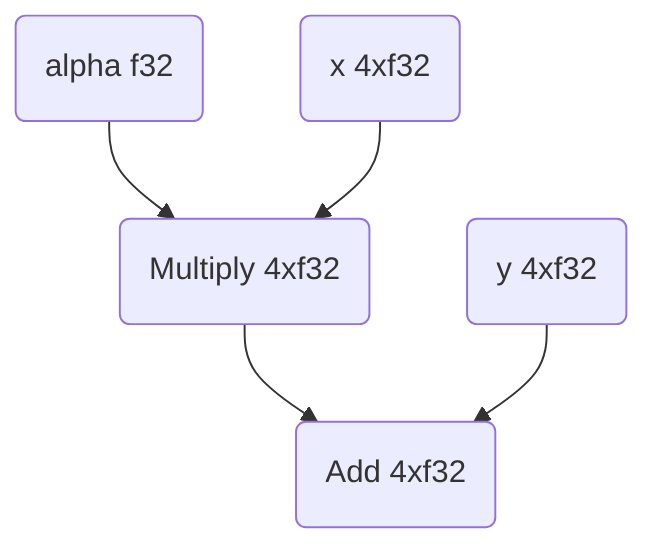
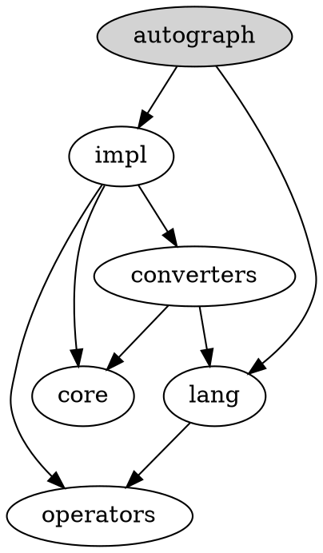

# tensorflow

> An Open Source Machine Learning Framework for Everyone

## Repository Info

- **Stars:** 193,074
- **Forks:** 75,152
- **Language:** C++
- **License:** Apache License 2.0
- **Topics:** deep-learning, deep-neural-networks, distributed, machine-learning, ml, neural-network, python, tensorflow
- **Source:** `https://github.com/tensorflow/tensorflow`
- **Branch:** `master`
- **Commit:** `178979688090`
- **Last Commit:** 2025-12-27 08:35:05 -0800
- **Commits:** 1
- **Extracted:** 2025-12-27T13:11:45.095648


## Directory Structure

```
tensorflow/
├── .github/
│   ├── ISSUE_TEMPLATE/
│   │   ├── config.yml
│   │   ├── tensorflow_issue_template.yaml
│   │   ├── tflite-converter-issue.md
│   │   ├── tflite-in-play-services.md
│   │   ├── tflite-op-request.md
│   │   └── tflite-other.md
│   ├── workflows/
│   │   ├── arm-cd.yml
│   │   ├── arm-ci-extended-cpp.yml
│   │   ├── arm-ci-extended.yml
│   │   ├── arm-ci.yml
│   │   ├── cffconvert.yml
│   │   ├── create_issue.js
│   │   ├── issue-on-pr-rollback.yml
│   │   ├── osv-scanner-scheduled.yml
│   │   ├── pylint-presubmit.yml
│   │   ├── release-branch-cherrypick.yml
│   │   ├── scorecards-analysis.yml
│   │   ├── stale-issues.yml
│   │   ├── update-nightly.yml
│   │   └── update-rbe.yml
│   ├── bot_config.yml
│   └── dependabot.yml
├── ci/
│   ├── devinfra/
│   │   ├── docker/
│   │   │   ├── windows/
│   │   │   └── windows2022/
│   │   └── README.md
│   ├── official/
│   │   ├── containers/
│   │   │   └── ml_build/
│   │   ├── envs/
│   │   │   ├── ci_default
│   │   │   ├── disk_cache
│   │   │   ├── enable_pycpp_build
│   │   │   ├── installer_wheel_tensorflow
│   │   │   ├── installer_wheel_tensorflow_cpu
│   │   │   ├── linux_arm64
│   │   │   ├── linux_arm64_cross_compile
│   │   │   ├── linux_arm64_onednn
│   │   │   ├── linux_x86
│   │   │   ├── linux_x86_cuda
│   │   │   ├── macos_arm64
│   │   │   ├── nightly_upload
│   │   │   ├── no_docker
│   │   │   ├── no_upload
│   │   │   ├── numpy1
│   │   │   ├── public_cache
│   │   │   ├── public_cache_push
│   │   │   ├── py310
│   │   │   ├── py311
│   │   │   ├── py312
│   │   │   ├── py313
│   │   │   ├── py39
│   │   │   ├── rbe
│   │   │   ├── versions_upload
│   │   │   └── windows_x86_2022
│   │   ├── requirements_updater/
│   │   │   ├── numpy1_requirements/
│   │   │   ├── BUILD.bazel
│   │   │   ├── nvidia-requirements.txt
│   │   │   ├── README.md
│   │   │   └── requirements.in
│   │   ├── utilities/
│   │   │   ├── cleanup_docker.sh
│   │   │   ├── cleanup_summary.sh
│   │   │   ├── code_check_changed_files.bats
│   │   │   ├── code_check_full.bats
│   │   │   ├── convert_msys_paths_to_win_paths.py
│   │   │   ├── extract_resultstore_links.py
│   │   │   ├── generate_index_html.sh
│   │   │   ├── rename_and_verify_wheels.sh
│   │   │   ├── repack_libtensorflow.sh
│   │   │   ├── setup.sh
│   │   │   ├── setup_docker.sh
│   │   │   ├── setup_macos.sh
│   │   │   └── windows.sh
│   │   ├── any.sh
│   │   ├── bisect.sh
│   │   ├── code_check_changed_files.sh
│   │   ├── code_check_full.sh
│   │   ├── debug_tfci.sh
│   │   ├── installer_wheel.sh
│   │   ├── libtensorflow.sh
│   │   ├── pycpp.sh
│   │   ├── README.md
│   │   ├── upload.sh
│   │   └── wheel.sh
│   └── README.md
├── tensorflow/
│   ├── c/
│   │   ├── eager/
│   │   │   ├── parallel_device/
│   │   │   ├── abstract_context.h
│   │   │   ├── abstract_function.h
│   │   │   ├── abstract_op_attrs.h
│   │   │   ├── abstract_operation.h
│   │   │   ├── abstract_tensor_handle.cc
│   │   │   ├── abstract_tensor_handle.h
│   │   │   ├── BUILD
│   │   │   ├── c_api.cc
│   │   │   ├── c_api.h
│   │   │   ├── c_api_cluster_test.cc
│   │   │   ├── c_api_debug.cc
│   │   │   ├── c_api_debug_test.cc
│   │   │   ├── c_api_distributed_test.cc
│   │   │   ├── c_api_experimental.cc
│   │   │   ├── c_api_experimental.h
│   │   │   ├── c_api_experimental_reader.cc
│   │   │   ├── c_api_experimental_reader.h
│   │   │   ├── c_api_experimental_reader_test.cc
│   │   │   ├── c_api_experimental_test.cc
│   │   │   ├── c_api_internal.h
│   │   │   ├── c_api_remote_function_test.cc
│   │   │   ├── c_api_remote_test.cc
│   │   │   ├── c_api_remote_test_util.cc
│   │   │   ├── c_api_remote_test_util.h
│   │   │   ├── c_api_test.cc
│   │   │   ├── c_api_test_util.cc
│   │   │   ├── c_api_test_util.h
│   │   │   ├── c_api_unified_experimental.cc
│   │   │   ├── c_api_unified_experimental.h
│   │   │   ├── c_api_unified_experimental_eager.cc
│   │   │   ├── c_api_unified_experimental_graph.cc
│   │   │   ├── c_api_unified_experimental_internal.h
│   │   │   ├── c_api_unified_experimental_test.cc
│   │   │   ├── custom_device_test.cc
│   │   │   ├── custom_device_testutil.cc
│   │   │   ├── custom_device_testutil.h
│   │   │   ├── dlpack.cc
│   │   │   ├── dlpack.h
│   │   │   ├── dlpack_test.cc
│   │   │   ├── gradient_checker.cc
│   │   │   ├── gradient_checker.h
│   │   │   ├── gradient_checker_test.cc
│   │   │   ├── gradients.cc
│   │   │   ├── gradients.h
│   │   │   ├── gradients_internal.h
│   │   │   ├── gradients_test.cc
│   │   │   ├── graph_function.cc
│   │   │   ├── graph_function.h
│   │   │   ├── immediate_execution_context.h
│   │   │   ├── immediate_execution_distributed_manager.h
│   │   │   ├── immediate_execution_operation.h
│   │   │   ├── immediate_execution_tensor_handle.cc
│   │   │   ├── immediate_execution_tensor_handle.h
│   │   │   ├── tape.h
│   │   │   ├── tfe_cancellation_manager_internal.h
│   │   │   ├── tfe_context_internal.h
│   │   │   ├── tfe_executor_internal.h
│   │   │   ├── tfe_monitoring_internal.h
│   │   │   ├── tfe_monitoring_reader_internal.h
│   │   │   ├── tfe_op_attrs_internal.h
│   │   │   ├── tfe_op_internal.h
│   │   │   ├── tfe_tensor_debug_info_internal.h
│   │   │   ├── tfe_tensorhandle_internal.h
│   │   │   ├── tracing_utils.cc
│   │   │   ├── tracing_utils.h
│   │   │   ├── unified_api_test.cc
│   │   │   ├── unified_api_testutil.cc
│   │   │   └── unified_api_testutil.h
│   │   ├── experimental/
│   │   │   ├── filesystem/
│   │   │   ├── gradients/
│   │   │   ├── grappler/
│   │   │   ├── next_pluggable_device/
│   │   │   ├── ops/
│   │   │   ├── pluggable_profiler/
│   │   │   ├── saved_model/
│   │   │   └── stream_executor/
│   │   ├── kernels/
│   │   │   ├── ops/
│   │   │   ├── bitcast_op.cc
│   │   │   ├── bitcast_op_test.cc
│   │   │   ├── BUILD
│   │   │   ├── histogram_summary_op.cc
│   │   │   ├── merge_summary_op.cc
│   │   │   ├── summary_op.cc
│   │   │   ├── summary_op_benchmark_test.cc
│   │   │   ├── summary_op_test.cc
│   │   │   ├── tensor_shape_utils.cc
│   │   │   ├── tensor_shape_utils.h
│   │   │   └── tensor_shape_utils_test.cc
│   │   ├── testdata/
│   │   │   └── tf_record
│   │   ├── BUILD
│   │   ├── c_api.cc
│   │   ├── c_api.h
│   │   ├── c_api_experimental.cc
│   │   ├── c_api_experimental.h
│   │   ├── c_api_experimental_test.cc
│   │   ├── c_api_function.cc
│   │   ├── c_api_function_test.cc
│   │   ├── c_api_internal.h
│   │   ├── c_api_macros.h
│   │   ├── c_api_macros_internal.h
... (truncated)
```

## File Statistics

- **Files Processed:** 500
- **Files Skipped:** 1


## README

<div align="center">
  
</div>

[](https://badge.fury.io/py/tensorflow)
[](https://badge.fury.io/py/tensorflow)
[](https://doi.org/10.5281/zenodo.4724125)
[](https://bestpractices.coreinfrastructure.org/projects/1486)
[](https://securityscorecards.dev/viewer/?uri=github.com/tensorflow/tensorflow)
[](https://bugs.chromium.org/p/oss-fuzz/issues/list?sort=-opened&can=1&q=proj:tensorflow)
[](https://bugs.chromium.org/p/oss-fuzz/issues/list?sort=-opened&can=1&q=proj:tensorflow-py)
[](https://ossrank.com/p/44)
[](CODE_OF_CONDUCT.md)

**`Documentation`** |
------------------- |
[](https://www.tensorflow.org/api_docs/) |

[TensorFlow](https://www.tensorflow.org/) is an end-to-end open source platform
for machine learning. It has a comprehensive, flexible ecosystem of
[tools](https://www.tensorflow.org/resources/tools),
[libraries](https://www.tensorflow.org/resources/libraries-extensions), and
[community](https://www.tensorflow.org/community) resources that lets
researchers push the state-of-the-art in ML and developers easily build and
deploy ML-powered applications.

TensorFlow was originally developed by researchers and engineers working within
the Machine Intelligence team at Google Brain to conduct research in machine
learning and neural networks. However, the framework is versatile enough to be
used in other areas as well.

TensorFlow provides stable [Python](https://www.tensorflow.org/api_docs/python)
and [C++](https://www.tensorflow.org/api_docs/cc) APIs, as well as a
non-guaranteed backward compatible API for
[other languages](https://www.tensorflow.org/api_docs).

Keep up-to-date with release announcements and security updates by subscribing
to
[announce@tensorflow.org](https://groups.google.com/a/tensorflow.org/forum/#!forum/announce).
See all the [mailing lists](https://www.tensorflow.org/community/forums).

## Install

See the [TensorFlow install guide](https://www.tensorflow.org/install) for the
[pip package](https://www.tensorflow.org/install/pip), to
[enable GPU support](https://www.tensorflow.org/install/gpu), use a
[Docker container](https://www.tensorflow.org/install/docker), and
[build from source](https://www.tensorflow.org/install/source).

To install the current release, which includes support for
[CUDA-enabled GPU cards](https://www.tensorflow.org/install/gpu) *(Ubuntu and
Windows)*:

```
$ pip install tensorflow
```

Other devices (DirectX and MacOS-metal) are supported using
[Device Plugins](https://www.tensorflow.org/install/gpu_plugins#available_devices).

A smaller CPU-only package is also available:

```
$ pip install tensorflow-cpu
```

To update TensorFlow to the latest version, add `--upgrade` flag to the above
commands.

*Nightly binaries are available for testing using the
[tf-nightly](https://pypi.python.org/pypi/tf-nightly) and
[tf-nightly-cpu](https://pypi.python.org/pypi/tf-nightly-cpu) packages on PyPI.*

#### *Try your first TensorFlow program*

```shell
$ python
```

```python
>>> import tensorflow as tf
>>> tf.add(1, 2).numpy()
3
>>> hello = tf.constant('Hello, TensorFlow!')
>>> hello.numpy()
b'Hello, TensorFlow!'
```

For more examples, see the
[TensorFlow Tutorials](https://www.tensorflow.org/tutorials/).

## Contribution guidelines

**If you want to contribute to TensorFlow, be sure to review the
[Contribution Guidelines](CONTRIBUTING.md). This project adheres to TensorFlow's
[Code of Conduct](CODE_OF_CONDUCT.md). By participating, you are expected to
uphold this code.**

**We use [GitHub Issues](https://github.com/tensorflow/tensorflow/issues) for
tracking requests and bugs, please see
[TensorFlow Forum](https://discuss.tensorflow.org/) for general questions and
discussion, and please direct specific questions to
[Stack Overflow](https://stackoverflow.com/questions/tagged/tensorflow).**

The TensorFlow project strives to abide by generally accepted best practices in
open-source software development.

## Patching guidelines

Follow these steps to patch a specific version of TensorFlow, for example, to
apply fixes to bugs or security vulnerabilities:

*   Clone the TensorFlow repository and switch to the appropriate branch for
    your desired version—for example, `r2.8` for version 2.8.
*   Apply the desired changes (i.e., cherry-pick them) and resolve any code
    conflicts.
*   Run TensorFlow tests and ensure they pass.
*   [Build](https://www.tensorflow.org/install/source) the TensorFlow pip
    package from source.

## Continuous build status

You can find more community-supported platforms and configurations in the
[TensorFlow SIG Build Community Builds Table](https://github.com/tensorflow/build#community-supported-tensorflow-builds).

### Official Builds

Build Type                    | Status                                                                                                                                                                           | Artifacts
----------------------------- | -------------------------------------------------------------------------------------------------------------------------------------------------------------------------------- | ---------
**Linux CPU**                 | [](https://storage.googleapis.com/tensorflow-kokoro-build-badges/ubuntu-cc.html)           | [PyPI](https://pypi.org/project/tf-nightly/)
**Linux GPU**                 | [](https://storage.googleapis.com/tensorflow-kokoro-build-badges/ubuntu-gpu-py3.html) | [PyPI](https://pypi.org/project/tf-nightly-gpu/)
**Linux XLA**                 | [](https://storage.googleapis.com/tensorflow-kokoro-build-badges/ubuntu-xla.html)         | TBA
**macOS**                     | [](https://storage.googleapis.com/tensorflow-kokoro-build-badges/macos-py2-cc.html)     | [PyPI](https://pypi.org/project/tf-nightly/)
**Windows CPU**               | [](https://storage.googleapis.com/tensorflow-kokoro-build-badges/windows-cpu.html)       | [PyPI](https://pypi.org/project/tf-nightly/)
**Windows GPU**               | [](https://storage.googleapis.com/tensorflow-kokoro-build-badges/windows-gpu.html)       | [PyPI](https://pypi.org/project/tf-nightly-gpu/)
**Android**                   | [](https://storage.googleapis.com/tensorflow-kokoro-build-badges/android.html)               | [Download](https://bintray.com/google/tensorflow/tensorflow/_latestVersion)
**Raspberry Pi 0 and 1**      | [](https://storage.googleapis.com/tensorflow-kokoro-build-badges/rpi01-py3.html)           | [Py3](https://storage.googleapis.com/tensorflow-nightly/tensorflow-1.10.0-cp34-none-linux_armv6l.whl)
**Raspberry Pi 2 and 3**      | [](https://storage.googleapis.com/tensorflow-kokoro-build-badges/rpi23-py3.html)           | [Py3](https://storage.googleapis.com/tensorflow-nightly/tensorflow-1.10.0-cp34-none-linux_armv7l.whl)
**Libtensorflow MacOS CPU**   | Status Temporarily Unavailable                                                                                                                                                   | [Nightly Binary](https://storage.googleapis.com/libtensorflow-nightly/prod/tensorflow/release/macos/latest/macos_cpu_libtensorflow_binaries.tar.gz) [Official GCS](https://storage.googleapis.com/tensorflow/)
**Libtensorflow Linux CPU**   | Status Temporarily Unavailable                                                                                                                                                   | [Nightly Binary](https://storage.googleapis.com/libtensorflow-nightly/prod/tensorflow/release/ubuntu_16/latest/cpu/ubuntu_cpu_libtensorflow_binaries.tar.gz) [Official GCS](https://storage.googleapis.com/tensorflow/)
**Libtensorflow Linux GPU**   | Status Temporarily Unavailable                                                                                                                                                   | [Nightly Binary](https://storage.googleapis.com/libtensorflow-nightly/prod/tensorflow/release/ubuntu_16/latest/gpu/ubuntu_gpu_libtensorflow_binaries.tar.gz) [Official GCS](https://storage.googleapis.com/tensorflow/)
**Libtensorflow Windows CPU** | Status Temporarily Unavailable                                                                                                                                                   | [Nightly Binary](https://storage.googleapis.com/libtensorflow-nightly/prod/tensorflow/release/windows/latest/cpu/windows_cpu_libtensorflow_binaries.tar.gz) [Official GCS](https://storage.googleapis.com/tensorflow/)
**Libtensorflow Windows GPU** | Status Temporarily Unavailable                                                                                                                                                   | [Nightly Binary](https://storage.googleapis.com/libtensorflow-nightly/prod/tensorflow/release/windows/latest/gpu/windows_gpu_libtensorflow_binaries.tar.gz) [Official GCS](https://storage.googleapis.com/tensorflow/)

## Resources

*   [TensorFlow.org](https://www.tensorflow.org)
*   [TensorFlow Tutorials](https://www.tensorflow.org/tutorials/)
*   [TensorFlow Official Models](https://github.com/tensorflow/models/tree/master/official)
*   [TensorFlow Examples](https://github.com/tensorflow/examples)
*   [TensorFlow Codelabs](https://codelabs.developers.google.com/?cat=TensorFlow)
*   [TensorFlow Blog](https://blog.tensorflow.org)
*   [Learn ML with TensorFlow](https://www.tensorflow.org/resources/learn-ml)
*   [TensorFlow Twitter](https://twitter.com/tensorflow)
*   [TensorFlow YouTube](https://www.youtube.com/channel/UC0rqucBdTuFTjJiefW5t-IQ)
*   [TensorFlow model optimization roadmap](https://www.tensorflow.org/model_optimization/guide/roadmap)
*   [TensorFlow White Papers](https://www.tensorflow.org/about/bib)
*   [TensorBoard Visualization Toolkit](https://github.com/tensorflow/tensorboard)
*   [TensorFlow Code Search](https://cs.opensource.google/tensorflow/tensorflow)

Learn more about the
[TensorFlow Community](https://www.tensorflow.org/community) and how to
[Contribute](https://www.tensorflow.org/community/contribute).

## Courses

* [Coursera](https://www.coursera.org/search?query=TensorFlow)
* [Udacity](https://www.udacity.com/courses/all?search=TensorFlow)
* [Edx](https://www.edx.org/search?q=TensorFlow)

## License

[Apache License 2.0](LICENSE)


## Source Files

### `ci/README.md`

```markdown
# TensorFlow continuous integration

> **Warning** This folder is still under construction. It is part of an ongoing
> effort to improve the structure of CI and build related files within the
> TensorFlow repo. This warning will be removed when the contents of this
> directory are stable and appropriate documentation around its usage is in
> place.

Maintainer: TensorFlow DevInfra

********************************************************************************

The CI folder contains the configuration files and scripts used to build, test,
and deploy TensorFlow. This folder is typically used by continuous integration
(CI) tools to build and test TensorFlow whenever there is a change to the
code. This folder is broken into subfolders that represent the level of support
and ownership of the files contained within.
```

### `ci/devinfra/README.md`

```markdown
# DevInfra CI Directory

> **Warning** This folder is still under construction. It is part of an ongoing
> effort to improve the structure of CI and build related files within the
> TensorFlow repo. This warning will be removed when the contents of this
> directory are stable and appropriate documentation around its usage is in
> place.

Maintainer: TensorFlow DevInfra

Issue Reporting: File an issue against this repo and tag
[@devinfra](https://github.com/orgs/tensorflow/teams/devinfra)

********************************************************************************

A directory for build and CI related scripts and jobs managed by the TensorFlow
DevInfra team but not part of the official build, test, or release process.
```

### `ci/official/README.md`

```markdown
# Official CI Directory

Maintainer: TensorFlow and TensorFlow DevInfra

Issue Reporting: File an issue against this repo and tag
[@devinfra](https://github.com/orgs/tensorflow/teams/devinfra)

********************************************************************************

## TensorFlow's Official CI and Build/Test Scripts

TensorFlow's official CI jobs run the scripts in this folder. Our internal CI
system, Kokoro, schedules our CI jobs by combining a build script with a file
from the `envs` directory that is filled with configuration options:

-   Nightly jobs (Run nightly on the `nightly` branch)
    -   Uses `wheel.sh`, `libtensorflow.sh`, `code_check_full.sh`
-   Continuous jobs (Run on every GitHub commit)
    -   Uses `pycpp.sh`
-   Presubmit jobs (Run on every GitHub PR)
    -   Uses `pycpp.sh`, `code_check_changed_files.sh`

These "env" files match up with an environment matrix that roughly covers:

-   Different Python versions
-   Linux, MacOS, and Windows machines (these pool definitions are internal)
-   x86 and arm64
-   CPU-only, or with NVIDIA CUDA support (Linux only), or with TPUs

## How to Test Your Changes to TensorFlow

You may check how your changes will affect TensorFlow by:

1. Creating a PR and observing the presubmit test results
2. Running the CI scripts locally, as explained below
3. **Google employees only**: Google employees can use an internal-only tool
called "MLCI" that makes testing more convenient: it can execute any full CI job
against a pending change. Search for "MLCI" internally to find it.

You may invoke a CI script of your choice by following these instructions:

```bash
cd tensorflow-git-dir

# Here is a single-line example of running a script on Linux to build the
# GPU version of TensorFlow for Python 3.12, using the public TF bazel cache and
# a local build cache:
TFCI=py312,linux_x86_cuda,public_cache,disk_cache ci/official/wheel.sh

# First, set your TFCI variable to choose the environment settings.
#   TFCI is a comma-separated list of filenames from the envs directory, which
#   are all settings for the scripts. TF's CI jobs are all made of a combination
#   of these env files.
#
#   If you've clicked on a test result from our CI (via a dashboard or GitHub link),
#   click to "Invocation Details" and find BUILD_CONFIG, which will contain a TFCI
#   value in the "env_vars" list that you can choose to copy that environment.
#      Ex. 1: TFCI=py311,linux_x86_cuda,nightly_upload  (nightly job)
#      Ex. 2: TFCI=py39,linux_x86,rbe                   (continuous job)
#   Non-Googlers should replace "nightly_upload" or "rbe" with
#   "public_cache,disk_cache".
#   Googlers should replace "nightly_upload" with "public_cache,disk_cache" or
#   "rbe", if you have set up your system to use RBE (see further below).
#
# Here is how to choose your TFCI value:
# 1. A Python version must come first, because other scripts reference it.
#      Ex. py39  -- Python 3.9
#      Ex. py310 -- Python 3.10
#      Ex. py311 -- Python 3.11
#      Ex. py312 -- Python 3.12
# 2. Choose the platform, which corresponds to the version of TensorFlow to
#    build. This should also match the system you're using--you cannot build
#    the TF MacOS package from Linux.
#      Ex. linux_x86        -- x86_64 Linux platform
#      Ex. linux_x86_cuda   -- x86_64 Linux platform, with Nvidia CUDA support
#      Ex. macos_arm64      -- arm64 MacOS platform
# 3. Add modifiers. Some modifiers for local execution are:
#      Ex. disk_cache -- Use a local cache
#      Ex. public_cache -- Use TF's public cache (read-only)
#      Ex. public_cache_push -- Use TF's public cache (read and write, Googlers only)
#      Ex. rbe        -- Use RBE for faster builds (Googlers only; see below)
#      Ex. no_docker  -- Disable docker on enabled platforms
#    See full examples below for more details on these. Some other modifiers are:
#      Ex. versions_upload -- for TF official release versions
#      Ex. nightly_upload -- for TF nightly official builds; changes version numbers
#      Ex. no_upload      -- Disable all uploads, usually for temporary CI issues

# Recommended: use a local+remote cache.
#
#   Bazel will cache your builds in tensorflow/build_output/cache,
#   and will also try using public build cache results to speed up
#   your builds. This usually saves a lot of time, especially when
#   re-running tests. However, note that:
#
#    - New environments like new CUDA versions, changes to manylinux,
#      compilers, etc. can cause undefined behavior such as build failures
#      or tests passing incorrectly.
#    - Automatic LLVM updates are known to extend build time even with
#      the cache; this is unavoidable.
export TFCI=py311,linux_x86,public_cache,disk_cache

# Recommended: Configure Docker. (Linux only)
#
#   TF uses hub.docker.com/r/tensorflow/build containers for CI,
#   and scripts on Linux create a persistent container called "tf"
#   which mounts your TensorFlow directory into the container.
#
#   Important: because the container is persistent, you cannot change TFCI
#   variables in between script executions. To forcibly remove the
#   container and start fresh, run "docker rm -f tf". Removing the container
#   destroys some temporary bazel data and causes longer builds.
#
#   You will need the NVIDIA Container Toolkit for GPU testing:
#   https://github.com/NVIDIA/nvidia-container-toolkit
#
#   Note: if you interrupt a bazel command on docker (ctrl-c), you
#   will need to run `docker exec tf pkill bazel` to quit bazel.
#
#   Note: new files created from the container are owned by "root".
#   You can run e.g. `docker exec tf chown -R $(id -u):$(id -g) build_output`
#   to transfer ownership to your user.
#
# Docker is enabled by default on Linux. You may disable it if you prefer:
# export TFCI=py311,linux_x86,no_docker

# Advanced: Use Remote Build Execution (RBE) (internal developers only)
#
#   RBE dramatically speeds up builds and testing. It also gives you a
#   public URL to share your build results with collaborators. However,
#   it is only available to a limited set of internal TensorFlow developers.
#
#   RBE is incompatible with local caching, so you must remove
#   disk_cache, public_cache, and public_cache_push from your $TFCI file.
#
# To use RBE, you must first run `gcloud auth application-default login`, then:
export TFCI=py311,linux_x86,rbe

# Finally: Run your script of choice.
#   If you've clicked on a test result from our CI (via a dashboard or GitHub link),
#   click to "Invocation Details" and find BUILD_CONFIG, which will contain a
#   "build_file" item that indicates the script used.
ci/official/wheel.sh

# Advanced: Select specific build/test targets with "any.sh".
# TF_ANY_TARGETS=":your/target" TF_ANY_MODE="test" ci/official/any.sh

# Afterwards: Examine the results, which will include: The bazel cache,
# generated artifacts like .whl files, and "script.log", from the script.
# Note that files created under Docker will be owned by "root".
ls build_output
```

## Contribution & Maintenance

The TensorFlow team does not yet have guidelines in place for contributing to
this directory. We are working on it. Please join a TF SIG Build meeting (see:
bit.ly/tf-sig-build-notes) if you'd like to discuss the future of contributions.

### Brief System Overview

The top-level scripts and utility scripts should be fairly well-documented. Here
is a brief explanation of how they tie together:

1.  `envs/*` are lists of variables made with bash syntax. A user must set a
    `TFCI` env param pointing to a list of `env` files.
2.  `utilities/setup.sh`, initialized by all top-level scripts, reads and sets
    values from those `TFCI` paths.
    -   `set -a` / `set -o allexport` exports the variables from `env` files so
        all scripts can use them.
    -   `utilities/setup_docker.sh` creates a container called `tf` with all
        `TFCI_` variables shared to it.
3.  Top-level scripts (`wheel.sh`, etc.) reference `env` variables and call
    `utilities/` scripts.
    -   The `tfrun` function makes a command run correctly in Docker if Docker
        is enabled.
```

### `ci/official/containers/ml_build/README.md`

```markdown
WIP ML Build Docker container for ML repositories (Tensorflow, JAX and XLA).

This container branches off from
/tensorflow/tools/tf_sig_build_dockerfiles/. However, since
hermetic CUDA and hermetic Python is now available for Tensorflow, a lot of the
requirements installed on the original container can be removed to reduce the
footprint of the container and make it more reusable across different ML
repositories.
```

### `ci/official/requirements_updater/README.md`

```markdown
## Managing hermetic Python

To make sure that TensorFlow's build is reproducible, behaves uniformly across
supported platforms (Linux, Windows, MacOS) and is properly isolated from
specifics of a local system, we rely on hermetic Python (see
[rules_python](https://github.com/bazelbuild/rules_python)) for all build
and test commands executed via Bazel. This means that your system Python
installation will be ignored during the build and Python interpreter itself
as well as all the Python dependencies will be managed by bazel directly.

### Specifying Python version

The hermetic Python version is controlled by `HERMETIC_PYTHON_VERSION`
environment variable, which could be setin one of the following ways:

```
# Either add an entry to your `.bazelrc` file
build --repo_env=HERMETIC_PYTHON_VERSION=3.12

# OR pass it directly to your specific build command
bazel build <target> --repo_env=HERMETIC_PYTHON_VERSION=3.12

# OR set the environment variable globally in your shell:
export HERMETIC_PYTHON_VERSION=3.12
```

You may run builds and tests against different versions of Python sequentially
on the same machine by simply switching the value of `HERMETIC_PYTHON_VERSION`
between the runs. All the python-agnostic parts of the build cache from the
previous build will be preserved and reused for the subsequent builds.

### Specifying Python dependencies

During bazel build all TensorFlow's Python dependencies are pinned to their
specific versions. This is necessary to ensure reproducibility of the build.
The pinned versions of the full transitive closure of TensorFlow's dependencies
together with their corresponding hashes are specified in
`requirements_lock_<python version>.txt` files (e.g.
`requirements_lock_3_12.txt` for `Python 3.12`).

To update the lock files, make sure
`ci/official/requirements_updater/requirements.in` contains the desired direct
dependencies list and then execute the following command (which will call
[pip-compile](https://pypi.org/project/pip-tools/) under the hood):

```
bazel run //ci/official/requirements_updater:requirements.update --repo_env=HERMETIC_PYTHON_VERSION=3.12
```

where `3.12` is the `Python` version you wish to update.

Note, since it is still `pip` and `pip-compile` tools used under the hood, so
most of the command line arguments and features supported by those tools will be
acknowledged by the Bazel requirements updater command as well. For example, if
you wish the updater to consider pre-release versions simply pass `--pre`
argument to the bazel command:

```
bazel run //ci/official/requirements_updater:requirements.update --repo_env=HERMETIC_PYTHON_VERSION=3.12 -- --pre
```

If you need to upgrade all of the packages in requirements lock file, just pass
the `--upgrade` parameter:

```
bazel run //ci/official/requirements_updater:requirements.update --repo_env=HERMETIC_PYTHON_VERSION=3.12 -- --upgrade
```

For the full set of supported parameters please check
[pip-compile](https://pip-tools.readthedocs.io/en/latest/cli/pip-compile/)
documentation
```

### `tensorflow/c/README.md`

```markdown
# TensorFlow C API

- See [www.tensorflow.org/install/lang_c](https://www.tensorflow.org/install/lang_c)
- Nightly builds:
  - [Linux CPU-only](https://storage.googleapis.com/tensorflow-nightly/github/tensorflow/lib_package/libtensorflow-cpu-linux-x86_64.tar.gz)
  - [Linux GPU](https://storage.googleapis.com/tensorflow-nightly/github/tensorflow/lib_package/libtensorflow-gpu-linux-x86_64.tar.gz)
  - [MacOS CPU-only](https://storage.googleapis.com/tensorflow-nightly/github/tensorflow/lib_package/libtensorflow-cpu-darwin-x86_64.tar.gz)
```

### `tensorflow/c/experimental/ops/README.md`

```markdown
# Experimental C++ Ops

The C++ files in this directory (***\*_ops.h*** and ***\*_ops.cc***) are
autogenerated from the registered Op and API definitions.

To regenerate them, run the script in this directory, `update_cpp_ops.sh`, with
no arguments. This script will overwrite the existing ops in-place at
***tensorflow/c/experimental/ops/\*_ops.{cc,h}***.

Run this `update_cpp_ops.sh` script when Op definitions change in the registry.

To generate additional operators, extend the lists in this script. Note that
category names correspond to generated source file names, and should be
consistent with the original source files registering each operator. For example
since `REGISTER_OP("MatMul")` appears in ***core/math_ops.cc***, the "MatMul"
operator in the script should be in the "math" category, and it will be
generated in the output file `c/experimental/ops/math_ops.cc`.

Running this script should be a no-op, generating identical code other than
formatting (i.e., line wrapping).
```

### `tensorflow/c/experimental/ops/gen/README.md`

```markdown
# TensorFlow Op CodeGen Machinery (Experimental)

## Usage

```
usage: generate_cpp  [flags]  OpName1 [OpName2 ...]
Flags:
    --help=false                        bool    Print this help message.
    --category=""                       string  Category for generated ops (e.g. 'math', 'array').
    --namespace=""                      string  Compact C++ namespace, default is 'tensorflow::ops'.
    --output_dir=""                     string  Directory into which output files will be generated.
    --source_dir=""                     string  The tensorflow root directory, e.g. 'tensorflow/' for in-source include paths. Any path underneath the tensorflow root is also accepted.
    --api_dirs=""                       string  Comma-separated list of directories containing API definitions.
```

## Design

### Generator Framework

The generator framework is a loose Model/View/Controller arrangement:

The *Model* classes live in the ***model/*** directory. They are representations
of the `OpDef` and `ApiDef` protos, normalized and resolved.

> _For example, an `OpDef` proto's `ArgDef` members contain a type string, which
> must be dereferenced to an `AttrDef` by name to determine its type. This
> `AttrDef` proto message in turn contains a type string which may need to be
> parsed as "list(type)". Other `AttrDef` messages are not types, but instead
> argument-like modifiers. In contrast, the generator model `ArgSpec` contains a
> resolved `ArgType` which provides a boolean `is_list()` method directly, and
> the model `OpSpec` provides a list of only the argument-like attributes. In
> addition to convenience, this should aid consistency between generated code in
> each target language._

The *Controller* is in the ***common/*** directory. It is the workhorse used by
the language generators; it digests the Op registry and API definitions to build
the model and provides utilities for the language generators.

The *View* and rendering classes map the language-independent Model classes
(`OpSpec`, `ArgSpec`, `AttrSpec`, etc.) to language-specific `SourceCode`. The
framework does not impose any design on the language-specific generators, but
provides some utilities, and the C++ generator is a complete example.

### C++ Generator

The `CppGenerator` class is the interface to the `cpp/` language directory.
Given a config, it can generate source code for a .cc or .h file as a string or
write it to a target file.

The `CppFileRenderer` is the main renderer used by the generator; it renders an
entire file. The `CppConfig` defines if it is operating in header or source
mode.

"Views" are stateless and intended to be low-level building blocks: a direct
language-specific representation of the model classes. For example, an `ArgView`
is initialized from an `ArgSpec` (which was created initially from an `ArgDef`
proto message). Where they may have some similar methods between the model and
view, the view methods are language-specific.

For instance, the C++ generator's `ArgView::VariableName()` method is an
language-formatted name usable as a variable representing the model `ArgSpec`
object. In contrast, the `ArgSpec::name()` method in the model refers to the
canonical name of the object in the proto.

Where views are a representation of the *input* model, in the C++ generator,
"renderers" then use these views to build the *output* `SourceCode`; Renderers
understand the language at the statement/directive level and target a functional
section of the output, such as a block comment or an entire method or file.

Other differences between views and renderers:

*   Renderers are stateful, modifying a referenced SourceCode. Views are
    stateless and their public methods are all const, returning strings.
*   Renderers are context-dependent, e.g. a method signature will include
    default values when in "declaration" mode but not "definition" mode. A view
    of some argument object simply knows its default value and does not care the
    context.
*   In terms of dependencies, `Renderers` use `Views` and other `Renderers`.
    However, `Renderers` do **not** reference the model directly (e.g.
    `OpSpec`). This is because if a renderer needs to reference part of the
    model, it should get a language specific representation.

### Extending to Additional Languages

The design for the C++ generator should apply to other languages, and the
underlying generator framework (the model and controller) try to be agnostic. In
fact, some elements of the C++ design could be formalized (such as the
rendering/view framework) or re-used (e.g. `cpp:Renderer` could likely be shared
with C and Java as a common C-style language renderer base class).

Abstracted and condensed from the C++ generator, the overall control flow could
be described as follows:

From main() in *generate_lang_main.cc*:

*   Call `tensorflow::port::InitMain` and parse any flags
*   Initialize config objects (e.g. `PathConfig`, `LangConfig` from flags)
*   Initialize a new `LangGenerator` from these config objects
*   Call this generator to create/write `SourceCode` to a file

In class `LangGenerator` in *lang_generator.cc*:

*   Initialize a new `Controller` from the config objects
*   Call this controller to build the Op models (`OpSpec`)
*   Initialize a new language-specific `View` for each model object
*   Create a blank `SourceCode` rendering target (for each output file)
*   Initialize a new `LangFileRenderer` from this target source code, the model
    `View` objects, and config objects
*   Call this renderer to generate the target `SourceCode`

The dependencies are as follows:

*   `lang::Generator` depends on `Controller`, `Model`, `lang::Renderers`,
    `lang::Views`
*   `lang::Renderer` depends on `lang::View` (and `lang::Renderer` peers)
*   `lang::View` depends on the model (e.g. `OpSpec`) (and `lang::View` peers)
```

### `tensorflow/c/experimental/saved_model/README.md`

```markdown
# Tensorflow C SavedModel API

## Overview

These are the new experimental C SavedModel APIs for loading and running
SavedModels in a TF2-idiomatic fashion. See
[RFC 207](https://github.com/tensorflow/community/pull/207) for additional
context.

The directory structure is as follows:

```none
saved_model/

  public/

  internal/

  core/

```

## saved_model/public

`saved_model/public` is intended to house *only the public headers* of the
SavedModel C API.

These headers:

1. declare opaque C types (like `TF_SavedModel`),

2. declare the functions that operate on these types (like `TF_LoadSavedModel`).

Once they leave experimental, these APIs should be considered stable for use
by external clients.

These headers are in a separate directory to make it obvious to clients which
headers they should depend on, and which headers are implementation details.
Separating these public headers by directory also allow future programmatic
checks to ensure that TF public headers only `#include` other public TF headers.

## saved_model/internal

`saved_model/internal` is the "glue" between the C API and the internal C++
implementation.

Its role is to:

1. implement the C API functions declared in `saved_model/public`

2. define the C API types declared in `saved_model/public`

The files fulfilling 1. are named `*.cc` (eg: `concrete_function.cc`), while
the files fulfilling 2. are `*type.h` (eg: `concrete_function_type.h`).

The headers exposing the internal implementation of the opaque C types are only
visible to other implementors of the C API. This is similar to how other
TF C API implementations use `tf_status_internal.h` (to extract the underlying
`tensorflow::Status`). All other targets in this directory are private.

## saved_model/core

`saved_model/core` contains pure C++ "Classes" underlying the C API types
in `saved_model/public/`. These are implementation
details subject to change, and have limited visibility to implementors only.
This is the bottom-most layer of the `C++ -> C -> C++` sandwich.
```

### `tensorflow/c/experimental/saved_model/public/README.md`

```markdown
# TensorFlow Saved Model C API

## Small ConcreteFunction Example

The following example loads a saved model from `"/path/to/model"` and
executes a function `f` taking no arguments and returning one single
value (error checking is omitted for simplicity):

```c
TF_Status* status = TF_NewStatus();
TFE_ContextOptions* ctx_options = TFE_NewContextOptions();
TFE_Context* ctx = TFE_NewContext(ctx_options, status);

TF_SavedModel* saved_model = TF_LoadSavedModel("/path/to/model", ctx, status);
TF_ConcreteFunction* f = TF_GetSavedModelConcreteFunction(saved_model, "f", status);
TFE_Op* op = TF_ConcreteFunctionMakeCallOp(f, NULL, 0, status);

TFE_TensorHandle* output;
int nouts = 1;
TFE_Execute(op, &output, &nouts, status);

TFE_DeleteTensorHandle(output);
TFE_DeleteOp(op);
TFE_DeleteSavedModel(saved_model);
TFE_DeleteContext(ctx);
TFE_DeleteContextOptions(ctx_options);
TF_DeleteStatus(status);
```
```

### `tensorflow/cc/gradients/README.md`

```markdown
# C++ gradients

Gradients are currently being ported from
[python](https://github.com/tensorflow/tensorflow/tree/master/tensorflow/python/ops)
to C++ (in this directory).

Contributions are welcome and much appreciated; please follow the instructions
below.

1.  Create the op gradient function in `foo_grad.cc` corresponding to the
    `foo_grad.py` file where the op originated (i.e. `array_grad.py` op
    gradients should be written in `array_grad.cc`).

2.  Write the op gradient with the following naming scheme:

    ```
    Status OpNameGrad(const Scope& scope, const Operation& op,
                      const std::vector<Output>& grad_inputs,
                      std::vector<Output>* grad_outputs) {
      ...
      return scope.status();
    }
    REGISTER_GRADIENT_OP("OpName", OpNameGrad);
    ```

3.  Ops gradients are implemented by using the
    [C++ API](https://www.tensorflow.org/api_docs/cc/).

4.  Tests should be included in `foo_grad_test.cc`. Please see
    [`array_grad_test.cc`](https://github.com/tensorflow/tensorflow/blob/master/tensorflow/cc/gradients/array_grad_test.cc)
    for many examples. Tests are as simple as, creating a placeholder input for
    the op's inputs and calling `RunTest` (`RunTest` uses a
    [gradient checker](https://github.com/tensorflow/tensorflow/blob/master/tensorflow/cc/framework/gradient_checker.cc)
    to verify that the theoretical gradient matches the numeric gradient). For
    example:

    ```
    TEST_F(ArrayGradTest, IdentityGrad) {
      TensorShape shape({5, 2});
      auto x = Placeholder(scope_, DT_FLOAT, Placeholder::Shape(shape));
      auto y = Identity(scope_, x);
      RunTest(x, shape, y, shape);
    }
    ```

NOTE: There are some ops that require features from the C++ API that are not yet
implemented.

*   Ops that require PartialTensorShape information cannot yet be implemented.

*   Ops that require SparseTensor or IndexSlices (currently only in python)
    cannot yet be implemented.

*   Maybe more.

For questions: Please create an issue assigned to suharshs.
```

### `tensorflow/cc/saved_model/README.md`

```markdown
<!--#include file="../../python/saved_model/README.md"-->
```

### `tensorflow/cc/saved_model/image_format/README.md`

```markdown
# SavedModel Image Format

Everything related to the SavedModel Image format belongs in this directory.
If you are a TensorFlow Python user, you can try this format by setting the
`experimental_image_format` option:

```
tf.savedmodel.save(
    model, path,
    options=tf.saved_model.SaveOptions(experimental_image_format=True)
)
```

When this option is enabled, exported SavedModels with proto size > 2GB will
automatically save with the new format (`.cpb` instead of `.pb`).

<!-- **Compatibility** -->

The official TF APIs (TF1/TF2 python or C++ loading) have already been
integrated to handle the new format, but some downstream converters may not
have been updated.
```

### `tensorflow/compiler/mlir/README.md`

```markdown
# MLIR dialects and utilities for TensorFlow, TensorFlow Lite and XLA.

This module contains the MLIR
([Multi-Level Intermediate Representation](https://mlir.llvm.org))
dialects and utilities for

1. TensorFlow
2. XLA
3. TF Lite

See [MLIR's website](https://mlir.llvm.org) for complete documentation.

## Getting started

Building dialects and utilities here follow the standard approach using
`bazel` as the rest of TensorFlow.

### Using local LLVM repo

To develop across MLIR core and TensorFlow, it is useful to override the repo to
use a local version instead of fetching from head. This can be achieved by
setting up your local repository for Bazel build. For this you will need to
create bazel workspace and build files:

```sh
LLVM_SRC=... # this the path to the LLVM local source directory you intend to use.
touch ${LLVM_SRC}/BUILD.bazel ${LLVM_SRC}/WORKSPACE
```

You can then use this overlay to build TensorFlow:

```
bazel build --override_repository="llvm-raw=${LLVM_SRC}" \
  -c opt tensorflow/compiler/mlir:tf-opt
```
```

### `tensorflow/compiler/mlir/g3doc/README.md`

```markdown
# TensorFlow MLIR

These are the docs for: https://www.tensorflow.org/mlir
```

### `tensorflow/compiler/mlir/lite/README.md`

```markdown
# The new MLIR based TensorFlow to TensorFlow Lite converter

This directory contains:

1.  [MLIR](https://github.com/llvm/llvm-project/tree/main/mlir) dialects,
    transformation passes and utilities for TensorFlow Lite.

## API:

The API for converting TensorFlow models to TensorFlow Lite will be through
`tf.lite.TFLiteConverter`. All the conversion code is open sourced, and
the API will be integrated soon.

### The conversion process from TensorFlow to TensorFlow Lite includes the
following major passes:

- Import from GraphDef, in .pb or .pbtxt  format, into MLIR.
- Raise to Control-flow-graph. Converts TF Control Flow dialect to TF dialect.
- The Canonicalization pass iteratively applies canonicalization
transformations in a greedy way until no further changes occur.
Canonicalization includes constant folding.
- The Legalize pass converts TensorFlow operations to TensorFlow Lite
ones. The operations that cannot be mapped to TensorFlow Lite dialect
are left as TensorFlow operations. Unsupported op handling follows the
proposed TFLite mechanism.
- Optimizations are performed in both the TF & TFLite dialect; aiming for small
size and high performance (among the core value proposition of
TensorFlow Lite models).
- The Export pass writes out TensorFlow Lite FlatBuffer format. This pass
operates on MLIR TensorFlow Lite dialect and is simple/direct translation.

See
https://github.com/tensorflow/tensorflow/blob/master/tensorflow/compiler/mlir/lite/tf_tfl_passes.cc
for the full list of MLIR passes for conversion from TensorFlow to TensorFlow
Lite.
```

### `tensorflow/compiler/mlir/lite/experimental/tac/README.md`

```markdown
# Target Aware Conversion (TAC)

Different hardwares have different capabilities and restrictions.

TAC is designed to leverage hardwares' capabilities to:

*   Perform device-specific optimizations (such as unsupported ops lowering,
    layout transformations, etc.)
*   Graph partitioning based on the hardware costs modeling.
*   It supports general import/export where you can hook your own
    importer/exporter from any format to MLIR and export MLIR to anything.

For more details, please checkout the
[TAC workflow](https://github.com/tensorflow/tensorflow/tree/master/tensorflow/compiler/mlir/lite/experimental/tac/README.md#tac-workflow)
section

## How to use

Once you have a converted TfLite model ready, you can use the following command
to use TAC to optimize for your model:

```
bazel run -c opt //tensorflow/compiler/mlir/lite/experimental/tac:tac-translate -- <PATH_TO_YOUR_MODEL> -o=<OUTPUT_PATH> -device-specs=<HARDWARE_BACKENDS>
```

The devices_specs is a list of the names of the desired hardware backends,
separated by comma, e.g., "GPU,CPU".

If you're interested in what are the subgraphs being explored for different
backends, you can pass in `-output-mlir -inline-subgraphs=false` and check out
the output mlir file.

## How to add a hardware backend

If you want to add a hardware backend for TAC, you can start with the
`SimpleHardware` interface.

For example:

```
class FooHardware : public SimpleHardware {
 public:
  static constexpr char kId[] = "FOO";

  mlir::RewritePatternSet GetTransformations(
      MLIRContext* context) const override {
    mlir::RewritePatternSet patterns;
    // Pick the transformations that we want to perform,
    // We can add other transformations we like here.
    patterns.add<LowerPackIntoConcatReshape, UnrollSplit, UnrollSplitV,
                  PadSlice>(context);
    return patterns;
  }

  mlir::TypeID GetTypeId() const override {
    return mlir::TypeID::get<FooHardware>();
  }

  // We can specify what ops are not supported here.
  bool IsNotSupportedOp(mlir::Operation* op) const override { return false; }

  // This is basically saying how fast are we comparing to CPU.
  // The larger the value the better.
  float AdvantageOverCPU() const override { return 5.0; }
};
```

Then we need to register our hardware like below:

```
std::unique_ptr<TargetHardware> CreateFooHardware() {
  return std::make_unique<FooHardware>();
}

TargetHardwareRegistration<FooHardware> foo_hardware(
    "Target device for FOO", CreateFooHardware);
```

### Advanced user

For advanced users (e.g., you may already have your own hardware dialect
defined), please just use `TargetHardware` directly. See the following code
snippet for reference.

```
class MyCustomHardware : public TargetHardware {
 public:
  static constexpr char kId[] = "MY_CUSTOM_HARDWARE";

  mlir::TypeID GetTypeId() const override {
    return mlir::TypeID::get<MyCustomHardware>();
  }
  
  bool IsOpSupported(mlir::Operation* op) const override {
    // check whether the op is supported, if the user has they own dialect,
    // this can be target dialect legalization process.
  }
  
 double GetHardwareSwitchingCost(const TargetHardware* from,
                                 size_t buffer_size) const override {
    // Get the hardware switching cost from the source hardware.
 }

  double GetOpCost(mlir::Operation* op) const override {
    // call customized cost model.
  }
  
  mlir::RewritePatternSet GetTransformations(
      MLIRContext* context) const override {
    // customized transformations patterns: ops lowering/fusion, layout
    // transformation, etc.
  }
};
```

## TAC workflow

The workflow of target-aware-conversion is as followed:

1 Try to break down the whole graph into several subgraphs based on hardwares'
capabilities. See the diagram below, let's say our desired target backends are
"GPU" and "CPU", and currently "C" is not supported on "GPU", but the rest are
supported by "GPU". So we will end up with 3 subgraphs as shown in the diagram.


2  Perform ops-lowering & target-specific optimizations for
    different hardware backends. As shown in the below diagram, the red & the
    yellow subgraph will be duplicated as "alternative subgraph view" for "CPU".
    "C" op can be lowered into "G" + "H" op which can be supported by "GPU".
    


3  Estimate the costs for each subgraph (and their alternative views)
    based on the hardware cost model. See the following diagram.
    


4 Pick the proper subgraphs from the alternative views for execution based on
costs(computation costs, transfer costs, quant/dequant costs). As shown in the
diagram below, since cross-device data transferring cost is high, even "G" + "H"
running on GPU maybe less efficient than "C" running on "CPU", we will still
pick "G" + "H" subgraph.


The final graph looks like below:


## TAC components

### Hardwares

Hardwares are used to modeling target device capabilities & also ops cost for
the target devices.

We have already modeled `cpu_hardware` & `gpu_hardware` as well as the
`nnapi_hardware`.

### Passes

#### Target Annotation Pass
In this pass, every op will be targeted with the user specified targets based on
the device capabilites. For example, If the user specified the desired targets
are "GPU", "CPU", `conv2d` can run on both "GPU" and "CPU", we will annotate
the op `conv2d` with "GPU" since it's preferred; `pack` can only run on "CPU",
so we will annotate the op with "CPU" since "GPU" does not support this op.

#### Raise Target Subgraphs Pass

In this pass, ops will be broken down into subgraph. Those ops have the same
target annotation will be raised as subgraphs.

In this pass, subgraph is actually implemented with `FuncOp`.

Take the following code as an example:

```
func @simpleTest(%arg0: tensor<1xf32>, %arg1: tensor<1xf32>, %arg2: tensor<1xf32>, %arg3: tensor<1xf32>) -> tensor<2x1xf32> {
  %0 = "tfl.add"(%arg0, %arg1) {tac.device = "GPU", fused_activation_function = "RELU6", tac.inference_type = "FLOAT"} : (tensor<1xf32>, tensor<1xf32>) -> tensor<1xf32>
  %1 = "tfl.mul"(%0, %arg2) {tac.device = "GPU", fused_activation_function = "RELU6", tac.inference_type = "FLOAT"} : (tensor<1xf32>, tensor<1xf32>) -> tensor<1xf32>
  %2 = "tfl.add"(%arg0, %arg3) {tac.device = "GPU", fused_activation_function = "RELU6", tac.inference_type = "FLOAT"} : (tensor<1xf32>, tensor<1xf32>) -> tensor<1xf32>
  %3 = "tfl.pack"(%1, %2) {tac.device = "CPU", tac.inference_type = "FLOAT", axis = 0 : i32, values_count = 2 : i32} : (tensor<1xf32>, tensor<1xf32>) -> tensor<2x1xf32>
  return %3 : tensor<2x1xf32>
}
```

In this code, `%3` is annotated with "CPU", while others are annotated with
"GPU", in this case, `%3` will be raised as a separate function like below:

```
 func private @func_1_GPU_FLOAT(%arg0: tensor<1xf32>, %arg1: tensor<1xf32>) -> tensor<1xf32> attributes {tac.device = "GPU", tac.inference_type = "FLOAT", tac.interface_name = "func_1"} {
    %0 = tfl.add %arg0, %arg1 {fused_activation_function = "RELU6", tac.device = "GPU", tac.inference_type = "FLOAT"} : tensor<1xf32>
    return %0 : tensor<1xf32>
  }
```

And the rest ops will be raised as below:

```
 func private @func_2_CPU_FLOAT(%arg0: tensor<1xf32>, %arg1: tensor<1xf32>) -> tensor<2x1xf32> attributes {tac.device = "CPU", tac.inference_type = "FLOAT", tac.interface_name = "func_2"} {
    %0 = "tfl.pack"(%arg0, %arg1) {axis = 0 : i32, tac.device = "CPU", tac.inference_type = "FLOAT", values_count = 2 : i32} : (tensor<1xf32>, tensor<1xf32>) -> tensor<2x1xf32>
    return %0 : tensor<2x1xf32>
  }

func private @func_0_GPU_FLOAT(%arg0: tensor<1xf32>, %arg1: tensor<1xf32>, %arg2: tensor<1xf32>) -> tensor<1xf32> attributes {tac.device = "GPU", tac.inference_type = "FLOAT", tac.interface_name = "func_0"} {
    %0 = tfl.add %arg0, %arg1 {fused_activation_function = "RELU6", tac.device = "GPU", tac.inference_type = "FLOAT"} : tensor<1xf32>
    %1 = tfl.mul %0, %arg2 {fused_activation_function = "RELU6", tac.device = "GPU", tac.inference_type = "FLOAT"} : tensor<1xf32>
    return %1 : tensor<1xf32>
  }
```

And the original function will be replaced by `CallOps` to those `FuncOps`:

```
func @simpleTest(%arg0: tensor<1xf32>, %arg1: tensor<1xf32>, %arg2: tensor<1xf32>, %arg3: tensor<1xf32>) -> tensor<2x1xf32> {
    %0 = call @func_0_GPU_FLOAT(%arg0, %arg1, %arg2) {tac.device = "GPU", tac.inference_type = "FLOAT", tac.interface_name = "func_0"} : (tensor<1xf32>, tensor<1xf32>, tensor<1xf32>) -> tensor<1xf32>
    %1 = call @func_1_GPU_FLOAT(%arg0, %arg3) {tac.device = "GPU", tac.inference_type = "FLOAT", tac.interface_name = "func_1"} : (tensor<1xf32>, tensor<1xf32>) -> tensor<1xf32>
    %2 = call @func_2_CPU_FLOAT(%0, %1) {tac.device = "CPU", tac.inference_type = "FLOAT", tac.interface_name = "func_2"} : (tensor<1xf32>, tensor<1xf32>) -> tensor<2x1xf32>
    return %2 : tensor<2x1xf32>
  }
```

Why we need to raise those ops into `FuncOps`? Please see the following section.

#### Get Alternative Subgraph View Pass
In the Get Alternative Subgraph View Pass, we will essentially duplicate those
`FuncOps` and perform unsupported ops lowering & target-specific optimization.

For example, `Pack` is not supported by "GPU", but it can be lowered into
`Concat` + `Reshape` which can be supported by "GPU".

So the original example:

```
 func private @func_1_GPU_FLOAT(%arg0: tensor<1xf32>, %arg1: tensor<1xf32>) -> tensor<1xf32> attributes {tac.device = "GPU", tac.inference_type = "FLOAT", tac.interface_name = "func_1"} {
    %0 = tfl.add %arg0, %arg1 {fused_activation_function = "RELU6", tac.device = "GPU", tac.inference_type = "FLOAT"} : tensor<1xf32>
    return %0 : tensor<1xf32>
  }
```

Will be transformed into:

```
 func private @func_2_CPU_FLOAT(%arg0: tensor<1xf32>, %arg1: tensor<1xf32>) -> tensor<2x1xf32> attributes {tac.device = "CPU", tac.inference_type = "FLOAT", tac.interface_name = "func_2"} {
    %0 = "tfl.pack"(%arg0, %arg1) {axis = 0 : i32, tac.device = "CPU", tac.inference_type = "FLOAT", values_count = 2 : i32} : (tensor<1xf32>, tensor<1xf32>) -> tensor<2x1xf32>
    return %0 : tensor<2x1xf32>
  }

func private @func_2_GPU_FLOAT(%arg0: tensor<1xf32>, %arg1: tensor<1xf32>) -> tensor<2x1xf32> attributes {tac.device = "GPU", tac.inference_type = "FLOAT", tac.interface_name = "func_2"} {
    %cst = arith.constant dense<1> : tensor<4xi32>
    %cst_0 = arith.constant dense<2> : tensor<1xi32>
    %cst_1 = arith.constant dense<[2, 1]> : tensor<2xi32>
    %0 = "tfl.reshape"(%arg0, %cst) {tac.device = "GPU", tac.inference_type = "FLOAT"} : (tensor<1xf32>, tensor<4xi32>) -> tensor<1x1x1x1xf32>
    %1 = "tfl.reshape"(%arg1, %cst) {tac.device = "GPU", tac.inference_type = "FLOAT"} : (tensor<1xf32>, tensor<4xi32>) -> tensor<1x1x1x1xf32>
    %2 = "tfl.concatenation"(%0, %1) {axis = 3 : i32, fused_activation_function = "NONE", tac.device = "GPU", tac.inference_type = "FLOAT"} : (tensor<1x1x1x1xf32>, tensor<1x1x1x1xf32>) -> tensor<1x1x1x2xf32>
    %3 = "tfl.reshape"(%2, %cst_0) {tac.device = "GPU", tac.inference_type = "FLOAT"} : (tensor<1x1x1x2xf32>, tensor<1xi32>) -> tensor<2xf32>
    %4 = "tfl.reshape"(%3, %cst_1) {tac.device = "GPU", tac.inference_type = "FLOAT"} : (tensor<2xf32>, tensor<2xi32>) -> tensor<2x1xf32>
    return %4 : tensor<2x1xf32>
  }
```

#### Compute Costs Pass
In the compute cost pass, we will essentially compute the cost of each op within
the `FuncOp` based on the target-device cost model and sum them together.


#### Pick Subgraphs Pass
In the pick subgraphs pass, we will pick those subgraphs which can minimize the
global costs (we will take the tensor transferring costs as well).
```

### `tensorflow/compiler/mlir/lite/kernels/internal/README`

```
This folder mirrors some files in tensorflow/lite/kernels/internal that are
needed in the converter. They mostly have the same name, although
compatibility_macros.h mirrors compatibility.h and op_macros.h.
```

### `tensorflow/compiler/mlir/lite/quantization/lite/testdata/README.md`

```markdown
# Test models for testing quantization

This directory contains test models for testing quantization.

## Models

* `single_conv_weights_min_0_max_plus_10.bin` \
   A floating point model with single convolution where all weights are
   integers between [0, 10] weights are randomly distributed. It is not
   guaranteed that min max for weights are going to appear in each channel.
   All activations have min maxes and activations are in range [0,10].
* `single_conv_weights_min_minus_127_max_plus_127.bin` \
   A floating point model with a single convolution where weights of the model
   are all integers that lie in range[-127, 127]. The weights have been put in
   such a way that each channel has at least one weight as -127 and one weight
   as 127. The activations are all in range: [-128, 127].
   This means all bias computations should result in 1.0 scale.
* `single_softmax_min_minus_5_max_5.bin` \
   A floating point model with a single softmax. The input tensor has min
   and max in range [-5, 5], not necessarily -5 or +5.
* `single_avg_pool_input_min_minus_5_max_5.bin` \
   A floating point model with a single average pool. The input tensor has min
   and max in range [-5, 5], not necessarily -5 or +5.
* `weight_shared_between_convs.bin` \
   A floating point model with two convs that have a use the same weight tensor.
* `multi_input_add_reshape.bin` \
   A floating point model with two inputs with an add followed by a reshape.
* `quantized_with_gather.bin` \
   A floating point model with an input with a gather, modeling a situation
   of mapping categorical input to embeddings.
```

### `tensorflow/compiler/mlir/lite/quantization/lite/toco_legacy/README`

```
This folder organizes legacy toco quantize_weights and its dependencies for easy
deletion, per go/tfl_split_quantize_weights.

When the MLIR quantizer replaces the legacy TOCO quantizer entirely, this entire
folder should be deleted. The partial copies of utils in this folder should not
be used anywhere but to support the legacy TOCO quantizer in this folder for
a clean and easy deletion.
```

### `tensorflow/compiler/mlir/lite/schema/README.md`

```markdown
This directory contains schema related files and targets that are used by both
the TFL converter (tf/compiler/mlir/lite/) and the runtime (tf/lite/).
```

### `tensorflow/compiler/mlir/lite/stablehlo/transforms/mhlo_passes/README.md`

```markdown
This temporary directory was created to store MHLO pass .cc and .h files. These
files have been migrated to StableHLO but are still used by inactive or
potentially outdated compilation paths. Once all MHLO passes have been migrated
to StableHLO, revisit this directory. At that point, we can replace the uses of
MHLO passes from this directory with the StableHLO passes.
```

### `tensorflow/compiler/mlir/stablehlo/transforms/mhlo_passes/README.md`

```markdown
This temporary directory was created to store MHLO pass .cc and .h files. These
files have been migrated to StableHLO but are still used by inactive or
potentially outdated compilation paths. Once all MHLO passes have been migrated
to StableHLO, revisit this directory. At that point, we can replace the uses of
MHLO passes from this directory with the StableHLO passes.
```

### `tensorflow/compiler/mlir/tensorflow/tests/tf_saved_model/README.md`

```markdown
# SavedModel importer FileCheck tests.

## Debugging tests

While debugging tests, the following commands are handy.

Run FileCheck test:

```
bazel run :foo.py.test
```

Run just the Python file and look at the output:

```
bazel run :foo
```

Generate saved model to inspect proto:

```
bazel run :foo -- --save_model_path=/tmp/my.saved_model
# Inspect /tmp/my.saved_model/saved_model.pb
```

## Rationale for Python-based tests

For a SavedModel importer, the natural place to start is to feed in the
SavedModel format directly and test the output MLIR. We don't do that though.

The SavedModel format is a directory structure which contains a SavedModel proto
and some other stuff (mostly binary files of some sort) in it. That makes it not
suitable for use as a test input, since it is not human-readable. Even just the
text proto for the SavedModel proto is difficult to use as a test input, since a
small piece of Python code (e.g. just a tf.Add) generates thousands of lines of
text proto.

That points to a solution though: write our tests starting from the Python API's
that generate the SavedModel. That leads to very compact test inputs.

As the SavedModel work progresses, it's likely to be of interest to find a
shortcut between the Python `tf.Module` and the SavedModel MLIR representation
that doesn't involve serializing a SavedModel to disk and reading it back.

## Potential improvements

The test iteration cycle for these tests is very long (usually over a minute).
We need to find a way to improve this in the future.
```

### `tensorflow/compiler/mlir/tensorflow_to_stablehlo/README.md`

```markdown
# Tensorflow SavedModel to StableHLO (tf-to-stablehlo-translate)

Converts TensorFlow models (SavedModel or MLIR module) to StableHLO MLIR
modules, preserving model structure and signatures. It enables seamless
integration of TensorFlow models into MLIR-based compiler frameworks for further
optimization and deployment.

## C++ APIs

```bash
tf-to-stablehlo-translate \
    --input-path=/path/to/model \
    [--exported-model-signatures=signature1,signature2] \
    [--tag-names=tag1,tag2] \
    [--input-arg-shapes-str=arg-name:shape,...] \
    [--e] \
    [--output-filename=/path/to/output.mlir]
```

* `--input-path`: The path to the input TensorFlow SavedModel or MLIR module
  with .mlir extension.
* `--exported-model-signatures`: Comma-separated list of exported model
  signatures to convert. Ignored for MLIR input.
* `--tags`: Comma-separated list of tags for loading SavedModel. Ignored for
  MLIR input.
* `--input-arg-shapes`: A string representation of input argument shapes for
  'main' entry-point, separating tensors with ':', dimension with ',', and
  using '?' for unknown sizes. For example, `input-arg-shapes=1,2::1,?`
  expresses argument shapes `[1,2]`, `[]` and `[1,?]`.
* `--e`: Elide large elements attrs while dumping the output StableHLO.
* `--output_filename`: Path to the output file where the textual StableHLO MLIR
  module will be written (default: stdout).


### Examples

* To convert [microsoft/resnet-50](https://huggingface.co/microsoft/resnet-50)
model to StableHLO with static input shape `4x3x224x224` for input argument with
type `tensor<?x3x224x224xf32>`.

```bash
tf-to-stablehlo-translate <saved-model-path> --input-arg-shapes=4,3,224,224
```

* To convert
[google-bert/bert-large-uncased](https://huggingface.co/google-bert/bert-large-uncased)
to StableHLO with static input shapes `1x12`, `1x12`, and `1x12` for input
arguments with types `tensor<?x?xi32>, tensor<?x?xi32>, tensor<?x?xi32>`.

```bash
tf-to-stablehlo-translate <saved-model-path> --input-arg-shapes=1,12:1,12:1,12
```

### Dependencies

* TensorFlow
* MLIR
* Abseil (absl)

## Python APIs


### `savedmodel_to_stablehlo`

Converts a TensorFlow SavedModel into StableHLO bytecode.

```Python
from tensorflow.compiler.mlir.tensorflow_to_stablehlo.python import pywrap_tensorflow_to_stablehlo as tf2shlo

stablehlo_bytes = tf2shlo.savedmodel_to_stablehlo(
        input_path="/path/to/your/savedmodel",
        exported_model_signatures=["serving_default"],
        tag_names=["serve"],
        input_arg_shapes_str="1,28,28,3::32"
)

```

#### Arguments:

* `input_path` (required): Path to your SavedModel directory.
* `exported_model_signatures` (optional): List of signature names to convert.
                                          Defaults to ["serving_default"].
* `tag_names` (optional): List of tags associated with the SavedModel. Defaults
                          to ["serve"].
* `input_arg_shapes_str` (optional): A string representation of input argument
                                     shapes for 'main' entry-point, separating
                                     tensors with ':', dimension with ',', and
                                     using '?' for unknown sizes. For example,
                                     `input-arg-shapes=1,2::1,?` expresses
                                     argument shapes `[1,2], [] and [1,?]`.

#### Error Handling

An exception will be raised with details about the error.

### `tensorflow_module_to_stablehlo`

Converts a TensorFlow MLIR module string into StableHLO bytecode.

```Python
from tensorflow.compiler.mlir.tensorflow_to_stablehlo.python import pywrap_tensorflow_to_stablehlo as tf2shlo

stablehlo_bytes = tf2shlo.tensorflow_module_to_stablehlo(
    module_op_str="your_tensorflow_mlir_module_string",
    input_arg_shapes_str="1,28,28,3::32"
)
```

#### Arguments:

* `module_op_str` (required): String containing the TensorFlow MLIR module.
* `input_arg_shapes_str` (optional): A string representation of input argument
                                     shapes for 'main' entry-point, separating
                                     tensors with ':', dimension with ',', and
                                     using '?' for unknown sizes. For example,
                                     `input-arg-shapes=1,2::1,?` expresses
                                     argument shapes `[1,2], [] and [1,?]`.

#### Error Handling

Return `py::none()` (equivalent to Python's `None`) if there's an error. An
exception will be raised with details about the error.
```

### `tensorflow/compiler/mlir/tfr/README.md`

```markdown
# Composable Tensorflow

## Composable Tensorflow

Composable TensorFlow (TF) is the framework for defining portable TF ops with
composition in the authoring language.

The set of standard TF ops is currently open. New ops are defined for special
purposes but it is hard to make them work end-to-end: The op
needs to be handled separately by several backends (tf2xla bridge, tflite
converter, CPU kernels, etc.). Writing shape functions and gradients for these
ops is extremely difficult. `tf.function` makes some parts of the implementation
simpler, but it introduces runtime overhead and it cannot easily be used to
apply dedicated optimizations to op kernels.

The composable TF framework allows the user to define portable TF ops as
compositions of other TF ops. It translates a Python function used to define the
composition directly into a portable IR at build time, and uses it to expand the
composite op in the TF program during compilation / execution. By using this
expansion mechanism, new op are readily available on different platforms without
extra work. Moreover, since the expansion is optional, the backend can easily
treat it as a monolithic op when needed, for instance to apply optimizations or
associate it with a custom kernel.

### Benefits

Using the Composable TF API to define a new op and its composition can bring the
following benefits:

*   *Automatic backend support*: As long as it is composed of ops supported by
    the backend, the new op is automatically supported (as a `tf.function`
    alternative);
*   *Reduced tracing overhead*: Unlike `tf.function`, the composition function
    is compiled at build time, hence TF only needs to trace a single op to build
    the `graph`;
*   *Easy fused op/kernel optimization*: Even if it has complex semantics, the
    new op is presented as a single node in the graph, thus optimization passes
    and kernels can easily be specialized to this op for better performance.
*   *Automatic shape/type inference support*: No shape functions are required
    for the new op;
*   *Automatic gradient support (WIP)*: The user doesn't need to author gradient
    a function of the op for training.

### Use Cases

*   (Portability) User wants to add a new op and run this op on different
    platforms (CPU, TPU, TFLite, etc.) to be portable.

    *   *Solution*: The user should define the new op as a composition. The ops
        used inside the composition should have support for these platforms.
        These ops can also be composite ops.

*   (Performance) User defines a custom kernel for a regular structure (i.e.
    LSTM), but it is hard to add the logic to fuse the individual ops to target
    this kernel in the inference graph.

    *   *Solution*: The user should define a new TF op, which corresponds to the
        fused kernel, with composition, and use this op to build the model for
        both training and inference. For the platforms where a fused kernel is
        not available, the execution will use the composition instead.

## Gradient
(TODO)

## Authoring Op Composition in Python

The composable TF provides a single API to define a new op with its composition
at the same time. For example, the following code defines a new
`FusedFullyConnected` op, which have `MatMul`, `Add` and some
`activation function` (specified by an op attribute) fused.


```python
import tensorflow as tf

@Composite(
    'FusedFullyConnected',
    inputs=['input_: T', 'filter_: T', 'bias: T'],
    attrs=['act: {"", "RELU", "RELU6", "TANH"} = ""'],
    derived_attrs=['T: {float, int8}'],
    outputs=['o: T'])
def _composite_fully_connected(input_, filter_, bias, act):
  res = tf.raw_ops.MatMul(
      a=input_, b=filter_, transpose_a=False, transpose_b=True)
  res = tf.raw_ops.Add(x=res, y=bias)
  if act == 'RELU':
    return tf.raw_ops.Relu(features=res)
  elif act == 'RELU6':
    return tf.raw_ops.Relu6(features=res)
  elif act == 'TANH':
    return tf.raw_ops.Tanh(x=res)
  else:
    return res

```

Besides defining new ops, composition can be specified for an existing op
for portability. The following code defines the semantics of `AddNOp`:

```python
@Composite('AddNOp')
def _my_op_c(ins):
  N = len(ins)
  if N == 1:
    return ins[0]
  sum = ins[0]
  for i in range(1, N):
    sum += ins[i]
  return sum
```

Utilities have been built to compile the Python composition functions down to
the backend IR. The project also provides a set of graph optimization passes to
expand the composite ops in the graph by using the input backend IR. These
passes have been added to the TF
[common runtime](https://github.com/tensorflow/tensorflow/blob/master/tensorflow/core/common_runtime)
for graph execution and
[eager runtime](https://github.com/tensorflow/tensorflow/blob/master/tensorflow/core/common_runtime/eager)
for eager execution.

## Compiling Op Composition

### Ahead-Of-Time (AOT) mode

Like the op kernels, the op composition can be pre-compiled to the backend IR
so the decomposition can be invoked at runtime. A Python [define_op_template.py](https://github.com/tensorflow/tensorflow/blob/master/tensorflow/compiler/mlir/tfr/define_op_template.py)
file is provided as an example to build composite ops in the users project
directory. All the targets required to build the new ops are created by the
following target:


```BUILD
load("//tensorflow/compiler/mlir/tfr:build_defs.bzl", "gen_op_libraries")

gen_op_libraries(
    name = "test_ops",
    src = "define_op_template.py",
    deps = [
        "//third_party/py/tensorflow",
    ],
)
```

More composite op definitions and usages are here included in the
[examples](https://github.com/tensorflow/tensorflow/blob/master/tensorflow/compiler/mlir/tfr/examples)
directory.

### Just-In-Time (JIT) mode
(TODO)

## Known Limitations

* `while` statement
* condition of `if` statement couldn't be a tensor

## RFC

This project is an alternative implementation of
[RFC:Standardizing composite ops in tensorflow to support efficient inference](https://github.com/tensorflow/community/blob/master/rfcs/20190610-standardizing-composite_ops.md).
This project doesn't rely on the tracing functionality provided by `tf.function`
to avoid all its pitfalls and it helps to build more general transformations in
the backends.

## Team

* Feng Liu
* Dan Moldovan
```

### `tensorflow/compiler/plugin/README.md`

```markdown
## 3rd party XLA devices

This directory is intended as a place for 3rd party XLA devices which are _not_
integrated into the public repository.

By adding entries to the BUILD target in this directory, a third party device
can be included as a dependency of the JIT subsystem.

For integration into the unit test system, see the files:

-   tensorflow/compiler/tests/plugin.bzl
-   tensorflow/compiler/xla/tests/plugin.bzl
```

### `tensorflow/core/api_def/README.md`

```markdown
This folder contains the ApiDef proto definitions of TensorFlow operations.

The canonical source of documentation for these operations can be found in
the base_api/ directory.
```

### `tensorflow/core/distributed_runtime/README.md`

```markdown
# Distributed TensorFlow

This directory contains the initial open-source implementation of the
distributed TensorFlow runtime, using [gRPC](http://grpc.io) for inter-process
communication.

To learn how to use the distributed runtime to create a TensorFlow cluster, see
the
[Distributed TensorFlow](https://www.tensorflow.org/guide/distributed_training)
How-To.
```

### `tensorflow/core/function/README.md`

```markdown
TensorFlow functions are user-defined callable abstractions built from a graph
of operations, which represents the function body.

This directory contains function-specific code, spanning from the high-level,
tf.function API, down to (and excluding) the graph execution framework.
```

### `tensorflow/core/graph/regularization/README.md`

```markdown
# GraphDef Regularization

This directory contains the code for TensorFlow GraphDef regularization,
sometimes referred to as "canonicalization".

## What does it mean to "regularize" a GraphDef?

The TensorFlow GraphDef is the representation of TensorFlow programs. It shares
a lot of the characteristics of an
[intermediate representation](https://en.wikipedia.org/wiki/Intermediate_representation)
or IR. A single TensorFlow program can produce different GraphDefs, depending on
the device, platform, TF version, runtime state, etc.

"Regularization" is the process of removing this non-determinism from the
GraphDef.

## Interesting Problems

GraphDef regularization helps us answer a variety of interesting questions:

- [Graph Isomorphism](https://en.wikipedia.org/wiki/Graph_isomorphism): Do two
  GraphDefs describe the same program?
- [Graph Fingerprinting](https://github.com/tensorflow/community/pull/415): How
  can we can uniquely identify a graph using a much shorter fingerprint?

## Algorithms

- `simple_delete`: An algorithm that deletes parts of the GraphDef that are not
   deterministic.

## Testing
- TODO(b/239046865): Complete this section.

## Contributions Welcome

If you would like to contribute to the GraphDef regularization library, please
send us a pull request. We welcome collaboration!
```

### `tensorflow/core/ir/README.md`

```markdown
#  TensorFlow Graph IR

This directory contains the definition of the Intermediate Representation (IR)
for TensorFlow graphs using MLIR.

## Introduction

This directory defined an MLIR dialect, the “TensorFlow Graph dialect”, that
represents accurately TensorFlow graphs. Contrary to the previous TensorFlow
dialect which made some opinionated choices that diverged from GraphDef and
TensorFlow Graph semantics, this dialect embraces TensorFlow Graph as it is. In
particular the concepts of control dependencies, requested device, assigned
device, and node name are all first-class attributes on the MLIR operations in
this dialect.

The main principle that drove the development of this dialect has been to ensure
perfect round-trip and general compatibility with existing TensorFlow semantics,
so that this solution can be deployed by default in any situation where "Graph
Optimization" and Grappler transformations are involved today, regardless of
TensorFlow V1 or V2. This new approach is also made possible by evolutions in
MLIR that allow representing graphs in a way that wasn’t possible before (more
in the [Graph operation design](#graph_operation_design) section below).

## History of Dialects for TensorFlow

MLIR started with a basic structure reflecting LLVM in that it defined a
`Module` containing a list of `Functions`. Each of these was defining a body
constrained to be a Control-Flow Graph (CFG): a list of `Blocks`, each of them
containing a list of `Operations`. A fundamental aspect of the CFG
representation is the notion of “control”: the abstract semantic model considers
that a single `Operation` executes at a given time, and the next `Operation` to
execute is necessarily the one listed immediately after[^1]. The last
`Operation` in a `Block` is a `Terminator`: it decides what is the next `Block`
where the control will be transferred (think of a branch).

When MLIR started, a first dialect -- that we were referring to as “TF control
dialect” -- was developed to model TensorFlow graphs. This dialect supported
control dependencies, but didn’t allow cycles in the graph, which forced some
tricks to model TensorFlow V1 loops and in particular the `NextIteration`
operation. While this dialect enabled some experimentation, it wasn’t seen as
really practical and another dialect was co-existing: the “tf” dialect that
we’re using currently. This dialect was designed before TF2.0
[was released](https://blog.tensorflow.org/2019/09/tensorflow-20-is-now-available.html),
and made strong assumptions about TensorFlow evolving towards a world where
eager execution and function execution become unified and V1 specific constructs
would be deprecated and disappear. As such control dependencies are not
supported and are instead implicit, control-flow V1 ops (such as Switch & Merge)
and deadness aren’t supported[^2], new device placement modelling solutions were
considered. These choices in the model enabled us to write graph transformations
as stateless DAG-to-DAG patterns that can be applied to a subgraph, without
considering the entire graph.

## Motivation

The combination of the TensorFlow and executor dialects allows for importing
most TensorFlow graphs and the TensorFlow dialect has proven enough to implement
the TF/XLA bridge, TFLite converter, and TFRT . However, the intent was for
TensorFlow 2.0 to trace TensorFlow functions directly in the TensorFlow dialect,
leaving the executor dialect only as a way to provide limited support for
TensorFlow V1 graphs.

However, the implementation of TensorFlow 2.0 didn't break away from TensorFlow
V1 entirely, instead TensorFlow functions are wrapped above TensorFlow V1 and
expose a leaky abstraction over the classical graph. As a result, the TensorFlow
dialect never got in a position to be enabled by default in TensorFlow. In
particular there are many subtle way in which TensorFlow functions diverges from
the sequential eager interpretation. For example the following pattern has been
recommended to users who intended to call a function `bar` knowing that the
first argument wasn’t necessary if they only used the first result.

```
  @tf.function
  def foo(z):
    x = tf.Placeholder(tf.int32)
    y, _ = bar(x, z)
    return y
```

The use of a placeholder would throw an exception in eager mode, but “works” in
graph mode as long as inlining and pruning ensure the placeholder is removed
before execution.

Other cases involve the need for control dependencies beyond what the
auto-control-dependency tracking offers. For example the
[tf.recompute\_grad](https://github.com/tensorflow/tensorflow/blob/master/tensorflow/python/ops/custom_gradient.py#L497)
creates control-dependencies on non-side-effecting ops to have a finer grain
control of memory usage.

Finally, the error modelling in TensorFlow can also be surprising. While in
eager op-by-op mode the execution is interrupted as soon as an error occurs,
`tf.function` tracing does not consider error handling as side-effecting
(otherwise it would have to add a control dependency between every node!) and as
such a program like:

```
@tf.function
def foo(x, y, variable):
   b = tf.matmul(x, y)
   variable.assign(1.0)
   return b
```

Does not guarantee that the assignment to the variable won’t occur if an error
occurs while processing the matmul, so calling:

```
foo(1., 2., variable)
```

Throws an exception because `tf.matmul` expects rank-2 tensors, but the variable
may or may not have been assigned. As such a user may want to opt in a safer
behavior for their function:

```
@tf.function
def foo(x, y, variable):
   b = tf.matmul(x, y)
   with tf.control_dependencies([b]):
     variable.assign(1.0)
   return b
```

However, this control dependency cannot be modelled in the TensorFlow dialect:
it will be just dropped! There is no solution today to prevent the variable
assignment to be executed ahead of the `matmul` in the TensorFlow Dialect.

While many of these cases could be modeled with different constructs at the
source level, this would be a major overhaul of TensorFlow itself, and more
importantly its ecosystem. Instead, we recognize that the TensorFlow dialect as
it exists today cannot support all of these use-cases, and it prevented MLIR
from providing a general graph transformation solution for TensorFlow,
contributing to more fragmentation instead of reducing it as promised.

The rest of this document describe how this new dialect follows a more pragmatic
approach to enable MLIR deployment in TensorFlow.

## Design

This new dialect intends to allow us to replace Grappler and existing graph
transformations, for TensorFlow V1 and V2 without constraints. As such the main
principle is to support perfect roundtrip between TensorFlow Graph/GraphDef and
MLIR.

### General Operations

An individual TensorFlow `NodeDef` is translated into an individual MLIR
operation using the following form:

```
%AddV2, %ctl = tfg.AddV2(%placeholder, %placeholder_1) [%ctl_1, %ctl_2]
                     device("GPU") assigned_device("TPU") name("add")
                     {some_attribute = "some attr!"}
                     : (tensor<*xi32>, tensor<*xi32>) -> (tensor<*xi32>)
```

*   Each operation returns an optional variadic number of tensors as well as a
    control token to express potential control dependencies.
*   The node type is carried in the operation mnemonic.
*   The list of regular inputs is in-between parentheses.
*   Optional control dependencies are exposed after the regular inputs and
    printed between square brackets.
*   The pre-placement “requested device” as well as the post-placement “assigned
    device” information are preserved.
*   The node name is carried as a first-class attribute.
*   Optional “op specific” attributes can be listed between curly brackets.
*   Finally, the type signature follows, omitting the control dependencies.

This structure allows for a perfect round-trip to NodeDef, while still being
ergonomic when manipulating it in MLIR (compared to the `tf\_executor` dialect
for example). The tradeoff we are making here is that we preserve all
attributes, including the “derived” ones[^3], which creates some amount of
redundancy with the signature. We may consider pruning these redundant
attributes in the future in the same way as we do in the TensorFlow dialect.

### Graph Operation

A structural operation is introduced as a container: `tfg.graph` acts as a bag
of unordered TensorFlow operations, and carries a “version” attribute that
corresponds to the
[VersionDef](https://github.com/tensorflow/tensorflow/blob/master/tensorflow/core/framework/versions.proto)
present in GraphDef:

```
tfg.graph #tfg.version<producer = 42, min_consumer = 33> {
  %arg0, %ctl_0 = tfg.placeholder() : () -> (tensor<*xi32>)
  %add, %ctl_1 = tfg.AddV2(%arg0, %arg1)
                    : (tensor<*xi32>, tensor<*xi32>) -> (tensor<*xi32>)
  %arg1, %ctl_2 = tfg.placeholder() : () -> (tensor<*xi32>)
}
```

Note that the `AddV2` operation is using the result of a `placeholder` operation
that is defined later in the list. This wasn’t possible in MLIR 2 years ago when
the TensorFlow dialect was designed. It was actually
[attempted to allow such unordered semantics](https://groups.google.com/a/tensorflow.org/g/mlir/c/gPQFIy9XpVw/m/hfxmBGF8AQAJ)
and break away from the CFG-centric representation, but we couldn’t reach a
consensus, and some key members of the team believed that a departure from
CFG/SSA would limit the reusability of many algorithms. On the other hand, this
choice prevented us to design a graph dialect that can just replace TensorFlow
Graph structure as-is. Since then MLIR evolved to become more general and this
feature is now available (it was motivated by the
[support for HW synthesis tools](https://llvm.discourse.group/t/rfc-allowing-dialects-to-relax-the-ssa-dominance-condition/833)).
Another recent development that made it also more friendly is the
[removal of the requirement for terminators](https://llvm.discourse.group/t/rfc-making-terminator-optional-for-single-block-graph-regions/2997):
the `tfg.graph` operation above contains a single block listing operations, and
a terminator does not have any role to play. Finally, a Dialect can now
[act as fallback for OpInterfaces](https://llvm.discourse.group/t/rfc-dialect-fallback-for-opinterface/3074),
which allows us to reuse more of the TensorFlow registry to provide information
to MLIR passes about TensorFlow operation without having to register them with
MLIR in the first place.

The `tfg.graph` operation round-trips almost perfectly to
[Graph](https://github.com/tensorflow/tensorflow/blob/master/tensorflow/core/graph/graph.h#L504),
except for the `Function Library`, which I address below.

### Function Library

Functions in TensorFlow are stored as
[FunctionDef](https://github.com/tensorflow/tensorflow/blob/master/tensorflow/core/framework/function.proto),
which has a signature, holds attributes, identifies argument and returned
values, and finally contains a list of nodes for its body. While on the surface
this `repeated NodeDef node_def` field looks identical to the body of
[GraphDef](https://github.com/tensorflow/tensorflow/blob/master/tensorflow/core/framework/graph.proto#L17),
there are fundamental differences in the representation, and in particular the
format the edges are represented is different.

To understand these differences, it is important to realize that a key aspect of
`FunctionsDef` is that they are stored uninstantiated, and can be considered in
a similar way to a C++ template function. The signature is actually an `OpDef`,
and just like any regular TensorFlow operation the types of the arguments and
the results are encoded and constrained with attributes. These attributes are
only provided or inferred based on the function’s use: the call-site is
responsible for instantiating a function before it’s body can be represented as
a Graph. Because of this, the body of an uninstantiated function is modeled
differently than Graph body:

```
  tfg.func generic @foo(%arg0 : !tfg.tensor {tfg.name = "input"},
                        %arg1 : !tfg.tensor {tfg.name = "another_input"})
      -> (!tfg.tensor {tfg.name = "result1"},
          !tfg.tensor {tfg.name = "result2"})
      attributes {description = "function foo"} {
    %Greater, %ctl_0 = tfg.Greater(%arg0, %arg1) name("Greater")
    %G_z = tfg.get_result(%Greater) "z" : 0
    %Switch, %ctl_1 = tfg.Switch(%G_z, %G_z) name("cond/Switch")
    %s_true = tfg.get_result %Switch "output_true" : 0
    %s_false = tfg.get_result %Switch "output_false" : 0
    tfg.return(%s_true, %s_false) [%ctl_0]
  }
```

Note how the tensor types `!tfg.tensor` are opaque, and every operation returns
a single tensor output and a control token. The tensor output is then unpacked
by looking up individual results by name. This is particularly visible with the
`Switch` operation where the two results are accessed using `tfg.get_result`
looking them up by name `output_true:0` and `output_false:0`. This is required
because the OpDef can define the number of output based on the attribute present
on the NodeDef, and these attributes can in turn be dependent on the attributes
added on the function during instantiation (you can read more about it in the
[description of the placeholder attribute value](https://github.com/tensorflow/tensorflow/blob/master/tensorflow/core/framework/attr_value.proto#L48-L55)).

Post-instantiation, a function body is similar to the one of a graph:

```
  tfg.func @foo(%arg0 : tensor<*xf32> {tfg.name = "input"},
                %arg1 : tensor<*xf32> {tfg.name = "another_input"})
      -> (tensor<*xi1> {tfg.name = "result1"},
          tensor<*xi1> {tfg.name = "result2"})
      attributes {description = "function foo"} {
    %Greater, %ctl_0 = tfg.Greater(%arg0, %arg1) [%arg1.ctl] name("Greater")
                          : (tensor<*xf32>, tensor<*xf32>) -> tensor<*xi1>
    %Switch:2, %ctl_1 = tfg.Switch(%Greater, %Greater) name("cond/Switch")
                          : (tensor<*xi1>, tensor<*xi1>) -> tensor<*xi1>
   tfg.return(%Switch#0, %Switch#1) [%ctl_0]
  }
```

The operations aren’t ordered, except for the `tfg.return` which is a terminator
and must be the last operation. The only remaining difference with a graph is in
the handling of the function signature (arguments and returned values), and
attributes.

There is one aspect of the modelling worth mentioning from the MLIR point of
view: FunctionDef allows for nodes in a graph to express input control
dependencies from function arguments. However, in MLIR you need an actual
[SSA](https://en.wikipedia.org/wiki/Static_single_assignment_form) value to add
an edge between two operations. These values are typed and this is why
operations define a control token (like `%ctl_0`). We apply the same recipe for
arguments and for each of them we define a control token. We omit these “shadow
arguments” from the textual form, but in-memory the MLIR function has really 4
arguments:

```
 tfg.func @foo(%arg0 : tensor<*xf32> {tfg.name = "input"}, %arg0.ctl : !tfg.control
      %arg1 : tensor<*xf32> {tfg.name = "another_input"}, %arg1.ctl : !tfg.control)
      -> (tensor<*xi1> {tfg.name = "result1"},
          tensor<*xi1> {tfg.name = "result2"})
      attributes {description = "function foo"} {
   ...
```

The convention is that callers are only exposed to the non-control input
(`%arg0` and `%arg1`) while the control tokens are only intended to be visible
and used in the body. This makes it very aligned with how TensorFlow works.
Inside the body, values for the control dependencies on the arguments are
available with a `.ctl` suffix (i.e. `%arg0.ctl` and `%arg1.ctl`).

### Saved Model

The basic blocks above are enough to model `GraphDef`, but not the entirety of
SavedModel. However, most of the use cases that we’re targeting right now are in
the scope of the existing GraphOptimization and Grappler APIs, which aren’t
really coupled to SavedModel. The user can load a SavedModel independently of
MLIR and invoke MLIR transformations on a Function or Graph from there. There is
also already a dialect to model the specific aspects of SavedModel, it is
currently wrapping around the TensorFlow executor dialect and the TensorFlow
dialect, and we may look into integrating it with the `tfg` dialect in the
future. For these reasons, we mostly leave out modeling the Saved Model for
future work right now.

### Future Enhancements

Functional control-flow is modeled with nodes in the graph invoking functions in
the library. MLIR supports `region`s, which is a concept that allows attaching
subgraphs directly inside a graph, making it more friendly to optimizations. For
example a conditional operation can represent the two branches subgraph in the
TensorFlow dialect directly as follows:

```
  %0, %1, %2 = "tf.IfRegion"(%arg0) ({
     %t0 = "tf.Abs"(%arg1) : (tensor<2xf32>) -> tensor<2xf32>
     %t1 = "tf.Acos"(%arg1) : (tensor<2xf32>) -> tensor<2xf32>
     %t2 = "tf.Acosh"(%arg1) : (tensor<2xf32>) -> tensor<2xf32>
    "tf.Yield"(%t0, %t1, %t2) : (tensor<2xf32>, tensor<2xf32>, tensor<2xf32>) -> ()
  }, {
     %e0 = "tf.Neg"(%arg1) : (tensor<2xf32>) -> tensor<2xf32>
     %e1 = "tf.Relu"(%arg1) : (tensor<2xf32>) -> tensor<2xf32>
     %e2 = "tf.Sin"(%arg1) : (tensor<2xf32>) -> tensor<2xf32>
     "tf.Yield"(%e0, %e1, %e2) : (tensor<2xf32>, tensor<2xf32>, tensor<2xf32>)
  }): (tensor<i1>) -> (tensor<2xf32>, tensor<2xf32>, tensor<2xf32>)
  %3 = "tf.Add"(%0, %1) : (tensor<2xf32>, tensor<2xf32>) -> tensor<2xf32>
  %4 = "tf.Add"(%2, %3) : (tensor<2xf32>, tensor<2xf32>) -> tensor<2xf32>
```

## Integration

MLIR transformations in this dialect will operate on a module that will contain
at most one `graph` operation as well as a list of functions. This interface
will make such transformations suitable for fit within Grappler or as
GraphOptimization interchangeably.

Instead of a flat graph, an entry function will be provided when feeds/fetches
are available for the main graph (PRE_PLACEMENT graph optimizations execute in
Session before feeds/fetches are provided).

## FAQ

### Why not just use the TensorFlow Executor Dialect?

The executor dialect wasn’t designed to write transformation: it is designed as
a wrapper around the TensorFlow dialect: the intent was for it to be a stepping
stone to integrate MLIR and TensorFlow, and then disappear when TensorFlow V1
graphs would be deprecated. This new dialect embraces TensorFlow as it is
instead of as I wish it would be.

In particular the executor dialect represents each TensorFlow node as an
isolated “subgraph” nested under an “island” operation. This requires 3
operations and an extra region for each TensorFlow node, which is quite
inefficient in memory as well as requiring extra indirection when pattern
matching or updating nodes in the graph.

### What happens to the existing TensorFlow Dialects?

The existing TensorFlow dialect is suitable for representing a large subset of
TensorFlow programs (like models that intend to convert to TFLite, or XLA), and
for such cases we will continue to use it.

### What happens to the existing TensorFlow Executor Dialect?

This new TensorFlow Graph Dialect could be used to replace the Executor Dialect
as the standalone staging importing format. Importing from GraphDef/Graph would
always go through the TensorFlow Graph Dialect before using some clustering or
promotion algorithms to raise some subgraphs to the TensorFlow Dialect, just
like we do now to cluster islands operations in TensorFlow Executor Dialect.
The details of such mechanisms are left for future work.

<!-- Footnotes -->

[^1]: While the semantic model is sequential, this does not prevent an
    implementation to execute operation in parallel when proven safe. This is
    similar to how a superscalar CPU involves implicit parallelism. For
    example when mapping the TensorFlow dialect to TFRT, only side-effecting
    operations (Variable accesses for example) are sequenced.
[^2]: One of the first tools built with this was the TF->TFlite converter
    (replacing TOCO). Since V1 control-flow isn’t supported on TFLite this
    wasn’t a limitation.
[^3]: Derived attributes is a concept used in the TensorFlow dialect: since MLIR
    models type and shape information on each individual result produced by an
    operation, some attributes that are inserted for the sole purpose of
    typing are redundant and eliminated in MLIR.
```

### `tensorflow/core/kernels/spectrogram_test_data/README`

```
The CSV spectrogram files in this directory are generated from the
matlab code in ./matlab/GenerateTestData.m
To save space in the repo, you'll then need to convert them into a binary packed
format using the convert_test_data.cc command line tool.


short_test_segment.wav is approximately 1s of music audio.
```

### `tensorflow/core/platform/README.md`

```markdown
# TensorFlow Base libraries.
  This package contains the following libraries:
    - Platform dependent libraries that require different implementations
      across different OSs or environments.
    - STL replacement libraries rest of TensorFlow should depend on.

  The libraries in this package are not allowed to have ANY dependencies
  to any TensorFlow code outside this package.
```

### `tensorflow/core/profiler/backends/README.md`

```markdown
This directory contains subclasses of `tensorflow::profiler::ProfilerInterface`
and related code.

`tensorflow::ProfilerSession` manages a collection of profile sources. Each
profile source implements a subclass of
`tensorflow::profiler::ProfilerInterface`.
```

### `tensorflow/core/public/README.md`

```markdown
# TensorFlow

TensorFlow is a computational dataflow graph library.

## Getting started


### Python API example
The following is an example python code to do a simple matrix multiply
of two constants and get the result from a locally-running TensorFlow
process.

First, bring in tensorflow python dependency

//third_party/py/tensorflow

to get the python TensorFlow API.

Then:

```python
import tensorflow as tf

with tf.Session():
  input1 = tf.constant(1.0, shape=[1, 1], name="input1")
  input2 = tf.constant(2.0, shape=[1, 1], name="input2")
  output = tf.matmul(input1, input2)

  # Run graph and fetch the output
  result = output.eval()
  print result
```

### C++ API Example

If you are running TensorFlow locally, link your binary with

//third_party/tensorflow/core

and link in the operation implementations you want to supported, e.g.,

//third_party/tensorflow/core:kernels

An example program to take a GraphDef and run it using TensorFlow
using the C++ Session API:

```c++
#include <memory>
#include <string>
#include <vector>

#include "tensorflow/core/framework/graph.pb.h"
#include "tensorflow/core/public/session.h"
#include "tensorflow/core/framework/tensor.h"

int main(int argc, char** argv) {
  // Construct your graph.
  tensorflow::GraphDef graph = ...;

  // Create a Session running TensorFlow locally in process.
  std::unique_ptr<tensorflow::Session> session(tensorflow::NewSession({}));

  // Initialize the session with the graph.
  tensorflow::Status s = session->Create(graph);
  if (!s.ok()) { ... }

  // Specify the 'feeds' of your network if needed.
  std::vector<std::pair<string, tensorflow::Tensor>> inputs;

  // Run the session, asking for the first output of "my_output".
  std::vector<tensorflow::Tensor> outputs;
  s = session->Run(inputs, {"my_output:0"}, {}, &outputs);
  if (!s.ok()) { ... }

  // Do something with your outputs
  auto output_vector = outputs[0].vec<float>();
  if (output_vector(0) > 0.5) { ... }

  // Close the session.
  session->Close();

  return 0;
}
```

For a more fully-featured C++ example, see
`tensorflow/cc/tutorials/example_trainer.cc`
```

### `tensorflow/core/transforms/README.md`

```markdown
# TensorFlow Graph Transformations

This directory contains analysis and transformations operating on the
Intermediate Representation (IR) for TensorFlow Graph (see the ir/ folder).

TODO: more details here.
```

### `tensorflow/core/util/sparse/README.md`

```markdown
SparseTensor
============

Sparse Tensors are stored as two dense tensors and a shape:

*  `indices`: a `brain::Tensor` storing a matrix, typically `int64`
*  `values`: a `brain::Tensor` storing a vector with values of type T.
*  `shape`: a `TensorShape` storing the bounds of the underlying tensor
*  `order`: (optional) a `gtl::InlinedVector<int64,8>` with the dimensions
            along which the indices are ordered.

Let

    ix = indices.matrix<int64>()
    vals = values.vec<T>()

The shape of `ix` is `N x NDIMS`, and each row corresponds to the
index of a single element of the sparse tensor.

The length of `vals` must be `N`, and `vals(i)` corresponds to the
value with index `ix(i,:)`.

Shape must be a `TensorShape` with `dims() == NDIMS`.
The shape is the full shape of the dense tensor these indices
represent.

To be specific, the representation (pseudocode) is:

    tensor[ix[i,:]] == vals[i] for i = 0, ..., N-1

Ordering
--------

Indices need not be provided in order.  For example, the following
index matrix is ordered according to dimension order `{0, 1, 2}`.

    [0 0 1]
    [0 1 1]
    [2 0 2]

However, you can provide an unordered version:

    [2 0 2]
    [0 0 1]
    [0 1 1]

If the SparseTensor is constructed without a provided order, then a
the default order is `{-1, ..., -1}`.  Certain operations will fail or crash
when the order is not provided.

Resorting the SparseTensor in-place (which resorts the underlying index and
values tensors in-place) will update the order.  The cost of reordering the
matrix is `O(N*log(N))`, and requires `O(N)` additional temporary space to store
a reordering index.  If the default order is not specified and reordering is not
performed, the following will happen:

*  `group()` will **raise an assertion failure**
*  `IndicesValid()` will **raise an assertion failure**

To update the internal index ordering after construction, call
`Reorder<T>()` via, e.g., `Reorder<T>({0,1,2})`.
After this step, all the above methods should work correctly.

The method `IndicesValid()` checks to make sure:

*  `0 <= ix(i, d) < shape.dim_size(d)`
*  indices do not repeat
*  indices are in order

Iterating
---------

### group({grouping dims})

*  provides an iterator that groups entries according to
   dimensions you care about
*  may require a sort if your data isn't presorted in a way that's
   compatible with grouping_dims
*  for each group, returns the group index (values of the group
   dims for this iteration), the subset of indices in this group,
   and the subset of values in this group.  these are lazy outputs
   so to read them individually, copy them as per the example
   below.

#### **NOTE**
`group({dim0, ..., dimk})` will **raise an assertion failure** if the
order of the SparseTensor does not match the dimensions you wish to group by.
You must either have your indices in the correct order and construct the
SparseTensor with

    order = {dim0, ..., dimk, ...}

or call

    Reorder<T>({dim0, .., dimk, ...})

to sort the SparseTensor before grouping.

Example of grouping:

    Tensor indices(DT_INT64, TensorShape({N, NDIMS});
    Tensor values(DT_STRING, TensorShape({N});
    TensorShape shape({dim0,...});
    SparseTensor sp(indices, vals, shape);
    sp.Reorder<tstring>({1, 2, 0, 3, ...}); // Must provide NDIMS dims.
    // group according to dims 1 and 2
    for (const auto& g : sp.group({1, 2})) {
      cout << "vals of ix[:, 1,2] for this group: "
           << g.group()[0] << ", " << g.group()[1];
      cout << "full indices of group:\n" << g.indices();
      cout << "values of group:\n" << g.values();

      TTypes<int64>::UnalignedMatrix g_ix = g.indices();
      TTypes<tstring>::UnalignedVec g_v = g.values();
      ASSERT(g_ix.dimension(0) == g_v.size());  // number of elements match.
    }


ToDense
--------

Converts sparse tensor to dense.  You must provide a pointer to the
dense tensor (preallocated).  `ToDense()` will optionally
preinitialize the tensor with zeros.

Shape checking is performed, as is boundary checking.

    Tensor indices(DT_INT64, TensorShape({N, NDIMS});
    Tensor values(DT_STRING, TensorShape({N});
    TensorShape shape({dim0,...});
    SparseTensor sp(indices, vals, shape);
    ASSERT(sp.IndicesValid());  // checks ordering & index bounds.

    Tensor dense(DT_STRING, shape);
    // initialize other indices to zero.  copy.
    ASSERT(sp.ToDense<tstring>(&dense, true));


Concat
--------

Concatenates multiple SparseTensors and returns a new SparseTensor.
This concatenation is with respect to the "dense" versions of these
SparseTensors.  Concatenation is performed along dimension order[0]
of all tensors.  As a result, shape[order[0]] may differ across
the inputs, but shape[d] for d != order[0] must match across all inputs.

We call order[0] the **primary dimension**.

**Prerequisites**

*  The inputs' ranks must all match.
*  The inputs' order[0] must all match.
*  The inputs' shapes must all match except for dimension order[0].
*  The inputs' values must all be of the same type.

If any of these are false, concat will die with an assertion failure.

Example:
Concatenate two sparse matrices along columns.

Matrix 1:

    [0 0 1]
    [2 0 0]
    [3 0 4]

Matrix 2:

    [0 0 0 0 0]
    [0 1 0 0 0]
    [2 0 0 1 0]

Concatenated Matrix:

    [0 0 1 0 0 0 0 0]
    [2 0 0 0 1 0 0 0]
    [3 0 4 2 0 0 1 0]

Expected input shapes, orders, and `nnz()`:

    shape_1 = TensorShape({3, 3})
    shape_2 = TensorShape({3, 8})
    order_1 = {1, 0}  // primary order is 1, columns
    order_2 = {1, 0}  // primary order is 1, must match
    nnz_1 = 4
    nnz_2 = 3

Output shapes and orders:

    conc_shape = TensorShape({3, 11})  // primary dim increased, others same
    conc_order = {1, 0}  // Orders match along all inputs
    conc_nnz = 7  // Sum of nonzeros of inputs

Coding Example:

    Tensor ix1(DT_INT64, TensorShape({N1, 3});
    Tensor vals1(DT_STRING, TensorShape({N1, 3});
    Tensor ix2(DT_INT64, TensorShape({N2, 3});
    Tensor vals2(DT_STRING, TensorShape({N2, 3});
    Tensor ix3(DT_INT64, TensorShape({N3, 3});
    Tensor vals3(DT_STRING, TensorShape({N3, 3});

    SparseTensor st1(ix1, vals1, TensorShape({10, 20, 5}), {1, 0, 2});
    SparseTensor st2(ix2, vals2, TensorShape({10, 10, 5}), {1, 0, 2});
    // For kicks, st3 indices are out of order, but order[0] matches so we
    // can still concatenate along this dimension.
    SparseTensor st3(ix3, vals3, TensorShape({10, 30, 5}), {1, 2, 0});

    SparseTensor conc = SparseTensor::Concat<string>({st1, st2, st3});
    Tensor ix_conc = conc.indices();
    Tensor vals_conc = conc.values();
    EXPECT_EQ(conc.nnz(), st1.nnz() + st2.nnz() + st3.nnz());
    EXPECT_EQ(conc.Shape(), TensorShape({10, 60, 5}));
    EXPECT_EQ(conc.Order(), {-1, -1, -1});

    // Reorder st3 so all input tensors have the exact same orders.
    st3.Reorder<tstring>({1, 0, 2});
    SparseTensor conc2 = SparseTensor::Concat<string>({st1, st2, st3});
    EXPECT_EQ(conc2.Order(), {1, 0, 2});
    // All indices' orders matched, so output is in order.
    EXPECT_TRUE(conc2.IndicesValid());
```

### `tensorflow/core/util/tensor_bundle/testdata/old_string_tensors/README`

```
This tensor bundle was generated from cl/214343133, before string tensor
lengths were written as varint64s. This is here to check backwards
compatibility between the new code and old checkpoints.
```

### `tensorflow/distribute/experimental/rpc/README.md`

```markdown
## Experimental TensorFlow RPC Ops.

This directory contains kernels for RPC Ops in TensorFlow distribute package.


Note*: These ops may move to a separate repository in the future.
```

### `tensorflow/docs_src/README.md`

```markdown
# This directory has moved

The new location is: https://github.com/tensorflow/docs/
```

### `tensorflow/examples/README.md`

```markdown
# TensorFlow C++ Examples

This directory contains examples of the TensorFlow C++ API (and some redirects).
If that's not what you're looking for here are some links:

*   For TensorFlow python examples see
    [the tutorials on tensorflow.org](https://tensorflow.org/tutorials)
*   For community maintained keras examples goto
    [keras.io/examples](https://keras.io/examples/)
*   For TensorFlow Lite examples see
    [the tensorflow/examples repository](https://github.com/tensorflow/examples/tree/master/lite)
*   For the Udacity course notebooks, refer to
    [this directory](https://github.com/tensorflow/examples/tree/master/courses)

## About these examples

*   The C++ API is only easily buildable from within the TensorFlow `bazel`
    build. If you need a stand alone build
    [see the C API](https://www.tensorflow.org/install/lang_c).
*   This directory is not actively maintained.
```

### `tensorflow/examples/adding_an_op/README.md`

```markdown
This is the code as described in https://tensorflow.org/guide/create_op.
See `../custom_ops_doc` for more examples.
```

### `tensorflow/examples/custom_ops_doc/README.md`

```markdown
# Custom Ops Examples

The following subdirectories have examples of Custom Ops.

* multiplex_1: starting example, similar to np.where
* multiplex_2: GPU (and CPU) example, similar to np.where
* multiplex_3: dispatch to special case kernel (and sparse tensors)
* multiplex_4: C++ backward compatibility example: lists of tensors
* simple_hash_table: internal state using a Resource using ref-counting
* sleep: Asynchronous (non-blocking) sleep op using AsyncOpKernel
```

### `tensorflow/examples/custom_ops_doc/multiplex_1/README.md`

```markdown
<!-- LINT.IfChange -->
# Create a custom multiplexer op

This page provides an end-to-end example for adding a custom multiplexer op to
TensorFlow. For additional context,
read the
[OSS guide on creating custom ops](https://www.tensorflow.org/guide/create_op).

## Creating a custom multiplexer op

This examples demonstrates how you can create a Python custom multiplexer
`multiplex_1_op`, similar to
[`tf.where`](https://tensorflow.org/api_docs/python/tf/where?version=nightly)
which you can call as:

<!-- test_snippets_in_readme skip -->
```python
multiplex_1_op.multiplex(condition, x, y)                                        # doctest: skip
```

This custom op returns elements chosen from either of the two input tensors `x`
or `y` depending on the `condition`.

Example usage:

<!-- test_snippets_in_readme skip -->
```python
from tensorflow.examples.custom_ops_doc.multiplex_1 import multiplex_1_op

m = multiplex_1_op.multiplex([True, False, False, True], [1,2,3,4], [100,200,300,400])
m.numpy()
```

<!-- test_snippets_in_readme skip -->
```
array([  1, 200, 300,   4], dtype=int32)
```

Note that this simplified `multiplex_1` op has limitations that are not present
in `tf.where` such as:

*   Support only for dense tensors
*   Support only for CPU computations
*   No broadcasting capabilities
*   No extensibility through optional parameters

The example below contains C++ and Python code snippets to illustrate the code
flow. These snippets are not all complete; some are missing namespace
declarations, imports, and test cases.

### Step 1 - Define op interface

Define the op interface and register it using the `REGISTER_OP` macro.

<!-- test_snippets_in_readme skip -->
```
#include "tensorflow/core/framework/op.h"
#include "tensorflow/core/framework/shape_inference.h"
```

```
REGISTER_OP("Examples1>MultiplexDense")
    .Input("cond: bool")
    .Input("a_values: T")
    .Input("b_values: T")
    .Output("output_values: T")
    .Attr("T: type")
    .SetShapeFn([](tensorflow::shape_inference::InferenceContext* c) {
      // Determine the output shape and also assert that inputs 0 and 1 have
      // the same shape.
      tensorflow::shape_inference::ShapeHandle out;
      TF_RETURN_IF_ERROR(c->Merge(c->input(0), c->input(1), &out));
      // Assert that inputs 0 and 2 have the same shape, i.e. that all inputs
      // have the same shape. This is optional, but it is desirable
      // to raise errors about inconsistent input shapes early when using
      // graph mode.
      tensorflow::shape_inference::ShapeHandle unused;
      TF_RETURN_IF_ERROR(c->Merge(c->input(0), c->input(2), &unused));

      c->set_output(0, out);
      return ::tensorflow::OkStatus();
    })
    .Doc(R"doc(
Return elements chosen from `a` or `b` depending on `cond`.

This is similar to `np.where` and `tf.where`, but simplified to only handle
the case of dense tensors, no optional parameters, no broadcasting, etc..

cond: tf.Tensor of type bool.
a_values: tf.Tensor with the same type and shape as `b_values`.
b_values: tf.Tensor with the same type and shape as `a_values`.

      Where True, yield `a_values`, otherwise yield `b_values`.
output_values: A tf.Tensor with elements from `a` where `cond` is True, and
               elements from `b` elsewhere.
)doc");
```

Note that:

*   This op has three input tensors - one boolean tensor for selecting which
    values to choose from the two other input tensors of matching type `T`, and
    one output tensor of type `T`.
*   The `Attr` for this op is defined as `.Attr("T: type")` which specifies `T`
    as an `Attr` of type `type`. In the subsequent steps, you will use `T` with
    a template class to define the type of the contents of tensors.
*   The docstring for this op is specified by passing a string to `.Doc()`.
*   The shape function for this op uses the `Merge` method of the
    [`tensorflow::shape_inference::InferenceContext`](https://github.com/tensorflow/tensorflow/blob/master/tensorflow/core/framework/shape_inference.h#:~:text=class%20InferenceContext)
    object which is a helper function to set the output shape to be the same as
    the identical shapes of the two inputs (for example, if it is used for
    binary ops) and has error checking that the two inputs have the same shape.
    Since `multiplex_1` has three inputs, two calls to `Merge` are used to
    assert that all three inputs are the same shape.

### Step 2 - Register the op implementation (kernel)

Register the kernel by calling the `REGISTER_KERNEL_BUILDER` macro.

```
#define REGISTER_KERNELS(type)                                  \
  REGISTER_KERNEL_BUILDER(Name("Examples1>MultiplexDense")      \
                              .Device(::tensorflow::DEVICE_CPU) \
                              .TypeConstraint<type>("T"),       \
                          MultiplexDenseOp<type>)

TF_CALL_ALL_TYPES(REGISTER_KERNELS);
#undef REGISTER_KERNELS
```

### Step 3 - Implement the op kernel(s)

In the op kernel in `multiplex_1_kernel.cc`, create a class derived from
[`OpKernel`](https://github.com/tensorflow/tensorflow/blob/master/tensorflow/core/framework/op_kernel.h#:~:text=class%20OpKernel)
that implements a `Compute` method to get and validate input tensors, perform
computation, and create the output tensors.

```
template <typename T>
class MultiplexDenseOp : public OpKernel {
 public:
  explicit MultiplexDenseOp(OpKernelConstruction* ctx) : OpKernel(ctx) {}
  MultiplexDenseOp(const MultiplexDenseOp& other) = delete;
  MultiplexDenseOp& operator=(const MultiplexDenseOp& other) = delete;
  ~MultiplexDenseOp() override = default;

  void Compute(OpKernelContext* ctx) override {
    const auto& cond_tensor = ctx->input(0);
    const auto& a_values_tensor = ctx->input(1);
    const auto& b_values_tensor = ctx->input(2);

    // Allow any shape, but require that a_values, b_values, and cond all
    // have the same shape.
    // Note that ::tensorflow::TensorShapeUtils has some useful functions
    // for checking shapes.
    OP_REQUIRES(ctx, a_values_tensor.shape() == b_values_tensor.shape(),
                InvalidArgument(
                    "a_values and b_values must have the same shape. "
                    "a_values shape: ",
                    a_values_tensor.shape().DebugString(), " b_values shape: ",
                    b_values_tensor.shape().DebugString()));
    OP_REQUIRES(
        ctx, a_values_tensor.shape() == cond_tensor.shape(),
        InvalidArgument("a_values and cond must have the same shape. "
                        "a_values shape: ",
                        a_values_tensor.shape().DebugString(),
                        " cond shape: ", cond_tensor.shape().DebugString()));

    const auto a_values = a_values_tensor.flat<T>();
    const auto b_values = b_values_tensor.flat<T>();
    const auto cond = cond_tensor.flat<bool>();

    // Create an output tensor
    Tensor* output_tensor = nullptr;
    OP_REQUIRES_OK(
        ctx, ctx->allocate_output(0, a_values_tensor.shape(), &output_tensor));
    auto output = output_tensor->template flat<T>();
    const int64_t N = a_values_tensor.NumElements();

    // Here is an example of processing tensors in a simple loop directly
    // without relying on any libraries. For intensive math operations, it is
    // a good practice to use libraries such as Eigen that support
    // tensors when possible, e.g. "output = cond.select(a_values, b_values);"
    // Eigen supports chunking into blocks and multi-threading.
    // See
    // https://eigen.tuxfamily.org/dox/unsupported/eigen_tensors.html#title55
    for (int64_t i = 0; i < N; i++) {
      if (cond(i)) {
        output(i) = a_values(i);
      } else {
        output(i) = b_values(i);
      }
    }
  }
};
```

A common way to access the values in tensors for manipulation is to get
flattened rank-1
[`Eigen::Tensor`](https://eigen.tuxfamily.org/dox/unsupported/eigen_tensors.html)
objects. In the example code, this is done for all three inputs and the output.
The example also processes tensors in a simple loop directly without relying on
any libraries.

Using Eigen, the `for` loop above could have been written simply as:

<!-- test_snippets_in_readme skip -->
```c++
output = cond.select(a_values, b_values);
```

[Selection](https://eigen.tuxfamily.org/dox/unsupported/eigen_tensors.html#title55)
from Eigen supports chunking into blocks and multi-threading.

For intensive mathematical operations, it is a good practice to use libraries
such as [Eigen](https://eigen.tuxfamily.org/index.php?title=Main_Page#Overview)
that support tensors to do the computation when possible. Eigen is vectorized,
avoids dynamic memory allocation and therefore is typically faster than using
simple `for` loops.

Eigen provides the following for accessing tensor values (for both inputs and
outputs):

*   `flat<T>()(index)` for element access for tensors of any rank
*   `scalar<T>()()` for rank 0 tensors
*   `vec<T>()(index)` for rank 1 tensors
*   `matrix<T>()(i, j)` for rank 2 tensors
*   `tensor<T, 3>()(i, j, k)` for tensors of known rank (e.g. 3).

#### Compile the op (optional)

Compile the C++ op to create a kernel library and Python wrapper that enables
you to use the op with TensorFlow.

Create a `BUILD` file for the op which declares the dependencies and the output
build targets. Refer to
[building for OSS](https://www.tensorflow.org/guide/create_op#build_the_op_library).

### Step 4 - Create the Python wrapper (optional)

To create the Python wrapper, import and implement a function that serves as the
op's public API and provides a docstring.

```
def multiplex(cond, a, b, name=None):
  """Return elements chosen from `a` or `b` depending on `cond`.

  This is similar to `np.where` and `tf.where`, but simplified to only handle
  the case of dense tensors, no optional parameters, no broadcasting, etc..

  >>> multiplex([True, False, False, True], [1,2,3,4], [100,200,300,400])
  <tf.Tensor: shape=(4,), dtype=int32, numpy=array([  1, 200, 300,   4], ...)>

  Args:
    cond: tf.Tensor of type bool. Where True, yield `a`, otherwise yield `b`.
    a: tf.Tensor with the same type and shape as `b`.
    b: tf.Tensor with the same type and shape as `a`.
    name: An optional name for the op.

  Returns:
    A tf.Tensor with elements from `a` where `cond` is True, and elements
    from `b` elsewhere.
  """
  return gen_multiplex_1_op.examples1_multiplex_dense(
      cond=cond, a_values=a, b_values=b, name=name)
```

### Step 5 - Test the op

Create op tests using classes derived from
[`tf.test.TestCase`](https://www.tensorflow.org/api_docs/python/tf/test/TestCase).

When writing tests to ensure that the op works correctly in both graph and eager
executions, it is important to note that errors in the op code may be detected
in two distinct phases of code execution depending on how it is executed (eager
or graph executions). Errors may be detected early by the shape function or a
bit later from the logic in the `Compute` method. This may lead to differing
error types and/or messages.

Below are test excerpts showing how to handle errors for different scenarios.
The first test case demonstrates error handling when errors are common across
eager and graph executions and the second test case demonstrates error handling
when the errors are different in eager and graph executions.

```
  @test_util.run_in_graph_and_eager_modes
  def test_multiplex_int(self):
    a = tf.constant([1, 2, 3, 4, 5])
    b = tf.constant([10, 20, 30, 40, 50])
    cond = tf.constant([True, False, True, False, True], dtype=bool)
    expect = np.where(self.evaluate(cond), self.evaluate(a), self.evaluate(b))
    # expected result is [1, 20, 3, 40, 5]
    result = multiplex_1_op.multiplex(cond, a, b)
    self.assertAllEqual(result, expect)
```

```
  @test_util.run_in_graph_and_eager_modes
  def test_multiplex_bad_types(self):
    a = tf.constant([1.0, 2.0, 3.0, 4.0, 5.0])  # float
    b = tf.constant([10, 20, 30, 40, 50])  # int32
    cond = tf.constant([True, False, True, False, True], dtype=bool)
    with self.assertRaisesRegex(
        (errors_impl.InvalidArgumentError, TypeError),
        # Eager mode raises InvalidArgumentError with the following message
        r'(cannot compute Examples1>MultiplexDense as input #2\(zero-based\) '
        r'was expected to be a float tensor but is a int32 tensor '
        r'\[Op:Examples1>MultiplexDense\]'
        r')|('
        # Graph mode raises TypeError with the following message
        r"Input 'b_values' of 'Examples1>MultiplexDense' Op has type int32 that "
        r"does not match type float32 of argument 'a_values'.)"):
      self.evaluate(multiplex_1_op.multiplex(cond, a, b))
```

Refer to `multiplex_1_test.py` for the full source code which contains all the
test cases.

Reuse the `BUILD` file created in Step 3a above to add build
rules for the Python API wrapper and the op test.

<!-- test_snippets_in_readme skip -->
```
load("//third_party/tensorflow:strict.default.bzl", "py_strict_library")
load("//third_party/tensorflow:tensorflow.default.bzl", "tf_py_test")
```

```
py_strict_library(
    name = "multiplex_1_op",
    srcs = ["multiplex_1_op.py"],
    visibility = ["//third_party/tensorflow/google/g3doc:__subpackages__"],
    deps = [
        ":gen_multiplex_1_op",
        ":multiplex_1_kernel",
        "//third_party/py/tensorflow",
    ],
)

tf_py_strict_test(
    name = "multiplex_1_test",
    size = "medium",
    srcs = ["multiplex_1_test.py"],
    deps = [
        ":multiplex_1_op",
        "//third_party/py/numpy",
        "//third_party/py/tensorflow",
        "//third_party/tensorflow/python/framework:errors",
        "//third_party/tensorflow/python/framework:test_lib",
    ],
)
```

Test the op by running:

<!-- test_snippets_in_readme skip -->
```shell
$ bazel test //third_party/tensorflow/google/g3doc/example/multiplex_1:multiplex_1_test
```

### Use the op

Use the op by importing and calling it as follows:

<!-- test_snippets_in_readme skip -->
```python
import tensorflow as tf
from tensorflow.examples.custom_ops_doc.multiplex_1 import multiplex_1_op

a = tf.constant([1, 2, 3, 4, 5])
b = tf.constant([10, 20, 30, 40, 50])
cond = tf.constant([True, False, True, False, True], dtype=bool)

result = multiplex_1_op.multiplex(cond, a, b)
result.numpy()
```

<!-- test_snippets_in_readme skip -->
```
 array([ 1, 20,  3, 40,  5], dtype=int32)
```

Here, `multiplex_1_op` is the name of the Python wrapper that was created in
this example.

### Summary

In this example, you learned how to define and use a custom multiplexer op. The
image below summarizes the files created for this op.

The table below summarizes the build rules and targets for building and testing
the `multiplex_1` op.

Op components                           | Build rule             | Build target         | Source
--------------------------------------- | ---------------------- | -------------------- | ------
Kernels (C++)                           | `tf_custom_op_library` | `multiplex_1_kernel` | `multiplex_1_kernel.cc`, `multiplex_1_op.cc`
Wrapper (automatically generated)       | N/A                    | `gen_multiplex_1_op` | N/A
Wrapper (with public API and docstring) | `py_strict_library`    | `multiplex_1_op`     | `multiplex_1_op.py`
Tests                                   | `tf_py_strict_test`    | `multiplex_1_test`   | `multiplex_1_test.py`
<!-- LINT.ThenChange(multiplex_1.md) -->
```

### `tensorflow/examples/custom_ops_doc/multiplex_2/README.md`

```markdown
<!-- LINT.IfChange -->
# Create a custom multiplexer op with GPU support

This guide provides an end-to-end example for adding a custom multiplexer op
with both CPU and GPU support.

For a simpler example of a TensorFlow multiplexer custom op, refer to
`multiplex_1`. The `multiplex_2` operation builds on the `multiplex_1` operation
in the following ways:

*   This op includes support for both GPU and CPU, while `multiplex_1` only
    supports CPU.
*   This op uses the
    [Eigen](https://eigen.tuxfamily.org/index.php?title=Main_Page#Overview)
    library to access tensor values and compute the multiplex operation. The
    `multiplex_1` op only uses Eigen to access tensor values.

This example uses `multiplex_2_kernel.cc` to register the op for CPU, and
`multiplex_2_kernel.cu.cc` to register the op for GPU. Excluding the
`multiplex_2_kernel.cu.cc` file from this op will result in a multiplexer similar
to multiplex_1.

The content on this page assumes familiarity with the high-level process for
adding custom ops to TensorFlow. For additional context, read the
[OSS guide on creating custom ops](https://www.tensorflow.org/guide/create_op).

## Creating a custom multiplexer op with GPU support

This example demonstrates how you can create a Python custom multiplexer,
`multiplex_2_op`, similar to
[`tf.where`](https://tensorflow.org/api_docs/python/tf/where?version=nightly).
It returns elements chosen from either of the two input tensors (`x` or `y`),
depending on the `condition`. You can call the op with the following:

<!-- test_snippets_in_readme skip -->
```python
multiplex_2_op.multiplex(condition, x, y)
```

This simplified `multiplex_2` op has the following limitations that are not
present in `tf.where`:

*   Support only for dense tensors
*   No broadcasting capabilities
*   No extensibility through optional parameters

This example contains C++ and Python code snippets to illustrate the code flow.
These snippets may be missing namespace declarations, imports, and test cases.

### Step 1 - Define the op interface

Define the op interface and register it using the `REGISTER_OP` macro.

```
REGISTER_OP("Examples>MultiplexDense")
    .Input("cond: bool")
    .Input("a: T")
    .Input("b: T")
    .Output("output_values: T")
    .Attr("T: type")
    .SetShapeFn([](tensorflow::shape_inference::InferenceContext* c) {
      // Determine the output shape and also assert that inputs 0 and 1 have
      // the same shape.
      tensorflow::shape_inference::ShapeHandle out;
      TF_RETURN_IF_ERROR(c->Merge(c->input(0), c->input(1), &out));
      // Assert that inputs 0 and 2 have the same shape, i.e. that all inputs
      // have the same shape. This is optional, but it is desirable
      // to raise errors about inconsistent input shapes early when using
      // graph mode.
      tensorflow::shape_inference::ShapeHandle unused;
      TF_RETURN_IF_ERROR(c->Merge(c->input(0), c->input(2), &unused));

      c->set_output(0, out);
      return ::tensorflow::OkStatus();
    })
    .Doc(R"doc(
Return elements chosen from `a` or `b` depending on `cond`.

This is similar to `np.where` and `tf.where`, but simplified to only handle
the case of dense tensors, no optional parameters, no broadcasting, etc..
This uses cond.select from the Eigen library and supports GPU (and CPU).

cond: tf.Tensor of type bool.
a: tf.Tensor with the same type and shape as `b`.
b: tf.Tensor with the same type and shape as `a`.

      Where True, yield `a`, otherwise yield `b`.
output_values: A tf.Tensor with elements from `a` where `cond` is True, and
               elements from `b` elsewhere.
)doc");
```

Note that:

*   This op has three input tensors - one boolean tensor for selecting which
    values to choose from the two other input tensors of matching type `T`, and
    one output tensor of type `T`.
*   The `Attr` for this op is defined as `.Attr("T: type")` which specifies `T`
    as an `Attr` of type `type`. In the subsequent steps, you will use `T` with
    a template class to define the type of the contents of tensors.
*   The docstring for this op is specified by passing a string to `.Doc()`.
*   The shape function for this op uses the `Merge` method of the
    [`tensorflow::shape_inference::InferenceContext`](https://github.com/tensorflow/tensorflow/blob/master/tensorflow/core/framework/shape_inference.h#:~:text=class%20InferenceContext)
    object which is a helper function to set the output shape to be the same as
    the identical shapes of the two inputs (for example, if it is used for
    binary ops) and has error checking to ensure that the two inputs have the
    same shape. Since `multiplex_2` has three inputs, two calls to `Merge` are
    used to assert that all three inputs are the same shape.
    
### Step 2 - Register the op implementation (kernel)

This example registers the kernel for both CPU and GPU. You can register the
kernel for only CPU using `multiplex_2_kernel.cc`.
This will result in a kernel similar to the `multiplex_1` custom op.
The types supported by GPU kernels are a subset of the types supported by CPU
kernels.

Register the kernel by calling the `REGISTER_KERNEL_BUILDER` macro.

```
#define REGISTER_KERNELS_GPU(type)                              \
  REGISTER_KERNEL_BUILDER(Name("Examples>MultiplexDense")       \
                              .Device(::tensorflow::DEVICE_GPU) \
                              .TypeConstraint<type>("T"),       \
                          MultiplexDenseOp<GPUDevice, type>)

REGISTER_KERNELS_GPU(bool);
REGISTER_KERNELS_GPU(Eigen::half);
REGISTER_KERNELS_GPU(float);
REGISTER_KERNELS_GPU(double);
REGISTER_KERNELS_GPU(int64);
REGISTER_KERNELS_GPU(complex64);
REGISTER_KERNELS_GPU(complex128);

#undef REGISTER_KERNELS_GPU
```

### Step 3 - Implement the op kernel(s)

In the op kernel (`multiplex_2_kernel.h`), create a class derived from
[`OpKernel`](https://github.com/tensorflow/tensorflow/blob/master/tensorflow/core/framework/op_kernel.h#:~:text=class%20OpKernel)
that implements a `Compute` method to get and validate input tensors, perform
computation, and create the output tensors. This file is included by both
`multiplex_2_kernel.cu.cc` (for GPU) and `multiplex_2_kernel.cc` (for CPU).

```
template <typename Device, typename T>
class MultiplexDenseOp : public OpKernel {
 public:
  explicit MultiplexDenseOp(OpKernelConstruction* ctx) : OpKernel(ctx) {}
  MultiplexDenseOp(const MultiplexDenseOp& other) = delete;
  MultiplexDenseOp& operator=(const MultiplexDenseOp& other) = delete;
  ~MultiplexDenseOp() override = default;

  void Compute(OpKernelContext* ctx) override {
    const auto& cond_tensor = ctx->input(0);
    const auto& a_values_tensor = ctx->input(1);
    const auto& b_values_tensor = ctx->input(2);

    // Allow any shape, but require that a_values, b_values, and cond all
    // have the same shape.
    // Note that ::tensorflow::TensorShapeUtils has some useful functions
    // for checking shapes.
    OP_REQUIRES(ctx, a_values_tensor.shape() == b_values_tensor.shape(),
                ::tensorflow::errors::InvalidArgument(
                    "a and b must have the same shape. "
                    "a shape: ",
                    a_values_tensor.shape().DebugString(),
                    " b shape: ", b_values_tensor.shape().DebugString()));
    OP_REQUIRES(ctx, a_values_tensor.shape() == cond_tensor.shape(),
                ::tensorflow::errors::InvalidArgument(
                    "a and cond must have the same shape. "
                    "a shape: ",
                    a_values_tensor.shape().DebugString(),
                    " cond shape: ", cond_tensor.shape().DebugString()));
    OP_REQUIRES(ctx, a_values_tensor.NumElements() > 0,
                ::tensorflow::errors::InvalidArgument(
                    "Inputs must have at least one element."));

    const auto a_values = a_values_tensor.flat<T>();
    const auto b_values = b_values_tensor.flat<T>();
    const auto cond = cond_tensor.flat<bool>();

    // Create an output tensor
    Tensor* output_tensor = nullptr;
    OP_REQUIRES_OK(
        ctx, ctx->allocate_output(0, a_values_tensor.shape(), &output_tensor));
    auto output = output_tensor->template flat<T>();
    // Here is an example of processing tensors using the Eigen library.
    // This supports both CPU and GPU.
    // For CPU, it supports chunking into blocks and multi-threading.
    // See
    // https://eigen.tuxfamily.org/dox/unsupported/eigen_tensors.html#title55
    output.device(ctx->eigen_device<Device>()) =
        cond.select(a_values, b_values);
  }
};
```

For intensive mathematical operations, it is a good practice to use
[Eigen](https://eigen.tuxfamily.org/index.php?title=Main_Page#Overview) to
perform the computation. Eigen is vectorized, avoids dynamic memory allocation
and is faster on tensors.The definitions related to Eigen are:

<!-- test_snippets_in_readme skip -->
```c++
#define EIGEN_USE_THREADS

#if GOOGLE_CUDA || TENSORFLOW_USE_ROCM
#define EIGEN_USE_GPU
#endif
```

[Selection](https://eigen.tuxfamily.org/dox/unsupported/eigen_tensors.html#title55)
from Eigen supports CPU and GPU devices, as well as chunking data into blocks
and multi-threading. The `multiplex_2` op contains the following:

<!-- test_snippets_in_readme skip -->
```c++
output.device(ctx->eigen_device<Device>()) =
     cond.select(a_values, b_values);
```

Using Eigen simplified this example. Alternatively, Custom Ops may implement
kernels for GPU directly in the `*.cu.cc` files using C++.

#### Compile the op

Compile the C++ op to create a kernel library and Python wrapper that enables
you to use the op with TensorFlow.

Create a `BUILD` file for the op which declares the dependencies and the output
build targets. Refer to
[building for OSS](https://www.tensorflow.org/guide/create_op#build_the_op_library).

### Step 4 - Create the Python wrapper

To create the Python wrapper, import and implement a function that serves as the
op's public API and provides a docstring.

```
def multiplex(cond, a, b, name=None):
  """Return elements chosen from `a` or `b` depending on `cond`.

  This is similar to `np.where` and `tf.where`, but simplified to only handle
  the case of dense tensors, no optional parameters, no broadcasting, etc..

  >>> multiplex([True, False, False, True], [1,2,3,4], [100,200,300,400])
  <tf.Tensor: shape=(4,), dtype=int32, numpy=array([  1, 200, 300,   4], ...)>

  Args:
    cond: tf.Tensor of type bool. Where True, yield `a`, otherwise yield `b`.
    a: tf.Tensor with the same type and shape as `b`.
    b: tf.Tensor with the same type and shape as `a`.
    name: An optional name for the op.

  Returns:
    A tf.Tensor with elements from `a` where `cond` is True, and elements
    from `b` elsewhere.
  """
  return gen_multiplex_2_op.examples_multiplex_dense(
      cond=cond, a=a, b=b, name=name)
```

### Step 5 - Test the op

Create op tests using classes derived from
[`tf.test.TestCase`](https://www.tensorflow.org/api_docs/python/tf/test/TestCase).

When writing tests to ensure that the op works correctly in both graph and eager
executions, it is important to note that errors in the op code may be detected
in two distinct phases of code execution depending on how it is executed (eager
or graph executions). Errors may be detected early by the shape function or a
bit later from the logic in the `Compute` method. This may lead to differing
error types and/or messages.

Below are test excerpts showing how to handle errors for different scenarios.
The first test case demonstrates error handling when errors are common across
eager and graph executions and the second test case demonstrates error handling
when the errors are different in eager and graph executions.

```
  @test_util.run_in_graph_and_eager_modes
  def test_multiplex_int(self):
    a = tf.constant([1, 2, 3, 4, 5], dtype=tf.int64)
    b = tf.constant([10, 20, 30, 40, 50], dtype=tf.int64)
    cond = tf.constant([True, False, True, False, True], dtype=bool)
    expect = np.where(self.evaluate(cond), self.evaluate(a), self.evaluate(b))
    # expected result is [1, 20, 3, 40, 5]
    result = multiplex_2_op.multiplex(cond, a, b)
    self.assertAllEqual(result, expect)
```

```
  @test_util.run_in_graph_and_eager_modes
  def test_multiplex_bad_types(self):
    a = tf.constant([1.0, 2.0, 3.0, 4.0, 5.0])  # float
    b = tf.constant([10, 20, 30, 40, 50], dtype=tf.int64)
    cond = tf.constant([True, False, True, False, True], dtype=bool)
    with self.assertRaisesRegex(
        (errors_impl.InvalidArgumentError, TypeError),
        # Eager mode raises InvalidArgumentError with the following message
        r'(cannot compute Examples>MultiplexDense as input #2\(zero-based\) '
        r'was expected to be a float tensor but is a int64 tensor '
        r'\[Op:Examples>MultiplexDense\]'
        r')|('
        # Graph mode raises TypeError with the following message
        r"Input 'b' of 'Examples>MultiplexDense' Op has type int64 that "
        r"does not match type float32 of argument 'a'.)"):
      self.evaluate(multiplex_2_op.multiplex(cond, a, b))
```

Refer to `multiplex_2_test.py` for the full source code which contains all the
test cases.

Reuse the `BUILD` file to add build rules for the Python API wrapper and the op
test.

```
py_strict_library(
    name = "multiplex_2_op",
    srcs = ["multiplex_2_op.py"],
    data = ["multiplex_2_kernel.so"],
    srcs_version = "PY3",
    visibility = ["//third_party/tensorflow/examples/custom_ops_doc:__subpackages__"],
    deps = [
        "//third_party/py/tensorflow",
    ],
)

cuda_py_test(
    name = "multiplex_2_test",
    size = "medium",
    srcs = ["multiplex_2_test.py"],
    python_version = "PY3",
    srcs_version = "PY3",
    tags = [
        "no_mac",  # TODO(b/216321151): Re-enable this test.
    ],
    deps = [
        ":multiplex_2_op",
        "//third_party/py/numpy",
        "//third_party/py/tensorflow",
        "//third_party/tensorflow/python/framework:errors",
        "//third_party/tensorflow/python/framework:test_lib",
    ],
)
```

Test the op in the following ways:

*   Build for CPU and test on CPU

    <!-- test_snippets_in_readme skip -->
    ```shell
    bazel test //third_party/tensorflow/google/g3doc/example/multiplex_2:multiplex_2_test
    ```

*   Build for GPU and CPU; test on CPU

    <!-- test_snippets_in_readme skip -->
    ```shell
    $ bazel test --config=cuda //third_party/tensorflow/google/g3doc/example/multiplex_2:multiplex_2_test
    ```

*   Build for GPU and CPU; test on GPU (note the `_gpu` suffix in the target)

    <!-- test_snippets_in_readme skip -->
    ```shell
    $ bazel test --config=cuda //third_party/tensorflow/google/g3doc/example/multiplex_2:multiplex_2_test_gpu
    ```

Testing and building exclusively on CPU only requires the multiplex_2_kernel.cc
file when registering the op. For all other cases, include both
multiplex_2_kernel.cc and multiplex_2_kernel.cu.cc files.

### Use the op

Import the op and call it using the following example:

<!-- test_snippets_in_readme skip -->
```python
import tensorflow as tf

from tensorflow.examples.custom_ops_doc.multiplex_2 import multiplex_2_op

a = tf.constant([1, 2, 3, 4, 5], dtype=tf.int64)
b = tf.constant([10, 20, 30, 40, 50], dtype=tf.int64)
cond = tf.constant([True, False, True, False, True], dtype=bool)
# expected result is [1, 20, 3, 40, 5]
result = multiplex_2_op.multiplex(cond, a, b)
```

Here, `multiplex_2_op` is the name of the Python wrapper that was created in
this example.

When running an op on GPU, use inputs with types supported by the GPU kernels
(e.g. this example uses `tf.int64` for `a` and `b` since this type was
registered).

### Summary

In this example, you learned how to define and use a custom multiplexer op for
GPU. The image below summarizes the files created for this op.

The table below summarizes the build rules and targets for building and testing
the `multiplex_2` op.

Op components                           | Build rule             | Build target         | Source
--------------------------------------- | ---------------------- | -------------------- | ------
Kernels (C++)                           | `tf_custom_op_library` | `multiplex_2_kernel` | `multiplex_2_kernel.cu.cc`, `multiplex_2_kernel.cc`, `multiplex_2_op.cc`, `multiplex_2_kernel.h`
Wrapper (automatically generated)       | N/A                    | `gen_multiplex_2_op` | N/A
Wrapper (with public API and docstring) | `py_strict_library`    | `multiplex_2_op`     | `multiplex_2_op.py`
Tests                                   | `cuda_py_test`         | `multiplex_2_test`   | `multiplex_2_test.py`
<!-- LINT.ThenChange(multiplex_2.md) -->
```

### `tensorflow/examples/custom_ops_doc/multiplex_3/README.md`

```markdown
<!-- LINT.IfChange -->
# Create a custom multiplexer op with dispatch to special case kernels

This guide provides an end-to-end example of handling special cases with a new
C++ kernel. The custom op includes a Python wrapper that uses
[dispatch decorators](https://www.tensorflow.org/guide/extension_type#tensor_api_dispatch)
to override the default behavior of TensorFlow operations when applied to
tensor-like types. For more information, refer to
[extension types](https://www.tensorflow.org/guide/extension_type).

Special case kernels can add new functionality to an existing op without any
required changes to existing kernels that have already been registered. For
example, a special case kernel can enable an existing op to handle a different
type of input.

Optional Python wrappers can enable a variety of non-breaking future changes,
though it is important to avoid any non-TensorFlow Python code in the
implementation. This is because any non-Tensorflow Python code will only be used
in eager execution and not in
[`tf.function`](https://www.tensorflow.org/api_docs/python/tf/function)
execution.

Python wrappers can serve the following purposes:

*   **Handling special cases**: The default C++ kernel handles normal cases,
    while another C++ kernel handles special cases. For example,
    [`tf.add`](https://www.tensorflow.org/api_docs/python/tf/math/add) calls one
    of two different C++ kernels, depending on whether the inputs are strings or
    not.

*   **Decomposing operations into multiple kernels**: Some operations at the
    Python level are decomposed into multiple C++ kernels, rather than
    implemented through a single kernel. For example, there is no
    `ReduceVariance` kernel for the
    [`tf.reduce_variance`](https://www.tensorflow.org/api_docs/python/tf/math/reduce_variance)
    op. Instead, the Python `reduce_variance` function computes the variance
    based on squared deviations from the mean.

*   **Adding an argument to an existing op**: Since `name` is always the last
    argument wrapper, adding a new, optional argument requires a new wrapper.
    This prevents the op from mistaking the new argument for the `name`
    argument.

*   **Changing the order of arguments**: Similar to the point above, a wrapper
    can be used to change the order of arguments.

The content on this page assumes familiarity with the high-level process for
adding custom ops to TensorFlow. For additional context, read the
[OSS guide on creating custom ops](https://www.tensorflow.org/guide/create_op).

## Dispatch to special case kernels using sparse tensors

This example demonstrates how you can create a Python custom multiplexer,
`multiplex_3_op`, to register a new kernel. If an existing op already handles
certain kinds of inputs, a special case kernel can extend the op to handle a
different kind of input without changing the existing op.

The special kernel (`multiplex_3`) in this example extends an existing op
(`multiplex_2`) so that it can handle
[sparse tensors](https://www.tensorflow.org/guide/sparse_tensor) as inputs. This
provides the custom op with the following two kernels:

*   **Default kernel**: registers the multiplex op with dense tensors
    (`MultiplexDense`).
*   **Special case kernel**: registers the multiplex op with sparse tensors
    (`MultiplexSparse`).

The sparse tensor object (`tf.SparseTensor`) is appropriate for tensors that
contain missing values. Storing sparse values in sparse tensors is more
memory-efficient than storing in a dense tensor.

In this example, the default kernel is the
`multiplex_2` (multiplex_2_kernel.cc) kernel, and the new kernel
(multiplex_3_kernel.cc) implements the multiplex with sparse tensors.

Like other multiplex custom ops, `multiplex_3` is similar to
[`tf.where`](https://tensorflow.org/api_docs/python/tf/where?version=nightly).
It returns elements chosen from either of the two input tensors (`x` or `y`),
depending on the `condition`. You can call the op with the following:

<!-- test_snippets_in_readme skip -->
```python
multiplex_3_op.multiplex(condition, x, y)
```

This simplified `multiplex_3` op has the following limitations that are not
present in `tf.where`:

*   Support only for CPU computations
*   No broadcasting capabilities
*   No extensibility through optional parameters

This example contains C++ and Python code snippets to illustrate the code flow.
These snippets may be missing namespace declarations, imports, and test cases.

### Step 1 - Define the op interface

Define the op interface and register it using the `REGISTER_OP` macro.

```
REGISTER_OP("Examples>MultiplexSparse")
    .Input("cond_indices: int64")
    .Input("cond_values: bool")
    .Input("cond_shape: int64")
    .Input("a_indices: int64")
    .Input("a_values: T")
    .Input("a_shape: int64")
    .Input("b_indices: int64")
    .Input("b_values: T")
    .Input("b_shape: int64")
    .Output("output_indices: int64")
    .Output("output_values: T")
    .Output("output_shape: int64")
    .Attr("T: type")
    .SetShapeFn([](tensorflow::shape_inference::InferenceContext* c) {
      tensorflow::shape_inference::ShapeHandle unused;
      TF_RETURN_IF_ERROR(c->WithRank(c->input(0), 2, &unused));  // cond_indices
      TF_RETURN_IF_ERROR(c->WithRank(c->input(1), 1, &unused));  // cond_values
      TF_RETURN_IF_ERROR(c->WithRank(c->input(2), 1, &unused));  // cond_shape
      TF_RETURN_IF_ERROR(c->WithRank(c->input(3), 2, &unused));  // a_indices
      TF_RETURN_IF_ERROR(c->WithRank(c->input(4), 1, &unused));  // a_values
      TF_RETURN_IF_ERROR(c->WithRank(c->input(5), 1, &unused));  // a_shape
      TF_RETURN_IF_ERROR(c->WithRank(c->input(6), 2, &unused));  // b_indices
      TF_RETURN_IF_ERROR(c->WithRank(c->input(7), 1, &unused));  // b_values
      TF_RETURN_IF_ERROR(c->WithRank(c->input(8), 1, &unused));  // b_shape
      const auto num_rows = c->UnknownDim();
      const auto dense_rank = c->UnknownDim();
      c->set_output(0, c->Matrix(num_rows, dense_rank));
      c->set_output(1, c->Vector(num_rows));
      c->set_output(2, c->Vector(dense_rank));
      return ::tensorflow::OkStatus();
    })
    .Doc(R"doc(
Return elements chosen from `a` or `b` depending on `cond`.

This is similar to `np.where` and `tf.where`, but simplified to only handle
the case of sparse tensors that are vectors, no optional parameters,
no broadcasting, etc.. Elements for `a` are chosen if there is a `true` `cond`
value at the same position. Elements for `b` are chosen if there is not a `true`
`cond` value at the same position, i.e., if either there is a `false` `cond`
value or the `cond` value is not specified.

Indices must be ordered as described by tf.sparse_reorder.

cond_indices: a rank-2 tensor of sparse indices.
cond_values: a rank-1 tensor of sparse values.
cond_shape: a rank-1 tensor representing the dense shape.
a_indices: a rank-2 tensor of sparse indices.
a_values: a rank-1 tensor of sparse values.
a_shape: a rank-1 tensor representing the dense shape.
b_indices: a rank-2 tensor of sparse indices.
b_values: a rank-1 tensor of sparse values.
b_shape: a rank-1 tensor representing the dense shape.
output_indices: a rank-2 tensor of sparse indices.
output_values: a rank-1 tensor of sparse values.
output_shape: a rank-1 tensor representing the dense shape.
)doc");
```

#### Inputs and outputs

This op contains a total of nine input tensors. This is made up of three sparse
tensors (`a`, `b`, and `cond`), where each sparse tensor is encoded using the
coordinate list (COO) format:

*   `values`: 1D tensor with shape `[N]` containing all non-zero values.
*   `indices`: 2D tensor with shape `[N, rank]`, containing the indices of the
    non-zero values
*   `dense_shape`: 1D tensor with shape `[rank]`, specifying the shape of the
    tensor.

The `cond` tensor accepts a boolean value to select between `a` and `b`, and the
`a` and `b` tensors accept a value of type `T`. The output tensor also contains
a value of type `T`.

#### Shape function

Unlike dense tensors, which have a fixed shape, the shape of sparse tensors
depend on the number of non-missing values in the output. Since this can not be
determined by the shape of the inputs, the shape function (`SetShapeFn`) uses
`UnknownDim()`.

<!-- test_snippets_in_readme skip -->
```c++
  .SetShapeFn([](tensorflow::shape_inference::InferenceContext* c) {
      // Error checking omitted, see source file.
      const auto num_rows = c->UnknownDim();
      const auto dense_rank = c->UnknownDim();
      c->set_output(0, c->Matrix(num_rows, dense_rank));
      c->set_output(1, c->Vector(num_rows));
      c->set_output(2, c->Vector(dense_rank));
      return tensorflow::OkStatus();
    })
```

#### Attributes and docstrings

The `Attr` for this op is defined as `.Attr("T: type")`, which specifies `T` as
an `Attr` of type `type`. In the subsequent steps, you will use `T` with a
template class to define the type of the contents of tensors.

The docstring for this op is specified by passing a string to `.Doc()`.

### Step 2 - Register the op implementation (kernel)

The C++ kernel in `multiplex_3_kernel.cc` implements a multiplex for sparse
tensors. For simplicity, this example only supports rank 1 sparse tensors
(sparse vectors).

Register the kernel by calling the `REGISTER_KERNEL_BUILDER` macro.

```
#define REGISTER_KERNELS_CPU(type)                              \
  REGISTER_KERNEL_BUILDER(Name("Examples>MultiplexSparse")      \
                              .Device(::tensorflow::DEVICE_CPU) \
                              .TypeConstraint<type>("T"),       \
                          MultiplexSparseOp<type>)
TF_CALL_ALL_TYPES(REGISTER_KERNELS_CPU);

#undef REGISTER_KERNELS_CPU
```

### Step 3 - Implement the op kernel(s)

In the `multiplex_3_kernel.cc` op kernel, create a class derived from
[`OpKernel`](https://github.com/tensorflow/tensorflow/blob/master/tensorflow/core/framework/op_kernel.h#:~:text=class%20OpKernel)
that implements a `Compute` method. This method retrieves and validates input
tensors, performs computation, and creates output tensors.

```
template <typename T>
class MultiplexSparseOp : public OpKernel {
 public:
  explicit MultiplexSparseOp(OpKernelConstruction* ctx) : OpKernel(ctx) {}
  MultiplexSparseOp(const MultiplexSparseOp& other) = delete;
  MultiplexSparseOp& operator=(const MultiplexSparseOp& other) = delete;
  ~MultiplexSparseOp() override = default;

  void Compute(OpKernelContext* ctx) override {
    const auto& cond_indices_tensor = ctx->input(0);
    const auto& cond_values_tensor = ctx->input(1);
    const auto& cond_shape_tensor = ctx->input(2);
    const auto& a_indices_tensor = ctx->input(3);
    const auto& a_values_tensor = ctx->input(4);
    const auto& a_shape_tensor = ctx->input(5);
    const auto& b_indices_tensor = ctx->input(6);
    const auto& b_values_tensor = ctx->input(7);
    const auto& b_shape_tensor = ctx->input(8);
    OP_REQUIRES_OK(ctx,
                   ValidateSparseTensor(cond_indices_tensor, cond_values_tensor,
                                        cond_shape_tensor, "cond"));
    OP_REQUIRES_OK(ctx, ValidateSparseTensor(a_indices_tensor, a_values_tensor,
                                             a_shape_tensor, "a"));
    OP_REQUIRES_OK(ctx, ValidateSparseTensor(b_indices_tensor, b_values_tensor,
                                             b_shape_tensor, "b"));
    OP_REQUIRES(
        ctx, cond_shape_tensor.shape() == a_shape_tensor.shape(),
        InvalidArgument("Sparse tensors must be the same shape. cond_shape: ",
                        cond_shape_tensor.shape().DebugString(),
                        " vs a_shape: ", a_shape_tensor.shape().DebugString()));
    OP_REQUIRES(
        ctx, a_shape_tensor.shape() == b_shape_tensor.shape(),
        InvalidArgument("Sparse tensors must be the same shape. a_shape: ",
                        a_shape_tensor.shape().DebugString(),
                        " vs b_shape: ", b_shape_tensor.shape().DebugString()));
    const int rank = a_shape_tensor.dim_size(0);
    OP_REQUIRES(
        ctx, rank == 1,
        InvalidArgument("Sorry, multiplex for sparse tensors only "
                        "supports rank 1 tensors to simplify this example."));
    const int cond_elements = cond_indices_tensor.dim_size(0);
    const int a_elements = a_indices_tensor.dim_size(0);
    const int b_elements = b_indices_tensor.dim_size(0);
    const auto cond_indices = cond_indices_tensor.matrix<int64_t>();
    const auto cond_values = cond_values_tensor.flat<bool>();
    const auto cond_shape = cond_shape_tensor.flat<int64_t>();
    const auto a_indices = a_indices_tensor.matrix<int64_t>();
    const auto a_values = a_values_tensor.flat<T>();
    const auto a_shape = a_shape_tensor.flat<int64_t>();
    const auto b_indices = b_indices_tensor.matrix<int64_t>();
    const auto b_values = b_values_tensor.flat<T>();
    const auto b_shape = b_shape_tensor.flat<int64_t>();
    int cond_index = 0;
    int a_index = 0;
    int b_index = 0;
    // This vector is a list of source tensors (a = true, b = false) and source
    // indices.
    std::vector<std::pair<bool, int>> merged_output;
    merged_output.reserve(std::min(cond_elements, a_elements) + b_elements);
    while (a_index < a_elements || b_index < b_elements) {
      // Determine the whether the current location with values has a value
      // for `a`, for `b` or for both `a` and `b`.
      int64_t cur_row;
      bool is_a_at_cur = false;
      bool is_b_at_cur = false;
      if (a_index < a_elements && b_index < b_elements) {
        const int64_t a_row = a_indices(a_index, 0);
        const int64_t b_row = b_indices(b_index, 0);
        cur_row = std::min(a_row, b_row);
        if (a_row == cur_row) {
          is_a_at_cur = true;
        }
        if (b_row == cur_row) {
          is_b_at_cur = true;
        }
      } else if (a_index < a_elements) {
        cur_row = a_indices(a_index, 0);
        is_a_at_cur = true;
      } else {  // b_index < b_elements
        cur_row = b_indices(b_index, 0);
        is_b_at_cur = true;
      }
      // Determine if `cond` has a value at the current location
      bool cond_flag = false;
      while (cond_index < cond_elements) {
        const int64_t cond_row = cond_indices(cond_index, 0);
        if (cond_row > cur_row) {
          break;
        }
        if (cond_row == cur_row) {
          cond_flag = cond_values(cond_index);
          break;
        }
        ++cond_index;
      }
      // Add `a` or `b` to the merged output based on the condition
      if (is_a_at_cur) {
        if (cond_flag) {
          merged_output.emplace_back(true, a_index);
        }
        ++a_index;
      }
      if (is_b_at_cur) {
        if (!cond_flag) {
          merged_output.emplace_back(false, b_index);
        }
        ++b_index;
      }
    }

    // Allocate output tensors.
    Tensor* output_indices_tensor;
    Tensor* output_values_tensor;
    Tensor* output_dense_shape_tensor;
    const int num_values = merged_output.size();
    OP_REQUIRES_OK(ctx, ctx->allocate_output(0, TensorShape({num_values, rank}),
                                             &output_indices_tensor));
    OP_REQUIRES_OK(ctx, ctx->allocate_output(1, TensorShape({num_values}),
                                             &output_values_tensor));
    OP_REQUIRES_OK(ctx, ctx->allocate_output(2, TensorShape({rank}),
                                             &output_dense_shape_tensor));
    auto output_indices = output_indices_tensor->matrix<int64_t>();
    auto output_values = output_values_tensor->flat<T>();
    auto output_shape = output_dense_shape_tensor->flat<int64_t>();
    for (int row = 0; row < num_values; ++row) {
      const auto& source_flag = merged_output[row].first;
      const auto& source_row = merged_output[row].second;
      const auto& indices = source_flag ? a_indices : b_indices;
      const auto& values = source_flag ? a_values : b_values;
      for (int column = 0; column < rank; ++column) {
        output_indices(row, column) = indices(source_row, column);
      }
      output_values(row) = values(source_row);
    }
    // Expand the shape of the output sparse tensor so that it is as large
    // as the shape of the largest input in each dimension.
    // An alternative behavior would be to require that the shapes be the
    // same and implement error checking that all the corresponding values
    // in the shape tensors are the same (e.g.
    // `cond_shape(i) == a_shape(i)` and `a_shape(i) == b_shape(i)` in
    // OP_REQUIRES above and `output_shape(i) = a_shape(i)` here).
    for (int i = 0; i < rank; ++i) {
      output_shape(i) =
          std::max(cond_shape(i), std::max(a_shape(i), b_shape(i)));
    }
  }

 private:
  Status ValidateSparseTensor(const ::tensorflow::Tensor& indices_tensor,
                              const ::tensorflow::Tensor& values_tensor,
                              const ::tensorflow::Tensor& shape_tensor,
                              const string label) {
    if (!TensorShapeUtils::IsMatrix(indices_tensor.shape())) {
      return InvalidArgument(
          "Sparse indices for ", label,
          " must be rank 2, not shape: ", indices_tensor.shape().DebugString());
    }
    if (!TensorShapeUtils::IsVector(values_tensor.shape())) {
      return InvalidArgument("Sparse values for ", label,
                             " must be a vector, not shape: ",
                             values_tensor.shape().DebugString());
    }
    if (!TensorShapeUtils::IsVector(shape_tensor.shape())) {
      return InvalidArgument(
          "Sparse shape for ", label,
          " must be a vector, not shape: ", shape_tensor.shape().DebugString());
    }
    if (indices_tensor.dim_size(0) != values_tensor.dim_size(0)) {
      return InvalidArgument("Sparse indices and values for " + label +
                                 " must have the same "
                                 "number of rows. indices: ",
                             indices_tensor.shape().DebugString(),
                             " values: ", values_tensor.shape().DebugString());
    }
    return OkStatus();
  }
};
```

The following snippet shows how the kernel accesses one of the inputs.

<!-- test_snippets_in_readme skip -->
```c++
  void Compute(OpKernelContext* ctx) override {
    const auto& cond_indices_tensor = ctx->input(0);
    const auto& cond_values_tensor = ctx->input(1);
    const auto& cond_shape_tensor = ctx->input(2);
    // Error checking omitted, see source file.
    const int cond_elements = cond_indices_tensor.dim_size(0);
    const auto cond_indices = cond_indices_tensor.matrix<int64_t>();
    const auto cond_values = cond_values_tensor.flat<bool>();
    const auto cond_shape = cond_shape_tensor.flat<int64_t>();
  }
```

The kernel implements the multiplex operation through the following steps:

1.  **Create an empty list**: The list contains elements that refer to values of
    `a` or `b` in merged order. The elements are pairs of a `bool` to indicate
    the source tensor (a = true, b = false) and an `int` to indicate the source
    index.

2.  **Append values in `a` and `b` to the list**: Looping through all
    non-missing values in `a` and `b`, determine whether each position has a
    non-missing value in `a`, `b`, or both.

    If `cond` is true and `a` has a non-missing value at that position, append
    this element to the list. If `cond` is false or missing and `b` has a
    non-missing value at that position, append this element to the list.

    Note: Assume that indices are sorted in canonical row-major order (e.g.
    using
    [`tf.sparse.reorder`](https://www.tensorflow.org/api_docs/python/tf/sparse/reorder)).

3.  **Allocate the output**: The size of the output is based on the length of
    the list.

4.  **Add indices and values of `a` and `b` to the output**: Iterate through the
    elements in the list and copy the indices and values of `a` and `b` to the
    output.

5.  **Set the shape of the output**: Set the (dense) shape of the output to
    match the largest of the inputs. Shaping the output is accomplished with
    following snippet:

    <!-- test_snippets_in_readme skip -->
    ```c++
    for (int i = 0; i < rank; ++i) {
      output_shape(i) =
          std::max(cond_shape(i), std::max(a_shape(i), b_shape(i)));
    }
    ```

##### Considerations when setting the output shape

This implementation is specific to sparse tensors. The expansion is simple
because the concept of "missing values" for sparse tensors is well-defined.
There is no exact equivalent for dense tensors.

In many cases, sparse tensors are just sparse encodings of a dense tensor. In
these cases, all inputs should have the same dense shape, and the output shape
would be identical to the shape of the inputs.

In these cases, you can replace the `std::max calculation` with
`output_shape(i) = a_shape(i)` after verifying the following conditions in
`OP_REQUIRES`:

<!-- test_snippets_in_readme skip -->
```c++
cond_shape(i) == a_shape(i)
a_shape(i) == b_shape(i)
```

### Step 4 - Create the Python wrapper

To create the Python wrapper, import and implement a function that serves as the
op's public API and provides a docstring.

When the inputs are
[`tf.SparseTensor`](https://www.tensorflow.org/api_docs/python/tf/sparse/SparseTensor),
the
[dispatch decorator](https://www.tensorflow.org/guide/extension_type#tensor_api_dispatch)
in the snippet below prompts the previous
`gen_multiplex_2_op.examples_multiplex_dense` op to use the new C++ kernel
wrapped by `gen_multiplex_3_op.examples_multiplex_sparse`.

Note: This optional Python wrapper depends on the `multiplex_2` op in addition
to the `multiplex_3` dependencies. See `deps` for `multiplex_3_op` in the BUILD
file.

```
@tf.experimental.dispatch_for_api(gen_multiplex_2_op.examples_multiplex_dense)
def multiplex_sparse(cond: tf.SparseTensor,
                     a: tf.SparseTensor,
                     b: tf.SparseTensor,
                     name=None):
  """Return elements chosen from `a` or `b` depending on `cond`.


  This is similar to `np.where` and `tf.where`, but simplified to only handle
  the case of rank 1 sparse tensors, no optional parameters, no broadcasting,
  etc..

  >>> cond = tf.SparseTensor(
  ...     indices=[[1], [3], [6]], values=[True, False, True], dense_shape=[7])
  >>> a = tf.sparse.from_dense(['', 'a0', '', 'a1', '', 'a2', ''])
  >>> b = tf.sparse.from_dense(['b0', '', 'b1', 'b2', '', '', 'b3'])
  >>> multiplex_3_op.multiplex_sparse(cond, a, b)
  SparseTensorValue(indices=array([[0],
    [1],
    [2],
    [3]]), values=array([b'b0', b'a0', b'b1', b'b2'], dtype=object),
    dense_shape=array([7]))
  Args:
    cond: tf.SparseTensor of type bool. Where True, yield `a`, otherwise yield
      `b`.
    a: tf.SparseTensor with the same type and shape as `b`.
    b: tf.SparseTensor with the same type and shape as `a`.
    name: An optional name for the op.

  Returns:
    A tf.SparseTensor with elements from `a` where `cond` is True, and elements
    from `b` elsewhere.
  """
  (indices, values, shape) = examples_multiplex_sparse(
      cond_indices=cond.indices,
      cond_values=cond.values,
      cond_shape=cond.dense_shape,
      a_indices=a.indices,
      a_values=a.values,
      a_shape=a.dense_shape,
      b_indices=b.indices,
      b_values=b.values,
      b_shape=b.dense_shape,
      name=name)
  return tf.SparseTensor(indices, values, shape)
```

### Step 5 - Test the op

Create op tests using classes derived from
[`tf.test.TestCase`](https://www.tensorflow.org/api_docs/python/tf/test/TestCase).

When writing tests to ensure that the op works correctly in both graph and eager
executions, it is important to note that errors in the op code may be detected
in two distinct phases of code execution depending on how it is executed (eager
or graph executions). Errors may be detected early by the shape function or a
bit later from the logic in the `Compute` method. This may lead to differing
error types and/or messages.

The following tests use the `multiplex_2_op.multiplex` custom op from the
previous `multiplex_2` example, which now supports sparse tensors (while
continuing to support dense tensors). The `test_sparse_op_different` test inputs
are sparse tensors, so it uses the new `multiplex_3_kernel` C++ kernel.

```
  @test_util.run_in_graph_and_eager_modes
  def test_sparse_op_different(self):
    cond = tf.SparseTensor(
        indices=[[1], [3], [6]], values=[True, False, True], dense_shape=[7])
    a = tf.SparseTensor(
        indices=[[1], [3], [5]], values=['a0', 'a1', 'a2'], dense_shape=[6])
    b = tf.SparseTensor(
        indices=[[0], [2], [3], [6]],
        values=['b0', 'b1', 'b2', 'b3'],
        dense_shape=[7])
    result = self.evaluate(multiplex_2_op.multiplex(cond, a, b))
    self.assertAllEqual([7], result.dense_shape)
    self.assertAllEqual([[0], [1], [2], [3]], result.indices)
    self.assertAllEqual([b'b0', b'a0', b'b1', b'b2'], result.values)
```

The `test_multiplex_int` test inputs are dense tensors, so it uses the old
`multiplex_2_kernel` C++ kernel.

```
  @test_util.run_in_graph_and_eager_modes
  def test_multiplex_int(self):
    a = tf.constant([1, 2, 3, 4, 5], dtype=tf.int64)
    b = tf.constant([10, 20, 30, 40, 50], dtype=tf.int64)
    cond = tf.constant([True, False, True, False, True], dtype=bool)
    expect = np.where(self.evaluate(cond), self.evaluate(a), self.evaluate(b))
    # expected result is [1, 20, 3, 40, 5]
    result = multiplex_2_op.multiplex(cond, a, b)
    self.assertAllEqual(result, expect)
```

Refer to `multiplex_3_test.py` for the full source code which contains all the
test cases.

Reuse the `BUILD` file to add build rules for the Python API wrapper and the op
test.

```
tf_custom_op_library(
    name = "multiplex_3_kernel.so",
    srcs = [
        "multiplex_3_kernel.cc",
        "multiplex_3_op.cc",
    ],
)

py_strict_library(
    name = "multiplex_3_op",
    srcs = ["multiplex_3_op.py"],
    data = [":multiplex_3_kernel.so"],
    srcs_version = "PY3",
    deps = [
        "//third_party/py/tensorflow",
        "//third_party/tensorflow/examples/custom_ops_doc/multiplex_2:multiplex_2_op",
    ],
)
```

Test the op with the following:

<!-- test_snippets_in_readme skip -->
```shell
bazel test //third_party/tensorflow/google/g3doc/example/multiplex_3:multiplex_3_test
```

### Use the op

Import the op and call it using the following example:

<!-- test_snippets_in_readme skip -->
```python
import tensorflow as tf

from tensorflow.examples.custom_ops_doc.multiplex_2 import multiplex_2_op
from tensorflow.examples.custom_ops_doc.multiplex_3 import multiplex_3_op

cond = tf.SparseTensor(indices=[[1], [3], [6]],
                    values=[True, False, True], dense_shape=[7])
a = tf.SparseTensor(indices=[[1], [3], [5]],
                    values=['a0', 'a1', 'a2'], dense_shape=[6])
b = tf.SparseTensor(indices=[[0], [2], [3], [6]],
                    values=['b0', 'b1', 'b2', 'b3'], dense_shape=[7])
result = multiplex_2_op.multiplex(cond, a, b)
```

Here, `multiplex_2_op` is the name of the Python wrapper that was created in the
multiplex_2 example. Importing the `multiplex_3_op` Python wrapper created in
this example extends `multiplex_2_op.multiplex` to handle sparse tensors.

Build the op with the following:

<!-- test_snippets_in_readme skip -->
```shell
bazel build //third_party/tensorflow/examples/custom_ops_doc/multiplex_3:multiplex_3_op
```

### Summary

In this example, you learned how implement a new multiplexer kernel to handle
special cases. With a Python wrapper that uses
[dispatch decorators](https://www.tensorflow.org/guide/extension_type#tensor_api_dispatch)
to override the default kernel, this custom op uses a new kernel to handle
sparse tensors.

The table below summarizes the build rules and targets for building and testing
the `multiplex_3` op.

Op components                           | Build rule             | Build target         | Source
--------------------------------------- | ---------------------- | -------------------- | ------
Kernels (C++)                           | `tf_custom_op_library` | `multiplex_3_kernel` | `multiplex_3_kernel.cc`, `multiplex_3_op.cc`
Wrapper (automatically generated)       | N/A                    | `gen_multiplex_3_op` | N/A
Wrapper (with public API and docstring) | `py_strict_library`    | `multiplex_3_op`     | `multiplex_3_op.py`
Tests                                   | `tf_py_test`           | `multiplex_3_test`   | `multiplex_3_test.py`

## Resources

*   [OSS custom ops guide](https://www.tensorflow.org/guide/create_op)
*   [Extension types and dispatch decorators](https://www.tensorflow.org/guide/extension_type#tensor_api_dispatch)
*   [Working with sparse tensors](https://www.tensorflow.org/guide/sparse_tensor)
<!-- LINT.ThenChange(multiplex_3.md) -->
```

### `tensorflow/examples/custom_ops_doc/multiplex_4/README.md`

```markdown
<!-- LINT.IfChange -->
# Create a custom multiplexer op with C++ backward compatibility

This guide provides an end-to-end implementation of a new custom op that is
backwards compatible with an existing custom op.

The example in this guide implements a new custom op that handles inputs that
are Python lists of tensors, and is backwards compatible with an existing op
that only handles inputs that are single tensors.

The existing op is a multiplexer that returns elements chosen from either of two
single input tensors `x` or `y` depending on a single `condition` tensor.

The content on this page assumes familiarity with the high-level process for
adding custom ops to TensorFlow. For additional context, read the
[OSS guide on creating custom ops](https://www.tensorflow.org/guide/create_op).

## A backwards compatible kernel that handles lists of tensors

This example demonstrates how you can create a custom multiplexer,
`multiplex_4`, to register a new kernel that is backward compatible with an
existing multiplex_2` op.

The new custom op registers a kernel
(multiplex_4_kernel.cc) that takes lists of tensors as inputs, and is backwards
compatible with the existing kernel (multiplex_2_kernel.cc) that takes only
single tensors as inputs.

The `multiplex_4` op is similar to
[numpy.select](https://numpy.org/doc/stable/reference/generated/numpy.select.html),
while the `multiplex_2` op is similar to
[numpy.where](https://numpy.org/doc/stable/reference/generated/numpy.where.html).

The lists of tensors that the new op takes as inputs are of a particular fixed
size. Since the list size is defined in `Attr`, it is fixed at graph
construction time when the constructor of the C++ kernel is called. Therefore,
the size of the list cannot be data dependent. See
[Ragged tensors](https://www.tensorflow.org/guide/ragged_tensor) for
variable length lists.

This example contains C++ and Python code snippets to illustrate the code flow.
These snippets may be missing namespace declarations, imports, and test cases.

### Prerequisites - Implement `multiplex_2` and `SavedModel`

This example uses a [`SavedModel`](https://www.tensorflow.org/guide/saved_model)
from an existing `multiplex_2` custom op.

The `muliplex_2_save.py` file uses `save` from `model_using_muliplex.py` to
create a `SavedModel` named `model_using_multiplex` in the current working
directory.

```
def save(multiplex_op, path):
  """Save a model that contains the given `multiplex_op`.

  Args:
    multiplex_op: A multiplex Custom Op, e.g. multiplex_4_op.multiplex. This is
      parameterized so it can also be used to create an "old" model with an
      older version of the op, e.g. multiplex_2_op.multiplex.
    path: Directory to save model to.
  """
  example_cond, example_a, example_b = _get_example_tensors()

  class UseMultiplex(tf.Module):

    @tf.function(input_signature=[
        tf.TensorSpec.from_tensor(example_cond),
        tf.TensorSpec.from_tensor(example_a),
        tf.TensorSpec.from_tensor(example_b)
    ])
    def use_multiplex(self, cond, a, b):
      return multiplex_op(cond, a, b)

  model = UseMultiplex()
  tf.saved_model.save(
      model,
      path,
      signatures=model.use_multiplex.get_concrete_function(
          tf.TensorSpec.from_tensor(example_cond),
          tf.TensorSpec.from_tensor(example_a),
          tf.TensorSpec.from_tensor(example_b)))
```

This `SavedModel` has the old version of the custom op (`multiplex_2`) that only
supports individual tensors as inputs. The following steps will register a
kernel that accepts lists of tensors as inputs, while maintaining backward
compatibility with the previous op.

### Step 1 - Define the op interface

Define the op interface and register it using the `REGISTER_OP` macro.

```
REGISTER_OP("Examples>MultiplexDense")
    .Input("cond: N * bool")
    .Input("a_values: N * T")
    .Input("b_values: T")
    .Output("output_values: T")
    .Attr("T: type")
    .Attr("N: int = 1")
    .SetShapeFn(MultiplexShapeFunction)
    .Doc(R"doc(
Return elements chosen from `a_values` or `b_values` depending on `cond`.

When `a_values` and `cond` are tenors (i.e. N=1), this is similar to `np.where`
and `tf.where`. When `a_values` and `cond` are lists of tensors (i.e. N>1),
this is similar to `np.select`. In either case these are simplified to only
handle dense tensors, no optional parameters, no broadcasting, etc..

cond: tf.Tensor or list of tf.Tensor of type bool. If it is a list, `a_values`
      must be a list of the same length. Where True, yield the corresponding
      element from `a_values` (with priority to the first one encountered in
      lists), otherwise yield `b_values`.
a_values: tf.Tensor or list of tf.Tensor. Each tensor has the same type and
          shape as `b_values`. If it is a list, `cond` must be a list of the
          same length.
b_values: tf.Tensor with the same type and shape as the `a_values` if it is a
          tensor or as every element of `a_values` if `a_values` is a list.
output_values: A tf.Tensor with elements from `a_values` where `cond` is True,
               and elements from `b` elsewhere.
)doc");
```

While the `multiplex_2` op defined inputs as single tensors, such as `cond:
bool` and `a_values: T`, this op supports lists of tensors by adding `N*`, where
`N` is the length of the lists.

The default list size (`N`) is set to 1 with the following: `.Attr("N: int =
1")`. If the inputs are single tensors, then `N` is equal to 1, which is
backwards compatible with a previous definition of `.Input("x: T")`.

All lists in this example are of equal length (`N`). To support lists of
different lengths, define an attribute for each unique length. For example:

<!-- test_snippets_in_readme skip -->
```c++
.Input("short_list: short_len * float")
.Input("long_list: long_len * float")
.Attr("short_len: int = 1")
.Attr("long_len: int >= 10")
```

### Step 2 - Register the op implementation (kernel)

The C++ kernel in `multiplex_4_kernel.cc` implements a multiplexer that accepts
lists of tensors as inputs. Register the kernel by calling the
`REGISTER_KERNEL_BUILDER` macro.

```
#define REGISTER_KERNELS(type)                                  \
  REGISTER_KERNEL_BUILDER(Name("Examples>MultiplexDense")       \
                              .Device(::tensorflow::DEVICE_CPU) \
                              .TypeConstraint<type>("T"),       \
                          MultiplexDenseOp<type>)

TF_CALL_ALL_TYPES(REGISTER_KERNELS);
#undef REGISTER_KERNELS
```

### Step 3 - Implement the op kernel

In the `multiplex_4_kernel.cc` op kernel, create a class derived from
[`OpKernel`](https://github.com/tensorflow/tensorflow/blob/master/tensorflow/core/framework/op_kernel.h#:~:text=class%20OpKernel)
that implements a `Compute` method. This method retrieves and validates input
tensors, performs computation, and creates output tensors.

```
template <typename T>
class MultiplexDenseOp : public OpKernel {
 public:
  explicit MultiplexDenseOp(OpKernelConstruction* ctx) : OpKernel(ctx) {
    OP_REQUIRES_OK(ctx, ctx->GetAttr("N", &num_cond_a_));
  }

  MultiplexDenseOp(const MultiplexDenseOp& other) = delete;
  MultiplexDenseOp& operator=(const MultiplexDenseOp& other) = delete;
  ~MultiplexDenseOp() override = default;

  void Compute(OpKernelContext* ctx) override {
    // Optional error checking: cond and a_values are lists of N, so there are
    // a total of 2N+1 inputs. Check that the  number of inputs and the
    // `N` Attr is consistent.
    const int64_t expected_inputs = 2 * num_cond_a_ + 1;
    OP_REQUIRES(ctx, expected_inputs == ctx->num_inputs(),
                Internal("expected_inputs != num_inputs(): ", expected_inputs,
                         " != ", ctx->num_inputs()));
    VLOG(1) << "N " << num_cond_a_;

    const auto& first_cond_tensor = ctx->input(0);
    const auto& first_a_values_tensor = ctx->input(num_cond_a_);
    const auto& b_values_tensor = ctx->input(2 * num_cond_a_);

    // Allow any shape, but require that a_values, b_values, and cond all
    // have the same shape.
    // Note that ::tensorflow::TensorShapeUtils has some useful functions
    // for checking shapes.
    for (int64_t i = 0; i < num_cond_a_; i++) {
      const auto& cond_tensor_i = ctx->input(i);
      const auto& a_values_tensor_i = ctx->input(num_cond_a_ + i);
      OP_REQUIRES(
          ctx, a_values_tensor_i.shape() == b_values_tensor.shape(),
          InvalidArgument(
              "a_values[", i,
              "] and b_values must have the same shape. "
              "a_values[",
              i, "] shape: ", a_values_tensor_i.DebugString(),
              " b_values shape: ", b_values_tensor.shape().DebugString()));
      OP_REQUIRES(
          ctx, cond_tensor_i.shape() == b_values_tensor.shape(),
          InvalidArgument(
              "cond_values[", i,
              "] and b_valuesmust have the same shape. "
              "cond_values[",
              i, "] shape: ", first_a_values_tensor.shape().DebugString(),
              " b_values shape: ", first_cond_tensor.shape().DebugString()));
    }

    // Create an output tensor
    Tensor* output_tensor = nullptr;
    OP_REQUIRES_OK(
        ctx, ctx->allocate_output(0, b_values_tensor.shape(), &output_tensor));
    auto output = output_tensor->template flat<T>();

    const auto b_values = b_values_tensor.template flat<T>();
    // np.select style behavior, `cond` and `a_values` are lists of tensors.
    // Also works for the np.where style case where there is only one `cond`
    // and one `a_values` tensor.
    const int64_t N = first_a_values_tensor.NumElements();
    for (int64_t i = 0; i < N; i++) {
      bool flag = false;
      for (int64_t list_index = 0; list_index < num_cond_a_; list_index++) {
        const auto& cond_tensor = ctx->input(list_index);
        const auto& a_values_tensor = ctx->input(num_cond_a_ + list_index);
        const auto cond = cond_tensor.template flat<bool>();
        const auto a_values = a_values_tensor.template flat<T>();
        if (cond(i)) {
          output(i) = a_values(i);
          flag = true;
          VLOG(1) << "A " << list_index << " for " << i;
          break;
        }
      }
      if (!flag) {
        output(i) = b_values(i);
        VLOG(1) << "B for " << i;
      }
    }
  }

 private:
  int64_t num_cond_a_;  // the number of `cond` and `a` input tensors
};
```

The kernel uses a private member variable (`num_cond_a_`) to hold the length of
`cond` and `a`. The constructor saves the `N` attribute into the variable.

<!-- test_snippets_in_readme skip -->
```c++
private:
  int64_t num_cond_a_;  // the number of cond and a input tensors
```

<!-- test_snippets_in_readme skip -->
```c++
explicit MultiplexDenseOp(OpKernelConstruction* ctx) : OpKernel(ctx) {
  OP_REQUIRES_OK(ctx, ctx->GetAttr("N", &num_cond_a_));
}
```

The `num_cond_a_` variable is used to index the inputs in the following order:
`cond`, `a`, `b`. The op interfaces specify that `cond` and `a` are tensor lists
of length `N`, and `b` is a single tensor. The inputs are indexed as follows:

1.  `cond`: [0 ... N-1]
2.  `a`: [N ... 2*N-1]
3.  `b`: [2*N]

When `num_cond_a_` is equal to 1, the kernel implements `numpy.where` as it
would in the `multiplex_2` op. When `num_cond_a_` is greater than 1, the kernel
implements `numpy.select`. This is achieved with the following `for` loop.

<!-- test_snippets_in_readme skip -->
```c++
for (int64_t i = 0; i < N; i++) {
  bool flag = false;
  for (int64_t list_index = 0; list_index < num_cond_a_; list_index++) {
    const auto& cond_tensor = ctx->input(list_index);
    const auto& a_values_tensor = ctx->input(num_cond_a_ + list_index);
    const auto cond = cond_tensor.flat<bool>();
    const auto a_values = a_values_tensor.flat<T>();
    if (cond(i)) {
      output(i) = a_values(i);
      flag = true;
      break;
    }
  }
  if (!flag) {
    output(i) = b_values(i);
  }
}
```

#### Compile the op

Compile the C++ op to create a kernel library and Python wrapper that enables
you to use the op with TensorFlow.

Create a `BUILD` file for the op which declares the dependencies and the output
build targets. Refer to
[building for OSS](https://www.tensorflow.org/guide/create_op#build_the_op_library).

### Step 4 - Create the Python wrapper

To create the Python wrapper, import and implement a function that serves as the
op's public API and provides a docstring.

If `cond` and `a` are not already lists, the wrapper in `multiplex_4_op.py`
puts the variables in lists before the `numpy.where` implementation.

Note: The generated Python wrapper automatically sets the `N` attribute based on
the length of the input lists.

```
def multiplex(cond, a, b, name=None):
  """Return elements chosen from `a` or `b` depending on `cond`.

  This is similar to `np.where` and `tf.where` if `cond` and `a` are tensors.
  This is similar to `np.select` if `cond` and `a` are lists of tensors.
  In either case, this is simplified to only handle the case of dense tensors,
  no optional parameters, no broadcasting, etc..

  >>> multiplex([True, False, False, True], [1,2,3,4], [100,200,300,400])
  <tf.Tensor: shape=(4,), dtype=int32, numpy=array([  1, 200, 300,   4], ...)>

  >>> a1 = tf.constant([1, 2, 3, 4, 5], dtype=tf.int64)
  >>> a2 = tf.constant([6, 7, 8, 9, 10], dtype=tf.int64)
  >>> a3 = tf.constant([11, 12, 13, 14, 15], dtype=tf.int64)
  >>> b = tf.constant([101, 102, 103, 104, 105], dtype=tf.int64)
  >>> cond1 = tf.constant([False, False, True, False, False], dtype=bool)
  >>> cond2 = tf.constant([False, False, False, False, True], dtype=bool)
  >>> cond3 = tf.constant([True, False, True, False, True], dtype=bool)
  >>> multiplex_4_op.multiplex([cond1, cond2, cond3], [a1, a2, a3], b)
  <tf.Tensor: shape=(5,), ... numpy=array([ 11, 102,   3, 104,  10], ...)>

  Args:
    cond: tf.Tensor or list of tf.Tensor of type bool. Where True, yield `a`.
      When multiple corresponding `cond` elements are true, the first one yield
      based on the first one encountered.
    a: tf.Tensor or list of tf.Tensor, each with the same type and shape as `b`.
    b: tf.Tensor or list of tf.Tensor with the same type and shape as `a`. Yield
      `b` if all corresponding `cond` values is False.
    name: An optional name for the op.

  Returns:
    A tf.Tensor with elements from `a` where `cond` is True, and elements
    from `b` elsewhere.
  """
  if not isinstance(cond, (list, tuple)):
    # Support "old" use of multiplex where `cond` and `a` are tensors,
    # not lists of tensors.
    return gen_multiplex_4_op.examples_multiplex_dense(
        cond=[cond], a_values=[a], b_values=b, name=name)
  return gen_multiplex_4_op.examples_multiplex_dense(
      cond=cond, a_values=a, b_values=b, name=name)
```

### Step 5 - Test the op

Create op tests using classes derived from
[`tf.test.TestCase`](https://www.tensorflow.org/api_docs/python/tf/test/TestCase).

When writing tests to ensure that the op works correctly in both graph and eager
executions, it is important to note that errors in the op code may be detected
in two distinct phases of code execution depending on how it is executed (eager
or graph executions). Errors may be detected early by the shape function or a
bit later from the logic in the `Compute` method. This may lead to differing
error types and messages.

```
@test_util.with_eager_op_as_function
class MultiplexOpTest(tf.test.TestCase):

  @test_util.run_in_graph_and_eager_modes
  def test_multiplex_int(self):
    a = tf.constant([1, 2, 3, 4, 5], dtype=tf.int64)
    b = tf.constant([10, 20, 30, 40, 50], dtype=tf.int64)
    cond = tf.constant([True, False, True, False, True], dtype=bool)
    expect = np.where(self.evaluate(cond), self.evaluate(a), self.evaluate(b))
    # expected result is [1, 20, 3, 40, 5]
    result = multiplex_4_op.multiplex(cond, a, b)
    self.assertAllEqual(result, expect)

  @test_util.run_in_graph_and_eager_modes
  def test_multiplex_select(self):
    a1 = tf.constant([1, 2, 3, 4, 5], dtype=tf.int64)
    a2 = tf.constant([6, 7, 8, 9, 10], dtype=tf.int64)
    a3 = tf.constant([11, 12, 13, 14, 15], dtype=tf.int64)
    a = [a1, a2, a3]
    b = tf.constant([101, 102, 103, 104, 105], dtype=tf.int64)
    cond1 = tf.constant([False, False, True, False, False], dtype=bool)
    cond2 = tf.constant([False, False, False, False, True], dtype=bool)
    cond3 = tf.constant([True, False, True, False, True], dtype=bool)
    cond = [cond1, cond2, cond3]
    expect = np.select([self.evaluate(i) for i in cond],
                       [self.evaluate(i) for i in a], self.evaluate(b))
    # expected result is [11, 102, 3, 104, 10]
    result = multiplex_4_op.multiplex(cond, a, b)
    self.assertAllEqual(result, expect)

  def test_multiplex_saved_model(self):
    path = os.path.join(self.create_tempdir(), 'model')
    model_using_multiplex.save(multiplex_4_op.multiplex, path)
    result = model_using_multiplex.load_and_use(path)
    self.assertAllEqual(result, tf.constant([1, 20, 3, 40, 5], dtype=tf.int64))

  # One tf.function that uses both multiplex with single tensors for `cond`
  # and `a` and with lists of tensors for `cond` and `a`, i.e. a graph
  # with two example_multiplex_dense kernels that have different numbers
  # of inputs.
  @tf.function
  def _both(self):
    a1 = tf.constant([1, 2, 3, 4, 5], dtype=tf.int64)
    a2 = tf.constant([6, 7, 8, 9, 10], dtype=tf.int64)
    a3 = tf.constant([11, 12, 13, 14, 15], dtype=tf.int64)
    a_123 = [a1, a2, a3]
    b_123 = tf.constant([101, 102, 103, 104, 105], dtype=tf.int64)
    cond1 = tf.constant([False, False, True, False, False], dtype=bool)
    cond2 = tf.constant([False, False, False, False, True], dtype=bool)
    cond3 = tf.constant([True, False, True, False, True], dtype=bool)
    cond_123 = [cond1, cond2, cond3]
    mux_123 = multiplex_4_op.multiplex(cond_123, a_123, b_123)
    b4 = tf.constant([201, 202, 203, 204, 205], dtype=tf.int64)
    cond4 = tf.constant([True, True, True, False, False], dtype=bool)
    result = multiplex_4_op.multiplex(cond4, mux_123, b4)
    return result

  def test_both_single_and_list(self):
    result = self._both()
    self.assertAllEqual(result,
                        tf.constant([11, 102, 3, 204, 205], dtype=tf.int64))

  @test_util.run_in_graph_and_eager_modes
  def test_inconsistent_inputs_error(self):
    a1 = tf.constant([1, 2, 3, 4, 5], dtype=tf.int64)
    a2 = tf.constant([6, 7, 8, 9, 10], dtype=tf.int64)
    a = [a1, a2]
    b = tf.constant([101, 102, 103, 104, 105], dtype=tf.int64)
    cond = tf.constant([False, False, True, False, False], dtype=bool)
    with self.assertRaisesRegex(
        (errors_impl.InvalidArgumentError, ValueError),
        # Eager mode raises InvalidArgumentError with the following message
        r'(a_values\[0\] and b_values must have the same shape'
        r')|('
        # Graph mode raises ValueError with the following message
        r'Shapes must be equal rank, but are 2 and 1)'):
      self.evaluate(multiplex_4_op.multiplex(cond, a, b))
```

The following `tf.function` in multiplex_4_test.py has two multiplex custom ops:
one that takes lists for its `cond` and `a` inputs, and another that takes
single tensors.

```
  @tf.function
  def _both(self):
    a1 = tf.constant([1, 2, 3, 4, 5], dtype=tf.int64)
    a2 = tf.constant([6, 7, 8, 9, 10], dtype=tf.int64)
    a3 = tf.constant([11, 12, 13, 14, 15], dtype=tf.int64)
    a_123 = [a1, a2, a3]
    b_123 = tf.constant([101, 102, 103, 104, 105], dtype=tf.int64)
    cond1 = tf.constant([False, False, True, False, False], dtype=bool)
    cond2 = tf.constant([False, False, False, False, True], dtype=bool)
    cond3 = tf.constant([True, False, True, False, True], dtype=bool)
    cond_123 = [cond1, cond2, cond3]
    mux_123 = multiplex_4_op.multiplex(cond_123, a_123, b_123)
    b4 = tf.constant([201, 202, 203, 204, 205], dtype=tf.int64)
    cond4 = tf.constant([True, True, True, False, False], dtype=bool)
    result = multiplex_4_op.multiplex(cond4, mux_123, b4)
    return result
```

The model_using_multiplex.py file has functions for creating and using a saved
custom op model `SavedModel`. In this test, the `multiplex_4` op is used to both
save and use models.

```
  def test_multiplex_saved_model(self):
    path = os.path.join(self.create_tempdir(), 'model')
    model_using_multiplex.save(multiplex_4_op.multiplex, path)
    result = model_using_multiplex.load_and_use(path)
    self.assertAllEqual(result, tf.constant([1, 20, 3, 40, 5], dtype=tf.int64))
```

Test the op with the following:

<!-- test_snippets_in_readme skip -->
```shell
bazel test //third_party/tensorflow/google/g3doc/example/multiplex_4:multiplex_4_test
```

Reuse the `BUILD` file to add build rules for the Python API wrapper and the op
test.

```
py_strict_library(
    name = "multiplex_4_op",
    srcs = ["multiplex_4_op.py"],
    data = ["multiplex_4_kernel.so"],
    srcs_version = "PY3",
    deps = [
        "//third_party/py/tensorflow",
    ],
)
```
<!-- test_snippets_in_readme skip -->
```
tf_py_test(
    name = "multiplex_4_test",
    size = "medium",  # This test blocks because it writes and reads a file,
    srcs = ["multiplex_4_test.py"],
    python_version = "PY3",
    srcs_version = "PY3",
    tags = [
        "no_mac",
        "no_pip",
    ],
    deps = [
        ":model_using_multiplex",
        ":multiplex_4_op",
        "//third_party/py/numpy",
        "//third_party/py/tensorflow",
        "//third_party/tensorflow/python/framework:errors",
        "//third_party/tensorflow/python/framework:test_lib",
    ],
)
```

### Use the op

Build the op with the following:

<!-- test_snippets_in_readme skip -->
```shell
bazel build //third_party/tensorflow/examples/custom_ops_doc/multiplex_4:multiplex_4_op
```

Import the op and call it using the following example:

<!-- test_snippets_in_readme skip -->
```python
import tensorflow as tf

from tensorflow.examples.custom_ops_doc.multiplex_4 import multiplex_4_op

a1 = tf.constant([1, 2, 3, 4, 5], dtype=tf.int64)
a2 = tf.constant([6, 7, 8, 9, 10], dtype=tf.int64)
a3 = tf.constant([11, 12, 13, 14, 15], dtype=tf.int64)
a = [a1, a2, a3]
b = tf.constant([101, 102, 103, 104, 105], dtype=tf.int64)
cond1 = tf.constant([False, False, True, False, False], dtype=bool)
cond2 = tf.constant([False, False, False, False, True], dtype=bool)
cond3 = tf.constant([True, False, True, False, True], dtype=bool)
cond = [cond1, cond2, cond3]
# expected result is [11, 102, 3, 104, 10]
result = multiplex_4_op.multiplex(cond, a, b)
```

The `multiplex_4_load_use.py` file uses `load_and_use` from
`model_using_muliplex.py` to load a saved model from a `multiplex_2` op. The
saved model can be executed using the new kernel, (`multiplex_4`), which
supports both lists of tensors and single tensors for `cond` and `a` inputs.

Since `Examples>MultiplexDense` can only be defined once in a binary, there must
be two separate binaries. A binary can either depend on `multiplex_2_op` or
`multiplex_4_op`, but not both. The custom ops are backward compatible, so we
can use `save` on `multiplex_2` and `load_and_use` on `multiplex_4`.

### Summary

In this example, you learned how to implement a new multiplexer kernel that is
backwards compatible with an existing multiplexer kernel. This custom op handles
inputs that are lists of tensors, while continuing to handle inputs of single
tensors.

The tables below summarize the build rules and targets for building and testing
the `multiplex_4` op.

#### Kernel components

Op components                           | Build rule             | Build target         | Source
--------------------------------------- | ---------------------- | -------------------- | ------
Kernels (C++)                           | `tf_custom_op_library` | `multiplex_4_kernel` | `multiplex_4_kernel.cc`, `multiplex_4_op.cc`
Wrapper (automatically generated)       | N/A                    | `gen_multiplex_4_op` | N/A
Wrapper (with public API and docstring) | `py_strict_library`    | `multiplex_4_op`     | `multiplex_4_op.py`
Tests                                   | `tf_py_test`           | `multiplex_4_test`   | `multiplex_4_test.py`

##### Usage example

Op components            | Build rule          | Build target               | Source
------------------------ | ------------------- | -------------------------- | ------
Common library           | `py_strict_library` | `model_using_multiplex`    | `model_using_multiplex.py`
Old op (with SavedModel) | `py_strict_binary`  | `multiplex_2_save`         | `multiplex_2_save.py`
New op (with SavedModel) | `py_strict_binary`  | `multiplex_4_load_and_use` | `multiplex_4_load_and_use.py`

## Resources

*   [OSS custom ops guide](https://www.tensorflow.org/guide/create_op)
*   [SavedModel](https://www.tensorflow.org/guide/saved_model)
*   [Numpy Select](https://numpy.org/doc/stable/reference/generated/numpy.select.html)
<!-- LINT.ThenChange(multiplex_4.md) -->
```

### `tensorflow/examples/custom_ops_doc/simple_hash_table/README.md`

```markdown
<!-- LINT.IfChange -->
# Create a stateful custom op

This example shows you how to create TensorFlow custom ops with internal state.
These custom ops use resources to hold their state. You do this by implementing
a stateful C++ data structure instead of using tensors to hold the state. This
example also covers:

*   Using `tf.Variable`s for state as an alternative to using a resource (which
    is recommended for all cases where storing the state in fixed size tensors
    is reasonable)
*   Saving and restoring the state of the custom op by using `SavedModel`s
*   The `IsStateful` flag which is true for ops with state and other unrelated
    cases
*   A set of related custom ops and ops with various signatures (number of
    inputs and outputs)

For additional context,
read the
[OSS guide on creating custom ops](https://www.tensorflow.org/guide/create_op).

## Background

### Overview of resources and ref-counting

TensorFlow C++ resource classes are derived from the
[`ResourceBase` class](https://github.com/tensorflow/tensorflow/blob/master/tensorflow/core/framework/resource_base.h).
A resource is referenced in the Tensorflow Graph as a
[`ResourceHandle`](https://github.com/tensorflow/tensorflow/blob/master/tensorflow/core/framework/resource_handle.h)
Tensor, of the type
[`DT_RESOURCE`](https://github.com/tensorflow/tensorflow/blob/master/tensorflow/core/framework/types.proto).
A resource can be owned by a ref-counting `ResourceHandle`, or by a
[`ResourceMgr`](https://github.com/tensorflow/tensorflow/blob/master/tensorflow/core/framework/resource_mgr.h)
(deprecated for new ops).

A handle-owned resource using ref-counting is automatically destroyed when all
resource handles pointing to it go out of scope. If the resource needs to be
looked up from a name, for example, if the resource handle is serialized and
deserialized, the resource must be published as an unowned entry with
[`ResourceMgr::CreateUnowned`](https://github.com/tensorflow/tensorflow/blob/master/tensorflow/core/framework/resource_mgr.h#L641)
upon creation. The entry is a weak reference to the resource, and is
automatically removed when the resource goes out of scope.

In contrast, with the deprecated `ResourceMgr` owned resources, a resource
handle behaves like a weak ref - it does not destroy the underlying resource
when its lifetime ends.
[`DestroyResourceOp`](https://github.com/tensorflow/tensorflow/blob/master/tensorflow/core/kernels/resource_variable_ops.cc#L339)
must be explicitly called to destroy the resource. An example of why requiring
calling `DestroyResourceOp` is problematic is that it is easy to introduce a bug
when adding a new code path to an op that returns without calling
`DestroyResourceOp`.

While it would be possible to have a data structure that has a single operation
implemented by a single custom op (for example, something that just has a 'next
state' operation that requires no initialization), typically a related set of
custom ops are used with a resource. **Separating creation and use into
different custom ops is recommended.** Typically, one custom op creates the
resource and one or more additional custom ops implement functionality to access
or modify it.

### Using `tf.Variable`s for state

An alternative to custom ops with internal state is to store the state
externally in one or more
[`tf.Variable`](https://www.tensorflow.org/api_docs/python/tf/Variable)s as
tensors (as detailed [here](https://www.tensorflow.org/guide/variable)) and have
one or more (normal, stateless) ops that use tensors stored in these
`tf.Variable`s. One example is `tf.random.Generator`.

For cases where using variables is possible and efficient, using them is
preferred since the implementation does not require adding a new C++ resource
type. An example of a case where using variables is not possible and custom ops
using a resource must be used is where the amount of space for data grows
dynamically.

Here is a toy example of using the
`multiplex_2`
custom op with a `tf.Variable` in the same manner as an in-built TensorFlow op
is used with variables. The variable is initialized to 1 for every value.
Indices from a
[`tf.data.Dataset`](https://www.tensorflow.org/api_docs/python/tf/data/Dataset)
cause the corresponding element of the variable to be doubled.

<!-- test_snippets_in_readme skip -->
```python
import tensorflow as tf
from tensorflow.examples.custom_ops_doc.multiplex_2 import multiplex_2_op

def variable_and_stateless_op():
  n = 10
  v = tf.Variable(tf.ones(n, dtype=tf.int64), trainable=False)
  dataset = tf.data.Dataset.from_tensor_slices([5, 1, 7, 5])
  for position in dataset:
    print(v.numpy())
    cond = tf.one_hot(
        position, depth=n, on_value=True, off_value=False, dtype=bool)
    v.assign(multiplex_2_op.multiplex(cond, v*2, v))
  print(v.numpy())
```

This outputs:

<!-- test_snippets_in_readme skip -->
```
[1 1 1 1 1 1 1 1 1 1]
[1 1 1 1 1 2 1 1 1 1]
[1 2 1 1 1 2 1 1 1 1]
[1 2 1 1 1 2 1 2 1 1]
[1 2 1 1 1 4 1 2 1 1]
```

It is also possible to pass a Python `tf.Variable` handle as a
[`DT_RESOURCE`](https://github.com/tensorflow/tensorflow/blob/master/tensorflow/core/framework/types.proto)
input to a custom op where its C++ kernel uses the handle to access the variable
using the variable's internal C++ API. This is not a common case because the
variable's C++ API provides little extra functionality. It can be appropriate
for cases that only sparsely update the variable.

### The `IsStateful` flag

All TensorFlow ops have an
[`IsStateful`](https://github.com/tensorflow/tensorflow/blob/master/tensorflow/core/framework/resource_mgr.h#L505)
flag. It is set to `True` for ops that have internal state, both for ops that
follow the recommended pattern of using a resource and those that have internal
state in some other way. In addition, it is also set to `True` for ops with side
effects (for example, I/O) and for disabling certain optimizations for an op.

### Save and restore state with `SavedModel`

A [`SavedModel`](https://www.tensorflow.org/guide/saved_model) contains a
complete TensorFlow program, including trained parameters (like `tf.Variable`s)
and computation. In some cases, you can save and restore the state in a custom
op by using `SavedModel`. This is optional, but is important for some cases, for
example if a custom op is used during training and the state needs to persist
when training is restarted from a checkpoint. The hash table in this example
supports `SavedModel` with a custom Python wrapper that implements the
`_serialize_to_tensors` and `_restore_from_tensors` methods of
[`tf.saved_model.experimental.TrackableResource`](https://www.tensorflow.org/api_docs/python/tf/saved_model/experimental/TrackableResource)
and ops that are used by these methods.

## Creating a hash table with a stateful custom op

This example demonstrates how to implement custom ops that use ref-counting
resources to track state. This example creates a `simple_hash_table` which is
similar to
[`tf.lookup.experimental.MutableHashTable`](https://www.tensorflow.org/api_docs/python/tf/lookup/experimental/MutableHashTable).

The hash table implements a set of 4 CRUD (Create/Read/Update/Delete) style
custom ops. Each of these ops has a different signature and they illustrate
cases such as custom ops with more than one output.

The hash table supports `SavedModel` through the `export` and `import` ops to
save/restore state. For an actual hash table use case, it is preferable to use
(or extend) the existing
[`tf.lookup`](https://www.tensorflow.org/api_docs/python/tf/lookup) ops. In this
simple example, `insert`, `find`, and `remove` use only a single key-value pair
per call. In contrast, existing `tf.lookup` ops can use multiple key-value
pairs in a single call.

The table below summarizes the six custom ops implemented in this example.

Operation | Purpose                     | Resource class method | Kernel class                    | Custom op                      | Python class member
--------- | --------------------------- | --------------------- | ------------------------------- | ------------------------------ | -------------------
create    | CRUD and SavedModel: create | Default constructor   | `SimpleHashTableCreateOpKernel` | Examples>SimpleHashTableCreate | `__init__`
find      | CRUD: read                  | Find                  | `SimpleHashTableFindOpKernel`   | Examples>SimpleHashTableFind   | `find`
insert    | CRUD: update                | Insert                | `SimpleHashTableInsertOpKernel` | Examples>SimpleHashTableInsert | `insert`
remove    | CRUD: delete                | Remove                | `SimpleHashTableRemoveOpKernel` | Examples>SimpleHashTableRemove | `remove`
import    | SavedModel: restore         | Import                | `SimpleHashTableImportOpKernel` | Examples>SimpleHashTableImport | `do_import`
export    | SavedModel: save            | Export                | `SimpleHashTableExportOpKernel` | Examples>SimpleHashTableExport | `export`

You can use this hash table as:

<!-- test_snippets_in_readme skip -->
```python
hash_table = simple_hash_table_op.SimpleHashTable(tf.int32, float,
                                                  default_value=-999.0)
result1 = hash_table.find(key=1, dynamic_default_value=-999.0)
# -999.0
hash_table.insert(key=1, value=100.0)
result2 = hash_table.find(key=1, dynamic_default_value=-999.0)
# 100.0
```

The example below contains C++ and Python code snippets to illustrate the code
flow. These snippets are not all complete; some are missing namespace
declarations, imports, and test cases.

This example deviates slightly from the general recipe for creating TensorFlow
custom ops. The most significant differences are noted in each step below.

### Step 0 - Implement the resource class

Implement a
`SimpleHashTableResource`
resource class derived from
[`ResourceBase`](https://github.com/tensorflow/tensorflow/blob/master/tensorflow/core/framework/resource_base.h).

```live-snippet
template <class K, class V>
class SimpleHashTableResource : public ::tensorflow::ResourceBase {
 public:
  Status Insert(const Tensor& key, const Tensor& value) {
    const K key_val = key.flat<K>()(0);
    const V value_val = value.flat<V>()(0);

    mutex_lock l(mu_);
    table_[key_val] = value_val;
    return OkStatus();
  }

  Status Find(const Tensor& key, Tensor* value, const Tensor& default_value) {
    // Note that tf_shared_lock could be used instead of mutex_lock
    // in ops that do not not modify data protected by a mutex, but
    // go/totw/197 recommends using exclusive lock instead of a shared
    // lock when the lock is not going to be held for a significant amount
    // of time.
    mutex_lock l(mu_);

    const V default_val = default_value.flat<V>()(0);
    const K key_val = key.flat<K>()(0);
    auto value_val = value->flat<V>();
    value_val(0) = gtl::FindWithDefault(table_, key_val, default_val);
    return OkStatus();
  }

  Status Remove(const Tensor& key) {
    mutex_lock l(mu_);

    const K key_val = key.flat<K>()(0);
    if (table_.erase(key_val) != 1) {
      return errors::NotFound("Key for remove not found: ", key_val);
    }
    return OkStatus();
  }

  // Save all key, value pairs to tensor outputs to support SavedModel
  Status Export(OpKernelContext* ctx) {
    mutex_lock l(mu_);
    int64_t size = table_.size();
    Tensor* keys;
    Tensor* values;
    TF_RETURN_IF_ERROR(
        ctx->allocate_output("keys", TensorShape({size}), &keys));
    TF_RETURN_IF_ERROR(
        ctx->allocate_output("values", TensorShape({size}), &values));
    auto keys_data = keys->flat<K>();
    auto values_data = values->flat<V>();
    int64_t i = 0;
    for (auto it = table_.begin(); it != table_.end(); ++it, ++i) {
      keys_data(i) = it->first;
      values_data(i) = it->second;
    }
    return OkStatus();
  }

  // Load all key, value pairs from tensor inputs to support SavedModel
  Status Import(const Tensor& keys, const Tensor& values) {
    const auto key_values = keys.flat<K>();
    const auto value_values = values.flat<V>();

    mutex_lock l(mu_);
    table_.clear();
    for (int64_t i = 0; i < key_values.size(); ++i) {
      gtl::InsertOrUpdate(&table_, key_values(i), value_values(i));
    }
    return OkStatus();
  }

  // Create a debug string with the content of the map if this is small,
  // or some example data if this is large, handling both the cases where the
  // hash table has many entries and where the entries are long strings.
  std::string DebugString() const override { return DebugString(3); }
  std::string DebugString(int num_pairs) const {
    std::string rval = "SimpleHashTable {";
    size_t count = 0;
    const size_t max_kv_str_len = 100;
    mutex_lock l(mu_);
    for (const auto& pair : table_) {
      if (count >= num_pairs) {
        absl::StrAppend(&rval, "...");
        break;
      }
      std::string kv_str = absl::StrCat(pair.first, ": ", pair.second);
      absl::StrAppend(&rval, kv_str.substr(0, max_kv_str_len));
      if (kv_str.length() > max_kv_str_len) absl::StrAppend(&rval, " ...");
      absl::StrAppend(&rval, ", ");
      count += 1;
    }
    absl::StrAppend(&rval, "}");
    return rval;
  }

 private:
  mutable mutex mu_;
  absl::flat_hash_map<K, V> table_ TF_GUARDED_BY(mu_);
};
```

Note that this class provides:

*   Helper methods to access the hash table. These methods correspond to the
    `find`, `insert`, and `remove` ops.
*   Helper methods to `import`/`export` the complete internal state of the hash
    table. These methods help support `SavedModel`.
*   A [mutex](https://en.wikipedia.org/wiki/Lock_\(computer_science\)) for the
    helper methods to use for exclusive access to the
    [`absl::flat_hash_map`](https://abseil.io/docs/cpp/guides/container#abslflat_hash_map-and-abslflat_hash_set).
    This ensures thread safety by ensuring that only one thread at a time can
    access the data in the hash table.

### Step 1 - Define the op interface

Define op interfaces and register all the custom ops you create for the hash
table. You typically define one custom op to create the resource. You also
define one or more custom ops that correspond to operations on the data
structure. You also define custom ops to perform import and export operations
that input/output the whole internal state. These ops are optional; you define
them in this example to support `SavedModel`. As the resource is automatically
deleted based on ref-counting, there is no custom op required to delete the
resource.

The `simple_hash_table` has kernels for the `create`, `insert`, `find`,
`remove`, `import`, and `export` ops which use the resource object that actually
stores and manipulates data. The resource is passed between ops using a resource
handle. The `create` op has an `Output` of type `resource`. The other ops have
an `Input` of type `resource`. The interface definitions for all the ops along
with their shape functions are in
`simple_hash_table_op.cc`.

Note that these definitions do not explicitly use `SetIsStateful`. The
`IsStateful` flag is set automatically for any op with an input or output of
type `DT_RESOURCE`.

The definitions below and their corresponding kernels and generated Python
wrappers illustrate the following cases:

*   0, 1, 2, and 3 inputs
*   0, 1, and 2 outputs
*   `Attr` for types where none are used by `Input` or `Output` and all have to
    be explicitly passed into the generated wrapper (for example,
    `SimpleHashTableCreate`)
*   `Attr` for types where all are used by `Input` and/or `Output` (so they are
    set implicitly inside the generated wrapper) and none are passed into the
    generated wrapper (for example, `SimpleHashTableFind`)
*   `Attr` for types where some but not all are used by `Input` or `Output` and
    only those that are not used are explicitly passed into the generated
    wrapper (for example, `SimpleHashTableRemove` where there is an `Input` that
    uses `key_dtype` but the `value_type` `Attr` is a parameter to the generated
    wrapper).

```
REGISTER_OP("Examples>SimpleHashTableCreate")
    .Output("output: resource")
    .Attr("key_dtype: type")
    .Attr("value_dtype: type")
    .SetShapeFn(ScalarOutput);
```
```
REGISTER_OP("Examples>SimpleHashTableFind")
    .Input("resource_handle: resource")
    .Input("key: key_dtype")
    .Input("default_value: value_dtype")
    .Output("value: value_dtype")
    .Attr("key_dtype: type")
    .Attr("value_dtype: type")
    .SetShapeFn(ThreeScalarInputsScalarOutput);
```
```
REGISTER_OP("Examples>SimpleHashTableInsert")
    .Input("resource_handle: resource")
    .Input("key: key_dtype")
    .Input("value: value_dtype")
    .Attr("key_dtype: type")
    .Attr("value_dtype: type")
    .SetShapeFn(ThreeScalarInputs);
```
```
REGISTER_OP("Examples>SimpleHashTableRemove")
    .Input("resource_handle: resource")
    .Input("key: key_dtype")
    .Attr("key_dtype: type")
    .Attr("value_dtype: type")
    .SetShapeFn(TwoScalarInputs);
```
```
REGISTER_OP("Examples>SimpleHashTableExport")
    .Input("table_handle: resource")
    .Output("keys: key_dtype")
    .Output("values: value_dtype")
    .Attr("key_dtype: type")
    .Attr("value_dtype: type")
    .SetShapeFn(ExportShapeFunction);
```
```
REGISTER_OP("Examples>SimpleHashTableImport")
    .Input("table_handle: resource")
    .Input("keys: key_dtype")
    .Input("values: value_dtype")
    .Attr("key_dtype: type")
    .Attr("value_dtype: type")
    .SetShapeFn(ImportShapeFunction);
```

### Step 2 - Register the op implementation (kernel)

Declare kernels for specific types of key-value pairs. Register the kernel by
calling the `REGISTER_KERNEL_BUILDER` macro.

```
#define REGISTER_KERNEL(key_dtype, value_dtype)               \
  REGISTER_KERNEL_BUILDER(                                    \
      Name("Examples>SimpleHashTableCreate")                  \
          .Device(DEVICE_CPU)                                 \
          .TypeConstraint<key_dtype>("key_dtype")             \
          .TypeConstraint<value_dtype>("value_dtype"),        \
      SimpleHashTableCreateOpKernel<key_dtype, value_dtype>); \
  REGISTER_KERNEL_BUILDER(                                    \
      Name("Examples>SimpleHashTableFind")                    \
          .Device(DEVICE_CPU)                                 \
          .TypeConstraint<key_dtype>("key_dtype")             \
          .TypeConstraint<value_dtype>("value_dtype"),        \
      SimpleHashTableFindOpKernel<key_dtype, value_dtype>);   \
  REGISTER_KERNEL_BUILDER(                                    \
      Name("Examples>SimpleHashTableInsert")                  \
          .Device(DEVICE_CPU)                                 \
          .TypeConstraint<key_dtype>("key_dtype")             \
          .TypeConstraint<value_dtype>("value_dtype"),        \
      SimpleHashTableInsertOpKernel<key_dtype, value_dtype>)  \
  REGISTER_KERNEL_BUILDER(                                    \
      Name("Examples>SimpleHashTableRemove")                  \
          .Device(DEVICE_CPU)                                 \
          .TypeConstraint<key_dtype>("key_dtype")             \
          .TypeConstraint<value_dtype>("value_dtype"),        \
      SimpleHashTableRemoveOpKernel<key_dtype, value_dtype>)  \
  REGISTER_KERNEL_BUILDER(                                    \
      Name("Examples>SimpleHashTableExport")                  \
          .Device(DEVICE_CPU)                                 \
          .TypeConstraint<key_dtype>("key_dtype")             \
          .TypeConstraint<value_dtype>("value_dtype"),        \
      SimpleHashTableExportOpKernel<key_dtype, value_dtype>)  \
  REGISTER_KERNEL_BUILDER(                                    \
      Name("Examples>SimpleHashTableImport")                  \
          .Device(DEVICE_CPU)                                 \
          .TypeConstraint<key_dtype>("key_dtype")             \
          .TypeConstraint<value_dtype>("value_dtype"),        \
      SimpleHashTableImportOpKernel<key_dtype, value_dtype>);
```
```
REGISTER_KERNEL(int32, double);
REGISTER_KERNEL(int32, float);
REGISTER_KERNEL(int32, int32);
REGISTER_KERNEL(int32, tstring);
REGISTER_KERNEL(int64_t, double);
REGISTER_KERNEL(int64_t, float);
REGISTER_KERNEL(int64_t, int32);
REGISTER_KERNEL(int64_t, int64_t);
REGISTER_KERNEL(int64_t, tstring);
REGISTER_KERNEL(tstring, bool);
REGISTER_KERNEL(tstring, double);
REGISTER_KERNEL(tstring, float);
REGISTER_KERNEL(tstring, int32);
REGISTER_KERNEL(tstring, int64_t);
REGISTER_KERNEL(tstring, tstring);
```

### Step 3 - Implement the op kernel(s)

The implementation of kernels for the ops in the hash table all use helper
functions from the `SimpleHashTableResource` resource class.

You implement the op kernels in two phases:

1.  Implement the kernel for the `create` op that has a `Compute` method that
    creates a resource object and a ref-counted handle for it.

    <!-- test_snippets_in_readme skip -->
    ```c++
    handle_tensor.scalar<ResourceHandle>()() =
        ResourceHandle::MakeRefCountingHandle(
            new SimpleHashTableResource<K, V>(), /* … */);
    ```

1.  Implement the kernels(s) for each of the other operations on the resource
    that have Compute methods that get a resource object and use one or more of
    its helper methods.

    <!-- test_snippets_in_readme skip -->
    ```c++
    MyResource* resource;
    OP_REQUIRES_OK(ctx, GetResource(ctx, &resource));
    // The GetResource local function uses handle.GetResource<resource_type>()
    OP_REQUIRES_OK(ctx, resource->Find(key, out, default_value));
    ```

#### Creating the resource

The `create` op creates a resource object of type `SimpleHashTableResource` and
then uses `MakeRefCountingHandle` to pass the ownership to a resource handle.
This op outputs a `resource` handle.

```
template <class K, class V>
class SimpleHashTableCreateOpKernel : public OpKernel {
 public:
  explicit SimpleHashTableCreateOpKernel(OpKernelConstruction* ctx)
      : OpKernel(ctx) {}

  void Compute(OpKernelContext* ctx) override {
    Tensor handle_tensor;
    AllocatorAttributes attr;
    OP_REQUIRES_OK(ctx, ctx->allocate_temp(DT_RESOURCE, TensorShape({}),
                                           &handle_tensor, attr));
    handle_tensor.scalar<ResourceHandle>()() =
        ResourceHandle::MakeRefCountingHandle(
            new SimpleHashTableResource<K, V>(), ctx->device()->name(),
            /*dtypes_and_shapes=*/{}, ctx->stack_trace());
    ctx->set_output(0, handle_tensor);
  }

 private:
  // Just to be safe, avoid accidentally copying the kernel.
  SimpleHashTableCreateOpKernel(const SimpleHashTableCreateOpKernel&) = delete;
  void operator=(const SimpleHashTableCreateOpKernel&) = delete;
};
```

#### Getting the resource

In
`simple_hash_table_kernel.cc`,
the `GetResource` helper function uses an input `resource` handle to retrieve
the corresponding `SimpleHashTableResource` object. It is used by all the custom
ops that use the resource (that is, all the custom ops in the set other than
`create`).

```
template <class K, class V>
Status GetResource(OpKernelContext* ctx,
                   SimpleHashTableResource<K, V>** resource) {
  const Tensor& handle_tensor = ctx->input(0);
  const ResourceHandle& handle = handle_tensor.scalar<ResourceHandle>()();
  typedef SimpleHashTableResource<K, V> resource_type;
  TF_ASSIGN_OR_RETURN(*resource, handle.GetResource<resource_type>());
  return OkStatus();
}
```

#### Using the resource

The ops that use the resource use `GetResource` to get a pointer to the resource
object and call the corresponding helper function for that object. Below is the
source code for the `find` op which uses `resource->Find`. The other ops that
use the resource similarly use the corresponding helper method in the resource
class.

```
template <class K, class V>
class SimpleHashTableFindOpKernel : public OpKernel {
 public:
  explicit SimpleHashTableFindOpKernel(OpKernelConstruction* ctx)
      : OpKernel(ctx) {}

  void Compute(OpKernelContext* ctx) override {
    DataTypeVector expected_inputs = {DT_RESOURCE, DataTypeToEnum<K>::v(),
                                      DataTypeToEnum<V>::v()};
    DataTypeVector expected_outputs = {DataTypeToEnum<V>::v()};
    OP_REQUIRES_OK(ctx, ctx->MatchSignature(expected_inputs, expected_outputs));
    SimpleHashTableResource<K, V>* resource;
    OP_REQUIRES_OK(ctx, GetResource(ctx, &resource));
    // Note that ctx->input(0) is the Resource handle
    const Tensor& key = ctx->input(1);
    const Tensor& default_value = ctx->input(2);
    TensorShape output_shape = default_value.shape();
    Tensor* out;
    OP_REQUIRES_OK(ctx, ctx->allocate_output("value", output_shape, &out));
    OP_REQUIRES_OK(ctx, resource->Find(key, out, default_value));
  }
};
```

#### Compile the op

Compile the C++ op to create a kernel library and Python wrapper that enables
you to use the op with TensorFlow.

Create a `BUILD` file for the op which declares the dependencies and the output
build targets. Refer to
[building for OSS](https://www.tensorflow.org/guide/create_op#build_the_op_library).

Note
that you will be reusing this `BUILD` file later on in this example.

```
tf_custom_op_library(
    name = "simple_hash_table_kernel.so",
    srcs = [
        "simple_hash_table_kernel.cc",
        "simple_hash_table_op.cc",
    ],
    deps = [
        "//third_party/absl/container:flat_hash_map",
        "//third_party/tensorflow/core/lib/gtl:map_util",
        "//third_party/tensorflow/core/platform:strcat",
    ],
)

py_strict_library(
    name = "simple_hash_table_op",
    srcs = ["simple_hash_table_op.py"],
    data = ["simple_hash_table_kernel.so"],
    srcs_version = "PY3",
    deps = [
        "//third_party/py/tensorflow",
    ],
)

py_strict_library(
    name = "simple_hash_table",
    srcs = ["simple_hash_table.py"],
    srcs_version = "PY3",
    deps = [
        ":simple_hash_table_op",
        "//third_party/py/tensorflow",
    ],
)
```

### Step 4 - Create the Python wrapper

To create the Python wrapper, import and implement a function that serves as the
op's public API and provides a docstring.

The Python wrapper for this example, `simple_hash_table.py` uses the
`SimpleHashTable` class to provide methods that allow access to the data
structure. The custom ops are used to implement these methods. This class also
supports `SavedModel` which allows the state of the resource to be saved and
restored for checkpointing. The class is derived from the
`tf.saved_model.experimental.TrackableResource` base class and implements the
`_serialize_to_tensors` (which uses the `export` op) and `_restore_from_tensors`
(which uses the `import` op) methods defined by this base class. The `__init__`
method of this class calls the `_create_resource` method (which is an override
of a base class method required for `SavedModel`) which in turn calls the C++
`examples_simple_hash_table_create` kernel. The resource handle returned by this
kernel is stored in the private `self._resource_handle` object member. Methods
that use this handle access it using the public `self.resource_handle` property
provided by the `tf.saved_model.experimental.TrackableResource` base class.

```
  def _create_resource(self):
    """Create the resource tensor handle.

    `_create_resource` is an override of a method in base class
    `TrackableResource` that is required for SavedModel support. It can be
    called by the `resource_handle` property defined by `TrackableResource`.

    Returns:
      A tensor handle to the lookup table.
    """
    assert self._default_value.get_shape().ndims == 0
    table_ref = gen_simple_hash_table_op.examples_simple_hash_table_create(
        key_dtype=self._key_dtype,
        value_dtype=self._value_dtype,
        name=self._name)
    return table_ref

  def _serialize_to_tensors(self):
    """Implements checkpointing protocols for `Trackable`."""
    tensors = self.export()
    return {"table-keys": tensors[0], "table-values": tensors[1]}

  def _restore_from_tensors(self, restored_tensors):
    """Implements checkpointing protocols for `Trackable`."""
    return gen_simple_hash_table_op.examples_simple_hash_table_import(
        self.resource_handle, restored_tensors["table-keys"],
        restored_tensors["table-values"])
```

The `find` method in this class calls the `examples_simple_hash_table_find`
custom op using the reference handle (from the public `self.resource_handle`
property) and a key and default value. The other methods are similar. It is
recommended that methods for using a resource avoid logic other than a call to a
generated Python wrapper to avoid eager/`tf.function` inconsistencies (avoid
Python logic that is lost when a `tf.function` is created). In the case of
`find`, using `tf.convert_to_tensor` cannot be avoided and is not lost during
`tf.function` creation.

```
  def find(self, key, dynamic_default_value=None, name=None):
    """Looks up `key` in a table, outputs the corresponding value.

    The `default_value` is used if key not present in the table.

    Args:
      key: Key to look up. Must match the table's key_dtype.
      dynamic_default_value: The value to use if the key is missing in the
        table. If None (by default), the `table.default_value` will be used.
      name: A name for the operation (optional).

    Returns:
      A tensor containing the value in the same shape as `key` using the
        table's value type.

    Raises:
      TypeError: when `key` do not match the table data types.
    """
    with tf.name_scope(name or "%s_lookup_table_find" % self._name):
      key = tf.convert_to_tensor(key, dtype=self._key_dtype, name="key")
      if dynamic_default_value is not None:
        dynamic_default_value = tf.convert_to_tensor(
            dynamic_default_value,
            dtype=self._value_dtype,
            name="default_value")
      value = gen_simple_hash_table_op.examples_simple_hash_table_find(
          self.resource_handle, key, dynamic_default_value
          if dynamic_default_value is not None else self._default_value)
    return value
```

The Python wrapper specifies that gradients are not implemented in this example.
For an example of a differentiable map. For general information about gradients,
read
[Implement the gradient in Python](https://www.tensorflow.org/guide/create_op#implement_the_gradient_in_python)
in the OSS guide.

```
tf.no_gradient("Examples>SimpleHashTableCreate")
tf.no_gradient("Examples>SimpleHashTableFind")
tf.no_gradient("Examples>SimpleHashTableInsert")
tf.no_gradient("Examples>SimpleHashTableRemove")
```

The full source code for the Python wrapper is in
`simple_hash_table_op.py`]
and
`simple_hash_table.py`.

### Step 5 - Test the op

Create op tests using classes derived from
[`tf.test.TestCase`](https://www.tensorflow.org/api_docs/python/tf/test/TestCase)
and the
[parameterized tests provided by Abseil](https://github.com/abseil/abseil-py/blob/main/absl/testing/parameterized.py).

Create tests using three or more custom ops to create `SimpleHashTable` objects
and:

1.  Update the state using the `insert`, `remove`, and/or `import` methods
1.  Observe the state using the `find` and/or `export` methods

Here is an example test:

```
  def test_find_insert_find_strings_eager(self):
    default = 'Default'
    foo = 'Foo'
    bar = 'Bar'
    hash_table = simple_hash_table.SimpleHashTable(tf.string, tf.string,
                                                   default)
    result1 = hash_table.find(foo, default)
    self.assertEqual(result1, default)
    hash_table.insert(foo, bar)
    result2 = hash_table.find(foo, default)
    self.assertEqual(result2, bar)
```

Create a helper function to work with the hash table:

```
  def _use_table(self, key_dtype, value_dtype):
    hash_table = simple_hash_table.SimpleHashTable(key_dtype, value_dtype, 111)
    result1 = hash_table.find(1, -999)
    hash_table.insert(1, 100)
    result2 = hash_table.find(1, -999)
    hash_table.remove(1)
    result3 = hash_table.find(1, -999)
    results = tf.stack((result1, result2, result3))
    return results  # expect [-999, 100, -999]
```

The following test explicitly creates a `tf.function` with `_use_table`.
Ref-counting causes the C++ resource object created in `_use_table` to be
destroyed when this `tf.function` returns inside `self.evaluate(results)`. By
explicitly creating the `tf.function` instead of relying on decorators like
`@test_util.with_eager_op_as_function` and
`@test_util.run_in_graph_and_eager_modes` (such as in
`multiplex_1`),
you have an explicit place in the test corresponding to where the C++ resource's
destructor is called.

This test also shows a test that is parameterized for different data types; it
is actually two tests, one with `tf.int32` input / `float` output and the other
with `tf.int64` input / `tf.int32` output.

```
  def test_find_insert_find_tf_function(self, key_dtype, value_dtype):
    results = def_function.function(
        lambda: self._use_table(key_dtype, value_dtype))
    self.assertAllClose(self.evaluate(results), [-999.0, 100.0, -999.0])
```

Reuse the `BUILD` file to add build
rules for the Python API wrapper and the op test.

```
tf_custom_op_library(
    name = "simple_hash_table_kernel.so",
    srcs = [
        "simple_hash_table_kernel.cc",
        "simple_hash_table_op.cc",
    ],
    deps = [
        "//third_party/absl/container:flat_hash_map",
        "//third_party/tensorflow/core/lib/gtl:map_util",
        "//third_party/tensorflow/core/platform:strcat",
    ],
)

py_strict_library(
    name = "simple_hash_table_op",
    srcs = ["simple_hash_table_op.py"],
    data = ["simple_hash_table_kernel.so"],
    srcs_version = "PY3",
    deps = [
        "//third_party/py/tensorflow",
    ],
)

py_strict_library(
    name = "simple_hash_table",
    srcs = ["simple_hash_table.py"],
    srcs_version = "PY3",
    deps = [
        ":simple_hash_table_op",
        "//third_party/py/tensorflow",
    ],
)

tf_py_test(
    name = "simple_hash_table_test",
    size = "medium",  # This test blocks because it writes and reads a file,
    timeout = "short",  # but it still runs quickly.
    srcs = ["simple_hash_table_test.py"],
    python_version = "PY3",
    srcs_version = "PY3",
    tags = [
        "no_mac",  # TODO(b/216321151): Re-enable this test.
    ],
    deps = [
        ":simple_hash_table",
        "//third_party/py/numpy",
        "//third_party/py/tensorflow",
        "//third_party/tensorflow/python/framework:errors",
        "//third_party/tensorflow/python/framework:test_lib",
    ],
)
```

Test the op by running:

<!-- test_snippets_in_readme skip -->
```shell
$ bazel test //third_party/tensorflow/google/g3doc/example/simple_hash_table:simple_hash_table_test
```

### Use the op

Use the op by importing and calling it as follows:

<!-- test_snippets_in_readme skip -->
```python
import tensorflow as tf

from tensorflow.examples.custom_ops_doc.simple_hash_table import simple_hash_table

hash_table = simple_hash_table.SimpleHashTable(tf.int32, float, -999.0)
result1 = hash_table.find(1, -999.0)  # -999.0
hash_table.insert(1, 100.0)
result2 = hash_table.find(1, -999.0)  # 100.0
```

Here, `simple_hash_table` is the name of the Python wrapper that was created
in this example.

### Summary

In this example, you learned how to implement a simple hash table data structure
using stateful custom ops.

The table below summarizes the build rules and targets for building and testing
the `simple_hash_table` op.

Op components                           | Build rule             | Build target               | Source
--------------------------------------- | ---------------------- | -------------------------- | ------
Kernels (C++)                           | `tf_custom_op_library` | `simple_hash_table_kernel` | `simple_hash_table_kernel.cc`, `simple_hash_table_op.cc`
Wrapper (automatically generated)       | N/A.                   | `gen_simple_hash_table_op` | N/A
Wrapper (with public API and docstring) | `py_strict_library`    | `simple_hash_table_op`, `simple_hash_table`     | `simple_hash_table_op.py`, `simple_hash_table.py`
Tests                                   | `tf_py_test`           | `simple_hash_table_test`   | `simple_hash_table_test.py`
<!-- LINT.ThenChange(simple_hash_table.md) -->
```

### `tensorflow/examples/custom_ops_doc/sleep/README.md`

```markdown
<!-- LINT.IfChange -->
# Create an asynchronous sleep op

This guide provides an end-to-end example for an asynchronous custom op. The
example implements an asynchronous sleep op, and contrasts the implementation
with a synchronous sleep op.

Asynchronous ops allow other ops to execute while the asynchronous op waits.
Unlike synchronous ops, an asynchronous op does not block other ops as it waits.

The content on this page assumes familiarity with the high-level process for
adding custom ops to TensorFlow. For additional context,
read the
[OSS guide on creating custom ops](https://www.tensorflow.org/guide/create_op).

## Background information on asynchronous ops

Asynchronous ops are recommended for cases where the number of ops that may be
waiting at a given time is significantly larger than the desired number of
threads. In general, you should use asynchronous ops for most cases where an op
waits, though for specific cases (e.g. short waits) the overhead and complexity
of an asynchronous op may outweigh the benefits.

You can also use event and queuing based techniques, rather than using threads.
For cases where the op interfaces to something that already uses a callback, an
asynchronous op implementation is more straightforward than the alternatives.

Asynchronous ops are derived from
[`AsyncOpKernel`](https://github.com/tensorflow/tensorflow/blob/master/tensorflow/core/framework/op_kernel.h#L225)
and use the `ComputeAsync()` method to override the default `Compute()` method
used by synchronous ops
([`OpKernel`](https://github.com/tensorflow/tensorflow/blob/master/tensorflow/core/framework/op_kernel.h#L104)).

An op can delegate the task of producing a result to another function, method,
or closure using `ComputeAsync()`. The op can then return before all the work
has completed. For example, the op can schedule a closure to run in another
thread and then return immediately.

### The `done` callback function

The `ComputeAsync()` method contains a `done` parameter, which is passed to
other functions as a callback function. Once the other function sets the output
or completes the work, it calls `done` to notify that the op has finished.

The `done` function must be called exactly once in every execution path. Any
paths in `ComputeAsync()` that return early, whether due to error handling or
cases where results are produced quickly, must call `done`. Similarly, if the
function that receives the `done` callback has any execution paths that return
early, the function must call `done` in these paths in addition to calling
`done` before it returns normally.

Once `done` is triggered, any ops that depend on the output(s) of this op can
execute.

<!-- test_snippets_in_readme skip -->
```c++
class MyAsyncOp : public AsyncOpKernel {
 // …
  void ComputeAsync(OpKernelContext* ctx, DoneCallback done) override {
    // …
    OP_REQUIRES_OK_ASYNC(ctx, ErrorChecking(), done);
    // …
    // ScheduleOrRequest is pseudocode for scheduling or requesting work elsewhere
    ScheduleOrRequest(delegate, done /* , … */ );
    // return quickly without waiting for the result
  }

}
void delegate(DoneCallback done /* , … */ ) {
  // set output of op and/or do work of op
  // …
  done();
}
```

#### Alternatives for parallelizing computation

While this example implements an op that waits, there are other cases where you
may seek an alternative to executing computationally-intensive ops in parallel.
For example:

*   Ops in `tf.function` graphs can be executed in parallel by multiple threads
    from the inter-op thread pool. You can use synchronous ops when there are at
    least as many threads as ops that can run at the same time. Even if there
    are fewer threads than ops, this may still be a sufficient implementation.
*   `tf.data` can be used for cases that create an input pipe.
    `tf.data.dataset.map()` can be used with a synchronous custom op, where the
    `num_parallel_calls` parameter is used to run that op in parallel with a
    thread pool provided by `tf.data`. For more information, see
    [Better performance with the tf.data API](https://www.tensorflow.org/guide/data_performance)
    and
    [Preprocessing data](https://www.tensorflow.org/guide/data#preprocessing_data).
*   [tf.map_fn](https://www.tensorflow.org/api_docs/python/tf/map_fn) and
    [tf.while_loop](https://www.tensorflow.org/api_docs/python/tf/while_loop)
    can be used with a synchronous custom op and the `parallel_iterations`
    parameter to run that op in parallel using multiple threads.

## Creating an asynchronous sleep op

This example demonstrates how you can create an asynchronous sleep op,
`sleep_op`, that waits for a specified amount of time while letting other ops
run. While this example does not wait for any particular purpose, it illustrates
the pattern for ops that delay or poll while waiting for something, such as
another op's result.

For contrast, the example also includes a synchronous version of the same sleep
op.

The following example waits for one second with the synchronous and asynchronous
versions:

<!-- test_snippets_in_readme skip -->
```python
sleep_op.SyncSleep(1.0)
# tf.Tensor(1.0, shape=(), dtype=float32)
sleep_op.AsyncSleep(1.0)
# tf.Tensor(0.999892, shape=(), dtype=float32)
```

The synchronous version (`sleep_op.SyncSleep`) simply blocks time by calling
`absl::SleepFor` from
[clock.h](https://github.com/abseil/abseil-cpp/blob/8c6e53ef3adb1227fffa442c50349dab134a54bc/absl/time/clock.h)
(similar to `sleep`) for the amount of time specified in the input (1 second),
and returns that delay value in the output.

The asynchronous version (`sleep_op.AsyncSleep`) uses the input (1 second) and
the current time to compute the wake-up time, which is the point in time when
the function stops waiting. The op schedules a function that receives this
wake-up time to run in a threadpool, and returns immediately.

The function either begins running immediately after it is scheduled or after
blocking for some time. If the current time is before the wake-up time, the
function computes the difference and blocks time using `absl::SleepFor`.
Otherwise, if the current time is equal to or after the wake-up time, it does
not call `absl::SleepFor`. The function sets the output to the time specified
for sleep, or 0 if it does not call `absl::SleepFor`, and calls the `done`
callback.

In the example above, the asynchronous function called sleep for 0.999892
seconds after being blocked for 0.000108 seconds waiting for the function to
run. This waits for a total time of 1 second, as specified in the input.

This example contains C++ and Python code snippets to illustrate the code flow.
These snippets may be missing namespace declarations, imports, and test cases.

### Step 1 - Define the op interface

Define the op interface and register it using the `REGISTER_OP` macro.

```
REGISTER_OP("Examples>AsyncSleep")
    .Input("delay: float")
    .Output("output: float")
    .SetShapeFn([](tensorflow::shape_inference::InferenceContext* c) {
      tensorflow::shape_inference::ShapeHandle handle;
      TF_RETURN_IF_ERROR(c->WithRank(c->input(0), 0, &handle));
      return (ScalarOutput(c));
    })
    .Doc(R"doc(
Pause for `delay` seconds (which need not be an integer).

This is an asynchronous (non-blocking) version of sleep. It is intended to
be an example of how to implement ops that do I/O or that block on other ops.

delay: tf.Tensor which is a scalar of type float.

Returns the time spent in blocking sleep (which may be less that `delay` or
zero if other ops run while this is waiting asynchronously).
)doc");
```
```
REGISTER_OP("Examples>SyncSleep")
    .Input("delay: float")
    .Output("output: float")
    .SetShapeFn([](tensorflow::shape_inference::InferenceContext* c) {
      tensorflow::shape_inference::ShapeHandle handle;
      TF_RETURN_IF_ERROR(c->WithRank(c->input(0), 0, &handle));
      return (ScalarOutput(c));
    })
    .Doc(R"doc(
Pause for `delay` seconds (which need not be an integer).

This is a synchronous (blocking) version of sleep. It's purpose is
to be contrasted with Examples>AsyncSleep.

delay: tf.Tensor which is a scalar of type float.

Returns `delay`.
)doc");
```

The op registers two examples, an asynchronous op (`Examples>AsyncSleep`) and a
synchronous op (`Examples>SyncSleep`). Both examples accept `delay` as an input,
which is a scalar of type float. The `AsyncSleep` example returns the time spent
in blocking sleep (which may be less than `delay` if other ops run while the op
is waiting asynchronously), while the `SyncSleep` example simply returns the
value of `delay`.

### Step 2 - Register the op implementation (kernel)

The C++ kernel in
`sleep_kernel.cc`
implements both a synchronous (`SyncSleepOp`) and asynchronous (`AsyncSleepOp`)
sleep op.

<!-- test_snippets_in_readme skip -->
```c++
REGISTER_KERNEL_BUILDER(
    Name("Examples>AsyncSleep").Device(::tensorflow::DEVICE_CPU), AsyncSleepOp)
REGISTER_KERNEL_BUILDER(
    Name("Examples>SyncSleep").Device(::tensorflow::DEVICE_CPU), SyncSleepOp)
```

### Step 3 - Implement the op kernel(s)

In the `sleep_kernel.cc` op kernel, create two classes: one derived from
`OpKernel` and another derived from `AsyncOpKernel`.

The `OpKernel` class will be familiar if you have followed the other custom op
examples in this series. It implements a `Compute()` method, which is used for
the synchronous sleep op. The new `AsyncOpKernel` class uses `ComputeAsync()`,
which is used for the asynchronous sleep op.

```
class AsyncSleepOp : public AsyncOpKernel {
 public:
  explicit AsyncSleepOp(OpKernelConstruction* ctx) : AsyncOpKernel(ctx) {}
  AsyncSleepOp(const AsyncSleepOp& other) = delete;
  AsyncSleepOp& operator=(const AsyncSleepOp& other) = delete;
  ~AsyncSleepOp() override = default;

  // Implementations of ComputeAsync() must ensure that `done` is (eventually)
  // called exactly once to signal the completion of the computation. The
  // implementation of ComputeAsync() must not block on the execution of another
  // OpKernel. `done` may be called by the current thread, or by another thread.
  // `context` is guaranteed to stay alive until the `done` callback starts.
  // For example, use OP_REQUIRES_ASYNC which takes the `done` parameter
  // as an input and calls `done` for the case of exiting early with an error
  // (instead of OP_REQUIRES).
  //
  // Since it is possible that the unblocking kernel may never run (due to an
  // error or cancellation), in most cases the AsyncOpKernel should implement
  // cancellation support via `context->cancellation_manager()`.
  // TODO (schwartzedward): should this use cancellation support?
  //
  // WARNING: As soon as the `done` callback starts, `context` and `this` may be
  // deleted. No code depending on these objects should execute after the call
  // to `done`.
  void ComputeAsync(OpKernelContext* ctx, DoneCallback done) override {
    const auto& delay_tensor = ctx->input(0);
    OP_REQUIRES_ASYNC(
        ctx, ::tensorflow::TensorShapeUtils::IsScalar(delay_tensor.shape()),
        InvalidArgument("Input `delay` must be a scalar."),
        done);  // Important: call `done` in every execution path
    const float delay = delay_tensor.flat<float>()(0);
    OP_REQUIRES_ASYNC(ctx, delay >= 0.0,
                      InvalidArgument("Input `delay` must be non-negative."),
                      done);  // Important: call `done` in every execution path
    auto thread_pool = ctx->device()->tensorflow_cpu_worker_threads()->workers;
    OP_REQUIRES_ASYNC(ctx, thread_pool != nullptr,
                      Internal("No thread_pool found."),
                      done);  // Important: call `done` in every execution path

    Tensor* output_tensor = nullptr;
    OP_REQUIRES_OK_ASYNC(
        ctx, ctx->allocate_output(0, delay_tensor.shape(), &output_tensor),
        done);  // Important: call `done` in every execution path

    absl::Time now = absl::Now();
    absl::Time when = now + absl::Seconds(delay);
    VLOG(1) << "BEFORE ASYNC SLEEP " << ctx->op_kernel().name() << " now "
            << now << " when " << when;
    thread_pool->Schedule([this, output_tensor, when, done] {
      this->sleeper(output_tensor, when, done);
    });
    // Note that `done` is normally called by sleeper(), it is not normally
    // called by this function.
  }

 private:
  void sleeper(Tensor* output_tensor, absl::Time when, DoneCallback done) {
    absl::Time now = absl::Now();
    int64_t delay_us = 0;
    if (now < when) {
      delay_us = absl::ToInt64Microseconds(when - now);
      VLOG(1) << "MIDDLE ASYNC SLEEP " << delay_us;
      absl::SleepFor(when - now);
      VLOG(1) << "AFTER ASYNC SLEEP " << delay_us;
    } else {
      VLOG(1) << "MIDDLE/AFTER ASYNC SKIP SLEEP";
    }
    auto output = output_tensor->template flat<float>();
    output(0) = static_cast<float>(delay_us) / 1000000.0;
    done();  // Important: call `done` in every execution path
  }
};
```

The implementation overrides `ComputeAsync`, which has a `done` callback
argument. For error checking, it uses `OP_REQUIRES_ASYNC` and
`OP_REQUIRES_OK_ASYNC`, which calls `done` if returning with an error.

Note: For asynchronous ops, always use `OP_REQUIRES_ASYNC` and
`OP_REQUIRES_OK_ASYNC`. Asynchronous ops cannot use `OP_REQUIRES` or
`OP_REQUIRES_OK`.

The wake-up time for the op is computed using `absl::Now` from
[clock.h](https://github.com/abseil/abseil-cpp/blob/8c6e53ef3adb1227fffa442c50349dab134a54bc/absl/time/clock.h).
The sleeper helper method receives the wake-up time and `done` callback, and
runs in the `tensorflow_cpu_worker_threads` thread pool.

For normal operations, `done` is called by the sleeper method, not by
`ComputeAsync`.

```
  void ComputeAsync(OpKernelContext* ctx, DoneCallback done) override {
    const auto& delay_tensor = ctx->input(0);
    OP_REQUIRES_ASYNC(
        ctx, ::tensorflow::TensorShapeUtils::IsScalar(delay_tensor.shape()),
        InvalidArgument("Input `delay` must be a scalar."),
        done);  // Important: call `done` in every execution path
    const float delay = delay_tensor.flat<float>()(0);
    OP_REQUIRES_ASYNC(ctx, delay >= 0.0,
                      InvalidArgument("Input `delay` must be non-negative."),
                      done);  // Important: call `done` in every execution path
    auto thread_pool = ctx->device()->tensorflow_cpu_worker_threads()->workers;
    OP_REQUIRES_ASYNC(ctx, thread_pool != nullptr,
                      Internal("No thread_pool found."),
                      done);  // Important: call `done` in every execution path

    Tensor* output_tensor = nullptr;
    OP_REQUIRES_OK_ASYNC(
        ctx, ctx->allocate_output(0, delay_tensor.shape(), &output_tensor),
        done);  // Important: call `done` in every execution path

    absl::Time now = absl::Now();
    absl::Time when = now + absl::Seconds(delay);
    VLOG(1) << "BEFORE ASYNC SLEEP " << ctx->op_kernel().name() << " now "
            << now << " when " << when;
    thread_pool->Schedule([this, output_tensor, when, done] {
      this->sleeper(output_tensor, when, done);
    });
    // Note that `done` is normally called by sleeper(), it is not normally
    // called by this function.
  }
```

If the current time is before the specified wake-up time, the `sleeper` helper
method sleeps for the difference between the current time and wake-up time. It
sets the output and calls the `done` callback, which notifies the op that the
output is set.

Calling `done` also invalidates `ctx`, so its contents cannot be used after
calling `done`.

```
  void sleeper(Tensor* output_tensor, absl::Time when, DoneCallback done) {
    absl::Time now = absl::Now();
    int64_t delay_us = 0;
    if (now < when) {
      delay_us = absl::ToInt64Microseconds(when - now);
      VLOG(1) << "MIDDLE ASYNC SLEEP " << delay_us;
      absl::SleepFor(when - now);
      VLOG(1) << "AFTER ASYNC SLEEP " << delay_us;
    } else {
      VLOG(1) << "MIDDLE/AFTER ASYNC SKIP SLEEP";
    }
    auto output = output_tensor->template flat<float>();
    output(0) = static_cast<float>(delay_us) / 1000000.0;
    done();  // Important: call `done` in every execution path
  }
```

#### Compile the op

Compile the C++ op to create a kernel library and Python wrapper that enables
you to use the op with TensorFlow.

The `BUILD` file declares the dependencies and the output build targets. Refer to
[building for OSS](https://www.tensorflow.org/guide/create_op#build_the_op_library).

You will be reusing the `BUILD` file later in this example.

```
tf_custom_op_library(
    name = "sleep_kernel.so",
    srcs = [
        "sleep_kernel.cc",
        "sleep_op.cc",
    ],
    deps = [
        "//third_party/absl/log",
        "//third_party/absl/status",
        "//third_party/absl/time",
    ],
)

py_strict_library(
    name = "sleep_op",
    srcs = ["sleep_op.py"],
    data = ["sleep_kernel.so"],
    srcs_version = "PY3",
)

py_strict_binary(
    name = "sleep_bin",
    srcs = ["sleep_bin.py"],
    srcs_version = "PY3",
    deps = [
        ":sleep_op",
        "//third_party/py/numpy",
        "//third_party/py/tensorflow",
        "@absl_py//absl:app",
    ],
)
```

### Step 4 - Create the Python wrapper

To create the Python wrapper, import and implement a function that serves as the
op's public API and provides a docstring.

```
def AsyncSleep(delay, name=None):
  """Pause for `delay` seconds (which need not be an integer).

  This is an asynchronous (non-blocking) version of a sleep op. It includes
  any time spent being blocked by another thread in `delay`. If it is blocked
  for a fraction of the time specified by `delay`, it only calls `sleep`
  (actually `usleep`) only for the remainder. If it is blocked for the full
  time specified by `delay` or more, it returns without explicitly calling
  `sleep`.

  Args:
    delay: tf.Tensor which is a scalar of type float.
    name: An optional name for the op.

  Returns:
    The `delay` value.
  """
  return gen_sleep_op.examples_async_sleep(delay=delay, name=name)
```

```
def SyncSleep(delay, name=None):
  """Pause for `delay` seconds (which need not be an integer).

  This is a synchronous (blocking) version of a sleep op. It's purpose is
  to be contrasted with Examples>AsyncSleep.

  Args:
    delay: tf.Tensor which is a scalar of type float.
    name: An optional name for the op.

  Returns:
    The `delay` value.
  """
  return gen_sleep_op.examples_sync_sleep(delay=delay, name=name)
```

### Step 5 - Test the op

Create op tests using classes derived from
[`tf.test.TestCase`](https://www.tensorflow.org/api_docs/python/tf/test/TestCase).

When writing tests to ensure that the op works correctly in both graph and eager
executions, it is important to note that errors in the op code may be detected
in two distinct phases of code execution depending on how it is executed (eager
or graph). Errors may be detected early by the shape function or a
bit later from the logic in the `Compute` and `ComputeAsync` methods. This may
lead to differing error types and/or messages.

```
class SleepTest(tf.test.TestCase):

  def _check_sleep(self, op):
    """Check that one sleep op works in isolation.

    See sleep_bin.py for an example of how the synchronous and asynchronous
    sleep ops differ in behavior.

    Args:
      op: The sleep op, either sleep_op.SyncSleep or sleep_op.AsyncSleep.
    """
    delay = 0.3  # delay in seconds
    start_t = time.time()
    func = tf.function(lambda: op(delay))
    results = self.evaluate(func())
    end_t = time.time()
    delta_t = end_t - start_t
    self.assertEqual(results.shape, tuple())
    self.assertGreater(delta_t, 0.9 * delay)

  def test_sync_sleep(self):
    self._check_sleep(sleep_op.SyncSleep)

  def test_async_sleep(self):
    self._check_sleep(sleep_op.AsyncSleep)

  def test_async_sleep_error(self):
    # It is import that ComputeAsync() calls its done() callback if it returns
    # early due to an error.
    func = tf.function(lambda: sleep_op.AsyncSleep(-1.0))
    with self.assertRaisesRegex(errors_impl.InvalidArgumentError,
                                'Input `delay` must be non-negative.'):
      self.evaluate(func())
```

The tests in `sleep_test.py` only tests a single sleep op in isolation, so they
do not demonstrate the difference in behavior between the asynchronous and
synchronous versions. Ideally, tests should cover every codepath to confirm that
`done` is always called.

You can test the op and create a build that shows the difference between
synchronous and asynchronous behavior. After running the `sleep_bin.py` binary,
the output will look something like this:

<!-- test_snippets_in_readme skip -->
```
Using synchronous sleep op with each of 50 ops
sleeping for about 1.00 seconds, so total time is about 1.00 * ceil(50 /
NUMBER_OF_THREADS). 16 is a typical number of threads, which would be 4.00
seconds. The actual time will be a little greater.

Total time = 4.555 seconds using <function SyncSleep at 0x7f19a401b4d0> Returned
values from the ops:

[1. 1.0001 1.0002 1.0003 1.0004 1.0005 1.0006 1.0007 1.0008 1.0009 1.001 1.0011
1.0012 1.0013 1.0014 1.0015 1.0016 1.0017 1.0018 1.0019 1.002 1.0021 1.0022
1.0023 1.0024 1.0025 1.0026 1.0027 1.0028 1.0029 1.003 1.0031 1.0032 1.0033
1.0034 1.0035 1.0036 1.0037 1.0038 1.0039 1.004 1.0041 1.0042 1.0043 1.0044
1.0045 1.0046 1.0047 1.0048 1.0049]

Using asynchronous sleep op with each of 50 ops sleeping only as much as
necessary so they finish after at least 1.00 seconds. Time that an op spends
blocked waiting to finish counts as all or part of its delay. The returned
values show how long each ops sleeps or 0 if the op does not need to sleep. The
expected total time will be a little greater than the requested delay of 1.00
seconds.

Total time = 1.450 seconds using <function AsyncSleep at 0x7f19a401b170>
Returned values from the ops: [0. 0. 0. 0. 0. 1.0001 1.0005 0. 0. 1.0008 0. 0.
1.0011 1.0013 0. 0. 0.0004 0.0012 1.0018 0.0001 1.002 0.001 0. 0.0006 0. 0.
0.0005 0. 0.001 0. 0. 1.003 1.0031 0.0003 0.0005 0.0033 1.0032 0.0004 1.0037
1.0038 0.0014 0.0023 0.0008 0.0024 0.0014 1.0044 1.0045 1.0046 1.0047 0.004 ]
```

The returned values from the synchronous ops are the same as the input delay
values, which are all different but close to 1 second. The returned values from
the asynchronous ops are the time blocked using `absl::SleepFor`, or 0 if the op
did not sleep.

In this example, 16 of the 50 ops slept for approximately the entire requested
time, 17 of the 50 ops slept for a fraction of the time, and 17 did not sleep at
all.

### Use the op

Use sleep_bin.py to explore the differences between synchronous and asynchronous
behavior.

The file creates a
[`tf.stack`](https://www.tensorflow.org/api_docs/python/tf/stack) of 50 sleep
custom ops that can potentially run in parallel. Each op receives a slightly
different input argument so that the ops are not combined as common
subexpressions.

Note: Multiple sleep ops with different inputs can be used in one `tf.function`
without being combined by optimization.

```
def stack50(op, delay):
  """Create a tf.stack of 50 sleep ops.

  Args:
    op: The sleep op, either sleep_op.SyncSleep or sleep_op.AsyncSleep.
    delay: Each op should finish at least float `delay` seconds after it starts.
  """
  n = 50
  delays = delay + tf.range(0, n, dtype=float) / 10000.0
  start_t = time.time()
  func = tf.function(lambda: tf.stack([op(delays[i]) for i in range(n)]))
  r_numpy = func().numpy()
  end_t = time.time()
  print('')
  print('Total time = %5.3f seconds using %s' % (end_t - start_t, str(op)))
  print('Returned values from the ops:')
  np.set_printoptions(precision=4, suppress=True)
  print(r_numpy)
  sys.stdout.flush()
```

When `stack50` is called with the synchronous op, each of the 50 ops sleeps
independently. The number of threads used to execute ops is configurable. With
the default of 16 threads, the total time is a little greater than 4 seconds
(ceil(50/16) = 4, with a delay of 1 second).

<!-- test_snippets_in_readme skip -->
```python
  delay_seconds = 1.0
  stack50(sleep_op.SyncSleep, delay_seconds)
```

When `stack50` is called with the asynchronous op, each op considers any time it
spends blocked waiting to be scheduled in a thread pool as part of its delay,
and only sleeps for the remaining time. For a delay of 1 second, the total
time is a little greater than 1 second (regardless of how many ops are sleeping
or how many threads are in the thread pool).

<!-- test_snippets_in_readme skip -->
```python
  delay_seconds = 1.0
  stack50(sleep_op.AsyncSleep, delay_seconds)
```

A more appropriate solution for actual delay or polling use cases is to
use queuing or scheduling, where one or more asynchronous ops manage multiple
delays or polls.

### Summary

In this example, you learned how to implement a synchronous and asynchronous
custom op for GPU. Using a helper method, you implemented an asynchronous sleep
op.

The table below summarizes the build rules and targets for building and testing
the `sleep` op.

| Op components  | Build rule             | Build target   | Source            |
| -------------- | ---------------------- | -------------- | ----------------- |
| Kernels (C++)  | `tf_custom_op_library` | `sleep_kernel` | `sleep_kernel.cc` |
| Wrapper        | N/A                    | `gen_sleep_op` | N/A               |
: (automatically :                        :                :                   :
: generated)     :                        :                :                   :
| Wrapper (with  | `py_strict_library`    | `sleep_op`     | `sleep_op.py`     |
: public API and :                        :                :                   :
: docstring)     :                        :                :                   :
| Tests          | `tf_py_test`           | `sleep_test`   | `sleep_test.py`   |
| Example        | `py_strict_binary`     | `sleep_bin`    | `sleep_bin.py`    |
<!-- LINT.ThenChange(sleep.md) -->
```

### `tensorflow/examples/image_retraining/README.md`

```markdown
**NOTE: This code has moved to**
https://github.com/tensorflow/hub/tree/master/examples/image_retraining

retrain.py is an example script that shows how one can adapt a pretrained
network for other classification problems (including use with TFLite and
quantization).

As of TensorFlow 1.7, it is recommended to use a pretrained network from
TensorFlow Hub, using the new version of this example found in the location
above, as explained in TensorFlow's revised
[image retraining tutorial](https://www.tensorflow.org/hub/tutorials/tf2_image_retraining).

Older versions of this example (using frozen GraphDefs instead of
TensorFlow Hub modules) are available in the release branches of
TensorFlow versions up to and including 1.7.
```

### `tensorflow/examples/label_image/README.md`

```markdown
# TensorFlow C++ and Python Image Recognition Demo

This example shows how you can load a pre-trained TensorFlow network and use it
to recognize objects in images in C++. For Java see the [Java
README](https://github.com/tensorflow/tensorflow/tree/master/tensorflow/java),
and for Go see the [godoc
example](https://godoc.org/github.com/tensorflow/tensorflow/tensorflow/go#ex-package).

## Description

This demo uses a Google Inception model to classify image files that are passed
in on the command line.

## To build/install/run

The TensorFlow `GraphDef` that contains the model definition and weights is not
packaged in the repo because of its size. Instead, you must first download the
file to the `data` directory in the source tree:

```bash
$ curl -L "https://storage.googleapis.com/download.tensorflow.org/models/inception_v3_2016_08_28_frozen.pb.tar.gz" |
  tar -C tensorflow/examples/label_image/data -xz
```

Then, as long as you've managed to build the main TensorFlow framework, you
should have everything you need to run this example installed already.

Once extracted, see the labels file in the data directory for the possible
classifications, which are the 1,000 categories used in the Imagenet
competition.

To build it, run this command:

```bash
$ bazel build tensorflow/examples/label_image/...
```

That should build a binary executable that you can then run like this:

```bash
$ bazel-bin/tensorflow/examples/label_image/label_image
```

This uses the default example image that ships with the framework, and should
output something similar to this:

```
I tensorflow/examples/label_image/main.cc:206] military uniform (653): 0.834306
I tensorflow/examples/label_image/main.cc:206] mortarboard (668): 0.0218692
I tensorflow/examples/label_image/main.cc:206] academic gown (401): 0.0103579
I tensorflow/examples/label_image/main.cc:206] pickelhaube (716): 0.00800814
I tensorflow/examples/label_image/main.cc:206] bulletproof vest (466): 0.00535088
```

In this case, we're using the default image of Admiral Grace Hopper, and you can
see the network correctly spots she's wearing a military uniform, with a high
score of 0.8.

Next, try it out on your own images by supplying the --image= argument, e.g.

```bash
$ bazel-bin/tensorflow/examples/label_image/label_image --image=my_image.png
```

For a more detailed look at this code, you can check out the C++ section of the
[Inception tutorial](https://github.com/tensorflow/docs/blob/master/site/en/r1/tutorials/images/image_recognition.md).

## Python implementation

label_image.py is a python implementation that provides code corresponding to
the C++ code here. This gives more intuitive mapping between C++ and Python than
the Python code mentioned in the
[Inception tutorial](https://github.com/tensorflow/docs/blob/master/site/en/r1/tutorials/images/image_recognition.md).
and could be easier to add visualization or debug code.

`bazel-bin/tensorflow/examples/label_image/label_image_py` should be there after
```bash
$ bazel build tensorflow/examples/label_image/...
```

Run

```bash
$ bazel-bin/tensorflow/examples/label_image/label_image_py
```

Or, with tensorflow python package installed, you can run it like:
```bash
$ python3 tensorflow/examples/label_image/label_image.py
```

And get result similar to this:
```
military uniform 0.834305
mortarboard 0.0218694
academic gown 0.0103581
pickelhaube 0.00800818
bulletproof vest 0.0053509
```
```

### `tensorflow/examples/multibox_detector/README.md`

```markdown
# TensorFlow C++ MultiBox Object Detection Demo

This example shows how you can load a pre-trained TensorFlow network and use it
to detect objects in images in C++. For an alternate implementation see the
[Android TensorFlow demo](https://github.com/tensorflow/tensorflow/tree/master/tensorflow/examples/android)

## Description

This demo uses a model based on [Scalable Object Detection using Deep NeuralNetworks](https://arxiv.org/abs/1312.2249) to detect people in images passed in from
the command line. This is the same model also used in the Android TensorFlow
demo for real-time person detection and tracking in the camera preview.

## To build/install/run

The TensorFlow `GraphDef` that contains the model definition and weights is not
packaged in the repo because of its size. Instead, you must first download the
file to the `data` directory in the source tree:

```bash
$ wget https://storage.googleapis.com/download.tensorflow.org/models/mobile_multibox_v1a.zip -O tensorflow/examples/multibox_detector/data/mobile_multibox_v1a.zip

$ unzip tensorflow/examples/multibox_detector/data/mobile_multibox_v1a.zip -d tensorflow/examples/multibox_detector/data/
```

Then, as long as you've managed to build the main TensorFlow framework, you
should have everything you need to run this example installed already.

Once extracted, see the box priors file in the data directory. This file
contains means and standard deviations for all 784 possible detections,
normalized from 0-1 in left top right bottom order.

To build it, run this command:

```bash
$ bazel build --config opt tensorflow/examples/multibox_detector/...
```

That should build a binary executable that you can then run like this:

```bash
$ bazel-bin/tensorflow/examples/multibox_detector/detect_objects --image_out=$HOME/x20/surfers_labeled.png
```

This uses the default example image that ships with the framework, and should
output something similar to this:

```
I0125 18:24:13.804047    8677 main.cc:293] ===== Top 5 Detections ======
I0125 18:24:13.804058    8677 main.cc:307] Detection 0: L:324.542 T:76.5764 R:373.26 B:214.957 (635) score: 0.267425
I0125 18:24:13.804077    8677 main.cc:307] Detection 1: L:332.896 T:76.2751 R:372.116 B:204.614 (523) score: 0.245334
I0125 18:24:13.804087    8677 main.cc:307] Detection 2: L:306.605 T:76.2228 R:371.356 B:217.32 (634) score: 0.216121
I0125 18:24:13.804096    8677 main.cc:307] Detection 3: L:143.918 T:86.0909 R:187.333 B:195.885 (387) score: 0.171368
I0125 18:24:13.804104    8677 main.cc:307] Detection 4: L:144.915 T:86.2675 R:185.243 B:165.246 (219) score: 0.169244
```

In this case, we're using a public domain stock image of surfers walking on the
beach, and the top two few detections are of the two on the right. Adding more
detections with --num_detections=N will also include the surfer on the left,
and eventually non-person boxes below a certain threshold.

You can visually inspect the detections by viewing the resulting png file
'~/surfers_labeled.png'.

Next, try it out on your own images by supplying the --image= argument, e.g.

```bash
$ bazel-bin/tensorflow/examples/multibox_detector/detect_objects --image=my_image.png
```

For another implementation of this work, you can check out the [Android
TensorFlow demo](https://github.com/tensorflow/tensorflow/tree/master/tensorflow/examples/android).
```

### `tensorflow/examples/speech_commands/README.md`

```markdown
# Speech Commands Example

This is a basic speech recognition example. For more information, see the
tutorial at https://www.tensorflow.org/tutorials/audio/simple_audio.
```

### `tensorflow/examples/udacity/README.md`

```markdown

The contents of this folder have been moved to:

[https://github.com/tensorflow/examples/tree/master/courses/udacity_deep_learning](https://github.com/tensorflow/examples/tree/master/courses/udacity_deep_learning)
```

### `tensorflow/examples/wav_to_spectrogram/README.md`

```markdown
# TensorFlow Spectrogram Example

This example shows how you can load audio from a .wav file, convert it to a
spectrogram, and then save it out as a PNG image. A spectrogram is a
visualization of the frequencies in sound over time, and can be useful as a
feature for neural network recognition on noise or speech.

## Building

To build it, run this command:

```bash
bazel build tensorflow/examples/wav_to_spectrogram/...
```

That should build a binary executable that you can then run like this:

```bash
bazel-bin/tensorflow/examples/wav_to_spectrogram/wav_to_spectrogram
```

This uses a default test audio file that's part of the TensorFlow source code,
and writes out the image to the current directory as spectrogram.png.

## Options

To load your own audio, you need to supply a .wav file in LIN16 format, and use
the `--input_audio` flag to pass in the path.

To control how the spectrogram is created, you can specify the `--window_size`
and `--stride` arguments, which control how wide the window used to estimate
frequencies is, and how widely adjacent windows are spaced.

The `--output_image` flag sets the path to save the image file to. This is
always written out in PNG format, even if you specify a different file
extension.

If your result seems too dark, try using the `--brightness` flag to make the
output image easier to see.

Here's an example of how to use all of them together:

```bash
bazel-bin/tensorflow/examples/wav_to_spectrogram/wav_to_spectrogram \
--input_wav=/tmp/my_audio.wav \
--window=1024 \
--stride=512 \
--output_image=/tmp/my_spectrogram.png
```
```

### `tensorflow/go/README.md`

```markdown
# TensorFlow in Go

Construct and execute TensorFlow graphs in Go.

[](https://godoc.org/github.com/tensorflow/tensorflow/tensorflow/go)

> *WARNING*: The API defined in this package is not stable and can change
> without notice. The same goes for the package path:
> (`github.com/tensorflow/tensorflow/tensorflow/go`).

# WARNING:

The TensorFlow team is not currently maintaining the Documentation for installing the Go bindings for TensorFlow.

The instructions has been maintained by the third party contributor: @wamuir

Please follow this [source](https://github.com/tensorflow/build/tree/master/golang_install_guide) by @wamuir for the installation of Golang with Tensorflow.
```

### `tensorflow/java/README.md`

```markdown
# TensorFlow for Java

> *WARNING*: This version of the Java client is deprecated and has been replaced by a new version that is maintained 
> in its own [repository](https://github.com/tensorflow/java) under the TensorFlow organization. 
>
> For using TensorFlow on a JVM, please refer to new [TensorFlow Java](https://www.tensorflow.org/jvm/install).
> For using TensorFlow on Android, refer instead to [TensorFlow Lite](https://www.tensorflow.org/code/tensorflow/lite/).

Follow this [link](LEGACY.md) for legacy instructions.
```

### `tensorflow/lite/README.md`

```markdown
# TensorFlow Lite

TensorFlow Lite is TensorFlow's lightweight solution for mobile and embedded
devices. It enables low-latency inference of on-device machine learning models
with a small binary size and fast performance supporting hardware acceleration.

-   See the documentation: https://www.tensorflow.org/lite/

-   Documentation edits can be made here: [tensorflow/lite/g3doc](./g3doc/)
```

### `tensorflow/lite/c/README.md`

```markdown
# TensorFlow Lite C API

This directory contains C APIs for TensorFlow Lite. This includes C APIs
for common types, like kernels and delegates, as well as an explicit C API
for inference.

## Header summary

Each public C header contains types and methods for specific uses:

*   `common.h` - Contains common C enums, types and methods used throughout
    TensorFlow Lite. This includes everything from error codes, to the kernel
    and delegate APIs.
*    `builtin_op_data.h` - Contains op-specific data that is used for builtin
     kernels. This should only be used when (re)implementing a builtin operator.
*   `c_api.h` - Contains the TensorFlow Lite C API for inference. The
     functionality here is largely equivalent (though a strict subset of) the
     functionality provided by the C++ `Interpreter` API.
*   `c_api_experimental.h` - Contains experimental C API methods for inference.
     These methods are useful and usable, but aren't yet part of the stable API.

## Using the C API

See the [`c_api.h`](c_api.h) header for API usage details.

## Building the C API

A native shared library target that contains the C API for inference has been
provided. Assuming a working [bazel](https://bazel.build/versions/master/docs/install.html)
configuration, this can be built as follows:

```sh
bazel build -c opt //tensorflow/lite/c:tensorflowlite_c
```

and for Android (replace `android_arm` with `android_arm64` for 64-bit),
assuming you've
[configured your project for Android builds](../g3doc/android/lite_build.md):

```sh
bazel build -c opt --cxxopt=--std=c++11 --config=android_arm \
  //tensorflow/lite/c:tensorflowlite_c
```

The generated shared library will be available in your
`bazel-bin/tensorflow/lite/c` directory. A target which packages the shared
library together with the necessary headers (`c_api.h`, `c_api_experimental.h`
and `common.h`) will be available soon, and will also be released as a prebuilt
archive (together with existing prebuilt packages for Android/iOS).
```

### `tensorflow/lite/core/README.md`

```markdown
This directory contains the "core" part of the TensorFlow Lite runtime library.
The header files in this `tensorflow/lite/core/` directory fall into several
categories.

1.  Public API headers, in the `api` subdirectory `tensorflow/lite/core/api/`

    These are in addition to the other public API headers in `tensorflow/lite/`.

    For example:
    - `tensorflow/lite/core/api/error_reporter.h`
    - `tensorflow/lite/core/api/op_resolver.h`

2.  Private headers that define public API types and functions.
    These headers are each `#include`d from a corresponding public "shim" header
    in `tensorflow/lite/` that forwards to the private header.

    For example:
    - `tensorflow/lite/core/interpreter.h` is a private header file that is
      included from the public "shim" header file `tensorflow/lite/interpeter.h`.

    These private header files should be used as follows: `#include`s from `.cc`
    files in TF Lite itself that are _implementing_ the TF Lite APIs should
    include the "core" TF Lite API headers.  `#include`s from files that are
    just _using_ the regular TF Lite APIs should include the regular public
    headers.

3.  The header file `tensorflow/lite/core/subgraph.h`. This contains
    some experimental APIs.
```

### `tensorflow/lite/core/async/README.md`

```markdown
# TfLite asynchronous execution

WARNING: This feature is experimental and subject to change.

Experimental support for TFLite asynchronous execution and interoperability.

## Directory structure

| Directory          | Description                                         |
| ------------------ | --------------------------------------------------- |
| `/async`           | Asynchronous execution APIs. Definition for async kernel.  |
| `/async/interop`   | Data structures supporting buffer and sync object interop. Reconciliation functions for buffer / sync attributes. |
| `/async/interop/c` | C APIs for buffer and sync object interop.          |
```

### `tensorflow/lite/core/shims/README.md`

```markdown
This directory contains build macros such as `cc_library_with_tflite`,
`java_library_with_tflite`, etc.

`cc_library_with_tflite` generates a `cc_library` target by default.
The target will not use TF Lite in Play Services.

The intent is that the build macros in this directory could be modified to
optionally redirect to a different implementation of TF Lite C and C++ APIs
(for example, one built into the underlying operating system platform).
```

### `tensorflow/lite/delegates/coreml/README.md`

```markdown
# Tensorflow Lite Core ML Delegate

TensorFlow Lite Core ML Delegate enables running TensorFlow Lite models on
[Core ML framework](https://developer.apple.com/documentation/coreml),
which results in faster model inference on iOS devices.

[TOC]

## Supported iOS versions and processors

* iOS 12 and later. In the older iOS versions, Core ML delegate will
  automatically fallback to CPU.
* When running on iPhone Xs and later, it will use Neural Engine for faster
  inference.

## Update code to use Core ML delegate

### Swift

Initialize TensorFlow Lite interpreter with Core ML delegate.

```swift
let coreMlDelegate = CoreMLDelegate()
let interpreter = try Interpreter(modelPath: modelPath,
                                  delegates: [coreMLDelegate])
```

### Objective-C++

#### Interpreter initialization

Include `coreml_delegate.h`.

```objectivec++
#include "tensorflow/lite/experimental/delegates/coreml/coreml_delegate.h"
```

Modify code following interpreter initialization to apply delegate.

```objectivec++
// initializer interpreter with model.
tflite::InterpreterBuilder(*model, resolver)(&interpreter);

// Add following section to use Core ML delegate.
TfLiteCoreMlDelegateOptions options = {};
delegate = TfLiteCoreMlDelegateCreate(&options);
interpreter->ModifyGraphWithDelegate(delegate);

// Any calls to AllocateTensors must happen strictly AFTER all
// ModifyGraphWithDelegate calls.

// ...
```

#### Disposal

Add this code to the section where you dispose of the delegate (e.g. `dealloc`
of class).

```objectivec++
TfLiteCoreMlDelegateDelete(delegate);
```

## Supported ops

Following ops are supported by the Core ML delegate.

*   Add
    *   Only certain shapes are broadcastable. In Core ML tensor layout,
        following tensor shapes are broadcastable. `[B, C, H, W]`, `[B, C, 1,
        1]`, `[B, 1, H, W]`, `[B, 1, 1, 1]`.
*   AveragePool2D
*   Concat
*   Conv2D
    *   Weights and bias should be constant.
*   DepthwiseConv2D
    *   Weights and bias should be constant.
*   FullyConnected (aka Dense or InnerProduct)
    *   Weights and bias (if present) should be constant.
    *   Only supports single-batch case. Input dimensions should be 1, except
        the last dimension.
*   Hardswish
*   Logistic (aka Sigmoid)
*   MaxPool2D
*   MirrorPad
    *   Only 4D input with `REFLECT` mode is supported. Padding should be
        constant, and is only allowed for H and W dimensions.
*   Mul
    *   Only certain shapes are broadcastable. In Core ML tensor layout,
        following tensor shapes are broadcastable. `[B, C, H, W]`, `[B, C, 1,
        1]`, `[B, 1, H, W]`, `[B, 1, 1, 1]`.
*   Pad and PadV2
    *   Only 4D input is supported. Padding should be constant, and is only
        allowed for H and W dimensions.
*   Relu
*   ReluN1To1
*   Relu6
*   Reshape
    *   Only supported when target Core ML version is 2, not supported when
        targeting Core ML 3.
*   ResizeBilinear
*   SoftMax
*   Tanh
*   TransposeConv
    *   Weights should be constant.

## FAQ

* Does Core ML delegate support fallback to CPU if a graph contains unsupported
  ops?
  * Yes.
* Does Core ML delegate work on iOS Simulator?
  * Yes. The library includes x86 and x86_64 targets so it can run on
    a simulator, but you will not see performance boost over CPU.
* Does TensorFlow Lite and Core ML delegate support macOS?
  * TensorFlow Lite is only tested on iOS but not macOS.
* Are custom TF Lite ops supported?
  * No, CoreML delegate does not support custom ops and they will fallback to
    CPU.

## Appendix

### Core ML delegate Swift API

```swift
/// A delegate that uses the `Core ML` framework for performing
/// TensorFlow Lite graph operations.
///
/// - Important: This is an experimental interface that is subject to change.
public final class CoreMLDelegate: Delegate {
 /// The configuration options for the `CoreMLDelegate`.
 public let options: Options

 // Conformance to the `Delegate` protocol.
 public private(set) var cDelegate: CDelegate

 * /// Creates a new instance configured with the given `options`.
 ///
 /// - Parameters:
 ///   - options: Configurations for the delegate. The default is a new instance of
 ///       `CoreMLDelegate.Options` with the default configuration values.
 public init(options: Options = Options()) {
   self.options = options
   var delegateOptions = TfLiteCoreMlDelegateOptions()
   cDelegate = TfLiteCoreMlDelegateCreate(&delegateOptions)
 }

 deinit {
   TfLiteCoreMlDelegateDelete(cDelegate)
 }
}

extension CoreMLDelegate {
 /// Options for configuring the `CoreMLDelegate`.
 public struct Options: Equatable, Hashable {
   /// Creates a new instance with the default values.
   public init() {}
 }
}
```

### Core ML delegate C++ API

```c++
typedef struct {
  // Only create delegate when Neural Engine is available on the device.
  TfLiteCoreMlDelegateEnabledDevices enabled_devices;
  // Specifies target Core ML version for model conversion.
  // Core ML 3 come with a lot more ops, but some ops (e.g. reshape) is not
  // delegated due to input rank constraint.
  // if not set to one of the valid versions, the delegate will use highest
  // version possible in the platform.
  // Valid versions: (2, 3)
  int coreml_version;
  // This sets the maximum number of Core ML delegates created.
  // Each graph corresponds to one delegated node subset in the
  // TFLite model. Set this to 0 to delegate all possible partitions.
  int max_delegated_partitions;
  // This sets the minimum number of nodes per partition delegated with
  // Core ML delegate. Defaults to 2.
  int min_nodes_per_partition;
#ifdef TFLITE_DEBUG_DELEGATE
  // This sets the index of the first node that could be delegated.
  int first_delegate_node_index;
  // This sets the index of the last node that could be delegated.
  int last_delegate_node_index;
#endif
} TfLiteCoreMlDelegateOptions;

// Return a delegate that uses CoreML for ops execution.
// Must outlive the interpreter.
TfLiteDelegate* TfLiteCoreMlDelegateCreate(
   const TfLiteCoreMlDelegateOptions* options);

// Do any needed cleanup and delete 'delegate'.
void TfLiteCoreMlDelegateDelete(TfLiteDelegate* delegate);
```
```

### `tensorflow/lite/delegates/external/README.md`

```markdown
# What is an External Delegate?
An external delegate is a special Tensorflow Lite delegate that is simply
initialized from loading a dynamic library which encapsulates an actual
Tensorflow Lite delegate implementation. The actual delegate exposes the
following two creation and deletion C APIs:

* __tflite_plugin_create_delegate__ (declaration seen below) creates a delegate
object based on provided key-value options. It may return NULL to indicate an
error with the detailed information reported by calling `report_error` if
provided. Each option key and value should be null-terminated.

```
TfLiteDelegate* tflite_plugin_create_delegate(
  char** options_keys, char** options_values, size_t num_options,
  void (*report_error)(const char *))
```

* __tflite_plugin_destroy_delegate__ (declaration seen below) destroys the
delegate object that is created by the previous API. NULL as an argument value
is allowed.

```
void tflite_plugin_destroy_delegate(TfLiteDelegate* delegate)
```

The external delegate provides an opaque and transparent way to utilize a
Tensorflow Lite delegate when performing inference. In other words, one may
replace the actual Tensorflow Lite delegate by simply updating the dynamic
library without changing the application code. We developed this mainly for
delegate evaluation.

Note, this delegate is the corresponding C++ implementation to the one for
Tensorflow Lite Python binding as shown [here](https://github.com/tensorflow/tensorflow/blob/7145fc0e49be01ef6943f4df386ce38567e37797/tensorflow/lite/python/interpreter.py#L42).
```

### `tensorflow/lite/delegates/gpu/README.md`

```markdown
# TFLite on GPU

TensorFlow Lite (TFLite) supports several hardware accelerators.  This document
describes how to use the GPU backend using the TFLite delegate APIs on Android
and iOS.

GPUs are designed to have high throughput for massively parallelizable
workloads.  Thus, they are well-suited for deep neural nets which consists of a
huge number of operators, each working on some input tensor(s) that can be
easily divided into smaller workloads and carried out in parallel, typically
resulting in lower latency.  In the best scenario, inference on the GPU may now
run fast enough and now become suitable for real-time applications if it was not
before.

GPUs do their computation with 16-bit or 32-bit floating point numbers and do
not require quantization for optimal performance unlike the CPUs.  If
quantization of your neural network was not an option due to lower accuracy
caused by lost precision, such concern can be discarded when running deep neural
net models on the GPU.

Another benefit that comes with GPU inference is its power efficiency.  GPUs
carry out the computations in a very efficient and optimized way, so that they
consume less power and generate less heat than when the same task is run on the
CPUs.

TFLite on GPU supports the following ops in 16-bit and 32-bit float precision:

* `ADD v1`
* `AVERAGE_POOL_2D v1`
* `CONCATENATION v1`
* `CONV_2D v1`
* `DEPTHWISE_CONV_2D v1-2`
* `EXP v1`
* `FULLY_CONNECTED v1`
* `LOGISTIC v1`
* `LSTM v2 (Basic LSTM only)`
* `MAX_POOL_2D v1`
* `MAXIMUM v1`
* `MINIMUM v1`
* `MUL v1`
* `PAD v1`
* `PRELU v1`
* `RELU v1`
* `RELU6 v1`
* `RESHAPE v1`
* `RESIZE_BILINEAR v1-3`
* `SOFTMAX v1`
* `STRIDED_SLICE v1`
* `SUB v1`
* `TRANSPOSE_CONV v1`

## Basic Usage

**Note:** Following section describes the example usage for Android GPU delegate
with C++. For other languages and platforms, please see
[the documentation](https://www.tensorflow.org/lite/performance/gpu).

Using TFLite on GPU is as simple as getting the GPU delegate via
`TfLiteGpuDelegateV2Create()` and then passing it to
`InterpreterBuilder::AddDelegate()`:

```c++
////////
// Set up InterpreterBuilder.
auto model = FlatBufferModel::BuildFromFile(model_path);
ops::builtin::BuiltinOpResolver op_resolver;
InterpreterBuilder interpreter_builder(*model, op_resolver);

////////
// NEW: Prepare GPU delegate.
auto* delegate = TfLiteGpuDelegateV2Create(/*default options=*/nullptr);
interpreter_builder.AddDelegate(delegate);

////////
// Set up Interpreter.
std::unique_ptr<Interpreter> interpreter;
if (interpreter_builder(&interpreter) != kTfLiteOk) return;

////////
// IMPORTANT: AllocateTensors can be called only AFTER ModifyGraphWithDelegate

////////
// Run inference.
WriteToInputTensor(interpreter->typed_input_tensor<float>(0));
if (interpreter->Invoke() != kTfLiteOk) return;
ReadFromOutputTensor(interpreter->typed_output_tensor<float>(0));

////////
// Clean up.
TfLiteGpuDelegateV2Delete(delegate);
```

*IMPORTANT:* When calling `Interpreter::ModifyGraphWithDelegate()` or
`InterpreterBuilder::operator()` or
`Interpreter::Invoke()`, the caller must have a `EGLContext` in the current
thread and `Interpreter::Invoke()` must be called from the same `EGLContext`.
If such `EGLContext` does not exist, the delegate will internally create one,
but then the developer must ensure that `Interpreter::Invoke()` is always called
from the same thread `InterpreterBuilder::operator()` or
`Interpreter::ModifyGraphWithDelegate()` was called.

## Building and Runtime

TFLite GPU backend uses OpenGL ES 3.1 compute shaders or OpenCL.

```sh
bazel build --config android_arm64 //path/to/your:project
```

Metal shaders are used for iOS, which were introduced with iOS 8.  Thus,
compilation flags should look like:

```sh
bazel build --config ios_fat //path/to/your:project
```

## Advanced Usage: Delegate Options

There are GPU options that can be set and passed on to
`TfLiteGpuDelegateV2Create()`. When option is set to `nullptr` as shown in the
Basic Usage, it translates to:

```c++
const TfLiteGpuDelegateOptionsV2 kDefaultOptions =
    TfLiteGpuDelegateOptionsV2Default();
```

Similar for `TFLGpuDelegateCreate()`:

```c++
const TFLGpuDelegateOptions kDefaultOptions = {
  .allow_precision_loss = false,
  .wait_type = TFLGpuDelegateWaitTypePassive,
  .enable_quantization = false,
};
```

While it is convenient to just supply `nullptr`, it is recommended to explicitly
set the options to avoid any unexpected artifacts in case default values are
changed.

*IMPORTANT:* Note that the default option may not be the fastest. For faster
execution, you may want to set `allow_precision_loss` to `true` so that the GPU
performs FP16 calculation internally, and set `wait_type` to
`TFLGpuDelegateWaitTypeAggressive` to avoid GPU sleep mode.

## Tips and Tricks

* Some operations that are trivial on CPU side may be high cost in GPU land.
  One class of such operation is various forms of reshape operations (including
  `BATCH_TO_SPACE`, `SPACE_TO_BATCH`, `SPACE_TO_DEPTH`, etc.).  If those ops
  are inserted into the network just for the network architect's logical
  thinking, it is worth removing them for performance.

* On GPU, tensor data is sliced into 4-channels.  Thus, a computation on a
  tensor of shape `[B, H, W, 5]` will perform about the same on a tensor of
  shape `[B, H, W, 8]`, but significantly worse than `[B, H, W, 4]`.

* In that sense, if the camera hardware supports image frames in RGBA, feeding
  that 4-channel input is significantly faster as a memory copy (from 3-channel
  RGB to 4-channel RGBX) can be avoided.

* For performance [best practices](https://www.tensorflow.org/lite/performance/best_practices), do not hesitate to re-train your classifier with
  mobile-optimized network architecture.  That is a significant part of
  optimization for on-device inference.

## Publication

*   [On-Device Neural Net Inference with Mobile GPUs](https://arxiv.org/abs/1907.01989)
    *   Juhyun Lee, Nikolay Chirkov, Ekaterina Ignasheva, Yury Pisarchyk, Mogan
        Shieh, Fabio Riccardi, Raman Sarokin, Andrei Kulik, and Matthias
        Grundmann
    *   CVPR Workshop
        [Efficient Deep Learning for Computer Vision (ECV2019)](https://sites.google.com/corp/view/ecv2019)
```

### `tensorflow/lite/delegates/gpu/common/testing/feature_parity/README.md`

```markdown
### TFLite Delegate Feature Parity Testing

These tests ensure feature parity across TFLite GPU delegates. Every test
receives a simple automatically generated tflite model as an input. Model runs
with default tflite cpu interpreter and an delegated interpreter. Test succeeds
when output results for both interpretes match with the given accuracy.
```

### `tensorflow/lite/delegates/gpu/metal/benchmarking/models/README.md`

```markdown
.tflite models must be added to this folder before xcodeproj generation
```

### `tensorflow/lite/delegates/hexagon/README.md`

```markdown
# Hexagon Delegate

Delegate which uses Hexagon SDK to delegate the processing to QC DSP.
Note that we only support quantized models, since the DSP is efficient
with quantized versions. So all op support is for quantized versions.

For more detailed usage and examples check the [user guide.](https://www.tensorflow.org/lite/performance/hexagon_delegate)

Usage:

- Add dependency on hexagon_delegate rule.

- Code change example:

```
  #include "tensorflow/lite/delegates/hexagon/hexagon_delegate.h"

  // Assuming shared libraries are under "/data/local/tmp/"
  // If files are packaged with native lib in android App then it
  // will typically be equivalent to the path provided by
  // "getContext().getApplicationInfo().nativeLibraryDir"
  const char[] library_directory_path = "/data/local/tmp/";
  TfLiteHexagonInitWithPath(library_directory_path);  // Needed once at startup.
  ::tflite::TfLiteHexagonDelegateOptions params = {0};
  // 'delegate_ptr' Need to outlive the interpreter. For example,
  // If use case will need to resize input or anything that can trigger
  // re-applying delegates then 'delegate_ptr' need to outlive the interpreter.
  auto* delegate_ptr = ::tflite::TfLiteHexagonDelegateCreate(&params);
  Interpreter::TfLiteDelegatePtr delegate(delegate_ptr,
      [](TfLiteDelegate* delegate) {
        ::tflite::TfLiteHexagonDelegateDelete(delegate);
      });
  interpreter->ModifyGraphWithDelegate(delegate.get());
  // IMPORTANT: AllocateTensors can be called only after ModifyGraphWithDelegate
  TfLiteHexagonTearDown();  // Needed once at end of app/DSP usage.
```

* Shared libraries:
  - 'libhexagon_interface.so' which holds the interface that the delegate uses.
  It must be available if you linked the hexagon_delegate library to TFLite.
  You can load it either from shell by overriding
  LD_LIBRARY_PATH=$LD_LIBRARY_PATH:"path to the so",
  or add it inside your apk in a way it is available.
  - 'libhexagon_nn_skel(_v65/_v66).so' which holds the DSP code.
  Use TfLiteHexagonInitWithPath(..) and provide the path to the directory
  which holds the shared libraries for the Hexagon NN on device.
  If you're using TfLiteHexagonInit() then
  You will need to set environment variable "ADSP_LIBRARY_PATH" to
  "path_to_the_lib";/system/lib/rfsa/adsp;/system/vendor/lib/rfsa/adsp;/dsp
  Note that separator here is ';' not ':'
  You can push all 3 files, and the library will pick the one needed based
  on the runtime. Or if you are sure of what you will use on the device then
  push only one of them.


## Supported Ops

Hexagon only supports ops that have inputs/outputs of <= 4 dimensions.
The following operations have been implemented, with a few constraints that
are verified in `IsNodeSupportedByHexagon`:

* Add (Support relu activations)
* ArgMax
* ArgMin
* AveragePool2D:
  * Constraints:
    - No Activation
* Concat
* Conv2D:
  * Constraints:
    - stride width/height <= 3
* DepthToSpace
* DepthwiseConv2D:
  * Constraints:
      - Filter height >= 2
      - depth_multiplier == 1
      - dilation only supported when stride == 1
      - Otherwise, stride height/width <= 3
* FullyConnected
* Hardswish
* L2Normalization (without any activation)
* Logistic (aka Sigmoid)
* Maximum
* MaxPool2D (without any activation) (b/129276536)
* Mean
* Minimum
* MirrorPad
* Mul (Support relu activations)
* Neg
* Pack
* Pad: Only supports 0 padding (b/139277813)
* Quantize (8-bit inputs & outputs only)
* Relu
* Relu6
* Reshape
* Resize Bilinear:
  * Constraints:
    - Requested size <= 65 (b/143105433)
* Resize Nearest Neighbor
* Rsqrt
* Slice
* SoftMax
* SpaceToDepth
* Split
* SquaredDifference
* Strided Slice
* Sub (Support relu activations)
* Tanh
* Transpose
* TransposeConv2D:
  * Constraints:
    - stride height/width <= 3
    - dilation height/width == 1
```

### `tensorflow/lite/delegates/hexagon/builders/tests/README.md`

```markdown
# Hexagon Delegate Testing

This directory contains unit-tests for Op Builders for the hexagon delegate.
To Run the all the tests use the run_tests.sh under directory and pass
the path to the directory containing libhexagon_nn_skel*.so files.
The script will copy all files to the device and build all tests and execute
them.

The test should stop if one of the tests failed.

Example:

Follow the [Instructions](https://www.tensorflow.org/lite/performance/hexagon_delegate)
and download the hexagon_nn_skel and extract the files.
For example if files are extracted in /tmp/hexagon_skel, the sample command.

`
bash tensorflow/lite/delegates/hexagon/builders/tests/run_tests.sh /tmp/hexagon_skel
`
```

### `tensorflow/lite/delegates/utils/dummy_delegate/README.md`

```markdown
When speaking of a TFLite delegate, how to create it and how to reuse existing
TFLite testing and tooling with the new delegate are two major challenging
issues. Here, we show a dummy delegate implementation to illustrate our
recommended approaches to address these issues.

## Delegate Creation

We recommend using
[SimpleDelegateInterface and SimpleDelegateKernelInterface](https://github.com/tensorflow/tensorflow/blob/master/tensorflow/lite/delegates/utils/simple_delegate.h).
We believe such APIs will make it easier to create a TFLite delegate. At a high
level, developers only need to focus on

* Whether a TFLite node in the graph is supported by the delegate or not.
* Given the set of supported nodes (i.e. a subgraph of the original model
graph), implement a delegate kernel that executes this set of nodes.

The dummy delegate implementation here is a good starting point to understand
the ideas above. For more sophisticated examples, refer to [Flex delegate](https://github.com/tensorflow/tensorflow/tree/master/tensorflow/lite/delegates/flex),
    [Hexagon delegate](https://github.com/tensorflow/tensorflow/tree/master/tensorflow/lite/delegates/hexagon).

## Testing & Tooling

There are currently **two options** to plug in a newly created TFLite delegate
to reuse existing TFLite kernel tests and tooling:

- Utilize the **[delegate registrar](https://github.com/tensorflow/tensorflow/tree/master/tensorflow/lite/tools/delegates)**
mechanism
- Utilize the
**[external delegate](https://github.com/tensorflow/tensorflow/tree/master/tensorflow/lite/delegates/external)**
mechanism.

The former approach requires few changes as detailed below. The latter one
requires even fewer changes and works with pre-built Tensorflow Lite tooling
binaries. However, it is less explicit and it might be more complicated to set
up in automated integration tests. Therefore, for better clarity, the
delegate-registrar approach is slightly preferred here.

We now describe each option above in more details in the following sections.

### Option 1: Utilize Delegate Registrar
In this approach, create a delegate provider like the
[`dummy_delegate_provider.cc`](https://github.com/tensorflow/tensorflow/blob/master/tensorflow/lite/delegates/utils/dummy_delegate/dummy_delegate_provider.cc)
here, and then add it as an extra dependency when building the binary. Refer
[here](https://github.com/tensorflow/tensorflow/tree/master/tensorflow/lite/tools/delegates)
for more delegate provider examples. Now we look at using this provider for
testing and evaluation.

#### Kernel Tests
Tests referred here are defined in [tensorflow/lite/kernels](https://github.com/tensorflow/tensorflow/blob/master/tensorflow/lite/kernels).
They are based on the
 [test_util library](https://github.com/tensorflow/tensorflow/blob/master/tensorflow/lite/kernels/test_util.h)
 and the [testing main function stub](https://github.com/tensorflow/tensorflow/blob/master/tensorflow/lite/kernels/test_main.cc).

To plug in the newly created delegate and reuse these tests, simply add the
created delegate provider as an extra dependency to
[`test_util_delegate_providers`](https://github.com/tensorflow/tensorflow/blob/f09dc5cf6e7fde978f9891638f529cd52a3c878f/tensorflow/lite/kernels/BUILD#L203)
and remove others that are not relevant, like the following:

```
cc_library(
    name = "tflite_driver_delegate_providers",
    deps = [
        # Existing delegate providers that might be still relevant.
        ":dummy_delegate_provider",
    ],
    alwayslink = 1,
)
```

Then build a kernel test, and specify the commandline flags defined in the
delegate provider when executing the test. Take this case as an example,

```
bazel build -c opt tensorflow/lite/kernels:add_test

# Setting --use_dummy_delegate=true will apply the dummy delegate to the
# TFLite model graph
bazel-bin/tensorflow/lite/kernels/add_test --use_dummy_delegate=true
```

#### Benchmark and Task Evaluation Tools

In TFLite, we have developed
[model benchmark tool](https://github.com/tensorflow/tensorflow/tree/master/tensorflow/lite/tools/benchmark)
and
[evaluation tools](https://github.com/tensorflow/tensorflow/tree/master/tensorflow/lite/tools/evaluation/tasks)
that already have integrated existing various TFLite delegates. To reuse these
tools for the new delegate, similar to the kernel testing above, we simply add
the created delegate provider as an additional dependency when building the
binary. See rules in the
[BUILD](https://github.com/tensorflow/tensorflow/blob/master/tensorflow/lite/delegates/utils/BUILD)
file for details.

Take reusing the TFLite model benchmark tool as an example, after the delegate
provider is created, define the BUILD rule like the following:

```
cc_binary(
    name = "benchmark_model_plus_dummy_delegate",
    copts = tflite_copts(),
    linkopts = task_linkopts(),
    deps = [
        # Simply add the delegate provider as an extra dep.
        ":dummy_delegate_provider",
        "//tensorflow/lite/tools/benchmark:benchmark_model_main",
    ],
)
```

Now build the binary, and specify the commandline flags defined in this new
delegate provider and others detailed in the benchmark model tool
[doc](https://github.com/tensorflow/tensorflow/blob/master/tensorflow/lite/tools/benchmark/README.md)
when running the benchmark tool like the following:

```
bazel build -c opt tensorflow/lite/delegates/utils/dummy_delegate:benchmark_model_plus_dummy_delegate

# Setting --use_dummy_delegate=true will apply the dummy delegate to the
# TFLite model graph.
bazel-bin/tensorflow/lite/delegates/utils/dummy_delegate/benchmark_model_plus_dummy_delegate --graph=/tmp/mobilenet-v2.tflite --use_dummy_delegate=true

```

### Option 2: Utilize Tensorflow Lite External Delegate
In this **alternative approach to reuse existing Tensorflow Lite kernel testing
and tooling**, we first create an external delegate adaptor like the [`external_delegate_adaptor.cc`](https://github.com/tensorflow/tensorflow/blob/master/tensorflow/lite/delegates/utils/dummy_delegate/external_delegate_adaptor.cc) here, and create the corresponding BUILD target
to build a dynamic library.

Afterwards, one could build binaries or use pre-built ones to run with the
dummy delegate as long as the binary is linked with the
[`external_delegate_provider`](https://github.com/tensorflow/tensorflow/blob/8c6f2d55762f3fc94f98fdd8b3c5d59ee1276dba/tensorflow/lite/tools/delegates/BUILD#L145-L159)
library which supports command-line flags as described
[here](https://github.com/tensorflow/tensorflow/tree/master/tensorflow/lite/tools/delegates#external-delegate-provider).
Note this external delegate provider has already been linked to existing testing
and tooling binaries.

For example, the following illustrates how to benchmark the dummy delegate here
via this external-delegate approach. We could use similar commands for testing
and evaluation tools.

```
bazel build -c opt tensorflow/lite/delegates/utils/dummy_delegate:dummy_external_delegate.so

# Copy the .so file to the directory that the external delegate will be loaded
# from at your choice.
cp bazel-bin/tensorflow/lite/delegates/utils/dummy_delegate/dummy_external_delegate.so /tmp

bazel build -c opt tensorflow/lite/tools/benchmark:benchmark_model

# Setting a non-empty --external_delegate_path value will trigger applying
# the external delegate during runtime.
bazel-bin/tensorflow/lite/tools/benchmark/benchmark_model \
  --graph=/tmp/mobilenet-v2.tflite \
  --external_delegate_path=/tmp/dummy_external_delegate.so \
  --external_delegate_options='error_during_init:true;error_during_prepare:true'
```

It is worth noting the *external delegate* is the corresponding C++
implementation of the *delegate* in Tensorflow Lite Python binding as shown
[here](https://github.com/tensorflow/tensorflow/blob/7145fc0e49be01ef6943f4df386ce38567e37797/tensorflow/lite/python/interpreter.py#L42).
Therefore, the dynamic external delegate adaptor library created here could be
directly used with Tensorflow Lite Python APIs.

More detailed guide on TFLite delegate is coming soon.
```

### `tensorflow/lite/delegates/utils/experimental/sample_stable_delegate/README.md`

```markdown
# TensorFlow Lite Sample Stable Delegate

## Description

An example delegate for stable delegate testing that supports only a few
operations: addition, subtraction, multiplication, equality check, and while
loops.

The sample stable delegate implementation uses the stable delegate API, which is
based around `TfLiteOpaqueDelegate`. `TfLiteOpaqueDelegate` is an opaque version
of `TfLiteDelegate`; which allows delegation of nodes to alternative backends.
This is an abstract type that is intended to have the same role as
`TfLiteDelegate` from
[common.h](https://github.com/tensorflow/tensorflow/blob/master/tensorflow/lite/c/common.h),
but without exposing the implementation details of how delegates are
implemented.

`TfLiteOpaqueDelegate`s can be loaded dynamically (see
`sample_stable_delegate_external_test.cc`) and then be supplied to the TFLite
runtime, in the same way as statically linked delegates can.

Note however that open-source TF Lite does not (yet) provide a binary stable
interface between delegates and the TF Lite runtime itself. Therefore any opaque
delegate that is loaded dynamically into TF Lite *must* have been built against
the same version (and commit) that the TF Lite runtime itself has been built at.
Any other configuration can lead to undefined behavior.

## Delegate implementation

The sample stable delegate uses two supporting interfaces
[SimpleOpaqueDelegateInterface and SimpleOpaqueDelegateKernelInterface](https://github.com/tensorflow/tensorflow/blob/master/tensorflow/lite/delegates/utils/simple_opaque_delegate.h).
These APIs make it easier to implement an opaque TF Lite delegate, though their
usage is entirely optional.

The `sample_stable_delegate_test` driver (see next section) makes use of the
[TfLiteOpaqueDelegateFactory](https://github.com/tensorflow/tensorflow/blob/master/tensorflow/lite/delegates/utils/simple_opaque_delegate.h)
facility, which provides static methods that deal with delegate creation and
deletion.

## Testing

See
[sample_stable_delegate_test.cc](https://github.com/tensorflow/tensorflow/blob/master/tensorflow/lite/delegates/utils/experimental/sample_stable_delegate/sample_stable_delegate_test.cc)
for a standalone test driver that links the sample stable delegate statically
and runs inference on a TF Lite model.

See
[sample_stable_delegate_external_test.cc](https://github.com/tensorflow/tensorflow/blob/master/tensorflow/lite/delegates/utils/experimental/sample_stable_delegate/sample_stable_delegate_external_test.cc)
for a standalone test driver that loads the sample stable delegate dynamically
and runs inference on a TF Lite model.

### Delegate Test Suite

The Delegate Test Suite provides correctness testing for a delegate at the
operation level. It checks whether a delegate produces results that meet the
accuracy thresholds of the supported operations.

Support for stable delegate binaries has been integrated into the Delegate Test
Suite.

#### Run on Android

The following instructions show how to run the test suite on Android.

First, we build the sample stable delegate shared library file,
`libtensorflowlite_sample_stable_delegate.so`, which we will later load
dynamically as part of the test:

```bash
bazel build -c opt --config=android_arm64 //tensorflow/lite/delegates/utils/experimental/sample_stable_delegate:tensorflowlite_sample_stable_delegate

adb push "$(bazel info -c opt --config=android_arm64 bazel-bin)"/tensorflow/lite/delegates/utils/experimental/sample_stable_delegate/libtensorflowlite_sample_stable_delegate.so /data/local/tmp
```

Next, we create a configuration file for the component that loads the stable
delegate:

```bash
adb shell 'echo "{
  \"stable_delegate_loader_settings\": {
    \"delegate_path\": \"/data/local/tmp/libtensorflowlite_sample_stable_delegate.so\"
  }
  // Add concrete delegate settings for the test target delegate.
}
"> /data/local/tmp/stable_delegate_settings.json'
```

We create a configuration file for the delegate test suite to verify that the
models in the specified test cases have been delegated:

```bash
adb shell 'echo "
  # The sample stable delegate supports static-sized addition and subtraction operations.
  FloatSubOpModel.NoActivation
  FloatSubOpModel.VariousInputShapes
  FloatAddOpModel.NoActivation
  FloatAddOpModel.VariousInputShapes
"> /data/local/tmp/stable_delegate_acceleration_test_config.json'
```

Then, we build the test suite itself:

```bash
bazel build -c opt --config=android_arm64 //tensorflow/lite/delegates/utils/experimental/stable_delegate:stable_delegate_test_suite

adb push "$(bazel info -c opt --config=android_arm64 bazel-bin)"/tensorflow/lite/delegates/utils/experimental/stable_delegate/stable_delegate_test_suite /data/local/tmp
```

Now, we can execute the test suite with providing the settings file:

```bash
adb shell "/data/local/tmp/stable_delegate_test_suite \
  --stable_delegate_settings_file=/data/local/tmp/stable_delegate_settings.json \
  --acceleration_test_config_path=/data/local/tmp/stable_delegate_acceleration_test_config.json"
```

You can also specify `gunit_filter` to only run a subset of tests. This can be
used to skip non release-blocking test cases (e.g. fp16 precision issues) which
are subject to Android ML team's approval. For example, the following command
would skip TestA, TestB and TestC.

```bash
adb shell "/data/local/tmp/stable_delegate_test_suite \
  --stable_delegate_settings_file=/data/local/tmp/stable_delegate_settings.json \
  --acceleration_test_config_path=/data/local/tmp/stable_delegate_acceleration_test_config.json \
  --gunit_filter=-TestA:TestB:TestC"
```

The test suite will show the following output in console after all tests are
passed:

```
...
[==========] 3338 tests from 349 test suites ran. (24555 ms total)
[  PASSED  ] 3338 tests.
```

### Benchmark Tools

#### Delegate Performance Benchmark app

The
[Delegate Performance Benchmark app](https://github.com/tensorflow/tensorflow/blob/master/tensorflow/lite/tools/benchmark/experimental/delegate_performance/android/README.md)
is the recommended tool to test the latency and accuracy of a stable delegate.

#### TF Lite Benchmark Tool

During early development stages of a new stable delegate it can also be useful
to directly load the delegate's shared library file into TF Lite's
`benchmark_model` tool, because this development workflow works on regular linux
desktop machines and also allows users to benchmark any TF Lite model file they
are interested in.

Support for stable delegate binaries has been integrated into TF Lite's
[`benchmark_model`](https://github.com/tensorflow/tensorflow/tree/master/tensorflow/lite/tools/benchmark)
CLI tool. We can use this tool to test the sample stable delegate with a
provided TF Lite model file.

##### A) Run on a regular linux host

The following instructions show how to run the tool on regular desktop linux
machine.

First, we build the sample stable delegate shared library file,
`libtensorflowlite_sample_stable_delegate.so`, which we will later load
dynamically with the `benchmark_model` tool:

```bash
bazel build -c opt //tensorflow/lite/delegates/utils/experimental/sample_stable_delegate:tensorflowlite_sample_stable_delegate
```

Next, we create a configuration file for the component that loads the stable
delegate:

```bash
echo "{
  \"stable_delegate_loader_settings\": {
    \"delegate_path\": \"$(bazel info -c opt bazel-bin)/tensorflow/lite/delegates/utils/experimental/sample_stable_delegate/libtensorflowlite_sample_stable_delegate.so\"
  }
  // Add concrete delegate settings for the test target delegate.
}
"> stable_delegate_settings.json
```

Then, we build the `benchmark_model` tool itself:

```bash
bazel build -c opt //tensorflow/lite/tools/benchmark:benchmark_model
```

Now, we can execute the benchmark tool. We provide the settings file together
with a TF Lite file that contains ADD operations. We do this because the sample
stable delegate only support ADD, SUB, MUL, EQUAL, and WHILE:

```bash
$(bazel info -c opt bazel-bin)/tensorflow/lite/tools/benchmark/benchmark_model \
  --stable_delegate_settings_file=$(pwd)/stable_delegate_settings.json \
    --graph=$(pwd)/tensorflow/lite/testdata/add.bin
```

Note that when you make changes to the sample delegate you need to rebuild the
delegate's shared library file, in order for benchmark_model to pick up the new
delegate code.

##### B) Run on Android

The following instructions show how to run the tool on Android.

First, we build the sample stable delegate shared library file,
`libtensorflowlite_sample_stable_delegate.so`, which we will later load
dynamically with the `benchmark_model` tool:

```bash
bazel build -c opt --config=android_arm64 //tensorflow/lite/delegates/utils/experimental/sample_stable_delegate:tensorflowlite_sample_stable_delegate

adb push "$(bazel info -c opt --config=android_arm64 bazel-bin)"/tensorflow/lite/delegates/utils/experimental/sample_stable_delegate/libtensorflowlite_sample_stable_delegate.so /data/local/tmp
```

Next, we create a configuration file for the component that loads the stable
delegate:

```bash
adb shell 'echo "{
  \"stable_delegate_loader_settings\": {
    \"delegate_path\": \"/data/local/tmp/libtensorflowlite_sample_stable_delegate.so\"
  }
  // Add concrete delegate settings for the test target delegate.
}
"> /data/local/tmp/stable_delegate_settings.json'
```

Then, we build the `benchmark_model` tool itself:

```bash
bazel build -c opt --config=android_arm64 //tensorflow/lite/tools/benchmark:benchmark_model

adb push "$(bazel info -c opt --config=android_arm64 bazel-bin)"/tensorflow/lite/tools/benchmark/benchmark_model /data/local/tmp
```

Now, we can execute the benchmark tool. We provide the settings file together
with a TF Lite file that contains ADD operations. We do this because the sample
stable delegate only support ADD, SUB, MUL, EQUAL, and WHILE:

```bash
adb push tensorflow/lite/testdata/add.bin /data/local/tmp/add.bin
adb shell "/data/local/tmp/benchmark_model \
  --stable_delegate_settings_file=/data/local/tmp/stable_delegate_settings.json \
  --graph=/data/local/tmp/add.bin"
```

## Sample app

To show how to use the sample stable delegate, we have included a sample app
that uses it.  You can build and run the sample app as follows:

```
bazel run -c opt \
    //tensorflow/lite/delegates/utils/experimental/sample_stable_delegate:sample_app_using_stable_delegate \
    tensorflow/lite/testdata/add.tflite
```
```

### `tensorflow/lite/delegates/xnnpack/README.md`

```markdown
# XNNPACK backend for TensorFlow Lite

XNNPACK is a highly optimized library of neural network inference operators for
ARM, x86, and WebAssembly architectures in Android, iOS, Windows, Linux, macOS,
and Emscripten environments. This document describes how to use the XNNPACK
library as an inference engine for TensorFlow Lite.

## Using XNNPACK engine with TensorFlow Lite interpreter

XNNPACK integrates with TensorFlow Lite interpreter through the delegation
mechanism. TensorFlow Lite supports several methods to enable XNNPACK for
floating-point inference.

### Enable XNNPACK via Java API on Android (recommended on Android)

Pre-built
[nightly TensorFlow Lite binaries for Android](https://www.tensorflow.org/lite/guide/android#use_the_tensorflow_lite_aar_from_mavencentral)
include XNNPACK, albeit it is disabled by default. Use the `setUseXNNPACK`
method in `Interpreter.Options` class to enable it:

```java
Interpreter.Options interpreterOptions = new Interpreter.Options();
interpreterOptions.setUseXNNPACK(true);
Interpreter interpreter = new Interpreter(model, interpreterOptions);
```

### Enable XNNPACK via Swift/Objective-C API on iOS (recommended on iOS)

Pre-built
[nightly TensorFlow Lite CocoaPods](https://www.tensorflow.org/lite/guide/ios#specifying_versions)
include XNNPACK, but do not enable it by default. Swift developers can use
`InterpreterOptions` object to enable XNNPACK:

```swift
var options = InterpreterOptions()
options.isXNNPackEnabled = true
var interpreter = try Interpreter(modelPath: "model/path", options: options)
```

Objective-C developers can enable XNNPACK via a new property in the
`TFLInterpreterOptions` class:

```objc
TFLInterpreterOptions *options = [[TFLInterpreterOptions alloc] init];
options.useXNNPACK = YES;
NSError *error;
TFLInterpreter *interpreter =
    [[TFLInterpreter alloc] initWithModelPath:@"model/path"
                                      options:options
                                        error:&error];
```

### Enable XNNPACK via Bazel build flags (recommended on desktop)

When building TensorFlow Lite with Bazel, add `--define
tflite_with_xnnpack=true`, and the TensorFlow Lite interpreter will use XNNPACK
engine by default.

The exact command depends on the target platform, e.g. for Android AAR you'd use

```
bazel build -c opt --fat_apk_cpu=x86,x86_64,arm64-v8a,armeabi-v7a \
  --host_crosstool_top=@bazel_tools//tools/cpp:toolchain \
  --define android_dexmerger_tool=d8_dexmerger \
  --define android_incremental_dexing_tool=d8_dexbuilder \
  --define tflite_with_xnnpack=true \
  //tensorflow/lite/java:tensorflow-lite
```

Note that in this case `Interpreter::SetNumThreads` invocation does not take
effect on number of threads used by XNNPACK engine. In order to specify number
of threads available for XNNPACK engine you should manually pass the value when
constructing the interpreter. The snippet below illustrates this assuming you
are using `InterpreterBuilder` to construct the interpreter:

```c++
// Load model
tflite::Model* model;
...

// Construct the interprepter
tflite::ops::builtin::BuiltinOpResolver resolver;
std::unique_ptr<tflite::Interpreter> interpreter;

TfLiteStatus res = tflite::InterpreterBuilder(model, resolver, num_threads);
```

**XNNPACK engine used by TensorFlow Lite interpreter uses a single thread for
inference by default.**

### Enable XNNPACK via additional dependency

Another way to enable XNNPACK is to build and link the
`//tensorflow/lite:tflite_with_xnnpack` target into your application alongside
the TensorFlow Lite framework.

This method works on platforms which support POSIX-style weak symbols (Android,
iOS, Linux, Mac, but **NOT** Windows).

### Enable XNNPACK via low-level delegate API (not recommended)

While it is possible to use low-level delegate API to enable XNNPACK, this
method is **NOT RECOMMENDED** unless you need to use TensorFlow Lite both with
and without XNNPACK (e.g. for benchmarking).

With low-level delegate API users create an XNNPACK delegate with the
`TfLiteXNNPackDelegateCreate` function, and then call
`Interpreter::ModifyGraphWithDelegate` to delegate supported parts of the model
to the XNNPACK delegate. The users must destroy the delegate with
`TfLiteXNNPackDelegateDelete` **after** releasing the TensorFlow Lite
interpreter. The snippet below illustrates the typical usage:

```c++
// Build the interpreter
std::unique_ptr<tflite::Interpreter> interpreter;
...

// IMPORTANT: initialize options with TfLiteXNNPackDelegateOptionsDefault() for
// API-compatibility with future extensions of the TfLiteXNNPackDelegateOptions
// structure.
TfLiteXNNPackDelegateOptions xnnpack_options =
    TfLiteXNNPackDelegateOptionsDefault();
xnnpack_options.num_threads = num_threads;

TfLiteDelegate* xnnpack_delegate =
    TfLiteXNNPackDelegateCreate(&xnnpack_options);
if (interpreter->ModifyGraphWithDelegate(xnnpack_delegate) != kTfLiteOk) {
  // Report error and fall back to another delegate, or the default backend
}

// IMPORTANT: AllocateTensors can be called only AFTER ModifyGraphWithDelegate

...

// Run inference using XNNPACK
interpreter->Invoke()

...

// IMPORTANT: release the interpreter before destroying the delegate
interpreter.reset();
TfLiteXNNPackDelegateDelete(xnnpack_delegate);
```

### Using the XNNPACK Weights Cache

XNNPACK internally packs static weights for operations (like convolutions) in
order to make accessing weights more memory friendly. XNNPACK needs to allocate
memory internally to hold these packed weights. If you are starting multiple
TFLite interpreter instances based on the same model, there can be multiple
copies of the same packed weights in each instance which can cause high memory
usage.

The weights cache can be used to store these packed weights to a file to avoid
re-packing on every run and to share share packed weights between multiple
TFLite instances. Depending on your use case, **this can lead to significant
intialization speed-up and memory savings**.

The initialization speed-up happens because the packing operations are only done
once and read from the cache file for subsequent runs. We are skipping the most
expensive part of XNNPack's initialization.

The memory savings have multiple reasons, which don't all apply to all use
cases:

1.  The original weights are never read when using the cache as packing doesn't
    happen. This is because TFLite usually uses `mmap` to load the model files
    and that only pulls data that you actually read into memory.

2.  The weight cache provides buffer de-duplication: if multiple tensors share
    the same weights, it only keeps one copy of the corresponding packed
    weights. This is usually the case for LLM models and models that have
    several signatures.

3.  The weight cache can be shared between interpreter instances, further
    de-duplicating packed data.

4.  Thanks to using `mmap`, the file-backed cache can be shared between
    processes, further de-duplicating packed data. *This is automatic, you don't
    need to do anything.*

The weights cache is a contents-based cache. Every time XNNPACK has to pack
weights, it first tries to look up if the packed weights can be found in the
weights cache. If they can be found, we access the packed weights in the cache
for subsequent operations. Otherwise, the weights are packed and added to the
cache.

Warning: The weight cache cannot be shared between models or hardware
architectures, a different cache file must be used for each *(model,
architecture)* pair.

Warning: XNNPack does it's best to detect outdated cache files but cannot check
for model changes. Checking that the model has been updated and deleting old
cache files is left to the user.

#### Saving the Cache to Disk

Saving the cache to disk bring you the full list of advantages listed above.

```c++
std::unique_ptr<tflite::Interpreter> interpreter;

// Like using the low-level API above, initialize options, and pass this cache
// to an XNNPACK delegate via the options.
TfLiteXNNPackDelegateOptions xnnpack_options =
  TfLiteXNNPackDelegateOptionsDefault();
xnnpack_options.weight_cache_file_path = "path/to/the/cache/file";

// Modify graph with delegate, as above...
TfLiteDelegate* delegate = TfLiteXNNPackDelegateCreate(&xnnpack_options);
if (interpreter->ModifyGraphWithDelegate(delegate) != kTfLiteOk) {
  // Handle errors...
}
// You can now run the interpreter.
//
// Static weights will be packed and written into weights_cache the first time,
// directly read from disk the 2nd time.
```

#### Using the Cache In-Memory

If you cannot access a file system, the cache can also be used "in-memory"
instead of saving it to disk.

You will lose advantages 1 and 4 but can still profit from 2 and 3.

Note: Currently, this is only accessible on systems that have the `memfd_create`
system call.

```c++
std::unique_ptr<tflite::Interpreter> interpreter;

// Like using the low-level API above, initialize options, and pass this cache
// to an XNNPACK delegate via the options.
TfLiteXNNPackDelegateOptions xnnpack_options =
  TfLiteXNNPackDelegateOptionsDefault();
xnnpack_options.weight_cache_file_path =
  TfLiteXNNPackDelegateInMemoryFilePath();

// Modify graph with delegate, as above...
TfLiteDelegate* delegate = TfLiteXNNPackDelegateCreate(&xnnpack_options);
if (interpreter->ModifyGraphWithDelegate(delegate) != kTfLiteOk) {
  // Handle errors...
}
// You can now run the interpreter.
//
// Static weights will be packed and written into weights_cache the first time,
// directly read from disk the 2nd time.
```

#### Sharing the Cache Between TFLite Interpreter Instances

This is independent of using file-backed or in-memory caching. To share a cache
between interpreters, you need to create the cache outside of the delegate and
pass it down to it.

```c++
std::unique_ptr<tflite::Interpreter> interpreter1;
std::unique_ptr<tflite::Interpreter> interpreter2;

// Create a weight cache. This should outlive the interpreter.
tflite::xnnpack::MMapWeightCacheProvider weight_cache;

// Like using the low-level API above, initialize options, and pass this cache
// to an XNNPACK delegate via the options.
TfLiteXNNPackDelegateOptions xnnpack_options =
  TfLiteXNNPackDelegateOptionsDefault();

// When sharing an existing cache, the path will be used by the first
// interpreter that is run to load it or create it.
xnnpack_options.weight_cache_file_path = /* See previous examples. */;
// Share the cache.
xnnpack_options.weight_cache_provider = &weight_cache;

// Modify graph with delegate, as above...
TfLiteDelegate* delegate1 = TfLiteXNNPackDelegateCreate(&xnnpack_options);
if (interpreter1->ModifyGraphWithDelegate(delegate1) != kTfLiteOk) {
  // Handle errors...
}
// Signal to the weight cache provider that there's no building to be done
// anymore. That way subsequent interpreter setups won't try to continue
// building the cache.
weight_cache.StopBuild();

// Modify graph with delegate, as above...
TfLiteDelegate* delegate2 = TfLiteXNNPackDelegateCreate(&xnnpack_options);
if (interpreter2->ModifyGraphWithDelegate(delegate2) != kTfLiteOk) {
  // Handle errors...
}
// You can now run the interpreters.
//
// Static weights will be packed and written into weights_cache the first time,
// directly read from disk the 2nd time.
```

Warning: Sharing the cache is not thread safe for building. You should always do
one full run of one of the interpreters before starting threading. **Once the
building run is done**, call `weight_cache.StopBuild()` before using the weight
cache provider to build other delegate instances.

## Profiling

When TfLite profiling is enabled, XNNPACK will time each operator and report the
results to TfLite which will print them as part of the overall execution
profile.

## Limitations and supported operators

XNNPACK delegate is a work-in-progress, and currently supports a limited set of
operators. Unsupported operators will fall back to the default implementations,
so models using a combination of supported and unsupported operators can still
benefit from XNNPACK delegate.

### Floating-Point (IEEE FP32) Operators

Below is the list of currently supported floating-point operators:

#### `ABS`

*   Inputs and outputs must be in 32-bit floating-point format.

#### `ADD`

*   Inputs and outputs must be in 32-bit floating-point format.
*   Only addition with two inputs is supported.
*   Fused `NONE`, `RELU`, `RELU_N1_TO_1`, and `RELU6` activations are supported,
    but fused `TANH` and `SIGN_BIT` activations are not.

#### `AVERAGE_POOL_2D`

*   Inputs and outputs must be in 32-bit floating-point format.
*   1x1 pooling with non-unit stride is not supported.
*   Fused `NONE`, `RELU`, `RELU_N1_TO_1`, and `RELU6` activations are supported,
    but fused `TANH` and `SIGN_BIT` activations are not.

#### `CEIL`

*   Inputs and outputs must be in 32-bit floating-point format.

#### `CONCATENATION`

*   Inputs and outputs must be in 32-bit floating-point format.
*   Only concatenation with two, three, or four inputs is supported.

#### `CONV_2D`

*   Inputs and outputs must be in 32-bit floating-point format.
*   Bias is mandatory.
*   Both filter and bias must be static (use `kTfLiteMmapRo` allocation type).
*   Fused `NONE`, `RELU`, `RELU_N1_TO_1`, and `RELU6` activations are supported,
    but fused `TANH` and `SIGN_BIT` activations are not.

#### `DEPTH_TO_SPACE`

*   Inputs and outputs must be in 32-bit floating-point format.
*   Block size must be greater than 1.

#### `DEPTHWISE_CONV_2D`

*   Inputs and outputs must be in 32-bit floating-point format.
*   Bias is mandatory.
*   Both filter and bias must be static (use `kTfLiteMmapRo` allocation type).
*   Fused `NONE`, `RELU`, `RELU_N1_TO_1`, and `RELU6` activations are supported,
    but fused `TANH` and `SIGN_BIT` activations are not.

#### `DIV`

*   Inputs and outputs must be in 32-bit floating-point format.
*   Fused `NONE`, `RELU`, `RELU_N1_TO_1`, and `RELU6` activations are supported,
    but fused `TANH` and `SIGN_BIT` activations are not.

#### `ELU`

*   Inputs and outputs must be in 32-bit floating-point format.

#### `FULLY_CONNECTED`

*   Inputs and outputs must be in 32-bit floating-point format.
*   Both filter and bias must be static (use `kTfLiteMmapRo` allocation type).
*   Fused `NONE`, `RELU`, `RELU_N1_TO_1`, and `RELU6` activations are supported,
    but fused `TANH` and `SIGN_BIT` activations are not.

#### `FLOOR`

*   Inputs and outputs must be in 32-bit floating-point format.

#### `HARD_SWISH`

*   Inputs and outputs must be in 32-bit floating-point format.

#### `LEAKY_RELU`

*   Inputs and outputs must be in 32-bit floating-point format.

#### `LOGISTIC`

*   Inputs and outputs must be in 32-bit floating-point format.

#### `MAX_POOL_2D`

*   Inputs and outputs must be in 32-bit floating-point format.
*   1x1 pooling with non-unit stride is not supported.
*   Fused `NONE`, `RELU`, `RELU_N1_TO_1`, and `RELU6` activations are supported,
    but fused `TANH` and `SIGN_BIT` activations are not.

#### `MAXIMUM`

*   Inputs and outputs must be in 32-bit floating-point format.

#### `MEAN`

*   The first input and the output must be 4D tensors in 32-bit floating-point
    format.
*   The second input (the input with the axes specification) must be static (use
    `kTfLiteMmapRo` allocation type).
*   Only [1, 2], [2, 1], and [2] axes specification (i.e. reduction across
    either both spatial dimensions or across the width dimension) is supported.

#### `MINIMUM`

*   Inputs and outputs must be in 32-bit floating-point format.

#### `MUL`

*   Inputs and outputs must be in 32-bit floating-point format.
*   Fused `NONE`, `RELU`, `RELU_N1_TO_1`, and `RELU6` activations are supported,
    but fused `TANH` and `SIGN_BIT` activations are not.

#### `NEG`

*   Inputs and outputs must be in 32-bit floating-point format.

#### `PAD`

*   The first input and the output must be in 32-bit floating-point format.
*   The second input (the input with the padding specification) must be static
    (use `kTfLiteMmapRo` allocation type).
*   The numbers of padding elements must be non-negative.

#### `PRELU`

*   Inputs and outputs must be in 32-bit floating-point format.
*   Slope must be static (use `kTfLiteMmapRo` allocation type).
*   Slope must be either a 1D tensor, or have all its non-channel dimensions
    equal 1.

#### `RELU`

*   Inputs and outputs must be in 32-bit floating-point format.

#### `RELU6`

*   Inputs and outputs must be in 32-bit floating-point format.

#### `RELU_N1_TO_1`

*   Inputs and outputs must be in 32-bit floating-point format.

#### `RESHAPE`

*   The first input and the output must be in 32-bit floating-point format.
*   The second input (the input with the new shape specification) must be either
    static (use `kTfLiteMmapRo` allocation type), or absent (with the new shape
    specified via `ReshapeOptions` table).

#### `RESIZE_BILINEAR`

*   The first input and the output must be 4D tensors in 32-bit floating-point
    format.
*   The second input (the input with the new shape specification) must be static
    (use `kTfLiteMmapRo` allocation type).

#### `ROUND`

*   Inputs and outputs must be in 32-bit floating-point format.

#### `SLICE`

*   The first input and the output must be in 32-bit floating-point format.
*   The second and third inputs (the inputs with the slices' begin and size
    specification) must be static (use `kTfLiteMmapRo` allocation type).

#### `SOFTMAX`

*   Inputs and outputs must be in 32-bit floating-point format.
*   Only `beta = 1.0` is supported.

#### `SPACE_TO_DEPTH`

*   Inputs and outputs must be in 32-bit floating-point format.
*   Block size must be greater than 1.

#### `SPLIT`

*   Inputs and outputs must be in 32-bit floating-point format.
*   Only split into two, three, or four outputs is supported.

#### `SQRT`

*   Inputs and outputs must be in 32-bit floating-point format.

#### `SQUARE`

*   Inputs and outputs must be in 32-bit floating-point format.

#### `SQUARED_DIFFERENCE`

*   Inputs and outputs must be in 32-bit floating-point format.

#### `STRIDED_SLICE`

*   The first input and the output must be in 32-bit floating-point format.
*   The second, third, and fourth inputs (the inputs with the slices' begin,
    end, and stride specification) must be static (use `kTfLiteMmapRo`
    allocation type).
*   The fourth input (strides) must be all ones.
*   The ellipsis mask, new axis mask, and shrink axis mask must be 0.

#### `SUB`

*   Inputs and outputs must be in 32-bit floating-point format.
*   Fused `NONE`, `RELU`, `RELU_N1_TO_1`, and `RELU6` activations are supported,
    but fused `TANH` and `SIGN_BIT` activations are not.

#### `TANH`

*   Inputs and outputs must be in 32-bit floating-point format.

#### `TRANSPOSE`

*   The first input and the output must be in 32-bit floating-point format.
*   The second input (the input with the permutation specification) must be
    static (use `kTfLiteMmapRo` allocation type).

#### `TRANSPOSE_CONV`

*   Input, filter, bias (if present) and output tensors must be in 32-bit
    floating-point format.
*   Output size, filter and bias (if present) must be static (use
    `kTfLiteMmapRo` allocation type).

### Floating-Point (IEEE FP16) Operators

XNNPACK supports half-precision (using IEEE FP16 format) inference for all
floating-point operators. XNNPACK automatically enables half-precision inference
when the following conditions are met:

*   XNNPACK runs on hardware that natively supports computations in IEEE FP16
    format. Currently, this hardware is limited to ARM & ARM64 devices with
    ARMv8.2 FP16 arithmetics extension, and includes Android phones starting
    with Pixel 3, Galaxy S9 (Snapdragon SoC), Galaxy S10 (Exynos SoC), iOS
    devices with A11 or newer SoCs, all Apple Silicon Macs, and Windows ARM64
    laptops based with Snapdragon 850 SoC or newer.

*   The model's "reduced_precision_support" metadata indicates that the model is
    compatible with FP16 inference. The metadata can be added during model
    conversion using the `_experimental_supported_accumulation_type` attribute
    of the
    [tf.lite.TargetSpec](https://www.tensorflow.org/api_docs/python/tf/lite/TargetSpec)
    object:

```python
converter.optimizations = [tf.lite.Optimize.DEFAULT]
...
converter.target_spec.supported_types = [tf.float16]
converter.target_spec._experimental_supported_accumulation_type = tf.dtypes.float16
```

When the above conditions are met, XNNPACK replace FP32 operators with their
FP16 equivalents, and insert additional operators to convert model inputs from
FP32 to FP16 and convert model outputs back from FP16 to FP32. If the above
conditions are not met, XNNPACK will perform model inference with FP32
calculations.

Additionally, XNNPACK delegate provides an option to force FP16 inference
regardless of model metadata. This option is intended for development workflows,
and in particular for testing end-to-end accuracy of model when FP16 inference
is used. Forcing FP16 inference has several effects:

*   Besides ARM64 devices with ARMv8.2 FP16 arithmetics extension, forced FP16
    inference is supported on x86/x86-64 devices with AVX2 extension in
    emulation mode: all elementary floating-point operations are computed in
    FP32, then converted to FP16 and back to FP32. Note that such simulation is
    not bit-exact equivalent to native FP16 inference, but simulates the effects
    of restricted mantissa precision and exponent range in the native FP16
    arithmetics.

*   On devices that support neither the native FP16 arithmetics (ARM64 devices
    with ARMv8.2 FP16 arithmetics extension), nor emulation (x86/x86-64 devices
    with AVX2 extension), inference will fail rather than fall back to FP32.

*   If any floating-point operator offloaded to XNNPACK is not supported for
    FP16 inference, inference will fail rather than fall back to FP32.

To force FP16 inference, either build the delegate with `--define
xnnpack_force_float_precision=fp16` option, or add
`TFLITE_XNNPACK_DELEGATE_FLAG_FORCE_FP16` flag to the
`TfLiteXNNPackDelegateOptions.flags` bitmask passed into the
`TfLiteXNNPackDelegateCreate` call:

```c
TfLiteXNNPackDelegateOptions xnnpack_options =
    TfLiteXNNPackDelegateOptionsDefault();
...
xnnpack_options.flags |= TFLITE_XNNPACK_DELEGATE_FLAG_FORCE_FP16;
TfLiteDelegate* xnnpack_delegate =
    TfLiteXNNPackDelegateCreate(&xnnpack_options);
```

XNNPACK has full feature parity between FP32 and FP16 operators: all operators
that are supported for FP32 inference are also supported for FP16 inference, and
vice versa. In particular, sparse inference operators are supported for FP16
inference on ARM processors.

### Quantized Operators

By default, quantized inference in XNNPACK delegate is disabled, and XNNPACK is
used only for floating-point models. Support for quantized inference in XNNPACK
must be enabled by adding extra Bazel flags when building TensorFlow Lite.

*   `--define tflite_with_xnnpack_qs8=true` flag enables XNNPACK inference for
    quantized operators using signed quantization schema. This schema is used by
    models produced by
    [Model Optimization Toolkit](https://www.tensorflow.org/model_optimization)
    through either post-training integer quantization or quantization-aware
    training. Post-training dynamic range quantization is not supported in
    XNNPACK.

*   `--define tflite_with_xnnpack_qu8=true` flag enables XNNPACK inference for
    quantized operators using unsigned quantization schema, produced via the
    legacy TensorFlow 1.X quantization tooling. This option is experimental and
    may perform suboptimally on mobile processors with NEON DOT product
    instructions.

Below is the list of currently supported quantized operators:

#### `ADD`

*   Inputs and outputs must be in 8-bit quantized format.
*   Only addition with two inputs is supported.
*   Fused `NONE`, `RELU`, `RELU_N1_TO_1`, and `RELU6` activations are supported,
    but fused `TANH` and `SIGN_BIT` activations are not.

#### `CONCATENATION`

*   Inputs and outputs must be in 8-bit quantized format.
*   Only concatenation with two, three, or four inputs is supported.

#### `CONV_2D`

*   Inputs and outputs must be in 8-bit quantized format (bias must be in 32-bit
    quantized format).
*   Bias is mandatory.
*   Both filter and bias must be static (use `kTfLiteMmapRo` allocation type),
    and can use either per-tensor or per-channel quantization parameters.
*   Fused `NONE`, `RELU`, `RELU_N1_TO_1`, and `RELU6` activations are supported,
    but fused `TANH` and `SIGN_BIT` activations are not.

#### `DEPTH_TO_SPACE`

*   Inputs and outputs must be in 8-bit quantized format.
*   Block size must be greater than 1.

#### `DEPTHWISE_CONV_2D`

*   Inputs and outputs must be in 8-bit quantized format (bias must be in 32-bit
    quantized format).
*   Bias is mandatory.
*   Both filter and bias must be static (use `kTfLiteMmapRo` allocation type),
    and can use either per-tensor or per-channel quantization parameters.
*   Fused `NONE`, `RELU`, `RELU_N1_TO_1`, and `RELU6` activations are supported,
    but fused `TANH` and `SIGN_BIT` activations are not.

#### `DEQUANTIZE`

*   Input tensor must be in 8-bit quantized format without per-channel
    quantization.
*   Output tensor must be in 32-bit floating-point format.

#### `ELU`

*   Inputs and outputs must be in 8-bit signed quantized format.

#### `FULLY_CONNECTED`

*   Inputs and outputs must be in 8-bit quantized format (bias, if present, must
    be in 32-bit quantized format).
*   Both filter and bias must be static (use `kTfLiteMmapRo` allocation type).
*   Fused `NONE`, `RELU`, `RELU_N1_TO_1`, and `RELU6` activations are supported,
    but fused `TANH` and `SIGN_BIT` activations are not.

#### `LEAKY_RELU`

*   Inputs and outputs must be in 8-bit quantized format.
*   The ratio of input scale to output scale must be within [1/256, 128].
*   The product of negative slope by the ratio of input scale to output scale
    must be within either [-127.99609375, -1/256] range or [1/256, 128] range.

#### `LOGISTIC`

*   Inputs and outputs must be in 8-bit quantized format.

#### `MAX_POOL_2D`

*   Inputs and outputs must be in 8-bit quantized format.
*   1x1 pooling with non-unit stride is not supported.
*   Fused `NONE`, `RELU`, `RELU_N1_TO_1`, and `RELU6` activations are supported,
    but fused `TANH` and `SIGN_BIT` activations are not.

#### `MEAN`

*   The first input and the output must be 4D tensors in 8-bit quantized format.
*   The second input (the input with the axes specification) must be static (use
    `kTfLiteMmapRo` allocation type).
*   Only [1, 2], [2, 1], and [2] axes specification (i.e. reduction across
    either both spatial dimensions or across the width dimension) is supported.

#### `MUL`

*   Inputs and outputs must be in 8-bit quantized format.
*   Fused `NONE`, `RELU`, `RELU_N1_TO_1`, and `RELU6` activations are supported,
    but fused `TANH` and `SIGN_BIT` activations are not.

#### `PAD`

*   The first input and the output must be in 8-bit quantized format.
*   The second input (the input with the padding specification) must be static
    (use `kTfLiteMmapRo` allocation type).
*   The numbers of padding elements must be non-negative.

#### `QUANTIZE`

*   Input tensor must be in 32-bit floating-point format or in 8-bit quantized
    format.
*   Output tensor must be in 8-bit quantized format without per-channel
    quantization.
*   If inputs are in 8-bit quantized format, they must have the same signedness
    as the outputs, and the ratio of input scale to output scale must be in the
    [2**-8, 2**7] range.

#### `RESHAPE`

*   The first input and the output must be in 8-bit quantized format.
*   The second input (the input with the new shape specification) must be either
    static (use `kTfLiteMmapRo` allocation type), or absent (with the new shape
    specified via `ReshapeOptions` table).

#### `RESIZE_BILINEAR`

*   The first input and the output must be 4D tensors in 8-bit quantized format.
*   The second input (the input with the new shape specification) must be static
    (use `kTfLiteMmapRo` allocation type).

#### `SLICE`

*   The first input and the output must be in 8-bit quantized format.
*   The second and third inputs (the inputs with the slices' begin and size
    specification) must be static (use `kTfLiteMmapRo` allocation type).

#### `SPACE_TO_DEPTH`

*   Inputs and outputs must be in 8-bit quantized format.
*   Block size must be greater than 1.

#### `SPLIT`

*   Inputs and outputs must be in 8-bit quantized format.
*   Only split into two, three, or four outputs is supported.

#### `SUB`

*   Inputs and outputs must be in 8-bit quantized format.
*   Fused `NONE`, `RELU`, `RELU_N1_TO_1`, and `RELU6` activations are supported,
    but fused `TANH` and `SIGN_BIT` activations are not.

#### `TANH`

*   Inputs and outputs must be in 8-bit quantized format.

#### `TRANSPOSE`

*   The first input and the output must be in 8-bit quantized format.
*   The second input (the input with the permutation specification) must be
    static (use `kTfLiteMmapRo` allocation type).

#### `TRANSPOSE_CONV`

*   Input, filter, and output tensors must be in 8-bit quantized format (bias,
    if present, must be in 32-bit quantized format).
*   Output size, filter and bias (if present) must be static (use
    `kTfLiteMmapRo` allocation type).

### Sparse Inference

XNNPACK backend supports sparse inference for CNN models described in the
[Fast Sparse ConvNets](https://arxiv.org/abs/1911.09723) paper. Sparse inference
is restricted to subgraphs with the following floating-point operators:

*   Sparse subgraph must store its weights in sparse representation (using
    `DENSIFY` operators in the TensorFlow Lite schema).
*   Sparse subgraph must start with a 3x3 stride-2 `CONV_2D` operator with
    padding 1 on each side, no dilation, and 3 input channels.
*   Sparse subgraph must end with either a `MEAN` operator with reduction across
    spatial axes, or a `DEPTH_TO_SPACE` operator.
*   Sparse subgraph may contain the following operators:
    *   `CONV_2D` with 1x1 kernel and no padding. At least 2/3rd of filter
        weights in the 1x1 `CONV_2D` operators across the sparse subgraph must
        be zeroes to enable sparse inference.
    *   `DEPTHWISE_CONV_2D` with 3x3 kernel, stride 1, no dilation, and padding
        1 on each side.
    *   `DEPTHWISE_CONV_2D` with 3x3 kernel, stride 2, no dilation, and padding
        1 on each side.
    *   `DEPTHWISE_CONV_2D` with 5x5 kernel, stride 1, no dilation, and padding
        2 on each side.
    *   `DEPTHWISE_CONV_2D` with 5x5 kernel, stride 2, no dilation, and padding
        2 on each side.
    *   `RESIZE_BILINEAR` operator with output dimensions greater than 1.
    *   `MEAN` operator with reduction across spatial axes.
    *   `ADD` and `MUL` operators where both inputs are 4D tensors. If one of
        the inputs to `ADD` or `MUL` is a constant tensor, it must be
        representable as either a scalar, or a 1D vector.
    *   Unary elementwise operators `ABS`, `CEIL`, `ELU`, `FLOOR`, `HARD_SWISH`,
        `LEAKY_RELU`, `LOGISTIC`, `NEG`, `RELU`, `RELU6`, `RELU_N1_TO_1`,
        `ROUND`, `SIGMOID`, and `SQUARE`.

Pre-trained
[Fast Sparse ConvNets models](https://github.com/google-research/google-research/tree/master/fastconvnets)
provide examples that satisfy these constraints.

### Transient Indirection Buffer

Some of XNNPACK operators, such as `CONV_2D`, use indirection buffers to supply
locations of input for the operators. Indirection buffers are created for each
operator instance, and are persistent by default. It causes XNNPACK to use
substantial amount of memory, especially when the input is in high resolution.

To reduce the memory footprint of indirection buffers, either build the delegate
with `--define tflite_with_xnnpack_transient_indirection_buffer=true` option, or
add `TFLITE_XNNPACK_DELEGATE_FLAG_TRANSIENT_INDIRECTION_BUFFER` flag to the
`TfLiteXNNPackDelegateOptions.flags` bitmask passed into the
`TfLiteXNNPackDelegateCreate` call:

```c
TfLiteXNNPackDelegateOptions xnnpack_options =
    TfLiteXNNPackDelegateOptionsDefault();
...
xnnpack_options.flags |= TFLITE_XNNPACK_DELEGATE_FLAG_TRANSIENT_INDIRECTION_BUFFER;
TfLiteDelegate* xnnpack_delegate =
    TfLiteXNNPackDelegateCreate(&xnnpack_options);
```

XNNPACK will now use the temporary memory in the workspace for indirection
buffers. However, instead of initializing the indirection buffers once during
the initialization of the operators, the indirection buffers will be initialized
during every inference run.

Below is the list of currently supported operators:

*   `CONV_2D`
*   `DEPTHWISE_CONV_2D`
*   `RESIZE_BILINEAR`
```

### `tensorflow/lite/examples/android/app/README.md`

```markdown
# TF Lite Android Example (Deprecated)

This example has been moved to the new
[TensorFlow examples repo](https://github.com/tensorflow/examples), and split
into several distinct examples:

*   [Image Classification](https://github.com/tensorflow/examples/tree/master/lite/examples/image_classification/android)
*   [Object Detection](https://github.com/tensorflow/examples/tree/master/lite/examples/object_detection/android)
*   [Speech Commands](https://github.com/tensorflow/examples/tree/master/lite/examples/speech_commands/android)
```

### `tensorflow/lite/examples/label_image/README.md`

```markdown
# TensorFlow Lite C++ image classification demo

This example shows how you can load a pre-trained and converted
TensorFlow Lite model and use it to recognize objects in images.

Before you begin,
make sure you [have TensorFlow installed](https://www.tensorflow.org/install).

You also need to
[install Bazel](https://docs.bazel.build/versions/master/install.html) in order
to build this example code. And be sure you have the Python `future` module
installed:

```
pip install future --user
```

## Build the example

First run `$TENSORFLOW_ROOT/configure`. To build for Android, set
Android NDK or configure NDK setting in
`$TENSORFLOW_ROOT/WORKSPACE` first.

Build it for desktop machines (tested on Ubuntu and OS X):

```
bazel build -c opt //tensorflow/lite/examples/label_image:label_image
```

Build it for Android ARMv8:

```
bazel build -c opt --config=android_arm64 \
  //tensorflow/lite/examples/label_image:label_image
```

Build it for Android arm-v7a:

```
bazel build -c opt --config=android_arm \
  //tensorflow/lite/examples/label_image:label_image
```

## Download sample model and image

You can use any compatible model, but the following MobileNet v1 model offers
a good demonstration of a model trained to recognize 1,000 different objects.

```
# Get model
curl https://storage.googleapis.com/download.tensorflow.org/models/mobilenet_v1_2018_02_22/mobilenet_v1_1.0_224.tgz | tar xzv -C /tmp

# Get labels
curl https://storage.googleapis.com/download.tensorflow.org/models/mobilenet_v1_1.0_224_frozen.tgz  | tar xzv -C /tmp  mobilenet_v1_1.0_224/labels.txt

mv /tmp/mobilenet_v1_1.0_224/labels.txt /tmp/
```

## Run the sample on a desktop

```
bazel-bin/tensorflow/lite/examples/label_image/label_image \
  --tflite_model /tmp/mobilenet_v1_1.0_224.tflite \
  --labels /tmp/labels.txt \
  --image tensorflow/lite/examples/label_image/testdata/grace_hopper.bmp
```

You should see results like this:

```
Loaded model /tmp/mobilenet_v1_1.0_224.tflite
resolved reporter
invoked
average time: 68.12 ms
0.860174: 653 653:military uniform
0.0481017: 907 907:Windsor tie
0.00786704: 466 466:bulletproof vest
0.00644932: 514 514:cornet, horn, trumpet, trump
0.00608029: 543 543:drumstick
```

## Run the sample on an Android device

Prepare data on devices, e.g.,

```
adb push bazel-bin/tensorflow/lite/examples/label_image/label_image  /data/local/tmp
adb push /tmp/mobilenet_v1_1.0_224.tflite  /data/local/tmp
adb push tensorflow/lite/examples/label_image/testdata/grace_hopper.bmp  /data/local/tmp
adb push /tmp/labels.txt /data/local/tmp
```

Run it,

```
adb shell "/data/local/tmp/label_image \
    -m /data/local/tmp/mobilenet_v1_1.0_224.tflite \
    -i /data/local/tmp/grace_hopper.bmp \
    -l /data/local/tmp/labels.txt"
```

then you should see something like the following:

```
Loaded model /data/local/tmp/mobilenet_v1_1.0_224.tflite
resolved reporter
INFO: Initialized TensorFlow Lite runtime.
invoked
average time: 25.03 ms
0.907071: 653 military uniform
0.0372416: 907 Windsor tie
0.00733753: 466 bulletproof vest
0.00592852: 458 bow tie
0.00414091: 514 cornet
```

Run the model with NNAPI delegate (`-a 1`),

```
adb shell "/data/local/tmp/label_image \
    -m /data/local/tmp/mobilenet_v1_1.0_224.tflite \
    -i /data/local/tmp/grace_hopper.bmp \
    -l /data/local/tmp/labels.txt -a 1 -f 1"
```

then you should see something like the following:

```
Loaded model /data/local/tmp/mobilenet_v1_1.0_224.tflite
resolved reporter
INFO: Initialized TensorFlow Lite runtime.
INFO: Created TensorFlow Lite delegate for NNAPI. Applied NNAPI delegate.
invoked
average time:10.348 ms
0.905401: 653 military uniform
0.0379589: 907 Windsor tie
0.00735866: 466 bulletproof vest
0.00605307: 458 bow tie
0.00422573: 514 cornet
```

To run a model with the Hexagon Delegate, assuming we have followed the
[Hexagon Delegate Guide](https://www.tensorflow.org/lite/android/delegates/hexagon)
and installed Hexagon libraries in `/data/local/tmp`. Run it with (`-j 1`)

```
adb shell \
    "/data/local/tmp/label_image \
    -m /data/local/tmp/mobilenet_v1_1.0_224_quant.tflite \
    -i /data/local/tmp/grace_hopper.bmp \
    -l /data/local/tmp/labels.txt -j 1"
```

then you should see something like the followings:

```
Loaded model /data/local/tmp/mobilenet_v1_1.0_224_quant.tflite
resolved reporter
INFO: Initialized TensorFlow Lite runtime.
loaded libcdsprpc.so
INFO: Created TensorFlow Lite delegate for Hexagon.
INFO: Hexagon delegate: 31 nodes delegated out of 31 nodes with 1 partitions.
Applied Hexagon delegate.
invoked
average time: 4.231 ms
0.639216: 458 bow tie
0.329412: 653 military uniform
0.00784314: 835 suit
0.00784314: 611 jersey
0.00392157: 514 cornet
```

Run the model with the XNNPACK delegate (`-x 1`),

```shell
adb shell \
    "/data/local/tmp/label_image \
    -m /data/local/tmp/mobilenet_v1_1.0_224.tflite \
    -i /data/local/tmp/grace_hopper.bmp \
    -l /data/local/tmp/labels.txt -x 1"
```

then you should see something like the following:

```
Loaded model /data/local/tmp/mobilenet_v1_1.0_224.tflite
resolved reporter
INFO: Initialized TensorFlow Lite runtime. Applied XNNPACK delegate.
invoked
average time: 17.33 ms
0.90707: 653 military uniform
0.0372418: 907 Windsor tie
0.0073376: 466 bulletproof vest
0.00592857: 458 bow tie
0.00414093: 514 cornet
```

With `-h` or any other unsupported flags, `label_image` will list supported
options:

```shell
sargo:/data/local/tmp $ ./label_image -h
./label_image: invalid option -- h
label_image
--accelerated, -a: [0|1], use Android NNAPI or not
--old_accelerated, -d: [0|1], use old Android NNAPI delegate or not
--allow_fp16, -f: [0|1], allow running fp32 models with fp16 or not
--count, -c: loop interpreter->Invoke() for certain times
--gl_backend, -g: [0|1]: use GPU Delegate on Android
--hexagon_delegate, -j: [0|1]: use Hexagon Delegate on Android
--input_mean, -b: input mean
--input_std, -s: input standard deviation
--image, -i: image_name.bmp
--labels, -l: labels for the model
--tflite_model, -m: model_name.tflite
--profiling, -p: [0|1], profiling or not
--num_results, -r: number of results to show
--threads, -t: number of threads
--verbose, -v: [0|1] print more information
--warmup_runs, -w: number of warmup runs
--xnnpack_delegate, -x [0:1]: xnnpack delegate`
```

See the `label_image.cc` source code for other command line options.

Note that this binary also supports more runtime/delegate arguments introduced
by the [delegate registrar](https://github.com/tensorflow/tensorflow/tree/master/tensorflow/lite/tools/delegates).
If there is any conflict, the arguments mentioned earlier are given precedence.
For example, you can run the binary with additional command line options
such as `--use_nnapi=true --nnapi_accelerator_name=google-edgetpu` to utilize
the EdgeTPU in a 4th-gen Pixel phone. Please be aware that the "=" in the option
should not be omitted.

```
adb shell \
    "/data/local/tmp/label_image \
    -m /data/local/tmp/mobilenet_v1_1.0_224_quant.tflite \
    -i /data/local/tmp/grace_hopper.bmp \
    -l /data/local/tmp/labels.txt -j 1 \
    --use_nnapi=true --nnapi_accelerator_name=google-edgetpu"
```
```

### `tensorflow/lite/examples/minimal/README.md`

```markdown
# TensorFlow Lite C++ minimal example

This example shows how you can build a simple TensorFlow Lite application.

#### Step 1. Install CMake tool

It requires CMake 3.16 or higher. On Ubuntu, you can simply run the following
command.

```sh
sudo apt-get install cmake
```

Or you can follow
[the official cmake installation guide](https://cmake.org/install/)

#### Step 2. Install libffi7 package(Optional)

It requires libffi7. On Ubuntu 20.10 or later, you can simply run the following
command.

```sh
wget http://es.archive.ubuntu.com/ubuntu/pool/main/libf/libffi/libffi7_3.3-4_amd64.deb
sudo dpkg -i libffi7_3.3-4_amd64.deb
```

#### Step 3. Clone TensorFlow repository

```sh
git clone https://github.com/tensorflow/tensorflow.git tensorflow_src
```

#### Step 4. Create CMake build directory and run CMake tool

```sh
mkdir minimal_build
cd minimal_build
cmake ../tensorflow_src/tensorflow/lite/examples/minimal
```

#### Step 5. Build TensorFlow Lite

In the minimal_build directory,

```sh
cmake --build . -j
```

#### Step 5. Run the executable

In the minimal_build directory,

```sh
./minimal <path/to/tflite/model>
```

#### Optional: Link with tensorflowlite_flex library

You may want to link with tensorflowlite_flex library to use TF select Ops in
your model.

First tensorflowlite_flex needs to be compiled using bazel in tensorflow_src
directory: `sh bazel build -c opt --cxxopt='--std=c++17' --config=monolithic
tensorflow/lite/delegates/flex:tensorflowlite_flex`

Then when configuring cmake build
([Step 4](#step-4-create-cmake-build-directory-and-run-cmake-tool)), add the
following option:

```sh
cmake ../tensorflow_src/tensorflow/lite/examples/minimal -DLINK_TFLITE_FLEX="ON"
```

And build: `sh cmake --build . -j`
```

### `tensorflow/lite/examples/python/README.md`

```markdown
# TensorFlow Lite Python image classification demo

This `label_image.py` script shows how you can load a pre-trained and converted
TensorFlow Lite model and use it to recognize objects in images. The Python
script accepts arguments specifying the model to use, the corresponding labels
file, and the image to process.

**Tip:** If you're using a Raspberry Pi, instead try the
[classify_picamera.py example](https://github.com/tensorflow/examples/tree/master/lite/examples/image_classification/raspberry_pi).

Before you begin, make sure you
[have TensorFlow installed](https://www.tensorflow.org/install).

## Download sample model and image

You can use any compatible model, but the following MobileNet v1 model offers a
good demonstration of a model trained to recognize 1,000 different objects.

```sh
# Get photo
curl https://raw.githubusercontent.com/tensorflow/tensorflow/master/tensorflow/lite/examples/label_image/testdata/grace_hopper.bmp > /tmp/grace_hopper.bmp
# Get model
curl https://storage.googleapis.com/download.tensorflow.org/models/mobilenet_v1_2018_02_22/mobilenet_v1_1.0_224.tgz | tar xzv -C /tmp
# Get labels
curl https://storage.googleapis.com/download.tensorflow.org/models/mobilenet_v1_1.0_224_frozen.tgz  | tar xzv -C /tmp  mobilenet_v1_1.0_224/labels.txt

mv /tmp/mobilenet_v1_1.0_224/labels.txt /tmp/
```

## Run the sample

```sh
python3 label_image.py \
  --model_file /tmp/mobilenet_v1_1.0_224.tflite \
  --label_file /tmp/labels.txt \
  --image /tmp/grace_hopper.bmp
```

You should see results like this:

```
0.728693: military uniform
0.116163: Windsor tie
0.035517: bow tie
0.014874: mortarboard
0.011758: bolo tie
```
```

### `tensorflow/lite/experimental/acceleration/README.md`

```markdown
# Accelerator allowlisting

Experimental library and tools for determining whether an accelerator engine
works well on a given device, and for a given model.

## Platform-agnostic, Android-first

Android-focused, since the much smaller set of configurations on iOS means there
is much less need for allowlisting on iOS.

## Not just for TfLite

This code lives in the TfLite codebase, since TfLite is the first open-source
customer. It is however meant to support other users (direct use of NNAPI,
mediapipe).
```

### `tensorflow/lite/experimental/acceleration/compatibility/README.md`

```markdown
# GPU delegate compatibility database

This package provides data and code for deciding if the GPU delegate is
supported on a specific Android device.

## Customizing the database

-   Convert from checked-in flatbuffer to json by running `flatc -t --raw-binary
    --strict-json database.fbs -- gpu_compatibility.bin`
-   Edit the json
-   Convert from json to flatbuffer `flatc -b database.fbs --
    gpu_compatibility.json`
-   Rebuild ../../../java:tensorflow-lite-gpu
```

### `tensorflow/lite/experimental/acceleration/mini_benchmark/metrics/README.md`

```markdown
# Code for generating accuracy metric tflite models

This package provides building blocks for generating accuracy metrics used in
the mini-benchmark.
```

### `tensorflow/lite/experimental/examples/unity/TensorFlowLitePlugin/README.md`

```markdown
# TF Lite Experimental Unity Plugin

This directory contains an experimental sample Unity (2017) Plugin, based on
the experimental TF Lite C API. The sample demonstrates running inference within
Unity by way of a C# `Interpreter` wrapper.

Note that the native TF Lite plugin(s) *must* be built before using the Unity
Plugin, and placed in Assets/TensorFlowLite/SDK/Plugins/. For the editor (note
that the generated shared library name and suffix are platform-dependent):

```sh
bazel build -c opt //tensorflow/lite/c:tensorflowlite_c
```

and for Android (replace `android_arm` with `android_arm64` for 64-bit):

```sh
bazel build -c opt --config=android_arm //tensorflow/lite/c:tensorflowlite_c
```

If you encounter issues with native plugin discovery on Mac ("Darwin")
platforms, try renaming `libtensorflowlite_c.dylib` to `tensorflowlite_c.bundle`.
```

### `tensorflow/lite/experimental/microfrontend/README.md`

```markdown
# Audio "frontend" TensorFlow operations for feature generation
The most common module used by most audio processing modules is the feature
generation (also called frontend). It receives raw audio input, and produces
filter banks (a vector of values).

More specifically the audio signal goes through a pre-emphasis filter
(optionally); then gets sliced into (overlapping) frames and a window function
is applied to each frame; afterwards, we do a Fourier transform on each frame
(or more specifically a Short-Time Fourier Transform) and calculate the power
spectrum; and subsequently compute the filter banks.

## Operations
Here we provide implementations for both a TensorFlow and TensorFlow Lite
operations that encapsulate the functionality of the audio frontend.

Both frontend Ops receives audio data and produces as many unstacked frames
(filterbanks) as audio is passed in, according to the configuration.

The processing uses a lightweight library to perform:

1. A slicing window function
2. Short-time FFTs
3. Filterbank calculations
4. Noise reduction
5. Auto Gain Control
6. Logarithmic scaling

Please refer to the Op's documentation for details on the different
configuration parameters.

However, it is important to clarify the contract of the Ops:

> *A frontend OP will produce as many unstacked frames as possible with the
> given audio input.*

This means:

1. The output is a rank-2 Tensor, where each row corresponds to the
  sequence/time dimension, and each column is the feature dimension).
2. It is expected that the Op will receive the right input (in terms of
  positioning in the audio stream, and the amount), as needed to produce the
  expected output.
3. Thus, any logic to slice, cache, or otherwise rearrange the input and/or
  output of the operation must be handled externally in the graph.

For example, a 200ms audio input will produce an output tensor of shape
`[18, num_channels]`, when configured with a `window_size=25ms`, and
`window_step=10ms`. The reason being that when reaching the point in the
audio at 180ms there’s not enough audio to construct a complete window.

Due to both functional and efficiency reasons, we provide the following
functionality related to input processing:

**Padding.** A boolean flag `zero_padding` that indicates whether to pad the
audio with zeros such that we generate output frames based on the `window_step`.
This means that in the example above, we would generate a tensor of shape
`[20, num_channels]` by adding enough zeros such that we step over all the
available audio and still be able to create complete windows of audio (some of
the window will just have zeros; in the example above, frame 19 and 20 will have
the equivalent of 5 and 15ms full of zeros respectively).

<!-- TODO
Stacking. An integer that indicates how many contiguous frames to stack in the output tensor’s first dimension, such that the tensor is shaped [-1, stack_size * num_channels]. For example, if the stack_size is 3, the example above would produce an output tensor shaped [18, 120] is padding is false, and [20, 120] is padding is set to true.
-->

**Striding.** An integer `frame_stride` that indicates the striding step used to
generate the output tensor, thus determining the second dimension. In the
example above, with a `frame_stride=3`, the output tensor would have a shape of
`[6, 120]` when `zero_padding` is set to false, and `[7, 120]` when
`zero_padding` is set to true.

<!-- TODO
Note we would not expect the striding step to be larger than the stack_size
(should we enforce that?).
-->
```

### `tensorflow/lite/experimental/microfrontend/lib/README.md`

```markdown
# Audio "frontend" library for feature generation

A feature generation library (also called frontend) that receives raw audio
input, and produces filter banks (a vector of values).

The raw audio input is expected to be 16-bit PCM features, with a configurable
sample rate. More specifically the audio signal goes through a pre-emphasis
filter (optionally); then gets sliced into (potentially overlapping) frames and
a window function is applied to each frame; afterwards, we do a Fourier
transform on each frame (or more specifically a Short-Time Fourier Transform)
and calculate the power spectrum; and subsequently compute the filter banks.

By default the library is configured with a set of defaults to perform the
different processing tasks. This takes place with the frontend_util.c function:

```c++
void FrontendFillConfigWithDefaults(struct FrontendConfig* config)
```

A single invocation looks like:

```c++
struct FrontendConfig frontend_config;
FrontendFillConfigWithDefaults(&frontend_config);
int sample_rate = 16000;
FrontendPopulateState(&frontend_config, &frontend_state, sample_rate);
int16_t* audio_data = ;  // PCM audio samples at 16KHz.
size_t audio_size = ;  // Number of audio samples.
size_t num_samples_read;  // How many samples were processed.
struct FrontendOutput output =
    FrontendProcessSamples(
        &frontend_state, audio_data, audio_size, &num_samples_read);
for (i = 0; i < output.size; ++i) {
  printf("%d ", output.values[i]);  // Print the feature vector.
}
```

Something to note in the above example is that the frontend consumes as many
samples needed from the audio data to produce a single feature vector (according
to the frontend configuration). If not enough samples were available to generate
a feature vector, the returned size will be 0 and the values pointer will be
`NULL`.

An example of how to use the frontend is provided in frontend_main.cc and its
binary frontend_main. This example, expects a path to a file containing `int16`
PCM features at a sample rate of 16KHz, and upon execution will printing out
the coefficients according to the frontend default configuration.

## Extra features
Extra features of this frontend library include a noise reduction module, as
well as a gain control module.

**Noise cancellation**. Removes stationary noise from each channel of the signal
using a low pass filter.

**Gain control**. A novel automatic gain control based dynamic compression to
replace the widely used static (such as log or root) compression. Disabled
by default.

## Memory map
The binary frontend_memmap_main shows a sample usage of how to avoid all the
initialization code in your application, by first running
"frontend_generate_memmap" to create a header/source file that uses a baked in
frontend state. This command could be automated as part of your build process,
or you can just use the output directly.
```

### `tensorflow/lite/experimental/shlo/README.md`

```markdown
# StableHLO C++ Reference Library

The goal of this library is to provide a C++ reference implementation of
StableHLO kernels.

## Contributing

Please review the [Tensorflow Contributing Guide] for the repository's
contributing guidelines.

The code makes use of C++17 and is built using Bazel.

Unless specified, the [Google style guide] should be followed. Clang-format with
`google` style should be used for automatic code formatting.

To keep familiarity for people who are used to working with StableHLO, the data
structures try to follow the naming and hierarchy that are found in the
[StableHLO specification][stablehlo]

While the library does not strive for performance, we try to avoid unnecessary
performance penalties. This means avoiding dynamic allocation when possible of
moving use cases to the `Create` or `Prepare` functions (in order of
preference).

### Adding an Operation

Refer to the [specification][stablehlo-op] for the naming of an operation, its
attributes and its inputs.

#### API

An operation is defined using a state structure and three functions.

-   `ExampleOp` is the class/structure that keeps the operation state. It
    defines a public (possibly empty) `Attributes` structure that holds the
    attributes described in the operation specification.

    > Tip: Search for `Input attributes` in the [specification][stablehlo] for
    > more information about attributes.

    > Tip: When reading the specification, the difference between input
    > attributes and input values is not immediately apparent. Check out the
    > examples that are given to distinguish them. The definitive authority is
    > the [StableHLO dialect definition][stablehlo-dialect]: check out the
    > operations `arguments` declaration for `*Attr` input types.

    ```cpp
    // Operation data.
    class ExampleOp {
     public:
      // The attributes are a direct mapping of the StableHLO spec.
      struct Attributes {
        int64_t attribute_one;
        float attribute_two;
      };
    };
    ```

-   `Create` initialises the operation data using its attributes as passed
    through the Attributes structure.

    ```cpp
    ExampleOp Create(const ExampleOp::Attributes&);
    ```

-   `Prepare` sets up data and pre-computations that should be reused between
    evaluations. **In case of dynamic tensors, this step also computes the
    output tensor dimensions** and should set them.

    -   Preconditions:
        -   Input tensor shapes are known.
    -   Postconditions:
        -   Output tensor shapes are set and valid.

    ```cpp
    // When an unknown number of tensors can be passed.
    Status Prepare(ExampleOp& op, const absl::Span<Tensor>& inputs, absl::Span<Tensor>& outputs);
    // When the number of input/output tensors is known at compile time we can provide an overload
    Status Prepare(ExampleOp& op, const Tensor& lhs, const Tensor& rhs, Tensor& output);
    ```

-   `Evaluate` computes the operation result.

    -   Preconditions:
        -   Input tensor shapes are the same as what was passed to Prepare.
        -   Input tensor data is known.
        -   Output tensor shape is known.
        -   Output tensor buffer is set and allocated.
    -   Postconditions:
        -   Output tensor buffers are filled with the operation result.

    ```cpp
    // When an unknown number of tensors can be passed.
    Status Eval(ExampleOp& op, const absl::Span<Tensor>& inputs, absl::Span<Tensor>& outputs);
    // When the number of input/output tensors is known at compile time.
    Status Eval(ExampleOp& op, const Tensor& lhs, const Tensor& rhs, Tensor& output);
    ```

Specific operations may define extra functions for implementation configuration
or tweaks.

#### Bazel

Each operation should be defined in a separate library with the associated tests
and benchmarks. The code should live in the `ops` folder.

-   The library name should be the name of the operation in `snake_case`.
-   The implementation and header files should be the name of the library with
    the `h/cc` extension.

```bzl
cc_library(
  name = "op_name",
  srcs = [ "op_name.cc" ],
  hdrs = [ "op_name.h" ],
  deps = [
    # ...
  ]
)
```

#### Testing

Testing is done with [GoogleTest]. Each operation should be fully tested for
result correctness and robustness.

-   The test name should be the name of the library with the `_test` suffix.
-   Use the result matchers to check for results.

```bzl
cc_test(
  name = "op_name_test",
  srcs = [ "op_name_test.cc" ],
  hdrs = [ "op_name_test.h" ], # Generally not needed.
  deps = [
    # ...
  ]
)
```

#### Benchmarking

Testing is done with [Google Benchmark]. Each operation should be fully tested
for result correctness and robustness.

-   The benchmark name should be the name of the library with the `_bench`
    suffix.

```bzl
cc_test(
  name = "op_name_bench",
  srcs = [ "op_name_bench.cc" ],
  hdrs = [ "op_name_bench.h" ], # Generally not needed.
  deps = [
    # ...
  ]
)
```

### Running Tests and Benchmarks

This section is a short introduction to running a binary on device.

#### Useful Flags

The following bazel flags may be useful when benchmarking and debugging.

-   `-c dbg`: Compile in debug mode.
-   `-c opt`: Compile in optimized mode.
-   `-gmlt`: Adds line and function name debug information to optimised builds.

#### x86

##### Tests

```sh
bazel test -c opt --dynamic_mode=off ops:op_name_test
```

> Note: it is often useful to run test in optimized **and** in debug mode.

##### Benchmarks

```sh
bazel run -c opt --dynamic_mode=off ops:op_name_bench
```

#### Android

```sh
bazel build -c opt --dynamic_mode=off --config=android_arm64 --copt=-DGOOGLE_COMMANDLINEFLAGS_FULL_API=1 ops:op_name_test
```

Bazel should print the location of the build binary. It should resemble
`shlo/ops/op_name_test`.

You can then push the binary to the device `/data/local/tmp` folder and run it
using ADB.

```sh
adb push shlo/ops/op_name_test /data/local/tmp
adb shell /data/local/tmp/op_name_test
```

#### iOS

##### Prerequisites

Follow the instructions for setting up the iOS development environment in the
TensorFlow Lite [Build for iOS] guide. The `configure` script must be run and
you must opt-in to iOS development.

##### Building

```
bazel build -c opt --config=ios_arm64 ops:op_name_test
```

##### Testing

TODO:

[stablehlo]: https://github.com/openxla/stablehlo/blob/main/docs/spec.md
[stablehlo-op]: https://github.com/openxla/stablehlo/blob/main/docs/spec.md#operations
[stablehlo-dialect]: https://github.com/openxla/stablehlo/blob/main/stablehlo/dialect/StablehloOps.td
[GoogleTest]: https://github.com/google/googletest
[Google Benchmark]: https://github.com/google/benchmark
[Google style guide]: https://google.github.io/styleguide/cppguide.html
[Tensorflow Contributing Guide]: https://github.com/tensorflow/tensorflow/blob/master/CONTRIBUTING.md
[Build for iOS]: https://www.tensorflow.org/lite/guide/build_ios
```

### `tensorflow/lite/g3doc/api_docs/README.md`

```markdown
# TensorFlow Lite API Reference

The API reference documentation provides detailed information for each of the
classes and methods in the TensorFlow Lite library. Choose your preferred
platform from the list below.

*   [Python API reference](./python/tf/lite)
*   [Android (Java) API reference](./java/org/tensorflow/lite)
*   [Swift API reference](./swift/Classes)
*   [C++ API reference](./cc)
*   [C API reference](./c)

We also provide other tools related to TensorFlow Lite.

*   [TensorFlow Lite Model Maker Python API reference](./python/tflite_model_maker)
*   [TensorFlow Lite Python Support Library](./python/tflite_support)
```

### `tensorflow/lite/java/demo/README.md`

```markdown
# TF Lite Android Image Classifier App Example

A simple Android example that demonstrates image classification using the camera.

## Building in Android Studio with TensorFlow Lite AAR from MavenCentral.
The build.gradle is configured to use TensorFlow Lite's nightly build.

If you see a build error related to compatibility with Tensorflow Lite's Java API (example: method X is
undefined for type Interpreter), there has likely been a backwards compatible
change to the API. You will need to pull new app code that's compatible with the
nightly build and may need to first wait a few days for our external and internal
code to merge.

## Building from Source with Bazel

1. Follow the [Bazel steps for the TF Demo App](https://github.com/tensorflow/tensorflow/tree/master/tensorflow/examples/android#bazel):

  1. [Install Bazel and Android Prerequisites](https://github.com/tensorflow/tensorflow/tree/master/tensorflow/examples/android#install-bazel-and-android-prerequisites).
     It's easiest with Android Studio.

      - You'll need at least SDK version 23.
      - Make sure to install the latest version of Bazel. Some distributions
        ship with Bazel 0.5.4, which is too old.
      - Bazel requires Android Build Tools `28.0.0` or higher.
      - You also need to install the Android Support Repository, available
        through Android Studio under `Android SDK Manager -> SDK Tools ->
        Android Support Repository`.

  2. [Edit your `WORKSPACE`](https://github.com/tensorflow/tensorflow/tree/master/tensorflow/examples/android#edit-workspace)
     to add SDK and NDK targets.

     NOTE: As long as you have the SDK and NDK installed, the `./configure`
     script will create these rules for you. Answer "Yes" when the script asks
     to automatically configure the `./WORKSPACE`.

      - Make sure the `api_level` in `WORKSPACE` is set to an SDK version that
        you have installed.
      - By default, Android Studio will install the SDK to `~/Android/Sdk` and
        the NDK to `~/Android/Sdk/ndk-bundle`.

2. Build the app with Bazel. The demo needs C++11:

  ```shell
  bazel build -c opt //tensorflow/lite/java/demo/app/src/main:TfLiteCameraDemo
  ```

3. Install the demo on a
   [debug-enabled device](https://github.com/tensorflow/tensorflow/tree/master/tensorflow/examples/android#install):

  ```shell
  adb install bazel-bin/tensorflow/lite/java/demo/app/src/main/TfLiteCameraDemo.apk
  ```
```

### `tensorflow/lite/java/ovic/README.md`

```markdown
# OVIC Benchmarker for LPCV 2020

This folder contains the SDK for track one of the
[Low Power Computer Vision workshop at CVPR 2020.](https://lpcv.ai/2020CVPR/ovic-track)

## Pre-requisite

Follow the steps [here](https://www.tensorflow.org/lite/demo_android) to install
Tensorflow, Bazel, and the Android NDK and SDK.

## Test the benchmarker:

The testing utilities helps the developers (you) to make sure that your
submissions in TfLite format will be processed as expected in the competition's
benchmarking system.

Note: for now the tests only provides correctness checks, i.e. classifier
predicts the correct category on the test image, but no on-device latency
measurements. To test the latency measurement functionality, the tests will
print the latency running on a desktop computer, which is not indicative of the
on-device run-time. We are releasing an benchmarker Apk that would allow
developers to measure latency on their own devices.

### Obtain the sample models

The test data (models and images) should be downloaded automatically for you by
Bazel. In case they are not, you can manually install them as below.

Note: all commands should be called from your tensorflow installation folder
(under this folder you should find `tensorflow/lite`).

*   Download the
    [testdata package](https://storage.googleapis.com/download.tensorflow.org/data/ovic_2019_04_30.zip):

```sh
curl -L https://storage.googleapis.com/download.tensorflow.org/data/ovic_2019_04_30.zip -o /tmp/ovic.zip
```

*   Unzip the package into the testdata folder:

```sh
unzip -j /tmp/ovic.zip -d tensorflow/lite/java/ovic/src/testdata/
```

### Run tests

You can run test with Bazel as below. This helps to ensure that the installation
is correct.

```sh
bazel test //tensorflow/lite/java/ovic:OvicClassifierTest --cxxopt=-Wno-all --test_output=all

bazel test //tensorflow/lite/java/ovic:OvicDetectorTest --cxxopt=-Wno-all --test_output=all
```

### Test your submissions

Once you have a submission that follows the instructions from the
[competition site](https://lpcv.ai/2020CVPR/ovic-track), you can verify it in
two ways:

#### Validate using randomly generated images

You can call the validator binary below to verify that your model fits the
format requirements. This often helps you to catch size mismatches (e.g. output
for classification should be [1, 1001] instead of [1,1,1,1001]). Let say the
submission file is located at `/path/to/my_model.lite`, then call:

```sh
bazel build //tensorflow/lite/java/ovic:ovic_validator --cxxopt=-Wno-all
bazel-bin/tensorflow/lite/java/ovic/ovic_validator /path/to/my_model.lite classify
```

Successful validation should print the following message to terminal:

```
Successfully validated /path/to/my_model.lite.

```

To validate detection models, use the same command but provide "detect" as the
second argument instead of "classify".

#### Test that the model produces sensible outcomes

You can go a step further to verify that the model produces results as expected.
This helps you catch bugs during TFLite conversion (e.g. using the wrong mean
and std values).

*   Move your submission to the testdata folder:

```sh
cp /path/to/my_model.lite tensorflow/lite/java/ovic/src/testdata/
```

*   Resize the test image to the resolutions that are expected by your
    submission:

The test images can be found at
`tensorflow/lite/java/ovic/src/testdata/test_image_*.jpg`. You may reuse these
images if your image resolutions are 128x128 or 224x224.

*   Add your model and test image to the BUILD rule at
    `tensorflow/lite/java/ovic/src/testdata/BUILD`:

```JSON
filegroup(
    name = "ovic_testdata",
    srcs = [
        "@tflite_ovic_testdata//:detect.lite",
        "@tflite_ovic_testdata//:float_model.lite",
        "@tflite_ovic_testdata//:low_res_model.lite",
        "@tflite_ovic_testdata//:quantized_model.lite",
        "@tflite_ovic_testdata//:test_image_128.jpg",
        "@tflite_ovic_testdata//:test_image_224.jpg"
        "my_model.lite",        # <--- Your submission.
        "my_test_image.jpg",    # <--- Your test image.
    ],
    ...
```

*   For classification models, modify `OvicClassifierTest.java`:

    *   change `TEST_IMAGE_PATH` to `my_test_image.jpg`.

    *   change either `FLOAT_MODEL_PATH` or `QUANTIZED_MODEL_PATH` to
        `my_model.lite` depending on whether your model runs inference in float
        or
        [8-bit](https://github.com/tensorflow/tensorflow/tree/master/tensorflow/contrib/quantize).

    *   change `TEST_IMAGE_GROUNDTRUTH` (ImageNet class ID) to be consistent
        with your test image.

*   For detection models, modify `OvicDetectorTest.java`:

    *   change `TEST_IMAGE_PATH` to `my_test_image.jpg`.
    *   change `MODEL_PATH` to `my_model.lite`.
    *   change `GROUNDTRUTH` (COCO class ID) to be consistent with your test
        image.

Now you can run the bazel tests to catch any runtime issues with the submission.

Note: Please make sure that your submission passes the test. If a submission
fails to pass the test it will not be processed by the submission server.

## Measure on-device latency

We provide two ways to measure the on-device latency of your submission. The
first is through our competition server, which is reliable and repeatable, but
is limited to a few trials per day. The second is through the benchmarker Apk,
which requires a device and may not be as accurate as the server, but has a fast
turn-around and no access limitations. We recommend that the participants use
the benchmarker apk for early development, and reserve the competition server
for evaluating promising submissions.

### Running the benchmarker app

Make sure that you have followed instructions in
[Test your submissions](#test-your-submissions) to add your model to the
testdata folder and to the corresponding build rules.

Modify `tensorflow/lite/java/ovic/demo/app/OvicBenchmarkerActivity.java`:

*   Add your model to the benchmarker apk by changing `modelPath` and
    `testImagePath` to your submission and test image.

```
  if (benchmarkClassification) {
    ...
    testImagePath = "my_test_image.jpg";
    modelPath = "my_model.lite";
  } else {  // Benchmarking detection.
  ...
```

If you are adding a detection model, simply modify `modelPath` and
`testImagePath` in the else block above.

*   Adjust the benchmark parameters when needed:

You can change the length of each experiment, and the processor affinity below.
`BIG_CORE_MASK` is an integer whose binary encoding represents the set of used
cores. This number is phone-specific. For example, Pixel 4 has 8 cores: the 4
little cores are represented by the 4 less significant bits, and the 4 big cores
by the 4 more significant bits. Therefore a mask value of 16, or in binary
`00010000`, represents using only the first big core. The mask 32, or in binary
`00100000` uses the second big core and should deliver identical results as the
mask 16 because the big cores are interchangeable.

```
  /** Wall time for each benchmarking experiment. */
  private static final double WALL_TIME = 3000;
  /** Maximum number of iterations in each benchmarking experiment. */
  private static final int MAX_ITERATIONS = 100;
  /** Mask for binding to a single big core. Pixel 1 (4), Pixel 4 (16). */
  private static final int BIG_CORE_MASK = 16;
```

Note: You'll need ROOT access to the phone to change processor affinity.

*   Build and install the app.

```
bazel build -c opt --cxxopt=-Wno-all //tensorflow/lite/java/ovic/demo/app:ovic_benchmarker_binary
adb install -r bazel-bin/tensorflow/lite/java/ovic/demo/app/ovic_benchmarker_binary.apk
```

Start the app and pick a task by clicking either the `CLF` button for
classification or the `DET` button for detection. The button should turn bright
green, signaling that the experiment is running. The benchmarking results will
be displayed after about the `WALL_TIME` you specified above. For example:

```
my_model.lite: Average latency=158.6ms after 20 runs.
```

### Sample latencies

Note: the benchmarking results can be quite different depending on the
background processes running on the phone. A few things that help stabilize the
app's readings are placing the phone on a cooling plate, restarting the phone,
and shutting down internet access.

Classification Model | Pixel 1 | Pixel 2 | Pixel 4
-------------------- | :-----: | ------: | :-----:
float_model.lite     | 97      | 113     | 37
quantized_model.lite | 73      | 61      | 13
low_res_model.lite   | 3       | 3       | 1

Detection Model        | Pixel 2 | Pixel 4
---------------------- | :-----: | :-----:
detect.lite            | 248     | 82
quantized_detect.lite  | 59      | 17
quantized_fpnlite.lite | 96      | 29

All latency numbers are in milliseconds. The Pixel 1 and Pixel 2 latency numbers
are measured on `Oct 17 2019` (Github commit hash
[I05def66f58fa8f2161522f318e00c1b520cf0606](https://github.com/tensorflow/tensorflow/commit/4b02bc0e0ff7a0bc02264bc87528253291b7c949#diff-4e94df4d2961961ba5f69bbd666e0552))

The Pixel 4 latency numbers are measured on `Apr 14 2020` (Github commit hash
[4b2cb67756009dda843c6b56a8b320c8a54373e0](https://github.com/tensorflow/tensorflow/commit/4b2cb67756009dda843c6b56a8b320c8a54373e0)).

Since Pixel 4 has excellent support for 8-bit quantized models, we strongly
recommend you to check out the
[Post-Training Quantization tutorial](https://www.tensorflow.org/lite/performance/post_training_quantization).

The detection models above are both single-shot models (i.e. no object proposal
generation) using TfLite's *fast* version of Non-Max-Suppression (NMS). The fast
NMS is significant faster than the regular NMS (used by the ObjectDetectionAPI
in training) at the expense of about 1% mAP for the listed models.

### Latency table

We have compiled a latency table for common neural network operators such as
convolutions, separable convolutions, and matrix multiplications. The table of
results is available here:

*   https://storage.cloud.google.com/ovic-data/

The results were generated by creating a small network containing a single
operation, and running the op under the test harness. For more details see the
NetAdapt paper<sup>1</sup>. We plan to expand table regularly as we test with
newer OS releases and updates to Tensorflow Lite.

### Sample benchmarks

Below are the baseline models (MobileNetV2, MnasNet, and MobileNetV3) used to
compute the reference accuracy for ImageNet classification. The naming
convention of the models are `[precision]_[model
class]_[resolution]_[multiplier]`. Pixel 2 Latency (ms) is measured on a single
Pixel 2 big core using the competition server on `Oct 17 2019`, while Pixel 4
latency (ms) is measured on a single Pixel 4 big core using the competition
server on `Apr 14 2020`. You can find these models on TFLite's
[hosted model page](https://www.tensorflow.org/lite/guide/hosted_models#image_classification).

Model                               | Pixel 2 | Pixel 4 | Top-1 Accuracy
:---------------------------------: | :-----: | :-----: | :------------:
quant_mobilenetv2_96_35             | 4       | 1       | 0.420
quant_mobilenetv2_96_50             | 5       | 1       | 0.478
quant_mobilenetv2_128_35            | 6       | 2       | 0.474
quant_mobilenetv2_128_50            | 8       | 2       | 0.546
quant_mobilenetv2_160_35            | 9       | 2       | 0.534
quant_mobilenetv2_96_75             | 8       | 2       | 0.560
quant_mobilenetv2_96_100            | 10      | 3       | 0.579
quant_mobilenetv2_160_50            | 12      | 3       | 0.583
quant_mobilenetv2_192_35            | 12      | 3       | 0.557
quant_mobilenetv2_128_75            | 13      | 3       | 0.611
quant_mobilenetv2_192_50            | 16      | 4       | 0.616
quant_mobilenetv2_128_100           | 16      | 4       | 0.629
quant_mobilenetv2_224_35            | 17      | 5       | 0.581
quant_mobilenetv2_160_75            | 20      | 5       | 0.646
float_mnasnet_96_100                | 21      | 7       | 0.625
quant_mobilenetv2_224_50            | 22      | 6       | 0.637
quant_mobilenetv2_160_100           | 25      | 6       | 0.674
quant_mobilenetv2_192_75            | 29      | 7       | 0.674
quant_mobilenetv2_192_100           | 35      | 9       | 0.695
float_mnasnet_224_50                | 35      | 12      | 0.679
quant_mobilenetv2_224_75            | 39      | 10      | 0.684
float_mnasnet_160_100               | 45      | 15      | 0.706
quant_mobilenetv2_224_100           | 48      | 12      | 0.704
float_mnasnet_224_75                | 55      | 18      | 0.718
float_mnasnet_192_100               | 62      | 20      | 0.724
float_mnasnet_224_100               | 84      | 27      | 0.742
float_mnasnet_224_130               | 126     | 40      | 0.758
float_v3-small-minimalistic_224_100 | -       | 5       | 0.620
quant_v3-small_224_100              | -       | 5       | 0.641
float_v3-small_224_75               | -       | 5       | 0.656
float_v3-small_224_100              | -       | 7       | 0.677
quant_v3-large_224_100              | -       | 12      | 0.728
float_v3-large_224_75               | -       | 15      | 0.735
float_v3-large-minimalistic_224_100 | -       | 17      | 0.722
float_v3-large_224_100              | -       | 20      | 0.753

### References

1.  **NetAdapt: Platform-Aware Neural Network Adaptation for Mobile
    Applications**<br />
    Yang, Tien-Ju, Andrew Howard, Bo Chen, Xiao Zhang, Alec Go, Mark Sandler,
    Vivienne Sze, and Hartwig Adam. In Proceedings of the European Conference
    on Computer Vision (ECCV), pp. 285-300. 2018<br />
    [[link]](https://arxiv.org/abs/1804.03230) arXiv:1804.03230, 2018.
```

### `tensorflow/lite/kernels/internal/optimized/integer_ops/README.md`

```markdown
This directory contains optimized implementations for int8 fully integer kernels.

Weight filters of convs are expected to be symmetric per-channel quantized in
the range [-127, 127].
Inputs/activations are expected to be asymmetric per-layer quantized in the
range [-128, 127].

THESE ARE EXPERIMENTAL AND PRONE TO CHANGE.
```

### `tensorflow/lite/kernels/internal/reference/integer_ops/README.md`

```markdown
This directory contains reference implementations for int8 fully integer kernels.

Weight filters of convs are expected to be symmetric per-channel quantized in
the range [-127, 127].
Inputs/activations are expected to be asymmetric per-layer quantized in the
range [-128, 127].

THESE ARE EXPERIMENTAL AND PRONE TO CHANGE.
```

### `tensorflow/lite/kernels/shim/README.md`

```markdown
This folder contains a convenience library called *tf-shim* over TF and TFLite
op kernel APIs.

## Summary

This library creates a shim over the custom op APIs of TF and TFLite so the
developer can write the custom op once with minimal binary or runtime overhead.

An example usage is an input preprocessing op kernel that can be used in
both TF and TFLite.

## Background

When there is a need to implement a logic that is not supported by the TF
builtin ops the alternative is to build a custom op. If that op needs to
run on-device then it needs to be written in C++ against the client API for
custom ops.

For example, feature processing especially for textual input in an ML model
can involve operations that don't lend themselves well to vectorization and the
code, if written as a C++ function, would be much shorter and more readable.

However, Tensorflow and TFLite APIs for creating op kernels are, at the moment,
not identical. This library offers a convenient way to write the kernel once and
adapt it to both TF and TFLite with minimal binary and runtime overhead.

## Implementation

This folder contains two pieces:

1.  `TensorView` as a shim over `::tensorflow::Tensor` and `TfLiteTensor`

2.  `OpKernelShim` class which abstracts the TF and TFLite op kernel APIs.

### TensorView

This class is a *view* over an already allocated tensor in TF or TFLite without
taking any ownership. In that sense it is similar to `absl::string_view` but with
the difference that the underlying buffer can be mutable.

Example Usage:

```
::tensorflow::Tensor tf_tensor;
auto t = TensorView::New(&tf_tensor);

auto t_str_mat = t.As<::tensorflow::tstring, /*RANK=*/ 2>();
t(0, 0) = "ab";
t(0, 1) = "cde"


auto t_buffer = t.Data<::tensorflow::tstring>();
t[0] = "ab";
t[1] = "cde"
```

```
TfLiteTensor tflite_tensor;
auto t = TensorView::New(&tflite_tensor);

auto t_int_vec = t.As<int32, /*RANK=*/ 1>();
t(0) = 123;
t(1) = 456

auto t_buffer = t.Data<int32>();
t[0] = 123;
t[1] = 456
```

The `New` is the factory function which based on the type of the input returns
either a `TfTensorView` or a `TfLiteTensorView`.

See the unit tests `tf_tensor_view_test.cc` and `tflite_tensor_view_test.cc` for
more usage.

The string tensor in `TfLiteTensorView` is a bit of special case. Since string
tensors in TfLite are serialized in a specific format, while writing to those
tensors an intermediate buffer is needed to hold intermediate values before all
the strings get serialized. The intermediate string buffers are serialized back
to the TfLite string format once the last remaining `TfLiteTensorView` goes out
of scope. Only then the user can see the string values in the underlying
`TfLiteTensor`. That said, when implementing an op kernel, there is rarely a
need to read back the contents of a mutable output `TfLiteTensor` within the
same code block.

### OpKernelShim

*WARNING: Experimental interface, subject to change*

This class defines the interface which when implemented allows for convenient
adaptation to TF and TFLite op kernels.

Here is an example op kernel implementing this interface:

```
template<TfRuntime R>
class MyOp : public OpKernelShim<MyOp, R> {

  // Attributes declaration (syntax: https://www.tensorflow.org/guide/create_op)
  static std::vector<std::string> Attrs();

  // Input tensors declaration (syntax: https://www.tensorflow.org/guide/create_op)
  static std::vector<std::string> Inputs();

  // Output tensors declaration (syntax: https://www.tensorflow.org/guide/create_op)
  static std::vector<std::string> Outputs();

  // Initializes the op
  absl::Status Init(InitContext* ctx);

  // Runs the operation
  absl::Status Invoke(InvokeContext* ctx);

  // Shape inference
  static absl::Status ShapeInference(ShapeInferenceContext* ctx);
};
```

The class `MyOp` is passing itself to `OpKernelShim` as a template parameter.
This is because `OpKernelShim` is a static interface using the CRTP pattern.
Similarly, the context classes: `InitContext`, `InvokeContext` and
`ShapeInferenceContext` are all static interfaces in the same way.

The class `MyOp` can also be templatized. See `test_op/tmpl_op.h` for an
example.

### Context Interfaces

An op kernel written using this library has access to a number of *context*
objects at various stages of its lifecycle. These context objects are
effectively shims over the existing context objects in TF and TFLite.

#### InitContext
An instance of this class is passed to the op kernel during its initialization.

```
template <typename SubType>
class InitContext {
 public:
  // Read the given attribute and populate the given value.
  template <typename AttrType>
  absl::Status GetAttr(const std::string& attr_name, AttrType* value) const;
};
```

#### InvokeContext
An instance of this class is passed to the op kernel during its invocation.

```
template <typename SubType>
class InvokeContext {
 public:
  // Read an input tensor
  ConstTensorViewOr GetInput(const int idx) const;
  // Get a mutable output tensor
  TensorViewOr GetOutput(const int idx, const Shape& shape) const;
};
```

#### ShapeInferenceContext
An instance of this class is passed to the op kernel during its shape inference.

```
template <typename SubType>
class ShapeInferenceContext {
 public:
  // Read an input tensor shape
  ShapeOr GetInputShape(const int idx) const;
  // Set an output tensor shape
  absl::Status SetOutputShape(const int idx, const Shape& shape);
  // Read an input tensor during shape inference
  ConstTensorViewOr GetInputTensor(const int idx) const;
};
```
```

### `tensorflow/lite/kernels/shim/test_op/README.md`

```markdown
This directory contains a fake operation in order to demonstrate and test the
interfaces.

First test op `SimpleOp` which is an op that test various attributes and input
and output types. The other one is `TmplOp` which tests a templatized kernel.

The contents:

## `simple_op.h|cc`, `tmpl_op.h|cc`

This is where the actual implementation of this op resides

## `simple_tf_op.cc`, `tmpl_tf_op.cc`

The TF op definition.

## `simple_tflite_op.h|cc`

The TFLite op definition.
```

### `tensorflow/lite/kernels/variants/README.md`

```markdown
# TfLite Variants

Variant tensors in TensorFlow wrap and store arbitrary C++ objects within their
data members. Common usage regards non-trivial and potentially referential
buffer semantics (TensorLists and DataSets being cannonical examples).

This directory contains implementations for these containers
and kernels for the tflite runtime.
Currently tflite supplies performant custom kernels for a subset of
`tf.list_ops`.
Also refer to [variant tensor in the tflite common api](https://github.com/tensorflow/tensorflow/blob/61c76427561a46d03605370fc685d810c1c3e717/tensorflow/lite/core/c/common.h#L1320C9-L1320C9)
, [tensor list legalization](https://github.com/tensorflow/tensorflow/blob/d36fb81bc1ef258d5024b791d61cdd5136ca09af/tensorflow/compiler/mlir/lite/transforms/legalize_tensorlist.cc)
, and [end to end python tests](https://github.com/tensorflow/tensorflow/blob/d36fb81bc1ef258d5024b791d61cdd5136ca09af/tensorflow/lite/kernels/variants/py/end_to_end_test.py)
for example usage.

**api**

* `./py/register_list_ops_py.py` : Bindings for registering ops in python.
* `./list_ops_lib` : Include for tensorlist kernel registrations.
* `./register_list_ops` : Register all kernels with op resolver in C++.

**implementations**

* `./list_kernels/` : Custom `TensorList*` kernels for tflite.
* `./tensor_array` : A variable length array of reference counted `TfLiteTensor`
.

**tests**

* `/list_ops_subgraph_test` : Multi-Op tests through C++ api.
* `/py/end_to_end_test.py` : Tests through python api and compare to `tf.list_ops`.
```

### `tensorflow/lite/micro/README.md`

```markdown
As of June 25, 2021, the TFLM codebase has moved to a [stand-alone github
repository](https://github.com/tensorflow/tflite-micro).
```

### `tensorflow/lite/nnapi/README.md`

```markdown
# Android Neural Network API

The Android Neural Networks API (NNAPI) is an Android C API designed for running
computationally intensive operators for machine learning on mobile devices.
Tensorflow Lite is designed to use the NNAPI to perform hardware-accelerated
inference operators on supported devices.
Based on the app’s requirements and the hardware capabilities on a device, the
NNAPI can distribute the computation workload across available on-device
processors, including dedicated neural network hardware, graphics processing
units (GPUs), and digital signal processors (DSPs).
For devices that lack a specialized vendor driver, the NNAPI runtime relies on
optimized code to execute requests on the CPU. For more information about the
NNAPI, please refer to the [NNAPI documentation](https://developer.android.com/ndk/guides/neuralnetworks/index.html)
```

### `tensorflow/lite/nnapi/sl/README.md`

```markdown
# NNAPI Support Library

Files in this directory are a copy of NNAPI Support Library
[files](https://cs.android.com/android/platform/superproject/+/master:packages/modules/NeuralNetworks/shim_and_sl/;drc=629cea610b447266b1e6b01e4cb6a952dcb56e7e)
in AOSP.

The files had to be modified to make them work in TF Lite context. Here is the
list of differences from the AOSP version:

*   `#include` directives use fully-qualified paths.
*   `#pragma once` directives are changed to header guards. Android paths in
    header guards are changed to TF Lite paths.
*   `tensorflow/lite/nnapi/NeuralNetworksTypes.h` is used for definitions of
    NNAPI types instead of
    [`NeuralNetworksTypes.h` from AOSP](https://cs.android.com/android/_/android/platform/packages/modules/NeuralNetworks/+/6f0a05b9abdfe0d17afe0269c5329340809175b5:runtime/include/NeuralNetworksTypes.h;drc=a62e56b26b7382a62c5aa0e5964266eba55853d8).
*   `loadNnApiSupportLibrary(...)` is using `tensorflow/lite/minimal_logging.h`
    for logging on errors.
*   `SupportLibrary.h` declarations are wrapped into `tflite::nnapi` namespace.
*   `__BEGIN_DECLS` and `__END_DECLS` are changed to explicit `extern "C"`
    blocks.
*   Copyright notice is changed to the one used in Tensorflow project.
```

### `tensorflow/lite/objc/README.md`

```markdown
# TensorFlow Lite for Objective-C

[TensorFlow Lite](https://www.tensorflow.org/lite/) is TensorFlow's lightweight
solution for Objective-C developers. It enables low-latency inference of
on-device machine learning models with a small binary size and fast performance
supporting hardware acceleration.

## Build TensorFlow with iOS support

To build the Objective-C TensorFlow Lite library on Apple platforms,
[install from source](https://www.tensorflow.org/install/source#setup_for_linux_and_macos)
or [clone the GitHub repo](https://github.com/tensorflow/tensorflow).
Then, configure TensorFlow by navigating to the root directory and executing the
`configure.py` script:

```shell
python configure.py
```

Follow the prompts and when asked to build TensorFlow with iOS support, enter `y`.

### CocoaPods developers

Add the TensorFlow Lite pod to your `Podfile`:

```ruby
pod 'TensorFlowLiteObjC'
```

Then, run `pod install`.

In your Objective-C files, import the umbrella header:

```objectivec
#import "TFLTensorFlowLite.h"
```

Or, the module if you set `CLANG_ENABLE_MODULES = YES` in your Xcode project:

```objectivec
@import TFLTensorFlowLite;
```

Note: To import the TensorFlow Lite module in your Objective-C files, you must
also include `use_frameworks!` in your `Podfile`.

### Bazel developers

In your `BUILD` file, add the `TensorFlowLite` dependency to your target:

```python
objc_library(
    deps=[
        "//tensorflow/lite/objc:TensorFlowLite",
    ],)
```

In your Objective-C files, import the umbrella header:

```objectivec
#import "TFLTensorFlowLite.h"
```

Or, the module if you set `CLANG_ENABLE_MODULES = YES` in your Xcode project:

```objectivec
@import TFLTensorFlowLite;
```

Build the `TensorFlowLite` Objective-C library target:

```shell
bazel build tensorflow/lite/objc:TensorFlowLite
```

Build the `tests` target:

```shell
bazel test tensorflow/lite/objc:tests
```

#### Generate the Xcode project using Tulsi

Open the `//tensorflow/lite/objc/TensorFlowLite.tulsiproj` using
the [TulsiApp](https://github.com/bazelbuild/tulsi)
or by running the
[`generate_xcodeproj.sh`](https://github.com/bazelbuild/tulsi/blob/master/src/tools/generate_xcodeproj.sh)
script from the root `tensorflow` directory:

```shell
generate_xcodeproj.sh --genconfig tensorflow/lite/objc/TensorFlowLite.tulsiproj:TensorFlowLite --outputfolder ~/path/to/generated/TensorFlowLite.xcodeproj
```
```

### `tensorflow/lite/schema/builtin_ops_header/README.md`

```markdown
# Builtin Ops Header Generator.

This directory contains a code generator to generate a pure C header for
builtin op definition.

Whenever you add a new builtin op, please execute:

```sh
bazel run \
  //tensorflow/lite/schema/builtin_ops_header:generate > \
  tensorflow/lite/builtin_ops.h &&
bazel run \
  //tensorflow/lite/schema/builtin_ops_list:generate > \
  tensorflow/lite/kernels/builtin_ops_list.inc
```
```

### `tensorflow/lite/schema/builtin_ops_list/README.md`

```markdown
# Builtin Ops List Generator.

This directory contains a code generator to generate a pure C header for
builtin ops lists.

Whenever you add a new builtin op, please execute:

```sh
bazel run \
  //tensorflow/lite/schema/builtin_ops_header:generate > \
  tensorflow/lite/builtin_ops.h &&
bazel run \
  //tensorflow/lite/schema/builtin_ops_list:generate > \
  tensorflow/lite/kernels/builtin_ops_list.inc
```
```

### `tensorflow/lite/swift/README.md`

```markdown
# TensorFlow Lite for Swift

[TensorFlow Lite](https://www.tensorflow.org/lite/) is TensorFlow's lightweight
solution for Swift developers. It enables low-latency inference of on-device
machine learning models with a small binary size and fast performance supporting
hardware acceleration.

## Build TensorFlow with iOS support

To build the Swift TensorFlow Lite library on Apple platforms,
[install from source](https://www.tensorflow.org/install/source#setup_for_linux_and_macos)
or [clone the GitHub repo](https://github.com/tensorflow/tensorflow).
Then, configure TensorFlow by navigating to the root directory and executing the
`configure.py` script:

```shell
python configure.py
```

Follow the prompts and when asked to build TensorFlow with iOS support, enter `y`.

### CocoaPods developers

Add the TensorFlow Lite pod to your `Podfile`:

```ruby
pod 'TensorFlowLiteSwift'
```

Then, run `pod install`.

In your Swift files, import the module:

```swift
import TensorFlowLite
```

### Bazel developers

In your `BUILD` file, add the `TensorFlowLite` dependency to your target:

```python
swift_library(
  deps = [
      "//tensorflow/lite/swift:TensorFlowLite",
  ],
)
```

In your Swift files, import the module:

```swift
import TensorFlowLite
```

Build the `TensorFlowLite` Swift library target:

```shell
bazel build tensorflow/lite/swift:TensorFlowLite
```

Build the `Tests` target:

```shell
bazel test tensorflow/lite/swift:Tests --swiftcopt=-enable-testing
```

Note: `--swiftcopt=-enable-testing` is required for optimized builds (`-c opt`).

#### Generate the Xcode project using Tulsi

Open the `//tensorflow/lite/swift/TensorFlowLite.tulsiproj` using
the [TulsiApp](https://github.com/bazelbuild/tulsi)
or by running the
[`generate_xcodeproj.sh`](https://github.com/bazelbuild/tulsi/blob/master/src/tools/generate_xcodeproj.sh)
script from the root `tensorflow` directory:

```shell
generate_xcodeproj.sh --genconfig tensorflow/lite/swift/TensorFlowLite.tulsiproj:TensorFlowLite --outputfolder ~/path/to/generated/TensorFlowLite.xcodeproj
```
```

### `tensorflow/lite/swift/TestApp/README.md`

```markdown
# TensorFlow Lite Swift API Test App

The TensorFlow Lite Swift API usage can be found in various iOS example apps
provided in the following locations.

*   [TensorFlow Lite example apps](https://www.tensorflow.org/lite/examples)
*   [tensorflow/examples Repository](https://github.com/tensorflow/examples)
```

### `tensorflow/lite/swift/docsgen/README.md`

```markdown
# Generating docs for TensorFlowLiteSwift

Documentation is generated via [Jazzy](https://github.com/realm/jazzy) (Googlers
see cr/363774564 for more details).

To browse the Swift reference documentation visit
https://www.tensorflow.org/lite/api_docs/swift.

This directory contains a dummy Xcode project for generating documentation for
TensorFlowLiteSwift via Jazzy, an open-source tool that hooks into Xcode's
build tooling to parse doc comments. Unfortunately, TensorFlowLiteSwift is not
primarily developed via xcodebuild, so the docs build can potentially become
decoupled from upstream TensorFlowLiteSwift development.

Known issues:
- Every new file added to TensorFlowLiteSwift's BUILD must also manually be
  added to this Xcode project.
- This project (and the resulting documentation) does not split types  by
  module, so there's no way to tell from looking at the generated documentation
  which modules must be included in order to access a specific type.
- The TensorFlowLiteC dependency is included in binary form, contributing
  significant bloat to the git repository since each binary contains unused
  architecture slices.

To generate documentation outside of Google, run jazzy as you would on any other
Swift module:

```
jazzy \
  --swift-build-tool xcodebuild \
  --module "TensorFlowLiteSwift" \
  --author "The TensorFlow Authors" \
  --sdk iphoneos \
```
```

### `tensorflow/lite/toco/README.md`

```markdown
# TensorFlow Lite Converter

The TensorFlow Lite Converter converts TensorFlow graphs into
TensorFlow Lite graphs. There are additional usages that are also detailed in
the usage documentation.

## Usage documentation

Usage information is given in these documents:

*   [Command-line glossary](../g3doc/r1/convert/cmdline_reference.md)
*   [Command-line examples](../g3doc/r1/convert/cmdline_examples.md)
*   [Python API examples](../g3doc/r1/convert/python_api.md)

## Where the converter fits in the TensorFlow landscape

Once an application developer has a trained TensorFlow model, the TensorFlow
Lite Converter will accept
that model and generate a TensorFlow Lite
[FlatBuffer](https://google.github.io/flatbuffers/) file. The converter
currently supports [SavedModels](https://www.tensorflow.org/guide/saved_model),
frozen graphs (models generated via
[freeze_graph.py](https://github.com/tensorflow/tensorflow/blob/master/tensorflow/python/tools/freeze_graph.py)),
and `tf.Keras` model files.  The TensorFlow Lite FlatBuffer file can be shipped
to client devices, generally mobile devices, where the TensorFlow Lite
interpreter handles them on-device.  This flow is represented in the diagram
below.


```

### `tensorflow/lite/toco/g3doc/README.md`

```markdown
# TOCO

These files have moved to [../../g3doc/convert](../../g3doc/convert)
```

### `tensorflow/lite/tools/benchmark/README.md`

```markdown
# TFLite Model Benchmark Tool with C++ Binary

## Description

A simple C++ binary to benchmark a TFLite model and its individual operators,
both on desktop machines and on Android. The binary takes a TFLite model,
generates random inputs and then repeatedly runs the model for specified number
of runs. Aggregate latency statistics are reported after running the benchmark.

The instructions below are for running the binary on Desktop and Android,
for iOS please use the
[iOS benchmark app](https://github.com/tensorflow/tensorflow/tree/master/tensorflow/lite/tools/benchmark/ios).

An experimental Android APK wrapper for the benchmark model utility offers more
faithful execution behavior on Android (via a foreground Activity). It is
located
[here](https://github.com/tensorflow/tensorflow/tree/master/tensorflow/lite/tools/benchmark/android).

## Parameters

The binary takes the following required parameters:

*   `graph`: `string` \
    The path to the TFLite model file.

and the following optional parameters:

*   `signature_to_run_for`: `string` (default="") \
    If the model contains multiple signatures, use this flag to specify the
    signature to benchmark.
    - If multiple signatures are present and this flag is not specified, the
    benchmark will throw an error.
    - If only one signature is present and this flag is not specified, the
    default signature will be used.
*   `num_threads`: `int` (default=-1) \
    The number of threads to use for running TFLite interpreter. By default,
    this is set to the platform default value -1.
*   `warmup_runs`: `int` (default=1) \
    The number of warmup runs to do before starting the benchmark.
*   `num_runs`: `int` (default=50) \
    The number of runs. Increase this to reduce variance.
*   `max_secs` : float (default=150.0) \
    The maximum number of seconds the benchmark will run before being
    terminated.
*   `run_delay`: `float` (default=-1.0) \
    The delay in seconds between subsequent benchmark runs. Non-positive values
    mean use no delay.
*   `run_frequency`: `float` (default=-1.0) \
    The frequency of running a benchmark run as the number of prorated runs per
    second. If the targeted rate per second cannot be reached, the benchmark
    would start the next run immediately, trying its best to catch up. If set,
    this will override the `run_delay` parameter. A non-positive value means
    there is no delay between subsequent runs.
*   `enable_op_profiling`: `bool` (default=false) \
    Whether to enable per-operator profiling measurement.
*   `max_profiling_buffer_entries`: `int` (default=1024) \
    The initial max number of profiling events that will be stored during each
    inference run. It is only meaningful when `enable_op_profiling` is set to
    `true`. Note, the actual value of this parameter will be adjusted if the
    model has more nodes than the specified value of this parameter. Also, when
    `allow_dynamic_profiling_buffer_increase` is set to `true`, the number of
    profiling buffer entries will be increased dynamically.
*   `allow_dynamic_profiling_buffer_increase`: `bool` (default=false) \
    Whether allowing dynamic increase on the number of profiling buffer entries.
    It is only meaningful when `enable_op_profiling` is set to `true`. Note,
    allowing dynamic buffer size increase may cause more profiling overhead,
    thus it is preferred to set `max_profiling_buffer_entries` to a large-enough
    value.

*  `op_profiling_output_mode`: `str` (default="stdout") \
    The output mode for the profiling information generated. Requires
    `enable_op_profiling` to be `true`. Takes one of the following 3 values:
     - `stdout` : Print profiling information to STDOUT.
     - `csv` : Print the profiling information in a CSV format.
     - `proto` : Print the profiling information in a proto format as specified
     in `tensorflow/lite/profiling/proto/profiling_info.proto`.
*  `op_profiling_output_file`: `str` (default="") \
    File path to export profile data to. The results are printed to
    `stdout` if option is not set. Requires `enable_op_profiling` to be `true`
    and the path to include the name of the output file; otherwise results are
    printed to `stdout`.

*  `export_model_runtime_info`: `bool` (default="false") \
    Exports the model runtime information in a proto format as specified
     in `tensorflow/lite/profiling/proto/model_runtime_info.proto`.
*  `model_runtime_info_output_file`: `str` (default="") \
    File path to export model runtime data to. The results are printed to
    `stdout` if option is not set. Requires `export_model_runtime_info` to be
    `true` and the path to include the name of the output file; otherwise
    results are printed to `stdout`.

*   `profiling_output_csv_file`: `str` (default="") \

    WARNING: Deprecated, prefer using `op_profiling_output_mode` and
    `op_profiling_output_file` instead.

    File path to export profile data to as CSV. The results are printed to
    `stdout` if option is not set. Requires `enable_op_profiling` to be `true`
    and the path to include the name of the output CSV; otherwise results are
    printed to `stdout`.

*  `output_filepath`: `str` (default="") \
    File path to save output tensor data to. If specified, the output tensor
    values are saved as binary data in the file.

*  `output_proto_filepath`: `str` (default="") \
    File path to save output tensor data as tensorflow example proto. If
    specified, the output tensor values are saved in tensorflow example and then
    serialized to the file.

*   `print_preinvoke_state`: `bool` (default=false) \
    Whether to print out the TfLite interpreter internals just before calling
    tflite::Interpreter::Invoke. The internals will include allocated memory
    size of each tensor etc. Enabling this could help understand TfLite graph
    and memory usage.

*   `print_postinvoke_state`: `bool` (default=false) \
    Whether to print out the TfLite interpreter internals just before benchmark
    completes (i.e. after all repeated Invoke calls complete). The internals
    will include allocated memory size of each tensor etc. Enabling this could
    help understand TfLite graph and memory usage, particularly when there are
    dynamic-shaped tensors in the graph.

*   `report_peak_memory_footprint`: `bool` (default=false) \
    Whether to report the peak memory footprint by periodically checking the
    memory footprint. Internally, a separate thread will be spawned for this
    periodic check. Therefore, the performance benchmark result could be
    affected.

*   `memory_footprint_check_interval_ms`: `int` (default=50) \
    The interval in millisecond between two consecutive memory footprint checks.
    This is only used when --report_peak_memory_footprint is set to true.

*   `dry_run`: `bool` (default=false) \
    Whether to run the tool just with simply loading the model, allocating
    tensors etc. but without actually invoking any op kernels.

*   `verbose`: `bool` (default=false) \
    Whether to log parameters whose values are not set. By default, only log
    those parameters that are set by parsing their values from the commandline
    flags.

*   `release_dynamic_tensors`: `bool` (default=false) \
    Whether to configure the Interpreter to immediately release the memory of
    dynamic tensors in the graph once they are not used.

*   `optimize_memory_for_large_tensors`: `int` (default=0) \
    Whether to optimize memory usage for large tensors with sacrificing latency.
    When the feature is enabled, `release_dynamic_tensors` is also enabled.

*   `enable_builtin_cast_constant_cache`: `bool` (default=false) \
    Configure the builtin TFLite CAST operation to cache its output if its input
    is a constant tensor.

    WARNING: This is an experimental option that may be removed at any time.

This list of parameters is not exhaustive. See
[here](https://github.com/tensorflow/tensorflow/blob/master/tensorflow/lite/tools/benchmark/benchmark_model.cc)
and
[here](https://github.com/tensorflow/tensorflow/blob/master/tensorflow/lite/tools/benchmark/benchmark_tflite_model.cc)
for all parameters that the binary takes.

### Model input parameters
By default, the tool will use randomized data for model inputs. The following
parameters allow users to specify customized input values to the model when
running the benchmark tool:

*   `input_layer`: `string` \
    A comma-separated list of input layer names, e.g. 'input1,input2'. Note all
    inputs of the model graph need to be specified. However, the input name
    does not need to match that encoded in the model. Additionally, the order
    of input layer names specified here is assumed to be same with that is seen
    by the Tensorflow Lite interpreter. This is a bit inconvenient but the
    [visualization tool](https://github.com/tensorflow/tensorflow/blob/master/tensorflow/lite/tools/visualize.py)
    should help to find this order.
*   `input_layer_shape`: `string` \
    A colon-separated list of input layer shapes, where each shape is a
    comma-separated list, e.g. '1,30:1,10'. Similar to `input_layer`, this
    parameter also requires shapes of all inputs be specified, and the order of
    inputs be same with that is seen by the interpreter.
*   `input_layer_value_range`: `string` \
    A map-like string representing value range for *integer* input layers. Each
    item is separated by ':', and the item value consists of input layer name
    and integer-only range values (both low and high are inclusive) separated by
    ',', e.g. 'input1,1,2:input2,0,254'. Note that the input layer name must
    exist in the list of names specified by `input_layer`.
*   `input_layer_value_files`: `string` \
    A map-like string representing files that contain input values. Each
    item is separated by ',', and the item value consists of input layer name
    and the file path separated by ':',
    e.g. 'input1:file_path1,input2:file_path2'. In case the input layer name
    contains ':' e.g. "input:0", escape it with "::" literal,
    e.g. `input::0:file_path1`. If a input name appears in both
    `input_layer_value_range` and `input_layer_value_files`, the corresponding
    input value range specified by`input_layer_value_range` will be ignored.
    The file format is binary, and the content should be either a byte array or
    null-separated strings. Note that the input layer name must also exist in
    the list of names specified by `input_layer`.

### TFLite delegate parameters
The tool supports all runtime/delegate parameters introduced by
[the delegate registrar](https://github.com/tensorflow/tensorflow/tree/master/tensorflow/lite/tools/delegates).
The following simply lists the names of these parameters and additional notes
where applicable. For details about each parameter, please refer to
[this page](https://github.com/tensorflow/tensorflow/blob/master/tensorflow/lite/tools/delegates/README.md#tflite-delegate-registrar).
#### Common parameters
* `max_delegated_partitions`: `int` (default=0)
* `min_nodes_per_partition`:`int` (default=0)
* `delegate_serialize_dir`: `str` (default="")
* `delegate_serialize_token`: `str` (default="")

#### GPU delegate
* `use_gpu`: `bool` (default=false)
* `gpu_precision_loss_allowed`: `bool` (default=true)
* `gpu_experimental_enable_quant`: `bool` (default=true)
* `gpu_inference_for_sustained_speed`: `bool` (default=false)
* `gpu_backend`: `string` (default="")
* `gpu_wait_type`: `str` (default="")

#### NNAPI delegate

*   `use_nnapi`: `bool` (default=false) \
    Note some Android P devices will fail to use NNAPI for models in
    `/data/local/tmp/` and this benchmark tool will not correctly use NNAPI.
*   `nnapi_execution_preference`: `str` (default="") \
    Should be one of: `fast_single_answer`, `sustained_speed`, `low_power`,
    `undefined`.
*   `nnapi_execution_priority`: `str` (default="") \
    Note this requires Android 11+.
*   `nnapi_accelerator_name`: `str` (default="") \
    Note this requires Android 10+.
*   `disable_nnapi_cpu`: `bool` (default=true)
*   `nnapi_allow_fp16`: `bool` (default=false)
*   `nnapi_allow_dynamic_dimensions`:`bool` (default=false)
*   `nnapi_use_burst_mode`:`bool` (default=false)

#### Hexagon delegate
* `use_hexagon`: `bool` (default=false)
* `hexagon_profiling`: `bool` (default=false) \
Note enabling this option will not produce profiling results outputs unless
`enable_op_profiling` is also turned on. When both parameters are set to true,
the profile of ops on hexagon DSP will be added to the profile table. Note that,
the reported data on hexagon is in cycles, not in ms like on cpu.
* `hexagon_lib_path`: `string` (default="/data/local/tmp/") \
The library path for the underlying Hexagon libraries.
This is where libhexagon_nn_skel*.so files should be.
For libhexagon_interface.so it needs to be on a path that can be loaded from
example: put it in LD_LIBRARY_PATH.

#### XNNPACK delegate

*   `use_xnnpack`: `bool` (default=false) \
    Note if this option is explicitly set to `false`, the TfLite runtime will
    use its original CPU kernels for model execution. In other words, after
    enabling the feature that the XNNPACK delegate is applied by default in
    TfLite runtime, explicitly setting this flag to `false` will cause the
    benchmark tool to disable the feature at runtime, and to use the original
    non-delegated CPU execution path for model benchmarking.
*   `xnnpack_force_fp16`: `bool` (default=false) \
    Enforce float16 inference.

#### CoreML delegate
*   `use_coreml`: `bool` (default=false)
*   `coreml_version`: `int` (default=0)

#### External delegate
*   `external_delegate_path`: `string` (default="")
*   `external_delegate_options`: `string` (default="")

#### Stable delegate [Experimental]
*   `stable_delegate_loader_settings`: `string` (default="") A path to the
    JSON-encoded delegate [`TFLiteSettings`](https://github.com/tensorflow/tensorflow/blob/master/tensorflow/lite/acceleration/configuration/configuration.proto#L488) file, which is defined in `configuration.proto`.

As some delegates are only available on certain platforms, when running the
benchmark tool on a particular platform, specifying `--help` will print out all
supported parameters.

### Use multiple delegates
When multiple delegates are specified to be used in the commandline flags, the
order of delegates applied to the TfLite runtime will be same as their enabling
commandline flag is specified. For example, "--use_xnnpack=true --use_gpu=true"
means applying the XNNPACK delegate first, and then the GPU delegate secondly.
In comparison, "--use_gpu=true --use_xnnpack=true" means applying the GPU
delegate first, and then the XNNPACK delegate secondly.

## To build/install/run

Note: The benchmarking tool must be compiled with a TFLite runtime that
supports the ops found in the model to be tested.<br/>
If Tensorflow Ops ("flex ops")
or other custom ops are used in the model, please see the section [below](#build-the-benchmark-tool-with-tensorflow-ops-support).

### On Android:

(0) Refer to https://www.tensorflow.org/lite/guide/build_android to edit the
`WORKSPACE` to configure the android NDK/SDK.

(1) Build for your specific platform, e.g.:

```
bazel build -c opt \
  --config=android_arm64 \
  tensorflow/lite/tools/benchmark:benchmark_model
```

(2) Connect your phone. Push the binary to your phone with adb push
     (make the directory if required):

```
adb push bazel-bin/tensorflow/lite/tools/benchmark/benchmark_model /data/local/tmp
```

(3) Make the binary executable.

```
adb shell chmod +x /data/local/tmp/benchmark_model
```

(4) Push the compute graph that you need to test. For example:

```
adb push mobilenet_quant_v1_224.tflite /data/local/tmp
```

(5) Optionally, install Hexagon libraries on device.

That step is only needed when using the Hexagon delegate.

```
bazel build --config=android_arm64 \
  tensorflow/lite/delegates/hexagon/hexagon_nn:libhexagon_interface.so
adb push bazel-bin/tensorflow/lite/delegates/hexagon/hexagon_nn/libhexagon_interface.so /data/local/tmp
adb push libhexagon_nn_skel*.so /data/local/tmp
```

(6) Run the benchmark. For example:

```
adb shell /data/local/tmp/benchmark_model \
  --graph=/data/local/tmp/mobilenet_quant_v1_224.tflite \
  --num_threads=4
```

### On desktop:
(1) build the binary

```
bazel build -c opt tensorflow/lite/tools/benchmark:benchmark_model
```

(2) Run on your compute graph, similar to the Android case but without the need
of adb shell. For example:

```
bazel-bin/tensorflow/lite/tools/benchmark/benchmark_model \
  --graph=mobilenet_quant_v1_224.tflite \
  --num_threads=4
```

The MobileNet graph used as an example here may be downloaded from [here](https://storage.googleapis.com/download.tensorflow.org/models/tflite/mobilenet_v1_224_android_quant_2017_11_08.zip).


## Reducing variance between runs on Android.

Most modern Android phones use [ARM big.LITTLE](https://en.wikipedia.org/wiki/ARM_big.LITTLE)
architecture where some cores are more power hungry but faster than other cores.
When running benchmarks on these phones there can be significant variance
between different runs of the benchmark. One way to reduce variance between runs
is to set the [CPU affinity](https://en.wikipedia.org/wiki/Processor_affinity)
before running the benchmark. On Android this can be done using the `taskset`
command.
E.g. for running the benchmark on big cores on Pixel 2 with a single thread one
can use the following command:

```
adb shell taskset f0 /data/local/tmp/benchmark_model \
  --graph=/data/local/tmp/mobilenet_quant_v1_224.tflite \
  --num_threads=1
```

where `f0` is the affinity mask for big cores on Pixel 2.
Note: The affinity mask varies with the device.

## Profiling model operators
The benchmark model binary also allows you to profile operators and give
execution times of each operator. To do this, pass the flag
`--enable_op_profiling=true` to `benchmark_model` during invocation, e.g.,

```
adb shell taskset f0 /data/local/tmp/benchmark_model \
  --graph=/data/local/tmp/mobilenet_quant_v1_224.tflite \
  --enable_op_profiling=true
```

When enabled, the `benchmark_model` binary will produce detailed statistics for
each operation similar to those shown below:

```

============================== Run Order ==============================
	             [node type]	  [start]	  [first]	 [avg ms]	     [%]	  [cdf%]	  [mem KB]	[times called]	[Name]
	                 CONV_2D	    0.000	    4.269	    4.269	  0.107%	  0.107%	     0.000	        0	[MobilenetV1/MobilenetV1/Conv2d_0/Relu6]
	       DEPTHWISE_CONV_2D	    4.270	    2.150	    2.150	  0.054%	  0.161%	     0.000	        0	[MobilenetV1/MobilenetV1/Conv2d_1_depthwise/Relu6]
	                 CONV_2D	    6.421	    6.107	    6.107	  0.153%	  0.314%	     0.000	        0	[MobilenetV1/MobilenetV1/Conv2d_1_pointwise/Relu6]
	       DEPTHWISE_CONV_2D	   12.528	    1.366	    1.366	  0.034%	  0.348%	     0.000	        0	[MobilenetV1/MobilenetV1/Conv2d_2_depthwise/Relu6]
	                 CONV_2D	   13.895	    4.195	    4.195	  0.105%	  0.454%	     0.000	        0	[MobilenetV1/MobilenetV1/Conv2d_2_pointwise/Relu6]
	       DEPTHWISE_CONV_2D	   18.091	    1.260	    1.260	  0.032%	  0.485%	     0.000	        0	[MobilenetV1/MobilenetV1/Conv2d_3_depthwise/Relu6]
	                 CONV_2D	   19.352	    6.652	    6.652	  0.167%	  0.652%	     0.000	        0	[MobilenetV1/MobilenetV1/Conv2d_3_pointwise/Relu6]
	       DEPTHWISE_CONV_2D	   26.005	    0.698	    0.698	  0.018%	  0.670%	     0.000	        0	[MobilenetV1/MobilenetV1/Conv2d_4_depthwise/Relu6]
	                 CONV_2D	   26.703	    3.344	    3.344	  0.084%	  0.754%	     0.000	        0	[MobilenetV1/MobilenetV1/Conv2d_4_pointwise/Relu6]
	       DEPTHWISE_CONV_2D	   30.047	    0.646	    0.646	  0.016%	  0.770%	     0.000	        0	[MobilenetV1/MobilenetV1/Conv2d_5_depthwise/Relu6]
	                 CONV_2D	   30.694	    5.800	    5.800	  0.145%	  0.915%	     0.000	        0	[MobilenetV1/MobilenetV1/Conv2d_5_pointwise/Relu6]
	       DEPTHWISE_CONV_2D	   36.495	    0.331	    0.331	  0.008%	  0.924%	     0.000	        0	[MobilenetV1/MobilenetV1/Conv2d_6_depthwise/Relu6]
	                 CONV_2D	   36.826	    2.838	    2.838	  0.071%	  0.995%	     0.000	        0	[MobilenetV1/MobilenetV1/Conv2d_6_pointwise/Relu6]
	       DEPTHWISE_CONV_2D	   39.665	    0.439	    0.439	  0.011%	  1.006%	     0.000	        0	[MobilenetV1/MobilenetV1/Conv2d_7_depthwise/Relu6]
	                 CONV_2D	   40.105	    5.293	    5.293	  0.133%	  1.139%	     0.000	        0	[MobilenetV1/MobilenetV1/Conv2d_7_pointwise/Relu6]
	       DEPTHWISE_CONV_2D	   45.399	    0.352	    0.352	  0.009%	  1.147%	     0.000	        0	[MobilenetV1/MobilenetV1/Conv2d_8_depthwise/Relu6]
	                 CONV_2D	   45.752	    5.322	    5.322	  0.133%	  1.281%	     0.000	        0	[MobilenetV1/MobilenetV1/Conv2d_8_pointwise/Relu6]
	       DEPTHWISE_CONV_2D	   51.075	    0.357	    0.357	  0.009%	  1.290%	     0.000	        0	[MobilenetV1/MobilenetV1/Conv2d_9_depthwise/Relu6]
	                 CONV_2D	   51.432	    5.693	    5.693	  0.143%	  1.433%	     0.000	        0	[MobilenetV1/MobilenetV1/Conv2d_9_pointwise/Relu6]
	       DEPTHWISE_CONV_2D	   57.126	    0.366	    0.366	  0.009%	  1.442%	     0.000	        0	[MobilenetV1/MobilenetV1/Conv2d_10_depthwise/Relu6]
	                 CONV_2D	   57.493	    5.472	    5.472	  0.137%	  1.579%	     0.000	        0	[MobilenetV1/MobilenetV1/Conv2d_10_pointwise/Relu6]
	       DEPTHWISE_CONV_2D	   62.966	    0.364	    0.364	  0.009%	  1.588%	     0.000	        0	[MobilenetV1/MobilenetV1/Conv2d_11_depthwise/Relu6]
	                 CONV_2D	   63.330	    5.404	    5.404	  0.136%	  1.724%	     0.000	        0	[MobilenetV1/MobilenetV1/Conv2d_11_pointwise/Relu6]
	       DEPTHWISE_CONV_2D	   68.735	    0.155	    0.155	  0.004%	  1.728%	     0.000	        0	[MobilenetV1/MobilenetV1/Conv2d_12_depthwise/Relu6]
	                 CONV_2D	   68.891	    2.970	    2.970	  0.074%	  1.802%	     0.000	        0	[MobilenetV1/MobilenetV1/Conv2d_12_pointwise/Relu6]
	       DEPTHWISE_CONV_2D	   71.862	    0.206	    0.206	  0.005%	  1.807%	     0.000	        0	[MobilenetV1/MobilenetV1/Conv2d_13_depthwise/Relu6]
	                 CONV_2D	   72.069	    5.888	    5.888	  0.148%	  1.955%	     0.000	        0	[MobilenetV1/MobilenetV1/Conv2d_13_pointwise/Relu6]
	         AVERAGE_POOL_2D	   77.958	    0.036	    0.036	  0.001%	  1.956%	     0.000	        0	[MobilenetV1/Logits/AvgPool_1a/AvgPool]
	                 CONV_2D	   77.994	    1.445	    1.445	  0.036%	  1.992%	     0.000	        0	[MobilenetV1/Logits/Conv2d_1c_1x1/BiasAdd]
	                 RESHAPE	   79.440	    0.002	    0.002	  0.000%	  1.992%	     0.000	        0	[MobilenetV1/Predictions/Reshape]
	                 SOFTMAX	   79.443	    0.029	    0.029	  0.001%	  1.993%	     0.000	        0	[MobilenetV1/Predictions/Softmax]

============================== Top by Computation Time ==============================
	             [node type]	  [start]	  [first]	 [avg ms]	     [%]	  [cdf%]	  [mem KB]	[times called]	[Name]
	                 CONV_2D	   19.352	    6.652	    6.652	  0.167%	  0.167%	     0.000	        0	[MobilenetV1/MobilenetV1/Conv2d_3_pointwise/Relu6]
	                 CONV_2D	    6.421	    6.107	    6.107	  0.153%	  0.320%	     0.000	        0	[MobilenetV1/MobilenetV1/Conv2d_1_pointwise/Relu6]
	                 CONV_2D	   72.069	    5.888	    5.888	  0.148%	  0.468%	     0.000	        0	[MobilenetV1/MobilenetV1/Conv2d_13_pointwise/Relu6]
	                 CONV_2D	   30.694	    5.800	    5.800	  0.145%	  0.613%	     0.000	        0	[MobilenetV1/MobilenetV1/Conv2d_5_pointwise/Relu6]
	                 CONV_2D	   51.432	    5.693	    5.693	  0.143%	  0.756%	     0.000	        0	[MobilenetV1/MobilenetV1/Conv2d_9_pointwise/Relu6]
	                 CONV_2D	   57.493	    5.472	    5.472	  0.137%	  0.893%	     0.000	        0	[MobilenetV1/MobilenetV1/Conv2d_10_pointwise/Relu6]
	                 CONV_2D	   63.330	    5.404	    5.404	  0.136%	  1.029%	     0.000	        0	[MobilenetV1/MobilenetV1/Conv2d_11_pointwise/Relu6]
	                 CONV_2D	   45.752	    5.322	    5.322	  0.133%	  1.162%	     0.000	        0	[MobilenetV1/MobilenetV1/Conv2d_8_pointwise/Relu6]
	                 CONV_2D	   40.105	    5.293	    5.293	  0.133%	  1.295%	     0.000	        0	[MobilenetV1/MobilenetV1/Conv2d_7_pointwise/Relu6]
	                 CONV_2D	    0.000	    4.269	    4.269	  0.107%	  1.402%	     0.000	        0	[MobilenetV1/MobilenetV1/Conv2d_0/Relu6]

Number of nodes executed: 31
============================== Summary by node type ==============================
	             [Node type]	  [count]	  [avg ms]	    [avg %]	    [cdf %]	  [mem KB]	[times called]
	                 CONV_2D	       15	     1.406	    89.270%	    89.270%	     0.000	        0
	       DEPTHWISE_CONV_2D	       13	     0.169	    10.730%	   100.000%	     0.000	        0
	                 SOFTMAX	        1	     0.000	     0.000%	   100.000%	     0.000	        0
	                 RESHAPE	        1	     0.000	     0.000%	   100.000%	     0.000	        0
	         AVERAGE_POOL_2D	        1	     0.000	     0.000%	   100.000%	     0.000	        0

Timings (microseconds): count=50 first=79449 curr=81350 min=77385 max=88213 avg=79732 std=1929
Memory (bytes): count=0
31 nodes observed


Average inference timings in us: Warmup: 83235, Init: 38467, Inference: 79760.9
```

## Benchmark multiple performance options in a single run

A convenient and simple C++ binary is also provided to benchmark multiple
performance options in a single run. This binary is built based on the
aforementioned benchmark tool that could only benchmark a single performance
option at a time. They share the same build/install/run process, but the BUILD
target name of this binary is `benchmark_model_performance_options` and it takes
some additional parameters as detailed below.

### Additional Parameters
*   `perf_options_list`: `string` (default='all') \
    A comma-separated list of TFLite performance options to benchmark.
*   `option_benchmark_run_delay`: `float` (default=-1.0) \
    The delay between two consecutive runs of benchmarking performance options
    in seconds.
*   `random_shuffle_benchmark_runs`: `bool` (default=true) \
    Whether to perform all benchmark runs, each of which has different
    performance options, in a random order.

## Build the benchmark tool with Tensorflow ops support

If you see an error that says: `ERROR: Select TensorFlow op(s), included in the
given model, is(are) not supported by this interpreter.` you will need to
build with [Tensorflow operators support](https://www.tensorflow.org/lite/guide/ops_select).

Having Tensorflow ops in the TFLite file works when the benchmark tool is built
with Tensorflow ops support. It doesn't require any additional option to use it.

### How to build

To build the tool, you need to use the `benchmark_model_plus_flex` target with
the `--config=monolithic` flag.

**Desktop**

```
bazel build -c opt \
  --config=monolithic \
  tensorflow/lite/tools/benchmark:benchmark_model_plus_flex
```

**Android**

```
bazel build -c opt \
  --config=monolithic --config=android_arm64 \
  tensorflow/lite/tools/benchmark:benchmark_model_plus_flex
```

### How to benchmark tflite model with Tensorflow ops

Follow the further instructions [above](#to-buildinstallrun) replacing
`benchmark_model` with the `benchmark_model_plus_flex` file created here.

For example, on desktop it's very easy:

```
bazel-bin/tensorflow/lite/tools/benchmark/benchmark_model_plus_flex \
  --graph=model_converted_with_TF_ops.tflite \
```

## Build the benchmark tool with Custom ops support

If you see an error that says `ERROR: Op type not registered 'XXXXXXXX'
in binary running on localhost.` for custom ops running in your TFLite model,
you will need to manually build the tool to include your libraries providing
the custom ops.

### How to build

While possible, this is not necessarily supported.

However, you should be able to create a new `cc_binary` rule that depends on
`tensorflow/lite/tools/benchmark:benchmark_model_main` along with your custom op
rules.

```
cc_binary(
    name = "benchmark_model_plus_custom_ops",
    deps = [
        ":my_custom_ops_provider",
        "//tensorflow/lite/tools/benchmark:benchmark_model_main",
    ],
)
```

### How to benchmark tflite model with Custom ops

Use the `benchmark_model_plus_custom_ops` (or whatever) file created by your
custom rule instead of the `benchmark_model` file in the instructions,
[above](#to-buildinstallrun).
```

### `tensorflow/lite/tools/benchmark/android/README.md`

```markdown
# TFLite Model Benchmark Tool with Android Apk

## Description

This Android benchmark app is a simple wrapper around the TensorFlow Lite
[command-line benchmark utility](https://github.com/tensorflow/tensorflow/tree/master/tensorflow/lite/tools/benchmark).

Pushing and executing binaries directly on an Android device is a valid approach
to benchmarking, but it can result in subtle (but observable) differences in
performance relative to execution within an actual Android app. In particular,
Android's scheduler tailors behavior based on thread and process priorities,
which differ between a foreground Activity/Application and a regular background
binary executed via `adb shell ...`. This tailored behavior is most evident when
enabling multi-threaded CPU execution with TensorFlow Lite.

To that end, this app offers perhaps a more faithful view of runtime performance
that developers can expect when deploying TensorFlow Lite with their
application.

## To build/install/run

(0) Refer to
https://github.com/tensorflow/tensorflow/tree/master/tensorflow/tools/android/test
to edit the `WORKSPACE` to configure the android NDK/SDK.

(1) Build for your specific platform, e.g.:

```
bazel build -c opt \
  --config=android_arm64 \
  tensorflow/lite/tools/benchmark/android:benchmark_model
```

(Optional) To enable Hexagon delegate with `--use_hexagon=true` option, you can
download and install the libraries as the guided in [hexagon delegate]
(https://www.tensorflow.org/lite/performance/hexagon_delegate#step_2_add_hexagon_libraries_to_your_android_app)
page. For example, if you installed the libraries at third_party/hexagon_nn_skel
and created third_party/hexagon_nn_skel/BUILD with a build target,

```
filegroup(
    name = "libhexagon_nn_skel",
    srcs = glob(["*.so"]),
)
```

you need to modify tflite_hexagon_nn_skel_libraries macro in
tensorflow/lite/special_rules.bzl to specify the build target.

```
return ["//third_party/hexagon_nn_skel:libhexagon_nn_skel"]
```

(2) Connect your phone. Install the benchmark APK to your phone with adb:

```
adb install -r -d -g bazel-bin/tensorflow/lite/tools/benchmark/android/benchmark_model.apk
```

Note: Make sure to install with "-g" option to grant the permission for reading
external storage.

(3) Push the compute graph that you need to test.

```
adb push mobilenet_quant_v1_224.tflite /data/local/tmp
```

(4) Run the benchmark. Additional command-line flags are documented
[here](https://github.com/tensorflow/tensorflow/tree/master/tensorflow/lite/tools/benchmark/README.md)
and can be appended to the `args` string alongside the required `--graph` flag
(note that all args must be nested in the single quoted string that follows the
args key).

```
adb shell am start -S \
  -n org.tensorflow.lite.benchmark/.BenchmarkModelActivity \
  --es args '"--graph=/data/local/tmp/mobilenet_quant_v1_224.tflite \
  --num_threads=4"'
```

(5) The results will be available in Android's logcat, e.g.:

```
adb logcat | grep "Inference timings in us"

... tflite  : Inference timings in us: Init: 1007529, First inference: 4098, Warmup (avg): 1686.59, Inference (avg): 1687.92
```

## To trace Tensorflow Lite internals including operator invocation

The steps described here follows the method of
https://developer.android.com/topic/performance/tracing/on-device. Refer to the
page for more detailed information.

(0)-(3) Follow the steps (0)-(3) of [build/install/run](#to-buildinstallrun)
section.

(4) Enable platform tracing.

```
adb shell setprop debug.tflite.trace 1
```

(5) Set up Quick Settings tile for System Tracing app on your device. Follow the
[instruction](https://developer.android.com/topic/performance/tracing/on-device#set-up-tile).
The System Tracing tile will be added to the Quick Settings panel.

Optionally, you can set up other configurations for tracing from the app menu.
Refer to the
[guide](https://developer.android.com/topic/performance/tracing/on-device#app-menu)
for more information.

(6) Tap the System Tracing tile, which has the label "Record trace". The tile
becomes enabled, and a persistent notification appears to notify you that the
system is now recording a trace.

(7) Run the benchmark with platform tracing enabled.

```
adb shell am start -S \
  -n org.tensorflow.lite.benchmark/.BenchmarkModelActivity \
  --es args '"--graph=/data/local/tmp/mobilenet_quant_v1_224.tflite \
  --num_threads=4"'
```

(8) Wait until the benchmark finishes. It can be checked from Android log
messages, e.g.,

```
adb logcat | grep "Inference timings in us"

... tflite  : Inference timings in us: Init: 1007529, First inference: 4098, Warmup (avg): 1686.59, Inference (avg): 1687.92
```

(9) Stop tracing by tapping either the System Tracing tile in the Quick Settings
panel or on the System Tracing notification. The system displays a new
notification that contains the message "Saving trace". When saving is complete,
the system dismisses the notification and displays a third notification "Trace
saved", confirming that your trace has been saved and that you're ready to share
the system trace.

(10)
[Share](https://developer.android.com/topic/performance/tracing/on-device#share-trace)
a trace file,
[convert](https://developer.android.com/topic/performance/tracing/on-device#converting_between_trace_formats)
between tracing formats and
[create](https://developer.android.com/topic/performance/tracing/on-device#create-html-report)
an HTML report. Note that, the captured tracing file format is either in
Perfetto format or in Systrace format depending on the Android version of your
device. Select the appropriate method to handle the generated file.

(11) Disable platform tracing.

```
adb shell setprop debug.tflite.trace 0
```
```

### `tensorflow/lite/tools/benchmark/experimental/delegate_performance/android/README.md`

```markdown
# TensorFlow Lite Delegate Performance Benchmark (Android APK)

## Description

This Android Delegate Performance Benchmark (DPB) app is a simple wrapper around
the TensorFlow Lite
[benchmark tool](https://github.com/tensorflow/tensorflow/tree/master/tensorflow/lite/tools/benchmark)
and
[MiniBenchmark](https://github.com/tensorflow/tensorflow/tree/master/tensorflow/lite/experimental/acceleration/mini_benchmark)
with the focus on testing Tensorflow Lite delegates that implement stable
delegate ABI.

Development of TensorFlow Lite delegates needs both accuracy and latency
evaluations for catching potential performance regressions. Pushing and
executing both latency and accuracy testing binaries directly on an Android
device is a valid approach to benchmarking, but it can result in subtle (but
observable) differences in performance relative to execution within an actual
Android app. In particular, Android's scheduler tailors behavior based on thread
and process priorities, which differ between a foreground Activity/Application
and a regular background binary executed via `adb shell ...`.

In addition to that, having multiple benchmarking apps for different performance
metric evaluations could potentially cost development effort unnecessarily.

To those ends, this app offers a more faithful view of runtime performance
(accuracy and latency) that developers can expect when using TensorFlow Lite
delegates with Android apps, and the app provides a single entrypoint to various
performance metrics to avoid the need to switch between different benchmarking
apps.

## To build/install/run

### Build

1.  Clone the TensorFlow repo with

    ```
    git clone --recurse-submodules https://github.com/tensorflow/tensorflow.git
    ```

    Note: --recurse-submodules is necessary to prevent some issues with protobuf
    compilation.

1.  Refer to
    [this page](https://www.tensorflow.org/lite/android/lite_build#set_up_build_environment_without_docker)
    for setting up a development environment. Although there are several
    practical tips:

    -   When installing Bazel, for Ubuntu Linux, `sudo apt update && sudo apt
        install bazel` may be the easiest way. However sometimes you may need
        `sudo apt update && sudo apt install bazel-5.3.0` if prompted.
    -   When installing Android NDK and SDK, using Android Studio's SDK Manager
        may be the easiest way.
    -   Run the `./configure` script in the root TensorFlow checkout directory,
        and answer "Yes" when the script asks to interactively configure the
        `./WORKSPACE` for Android builds.
    -   The versions which we have verified are working:
        -   Android NDK version: 21.4.7075529
            -   Provide the value as part of a path when the `./configure`
                script asks to specify the home path of the Android NDK.
        -   Android NDK API level: 26
            -   Provide the value when the `./configure` script asks to specify
                the Android NDK API level.
        -   Android SDK API level: 33
            -   Provide the value when the `./configure` script asks to specify
                the Android SDK API level.
        -   Android build tools version: 30.0.0
            -   Provide the value when the `./configure` script asks to specify
                the Android build tools version.

1.  Build for your specific platform, e.g.:

    ```
    bazel build -c opt \
      --config=android_arm64 \
      tensorflow/lite/tools/benchmark/experimental/delegate_performance/android:delegate_performance_benchmark
    ```

### Install

1.  Connect to a physical device. Install the benchmark APK with adb:

    ```
    adb install -r -d -g bazel-bin/tensorflow/lite/tools/benchmark/experimental/delegate_performance/android/delegate_performance_benchmark.apk
    ```

    Note: Make sure to install with "-g" option to grant the permission for
    reading external storage.

### Run

#### Benchmarking with stable delegates

The delegate-under-test must implement the
[stable_delegate_interface](https://github.com/tensorflow/tensorflow/blob/master/tensorflow/lite/delegates/utils/experimental/stable_delegate/stable_delegate_interface.h)
API. The stable delegate provider dynamically loads stable delegate symbols from
the provided binary (shared object) file. In order to use Delegate Performance
Benchmark with a stable delegate, you would need to push the shared object file
to the file directory of Delegate Performance Benchmark:
`/data/data/org.tensorflow.lite.benchmark.delegateperformance/files/`.

1.  Build and push the stable delegate binary that you want to test. Here we use
    the
    [sample stable delegate](https://github.com/tensorflow/tensorflow/tree/master/tensorflow/lite/delegates/utils/experimental/sample_stable_delegate)
    as an example.

    ```
    bazel build -c opt \
      --config=android_arm64 \
      tensorflow/lite/delegates/utils/experimental/sample_stable_delegate:tensorflowlite_sample_stable_delegate

    # Set the permissions so that we can overwrite a previously installed delegate.
    chmod 755 bazel-bin/tensorflow/lite/delegates/utils/experimental/sample_stable_delegate/libtensorflowlite_sample_stable_delegate.so

    # Ensure the delegateperformance files path exists.
    adb shell run-as org.tensorflow.lite.benchmark.delegateperformance mkdir -p /data/data/org.tensorflow.lite.benchmark.delegateperformance/files

    # Install the sample delegate.
    adb push \
      bazel-bin/tensorflow/lite/delegates/utils/experimental/sample_stable_delegate/libtensorflowlite_sample_stable_delegate.so \
      /data/local/tmp/
    adb shell run-as org.tensorflow.lite.benchmark.delegateperformance \
      cp /data/local/tmp/libtensorflowlite_sample_stable_delegate.so \
        /data/data/org.tensorflow.lite.benchmark.delegateperformance/files/
    ```

1.  Dump the test sample delegate settings file on device. Example command:

    ```
    adb shell 'echo "{
      \"delegate\": \"NONE\",  // Replace NONE with the test target delegate type.
      \"stable_delegate_loader_settings\": {
        \"delegate_path\": \"/data/data/org.tensorflow.lite.benchmark.delegateperformance/files/libtensorflowlite_sample_stable_delegate.so\"
      }
      // Add concrete delegate settings for the test target delegate.
    }
    "> /data/local/tmp/stable_delegate_settings.json'
    ```

#### Supported models

Currently DPB uses a `mobilenet_v1_1.0_224.tflite` and
`mobilenet_quant_v1_224.tflite` model for latency and accuracy benchmarking. The
TF Lite model files are bundled into the app during the build process. We plan
to expand the supported models based on future use cases.

Note: The sample stable delegate provided here only supports ADD and SUB
operations thus aforementioned mobilenet models would not actually be delegated.
To test your own delegate against the models, please update
`stable_delegate_loader_settings` with your delegate path. To get feedback early
in the development process, e.g. while working towards supporting more OPs, you
can run the `benchmark_model` tool, which supports stable delegates and can be
supplied with arbitrary models via the `--graph` CLI parameter. See
[this document](https://github.com/tensorflow/tensorflow/blob/master/tensorflow/lite/delegates/utils/experimental/sample_stable_delegate/README.md#tf-lite-benchmark-tool)
which shows how to run a model with ADD operations through the sample stable
delegate.

#### Latency benchmarking

##### Options

-   `tflite_settings_files`: `str` (required) the comma-delimited paths to the
    JSON-encoded delegate `TFLiteSettings` file(s), which is defined in
    [configuration.proto](https://github.com/tensorflow/tensorflow/blob/master/tensorflow/lite/acceleration/configuration/configuration.proto).
-   Additional optional command-line flags are documented
    [here](https://github.com/tensorflow/tensorflow/tree/master/tensorflow/lite/tools/benchmark/README.md)
    and can be appended to the `args` string (note that all args must be nested
    in the single quoted string that follows the args key).

##### Recommendation Criteria

The latency benchmark generates a `PASS`, `PASS_WITH_WARNING`, or `FAIL`
recommendation by checking if the regressions of the below metrics for each pair
of the test target delegate and a reference delegate breach the thresholds:

1.  Startup overhead latency: the combined overhead start from initialization to
    inferences with stable latency. It is calculated as `initialization time +
    average warmup time - average inference time`.
1.  Average inference latency: average time for the inferences after warmup in
    the benchmark run.

When the test target delegate type is the same as the reference delegate, the
checks are more strict. Otherwise, the checks are relaxed. Please see
[BenchmarkResultType.java](https://github.com/tensorflow/tensorflow/tree/master/tensorflow/lite/tools/benchmark/experimental/delegate_performance/android/src/main/java/org/tensorflow/lite/benchmark/delegateperformance/BenchmarkResultType.java)
for the meanings of `PASS`, `PASS_WITH_WARNING` and `FAIL`.

##### Steps

1.  Run the latency benchmark by supplying the settings file via the required
    `--tflite_settings_files` flag.

    ```
    adb shell "am start -S \
    -n org.tensorflow.lite.benchmark.delegateperformance/org.tensorflow.lite.benchmark.delegateperformance.BenchmarkLatencyActivity \
    --esa --tflite_settings_files '/data/local/tmp/stable_delegate_settings.json'"
    ```

1.  The results will be available in Android logcat as well as the app's file
    directory, e.g.:

    ```
    adb logcat -c && adb logcat -v color  | grep "Inference timings in us"

    ... tflite  : Inference timings in us: Init: 5811, First inference: 67743, Warmup (avg): 65539, Inference (avg): 65155.5
    ```

    The tool also shows overall results.

    ```
    adb logcat -c && adb logcat -v color  | grep 'Latency benchmark result'
    ```

    which might show output like the following.

    ```
    ... TfLiteLatencyImpl: Latency benchmark result for /data/local/tmp/stable_delegate_settings.json: PASS
    ```

    For a summarized view, run

    ```
    adb shell run-as org.tensorflow.lite.benchmark.delegateperformance "cat /data/user/0/org.tensorflow.lite.benchmark.delegateperformance/files/delegate_performance_result/latency/report.html" > /tmp/dpb-latency.html && xdg-open /tmp/dpb-latency.html
    ```

    It would open a page in the browser like the following:

    Summary | FAIL
    ------- | ----

    Model                      | Metric                                                | Delegate: NONE (/data/local/tmp/stable_delegate_settings.json) | Delegate: NONE (default_delegate) | Change    | Status
    -------------------------- | ----------------------------------------------------- | -------------------------------------------------------------- | --------------------------------- | --------- | ------
    mobilenet_v1_1.0_224       | model_size_megabyte                                   | -1.0E-6                                                        | -1.0E-6                           | 0.0%      | N/A
    mobilenet_v1_1.0_224       | initialization_latency_us                             | 515667.0                                                       | 844938.0                          | -39.0%    | N/A
    mobilenet_v1_1.0_224       | warmup_latency_average_us                             | 334263.5                                                       | 1666704.0                         | -79.9%    | N/A
    mobilenet_v1_1.0_224       | warmup_latency_min_us                                 | 318494.0                                                       | 1666704.0                         | -80.9%    | N/A
    mobilenet_v1_1.0_224       | warmup_latency_max_us                                 | 350033.0                                                       | 1666704.0                         | -79.0%    | N/A
    mobilenet_v1_1.0_224       | warmup_latency_standard_deviation_us                  | 15769.0                                                        | 0.0                               | Infinity% | N/A
    mobilenet_v1_1.0_224       | inference_latency_average_us                          | 316702.6                                                       | 630715.5                          | -49.8%    | PASS
    mobilenet_v1_1.0_224       | inference_latency_min_us                              | 308218.0                                                       | 314117.0                          | -1.9%     | N/A
    mobilenet_v1_1.0_224       | inference_latency_max_us                              | 338494.0                                                       | 1601144.0                         | -78.9%    | N/A
    mobilenet_v1_1.0_224       | inference_latency_standard_deviation_us               | 4896.0                                                         | 347805.0                          | -98.6%    | N/A
    mobilenet_v1_1.0_224       | initialization_memory_max_rss_mebibyte                | 0.0                                                            | 34.48828                          | -100.0%   | N/A
    mobilenet_v1_1.0_224       | initialization_memory_total_non_mmapped_heap_mebibyte | 0.0                                                            | 0.0                               | 0.0%      | N/A
    mobilenet_v1_1.0_224       | initialization_memory_in_use_heap_mebibyte            | 26.140594                                                      | 21.560455                         | 21.2%     | N/A
    mobilenet_v1_1.0_224       | overall_memory_max_rss_mebibyte                       | 0.0                                                            | 50.371094                         | -100.0%   | N/A
    mobilenet_v1_1.0_224       | overall_memory_total_non_mmapped_heap_mebibyte        | 0.0                                                            | 0.0                               | 0.0%      | N/A
    mobilenet_v1_1.0_224       | overall_memory_in_use_heap_mebibyte                   | 28.22168                                                       | 23.295578                         | 21.1%     | N/A
    mobilenet_v1_1.0_224       | startup_overhead_latency_us                           | 533227.9                                                       | 1880926.5                         | -71.7%    | PASS
    mobilenet_v1_1.0_224       | delegate_summary                                      |                                                                |                                   |           | PASS (strict)
    mobilenet_v1_1.0_224       | model_summary                                         | PASS                                                           |                                   |           |
    mobilenet_v1_1.0_224_quant | model_size_megabyte                                   | -1.0E-6                                                        | -1.0E-6                           | 0.0%      | N/A
    mobilenet_v1_1.0_224_quant | initialization_latency_us                             | 25318.0                                                        | 8271.0                            | 206.1%    | N/A
    mobilenet_v1_1.0_224_quant | warmup_latency_average_us                             | 189565.0                                                       | 188034.0                          | 0.8%      | N/A
    mobilenet_v1_1.0_224_quant | warmup_latency_min_us                                 | 181333.0                                                       | 175592.0                          | 3.3%      | N/A
    mobilenet_v1_1.0_224_quant | warmup_latency_max_us                                 | 199285.0                                                       | 199388.0                          | -0.1%     | N/A
    mobilenet_v1_1.0_224_quant | warmup_latency_standard_deviation_us                  | 7404.0                                                         | 9745.0                            | -24.0%    | N/A
    mobilenet_v1_1.0_224_quant | inference_latency_average_us                          | 178905.2                                                       | 178897.69                         | 0.0%      | PASS_WITH_WARNING
    mobilenet_v1_1.0_224_quant | inference_latency_min_us                              | 170126.0                                                       | 170102.0                          | 0.0%      | N/A
    mobilenet_v1_1.0_224_quant | inference_latency_max_us                              | 200089.0                                                       | 193949.0                          | 3.2%      | N/A
    mobilenet_v1_1.0_224_quant | inference_latency_standard_deviation_us               | 6355.0                                                         | 6387.0                            | -0.5%     | N/A
    mobilenet_v1_1.0_224_quant | initialization_memory_max_rss_mebibyte                | 0.0                                                            | 0.0                               | 0.0%      | N/A
    mobilenet_v1_1.0_224_quant | initialization_memory_total_non_mmapped_heap_mebibyte | 0.0                                                            | 0.0                               | 0.0%      | N/A
    mobilenet_v1_1.0_224_quant | initialization_memory_in_use_heap_mebibyte            | 1.4762268                                                      | 1.4715118                         | 0.3%      | N/A
    mobilenet_v1_1.0_224_quant | overall_memory_max_rss_mebibyte                       | 0.0                                                            | 0.0                               | 0.0%      | N/A
    mobilenet_v1_1.0_224_quant | overall_memory_total_non_mmapped_heap_mebibyte        | 0.0                                                            | 0.0                               | 0.0%      | N/A
    mobilenet_v1_1.0_224_quant | overall_memory_in_use_heap_mebibyte                   | 3.3774261                                                      | 3.38266                           | -0.2%     | N/A
    mobilenet_v1_1.0_224_quant | startup_overhead_latency_us                           | 35977.797                                                      | 17407.312                         | 106.7%    | FAIL
    mobilenet_v1_1.0_224_quant | delegate_summary                                      |                                                                |                                   |           | FAIL (strict)
    mobilenet_v1_1.0_224_quant | model_summary                                         | FAIL                                                           |                                   |           |

#### Accuracy benchmarking

##### Options

-   `tflite_settings_files`: `str` (required) the comma-delimited paths to the
    JSON-encoded delegate `TFLiteSettings` file(s), which is defined in
    [configuration.proto](https://github.com/tensorflow/tensorflow/blob/master/tensorflow/lite/acceleration/configuration/configuration.proto).
    The first path is the test target delegate and all other paths are treated
    as reference delegates. The test target delegate will be compared against
    each reference delegate.

##### Recommendation Criteria

The accuracy benchmark delegates the accuracy metric threshold checks to the
metric scripts, which are embedded together with the test input inside the
models. The metric scripts generate an "ok" result by aggregating the outcomes
for every model and every delegate. The accuracy benchmark generates a `PASS`,
`PASS_WITH_WARNING`, or `FAIL` recommendation by aggregating the "ok" results.

When the test target delegate type is the same as the reference delegate, the
checks are more strict. Otherwise, the checks are relaxed. Please see
[BenchmarkResultType.java](https://github.com/tensorflow/tensorflow/tree/master/tensorflow/lite/tools/benchmark/experimental/delegate_performance/android/src/main/java/org/tensorflow/lite/benchmark/delegateperformance/BenchmarkResultType.java)
for the meanings of `PASS`, `PASS_WITH_WARNING` and `FAIL`.

##### Steps

1.  Run the accuracy benchmark by supplying the settings file via the required
    `--tflite_settings_files` flag.

    ```
    adb shell "am start -S \
    -n org.tensorflow.lite.benchmark.delegateperformance/org.tensorflow.lite.benchmark.delegateperformance.BenchmarkAccuracyActivity \
    --esa --tflite_settings_files '/data/local/tmp/stable_delegate_settings.json'"
    ```

1.  The results will be available in Android logcat, e.g.:

    ```
    adb logcat -c && adb logcat -v color | grep "tflite"

    ... tflite  : tflite  :   accuracy: ok
    ```

    For a summarized view, run

    ```
    adb shell run-as org.tensorflow.lite.benchmark.delegateperformance "cat /data/user/0/org.tensorflow.lite.benchmark.delegateperformance/files/delegate_performance_result/accuracy/report.html" > /tmp/dpb-accuracy.html && xdg-open /tmp/dpb-accuracy.html
    ```

    It would open a page in the browser like the following:

    Summary | PASS
    ------- | ----

    Model                                      | Metric                           | Delegate: NONE (/data/local/tmp/stable_delegate_settings.json) | Delegate: NONE (default_delegate) | Change | Status
    ------------------------------------------ | -------------------------------- | -------------------------------------------------------------- | --------------------------------- | ------ | ------
    mobilenet_v1_1.0_224_quant_with_validation | mse(average)                     | 1.917638E-6                                                    | 1.917638E-6                       | 0.0%   | N/A
    mobilenet_v1_1.0_224_quant_with_validation | symmetric_kl_divergence(average) | 0.049423933                                                    | 0.049423933                       | 0.0%   | N/A
    mobilenet_v1_1.0_224_quant_with_validation | ok                               | 0.0                                                            | 0.0                               | N/A    | PASS
    mobilenet_v1_1.0_224_quant_with_validation | max_memory_kb                    | 0.0                                                            | 0.0                               | 0.0%   | N/A
    mobilenet_v1_1.0_224_quant_with_validation | delegate_summary                 |                                                                |                                   |        | PASS (strict)
    mobilenet_v1_1.0_224_quant_with_validation | model_summary                    | PASS                                                           |                                   |        |
    mobilenet_v1_1.0_224_with_validation       | mse(average)                     | 1.0577066E-16                                                  | 1.0577066E-16                     | 0.0%   | N/A
    mobilenet_v1_1.0_224_with_validation       | symmetric_kl_divergence(average) | 7.2540787E-9                                                   | 7.2540787E-9                      | 0.0%   | N/A
    mobilenet_v1_1.0_224_with_validation       | ok                               | 0.0                                                            | 0.0                               | N/A    | PASS
    mobilenet_v1_1.0_224_with_validation       | max_memory_kb                    | 0.0                                                            | 0.0                               | 0.0%   | N/A
    mobilenet_v1_1.0_224_with_validation       | delegate_summary                 |                                                                |                                   |        | PASS (strict)
    mobilenet_v1_1.0_224_with_validation       | model_summary                    | PASS                                                           |                                   |        |

## FAQ

### 1. What does a delegate summary result with a `(strict)` suffix mean?

The `(strict)` suffix is added to reference delegates that have the same
delegate type as the test target delegate. The purpose of the suffix is to let a
user know that the performance metrics are being checked to a higher standard.
The expectation is that the test target delegate is better, or at least not
substantially worse, than the reference delegate in all metrics.

Please see
[BenchmarkResultType.java](https://github.com/tensorflow/tensorflow/tree/master/tensorflow/lite/tools/benchmark/experimental/delegate_performance/android/src/main/java/org/tensorflow/lite/benchmark/delegateperformance/BenchmarkResultType.java)
for more details.
```

### `tensorflow/lite/tools/benchmark/ios/README.md`

```markdown
# TFLite iOS benchmark app.

## Description

An iOS app to benchmark TFLite models.

The app reads benchmark parameters from a JSON file named
`benchmark_params.json` in its `benchmark_data` directory. Any downloaded models
for benchmarking should also be placed in `benchmark_data` directory.

The JSON file specifies the name of the model file and other benchmarking
parameters like inputs to the model, type of inputs, number of iterations,
number of threads. The default values in the JSON file are for the
Mobilenet_1.0_224 model ([paper][mobilenet-paper],
[tflite&pb][mobilenet-model]).

## Building / running the app

*   Follow the [iOS build instructions][build-ios] to configure the Bazel
    workspace and `.bazelrc` file correctly.

*   Run `build_benchmark_framework.sh` script to build the benchmark framework.
    This script will build the benchmark framework targeting iOS arm64 and put
    it under `TFLiteBenchmark/TFLiteBenchmark/Frameworks` directory.

*   If you want more detailed profiling, run the build script with `-p` option:
    `build_benchmark_framework.sh -p`.

*   Modify `benchmark_params.json` change the `input_layer`, `input_layer_shape`
    and other benchmark parameters.

*   Change `Build Phases -> Copy Bundle Resources` and add the model file to the
    resources that need to be copied.

*   Ensure that `Build Phases -> Link Binary With Library` contains the
    `Accelerate framework` and `TensorFlowLiteBenchmarkC.framework`.

*   Now try running the app. The app has a single button that runs the benchmark
    on the model and displays results in a text view below. You can also see the
    console output section in your Xcode to see more detailed benchmark
    information.


[build-ios]: https://tensorflow.org/lite/guide/build_ios
[mobilenet-model]: https://storage.googleapis.com/download.tensorflow.org/models/mobilenet_v1_2018_02_22/mobilenet_v1_1.0_224.tgz
[mobilenet-paper]: https://arxiv.org/pdf/1704.04861.pdf
```

### `tensorflow/lite/tools/cmake/README.md`

```markdown
# Build TensorFlow Lite with CMake

Please refer [../../g3doc/guide/build_cmake.md](../../g3doc/guide/build_cmake.md)
```

### `tensorflow/lite/tools/delegates/README.md`

```markdown
# TFLite Delegate Utilities for Tooling

## TFLite Delegate Registrar

[A TFLite delegate registrar](https://github.com/tensorflow/tensorflow/blob/master/tensorflow/lite/tools/delegates/delegate_provider.h)
is provided here. The registrar keeps a list of TFLite delegate providers, each
of which defines a list parameters that could be initialized from commandline
arguments and provides a TFLite delegate instance creation based on those
parameters. This delegate registrar has been used in TFLite evaluation tools and
the benchmark model tool.

A particular TFLite delegate provider can be used by linking the corresponding
library, e.g. adding it to the `deps` of a BUILD rule. Note that each delegate
provider library has been configured with `alwayslink=1` in the BUILD rule so
that it will be linked to any binary that directly or indirectly depends on it.

The following lists all implemented TFLite delegate providers and their
corresponding list of parameters that each supports to create a particular
TFLite delegate.

### Common parameters

*   `num_threads`: `int` (default=-1) \
    The number of threads to use for running the inference on CPU. By default,
    this is set to the platform default value -1.
*   `max_delegated_partitions`: `int` (default=0, i.e. no limit) \
    The maximum number of partitions that will be delegated. \
    Currently supported by the GPU, Hexagon, CoreML and NNAPI delegate.
*   `min_nodes_per_partition`: `int` (default=delegate's own choice) \
    The minimal number of TFLite graph nodes of a partition that needs to be
    reached to be delegated. A negative value or 0 means to use the default
    choice of each delegate. \
    This option is currently supported by the Hexagon and CoreML delegate.
*   `delegate_serialize_dir`: `string` (default="") \
    Directory to be used by delegates for serializing any model data. This
    allows the delegate to save data into this directory to reduce init time
    after the first run. Currently supported by GPU (OpenCL) and NNAPI delegate
    with specific backends on Android. Note that delegate_serialize_token is
    also required to enable this feature.
*   `delegate_serialize_token`: `string` (default="") \
    Model-specific token acting as a namespace for delegate serialization.
    Unique tokens ensure that the delegate doesn't read inapplicable/invalid
    data. Note that delegate_serialize_dir is also required to enable this
    feature.
*   `first_delegate_node_index`: `int` (default=0) \
    The index of the first node that could be delegated. Debug only. Add
    '--define=tflite_debug_delegate=true' in your build command line to use it.
    \
    Currently only supported by CoreML delegate.
*   `last_delegate_node_index`: `int` (default=INT_MAX) \
    The index of the last node that could be delegated. Debug only. Add
    '--define=tflite_debug_delegate=true' in your build command line to use it.
    \
    Currently only supported by CoreML delegate.

### GPU delegate provider

The GPU delegate is supported on Android and iOS devices, or platforms where the
delegate library is built with "-DCL_DELEGATE_NO_GL" macro.

#### Common options

*   `use_gpu`: `bool` (default=false) \
    Whether to use the
    [GPU accelerator delegate](https://github.com/tensorflow/tensorflow/tree/master/tensorflow/lite/delegates/gpu).
*   `gpu_precision_loss_allowed`: `bool` (default=true) \
    Whether to allow the GPU delegate to carry out computation with some
    precision loss (i.e. processing in FP16) or not. If allowed, the performance
    will increase.
*   `gpu_experimental_enable_quant`: `bool` (default=true) \
    Whether to allow the GPU delegate to run a 8-bit quantized model or not.
*   `gpu_inference_for_sustained_speed`: `bool` (default=false) \
    Whether to prefer maximizing the throughput. This mode will help when the
    same delegate will be used repeatedly on multiple inputs. This is supported
    on non-iOS platforms.

#### Android options

*   `gpu_backend`: `string` (default="") \
    Force the GPU delegate to use a particular backend for execution, and fail
    if unsuccessful. Should be one of: cl, gl. By default, the GPU delegate will
    try OpenCL first and then OpenGL if the former fails.

#### iOS options

*   `gpu_wait_type`: `string` (default="") \
    Which GPU wait_type option to use. Should be one of the following: passive,
    active, do_not_wait, aggressive. When left blank, passive mode is used by
    default.

### NNAPI delegate provider

*   `use_nnapi`: `bool` (default=false) \
    Whether to use
    [Android NNAPI](https://developer.android.com/ndk/guides/neuralnetworks/).
    This API is available on recent Android devices. When on Android Q+, will
    also print the names of NNAPI accelerators accessible through the
    `nnapi_accelerator_name` flag.
*   `nnapi_accelerator_name`: `string` (default="") \
    The name of the NNAPI accelerator to use (requires Android Q+). If left
    blank, NNAPI will automatically select which of the available accelerators
    to use.
*   `nnapi_execution_preference`: `string` (default="") \
    Which
    [NNAPI execution preference](https://developer.android.com/ndk/reference/group/neural-networks.html#group___neural_networks_1gga034380829226e2d980b2a7e63c992f18af727c25f1e2d8dcc693c477aef4ea5f5)
    to use when executing using NNAPI. Should be one of the following:
    fast_single_answer, sustained_speed, low_power, undefined.
*   `nnapi_execution_priority`: `string` (default="") \
    The relative priority for executions of the model in NNAPI. Should be one of
    the following: default, low, medium and high. This option requires Android
    11+.
*   `disable_nnapi_cpu`: `bool` (default=true) \
    Excludes the
    [NNAPI CPU reference implementation](https://developer.android.com/ndk/guides/neuralnetworks#device-assignment)
    from the possible devices to be used by NNAPI to execute the model. This
    option is ignored if `nnapi_accelerator_name` is specified.
*   `nnapi_allow_fp16`: `bool` (default=false) \
    Whether to allow FP32 computation to be run in FP16.
*   `nnapi_allow_dynamic_dimensions`: `bool` (default=false) \
    Whether to allow dynamic dimension sizes without re-compilation. This
    requires Android 9+.
*   `nnapi_use_burst_mode`: `bool` (default=false) \
    use NNAPI Burst mode if supported. Burst mode allows accelerators to
    efficiently manage resources, which would significantly reduce overhead
    especially if the same delegate instance is to be used for multiple
    inferences.
*   `nnapi_support_library_path`: `string` (default=""), Path from which NNAPI
    support library will be loaded to construct the delegate. In order to use
    NNAPI delegate with support library, --nnapi_accelerator_name must be
    specified and must be equal to one of the devices provided by the support
    library.

### Hexagon delegate provider

*   `use_hexagon`: `bool` (default=false) \
    Whether to use the Hexagon delegate. Not all devices may support the Hexagon
    delegate, refer to the
    [TensorFlow Lite documentation](https://www.tensorflow.org/lite/performance/hexagon_delegate)
    for more information about which devices/chipsets are supported and about
    how to get the required libraries. To use the Hexagon delegate also build
    the hexagon_nn:libhexagon_interface.so target and copy the library to the
    device. All libraries should be copied to /data/local/tmp on the device.
*   `hexagon_profiling`: `bool` (default=false) \
    Whether to profile ops running on hexagon.

### XNNPACK delegate provider

*   `use_xnnpack`: `bool` (default=false) \
    Whether to explicitly apply the XNNPACK delegate. Note the XNNPACK delegate
    could be implicitly applied by the TF Lite runtime regardless the value of
    this parameter. To disable this implicit application, set the value to
    `false` explicitly.

*   `xnnpack_force_fp16`: `bool` (default=false) \
    Enforce float16 inference. Internaly, set flag
    `TFLITE_XNNPACK_DELEGATE_FLAG_FORCE_FP16` on XNNPackDelegateOptions.

### CoreML delegate provider

*   `use_coreml`: `bool` (default=false) \
    Whether to use the
    [Core ML delegate](https://github.com/tensorflow/tensorflow/tree/master/tensorflow/lite/delegates/coreml).
    This option is only available in iOS.
*   `coreml_version`: `int` (default=0) \
    Target Core ML version for model conversion. The default value is 0 and it
    means using the newest version that's available on the device.

### External delegate provider

*   `external_delegate_path`: `string` (default="") \
    Path to the external delegate library to use.
*   `external_delegate_options`: `string` (default="") \
    A list of options to be passed to the external delegate library. Options
    should be in the format of `option1:value1;option2:value2;optionN:valueN`

### Stable delegate provider [Experimental API]

The stable delegate provider provides a `TfLiteOpaqueDelegate` object pointer
and its corresponding deleter by loading a dynamic library that encapsulates the
actual TFLite delegate implementation in a
[`TfLiteStableDelegate`](https://github.com/tensorflow/tensorflow/blob/master/tensorflow/lite/core/acceleration/configuration/c/stable_delegate.h)
struct instance.

While the structure of the stable delegate provider is similar to the external
delegate provider, which provides the
[external delegates](https://github.com/tensorflow/tensorflow/tree/master/tensorflow/lite/delegates/external),
the design objectives of the stable delegates and the external delegates are
different.

-   Stable delegates are designed to work with shared object files that support
    ABI backward compatibility; that is, the delegate and the TF Lite runtime
    won't need to be built using the exact same version of TF Lite as the app.
    However, this is work in progress and the ABI stability is not yet
    guaranteed.
-   External delegates were developed mainly for delegate evaluation
    (https://github.com/tensorflow/tensorflow/tree/master/tensorflow/lite/delegates/external).

The stable delegates and the external delegates use different APIs for
diagnosing errors, creating and destroying the delegates. For more details of
the concrete API differences, please check
[stable_delegate.h](https://github.com/tensorflow/tensorflow/blob/master/tensorflow/lite/core/acceleration/configuration/c/stable_delegate.h)
and
[external_delegate.h](https://github.com/tensorflow/tensorflow/blob/master/tensorflow/lite/delegates/external/external_delegate.h).

The stable delegate provider is not supported on Windows platform.

*   `stable_abi_delegate_settings_file`: `string` (default="") \
    Path to the delegate settings JSON file.
```

### `tensorflow/lite/tools/delegates/compatibility/README.md`

```markdown
# TFLite Delegate Compatibility Checker [Experimental]

The TFLite Delegate Compatibility Checker (DCC) checks compatibility for
different delegates including GPU, NNAPI, etc.
```

### `tensorflow/lite/tools/evaluation/tasks/README.md`

```markdown
# TFLite Model Task Evaluation

This page describes how you can check the accuracy of quantized models to verify
that any degradation in accuracy is within acceptable limits.

## Accuracy & correctness

TensorFlow Lite has two types of tooling to measure how accurately a delegate
behaves for a given model: Task-Based and Task-Agnostic.

**Task-Based Evaluation** TFLite has two tools to evaluate correctness on two
image-based tasks: - [ILSVRC 2012](http://image-net.org/challenges/LSVRC/2012/)
(Image Classification) with top-K accuracy -
[COCO Object Detection](https://cocodataset.org/#detection-2020) (w/ bounding
boxes) with mean Average Precision (mAP)

**Task-Agnostic Evaluation** For tasks where there isn't an established
on-device evaluation tool, or if you are experimenting with custom models,
TensorFlow Lite has the Inference Diff tool.

## Tools

There are three different binaries which are supported. A brief description of
each is provided below.

### [Inference Diff Tool](https://github.com/tensorflow/tensorflow/tree/master/tensorflow/lite/tools/evaluation/tasks/inference_diff#inference-diff-tool)

This binary compares TensorFlow Lite execution in single-threaded CPU inference
and user-defined inference.

### [Image Classification Evaluation](https://github.com/tensorflow/tensorflow/tree/master/tensorflow/lite/tools/evaluation/tasks/imagenet_image_classification#image-classification-evaluation-based-on-ilsvrc-2012-task)

This binary evaluates TensorFlow Lite models trained for the
[ILSVRC 2012 image classification task.](http://www.image-net.org/challenges/LSVRC/2012/)

### [Object Detection Evaluation](https://github.com/tensorflow/tensorflow/tree/master/tensorflow/lite/tools/evaluation/tasks/coco_object_detection#object-detection-evaluation-using-the-2014-coco-minival-dataset)

This binary evaluates TensorFlow Lite models trained for the bounding box-based
[COCO Object Detection](https://cocodataset.org/#detection-eval) task.

********************************************************************************

For more information visit the TensorFlow Lite guide on
[Accuracy & correctness](https://www.tensorflow.org/lite/performance/delegates#accuracy_correctness)
page.
```

### `tensorflow/lite/tools/evaluation/tasks/coco_object_detection/README.md`

```markdown
# Object Detection evaluation using the 2014 COCO minival dataset.

This binary evaluates the following parameters of TFLite models trained for the
**bounding box-based**
[COCO Object Detection](http://cocodataset.org/#detection-eval) task:

*   Native pre-processing latency
*   Inference latency
*   mean Average Precision (mAP) averaged across IoU thresholds from 0.5 to 0.95
    (in increments of 0.05) and all object categories.

The binary takes the path to validation images and a ground truth proto file as
inputs, along with the model and inference-specific parameters such as delegate
and number of threads. It outputs the metrics to std-out as follows:

```
Num evaluation runs: 8059
Preprocessing latency: avg=16589.9(us), std_dev=0(us)
Inference latency: avg=85169.7(us), std_dev=505(us)
Average Precision [IOU Threshold=0.5]: 0.349581
Average Precision [IOU Threshold=0.55]: 0.330213
Average Precision [IOU Threshold=0.6]: 0.307694
Average Precision [IOU Threshold=0.65]: 0.281025
Average Precision [IOU Threshold=0.7]: 0.248507
Average Precision [IOU Threshold=0.75]: 0.210295
Average Precision [IOU Threshold=0.8]: 0.165011
Average Precision [IOU Threshold=0.85]: 0.116215
Average Precision [IOU Threshold=0.9]: 0.0507883
Average Precision [IOU Threshold=0.95]: 0.0064338
Overall mAP: 0.206576
```

To run the binary, please follow the
[Preprocessing section](#preprocessing-the-minival-dataset) to prepare the data,
and then execute the commands in the
[Running the binary section](#running-the-binary).

## Parameters

The binary takes the following parameters:

*   `model_file` : `string` \
    Path to the TFlite model file. It should accept images preprocessed in the
    Inception format, and the output signature should be similar to the
    [SSD MobileNet model](https://www.tensorflow.org/lite/examples/object_detection/overview#output_signature.):

*   `model_output_labels`: `string` \
    Path to labels that correspond to output of model. E.g. in case of
    COCO-trained SSD model, this is the path to a file where each line contains
    a class detected by the model in correct order, starting from 'background'.

A sample model & label-list combination for COCO can be downloaded from the
TFLite
[Hosted models page](https://www.tensorflow.org/lite/guide/hosted_models#object_detection).

*   `ground_truth_images_path`: `string` \
    The path to the directory containing ground truth images.

*   `ground_truth_proto`: `string` \
    Path to file containing tflite::evaluation::ObjectDetectionGroundTruth proto
    in text format. If left empty, mAP numbers are not provided.

The above two parameters can be prepared using the `preprocess_coco_minival`
script included in this folder.

*   `output_file_path`: `string` \
    The final metrics are dumped into `output_file_path` as a string-serialized
    instance of `tflite::evaluation::EvaluationStageMetrics`.

The following optional parameters can be used to modify the inference runtime:

*   `num_interpreter_threads`: `int` (default=1) \
    This modifies the number of threads used by the TFLite Interpreter for
    inference.

*   `delegate`: `string` \
    If provided, tries to use the specified delegate for accuracy evaluation.
    Valid values: "nnapi", "gpu", "hexagon".

    NOTE: Please refer to the
    [Hexagon delegate documentation](https://github.com/tensorflow/tensorflow/blob/master/tensorflow/lite/g3doc/performance/hexagon_delegate.md)
    for instructions on how to set it up for the Hexagon delegate. The tool
    assumes that `libhexagon_interface.so` and Qualcomm libraries lie in
    `/data/local/tmp`.

This script also supports runtime/delegate arguments introduced by the
[delegate registrar](https://github.com/tensorflow/tensorflow/tree/master/tensorflow/lite/tools/delegates).
If there is any conflict (for example, `num_threads` vs
`num_interpreter_threads` here), the parameters of this
script are given precedence.

When **multiple delegates** are specified to be used in the commandline flags
via the support of delegate registrar, the order of delegates applied to the
TfLite runtime will be same as their enabling commandline flag is specified. For
example, "--use_xnnpack=true --use_gpu=true" means applying the XNNPACK delegate
first, and then the GPU delegate secondly. In comparison,
"--use_gpu=true --use_xnnpack=true" means applying the GPU delegate first, and
then the XNNPACK delegate secondly.

Note, one could specify `--help` when launching the binary to see the full list
of supported arguments.

### Debug Mode

The script also supports a debug mode with the following parameter:

*   `debug_mode`: `boolean` \
    Whether to enable debug mode. Per-image predictions are written to std-out
    along with metrics.

Image-wise predictions are output as follows:

```
======================================================

Image: image_1.jpg

Object [0]
  Score: 0.585938
  Class-ID: 5
  Bounding Box:
    Normalized Top: 0.23103
    Normalized Bottom: 0.388524
    Normalized Left: 0.559144
    Normalized Right: 0.763928
Object [1]
  Score: 0.574219
  Class-ID: 5
  Bounding Box:
    Normalized Top: 0.269571
    Normalized Bottom: 0.373971
    Normalized Left: 0.613175
    Normalized Right: 0.760507
======================================================

Image: image_2.jpg
...
```

This mode lets you debug the output of an object detection model that isn't
necessarily trained on the COCO dataset (by leaving `ground_truth_proto` empty).
The model output signature would still need to follow the convention mentioned
above, and you we still need an output labels file.

## Preprocessing the minival dataset

To compute mAP in a consistent and interpretable way, we utilize the same 2014
COCO 'minival' dataset that is mentioned in the
[Tensorflow detection model zoo](https://github.com/tensorflow/models/blob/master/research/object_detection/g3doc/tf1_detection_zoo.md).

The links to download the components of the validation set are:

*   [2014 COCO Validation Images](http://images.cocodataset.org/zips/val2014.zip)
*   [2014 COCO Train/Val annotations](http://images.cocodataset.org/annotations/annotations_trainval2014.zip):
    Out of the files from this zip, we only require `instances_val2014.json`.
*   [minival Image IDs](https://github.com/tensorflow/models/blob/master/research/object_detection/data/mscoco_minival_ids.txt) :
    Only applies to the 2014 validation set. You would need to copy the contents
    into a text file.

Since evaluation has to be performed on-device, we first filter the above data
and extract a subset that only contains the images & ground-truth bounding boxes
we need.

To do so, we utilize the `preprocess_coco_minival` Python binary as follows:

```
bazel run //tensorflow/lite/tools/evaluation/tasks/coco_object_detection:preprocess_coco_minival -- \
  --images_folder=/path/to/val2014 \
  --instances_file=/path/to/instances_val2014.json \
  --allowlist_file=/path/to/minival_allowlist.txt \
  --output_folder=/path/to/output/folder

```

Optionally, you can specify a `--num_images=N` argument, to preprocess the first
`N` image files (based on sorted list of filenames).

The script generates the following within the output folder:

*   `images/`: the resulting subset of the 2014 COCO Validation images.

*   `ground_truth.pb`: a `.pb` (binary-format proto) file holding
    `tflite::evaluation::ObjectDetectionGroundTruth` corresponding to image
    subset.

## Running the binary

### On Android

(0) Refer to
https://github.com/tensorflow/tensorflow/tree/master/tensorflow/examples/android
for configuring NDK and SDK.

(1) Build using the following command:

```
bazel build -c opt \
  --config=android_arm64 \
  --cxxopt='--std=c++17' \
  //tensorflow/lite/tools/evaluation/tasks/coco_object_detection:run_eval
```

(2) Connect your phone. Push the binary to your phone with adb push (make the
directory if required):

```
adb push bazel-bin/third_party/tensorflow/lite/tools/evaluation/tasks/coco_object_detection/run_eval /data/local/tmp
```

(3) Make the binary executable.

```
adb shell chmod +x /data/local/tmp/run_eval
```

(4) Push the TFLite model that you need to test:

```
adb push ssd_mobilenet_v1_float.tflite /data/local/tmp
```

(5) Push the model labels text file to device.

```
adb push /path/to/labelmap.txt /data/local/tmp/labelmap.txt
```

(6) Preprocess the dataset using the instructions given in the
[Preprocessing section](#preprocessing-the-minival-dataset) and push the data
(folder containing images & ground truth proto) to the device:

```
adb shell mkdir /data/local/tmp/coco_validation && \
adb push /path/to/output/folder /data/local/tmp/coco_validation
```

(7) Run the binary.

```
adb shell /data/local/tmp/run_eval \
  --model_file=/data/local/tmp/ssd_mobilenet_v1_float.tflite \
  --ground_truth_images_path=/data/local/tmp/coco_validation/images \
  --ground_truth_proto=/data/local/tmp/coco_validation/ground_truth.pb \
  --model_output_labels=/data/local/tmp/labelmap.txt \
  --output_file_path=/data/local/tmp/coco_output.txt
```

Optionally, you could also pass in the `--num_interpreter_threads` &
`--delegate` arguments to run with different configurations.

### On Desktop

(1) Build and run using the following command:

```
bazel run -c opt \
  -- \
  //tensorflow/lite/tools/evaluation/tasks/coco_object_detection:run_eval \
  --model_file=/path/to/ssd_mobilenet_v1_float.tflite \
  --ground_truth_images_path=/path/to/images \
  --ground_truth_proto=/path/to/ground_truth.pb \
  --model_output_labels=/path/to/labelmap.txt \
  --output_file_path=/path/to/coco_output.txt
```
```

### `tensorflow/lite/tools/evaluation/tasks/imagenet_image_classification/README.md`

```markdown
## Image Classification evaluation based on ILSVRC 2012 task

This binary evaluates the following parameters of TFLite models trained for the
[ILSVRC 2012 image classification task](http://www.image-net.org/challenges/LSVRC/2012/):

*   Native pre-processing latency
*   Inference latency
*   Top-K (1 to 10) accuracy values

The binary takes the path to validation images and labels as inputs, along with
the model and inference-specific parameters such as delegate and number of
threads. It outputs the metrics to std-out as follows:

```
Num evaluation runs: 300 # Total images evaluated
Preprocessing latency: avg=13772.5(us), std_dev=0(us)
Inference latency: avg=76578.4(us), std_dev=600(us)
Top-1 Accuracy: 0.733333
Top-2 Accuracy: 0.826667
Top-3 Accuracy: 0.856667
Top-4 Accuracy: 0.87
Top-5 Accuracy: 0.89
Top-6 Accuracy: 0.903333
Top-7 Accuracy: 0.906667
Top-8 Accuracy: 0.913333
Top-9 Accuracy: 0.92
Top-10 Accuracy: 0.923333
```

To run the binary download the ILSVRC 2012 devkit
[see instructions](#downloading-ilsvrc) and run the
[`generate_validation_ground_truth` script](#ground-truth-label-generation) to
generate the ground truth labels.

## Parameters

The binary takes the following parameters:

*   `model_file` : `string` \
    Path to the TFlite model file.

*   `ground_truth_images_path`: `string` \
    The path to the directory containing ground truth images.

*   `ground_truth_labels`: `string` \
    Path to ground truth labels file. This file should contain the same number
    of labels as the number images in the ground truth directory. The labels are
    assumed to be in the same order as the sorted filename of images. See
    [ground truth label generation](#ground-truth-label-generation) section for
    more information about how to generate labels for images.

*   `model_output_labels`: `string` \
    Path to the file containing labels, that is used to interpret the output of
    the model. E.g. in case of mobilenets, this is the path to
    `mobilenet_labels.txt` where each label is in the same order as the output
    1001 dimension tensor.

and the following optional parameters:

*   `denylist_file_path`: `string` \
    Path to denylist file. This file contains the indices of images that are
    denylisted for evaluation. 1762 images are denylisted in ILSVRC dataset.
    For details please refer to readme.txt of ILSVRC2014 devkit.

*   `num_images`: `int` (default=0) \
    The number of images to process, if 0, all images in the directory are
    processed otherwise only num_images will be processed.

*   `num_threads`: `int` (default=4) \
    The number of threads to use for evaluation. Note: This does not change the
    number of TFLite Interpreter threads, but shards the dataset to speed up
    evaluation.

*   `output_file_path`: `string` \
    The final metrics are dumped into `output_file_path` as a string-serialized
    instance of `tflite::evaluation::EvaluationStageMetrics`.

The following optional parameters can be used to modify the inference runtime:

*   `num_interpreter_threads`: `int` (default=1) \
    This modifies the number of threads used by the TFLite Interpreter for
    inference.

*   `delegate`: `string` \
    If provided, tries to use the specified delegate for accuracy evaluation.
    Valid values: "nnapi", "gpu", "hexagon".

    NOTE: Please refer to the
    [Hexagon delegate documentation](https://github.com/tensorflow/tensorflow/blob/master/tensorflow/lite/g3doc/performance/hexagon_delegate.md)
    for instructions on how to set it up for the Hexagon delegate. The tool
    assumes that `libhexagon_interface.so` and Qualcomm libraries lie in
    `/data/local/tmp`.

This script also supports runtime/delegate arguments introduced by the
[delegate registrar](https://github.com/tensorflow/tensorflow/tree/master/tensorflow/lite/tools/delegates).
If there is any conflict (for example, `num_threads` vs
`num_interpreter_threads` here), the parameters of this
script are given precedence.

When **multiple delegates** are specified to be used in the commandline flags
via the support of delegate registrar, the order of delegates applied to the
TfLite runtime will be same as their enabling commandline flag is specified. For
example, "--use_xnnpack=true --use_gpu=true" means applying the XNNPACK delegate
first, and then the GPU delegate secondly. In comparison,
"--use_gpu=true --use_xnnpack=true" means applying the GPU delegate first, and
then the XNNPACK delegate secondly.

Note, one could specify `--help` when launching the binary to see the full list
of supported arguments.

## Downloading ILSVRC

In order to use this tool to run evaluation on the full 50K ImageNet dataset,
download the data set from http://image-net.org/request.

## Ground truth label generation

The ILSVRC 2012 devkit `validation_ground_truth.txt` contains IDs that
correspond to synset of the image. The accuracy binary however expects the
ground truth labels to contain the actual name of category instead of synset
ids. A conversion script has been provided to convert the validation ground
truth to category labels. The `validation_ground_truth.txt` can be converted by
the following steps:

```
ILSVRC_2012_DEVKIT_DIR=[set to path to ILSVRC 2012 devkit]
VALIDATION_LABELS=[set to  path to output]

python tensorflow/lite/tools/evaluation/tasks/imagenet_image_classification/generate_validation_labels.py \
--ilsvrc_devkit_dir=${ILSVRC_2012_DEVKIT_DIR} \
--validation_labels_output=${VALIDATION_LABELS}
```

## Running the binary

### On Android

(0) Refer to
https://github.com/tensorflow/tensorflow/tree/master/tensorflow/examples/android
for configuring NDK and SDK.

(1) Build using the following command:

```
bazel build -c opt \
  --config=android_arm64 \
  --cxxopt='--std=c++17' \
  //tensorflow/lite/tools/evaluation/tasks/imagenet_image_classification:run_eval
```

(2) Connect your phone. Push the binary to your phone with adb push (make the
directory if required):

```
adb push bazel-bin/tensorflow/lite/tools/evaluation/tasks/imagenet_image_classification/run_eval /data/local/tmp
```

(3) Make the binary executable.

```
adb shell chmod +x /data/local/tmp/run_eval
```

(4) Push the TFLite model that you need to test. For example:

```
adb push mobilenet_quant_v1_224.tflite /data/local/tmp
```

(5) Push the imagenet images to device, make sure device has sufficient storage
available before pushing the dataset:

```
adb shell mkdir /data/local/tmp/ilsvrc_images && \
adb push ${IMAGENET_IMAGES_DIR} /data/local/tmp/ilsvrc_images
```

(6) Push the generated validation ground labels to device.

```
adb push ${VALIDATION_LABELS} /data/local/tmp/ilsvrc_validation_labels.txt
```

(7) Push the model labels text file to device.

```
adb push ${MODEL_LABELS_TXT} /data/local/tmp/model_output_labels.txt
```

(8) Run the binary.

```
adb shell /data/local/tmp/run_eval \
  --model_file=/data/local/tmp/mobilenet_quant_v1_224.tflite \
  --ground_truth_images_path=/data/local/tmp/ilsvrc_images \
  --ground_truth_labels=/data/local/tmp/ilsvrc_validation_labels.txt \
  --model_output_labels=/data/local/tmp/model_output_labels.txt \
  --output_file_path=/data/local/tmp/accuracy_output.txt \
  --num_images=0 # Run on all images.
```

### On Desktop

(1) Build and run using the following command:

```
bazel run -c opt \
  -- \
  //tensorflow/lite/tools/evaluation/tasks/imagenet_image_classification:run_eval \
  --model_file=mobilenet_quant_v1_224.tflite \
  --ground_truth_images_path=${IMAGENET_IMAGES_DIR} \
  --ground_truth_labels=${VALIDATION_LABELS} \
  --model_output_labels=${MODEL_LABELS_TXT} \
  --output_file_path=/tmp/accuracy_output.txt \
  --num_images=0 # Run on all images.
```
```

### `tensorflow/lite/tools/evaluation/tasks/inference_diff/README.md`

```markdown
## Inference Diff tool

**NOTE: This is an experimental tool to analyze TensorFlow Lite behavior on
delegates.**

For a given model, this binary compares TensorFlow Lite execution (in terms of
latency & output-value deviation) in two settings:

*   Single-threaded CPU Inference
*   User-defined Inference

To do so, the tool generates random gaussian data and passes it through two
TFLite Interpreters - one running single-threaded CPU kernels and the other
parameterized by the user's arguments.

It measures the latency of both, as well as the absolute difference between the
output tensors from each Interpreter, on a per-element basis.

The final output (logged to stdout) typically looks like this:

```
Num evaluation runs: 50
Reference run latency: avg=84364.2(us), std_dev=12525(us)
Test run latency: avg=7281.64(us), std_dev=2089(us)
OutputDiff[0]: avg_error=1.96277e-05, std_dev=6.95767e-06
```

There is one instance of `OutputDiff` for each output tensor in the model, and
the statistics in `OutputDiff[i]` correspond to the absolute difference in raw
values across all elements for the `i`th output.

## Parameters

(In this section, 'test Interpreter' refers to the User-defined Inference
mentioned above. The reference setting is always single-threaded CPU).

The binary takes the following parameters:

*   `model_file` : `string` \
    Path to the TFlite model file.

and the following optional parameters:

*   `num_runs`: `int` \
    How many runs to perform to compare execution in reference and test setting.
    Default: 50. The binary performs runs 3 invocations per 'run', to get more
    accurate latency numbers.

*   `num_interpreter_threads`: `int` (default=1) \
    This modifies the number of threads used by the test Interpreter for
    inference.

*   `delegate`: `string` \
    If provided, tries to use the specified delegate on the test Interpreter.
    Valid values: "nnapi", "gpu", "hexagon", "coreml".

    NOTE: Please refer to the
    [Hexagon delegate documentation](https://github.com/tensorflow/tensorflow/blob/master/tensorflow/lite/g3doc/performance/hexagon_delegate.md)
    for instructions on how to set it up for the Hexagon delegate. The tool
    assumes that `libhexagon_interface.so` and Qualcomm libraries lie in
    `/data/local/tmp`.

*   `output_file_path`: `string` \
    The final metrics are dumped into `output_file_path` as a serialized
    instance of `tflite::evaluation::EvaluationStageMetrics`

This script also supports runtime/delegate arguments introduced by the
[delegate registrar](https://github.com/tensorflow/tensorflow/tree/master/tensorflow/lite/tools/delegates).
If there is any conflict (for example, `num_threads` vs
`num_interpreter_threads` here), the parameters of this
script are given precedence.

When **multiple delegates** are specified to be used in the commandline flags
via the support of delegate registrar, the order of delegates applied to the
TfLite runtime will be same as their enabling commandline flag is specified. For
example, "--use_xnnpack=true --use_gpu=true" means applying the XNNPACK delegate
first, and then the GPU delegate secondly. In comparison,
"--use_gpu=true --use_xnnpack=true" means applying the GPU delegate first, and
then the XNNPACK delegate secondly.

Note, one could specify `--help` when launching the binary to see the full list
of supported arguments.

## Running the binary on Android

(1) Build using the following command:

```
bazel build -c opt \
  --config=android_arm64 \
  //tensorflow/lite/tools/evaluation/tasks/inference_diff:run_eval
```

(2) Connect your phone. Push the binary to your phone with adb push (make the
directory if required):

```
adb push bazel-bin/third_party/tensorflow/lite/tools/evaluation/tasks/inference_diff/run_eval /data/local/tmp
```

(3) Push the TFLite model that you need to test. For example:

```
adb push mobilenet_v1_1.0_224.tflite /data/local/tmp
```

(3) Run the binary.

```
adb shell /data/local/tmp/run_eval \
  --model_file=/data/local/tmp/mobilenet_v1_1.0_224.tflite \
  --delegate=gpu
```

(5) Pull the results.

```
adb pull /data/local/tmp/inference_diff.txt ~/accuracy_tool
```

## Running the binary on iOS

Follow the instructions [here](https://github.com/tensorflow/tensorflow/tree/master/tensorflow/lite/tools/evaluation/tasks/ios/README.md)
to run the binary on iOS using the
[iOS evaluation app](https://github.com/tensorflow/tensorflow/tree/master/tensorflow/lite/tools/evaluation/tasks/ios).
```

### `tensorflow/lite/tools/evaluation/tasks/ios/README.md`

```markdown
# TFLite iOS evaluation app.

## Description

An iOS app to evaluate TFLite models. This is mainly for running different
evaluation tasks on iOS. Right now it only supports evaluating the inference
difference between cpu and delegates.

The app reads evaluation parameters from a JSON file named
`evaluation_params.json` in its `evaluation_data` directory. Any downloaded
models for evaluation should also be placed in `evaluation_data` directory.

The JSON file specifies the name of the model file and other evaluation
parameters like number of iterations, number of threads, delegate name. The
default values in the JSON file are for the Mobilenet_v2_1.0_224 model
([tflite&pb][mobilenet-model]).

## Building / running the app

*   Follow the [iOS build instructions][build-ios] to configure the Bazel
    workspace and `.bazelrc` file correctly.

*   Run `build_evaluation_framework.sh` script to build the evaluation
    framework. This script will build the evaluation framework targeting iOS
    arm64 and put it under `TFLiteEvaluation/TFLiteEvaluation/Frameworks`
    directory.

*   Update evaluation parameters in `evaluation_params.json`.

*   Change `Build Phases -> Copy Bundle Resources` and add the model file to the
    resources that need to be copied.

*   Ensure that `Build Phases -> Link Binary With Library` contains the
    `Accelerate framework` and `TensorFlowLiteInferenceDiffC.framework`.

*   Now try running the app. The app has a single button that runs the
    evaluation on the model and displays results in a text view below. You can
    also see the console output section in your Xcode to see more detailed
    information.

[build-ios]: https://tensorflow.org/lite/guide/build_ios
[mobilenet-model]: https://github.com/tensorflow/tflite-support/raw/master/tensorflow_lite_support/metadata/python/tests/testdata/image_classifier/mobilenet_v2_1.0_224.tflite
[mobilenet-paper]: https://arxiv.org/pdf/1704.04861.pdf
```

### `tensorflow/lite/tools/make/README.md`

```markdown
# Build TensorFlow Lite with Makefile

**WARNING: Using Makefile to build TensorFlow Lite is deprecated since
Aug 2021.**

Please use CMake or Bazel instead. Please refer to the
[Build TensorFlow Lite with CMake](https://www.tensorflow.org/lite/guide/build_cmake)
and [Build TensorFlow Lite for ARM boards](https://www.tensorflow.org/lite/guide/build_arm)
for the details.
```

### `tensorflow/lite/tools/optimize/debugging/README.md`

```markdown
# TensorFlow Lite Quantization Debugger

[TOC]

## Overview

When a quantized model is produced, it requires tedious and manual custom code
to debug the model in order to:

1. Verify if the quantized model is working as expected (spot errors, check
   accuracy, etc).
2. Compare the quantized model and the original float model.

This is now feasible using the TensorFlow Lite Quantization Debugger, as shown
below.

Note: Currently, this workflow is only supported for full integer (int8)
quantization. The debug model produced using this workflow should only be used
for debugging purposes only (and not for inference).

## Analysis with quantized model only

### Produce a debug model

Modify the
[TFLite full integer (int8) quantization steps](https://www.tensorflow.org/lite/performance/post_training_quantization#full_integer_quantization)
as shown below to produce a debug model (used for debugging purposes only, and
not inference)

#### How does this work?

With the help of the MLIR quantizer's debug mode feature, the debug model
produced has both the original float operators (or ops) and the quantized ops.
Additionally, `NumericVerify` ops are added to compare the outputs of the
original float and quantized ops and to also collect statistics. It has the name
in the format of `NumericVerify/{original tensor name}:{original tensor id}`

```python
# for mlir_quantize
from tensorflow.lite.python import convert

# set full-integer quantization parameters as usual.
converter.target_spec.supported_ops = [tf.lite.OpsSet.TFLITE_BUILTINS_INT8]
converter.representative_dataset = calibration_gen

# Create a TFLite model with new quantizer and numeric verify ops. Rather than
# calling convert() only, calibrate model first and call `mlir_quantize` to run
# the actual quantization, with `enable_numeric_verify` set to `True`.
converter.optimizations = [tf.lite.Optimize.DEFAULT]
converter._experimental_calibrate_only = True
calibrated = converter.convert()
return convert.mlir_quantize(calibrated, enable_numeric_verify=True)
```

### Run debugger with debug model

Initialize debugger with the debug model. This can be done in two ways.

```python
from tensorflow.lite.tools.optimize.debugging.python import debugger

# `debug_dataset` accpets the same type as `converter.representative_dataset`.
quant_debugger = debugger.QuantizationDebugger(
    quant_debug_model_content=quant_debug_model,
    debug_dataset=data_gen)

# OR

quant_debugger = debugger.QuantizationDebugger(
    quant_debug_model_path='/path/to/debug_model.tflite',
    debug_dataset=data_gen)

quant_debugger.run()
```

### Inspect statistics

When you call `quant_debugger.run()`, `quant_debugger.layer_statistics` is
filled with aggregated statistics for each `NumericVerify` ops. Some metrics
(i.e. stddev, mean square error) are calculated by default.

#### Example output
```python
# `quant_debugger.layer_statistics.metrics` is defaultdict, convert it to dict
# for readable output.
import pprint
for layer_name, metrics in quant_debugger.layer_statistics.items():
  print(layer_name)
  pprint.pprint(dict(metrics))
```

```python
# ...

NumericVerify/sequential/dense/MatMul;sequential/dense/BiasAdd3:77
{'max_abs_error': 0.05089309,
 'mean_error': -0.00017149668,
 'mean_squared_error': 0.00040816222,
 'num_elements': 256.0,
 'stddev': 0.02009948}
NumericVerify/sequential/dense_1/MatMul;sequential/dense_1/BiasAdd3:81
{'max_abs_error': 0.09744112,
 'mean_error': 0.0048679365,
 'mean_squared_error': 0.0036721828,
 'num_elements': 10.0,
 'stddev': 0.055745363}
NumericVerify/Identity2:85
{'max_abs_error': 0.0036417267,
 'mean_error': -0.00068773015,
 'mean_squared_error': 3.439951e-06,
 'num_elements': 10.0,
 'stddev': 0.0016223773}

# ...
```

## Adding custom metrics

More metrics can be added by passing `QuantizationDebugOptions` to the
initializer. For example, if you want to add mean absolute error, use following
snippet.

```python
debug_options = debugger.QuantizationDebugOptions(
    layer_debug_metrics={
        'mean_abs_error': lambda diffs: np.mean(np.abs(diffs))
    })

quant_debugger = debugger.QuantizationDebugger(
    quant_debug_model_content=quant_debug_model,
    debug_dataset=data_gen,
    debug_options=debug_options
)
quant_debugger.run()
```

Now `quant_debugger.layer_statistics` includes mean absoulte error for each
layer.

## Analysis with float and quantized models

In addition to single model analysis, the output of original float model and
quantized model can be compared when both models are given. This can be done
by providing a float model, and metrics to compare outputs. This can be `argmax`
for classification models, bit for more complex models like detection more
complicated logic should be given.

```python
# functions for model_debug_metrics gets all output tensors from float and
# quantized models, and returns a single metric value.
debug_options = debugger.QuantizationDebugOptions(
    model_debug_metrics={
        'argmax_accuracy': lambda f, q: np.argmax(f[0]) == np.argmax(q[0])
    })

float_model = converter.convert()  # converted without any optimizations.

quant_debugger = debugger.QuantizationDebugger(
    quant_debug_model_content=quant_debug_model,
    float_model_content=float_model,  # can pass `float_model_path` instead.
    debug_dataset=data_gen,
    debug_options=debug_options
)
quant_debugger.run()
```

The result is a single number per metric, so it's easier to inspect.

```python
>>> quant_debugger.model_statistics
{'argmax_accuracy': 0.89}
```

## Advanced usage: Export stats to csv, and import to pandas

`quant_debugger.layer_statistics_dump` function accepts file-like object, and
exports layer statistics to csv. This can be imported to other tools like
`pandas` for further processing. The exported data also has name of the op,
originating tensor ID, and quantization parameters (scales and zero points) for
quantized layer.

Note: scales and zero points are lists, and imported to `pandas` as text by
default. Additional processing to parse them is required before processing.

```python
import pandas as pd
import yaml  # used to parse lists

with open('/path/to/stats.csv', 'w') as f:
  quant_debugger.layer_statistics_dump(f)

data = pd.read_csv(
    '/path/to/stats.csv',
    converters={
        'scales': yaml.safe_load,
        'zero_points': yaml.safe_load
    })
```
```

### `tensorflow/lite/tools/pip_package/README.md`

```markdown
# Building TensorFlow Lite Standalone Pip

Many users would like to deploy TensorFlow lite interpreter and use it from
Python without requiring the rest of TensorFlow.

## Steps

To build a binary wheel run this script:

```sh
sudo apt install swig libjpeg-dev zlib1g-dev python3-dev python3-numpy
pip install numpy pybind11
sh tensorflow/lite/tools/pip_package/build_pip_package_with_cmake.sh
```

That will print out some output and a .whl file. You can then install that

```sh
pip install --upgrade <wheel>
```

You can also build a wheel inside docker container using make tool. For example
the following command will cross-compile tflite-runtime package for python2.7
and python3.7 (from Debian Buster) on Raspberry Pi:

```sh
make BASE_IMAGE=debian:buster PYTHON_VERSION=2.7 TENSORFLOW_TARGET=rpi docker-build
make BASE_IMAGE=debian:buster PYTHON_VERSION=3.7 TENSORFLOW_TARGET=rpi docker-build
```

Another option is to cross-compile for python3.5 (from Debian Stretch) on ARM64
board:

```sh
make BASE_IMAGE=debian:stretch PYTHON_VERSION=3.5 TENSORFLOW_TARGET=aarch64 docker-build
```

To build for python3.6 (from Ubuntu 18.04) on x86_64 (native to the docker
image) run:

```sh
make BASE_IMAGE=ubuntu:18.04 PYTHON_VERSION=3.6 TENSORFLOW_TARGET=native docker-build
```

In addition to the wheel there is a way to build Debian package by adding
`BUILD_DEB=y` to the make command (only for python3):

```sh
make BASE_IMAGE=debian:buster PYTHON_VERSION=3.6 TENSORFLOW_TARGET=rpi BUILD_DEB=y docker-build
```

## Alternative build with Bazel (experimental)

There is another build steps to build a binary wheel which uses Bazel instead of
Makefile. You don't need to install additional dependencies.
This approach can leverage TF's `ci_build.sh` for ARM cross builds.

### Normal build for your workstation

```sh
tensorflow/lite/tools/pip_package/build_pip_package_with_bazel.sh
```

### Optimized build for your workstation
The output may have a compatibility issue with other machines but it gives the
best performance for your workstation.

```sh
tensorflow/lite/tools/pip_package/build_pip_package_with_bazel.sh native
```

### Cross build for armhf Python 3.5

```sh
tensorflow/tools/ci_build/ci_build.sh PI-PYTHON3 \
  tensorflow/lite/tools/pip_package/build_pip_package_with_bazel.sh armhf
```

### Cross build for armhf Python 3.7

```sh
tensorflow/tools/ci_build/ci_build.sh PI-PYTHON37 \
  tensorflow/lite/tools/pip_package/build_pip_package_with_bazel.sh armhf
```

### Cross build for aarch64 Python 3.5

```sh
tensorflow/tools/ci_build/ci_build.sh PI-PYTHON3 \
  tensorflow/lite/tools/pip_package/build_pip_package_with_bazel.sh aarch64
```

### Cross build for aarch64 Python 3.8

```sh
tensorflow/tools/ci_build/ci_build.sh PI-PYTHON38 \
  tensorflow/lite/tools/pip_package/build_pip_package_with_bazel.sh aarch64
```

### Cross build for aarch64 Python 3.9

```sh
tensorflow/tools/ci_build/ci_build.sh PI-PYTHON39 \
  tensorflow/lite/tools/pip_package/build_pip_package_with_bazel.sh aarch64
```

### Native build for Windows

```sh
bash tensorflow/lite/tools/pip_package/build_pip_package_with_bazel.sh windows
```

## Enable TF OP support (Flex delegate)

If you want to use TF ops with Python API, you need to enable flex support.
You can build TFLite interpreter with flex ops support by providing
`--define=tflite_pip_with_flex=true` to Bazel.

Here are some examples.

### Normal build with Flex for your workstation

```sh
CUSTOM_BAZEL_FLAGS=--define=tflite_pip_with_flex=true \
  tensorflow/lite/tools/pip_package/build_pip_package_with_bazel.sh
```

### Cross build with Flex for armhf Python 3.7

```sh
CI_DOCKER_EXTRA_PARAMS="-e CUSTOM_BAZEL_FLAGS=--define=tflite_pip_with_flex=true" \
  tensorflow/tools/ci_build/ci_build.sh PI-PYTHON37 \
  tensorflow/lite/tools/pip_package/build_pip_package_with_bazel.sh armhf
```

## Usage

Note, unlike tensorflow this will be installed to a `tflite_runtime` namespace.
You can then use the Tensorflow Lite interpreter as.

```python
from tflite_runtime.interpreter import Interpreter
interpreter = Interpreter(model_path="foo.tflite")
```

This currently works to build on Linux machines including Raspberry Pi. In
the future, cross compilation to smaller SOCs like Raspberry Pi from
bigger host will be supported.

## Caveats

* You cannot use TensorFlow Select ops, only TensorFlow Lite builtins.
* Currently custom ops and delegates cannot be registered.
```

### `tensorflow/lite/tools/serialization/README.md`

```markdown
# TFLite Serialization Tool

**NOTE:** This tool is intended for advanced users only, and should be used with
care.

The (C++) serialization library generates and writes a TFLite flatbuffer given
an `Interpreter` or `Subgraph`. Example use-cases include authoring models with
the `Interpreter` API, or updating models on-device (by modifying `tensor.data`
for relevant tensors).

## Serialization

### Writing flatbuffer to file

To write a TFLite model from an `Interpreter` (see `lite/interpreter.h`):
`std::unique_ptr<tflite::Interpreter> interpreter; // ...build/modify
interpreter... tflite::ModelWriter writer(interpreter.get()); std::string
filename = "/tmp/model.tflite"; writer.Write(filename);`

Note that the above API does not support custom I/O tensors or custom ops yet.
However, it does support model with Control Flow.

To generate/write a flatbuffer for a particular `Subgraph` (see
`lite/core/subgraph.h`) you can use `SubgraphWriter`.

```
std::unique_ptr<tflite::Interpreter> interpreter;
// ...build/modify interpreter...
// The number of subgraphs can be obtained by:
// const int num_subgraphs = interpreter_->subgraphs_size();
// Note that 0 <= subgraph_index < num_subgraphs
tflite::SubgraphWriter writer(&interpreter->subgraph(subgraph_index));
std::string filename = "/tmp/model.tflite";
writer.Write(filename);
```

`SubgraphWriter` supports custom ops and/or custom I/O tensors.

### Generating flatbuffer in-memory

Both `ModelWriter` and `SubgraphWriter` support a `GetBuffer` method to return
the generated flatbuffer in-memory:

```
std::unique_ptr<uint8_t[]> output_buffer;
size_t output_buffer_size;
tflite::ModelWriter writer(interpreter.get());
writer.GetBuffer(&output_buffer, &output_buffer_size);
```

## De-serialization

The flatbuffers written as above can be de-serialized just like any other TFLite
model, for eg:

```
std::unique_ptr<FlatBufferModel> model =
    FlatBufferModel::BuildFromFile(filename);
tflite::ops::builtin::BuiltinOpResolver resolver;
InterpreterBuilder builder(*model, resolver);
std::unique_ptr<Interpreter> new_interpreter;
builder(&new_interpreter);
```
```

### `tensorflow/lite/tools/strip_buffers/README.md`

```markdown
# TFLite Buffer-Stripping Tool/Library

**NOTE: This is an advanced tool used to reduce bandwidth usage in Neural
Architecture Search applications. Use with caution.**

The tools in this directory make it easier to distribute TFLite models to
multiple devices over networks with the sole aim of benchmarking *latency*
performance. The intended workflow is as follows:

*   The stripping tool empties eligible constants from a TFLite flatbuffer to
    reduce its size.
*   This lean model can be easily transported to devices over a network.
*   The reconstitution tool on the device takes in a flatbuffer in memory, and
    fills in the appropriate buffers with random data.

As an example, see the before/after sizes for MobileNetV1:

*   Float: 16.9MB -> 12KB
*   Quantized: 4.3MB -> 17.6 KB

**NOTE: This tool only supports single subgraphs for now.**

There are two tools in this directory:

## 1. Stripping buffers out of TFLite flatbuffers

This tool takes in an input `flatbuffer`, and strips out (or 'empties') the
buffers (constant data) for tensors that follow the following guidelines:

*   Are either of: Float32, Int32, UInt8, Int8
*   If Int32, the tensor should have a min of 10 elements

The second rule above protects us from invalidating constant data that cannot be
randomised (for example, Reshape 'shape' input).

To run the associated script:

```
bazel run -c opt tensorflow/lite/tools/strip_buffers:strip_buffers_from_fb -- --input_flatbuffer=/input/path.tflite --output_flatbuffer=/output/path.tflite
```

## 2. Stripping buffers out of TFLite flatbuffers

The idea here is to reconstitute the lean flatbuffer `Model` generared in the
above step, by filling in random data whereever necessary.

The prototype script can be called as:

```
bazel run -c opt tensorflow/lite/tools/strip_buffers:reconstitute_buffers_into_fb -- --input_flatbuffer=/input/path.tflite --output_flatbuffer=/output/path.tflite
```

## C++ Library

Both the above tools are present as `stripping_lib` in this directory, which
mutate the flatbuffer(s) in-memory. This ensures we can do the above two steps
without touching the filesystem again.
```

### `tensorflow/python/autograph/tests/README.md`

```markdown
# AutoGraph reference tests

This directory contains tests for various Python idioms under AutoGraph.
Since they are easy to read, they also double as small code samples.
For constructs which are not supported, these tests indicate the error being
raised.

The BUILD file contains the full list of tests.

## Locating the samples inside tests

Each test is structured as:

    <imports>

    <sample functions>

    <test class>

The sample functions are what demonstrate how code is authored for AutoGraph.

The test in generale ensure that the sample code produces the same results when
run in a TF graph as it would when executed as regular Python.
```

### `tensorflow/python/compiler/tensorrt/README.md`

```markdown
# Using TensorRT in TensorFlow (TF-TRT)

Note: Starting from v.2.18.0, TensorFlow doesn't support TensorRT.

This module provides necessary bindings and introduces `TRTEngineOp` operator
that wraps a subgraph in TensorRT. This module is under active development.

## Installing TF-TRT

Currently TensorFlow nightly builds include TF-TRT by default, which means you
don't need to install TF-TRT separately. You can pull the latest TF containers
from docker hub or install the latest TF pip package to get access to the latest
TF-TRT.

If you want to use TF-TRT on NVIDIA Jetson platform, you can find the download
links for the relevant TensorFlow pip packages here:
https://docs.nvidia.com/deeplearning/dgx/index.html#installing-frameworks-for-jetson

## Installing TensorRT

In order to make use of TF-TRT, you will need a local installation of TensorRT.
Installation instructions for compatibility with TensorFlow are provided on the
[TensorFlow GPU support](https://www.tensorflow.org/install/gpu) guide.

## Examples

You can find example scripts for running inference on deep learning models in
this repository: https://github.com/tensorflow/tensorrt

We have used these examples to verify the accuracy and performance of TF-TRT.
For more information see
[Verified Models](https://docs.nvidia.com/deeplearning/frameworks/tf-trt-user-guide/index.html#verified-models).

## Documentation

[TF-TRT documentation](https://docs.nvidia.com/deeplearning/frameworks/tf-trt-user-guide/index.html)
gives an overview of the supported functionalities, provides tutorials and
verified models, explains best practices with troubleshooting guides.

## Tests

TF-TRT includes both Python tests and C++ unit tests. Most of Python tests are
located in the test directory and they can be executed using `bazel test` or
directly with the Python command. Most of the C++ unit tests are used to test
the conversion functions that convert each TF op to a number of TensorRT layers.

## Compilation

In order to compile the module, you need to have a local TensorRT installation
(libnvinfer.so and respective include files). During the configuration step,
TensorRT should be enabled and installation path should be set. If installed
through package managers (deb,rpm), configure script should find the necessary
components from the system automatically. If installed from tar packages, user
has to set path to location where the library is installed during configuration.

```shell
bazel build --config=cuda --config=opt //tensorflow/tools/pip_package:build_pip_package
bazel-bin/tensorflow/tools/pip_package/build_pip_package /tmp/
```
```

### `tensorflow/python/debug/README.md`

```markdown
# TensorFlow Debugger (TFDBG)

[TOC]

TensorFlow Debugger (TFDBG) is a specialized debugger for TensorFlow's
computation runtime. TFDBG in TensorFlow 2.x provides access to:

- Tensor values during [eager](https://www.tensorflow.org/guide/eager) and
  [graph](https://www.tensorflow.org/api_docs/python/tf/Graph) execution.
- Structure of computation graphs
- Source code and stack traces associated with these execution and
  graph-execution events.

## How to use TFDBG?

TFDBG in TensorFlow 2.x consists of a Python API that enables dumping debug data
to the file system (namely `tf.debugging.experimental.enable_dump_debug_info()`)
and a TensorBoard-based GUI that provides an interactive visualization of the
debug data (i.e., *TensorBoard Debugger V2 Plugin*).

`enable_dump_debug_info()` offers a number of levels of tensor-value
instrumentation varying in the amount of information dumped and the incurred
performance overhead.

See the API documentation of
[`tf.debugging.experimental.enable_dump_debug_info()`](https://www.tensorflow.org/api_docs/python/tf/debugging/experimental/enable_dump_debug_info)

For a detailed walkthrough of the GUI TensorBoard Debugger V2 Plugin, see
[Debugging Numerical Issues in TensorFlow Programs Using TensorBoard Debugger
V2](https://www.tensorflow.org/tensorboard/debugger_v2).

## Known issues and limitations

1.  Using `tf.debugging.experimental.enable_dump_debug_info()` leads to
    performance penalty on your TensorFlow program. The amount of slowdown
    varied depending on whether you are using TensorFlow on CPU, GPUs, or TPUs.
    The performance penalty is the highest on TPUs, followed by GPUs, and lowest
    on CPU.
2.  `tf.debugging.experimental.enable_dump_debug_info()` is currently
    incompatible with
    [model saving/loading and checkpointing](https://www.tensorflow.org/tutorials/keras/save_and_load)

## Legacy API for TensorFlow 1.x

TensorFlow 1.x's execution paradigm is different from that of TensorFlow v2; it
is based on the deprecated
[`tf.Session`](https://www.tensorflow.org/api_docs/python/tf/compat/v1/Session)
If you are using TensorFlow 1.x, you can use the deprecated
`tf_debug.LocalCLIDebugWrapperSession` wrapper for `tf.Session`
to inspect tensor values and other types of debug information in a
terminal-based command-line interface. For details, see
[this blog post](https://developers.googleblog.com/2017/02/debug-tensorflow-models-with-tfdbg.html).
```

### `tensorflow/python/debug/examples/README.md`

```markdown
Hi, there!

The documentation of **TensorFlow Debugger (tfdbg)** has moved.

See the source version at
[this new location](../../../docs_src/guide/debugger.md).

See the public website version at
[https://www.tensorflow.org/guide/debugger](https://www.tensorflow.org/guide/debugger).
```

### `tensorflow/python/distribute/README.md`

```markdown
# Tensorflow Distribute Libraries

## Overview

tf.distribute.Strategy is a TensorFlow API to distribute training across
multiple GPUs, multiple machines or TPUs. Using this API, users can distribute
their existing models and training code with minimal code changes.

It can be used with TensorFlow's high level APIs, like tf.keras,
with just a couple of lines of code change. It does so by changing the
underlying components of TensorFlow to become strategy-aware.
This includes variables, layers, models, optimizers, metrics, summaries,
and checkpoints.

## Documentation

[Distributed Training Guide](https://www.tensorflow.org/guide/distributed_training)

[Distributed Training With Keras Tutorial](https://www.tensorflow.org/tutorials/distribute/keras)

[Distributed Training With Custom Training Loops Tutorial](https://www.tensorflow.org/tutorials/distribute/custom_training)

[Multiworker Training With Keras Tutorial](https://www.tensorflow.org/tutorials/distribute/multi_worker_with_keras)

[Save and Load with Distribution Strategy](https://www.tensorflow.org/tutorials/distribute/save_and_load)

## Simple Examples

### Using compile fit with GPUs.

```python
# Create the strategy instance. It will automatically detect all the GPUs.
mirrored_strategy = tf.distribute.MirroredStrategy()

# Create and compile the keras model under strategy.scope()
with mirrored_strategy.scope():
  model = tf.keras.Sequential([tf.keras.layers.Dense(1, input_shape=(1,))])
  model.compile(loss='mse', optimizer='sgd')

# Call model.fit and model.evaluate as before.
dataset = tf.data.Dataset.from_tensors(([1.], [1.])).repeat(100).batch(10)
model.fit(dataset, epochs=2)
model.evaluate(dataset)
```

### Custom training loop with TPUs.

```python
# Create the strategy instance.
tpu_strategy = tf.distribute.TPUStrategy(resolver)


# Create the keras model under strategy.scope()
with tpu_strategy.scope():
  model = keras.layers.Dense(1, name="dense")

# Create custom training loop body as tf.function.
@tf.function
def train_step(iterator):
  def step_fn(inputs):
    images, targets = inputs
    with tf.GradientTape() as tape:
      outputs = model(images)
      loss = tf.reduce_sum(outputs - targets)
    grads = tape.gradient(loss, model.variables)
    return grads

  return tpu_strategy.run(
      step_fn, args=(next(iterator),))

# Run the loop body once on at dataset.
dataset = tf.data.Dataset.from_tensors(([1.], [1.])).repeat(100).batch(10
input_iterator = iter(tpu_strategy.experimental_distribute_dataset(dataset))
train_step(input_iterator)
```

## Testing

Tests here should cover all distribution strategies to ensure feature parity.
This can be done using the test decorators in `strategy_combinations.py`.
```

### `tensorflow/python/distribute/cluster_resolver/README.md`

```markdown
# Cluster Resolvers

Cluster Resolvers are a new way of specifying cluster information for distributed execution. Built on top of existing `ClusterSpec` framework, Cluster Resolvers allow users to simply specify a configuration and a cluster management service and a `ClusterResolver` will automatically fetch the relevant information from the service and populate `ClusterSpec`s.

`ClusterResolvers` are designed to work well with `ManagedTrainingSession` and `ClusterSpec` propagation so that distributed training sessions remain robust in the face of node and network failures.
```

### `tensorflow/python/eager/benchmarks/resnet50/README.md`

```markdown
Image classification using the ResNet50 model described in
[Deep Residual Learning for Image Recognition](https://arxiv.org/abs/1512.03385).

Contents:

- `resnet50.py`: Model definition
- `resnet50_test.py`: Sanity unittests and benchmarks for using the model with
  eager execution enabled.
- `resnet50_graph_test.py`: Sanity unittests and benchmarks when using the same
  model code to construct a TensorFlow graph.

# Benchmarks

Using a synthetic data, run:

```
# Using eager execution
python resnet50_test.py --benchmark_filter=.

# Using graph execution
python resnet50_graph_test.py --benchmark_filter=.
```

The above uses the model definition included with the TensorFlow pip
package. To build (and run benchmarks) from source:

```
# Using eager execution
bazel run -c opt --config=cuda :resnet50_test -- --benchmark_filter=.

# Using graph execution
bazel run -c opt --config=cuda :resnet50_graph_test -- --benchmark_filter=.
```

(Or remove the `--config=cuda` flag for running on CPU instead of GPU).

On October 31, 2017, the benchmarks demonstrated comparable performance
for eager and graph execution of this particular model when using
a single NVIDIA Titan X (Pascal) GPU on a host with an
Intel Xeon E5-1650 CPU @ 3.50GHz and a batch size of 32.

| Benchmark name                           | batch size    | images/second |
| ---------------------------------------  | ------------- | ------------- |
| eager_train_gpu_batch_32_channels_first  |            32 |           171 |
| graph_train_gpu_batch_32_channels_first  |            32 |           172 |
```

### `tensorflow/python/keras/README.md`

```markdown
## STOP!

This folder contains the legacy Keras code which is stale and about to be
deleted. The current Keras code lives in
[github/keras-team/keras](https://github.com/keras-team/keras).

Please do not use the code from this folder.
```

### `tensorflow/python/keras/distribute/README.md`

```markdown
# Keras with Distribution Strategy Tests

This directory contains unit tests that combine Keras library with
[Distribution Training](https://www.tensorflow.org/guide/distributed_training).
Tests that use a custom training loop instead of Keras compile/fit should be
placed under python/distribute directory instead.
```

### `tensorflow/python/keras/saving/saved_model/README.md`

```markdown
# Keras SavedModel

For questions, feedback, and feature requests please file a bug/contact kathywu@

## TensorFlow Core SavedModel implementation

In TensorFlow 2.0, all saving and loading implementations revolve around the
object graph generated from a root trackable object, and all trackable objects
connected to it through attributes. Program building blocks such as variables,
assets, and tables, and high level objects like Optimizers and Layers all
subclass the trackable class. Other objects like TensorFlow functions and
concrete functions are also saved as nodes in the object graph. When loading a
SavedModel, the object graph is used to recreate the structure of the original
object.

Please see the links below for more details:

- [Saved Model Guide](https://www.tensorflow.org/guide/saved_model)
- [Checkpoint Guide](https://www.tensorflow.org/guide/checkpoint)

## Keras SavedModel implementation

### Overview

Keras object serialization is built on top of the core serialization.

All attributes that impact model execution or inspection are saved to the
SavedModel to allow the model to be recreated. These attributes are divided into
three categories:

1. python properties (e.g., layer name, layer config)
2. objects (e.g. data structures like list of variables or layers)
3. functions (e.g. call function, loss functions)

Trackable objects and TensorFlow functions are represented as nodes in the
trackable object graph, and each node in the graph stores information about
their python properties.

Since many attributes in Keras Layers/Models are not Trackable objects or
tf.functions, these attributes are wrapped as trackable objects/tf.functions at
serialization time. For example, `layer.variables` is implemented as a python
property that appends the lists of trainable/nontrainable variables. During
serialization, a new Trackable List object is created and saved to the
`variables` attribute. Another example is the call function. Most models do not
decorate their call function with `tf.function`, since Keras will take care of
the graph/function management. When the model is saved, the call function is
wrapped in a `tf.function` and added to the `__call__` attribute.


### `keras_api` attribute

Many attributes are only relevant for revivability. Instead of attaching these
directly to the exported object, they are saved to a new `keras_api` trackable
object that is then attached to the exported object. This avoids cluttering the
exported object with objects/functions that are only used by the Keras library.

For example, `__call__` and `call_and_return_conditional_losses` are functions
saved for all models. The `__call__` function is attached directly to the
exported object, while `call_and_return_conditional_losses` is attached to a
separate object. Say a user saves the model, then loads the SavedModel using the
core loader (tf.saved_model.load which does not rely on the Keras library to
revive the model).

The loaded object will have a structure that looks like:

```
  loaded object -- __call__
                -- keras_api -- __call__
                             -- call_and_return_conditional_losses
```

The two call functions may be accessed through:

  - `loaded.__call__` or `loaded.keras_api.__call__`
  - `loaded.keras_api.call_and_return_conditional_losses`.


### Saving details

Keras Layers use a helper abstract class and an attribute validator class to
define and standardize the serialization implementation:

- [`SerializationImpl`](https://github.com/tensorflow/tensorflow/blob/master/tensorflow/python/keras/saving/saved_model/base_serialization.py):
Ensures that layer python properties are saved as a serialized JSON string in
the metadata field, and gathers all attributes to save with the Keras object.
Please see the docstrings in each of the abstract methods/properties to see what
is required.
- [`SerializedAttributes`](https://github.com/tensorflow/tensorflow/blob/master/tensorflow/python/keras/saving/saved_model/serialized_attributes.py?):
Tracks all of the attributes that must be saved with a Keras object. Objects and
functions may be specified to be "keras_only", meaning that they will only
appear in the `keras_api` attribute.

The base `Layer` serialization is defined in
[`layer_serialization.py`](https://github.com/tensorflow/tensorflow/blob/master/tensorflow/python/keras/saving/saved_model/layer_serialization.py).
See `LayerAttributes` and `LayerSerializationImpl`.

**Adding a new attribute to base Layer SavedModel**

1. Add a new attributes to `LayerAttributes`.
2. Modify `LayerSerializationImpl` internal methods:

   a. If adding a python property, add the key-value item to the dictionary
   returned by `_python_properties_internal`

   b.If adding a new object/function, modify the dictionary returned by
   `_get_serialized_attributes_internal`.


**Adding custom serialization for a Layer subclass.**

1. Create a new attribute validator by copying `LayerAttributes`, and add any
new attributes to serialize.
2. Subclass `LayerSerializationImpl`
3. Implement `_python_properties_internal` and/or
`_get_serialized_attributes_internal` to return the new attributes.

Unless you are modifying the loader (see section below on loading), please keep
the `object_identifier` the same.

These instructions also carry over for modifying
[Model](https://github.com/tensorflow/tensorflow/blob/master/tensorflow/python/keras/saving/saved_model/model_serialization.py)
and
[Network](https://github.com/tensorflow/tensorflow/blob/master/tensorflow/python/keras/saving/saved_model/network_serialization.py)
serialization.


### Loading details

TODO(kathywu): Will write this section when the loading code is moved into
\*_serialization.py files.
```

### `tensorflow/python/ops/numpy_ops/README.md`

```markdown
This module implements `tf.experimental.numpy` APIs, which provide NumPy APIs
implemented on top of TensorFlow.

Please see [TensorFlow NumPy API
Documentation](https://www.tensorflow.org/api_docs/python/tf/experimental/numpy).
```

### `tensorflow/python/saved_model/README.md`

```markdown
# TensorFlow SavedModel

[TOC]

## Overview

SavedModel is the universal serialization format for
[TensorFlow](https://www.tensorflow.org/) models.

SavedModel provides a language-neutral format to save machine-learning models
that is recoverable and hermetic. It enables higher-level systems and tools to
produce, consume and transform TensorFlow models.

## Guides
* [Using the SavedModel Format](https://www.tensorflow.org/guide/saved_model)
* [Save and load Keras models](https://www.tensorflow.org/guide/keras/save_and_serialize)
* [Save and load with checkpointing in Keras](https://www.tensorflow.org/tutorials/keras/save_and_load)
* [Training checkpoints](https://www.tensorflow.org/guide/checkpoint)
* [Save and load a model using a distribution strategy](https://www.tensorflow.org/tutorials/distribute/save_and_load)


## [Public API](https://www.tensorflow.org/api_docs/python/tf/saved_model)
* [`tf.saved_model.save`](https://www.tensorflow.org/api_docs/python/tf/saved_model/save)
* [`tf.saved_model.load`](https://www.tensorflow.org/api_docs/python/tf/saved_model/load)
* [`tf.saved_model.SaveOptions`](https://www.tensorflow.org/api_docs/python/tf/saved_model/SaveOptions)
* [`tf.saved_model.LoadOptions`](https://www.tensorflow.org/api_docs/python/tf/saved_model/LoadOptions)
* [`tf.saved_model.Asset`](https://www.tensorflow.org/api_docs/python/tf/saved_model/Asset)
* [`tf.saved_model.contains_saved_model`](https://www.tensorflow.org/api_docs/python/tf/saved_model/contains_saved_model)

### Related Modules and Functions
* [`tf.keras.models.save_model`](https://www.tensorflow.org/api_docs/python/tf/keras/models/save_model)
* [`tf.keras.models.load_model`](https://www.tensorflow.org/api_docs/python/tf/keras/models/load_model)
* [`tf.train.Checkpoint`](https://www.tensorflow.org/api_docs/python/tf/train/Checkpoint)


## The SavedModel Format
A SavedModel directory has the following structure:

```
assets/
assets.extra/
variables/
    variables.data-?????-of-?????
    variables.index
saved_model.pb
```

*   SavedModel protocol buffer
    *   [`saved_model.pb`](https://github.com/tensorflow/tensorflow/blob/master/tensorflow/core/protobuf/saved_model.proto)
        or `saved_model.pbtxt`
    *   Includes the graph definitions as `MetaGraphDef` protocol buffers.
*   Assets
    *   Subfolder called `assets`.
    *   Contains auxiliary files such as vocabularies, etc.
*   Extra assets
    *   Subfolder where higher-level libraries and users can add their own
        assets that co-exist with the model, but are not loaded by the graph.
    *   This subfolder is not managed by the SavedModel libraries.
*   Variables
    *   Subfolder called `variables`.
        *   `variables.data-?????-of-?????`
        *   `variables.index`

---

## SavedModel in TensorFlow 1.x

SavedModel had slightly different semantics in TF 1.x. Conventions that are
generally only supported in TF 1.x are noted as such.

### Features

The following is a summary of the features in SavedModel:

* (TF1-only) Multiple graphs sharing a single set of variables and assets can be added to a
  single SavedModel. Each graph is associated with a specific set of tags to
  allow identification during a load or restore operation.
* (TF1-only) Support for `SignatureDefs`
    * Graphs that are used for inference tasks typically have a set of inputs
      and outputs. This is called a `Signature`.
    * SavedModel uses [SignatureDefs](https://github.com/tensorflow/tensorflow/blob/master/tensorflow/core/protobuf/meta_graph.proto)
      to allow generic support for signatures that may need to be saved with the graphs.
    * For commonly used SignatureDefs in the context of TensorFlow Serving,
      please see documentation [here](https://github.com/tensorflow/serving/blob/master/tensorflow_serving/g3doc/signature_defs.md).
* Support for `Assets`.
    * For cases where ops depend on external files for initialization, such as
      vocabularies, SavedModel supports this via `assets`.
    * Assets are copied to the SavedModel location and can be read when loading
      a specific meta graph def.
* Support to clear devices before generating the SavedModel.

The following is a summary of features that are NOT supported in SavedModel.
Higher-level frameworks and tools that use SavedModel may provide these.

* Implicit versioning.
* Garbage collection.
* Atomic writes to the SavedModel location.

### TF1 SavedModel Background
SavedModel manages and builds upon existing TensorFlow primitives such as
`TensorFlow Saver` and `MetaGraphDef`. Specifically, SavedModel wraps a [TensorFlow Saver](https://github.com/tensorflow/tensorflow/tree/master/tensorflow/python/training/saver.py).
The Saver is primarily used to generate the variable checkpoints. SavedModel
will replace the existing [TensorFlow Inference Model Format](https://github.com/tensorflow/tensorflow/tree/r1.15/tensorflow/contrib/session_bundle#tensorflow-inference-model-format)
as the canonical way to export TensorFlow graphs for serving.


### APIs
The APIs for building and loading a SavedModel are described in this section.

#### (TF1-only) Builder
The SavedModel [builder](https://github.com/tensorflow/tensorflow/blob/master/tensorflow/python/saved_model/builder.py)
is implemented in Python.

The `SavedModelBuilder` class provides functionality to save multiple meta graph
defs, associated variables and assets.

To build a SavedModel, the first meta graph must be saved with variables.
Subsequent meta graphs will simply be saved with their graph definitions. If
assets need to be saved and written or copied to disk, they can be provided
when the meta graph def is added. If multiple meta graph defs are associated
with an asset of the same name, only the first version is retained.

#### (TF1-only) Tags
Each meta graph added to the SavedModel must be annotated with user specified
tags, which reflect the meta graph capabilities or use-cases.
More specifically, these tags typically annotate a meta graph with its
functionality (e.g. serving or training), and possibly hardware specific aspects
such as GPU.
In the SavedModel, the meta graph def whose tag-set exactly matches those
specified in the loader API, will be the one loaded by the loader.
If no meta graph def is found matching the specified tags, an error is returned.
For example, a loader with a requirement to serve on GPU hardware would be able
to load only meta graph annotated with tags='serve,gpu' by specifying this set
of tags in tensorflow::LoadSavedModel(...).


#### Usage
The typical usage of `builder` is as follows:

~~~python
export_dir = ...
...
builder = tf.saved_model.builder.SavedModelBuilder(export_dir)
with tf.Session(graph=tf.Graph()) as sess:
  ...
  builder.add_meta_graph_and_variables(sess,
                                       [tf.saved_model.tag_constants.TRAINING],
                                       signature_def_map=foo_signatures,
                                       assets_collection=foo_assets)
...
with tf.Session(graph=tf.Graph()) as sess:
  ...
  builder.add_meta_graph(["bar-tag", "baz-tag"])
...
builder.save()
~~~

#### (TF1-only) Stripping Default valued attributes
The SavedModelBuilder class allows users to control whether default-valued
attributes must be stripped from the NodeDefs while adding a meta graph to the
SavedModel bundle. Both `SavedModelBuilder.add_meta_graph_and_variables` and
`SavedModelBuilder.add_meta_graph` methods accept a Boolean flag
`strip_default_attrs` that controls this behavior.

If `strip_default_attrs` is `False`, the exported MetaGraphDef will have the
default valued attributes in all it's NodeDef instances. This can break forward
compatibility with a sequence of events such as the following:

* An existing Op (`Foo`) is updated to include a new attribute (`T`) with a
  default (`bool`) at version 101.
* A model producer (such as a Trainer) binary picks up this change
  (version 101) to the OpDef and re-exports an existing model that uses Op `Foo`.
* A model consumer (such as Tensorflow Serving) running an older binary
  (version 100) doesn't have attribute `T` for Op `Foo`, but tries to import
  this model. The model consumer doesn't recognize attribute `T` in a NodeDef
  that uses Op `Foo` and therefore fails to load the model.

By setting `strip_default_attrs` to `True`, the model producers can strip away
any default valued attributes in the NodeDefs. This helps ensure that newly
added attributes with defaults don't cause older model consumers to fail loading
models regenerated with newer training binaries.

TIP: If you care about forward compatibility, then set `strip_default_attrs`
to `True` while using `SavedModelBuilder.add_meta_graph_and_variables` and
`SavedModelBuilder.add_meta_graph`.

### Loader
The SavedModel loader is implemented in C++ and Python.

#### (TF1-only) Python
The Python version of the SavedModel [loader](https://github.com/tensorflow/tensorflow/blob/master/tensorflow/python/saved_model/loader.py)
provides load and restore capability for a SavedModel. The `load` operation
requires the session in which to restore the graph definition and variables, the
tags used to identify the meta graph def to load and the location of the
SavedModel. Upon a load, the subset of variables and assets supplied as part of
the specific meta graph def, will be restored into the supplied session.

~~~python
export_dir = ...
...
with tf.Session(graph=tf.Graph()) as sess:
  tf.saved_model.loader.load(sess, [tag_constants.TRAINING], export_dir)
  ...
~~~

#### C++
The C++ version of the SavedModel [loader](https://github.com/tensorflow/tensorflow/blob/master/tensorflow/cc/saved_model/loader.h)
provides an API to load a SavedModel from a path, while allowing
`SessionOptions` and `RunOptions`. Similar to the Python version, the C++
version requires the tags associated with the graph to be loaded, to be
specified. The loaded version of SavedModel is referred to as `SavedModelBundle`
and contains the meta graph def and the session within which it is loaded.

~~~c++
const string export_dir = ...
SavedModelBundle bundle;
...
LoadSavedModel(session_options, run_options, export_dir, {kSavedModelTagTrain},
               &bundle);
~~~

### Constants
SavedModel offers the flexibility to build and load TensorFlow graphs for a
variety of use-cases. For the set of most common expected use-cases,
SavedModel's APIs provide a set of constants in Python and C++ that are easy to
reuse and share across tools consistently.

#### (TF1-specific) Tag constants
Sets of tags can be used to uniquely identify a `MetaGraphDef` saved in a
SavedModel. A subset of commonly used tags is specified in:

* [Python](https://github.com/tensorflow/tensorflow/blob/master/tensorflow/python/saved_model/tag_constants.py)
* [C++](https://github.com/tensorflow/tensorflow/blob/master/tensorflow/cc/saved_model/tag_constants.h).

#### (TF1-specific) Signature constants
SignatureDefs are used to define the signature of a computation supported in a
TensorFlow graph. Commonly used input keys, output keys and method names are
defined in:

* [Python](https://github.com/tensorflow/tensorflow/blob/master/tensorflow/python/saved_model/signature_constants.py)
* [C++](https://github.com/tensorflow/tensorflow/blob/master/tensorflow/cc/saved_model/signature_constants.h).
```

### `tensorflow/python/saved_model/registration/README.md`

```markdown
# Registrations

To configure SaveModel or checkpointing beyond the basic saving and loading
steps [documentation TBD], registration is required.

Currently, only TensorFlow-internal
registrations are allowed, and must be added to the allowlist.

* `tensorflow.python.saved_model.registration.register_tf_serializable`
  * Allowlist: tf_serializable_allowlist.txt
*  `tensorflow.python.saved_model.registration.register_tf_checkpoint_saver`
  * Allowlist: tf_checkpoint_saver_allowlist.txt

[TOC]

## SavedModel serializable registration

Custom objects must be registered in order to get the correct deserialization
method when loading. The registered name of the class is saved to the proto.

Keras already has a similar mechanism for registering serializables:
[`tf.keras.utils.register_keras_serializable(package, name)`](https://www.tensorflow.org/api_docs/python/tf/keras/utils/register_keras_serializable).
This has been imported to core TensorFlow:

```python
registration.register_serializable(package, name)
registration.register_tf_serializable(name)  # If TensorFlow-internal.
```

*   package: The package that this class belongs to.
*   name: The name of this class. The registered name that is saved in the proto
    is "{package}.{name}" (for TensorFlow internal registration, the package
    name is `tf`)

## Checkpoint saver registration

If `Trackables` share state or require complicated coordination between multiple
`Trackables` (e.g. `DTensor`), then users may register a save and restore
functions for these objects.

```
tf.saved_model.register_checkpoint_saver(
    predicate, save_fn=None, restore_fn=None):
```

*   `predicate`: A function that returns `True` if a `Trackable` object should
    be saved using the registered `save_fn` or `restore_fn`.
*   `save_fn`: A python function or `tf.function` or `None`. If `None`, run the
    default saving process which calls `Trackable._serialize_to_tensors`.
*   `restore_fn`: A `tf.function` or `None`. If `None`, run the default
    restoring process which calls `Trackable._restore_from_tensors`.

**`save_fn` details**

```
@tf.function  # optional decorator
def save_fn(trackables, file_prefix): -> List[shard filenames]
```

*   `trackables`: A dictionary of `{object_prefix: Trackable}`. The
    object_prefix can be used as the object names, and uniquely identify each
    `Trackable`. `trackables` is the filtered set of trackables that pass the
    predicate.
*   `file_prefix`: A string or string tensor of the checkpoint prefix.
*   `shard filenames`: A list of filenames written using `io_ops.save_v2`, which
    will be merged into the checkpoint data files. These should be prefixed by
    `file_prefix`.

This function can be a python function, in which case shard filenames can be an
empty list (if the values are written without the `SaveV2` op).

If this function is a `tf.function`, then the shards must be written using the
SaveV2 op. This guarantees the checkpoint format is compatible with existing
checkpoint readers and managers.

**`restore_fn` details**

```
@tf.function  # required decorator
def restore_fn(trackables, file_prefix): -> None
```

A `tf.function` with the spec:

*   `trackables`: A dictionary of `{object_prefix: Trackable}`. The
    `object_prefix` can be used as the object name, and uniquely identifies each
    Trackable. The Trackable objects are the filtered results of the registered
    predicate.
*   `file_prefix`: A string or string tensor of the checkpoint prefix.

**Why are restore functions required to be a `tf.function`?** The short answer
is, the SavedModel format must maintain the invariant that SavedModel packages
can be used for inference on any platform and language. SavedModel inference
needs to be able to restore checkpointed values, so the restore function must be
directly encoded into the SavedModel in the Graph. We also have security
measures over FunctionDef and GraphDef, so users can check that the SavedModel
will not run arbitrary code (a feature of `saved_model_cli`).

## Example

Below shows a `Stack` module that contains multiple `Parts` (a subclass of
`tf.Variable`). When a `Stack` is saved to a checkpoint, the `Parts` are stacked
together and a single entry in the checkpoint is created. The checkpoint value
is restored to all of the `Parts` in the `Stack`.

```
@registration.register_serializable()
class Part(resource_variable_ops.ResourceVariable):

  def __init__(self, value):
    self._init_from_args(value)

  @classmethod
  def _deserialize_from_proto(cls, **kwargs):
    return cls([0, 0])


@registration.register_serializable()
class Stack(tracking.AutoTrackable):

  def __init__(self, parts=None):
    self.parts = parts

  @def_function.function(input_signature=[])
  def value(self):
    return array_ops_stack.stack(self.parts)


def get_tensor_slices(trackables):
  tensor_names = []
  shapes_and_slices = []
  tensors = []
  restored_trackables = []
  for obj_prefix, obj in trackables.items():
    if isinstance(obj, Part):
      continue  # only save stacks
    tensor_names.append(obj_prefix + "/value")
    shapes_and_slices.append("")
    x = obj.value()
    with ops.device("/device:CPU:0"):
      tensors.append(array_ops.identity(x))
    restored_trackables.append(obj)

  return tensor_names, shapes_and_slices, tensors, restored_trackables


def save_stacks_and_parts(trackables, file_prefix):
  """Save stack and part objects to a checkpoint shard."""
  tensor_names, shapes_and_slices, tensors, _ = get_tensor_slices(trackables)
  io_ops.save_v2(file_prefix, tensor_names, shapes_and_slices, tensors)
  return file_prefix


def restore_stacks_and_parts(trackables, merged_prefix):
  tensor_names, shapes_and_slices, tensors, restored_trackables = (
      get_tensor_slices(trackables))
  dtypes = [t.dtype for t in tensors]
  restored_tensors = io_ops.restore_v2(merged_prefix, tensor_names,
                                       shapes_and_slices, dtypes)
  for trackable, restored_tensor in zip(restored_trackables, restored_tensors):
    expected_shape = trackable.value().get_shape()
    restored_tensor = array_ops.reshape(restored_tensor, expected_shape)
    parts = array_ops_stack.unstack(restored_tensor)
    for part, restored_part in zip(trackable.parts, parts):
      part.assign(restored_part)


registration.register_checkpoint_saver(
    name="stacks",
    predicate=lambda x: isinstance(x, (Stack, Part)),
    save_fn=save_stacks_and_parts,
    restore_fn=restore_stacks_and_parts)
```
```

### `tensorflow/python/summary/README.md`

```markdown
# TensorFlow Event Processing

This folder contains classes useful for analyzing and visualizing TensorFlow
events files. The code is primarily being developed to support TensorBoard,
but it can be used by anyone who wishes to analyze or visualize TensorFlow
events files.

If you wish to load TensorFlow events, you should use an EventAccumulator
(to load from a single events file) or an EventMultiplexer (to load from
multiple events files).
```

### `tensorflow/python/tpu/client/pip_package/README`

```
Client responsible for communicating the Cloud TPU API. Released separately from tensorflow.

https://pypi.org/project/cloud-tpu-client/
```

### `tensorflow/python/tpu/profiler/pip_package/README`

```
This package contains a Python wrapper around Tensorflow Python APIs that are
used to profile Cloud TPU.
```

### `tensorflow/security/README.md`

```markdown
# TensorFlow Security Advisories

C++ fuzzing: [](https://bugs.chromium.org/p/oss-fuzz/issues/list?sort=-opened&can=1&q=proj:tensorflow)

Python fuzzing: [](https://bugs.chromium.org/p/oss-fuzz/issues/list?sort=-opened&can=1&q=proj:tensorflow-py)

We regularly publish security advisories about using TensorFlow.

*Note*: In conjunction with these security advisories, we strongly encourage
TensorFlow users to read and understand TensorFlow's security model as outlined
in
[SECURITY.md](https://github.com/tensorflow/tensorflow/blob/master/SECURITY.md).

| Advisory Number                                                                                                     | Type                                                                               | Versions affected   | Reported by                                                                        | Additional Information
| ------------------------------------------------------------------------------------------------------------------- | ---------------------------------------------------------------------------------- | :-----------------: | ---------------------------------------------------------------------------------- | --------------------------------------------------------------
| [TFSA-2023-020](https://github.com/tensorflow/tensorflow/blob/master/tensorflow/security/advisory/tfsa-2023-020.md) | OOB Read in GRUBlockCellGrad              | <= 2.12.0           |        r3pwnx of 360 AIVul Team                                      |
| [TFSA-2023-019](https://github.com/tensorflow/tensorflow/blob/master/tensorflow/security/advisory/tfsa-2023-019.md) | FPE in AvgPoolGrad with XLA              | <= 2.12.0           |        r3pwnx of 360 AIVul Team                                      |
| [TFSA-2023-018](https://github.com/tensorflow/tensorflow/blob/master/tensorflow/security/advisory/tfsa-2023-018.md) | OOB read in DynamicStitch              | <= 2.12.0           |        Google OSS VRP                                      |
| [TFSA-2023-017](https://github.com/tensorflow/tensorflow/blob/master/tensorflow/security/advisory/tfsa-2023-017.md) | NPE in QuantizedMatMulWithBiasAndDequantize              | <= 2.12.0           |        r3pwnx of 360 AIVul Team                                      |
| [TFSA-2023-016](https://github.com/tensorflow/tensorflow/blob/master/tensorflow/security/advisory/tfsa-2023-016.md) | Seg fault in `tf.raw_ops.Print`              | <= 2.12.0           |        Yu Tian of Qihoo 360 AIVul Team                                      |
| [TFSA-2023-015](https://github.com/tensorflow/tensorflow/blob/master/tensorflow/security/advisory/tfsa-2023-015.md) | Segmentation fault in tfg-translate              | <= 2.12.0           |        r3pwnx of 360 AIVul Team                                      |
| [TFSA-2023-014](https://github.com/tensorflow/tensorflow/blob/master/tensorflow/security/advisory/tfsa-2023-014.md) | Integer overflow in EditDistance             | <= 2.12.0           |        r3pwnx of 360 AIVul Team                                      |
| [TFSA-2023-013](https://github.com/tensorflow/tensorflow/blob/master/tensorflow/security/advisory/tfsa-2023-013.md) | FPE in TensorListSplit with XLA             | <= 2.12.0           |        r3pwnx of 360 AIVul Team                                      |
| [TFSA-2023-012](https://github.com/tensorflow/tensorflow/blob/master/tensorflow/security/advisory/tfsa-2023-012.md) | NPE in TensorArrayConcatV2            | <= 2.12.0           |        Yu Tian of Qihoo 360 AIVul Team                                      |
| [TFSA-2023-011](https://github.com/tensorflow/tensorflow/blob/master/tensorflow/security/advisory/tfsa-2023-011.md) | FPE in TensorListSplit with XLA            | <= 2.12.0           |        r3pwnx of 360 AIVul Team                                      |
| [TFSA-2023-010](https://github.com/tensorflow/tensorflow/blob/master/tensorflow/security/advisory/tfsa-2023-010.md) | Heap-buffer-overflow in AvgPoolGrad           | <= 2.12.0           |         evn@google.com                                                     |
| [TFSA-2023-009](https://github.com/tensorflow/tensorflow/blob/master/tensorflow/security/advisory/tfsa-2023-009.md) | NPE in RandomShuffle with XLA enable         | <= 2.12.0           |         r3pwnx of 360 AIVul Team                                                     |
| [TFSA-2023-008](https://github.com/tensorflow/tensorflow/blob/master/tensorflow/security/advisory/tfsa-2023-008.md) | FPE in AudioSpectrogram         | <= 2.12.0           |         r3pwnx of 360 AIVul Team                                                     |
| [TFSA-2023-007](https://github.com/tensorflow/tensorflow/blob/master/tensorflow/security/advisory/tfsa-2023-007.md) | Segfault in Bincount with XLA        | <= 2.12.0           |         r3pwnx of 360 AIVul Team                                                     |
| [TFSA-2023-006](https://github.com/tensorflow/tensorflow/blob/master/tensorflow/security/advisory/tfsa-2023-006.md) | NPE in SparseSparseMaximum        | <= 2.12.0           |         Yu Tian of Qihoo 360 AIVul Team                                                     |
| [TFSA-2023-005](https://github.com/tensorflow/tensorflow/blob/master/tensorflow/security/advisory/tfsa-2023-005.md) | Null dereference on ParallelConcat with XLA        | <= 2.12.0           |         r3pwnx of 360 AIVul Team                                                     |
| [TFSA-2023-004](https://github.com/tensorflow/tensorflow/blob/master/tensorflow/security/advisory/tfsa-2023-004.md) | Segfault when opening multiframe gif        | <= 2.12.0           |         Andrei                                                     |
| [TFSA-2023-003](https://github.com/tensorflow/tensorflow/blob/master/tensorflow/security/advisory/tfsa-2023-003.md) | Double free in Fractional(Max/Avg)Pool        | <= 2.12.0           |         https://github.com/dmc1778 of nimashiri2012@gmail.com                                                     |
| [TFSA-2023-002](https://github.com/tensorflow/tensorflow/blob/master/tensorflow/security/advisory/tfsa-2023-002.md) | A heap out-of-buffer read vulnerability in the QuantizeAndDequantize operation        | <= 2.12.0           |                                                              |
| [TFSA-2023-001](https://github.com/tensorflow/tensorflow/blob/master/tensorflow/security/advisory/tfsa-2023-001.md) | FPE in TFLite in conv kernel        | <= 2.12.0           | Wang Xuan of Qihoo 360 AIVul Team                                                              |
| [TFSA-2022-170](https://github.com/tensorflow/tensorflow/blob/master/tensorflow/security/advisory/tfsa-2022-170.md) | `CHECK` fail in `TensorListScatter` and `TensorListScatterV2` in eager mode        | <= 2.11.0           | Pattarakrit Rattankul                                                              |
| [TFSA-2022-169](https://github.com/tensorflow/tensorflow/blob/master/tensorflow/security/advisory/tfsa-2022-169.md) | `CHECK` failure in `SobolSample` via missing validation                            | <= 2.11.0           | (multiple authors)                                                                 |
| [TFSA-2022-168](https://github.com/tensorflow/tensorflow/blob/master/tensorflow/security/advisory/tfsa-2022-168.md) | Heap overflow in `QuantizeAndDequantizeV2`                                         | <= 2.11.0           |  Reported via OSS VRP                                                                      |
| [TFSA-2022-167](https://github.com/tensorflow/tensorflow/blob/master/tensorflow/security/advisory/tfsa-2022-167.md) | OOB write in grappler                                                              | <= 2.11.0           | (discovered internally)                                                            |
| [TFSA-2022-166](https://github.com/tensorflow/tensorflow/blob/master/tensorflow/security/advisory/tfsa-2022-166.md) | Invalid char to bool conversion when printing a tensor                             | <= 2.11.0           | (discovered internally)                                                            |
| [TFSA-2022-165](https://github.com/tensorflow/tensorflow/blob/master/tensorflow/security/advisory/tfsa-2022-165.md) | FractionalMaxPool and FractionalAvgPool heap out-of-buffer                         | <= 2.11.0           |  Reported via OSS VRP                                                                    |
| [TFSA-2022-164](https://github.com/tensorflow/tensorflow/blob/master/tensorflow/security/advisory/tfsa-2022-164.md) | `CHECK_EQ` fail via input in `SparseMatrixNNZ`                                     | <= 2.11.0           | Kang Hong Jin                                                                      |
| [TFSA-2022-163](https://github.com/tensorflow/tensorflow/blob/master/tensorflow/security/advisory/tfsa-2022-163.md) | Segfault in `CompositeTensorVariantToComponents`                                   | <= 2.11.0           | pattarakritr@smu.edu.sg                                                            |
| [TFSA-2022-162](https://github.com/tensorflow/tensorflow/blob/master/tensorflow/security/advisory/tfsa-2022-162.md) | `CHECK` fail via inputs in `PyFunc`                                                | <= 2.11.0           | pattarakritr@smu.edu.sg                                                            |
| [TFSA-2022-161](https://github.com/tensorflow/tensorflow/blob/master/tensorflow/security/advisory/tfsa-2022-161.md) | `CHECK` fail via inputs in `SdcaOptimizer`                                         | <= 2.11.0           | Zizhuang Deng of IIE, UCAS                                                         |
| [TFSA-2022-160](https://github.com/tensorflow/tensorflow/blob/master/tensorflow/security/advisory/tfsa-2022-160.md) | `CHECK` fail via inputs in `SparseFillEmptyRowsGrad`                               | <= 2.11.0           | Jiawei Liu, PhD student at University of Illinois, Urbana-Champaign                |
| [TFSA-2022-159](https://github.com/tensorflow/tensorflow/blob/master/tensorflow/security/advisory/tfsa-2022-159.md) | `FractionalMaxPoolGrad` Heap OOB                                                   | <= 2.11.0           | Yu Tian from Qihoo 360 AIVul Team                                                                           |
| [TFSA-2022-158](https://github.com/tensorflow/tensorflow/blob/master/tensorflow/security/advisory/tfsa-2022-158.md) | `tf.raw_ops.Mfcc` crashes                                                          | <= 2.11.0           | Yu Tian from Qihoo 360 AIVul Team                                                                           |
| [TFSA-2022-157](https://github.com/tensorflow/tensorflow/blob/master/tensorflow/security/advisory/tfsa-2022-157.md) | `MirrorPadGrad` heap oob                                                           | <= 2.11.0           | Yu Tian from Qihoo 360 AIVul Team                                                                           |
| [TFSA-2022-156](https://github.com/tensorflow/tensorflow/blob/master/tensorflow/security/advisory/tfsa-2022-156.md) | Buffer overflow in `CONV_3D_TRANSPOSE` on TFLite                                   | <= 2.11.0           | Thibaut Goetghebuer-Planchon, Arm Ltd.                                             |
| [TFSA-2022-155](https://github.com/tensorflow/tensorflow/blob/master/tensorflow/security/advisory/tfsa-2022-155.md) | `CHECK_EQ` fail in `tf.raw_ops.TensorListResize`                                   | <= 2.11.0           | Pattarakrit Rattankul                                                              |
| [TFSA-2022-154](https://github.com/tensorflow/tensorflow/blob/master/tensorflow/security/advisory/tfsa-2022-154.md) | Segfault in `tf.raw_ops.TensorListConcat`                                          | <= 2.11.0           | Tong Liu, ShanghaiTech University                                                  |
| [TFSA-2022-153](https://github.com/tensorflow/tensorflow/blob/master/tensorflow/security/advisory/tfsa-2022-153.md) | `CHECK` fail in `BCast` overflow                                                   | <= 2.11.0           | Pattarakrit Rattankul                                                              |
| [TFSA-2022-152](https://github.com/tensorflow/tensorflow/blob/master/tensorflow/security/advisory/tfsa-2022-152.md) | Segfault via invalid attributes in `pywrap_tfe_src.cc`                             | <= 2.11.0           | Pattarakrit Rattankul                                                              |
| [TFSA-2022-151](https://github.com/tensorflow/tensorflow/blob/master/tensorflow/security/advisory/tfsa-2022-151.md) | FPE in `tf.image.generate_bounding_box_proposals`                                  | <= 2.11.0           | Pattarakrit Rattankul                                                              |
| [TFSA-2022-150](https://github.com/tensorflow/tensorflow/blob/master/tensorflow/security/advisory/tfsa-2022-150.md) | Overflow in `tf.keras.losses.poisson`                                              | >= 2.9.0, <= 2.11.0  | Pattarakrit Rattankul                                                              |
| [TFSA-2022-149](https://github.com/tensorflow/tensorflow/blob/master/tensorflow/security/advisory/tfsa-2022-149.md) | Overflow in `ResizeNearestNeighborGrad`                                            | <= 2.11.0           | Neophytos Christou from the Secure Systems Lab (SSL) at Brown University           |
| [TFSA-2022-148](https://github.com/tensorflow/tensorflow/blob/master/tensorflow/security/advisory/tfsa-2022-148.md) | Overflow in `ImageProjectiveTransformV2`                                           | <= 2.11.0           | Neophytos Christou from the Secure Systems Lab (SSL) at Brown University           |
| [TFSA-2022-147](https://github.com/tensorflow/tensorflow/blob/master/tensorflow/security/advisory/tfsa-2022-147.md) | Overflow in `FusedResizeAndPadConv2D`                                              | <= 2.11.0           | Neophytos Christou from the Secure Systems Lab (SSL) at Brown University           |
| [TFSA-2022-146](https://github.com/tensorflow/tensorflow/blob/master/tensorflow/security/advisory/tfsa-2022-146.md) | Seg fault in `ndarray_tensor_bridge` due to zero and large input                   | <= 2.11.0           | Pattarakrit Rattanukul                                                             |
| [TFSA-2022-145](https://github.com/tensorflow/tensorflow/blob/master/tensorflow/security/advisory/tfsa-2022-145.md) | OOB seg fault in `DynamicStitch` due to missing validation                         | <= 2.11.0           | Zizhuang Deng of IIE, UCAS                                                         |
| [TFSA-2022-144](https://github.com/tensorflow/tensorflow/blob/master/tensorflow/security/advisory/tfsa-2022-144.md) | ThreadUnsafeUnigramCandidateSampler Heap OOB                                       | <= 2.11.0           | Yu Tian of Qihoo 360 AIVul Team                                                    |
| [TFSA-2022-143](https://github.com/tensorflow/tensorflow/blob/master/tensorflow/security/advisory/tfsa-2022-143.md) | OOB read in `Gather_nd` op in TF Lite Micro                                        | <= 2.10.0           | Hui Peng from Baidu Security                                                       |
| [TFSA-2022-142](https://github.com/tensorflow/tensorflow/blob/master/tensorflow/security/advisory/tfsa-2022-142.md) | `CHECK`-fail in `tensorflow::full_type::SubstituteFromAttrs`                       | <= 2.10.0           | (discovered internally)                                                            |
| [TFSA-2022-141](https://github.com/tensorflow/tensorflow/blob/master/tensorflow/security/advisory/tfsa-2022-141.md) | Integer overflow in math ops                                                       | <= 2.10.0           | (discovered internally)                                                            |
| [TFSA-2022-140](https://github.com/tensorflow/tensorflow/blob/master/tensorflow/security/advisory/tfsa-2022-140.md) | Null-dereference in `mlir::tfg::TFOp::nameAttr`                                    | <= 2.10.0           | (discovered internally)                                                            |
| [TFSA-2022-139](https://github.com/tensorflow/tensorflow/blob/master/tensorflow/security/advisory/tfsa-2022-139.md) | Null-dereference in `mlir::tfg::GraphDefImporter::ConvertNodeDef`                  | <= 2.10.0           | (discovered internally)                                                            |
| [TFSA-2022-138](https://github.com/tensorflow/tensorflow/blob/master/tensorflow/security/advisory/tfsa-2022-138.md) | Assertion fail on MLIR empty edge names                                            | <= 2.10.0           | (discovered internally)                                                            |
| [TFSA-2022-137](https://github.com/tensorflow/tensorflow/blob/master/tensorflow/security/advisory/tfsa-2022-137.md) | Null dereference on MLIR on empty function attributes                              | <= 2.10.0           | (discovered internally)                                                            |
| [TFSA-2022-136](https://github.com/tensorflow/tensorflow/blob/master/tensorflow/security/advisory/tfsa-2022-136.md) | `CHECK` fail in `Eig`                                                              | <= 2.10.0           | 刘力源, Information System & Security and Countermeasures Experiments Center, Beijing Institute of Technology |
| [TFSA-2022-135](https://github.com/tensorflow/tensorflow/blob/master/tensorflow/security/advisory/tfsa-2022-135.md) | `CHECK` fail in `DrawBoundingBoxes`                                                | <= 2.10.0           | 刘力源, Information System & Security and Countermeasures Experiments Center, Beijing Institute of Technology |
| [TFSA-2022-134](https://github.com/tensorflow/tensorflow/blob/master/tensorflow/security/advisory/tfsa-2022-134.md) | `CHECK` fail in `Unbatch`                                                          | <= 2.10.0           | 刘力源, Information System & Security and Countermeasures Experiments Center, Beijing Institute of Technology |
| [TFSA-2022-133](https://github.com/tensorflow/tensorflow/blob/master/tensorflow/security/advisory/tfsa-2022-133.md) | `CHECK` fail in `RandomPoissonV2`                                                  | <= 2.10.0           | 刘力源, Information System & Security and Countermeasures Experiments Center, Beijing Institute of Technology |
| [TFSA-2022-132](https://github.com/tensorflow/tensorflow/blob/master/tensorflow/security/advisory/tfsa-2022-132.md) | `CHECK` fail in `tf.random.gamma`                                                  | <= 2.10.0           | 刘力源, Information System & Security and Countermeasures Experiments Center, Beijing Institute of Technology |
| [TFSA-2022-131](https://github.com/tensorflow/tensorflow/blob/master/tensorflow/security/advisory/tfsa-2022-131.md) | `CHECK` fail in `FakeQuantWithMinMaxVarsGradient`                                  | <= 2.10.0           | (multiple authors)                                                                 |
| [TFSA-2022-130](https://github.com/tensorflow/tensorflow/blob/master/tensorflow/security/advisory/tfsa-2022-130.md) | `CHECK` fail in `FakeQuantWithMinMaxVarsPerChannelGradient`                        | <= 2.10.0           | (multiple authors)                                                                 |
| [TFSA-2022-129](https://github.com/tensorflow/tensorflow/blob/master/tensorflow/security/advisory/tfsa-2022-129.md) | `CHECK` fail in `TensorListScatter` and `TensorListScatterV2`                      | <= 2.10.0           | 刘力源, Information System & Security and Countermeasures Experiments Center, Beijing Institute of Technology |
| [TFSA-2022-128](https://github.com/tensorflow/tensorflow/blob/master/tensorflow/security/advisory/tfsa-2022-128.md) | `CHECK` fail in `TensorListFromTensor`                                             | <= 2.10.0           | 刘力源, Information System & Security and Countermeasures Experiments Center, Beijing Institute of Technology |
| [TFSA-2022-127](https://github.com/tensorflow/tensorflow/blob/master/tensorflow/security/advisory/tfsa-2022-127.md) | `CHECK` fail in `SetSize`                                                          | <= 2.10.0           | 刘力源, Information System & Security and Countermeasures Experiments Center, Beijing Institute of Technology |
| [TFSA-2022-126](https://github.com/tensorflow/tensorflow/blob/master/tensorflow/security/advisory/tfsa-2022-126.md) | `CHECK` fail in `CollectiveGather`                                                 | <= 2.10.0           | 刘力源, Information System & Security and Countermeasures Experiments Center, Beijing Institute of Technology |
| [TFSA-2022-125](https://github.com/tensorflow/tensorflow/blob/master/tensorflow/security/advisory/tfsa-2022-125.md) | `CHECK` fail in `AudioSummaryV2`                                                   | <= 2.10.0           | 刘力源, Information System & Security and Countermeasures Experiments Center, Beijing Institute of Technology |
| [TFSA-2022-124](https://github.com/tensorflow/tensorflow/blob/master/tensorflow/security/advisory/tfsa-2022-124.md) | Floating point exception in `Conv2D`                                               | <= 2.10.0           | Jingyi Shi                                                                         |
| [TFSA-2022-123](https://github.com/tensorflow/tensorflow/blob/master/tensorflow/security/advisory/tfsa-2022-123.md) | `CHECK` fail in `tf.sparse.cross`                                                  | <= 2.10.0           | Kang Hong Jin                                                                      |
| [TFSA-2022-122](https://github.com/tensorflow/tensorflow/blob/master/tensorflow/security/advisory/tfsa-2022-122.md) | `CHECK` fail in `EmptyTensorList`                                                  | <= 2.10.0           | Kang Hong Jin                                                                      |
| [TFSA-2022-121](https://github.com/tensorflow/tensorflow/blob/master/tensorflow/security/advisory/tfsa-2022-121.md) | `CHECK` fail in `Conv2DBackpropInput`                                              | <= 2.10.0           | Jingyi Shi                                                                         |
| [TFSA-2022-120](https://github.com/tensorflow/tensorflow/blob/master/tensorflow/security/advisory/tfsa-2022-120.md) | `CHECK` fail in `MaxPool`                                                          | <= 2.10.0           | Jingyi Shi                                                                         |
| [TFSA-2022-119](https://github.com/tensorflow/tensorflow/blob/master/tensorflow/security/advisory/tfsa-2022-119.md) | `CHECK` fail in `tf.linalg.matrix_rank`                                            | <= 2.10.0           | Kang Hong Jin                                                                      |
| [TFSA-2022-118](https://github.com/tensorflow/tensorflow/blob/master/tensorflow/security/advisory/tfsa-2022-118.md) | `CHECK` fail in `DenseBincount`                                                    | <= 2.10.0           | Di Jin, Secure Systems Labs, Brown University                                      |
| [TFSA-2022-117](https://github.com/tensorflow/tensorflow/blob/master/tensorflow/security/advisory/tfsa-2022-117.md) | Segfault in `RaggedBincount`                                                       | <= 2.10.0           | Di Jin, Secure Systems Labs, Brown University                                      |
| [TFSA-2022-116](https://github.com/tensorflow/tensorflow/blob/master/tensorflow/security/advisory/tfsa-2022-116.md) | `CHECK` fail in `LRNGrad`                                                          | <= 2.10.0           | Di Jin, Secure Systems Labs, Brown University                                      |
| [TFSA-2022-115](https://github.com/tensorflow/tensorflow/blob/master/tensorflow/security/advisory/tfsa-2022-115.md) | `CHECK` fail in `ParameterizedTruncatedNormal`                                     | <= 2.10.0           | Di Jin, Secure Systems Labs, Brown University                                      |
| [TFSA-2022-114](https://github.com/tensorflow/tensorflow/blob/master/tensorflow/security/advisory/tfsa-2022-114.md) | `CHECK` fail in `Save` and `SaveSlices`                                            | <= 2.10.0           | Di Jin, Secure Systems Labs, Brown University                                      |
| [TFSA-2022-113](https://github.com/tensorflow/tensorflow/blob/master/tensorflow/security/advisory/tfsa-2022-113.md) | Segfault in `SparseBincount`                                                       | <= 2.10.0           | Di Jin, Secure Systems Labs, Brown University                                      |
| [TFSA-2022-112](https://github.com/tensorflow/tensorflow/blob/master/tensorflow/security/advisory/tfsa-2022-112.md) | `CHECK` fail in `QuantizeAndDequantizeV3`                                          | <= 2.10.0           | Neophytos Christou, Secure Systems Labs, Brown University                          |
| [TFSA-2022-111](https://github.com/tensorflow/tensorflow/blob/master/tensorflow/security/advisory/tfsa-2022-111.md) | `CHECK` fail in `RaggedTensorToVariant`                                            | <= 2.10.0           | Neophytos Christou, Secure Systems Labs, Brown University                          |
| [TFSA-2022-110](https://github.com/tensorflow/tensorflow/blob/master/tensorflow/security/advisory/tfsa-2022-110.md) | `CHECK` fail in `FractionalMaxPoolGrad`                                            | <= 2.10.0           | Neophytos Christou, Secure Systems Labs, Brown University                          |
| [TFSA-2022-109](https://github.com/tensorflow/tensorflow/blob/master/tensorflow/security/advisory/tfsa-2022-109.md) | Segfault in `QuantizedRelu` and `QuantizedRelu6`                                   | <= 2.10.0           | Neophytos Christou, Secure Systems Labs, Brown University                          |
| [TFSA-2022-108](https://github.com/tensorflow/tensorflow/blob/master/tensorflow/security/advisory/tfsa-2022-108.md) | Segfault in `QuantizeDownAndShrinkRange`                                           | <= 2.10.0           | Neophytos Christou, Secure Systems Labs, Brown University                          |
| [TFSA-2022-107](https://github.com/tensorflow/tensorflow/blob/master/tensorflow/security/advisory/tfsa-2022-107.md) | Segfault in `QuantizedMatMul`                                                      | <= 2.10.0           | Neophytos Christou, Secure Systems Labs, Brown University                          |
| [TFSA-2022-106](https://github.com/tensorflow/tensorflow/blob/master/tensorflow/security/advisory/tfsa-2022-106.md) | `CHECK` fail in `FakeQuantWithMinMaxVarsPerChannel`                                | <= 2.10.0           | Neophytos Christou, Secure Systems Labs, Brown University                          |
| [TFSA-2022-105](https://github.com/tensorflow/tensorflow/blob/master/tensorflow/security/advisory/tfsa-2022-105.md) | Segfault in `QuantizedBiasAdd`                                                     | <= 2.10.0           | Neophytos Christou, Secure Systems Labs, Brown University                          |
| [TFSA-2022-104](https://github.com/tensorflow/tensorflow/blob/master/tensorflow/security/advisory/tfsa-2022-104.md) | Segfault in `Requantize`                                                           | <= 2.10.0           | Neophytos Christou, Secure Systems Labs, Brown University                          |
| [TFSA-2022-103](https://github.com/tensorflow/tensorflow/blob/master/tensorflow/security/advisory/tfsa-2022-103.md) | `CHECK` fail in `FakeQuantWithMinMaxVars`                                          | <= 2.10.0           | (multiple authors)                                                                 |
| [TFSA-2022-102](https://github.com/tensorflow/tensorflow/blob/master/tensorflow/security/advisory/tfsa-2022-102.md) | Segfault in `QuantizedInstanceNorm`                                                | <= 2.10.0           | Neophytos Christou, Secure Systems Labs, Brown University                          |
| [TFSA-2022-101](https://github.com/tensorflow/tensorflow/blob/master/tensorflow/security/advisory/tfsa-2022-101.md) | `CHECK` fail in `Conv2DBackpropInput`                                              | <= 2.10.0           | Neophytos Christou, Secure Systems Labs, Brown University                          |
| [TFSA-2022-100](https://github.com/tensorflow/tensorflow/blob/master/tensorflow/security/advisory/tfsa-2022-100.md) | `CHECK` fail in `AvgPoolGrad`                                                      | <= 2.10.0           | Neophytos Christou, Secure Systems Labs, Brown University                          |
| [TFSA-2022-099](https://github.com/tensorflow/tensorflow/blob/master/tensorflow/security/advisory/tfsa-2022-099.md) | Segfault in `QuantizedAdd`                                                         | <= 2.10.0           | Neophytos Christou, Secure Systems Labs, Brown University                          |
| [TFSA-2022-098](https://github.com/tensorflow/tensorflow/blob/master/tensorflow/security/advisory/tfsa-2022-098.md) | Segfault in `QuantizedAvgPool`                                                     | <= 2.10.0           | Neophytos Christou, Secure Systems Labs, Brown University                          |
| [TFSA-2022-097](https://github.com/tensorflow/tensorflow/blob/master/tensorflow/security/advisory/tfsa-2022-097.md) | Segfault in `LowerBound` and `UpperBound`                                          | <= 2.10.0           | Neophytos Christou, Secure Systems Labs, Brown University                          |
| [TFSA-2022-096](https://github.com/tensorflow/tensorflow/blob/master/tensorflow/security/advisory/tfsa-2022-096.md) | Segfault in `BlockLSTMGradV2`                                                      | <= 2.10.0           | Neophytos Christou, Secure Systems Labs, Brown University                          |
| [TFSA-2022-095](https://github.com/tensorflow/tensorflow/blob/master/tensorflow/security/advisory/tfsa-2022-095.md) | `CHECK` failures in `FractionalAvgPoolGrad`                                        | <= 2.10.0           | Neophytos Christou, Secure Systems Labs, Brown University                          |
| [TFSA-2022-094](https://github.com/tensorflow/tensorflow/blob/master/tensorflow/security/advisory/tfsa-2022-094.md) | `CHECK` failures in `AvgPool3DGrad`                                                | <= 2.10.0           | Neophytos Christou, Secure Systems Labs, Brown University                          |
| [TFSA-2022-093](https://github.com/tensorflow/tensorflow/blob/master/tensorflow/security/advisory/tfsa-2022-093.md) | Segfault TFLite converter on per-channel quantized transposed convolutions         | <= 2.10.0           | (Reported on GitHub)                                                               | [issue](https://github.com/tensorflow/tensorflow/issues/53767)
| [TFSA-2022-092](https://github.com/tensorflow/tensorflow/blob/master/tensorflow/security/advisory/tfsa-2022-092.md) | `CHECK` failures in `UnbatchGradOp`                                                | <= 2.10.0           | (multiple authors)                                                                 |
| [TFSA-2022-091](https://github.com/tensorflow/tensorflow/blob/master/tensorflow/security/advisory/tfsa-2022-091.md) | `CHECK` failure in `AvgPoolOp`                                                     | <= 2.10.0           | Jingyi Shi                                                                         |
| [TFSA-2022-090](https://github.com/tensorflow/tensorflow/blob/master/tensorflow/security/advisory/tfsa-2022-090.md) | Int overflow in `RaggedRangeOp`                                                    | <= 2.10.0           | Jingyi Shi                                                                         |
| [TFSA-2022-089](https://github.com/tensorflow/tensorflow/blob/master/tensorflow/security/advisory/tfsa-2022-089.md) | OOB write in `Scatter_nd` op in TF Lite                                            | <= 2.10.0           | Hui Peng from Baidu Security                                                       |
| [TFSA-2022-088](https://github.com/tensorflow/tensorflow/blob/master/tensorflow/security/advisory/tfsa-2022-088.md) | `CHECK` failure in `TensorListReserve` via missing validation                      | <= 2.10.0           | Kang Hong Jin from Singapore Management University                                 |
| [TFSA-2022-087](https://github.com/tensorflow/tensorflow/blob/master/tensorflow/security/advisory/tfsa-2022-087.md) | OOB read in `Gather_nd` op in TF Lite                                              | <= 2.10.0           | Hui Peng from Baidu Security                                                       |
| [TFSA-2022-086](https://github.com/tensorflow/tensorflow/blob/master/tensorflow/security/advisory/tfsa-2022-086.md) | `CHECK` failure in `SobolSample` via missing validation                            | <= 2.10.0           | (multiple authors)                                                                 |
| [TFSA-2022-085](https://github.com/tensorflow/tensorflow/blob/master/tensorflow/security/advisory/tfsa-2022-085.md) | `CHECK` failure in tf.reshape via overflows                                        | <= 2.10.0           | Kang Hong Jin from Singapore Management University                                 |
| [TFSA-2022-084](https://github.com/tensorflow/tensorflow/blob/master/tensorflow/security/advisory/tfsa-2022-084.md) | Heap buffer overflow due to incorrect hash function                                | == 2.8.0            | (discovered internally)                                                            |
| [TFSA-2022-083](https://github.com/tensorflow/tensorflow/blob/master/tensorflow/security/advisory/tfsa-2022-083.md) | Type confusion leading to `CHECK`-failure based denial of service                  | < 2.9.0             | (Reported on GitHub)                                                               | [issue](https://github.com/tensorflow/tensorflow/issues/55530)
| [TFSA-2022-082](https://github.com/tensorflow/tensorflow/blob/master/tensorflow/security/advisory/tfsa-2022-082.md) | Incomplete validation in signal ops leads to crashes                               | < 2.9.0             | (Reported on GitHub)                                                               | [issue](https://github.com/tensorflow/tensorflow/issues/55263)
| [TFSA-2022-081](https://github.com/tensorflow/tensorflow/blob/master/tensorflow/security/advisory/tfsa-2022-081.md) | Core dump when loading TFLite models with quantization                             | < 2.9.0             | (Reported on GitHub)                                                               | [issue](https://github.com/tensorflow/tensorflow/issues/43661)
| [TFSA-2022-080](https://github.com/tensorflow/tensorflow/blob/master/tensorflow/security/advisory/tfsa-2022-080.md) | Segfault if `tf.histogram_fixed_width` is called with NaN values                   | < 2.9.0             | (Reported on GitHub)                                                               | [issue](https://github.com/tensorflow/tensorflow/issues/45770)
| [TFSA-2022-079](https://github.com/tensorflow/tensorflow/blob/master/tensorflow/security/advisory/tfsa-2022-079.md) | Denial of service in `tf.ragged.constant` due to lack of validation                | < 2.9.0             | (Reported on GitHub)                                                               | [issue](https://github.com/tensorflow/tensorflow/issues/55199)
| [TFSA-2022-078](https://github.com/tensorflow/tensorflow/blob/master/tensorflow/security/advisory/tfsa-2022-078.md) | Missing validation causes denial of service via `Conv3DBackpropFilterV2`           | < 2.9.0             | (Reported on GitHub)                                                               | [issue](https://github.com/tensorflow/tensorflow/issues/55305)
| [TFSA-2022-077](https://github.com/tensorflow/tensorflow/blob/master/tensorflow/security/advisory/tfsa-2022-077.md) | Segfault and OOB write due to incomplete validation in `EditDistance`              | < 2.9.0             | Neophytos Christou, Secure Systems Lab, Brown University                           |
| [TFSA-2022-076](https://github.com/tensorflow/tensorflow/blob/master/tensorflow/security/advisory/tfsa-2022-076.md) | Integer overflow in `SpaceToBatchND`                                               | < 2.9.0             | Neophytos Christou, Secure Systems Lab, Brown University                           |
| [TFSA-2022-075](https://github.com/tensorflow/tensorflow/blob/master/tensorflow/security/advisory/tfsa-2022-075.md) | Missing validation results in undefined behavior in `QuantizedConv2D`              | < 2.9.0             | Neophytos Christou, Secure Systems Lab, Brown University                           |
| [TFSA-2022-074](https://github.com/tensorflow/tensorflow/blob/master/tensorflow/security/advisory/tfsa-2022-074.md) | Missing validation results in undefined behavior in `SparseTensorDenseAdd`         | < 2.9.0             | Neophytos Christou, Secure Systems Lab, Brown University                           |
| [TFSA-2022-073](https://github.com/tensorflow/tensorflow/blob/master/tensorflow/security/advisory/tfsa-2022-073.md) | Segfault due to missing support for quantized types                                | < 2.9.0             | Hong Jin, Singapore Management University                                          |
| [TFSA-2022-072](https://github.com/tensorflow/tensorflow/blob/master/tensorflow/security/advisory/tfsa-2022-072.md) | Undefined behavior when users supply invalid resource handles                      | < 2.9.0             | Hong Jin, Singapore Management University                                          |
| [TFSA-2022-071](https://github.com/tensorflow/tensorflow/blob/master/tensorflow/security/advisory/tfsa-2022-071.md) | `CHECK` failure in depthwise ops via overflows                                     | < 2.9.0             | Neophytos Christou, Secure Systems Lab, Brown University                           |
| [TFSA-2022-070](https://github.com/tensorflow/tensorflow/blob/master/tensorflow/security/advisory/tfsa-2022-070.md) | Missing validation causes denial of service via `Conv3DBackpropFilterV2`           | < 2.9.0             | Neophytos Christou, Secure Systems Lab, Brown University                           |
| [TFSA-2022-069](https://github.com/tensorflow/tensorflow/blob/master/tensorflow/security/advisory/tfsa-2022-069.md) | Missing validation causes denial of service via `LSTMBlockCell`                    | < 2.9.0             | Neophytos Christou, Secure Systems Lab, Brown University                           |
| [TFSA-2022-068](https://github.com/tensorflow/tensorflow/blob/master/tensorflow/security/advisory/tfsa-2022-068.md) | Missing validation causes denial of service via `SparseTensorToCSRSparseMatrix`    | < 2.9.0             | Neophytos Christou, Secure Systems Lab, Brown University                           |
| [TFSA-2022-067](https://github.com/tensorflow/tensorflow/blob/master/tensorflow/security/advisory/tfsa-2022-067.md) | Missing validation causes denial of service via `LoadAndRemapMatrix`               | < 2.9.0             | Neophytos Christou, Secure Systems Lab, Brown University                           |
| [TFSA-2022-066](https://github.com/tensorflow/tensorflow/blob/master/tensorflow/security/advisory/tfsa-2022-066.md) | Missing validation causes denial of service via `UnsortedSegmentJoin`              | < 2.9.0             | Neophytos Christou, Secure Systems Lab, Brown University                           |
| [TFSA-2022-065](https://github.com/tensorflow/tensorflow/blob/master/tensorflow/security/advisory/tfsa-2022-065.md) | Missing validation causes denial of service via `StagePeek`                        | < 2.9.0             | Neophytos Christou, Secure Systems Lab, Brown University                           |
| [TFSA-2022-064](https://github.com/tensorflow/tensorflow/blob/master/tensorflow/security/advisory/tfsa-2022-064.md) | Missing validation causes denial of service via `GetSessionTensor`                 | < 2.9.0             | Neophytos Christou, Secure Systems Lab, Brown University                           |
| [TFSA-2022-063](https://github.com/tensorflow/tensorflow/blob/master/tensorflow/security/advisory/tfsa-2022-063.md) | Missing validation causes denial of service via `DeleteSessionTensor`              | < 2.9.0             | Neophytos Christou, Secure Systems Lab, Brown University                           |
| [TFSA-2022-062](https://github.com/tensorflow/tensorflow/blob/master/tensorflow/security/advisory/tfsa-2022-062.md) | Missing validation crashes `QuantizeAndDequantizeV4Grad`                           | < 2.9.0             | Neophytos Christou, Secure Systems Lab, Brown University                           |
| [TFSA-2022-061](https://github.com/tensorflow/tensorflow/blob/master/tensorflow/security/advisory/tfsa-2022-061.md) | Missing validation causes `TensorSummaryV2` to crash                               | < 2.9.0             | Neophytos Christou, Secure Systems Lab, Brown University and Hong Jin, Singapore Management University|
| [TFSA-2022-060](https://github.com/tensorflow/tensorflow/blob/master/tensorflow/security/advisory/tfsa-2022-060.md) | Code injection in `saved_model_cli`                                                | < 2.9.0             | Andey Robins, Cybersecurity Education and Research Lab, University of Wyoming      |
| [TFSA-2022-059](https://github.com/tensorflow/tensorflow/blob/master/tensorflow/security/advisory/tfsa-2022-059.md) | Null pointer dereference in `BuildXlaCompilationCache` (XLA)                       | < 2.8.0             | (discovered internally)                                                            |
| [TFSA-2022-058](https://github.com/tensorflow/tensorflow/blob/master/tensorflow/security/advisory/tfsa-2022-058.md) | Segfault in `simplifyBroadcast` (MLIR)                                             | == 2.8.0            | (discovered internally)                                                            |
| [TFSA-2022-057](https://github.com/tensorflow/tensorflow/blob/master/tensorflow/security/advisory/tfsa-2022-057.md) | Multiple crashes, heap OOB accesses in TFG dialect (MLIR)                          | >= 2.7.0, < 2.8.0   | (discovered internally)                                                            |
| [TFSA-2022-056](https://github.com/tensorflow/tensorflow/blob/master/tensorflow/security/advisory/tfsa-2022-056.md) | Crash due to erroneous `StatusOr`                                                  | >= 2.7.0, < 2.8.0   | (discovered internally)                                                            |
| [TFSA-2022-055](https://github.com/tensorflow/tensorflow/blob/master/tensorflow/security/advisory/tfsa-2022-055.md) | Heap OOB access in `RunForwardTypeInference`                                       | == 2.8.0            | (discovered internally)                                                            |
| [TFSA-2022-054](https://github.com/tensorflow/tensorflow/blob/master/tensorflow/security/advisory/tfsa-2022-054.md) | Stack overflow due to self-recursive function in `GraphDef`                        | < 2.8.0             | (discovered internally)                                                            |
| [TFSA-2022-053](https://github.com/tensorflow/tensorflow/blob/master/tensorflow/security/advisory/tfsa-2022-053.md) | `CHECK` failure in constant folding                                                | < 2.8.0             | (discovered internally)                                                            |
| [TFSA-2022-052](https://github.com/tensorflow/tensorflow/blob/master/tensorflow/security/advisory/tfsa-2022-052.md) | Null pointer dereference in Grappler's `IsConstant`                                | < 2.8.0             | (discovered internally)                                                            |
| [TFSA-2022-051](https://github.com/tensorflow/tensorflow/blob/master/tensorflow/security/advisory/tfsa-2022-051.md) | Integer overflow in Grappler cost estimation of crop and resize operation          | < 2.8.0             | (discovered internally)                                                            |
| [TFSA-2022-050](https://github.com/tensorflow/tensorflow/blob/master/tensorflow/security/advisory/tfsa-2022-050.md) | `CHECK`-fails due to attempting to build a reference tensor                        | < 2.8.0             | (discovered internally)                                                            |
| [TFSA-2022-049](https://github.com/tensorflow/tensorflow/blob/master/tensorflow/security/advisory/tfsa-2022-049.md) | Multiple `CHECK`-fails in `function.cc`                                            | < 2.8.0             | (discovered internally)                                                            |
| [TFSA-2022-048](https://github.com/tensorflow/tensorflow/blob/master/tensorflow/security/advisory/tfsa-2022-048.md) | Memory leak in decoding PNG images                                                 | < 2.8.0             | (discovered internally)                                                            |
| [TFSA-2022-047](https://github.com/tensorflow/tensorflow/blob/master/tensorflow/security/advisory/tfsa-2022-047.md) | Use after free in `DecodePng` kernel                                               | < 2.8.0             | (discovered internally)                                                            |
| [TFSA-2022-046](https://github.com/tensorflow/tensorflow/blob/master/tensorflow/security/advisory/tfsa-2022-046.md) | `CHECK`-failures in binary ops due to type confusion                               | < 2.8.0             | (discovered internally)                                                            |
| [TFSA-2022-045](https://github.com/tensorflow/tensorflow/blob/master/tensorflow/security/advisory/tfsa-2022-045.md) | `CHECK`-failures in `TensorByteSize`                                               | < 2.8.0             | (discovered internally)                                                            |
| [TFSA-2022-044](https://github.com/tensorflow/tensorflow/blob/master/tensorflow/security/advisory/tfsa-2022-044.md) | `CHECK`-failures during Grappler's `SafeToRemoveIdentity`                          | < 2.8.0             | (discovered internally)                                                            |
| [TFSA-2022-043](https://github.com/tensorflow/tensorflow/blob/master/tensorflow/security/advisory/tfsa-2022-043.md) | `CHECK`-failures during Grappler's `IsSimplifiableReshape`                         | < 2.8.0             | (discovered internally)                                                            |
| [TFSA-2022-042](https://github.com/tensorflow/tensorflow/blob/master/tensorflow/security/advisory/tfsa-2022-042.md) | Abort caused by allocating a vector that is too large                              | < 2.8.0             | (discovered internally)                                                            |
| [TFSA-2022-041](https://github.com/tensorflow/tensorflow/blob/master/tensorflow/security/advisory/tfsa-2022-041.md) | Memory leak when a graph node is invalid                                           | < 2.8.0             | (discovered internally)                                                            |
| [TFSA-2022-040](https://github.com/tensorflow/tensorflow/blob/master/tensorflow/security/advisory/tfsa-2022-040.md) | Null dereference in `GetInitOp`                                                    | < 2.8.0             | (discovered internally)                                                            |
| [TFSA-2022-039](https://github.com/tensorflow/tensorflow/blob/master/tensorflow/security/advisory/tfsa-2022-039.md) | Integer overflow in `OpLevelCostEstimator::CalculateOutputSize`                    | < 2.8.0             | (discovered internally)                                                            |
| [TFSA-2022-038](https://github.com/tensorflow/tensorflow/blob/master/tensorflow/security/advisory/tfsa-2022-038.md) | Integer overflow in `OpLevelCostEstimator::CalculateTensorSize`                    | < 2.8.0             | (discovered internally)                                                            |
| [TFSA-2022-037](https://github.com/tensorflow/tensorflow/blob/master/tensorflow/security/advisory/tfsa-2022-037.md) | Unitialized variable access in `AssignOp`                                          | < 2.8.0             | (discovered internally)                                                            |
| [TFSA-2022-036](https://github.com/tensorflow/tensorflow/blob/master/tensorflow/security/advisory/tfsa-2022-036.md) | Heap OOB read/write in `SpecializeType`                                            | >= 2.6.0, < 2.8.0   | (discovered internally)                                                            |
| [TFSA-2022-035](https://github.com/tensorflow/tensorflow/blob/master/tensorflow/security/advisory/tfsa-2022-035.md) | Crash when type cannot be specialized                                              | >= 2.6.0, < 2.8.0   | (discovered internally)                                                            |
| [TFSA-2022-034](https://github.com/tensorflow/tensorflow/blob/master/tensorflow/security/advisory/tfsa-2022-034.md) | Null-dereference when specializing tensor type                                     | >= 2.6.0, < 2.8.0   | (discovered internally)                                                            |
| [TFSA-2022-033](https://github.com/tensorflow/tensorflow/blob/master/tensorflow/security/advisory/tfsa-2022-033.md) | `CHECK`-fail when decoding invalid tensors from proto                              | < 2.8.0             | (discovered internally)                                                            |
| [TFSA-2022-032](https://github.com/tensorflow/tensorflow/blob/master/tensorflow/security/advisory/tfsa-2022-032.md) | Heap OOB write in Grappler                                                         | < 2.8.0             | (discovered internally)                                                            |
| [TFSA-2022-031](https://github.com/tensorflow/tensorflow/blob/master/tensorflow/security/advisory/tfsa-2022-031.md) | `CHECK`-fail with repeated `AttrDef`                                               | < 2.8.0             | (discovered internally)                                                            |
| [TFSA-2022-030](https://github.com/tensorflow/tensorflow/blob/master/tensorflow/security/advisory/tfsa-2022-030.md) | `CHECK`-fail when decoding resource handles from proto                             | < 2.8.0             | (discovered internally)                                                            |
| [TFSA-2022-029](https://github.com/tensorflow/tensorflow/blob/master/tensorflow/security/advisory/tfsa-2022-029.md) | Missing validation causes `tf.sparse.split` to crash when `axis` is a tuple        | < 2.8.0             | (Reported on GitHub)                                                               | [issue](https://github.com/tensorflow/tensorflow/issues/53660)
| [TFSA-2022-028](https://github.com/tensorflow/tensorflow/blob/master/tensorflow/security/advisory/tfsa-2022-028.md) | Integer overflow in Range resulting in undefined behavior and OOM                  | < 2.8.0             | (Reported on GitHub)                                                               | [issue](https://github.com/tensorflow/tensorflow/issues/52676)
| [TFSA-2022-027](https://github.com/tensorflow/tensorflow/blob/master/tensorflow/security/advisory/tfsa-2022-027.md) | Insecure temporary file                                                            | < 2.8.0             | Srikanth Prathi on huntr.dev, internal variant analysis for more fixes             |
| [TFSA-2022-026](https://github.com/tensorflow/tensorflow/blob/master/tensorflow/security/advisory/tfsa-2022-026.md) | Read and Write outside of bounds in TFLite                                         | < 2.8.0             | Wang Xuan of Qihoo 360 AIVul Team                                                  |
| [TFSA-2022-025](https://github.com/tensorflow/tensorflow/blob/master/tensorflow/security/advisory/tfsa-2022-025.md) | Dangerous OOB write in TFLite                                                      | < 2.8.0             | Wang Xuan of Qihoo 360 AIVul Team                                                  |
| [TFSA-2022-024](https://github.com/tensorflow/tensorflow/blob/master/tensorflow/security/advisory/tfsa-2022-024.md) | Integer overflow in TFLite                                                         | < 2.8.0             | Wang Xuan of Qihoo 360 AIVul Team                                                  |
| [TFSA-2022-023](https://github.com/tensorflow/tensorflow/blob/master/tensorflow/security/advisory/tfsa-2022-023.md) | Integer overflow in TFLite array creation                                          | < 2.8.0             | Wang Xuan of Qihoo 360 AIVul Team                                                  |
| [TFSA-2022-022](https://github.com/tensorflow/tensorflow/blob/master/tensorflow/security/advisory/tfsa-2022-022.md) | FPE in depthwise convolutions in TFLite                                            | < 2.8.0             | Wang Xuan of Qihoo 360 AIVul Team                                                  |
| [TFSA-2022-021](https://github.com/tensorflow/tensorflow/blob/master/tensorflow/security/advisory/tfsa-2022-021.md) | FPE in `BiasAndClamp` in TFLite                                                    | < 2.8.0             | Wang Xuan of Qihoo 360 AIVul Team                                                  |
| [TFSA-2022-020](https://github.com/tensorflow/tensorflow/blob/master/tensorflow/security/advisory/tfsa-2022-020.md) | Heap overflow in `SparseCountSparseOutput`                                         | < 2.8.0             | Faysal Hossain Shezan from University of Virginia                                  |
| [TFSA-2022-019](https://github.com/tensorflow/tensorflow/blob/master/tensorflow/security/advisory/tfsa-2022-019.md) | Integer overflow leading to crash in `SparseCountSparseOutput`                     | < 2.8.0             | Faysal Hossain Shezan from University of Virginia                                  |
| [TFSA-2022-018](https://github.com/tensorflow/tensorflow/blob/master/tensorflow/security/advisory/tfsa-2022-018.md) | Reference binding to null pointer in `QuantizedMaxPool`                            | < 2.8.0             | Faysal Hossain Shezan from University of Virginia                                  |
| [TFSA-2022-017](https://github.com/tensorflow/tensorflow/blob/master/tensorflow/security/advisory/tfsa-2022-017.md) | Assertion failure based denial of service via faulty bin count operations          | < 2.8.0             | Faysal Hossain Shezan from University of Virginia                                  |
| [TFSA-2022-016](https://github.com/tensorflow/tensorflow/blob/master/tensorflow/security/advisory/tfsa-2022-016.md) | Undefined behavior in `SparseTensorSliceDataset`                                   | < 2.8.0             | Faysal Hossain Shezan from University of Virginia                                  |
| [TFSA-2022-015](https://github.com/tensorflow/tensorflow/blob/master/tensorflow/security/advisory/tfsa-2022-015.md) | `CHECK`-fails when building invalid/overflowing tensor shapes                      | < 2.8.0             | Faysal Hossain Shezan from University of Virginia                                  |
| [TFSA-2022-014](https://github.com/tensorflow/tensorflow/blob/master/tensorflow/security/advisory/tfsa-2022-014.md) | Division by zero in `FractionalMaxPool`                                            | < 2.8.0             | Faysal Hossain Shezan from University of Virginia                                  |
| [TFSA-2022-013](https://github.com/tensorflow/tensorflow/blob/master/tensorflow/security/advisory/tfsa-2022-013.md) | `CHECK`-failures in `MapStage`                                                     | < 2.8.0             | Faysal Hossain Shezan from University of Virginia                                  |
| [TFSA-2022-012](https://github.com/tensorflow/tensorflow/blob/master/tensorflow/security/advisory/tfsa-2022-012.md) | Integer overflows in `AddManySparseToTensorsMap`                                   | < 2.8.0             | Faysal Hossain Shezan from University of Virginia                                  |
| [TFSA-2022-011](https://github.com/tensorflow/tensorflow/blob/master/tensorflow/security/advisory/tfsa-2022-011.md) | Integer overflows in most sparse component-wise ops                                | < 2.8.0             | Faysal Hossain Shezan from University of Virginia                                  |
| [TFSA-2022-010](https://github.com/tensorflow/tensorflow/blob/master/tensorflow/security/advisory/tfsa-2022-010.md) | More incomplete validation in boosted trees code                                   | < 2.8.0             | Yu Tian of Qihoo 360 AIVul Team, Faysal Hossain Shezan from University of Virginia |
| [TFSA-2022-009](https://github.com/tensorflow/tensorflow/blob/master/tensorflow/security/advisory/tfsa-2022-009.md) | OOM due to integer overflow in `StringNGrams`                                      | < 2.8.0             | Yu Tian of Qihoo 360 AIVul Team                                                    |
| [TFSA-2022-008](https://github.com/tensorflow/tensorflow/blob/master/tensorflow/security/advisory/tfsa-2022-008.md) | OOM in `ThreadPoolHandle`                                                          | < 2.8.0             | Yu Tian of Qihoo 360 AIVul Team                                                    |
| [TFSA-2022-007](https://github.com/tensorflow/tensorflow/blob/master/tensorflow/security/advisory/tfsa-2022-007.md) | Type confusion in shape inference for `ConcatV2`                                   | < 2.8.0             | Yu Tian of Qihoo 360 AIVul Team                                                    |
| [TFSA-2022-006](https://github.com/tensorflow/tensorflow/blob/master/tensorflow/security/advisory/tfsa-2022-006.md) | Overflow and divide by zero in `UnravelIndex`                                      | < 2.8.0             | Yu Tian of Qihoo 360 AIVul Team                                                    |
| [TFSA-2022-005](https://github.com/tensorflow/tensorflow/blob/master/tensorflow/security/advisory/tfsa-2022-005.md) | Heap OOB access in `FractionalAvgPoolGrad`                                         | < 2.8.0             | Yu Tian of Qihoo 360 AIVul Team                                                    |
| [TFSA-2022-004](https://github.com/tensorflow/tensorflow/blob/master/tensorflow/security/advisory/tfsa-2022-004.md) | Integer overflow in shape inference for `Dequantize`                               | < 2.8.0             | Yu Tian of Qihoo 360 AIVul Team                                                    |
| [TFSA-2022-003](https://github.com/tensorflow/tensorflow/blob/master/tensorflow/security/advisory/tfsa-2022-003.md) | Heap OOB access in `Dequantize`                                                    | < 2.8.0             | Yu Tian of Qihoo 360 AIVul Team                                                    |
| [TFSA-2022-002](https://github.com/tensorflow/tensorflow/blob/master/tensorflow/security/advisory/tfsa-2022-002.md) | Heap OOB read in shape inference for `ReverseSequence`                             | < 2.8.0             | Yu Tian of Qihoo 360 AIVul Team                                                    |
| [TFSA-2022-001](https://github.com/tensorflow/tensorflow/blob/master/tensorflow/security/advisory/tfsa-2022-001.md) | Floating point division by 0 when executing convolution operators                  | < 2.8.0             | Yu Tian of Qihoo 360 AIVul Team                                                    |
| [TFSA-2021-200](https://github.com/tensorflow/tensorflow/blob/master/tensorflow/security/advisory/tfsa-2021-200.md) | Crash in `tf.math.segment_*` operations                                            | < 2.7.0             | (Reported on GitHub)                                                               | [issue](https://github.com/tensorflow/tensorflow/issues/46888)
| [TFSA-2021-199](https://github.com/tensorflow/tensorflow/blob/master/tensorflow/security/advisory/tfsa-2021-199.md) | Crash in `max_pool3d` when size argument is 0 or negative                          | < 2.7.0             | (Reported on GitHub)                                                               | [issue](https://github.com/tensorflow/tensorflow/issues/51936)
| [TFSA-2021-198](https://github.com/tensorflow/tensorflow/blob/master/tensorflow/security/advisory/tfsa-2021-198.md) | Crashes due to overflow and `CHECK`-fail in ops with large tensor shapes           | < 2.7.0             | (Reported on GitHub)                                                               | [issue](https://github.com/tensorflow/tensorflow/issues/46890), [issue](https://github.com/tensorflow/tensorflow/issues/51618), [issue](https://github.com/tensorflow/tensorflow/issues/51908)
| [TFSA-2021-197](https://github.com/tensorflow/tensorflow/blob/master/tensorflow/security/advisory/tfsa-2021-197.md) | Incomplete validation in `tf.summary.create_file_writer`                           | < 2.7.0             | (Reported on GitHub)                                                               | [issue](https://github.com/tensorflow/tensorflow/issues/46909)
| [TFSA-2021-196](https://github.com/tensorflow/tensorflow/blob/master/tensorflow/security/advisory/tfsa-2021-196.md) | Overflow/crash in `tf.tile` when tiling tensor is large                            | < 2.7.0             | (Reported on GitHub)                                                               | [issue](https://github.com/tensorflow/tensorflow/issues/46911)
| [TFSA-2021-195](https://github.com/tensorflow/tensorflow/blob/master/tensorflow/security/advisory/tfsa-2021-195.md) | Overflow/crash in `tf.image.resize` when size is large                             | < 2.7.0             | (Reported on GitHub)                                                               | [issue](https://github.com/tensorflow/tensorflow/issues/46914)
| [TFSA-2021-194](https://github.com/tensorflow/tensorflow/blob/master/tensorflow/security/advisory/tfsa-2021-194.md) | Overflow/crash in `tf.range`                                                       | < 2.7.0             | (Reported on GitHub)                                                               | [issue](https://github.com/tensorflow/tensorflow/issues/46912), [issue](https://github.com/tensorflow/tensorflow/issues/46899), [issue](https://github.com/tensorflow/tensorflow/issues/46889)
| [TFSA-2021-193](https://github.com/tensorflow/tensorflow/blob/master/tensorflow/security/advisory/tfsa-2021-193.md) | Missing validation during checkpoint loading                                       | < 2.7.0             | (discovered internally)                                                            |
| [TFSA-2021-192](https://github.com/tensorflow/tensorflow/blob/master/tensorflow/security/advisory/tfsa-2021-192.md) | Uninitialized access in `EinsumHelper::ParseEquation`                              | < 2.7.0             | (discovered internally)                                                            |
| [TFSA-2021-191](https://github.com/tensorflow/tensorflow/blob/master/tensorflow/security/advisory/tfsa-2021-191.md) | Segfault while copying constant resource tensor                                    | < 2.7.0             | (discovered internally)                                                            |
| [TFSA-2021-190](https://github.com/tensorflow/tensorflow/blob/master/tensorflow/security/advisory/tfsa-2021-190.md) | Incomplete validation of shapes in multiple TF ops                                 | < 2.7.0             | (discovered internally)                                                            |
| [TFSA-2021-189](https://github.com/tensorflow/tensorflow/blob/master/tensorflow/security/advisory/tfsa-2021-189.md) | Incomplete validation in boosted trees code                                        | < 2.7.0             | Aivul Team from Qihoo 360                                                          |
| [TFSA-2021-188](https://github.com/tensorflow/tensorflow/blob/master/tensorflow/security/advisory/tfsa-2021-188.md) | Heap OOB read in `tf.raw_ops.SparseCountSparseOutput`                              | < 2.7.0             | Aivul Team from Qihoo 360                                                          |
| [TFSA-2021-187](https://github.com/tensorflow/tensorflow/blob/master/tensorflow/security/advisory/tfsa-2021-187.md) | FPE in convolutions with zero size filters                                         | < 2.7.0             | Aivul Team from Qihoo 360                                                          |
| [TFSA-2021-186](https://github.com/tensorflow/tensorflow/blob/master/tensorflow/security/advisory/tfsa-2021-186.md) | FPE in `ParallelConcat`                                                            | < 2.7.0             | Aivul Team from Qihoo 360                                                          |
| [TFSA-2021-185](https://github.com/tensorflow/tensorflow/blob/master/tensorflow/security/advisory/tfsa-2021-185.md) | Heap OOB read in all `tf.raw_ops.QuantizeAndDequantizeV*` ops                      | < 2.7.0             | Aivul Team from Qihoo 360                                                          |
| [TFSA-2021-184](https://github.com/tensorflow/tensorflow/blob/master/tensorflow/security/advisory/tfsa-2021-184.md) | Heap OOB in shape inference for `QuantizeV2`                                       | >= 2.6.0, < 2.7.0   | Aivul Team from Qihoo 360                                                          |
| [TFSA-2021-183](https://github.com/tensorflow/tensorflow/blob/master/tensorflow/security/advisory/tfsa-2021-183.md) | Heap OOB read in `tf.ragged.cross`                                                 | < 2.7.0             | Aivul Team from Qihoo 360                                                          |
| [TFSA-2021-182](https://github.com/tensorflow/tensorflow/blob/master/tensorflow/security/advisory/tfsa-2021-182.md) | Reference binding to `nullptr` in `tf.ragged.cross`                                | < 2.7.0             | Aivul Team from Qihoo 360                                                          |
| [TFSA-2021-181](https://github.com/tensorflow/tensorflow/blob/master/tensorflow/security/advisory/tfsa-2021-181.md) | Null pointer exception in `DeserializeSparse`                                      | < 2.7.0             | Aivul Team from Qihoo 360                                                          |
| [TFSA-2021-180](https://github.com/tensorflow/tensorflow/blob/master/tensorflow/security/advisory/tfsa-2021-180.md) | Deadlock in mutually recursive `tf.function` objects                               | < 2.7.0             | Aivul Team from Qihoo 360                                                          |
| [TFSA-2021-179](https://github.com/tensorflow/tensorflow/blob/master/tensorflow/security/advisory/tfsa-2021-179.md) | Heap buffer overflow in `Transpose`                                                | < 2.7.0             | Aivul Team from Qihoo 360                                                          |
| [TFSA-2021-178](https://github.com/tensorflow/tensorflow/blob/master/tensorflow/security/advisory/tfsa-2021-178.md) | Undefined behavior via `nullptr` reference binding in sparse matrix multiplication | < 2.7.0             | Aivul Team from Qihoo 360                                                          |
| [TFSA-2021-177](https://github.com/tensorflow/tensorflow/blob/master/tensorflow/security/advisory/tfsa-2021-177.md) | Use after free / memory leak in `CollectiveReduceV2`                               | >= 2.6.0, < 2.7.0   | Aivul Team from Qihoo 360                                                          |
| [TFSA-2021-176](https://github.com/tensorflow/tensorflow/blob/master/tensorflow/security/advisory/tfsa-2021-176.md) | Integer division by 0 in `tf.raw_ops.AllToAll`                                     | < 2.7.0             | Aivul Team from Qihoo 360                                                          |
| [TFSA-2021-175](https://github.com/tensorflow/tensorflow/blob/master/tensorflow/security/advisory/tfsa-2021-175.md) | Null pointer exception when `Exit` node is not preceded by `Enter` op              | < 2.7.0             | Aivul Team from Qihoo 360                                                          |
| [TFSA-2021-174](https://github.com/tensorflow/tensorflow/blob/master/tensorflow/security/advisory/tfsa-2021-174.md) | Access to invalid memory during shape inference in `Cudnn*` ops                    | < 2.7.0             | Aivul Team from Qihoo 360                                                          |
| [TFSA-2021-173](https://github.com/tensorflow/tensorflow/blob/master/tensorflow/security/advisory/tfsa-2021-173.md) | Segfault due to negative splits in `SplitV`                                        | < 2.7.0             | Aivul Team from Qihoo 360                                                          |
| [TFSA-2021-172](https://github.com/tensorflow/tensorflow/blob/master/tensorflow/security/advisory/tfsa-2021-172.md) | `SparseFillEmptyRows` heap OOB                                                     | < 2.7.0             | Aivul Team from Qihoo 360                                                          |
| [TFSA-2021-171](https://github.com/tensorflow/tensorflow/blob/master/tensorflow/security/advisory/tfsa-2021-171.md) | Heap OOB in `SparseBinCount`                                                       | < 2.7.0             | Aivul Team from Qihoo 360                                                          |
| [TFSA-2021-170](https://github.com/tensorflow/tensorflow/blob/master/tensorflow/security/advisory/tfsa-2021-170.md) | Arbitrary memory read in `ImmutableConst`                                          | < 2.7.0             | Aivul Team from Qihoo 360                                                          |
| [TFSA-2021-169](https://github.com/tensorflow/tensorflow/blob/master/tensorflow/security/advisory/tfsa-2021-169.md) | Heap OOB in `FusedBatchNorm` kernels                                               | < 2.7.0             | Aivul Team from Qihoo 360                                                          |
| [TFSA-2021-168](https://github.com/tensorflow/tensorflow/blob/master/tensorflow/security/advisory/tfsa-2021-168.md) | A use of uninitialized value vulnerability in Tensorflow                           | < 2.7.0             | Qian Feng from Baidu Security Team                                                 |
| [TFSA-2021-167](https://github.com/tensorflow/tensorflow/blob/master/tensorflow/security/advisory/tfsa-2021-167.md) | Code injection in `saved_model_cli`                                                | < 2.7.0             | Omer Kaspi from Vdoo                                                               |
| [TFSA-2021-166](https://github.com/tensorflow/tensorflow/blob/master/tensorflow/security/advisory/tfsa-2021-166.md) | Use after free and segfault in shape inference functions                           | < 2.6.0             | (discovered internally)                                                            |
| [TFSA-2021-165](https://github.com/tensorflow/tensorflow/blob/master/tensorflow/security/advisory/tfsa-2021-165.md) | Segfault on strings tensors with mismatched dimensions, due to Go code             | >=2.5.0, < 2.6.0    | (Reported on GitHub)                                                               | [PR](https://github.com/tensorflow/tensorflow/pull/50508)
| [TFSA-2021-164](https://github.com/tensorflow/tensorflow/blob/master/tensorflow/security/advisory/tfsa-2021-164.md) | FPE in LSH in TFLite                                                               | < 2.6.0             | Yakun Zhang of Baidu Security                                                      |
| [TFSA-2021-163](https://github.com/tensorflow/tensorflow/blob/master/tensorflow/security/advisory/tfsa-2021-163.md) | Null pointer dereference in TFLite MLIR optimizations                              | < 2.6.0             | Yakun Zhang of Baidu Security                                                      |
| [TFSA-2021-162](https://github.com/tensorflow/tensorflow/blob/master/tensorflow/security/advisory/tfsa-2021-162.md) | Null pointer dereference in TFLite                                                 | < 2.6.0             | Yakun Zhang of Baidu Security                                                      |
| [TFSA-2021-161](https://github.com/tensorflow/tensorflow/blob/master/tensorflow/security/advisory/tfsa-2021-161.md) | Heap OOB in TFLite's `Gather*` implementations                                     | < 2.6.0             | Yakun Zhang of Baidu Security                                                      |
| [TFSA-2021-160](https://github.com/tensorflow/tensorflow/blob/master/tensorflow/security/advisory/tfsa-2021-160.md) | Heap OOB in TFLite                                                                 | < 2.6.0             | Yakun Zhang of Baidu Security                                                      |
| [TFSA-2021-159](https://github.com/tensorflow/tensorflow/blob/master/tensorflow/security/advisory/tfsa-2021-159.md) | Infinite loop in TFLite                                                            | == 2.6.0            | Aivul Team from Qihoo 360                                                          |
| [TFSA-2021-158](https://github.com/tensorflow/tensorflow/blob/master/tensorflow/security/advisory/tfsa-2021-158.md) | FPE in TFLite pooling operations                                                   | < 2.6.0             | Aivul Team from Qihoo 360                                                          |
| [TFSA-2021-157](https://github.com/tensorflow/tensorflow/blob/master/tensorflow/security/advisory/tfsa-2021-157.md) | FPE in TFLite division operations                                                  | < 2.6.0             | Aivul Team from Qihoo 360                                                          |
| [TFSA-2021-156](https://github.com/tensorflow/tensorflow/blob/master/tensorflow/security/advisory/tfsa-2021-156.md) | Use of unitialized value in TFLite                                                 | < 2.6.0             | Aivul Team from Qihoo 360                                                          |
| [TFSA-2021-155](https://github.com/tensorflow/tensorflow/blob/master/tensorflow/security/advisory/tfsa-2021-155.md) | NPE in TFLite                                                                      | < 2.6.0             | Aivul Team from Qihoo 360                                                          |
| [TFSA-2021-154](https://github.com/tensorflow/tensorflow/blob/master/tensorflow/security/advisory/tfsa-2021-154.md) | Division by zero in TFLite                                                         | < 2.6.0             | Aivul Team from Qihoo 360, Yakun Zhang of Baidu Security                           |
| [TFSA-2021-153](https://github.com/tensorflow/tensorflow/blob/master/tensorflow/security/advisory/tfsa-2021-153.md) | Heap OOB in nested `tf.map_fn` with `RaggedTensor`s                                | < 2.6.0             | Haris Sahovic                                                                      |
| [TFSA-2021-152](https://github.com/tensorflow/tensorflow/blob/master/tensorflow/security/advisory/tfsa-2021-152.md) | Arbitrary code execution due to YAML deserialization                               | < 2.6.0             | Arjun Shibu                                                                        |
| [TFSA-2021-151](https://github.com/tensorflow/tensorflow/blob/master/tensorflow/security/advisory/tfsa-2021-151.md) | Missing validation in shape inference for `Dequantize`                             | < 2.6.0             | Yakun Zhang of Baidu Security                                                      |
| [TFSA-2021-150](https://github.com/tensorflow/tensorflow/blob/master/tensorflow/security/advisory/tfsa-2021-150.md) | Division by 0 in most convolution operators                                        | < 2.6.0             | Yakun Zhang of Baidu Security                                                      |
| [TFSA-2021-149](https://github.com/tensorflow/tensorflow/blob/master/tensorflow/security/advisory/tfsa-2021-149.md) | Reference binding to nullptr in shape inference                                    | < 2.6.0             | Yakun Zhang of Baidu Security                                                      |
| [TFSA-2021-148](https://github.com/tensorflow/tensorflow/blob/master/tensorflow/security/advisory/tfsa-2021-148.md) | Incomplete validation in `MaxPoolGrad`                                             | < 2.6.0             | Yakun Zhang of Baidu Security                                                      |
| [TFSA-2021-147](https://github.com/tensorflow/tensorflow/blob/master/tensorflow/security/advisory/tfsa-2021-147.md) | `CHECK`-fail in `MapStage`                                                         | < 2.6.0             | Ying Wang and Yakun Zhang of Baidu X-Team                                          |
| [TFSA-2021-146](https://github.com/tensorflow/tensorflow/blob/master/tensorflow/security/advisory/tfsa-2021-146.md) | Heap OOB in `SdcaOptimizerV2`                                                      | < 2.6.0             | Aivul Team from Qihoo 360                                                          |
| [TFSA-2021-145](https://github.com/tensorflow/tensorflow/blob/master/tensorflow/security/advisory/tfsa-2021-145.md) | Reference binding to nullptr in map operations                                     | < 2.6.0             | Aivul Team from Qihoo 360                                                          |
| [TFSA-2021-144](https://github.com/tensorflow/tensorflow/blob/master/tensorflow/security/advisory/tfsa-2021-144.md) | Heap OOB in `UpperBound` and `LowerBound`                                          | < 2.6.0             | Aivul Team from Qihoo 360                                                          |
| [TFSA-2021-143](https://github.com/tensorflow/tensorflow/blob/master/tensorflow/security/advisory/tfsa-2021-143.md) | Crash in NMS ops caused by integer conversion to unsigned                          | < 2.6.0             | Aivul Team from Qihoo 360                                                          |
| [TFSA-2021-142](https://github.com/tensorflow/tensorflow/blob/master/tensorflow/security/advisory/tfsa-2021-142.md) | FPE in `tf.raw_ops.UnravelIndex`                                                   | < 2.6.0             | Aivul Team from Qihoo 360                                                          |
| [TFSA-2021-141](https://github.com/tensorflow/tensorflow/blob/master/tensorflow/security/advisory/tfsa-2021-141.md) | Reference binding to nullptr in unicode encoding                                   | < 2.6.0             | Aivul Team from Qihoo 360                                                          |
| [TFSA-2021-140](https://github.com/tensorflow/tensorflow/blob/master/tensorflow/security/advisory/tfsa-2021-140.md) | Reference binding to nullptr in `RaggedTensorToVariant`                            | < 2.6.0             | Aivul Team from Qihoo 360                                                          |
| [TFSA-2021-139](https://github.com/tensorflow/tensorflow/blob/master/tensorflow/security/advisory/tfsa-2021-139.md) | Incomplete validation in MKL requantization                                        | < 2.6.0             | Aivul Team from Qihoo 360                                                          |
| [TFSA-2021-138](https://github.com/tensorflow/tensorflow/blob/master/tensorflow/security/advisory/tfsa-2021-138.md) | Incomplete validation in `QuantizeV2`                                              | < 2.6.0             | Aivul Team from Qihoo 360                                                          |
| [TFSA-2021-137](https://github.com/tensorflow/tensorflow/blob/master/tensorflow/security/advisory/tfsa-2021-137.md) | Heap OOB in boosted trees                                                          | < 2.6.0             | Aivul Team from Qihoo 360                                                          |
| [TFSA-2021-136](https://github.com/tensorflow/tensorflow/blob/master/tensorflow/security/advisory/tfsa-2021-136.md) | Reference binding to nullptr in boosted trees                                      | < 2.6.0             | Aivul Team from Qihoo 360                                                          |
| [TFSA-2021-135](https://github.com/tensorflow/tensorflow/blob/master/tensorflow/security/advisory/tfsa-2021-135.md) | Crash caused by integer conversion to unsigned                                     | < 2.6.0             | Aivul Team from Qihoo 360                                                          |
| [TFSA-2021-134](https://github.com/tensorflow/tensorflow/blob/master/tensorflow/security/advisory/tfsa-2021-134.md) | Division by 0 in inplace operations                                                | < 2.6.0             | Aivul Team from Qihoo 360                                                          |
| [TFSA-2021-133](https://github.com/tensorflow/tensorflow/blob/master/tensorflow/security/advisory/tfsa-2021-133.md) | Reference binding to nullptr and heap OOB in binary cwise ops                      | < 2.6.0             | Aivul Team from Qihoo 360                                                          |
| [TFSA-2021-132](https://github.com/tensorflow/tensorflow/blob/master/tensorflow/security/advisory/tfsa-2021-132.md) | Reference binding to nullptr in `MatrixSetDiagV*` ops                              | < 2.6.0             | Aivul Team from Qihoo 360                                                          |
| [TFSA-2021-131](https://github.com/tensorflow/tensorflow/blob/master/tensorflow/security/advisory/tfsa-2021-131.md) | Reference binding to nullptr in `MatrixDiagV*` ops                                 | < 2.6.0             | Aivul Team from Qihoo 360                                                          |
| [TFSA-2021-130](https://github.com/tensorflow/tensorflow/blob/master/tensorflow/security/advisory/tfsa-2021-130.md) | Reference binding to nullptr in `RaggedTensorToSparse`                             | < 2.6.0             | Aivul Team from Qihoo 360                                                          |
| [TFSA-2021-129](https://github.com/tensorflow/tensorflow/blob/master/tensorflow/security/advisory/tfsa-2021-129.md) | Heap OOB in `ResourceScatterUpdate`                                                | < 2.6.0             | Aivul Team from Qihoo 360                                                          |
| [TFSA-2021-128](https://github.com/tensorflow/tensorflow/blob/master/tensorflow/security/advisory/tfsa-2021-128.md) | Heap OOB and CHECK fail in `ResourceGather`                                        | < 2.6.0             | Aivul Team from Qihoo 360                                                          |
| [TFSA-2021-127](https://github.com/tensorflow/tensorflow/blob/master/tensorflow/security/advisory/tfsa-2021-127.md) | Division by 0 in `ResourceGather`                                                  | < 2.6.0             | Aivul Team from Qihoo 360                                                          |
| [TFSA-2021-126](https://github.com/tensorflow/tensorflow/blob/master/tensorflow/security/advisory/tfsa-2021-126.md) | Use after free in boosted trees creation                                           | < 2.6.0             | Aivul Team from Qihoo 360                                                          |
| [TFSA-2021-125](https://github.com/tensorflow/tensorflow/blob/master/tensorflow/security/advisory/tfsa-2021-125.md) | Heap buffer overflow in `FractionalAvgPoolGrad`                                    | < 2.6.0             | Aivul Team from Qihoo 360                                                          |
| [TFSA-2021-124](https://github.com/tensorflow/tensorflow/blob/master/tensorflow/security/advisory/tfsa-2021-124.md) | Segfault and heap buffer overflow in `{Experimental,}DatasetToTFRecord`            | < 2.6.0             | Aivul Team from Qihoo 360                                                          |
| [TFSA-2021-123](https://github.com/tensorflow/tensorflow/blob/master/tensorflow/security/advisory/tfsa-2021-123.md) | Null pointer dereference in `UncompressElement`                                    | < 2.6.0             | Aivul Team from Qihoo 360                                                          |
| [TFSA-2021-122](https://github.com/tensorflow/tensorflow/blob/master/tensorflow/security/advisory/tfsa-2021-122.md) | Incorrect validation of `SaveV2` inputs                                            | < 2.6.0             | Aivul Team from Qihoo 360                                                          |
| [TFSA-2021-121](https://github.com/tensorflow/tensorflow/blob/master/tensorflow/security/advisory/tfsa-2021-121.md) | Null pointer dereference in `SparseTensorSliceDataset`                             | < 2.6.0             | Aivul Team from Qihoo 360                                                          |
| [TFSA-2021-120](https://github.com/tensorflow/tensorflow/blob/master/tensorflow/security/advisory/tfsa-2021-120.md) | Bad alloc in `StringNGrams` caused by integer conversion                           | < 2.6.0             | Aivul Team from Qihoo 360                                                          |
| [TFSA-2021-119](https://github.com/tensorflow/tensorflow/blob/master/tensorflow/security/advisory/tfsa-2021-119.md) | Integer overflow due to conversion to unsigned                                     | >=2.4.0, < 2.6.0    | Aivul Team from Qihoo 360                                                          |
| [TFSA-2021-118](https://github.com/tensorflow/tensorflow/blob/master/tensorflow/security/advisory/tfsa-2021-118.md) | Null pointer dereference in `MatrixDiagPartOp`                                     | < 2.6.0             | Aivul Team from Qihoo 360                                                          |
| [TFSA-2021-117](https://github.com/tensorflow/tensorflow/blob/master/tensorflow/security/advisory/tfsa-2021-117.md) | `std::abort` raised from `TensorListReserve`                                       | < 2.6.0             | Aivul Team from Qihoo 360                                                          |
| [TFSA-2021-116](https://github.com/tensorflow/tensorflow/blob/master/tensorflow/security/advisory/tfsa-2021-116.md) | Heap OOB in `RaggedGather`                                                         | < 2.6.0             | Aivul Team from Qihoo 360                                                          |
| [TFSA-2021-115](https://github.com/tensorflow/tensorflow/blob/master/tensorflow/security/advisory/tfsa-2021-115.md) | Division by 0 in `ResourceScatterDiv`                                              | < 2.6.0             | Aivul Team from Qihoo 360                                                          |
| [TFSA-2021-114](https://github.com/tensorflow/tensorflow/blob/master/tensorflow/security/advisory/tfsa-2021-114.md) | Integer division by 0 in sparse reshaping                                          | >=2.5.0, < 2.6.0    | Aivul Team from Qihoo 360                                                          |
| [TFSA-2021-113](https://github.com/tensorflow/tensorflow/blob/master/tensorflow/security/advisory/tfsa-2021-113.md) | Null pointer dereference and heap OOB read in operations restoring tensors         | < 2.6.0             | Aivul Team from Qihoo 360                                                          |
| [TFSA-2021-112](https://github.com/tensorflow/tensorflow/blob/master/tensorflow/security/advisory/tfsa-2021-112.md) | Null pointer dereference in `RaggedTensorToTensor`                                 | < 2.6.0             | Aivul Team from Qihoo 360                                                          |
| [TFSA-2021-111](https://github.com/tensorflow/tensorflow/blob/master/tensorflow/security/advisory/tfsa-2021-111.md) | Null pointer dereference in `CompressElement`                                      | < 2.6.0             | Aivul Team from Qihoo 360                                                          |
| [TFSA-2021-110](https://github.com/tensorflow/tensorflow/blob/master/tensorflow/security/advisory/tfsa-2021-110.md) | Floating point exception in `SparseDenseCwiseDiv`                                  | < 2.6.0             | Aivul Team from Qihoo 360                                                          |
| [TFSA-2021-109](https://github.com/tensorflow/tensorflow/blob/master/tensorflow/security/advisory/tfsa-2021-109.md) | Heap out of bounds access in sparse reduction operations                           | < 2.6.0             | Aivul Team from Qihoo 360                                                          |
| [TFSA-2021-108](https://github.com/tensorflow/tensorflow/blob/master/tensorflow/security/advisory/tfsa-2021-108.md) | Segfault in `tf.raw_ops.ImmutableConst`                                            | < 2.5.0             | (discovered internally)                                                            |
| [TFSA-2021-107](https://github.com/tensorflow/tensorflow/blob/master/tensorflow/security/advisory/tfsa-2021-107.md) | Segfault in `tf.raw_ops.SparseCountSparseOutput`                                   | < 2.5.0             | (discovered internally)                                                            |
| [TFSA-2021-106](https://github.com/tensorflow/tensorflow/blob/master/tensorflow/security/advisory/tfsa-2021-106.md) | Crash in `tf.strings.substr` due to `CHECK`-fail                                   | < 2.5.0             | (Reported on GitHub)                                                               | [issue report](https://github.com/tensorflow/tensorflow/issues/46900)
| [TFSA-2021-105](https://github.com/tensorflow/tensorflow/blob/master/tensorflow/security/advisory/tfsa-2021-105.md) | Crash in `tf.transpose` with complex inputs                                        | < 2.5.0             | (Reported on GitHub)                                                               | [issue report](https://github.com/tensorflow/tensorflow/issues/46891)
| [TFSA-2021-104](https://github.com/tensorflow/tensorflow/blob/master/tensorflow/security/advisory/tfsa-2021-104.md) | Null dereference in Grappler's `TrySimplify`                                       | < 2.5.0             | (discovered internally)                                                            |
| [TFSA-2021-103](https://github.com/tensorflow/tensorflow/blob/master/tensorflow/security/advisory/tfsa-2021-103.md) | Stack overflow in `ParseAttrValue` with nested tensors                             | < 2.5.0             | (discovered internally)                                                            |
| [TFSA-2021-102](https://github.com/tensorflow/tensorflow/blob/master/tensorflow/security/advisory/tfsa-2021-102.md) | Interpreter crash from `tf.io.decode_raw`                                          | < 2.5.0             | (discovered internally)                                                            |
| [TFSA-2021-101](https://github.com/tensorflow/tensorflow/blob/master/tensorflow/security/advisory/tfsa-2021-101.md) | Incomplete validation in `tf.raw_ops.CTCLoss`                                      | < 2.5.0             | Yakun Zhang and Ying Wang of Baidu X-Team                                          |
| [TFSA-2021-100](https://github.com/tensorflow/tensorflow/blob/master/tensorflow/security/advisory/tfsa-2021-100.md) | Heap buffer overflow in `BandedTriangularSolve`                                    | < 2.5.0             | Ye Zhang and Yakun Zhang of Baidu X-Team                                           |
| [TFSA-2021-099](https://github.com/tensorflow/tensorflow/blob/master/tensorflow/security/advisory/tfsa-2021-099.md) | Invalid validation in `QuantizeAndDequantizeV2`                                    | < 2.5.0             | Yakun Zhang and Ying Wang of Baidu X-Team                                          |
| [TFSA-2021-098](https://github.com/tensorflow/tensorflow/blob/master/tensorflow/security/advisory/tfsa-2021-098.md) | Incomplete validation in `SparseReshape`                                           | >=2.3.0, < 2.5.0    | Ying Wang and Yakun Zhang of Baidu X-Team                                          |
| [TFSA-2021-097](https://github.com/tensorflow/tensorflow/blob/master/tensorflow/security/advisory/tfsa-2021-097.md) | Incomplete validation in `SparseSparseMinimum`                                     | < 2.5.0             | Ying Wang and Yakun Zhang of Baidu X-Team                                          |
| [TFSA-2021-096](https://github.com/tensorflow/tensorflow/blob/master/tensorflow/security/advisory/tfsa-2021-096.md) | Incomplete validation in `SparseAdd`                                               | < 2.5.0             | Yakun Zhang and Ying Wang of Baidu X-Team                                          |
| [TFSA-2021-095](https://github.com/tensorflow/tensorflow/blob/master/tensorflow/security/advisory/tfsa-2021-095.md) | Heap OOB and null pointer dereference in `RaggedTensorToTensor`                    | < 2.5.0             | Yakun Zhang and Ying Wang of Baidu X-Team                                          |
| [TFSA-2021-094](https://github.com/tensorflow/tensorflow/blob/master/tensorflow/security/advisory/tfsa-2021-094.md) | Heap OOB read in TFLite                                                            | < 2.5.0             | Aivul Team from Qihoo 360                                                          |
| [TFSA-2021-093](https://github.com/tensorflow/tensorflow/blob/master/tensorflow/security/advisory/tfsa-2021-093.md) | Heap OOB write in TFLite                                                           | < 2.5.0             | Aivul Team from Qihoo 360                                                          |
| [TFSA-2021-092](https://github.com/tensorflow/tensorflow/blob/master/tensorflow/security/advisory/tfsa-2021-092.md) | Integer overflow in TFLite memory allocation                                       | < 2.5.0             | Aivul Team from Qihoo 360                                                          |
| [TFSA-2021-091](https://github.com/tensorflow/tensorflow/blob/master/tensorflow/security/advisory/tfsa-2021-091.md) | Integer overflow in TFLite concatenation                                           | < 2.5.0             | Aivul Team from Qihoo 360                                                          |
| [TFSA-2021-090](https://github.com/tensorflow/tensorflow/blob/master/tensorflow/security/advisory/tfsa-2021-090.md) | Division by zero in TFLite's implementation of hashtable lookup                    | < 2.5.0             | Aivul Team from Qihoo 360                                                          |
| [TFSA-2021-089](https://github.com/tensorflow/tensorflow/blob/master/tensorflow/security/advisory/tfsa-2021-089.md) | Division by zero in TFLite's implementation of `DepthwiseConv`                     | < 2.5.0             | Aivul Team from Qihoo 360                                                          |
| [TFSA-2021-088](https://github.com/tensorflow/tensorflow/blob/master/tensorflow/security/advisory/tfsa-2021-088.md) | Division by zero in TFLite's implementation of `OneHot`                            | < 2.5.0             | Aivul Team from Qihoo 360                                                          |
| [TFSA-2021-087](https://github.com/tensorflow/tensorflow/blob/master/tensorflow/security/advisory/tfsa-2021-087.md) | Division by zero in TFLite's implementation of `Split`                             | < 2.5.0             | Aivul Team from Qihoo 360                                                          |
| [TFSA-2021-086](https://github.com/tensorflow/tensorflow/blob/master/tensorflow/security/advisory/tfsa-2021-086.md) | Division by zero in TFLite's implementation of `SVDF`                              | < 2.5.0             | Aivul Team from Qihoo 360                                                          |
| [TFSA-2021-085](https://github.com/tensorflow/tensorflow/blob/master/tensorflow/security/advisory/tfsa-2021-085.md) | Division by zero in TFLite's implementation of `SpaceToBatchNd`                    | < 2.5.0             | Aivul Team from Qihoo 360                                                          |
| [TFSA-2021-084](https://github.com/tensorflow/tensorflow/blob/master/tensorflow/security/advisory/tfsa-2021-084.md) | Division by zero in TFLite's implementation of `BatchToSpaceNd`                    | < 2.5.0             | Aivul Team from Qihoo 360                                                          |
| [TFSA-2021-083](https://github.com/tensorflow/tensorflow/blob/master/tensorflow/security/advisory/tfsa-2021-083.md) | Division by zero in TFLite's implementation of `EmbeddingLookup`                   | < 2.5.0             | Aivul Team from Qihoo 360                                                          |
| [TFSA-2021-082](https://github.com/tensorflow/tensorflow/blob/master/tensorflow/security/advisory/tfsa-2021-082.md) | Division by zero in TFLite's convolution code                                      | < 2.5.0             | Aivul Team from Qihoo 360                                                          |
| [TFSA-2021-081](https://github.com/tensorflow/tensorflow/blob/master/tensorflow/security/advisory/tfsa-2021-081.md) | Division by zero in TFLite's implementation of `DepthToSpace`                      | < 2.5.0             | Aivul Team from Qihoo 360                                                          |
| [TFSA-2021-080](https://github.com/tensorflow/tensorflow/blob/master/tensorflow/security/advisory/tfsa-2021-080.md) | Stack overflow due to looping TFLite subgraph                                      | < 2.5.0             | Aivul Team from Qihoo 360                                                          |
| [TFSA-2021-079](https://github.com/tensorflow/tensorflow/blob/master/tensorflow/security/advisory/tfsa-2021-079.md) | Null pointer dereference in TFLite's `Reshape` operator                            | < 2.5.0             | Aivul Team from Qihoo 360                                                          |
| [TFSA-2021-078](https://github.com/tensorflow/tensorflow/blob/master/tensorflow/security/advisory/tfsa-2021-078.md) | Heap OOB read in TFLite's implementation of `Minimum` or `Maximum`                 | < 2.5.0             | Aivul Team from Qihoo 360                                                          |
| [TFSA-2021-077](https://github.com/tensorflow/tensorflow/blob/master/tensorflow/security/advisory/tfsa-2021-077.md) | Division by zero in TFLite's implementation of `TransposeConv`                     | < 2.5.0             | Aivul Team from Qihoo 360                                                          |
| [TFSA-2021-076](https://github.com/tensorflow/tensorflow/blob/master/tensorflow/security/advisory/tfsa-2021-076.md) | Division by zero in TFLite's implementation of `GatherNd`                          | < 2.5.0             | Aivul Team from Qihoo 360                                                          |
| [TFSA-2021-075](https://github.com/tensorflow/tensorflow/blob/master/tensorflow/security/advisory/tfsa-2021-075.md) | Division by zero in TFLite's implementation of `SpaceToDepth`                      | < 2.5.0             | Aivul Team from Qihoo 360                                                          |
| [TFSA-2021-074](https://github.com/tensorflow/tensorflow/blob/master/tensorflow/security/advisory/tfsa-2021-074.md) | Division by zero in optimized pooling implementations in TFLite                    | < 2.5.0             | Aivul Team from Qihoo 360                                                          |
| [TFSA-2021-073](https://github.com/tensorflow/tensorflow/blob/master/tensorflow/security/advisory/tfsa-2021-073.md) | Division by zero in padding computation in TFLite                                  | < 2.5.0             | Aivul Team from Qihoo 360                                                          |
| [TFSA-2021-072](https://github.com/tensorflow/tensorflow/blob/master/tensorflow/security/advisory/tfsa-2021-072.md) | Heap buffer overflow and undefined behavior in `FusedBatchNorm`                    | < 2.5.0             | Ying Wang and Yakun Zhang of Baidu X-Team                                          |
| [TFSA-2021-071](https://github.com/tensorflow/tensorflow/blob/master/tensorflow/security/advisory/tfsa-2021-071.md) | `CHECK`-fail due to integer overflow                                               | < 2.5.0             | University of Virginia and University of California, Santa Barbara                 |
| [TFSA-2021-070](https://github.com/tensorflow/tensorflow/blob/master/tensorflow/security/advisory/tfsa-2021-070.md) | Heap OOB read in `tf.raw_ops.Dequantize`                                           | < 2.5.0             | Yakun Zhang and Ying Wang of Baidu X-Team                                          |
| [TFSA-2021-069](https://github.com/tensorflow/tensorflow/blob/master/tensorflow/security/advisory/tfsa-2021-069.md) | Segfault in `CTCBeamSearchDecoder`                                                 | < 2.5.0             | Yakun Zhang and Ying Wang of Baidu X-Team                                          |
| [TFSA-2021-068](https://github.com/tensorflow/tensorflow/blob/master/tensorflow/security/advisory/tfsa-2021-068.md) | Heap buffer overflow in `MaxPoolGrad`                                              | < 2.5.0             | Ying Wang and Yakun Zhang of Baidu X-Team                                          |
| [TFSA-2021-067](https://github.com/tensorflow/tensorflow/blob/master/tensorflow/security/advisory/tfsa-2021-067.md) | Heap buffer overflow in `FractionalAvgPoolGrad`                                    | < 2.5.0             | Ying Wang and Yakun Zhang of Baidu X-Team                                          |
| [TFSA-2021-066](https://github.com/tensorflow/tensorflow/blob/master/tensorflow/security/advisory/tfsa-2021-066.md) | Undefined behavior and `CHECK`-fail in `FractionalMaxPoolGrad`                     | < 2.5.0             | Ying Wang and Yakun Zhang of Baidu X-Team                                          |
| [TFSA-2021-065](https://github.com/tensorflow/tensorflow/blob/master/tensorflow/security/advisory/tfsa-2021-065.md) | Heap buffer overflow in `AvgPool3DGrad`                                            | < 2.5.0             | Ying Wang and Yakun Zhang of Baidu X-Team                                          |
| [TFSA-2021-064](https://github.com/tensorflow/tensorflow/blob/master/tensorflow/security/advisory/tfsa-2021-064.md) | Heap buffer overflow in `MaxPool3DGradGrad`                                        | < 2.5.0             | Ying Wang and Yakun Zhang of Baidu X-Team                                          |
| [TFSA-2021-063](https://github.com/tensorflow/tensorflow/blob/master/tensorflow/security/advisory/tfsa-2021-063.md) | Undefined behavior in `MaxPool3DGradGrad`                                          | < 2.5.0             | Ying Wang and Yakun Zhang of Baidu X-Team                                          |
| [TFSA-2021-062](https://github.com/tensorflow/tensorflow/blob/master/tensorflow/security/advisory/tfsa-2021-062.md) | Division by 0 in `MaxPoolGradWithArgmax`                                           | < 2.5.0             | Ying Wang and Yakun Zhang of Baidu X-Team                                          |
| [TFSA-2021-061](https://github.com/tensorflow/tensorflow/blob/master/tensorflow/security/advisory/tfsa-2021-061.md) | Overflow/denial of service in `tf.raw_ops.ReverseSequence`                         | < 2.5.0             | Ying Wang and Yakun Zhang of Baidu X-Team                                          |
| [TFSA-2021-060](https://github.com/tensorflow/tensorflow/blob/master/tensorflow/security/advisory/tfsa-2021-060.md) | Reference binding to nullptr in `SdcaOptimizer`                                    | < 2.5.0             | Ying Wang and Yakun Zhang of Baidu X-Team                                          |
| [TFSA-2021-059](https://github.com/tensorflow/tensorflow/blob/master/tensorflow/security/advisory/tfsa-2021-059.md) | Memory corruption in `DrawBoundingBoxesV2`                                         | < 2.5.0             | Yakun Zhang and Ying Wang of Baidu X-Team                                          |
| [TFSA-2021-058](https://github.com/tensorflow/tensorflow/blob/master/tensorflow/security/advisory/tfsa-2021-058.md) | Heap out of bounds read in `RequantizationRange`                                   | < 2.5.0             | Ying Wang and Yakun Zhang of Baidu X-Team                                          |
| [TFSA-2021-057](https://github.com/tensorflow/tensorflow/blob/master/tensorflow/security/advisory/tfsa-2021-057.md) | Heap out of bounds read in `MaxPoolGradWithArgmax`                                 | < 2.5.0             | Ying Wang and Yakun Zhang of Baidu X-Team                                          |
| [TFSA-2021-056](https://github.com/tensorflow/tensorflow/blob/master/tensorflow/security/advisory/tfsa-2021-056.md) | Lack of validation in `SparseDenseCwiseMul`                                        | < 2.5.0             | Yakun Zhang and Ying Wang of Baidu X-Team                                          |
| [TFSA-2021-055](https://github.com/tensorflow/tensorflow/blob/master/tensorflow/security/advisory/tfsa-2021-055.md) | Reference binding to null in `ParameterizedTruncatedNormal`                        | < 2.5.0             | Ying Wang and Yakun Zhang of Baidu X-Team                                          |
| [TFSA-2021-054](https://github.com/tensorflow/tensorflow/blob/master/tensorflow/security/advisory/tfsa-2021-054.md) | Heap OOB access in `Dilation2DBackpropInput`                                       | < 2.5.0             | Yakun Zhang and Ying Wang of Baidu X-Team                                          |
| [TFSA-2021-053](https://github.com/tensorflow/tensorflow/blob/master/tensorflow/security/advisory/tfsa-2021-053.md) | Null pointer dereference in `SparseFillEmptyRows`                                  | < 2.5.0             | Yakun Zhang and Ying Wang of Baidu X-Team                                          |
| [TFSA-2021-052](https://github.com/tensorflow/tensorflow/blob/master/tensorflow/security/advisory/tfsa-2021-052.md) | Null pointer dereference in `EditDistance`                                         | < 2.5.0             | Yakun Zhang and Ying Wang of Baidu X-Team                                          |
| [TFSA-2021-051](https://github.com/tensorflow/tensorflow/blob/master/tensorflow/security/advisory/tfsa-2021-051.md) | `CHECK`-fail in `tf.raw_ops.RFFT`                                                  | < 2.5.0             | Yakun Zhang and Ying Wang of Baidu X-Team                                          |
| [TFSA-2021-050](https://github.com/tensorflow/tensorflow/blob/master/tensorflow/security/advisory/tfsa-2021-050.md) | `CHECK`-fail in `tf.raw_ops.IRFFT`                                                 | < 2.5.0             | Yakun Zhang and Ying Wang of Baidu X-Team                                          |
| [TFSA-2021-049](https://github.com/tensorflow/tensorflow/blob/master/tensorflow/security/advisory/tfsa-2021-049.md) | `CHECK`-fail in `LoadAndRemapMatrix`                                               | < 2.5.0             | Yakun Zhang and Ying Wang of Baidu X-Team                                          |
| [TFSA-2021-048](https://github.com/tensorflow/tensorflow/blob/master/tensorflow/security/advisory/tfsa-2021-048.md) | Heap buffer overflow in `RaggedTensorToTensor`                                     | < 2.5.0             | Ying Wang and Yakun Zhang of Baidu X-Team                                          |
| [TFSA-2021-047](https://github.com/tensorflow/tensorflow/blob/master/tensorflow/security/advisory/tfsa-2021-047.md) | Heap OOB access in unicode ops                                                     | < 2.5.0             | Ying Wang and Yakun Zhang of Baidu X-Team                                          |
| [TFSA-2021-046](https://github.com/tensorflow/tensorflow/blob/master/tensorflow/security/advisory/tfsa-2021-046.md) | Heap buffer overflow in `SparseSplit`                                              | < 2.5.0             | Ying Wang and Yakun Zhang of Baidu X-Team                                          |
| [TFSA-2021-045](https://github.com/tensorflow/tensorflow/blob/master/tensorflow/security/advisory/tfsa-2021-045.md) | Division by 0 in `Reverse`                                                         | < 2.5.0             | Ying Wang and Yakun Zhang of Baidu X-Team                                          |
| [TFSA-2021-044](https://github.com/tensorflow/tensorflow/blob/master/tensorflow/security/advisory/tfsa-2021-044.md) | Division by 0 in `SparseMatMul`                                                    | < 2.5.0             | Ying Wang and Yakun Zhang of Baidu X-Team                                          |
| [TFSA-2021-043](https://github.com/tensorflow/tensorflow/blob/master/tensorflow/security/advisory/tfsa-2021-043.md) | Division by 0 in `FusedBatchNorm`                                                  | < 2.5.0             | Ying Wang and Yakun Zhang of Baidu X-Team                                          |
| [TFSA-2021-042](https://github.com/tensorflow/tensorflow/blob/master/tensorflow/security/advisory/tfsa-2021-042.md) | Division by 0 in `DenseCountSparseOutput`                                          | < 2.5.0             | Yakun Zhang and Ying Wang of Baidu X-Team                                          |
| [TFSA-2021-041](https://github.com/tensorflow/tensorflow/blob/master/tensorflow/security/advisory/tfsa-2021-041.md) | `CHECK`-failure in `UnsortedSegmentJoin`                                           | < 2.5.0             | Ying Wang and Yakun Zhang of Baidu X-Team                                          |
| [TFSA-2021-040](https://github.com/tensorflow/tensorflow/blob/master/tensorflow/security/advisory/tfsa-2021-040.md) | Heap OOB in `QuantizeAndDequantizeV3`                                              | < 2.5.0             | Aivul Team from Qihoo 360                                                          |
| [TFSA-2021-039](https://github.com/tensorflow/tensorflow/blob/master/tensorflow/security/advisory/tfsa-2021-039.md) | OOB read in `MatrixTriangularSolve`                                                | < 2.5.0             | Ye Zhang and Yakun Zhang of Baidu X-Team                                           |
| [TFSA-2021-038](https://github.com/tensorflow/tensorflow/blob/master/tensorflow/security/advisory/tfsa-2021-038.md) | Division by 0 in `FractionalAvgPool`                                               | < 2.5.0             | Ying Wang and Yakun Zhang of Baidu X-Team                                          |
| [TFSA-2021-037](https://github.com/tensorflow/tensorflow/blob/master/tensorflow/security/advisory/tfsa-2021-037.md) | Division by 0 in `QuantizedAdd`                                                    | < 2.5.0             | Yakun Zhang and Ying Wang of Baidu X-Team                                          |
| [TFSA-2021-036](https://github.com/tensorflow/tensorflow/blob/master/tensorflow/security/advisory/tfsa-2021-036.md) | Division by 0 in `QuantizedBatchNormWithGlobalNormalization`                       | < 2.5.0             | Yakun Zhang and Ying Wang of Baidu X-Team                                          |
| [TFSA-2021-035](https://github.com/tensorflow/tensorflow/blob/master/tensorflow/security/advisory/tfsa-2021-035.md) | Heap out of bounds in `QuantizedBatchNormWithGlobalNormalization`                  | < 2.5.0             | Yakun Zhang and Ying Wang of Baidu X-Team                                          |
| [TFSA-2021-034](https://github.com/tensorflow/tensorflow/blob/master/tensorflow/security/advisory/tfsa-2021-034.md) | Division by 0 in `QuantizedBiasAdd`                                                | < 2.5.0             | Yakun Zhang and Ying Wang of Baidu X-Team                                          |
| [TFSA-2021-033](https://github.com/tensorflow/tensorflow/blob/master/tensorflow/security/advisory/tfsa-2021-033.md) | Heap buffer overflow in `SparseTensorToCSRSparseMatrix`                            | < 2.5.0             | Yakun Zhang and Ying Wang of Baidu X-Team                                          |
| [TFSA-2021-032](https://github.com/tensorflow/tensorflow/blob/master/tensorflow/security/advisory/tfsa-2021-032.md) | `CHECK`-fail in `CTCGreedyDecoder`                                                 | < 2.5.0             | Yakun Zhang and Ying Wang of Baidu X-Team                                          |
| [TFSA-2021-031](https://github.com/tensorflow/tensorflow/blob/master/tensorflow/security/advisory/tfsa-2021-031.md) | `CHECK`-fail in `QuantizeAndDequantizeV4Grad`                                      | >= 2.4.0, < 2.5.0   | Yakun Zhang and Ying Wang of Baidu X-Team                                          |
| [TFSA-2021-030](https://github.com/tensorflow/tensorflow/blob/master/tensorflow/security/advisory/tfsa-2021-030.md) | Null pointer dereference in `StringNGrams`                                         | < 2.5.0             | Yakun Zhang and Ying Wang of Baidu X-Team                                          |
| [TFSA-2021-029](https://github.com/tensorflow/tensorflow/blob/master/tensorflow/security/advisory/tfsa-2021-029.md) | Heap buffer overflow `StringNGrams`                                                | < 2.5.0             | Yakun Zhang and Ying Wang of Baidu X-Team                                          |
| [TFSA-2021-028](https://github.com/tensorflow/tensorflow/blob/master/tensorflow/security/advisory/tfsa-2021-028.md) | Heap buffer overflow `Conv2DBackpropFilter`                                        | < 2.5.0             | Yakun Zhang and Ying Wang of Baidu X-Team                                          |
| [TFSA-2021-027](https://github.com/tensorflow/tensorflow/blob/master/tensorflow/security/advisory/tfsa-2021-027.md) | Division by zero in `Conv2DBackpropFilter`                                         | < 2.5.0             | Yakun Zhang and Ying Wang of Baidu X-Team                                          |
| [TFSA-2021-026](https://github.com/tensorflow/tensorflow/blob/master/tensorflow/security/advisory/tfsa-2021-026.md) | Heap buffer overflow in `QuantizedReshape`                                         | < 2.5.0             | Ying Wang and Yakun Zhang of Baidu X-Team                                          |
| [TFSA-2021-025](https://github.com/tensorflow/tensorflow/blob/master/tensorflow/security/advisory/tfsa-2021-025.md) | Heap buffer overflow in `QuantizedResizeBilinear`                                  | < 2.5.0             | Ying Wang and Yakun Zhang of Baidu X-Team                                          |
| [TFSA-2021-024](https://github.com/tensorflow/tensorflow/blob/master/tensorflow/security/advisory/tfsa-2021-024.md) | `CHECK`-fail in `SparseConcat`                                                     | < 2.5.0             | Yakun Zhang and Ying Wang of Baidu X-Team                                          |
| [TFSA-2021-023](https://github.com/tensorflow/tensorflow/blob/master/tensorflow/security/advisory/tfsa-2021-023.md) | Heap buffer overflow in `QuantizedMul`                                             | < 2.5.0             | Ying Wang and Yakun Zhang of Baidu X-Team                                          |
| [TFSA-2021-022](https://github.com/tensorflow/tensorflow/blob/master/tensorflow/security/advisory/tfsa-2021-022.md) | `CHECK`-fail in `DrawBoundingBoxes`                                                | < 2.5.0             | Yakun Zhang and Ying Wang of Baidu X-Team                                          |
| [TFSA-2021-021](https://github.com/tensorflow/tensorflow/blob/master/tensorflow/security/advisory/tfsa-2021-021.md) | Heap out of bounds read in `RaggedCross`                                           | < 2.5.0             | Ying Wang and Yakun Zhang of Baidu X-Team                                          |
| [TFSA-2021-020](https://github.com/tensorflow/tensorflow/blob/master/tensorflow/security/advisory/tfsa-2021-020.md) | `CHECK`-fail in `tf.raw_ops.EncodePng`                                             | < 2.5.0             | Yakun Zhang and Ying Wang of Baidu X-Team                                          |
| [TFSA-2021-019](https://github.com/tensorflow/tensorflow/blob/master/tensorflow/security/advisory/tfsa-2021-019.md) | Heap buffer overflow caused by rounding                                            | < 2.5.0             | Ying Wang and Yakun Zhang of Baidu X-Team                                          |
| [TFSA-2021-018](https://github.com/tensorflow/tensorflow/blob/master/tensorflow/security/advisory/tfsa-2021-018.md) | Invalid validation in `SparseMatrixSparseCholesky`                                 | < 2.5.0             | Ying Wang and Yakun Zhang of Baidu X-Team                                          |
| [TFSA-2021-017](https://github.com/tensorflow/tensorflow/blob/master/tensorflow/security/advisory/tfsa-2021-017.md) | Division by 0 in `QuantizedMul`                                                    | < 2.5.0             | Ying Wang and Yakun Zhang of Baidu X-Team                                          |
| [TFSA-2021-016](https://github.com/tensorflow/tensorflow/blob/master/tensorflow/security/advisory/tfsa-2021-016.md) | Division by 0 in `QuantizedConv2D`                                                 | < 2.5.0             | Ying Wang and Yakun Zhang of Baidu X-Team                                          |
| [TFSA-2021-015](https://github.com/tensorflow/tensorflow/blob/master/tensorflow/security/advisory/tfsa-2021-015.md) | Division by 0 in `Conv2D`                                                          | < 2.5.0             | Ying Wang and Yakun Zhang of Baidu X-Team                                          |
| [TFSA-2021-014](https://github.com/tensorflow/tensorflow/blob/master/tensorflow/security/advisory/tfsa-2021-014.md) | Division by 0 in `Conv2DBackpropInput`                                             | < 2.5.0             | Yakun Zhang and Ying Wang of Baidu X-Team                                          |
| [TFSA-2021-013](https://github.com/tensorflow/tensorflow/blob/master/tensorflow/security/advisory/tfsa-2021-013.md) | Division by 0 in `Conv2DBackpropFilter`                                            | < 2.5.0             | Yakun Zhang and Ying Wang of Baidu X-Team                                          |
| [TFSA-2021-012](https://github.com/tensorflow/tensorflow/blob/master/tensorflow/security/advisory/tfsa-2021-012.md) | `CHECK`-fail in `AddManySparseToTensorsMap`                                        | < 2.5.0             | Yakun Zhang and Ying Wang of Baidu X-Team                                          |
| [TFSA-2021-011](https://github.com/tensorflow/tensorflow/blob/master/tensorflow/security/advisory/tfsa-2021-011.md) | Division by 0 in `Conv3DBackprop*`                                                 | < 2.5.0             | Yakun Zhang and Ying Wang of Baidu X-Team                                          |
| [TFSA-2021-010](https://github.com/tensorflow/tensorflow/blob/master/tensorflow/security/advisory/tfsa-2021-010.md) | Heap buffer overflow in `Conv3DBackprop*`                                          | < 2.5.0             | Yakun Zhang and Ying Wang of Baidu X-Team                                          |
| [TFSA-2021-009](https://github.com/tensorflow/tensorflow/blob/master/tensorflow/security/advisory/tfsa-2021-009.md) | Segfault in `SparseCountSparseOutput`                                              | >= 2.3.0, < 2.5.0   | Yakun Zhang and Ying Wang of Baidu X-Team                                          |
| [TFSA-2021-008](https://github.com/tensorflow/tensorflow/blob/master/tensorflow/security/advisory/tfsa-2021-008.md) | `CHECK`-fail in `SparseCross` due to type confusion                                | < 2.5.0             | Yakun Zhang and Ying Wang of Baidu X-Team                                          |
| [TFSA-2021-007](https://github.com/tensorflow/tensorflow/blob/master/tensorflow/security/advisory/tfsa-2021-007.md) | Session operations in eager mode lead to null pointer dereferences                 | >= 2.0.0, < 2.5.0   | Aivul Team from Qihoo 360                                                          |
| [TFSA-2021-006](https://github.com/tensorflow/tensorflow/blob/master/tensorflow/security/advisory/tfsa-2021-006.md) | Division by zero in `Conv3D`                                                       | < 2.5.0             | Yakun Zhang and Ying Wang of Baidu X-Team                                          |
| [TFSA-2021-005](https://github.com/tensorflow/tensorflow/blob/master/tensorflow/security/advisory/tfsa-2021-005.md) | Null pointer dereference via invalid Ragged Tensors                                | < 2.5.0             | Yakun Zhang and Ying Wang of Baidu X-Team                                          |
| [TFSA-2021-004](https://github.com/tensorflow/tensorflow/blob/master/tensorflow/security/advisory/tfsa-2021-004.md) | Reference binding to null pointer in `MatrixDiag*` ops                             | < 2.5.0             | Ye Zhang and Yakun Zhang of Baidu X-Team                                           |
| [TFSA-2021-003](https://github.com/tensorflow/tensorflow/blob/master/tensorflow/security/advisory/tfsa-2021-003.md) | Type confusion during tensor casts lead to dereferencing null pointers             | < 2.5.0             | Aivul Team from Qihoo 360; Ye Zhang and Yakun Zhang of Baidu X-Team                |
| [TFSA-2021-002](https://github.com/tensorflow/tensorflow/blob/master/tensorflow/security/advisory/tfsa-2021-002.md) | Heap out of bounds write in `RaggedBinCount`                                       | >= 2.3.0, < 2.5.0   | Aivul Team from Qihoo 360                                                          |
| [TFSA-2021-001](https://github.com/tensorflow/tensorflow/blob/master/tensorflow/security/advisory/tfsa-2021-001.md) | Heap buffer overflow in `RaggedBinCount`                                           | >= 2.3.0, < 2.5.0   | Aivul Team from Qihoo 360                                                          |
| [TFSA-2020-034](https://github.com/tensorflow/tensorflow/blob/master/tensorflow/security/advisory/tfsa-2020-034.md) | Heap out of bounds access in MakeEdge                                              | >= 1.15.0, <= 2.3.0 | (discovered internally)                                                            |
| [TFSA-2020-033](https://github.com/tensorflow/tensorflow/blob/master/tensorflow/security/advisory/tfsa-2020-033.md) | CHECK-fail in LSTM with zero-length input                                          | >= 1.15.0, <= 2.3.0 | (discovered internally)                                                            |
| [TFSA-2020-032](https://github.com/tensorflow/tensorflow/blob/master/tensorflow/security/advisory/tfsa-2020-032.md) | Heap out of bounds read in filesystem glob matching                                | 2.4.0-rc{0,1,2,3}   | Aivul Team from Qihoo 360                                                          |
| [TFSA-2020-031](https://github.com/tensorflow/tensorflow/blob/master/tensorflow/security/advisory/tfsa-2020-031.md) | Write to immutable memory region                                                   | >= 1.15.0, <= 2.3.0 | Aivul Team from Qihoo 360                                                          |
| [TFSA-2020-030](https://github.com/tensorflow/tensorflow/blob/master/tensorflow/security/advisory/tfsa-2020-030.md) | Lack of validation in data format attributes                                       | >= 1.15.0, <= 2.3.0 | Aivul Team from Qihoo 360                                                          |
| [TFSA-2020-029](https://github.com/tensorflow/tensorflow/blob/master/tensorflow/security/advisory/tfsa-2020-029.md) | Uninitialized memory access in Eigen types                                         | >= 1.15.0, <= 2.3.0 | (discovered internally)                                                            |
| [TFSA-2020-028](https://github.com/tensorflow/tensorflow/blob/master/tensorflow/security/advisory/tfsa-2020-028.md) | Float cast overflow undefined behavior                                             | <= 2.3              | (Reported on GitHub)                                                               | [issue report](https://github.com/tensorflow/tensorflow/issues/42129)
| [TFSA-2020-027](https://github.com/tensorflow/tensorflow/blob/master/tensorflow/security/advisory/tfsa-2020-027.md) | Segfault in `tf.quantization.quantize_and_dequantize`                              | <= 2.3              | (Reported on GitHub)                                                               | [issue report](https://github.com/tensorflow/tensorflow/issues/42105)
| [TFSA-2020-026](https://github.com/tensorflow/tensorflow/blob/master/tensorflow/security/advisory/tfsa-2020-026.md) | Segfault in `tf.raw_ops.Switch` in eager mode                                      | 2.2.0, 2.3.0        | Aivul Team from Qihoo 360                                                          |
| [TFSA-2020-025](https://github.com/tensorflow/tensorflow/blob/master/tensorflow/security/advisory/tfsa-2020-025.md) | Undefined behavior in `dlpack.to_dlpack`                                           | 2.2.0, 2.3.0        | Aivul Team from Qihoo 360                                                          |
| [TFSA-2020-024](https://github.com/tensorflow/tensorflow/blob/master/tensorflow/security/advisory/tfsa-2020-024.md) | Memory leak in `dlpack.to_dlpack`                                                  | 2.2.0, 2.3.0        | Aivul Team from Qihoo 360                                                          |
| [TFSA-2020-023](https://github.com/tensorflow/tensorflow/blob/master/tensorflow/security/advisory/tfsa-2020-023.md) | Memory corruption in `dlpack.to_dlpack`                                            | 2.2.0, 2.3.0        | Aivul Team from Qihoo 360                                                          |
| [TFSA-2020-022](https://github.com/tensorflow/tensorflow/blob/master/tensorflow/security/advisory/tfsa-2020-022.md) | Crash due to invalid shape of `grad_values` in SparseFillEmptyRowsGrad             | >= 1.15.0, <= 2.3.0 | (variant analysis, Aivul Team from Qihoo 360)                                      |
| [TFSA-2020-021](https://github.com/tensorflow/tensorflow/blob/master/tensorflow/security/advisory/tfsa-2020-021.md) | Heap buffer overflow in SparseFillEmptyRowsGrad                                    | >= 1.15.0, <= 2.3.0 | Aivul Team from Qihoo 360                                                          |
| [TFSA-2020-020](https://github.com/tensorflow/tensorflow/blob/master/tensorflow/security/advisory/tfsa-2020-020.md) | Heap buffer overflow in weighted sparse count ops                                  | 2.3.0               | (variant analysis, Aivul Team from Qihoo 360)                                      |
| [TFSA-2020-019](https://github.com/tensorflow/tensorflow/blob/master/tensorflow/security/advisory/tfsa-2020-019.md) | Crash due to invalid splits in SparseCountSparseOutput                             | 2.3.0               | (variant analysis, Aivul Team from Qihoo 360)                                      |
| [TFSA-2020-018](https://github.com/tensorflow/tensorflow/blob/master/tensorflow/security/advisory/tfsa-2020-018.md) | Heap buffer overflow due to invalid indices in SparseCountSparseOutput             | 2.3.0               | (variant analysis, Aivul Team from Qihoo 360)                                      |
| [TFSA-2020-017](https://github.com/tensorflow/tensorflow/blob/master/tensorflow/security/advisory/tfsa-2020-017.md) | Abort due to invalid splits in RaggedCountSparseOutput                             | 2.3.0               | (variant analysis, Aivul Team from Qihoo 360)                                      |
| [TFSA-2020-016](https://github.com/tensorflow/tensorflow/blob/master/tensorflow/security/advisory/tfsa-2020-016.md) | Segfault due to invalid splits in RaggedCountSparseOutput                          | 2.3.0               | (variant analysis, Aivul Team from Qihoo 360)                                      |
| [TFSA-2020-015](https://github.com/tensorflow/tensorflow/blob/master/tensorflow/security/advisory/tfsa-2020-015.md) | Heap buffer overflow due to invalid splits in RaggedCountSparseOutput              | 2.3.0               | Aivul Team from Qihoo 360                                                          |
| [TFSA-2020-014](https://github.com/tensorflow/tensorflow/blob/master/tensorflow/security/advisory/tfsa-2020-014.md) | Integer truncation in Shard API usage                                              | >= 1.15.0, <= 2.3.0 | Aivul Team from Qihoo 360                                                          |
| [TFSA-2020-013](https://github.com/tensorflow/tensorflow/blob/master/tensorflow/security/advisory/tfsa-2020-013.md) | Format-string vulnerability in TensorFlow's `as_string`                            | >= 1.15.0, <= 2.3.0 | Aivul Team from Qihoo 360                                                          |
| [TFSA-2020-012](https://github.com/tensorflow/tensorflow/blob/master/tensorflow/security/advisory/tfsa-2020-012.md) | Segfault by calling session-only ops in eager mode                                 | >= 1.15.0, <= 2.3.0 | Aivul Team from Qihoo 360                                                          |
| [TFSA-2020-011](https://github.com/tensorflow/tensorflow/blob/master/tensorflow/security/advisory/tfsa-2020-011.md) | Data leak in `tf.raw_ops.StringNGrams`                                             | >= 1.15.0, <= 2.3.0 | Aivul Team from Qihoo 360                                                          |
| [TFSA-2020-010](https://github.com/tensorflow/tensorflow/blob/master/tensorflow/security/advisory/tfsa-2020-010.md) | Incomplete validation in TensorFlow's SavedModel's constant nodes causes segfaults | >= 1.15.0, <= 2.3.0 | Shuaike Dong, Alipay Tian Qian Security Lab                                        | [issue report](https://github.com/tensorflow/tensorflow/issues/41097)
| [TFSA-2020-009](https://github.com/tensorflow/tensorflow/blob/master/tensorflow/security/advisory/tfsa-2020-009.md) | Segfault and data corruption caused by negative indexing in TFLite                 | >= 1.15.0, <= 2.3.0 | Aivul Team from Qihoo 360                                                          |
| [TFSA-2020-008](https://github.com/tensorflow/tensorflow/blob/master/tensorflow/security/advisory/tfsa-2020-008.md) | Data corruption due to dimension mismatch in TFLite                                | >= 1.15.0, <= 2.3.0 | Aivul Team from Qihoo 360                                                          |
| [TFSA-2020-007](https://github.com/tensorflow/tensorflow/blob/master/tensorflow/security/advisory/tfsa-2020-007.md) | Null pointer dereference in TFLite                                                 | >= 1.15.0, <= 2.3.0 | Aivul Team from Qihoo 360, variant analysis                                        |
| [TFSA-2020-006](https://github.com/tensorflow/tensorflow/blob/master/tensorflow/security/advisory/tfsa-2020-006.md) | Segmentation fault and/or data corruption due to invalid TFLite model              | >= 1.15.0, <= 2.3.0 | (variant analysis, Aivul Team from Qihoo 360)                                      |
| [TFSA-2020-005](https://github.com/tensorflow/tensorflow/blob/master/tensorflow/security/advisory/tfsa-2020-005.md) | Out of bounds access in TFLite operators                                           | >= 1.15.0, <= 2.3.0 | Aivul Team from Qihoo 360                                                          |
| [TFSA-2020-004](https://github.com/tensorflow/tensorflow/blob/master/tensorflow/security/advisory/tfsa-2020-004.md) | Out of bounds access in TFLite implementation of segment sum                       | 2.2.0, 2.3.0        | (variant analysis, Aivul Team from Qihoo 360)                                      |
| [TFSA-2020-003](https://github.com/tensorflow/tensorflow/blob/master/tensorflow/security/advisory/tfsa-2020-003.md) | Denial of service from TFLite implementation of segment sum                        | 2.2.0, 2.3.0        | (variant analysis, Aivul Team from Qihoo 360)                                      |
| [TFSA-2020-002](https://github.com/tensorflow/tensorflow/blob/master/tensorflow/security/advisory/tfsa-2020-002.md) | Out of bounds write in TFLite implementation of segment sum                        | 2.2.0, 2.3.0        | Aivul Team from Qihoo 360                                                          |
| [TFSA-2020-001](https://github.com/tensorflow/tensorflow/blob/master/tensorflow/security/advisory/tfsa-2020-001.md) | Segmentation fault when converting a Python string to `tf.float16`                 | >= 1.12.0, <= 2.1   | (found internally)                                                                 |
| [TFSA-2019-002](https://github.com/tensorflow/tensorflow/blob/master/tensorflow/security/advisory/tfsa-2019-002.md) | Heap buffer overflow in `UnsortedSegmentSum`                                       | <= 1.14             | (found internally)                                                                 |
| [TFSA-2019-001](https://github.com/tensorflow/tensorflow/blob/master/tensorflow/security/advisory/tfsa-2019-001.md) | Null Pointer Dereference Error in Decoding GIF Files                               | <= 1.12             | Baidu Security Lab                                                                 |
| [TFSA-2018-006](https://github.com/tensorflow/tensorflow/blob/master/tensorflow/security/advisory/tfsa-2018-006.md) | Crafted Configuration File results in Invalid Memory Access                        | <= 1.7              | Blade Team of Tencent                                                              |
| [TFSA-2018-005](https://github.com/tensorflow/tensorflow/blob/master/tensorflow/security/advisory/tfsa-2018-005.md) | Old Snappy Library Usage Resulting in Memcpy Parameter Overlap                     | <= 1.7              | Blade Team of Tencent                                                              |
| [TFSA-2018-004](https://github.com/tensorflow/tensorflow/blob/master/tensorflow/security/advisory/tfsa-2018-004.md) | Checkpoint Meta File Out-of-Bounds Read                                            | <= 1.7              | Blade Team of Tencent                                                              |
| [TFSA-2018-003](https://github.com/tensorflow/tensorflow/blob/master/tensorflow/security/advisory/tfsa-2018-003.md) | TensorFlow Lite TOCO FlatBuffer Parsing Vulnerability                              | <= 1.7              | Blade Team of Tencent                                                              |
| [TFSA-2018-002](https://github.com/tensorflow/tensorflow/blob/master/tensorflow/security/advisory/tfsa-2018-002.md) | GIF File Parsing Null Pointer Dereference Error                                    | <= 1.5              | Blade Team of Tencent                                                              |
| [TFSA-2018-001](https://github.com/tensorflow/tensorflow/blob/master/tensorflow/security/advisory/tfsa-2018-001.md) | BMP File Parser Out-of-bounds Read                                                 | <= 1.6              | Blade Team of Tencent                                                              |
| -                                                                                                                   | Out Of Bounds Read                                                                 | <= 1.4              | Blade Team of Tencent                                                              | [issue report](https://github.com/tensorflow/tensorflow/issues/14959)
```

### `tensorflow/tools/android/README.md`

```markdown
# Deprecated android inference interface.

WARNING: This directory contains deprecated tf-mobile android inference
interface do not use this for anything new. Use TFLite.
```

### `tensorflow/tools/android/inference_interface/README.md`

```markdown
# Android TensorFlow support

This directory defines components (a native `.so` library and a Java JAR)
geared towards supporting TensorFlow on Android. This includes:

- The [TensorFlow Java API](../../java/README.md)
- A `TensorFlowInferenceInterface` class that provides a smaller API
  surface suitable for inference and summarizing performance of model execution.

For example usage, see [TensorFlowImageClassifier.java](../../examples/android/src/org/tensorflow/demo/TensorFlowImageClassifier.java)
in the [TensorFlow Android Demo](../../examples/android).

For prebuilt libraries, see the
[nightly Android build artifacts](https://ci.tensorflow.org/view/Nightly/job/nightly-android/)
page for a recent build.

The TensorFlow Inference Interface is also available as a
[JCenter package](https://bintray.com/google/tensorflow/tensorflow)
(see the tensorflow-android directory) and can be included quite simply in your
android project with a couple of lines in the project's `build.gradle` file:

```
allprojects {
    repositories {
        jcenter()
    }
}

dependencies {
    compile 'org.tensorflow:tensorflow-android:+'
}
```

This will tell Gradle to use the
[latest version](https://bintray.com/google/tensorflow/tensorflow/_latestVersion)
of the TensorFlow AAR that has been released to
[JCenter](https://jcenter.bintray.com/org/tensorflow/tensorflow-android/).
You may replace the `+` with an explicit version label if you wish to
use a specific release of TensorFlow in your app.

To build the libraries yourself (if, for example, you want to support custom
TensorFlow operators), pick your preferred approach below:

### Bazel

First follow the Bazel setup instructions described in
[tensorflow/examples/android/README.md](../../examples/android/README.md)

Then, to build the native TF library:

```
bazel build -c opt //tensorflow/tools/android/inference_interface:libtensorflow_inference.so \
   --crosstool_top=//external:android/crosstool \
   --host_crosstool_top=@bazel_tools//tools/cpp:toolchain \
   --cxxopt=-std=c++11 \
   --cpu=armeabi-v7a
```

Replacing `armeabi-v7a` with your desired target architecture.

The library will be located at:

```
bazel-bin/tensorflow/tools/android/inference_interface/libtensorflow_inference.so
```

To build the Java counterpart:

```
bazel build //tensorflow/tools/android/inference_interface:android_tensorflow_inference_java
```

You will find the JAR file at:

```
bazel-bin/tensorflow/tools/android/inference_interface/libandroid_tensorflow_inference_java.jar
```

## AssetManagerFileSystem

This directory also contains a TensorFlow filesystem supporting the Android
asset manager. This may be useful when writing native (C++) code that is tightly
coupled with TensorFlow. For typical usage, the library above will be
sufficient.
```

### `tensorflow/tools/android/test/README.md`

```markdown
# TensorFlow Android Camera Demo

DEPRECATED: These examples are deprecated.

This folder contains an example application utilizing TensorFlow for Android
devices.

## Description

The demos in this folder are designed to give straightforward samples of using
TensorFlow in mobile applications.

Inference is done using the [TensorFlow Android Inference
Interface](../../tools/android/inference_interface), which may be built
separately if you want a standalone library to drop into your existing
application. Object tracking and efficient YUV -> RGB conversion are handled by
`libtensorflow_demo.so`.

A device running Android 5.0 (API 21) or higher is required to run the demo due
to the use of the camera2 API, although the native libraries themselves can run
on API >= 14 devices.

## Current samples:

1. [TF Classify](https://github.com/tensorflow/tensorflow/blob/master/tensorflow/tools/android/test/src/org/tensorflow/demo/ClassifierActivity.java):
        Uses the [Google Inception](https://arxiv.org/abs/1409.4842)
        model to classify camera frames in real-time, displaying the top results
        in an overlay on the camera image.
2. [TF Detect](https://github.com/tensorflow/tensorflow/blob/master/tensorflow/tools/android/test/src/org/tensorflow/demo/DetectorActivity.java):
        Demonstrates an SSD-Mobilenet model trained using the
        [Tensorflow Object Detection API](https://github.com/tensorflow/models/tree/master/research/object_detection/)
        introduced in [Speed/accuracy trade-offs for modern convolutional object detectors](https://arxiv.org/abs/1611.10012) to
        localize and track objects (from 80 categories) in the camera preview
        in real-time.
3. [TF Stylize](https://github.com/tensorflow/tensorflow/blob/master/tensorflow/tools/android/test/src/org/tensorflow/demo/StylizeActivity.java):
        Uses a model based on [A Learned Representation For Artistic
        Style](https://arxiv.org/abs/1610.07629) to restyle the camera preview
        image to that of a number of different artists.
4.  [TF
    Speech](https://github.com/tensorflow/tensorflow/blob/master/tensorflow/tools/android/test/src/org/tensorflow/demo/SpeechActivity.java):
    Runs a simple speech recognition model built by the [audio training
    tutorial](https://www.tensorflow.org/versions/master/tutorials/audio_recognition). Listens
    for a small set of words, and highlights them in the UI when they are
    recognized.


## Prebuilt Components:

The fastest path to trying the demo is to download the [prebuilt demo APK](https://storage.googleapis.com/download.tensorflow.org/deps/tflite/TfLiteCameraDemo.apk).

Also available are precompiled native libraries, and a jcenter package that you
may simply drop into your own applications. See
[tensorflow/tools/android/inference_interface/README.md](../../tools/android/inference_interface/README.md)
for more details.

## Running the Demo

Once the app is installed it can be started via the "TF Classify", "TF Detect",
"TF Stylize", and "TF Speech" icons, which have the orange TensorFlow logo as
their icon.

While running the activities, pressing the volume keys on your device will
toggle debug visualizations on/off, rendering additional info to the screen that
may be useful for development purposes.

## Building in Android Studio using the TensorFlow AAR from JCenter

The simplest way to compile the demo app yourself, and try out changes to the
project code is to use AndroidStudio. Simply set this `android` directory as the
project root.

Then edit the `build.gradle` file and change the value of `nativeBuildSystem` to
`'none'` so that the project is built in the simplest way possible:

```None
def nativeBuildSystem = 'none'
```

While this project includes full build integration for TensorFlow, this setting
disables it, and uses the TensorFlow Inference Interface package from JCenter.

Note: Currently, in this build mode, YUV -> RGB is done using a less efficient
Java implementation, and object tracking is not available in the "TF Detect"
activity.

For any project that does not include custom low level TensorFlow code, this is
likely sufficient.

For details on how to include this JCenter package in your own project see
[tensorflow/tools/android/inference_interface/README.md](../../tools/android/inference_interface/README.md)

## Building the Demo with TensorFlow from Source

Pick your preferred approach below. At the moment, we have full support for
Bazel, and partial support for gradle and Android Studio.

As a first step for all build types, clone the TensorFlow repo with:

```
git clone --recurse-submodules https://github.com/tensorflow/tensorflow.git
```

Note that `--recurse-submodules` is necessary to prevent some issues with
protobuf compilation.

### Bazel

NOTE: Bazel does not currently support building for Android on Windows. In the
meantime we suggest that Windows users download the
[prebuilt demo APK](https://storage.googleapis.com/download.tensorflow.org/deps/tflite/TfLiteCameraDemo.apk)
instead.

##### Install Bazel and Android Prerequisites

Bazel is the primary build system for TensorFlow. To build with Bazel, it and
the Android NDK and SDK must be installed on your system.

1.  Install the latest version of Bazel as per the instructions [on the Bazel
    website](https://bazel.build/versions/master/docs/install.html).
2.  The Android NDK is required to build the native (C/C++) TensorFlow code. The
    current recommended version is 14b, which may be found
    [here](https://developer.android.com/ndk/downloads/older_releases.html#ndk-14b-downloads).
3.  The Android SDK and build tools may be obtained
    [here](https://developer.android.com/tools/revisions/build-tools.html), or
    alternatively as part of [Android
    Studio](https://developer.android.com/studio/index.html). Build tools API >=
    23 is required to build the TF Android demo (though it will run on API >= 21
    devices).

##### Edit WORKSPACE

NOTE: As long as you have the SDK and NDK installed, the `./configure` script
will create these rules for you. Answer "Yes" when the script asks to
automatically configure the `./WORKSPACE`.

The Android entries in
[`<workspace_root>/WORKSPACE`](../../../WORKSPACE#L19-L36) must be uncommented
with the paths filled in appropriately depending on where you installed the NDK
and SDK. Otherwise an error such as: "The external label
'//external:android/sdk' is not bound to anything" will be reported.

Also edit the API levels for the SDK in WORKSPACE to the highest level you have
installed in your SDK. This must be >= 23 (this is completely independent of the
API level of the demo, which is defined in AndroidManifest.xml). The NDK API
level may remain at 14.

##### Install Model Files (optional)

The TensorFlow `GraphDef`s that contain the model definitions and weights are
not packaged in the repo because of their size. They are downloaded
automatically and packaged with the APK by Bazel via a new_http_archive defined
in `WORKSPACE` during the build process, and by Gradle via
download-models.gradle.

**Optional**: If you wish to place the models in your assets manually, remove
all of the `model_files` entries from the `assets` list in `tensorflow_demo`
found in the [`BUILD`](BUILD#L92) file. Then download and extract the archives
yourself to the `assets` directory in the source tree:

```bash
BASE_URL=https://storage.googleapis.com/download.tensorflow.org/models
for MODEL_ZIP in inception5h.zip ssd_mobilenet_v1_android_export.zip stylize_v1.zip
do
  curl -L ${BASE_URL}/${MODEL_ZIP} -o /tmp/${MODEL_ZIP}
  unzip /tmp/${MODEL_ZIP} -d tensorflow/tools/android/test/assets/
done
```

This will extract the models and their associated metadata files to the local
assets/ directory.

If you are using Gradle, make sure to remove download-models.gradle reference
from build.gradle after your manually download models; otherwise gradle might
download models again and overwrite your models.

##### Build

After editing your WORKSPACE file to update the SDK/NDK configuration, you may
build the APK. Run this from your workspace root:

```bash
bazel build --cxxopt='--std=c++11' -c opt //tensorflow/tools/android/test:tensorflow_demo
```

##### Install

Make sure that adb debugging is enabled on your Android 5.0 (API 21) or later
device, then after building use the following command from your workspace root
to install the APK:

```bash
adb install -r bazel-bin/tensorflow/tools/android/test/tensorflow_demo.apk
```

### Android Studio with Bazel

Android Studio may be used to build the demo in conjunction with Bazel. First,
make sure that you can build with Bazel following the above directions. Then,
look at [build.gradle](build.gradle) and make sure that the path to Bazel
matches that of your system.

At this point you can add the tensorflow/tools/android/test directory as a new
Android Studio project. Click through installing all the Gradle extensions it
requests, and you should be able to have Android Studio build the demo like any
other application (it will call out to Bazel to build the native code with the
NDK).
```

### `tensorflow/tools/api/tests/README.txt`

```
TensorFlow API backwards compatibility test
This test ensures all changes to the public API of TensorFlow are intended.

If this test fails, it means a change has been made to the public API. Backwards
incompatible changes are not allowed. You can run the test as follows to update
test goldens and package them with your change.

    $ bazel run tensorflow/tools/api/tests:api_compatibility_test \
    #     -- --update_goldens True

You will need an API approval to make changes to the public TensorFlow API. This
includes additions to the API.
```

### `tensorflow/tools/benchmark/README.md`

```markdown
# TensorFlow Model Benchmark Tool

## Description

A simple C++ binary to benchmark a compute graph and its individual operators,
both on desktop machines and on Android.

## To build/install/run

### On Android:

(0) Refer to https://github.com/tensorflow/tensorflow/tree/master/tensorflow/examples/android
to edit the `WORKSPACE` to configure the android NDK/SDK.

(1) build for your specific platform, e.g.:

```
bazel build -c opt \
  --crosstool_top=//external:android/crosstool \
  --cpu=armeabi-v7a \
  --host_crosstool_top=@bazel_tools//tools/cpp:toolchain \
  --config monolithic \
  tensorflow/tools/benchmark:benchmark_model
```

(2) Connect your phone. Push the binary to your phone with adb push
     (make the directory if required):

```
adb push bazel-bin/tensorflow/tools/benchmark/benchmark_model /data/local/tmp
```

(3) Push the compute graph that you need to test. For example:

```
adb push tensorflow_inception_graph.pb /data/local/tmp
```

(4) Run the benchmark. For example:

```
adb shell /data/local/tmp/benchmark_model \
  --graph=/data/local/tmp/tensorflow_inception_graph.pb \
  --input_layer="input:0" \
  --input_layer_shape="1,224,224,3" \
  --input_layer_type="float" \
  --output_layer="output:0"
```

### On desktop:
(1) build the binary

```
bazel build -c opt tensorflow/tools/benchmark:benchmark_model
```

(2) Run on your compute graph, similar to the Android case but without the need
of adb shell. For example:

```
bazel-bin/tensorflow/tools/benchmark/benchmark_model \
  --graph=tensorflow_inception_graph.pb \
  --input_layer="input:0" \
  --input_layer_shape="1,224,224,3" \
  --input_layer_type="float" \
  --output_layer="output:0"
```

The Inception graph used as an example here may be downloaded from
https://storage.googleapis.com/download.tensorflow.org/models/inception5h.zip

## Model downloader
To download TF .pb graphs of several popular models, run:

```sh
bash download_models.sh
```

## Comparing performance with vanilla TF

We provide example scripts comparing TF-oneDNN performance with vanilla TF's
that users can modify for their own benchmarks. The scripts assume that models
are already downloaded by `download_models.sh`. To run end-to-end model
performance comparison between TF-oneDNN and vanilla TF, call

```sh
bash download_models.sh  # Skip this step if models are already downloaded.
bash run_onednn_benchmarks.sh
```

The output is a summary table in a CSV file: results.csv. Example output:

```sh
Showing runtimes in microseconds. `?` means not available.
               Model,  Batch,        Vanilla,         oneDNN,    Speedup
          bert-large,      1,              x,              y,        x/y
          bert-large,     16,            ...,            ...,        ...
          bert-large,     64,            ...,            ...,        ...          
           inception,      1,            ...,            ...,        ...
           inception,     16,            ...,            ...,        ...
           inception,     64,            ...,            ...,        ...           
                                        ⋮
        ssd-resnet34,      1,              ?,            ...,          ?
        ssd-resnet34,     16,              ?,            ...,          ?
        ssd-resnet34,     64,              ?,            ...,          ?        
```

Vanilla TF can't run `ssd-resnet34` on CPU because it doesn't support NCHW
format.
```

### `tensorflow/tools/ci_build/README.md`

```markdown
# TensorFlow Builds

This directory contains all the files and setup instructions to run all the
important builds and tests. You can run it yourself!

## Run It Yourself

You have two options when running TensorFlow tests locally on your
machine. First, using docker, you can run our Continuous Integration
(CI) scripts on tensorflow devel images. The other option is to install
all TensorFlow dependencies on your machine and run the scripts
natively on your system.

### Run TensorFlow CI Scripts using Docker

1.  Install Docker following the [instructions on the docker website](https://docs.docker.com/engine/installation/).

2.  Start a container with one of the devel images here:
    https://hub.docker.com/r/tensorflow/tensorflow/tags/.

3.  Based on your choice of the image, pick one of the scripts under
    https://github.com/tensorflow/tensorflow/tree/master/tensorflow/tools/ci_build/linux
    and run them from the TensorFlow repository root.

### Run TensorFlow CI Scripts Natively on your Machine

1.  Follow the instructions at https://www.tensorflow.org/install/source,
    but stop when you get to the section "Configure the installation". You do not
    need to configure the installation to run the CI scripts.

2.  Pick the appropriate OS and python version you have installed,
    and run the script under tensorflow/tools/ci_build/<OS>.

## TensorFlow Continuous Integration

To verify that new changes don’t break TensorFlow, we run builds and
tests on either [Jenkins](https://jenkins-ci.org/) or a CI system
internal to Google.

We can trigger builds and tests on updates to master or on each pull
request. Contact one of the repository maintainers to trigger builds
on your pull request.

### View CI Results

The Pull Request will show if the change passed or failed the checks.

From the pull request, click **Show all checks** to see the list of builds
and tests. Click on **Details** to see the results from Jenkins or the internal
CI system.

Results from Jenkins are displayed in the Jenkins UI. For more information,
see the [Jenkins documentation](https://jenkins.io/doc/).

Results from the internal CI system are displayed in the Build Status UI. In
this UI, to see the logs for a failed build:

*   Click on the **INVOCATION LOG** tab to see the invocation log.

*   Click on the **ARTIFACTS** tab to see a list of all artifacts, including logs.

*   Individual test logs may be available. To see these logs, from the **TARGETS**
    tab, click on the failed target. Then, click on the **TARGET LOG** tab to see
    its test log.

    If you’re looking at target that is sharded or a test that is flaky, then
    the build tool divided the target into multiple shards or ran the test
    multiple times. Each test log is specific to the shard, run, and attempt.
    To see a specific log:

    1.  Click on the log icon that is on the right next to the shard, run,
        and attempt number.

    2.  In the grid that appears on the right, click on the specific shard,
        run, and attempt to view its log. You can also type the desired shard,
        run, or attempt number in the field above its grid.

### Third party TensorFlow CI

#### [Mellanox](https://www.mellanox.com/) TensorFlow CI

##### How to start CI

*   Submit special pull request (PR) comment to trigger CI: **bot:mlx:test**
*   Test session is run automatically.
*   Test results and artifacts (log files) are reported via PR comments

##### CI Steps

CI includes the following steps: * Build TensorFlow (GPU version) * Run
TensorFlow tests: *
[TF CNN benchmarks](https://github.com/tensorflow/benchmarks/blob/master/scripts/tf_cnn_benchmarks/tf_cnn_benchmarks.py)
(TensorFlow 1.13 and less) *
[TF models](https://github.com/tensorflow/models/tree/master/official/r1/resnet)
(TensorFlow 2.0): ResNet, synthetic data, NCCL, multi_worker_mirrored
distributed strategy

##### Test Environment

CI is run in the Mellanox lab on a 2-node cluster with the following parameters:
* Hardware * IB: 1x ConnectX-6 HCA (connected to Mellanox Quantum™ HDR switch) *
GPU: 1x Nvidia Tesla K40m * Software * Ubuntu 16.04.6 * Internal stable
[MLNX_OFED](https://www.mellanox.com/page/products_dyn?product_family=26),
[HPC-X™](https://www.mellanox.com/page/hpcx_overview) and
[SHARP™](https://www.mellanox.com/page/products_dyn?product_family=261&mtag=sharp)
versions

##### Support (Mellanox)

With any questions/suggestions or in case of issues contact
[Artem Ryabov](mailto:artemry@mellanox.com).
```

### `tensorflow/tools/ci_build/build_scripts/README.md`

```markdown
# Default targets run by presubmits.

This bash script is invoked internally to run presubmits. Please only modify
default bazel targets.
```

### `tensorflow/tools/compatibility/README.md`

```markdown
# TensorFlow Python API Upgrade Utility

This tool allows you to upgrade your existing TensorFlow Python scripts,
specifically:
* `tf_upgrade_v2.py`: Upgrade code from TensorFlow 1.x to TensorFlow 2.0 preview.
* `tf_upgrade.py`: Upgrade code to TensorFlow 1.0 from TensorFlow 0.11.

## Running the script from pip package

First, install TensorFlow pip package*. See
https://www.tensorflow.org/install/pip.

Upgrade script can be run on a single Python file:

```
tf_upgrade_v2 --infile foo.py --outfile foo-upgraded.py
```

It will print a list of errors it finds that it can't fix. You can also run
it on a directory tree:

```
# upgrade the .py files and copy all the other files to the outtree
tf_upgrade_v2 --intree coolcode --outtree coolcode-upgraded

# just upgrade the .py files
tf_upgrade_v2 --intree coolcode --outtree coolcode-upgraded --copyotherfiles False
```

*Note: `tf_upgrade_v2` is installed automatically as a script by the pip install
 after TensorFlow 1.12.


## Report

The script will also dump out a report e.g. which will detail changes
e.g.:

```
'tensorflow/tools/compatibility/testdata/test_file_v1_12.py' Line 65
--------------------------------------------------------------------------------

Added keyword 'input' to reordered function 'tf.argmax'
Renamed keyword argument from 'dimension' to 'axis'

    Old:         tf.argmax([[1, 3, 2]], dimension=0)
                                        ~~~~~~~~~~
    New:         tf.argmax(input=[[1, 3, 2]], axis=0)

```

## Caveats

- Don't update parts of your code manually before running this script. In
particular, functions that have had reordered arguments like `tf.argmax`
or `tf.batch_to_space` will cause the script to incorrectly add keyword
arguments that mismap arguments.

- This script wouldn't actually reorder arguments. Instead, the script will add
keyword arguments to functions that had their arguments reordered.

- The script assumes that `tensorflow` is imported using `import tensorflow as tf`.

- Note for upgrading to 2.0: Check out [tf2up.ml](http://tf2up.ml) for a
  convenient tool to upgrade Jupyter notebooks and Python files in a GitHub
  repository.

- Note for upgrading to 1.0: There are some syntaxes that are not handleable with this script as this
script was designed to use only standard python packages.
If the script fails with "A necessary keyword argument failed to be inserted." or
"Failed to find keyword lexicographically. Fix manually.", you can try
[@machrisaa's fork of this script](https://github.com/machrisaa/tf0to1).
[@machrisaa](https://github.com/machrisaa) has used the
[RedBaron Python refactoring engine](https://redbaron.readthedocs.io/en/latest/)
which is able to localize syntactic elements more reliably than the built-in
`ast` module this script is based upon. Note that the alternative script is not
available for TensorFlow 2.0 upgrade.
```

### `tensorflow/tools/graph_transforms/README.md`

```markdown
# Graph Transform Tool

## Table of Contents

*   [Introduction](#introduction)
*   [Using the Graph Transform Tool](#using-the-graph-transform-tool)
*   [Inspecting Graphs](#inspecting-graphs)
*   [Common Use Cases](#common-use-cases)
    *   [Optimizing for Deployment](#optimizing-for-deployment)
    *   [Fixing Missing Kernel Errors on
        Mobile](#fixing-missing-kernel-errors-on-mobile)
    *   [Shrinking File Size](#shrinking-file-size)
    *   [Eight-bit Calculations](#eight-bit-calculations)
*   [Transform Reference](#transform-reference)
    *   [add_default_attributes](#add_default_attributes)
    *   [backport_concatv2](#backport_concatv2)
    *   [flatten_atrous_conv](#flatten_atrous_conv)
    *   [fold_batch_norms](#fold_batch_norms)
    *   [fold_constants](#fold_constants)
    *   [fold_old_batch_norms](#fold_old_batch_norms)
    *   [freeze_requantization_ranges](#freeze_requantization_ranges)
    *   [fuse_convolutions](#fuse_convolutions)
    *   [insert_logging](#insert_logging)
    *   [merge_duplicate_nodes](#merge_duplicate_nodes)
    *   [obfuscate_names](#obfuscate_names)
    *   [quantize_nodes](#quantize_nodes)
    *   [quantize_weights](#quantize_weights)
    *   [remove_attribute](#remove_attribute)
    *   [remove_device](#remove_device)
    *   [remove_nodes](#remove_nodes)
    *   [rename_attribute](#rename_attribute)
    *   [rename_op](#rename_op)
    *   [round_weights](#round_weights)
    *   [sparsify_gather](#sparsify_gather)
    *   [set_device](#set_device)
    *   [sort_by_execution_order](#sort_by_execution_order)
    *   [strip_unused_nodes](#strip_unused_nodes)
*   [Writing Your Own Transforms](#writing-your-own-transforms)
    *   [Transform Functions](#transform-functions)
    *   [Pattern Syntax](#pattern-syntax)
    *   [ReplaceMatchingOpTypes](#replacematchingoptypes)
    *   [Parameters](#parameters)
    *   [Function Libraries](#function-libraries)
    *   [Registering](#registering)

## Introduction

When you have finished training a model and want to deploy it in production,
you'll often want to modify it to better run in its final environment. For
example if you're targeting a phone you might want to shrink the file size by
quantizing the weights, or optimize away batch normalization or other
training-only features. The Graph Transform framework offers a suite of tools
for modifying computational graphs, and a framework to make it easy to write
your own modifications.

This guide is structured into three main parts, first giving some tutorials on
how to perform common tasks, second a reference covering all of the different
transformations that are included, together with the options that apply to them,
and third a guide to creating your own transforms.

## Using the Graph Transform Tool

The Graph Transform tool is designed to work on models that are saved as
GraphDef files, usually in a binary protobuf format. This is the low-level
definition of a TensorFlow computational graph, including a list of nodes and
the input and output connections between them. If you're using a Python API to
train your model, this will usually be saved out in the same directory as your
checkpoints, and usually has a '.pb' suffix.

If you want to work with the values of your trained parameters, for example to
quantize weights, you'll need to run
[tensorflow/python/tools/freeze_graph.py](https://github.com/tensorflow/tensorflow/blob/master/tensorflow/python/tools/freeze_graph.py)
to convert the checkpoint values into embedded constants within the graph file
itself.

You call the Graph Transform tool itself like this:

```bash
bazel build tensorflow/tools/graph_transforms:transform_graph
bazel-bin/tensorflow/tools/graph_transforms/transform_graph \
--in_graph=tensorflow_inception_graph.pb \
--out_graph=optimized_inception_graph.pb \
--inputs='Mul:0' \
--outputs='softmax:0' \
--transforms='
strip_unused_nodes(type=float, shape="1,299,299,3")
remove_nodes(op=Identity, op=CheckNumerics)
fold_old_batch_norms
'
```

The arguments here are specifying where to read the graph from, where to write
the transformed version to, what the input and output layers are, and what
transforms to modify the graph with. The transforms are given as a list of
names, and can each have arguments themselves. These transforms define the
pipeline of modifications that are applied in order to produce the output.
Sometimes you need some transforms to happen before others, and the ordering
within the list lets you specify which happen first.
Note that the optimization
`remove_nodes(op=Identity, op=CheckNumerics)` will break the model with control
flow operations, such as `tf.cond`, `tf.map_fn`, and `tf.while`.

## Inspecting Graphs

Many of the transforms that the tool supports need to know what the input and
output layers of the model are. The best source for these is the model training
process, where for a classifier the inputs will be the nodes that receive the
data from the training set, and the output will be the predictions. If you're
unsure, the
[`summarize_graph`](https://github.com/tensorflow/tensorflow/blob/master/tensorflow/tools/graph_transforms/summarize_graph_main.cc)
tool can inspect the model and provide guesses about likely input and output nodes,
as well as other information that's useful for debugging. Here's an example of
how to use it on the [Inception V3
graph](https://storage.googleapis.com/download.tensorflow.org/models/image/imagenet/inception-2015-12-05.tgz):

```bash
bazel build tensorflow/tools/graph_transforms:summarize_graph
bazel-bin/tensorflow/tools/graph_transforms/summarize_graph --in_graph=tensorflow_inception_graph.pb
```

## Common Use Cases

This section has small guides for some of the most frequently-used
transformation pipelines, aimed at users who want to quickly accomplish one of
these tasks. A lot of them will use the Inception V3 model for their examples,
which can be downloaded from
[https://storage.googleapis.com/download.tensorflow.org/models/image/imagenet/inception-2015-12-05.tgz](https://storage.googleapis.com/download.tensorflow.org/models/image/imagenet/inception-2015-12-05.tgz).

### Optimizing for Deployment

If you've finished training your model and want to deploy it on a server or a
mobile device, you'll want it to run as fast as possible, and with as few
non-essential dependencies as you can. This recipe removes all of the nodes that
aren't called during inference, shrinks expressions that are always constant
into single nodes, and optimizes away some multiply operations used during batch
normalization by pre-multiplying the weights for convolutions.

```bash
bazel build tensorflow/tools/graph_transforms:transform_graph
bazel-bin/tensorflow/tools/graph_transforms/transform_graph \
--in_graph=tensorflow_inception_graph.pb \
--out_graph=optimized_inception_graph.pb \
--inputs='Mul' \
--outputs='softmax' \
--transforms='
  strip_unused_nodes(type=float, shape="1,299,299,3")
  remove_nodes(op=Identity, op=CheckNumerics)
  fold_constants(ignore_errors=true)
  fold_batch_norms
  fold_old_batch_norms'
```

The batch norm folding is included twice because there are two different flavors
of batch normalization used in TensorFlow. The older version was implemented
with a single op like BatchNormWithGlobalNormalization or FusedBatchNorm, and
BatchNormWithGlobalNormalization was deprecated in favor of a more recent
approach using individual ops to implement the same computation. The two
transforms are in there so that both styles are recognized and optimized.

### Fixing Missing Kernel Errors on Mobile

The mobile version of TensorFlow is focused on inference, and so by default the
list of supported ops (defined in
[tensorflow/core/kernels/BUILD:android_extended_ops](https://github.com/tensorflow/tensorflow/blob/master/tensorflow/core/kernels/BUILD)
for Bazel doesn't include a lot that are training related. This can cause
`No OpKernel was registered to support Op` errors when a GraphDef is loaded,
even if the op isn't going to be executed.

If you see this error and it's an op that you do actually want to run on mobile,
then you'll need to make local modifications to the build files to include the
right .cc file that defines it. In a lot of cases the op is just a vestigial
remnant from the training process though, and if that's true then you can run
the [strip_unused_nodes](#strip_unused_nodes), specifying the inputs and outputs
of your inference usage, to remove those unnecessary nodes:

```bash
bazel build tensorflow/tools/graph_transforms:transform_graph
bazel-bin/tensorflow/tools/graph_transforms/transform_graph \
--in_graph=tensorflow_inception_graph.pb \
--out_graph=optimized_inception_graph.pb \
--inputs='Mul' \
--outputs='softmax' \
--transforms='
  strip_unused_nodes(type=float, shape="1,299,299,3")
  fold_constants(ignore_errors=true)
  fold_batch_norms
  fold_old_batch_norms'
```

### Shrinking File Size

If you're looking to deploy your model as part of a mobile app, then keeping the
download size as small as possible is important. For most TensorFlow models, the
largest contributors to the file size are the weights passed in to convolutional
and fully-connected layers, so anything that can reduce the storage size for
those is very useful. Luckily most neural networks are resistant to noise, so
it's possible to change the representation of those weights in a lossy way
without losing very much accuracy overall.

On both iOS and Android app packages are compressed before download, so the
simplest way to reduce the bandwidth your users need to receive your app is to
provide raw data that compresses more easily. By default the weights are stored
as floating-point values, and even tiny differences between numbers result in
very different bit patterns, and so these don't compress very well. If you round
the weights so that nearby numbers are stored as exactly the same values, the
resulting bit stream has a lot more repetition and so compresses down a lot more
effectively. To try this technique on your model, run the
[round_weights](#round_weights) transform.

```bash
bazel build tensorflow/tools/graph_transforms:transform_graph
bazel-bin/tensorflow/tools/graph_transforms/transform_graph \
--in_graph=tensorflow_inception_graph.pb \
--out_graph=optimized_inception_graph.pb \
--inputs='Mul' \
--outputs='softmax' \
--transforms='
  strip_unused_nodes(type=float, shape="1,299,299,3")
  fold_constants(ignore_errors=true)
  fold_batch_norms
  fold_old_batch_norms
  round_weights(num_steps=256)'
```

You should see that the `optimized_inception_graph.pb` output file is the same
size as the input, but if you run zip on it to compress it, it's almost 70%
smaller than if you zip the original! The nice thing about this transform is
that it doesn't change the structure of the graph at all, so it's running
exactly the same operations and should have the same latency and memory usage as
before. You can adjust the `num_steps` parameter to control how many values each
weight buffer is rounded to, so lower numbers will increase the compression at
the cost of accuracy.

As a further step, you can store the weights into eight-bit values directly.
Here's the recipe for that:

```bash
bazel build tensorflow/tools/graph_transforms:transform_graph
bazel-bin/tensorflow/tools/graph_transforms/transform_graph \
--in_graph=tensorflow_inception_graph.pb \
--out_graph=optimized_inception_graph.pb \
--inputs='Mul' \
--outputs='softmax' \
--transforms='
  strip_unused_nodes(type=float, shape="1,299,299,3")
  fold_constants(ignore_errors=true)
  fold_batch_norms
  fold_old_batch_norms
  quantize_weights'
```

You should see that the size of the output graph is about a quarter of the
original. The downside to this approach compared to round_weights is that extra
decompression ops are inserted to convert the eight-bit values back into
floating point, but optimizations in TensorFlow's runtime should ensure these
results are cached and so you shouldn't see the graph run any more slowly.

So far we've been concentrating on weights because those generally take up the
most space. If you have a graph with a lot of small nodes in it, the names of
those nodes can start to take up a noticeable amount of space too. To shrink
those down, you can run the [obfuscate_names](#obfuscate_names) transform, which
replaces all the names (except for inputs and outputs) with short, cryptic but
unique ids:

```bash
bazel build tensorflow/tools/graph_transforms:transform_graph
bazel-bin/tensorflow/tools/graph_transforms/transform_graph \
--in_graph=tensorflow_inception_graph.pb \
--out_graph=optimized_inception_graph.pb \
--inputs='Mul:0' \
--outputs='softmax:0' \
--transforms='
  obfuscate_names'
```

### Eight-bit Calculations

For some platforms it's very helpful to be able to do as many calculations as
possible in eight-bit, rather than floating-point. The support for this in
TensorFlow is still experimental and evolving, but you can convert models into
quantized form using the graph transform tool:

```bash
bazel build tensorflow/tools/graph_transforms:transform_graph
bazel-bin/tensorflow/tools/graph_transforms/transform_graph \
--in_graph=tensorflow_inception_graph.pb \
--out_graph=optimized_inception_graph.pb \
--inputs='Mul' \
--outputs='softmax' \
--transforms='
  add_default_attributes
  strip_unused_nodes(type=float, shape="1,299,299,3")
  remove_nodes(op=Identity, op=CheckNumerics)
  fold_constants(ignore_errors=true)
  fold_batch_norms
  fold_old_batch_norms
  quantize_weights
  quantize_nodes
  strip_unused_nodes
  sort_by_execution_order'
```

This process converts all the operations in the graph that have eight-bit
quantized equivalents, and leaves the rest in floating point. Only a subset of
ops are supported, and on many platforms the quantized code may actually be
slower than the float equivalents, but this is a way of increasing performance
substantially when all the circumstances are right.

A full guide to optimizing for quantization is beyond the scope of this guide,
but one thing that can help is using the FakeQuantWithMinMaxVars op after Conv2D
or similar operations during training. This trains the min/max variables that
control the range used for quantization, so that the range doesn't have to be
calculated dynamically by RequantizationRange during inference.

## Transform Reference

The --transforms string is parsed as a series of transform names, each of which
can have multiple named arguments inside parentheses. Arguments are separated by
commas, and double-quotes (") can be used to hold argument values if they
themselves contain commas (for example shape definitions).

The --inputs and --outputs are shared across all transforms, since it's common
to need to know what the ingoing and outgoing nodes in the graph are. You should
make sure you set these correctly before calling the graph transform tool, and
if you're in doubt check with the model's author, or use the [`summarize_graph`](https://github.com/tensorflow/tensorflow/tree/master/tensorflow/tools/graph_transforms#inspecting-graphs) tool
to examine likely inputs and outputs.

All transforms can be passed the `ignore_errors` flag, with the value set to
either true or false. By default any errors that happen within a transform will
abort the whole process, but if you enable this then an error will just be
logged and the transform skipped. This is especially useful for optional
transforms where version errors or other unimportant problems may trigger an
error.

### add_default_attributes

Args: None

When attributes are added to ops in new versions of TensorFlow, they often have
defaults to ensure backwards compatible behavior with their original versions.
These defaults usually get added when the graph is loaded by the runtime, but if
your model is going to be processed outside of the main TensorFlow framework it
can be useful to run this update process as a transform. This process finds any
op attributes that are defined in the current TensorFlow list of ops but not
within the saved model, and sets them to the defined default for that attribute.

### backport_concatv2

Args: None

If you have a GraphDef file that has been produced by a newer version of the
TensorFlow framework and includes ConcatV2, and you want to run it on an older
version that only supports Concat, this transform will take care of converting
those newer ops to the equivalent older form.

### flatten_atrous_conv

Args: None \
Prerequisites: [fold_constants](#fold_constants)

This transform flattens atrous convolution, corresponding to a sequence of
SpaceToBatchND-Conv2D-BatchToSpaceND operations, converting it to a regular
Conv2D op with upsampled filters. This transforms should only be used in order
to run graphs having atrous convolution on platforms that do not yet natively
support SpaceToBatchND and BatchToSpaceND operations. You will need to make
sure you run [fold_constants](#fold_constants) after this transform. If
applicable, you should run this transform before
[fold_batch_norms](#fold_batch_norms).

### fold_batch_norms

Args: None \
Prerequisites: [fold_constants](#fold_constants)

This transform tries to optimize away the Mul that's introduced after a Conv2D
(or a MatMul) when batch normalization has been used during training. It scans
the graph for any channel-wise multiplies immediately after convolutions, and
multiplies the convolution's (or matrix multiplication's) weights with the Mul
instead so this can be omitted at inference time. You'll need to make sure you
run [fold_constants](#fold_constants) first, since the pattern can only be
spotted if the normal complex expression that's produced by training for the Mul
input is collapsed down into a simple constant.

### fold_constants

Args:

*   clear_output_shapes: Clears tensor shape information saved as attributes.
    Some older graphs contains out-of-date information and may cause import
    errors. Defaults to true.

Prerequisites: None

Looks for any sub-graphs within the model that always evaluate to constant
expressions, and replaces them with those constants. This optimization is always
executed at run-time after the graph is loaded, so running it offline first
won't help latency, but it can simplify the graph and so make further processing
easier. It's often useful to call this with `fold_constants(ignore_errors=true)`
to continue on past transient errors, since this is just an optimization phase.

### fold_old_batch_norms

Args: None \
Prerequisites: None

In the early days of TensorFlow, batch normalization was implemented using
single monolithic ops like `BatchNormWithGlobalNormalization` or
`FusedBatchNorm`. In modern versions, adding batch normalization from Python
will give you a series of smaller math ops instead, to achieve the same effect
without special-purpose code. If you have a graph that uses the older-style,
this transform will recognize and optimize those ops for inference, in the same
way that the [fold_batch_norms](#fold_batch_norms) transform does for the new
approach.

### freeze_requantization_ranges

Args:

*   min_max_log_file: Path to a log file containing ranges for ops.
*   min_percentile: Percentage cutoff to use to calculate an overall min.
    Defaults to 5.
*   max_percentile: Percentage cutoff to use to calculate an overall max.
    Defaults to 5.

Quantized operations like convolution or matrix multiplies take their inputs as
8-bit, but produce 32-bit results. To do further operations on these, they need
to be converted back down to the lower depth. To make the most of those eight
bits, you need to scale the thirty-two bits of original data down using a scale
that matches the range that's actually being used.

Because that range information isn't stored in the original graph, the
[quantization process](#eight-bit-calculations) inserts RequantizationRange ops
before each conversion from 32 to 8 bits. This op looks at the 32-bit output and
calculates the current min and max every time it's run.

This isn't incredibly time-consuming, but it is extra work that's nice to avoid
if possible. One way of optimizing that away is replacing those
RequantizationRange ops with a pair of Const nodes holding known min/max values,
so the scaling down can be done without having to inspect the output every time.

That's what this transform does. It's usually used in conjunction with a copy of
the graph that's had [insert_logging](#insert_logging) run on it to instrument
it to record the min/max values to stderr. Why is logging used rather than
writing to a normal file? As you'll see later, to get best results you want to
collect data from a lot of runs on real data, and for mobile apps especially
it's a lot easier to do this by copying log files. As an example, here's how
you'd add the logging operations for a quantized version of the Inception v3
graph:

```bash
bazel build tensorflow/tools/graph_transforms:transform_graph
bazel-bin/tensorflow/tools/graph_transforms/transform_graph \
--in_graph=/tmp/quantized_inception.pb \
--out_graph=/tmp/logged_quantized_inception.pb \
--inputs=Mul \
--outputs=softmax \
--transforms='
insert_logging(op=RequantizationRange, show_name=true, message="__requant_min_max:")\
'
```

Now, when you run the `/tmp/logged_quantized_inception.pb` graph, it will write
out log statements that show the value of the min and max calculated by each
RequantizationRange op. Here's an example of running label_image and saving the
log:

```bash
bazel build tensorflow/examples/label_image:label_image
bazel-bin/tensorflow/examples/label_image/label_image \
--image=${HOME}/Downloads/grace_hopper.jpg \
--input_layer=Mul \
--output_layer=softmax \
--graph=/tmp/logged_quantized_inception.pb \
--labels=${HOME}/Downloads/imagenet_comp_graph_label_strings.txt \
2>/tmp/min_max_log_small.txt
```

If you look in `/tmp/min_max_log_small.txt`, you'll see a lot of lines like
this:

```
I0108 21:45:42.261883    1972 logging_ops.cc:79] ;conv/Conv2D/eightbit/requant_range__print__;__requant_min_max:[-20.887871][22.274715]
```

This is a simple way of serializing the name of the RequantizationRange op and
its min/max values every time it's run. It's a file like this that you pass into
the transform as the `min_max_log_file` argument. The transform will attempt to
extract all of the min/max values associated with ops, ignoring any irrelevant
lines in the log, and replace the RequantizationRange ops with two Const nodes
containing the found values.

This isn't the whole story though. The min/max values can vary a lot depending
on what the particular inputs to the graph are on any given run, which means
picking ranges based on just one run can lead to clipping of values and a loss
of accuracy. To get better results, you need to run your network against a range
of different inputs. In Inception's case, I often use a thousand different
images from the training set. You can then pass the whole concatenated log from
all of the runs into the transform, and it will pick ranges based on the
aggregate of the values found for each RequantizationRange op.

To ensure that outliers don't increase the range too much, and so decrease the
accuracy by putting too many bits into rare extreme values, the `min_percentile`
and `max_percentile` arguments control how the overall min and max are chosen.
At their default values of 5, this means that the lowest 5% of the minimum
values will be discarded, taking the minimum of the remainder, and the
equivalent for the maximum.

### fuse_convolutions

Args: None \
Prerequisites: None

For graphs that use ResizeBilinear or MirrorPad ops before convolutions (e.g. to
scale up in the later stages of an image style transfer model), it can improve
memory usage and latency to combine the spatial transformations with the
convolution's im2col patch generation. This transform looks out for that
particular pattern of ops and replaces them with a fused version that combines
the resizing and padding with the convolution.

### insert_logging

Args:

*   op: Insert a Print after every occurrence of this op type. Can be repeated
    to cover multiple types. If not present, all op types will be instrumented.
*   prefix: Insert a Print after every node whose name starts with this value.
    Can be repeated to cover multiple nodes. If not present, all node names will
    be matched.
*   show_op: If true, the op type will be prepended to all log messages.
*   show_name: If true, the node's name will be prepended to all log messages.
*   message: Arbitrary text to log before the values.
*   first_n: How many times to print before suppressing. Defaults to -1, which
    means never stop.
*   summarize: How long numerical results can be before they're truncated.
    Defaults to 1024.

The Print operator writes strings to stderr when it's run inside a graph, and
prints out the numerical results of the node that it's reading from. This can be
very useful when you're debugging and want to follow particular internal values
while a graph is running. This transform allows you to insert those ops at
particular points in the graph, and customize the message that's displayed. It's
also used in conjunction with the
[freeze_requantization_ranges](#freeze_requantization_ranges) transform to
output information that it needs.

### merge_duplicate_nodes

Args: None \
Prerequisites: None

If there are Const nodes with the same types and contents, or nodes with the
same inputs and attributes, this transform will merge them together. It can be
useful when you want to cut down the number of nodes in a graph that has a lot
of redundancy (e.g. this transform is always run as part of
[quantize_nodes](#quantize_nodes) since the processing there can introduce
duplicates of constants that are used in the quantize/dequantize process).

### obfuscate_names

Args: None \
Prerequisites: None

Replaces all nodes' names with short generated ids, other than the inputs and
outputs. This also updates all references within the graph so that the structure
is preserved. This can be useful if you want to shrink the file size, or if you
want to make it harder to understand the architecture of your model before
releasing it.

### quantize_nodes

Args:

*   input_min: The lowest float value for any quantized placeholder inputs.
*   input_max: The highest float value for any quantized placeholder inputs. If
    both input_min and input_max are set, then any float placeholders in the
    graph will be replaced with quantized versions, and consts will be created
    to pass the range to subsequent operations.
*   fallback_min: The lowest float value to use for requantizing activation
    layers.
*   fallback_max: The highest float value to use for requantizing activation
    layers. If both fallback_min and fallback_max are set, then instead of using
    RequantizationRange ops to figure out the useful range dynamically when
    converting the 32-bit output of ops like QuantizedConv2D and
    QuantizedBiasAdd, hardwired consts with these values will be used instead.
    This can help performance, if you know the range of your activation layers
    ahead of time.

Prerequisites: [quantize_weights](#quantize_weights)

Replaces any calculation nodes with their eight-bit equivalents (if available),
and adds in conversion layers to allow remaining float operations to
interoperate. This is one of the most complex transforms, and involves multiple
passes and a lot of rewriting. It's also still an active area of research, so
results may vary depending on the platform and operations you're using in your
model. You should run quantize_weights first to ensure your Const ops are in
eight-bit form.

### quantize_weights

Args:

*   minimum_size: Tensors with fewer elements than this won't be quantized
(defaults to 1024)

Prerequisites: None

Converts any large (more than minimum_size) float Const op into an eight-bit
equivalent, followed by a float conversion op so that the result is usable by
subsequent nodes. This is mostly useful for [shrinking file
sizes](#shrinking-file-size), but also helps with the more advanced
[quantize_nodes](#quantize_nodes) transform. Even though there are no
prerequisites, it is advisable to run [fold_batch_norms](#fold_batch_norms) or
[fold_old_batch_norms](#fold_old_batch_norms), because rounding variances down
to zero may cause significant loss of precision.

### remove_attribute

Args:

*   attribute_name: Name of the attribute you want to remove.
*   op_name: Optional name of a single op to restrict the removal to.

Prerequisites: None

Deletes the given attribute from either all nodes, or just the one specified in
`op_name`. This can be a dangerous transform since it's easy to leave your graph
in an invalid state if you remove a required attribute. It can be useful in
special circumstances though.

### remove_device

Args: None \
Prerequisites: None

All ops can have a hardware device specified. This can be a problem when you're
loading a graph on a different system than the model was trained on, since some
specified devices may not be available. In order to work with graphs like these,
you can run this transform to wipe the slate clean and delete the device
specifier from all ops.

### remove_control_dependencies

Args: None \
Prerequisites: None

Removes all control dependencies from the graph.

### remove_nodes

Args:

*   op: The name of the op you want to remove. Can be repeated to remove
    multiple ops.

Prerequisites: None

This is a potentially dangerous transform that looks for single-input,
single-output ops with the given names, removes them from the graph, and rewires
all inputs that use to pull from them to pull from the preceding node instead.
This is most useful for getting rid of ops like `CheckNumerics` that are useful
during training but just complicate the graph and increase latency during
inference. It's dangerous because it's possible that removing some ops may
change the output of your graph, so make sure you check the overall accuracy
after using this.

### rename_attribute

Args:

*   old_attribute_name: Current name of the attribute you want to rename.
*   new_attribute_name: Name that you want the attribute to have now.
*   op_name: If this is set, only change attributes for a given op type,
    otherwise apply to all nodes with attribute names that match.

Prerequisites: None

Changes the name of the given attribute. This is often useful for upgrading
graph files as op definitions change over versions, since the renaming is often
enough to deal with minor changes.

### rename_op

Args:

*   old_op_name: Current name of the operation.
*   new_op_name: Name to change to.

Prerequisites: None

Finds all ops with the given name, and changes them to the new one. This can be
useful for version upgrading if the changes between ops are minor apart from the
name.

### round_weights

Args:

*   num_steps: How many unique values to use in each buffer.

Prerequisites: None

Rounds all float values in large Const ops (more than 15 elements) to the given
number of steps. The unique values are chosen per buffer by linearly allocating
between the largest and smallest values present. This is useful when you'll be
deploying on mobile, and you want a model that will compress effectively. See
[shrinking file size](#shrinking-file-size) for more details. Even though there
are no prerequisites, it is advisable to run
[fold_batch_norms](#fold_batch_norms) or
[fold_old_batch_norms](#fold_old_batch_norms), because rounding variances down
to zero may cause significant loss of precision.

### sparsify_gather

Args: None \
Prerequisites: None

Transform 'Gather' op to a sparsified version where 'params' input of 'Gather'
is replaced from a dense 'Const' to a 'HashTable'. 'Gather' op itself is
replaced by a hashtable lookup. This is mostly useful for reducing sparse
TF.learn linear model memory footprint.

### set_device

Args:

*   device: What device to assign to ops.
*   if_default: If this is true, only assign to ops with empty existing devices.

Updates nodes to use the specified device. A device is a way to tell the code
that executes the graph which piece of hardware it should run particular nodes
on. The right assignment to use may change between training and deployment, so
this transform (and [remove_device](#remove_device)) provide a way of updating
the placement. If the `is_default` parameter is set, then only ops that don't
have a device assigned already will be updated. This is mostly useful for
preprocessing of graphs for other stages that expect all ops to have an explicit
device assigned.

### sort_by_execution_order

Args: None \
Prerequisites: None

Arranges the nodes in the GraphDef in topological order, so that the inputs of
any given node are always earlier than the node itself. This is especially
useful when you're targeting a minimal inference engine, since you can just
execute the nodes in the given order knowing that the inputs will be computed
before they're needed.

### strip_unused_nodes

Args:

*   type: Default type for any new Placeholder nodes generated, for example
    int32, float, quint8.
*   shape: Default shape for any new Placeholder nodes generated, as
    comma-separated dimensions. For example shape="1,299,299,3". The double
    quotes are important, since otherwise the commas will be taken as argument
    separators.
*   name: Identifier for the placeholder arguments.
*   type_for_name: What type to use for the previously-given name.
*   shape_for_name: What shape to use for the previously-given name.

Prerequisites: None

Removes all nodes not used in calculated the layers given in `--outputs`, fed by
`--inputs`. This is often useful for removing training-only nodes like
save-and-restore or summary ops. It's also handy for solving the [missing kernel
errors problem](#fixing-missing-kernel-errors-on-mobile) when there are decode
or other ops you don't need in the inference path.

The biggest complication is that it sometimes has to create new Placeholder ops,
so there are options to control their characteristics. This will happen if you
bypass a DecodeJpeg op by specifying an input layer deeper in the network, for
example, so you can pass in a raw image array instead of an encoded string as an
input. The decode op will be removed, together with the Placeholder that fed it,
but a new Placeholder is needed for the input layer you specify. The type and
shape arguments let you control the attributes of any new Placeholders that are
created. Plain `type` and `shape` set global defaults, but if you have different
inputs with varying characteristics, you'll need to pass in a list of arguments
where the preceding name specifies what layer each applies to. For example, if
you had two inputs in1 and in2, you could call `strip_unused_nodes(name=in1,
type_for_name=int32, shape_for_name="2,3", name=in2, type_for_name=float,
shape_for_name="1,10,10,3")`.

## Writing Your Own Transforms

The Graph Transform Tool is designed to make it as easy as possible to create
your own optimization, modification, and pre-processing transforms. At their
heart, all of the transforms take in a valid GraphDef, make some changes, and
output a new GraphDef. Each GraphDef is just a list of NodeDefs, each defining
one node in the graph and its connections. You can find more information on the
format at [this guide to TensorFlow model
files](https://www.tensorflow.org/versions/master/extend/tool_developers/index.html),
but for a simple example take a look at
[tensorflow/tools/graph_transforms/rename_op.cc](https://github.com/tensorflow/tensorflow/tree/master/tensorflow/tools/graph_transforms/rename_op.cc),
which implements the [rename_op](#rename_op) transform:

```C++
Status RenameOp(const GraphDef& input_graph_def,
                const TransformFuncContext& context,
                GraphDef* output_graph_def) {
  if (!context.params.count("old_op_name") ||
      (context.params.at("old_op_name").size() != 1) ||
      !context.params.count("new_op_name") ||
      (context.params.at("new_op_name").size() != 1)) {
    return errors::InvalidArgument(
        "rename_op expects exactly one 'old_op_name' and 'new_op_name' "
        "argument, e.g. rename_op(old_op_name=Mul, new_op_name=Multiply)");
  }

  const string old_op_name = context.params.at("old_op_name")[0];
  const string new_op_name = context.params.at("new_op_name")[0];
  output_graph_def->Clear();
  for (const NodeDef& node : input_graph_def.node()) {
    NodeDef* new_node = output_graph_def->mutable_node()->Add();
    new_node->CopyFrom(node);
    if (node.op() == old_op_name) {
      new_node->set_op(new_op_name);
    }
  }

  return OkStatus();
}

REGISTER_GRAPH_TRANSFORM("rename_op", RenameOp);
```

The heart of this transform is the loop through the input_graph_def's nodes. We
go through each op, add a new one to the output, copy the original's contents,
and then change the op over if it matches the parameters. There's a standard set
of parameters for every transform, so they all take in a GraphDef and context,
and write out into a new GraphDef. The registration macro at the bottom lets the
tool know what function to call when it finds the `rename_op` string in a
transforms list.

### Transform Functions

The standard signature that all transform functions have is defined as
`TransformFunc`, which takes in an input GraphDef, a `TransformFuncContext`
containing environment information, writes to an output GraphDef, and returns a
Status indicating whether the transform succeeded.

The `TransformFuncContext` has a list of the inputs and outputs for the graph,
and the [parameter arguments](#parameters) that were passed into the transform
by the user.

If you write a function that matches this signature, and [register
it](#registration), the graph transform tool will take care of calling it.

### Pattern Syntax

The `rename_op` example only needs to look at a single node at a time, but one
of the most common needs is to modify small sub-graphs within a model. To make
this easy, the Graph Transform Tool provides the `OpTypePattern` syntax. This is
a simple and compact way to specify patterns of nodes that you want to look for.
The format is:

```
OP_TYPE_PATTERN ::= "{" OP "," INPUTS "}"
INPUTS ::= OP_TYPE_PATTERN
```

The `OP` field can either contain a single "*", which means match any op type,
one op type (for example "Const"), or a set of op types separated by `|` symbols
(for example "Conv2D|MatMul|BiasAdd"). General regex patterns are not supported,
just these special cases.

You can think of these patterns as very limited regular expressions designed to
pick out sub-trees in graphs. They are deliberately very constrained to the kind
of things we commonly find ourselves needing to do, to make creating and
debugging as straightforward as possible.

For example, if you want all Conv2D nodes that have a constant as their second
input, you would set up a pattern like this, using C++ initializer lists to
populate the structure:

```C++
OpTypePattern conv_pattern({"Conv2D", {{"*"}, {"Const"}}});
```

It can be easier to visualize these initializers using indentation to show the
tree structure more clearly:

```C++
OpTypePattern conv_pattern({
  "Conv2D",
  {
    {"*"},
    {"Const"}
  }
});
```

In plain English this is saying, a Conv2D op with two inputs, the first of which
is any op type, and the second is a Const op.

Here's a much more complex example, from the [quantize_nodes](#quantize_nodes)
transform:

```C++
{"QuantizeV2",
  {
    {"Dequantize"},
    {"Min",
      {
        {"Reshape",
          {
            {"Dequantize"},
            {"Const"},
          }
        },
        {"Const"},
      }
    },
    {"Max",
      {
        {"Reshape",
          {
            {"Dequantize"},
            {"Const"},
          }
        },
        {"Const"},
      }
    },
  }
}
```

This is looking for QuantizeV2 nodes, with three inputs, the first of which is a
Dequantize, the second is a Min that ultimately pulls from a Dequantize, and the
third is a Max which does the same. Assuming we know the Dequantize ops are
pulling from the same eight-bit buffer, the end result of this sub-graph is a
no-op, since it's just turning the eight-bit buffer into float, and then
immediately converting it back to eight-bits, so if we look for this pattern and
remove it we can optimize the graph without changing the result.

### ReplaceMatchingOpTypes

It's very common to want to find all occurrences of a particular sub-graph in a
model, and replace them all with a different sub-graph that keeps the same local
input and output connections. For example with
[fuse_convolutions](#fuse_convolutions), we needed to find all Conv2D ops that
read their inputs from BilinearResizes, and replace those combinations with a
single FusedResizeAndPadConv2D op, but without affecting other ops.

To make that sort of transformation easy, we created the
`ReplaceMatchingOpTypes` helper. This takes in a graph, an `OpTypePattern`
defining the sub-graph to look for, and a callback function to run for every
occurrence it finds. The job of this callback function is to look at the
`NodeMatch` that contains information about the current sub-graph, and return a
new sub-graph in the new_nodes list that will be used to replace the old
sub-graph.

You can see how it's used in practice in the
[fuse_convolutions](#fuse_convolutions) code:

```C++
TF_RETURN_IF_ERROR(ReplaceMatchingOpTypes(
    input_graph_def,  // clang-format off
    {"Conv2D",
        {
            {"ResizeBilinear"},
            {"*"}
        }
    },  // clang-format on
    [](const NodeMatch& match, const std::set<string>& input_nodes,
       const std::set<string>& output_nodes,
       std::vector<NodeDef>* new_nodes) {
      // Find all the nodes we expect in the subgraph.
      const NodeDef& conv_node = match.node;
      const NodeDef& resize_node = match.inputs[0].node;
      const NodeDef& weights_node = match.inputs[1].node;

      // We'll be reusing the old weights.
      new_nodes->push_back(weights_node);

      // Create a 'no-op' mirror padding node that has no effect.
      NodeDef pad_dims_node;
      pad_dims_node.set_op("Const");
      pad_dims_node.set_name(conv_node.name() + "_dummy_paddings");
      SetNodeAttr("dtype", DT_INT32, &pad_dims_node);
      SetNodeTensorAttr<int32>("value", {4, 2}, {0, 0, 0, 0, 0, 0, 0, 0},
                               &pad_dims_node);
      new_nodes->push_back(pad_dims_node);

      // Set up the new fused version of the convolution op.
      NodeDef fused_conv;
      fused_conv.set_op("FusedResizeAndPadConv2D");
      fused_conv.set_name(match.node.name());
      AddNodeInput(resize_node.input(0), &fused_conv);
      AddNodeInput(resize_node.input(1), &fused_conv);
      AddNodeInput(pad_dims_node.name(), &fused_conv);
      AddNodeInput(conv_node.input(1), &fused_conv);
      CopyNodeAttr(resize_node, "align_corners", "resize_align_corners",
                   &fused_conv);
      SetNodeAttr("mode", "REFLECT", &fused_conv);
      CopyNodeAttr(conv_node, "T", "T", &fused_conv);
      CopyNodeAttr(conv_node, "padding", "padding", &fused_conv);
      CopyNodeAttr(conv_node, "strides", "strides", &fused_conv);
      new_nodes->push_back(fused_conv);

      return OkStatus();
    },
    {}, &replaced_graph_def));
```

Here you can see we define the pattern to look for, and in the callback function
use information from each of the nodes in the old sub-graph to create a new
fused node. We also copy over the old weights input node so that isn't lost.

There are a few things to know about the `ReplaceMatchingOpTypes` function:

*   All of the nodes in any matching sub-graphs are removed from the new graph
    created by the function. If any of them are needed, it's the callback
    function's responsibility to add them back in. There's a `CopyOriginalMatch`
    convenience call that will copy over all of the original nodes if you decide
    you don't actually want to modify a particular sub-graph.

*   It is assumed that the same nodes will never appear in more than one matched
    sub-graph. This is to ensure that sub-trees are only replaced once, but it
    may mean that some sub-graphs aren't spotted if they overlap with earlier
    matches.

*   The calling framework tries to ensure that the graph remains sane, by
    looking at the new_nodes that are returned and making sure that no nodes
    which are needed as inputs by nodes outside the sub-graph are removed. These
    important nodes are listed in the `output_nodes` argument that's passed into
    each replacement function call. You can disable this checking by setting
    `allow_inconsistencies` to true in the options, but otherwise any
    replacements that break the graph constraints will be canceled. If you do
    allow inconsistencies, it's your transform's responsibility to fix them up
    before you return your final result. Functions like `RenameNodeInputs` can
    be useful if you are doing wholesale node renaming for example.

### Parameters

The arguments that are in parentheses after the transform name when the tool is
called are parsed and placed into the params member of the TransformFuncContext
that's given to each transform. For every named argument, there's a vector of
strings containing all the values that it was given, in the order they were
given. These are treated a bit like command-line parameters, and it's the
transform's responsibility to parse them into the data types it needs, and raise
errors by returning a bad Status if any of them are ill-formed.

As an example, here's a hypothetical transform call:

```
some_transform(foo=a, foo=b, bar=2, bob="1,2,3")
```

Here's what the std::map of strings looks like in the params member:

```
{{"foo", {"a", "b"}}, {"bar", {"2"}}, {"bob", {"1,2,3"}}}
```

The double quotes around the comma-separated argument to `bob` are important
because otherwise they'll be treated as separate arguments, and the parsing will
fail.

Here's an example of how [round_weights](#round_weights) reads its `num_steps`
parameter:

```C++
TF_RETURN_IF_ERROR(context.GetOneInt32Parameter("num_steps", 256, &num_steps));
```

If the conversion fails or the parameter occurs more than once the helper
function will raise a meaningful error through the status result of the
transform. If the parameter isn't specified at all then the default will be
used.

### Function Libraries

A newer feature of TensorFlow is the ability to create libraries of functions as
part of graphs. These are a bit like templates, which define macro operations in
terms of smaller components, which can then be instantiated with different input
and output connections inside the graph just like regular ops. Right now the
graph transform tool just copies these libraries between the input and output
graphs, but it's likely that more complex operations will be supported on them
in the future.

### Registering

The Graph Transform Tool associates names of transforms with the code to
implement them using the `REGISTER_GRAPH_TRANSFORM()` macro. This takes a string
and a function, and automatically registers the transform with the tool. You
will need to watch out for a few things though:

*   Because it's using global C++ objects in each file under the hood, the
    linker can sometimes strip them out and lose the registration. In Bazel you
    need to make sure you're linking any new transforms in as libraries, and use
    the `alwayslink` flag in your `cc_binary` call.

*   You should be able to create your own copy of the transform_graph tool by
    linking against the transform_graph_main_lib library in
    tensorflow/tools/graph_transforms/BUILD. This contains all the `main()`
    logic to parse command line arguments and call transforms.
```

### `tensorflow/tools/lib_package/README.md`

```markdown
Bazel rules to package the TensorFlow APIs in languages other than Python into
archives.

## C library

The TensorFlow [C
API](https://www.tensorflow.org/code/tensorflow/c/c_api.h)
is typically a requirement of TensorFlow APIs in other languages such as
[Go](https://www.tensorflow.org/code/tensorflow/go)
and [Rust](https://github.com/tensorflow/rust).

The following commands:

```sh
bazel test --config opt //tensorflow/tools/lib_package:libtensorflow_test
bazel build --config opt //tensorflow/tools/lib_package:libtensorflow
```

test and produce the archive at
`bazel-bin/tensorflow/tools/lib_package/libtensorflow.tar.gz`, which can be
distributed and installed using something like:

```sh
tar -C /usr/local -xzf libtensorflow.tar.gz
```

## Java library

The TensorFlow [Java
API](https://www.tensorflow.org/code/tensorflow/java/README.md)
consists of a native library (`libtensorflow_jni.so`) and a Java archive (JAR).
The following commands:

```sh
bazel test --config opt //tensorflow/tools/lib_package:libtensorflow_test
bazel build --config opt \
  //tensorflow/tools/lib_package:libtensorflow_jni.tar.gz \
  //tensorflow/java:libtensorflow.jar \
  //tensorflow/java:libtensorflow-src.jar
```

test and produce the following:

-   The native library (`libtensorflow_jni.so`) packaged in an archive at:
    `bazel-bin/tensorflow/tools/lib_package/libtensorflow_jni.tar.gz`
-   The Java archive at:
    `bazel-bin/tensorflow/java/libtensorflow.jar`
-   The Java archive for Java sources at:
    `bazel-bin/tensorflow/java/libtensorflow-src.jar`

## Release

Scripts to build these archives for TensorFlow releases are in
[tensorflow/tools/ci_build/linux](https://www.tensorflow.org/code/tensorflow/tools/ci_build/linux)
and
[tensorflow/tools/ci_build/osx](https://www.tensorflow.org/code/tensorflow/tools/ci_build/osx)
```

### `tensorflow/tools/pip_package/README`

```
TensorFlow
```

### `tensorflow/tools/pip_package/redundant_tensorflow_gpu/README.md`

```markdown
tensorflow-gpu has been removed. Please install tensorflow instead.
The tensorflow package supports GPU accelerated operations via Nvidia CUDA.

## Removal Information

tensorflow and tensorflow-gpu have been the same package since TensorFlow
2.1, released in September 2019. Although the checksums differ due to metadata,
they were built in the same way and both provide GPU support via Nvidia CUDA.
As of January 2023, tensorflow-gpu has been removed and has been replaced with
this new, empty package that generates an error upon installation.

All existing versions of tensorflow-gpu are still available, but the
TensorFlow team has stopped releasing any new tensorflow-gpu packages, and
will not release any patches for existing tensorflow-gpu versions.

## About this package

This simple package raises a warning if setup.py is executed as part of a
package installation. This intentionally prevents users from installing
the package.

To build and upload this package's source distribution (sdist) to testpypi:

```
$ vim setup.cfg  # update the version number and package name
$ python3 -m pip install --user twine
$ python3 setup.py sdist
$ twine upload --repository testpypi dist/*
$ pip3 install the_name_of_your_test_package -i https://test.pypi.org/simple/ --extra-index-url https://pypi.org/simple
```
```

### `tensorflow/tools/pip_package/redundant_tf_nightly_gpu/README.md`

```markdown
tf-nightly-gpu has been removed. Please install tf-nightly instead.
The tf-nightly package supports GPU accelerated operations via Nvidia CUDA.

## Removal Information

tf-nightly and tf-nightly-gpu have been the same package since TensorFlow
2.1, released in September 2019. Although the checksums differ due to metadata,
they were built in the same way and both provide GPU support via Nvidia CUDA.
As of January 2023, tf-nightly-gpu has been removed and has been replaced with
this new, empty package that generates an error upon installation.

The TensorFlow team has stopped releasing any new tf-nightly-gpu packages, and
tf-nightly-gpu packages may disappear at any time. Please switch to tf-nightly.

## About this package

This simple package raises a warning if setup.py is executed as part of a
package installation. This intentionally prevents users from installing
the package.

To build and upload this package's source distribution (sdist) to testpypi:

```
$ vim setup.cfg  # update the version number and package name
$ python3 -m pip install --user twine
$ python3 setup.py sdist
$ twine upload --repository testpypi dist/*
$ pip3 install the_name_of_your_test_package -i https://test.pypi.org/simple/ --extra-index-url https://pypi.org/simple
```
```

### `tensorflow/tools/proto_splitter/README.md`

```markdown
# Proto Splitter

Utilities for splitting large protos.

For a more detailed overview of the library, see our [in-depth guide](g3doc/in-depth-guide.md).

## The Python `Splitter` class

Users can apply the Splitter implementations by calling:

```python
splitter = MySplitterClass(proto)

# Export the chunks to a file.
splitter.write(file_prefix)

# Access the chunks created in the splitter.
chunks, chunked_message = splitter.split()
```

### Composable Riegeli splitter

The `split.py` class provides a `ComposableSplitter` class that is implemented
to write to the Riegeli format, and allows combinable implementations of
different message splitters.

Recommended steps to subclass `ComposableSplitter`:

1.  (required) Override `build_chunks()`. This method sets the values of
    `self._chunks` and `self._chunked_message` based on the user-passed proto.
2.  Update `version_def`. This is important to ensure that users are able to
    apply the Merger to the chunked proto, or get understandable version errors.
3.  If `__init__` is overridden: call `super().__init__(proto, **kwargs)`. This
    is optional but highly recommended since it sets up basic attributes that
    may be needed by other splitters.

#### Example

Consider the `SavedModel` protobuf, which is composed of many different messages
(shown below). It contains two message types that can be at risk of running `>
2GB`: `SavedObjectGraph` and `GraphDef`.

We can write a `SavedModelSplitter` that contains logic for chunking both types,
or re-use splitter that specifically work on each. Considering that `GraphDef`
is used widely outside of `SavedModel`, the latter option is preferable.

```proto
message SavedModel {
  ...
  repeated MetaGraphDef meta_graphs = 2;
}
message MetaGraphDef {
  ...
  GraphDef graph_def = 2;
  SavedObjectGraph object_graph_def = 7;
}
message GraphDef {
  repeated NodeDef node = 1;
  FunctionDefLibrary library = 2;
  ...
}
```

The SavedModel splitter implementation would look like:

```python
class SavedModelSplitter(ComposableSplitter):
  def build_chunks(self):
    ObjectGraphSplitter(
      saved_model.meta_graphs[0].object_graph_def,
      parent_splitter=self,
      fields_in_parent=["meta_graphs", 0, "object_graph_def"]
    ).build_chunks()

    GraphDefSplitter(
      saved_model.meta_graphs[0].graph_def,
      parent_splitter=self,
      fields_in_parent=["meta_graphs", 0, "graph_def"],
    ).build_chunks()

# See the results:
A.split()  # [...chunks from B, ...chunks from C]
```

When B.split() and C.split() are called, chunks are added to A's chunk list, and
A's ChunkedMessage proto is updated directly.

## The C++ `Merger` class

Once the proto has been split and written to disk using the aforementioned
`Splitter` class, it can be merged back into its original form using these
methods:

```c++
absl::Status Merger::Merge(
  const std::vector<std::unique_ptr<tsl::protobuf::Message>>& chunks,
  const ::proto_splitter::ChunkedMessage& chunked_message,
  tsl::protobuf::Message* merged);

absl::Status Merger::Read(std::string prefix, tsl::protobuf::Message* merged);
```

`Merger::Merge` requires the user to already have a collection of chunks in
memory, while `Merger::Read` merges a chunked proto directly from disk. The
methods can be used like so:

```c++
// Merge
std::vector<std::unique_ptr<tsl::protobuf::Message>> my_chunks = GetMyChunks();
::proto_splitter::ChunkedMessage chunked_message = GetMyChunkedMessage();
my_project::MyProto my_proto;
Merger::Merge(my_chunks, chunked_message, &my_proto);

// Read
my_project::MyOtherProto my_other_proto;
Merger::Read("path/to/saved_model", &my_other_proto);
```

##### In-Depth Guide

Looking for a more detailed overview of the library? See our [in-depth guide](g3doc/in-depth-guide.md).
```

### `tensorflow/tools/tf_sig_build_dockerfiles/README.md`

```markdown
# TF SIG Build Dockerfiles

Standard Dockerfiles for TensorFlow builds, used internally at Google.

Maintainer: @angerson (TensorFlow OSS DevInfra; SIG Build)

* * *

These docker containers are for building and testing TensorFlow in CI
environments (and for users replicating those CI builds). They are openly
developed in TF SIG Build, verified by Google developers, and published to
tensorflow/build on [Docker Hub](https://hub.docker.com/r/tensorflow/build/).
The TensorFlow OSS DevInfra team uses these containers for most of our
Linux-based CI, including `tf-nightly` tests and Pip packages and TF release
packages for TensorFlow 2.9 onwards.

## Tags

These Dockerfiles are built and deployed to [Docker
Hub](https://hub.docker.com/r/tensorflow/build/) via [Github
Actions](https://github.com/tensorflow/tensorflow/blob/master/.github/workflows/sigbuild-docker.yml).

The tags are defined as such:

- The `latest` tags are kept up-to-date to build TensorFlow's `master` branch.
- The `version number` tags target the corresponding TensorFlow version. We
  continuously build the `current-tensorflow-version + 1` tag, so when a new
  TensorFlow branch is cut, that Dockerfile is frozen to support that branch.
- We support the same Python versions that TensorFlow does.

## Updating the Containers

For simple changes, you can adjust the source files and then make a PR. Send it
to @angerson for review. We have presubmits that will make sure your change
still builds a container. After approval and submission, our GitHub Actions
workflow deploys the containers to Docker Hub.

- To update Python packages, look at `devel.requirements.txt`
- To update system packages, look at `devel.packages.txt`
- To update the way `bazel build` works, look at `devel.usertools/*.bazelrc`.

To rebuild the containers locally after making changes, use this command from
this directory:

```bash
DOCKER_BUILDKIT=1 docker build \
  --build-arg PYTHON_VERSION=python3.9 --target=devel -t my-tf-devel .
```

It will take a long time to build devtoolset and install CUDA packages. After
it's done, you can use the commands below to test your changes. Just replace
`tensorflow/build:latest-python3.9` with `my-tf-devel` to use your image
instead.

### Automatic GCR.io Builds for Presubmits

TensorFlow team members (i.e. Google employees) can apply a `Build and deploy
to gcr.io for staging` tag to their PRs to the Dockerfiles, as long as the PR
is being developed on a branch of this repository, not a fork. Unfortunately
this is not available for non-Googler contributors for security reasons.

## Run the TensorFlow Team's Nightly Test Suites with Docker

The TensorFlow DevInfra team runs a daily test suite that builds `tf-nightly`
and runs a `bazel test` suite on both the Pip package (the "pip" tests) and
on the source code itself (the "nonpip" tests). These test scripts are often
referred to as "The Nightly Tests" and can be a common reason for a TF PR to be
reverted. The build scripts aren't visible to external users, but they use
the configuration files which are included in these containers. Our test suites,
which include the build of `tf-nightly`, are easy to replicate with these
containers, and here is how you can do it.

Presubmits are not using these containers... yet.

Here are some important notes to keep in mind:

- The Ubuntu CI jobs that build the `tf-nightly` package build at the GitHub
  `nightly` tag. You can see the specific commit of a `tf-nightly` package on
  pypi.org in `tf.version.GIT_VERSION`, which will look something like
  `v1.12.1-67282-g251085598b7`. The final section, `g251085598b7`, is a short
  git hash.

- If you interrupt a `docker exec` command with `ctrl-c`, you will get your
  shell back but the command will continue to run. You cannot reattach to it,
  but you can kill it with `docker kill tf` (or `docker kill the-container-name`).
  This will destroy your container but will not harm your work since it's
  mounted.  If you have any suggestions for handling this better, let us know.

Now let's build `tf-nightly`.

1. Set up your directories:

    - A directory with the TensorFlow source code, e.g. `/tmp/tensorflow`
    - A directory for TensorFlow packages built in the container, e.g. `/tmp/packages`
    - A directory for your local bazel cache (can be empty), e.g. `/tmp/bazelcache`

2. Choose the Docker container to use from [Docker
   Hub](https://hub.docker.com/r/tensorflow/build/tags). The options for the
   `master` branch are:

    - `tensorflow/build:latest-python3.11`
    - `tensorflow/build:latest-python3.10`
    - `tensorflow/build:latest-python3.9`

    For this example we'll use `tensorflow/build:latest-python3.9`.

3. Pull the container you decided to use.

    ```bash
    docker pull tensorflow/build:latest-python3.9
    ```

4. Start a backgrounded Docker container with the three folders mounted.

    - Mount the TensorFlow source code to `/tf/tensorflow`.
    - Mount the directory for built packages to `/tf/pkg`.
    - Mount the bazel cache to `/tf/cache`. You don't need `/tf/cache` if
      you're going to use the remote cache.

    Here are the arguments we're using:

    - `--name tf`: Names the container `tf` so we can refer to it later.
    - `-w /tf/tensorflow`: All commands run in the `/tf/tensorflow` directory,
      where the TF source code is.
    - `-it`: Makes the container interactive for running commands
    - `-d`: Makes the container start in the background, so we can send
      commands to it instead of running commands from inside.

    And `-v` is for mounting directories into the container.

    ```bash
    docker run --name tf -w /tf/tensorflow -it -d \
      --env TF_PYTHON_VERSION=3.9 \
      -v "/tmp/packages:/tf/pkg" \
      -v "/tmp/tensorflow:/tf/tensorflow" \
      -v "/tmp/bazelcache:/tf/cache" \
      tensorflow/build:latest-python3.9 \
      bash
    ```

    Note: if you wish to use your own Google Cloud Platform credentials for
    e.g. RBE, you may also wish to set `-v
    $HOME/.config/gcloud:/root/.config/gcloud` to make your credentials
    available to bazel. You don't need to do this unless you know what you're
    doing.

Now you can continue on to any of:

- Build `tf-nightly` and then (optionally) run a test suite on the pip package
  (the "pip" suite)
- Run a test suite on the TF code directly (the "nonpip" suite)
- Build the libtensorflow packages (the "libtensorflow" suite)
- Run a code-correctness check (the "code_check" suite)

### Build `tf-nightly` and run Pip tests

1. Apply the `update_version.py` script that changes the TensorFlow version to
   `X.Y.Z.devYYYYMMDD`. This is used for `tf-nightly` on PyPI and is technically
   optional.

    ```bash
    docker exec tf python3 tensorflow/tools/ci_build/update_version.py --nightly
    ```

2. Build TensorFlow by following the instructions under one of the collapsed
   sections below. You can build both CPU and GPU packages without a GPU. TF
   DevInfra's remote cache is better for building TF only once, but if you
   build over and over, it will probably be better in the long run to use a
   local cache. We're not sure about which is best for most users, so let us
   know on [Gitter](https://gitter.im/tensorflow/sig-build).

   This step will take a long time, since you're building TensorFlow. GPU takes
   much longer to build. Choose one and click on the arrow to expand the
   commands:

    <details><summary>TF Nightly CPU - Remote Cache</summary>

    Build the sources with Bazel:

    ```
    docker exec tf bazel --bazelrc=/usertools/cpu.bazelrc \
    build --config=sigbuild_remote_cache \
    tensorflow/tools/pip_package:build_pip_package
    ```

    And then construct the pip package:

    ```
    docker exec tf \
      ./bazel-bin/tensorflow/tools/pip_package/build_pip_package \
      /tf/pkg \
      --cpu \
      --nightly_flag
    ```

    </details>

    <details><summary>TF Nightly GPU - Remote Cache</summary>

    Build the sources with Bazel:

    ```
    docker exec tf bazel --bazelrc=/usertools/gpu.bazelrc \
    build --config=sigbuild_remote_cache \
    tensorflow/tools/pip_package:build_pip_package
    ```

    And then construct the pip package:

    ```
    docker exec tf \
      ./bazel-bin/tensorflow/tools/pip_package/build_pip_package \
      /tf/pkg \
      --nightly_flag
    ```

    </details>

    <details><summary>TF Nightly CPU - Local Cache</summary>

    Make sure you have a directory mounted to the container in `/tf/cache`!

    Build the sources with Bazel:

    ```
    docker exec tf bazel --bazelrc=/usertools/cpu.bazelrc \
    build --config=sigbuild_local_cache \
    tensorflow/tools/pip_package:build_pip_package
    ```

    And then construct the pip package:

    ```
    docker exec tf \
      ./bazel-bin/tensorflow/tools/pip_package/build_pip_package \
      /tf/pkg \
      --cpu \
      --nightly_flag
    ```

    </details>

    <details><summary>TF Nightly GPU - Local Cache</summary>

    Make sure you have a directory mounted to the container in `/tf/cache`!

    Build the sources with Bazel:

    ```
    docker exec tf \
    bazel --bazelrc=/usertools/gpu.bazelrc \
    build --config=sigbuild_local_cache \
    tensorflow/tools/pip_package:build_pip_package
    ```

    And then construct the pip package:

    ```
    docker exec tf \
      ./bazel-bin/tensorflow/tools/pip_package/build_pip_package \
      /tf/pkg \
      --nightly_flag
    ```

    </details>

3. Run the helper script that checks for manylinux compliance, renames the
   wheels, and then checks the size of the packages.

    ```
    docker exec tf /usertools/rename_and_verify_wheels.sh
    ```

4. Take a look at the new wheel packages you built! They may be owned by `root`
   because of how Docker volume permissions work.

    ```
    ls -al /tmp/packages
    ```

5. To continue on to running the Pip tests, create a venv and install the
   testing packages:

    ```
    docker exec tf /usertools/setup_venv_test.sh bazel_pip "/tf/pkg/tf_nightly*.whl"
    ```

6. And now run the tests depending on your target platform: `--config=pip`
   includes the same test suite that is run by the DevInfra team every night.
   If you want to run a specific test instead of the whole suite, pass
   `--config=pip_venv` instead, and then set the target on the command like
   normal.

    <details><summary>TF Nightly CPU - Remote Cache</summary>

    Build the sources with Bazel:

    ```
    docker exec tf bazel --bazelrc=/usertools/cpu.bazelrc \
    test --config=sigbuild_remote_cache \
    --config=pip
    ```

    </details>

    <details><summary>TF Nightly GPU - Remote Cache</summary>

    Build the sources with Bazel:

    ```
    docker exec tf bazel --bazelrc=/usertools/gpu.bazelrc \
    test --config=sigbuild_remote_cache \
    --config=pip
    ```

    </details>

    <details><summary>TF Nightly CPU - Local Cache</summary>

    Make sure you have a directory mounted to the container in `/tf/cache`!

    Build the sources with Bazel:

    ```
    docker exec tf bazel --bazelrc=/usertools/cpu.bazelrc \
    test --config=sigbuild_local_cache \
    --config=pip
    ```

    </details>

    <details><summary>TF Nightly GPU - Local Cache</summary>

    Make sure you have a directory mounted to the container in `/tf/cache`!

    Build the sources with Bazel:

    ```
    docker exec tf \
    bazel --bazelrc=/usertools/gpu.bazelrc \
    test --config=sigbuild_local_cache \
    --config=pip
    ```

    </details>

### Run Nonpip Tests

1. Run the tests depending on your target platform. `--config=nonpip` includes
   the same test suite that is run by the DevInfra team every night. If you
   want to run a specific test instead of the whole suite, you do not need
   `--config=nonpip` at all; just set the target on the command line like usual.

    <details><summary>TF Nightly CPU - Remote Cache</summary>

    Build the sources with Bazel:

    ```
    docker exec tf bazel --bazelrc=/usertools/cpu.bazelrc \
    test --config=sigbuild_remote_cache \
    --config=nonpip
    ```

    </details>

    <details><summary>TF Nightly GPU - Remote Cache</summary>

    Build the sources with Bazel:

    ```
    docker exec tf bazel --bazelrc=/usertools/gpu.bazelrc \
    test --config=sigbuild_remote_cache \
    --config=nonpip
    ```

    </details>

    <details><summary>TF Nightly CPU - Local Cache</summary>

    Make sure you have a directory mounted to the container in `/tf/cache`!

    Build the sources with Bazel:

    ```
    docker exec tf bazel --bazelrc=/usertools/cpu.bazelrc \
    test --config=sigbuild_local_cache \
    --config=nonpip
    ```

    </details>

    <details><summary>TF Nightly GPU - Local Cache</summary>

    Make sure you have a directory mounted to the container in `/tf/cache`!

    Build the sources with Bazel:

    ```
    docker exec tf \
    bazel --bazelrc=/usertools/gpu.bazelrc \
    test --config=sigbuild_local_cache \
    --config=nonpip
    ```

    </details>

### Test, build and package libtensorflow

1. Run the tests depending on your target platform.
   `--config=libtensorflow_test` includes the same test suite that is run by
   the DevInfra team every night. If you want to run a specific test instead of
   the whole suite, just set the target on the command line like usual.

    <details><summary>TF Nightly CPU - Remote Cache</summary>

    ```
    docker exec tf bazel --bazelrc=/usertools/cpu.bazelrc \
    test --config=sigbuild_remote_cache \
    --config=libtensorflow_test
    ```

    </details>

    <details><summary>TF Nightly GPU - Remote Cache</summary>

    ```
    docker exec tf bazel --bazelrc=/usertools/gpu.bazelrc \
    test --config=sigbuild_remote_cache \
    --config=libtensorflow_test
    ```

    </details>

    <details><summary>TF Nightly CPU - Local Cache</summary>

    Make sure you have a directory mounted to the container in `/tf/cache`!

    ```
    docker exec tf bazel --bazelrc=/usertools/cpu.bazelrc \
    test --config=sigbuild_local_cache \
    --config=libtensorflow_test
    ```

    </details>

    <details><summary>TF Nightly GPU - Local Cache</summary>

    Make sure you have a directory mounted to the container in `/tf/cache`!

    ```
    docker exec tf \
    bazel --bazelrc=/usertools/gpu.bazelrc \
    test --config=sigbuild_local_cache \
    --config=libtensorflow_test
    ```

    </details>

1. Build the libtensorflow packages.

    <details><summary>TF Nightly CPU - Remote Cache</summary>

    ```
    docker exec tf bazel --bazelrc=/usertools/cpu.bazelrc \
    build --config=sigbuild_remote_cache \
    --config=libtensorflow_build
    ```

    </details>

    <details><summary>TF Nightly GPU - Remote Cache</summary>

    ```
    docker exec tf bazel --bazelrc=/usertools/gpu.bazelrc \
    build --config=sigbuild_remote_cache \
    --config=libtensorflow_build
    ```

    </details>

    <details><summary>TF Nightly CPU - Local Cache</summary>

    Make sure you have a directory mounted to the container in `/tf/cache`!

    ```
    docker exec tf bazel --bazelrc=/usertools/cpu.bazelrc \
    build --config=sigbuild_local_cache \
    --config=libtensorflow_build
    ```

    </details>

    <details><summary>TF Nightly GPU - Local Cache</summary>

    Make sure you have a directory mounted to the container in `/tf/cache`!

    ```
    docker exec tf \
    bazel --bazelrc=/usertools/gpu.bazelrc \
    build --config=sigbuild_local_cache \
    --config=libtensorflow_build
    ```

    </details>

1. Run the `repack_libtensorflow.sh` utility to repack and rename the archives.

    <details><summary>CPU</summary>

    ```
    docker exec tf /usertools/repack_libtensorflow.sh /tf/pkg "-cpu-linux-x86_64"
    ```

    </details>

    <details><summary>GPU</summary>

    ```
    docker exec tf /usertools/repack_libtensorflow.sh /tf/pkg "-gpu-linux-x86_64"
    ```

    </details>

### Run a code check

1. Every night the TensorFlow team runs `code_check_full`, which contains a
   suite of checks that were gradually introduced over TensorFlow's lifetime
   to prevent certain unsable code states. This check has supplanted the old
   "sanity" or "ci_sanity" checks.

    ```
    docker exec tf bats /usertools/code_check_full.bats --timing --formatter junit
    ```

### Clean Up

1. Shut down and remove the container when you are finished.

    ```
    docker stop tf
    docker rm tf
    ```
```

### `tensorflow/tools/toolchains/clang6/README.md`

```markdown
# TensorFlow Bazel Clang

This is a specialized toolchain that uses an old Debian with a new Clang that
can cross compile to any x86_64 microarchitecture. It's intended to build Linux
binaries that only require the following ABIs:

-   GLIBC_2.18
-   CXXABI_1.3.7 (GCC 4.8.3)
-   GCC_4.2.0

Which are available on at least the following Linux platforms:

-   Ubuntu 14+
-   CentOS 7+
-   Debian 8+
-   SuSE 13.2+
-   Mint 17.3+
-   Manjaro 0.8.11

# System Install

On Debian 8 (Jessie) Clang 6.0 can be installed as follows:

```sh
cat >>/etc/apt/sources.list <<'EOF'
deb http://apt.llvm.org/jessie/ llvm-toolchain-jessie main
deb-src http://apt.llvm.org/jessie/ llvm-toolchain-jessie main
EOF
wget -O - https://apt.llvm.org/llvm-snapshot.gpg.key | apt-key add -
apt-key fingerprint |& grep '6084 F3CF 814B 57C1 CF12  EFD5 15CF 4D18 AF4F 7421'
apt-get update
apt-get install clang lld
```

# Bazel Configuration

This toolchain can compile TensorFlow in 2m30s on a 96-core Skylake GCE VM if
the following `.bazelrc` settings are added:

```
startup --host_jvm_args=-Xmx30G
startup --host_jvm_args=-Xms30G
startup --host_jvm_args=-XX:MaxNewSize=3g
startup --host_jvm_args=-XX:-UseAdaptiveSizePolicy
startup --host_jvm_args=-XX:+UseConcMarkSweepGC
startup --host_jvm_args=-XX:TargetSurvivorRatio=70
startup --host_jvm_args=-XX:SurvivorRatio=6
startup --host_jvm_args=-XX:+UseCMSInitiatingOccupancyOnly
startup --host_jvm_args=-XX:CMSFullGCsBeforeCompaction=1
startup --host_jvm_args=-XX:CMSInitiatingOccupancyFraction=75

build --jobs=100
build --local_resources=200000,100,100
build --crosstool_top=@local_config_clang6//clang6
build --noexperimental_check_output_files
build --nostamp
build --config=opt
build --noexperimental_check_output_files
build --copt=-march=native
build --host_copt=-march=native
```

# x86_64 Microarchitectures

## Intel CPU Line

-   2003 P6 M SSE SSE2
-   2004 prescott SSE3 SSSE3 (-march=prescott)
-   2006 core X64 SSE4.1 (only on 45nm variety) (-march=core2)
-   2008 nehalem SSE4.2 VT-x VT-d (-march=nehalem)
-   2010 westmere CLMUL AES (-march=westmere)
-   2012 sandybridge AVX TXT (-march=sandybridge)
-   2012 ivybridge F16C MOVBE (-march=ivybridge)
-   2013 haswell AVX2 TSX BMI2 FMA (-march=haswell)
-   2014 broadwell RDSEED ADCX PREFETCHW (-march=broadwell - works on trusty
    gcc4.9)
-   2015 skylake SGX ADX MPX
    AVX-512[xeon-only](-march=skylake / -march=skylake-avx512 - needs gcc7)
-   2018 cannonlake AVX-512 SHA (-march=cannonlake - needs clang5)

## Intel Low Power CPU Line

-   2013 silvermont SSE4.1 SSE4.2 VT-x (-march=silvermont)
-   2016 goldmont SHA (-march=goldmont - needs clang5)

## AMD CPU Line

-   2003 k8 SSE SSE2 (-march=k8)
-   2005 k8 (Venus) SSE3 (-march=k8-sse3)
-   2008 barcelona SSE4a?! (-march=barcelona)
-   2011 bulldozer SSE4.1 SSE4.2 CLMUL AVX AES FMA4?! (-march=bdver1)
-   2011 piledriver FMA (-march=bdver2)
-   2015 excavator AVX2 BMI2 MOVBE (-march=bdver4)

## Google Compute Engine Supported CPUs

-   2012 sandybridge 2.6gHz -march=sandybridge
-   2012 ivybridge 2.5gHz -march=ivybridge
-   2013 haswell 2.3gHz -march=haswell
-   2014 broadwell 2.2gHz -march=broadwell
-   2015 skylake 2.0gHz -march=skylake-avx512

See: <https://cloud.google.com/compute/docs/cpu-platforms>
```

### `tensorflow/tools/toolchains/cpus/aarch64/README.md`

```markdown
# AARCH64 toolchain

Toolchain for performing TensorFlow AARCH64 builds such as used in Github
Actions ARM_CI and ARM_CD.

Maintainer: @elfringham (Linaro LDCG)

********************************************************************************

This repository contains a toolchain for use with the specially constructed
Docker containers that match those created by SIG Build for x86 architecture
builds, but modified for AARCH64 builds.

These Docker containers have been constructed to perform builds of TensorFlow
that are compatible with manylinux2014 requirements but in an environment that
has the C++11 Dual ABI enabled.

The Docker containers are available from
[Docker Hub](https://hub.docker.com/r/linaro/tensorflow-arm64-build/tags) The
source Dockerfiles are available from
[Linaro git](https://git.linaro.org/ci/dockerfiles.git/tree/tensorflow-arm64-build)
```

### `tensorflow/tools/toolchains/embedded/README.md`

```markdown
# Embedded toolchains

This repository contains toolchains for various embedded systems such as
Raspberry Pi and Coral development boards.
```

### `tensorflow/tools/toolchains/embedded/arm-linux/README.md`

```markdown
# ARM GCC toolchains

This repository contains Bazel C++ toolchain configurations for ARM GCC. The
following toolchains are configured:

source:
https://developer.arm.com/tools-and-software/open-source-software/developer-tools/gnu-toolchain/gnu-a/downloads -
gcc 8.3 - glibc 2.28

target cpu: aarch64, armhf
```

### `third_party/py/non_hermetic/numpy/README.md`

```markdown
# numpy_ops

The folder tf_numpy_api/ contains lists of NumPy API symbols that the
`numpy_ops` internal module in TensorFlow implements.
```

### `third_party/py/numpy/README.md`

```markdown
# numpy_ops

The folder tf_numpy_api/ contains lists of NumPy API symbols that the
`numpy_ops` internal module in TensorFlow implements.
```

### `third_party/xla/.github/workflows/benchmarks/README.md`

```markdown
# Onboard New Microbenchmarks to OpenXLA

This guide provides step-by-step instructions for contributing new
microbenchmarks to OpenXLA microbenchmarking infrastructure.

## Overview

The OpenXLA microbenchmarking system is designed to automatically detect
performance regressions and track performance trends across different hardware
backends (CPU, GPU) in presubmit, postsubmit and nightly workflows. By adding
your microbenchmark, you help ensure XLA's performance remains robust for your
specific use cases.

The process involves:

1.  **Preparing your Benchmark Artifact:** Ensuring your HLO file is OSS-friendly.
2.  **Defining the Benchmark Configuration:** Adding an entry to a benchmark registry file.
3.  **Establishing a Baseline:** Adding initial performance thresholds if your benchmark will run in presubmit/postsubmit/nightly jobs.

## Prerequisites

*   **Benchmark Artifact (HLO):** You should have your benchmark ready as either
    an HLO text file (`.hlo`) (Note: StableHLO MLIR text file (`.mlir`) will be
    supported later).
    *   For small artifacts, you can place them in `xla/tools/benchmarks/hlo/`.
    *   **[Not yet supported]** For larger artifacts, upload them to a GCS
        bucket (e.g., `gs://xla-benchmarking-temp/your-benchmark.hlo`) and
        ensure it's publicly readable.
*   **GitHub Access:** You'll need to create a Pull Request (PR) to the OpenXLA repository.

## Step-by-Step Guide

### Step 1: Prepare Your Benchmark Artifact

Ensure your HLO file is ready and accessible.

*   **Store in the XLA Repository**
    1.  Place your `.hlo` file in the `xla/xla/tools/benchmarks/hlo/` directory.
    2.  Make sure your hlo benchmarks run < 15min/20min/30min for
        presubmit/postsubmit/nightly workflows.

### Step 2: Define the Benchmark Configuration

You'll need to add a new entry to a benchmark registry YAML file. For most
community contributions, this will be
`xla/xla/tools/benchmarks/registries/default_registry.yml`.

Each benchmark configuration is a YAML object with the following key fields:

*   `name`: A unique, descriptive name for your benchmark (e.g., `"my_model_attention_layer"`).
*   `description`: A brief explanation of what the benchmark measures.
*   `owner`: Your GitHub handle or relevant team alias (e.g., `"your-github-username@"`).
*   `input_artifact`:
    *   `input_format`: Currently we support `HLO_TEXT`, and `STABLEHLO_MLIR` will be supported in the future.
    *   `artifact_path`: (If stored in repo) Relative path from `xla`, e.g., `xla/tools/benchmarks/hlo/my_new_benchmark.hlo`.
    *   `artifact_gcs_bucket_path`: (If stored in GCS) Full GCS URL.
*   `model_source_info`: A list of strings describing the origin of the benchmark (e.g., `["Gemma2 2B"]`).
*   `hardware_targets`: A list defining on which hardware configurations this
    benchmark should run. Each target has:
    *   `hardware_category`: e.g., `GPU_L4`, `CPU_X86`, `GPU_B200`.
    *   `topology`:
        *   `num_hosts`: Number of hosts (default: 1).
        *   `num_devices_per_host`: Number of devices per host (default: 1).
        *   `multi_host`: `true` or `false`.
    *   `multi_device`: `true` or `false`.
    *   `target_metrics`: A list of metrics to collect, e.g., `[GPU_DEVICE_TIME, PEAK_GPU_MEMORY]`.
    *   `run_frequencies`: When to run this benchmark, e.g., `[PRESUBMIT, POSTSUBMIT]`, `[SCHEDULED]`.
*   `update_frequency_policy`: How often this benchmark definition should
    be reviewed, e.g., `QUARTERLY`.
*   `xla_compilation_flags` (Optional): List of XLA flags, e.g.,
    `["--xla_gpu_enable_cudnn_fusion=false"]`.
*   `runtime_flags` (Optional): List of flags for the
    `multihost_hlo_runner`, e.g., `["--num_repeats=5"]`.
*   `github_labels` (Optional): GitHub labels to manually trigger this
    specific benchmark.

**Example: Adding "gemma3\_1b\_flax\_sample\_loop" to `default_registry.yml`**

```yaml
# xla/xla/tools/benchmarks/registries/default_registry.yml
benchmarks: [
  # ... existing benchmarks ...
  {
    name: "gemma3_1b_flax_sample_loop"
    description: "Gemma3 1B in Flax Sample Loop."
    owner: "company-A@" # Replace with your GitHub handle or team
    input_artifact: {
      input_format: HLO_TEXT, # Or STABLEHLO_MLIR
      artifact_path: "xla/tools/benchmarks/hlo/gemma3_1b_flax_sample_loop.hlo"
      # Option 2 (for large hlo):
      #`artifact_gcs_bucket_path`: (If stored in GCS) Full GCS URL (not supported yet).
    }
    model_source_info: ["Gemma3 1B"] # Describe the source of your HLO
    hardware_targets: [{
      hardware_category: GPU_L4
      topology: { num_hosts: 1, num_devices_per_host: 1, multi_host: false, multi_device: false }
      target_metrics: [GPU_DEVICE_TIME, GPU_DEVICE_MEMCPY_TIME]
      run_frequencies: [PRESUBMIT, POSTSUBMIT] # Run on PRs in presubmit and postsubmit
      runtime_flags: ["--num_repeats=5"] # Example: run 5 times to reduce noise
    },
    {
      hardware_category: CPU_X86
      topology: { num_hosts: 1, num_devices_per_host: 1, multi_host: false, multi_device: false }
      target_metrics: [CPU_TIME, WALL_TIME]
      run_frequencies: [PRESUBMIT] # Only run on PRs for presubmit
      runtime_flags: ["--num_repeats=5"]
    }]
    update_frequency_policy: QUARTERLY # Review this benchmark definition quarterly
  }
]
```

### Step 3: Establish a Baseline

1.  **Determine Baseline Values:**
    *   The best way to get initial baseline values is to run your benchmark
    manually on the target hardware or let it run once in postsubmit after your
    initial PR (without presubmit blocking) is merged.
    *   Promote your benchmarks from postsubmit to presubmit once you get
        stable results for baseline values.
    *   Run the benchmark multiple times (e.g., using `--num_repeats=5` or
        more) and take the median or a stable average.
    *   Benchmarks must run < 15min for presubmit, < 20min for postsubmit and < 30min for nightly.

2.  **Add to `presubmit_baseline.yml`:**
    Edit the file `xla/xla/tools/benchmarks/baseline/presubmit_baseline.yml`. The
    key for each entry is the `config_id`.

    **Note on `config_id` generation:**
    `config_id` follows the below pattern:
    `"{benchmark_name}_{hardware_category_simplified}_{topology_simplified}_{workflow_type}"`.
    *   `hardware_category_simplified`: e.g., `l4` (for `GPU_L4`), `b200` (for `GPU_B200`), `x86` (for `CPU_X86`).
    *   `topology_simplified`: e.g., `1h1d` for 1 host, 1 device. <!-- disableFinding(LINE_OVER_80) -->
    *   `workflow_type`: e.g., `presubmit`, `postsubmit`, `scheduled`.

    If unsure, you can check the GitHub Actions workflow logs for the
    `generate_benchmark_matrices.py` script output, which will show the generated
    `config_id`s.

    For each metric you want to track in presubmit (must be in `target_metrics`
    in the registry):

    *   `baseline_ms`: The baseline performance in milliseconds.
    *   `threshold`: The maximum allowed regression percentage (e.g.,
        `0.30` for 30%).
    *   **Note on metrics:** Currently, we support `GPU_DEVICE_TIME`,
        `GPU_DEVICE_MEMCPY_TIME` for GPU, and `CPU_TIME`, `WALL_TIME` for CPU.

**Example: Adding baseline for "gemma3\_1b\_flax\_sample\_loop"**

Assuming the `name` is `"gemma3_1b_flax_sample_loop"`:

*   For `GPU_L4`, `1` host, `1` device: `config_id` becomes
    `gemma3_1b_flax_sample_loop_l4_1h1d_presubmit`
*   For `CPU_X86`, `1` host, `1` device: `config_id` becomes
    `gemma3_1b_flax_sample_loop_x86_1h1d_presubmit`

```yaml
# xla/xla/tools/benchmarks/baseline/presubmit_baseline.yml
{
  # ... existing baselines ...

  "gemma3_1b_flax_sample_loop_l4_1h1d_presubmit": {
    "GPU_DEVICE_TIME": {
      "baseline_ms": 4,  # Your measured baseline
      "threshold": 0.30
    },
    "GPU_DEVICE_MEMCPY_TIME": {
      "baseline_ms": 10, # Your measured baseline
      "threshold": 0.30
    }
  },
  "gemma3_1b_flax_sample_loop_x86_1h1d_presubmit": {
    "CPU_TIME": {
      "baseline_ms": 8000, # Your measured baseline
      "threshold": 0.30
    },
    "WALL_TIME": {
      "baseline_ms": 1300, # Your measured baseline
      "threshold": 0.30
    }
  }
}
```

### Step 4: Create a Pull Request

1.  Commit your changes:
    *   The HLO file (if added to the repo).
    *   The updated benchmark registry file (e.g., `default_registry.yml`).
    *   The updated `presubmit_baseline.yml` (if applicable).
2.  Push your branch and open a Pull Request against the `openxla/xla` main branch.
3.  A member of the OpenXLA repository or organization will need to review your
    PR for safety before the CI system is invoked.
     * **Note**: This step happens
    automatically for organization members and most Googlers, but require
    manual review for external contributors.
4.  Once approved, the CI system will pick up your new benchmark configuration.
    *   If it's a `PRESUBMIT` benchmark, it will run against your PR and check for regressions based on the baseline you provided.
    *   If it's `POSTSUBMIT` or `SCHEDULED`, it will run after your PR is merged.
5.  Monitor the CI checks. If the presubmit check fails due to your new
    benchmark (e.g., performance is significantly different from your initial
    baseline), you might need to adjust the baseline values in
    `presubmit_baseline.yml` and update your PR.

## Best Practices

*   **Establish Baselines First:** Since, a baseline value per metric is required, always add the benchmark with only
    `POSTSUBMIT` or `SCHEDULED` frequency first to establish stable baseline
    values. Once it runs a few times and you have stable performance data, you
    can add `PRESUBMIT` and the corresponding baseline entry in a follow-up PR.
*   **Meaningful Names and Descriptions:** Make it easy for others to
    understand what your benchmark does.
*   **Targeted Metrics:** Only include relevant metrics in `target_metrics`.
*   **Noise Reduction:** Use `runtime_flags: ["--num_repeats=X"]` (e.g., X=5 or
    10) to run the benchmark multiple times within a single execution, which
    helps in getting more stable measurements. The runner typically reports the
    median or average.
*   **Keep Baselines Updated:** If your benchmark's performance characteristics
    change significantly (due to XLA improvements or changes in the benchmark
    itself), the baseline values in `presubmit_baseline.yml` will need to be
    updated. This is usually done by the benchmark owner or XLA maintainers.

## Troubleshooting

*   **Workflow Failures:** Check the GitHub Actions logs for detailed error
    messages. The logs for the "Compare Benchmarks" step are particularly useful
    for presubmit issues.
*   **Incorrect `config_id`:** If your presubmit benchmark isn't being picked up
    or matched to a baseline, double-check the `config_id` format in
    `presubmit_baseline.yml`.
*   **Performance Fluctuations:** Microbenchmarks can be sensitive to noise.
    Ensure you're using `--num_repeats` and that your baseline reflects typical
    performance.

If you encounter issues, feel free to ask for help on the OpenXLA communication
channels or tag the juliagmt-google@ on your PR.
```

### `third_party/xla/README.md`

```markdown
# XLA

XLA (Accelerated Linear Algebra) is an open-source machine learning (ML)
compiler for GPUs, CPUs, and ML accelerators.

<picture>
  <source media="(prefers-color-scheme: dark)" srcset="docs/images/openxla_dark.svg">
  
</picture>

The XLA compiler takes models from popular ML frameworks such as PyTorch,
TensorFlow, and JAX, and optimizes them for high-performance execution across
different hardware platforms including GPUs, CPUs, and ML accelerators.

[openxla.org](https://openxla.org/) is the project's website.

## Get started

If you want to use XLA to compile your ML project, refer to the corresponding
documentation for your ML framework:

* [PyTorch](https://pytorch.org/xla)
* [TensorFlow](https://www.tensorflow.org/xla)
* [JAX](https://jax.readthedocs.io/en/latest/notebooks/quickstart.html)

If you're not contributing code to the XLA compiler, you don't need to clone and
build this repo. Everything here is intended for XLA contributors who want to
develop the compiler and XLA integrators who want to debug or add support for ML
frontends and hardware backends.

## Contribute

If you'd like to contribute to XLA, review
[How to Contribute](docs/contributing.md) and then see the
[developer guide](docs/developer_guide.md).

## Contacts

*   For questions, contact the maintainers - maintainers at openxla.org

## Resources

*   [Community Resources](https://github.com/openxla/community)

## Code of Conduct

While under TensorFlow governance, all community spaces for SIG OpenXLA are
subject to the
[TensorFlow Code of Conduct](https://github.com/tensorflow/tensorflow/blob/master/CODE_OF_CONDUCT.md).
```

### `third_party/xla/build_tools/ci/readme.md`

```markdown
This folder contains scripts and commands executed by GitHub actions in OpenXLA,
TensorFlow and JAX OSS repos. The GitHub actions replaced
KokoroPresubmit-tensorflow* workflows. They run under
`Copybara_XLA{Presubmit,Submit}` presubmit chip (category) at Google internally.
The tests run on several target OS configurations/GCP containers such as Linux
x86 with GPU or Linux ARM64. They assure that XLA/Tensor Flow/JAX compiles and
runs on those platforms. The tests uses released OSS c++ clang compiler which
has some differences in supporting c++ standards compared Google's internal
version.

#### How it works

Repo specific GitHub actions call `build.py --build="build_name"`. E.g. OpenXLA
uses https://github.com/openxla/xla/blob/main/.github/workflows/ci.yml

The build here is a set of shell script commands executing the test targets or
doing compile only testing. Each GitHub action call translates into compile only
test:

1.  dryrun `bazel build --nobuild ... test_targets`
1.  actual compile `bazel build ... test_targets`
1.  analyse results `bazel analyze-profile ...`

or compile and run test commands:

1.  dry run `bazel build --nobuild ... test_targets`
1.  actual test `bazel test ... test_targets`
1.  analyse results `bazel analyze-profile profile.json.gz`

Checking in changes to `build.py` regenerates `golden_commands.txt` which lets
us see how commands are changing. `golden_commands.txt` are not called as part
of the continuous integration process.

#### When does it run?

The GitHub actions are automatically called as part of Google presubmit. The
GitHub actions are automatically called on GitHub PR commit if the committer is
part of OpenXLA GitHub org. Committer which are not part of OpenXLA org need an
approval from OpenXLA org member to run the actions.
```

### `third_party/xla/third_party/py/README.md`

```markdown
# ML wheels

Provides a standardized and efficient system for packaging and verifying ML
software.

## ML wheels features

- Standardized creation, validation (`auditwheel`) and testing of wheel
  artifacts.

- Availability of the final wheel artifacts in the Bazel Build phase, which
  enables testing of generated wheels by regular `py_test` targets
  together with the rest of the existing tests.

- Ability to use Bazel RBE for wheel creation and testing.

- Reproducible and unified steps for generating testing of the wheels on
  different platforms.

## Getting started

1. Integrate hermetic Python, C++ and CUDA (if needed) toolchains in the
   project.

   Examples:

   [JAX hermetic Python and C++ integration](https://github.com/jax-ml/jax/blob/006b2904720bf029cb4298ab963f8f50438e79df/WORKSPACE#L16-L84)

   [JAX hermetic CUDA integration](https://github.com/jax-ml/jax/blob/006b2904720bf029cb4298ab963f8f50438e79df/WORKSPACE#L131-L196)

   [TensorFlow hermetic Python integration](https://github.com/tensorflow/tensorflow/blob/5feca557408c3552494c4db03a02b36f9817bd37/WORKSPACE#L32-L67)

   [TensorFlow hermetic C++ and CUDA integration](https://github.com/tensorflow/tensorflow/blob/5feca557408c3552494c4db03a02b36f9817bd37/WORKSPACE#L94-L170)

2. Create python script that produces a wheel, and declare it as `py_binary`
   build rule.

   A common case scenario: a python script should take wheel sources provided in
   the arguments list, then do the required transformations and run command like
   `python -m build` in the folder with the collected resources.

   [JAX py_binary declaration](https://github.com/jax-ml/jax/blob/006b2904720bf029cb4298ab963f8f50438e79df/jaxlib/tools/BUILD.bazel#L230-L241)

   [TensorFlow py_binary declaration](https://github.com/tensorflow/tensorflow/blob/5feca557408c3552494c4db03a02b36f9817bd37/tensorflow/tools/pip_package/BUILD#L242-L253)

3. Create Bazel build rule that returns python wheel in the output.

   In a common case scenario, this Bazel rule runs `py_binary` (created in
   step 1) passed in the rule attributes.

   [JAX rule definition](https://github.com/tensorflow/tensorflow/blob/5feca557408c3552494c4db03a02b36f9817bd37/tensorflow/tools/pip_package/BUILD#L242-L253)

   [TensorFlow rule definition](https://github.com/tensorflow/tensorflow/blob/5feca557408c3552494c4db03a02b36f9817bd37/tensorflow/tools/pip_package/utils/tf_wheel.bzl#L137-L154)

   - The wheel sources should be provided in the wheel build rule attributes.

     To collect the wheel sources that are suitable for all types of Bazel
     builds, including cross-compile builds, the following build rules should be
     used: `collect_data_files`, `transitive_py_deps` from
     `@local_xla//third_party/py:python_wheel.bzl`, and `transitive_hdrs` from
     `@local_xla//xla/tsl:tsl.bzl`.

     [jaxlib wheel sources](https://github.com/jax-ml/jax/blob/006b2904720bf029cb4298ab963f8f50438e79df/jaxlib/tools/BUILD.bazel#L243-L265)

     [TensorFlow wheel sources](https://github.com/tensorflow/tensorflow/blob/5feca557408c3552494c4db03a02b36f9817bd37/tensorflow/tools/pip_package/BUILD#L312-L367)

   - the wheel name should conform to
     [PEP-491 naming convention](https://peps.python.org/pep-0491/#file-name-convention).

     [JAX example](https://github.com/jax-ml/jax/blob/006b2904720bf029cb4298ab963f8f50438e79df/jaxlib/jax.bzl#L326-L348)

     [TensorFlow example](https://github.com/tensorflow/tensorflow/blob/5feca557408c3552494c4db03a02b36f9817bd37/tensorflow/tools/pip_package/utils/tf_wheel.bzl#L56-L69)

   - Storing of the wheel version is custom, and should be implemented per
     project. It can be additional repository rule, or a constant in .bzl file.

     [JAX example](https://github.com/jax-ml/jax/blob/006b2904720bf029cb4298ab963f8f50438e79df/WORKSPACE#L108-L114)

     [Tensorflow example](https://github.com/tensorflow/tensorflow/blob/5feca557408c3552494c4db03a02b36f9817bd37/tensorflow/tf_version.bzl#L11)

   - The wheel suffix is controlled by a common repository rule
     `python_wheel_version_suffix_repository`, that should be called in
     `WORKSPACE` file.

     [JAX rule call](https://github.com/jax-ml/jax/blob/006b2904720bf029cb4298ab963f8f50438e79df/WORKSPACE#L127-L129)

     [Tensorflow rule call](https://github.com/tensorflow/tensorflow/blob/5feca557408c3552494c4db03a02b36f9817bd37/WORKSPACE#L92)

4. To verify manylinux tag compliance, use common py_binary
  `verify_manylinux_compliance_test`.

  [JAX tests](https://github.com/jax-ml/jax/blob/006b2904720bf029cb4298ab963f8f50438e79df/jaxlib/tools/BUILD.bazel#L626-L668)

  [Tensorflow test](https://github.com/tensorflow/tensorflow/blob/5feca557408c3552494c4db03a02b36f9817bd37/tensorflow/tools/pip_package/BUILD#L441-L450)

5. With the wheel build rule defined, one can run Bazel test targets dependent
  on the wheel instead of individual Bazel targets. To implement it, define
  `py_import` call. `py_import` target can be used in other python targets in
  the same way as `py_library`.

  [JAX example](https://github.com/jax-ml/jax/blob/006b2904720bf029cb4298ab963f8f50438e79df/jaxlib/tools/BUILD.bazel#L542-L570)

  [Tensorflow example](https://github.com/tensorflow/tensorflow/blob/5feca557408c3552494c4db03a02b36f9817bd37/tensorflow/tools/pip_package/BUILD#L452-L485)

  [TensorFlow tests dependent on `py_import`](https://github.com/tensorflow/tensorflow/blob/5feca557408c3552494c4db03a02b36f9817bd37/tensorflow/tools/pip_package/BUILD#L411-L439)
```

### `third_party/xla/third_party/py/numpy/README.md`

```markdown
# numpy_ops

The folder tf_numpy_api/ contains lists of NumPy API symbols that the
`numpy_ops` internal module in TensorFlow implements.
```

### `third_party/xla/third_party/py/rules_pywrap/README.md`

```markdown
# Pywrap Rules

## Overview
The purpose of Pywrap rules is to automate creation of Python bindings (calling
C++ code from Python) across bazel projects. The rules were designed to address
the following common issues when dealing with Python bindings in bazel
projects.

### Prevent ODR Violations
If the common portion between two or more modules is not handled carefully it
may lead to various difficult to debug errors which are often referenced to
as [ODR violations](https://en.cppreference.com/w/cpp/language/definition.html).

Preventing ODRs is usually the main driving factor for using Pywrap rules, as
they were specifically designed for cases when there are two or more Python
modules implemented in C++ which share common code (a very common case for any
sufficiently big project and a main driving force for most ODRs).

### Simplify Cross-Platform Development
Pywrap rules provide uniform interface for cross-platform development, meaning
the rules surface looks the same regardless if it is built for Linux, Mac or
Windows, shielding the user from the need to know nitty-gritty details of
dynamic linking model on each of those platforms. It also provides a unified
interface between Google's internal and OSS builds.

### Minimize Binary Sizes
In many cases using Pywrap rules may lead to smaller overall artifact sizes, by
preventing common positions of the code being uncontrollably duplicated across
different binaries.

### Simplify Binary Packaging
Pywrap rules also provide functionality needed for proper packaging of built
binaries in Python wheels. The rules do not handle packaging in .whl files
directly and rely on external code to do it, but they make sure the different
binaries which were built and tested together in bazel, are still going to work
together the exact same way when put in an independent Python wheel regardless
of the target platform (Linux, Mac or Windows).

## Rules API
There are only two main rules you will be using most of the time:

- `python_extension` - builds each individual Python binding.
- `pywrap_library` - links python bindings produced by `python_extension` into a
  set of specific dynamic libraries, ready to be used by tests, binaries and
  packaging rules.

There is also a thin wrapper on top of `python_extension` called
`pybind_extension`, which simply automatically adds dependency on `pybind11` to
`python_extension`. With that being said, for the rest of this document and in
rules API documentation, `python_extension` and `pybind_extension` could be used
interchangeably.

There are a few more public macros, which are used to directly access produced
binary artifacts:

- `pywrap_binaries` - returns all binaries produced by `pywrap_library`
- `pywrap_common_library` - returns a specific common library, among multiple
  ones produced by `pywrap_library`

### Quick start
For detailed information please refer to each individual rule API documentation
in `pywrap.impl.bzl`.

Use `cc_library` or other rules returning `CcInfo` provider to compile all the
code you need for your Python bindings as their potentially common dependencies.

Call `python_extension` for each of the bindings, providing all necessary
`cc_library` in `deps` parameter, pass the code that does actual python bindings
definitions (e.g. calls to pybind11 macros) as its `srcs` parameter.

The name of the `python_extension` target will be the name of your new Python
module, the bazel package in which the target was declared will become this
module's fully qualified name.

For example, if you have `python_extension(name = "your_awesome_module")`
defined in `their/awesome/package/BUILD`, use
`from their.awesome.package import your_awesome_module` syntax to import it in
Python code.

Any `python_extension` can be used as a dependency of any `py_library` target in
your project that imports `my_awesome_module`. While it can also be passed as a
dependency to any of your `py_test` or `py_binary` targets, doing so will have
no effect, as to become runnable (i.e. to be linked in an actual os-specific
binary) `python_extension` targets need to be linked together by
`pywrap_library` rule first.

Note, each `pybind_extension` can be compiled independently, but to work
together without ODR violations and other nasty errors they must be linked
together within one target, because only when all bindings are present together
it is possible to determine what is used by what and link all the stuff properly
without duplicates - `pywrap_library` does exactly that.

A rule of thumb: a project is expected to have multiple `python_extension`
targets, one for each python bindings module, but have very little, in most
cases only one `pywrap_library` target.

Once you have all of your `python_extension` targets defined, determine which of
the modules are supposed to work together and put all of those into a single
`pywrap_library`.

Here is the part that often confuses users: each of your `python_extension`
targets may be in different packages which may be different (and likely will)
from the one where you put the corresponding `pywrap_library`. In that case, for
dynamic libraries to be able to find each other during runtime, you need to pass
an extra `common_lib_packages` parameter to each of your failing
`python_extension` targets. For example if your `pywrap_library` target is in a
package `some/other/package`, add `common_lib_packages = ["some/other/package"]`
to each of your python extension targets that belong to different packages. If
you receive a "Could not import original test/binary location" error during
runtime, it is most likely because of this package mismatch between
`pythong_extension` and `pywrap_library`.

Depend on your `pywrap_library` in any of your `py_test` or `py_binary` targets,
or any other targets which know what to do with dynamic libraries (assuming you
know what you are doing).

### Dependency Management Cheat Sheet
People often get confused by what should depend on what. Use the following
cheatsheet to validate that you structured your project properly.

#### Dependency Do's
Your project is well-structured if:

- `python_extension` targets depend on `cc_library`;
- `py_library` targets depend on `python_extension`;
- `pywrap_library` targets depend on multiple `python_extension` either directly
  or transitively (via `py_library`);
- `py_test` and `py_binary` targets depend on `pywrap_library`;
- if something depends on `pywrap_library` it depends only on one
  `pywrap_library` in its entire transitive closure.

#### Dependency Don'ts
Please make sure your project does not have the following:

- `pywrap_library` targets should not depend on each other; while it is
  technically a valid case, it is valid only if none of `pywrap_libraries` have
  common pieces (i.e. shared CcInfo provider anywhere in their transitive
  closure);
- `py_test` and `py_binary` depending on `python_extension` directly or
  transitively will have no effect, depend on corresponding `pywrap_library`
  instead;
- although `py_library` may depend on `pywrap_library`, there should be no
  reason to do so, and there still must be only one `pywrap_library` in a
  transitive closure of any `py_library`, which will be very hard to control, if
  you start making this dependency.

### Example
A typical project structure should be as follows:

```python
cc_library(
    name = "second_library",
    hdrs = ["second_library.h"],
    srcs = ["second_library.cc"],
)
cc_library(
    name = "first_library",
    hdrs = ["first_library.h"],
    srcs = ["first_library.cc"],
    deps = [":second_library"],
)
pybind_extension(
    name = "pybind",
    srcs = ["pybind.cc"],
    deps = [":first_library", ":second_library"],
    # Set if pywrap_library is in different package
    common_lib_packages = [],
    # Set to True if you wan ultra-thin python bindings (recommended)
    wrap_py_init = False,
)
pybind_extension(
    name = "pybind_copy",
    srcs = ["pybind_copy.cc"],
    deps = [":first_library", ":second_library"],
    # Set if pywrap_library is in different package
    common_lib_packages = [],
    # Set to True if you wan ultra-thin python bindings (recommended)
    wrap_py_init = False,
)
py_library(
    name = "optional_py_library",
    # You may pass any of these directly to pywrap_library instead
    deps = [":pybind", ":pybind_copy"]
)
pywrap_library(
    name = "pybind_aggregated",
    deps = [":optional_py_library"],
)
py_test(
    name = "pybind_py_test",
    srcs = ["pybind_py_test.py"],
    deps = [":pybind_aggregated"],
)
```

### Misc
There are many more advance features in Pywrap libraries which exist to
facilitate various non-core workflows, such as backward compatibility for
projects which were built without pywrap originally, platform-specific
features (like .def files for windows) etc.

Pleaser refer to each individual rule documentation for details how to use that.
Here are some hints to steer you in the right direction:

- if you need to control how common (libraries which contain code shared by
  different python bindings) libraries behave (like which symbols they export or
  how they are named in the final artifact) use `common_lib_`-prefixed
  parameters to `pywrap_library` rule.
- if you need to filter out test-only code from your final artifacts look into
  `starlark_only` arguments in both `python_extension` and `pywrap_library`.
- If you want a super-thin python binding `.so`/`.pyd` object (the ones which
  will contain only `PyInit_<module_name>` symbol in them, and the rest will be
  in the common lib) add `wrap_py_init = True` argument to your
  `python_extension` targets. This is especially recommended for Windows builds.
```

### `third_party/xla/third_party/tsl/README.md`

```markdown
# TSL: Tensor Standard Libraries

This repo contains base utilities and cross-platform support for projects like
[XLA](https://github.com/openxla/xla/) and
[TensorFlow](https://github.com/tensorflow/tensorflow).

> **Warning** This repo is currently being migrated from TensorFlow. Until the
> migration is complete, this repo will not be accepting PRs or issues. Please
> go to the
> [upstream location](https://github.com/tensorflow/tensorflow/tree/master/tensorflow/tsl)
> to make any contributions or report any issues.

## Code of Conduct

While under TensorFlow governance, all community spaces are subject to the
[TensorFlow Code of Conduct](https://github.com/tensorflow/tensorflow/blob/master/CODE_OF_CONDUCT.md).

## License

[Apache License 2.0](https://github.com/google/tsl/blob/master/LICENSE)
```

### `third_party/xla/tools/toolchains/clang6/README.md`

```markdown
# TensorFlow Bazel Clang

This is a specialized toolchain that uses an old Debian with a new Clang that
can cross compile to any x86_64 microarchitecture. It's intended to build Linux
binaries that only require the following ABIs:

-   GLIBC_2.18
-   CXXABI_1.3.7 (GCC 4.8.3)
-   GCC_4.2.0

Which are available on at least the following Linux platforms:

-   Ubuntu 14+
-   CentOS 7+
-   Debian 8+
-   SuSE 13.2+
-   Mint 17.3+
-   Manjaro 0.8.11

# System Install

On Debian 8 (Jessie) Clang 6.0 can be installed as follows:

```sh
cat >>/etc/apt/sources.list <<'EOF'
deb http://apt.llvm.org/jessie/ llvm-toolchain-jessie main
deb-src http://apt.llvm.org/jessie/ llvm-toolchain-jessie main
EOF
wget -O - https://apt.llvm.org/llvm-snapshot.gpg.key | apt-key add -
apt-key fingerprint |& grep '6084 F3CF 814B 57C1 CF12  EFD5 15CF 4D18 AF4F 7421'
apt-get update
apt-get install clang lld
```

# Bazel Configuration

This toolchain can compile TensorFlow in 2m30s on a 96-core Skylake GCE VM if
the following `.bazelrc` settings are added:

```
startup --host_jvm_args=-Xmx30G
startup --host_jvm_args=-Xms30G
startup --host_jvm_args=-XX:MaxNewSize=3g
startup --host_jvm_args=-XX:-UseAdaptiveSizePolicy
startup --host_jvm_args=-XX:+UseConcMarkSweepGC
startup --host_jvm_args=-XX:TargetSurvivorRatio=70
startup --host_jvm_args=-XX:SurvivorRatio=6
startup --host_jvm_args=-XX:+UseCMSInitiatingOccupancyOnly
startup --host_jvm_args=-XX:CMSFullGCsBeforeCompaction=1
startup --host_jvm_args=-XX:CMSInitiatingOccupancyFraction=75

build --jobs=100
build --local_resources=200000,100,100
build --crosstool_top=@local_config_clang6//clang6
build --noexperimental_check_output_files
build --nostamp
build --config=opt
build --noexperimental_check_output_files
build --copt=-march=native
build --host_copt=-march=native
```

# x86_64 Microarchitectures

## Intel CPU Line

-   2003 P6 M SSE SSE2
-   2004 prescott SSE3 SSSE3 (-march=prescott)
-   2006 core X64 SSE4.1 (only on 45nm variety) (-march=core2)
-   2008 nehalem SSE4.2 VT-x VT-d (-march=nehalem)
-   2010 westmere CLMUL AES (-march=westmere)
-   2012 sandybridge AVX TXT (-march=sandybridge)
-   2012 ivybridge F16C MOVBE (-march=ivybridge)
-   2013 haswell AVX2 TSX BMI2 FMA (-march=haswell)
-   2014 broadwell RDSEED ADCX PREFETCHW (-march=broadwell - works on trusty
    gcc4.9)
-   2015 skylake SGX ADX MPX
    AVX-512[xeon-only](-march=skylake / -march=skylake-avx512 - needs gcc7)
-   2018 cannonlake AVX-512 SHA (-march=cannonlake - needs clang5)

## Intel Low Power CPU Line

-   2013 silvermont SSE4.1 SSE4.2 VT-x (-march=silvermont)
-   2016 goldmont SHA (-march=goldmont - needs clang5)

## AMD CPU Line

-   2003 k8 SSE SSE2 (-march=k8)
-   2005 k8 (Venus) SSE3 (-march=k8-sse3)
-   2008 barcelona SSE4a?! (-march=barcelona)
-   2011 bulldozer SSE4.1 SSE4.2 CLMUL AVX AES FMA4?! (-march=bdver1)
-   2011 piledriver FMA (-march=bdver2)
-   2015 excavator AVX2 BMI2 MOVBE (-march=bdver4)

## Google Compute Engine Supported CPUs

-   2012 sandybridge 2.6gHz -march=sandybridge
-   2012 ivybridge 2.5gHz -march=ivybridge
-   2013 haswell 2.3gHz -march=haswell
-   2014 broadwell 2.2gHz -march=broadwell
-   2015 skylake 2.0gHz -march=skylake-avx512

See: <https://cloud.google.com/compute/docs/cpu-platforms>
```

### `third_party/xla/tools/toolchains/cpus/aarch64/README.md`

```markdown
# AARCH64 toolchain

Toolchain for performing TensorFlow AARCH64 builds such as used in Github
Actions ARM_CI and ARM_CD.

Maintainer: @elfringham (Linaro LDCG)

********************************************************************************

This repository contains a toolchain for use with the specially constructed
Docker containers that match those created by SIG Build for x86 architecture
builds, but modified for AARCH64 builds.

These Docker containers have been constructed to perform builds of TensorFlow
that are compatible with manylinux2014 requirements but in an environment that
has the C++11 Dual ABI enabled.

The Docker containers are available from
[Docker Hub](https://hub.docker.com/r/linaro/tensorflow-arm64-build/tags) The
source Dockerfiles are available from
[Linaro git](https://git.linaro.org/ci/dockerfiles.git/tree/tensorflow-arm64-build)
```

### `third_party/xla/tools/toolchains/embedded/README.md`

```markdown
# Embedded toolchains

This repository contains toolchains for various embedded systems such as
Raspberry Pi and Coral development boards.
```

### `third_party/xla/tools/toolchains/embedded/arm-linux/README.md`

```markdown
# ARM GCC toolchains

This repository contains Bazel C++ toolchain configurations for ARM GCC. The
following toolchains are configured:

source:
https://developer.arm.com/tools-and-software/open-source-software/developer-tools/gnu-toolchain/gnu-a/downloads -
gcc 8.3 - glibc 2.28

target cpu: aarch64, armhf
```

### `third_party/xla/xla/README.md`

```markdown
<p align="center">
  
</p>

XLA (Accelerated Linear Algebra) is a domain-specific compiler for linear
algebra that optimizes TensorFlow computations. See the
[documentation](./../docs/index.md).

This directory is currently migrating to [OpenXLA](https://github.com/openxla/)
and will be the root of the [openxla/xla](https://github.com/openxla/xla)
repository.

Where to start? If you're newly integrating with XLA, use PJRT. Integrate with
the plugin you need at xla/pjrt/plugin/.

Making a new hardware accelerator type compiler? Create a new PJRT Plugin and
follow the examples in xla/pjrt/plugin/example_plugin.

== Directory Structure ==

We're currently re-organizing the directory structure, the end result should be
that no sources are directly present at the top-level. Here is the current plan
for the directory layout:

*   backends/ (created from directories under xla/service)
    *   cpu/
    *   gpu/
    *   interpreter/
    *   ...
*   hlo/ (created from xla/service/ mostly, no sources expected directly here)
    *   client/ (created from xla/client)
    *   evaluator/ (created from the relevant files in xla/service)
    *   experimental/ (created from xla/experimental)
    *   ir/ (created from the relevant files in xla/service)
    *   python/ (created from xla/python)
    *   tests/ (created from xla/tests)
    *   transforms/ (created from the relevant files in xla/service)
    *   utils/ (created from the relevant files in xla/service)
*   mlir/ (also exported as the root of https://github.com/tensorflow/mlir-hlo
    and building with CMake)
    *   CMakeLists.txt (just like now for mlir-hlo repo).
    *   backends/ (same as xla/backends/ but for the MLIR specific bits: this is
        a short-term solution pending more convergence / XLA Next)
        *   cpu
        *   gpu (populated from /compiler/xla/mlir/transforms/gpu/passes.td,
            will contain all the glue for e2e GPU compilation)
    *   bindings/
        *   c/ (bootstrapped from mlir/hlo/{include,lib}/mlir-hlo-c)
        *   python/ (bootstrapped from mlir/hlo/python, should talk about some
            low-level LAX?)
    *   integration_tests/ (to be defined / refined)
    *   tools/ (fuzzer, ir-reducer, interpreter/evaluator)
    *   transforms/ (generic / cross dialect transforms)
    *   utils/
*   tsl/ (Tensor Standard Libraries - common utilities for implementing XLA)
*   // below are dialects and transforms folders
    *   framework/ (moved from compiler/mlir/xla/ir/xla_framework_ops.td)
    *   gml_st
        *   gmlst-opt.cc
        *   gmlst-runner.cc (runner tool that can execute IR at ~gmlst level)
        *   ir/
        *   integration_test (tests that run things: Tensor(s) in -> Tensor(s)
            out)
        *   test (IR -> IR tests for passes interaction)
        *   transforms/
            *   bufferize_tiled_loop/
                *   bufferize_tiled_loop.cc
                *   bufferize_tiled_loop.h
            *   ...
    *   mhlo/
        *   mhlo-opt.cc
        *   analysis/
            *   dataflow/
                *   dataflow.h
                *   dataflow.cc
                *   test_pass.cc // test_only target, linked into opt tool for
                    testing only.
        *   integration_test (tests that run things: Tensor(s) in -> Tensor(s)
            out)
        *   ir/ (dialect definition)
        *   test (IR -> IR tests for passes interaction)
        *   transforms/
            *   materialize_broadcasts/
                *   materialize_broadcasts.cc
                *   materialize_broadcasts.h // headers stays with the source
                *   broadcast_analysis.{cc, h} // private analysis/utils needed
                    for this pass
                *   test/ (.mlir unit-tests are collocated with the pass
                    itself).
            *   …
            *   passes.td // enables group registration for all passes.
        *   utils/
    *   thlo/
    *   runtime/
*   pjrt/ (created from xla/pjrt)
    * plugin/ - Public PJRT API entry points for various backends.
*   rpc/ (created from xla/rpc)
*   runtime/
*   stream_executor/ (moved from TensorFlow)
*   third_party/ (vendoring of TSL base library)
*   tools/ (created from mlir/hlo/tools and xla/tools)
*   translate/ (StableHLO to MHLO, MHLO to HLO, HLO to MHLO, MHLO to TOSA)
```

### `third_party/xla/xla/backends/cpu/benchmarks/e2e/gemma2/flax_2b/README.md`

```markdown
# Gemma2 Flax 2b-it Benchmark

This repository provides scripts for benchmarking the Gemma2 Flax 2b-it model.

## Scripts Instructions

* **setup.sh:** This script sets up the necessary environment for the benchmark.
    * Usage: `bash setup.sh`
* **run.sh:** This script executes the benchmark and displays the results.
    * Usage: `bash run.sh`

## Model Page on Kaggle

The Gemma Flax model can be accessed and used on Kaggle:

https://www.kaggle.com/models/google/gemma-2/flax
```

### `third_party/xla/xla/backends/cpu/benchmarks/e2e/gemma2/keras/README.md`

```markdown
# Gemma2 2B Keras model

Scripts to run Gemma2 2B Keras model on CPU.

Model link: https://www.kaggle.com/models/google/gemma-2/keras

Instructions:

*   Set up your Kaggle API key by following
    [these instructions](https://www.kaggle.com/docs/api#authentication).
*   `$ bash setup.sh`
    *   This only needs to be run once. It will create a virtual environment at
        a location read from `config.sh` and install the necessary dependencies.
    *   Change the `VENV_BASE` variable in `config.sh` before running `setup.sh`
        if you want to use a different location.
*   `$ KERAS_BACKEND=jax bash run.sh`
    *   This script activates the right virtual environment and runs the
        benchmark in `benchmark.py`.
    *   Set `KERAS_BACKEND=tensorflow` or `torch` to run with TensorFlow or
        PyTorch backend.
*   (Optional) Delete the virtual environment: `$ bash cleanup.sh`

To try other model variations with different numbers of parameters, modify the
following line in `benchmark.py`:

```
gemma_lm = keras_nlp.models.GemmaCausalLM.from_preset("gemma2_2b_en")
```

Replace "gemma2_2b_en" with other preset names, e.g.,
"gemma2_instruct_2b_en","gemma2_9b_en", etc. See the full preset list
[here](https://github.com/keras-team/keras-hub/blob/86607dc921999e33f5b8a0bcf81ec987b60c9dee/keras_hub/src/models/gemma/gemma_presets.py#L5-L200).
```

### `third_party/xla/xla/backends/cpu/benchmarks/e2e/gemma2/pytorch_2b/README.md`

```markdown
# Gemma2 PyTorch 2b-it Benchmark

This repository provides scripts for benchmarking the Gemma2 PyTorch 2b-it
model.

## Scripts Instructions

* **setup.sh:** This script sets up the necessary environment for the benchmark.
    * Usage: `bash setup.sh`
* **run.sh:** This script executes the benchmark and displays the results.
    * Usage: `bash run.sh`

## Model Page on Kaggle

The Gemma PyTorch model can be accessed and used on Kaggle:

https://www.kaggle.com/models/google/gemma-2/pytorch
```

### `third_party/xla/xla/backends/cpu/nanort/README.md`

```markdown
# Nano Client For XLA:CPU for ULTRA Low Latency Inference

Warning: **All** users must prefer the official PJRT APIs over NanoRt's.
NanoRt is only meant for a handful of users who cannot accept _any_ overhead.

Warning: **USE AT YOUR OWN RISK**. This API might be deleted at any time and XLA
CPU team does not intend to provide any backward compatibility guarantees.

This is an XLA:CPU API that resembles PjRt Client and Executable, but with a
laser focus on absolute minimal overheads at run time.

Key differences from PjRt:

1. It is focused on ultra low latency inference where each nanosecond matters.
2. It is single replica and partition and does not support any collective
   operations.
3. Memory for parameters, results and temp allocation managed by the user: there
   is no type that corresponds to `PjRtBuffer`, and executable uses destination
   passing style to return results into user-provided memory buffers.
4. NanoRt API is unstable and does not provide any backward compatibility
   guarantees.
```

### `third_party/xla/xla/backends/cpu/runtime/README.md`

```markdown
# XLA:CPU Runtime

XLA:CPU runtime is implemented as a collection of `Thunks` that are responsible
for executing individual operations. XLA fusions, for example are jit-compiled
to executables using LLVM, and executed at run time by `KernelThunk`. Operations
that are not compiled have corresponding thunks, i.e., `FFT` operations is
executed as `FftThunk` and relies on DUCC FFT implementation.

Thunks are executed concurrently using `ThunkExecutor`, which launches thunks
when all data dependencies are ready. We rely on buffer assignment to track read
and write conflicts, and compute a directed acyclic graph that defines execution
order.

Conceptually, XLA:CPU runtime is similar to XLA:GPU, which also has thunks.
However, for CPU backend we do a lot more multi-threading to be able to
efficiently use all available cores on the host CPU.
```

### `third_party/xla/xla/backends/gpu/target_config/README.md`

```markdown
The specs in this folder are obtained by calling
`Compiler::GpuTargetConfig::ToString()`, which turns the config into a
`GpuTargetConfigProto`, and then to a `std::string`. Most of the spec is the
device description as a proto `GpuDeviceInfoProto`.

The specs are useful when compiling with the flag
`--xla_gpu_target_config_filename`. Since a hardware generation may have several
SKUs, a spec may not be identical to what we would get on a particular machine,
but it will be "close enough".
```

### `third_party/xla/xla/backends/interpreter/README.md`

```markdown
# XLA Interpreter Backend

The XLA Interpreter backend operates at HLO-level by ingesting a HloModule and
evaluating the result of the HLO graph directly with HloEvaluator, without
lowering it further (to LLVM IR for example) before execution as other backends
(CPU and GPU for example) do.

Its key components are:

*   [`InterpreterCompiler`] despite the inherited naming of "compiler", all
    `InterpreterCompiler` really does is the following:
    1.  Runs certain HLO optimization passes on the given HLO graph.
    2.  Generates an `InterpreterExecutable` from the optimized HLO graph.
    3.  Registers itself in the global compiler factory registry.
*   [`InterpreterExecutable`]: responsible for running input HLO graph through
    the `HloEvaluator`, allocating output buffer and finally copying evaluated
    Literal result over.
*   [`HloEvaluator`]: traverses a HLO graph and evaluates each node in DFS
    ordering along the way.
```

### `third_party/xla/xla/codegen/intrinsic/README.md`

```markdown
# Math function library
A library of LLVM IR function definition emitters for common math functions.

Exact mechanisms TBD, but currently:

- Rewrite via llvm::VecDescs
- Leave function calls and bodies intact until final opt pass for readability
- Attempts to be useful to GPU and both CPU pipelines
- Tracks accuracy with TPUs

Comparison with existing math libraries in XLA:

- libc, libm external function calls
  - Function call overhead
  - LLVM can't optimize across function boundaries
- cpu/codegen/polynomial_approximations
  - Rewrites inline
  - No optimizations after
- MLIR PolynomialApproximations.cpp
  - Uses MLIR RewritePatterns to implement the pass
  - Rewrites inline
  - Approximation accuracy goals independent of TPU
```

### `third_party/xla/xla/codegen/testlib/README.md`

```markdown
# XLA Codegen Testlib

This is a collection of APIs and libraries for testing XLA kernel codegen in
isolation. It is intended for use it tests only, to test one kernel at a time
without relying on end-to-end compilation pipeline via the hlo-runner tool.
```

### `third_party/xla/xla/core/collectives/README.md`

```markdown
# XLA Collective Communication API

A set of APIs defining collective communication libraries abstraction for XLA
backends. We have different backend specific implementation, i.e. on GPU default
collectives API implemented on top of NCCL and on CPU we use Gloo.

XLA collective library is largely inspired by MPI collectives and uses similar
terminology.
```

### `third_party/xla/xla/core/host_offloading/README.md`

```markdown
# XLA Host Offloading

XLA host offloading allows us to run part of the HLO module on the host attached
to the accelerator device (TPU or GPU) using the XLA:CPU compiler. On JAX side
it is available as `jax.experimental.compute_on` API.

With `compute_on` annotation, JAX + XLA can be used to implement
[ZeRO-Offload](https://arxiv.org/abs/2101.06840) host offloading.
```

### `third_party/xla/xla/examples/axpy/README.md`

```markdown
# Compile a StableHLO program with XLA

This tutorial and the code in this directory shows how to write a simple
StableHLO program and then compile it with XLA and PJRT . The purpose is to
show how XLA can ingest StableHLO program and produce an executable
that's compatible with the local device. As such, the program is very
simple: $\alpha x+y$ ("axpy").

The process includes just a few steps:

1.  Construct a StableHLO program using the StableHLO dialect.
2.  Tell XLA to create a "computation" based on this program. In this example,
    we will use PjRt (Pretty much just another Runtime) to achieve that.
3.  Run the compiled executable with some inputs to compute results.

All the code is already provided in this directory, which you can build and
run using the steps at the end of this page.

## 1. Create the StableHLO program

We'll define the computation axpy as a StableHLO program, using an
[MLIR](https://mlir.llvm.org/) file in the
[StableHLO](https://github.com/openxla/stablehlo) dialect.

It can be helpful to consider the computation as a graph, where each node is an
operation (an "op" or "HLO" which means "high-level operation") and the graph
edges are the data flow between operations. So the graph for axpy looks like
this:



And here's how we define the program using MLIR (in the StableHLO dialect):

```mlir
func.func @main(
  %alpha: tensor<f32>, %x: tensor<4xf32>, %y: tensor<4xf32>
) -> tensor<4xf32> {
  %0 = stablehlo.broadcast_in_dim %alpha, dims = []
    : (tensor<f32>) -> tensor<4xf32>
  %1 = stablehlo.multiply %0, %x : tensor<4xf32>
  %2 = stablehlo.add %1, %y : tensor<4xf32>
  func.return %2: tensor<4xf32>
}
```

This code is in [`stablehlo_axpy.mlir`](stablehlo_axpy.mlir).

**Note:** StableHLO expresses broadcasting explicitly, so we use
`"stablehlo.broadcast_in_dim"` to broadcast our scalar to a 1-dimensional
tensor.

## 2. Compile the StableHLO program

Our program for this tutorial is set up as a test in
[`stablehlo_compile_test.cc`](stablehlo_compile_test.cc). In this file,
you'll see that we first set up a `PjrtClient` with the XLA:CPU plugin that
allows us to compile our StableHLO program:

```c++
ASSERT_OK_AND_ASSIGN(std::unique_ptr<PjRtClient> client,
                       GetCApiClient(kCpuPjrtName));
```

Then we read the StableHLO program from our MLIR file into a string:

```c++
// Read StableHLO program to string
std::string program_path = tsl::io::JoinPath(
    tsl::testing::XlaSrcRoot(), "examples", "axpy", "stablehlo_axpy.mlir");
std::string program_string;

TF_ASSERT_OK(
    tsl::ReadFileToString(tsl::Env::Default(), program_path, &program_string));
```

In order to parse the StableHLO program, we must first register the appropriate
MLIR dialects:

```c++
// Register MLIR dialects necessary to parse our program. In our case this is
// just the Func dialect and StableHLO.
mlir::DialectRegistry dialects;
dialects.insert<mlir::func::FuncDialect>();
mlir::stablehlo::registerAllDialects(dialects);

// Parse StableHLO program.
auto ctx = std::make_unique<mlir::MLIRContext>(dialects);
mlir::OwningOpRef<mlir::ModuleOp> program =
    mlir::parseSourceString<mlir::ModuleOp>(program_string, ctx.get());
```

Now that we've set up our client and parsed the StableHLO program we can
compile it to an executable:

```c++
// Use our client to compile our StableHLO program to an executable.
TF_ASSERT_OK_AND_ASSIGN(std::unique_ptr<PjRtLoadedExecutable> executable,
                        client->Compile(*program, CompileOptions{}));
```

## 3. Execute the computation

Finally, in [`stablehlo_compile_test.cc`](stablehlo_compile_test.cc),
we can feed the executable some inputs for the three arguments and
compute the results:

```c++
// Create inputs to our computation.
auto alpha_literal = xla::LiteralUtil::CreateR0<float>(3.14f);
auto x_literal = xla::LiteralUtil::CreateR1<float>({1.0f, 2.0f, 3.0f, 4.0f});
auto y_literal =
    xla::LiteralUtil::CreateR1<float>({10.5f, 20.5f, 30.5f, 40.5f});

// Get the host device.
PjRtDevice* cpu = pjrt_se_client.devices()[0];

// Transfer our literals to buffers. If we were using a GPU, these buffers
// would correspond to device memory.
TF_ASSERT_OK_AND_ASSIGN(
    std::unique_ptr<PjRtBuffer> alpha,
    pjrt_se_client.BufferFromHostLiteral(alpha_literal, cpu));
TF_ASSERT_OK_AND_ASSIGN(
    std::unique_ptr<PjRtBuffer> x,
    pjrt_se_client.BufferFromHostLiteral(x_literal, cpu));
TF_ASSERT_OK_AND_ASSIGN(
    std::unique_ptr<PjRtBuffer> y,
    pjrt_se_client.BufferFromHostLiteral(y_literal, cpu));

// Do our computation.
TF_ASSERT_OK_AND_ASSIGN(
    std::vector<std::vector<std::unique_ptr<PjRtBuffer>>> axpy_result,
    executable->Execute({{alpha.get(), x.get(), y.get()}}, /*options=*/{}));

// Convert result buffer back to literal.
TF_ASSERT_OK_AND_ASSIGN(std::shared_ptr<Literal> axpy_result_literal,
                        axpy_result[0][0]->ToLiteralSync());

// Check to make sure that our results match what we expect.
xla::LiteralTestUtil::ExpectR1Near<float>({13.64f, 26.78f, 39.92f, 53.06f},
                                          *axpy_result_literal,
                                          xla::ErrorSpec(0.01f));
```

## 4. Build and run the code

You can build and run this example as follows using
[Bazelisk](https://github.com/bazelbuild/bazelisk#readme) or
[Bazel](https://bazel.build/) (run from within `xla/examples/axpy/`):

```sh
bazelisk test :stablehlo_compile_test --test_output=all --nocheck_visibility
```

Sample output from the test should look like this:

```sh
==================== Test output for //xla/examples/axpy:stablehlo_compile_test:
[==========] Running 1 test from 1 test suite.
[----------] Global test environment set-up.
[----------] 1 test from StableHloAxpyTest
[ RUN      ] StableHloAxpyTest.LoadAndRunCpuExecutable
Loaded StableHLO program from xla/examples/axpy/stablehlo_axpy.mlir:
func.func @main(
  %alpha: tensor<f32>, %x: tensor<4xf32>, %y: tensor<4xf32>
) -> tensor<4xf32> {
  %0 = stablehlo.broadcast_in_dim %alpha, dims = []
    : (tensor<f32>) -> tensor<4xf32>
  %1 = stablehlo.multiply %0, %x : tensor<4xf32>
  %2 = stablehlo.add %1, %y : tensor<4xf32>
  func.return %2: tensor<4xf32>
}

Computation inputs:
        alpha:f32[] 3.14
        x:f32[4] {1, 2, 3, 4}
        y:f32[4] {10.5, 20.5, 30.5, 40.5}
Computation output: f32[4] {13.64, 26.78, 39.920002, 53.06}
[       OK ] StableHloAxpyTest.LoadAndRunCpuExecutable (264 ms)
[----------] 1 test from StableHloAxpyTest (264 ms total)

[----------] Global test environment tear-down
[==========] 1 test from 1 test suite ran. (264 ms total)
[  PASSED  ] 1 test.
```
```

### `third_party/xla/xla/experiments/README.md`

```markdown
# XLA Experiments

This folder is intended to serve as a place to collaborate on code related to
the XLA compiler, but will not end up being a part of the compiler itself.

As such, the code here is not necessarily production quality, and should not be
depended on from other parts of the compiler.

Some examples of code appropriate for this folder are:

*   microbenchmarks that allow us to better understand various architectures
*   scripts that help with developing specific features of the compiler, which
    might remain useful after the feature is complete (general tools should
    instead go into the xla/tools directory)
*   experimental code transformations that are not yet integrated into the
    compiler

## Visibility

As a result of the nature of the content in this folder, its build visibility
is intentionally kept private.

If you need something from here elsewhere, the recommended approach is to move
it to a more suitable and production-supported location.
```

### `third_party/xla/xla/ffi/README.md`

```markdown
# XLA FFI

This is the next generation of XLA custom calls with rich type-safe APIs.

https://en.wikipedia.org/wiki/Foreign_function_interface

```
A foreign function interface (FFI) is a mechanism by which a program written in
one programming language can call routines or make use of services written or
compiled in another one. An FFI is often used in contexts where calls are made
into binary dynamic-link library.
```

XLA FFI is a mechanism by which an XLA program can call functions compiled with
another programming language using a stable C API (which guarantees ABI
compatibility between XLA and external functions). XLA FFI also provides a C++
header-only library that hides all the details of underlying C API from the
user.

## XLA FFI C API (ABI)

XLA FFI uses C to define API between XLA itself and FFI handlers (custom call
implementations), which acts as an
[ABI](https://en.wikipedia.org/wiki/Application_binary_interface) contract
between XLA and FFI handlers. C structs define the memory layout of all the
data passed across the XLA FFI boundary. It is notoriously hard to guarantee
ABI stability and compatibility for C++ APIs, that's why we fall back on plain
C for XLA FFI.

See `xla/ffi/api/c_api.h` for implementation details. XLA FFI API is inspired by
PJRT C APIs and provides a similar level of backward compatibility.

**WARNING:** XLA FFI in under construction and currently does not provide any
backward compatibility guarantees. Once we reach a point when we are reasonably
confident that we got all APIs right, we will define `XLA_FFI_API_MAJOR` and
`XLA_FFI_API_MINOR` API versions and will start providing API and ABI
backward compatibility.

## XLA FFI External vs Internal APIs

There are two flavors of XLA FFI APIs, and you should use only one of them:

* **External** (`xla/ffi/api/ffi.h`) - for clients that build shared libraries
   with custom call implementation, which are later loaded at run time and
   linked dynamically. These shared libraries can be built with an older XLA
   version, or a different C++ compiler. External FFI API depends only on C API
   that defines memory layout and standard C++ headers. We do not pass any
   pointers to C++ structs, which could be dangerous and lead to undefined
   behavior.

* **Internal** (`xla/ffi/ffi.h`) - for clients that build statically linked
  binaries, and compile everything from the same XLA commit with the same
  compiler toolchain. Internal FFI API uses ABSL and XLA headers to define XLA
  FFI data types. This would be unsafe to do with dynamic linking.

Depending on how exactly your build is structured you should choose one of the
options. If you build XLA + your custom calls into a statically linked artifact,
you might prefer "internal" version as it gives you access to more XLA
internals, for example you can get access to the underlying `se::StreamExecutor`
instance.

If you want to be decoupled from XLA and build and ship your custom calls
library separately, then you should choose "external" XLA FFI API version, and
simply copy XLA FFI headers to your project.

#### Examples:

* `xla::ffi::Error` vs `absl::Status` - it is unsafe to pass `absl::Status`
  across the dynamic library boundary, and external XLA FFI defines its own
  `Error` type which has a very similar API to `absl::Status`. We make sure
  that the enum class that defines error codes has identical underlying value
  as its `absl::StatusCode` counterpart, so we can safely pass it as an
  integral type.

* `xla::ffi::Span` vs `absl::Span` - for the same reason as `xla::ffi::Error`,
  we define our own `Span` type, which has a very similar API to `absl::Span`.
  XLA FFI will migrate to `std::span` when XLA will move to C++ 20.

* `xla::ffi::DataType` vs `xla::PrimitiveType` - similar to `Error`, `DataType`
  is a mirror of the enum defined in XLA.
```

### `third_party/xla/xla/hlo/experimental/auto_sharding/README.md`

```markdown
This is an experimental feature to explore automatically deriving sharding
annotations for SPMD model-parallelism.
```

### `third_party/xla/xla/hlo/pass/README.md`

```markdown
# XLA HLO Pass Framework

This folder provides the core components of the XLA HLO pass framework, which is
responsible for optimizing and transforming HLO computations within XLA
compiler.

## Key APIs and Files

### `hlo_pass_interface.h`

Defines the foundational classes for HLO passes:

* `HloPassInterface`: Abstract base class for all HLO passes.
* `HloModulePass`: Subclass for passes that operate on individual HloModules.

Provides core methods like `Run`, and`RunOnChangedComputations` that passes must
implement to perform their transformations.

### `hlo_pass_fix.h`

Introduces the `HloPassFix` template class. Allows running an HLO pass
repeatedly until a fixed point is reached (no further changes occur in the HLO).
Useful for passes that may trigger further optimizations when applied
iteratively.

### `hlo_pass_pipeline.h`

Defines the `HloPassPipeline` class. Organizes a sequence of HLO passes into a
pipeline for sequential execution.  Provides methods to add passes (`AddPass`)
and invariant checkers (`AddInvariantChecker`) to the pipeline. `Run` method
executes the entire pipeline on an HloModule or HloModuleGroup.

## Example Usage

```C++
// Create a pipeline
HloPassPipeline pipeline("my_pipeline");

// Add passes to the pipeline
pipeline.AddPass<SomeOptimizationPass>(/* pass arguments */);
pipeline.AddPass<HloPassFix<AnotherOptimizationPass>>(/* pass arguments */);

// Run the pipeline on an HloModule
HloModule module(/* ... */);
auto status = pipeline.Run(&module);
```

## Important Considerations

When creating custom HLO passes, inherit from `HloModulePass`. Implement
the required virtual methods (e.g., `RunImpl`) to define the pass's behavior.
Utilize `HloPassFix` when your pass's transformations may trigger further
optimizations upon repeated application. Construct `HloPassPipelines` to
orchestrate the execution of multiple passes in a defined sequence.
```

### `third_party/xla/xla/hlo/transforms/README.md`

```markdown
This folder consolidates hardware independent HLO transformation passes.
```

### `third_party/xla/xla/internal/README`

```
These files are internal to XLA and should not be exposed externally.
Integrators should use the PJRT API. See https://openxla.org/xla/pjrt/pjrt_integration

Even tools within XLA should NOT use these files directly and instead use the
PJRT API to ensure consistent usage.
```

### `third_party/xla/xla/mlir/tools/mlir_bisect/README.md`

```markdown
# MLIR HLO mlir_bisect

This is a test case reduction tool, similar in purpose to `mlir-reduce`, but
specific to the `mlir-interpreter` infrastructure. In particular, reductions can
depend on concrete values encountered during execution, and reductions can (and
usually do) generate multiple candidates.

For example, the `ReplaceOpWithConstant` reduction will attempt to replace each
op with each of its results. If the op is in a loop, each execution will be a
candidate for replacement.

## Using this tool

1.  Run a JAX test with snapshots enabled:

    ```sh
    bazel test some-jax-test
      --test_env=XLA_FLAGS="--xla_cpu_use_xla_runtime --xla_dump_to=/tmp/dump
      --xla_dump_hlo_snapshots" --test_filter=SomeSpecific.Test
      --test_sharding_strategy=disabled --test_strategy=local
    ```

1.  Figure out the culprit module and pass (sorry, no automation yet):

    ```sh
    bazel run tensorflow/compiler/xla/mlir/tools/mlir_replay:mlir_replay -- \
      --mlir-compilation-trace=/tmp/dump/module_0000.jit__something.mlir-trace.pb \
      --hlo-snapshot=/tmp/dump/module_0000.jit__something.snapshot.0.pb \
      --print-changes-only \
      --execution-trace-dir=/tmp/execution
    ```

    You should see a pass after which results change. You'll want to use the
    .mlir file in `/tmp/execution` corresponding to the pass *before* that with
    the bisect tool.

    Note: If the failing pass is bufferization, you may have to use an earlier
    snapshot, e.g. before `EmptyTensorToAllocTensor`.
1.  Run bisect:

    ```sh
    bazel run tensorflow/compiler/xla/mlir/tools/mlir_bisect:mlir-bisect -- \
      --hlo-snapshot=/tmp/dump/module_0000.jit_something.snapshot.0.pb \
      --pass-pipeline="builtin.module(empty-tensor-to-alloc-tensor,one-shot-bufferize{allow-return-allocs bufferize-function-boundaries create-deallocs=0})" \
      /tmp/execution/0052.ScalarizationPass.mlir
    ```

## Adding a reduction

To add a reduction, create a function that generates the candidates and register
it:

```cpp
SmallVector<OwningOpRef<ModuleOp>>
FrobulateAndDefenestrate(BisectState&, dialect::SomeOp some_op) {
  auto [cloned_module_1, cloned_op_1] = CloneModuleFor(some_op);
  Frobulate(cloned_op_1);

  auto [cloned_module_2, cloned_op_2] = CloneModuleFor(some_op);
  Defenestrate(cloned_op_2);

  return {cloned_module_1, cloned_module_2};
}

REGISTER_MLIR_REDUCE_STRATEGY(FrobulateAndDefenestrate);
```

Then, add a test for the strategy. Make sure your strategy is linked into
mlir-bisect and has `alwayslink` set.

```mlir
// RUN: mlir-bisect %s --debug-strategy=FrobulateAndDefenestrate | FileCheck %s

func.func @main() {
  dialect.some_op()
}

// CHECK: func @main()
// CHECK-NEXT: frobulated

// CHECK: func @main()
// CHECK-NEXT: defenestrated
```

`--debug-strategy` will print all candidates generated by the given strategy.
```

### `third_party/xla/xla/mlir/tools/mlir_interpreter/README.md`

```markdown
# MLIR interpreter

MLIR interpreter is a development tool, mainly intended for debugging. As the
name implies, it executes MLIR programs. What makes it special is that it
implements dialects at all levels of abstraction and all standard data types
(tensor, memref, vector, scalar). One use case is to track down compiler bugs
by executing the IR after each one and looking for changed results.

Features:
- Tensors, memrefs, vectors, scalars
- Many dialects supported: from mhlo via linalg and scf all the way to arith.
- Easy to extend (look at dialects/affine.cc for an example).

## Creating a new dialect

To create a new dialect, follow the following steps:

1.  Create a `.cc` implementation file in `dialects/`. The name of the file
    should match your dialect name.
1.  Add a dependency to your dialect to the `dialects:dialects` target.
1.  Each op is implemented in a function.
    -   Op results:
        -   If your op has no result, the function should be `void`.
        -   If your op has a tensor, memref or vector result, the return type
            should be `InterpreterValue`.
        -   Scalars can be returned as their corresponding C++ type (e.g.
            `int64_t`, `float`)
        -   You can also return a `SmallVector` if your op has multiple results.
    -   Op arguments:
        -   Your function should take an `InterpreterState&`, an instance of
            your op and any arguments your op takes.
        -   Like above, arguments can either be taken as `InterpreterValue`s, as
            scalar C++ types or as `SmallVector` thereof (for variadic
            arguments).
    -   Error handling:
        -   If some of the inputs are invalid, use
            `InterpreterState::AddFailure` to report this.
1.  Register the ops: `REGISTER_MLIR_INTERPRETER_OP(YourOp)`.
1.  Add test cases in `dialects/tests`.
```

### `third_party/xla/xla/mlir/tools/mlir_replay/README.md`

```markdown
# MLIR Replay tool

This tool is mainly intended for helping debug miscompiles. It takes as inputs
an HLO snapshot proto with input tensors and a compiler trace proto with the
state of the IR after each pass.

This tool is built on top of
[mlir-interpreter](https://github.com/tensorflow/mlir-hlo/tree/master/tools/mlir_interpreter/).

Example usage:

```
# Run a JAX test with debug flags enabled:
$ bazel test :some_jax_test --compilation_mode=opt \
  --test_env=XLA_FLAGS="--xla_cpu_use_xla_runtime --xla_dump_to=/tmp/test-dump --xla_dump_hlo_snapshots" \
  --test_filter=SomeSpecific.TestCase \
  --test_sharding_strategy=disabled --test_strategy=local

# JAX tends to compile many modules, so first check which one is broken:
./mlir_replay \
  --mlir-compilation-trace-dir=/tmp/test-dump

Failures for /tmp/test-dump/module_1234.jit_something.mlir-trace.pb:
  Result mismatch for /tmp/test-dump/module_1234.jit_something.snapshot.56.pb: TensorOrMemref<3xi32>: [1, 2, 3] != TensorOrMemref<3xi32>: [1, 1, 1]
  run :mlir_replay -- --mlir-compilation-trace=/tmp/test-dump/module_1234.jit_something.mlir-trace.pb --hlo-snapshot=/tmp/test-dump/module_1234.jit_something.snapshot.56.pb --print-changes-only --stop-after-first-failure
```

There may be multiple failing modules. You can run the provided command to
replay a particular one:

```
# Run the IR after each pass. Note that JAX typically compiles many modules, so
# you may have check more than one.
# There is one .mlir-trace.pb file per module (containing the intermediate IR)
# and one .snapshot.pb file per execution (containing the inputs and outputs).
$ ./mlir_replay \
  --mlir-compilation-trace=/tmp/test-dump/module_1234.jit_something.mlir-trace.pb \
  --hlo-snapshot=/tmp/test-dump/module_1234.jit_something.snapshot.56.pb \
  --print-changes-only --stop-after-first-failure
Running IR after APass
Results: [1, 2, 3]

Running IR after BPass
Running IR after CPass
Running IR after BrokenPass
Results: [1, 1, 1]
```
```

### `third_party/xla/xla/mlir_hlo/README.md`

```markdown
# MLIR-HLO: A Standalone "HLO" MLIR-based Compiler

> Note:
> [this project is deprecated](https://groups.google.com/a/openxla.org/g/openxla-discuss/c/Mppuv1Edv1s),
> and will be removed in the future.

The code here exists in two places:

*   https://github.com/openxla/xla/tree/main/xla/mlir_hlo:
    this is the canonical location and where contributions should be made using
    GitHub pull-requests.
*   **(DEPRECATED)** https://github.com/tensorflow/mlir-hlo; this is a
    standalone repository with a view to the same code to allow other projects
    to use this without depending on the entire XLA monorepo. This repository is
    [slated for deletion](https://groups.google.com/a/openxla.org/g/openxla-discuss/c/Mppuv1Edv1s).
    All dependencies on MHLO should go through XLA. Users of MHLO should migrate
    to [StableHLO](https://github.com/openxla/stablehlo) whenever possible.

This implements a self-contained compiler for a linear algebra set of operations
inspired by XLA
[HLO IR](https://www.tensorflow.org/xla/architecture#how_does_xla_work) using
MLIR components. It is designed to provide an end-to-end flow independent of
TensorFlow and XLA, but usable inside of these projects.

Coding practice and conventions in this repository follow the
[MLIR Developer Guide](https://mlir.llvm.org/getting_started/DeveloperGuide/) in
this repo as part of the intent to act as an incubator for technology to
upstream.

## QuickStart: building and testing

These instructions work on Linux, you may have to adjust for your platform.

To build the code in this repository, you need a clone of the LLVM/MLIR git
repository:

    $ git clone https://github.com/llvm/llvm-project.git


You need to make sure you have the right commit checked out in the LLVM
repository (you need to do this every time you pull from this repo):

    $ (cd llvm-project && git checkout $(cat ../build_tools/llvm_version.txt))

We provide a script to configure and build LLVM/MLIR:

    $ build_tools/build_mlir.sh ${PWD}/llvm-project/ ${PWD}/llvm-build

Again this is something to do every time you pull from this repository and the
LLVM revision changes.

Finally you can build and test this repository:

    $ mkdir build && cd build
    $ cmake .. -GNinja \
       -DLLVM_ENABLE_LLD=ON \
       -DCMAKE_BUILD_TYPE=Release \
       -DLLVM_ENABLE_ASSERTIONS=On \
       -DMLIR_DIR=${PWD}/../llvm-build/lib/cmake/mlir
    $ ninja check-mlir-hlo


## Overview

MLIR-HLO aims to provide an end-to-end compiler for CPU and GPU, as well as
building reusable blocks for other accelerators. This is heavily inspired by the
success of XLA.

[XLA](https://www.tensorflow.org/xla/) (Accelerated Linear Algebra) is a
domain-specific compiler framework and execution environment for linear algebra,
which powers code-generation for ML frameworks like TensorFlow, JAX, and others.

A cornerstone of XLA is the HLO (High Level Optimizer) IR, which offers a
carefully fixed selected list of operations, mostly orthogonal to each other. It
provides an efficient optimizer for computations expressed with this set of
operations and generate codes for hardware platforms like CPU, GPU, and TPUs.
Its goal is to provide a uniform interface to compile and execute these
optimized HLO programs independently of the targeted device. It is not a
front-end ML system like TensorFlow or JAX, rather it is a backend framework
that optimizes HLO and lowers to machine code.

The HLO set of operations is closed and has well defined semantics. HLO
operations operate on immutable Tensors with static shapes (actually bounded
shapes to be exact) and explicit broadcasts.

[MLIR](https://mlir.llvm.org/) is a compiler infrastructure which intends to
come with "battery included", as such it intends to provide all the blocks
required to assemble graph optimization and codegen pipelines. The longer term
roadmap for MLIR is to provide a
[Tensor Compute Primitive](https://llvm.discourse.group/c/mlir/MLIR-TCP-WG/36)
(TCP) dialect, which should hopefully be general enough to model what HLO
represents today (see
[slides](https://drive.google.com/open?id=1iljcpTQ5NPaMfGpoPDFml1XkYxjK_6A4) and
[recording](https://drive.google.com/open?id=1jSPa8TwPKUt0WuLquGc8OgSUVYJHMvWZ)
for a technical discussion on this topic).

The work on MLIR-HLO can be seen as a stepping stone towards building TCP, while
integrating intermediate components into XLA itself by relying on the
well-proven HLO IR and introducing more pieces from upstream MLIR
([Linalg](https://mlir.llvm.org/docs/Dialects/Linalg/),
[Vector](https://mlir.llvm.org/docs/Dialects/Vector/),
[GPU](https://mlir.llvm.org/docs/Dialects/GPU/) dialect, ...).
[This document](https://www.tensorflow.org/mlir/xla_gpu_codegen?hl=zh-cn)
provides more information on the current migration of the XLA GPU codegen.

## MLIR Dialects for XLA-style compilation

This repository defines three dialects to support a HLO-like compilation
pipeline using MLIR:

*   `chlo`: the "client" HLO dialect, intended to be closer to the frontend
    (including implicit broadcast semantics).
*   `mhlo`: "meta"-HLO dialect ; similar to `xla_hlo`, but with extensions for
    dynamic shape support.
*   `lmhlo`: "late"-"meta"-HLO, it is the IR after buffer allocation is
    performed. In XLA the buffer allocation is a side-data structure which keeps
    track of these informations, while this separate dialect materializes it in
    the IR.

We describe these in more details below.

### HLO Client Dialect: `chlo`.

*   It was originally designed to map the
    [XLA client APIs](https://www.tensorflow.org/xla/operation_semantics) (e.g.,
    ops supports implicit broadcast and roughly modeled on XlaBuilder API)
    modulo support for dynamic shapes and additional ops required to support
    dynamic client side HLOs.
*   Ops can be from either the XlaBuilder or XLA helper functions can be
    converted into ops (e.g., given ambiguity in what constitutes these ops,
    there is some freedom to decide), the goal of this dialect is to correspond
    close to client level and enable a thin layer between client use and op
    construction (making it cheap to construct and optimizations on the dialect
    close to optimizations on the client ops).

Entry:

*   The vast majority of old "client" interactions are via the XlaBuilder APIs.
    These APIs are used by TF2XLA kernels, JAX, PyTorch bridge and directly. The
    legalization path (described below) can also reuse the XlaBuilder's APIs to
    construct XLA Client HLO ops directly (this uses MlirXlaBuilder which is a
    subclass of XlaBuilder).
*   The other entry point is during legalization from TensorFlow ops in the TF
    Graph Compiler and other tools (e.g., SavedModel lowering and TFCompile).

Exit:

*   MHLO
*   May be exported to xla::HloInstructionProto by invoking the XlaBuilder APIs
    (with regular XlaBuilder)

The `chlo` dialect started originally as mapping to the XLA client Builder APIs.
It enables it to both be constructed and converted back to existing XLA
interfaces using the XlaBuilder API. Due to the way that translation into and
out of the dialect works, there is no expectation that this dialect roundtrips
to XLA (e.g., it is only intended to be translated to MLIR and then legalized to
another dialect or translated to HloInstructionProto).

The export approach of reusing the XlaBuilders enables reusing a lot of logic
that was already implemented in terms of computing shapes, inserting broadcasts
etc.

An important topic here is that XLA Client HLO ops are not a well defined set.
And in particular what some would consider helper functions, others would
consider ops. It should be easy to move between these and so define a new op
along with the helper function or autogenerate the helper functions from the
descriptions of the ops. For the former, a simple approach would be to simply
consider the context in which the op is being constructed and if an MLIR one,
construct a op in the client dialect instead of further calls into XlaBuilder.
The latter could be implemented by adding the op and a legalization of the op to
other known ops, from which a helper function can get generated that could be
used as regular.

absl::Status: Exists but need to be cleaned up.

### Meta HLO Dialect `mhlo`

*   Dialect is closer to current HLO server ops (e.g., no implicit broadcast)
*   MHLO dialect where we can deviate from the requirements of the client or
    server dialect, in particular:
    *   Control flow ops with implicit capture to enable simpler optimizations
        (e.g., generic LICM, unroll & jam, etc.)
    *   Multiple results ops (e.g., no tuples)
    *   More ops (for example, unique op or assert op), and ops that don't need
        to be added to either client or server dialect.
    *   Op set not constrained by implementation (e.g., hlo.add operating on say
        i79 or !mydialect.weird_type is allowed even though no XLA backend
        supports it). Verification on types happening at the boundaries.
    *   It does not need to preserve some deprecated XLA constructs (e.g.
        stateful RNG HLO).
    *   More dynamic shape support ops without need for updating all
        users/backends.
*   This dialect enables evolving HLO independently from XLA in order to
    experiment with features we'd like to upstream in MLIR TCP. In particular it
    intends to be user-extensible through
    [interfaces](https://mlir.llvm.org/docs/Interfaces/).
*   It should have no TensorFlow, or proto, or other Google internal
    dependencies.
*   It need not be a complete superset of ops compared to XLA HLO dialect.

Entry:

*   Legalization from `chlo` dialect or conversion from XLA HLO.
*   Directly emitted from TF Graph Compiler;
*   Builder call (e.g., EDSL);

Exit:

*   LMHLO, Linalg IREE, directly used in codegen.
*   XLA HLO.

The MHLO dialect has no direct export format, it is only meant as an
intermediate optimization dialect/format. It is also where we can experiment
cheaply with new ops. This format will be where the representation would differ
from existing endpoints.

absl::Status: Exists but need to be cleaned up and evolved, in particular with respect
to supporting dynamic shapes.

MHLO differs from XLA HLO op set in multiple ways, including:
1. MHLO While accepts multiple operands and may produce multiple results
   instead;

### LMHLO

LMHLO corresponds to late `mhlo` and operates on buffer domain (e.g., memref)
with side-effecting operations. The lowering from `mhlo` dialect proceeds by way
of scheduling, memory and buffer allocation. The current mapping is directly on
XLA Client HLOs but without implicit broadcast and with operation on memrefs.
This dialect will instead be rebased on `mhlo` dialect but operating on buffers
still.

Entry:

*   Post buffer assignment on `mhlo` dialect, or from XLA after buffer
    assignment.

Exit:

*   Codegen (LLVM IR in the common cases at the moment)

## End-to-End pipeline

TODO

## Alternative build setups

### Building Python API

Building the MHLO Python API requires building as an LLVM external project.
The below instructions presume that you have this `mlir-hlo` repo and an
`llvm-project` repo checked out side by side.

Note that the python package produced by this procedure includes the `mlir`
package and is not suitable for deployment as-is (but it can be included into
a larger aggregate).

```
mkdir build && cd build
cmake -GNinja -B. ${LLVM_SRC_DIR}/llvm \
    -DCMAKE_BUILD_TYPE=Release \
    -DLLVM_ENABLE_PROJECTS=mlir \
    -DLLVM_EXTERNAL_PROJECTS=mlir_hlo \
    -DLLVM_EXTERNAL_MLIR_HLO_SOURCE_DIR=${MLIR_HLO_SRC_DIR} \
    -DLLVM_TARGETS_TO_BUILD=host \
    -DPython3_EXECUTABLE=$(which python) \
    -DMLIR_ENABLE_BINDINGS_PYTHON=ON \
    -DMHLO_ENABLE_BINDINGS_PYTHON=ON

ninja MLIRHLOPythonModules
export PYTHONPATH=$PWD/tools/mlir_hlo/python_packages/mlir_hlo
python -c "import mlir.dialects.mhlo"
```

## External projects that depend on mlir-hlo

External projects that need to depend on `mlir-hlo` (for example via a git
submodule) can use the following setting in their cmake configuration in order
for `find_package(MHLO)` to import all mlir-hlo cmake targets into their build
setup and have access to the required include and lib variables (see generated
`MHLOConfig.cmake`).

```
...
   -DMHLO_DIR=<path to mlir-hlo build dir>/lib/cmake/mlir-hlo
   ...
```
```

### `third_party/xla/xla/mlir_hlo/stablehlo_ext/README.md`

```markdown
# XLA StableHLO Extension

This folder contains StableHLO passes required for XLA compilation.

This includes some handling for some XLA specific custom calls, as well as
XLA-specific passes which include patterns from the StableHLO repo with some
minor modifications needed for compilation, such as directly lowering CHLO ops
to MHLO ops which have compiler support (ex: TopK, Erf, Tan), as opposed to
decomposing them to other primitive StableHLO ops.
```

### `third_party/xla/xla/pjrt/c/README.md`

```markdown
# PJRT - Uniform Device API

PJRT C API is the uniform Device API that we want to add to the ML ecosystem.
The long term vision is that: (1) frameworks (TF, JAX, etc.) will call PJRT,
which has device-specific implementations that are opaque to the frameworks; (2)
each device focuses on implementing PJRT APIs as PJRT plugins, which can be
opaque to the frameworks.

## Communication channel

*   Please file issues in the [OpenXla/xla repo](https://github.com/openxla/xla).
*   Join the [pjrt-announcement maillist](https://groups.google.com/g/pjrt-announce/).

## Resources

*   [PJRT C API header](https://github.com/openxla/xla/blob/main/xla/pjrt/c/pjrt_c_api.h)
*   [PJRT C API changelog](https://github.com/openxla/xla/blob/main/xla/pjrt/c/CHANGELOG.md)
*   [PJRT C++ API Overview](https://github.com/openxla/xla/blob/main/docs/pjrt/cpp_api_overview.md)
*   [PJRT integration guide](https://github.com/openxla/xla/blob/main/docs/pjrt/pjrt_integration.md)
*   [PJRT design docs](https://drive.google.com/drive/folders/18M944-QQPk1E34qRyIjkqDRDnpMa3miN)
*   [PJRT API ABI versioning and compatibility](https://docs.google.com/document/d/1TKB5NyGtdzrpgw5mpyFjVAhJjpSNdF31T6pjPl_UT2o/edit)
*   [PJRT Plugin Mechanism design doc](https://docs.google.com/document/d/1Qdptisz1tUPGn1qFAVgCV2omnfjN01zoQPwKLdlizas/edit)
*   [OpenXLA/IREE PJRT plugin implementation](https://github.com/openxla/openxla-pjrt-plugin)
```

### `third_party/xla/xla/pjrt/c_api_client/README.md`

```markdown
# PJRT C API Client

This directory contains the "top sandwich" of the PJRT C API. This is a
thick client wrapper that can be used to interface with plugins presenting
the PJRT C API.

The primary purpose of the code in this folder is to provide a C++
object-oriented interface (`PjRtClient`, `PjRtDevice`, etc.) on top of the
purely C-style PJRT C API. This allows existing XLA/JAX code that uses the
`PjRt` C++ interface to interact with PJRT providers implemented as C API
plugins.

The key classes implemented in this folder, wrapping the PJRT C API,
include:

*   `PjRtCApiClient`: Implements the `PjRtClient` interface, serving as the
    main entry point for interacting with a PJRT C API plugin. It wraps the
    `PJRT_Client` structure.
*   `PjRtCApiDeviceDescription`: Implements `PjRtDeviceDescription`,
    wrapping the `PJRT_DeviceDescription` structure to provide details about
    a device.
*   `PjRtCApiDevice`: Implements `PjRtDevice`, representing a single device
    managed by the `PjRtCApiClient`. It wraps the `PJRT_Device` structure.
*   `PjRtCApiMemorySpace`: Implements `PjRtMemorySpace`, wrapping the
    `PJRT_Memory` structure to represent a memory space on a device.
*   `PjRtCApiExecutable`: Implements `PjRtExecutable`, representing a
    compiled but not yet loaded executable. It wraps the `PJRT_Executable`
    structure.
*   `PjRtCApiLoadedExecutable`: Implements `PjRtLoadedExecutable`,
    representing an executable loaded onto devices and ready for execution.
    It wraps the `PJRT_LoadedExecutable` structure.
*   `PjRtCApiBuffer`: Implements `PjRtBuffer`, representing a device buffer.
    It wraps the `PJRT_Buffer` structure. Internally, it uses `PJRT_Event`
    (wrapped by `pjrt::ConvertCEventToCppFuture`) to manage buffer
    readiness.
*   `PjRtCApiTopologyDescription`: Implements `PjRtTopologyDescription`,
    representing the device topology. It wraps the `PJRT_TopologyDescription`
    structure.
*   `PjRtCApiCompiler`: Implements `PjRtCompiler`, providing Ahead-of-Time
    (AOT) compilation capabilities by wrapping C API functions like
    `PJRT_Compile` and `PJRT_TopologyDescription_Deserialize`.
*   `PjRtCApiAsyncHostToDeviceTransferManager`: Implements
    `PjRtClient::AsyncHostToDeviceTransferManager`, wrapping the
    `PJRT_AsyncHostToDeviceTransferManager` structure for asynchronous
    host-to-device transfers.
*   `PjRtCApiExternalReference`: A helper class used by `PjRtCApiBuffer` to
    manage external reference counts on `PJRT_Buffer` objects.
*   `CApiCopyToDeviceStream`: Implements `CopyToDeviceStream`, wrapping the
    `PJRT_CopyToDeviceStream` structure used in receive callbacks for
    cross-host transfers.

These `PjRtCApi*` and `CApi*` classes translate calls from the standard
XLA/JAX C++ `PjRt` interfaces into the corresponding C API function calls,
effectively acting as an adapter layer.
```

### `third_party/xla/xla/pjrt/extensions/example/README.md`

```markdown
# Example Extension

There are a few different roles in the creation, usage, and implementation of an
extension:

## Extension author

The extension author (the person who would like to add a new extension)
provides the C API for the extension, and the CPP base class which backs that
API.

In this example, we see that there is a `PJRT_Example_Extension` which follows
the extension rules of having the `PJRT_Extension_Base` as its first member,
followed by the function pointers that will define that mechanism.

In the C API for this extension, we also provide the _Arg structures for the
function pointers `PJRT_ExampleExtension_ExampleMethod_Args`, and the opaque
wrapper struct for the CPP impl pointer `PJRT_ExampleExtensionCpp`.

The C API also includes a function typedef that instantiates a static object
of the CPP extension type - this function will return the opaque wrapper type
above, which is how the pre-defined wrapper functions interface with the CPP
implementation.

In example_extension.cc, the extension author also provides the scaffolding
which uses the opaque type for the CPP wrapper to call the underlying impl -
see, for example, `PJRT_ExampleExtension_ExampleMethod`, which uses that pointer
to call ExampleMethod as implemented by a given plugin author. The extension
author also provides the implementation of the CreateExtension() function, which
returns the extension pointer that is necessary when creating the plugin's
PJRT_Api struct.

In example_extension_cpp.cc, the extension author is providing the interface
that plugin authors need to provide for their own plugin's implementation of
that extension.

## Plugin author

The plugin author needs only to:

1. Subclass the cpp type from the extension author above (`ExampleExtensionCpp`
in this case). See "plugin/example_plugin/example_extension_impl" for an example
of a plugin specific subclass.
2. Provide the function which initializes a static object of the
`ExampleExtensionCpp` type, matching the `PJRT_GetExampleExtensionCpp_Fn` type.
See "plugin/example_plugin/myplugin_c_pjrt_internal.cc" for how to define this
function and how the extension is created & added to the API.

## Consumer of the plugin

The consumer of the plugin can use the following process to interface with
the plugin:

1. Use `FindExtension<ExtensionType>` to traverse the linked list of the
extensions located on the plugin's provided PJRT_Api.
2. Use the extension_api pointer to call `Create`, Which initializes the static
extension CPP as provided by the plugin author's function.
3. Use that opaque type wrapper to call `ExampleMethod`.
4. Use the extension_api pointer to call `Destroy`.

A full example of this process is seen in the file "myplugin_c_pjrt_test.cc".
```

### `third_party/xla/xla/pjrt/plugin/README.md`

```markdown
# PJRT Plugins

This directory contains code related to PJRT plugins. These plugins enable
consumption of XLA's backends for multiple diverse hardware platforms (e.g.,
CPU, GPU, TPU).

## Directory Contents

*   **Plugin Registration Targets:** Build rules for specific hardware backends
    that can register the PJRT C API. These implementations are located in
    subdirectories such as `xla_cpu`, `xla_gpu`, and `xla_tpu`.
*   **Plugin Registration Mechanism:** Code that allows plugins to be registered
    and discovered by the XLA runtime. This mechanism relies on the
    `plugin_names.h` file for defining valid plugin names and the
    `static_registration.h` for the macro to register plugins.
*   **`GetXla...PjrtPlugin` functions**: Functions to get a single, statically
    linked plugin for a specific platform.

## Two Paths to Use PJRT Plugins

There are two primary ways to integrate a PJRT plugin into your application:

1.  **Dynamic Plugin Selection with `GetCApiPlugin`:**

    *   **Mechanism:**
        *   You provide the `GetCApiPlugin` function with a plugin name (defined
            in `plugin_names.h`).
        *   The XLA runtime dynamically loads and initializes the plugin
            corresponding to the provided name.
        *   The plugin must have been registered using a static registration
            mechanism (see `static_registration.h`).
    *   **Benefits:**
        *   **Flexibility:** Allows you to choose which plugin to use at
            runtime, without recompiling.
        *   **Modularity:** Enables you to build your application with multiple
            plugins and select them as needed.
        *   **Support for multiple plugins**: Allows to support multiple plugins
            in the same binary.
    *   **Requirements:**
        *   You need to know the valid plugin names (defined in
            `plugin_names.h`).
        *   You must link the static registration target of the desired plugin
            into your build.
    *   **Example (Conceptual):**

        ```c++
        const char* plugin_name = PJRT_PLUGIN_NAME_CPU;
        // Or another name from plugin_names.h

        absl::StatusOr<std::unique_ptr<PjrtClient>> client =
            GetCApiClient(plugin_name, {}, nullptr);
        if (!client.ok()) {
            // Handle error
        } else {
            // Use the client: client.value()
        }
        ```

2.  **Static Plugin Linking with `GetXla...PjrtPlugin`:**

    *   **Mechanism:**
        *   You call a specific function like `GetXlaCpuPjrtPlugin()` (or
            similar for GPU and TPU).
        *   This function returns a pointer to a statically linked PJRT plugin.
    *   **Benefits:**
        * **Explicit:** You can explicitly initialize the type of plugin that
            you intend to.
    *   **Requirements:**
        *   You must choose the correct `GetXla...PjrtPlugin` function for your
            target platform.
    *   **Example (Conceptual):**

        ```c++
        absl::StatusOr<std::unique_ptr<PjrtClient>> client =
            GetXlaCpuPjrtPlugin();
        if (!client.ok()) {
            // Handle error
        } else {
            // Use the client: client.value()
        }
        ```

In summary, this `plugin` directory provides the infrastructure for consuming
XLA with hardware-specific plugins. You can choose between a flexible but more
complex dynamic approach using `GetCApiPlugin` or a simpler but less flexible
static approach using `GetXla...PjrtPlugin`.
```

### `third_party/xla/xla/pjrt/plugin/example_plugin/README.md`

```markdown
Basics on how to write all the boilerplate code required to make a PJRT plugin.
```

### `third_party/xla/xla/pjrt/plugin/xla_cpu/README.md`

```markdown
Public PJRT entry point for XLA:CPU. Please use PJRT to access XLA:CPU
functionality.
```

### `third_party/xla/xla/pjrt/plugin/xla_gpu/README.md`

```markdown
Public PJRT API entry point for the XLA:GPU Compiler.
```

### `third_party/xla/xla/pjrt/plugin/xla_tpu/README.md`

```markdown
Public PJRT entry point for XLA:TPU. Please use PJRT to access XLA:TPU
functionality.
```

### `third_party/xla/xla/python/ifrt/README.md`

```markdown
IFRT (the Interim Framework Runtime) is a high-level ML runtime API that is
designed to be used as the interface between a user-facing framework, such as
JAX, PyTorch, or TensorFlow, and the runtimes below. The purpose of the IFRT
is to make a framework portable across as wide a range of hardware
configurations as possible. IFRT allows the framework to more or less
declaratively express the work that needs to be done, and delegate policy
choices about how to efficiently execute that work to the runtime
implementations.

The status quo is that PjRt ("pretty much just another runtime"), which is a
low-level ML runtime API for XLA computations, doubles as a high-level ML
runtime API in several deployment scenarios. This low-level ML runtime API
was originally designed to abstract away implementation details of underlying
hardware attached to a single local host, for example masking minor
differences between generations of TPUs/GPUs and CPUs. However, PjRt nowadays
is being asked to embrace vastly different scenarios such as scaling to
distributed execution spanning thousands of accelerators on modern shared
infrastructure. We believe that we have reached a point where we should
bifurcate the current PjRt API, and allow the PjRt API and a new API, IFRT,
to deviate to better support their intended use cases. Initially, because we
are bifurcating the APIs rather than inventing a fundamentally new API, it is
a design goal that it will be easy to migrate from PjRt to IFRT. Over time as
the APIs deviate, such migration may become harder.

IFRT requires careful prototyping as it is a new portable layer that would
interact with multiple user-facing frameworks and low-level runtimes. Our
initial prototyping effort aims at demonstrating that an IFRT implementation
for PjRt enables existing PjRt users to use IFRT with little friction,
removing several complexities caused by direct interaction with low-level
runtime APIs. An IFRT prototype in the XLA source tree will accelerate this
prototyping effort by sharing the building and testing infrastructure with
XLA and will ensure coherent development of XLA and IFRT.

Once early IFRT prototyping is complete we will consult with stakeholders to
ensure both that all requirements are met, and also that there is a simple
migration path from PjRt to IFRT for teams who will benefit from migration.
```

### `third_party/xla/xla/python/ifrt_proxy/client/README.md`

```markdown
This directory implements the IFRT proxy client.

## Expected behavior when connection to the IFRT proxy server fails

If a connection to the proxy server fails abruptly, any in-progress or further
IFRT API calls and `Future`s are expected to either return valid values (if the
value was already fetched from the server and is being cached locally) or an
error from `rpc_helper.cc`'s `WrapAsConnectionError()`. They are expected to
neither "hang" beyond the brief period required to determine whether the
connection has failed nor crash the process internally within the proxy client
library.
```

### `third_party/xla/xla/runtime/README.md`

```markdown
# XLA Runtime

A collection of backend-agnostic XLA runtime components.
```

### `third_party/xla/xla/service/gpu/transforms/README.md`

```markdown
This folder consolidates GPU specific HLO transformation passes.
```

### `third_party/xla/xla/service/llvm_ir/README.md`

```markdown
Common utilities and abstractions for handling and emitting LLVM IR for XLA
backends.
```

### `third_party/xla/xla/service/spmd/shardy/README.md`

```markdown
Shardy is a new partitioning system that is jointly developed by GDM and XLA
Horizontal Scaling teams. Its path is //third_party/openxla/shardy/.

This directory contains files integrating Shardy into the XLA compiler
pipeline. Once Shardy is released to the external developers, we will also
publicize this directory by moving it into
//third_party/tensorflow/compiler/xla/service/spmd/.
```

### `third_party/xla/xla/tools/multihost_hlo_runner/README.md`

```markdown
See https://openxla.org/xla/tools_multihost_hlo_runner for public documentation.
Extra information in the xla/tools/multihost_hlo_runner/hlo_runner_main.cc file.
```

### `tensorflow/python/distribute/cluster_resolver/README_Slurm.md`

```markdown
# Slurm Cluster Resolver

The Slurm Cluster Resolver resolves cluster specification for distributing
TensorFlow work launched on HPC systems running on Slurm. This implementation is
able to handle homogeneous and heterogeneous tasks as long as the number of GPUs
per node and task are the same. This means on nodes with 4 GPUs each it will be
possible to allocate 4 processes on node A and only 2 on node B. The resolution
is done by determining job configuration through a number of Slurm variables and
can be overwritten by user input. By default everything is determined from the
Slurm environment, hence for most uses case no manual setting of parameters is
required.

## How it works

`SlurmClusterResolver` reads the environment variables that are set inside a job
step launched by Slurm. This means it will only work correctly for applications
launched via `srun`.

The process ID/rank is extracted from environment variable `SLURM_PROCID` and
the total number of tasks launched is extracted from `SLURM_STEP_NUM_TASKS`. The
hostnames are resolved by inspection `SLURM_STEP_NODELIST`. The number of tasks
per node is extracted from `SLURM_STEP_TASKS_PER_NODE`, unless a value is
specified by user. By using this variable heterogeneous task distributions are
possible. The user can set `tasks_per_node` to a single integer for homogeneous
tasks or a dictionary mapping node names to number of tasks for heterogeneous
distributions. However setting this is **NOT** recommended as there is a chance
it makes `SLURM_PROCID` be wrong.

A base port can be specified by user and in case there are more than one task
launched per node the port number will be incremented for each additional tasks
on that node. However a reasonable default is used.

The number of GPUs present on each node and number of GPUs for each tasks are
automatically detected. This is done by checking for `CUDA_VISIBLE_DEVICES`
first (which is set by Slurm to a list of GPUs for the current node) and has a
fallback to using `nvidia-smi`. If this doesn't work or non-NVIDIA GPUs are used
those 2 values have to be specified by the user. By default allocated GPUs will
be automatically exposed to processes according to specification by setting
`CUDA_VISIBLE_DEVICES`.

## Basic example

-   Slurm allocation in shell `salloc --nodes=2 -t 01:30:00 --ntasks-per-node=2
    --gres=gpu:k80:4 --exclusive`
-   Run the example `srun python tf_example.py`
-   Creating cluster in Python `import tensorflow as tf cluster_resolver =
    tf.distribute.cluster_resolver.SlurmClusterResolver() strategy =
    tf.distribute.experimental.MultiWorkerMirroredStrategy(cluster_resolver=cluster_resolver)
    with strategy.scope(): # Load and compile model and data`

The above example will allocate 4 jobs on 2 nodes with each node having 2 jobs
and 4 GPUs. `cluster_resolver.cluster_spec()` will return a cluster
specification object in protobuf format with the following value (host names may
vary): `job { name: "worker" tasks { key: 0 value: "t02n13:8888" } tasks { key:
1 value: "t02n13:8889" } tasks { key: 2 value: "t02n41:8888" } tasks { key: 3
value: "t02n41:8889" } }`

The `job_name` will be `worker` for all nodes and `task_index` will be `0` to
`3`. Also GPUs will be allocated automatically, so the first job on each node
will see GPU 0 and 1, and the second GPU 2 and 3.

## Advanced example

-   Assuming the same job parameters (`salloc` & `srun`) as above
-   Creating cluster in Python ``` cluster_resolver =
    tf.contrib.cluster_resolver.SlurmClusterResolver( {'ps': 1, 'worker': 3},
    port_base=1337, tasks_per_node=2, gpus_per_node=2, gpus_per_task=1,
    auto_set_gpu=False)

cluster = cluster_resolver.cluster_spec() job_name, task_index =
cluster_resolver.get_task_info() ```

In this case 1 parameter server job and 3 worker jobs are used. The resulting
protobuf specification will look similar to this: `job { name: "ps" tasks { key:
0 value: "t02n13:1337" } } job { name: "worker" tasks { key: 0 value:
"t02n13:1338" } tasks { key: 1 value: "t02n41:1337" } tasks { key: 2 value:
"t02n41:1338" } }`

The value of `job_name` will be `ps` for `t02n13:1337` and `worker` for all
others. There will be no GPU allocation done by the cluster resolver, so this
has to be done manually which is useful if e.g. GPUs 0 should go to the first
process and GPU 3 to the second process on each node. Also note that only 1 GPU
will be used per task.

## Extension points

The class `SlurmClusterResolver` provides some methods that are meant to be
overwritten by deriving classes:

-   `_resolve_own_rank`
-   `_resolve_num_tasks`
-   `_resolve_hostlist`
-   `_resolve_task_configuration`

    Those can be used to implement a cluster resolver that gets information from
    a different source, e.g. via MPI, a file or other environment variables. See
    the documentation of these methods on what to return.
```

### `third_party/xla/third_party/googletest/README.add-status-macros.md`

```markdown
add-status-macros.patch adds `ASSERT_OK`, `EXPECT_OK`, `ASSERT_OK_AND_ASSIGN`
to gmock.h so that the header's provided functionality matches internal gmock.

What other things have we tried?

1. Introducing a custom header to be used in OSS instead of `gmock/gmock.h`.

   The export-to-OSS process imposes a few restrictions. Notably, header
   rewrite has to be reversible, so we need a 1:1 mapping between headers used
   internally and in OSS.

   If we introduced a custom header to be used in OSS instead of gmock, it
   would have to take the place of current rewrite of internal gmock to
   `gmock/gmock.h`. This means, any use of `gmock/gmock.h` in OSS XLA code can
   no longer map to internal gmock. We'd have to ban the header.

   Therefore, updating OSS `gmock/gmock.h` seems necessary.

2. Patching in the extra macros to `gmock/gmock.h` by including
   `absl/status/status_macros.h`.

   This introduces a circular dependency between absl and gmock which makes
   bazel strongly opposed to the idea.

3. Introducing a googletest bazel module wrapper.

   This would be a module would proxy all `gmock/gmock.h` within XLA without
   additional patching of googletest. However, having multiple sources of the
   same gmock/gmock.h header path only works *sometimes*. The order of include
   paths emitted by bazel depends on the target definition and ordering of
   dependencies, so it ends up working in some case and not in others.

4. Expanding 3. by renaming googletest's `gmock.h` to `gmock.upstream.h` to
   avoid header name conflicts.

   `gmock/gmock.h` is also included by googletest itself, so redirecting it to
   `gmock/gmock.upstream.h` is needed. That boils down to even more brittle
   patching.

Overall, the add-status-macros.patch change is the least invasive one that
works.
```

### `.gitignore`

```
.DS_Store
.ipynb_checkpoints
node_modules
/.bazelrc.user
/.tf_configure.bazelrc
/xla_configure.bazelrc
/bazel-*
/bazel_pip
/tools/python_bin_path.sh
/tensorflow/tools/git/gen
/pip_test
/_python_build
*.pyc
__pycache__
*.swp
.vscode/
cmake_build/
tensorflow/contrib/cmake/_build/
.idea/**
/build/
[Bb]uild/
/build_output/
/tensorflow/core/util/version_info.cc
/tensorflow/python/framework/fast_tensor_util.cpp
/tensorflow/lite/gen/**
/tensorflow/lite/tools/make/downloads/**
/tensorflow/lite/tools/make/gen/**
/api_init_files_list.txt
/estimator_api_init_files_list.txt
*.whl
dist
venv/

# Android
.gradle
.idea
*.iml
local.properties
gradleBuild

# iOS
*.pbxproj
*.xcworkspace
/*.podspec
/tensorflow/lite/**/coreml/**/BUILD
/tensorflow/lite/**/ios/BUILD
/tensorflow/lite/**/objc/BUILD
/tensorflow/lite/**/swift/BUILD
/tensorflow/lite/examples/ios/simple/data/*.tflite
/tensorflow/lite/examples/ios/simple/data/*.txt
Podfile.lock
Pods
xcuserdata
```

### `CODE_OF_CONDUCT.md`

```markdown
# TensorFlow Code of Conduct

In the interest of fostering an open and welcoming environment, we as
contributors and maintainers pledge to make participation in our project and our
community a harassment-free experience for everyone, regardless of age, body
size, disability, ethnicity, gender identity and expression, level of
experience, nationality, personal appearance, race, religion, or sexual identity
and orientation.

## Our Standards

Examples of behavior that contributes to creating a positive environment include:

*   Using welcoming and inclusive language.
*   Being respectful of differing viewpoints and experiences.
*   Gracefully accepting constructive criticism.
*   Focusing on what is best for the community.
*   Showing empathy towards other community members.

Examples of unacceptable behavior by participants include:

*   The use of sexualized language or imagery and unwelcome sexual attention or
    advances.
*   Trolling, insulting/derogatory comments, and personal or political attacks.
*   Public or private harassment.
*   Publishing others' private information, such as a physical or electronic
    address, without explicit permission.
*   Conduct which could reasonably be considered inappropriate for the forum in
    which it occurs.

All TensorFlow forums and spaces are meant for professional interactions, and any behavior which could reasonably be considered inappropriate in a professional setting is unacceptable.


## Our Responsibilities

Project maintainers are responsible for clarifying the standards of acceptable behavior and are expected to take appropriate and fair corrective action in response to any instances of unacceptable behavior.

Project maintainers have the right and responsibility to remove, edit, or reject comments, commits, code, wiki edits, issues, and other contributions that are not aligned to this Code of Conduct, or to ban temporarily or permanently any contributor for other behaviors that they deem inappropriate, threatening, offensive, or harmful.


## Scope

This Code of Conduct applies to all content on tensorflow.org, TensorFlow’s GitHub organization, or any other official TensorFlow web presence allowing for community interactions, as well as at all official TensorFlow events, whether offline or online.

The Code of Conduct also applies within project spaces and in public spaces whenever an individual is representing TensorFlow or its community. Examples of representing a project or community include using an official project e-mail address, posting via an official social media account, or acting as an appointed or de facto representative at an online or offline event. 


## Conflict Resolution

Conflicts in an open source project can take many forms, from someone having a bad day and using harsh and hurtful language in the issue queue, to more serious instances such as sexist/racist statements or threats of violence, and everything in between.

If the behavior is threatening or harassing, or for other reasons requires immediate escalation, please see below.

However, for the vast majority of issues, we aim to empower individuals to first resolve conflicts themselves, asking for help when needed, and only after that fails to escalate further. This approach gives people more control over the outcome of their dispute. 

If you are experiencing or witnessing conflict, we ask you to use the following escalation strategy to address the conflict:

1.  Address the perceived conflict directly with those involved, preferably in a
    real-time medium.
2.  If this fails, get a third party (e.g. a mutual friend, and/or someone with
    background on the issue, but not involved in the conflict) to intercede.
3.  If you are still unable to resolve the conflict, and you believe it rises to
    harassment or another code of conduct violation, report it.

## Reporting Violations

Violations of the Code of Conduct can be reported to TensorFlow’s Project Stewards, Thea Lamkin (thealamkin@google.com) and Joana Carrasqueira (joanafilipa@google.com). The Project Steward will determine whether the Code of Conduct was violated, and will issue an appropriate sanction, possibly including a written warning or expulsion from the project, project sponsored spaces, or project forums. We ask that you make a good-faith effort to resolve your conflict via the conflict resolution policy before submitting a report.

Violations of the Code of Conduct can occur in any setting, even those unrelated to the project. We will only consider complaints about conduct that has occurred within one year of the report.


## Enforcement

If the Project Stewards receive a report alleging a violation of the Code of Conduct, the Project Stewards will notify the accused of the report, and provide them an opportunity to discuss the report before a sanction is issued. The Project Stewards will do their utmost to keep the reporter anonymous. If the act is ongoing (such as someone engaging in harassment), or involves a threat to anyone's safety (e.g. threats of violence), the Project Stewards may issue sanctions without notice.


## Attribution

This Code of Conduct is adapted from the Contributor Covenant, version 1.4, available at https://contributor-covenant.org/version/1/4, and includes some aspects of the Geek Feminism Code of Conduct and the Drupal Code of Conduct.
```

### `CONTRIBUTING.md`

```markdown
# Contributing guidelines

## Pull Request Checklist

Before sending your pull requests, make sure you do the following:

-   Read the [contributing guidelines](CONTRIBUTING.md).
-   Read the [Code of Conduct](CODE_OF_CONDUCT.md).
-   Ensure you have signed the
    [Contributor License Agreement (CLA)](https://cla.developers.google.com/).
-   Check if your changes are consistent with the
    [guidelines](#general-guidelines-and-philosophy-for-contribution).
-   Changes are consistent with the [Coding Style](#c-coding-style).
-   Run the [unit tests](#running-unit-tests).

## How to become a contributor and submit your own code


### Typical Pull Request Workflow -

**1. New PR**

- As a contributor, you submit a New PR on GitHub.
- We inspect every incoming PR and add certain labels to the PR such as `size:`,
  `comp:` etc.  At this stage we check if the PR is valid and meets certain
  quality requirements. For example, we check if the CLA is signed, PR has
  sufficient description, if applicable unit tests are added, if it is a
  reasonable contribution (meaning it is not a single liner cosmetic PR).

**2. Valid?**

-   If the PR passes all the quality checks then we go ahead and assign a
    reviewer.
-   If the PR didn't meet the validation criteria, we request for additional
    changes to be made to PR to pass quality checks and send it back or on a
    rare occasion we may reject it.

**3. Review**

-   For a valid PR, reviewer (person familiar with the code/functionality)
    checks if the PR looks good or needs additional changes.
-   If all looks good, the reviewer will approve the PR.
-   If a change is needed, the contributor is requested to make the suggested
    change.
-   You make the change and submit it for the review again.
-   This cycle repeats itself until the PR gets approved.
-   Note: As a friendly reminder, we may reach out to you if the PR is awaiting
    your response for more than 2 weeks.

**4. Approved**

-   Once the PR is approved, it gets `kokoro:force-run` label applied and it
    initiates CI/CD tests.
-   We can't move forward if these tests fail.
-   In such situations, we may request you to make further changes to your PR
    for the tests to pass.
-   Once the tests pass, we now bring all the code into the internal code base,
    using a job called "copybara".

**5. Copy to Google Internal codebase and run internal CI**

-   Once the PR is in the Google codebase, we make sure it integrates well with
    its dependencies and the rest of the system.
-   Rarely, If the tests fail at this stage, we cannot merge the code.
-   If needed, we may come to you to make some changes. At times, it may not be
    you, it may be us who may have hit a snag. Please be patient while we work
    to fix this.
-   Once the internal tests pass, we go ahead and merge the code internally as
    well as externally on GitHub.

In a graphical form, the entire lifetime of a PR looks like


### Contributor License Agreements

We'd love to accept your patches! Before we can take them, we have to jump a couple of legal hurdles.

Please fill out either the individual or corporate Contributor License Agreement (CLA).

  * If you are an individual writing original source code and you're sure you own the intellectual property, then you'll need to sign an [individual CLA](https://code.google.com/legal/individual-cla-v1.0.html).
  * If you work for a company that wants to allow you to contribute your work, then you'll need to sign a [corporate CLA](https://code.google.com/legal/corporate-cla-v1.0.html).

Follow either of the two links above to access the appropriate CLA and instructions for how to sign and return it. Once we receive it, we'll be able to accept your pull requests.

***NOTE***: Only original source code from you and other people that have signed the CLA can be accepted into the main repository.

### Contributing code

If you have improvements to TensorFlow, send us your pull requests! For those
just getting started, GitHub has a
[how-to](https://help.github.com/articles/using-pull-requests/).

TensorFlow team members will be assigned to review your pull requests. Once the
pull requests are approved and pass continuous integration checks, a TensorFlow
team member will apply `ready to pull` label to your change. This means we are
working on getting your pull request submitted to our internal repository. After
the change has been submitted internally, your pull request will be merged
automatically on GitHub.

If you want to contribute, start working through the TensorFlow codebase,
navigate to the
[GitHub "issues" tab](https://github.com/tensorflow/tensorflow/issues) and start
looking through interesting issues. If you are not sure of where to start, then
start by trying one of the smaller/easier issues here i.e.
[issues with the "good first issue" label](https://github.com/tensorflow/tensorflow/labels/good%20first%20issue)
and then take a look at the
[issues with the "contributions welcome" label](https://github.com/tensorflow/tensorflow/labels/stat%3Acontributions%20welcome).
These are issues that we believe are particularly well suited for outside
contributions, often because we probably won't get to them right now. If you
decide to start on an issue, leave a comment so that other people know that
you're working on it. If you want to help out, but not alone, use the issue
comment thread to coordinate.

### Contribution guidelines and standards

Before sending your pull request for
[review](https://github.com/tensorflow/tensorflow/pulls),
make sure your changes are consistent with the guidelines and follow the
TensorFlow coding style.

#### General guidelines and philosophy for contribution

*   Include unit tests when you contribute new features, as they help to a)
    prove that your code works correctly, and b) guard against future breaking
    changes to lower the maintenance cost.
*   Bug fixes also generally require unit tests, because the presence of bugs
    usually indicates insufficient test coverage.
*   Keep API compatibility in mind when you change code in core TensorFlow,
    e.g., code in
    [tensorflow/core](https://github.com/tensorflow/tensorflow/tree/master/tensorflow/core)
    and
    [tensorflow/python](https://github.com/tensorflow/tensorflow/tree/master/tensorflow/python).
    TensorFlow has passed version 1.0 and hence cannot make
    non-backward-compatible API changes without a major release. Reviewers of
    your pull request will comment on any API compatibility issues
    [following API review practices](https://github.com/tensorflow/community/blob/master/governance/api-reviews.md).
*   When you contribute a new feature to TensorFlow, the maintenance burden is
    (by default) transferred to the TensorFlow team. This means that the benefit
    of the contribution must be compared against the cost of maintaining the
    feature.
*   Full new features (e.g., a new op implementing a cutting-edge algorithm)
    typically will live in
    [tensorflow/addons](https://github.com/tensorflow/addons) to get some
    airtime before a decision is made regarding whether they are to be migrated
    to the core.
*   As every PR requires several CPU/GPU hours of CI testing, we discourage
    submitting PRs to fix one typo, one warning,etc. We recommend fixing the
    same issue at the file level at least (e.g.: fix all typos in a file, fix
    all compiler warnings in a file, etc.)
*   Tests should follow the
    [testing best practices](https://www.tensorflow.org/community/contribute/tests)
    guide.

#### License

Include a license at the top of new files.

*   [C/C++ license example](https://github.com/tensorflow/tensorflow/blob/master/tensorflow/core/framework/op.cc#L1)
*   [Python license example](https://github.com/tensorflow/tensorflow/blob/master/tensorflow/python/ops/nn.py#L1)
*   [Java license example](https://github.com/tensorflow/tensorflow/blob/master/tensorflow/java/src/main/java/org/tensorflow/Graph.java#L1)
*   [Go license example](https://github.com/tensorflow/tensorflow/blob/master/tensorflow/go/operation.go#L1)
*   [Bash license example](https://github.com/tensorflow/tensorflow/blob/master/tensorflow/tools/ci_build/ci_build.sh#L2)
*   [JavaScript/TypeScript license example](https://github.com/tensorflow/tensorboard/blob/master/tensorboard/components/tf_backend/backend.ts#L1)

Bazel BUILD files also need to include a license section, e.g.,
[BUILD example](https://github.com/tensorflow/tensorflow/blob/master/tensorflow/core/BUILD#L61).

#### C++ coding style

Changes to TensorFlow C++ code should conform to
[Google C++ Style Guide](https://google.github.io/styleguide/cppguide.html).

Use `clang-tidy` to check your C/C++ changes. To install `clang-tidy` on ubuntu:16.04, do:

```bash
apt-get install -y clang-tidy
```

You can check a C/C++ file by doing:


```bash
clang-format <my_cc_file> --style=google > /tmp/my_cc_file.cc
diff <my_cc_file> /tmp/my_cc_file.cc
```

#### Python coding style

Changes to TensorFlow Python code should conform to
[Google Python Style Guide](https://github.com/google/styleguide/blob/gh-pages/pyguide.md)

Use `pylint` to check your Python changes. To install `pylint` and check a file
with `pylint` against TensorFlow's custom style definition:

```bash
pip install pylint
pylint --rcfile=tensorflow/tools/ci_build/pylintrc myfile.py
```

Note `pylint --rcfile=tensorflow/tools/ci_build/pylintrc` should run from the
top level tensorflow directory.

#### Coding style for other languages

*   [Google Java Style Guide](https://google.github.io/styleguide/javaguide.html)
*   [Google JavaScript Style Guide](https://google.github.io/styleguide/jsguide.html)
*   [Google Shell Style Guide](https://google.github.io/styleguide/shellguide.html)
*   [Google Objective-C Style Guide](https://google.github.io/styleguide/objcguide.html)

#### Running sanity check

If you have Docker installed on your system, you can perform a sanity check on
your changes by running the command:

```bash
tensorflow/tools/ci_build/ci_build.sh CPU tensorflow/tools/ci_build/ci_sanity.sh
```

This will catch most license, Python coding style and BUILD file issues that
may exist in your changes.

#### Running unit tests

There are two ways to run TensorFlow unit tests.

1.  Using tools and libraries installed directly on your system.

    Refer to the
    [CPU-only developer Dockerfile](https://github.com/tensorflow/tensorflow/blob/master/tensorflow/tools/dockerfiles/dockerfiles/devel-cpu.Dockerfile)
    and
    [GPU developer Dockerfile](https://github.com/tensorflow/tensorflow/blob/master/tensorflow/tools/dockerfiles/dockerfiles/devel-gpu.Dockerfile)
    for the required packages. Alternatively, use the said
    [tensorflow/build Docker images](https://hub.docker.com/r/tensorflow/build)
    (`tensorflow/tensorflow:devel` and `tensorflow/tensorflow:devel-gpu` are no
    longer supported for development). Use TF SIG Build Dockerfiles in
    development to avoid installing the packages directly on your system (in
    which case remember to change the directory from `/root` to `/tensorflow`
    once you get into the running container so `bazel` can find the `tensorflow`
    workspace).

    you can do this by using the following command. As an example-

    ```bash
    docker run -it --rm -v $PWD:/tmp -w /tmp tensorflow/build:2.15-python3.10
    ```

    Once you have the packages installed, you can run a specific unit test in
    bazel by doing as follows:

    ```bash
    export flags="--config=linux -k"
    ```

    If the tests are to be run on the GPU:

    *   For TensorFlow versions starting from v.2.18.0: Add the `cuda` option
        flag.

        ```bash
        export flags="--config=linux --config=cuda -k"
        ```

    *   For TensorFlow versions prior v.2.18.0: Add CUDA paths to
        LD_LIBRARY_PATH and add the `cuda` option flag.

        ```bash
        export LD_LIBRARY_PATH="${LD_LIBRARY_PATH}:/usr/local/cuda/lib64:/usr/local/cuda/extras/CUPTI/lib64:$LD_LIBRARY_PATH"
        export flags="--config=linux --config=cuda -k"
        ```

    For example, to run all tests under tensorflow/python, do:

    ```bash
    bazel test ${flags} //tensorflow/python/...
    ```

    For a single component e.g. softmax op:

    ```bash
    bazel test ${flags} tensorflow/python/kernel_tests/nn_ops:softmax_op_test
    ```

    For a single/parameterized test e.g. `test_capture_variables` in
    `tensorflow/python/saved_model/load_test.py`:

    (Requires `python>=3.7`)

    ```bash
    bazel test ${flags} //tensorflow/python/saved_model:load_test --test_filter=*LoadTest.test_capture_variables*
    ```

    **Note:** You can add `--test_sharding_strategy=disabled` to the `flags` to
    disable the sharding so that all the test outputs are in one file. However,
    it may slow down the tests for not running in parallel and may cause the
    test to timeout but it could be useful when you need to execute a single
    test or more in general your filtered/selected tests have a very low
    execution time and the sharding
    [could create an overhead on the test execution](https://github.com/bazelbuild/bazel/issues/2113#issuecomment-264054799).

2.  Using [Docker](https://www.docker.com) and TensorFlow's CI scripts.

    ```bash
    # Install Docker first, then this will build and run cpu tests
    tensorflow/tools/ci_build/ci_build.sh CPU bazel test //tensorflow/...
    ```

    See
    [TensorFlow Builds](https://github.com/tensorflow/tensorflow/tree/master/tensorflow/tools/ci_build)
    for details.

#### Running doctest for testable docstring

There are two ways to test the code in the docstring locally:

1.  If you are only changing the docstring of a class/function/method, then you
    can test it by passing that file's path to
    [tf_doctest.py](https://www.tensorflow.org/code/tensorflow/tools/docs/tf_doctest.py).
    For example:

    ```bash
    python tf_doctest.py --file=<file_path>
    ```

    This will run it using your installed version of TensorFlow. To be sure
    you're running the same code that you're testing:

    *   Use an up to date [tf-nightly](https://pypi.org/project/tf-nightly/)
        `pip install -U tf-nightly`
    *   Rebase your pull request onto a recent pull from
        [TensorFlow's](https://github.com/tensorflow/tensorflow) master branch.

2.  If you are changing the code and the docstring of a class/function/method,
    then you will need to
    [build TensorFlow from source](https://www.tensorflow.org/install/source).
    Once you are setup to build from source, you can run the tests:

    ```bash
    bazel run //tensorflow/tools/docs:tf_doctest
    ```

    or

    ```bash
    bazel run //tensorflow/tools/docs:tf_doctest -- --module=ops.array_ops
    ```

    The `--module` is relative to `tensorflow.python`.

#### Debug builds

When [building Tensorflow](https://www.tensorflow.org/install/source), passing
`--config=dbg` to Bazel will build with debugging information and without
optimizations, allowing you to use GDB or other debuggers to debug C++ code. For
example, you can build the pip package with debugging information by running:

```bash
bazel build --config=dbg //tensorflow/tools/pip_package:build_pip_package
```

TensorFlow kernels and TensorFlow's dependencies are still not built with
debugging information with `--config=dbg`, as issues occur on Linux if
there is too much debug info (see [this GitHub
issue](https://github.com/tensorflow/tensorflow/issues/48919) for context). If
you want to debug a kernel, you can compile specific files with `-g` using the
`--per_file_copt` bazel option. For example, if you want to debug the Identity
op, which are in files starting with `identity_op`, you can run

```bash
bazel build --config=dbg --per_file_copt=+tensorflow/core/kernels/identity_op.*@-g //tensorflow/tools/pip_package:build_pip_package
```

Note that the `--config=dbg` option is not officially supported.
```

### `LICENSE`

```
                                 Apache License
                           Version 2.0, January 2004
                        http://www.apache.org/licenses/

   TERMS AND CONDITIONS FOR USE, REPRODUCTION, AND DISTRIBUTION

   1. Definitions.

      "License" shall mean the terms and conditions for use, reproduction,
      and distribution as defined by Sections 1 through 9 of this document.

      "Licensor" shall mean the copyright owner or entity authorized by
      the copyright owner that is granting the License.

      "Legal Entity" shall mean the union of the acting entity and all
      other entities that control, are controlled by, or are under common
      control with that entity. For the purposes of this definition,
      "control" means (i) the power, direct or indirect, to cause the
      direction or management of such entity, whether by contract or
      otherwise, or (ii) ownership of fifty percent (50%) or more of the
      outstanding shares, or (iii) beneficial ownership of such entity.

      "You" (or "Your") shall mean an individual or Legal Entity
      exercising permissions granted by this License.

      "Source" form shall mean the preferred form for making modifications,
      including but not limited to software source code, documentation
      source, and configuration files.

      "Object" form shall mean any form resulting from mechanical
      transformation or translation of a Source form, including but
      not limited to compiled object code, generated documentation,
      and conversions to other media types.

      "Work" shall mean the work of authorship, whether in Source or
      Object form, made available under the License, as indicated by a
      copyright notice that is included in or attached to the work
      (an example is provided in the Appendix below).

      "Derivative Works" shall mean any work, whether in Source or Object
      form, that is based on (or derived from) the Work and for which the
      editorial revisions, annotations, elaborations, or other modifications
      represent, as a whole, an original work of authorship. For the purposes
      of this License, Derivative Works shall not include works that remain
      separable from, or merely link (or bind by name) to the interfaces of,
      the Work and Derivative Works thereof.

      "Contribution" shall mean any work of authorship, including
      the original version of the Work and any modifications or additions
      to that Work or Derivative Works thereof, that is intentionally
      submitted to Licensor for inclusion in the Work by the copyright owner
      or by an individual or Legal Entity authorized to submit on behalf of
      the copyright owner. For the purposes of this definition, "submitted"
      means any form of electronic, verbal, or written communication sent
      to the Licensor or its representatives, including but not limited to
      communication on electronic mailing lists, source code control systems,
      and issue tracking systems that are managed by, or on behalf of, the
      Licensor for the purpose of discussing and improving the Work, but
      excluding communication that is conspicuously marked or otherwise
      designated in writing by the copyright owner as "Not a Contribution."

      "Contributor" shall mean Licensor and any individual or Legal Entity
      on behalf of whom a Contribution has been received by Licensor and
      subsequently incorporated within the Work.

   2. Grant of Copyright License. Subject to the terms and conditions of
      this License, each Contributor hereby grants to You a perpetual,
      worldwide, non-exclusive, no-charge, royalty-free, irrevocable
      copyright license to reproduce, prepare Derivative Works of,
      publicly display, publicly perform, sublicense, and distribute the
      Work and such Derivative Works in Source or Object form.

   3. Grant of Patent License. Subject to the terms and conditions of
      this License, each Contributor hereby grants to You a perpetual,
      worldwide, non-exclusive, no-charge, royalty-free, irrevocable
      (except as stated in this section) patent license to make, have made,
      use, offer to sell, sell, import, and otherwise transfer the Work,
      where such license applies only to those patent claims licensable
      by such Contributor that are necessarily infringed by their
      Contribution(s) alone or by combination of their Contribution(s)
      with the Work to which such Contribution(s) was submitted. If You
      institute patent litigation against any entity (including a
      cross-claim or counterclaim in a lawsuit) alleging that the Work
      or a Contribution incorporated within the Work constitutes direct
      or contributory patent infringement, then any patent licenses
      granted to You under this License for that Work shall terminate
      as of the date such litigation is filed.

   4. Redistribution. You may reproduce and distribute copies of the
      Work or Derivative Works thereof in any medium, with or without
      modifications, and in Source or Object form, provided that You
      meet the following conditions:

      (a) You must give any other recipients of the Work or
          Derivative Works a copy of this License; and

      (b) You must cause any modified files to carry prominent notices
          stating that You changed the files; and

      (c) You must retain, in the Source form of any Derivative Works
          that You distribute, all copyright, patent, trademark, and
          attribution notices from the Source form of the Work,
          excluding those notices that do not pertain to any part of
          the Derivative Works; and

      (d) If the Work includes a "NOTICE" text file as part of its
          distribution, then any Derivative Works that You distribute must
          include a readable copy of the attribution notices contained
          within such NOTICE file, excluding those notices that do not
          pertain to any part of the Derivative Works, in at least one
          of the following places: within a NOTICE text file distributed
          as part of the Derivative Works; within the Source form or
          documentation, if provided along with the Derivative Works; or,
          within a display generated by the Derivative Works, if and
          wherever such third-party notices normally appear. The contents
          of the NOTICE file are for informational purposes only and
          do not modify the License. You may add Your own attribution
          notices within Derivative Works that You distribute, alongside
          or as an addendum to the NOTICE text from the Work, provided
          that such additional attribution notices cannot be construed
          as modifying the License.

      You may add Your own copyright statement to Your modifications and
      may provide additional or different license terms and conditions
      for use, reproduction, or distribution of Your modifications, or
      for any such Derivative Works as a whole, provided Your use,
      reproduction, and distribution of the Work otherwise complies with
      the conditions stated in this License.

   5. Submission of Contributions. Unless You explicitly state otherwise,
      any Contribution intentionally submitted for inclusion in the Work
      by You to the Licensor shall be under the terms and conditions of
      this License, without any additional terms or conditions.
      Notwithstanding the above, nothing herein shall supersede or modify
      the terms of any separate license agreement you may have executed
      with Licensor regarding such Contributions.

   6. Trademarks. This License does not grant permission to use the trade
      names, trademarks, service marks, or product names of the Licensor,
      except as required for reasonable and customary use in describing the
      origin of the Work and reproducing the content of the NOTICE file.

   7. Disclaimer of Warranty. Unless required by applicable law or
      agreed to in writing, Licensor provides the Work (and each
      Contributor provides its Contributions) on an "AS IS" BASIS,
      WITHOUT WARRANTIES OR CONDITIONS OF ANY KIND, either express or
      implied, including, without limitation, any warranties or conditions
      of TITLE, NON-INFRINGEMENT, MERCHANTABILITY, or FITNESS FOR A
      PARTICULAR PURPOSE. You are solely responsible for determining the
      appropriateness of using or redistributing the Work and assume any
      risks associated with Your exercise of permissions under this License.

   8. Limitation of Liability. In no event and under no legal theory,
      whether in tort (including negligence), contract, or otherwise,
      unless required by applicable law (such as deliberate and grossly
      negligent acts) or agreed to in writing, shall any Contributor be
      liable to You for damages, including any direct, indirect, special,
      incidental, or consequential damages of any character arising as a
      result of this License or out of the use or inability to use the
      Work (including but not limited to damages for loss of goodwill,
      work stoppage, computer failure or malfunction, or any and all
      other commercial damages or losses), even if such Contributor
      has been advised of the possibility of such damages.

   9. Accepting Warranty or Additional Liability. While redistributing
      the Work or Derivative Works thereof, You may choose to offer,
      and charge a fee for, acceptance of support, warranty, indemnity,
      or other liability obligations and/or rights consistent with this
      License. However, in accepting such obligations, You may act only
      on Your own behalf and on Your sole responsibility, not on behalf
      of any other Contributor, and only if You agree to indemnify,
      defend, and hold each Contributor harmless for any liability
      incurred by, or claims asserted against, such Contributor by reason
      of your accepting any such warranty or additional liability.

   END OF TERMS AND CONDITIONS

   APPENDIX: How to apply the Apache License to your work.

      To apply the Apache License to your work, attach the following
      boilerplate notice, with the fields enclosed by brackets "[]"
      replaced with your own identifying information. (Don't include
      the brackets!)  The text should be enclosed in the appropriate
      comment syntax for the file format. We also recommend that a
      file or class name and description of purpose be included on the
      same "printed page" as the copyright notice for easier
      identification within third-party archives.

   Copyright [yyyy] [name of copyright owner]

   Licensed under the Apache License, Version 2.0 (the "License");
   you may not use this file except in compliance with the License.
   You may obtain a copy of the License at

       http://www.apache.org/licenses/LICENSE-2.0

   Unless required by applicable law or agreed to in writing, software
   distributed under the License is distributed on an "AS IS" BASIS,
   WITHOUT WARRANTIES OR CONDITIONS OF ANY KIND, either express or implied.
   See the License for the specific language governing permissions and
   limitations under the License.

## Some of TensorFlow's code is derived from Caffe, which is subject to the following copyright notice:

COPYRIGHT

All contributions by the University of California:

Copyright (c) 2014, The Regents of the University of California (Regents)
All rights reserved.

All other contributions:

Copyright (c) 2014, the respective contributors
All rights reserved.

Caffe uses a shared copyright model: each contributor holds copyright over
their contributions to Caffe. The project versioning records all such
contribution and copyright details. If a contributor wants to further mark
their specific copyright on a particular contribution, they should indicate
their copyright solely in the commit message of the change when it is
committed.

LICENSE

Redistribution and use in source and binary forms, with or without
modification, are permitted provided that the following conditions are met:

1. Redistributions of source code must retain the above copyright notice, this
   list of conditions and the following disclaimer.

2. Redistributions in binary form must reproduce the above copyright notice,
   this list of conditions and the following disclaimer in the documentation
   and/or other materials provided with the distribution.

   THIS SOFTWARE IS PROVIDED BY THE COPYRIGHT HOLDERS AND CONTRIBUTORS "AS IS" AND
   ANY EXPRESS OR IMPLIED WARRANTIES, INCLUDING, BUT NOT LIMITED TO, THE IMPLIED
   WARRANTIES OF MERCHANTABILITY AND FITNESS FOR A PARTICULAR PURPOSE ARE
   DISCLAIMED. IN NO EVENT SHALL THE COPYRIGHT OWNER OR CONTRIBUTORS BE LIABLE FOR
   ANY DIRECT, INDIRECT, INCIDENTAL, SPECIAL, EXEMPLARY, OR CONSEQUENTIAL DAMAGES
   (INCLUDING, BUT NOT LIMITED TO, PROCUREMENT OF SUBSTITUTE GOODS OR SERVICES;
   LOSS OF USE, DATA, OR PROFITS; OR BUSINESS INTERRUPTION) HOWEVER CAUSED AND
   ON ANY THEORY OF LIABILITY, WHETHER IN CONTRACT, STRICT LIABILITY, OR TORT
   (INCLUDING NEGLIGENCE OR OTHERWISE) ARISING IN ANY WAY OUT OF THE USE OF THIS
   SOFTWARE, EVEN IF ADVISED OF THE POSSIBILITY OF SUCH DAMAGE.

CONTRIBUTION AGREEMENT

By contributing to the BVLC/caffe repository through pull-request, comment,
or otherwise, the contributor releases their content to the
license and copyright terms herein.
```

### `SECURITY.md`

```markdown
# Using TensorFlow Securely

This document discusses the TensorFlow security model. It describes the security
risks to consider when using models, checkpoints or input data for training or
serving. We also provide guidelines on what constitutes a vulnerability in
TensorFlow and how to report them.

This document applies to other repositories in the TensorFlow organization,
covering security practices for the entirety of the TensorFlow ecosystem.

## TensorFlow models are programs

TensorFlow
[**models**](https://developers.google.com/machine-learning/glossary/#model) (to
use a term commonly used by machine learning practitioners) are expressed as
programs that TensorFlow executes. TensorFlow programs are encoded as
computation
[**graphs**](https://developers.google.com/machine-learning/glossary/#graph).
Since models are practically programs that TensorFlow executes, using untrusted
models or graphs is equivalent to running untrusted code.

If you need to run untrusted models, execute them inside a
[**sandbox**](https://developers.google.com/code-sandboxing). Memory corruptions
in TensorFlow ops can be recognized as security issues only if they are
reachable and exploitable through production-grade, benign models.

### Compilation

Compiling models via the recommended entry points described in
[XLA](https://www.tensorflow.org/xla) and
[JAX](https://jax.readthedocs.io/en/latest/jax-101/02-jitting.html)
documentation should be safe, while some of the testing and debugging tools that
come with the compiler are not designed to be used with untrusted data and
should be used with caution when working with untrusted models.

### Saved graphs and checkpoints

When loading untrusted serialized computation graphs (in form of a `GraphDef`,
`SavedModel`, or equivalent on-disk format), the set of computation primitives
available to TensorFlow is powerful enough that you should assume that the
TensorFlow process effectively executes arbitrary code.

The risk of loading untrusted checkpoints depends on the code or graph that you
are working with. When loading untrusted checkpoints, the values of the traced
variables from your model are also going to be untrusted. That means that if
your code interacts with the filesystem, network, etc. and uses checkpointed
variables as part of those interactions (ex: using a string variable to build a
filesystem path), a maliciously created checkpoint might be able to change the
targets of those operations, which could result in arbitrary
read/write/executions.

### Running a TensorFlow server

TensorFlow is a platform for distributed computing, and as such there is a
TensorFlow server (`tf.train.Server`). The TensorFlow server is intended for
internal communication only. It is not built for use in untrusted environments
or networks.

For performance reasons, the default TensorFlow server does not include any
authorization protocol and sends messages unencrypted. It accepts connections
from anywhere, and executes the graphs it is sent without performing any checks.
Therefore, if you run a `tf.train.Server` in your network, anybody with access
to the network can execute arbitrary code with the privileges of the user
running the `tf.train.Server`.

## Untrusted inputs during training and prediction

TensorFlow supports a wide range of input data formats. For example it can
process images, audio, videos, and text. There are several modules specialized
in taking those formats, modifying them, and/or converting them to intermediate
formats that can be processed by TensorFlow.

These modifications and conversions are handled by a variety of libraries that
have different security properties and provide different levels of confidence
when dealing with untrusted data. Based on the security history of these
libraries we consider that it is safe to work with untrusted inputs for PNG,
BMP, GIF, WAV, RAW, RAW\_PADDED, CSV and PROTO formats. All other input formats,
including tensorflow-io should be sandboxed if used to process untrusted data.

For example, if an attacker were to upload a malicious video file, they could
potentially exploit a vulnerability in the TensorFlow code that handles videos,
which could allow them to execute arbitrary code on the system running
TensorFlow.

It is important to keep TensorFlow up to date with the latest security patches
and follow the sandboxing guideline above to protect against these types of
vulnerabilities.

## Security properties of execution modes

TensorFlow has several execution modes, with Eager-mode being the default in v2.
Eager mode lets users write imperative-style statements that can be easily
inspected and debugged and it is intended to be used during the development
phase.

As part of the differences that make Eager mode easier to debug, the [shape
inference
functions](https://www.tensorflow.org/guide/create_op#define_the_op_interface)
are skipped, and any checks implemented inside the shape inference code are not
executed.

The security impact of skipping those checks should be low, since the attack
scenario would require a malicious user to be able to control the model which as
stated above is already equivalent to code execution. In any case, the
recommendation is not to serve models using Eager mode since it also has
performance limitations.

## Multi-Tenant environments

It is possible to run multiple TensorFlow models in parallel. For example,
`ModelServer` collates all computation graphs exposed to it (from multiple
`SavedModel`) and executes them in parallel on available executors. Running
TensorFlow in a multitenant design mixes the risks described above with the
inherent ones from multitenant configurations. The primary areas of concern are
tenant isolation, resource allocation, model sharing and hardware attacks.

### Tenant isolation

Since any tenants or users providing models, graphs or checkpoints can execute
code in context of the TensorFlow service, it is important to design isolation
mechanisms that prevent unwanted access to the data from other tenants.

Network isolation between different models is also important not only to prevent
unauthorized access to data or models, but also to prevent malicious users or
tenants sending graphs to execute under another tenant’s identity.

The isolation mechanisms are the responsibility of the users to design and
implement, and therefore security issues deriving from their absence are not
considered a vulnerability in TensorFlow.

### Resource allocation

A denial of service caused by one model could bring down the entire server, but
we don't consider this as a vulnerability, given that models can exhaust
resources in many different ways and solutions exist to prevent this from
happening (e.g., rate limits, ACLs, monitors to restart broken servers).

### Model sharing

If the multitenant design allows sharing models, make sure that tenants and
users are aware of the security risks detailed here and that they are going to
be practically running code provided by other users. Currently there are no good
ways to detect malicious models/graphs/checkpoints, so the recommended way to
mitigate the risk in this scenario is to sandbox the model execution.

### Hardware attacks

Physical GPUs or TPUs can also be the target of attacks. [Published
research](https://scholar.google.com/scholar?q=gpu+side+channel) shows that it
might be possible to use side channel attacks on the GPU to leak data from other
running models or processes in the same system. GPUs can also have
implementation bugs that might allow attackers to leave malicious code running
and leak or tamper with applications from other users. Please report
vulnerabilities to the vendor of the affected hardware accelerator.

## Reporting vulnerabilities

### Vulnerabilities in TensorFlow

This document covers different use cases for TensorFlow together with comments
whether these uses were recommended or considered safe, or where we recommend
some form of isolation when dealing with untrusted data. As a result, this
document also outlines what issues we consider as TensorFlow security
vulnerabilities.

We recognize issues as vulnerabilities only when they occur in scenarios that we
outline as safe; issues that have a security impact only when TensorFlow is used
in a discouraged way (e.g. running untrusted models or checkpoints, data parsing
outside of the safe formats, etc.) are not treated as vulnerabilities.

### Reporting process

Please use [Google Bug Hunters reporting form](https://g.co/vulnz) to report
security vulnerabilities. Please include the following information along with
your report:

  - A descriptive title
  - Your name and affiliation (if any).
  - A description of the technical details of the vulnerabilities.
  - A minimal example of the vulnerability. It is very important to let us know
    how we can reproduce your findings. For memory corruption triggerable in
    TensorFlow models, please demonstrate an exploit against one of Alphabet's
    models in <https://tfhub.dev/>
  - An explanation of who can exploit this vulnerability, and what they gain
    when doing so. Write an attack scenario that demonstrates how your issue
    violates the use cases and security assumptions defined in the threat model.
    This will help us evaluate your report quickly, especially if the issue is
    complex.
  - Whether this vulnerability is public or known to third parties. If it is,
    please provide details.

We will try to fix the problems as soon as possible. Vulnerabilities will, in
general, be batched to be fixed at the same time as a quarterly release. We
credit reporters for identifying security issues, although we keep your name
confidential if you request it. Please see Google Bug Hunters program website
for more info.
```

### `ci/devinfra/docker/windows/Dockerfile`

```dockerfile
# NOTE: This Dockerfile is no longer in use.
# It is kept just in case, but it's recommended to use the 2022 version,
# and that is what internal CI uses as well.

# This Dockerfile creates an image that has:
# - the correct MTU setting for networking from inside the container to work.
# - Visual Studio 2022 Build Tools
# - MSVC 14.39
# - LLVM/Clang 18.1.4
# - MSYS2 + curl, git, patch, vim, unzip, zip
# - Python 3.12.3
# - Bazelisk 1.19.0
# - JDK 21 (Azul Zulu)

FROM mcr.microsoft.com/windows/servercore:ltsc2019

SHELL ["powershell.exe", "-ExecutionPolicy", "Bypass", "-Command", \
       "$ErrorActionPreference='Stop'; $ProgressPreference='SilentlyContinue';$VerbosePreference = 'Continue';"]

# This should only be necessary when running on A GCP VM, on a default
# network, which has the MTU of 1460,
# due to 40 bytes being reserved for GCP's internal usage.
# Note, an invalid sub-interface name will lead to an obscure error, e.g.:
# "The filename, directory name, or volume label syntax is incorrect."
# In such cases, check that the name of the sub-interface is valid:
# `netsh interface show interface`
RUN netsh interface ipv4 set subinterface \"vEthernet (Ethernet)\" mtu=1460 store=persistent

RUN md C:\TEMP
RUN md C:\TMP

# Install 7-Zip.
RUN (New-Object Net.WebClient).DownloadFile('https://www.7-zip.org/a/7z2201-x64.msi', '7z.msi'); \
    Start-Process msiexec.exe -ArgumentList \"/i 7z.msi /qn /norestart /log C:\\TEMP\\7z_install_log.txt\" -wait; \
    Remove-Item .\7z.msi;

# Download the Visual Studio 2022 Installer.
RUN (New-Object Net.WebClient).DownloadFile('https://aka.ms/vs/17/release/vs_community.exe', 'C:\TEMP\vs_community.exe');
# Install Visual Studio 2022 Build Tools + Compiler
SHELL ["cmd", "/S", "/C"]
# Packages, and component versions, can be found here:
# https://learn.microsoft.com/en-us/visualstudio/install/workload-component-id-vs-build-tools
RUN C:\TEMP\vs_community.exe \
        --quiet --wait --norestart --nocache \
        --add Microsoft.VisualStudio.Component.VC.Tools.x86.x64 \
        --add Microsoft.VisualStudio.Workload.NativeDesktop \
        --add Microsoft.VisualStudio.Component.VC.14.39.17.9.x86.64 \
        --add Microsoft.VisualStudio.Component.Windows11SDK.22621 \
        --add Microsoft.VisualStudio.Component.VC.ATL \
 || IF "%ERRORLEVEL%"=="3010" EXIT 0

SHELL ["powershell.exe", "-ExecutionPolicy", "Bypass", "-Command", \
       "$ErrorActionPreference='Stop'; $ProgressPreference='SilentlyContinue'; $VerbosePreference = 'Continue';"]

# Install Clang.
RUN (New-Object Net.WebClient).DownloadFile( \
         'https://github.com/llvm/llvm-project/releases/download/llvmorg-18.1.4/LLVM-18.1.4-win64.exe', \
         'LLVM.exe'); \
    Start-Process -FilePath \"C:\Program Files\7-Zip\7z.exe\" -ArgumentList 'x LLVM.exe -oC:\tools\LLVM' -Wait; \
    $env:PATH = [Environment]::GetEnvironmentVariable('PATH', 'Machine') + ';C:\tools\LLVM\bin'; \
    [Environment]::SetEnvironmentVariable('PATH', $env:PATH, 'Machine');

# Install MSYS2, and add some extra tools.
RUN (New-Object Net.WebClient).DownloadFile( \
         'https://repo.msys2.org/distrib/x86_64/msys2-base-x86_64-20240113.tar.xz', \
         'msys2.tar.xz'); \
    Start-Process -FilePath \"C:\Program Files\7-Zip\7z.exe\" -ArgumentList 'x msys2.tar.xz -oC:\TEMP\msys2.tar' -Wait; \
    Start-Process -FilePath \"C:\Program Files\7-Zip\7z.exe\" -ArgumentList 'x C:\TEMP\msys2.tar -oC:\tools' -Wait; \
    $env:PATH = [Environment]::GetEnvironmentVariable('PATH', 'Machine') + ';C:\tools\msys64;C:\tools\msys64\usr\bin\'; \
    [Environment]::SetEnvironmentVariable('PATH', $env:PATH, 'Machine');

# Disable signature checking on pacman because we cannot initialize the keyring.
RUN Add-Content -Path C:\tools\msys64\etc\pacman.d\mirrorlist.mingw32 -Value 'SigLevel = Never'
RUN Add-Content -Path C:\tools\msys64\etc\pacman.d\mirrorlist.mingw64 -Value 'SigLevel = Never'
RUN Add-Content -Path C:\tools\msys64\etc\pacman.d\mirrorlist.msys -Value 'SigLevel = Never'

# Install pacman packages.
RUN C:\tools\msys64\usr\bin\bash.exe -lc \
  'pacman --noconfirm -Syy curl git patch vim unzip zip'

# Install Python as a general utility/tool.
ENV PYTHON_VERSION 3.12.3

RUN $url = ('https://www.python.org/ftp/python/{0}/python-{0}-amd64.exe' -f $env:PYTHON_VERSION); \
	Write-Host ('Downloading {0} ...' -f $url); \
	[Net.ServicePointManager]::SecurityProtocol = [Net.SecurityProtocolType]::Tls12; \
	(New-Object Net.WebClient).DownloadFile($url, 'C:\tmp\pyinstall.exe'); \
	\
	Write-Host 'Installing...'; \
        Start-Process -FilePath \"C:\tmp\pyinstall.exe\" -ArgumentList '/quiet InstallAllUsers=1 PrependPath=1 TargetDir=C:\Python312' -Wait; \
	\
	Write-Host 'Verifying install ...'; \
	Write-Host '  python --version'; C:\python312\python.exe --version; \
	\
	Write-Host 'Verifying pip install ...'; \
	C:\python312\python.exe -m pip --version; \
	\
	Write-Host 'Removing ...'; \
	Remove-Item C:\tmp\pyinstall.exe -Force; \
	\
	Write-Host 'Complete.';

# Install pip packages.
RUN python -m pip install --ignore-installed --force-reinstall --upgrade \
    setuptools packaging

# Install JDK 21.
RUN \
  Add-Type -AssemblyName \"System.IO.Compression.FileSystem\"; \
  $zulu_pkg = \"zulu21.34.19-ca-jdk21.0.3-win_x64.zip\"; \
  $zulu_url = \"https://cdn.azul.com/zulu/bin/${zulu_pkg}\"; \
  $zulu_zip = \"c:\\temp\\${zulu_pkg}\"; \
  $zulu_extracted_path = \"c:\\temp\\\" + [IO.Path]::GetFileNameWithoutExtension($zulu_zip); \
  $zulu_root = \"c:\\openjdk\"; \
  (New-Object Net.WebClient).DownloadFile($zulu_url, $zulu_zip); \
  [System.IO.Compression.ZipFile]::ExtractToDirectory($zulu_zip, \"c:\\temp\"); \
  Move-Item $zulu_extracted_path -Destination $zulu_root; \
  Remove-Item $zulu_zip; \
  $env:PATH = [Environment]::GetEnvironmentVariable(\"PATH\", \"Machine\") + \";${zulu_root}\\bin\"; \
  [Environment]::SetEnvironmentVariable(\"PATH\", $env:PATH, \"Machine\"); \
  $env:JAVA_HOME = $zulu_root; \
  [Environment]::SetEnvironmentVariable(\"JAVA_HOME\", $env:JAVA_HOME, \"Machine\")

# Point to the LLVM installation.
# The Bazel Windows guide claims it can find LLVM automatically,
# but it likely only works if it's installed somewhere inside C:\Program Files.
ENV BAZEL_LLVM "C:\tools\LLVM"

# These variables may be useful, but so far haven't been. Keeping for posterity.
# ENV CLANG_COMPILER_PATH "C:\tools\llvm\bin\clang.exe"
# ENV CC "C:\tools\llvm\bin\clang.exe"
# ENV BAZEL_COMPILER "C:\tools\llvm\bin\clang.exe"

ENV BAZEL_SH "C:\tools\msys64\usr\bin\bash.exe"
ENV BAZEL_VS "C:\Program Files\Microsoft Visual Studio\2022\BuildTools"
ENV BAZEL_VC "C:\Program Files\Microsoft Visual Studio\2022\Community\VC"

# Environment variables to work around MSYS issues.
ENV MSYS_NO_PATHCONV 1
ENV MSYS2_ARG_CONV_EXCL *

# This should only be necessary if there are multiple, differently-versioned
# MSVC compilers installed, and a particular one should be used.
# To find exact versions available:
# - Navigate to the relevant folder, e.g.
#     C:\Program Files\Microsoft Visual Studio\2022
# - Search for the `cl.exe` file: `gci -r -fi cl.exe`
# - The version will be part of the found path, e.g.
#     2022\Community\VC\Tools\MSVC\14.39.33519\bin\Hostx64\x64
# ENV BAZEL_VC_FULL_VERSION 14.39.33519

# Install Bazelisk.
RUN md C:\tools\bazel
RUN (New-Object Net.WebClient).DownloadFile( \
         'https://github.com/bazelbuild/bazelisk/releases/download/v1.19.0/bazelisk-windows-amd64.exe', \
         'C:\tools\bazel\bazel.exe'); \
    $env:PATH = [Environment]::GetEnvironmentVariable('PATH', 'Machine') + ';C:\tools\bazel'; \
    [Environment]::SetEnvironmentVariable('PATH', $env:PATH, 'Machine');

ENV CLOUDSDK_CORE_DISABLE_PROMPTS 1
RUN (New-Object Net.WebClient).DownloadFile('https://dl.google.com/dl/cloudsdk/channels/rapid/google-cloud-sdk.zip', 'C:\Temp\google-cloud-sdk.zip'); \
    Expand-Archive -Path 'C:\Temp\google-cloud-sdk.zip' -DestinationPath $env:ProgramFiles -Verbose:$false
RUN & \"$env:ProgramFiles\\google-cloud-sdk\\install.bat\" --path-update false
RUN $env:Path += \";$env:ProgramFiles\\google-cloud-sdk\\bin\"; \
    [Environment]::SetEnvironmentVariable('Path', $env:Path, [EnvironmentVariableTarget]::Machine);
# Re-enable prompts for interactive use.
ENV CLOUDSDK_CORE_DISABLE_PROMPTS=""

# MSYS attempts to use non-cmd versions, which aren't meant for Windows
RUN Add-Content -Path C:\tools\msys64\.bashrc -Value 'alias gcloud=gcloud.cmd'
RUN Add-Content -Path C:\tools\msys64\.bashrc -Value 'alias gsutil=gsutil.cmd'
RUN Add-Content -Path C:\tools\msys64\.bashrc -Value 'alias bq=bq.cmd'

SHELL ["cmd.exe", "/s", "/c"]
```

### `ci/devinfra/docker/windows2022/Dockerfile`

```dockerfile
# This Dockerfile creates an image that has:
# - the correct MTU setting for networking from inside the container to work.
# - Visual Studio 2022 Build Tools
# - MSVC 14.39
# - LLVM/Clang 18.1.4
# - MSYS2 + curl, git, patch, vim, unzip, zip
# - Python 3.9 - 3.13
# - Bazelisk 1.22.1
# - JDK 21 (Azul Zulu)

FROM mcr.microsoft.com/windows/servercore:ltsc2022

SHELL ["powershell.exe", "-ExecutionPolicy", "Bypass", "-Command", \
       "$ErrorActionPreference='Stop'; $ProgressPreference='SilentlyContinue';$VerbosePreference = 'Continue';"]

# Enable long paths
RUN New-ItemProperty -Path "HKLM:\SYSTEM\CurrentControlSet\Control\FileSystem" -Name "LongPathsEnabled" -Value 1 -PropertyType DWORD -Force

RUN md C:\TEMP
RUN md C:\TMP
ENV TMP "C:/TMP"
ENV TEMP "C:/TEMP"

# Install 7-Zip.
RUN (New-Object Net.WebClient).DownloadFile('https://www.7-zip.org/a/7z2201-x64.msi', '7z.msi'); \
    Start-Process msiexec.exe -ArgumentList \"/i 7z.msi /qn /norestart /log C:\\TEMP\\7z_install_log.txt\" -wait; \
    Remove-Item .\7z.msi;

# Download the Visual Studio 2022 Installer.
RUN (New-Object Net.WebClient).DownloadFile('https://aka.ms/vs/17/release/vs_community.exe', 'C:\TEMP\vs_community.exe');
# Install Visual Studio 2022 Build Tools + Compiler
SHELL ["cmd", "/S", "/C"]
# Packages, and component versions, can be found here:
# https://learn.microsoft.com/en-us/visualstudio/install/workload-component-id-vs-build-tools
RUN C:\TEMP\vs_community.exe \
        --quiet --wait --norestart --nocache \
        --add Microsoft.VisualStudio.Component.VC.Tools.x86.x64 \
        --add Microsoft.VisualStudio.Workload.NativeDesktop \
        --add Microsoft.VisualStudio.Component.VC.14.39.17.9.x86.64 \
        --add Microsoft.VisualStudio.Component.Windows11SDK.22621 \
 || IF "%ERRORLEVEL%"=="3010" EXIT 0

SHELL ["powershell.exe", "-ExecutionPolicy", "Bypass", "-Command", \
       "$ErrorActionPreference='Stop'; $ProgressPreference='SilentlyContinue'; $VerbosePreference = 'Continue';"]

# Install Clang.
RUN (New-Object Net.WebClient).DownloadFile( \
         'https://github.com/llvm/llvm-project/releases/download/llvmorg-18.1.4/LLVM-18.1.4-win64.exe', \
         'LLVM.exe'); \
    Start-Process -FilePath \"C:\Program Files\7-Zip\7z.exe\" -ArgumentList 'x LLVM.exe -oC:\tools\LLVM' -Wait; \
    $env:PATH = [Environment]::GetEnvironmentVariable('PATH', 'Machine') + ';C:\tools\LLVM\bin'; \
    [Environment]::SetEnvironmentVariable('PATH', $env:PATH, 'Machine');

# Install MSYS2.
RUN (New-Object Net.WebClient).DownloadFile( \
         'https://repo.msys2.org/distrib/x86_64/msys2-base-x86_64-20240727.tar.xz', \
         'msys2.tar.xz'); \
    Start-Process -FilePath \"C:\Program Files\7-Zip\7z.exe\" -ArgumentList 'x msys2.tar.xz -oC:\TEMP\msys2.tar' -Wait; \
    Start-Process -FilePath \"C:\Program Files\7-Zip\7z.exe\" -ArgumentList 'x C:\TEMP\msys2.tar -oC:\tools' -Wait; \
    $env:PATH = [Environment]::GetEnvironmentVariable('PATH', 'Machine') + ';C:\tools\msys64;C:\tools\msys64\usr\bin\'; \
    [Environment]::SetEnvironmentVariable('PATH', $env:PATH, 'Machine');

# Disable signature checking on pacman because we cannot initialize the keyring.
RUN Add-Content -Path C:\tools\msys64\etc\pacman.d\mirrorlist.mingw32 -Value 'SigLevel = Never'
RUN Add-Content -Path C:\tools\msys64\etc\pacman.d\mirrorlist.mingw64 -Value 'SigLevel = Never'
RUN Add-Content -Path C:\tools\msys64\etc\pacman.d\mirrorlist.msys -Value 'SigLevel = Never'

# Install pacman packages.
RUN C:\tools\msys64\usr\bin\bash.exe -lc \
  'pacman --noconfirm -Syy curl git patch vim unzip zip'

# Install multiple Pythons, but only add one of them to PATH.
RUN function Install-Python { \
        param( \
            [string]$version, \
            [int]$prependPath \
        ) \
        $url = ('https://www.python.org/ftp/python/{0}/python-{0}-amd64.exe' -f $version); \
        Write-Host ('Downloading {0}...' -f $url); \
        [Net.ServicePointManager]::SecurityProtocol = [Net.SecurityProtocolType]::Tls12; \
        (New-Object Net.WebClient).DownloadFile($url, 'C:\tmp\pyinstall.exe'); \
        \
        # Without the patch version \
        $truncatedVersion = $($version -replace '\.\d+$', ''); \
        $installDir = 'C:\Python' + $truncatedVersion; \
        Write-Host ('Installing into {0} (PrependPath: {1})...' -f $installDir, $($prependPath -eq 1)); \
        $argumentList = ('/quiet InstallAllUsers=1 PrependPath={0} TargetDir={1}' -f $prependPath, $installDir); \
        Start-Process -FilePath 'C:\tmp\pyinstall.exe' -ArgumentList $argumentList -Wait; \
        \
        Write-Host 'Verifying install...'; \
        Write-Host \"  python --version $version\"; & $installDir\python.exe --version; \
        \
        Write-Host 'Verifying pip install...'; \
        & $installDir\python.exe -m pip --version; \
        \
        Write-Host 'Updating pip...'; \
        & $installDir\python.exe -m pip install --upgrade pip; \
        \
        Write-Host 'Installing/updating packages...'; \
        & $installDir\python.exe -m pip install --upgrade setuptools packaging; \
        \
        Write-Host 'Removing installation binary...'; \
        Remove-Item C:\tmp\pyinstall.exe -Force; \
    }; \
    Write-Host 'Installing multiple Python versions...'; \
    $versions = @( \
        @{ version = '3.9.13'; prependPath = 0 }, \
        @{ version = '3.10.11'; prependPath = 0 }, \
        @{ version = '3.11.9'; prependPath = 0 }, \
        @{ version = '3.12.8'; prependPath = 0 }, \
        @{ version = '3.13.1'; prependPath = 1 } \
    ); \
    foreach ($v in $versions) { \
        Install-Python -version $v.version -prependPath $v.prependPath; \
    }; \
    Write-Host 'Python installations complete.';

# Add a python3 symlink for the Python in PATH.
# It's not feasible to add one for each version, as on Windows,
# Python uses PATH and the binary's (symlink's) location, to launch itself.
RUN C:\tools\msys64\usr\bin\bash.exe -lc 'ln -s /c/Python3.13/python.exe /usr/bin/python3';

# Install JDK 21.
RUN \
  Add-Type -AssemblyName \"System.IO.Compression.FileSystem\"; \
  $zulu_pkg = \"zulu21.34.19-ca-jdk21.0.3-win_x64.zip\"; \
  $zulu_url = \"https://cdn.azul.com/zulu/bin/${zulu_pkg}\"; \
  $zulu_zip = \"c:\\temp\\${zulu_pkg}\"; \
  $zulu_extracted_path = \"c:\\temp\\\" + [IO.Path]::GetFileNameWithoutExtension($zulu_zip); \
  $zulu_root = \"c:\\openjdk\"; \
  (New-Object Net.WebClient).DownloadFile($zulu_url, $zulu_zip); \
  [System.IO.Compression.ZipFile]::ExtractToDirectory($zulu_zip, \"c:\\temp\"); \
  Move-Item $zulu_extracted_path -Destination $zulu_root; \
  Remove-Item $zulu_zip; \
  $env:PATH = [Environment]::GetEnvironmentVariable(\"PATH\", \"Machine\") + \";${zulu_root}\\bin\"; \
  [Environment]::SetEnvironmentVariable(\"PATH\", $env:PATH, \"Machine\"); \
  $env:JAVA_HOME = $zulu_root; \
  [Environment]::SetEnvironmentVariable(\"JAVA_HOME\", $env:JAVA_HOME, \"Machine\")

# Point to the LLVM installation.
# The Bazel Windows guide claims it can find LLVM automatically,
# but it likely only works if it's installed somewhere inside C:\Program Files.
ENV BAZEL_LLVM "C:\tools\LLVM"

# These variables may be useful, but so far haven't been. Keeping for posterity.
# ENV CLANG_COMPILER_PATH "C:\tools\llvm\bin\clang.exe"
# ENV CC "C:\tools\llvm\bin\clang.exe"
# ENV BAZEL_COMPILER "C:\tools\llvm\bin\clang.exe"

ENV BAZEL_SH "C:\tools\msys64\usr\bin\bash.exe"
ENV BAZEL_VS "C:\Program Files\Microsoft Visual Studio\2022\BuildTools"
ENV BAZEL_VC "C:\Program Files\Microsoft Visual Studio\2022\Community\VC"

# Environment variables to prevent auto-conversion of Linux-like paths to Windows paths.
# This is necessary as some paths end up invalid/mangled.
ENV MSYS_NO_PATHCONV 1
ENV MSYS2_ARG_CONV_EXCL *

# This should only be necessary if there are multiple, differently-versioned
# MSVC compilers installed, and a particular one should be used.
# To find exact versions available:
# - Navigate to the relevant folder, e.g.
#     C:\Program Files\Microsoft Visual Studio\2022
# - Search for the `cl.exe` file: `gci -r -fi cl.exe`
# - The version will be part of the found path, e.g.
#     2022\Community\VC\Tools\MSVC\14.39.33519\bin\Hostx64\x64
# ENV BAZEL_VC_FULL_VERSION 14.39.33519

# Install Bazelisk.
RUN md C:\tools\bazel
RUN (New-Object Net.WebClient).DownloadFile( \
         'https://github.com/bazelbuild/bazelisk/releases/download/v1.22.1/bazelisk-windows-amd64.exe', \
         'C:\tools\bazel\bazel.exe'); \
    $env:PATH = [Environment]::GetEnvironmentVariable('PATH', 'Machine') + ';C:\tools\bazel'; \
    [Environment]::SetEnvironmentVariable('PATH', $env:PATH, 'Machine');

# Install gcloud, and add it to PATH
ENV CLOUDSDK_CORE_DISABLE_PROMPTS 1
RUN (New-Object Net.WebClient).DownloadFile('https://dl.google.com/dl/cloudsdk/channels/rapid/google-cloud-sdk.zip', 'C:\Temp\google-cloud-sdk.zip'); \
    Expand-Archive -Path 'C:\Temp\google-cloud-sdk.zip' -DestinationPath $env:ProgramFiles -Verbose:$false
RUN & \"$env:ProgramFiles\\google-cloud-sdk\\install.bat\" --path-update false
RUN $env:Path += \";$env:ProgramFiles\\google-cloud-sdk\\bin\"; \
    [Environment]::SetEnvironmentVariable('Path', $env:Path, [EnvironmentVariableTarget]::Machine);
# Re-enable prompts for interactive use.
ENV CLOUDSDK_CORE_DISABLE_PROMPTS=""

# MSYS attempts to use non-cmd versions, which aren't meant for Windows
RUN Add-Content -Path C:\tools\msys64\.bashrc -Value 'alias gcloud=gcloud.cmd'
RUN Add-Content -Path C:\tools\msys64\.bashrc -Value 'alias gsutil=gsutil.cmd'
RUN Add-Content -Path C:\tools\msys64\.bashrc -Value 'alias bq=bq.cmd'

# Symlink a directory, to have it pretend be the T:\ drive.
# This drive letter is used by internal CI,
# and part of it is mounted to the container during the container's creation.
#
# While the mount argument (`-v host_path:container_path`) still requires
# `container_path` to be a legitimate C:\ path, in this case, 'C:\drive_t',
# this symlink does allow for the convenience of passing unedited paths
# to `docker exec` commands, e.g., 'T:\path', instead of 'C:\path',
# without having to replace the drive letter with C:\ every time.
# Such a workaround is not required on Linux, since it
# can create arbitrary paths within the container, e.g., '/t'.
# Note: This does not affect/work for `docker cp` commands.
RUN New-Item -ItemType directory -Path C:\drive_t; \
    New-ItemProperty -Path 'HKLM:\SYSTEM\CurrentControlSet\Control\Session Manager\DOS Devices' -Name 'T:'  -Value '\??\C:\drive_t' -PropertyType String;

CMD ["bash", "-i"]
```

### `ci/official/containers/ml_build/Dockerfile`

```dockerfile
################################################################################
ARG BASE_IMAGE=ubuntu:22.04@sha256:58b87898e82351c6cf9cf5b9f3c20257bb9e2dcf33af051e12ce532d7f94e3fe
FROM $BASE_IMAGE AS devel
# See https://docs.docker.com/reference/dockerfile/#understand-how-arg-and-from-interact
# on why we cannot reference BASE_IMAGE again unless we declare it again.
################################################################################

# Install devtoolset build dependencies
COPY setup.sources.sh /setup.sources.sh
COPY setup.packages.sh /setup.packages.sh
COPY builder.packages.txt /builder.packages.txt

RUN /setup.sources.sh && /setup.packages.sh /builder.packages.txt

# Setup Python
COPY setup.python.sh /setup.python.sh
COPY builder.requirements.txt /builder.requirements.txt
RUN /setup.python.sh python3.9 /builder.requirements.txt
RUN /setup.python.sh python3.10 /builder.requirements.txt
RUN /setup.python.sh python3.11 /builder.requirements.txt
RUN /setup.python.sh python3.13 /builder.requirements.txt
RUN /setup.python.sh python3.13-nogil /builder.requirements.txt
RUN /setup.python.sh python3.14 /builder.requirements.txt
RUN /setup.python.sh python3.14-nogil /builder.requirements.txt

# Since we are using python3.12 as the default python version, we need to
# install python3.12 last for now.
# TODO(b/376338367): switch to pyenv.
RUN /setup.python.sh python3.12 /builder.requirements.txt

COPY setup.sources.cudnn.sh /setup.sources.cudnn.sh
ARG INSTALL_NVIDIA_PACKAGES=false
ARG NVIDIA_PACKAGES_FILE=cuda12.1_cudnn9.1.packages.txt
COPY ${NVIDIA_PACKAGES_FILE} /nvidia.packages.txt

RUN if [ "${INSTALL_NVIDIA_PACKAGES}" = "true" ]; then \
      echo "Installing Nvidia packages"; \
      /setup.sources.cudnn.sh && /setup.packages.sh /nvidia.packages.txt; \
    else \
      echo "Nvidia packages are not installed"; \
    fi

# Setup links for TensorFlow to compile.
# Referenced in devel.usertools/*.bazelrc.
# Set python3.12 as the default python version.
# TF does not support python3.13.
RUN ln -sf /usr/bin/python3.12 /usr/bin/python3
RUN ln -sf /usr/bin/python3.12 /usr/bin/python
RUN ln -sf /usr/lib/python3.12 /usr/lib/tf_python

# Link the compat driver to the location if available.
RUN if [ -e "/usr/local/cuda/compat/libcuda.so.1" ]; then ln -s /usr/local/cuda/compat/libcuda.so.1 /usr/lib/x86_64-linux-gnu/libcuda.so.1; fi

# Install various tools.
# - bats: bash unit testing framework
# - bazelisk: always use the correct bazel version
# - buildifier: clean bazel build deps
# - buildozer: clean bazel build deps
# - gcloud SDK: communicate with Google Cloud Platform (GCP) for RBE, CI
# - patchelf: Utility tool to modify existing ELF executables and libraries
RUN git clone --branch v1.13.0 https://github.com/bats-core/bats-core.git && bats-core/install.sh /usr/local && rm -rf bats-core
RUN wget https://github.com/bazelbuild/bazelisk/releases/download/v1.27.0/bazelisk-linux-amd64 -O /usr/local/bin/bazel && chmod +x /usr/local/bin/bazel
RUN wget https://github.com/bazelbuild/buildtools/releases/download/v8.2.1/buildifier-linux-amd64 -O /usr/local/bin/buildifier && chmod +x /usr/local/bin/buildifier
RUN wget https://github.com/bazelbuild/buildtools/releases/download/v8.2.1/buildozer-linux-amd64 -O /usr/local/bin/buildozer && chmod +x /usr/local/bin/buildozer

RUN curl https://dl.google.com/dl/cloudsdk/channels/rapid/downloads/google-cloud-cli-linux-x86_64.tar.gz | \
    tar zxf - google-cloud-sdk && \
    google-cloud-sdk/install.sh --quiet && \
    ln -s /google-cloud-sdk/bin/gcloud /usr/bin/gcloud
ENV PATH="$PATH:/google-cloud-sdk/bin/:/usr/local/cuda/bin/"

# Download and install patchelf v0.18.0 from GitHub. The default Ubuntu focal
# packages only provide the "0.10-2build1" version. We use patchelf to manipulate
# certain shared libraries during the wheel building process (https://github.com/tensorflow/tensorflow/blob/master/tensorflow/tools/pip_package/build_pip_package.sh#L255-L262).
# When we use Patchelf versions <0.12, those shared libraries end up with a
# corrupted PT_NOTE program header. This was fixed in v0.12, see https://github.com/NixOS/patchelf/commit/43a33482b501b0f5ee9da312aabfca3806570cc9.
RUN wget https://github.com/NixOS/patchelf/releases/download/0.18.0/patchelf-0.18.0-x86_64.tar.gz && tar -zxvf patchelf-0.18.0-x86_64.tar.gz -C /usr && rm -rf patchelf-0.18.0-x86_64.tar.gz

# Don't use the bazel cache when a new docker image is created.
RUN echo build --action_env=DOCKER_CACHEBUSTER=$(date +%s%N)$RANDOM >> /etc/bazel.bazelrc
RUN echo build --host_action_env=DOCKER_HOST_CACHEBUSTER=$(date +%s%N)$RANDOM >> /etc/bazel.bazelrc
```

### `tensorflow/examples/android/.gitignore`

```
# This file is based on https://github.com/github/gitignore/blob/master/Android.gitignore
*.iml
.idea/compiler.xml
.idea/copyright
.idea/dictionaries
.idea/gradle.xml
.idea/libraries
.idea/inspectionProfiles
.idea/misc.xml
.idea/modules.xml
.idea/runConfigurations.xml
.idea/tasks.xml
.idea/workspace.xml
.gradle
local.properties
.DS_Store
build/
gradleBuild/
*.apk
*.ap_
*.dex
*.class
bin/
gen/
out/
*.log
.navigation/
/captures
.externalNativeBuild
.cxx
```

### `tensorflow/examples/udacity/.gitignore`

```
notMNIST_large*
notMNIST_small*
```

### `tensorflow/go/genop/.gitignore`

```
# .pb.go files generated by generate.sh
internal/proto/*
```

### `tensorflow/java/src/main/java/org/tensorflow/examples/.gitignore`

```
# .class files generated when building examples using javac
# as described in README.md
*.class
```

### `tensorflow/lite/experimental/examples/unity/TensorFlowLitePlugin/.gitignore`

```
# Unity generated
Builds/
Temp/
Library/
obj/
# Visual Studio / MonoDevelop generated
*.csproj
*.unityproj
*.sln
*.suo
*.userprefs
# OS generated
.DS_Store
```

### `tensorflow/lite/java/demo/.gitignore`

```
# This file is based on https://github.com/github/gitignore/blob/master/Android.gitignore
*.iml
.idea/compiler.xml
.idea/copyright
.idea/dictionaries
.idea/gradle.xml
.idea/libraries
.idea/inspectionProfiles
.idea/misc.xml
.idea/modules.xml
.idea/runConfigurations.xml
.idea/tasks.xml
.idea/workspace.xml
.gradle
local.properties
.DS_Store
build/
gradleBuild/
*.apk
*.ap_
*.dex
*.class
bin/
gen/
out/
*.log
.navigation/
/captures
.externalNativeBuild
```

### `tensorflow/lite/tools/benchmark/ios/TFLiteBenchmark/TFLiteBenchmark/Frameworks/.gitignore`

```
*.framework/
```

### `tensorflow/lite/tools/pip_package/MANIFEST.in`

```
recursive-include * *.py
```

### `tensorflow/lite/tools/pip_package/Makefile`

```makefile
# Copyright 2022 The TensorFlow Authors. All Rights Reserved.
#
# Licensed under the Apache License, Version 2.0 (the "License");
# you may not use this file except in compliance with the License.
# You may obtain a copy of the License at
#
#     http://www.apache.org/licenses/LICENSE-2.0
#
# Unless required by applicable law or agreed to in writing, software
# distributed under the License is distributed on an "AS IS" BASIS,
# WITHOUT WARRANTIES OR CONDITIONS OF ANY KIND, either express or implied.
# See the License for the specific language governing permissions and
# limitations under the License.

# Values: debian:<version>, ubuntu:<version>
BASE_IMAGE ?= ubuntu:20.04
PYTHON_VERSION ?= 3.11
NUMPY_VERSION ?= 1.23.2

# Values: rpi, aarch64, native
TENSORFLOW_TARGET ?= native
WHEEL_PROJECT_NAME ?= tflite_runtime
# Values: according to https://www.python.org/dev/peps/pep-0440/
VERSION_SUFFIX ?=

MAKEFILE_DIR := $(realpath $(dir $(lastword $(MAKEFILE_LIST))))
TENSORFLOW_DIR := $(MAKEFILE_DIR)/../../../..
TAG_IMAGE := "tflite-runtime-builder-$(subst :,-,$(BASE_IMAGE))"

DOCKER_PARAMS := --pid=host \
    --env "CI_BUILD_USER=$(shell id -u -n)" \
    --env "CI_BUILD_UID=$(shell id -u)" \
    --env "CI_BUILD_GROUP=$(shell id -g -n)" \
    --env "CI_BUILD_GID=$(shell id -g)" \
    --env "CI_BUILD_HOME=$(TENSORFLOW_DIR)/bazel-ci_build-cache" \
    --env "WHEEL_PROJECT_NAME=$(WHEEL_PROJECT_NAME)" \
    --env "VERSION_SUFFIX=$(VERSION_SUFFIX)" \
    --volume $(TENSORFLOW_DIR):/tensorflow \
    --workdir /tensorflow

ifneq ($(WHEEL_PLATFORM_NAME),)
	DOCKER_PARAMS += --env WHEEL_PLATFORM_NAME=$(WHEEL_PLATFORM_NAME)
endif

.PHONY: help \
        docker-image \
        docker-shell \
        docker-build \
        clean

help:
	@echo "make docker-image -- build docker image"
	@echo "make docker-shell -- run shell inside the docker image"
	@echo "make docker-build -- build wheel and deb inside the docker image"
	@echo "make clean        -- remove wheel and deb files"

docker-image:
	docker build -t $(TAG_IMAGE) \
		--build-arg IMAGE=$(BASE_IMAGE) \
		--build-arg PYTHON_VERSION=$(PYTHON_VERSION) \
		--build-arg NUMPY_VERSION=$(NUMPY_VERSION) \
		-f $(MAKEFILE_DIR)/Dockerfile.py3 $(MAKEFILE_DIR)/.

docker-shell: docker-image
	mkdir -p $(TENSORFLOW_DIR)/bazel-ci_build-cache
	docker run --rm --interactive --tty \
		$(DOCKER_PARAMS) \
		$(TAG_IMAGE) /with_the_same_user /bin/bash

docker-build: docker-image
	mkdir -p $(TENSORFLOW_DIR)/bazel-ci_build-cache
	docker run \
		--rm --interactive $(shell tty -s && echo --tty) \
		$(DOCKER_PARAMS) \
		$(TAG_IMAGE) \
		/with_the_same_user /bin/bash -C /tensorflow/tensorflow/lite/tools/pip_package/build_pip_package_with_cmake.sh $(TENSORFLOW_TARGET)
```

### `tensorflow/lite/tools/pip_package/debian/changelog`

```
tflite-runtime (2.0.0-1) unstable; urgency=low

  * Bump version to 2.0.0.

 -- TensorFlow team <packages@tensorflow.org>  Fri, 18 Oct 2019 13:21:05 -0700

tflite-runtime (1.14.0-1) unstable; urgency=low

  * Initial release.

 -- TensorFlow team <packages@tensorflow.org>  Thu, 29 Aug 2019 14:34:40 -0700
```

### `tensorflow/python/autograph/CONTRIBUTING.md`

```markdown
# How to contribute

We'd love to have your patches and contributions! Here are some guidelines. In general, we follow the [TensorFlow contributing guidelines](../../CONTRIBUTING.md), but have some [AutoGraph-specific style guidelines](STYLE_GUIDE.md). More details below.

### Note to active contributors

In preparation for TF 2.0, we moved the code base of AutoGraph from
`tensorflow/contrib/autograph` to `tensorflow/python/autograph`. The move
does not impact functionality, and AutoGraph will remain accessible under
`tensorflow.contrib.autograph` until `tensorflow.contrib` is retired.

## TensorFlow Code of Conduct
Please review and follow the [TensorFlow Code of Conduct](../../CODE_OF_CONDUCT.md).

## Contributor License Agreement

Contributions to this project must be accompanied by a Contributor License
Agreement. You (or your employer) retain the copyright to your contribution;
this simply gives us permission to use and redistribute your contributions as
part of the project. Head over to <https://cla.developers.google.com/> to see
your current agreements on file or to sign a new one.

You generally only need to submit a CLA once, so if you've already submitted one
(even if it was for a different project), you probably don't need to do it
again.

## Code reviews

All submissions, including submissions by project members, require review. We
use GitHub pull requests for this purpose. Consult [GitHub
Help](https://help.github.com/articles/about-pull-requests/) for more
information on using pull requests.

After a pull request is approved, we merge it. Note our merging process differs
from GitHub in that we pull and submit the change into an internal version
control system. This system automatically pushes a git commit to the GitHub
repository (with credit to the original author) and closes the pull request.

## Style

See the [AutoGraph style guide](STYLE_GUIDE.md).

## Unit tests

Please include unit tests when contributing new features
([example here](converters/continue_statements_test.py)), as they help to prove
that your code works correctly, and guard against future breaking changes to
lower the maintenance cost.

It's also helpful to check that any
changes you propose do not break existing unit tests. You can run tests using the command,

```shell
bazel test --config=opt --copt=-O3 --copt=-march=native \
  //tensorflow/contrib/autograph/...
```

from the root of the `tensorflow` repository. For more details see the [main TensorFlow Contributing File](../../CONTRIBUTING.md)

## Developer info

### Module structure

The graph below describes the dependencies between AutoGraph modules (not to be mistaken with the directory structure for these modules, which is flat):



`autograph` is the sole user-visible module.

A short description of the modules:

 * `autograph`: the main module imported by the user and by the generated code; only contains declarations
 * `impl`: high level code and the implementation of the api frontend
 * `core`: base classes for the AutoGraph source code transformation logic; see in particular `converter.py`
 * `lang`: special user-visible functions that serve as extensions to the Python language
 * `converters`: collection of source code transformation modules specialized for particular AutoGraph features
 * `operators`: collection of operators that AutoGraph overloads; these correspond to Python operators as well as Python syntactic structures, like control flow

There are two additional modules, `pyct` and `utils`. These are independent of AutoGraph:

 * `pyct`: a general purpose Python source code transformation library
 * `utils`: the kitchen sync; deprecated

Note: we have a long term plan to factor out an implementation of `impl` and `converters` that is independent of autograph, into a general purpose Python operator overloading library.
```

### `tensorflow/python/tpu/client/pip_package/setup.py`

```python
# Copyright 2019 The TensorFlow Authors. All Rights Reserved.
#
# Licensed under the Apache License, Version 2.0 (the "License");
# you may not use this file except in compliance with the License.
# You may obtain a copy of the License at
#
#     http://www.apache.org/licenses/LICENSE-2.0
#
# Unless required by applicable law or agreed to in writing, software
# distributed under the License is distributed on an "AS IS" BASIS,
# WITHOUT WARRANTIES OR CONDITIONS OF ANY KIND, either express or implied.
# See the License for the specific language governing permissions and
# limitations under the License.
# =============================================================================
"""Cloud TPU Client package."""

from cloud_tpu_client.version import __version__
from setuptools import find_packages
from setuptools import setup

setup(
    name='cloud-tpu-client',
    version=__version__.replace('-', ''),
    description='Client for using Cloud TPUs',
    long_description='Client for using Cloud TPUs',
    url='https://cloud.google.com/tpu/',
    author='Google Inc.',
    author_email='packages@tensorflow.org',
    packages=find_packages(),
    classifiers=[
        'Development Status :: 5 - Production/Stable',
        'Intended Audience :: Developers',
        'Intended Audience :: Education',
        'Intended Audience :: Science/Research',
        'License :: OSI Approved :: Apache Software License',
        'Programming Language :: Python :: 3',
        'Programming Language :: Python :: 3.4',
        'Programming Language :: Python :: 3.5',
        'Programming Language :: Python :: 3.6',
        'Topic :: Scientific/Engineering',
        'Topic :: Scientific/Engineering :: Mathematics',
        'Topic :: Scientific/Engineering :: Artificial Intelligence',
        'Topic :: Software Development',
        'Topic :: Software Development :: Libraries',
        'Topic :: Software Development :: Libraries :: Python Modules',
    ],
    license='Apache 2.0',
    keywords='tensorflow tpu',
    install_requires=['google-api-python-client==1.8.0', 'oauth2client']
)
```

### `tensorflow/python/tpu/profiler/pip_package/setup.py`

```python
# Copyright 2017 The TensorFlow Authors. All Rights Reserved.
#
# Licensed under the Apache License, Version 2.0 (the "License");
# you may not use this file except in compliance with the License.
# You may obtain a copy of the License at
#
#     http://www.apache.org/licenses/LICENSE-2.0
#
# Unless required by applicable law or agreed to in writing, software
# distributed under the License is distributed on an "AS IS" BASIS,
# WITHOUT WARRANTIES OR CONDITIONS OF ANY KIND, either express or implied.
# See the License for the specific language governing permissions and
# limitations under the License.
# =============================================================================
"""Cloud TPU profiler package."""

from setuptools import setup

from cloud_tpu_profiler.version import __version__

CONSOLE_SCRIPTS = [
    'capture_tpu_profile=cloud_tpu_profiler.capture_tpu_profile:run_main',
]

setup(
    name='cloud_tpu_profiler',
    version=__version__.replace('-', ''),
    description='Trace and profile Cloud TPU performance',
    long_description='Tools for capture TPU profile',
    url='https://www.tensorflow.org/tfrc/',
    author='Google Inc.',
    author_email='packages@tensorflow.org',
    packages=['cloud_tpu_profiler'],
    entry_points={
        'console_scripts': CONSOLE_SCRIPTS,
    },
    classifiers=[
        'Development Status :: 5 - Production/Stable',
        'Intended Audience :: Developers',
        'Intended Audience :: Education',
        'Intended Audience :: Science/Research',
        'License :: OSI Approved :: Apache Software License',
        'Programming Language :: Python :: 2',
        'Programming Language :: Python :: 2.7',
        'Programming Language :: Python :: 3',
        'Programming Language :: Python :: 3.4',
        'Programming Language :: Python :: 3.5',
        'Programming Language :: Python :: 3.6',
        'Topic :: Scientific/Engineering',
        'Topic :: Scientific/Engineering :: Mathematics',
        'Topic :: Scientific/Engineering :: Artificial Intelligence',
        'Topic :: Software Development',
        'Topic :: Software Development :: Libraries',
        'Topic :: Software Development :: Libraries :: Python Modules',
    ],
    license='Apache 2.0',
    keywords='tensorflow performance tpu',
)
```

### `tensorflow/tools/android/test/.gitignore`

```
# This file is based on https://github.com/github/gitignore/blob/master/Android.gitignore
*.iml
.idea/compiler.xml
.idea/copyright
.idea/dictionaries
.idea/gradle.xml
.idea/libraries
.idea/inspectionProfiles
.idea/misc.xml
.idea/modules.xml
.idea/runConfigurations.xml
.idea/tasks.xml
.idea/workspace.xml
.gradle
local.properties
.DS_Store
build/
gradleBuild/
*.apk
*.ap_
*.dex
*.class
bin/
gen/
out/
*.log
.navigation/
/captures
.externalNativeBuild
.cxx
```

### `tensorflow/tools/gcs_test/Dockerfile`

```dockerfile
FROM ubuntu:24.04@sha256:c35e29c9450151419d9448b0fd75374fec4fff364a27f176fb458d472dfc9e54

LABEL maintainer="Shanqing Cai <cais@google.com>"

RUN apt-get update
RUN apt-get install -y \
    curl \
    libcurl4-openssl-dev \
    python \
    python-pip

# Install Google Cloud SDK
RUN curl -O https://dl.google.com/dl/cloudsdk/channels/rapid/install_google_cloud_sdk.bash
RUN chmod +x install_google_cloud_sdk.bash
RUN ./install_google_cloud_sdk.bash --disable-prompts --install-dir=/var/gcloud

# Install TensorFlow pip from build context.
COPY tensorflow-*.whl /
RUN pip install /tensorflow-*.whl

# Copy test files
RUN mkdir -p /gcs-smoke/python
COPY gcs_smoke_wrapper.sh /gcs-smoke/
COPY python/gcs_smoke.py /gcs-smoke/python/
```

### `tensorflow/tools/git/.gitignore`

```
gen
```

### `tensorflow/tools/pip_package/MANIFEST.in`

```
include LICENSE
include README
recursive-include * *.py
recursive-include * *.pyd
recursive-include * *.pyi
recursive-include * *.pd
recursive-include * *.so.[0-9]
recursive-include * *.dylib
recursive-include * *.dll
recursive-include * *.lib
recursive-include * *.csv
recursive-include tensorflow *
recursive-exclude tensorflow *.md
recursive-exclude tensorflow/_api/ *
include tensorflow/_api/v2/api_packages.txt
```

### `tensorflow/tools/pip_package/redundant_tensorflow_gpu/setup.cfg`

```ini
# Copyright 2022 The TensorFlow Authors. All Rights Reserved.
#
# Licensed under the Apache License, Version 2.0 (the "License");
# you may not use this file except in compliance with the License.
# You may obtain a copy of the License at
#
#     http://www.apache.org/licenses/LICENSE-2.0
#
# Unless required by applicable law or agreed to in writing, software
# distributed under the License is distributed on an "AS IS" BASIS,
# WITHOUT WARRANTIES OR CONDITIONS OF ANY KIND, either express or implied.
# See the License for the specific language governing permissions and
# limitations under the License.
# ==============================================================================
[metadata]
name = tensorflow-gpu
version = 2.12.0
description = Removed: please install "tensorflow" instead.
long_description = file:README.md
long_description_content_type=text/markdown
python_requires = >=3.7
license = Apache 2.0
keywords = tensorflow, tensor, machine learning
classifiers =
    Development Status :: 5 - Production/Stable
    Intended Audience :: Developers
    Intended Audience :: Education
    Intended Audience :: Science/Research
    License :: OSI Approved :: Apache Software License
    License :: OSI Approved :: Apache Software License
    Operating System :: OS Independent
    Programming Language :: Python :: 3
    Programming Language :: Python :: 3 :: Only
    Topic :: Scientific/Engineering
    Topic :: Scientific/Engineering :: Artificial Intelligence
    Topic :: Scientific/Engineering :: Mathematics
    Topic :: Software Development
    Topic :: Software Development :: Libraries
    Topic :: Software Development :: Libraries :: Python Modules
project_urls =
    Homepage = https://www.tensorflow.org
    Issue Tracker = https://github.com/tensorflow/tensorflow/issues
    Download = https://github.com/tensorflow/tensorflow/tags
author = Google, Inc.
author_email = packages@tensorflow.org

[options]
install_requires =
    python_version>"3.7"
```

### `tensorflow/tools/pip_package/redundant_tensorflow_gpu/setup.py`

```python
# Copyright 2022 The TensorFlow Authors. All Rights Reserved.
#
# Licensed under the Apache License, Version 2.0 (the "License");
# you may not use this file except in compliance with the License.
# You may obtain a copy of the License at
#
#     http://www.apache.org/licenses/LICENSE-2.0
#
# Unless required by applicable law or agreed to in writing, software
# distributed under the License is distributed on an "AS IS" BASIS,
# WITHOUT WARRANTIES OR CONDITIONS OF ANY KIND, either express or implied.
# See the License for the specific language governing permissions and
# limitations under the License.
# ==============================================================================
"""Minimal setup.py that can build an sdist, but warns on install."""

import sys

import setuptools

TF_REMOVAL_WARNING = """

=========================================================
The "tensorflow-gpu" package has been removed!

Please install "tensorflow" instead.

Other than the name, the two packages have been identical
since TensorFlow 2.1, or roughly since Sep 2019. For more
information, see: pypi.org/project/tensorflow-gpu
=========================================================

"""

# Cover all "pip install" situations
if "bdist_wheel" in sys.argv or "install" in sys.argv or "bdist_egg" in sys.argv:
  raise Exception(TF_REMOVAL_WARNING)

if __name__ == "__main__":
  setuptools.setup()
```

### `tensorflow/tools/pip_package/redundant_tf_nightly_gpu/setup.cfg`

```ini
# Copyright 2022 The TensorFlow Authors. All Rights Reserved.
#
# Licensed under the Apache License, Version 2.0 (the "License");
# you may not use this file except in compliance with the License.
# You may obtain a copy of the License at
#
#     http://www.apache.org/licenses/LICENSE-2.0
#
# Unless required by applicable law or agreed to in writing, software
# distributed under the License is distributed on an "AS IS" BASIS,
# WITHOUT WARRANTIES OR CONDITIONS OF ANY KIND, either express or implied.
# See the License for the specific language governing permissions and
# limitations under the License.
# ==============================================================================
[metadata]
name = tf-nightly-gpu
version = 2.12.0
description = Removed: please install "tf-nightly" instead.
long_description = file:README.md
long_description_content_type=text/markdown
python_requires = >=3.7
license = Apache 2.0
keywords = tensorflow, tensor, machine learning
classifiers =
    Development Status :: 5 - Production/Stable
    Intended Audience :: Developers
    Intended Audience :: Education
    Intended Audience :: Science/Research
    License :: OSI Approved :: Apache Software License
    License :: OSI Approved :: Apache Software License
    Operating System :: OS Independent
    Programming Language :: Python :: 3
    Programming Language :: Python :: 3 :: Only
    Topic :: Scientific/Engineering
    Topic :: Scientific/Engineering :: Artificial Intelligence
    Topic :: Scientific/Engineering :: Mathematics
    Topic :: Software Development
    Topic :: Software Development :: Libraries
    Topic :: Software Development :: Libraries :: Python Modules
project_urls =
    Homepage = https://www.tensorflow.org
    Issue Tracker = https://github.com/tensorflow/tensorflow/issues
    Download = https://github.com/tensorflow/tensorflow/tags
author = Google, Inc.
author_email = packages@tensorflow.org

[options]
install_requires =
    python_version>"3.7"
```

### `tensorflow/tools/pip_package/redundant_tf_nightly_gpu/setup.py`

```python
# Copyright 2022 The TensorFlow Authors. All Rights Reserved.
#
# Licensed under the Apache License, Version 2.0 (the "License");
# you may not use this file except in compliance with the License.
# You may obtain a copy of the License at
#
#     http://www.apache.org/licenses/LICENSE-2.0
#
# Unless required by applicable law or agreed to in writing, software
# distributed under the License is distributed on an "AS IS" BASIS,
# WITHOUT WARRANTIES OR CONDITIONS OF ANY KIND, either express or implied.
# See the License for the specific language governing permissions and
# limitations under the License.
# ==============================================================================
"""Minimal setup.py that can build an sdist, but warns on install."""

import sys

import setuptools

TF_REMOVAL_WARNING = """

=========================================================
The "tf-nightly-gpu" package has been removed!

Please install "tf-nightly" instead.

Other than the name, the two packages have been identical
since tf-nightly 2.1, or roughly since Sep 2019. For more
information, see: pypi.org/project/tf-nightly-gpu
=========================================================

"""

# Cover all "pip install" situations
if "bdist_wheel" in sys.argv or "install" in sys.argv or "bdist_egg" in sys.argv:
  raise Exception(TF_REMOVAL_WARNING)

if __name__ == "__main__":
  setuptools.setup()
```

### `tensorflow/tools/tf_sig_build_dockerfiles/Dockerfile`

```dockerfile
################################################################################
FROM ubuntu:22.04@sha256:104ae83764a5119017b8e8d6218fa0832b09df65aae7d5a6de29a85d813da2fb as builder
################################################################################

# Install devtoolset build dependencies
COPY setup.packages.sh setup.packages.sh
COPY builder.packages.txt builder.packages.txt
RUN /setup.packages.sh /builder.packages.txt

# Install devtoolset-9 in /dt9 with glibc 2.17 and libstdc++ 4.8, for building
# manylinux2014-compatible packages.
COPY builder.devtoolset/fixlinks.sh /fixlinks.sh
COPY builder.devtoolset/rpm-patch.sh /rpm-patch.sh
COPY builder.devtoolset/build_devtoolset.sh /build_devtoolset.sh
COPY builder.devtoolset/glibc2.17-inline.patch /glibc2.17-inline.patch
RUN /build_devtoolset.sh devtoolset-9 /dt9

################################################################################
FROM nvidia/cuda:12.3.2-base-ubuntu22.04@sha256:8cecfe099315f73127d6d5cc43fce32c7ffff4ea0460eefac48f2b7d811ce857 as devel
################################################################################
COPY --from=builder /dt9 /dt9

# Install required development packages but delete unneeded CUDA bloat
# CUDA must be cleaned up in the same command to prevent Docker layer bloating
COPY setup.sources.sh /setup.sources.sh
COPY setup.packages.sh /setup.packages.sh
COPY setup.cuda.sh /setup.cuda.sh
COPY devel.packages.txt /devel.packages.txt
RUN /setup.sources.sh && /setup.packages.sh /devel.packages.txt && /setup.cuda.sh

# Make sure clang is on the path
RUN ln -s /usr/lib/llvm-18/bin/clang /usr/bin/clang

# Install various tools.
# - bats: bash unit testing framework
# - bazelisk: always use the correct bazel version
# - buildifier: clean bazel build deps
# - buildozer: clean bazel build deps
# - gcloud SDK: communicate with Google Cloud Platform (GCP) for RBE, CI
# - patchelf: Utility tool to modify existing ELF executables and libraries
RUN git clone --branch v1.7.0 https://github.com/bats-core/bats-core.git && bats-core/install.sh /usr/local && rm -rf bats-core
RUN wget https://github.com/bazelbuild/bazelisk/releases/download/v1.11.0/bazelisk-linux-amd64 -O /usr/local/bin/bazel && chmod +x /usr/local/bin/bazel
RUN wget https://github.com/bazelbuild/buildtools/releases/download/3.5.0/buildifier -O /usr/local/bin/buildifier && chmod +x /usr/local/bin/buildifier
RUN wget https://github.com/bazelbuild/buildtools/releases/download/3.5.0/buildozer -O /usr/local/bin/buildozer && chmod +x /usr/local/bin/buildozer
RUN curl -sSL https://sdk.cloud.google.com > /tmp/gcloud && bash /tmp/gcloud --install-dir=~/usr/local/bin --disable-prompts
# Download and install patchelf v0.18.0 from GitHub. The default Ubuntu focal
# packages only provide the "0.10-2build1" version. We use patchelf to manipulate
# certain shared libraries during the wheel building process (https://github.com/tensorflow/tensorflow/blob/master/tensorflow/tools/pip_package/build_pip_package.sh#L255-L262).
# When we use Patchelf versions <0.12, those shared libraries end up with a
# corrupted PT_NOTE program header. This was fixed in v0.12, see https://github.com/NixOS/patchelf/commit/43a33482b501b0f5ee9da312aabfca3806570cc9.
RUN wget https://github.com/NixOS/patchelf/releases/download/0.18.0/patchelf-0.18.0-x86_64.tar.gz && tar -zxvf patchelf-0.18.0-x86_64.tar.gz -C /usr && rm -rf patchelf-0.18.0-x86_64.tar.gz

# All lines past this point are reset when $CACHEBUSTER is set. We need this
# for Python specifically because we install some nightly packages which are
# likely to change daily.
ARG CACHEBUSTER=0
RUN echo $CACHEBUSTER

# Setup Python environment. PYTHON_VERSION is e.g. "python3.8"
ARG PYTHON_VERSION
COPY setup.python.sh /setup.python.sh
COPY devel.requirements.txt /devel.requirements.txt
RUN /setup.python.sh $PYTHON_VERSION devel.requirements.txt

# Setup build and environment
COPY devel.usertools /usertools
COPY devel.bashrc /root/.bashrc

# Don't use the bazel cache when a new docker image is created.
RUN echo build --action_env=DOCKER_CACHEBUSTER=$(date +%s%N)$RANDOM >> /etc/bazel.bazelrc
RUN echo build --host_action_env=DOCKER_HOST_CACHEBUSTER=$(date +%s%N)$RANDOM >> /etc/bazel.bazelrc
```

### `third_party/fft2d/LICENSE`

```
Copyright(C) 1997,2001 Takuya OOURA (email: ooura@kurims.kyoto-u.ac.jp).
You may use, copy, modify this code for any purpose and 
without fee. You may distribute this ORIGINAL package.
```

### `third_party/icu/data/LICENSE`

```
COPYRIGHT AND PERMISSION NOTICE (ICU 58 and later)

Copyright © 1991-2018 Unicode, Inc. All rights reserved.
Distributed under the Terms of Use in http://www.unicode.org/copyright.html.

Permission is hereby granted, free of charge, to any person obtaining
a copy of the Unicode data files and any associated documentation
(the "Data Files") or Unicode software and any associated documentation
(the "Software") to deal in the Data Files or Software
without restriction, including without limitation the rights to use,
copy, modify, merge, publish, distribute, and/or sell copies of
the Data Files or Software, and to permit persons to whom the Data Files
or Software are furnished to do so, provided that either
(a) this copyright and permission notice appear with all copies
of the Data Files or Software, or
(b) this copyright and permission notice appear in associated
Documentation.

THE DATA FILES AND SOFTWARE ARE PROVIDED "AS IS", WITHOUT WARRANTY OF
ANY KIND, EXPRESS OR IMPLIED, INCLUDING BUT NOT LIMITED TO THE
WARRANTIES OF MERCHANTABILITY, FITNESS FOR A PARTICULAR PURPOSE AND
NONINFRINGEMENT OF THIRD PARTY RIGHTS.
IN NO EVENT SHALL THE COPYRIGHT HOLDER OR HOLDERS INCLUDED IN THIS
NOTICE BE LIABLE FOR ANY CLAIM, OR ANY SPECIAL INDIRECT OR CONSEQUENTIAL
DAMAGES, OR ANY DAMAGES WHATSOEVER RESULTING FROM LOSS OF USE,
DATA OR PROFITS, WHETHER IN AN ACTION OF CONTRACT, NEGLIGENCE OR OTHER
TORTIOUS ACTION, ARISING OUT OF OR IN CONNECTION WITH THE USE OR
PERFORMANCE OF THE DATA FILES OR SOFTWARE.

Except as contained in this notice, the name of a copyright holder
shall not be used in advertising or otherwise to promote the sale,
use or other dealings in these Data Files or Software without prior
written authorization of the copyright holder.

---------------------

Third-Party Software Licenses

This section contains third-party software notices and/or additional
terms for licensed third-party software components included within ICU
libraries.

1. ICU License - ICU 1.8.1 to ICU 57.1

COPYRIGHT AND PERMISSION NOTICE

Copyright (c) 1995-2016 International Business Machines Corporation and others
All rights reserved.

Permission is hereby granted, free of charge, to any person obtaining
a copy of this software and associated documentation files (the
"Software"), to deal in the Software without restriction, including
without limitation the rights to use, copy, modify, merge, publish,
distribute, and/or sell copies of the Software, and to permit persons
to whom the Software is furnished to do so, provided that the above
copyright notice(s) and this permission notice appear in all copies of
the Software and that both the above copyright notice(s) and this
permission notice appear in supporting documentation.

THE SOFTWARE IS PROVIDED "AS IS", WITHOUT WARRANTY OF ANY KIND,
EXPRESS OR IMPLIED, INCLUDING BUT NOT LIMITED TO THE WARRANTIES OF
MERCHANTABILITY, FITNESS FOR A PARTICULAR PURPOSE AND NONINFRINGEMENT
OF THIRD PARTY RIGHTS. IN NO EVENT SHALL THE COPYRIGHT HOLDER OR
HOLDERS INCLUDED IN THIS NOTICE BE LIABLE FOR ANY CLAIM, OR ANY
SPECIAL INDIRECT OR CONSEQUENTIAL DAMAGES, OR ANY DAMAGES WHATSOEVER
RESULTING FROM LOSS OF USE, DATA OR PROFITS, WHETHER IN AN ACTION OF
CONTRACT, NEGLIGENCE OR OTHER TORTIOUS ACTION, ARISING OUT OF OR IN
CONNECTION WITH THE USE OR PERFORMANCE OF THIS SOFTWARE.

Except as contained in this notice, the name of a copyright holder
shall not be used in advertising or otherwise to promote the sale, use
or other dealings in this Software without prior written authorization
of the copyright holder.

All trademarks and registered trademarks mentioned herein are the
property of their respective owners.

2. Chinese/Japanese Word Break Dictionary Data (cjdict.txt)

 #     The Google Chrome software developed by Google is licensed under
 # the BSD license. Other software included in this distribution is
 # provided under other licenses, as set forth below.
 #
 #  The BSD License
 #  http://opensource.org/licenses/bsd-license.php
 #  Copyright (C) 2006-2008, Google Inc.
 #
 #  All rights reserved.
 #
 #  Redistribution and use in source and binary forms, with or without
 # modification, are permitted provided that the following conditions are met:
 #
 #  Redistributions of source code must retain the above copyright notice,
 # this list of conditions and the following disclaimer.
 #  Redistributions in binary form must reproduce the above
 # copyright notice, this list of conditions and the following
 # disclaimer in the documentation and/or other materials provided with
 # the distribution.
 #  Neither the name of  Google Inc. nor the names of its
 # contributors may be used to endorse or promote products derived from
 # this software without specific prior written permission.
 #
 #
 #  THIS SOFTWARE IS PROVIDED BY THE COPYRIGHT HOLDERS AND
 # CONTRIBUTORS "AS IS" AND ANY EXPRESS OR IMPLIED WARRANTIES,
 # INCLUDING, BUT NOT LIMITED TO, THE IMPLIED WARRANTIES OF
 # MERCHANTABILITY AND FITNESS FOR A PARTICULAR PURPOSE ARE
 # DISCLAIMED. IN NO EVENT SHALL THE COPYRIGHT OWNER OR CONTRIBUTORS BE
 # LIABLE FOR ANY DIRECT, INDIRECT, INCIDENTAL, SPECIAL, EXEMPLARY, OR
 # CONSEQUENTIAL DAMAGES (INCLUDING, BUT NOT LIMITED TO, PROCUREMENT OF
 # SUBSTITUTE GOODS OR SERVICES; LOSS OF USE, DATA, OR PROFITS; OR
 # BUSINESS INTERRUPTION) HOWEVER CAUSED AND ON ANY THEORY OF
 # LIABILITY, WHETHER IN CONTRACT, STRICT LIABILITY, OR TORT (INCLUDING
 # NEGLIGENCE OR OTHERWISE) ARISING IN ANY WAY OUT OF THE USE OF THIS
 # SOFTWARE, EVEN IF ADVISED OF THE POSSIBILITY OF SUCH DAMAGE.
 #
 #
 #  The word list in cjdict.txt are generated by combining three word lists
 # listed below with further processing for compound word breaking. The
 # frequency is generated with an iterative training against Google web
 # corpora.
 #
 #  * Libtabe (Chinese)
 #    - https://sourceforge.net/project/?group_id=1519
 #    - Its license terms and conditions are shown below.
 #
 #  * IPADIC (Japanese)
 #    - http://chasen.aist-nara.ac.jp/chasen/distribution.html
 #    - Its license terms and conditions are shown below.
 #
 #  ---------COPYING.libtabe ---- BEGIN--------------------
 #
 #  /*
 #   * Copyright (c) 1999 TaBE Project.
 #   * Copyright (c) 1999 Pai-Hsiang Hsiao.
 #   * All rights reserved.
 #   *
 #   * Redistribution and use in source and binary forms, with or without
 #   * modification, are permitted provided that the following conditions
 #   * are met:
 #   *
 #   * . Redistributions of source code must retain the above copyright
 #   *   notice, this list of conditions and the following disclaimer.
 #   * . Redistributions in binary form must reproduce the above copyright
 #   *   notice, this list of conditions and the following disclaimer in
 #   *   the documentation and/or other materials provided with the
 #   *   distribution.
 #   * . Neither the name of the TaBE Project nor the names of its
 #   *   contributors may be used to endorse or promote products derived
 #   *   from this software without specific prior written permission.
 #   *
 #   * THIS SOFTWARE IS PROVIDED BY THE COPYRIGHT HOLDERS AND CONTRIBUTORS
 #   * "AS IS" AND ANY EXPRESS OR IMPLIED WARRANTIES, INCLUDING, BUT NOT
 #   * LIMITED TO, THE IMPLIED WARRANTIES OF MERCHANTABILITY AND FITNESS
 #   * FOR A PARTICULAR PURPOSE ARE DISCLAIMED. IN NO EVENT SHALL THE
 #   * REGENTS OR CONTRIBUTORS BE LIABLE FOR ANY DIRECT, INDIRECT,
 #   * INCIDENTAL, SPECIAL, EXEMPLARY, OR CONSEQUENTIAL DAMAGES
 #   * (INCLUDING, BUT NOT LIMITED TO, PROCUREMENT OF SUBSTITUTE GOODS OR
 #   * SERVICES; LOSS OF USE, DATA, OR PROFITS; OR BUSINESS INTERRUPTION)
 #   * HOWEVER CAUSED AND ON ANY THEORY OF LIABILITY, WHETHER IN CONTRACT,
 #   * STRICT LIABILITY, OR TORT (INCLUDING NEGLIGENCE OR OTHERWISE)
 #   * ARISING IN ANY WAY OUT OF THE USE OF THIS SOFTWARE, EVEN IF ADVISED
 #   * OF THE POSSIBILITY OF SUCH DAMAGE.
 #   */
 #
 #  /*
 #   * Copyright (c) 1999 Computer Systems and Communication Lab,
 #   *                    Institute of Information Science, Academia
 #       *                    Sinica. All rights reserved.
 #   *
 #   * Redistribution and use in source and binary forms, with or without
 #   * modification, are permitted provided that the following conditions
 #   * are met:
 #   *
 #   * . Redistributions of source code must retain the above copyright
 #   *   notice, this list of conditions and the following disclaimer.
 #   * . Redistributions in binary form must reproduce the above copyright
 #   *   notice, this list of conditions and the following disclaimer in
 #   *   the documentation and/or other materials provided with the
 #   *   distribution.
 #   * . Neither the name of the Computer Systems and Communication Lab
 #   *   nor the names of its contributors may be used to endorse or
 #   *   promote products derived from this software without specific
 #   *   prior written permission.
 #   *
 #   * THIS SOFTWARE IS PROVIDED BY THE COPYRIGHT HOLDERS AND CONTRIBUTORS
 #   * "AS IS" AND ANY EXPRESS OR IMPLIED WARRANTIES, INCLUDING, BUT NOT
 #   * LIMITED TO, THE IMPLIED WARRANTIES OF MERCHANTABILITY AND FITNESS
 #   * FOR A PARTICULAR PURPOSE ARE DISCLAIMED. IN NO EVENT SHALL THE
 #   * REGENTS OR CONTRIBUTORS BE LIABLE FOR ANY DIRECT, INDIRECT,
 #   * INCIDENTAL, SPECIAL, EXEMPLARY, OR CONSEQUENTIAL DAMAGES
 #   * (INCLUDING, BUT NOT LIMITED TO, PROCUREMENT OF SUBSTITUTE GOODS OR
 #   * SERVICES; LOSS OF USE, DATA, OR PROFITS; OR BUSINESS INTERRUPTION)
 #   * HOWEVER CAUSED AND ON ANY THEORY OF LIABILITY, WHETHER IN CONTRACT,
 #   * STRICT LIABILITY, OR TORT (INCLUDING NEGLIGENCE OR OTHERWISE)
 #   * ARISING IN ANY WAY OUT OF THE USE OF THIS SOFTWARE, EVEN IF ADVISED
 #   * OF THE POSSIBILITY OF SUCH DAMAGE.
 #   */
 #
 #  Copyright 1996 Chih-Hao Tsai @ Beckman Institute,
 #      University of Illinois
 #  c-tsai4@uiuc.edu  http://casper.beckman.uiuc.edu/~c-tsai4
 #
 #  ---------------COPYING.libtabe-----END--------------------------------
 #
 #
 #  ---------------COPYING.ipadic-----BEGIN-------------------------------
 #
 #  Copyright 2000, 2001, 2002, 2003 Nara Institute of Science
 #  and Technology.  All Rights Reserved.
 #
 #  Use, reproduction, and distribution of this software is permitted.
 #  Any copy of this software, whether in its original form or modified,
 #  must include both the above copyright notice and the following
 #  paragraphs.
 #
 #  Nara Institute of Science and Technology (NAIST),
 #  the copyright holders, disclaims all warranties with regard to this
 #  software, including all implied warranties of merchantability and
 #  fitness, in no event shall NAIST be liable for
 #  any special, indirect or consequential damages or any damages
 #  whatsoever resulting from loss of use, data or profits, whether in an
 #  action of contract, negligence or other tortuous action, arising out
 #  of or in connection with the use or performance of this software.
 #
 #  A large portion of the dictionary entries
 #  originate from ICOT Free Software.  The following conditions for ICOT
 #  Free Software applies to the current dictionary as well.
 #
 #  Each User may also freely distribute the Program, whether in its
 #  original form or modified, to any third party or parties, PROVIDED
 #  that the provisions of Section 3 ("NO WARRANTY") will ALWAYS appear
 #  on, or be attached to, the Program, which is distributed substantially
 #  in the same form as set out herein and that such intended
 #  distribution, if actually made, will neither violate or otherwise
 #  contravene any of the laws and regulations of the countries having
 #  jurisdiction over the User or the intended distribution itself.
 #
 #  NO WARRANTY
 #
 #  The program was produced on an experimental basis in the course of the
 #  research and development conducted during the project and is provided
 #  to users as so produced on an experimental basis.  Accordingly, the
 #  program is provided without any warranty whatsoever, whether express,
 #  implied, statutory or otherwise.  The term "warranty" used herein
 #  includes, but is not limited to, any warranty of the quality,
 #  performance, merchantability and fitness for a particular purpose of
 #  the program and the nonexistence of any infringement or violation of
 #  any right of any third party.
 #
 #  Each user of the program will agree and understand, and be deemed to
 #  have agreed and understood, that there is no warranty whatsoever for
 #  the program and, accordingly, the entire risk arising from or
 #  otherwise connected with the program is assumed by the user.
 #
 #  Therefore, neither ICOT, the copyright holder, or any other
 #  organization that participated in or was otherwise related to the
 #  development of the program and their respective officials, directors,
 #  officers and other employees shall be held liable for any and all
 #  damages, including, without limitation, general, special, incidental
 #  and consequential damages, arising out of or otherwise in connection
 #  with the use or inability to use the program or any product, material
 #  or result produced or otherwise obtained by using the program,
 #  regardless of whether they have been advised of, or otherwise had
 #  knowledge of, the possibility of such damages at any time during the
 #  project or thereafter.  Each user will be deemed to have agreed to the
 #  foregoing by his or her commencement of use of the program.  The term
 #  "use" as used herein includes, but is not limited to, the use,
 #  modification, copying and distribution of the program and the
 #  production of secondary products from the program.
 #
 #  In the case where the program, whether in its original form or
 #  modified, was distributed or delivered to or received by a user from
 #  any person, organization or entity other than ICOT, unless it makes or
 #  grants independently of ICOT any specific warranty to the user in
 #  writing, such person, organization or entity, will also be exempted
 #  from and not be held liable to the user for any such damages as noted
 #  above as far as the program is concerned.
 #
 #  ---------------COPYING.ipadic-----END----------------------------------

3. Lao Word Break Dictionary Data (laodict.txt)

 #  Copyright (c) 2013 International Business Machines Corporation
 #  and others. All Rights Reserved.
 #
 # Project: http://code.google.com/p/lao-dictionary/
 # Dictionary: http://lao-dictionary.googlecode.com/git/Lao-Dictionary.txt
 # License: http://lao-dictionary.googlecode.com/git/Lao-Dictionary-LICENSE.txt
 #              (copied below)
 #
 #  This file is derived from the above dictionary, with slight
 #  modifications.
 #  ----------------------------------------------------------------------
 #  Copyright (C) 2013 Brian Eugene Wilson, Robert Martin Campbell.
 #  All rights reserved.
 #
 #  Redistribution and use in source and binary forms, with or without
 #  modification,
 #  are permitted provided that the following conditions are met:
 #
 #
 # Redistributions of source code must retain the above copyright notice, this
 #  list of conditions and the following disclaimer. Redistributions in
 #  binary form must reproduce the above copyright notice, this list of
 #  conditions and the following disclaimer in the documentation and/or
 #  other materials provided with the distribution.
 #
 #
 # THIS SOFTWARE IS PROVIDED BY THE COPYRIGHT HOLDERS AND CONTRIBUTORS
 # "AS IS" AND ANY EXPRESS OR IMPLIED WARRANTIES, INCLUDING, BUT NOT
 # LIMITED TO, THE IMPLIED WARRANTIES OF MERCHANTABILITY AND FITNESS
 # FOR A PARTICULAR PURPOSE ARE DISCLAIMED. IN NO EVENT SHALL THE
 # COPYRIGHT HOLDER OR CONTRIBUTORS BE LIABLE FOR ANY DIRECT,
 # INDIRECT, INCIDENTAL, SPECIAL, EXEMPLARY, OR CONSEQUENTIAL DAMAGES
 # (INCLUDING, BUT NOT LIMITED TO, PROCUREMENT OF SUBSTITUTE GOODS OR
 # SERVICES; LOSS OF USE, DATA, OR PROFITS; OR BUSINESS INTERRUPTION)
 # HOWEVER CAUSED AND ON ANY THEORY OF LIABILITY, WHETHER IN CONTRACT,
 # STRICT LIABILITY, OR TORT (INCLUDING NEGLIGENCE OR OTHERWISE)
 # ARISING IN ANY WAY OUT OF THE USE OF THIS SOFTWARE, EVEN IF ADVISED
 # OF THE POSSIBILITY OF SUCH DAMAGE.
 #  --------------------------------------------------------------------------

4. Burmese Word Break Dictionary Data (burmesedict.txt)

 #  Copyright (c) 2014 International Business Machines Corporation
 #  and others. All Rights Reserved.
 #
 #  This list is part of a project hosted at:
 #    github.com/kanyawtech/myanmar-karen-word-lists
 #
 #  --------------------------------------------------------------------------
 #  Copyright (c) 2013, LeRoy Benjamin Sharon
 #  All rights reserved.
 #
 #  Redistribution and use in source and binary forms, with or without
 #  modification, are permitted provided that the following conditions
 #  are met: Redistributions of source code must retain the above
 #  copyright notice, this list of conditions and the following
 #  disclaimer.  Redistributions in binary form must reproduce the
 #  above copyright notice, this list of conditions and the following
 #  disclaimer in the documentation and/or other materials provided
 #  with the distribution.
 #
 #    Neither the name Myanmar Karen Word Lists, nor the names of its
 #    contributors may be used to endorse or promote products derived
 #    from this software without specific prior written permission.
 #
 #  THIS SOFTWARE IS PROVIDED BY THE COPYRIGHT HOLDERS AND
 #  CONTRIBUTORS "AS IS" AND ANY EXPRESS OR IMPLIED WARRANTIES,
 #  INCLUDING, BUT NOT LIMITED TO, THE IMPLIED WARRANTIES OF
 #  MERCHANTABILITY AND FITNESS FOR A PARTICULAR PURPOSE ARE
 #  DISCLAIMED. IN NO EVENT SHALL THE COPYRIGHT HOLDER OR CONTRIBUTORS
 #  BE LIABLE FOR ANY DIRECT, INDIRECT, INCIDENTAL, SPECIAL,
 #  EXEMPLARY, OR CONSEQUENTIAL DAMAGES (INCLUDING, BUT NOT LIMITED
 #  TO, PROCUREMENT OF SUBSTITUTE GOODS OR SERVICES; LOSS OF USE,
 #  DATA, OR PROFITS; OR BUSINESS INTERRUPTION) HOWEVER CAUSED AND ON
 #  ANY THEORY OF LIABILITY, WHETHER IN CONTRACT, STRICT LIABILITY, OR
 #  TORT (INCLUDING NEGLIGENCE OR OTHERWISE) ARISING IN ANY WAY OUT OF
 #  THE USE OF THIS SOFTWARE, EVEN IF ADVISED OF THE POSSIBILITY OF
 #  SUCH DAMAGE.
 #  --------------------------------------------------------------------------

5. Time Zone Database

  ICU uses the public domain data and code derived from Time Zone
Database for its time zone support. The ownership of the TZ database
is explained in BCP 175: Procedure for Maintaining the Time Zone
Database section 7.

 # 7.  Database Ownership
 #
 #    The TZ database itself is not an IETF Contribution or an IETF
 #    document.  Rather it is a pre-existing and regularly updated work
 #    that is in the public domain, and is intended to remain in the
 #    public domain.  Therefore, BCPs 78 [RFC5378] and 79 [RFC3979] do
 #    not apply to the TZ Database or contributions that individuals make
 #    to it.  Should any claims be made and substantiated against the TZ
 #    Database, the organization that is providing the IANA
 #    Considerations defined in this RFC, under the memorandum of
 #    understanding with the IETF, currently ICANN, may act in accordance
 #    with all competent court orders.  No ownership claims will be made
 #    by ICANN or the IETF Trust on the database or the code.  Any person
 #    making a contribution to the database or code waives all rights to
 #    future claims in that contribution or in the TZ Database.

6. Google double-conversion

Copyright 2006-2011, the V8 project authors. All rights reserved.
Redistribution and use in source and binary forms, with or without
modification, are permitted provided that the following conditions are
met:

    * Redistributions of source code must retain the above copyright
      notice, this list of conditions and the following disclaimer.
    * Redistributions in binary form must reproduce the above
      copyright notice, this list of conditions and the following
      disclaimer in the documentation and/or other materials provided
      with the distribution.
    * Neither the name of Google Inc. nor the names of its
      contributors may be used to endorse or promote products derived
      from this software without specific prior written permission.

THIS SOFTWARE IS PROVIDED BY THE COPYRIGHT HOLDERS AND CONTRIBUTORS
"AS IS" AND ANY EXPRESS OR IMPLIED WARRANTIES, INCLUDING, BUT NOT
LIMITED TO, THE IMPLIED WARRANTIES OF MERCHANTABILITY AND FITNESS FOR
A PARTICULAR PURPOSE ARE DISCLAIMED. IN NO EVENT SHALL THE COPYRIGHT
OWNER OR CONTRIBUTORS BE LIABLE FOR ANY DIRECT, INDIRECT, INCIDENTAL,
SPECIAL, EXEMPLARY, OR CONSEQUENTIAL DAMAGES (INCLUDING, BUT NOT
LIMITED TO, PROCUREMENT OF SUBSTITUTE GOODS OR SERVICES; LOSS OF USE,
DATA, OR PROFITS; OR BUSINESS INTERRUPTION) HOWEVER CAUSED AND ON ANY
THEORY OF LIABILITY, WHETHER IN CONTRACT, STRICT LIABILITY, OR TORT
(INCLUDING NEGLIGENCE OR OTHERWISE) ARISING IN ANY WAY OUT OF THE USE
OF THIS SOFTWARE, EVEN IF ADVISED OF THE POSSIBILITY OF SUCH DAMAGE.
```

### `third_party/mpi/.gitignore`

```
*.h
*.dylib
*.so
```

### `third_party/py/non_hermetic/ml_dtypes/LICENSE`

```

                                 Apache License
                           Version 2.0, January 2004
                        http://www.apache.org/licenses/

   TERMS AND CONDITIONS FOR USE, REPRODUCTION, AND DISTRIBUTION

   1. Definitions.

      "License" shall mean the terms and conditions for use, reproduction,
      and distribution as defined by Sections 1 through 9 of this document.

      "Licensor" shall mean the copyright owner or entity authorized by
      the copyright owner that is granting the License.

      "Legal Entity" shall mean the union of the acting entity and all
      other entities that control, are controlled by, or are under common
      control with that entity. For the purposes of this definition,
      "control" means (i) the power, direct or indirect, to cause the
      direction or management of such entity, whether by contract or
      otherwise, or (ii) ownership of fifty percent (50%) or more of the
      outstanding shares, or (iii) beneficial ownership of such entity.

      "You" (or "Your") shall mean an individual or Legal Entity
      exercising permissions granted by this License.

      "Source" form shall mean the preferred form for making modifications,
      including but not limited to software source code, documentation
      source, and configuration files.

      "Object" form shall mean any form resulting from mechanical
      transformation or translation of a Source form, including but
      not limited to compiled object code, generated documentation,
      and conversions to other media types.

      "Work" shall mean the work of authorship, whether in Source or
      Object form, made available under the License, as indicated by a
      copyright notice that is included in or attached to the work
      (an example is provided in the Appendix below).

      "Derivative Works" shall mean any work, whether in Source or Object
      form, that is based on (or derived from) the Work and for which the
      editorial revisions, annotations, elaborations, or other modifications
      represent, as a whole, an original work of authorship. For the purposes
      of this License, Derivative Works shall not include works that remain
      separable from, or merely link (or bind by name) to the interfaces of,
      the Work and Derivative Works thereof.

      "Contribution" shall mean any work of authorship, including
      the original version of the Work and any modifications or additions
      to that Work or Derivative Works thereof, that is intentionally
      submitted to Licensor for inclusion in the Work by the copyright owner
      or by an individual or Legal Entity authorized to submit on behalf of
      the copyright owner. For the purposes of this definition, "submitted"
      means any form of electronic, verbal, or written communication sent
      to the Licensor or its representatives, including but not limited to
      communication on electronic mailing lists, source code control systems,
      and issue tracking systems that are managed by, or on behalf of, the
      Licensor for the purpose of discussing and improving the Work, but
      excluding communication that is conspicuously marked or otherwise
      designated in writing by the copyright owner as "Not a Contribution."

      "Contributor" shall mean Licensor and any individual or Legal Entity
      on behalf of whom a Contribution has been received by Licensor and
      subsequently incorporated within the Work.

   2. Grant of Copyright License. Subject to the terms and conditions of
      this License, each Contributor hereby grants to You a perpetual,
      worldwide, non-exclusive, no-charge, royalty-free, irrevocable
      copyright license to reproduce, prepare Derivative Works of,
      publicly display, publicly perform, sublicense, and distribute the
      Work and such Derivative Works in Source or Object form.

   3. Grant of Patent License. Subject to the terms and conditions of
      this License, each Contributor hereby grants to You a perpetual,
      worldwide, non-exclusive, no-charge, royalty-free, irrevocable
      (except as stated in this section) patent license to make, have made,
      use, offer to sell, sell, import, and otherwise transfer the Work,
      where such license applies only to those patent claims licensable
      by such Contributor that are necessarily infringed by their
      Contribution(s) alone or by combination of their Contribution(s)
      with the Work to which such Contribution(s) was submitted. If You
      institute patent litigation against any entity (including a
      cross-claim or counterclaim in a lawsuit) alleging that the Work
      or a Contribution incorporated within the Work constitutes direct
      or contributory patent infringement, then any patent licenses
      granted to You under this License for that Work shall terminate
      as of the date such litigation is filed.

   4. Redistribution. You may reproduce and distribute copies of the
      Work or Derivative Works thereof in any medium, with or without
      modifications, and in Source or Object form, provided that You
      meet the following conditions:

      (a) You must give any other recipients of the Work or
          Derivative Works a copy of this License; and

      (b) You must cause any modified files to carry prominent notices
          stating that You changed the files; and

      (c) You must retain, in the Source form of any Derivative Works
          that You distribute, all copyright, patent, trademark, and
          attribution notices from the Source form of the Work,
          excluding those notices that do not pertain to any part of
          the Derivative Works; and

      (d) If the Work includes a "NOTICE" text file as part of its
          distribution, then any Derivative Works that You distribute must
          include a readable copy of the attribution notices contained
          within such NOTICE file, excluding those notices that do not
          pertain to any part of the Derivative Works, in at least one
          of the following places: within a NOTICE text file distributed
          as part of the Derivative Works; within the Source form or
          documentation, if provided along with the Derivative Works; or,
          within a display generated by the Derivative Works, if and
          wherever such third-party notices normally appear. The contents
          of the NOTICE file are for informational purposes only and
          do not modify the License. You may add Your own attribution
          notices within Derivative Works that You distribute, alongside
          or as an addendum to the NOTICE text from the Work, provided
          that such additional attribution notices cannot be construed
          as modifying the License.

      You may add Your own copyright statement to Your modifications and
      may provide additional or different license terms and conditions
      for use, reproduction, or distribution of Your modifications, or
      for any such Derivative Works as a whole, provided Your use,
      reproduction, and distribution of the Work otherwise complies with
      the conditions stated in this License.

   5. Submission of Contributions. Unless You explicitly state otherwise,
      any Contribution intentionally submitted for inclusion in the Work
      by You to the Licensor shall be under the terms and conditions of
      this License, without any additional terms or conditions.
      Notwithstanding the above, nothing herein shall supersede or modify
      the terms of any separate license agreement you may have executed
      with Licensor regarding such Contributions.

   6. Trademarks. This License does not grant permission to use the trade
      names, trademarks, service marks, or product names of the Licensor,
      except as required for reasonable and customary use in describing the
      origin of the Work and reproducing the content of the NOTICE file.

   7. Disclaimer of Warranty. Unless required by applicable law or
      agreed to in writing, Licensor provides the Work (and each
      Contributor provides its Contributions) on an "AS IS" BASIS,
      WITHOUT WARRANTIES OR CONDITIONS OF ANY KIND, either express or
      implied, including, without limitation, any warranties or conditions
      of TITLE, NON-INFRINGEMENT, MERCHANTABILITY, or FITNESS FOR A
      PARTICULAR PURPOSE. You are solely responsible for determining the
      appropriateness of using or redistributing the Work and assume any
      risks associated with Your exercise of permissions under this License.

   8. Limitation of Liability. In no event and under no legal theory,
      whether in tort (including negligence), contract, or otherwise,
      unless required by applicable law (such as deliberate and grossly
      negligent acts) or agreed to in writing, shall any Contributor be
      liable to You for damages, including any direct, indirect, special,
      incidental, or consequential damages of any character arising as a
      result of this License or out of the use or inability to use the
      Work (including but not limited to damages for loss of goodwill,
      work stoppage, computer failure or malfunction, or any and all
      other commercial damages or losses), even if such Contributor
      has been advised of the possibility of such damages.

   9. Accepting Warranty or Additional Liability. While redistributing
      the Work or Derivative Works thereof, You may choose to offer,
      and charge a fee for, acceptance of support, warranty, indemnity,
      or other liability obligations and/or rights consistent with this
      License. However, in accepting such obligations, You may act only
      on Your own behalf and on Your sole responsibility, not on behalf
      of any other Contributor, and only if You agree to indemnify,
      defend, and hold each Contributor harmless for any liability
      incurred by, or claims asserted against, such Contributor by reason
      of your accepting any such warranty or additional liability.

   END OF TERMS AND CONDITIONS

   APPENDIX: How to apply the Apache License to your work.

      To apply the Apache License to your work, attach the following
      boilerplate notice, with the fields enclosed by brackets "[]"
      replaced with your own identifying information. (Don't include
      the brackets!)  The text should be enclosed in the appropriate
      comment syntax for the file format. We also recommend that a
      file or class name and description of purpose be included on the
      same "printed page" as the copyright notice for easier
      identification within third-party archives.

   Copyright [yyyy] [name of copyright owner]

   Licensed under the Apache License, Version 2.0 (the "License");
   you may not use this file except in compliance with the License.
   You may obtain a copy of the License at

       http://www.apache.org/licenses/LICENSE-2.0

   Unless required by applicable law or agreed to in writing, software
   distributed under the License is distributed on an "AS IS" BASIS,
   WITHOUT WARRANTIES OR CONDITIONS OF ANY KIND, either express or implied.
   See the License for the specific language governing permissions and
   limitations under the License.
```

### `third_party/py/numpy/LICENSE`

```
Copyright (c) 2005-2019, NumPy Developers.
All rights reserved.

Redistribution and use in source and binary forms, with or without
modification, are permitted provided that the following conditions are
met:

    * Redistributions of source code must retain the above copyright
       notice, this list of conditions and the following disclaimer.

    * Redistributions in binary form must reproduce the above
       copyright notice, this list of conditions and the following
       disclaimer in the documentation and/or other materials provided
       with the distribution.

    * Neither the name of the NumPy Developers nor the names of any
       contributors may be used to endorse or promote products derived
       from this software without specific prior written permission.

THIS SOFTWARE IS PROVIDED BY THE COPYRIGHT HOLDERS AND CONTRIBUTORS
"AS IS" AND ANY EXPRESS OR IMPLIED WARRANTIES, INCLUDING, BUT NOT
LIMITED TO, THE IMPLIED WARRANTIES OF MERCHANTABILITY AND FITNESS FOR
A PARTICULAR PURPOSE ARE DISCLAIMED. IN NO EVENT SHALL THE COPYRIGHT
OWNER OR CONTRIBUTORS BE LIABLE FOR ANY DIRECT, INDIRECT, INCIDENTAL,
SPECIAL, EXEMPLARY, OR CONSEQUENTIAL DAMAGES (INCLUDING, BUT NOT
LIMITED TO, PROCUREMENT OF SUBSTITUTE GOODS OR SERVICES; LOSS OF USE,
DATA, OR PROFITS; OR BUSINESS INTERRUPTION) HOWEVER CAUSED AND ON ANY
THEORY OF LIABILITY, WHETHER IN CONTRACT, STRICT LIABILITY, OR TORT
(INCLUDING NEGLIGENCE OR OTHERWISE) ARISING IN ANY WAY OUT OF THE USE
OF THIS SOFTWARE, EVEN IF ADVISED OF THE POSSIBILITY OF SUCH DAMAGE.


The NumPy repository and source distributions bundle several libraries that are
compatibly licensed.  We list these here.

Name: Numpydoc
Files: doc/sphinxext/numpydoc/*
License: 2-clause BSD
  For details, see doc/sphinxext/LICENSE.txt

Name: scipy-sphinx-theme
Files: doc/scipy-sphinx-theme/*
License: 3-clause BSD, PSF and Apache 2.0
  For details, see doc/scipy-sphinx-theme/LICENSE.txt

Name: lapack-lite
Files: numpy/linalg/lapack_lite/*
License: 3-clause BSD
  For details, see numpy/linalg/lapack_lite/LICENSE.txt

Name: tempita
Files: tools/npy_tempita/*
License: BSD derived
  For details, see tools/npy_tempita/license.txt

Name: dragon4
Files: numpy/core/src/multiarray/dragon4.c
License: One of a kind
  For license text, see numpy/core/src/multiarray/dragon4.c
```

### `third_party/xla/.gitignore`

```
# Copyright 2023 The OpenXLA Authors
#


# Ignore the bazel directories when this directory is used as a local repository.
bazel-*
bazel-bin
bazel-out
bazel-testlogs

# Ignore Bazel lock file
MODULE.bazel.lock

# Ignore files produced by `configure`
.tf_configure.bazelrc
xla_configure.bazelrc
tools/python_bin_path.sh

# Emacs autosaves
*~
\#*\#

# Visual Studio files
.vs/
.vscode/
*.sdf
*.opensdf
*.VC.opendb
*.suo
*.user

# Ignore clangd files and directories: https://openxla.org/xla/lsp
.cache
compile_commands.json
external
```

### `third_party/xla/CONTRIBUTING.md`

```markdown
# Contributing to OpenXLA

For information on how to contribute to OpenXLA, see
[Contributing to OpenXLA](docs/contributing.md)
```

### `third_party/xla/LICENSE`

```
                                 Apache License
                           Version 2.0, January 2004
                        http://www.apache.org/licenses/

   TERMS AND CONDITIONS FOR USE, REPRODUCTION, AND DISTRIBUTION

   1. Definitions.

      "License" shall mean the terms and conditions for use, reproduction,
      and distribution as defined by Sections 1 through 9 of this document.

      "Licensor" shall mean the copyright owner or entity authorized by
      the copyright owner that is granting the License.

      "Legal Entity" shall mean the union of the acting entity and all
      other entities that control, are controlled by, or are under common
      control with that entity. For the purposes of this definition,
      "control" means (i) the power, direct or indirect, to cause the
      direction or management of such entity, whether by contract or
      otherwise, or (ii) ownership of fifty percent (50%) or more of the
      outstanding shares, or (iii) beneficial ownership of such entity.

      "You" (or "Your") shall mean an individual or Legal Entity
      exercising permissions granted by this License.

      "Source" form shall mean the preferred form for making modifications,
      including but not limited to software source code, documentation
      source, and configuration files.

      "Object" form shall mean any form resulting from mechanical
      transformation or translation of a Source form, including but
      not limited to compiled object code, generated documentation,
      and conversions to other media types.

      "Work" shall mean the work of authorship, whether in Source or
      Object form, made available under the License, as indicated by a
      copyright notice that is included in or attached to the work
      (an example is provided in the Appendix below).

      "Derivative Works" shall mean any work, whether in Source or Object
      form, that is based on (or derived from) the Work and for which the
      editorial revisions, annotations, elaborations, or other modifications
      represent, as a whole, an original work of authorship. For the purposes
      of this License, Derivative Works shall not include works that remain
      separable from, or merely link (or bind by name) to the interfaces of,
      the Work and Derivative Works thereof.

      "Contribution" shall mean any work of authorship, including
      the original version of the Work and any modifications or additions
      to that Work or Derivative Works thereof, that is intentionally
      submitted to Licensor for inclusion in the Work by the copyright owner
      or by an individual or Legal Entity authorized to submit on behalf of
      the copyright owner. For the purposes of this definition, "submitted"
      means any form of electronic, verbal, or written communication sent
      to the Licensor or its representatives, including but not limited to
      communication on electronic mailing lists, source code control systems,
      and issue tracking systems that are managed by, or on behalf of, the
      Licensor for the purpose of discussing and improving the Work, but
      excluding communication that is conspicuously marked or otherwise
      designated in writing by the copyright owner as "Not a Contribution."

      "Contributor" shall mean Licensor and any individual or Legal Entity
      on behalf of whom a Contribution has been received by Licensor and
      subsequently incorporated within the Work.

   2. Grant of Copyright License. Subject to the terms and conditions of
      this License, each Contributor hereby grants to You a perpetual,
      worldwide, non-exclusive, no-charge, royalty-free, irrevocable
      copyright license to reproduce, prepare Derivative Works of,
      publicly display, publicly perform, sublicense, and distribute the
      Work and such Derivative Works in Source or Object form.

   3. Grant of Patent License. Subject to the terms and conditions of
      this License, each Contributor hereby grants to You a perpetual,
      worldwide, non-exclusive, no-charge, royalty-free, irrevocable
      (except as stated in this section) patent license to make, have made,
      use, offer to sell, sell, import, and otherwise transfer the Work,
      where such license applies only to those patent claims licensable
      by such Contributor that are necessarily infringed by their
      Contribution(s) alone or by combination of their Contribution(s)
      with the Work to which such Contribution(s) was submitted. If You
      institute patent litigation against any entity (including a
      cross-claim or counterclaim in a lawsuit) alleging that the Work
      or a Contribution incorporated within the Work constitutes direct
      or contributory patent infringement, then any patent licenses
      granted to You under this License for that Work shall terminate
      as of the date such litigation is filed.

   4. Redistribution. You may reproduce and distribute copies of the
      Work or Derivative Works thereof in any medium, with or without
      modifications, and in Source or Object form, provided that You
      meet the following conditions:

      (a) You must give any other recipients of the Work or
          Derivative Works a copy of this License; and

      (b) You must cause any modified files to carry prominent notices
          stating that You changed the files; and

      (c) You must retain, in the Source form of any Derivative Works
          that You distribute, all copyright, patent, trademark, and
          attribution notices from the Source form of the Work,
          excluding those notices that do not pertain to any part of
          the Derivative Works; and

      (d) If the Work includes a "NOTICE" text file as part of its
          distribution, then any Derivative Works that You distribute must
          include a readable copy of the attribution notices contained
          within such NOTICE file, excluding those notices that do not
          pertain to any part of the Derivative Works, in at least one
          of the following places: within a NOTICE text file distributed
          as part of the Derivative Works; within the Source form or
          documentation, if provided along with the Derivative Works; or,
          within a display generated by the Derivative Works, if and
          wherever such third-party notices normally appear. The contents
          of the NOTICE file are for informational purposes only and
          do not modify the License. You may add Your own attribution
          notices within Derivative Works that You distribute, alongside
          or as an addendum to the NOTICE text from the Work, provided
          that such additional attribution notices cannot be construed
          as modifying the License.

      You may add Your own copyright statement to Your modifications and
      may provide additional or different license terms and conditions
      for use, reproduction, or distribution of Your modifications, or
      for any such Derivative Works as a whole, provided Your use,
      reproduction, and distribution of the Work otherwise complies with
      the conditions stated in this License.

   5. Submission of Contributions. Unless You explicitly state otherwise,
      any Contribution intentionally submitted for inclusion in the Work
      by You to the Licensor shall be under the terms and conditions of
      this License, without any additional terms or conditions.
      Notwithstanding the above, nothing herein shall supersede or modify
      the terms of any separate license agreement you may have executed
      with Licensor regarding such Contributions.

   6. Trademarks. This License does not grant permission to use the trade
      names, trademarks, service marks, or product names of the Licensor,
      except as required for reasonable and customary use in describing the
      origin of the Work and reproducing the content of the NOTICE file.

   7. Disclaimer of Warranty. Unless required by applicable law or
      agreed to in writing, Licensor provides the Work (and each
      Contributor provides its Contributions) on an "AS IS" BASIS,
      WITHOUT WARRANTIES OR CONDITIONS OF ANY KIND, either express or
      implied, including, without limitation, any warranties or conditions
      of TITLE, NON-INFRINGEMENT, MERCHANTABILITY, or FITNESS FOR A
      PARTICULAR PURPOSE. You are solely responsible for determining the
      appropriateness of using or redistributing the Work and assume any
      risks associated with Your exercise of permissions under this License.

   8. Limitation of Liability. In no event and under no legal theory,
      whether in tort (including negligence), contract, or otherwise,
      unless required by applicable law (such as deliberate and grossly
      negligent acts) or agreed to in writing, shall any Contributor be
      liable to You for damages, including any direct, indirect, special,
      incidental, or consequential damages of any character arising as a
      result of this License or out of the use or inability to use the
      Work (including but not limited to damages for loss of goodwill,
      work stoppage, computer failure or malfunction, or any and all
      other commercial damages or losses), even if such Contributor
      has been advised of the possibility of such damages.

   9. Accepting Warranty or Additional Liability. While redistributing
      the Work or Derivative Works thereof, You may choose to offer,
      and charge a fee for, acceptance of support, warranty, indemnity,
      or other liability obligations and/or rights consistent with this
      License. However, in accepting such obligations, You may act only
      on Your own behalf and on Your sole responsibility, not on behalf
      of any other Contributor, and only if You agree to indemnify,
      defend, and hold each Contributor harmless for any liability
      incurred by, or claims asserted against, such Contributor by reason
      of your accepting any such warranty or additional liability.

   END OF TERMS AND CONDITIONS

   APPENDIX: How to apply the Apache License to your work.

      To apply the Apache License to your work, attach the following
      boilerplate notice, with the fields enclosed by brackets "[]"
      replaced with your own identifying information. (Don't include
      the brackets!)  The text should be enclosed in the appropriate
      comment syntax for the file format. We also recommend that a
      file or class name and description of purpose be included on the
      same "printed page" as the copyright notice for easier
      identification within third-party archives.

   Copyright [yyyy] [name of copyright owner]

   Licensed under the Apache License, Version 2.0 (the "License");
   you may not use this file except in compliance with the License.
   You may obtain a copy of the License at

       http://www.apache.org/licenses/LICENSE-2.0

   Unless required by applicable law or agreed to in writing, software
   distributed under the License is distributed on an "AS IS" BASIS,
   WITHOUT WARRANTIES OR CONDITIONS OF ANY KIND, either express or implied.
   See the License for the specific language governing permissions and
   limitations under the License.
```

### `third_party/xla/docs/contributing.md`

```markdown
# Contributing to OpenXLA

Everyone can contribute to OpenXLA, and we value everyone’s contributions. There
are several ways to contribute, including:

*   Answering questions on OpenXLA’s discussions forums (openxla-discuss)

*   Improving or expanding OpenXLA’s documentation

*   Contributing to OpenXLA’s code-base

*   Contributing in any of the above ways to the broader ecosystem of libraries
built on OpenXLA

The OpenXLA project follows
[Google’s Open Source Community Guidelines](https://opensource.google/conduct/).

## Before you begin

### Sign the Contributor License Agreement

Contributions to this project must be accompanied by a
[Contributor License Agreement](https://cla.developers.google.com/about) (CLA).
You (or your employer) retain the copyright to your contribution; this simply
gives us permission to use and redistribute your contributions as part of the
project.

If you or your current employer have already signed the Google CLA (even if it
was for a different project), you probably don't need to do it again.

Visit <https://cla.developers.google.com/> to see your current agreements or to
sign a new one.

### Review the Code of Conduct

This project follows
[Tensorflow's Code of Conduct](https://github.com/tensorflow/tensorflow/blob/master/CODE_OF_CONDUCT.md).

## Contribution process

### Developer Guide

For a guide on how to setup a development environment for OpenXLA, including
getting code, building it, running tests and submitting changes, please refer to
the [Developer guide](./developer_guide.md).

### Code standards

*   *Coding style*: We follow [Google's code style guide](https://google.github.io/styleguide/).
    Specifically see the [C/C++](https://google.github.io/styleguide/cppguide.html) and [Python](https://google.github.io/styleguide/pyguide.html) guides. All
    code submitted must strictly conform to these style guides.

*   *Compact changes*: We follow
    [Google's engineering practices](https://google.github.io/eng-practices/).
    In particular, please observe the
    [guide on writing compact changes](https://google.github.io/eng-practices/review/developer/small-cls.html).
    Doing so will greatly increase the speed at which you can get your code
    merged due to improve reviewability, and reducing the likelihood of
    unintentional side effects of change. Even if you have a large change, there
    are many strategies for breaking it up into more incremental changes.

*   *Test Coverage*: All changes should include appropriate unit tests. Unit
    tests should not be dependent on specific hardware (CPU, GPU, etc.) timings,
    and should make liberal use of mocks and fakes in order to make
    deterministic and focused tests. Changes seeking to extend existing code
    that’s currently hard to test should make appropriate improvements to
    testability.

    All changes should include appropriate benchmark results as well in the
    change title to ensure the benefits are clearly understood.

*   When in doubt as to conventions within the code, it is always a good idea to
    examine pre-existing code and to try to follow the patterns already in place
    in OpenXLA.


### Review Process

All submissions, including submissions by project members, require review. We
use GitHub pull requests for this purpose. Consult
[GitHub Help](https://help.github.com/articles/about-pull-requests/) for more
information on using pull requests.

*   Code must follow all standards listed above prior to review. These are not
    optional and it is critical that the submitter ensure their code conforms
    before requesting review in order to assure timely acceptance of changes.

*   *All tests must pass*. If you find that a test is broken and the issue is not
    related to your build environment or otherwise your changes, please contact
    the maintainers.

*   Try to avoid scope creep during the review process. This is the
    responsibility of both the submitter and the reviewer. If a change starts to
    get too large, consider breaking it up into multiple changes.

*   Before a change is merged, it will undergo internal testing that uses code
    internal to Google and other hardware vendors. This can potentially add extra
    steps to the review process if there are failures on internal tests that our
    public CI doesn't catch. The Googler reviewing your change will communicate
    any internal test failures and describe what needs to be fixed.


## Frequently asked questions (FAQ)

### "This infrastructure change is not related to my PR. Why should I do it?"

The XLA team doesn't have a dedicated infrastructure team, so it's up to us all
to build helper libraries and avoid technical debt. We consider it to be a
regular part of making changes to XLA, and everyone is expected to participate.
We generally build infrastructure as needed when writing code.

XLA reviewers may ask you to build some infrastructure (or otherwise make a
large change to a PR) along with a PR that you've written. This request may seem
unnecessary or orthogonal to the change you're trying to make. This is likely
because of a mismatch between your expectations about how much infra you need to
build and your reviewer's expectations for the same.

A mismatch in expectations is okay! That's expected when you're new to a project
(and it sometimes even happens to us old hats). It's likely that projects you've
worked on in the past have different expectations. That's also okay and
expected! It doesn't mean either one of these projects has the wrong approach;
they're just different. We invite you to take infra requests alongside all other
review comments as an opportunity to learn what we expect on this project.

### "Can I address your comment in a future PR?"

A frequent question with respect to infrastructure requests (or other large
requests) in PRs is whether or not the change must be made in the original PR,
or whether it can be done as a follow-up in a future PR.

In general, XLA does not allow PR authors to address review comments with a
follow-up PR. When a reviewer decides that something needs to be addressed in a
given PR, we generally expect authors to address it in that PR, even if what's
requested is a large change. This standard applies externally and also
internally within Google.

There are a few reasons that XLA takes this approach.

*   *Trust:* Having earned the reviewer's trust is a key component. In an
    open-source project, contributors can appear or disappear at will. After we
    approve a PR, reviewers have no way to ensure that any promised follow-ups
    actually get done.

*   *Impact on other developers:* If you have sent a PR touching a particular
    part of XLA, there's a good chance other people are looking at the same
    part. If we accept technical debt in your PR, then everyone who's looking at
    this file will be impacted by this debt until the follow-up is submitted.

*   *Reviewer bandwidth:* Deferring a change to a follow-up imposes multiple
    costs on our already overloaded reviewers. Reviewers will probably forget
    what the first PR was about while waiting for the follow-up, making the next
    review more difficult. Also, reviewers will have to keep track of expected
    follow-ups, making sure that they actually happen. If the change can be made
    such that it is truly orthogonal to the original PR so that some other
    reviewer could review it, bandwidth would be less of a problem. In our
    experience, this is rarely the case.
```

### `third_party/xla/third_party/eigen3/LICENSE`

```
Eigen is primarily MPL2 licensed. See COPYING.MPL2 and these links:
  http://www.mozilla.org/MPL/2.0/
  http://www.mozilla.org/MPL/2.0/FAQ.html

Some files contain third-party code under BSD or LGPL licenses, whence
the other COPYING.* files here.

All the LGPL code is either LGPL 2.1-only, or LGPL 2.1-or-later.
For this reason, the COPYING.LGPL file contains the LGPL 2.1 text.

If you want to guarantee that the Eigen code that you are #including
is licensed under the MPL2 and possibly more permissive licenses (like
BSD), #define this preprocessor symbol: EIGEN_MPL2_ONLY 
For example, with most compilers, you could add this to your project
      CXXFLAGS: -DEIGEN_MPL2_ONLY 
This will cause a compilation error to be generated if you #include
any code that is LGPL licensed.

----------------------------------------------------------------------
Following applies to:
./test/mapstaticmethods.cpp
./test/schur_real.cpp
./test/prec_inverse_4x4.cpp
./test/smallvectors.cpp
./test/redux.cpp
./test/special_numbers.cpp
./test/adjoint.cpp
./test/resize.cpp
./test/mixingtypes.cpp
./test/product_trmv.cpp
./test/sparse_solvers.cpp
./test/cholesky.cpp
./test/geo_quaternion.cpp
./test/miscmatrices.cpp
./test/stddeque.cpp
./test/integer_types.cpp
./test/product_large.cpp
./test/eigensolver_generic.cpp
./test/householder.cpp
./test/geo_orthomethods.cpp
./test/array_for_matrix.cpp
./test/sparseLM.cpp
./test/upperbidiagonalization.cpp
./test/nomalloc.cpp
./test/packetmath.cpp
./test/jacobisvd.cpp
./test/geo_transformations.cpp
./test/swap.cpp
./test/eigensolver_selfadjoint.cpp
./test/inverse.cpp
./test/product_selfadjoint.cpp
./test/product_trsolve.cpp
./test/product_extra.cpp
./test/sparse_solver.h
./test/mapstride.cpp
./test/mapped_matrix.cpp
./test/geo_eulerangles.cpp
./test/eigen2support.cpp
./test/denseLM.cpp
./test/stdvector.cpp
./test/nesting_ops.cpp
./test/sparse_permutations.cpp
./test/zerosized.cpp
./test/exceptions.cpp
./test/vectorwiseop.cpp
./test/cwiseop.cpp
./test/basicstuff.cpp
./test/product_trmm.cpp
./test/linearstructure.cpp
./test/sparse_product.cpp
./test/stdvector_overload.cpp
./test/stable_norm.cpp
./test/umeyama.cpp
./test/unalignedcount.cpp
./test/triangular.cpp
./test/product_mmtr.cpp
./test/sparse_basic.cpp
./test/sparse_vector.cpp
./test/meta.cpp
./test/real_qz.cpp
./test/ref.cpp
./test/eigensolver_complex.cpp
./test/cholmod_support.cpp
./test/conjugate_gradient.cpp
./test/sparse.h
./test/simplicial_cholesky.cpp
./test/bicgstab.cpp
./test/dynalloc.cpp
./test/product_notemporary.cpp
./test/geo_hyperplane.cpp
./test/lu.cpp
./test/qr.cpp
./test/hessenberg.cpp
./test/sizeof.cpp
./test/main.h
./test/selfadjoint.cpp
./test/permutationmatrices.cpp
./test/superlu_support.cpp
./test/qtvector.cpp
./test/geo_homogeneous.cpp
./test/determinant.cpp
./test/array_reverse.cpp
./test/unalignedassert.cpp
./test/stdlist.cpp
./test/product_symm.cpp
./test/corners.cpp
./test/dontalign.cpp
./test/visitor.cpp
./test/geo_alignedbox.cpp
./test/diagonalmatrices.cpp
./test/product_small.cpp
./test/eigensolver_generalized_real.cpp
./test/umfpack_support.cpp
./test/first_aligned.cpp
./test/qr_fullpivoting.cpp
./test/array_replicate.cpp
./test/geo_parametrizedline.cpp
./test/eigen2/eigen2_unalignedassert.cpp
./test/eigen2/eigen2_prec_inverse_4x4.cpp
./test/eigen2/eigen2_alignedbox.cpp
./test/eigen2/eigen2_sparse_product.cpp
./test/eigen2/eigen2_meta.cpp
./test/eigen2/eigen2_nomalloc.cpp
./test/eigen2/eigen2_visitor.cpp
./test/eigen2/eigen2_packetmath.cpp
./test/eigen2/eigen2_svd.cpp
./test/eigen2/eigen2_mixingtypes.cpp
./test/eigen2/eigen2_qr.cpp
./test/eigen2/eigen2_cwiseop.cpp
./test/eigen2/eigen2_geometry_with_eigen2_prefix.cpp
./test/eigen2/eigen2_smallvectors.cpp
./test/eigen2/eigen2_commainitializer.cpp
./test/eigen2/eigen2_sparse_solvers.cpp
./test/eigen2/eigen2_hyperplane.cpp
./test/eigen2/eigen2_eigensolver.cpp
./test/eigen2/eigen2_linearstructure.cpp
./test/eigen2/eigen2_sizeof.cpp
./test/eigen2/eigen2_parametrizedline.cpp
./test/eigen2/eigen2_lu.cpp
./test/eigen2/eigen2_adjoint.cpp
./test/eigen2/eigen2_geometry.cpp
./test/eigen2/eigen2_stdvector.cpp
./test/eigen2/eigen2_newstdvector.cpp
./test/eigen2/eigen2_submatrices.cpp
./test/eigen2/sparse.h
./test/eigen2/eigen2_swap.cpp
./test/eigen2/eigen2_triangular.cpp
./test/eigen2/eigen2_basicstuff.cpp
./test/eigen2/gsl_helper.h
./test/eigen2/eigen2_dynalloc.cpp
./test/eigen2/eigen2_array.cpp
./test/eigen2/eigen2_map.cpp
./test/eigen2/main.h
./test/eigen2/eigen2_miscmatrices.cpp
./test/eigen2/eigen2_product_large.cpp
./test/eigen2/eigen2_first_aligned.cpp
./test/eigen2/eigen2_cholesky.cpp
./test/eigen2/eigen2_determinant.cpp
./test/eigen2/eigen2_sum.cpp
./test/eigen2/eigen2_inverse.cpp
./test/eigen2/eigen2_regression.cpp
./test/eigen2/eigen2_product_small.cpp
./test/eigen2/eigen2_qtvector.cpp
./test/eigen2/eigen2_sparse_vector.cpp
./test/eigen2/product.h
./test/eigen2/eigen2_sparse_basic.cpp
./test/eigen2/eigen2_bug_132.cpp
./test/array.cpp
./test/product_syrk.cpp
./test/commainitializer.cpp
./test/conservative_resize.cpp
./test/qr_colpivoting.cpp
./test/nullary.cpp
./test/bandmatrix.cpp
./test/pastix_support.cpp
./test/product.h
./test/block.cpp
./test/vectorization_logic.cpp
./test/jacobi.cpp
./test/diagonal.cpp
./test/schur_complex.cpp
./test/sizeoverflow.cpp
./bench/BenchTimer.h
./bench/benchFFT.cpp
./bench/eig33.cpp
./bench/spbench/spbenchsolver.h
./bench/spbench/spbenchstyle.h
./lapack/complex_double.cpp
./lapack/cholesky.cpp
./lapack/lapack_common.h
./lapack/eigenvalues.cpp
./lapack/single.cpp
./lapack/lu.cpp
./lapack/complex_single.cpp
./lapack/double.cpp
./demos/mix_eigen_and_c/binary_library.cpp
./demos/mix_eigen_and_c/binary_library.h
./demos/mix_eigen_and_c/example.c
./demos/mandelbrot/mandelbrot.cpp
./demos/mandelbrot/mandelbrot.h
./demos/opengl/icosphere.cpp
./demos/opengl/icosphere.h
./demos/opengl/camera.cpp
./demos/opengl/quaternion_demo.h
./demos/opengl/camera.h
./demos/opengl/trackball.h
./demos/opengl/gpuhelper.h
./demos/opengl/trackball.cpp
./demos/opengl/gpuhelper.cpp
./demos/opengl/quaternion_demo.cpp
./debug/gdb/printers.py
./unsupported/test/minres.cpp
./unsupported/test/openglsupport.cpp
./unsupported/test/jacobisvd.cpp
./unsupported/test/dgmres.cpp
./unsupported/test/matrix_square_root.cpp
./unsupported/test/bdcsvd.cpp
./unsupported/test/matrix_exponential.cpp
./unsupported/test/forward_adolc.cpp
./unsupported/test/polynomialsolver.cpp
./unsupported/test/matrix_function.cpp
./unsupported/test/sparse_extra.cpp
./unsupported/test/matrix_functions.h
./unsupported/test/svd_common.h
./unsupported/test/FFTW.cpp
./unsupported/test/alignedvector3.cpp
./unsupported/test/autodiff.cpp
./unsupported/test/gmres.cpp
./unsupported/test/BVH.cpp
./unsupported/test/levenberg_marquardt.cpp
./unsupported/test/matrix_power.cpp
./unsupported/test/kronecker_product.cpp
./unsupported/test/splines.cpp
./unsupported/test/polynomialutils.cpp
./unsupported/bench/bench_svd.cpp
./unsupported/Eigen/IterativeSolvers
./unsupported/Eigen/src/IterativeSolvers/DGMRES.h
./unsupported/Eigen/src/IterativeSolvers/IncompleteLU.h
./unsupported/Eigen/src/IterativeSolvers/GMRES.h
./unsupported/Eigen/src/IterativeSolvers/IncompleteCholesky.h
./unsupported/Eigen/src/IterativeSolvers/Scaling.h
./unsupported/Eigen/src/IterativeSolvers/MINRES.h
./unsupported/Eigen/src/SparseExtra/RandomSetter.h
./unsupported/Eigen/src/SparseExtra/MatrixMarketIterator.h
./unsupported/Eigen/src/SparseExtra/DynamicSparseMatrix.h
./unsupported/Eigen/src/SparseExtra/MarketIO.h
./unsupported/Eigen/src/SparseExtra/BlockOfDynamicSparseMatrix.h
./unsupported/Eigen/src/KroneckerProduct/KroneckerTensorProduct.h
./unsupported/Eigen/src/NonLinearOptimization/LevenbergMarquardt.h
./unsupported/Eigen/src/NonLinearOptimization/HybridNonLinearSolver.h
./unsupported/Eigen/src/BVH/BVAlgorithms.h
./unsupported/Eigen/src/BVH/KdBVH.h
./unsupported/Eigen/src/AutoDiff/AutoDiffScalar.h
./unsupported/Eigen/src/AutoDiff/AutoDiffJacobian.h
./unsupported/Eigen/src/AutoDiff/AutoDiffVector.h
./unsupported/Eigen/src/Splines/Spline.h
./unsupported/Eigen/src/Splines/SplineFitting.h
./unsupported/Eigen/src/Splines/SplineFwd.h
./unsupported/Eigen/src/SVD/JacobiSVD.h
./unsupported/Eigen/src/SVD/BDCSVD.h
./unsupported/Eigen/src/SVD/SVDBase.h
./unsupported/Eigen/src/MatrixFunctions/MatrixFunction.h
./unsupported/Eigen/src/MatrixFunctions/MatrixSquareRoot.h
./unsupported/Eigen/src/MatrixFunctions/MatrixLogarithm.h
./unsupported/Eigen/src/MatrixFunctions/StemFunction.h
./unsupported/Eigen/src/MatrixFunctions/MatrixPower.h
./unsupported/Eigen/src/MatrixFunctions/MatrixExponential.h
./unsupported/Eigen/src/MatrixFunctions/MatrixFunctionAtomic.h
./unsupported/Eigen/src/MoreVectorization/MathFunctions.h
./unsupported/Eigen/src/LevenbergMarquardt/LevenbergMarquardt.h
./unsupported/Eigen/src/FFT/ei_fftw_impl.h
./unsupported/Eigen/src/FFT/ei_kissfft_impl.h
./unsupported/Eigen/src/Polynomials/PolynomialSolver.h
./unsupported/Eigen/src/Polynomials/Companion.h
./unsupported/Eigen/src/Polynomials/PolynomialUtils.h
./unsupported/Eigen/src/NumericalDiff/NumericalDiff.h
./unsupported/Eigen/src/Skyline/SkylineProduct.h
./unsupported/Eigen/src/Skyline/SkylineMatrixBase.h
./unsupported/Eigen/src/Skyline/SkylineStorage.h
./unsupported/Eigen/src/Skyline/SkylineUtil.h
./unsupported/Eigen/src/Skyline/SkylineInplaceLU.h
./unsupported/Eigen/src/Skyline/SkylineMatrix.h
./unsupported/Eigen/SparseExtra
./unsupported/Eigen/AdolcForward
./unsupported/Eigen/KroneckerProduct
./unsupported/Eigen/NonLinearOptimization
./unsupported/Eigen/BVH
./unsupported/Eigen/OpenGLSupport
./unsupported/Eigen/ArpackSupport
./unsupported/Eigen/AutoDiff
./unsupported/Eigen/Splines
./unsupported/Eigen/MPRealSupport
./unsupported/Eigen/MatrixFunctions
./unsupported/Eigen/MoreVectorization
./unsupported/Eigen/LevenbergMarquardt
./unsupported/Eigen/AlignedVector3
./unsupported/Eigen/FFT
./unsupported/Eigen/Polynomials
./unsupported/Eigen/NumericalDiff
./unsupported/Eigen/Skyline
./COPYING.README
./COPYING.README
./LICENSE
./LICENSE
./LICENSE
./Eigen/Eigen2Support
./Eigen/src/Eigen2Support/VectorBlock.h
./Eigen/src/Eigen2Support/Cwise.h
./Eigen/src/Eigen2Support/Minor.h
./Eigen/src/Eigen2Support/Lazy.h
./Eigen/src/Eigen2Support/Memory.h
./Eigen/src/Eigen2Support/MathFunctions.h
./Eigen/src/Eigen2Support/Geometry/AlignedBox.h
./Eigen/src/Eigen2Support/Geometry/Hyperplane.h
./Eigen/src/Eigen2Support/Geometry/Quaternion.h
./Eigen/src/Eigen2Support/Geometry/Rotation2D.h
./Eigen/src/Eigen2Support/Geometry/ParametrizedLine.h
./Eigen/src/Eigen2Support/Geometry/RotationBase.h
./Eigen/src/Eigen2Support/Geometry/Translation.h
./Eigen/src/Eigen2Support/Geometry/Scaling.h
./Eigen/src/Eigen2Support/Geometry/AngleAxis.h
./Eigen/src/Eigen2Support/Geometry/Transform.h
./Eigen/src/Eigen2Support/TriangularSolver.h
./Eigen/src/Eigen2Support/LU.h
./Eigen/src/Eigen2Support/QR.h
./Eigen/src/Eigen2Support/SVD.h
./Eigen/src/Eigen2Support/Meta.h
./Eigen/src/Eigen2Support/Block.h
./Eigen/src/Eigen2Support/Macros.h
./Eigen/src/Eigen2Support/LeastSquares.h
./Eigen/src/Eigen2Support/CwiseOperators.h
./Eigen/src/Jacobi/Jacobi.h
./Eigen/src/misc/Kernel.h
./Eigen/src/misc/SparseSolve.h
./Eigen/src/misc/Solve.h
./Eigen/src/misc/Image.h
./Eigen/src/SparseCore/SparseColEtree.h
./Eigen/src/SparseCore/SparseTranspose.h
./Eigen/src/SparseCore/SparseUtil.h
./Eigen/src/SparseCore/SparseCwiseBinaryOp.h
./Eigen/src/SparseCore/SparseDiagonalProduct.h
./Eigen/src/SparseCore/SparseProduct.h
./Eigen/src/SparseCore/SparseDot.h
./Eigen/src/SparseCore/SparseCwiseUnaryOp.h
./Eigen/src/SparseCore/SparseSparseProductWithPruning.h
./Eigen/src/SparseCore/SparseBlock.h
./Eigen/src/SparseCore/SparseDenseProduct.h
./Eigen/src/SparseCore/CompressedStorage.h
./Eigen/src/SparseCore/SparseMatrixBase.h
./Eigen/src/SparseCore/MappedSparseMatrix.h
./Eigen/src/SparseCore/SparseTriangularView.h
./Eigen/src/SparseCore/SparseView.h
./Eigen/src/SparseCore/SparseFuzzy.h
./Eigen/src/SparseCore/TriangularSolver.h
./Eigen/src/SparseCore/SparseSelfAdjointView.h
./Eigen/src/SparseCore/SparseMatrix.h
./Eigen/src/SparseCore/SparseVector.h
./Eigen/src/SparseCore/AmbiVector.h
./Eigen/src/SparseCore/ConservativeSparseSparseProduct.h
./Eigen/src/SparseCore/SparseRedux.h
./Eigen/src/SparseCore/SparsePermutation.h
./Eigen/src/Eigenvalues/RealSchur.h
./Eigen/src/Eigenvalues/ComplexEigenSolver.h
./Eigen/src/Eigenvalues/GeneralizedEigenSolver.h
./Eigen/src/Eigenvalues/ComplexSchur.h
./Eigen/src/Eigenvalues/RealQZ.h
./Eigen/src/Eigenvalues/EigenSolver.h
./Eigen/src/Eigenvalues/HessenbergDecomposition.h
./Eigen/src/Eigenvalues/GeneralizedSelfAdjointEigenSolver.h
./Eigen/src/Eigenvalues/Tridiagonalization.h
./Eigen/src/Eigenvalues/SelfAdjointEigenSolver.h
./Eigen/src/Eigenvalues/MatrixBaseEigenvalues.h
./Eigen/src/SuperLUSupport/SuperLUSupport.h
./Eigen/src/StlSupport/StdDeque.h
./Eigen/src/StlSupport/StdVector.h
./Eigen/src/StlSupport/StdList.h
./Eigen/src/StlSupport/details.h
./Eigen/src/SparseQR/SparseQR.h
./Eigen/src/LU/Inverse.h
./Eigen/src/LU/arch/Inverse_SSE.h
./Eigen/src/LU/Determinant.h
./Eigen/src/LU/PartialPivLU.h
./Eigen/src/LU/FullPivLU.h
./Eigen/src/UmfPackSupport/UmfPackSupport.h
./Eigen/src/OrderingMethods/Ordering.h
./Eigen/src/OrderingMethods/Eigen_Colamd.h
./Eigen/src/QR/HouseholderQR.h
./Eigen/src/QR/ColPivHouseholderQR.h
./Eigen/src/QR/FullPivHouseholderQR.h
./Eigen/src/SVD/JacobiSVD.h
./Eigen/src/SVD/UpperBidiagonalization.h
./Eigen/src/Geometry/OrthoMethods.h
./Eigen/src/Geometry/AlignedBox.h
./Eigen/src/Geometry/Hyperplane.h
./Eigen/src/Geometry/Quaternion.h
./Eigen/src/Geometry/EulerAngles.h
./Eigen/src/Geometry/Rotation2D.h
./Eigen/src/Geometry/ParametrizedLine.h
./Eigen/src/Geometry/RotationBase.h
./Eigen/src/Geometry/arch/Geometry_SSE.h
./Eigen/src/Geometry/Umeyama.h
./Eigen/src/Geometry/Homogeneous.h
./Eigen/src/Geometry/Translation.h
./Eigen/src/Geometry/Scaling.h
./Eigen/src/Geometry/AngleAxis.h
./Eigen/src/Geometry/Transform.h
./Eigen/src/plugins/BlockMethods.h
./Eigen/src/plugins/CommonCwiseUnaryOps.h
./Eigen/src/plugins/CommonCwiseBinaryOps.h
./Eigen/src/plugins/MatrixCwiseUnaryOps.h
./Eigen/src/plugins/MatrixCwiseBinaryOps.h
./Eigen/src/Householder/Householder.h
./Eigen/src/Householder/HouseholderSequence.h
./Eigen/src/Householder/BlockHouseholder.h
./Eigen/src/Core/VectorBlock.h
./Eigen/src/Core/Matrix.h
./Eigen/src/Core/Ref.h
./Eigen/src/Core/SelfAdjointView.h
./Eigen/src/Core/MathFunctions.h
./Eigen/src/Core/GlobalFunctions.h
./Eigen/src/Core/MapBase.h
./Eigen/src/Core/EigenBase.h
./Eigen/src/Core/GenericPacketMath.h
./Eigen/src/Core/NestByValue.h
./Eigen/src/Core/CwiseUnaryOp.h
./Eigen/src/Core/SolveTriangular.h
./Eigen/src/Core/Fuzzy.h
./Eigen/src/Core/Visitor.h
./Eigen/src/Core/Map.h
./Eigen/src/Core/NoAlias.h
./Eigen/src/Core/Diagonal.h
./Eigen/src/Core/StableNorm.h
./Eigen/src/Core/CoreIterators.h
./Eigen/src/Core/products/Parallelizer.h
./Eigen/src/Core/products/SelfadjointMatrixVector.h
./Eigen/src/Core/products/GeneralMatrixMatrixTriangular.h
./Eigen/src/Core/products/TriangularSolverMatrix.h
./Eigen/src/Core/products/GeneralMatrixMatrix.h
./Eigen/src/Core/products/SelfadjointProduct.h
./Eigen/src/Core/products/CoeffBasedProduct.h
./Eigen/src/Core/products/TriangularMatrixVector.h
./Eigen/src/Core/products/SelfadjointMatrixMatrix.h
./Eigen/src/Core/products/TriangularSolverVector.h
./Eigen/src/Core/products/SelfadjointRank2Update.h
./Eigen/src/Core/products/GeneralBlockPanelKernel.h
./Eigen/src/Core/products/GeneralMatrixVector.h
./Eigen/src/Core/products/TriangularMatrixMatrix.h
./Eigen/src/Core/Reverse.h
./Eigen/src/Core/BooleanRedux.h
./Eigen/src/Core/Replicate.h
./Eigen/src/Core/arch/AltiVec/PacketMath.h
./Eigen/src/Core/arch/AltiVec/Complex.h
./Eigen/src/Core/arch/SSE/PacketMath.h
./Eigen/src/Core/arch/SSE/Complex.h
./Eigen/src/Core/arch/SSE/MathFunctions.h
./Eigen/src/Core/arch/NEON/PacketMath.h
./Eigen/src/Core/arch/NEON/Complex.h
./Eigen/src/Core/arch/Default/Settings.h
./Eigen/src/Core/CwiseUnaryView.h
./Eigen/src/Core/Array.h
./Eigen/src/Core/ArrayWrapper.h
./Eigen/src/Core/Swap.h
./Eigen/src/Core/Transpositions.h
./Eigen/src/Core/Random.h
./Eigen/src/Core/IO.h
./Eigen/src/Core/SelfCwiseBinaryOp.h
./Eigen/src/Core/VectorwiseOp.h
./Eigen/src/Core/Select.h
./Eigen/src/Core/ArrayBase.h
./Eigen/src/Core/DenseCoeffsBase.h
./Eigen/src/Core/DiagonalProduct.h
./Eigen/src/Core/Assign.h
./Eigen/src/Core/Redux.h
./Eigen/src/Core/ForceAlignedAccess.h
./Eigen/src/Core/BandMatrix.h
./Eigen/src/Core/PlainObjectBase.h
./Eigen/src/Core/DenseBase.h
./Eigen/src/Core/Flagged.h
./Eigen/src/Core/CwiseBinaryOp.h
./Eigen/src/Core/ProductBase.h
./Eigen/src/Core/TriangularMatrix.h
./Eigen/src/Core/Transpose.h
./Eigen/src/Core/DiagonalMatrix.h
./Eigen/src/Core/Dot.h
./Eigen/src/Core/Functors.h
./Eigen/src/Core/PermutationMatrix.h
./Eigen/src/Core/NumTraits.h
./Eigen/src/Core/MatrixBase.h
./Eigen/src/Core/DenseStorage.h
./Eigen/src/Core/util/Memory.h
./Eigen/src/Core/util/StaticAssert.h
./Eigen/src/Core/util/BlasUtil.h
./Eigen/src/Core/util/MatrixMapper.h
./Eigen/src/Core/util/XprHelper.h
./Eigen/src/Core/util/ForwardDeclarations.h
./Eigen/src/Core/util/Meta.h
./Eigen/src/Core/util/Macros.h
./Eigen/src/Core/util/Constants.h
./Eigen/src/Core/CwiseNullaryOp.h
./Eigen/src/Core/Block.h
./Eigen/src/Core/GeneralProduct.h
./Eigen/src/Core/CommaInitializer.h
./Eigen/src/Core/ReturnByValue.h
./Eigen/src/Core/Stride.h
./Eigen/src/SPQRSupport/SuiteSparseQRSupport.h
./Eigen/src/SparseLU/SparseLU_column_dfs.h
./Eigen/src/SparseLU/SparseLU_panel_dfs.h
./Eigen/src/SparseLU/SparseLU_relax_snode.h
./Eigen/src/SparseLU/SparseLU_panel_bmod.h
./Eigen/src/SparseLU/SparseLU_SupernodalMatrix.h
./Eigen/src/SparseLU/SparseLU_Utils.h
./Eigen/src/SparseLU/SparseLU_gemm_kernel.h
./Eigen/src/SparseLU/SparseLU_kernel_bmod.h
./Eigen/src/SparseLU/SparseLU_pivotL.h
./Eigen/src/SparseLU/SparseLU_Memory.h
./Eigen/src/SparseLU/SparseLU_heap_relax_snode.h
./Eigen/src/SparseLU/SparseLUImpl.h
./Eigen/src/SparseLU/SparseLU_copy_to_ucol.h
./Eigen/src/SparseLU/SparseLU_Structs.h
./Eigen/src/SparseLU/SparseLU.h
./Eigen/src/SparseLU/SparseLU_column_bmod.h
./Eigen/src/SparseLU/SparseLU_pruneL.h
./Eigen/src/IterativeLinearSolvers/IncompleteLUT.h
./Eigen/src/IterativeLinearSolvers/BasicPreconditioners.h
./Eigen/src/IterativeLinearSolvers/IterativeSolverBase.h
./Eigen/src/IterativeLinearSolvers/ConjugateGradient.h
./Eigen/src/IterativeLinearSolvers/BiCGSTAB.h
./Eigen/src/SparseCholesky/SimplicialCholesky.h
./Eigen/src/Cholesky/LDLT.h
./Eigen/src/Cholesky/LLT.h
./Eigen/src/CholmodSupport/CholmodSupport.h
./Eigen/src/PaStiXSupport/PaStiXSupport.h
./Eigen/src/MetisSupport/MetisSupport.h
./Eigen/StdVector
./Eigen/Core
./Eigen/OrderingMethods
./Eigen/SparseLU
./Eigen/StdList
./Eigen/StdDeque
./Eigen/SparseCholesky
./Eigen/SparseCore
./scripts/relicense.py
./scripts/relicense.py
./blas/BandTriangularSolver.h
./blas/PackedTriangularMatrixVector.h
./blas/complex_double.cpp
./blas/level2_real_impl.h
./blas/level1_cplx_impl.h
./blas/level1_impl.h
./blas/level1_real_impl.h
./blas/level3_impl.h
./blas/single.cpp
./blas/level2_cplx_impl.h
./blas/PackedSelfadjointProduct.h
./blas/Rank2Update.h
./blas/complex_single.cpp
./blas/PackedTriangularSolverVector.h
./blas/double.cpp
./blas/common.h
./blas/level2_impl.h
./blas/GeneralRank1Update.h

Mozilla Public License Version 2.0
==================================

1. Definitions
--------------

1.1. "Contributor"
    means each individual or legal entity that creates, contributes to
    the creation of, or owns Covered Software.

1.2. "Contributor Version"
    means the combination of the Contributions of others (if any) used
    by a Contributor and that particular Contributor's Contribution.

1.3. "Contribution"
    means Covered Software of a particular Contributor.

1.4. "Covered Software"
    means Source Code Form to which the initial Contributor has attached
    the notice in Exhibit A, the Executable Form of such Source Code
    Form, and Modifications of such Source Code Form, in each case
    including portions thereof.

1.5. "Incompatible With Secondary Licenses"
    means

    (a) that the initial Contributor has attached the notice described
        in Exhibit B to the Covered Software; or

    (b) that the Covered Software was made available under the terms of
        version 1.1 or earlier of the License, but not also under the
        terms of a Secondary License.

1.6. "Executable Form"
    means any form of the work other than Source Code Form.

1.7. "Larger Work"
    means a work that combines Covered Software with other material, in 
    a separate file or files, that is not Covered Software.

1.8. "License"
    means this document.

1.9. "Licensable"
    means having the right to grant, to the maximum extent possible,
    whether at the time of the initial grant or subsequently, any and
    all of the rights conveyed by this License.

1.10. "Modifications"
    means any of the following:

    (a) any file in Source Code Form that results from an addition to,
        deletion from, or modification of the contents of Covered
        Software; or

    (b) any new file in Source Code Form that contains any Covered
        Software.

1.11. "Patent Claims" of a Contributor
    means any patent claim(s), including without limitation, method,
    process, and apparatus claims, in any patent Licensable by such
    Contributor that would be infringed, but for the grant of the
    License, by the making, using, selling, offering for sale, having
    made, import, or transfer of either its Contributions or its
    Contributor Version.

1.12. "Secondary License"
    means either the GNU General Public License, Version 2.0, the GNU
    Lesser General Public License, Version 2.1, the GNU Affero General
    Public License, Version 3.0, or any later versions of those
    licenses.

1.13. "Source Code Form"
    means the form of the work preferred for making modifications.

1.14. "You" (or "Your")
    means an individual or a legal entity exercising rights under this
    License. For legal entities, "You" includes any entity that
    controls, is controlled by, or is under common control with You. For
    purposes of this definition, "control" means (a) the power, direct
    or indirect, to cause the direction or management of such entity,
    whether by contract or otherwise, or (b) ownership of more than
    fifty percent (50%) of the outstanding shares or beneficial
    ownership of such entity.

2. License Grants and Conditions
--------------------------------

2.1. Grants

Each Contributor hereby grants You a world-wide, royalty-free,
non-exclusive license:

(a) under intellectual property rights (other than patent or trademark)
    Licensable by such Contributor to use, reproduce, make available,
    modify, display, perform, distribute, and otherwise exploit its
    Contributions, either on an unmodified basis, with Modifications, or
    as part of a Larger Work; and

(b) under Patent Claims of such Contributor to make, use, sell, offer
    for sale, have made, import, and otherwise transfer either its
    Contributions or its Contributor Version.

2.2. Effective Date

The licenses granted in Section 2.1 with respect to any Contribution
become effective for each Contribution on the date the Contributor first
distributes such Contribution.

2.3. Limitations on Grant Scope

The licenses granted in this Section 2 are the only rights granted under
this License. No additional rights or licenses will be implied from the
distribution or licensing of Covered Software under this License.
Notwithstanding Section 2.1(b) above, no patent license is granted by a
Contributor:

(a) for any code that a Contributor has removed from Covered Software;
    or

(b) for infringements caused by: (i) Your and any other third party's
    modifications of Covered Software, or (ii) the combination of its
    Contributions with other software (except as part of its Contributor
    Version); or

(c) under Patent Claims infringed by Covered Software in the absence of
    its Contributions.

This License does not grant any rights in the trademarks, service marks,
or logos of any Contributor (except as may be necessary to comply with
the notice requirements in Section 3.4).

2.4. Subsequent Licenses

No Contributor makes additional grants as a result of Your choice to
distribute the Covered Software under a subsequent version of this
License (see Section 10.2) or under the terms of a Secondary License (if
permitted under the terms of Section 3.3).

2.5. Representation

Each Contributor represents that the Contributor believes its
Contributions are its original creation(s) or it has sufficient rights
to grant the rights to its Contributions conveyed by this License.

2.6. Fair Use

This License is not intended to limit any rights You have under
applicable copyright doctrines of fair use, fair dealing, or other
equivalents.

2.7. Conditions

Sections 3.1, 3.2, 3.3, and 3.4 are conditions of the licenses granted
in Section 2.1.

3. Responsibilities
-------------------

3.1. Distribution of Source Form

All distribution of Covered Software in Source Code Form, including any
Modifications that You create or to which You contribute, must be under
the terms of this License. You must inform recipients that the Source
Code Form of the Covered Software is governed by the terms of this
License, and how they can obtain a copy of this License. You may not
attempt to alter or restrict the recipients' rights in the Source Code
Form.

3.2. Distribution of Executable Form

If You distribute Covered Software in Executable Form then:

(a) such Covered Software must also be made available in Source Code
    Form, as described in Section 3.1, and You must inform recipients of
    the Executable Form how they can obtain a copy of such Source Code
    Form by reasonable means in a timely manner, at a charge no more
    than the cost of distribution to the recipient; and

(b) You may distribute such Executable Form under the terms of this
    License, or sublicense it under different terms, provided that the
    license for the Executable Form does not attempt to limit or alter
    the recipients' rights in the Source Code Form under this License.

3.3. Distribution of a Larger Work

You may create and distribute a Larger Work under terms of Your choice,
provided that You also comply with the requirements of this License for
the Covered Software. If the Larger Work is a combination of Covered
Software with a work governed by one or more Secondary Licenses, and the
Covered Software is not Incompatible With Secondary Licenses, this
License permits You to additionally distribute such Covered Software
under the terms of such Secondary License(s), so that the recipient of
the Larger Work may, at their option, further distribute the Covered
Software under the terms of either this License or such Secondary
License(s).

3.4. Notices

You may not remove or alter the substance of any license notices
(including copyright notices, patent notices, disclaimers of warranty,
or limitations of liability) contained within the Source Code Form of
the Covered Software, except that You may alter any license notices to
the extent required to remedy known factual inaccuracies.

3.5. Application of Additional Terms

You may choose to offer, and to charge a fee for, warranty, support,
indemnity or liability obligations to one or more recipients of Covered
Software. However, You may do so only on Your own behalf, and not on
behalf of any Contributor. You must make it absolutely clear that any
such warranty, support, indemnity, or liability obligation is offered by
You alone, and You hereby agree to indemnify every Contributor for any
liability incurred by such Contributor as a result of warranty, support,
indemnity or liability terms You offer. You may include additional
disclaimers of warranty and limitations of liability specific to any
jurisdiction.

4. Inability to Comply Due to Statute or Regulation
---------------------------------------------------

If it is impossible for You to comply with any of the terms of this
License with respect to some or all of the Covered Software due to
statute, judicial order, or regulation then You must: (a) comply with
the terms of this License to the maximum extent possible; and (b)
describe the limitations and the code they affect. Such description must
be placed in a text file included with all distributions of the Covered
Software under this License. Except to the extent prohibited by statute
or regulation, such description must be sufficiently detailed for a
recipient of ordinary skill to be able to understand it.

5. Termination
--------------

5.1. The rights granted under this License will terminate automatically
if You fail to comply with any of its terms. However, if You become
compliant, then the rights granted under this License from a particular
Contributor are reinstated (a) provisionally, unless and until such
Contributor explicitly and finally terminates Your grants, and (b) on an
ongoing basis, if such Contributor fails to notify You of the
non-compliance by some reasonable means prior to 60 days after You have
come back into compliance. Moreover, Your grants from a particular
Contributor are reinstated on an ongoing basis if such Contributor
notifies You of the non-compliance by some reasonable means, this is the
first time You have received notice of non-compliance with this License
from such Contributor, and You become compliant prior to 30 days after
Your receipt of the notice.

5.2. If You initiate litigation against any entity by asserting a patent
infringement claim (excluding declaratory judgment actions,
counter-claims, and cross-claims) alleging that a Contributor Version
directly or indirectly infringes any patent, then the rights granted to
You by any and all Contributors for the Covered Software under Section
2.1 of this License shall terminate.

5.3. In the event of termination under Sections 5.1 or 5.2 above, all
end user license agreements (excluding distributors and resellers) which
have been validly granted by You or Your distributors under this License
prior to termination shall survive termination.

************************************************************************
*                                                                      *
*  6. Disclaimer of Warranty                                           *
*  -------------------------                                           *
*                                                                      *
*  Covered Software is provided under this License on an "as is"       *
*  basis, without warranty of any kind, either expressed, implied, or  *
*  statutory, including, without limitation, warranties that the       *
*  Covered Software is free of defects, merchantable, fit for a        *
*  particular purpose or non-infringing. The entire risk as to the     *
*  quality and performance of the Covered Software is with You.        *
*  Should any Covered Software prove defective in any respect, You     *
*  (not any Contributor) assume the cost of any necessary servicing,   *
*  repair, or correction. This disclaimer of warranty constitutes an   *
*  essential part of this License. No use of any Covered Software is   *
*  authorized under this License except under this disclaimer.         *
*                                                                      *
************************************************************************

************************************************************************
*                                                                      *
*  7. Limitation of Liability                                          *
*  --------------------------                                          *
*                                                                      *
*  Under no circumstances and under no legal theory, whether tort      *
*  (including negligence), contract, or otherwise, shall any           *
*  Contributor, or anyone who distributes Covered Software as          *
*  permitted above, be liable to You for any direct, indirect,         *
*  special, incidental, or consequential damages of any character      *
*  including, without limitation, damages for lost profits, loss of    *
*  goodwill, work stoppage, computer failure or malfunction, or any    *
*  and all other commercial damages or losses, even if such party      *
*  shall have been informed of the possibility of such damages. This   *
*  limitation of liability shall not apply to liability for death or   *
*  personal injury resulting from such party's negligence to the       *
*  extent applicable law prohibits such limitation. Some               *
*  jurisdictions do not allow the exclusion or limitation of           *
*  incidental or consequential damages, so this exclusion and          *
*  limitation may not apply to You.                                    *
*                                                                      *
************************************************************************

8. Litigation
-------------

Any litigation relating to this License may be brought only in the
courts of a jurisdiction where the defendant maintains its principal
place of business and such litigation shall be governed by laws of that
jurisdiction, without reference to its conflict-of-law provisions.
Nothing in this Section shall prevent a party's ability to bring
cross-claims or counter-claims.

9. Miscellaneous
----------------

This License represents the complete agreement concerning the subject
matter hereof. If any provision of this License is held to be
unenforceable, such provision shall be reformed only to the extent
necessary to make it enforceable. Any law or regulation which provides
that the language of a contract shall be construed against the drafter
shall not be used to construe this License against a Contributor.

10. Versions of the License
---------------------------

10.1. New Versions

Mozilla Foundation is the license steward. Except as provided in Section
10.3, no one other than the license steward has the right to modify or
publish new versions of this License. Each version will be given a
distinguishing version number.

10.2. Effect of New Versions

You may distribute the Covered Software under the terms of the version
of the License under which You originally received the Covered Software,
or under the terms of any subsequent version published by the license
steward.

10.3. Modified Versions

If you create software not governed by this License, and you want to
create a new license for such software, you may create and use a
modified version of this License if you rename the license and remove
any references to the name of the license steward (except to note that
such modified license differs from this License).

10.4. Distributing Source Code Form that is Incompatible With Secondary
Licenses

If You choose to distribute Source Code Form that is Incompatible With
Secondary Licenses under the terms of this version of the License, the
notice described in Exhibit B of this License must be attached.

Exhibit A - Source Code Form License Notice
-------------------------------------------

  This Source Code Form is subject to the terms of the Mozilla Public
  License, v. 2.0. If a copy of the MPL was not distributed with this
  file, You can obtain one at http://mozilla.org/MPL/2.0/.

If it is not possible or desirable to put the notice in a particular
file, then You may include the notice in a location (such as a LICENSE
file in a relevant directory) where a recipient would be likely to look
for such a notice.

You may add additional accurate notices of copyright ownership.

Exhibit B - "Incompatible With Secondary Licenses" Notice
---------------------------------------------------------

  This Source Code Form is "Incompatible With Secondary Licenses", as
  defined by the Mozilla Public License, v. 2.0.

----------------------------------------------------------------------
Following applies to:
./doc/UsingIntelMKL.dox
./doc/UsingIntelMKL.dox
./Eigen/src/Eigenvalues/ComplexSchur_MKL.h
./Eigen/src/Eigenvalues/ComplexSchur_MKL.h
./Eigen/src/Eigenvalues/SelfAdjointEigenSolver_MKL.h
./Eigen/src/Eigenvalues/SelfAdjointEigenSolver_MKL.h
./Eigen/src/Eigenvalues/RealSchur_MKL.h
./Eigen/src/Eigenvalues/RealSchur_MKL.h
./Eigen/src/LU/arch/Inverse_SSE.h
./Eigen/src/LU/arch/Inverse_SSE.h
./Eigen/src/LU/PartialPivLU_MKL.h
./Eigen/src/LU/PartialPivLU_MKL.h
./Eigen/src/QR/HouseholderQR_MKL.h
./Eigen/src/QR/HouseholderQR_MKL.h
./Eigen/src/QR/ColPivHouseholderQR_MKL.h
./Eigen/src/QR/ColPivHouseholderQR_MKL.h
./Eigen/src/SVD/JacobiSVD_MKL.h
./Eigen/src/SVD/JacobiSVD_MKL.h
./Eigen/src/PardisoSupport/PardisoSupport.h
./Eigen/src/PardisoSupport/PardisoSupport.h
./Eigen/src/Core/Assign_MKL.h
./Eigen/src/Core/Assign_MKL.h
./Eigen/src/Core/products/SelfadjointMatrixVector_MKL.h
./Eigen/src/Core/products/SelfadjointMatrixVector_MKL.h
./Eigen/src/Core/products/GeneralMatrixVector_MKL.h
./Eigen/src/Core/products/GeneralMatrixVector_MKL.h
./Eigen/src/Core/products/SelfadjointMatrixMatrix_MKL.h
./Eigen/src/Core/products/SelfadjointMatrixMatrix_MKL.h
./Eigen/src/Core/products/TriangularMatrixMatrix_MKL.h
./Eigen/src/Core/products/TriangularMatrixMatrix_MKL.h
./Eigen/src/Core/products/GeneralMatrixMatrix_MKL.h
./Eigen/src/Core/products/GeneralMatrixMatrix_MKL.h
./Eigen/src/Core/products/TriangularMatrixVector_MKL.h
./Eigen/src/Core/products/TriangularMatrixVector_MKL.h
./Eigen/src/Core/products/GeneralMatrixMatrixTriangular_MKL.h
./Eigen/src/Core/products/GeneralMatrixMatrixTriangular_MKL.h
./Eigen/src/Core/products/TriangularSolverMatrix_MKL.h
./Eigen/src/Core/products/TriangularSolverMatrix_MKL.h
./Eigen/src/Core/util/MKL_support.h
./Eigen/src/Core/util/MKL_support.h
./Eigen/src/Cholesky/LLT_MKL.h
./Eigen/src/Cholesky/LLT_MKL.h

/*
 Copyright (c) 2011, Intel Corporation. All rights reserved.

 Redistribution and use in source and binary forms, with or without
 modification, are permitted provided that the following conditions
 are met:

 * Redistributions of source code must retain the above copyright
   notice, this list of conditions and the following disclaimer.  *
   Redistributions in binary form must reproduce the above copyright
   notice, this list of conditions and the following disclaimer in the
   documentation and/or other materials provided with the
   distribution.  * Neither the name of Intel Corporation nor the
   names of its contributors may be used to endorse or promote
   products derived from this software without specific prior written
   permission.

 THIS SOFTWARE IS PROVIDED BY THE COPYRIGHT HOLDERS AND CONTRIBUTORS
 "AS IS" AND ANY EXPRESS OR IMPLIED WARRANTIES, INCLUDING, BUT NOT
 LIMITED TO, THE IMPLIED WARRANTIES OF MERCHANTABILITY AND FITNESS FOR
 A PARTICULAR PURPOSE ARE DISCLAIMED. IN NO EVENT SHALL THE COPYRIGHT
 OWNER OR CONTRIBUTORS BE LIABLE FOR ANY DIRECT, INDIRECT, INCIDENTAL,
 SPECIAL, EXEMPLARY, OR CONSEQUENTIAL DAMAGES (INCLUDING, BUT NOT
 LIMITED TO, PROCUREMENT OF SUBSTITUTE GOODS OR SERVICES; LOSS OF USE,
 DATA, OR PROFITS; OR BUSINESS INTERRUPTION) HOWEVER CAUSED AND ON ANY
 THEORY OF LIABILITY, WHETHER IN CONTRACT, STRICT LIABILITY, OR TORT
 (INCLUDING NEGLIGENCE OR OTHERWISE) ARISING IN ANY WAY OUT OF THE USE
 OF THIS SOFTWARE, EVEN IF ADVISED OF THE POSSIBILITY OF SUCH DAMAGE.
 */


----------------------------------------------------------------------
Following applies to:
./unsupported/Eigen/src/LevenbergMarquardt/LevenbergMarquardt.h
./unsupported/Eigen/src/LevenbergMarquardt/LMcovar.h
./unsupported/Eigen/src/LevenbergMarquardt/LMonestep.h
./unsupported/Eigen/src/LevenbergMarquardt/LMpar.h
./unsupported/Eigen/src/LevenbergMarquardt/LMqrsolv.h

Minpack Copyright Notice (1999) University of Chicago.  All rights
reserved

Redistribution and use in source and binary forms, with or
without modification, are permitted provided that the
following conditions are met:

1. Redistributions of source code must retain the above
copyright notice, this list of conditions and the following
disclaimer.

2. Redistributions in binary form must reproduce the above
copyright notice, this list of conditions and the following
disclaimer in the documentation and/or other materials
provided with the distribution.

3. The end-user documentation included with the
redistribution, if any, must include the following
acknowledgment:

   "This product includes software developed by the
   University of Chicago, as Operator of Argonne National
   Laboratory.

Alternately, this acknowledgment may appear in the software
itself, if and wherever such third-party acknowledgments
normally appear.

4. WARRANTY DISCLAIMER. THE SOFTWARE IS SUPPLIED "AS IS"
WITHOUT WARRANTY OF ANY KIND. THE COPYRIGHT HOLDER, THE
UNITED STATES, THE UNITED STATES DEPARTMENT OF ENERGY, AND
THEIR EMPLOYEES: (1) DISCLAIM ANY WARRANTIES, EXPRESS OR
IMPLIED, INCLUDING BUT NOT LIMITED TO ANY IMPLIED WARRANTIES
OF MERCHANTABILITY, FITNESS FOR A PARTICULAR PURPOSE, TITLE
OR NON-INFRINGEMENT, (2) DO NOT ASSUME ANY LEGAL LIABILITY
OR RESPONSIBILITY FOR THE ACCURACY, COMPLETENESS, OR
USEFULNESS OF THE SOFTWARE, (3) DO NOT REPRESENT THAT USE OF
THE SOFTWARE WOULD NOT INFRINGE PRIVATELY OWNED RIGHTS, (4)
DO NOT WARRANT THAT THE SOFTWARE WILL FUNCTION
UNINTERRUPTED, THAT IT IS ERROR-FREE OR THAT ANY ERRORS WILL
BE CORRECTED.

5. LIMITATION OF LIABILITY. IN NO EVENT WILL THE COPYRIGHT
HOLDER, THE UNITED STATES, THE UNITED STATES DEPARTMENT OF
ENERGY, OR THEIR EMPLOYEES: BE LIABLE FOR ANY INDIRECT,
INCIDENTAL, CONSEQUENTIAL, SPECIAL OR PUNITIVE DAMAGES OF
ANY KIND OR NATURE, INCLUDING BUT NOT LIMITED TO LOSS OF
PROFITS OR LOSS OF DATA, FOR ANY REASON WHATSOEVER, WHETHER
SUCH LIABILITY IS ASSERTED ON THE BASIS OF CONTRACT, TORT
(INCLUDING NEGLIGENCE OR STRICT LIABILITY), OR OTHERWISE,
EVEN IF ANY OF SAID PARTIES HAS BEEN WARNED OF THE
POSSIBILITY OF SUCH LOSS OR DAMAGES.
```

### `third_party/xla/third_party/gpus/crosstool/LICENSE`

```
Copyright 2015 The TensorFlow Authors.  All rights reserved.

                                 Apache License
                           Version 2.0, January 2004
                        http://www.apache.org/licenses/

   TERMS AND CONDITIONS FOR USE, REPRODUCTION, AND DISTRIBUTION

   1. Definitions.

      "License" shall mean the terms and conditions for use, reproduction,
      and distribution as defined by Sections 1 through 9 of this document.

      "Licensor" shall mean the copyright owner or entity authorized by
      the copyright owner that is granting the License.

      "Legal Entity" shall mean the union of the acting entity and all
      other entities that control, are controlled by, or are under common
      control with that entity. For the purposes of this definition,
      "control" means (i) the power, direct or indirect, to cause the
      direction or management of such entity, whether by contract or
      otherwise, or (ii) ownership of fifty percent (50%) or more of the
      outstanding shares, or (iii) beneficial ownership of such entity.

      "You" (or "Your") shall mean an individual or Legal Entity
      exercising permissions granted by this License.

      "Source" form shall mean the preferred form for making modifications,
      including but not limited to software source code, documentation
      source, and configuration files.

      "Object" form shall mean any form resulting from mechanical
      transformation or translation of a Source form, including but
      not limited to compiled object code, generated documentation,
      and conversions to other media types.

      "Work" shall mean the work of authorship, whether in Source or
      Object form, made available under the License, as indicated by a
      copyright notice that is included in or attached to the work
      (an example is provided in the Appendix below).

      "Derivative Works" shall mean any work, whether in Source or Object
      form, that is based on (or derived from) the Work and for which the
      editorial revisions, annotations, elaborations, or other modifications
      represent, as a whole, an original work of authorship. For the purposes
      of this License, Derivative Works shall not include works that remain
      separable from, or merely link (or bind by name) to the interfaces of,
      the Work and Derivative Works thereof.

      "Contribution" shall mean any work of authorship, including
      the original version of the Work and any modifications or additions
      to that Work or Derivative Works thereof, that is intentionally
      submitted to Licensor for inclusion in the Work by the copyright owner
      or by an individual or Legal Entity authorized to submit on behalf of
      the copyright owner. For the purposes of this definition, "submitted"
      means any form of electronic, verbal, or written communication sent
      to the Licensor or its representatives, including but not limited to
      communication on electronic mailing lists, source code control systems,
      and issue tracking systems that are managed by, or on behalf of, the
      Licensor for the purpose of discussing and improving the Work, but
      excluding communication that is conspicuously marked or otherwise
      designated in writing by the copyright owner as "Not a Contribution."

      "Contributor" shall mean Licensor and any individual or Legal Entity
      on behalf of whom a Contribution has been received by Licensor and
      subsequently incorporated within the Work.

   2. Grant of Copyright License. Subject to the terms and conditions of
      this License, each Contributor hereby grants to You a perpetual,
      worldwide, non-exclusive, no-charge, royalty-free, irrevocable
      copyright license to reproduce, prepare Derivative Works of,
      publicly display, publicly perform, sublicense, and distribute the
      Work and such Derivative Works in Source or Object form.

   3. Grant of Patent License. Subject to the terms and conditions of
      this License, each Contributor hereby grants to You a perpetual,
      worldwide, non-exclusive, no-charge, royalty-free, irrevocable
      (except as stated in this section) patent license to make, have made,
      use, offer to sell, sell, import, and otherwise transfer the Work,
      where such license applies only to those patent claims licensable
      by such Contributor that are necessarily infringed by their
      Contribution(s) alone or by combination of their Contribution(s)
      with the Work to which such Contribution(s) was submitted. If You
      institute patent litigation against any entity (including a
      cross-claim or counterclaim in a lawsuit) alleging that the Work
      or a Contribution incorporated within the Work constitutes direct
      or contributory patent infringement, then any patent licenses
      granted to You under this License for that Work shall terminate
      as of the date such litigation is filed.

   4. Redistribution. You may reproduce and distribute copies of the
      Work or Derivative Works thereof in any medium, with or without
      modifications, and in Source or Object form, provided that You
      meet the following conditions:

      (a) You must give any other recipients of the Work or
          Derivative Works a copy of this License; and

      (b) You must cause any modified files to carry prominent notices
          stating that You changed the files; and

      (c) You must retain, in the Source form of any Derivative Works
          that You distribute, all copyright, patent, trademark, and
          attribution notices from the Source form of the Work,
          excluding those notices that do not pertain to any part of
          the Derivative Works; and

      (d) If the Work includes a "NOTICE" text file as part of its
          distribution, then any Derivative Works that You distribute must
          include a readable copy of the attribution notices contained
          within such NOTICE file, excluding those notices that do not
          pertain to any part of the Derivative Works, in at least one
          of the following places: within a NOTICE text file distributed
          as part of the Derivative Works; within the Source form or
          documentation, if provided along with the Derivative Works; or,
          within a display generated by the Derivative Works, if and
          wherever such third-party notices normally appear. The contents
          of the NOTICE file are for informational purposes only and
          do not modify the License. You may add Your own attribution
          notices within Derivative Works that You distribute, alongside
          or as an addendum to the NOTICE text from the Work, provided
          that such additional attribution notices cannot be construed
          as modifying the License.

      You may add Your own copyright statement to Your modifications and
      may provide additional or different license terms and conditions
      for use, reproduction, or distribution of Your modifications, or
      for any such Derivative Works as a whole, provided Your use,
      reproduction, and distribution of the Work otherwise complies with
      the conditions stated in this License.

   5. Submission of Contributions. Unless You explicitly state otherwise,
      any Contribution intentionally submitted for inclusion in the Work
      by You to the Licensor shall be under the terms and conditions of
      this License, without any additional terms or conditions.
      Notwithstanding the above, nothing herein shall supersede or modify
      the terms of any separate license agreement you may have executed
      with Licensor regarding such Contributions.

   6. Trademarks. This License does not grant permission to use the trade
      names, trademarks, service marks, or product names of the Licensor,
      except as required for reasonable and customary use in describing the
      origin of the Work and reproducing the content of the NOTICE file.

   7. Disclaimer of Warranty. Unless required by applicable law or
      agreed to in writing, Licensor provides the Work (and each
      Contributor provides its Contributions) on an "AS IS" BASIS,
      WITHOUT WARRANTIES OR CONDITIONS OF ANY KIND, either express or
      implied, including, without limitation, any warranties or conditions
      of TITLE, NON-INFRINGEMENT, MERCHANTABILITY, or FITNESS FOR A
      PARTICULAR PURPOSE. You are solely responsible for determining the
      appropriateness of using or redistributing the Work and assume any
      risks associated with Your exercise of permissions under this License.

   8. Limitation of Liability. In no event and under no legal theory,
      whether in tort (including negligence), contract, or otherwise,
      unless required by applicable law (such as deliberate and grossly
      negligent acts) or agreed to in writing, shall any Contributor be
      liable to You for damages, including any direct, indirect, special,
      incidental, or consequential damages of any character arising as a
      result of this License or out of the use or inability to use the
      Work (including but not limited to damages for loss of goodwill,
      work stoppage, computer failure or malfunction, or any and all
      other commercial damages or losses), even if such Contributor
      has been advised of the possibility of such damages.

   9. Accepting Warranty or Additional Liability. While redistributing
      the Work or Derivative Works thereof, You may choose to offer,
      and charge a fee for, acceptance of support, warranty, indemnity,
      or other liability obligations and/or rights consistent with this
      License. However, in accepting such obligations, You may act only
      on Your own behalf and on Your sole responsibility, not on behalf
      of any other Contributor, and only if You agree to indemnify,
      defend, and hold each Contributor harmless for any liability
      incurred by, or claims asserted against, such Contributor by reason
      of your accepting any such warranty or additional liability.

   END OF TERMS AND CONDITIONS

   APPENDIX: How to apply the Apache License to your work.

      To apply the Apache License to your work, attach the following
      boilerplate notice, with the fields enclosed by brackets "[]"
      replaced with your own identifying information. (Don't include
      the brackets!)  The text should be enclosed in the appropriate
      comment syntax for the file format. We also recommend that a
      file or class name and description of purpose be included on the
      same "printed page" as the copyright notice for easier
      identification within third-party archives.

   Copyright 2015, The TensorFlow Authors.

   Licensed under the Apache License, Version 2.0 (the "License");
   you may not use this file except in compliance with the License.
   You may obtain a copy of the License at

       http://www.apache.org/licenses/LICENSE-2.0

   Unless required by applicable law or agreed to in writing, software
   distributed under the License is distributed on an "AS IS" BASIS,
   WITHOUT WARRANTIES OR CONDITIONS OF ANY KIND, either express or implied.
   See the License for the specific language governing permissions and
   limitations under the License.
```

### `third_party/xla/third_party/gpus/cuda/LICENSE`

```
Copyright 2015 The TensorFlow Authors.  All rights reserved.

                                 Apache License
                           Version 2.0, January 2004
                        http://www.apache.org/licenses/

   TERMS AND CONDITIONS FOR USE, REPRODUCTION, AND DISTRIBUTION

   1. Definitions.

      "License" shall mean the terms and conditions for use, reproduction,
      and distribution as defined by Sections 1 through 9 of this document.

      "Licensor" shall mean the copyright owner or entity authorized by
      the copyright owner that is granting the License.

      "Legal Entity" shall mean the union of the acting entity and all
      other entities that control, are controlled by, or are under common
      control with that entity. For the purposes of this definition,
      "control" means (i) the power, direct or indirect, to cause the
      direction or management of such entity, whether by contract or
      otherwise, or (ii) ownership of fifty percent (50%) or more of the
      outstanding shares, or (iii) beneficial ownership of such entity.

      "You" (or "Your") shall mean an individual or Legal Entity
      exercising permissions granted by this License.

      "Source" form shall mean the preferred form for making modifications,
      including but not limited to software source code, documentation
      source, and configuration files.

      "Object" form shall mean any form resulting from mechanical
      transformation or translation of a Source form, including but
      not limited to compiled object code, generated documentation,
      and conversions to other media types.

      "Work" shall mean the work of authorship, whether in Source or
      Object form, made available under the License, as indicated by a
      copyright notice that is included in or attached to the work
      (an example is provided in the Appendix below).

      "Derivative Works" shall mean any work, whether in Source or Object
      form, that is based on (or derived from) the Work and for which the
      editorial revisions, annotations, elaborations, or other modifications
      represent, as a whole, an original work of authorship. For the purposes
      of this License, Derivative Works shall not include works that remain
      separable from, or merely link (or bind by name) to the interfaces of,
      the Work and Derivative Works thereof.

      "Contribution" shall mean any work of authorship, including
      the original version of the Work and any modifications or additions
      to that Work or Derivative Works thereof, that is intentionally
      submitted to Licensor for inclusion in the Work by the copyright owner
      or by an individual or Legal Entity authorized to submit on behalf of
      the copyright owner. For the purposes of this definition, "submitted"
      means any form of electronic, verbal, or written communication sent
      to the Licensor or its representatives, including but not limited to
      communication on electronic mailing lists, source code control systems,
      and issue tracking systems that are managed by, or on behalf of, the
      Licensor for the purpose of discussing and improving the Work, but
      excluding communication that is conspicuously marked or otherwise
      designated in writing by the copyright owner as "Not a Contribution."

      "Contributor" shall mean Licensor and any individual or Legal Entity
      on behalf of whom a Contribution has been received by Licensor and
      subsequently incorporated within the Work.

   2. Grant of Copyright License. Subject to the terms and conditions of
      this License, each Contributor hereby grants to You a perpetual,
      worldwide, non-exclusive, no-charge, royalty-free, irrevocable
      copyright license to reproduce, prepare Derivative Works of,
      publicly display, publicly perform, sublicense, and distribute the
      Work and such Derivative Works in Source or Object form.

   3. Grant of Patent License. Subject to the terms and conditions of
      this License, each Contributor hereby grants to You a perpetual,
      worldwide, non-exclusive, no-charge, royalty-free, irrevocable
      (except as stated in this section) patent license to make, have made,
      use, offer to sell, sell, import, and otherwise transfer the Work,
      where such license applies only to those patent claims licensable
      by such Contributor that are necessarily infringed by their
      Contribution(s) alone or by combination of their Contribution(s)
      with the Work to which such Contribution(s) was submitted. If You
      institute patent litigation against any entity (including a
      cross-claim or counterclaim in a lawsuit) alleging that the Work
      or a Contribution incorporated within the Work constitutes direct
      or contributory patent infringement, then any patent licenses
      granted to You under this License for that Work shall terminate
      as of the date such litigation is filed.

   4. Redistribution. You may reproduce and distribute copies of the
      Work or Derivative Works thereof in any medium, with or without
      modifications, and in Source or Object form, provided that You
      meet the following conditions:

      (a) You must give any other recipients of the Work or
          Derivative Works a copy of this License; and

      (b) You must cause any modified files to carry prominent notices
          stating that You changed the files; and

      (c) You must retain, in the Source form of any Derivative Works
          that You distribute, all copyright, patent, trademark, and
          attribution notices from the Source form of the Work,
          excluding those notices that do not pertain to any part of
          the Derivative Works; and

      (d) If the Work includes a "NOTICE" text file as part of its
          distribution, then any Derivative Works that You distribute must
          include a readable copy of the attribution notices contained
          within such NOTICE file, excluding those notices that do not
          pertain to any part of the Derivative Works, in at least one
          of the following places: within a NOTICE text file distributed
          as part of the Derivative Works; within the Source form or
          documentation, if provided along with the Derivative Works; or,
          within a display generated by the Derivative Works, if and
          wherever such third-party notices normally appear. The contents
          of the NOTICE file are for informational purposes only and
          do not modify the License. You may add Your own attribution
          notices within Derivative Works that You distribute, alongside
          or as an addendum to the NOTICE text from the Work, provided
          that such additional attribution notices cannot be construed
          as modifying the License.

      You may add Your own copyright statement to Your modifications and
      may provide additional or different license terms and conditions
      for use, reproduction, or distribution of Your modifications, or
      for any such Derivative Works as a whole, provided Your use,
      reproduction, and distribution of the Work otherwise complies with
      the conditions stated in this License.

   5. Submission of Contributions. Unless You explicitly state otherwise,
      any Contribution intentionally submitted for inclusion in the Work
      by You to the Licensor shall be under the terms and conditions of
      this License, without any additional terms or conditions.
      Notwithstanding the above, nothing herein shall supersede or modify
      the terms of any separate license agreement you may have executed
      with Licensor regarding such Contributions.

   6. Trademarks. This License does not grant permission to use the trade
      names, trademarks, service marks, or product names of the Licensor,
      except as required for reasonable and customary use in describing the
      origin of the Work and reproducing the content of the NOTICE file.

   7. Disclaimer of Warranty. Unless required by applicable law or
      agreed to in writing, Licensor provides the Work (and each
      Contributor provides its Contributions) on an "AS IS" BASIS,
      WITHOUT WARRANTIES OR CONDITIONS OF ANY KIND, either express or
      implied, including, without limitation, any warranties or conditions
      of TITLE, NON-INFRINGEMENT, MERCHANTABILITY, or FITNESS FOR A
      PARTICULAR PURPOSE. You are solely responsible for determining the
      appropriateness of using or redistributing the Work and assume any
      risks associated with Your exercise of permissions under this License.

   8. Limitation of Liability. In no event and under no legal theory,
      whether in tort (including negligence), contract, or otherwise,
      unless required by applicable law (such as deliberate and grossly
      negligent acts) or agreed to in writing, shall any Contributor be
      liable to You for damages, including any direct, indirect, special,
      incidental, or consequential damages of any character arising as a
      result of this License or out of the use or inability to use the
      Work (including but not limited to damages for loss of goodwill,
      work stoppage, computer failure or malfunction, or any and all
      other commercial damages or losses), even if such Contributor
      has been advised of the possibility of such damages.

   9. Accepting Warranty or Additional Liability. While redistributing
      the Work or Derivative Works thereof, You may choose to offer,
      and charge a fee for, acceptance of support, warranty, indemnity,
      or other liability obligations and/or rights consistent with this
      License. However, in accepting such obligations, You may act only
      on Your own behalf and on Your sole responsibility, not on behalf
      of any other Contributor, and only if You agree to indemnify,
      defend, and hold each Contributor harmless for any liability
      incurred by, or claims asserted against, such Contributor by reason
      of your accepting any such warranty or additional liability.

   END OF TERMS AND CONDITIONS

   APPENDIX: How to apply the Apache License to your work.

      To apply the Apache License to your work, attach the following
      boilerplate notice, with the fields enclosed by brackets "[]"
      replaced with your own identifying information. (Don't include
      the brackets!)  The text should be enclosed in the appropriate
      comment syntax for the file format. We also recommend that a
      file or class name and description of purpose be included on the
      same "printed page" as the copyright notice for easier
      identification within third-party archives.

   Copyright 2015, The TensorFlow Authors.

   Licensed under the Apache License, Version 2.0 (the "License");
   you may not use this file except in compliance with the License.
   You may obtain a copy of the License at

       http://www.apache.org/licenses/LICENSE-2.0

   Unless required by applicable law or agreed to in writing, software
   distributed under the License is distributed on an "AS IS" BASIS,
   WITHOUT WARRANTIES OR CONDITIONS OF ANY KIND, either express or implied.
   See the License for the specific language governing permissions and
   limitations under the License.
```

### `third_party/xla/third_party/mkl_dnn/LICENSE`

```
                                 Apache License
                           Version 2.0, January 2004
                        http://www.apache.org/licenses/

   TERMS AND CONDITIONS FOR USE, REPRODUCTION, AND DISTRIBUTION

   1. Definitions.

      "License" shall mean the terms and conditions for use, reproduction,
      and distribution as defined by Sections 1 through 9 of this document.

      "Licensor" shall mean the copyright owner or entity authorized by
      the copyright owner that is granting the License.

      "Legal Entity" shall mean the union of the acting entity and all
      other entities that control, are controlled by, or are under common
      control with that entity. For the purposes of this definition,
      "control" means (i) the power, direct or indirect, to cause the
      direction or management of such entity, whether by contract or
      otherwise, or (ii) ownership of fifty percent (50%) or more of the
      outstanding shares, or (iii) beneficial ownership of such entity.

      "You" (or "Your") shall mean an individual or Legal Entity
      exercising permissions granted by this License.

      "Source" form shall mean the preferred form for making modifications,
      including but not limited to software source code, documentation
      source, and configuration files.

      "Object" form shall mean any form resulting from mechanical
      transformation or translation of a Source form, including but
      not limited to compiled object code, generated documentation,
      and conversions to other media types.

      "Work" shall mean the work of authorship, whether in Source or
      Object form, made available under the License, as indicated by a
      copyright notice that is included in or attached to the work
      (an example is provided in the Appendix below).

      "Derivative Works" shall mean any work, whether in Source or Object
      form, that is based on (or derived from) the Work and for which the
      editorial revisions, annotations, elaborations, or other modifications
      represent, as a whole, an original work of authorship. For the purposes
      of this License, Derivative Works shall not include works that remain
      separable from, or merely link (or bind by name) to the interfaces of,
      the Work and Derivative Works thereof.

      "Contribution" shall mean any work of authorship, including
      the original version of the Work and any modifications or additions
      to that Work or Derivative Works thereof, that is intentionally
      submitted to Licensor for inclusion in the Work by the copyright owner
      or by an individual or Legal Entity authorized to submit on behalf of
      the copyright owner. For the purposes of this definition, "submitted"
      means any form of electronic, verbal, or written communication sent
      to the Licensor or its representatives, including but not limited to
      communication on electronic mailing lists, source code control systems,
      and issue tracking systems that are managed by, or on behalf of, the
      Licensor for the purpose of discussing and improving the Work, but
      excluding communication that is conspicuously marked or otherwise
      designated in writing by the copyright owner as "Not a Contribution."

      "Contributor" shall mean Licensor and any individual or Legal Entity
      on behalf of whom a Contribution has been received by Licensor and
      subsequently incorporated within the Work.

   2. Grant of Copyright License. Subject to the terms and conditions of
      this License, each Contributor hereby grants to You a perpetual,
      worldwide, non-exclusive, no-charge, royalty-free, irrevocable
      copyright license to reproduce, prepare Derivative Works of,
      publicly display, publicly perform, sublicense, and distribute the
      Work and such Derivative Works in Source or Object form.

   3. Grant of Patent License. Subject to the terms and conditions of
      this License, each Contributor hereby grants to You a perpetual,
      worldwide, non-exclusive, no-charge, royalty-free, irrevocable
      (except as stated in this section) patent license to make, have made,
      use, offer to sell, sell, import, and otherwise transfer the Work,
      where such license applies only to those patent claims licensable
      by such Contributor that are necessarily infringed by their
      Contribution(s) alone or by combination of their Contribution(s)
      with the Work to which such Contribution(s) was submitted. If You
      institute patent litigation against any entity (including a
      cross-claim or counterclaim in a lawsuit) alleging that the Work
      or a Contribution incorporated within the Work constitutes direct
      or contributory patent infringement, then any patent licenses
      granted to You under this License for that Work shall terminate
      as of the date such litigation is filed.

   4. Redistribution. You may reproduce and distribute copies of the
      Work or Derivative Works thereof in any medium, with or without
      modifications, and in Source or Object form, provided that You
      meet the following conditions:

      (a) You must give any other recipients of the Work or
          Derivative Works a copy of this License; and

      (b) You must cause any modified files to carry prominent notices
          stating that You changed the files; and

      (c) You must retain, in the Source form of any Derivative Works
          that You distribute, all copyright, patent, trademark, and
          attribution notices from the Source form of the Work,
          excluding those notices that do not pertain to any part of
          the Derivative Works; and

      (d) If the Work includes a "NOTICE" text file as part of its
          distribution, then any Derivative Works that You distribute must
          include a readable copy of the attribution notices contained
          within such NOTICE file, excluding those notices that do not
          pertain to any part of the Derivative Works, in at least one
          of the following places: within a NOTICE text file distributed
          as part of the Derivative Works; within the Source form or
          documentation, if provided along with the Derivative Works; or,
          within a display generated by the Derivative Works, if and
          wherever such third-party notices normally appear. The contents
          of the NOTICE file are for informational purposes only and
          do not modify the License. You may add Your own attribution
          notices within Derivative Works that You distribute, alongside
          or as an addendum to the NOTICE text from the Work, provided
          that such additional attribution notices cannot be construed
          as modifying the License.

      You may add Your own copyright statement to Your modifications and
      may provide additional or different license terms and conditions
      for use, reproduction, or distribution of Your modifications, or
      for any such Derivative Works as a whole, provided Your use,
      reproduction, and distribution of the Work otherwise complies with
      the conditions stated in this License.

   5. Submission of Contributions. Unless You explicitly state otherwise,
      any Contribution intentionally submitted for inclusion in the Work
      by You to the Licensor shall be under the terms and conditions of
      this License, without any additional terms or conditions.
      Notwithstanding the above, nothing herein shall supersede or modify
      the terms of any separate license agreement you may have executed
      with Licensor regarding such Contributions.

   6. Trademarks. This License does not grant permission to use the trade
      names, trademarks, service marks, or product names of the Licensor,
      except as required for reasonable and customary use in describing the
      origin of the Work and reproducing the content of the NOTICE file.

   7. Disclaimer of Warranty. Unless required by applicable law or
      agreed to in writing, Licensor provides the Work (and each
      Contributor provides its Contributions) on an "AS IS" BASIS,
      WITHOUT WARRANTIES OR CONDITIONS OF ANY KIND, either express or
      implied, including, without limitation, any warranties or conditions
      of TITLE, NON-INFRINGEMENT, MERCHANTABILITY, or FITNESS FOR A
      PARTICULAR PURPOSE. You are solely responsible for determining the
      appropriateness of using or redistributing the Work and assume any
      risks associated with Your exercise of permissions under this License.

   8. Limitation of Liability. In no event and under no legal theory,
      whether in tort (including negligence), contract, or otherwise,
      unless required by applicable law (such as deliberate and grossly
      negligent acts) or agreed to in writing, shall any Contributor be
      liable to You for damages, including any direct, indirect, special,
      incidental, or consequential damages of any character arising as a
      result of this License or out of the use or inability to use the
      Work (including but not limited to damages for loss of goodwill,
      work stoppage, computer failure or malfunction, or any and all
      other commercial damages or losses), even if such Contributor
      has been advised of the possibility of such damages.

   9. Accepting Warranty or Additional Liability. While redistributing
      the Work or Derivative Works thereof, You may choose to offer,
      and charge a fee for, acceptance of support, warranty, indemnity,
      or other liability obligations and/or rights consistent with this
      License. However, in accepting such obligations, You may act only
      on Your own behalf and on Your sole responsibility, not on behalf
      of any other Contributor, and only if You agree to indemnify,
      defend, and hold each Contributor harmless for any liability
      incurred by, or claims asserted against, such Contributor by reason
      of your accepting any such warranty or additional liability.

   END OF TERMS AND CONDITIONS

   APPENDIX: How to apply the Apache License to your work.

      To apply the Apache License to your work, attach the following
      boilerplate notice, with the fields enclosed by brackets "{}"
      replaced with your own identifying information. (Don't include
      the brackets!)  The text should be enclosed in the appropriate
      comment syntax for the file format. We also recommend that a
      file or class name and description of purpose be included on the
      same "printed page" as the copyright notice for easier
      identification within third-party archives.

   Copyright {yyyy} {name of copyright owner}

   Licensed under the Apache License, Version 2.0 (the "License");
   you may not use this file except in compliance with the License.
   You may obtain a copy of the License at

       http://www.apache.org/licenses/LICENSE-2.0

   Unless required by applicable law or agreed to in writing, software
   distributed under the License is distributed on an "AS IS" BASIS,
   WITHOUT WARRANTIES OR CONDITIONS OF ANY KIND, either express or implied.
   See the License for the specific language governing permissions and
   limitations under the License.
```

### `third_party/xla/third_party/nccl/LICENSE`

```

 Copyright (c) 2015-2018, NVIDIA CORPORATION. All rights reserved.

 Redistribution and use in source and binary forms, with or without
 modification, are permitted provided that the following conditions
 are met:
  * Redistributions of source code must retain the above copyright
    notice, this list of conditions and the following disclaimer.
  * Redistributions in binary form must reproduce the above copyright
    notice, this list of conditions and the following disclaimer in the
    documentation and/or other materials provided with the distribution.
  * Neither the name of NVIDIA CORPORATION, Lawrence Berkeley National
    Laboratory, the U.S. Department of Energy, nor the names of their
    contributors may be used to endorse or promote products derived
    from this software without specific prior written permission.

 THIS SOFTWARE IS PROVIDED BY THE COPYRIGHT HOLDERS ``AS IS'' AND ANY
 EXPRESS OR IMPLIED WARRANTIES, INCLUDING, BUT NOT LIMITED TO, THE
 IMPLIED WARRANTIES OF MERCHANTABILITY AND FITNESS FOR A PARTICULAR
 PURPOSE ARE DISCLAIMED.  IN NO EVENT SHALL THE COPYRIGHT OWNER OR
 CONTRIBUTORS BE LIABLE FOR ANY DIRECT, INDIRECT, INCIDENTAL, SPECIAL,
 EXEMPLARY, OR CONSEQUENTIAL DAMAGES (INCLUDING, BUT NOT LIMITED TO,
 PROCUREMENT OF SUBSTITUTE GOODS OR SERVICES; LOSS OF USE, DATA, OR
 PROFITS; OR BUSINESS INTERRUPTION) HOWEVER CAUSED AND ON ANY THEORY
 OF LIABILITY, WHETHER IN CONTRACT, STRICT LIABILITY, OR TORT
 (INCLUDING NEGLIGENCE OR OTHERWISE) ARISING IN ANY WAY OUT OF THE USE
 OF THIS SOFTWARE, EVEN IF ADVISED OF THE POSSIBILITY OF SUCH DAMAGE.

 The U.S. Department of Energy funded the development of this software
 under subcontract 7078610 with Lawrence Berkeley National Laboratory.
```

### `third_party/xla/third_party/nvtx/LICENSE`

```
Copyright 2009-2022  NVIDIA Corporation.  All rights reserved.

Licensed under the Apache License v2.0 with LLVM Exceptions.
See https://llvm.org/LICENSE.txt for license information.
SPDX-License-Identifier: Apache-2.0 WITH LLVM-exception
```

### `third_party/xla/third_party/py/numpy/LICENSE`

```
Copyright (c) 2005-2019, NumPy Developers.
All rights reserved.

Redistribution and use in source and binary forms, with or without
modification, are permitted provided that the following conditions are
met:

    * Redistributions of source code must retain the above copyright
       notice, this list of conditions and the following disclaimer.

    * Redistributions in binary form must reproduce the above
       copyright notice, this list of conditions and the following
       disclaimer in the documentation and/or other materials provided
       with the distribution.

    * Neither the name of the NumPy Developers nor the names of any
       contributors may be used to endorse or promote products derived
       from this software without specific prior written permission.

THIS SOFTWARE IS PROVIDED BY THE COPYRIGHT HOLDERS AND CONTRIBUTORS
"AS IS" AND ANY EXPRESS OR IMPLIED WARRANTIES, INCLUDING, BUT NOT
LIMITED TO, THE IMPLIED WARRANTIES OF MERCHANTABILITY AND FITNESS FOR
A PARTICULAR PURPOSE ARE DISCLAIMED. IN NO EVENT SHALL THE COPYRIGHT
OWNER OR CONTRIBUTORS BE LIABLE FOR ANY DIRECT, INDIRECT, INCIDENTAL,
SPECIAL, EXEMPLARY, OR CONSEQUENTIAL DAMAGES (INCLUDING, BUT NOT
LIMITED TO, PROCUREMENT OF SUBSTITUTE GOODS OR SERVICES; LOSS OF USE,
DATA, OR PROFITS; OR BUSINESS INTERRUPTION) HOWEVER CAUSED AND ON ANY
THEORY OF LIABILITY, WHETHER IN CONTRACT, STRICT LIABILITY, OR TORT
(INCLUDING NEGLIGENCE OR OTHERWISE) ARISING IN ANY WAY OUT OF THE USE
OF THIS SOFTWARE, EVEN IF ADVISED OF THE POSSIBILITY OF SUCH DAMAGE.


The NumPy repository and source distributions bundle several libraries that are
compatibly licensed.  We list these here.

Name: Numpydoc
Files: doc/sphinxext/numpydoc/*
License: 2-clause BSD
  For details, see doc/sphinxext/LICENSE.txt

Name: scipy-sphinx-theme
Files: doc/scipy-sphinx-theme/*
License: 3-clause BSD, PSF and Apache 2.0
  For details, see doc/scipy-sphinx-theme/LICENSE.txt

Name: lapack-lite
Files: numpy/linalg/lapack_lite/*
License: 3-clause BSD
  For details, see numpy/linalg/lapack_lite/LICENSE.txt

Name: tempita
Files: tools/npy_tempita/*
License: BSD derived
  For details, see tools/npy_tempita/license.txt

Name: dragon4
Files: numpy/core/src/multiarray/dragon4.c
License: One of a kind
  For license text, see numpy/core/src/multiarray/dragon4.c
```

### `third_party/xla/third_party/tensorrt/LICENSE`

```
Copyright 2018 The TensorFlow Authors.  All rights reserved.

                                 Apache License
                           Version 2.0, January 2004
                        http://www.apache.org/licenses/

   TERMS AND CONDITIONS FOR USE, REPRODUCTION, AND DISTRIBUTION

   1. Definitions.

      "License" shall mean the terms and conditions for use, reproduction,
      and distribution as defined by Sections 1 through 9 of this document.

      "Licensor" shall mean the copyright owner or entity authorized by
      the copyright owner that is granting the License.

      "Legal Entity" shall mean the union of the acting entity and all
      other entities that control, are controlled by, or are under common
      control with that entity. For the purposes of this definition,
      "control" means (i) the power, direct or indirect, to cause the
      direction or management of such entity, whether by contract or
      otherwise, or (ii) ownership of fifty percent (50%) or more of the
      outstanding shares, or (iii) beneficial ownership of such entity.

      "You" (or "Your") shall mean an individual or Legal Entity
      exercising permissions granted by this License.

      "Source" form shall mean the preferred form for making modifications,
      including but not limited to software source code, documentation
      source, and configuration files.

      "Object" form shall mean any form resulting from mechanical
      transformation or translation of a Source form, including but
      not limited to compiled object code, generated documentation,
      and conversions to other media types.

      "Work" shall mean the work of authorship, whether in Source or
      Object form, made available under the License, as indicated by a
      copyright notice that is included in or attached to the work
      (an example is provided in the Appendix below).

      "Derivative Works" shall mean any work, whether in Source or Object
      form, that is based on (or derived from) the Work and for which the
      editorial revisions, annotations, elaborations, or other modifications
      represent, as a whole, an original work of authorship. For the purposes
      of this License, Derivative Works shall not include works that remain
      separable from, or merely link (or bind by name) to the interfaces of,
      the Work and Derivative Works thereof.

      "Contribution" shall mean any work of authorship, including
      the original version of the Work and any modifications or additions
      to that Work or Derivative Works thereof, that is intentionally
      submitted to Licensor for inclusion in the Work by the copyright owner
      or by an individual or Legal Entity authorized to submit on behalf of
      the copyright owner. For the purposes of this definition, "submitted"
      means any form of electronic, verbal, or written communication sent
      to the Licensor or its representatives, including but not limited to
      communication on electronic mailing lists, source code control systems,
      and issue tracking systems that are managed by, or on behalf of, the
      Licensor for the purpose of discussing and improving the Work, but
      excluding communication that is conspicuously marked or otherwise
      designated in writing by the copyright owner as "Not a Contribution."

      "Contributor" shall mean Licensor and any individual or Legal Entity
      on behalf of whom a Contribution has been received by Licensor and
      subsequently incorporated within the Work.

   2. Grant of Copyright License. Subject to the terms and conditions of
      this License, each Contributor hereby grants to You a perpetual,
      worldwide, non-exclusive, no-charge, royalty-free, irrevocable
      copyright license to reproduce, prepare Derivative Works of,
      publicly display, publicly perform, sublicense, and distribute the
      Work and such Derivative Works in Source or Object form.

   3. Grant of Patent License. Subject to the terms and conditions of
      this License, each Contributor hereby grants to You a perpetual,
      worldwide, non-exclusive, no-charge, royalty-free, irrevocable
      (except as stated in this section) patent license to make, have made,
      use, offer to sell, sell, import, and otherwise transfer the Work,
      where such license applies only to those patent claims licensable
      by such Contributor that are necessarily infringed by their
      Contribution(s) alone or by combination of their Contribution(s)
      with the Work to which such Contribution(s) was submitted. If You
      institute patent litigation against any entity (including a
      cross-claim or counterclaim in a lawsuit) alleging that the Work
      or a Contribution incorporated within the Work constitutes direct
      or contributory patent infringement, then any patent licenses
      granted to You under this License for that Work shall terminate
      as of the date such litigation is filed.

   4. Redistribution. You may reproduce and distribute copies of the
      Work or Derivative Works thereof in any medium, with or without
      modifications, and in Source or Object form, provided that You
      meet the following conditions:

      (a) You must give any other recipients of the Work or
          Derivative Works a copy of this License; and

      (b) You must cause any modified files to carry prominent notices
          stating that You changed the files; and

      (c) You must retain, in the Source form of any Derivative Works
          that You distribute, all copyright, patent, trademark, and
          attribution notices from the Source form of the Work,
          excluding those notices that do not pertain to any part of
          the Derivative Works; and

      (d) If the Work includes a "NOTICE" text file as part of its
          distribution, then any Derivative Works that You distribute must
          include a readable copy of the attribution notices contained
          within such NOTICE file, excluding those notices that do not
          pertain to any part of the Derivative Works, in at least one
          of the following places: within a NOTICE text file distributed
          as part of the Derivative Works; within the Source form or
          documentation, if provided along with the Derivative Works; or,
          within a display generated by the Derivative Works, if and
          wherever such third-party notices normally appear. The contents
          of the NOTICE file are for informational purposes only and
          do not modify the License. You may add Your own attribution
          notices within Derivative Works that You distribute, alongside
          or as an addendum to the NOTICE text from the Work, provided
          that such additional attribution notices cannot be construed
          as modifying the License.

      You may add Your own copyright statement to Your modifications and
      may provide additional or different license terms and conditions
      for use, reproduction, or distribution of Your modifications, or
      for any such Derivative Works as a whole, provided Your use,
      reproduction, and distribution of the Work otherwise complies with
      the conditions stated in this License.

   5. Submission of Contributions. Unless You explicitly state otherwise,
      any Contribution intentionally submitted for inclusion in the Work
      by You to the Licensor shall be under the terms and conditions of
      this License, without any additional terms or conditions.
      Notwithstanding the above, nothing herein shall supersede or modify
      the terms of any separate license agreement you may have executed
      with Licensor regarding such Contributions.

   6. Trademarks. This License does not grant permission to use the trade
      names, trademarks, service marks, or product names of the Licensor,
      except as required for reasonable and customary use in describing the
      origin of the Work and reproducing the content of the NOTICE file.

   7. Disclaimer of Warranty. Unless required by applicable law or
      agreed to in writing, Licensor provides the Work (and each
      Contributor provides its Contributions) on an "AS IS" BASIS,
      WITHOUT WARRANTIES OR CONDITIONS OF ANY KIND, either express or
      implied, including, without limitation, any warranties or conditions
      of TITLE, NON-INFRINGEMENT, MERCHANTABILITY, or FITNESS FOR A
      PARTICULAR PURPOSE. You are solely responsible for determining the
      appropriateness of using or redistributing the Work and assume any
      risks associated with Your exercise of permissions under this License.

   8. Limitation of Liability. In no event and under no legal theory,
      whether in tort (including negligence), contract, or otherwise,
      unless required by applicable law (such as deliberate and grossly
      negligent acts) or agreed to in writing, shall any Contributor be
      liable to You for damages, including any direct, indirect, special,
      incidental, or consequential damages of any character arising as a
      result of this License or out of the use or inability to use the
      Work (including but not limited to damages for loss of goodwill,
      work stoppage, computer failure or malfunction, or any and all
      other commercial damages or losses), even if such Contributor
      has been advised of the possibility of such damages.

   9. Accepting Warranty or Additional Liability. While redistributing
      the Work or Derivative Works thereof, You may choose to offer,
      and charge a fee for, acceptance of support, warranty, indemnity,
      or other liability obligations and/or rights consistent with this
      License. However, in accepting such obligations, You may act only
      on Your own behalf and on Your sole responsibility, not on behalf
      of any other Contributor, and only if You agree to indemnify,
      defend, and hold each Contributor harmless for any liability
      incurred by, or claims asserted against, such Contributor by reason
      of your accepting any such warranty or additional liability.

   END OF TERMS AND CONDITIONS

   APPENDIX: How to apply the Apache License to your work.

      To apply the Apache License to your work, attach the following
      boilerplate notice, with the fields enclosed by brackets "[]"
      replaced with your own identifying information. (Don't include
      the brackets!)  The text should be enclosed in the appropriate
      comment syntax for the file format. We also recommend that a
      file or class name and description of purpose be included on the
      same "printed page" as the copyright notice for easier
      identification within third-party archives.

   Copyright 2018, The TensorFlow Authors.

   Licensed under the Apache License, Version 2.0 (the "License");
   you may not use this file except in compliance with the License.
   You may obtain a copy of the License at

       http://www.apache.org/licenses/LICENSE-2.0

   Unless required by applicable law or agreed to in writing, software
   distributed under the License is distributed on an "AS IS" BASIS,
   WITHOUT WARRANTIES OR CONDITIONS OF ANY KIND, either express or implied.
   See the License for the specific language governing permissions and
   limitations under the License.
```

### `third_party/xla/third_party/tsl/LICENSE`

```
                                 Apache License
                           Version 2.0, January 2004
                        http://www.apache.org/licenses/

   TERMS AND CONDITIONS FOR USE, REPRODUCTION, AND DISTRIBUTION

   1. Definitions.

      "License" shall mean the terms and conditions for use, reproduction,
      and distribution as defined by Sections 1 through 9 of this document.

      "Licensor" shall mean the copyright owner or entity authorized by
      the copyright owner that is granting the License.

      "Legal Entity" shall mean the union of the acting entity and all
      other entities that control, are controlled by, or are under common
      control with that entity. For the purposes of this definition,
      "control" means (i) the power, direct or indirect, to cause the
      direction or management of such entity, whether by contract or
      otherwise, or (ii) ownership of fifty percent (50%) or more of the
      outstanding shares, or (iii) beneficial ownership of such entity.

      "You" (or "Your") shall mean an individual or Legal Entity
      exercising permissions granted by this License.

      "Source" form shall mean the preferred form for making modifications,
      including but not limited to software source code, documentation
      source, and configuration files.

      "Object" form shall mean any form resulting from mechanical
      transformation or translation of a Source form, including but
      not limited to compiled object code, generated documentation,
      and conversions to other media types.

      "Work" shall mean the work of authorship, whether in Source or
      Object form, made available under the License, as indicated by a
      copyright notice that is included in or attached to the work
      (an example is provided in the Appendix below).

      "Derivative Works" shall mean any work, whether in Source or Object
      form, that is based on (or derived from) the Work and for which the
      editorial revisions, annotations, elaborations, or other modifications
      represent, as a whole, an original work of authorship. For the purposes
      of this License, Derivative Works shall not include works that remain
      separable from, or merely link (or bind by name) to the interfaces of,
      the Work and Derivative Works thereof.

      "Contribution" shall mean any work of authorship, including
      the original version of the Work and any modifications or additions
      to that Work or Derivative Works thereof, that is intentionally
      submitted to Licensor for inclusion in the Work by the copyright owner
      or by an individual or Legal Entity authorized to submit on behalf of
      the copyright owner. For the purposes of this definition, "submitted"
      means any form of electronic, verbal, or written communication sent
      to the Licensor or its representatives, including but not limited to
      communication on electronic mailing lists, source code control systems,
      and issue tracking systems that are managed by, or on behalf of, the
      Licensor for the purpose of discussing and improving the Work, but
      excluding communication that is conspicuously marked or otherwise
      designated in writing by the copyright owner as "Not a Contribution."

      "Contributor" shall mean Licensor and any individual or Legal Entity
      on behalf of whom a Contribution has been received by Licensor and
      subsequently incorporated within the Work.

   2. Grant of Copyright License. Subject to the terms and conditions of
      this License, each Contributor hereby grants to You a perpetual,
      worldwide, non-exclusive, no-charge, royalty-free, irrevocable
      copyright license to reproduce, prepare Derivative Works of,
      publicly display, publicly perform, sublicense, and distribute the
      Work and such Derivative Works in Source or Object form.

   3. Grant of Patent License. Subject to the terms and conditions of
      this License, each Contributor hereby grants to You a perpetual,
      worldwide, non-exclusive, no-charge, royalty-free, irrevocable
      (except as stated in this section) patent license to make, have made,
      use, offer to sell, sell, import, and otherwise transfer the Work,
      where such license applies only to those patent claims licensable
      by such Contributor that are necessarily infringed by their
      Contribution(s) alone or by combination of their Contribution(s)
      with the Work to which such Contribution(s) was submitted. If You
      institute patent litigation against any entity (including a
      cross-claim or counterclaim in a lawsuit) alleging that the Work
      or a Contribution incorporated within the Work constitutes direct
      or contributory patent infringement, then any patent licenses
      granted to You under this License for that Work shall terminate
      as of the date such litigation is filed.

   4. Redistribution. You may reproduce and distribute copies of the
      Work or Derivative Works thereof in any medium, with or without
      modifications, and in Source or Object form, provided that You
      meet the following conditions:

      (a) You must give any other recipients of the Work or
          Derivative Works a copy of this License; and

      (b) You must cause any modified files to carry prominent notices
          stating that You changed the files; and

      (c) You must retain, in the Source form of any Derivative Works
          that You distribute, all copyright, patent, trademark, and
          attribution notices from the Source form of the Work,
          excluding those notices that do not pertain to any part of
          the Derivative Works; and

      (d) If the Work includes a "NOTICE" text file as part of its
          distribution, then any Derivative Works that You distribute must
          include a readable copy of the attribution notices contained
          within such NOTICE file, excluding those notices that do not
          pertain to any part of the Derivative Works, in at least one
          of the following places: within a NOTICE text file distributed
          as part of the Derivative Works; within the Source form or
          documentation, if provided along with the Derivative Works; or,
          within a display generated by the Derivative Works, if and
          wherever such third-party notices normally appear. The contents
          of the NOTICE file are for informational purposes only and
          do not modify the License. You may add Your own attribution
          notices within Derivative Works that You distribute, alongside
          or as an addendum to the NOTICE text from the Work, provided
          that such additional attribution notices cannot be construed
          as modifying the License.

      You may add Your own copyright statement to Your modifications and
      may provide additional or different license terms and conditions
      for use, reproduction, or distribution of Your modifications, or
      for any such Derivative Works as a whole, provided Your use,
      reproduction, and distribution of the Work otherwise complies with
      the conditions stated in this License.

   5. Submission of Contributions. Unless You explicitly state otherwise,
      any Contribution intentionally submitted for inclusion in the Work
      by You to the Licensor shall be under the terms and conditions of
      this License, without any additional terms or conditions.
      Notwithstanding the above, nothing herein shall supersede or modify
      the terms of any separate license agreement you may have executed
      with Licensor regarding such Contributions.

   6. Trademarks. This License does not grant permission to use the trade
      names, trademarks, service marks, or product names of the Licensor,
      except as required for reasonable and customary use in describing the
      origin of the Work and reproducing the content of the NOTICE file.

   7. Disclaimer of Warranty. Unless required by applicable law or
      agreed to in writing, Licensor provides the Work (and each
      Contributor provides its Contributions) on an "AS IS" BASIS,
      WITHOUT WARRANTIES OR CONDITIONS OF ANY KIND, either express or
      implied, including, without limitation, any warranties or conditions
      of TITLE, NON-INFRINGEMENT, MERCHANTABILITY, or FITNESS FOR A
      PARTICULAR PURPOSE. You are solely responsible for determining the
      appropriateness of using or redistributing the Work and assume any
      risks associated with Your exercise of permissions under this License.

   8. Limitation of Liability. In no event and under no legal theory,
      whether in tort (including negligence), contract, or otherwise,
      unless required by applicable law (such as deliberate and grossly
      negligent acts) or agreed to in writing, shall any Contributor be
      liable to You for damages, including any direct, indirect, special,
      incidental, or consequential damages of any character arising as a
      result of this License or out of the use or inability to use the
      Work (including but not limited to damages for loss of goodwill,
      work stoppage, computer failure or malfunction, or any and all
      other commercial damages or losses), even if such Contributor
      has been advised of the possibility of such damages.

   9. Accepting Warranty or Additional Liability. While redistributing
      the Work or Derivative Works thereof, You may choose to offer,
      and charge a fee for, acceptance of support, warranty, indemnity,
      or other liability obligations and/or rights consistent with this
      License. However, in accepting such obligations, You may act only
      on Your own behalf and on Your sole responsibility, not on behalf
      of any other Contributor, and only if You agree to indemnify,
      defend, and hold each Contributor harmless for any liability
      incurred by, or claims asserted against, such Contributor by reason
      of your accepting any such warranty or additional liability.

   END OF TERMS AND CONDITIONS

   APPENDIX: How to apply the Apache License to your work.

      To apply the Apache License to your work, attach the following
      boilerplate notice, with the fields enclosed by brackets "[]"
      replaced with your own identifying information. (Don't include
      the brackets!)  The text should be enclosed in the appropriate
      comment syntax for the file format. We also recommend that a
      file or class name and description of purpose be included on the
      same "printed page" as the copyright notice for easier
      identification within third-party archives.

   Copyright [yyyy] [name of copyright owner]

   Licensed under the Apache License, Version 2.0 (the "License");
   you may not use this file except in compliance with the License.
   You may obtain a copy of the License at

       http://www.apache.org/licenses/LICENSE-2.0

   Unless required by applicable law or agreed to in writing, software
   distributed under the License is distributed on an "AS IS" BASIS,
   WITHOUT WARRANTIES OR CONDITIONS OF ANY KIND, either express or implied.
   See the License for the specific language governing permissions and
   limitations under the License.
```

### `third_party/xla/xla/backends/cpu/benchmarks/e2e/gemma2/flax_2b/requirements.txt`

```
absl-py==2.1.0
chex==0.1.87
etils==1.11.0
flax==0.10.2
fsspec==2024.10.0
gemma==3.0.2
humanize==4.11.0
importlib_resources==6.4.5
jax==0.4.37
jaxlib==0.4.36
markdown-it-py==3.0.0
mdurl==0.1.2
ml_dtypes==0.5.0
msgpack==1.1.0
nest-asyncio==1.6.0
numpy==2.2.0
opt_einsum==3.4.0
optax==0.2.4
orbax-checkpoint==0.10.2
protobuf==5.29.5
Pygments==2.18.0
PyYAML==6.0.2
rich==13.9.4
scipy==1.14.1
sentencepiece==0.2.0
simplejson==3.19.3
tensorstore==0.1.69
toolz==1.0.0
typing_extensions==4.12.2
zipp==3.21.0
```

### `third_party/xla/xla/backends/cpu/benchmarks/e2e/gemma2/keras/requirements.txt`

```
keras==3.12.0
keras_nlp==0.18.1
tensorflow==2.18.0
jax==0.4.38
torch==2.7.0
```

### `third_party/xla/xla/backends/cpu/benchmarks/e2e/gemma2/pytorch_2b/requirements.txt`

```
numpy == 1.24.4
sentencepiece == 0.1.99
torch
gemma @ git+https://github.com/google/gemma_pytorch.git@80881c2e6e797ef1913a4a705d4b40394791cc58
```

### `third_party/xla/xla/mlir_hlo/.gitignore`

```
build
llvm-project
llvm-build
bazel-*
```

### `third_party/xla/xla/pjrt/c/CHANGELOG.md`

```markdown
# PJRT C API changelog

## 0.88

* Add `PJRT_Buffer_DonateWithControlDependency`.

## 0.87

* Add `PJRT_Executable_GetCompileOptions`.

## 0.86

* Add `PJRT_Device_CreateAsyncTrackingEvent`.

* Add `PJRT_AsyncTrackingEvent_Destroy`.

## 0.85

* Add `PJRT_Device_PoisonExecution`.

## 0.84

* Add `PJRT_Buffer_CopyRawToHostFuture`.

## 0.83

* Add `PJRT_AsyncHostToDeviceTransferManager_TransferLiteral`.

## 0.82

* Add `PJRT_Client_CreateErrorBuffer`.

## 0.81

* Added `PJRT_Layouts_PJRT_Executable_GetOutputLayouts`.

## 0.80

* Added `PJRT_Extension_Type::PJRT_Extension_Type_HostAllocator`.

## 0.79

* Added `PJRT_LoadedExecutable_GetDeviceAssignment.`

## 0.78

* Add incarnations to `PJRT_ExecuteOptions`.

## 0.77

* Added buffer aliasing support to the PJRT C API

## 0.76

* Added `call_location` to `PJRT_ExecuteOptions`

## 0.75

* Added `PJRT_TopologyDescription_Deserialize`.

## 0.74

* Added `PJRT_Extension_Type::PJRT_Extension_Type_CrossHostTransfers`.

## 0.73

* Added `PJRT_Client_UpdateGlobalProcessInfo`.

## 0.72

* Added `peak_memory_in_bytes` to `CompiledMemoryStats`.

## 0.71

*   Added `overridden_serialized_compile_options` and
    `overridden_serialized_compile_options_size` fields to
    `PJRT_Executable_DeserializeAndLoad_Args`.

## 0.70

* Sharding ops may appear directly in the payload (previously they were
  serialized in `custom_calls`).

## 0.69

*   Implemented PjRtClient::CreateUninitializedBuffer

## 0.68

* Changed the type of ``topology`` in
  ``PJRT_TopologyDescription_PlatformName_Args`` and
  ``PJRT_TopologyDescription_GetDeviceDescriptions_Args`` from
  ``PJRT_TopologyDescription*`` to ``const PJRT_TopologyDescription*``.

## 0.67
* Added ``PJRT_Client_DmaMap`` and ``PJRT_Client_DmaUnmap``.

## 0.66
* Added ``memory`` field of type ``PJRT_Memory *`` in ``PJRT_Client_CreateViewOfDeviceBuffer_Args``.
  The new field should be preferred over ``device``, which is now deprecated.

## 0.65
* Added ``PJRT_Triton_Extension``.

## 0.64
* Added ``context`` field of type ``PJRT_ExecuteContext *`` in ``PJRT_ExecuteOptions``.

## 0.63
*   Added types F4E2M1FN and F8E8M0FNU.

## 0.62
* Added more member functions for ``PJRT_AsyncHostToDeviceTransferManager``.

## 0.61
* Added ``PJRT_KeyValueTryGet`` to the KV store interface,
  which is non-blocking and immediately returns an error if the
  key is not found.

## 0.60
* Added ``PJRT_Client_CreateBuffersForAsyncHostToDevice`` and ``PJRT_AsyncHostToDeviceTransferManager_TransferRawDataToSubBuffer``.

## 0.59
* Added ``PJRT_MemoryDescriptions_Extension``.

## 0.57
* Rearranged fields in the PJRT_Api
* Update outdated struct sizes from previous changes to
  ``PJRT_Client_TopologyDescription`` and ``PJRT_Buffer_CopyRawToHost``.

## 0.56 (Nov 11, 2024)
* Added ``PJRT_Buffer_CopyRawToHost``

## 0.55
* Added types F8E4M3 and F8E3M4.

## 0.54
* Deprecated PJRT_Buffer_GetMemoryLayout.

## 0.53
* Added ``PJRT_FFI_Extension` extension to support passing user data to FFI
  handlers on compatible PJRT backends.

## 0.52
* Added ``PJRT_ExecuteContext`` struct corresponding to ``xla::ExecuteContext``.

## 0.51
* Added ``PJRT_Extension_Type::PJRT_Extension_Type_Layouts``.

## 0.50 (Apr 26, 2024)
* Added a new type ``PJRT_Buffer_Type_TOKEN`` to ``PJRT_Buffer_Type``.

## 0.49 (Apr 19, 2024)
* Added ``PJRT_Extension_Type::PJRT_Extension_Type_Stream``.

## 0.48 (Apr 10, 2024)
* Added ``PjRtCApiMemorySpace::kind_id`` for uniquely identifying memory space kinds.
* Renamed memory space kind to ``PjRtCApiMemorySpace::memory_space_kind`` to
  ``PjRtCApiMemorySpace::kind``.
* Added new host buffer semantics enum
  ``PJRT_HostBufferSemantics_kMutableZeroCopy``

## 0.47 (Mar 29, 2024)
* Added ``PJRT_Extension_Type::PJRT_Extension_Type_Custom_Partitioner``.
* Renamed host buffer semantics enum from ``PJRT_HostBufferSemantics_kZeroCopy``
  to ``PJRT_HostBufferSemantics_kImmutableZeroCopy``.

## 0.46 (Feb 29, 2024)
* Update outdated struct sizes from previous changes to
  ``PJRT_Device_AddressableMemories_Args`` and ``PJRT_ExecuteOptions``.

## 0.45 (Feb 27, 2024)
* Breaking changes
  * Added struct_size field to beginning of PJRT_Extension_Base. This is so
    forwards and backwards compatibility logic can be implemented with extension
    structs.

## 0.44 (Feb 26, 2024)
* Changed all ``void*`` extension fields to have type ``PJRT_Extension_Base*``

## 0.43 (Feb 24, 2024)
* Added some new fields to PJRT_Executable_GetCompiledMemoryStats

## 0.42 (Feb 13, 2024)
* Renamed all ``priv`` fields to ``extension_start``

## 0.41 (Feb 13, 2024)
* Renamed PJRT_Structure_Base to PJRT_Extension_Base
* Renamed PJRT_Structure_Type to PJRT_Extension_Type (and similarly for enum fields)

## 0.40 (Nov 27, 2023)
* Added PJRT_Executable_GetCompiledMemoryStats.

## 0.39 (Nov 16, 2023)
* Add non_donatable_input_indices and num_non_donatable_input_indices to
PJRT_ExecuteOptions.

## 0.38 (Oct 30, 2023)
* Use `enum` to define STRUCT_SIZE constants in a header file.

## 0.37 (Oct 27, 2023)
* Added const to a bunch of lists and value types.

## 0.36 (Oct 24, 2023)
* Added PJRT_Client_TopologyDescription

## 0.35 (Oct 20, 2023)
* Added PJRT_Executable_Fingerprint method
* Deprecated PJRT_LoadedExecutable_Fingerprint

## 0.34 (Oct 9, 2023)
* Added PJRT_Extension_Type::PJRT_Extension_Type_Profiler.

## 0.33 (Oct 3, 2023)
* Added PJRT_Client_CreateViewOfDeviceBuffer.

## 0.32 (Sep 26, 2023)
* Added PJRT_Buffer_CopyToMemory.

## 0.31 (Sep 22, 2023)
* Added PJRT_Extension_Base.
* Added PJRT_Extension_Type.
* Renamed PJRT_Api.extension_start to PJRT_Api.extension_start.

## 0.30 (Sep 14, 2023)
* Added PJRT_NamedValue_Type::PJRT_NamedValue_kBool.

## 0.29 (Sep 6, 2023)
* Added PJRT_Executable_OutputElementTypes.
* Added PJRT_Executable_OutputDimensions.
```

### `third_party/xla/xla/tsl/mkl/LICENSE`

```
                                 Apache License
                           Version 2.0, January 2004
                        http://www.apache.org/licenses/

   TERMS AND CONDITIONS FOR USE, REPRODUCTION, AND DISTRIBUTION

   1. Definitions.

      "License" shall mean the terms and conditions for use, reproduction,
      and distribution as defined by Sections 1 through 9 of this document.

      "Licensor" shall mean the copyright owner or entity authorized by
      the copyright owner that is granting the License.

      "Legal Entity" shall mean the union of the acting entity and all
      other entities that control, are controlled by, or are under common
      control with that entity. For the purposes of this definition,
      "control" means (i) the power, direct or indirect, to cause the
      direction or management of such entity, whether by contract or
      otherwise, or (ii) ownership of fifty percent (50%) or more of the
      outstanding shares, or (iii) beneficial ownership of such entity.

      "You" (or "Your") shall mean an individual or Legal Entity
      exercising permissions granted by this License.

      "Source" form shall mean the preferred form for making modifications,
      including but not limited to software source code, documentation
      source, and configuration files.

      "Object" form shall mean any form resulting from mechanical
      transformation or translation of a Source form, including but
      not limited to compiled object code, generated documentation,
      and conversions to other media types.

      "Work" shall mean the work of authorship, whether in Source or
      Object form, made available under the License, as indicated by a
      copyright notice that is included in or attached to the work
      (an example is provided in the Appendix below).

      "Derivative Works" shall mean any work, whether in Source or Object
      form, that is based on (or derived from) the Work and for which the
      editorial revisions, annotations, elaborations, or other modifications
      represent, as a whole, an original work of authorship. For the purposes
      of this License, Derivative Works shall not include works that remain
      separable from, or merely link (or bind by name) to the interfaces of,
      the Work and Derivative Works thereof.

      "Contribution" shall mean any work of authorship, including
      the original version of the Work and any modifications or additions
      to that Work or Derivative Works thereof, that is intentionally
      submitted to Licensor for inclusion in the Work by the copyright owner
      or by an individual or Legal Entity authorized to submit on behalf of
      the copyright owner. For the purposes of this definition, "submitted"
      means any form of electronic, verbal, or written communication sent
      to the Licensor or its representatives, including but not limited to
      communication on electronic mailing lists, source code control systems,
      and issue tracking systems that are managed by, or on behalf of, the
      Licensor for the purpose of discussing and improving the Work, but
      excluding communication that is conspicuously marked or otherwise
      designated in writing by the copyright owner as "Not a Contribution."

      "Contributor" shall mean Licensor and any individual or Legal Entity
      on behalf of whom a Contribution has been received by Licensor and
      subsequently incorporated within the Work.

   2. Grant of Copyright License. Subject to the terms and conditions of
      this License, each Contributor hereby grants to You a perpetual,
      worldwide, non-exclusive, no-charge, royalty-free, irrevocable
      copyright license to reproduce, prepare Derivative Works of,
      publicly display, publicly perform, sublicense, and distribute the
      Work and such Derivative Works in Source or Object form.

   3. Grant of Patent License. Subject to the terms and conditions of
      this License, each Contributor hereby grants to You a perpetual,
      worldwide, non-exclusive, no-charge, royalty-free, irrevocable
      (except as stated in this section) patent license to make, have made,
      use, offer to sell, sell, import, and otherwise transfer the Work,
      where such license applies only to those patent claims licensable
      by such Contributor that are necessarily infringed by their
      Contribution(s) alone or by combination of their Contribution(s)
      with the Work to which such Contribution(s) was submitted. If You
      institute patent litigation against any entity (including a
      cross-claim or counterclaim in a lawsuit) alleging that the Work
      or a Contribution incorporated within the Work constitutes direct
      or contributory patent infringement, then any patent licenses
      granted to You under this License for that Work shall terminate
      as of the date such litigation is filed.

   4. Redistribution. You may reproduce and distribute copies of the
      Work or Derivative Works thereof in any medium, with or without
      modifications, and in Source or Object form, provided that You
      meet the following conditions:

      (a) You must give any other recipients of the Work or
          Derivative Works a copy of this License; and

      (b) You must cause any modified files to carry prominent notices
          stating that You changed the files; and

      (c) You must retain, in the Source form of any Derivative Works
          that You distribute, all copyright, patent, trademark, and
          attribution notices from the Source form of the Work,
          excluding those notices that do not pertain to any part of
          the Derivative Works; and

      (d) If the Work includes a "NOTICE" text file as part of its
          distribution, then any Derivative Works that You distribute must
          include a readable copy of the attribution notices contained
          within such NOTICE file, excluding those notices that do not
          pertain to any part of the Derivative Works, in at least one
          of the following places: within a NOTICE text file distributed
          as part of the Derivative Works; within the Source form or
          documentation, if provided along with the Derivative Works; or,
          within a display generated by the Derivative Works, if and
          wherever such third-party notices normally appear. The contents
          of the NOTICE file are for informational purposes only and
          do not modify the License. You may add Your own attribution
          notices within Derivative Works that You distribute, alongside
          or as an addendum to the NOTICE text from the Work, provided
          that such additional attribution notices cannot be construed
          as modifying the License.

      You may add Your own copyright statement to Your modifications and
      may provide additional or different license terms and conditions
      for use, reproduction, or distribution of Your modifications, or
      for any such Derivative Works as a whole, provided Your use,
      reproduction, and distribution of the Work otherwise complies with
      the conditions stated in this License.

   5. Submission of Contributions. Unless You explicitly state otherwise,
      any Contribution intentionally submitted for inclusion in the Work
      by You to the Licensor shall be under the terms and conditions of
      this License, without any additional terms or conditions.
      Notwithstanding the above, nothing herein shall supersede or modify
      the terms of any separate license agreement you may have executed
      with Licensor regarding such Contributions.

   6. Trademarks. This License does not grant permission to use the trade
      names, trademarks, service marks, or product names of the Licensor,
      except as required for reasonable and customary use in describing the
      origin of the Work and reproducing the content of the NOTICE file.

   7. Disclaimer of Warranty. Unless required by applicable law or
      agreed to in writing, Licensor provides the Work (and each
      Contributor provides its Contributions) on an "AS IS" BASIS,
      WITHOUT WARRANTIES OR CONDITIONS OF ANY KIND, either express or
      implied, including, without limitation, any warranties or conditions
      of TITLE, NON-INFRINGEMENT, MERCHANTABILITY, or FITNESS FOR A
      PARTICULAR PURPOSE. You are solely responsible for determining the
      appropriateness of using or redistributing the Work and assume any
      risks associated with Your exercise of permissions under this License.

   8. Limitation of Liability. In no event and under no legal theory,
      whether in tort (including negligence), contract, or otherwise,
      unless required by applicable law (such as deliberate and grossly
      negligent acts) or agreed to in writing, shall any Contributor be
      liable to You for damages, including any direct, indirect, special,
      incidental, or consequential damages of any character arising as a
      result of this License or out of the use or inability to use the
      Work (including but not limited to damages for loss of goodwill,
      work stoppage, computer failure or malfunction, or any and all
      other commercial damages or losses), even if such Contributor
      has been advised of the possibility of such damages.

   9. Accepting Warranty or Additional Liability. While redistributing
      the Work or Derivative Works thereof, You may choose to offer,
      and charge a fee for, acceptance of support, warranty, indemnity,
      or other liability obligations and/or rights consistent with this
      License. However, in accepting such obligations, You may act only
      on Your own behalf and on Your sole responsibility, not on behalf
      of any other Contributor, and only if You agree to indemnify,
      defend, and hold each Contributor harmless for any liability
      incurred by, or claims asserted against, such Contributor by reason
      of your accepting any such warranty or additional liability.

   END OF TERMS AND CONDITIONS

   APPENDIX: How to apply the Apache License to your work.

      To apply the Apache License to your work, attach the following
      boilerplate notice, with the fields enclosed by brackets "{}"
      replaced with your own identifying information. (Don't include
      the brackets!)  The text should be enclosed in the appropriate
      comment syntax for the file format. We also recommend that a
      file or class name and description of purpose be included on the
      same "printed page" as the copyright notice for easier
      identification within third-party archives.

   Copyright {yyyy} {name of copyright owner}

   Licensed under the Apache License, Version 2.0 (the "License");
   you may not use this file except in compliance with the License.
   You may obtain a copy of the License at

       http://www.apache.org/licenses/LICENSE-2.0

   Unless required by applicable law or agreed to in writing, software
   distributed under the License is distributed on an "AS IS" BASIS,
   WITHOUT WARRANTIES OR CONDITIONS OF ANY KIND, either express or implied.
   See the License for the specific language governing permissions and
   limitations under the License.
```

### `.github/ISSUE_TEMPLATE/config.yml`

```yaml
# Copyright 2025 The TensorFlow Authors. All Rights Reserved.
#
# Licensed under the Apache License, Version 2.0 (the "License");
# you may not use this file except in compliance with the License.
# You may obtain a copy of the License at
#
#     http://www.apache.org/licenses/LICENSE-2.0
#
# Unless required by applicable law or agreed to in writing, software
# distributed under the License is distributed on an "AS IS" BASIS,
# WITHOUT WARRANTIES OR CONDITIONS OF ANY KIND, either express or implied.
# See the License for the specific language governing permissions and
# limitations under the License.
# ============================================================================

blank_issues_enabled: false
```

### `.github/ISSUE_TEMPLATE/tensorflow_issue_template.yaml`

```yaml
name: TensorFlow Issue Template
description: Use this template to report TensorFlow-related issues
body:
  - type: dropdown
    id: issue-type
    attributes:
      label: Issue type
      description: What type of issue would you like to report?
      multiple: false
      options:
        - Bug
        - Build/Install
        - Performance
        - Support
        - Feature Request
        - Documentation Feature Request
        - Documentation Bug
        - Others
    validations:
      required: true
  - type: markdown
    attributes:
      value: |
        Please make sure that this is a bug. As per our [GitHub Policy](https://github.com/tensorflow/tensorflow/blob/master/ISSUES.md), we only address code/doc bugs, performance issues, feature requests and build/installation issues on GitHub.

  - type: dropdown
    id: tf-nightly
    attributes:
      label: Have you reproduced the bug with TensorFlow Nightly?
      description: It is strongly suggested that you reproduce the bug with [TensorFlow Nightly](https://www.tensorflow.org/install/pip#nightly)
      options:
        - "Yes"
        - "No"
    validations:
      required: true

  - type: markdown
    attributes:
      value: |
        You can collect some of this information using our [environment capture script](https://github.com/tensorflow/tensorflow/tree/master/tools/tf_env_collect.sh). You can also obtain the TensorFlow version with the following: <br> 1. TensorFlow 1.0: `python -c "import tensorflow as tf; print(tf.GIT_VERSION, tf.VERSION)"` <br>2. TensorFlow 2.0: `python -c "import tensorflow as tf; print(tf.version.GIT_VERSION, tf.version.VERSION)"`

  - type: dropdown
    id: source
    attributes:
      label: Source
      description: TensorFlow installed from
      options:
        - source
        - binary
    validations:
      required: true

  - type: input
    id: tfversion
    attributes:
      label: TensorFlow version
      placeholder: e.g., tf 2.8
    validations:
      required: true
  - type: dropdown
    id: Code
    attributes:
      label: Custom code
      options:
        - "Yes"
        - "No"
    validations:
      required: true
  - type: input
    id: OS
    attributes:
      label: OS platform and distribution
      placeholder: e.g., Linux Ubuntu 16.04
  - type: input
    id: Mobile
    attributes:
      label: Mobile device
      placeholder: e.g., Linux Ubuntu 16.04
  - type: input
    id: Python
    attributes:
      label: Python version
      placeholder: e.g., 3.9
  - type: input
    id: Bazel
    attributes:
      label: Bazel version
      description: If compiling from source
  - type: input
    id: Compiler
    attributes:
      label: GCC/compiler version
      description: If compiling from source
  - type: input
    id: Cuda
    attributes:
      label: CUDA/cuDNN version
  - type: input
    id: Gpu
    attributes:
      label: GPU model and memory
      description: If compiling from source
  - type: textarea
    id: what-happened
    attributes:
      label: Current behavior?
      description: Also tell us, what did you expect to happen?
      placeholder: Tell us what you see!
    validations:
      required: true
  - type: textarea
    id: code-to-reproduce
    attributes:
      label: Standalone code to reproduce the issue
      description: Provide a reproducible test case that is the bare minimum necessary to generate the problem. Please share a link to Colab, Jupyter, or any notebook.
      placeholder: Tell us what you see!
      value:
      render: shell
    validations:
      required: true
  - type: textarea
    id: logs
    attributes:
      label: Relevant log output
      description: Please copy and paste any relevant log output. This will be automatically formatted into code, so no need for backticks.
      render: shell
```

### `.github/ISSUE_TEMPLATE/tflite-converter-issue.md`

```markdown
---
name: TensorFlow Lite Converter Issue
about: Use this template for reporting issues during model conversion to TFLite
labels: 'TFLiteConverter'

---

### 1. System information

- OS Platform and Distribution (e.g., Linux Ubuntu 16.04):
- TensorFlow installation (pip package or built from source):
- TensorFlow library (version, if pip package or github SHA, if built from source):

### 2. Code

Provide code to help us reproduce your issues using one of the following options:

#### Option A: Reference colab notebooks

1)  Reference [TensorFlow Model Colab](https://colab.research.google.com/gist/ymodak/e96a4270b953201d5362c61c1e8b78aa/tensorflow-datasets.ipynb?authuser=1): Demonstrate how to build your TF model.
2)  Reference [TensorFlow Lite Model Colab](https://colab.research.google.com/gist/ymodak/0dfeb28255e189c5c48d9093f296e9a8/tensorflow-lite-debugger-colab.ipynb): Demonstrate how to convert your TF model to a TF Lite model (with quantization, if used) and run TFLite Inference (if possible).

```
(You can paste links or attach files by dragging & dropping them below)
- Provide links to your updated versions of the above two colab notebooks.
- Provide links to your TensorFlow model and (optionally) TensorFlow Lite Model.
```

#### Option B: Paste your code here or provide a link to a custom end-to-end colab

```
(You can paste links or attach files by dragging & dropping them below)
- Include code to invoke the TFLite Converter Python API and the errors.
- Provide links to your TensorFlow model and (optionally) TensorFlow Lite Model.
```

### 3. Failure after conversion
If the conversion is successful, but the generated model is wrong, then state what is wrong:

- Model produces wrong results and/or has lesser accuracy.
- Model produces correct results, but it is slower than expected.

### 4. (optional) RNN conversion support
If converting TF RNN to TFLite fused RNN ops, please prefix [RNN] in the title.

### 5. (optional) Any other info / logs
Include any logs or source code that would be helpful to diagnose the problem. If including tracebacks, please include the full traceback. Large logs and files should be attached.
```

### `.github/ISSUE_TEMPLATE/tflite-in-play-services.md`

```markdown
---
name: TensorFlow Lite in Play Services issue
about: Use this template for issues with TensorFlow Lite in Google Play Services
labels: 'comp:lite-in-play-services'

---

**System information**
- Android Device information (use `adb shell getprop ro.build.fingerprint`
  if possible):
- TensorFlow Lite in Play Services SDK version (found in `build.gradle`):
- Google Play Services version
  (`Settings` > `Apps` > `Google Play Services` > `App details`):

**Standalone code to reproduce the issue**
Provide a reproducible test case that is the bare minimum necessary to generate
the problem. If possible, please share a link to or attach code demonstrating
the problem.

**Any other info / logs**
Include any logs or source code that would be helpful to diagnose the problem.
If including tracebacks, please include the full traceback. Large logs and files
should be attached.
```

### `.github/ISSUE_TEMPLATE/tflite-op-request.md`

```markdown
---
name: TensorFlow Lite Op Request
about: Use this template for reporting Lite ops you are using or missing
labels: 'comp:lite'

---

**System information**
- OS Platform and Distribution (e.g., Linux Ubuntu 16.04):
- TensorFlow installed from (source or binary):
- TensorFlow version (or github SHA if from source):


**Provide the text output from tflite_convert**

```
# Copy and paste here
```

**Standalone code to reproduce the issue** 
Provide a reproducible test case that is the bare minimum necessary to generate
the problem. If possible, please share a link to Colab/Jupyter/any notebook.

Also, please include a link to a GraphDef or the model if possible.

**Any other info / logs**

Include any logs or source code that would be helpful to diagnose the problem.
If including tracebacks, please include the full traceback. Large logs and files
should be attached.
```

### `.github/ISSUE_TEMPLATE/tflite-other.md`

```markdown
name: TensorFlow Lite Other Issue description: Use this template to report any
issue in TensorFlow Lite that is not about Converters, Play Services or Ops
body: - type: dropdown id: issue-type attributes: label: Issue Type description:
What type of issue would you like to report? multiple: false options: - Bug -
Build/Install - Performance - Support - Feature Request - Documentation Feature
Request - Documentation Bug - Others validations: required: true - type:
markdown attributes: value: | Please make sure that this is a bug. As per our
[GitHub Policy](https://github.com/tensorflow/tensorflow/blob/master/ISSUES.md),we
only address code/doc bugs, performance issues, feature requests and
build/installation issues on GitHub.

-   type: markdown
    attributes:
      value: |
        You can collect some of this information using our environment capture [script](https://github.com/tensorflow/tensorflow/tree/master/tools/tf_env_collect.sh)  You can also obtain the TensorFlow version with: <br> 1. TF 1.0: `python -c "import tensorflow as tf; print(tf.GIT_VERSION, tf.VERSION)"` <br>2. TF 2.0: `python -c "import tensorflow as tf; print(tf.version.GIT_VERSION, tf.version.VERSION)"`

-   type: dropdown id: source attributes: label: Source description: Tensorflow
    installed from options: - source - binary validations: required: true

-   type: input id: tfversion attributes: label: Tensorflow Version description:
    placeholder: ex,. tf 2.8 validations: required: true

-   type: dropdown id: Code attributes: label: Custom Code description:
    options: - "Yes" - "No" validations: required: true

-   type: input id: OS attributes: label: OS Platform and Distribution
    description: placeholder: e.g., Linux Ubuntu 16.04 validations: required:
    false

-   type: input id: Mobile attributes: label: Mobile device description:
    placeholder: e.g., Linux Ubuntu 16.04 validations: required: false

-   type: input id: Python attributes: label: Python version description:
    placeholder: e.g., 3.9 validations: required: false

-   type: input id: Bazel attributes: label: Bazel version description: if
    compiling from source placeholder: validations: required: false

-   type: input id: Compiler attributes: label: GCC/Compiler version
    description: if compiling from source placeholder: validations: required:
    false

-   type: input id: Cuda attributes: label: CUDA/cuDNN version description:
    placeholder: validations: required: false

-   type: input id: Gpu attributes: label: GPU model and memory description: if
    compiling from source placeholder: validations: required: false

-   type: textarea id: what-happened attributes: label: Current Behaviour?
    description: Also tell us, what did you expect to happen? placeholder: Tell
    us what you see! value: "A bug happened!" render: shell validations:
    required: true

-   type: textarea id: code-to-reproduce attributes: label: Standalone code to
    reproduce the issue description: Provide a reproducible test case that is
    the bare minimum necessary to generate the problem. If possible, please
    share a link to Colab/Jupyter/any notebook. placeholder: Tell us what you
    see! value: render: shell validations: required: true

-   type: textarea id: logs attributes: label: Relevant log output description:
    Please copy and paste any relevant log output. This will be automatically
    formatted into code, so no need for backticks. render: shell
```

### `.github/bot_config.yml`

```yaml
# Copyright 2019 The TensorFlow Authors. All Rights Reserved.
#
# Licensed under the Apache License, Version 2.0 (the "License");
# you may not use this file except in compliance with the License.
# You may obtain a copy of the License at
#
#     http://www.apache.org/licenses/LICENSE-2.0
#
# Unless required by applicable law or agreed to in writing, software
# distributed under the License is distributed on an "AS IS" BASIS,
# WITHOUT WARRANTIES OR CONDITIONS OF ANY KIND, either express or implied.
# See the License for the specific language governing permissions and
# limitations under the License.
# ============================================================================

# A list of assignees
assignees:
   - Venkat6871
# A list of assignees for compiler folder
compiler_assignees:
   - joker-eph
   - sanjoy
# filesystem path
filesystem_path:
   - tensorflow/c/experimental/filesystem
# security path
security_path:
   - tensorflow/security
# words checklist
segfault_memory:
   - segfault
   - memory leaks
# assignees
filesystem_security_assignee:
   - mihaimaruseac
   
# Cuda Comment
cuda_comment: >
   From the template it looks like you are installing **TensorFlow** (TF) prebuilt binaries:
      * For TF-GPU - See point 1
      * For TF-CPU - See point 2
   -----------------------------------------------------------------------------------------------
   
   **1. Installing **TensorFlow-GPU** (TF) prebuilt binaries**
   
   
   Make sure you are using compatible TF and CUDA versions.
   Please refer following TF version and CUDA version compatibility table.
   
   | TF  | CUDA |
   
   | :-------------: | :-------------: |
   
   | 2.5.0  | 11.2 |
   
   | 2.4.0  | 11.0 |
   
   | 2.1.0 - 2.3.0  | 10.1 |
   
   | 1.13.1 - 2.0  | 10.0  |
   
   | 1.5.0 - 1.12.0 | 9.0 |
   
     * If you have above configuration and using _**Windows**_ platform -
       * Try adding the CUDA, CUPTI, and cuDNN installation directories to the %PATH% environment variable.
       * Refer [windows setup guide](https://www.tensorflow.org/install/gpu#windows_setup).
     * If you have above configuration and using _**Ubuntu/Linux**_ platform -
       * Try adding the CUDA, CUPTI, and cuDNN installation directories to the $LD_LIBRARY_PATH environment variable.
       * Refer [linux setup guide](https://www.tensorflow.org/install/gpu#linux_setup).
     * If error still persists then, apparently your CPU model does not support AVX instruction sets.
       * Refer [hardware requirements](https://www.tensorflow.org/install/pip#hardware-requirements).
   
   -----------------------------------------------------------------------------------------------
   
   **2. Installing **TensorFlow** (TF) CPU prebuilt binaries**
   
   
   *TensorFlow release binaries version 1.6 and higher are prebuilt with AVX instruction sets.*
   
   
   Therefore on any CPU that does not have these instruction sets, either CPU or GPU version of TF will fail to load.
   
   Apparently, your CPU model does not support AVX instruction sets. You can still use TensorFlow with the alternatives given below:
   
      * Try Google Colab to use TensorFlow.
         * The easiest way to use TF will be to switch to [google colab](https://colab.sandbox.google.com/notebooks/welcome.ipynb#recent=true). You get pre-installed latest stable TF version. Also you can use ```pip install```  to install any other preferred TF version.
         * It has an added advantage since you can you easily switch to different hardware accelerators (cpu, gpu, tpu) as per the task.
         * All you need is a good internet connection and you are all set.
      * Try to build TF from sources by changing CPU optimization flags.
   
   *Please let us know if this helps.*
   
windows_comment: >
   From the stack trace it looks like you are hitting windows path length limit.
      * Try to disable path length limit on Windows 10.
        * Refer [disable path length limit instructions guide.](https://mspoweruser.com/ntfs-260-character-windows-10/)
   
   Please let us know if this helps.
```

### `.github/dependabot.yml`

```yaml
# Copyright 2024 The TensorFlow Authors. All Rights Reserved.
#
# Licensed under the Apache License, Version 2.0 (the "License");
# you may not use this file except in compliance with the License.
# You may obtain a copy of the License at
#
#     http://www.apache.org/licenses/LICENSE-2.0
#
# Unless required by applicable law or agreed to in writing, software
# distributed under the License is distributed on an "AS IS" BASIS,
# WITHOUT WARRANTIES OR CONDITIONS OF ANY KIND, either express or implied.
# See the License for the specific language governing permissions and
# limitations under the License.
# ============================================================================
version: 2
updates:
  - package-ecosystem: github-actions
    directory: /
    schedule:
      interval: monthly
    groups:
      github-actions:
        patterns:
          - "*"

  - package-ecosystem: docker
    directory: /ci/devinfra/docker_windows
    schedule:
      interval: monthly
    ignore:
      - dependency-name: "*"
        update-types: ["version-update:semver-major", "version-update:semver-minor"]

  - package-ecosystem: docker
    directory: /tensorflow/tools/gcs_test
    schedule:
      interval: monthly

  - package-ecosystem: docker
    directory: /tensorflow/tools/tf_sig_build_dockerfiles
    schedule:
      interval: monthly
    ignore:
      - dependency-name: "*"
        update-types: ["version-update:semver-major", "version-update:semver-minor"]
```

### `.github/workflows/arm-cd.yml`

```yaml
# Copyright 2022 The TensorFlow Authors. All Rights Reserved.
#
# Licensed under the Apache License, Version 2.0 (the "License");
# you may not use this file except in compliance with the License.
# You may obtain a copy of the License at
#
#     http://www.apache.org/licenses/LICENSE-2.0
#
# Unless required by applicable law or agreed to in writing, software
# distributed under the License is distributed on an "AS IS" BASIS,
# WITHOUT WARRANTIES OR CONDITIONS OF ANY KIND, either express or implied.
# See the License for the specific language governing permissions and
# limitations under the License.
# ==============================================================================

name: ARM CD

on:
  push:
    tags:
      - v2.**
    branches:
      - r2.**
  schedule:
    - cron: '0 8 * * *'

permissions:
  contents: read

jobs:
  build:
    if: github.repository == 'tensorflow/tensorflow' # Don't do this in forks
    runs-on: [self-hosted, linux, ARM64]
    strategy:
      fail-fast: false
      matrix:
        pyver: ['3.9', '3.10', '3.11', '3.12']
    steps:
      - name: Stop old running containers (if any)
        shell: bash
        run: |
          running_containers=$(docker ps -q) && \
          if [[ $running_containers == "" ]]; then
            echo "No running containers";
          else
            echo "Running container(s) found" && \
            docker stop $running_containers;
          fi
          docker container prune -f
      - name: Clean repository
        shell: bash
        run: find /home/ubuntu/actions-runner/_work/tensorflow/tensorflow/. -name . -o -prune -exec sudo rm -rf -- {} + || true
      - name: Checkout repository for nightly (skipped for releases)
        if: ${{ github.event_name == 'schedule' }}
        uses: actions/checkout@1af3b93b6815bc44a9784bd300feb67ff0d1eeb3 # v6.0.0
        with:
          ref: 'nightly'
      - name: Checkout repository for releases (skipped for nightly)
        if: ${{ github.event_name == 'push' }}
        uses: actions/checkout@1af3b93b6815bc44a9784bd300feb67ff0d1eeb3 # v6.0.0
      - name: Build and test pip wheel
        shell: bash
        run: |
          is_nightly=0 && tf_project_name='tensorflow_cpu_aws' && ${{ github.event_name == 'schedule' }} && is_nightly=1 && tf_project_name='tf_nightly_cpu_aws'
          echo "PyPI project name:" $tf_project_name
          CI_DOCKER_BUILD_EXTRA_PARAMS="--build-arg py_major_minor_version=${{ matrix.pyver }} --build-arg is_nightly=${is_nightly} --build-arg tf_project_name=${tf_project_name}" \
          ./tensorflow/tools/ci_build/ci_build.sh cpu.arm64 bash tensorflow/tools/ci_build/rel/ubuntu/cpu_arm64_test_build.sh
      - name: Upload pip wheel to PyPI
        if: github.event_name == 'schedule' || (github.event_name == 'push' && startsWith(github.ref, 'refs/tags/v2')) # only if it is a scheduled nightly or tagged
        shell: bash
        run: python3 -m twine upload --verbose /home/ubuntu/actions-runner/_work/tensorflow/tensorflow/whl/* -u "__token__" -p ${{ secrets.AWS_PYPI_ACCOUNT_TOKEN }}
```

### `.github/workflows/arm-ci-extended-cpp.yml`

```yaml
# Copyright 2022 The TensorFlow Authors. All Rights Reserved.
#
# Licensed under the Apache License, Version 2.0 (the "License");
# you may not use this file except in compliance with the License.
# You may obtain a copy of the License at
#
#     http://www.apache.org/licenses/LICENSE-2.0
#
# Unless required by applicable law or agreed to in writing, software
# distributed under the License is distributed on an "AS IS" BASIS,
# WITHOUT WARRANTIES OR CONDITIONS OF ANY KIND, either express or implied.
# See the License for the specific language governing permissions and
# limitations under the License.
# ==============================================================================

name: ARM CI Extended C++

on:
  push:
    tags:
      - v2.**
  schedule:
    - cron: '0 2 * * *'

permissions:
  contents: read

jobs:
  build:
    if: github.repository == 'tensorflow/tensorflow' # Don't do this in forks
    runs-on: [self-hosted, linux, ARM64]
    strategy:
      matrix:
        pyver: ['3.10']
    steps:
      - name: Stop old running containers (if any)
        shell: bash
        run: |
          running_containers=$(docker ps -q) && \
          if [[ $running_containers == "" ]]; then
            echo "No running containers";
          else
            echo "Running container(s) found" && \
            docker stop $running_containers;
          fi
          docker container prune -f
          docker image prune -af
      - name: Clean repository
        shell: bash
        run: find /home/ubuntu/actions-runner/_work/tensorflow/tensorflow/. -name . -o -prune -exec sudo rm -rf -- {} + || true
      - name: Checkout repository for nightly (skipped for releases)
        if: ${{ github.event_name == 'schedule' }}
        uses: actions/checkout@1af3b93b6815bc44a9784bd300feb67ff0d1eeb3 # v6.0.0
        with:
          ref: 'nightly'
      - name: Checkout repository
        if: ${{ github.event_name == 'push' }}
        uses: actions/checkout@1af3b93b6815bc44a9784bd300feb67ff0d1eeb3 # v6.0.0
      - name: Build binary and run C++ tests
        shell: bash
        run: |
          is_nightly=0 && tf_project_name='tf_ci_ext_c' && ${{ github.event_name == 'schedule' }} && is_nightly=1 && tf_project_name='tf_nightly_ci_ext_c'
          CI_DOCKER_BUILD_EXTRA_PARAMS="--build-arg py_major_minor_version=${{ matrix.pyver }} --build-arg is_nightly=${is_nightly} --build-arg tf_project_name=${tf_project_name}" \
          ./tensorflow/tools/ci_build/ci_build.sh cpu.arm64 bash tensorflow/tools/ci_build/rel/ubuntu/cpu_arm64_test_cpp.sh
```

### `.github/workflows/arm-ci-extended.yml`

```yaml
# Copyright 2022 The TensorFlow Authors. All Rights Reserved.
#
# Licensed under the Apache License, Version 2.0 (the "License");
# you may not use this file except in compliance with the License.
# You may obtain a copy of the License at
#
#     http://www.apache.org/licenses/LICENSE-2.0
#
# Unless required by applicable law or agreed to in writing, software
# distributed under the License is distributed on an "AS IS" BASIS,
# WITHOUT WARRANTIES OR CONDITIONS OF ANY KIND, either express or implied.
# See the License for the specific language governing permissions and
# limitations under the License.
# ==============================================================================

name: ARM CI Extended

on:
  push:
    tags:
      - v2.**
  schedule:
    - cron: '0 4 * * *'

permissions:
  contents: read

jobs:
  build:
    if: github.repository == 'tensorflow/tensorflow' # Don't do this in forks
    runs-on: [self-hosted, linux, ARM64]
    strategy:
      fail-fast: false
      matrix:
        pyver: ['3.9', '3.10', '3.11', '3.12']
    steps:
      - name: Stop old running containers (if any)
        shell: bash
        run: |
          running_containers=$(docker ps -q) && \
          if [[ $running_containers == "" ]]; then
            echo "No running containers";
          else
            echo "Running container(s) found" && \
            docker stop $running_containers;
          fi
          docker container prune -f
          docker image prune -af
      - name: Clean repository
        shell: bash
        run: find /home/ubuntu/actions-runner/_work/tensorflow/tensorflow/. -name . -o -prune -exec sudo rm -rf -- {} + || true
      - name: Checkout repository for nightly (skipped for releases)
        if: ${{ github.event_name == 'schedule' }}
        uses: actions/checkout@1af3b93b6815bc44a9784bd300feb67ff0d1eeb3 # v6.0.0
        with:
          ref: 'nightly'
      - name: Checkout repository
        if: ${{ github.event_name == 'push' }}
        uses: actions/checkout@1af3b93b6815bc44a9784bd300feb67ff0d1eeb3 # v6.0.0
      - name: Build binary and run python tests on nightly for all python versions
        shell: bash
        run: |
          is_nightly=0 && tf_project_name='tf_ci_ext' && ${{ github.event_name == 'schedule' }} && is_nightly=1 && tf_project_name='tf_nightly_ci_ext'
          CI_DOCKER_BUILD_EXTRA_PARAMS="--build-arg py_major_minor_version=${{ matrix.pyver }} --build-arg is_nightly=${is_nightly} --build-arg tf_project_name=${tf_project_name}" \
          ./tensorflow/tools/ci_build/ci_build.sh cpu.arm64 bash tensorflow/tools/ci_build/rel/ubuntu/cpu_arm64_test.sh
```

### `.github/workflows/arm-ci.yml`

```yaml
# Copyright 2022 The TensorFlow Authors. All Rights Reserved.
#
# Licensed under the Apache License, Version 2.0 (the "License");
# you may not use this file except in compliance with the License.
# You may obtain a copy of the License at
#
#     http://www.apache.org/licenses/LICENSE-2.0
#
# Unless required by applicable law or agreed to in writing, software
# distributed under the License is distributed on an "AS IS" BASIS,
# WITHOUT WARRANTIES OR CONDITIONS OF ANY KIND, either express or implied.
# See the License for the specific language governing permissions and
# limitations under the License.
# ==============================================================================

name: ARM CI

on:
  push:
    branches:
      - master
      - r2.**
permissions:
  contents: read

jobs:
  build:
    # Don't do this in forks, and if labeled, only for 'kokoro:force-run'
    if: github.repository == 'tensorflow/tensorflow' && (github.event.action != 'labeled' || (github.event.action == 'labeled' && github.event.label.name == 'kokoro:force-run'))
    runs-on: [self-hosted, linux, ARM64]
    strategy:
      matrix:
        pyver: ['3.10']
    steps:
      - name: Stop old running containers (if any)
        shell: bash
        run: |
          running_containers=$(docker ps -q) && \
          if [[ $running_containers == "" ]]; then
            echo "No running containers";
          else
            echo "Running container(s) found" && \
            docker stop $running_containers;
          fi
          docker container prune -f
      - name: Clean repository
        shell: bash
        run: find /home/ubuntu/actions-runner/_work/tensorflow/tensorflow/. -name . -o -prune -exec sudo rm -rf -- {} + || true
      - name: Checkout repository
        uses: actions/checkout@1af3b93b6815bc44a9784bd300feb67ff0d1eeb3 # v6.0.0
      - name: Build binary and run python tests
        shell: bash
        run: |
          CI_DOCKER_BUILD_EXTRA_PARAMS="--pull --build-arg py_major_minor_version=${{ matrix.pyver }} --build-arg is_nightly=1 --build-arg tf_project_name=tf_nightly_ci" \
          ./tensorflow/tools/ci_build/ci_build.sh cpu.arm64 bash tensorflow/tools/ci_build/rel/ubuntu/cpu_arm64_test.sh
```

### `.github/workflows/cffconvert.yml`

```yaml
# Copyright 2022 The TensorFlow Authors. All Rights Reserved.
#
# Licensed under the Apache License, Version 2.0 (the "License");
# you may not use this file except in compliance with the License.
# You may obtain a copy of the License at
#
#     http://www.apache.org/licenses/LICENSE-2.0
#
# Unless required by applicable law or agreed to in writing, software
# distributed under the License is distributed on an "AS IS" BASIS,
# WITHOUT WARRANTIES OR CONDITIONS OF ANY KIND, either express or implied.
# See the License for the specific language governing permissions and
# limitations under the License.
# ==============================================================================

name: cffconvert

on:
  push:
    paths:
      - CITATION.cff

permissions:
  contents: read

jobs:
  validate:
    if: github.repository == 'tensorflow/tensorflow' # Don't do this in forks
    name: "validate"
    runs-on: ubuntu-latest
    steps:
      - name: Check out a copy of the repository
        uses: actions/checkout@1af3b93b6815bc44a9784bd300feb67ff0d1eeb3 # v6.0.0

      - name: Check whether the citation metadata from CITATION.cff is valid
        uses: citation-file-format/cffconvert-github-action@4cf11baa70a673bfdf9dad0acc7ee33b3f4b6084 # v2.0.0
        with:
          args: "--validate"
```

### `.github/workflows/create_issue.js`

```javascript
/**
 * @license
 * Copyright 2021 Google LLC. All Rights Reserved.
 * Licensed under the Apache License, Version 2.0 (the "License");
 * you may not use this file except in compliance with the License.
 * You may obtain a copy of the License at
 *
 * http://www.apache.org/licenses/LICENSE-2.0
 *
 * Unless required by applicable law or agreed to in writing, software
 * distributed under the License is distributed on an "AS IS" BASIS,
 * WITHOUT WARRANTIES OR CONDITIONS OF ANY KIND, either express or implied.
 * See the License for the specific language governing permissions and
 * limitations under the License.
 * =============================================================================
 */

/** Extracts PR from commit message and creates a GitHub Issue on Rollback of PR
  Created issue is assigned to original PR owner and reviewer.

  @param {!object}
    github enables querying for PR and also create issue using rest endpoint
    context has the commit message details in the payload
  @return {string} Returns the issue number and title
*/
module.exports = async ({github, context}) => {
  const rollback_commit = context.payload.head_commit.id;
  const pr_match_groups = context.payload.head_commit.message.match(/\Rollback of PR #(\d+).*/) || [];
  if (pr_match_groups.length != 2) {
    console.log(`PR Number not found in ${context.payload.head_commit.message}`);
    throw "Error extracting PR Number from commit message";
  }
  const pr_number = parseInt(pr_match_groups[1]);
  const owner = context.payload.repository.owner.name;
  const repo = context.payload.repository.name;
  console.log(`Original PR: ${pr_number} and Rollback Commit: ${rollback_commit}`);
  // Get the Original PR Details
  const pr_resp = await github.rest.pulls.get({
    owner,
    repo,
    pull_number: pr_number
  });
  if (pr_resp.status != 200 || pr_resp.data.state != 'closed') {
    console.log(`PR:{pr_number} is not found or closed.  Not a valid condition to create an issue.`);
    console.log(pr_resp);
    throw `PR:{pr_number} needs to be valid and closed (merged)`;
  }
  const pr_title = pr_resp.data.title;
  // Assign to PR owner and reviewers
  const assignees = pr_resp.data.assignees.concat(pr_resp.data.requested_reviewers);
  let assignee_logins = assignees.map(x => x.login);
  assignee_logins.push(pr_resp.data.user.login);
  console.log(assignee_logins);
  // Create an new GH Issue and reference the Original PR
  const resp = await github.rest.issues.create({
    owner,
    repo,
    assignees: assignee_logins,
    title: `Issue created for Rollback of PR #${pr_number}: ${pr_title}`,
    body: `Merged PR #${pr_number} is rolled back in ${rollback_commit}.
    Please follow up with the reviewer and close this issue once its resolved.`
  });
  return `Issue created: ${resp.data.number} with Title: ${resp.data.title}`;
};
```

### `.github/workflows/issue-on-pr-rollback.yml`

```yaml
# Copyright 2021 The TensorFlow Authors. All Rights Reserved.
#
# Licensed under the Apache License, Version 2.0 (the "License");
# you may not use this file except in compliance with the License.
# You may obtain a copy of the License at
#
#     http://www.apache.org/licenses/LICENSE-2.0
#
# Unless required by applicable law or agreed to in writing, software
# distributed under the License is distributed on an "AS IS" BASIS,
# WITHOUT WARRANTIES OR CONDITIONS OF ANY KIND, either express or implied.
# See the License for the specific language governing permissions and
# limitations under the License.
# ==============================================================================

name: Creates a GitHub Issue when a PR Rolled back via Commit to Master
on:
  push:
    branches:
      - master
      
permissions: {}

jobs:
  create-issue-on-pr-rollback:
    runs-on: ubuntu-latest
    permissions:
      contents: read
      issues: write
      pull-requests: read
    if: |
      github.repository == 'tensorflow/tensorflow' &&
      startsWith(github.event.head_commit.message, 'Rollback of PR #')
    steps:
      - name: Checkout repo
        uses: actions/checkout@1af3b93b6815bc44a9784bd300feb67ff0d1eeb3 # v6.0.0
      - name: Create a new Github Issue
        uses: actions/github-script@ed597411d8f924073f98dfc5c65a23a2325f34cd # v8.0.0
        with:
          github-token: ${{secrets.GITHUB_TOKEN}}
          script: |
            const script = require('./.github/workflows/create_issue.js')
            console.log(await script({github, context}))
```

### `.github/workflows/osv-scanner-scheduled.yml`

```yaml
# Copyright 2023 The TensorFlow Authors. All Rights Reserved.
#
# Licensed under the Apache License, Version 2.0 (the "License");
# you may not use this file except in compliance with the License.
# You may obtain a copy of the License at
#
#     http://www.apache.org/licenses/LICENSE-2.0
#
# Unless required by applicable law or agreed to in writing, software
# distributed under the License is distributed on an "AS IS" BASIS,
# WITHOUT WARRANTIES OR CONDITIONS OF ANY KIND, either express or implied.
# See the License for the specific language governing permissions and
# limitations under the License.
# ==============================================================================

name: OSV-Scanner Scheduled Scan

on:
  schedule:
    - cron: 0 4 * * 1

permissions:
  # Require writing security events to upload SARIF file to security tab
  security-events: write
  # Only need to read contents
  contents: read

jobs:
  scan-scheduled:
    if: github.repository == 'tensorflow/tensorflow'
    uses: "google/osv-scanner-action/.github/workflows/osv-scanner-reusable.yml@v2.3.0"
    with:
      scan-args: |-
        --lockfile=requirements.txt:./requirements_lock_3_9.txt
        --lockfile=requirements.txt:./requirements_lock_3_10.txt
        --lockfile=requirements.txt:./requirements_lock_3_11.txt
        --lockfile=requirements.txt:./requirements_lock_3_12.txt
        --lockfile=requirements.txt:./ci/official/containers/linux_arm64/devel.requirements.txt
        --lockfile=requirements.txt:./ci/official/containers/linux_arm64/jax.requirements.txt
        --lockfile=requirements.txt:./ci/official/containers/linux_arm64/devel.usertools/test.requirements.txt
```

### `.github/workflows/pylint-presubmit.yml`

```yaml
# Copyright 2021 The TensorFlow Authors. All Rights Reserved.
#
# Licensed under the Apache License, Version 2.0 (the "License");
# you may not use this file except in compliance with the License.
# You may obtain a copy of the License at
#
#     http://www.apache.org/licenses/LICENSE-2.0
#
# Unless required by applicable law or agreed to in writing, software
# distributed under the License is distributed on an "AS IS" BASIS,
# WITHOUT WARRANTIES OR CONDITIONS OF ANY KIND, either express or implied.
# See the License for the specific language governing permissions and
# limitations under the License.
# ==============================================================================

name: PyLint
on:
  pull_request:
    paths:
      - '**.py'

permissions:
  contents: read

jobs:
  build:
    name: PyLint
    runs-on: ubuntu-latest
    steps:
    - name: Checkout code
      uses: actions/checkout@1af3b93b6815bc44a9784bd300feb67ff0d1eeb3 # v6.0.0
    - name: Get file changes
      id: get_file_changes
      uses: trilom/file-changes-action@a6ca26c14274c33b15e6499323aac178af06ad4b # v1.2.4
      with:
        output: ' '
    - name: Report list of changed files
      run: |
        echo Changed files: ${{ steps.get_file_changes.outputs.files }}
    - name: Set up Python 3.9
      uses: actions/setup-python@83679a892e2d95755f2dac6acb0bfd1e9ac5d548 # v6.1.0
      with:
        python-version: "3.9"
    - name: Install Python dependencies
      run: |
        python -m pip install --upgrade pip
        pip install pylint==2.13.9 numpy wheel
    - name: Run PyLint on changed files
      run: |
        echo "${{ steps.get_file_changes.outputs.files}}" | tr " " "\n" | grep ".py$" | xargs pylint --rcfile=tensorflow/tools/ci_build/pylintrc
```

### `.github/workflows/release-branch-cherrypick.yml`

```yaml
# Copyright 2022 The TensorFlow Authors. All Rights Reserved.
#
# Licensed under the Apache License, Version 2.0 (the "License");
# you may not use this file except in compliance with the License.
# You may obtain a copy of the License at
#
#     http://www.apache.org/licenses/LICENSE-2.0
#
# Unless required by applicable law or agreed to in writing, software
# distributed under the License is distributed on an "AS IS" BASIS,
# WITHOUT WARRANTIES OR CONDITIONS OF ANY KIND, either express or implied.
# See the License for the specific language governing permissions and
# limitations under the License.
# ==============================================================================

# Usage: Go to
# https://github.com/tensorflow/tensorflow/actions/workflows/release-branch-cherrypick.yml
# and click "Run Workflow." Leave "Use Workflow From" set to "master", then
# input the branch name and paste the cherry-pick commit and click Run. A PR
# will be created.

name: Release Branch Cherrypick
on:
  workflow_dispatch:
    inputs:
      # We use this instead of the "run on branch" argument because GitHub looks
      # on that branch for a workflow.yml file, and we'd have to cherry-pick
      # this file into those branches.
      release_branch:
        description: 'Release branch name (e.g. r2.9)'
        required: true
        type: string
      git_commit:
        description: 'Git commit to cherry-pick'
        required: true
        type: string

permissions:
  contents: read

jobs:
  cherrypick:
    name: Cherrypick to ${{ github.event.inputs.release_branch}} - ${{ github.event.inputs.git_commit }}
    runs-on: ubuntu-latest
    if: github.repository == 'tensorflow/tensorflow' # Don't do this in forks
    steps:
    - name: Checkout code
      uses: actions/checkout@1af3b93b6815bc44a9784bd300feb67ff0d1eeb3 # v6.0.0
      with:
        ref: ${{ github.event.inputs.release_branch }}
    - name: Get some helpful info for formatting
      id: cherrypick
      run: |
          git config --global user.name "TensorFlow Release Automation"
          git config --global user.email "jenkins@tensorflow.org"
          git fetch origin master
          git cherry-pick ${{ github.event.inputs.git_commit }}
          echo "SHORTSHA=$(git log -1 ${{ github.event.inputs.git_commit }} --format="%h")" >> "$GITHUB_OUTPUT"
          echo "TITLE=$(git log -1 ${{ github.event.inputs.git_commit }} --format="%s")" >> "$GITHUB_OUTPUT"
    - name: Create Pull Request with changes
      uses: peter-evans/create-pull-request@84ae59a2cdc2258d6fa0732dd66352dddae2a412 # v7.0.9
      with:
        title: '${{ github.event.inputs.release_branch }} cherry-pick: ${{ steps.cherrypick.outputs.SHORTSHA }} "${{ steps.cherrypick.outputs.TITLE }}"'
        committer: TensorFlow Release Automation <jenkins@tensorflow.org>
        token: ${{ secrets.JENKINS_TOKEN }}
        base: ${{ github.event.inputs.release_branch }}
        branch: ${{ github.event.inputs.release_branch }}-${{ steps.cherrypick.outputs.SHORTSHA }}
        reviewers: learning-to-play
        body: |
          Refer to the original commit: https://github.com/tensorflow/tensorflow/commit/${{ github.event.inputs.git_commit }}
```

### `.github/workflows/scorecards-analysis.yml`

```yaml
# Copyright 2022 The TensorFlow Authors. All Rights Reserved.
#
# Licensed under the Apache License, Version 2.0 (the "License");
# you may not use this file except in compliance with the License.
# You may obtain a copy of the License at
#
#     http://www.apache.org/licenses/LICENSE-2.0
#
# Unless required by applicable law or agreed to in writing, software
# distributed under the License is distributed on an "AS IS" BASIS,
# WITHOUT WARRANTIES OR CONDITIONS OF ANY KIND, either express or implied.
# See the License for the specific language governing permissions and
# limitations under the License.
# ============================================================================

name: Scorecards supply-chain security
on:
  # For Branch-Protection check. Only the default branch is supported. See
  # https://github.com/ossf/scorecard/blob/main/docs/checks.md#branch-protection
  branch_protection_rule:
  # To guarantee Maintained check is occasionally updated. See
  # https://github.com/ossf/scorecard/blob/main/docs/checks.md#maintained
  schedule:
    - cron: '26 3 * * 2'
  push:
    branches: [ "master" ]

# Declare default permissions as read only.
permissions: read-all

jobs:
  analysis:
    if: github.repository == 'tensorflow/tensorflow' # Don't do this in forks
    name: Scorecards analysis
    runs-on: ubuntu-latest
    permissions:
      # Needed to upload the results to code-scanning dashboard.
      security-events: write
      # Needed to publish results and get a badge (see publish_results below).
      id-token: write

    steps:
      - name: "Checkout code"
        uses: actions/checkout@1af3b93b6815bc44a9784bd300feb67ff0d1eeb3 # v6.0.0
        with:
          persist-credentials: false

      - name: "Run analysis"
        uses: ossf/scorecard-action@4eaacf0543bb3f2c246792bd56e8cdeffafb205a # v2.4.3
        with:
          results_file: results.sarif
          results_format: sarif
          publish_results: true

      # Upload the results as artifacts (optional). Commenting out will disable uploads of run results in SARIF
      # format to the repository Actions tab.
      - name: "Upload artifact"
        uses: actions/upload-artifact@330a01c490aca151604b8cf639adc76d48f6c5d4 # v5.0.0
        with:
          name: SARIF file
          path: results.sarif
          retention-days: 5

      # Upload the results to GitHub's code scanning dashboard (optional).
      # Commenting out will disable upload of results to your repo's Code Scanning dashboard
      - name: "Upload to code-scanning"
        uses: github/codeql-action/upload-sarif@fe4161a26a8629af62121b670040955b330f9af2 # v3.29.5
        with:
          sarif_file: results.sarif
```

### `.github/workflows/stale-issues.yml`

```yaml
# Copyright 2023 The TensorFlow Authors. All Rights Reserved.
#
# Licensed under the Apache License, Version 2.0 (the "License");
# you may not use this file except in compliance with the License.
# You may obtain a copy of the License at
#
#     http://www.apache.org/licenses/LICENSE-2.0
#
# Unless required by applicable law or agreed to in writing, software
# distributed under the License is distributed on an "AS IS" BASIS,
# WITHOUT WARRANTIES OR CONDITIONS OF ANY KIND, either express or implied.
# See the License for the specific language governing permissions and
# limitations under the License.
# ============================================================================

name: Close inactive issues
on:
  schedule:
    - cron: "30 1 * * *"

permissions:
  contents: read

jobs:
  close-issues:
    # Don't do this in forks
    if: github.repository == 'tensorflow/tensorflow'
    runs-on: ubuntu-latest
    permissions:
      issues: write
      pull-requests: write
    steps:
      - name: Awaiting response issues
        uses: actions/stale@5f858e3efba33a5ca4407a664cc011ad407f2008 # v10.1.0
        with:
          #Comma separated list of labels that can be assigned to issues to exclude them from being marked as stale
          exempt-issue-labels: 'override-stale'
          #Comma separated list of labels that can be assigned to PRs to exclude them from being marked as stale
          exempt-pr-labels: "override-stale"
          #Limit the No. of API calls in one run default value is 30.
          operations-per-run: 1000
          days-before-issue-stale: 7
          days-before-issue-close: 7
          stale-issue-label: "stale"
          # reason for closed the issue default value is not_planned
          close-issue-reason: completed
          # List of labels to remove when issues/PRs unstale. 
          labels-to-remove-when-unstale: 'stat:awaiting response'
          only-labels: "stat:awaiting response"
          stale-issue-message: > 
            This issue is stale because it has been open for 7 days with no activity.
            It will be closed if no further activity occurs. Thank you.
          close-issue-message: >
            This issue was closed because it has been inactive for 7 days since being marked as stale.
            Please reopen if you'd like to work on this further.
          days-before-pr-stale: 14
          days-before-pr-close: 14
          stale-pr-message: "This PR is stale because it has been open for 14 days with no activity. It will be closed if no further activity occurs. Thank you."
          close-pr-message: "This PR was closed because it has been inactive for 14 days since being marked as stale. Please reopen if you'd like to work on this further."
          repo-token: ${{ secrets.GITHUB_TOKEN }}
      - name: Contribution issues
        uses: actions/stale@5f858e3efba33a5ca4407a664cc011ad407f2008 # v10.1.0
        with:
          #Comma separated list of labels that can be assigned to issues to exclude them from being marked as stale
          exempt-issue-labels: 'override-stale'
          #Comma separated list of labels that can be assigned to PRs to exclude them from being marked as stale
          exempt-pr-labels: "override-stale"
          #Limit the No. of API calls in one run default value is 30.
          operations-per-run: 1000
          days-before-issue-stale: 180
          days-before-issue-close: 365
          stale-issue-label: "stale"
          # reason for closed the issue default value is not_planned
          close-issue-reason: completed
          # List of labels to remove when issues/PRs unstale. 
          labels-to-remove-when-unstale: "stat:contribution welcome,stat:good first issue"
          any-of-labels: "stat:contribution welcome,stat:good first issue"
          stale-issue-message: > 
            This issue is stale because it has been open for 180 days with no activity.
            It will be closed if no further activity occurs. Thank you.
          close-issue-message: >
            This issue was closed because it has been inactive for 1 year.
          repo-token: ${{ secrets.GITHUB_TOKEN }}
```

### `.github/workflows/update-nightly.yml`

```yaml
# Copyright 2019 The TensorFlow Authors. All Rights Reserved.
#
# Licensed under the Apache License, Version 2.0 (the "License");
# you may not use this file except in compliance with the License.
# You may obtain a copy of the License at
#
#     http://www.apache.org/licenses/LICENSE-2.0
#
# Unless required by applicable law or agreed to in writing, software
# distributed under the License is distributed on an "AS IS" BASIS,
# WITHOUT WARRANTIES OR CONDITIONS OF ANY KIND, either express or implied.
# See the License for the specific language governing permissions and
# limitations under the License.
# ============================================================================

on:
  workflow_dispatch:  # Allow manual triggers
  schedule:
    - cron: 0 4 * * *  # 4am UTC is 9pm PDT and 8pm PST
name: Set nightly branch to master HEAD

permissions: {}

jobs:
  master-to-nightly:
    if: github.repository == 'tensorflow/tensorflow' # Don't do this in forks
    runs-on: ubuntu-latest
    permissions:
      contents: write
    steps:
    - uses: zofrex/mirror-branch@0be56f4c8077a288a635a491b306ba0bb1c810e6 # v1.0.4
      name: Set nightly branch to master HEAD
      with:
        target-branch: 'nightly'
```

### `.github/workflows/update-rbe.yml`

```yaml
# Copyright 2022 The TensorFlow Authors. All Rights Reserved.
#
# Licensed under the Apache License, Version 2.0 (the "License");
# you may not use this file except in compliance with the License.
# You may obtain a copy of the License at
#
#     http://www.apache.org/licenses/LICENSE-2.0
#
# Unless required by applicable law or agreed to in writing, software
# distributed under the License is distributed on an "AS IS" BASIS,
# WITHOUT WARRANTIES OR CONDITIONS OF ANY KIND, either express or implied.
# See the License for the specific language governing permissions and
# limitations under the License.
# ==============================================================================


# This Workflow updates tensorflow/tools/toolchains/remote_config/configs.bzl
# to reference the most recent versions of the SIG Build Docker images.
name: Update RBE Configs
on:
  workflow_dispatch:

permissions:
  contents: read

jobs:
  rbe:
    name: Update RBE Configs
    runs-on: ubuntu-latest
    if: github.repository == 'tensorflow/tensorflow' # Don't do this in forks
    steps:
    - name: Checkout code
      uses: actions/checkout@1af3b93b6815bc44a9784bd300feb67ff0d1eeb3 # v6.0.0
    - name: Update the RBE Configs
      run: |
        function map() {
          # The "digest" that allows us to pull an image is not the digest as
          # returned by the API, but a sha256sum of the entire chunk of image
          # metadata. gcr.io helpfully includes it in the header of the response
          # as docker-content-digest: sha256:[digest]. Note we use egrep to
          # match exactly sha256:<hash> because curl may include a ^M symbol at
          # the end of the line.
          # See https://cloud.google.com/architecture/using-container-images#exploring_image_manifests_digests_and_tags
          echo -n "Trying to map name $1 to tag $2... "
          digest=$(curl -s --head "https://gcr.io/v2/tensorflow-sigs/build/manifests/$2" | egrep -o "sha256:[[:alnum:]]*")
          # Find the line matching the regex "sigbuild-r2.9" (with quotes) and
          # replace just the digest portion in it
          sed -i"" "/\"$1\"/ s/sha256:[[:alnum:]]*/$digest/g" tensorflow/tools/toolchains/remote_config/configs.bzl
          echo "success."
        }
        # See https://github.com/tensorflow/tensorflow/blob/master/tensorflow/tools/toolchains/remote_config/configs.bzl
        # This is a mapping of name_container_map keys under sigbuild_tf_configs
        # to tag names on gcr.io/tensorflow-sigs/build.
        # TF 2.9
        map sigbuild-r2.9 2.9-python3.9
        map sigbuild-r2.9-python3.8 2.9-python3.8
        map sigbuild-r2.9-python3.9 2.9-python3.9
        map sigbuild-r2.9-python3.10 2.9-python3.10
        # TF 2.10
        map sigbuild-r2.10 2.10-python3.9
        map sigbuild-r2.10-python3.8 2.10-python3.8
        map sigbuild-r2.10-python3.9 2.10-python3.9
        map sigbuild-r2.10-python3.10 2.10-python3.10
        # TF 2.11
        map sigbuild-r2.11 2.11-python3.9
        map sigbuild-r2.11-python3.8 2.11-python3.8
        map sigbuild-r2.11-python3.9 2.11-python3.9
        map sigbuild-r2.11-python3.10 2.11-python3.10
        # WIP Clang Containers, used by TVCs
        map sigbuild-57469 57469-python3.9
        map sigbuild-57469-python3.8 57469-python3.8
        map sigbuild-57469-python3.9 57469-python3.9
        map sigbuild-57469-python3.10 57469-python3.10
        # TF 2.12
        map sigbuild-r2.12 2.12-python3.9
        map sigbuild-r2.12-python3.8 2.12-python3.8
        map sigbuild-r2.12-python3.9 2.12-python3.9
        map sigbuild-r2.12-python3.10 2.12-python3.10
        map sigbuild-r2.12-python3.11 2.12-python3.11
        # TF 2.12 + Clang (containers are the same, but env vars in configs.bzl are different)
        map sigbuild-r2.12-clang 2.12-python3.9
        map sigbuild-r2.12-clang-python3.8 2.12-python3.8
        map sigbuild-r2.12-clang-python3.9 2.12-python3.9
        map sigbuild-r2.12-clang-python3.10 2.12-python3.10
        map sigbuild-r2.12-clang-python3.11 2.12-python3.11
        # TF 2.13
        map sigbuild-r2.13 2.13-python3.9
        map sigbuild-r2.13-python3.8 2.13-python3.8
        map sigbuild-r2.13-python3.9 2.13-python3.9
        map sigbuild-r2.13-python3.10 2.13-python3.10
        map sigbuild-r2.13-python3.11 2.13-python3.11
        # TF 2.13 + Clang (containers are the same, but env vars in configs.bzl are different)
        map sigbuild-r2.13-clang 2.13-python3.9
        map sigbuild-r2.13-clang-python3.8 2.13-python3.8
        map sigbuild-r2.13-clang-python3.9 2.13-python3.9
        map sigbuild-r2.13-clang-python3.10 2.13-python3.10
        map sigbuild-r2.13-clang-python3.11 2.13-python3.11
        # TF 2.14
        map sigbuild-r2.14 2.14-python3.9
        map sigbuild-r2.14-python3.9 2.14-python3.9
        map sigbuild-r2.14-python3.10 2.14-python3.10
        map sigbuild-r2.14-python3.11 2.14-python3.11
        # TF 2.14 + Clang (containers are the same, but env vars in configs.bzl are different)
        map sigbuild-r2.14-clang 2.14-python3.9
        map sigbuild-r2.14-clang-python3.9 2.14-python3.9
        map sigbuild-r2.14-clang-python3.10 2.14-python3.10
        map sigbuild-r2.14-clang-python3.11 2.14-python3.11
        # TF 2.16
        map sigbuild-r2.16 2.16-python3.11
        map sigbuild-r2.16-python3.9 2.16-python3.9
        map sigbuild-r2.16-python3.10 2.16-python3.10
        map sigbuild-r2.16-python3.11 2.16-python3.11
        map sigbuild-r2.16-python3.12 2.16-python3.12
        # TF 2.16 + Clang (containers are the same, but env vars in configs.bzl are different)
        map sigbuild-r2.16-clang 2.16-python3.11
        map sigbuild-r2.16-clang-python3.9 2.16-python3.9
        map sigbuild-r2.16-clang-python3.10 2.16-python3.10
        map sigbuild-r2.16-clang-python3.11 2.16-python3.11
        map sigbuild-r2.16-clang-python3.12 2.16-python3.12
        # TF 2.17
        map sigbuild-r2.17 2.17-python3.11
        map sigbuild-r2.17-python3.9 2.17-python3.9
        map sigbuild-r2.17-python3.10 2.17-python3.10
        map sigbuild-r2.17-python3.11 2.17-python3.11
        map sigbuild-r2.17-python3.12 2.17-python3.12
        # TF 2.17 + Clang (containers are the same, but env vars in configs.bzl are different)
        map sigbuild-r2.17-clang 2.17-python3.11
        map sigbuild-r2.17-clang-python3.9 2.17-python3.9
        map sigbuild-r2.17-clang-python3.10 2.17-python3.10
        map sigbuild-r2.17-clang-python3.11 2.17-python3.11
        map sigbuild-r2.17-clang-python3.12 2.17-python3.12
    - name: Create Pull Request with changes
      uses: peter-evans/create-pull-request@84ae59a2cdc2258d6fa0732dd66352dddae2a412 # v7.0.9
      with:
        title: Update the RBE images to the latest container versions
        committer: TensorFlow Release Automation <jenkins@tensorflow.org>
        token: ${{ secrets.JENKINS_TOKEN }}
        reviewers: mihaimaruseac,learning-to-play,nitins17
        body: |
          This PR was created by a GitHub Actions workflow to update all the SIG Build-based RBE containers to the most recent containers. See:

          - https://github.com/tensorflow/tensorflow/blob/master/tensorflow/tools/toolchains/remote_config/configs.bzl
          - https://github.com/tensorflow/tensorflow/blob/master/.github/workflows/update-rbe.yml
```

### `.zenodo.json`

```json
{
    "description": "TensorFlow is an end-to-end open source platform for machine learning. It has a comprehensive, flexible ecosystem of tools, libraries, and community resources that lets researchers push the state-of-the-art in ML and developers easily build and deploy ML-powered applications.",
    "license": "Apache-2.0",
    "title": "TensorFlow",
    "upload_type": "software",
    "creators": [
        {
            "name": "TensorFlow Developers"
        }
    ],
    "access_right": "open",
    "notes": "Specific TensorFlow versions can be found in the \"Versions\" list on the right side of this page.<br>See the full list of authors <a href=\"https://github.com/tensorflow/tensorflow/graphs/contributors\">on GitHub</a>."
}
```

### `ISSUES.md`

```markdown
If you open a GitHub Issue, here is our policy:

1.  It must be a bug/performance issue or a feature request or a build issue or
    a documentation issue (for small doc fixes please send a PR instead).
1.  Make sure the Issue Template is filled out.
1.  The issue should be related to the repo it is created in.

**Here's why we have this policy:** We want to focus on the work that benefits
the whole community, e.g., fixing bugs and adding features. Individual support
should be sought on Stack Overflow or other non-GitHub channels. It helps us to
address bugs and feature requests in a timely manner.
```

### `ci/official/any.sh`

```bash
#!/bin/bash
# Copyright 2023 The TensorFlow Authors. All Rights Reserved.
#
# Licensed under the Apache License, Version 2.0 (the "License");
# you may not use this file except in compliance with the License.
# You may obtain a copy of the License at
#
#     http://www.apache.org/licenses/LICENSE-2.0
#
# Unless required by applicable law or agreed to in writing, software
# distributed under the License is distributed on an "AS IS" BASIS,
# WITHOUT WARRANTIES OR CONDITIONS OF ANY KIND, either express or implied.
# See the License for the specific language governing permissions and
# limitations under the License.
# ==============================================================================
# any.sh has two run modes.
#
# 1. RUN, TEST, OR BUILD BAZEL TARGET(S) WITHIN A TFCI ENVIRONMENT
#    To use:
#       export TFCI=ci/official/envs/env_goes_here
#       export TF_ANY_TARGETS="quoted list of targets, like on the command line"
#       export TF_ANY_MODE="test" or "build" or "run" (default: "test")
#       ./any.sh
#
# 2. RUN ANY OTHER SCRIPT AND ENV WITH NO SIDE EFFECTS (NO UPLOADS)
#    To use:
#       export TFCI=ci/official/envs/env_goes_here
#       export TF_ANY_SCRIPT=ci/official/wheel.sh
#       ./any.sh
#
# 3. DO THE SAME WITH A LOCAL CACHE OR RBE:
#       export TF_ANY_EXTRA_ENV=ci/official/envs/public_cache,ci/official/envs/disk_cache
#       ...
#       ./any.sh
#     or
#       export TF_ANY_EXTRA_ENV=ci/official/envs/local_rbe
#       ./any.sh
#       ...
set -exo pipefail
cd "$(dirname "$0")/../../"  # tensorflow/
# Any request that includes "nightly_upload" should just use the
# local multi-cache (public read-only cache + disk cache) instead.
export TFCI="$(echo $TFCI | sed 's/,nightly_upload/,public_cache,disk_cache/')"
if [[ -n "${TF_ANY_EXTRA_ENV:-}" ]]; then
  export TFCI="$TFCI,$TF_ANY_EXTRA_ENV"
fi
if [[ -n "${TF_ANY_SCRIPT:-}" ]]; then
  "$TF_ANY_SCRIPT"
elif [[ -n "${TF_ANY_TARGETS:-}" ]]; then
  source "${BASH_SOURCE%/*}/utilities/setup.sh"
  tfrun bazel "${TF_ANY_MODE:-test}" $TFCI_BAZEL_COMMON_ARGS $TF_ANY_TARGETS
else
  echo 'Looks like $TF_ANY_TARGETS are $TF_ANY_SCRIPT are both empty. That is an error.'
  exit 1
fi
```

### `ci/official/bisect.sh`

```bash
#!/bin/bash
# Copyright 2023 The TensorFlow Authors. All Rights Reserved.
#
# Licensed under the Apache License, Version 2.0 (the "License");
# you may not use this file except in compliance with the License.
# You may obtain a copy of the License at
#
#     http://www.apache.org/licenses/LICENSE-2.0
#
# Unless required by applicable law or agreed to in writing, software
# distributed under the License is distributed on an "AS IS" BASIS,
# WITHOUT WARRANTIES OR CONDITIONS OF ANY KIND, either express or implied.
# See the License for the specific language governing permissions and
# limitations under the License.
# ==============================================================================
# Run any CI script and env configuration to bisect a failing target in some
# build configuration. You must set the following variables to control this
# script:
#
#   TF_BISECT_GOOD: Last known good commit (e.g. commit from the last passing job)
#   TF_BISECT_BAD: First bad commit (e.g. commit from the first failing job)
#   TF_BISECT_SCRIPT: The build script path relative to the TF root dir, e.g.
#     ci/official/wheel.sh
#   TFCI: The env config path, relative to the TF root dir, e.g.
#     ci/official/envs/an_env_config
#
# Note that you can combine bisect.sh with any.sh to bisect a single test:
#
#   export TFCI=...
#   export TF_BISECT_SCRIPT=ci/official/any.sh
#   export TF_BISECT_GOOD=a_good_commit_sha
#   export TF_BISECT_BAD=a_failing_commit_sha
#   export TF_ANY_TARGETS="quoted list of targets, like on the command line"
#   export TF_ANY_MODE=test
set -exo pipefail
cd "$(dirname "$0")/../../"  # tensorflow/
export TFCI="$(echo $TFCI | sed 's/,nightly_upload/,public_cache,disk_cache/')"
git bisect start "$TF_BISECT_BAD" "$TF_BISECT_GOOD"
git bisect run $TF_BISECT_SCRIPT
```

### `ci/official/code_check_changed_files.sh`

```bash
#!/bin/bash
# Copyright 2023 The TensorFlow Authors. All Rights Reserved.
#
# Licensed under the Apache License, Version 2.0 (the "License");
# you may not use this file except in compliance with the License.
# You may obtain a copy of the License at
#
#     http://www.apache.org/licenses/LICENSE-2.0
#
# Unless required by applicable law or agreed to in writing, software
# distributed under the License is distributed on an "AS IS" BASIS,
# WITHOUT WARRANTIES OR CONDITIONS OF ANY KIND, either express or implied.
# See the License for the specific language governing permissions and
# limitations under the License.
# ==============================================================================
source "${BASH_SOURCE%/*}/utilities/setup.sh"

tfrun bats ./ci/official/utilities/code_check_changed_files.bats --timing --output "$TFCI_OUTPUT_DIR"
```

### `ci/official/code_check_full.sh`

```bash
#!/bin/bash
# Copyright 2023 The TensorFlow Authors. All Rights Reserved.
#
# Licensed under the Apache License, Version 2.0 (the "License");
# you may not use this file except in compliance with the License.
# You may obtain a copy of the License at
#
#     http://www.apache.org/licenses/LICENSE-2.0
#
# Unless required by applicable law or agreed to in writing, software
# distributed under the License is distributed on an "AS IS" BASIS,
# WITHOUT WARRANTIES OR CONDITIONS OF ANY KIND, either express or implied.
# See the License for the specific language governing permissions and
# limitations under the License.
# ==============================================================================
source "${BASH_SOURCE%/*}/utilities/setup.sh"

tfrun bats ./ci/official/utilities/code_check_full.bats --timing --output "$TFCI_OUTPUT_DIR"
```

### `ci/official/containers/ml_build/builder.devtoolset/build_devtoolset.sh`

```bash
#!/bin/bash -eu
# Copyright 2016 The TensorFlow Authors. All Rights Reserved.
#
# Licensed under the Apache License, Version 2.0 (the "License");
# you may not use this file except in compliance with the License.
# You may obtain a copy of the License at
#
#     http://www.apache.org/licenses/LICENSE-2.0
#
# Unless required by applicable law or agreed to in writing, software
# distributed under the License is distributed on an "AS IS" BASIS,
# WITHOUT WARRANTIES OR CONDITIONS OF ANY KIND, either express or implied.
# See the License for the specific language governing permissions and
# limitations under the License.
# ==============================================================================
#
# Builds a devtoolset cross-compiler targeting manylinux 2010 (glibc 2.12 /
# libstdc++ 4.4) or manylinux2014 (glibc 2.17 / libstdc++ 4.8).

VERSION="$1"
TARGET="$2"

case "${VERSION}" in
devtoolset-7)
  LIBSTDCXX_VERSION="6.0.24"
  LIBSTDCXX_ABI="gcc4-compatible"
  ;;
devtoolset-9)
  LIBSTDCXX_VERSION="6.0.28"
  LIBSTDCXX_ABI="new"
  ;;
*)
  echo "Usage: $0 {devtoolset-7|devtoolset-9} <target-directory>"
  echo "Use 'devtoolset-7' to build a manylinux2010 compatible toolchain or 'devtoolset-9' to build a manylinux2014 compatible toolchain"
  exit 1
  ;;
esac

mkdir -p "${TARGET}"

# Download glibc's shared and development libraries based on the value of the
# `VERSION` parameter.
# Note: 'Templatizing' this and the other conditional branches would require
# defining several variables (version, os, path) making it difficult to maintain
# and extend for future modifications.
case "${VERSION}" in
devtoolset-7)
  # Download binary glibc 2.12 shared library release.
  wget "http://old-releases.ubuntu.com/ubuntu/pool/main/e/eglibc/libc6_2.12.1-0ubuntu6_amd64.deb" && \
      unar "libc6_2.12.1-0ubuntu6_amd64.deb" && \
      tar -C "${TARGET}" -xvzf "libc6_2.12.1-0ubuntu6_amd64/data.tar.gz" && \
      rm -rf "libc6_2.12.1-0ubuntu6_amd64.deb" "libc6_2.12.1-0ubuntu6_amd64"
  # Download binary glibc 2.12 development library release.
  wget "http://old-releases.ubuntu.com/ubuntu/pool/main/e/eglibc/libc6-dev_2.12.1-0ubuntu6_amd64.deb" && \
      unar "libc6-dev_2.12.1-0ubuntu6_amd64.deb" && \
      tar -C "${TARGET}" -xvzf "libc6-dev_2.12.1-0ubuntu6_amd64/data.tar.gz" && \
      rm -rf "libc6-dev_2.12.1-0ubuntu6_amd64.deb" "libc6-dev_2.12.1-0ubuntu6_amd64"
  ;;
devtoolset-9)
  # Download binary glibc 2.17 shared library release.
  wget "http://old-releases.ubuntu.com/ubuntu/pool/main/e/eglibc/libc6_2.17-0ubuntu5.1_amd64.deb" && \
      unar "libc6_2.17-0ubuntu5.1_amd64.deb" && \
      tar -C "${TARGET}" -xvzf "libc6_2.17-0ubuntu5.1_amd64/data.tar.gz" && \
      rm -rf "libc6_2.17-0ubuntu5.1_amd64.deb" "libc6_2.17-0ubuntu5.1_amd64"
  # Download binary glibc 2.17 development library release.
  wget "http://old-releases.ubuntu.com/ubuntu/pool/main/e/eglibc/libc6-dev_2.17-0ubuntu5.1_amd64.deb" && \
      unar "libc6-dev_2.17-0ubuntu5.1_amd64.deb" && \
      tar -C "${TARGET}" -xvzf "libc6-dev_2.17-0ubuntu5.1_amd64/data.tar.gz" && \
      rm -rf "libc6-dev_2.17-0ubuntu5.1_amd64.deb" "libc6-dev_2.17-0ubuntu5.1_amd64"
  ;;
esac

# Put the current kernel headers from ubuntu in place.
ln -s "/usr/include/linux" "/${TARGET}/usr/include/linux"
ln -s "/usr/include/asm-generic" "/${TARGET}/usr/include/asm-generic"
ln -s "/usr/include/x86_64-linux-gnu/asm" "/${TARGET}/usr/include/asm"

# Symlinks in the binary distribution are set up for installation in /usr, we
# need to fix up all the links to stay within /${TARGET}.
/fixlinks.sh "/${TARGET}"

# Patch to allow non-glibc 2.12 compatible builds to work.
sed -i '54i#define TCP_USER_TIMEOUT 18' "/${TARGET}/usr/include/netinet/tcp.h"

# Download specific version of libstdc++ shared library based on the value of
# the `VERSION` parameter
case "${VERSION}" in
devtoolset-7)
  # Download binary libstdc++ 4.4 release we are going to link against.
  # We only need the shared library, as we're going to develop against the
  # libstdc++ provided by devtoolset.
  wget "http://old-releases.ubuntu.com/ubuntu/pool/main/g/gcc-4.4/libstdc++6_4.4.3-4ubuntu5_amd64.deb" && \
      unar "libstdc++6_4.4.3-4ubuntu5_amd64.deb" && \
      tar -C "/${TARGET}" -xvzf "libstdc++6_4.4.3-4ubuntu5_amd64/data.tar.gz" "./usr/lib/libstdc++.so.6.0.13" && \
      rm -rf "libstdc++6_4.4.3-4ubuntu5_amd64.deb" "libstdc++6_4.4.3-4ubuntu5_amd64"
  ;;
devtoolset-9)
  # Download binary libstdc++ 4.8 shared library release
  wget "http://old-releases.ubuntu.com/ubuntu/pool/main/g/gcc-4.8/libstdc++6_4.8.1-10ubuntu8_amd64.deb" && \
      unar "libstdc++6_4.8.1-10ubuntu8_amd64.deb" && \
      tar -C "/${TARGET}" -xvzf "libstdc++6_4.8.1-10ubuntu8_amd64/data.tar.gz" "./usr/lib/x86_64-linux-gnu/libstdc++.so.6.0.18"  && \
      rm -rf "libstdc++6_4.8.1-10ubuntu8_amd64.deb" "libstdc++6_4.8.1-10ubuntu8_amd64"
  ;;
esac

mkdir -p "${TARGET}-src"
cd "${TARGET}-src"

# Build a devtoolset cross-compiler based on our glibc 2.12/glibc 2.17 sysroot setup.
case "${VERSION}" in
devtoolset-7)
  wget "http://vault.centos.org/centos/6/sclo/Source/rh/devtoolset-7/devtoolset-7-gcc-7.3.1-5.15.el6.src.rpm"
  rpm2cpio "devtoolset-7-gcc-7.3.1-5.15.el6.src.rpm" |cpio -idmv
  tar -xvjf "gcc-7.3.1-20180303.tar.bz2" --strip 1
  ;;
devtoolset-9)
  wget "https://vault.centos.org/centos/7/sclo/Source/rh/devtoolset-9-gcc-9.3.1-2.2.el7.src.rpm"
  rpm2cpio "devtoolset-9-gcc-9.3.1-2.2.el7.src.rpm" |cpio -idmv
  tar -xvf "gcc-9.3.1-20200408.tar.xz" --strip 1
  ;;
esac

# Apply the devtoolset patches to gcc.
/rpm-patch.sh "gcc.spec"

./contrib/download_prerequisites

mkdir -p "${TARGET}-build"
cd "${TARGET}-build"

"${TARGET}-src/configure" \
      --prefix=/"${TARGET}/usr" \
      --with-sysroot="/${TARGET}" \
      --disable-bootstrap \
      --disable-libmpx \
      --disable-libsanitizer \
      --disable-libunwind-exceptions \
      --disable-libunwind-exceptions \
      --disable-lto \
      --disable-multilib \
      --enable-__cxa_atexit \
      --enable-gnu-indirect-function \
      --enable-gnu-unique-object \
      --enable-initfini-array \
      --enable-languages="c,c++" \
      --enable-linker-build-id \
      --enable-plugin \
      --enable-shared \
      --enable-threads=posix \
      --with-default-libstdcxx-abi=${LIBSTDCXX_ABI} \
      --with-gcc-major-version-only \
      --with-linker-hash-style="gnu" \
      --with-tune="generic" \
      && \
    make -j 42 && \
    make install


# Create the devtoolset libstdc++ linkerscript that links dynamically against
# the system libstdc++ 4.4 and provides all other symbols statically.
case "${VERSION}" in
devtoolset-7)
mv "/${TARGET}/usr/lib/libstdc++.so.${LIBSTDCXX_VERSION}" \
   "/${TARGET}/usr/lib/libstdc++.so.${LIBSTDCXX_VERSION}.backup"
echo -e "OUTPUT_FORMAT(elf64-x86-64)\nINPUT ( libstdc++.so.6.0.13 -lstdc++_nonshared44 )" \
   > "/${TARGET}/usr/lib/libstdc++.so.${LIBSTDCXX_VERSION}"
cp "./x86_64-pc-linux-gnu/libstdc++-v3/src/.libs/libstdc++_nonshared44.a" \
   "/${TARGET}/usr/lib"
  ;;
devtoolset-9)
# Note that the installation path for libstdc++ here is /${TARGET}/usr/lib64/
mv "/${TARGET}/usr/lib64/libstdc++.so.${LIBSTDCXX_VERSION}" \
   "/${TARGET}/usr/lib64/libstdc++.so.${LIBSTDCXX_VERSION}.backup"
echo -e "OUTPUT_FORMAT(elf64-x86-64)\nINPUT ( libstdc++.so.6.0.18 -lstdc++_nonshared44 )" \
   > "/${TARGET}/usr/lib64/libstdc++.so.${LIBSTDCXX_VERSION}"
cp "./x86_64-pc-linux-gnu/libstdc++-v3/src/.libs/libstdc++_nonshared44.a" \
   "/${TARGET}/usr/lib64"
;;
esac

# Link in architecture specific includes from the system; note that we cannot
# link in the whole x86_64-linux-gnu folder, as otherwise we're overlaying
# system gcc paths that we do not want to find.
# TODO(klimek): Automate linking in all non-gcc / non-kernel include
# directories.
mkdir -p "/${TARGET}/usr/include/x86_64-linux-gnu"
PYTHON_VERSIONS=("python3.9" "python3.10" "python3.11" "python3.12")
for v in "${PYTHON_VERSIONS[@]}"; do
  ln -s "/usr/local/include/${v}" "/${TARGET}/usr/include/x86_64-linux-gnu/${v}"
done

# Patch glibc to be compatable with modern clang
case "${VERSION}" in
devtoolset-9)
  cd /
  patch -p0 < /glibc2.17-inline.patch
;;
esac
```

### `ci/official/containers/ml_build/builder.devtoolset/fixlinks.sh`

```bash
#!/bin/bash
# Copyright 2016 The TensorFlow Authors. All Rights Reserved.
#
# Licensed under the Apache License, Version 2.0 (the "License");
# you may not use this file except in compliance with the License.
# You may obtain a copy of the License at
#
#     http://www.apache.org/licenses/LICENSE-2.0
#
# Unless required by applicable law or agreed to in writing, software
# distributed under the License is distributed on an "AS IS" BASIS,
# WITHOUT WARRANTIES OR CONDITIONS OF ANY KIND, either express or implied.
# See the License for the specific language governing permissions and
# limitations under the License.
# ==============================================================================
#
# Re-direct all links in $1 that point to /lib... to point to $1/lib... instead.

BASE="$1"
find "${BASE}" -type l | \
  while read l ; do
    if [[ "$(readlink "$l")" == /lib* ]]; then
      ORIG="$(readlink "$l")";
      rm "$l";
      ln -s "${BASE}${ORIG}" "$l"
    fi
  done
```

### `ci/official/containers/ml_build/builder.devtoolset/rpm-patch.sh`

```bash
#!/bin/bash -eu
# Copyright 2016 The TensorFlow Authors. All Rights Reserved.
#
# Licensed under the Apache License, Version 2.0 (the "License");
# you may not use this file except in compliance with the License.
# You may obtain a copy of the License at
#
#     http://www.apache.org/licenses/LICENSE-2.0
#
# Unless required by applicable law or agreed to in writing, software
# distributed under the License is distributed on an "AS IS" BASIS,
# WITHOUT WARRANTIES OR CONDITIONS OF ANY KIND, either express or implied.
# See the License for the specific language governing permissions and
# limitations under the License.
# ==============================================================================
#
# Given an RPM spec file $1, apply its patches.

SPEC="$1"
grep '%patch' "${SPEC}" |while read cmd ; do
  N=$(echo "${cmd}" |sed 's,%patch\([0-9]\+\).*,\1,')
  file=$(grep "Patch$N:" "${SPEC}" |sed 's,.*: ,,')
  parg=$(echo "${cmd}" |sed 's,.*\(-p[0-9]\).*,\1,')
  if [[ ! "${file}" =~ doxygen && "${cmd}" != \#* ]]; then
    echo "patch ${parg} -s < ${file}"
    patch ${parg} -s < "${file}"
  fi
done
```

### `ci/official/containers/ml_build/builder.packages.txt`

```
# Other build-related tools
apt-transport-https
autoconf
automake
build-essential
ca-certificates
curl
git
parallel
sudo
swig
unzip
zip
openjdk-21-jdk
vim
wget
jq
file
```

### `ci/official/containers/ml_build/builder.requirements.txt`

```
# For wheel verification, and uploading
auditwheel ~= 6.1.0
twine ~= 6.1.0
id
urllib3
requests

# For XLA
pyyaml

# For JAX
build ~= 1.2.2
# uv is faster than pip for installing Python packages.
uv ~= 0.5.30

# For running wheel verification script
immutabledict ~= 4.2.1
```

### `ci/official/containers/ml_build/cuda12.1_cudnn9.1.packages.txt`

```
# All required CUDA packages
cuda-compat-12-1
cuda-command-line-tools-12-1
cuda-cudart-dev-12-1
cuda-nvcc-12-1
cuda-cupti-12-1
cuda-nvprune-12-1
cuda-libraries-12-1
cuda-libraries-dev-12-1
cuda-nvml-dev-12-1
libcufft-12-1
libcurand-12-1
libcusolver-dev-12-1
libcusparse-dev-12-1
libcublas-12-1
libcublas-dev-12-1
libnccl-dev=2.18.3-1+cuda12.1
libnccl2=2.18.3-1+cuda12.1
# CuDNN: https://docs.nvidia.com/deeplearning/sdk/cudnn-install/index.html#ubuntu-network-installation
libcudnn9-dev-cuda-12=9.1.1.17-1
libcudnn9-cuda-12=9.1.1.17-1
```

### `ci/official/containers/ml_build/cuda12.1_cudnn9.8.packages.txt`

```
# All required CUDA packages
cuda-compat-12-1
cuda-command-line-tools-12-1
cuda-cudart-dev-12-1
cuda-nvcc-12-1
cuda-cupti-12-1
cuda-nvprune-12-1
cuda-libraries-12-1
cuda-libraries-dev-12-1
cuda-nvml-dev-12-1
libcufft-12-1
libcurand-12-1
libcusolver-dev-12-1
libcusparse-dev-12-1
libcublas-12-1
libcublas-dev-12-1
libnccl-dev=2.18.3-1+cuda12.1
libnccl2=2.18.3-1+cuda12.1
# CuDNN: https://docs.nvidia.com/deeplearning/sdk/cudnn-install/index.html#ubuntu-network-installation
libcudnn9-dev-cuda-12=9.8.0.87-1
libcudnn9-cuda-12=9.8.0.87-1
```

### `ci/official/containers/ml_build/cuda12.3_cudnn9.1.packages.txt`

```
# All required CUDA packages
cuda-compat-12-3
cuda-command-line-tools-12-3
cuda-cudart-dev-12-3
cuda-nvcc-12-3
cuda-cupti-12-3
cuda-nvprune-12-3
cuda-libraries-12-3
cuda-libraries-dev-12-3
cuda-nvml-dev-12-3
libcufft-12-3
libcurand-12-3
libcusolver-dev-12-3
libcusparse-dev-12-3
libcublas-12-3
libcublas-dev-12-3
libnccl-dev=2.19.3-1+cuda12.3
libnccl2=2.19.3-1+cuda12.3
# CuDNN: https://docs.nvidia.com/deeplearning/sdk/cudnn-install/index.html#ubuntu-network-installation
libcudnn9-dev-cuda-12=9.1.1.17-1
libcudnn9-cuda-12=9.1.1.17-1
```

### `ci/official/containers/ml_build/cuda12.8_cudnn9.8.packages.txt`

```
# All required CUDA packages
cuda-compat-12-8
cuda-command-line-tools-12-8
cuda-cudart-dev-12-8
cuda-nvcc-12-8
cuda-cupti-12-8
cuda-nvprune-12-8
cuda-libraries-12-8
cuda-libraries-dev-12-8
cuda-nvml-dev-12-8
libcufft-12-8
libcurand-12-8
libcusolver-dev-12-8
libcusparse-dev-12-8
libcublas-12-8
libcublas-dev-12-8
libnccl-dev=2.25.1-1+cuda12.8
libnccl2=2.25.1-1+cuda12.8
# CuDNN: https://docs.nvidia.com/deeplearning/sdk/cudnn-install/index.html#ubuntu-network-installation
libcudnn9-dev-cuda-12=9.8.0.87-1
libcudnn9-cuda-12=9.8.0.87-1
```

### `ci/official/containers/ml_build/cuda13.0_cudnn9.12.packages.txt`

```
# All required CUDA packages
cuda-compat-13-0
cuda-command-line-tools-13-0
cuda-cudart-dev-13-0
cuda-nvcc-13-0
cuda-cupti-13-0
cuda-nvprune-13-0
cuda-libraries-13-0
cuda-libraries-dev-13-0
cuda-nvml-dev-13-0
libcufft-13-0
libcurand-13-0
libcusolver-dev-13-0
libcusparse-dev-13-0
libcublas-13-0
libcublas-dev-13-0
libnccl-dev=2.27.7-1+cuda13.0
libnccl2=2.27.7-1+cuda13.0
# CuDNN: https://docs.nvidia.com/deeplearning/sdk/cudnn-install/index.html#ubuntu-network-installation
libcudnn9-headers-cuda-13=9.12.0.46-1
libcudnn9-static-cuda-13=9.12.0.46-1
libcudnn9-dev-cuda-13=9.12.0.46-1
libcudnn9-cuda-13=9.12.0.46-1
```

### `ci/official/containers/ml_build/cuda13.0_cudnn9.15.packages.txt`

```
# All required CUDA packages
cuda-compat-13-0
cuda-command-line-tools-13-0
cuda-cudart-dev-13-0
cuda-nvcc-13-0
cuda-cupti-13-0
cuda-nvprune-13-0
cuda-libraries-13-0
cuda-libraries-dev-13-0
cuda-nvml-dev-13-0
libcufft-13-0
libcurand-13-0
libcusolver-dev-13-0
libcusparse-dev-13-0
libcublas-13-0
libcublas-dev-13-0
libnccl-dev=2.27.7-1+cuda13.0
libnccl2=2.27.7-1+cuda13.0
# CuDNN: https://docs.nvidia.com/deeplearning/sdk/cudnn-install/index.html#ubuntu-network-installation
libcudnn9-headers-cuda-13=9.15.1.9-1
libcudnn9-static-cuda-13=9.15.1.9-1
libcudnn9-dev-cuda-13=9.15.1.9-1
libcudnn9-cuda-13=9.15.1.9-1
```

### `ci/official/containers/ml_build/rbe_nvidia.packages.txt`

```
# The RBE machine itself has older kernel mode driver, and it requires
# nvidia driver to be installed.
nvidia-driver-580-open
# TODO(b/445248346): The Docker image shouldn't have cuda-compat installed.
# However, hermetic CUDA forward-compatibility mode is still missing some
# libraries.
cuda-compat-13-0
```

### `ci/official/containers/ml_build/setup.packages.sh`

```bash
#!/usr/bin/env bash
#
# Copyright 2022 The TensorFlow Authors. All Rights Reserved.
#
# Licensed under the Apache License, Version 2.0 (the "License");
# you may not use this file except in compliance with the License.
# You may obtain a copy of the License at
#
#     http://www.apache.org/licenses/LICENSE-2.0
#
# Unless required by applicable law or agreed to in writing, software
# distributed under the License is distributed on an "AS IS" BASIS,
# WITHOUT WARRANTIES OR CONDITIONS OF ANY KIND, either express or implied.
# See the License for the specific language governing permissions and
# limitations under the License.
# ==============================================================================
#
# setup.packages.sh: Given a list of Ubuntu packages, install them and clean up.
# Usage: setup.packages.sh <package_list.txt>
set -e

# Prevent apt install tzinfo from asking our location (assumes UTC)
export DEBIAN_FRONTEND=noninteractive

apt-get update
# Remove commented lines and blank lines
apt-get install -y --no-install-recommends $(sed -e '/^\s*#.*$/d' -e '/^\s*$/d' "$1" | sort -u)
rm -rf /var/lib/apt/lists/*
```

### `ci/official/containers/ml_build/setup.python.sh`

```bash
#!/usr/bin/env bash
#
# Copyright 2022 The TensorFlow Authors. All Rights Reserved.
#
# Licensed under the Apache License, Version 2.0 (the "License");
# you may not use this file except in compliance with the License.
# You may obtain a copy of the License at
#
#     http://www.apache.org/licenses/LICENSE-2.0
#
# Unless required by applicable law or agreed to in writing, software
# distributed under the License is distributed on an "AS IS" BASIS,
# WITHOUT WARRANTIES OR CONDITIONS OF ANY KIND, either express or implied.
# See the License for the specific language governing permissions and
# limitations under the License.
# ==============================================================================
#
# setup.python.sh: Install a specific Python version and packages for it.
# Usage: setup.python.sh <pyversion> <requirements.txt>
set -xe

source ~/.bashrc
VERSION=$1
REQUIREMENTS=$2

# Install Python packages for this container's version
if [[ ${VERSION} == "python3.13-nogil" || ${VERSION} == "python3.14-nogil" ]]; then
  cat >pythons.txt <<EOF
$VERSION
EOF
elif [[ ${VERSION} == "python3.14" || ${VERSION} == "python3.13" || ${VERSION} == "python3.12" ]]; then
  cat >pythons.txt <<EOF
$VERSION
$VERSION-dev
$VERSION-venv
EOF
else
  cat >pythons.txt <<EOF
$VERSION
$VERSION-dev
$VERSION-venv
$VERSION-distutils
EOF
fi

/setup.packages.sh pythons.txt

# Python 3.10 include headers fix:
# sysconfig.get_path('include') incorrectly points to /usr/local/include/python
# map /usr/include/python3.10 to /usr/local/include/python3.10
if [[ ! -f "/usr/local/include/$VERSION" ]]; then
  ln -sf /usr/include/$VERSION /usr/local/include/$VERSION
fi

# Install pip
wget --retry-connrefused --waitretry=1 --read-timeout=20 --timeout=15 --tries=5 https://bootstrap.pypa.io/get-pip.py
/usr/bin/$VERSION get-pip.py
/usr/bin/$VERSION -m pip install --no-cache-dir --upgrade pip
/usr/bin/$VERSION -m pip install -U setuptools


# For Python 3.13t, do not install twine as it does not have pre-built wheels
# for this Python version and building it from source fails. We only need twine
# to be present on the system Python which in this case is 3.12.
# Same reason for Python 3.14.
if [[ ${VERSION} == "python3.13-nogil" || ${VERSION} == "python3.14" || ${VERSION} == "python3.14-nogil" ]]; then
  grep -v "twine" $REQUIREMENTS > requirements_without_twine.txt
  REQUIREMENTS=requirements_without_twine.txt
fi

# Disable the cache dir to save image space, and install packages
/usr/bin/$VERSION -m pip install --no-cache-dir -r $REQUIREMENTS -U
```

### `ci/official/containers/ml_build/setup.sources.cudnn.sh`

```bash
#!/usr/bin/env bash
#
# Copyright 2024 The TensorFlow Authors. All Rights Reserved.
#
# Licensed under the Apache License, Version 2.0 (the "License");
# you may not use this file except in compliance with the License.
# You may obtain a copy of the License at
#
#     http://www.apache.org/licenses/LICENSE-2.0
#
# Unless required by applicable law or agreed to in writing, software
# distributed under the License is distributed on an "AS IS" BASIS,
# WITHOUT WARRANTIES OR CONDITIONS OF ANY KIND, either express or implied.
# See the License for the specific language governing permissions and
# limitations under the License.
# ==============================================================================
#
# Sets up custom apt sources for our TF images.

# Prevent apt install tzinfo from asking our location (assumes UTC)
export DEBIAN_FRONTEND=noninteractive

# Fetch the NVIDIA key.
apt-key adv --fetch-keys https://developer.download.nvidia.com/compute/cuda/repos/ubuntu2204/x86_64/3bf863cc.pub;

# Set up sources for NVIDIA CUDNN.
cat >/etc/apt/sources.list.d/nvidia.list <<SOURCES
# NVIDIA
deb https://developer.download.nvidia.com/compute/cuda/repos/ubuntu2204/x86_64/ /

SOURCES
```

### `ci/official/containers/ml_build/setup.sources.sh`

```bash
#!/usr/bin/env bash
#
# Copyright 2024 The TensorFlow Authors. All Rights Reserved.
#
# Licensed under the Apache License, Version 2.0 (the "License");
# you may not use this file except in compliance with the License.
# You may obtain a copy of the License at
#
#     http://www.apache.org/licenses/LICENSE-2.0
#
# Unless required by applicable law or agreed to in writing, software
# distributed under the License is distributed on an "AS IS" BASIS,
# WITHOUT WARRANTIES OR CONDITIONS OF ANY KIND, either express or implied.
# See the License for the specific language governing permissions and
# limitations under the License.
# ==============================================================================
#
# Sets up custom apt sources for our TF images.

# Prevent apt install tzinfo from asking our location (assumes UTC)
export DEBIAN_FRONTEND=noninteractive

# Set up shared custom sources
apt-get update
apt-get install -y gnupg ca-certificates

# Deadsnakes: https://launchpad.net/~deadsnakes/+archive/ubuntu/ppa
apt-key adv --keyserver keyserver.ubuntu.com --recv-keys F23C5A6CF475977595C89F51BA6932366A755776

# LLVM/Clang: https://apt.llvm.org/
apt-key adv --fetch-keys https://apt.llvm.org/llvm-snapshot.gpg.key

# Set up custom sources
cat >/etc/apt/sources.list.d/custom.list <<SOURCES
# More Python versions: Deadsnakes
deb http://ppa.launchpad.net/deadsnakes/ppa/ubuntu jammy main
deb-src http://ppa.launchpad.net/deadsnakes/ppa/ubuntu jammy main

# LLVM/Clang repository
deb http://apt.llvm.org/jammy/ llvm-toolchain-jammy-18 main
deb-src http://apt.llvm.org/jammy/ llvm-toolchain-jammy-18 main
SOURCES
```

### `ci/official/debug_tfci.sh`

```bash
#!/bin/bash
# Copyright 2023 The TensorFlow Authors. All Rights Reserved.
#
# Licensed under the Apache License, Version 2.0 (the "License");
# you may not use this file except in compliance with the License.
# You may obtain a copy of the License at
#
#     http://www.apache.org/licenses/LICENSE-2.0
#
# Unless required by applicable law or agreed to in writing, software
# distributed under the License is distributed on an "AS IS" BASIS,
# WITHOUT WARRANTIES OR CONDITIONS OF ANY KIND, either express or implied.
# See the License for the specific language governing permissions and
# limitations under the License.
# ==============================================================================
# This script dumps some information about the environment. It's most useful
# for verifying changes to the TFCI scripts system, and most users won't need
# to interact with it at all.
source "${BASH_SOURCE%/*}/utilities/setup.sh"

echo "==TFCI== env outside of tfrun:"
env
echo "==TFCI== env inside of tfrun:"
tfrun env
```

### `ci/official/installer_wheel.sh`

```bash
#!/bin/bash
# Copyright 2023 The TensorFlow Authors. All Rights Reserved.
#
# Licensed under the Apache License, Version 2.0 (the "License");
# you may not use this file except in compliance with the License.
# You may obtain a copy of the License at
#
#     http://www.apache.org/licenses/LICENSE-2.0
#
# Unless required by applicable law or agreed to in writing, software
# distributed under the License is distributed on an "AS IS" BASIS,
# WITHOUT WARRANTIES OR CONDITIONS OF ANY KIND, either express or implied.
# See the License for the specific language governing permissions and
# limitations under the License.
# ==============================================================================
source "${BASH_SOURCE%/*}/utilities/setup.sh"

# Update the version numbers for Nightly only
if [[ "$TFCI_NIGHTLY_UPDATE_VERSION_ENABLE" == 1 ]]; then
  python3 tensorflow/tools/ci_build/update_version.py --nightly
fi

# This generates a pure python wheel of the format "*-py3-none-any.whl"
bazel run --HERMETIC_PYTHON_VERSION=3.13 //tensorflow/tools/pip_package:setup_py_binary -- bdist_wheel --dist-dir "$TFCI_OUTPUT_DIR"

# Get the name of the pure python wheel that was built. This should
# resolve to either
# 1. tensorflow-a.b.c-py3-none-any.whl  or, for nightly builds,
# 2. tf_nightly-a.b.c.devYYYYMMDD-py3-none-any.whl
pure_python_whl=$(ls "$TFCI_OUTPUT_DIR"/*py3-none-any*)
pure_python_whl=$(basename "${pure_python_whl}")

# Extract the package name from the wheel name. That is, extract every character
# before the pattern "-py3-" in the wheel name.
pkg_name=$(echo "${pure_python_whl}" | awk -F'-py3-' '{print $1}')

# Save the current working directory and then switch to the output directory.
pushd "${TFCI_OUTPUT_DIR}"

# Unpack the wheel to get all the file contents. The pure python wheel we built
# above is tagged with "py3-none-any". We cannot change the tags by simply
# renaming the wheels as uploading to PyPI would fail with "File already exists"
# error. In order to upload to PyPI, we unpack the wheel and change the tag
# inside a metadata file to the one we want (e.g cp38-cp38-win_amd) and then
# re-pack it to generate it as a platform specific wheel with this new wheel
#tag.
python3 -m wheel unpack "${pure_python_whl}"

# Remove the pure python wheel.
rm -rf "${pure_python_whl}"

# Generate a PyPI upload compatible wheel for each tag in
# $TFCI_INSTALLER_WHL_TAGS.
for whl_tag in $TFCI_INSTALLER_WHL_TAGS; do
  echo "Generating a PyPI upload compatible wheel for ${whl_tag}"
  echo ""
  # Unpacking a wheel creates a directory named
  # {distribution}-{version}.dist-info which contains the metadata files. We
  # replace the old tag in the WHEEL file in this directory with the new tag we
  # have in ${whl_tag}. Replace the line in WHEEL that starts with "Tag:" with
  # "Tag: <new whl tag>"
  sed -i "s/^Tag:.*/Tag: ${whl_tag}/g" "${pkg_name}"/"${pkg_name}".dist-info/WHEEL

  # Repack the wheel. When repacking, the wheel would be automatically tagged
  # with the new tag we provided in ${whl_tag}. Repacking also regnerates the
  # RECORD file which contains hashes of all included files.
  python3 -m wheel pack "${pkg_name}"
done

# Switch back to the original working directory. This is needed to ensure that
# cleanup steps at the end of the script works as expected.
popd

echo "Following installer wheels were generated: "
ls "${TFCI_OUTPUT_DIR}"/*.whl

if [[ "$TFCI_ARTIFACT_STAGING_GCS_ENABLE" == 1 ]]; then
  # Note: -n disables overwriting previously created files.
  gsutil cp -n "$TFCI_OUTPUT_DIR"/*.whl "$TFCI_ARTIFACT_STAGING_GCS_URI"
fi
```

### `ci/official/libtensorflow.sh`

```bash
#!/bin/bash
# Copyright 2023 The TensorFlow Authors. All Rights Reserved.
#
# Licensed under the Apache License, Version 2.0 (the "License");
# you may not use this file except in compliance with the License.
# You may obtain a copy of the License at
#
#     http://www.apache.org/licenses/LICENSE-2.0
#
# Unless required by applicable law or agreed to in writing, software
# distributed under the License is distributed on an "AS IS" BASIS,
# WITHOUT WARRANTIES OR CONDITIONS OF ANY KIND, either express or implied.
# See the License for the specific language governing permissions and
# limitations under the License.
# ==============================================================================
source "${BASH_SOURCE%/*}/utilities/setup.sh"

# Record GPU count and CUDA version status
if [[ "$TFCI_NVIDIA_SMI_ENABLE" == 1 ]]; then
  tfrun nvidia-smi
fi

# Update the version numbers for Nightly only
if [[ "$TFCI_NIGHTLY_UPDATE_VERSION_ENABLE" == 1 ]]; then
  python_bin=python3
  # TODO(belitskiy): Add a `python3` alias/symlink to Windows Docker image.
  if [[ $(uname -s) = MSYS_NT* ]]; then
    python_bin="python"
  fi
  tfrun "$python_bin" tensorflow/tools/ci_build/update_version.py --nightly
fi

if [[ $(uname -s) != MSYS_NT* ]]; then
  tfrun bazel $TFCI_BAZEL_BAZELRC_ARGS test $TFCI_BAZEL_COMMON_ARGS --config=linux_libtensorflow_test
  tfrun bazel $TFCI_BAZEL_BAZELRC_ARGS build $TFCI_BAZEL_COMMON_ARGS --config=linux_libtensorflow_build
else
  tfrun bazel $TFCI_BAZEL_BAZELRC_ARGS build $TFCI_BAZEL_COMMON_ARGS --config=windows_libtensorflow_build
fi

tfrun bash ./ci/official/utilities/repack_libtensorflow.sh "$TFCI_OUTPUT_DIR" "$TFCI_LIB_SUFFIX"

if [[ "$TFCI_ARTIFACT_STAGING_GCS_ENABLE" == 1 ]]; then
  # Note: -n disables overwriting previously created files.
  # TODO(b/389744576): Remove when gsutil is made to work properly on MSYS2.
  if [[ $(uname -s) != MSYS_NT* ]]; then
    gsutil cp "$TFCI_OUTPUT_DIR"/*.tar.gz "$TFCI_ARTIFACT_STAGING_GCS_URI"
  else
    powershell -command "gsutil cp '$TFCI_OUTPUT_DIR/*.zip' '$TFCI_ARTIFACT_STAGING_GCS_URI'"
  fi
fi
```

### `ci/official/pycpp.sh`

```bash
#!/bin/bash
# Copyright 2023 The TensorFlow Authors. All Rights Reserved.
#
# Licensed under the Apache License, Version 2.0 (the "License");
# you may not use this file except in compliance with the License.
# You may obtain a copy of the License at
#
#     http://www.apache.org/licenses/LICENSE-2.0
#
# Unless required by applicable law or agreed to in writing, software
# distributed under the License is distributed on an "AS IS" BASIS,
# WITHOUT WARRANTIES OR CONDITIONS OF ANY KIND, either express or implied.
# See the License for the specific language governing permissions and
# limitations under the License.
# ==============================================================================
source "${BASH_SOURCE%/*}/utilities/setup.sh"

if [[ `uname -s | grep -P '^MSYS_NT'` ]]; then
  PROFILE_JSON_PATH=$(replace_drive_letter_with_prefix "$TFCI_OUTPUT_WIN_DOCKER_DIR")
  PROFILE_JSON_PATH="$PROFILE_JSON_PATH/profile.json.gz"
else
  PROFILE_JSON_PATH="$TFCI_OUTPUT_DIR/profile.json.gz"
fi

# TODO(b/361369076) Remove the following block after TF NumPy 1 is dropped
# Move hermetic requirement lock files for NumPy 1 to the root
if [[ "$TFCI_WHL_NUMPY_VERSION" == 1 ]]; then
  cp ./ci/official/requirements_updater/numpy1_requirements/*.txt .
fi

if [[ $TFCI_PYCPP_SWAP_TO_BUILD_ENABLE == 1 ]]; then
  tfrun bazel $TFCI_BAZEL_BAZELRC_ARGS build $TFCI_BAZEL_COMMON_ARGS --profile "$PROFILE_JSON_PATH" --@local_config_cuda//cuda:override_include_cuda_libs=true --config=hermetic_cuda_umd --config="${TFCI_BAZEL_TARGET_SELECTING_CONFIG_PREFIX}_pycpp_test"
else
  tfrun bazel $TFCI_BAZEL_BAZELRC_ARGS test $TFCI_BAZEL_COMMON_ARGS --profile "$PROFILE_JSON_PATH" --@local_config_cuda//cuda:override_include_cuda_libs=true --config=hermetic_cuda_umd --config="${TFCI_BAZEL_TARGET_SELECTING_CONFIG_PREFIX}_pycpp_test"
fi

# Note: the profile can be viewed by visiting chrome://tracing in a Chrome browser.
# See https://docs.bazel.build/versions/main/skylark/performance.html#performance-profiling
tfrun bazel analyze-profile "$PROFILE_JSON_PATH"
```

### `ci/official/requirements_updater/numpy1_requirements/requirements_lock_3_10.txt`

```
#
# This file is autogenerated by pip-compile with Python 3.10
# by the following command:
#
#    bazel run //ci/official/requirements_updater:requirements.update
#
absl-py==2.2.2 \
    --hash=sha256:bf25b2c2eed013ca456918c453d687eab4e8309fba81ee2f4c1a6aa2494175eb \
    --hash=sha256:e5797bc6abe45f64fd95dc06394ca3f2bedf3b5d895e9da691c9ee3397d70092
    # via
    #   keras-nightly
    #   tb-nightly
astor==0.7.1 \
    --hash=sha256:95c30d87a6c2cf89aa628b87398466840f0ad8652f88eb173125a6df8533fb8d \
    --hash=sha256:fb503b9e2fdd05609fbf557b916b4a7824171203701660f0c55bbf5a7a68713e
    # via -r ci/official/requirements_updater/requirements.in
astunparse==1.6.3 \
    --hash=sha256:5ad93a8456f0d084c3456d059fd9a92cce667963232cbf763eac3bc5b7940872 \
    --hash=sha256:c2652417f2c8b5bb325c885ae329bdf3f86424075c4fd1a128674bc6fba4b8e8
    # via -r ci/official/requirements_updater/requirements.in
auditwheel==6.3.0 \
    --hash=sha256:05c70a234fa14c140aa6d9076135d9550962d95849911b8d5d0419a3add09f00 \
    --hash=sha256:31cbd8045d4ff6776f79bef328b5fd563e5ecc8ae82ea34b6fe5e76efe2a84eb
    # via -r ci/official/requirements_updater/requirements.in
certifi==2025.1.31 \
    --hash=sha256:3d5da6925056f6f18f119200434a4780a94263f10d1c21d032a6f6b2baa20651 \
    --hash=sha256:ca78db4565a652026a4db2bcdf68f2fb589ea80d0be70e03929ed730746b84fe
    # via requests
charset-normalizer==3.4.1 \
    --hash=sha256:0167ddc8ab6508fe81860a57dd472b2ef4060e8d378f0cc555707126830f2537 \
    --hash=sha256:01732659ba9b5b873fc117534143e4feefecf3b2078b0a6a2e925271bb6f4cfa \
    --hash=sha256:01ad647cdd609225c5350561d084b42ddf732f4eeefe6e678765636791e78b9a \
    --hash=sha256:04432ad9479fa40ec0f387795ddad4437a2b50417c69fa275e212933519ff294 \
    --hash=sha256:0907f11d019260cdc3f94fbdb23ff9125f6b5d1039b76003b5b0ac9d6a6c9d5b \
    --hash=sha256:0924e81d3d5e70f8126529951dac65c1010cdf117bb75eb02dd12339b57749dd \
    --hash=sha256:09b26ae6b1abf0d27570633b2b078a2a20419c99d66fb2823173d73f188ce601 \
    --hash=sha256:09b5e6733cbd160dcc09589227187e242a30a49ca5cefa5a7edd3f9d19ed53fd \
    --hash=sha256:0af291f4fe114be0280cdd29d533696a77b5b49cfde5467176ecab32353395c4 \
    --hash=sha256:0f55e69f030f7163dffe9fd0752b32f070566451afe180f99dbeeb81f511ad8d \
    --hash=sha256:1a2bc9f351a75ef49d664206d51f8e5ede9da246602dc2d2726837620ea034b2 \
    --hash=sha256:22e14b5d70560b8dd51ec22863f370d1e595ac3d024cb8ad7d308b4cd95f8313 \
    --hash=sha256:234ac59ea147c59ee4da87a0c0f098e9c8d169f4dc2a159ef720f1a61bbe27cd \
    --hash=sha256:2369eea1ee4a7610a860d88f268eb39b95cb588acd7235e02fd5a5601773d4fa \
    --hash=sha256:237bdbe6159cff53b4f24f397d43c6336c6b0b42affbe857970cefbb620911c8 \
    --hash=sha256:28bf57629c75e810b6ae989f03c0828d64d6b26a5e205535585f96093e405ed1 \
    --hash=sha256:2967f74ad52c3b98de4c3b32e1a44e32975e008a9cd2a8cc8966d6a5218c5cb2 \
    --hash=sha256:2a75d49014d118e4198bcee5ee0a6f25856b29b12dbf7cd012791f8a6cc5c496 \
    --hash=sha256:2bdfe3ac2e1bbe5b59a1a63721eb3b95fc9b6817ae4a46debbb4e11f6232428d \
    --hash=sha256:2d074908e1aecee37a7635990b2c6d504cd4766c7bc9fc86d63f9c09af3fa11b \
    --hash=sha256:2fb9bd477fdea8684f78791a6de97a953c51831ee2981f8e4f583ff3b9d9687e \
    --hash=sha256:311f30128d7d333eebd7896965bfcfbd0065f1716ec92bd5638d7748eb6f936a \
    --hash=sha256:329ce159e82018d646c7ac45b01a430369d526569ec08516081727a20e9e4af4 \
    --hash=sha256:345b0426edd4e18138d6528aed636de7a9ed169b4aaf9d61a8c19e39d26838ca \
    --hash=sha256:363e2f92b0f0174b2f8238240a1a30142e3db7b957a5dd5689b0e75fb717cc78 \
    --hash=sha256:3a3bd0dcd373514dcec91c411ddb9632c0d7d92aed7093b8c3bbb6d69ca74408 \
    --hash=sha256:3bed14e9c89dcb10e8f3a29f9ccac4955aebe93c71ae803af79265c9ca5644c5 \
    --hash=sha256:44251f18cd68a75b56585dd00dae26183e102cd5e0f9f1466e6df5da2ed64ea3 \
    --hash=sha256:44ecbf16649486d4aebafeaa7ec4c9fed8b88101f4dd612dcaf65d5e815f837f \
    --hash=sha256:4532bff1b8421fd0a320463030c7520f56a79c9024a4e88f01c537316019005a \
    --hash=sha256:49402233c892a461407c512a19435d1ce275543138294f7ef013f0b63d5d3765 \
    --hash=sha256:4c0907b1928a36d5a998d72d64d8eaa7244989f7aaaf947500d3a800c83a3fd6 \
    --hash=sha256:4d86f7aff21ee58f26dcf5ae81a9addbd914115cdebcbb2217e4f0ed8982e146 \
    --hash=sha256:5777ee0881f9499ed0f71cc82cf873d9a0ca8af166dfa0af8ec4e675b7df48e6 \
    --hash=sha256:5df196eb874dae23dcfb968c83d4f8fdccb333330fe1fc278ac5ceeb101003a9 \
    --hash=sha256:619a609aa74ae43d90ed2e89bdd784765de0a25ca761b93e196d938b8fd1dbbd \
    --hash=sha256:6e27f48bcd0957c6d4cb9d6fa6b61d192d0b13d5ef563e5f2ae35feafc0d179c \
    --hash=sha256:6ff8a4a60c227ad87030d76e99cd1698345d4491638dfa6673027c48b3cd395f \
    --hash=sha256:73d94b58ec7fecbc7366247d3b0b10a21681004153238750bb67bd9012414545 \
    --hash=sha256:7461baadb4dc00fd9e0acbe254e3d7d2112e7f92ced2adc96e54ef6501c5f176 \
    --hash=sha256:75832c08354f595c760a804588b9357d34ec00ba1c940c15e31e96d902093770 \
    --hash=sha256:7709f51f5f7c853f0fb938bcd3bc59cdfdc5203635ffd18bf354f6967ea0f824 \
    --hash=sha256:78baa6d91634dfb69ec52a463534bc0df05dbd546209b79a3880a34487f4b84f \
    --hash=sha256:7974a0b5ecd505609e3b19742b60cee7aa2aa2fb3151bc917e6e2646d7667dcf \
    --hash=sha256:7a4f97a081603d2050bfaffdefa5b02a9ec823f8348a572e39032caa8404a487 \
    --hash=sha256:7b1bef6280950ee6c177b326508f86cad7ad4dff12454483b51d8b7d673a2c5d \
    --hash=sha256:7d053096f67cd1241601111b698f5cad775f97ab25d81567d3f59219b5f1adbd \
    --hash=sha256:804a4d582ba6e5b747c625bf1255e6b1507465494a40a2130978bda7b932c90b \
    --hash=sha256:807f52c1f798eef6cf26beb819eeb8819b1622ddfeef9d0977a8502d4db6d534 \
    --hash=sha256:80ed5e856eb7f30115aaf94e4a08114ccc8813e6ed1b5efa74f9f82e8509858f \
    --hash=sha256:8417cb1f36cc0bc7eaba8ccb0e04d55f0ee52df06df3ad55259b9a323555fc8b \
    --hash=sha256:8436c508b408b82d87dc5f62496973a1805cd46727c34440b0d29d8a2f50a6c9 \
    --hash=sha256:89149166622f4db9b4b6a449256291dc87a99ee53151c74cbd82a53c8c2f6ccd \
    --hash=sha256:8bfa33f4f2672964266e940dd22a195989ba31669bd84629f05fab3ef4e2d125 \
    --hash=sha256:8c60ca7339acd497a55b0ea5d506b2a2612afb2826560416f6894e8b5770d4a9 \
    --hash=sha256:91b36a978b5ae0ee86c394f5a54d6ef44db1de0815eb43de826d41d21e4af3de \
    --hash=sha256:955f8851919303c92343d2f66165294848d57e9bba6cf6e3625485a70a038d11 \
    --hash=sha256:97f68b8d6831127e4787ad15e6757232e14e12060bec17091b85eb1486b91d8d \
    --hash=sha256:9b23ca7ef998bc739bf6ffc077c2116917eabcc901f88da1b9856b210ef63f35 \
    --hash=sha256:9f0b8b1c6d84c8034a44893aba5e767bf9c7a211e313a9605d9c617d7083829f \
    --hash=sha256:aabfa34badd18f1da5ec1bc2715cadc8dca465868a4e73a0173466b688f29dda \
    --hash=sha256:ab36c8eb7e454e34e60eb55ca5d241a5d18b2c6244f6827a30e451c42410b5f7 \
    --hash=sha256:b010a7a4fd316c3c484d482922d13044979e78d1861f0e0650423144c616a46a \
    --hash=sha256:b1ac5992a838106edb89654e0aebfc24f5848ae2547d22c2c3f66454daa11971 \
    --hash=sha256:b7b2d86dd06bfc2ade3312a83a5c364c7ec2e3498f8734282c6c3d4b07b346b8 \
    --hash=sha256:b97e690a2118911e39b4042088092771b4ae3fc3aa86518f84b8cf6888dbdb41 \
    --hash=sha256:bc2722592d8998c870fa4e290c2eec2c1569b87fe58618e67d38b4665dfa680d \
    --hash=sha256:c0429126cf75e16c4f0ad00ee0eae4242dc652290f940152ca8c75c3a4b6ee8f \
    --hash=sha256:c30197aa96e8eed02200a83fba2657b4c3acd0f0aa4bdc9f6c1af8e8962e0757 \
    --hash=sha256:c4c3e6da02df6fa1410a7680bd3f63d4f710232d3139089536310d027950696a \
    --hash=sha256:c75cb2a3e389853835e84a2d8fb2b81a10645b503eca9bcb98df6b5a43eb8886 \
    --hash=sha256:c96836c97b1238e9c9e3fe90844c947d5afbf4f4c92762679acfe19927d81d77 \
    --hash=sha256:d7f50a1f8c450f3925cb367d011448c39239bb3eb4117c36a6d354794de4ce76 \
    --hash=sha256:d973f03c0cb71c5ed99037b870f2be986c3c05e63622c017ea9816881d2dd247 \
    --hash=sha256:d98b1668f06378c6dbefec3b92299716b931cd4e6061f3c875a71ced1780ab85 \
    --hash=sha256:d9c3cdf5390dcd29aa8056d13e8e99526cda0305acc038b96b30352aff5ff2bb \
    --hash=sha256:dad3e487649f498dd991eeb901125411559b22e8d7ab25d3aeb1af367df5efd7 \
    --hash=sha256:dccbe65bd2f7f7ec22c4ff99ed56faa1e9f785482b9bbd7c717e26fd723a1d1e \
    --hash=sha256:dd78cfcda14a1ef52584dbb008f7ac81c1328c0f58184bf9a84c49c605002da6 \
    --hash=sha256:e218488cd232553829be0664c2292d3af2eeeb94b32bea483cf79ac6a694e037 \
    --hash=sha256:e358e64305fe12299a08e08978f51fc21fac060dcfcddd95453eabe5b93ed0e1 \
    --hash=sha256:ea0d8d539afa5eb2728aa1932a988a9a7af94f18582ffae4bc10b3fbdad0626e \
    --hash=sha256:eab677309cdb30d047996b36d34caeda1dc91149e4fdca0b1a039b3f79d9a807 \
    --hash=sha256:eb8178fe3dba6450a3e024e95ac49ed3400e506fd4e9e5c32d30adda88cbd407 \
    --hash=sha256:ecddf25bee22fe4fe3737a399d0d177d72bc22be6913acfab364b40bce1ba83c \
    --hash=sha256:eea6ee1db730b3483adf394ea72f808b6e18cf3cb6454b4d86e04fa8c4327a12 \
    --hash=sha256:f08ff5e948271dc7e18a35641d2f11a4cd8dfd5634f55228b691e62b37125eb3 \
    --hash=sha256:f30bf9fd9be89ecb2360c7d94a711f00c09b976258846efe40db3d05828e8089 \
    --hash=sha256:fa88b843d6e211393a37219e6a1c1df99d35e8fd90446f1118f4216e307e48cd \
    --hash=sha256:fc54db6c8593ef7d4b2a331b58653356cf04f67c960f584edb7c3d8c97e8f39e \
    --hash=sha256:fd4ec41f914fa74ad1b8304bbc634b3de73d2a0889bd32076342a573e0779e00 \
    --hash=sha256:ffc9202a29ab3920fa812879e95a9e78b2465fd10be7fcbd042899695d75e616
    # via requests
dill==0.3.7 \
    --hash=sha256:76b122c08ef4ce2eedcd4d1abd8e641114bfc6c2867f49f3c41facf65bf19f5e \
    --hash=sha256:cc1c8b182eb3013e24bd475ff2e9295af86c1a38eb1aff128dac8962a9ce3c03
    # via -r ci/official/requirements_updater/requirements.in
flatbuffers==25.9.23 \
    --hash=sha256:255538574d6cb6d0a79a17ec8bc0d30985913b87513a01cce8bcdb6b4c44d0e2 \
    --hash=sha256:676f9fa62750bb50cf531b42a0a2a118ad8f7f797a511eda12881c016f093b12
    # via -r ci/official/requirements_updater/requirements.in
gast==0.4.0 \
    --hash=sha256:40feb7b8b8434785585ab224d1568b857edb18297e5a3047f1ba012bc83b42c1 \
    --hash=sha256:b7adcdd5adbebf1adf17378da5ba3f543684dbec47b1cda1f3997e573cd542c4
    # via -r ci/official/requirements_updater/requirements.in
google-pasta==0.2.0 \
    --hash=sha256:4612951da876b1a10fe3960d7226f0c7682cf901e16ac06e473b267a5afa8954 \
    --hash=sha256:b32482794a366b5366a32c92a9a9201b107821889935a02b3e51f6b432ea84ed \
    --hash=sha256:c9f2c8dfc8f96d0d5808299920721be30c9eec37f2389f28904f454565c8a16e
    # via -r ci/official/requirements_updater/requirements.in
grpcio==1.71.0 \
    --hash=sha256:0ab8b2864396663a5b0b0d6d79495657ae85fa37dcb6498a2669d067c65c11ea \
    --hash=sha256:0fa05ee31a20456b13ae49ad2e5d585265f71dd19fbd9ef983c28f926d45d0a7 \
    --hash=sha256:0ff35c8d807c1c7531d3002be03221ff9ae15712b53ab46e2a0b4bb271f38537 \
    --hash=sha256:1be857615e26a86d7363e8a163fade914595c81fec962b3d514a4b1e8760467b \
    --hash=sha256:20e8f653abd5ec606be69540f57289274c9ca503ed38388481e98fa396ed0b41 \
    --hash=sha256:22c3bc8d488c039a199f7a003a38cb7635db6656fa96437a8accde8322ce2366 \
    --hash=sha256:24e867651fc67717b6f896d5f0cac0ec863a8b5fb7d6441c2ab428f52c651c6b \
    --hash=sha256:2b85f7820475ad3edec209d3d89a7909ada16caab05d3f2e08a7e8ae3200a55c \
    --hash=sha256:39983a9245d37394fd59de71e88c4b295eb510a3555e0a847d9965088cdbd033 \
    --hash=sha256:3d081e859fb1ebe176de33fc3adb26c7d46b8812f906042705346b314bde32c3 \
    --hash=sha256:469f42a0b410883185eab4689060a20488a1a0a00f8bbb3cbc1061197b4c5a79 \
    --hash=sha256:47be9584729534660416f6d2a3108aaeac1122f6b5bdbf9fd823e11fe6fbaa29 \
    --hash=sha256:4be74ddeeb92cc87190e0e376dbc8fc7736dbb6d3d454f2fa1f5be1dee26b9d7 \
    --hash=sha256:4dd0dfbe4d5eb1fcfec9490ca13f82b089a309dc3678e2edabc144051270a66e \
    --hash=sha256:5b08d03ace7aca7b2fadd4baf291139b4a5f058805a8327bfe9aece7253b6d67 \
    --hash=sha256:63e41b91032f298b3e973b3fa4093cbbc620c875e2da7b93e249d4728b54559a \
    --hash=sha256:652350609332de6dac4ece254e5d7e1ff834e203d6afb769601f286886f6f3a8 \
    --hash=sha256:693bc706c031aeb848849b9d1c6b63ae6bcc64057984bb91a542332b75aa4c3d \
    --hash=sha256:74258dce215cb1995083daa17b379a1a5a87d275387b7ffe137f1d5131e2cfbb \
    --hash=sha256:789d5e2a3a15419374b7b45cd680b1e83bbc1e52b9086e49308e2c0b5bbae6e3 \
    --hash=sha256:7c9c80ac6091c916db81131d50926a93ab162a7e97e4428ffc186b6e80d6dda4 \
    --hash=sha256:7d6ac9481d9d0d129224f6d5934d5832c4b1cddb96b59e7eba8416868909786a \
    --hash=sha256:85da336e3649a3d2171e82f696b5cad2c6231fdd5bad52616476235681bee5b3 \
    --hash=sha256:8700a2a57771cc43ea295296330daaddc0d93c088f0a35cc969292b6db959bf3 \
    --hash=sha256:8997d6785e93308f277884ee6899ba63baafa0dfb4729748200fcc537858a509 \
    --hash=sha256:9182e0063112e55e74ee7584769ec5a0b4f18252c35787f48738627e23a62b97 \
    --hash=sha256:9b91879d6da1605811ebc60d21ab6a7e4bae6c35f6b63a061d61eb818c8168f6 \
    --hash=sha256:a2242d6950dc892afdf9e951ed7ff89473aaf744b7d5727ad56bdaace363722b \
    --hash=sha256:a371e6b6a5379d3692cc4ea1cb92754d2a47bdddeee755d3203d1f84ae08e03e \
    --hash=sha256:a76d39b5fafd79ed604c4be0a869ec3581a172a707e2a8d7a4858cb05a5a7637 \
    --hash=sha256:ad9f30838550695b5eb302add33f21f7301b882937460dd24f24b3cc5a95067a \
    --hash=sha256:b2266862c5ad664a380fbbcdbdb8289d71464c42a8c29053820ee78ba0119e5d \
    --hash=sha256:b78a99cd1ece4be92ab7c07765a0b038194ded2e0a26fd654591ee136088d8d7 \
    --hash=sha256:c200cb6f2393468142eb50ab19613229dcc7829b5ccee8b658a36005f6669fdd \
    --hash=sha256:c30f393f9d5ff00a71bb56de4aa75b8fe91b161aeb61d39528db6b768d7eac69 \
    --hash=sha256:c6a0a28450c16809f94e0b5bfe52cabff63e7e4b97b44123ebf77f448534d07d \
    --hash=sha256:cebc1b34ba40a312ab480ccdb396ff3c529377a2fce72c45a741f7215bfe8379 \
    --hash=sha256:d2c170247315f2d7e5798a22358e982ad6eeb68fa20cf7a820bb74c11f0736e7 \
    --hash=sha256:d35a95f05a8a2cbe8e02be137740138b3b2ea5f80bd004444e4f9a1ffc511e32 \
    --hash=sha256:d5170929109450a2c031cfe87d6716f2fae39695ad5335d9106ae88cc32dc84c \
    --hash=sha256:d6aa986318c36508dc1d5001a3ff169a15b99b9f96ef5e98e13522c506b37eef \
    --hash=sha256:d6de81c9c00c8a23047136b11794b3584cdc1460ed7cbc10eada50614baa1444 \
    --hash=sha256:dc1a1231ed23caac1de9f943d031f1bc38d0f69d2a3b243ea0d664fc1fbd7fec \
    --hash=sha256:e6beeea5566092c5e3c4896c6d1d307fb46b1d4bdf3e70c8340b190a69198594 \
    --hash=sha256:e6d8de076528f7c43a2f576bc311799f89d795aa6c9b637377cc2b1616473804 \
    --hash=sha256:e6f83a583ed0a5b08c5bc7a3fe860bb3c2eac1f03f1f63e0bc2091325605d2b7 \
    --hash=sha256:f250ff44843d9a0615e350c77f890082102a0318d66a99540f54769c8766ab73 \
    --hash=sha256:f71574afdf944e6652203cd1badcda195b2a27d9c83e6d88dc1ce3cfb73b31a5 \
    --hash=sha256:f903017db76bf9cc2b2d8bdd37bf04b505bbccad6be8a81e1542206875d0e9db \
    --hash=sha256:f9a412f55bb6e8f3bb000e020dbc1e709627dcb3a56f6431fa7076b4c1aab0db \
    --hash=sha256:f9c30c464cb2ddfbc2ddf9400287701270fdc0f14be5f08a1e3939f1e749b455
    # via
    #   -r ci/official/requirements_updater/requirements.in
    #   tb-nightly
h5py==3.13.0 \
    --hash=sha256:10894c55d46df502d82a7a4ed38f9c3fdbcb93efb42e25d275193e093071fade \
    --hash=sha256:1870e46518720023da85d0895a1960ff2ce398c5671eac3b1a41ec696b7105c3 \
    --hash=sha256:21daf38171753899b5905f3d82c99b0b1ec2cbbe282a037cad431feb620e62ec \
    --hash=sha256:22ffe2a25770a2d67213a1b94f58006c14dce06933a42d2aaa0318c5868d1508 \
    --hash=sha256:337af114616f3656da0c83b68fcf53ecd9ce9989a700b0883a6e7c483c3235d4 \
    --hash=sha256:357e6dc20b101a805ccfd0024731fbaf6e8718c18c09baf3b5e4e9d198d13fca \
    --hash=sha256:477c58307b6b9a2509c59c57811afb9f598aedede24a67da808262dfa0ee37b4 \
    --hash=sha256:4f97ecde7ac6513b21cd95efdfc38dc6d19f96f6ca6f2a30550e94e551458e0a \
    --hash=sha256:5540daee2b236d9569c950b417f13fd112d51d78b4c43012de05774908dff3f5 \
    --hash=sha256:560e71220dc92dfa254b10a4dcb12d56b574d2d87e095db20466b32a93fec3f9 \
    --hash=sha256:56dd172d862e850823c4af02dc4ddbc308f042b85472ffdaca67f1598dff4a57 \
    --hash=sha256:57c4c74f627c616f02b7aec608a8c706fe08cb5b0ba7c08555a4eb1dde20805a \
    --hash=sha256:782ff0ac39f455f21fd1c8ebc007328f65f43d56718a89327eec76677ebf238a \
    --hash=sha256:82690e89c72b85addf4fc4d5058fb1e387b6c14eb063b0b879bf3f42c3b93c35 \
    --hash=sha256:851ae3a8563d87a5a0dc49c2e2529c75b8842582ccaefbf84297d2cfceeacd61 \
    --hash=sha256:8a8e38ef4ceb969f832cc230c0cf808c613cc47e31e768fd7b1106c55afa1cb8 \
    --hash=sha256:9c82ece71ed1c2b807b6628e3933bc6eae57ea21dac207dca3470e3ceaaf437c \
    --hash=sha256:be949b46b7388074c5acae017fbbe3e5ba303fd9daaa52157fdfef30bbdacadd \
    --hash=sha256:c10f061764d8dce0a9592ce08bfd5f243a00703325c388f1086037e5d619c5f1 \
    --hash=sha256:d2cf6a231a07c14acd504a945a6e9ec115e0007f675bde5e0de30a4dc8d86a31 \
    --hash=sha256:d571644958c5e19a61c793d8d23cd02479572da828e333498c9acc463f4a3997 \
    --hash=sha256:d6f13f9b5ce549448c01e4dfe08ea8d1772e6078799af2c1c8d09e941230a90d \
    --hash=sha256:e520ec76de00943dd017c8ea3f354fa1d2f542eac994811943a8faedf2a7d5cb \
    --hash=sha256:e79d8368cd9295045956bfb436656bea3f915beaa11d342e9f79f129f5178763 \
    --hash=sha256:f35640e81b03c02a88b8bf99fb6a9d3023cc52f7c627694db2f379e0028f2868 \
    --hash=sha256:fb267ce4b83f9c42560e9ff4d30f60f7ae492eacf9c7ede849edf8c1b860e16b
    # via
    #   -r ci/official/requirements_updater/requirements.in
    #   keras-nightly
idna==3.10 \
    --hash=sha256:12f65c9b470abda6dc35cf8e63cc574b1c52b11df2c86030af0ac09b01b13ea9 \
    --hash=sha256:946d195a0d259cbba61165e88e65941f16e9b36ea6ddb97f00452bae8b1287d3
    # via requests
jax==0.4.7 \
    --hash=sha256:5e7002d74db25f97c99b979d4ba1233b1ef26e1597e5fc468ad11d1c8a9dc4f8
    # via -r ci/official/requirements_updater/requirements.in
keras-nightly==3.10.0.dev2025072304 \
    --hash=sha256:05777407dbcb04869abfd130af20d1cce76664a0a11f178ab0f13aead3a3bbad \
    --hash=sha256:b79bb0c142f8721a77277aa3657c688f6da8efc77c3bccdccab0ba9a5e64ff53
    # via -r ci/official/requirements_updater/requirements.in
libclang==18.1.1 \
    --hash=sha256:0b2e143f0fac830156feb56f9231ff8338c20aecfe72b4ffe96f19e5a1dbb69a \
    --hash=sha256:3f0e1f49f04d3cd198985fea0511576b0aee16f9ff0e0f0cad7f9c57ec3c20e8 \
    --hash=sha256:4dd2d3b82fab35e2bf9ca717d7b63ac990a3519c7e312f19fa8e86dcc712f7fb \
    --hash=sha256:54dda940a4a0491a9d1532bf071ea3ef26e6dbaf03b5000ed94dd7174e8f9592 \
    --hash=sha256:69f8eb8f65c279e765ffd28aaa7e9e364c776c17618af8bff22a8df58677ff4f \
    --hash=sha256:6f14c3f194704e5d09769108f03185fce7acaf1d1ae4bbb2f30a72c2400cb7c5 \
    --hash=sha256:83ce5045d101b669ac38e6da8e58765f12da2d3aafb3b9b98d88b286a60964d8 \
    --hash=sha256:a1214966d08d73d971287fc3ead8dfaf82eb07fb197680d8b3859dbbbbf78250 \
    --hash=sha256:c533091d8a3bbf7460a00cb6c1a71da93bffe148f172c7d03b1c31fbf8aa2a0b \
    --hash=sha256:cf4a99b05376513717ab5d82a0db832c56ccea4fd61a69dbb7bccf2dfb207dbe
    # via -r ci/official/requirements_updater/requirements.in
lit==17.0.6 \
    --hash=sha256:dfa9af9b55fc4509a56be7bf2346f079d7f4a242d583b9f2e0b078fd0abae31b
    # via -r ci/official/requirements_updater/requirements.in
markdown==3.8 \
    --hash=sha256:794a929b79c5af141ef5ab0f2f642d0f7b1872981250230e72682346f7cc90dc \
    --hash=sha256:7df81e63f0df5c4b24b7d156eb81e4690595239b7d70937d0409f1b0de319c6f
    # via tb-nightly
markdown-it-py==3.0.0 \
    --hash=sha256:355216845c60bd96232cd8d8c40e8f9765cc86f46880e43a8fd22dc1a1a8cab1 \
    --hash=sha256:e3f60a94fa066dc52ec76661e37c851cb232d92f9886b15cb560aaada2df8feb
    # via rich
markupsafe==3.0.2 \
    --hash=sha256:0bff5e0ae4ef2e1ae4fdf2dfd5b76c75e5c2fa4132d05fc1b0dabcd20c7e28c4 \
    --hash=sha256:0f4ca02bea9a23221c0182836703cbf8930c5e9454bacce27e767509fa286a30 \
    --hash=sha256:1225beacc926f536dc82e45f8a4d68502949dc67eea90eab715dea3a21c1b5f0 \
    --hash=sha256:131a3c7689c85f5ad20f9f6fb1b866f402c445b220c19fe4308c0b147ccd2ad9 \
    --hash=sha256:15ab75ef81add55874e7ab7055e9c397312385bd9ced94920f2802310c930396 \
    --hash=sha256:1a9d3f5f0901fdec14d8d2f66ef7d035f2157240a433441719ac9a3fba440b13 \
    --hash=sha256:1c99d261bd2d5f6b59325c92c73df481e05e57f19837bdca8413b9eac4bd8028 \
    --hash=sha256:1e084f686b92e5b83186b07e8a17fc09e38fff551f3602b249881fec658d3eca \
    --hash=sha256:2181e67807fc2fa785d0592dc2d6206c019b9502410671cc905d132a92866557 \
    --hash=sha256:2cb8438c3cbb25e220c2ab33bb226559e7afb3baec11c4f218ffa7308603c832 \
    --hash=sha256:3169b1eefae027567d1ce6ee7cae382c57fe26e82775f460f0b2778beaad66c0 \
    --hash=sha256:3809ede931876f5b2ec92eef964286840ed3540dadf803dd570c3b7e13141a3b \
    --hash=sha256:38a9ef736c01fccdd6600705b09dc574584b89bea478200c5fbf112a6b0d5579 \
    --hash=sha256:3d79d162e7be8f996986c064d1c7c817f6df3a77fe3d6859f6f9e7be4b8c213a \
    --hash=sha256:444dcda765c8a838eaae23112db52f1efaf750daddb2d9ca300bcae1039adc5c \
    --hash=sha256:48032821bbdf20f5799ff537c7ac3d1fba0ba032cfc06194faffa8cda8b560ff \
    --hash=sha256:4aa4e5faecf353ed117801a068ebab7b7e09ffb6e1d5e412dc852e0da018126c \
    --hash=sha256:52305740fe773d09cffb16f8ed0427942901f00adedac82ec8b67752f58a1b22 \
    --hash=sha256:569511d3b58c8791ab4c2e1285575265991e6d8f8700c7be0e88f86cb0672094 \
    --hash=sha256:57cb5a3cf367aeb1d316576250f65edec5bb3be939e9247ae594b4bcbc317dfb \
    --hash=sha256:5b02fb34468b6aaa40dfc198d813a641e3a63b98c2b05a16b9f80b7ec314185e \
    --hash=sha256:6381026f158fdb7c72a168278597a5e3a5222e83ea18f543112b2662a9b699c5 \
    --hash=sha256:6af100e168aa82a50e186c82875a5893c5597a0c1ccdb0d8b40240b1f28b969a \
    --hash=sha256:6c89876f41da747c8d3677a2b540fb32ef5715f97b66eeb0c6b66f5e3ef6f59d \
    --hash=sha256:6e296a513ca3d94054c2c881cc913116e90fd030ad1c656b3869762b754f5f8a \
    --hash=sha256:70a87b411535ccad5ef2f1df5136506a10775d267e197e4cf531ced10537bd6b \
    --hash=sha256:7e94c425039cde14257288fd61dcfb01963e658efbc0ff54f5306b06054700f8 \
    --hash=sha256:846ade7b71e3536c4e56b386c2a47adf5741d2d8b94ec9dc3e92e5e1ee1e2225 \
    --hash=sha256:88416bd1e65dcea10bc7569faacb2c20ce071dd1f87539ca2ab364bf6231393c \
    --hash=sha256:88b49a3b9ff31e19998750c38e030fc7bb937398b1f78cfa599aaef92d693144 \
    --hash=sha256:8c4e8c3ce11e1f92f6536ff07154f9d49677ebaaafc32db9db4620bc11ed480f \
    --hash=sha256:8e06879fc22a25ca47312fbe7c8264eb0b662f6db27cb2d3bbbc74b1df4b9b87 \
    --hash=sha256:9025b4018f3a1314059769c7bf15441064b2207cb3f065e6ea1e7359cb46db9d \
    --hash=sha256:93335ca3812df2f366e80509ae119189886b0f3c2b81325d39efdb84a1e2ae93 \
    --hash=sha256:9778bd8ab0a994ebf6f84c2b949e65736d5575320a17ae8984a77fab08db94cf \
    --hash=sha256:9e2d922824181480953426608b81967de705c3cef4d1af983af849d7bd619158 \
    --hash=sha256:a123e330ef0853c6e822384873bef7507557d8e4a082961e1defa947aa59ba84 \
    --hash=sha256:a904af0a6162c73e3edcb969eeeb53a63ceeb5d8cf642fade7d39e7963a22ddb \
    --hash=sha256:ad10d3ded218f1039f11a75f8091880239651b52e9bb592ca27de44eed242a48 \
    --hash=sha256:b424c77b206d63d500bcb69fa55ed8d0e6a3774056bdc4839fc9298a7edca171 \
    --hash=sha256:b5a6b3ada725cea8a5e634536b1b01c30bcdcd7f9c6fff4151548d5bf6b3a36c \
    --hash=sha256:ba8062ed2cf21c07a9e295d5b8a2a5ce678b913b45fdf68c32d95d6c1291e0b6 \
    --hash=sha256:ba9527cdd4c926ed0760bc301f6728ef34d841f405abf9d4f959c478421e4efd \
    --hash=sha256:bbcb445fa71794da8f178f0f6d66789a28d7319071af7a496d4d507ed566270d \
    --hash=sha256:bcf3e58998965654fdaff38e58584d8937aa3096ab5354d493c77d1fdd66d7a1 \
    --hash=sha256:c0ef13eaeee5b615fb07c9a7dadb38eac06a0608b41570d8ade51c56539e509d \
    --hash=sha256:cabc348d87e913db6ab4aa100f01b08f481097838bdddf7c7a84b7575b7309ca \
    --hash=sha256:cdb82a876c47801bb54a690c5ae105a46b392ac6099881cdfb9f6e95e4014c6a \
    --hash=sha256:cfad01eed2c2e0c01fd0ecd2ef42c492f7f93902e39a42fc9ee1692961443a29 \
    --hash=sha256:d16a81a06776313e817c951135cf7340a3e91e8c1ff2fac444cfd75fffa04afe \
    --hash=sha256:d8213e09c917a951de9d09ecee036d5c7d36cb6cb7dbaece4c71a60d79fb9798 \
    --hash=sha256:e07c3764494e3776c602c1e78e298937c3315ccc9043ead7e685b7f2b8d47b3c \
    --hash=sha256:e17c96c14e19278594aa4841ec148115f9c7615a47382ecb6b82bd8fea3ab0c8 \
    --hash=sha256:e444a31f8db13eb18ada366ab3cf45fd4b31e4db1236a4448f68778c1d1a5a2f \
    --hash=sha256:e6a2a455bd412959b57a172ce6328d2dd1f01cb2135efda2e4576e8a23fa3b0f \
    --hash=sha256:eaa0a10b7f72326f1372a713e73c3f739b524b3af41feb43e4921cb529f5929a \
    --hash=sha256:eb7972a85c54febfb25b5c4b4f3af4dcc731994c7da0d8a0b4a6eb0640e1d178 \
    --hash=sha256:ee55d3edf80167e48ea11a923c7386f4669df67d7994554387f84e7d8b0a2bf0 \
    --hash=sha256:f3818cb119498c0678015754eba762e0d61e5b52d34c8b13d770f0719f7b1d79 \
    --hash=sha256:f8b3d067f2e40fe93e1ccdd6b2e1d16c43140e76f02fb1319a05cf2b79d99430 \
    --hash=sha256:fcabf5ff6eea076f859677f5f0b6b5c1a51e70a376b0579e0eadef8db48c6b50
    # via werkzeug
mdurl==0.1.2 \
    --hash=sha256:84008a41e51615a49fc9966191ff91509e3c40b939176e643fd50a5c2196b8f8 \
    --hash=sha256:bb413d29f5eea38f31dd4754dd7377d4465116fb207585f97bf925588687c1ba
    # via markdown-it-py
ml-dtypes==0.5.1 \
    --hash=sha256:023ce2f502efd4d6c1e0472cc58ce3640d051d40e71e27386bed33901e201327 \
    --hash=sha256:05f23447a1c20ddf4dc7c2c661aa9ed93fcb2658f1017c204d1e758714dc28a8 \
    --hash=sha256:12651420130ee7cc13059fc56dac6ad300c3af3848b802d475148c9defd27c23 \
    --hash=sha256:141b2ea2f20bb10802ddca55d91fe21231ef49715cfc971998e8f2a9838f3dbe \
    --hash=sha256:15ad0f3b0323ce96c24637a88a6f44f6713c64032f27277b069f285c3cf66478 \
    --hash=sha256:1b7fbe5571fdf28fd3aaab3ef4aafc847de9ebf263be959958c1ca58ec8eadf5 \
    --hash=sha256:26ebcc69d7b779c8f129393e99732961b5cc33fcff84090451f448c89b0e01b4 \
    --hash=sha256:6f462f5eca22fb66d7ff9c4744a3db4463af06c49816c4b6ac89b16bfcdc592e \
    --hash=sha256:6f76232163b5b9c34291b54621ee60417601e2e4802a188a0ea7157cd9b323f4 \
    --hash=sha256:7000b6e4d8ef07542c05044ec5d8bbae1df083b3f56822c3da63993a113e716f \
    --hash=sha256:810512e2eccdfc3b41eefa3a27402371a3411453a1efc7e9c000318196140fed \
    --hash=sha256:8f2c028954f16ede77902b223a8da2d9cbb3892375b85809a5c3cfb1587960c4 \
    --hash=sha256:9626d0bca1fb387d5791ca36bacbba298c5ef554747b7ebeafefb4564fc83566 \
    --hash=sha256:ac5b58559bb84a95848ed6984eb8013249f90b6bab62aa5acbad876e256002c9 \
    --hash=sha256:ad4953c5eb9c25a56d11a913c2011d7e580a435ef5145f804d98efa14477d390 \
    --hash=sha256:aefedc579ece2f8fb38f876aa7698204ee4c372d0e54f1c1ffa8ca580b54cc60 \
    --hash=sha256:afb2009ac98da274e893e03162f6269398b2b00d947e7057ee2469a921d58135 \
    --hash=sha256:b8a9d46b4df5ae2135a8e8e72b465448ebbc1559997f4f9304a9ecc3413efb5b \
    --hash=sha256:bd73f51957949069573ff783563486339a9285d72e2f36c18e0c1aa9ca7eb190 \
    --hash=sha256:bf9975bda82a99dc935f2ae4c83846d86df8fd6ba179614acac8e686910851da \
    --hash=sha256:c09526488c3a9e8b7a23a388d4974b670a9a3dd40c5c8a61db5593ce9b725bab \
    --hash=sha256:c9945669d3dadf8acb40ec2e57d38c985d8c285ea73af57fc5b09872c516106d \
    --hash=sha256:d13755f8e8445b3870114e5b6240facaa7cb0c3361e54beba3e07fa912a6e12b \
    --hash=sha256:fd918d4e6a4e0c110e2e05be7a7814d10dc1b95872accbf6512b80a109b71ae1
    # via
    #   -r ci/official/requirements_updater/requirements.in
    #   jax
    #   keras-nightly
namex==0.0.9 \
    --hash=sha256:7bd4e4a2cc3876592111609fdf4cbe6ff19883adbe6b3b40d842fd340f77025e \
    --hash=sha256:8adfea9da5cea5be8f4e632349b4669e30172c7859e1fd97459fdf3b17469253
    # via keras-nightly
numpy==1.26.4 \
    --hash=sha256:03a8c78d01d9781b28a6989f6fa1bb2c4f2d51201cf99d3dd875df6fbd96b23b \
    --hash=sha256:08beddf13648eb95f8d867350f6a018a4be2e5ad54c8d8caed89ebca558b2818 \
    --hash=sha256:1af303d6b2210eb850fcf03064d364652b7120803a0b872f5211f5234b399f20 \
    --hash=sha256:1dda2e7b4ec9dd512f84935c5f126c8bd8b9f2fc001e9f54af255e8c5f16b0e0 \
    --hash=sha256:2a02aba9ed12e4ac4eb3ea9421c420301a0c6460d9830d74a9df87efa4912010 \
    --hash=sha256:2e4ee3380d6de9c9ec04745830fd9e2eccb3e6cf790d39d7b98ffd19b0dd754a \
    --hash=sha256:3373d5d70a5fe74a2c1bb6d2cfd9609ecf686d47a2d7b1d37a8f3b6bf6003aea \
    --hash=sha256:47711010ad8555514b434df65f7d7b076bb8261df1ca9bb78f53d3b2db02e95c \
    --hash=sha256:4c66707fabe114439db9068ee468c26bbdf909cac0fb58686a42a24de1760c71 \
    --hash=sha256:50193e430acfc1346175fcbdaa28ffec49947a06918b7b92130744e81e640110 \
    --hash=sha256:52b8b60467cd7dd1e9ed082188b4e6bb35aa5cdd01777621a1658910745b90be \
    --hash=sha256:60dedbb91afcbfdc9bc0b1f3f402804070deed7392c23eb7a7f07fa857868e8a \
    --hash=sha256:62b8e4b1e28009ef2846b4c7852046736bab361f7aeadeb6a5b89ebec3c7055a \
    --hash=sha256:666dbfb6ec68962c033a450943ded891bed2d54e6755e35e5835d63f4f6931d5 \
    --hash=sha256:675d61ffbfa78604709862923189bad94014bef562cc35cf61d3a07bba02a7ed \
    --hash=sha256:679b0076f67ecc0138fd2ede3a8fd196dddc2ad3254069bcb9faf9a79b1cebcd \
    --hash=sha256:7349ab0fa0c429c82442a27a9673fc802ffdb7c7775fad780226cb234965e53c \
    --hash=sha256:7ab55401287bfec946ced39700c053796e7cc0e3acbef09993a9ad2adba6ca6e \
    --hash=sha256:7e50d0a0cc3189f9cb0aeb3a6a6af18c16f59f004b866cd2be1c14b36134a4a0 \
    --hash=sha256:95a7476c59002f2f6c590b9b7b998306fba6a5aa646b1e22ddfeaf8f78c3a29c \
    --hash=sha256:96ff0b2ad353d8f990b63294c8986f1ec3cb19d749234014f4e7eb0112ceba5a \
    --hash=sha256:9fad7dcb1aac3c7f0584a5a8133e3a43eeb2fe127f47e3632d43d677c66c102b \
    --hash=sha256:9ff0f4f29c51e2803569d7a51c2304de5554655a60c5d776e35b4a41413830d0 \
    --hash=sha256:a354325ee03388678242a4d7ebcd08b5c727033fcff3b2f536aea978e15ee9e6 \
    --hash=sha256:a4abb4f9001ad2858e7ac189089c42178fcce737e4169dc61321660f1a96c7d2 \
    --hash=sha256:ab47dbe5cc8210f55aa58e4805fe224dac469cde56b9f731a4c098b91917159a \
    --hash=sha256:afedb719a9dcfc7eaf2287b839d8198e06dcd4cb5d276a3df279231138e83d30 \
    --hash=sha256:b3ce300f3644fb06443ee2222c2201dd3a89ea6040541412b8fa189341847218 \
    --hash=sha256:b97fe8060236edf3662adfc2c633f56a08ae30560c56310562cb4f95500022d5 \
    --hash=sha256:bfe25acf8b437eb2a8b2d49d443800a5f18508cd811fea3181723922a8a82b07 \
    --hash=sha256:cd25bcecc4974d09257ffcd1f098ee778f7834c3ad767fe5db785be9a4aa9cb2 \
    --hash=sha256:d209d8969599b27ad20994c8e41936ee0964e6da07478d6c35016bc386b66ad4 \
    --hash=sha256:d5241e0a80d808d70546c697135da2c613f30e28251ff8307eb72ba696945764 \
    --hash=sha256:edd8b5fe47dab091176d21bb6de568acdd906d1887a4584a15a9a96a1dca06ef \
    --hash=sha256:f870204a840a60da0b12273ef34f7051e98c3b5961b61b0c2c1be6dfd64fbcd3 \
    --hash=sha256:ffa75af20b44f8dba823498024771d5ac50620e6915abac414251bd971b4529f
    # via
    #   -r ci/official/requirements_updater/requirements.in
    #   h5py
    #   jax
    #   keras-nightly
    #   ml-dtypes
    #   opt-einsum
    #   scipy
    #   tb-nightly
nvidia-cublas-cu12==12.5.3.2 \
    --hash=sha256:4960f3dc5f39699acadf76fa6d94b10a2a00f2956c2c442efa299fb22b0748f3 \
    --hash=sha256:7d0191251180de606023d396b94d66f66470a0ae96d1dbb906c7656ea0f71eda \
    --hash=sha256:ca070ad70e9fa6654084575d01bd001f30cc4665e33d4bb9fc8e0f321caa034b
    # via
    #   -c ci/official/requirements_updater/nvidia-constraints.txt
    #   -r ci/official/requirements_updater/nvidia-constraints.txt
    #   -r ci/official/requirements_updater/nvidia-requirements.txt
    #   nvidia-cudnn-cu12
    #   nvidia-cusolver-cu12
nvidia-cuda-cupti-cu12==12.5.82 \
    --hash=sha256:4f835281cf492e2bedd153f5c3de9da8f1d775a419468305e64ce73b3b0c6dc3 \
    --hash=sha256:bde77a5feb66752ec61db2adfe47f56b941842825b4c7e2068aff27c9d107953 \
    --hash=sha256:d32c06490c6ba35c4323730820c7d0c4c126c04ed58d2f57275adb8d54b138fe
    # via
    #   -c ci/official/requirements_updater/nvidia-constraints.txt
    #   -r ci/official/requirements_updater/nvidia-constraints.txt
    #   -r ci/official/requirements_updater/nvidia-requirements.txt
nvidia-cuda-nvcc-cu12==12.5.82 \
    --hash=sha256:6eaa264da57a893ae7606dd80b169d9783444af941697822cb82c8379ffc4957 \
    --hash=sha256:ab02fe922cee01235b7950f045042219fe83e15aceb4cd3c1d36db30b034dec7 \
    --hash=sha256:b03e545b8e8c3ce7ebcd7fc44063180ff52ff01d064ece2127ed90a04ef12cd0
    # via
    #   -c ci/official/requirements_updater/nvidia-constraints.txt
    #   -r ci/official/requirements_updater/nvidia-constraints.txt
    #   -r ci/official/requirements_updater/nvidia-requirements.txt
nvidia-cuda-nvrtc-cu12==12.5.82 \
    --hash=sha256:3dbd97b0104b4bfbc3c4f8c79cd2496307c89c43c29a9f83125f1d76296ff3fd \
    --hash=sha256:5bb6a0eb01d4974bb7ca3d48bd3859472debb3c3057a5e7de2b08fbdf35eed7e \
    --hash=sha256:e5db37e990056c70953b7772dd778336ef9da0a0b5bb28f9f2a61c2e42b51d78
    # via
    #   -c ci/official/requirements_updater/nvidia-constraints.txt
    #   -r ci/official/requirements_updater/nvidia-constraints.txt
    #   -r ci/official/requirements_updater/nvidia-requirements.txt
nvidia-cuda-runtime-cu12==12.5.82 \
    --hash=sha256:0fd5fbca289bceb9f0690aa9858f06187b554fdeb7e2711dfd5bb3ce58900b46 \
    --hash=sha256:3e79a060e126df40fd3a068f3f787eb000fa51b251ec6cd97d09579632687115 \
    --hash=sha256:71f015dbf9df05dd71f7480132c6ebf47a6ceb2ab53d7db8e08e4b30ebb87e14
    # via
    #   -c ci/official/requirements_updater/nvidia-constraints.txt
    #   -r ci/official/requirements_updater/nvidia-constraints.txt
    #   -r ci/official/requirements_updater/nvidia-requirements.txt
nvidia-cudnn-cu12==9.3.0.75 \
    --hash=sha256:9ad9c6929ebb5295eb4a1728024666d1c88283373e265a0c5c883e6f9d5cd76d \
    --hash=sha256:c5cf7ff3415e446adf195a5b7dd2ba56cd00c3ee78bfdc566e51698931aa4b7f \
    --hash=sha256:c819e82eed8cf564b9d37478ea4eab9e87194bb3b7f7f8098bc1f67c9b80f1b6
    # via
    #   -c ci/official/requirements_updater/nvidia-constraints.txt
    #   -r ci/official/requirements_updater/nvidia-constraints.txt
    #   -r ci/official/requirements_updater/nvidia-requirements.txt
nvidia-cufft-cu12==11.2.3.61 \
    --hash=sha256:4a8f6f0ce93c52a50ee83422a80472b5f376054a63f38532d0eab4007e7ef28b \
    --hash=sha256:6d45b48a5ee7599e57131129cda2c58544d9b78b95064d3ec3e5c6b96e2b58cc \
    --hash=sha256:9a6e8df162585750f61983a638104a48c756aa13f9f48e19ab079b38e3c828b8
    # via
    #   -c ci/official/requirements_updater/nvidia-constraints.txt
    #   -r ci/official/requirements_updater/nvidia-constraints.txt
    #   -r ci/official/requirements_updater/nvidia-requirements.txt
nvidia-curand-cu12==10.3.6.82 \
    --hash=sha256:0631ba65231260ad832ce233ddda57e7b3b7158eabf000d78e46cbb5bd5b7aae \
    --hash=sha256:2823fb27de4e44dbb22394a6adf53aa6e1b013aca0f8c22867d1cfae58405536 \
    --hash=sha256:36aabeb5990297bbce3df324ea7c7c13c3aabb140c86d50ab3b23e4ec61672f1
    # via
    #   -c ci/official/requirements_updater/nvidia-constraints.txt
    #   -r ci/official/requirements_updater/nvidia-constraints.txt
    #   -r ci/official/requirements_updater/nvidia-requirements.txt
nvidia-cusolver-cu12==11.6.3.83 \
    --hash=sha256:1b8b77d2fe8abe72bb722dafb708cceaeb81f1a03999477f20b33b34f46ab885 \
    --hash=sha256:6224732963cba312a84c78114b9a38c4ffabb2e2a6a120923ac99ba6f895c8cf \
    --hash=sha256:93cfafacde4428b71778eeb092ec615a02a3d05404da1bcf91c53e3fa1bce42b
    # via
    #   -c ci/official/requirements_updater/nvidia-constraints.txt
    #   -r ci/official/requirements_updater/nvidia-constraints.txt
    #   -r ci/official/requirements_updater/nvidia-requirements.txt
nvidia-cusparse-cu12==12.5.1.3 \
    --hash=sha256:016df8e993c437e8301e62739f01775cba988fd5253cd4c64173f8e8d2f8e752 \
    --hash=sha256:33520db374e2f5ebc976d6faa1852b98c398a57e6f71150fe59705928596ffd1 \
    --hash=sha256:7b97fd01f0a61628af99d0efd52132fccc8c18fc5c509f13802dccf0574a19c2
    # via
    #   -c ci/official/requirements_updater/nvidia-constraints.txt
    #   -r ci/official/requirements_updater/nvidia-constraints.txt
    #   -r ci/official/requirements_updater/nvidia-requirements.txt
    #   nvidia-cusolver-cu12
nvidia-nccl-cu12==2.27.7 \
    --hash=sha256:4617839f3bb730c3845bf9adf92dbe0e009bc53ca5022ed941f2e23fb76e6f17 \
    --hash=sha256:de5ba5562f08029a19cb1cd659404b18411ed0d6c90ac5f52f30bf99ad5809aa
    # via
    #   -c ci/official/requirements_updater/nvidia-constraints.txt
    #   -r ci/official/requirements_updater/nvidia-constraints.txt
    #   -r ci/official/requirements_updater/nvidia-requirements.txt
nvidia-nvjitlink-cu12==12.5.82 \
    --hash=sha256:98103729cc5226e13ca319a10bbf9433bbbd44ef64fe72f45f067cacc14b8d27 \
    --hash=sha256:e782564d705ff0bf61ac3e1bf730166da66dd2fe9012f111ede5fc49b64ae697 \
    --hash=sha256:f9b37bc5c8cf7509665cb6ada5aaa0ce65618f2332b7d3e78e9790511f111212
    # via
    #   -c ci/official/requirements_updater/nvidia-constraints.txt
    #   -r ci/official/requirements_updater/nvidia-constraints.txt
    #   -r ci/official/requirements_updater/nvidia-requirements.txt
    #   nvidia-cufft-cu12
    #   nvidia-cusolver-cu12
    #   nvidia-cusparse-cu12
nvidia-nvshmem-cu12==3.2.5 \
    --hash=sha256:2f5798d65f1a08f9878aae17cf4d3dcbfe884d1f12cf170556cd40f2be90ca96 \
    --hash=sha256:e076957d5cc72e51061a04f2d46f55df477be53e8a55d0d621be08f7aefe1d00
    # via
    #   -c ci/official/requirements_updater/nvidia-constraints.txt
    #   -r ci/official/requirements_updater/nvidia-constraints.txt
    #   -r ci/official/requirements_updater/nvidia-requirements.txt
opt-einsum==3.3.0 \
    --hash=sha256:2455e59e3947d3c275477df7f5205b30635e266fe6dc300e3d9f9646bfcea147 \
    --hash=sha256:59f6475f77bbc37dcf7cd748519c0ec60722e91e63ca114e68821c0c54a46549
    # via
    #   -r ci/official/requirements_updater/requirements.in
    #   jax
optree==0.16.0 \
    --hash=sha256:0dd607bfbf59ecf92b069af18e8a41b0d8628e21f2de5a738fad039d0a89d9d4 \
    --hash=sha256:0deafe21b6605bcc24f07743543e3656b2dd631772fcd152eaa26fb8a2bc0e66 \
    --hash=sha256:0f81e5055c51f862f68dd0ffce110ed3263c3934ecd37aae0210ce65e6a939bd \
    --hash=sha256:18d73a7957463d3d22060828314e6cef9fa61787bdb61024c29bde99d3165bae \
    --hash=sha256:1a8d25e57b6cbd45ac2915a8a42d9a09aa1b7d8e7d4d61470525dd15f1acf039 \
    --hash=sha256:1c88be69d791fb5bc72f1ead2fb48abe20775fc95356eba09fc79ca84b8924d3 \
    --hash=sha256:1fa5d12a43a615073e5f93c2b780f25466c44dd24bdd75b159cfbef58b99bbf8 \
    --hash=sha256:22b015d8d7b948d7815924763d473cc7f691731f3b67198f83cea835ae3e2c98 \
    --hash=sha256:22f06cd5a35676bad9ca26787f160b267f61d1b33f4edca72be8888fdb3d5c68 \
    --hash=sha256:232cbc7d29d90d03a5d4febb3f37fc3f136cf8a7bf2775c750f6e145d398ea67 \
    --hash=sha256:236c1d26e98ae469f56eb6e7007e20b6d7a99cb11113119b1b5efb0bb627ac2a \
    --hash=sha256:2d1698d88016747e01c09121a2c0a8a482236d44ff2369c4420f7c9acb615e46 \
    --hash=sha256:317595e4018f99b4f1dc6d357fe40c7db4ee1252bb3d578b5c15e17a5c6e8c1f \
    --hash=sha256:330a47cc6e016190512c5af0f665d7e6c0ff7ba48c2803204a66cf305f981adc \
    --hash=sha256:33a839c1740c73de589bf2a8154f27e4729df6fc0ca9fee5c11ccbeb167a5f4e \
    --hash=sha256:3b3432754b0753f5166a0899c693e99fe00e02c48f90b511c0604aa6e4b4a59e \
    --hash=sha256:3b9ec4bda865042c8a8ff618bcaae5488b624cea0f48e67507c1f0b9d97be383 \
    --hash=sha256:408203ecdff202d34c31f49daec9b3a279e1c027e24729a8b13ab19d5f1b19e6 \
    --hash=sha256:4dc00c14c39b5fef9f71ac0a74591039eb97a40ab56e75fe6eea8c5916118b27 \
    --hash=sha256:4e1618d1fbe4ebc3f977aba80575c84c2ad1c54153b8a3d500fd3303bdb02be1 \
    --hash=sha256:4e223640146950d2da4576d2b1a0944ee2413ed38c30f7bfe95dd02644530b91 \
    --hash=sha256:52e1c48220a9b95d30cde4e1f2506db8bf1f5c2ee5c74013bf74bf0b796c8a17 \
    --hash=sha256:690440c8296bc8b9e76f830066ed899186dcfa51d404c9b72dca3acced17ca6f \
    --hash=sha256:69dea72a039f04549ca9d759e7037c9d3106ec6b7b7223bb66b6a9d07fba4b3b \
    --hash=sha256:6ae2bf009f2a6a7c38f69d70eb0d8e9afd7a871b80c8682d98ce8f25cc50df40 \
    --hash=sha256:6ec096061cd4a4c5573a25e6eb7cf45786af2d89acd3baefc1f78e70088dba03 \
    --hash=sha256:71e667b1dd0d331590e1356af506ab9896803acb85aea114f9e76a16a4e1be36 \
    --hash=sha256:74390ac8c1f72e439de3f7cf8e67f3b541fac7adbfff6b48bf8be79014e80120 \
    --hash=sha256:768d2e12d3626a3d37f8594b7e0d7e633ff66d5de420ca6a1df7132c6a8cdc15 \
    --hash=sha256:76ee013fdf8c7d0eb70e5d1910cc3d987e9feb609a9069fef68aec393ec26b92 \
    --hash=sha256:774f5d97dbb94691f3543a09dafd83555b34fbce7cf195d7d28bd62aa153a13e \
    --hash=sha256:78d54dbc082fc5a3402ca73c129f997dc7a13e3d64ea457a7e5688a99af36d3f \
    --hash=sha256:7c58a7e5cb783166606103e4f0992a0d7dc48da4b8febbe7df5369801c79b0af \
    --hash=sha256:84c93c2ade2eba3d32085f7091c6d3aa959585f65691b785c54b8a966b1046fe \
    --hash=sha256:854b97cc98ac540a4ddfa4f079597642368dbeea14016f7f5ff0817cd943762b \
    --hash=sha256:86d5b19975bb043fbba4715d90579054af11d8fab950f1ca11f0ccfd3538c1c0 \
    --hash=sha256:8a6ad6d9156be08206b25599e4d198da37ddc389754a905e94a154a04e3e0835 \
    --hash=sha256:9185e76a826a3e0c10f73917b05e3a79a969e9b6a9e83b26d9b4130fa9d3fc06 \
    --hash=sha256:95f0f9b05dbd53cb04f37c49a508f6462ce06fbdb1bb0e0552129de91f8d36b6 \
    --hash=sha256:9dbdbdbff6e25f3d27de8201e05ffec43c504117a48ba3ed0a2bc17ec32a1f7a \
    --hash=sha256:9e9627f89d9294553e162ee04548b53baa74c4fb55ad53306457b8b74dbceed7 \
    --hash=sha256:a010c919cf9652dcf0152c14a948f502c5ca7cb34a61157b4eb9c4766d3eea43 \
    --hash=sha256:a1a89c4a03cbf5dd6533faa05659d1288f41d53d13e241aa862d69b07dca533a \
    --hash=sha256:a51f2f11d2a6e7e13be49dc585090a8032485f08feb83a11dda90f8669858454 \
    --hash=sha256:a5581ac117e62c15f7d48a43fb2049c4667c28294fafe2c5a7e7308226d8a21a \
    --hash=sha256:a7150b7008583aba9bf0ee4dabeaec98a8dfcdd2563543c0915dc28f7dd63449 \
    --hash=sha256:aa37afcb8ed7cf9492cdd34d7abc0495c32496ae870a9abd09445dc69f9109db \
    --hash=sha256:ad03dd9abfb4347ceed4cdce58a94ac8a32ad0279ddc894660fd054ab5ede8d7 \
    --hash=sha256:af2e95499f546bdb8dcd2a3e2d7f5b515a1d298d785ea51f95ee912642e07252 \
    --hash=sha256:b0451ee3e28ce6bb7b66e97cc3b17ac1cd7f84b39be289da67eff9a886d5f207 \
    --hash=sha256:b08eee60cd0756cd9874ffb44f5e47337c698100fd19dcdc18b86eb1518e3a0a \
    --hash=sha256:b7390b7f65809555ed43598c1df18a8757b3a4396c279e5f9fcfab88ad0bc59b \
    --hash=sha256:b885f8f447bf7b8f844203b11af36834696eec52dfc899b407dbebef77f243f7 \
    --hash=sha256:bc302fd0b0fa5c981a22ba583a7d9d2923f3779aad0340c527790c3b0fb2edb8 \
    --hash=sha256:bed06e3d5af706943afd14a425b4475871e97f5e780cea8506f709f043436808 \
    --hash=sha256:c090cc8dd98d32a3e2ffd702cf84f126efd57ea05a4c63c3675b4e413d99e978 \
    --hash=sha256:c9ba09623fc287a1c887a1e070d780369df561c78acb51281d8bf373a0fcef27 \
    --hash=sha256:cc89c7aaec64af13b78ad0018cc235599a3768310557e6dcb6e11032743f4fb7 \
    --hash=sha256:cd498cf726856ba6b9a49b29c72021940e6a0c4ae475d7a91094a00372eebdfb \
    --hash=sha256:d20b50e9ba079221a770daa5519d1a11745b77058cdfd0dc99b1524303bfeffb \
    --hash=sha256:d4545602ab8eb1da3669c4dd6dd73b81fb68e575c5dd9c2147e1d4db395a6ebf \
    --hash=sha256:d5d0f2afdcdafdb95b28af058407f6c6a7903b1151ed36d050bcc76847115b7b \
    --hash=sha256:d6f807965bc8ca5e2af453d77f0f6a64cc0ece1420297d194a52f250aa15f4ce \
    --hash=sha256:d7147cef7950eee1dd8a06815f7f7be71ae0e75874d7fad1aa822a88a954b5e4 \
    --hash=sha256:e2dced5d55f1ae100f475e217eab5fec8ba884e9d03f688cc654e388ec882266 \
    --hash=sha256:e424fdfb6ff3240de98e236571581220872363c5ff7fe3beb4020dc8cfc8d824 \
    --hash=sha256:e974f28c699baf1565765645a71cfe5a47886fd6297225090c18204f49b4037c \
    --hash=sha256:ea26056208854a2c23ff0316bca637e1666796a36d67f3bb64d478f50340aa9e \
    --hash=sha256:ecb34c46af996c6d7ed9eda4ea0bf01671aee84a5503cf3f4445502d0c01a853 \
    --hash=sha256:ee655396cc90ba37828403949c295059c8e1afeafc05b5ca9efac833ee29903e \
    --hash=sha256:eeccc740b72b58efa9795ab831a678a42341def48b9e5956c6b1e588c6fa3ddf \
    --hash=sha256:f08aaa1c2ae092b3e662125ad19860046c63d7451d41be133ddd6594920e295e \
    --hash=sha256:f703d7926c36eebdd56fc08aabefcf32a8b7292a9dd4468e56b0ab61bf6214bd
    # via keras-nightly
packaging==23.2 \
    --hash=sha256:048fb0e9405036518eaaf48a55953c750c11e1a1b68e0dd1a9d62ed0c092cfc5 \
    --hash=sha256:8c491190033a9af7e1d931d0b5dacc2ef47509b34dd0de67ed209b5203fc88c7
    # via
    #   -r ci/official/requirements_updater/requirements.in
    #   auditwheel
    #   keras-nightly
    #   tb-nightly
portpicker==1.6.0 \
    --hash=sha256:b2787a41404cf7edbe29b07b9e0ed863b09f2665dcc01c1eb0c2261c1e7d0755 \
    --hash=sha256:bd507fd6f96f65ee02781f2e674e9dc6c99bbfa6e3c39992e3916204c9d431fa
    # via -r ci/official/requirements_updater/requirements.in
protobuf==6.31.1 \
    --hash=sha256:0414e3aa5a5f3ff423828e1e6a6e907d6c65c1d5b7e6e975793d5590bdeecc16 \
    --hash=sha256:426f59d2964864a1a366254fa703b8632dcec0790d8862d30034d8245e1cd447 \
    --hash=sha256:4ee898bf66f7a8b0bd21bce523814e6fbd8c6add948045ce958b73af7e8878c6 \
    --hash=sha256:6f1227473dc43d44ed644425268eb7c2e488ae245d51c6866d19fe158e207402 \
    --hash=sha256:720a6c7e6b77288b85063569baae8536671b39f15cc22037ec7045658d80489e \
    --hash=sha256:7fa17d5a29c2e04b7d90e5e32388b8bfd0e7107cd8e616feef7ed3fa6bdab5c9 \
    --hash=sha256:8764cf4587791e7564051b35524b72844f845ad0bb011704c3736cce762d8fe9 \
    --hash=sha256:a40fc12b84c154884d7d4c4ebd675d5b3b5283e155f324049ae396b95ddebc39 \
    --hash=sha256:d8cac4c982f0b957a4dc73a80e2ea24fab08e679c0de9deb835f4a12d69aca9a
    # via
    #   -r ci/official/requirements_updater/requirements.in
    #   tb-nightly
psutil==7.0.0 \
    --hash=sha256:101d71dc322e3cffd7cea0650b09b3d08b8e7c4109dd6809fe452dfd00e58b25 \
    --hash=sha256:1e744154a6580bc968a0195fd25e80432d3afec619daf145b9e5ba16cc1d688e \
    --hash=sha256:1fcee592b4c6f146991ca55919ea3d1f8926497a713ed7faaf8225e174581e91 \
    --hash=sha256:39db632f6bb862eeccf56660871433e111b6ea58f2caea825571951d4b6aa3da \
    --hash=sha256:4b1388a4f6875d7e2aff5c4ca1cc16c545ed41dd8bb596cefea80111db353a34 \
    --hash=sha256:4cf3d4eb1aa9b348dec30105c55cd9b7d4629285735a102beb4441e38db90553 \
    --hash=sha256:7be9c3eba38beccb6495ea33afd982a44074b78f28c434a1f51cc07fd315c456 \
    --hash=sha256:84df4eb63e16849689f76b1ffcb36db7b8de703d1bc1fe41773db487621b6c17 \
    --hash=sha256:a5f098451abc2828f7dc6b58d44b532b22f2088f4999a937557b603ce72b1993 \
    --hash=sha256:ba3fcef7523064a6c9da440fc4d6bd07da93ac726b5733c29027d7dc95b39d99
    # via portpicker
pyelftools==0.32 \
    --hash=sha256:013df952a006db5e138b1edf6d8a68ecc50630adbd0d83a2d41e7f846163d738 \
    --hash=sha256:6de90ee7b8263e740c8715a925382d4099b354f29ac48ea40d840cf7aa14ace5
    # via auditwheel
pygments==2.19.1 \
    --hash=sha256:61c16d2a8576dc0649d9f39e089b5f02bcd27fba10d8fb4dcc28173f7a45151f \
    --hash=sha256:9ea1544ad55cecf4b8242fab6dd35a93bbce657034b0611ee383099054ab6d8c
    # via rich
requests==2.32.4 \
    --hash=sha256:27babd3cda2a6d50b30443204ee89830707d396671944c998b5975b031ac2b2c \
    --hash=sha256:27d0316682c8a29834d3264820024b62a36942083d52caf2f14c0591336d3422
    # via -r ci/official/requirements_updater/requirements.in
rich==14.0.0 \
    --hash=sha256:1c9491e1951aac09caffd42f448ee3d04e58923ffe14993f6e83068dc395d7e0 \
    --hash=sha256:82f1bc23a6a21ebca4ae0c45af9bdbc492ed20231dcb63f297d6d1021a9d5725
    # via keras-nightly
scipy==1.14.1 \
    --hash=sha256:0c2f95de3b04e26f5f3ad5bb05e74ba7f68b837133a4492414b3afd79dfe540e \
    --hash=sha256:1729560c906963fc8389f6aac023739ff3983e727b1a4d87696b7bf108316a79 \
    --hash=sha256:278266012eb69f4a720827bdd2dc54b2271c97d84255b2faaa8f161a158c3b37 \
    --hash=sha256:2843f2d527d9eebec9a43e6b406fb7266f3af25a751aa91d62ff416f54170bc5 \
    --hash=sha256:2da0469a4ef0ecd3693761acbdc20f2fdeafb69e6819cc081308cc978153c675 \
    --hash=sha256:2ff0a7e01e422c15739ecd64432743cf7aae2b03f3084288f399affcefe5222d \
    --hash=sha256:2ff38e22128e6c03ff73b6bb0f85f897d2362f8c052e3b8ad00532198fbdae3f \
    --hash=sha256:30ac8812c1d2aab7131a79ba62933a2a76f582d5dbbc695192453dae67ad6310 \
    --hash=sha256:3a1b111fac6baec1c1d92f27e76511c9e7218f1695d61b59e05e0fe04dc59617 \
    --hash=sha256:4079b90df244709e675cdc8b93bfd8a395d59af40b72e339c2287c91860deb8e \
    --hash=sha256:5149e3fd2d686e42144a093b206aef01932a0059c2a33ddfa67f5f035bdfe13e \
    --hash=sha256:5a275584e726026a5699459aa72f828a610821006228e841b94275c4a7c08417 \
    --hash=sha256:631f07b3734d34aced009aaf6fedfd0eb3498a97e581c3b1e5f14a04164a456d \
    --hash=sha256:716e389b694c4bb564b4fc0c51bc84d381735e0d39d3f26ec1af2556ec6aad94 \
    --hash=sha256:8426251ad1e4ad903a4514712d2fa8fdd5382c978010d1c6f5f37ef286a713ad \
    --hash=sha256:8475230e55549ab3f207bff11ebfc91c805dc3463ef62eda3ccf593254524ce8 \
    --hash=sha256:8bddf15838ba768bb5f5083c1ea012d64c9a444e16192762bd858f1e126196d0 \
    --hash=sha256:8e32dced201274bf96899e6491d9ba3e9a5f6b336708656466ad0522d8528f69 \
    --hash=sha256:8f9ea80f2e65bdaa0b7627fb00cbeb2daf163caa015e59b7516395fe3bd1e066 \
    --hash=sha256:97c5dddd5932bd2a1a31c927ba5e1463a53b87ca96b5c9bdf5dfd6096e27efc3 \
    --hash=sha256:a49f6ed96f83966f576b33a44257d869756df6cf1ef4934f59dd58b25e0327e5 \
    --hash=sha256:af29a935803cc707ab2ed7791c44288a682f9c8107bc00f0eccc4f92c08d6e07 \
    --hash=sha256:b05d43735bb2f07d689f56f7b474788a13ed8adc484a85aa65c0fd931cf9ccd2 \
    --hash=sha256:b28d2ca4add7ac16ae8bb6632a3c86e4b9e4d52d3e34267f6e1b0c1f8d87e389 \
    --hash=sha256:b99722ea48b7ea25e8e015e8341ae74624f72e5f21fc2abd45f3a93266de4c5d \
    --hash=sha256:baff393942b550823bfce952bb62270ee17504d02a1801d7fd0719534dfb9c84 \
    --hash=sha256:c0ee987efa6737242745f347835da2cc5bb9f1b42996a4d97d5c7ff7928cb6f2 \
    --hash=sha256:d0d2821003174de06b69e58cef2316a6622b60ee613121199cb2852a873f8cf3 \
    --hash=sha256:e0cf28db0f24a38b2a0ca33a85a54852586e43cf6fd876365c86e0657cfe7d73 \
    --hash=sha256:e4f5a7c49323533f9103d4dacf4e4f07078f360743dec7f7596949149efeec06 \
    --hash=sha256:eb58ca0abd96911932f688528977858681a59d61a7ce908ffd355957f7025cfc \
    --hash=sha256:edaf02b82cd7639db00dbff629995ef185c8df4c3ffa71a5562a595765a06ce1 \
    --hash=sha256:fef8c87f8abfb884dac04e97824b61299880c43f4ce675dd2cbeadd3c9b466d2
    # via
    #   -r ci/official/requirements_updater/requirements.in
    #   jax
six==1.17.0 \
    --hash=sha256:4721f391ed90541fddacab5acf947aa0d3dc7d27b2e1e8eda2be8970586c3274 \
    --hash=sha256:ff70335d468e7eb6ec65b95b99d3a2836546063f63acc5171de367e834932a81
    # via
    #   astunparse
    #   google-pasta
    #   tb-nightly
tb-nightly==2.20.0a20250424 \
    --hash=sha256:62ad3a4ce94cba2bb59538dd481999ede10927304d6f7fa0e9a23df9d24a779e
    # via -r ci/official/requirements_updater/requirements.in
tblib==2.0.0 \
    --hash=sha256:9100bfa016b047d5b980d66e7efed952fbd20bd85b56110aaf473cb97d18709a \
    --hash=sha256:a6df30f272c08bf8be66e0775fad862005d950a6b8449b94f7c788731d70ecd7
    # via -r ci/official/requirements_updater/requirements.in
tensorboard-data-server==0.7.2 \
    --hash=sha256:7e0610d205889588983836ec05dc098e80f97b7e7bbff7e994ebb78f578d0ddb \
    --hash=sha256:9fe5d24221b29625dbc7328b0436ca7fc1c23de4acf4d272f1180856e32f9f60 \
    --hash=sha256:ef687163c24185ae9754ed5650eb5bc4d84ff257aabdc33f0cc6f74d8ba54530
    # via tb-nightly
tensorflow-io-gcs-filesystem==0.37.1 ; python_version <= "3.12" \
    --hash=sha256:0df00891669390078a003cedbdd3b8e645c718b111917535fa1d7725e95cdb95 \
    --hash=sha256:249c12b830165841411ba71e08215d0e94277a49c551e6dd5d72aab54fe5491b \
    --hash=sha256:257aab23470a0796978efc9c2bcf8b0bc80f22e6298612a4c0a50d3f4e88060c \
    --hash=sha256:286389a203a5aee1a4fa2e53718c661091aa5fea797ff4fa6715ab8436b02e6c \
    --hash=sha256:32c50ab4e29a23c1f91cd0f9ab8c381a0ab10f45ef5c5252e94965916041737c \
    --hash=sha256:426de1173cb81fbd62becec2012fc00322a295326d90eb6c737fab636f182aed \
    --hash=sha256:6e1f2796b57e799a8ca1b75bf47c2aaa437c968408cc1a402a9862929e104cda \
    --hash=sha256:8943036bbf84e7a2be3705cb56f9c9df7c48c9e614bb941f0936c58e3ca89d6f \
    --hash=sha256:8febbfcc67c61e542a5ac1a98c7c20a91a5e1afc2e14b1ef0cb7c28bc3b6aa70 \
    --hash=sha256:9679b36e3a80921876f31685ab6f7270f3411a4cc51bc2847e80d0e4b5291e27 \
    --hash=sha256:b02f9c5f94fd62773954a04f69b68c4d576d076fd0db4ca25d5479f0fbfcdbad \
    --hash=sha256:ee5da49019670ed364f3e5fb86b46420841a6c3cb52a300553c63841671b3e6d \
    --hash=sha256:ee7c8ee5fe2fd8cb6392669ef16e71841133041fee8a330eff519ad9b36e4556 \
    --hash=sha256:fbb33f1745f218464a59cecd9a18e32ca927b0f4d77abd8f8671b645cc1a182f \
    --hash=sha256:fe8dcc6d222258a080ac3dfcaaaa347325ce36a7a046277f6b3e19abc1efb3c5 \
    --hash=sha256:ffebb6666a7bfc28005f4fbbb111a455b5e7d6cd3b12752b7050863ecb27d5cc
    # via -r ci/official/requirements_updater/requirements.in
termcolor==2.3.0 \
    --hash=sha256:3afb05607b89aed0ffe25202399ee0867ad4d3cb4180d98aaf8eefa6a5f7d475 \
    --hash=sha256:b5b08f68937f138fe92f6c089b99f1e2da0ae56c52b78bf7075fd95420fd9a5a
    # via -r ci/official/requirements_updater/requirements.in
typing-extensions==4.14.1 \
    --hash=sha256:38b39f4aeeab64884ce9f74c94263ef78f3c22467c8724005483154c26648d36 \
    --hash=sha256:d1e1e3b58374dc93031d6eda2420a48ea44a36c2b4766a4fdeb3710755731d76
    # via
    #   -r ci/official/requirements_updater/requirements.in
    #   optree
    #   rich
urllib3==2.6.0 \
    --hash=sha256:c90f7a39f716c572c4e3e58509581ebd83f9b59cced005b7db7ad2d22b0db99f \
    --hash=sha256:cb9bcef5a4b345d5da5d145dc3e30834f58e8018828cbc724d30b4cb7d4d49f1
    # via requests
werkzeug==3.1.4 \
    --hash=sha256:2ad50fb9ed09cc3af22c54698351027ace879a0b60a3b5edf5730b2f7d876905 \
    --hash=sha256:cd3cd98b1b92dc3b7b3995038826c68097dcb16f9baa63abe35f20eafeb9fe5e
    # via tb-nightly
wheel==0.41.3 \
    --hash=sha256:488609bc63a29322326e05560731bf7bfea8e48ad646e1f5e40d366607de0942 \
    --hash=sha256:4d4987ce51a49370ea65c0bfd2234e8ce80a12780820d9dc462597a6e60d0841
    # via
    #   -r ci/official/requirements_updater/requirements.in
    #   astunparse
wrapt==1.16.0 \
    --hash=sha256:0d2691979e93d06a95a26257adb7bfd0c93818e89b1406f5a28f36e0d8c1e1fc \
    --hash=sha256:14d7dc606219cdd7405133c713f2c218d4252f2a469003f8c46bb92d5d095d81 \
    --hash=sha256:1a5db485fe2de4403f13fafdc231b0dbae5eca4359232d2efc79025527375b09 \
    --hash=sha256:1acd723ee2a8826f3d53910255643e33673e1d11db84ce5880675954183ec47e \
    --hash=sha256:1ca9b6085e4f866bd584fb135a041bfc32cab916e69f714a7d1d397f8c4891ca \
    --hash=sha256:1dd50a2696ff89f57bd8847647a1c363b687d3d796dc30d4dd4a9d1689a706f0 \
    --hash=sha256:2076fad65c6736184e77d7d4729b63a6d1ae0b70da4868adeec40989858eb3fb \
    --hash=sha256:2a88e6010048489cda82b1326889ec075a8c856c2e6a256072b28eaee3ccf487 \
    --hash=sha256:3ebf019be5c09d400cf7b024aa52b1f3aeebeff51550d007e92c3c1c4afc2a40 \
    --hash=sha256:418abb18146475c310d7a6dc71143d6f7adec5b004ac9ce08dc7a34e2babdc5c \
    --hash=sha256:43aa59eadec7890d9958748db829df269f0368521ba6dc68cc172d5d03ed8060 \
    --hash=sha256:44a2754372e32ab315734c6c73b24351d06e77ffff6ae27d2ecf14cf3d229202 \
    --hash=sha256:490b0ee15c1a55be9c1bd8609b8cecd60e325f0575fc98f50058eae366e01f41 \
    --hash=sha256:49aac49dc4782cb04f58986e81ea0b4768e4ff197b57324dcbd7699c5dfb40b9 \
    --hash=sha256:5eb404d89131ec9b4f748fa5cfb5346802e5ee8836f57d516576e61f304f3b7b \
    --hash=sha256:5f15814a33e42b04e3de432e573aa557f9f0f56458745c2074952f564c50e664 \
    --hash=sha256:5f370f952971e7d17c7d1ead40e49f32345a7f7a5373571ef44d800d06b1899d \
    --hash=sha256:66027d667efe95cc4fa945af59f92c5a02c6f5bb6012bff9e60542c74c75c362 \
    --hash=sha256:66dfbaa7cfa3eb707bbfcd46dab2bc6207b005cbc9caa2199bcbc81d95071a00 \
    --hash=sha256:685f568fa5e627e93f3b52fda002c7ed2fa1800b50ce51f6ed1d572d8ab3e7fc \
    --hash=sha256:6906c4100a8fcbf2fa735f6059214bb13b97f75b1a61777fcf6432121ef12ef1 \
    --hash=sha256:6a42cd0cfa8ffc1915aef79cb4284f6383d8a3e9dcca70c445dcfdd639d51267 \
    --hash=sha256:6dcfcffe73710be01d90cae08c3e548d90932d37b39ef83969ae135d36ef3956 \
    --hash=sha256:6f6eac2360f2d543cc875a0e5efd413b6cbd483cb3ad7ebf888884a6e0d2e966 \
    --hash=sha256:72554a23c78a8e7aa02abbd699d129eead8b147a23c56e08d08dfc29cfdddca1 \
    --hash=sha256:73870c364c11f03ed072dda68ff7aea6d2a3a5c3fe250d917a429c7432e15228 \
    --hash=sha256:73aa7d98215d39b8455f103de64391cb79dfcad601701a3aa0dddacf74911d72 \
    --hash=sha256:75ea7d0ee2a15733684badb16de6794894ed9c55aa5e9903260922f0482e687d \
    --hash=sha256:7bd2d7ff69a2cac767fbf7a2b206add2e9a210e57947dd7ce03e25d03d2de292 \
    --hash=sha256:807cc8543a477ab7422f1120a217054f958a66ef7314f76dd9e77d3f02cdccd0 \
    --hash=sha256:8e9723528b9f787dc59168369e42ae1c3b0d3fadb2f1a71de14531d321ee05b0 \
    --hash=sha256:9090c9e676d5236a6948330e83cb89969f433b1943a558968f659ead07cb3b36 \
    --hash=sha256:9153ed35fc5e4fa3b2fe97bddaa7cbec0ed22412b85bcdaf54aeba92ea37428c \
    --hash=sha256:9159485323798c8dc530a224bd3ffcf76659319ccc7bbd52e01e73bd0241a0c5 \
    --hash=sha256:941988b89b4fd6b41c3f0bfb20e92bd23746579736b7343283297c4c8cbae68f \
    --hash=sha256:94265b00870aa407bd0cbcfd536f17ecde43b94fb8d228560a1e9d3041462d73 \
    --hash=sha256:98b5e1f498a8ca1858a1cdbffb023bfd954da4e3fa2c0cb5853d40014557248b \
    --hash=sha256:9b201ae332c3637a42f02d1045e1d0cccfdc41f1f2f801dafbaa7e9b4797bfc2 \
    --hash=sha256:a0ea261ce52b5952bf669684a251a66df239ec6d441ccb59ec7afa882265d593 \
    --hash=sha256:a33a747400b94b6d6b8a165e4480264a64a78c8a4c734b62136062e9a248dd39 \
    --hash=sha256:a452f9ca3e3267cd4d0fcf2edd0d035b1934ac2bd7e0e57ac91ad6b95c0c6389 \
    --hash=sha256:a86373cf37cd7764f2201b76496aba58a52e76dedfaa698ef9e9688bfd9e41cf \
    --hash=sha256:ac83a914ebaf589b69f7d0a1277602ff494e21f4c2f743313414378f8f50a4cf \
    --hash=sha256:aefbc4cb0a54f91af643660a0a150ce2c090d3652cf4052a5397fb2de549cd89 \
    --hash=sha256:b3646eefa23daeba62643a58aac816945cadc0afaf21800a1421eeba5f6cfb9c \
    --hash=sha256:b47cfad9e9bbbed2339081f4e346c93ecd7ab504299403320bf85f7f85c7d46c \
    --hash=sha256:b935ae30c6e7400022b50f8d359c03ed233d45b725cfdd299462f41ee5ffba6f \
    --hash=sha256:bb2dee3874a500de01c93d5c71415fcaef1d858370d405824783e7a8ef5db440 \
    --hash=sha256:bc57efac2da352a51cc4658878a68d2b1b67dbe9d33c36cb826ca449d80a8465 \
    --hash=sha256:bf5703fdeb350e36885f2875d853ce13172ae281c56e509f4e6eca049bdfb136 \
    --hash=sha256:c31f72b1b6624c9d863fc095da460802f43a7c6868c5dda140f51da24fd47d7b \
    --hash=sha256:c5cd603b575ebceca7da5a3a251e69561bec509e0b46e4993e1cac402b7247b8 \
    --hash=sha256:d2efee35b4b0a347e0d99d28e884dfd82797852d62fcd7ebdeee26f3ceb72cf3 \
    --hash=sha256:d462f28826f4657968ae51d2181a074dfe03c200d6131690b7d65d55b0f360f8 \
    --hash=sha256:d5e49454f19ef621089e204f862388d29e6e8d8b162efce05208913dde5b9ad6 \
    --hash=sha256:da4813f751142436b075ed7aa012a8778aa43a99f7b36afe9b742d3ed8bdc95e \
    --hash=sha256:db2e408d983b0e61e238cf579c09ef7020560441906ca990fe8412153e3b291f \
    --hash=sha256:db98ad84a55eb09b3c32a96c576476777e87c520a34e2519d3e59c44710c002c \
    --hash=sha256:dbed418ba5c3dce92619656802cc5355cb679e58d0d89b50f116e4a9d5a9603e \
    --hash=sha256:dcdba5c86e368442528f7060039eda390cc4091bfd1dca41e8046af7c910dda8 \
    --hash=sha256:decbfa2f618fa8ed81c95ee18a387ff973143c656ef800c9f24fb7e9c16054e2 \
    --hash=sha256:e4fdb9275308292e880dcbeb12546df7f3e0f96c6b41197e0cf37d2826359020 \
    --hash=sha256:eb1b046be06b0fce7249f1d025cd359b4b80fc1c3e24ad9eca33e0dcdb2e4a35 \
    --hash=sha256:eb6e651000a19c96f452c85132811d25e9264d836951022d6e81df2fff38337d \
    --hash=sha256:ed867c42c268f876097248e05b6117a65bcd1e63b779e916fe2e33cd6fd0d3c3 \
    --hash=sha256:edfad1d29c73f9b863ebe7082ae9321374ccb10879eeabc84ba3b69f2579d537 \
    --hash=sha256:f2058f813d4f2b5e3a9eb2eb3faf8f1d99b81c3e51aeda4b168406443e8ba809 \
    --hash=sha256:f6b2d0c6703c988d334f297aa5df18c45e97b0af3679bb75059e0e0bd8b1069d \
    --hash=sha256:f8212564d49c50eb4565e502814f694e240c55551a5f1bc841d4fcaabb0a9b8a \
    --hash=sha256:ffa565331890b90056c01db69c0fe634a776f8019c143a5ae265f9c6bc4bd6d4
    # via -r ci/official/requirements_updater/requirements.in
zstandard==0.23.0 \
    --hash=sha256:034b88913ecc1b097f528e42b539453fa82c3557e414b3de9d5632c80439a473 \
    --hash=sha256:0a7f0804bb3799414af278e9ad51be25edf67f78f916e08afdb983e74161b916 \
    --hash=sha256:11e3bf3c924853a2d5835b24f03eeba7fc9b07d8ca499e247e06ff5676461a15 \
    --hash=sha256:12a289832e520c6bd4dcaad68e944b86da3bad0d339ef7989fb7e88f92e96072 \
    --hash=sha256:1516c8c37d3a053b01c1c15b182f3b5f5eef19ced9b930b684a73bad121addf4 \
    --hash=sha256:157e89ceb4054029a289fb504c98c6a9fe8010f1680de0201b3eb5dc20aa6d9e \
    --hash=sha256:1bfe8de1da6d104f15a60d4a8a768288f66aa953bbe00d027398b93fb9680b26 \
    --hash=sha256:1e172f57cd78c20f13a3415cc8dfe24bf388614324d25539146594c16d78fcc8 \
    --hash=sha256:1fd7e0f1cfb70eb2f95a19b472ee7ad6d9a0a992ec0ae53286870c104ca939e5 \
    --hash=sha256:203d236f4c94cd8379d1ea61db2fce20730b4c38d7f1c34506a31b34edc87bdd \
    --hash=sha256:27d3ef2252d2e62476389ca8f9b0cf2bbafb082a3b6bfe9d90cbcbb5529ecf7c \
    --hash=sha256:29a2bc7c1b09b0af938b7a8343174b987ae021705acabcbae560166567f5a8db \
    --hash=sha256:2ef230a8fd217a2015bc91b74f6b3b7d6522ba48be29ad4ea0ca3a3775bf7dd5 \
    --hash=sha256:2ef3775758346d9ac6214123887d25c7061c92afe1f2b354f9388e9e4d48acfc \
    --hash=sha256:2f146f50723defec2975fb7e388ae3a024eb7151542d1599527ec2aa9cacb152 \
    --hash=sha256:2fb4535137de7e244c230e24f9d1ec194f61721c86ebea04e1581d9d06ea1269 \
    --hash=sha256:32ba3b5ccde2d581b1e6aa952c836a6291e8435d788f656fe5976445865ae045 \
    --hash=sha256:34895a41273ad33347b2fc70e1bff4240556de3c46c6ea430a7ed91f9042aa4e \
    --hash=sha256:379b378ae694ba78cef921581ebd420c938936a153ded602c4fea612b7eaa90d \
    --hash=sha256:38302b78a850ff82656beaddeb0bb989a0322a8bbb1bf1ab10c17506681d772a \
    --hash=sha256:3aa014d55c3af933c1315eb4bb06dd0459661cc0b15cd61077afa6489bec63bb \
    --hash=sha256:4051e406288b8cdbb993798b9a45c59a4896b6ecee2f875424ec10276a895740 \
    --hash=sha256:40b33d93c6eddf02d2c19f5773196068d875c41ca25730e8288e9b672897c105 \
    --hash=sha256:43da0f0092281bf501f9c5f6f3b4c975a8a0ea82de49ba3f7100e64d422a1274 \
    --hash=sha256:445e4cb5048b04e90ce96a79b4b63140e3f4ab5f662321975679b5f6360b90e2 \
    --hash=sha256:48ef6a43b1846f6025dde6ed9fee0c24e1149c1c25f7fb0a0585572b2f3adc58 \
    --hash=sha256:50a80baba0285386f97ea36239855f6020ce452456605f262b2d33ac35c7770b \
    --hash=sha256:519fbf169dfac1222a76ba8861ef4ac7f0530c35dd79ba5727014613f91613d4 \
    --hash=sha256:53dd9d5e3d29f95acd5de6802e909ada8d8d8cfa37a3ac64836f3bc4bc5512db \
    --hash=sha256:53ea7cdc96c6eb56e76bb06894bcfb5dfa93b7adcf59d61c6b92674e24e2dd5e \
    --hash=sha256:576856e8594e6649aee06ddbfc738fec6a834f7c85bf7cadd1c53d4a58186ef9 \
    --hash=sha256:59556bf80a7094d0cfb9f5e50bb2db27fefb75d5138bb16fb052b61b0e0eeeb0 \
    --hash=sha256:5d41d5e025f1e0bccae4928981e71b2334c60f580bdc8345f824e7c0a4c2a813 \
    --hash=sha256:61062387ad820c654b6a6b5f0b94484fa19515e0c5116faf29f41a6bc91ded6e \
    --hash=sha256:61f89436cbfede4bc4e91b4397eaa3e2108ebe96d05e93d6ccc95ab5714be512 \
    --hash=sha256:62136da96a973bd2557f06ddd4e8e807f9e13cbb0bfb9cc06cfe6d98ea90dfe0 \
    --hash=sha256:64585e1dba664dc67c7cdabd56c1e5685233fbb1fc1966cfba2a340ec0dfff7b \
    --hash=sha256:65308f4b4890aa12d9b6ad9f2844b7ee42c7f7a4fd3390425b242ffc57498f48 \
    --hash=sha256:66b689c107857eceabf2cf3d3fc699c3c0fe8ccd18df2219d978c0283e4c508a \
    --hash=sha256:6a41c120c3dbc0d81a8e8adc73312d668cd34acd7725f036992b1b72d22c1772 \
    --hash=sha256:6f77fa49079891a4aab203d0b1744acc85577ed16d767b52fc089d83faf8d8ed \
    --hash=sha256:72c68dda124a1a138340fb62fa21b9bf4848437d9ca60bd35db36f2d3345f373 \
    --hash=sha256:752bf8a74412b9892f4e5b58f2f890a039f57037f52c89a740757ebd807f33ea \
    --hash=sha256:76e79bc28a65f467e0409098fa2c4376931fd3207fbeb6b956c7c476d53746dd \
    --hash=sha256:774d45b1fac1461f48698a9d4b5fa19a69d47ece02fa469825b442263f04021f \
    --hash=sha256:77da4c6bfa20dd5ea25cbf12c76f181a8e8cd7ea231c673828d0386b1740b8dc \
    --hash=sha256:77ea385f7dd5b5676d7fd943292ffa18fbf5c72ba98f7d09fc1fb9e819b34c23 \
    --hash=sha256:80080816b4f52a9d886e67f1f96912891074903238fe54f2de8b786f86baded2 \
    --hash=sha256:80a539906390591dd39ebb8d773771dc4db82ace6372c4d41e2d293f8e32b8db \
    --hash=sha256:82d17e94d735c99621bf8ebf9995f870a6b3e6d14543b99e201ae046dfe7de70 \
    --hash=sha256:837bb6764be6919963ef41235fd56a6486b132ea64afe5fafb4cb279ac44f259 \
    --hash=sha256:84433dddea68571a6d6bd4fbf8ff398236031149116a7fff6f777ff95cad3df9 \
    --hash=sha256:8c24f21fa2af4bb9f2c492a86fe0c34e6d2c63812a839590edaf177b7398f700 \
    --hash=sha256:8ed7d27cb56b3e058d3cf684d7200703bcae623e1dcc06ed1e18ecda39fee003 \
    --hash=sha256:9206649ec587e6b02bd124fb7799b86cddec350f6f6c14bc82a2b70183e708ba \
    --hash=sha256:983b6efd649723474f29ed42e1467f90a35a74793437d0bc64a5bf482bedfa0a \
    --hash=sha256:98da17ce9cbf3bfe4617e836d561e433f871129e3a7ac16d6ef4c680f13a839c \
    --hash=sha256:9c236e635582742fee16603042553d276cca506e824fa2e6489db04039521e90 \
    --hash=sha256:9da6bc32faac9a293ddfdcb9108d4b20416219461e4ec64dfea8383cac186690 \
    --hash=sha256:a05e6d6218461eb1b4771d973728f0133b2a4613a6779995df557f70794fd60f \
    --hash=sha256:a0817825b900fcd43ac5d05b8b3079937073d2b1ff9cf89427590718b70dd840 \
    --hash=sha256:a4ae99c57668ca1e78597d8b06d5af837f377f340f4cce993b551b2d7731778d \
    --hash=sha256:a8c86881813a78a6f4508ef9daf9d4995b8ac2d147dcb1a450448941398091c9 \
    --hash=sha256:a8fffdbd9d1408006baaf02f1068d7dd1f016c6bcb7538682622c556e7b68e35 \
    --hash=sha256:a9b07268d0c3ca5c170a385a0ab9fb7fdd9f5fd866be004c4ea39e44edce47dd \
    --hash=sha256:ab19a2d91963ed9e42b4e8d77cd847ae8381576585bad79dbd0a8837a9f6620a \
    --hash=sha256:ac184f87ff521f4840e6ea0b10c0ec90c6b1dcd0bad2f1e4a9a1b4fa177982ea \
    --hash=sha256:b0e166f698c5a3e914947388c162be2583e0c638a4703fc6a543e23a88dea3c1 \
    --hash=sha256:b2170c7e0367dde86a2647ed5b6f57394ea7f53545746104c6b09fc1f4223573 \
    --hash=sha256:b2d8c62d08e7255f68f7a740bae85b3c9b8e5466baa9cbf7f57f1cde0ac6bc09 \
    --hash=sha256:b4567955a6bc1b20e9c31612e615af6b53733491aeaa19a6b3b37f3b65477094 \
    --hash=sha256:b69bb4f51daf461b15e7b3db033160937d3ff88303a7bc808c67bbc1eaf98c78 \
    --hash=sha256:b8c0bd73aeac689beacd4e7667d48c299f61b959475cdbb91e7d3d88d27c56b9 \
    --hash=sha256:be9b5b8659dff1f913039c2feee1aca499cfbc19e98fa12bc85e037c17ec6ca5 \
    --hash=sha256:bf0a05b6059c0528477fba9054d09179beb63744355cab9f38059548fedd46a9 \
    --hash=sha256:c16842b846a8d2a145223f520b7e18b57c8f476924bda92aeee3a88d11cfc391 \
    --hash=sha256:c363b53e257246a954ebc7c488304b5592b9c53fbe74d03bc1c64dda153fb847 \
    --hash=sha256:c7c517d74bea1a6afd39aa612fa025e6b8011982a0897768a2f7c8ab4ebb78a2 \
    --hash=sha256:d20fd853fbb5807c8e84c136c278827b6167ded66c72ec6f9a14b863d809211c \
    --hash=sha256:d2240ddc86b74966c34554c49d00eaafa8200a18d3a5b6ffbf7da63b11d74ee2 \
    --hash=sha256:d477ed829077cd945b01fc3115edd132c47e6540ddcd96ca169facff28173057 \
    --hash=sha256:d50d31bfedd53a928fed6707b15a8dbeef011bb6366297cc435accc888b27c20 \
    --hash=sha256:dc1d33abb8a0d754ea4763bad944fd965d3d95b5baef6b121c0c9013eaf1907d \
    --hash=sha256:dc5d1a49d3f8262be192589a4b72f0d03b72dcf46c51ad5852a4fdc67be7b9e4 \
    --hash=sha256:e2d1a054f8f0a191004675755448d12be47fa9bebbcffa3cdf01db19f2d30a54 \
    --hash=sha256:e7792606d606c8df5277c32ccb58f29b9b8603bf83b48639b7aedf6df4fe8171 \
    --hash=sha256:ed1708dbf4d2e3a1c5c69110ba2b4eb6678262028afd6c6fbcc5a8dac9cda68e \
    --hash=sha256:f2d4380bf5f62daabd7b751ea2339c1a21d1c9463f1feb7fc2bdcea2c29c3160 \
    --hash=sha256:f3513916e8c645d0610815c257cbfd3242adfd5c4cfa78be514e5a3ebb42a41b \
    --hash=sha256:f8346bfa098532bc1fb6c7ef06783e969d87a99dd1d2a5a18a892c1d7a643c58 \
    --hash=sha256:f83fa6cae3fff8e98691248c9320356971b59678a17f20656a9e59cd32cee6d8 \
    --hash=sha256:fa6ce8b52c5987b3e34d5674b0ab529a4602b632ebab0a93b07bfb4dfc8f8a33 \
    --hash=sha256:fb2b1ecfef1e67897d336de3a0e3f52478182d6a47eda86cbd42504c5cbd009a \
    --hash=sha256:fc9ca1c9718cb3b06634c7c8dec57d24e9438b2aa9a0f02b8bb36bf478538880 \
    --hash=sha256:fd30d9c67d13d891f2360b2a120186729c111238ac63b43dbd37a5a40670b8ca \
    --hash=sha256:fd7699e8fd9969f455ef2926221e0233f81a2542921471382e77a9e2f2b57f4b \
    --hash=sha256:fe3b385d996ee0822fd46528d9f0443b880d4d05528fd26a9119a54ec3f91c69
    # via -r ci/official/requirements_updater/requirements.in

# The following packages are considered to be unsafe in a requirements file:
setuptools==78.1.1 \
    --hash=sha256:c3a9c4211ff4c309edb8b8c4f1cbfa7ae324c4ba9f91ff254e3d305b9fd54561 \
    --hash=sha256:fcc17fd9cd898242f6b4adfaca46137a9edef687f43e6f78469692a5e70d851d
    # via
    #   -r ci/official/requirements_updater/requirements.in
    #   tb-nightly
```

### `ci/official/requirements_updater/numpy1_requirements/requirements_lock_3_11.txt`

```
#
# This file is autogenerated by pip-compile with Python 3.11
# by the following command:
#
#    bazel run //ci/official/requirements_updater:requirements.update
#
absl-py==2.2.2 \
    --hash=sha256:bf25b2c2eed013ca456918c453d687eab4e8309fba81ee2f4c1a6aa2494175eb \
    --hash=sha256:e5797bc6abe45f64fd95dc06394ca3f2bedf3b5d895e9da691c9ee3397d70092
    # via
    #   keras-nightly
    #   tb-nightly
astor==0.7.1 \
    --hash=sha256:95c30d87a6c2cf89aa628b87398466840f0ad8652f88eb173125a6df8533fb8d \
    --hash=sha256:fb503b9e2fdd05609fbf557b916b4a7824171203701660f0c55bbf5a7a68713e
    # via -r ci/official/requirements_updater/requirements.in
astunparse==1.6.3 \
    --hash=sha256:5ad93a8456f0d084c3456d059fd9a92cce667963232cbf763eac3bc5b7940872 \
    --hash=sha256:c2652417f2c8b5bb325c885ae329bdf3f86424075c4fd1a128674bc6fba4b8e8
    # via -r ci/official/requirements_updater/requirements.in
auditwheel==6.3.0 \
    --hash=sha256:05c70a234fa14c140aa6d9076135d9550962d95849911b8d5d0419a3add09f00 \
    --hash=sha256:31cbd8045d4ff6776f79bef328b5fd563e5ecc8ae82ea34b6fe5e76efe2a84eb
    # via -r ci/official/requirements_updater/requirements.in
certifi==2025.1.31 \
    --hash=sha256:3d5da6925056f6f18f119200434a4780a94263f10d1c21d032a6f6b2baa20651 \
    --hash=sha256:ca78db4565a652026a4db2bcdf68f2fb589ea80d0be70e03929ed730746b84fe
    # via requests
charset-normalizer==3.4.1 \
    --hash=sha256:0167ddc8ab6508fe81860a57dd472b2ef4060e8d378f0cc555707126830f2537 \
    --hash=sha256:01732659ba9b5b873fc117534143e4feefecf3b2078b0a6a2e925271bb6f4cfa \
    --hash=sha256:01ad647cdd609225c5350561d084b42ddf732f4eeefe6e678765636791e78b9a \
    --hash=sha256:04432ad9479fa40ec0f387795ddad4437a2b50417c69fa275e212933519ff294 \
    --hash=sha256:0907f11d019260cdc3f94fbdb23ff9125f6b5d1039b76003b5b0ac9d6a6c9d5b \
    --hash=sha256:0924e81d3d5e70f8126529951dac65c1010cdf117bb75eb02dd12339b57749dd \
    --hash=sha256:09b26ae6b1abf0d27570633b2b078a2a20419c99d66fb2823173d73f188ce601 \
    --hash=sha256:09b5e6733cbd160dcc09589227187e242a30a49ca5cefa5a7edd3f9d19ed53fd \
    --hash=sha256:0af291f4fe114be0280cdd29d533696a77b5b49cfde5467176ecab32353395c4 \
    --hash=sha256:0f55e69f030f7163dffe9fd0752b32f070566451afe180f99dbeeb81f511ad8d \
    --hash=sha256:1a2bc9f351a75ef49d664206d51f8e5ede9da246602dc2d2726837620ea034b2 \
    --hash=sha256:22e14b5d70560b8dd51ec22863f370d1e595ac3d024cb8ad7d308b4cd95f8313 \
    --hash=sha256:234ac59ea147c59ee4da87a0c0f098e9c8d169f4dc2a159ef720f1a61bbe27cd \
    --hash=sha256:2369eea1ee4a7610a860d88f268eb39b95cb588acd7235e02fd5a5601773d4fa \
    --hash=sha256:237bdbe6159cff53b4f24f397d43c6336c6b0b42affbe857970cefbb620911c8 \
    --hash=sha256:28bf57629c75e810b6ae989f03c0828d64d6b26a5e205535585f96093e405ed1 \
    --hash=sha256:2967f74ad52c3b98de4c3b32e1a44e32975e008a9cd2a8cc8966d6a5218c5cb2 \
    --hash=sha256:2a75d49014d118e4198bcee5ee0a6f25856b29b12dbf7cd012791f8a6cc5c496 \
    --hash=sha256:2bdfe3ac2e1bbe5b59a1a63721eb3b95fc9b6817ae4a46debbb4e11f6232428d \
    --hash=sha256:2d074908e1aecee37a7635990b2c6d504cd4766c7bc9fc86d63f9c09af3fa11b \
    --hash=sha256:2fb9bd477fdea8684f78791a6de97a953c51831ee2981f8e4f583ff3b9d9687e \
    --hash=sha256:311f30128d7d333eebd7896965bfcfbd0065f1716ec92bd5638d7748eb6f936a \
    --hash=sha256:329ce159e82018d646c7ac45b01a430369d526569ec08516081727a20e9e4af4 \
    --hash=sha256:345b0426edd4e18138d6528aed636de7a9ed169b4aaf9d61a8c19e39d26838ca \
    --hash=sha256:363e2f92b0f0174b2f8238240a1a30142e3db7b957a5dd5689b0e75fb717cc78 \
    --hash=sha256:3a3bd0dcd373514dcec91c411ddb9632c0d7d92aed7093b8c3bbb6d69ca74408 \
    --hash=sha256:3bed14e9c89dcb10e8f3a29f9ccac4955aebe93c71ae803af79265c9ca5644c5 \
    --hash=sha256:44251f18cd68a75b56585dd00dae26183e102cd5e0f9f1466e6df5da2ed64ea3 \
    --hash=sha256:44ecbf16649486d4aebafeaa7ec4c9fed8b88101f4dd612dcaf65d5e815f837f \
    --hash=sha256:4532bff1b8421fd0a320463030c7520f56a79c9024a4e88f01c537316019005a \
    --hash=sha256:49402233c892a461407c512a19435d1ce275543138294f7ef013f0b63d5d3765 \
    --hash=sha256:4c0907b1928a36d5a998d72d64d8eaa7244989f7aaaf947500d3a800c83a3fd6 \
    --hash=sha256:4d86f7aff21ee58f26dcf5ae81a9addbd914115cdebcbb2217e4f0ed8982e146 \
    --hash=sha256:5777ee0881f9499ed0f71cc82cf873d9a0ca8af166dfa0af8ec4e675b7df48e6 \
    --hash=sha256:5df196eb874dae23dcfb968c83d4f8fdccb333330fe1fc278ac5ceeb101003a9 \
    --hash=sha256:619a609aa74ae43d90ed2e89bdd784765de0a25ca761b93e196d938b8fd1dbbd \
    --hash=sha256:6e27f48bcd0957c6d4cb9d6fa6b61d192d0b13d5ef563e5f2ae35feafc0d179c \
    --hash=sha256:6ff8a4a60c227ad87030d76e99cd1698345d4491638dfa6673027c48b3cd395f \
    --hash=sha256:73d94b58ec7fecbc7366247d3b0b10a21681004153238750bb67bd9012414545 \
    --hash=sha256:7461baadb4dc00fd9e0acbe254e3d7d2112e7f92ced2adc96e54ef6501c5f176 \
    --hash=sha256:75832c08354f595c760a804588b9357d34ec00ba1c940c15e31e96d902093770 \
    --hash=sha256:7709f51f5f7c853f0fb938bcd3bc59cdfdc5203635ffd18bf354f6967ea0f824 \
    --hash=sha256:78baa6d91634dfb69ec52a463534bc0df05dbd546209b79a3880a34487f4b84f \
    --hash=sha256:7974a0b5ecd505609e3b19742b60cee7aa2aa2fb3151bc917e6e2646d7667dcf \
    --hash=sha256:7a4f97a081603d2050bfaffdefa5b02a9ec823f8348a572e39032caa8404a487 \
    --hash=sha256:7b1bef6280950ee6c177b326508f86cad7ad4dff12454483b51d8b7d673a2c5d \
    --hash=sha256:7d053096f67cd1241601111b698f5cad775f97ab25d81567d3f59219b5f1adbd \
    --hash=sha256:804a4d582ba6e5b747c625bf1255e6b1507465494a40a2130978bda7b932c90b \
    --hash=sha256:807f52c1f798eef6cf26beb819eeb8819b1622ddfeef9d0977a8502d4db6d534 \
    --hash=sha256:80ed5e856eb7f30115aaf94e4a08114ccc8813e6ed1b5efa74f9f82e8509858f \
    --hash=sha256:8417cb1f36cc0bc7eaba8ccb0e04d55f0ee52df06df3ad55259b9a323555fc8b \
    --hash=sha256:8436c508b408b82d87dc5f62496973a1805cd46727c34440b0d29d8a2f50a6c9 \
    --hash=sha256:89149166622f4db9b4b6a449256291dc87a99ee53151c74cbd82a53c8c2f6ccd \
    --hash=sha256:8bfa33f4f2672964266e940dd22a195989ba31669bd84629f05fab3ef4e2d125 \
    --hash=sha256:8c60ca7339acd497a55b0ea5d506b2a2612afb2826560416f6894e8b5770d4a9 \
    --hash=sha256:91b36a978b5ae0ee86c394f5a54d6ef44db1de0815eb43de826d41d21e4af3de \
    --hash=sha256:955f8851919303c92343d2f66165294848d57e9bba6cf6e3625485a70a038d11 \
    --hash=sha256:97f68b8d6831127e4787ad15e6757232e14e12060bec17091b85eb1486b91d8d \
    --hash=sha256:9b23ca7ef998bc739bf6ffc077c2116917eabcc901f88da1b9856b210ef63f35 \
    --hash=sha256:9f0b8b1c6d84c8034a44893aba5e767bf9c7a211e313a9605d9c617d7083829f \
    --hash=sha256:aabfa34badd18f1da5ec1bc2715cadc8dca465868a4e73a0173466b688f29dda \
    --hash=sha256:ab36c8eb7e454e34e60eb55ca5d241a5d18b2c6244f6827a30e451c42410b5f7 \
    --hash=sha256:b010a7a4fd316c3c484d482922d13044979e78d1861f0e0650423144c616a46a \
    --hash=sha256:b1ac5992a838106edb89654e0aebfc24f5848ae2547d22c2c3f66454daa11971 \
    --hash=sha256:b7b2d86dd06bfc2ade3312a83a5c364c7ec2e3498f8734282c6c3d4b07b346b8 \
    --hash=sha256:b97e690a2118911e39b4042088092771b4ae3fc3aa86518f84b8cf6888dbdb41 \
    --hash=sha256:bc2722592d8998c870fa4e290c2eec2c1569b87fe58618e67d38b4665dfa680d \
    --hash=sha256:c0429126cf75e16c4f0ad00ee0eae4242dc652290f940152ca8c75c3a4b6ee8f \
    --hash=sha256:c30197aa96e8eed02200a83fba2657b4c3acd0f0aa4bdc9f6c1af8e8962e0757 \
    --hash=sha256:c4c3e6da02df6fa1410a7680bd3f63d4f710232d3139089536310d027950696a \
    --hash=sha256:c75cb2a3e389853835e84a2d8fb2b81a10645b503eca9bcb98df6b5a43eb8886 \
    --hash=sha256:c96836c97b1238e9c9e3fe90844c947d5afbf4f4c92762679acfe19927d81d77 \
    --hash=sha256:d7f50a1f8c450f3925cb367d011448c39239bb3eb4117c36a6d354794de4ce76 \
    --hash=sha256:d973f03c0cb71c5ed99037b870f2be986c3c05e63622c017ea9816881d2dd247 \
    --hash=sha256:d98b1668f06378c6dbefec3b92299716b931cd4e6061f3c875a71ced1780ab85 \
    --hash=sha256:d9c3cdf5390dcd29aa8056d13e8e99526cda0305acc038b96b30352aff5ff2bb \
    --hash=sha256:dad3e487649f498dd991eeb901125411559b22e8d7ab25d3aeb1af367df5efd7 \
    --hash=sha256:dccbe65bd2f7f7ec22c4ff99ed56faa1e9f785482b9bbd7c717e26fd723a1d1e \
    --hash=sha256:dd78cfcda14a1ef52584dbb008f7ac81c1328c0f58184bf9a84c49c605002da6 \
    --hash=sha256:e218488cd232553829be0664c2292d3af2eeeb94b32bea483cf79ac6a694e037 \
    --hash=sha256:e358e64305fe12299a08e08978f51fc21fac060dcfcddd95453eabe5b93ed0e1 \
    --hash=sha256:ea0d8d539afa5eb2728aa1932a988a9a7af94f18582ffae4bc10b3fbdad0626e \
    --hash=sha256:eab677309cdb30d047996b36d34caeda1dc91149e4fdca0b1a039b3f79d9a807 \
    --hash=sha256:eb8178fe3dba6450a3e024e95ac49ed3400e506fd4e9e5c32d30adda88cbd407 \
    --hash=sha256:ecddf25bee22fe4fe3737a399d0d177d72bc22be6913acfab364b40bce1ba83c \
    --hash=sha256:eea6ee1db730b3483adf394ea72f808b6e18cf3cb6454b4d86e04fa8c4327a12 \
    --hash=sha256:f08ff5e948271dc7e18a35641d2f11a4cd8dfd5634f55228b691e62b37125eb3 \
    --hash=sha256:f30bf9fd9be89ecb2360c7d94a711f00c09b976258846efe40db3d05828e8089 \
    --hash=sha256:fa88b843d6e211393a37219e6a1c1df99d35e8fd90446f1118f4216e307e48cd \
    --hash=sha256:fc54db6c8593ef7d4b2a331b58653356cf04f67c960f584edb7c3d8c97e8f39e \
    --hash=sha256:fd4ec41f914fa74ad1b8304bbc634b3de73d2a0889bd32076342a573e0779e00 \
    --hash=sha256:ffc9202a29ab3920fa812879e95a9e78b2465fd10be7fcbd042899695d75e616
    # via requests
dill==0.3.7 \
    --hash=sha256:76b122c08ef4ce2eedcd4d1abd8e641114bfc6c2867f49f3c41facf65bf19f5e \
    --hash=sha256:cc1c8b182eb3013e24bd475ff2e9295af86c1a38eb1aff128dac8962a9ce3c03
    # via -r ci/official/requirements_updater/requirements.in
flatbuffers==25.9.23 \
    --hash=sha256:255538574d6cb6d0a79a17ec8bc0d30985913b87513a01cce8bcdb6b4c44d0e2 \
    --hash=sha256:676f9fa62750bb50cf531b42a0a2a118ad8f7f797a511eda12881c016f093b12
    # via -r ci/official/requirements_updater/requirements.in
gast==0.4.0 \
    --hash=sha256:40feb7b8b8434785585ab224d1568b857edb18297e5a3047f1ba012bc83b42c1 \
    --hash=sha256:b7adcdd5adbebf1adf17378da5ba3f543684dbec47b1cda1f3997e573cd542c4
    # via -r ci/official/requirements_updater/requirements.in
google-pasta==0.2.0 \
    --hash=sha256:4612951da876b1a10fe3960d7226f0c7682cf901e16ac06e473b267a5afa8954 \
    --hash=sha256:b32482794a366b5366a32c92a9a9201b107821889935a02b3e51f6b432ea84ed \
    --hash=sha256:c9f2c8dfc8f96d0d5808299920721be30c9eec37f2389f28904f454565c8a16e
    # via -r ci/official/requirements_updater/requirements.in
grpcio==1.71.0 \
    --hash=sha256:0ab8b2864396663a5b0b0d6d79495657ae85fa37dcb6498a2669d067c65c11ea \
    --hash=sha256:0fa05ee31a20456b13ae49ad2e5d585265f71dd19fbd9ef983c28f926d45d0a7 \
    --hash=sha256:0ff35c8d807c1c7531d3002be03221ff9ae15712b53ab46e2a0b4bb271f38537 \
    --hash=sha256:1be857615e26a86d7363e8a163fade914595c81fec962b3d514a4b1e8760467b \
    --hash=sha256:20e8f653abd5ec606be69540f57289274c9ca503ed38388481e98fa396ed0b41 \
    --hash=sha256:22c3bc8d488c039a199f7a003a38cb7635db6656fa96437a8accde8322ce2366 \
    --hash=sha256:24e867651fc67717b6f896d5f0cac0ec863a8b5fb7d6441c2ab428f52c651c6b \
    --hash=sha256:2b85f7820475ad3edec209d3d89a7909ada16caab05d3f2e08a7e8ae3200a55c \
    --hash=sha256:39983a9245d37394fd59de71e88c4b295eb510a3555e0a847d9965088cdbd033 \
    --hash=sha256:3d081e859fb1ebe176de33fc3adb26c7d46b8812f906042705346b314bde32c3 \
    --hash=sha256:469f42a0b410883185eab4689060a20488a1a0a00f8bbb3cbc1061197b4c5a79 \
    --hash=sha256:47be9584729534660416f6d2a3108aaeac1122f6b5bdbf9fd823e11fe6fbaa29 \
    --hash=sha256:4be74ddeeb92cc87190e0e376dbc8fc7736dbb6d3d454f2fa1f5be1dee26b9d7 \
    --hash=sha256:4dd0dfbe4d5eb1fcfec9490ca13f82b089a309dc3678e2edabc144051270a66e \
    --hash=sha256:5b08d03ace7aca7b2fadd4baf291139b4a5f058805a8327bfe9aece7253b6d67 \
    --hash=sha256:63e41b91032f298b3e973b3fa4093cbbc620c875e2da7b93e249d4728b54559a \
    --hash=sha256:652350609332de6dac4ece254e5d7e1ff834e203d6afb769601f286886f6f3a8 \
    --hash=sha256:693bc706c031aeb848849b9d1c6b63ae6bcc64057984bb91a542332b75aa4c3d \
    --hash=sha256:74258dce215cb1995083daa17b379a1a5a87d275387b7ffe137f1d5131e2cfbb \
    --hash=sha256:789d5e2a3a15419374b7b45cd680b1e83bbc1e52b9086e49308e2c0b5bbae6e3 \
    --hash=sha256:7c9c80ac6091c916db81131d50926a93ab162a7e97e4428ffc186b6e80d6dda4 \
    --hash=sha256:7d6ac9481d9d0d129224f6d5934d5832c4b1cddb96b59e7eba8416868909786a \
    --hash=sha256:85da336e3649a3d2171e82f696b5cad2c6231fdd5bad52616476235681bee5b3 \
    --hash=sha256:8700a2a57771cc43ea295296330daaddc0d93c088f0a35cc969292b6db959bf3 \
    --hash=sha256:8997d6785e93308f277884ee6899ba63baafa0dfb4729748200fcc537858a509 \
    --hash=sha256:9182e0063112e55e74ee7584769ec5a0b4f18252c35787f48738627e23a62b97 \
    --hash=sha256:9b91879d6da1605811ebc60d21ab6a7e4bae6c35f6b63a061d61eb818c8168f6 \
    --hash=sha256:a2242d6950dc892afdf9e951ed7ff89473aaf744b7d5727ad56bdaace363722b \
    --hash=sha256:a371e6b6a5379d3692cc4ea1cb92754d2a47bdddeee755d3203d1f84ae08e03e \
    --hash=sha256:a76d39b5fafd79ed604c4be0a869ec3581a172a707e2a8d7a4858cb05a5a7637 \
    --hash=sha256:ad9f30838550695b5eb302add33f21f7301b882937460dd24f24b3cc5a95067a \
    --hash=sha256:b2266862c5ad664a380fbbcdbdb8289d71464c42a8c29053820ee78ba0119e5d \
    --hash=sha256:b78a99cd1ece4be92ab7c07765a0b038194ded2e0a26fd654591ee136088d8d7 \
    --hash=sha256:c200cb6f2393468142eb50ab19613229dcc7829b5ccee8b658a36005f6669fdd \
    --hash=sha256:c30f393f9d5ff00a71bb56de4aa75b8fe91b161aeb61d39528db6b768d7eac69 \
    --hash=sha256:c6a0a28450c16809f94e0b5bfe52cabff63e7e4b97b44123ebf77f448534d07d \
    --hash=sha256:cebc1b34ba40a312ab480ccdb396ff3c529377a2fce72c45a741f7215bfe8379 \
    --hash=sha256:d2c170247315f2d7e5798a22358e982ad6eeb68fa20cf7a820bb74c11f0736e7 \
    --hash=sha256:d35a95f05a8a2cbe8e02be137740138b3b2ea5f80bd004444e4f9a1ffc511e32 \
    --hash=sha256:d5170929109450a2c031cfe87d6716f2fae39695ad5335d9106ae88cc32dc84c \
    --hash=sha256:d6aa986318c36508dc1d5001a3ff169a15b99b9f96ef5e98e13522c506b37eef \
    --hash=sha256:d6de81c9c00c8a23047136b11794b3584cdc1460ed7cbc10eada50614baa1444 \
    --hash=sha256:dc1a1231ed23caac1de9f943d031f1bc38d0f69d2a3b243ea0d664fc1fbd7fec \
    --hash=sha256:e6beeea5566092c5e3c4896c6d1d307fb46b1d4bdf3e70c8340b190a69198594 \
    --hash=sha256:e6d8de076528f7c43a2f576bc311799f89d795aa6c9b637377cc2b1616473804 \
    --hash=sha256:e6f83a583ed0a5b08c5bc7a3fe860bb3c2eac1f03f1f63e0bc2091325605d2b7 \
    --hash=sha256:f250ff44843d9a0615e350c77f890082102a0318d66a99540f54769c8766ab73 \
    --hash=sha256:f71574afdf944e6652203cd1badcda195b2a27d9c83e6d88dc1ce3cfb73b31a5 \
    --hash=sha256:f903017db76bf9cc2b2d8bdd37bf04b505bbccad6be8a81e1542206875d0e9db \
    --hash=sha256:f9a412f55bb6e8f3bb000e020dbc1e709627dcb3a56f6431fa7076b4c1aab0db \
    --hash=sha256:f9c30c464cb2ddfbc2ddf9400287701270fdc0f14be5f08a1e3939f1e749b455
    # via
    #   -r ci/official/requirements_updater/requirements.in
    #   tb-nightly
h5py==3.13.0 \
    --hash=sha256:10894c55d46df502d82a7a4ed38f9c3fdbcb93efb42e25d275193e093071fade \
    --hash=sha256:1870e46518720023da85d0895a1960ff2ce398c5671eac3b1a41ec696b7105c3 \
    --hash=sha256:21daf38171753899b5905f3d82c99b0b1ec2cbbe282a037cad431feb620e62ec \
    --hash=sha256:22ffe2a25770a2d67213a1b94f58006c14dce06933a42d2aaa0318c5868d1508 \
    --hash=sha256:337af114616f3656da0c83b68fcf53ecd9ce9989a700b0883a6e7c483c3235d4 \
    --hash=sha256:357e6dc20b101a805ccfd0024731fbaf6e8718c18c09baf3b5e4e9d198d13fca \
    --hash=sha256:477c58307b6b9a2509c59c57811afb9f598aedede24a67da808262dfa0ee37b4 \
    --hash=sha256:4f97ecde7ac6513b21cd95efdfc38dc6d19f96f6ca6f2a30550e94e551458e0a \
    --hash=sha256:5540daee2b236d9569c950b417f13fd112d51d78b4c43012de05774908dff3f5 \
    --hash=sha256:560e71220dc92dfa254b10a4dcb12d56b574d2d87e095db20466b32a93fec3f9 \
    --hash=sha256:56dd172d862e850823c4af02dc4ddbc308f042b85472ffdaca67f1598dff4a57 \
    --hash=sha256:57c4c74f627c616f02b7aec608a8c706fe08cb5b0ba7c08555a4eb1dde20805a \
    --hash=sha256:782ff0ac39f455f21fd1c8ebc007328f65f43d56718a89327eec76677ebf238a \
    --hash=sha256:82690e89c72b85addf4fc4d5058fb1e387b6c14eb063b0b879bf3f42c3b93c35 \
    --hash=sha256:851ae3a8563d87a5a0dc49c2e2529c75b8842582ccaefbf84297d2cfceeacd61 \
    --hash=sha256:8a8e38ef4ceb969f832cc230c0cf808c613cc47e31e768fd7b1106c55afa1cb8 \
    --hash=sha256:9c82ece71ed1c2b807b6628e3933bc6eae57ea21dac207dca3470e3ceaaf437c \
    --hash=sha256:be949b46b7388074c5acae017fbbe3e5ba303fd9daaa52157fdfef30bbdacadd \
    --hash=sha256:c10f061764d8dce0a9592ce08bfd5f243a00703325c388f1086037e5d619c5f1 \
    --hash=sha256:d2cf6a231a07c14acd504a945a6e9ec115e0007f675bde5e0de30a4dc8d86a31 \
    --hash=sha256:d571644958c5e19a61c793d8d23cd02479572da828e333498c9acc463f4a3997 \
    --hash=sha256:d6f13f9b5ce549448c01e4dfe08ea8d1772e6078799af2c1c8d09e941230a90d \
    --hash=sha256:e520ec76de00943dd017c8ea3f354fa1d2f542eac994811943a8faedf2a7d5cb \
    --hash=sha256:e79d8368cd9295045956bfb436656bea3f915beaa11d342e9f79f129f5178763 \
    --hash=sha256:f35640e81b03c02a88b8bf99fb6a9d3023cc52f7c627694db2f379e0028f2868 \
    --hash=sha256:fb267ce4b83f9c42560e9ff4d30f60f7ae492eacf9c7ede849edf8c1b860e16b
    # via
    #   -r ci/official/requirements_updater/requirements.in
    #   keras-nightly
idna==3.10 \
    --hash=sha256:12f65c9b470abda6dc35cf8e63cc574b1c52b11df2c86030af0ac09b01b13ea9 \
    --hash=sha256:946d195a0d259cbba61165e88e65941f16e9b36ea6ddb97f00452bae8b1287d3
    # via requests
jax==0.4.7 \
    --hash=sha256:5e7002d74db25f97c99b979d4ba1233b1ef26e1597e5fc468ad11d1c8a9dc4f8
    # via -r ci/official/requirements_updater/requirements.in
keras-nightly==3.10.0.dev2025072304 \
    --hash=sha256:05777407dbcb04869abfd130af20d1cce76664a0a11f178ab0f13aead3a3bbad \
    --hash=sha256:b79bb0c142f8721a77277aa3657c688f6da8efc77c3bccdccab0ba9a5e64ff53
    # via -r ci/official/requirements_updater/requirements.in
libclang==18.1.1 \
    --hash=sha256:0b2e143f0fac830156feb56f9231ff8338c20aecfe72b4ffe96f19e5a1dbb69a \
    --hash=sha256:3f0e1f49f04d3cd198985fea0511576b0aee16f9ff0e0f0cad7f9c57ec3c20e8 \
    --hash=sha256:4dd2d3b82fab35e2bf9ca717d7b63ac990a3519c7e312f19fa8e86dcc712f7fb \
    --hash=sha256:54dda940a4a0491a9d1532bf071ea3ef26e6dbaf03b5000ed94dd7174e8f9592 \
    --hash=sha256:69f8eb8f65c279e765ffd28aaa7e9e364c776c17618af8bff22a8df58677ff4f \
    --hash=sha256:6f14c3f194704e5d09769108f03185fce7acaf1d1ae4bbb2f30a72c2400cb7c5 \
    --hash=sha256:83ce5045d101b669ac38e6da8e58765f12da2d3aafb3b9b98d88b286a60964d8 \
    --hash=sha256:a1214966d08d73d971287fc3ead8dfaf82eb07fb197680d8b3859dbbbbf78250 \
    --hash=sha256:c533091d8a3bbf7460a00cb6c1a71da93bffe148f172c7d03b1c31fbf8aa2a0b \
    --hash=sha256:cf4a99b05376513717ab5d82a0db832c56ccea4fd61a69dbb7bccf2dfb207dbe
    # via -r ci/official/requirements_updater/requirements.in
lit==17.0.6 \
    --hash=sha256:dfa9af9b55fc4509a56be7bf2346f079d7f4a242d583b9f2e0b078fd0abae31b
    # via -r ci/official/requirements_updater/requirements.in
markdown==3.8 \
    --hash=sha256:794a929b79c5af141ef5ab0f2f642d0f7b1872981250230e72682346f7cc90dc \
    --hash=sha256:7df81e63f0df5c4b24b7d156eb81e4690595239b7d70937d0409f1b0de319c6f
    # via tb-nightly
markdown-it-py==3.0.0 \
    --hash=sha256:355216845c60bd96232cd8d8c40e8f9765cc86f46880e43a8fd22dc1a1a8cab1 \
    --hash=sha256:e3f60a94fa066dc52ec76661e37c851cb232d92f9886b15cb560aaada2df8feb
    # via rich
markupsafe==3.0.2 \
    --hash=sha256:0bff5e0ae4ef2e1ae4fdf2dfd5b76c75e5c2fa4132d05fc1b0dabcd20c7e28c4 \
    --hash=sha256:0f4ca02bea9a23221c0182836703cbf8930c5e9454bacce27e767509fa286a30 \
    --hash=sha256:1225beacc926f536dc82e45f8a4d68502949dc67eea90eab715dea3a21c1b5f0 \
    --hash=sha256:131a3c7689c85f5ad20f9f6fb1b866f402c445b220c19fe4308c0b147ccd2ad9 \
    --hash=sha256:15ab75ef81add55874e7ab7055e9c397312385bd9ced94920f2802310c930396 \
    --hash=sha256:1a9d3f5f0901fdec14d8d2f66ef7d035f2157240a433441719ac9a3fba440b13 \
    --hash=sha256:1c99d261bd2d5f6b59325c92c73df481e05e57f19837bdca8413b9eac4bd8028 \
    --hash=sha256:1e084f686b92e5b83186b07e8a17fc09e38fff551f3602b249881fec658d3eca \
    --hash=sha256:2181e67807fc2fa785d0592dc2d6206c019b9502410671cc905d132a92866557 \
    --hash=sha256:2cb8438c3cbb25e220c2ab33bb226559e7afb3baec11c4f218ffa7308603c832 \
    --hash=sha256:3169b1eefae027567d1ce6ee7cae382c57fe26e82775f460f0b2778beaad66c0 \
    --hash=sha256:3809ede931876f5b2ec92eef964286840ed3540dadf803dd570c3b7e13141a3b \
    --hash=sha256:38a9ef736c01fccdd6600705b09dc574584b89bea478200c5fbf112a6b0d5579 \
    --hash=sha256:3d79d162e7be8f996986c064d1c7c817f6df3a77fe3d6859f6f9e7be4b8c213a \
    --hash=sha256:444dcda765c8a838eaae23112db52f1efaf750daddb2d9ca300bcae1039adc5c \
    --hash=sha256:48032821bbdf20f5799ff537c7ac3d1fba0ba032cfc06194faffa8cda8b560ff \
    --hash=sha256:4aa4e5faecf353ed117801a068ebab7b7e09ffb6e1d5e412dc852e0da018126c \
    --hash=sha256:52305740fe773d09cffb16f8ed0427942901f00adedac82ec8b67752f58a1b22 \
    --hash=sha256:569511d3b58c8791ab4c2e1285575265991e6d8f8700c7be0e88f86cb0672094 \
    --hash=sha256:57cb5a3cf367aeb1d316576250f65edec5bb3be939e9247ae594b4bcbc317dfb \
    --hash=sha256:5b02fb34468b6aaa40dfc198d813a641e3a63b98c2b05a16b9f80b7ec314185e \
    --hash=sha256:6381026f158fdb7c72a168278597a5e3a5222e83ea18f543112b2662a9b699c5 \
    --hash=sha256:6af100e168aa82a50e186c82875a5893c5597a0c1ccdb0d8b40240b1f28b969a \
    --hash=sha256:6c89876f41da747c8d3677a2b540fb32ef5715f97b66eeb0c6b66f5e3ef6f59d \
    --hash=sha256:6e296a513ca3d94054c2c881cc913116e90fd030ad1c656b3869762b754f5f8a \
    --hash=sha256:70a87b411535ccad5ef2f1df5136506a10775d267e197e4cf531ced10537bd6b \
    --hash=sha256:7e94c425039cde14257288fd61dcfb01963e658efbc0ff54f5306b06054700f8 \
    --hash=sha256:846ade7b71e3536c4e56b386c2a47adf5741d2d8b94ec9dc3e92e5e1ee1e2225 \
    --hash=sha256:88416bd1e65dcea10bc7569faacb2c20ce071dd1f87539ca2ab364bf6231393c \
    --hash=sha256:88b49a3b9ff31e19998750c38e030fc7bb937398b1f78cfa599aaef92d693144 \
    --hash=sha256:8c4e8c3ce11e1f92f6536ff07154f9d49677ebaaafc32db9db4620bc11ed480f \
    --hash=sha256:8e06879fc22a25ca47312fbe7c8264eb0b662f6db27cb2d3bbbc74b1df4b9b87 \
    --hash=sha256:9025b4018f3a1314059769c7bf15441064b2207cb3f065e6ea1e7359cb46db9d \
    --hash=sha256:93335ca3812df2f366e80509ae119189886b0f3c2b81325d39efdb84a1e2ae93 \
    --hash=sha256:9778bd8ab0a994ebf6f84c2b949e65736d5575320a17ae8984a77fab08db94cf \
    --hash=sha256:9e2d922824181480953426608b81967de705c3cef4d1af983af849d7bd619158 \
    --hash=sha256:a123e330ef0853c6e822384873bef7507557d8e4a082961e1defa947aa59ba84 \
    --hash=sha256:a904af0a6162c73e3edcb969eeeb53a63ceeb5d8cf642fade7d39e7963a22ddb \
    --hash=sha256:ad10d3ded218f1039f11a75f8091880239651b52e9bb592ca27de44eed242a48 \
    --hash=sha256:b424c77b206d63d500bcb69fa55ed8d0e6a3774056bdc4839fc9298a7edca171 \
    --hash=sha256:b5a6b3ada725cea8a5e634536b1b01c30bcdcd7f9c6fff4151548d5bf6b3a36c \
    --hash=sha256:ba8062ed2cf21c07a9e295d5b8a2a5ce678b913b45fdf68c32d95d6c1291e0b6 \
    --hash=sha256:ba9527cdd4c926ed0760bc301f6728ef34d841f405abf9d4f959c478421e4efd \
    --hash=sha256:bbcb445fa71794da8f178f0f6d66789a28d7319071af7a496d4d507ed566270d \
    --hash=sha256:bcf3e58998965654fdaff38e58584d8937aa3096ab5354d493c77d1fdd66d7a1 \
    --hash=sha256:c0ef13eaeee5b615fb07c9a7dadb38eac06a0608b41570d8ade51c56539e509d \
    --hash=sha256:cabc348d87e913db6ab4aa100f01b08f481097838bdddf7c7a84b7575b7309ca \
    --hash=sha256:cdb82a876c47801bb54a690c5ae105a46b392ac6099881cdfb9f6e95e4014c6a \
    --hash=sha256:cfad01eed2c2e0c01fd0ecd2ef42c492f7f93902e39a42fc9ee1692961443a29 \
    --hash=sha256:d16a81a06776313e817c951135cf7340a3e91e8c1ff2fac444cfd75fffa04afe \
    --hash=sha256:d8213e09c917a951de9d09ecee036d5c7d36cb6cb7dbaece4c71a60d79fb9798 \
    --hash=sha256:e07c3764494e3776c602c1e78e298937c3315ccc9043ead7e685b7f2b8d47b3c \
    --hash=sha256:e17c96c14e19278594aa4841ec148115f9c7615a47382ecb6b82bd8fea3ab0c8 \
    --hash=sha256:e444a31f8db13eb18ada366ab3cf45fd4b31e4db1236a4448f68778c1d1a5a2f \
    --hash=sha256:e6a2a455bd412959b57a172ce6328d2dd1f01cb2135efda2e4576e8a23fa3b0f \
    --hash=sha256:eaa0a10b7f72326f1372a713e73c3f739b524b3af41feb43e4921cb529f5929a \
    --hash=sha256:eb7972a85c54febfb25b5c4b4f3af4dcc731994c7da0d8a0b4a6eb0640e1d178 \
    --hash=sha256:ee55d3edf80167e48ea11a923c7386f4669df67d7994554387f84e7d8b0a2bf0 \
    --hash=sha256:f3818cb119498c0678015754eba762e0d61e5b52d34c8b13d770f0719f7b1d79 \
    --hash=sha256:f8b3d067f2e40fe93e1ccdd6b2e1d16c43140e76f02fb1319a05cf2b79d99430 \
    --hash=sha256:fcabf5ff6eea076f859677f5f0b6b5c1a51e70a376b0579e0eadef8db48c6b50
    # via werkzeug
mdurl==0.1.2 \
    --hash=sha256:84008a41e51615a49fc9966191ff91509e3c40b939176e643fd50a5c2196b8f8 \
    --hash=sha256:bb413d29f5eea38f31dd4754dd7377d4465116fb207585f97bf925588687c1ba
    # via markdown-it-py
ml-dtypes==0.5.1 \
    --hash=sha256:023ce2f502efd4d6c1e0472cc58ce3640d051d40e71e27386bed33901e201327 \
    --hash=sha256:05f23447a1c20ddf4dc7c2c661aa9ed93fcb2658f1017c204d1e758714dc28a8 \
    --hash=sha256:12651420130ee7cc13059fc56dac6ad300c3af3848b802d475148c9defd27c23 \
    --hash=sha256:141b2ea2f20bb10802ddca55d91fe21231ef49715cfc971998e8f2a9838f3dbe \
    --hash=sha256:15ad0f3b0323ce96c24637a88a6f44f6713c64032f27277b069f285c3cf66478 \
    --hash=sha256:1b7fbe5571fdf28fd3aaab3ef4aafc847de9ebf263be959958c1ca58ec8eadf5 \
    --hash=sha256:26ebcc69d7b779c8f129393e99732961b5cc33fcff84090451f448c89b0e01b4 \
    --hash=sha256:6f462f5eca22fb66d7ff9c4744a3db4463af06c49816c4b6ac89b16bfcdc592e \
    --hash=sha256:6f76232163b5b9c34291b54621ee60417601e2e4802a188a0ea7157cd9b323f4 \
    --hash=sha256:7000b6e4d8ef07542c05044ec5d8bbae1df083b3f56822c3da63993a113e716f \
    --hash=sha256:810512e2eccdfc3b41eefa3a27402371a3411453a1efc7e9c000318196140fed \
    --hash=sha256:8f2c028954f16ede77902b223a8da2d9cbb3892375b85809a5c3cfb1587960c4 \
    --hash=sha256:9626d0bca1fb387d5791ca36bacbba298c5ef554747b7ebeafefb4564fc83566 \
    --hash=sha256:ac5b58559bb84a95848ed6984eb8013249f90b6bab62aa5acbad876e256002c9 \
    --hash=sha256:ad4953c5eb9c25a56d11a913c2011d7e580a435ef5145f804d98efa14477d390 \
    --hash=sha256:aefedc579ece2f8fb38f876aa7698204ee4c372d0e54f1c1ffa8ca580b54cc60 \
    --hash=sha256:afb2009ac98da274e893e03162f6269398b2b00d947e7057ee2469a921d58135 \
    --hash=sha256:b8a9d46b4df5ae2135a8e8e72b465448ebbc1559997f4f9304a9ecc3413efb5b \
    --hash=sha256:bd73f51957949069573ff783563486339a9285d72e2f36c18e0c1aa9ca7eb190 \
    --hash=sha256:bf9975bda82a99dc935f2ae4c83846d86df8fd6ba179614acac8e686910851da \
    --hash=sha256:c09526488c3a9e8b7a23a388d4974b670a9a3dd40c5c8a61db5593ce9b725bab \
    --hash=sha256:c9945669d3dadf8acb40ec2e57d38c985d8c285ea73af57fc5b09872c516106d \
    --hash=sha256:d13755f8e8445b3870114e5b6240facaa7cb0c3361e54beba3e07fa912a6e12b \
    --hash=sha256:fd918d4e6a4e0c110e2e05be7a7814d10dc1b95872accbf6512b80a109b71ae1
    # via
    #   -r ci/official/requirements_updater/requirements.in
    #   jax
    #   keras-nightly
namex==0.0.8 \
    --hash=sha256:32a50f6c565c0bb10aa76298c959507abdc0e850efe085dc38f3440fcb3aa90b \
    --hash=sha256:7ddb6c2bb0e753a311b7590f84f6da659dd0c05e65cb89d519d54c0a250c0487
    # via keras-nightly
numpy==1.26.4 \
    --hash=sha256:03a8c78d01d9781b28a6989f6fa1bb2c4f2d51201cf99d3dd875df6fbd96b23b \
    --hash=sha256:08beddf13648eb95f8d867350f6a018a4be2e5ad54c8d8caed89ebca558b2818 \
    --hash=sha256:1af303d6b2210eb850fcf03064d364652b7120803a0b872f5211f5234b399f20 \
    --hash=sha256:1dda2e7b4ec9dd512f84935c5f126c8bd8b9f2fc001e9f54af255e8c5f16b0e0 \
    --hash=sha256:2a02aba9ed12e4ac4eb3ea9421c420301a0c6460d9830d74a9df87efa4912010 \
    --hash=sha256:2e4ee3380d6de9c9ec04745830fd9e2eccb3e6cf790d39d7b98ffd19b0dd754a \
    --hash=sha256:3373d5d70a5fe74a2c1bb6d2cfd9609ecf686d47a2d7b1d37a8f3b6bf6003aea \
    --hash=sha256:47711010ad8555514b434df65f7d7b076bb8261df1ca9bb78f53d3b2db02e95c \
    --hash=sha256:4c66707fabe114439db9068ee468c26bbdf909cac0fb58686a42a24de1760c71 \
    --hash=sha256:50193e430acfc1346175fcbdaa28ffec49947a06918b7b92130744e81e640110 \
    --hash=sha256:52b8b60467cd7dd1e9ed082188b4e6bb35aa5cdd01777621a1658910745b90be \
    --hash=sha256:60dedbb91afcbfdc9bc0b1f3f402804070deed7392c23eb7a7f07fa857868e8a \
    --hash=sha256:62b8e4b1e28009ef2846b4c7852046736bab361f7aeadeb6a5b89ebec3c7055a \
    --hash=sha256:666dbfb6ec68962c033a450943ded891bed2d54e6755e35e5835d63f4f6931d5 \
    --hash=sha256:675d61ffbfa78604709862923189bad94014bef562cc35cf61d3a07bba02a7ed \
    --hash=sha256:679b0076f67ecc0138fd2ede3a8fd196dddc2ad3254069bcb9faf9a79b1cebcd \
    --hash=sha256:7349ab0fa0c429c82442a27a9673fc802ffdb7c7775fad780226cb234965e53c \
    --hash=sha256:7ab55401287bfec946ced39700c053796e7cc0e3acbef09993a9ad2adba6ca6e \
    --hash=sha256:7e50d0a0cc3189f9cb0aeb3a6a6af18c16f59f004b866cd2be1c14b36134a4a0 \
    --hash=sha256:95a7476c59002f2f6c590b9b7b998306fba6a5aa646b1e22ddfeaf8f78c3a29c \
    --hash=sha256:96ff0b2ad353d8f990b63294c8986f1ec3cb19d749234014f4e7eb0112ceba5a \
    --hash=sha256:9fad7dcb1aac3c7f0584a5a8133e3a43eeb2fe127f47e3632d43d677c66c102b \
    --hash=sha256:9ff0f4f29c51e2803569d7a51c2304de5554655a60c5d776e35b4a41413830d0 \
    --hash=sha256:a354325ee03388678242a4d7ebcd08b5c727033fcff3b2f536aea978e15ee9e6 \
    --hash=sha256:a4abb4f9001ad2858e7ac189089c42178fcce737e4169dc61321660f1a96c7d2 \
    --hash=sha256:ab47dbe5cc8210f55aa58e4805fe224dac469cde56b9f731a4c098b91917159a \
    --hash=sha256:afedb719a9dcfc7eaf2287b839d8198e06dcd4cb5d276a3df279231138e83d30 \
    --hash=sha256:b3ce300f3644fb06443ee2222c2201dd3a89ea6040541412b8fa189341847218 \
    --hash=sha256:b97fe8060236edf3662adfc2c633f56a08ae30560c56310562cb4f95500022d5 \
    --hash=sha256:bfe25acf8b437eb2a8b2d49d443800a5f18508cd811fea3181723922a8a82b07 \
    --hash=sha256:cd25bcecc4974d09257ffcd1f098ee778f7834c3ad767fe5db785be9a4aa9cb2 \
    --hash=sha256:d209d8969599b27ad20994c8e41936ee0964e6da07478d6c35016bc386b66ad4 \
    --hash=sha256:d5241e0a80d808d70546c697135da2c613f30e28251ff8307eb72ba696945764 \
    --hash=sha256:edd8b5fe47dab091176d21bb6de568acdd906d1887a4584a15a9a96a1dca06ef \
    --hash=sha256:f870204a840a60da0b12273ef34f7051e98c3b5961b61b0c2c1be6dfd64fbcd3 \
    --hash=sha256:ffa75af20b44f8dba823498024771d5ac50620e6915abac414251bd971b4529f
    # via
    #   -r ci/official/requirements_updater/requirements.in
    #   h5py
    #   jax
    #   keras-nightly
    #   ml-dtypes
    #   opt-einsum
    #   scipy
    #   tb-nightly
nvidia-cublas-cu12==12.5.3.2 \
    --hash=sha256:4960f3dc5f39699acadf76fa6d94b10a2a00f2956c2c442efa299fb22b0748f3 \
    --hash=sha256:7d0191251180de606023d396b94d66f66470a0ae96d1dbb906c7656ea0f71eda \
    --hash=sha256:ca070ad70e9fa6654084575d01bd001f30cc4665e33d4bb9fc8e0f321caa034b
    # via
    #   -c ci/official/requirements_updater/nvidia-constraints.txt
    #   -r ci/official/requirements_updater/nvidia-constraints.txt
    #   -r ci/official/requirements_updater/nvidia-requirements.txt
    #   nvidia-cudnn-cu12
    #   nvidia-cusolver-cu12
nvidia-cuda-cupti-cu12==12.5.82 \
    --hash=sha256:4f835281cf492e2bedd153f5c3de9da8f1d775a419468305e64ce73b3b0c6dc3 \
    --hash=sha256:bde77a5feb66752ec61db2adfe47f56b941842825b4c7e2068aff27c9d107953 \
    --hash=sha256:d32c06490c6ba35c4323730820c7d0c4c126c04ed58d2f57275adb8d54b138fe
    # via
    #   -c ci/official/requirements_updater/nvidia-constraints.txt
    #   -r ci/official/requirements_updater/nvidia-constraints.txt
    #   -r ci/official/requirements_updater/nvidia-requirements.txt
nvidia-cuda-nvcc-cu12==12.5.82 \
    --hash=sha256:6eaa264da57a893ae7606dd80b169d9783444af941697822cb82c8379ffc4957 \
    --hash=sha256:ab02fe922cee01235b7950f045042219fe83e15aceb4cd3c1d36db30b034dec7 \
    --hash=sha256:b03e545b8e8c3ce7ebcd7fc44063180ff52ff01d064ece2127ed90a04ef12cd0
    # via
    #   -c ci/official/requirements_updater/nvidia-constraints.txt
    #   -r ci/official/requirements_updater/nvidia-constraints.txt
    #   -r ci/official/requirements_updater/nvidia-requirements.txt
nvidia-cuda-nvrtc-cu12==12.5.82 \
    --hash=sha256:3dbd97b0104b4bfbc3c4f8c79cd2496307c89c43c29a9f83125f1d76296ff3fd \
    --hash=sha256:5bb6a0eb01d4974bb7ca3d48bd3859472debb3c3057a5e7de2b08fbdf35eed7e \
    --hash=sha256:e5db37e990056c70953b7772dd778336ef9da0a0b5bb28f9f2a61c2e42b51d78
    # via
    #   -c ci/official/requirements_updater/nvidia-constraints.txt
    #   -r ci/official/requirements_updater/nvidia-constraints.txt
    #   -r ci/official/requirements_updater/nvidia-requirements.txt
nvidia-cuda-runtime-cu12==12.5.82 \
    --hash=sha256:0fd5fbca289bceb9f0690aa9858f06187b554fdeb7e2711dfd5bb3ce58900b46 \
    --hash=sha256:3e79a060e126df40fd3a068f3f787eb000fa51b251ec6cd97d09579632687115 \
    --hash=sha256:71f015dbf9df05dd71f7480132c6ebf47a6ceb2ab53d7db8e08e4b30ebb87e14
    # via
    #   -c ci/official/requirements_updater/nvidia-constraints.txt
    #   -r ci/official/requirements_updater/nvidia-constraints.txt
    #   -r ci/official/requirements_updater/nvidia-requirements.txt
nvidia-cudnn-cu12==9.3.0.75 \
    --hash=sha256:9ad9c6929ebb5295eb4a1728024666d1c88283373e265a0c5c883e6f9d5cd76d \
    --hash=sha256:c5cf7ff3415e446adf195a5b7dd2ba56cd00c3ee78bfdc566e51698931aa4b7f \
    --hash=sha256:c819e82eed8cf564b9d37478ea4eab9e87194bb3b7f7f8098bc1f67c9b80f1b6
    # via
    #   -c ci/official/requirements_updater/nvidia-constraints.txt
    #   -r ci/official/requirements_updater/nvidia-constraints.txt
    #   -r ci/official/requirements_updater/nvidia-requirements.txt
nvidia-cufft-cu12==11.2.3.61 \
    --hash=sha256:4a8f6f0ce93c52a50ee83422a80472b5f376054a63f38532d0eab4007e7ef28b \
    --hash=sha256:6d45b48a5ee7599e57131129cda2c58544d9b78b95064d3ec3e5c6b96e2b58cc \
    --hash=sha256:9a6e8df162585750f61983a638104a48c756aa13f9f48e19ab079b38e3c828b8
    # via
    #   -c ci/official/requirements_updater/nvidia-constraints.txt
    #   -r ci/official/requirements_updater/nvidia-constraints.txt
    #   -r ci/official/requirements_updater/nvidia-requirements.txt
nvidia-curand-cu12==10.3.6.82 \
    --hash=sha256:0631ba65231260ad832ce233ddda57e7b3b7158eabf000d78e46cbb5bd5b7aae \
    --hash=sha256:2823fb27de4e44dbb22394a6adf53aa6e1b013aca0f8c22867d1cfae58405536 \
    --hash=sha256:36aabeb5990297bbce3df324ea7c7c13c3aabb140c86d50ab3b23e4ec61672f1
    # via
    #   -c ci/official/requirements_updater/nvidia-constraints.txt
    #   -r ci/official/requirements_updater/nvidia-constraints.txt
    #   -r ci/official/requirements_updater/nvidia-requirements.txt
nvidia-cusolver-cu12==11.6.3.83 \
    --hash=sha256:1b8b77d2fe8abe72bb722dafb708cceaeb81f1a03999477f20b33b34f46ab885 \
    --hash=sha256:6224732963cba312a84c78114b9a38c4ffabb2e2a6a120923ac99ba6f895c8cf \
    --hash=sha256:93cfafacde4428b71778eeb092ec615a02a3d05404da1bcf91c53e3fa1bce42b
    # via
    #   -c ci/official/requirements_updater/nvidia-constraints.txt
    #   -r ci/official/requirements_updater/nvidia-constraints.txt
    #   -r ci/official/requirements_updater/nvidia-requirements.txt
nvidia-cusparse-cu12==12.5.1.3 \
    --hash=sha256:016df8e993c437e8301e62739f01775cba988fd5253cd4c64173f8e8d2f8e752 \
    --hash=sha256:33520db374e2f5ebc976d6faa1852b98c398a57e6f71150fe59705928596ffd1 \
    --hash=sha256:7b97fd01f0a61628af99d0efd52132fccc8c18fc5c509f13802dccf0574a19c2
    # via
    #   -c ci/official/requirements_updater/nvidia-constraints.txt
    #   -r ci/official/requirements_updater/nvidia-constraints.txt
    #   -r ci/official/requirements_updater/nvidia-requirements.txt
    #   nvidia-cusolver-cu12
nvidia-nccl-cu12==2.27.7 \
    --hash=sha256:4617839f3bb730c3845bf9adf92dbe0e009bc53ca5022ed941f2e23fb76e6f17 \
    --hash=sha256:de5ba5562f08029a19cb1cd659404b18411ed0d6c90ac5f52f30bf99ad5809aa
    # via
    #   -c ci/official/requirements_updater/nvidia-constraints.txt
    #   -r ci/official/requirements_updater/nvidia-constraints.txt
    #   -r ci/official/requirements_updater/nvidia-requirements.txt
nvidia-nvjitlink-cu12==12.5.82 \
    --hash=sha256:98103729cc5226e13ca319a10bbf9433bbbd44ef64fe72f45f067cacc14b8d27 \
    --hash=sha256:e782564d705ff0bf61ac3e1bf730166da66dd2fe9012f111ede5fc49b64ae697 \
    --hash=sha256:f9b37bc5c8cf7509665cb6ada5aaa0ce65618f2332b7d3e78e9790511f111212
    # via
    #   -c ci/official/requirements_updater/nvidia-constraints.txt
    #   -r ci/official/requirements_updater/nvidia-constraints.txt
    #   -r ci/official/requirements_updater/nvidia-requirements.txt
    #   nvidia-cufft-cu12
    #   nvidia-cusolver-cu12
    #   nvidia-cusparse-cu12
nvidia-nvshmem-cu12==3.2.5 \
    --hash=sha256:2f5798d65f1a08f9878aae17cf4d3dcbfe884d1f12cf170556cd40f2be90ca96 \
    --hash=sha256:e076957d5cc72e51061a04f2d46f55df477be53e8a55d0d621be08f7aefe1d00
    # via
    #   -c ci/official/requirements_updater/nvidia-constraints.txt
    #   -r ci/official/requirements_updater/nvidia-constraints.txt
    #   -r ci/official/requirements_updater/nvidia-requirements.txt
opt-einsum==3.3.0 \
    --hash=sha256:2455e59e3947d3c275477df7f5205b30635e266fe6dc300e3d9f9646bfcea147 \
    --hash=sha256:59f6475f77bbc37dcf7cd748519c0ec60722e91e63ca114e68821c0c54a46549
    # via
    #   -r ci/official/requirements_updater/requirements.in
    #   jax
optree==0.16.0 \
    --hash=sha256:0dd607bfbf59ecf92b069af18e8a41b0d8628e21f2de5a738fad039d0a89d9d4 \
    --hash=sha256:0deafe21b6605bcc24f07743543e3656b2dd631772fcd152eaa26fb8a2bc0e66 \
    --hash=sha256:0f81e5055c51f862f68dd0ffce110ed3263c3934ecd37aae0210ce65e6a939bd \
    --hash=sha256:18d73a7957463d3d22060828314e6cef9fa61787bdb61024c29bde99d3165bae \
    --hash=sha256:1a8d25e57b6cbd45ac2915a8a42d9a09aa1b7d8e7d4d61470525dd15f1acf039 \
    --hash=sha256:1c88be69d791fb5bc72f1ead2fb48abe20775fc95356eba09fc79ca84b8924d3 \
    --hash=sha256:1fa5d12a43a615073e5f93c2b780f25466c44dd24bdd75b159cfbef58b99bbf8 \
    --hash=sha256:22b015d8d7b948d7815924763d473cc7f691731f3b67198f83cea835ae3e2c98 \
    --hash=sha256:22f06cd5a35676bad9ca26787f160b267f61d1b33f4edca72be8888fdb3d5c68 \
    --hash=sha256:232cbc7d29d90d03a5d4febb3f37fc3f136cf8a7bf2775c750f6e145d398ea67 \
    --hash=sha256:236c1d26e98ae469f56eb6e7007e20b6d7a99cb11113119b1b5efb0bb627ac2a \
    --hash=sha256:2d1698d88016747e01c09121a2c0a8a482236d44ff2369c4420f7c9acb615e46 \
    --hash=sha256:317595e4018f99b4f1dc6d357fe40c7db4ee1252bb3d578b5c15e17a5c6e8c1f \
    --hash=sha256:330a47cc6e016190512c5af0f665d7e6c0ff7ba48c2803204a66cf305f981adc \
    --hash=sha256:33a839c1740c73de589bf2a8154f27e4729df6fc0ca9fee5c11ccbeb167a5f4e \
    --hash=sha256:3b3432754b0753f5166a0899c693e99fe00e02c48f90b511c0604aa6e4b4a59e \
    --hash=sha256:3b9ec4bda865042c8a8ff618bcaae5488b624cea0f48e67507c1f0b9d97be383 \
    --hash=sha256:408203ecdff202d34c31f49daec9b3a279e1c027e24729a8b13ab19d5f1b19e6 \
    --hash=sha256:4dc00c14c39b5fef9f71ac0a74591039eb97a40ab56e75fe6eea8c5916118b27 \
    --hash=sha256:4e1618d1fbe4ebc3f977aba80575c84c2ad1c54153b8a3d500fd3303bdb02be1 \
    --hash=sha256:4e223640146950d2da4576d2b1a0944ee2413ed38c30f7bfe95dd02644530b91 \
    --hash=sha256:52e1c48220a9b95d30cde4e1f2506db8bf1f5c2ee5c74013bf74bf0b796c8a17 \
    --hash=sha256:690440c8296bc8b9e76f830066ed899186dcfa51d404c9b72dca3acced17ca6f \
    --hash=sha256:69dea72a039f04549ca9d759e7037c9d3106ec6b7b7223bb66b6a9d07fba4b3b \
    --hash=sha256:6ae2bf009f2a6a7c38f69d70eb0d8e9afd7a871b80c8682d98ce8f25cc50df40 \
    --hash=sha256:6ec096061cd4a4c5573a25e6eb7cf45786af2d89acd3baefc1f78e70088dba03 \
    --hash=sha256:71e667b1dd0d331590e1356af506ab9896803acb85aea114f9e76a16a4e1be36 \
    --hash=sha256:74390ac8c1f72e439de3f7cf8e67f3b541fac7adbfff6b48bf8be79014e80120 \
    --hash=sha256:768d2e12d3626a3d37f8594b7e0d7e633ff66d5de420ca6a1df7132c6a8cdc15 \
    --hash=sha256:76ee013fdf8c7d0eb70e5d1910cc3d987e9feb609a9069fef68aec393ec26b92 \
    --hash=sha256:774f5d97dbb94691f3543a09dafd83555b34fbce7cf195d7d28bd62aa153a13e \
    --hash=sha256:78d54dbc082fc5a3402ca73c129f997dc7a13e3d64ea457a7e5688a99af36d3f \
    --hash=sha256:7c58a7e5cb783166606103e4f0992a0d7dc48da4b8febbe7df5369801c79b0af \
    --hash=sha256:84c93c2ade2eba3d32085f7091c6d3aa959585f65691b785c54b8a966b1046fe \
    --hash=sha256:854b97cc98ac540a4ddfa4f079597642368dbeea14016f7f5ff0817cd943762b \
    --hash=sha256:86d5b19975bb043fbba4715d90579054af11d8fab950f1ca11f0ccfd3538c1c0 \
    --hash=sha256:8a6ad6d9156be08206b25599e4d198da37ddc389754a905e94a154a04e3e0835 \
    --hash=sha256:9185e76a826a3e0c10f73917b05e3a79a969e9b6a9e83b26d9b4130fa9d3fc06 \
    --hash=sha256:95f0f9b05dbd53cb04f37c49a508f6462ce06fbdb1bb0e0552129de91f8d36b6 \
    --hash=sha256:9dbdbdbff6e25f3d27de8201e05ffec43c504117a48ba3ed0a2bc17ec32a1f7a \
    --hash=sha256:9e9627f89d9294553e162ee04548b53baa74c4fb55ad53306457b8b74dbceed7 \
    --hash=sha256:a010c919cf9652dcf0152c14a948f502c5ca7cb34a61157b4eb9c4766d3eea43 \
    --hash=sha256:a1a89c4a03cbf5dd6533faa05659d1288f41d53d13e241aa862d69b07dca533a \
    --hash=sha256:a51f2f11d2a6e7e13be49dc585090a8032485f08feb83a11dda90f8669858454 \
    --hash=sha256:a5581ac117e62c15f7d48a43fb2049c4667c28294fafe2c5a7e7308226d8a21a \
    --hash=sha256:a7150b7008583aba9bf0ee4dabeaec98a8dfcdd2563543c0915dc28f7dd63449 \
    --hash=sha256:aa37afcb8ed7cf9492cdd34d7abc0495c32496ae870a9abd09445dc69f9109db \
    --hash=sha256:ad03dd9abfb4347ceed4cdce58a94ac8a32ad0279ddc894660fd054ab5ede8d7 \
    --hash=sha256:af2e95499f546bdb8dcd2a3e2d7f5b515a1d298d785ea51f95ee912642e07252 \
    --hash=sha256:b0451ee3e28ce6bb7b66e97cc3b17ac1cd7f84b39be289da67eff9a886d5f207 \
    --hash=sha256:b08eee60cd0756cd9874ffb44f5e47337c698100fd19dcdc18b86eb1518e3a0a \
    --hash=sha256:b7390b7f65809555ed43598c1df18a8757b3a4396c279e5f9fcfab88ad0bc59b \
    --hash=sha256:b885f8f447bf7b8f844203b11af36834696eec52dfc899b407dbebef77f243f7 \
    --hash=sha256:bc302fd0b0fa5c981a22ba583a7d9d2923f3779aad0340c527790c3b0fb2edb8 \
    --hash=sha256:bed06e3d5af706943afd14a425b4475871e97f5e780cea8506f709f043436808 \
    --hash=sha256:c090cc8dd98d32a3e2ffd702cf84f126efd57ea05a4c63c3675b4e413d99e978 \
    --hash=sha256:c9ba09623fc287a1c887a1e070d780369df561c78acb51281d8bf373a0fcef27 \
    --hash=sha256:cc89c7aaec64af13b78ad0018cc235599a3768310557e6dcb6e11032743f4fb7 \
    --hash=sha256:cd498cf726856ba6b9a49b29c72021940e6a0c4ae475d7a91094a00372eebdfb \
    --hash=sha256:d20b50e9ba079221a770daa5519d1a11745b77058cdfd0dc99b1524303bfeffb \
    --hash=sha256:d4545602ab8eb1da3669c4dd6dd73b81fb68e575c5dd9c2147e1d4db395a6ebf \
    --hash=sha256:d5d0f2afdcdafdb95b28af058407f6c6a7903b1151ed36d050bcc76847115b7b \
    --hash=sha256:d6f807965bc8ca5e2af453d77f0f6a64cc0ece1420297d194a52f250aa15f4ce \
    --hash=sha256:d7147cef7950eee1dd8a06815f7f7be71ae0e75874d7fad1aa822a88a954b5e4 \
    --hash=sha256:e2dced5d55f1ae100f475e217eab5fec8ba884e9d03f688cc654e388ec882266 \
    --hash=sha256:e424fdfb6ff3240de98e236571581220872363c5ff7fe3beb4020dc8cfc8d824 \
    --hash=sha256:e974f28c699baf1565765645a71cfe5a47886fd6297225090c18204f49b4037c \
    --hash=sha256:ea26056208854a2c23ff0316bca637e1666796a36d67f3bb64d478f50340aa9e \
    --hash=sha256:ecb34c46af996c6d7ed9eda4ea0bf01671aee84a5503cf3f4445502d0c01a853 \
    --hash=sha256:ee655396cc90ba37828403949c295059c8e1afeafc05b5ca9efac833ee29903e \
    --hash=sha256:eeccc740b72b58efa9795ab831a678a42341def48b9e5956c6b1e588c6fa3ddf \
    --hash=sha256:f08aaa1c2ae092b3e662125ad19860046c63d7451d41be133ddd6594920e295e \
    --hash=sha256:f703d7926c36eebdd56fc08aabefcf32a8b7292a9dd4468e56b0ab61bf6214bd
    # via keras-nightly
packaging==23.2 \
    --hash=sha256:048fb0e9405036518eaaf48a55953c750c11e1a1b68e0dd1a9d62ed0c092cfc5 \
    --hash=sha256:8c491190033a9af7e1d931d0b5dacc2ef47509b34dd0de67ed209b5203fc88c7
    # via
    #   -r ci/official/requirements_updater/requirements.in
    #   auditwheel
    #   keras-nightly
    #   tb-nightly
portpicker==1.6.0 \
    --hash=sha256:b2787a41404cf7edbe29b07b9e0ed863b09f2665dcc01c1eb0c2261c1e7d0755 \
    --hash=sha256:bd507fd6f96f65ee02781f2e674e9dc6c99bbfa6e3c39992e3916204c9d431fa
    # via -r ci/official/requirements_updater/requirements.in
protobuf==6.31.1 \
    --hash=sha256:0414e3aa5a5f3ff423828e1e6a6e907d6c65c1d5b7e6e975793d5590bdeecc16 \
    --hash=sha256:426f59d2964864a1a366254fa703b8632dcec0790d8862d30034d8245e1cd447 \
    --hash=sha256:4ee898bf66f7a8b0bd21bce523814e6fbd8c6add948045ce958b73af7e8878c6 \
    --hash=sha256:6f1227473dc43d44ed644425268eb7c2e488ae245d51c6866d19fe158e207402 \
    --hash=sha256:720a6c7e6b77288b85063569baae8536671b39f15cc22037ec7045658d80489e \
    --hash=sha256:7fa17d5a29c2e04b7d90e5e32388b8bfd0e7107cd8e616feef7ed3fa6bdab5c9 \
    --hash=sha256:8764cf4587791e7564051b35524b72844f845ad0bb011704c3736cce762d8fe9 \
    --hash=sha256:a40fc12b84c154884d7d4c4ebd675d5b3b5283e155f324049ae396b95ddebc39 \
    --hash=sha256:d8cac4c982f0b957a4dc73a80e2ea24fab08e679c0de9deb835f4a12d69aca9a
    # via
    #   -r ci/official/requirements_updater/requirements.in
    #   tb-nightly
psutil==7.0.0 \
    --hash=sha256:101d71dc322e3cffd7cea0650b09b3d08b8e7c4109dd6809fe452dfd00e58b25 \
    --hash=sha256:1e744154a6580bc968a0195fd25e80432d3afec619daf145b9e5ba16cc1d688e \
    --hash=sha256:1fcee592b4c6f146991ca55919ea3d1f8926497a713ed7faaf8225e174581e91 \
    --hash=sha256:39db632f6bb862eeccf56660871433e111b6ea58f2caea825571951d4b6aa3da \
    --hash=sha256:4b1388a4f6875d7e2aff5c4ca1cc16c545ed41dd8bb596cefea80111db353a34 \
    --hash=sha256:4cf3d4eb1aa9b348dec30105c55cd9b7d4629285735a102beb4441e38db90553 \
    --hash=sha256:7be9c3eba38beccb6495ea33afd982a44074b78f28c434a1f51cc07fd315c456 \
    --hash=sha256:84df4eb63e16849689f76b1ffcb36db7b8de703d1bc1fe41773db487621b6c17 \
    --hash=sha256:a5f098451abc2828f7dc6b58d44b532b22f2088f4999a937557b603ce72b1993 \
    --hash=sha256:ba3fcef7523064a6c9da440fc4d6bd07da93ac726b5733c29027d7dc95b39d99
    # via portpicker
pyelftools==0.32 \
    --hash=sha256:013df952a006db5e138b1edf6d8a68ecc50630adbd0d83a2d41e7f846163d738 \
    --hash=sha256:6de90ee7b8263e740c8715a925382d4099b354f29ac48ea40d840cf7aa14ace5
    # via auditwheel
pygments==2.19.1 \
    --hash=sha256:61c16d2a8576dc0649d9f39e089b5f02bcd27fba10d8fb4dcc28173f7a45151f \
    --hash=sha256:9ea1544ad55cecf4b8242fab6dd35a93bbce657034b0611ee383099054ab6d8c
    # via rich
requests==2.32.4 \
    --hash=sha256:27babd3cda2a6d50b30443204ee89830707d396671944c998b5975b031ac2b2c \
    --hash=sha256:27d0316682c8a29834d3264820024b62a36942083d52caf2f14c0591336d3422
    # via -r ci/official/requirements_updater/requirements.in
rich==14.0.0 \
    --hash=sha256:1c9491e1951aac09caffd42f448ee3d04e58923ffe14993f6e83068dc395d7e0 \
    --hash=sha256:82f1bc23a6a21ebca4ae0c45af9bdbc492ed20231dcb63f297d6d1021a9d5725
    # via keras-nightly
scipy==1.14.1 \
    --hash=sha256:0c2f95de3b04e26f5f3ad5bb05e74ba7f68b837133a4492414b3afd79dfe540e \
    --hash=sha256:1729560c906963fc8389f6aac023739ff3983e727b1a4d87696b7bf108316a79 \
    --hash=sha256:278266012eb69f4a720827bdd2dc54b2271c97d84255b2faaa8f161a158c3b37 \
    --hash=sha256:2843f2d527d9eebec9a43e6b406fb7266f3af25a751aa91d62ff416f54170bc5 \
    --hash=sha256:2da0469a4ef0ecd3693761acbdc20f2fdeafb69e6819cc081308cc978153c675 \
    --hash=sha256:2ff0a7e01e422c15739ecd64432743cf7aae2b03f3084288f399affcefe5222d \
    --hash=sha256:2ff38e22128e6c03ff73b6bb0f85f897d2362f8c052e3b8ad00532198fbdae3f \
    --hash=sha256:30ac8812c1d2aab7131a79ba62933a2a76f582d5dbbc695192453dae67ad6310 \
    --hash=sha256:3a1b111fac6baec1c1d92f27e76511c9e7218f1695d61b59e05e0fe04dc59617 \
    --hash=sha256:4079b90df244709e675cdc8b93bfd8a395d59af40b72e339c2287c91860deb8e \
    --hash=sha256:5149e3fd2d686e42144a093b206aef01932a0059c2a33ddfa67f5f035bdfe13e \
    --hash=sha256:5a275584e726026a5699459aa72f828a610821006228e841b94275c4a7c08417 \
    --hash=sha256:631f07b3734d34aced009aaf6fedfd0eb3498a97e581c3b1e5f14a04164a456d \
    --hash=sha256:716e389b694c4bb564b4fc0c51bc84d381735e0d39d3f26ec1af2556ec6aad94 \
    --hash=sha256:8426251ad1e4ad903a4514712d2fa8fdd5382c978010d1c6f5f37ef286a713ad \
    --hash=sha256:8475230e55549ab3f207bff11ebfc91c805dc3463ef62eda3ccf593254524ce8 \
    --hash=sha256:8bddf15838ba768bb5f5083c1ea012d64c9a444e16192762bd858f1e126196d0 \
    --hash=sha256:8e32dced201274bf96899e6491d9ba3e9a5f6b336708656466ad0522d8528f69 \
    --hash=sha256:8f9ea80f2e65bdaa0b7627fb00cbeb2daf163caa015e59b7516395fe3bd1e066 \
    --hash=sha256:97c5dddd5932bd2a1a31c927ba5e1463a53b87ca96b5c9bdf5dfd6096e27efc3 \
    --hash=sha256:a49f6ed96f83966f576b33a44257d869756df6cf1ef4934f59dd58b25e0327e5 \
    --hash=sha256:af29a935803cc707ab2ed7791c44288a682f9c8107bc00f0eccc4f92c08d6e07 \
    --hash=sha256:b05d43735bb2f07d689f56f7b474788a13ed8adc484a85aa65c0fd931cf9ccd2 \
    --hash=sha256:b28d2ca4add7ac16ae8bb6632a3c86e4b9e4d52d3e34267f6e1b0c1f8d87e389 \
    --hash=sha256:b99722ea48b7ea25e8e015e8341ae74624f72e5f21fc2abd45f3a93266de4c5d \
    --hash=sha256:baff393942b550823bfce952bb62270ee17504d02a1801d7fd0719534dfb9c84 \
    --hash=sha256:c0ee987efa6737242745f347835da2cc5bb9f1b42996a4d97d5c7ff7928cb6f2 \
    --hash=sha256:d0d2821003174de06b69e58cef2316a6622b60ee613121199cb2852a873f8cf3 \
    --hash=sha256:e0cf28db0f24a38b2a0ca33a85a54852586e43cf6fd876365c86e0657cfe7d73 \
    --hash=sha256:e4f5a7c49323533f9103d4dacf4e4f07078f360743dec7f7596949149efeec06 \
    --hash=sha256:eb58ca0abd96911932f688528977858681a59d61a7ce908ffd355957f7025cfc \
    --hash=sha256:edaf02b82cd7639db00dbff629995ef185c8df4c3ffa71a5562a595765a06ce1 \
    --hash=sha256:fef8c87f8abfb884dac04e97824b61299880c43f4ce675dd2cbeadd3c9b466d2
    # via
    #   -r ci/official/requirements_updater/requirements.in
    #   jax
six==1.17.0 \
    --hash=sha256:4721f391ed90541fddacab5acf947aa0d3dc7d27b2e1e8eda2be8970586c3274 \
    --hash=sha256:ff70335d468e7eb6ec65b95b99d3a2836546063f63acc5171de367e834932a81
    # via
    #   astunparse
    #   google-pasta
    #   tb-nightly
tb-nightly==2.20.0a20250419 \
    --hash=sha256:41ba72431b88a87ed07e284cb244c29cd5dc42b1dd5970436f4e1bec9684e0f0
    # via -r ci/official/requirements_updater/requirements.in
tblib==2.0.0 \
    --hash=sha256:9100bfa016b047d5b980d66e7efed952fbd20bd85b56110aaf473cb97d18709a \
    --hash=sha256:a6df30f272c08bf8be66e0775fad862005d950a6b8449b94f7c788731d70ecd7
    # via -r ci/official/requirements_updater/requirements.in
tensorboard-data-server==0.7.2 \
    --hash=sha256:7e0610d205889588983836ec05dc098e80f97b7e7bbff7e994ebb78f578d0ddb \
    --hash=sha256:9fe5d24221b29625dbc7328b0436ca7fc1c23de4acf4d272f1180856e32f9f60 \
    --hash=sha256:ef687163c24185ae9754ed5650eb5bc4d84ff257aabdc33f0cc6f74d8ba54530
    # via tb-nightly
tensorflow-io-gcs-filesystem==0.37.1 ; python_version <= "3.12" \
    --hash=sha256:0df00891669390078a003cedbdd3b8e645c718b111917535fa1d7725e95cdb95 \
    --hash=sha256:249c12b830165841411ba71e08215d0e94277a49c551e6dd5d72aab54fe5491b \
    --hash=sha256:257aab23470a0796978efc9c2bcf8b0bc80f22e6298612a4c0a50d3f4e88060c \
    --hash=sha256:286389a203a5aee1a4fa2e53718c661091aa5fea797ff4fa6715ab8436b02e6c \
    --hash=sha256:32c50ab4e29a23c1f91cd0f9ab8c381a0ab10f45ef5c5252e94965916041737c \
    --hash=sha256:426de1173cb81fbd62becec2012fc00322a295326d90eb6c737fab636f182aed \
    --hash=sha256:6e1f2796b57e799a8ca1b75bf47c2aaa437c968408cc1a402a9862929e104cda \
    --hash=sha256:8943036bbf84e7a2be3705cb56f9c9df7c48c9e614bb941f0936c58e3ca89d6f \
    --hash=sha256:8febbfcc67c61e542a5ac1a98c7c20a91a5e1afc2e14b1ef0cb7c28bc3b6aa70 \
    --hash=sha256:9679b36e3a80921876f31685ab6f7270f3411a4cc51bc2847e80d0e4b5291e27 \
    --hash=sha256:b02f9c5f94fd62773954a04f69b68c4d576d076fd0db4ca25d5479f0fbfcdbad \
    --hash=sha256:ee5da49019670ed364f3e5fb86b46420841a6c3cb52a300553c63841671b3e6d \
    --hash=sha256:ee7c8ee5fe2fd8cb6392669ef16e71841133041fee8a330eff519ad9b36e4556 \
    --hash=sha256:fbb33f1745f218464a59cecd9a18e32ca927b0f4d77abd8f8671b645cc1a182f \
    --hash=sha256:fe8dcc6d222258a080ac3dfcaaaa347325ce36a7a046277f6b3e19abc1efb3c5 \
    --hash=sha256:ffebb6666a7bfc28005f4fbbb111a455b5e7d6cd3b12752b7050863ecb27d5cc
    # via -r ci/official/requirements_updater/requirements.in
termcolor==2.3.0 \
    --hash=sha256:3afb05607b89aed0ffe25202399ee0867ad4d3cb4180d98aaf8eefa6a5f7d475 \
    --hash=sha256:b5b08f68937f138fe92f6c089b99f1e2da0ae56c52b78bf7075fd95420fd9a5a
    # via -r ci/official/requirements_updater/requirements.in
typing-extensions==4.14.1 \
    --hash=sha256:38b39f4aeeab64884ce9f74c94263ef78f3c22467c8724005483154c26648d36 \
    --hash=sha256:d1e1e3b58374dc93031d6eda2420a48ea44a36c2b4766a4fdeb3710755731d76
    # via
    #   -r ci/official/requirements_updater/requirements.in
    #   optree
urllib3==2.6.0 \
    --hash=sha256:c90f7a39f716c572c4e3e58509581ebd83f9b59cced005b7db7ad2d22b0db99f \
    --hash=sha256:cb9bcef5a4b345d5da5d145dc3e30834f58e8018828cbc724d30b4cb7d4d49f1
    # via requests
werkzeug==3.1.4 \
    --hash=sha256:2ad50fb9ed09cc3af22c54698351027ace879a0b60a3b5edf5730b2f7d876905 \
    --hash=sha256:cd3cd98b1b92dc3b7b3995038826c68097dcb16f9baa63abe35f20eafeb9fe5e
    # via tb-nightly
wheel==0.41.3 \
    --hash=sha256:488609bc63a29322326e05560731bf7bfea8e48ad646e1f5e40d366607de0942 \
    --hash=sha256:4d4987ce51a49370ea65c0bfd2234e8ce80a12780820d9dc462597a6e60d0841
    # via
    #   -r ci/official/requirements_updater/requirements.in
    #   astunparse
wrapt==1.16.0 \
    --hash=sha256:0d2691979e93d06a95a26257adb7bfd0c93818e89b1406f5a28f36e0d8c1e1fc \
    --hash=sha256:14d7dc606219cdd7405133c713f2c218d4252f2a469003f8c46bb92d5d095d81 \
    --hash=sha256:1a5db485fe2de4403f13fafdc231b0dbae5eca4359232d2efc79025527375b09 \
    --hash=sha256:1acd723ee2a8826f3d53910255643e33673e1d11db84ce5880675954183ec47e \
    --hash=sha256:1ca9b6085e4f866bd584fb135a041bfc32cab916e69f714a7d1d397f8c4891ca \
    --hash=sha256:1dd50a2696ff89f57bd8847647a1c363b687d3d796dc30d4dd4a9d1689a706f0 \
    --hash=sha256:2076fad65c6736184e77d7d4729b63a6d1ae0b70da4868adeec40989858eb3fb \
    --hash=sha256:2a88e6010048489cda82b1326889ec075a8c856c2e6a256072b28eaee3ccf487 \
    --hash=sha256:3ebf019be5c09d400cf7b024aa52b1f3aeebeff51550d007e92c3c1c4afc2a40 \
    --hash=sha256:418abb18146475c310d7a6dc71143d6f7adec5b004ac9ce08dc7a34e2babdc5c \
    --hash=sha256:43aa59eadec7890d9958748db829df269f0368521ba6dc68cc172d5d03ed8060 \
    --hash=sha256:44a2754372e32ab315734c6c73b24351d06e77ffff6ae27d2ecf14cf3d229202 \
    --hash=sha256:490b0ee15c1a55be9c1bd8609b8cecd60e325f0575fc98f50058eae366e01f41 \
    --hash=sha256:49aac49dc4782cb04f58986e81ea0b4768e4ff197b57324dcbd7699c5dfb40b9 \
    --hash=sha256:5eb404d89131ec9b4f748fa5cfb5346802e5ee8836f57d516576e61f304f3b7b \
    --hash=sha256:5f15814a33e42b04e3de432e573aa557f9f0f56458745c2074952f564c50e664 \
    --hash=sha256:5f370f952971e7d17c7d1ead40e49f32345a7f7a5373571ef44d800d06b1899d \
    --hash=sha256:66027d667efe95cc4fa945af59f92c5a02c6f5bb6012bff9e60542c74c75c362 \
    --hash=sha256:66dfbaa7cfa3eb707bbfcd46dab2bc6207b005cbc9caa2199bcbc81d95071a00 \
    --hash=sha256:685f568fa5e627e93f3b52fda002c7ed2fa1800b50ce51f6ed1d572d8ab3e7fc \
    --hash=sha256:6906c4100a8fcbf2fa735f6059214bb13b97f75b1a61777fcf6432121ef12ef1 \
    --hash=sha256:6a42cd0cfa8ffc1915aef79cb4284f6383d8a3e9dcca70c445dcfdd639d51267 \
    --hash=sha256:6dcfcffe73710be01d90cae08c3e548d90932d37b39ef83969ae135d36ef3956 \
    --hash=sha256:6f6eac2360f2d543cc875a0e5efd413b6cbd483cb3ad7ebf888884a6e0d2e966 \
    --hash=sha256:72554a23c78a8e7aa02abbd699d129eead8b147a23c56e08d08dfc29cfdddca1 \
    --hash=sha256:73870c364c11f03ed072dda68ff7aea6d2a3a5c3fe250d917a429c7432e15228 \
    --hash=sha256:73aa7d98215d39b8455f103de64391cb79dfcad601701a3aa0dddacf74911d72 \
    --hash=sha256:75ea7d0ee2a15733684badb16de6794894ed9c55aa5e9903260922f0482e687d \
    --hash=sha256:7bd2d7ff69a2cac767fbf7a2b206add2e9a210e57947dd7ce03e25d03d2de292 \
    --hash=sha256:807cc8543a477ab7422f1120a217054f958a66ef7314f76dd9e77d3f02cdccd0 \
    --hash=sha256:8e9723528b9f787dc59168369e42ae1c3b0d3fadb2f1a71de14531d321ee05b0 \
    --hash=sha256:9090c9e676d5236a6948330e83cb89969f433b1943a558968f659ead07cb3b36 \
    --hash=sha256:9153ed35fc5e4fa3b2fe97bddaa7cbec0ed22412b85bcdaf54aeba92ea37428c \
    --hash=sha256:9159485323798c8dc530a224bd3ffcf76659319ccc7bbd52e01e73bd0241a0c5 \
    --hash=sha256:941988b89b4fd6b41c3f0bfb20e92bd23746579736b7343283297c4c8cbae68f \
    --hash=sha256:94265b00870aa407bd0cbcfd536f17ecde43b94fb8d228560a1e9d3041462d73 \
    --hash=sha256:98b5e1f498a8ca1858a1cdbffb023bfd954da4e3fa2c0cb5853d40014557248b \
    --hash=sha256:9b201ae332c3637a42f02d1045e1d0cccfdc41f1f2f801dafbaa7e9b4797bfc2 \
    --hash=sha256:a0ea261ce52b5952bf669684a251a66df239ec6d441ccb59ec7afa882265d593 \
    --hash=sha256:a33a747400b94b6d6b8a165e4480264a64a78c8a4c734b62136062e9a248dd39 \
    --hash=sha256:a452f9ca3e3267cd4d0fcf2edd0d035b1934ac2bd7e0e57ac91ad6b95c0c6389 \
    --hash=sha256:a86373cf37cd7764f2201b76496aba58a52e76dedfaa698ef9e9688bfd9e41cf \
    --hash=sha256:ac83a914ebaf589b69f7d0a1277602ff494e21f4c2f743313414378f8f50a4cf \
    --hash=sha256:aefbc4cb0a54f91af643660a0a150ce2c090d3652cf4052a5397fb2de549cd89 \
    --hash=sha256:b3646eefa23daeba62643a58aac816945cadc0afaf21800a1421eeba5f6cfb9c \
    --hash=sha256:b47cfad9e9bbbed2339081f4e346c93ecd7ab504299403320bf85f7f85c7d46c \
    --hash=sha256:b935ae30c6e7400022b50f8d359c03ed233d45b725cfdd299462f41ee5ffba6f \
    --hash=sha256:bb2dee3874a500de01c93d5c71415fcaef1d858370d405824783e7a8ef5db440 \
    --hash=sha256:bc57efac2da352a51cc4658878a68d2b1b67dbe9d33c36cb826ca449d80a8465 \
    --hash=sha256:bf5703fdeb350e36885f2875d853ce13172ae281c56e509f4e6eca049bdfb136 \
    --hash=sha256:c31f72b1b6624c9d863fc095da460802f43a7c6868c5dda140f51da24fd47d7b \
    --hash=sha256:c5cd603b575ebceca7da5a3a251e69561bec509e0b46e4993e1cac402b7247b8 \
    --hash=sha256:d2efee35b4b0a347e0d99d28e884dfd82797852d62fcd7ebdeee26f3ceb72cf3 \
    --hash=sha256:d462f28826f4657968ae51d2181a074dfe03c200d6131690b7d65d55b0f360f8 \
    --hash=sha256:d5e49454f19ef621089e204f862388d29e6e8d8b162efce05208913dde5b9ad6 \
    --hash=sha256:da4813f751142436b075ed7aa012a8778aa43a99f7b36afe9b742d3ed8bdc95e \
    --hash=sha256:db2e408d983b0e61e238cf579c09ef7020560441906ca990fe8412153e3b291f \
    --hash=sha256:db98ad84a55eb09b3c32a96c576476777e87c520a34e2519d3e59c44710c002c \
    --hash=sha256:dbed418ba5c3dce92619656802cc5355cb679e58d0d89b50f116e4a9d5a9603e \
    --hash=sha256:dcdba5c86e368442528f7060039eda390cc4091bfd1dca41e8046af7c910dda8 \
    --hash=sha256:decbfa2f618fa8ed81c95ee18a387ff973143c656ef800c9f24fb7e9c16054e2 \
    --hash=sha256:e4fdb9275308292e880dcbeb12546df7f3e0f96c6b41197e0cf37d2826359020 \
    --hash=sha256:eb1b046be06b0fce7249f1d025cd359b4b80fc1c3e24ad9eca33e0dcdb2e4a35 \
    --hash=sha256:eb6e651000a19c96f452c85132811d25e9264d836951022d6e81df2fff38337d \
    --hash=sha256:ed867c42c268f876097248e05b6117a65bcd1e63b779e916fe2e33cd6fd0d3c3 \
    --hash=sha256:edfad1d29c73f9b863ebe7082ae9321374ccb10879eeabc84ba3b69f2579d537 \
    --hash=sha256:f2058f813d4f2b5e3a9eb2eb3faf8f1d99b81c3e51aeda4b168406443e8ba809 \
    --hash=sha256:f6b2d0c6703c988d334f297aa5df18c45e97b0af3679bb75059e0e0bd8b1069d \
    --hash=sha256:f8212564d49c50eb4565e502814f694e240c55551a5f1bc841d4fcaabb0a9b8a \
    --hash=sha256:ffa565331890b90056c01db69c0fe634a776f8019c143a5ae265f9c6bc4bd6d4
    # via -r ci/official/requirements_updater/requirements.in
zstandard==0.23.0 \
    --hash=sha256:034b88913ecc1b097f528e42b539453fa82c3557e414b3de9d5632c80439a473 \
    --hash=sha256:0a7f0804bb3799414af278e9ad51be25edf67f78f916e08afdb983e74161b916 \
    --hash=sha256:11e3bf3c924853a2d5835b24f03eeba7fc9b07d8ca499e247e06ff5676461a15 \
    --hash=sha256:12a289832e520c6bd4dcaad68e944b86da3bad0d339ef7989fb7e88f92e96072 \
    --hash=sha256:1516c8c37d3a053b01c1c15b182f3b5f5eef19ced9b930b684a73bad121addf4 \
    --hash=sha256:157e89ceb4054029a289fb504c98c6a9fe8010f1680de0201b3eb5dc20aa6d9e \
    --hash=sha256:1bfe8de1da6d104f15a60d4a8a768288f66aa953bbe00d027398b93fb9680b26 \
    --hash=sha256:1e172f57cd78c20f13a3415cc8dfe24bf388614324d25539146594c16d78fcc8 \
    --hash=sha256:1fd7e0f1cfb70eb2f95a19b472ee7ad6d9a0a992ec0ae53286870c104ca939e5 \
    --hash=sha256:203d236f4c94cd8379d1ea61db2fce20730b4c38d7f1c34506a31b34edc87bdd \
    --hash=sha256:27d3ef2252d2e62476389ca8f9b0cf2bbafb082a3b6bfe9d90cbcbb5529ecf7c \
    --hash=sha256:29a2bc7c1b09b0af938b7a8343174b987ae021705acabcbae560166567f5a8db \
    --hash=sha256:2ef230a8fd217a2015bc91b74f6b3b7d6522ba48be29ad4ea0ca3a3775bf7dd5 \
    --hash=sha256:2ef3775758346d9ac6214123887d25c7061c92afe1f2b354f9388e9e4d48acfc \
    --hash=sha256:2f146f50723defec2975fb7e388ae3a024eb7151542d1599527ec2aa9cacb152 \
    --hash=sha256:2fb4535137de7e244c230e24f9d1ec194f61721c86ebea04e1581d9d06ea1269 \
    --hash=sha256:32ba3b5ccde2d581b1e6aa952c836a6291e8435d788f656fe5976445865ae045 \
    --hash=sha256:34895a41273ad33347b2fc70e1bff4240556de3c46c6ea430a7ed91f9042aa4e \
    --hash=sha256:379b378ae694ba78cef921581ebd420c938936a153ded602c4fea612b7eaa90d \
    --hash=sha256:38302b78a850ff82656beaddeb0bb989a0322a8bbb1bf1ab10c17506681d772a \
    --hash=sha256:3aa014d55c3af933c1315eb4bb06dd0459661cc0b15cd61077afa6489bec63bb \
    --hash=sha256:4051e406288b8cdbb993798b9a45c59a4896b6ecee2f875424ec10276a895740 \
    --hash=sha256:40b33d93c6eddf02d2c19f5773196068d875c41ca25730e8288e9b672897c105 \
    --hash=sha256:43da0f0092281bf501f9c5f6f3b4c975a8a0ea82de49ba3f7100e64d422a1274 \
    --hash=sha256:445e4cb5048b04e90ce96a79b4b63140e3f4ab5f662321975679b5f6360b90e2 \
    --hash=sha256:48ef6a43b1846f6025dde6ed9fee0c24e1149c1c25f7fb0a0585572b2f3adc58 \
    --hash=sha256:50a80baba0285386f97ea36239855f6020ce452456605f262b2d33ac35c7770b \
    --hash=sha256:519fbf169dfac1222a76ba8861ef4ac7f0530c35dd79ba5727014613f91613d4 \
    --hash=sha256:53dd9d5e3d29f95acd5de6802e909ada8d8d8cfa37a3ac64836f3bc4bc5512db \
    --hash=sha256:53ea7cdc96c6eb56e76bb06894bcfb5dfa93b7adcf59d61c6b92674e24e2dd5e \
    --hash=sha256:576856e8594e6649aee06ddbfc738fec6a834f7c85bf7cadd1c53d4a58186ef9 \
    --hash=sha256:59556bf80a7094d0cfb9f5e50bb2db27fefb75d5138bb16fb052b61b0e0eeeb0 \
    --hash=sha256:5d41d5e025f1e0bccae4928981e71b2334c60f580bdc8345f824e7c0a4c2a813 \
    --hash=sha256:61062387ad820c654b6a6b5f0b94484fa19515e0c5116faf29f41a6bc91ded6e \
    --hash=sha256:61f89436cbfede4bc4e91b4397eaa3e2108ebe96d05e93d6ccc95ab5714be512 \
    --hash=sha256:62136da96a973bd2557f06ddd4e8e807f9e13cbb0bfb9cc06cfe6d98ea90dfe0 \
    --hash=sha256:64585e1dba664dc67c7cdabd56c1e5685233fbb1fc1966cfba2a340ec0dfff7b \
    --hash=sha256:65308f4b4890aa12d9b6ad9f2844b7ee42c7f7a4fd3390425b242ffc57498f48 \
    --hash=sha256:66b689c107857eceabf2cf3d3fc699c3c0fe8ccd18df2219d978c0283e4c508a \
    --hash=sha256:6a41c120c3dbc0d81a8e8adc73312d668cd34acd7725f036992b1b72d22c1772 \
    --hash=sha256:6f77fa49079891a4aab203d0b1744acc85577ed16d767b52fc089d83faf8d8ed \
    --hash=sha256:72c68dda124a1a138340fb62fa21b9bf4848437d9ca60bd35db36f2d3345f373 \
    --hash=sha256:752bf8a74412b9892f4e5b58f2f890a039f57037f52c89a740757ebd807f33ea \
    --hash=sha256:76e79bc28a65f467e0409098fa2c4376931fd3207fbeb6b956c7c476d53746dd \
    --hash=sha256:774d45b1fac1461f48698a9d4b5fa19a69d47ece02fa469825b442263f04021f \
    --hash=sha256:77da4c6bfa20dd5ea25cbf12c76f181a8e8cd7ea231c673828d0386b1740b8dc \
    --hash=sha256:77ea385f7dd5b5676d7fd943292ffa18fbf5c72ba98f7d09fc1fb9e819b34c23 \
    --hash=sha256:80080816b4f52a9d886e67f1f96912891074903238fe54f2de8b786f86baded2 \
    --hash=sha256:80a539906390591dd39ebb8d773771dc4db82ace6372c4d41e2d293f8e32b8db \
    --hash=sha256:82d17e94d735c99621bf8ebf9995f870a6b3e6d14543b99e201ae046dfe7de70 \
    --hash=sha256:837bb6764be6919963ef41235fd56a6486b132ea64afe5fafb4cb279ac44f259 \
    --hash=sha256:84433dddea68571a6d6bd4fbf8ff398236031149116a7fff6f777ff95cad3df9 \
    --hash=sha256:8c24f21fa2af4bb9f2c492a86fe0c34e6d2c63812a839590edaf177b7398f700 \
    --hash=sha256:8ed7d27cb56b3e058d3cf684d7200703bcae623e1dcc06ed1e18ecda39fee003 \
    --hash=sha256:9206649ec587e6b02bd124fb7799b86cddec350f6f6c14bc82a2b70183e708ba \
    --hash=sha256:983b6efd649723474f29ed42e1467f90a35a74793437d0bc64a5bf482bedfa0a \
    --hash=sha256:98da17ce9cbf3bfe4617e836d561e433f871129e3a7ac16d6ef4c680f13a839c \
    --hash=sha256:9c236e635582742fee16603042553d276cca506e824fa2e6489db04039521e90 \
    --hash=sha256:9da6bc32faac9a293ddfdcb9108d4b20416219461e4ec64dfea8383cac186690 \
    --hash=sha256:a05e6d6218461eb1b4771d973728f0133b2a4613a6779995df557f70794fd60f \
    --hash=sha256:a0817825b900fcd43ac5d05b8b3079937073d2b1ff9cf89427590718b70dd840 \
    --hash=sha256:a4ae99c57668ca1e78597d8b06d5af837f377f340f4cce993b551b2d7731778d \
    --hash=sha256:a8c86881813a78a6f4508ef9daf9d4995b8ac2d147dcb1a450448941398091c9 \
    --hash=sha256:a8fffdbd9d1408006baaf02f1068d7dd1f016c6bcb7538682622c556e7b68e35 \
    --hash=sha256:a9b07268d0c3ca5c170a385a0ab9fb7fdd9f5fd866be004c4ea39e44edce47dd \
    --hash=sha256:ab19a2d91963ed9e42b4e8d77cd847ae8381576585bad79dbd0a8837a9f6620a \
    --hash=sha256:ac184f87ff521f4840e6ea0b10c0ec90c6b1dcd0bad2f1e4a9a1b4fa177982ea \
    --hash=sha256:b0e166f698c5a3e914947388c162be2583e0c638a4703fc6a543e23a88dea3c1 \
    --hash=sha256:b2170c7e0367dde86a2647ed5b6f57394ea7f53545746104c6b09fc1f4223573 \
    --hash=sha256:b2d8c62d08e7255f68f7a740bae85b3c9b8e5466baa9cbf7f57f1cde0ac6bc09 \
    --hash=sha256:b4567955a6bc1b20e9c31612e615af6b53733491aeaa19a6b3b37f3b65477094 \
    --hash=sha256:b69bb4f51daf461b15e7b3db033160937d3ff88303a7bc808c67bbc1eaf98c78 \
    --hash=sha256:b8c0bd73aeac689beacd4e7667d48c299f61b959475cdbb91e7d3d88d27c56b9 \
    --hash=sha256:be9b5b8659dff1f913039c2feee1aca499cfbc19e98fa12bc85e037c17ec6ca5 \
    --hash=sha256:bf0a05b6059c0528477fba9054d09179beb63744355cab9f38059548fedd46a9 \
    --hash=sha256:c16842b846a8d2a145223f520b7e18b57c8f476924bda92aeee3a88d11cfc391 \
    --hash=sha256:c363b53e257246a954ebc7c488304b5592b9c53fbe74d03bc1c64dda153fb847 \
    --hash=sha256:c7c517d74bea1a6afd39aa612fa025e6b8011982a0897768a2f7c8ab4ebb78a2 \
    --hash=sha256:d20fd853fbb5807c8e84c136c278827b6167ded66c72ec6f9a14b863d809211c \
    --hash=sha256:d2240ddc86b74966c34554c49d00eaafa8200a18d3a5b6ffbf7da63b11d74ee2 \
    --hash=sha256:d477ed829077cd945b01fc3115edd132c47e6540ddcd96ca169facff28173057 \
    --hash=sha256:d50d31bfedd53a928fed6707b15a8dbeef011bb6366297cc435accc888b27c20 \
    --hash=sha256:dc1d33abb8a0d754ea4763bad944fd965d3d95b5baef6b121c0c9013eaf1907d \
    --hash=sha256:dc5d1a49d3f8262be192589a4b72f0d03b72dcf46c51ad5852a4fdc67be7b9e4 \
    --hash=sha256:e2d1a054f8f0a191004675755448d12be47fa9bebbcffa3cdf01db19f2d30a54 \
    --hash=sha256:e7792606d606c8df5277c32ccb58f29b9b8603bf83b48639b7aedf6df4fe8171 \
    --hash=sha256:ed1708dbf4d2e3a1c5c69110ba2b4eb6678262028afd6c6fbcc5a8dac9cda68e \
    --hash=sha256:f2d4380bf5f62daabd7b751ea2339c1a21d1c9463f1feb7fc2bdcea2c29c3160 \
    --hash=sha256:f3513916e8c645d0610815c257cbfd3242adfd5c4cfa78be514e5a3ebb42a41b \
    --hash=sha256:f8346bfa098532bc1fb6c7ef06783e969d87a99dd1d2a5a18a892c1d7a643c58 \
    --hash=sha256:f83fa6cae3fff8e98691248c9320356971b59678a17f20656a9e59cd32cee6d8 \
    --hash=sha256:fa6ce8b52c5987b3e34d5674b0ab529a4602b632ebab0a93b07bfb4dfc8f8a33 \
    --hash=sha256:fb2b1ecfef1e67897d336de3a0e3f52478182d6a47eda86cbd42504c5cbd009a \
    --hash=sha256:fc9ca1c9718cb3b06634c7c8dec57d24e9438b2aa9a0f02b8bb36bf478538880 \
    --hash=sha256:fd30d9c67d13d891f2360b2a120186729c111238ac63b43dbd37a5a40670b8ca \
    --hash=sha256:fd7699e8fd9969f455ef2926221e0233f81a2542921471382e77a9e2f2b57f4b \
    --hash=sha256:fe3b385d996ee0822fd46528d9f0443b880d4d05528fd26a9119a54ec3f91c69
    # via -r ci/official/requirements_updater/requirements.in

# The following packages are considered to be unsafe in a requirements file:
setuptools==78.1.1 \
    --hash=sha256:c3a9c4211ff4c309edb8b8c4f1cbfa7ae324c4ba9f91ff254e3d305b9fd54561 \
    --hash=sha256:fcc17fd9cd898242f6b4adfaca46137a9edef687f43e6f78469692a5e70d851d
    # via
    #   -r ci/official/requirements_updater/requirements.in
    #   tb-nightly
```

### `ci/official/requirements_updater/numpy1_requirements/requirements_lock_3_12.txt`

```
#
# This file is autogenerated by pip-compile with Python 3.12
# by the following command:
#
#    bazel run //ci/official/requirements_updater:requirements.update
#
absl-py==2.2.2 \
    --hash=sha256:bf25b2c2eed013ca456918c453d687eab4e8309fba81ee2f4c1a6aa2494175eb \
    --hash=sha256:e5797bc6abe45f64fd95dc06394ca3f2bedf3b5d895e9da691c9ee3397d70092
    # via
    #   keras-nightly
    #   tb-nightly
astor==0.7.1 \
    --hash=sha256:95c30d87a6c2cf89aa628b87398466840f0ad8652f88eb173125a6df8533fb8d \
    --hash=sha256:fb503b9e2fdd05609fbf557b916b4a7824171203701660f0c55bbf5a7a68713e
    # via -r ci/official/requirements_updater/requirements.in
astunparse==1.6.3 \
    --hash=sha256:5ad93a8456f0d084c3456d059fd9a92cce667963232cbf763eac3bc5b7940872 \
    --hash=sha256:c2652417f2c8b5bb325c885ae329bdf3f86424075c4fd1a128674bc6fba4b8e8
    # via -r ci/official/requirements_updater/requirements.in
auditwheel==6.3.0 \
    --hash=sha256:05c70a234fa14c140aa6d9076135d9550962d95849911b8d5d0419a3add09f00 \
    --hash=sha256:31cbd8045d4ff6776f79bef328b5fd563e5ecc8ae82ea34b6fe5e76efe2a84eb
    # via -r ci/official/requirements_updater/requirements.in
certifi==2025.1.31 \
    --hash=sha256:3d5da6925056f6f18f119200434a4780a94263f10d1c21d032a6f6b2baa20651 \
    --hash=sha256:ca78db4565a652026a4db2bcdf68f2fb589ea80d0be70e03929ed730746b84fe
    # via requests
charset-normalizer==3.4.1 \
    --hash=sha256:0167ddc8ab6508fe81860a57dd472b2ef4060e8d378f0cc555707126830f2537 \
    --hash=sha256:01732659ba9b5b873fc117534143e4feefecf3b2078b0a6a2e925271bb6f4cfa \
    --hash=sha256:01ad647cdd609225c5350561d084b42ddf732f4eeefe6e678765636791e78b9a \
    --hash=sha256:04432ad9479fa40ec0f387795ddad4437a2b50417c69fa275e212933519ff294 \
    --hash=sha256:0907f11d019260cdc3f94fbdb23ff9125f6b5d1039b76003b5b0ac9d6a6c9d5b \
    --hash=sha256:0924e81d3d5e70f8126529951dac65c1010cdf117bb75eb02dd12339b57749dd \
    --hash=sha256:09b26ae6b1abf0d27570633b2b078a2a20419c99d66fb2823173d73f188ce601 \
    --hash=sha256:09b5e6733cbd160dcc09589227187e242a30a49ca5cefa5a7edd3f9d19ed53fd \
    --hash=sha256:0af291f4fe114be0280cdd29d533696a77b5b49cfde5467176ecab32353395c4 \
    --hash=sha256:0f55e69f030f7163dffe9fd0752b32f070566451afe180f99dbeeb81f511ad8d \
    --hash=sha256:1a2bc9f351a75ef49d664206d51f8e5ede9da246602dc2d2726837620ea034b2 \
    --hash=sha256:22e14b5d70560b8dd51ec22863f370d1e595ac3d024cb8ad7d308b4cd95f8313 \
    --hash=sha256:234ac59ea147c59ee4da87a0c0f098e9c8d169f4dc2a159ef720f1a61bbe27cd \
    --hash=sha256:2369eea1ee4a7610a860d88f268eb39b95cb588acd7235e02fd5a5601773d4fa \
    --hash=sha256:237bdbe6159cff53b4f24f397d43c6336c6b0b42affbe857970cefbb620911c8 \
    --hash=sha256:28bf57629c75e810b6ae989f03c0828d64d6b26a5e205535585f96093e405ed1 \
    --hash=sha256:2967f74ad52c3b98de4c3b32e1a44e32975e008a9cd2a8cc8966d6a5218c5cb2 \
    --hash=sha256:2a75d49014d118e4198bcee5ee0a6f25856b29b12dbf7cd012791f8a6cc5c496 \
    --hash=sha256:2bdfe3ac2e1bbe5b59a1a63721eb3b95fc9b6817ae4a46debbb4e11f6232428d \
    --hash=sha256:2d074908e1aecee37a7635990b2c6d504cd4766c7bc9fc86d63f9c09af3fa11b \
    --hash=sha256:2fb9bd477fdea8684f78791a6de97a953c51831ee2981f8e4f583ff3b9d9687e \
    --hash=sha256:311f30128d7d333eebd7896965bfcfbd0065f1716ec92bd5638d7748eb6f936a \
    --hash=sha256:329ce159e82018d646c7ac45b01a430369d526569ec08516081727a20e9e4af4 \
    --hash=sha256:345b0426edd4e18138d6528aed636de7a9ed169b4aaf9d61a8c19e39d26838ca \
    --hash=sha256:363e2f92b0f0174b2f8238240a1a30142e3db7b957a5dd5689b0e75fb717cc78 \
    --hash=sha256:3a3bd0dcd373514dcec91c411ddb9632c0d7d92aed7093b8c3bbb6d69ca74408 \
    --hash=sha256:3bed14e9c89dcb10e8f3a29f9ccac4955aebe93c71ae803af79265c9ca5644c5 \
    --hash=sha256:44251f18cd68a75b56585dd00dae26183e102cd5e0f9f1466e6df5da2ed64ea3 \
    --hash=sha256:44ecbf16649486d4aebafeaa7ec4c9fed8b88101f4dd612dcaf65d5e815f837f \
    --hash=sha256:4532bff1b8421fd0a320463030c7520f56a79c9024a4e88f01c537316019005a \
    --hash=sha256:49402233c892a461407c512a19435d1ce275543138294f7ef013f0b63d5d3765 \
    --hash=sha256:4c0907b1928a36d5a998d72d64d8eaa7244989f7aaaf947500d3a800c83a3fd6 \
    --hash=sha256:4d86f7aff21ee58f26dcf5ae81a9addbd914115cdebcbb2217e4f0ed8982e146 \
    --hash=sha256:5777ee0881f9499ed0f71cc82cf873d9a0ca8af166dfa0af8ec4e675b7df48e6 \
    --hash=sha256:5df196eb874dae23dcfb968c83d4f8fdccb333330fe1fc278ac5ceeb101003a9 \
    --hash=sha256:619a609aa74ae43d90ed2e89bdd784765de0a25ca761b93e196d938b8fd1dbbd \
    --hash=sha256:6e27f48bcd0957c6d4cb9d6fa6b61d192d0b13d5ef563e5f2ae35feafc0d179c \
    --hash=sha256:6ff8a4a60c227ad87030d76e99cd1698345d4491638dfa6673027c48b3cd395f \
    --hash=sha256:73d94b58ec7fecbc7366247d3b0b10a21681004153238750bb67bd9012414545 \
    --hash=sha256:7461baadb4dc00fd9e0acbe254e3d7d2112e7f92ced2adc96e54ef6501c5f176 \
    --hash=sha256:75832c08354f595c760a804588b9357d34ec00ba1c940c15e31e96d902093770 \
    --hash=sha256:7709f51f5f7c853f0fb938bcd3bc59cdfdc5203635ffd18bf354f6967ea0f824 \
    --hash=sha256:78baa6d91634dfb69ec52a463534bc0df05dbd546209b79a3880a34487f4b84f \
    --hash=sha256:7974a0b5ecd505609e3b19742b60cee7aa2aa2fb3151bc917e6e2646d7667dcf \
    --hash=sha256:7a4f97a081603d2050bfaffdefa5b02a9ec823f8348a572e39032caa8404a487 \
    --hash=sha256:7b1bef6280950ee6c177b326508f86cad7ad4dff12454483b51d8b7d673a2c5d \
    --hash=sha256:7d053096f67cd1241601111b698f5cad775f97ab25d81567d3f59219b5f1adbd \
    --hash=sha256:804a4d582ba6e5b747c625bf1255e6b1507465494a40a2130978bda7b932c90b \
    --hash=sha256:807f52c1f798eef6cf26beb819eeb8819b1622ddfeef9d0977a8502d4db6d534 \
    --hash=sha256:80ed5e856eb7f30115aaf94e4a08114ccc8813e6ed1b5efa74f9f82e8509858f \
    --hash=sha256:8417cb1f36cc0bc7eaba8ccb0e04d55f0ee52df06df3ad55259b9a323555fc8b \
    --hash=sha256:8436c508b408b82d87dc5f62496973a1805cd46727c34440b0d29d8a2f50a6c9 \
    --hash=sha256:89149166622f4db9b4b6a449256291dc87a99ee53151c74cbd82a53c8c2f6ccd \
    --hash=sha256:8bfa33f4f2672964266e940dd22a195989ba31669bd84629f05fab3ef4e2d125 \
    --hash=sha256:8c60ca7339acd497a55b0ea5d506b2a2612afb2826560416f6894e8b5770d4a9 \
    --hash=sha256:91b36a978b5ae0ee86c394f5a54d6ef44db1de0815eb43de826d41d21e4af3de \
    --hash=sha256:955f8851919303c92343d2f66165294848d57e9bba6cf6e3625485a70a038d11 \
    --hash=sha256:97f68b8d6831127e4787ad15e6757232e14e12060bec17091b85eb1486b91d8d \
    --hash=sha256:9b23ca7ef998bc739bf6ffc077c2116917eabcc901f88da1b9856b210ef63f35 \
    --hash=sha256:9f0b8b1c6d84c8034a44893aba5e767bf9c7a211e313a9605d9c617d7083829f \
    --hash=sha256:aabfa34badd18f1da5ec1bc2715cadc8dca465868a4e73a0173466b688f29dda \
    --hash=sha256:ab36c8eb7e454e34e60eb55ca5d241a5d18b2c6244f6827a30e451c42410b5f7 \
    --hash=sha256:b010a7a4fd316c3c484d482922d13044979e78d1861f0e0650423144c616a46a \
    --hash=sha256:b1ac5992a838106edb89654e0aebfc24f5848ae2547d22c2c3f66454daa11971 \
    --hash=sha256:b7b2d86dd06bfc2ade3312a83a5c364c7ec2e3498f8734282c6c3d4b07b346b8 \
    --hash=sha256:b97e690a2118911e39b4042088092771b4ae3fc3aa86518f84b8cf6888dbdb41 \
    --hash=sha256:bc2722592d8998c870fa4e290c2eec2c1569b87fe58618e67d38b4665dfa680d \
    --hash=sha256:c0429126cf75e16c4f0ad00ee0eae4242dc652290f940152ca8c75c3a4b6ee8f \
    --hash=sha256:c30197aa96e8eed02200a83fba2657b4c3acd0f0aa4bdc9f6c1af8e8962e0757 \
    --hash=sha256:c4c3e6da02df6fa1410a7680bd3f63d4f710232d3139089536310d027950696a \
    --hash=sha256:c75cb2a3e389853835e84a2d8fb2b81a10645b503eca9bcb98df6b5a43eb8886 \
    --hash=sha256:c96836c97b1238e9c9e3fe90844c947d5afbf4f4c92762679acfe19927d81d77 \
    --hash=sha256:d7f50a1f8c450f3925cb367d011448c39239bb3eb4117c36a6d354794de4ce76 \
    --hash=sha256:d973f03c0cb71c5ed99037b870f2be986c3c05e63622c017ea9816881d2dd247 \
    --hash=sha256:d98b1668f06378c6dbefec3b92299716b931cd4e6061f3c875a71ced1780ab85 \
    --hash=sha256:d9c3cdf5390dcd29aa8056d13e8e99526cda0305acc038b96b30352aff5ff2bb \
    --hash=sha256:dad3e487649f498dd991eeb901125411559b22e8d7ab25d3aeb1af367df5efd7 \
    --hash=sha256:dccbe65bd2f7f7ec22c4ff99ed56faa1e9f785482b9bbd7c717e26fd723a1d1e \
    --hash=sha256:dd78cfcda14a1ef52584dbb008f7ac81c1328c0f58184bf9a84c49c605002da6 \
    --hash=sha256:e218488cd232553829be0664c2292d3af2eeeb94b32bea483cf79ac6a694e037 \
    --hash=sha256:e358e64305fe12299a08e08978f51fc21fac060dcfcddd95453eabe5b93ed0e1 \
    --hash=sha256:ea0d8d539afa5eb2728aa1932a988a9a7af94f18582ffae4bc10b3fbdad0626e \
    --hash=sha256:eab677309cdb30d047996b36d34caeda1dc91149e4fdca0b1a039b3f79d9a807 \
    --hash=sha256:eb8178fe3dba6450a3e024e95ac49ed3400e506fd4e9e5c32d30adda88cbd407 \
    --hash=sha256:ecddf25bee22fe4fe3737a399d0d177d72bc22be6913acfab364b40bce1ba83c \
    --hash=sha256:eea6ee1db730b3483adf394ea72f808b6e18cf3cb6454b4d86e04fa8c4327a12 \
    --hash=sha256:f08ff5e948271dc7e18a35641d2f11a4cd8dfd5634f55228b691e62b37125eb3 \
    --hash=sha256:f30bf9fd9be89ecb2360c7d94a711f00c09b976258846efe40db3d05828e8089 \
    --hash=sha256:fa88b843d6e211393a37219e6a1c1df99d35e8fd90446f1118f4216e307e48cd \
    --hash=sha256:fc54db6c8593ef7d4b2a331b58653356cf04f67c960f584edb7c3d8c97e8f39e \
    --hash=sha256:fd4ec41f914fa74ad1b8304bbc634b3de73d2a0889bd32076342a573e0779e00 \
    --hash=sha256:ffc9202a29ab3920fa812879e95a9e78b2465fd10be7fcbd042899695d75e616
    # via requests
dill==0.3.7 \
    --hash=sha256:76b122c08ef4ce2eedcd4d1abd8e641114bfc6c2867f49f3c41facf65bf19f5e \
    --hash=sha256:cc1c8b182eb3013e24bd475ff2e9295af86c1a38eb1aff128dac8962a9ce3c03
    # via -r ci/official/requirements_updater/requirements.in
flatbuffers==25.9.23 \
    --hash=sha256:255538574d6cb6d0a79a17ec8bc0d30985913b87513a01cce8bcdb6b4c44d0e2 \
    --hash=sha256:676f9fa62750bb50cf531b42a0a2a118ad8f7f797a511eda12881c016f093b12
    # via -r ci/official/requirements_updater/requirements.in
gast==0.4.0 \
    --hash=sha256:40feb7b8b8434785585ab224d1568b857edb18297e5a3047f1ba012bc83b42c1 \
    --hash=sha256:b7adcdd5adbebf1adf17378da5ba3f543684dbec47b1cda1f3997e573cd542c4
    # via -r ci/official/requirements_updater/requirements.in
google-pasta==0.2.0 \
    --hash=sha256:4612951da876b1a10fe3960d7226f0c7682cf901e16ac06e473b267a5afa8954 \
    --hash=sha256:b32482794a366b5366a32c92a9a9201b107821889935a02b3e51f6b432ea84ed \
    --hash=sha256:c9f2c8dfc8f96d0d5808299920721be30c9eec37f2389f28904f454565c8a16e
    # via -r ci/official/requirements_updater/requirements.in
grpcio==1.71.0 \
    --hash=sha256:0ab8b2864396663a5b0b0d6d79495657ae85fa37dcb6498a2669d067c65c11ea \
    --hash=sha256:0fa05ee31a20456b13ae49ad2e5d585265f71dd19fbd9ef983c28f926d45d0a7 \
    --hash=sha256:0ff35c8d807c1c7531d3002be03221ff9ae15712b53ab46e2a0b4bb271f38537 \
    --hash=sha256:1be857615e26a86d7363e8a163fade914595c81fec962b3d514a4b1e8760467b \
    --hash=sha256:20e8f653abd5ec606be69540f57289274c9ca503ed38388481e98fa396ed0b41 \
    --hash=sha256:22c3bc8d488c039a199f7a003a38cb7635db6656fa96437a8accde8322ce2366 \
    --hash=sha256:24e867651fc67717b6f896d5f0cac0ec863a8b5fb7d6441c2ab428f52c651c6b \
    --hash=sha256:2b85f7820475ad3edec209d3d89a7909ada16caab05d3f2e08a7e8ae3200a55c \
    --hash=sha256:39983a9245d37394fd59de71e88c4b295eb510a3555e0a847d9965088cdbd033 \
    --hash=sha256:3d081e859fb1ebe176de33fc3adb26c7d46b8812f906042705346b314bde32c3 \
    --hash=sha256:469f42a0b410883185eab4689060a20488a1a0a00f8bbb3cbc1061197b4c5a79 \
    --hash=sha256:47be9584729534660416f6d2a3108aaeac1122f6b5bdbf9fd823e11fe6fbaa29 \
    --hash=sha256:4be74ddeeb92cc87190e0e376dbc8fc7736dbb6d3d454f2fa1f5be1dee26b9d7 \
    --hash=sha256:4dd0dfbe4d5eb1fcfec9490ca13f82b089a309dc3678e2edabc144051270a66e \
    --hash=sha256:5b08d03ace7aca7b2fadd4baf291139b4a5f058805a8327bfe9aece7253b6d67 \
    --hash=sha256:63e41b91032f298b3e973b3fa4093cbbc620c875e2da7b93e249d4728b54559a \
    --hash=sha256:652350609332de6dac4ece254e5d7e1ff834e203d6afb769601f286886f6f3a8 \
    --hash=sha256:693bc706c031aeb848849b9d1c6b63ae6bcc64057984bb91a542332b75aa4c3d \
    --hash=sha256:74258dce215cb1995083daa17b379a1a5a87d275387b7ffe137f1d5131e2cfbb \
    --hash=sha256:789d5e2a3a15419374b7b45cd680b1e83bbc1e52b9086e49308e2c0b5bbae6e3 \
    --hash=sha256:7c9c80ac6091c916db81131d50926a93ab162a7e97e4428ffc186b6e80d6dda4 \
    --hash=sha256:7d6ac9481d9d0d129224f6d5934d5832c4b1cddb96b59e7eba8416868909786a \
    --hash=sha256:85da336e3649a3d2171e82f696b5cad2c6231fdd5bad52616476235681bee5b3 \
    --hash=sha256:8700a2a57771cc43ea295296330daaddc0d93c088f0a35cc969292b6db959bf3 \
    --hash=sha256:8997d6785e93308f277884ee6899ba63baafa0dfb4729748200fcc537858a509 \
    --hash=sha256:9182e0063112e55e74ee7584769ec5a0b4f18252c35787f48738627e23a62b97 \
    --hash=sha256:9b91879d6da1605811ebc60d21ab6a7e4bae6c35f6b63a061d61eb818c8168f6 \
    --hash=sha256:a2242d6950dc892afdf9e951ed7ff89473aaf744b7d5727ad56bdaace363722b \
    --hash=sha256:a371e6b6a5379d3692cc4ea1cb92754d2a47bdddeee755d3203d1f84ae08e03e \
    --hash=sha256:a76d39b5fafd79ed604c4be0a869ec3581a172a707e2a8d7a4858cb05a5a7637 \
    --hash=sha256:ad9f30838550695b5eb302add33f21f7301b882937460dd24f24b3cc5a95067a \
    --hash=sha256:b2266862c5ad664a380fbbcdbdb8289d71464c42a8c29053820ee78ba0119e5d \
    --hash=sha256:b78a99cd1ece4be92ab7c07765a0b038194ded2e0a26fd654591ee136088d8d7 \
    --hash=sha256:c200cb6f2393468142eb50ab19613229dcc7829b5ccee8b658a36005f6669fdd \
    --hash=sha256:c30f393f9d5ff00a71bb56de4aa75b8fe91b161aeb61d39528db6b768d7eac69 \
    --hash=sha256:c6a0a28450c16809f94e0b5bfe52cabff63e7e4b97b44123ebf77f448534d07d \
    --hash=sha256:cebc1b34ba40a312ab480ccdb396ff3c529377a2fce72c45a741f7215bfe8379 \
    --hash=sha256:d2c170247315f2d7e5798a22358e982ad6eeb68fa20cf7a820bb74c11f0736e7 \
    --hash=sha256:d35a95f05a8a2cbe8e02be137740138b3b2ea5f80bd004444e4f9a1ffc511e32 \
    --hash=sha256:d5170929109450a2c031cfe87d6716f2fae39695ad5335d9106ae88cc32dc84c \
    --hash=sha256:d6aa986318c36508dc1d5001a3ff169a15b99b9f96ef5e98e13522c506b37eef \
    --hash=sha256:d6de81c9c00c8a23047136b11794b3584cdc1460ed7cbc10eada50614baa1444 \
    --hash=sha256:dc1a1231ed23caac1de9f943d031f1bc38d0f69d2a3b243ea0d664fc1fbd7fec \
    --hash=sha256:e6beeea5566092c5e3c4896c6d1d307fb46b1d4bdf3e70c8340b190a69198594 \
    --hash=sha256:e6d8de076528f7c43a2f576bc311799f89d795aa6c9b637377cc2b1616473804 \
    --hash=sha256:e6f83a583ed0a5b08c5bc7a3fe860bb3c2eac1f03f1f63e0bc2091325605d2b7 \
    --hash=sha256:f250ff44843d9a0615e350c77f890082102a0318d66a99540f54769c8766ab73 \
    --hash=sha256:f71574afdf944e6652203cd1badcda195b2a27d9c83e6d88dc1ce3cfb73b31a5 \
    --hash=sha256:f903017db76bf9cc2b2d8bdd37bf04b505bbccad6be8a81e1542206875d0e9db \
    --hash=sha256:f9a412f55bb6e8f3bb000e020dbc1e709627dcb3a56f6431fa7076b4c1aab0db \
    --hash=sha256:f9c30c464cb2ddfbc2ddf9400287701270fdc0f14be5f08a1e3939f1e749b455
    # via
    #   -r ci/official/requirements_updater/requirements.in
    #   tb-nightly
h5py==3.13.0 \
    --hash=sha256:10894c55d46df502d82a7a4ed38f9c3fdbcb93efb42e25d275193e093071fade \
    --hash=sha256:1870e46518720023da85d0895a1960ff2ce398c5671eac3b1a41ec696b7105c3 \
    --hash=sha256:21daf38171753899b5905f3d82c99b0b1ec2cbbe282a037cad431feb620e62ec \
    --hash=sha256:22ffe2a25770a2d67213a1b94f58006c14dce06933a42d2aaa0318c5868d1508 \
    --hash=sha256:337af114616f3656da0c83b68fcf53ecd9ce9989a700b0883a6e7c483c3235d4 \
    --hash=sha256:357e6dc20b101a805ccfd0024731fbaf6e8718c18c09baf3b5e4e9d198d13fca \
    --hash=sha256:477c58307b6b9a2509c59c57811afb9f598aedede24a67da808262dfa0ee37b4 \
    --hash=sha256:4f97ecde7ac6513b21cd95efdfc38dc6d19f96f6ca6f2a30550e94e551458e0a \
    --hash=sha256:5540daee2b236d9569c950b417f13fd112d51d78b4c43012de05774908dff3f5 \
    --hash=sha256:560e71220dc92dfa254b10a4dcb12d56b574d2d87e095db20466b32a93fec3f9 \
    --hash=sha256:56dd172d862e850823c4af02dc4ddbc308f042b85472ffdaca67f1598dff4a57 \
    --hash=sha256:57c4c74f627c616f02b7aec608a8c706fe08cb5b0ba7c08555a4eb1dde20805a \
    --hash=sha256:782ff0ac39f455f21fd1c8ebc007328f65f43d56718a89327eec76677ebf238a \
    --hash=sha256:82690e89c72b85addf4fc4d5058fb1e387b6c14eb063b0b879bf3f42c3b93c35 \
    --hash=sha256:851ae3a8563d87a5a0dc49c2e2529c75b8842582ccaefbf84297d2cfceeacd61 \
    --hash=sha256:8a8e38ef4ceb969f832cc230c0cf808c613cc47e31e768fd7b1106c55afa1cb8 \
    --hash=sha256:9c82ece71ed1c2b807b6628e3933bc6eae57ea21dac207dca3470e3ceaaf437c \
    --hash=sha256:be949b46b7388074c5acae017fbbe3e5ba303fd9daaa52157fdfef30bbdacadd \
    --hash=sha256:c10f061764d8dce0a9592ce08bfd5f243a00703325c388f1086037e5d619c5f1 \
    --hash=sha256:d2cf6a231a07c14acd504a945a6e9ec115e0007f675bde5e0de30a4dc8d86a31 \
    --hash=sha256:d571644958c5e19a61c793d8d23cd02479572da828e333498c9acc463f4a3997 \
    --hash=sha256:d6f13f9b5ce549448c01e4dfe08ea8d1772e6078799af2c1c8d09e941230a90d \
    --hash=sha256:e520ec76de00943dd017c8ea3f354fa1d2f542eac994811943a8faedf2a7d5cb \
    --hash=sha256:e79d8368cd9295045956bfb436656bea3f915beaa11d342e9f79f129f5178763 \
    --hash=sha256:f35640e81b03c02a88b8bf99fb6a9d3023cc52f7c627694db2f379e0028f2868 \
    --hash=sha256:fb267ce4b83f9c42560e9ff4d30f60f7ae492eacf9c7ede849edf8c1b860e16b
    # via
    #   -r ci/official/requirements_updater/requirements.in
    #   keras-nightly
idna==3.10 \
    --hash=sha256:12f65c9b470abda6dc35cf8e63cc574b1c52b11df2c86030af0ac09b01b13ea9 \
    --hash=sha256:946d195a0d259cbba61165e88e65941f16e9b36ea6ddb97f00452bae8b1287d3
    # via requests
jax==0.4.7 \
    --hash=sha256:5e7002d74db25f97c99b979d4ba1233b1ef26e1597e5fc468ad11d1c8a9dc4f8
    # via -r ci/official/requirements_updater/requirements.in
keras-nightly==3.10.0.dev2025072304 \
    --hash=sha256:05777407dbcb04869abfd130af20d1cce76664a0a11f178ab0f13aead3a3bbad \
    --hash=sha256:b79bb0c142f8721a77277aa3657c688f6da8efc77c3bccdccab0ba9a5e64ff53
    # via -r ci/official/requirements_updater/requirements.in
libclang==18.1.1 \
    --hash=sha256:0b2e143f0fac830156feb56f9231ff8338c20aecfe72b4ffe96f19e5a1dbb69a \
    --hash=sha256:3f0e1f49f04d3cd198985fea0511576b0aee16f9ff0e0f0cad7f9c57ec3c20e8 \
    --hash=sha256:4dd2d3b82fab35e2bf9ca717d7b63ac990a3519c7e312f19fa8e86dcc712f7fb \
    --hash=sha256:54dda940a4a0491a9d1532bf071ea3ef26e6dbaf03b5000ed94dd7174e8f9592 \
    --hash=sha256:69f8eb8f65c279e765ffd28aaa7e9e364c776c17618af8bff22a8df58677ff4f \
    --hash=sha256:6f14c3f194704e5d09769108f03185fce7acaf1d1ae4bbb2f30a72c2400cb7c5 \
    --hash=sha256:83ce5045d101b669ac38e6da8e58765f12da2d3aafb3b9b98d88b286a60964d8 \
    --hash=sha256:a1214966d08d73d971287fc3ead8dfaf82eb07fb197680d8b3859dbbbbf78250 \
    --hash=sha256:c533091d8a3bbf7460a00cb6c1a71da93bffe148f172c7d03b1c31fbf8aa2a0b \
    --hash=sha256:cf4a99b05376513717ab5d82a0db832c56ccea4fd61a69dbb7bccf2dfb207dbe
    # via -r ci/official/requirements_updater/requirements.in
lit==17.0.6 \
    --hash=sha256:dfa9af9b55fc4509a56be7bf2346f079d7f4a242d583b9f2e0b078fd0abae31b
    # via -r ci/official/requirements_updater/requirements.in
markdown==3.8 \
    --hash=sha256:794a929b79c5af141ef5ab0f2f642d0f7b1872981250230e72682346f7cc90dc \
    --hash=sha256:7df81e63f0df5c4b24b7d156eb81e4690595239b7d70937d0409f1b0de319c6f
    # via tb-nightly
markdown-it-py==3.0.0 \
    --hash=sha256:355216845c60bd96232cd8d8c40e8f9765cc86f46880e43a8fd22dc1a1a8cab1 \
    --hash=sha256:e3f60a94fa066dc52ec76661e37c851cb232d92f9886b15cb560aaada2df8feb
    # via rich
markupsafe==3.0.2 \
    --hash=sha256:0bff5e0ae4ef2e1ae4fdf2dfd5b76c75e5c2fa4132d05fc1b0dabcd20c7e28c4 \
    --hash=sha256:0f4ca02bea9a23221c0182836703cbf8930c5e9454bacce27e767509fa286a30 \
    --hash=sha256:1225beacc926f536dc82e45f8a4d68502949dc67eea90eab715dea3a21c1b5f0 \
    --hash=sha256:131a3c7689c85f5ad20f9f6fb1b866f402c445b220c19fe4308c0b147ccd2ad9 \
    --hash=sha256:15ab75ef81add55874e7ab7055e9c397312385bd9ced94920f2802310c930396 \
    --hash=sha256:1a9d3f5f0901fdec14d8d2f66ef7d035f2157240a433441719ac9a3fba440b13 \
    --hash=sha256:1c99d261bd2d5f6b59325c92c73df481e05e57f19837bdca8413b9eac4bd8028 \
    --hash=sha256:1e084f686b92e5b83186b07e8a17fc09e38fff551f3602b249881fec658d3eca \
    --hash=sha256:2181e67807fc2fa785d0592dc2d6206c019b9502410671cc905d132a92866557 \
    --hash=sha256:2cb8438c3cbb25e220c2ab33bb226559e7afb3baec11c4f218ffa7308603c832 \
    --hash=sha256:3169b1eefae027567d1ce6ee7cae382c57fe26e82775f460f0b2778beaad66c0 \
    --hash=sha256:3809ede931876f5b2ec92eef964286840ed3540dadf803dd570c3b7e13141a3b \
    --hash=sha256:38a9ef736c01fccdd6600705b09dc574584b89bea478200c5fbf112a6b0d5579 \
    --hash=sha256:3d79d162e7be8f996986c064d1c7c817f6df3a77fe3d6859f6f9e7be4b8c213a \
    --hash=sha256:444dcda765c8a838eaae23112db52f1efaf750daddb2d9ca300bcae1039adc5c \
    --hash=sha256:48032821bbdf20f5799ff537c7ac3d1fba0ba032cfc06194faffa8cda8b560ff \
    --hash=sha256:4aa4e5faecf353ed117801a068ebab7b7e09ffb6e1d5e412dc852e0da018126c \
    --hash=sha256:52305740fe773d09cffb16f8ed0427942901f00adedac82ec8b67752f58a1b22 \
    --hash=sha256:569511d3b58c8791ab4c2e1285575265991e6d8f8700c7be0e88f86cb0672094 \
    --hash=sha256:57cb5a3cf367aeb1d316576250f65edec5bb3be939e9247ae594b4bcbc317dfb \
    --hash=sha256:5b02fb34468b6aaa40dfc198d813a641e3a63b98c2b05a16b9f80b7ec314185e \
    --hash=sha256:6381026f158fdb7c72a168278597a5e3a5222e83ea18f543112b2662a9b699c5 \
    --hash=sha256:6af100e168aa82a50e186c82875a5893c5597a0c1ccdb0d8b40240b1f28b969a \
    --hash=sha256:6c89876f41da747c8d3677a2b540fb32ef5715f97b66eeb0c6b66f5e3ef6f59d \
    --hash=sha256:6e296a513ca3d94054c2c881cc913116e90fd030ad1c656b3869762b754f5f8a \
    --hash=sha256:70a87b411535ccad5ef2f1df5136506a10775d267e197e4cf531ced10537bd6b \
    --hash=sha256:7e94c425039cde14257288fd61dcfb01963e658efbc0ff54f5306b06054700f8 \
    --hash=sha256:846ade7b71e3536c4e56b386c2a47adf5741d2d8b94ec9dc3e92e5e1ee1e2225 \
    --hash=sha256:88416bd1e65dcea10bc7569faacb2c20ce071dd1f87539ca2ab364bf6231393c \
    --hash=sha256:88b49a3b9ff31e19998750c38e030fc7bb937398b1f78cfa599aaef92d693144 \
    --hash=sha256:8c4e8c3ce11e1f92f6536ff07154f9d49677ebaaafc32db9db4620bc11ed480f \
    --hash=sha256:8e06879fc22a25ca47312fbe7c8264eb0b662f6db27cb2d3bbbc74b1df4b9b87 \
    --hash=sha256:9025b4018f3a1314059769c7bf15441064b2207cb3f065e6ea1e7359cb46db9d \
    --hash=sha256:93335ca3812df2f366e80509ae119189886b0f3c2b81325d39efdb84a1e2ae93 \
    --hash=sha256:9778bd8ab0a994ebf6f84c2b949e65736d5575320a17ae8984a77fab08db94cf \
    --hash=sha256:9e2d922824181480953426608b81967de705c3cef4d1af983af849d7bd619158 \
    --hash=sha256:a123e330ef0853c6e822384873bef7507557d8e4a082961e1defa947aa59ba84 \
    --hash=sha256:a904af0a6162c73e3edcb969eeeb53a63ceeb5d8cf642fade7d39e7963a22ddb \
    --hash=sha256:ad10d3ded218f1039f11a75f8091880239651b52e9bb592ca27de44eed242a48 \
    --hash=sha256:b424c77b206d63d500bcb69fa55ed8d0e6a3774056bdc4839fc9298a7edca171 \
    --hash=sha256:b5a6b3ada725cea8a5e634536b1b01c30bcdcd7f9c6fff4151548d5bf6b3a36c \
    --hash=sha256:ba8062ed2cf21c07a9e295d5b8a2a5ce678b913b45fdf68c32d95d6c1291e0b6 \
    --hash=sha256:ba9527cdd4c926ed0760bc301f6728ef34d841f405abf9d4f959c478421e4efd \
    --hash=sha256:bbcb445fa71794da8f178f0f6d66789a28d7319071af7a496d4d507ed566270d \
    --hash=sha256:bcf3e58998965654fdaff38e58584d8937aa3096ab5354d493c77d1fdd66d7a1 \
    --hash=sha256:c0ef13eaeee5b615fb07c9a7dadb38eac06a0608b41570d8ade51c56539e509d \
    --hash=sha256:cabc348d87e913db6ab4aa100f01b08f481097838bdddf7c7a84b7575b7309ca \
    --hash=sha256:cdb82a876c47801bb54a690c5ae105a46b392ac6099881cdfb9f6e95e4014c6a \
    --hash=sha256:cfad01eed2c2e0c01fd0ecd2ef42c492f7f93902e39a42fc9ee1692961443a29 \
    --hash=sha256:d16a81a06776313e817c951135cf7340a3e91e8c1ff2fac444cfd75fffa04afe \
    --hash=sha256:d8213e09c917a951de9d09ecee036d5c7d36cb6cb7dbaece4c71a60d79fb9798 \
    --hash=sha256:e07c3764494e3776c602c1e78e298937c3315ccc9043ead7e685b7f2b8d47b3c \
    --hash=sha256:e17c96c14e19278594aa4841ec148115f9c7615a47382ecb6b82bd8fea3ab0c8 \
    --hash=sha256:e444a31f8db13eb18ada366ab3cf45fd4b31e4db1236a4448f68778c1d1a5a2f \
    --hash=sha256:e6a2a455bd412959b57a172ce6328d2dd1f01cb2135efda2e4576e8a23fa3b0f \
    --hash=sha256:eaa0a10b7f72326f1372a713e73c3f739b524b3af41feb43e4921cb529f5929a \
    --hash=sha256:eb7972a85c54febfb25b5c4b4f3af4dcc731994c7da0d8a0b4a6eb0640e1d178 \
    --hash=sha256:ee55d3edf80167e48ea11a923c7386f4669df67d7994554387f84e7d8b0a2bf0 \
    --hash=sha256:f3818cb119498c0678015754eba762e0d61e5b52d34c8b13d770f0719f7b1d79 \
    --hash=sha256:f8b3d067f2e40fe93e1ccdd6b2e1d16c43140e76f02fb1319a05cf2b79d99430 \
    --hash=sha256:fcabf5ff6eea076f859677f5f0b6b5c1a51e70a376b0579e0eadef8db48c6b50
    # via werkzeug
mdurl==0.1.2 \
    --hash=sha256:84008a41e51615a49fc9966191ff91509e3c40b939176e643fd50a5c2196b8f8 \
    --hash=sha256:bb413d29f5eea38f31dd4754dd7377d4465116fb207585f97bf925588687c1ba
    # via markdown-it-py
ml-dtypes==0.5.1 \
    --hash=sha256:023ce2f502efd4d6c1e0472cc58ce3640d051d40e71e27386bed33901e201327 \
    --hash=sha256:05f23447a1c20ddf4dc7c2c661aa9ed93fcb2658f1017c204d1e758714dc28a8 \
    --hash=sha256:12651420130ee7cc13059fc56dac6ad300c3af3848b802d475148c9defd27c23 \
    --hash=sha256:141b2ea2f20bb10802ddca55d91fe21231ef49715cfc971998e8f2a9838f3dbe \
    --hash=sha256:15ad0f3b0323ce96c24637a88a6f44f6713c64032f27277b069f285c3cf66478 \
    --hash=sha256:1b7fbe5571fdf28fd3aaab3ef4aafc847de9ebf263be959958c1ca58ec8eadf5 \
    --hash=sha256:26ebcc69d7b779c8f129393e99732961b5cc33fcff84090451f448c89b0e01b4 \
    --hash=sha256:6f462f5eca22fb66d7ff9c4744a3db4463af06c49816c4b6ac89b16bfcdc592e \
    --hash=sha256:6f76232163b5b9c34291b54621ee60417601e2e4802a188a0ea7157cd9b323f4 \
    --hash=sha256:7000b6e4d8ef07542c05044ec5d8bbae1df083b3f56822c3da63993a113e716f \
    --hash=sha256:810512e2eccdfc3b41eefa3a27402371a3411453a1efc7e9c000318196140fed \
    --hash=sha256:8f2c028954f16ede77902b223a8da2d9cbb3892375b85809a5c3cfb1587960c4 \
    --hash=sha256:9626d0bca1fb387d5791ca36bacbba298c5ef554747b7ebeafefb4564fc83566 \
    --hash=sha256:ac5b58559bb84a95848ed6984eb8013249f90b6bab62aa5acbad876e256002c9 \
    --hash=sha256:ad4953c5eb9c25a56d11a913c2011d7e580a435ef5145f804d98efa14477d390 \
    --hash=sha256:aefedc579ece2f8fb38f876aa7698204ee4c372d0e54f1c1ffa8ca580b54cc60 \
    --hash=sha256:afb2009ac98da274e893e03162f6269398b2b00d947e7057ee2469a921d58135 \
    --hash=sha256:b8a9d46b4df5ae2135a8e8e72b465448ebbc1559997f4f9304a9ecc3413efb5b \
    --hash=sha256:bd73f51957949069573ff783563486339a9285d72e2f36c18e0c1aa9ca7eb190 \
    --hash=sha256:bf9975bda82a99dc935f2ae4c83846d86df8fd6ba179614acac8e686910851da \
    --hash=sha256:c09526488c3a9e8b7a23a388d4974b670a9a3dd40c5c8a61db5593ce9b725bab \
    --hash=sha256:c9945669d3dadf8acb40ec2e57d38c985d8c285ea73af57fc5b09872c516106d \
    --hash=sha256:d13755f8e8445b3870114e5b6240facaa7cb0c3361e54beba3e07fa912a6e12b \
    --hash=sha256:fd918d4e6a4e0c110e2e05be7a7814d10dc1b95872accbf6512b80a109b71ae1
    # via
    #   -r ci/official/requirements_updater/requirements.in
    #   jax
    #   keras-nightly
namex==0.0.9 \
    --hash=sha256:7bd4e4a2cc3876592111609fdf4cbe6ff19883adbe6b3b40d842fd340f77025e \
    --hash=sha256:8adfea9da5cea5be8f4e632349b4669e30172c7859e1fd97459fdf3b17469253
    # via keras-nightly
numpy==1.26.4 \
    --hash=sha256:03a8c78d01d9781b28a6989f6fa1bb2c4f2d51201cf99d3dd875df6fbd96b23b \
    --hash=sha256:08beddf13648eb95f8d867350f6a018a4be2e5ad54c8d8caed89ebca558b2818 \
    --hash=sha256:1af303d6b2210eb850fcf03064d364652b7120803a0b872f5211f5234b399f20 \
    --hash=sha256:1dda2e7b4ec9dd512f84935c5f126c8bd8b9f2fc001e9f54af255e8c5f16b0e0 \
    --hash=sha256:2a02aba9ed12e4ac4eb3ea9421c420301a0c6460d9830d74a9df87efa4912010 \
    --hash=sha256:2e4ee3380d6de9c9ec04745830fd9e2eccb3e6cf790d39d7b98ffd19b0dd754a \
    --hash=sha256:3373d5d70a5fe74a2c1bb6d2cfd9609ecf686d47a2d7b1d37a8f3b6bf6003aea \
    --hash=sha256:47711010ad8555514b434df65f7d7b076bb8261df1ca9bb78f53d3b2db02e95c \
    --hash=sha256:4c66707fabe114439db9068ee468c26bbdf909cac0fb58686a42a24de1760c71 \
    --hash=sha256:50193e430acfc1346175fcbdaa28ffec49947a06918b7b92130744e81e640110 \
    --hash=sha256:52b8b60467cd7dd1e9ed082188b4e6bb35aa5cdd01777621a1658910745b90be \
    --hash=sha256:60dedbb91afcbfdc9bc0b1f3f402804070deed7392c23eb7a7f07fa857868e8a \
    --hash=sha256:62b8e4b1e28009ef2846b4c7852046736bab361f7aeadeb6a5b89ebec3c7055a \
    --hash=sha256:666dbfb6ec68962c033a450943ded891bed2d54e6755e35e5835d63f4f6931d5 \
    --hash=sha256:675d61ffbfa78604709862923189bad94014bef562cc35cf61d3a07bba02a7ed \
    --hash=sha256:679b0076f67ecc0138fd2ede3a8fd196dddc2ad3254069bcb9faf9a79b1cebcd \
    --hash=sha256:7349ab0fa0c429c82442a27a9673fc802ffdb7c7775fad780226cb234965e53c \
    --hash=sha256:7ab55401287bfec946ced39700c053796e7cc0e3acbef09993a9ad2adba6ca6e \
    --hash=sha256:7e50d0a0cc3189f9cb0aeb3a6a6af18c16f59f004b866cd2be1c14b36134a4a0 \
    --hash=sha256:95a7476c59002f2f6c590b9b7b998306fba6a5aa646b1e22ddfeaf8f78c3a29c \
    --hash=sha256:96ff0b2ad353d8f990b63294c8986f1ec3cb19d749234014f4e7eb0112ceba5a \
    --hash=sha256:9fad7dcb1aac3c7f0584a5a8133e3a43eeb2fe127f47e3632d43d677c66c102b \
    --hash=sha256:9ff0f4f29c51e2803569d7a51c2304de5554655a60c5d776e35b4a41413830d0 \
    --hash=sha256:a354325ee03388678242a4d7ebcd08b5c727033fcff3b2f536aea978e15ee9e6 \
    --hash=sha256:a4abb4f9001ad2858e7ac189089c42178fcce737e4169dc61321660f1a96c7d2 \
    --hash=sha256:ab47dbe5cc8210f55aa58e4805fe224dac469cde56b9f731a4c098b91917159a \
    --hash=sha256:afedb719a9dcfc7eaf2287b839d8198e06dcd4cb5d276a3df279231138e83d30 \
    --hash=sha256:b3ce300f3644fb06443ee2222c2201dd3a89ea6040541412b8fa189341847218 \
    --hash=sha256:b97fe8060236edf3662adfc2c633f56a08ae30560c56310562cb4f95500022d5 \
    --hash=sha256:bfe25acf8b437eb2a8b2d49d443800a5f18508cd811fea3181723922a8a82b07 \
    --hash=sha256:cd25bcecc4974d09257ffcd1f098ee778f7834c3ad767fe5db785be9a4aa9cb2 \
    --hash=sha256:d209d8969599b27ad20994c8e41936ee0964e6da07478d6c35016bc386b66ad4 \
    --hash=sha256:d5241e0a80d808d70546c697135da2c613f30e28251ff8307eb72ba696945764 \
    --hash=sha256:edd8b5fe47dab091176d21bb6de568acdd906d1887a4584a15a9a96a1dca06ef \
    --hash=sha256:f870204a840a60da0b12273ef34f7051e98c3b5961b61b0c2c1be6dfd64fbcd3 \
    --hash=sha256:ffa75af20b44f8dba823498024771d5ac50620e6915abac414251bd971b4529f
    # via
    #   -r ci/official/requirements_updater/requirements.in
    #   h5py
    #   jax
    #   keras-nightly
    #   ml-dtypes
    #   opt-einsum
    #   scipy
    #   tb-nightly
nvidia-cublas-cu12==12.5.3.2 \
    --hash=sha256:4960f3dc5f39699acadf76fa6d94b10a2a00f2956c2c442efa299fb22b0748f3 \
    --hash=sha256:7d0191251180de606023d396b94d66f66470a0ae96d1dbb906c7656ea0f71eda \
    --hash=sha256:ca070ad70e9fa6654084575d01bd001f30cc4665e33d4bb9fc8e0f321caa034b
    # via
    #   -c ci/official/requirements_updater/nvidia-constraints.txt
    #   -r ci/official/requirements_updater/nvidia-constraints.txt
    #   -r ci/official/requirements_updater/nvidia-requirements.txt
    #   nvidia-cudnn-cu12
    #   nvidia-cusolver-cu12
nvidia-cuda-cupti-cu12==12.5.82 \
    --hash=sha256:4f835281cf492e2bedd153f5c3de9da8f1d775a419468305e64ce73b3b0c6dc3 \
    --hash=sha256:bde77a5feb66752ec61db2adfe47f56b941842825b4c7e2068aff27c9d107953 \
    --hash=sha256:d32c06490c6ba35c4323730820c7d0c4c126c04ed58d2f57275adb8d54b138fe
    # via
    #   -c ci/official/requirements_updater/nvidia-constraints.txt
    #   -r ci/official/requirements_updater/nvidia-constraints.txt
    #   -r ci/official/requirements_updater/nvidia-requirements.txt
nvidia-cuda-nvcc-cu12==12.5.82 \
    --hash=sha256:6eaa264da57a893ae7606dd80b169d9783444af941697822cb82c8379ffc4957 \
    --hash=sha256:ab02fe922cee01235b7950f045042219fe83e15aceb4cd3c1d36db30b034dec7 \
    --hash=sha256:b03e545b8e8c3ce7ebcd7fc44063180ff52ff01d064ece2127ed90a04ef12cd0
    # via
    #   -c ci/official/requirements_updater/nvidia-constraints.txt
    #   -r ci/official/requirements_updater/nvidia-constraints.txt
    #   -r ci/official/requirements_updater/nvidia-requirements.txt
nvidia-cuda-nvrtc-cu12==12.5.82 \
    --hash=sha256:3dbd97b0104b4bfbc3c4f8c79cd2496307c89c43c29a9f83125f1d76296ff3fd \
    --hash=sha256:5bb6a0eb01d4974bb7ca3d48bd3859472debb3c3057a5e7de2b08fbdf35eed7e \
    --hash=sha256:e5db37e990056c70953b7772dd778336ef9da0a0b5bb28f9f2a61c2e42b51d78
    # via
    #   -c ci/official/requirements_updater/nvidia-constraints.txt
    #   -r ci/official/requirements_updater/nvidia-constraints.txt
    #   -r ci/official/requirements_updater/nvidia-requirements.txt
nvidia-cuda-runtime-cu12==12.5.82 \
    --hash=sha256:0fd5fbca289bceb9f0690aa9858f06187b554fdeb7e2711dfd5bb3ce58900b46 \
    --hash=sha256:3e79a060e126df40fd3a068f3f787eb000fa51b251ec6cd97d09579632687115 \
    --hash=sha256:71f015dbf9df05dd71f7480132c6ebf47a6ceb2ab53d7db8e08e4b30ebb87e14
    # via
    #   -c ci/official/requirements_updater/nvidia-constraints.txt
    #   -r ci/official/requirements_updater/nvidia-constraints.txt
    #   -r ci/official/requirements_updater/nvidia-requirements.txt
nvidia-cudnn-cu12==9.3.0.75 \
    --hash=sha256:9ad9c6929ebb5295eb4a1728024666d1c88283373e265a0c5c883e6f9d5cd76d \
    --hash=sha256:c5cf7ff3415e446adf195a5b7dd2ba56cd00c3ee78bfdc566e51698931aa4b7f \
    --hash=sha256:c819e82eed8cf564b9d37478ea4eab9e87194bb3b7f7f8098bc1f67c9b80f1b6
    # via
    #   -c ci/official/requirements_updater/nvidia-constraints.txt
    #   -r ci/official/requirements_updater/nvidia-constraints.txt
    #   -r ci/official/requirements_updater/nvidia-requirements.txt
nvidia-cufft-cu12==11.2.3.61 \
    --hash=sha256:4a8f6f0ce93c52a50ee83422a80472b5f376054a63f38532d0eab4007e7ef28b \
    --hash=sha256:6d45b48a5ee7599e57131129cda2c58544d9b78b95064d3ec3e5c6b96e2b58cc \
    --hash=sha256:9a6e8df162585750f61983a638104a48c756aa13f9f48e19ab079b38e3c828b8
    # via
    #   -c ci/official/requirements_updater/nvidia-constraints.txt
    #   -r ci/official/requirements_updater/nvidia-constraints.txt
    #   -r ci/official/requirements_updater/nvidia-requirements.txt
nvidia-curand-cu12==10.3.6.82 \
    --hash=sha256:0631ba65231260ad832ce233ddda57e7b3b7158eabf000d78e46cbb5bd5b7aae \
    --hash=sha256:2823fb27de4e44dbb22394a6adf53aa6e1b013aca0f8c22867d1cfae58405536 \
    --hash=sha256:36aabeb5990297bbce3df324ea7c7c13c3aabb140c86d50ab3b23e4ec61672f1
    # via
    #   -c ci/official/requirements_updater/nvidia-constraints.txt
    #   -r ci/official/requirements_updater/nvidia-constraints.txt
    #   -r ci/official/requirements_updater/nvidia-requirements.txt
nvidia-cusolver-cu12==11.6.3.83 \
    --hash=sha256:1b8b77d2fe8abe72bb722dafb708cceaeb81f1a03999477f20b33b34f46ab885 \
    --hash=sha256:6224732963cba312a84c78114b9a38c4ffabb2e2a6a120923ac99ba6f895c8cf \
    --hash=sha256:93cfafacde4428b71778eeb092ec615a02a3d05404da1bcf91c53e3fa1bce42b
    # via
    #   -c ci/official/requirements_updater/nvidia-constraints.txt
    #   -r ci/official/requirements_updater/nvidia-constraints.txt
    #   -r ci/official/requirements_updater/nvidia-requirements.txt
nvidia-cusparse-cu12==12.5.1.3 \
    --hash=sha256:016df8e993c437e8301e62739f01775cba988fd5253cd4c64173f8e8d2f8e752 \
    --hash=sha256:33520db374e2f5ebc976d6faa1852b98c398a57e6f71150fe59705928596ffd1 \
    --hash=sha256:7b97fd01f0a61628af99d0efd52132fccc8c18fc5c509f13802dccf0574a19c2
    # via
    #   -c ci/official/requirements_updater/nvidia-constraints.txt
    #   -r ci/official/requirements_updater/nvidia-constraints.txt
    #   -r ci/official/requirements_updater/nvidia-requirements.txt
    #   nvidia-cusolver-cu12
nvidia-nccl-cu12==2.27.7 \
    --hash=sha256:4617839f3bb730c3845bf9adf92dbe0e009bc53ca5022ed941f2e23fb76e6f17 \
    --hash=sha256:de5ba5562f08029a19cb1cd659404b18411ed0d6c90ac5f52f30bf99ad5809aa
    # via
    #   -c ci/official/requirements_updater/nvidia-constraints.txt
    #   -r ci/official/requirements_updater/nvidia-constraints.txt
    #   -r ci/official/requirements_updater/nvidia-requirements.txt
nvidia-nvjitlink-cu12==12.5.82 \
    --hash=sha256:98103729cc5226e13ca319a10bbf9433bbbd44ef64fe72f45f067cacc14b8d27 \
    --hash=sha256:e782564d705ff0bf61ac3e1bf730166da66dd2fe9012f111ede5fc49b64ae697 \
    --hash=sha256:f9b37bc5c8cf7509665cb6ada5aaa0ce65618f2332b7d3e78e9790511f111212
    # via
    #   -c ci/official/requirements_updater/nvidia-constraints.txt
    #   -r ci/official/requirements_updater/nvidia-constraints.txt
    #   -r ci/official/requirements_updater/nvidia-requirements.txt
    #   nvidia-cufft-cu12
    #   nvidia-cusolver-cu12
    #   nvidia-cusparse-cu12
nvidia-nvshmem-cu12==3.2.5 \
    --hash=sha256:2f5798d65f1a08f9878aae17cf4d3dcbfe884d1f12cf170556cd40f2be90ca96 \
    --hash=sha256:e076957d5cc72e51061a04f2d46f55df477be53e8a55d0d621be08f7aefe1d00
    # via
    #   -c ci/official/requirements_updater/nvidia-constraints.txt
    #   -r ci/official/requirements_updater/nvidia-constraints.txt
    #   -r ci/official/requirements_updater/nvidia-requirements.txt
opt-einsum==3.3.0 \
    --hash=sha256:2455e59e3947d3c275477df7f5205b30635e266fe6dc300e3d9f9646bfcea147 \
    --hash=sha256:59f6475f77bbc37dcf7cd748519c0ec60722e91e63ca114e68821c0c54a46549
    # via
    #   -r ci/official/requirements_updater/requirements.in
    #   jax
optree==0.16.0 \
    --hash=sha256:0dd607bfbf59ecf92b069af18e8a41b0d8628e21f2de5a738fad039d0a89d9d4 \
    --hash=sha256:0deafe21b6605bcc24f07743543e3656b2dd631772fcd152eaa26fb8a2bc0e66 \
    --hash=sha256:0f81e5055c51f862f68dd0ffce110ed3263c3934ecd37aae0210ce65e6a939bd \
    --hash=sha256:18d73a7957463d3d22060828314e6cef9fa61787bdb61024c29bde99d3165bae \
    --hash=sha256:1a8d25e57b6cbd45ac2915a8a42d9a09aa1b7d8e7d4d61470525dd15f1acf039 \
    --hash=sha256:1c88be69d791fb5bc72f1ead2fb48abe20775fc95356eba09fc79ca84b8924d3 \
    --hash=sha256:1fa5d12a43a615073e5f93c2b780f25466c44dd24bdd75b159cfbef58b99bbf8 \
    --hash=sha256:22b015d8d7b948d7815924763d473cc7f691731f3b67198f83cea835ae3e2c98 \
    --hash=sha256:22f06cd5a35676bad9ca26787f160b267f61d1b33f4edca72be8888fdb3d5c68 \
    --hash=sha256:232cbc7d29d90d03a5d4febb3f37fc3f136cf8a7bf2775c750f6e145d398ea67 \
    --hash=sha256:236c1d26e98ae469f56eb6e7007e20b6d7a99cb11113119b1b5efb0bb627ac2a \
    --hash=sha256:2d1698d88016747e01c09121a2c0a8a482236d44ff2369c4420f7c9acb615e46 \
    --hash=sha256:317595e4018f99b4f1dc6d357fe40c7db4ee1252bb3d578b5c15e17a5c6e8c1f \
    --hash=sha256:330a47cc6e016190512c5af0f665d7e6c0ff7ba48c2803204a66cf305f981adc \
    --hash=sha256:33a839c1740c73de589bf2a8154f27e4729df6fc0ca9fee5c11ccbeb167a5f4e \
    --hash=sha256:3b3432754b0753f5166a0899c693e99fe00e02c48f90b511c0604aa6e4b4a59e \
    --hash=sha256:3b9ec4bda865042c8a8ff618bcaae5488b624cea0f48e67507c1f0b9d97be383 \
    --hash=sha256:408203ecdff202d34c31f49daec9b3a279e1c027e24729a8b13ab19d5f1b19e6 \
    --hash=sha256:4dc00c14c39b5fef9f71ac0a74591039eb97a40ab56e75fe6eea8c5916118b27 \
    --hash=sha256:4e1618d1fbe4ebc3f977aba80575c84c2ad1c54153b8a3d500fd3303bdb02be1 \
    --hash=sha256:4e223640146950d2da4576d2b1a0944ee2413ed38c30f7bfe95dd02644530b91 \
    --hash=sha256:52e1c48220a9b95d30cde4e1f2506db8bf1f5c2ee5c74013bf74bf0b796c8a17 \
    --hash=sha256:690440c8296bc8b9e76f830066ed899186dcfa51d404c9b72dca3acced17ca6f \
    --hash=sha256:69dea72a039f04549ca9d759e7037c9d3106ec6b7b7223bb66b6a9d07fba4b3b \
    --hash=sha256:6ae2bf009f2a6a7c38f69d70eb0d8e9afd7a871b80c8682d98ce8f25cc50df40 \
    --hash=sha256:6ec096061cd4a4c5573a25e6eb7cf45786af2d89acd3baefc1f78e70088dba03 \
    --hash=sha256:71e667b1dd0d331590e1356af506ab9896803acb85aea114f9e76a16a4e1be36 \
    --hash=sha256:74390ac8c1f72e439de3f7cf8e67f3b541fac7adbfff6b48bf8be79014e80120 \
    --hash=sha256:768d2e12d3626a3d37f8594b7e0d7e633ff66d5de420ca6a1df7132c6a8cdc15 \
    --hash=sha256:76ee013fdf8c7d0eb70e5d1910cc3d987e9feb609a9069fef68aec393ec26b92 \
    --hash=sha256:774f5d97dbb94691f3543a09dafd83555b34fbce7cf195d7d28bd62aa153a13e \
    --hash=sha256:78d54dbc082fc5a3402ca73c129f997dc7a13e3d64ea457a7e5688a99af36d3f \
    --hash=sha256:7c58a7e5cb783166606103e4f0992a0d7dc48da4b8febbe7df5369801c79b0af \
    --hash=sha256:84c93c2ade2eba3d32085f7091c6d3aa959585f65691b785c54b8a966b1046fe \
    --hash=sha256:854b97cc98ac540a4ddfa4f079597642368dbeea14016f7f5ff0817cd943762b \
    --hash=sha256:86d5b19975bb043fbba4715d90579054af11d8fab950f1ca11f0ccfd3538c1c0 \
    --hash=sha256:8a6ad6d9156be08206b25599e4d198da37ddc389754a905e94a154a04e3e0835 \
    --hash=sha256:9185e76a826a3e0c10f73917b05e3a79a969e9b6a9e83b26d9b4130fa9d3fc06 \
    --hash=sha256:95f0f9b05dbd53cb04f37c49a508f6462ce06fbdb1bb0e0552129de91f8d36b6 \
    --hash=sha256:9dbdbdbff6e25f3d27de8201e05ffec43c504117a48ba3ed0a2bc17ec32a1f7a \
    --hash=sha256:9e9627f89d9294553e162ee04548b53baa74c4fb55ad53306457b8b74dbceed7 \
    --hash=sha256:a010c919cf9652dcf0152c14a948f502c5ca7cb34a61157b4eb9c4766d3eea43 \
    --hash=sha256:a1a89c4a03cbf5dd6533faa05659d1288f41d53d13e241aa862d69b07dca533a \
    --hash=sha256:a51f2f11d2a6e7e13be49dc585090a8032485f08feb83a11dda90f8669858454 \
    --hash=sha256:a5581ac117e62c15f7d48a43fb2049c4667c28294fafe2c5a7e7308226d8a21a \
    --hash=sha256:a7150b7008583aba9bf0ee4dabeaec98a8dfcdd2563543c0915dc28f7dd63449 \
    --hash=sha256:aa37afcb8ed7cf9492cdd34d7abc0495c32496ae870a9abd09445dc69f9109db \
    --hash=sha256:ad03dd9abfb4347ceed4cdce58a94ac8a32ad0279ddc894660fd054ab5ede8d7 \
    --hash=sha256:af2e95499f546bdb8dcd2a3e2d7f5b515a1d298d785ea51f95ee912642e07252 \
    --hash=sha256:b0451ee3e28ce6bb7b66e97cc3b17ac1cd7f84b39be289da67eff9a886d5f207 \
    --hash=sha256:b08eee60cd0756cd9874ffb44f5e47337c698100fd19dcdc18b86eb1518e3a0a \
    --hash=sha256:b7390b7f65809555ed43598c1df18a8757b3a4396c279e5f9fcfab88ad0bc59b \
    --hash=sha256:b885f8f447bf7b8f844203b11af36834696eec52dfc899b407dbebef77f243f7 \
    --hash=sha256:bc302fd0b0fa5c981a22ba583a7d9d2923f3779aad0340c527790c3b0fb2edb8 \
    --hash=sha256:bed06e3d5af706943afd14a425b4475871e97f5e780cea8506f709f043436808 \
    --hash=sha256:c090cc8dd98d32a3e2ffd702cf84f126efd57ea05a4c63c3675b4e413d99e978 \
    --hash=sha256:c9ba09623fc287a1c887a1e070d780369df561c78acb51281d8bf373a0fcef27 \
    --hash=sha256:cc89c7aaec64af13b78ad0018cc235599a3768310557e6dcb6e11032743f4fb7 \
    --hash=sha256:cd498cf726856ba6b9a49b29c72021940e6a0c4ae475d7a91094a00372eebdfb \
    --hash=sha256:d20b50e9ba079221a770daa5519d1a11745b77058cdfd0dc99b1524303bfeffb \
    --hash=sha256:d4545602ab8eb1da3669c4dd6dd73b81fb68e575c5dd9c2147e1d4db395a6ebf \
    --hash=sha256:d5d0f2afdcdafdb95b28af058407f6c6a7903b1151ed36d050bcc76847115b7b \
    --hash=sha256:d6f807965bc8ca5e2af453d77f0f6a64cc0ece1420297d194a52f250aa15f4ce \
    --hash=sha256:d7147cef7950eee1dd8a06815f7f7be71ae0e75874d7fad1aa822a88a954b5e4 \
    --hash=sha256:e2dced5d55f1ae100f475e217eab5fec8ba884e9d03f688cc654e388ec882266 \
    --hash=sha256:e424fdfb6ff3240de98e236571581220872363c5ff7fe3beb4020dc8cfc8d824 \
    --hash=sha256:e974f28c699baf1565765645a71cfe5a47886fd6297225090c18204f49b4037c \
    --hash=sha256:ea26056208854a2c23ff0316bca637e1666796a36d67f3bb64d478f50340aa9e \
    --hash=sha256:ecb34c46af996c6d7ed9eda4ea0bf01671aee84a5503cf3f4445502d0c01a853 \
    --hash=sha256:ee655396cc90ba37828403949c295059c8e1afeafc05b5ca9efac833ee29903e \
    --hash=sha256:eeccc740b72b58efa9795ab831a678a42341def48b9e5956c6b1e588c6fa3ddf \
    --hash=sha256:f08aaa1c2ae092b3e662125ad19860046c63d7451d41be133ddd6594920e295e \
    --hash=sha256:f703d7926c36eebdd56fc08aabefcf32a8b7292a9dd4468e56b0ab61bf6214bd
    # via keras-nightly
packaging==23.2 \
    --hash=sha256:048fb0e9405036518eaaf48a55953c750c11e1a1b68e0dd1a9d62ed0c092cfc5 \
    --hash=sha256:8c491190033a9af7e1d931d0b5dacc2ef47509b34dd0de67ed209b5203fc88c7
    # via
    #   -r ci/official/requirements_updater/requirements.in
    #   auditwheel
    #   keras-nightly
    #   tb-nightly
portpicker==1.6.0 \
    --hash=sha256:b2787a41404cf7edbe29b07b9e0ed863b09f2665dcc01c1eb0c2261c1e7d0755 \
    --hash=sha256:bd507fd6f96f65ee02781f2e674e9dc6c99bbfa6e3c39992e3916204c9d431fa
    # via -r ci/official/requirements_updater/requirements.in
protobuf==6.31.1 \
    --hash=sha256:0414e3aa5a5f3ff423828e1e6a6e907d6c65c1d5b7e6e975793d5590bdeecc16 \
    --hash=sha256:426f59d2964864a1a366254fa703b8632dcec0790d8862d30034d8245e1cd447 \
    --hash=sha256:4ee898bf66f7a8b0bd21bce523814e6fbd8c6add948045ce958b73af7e8878c6 \
    --hash=sha256:6f1227473dc43d44ed644425268eb7c2e488ae245d51c6866d19fe158e207402 \
    --hash=sha256:720a6c7e6b77288b85063569baae8536671b39f15cc22037ec7045658d80489e \
    --hash=sha256:7fa17d5a29c2e04b7d90e5e32388b8bfd0e7107cd8e616feef7ed3fa6bdab5c9 \
    --hash=sha256:8764cf4587791e7564051b35524b72844f845ad0bb011704c3736cce762d8fe9 \
    --hash=sha256:a40fc12b84c154884d7d4c4ebd675d5b3b5283e155f324049ae396b95ddebc39 \
    --hash=sha256:d8cac4c982f0b957a4dc73a80e2ea24fab08e679c0de9deb835f4a12d69aca9a
    # via
    #   -r ci/official/requirements_updater/requirements.in
    #   tb-nightly
psutil==7.0.0 \
    --hash=sha256:101d71dc322e3cffd7cea0650b09b3d08b8e7c4109dd6809fe452dfd00e58b25 \
    --hash=sha256:1e744154a6580bc968a0195fd25e80432d3afec619daf145b9e5ba16cc1d688e \
    --hash=sha256:1fcee592b4c6f146991ca55919ea3d1f8926497a713ed7faaf8225e174581e91 \
    --hash=sha256:39db632f6bb862eeccf56660871433e111b6ea58f2caea825571951d4b6aa3da \
    --hash=sha256:4b1388a4f6875d7e2aff5c4ca1cc16c545ed41dd8bb596cefea80111db353a34 \
    --hash=sha256:4cf3d4eb1aa9b348dec30105c55cd9b7d4629285735a102beb4441e38db90553 \
    --hash=sha256:7be9c3eba38beccb6495ea33afd982a44074b78f28c434a1f51cc07fd315c456 \
    --hash=sha256:84df4eb63e16849689f76b1ffcb36db7b8de703d1bc1fe41773db487621b6c17 \
    --hash=sha256:a5f098451abc2828f7dc6b58d44b532b22f2088f4999a937557b603ce72b1993 \
    --hash=sha256:ba3fcef7523064a6c9da440fc4d6bd07da93ac726b5733c29027d7dc95b39d99
    # via portpicker
pyelftools==0.32 \
    --hash=sha256:013df952a006db5e138b1edf6d8a68ecc50630adbd0d83a2d41e7f846163d738 \
    --hash=sha256:6de90ee7b8263e740c8715a925382d4099b354f29ac48ea40d840cf7aa14ace5
    # via auditwheel
pygments==2.19.1 \
    --hash=sha256:61c16d2a8576dc0649d9f39e089b5f02bcd27fba10d8fb4dcc28173f7a45151f \
    --hash=sha256:9ea1544ad55cecf4b8242fab6dd35a93bbce657034b0611ee383099054ab6d8c
    # via rich
requests==2.32.4 \
    --hash=sha256:27babd3cda2a6d50b30443204ee89830707d396671944c998b5975b031ac2b2c \
    --hash=sha256:27d0316682c8a29834d3264820024b62a36942083d52caf2f14c0591336d3422
    # via -r ci/official/requirements_updater/requirements.in
rich==14.0.0 \
    --hash=sha256:1c9491e1951aac09caffd42f448ee3d04e58923ffe14993f6e83068dc395d7e0 \
    --hash=sha256:82f1bc23a6a21ebca4ae0c45af9bdbc492ed20231dcb63f297d6d1021a9d5725
    # via keras-nightly
scipy==1.14.1 \
    --hash=sha256:0c2f95de3b04e26f5f3ad5bb05e74ba7f68b837133a4492414b3afd79dfe540e \
    --hash=sha256:1729560c906963fc8389f6aac023739ff3983e727b1a4d87696b7bf108316a79 \
    --hash=sha256:278266012eb69f4a720827bdd2dc54b2271c97d84255b2faaa8f161a158c3b37 \
    --hash=sha256:2843f2d527d9eebec9a43e6b406fb7266f3af25a751aa91d62ff416f54170bc5 \
    --hash=sha256:2da0469a4ef0ecd3693761acbdc20f2fdeafb69e6819cc081308cc978153c675 \
    --hash=sha256:2ff0a7e01e422c15739ecd64432743cf7aae2b03f3084288f399affcefe5222d \
    --hash=sha256:2ff38e22128e6c03ff73b6bb0f85f897d2362f8c052e3b8ad00532198fbdae3f \
    --hash=sha256:30ac8812c1d2aab7131a79ba62933a2a76f582d5dbbc695192453dae67ad6310 \
    --hash=sha256:3a1b111fac6baec1c1d92f27e76511c9e7218f1695d61b59e05e0fe04dc59617 \
    --hash=sha256:4079b90df244709e675cdc8b93bfd8a395d59af40b72e339c2287c91860deb8e \
    --hash=sha256:5149e3fd2d686e42144a093b206aef01932a0059c2a33ddfa67f5f035bdfe13e \
    --hash=sha256:5a275584e726026a5699459aa72f828a610821006228e841b94275c4a7c08417 \
    --hash=sha256:631f07b3734d34aced009aaf6fedfd0eb3498a97e581c3b1e5f14a04164a456d \
    --hash=sha256:716e389b694c4bb564b4fc0c51bc84d381735e0d39d3f26ec1af2556ec6aad94 \
    --hash=sha256:8426251ad1e4ad903a4514712d2fa8fdd5382c978010d1c6f5f37ef286a713ad \
    --hash=sha256:8475230e55549ab3f207bff11ebfc91c805dc3463ef62eda3ccf593254524ce8 \
    --hash=sha256:8bddf15838ba768bb5f5083c1ea012d64c9a444e16192762bd858f1e126196d0 \
    --hash=sha256:8e32dced201274bf96899e6491d9ba3e9a5f6b336708656466ad0522d8528f69 \
    --hash=sha256:8f9ea80f2e65bdaa0b7627fb00cbeb2daf163caa015e59b7516395fe3bd1e066 \
    --hash=sha256:97c5dddd5932bd2a1a31c927ba5e1463a53b87ca96b5c9bdf5dfd6096e27efc3 \
    --hash=sha256:a49f6ed96f83966f576b33a44257d869756df6cf1ef4934f59dd58b25e0327e5 \
    --hash=sha256:af29a935803cc707ab2ed7791c44288a682f9c8107bc00f0eccc4f92c08d6e07 \
    --hash=sha256:b05d43735bb2f07d689f56f7b474788a13ed8adc484a85aa65c0fd931cf9ccd2 \
    --hash=sha256:b28d2ca4add7ac16ae8bb6632a3c86e4b9e4d52d3e34267f6e1b0c1f8d87e389 \
    --hash=sha256:b99722ea48b7ea25e8e015e8341ae74624f72e5f21fc2abd45f3a93266de4c5d \
    --hash=sha256:baff393942b550823bfce952bb62270ee17504d02a1801d7fd0719534dfb9c84 \
    --hash=sha256:c0ee987efa6737242745f347835da2cc5bb9f1b42996a4d97d5c7ff7928cb6f2 \
    --hash=sha256:d0d2821003174de06b69e58cef2316a6622b60ee613121199cb2852a873f8cf3 \
    --hash=sha256:e0cf28db0f24a38b2a0ca33a85a54852586e43cf6fd876365c86e0657cfe7d73 \
    --hash=sha256:e4f5a7c49323533f9103d4dacf4e4f07078f360743dec7f7596949149efeec06 \
    --hash=sha256:eb58ca0abd96911932f688528977858681a59d61a7ce908ffd355957f7025cfc \
    --hash=sha256:edaf02b82cd7639db00dbff629995ef185c8df4c3ffa71a5562a595765a06ce1 \
    --hash=sha256:fef8c87f8abfb884dac04e97824b61299880c43f4ce675dd2cbeadd3c9b466d2
    # via
    #   -r ci/official/requirements_updater/requirements.in
    #   jax
six==1.17.0 \
    --hash=sha256:4721f391ed90541fddacab5acf947aa0d3dc7d27b2e1e8eda2be8970586c3274 \
    --hash=sha256:ff70335d468e7eb6ec65b95b99d3a2836546063f63acc5171de367e834932a81
    # via
    #   astunparse
    #   google-pasta
    #   tb-nightly
tb-nightly==2.20.0a20250424 \
    --hash=sha256:62ad3a4ce94cba2bb59538dd481999ede10927304d6f7fa0e9a23df9d24a779e
    # via -r ci/official/requirements_updater/requirements.in
tblib==2.0.0 \
    --hash=sha256:9100bfa016b047d5b980d66e7efed952fbd20bd85b56110aaf473cb97d18709a \
    --hash=sha256:a6df30f272c08bf8be66e0775fad862005d950a6b8449b94f7c788731d70ecd7
    # via -r ci/official/requirements_updater/requirements.in
tensorboard-data-server==0.7.2 \
    --hash=sha256:7e0610d205889588983836ec05dc098e80f97b7e7bbff7e994ebb78f578d0ddb \
    --hash=sha256:9fe5d24221b29625dbc7328b0436ca7fc1c23de4acf4d272f1180856e32f9f60 \
    --hash=sha256:ef687163c24185ae9754ed5650eb5bc4d84ff257aabdc33f0cc6f74d8ba54530
    # via tb-nightly
tensorflow-io-gcs-filesystem==0.37.1 ; python_version <= "3.12" \
    --hash=sha256:0df00891669390078a003cedbdd3b8e645c718b111917535fa1d7725e95cdb95 \
    --hash=sha256:249c12b830165841411ba71e08215d0e94277a49c551e6dd5d72aab54fe5491b \
    --hash=sha256:257aab23470a0796978efc9c2bcf8b0bc80f22e6298612a4c0a50d3f4e88060c \
    --hash=sha256:286389a203a5aee1a4fa2e53718c661091aa5fea797ff4fa6715ab8436b02e6c \
    --hash=sha256:32c50ab4e29a23c1f91cd0f9ab8c381a0ab10f45ef5c5252e94965916041737c \
    --hash=sha256:426de1173cb81fbd62becec2012fc00322a295326d90eb6c737fab636f182aed \
    --hash=sha256:6e1f2796b57e799a8ca1b75bf47c2aaa437c968408cc1a402a9862929e104cda \
    --hash=sha256:8943036bbf84e7a2be3705cb56f9c9df7c48c9e614bb941f0936c58e3ca89d6f \
    --hash=sha256:8febbfcc67c61e542a5ac1a98c7c20a91a5e1afc2e14b1ef0cb7c28bc3b6aa70 \
    --hash=sha256:9679b36e3a80921876f31685ab6f7270f3411a4cc51bc2847e80d0e4b5291e27 \
    --hash=sha256:b02f9c5f94fd62773954a04f69b68c4d576d076fd0db4ca25d5479f0fbfcdbad \
    --hash=sha256:ee5da49019670ed364f3e5fb86b46420841a6c3cb52a300553c63841671b3e6d \
    --hash=sha256:ee7c8ee5fe2fd8cb6392669ef16e71841133041fee8a330eff519ad9b36e4556 \
    --hash=sha256:fbb33f1745f218464a59cecd9a18e32ca927b0f4d77abd8f8671b645cc1a182f \
    --hash=sha256:fe8dcc6d222258a080ac3dfcaaaa347325ce36a7a046277f6b3e19abc1efb3c5 \
    --hash=sha256:ffebb6666a7bfc28005f4fbbb111a455b5e7d6cd3b12752b7050863ecb27d5cc
    # via -r ci/official/requirements_updater/requirements.in
termcolor==2.3.0 \
    --hash=sha256:3afb05607b89aed0ffe25202399ee0867ad4d3cb4180d98aaf8eefa6a5f7d475 \
    --hash=sha256:b5b08f68937f138fe92f6c089b99f1e2da0ae56c52b78bf7075fd95420fd9a5a
    # via -r ci/official/requirements_updater/requirements.in
typing-extensions==4.14.1 \
    --hash=sha256:38b39f4aeeab64884ce9f74c94263ef78f3c22467c8724005483154c26648d36 \
    --hash=sha256:d1e1e3b58374dc93031d6eda2420a48ea44a36c2b4766a4fdeb3710755731d76
    # via
    #   -r ci/official/requirements_updater/requirements.in
    #   optree
urllib3==2.6.0 \
    --hash=sha256:c90f7a39f716c572c4e3e58509581ebd83f9b59cced005b7db7ad2d22b0db99f \
    --hash=sha256:cb9bcef5a4b345d5da5d145dc3e30834f58e8018828cbc724d30b4cb7d4d49f1
    # via requests
werkzeug==3.1.4 \
    --hash=sha256:2ad50fb9ed09cc3af22c54698351027ace879a0b60a3b5edf5730b2f7d876905 \
    --hash=sha256:cd3cd98b1b92dc3b7b3995038826c68097dcb16f9baa63abe35f20eafeb9fe5e
    # via tb-nightly
wheel==0.41.3 \
    --hash=sha256:488609bc63a29322326e05560731bf7bfea8e48ad646e1f5e40d366607de0942 \
    --hash=sha256:4d4987ce51a49370ea65c0bfd2234e8ce80a12780820d9dc462597a6e60d0841
    # via
    #   -r ci/official/requirements_updater/requirements.in
    #   astunparse
wrapt==1.16.0 \
    --hash=sha256:0d2691979e93d06a95a26257adb7bfd0c93818e89b1406f5a28f36e0d8c1e1fc \
    --hash=sha256:14d7dc606219cdd7405133c713f2c218d4252f2a469003f8c46bb92d5d095d81 \
    --hash=sha256:1a5db485fe2de4403f13fafdc231b0dbae5eca4359232d2efc79025527375b09 \
    --hash=sha256:1acd723ee2a8826f3d53910255643e33673e1d11db84ce5880675954183ec47e \
    --hash=sha256:1ca9b6085e4f866bd584fb135a041bfc32cab916e69f714a7d1d397f8c4891ca \
    --hash=sha256:1dd50a2696ff89f57bd8847647a1c363b687d3d796dc30d4dd4a9d1689a706f0 \
    --hash=sha256:2076fad65c6736184e77d7d4729b63a6d1ae0b70da4868adeec40989858eb3fb \
    --hash=sha256:2a88e6010048489cda82b1326889ec075a8c856c2e6a256072b28eaee3ccf487 \
    --hash=sha256:3ebf019be5c09d400cf7b024aa52b1f3aeebeff51550d007e92c3c1c4afc2a40 \
    --hash=sha256:418abb18146475c310d7a6dc71143d6f7adec5b004ac9ce08dc7a34e2babdc5c \
    --hash=sha256:43aa59eadec7890d9958748db829df269f0368521ba6dc68cc172d5d03ed8060 \
    --hash=sha256:44a2754372e32ab315734c6c73b24351d06e77ffff6ae27d2ecf14cf3d229202 \
    --hash=sha256:490b0ee15c1a55be9c1bd8609b8cecd60e325f0575fc98f50058eae366e01f41 \
    --hash=sha256:49aac49dc4782cb04f58986e81ea0b4768e4ff197b57324dcbd7699c5dfb40b9 \
    --hash=sha256:5eb404d89131ec9b4f748fa5cfb5346802e5ee8836f57d516576e61f304f3b7b \
    --hash=sha256:5f15814a33e42b04e3de432e573aa557f9f0f56458745c2074952f564c50e664 \
    --hash=sha256:5f370f952971e7d17c7d1ead40e49f32345a7f7a5373571ef44d800d06b1899d \
    --hash=sha256:66027d667efe95cc4fa945af59f92c5a02c6f5bb6012bff9e60542c74c75c362 \
    --hash=sha256:66dfbaa7cfa3eb707bbfcd46dab2bc6207b005cbc9caa2199bcbc81d95071a00 \
    --hash=sha256:685f568fa5e627e93f3b52fda002c7ed2fa1800b50ce51f6ed1d572d8ab3e7fc \
    --hash=sha256:6906c4100a8fcbf2fa735f6059214bb13b97f75b1a61777fcf6432121ef12ef1 \
    --hash=sha256:6a42cd0cfa8ffc1915aef79cb4284f6383d8a3e9dcca70c445dcfdd639d51267 \
    --hash=sha256:6dcfcffe73710be01d90cae08c3e548d90932d37b39ef83969ae135d36ef3956 \
    --hash=sha256:6f6eac2360f2d543cc875a0e5efd413b6cbd483cb3ad7ebf888884a6e0d2e966 \
    --hash=sha256:72554a23c78a8e7aa02abbd699d129eead8b147a23c56e08d08dfc29cfdddca1 \
    --hash=sha256:73870c364c11f03ed072dda68ff7aea6d2a3a5c3fe250d917a429c7432e15228 \
    --hash=sha256:73aa7d98215d39b8455f103de64391cb79dfcad601701a3aa0dddacf74911d72 \
    --hash=sha256:75ea7d0ee2a15733684badb16de6794894ed9c55aa5e9903260922f0482e687d \
    --hash=sha256:7bd2d7ff69a2cac767fbf7a2b206add2e9a210e57947dd7ce03e25d03d2de292 \
    --hash=sha256:807cc8543a477ab7422f1120a217054f958a66ef7314f76dd9e77d3f02cdccd0 \
    --hash=sha256:8e9723528b9f787dc59168369e42ae1c3b0d3fadb2f1a71de14531d321ee05b0 \
    --hash=sha256:9090c9e676d5236a6948330e83cb89969f433b1943a558968f659ead07cb3b36 \
    --hash=sha256:9153ed35fc5e4fa3b2fe97bddaa7cbec0ed22412b85bcdaf54aeba92ea37428c \
    --hash=sha256:9159485323798c8dc530a224bd3ffcf76659319ccc7bbd52e01e73bd0241a0c5 \
    --hash=sha256:941988b89b4fd6b41c3f0bfb20e92bd23746579736b7343283297c4c8cbae68f \
    --hash=sha256:94265b00870aa407bd0cbcfd536f17ecde43b94fb8d228560a1e9d3041462d73 \
    --hash=sha256:98b5e1f498a8ca1858a1cdbffb023bfd954da4e3fa2c0cb5853d40014557248b \
    --hash=sha256:9b201ae332c3637a42f02d1045e1d0cccfdc41f1f2f801dafbaa7e9b4797bfc2 \
    --hash=sha256:a0ea261ce52b5952bf669684a251a66df239ec6d441ccb59ec7afa882265d593 \
    --hash=sha256:a33a747400b94b6d6b8a165e4480264a64a78c8a4c734b62136062e9a248dd39 \
    --hash=sha256:a452f9ca3e3267cd4d0fcf2edd0d035b1934ac2bd7e0e57ac91ad6b95c0c6389 \
    --hash=sha256:a86373cf37cd7764f2201b76496aba58a52e76dedfaa698ef9e9688bfd9e41cf \
    --hash=sha256:ac83a914ebaf589b69f7d0a1277602ff494e21f4c2f743313414378f8f50a4cf \
    --hash=sha256:aefbc4cb0a54f91af643660a0a150ce2c090d3652cf4052a5397fb2de549cd89 \
    --hash=sha256:b3646eefa23daeba62643a58aac816945cadc0afaf21800a1421eeba5f6cfb9c \
    --hash=sha256:b47cfad9e9bbbed2339081f4e346c93ecd7ab504299403320bf85f7f85c7d46c \
    --hash=sha256:b935ae30c6e7400022b50f8d359c03ed233d45b725cfdd299462f41ee5ffba6f \
    --hash=sha256:bb2dee3874a500de01c93d5c71415fcaef1d858370d405824783e7a8ef5db440 \
    --hash=sha256:bc57efac2da352a51cc4658878a68d2b1b67dbe9d33c36cb826ca449d80a8465 \
    --hash=sha256:bf5703fdeb350e36885f2875d853ce13172ae281c56e509f4e6eca049bdfb136 \
    --hash=sha256:c31f72b1b6624c9d863fc095da460802f43a7c6868c5dda140f51da24fd47d7b \
    --hash=sha256:c5cd603b575ebceca7da5a3a251e69561bec509e0b46e4993e1cac402b7247b8 \
    --hash=sha256:d2efee35b4b0a347e0d99d28e884dfd82797852d62fcd7ebdeee26f3ceb72cf3 \
    --hash=sha256:d462f28826f4657968ae51d2181a074dfe03c200d6131690b7d65d55b0f360f8 \
    --hash=sha256:d5e49454f19ef621089e204f862388d29e6e8d8b162efce05208913dde5b9ad6 \
    --hash=sha256:da4813f751142436b075ed7aa012a8778aa43a99f7b36afe9b742d3ed8bdc95e \
    --hash=sha256:db2e408d983b0e61e238cf579c09ef7020560441906ca990fe8412153e3b291f \
    --hash=sha256:db98ad84a55eb09b3c32a96c576476777e87c520a34e2519d3e59c44710c002c \
    --hash=sha256:dbed418ba5c3dce92619656802cc5355cb679e58d0d89b50f116e4a9d5a9603e \
    --hash=sha256:dcdba5c86e368442528f7060039eda390cc4091bfd1dca41e8046af7c910dda8 \
    --hash=sha256:decbfa2f618fa8ed81c95ee18a387ff973143c656ef800c9f24fb7e9c16054e2 \
    --hash=sha256:e4fdb9275308292e880dcbeb12546df7f3e0f96c6b41197e0cf37d2826359020 \
    --hash=sha256:eb1b046be06b0fce7249f1d025cd359b4b80fc1c3e24ad9eca33e0dcdb2e4a35 \
    --hash=sha256:eb6e651000a19c96f452c85132811d25e9264d836951022d6e81df2fff38337d \
    --hash=sha256:ed867c42c268f876097248e05b6117a65bcd1e63b779e916fe2e33cd6fd0d3c3 \
    --hash=sha256:edfad1d29c73f9b863ebe7082ae9321374ccb10879eeabc84ba3b69f2579d537 \
    --hash=sha256:f2058f813d4f2b5e3a9eb2eb3faf8f1d99b81c3e51aeda4b168406443e8ba809 \
    --hash=sha256:f6b2d0c6703c988d334f297aa5df18c45e97b0af3679bb75059e0e0bd8b1069d \
    --hash=sha256:f8212564d49c50eb4565e502814f694e240c55551a5f1bc841d4fcaabb0a9b8a \
    --hash=sha256:ffa565331890b90056c01db69c0fe634a776f8019c143a5ae265f9c6bc4bd6d4
    # via -r ci/official/requirements_updater/requirements.in
zstandard==0.23.0 \
    --hash=sha256:034b88913ecc1b097f528e42b539453fa82c3557e414b3de9d5632c80439a473 \
    --hash=sha256:0a7f0804bb3799414af278e9ad51be25edf67f78f916e08afdb983e74161b916 \
    --hash=sha256:11e3bf3c924853a2d5835b24f03eeba7fc9b07d8ca499e247e06ff5676461a15 \
    --hash=sha256:12a289832e520c6bd4dcaad68e944b86da3bad0d339ef7989fb7e88f92e96072 \
    --hash=sha256:1516c8c37d3a053b01c1c15b182f3b5f5eef19ced9b930b684a73bad121addf4 \
    --hash=sha256:157e89ceb4054029a289fb504c98c6a9fe8010f1680de0201b3eb5dc20aa6d9e \
    --hash=sha256:1bfe8de1da6d104f15a60d4a8a768288f66aa953bbe00d027398b93fb9680b26 \
    --hash=sha256:1e172f57cd78c20f13a3415cc8dfe24bf388614324d25539146594c16d78fcc8 \
    --hash=sha256:1fd7e0f1cfb70eb2f95a19b472ee7ad6d9a0a992ec0ae53286870c104ca939e5 \
    --hash=sha256:203d236f4c94cd8379d1ea61db2fce20730b4c38d7f1c34506a31b34edc87bdd \
    --hash=sha256:27d3ef2252d2e62476389ca8f9b0cf2bbafb082a3b6bfe9d90cbcbb5529ecf7c \
    --hash=sha256:29a2bc7c1b09b0af938b7a8343174b987ae021705acabcbae560166567f5a8db \
    --hash=sha256:2ef230a8fd217a2015bc91b74f6b3b7d6522ba48be29ad4ea0ca3a3775bf7dd5 \
    --hash=sha256:2ef3775758346d9ac6214123887d25c7061c92afe1f2b354f9388e9e4d48acfc \
    --hash=sha256:2f146f50723defec2975fb7e388ae3a024eb7151542d1599527ec2aa9cacb152 \
    --hash=sha256:2fb4535137de7e244c230e24f9d1ec194f61721c86ebea04e1581d9d06ea1269 \
    --hash=sha256:32ba3b5ccde2d581b1e6aa952c836a6291e8435d788f656fe5976445865ae045 \
    --hash=sha256:34895a41273ad33347b2fc70e1bff4240556de3c46c6ea430a7ed91f9042aa4e \
    --hash=sha256:379b378ae694ba78cef921581ebd420c938936a153ded602c4fea612b7eaa90d \
    --hash=sha256:38302b78a850ff82656beaddeb0bb989a0322a8bbb1bf1ab10c17506681d772a \
    --hash=sha256:3aa014d55c3af933c1315eb4bb06dd0459661cc0b15cd61077afa6489bec63bb \
    --hash=sha256:4051e406288b8cdbb993798b9a45c59a4896b6ecee2f875424ec10276a895740 \
    --hash=sha256:40b33d93c6eddf02d2c19f5773196068d875c41ca25730e8288e9b672897c105 \
    --hash=sha256:43da0f0092281bf501f9c5f6f3b4c975a8a0ea82de49ba3f7100e64d422a1274 \
    --hash=sha256:445e4cb5048b04e90ce96a79b4b63140e3f4ab5f662321975679b5f6360b90e2 \
    --hash=sha256:48ef6a43b1846f6025dde6ed9fee0c24e1149c1c25f7fb0a0585572b2f3adc58 \
    --hash=sha256:50a80baba0285386f97ea36239855f6020ce452456605f262b2d33ac35c7770b \
    --hash=sha256:519fbf169dfac1222a76ba8861ef4ac7f0530c35dd79ba5727014613f91613d4 \
    --hash=sha256:53dd9d5e3d29f95acd5de6802e909ada8d8d8cfa37a3ac64836f3bc4bc5512db \
    --hash=sha256:53ea7cdc96c6eb56e76bb06894bcfb5dfa93b7adcf59d61c6b92674e24e2dd5e \
    --hash=sha256:576856e8594e6649aee06ddbfc738fec6a834f7c85bf7cadd1c53d4a58186ef9 \
    --hash=sha256:59556bf80a7094d0cfb9f5e50bb2db27fefb75d5138bb16fb052b61b0e0eeeb0 \
    --hash=sha256:5d41d5e025f1e0bccae4928981e71b2334c60f580bdc8345f824e7c0a4c2a813 \
    --hash=sha256:61062387ad820c654b6a6b5f0b94484fa19515e0c5116faf29f41a6bc91ded6e \
    --hash=sha256:61f89436cbfede4bc4e91b4397eaa3e2108ebe96d05e93d6ccc95ab5714be512 \
    --hash=sha256:62136da96a973bd2557f06ddd4e8e807f9e13cbb0bfb9cc06cfe6d98ea90dfe0 \
    --hash=sha256:64585e1dba664dc67c7cdabd56c1e5685233fbb1fc1966cfba2a340ec0dfff7b \
    --hash=sha256:65308f4b4890aa12d9b6ad9f2844b7ee42c7f7a4fd3390425b242ffc57498f48 \
    --hash=sha256:66b689c107857eceabf2cf3d3fc699c3c0fe8ccd18df2219d978c0283e4c508a \
    --hash=sha256:6a41c120c3dbc0d81a8e8adc73312d668cd34acd7725f036992b1b72d22c1772 \
    --hash=sha256:6f77fa49079891a4aab203d0b1744acc85577ed16d767b52fc089d83faf8d8ed \
    --hash=sha256:72c68dda124a1a138340fb62fa21b9bf4848437d9ca60bd35db36f2d3345f373 \
    --hash=sha256:752bf8a74412b9892f4e5b58f2f890a039f57037f52c89a740757ebd807f33ea \
    --hash=sha256:76e79bc28a65f467e0409098fa2c4376931fd3207fbeb6b956c7c476d53746dd \
    --hash=sha256:774d45b1fac1461f48698a9d4b5fa19a69d47ece02fa469825b442263f04021f \
    --hash=sha256:77da4c6bfa20dd5ea25cbf12c76f181a8e8cd7ea231c673828d0386b1740b8dc \
    --hash=sha256:77ea385f7dd5b5676d7fd943292ffa18fbf5c72ba98f7d09fc1fb9e819b34c23 \
    --hash=sha256:80080816b4f52a9d886e67f1f96912891074903238fe54f2de8b786f86baded2 \
    --hash=sha256:80a539906390591dd39ebb8d773771dc4db82ace6372c4d41e2d293f8e32b8db \
    --hash=sha256:82d17e94d735c99621bf8ebf9995f870a6b3e6d14543b99e201ae046dfe7de70 \
    --hash=sha256:837bb6764be6919963ef41235fd56a6486b132ea64afe5fafb4cb279ac44f259 \
    --hash=sha256:84433dddea68571a6d6bd4fbf8ff398236031149116a7fff6f777ff95cad3df9 \
    --hash=sha256:8c24f21fa2af4bb9f2c492a86fe0c34e6d2c63812a839590edaf177b7398f700 \
    --hash=sha256:8ed7d27cb56b3e058d3cf684d7200703bcae623e1dcc06ed1e18ecda39fee003 \
    --hash=sha256:9206649ec587e6b02bd124fb7799b86cddec350f6f6c14bc82a2b70183e708ba \
    --hash=sha256:983b6efd649723474f29ed42e1467f90a35a74793437d0bc64a5bf482bedfa0a \
    --hash=sha256:98da17ce9cbf3bfe4617e836d561e433f871129e3a7ac16d6ef4c680f13a839c \
    --hash=sha256:9c236e635582742fee16603042553d276cca506e824fa2e6489db04039521e90 \
    --hash=sha256:9da6bc32faac9a293ddfdcb9108d4b20416219461e4ec64dfea8383cac186690 \
    --hash=sha256:a05e6d6218461eb1b4771d973728f0133b2a4613a6779995df557f70794fd60f \
    --hash=sha256:a0817825b900fcd43ac5d05b8b3079937073d2b1ff9cf89427590718b70dd840 \
    --hash=sha256:a4ae99c57668ca1e78597d8b06d5af837f377f340f4cce993b551b2d7731778d \
    --hash=sha256:a8c86881813a78a6f4508ef9daf9d4995b8ac2d147dcb1a450448941398091c9 \
    --hash=sha256:a8fffdbd9d1408006baaf02f1068d7dd1f016c6bcb7538682622c556e7b68e35 \
    --hash=sha256:a9b07268d0c3ca5c170a385a0ab9fb7fdd9f5fd866be004c4ea39e44edce47dd \
    --hash=sha256:ab19a2d91963ed9e42b4e8d77cd847ae8381576585bad79dbd0a8837a9f6620a \
    --hash=sha256:ac184f87ff521f4840e6ea0b10c0ec90c6b1dcd0bad2f1e4a9a1b4fa177982ea \
    --hash=sha256:b0e166f698c5a3e914947388c162be2583e0c638a4703fc6a543e23a88dea3c1 \
    --hash=sha256:b2170c7e0367dde86a2647ed5b6f57394ea7f53545746104c6b09fc1f4223573 \
    --hash=sha256:b2d8c62d08e7255f68f7a740bae85b3c9b8e5466baa9cbf7f57f1cde0ac6bc09 \
    --hash=sha256:b4567955a6bc1b20e9c31612e615af6b53733491aeaa19a6b3b37f3b65477094 \
    --hash=sha256:b69bb4f51daf461b15e7b3db033160937d3ff88303a7bc808c67bbc1eaf98c78 \
    --hash=sha256:b8c0bd73aeac689beacd4e7667d48c299f61b959475cdbb91e7d3d88d27c56b9 \
    --hash=sha256:be9b5b8659dff1f913039c2feee1aca499cfbc19e98fa12bc85e037c17ec6ca5 \
    --hash=sha256:bf0a05b6059c0528477fba9054d09179beb63744355cab9f38059548fedd46a9 \
    --hash=sha256:c16842b846a8d2a145223f520b7e18b57c8f476924bda92aeee3a88d11cfc391 \
    --hash=sha256:c363b53e257246a954ebc7c488304b5592b9c53fbe74d03bc1c64dda153fb847 \
    --hash=sha256:c7c517d74bea1a6afd39aa612fa025e6b8011982a0897768a2f7c8ab4ebb78a2 \
    --hash=sha256:d20fd853fbb5807c8e84c136c278827b6167ded66c72ec6f9a14b863d809211c \
    --hash=sha256:d2240ddc86b74966c34554c49d00eaafa8200a18d3a5b6ffbf7da63b11d74ee2 \
    --hash=sha256:d477ed829077cd945b01fc3115edd132c47e6540ddcd96ca169facff28173057 \
    --hash=sha256:d50d31bfedd53a928fed6707b15a8dbeef011bb6366297cc435accc888b27c20 \
    --hash=sha256:dc1d33abb8a0d754ea4763bad944fd965d3d95b5baef6b121c0c9013eaf1907d \
    --hash=sha256:dc5d1a49d3f8262be192589a4b72f0d03b72dcf46c51ad5852a4fdc67be7b9e4 \
    --hash=sha256:e2d1a054f8f0a191004675755448d12be47fa9bebbcffa3cdf01db19f2d30a54 \
    --hash=sha256:e7792606d606c8df5277c32ccb58f29b9b8603bf83b48639b7aedf6df4fe8171 \
    --hash=sha256:ed1708dbf4d2e3a1c5c69110ba2b4eb6678262028afd6c6fbcc5a8dac9cda68e \
    --hash=sha256:f2d4380bf5f62daabd7b751ea2339c1a21d1c9463f1feb7fc2bdcea2c29c3160 \
    --hash=sha256:f3513916e8c645d0610815c257cbfd3242adfd5c4cfa78be514e5a3ebb42a41b \
    --hash=sha256:f8346bfa098532bc1fb6c7ef06783e969d87a99dd1d2a5a18a892c1d7a643c58 \
    --hash=sha256:f83fa6cae3fff8e98691248c9320356971b59678a17f20656a9e59cd32cee6d8 \
    --hash=sha256:fa6ce8b52c5987b3e34d5674b0ab529a4602b632ebab0a93b07bfb4dfc8f8a33 \
    --hash=sha256:fb2b1ecfef1e67897d336de3a0e3f52478182d6a47eda86cbd42504c5cbd009a \
    --hash=sha256:fc9ca1c9718cb3b06634c7c8dec57d24e9438b2aa9a0f02b8bb36bf478538880 \
    --hash=sha256:fd30d9c67d13d891f2360b2a120186729c111238ac63b43dbd37a5a40670b8ca \
    --hash=sha256:fd7699e8fd9969f455ef2926221e0233f81a2542921471382e77a9e2f2b57f4b \
    --hash=sha256:fe3b385d996ee0822fd46528d9f0443b880d4d05528fd26a9119a54ec3f91c69
    # via -r ci/official/requirements_updater/requirements.in

# The following packages are considered to be unsafe in a requirements file:
setuptools==78.1.1 \
    --hash=sha256:c3a9c4211ff4c309edb8b8c4f1cbfa7ae324c4ba9f91ff254e3d305b9fd54561 \
    --hash=sha256:fcc17fd9cd898242f6b4adfaca46137a9edef687f43e6f78469692a5e70d851d
    # via
    #   -r ci/official/requirements_updater/requirements.in
    #   tb-nightly
```

### `ci/official/requirements_updater/numpy1_requirements/requirements_lock_3_9.txt`

```
#
# This file is autogenerated by pip-compile with Python 3.9
# by the following command:
#
#    bazel run //ci/official/requirements_updater:requirements.update
#
absl-py==2.2.2 \
    --hash=sha256:bf25b2c2eed013ca456918c453d687eab4e8309fba81ee2f4c1a6aa2494175eb \
    --hash=sha256:e5797bc6abe45f64fd95dc06394ca3f2bedf3b5d895e9da691c9ee3397d70092
    # via
    #   keras-nightly
    #   tb-nightly
astor==0.7.1 \
    --hash=sha256:95c30d87a6c2cf89aa628b87398466840f0ad8652f88eb173125a6df8533fb8d \
    --hash=sha256:fb503b9e2fdd05609fbf557b916b4a7824171203701660f0c55bbf5a7a68713e
    # via -r ci/official/requirements_updater/requirements.in
astunparse==1.6.3 \
    --hash=sha256:5ad93a8456f0d084c3456d059fd9a92cce667963232cbf763eac3bc5b7940872 \
    --hash=sha256:c2652417f2c8b5bb325c885ae329bdf3f86424075c4fd1a128674bc6fba4b8e8
    # via -r ci/official/requirements_updater/requirements.in
auditwheel==6.3.0 \
    --hash=sha256:05c70a234fa14c140aa6d9076135d9550962d95849911b8d5d0419a3add09f00 \
    --hash=sha256:31cbd8045d4ff6776f79bef328b5fd563e5ecc8ae82ea34b6fe5e76efe2a84eb
    # via -r ci/official/requirements_updater/requirements.in
certifi==2025.1.31 \
    --hash=sha256:3d5da6925056f6f18f119200434a4780a94263f10d1c21d032a6f6b2baa20651 \
    --hash=sha256:ca78db4565a652026a4db2bcdf68f2fb589ea80d0be70e03929ed730746b84fe
    # via requests
charset-normalizer==3.4.1 \
    --hash=sha256:0167ddc8ab6508fe81860a57dd472b2ef4060e8d378f0cc555707126830f2537 \
    --hash=sha256:01732659ba9b5b873fc117534143e4feefecf3b2078b0a6a2e925271bb6f4cfa \
    --hash=sha256:01ad647cdd609225c5350561d084b42ddf732f4eeefe6e678765636791e78b9a \
    --hash=sha256:04432ad9479fa40ec0f387795ddad4437a2b50417c69fa275e212933519ff294 \
    --hash=sha256:0907f11d019260cdc3f94fbdb23ff9125f6b5d1039b76003b5b0ac9d6a6c9d5b \
    --hash=sha256:0924e81d3d5e70f8126529951dac65c1010cdf117bb75eb02dd12339b57749dd \
    --hash=sha256:09b26ae6b1abf0d27570633b2b078a2a20419c99d66fb2823173d73f188ce601 \
    --hash=sha256:09b5e6733cbd160dcc09589227187e242a30a49ca5cefa5a7edd3f9d19ed53fd \
    --hash=sha256:0af291f4fe114be0280cdd29d533696a77b5b49cfde5467176ecab32353395c4 \
    --hash=sha256:0f55e69f030f7163dffe9fd0752b32f070566451afe180f99dbeeb81f511ad8d \
    --hash=sha256:1a2bc9f351a75ef49d664206d51f8e5ede9da246602dc2d2726837620ea034b2 \
    --hash=sha256:22e14b5d70560b8dd51ec22863f370d1e595ac3d024cb8ad7d308b4cd95f8313 \
    --hash=sha256:234ac59ea147c59ee4da87a0c0f098e9c8d169f4dc2a159ef720f1a61bbe27cd \
    --hash=sha256:2369eea1ee4a7610a860d88f268eb39b95cb588acd7235e02fd5a5601773d4fa \
    --hash=sha256:237bdbe6159cff53b4f24f397d43c6336c6b0b42affbe857970cefbb620911c8 \
    --hash=sha256:28bf57629c75e810b6ae989f03c0828d64d6b26a5e205535585f96093e405ed1 \
    --hash=sha256:2967f74ad52c3b98de4c3b32e1a44e32975e008a9cd2a8cc8966d6a5218c5cb2 \
    --hash=sha256:2a75d49014d118e4198bcee5ee0a6f25856b29b12dbf7cd012791f8a6cc5c496 \
    --hash=sha256:2bdfe3ac2e1bbe5b59a1a63721eb3b95fc9b6817ae4a46debbb4e11f6232428d \
    --hash=sha256:2d074908e1aecee37a7635990b2c6d504cd4766c7bc9fc86d63f9c09af3fa11b \
    --hash=sha256:2fb9bd477fdea8684f78791a6de97a953c51831ee2981f8e4f583ff3b9d9687e \
    --hash=sha256:311f30128d7d333eebd7896965bfcfbd0065f1716ec92bd5638d7748eb6f936a \
    --hash=sha256:329ce159e82018d646c7ac45b01a430369d526569ec08516081727a20e9e4af4 \
    --hash=sha256:345b0426edd4e18138d6528aed636de7a9ed169b4aaf9d61a8c19e39d26838ca \
    --hash=sha256:363e2f92b0f0174b2f8238240a1a30142e3db7b957a5dd5689b0e75fb717cc78 \
    --hash=sha256:3a3bd0dcd373514dcec91c411ddb9632c0d7d92aed7093b8c3bbb6d69ca74408 \
    --hash=sha256:3bed14e9c89dcb10e8f3a29f9ccac4955aebe93c71ae803af79265c9ca5644c5 \
    --hash=sha256:44251f18cd68a75b56585dd00dae26183e102cd5e0f9f1466e6df5da2ed64ea3 \
    --hash=sha256:44ecbf16649486d4aebafeaa7ec4c9fed8b88101f4dd612dcaf65d5e815f837f \
    --hash=sha256:4532bff1b8421fd0a320463030c7520f56a79c9024a4e88f01c537316019005a \
    --hash=sha256:49402233c892a461407c512a19435d1ce275543138294f7ef013f0b63d5d3765 \
    --hash=sha256:4c0907b1928a36d5a998d72d64d8eaa7244989f7aaaf947500d3a800c83a3fd6 \
    --hash=sha256:4d86f7aff21ee58f26dcf5ae81a9addbd914115cdebcbb2217e4f0ed8982e146 \
    --hash=sha256:5777ee0881f9499ed0f71cc82cf873d9a0ca8af166dfa0af8ec4e675b7df48e6 \
    --hash=sha256:5df196eb874dae23dcfb968c83d4f8fdccb333330fe1fc278ac5ceeb101003a9 \
    --hash=sha256:619a609aa74ae43d90ed2e89bdd784765de0a25ca761b93e196d938b8fd1dbbd \
    --hash=sha256:6e27f48bcd0957c6d4cb9d6fa6b61d192d0b13d5ef563e5f2ae35feafc0d179c \
    --hash=sha256:6ff8a4a60c227ad87030d76e99cd1698345d4491638dfa6673027c48b3cd395f \
    --hash=sha256:73d94b58ec7fecbc7366247d3b0b10a21681004153238750bb67bd9012414545 \
    --hash=sha256:7461baadb4dc00fd9e0acbe254e3d7d2112e7f92ced2adc96e54ef6501c5f176 \
    --hash=sha256:75832c08354f595c760a804588b9357d34ec00ba1c940c15e31e96d902093770 \
    --hash=sha256:7709f51f5f7c853f0fb938bcd3bc59cdfdc5203635ffd18bf354f6967ea0f824 \
    --hash=sha256:78baa6d91634dfb69ec52a463534bc0df05dbd546209b79a3880a34487f4b84f \
    --hash=sha256:7974a0b5ecd505609e3b19742b60cee7aa2aa2fb3151bc917e6e2646d7667dcf \
    --hash=sha256:7a4f97a081603d2050bfaffdefa5b02a9ec823f8348a572e39032caa8404a487 \
    --hash=sha256:7b1bef6280950ee6c177b326508f86cad7ad4dff12454483b51d8b7d673a2c5d \
    --hash=sha256:7d053096f67cd1241601111b698f5cad775f97ab25d81567d3f59219b5f1adbd \
    --hash=sha256:804a4d582ba6e5b747c625bf1255e6b1507465494a40a2130978bda7b932c90b \
    --hash=sha256:807f52c1f798eef6cf26beb819eeb8819b1622ddfeef9d0977a8502d4db6d534 \
    --hash=sha256:80ed5e856eb7f30115aaf94e4a08114ccc8813e6ed1b5efa74f9f82e8509858f \
    --hash=sha256:8417cb1f36cc0bc7eaba8ccb0e04d55f0ee52df06df3ad55259b9a323555fc8b \
    --hash=sha256:8436c508b408b82d87dc5f62496973a1805cd46727c34440b0d29d8a2f50a6c9 \
    --hash=sha256:89149166622f4db9b4b6a449256291dc87a99ee53151c74cbd82a53c8c2f6ccd \
    --hash=sha256:8bfa33f4f2672964266e940dd22a195989ba31669bd84629f05fab3ef4e2d125 \
    --hash=sha256:8c60ca7339acd497a55b0ea5d506b2a2612afb2826560416f6894e8b5770d4a9 \
    --hash=sha256:91b36a978b5ae0ee86c394f5a54d6ef44db1de0815eb43de826d41d21e4af3de \
    --hash=sha256:955f8851919303c92343d2f66165294848d57e9bba6cf6e3625485a70a038d11 \
    --hash=sha256:97f68b8d6831127e4787ad15e6757232e14e12060bec17091b85eb1486b91d8d \
    --hash=sha256:9b23ca7ef998bc739bf6ffc077c2116917eabcc901f88da1b9856b210ef63f35 \
    --hash=sha256:9f0b8b1c6d84c8034a44893aba5e767bf9c7a211e313a9605d9c617d7083829f \
    --hash=sha256:aabfa34badd18f1da5ec1bc2715cadc8dca465868a4e73a0173466b688f29dda \
    --hash=sha256:ab36c8eb7e454e34e60eb55ca5d241a5d18b2c6244f6827a30e451c42410b5f7 \
    --hash=sha256:b010a7a4fd316c3c484d482922d13044979e78d1861f0e0650423144c616a46a \
    --hash=sha256:b1ac5992a838106edb89654e0aebfc24f5848ae2547d22c2c3f66454daa11971 \
    --hash=sha256:b7b2d86dd06bfc2ade3312a83a5c364c7ec2e3498f8734282c6c3d4b07b346b8 \
    --hash=sha256:b97e690a2118911e39b4042088092771b4ae3fc3aa86518f84b8cf6888dbdb41 \
    --hash=sha256:bc2722592d8998c870fa4e290c2eec2c1569b87fe58618e67d38b4665dfa680d \
    --hash=sha256:c0429126cf75e16c4f0ad00ee0eae4242dc652290f940152ca8c75c3a4b6ee8f \
    --hash=sha256:c30197aa96e8eed02200a83fba2657b4c3acd0f0aa4bdc9f6c1af8e8962e0757 \
    --hash=sha256:c4c3e6da02df6fa1410a7680bd3f63d4f710232d3139089536310d027950696a \
    --hash=sha256:c75cb2a3e389853835e84a2d8fb2b81a10645b503eca9bcb98df6b5a43eb8886 \
    --hash=sha256:c96836c97b1238e9c9e3fe90844c947d5afbf4f4c92762679acfe19927d81d77 \
    --hash=sha256:d7f50a1f8c450f3925cb367d011448c39239bb3eb4117c36a6d354794de4ce76 \
    --hash=sha256:d973f03c0cb71c5ed99037b870f2be986c3c05e63622c017ea9816881d2dd247 \
    --hash=sha256:d98b1668f06378c6dbefec3b92299716b931cd4e6061f3c875a71ced1780ab85 \
    --hash=sha256:d9c3cdf5390dcd29aa8056d13e8e99526cda0305acc038b96b30352aff5ff2bb \
    --hash=sha256:dad3e487649f498dd991eeb901125411559b22e8d7ab25d3aeb1af367df5efd7 \
    --hash=sha256:dccbe65bd2f7f7ec22c4ff99ed56faa1e9f785482b9bbd7c717e26fd723a1d1e \
    --hash=sha256:dd78cfcda14a1ef52584dbb008f7ac81c1328c0f58184bf9a84c49c605002da6 \
    --hash=sha256:e218488cd232553829be0664c2292d3af2eeeb94b32bea483cf79ac6a694e037 \
    --hash=sha256:e358e64305fe12299a08e08978f51fc21fac060dcfcddd95453eabe5b93ed0e1 \
    --hash=sha256:ea0d8d539afa5eb2728aa1932a988a9a7af94f18582ffae4bc10b3fbdad0626e \
    --hash=sha256:eab677309cdb30d047996b36d34caeda1dc91149e4fdca0b1a039b3f79d9a807 \
    --hash=sha256:eb8178fe3dba6450a3e024e95ac49ed3400e506fd4e9e5c32d30adda88cbd407 \
    --hash=sha256:ecddf25bee22fe4fe3737a399d0d177d72bc22be6913acfab364b40bce1ba83c \
    --hash=sha256:eea6ee1db730b3483adf394ea72f808b6e18cf3cb6454b4d86e04fa8c4327a12 \
    --hash=sha256:f08ff5e948271dc7e18a35641d2f11a4cd8dfd5634f55228b691e62b37125eb3 \
    --hash=sha256:f30bf9fd9be89ecb2360c7d94a711f00c09b976258846efe40db3d05828e8089 \
    --hash=sha256:fa88b843d6e211393a37219e6a1c1df99d35e8fd90446f1118f4216e307e48cd \
    --hash=sha256:fc54db6c8593ef7d4b2a331b58653356cf04f67c960f584edb7c3d8c97e8f39e \
    --hash=sha256:fd4ec41f914fa74ad1b8304bbc634b3de73d2a0889bd32076342a573e0779e00 \
    --hash=sha256:ffc9202a29ab3920fa812879e95a9e78b2465fd10be7fcbd042899695d75e616
    # via requests
dill==0.3.7 \
    --hash=sha256:76b122c08ef4ce2eedcd4d1abd8e641114bfc6c2867f49f3c41facf65bf19f5e \
    --hash=sha256:cc1c8b182eb3013e24bd475ff2e9295af86c1a38eb1aff128dac8962a9ce3c03
    # via -r ci/official/requirements_updater/requirements.in
flatbuffers==25.9.23 \
    --hash=sha256:255538574d6cb6d0a79a17ec8bc0d30985913b87513a01cce8bcdb6b4c44d0e2 \
    --hash=sha256:676f9fa62750bb50cf531b42a0a2a118ad8f7f797a511eda12881c016f093b12
    # via -r ci/official/requirements_updater/requirements.in
gast==0.4.0 \
    --hash=sha256:40feb7b8b8434785585ab224d1568b857edb18297e5a3047f1ba012bc83b42c1 \
    --hash=sha256:b7adcdd5adbebf1adf17378da5ba3f543684dbec47b1cda1f3997e573cd542c4
    # via -r ci/official/requirements_updater/requirements.in
google-pasta==0.2.0 \
    --hash=sha256:4612951da876b1a10fe3960d7226f0c7682cf901e16ac06e473b267a5afa8954 \
    --hash=sha256:b32482794a366b5366a32c92a9a9201b107821889935a02b3e51f6b432ea84ed \
    --hash=sha256:c9f2c8dfc8f96d0d5808299920721be30c9eec37f2389f28904f454565c8a16e
    # via -r ci/official/requirements_updater/requirements.in
grpcio==1.71.0 \
    --hash=sha256:0ab8b2864396663a5b0b0d6d79495657ae85fa37dcb6498a2669d067c65c11ea \
    --hash=sha256:0fa05ee31a20456b13ae49ad2e5d585265f71dd19fbd9ef983c28f926d45d0a7 \
    --hash=sha256:0ff35c8d807c1c7531d3002be03221ff9ae15712b53ab46e2a0b4bb271f38537 \
    --hash=sha256:1be857615e26a86d7363e8a163fade914595c81fec962b3d514a4b1e8760467b \
    --hash=sha256:20e8f653abd5ec606be69540f57289274c9ca503ed38388481e98fa396ed0b41 \
    --hash=sha256:22c3bc8d488c039a199f7a003a38cb7635db6656fa96437a8accde8322ce2366 \
    --hash=sha256:24e867651fc67717b6f896d5f0cac0ec863a8b5fb7d6441c2ab428f52c651c6b \
    --hash=sha256:2b85f7820475ad3edec209d3d89a7909ada16caab05d3f2e08a7e8ae3200a55c \
    --hash=sha256:39983a9245d37394fd59de71e88c4b295eb510a3555e0a847d9965088cdbd033 \
    --hash=sha256:3d081e859fb1ebe176de33fc3adb26c7d46b8812f906042705346b314bde32c3 \
    --hash=sha256:469f42a0b410883185eab4689060a20488a1a0a00f8bbb3cbc1061197b4c5a79 \
    --hash=sha256:47be9584729534660416f6d2a3108aaeac1122f6b5bdbf9fd823e11fe6fbaa29 \
    --hash=sha256:4be74ddeeb92cc87190e0e376dbc8fc7736dbb6d3d454f2fa1f5be1dee26b9d7 \
    --hash=sha256:4dd0dfbe4d5eb1fcfec9490ca13f82b089a309dc3678e2edabc144051270a66e \
    --hash=sha256:5b08d03ace7aca7b2fadd4baf291139b4a5f058805a8327bfe9aece7253b6d67 \
    --hash=sha256:63e41b91032f298b3e973b3fa4093cbbc620c875e2da7b93e249d4728b54559a \
    --hash=sha256:652350609332de6dac4ece254e5d7e1ff834e203d6afb769601f286886f6f3a8 \
    --hash=sha256:693bc706c031aeb848849b9d1c6b63ae6bcc64057984bb91a542332b75aa4c3d \
    --hash=sha256:74258dce215cb1995083daa17b379a1a5a87d275387b7ffe137f1d5131e2cfbb \
    --hash=sha256:789d5e2a3a15419374b7b45cd680b1e83bbc1e52b9086e49308e2c0b5bbae6e3 \
    --hash=sha256:7c9c80ac6091c916db81131d50926a93ab162a7e97e4428ffc186b6e80d6dda4 \
    --hash=sha256:7d6ac9481d9d0d129224f6d5934d5832c4b1cddb96b59e7eba8416868909786a \
    --hash=sha256:85da336e3649a3d2171e82f696b5cad2c6231fdd5bad52616476235681bee5b3 \
    --hash=sha256:8700a2a57771cc43ea295296330daaddc0d93c088f0a35cc969292b6db959bf3 \
    --hash=sha256:8997d6785e93308f277884ee6899ba63baafa0dfb4729748200fcc537858a509 \
    --hash=sha256:9182e0063112e55e74ee7584769ec5a0b4f18252c35787f48738627e23a62b97 \
    --hash=sha256:9b91879d6da1605811ebc60d21ab6a7e4bae6c35f6b63a061d61eb818c8168f6 \
    --hash=sha256:a2242d6950dc892afdf9e951ed7ff89473aaf744b7d5727ad56bdaace363722b \
    --hash=sha256:a371e6b6a5379d3692cc4ea1cb92754d2a47bdddeee755d3203d1f84ae08e03e \
    --hash=sha256:a76d39b5fafd79ed604c4be0a869ec3581a172a707e2a8d7a4858cb05a5a7637 \
    --hash=sha256:ad9f30838550695b5eb302add33f21f7301b882937460dd24f24b3cc5a95067a \
    --hash=sha256:b2266862c5ad664a380fbbcdbdb8289d71464c42a8c29053820ee78ba0119e5d \
    --hash=sha256:b78a99cd1ece4be92ab7c07765a0b038194ded2e0a26fd654591ee136088d8d7 \
    --hash=sha256:c200cb6f2393468142eb50ab19613229dcc7829b5ccee8b658a36005f6669fdd \
    --hash=sha256:c30f393f9d5ff00a71bb56de4aa75b8fe91b161aeb61d39528db6b768d7eac69 \
    --hash=sha256:c6a0a28450c16809f94e0b5bfe52cabff63e7e4b97b44123ebf77f448534d07d \
    --hash=sha256:cebc1b34ba40a312ab480ccdb396ff3c529377a2fce72c45a741f7215bfe8379 \
    --hash=sha256:d2c170247315f2d7e5798a22358e982ad6eeb68fa20cf7a820bb74c11f0736e7 \
    --hash=sha256:d35a95f05a8a2cbe8e02be137740138b3b2ea5f80bd004444e4f9a1ffc511e32 \
    --hash=sha256:d5170929109450a2c031cfe87d6716f2fae39695ad5335d9106ae88cc32dc84c \
    --hash=sha256:d6aa986318c36508dc1d5001a3ff169a15b99b9f96ef5e98e13522c506b37eef \
    --hash=sha256:d6de81c9c00c8a23047136b11794b3584cdc1460ed7cbc10eada50614baa1444 \
    --hash=sha256:dc1a1231ed23caac1de9f943d031f1bc38d0f69d2a3b243ea0d664fc1fbd7fec \
    --hash=sha256:e6beeea5566092c5e3c4896c6d1d307fb46b1d4bdf3e70c8340b190a69198594 \
    --hash=sha256:e6d8de076528f7c43a2f576bc311799f89d795aa6c9b637377cc2b1616473804 \
    --hash=sha256:e6f83a583ed0a5b08c5bc7a3fe860bb3c2eac1f03f1f63e0bc2091325605d2b7 \
    --hash=sha256:f250ff44843d9a0615e350c77f890082102a0318d66a99540f54769c8766ab73 \
    --hash=sha256:f71574afdf944e6652203cd1badcda195b2a27d9c83e6d88dc1ce3cfb73b31a5 \
    --hash=sha256:f903017db76bf9cc2b2d8bdd37bf04b505bbccad6be8a81e1542206875d0e9db \
    --hash=sha256:f9a412f55bb6e8f3bb000e020dbc1e709627dcb3a56f6431fa7076b4c1aab0db \
    --hash=sha256:f9c30c464cb2ddfbc2ddf9400287701270fdc0f14be5f08a1e3939f1e749b455
    # via
    #   -r ci/official/requirements_updater/requirements.in
    #   tb-nightly
h5py==3.13.0 \
    --hash=sha256:10894c55d46df502d82a7a4ed38f9c3fdbcb93efb42e25d275193e093071fade \
    --hash=sha256:1870e46518720023da85d0895a1960ff2ce398c5671eac3b1a41ec696b7105c3 \
    --hash=sha256:21daf38171753899b5905f3d82c99b0b1ec2cbbe282a037cad431feb620e62ec \
    --hash=sha256:22ffe2a25770a2d67213a1b94f58006c14dce06933a42d2aaa0318c5868d1508 \
    --hash=sha256:337af114616f3656da0c83b68fcf53ecd9ce9989a700b0883a6e7c483c3235d4 \
    --hash=sha256:357e6dc20b101a805ccfd0024731fbaf6e8718c18c09baf3b5e4e9d198d13fca \
    --hash=sha256:477c58307b6b9a2509c59c57811afb9f598aedede24a67da808262dfa0ee37b4 \
    --hash=sha256:4f97ecde7ac6513b21cd95efdfc38dc6d19f96f6ca6f2a30550e94e551458e0a \
    --hash=sha256:5540daee2b236d9569c950b417f13fd112d51d78b4c43012de05774908dff3f5 \
    --hash=sha256:560e71220dc92dfa254b10a4dcb12d56b574d2d87e095db20466b32a93fec3f9 \
    --hash=sha256:56dd172d862e850823c4af02dc4ddbc308f042b85472ffdaca67f1598dff4a57 \
    --hash=sha256:57c4c74f627c616f02b7aec608a8c706fe08cb5b0ba7c08555a4eb1dde20805a \
    --hash=sha256:782ff0ac39f455f21fd1c8ebc007328f65f43d56718a89327eec76677ebf238a \
    --hash=sha256:82690e89c72b85addf4fc4d5058fb1e387b6c14eb063b0b879bf3f42c3b93c35 \
    --hash=sha256:851ae3a8563d87a5a0dc49c2e2529c75b8842582ccaefbf84297d2cfceeacd61 \
    --hash=sha256:8a8e38ef4ceb969f832cc230c0cf808c613cc47e31e768fd7b1106c55afa1cb8 \
    --hash=sha256:9c82ece71ed1c2b807b6628e3933bc6eae57ea21dac207dca3470e3ceaaf437c \
    --hash=sha256:be949b46b7388074c5acae017fbbe3e5ba303fd9daaa52157fdfef30bbdacadd \
    --hash=sha256:c10f061764d8dce0a9592ce08bfd5f243a00703325c388f1086037e5d619c5f1 \
    --hash=sha256:d2cf6a231a07c14acd504a945a6e9ec115e0007f675bde5e0de30a4dc8d86a31 \
    --hash=sha256:d571644958c5e19a61c793d8d23cd02479572da828e333498c9acc463f4a3997 \
    --hash=sha256:d6f13f9b5ce549448c01e4dfe08ea8d1772e6078799af2c1c8d09e941230a90d \
    --hash=sha256:e520ec76de00943dd017c8ea3f354fa1d2f542eac994811943a8faedf2a7d5cb \
    --hash=sha256:e79d8368cd9295045956bfb436656bea3f915beaa11d342e9f79f129f5178763 \
    --hash=sha256:f35640e81b03c02a88b8bf99fb6a9d3023cc52f7c627694db2f379e0028f2868 \
    --hash=sha256:fb267ce4b83f9c42560e9ff4d30f60f7ae492eacf9c7ede849edf8c1b860e16b
    # via
    #   -r ci/official/requirements_updater/requirements.in
    #   keras-nightly
idna==3.10 \
    --hash=sha256:12f65c9b470abda6dc35cf8e63cc574b1c52b11df2c86030af0ac09b01b13ea9 \
    --hash=sha256:946d195a0d259cbba61165e88e65941f16e9b36ea6ddb97f00452bae8b1287d3
    # via requests
importlib-metadata==8.6.1 \
    --hash=sha256:02a89390c1e15fdfdc0d7c6b25cb3e62650d0494005c97d6f148bf5b9787525e \
    --hash=sha256:310b41d755445d74569f993ccfc22838295d9fe005425094fad953d7f15c8580
    # via markdown
jax==0.4.7 \
    --hash=sha256:5e7002d74db25f97c99b979d4ba1233b1ef26e1597e5fc468ad11d1c8a9dc4f8
    # via -r ci/official/requirements_updater/requirements.in
keras-nightly==3.10.0.dev2025052003 \
    --hash=sha256:93a5ac4f4b62907272c84f96d6e335090ad2dd0f44cd16e50a91437e6736e0ef \
    --hash=sha256:c24f581402eee2875e217c0d8f3de7bcbb13cf5b54953fc3bcb1c3c63397bc17
    # via -r ci/official/requirements_updater/requirements.in
libclang==18.1.1 \
    --hash=sha256:0b2e143f0fac830156feb56f9231ff8338c20aecfe72b4ffe96f19e5a1dbb69a \
    --hash=sha256:3f0e1f49f04d3cd198985fea0511576b0aee16f9ff0e0f0cad7f9c57ec3c20e8 \
    --hash=sha256:4dd2d3b82fab35e2bf9ca717d7b63ac990a3519c7e312f19fa8e86dcc712f7fb \
    --hash=sha256:54dda940a4a0491a9d1532bf071ea3ef26e6dbaf03b5000ed94dd7174e8f9592 \
    --hash=sha256:69f8eb8f65c279e765ffd28aaa7e9e364c776c17618af8bff22a8df58677ff4f \
    --hash=sha256:6f14c3f194704e5d09769108f03185fce7acaf1d1ae4bbb2f30a72c2400cb7c5 \
    --hash=sha256:83ce5045d101b669ac38e6da8e58765f12da2d3aafb3b9b98d88b286a60964d8 \
    --hash=sha256:a1214966d08d73d971287fc3ead8dfaf82eb07fb197680d8b3859dbbbbf78250 \
    --hash=sha256:c533091d8a3bbf7460a00cb6c1a71da93bffe148f172c7d03b1c31fbf8aa2a0b \
    --hash=sha256:cf4a99b05376513717ab5d82a0db832c56ccea4fd61a69dbb7bccf2dfb207dbe
    # via -r ci/official/requirements_updater/requirements.in
lit==17.0.6 \
    --hash=sha256:dfa9af9b55fc4509a56be7bf2346f079d7f4a242d583b9f2e0b078fd0abae31b
    # via -r ci/official/requirements_updater/requirements.in
markdown==3.8 \
    --hash=sha256:794a929b79c5af141ef5ab0f2f642d0f7b1872981250230e72682346f7cc90dc \
    --hash=sha256:7df81e63f0df5c4b24b7d156eb81e4690595239b7d70937d0409f1b0de319c6f
    # via tb-nightly
markdown-it-py==3.0.0 \
    --hash=sha256:355216845c60bd96232cd8d8c40e8f9765cc86f46880e43a8fd22dc1a1a8cab1 \
    --hash=sha256:e3f60a94fa066dc52ec76661e37c851cb232d92f9886b15cb560aaada2df8feb
    # via rich
markupsafe==3.0.2 \
    --hash=sha256:0bff5e0ae4ef2e1ae4fdf2dfd5b76c75e5c2fa4132d05fc1b0dabcd20c7e28c4 \
    --hash=sha256:0f4ca02bea9a23221c0182836703cbf8930c5e9454bacce27e767509fa286a30 \
    --hash=sha256:1225beacc926f536dc82e45f8a4d68502949dc67eea90eab715dea3a21c1b5f0 \
    --hash=sha256:131a3c7689c85f5ad20f9f6fb1b866f402c445b220c19fe4308c0b147ccd2ad9 \
    --hash=sha256:15ab75ef81add55874e7ab7055e9c397312385bd9ced94920f2802310c930396 \
    --hash=sha256:1a9d3f5f0901fdec14d8d2f66ef7d035f2157240a433441719ac9a3fba440b13 \
    --hash=sha256:1c99d261bd2d5f6b59325c92c73df481e05e57f19837bdca8413b9eac4bd8028 \
    --hash=sha256:1e084f686b92e5b83186b07e8a17fc09e38fff551f3602b249881fec658d3eca \
    --hash=sha256:2181e67807fc2fa785d0592dc2d6206c019b9502410671cc905d132a92866557 \
    --hash=sha256:2cb8438c3cbb25e220c2ab33bb226559e7afb3baec11c4f218ffa7308603c832 \
    --hash=sha256:3169b1eefae027567d1ce6ee7cae382c57fe26e82775f460f0b2778beaad66c0 \
    --hash=sha256:3809ede931876f5b2ec92eef964286840ed3540dadf803dd570c3b7e13141a3b \
    --hash=sha256:38a9ef736c01fccdd6600705b09dc574584b89bea478200c5fbf112a6b0d5579 \
    --hash=sha256:3d79d162e7be8f996986c064d1c7c817f6df3a77fe3d6859f6f9e7be4b8c213a \
    --hash=sha256:444dcda765c8a838eaae23112db52f1efaf750daddb2d9ca300bcae1039adc5c \
    --hash=sha256:48032821bbdf20f5799ff537c7ac3d1fba0ba032cfc06194faffa8cda8b560ff \
    --hash=sha256:4aa4e5faecf353ed117801a068ebab7b7e09ffb6e1d5e412dc852e0da018126c \
    --hash=sha256:52305740fe773d09cffb16f8ed0427942901f00adedac82ec8b67752f58a1b22 \
    --hash=sha256:569511d3b58c8791ab4c2e1285575265991e6d8f8700c7be0e88f86cb0672094 \
    --hash=sha256:57cb5a3cf367aeb1d316576250f65edec5bb3be939e9247ae594b4bcbc317dfb \
    --hash=sha256:5b02fb34468b6aaa40dfc198d813a641e3a63b98c2b05a16b9f80b7ec314185e \
    --hash=sha256:6381026f158fdb7c72a168278597a5e3a5222e83ea18f543112b2662a9b699c5 \
    --hash=sha256:6af100e168aa82a50e186c82875a5893c5597a0c1ccdb0d8b40240b1f28b969a \
    --hash=sha256:6c89876f41da747c8d3677a2b540fb32ef5715f97b66eeb0c6b66f5e3ef6f59d \
    --hash=sha256:6e296a513ca3d94054c2c881cc913116e90fd030ad1c656b3869762b754f5f8a \
    --hash=sha256:70a87b411535ccad5ef2f1df5136506a10775d267e197e4cf531ced10537bd6b \
    --hash=sha256:7e94c425039cde14257288fd61dcfb01963e658efbc0ff54f5306b06054700f8 \
    --hash=sha256:846ade7b71e3536c4e56b386c2a47adf5741d2d8b94ec9dc3e92e5e1ee1e2225 \
    --hash=sha256:88416bd1e65dcea10bc7569faacb2c20ce071dd1f87539ca2ab364bf6231393c \
    --hash=sha256:88b49a3b9ff31e19998750c38e030fc7bb937398b1f78cfa599aaef92d693144 \
    --hash=sha256:8c4e8c3ce11e1f92f6536ff07154f9d49677ebaaafc32db9db4620bc11ed480f \
    --hash=sha256:8e06879fc22a25ca47312fbe7c8264eb0b662f6db27cb2d3bbbc74b1df4b9b87 \
    --hash=sha256:9025b4018f3a1314059769c7bf15441064b2207cb3f065e6ea1e7359cb46db9d \
    --hash=sha256:93335ca3812df2f366e80509ae119189886b0f3c2b81325d39efdb84a1e2ae93 \
    --hash=sha256:9778bd8ab0a994ebf6f84c2b949e65736d5575320a17ae8984a77fab08db94cf \
    --hash=sha256:9e2d922824181480953426608b81967de705c3cef4d1af983af849d7bd619158 \
    --hash=sha256:a123e330ef0853c6e822384873bef7507557d8e4a082961e1defa947aa59ba84 \
    --hash=sha256:a904af0a6162c73e3edcb969eeeb53a63ceeb5d8cf642fade7d39e7963a22ddb \
    --hash=sha256:ad10d3ded218f1039f11a75f8091880239651b52e9bb592ca27de44eed242a48 \
    --hash=sha256:b424c77b206d63d500bcb69fa55ed8d0e6a3774056bdc4839fc9298a7edca171 \
    --hash=sha256:b5a6b3ada725cea8a5e634536b1b01c30bcdcd7f9c6fff4151548d5bf6b3a36c \
    --hash=sha256:ba8062ed2cf21c07a9e295d5b8a2a5ce678b913b45fdf68c32d95d6c1291e0b6 \
    --hash=sha256:ba9527cdd4c926ed0760bc301f6728ef34d841f405abf9d4f959c478421e4efd \
    --hash=sha256:bbcb445fa71794da8f178f0f6d66789a28d7319071af7a496d4d507ed566270d \
    --hash=sha256:bcf3e58998965654fdaff38e58584d8937aa3096ab5354d493c77d1fdd66d7a1 \
    --hash=sha256:c0ef13eaeee5b615fb07c9a7dadb38eac06a0608b41570d8ade51c56539e509d \
    --hash=sha256:cabc348d87e913db6ab4aa100f01b08f481097838bdddf7c7a84b7575b7309ca \
    --hash=sha256:cdb82a876c47801bb54a690c5ae105a46b392ac6099881cdfb9f6e95e4014c6a \
    --hash=sha256:cfad01eed2c2e0c01fd0ecd2ef42c492f7f93902e39a42fc9ee1692961443a29 \
    --hash=sha256:d16a81a06776313e817c951135cf7340a3e91e8c1ff2fac444cfd75fffa04afe \
    --hash=sha256:d8213e09c917a951de9d09ecee036d5c7d36cb6cb7dbaece4c71a60d79fb9798 \
    --hash=sha256:e07c3764494e3776c602c1e78e298937c3315ccc9043ead7e685b7f2b8d47b3c \
    --hash=sha256:e17c96c14e19278594aa4841ec148115f9c7615a47382ecb6b82bd8fea3ab0c8 \
    --hash=sha256:e444a31f8db13eb18ada366ab3cf45fd4b31e4db1236a4448f68778c1d1a5a2f \
    --hash=sha256:e6a2a455bd412959b57a172ce6328d2dd1f01cb2135efda2e4576e8a23fa3b0f \
    --hash=sha256:eaa0a10b7f72326f1372a713e73c3f739b524b3af41feb43e4921cb529f5929a \
    --hash=sha256:eb7972a85c54febfb25b5c4b4f3af4dcc731994c7da0d8a0b4a6eb0640e1d178 \
    --hash=sha256:ee55d3edf80167e48ea11a923c7386f4669df67d7994554387f84e7d8b0a2bf0 \
    --hash=sha256:f3818cb119498c0678015754eba762e0d61e5b52d34c8b13d770f0719f7b1d79 \
    --hash=sha256:f8b3d067f2e40fe93e1ccdd6b2e1d16c43140e76f02fb1319a05cf2b79d99430 \
    --hash=sha256:fcabf5ff6eea076f859677f5f0b6b5c1a51e70a376b0579e0eadef8db48c6b50
    # via werkzeug
mdurl==0.1.2 \
    --hash=sha256:84008a41e51615a49fc9966191ff91509e3c40b939176e643fd50a5c2196b8f8 \
    --hash=sha256:bb413d29f5eea38f31dd4754dd7377d4465116fb207585f97bf925588687c1ba
    # via markdown-it-py
ml-dtypes==0.5.1 \
    --hash=sha256:023ce2f502efd4d6c1e0472cc58ce3640d051d40e71e27386bed33901e201327 \
    --hash=sha256:05f23447a1c20ddf4dc7c2c661aa9ed93fcb2658f1017c204d1e758714dc28a8 \
    --hash=sha256:12651420130ee7cc13059fc56dac6ad300c3af3848b802d475148c9defd27c23 \
    --hash=sha256:141b2ea2f20bb10802ddca55d91fe21231ef49715cfc971998e8f2a9838f3dbe \
    --hash=sha256:15ad0f3b0323ce96c24637a88a6f44f6713c64032f27277b069f285c3cf66478 \
    --hash=sha256:1b7fbe5571fdf28fd3aaab3ef4aafc847de9ebf263be959958c1ca58ec8eadf5 \
    --hash=sha256:26ebcc69d7b779c8f129393e99732961b5cc33fcff84090451f448c89b0e01b4 \
    --hash=sha256:6f462f5eca22fb66d7ff9c4744a3db4463af06c49816c4b6ac89b16bfcdc592e \
    --hash=sha256:6f76232163b5b9c34291b54621ee60417601e2e4802a188a0ea7157cd9b323f4 \
    --hash=sha256:7000b6e4d8ef07542c05044ec5d8bbae1df083b3f56822c3da63993a113e716f \
    --hash=sha256:810512e2eccdfc3b41eefa3a27402371a3411453a1efc7e9c000318196140fed \
    --hash=sha256:8f2c028954f16ede77902b223a8da2d9cbb3892375b85809a5c3cfb1587960c4 \
    --hash=sha256:9626d0bca1fb387d5791ca36bacbba298c5ef554747b7ebeafefb4564fc83566 \
    --hash=sha256:ac5b58559bb84a95848ed6984eb8013249f90b6bab62aa5acbad876e256002c9 \
    --hash=sha256:ad4953c5eb9c25a56d11a913c2011d7e580a435ef5145f804d98efa14477d390 \
    --hash=sha256:aefedc579ece2f8fb38f876aa7698204ee4c372d0e54f1c1ffa8ca580b54cc60 \
    --hash=sha256:afb2009ac98da274e893e03162f6269398b2b00d947e7057ee2469a921d58135 \
    --hash=sha256:b8a9d46b4df5ae2135a8e8e72b465448ebbc1559997f4f9304a9ecc3413efb5b \
    --hash=sha256:bd73f51957949069573ff783563486339a9285d72e2f36c18e0c1aa9ca7eb190 \
    --hash=sha256:bf9975bda82a99dc935f2ae4c83846d86df8fd6ba179614acac8e686910851da \
    --hash=sha256:c09526488c3a9e8b7a23a388d4974b670a9a3dd40c5c8a61db5593ce9b725bab \
    --hash=sha256:c9945669d3dadf8acb40ec2e57d38c985d8c285ea73af57fc5b09872c516106d \
    --hash=sha256:d13755f8e8445b3870114e5b6240facaa7cb0c3361e54beba3e07fa912a6e12b \
    --hash=sha256:fd918d4e6a4e0c110e2e05be7a7814d10dc1b95872accbf6512b80a109b71ae1
    # via
    #   -r ci/official/requirements_updater/requirements.in
    #   jax
    #   keras-nightly
namex==0.0.9 \
    --hash=sha256:7bd4e4a2cc3876592111609fdf4cbe6ff19883adbe6b3b40d842fd340f77025e \
    --hash=sha256:8adfea9da5cea5be8f4e632349b4669e30172c7859e1fd97459fdf3b17469253
    # via keras-nightly
numpy==1.26.4 \
    --hash=sha256:03a8c78d01d9781b28a6989f6fa1bb2c4f2d51201cf99d3dd875df6fbd96b23b \
    --hash=sha256:08beddf13648eb95f8d867350f6a018a4be2e5ad54c8d8caed89ebca558b2818 \
    --hash=sha256:1af303d6b2210eb850fcf03064d364652b7120803a0b872f5211f5234b399f20 \
    --hash=sha256:1dda2e7b4ec9dd512f84935c5f126c8bd8b9f2fc001e9f54af255e8c5f16b0e0 \
    --hash=sha256:2a02aba9ed12e4ac4eb3ea9421c420301a0c6460d9830d74a9df87efa4912010 \
    --hash=sha256:2e4ee3380d6de9c9ec04745830fd9e2eccb3e6cf790d39d7b98ffd19b0dd754a \
    --hash=sha256:3373d5d70a5fe74a2c1bb6d2cfd9609ecf686d47a2d7b1d37a8f3b6bf6003aea \
    --hash=sha256:47711010ad8555514b434df65f7d7b076bb8261df1ca9bb78f53d3b2db02e95c \
    --hash=sha256:4c66707fabe114439db9068ee468c26bbdf909cac0fb58686a42a24de1760c71 \
    --hash=sha256:50193e430acfc1346175fcbdaa28ffec49947a06918b7b92130744e81e640110 \
    --hash=sha256:52b8b60467cd7dd1e9ed082188b4e6bb35aa5cdd01777621a1658910745b90be \
    --hash=sha256:60dedbb91afcbfdc9bc0b1f3f402804070deed7392c23eb7a7f07fa857868e8a \
    --hash=sha256:62b8e4b1e28009ef2846b4c7852046736bab361f7aeadeb6a5b89ebec3c7055a \
    --hash=sha256:666dbfb6ec68962c033a450943ded891bed2d54e6755e35e5835d63f4f6931d5 \
    --hash=sha256:675d61ffbfa78604709862923189bad94014bef562cc35cf61d3a07bba02a7ed \
    --hash=sha256:679b0076f67ecc0138fd2ede3a8fd196dddc2ad3254069bcb9faf9a79b1cebcd \
    --hash=sha256:7349ab0fa0c429c82442a27a9673fc802ffdb7c7775fad780226cb234965e53c \
    --hash=sha256:7ab55401287bfec946ced39700c053796e7cc0e3acbef09993a9ad2adba6ca6e \
    --hash=sha256:7e50d0a0cc3189f9cb0aeb3a6a6af18c16f59f004b866cd2be1c14b36134a4a0 \
    --hash=sha256:95a7476c59002f2f6c590b9b7b998306fba6a5aa646b1e22ddfeaf8f78c3a29c \
    --hash=sha256:96ff0b2ad353d8f990b63294c8986f1ec3cb19d749234014f4e7eb0112ceba5a \
    --hash=sha256:9fad7dcb1aac3c7f0584a5a8133e3a43eeb2fe127f47e3632d43d677c66c102b \
    --hash=sha256:9ff0f4f29c51e2803569d7a51c2304de5554655a60c5d776e35b4a41413830d0 \
    --hash=sha256:a354325ee03388678242a4d7ebcd08b5c727033fcff3b2f536aea978e15ee9e6 \
    --hash=sha256:a4abb4f9001ad2858e7ac189089c42178fcce737e4169dc61321660f1a96c7d2 \
    --hash=sha256:ab47dbe5cc8210f55aa58e4805fe224dac469cde56b9f731a4c098b91917159a \
    --hash=sha256:afedb719a9dcfc7eaf2287b839d8198e06dcd4cb5d276a3df279231138e83d30 \
    --hash=sha256:b3ce300f3644fb06443ee2222c2201dd3a89ea6040541412b8fa189341847218 \
    --hash=sha256:b97fe8060236edf3662adfc2c633f56a08ae30560c56310562cb4f95500022d5 \
    --hash=sha256:bfe25acf8b437eb2a8b2d49d443800a5f18508cd811fea3181723922a8a82b07 \
    --hash=sha256:cd25bcecc4974d09257ffcd1f098ee778f7834c3ad767fe5db785be9a4aa9cb2 \
    --hash=sha256:d209d8969599b27ad20994c8e41936ee0964e6da07478d6c35016bc386b66ad4 \
    --hash=sha256:d5241e0a80d808d70546c697135da2c613f30e28251ff8307eb72ba696945764 \
    --hash=sha256:edd8b5fe47dab091176d21bb6de568acdd906d1887a4584a15a9a96a1dca06ef \
    --hash=sha256:f870204a840a60da0b12273ef34f7051e98c3b5961b61b0c2c1be6dfd64fbcd3 \
    --hash=sha256:ffa75af20b44f8dba823498024771d5ac50620e6915abac414251bd971b4529f
    # via
    #   -r ci/official/requirements_updater/requirements.in
    #   h5py
    #   jax
    #   keras-nightly
    #   ml-dtypes
    #   opt-einsum
    #   scipy
    #   tb-nightly
nvidia-cublas-cu12==12.5.3.2 \
    --hash=sha256:4960f3dc5f39699acadf76fa6d94b10a2a00f2956c2c442efa299fb22b0748f3 \
    --hash=sha256:7d0191251180de606023d396b94d66f66470a0ae96d1dbb906c7656ea0f71eda \
    --hash=sha256:ca070ad70e9fa6654084575d01bd001f30cc4665e33d4bb9fc8e0f321caa034b
    # via
    #   -c ci/official/requirements_updater/nvidia-constraints.txt
    #   -r ci/official/requirements_updater/nvidia-constraints.txt
    #   -r ci/official/requirements_updater/nvidia-requirements.txt
    #   nvidia-cudnn-cu12
    #   nvidia-cusolver-cu12
nvidia-cuda-cupti-cu12==12.5.82 \
    --hash=sha256:4f835281cf492e2bedd153f5c3de9da8f1d775a419468305e64ce73b3b0c6dc3 \
    --hash=sha256:bde77a5feb66752ec61db2adfe47f56b941842825b4c7e2068aff27c9d107953 \
    --hash=sha256:d32c06490c6ba35c4323730820c7d0c4c126c04ed58d2f57275adb8d54b138fe
    # via
    #   -c ci/official/requirements_updater/nvidia-constraints.txt
    #   -r ci/official/requirements_updater/nvidia-constraints.txt
    #   -r ci/official/requirements_updater/nvidia-requirements.txt
nvidia-cuda-nvcc-cu12==12.5.82 \
    --hash=sha256:6eaa264da57a893ae7606dd80b169d9783444af941697822cb82c8379ffc4957 \
    --hash=sha256:ab02fe922cee01235b7950f045042219fe83e15aceb4cd3c1d36db30b034dec7 \
    --hash=sha256:b03e545b8e8c3ce7ebcd7fc44063180ff52ff01d064ece2127ed90a04ef12cd0
    # via
    #   -c ci/official/requirements_updater/nvidia-constraints.txt
    #   -r ci/official/requirements_updater/nvidia-constraints.txt
    #   -r ci/official/requirements_updater/nvidia-requirements.txt
nvidia-cuda-nvrtc-cu12==12.5.82 \
    --hash=sha256:3dbd97b0104b4bfbc3c4f8c79cd2496307c89c43c29a9f83125f1d76296ff3fd \
    --hash=sha256:5bb6a0eb01d4974bb7ca3d48bd3859472debb3c3057a5e7de2b08fbdf35eed7e \
    --hash=sha256:e5db37e990056c70953b7772dd778336ef9da0a0b5bb28f9f2a61c2e42b51d78
    # via
    #   -c ci/official/requirements_updater/nvidia-constraints.txt
    #   -r ci/official/requirements_updater/nvidia-constraints.txt
    #   -r ci/official/requirements_updater/nvidia-requirements.txt
nvidia-cuda-runtime-cu12==12.5.82 \
    --hash=sha256:0fd5fbca289bceb9f0690aa9858f06187b554fdeb7e2711dfd5bb3ce58900b46 \
    --hash=sha256:3e79a060e126df40fd3a068f3f787eb000fa51b251ec6cd97d09579632687115 \
    --hash=sha256:71f015dbf9df05dd71f7480132c6ebf47a6ceb2ab53d7db8e08e4b30ebb87e14
    # via
    #   -c ci/official/requirements_updater/nvidia-constraints.txt
    #   -r ci/official/requirements_updater/nvidia-constraints.txt
    #   -r ci/official/requirements_updater/nvidia-requirements.txt
nvidia-cudnn-cu12==9.3.0.75 \
    --hash=sha256:9ad9c6929ebb5295eb4a1728024666d1c88283373e265a0c5c883e6f9d5cd76d \
    --hash=sha256:c5cf7ff3415e446adf195a5b7dd2ba56cd00c3ee78bfdc566e51698931aa4b7f \
    --hash=sha256:c819e82eed8cf564b9d37478ea4eab9e87194bb3b7f7f8098bc1f67c9b80f1b6
    # via
    #   -c ci/official/requirements_updater/nvidia-constraints.txt
    #   -r ci/official/requirements_updater/nvidia-constraints.txt
    #   -r ci/official/requirements_updater/nvidia-requirements.txt
nvidia-cufft-cu12==11.2.3.61 \
    --hash=sha256:4a8f6f0ce93c52a50ee83422a80472b5f376054a63f38532d0eab4007e7ef28b \
    --hash=sha256:6d45b48a5ee7599e57131129cda2c58544d9b78b95064d3ec3e5c6b96e2b58cc \
    --hash=sha256:9a6e8df162585750f61983a638104a48c756aa13f9f48e19ab079b38e3c828b8
    # via
    #   -c ci/official/requirements_updater/nvidia-constraints.txt
    #   -r ci/official/requirements_updater/nvidia-constraints.txt
    #   -r ci/official/requirements_updater/nvidia-requirements.txt
nvidia-curand-cu12==10.3.6.82 \
    --hash=sha256:0631ba65231260ad832ce233ddda57e7b3b7158eabf000d78e46cbb5bd5b7aae \
    --hash=sha256:2823fb27de4e44dbb22394a6adf53aa6e1b013aca0f8c22867d1cfae58405536 \
    --hash=sha256:36aabeb5990297bbce3df324ea7c7c13c3aabb140c86d50ab3b23e4ec61672f1
    # via
    #   -c ci/official/requirements_updater/nvidia-constraints.txt
    #   -r ci/official/requirements_updater/nvidia-constraints.txt
    #   -r ci/official/requirements_updater/nvidia-requirements.txt
nvidia-cusolver-cu12==11.6.3.83 \
    --hash=sha256:1b8b77d2fe8abe72bb722dafb708cceaeb81f1a03999477f20b33b34f46ab885 \
    --hash=sha256:6224732963cba312a84c78114b9a38c4ffabb2e2a6a120923ac99ba6f895c8cf \
    --hash=sha256:93cfafacde4428b71778eeb092ec615a02a3d05404da1bcf91c53e3fa1bce42b
    # via
    #   -c ci/official/requirements_updater/nvidia-constraints.txt
    #   -r ci/official/requirements_updater/nvidia-constraints.txt
    #   -r ci/official/requirements_updater/nvidia-requirements.txt
nvidia-cusparse-cu12==12.5.1.3 \
    --hash=sha256:016df8e993c437e8301e62739f01775cba988fd5253cd4c64173f8e8d2f8e752 \
    --hash=sha256:33520db374e2f5ebc976d6faa1852b98c398a57e6f71150fe59705928596ffd1 \
    --hash=sha256:7b97fd01f0a61628af99d0efd52132fccc8c18fc5c509f13802dccf0574a19c2
    # via
    #   -c ci/official/requirements_updater/nvidia-constraints.txt
    #   -r ci/official/requirements_updater/nvidia-constraints.txt
    #   -r ci/official/requirements_updater/nvidia-requirements.txt
    #   nvidia-cusolver-cu12
nvidia-nccl-cu12==2.27.7 \
    --hash=sha256:4617839f3bb730c3845bf9adf92dbe0e009bc53ca5022ed941f2e23fb76e6f17 \
    --hash=sha256:de5ba5562f08029a19cb1cd659404b18411ed0d6c90ac5f52f30bf99ad5809aa
    # via
    #   -c ci/official/requirements_updater/nvidia-constraints.txt
    #   -r ci/official/requirements_updater/nvidia-constraints.txt
    #   -r ci/official/requirements_updater/nvidia-requirements.txt
nvidia-nvjitlink-cu12==12.5.82 \
    --hash=sha256:98103729cc5226e13ca319a10bbf9433bbbd44ef64fe72f45f067cacc14b8d27 \
    --hash=sha256:e782564d705ff0bf61ac3e1bf730166da66dd2fe9012f111ede5fc49b64ae697 \
    --hash=sha256:f9b37bc5c8cf7509665cb6ada5aaa0ce65618f2332b7d3e78e9790511f111212
    # via
    #   -c ci/official/requirements_updater/nvidia-constraints.txt
    #   -r ci/official/requirements_updater/nvidia-constraints.txt
    #   -r ci/official/requirements_updater/nvidia-requirements.txt
    #   nvidia-cufft-cu12
    #   nvidia-cusolver-cu12
    #   nvidia-cusparse-cu12
nvidia-nvshmem-cu12==3.2.5 \
    --hash=sha256:2f5798d65f1a08f9878aae17cf4d3dcbfe884d1f12cf170556cd40f2be90ca96 \
    --hash=sha256:e076957d5cc72e51061a04f2d46f55df477be53e8a55d0d621be08f7aefe1d00
    # via
    #   -c ci/official/requirements_updater/nvidia-constraints.txt
    #   -r ci/official/requirements_updater/nvidia-constraints.txt
    #   -r ci/official/requirements_updater/nvidia-requirements.txt
opt-einsum==3.3.0 \
    --hash=sha256:2455e59e3947d3c275477df7f5205b30635e266fe6dc300e3d9f9646bfcea147 \
    --hash=sha256:59f6475f77bbc37dcf7cd748519c0ec60722e91e63ca114e68821c0c54a46549
    # via
    #   -r ci/official/requirements_updater/requirements.in
    #   jax
optree==0.16.0 \
    --hash=sha256:0dd607bfbf59ecf92b069af18e8a41b0d8628e21f2de5a738fad039d0a89d9d4 \
    --hash=sha256:0deafe21b6605bcc24f07743543e3656b2dd631772fcd152eaa26fb8a2bc0e66 \
    --hash=sha256:0f81e5055c51f862f68dd0ffce110ed3263c3934ecd37aae0210ce65e6a939bd \
    --hash=sha256:18d73a7957463d3d22060828314e6cef9fa61787bdb61024c29bde99d3165bae \
    --hash=sha256:1a8d25e57b6cbd45ac2915a8a42d9a09aa1b7d8e7d4d61470525dd15f1acf039 \
    --hash=sha256:1c88be69d791fb5bc72f1ead2fb48abe20775fc95356eba09fc79ca84b8924d3 \
    --hash=sha256:1fa5d12a43a615073e5f93c2b780f25466c44dd24bdd75b159cfbef58b99bbf8 \
    --hash=sha256:22b015d8d7b948d7815924763d473cc7f691731f3b67198f83cea835ae3e2c98 \
    --hash=sha256:22f06cd5a35676bad9ca26787f160b267f61d1b33f4edca72be8888fdb3d5c68 \
    --hash=sha256:232cbc7d29d90d03a5d4febb3f37fc3f136cf8a7bf2775c750f6e145d398ea67 \
    --hash=sha256:236c1d26e98ae469f56eb6e7007e20b6d7a99cb11113119b1b5efb0bb627ac2a \
    --hash=sha256:2d1698d88016747e01c09121a2c0a8a482236d44ff2369c4420f7c9acb615e46 \
    --hash=sha256:317595e4018f99b4f1dc6d357fe40c7db4ee1252bb3d578b5c15e17a5c6e8c1f \
    --hash=sha256:330a47cc6e016190512c5af0f665d7e6c0ff7ba48c2803204a66cf305f981adc \
    --hash=sha256:33a839c1740c73de589bf2a8154f27e4729df6fc0ca9fee5c11ccbeb167a5f4e \
    --hash=sha256:3b3432754b0753f5166a0899c693e99fe00e02c48f90b511c0604aa6e4b4a59e \
    --hash=sha256:3b9ec4bda865042c8a8ff618bcaae5488b624cea0f48e67507c1f0b9d97be383 \
    --hash=sha256:408203ecdff202d34c31f49daec9b3a279e1c027e24729a8b13ab19d5f1b19e6 \
    --hash=sha256:4dc00c14c39b5fef9f71ac0a74591039eb97a40ab56e75fe6eea8c5916118b27 \
    --hash=sha256:4e1618d1fbe4ebc3f977aba80575c84c2ad1c54153b8a3d500fd3303bdb02be1 \
    --hash=sha256:4e223640146950d2da4576d2b1a0944ee2413ed38c30f7bfe95dd02644530b91 \
    --hash=sha256:52e1c48220a9b95d30cde4e1f2506db8bf1f5c2ee5c74013bf74bf0b796c8a17 \
    --hash=sha256:690440c8296bc8b9e76f830066ed899186dcfa51d404c9b72dca3acced17ca6f \
    --hash=sha256:69dea72a039f04549ca9d759e7037c9d3106ec6b7b7223bb66b6a9d07fba4b3b \
    --hash=sha256:6ae2bf009f2a6a7c38f69d70eb0d8e9afd7a871b80c8682d98ce8f25cc50df40 \
    --hash=sha256:6ec096061cd4a4c5573a25e6eb7cf45786af2d89acd3baefc1f78e70088dba03 \
    --hash=sha256:71e667b1dd0d331590e1356af506ab9896803acb85aea114f9e76a16a4e1be36 \
    --hash=sha256:74390ac8c1f72e439de3f7cf8e67f3b541fac7adbfff6b48bf8be79014e80120 \
    --hash=sha256:768d2e12d3626a3d37f8594b7e0d7e633ff66d5de420ca6a1df7132c6a8cdc15 \
    --hash=sha256:76ee013fdf8c7d0eb70e5d1910cc3d987e9feb609a9069fef68aec393ec26b92 \
    --hash=sha256:774f5d97dbb94691f3543a09dafd83555b34fbce7cf195d7d28bd62aa153a13e \
    --hash=sha256:78d54dbc082fc5a3402ca73c129f997dc7a13e3d64ea457a7e5688a99af36d3f \
    --hash=sha256:7c58a7e5cb783166606103e4f0992a0d7dc48da4b8febbe7df5369801c79b0af \
    --hash=sha256:84c93c2ade2eba3d32085f7091c6d3aa959585f65691b785c54b8a966b1046fe \
    --hash=sha256:854b97cc98ac540a4ddfa4f079597642368dbeea14016f7f5ff0817cd943762b \
    --hash=sha256:86d5b19975bb043fbba4715d90579054af11d8fab950f1ca11f0ccfd3538c1c0 \
    --hash=sha256:8a6ad6d9156be08206b25599e4d198da37ddc389754a905e94a154a04e3e0835 \
    --hash=sha256:9185e76a826a3e0c10f73917b05e3a79a969e9b6a9e83b26d9b4130fa9d3fc06 \
    --hash=sha256:95f0f9b05dbd53cb04f37c49a508f6462ce06fbdb1bb0e0552129de91f8d36b6 \
    --hash=sha256:9dbdbdbff6e25f3d27de8201e05ffec43c504117a48ba3ed0a2bc17ec32a1f7a \
    --hash=sha256:9e9627f89d9294553e162ee04548b53baa74c4fb55ad53306457b8b74dbceed7 \
    --hash=sha256:a010c919cf9652dcf0152c14a948f502c5ca7cb34a61157b4eb9c4766d3eea43 \
    --hash=sha256:a1a89c4a03cbf5dd6533faa05659d1288f41d53d13e241aa862d69b07dca533a \
    --hash=sha256:a51f2f11d2a6e7e13be49dc585090a8032485f08feb83a11dda90f8669858454 \
    --hash=sha256:a5581ac117e62c15f7d48a43fb2049c4667c28294fafe2c5a7e7308226d8a21a \
    --hash=sha256:a7150b7008583aba9bf0ee4dabeaec98a8dfcdd2563543c0915dc28f7dd63449 \
    --hash=sha256:aa37afcb8ed7cf9492cdd34d7abc0495c32496ae870a9abd09445dc69f9109db \
    --hash=sha256:ad03dd9abfb4347ceed4cdce58a94ac8a32ad0279ddc894660fd054ab5ede8d7 \
    --hash=sha256:af2e95499f546bdb8dcd2a3e2d7f5b515a1d298d785ea51f95ee912642e07252 \
    --hash=sha256:b0451ee3e28ce6bb7b66e97cc3b17ac1cd7f84b39be289da67eff9a886d5f207 \
    --hash=sha256:b08eee60cd0756cd9874ffb44f5e47337c698100fd19dcdc18b86eb1518e3a0a \
    --hash=sha256:b7390b7f65809555ed43598c1df18a8757b3a4396c279e5f9fcfab88ad0bc59b \
    --hash=sha256:b885f8f447bf7b8f844203b11af36834696eec52dfc899b407dbebef77f243f7 \
    --hash=sha256:bc302fd0b0fa5c981a22ba583a7d9d2923f3779aad0340c527790c3b0fb2edb8 \
    --hash=sha256:bed06e3d5af706943afd14a425b4475871e97f5e780cea8506f709f043436808 \
    --hash=sha256:c090cc8dd98d32a3e2ffd702cf84f126efd57ea05a4c63c3675b4e413d99e978 \
    --hash=sha256:c9ba09623fc287a1c887a1e070d780369df561c78acb51281d8bf373a0fcef27 \
    --hash=sha256:cc89c7aaec64af13b78ad0018cc235599a3768310557e6dcb6e11032743f4fb7 \
    --hash=sha256:cd498cf726856ba6b9a49b29c72021940e6a0c4ae475d7a91094a00372eebdfb \
    --hash=sha256:d20b50e9ba079221a770daa5519d1a11745b77058cdfd0dc99b1524303bfeffb \
    --hash=sha256:d4545602ab8eb1da3669c4dd6dd73b81fb68e575c5dd9c2147e1d4db395a6ebf \
    --hash=sha256:d5d0f2afdcdafdb95b28af058407f6c6a7903b1151ed36d050bcc76847115b7b \
    --hash=sha256:d6f807965bc8ca5e2af453d77f0f6a64cc0ece1420297d194a52f250aa15f4ce \
    --hash=sha256:d7147cef7950eee1dd8a06815f7f7be71ae0e75874d7fad1aa822a88a954b5e4 \
    --hash=sha256:e2dced5d55f1ae100f475e217eab5fec8ba884e9d03f688cc654e388ec882266 \
    --hash=sha256:e424fdfb6ff3240de98e236571581220872363c5ff7fe3beb4020dc8cfc8d824 \
    --hash=sha256:e974f28c699baf1565765645a71cfe5a47886fd6297225090c18204f49b4037c \
    --hash=sha256:ea26056208854a2c23ff0316bca637e1666796a36d67f3bb64d478f50340aa9e \
    --hash=sha256:ecb34c46af996c6d7ed9eda4ea0bf01671aee84a5503cf3f4445502d0c01a853 \
    --hash=sha256:ee655396cc90ba37828403949c295059c8e1afeafc05b5ca9efac833ee29903e \
    --hash=sha256:eeccc740b72b58efa9795ab831a678a42341def48b9e5956c6b1e588c6fa3ddf \
    --hash=sha256:f08aaa1c2ae092b3e662125ad19860046c63d7451d41be133ddd6594920e295e \
    --hash=sha256:f703d7926c36eebdd56fc08aabefcf32a8b7292a9dd4468e56b0ab61bf6214bd
    # via keras-nightly
packaging==23.2 \
    --hash=sha256:048fb0e9405036518eaaf48a55953c750c11e1a1b68e0dd1a9d62ed0c092cfc5 \
    --hash=sha256:8c491190033a9af7e1d931d0b5dacc2ef47509b34dd0de67ed209b5203fc88c7
    # via
    #   -r ci/official/requirements_updater/requirements.in
    #   auditwheel
    #   keras-nightly
    #   tb-nightly
portpicker==1.6.0 \
    --hash=sha256:b2787a41404cf7edbe29b07b9e0ed863b09f2665dcc01c1eb0c2261c1e7d0755 \
    --hash=sha256:bd507fd6f96f65ee02781f2e674e9dc6c99bbfa6e3c39992e3916204c9d431fa
    # via -r ci/official/requirements_updater/requirements.in
protobuf==6.31.1 \
    --hash=sha256:0414e3aa5a5f3ff423828e1e6a6e907d6c65c1d5b7e6e975793d5590bdeecc16 \
    --hash=sha256:426f59d2964864a1a366254fa703b8632dcec0790d8862d30034d8245e1cd447 \
    --hash=sha256:4ee898bf66f7a8b0bd21bce523814e6fbd8c6add948045ce958b73af7e8878c6 \
    --hash=sha256:6f1227473dc43d44ed644425268eb7c2e488ae245d51c6866d19fe158e207402 \
    --hash=sha256:720a6c7e6b77288b85063569baae8536671b39f15cc22037ec7045658d80489e \
    --hash=sha256:7fa17d5a29c2e04b7d90e5e32388b8bfd0e7107cd8e616feef7ed3fa6bdab5c9 \
    --hash=sha256:8764cf4587791e7564051b35524b72844f845ad0bb011704c3736cce762d8fe9 \
    --hash=sha256:a40fc12b84c154884d7d4c4ebd675d5b3b5283e155f324049ae396b95ddebc39 \
    --hash=sha256:d8cac4c982f0b957a4dc73a80e2ea24fab08e679c0de9deb835f4a12d69aca9a
    # via
    #   -r ci/official/requirements_updater/requirements.in
    #   tb-nightly
psutil==7.0.0 \
    --hash=sha256:101d71dc322e3cffd7cea0650b09b3d08b8e7c4109dd6809fe452dfd00e58b25 \
    --hash=sha256:1e744154a6580bc968a0195fd25e80432d3afec619daf145b9e5ba16cc1d688e \
    --hash=sha256:1fcee592b4c6f146991ca55919ea3d1f8926497a713ed7faaf8225e174581e91 \
    --hash=sha256:39db632f6bb862eeccf56660871433e111b6ea58f2caea825571951d4b6aa3da \
    --hash=sha256:4b1388a4f6875d7e2aff5c4ca1cc16c545ed41dd8bb596cefea80111db353a34 \
    --hash=sha256:4cf3d4eb1aa9b348dec30105c55cd9b7d4629285735a102beb4441e38db90553 \
    --hash=sha256:7be9c3eba38beccb6495ea33afd982a44074b78f28c434a1f51cc07fd315c456 \
    --hash=sha256:84df4eb63e16849689f76b1ffcb36db7b8de703d1bc1fe41773db487621b6c17 \
    --hash=sha256:a5f098451abc2828f7dc6b58d44b532b22f2088f4999a937557b603ce72b1993 \
    --hash=sha256:ba3fcef7523064a6c9da440fc4d6bd07da93ac726b5733c29027d7dc95b39d99
    # via portpicker
pyelftools==0.32 \
    --hash=sha256:013df952a006db5e138b1edf6d8a68ecc50630adbd0d83a2d41e7f846163d738 \
    --hash=sha256:6de90ee7b8263e740c8715a925382d4099b354f29ac48ea40d840cf7aa14ace5
    # via auditwheel
pygments==2.19.1 \
    --hash=sha256:61c16d2a8576dc0649d9f39e089b5f02bcd27fba10d8fb4dcc28173f7a45151f \
    --hash=sha256:9ea1544ad55cecf4b8242fab6dd35a93bbce657034b0611ee383099054ab6d8c
    # via rich
requests==2.32.4 \
    --hash=sha256:27babd3cda2a6d50b30443204ee89830707d396671944c998b5975b031ac2b2c \
    --hash=sha256:27d0316682c8a29834d3264820024b62a36942083d52caf2f14c0591336d3422
    # via -r ci/official/requirements_updater/requirements.in
rich==14.0.0 \
    --hash=sha256:1c9491e1951aac09caffd42f448ee3d04e58923ffe14993f6e83068dc395d7e0 \
    --hash=sha256:82f1bc23a6a21ebca4ae0c45af9bdbc492ed20231dcb63f297d6d1021a9d5725
    # via keras-nightly
scipy==1.13.1 \
    --hash=sha256:017367484ce5498445aade74b1d5ab377acdc65e27095155e448c88497755a5d \
    --hash=sha256:095a87a0312b08dfd6a6155cbbd310a8c51800fc931b8c0b84003014b874ed3c \
    --hash=sha256:20335853b85e9a49ff7572ab453794298bcf0354d8068c5f6775a0eabf350aca \
    --hash=sha256:27e52b09c0d3a1d5b63e1105f24177e544a222b43611aaf5bc44d4a0979e32f9 \
    --hash=sha256:2831f0dc9c5ea9edd6e51e6e769b655f08ec6db6e2e10f86ef39bd32eb11da54 \
    --hash=sha256:2ac65fb503dad64218c228e2dc2d0a0193f7904747db43014645ae139c8fad16 \
    --hash=sha256:392e4ec766654852c25ebad4f64e4e584cf19820b980bc04960bca0b0cd6eaa2 \
    --hash=sha256:436bbb42a94a8aeef855d755ce5a465479c721e9d684de76bf61a62e7c2b81d5 \
    --hash=sha256:45484bee6d65633752c490404513b9ef02475b4284c4cfab0ef946def50b3f59 \
    --hash=sha256:54f430b00f0133e2224c3ba42b805bfd0086fe488835effa33fa291561932326 \
    --hash=sha256:5713f62f781eebd8d597eb3f88b8bf9274e79eeabf63afb4a737abc6c84ad37b \
    --hash=sha256:5d72782f39716b2b3509cd7c33cdc08c96f2f4d2b06d51e52fb45a19ca0c86a1 \
    --hash=sha256:637e98dcf185ba7f8e663e122ebf908c4702420477ae52a04f9908707456ba4d \
    --hash=sha256:8335549ebbca860c52bf3d02f80784e91a004b71b059e3eea9678ba994796a24 \
    --hash=sha256:949ae67db5fa78a86e8fa644b9a6b07252f449dcf74247108c50e1d20d2b4627 \
    --hash=sha256:a014c2b3697bde71724244f63de2476925596c24285c7a637364761f8710891c \
    --hash=sha256:a78b4b3345f1b6f68a763c6e25c0c9a23a9fd0f39f5f3d200efe8feda560a5fa \
    --hash=sha256:cdd7dacfb95fea358916410ec61bbc20440f7860333aee6d882bb8046264e949 \
    --hash=sha256:cfa31f1def5c819b19ecc3a8b52d28ffdcc7ed52bb20c9a7589669dd3c250989 \
    --hash=sha256:d533654b7d221a6a97304ab63c41c96473ff04459e404b83275b60aa8f4b7004 \
    --hash=sha256:d605e9c23906d1994f55ace80e0125c587f96c020037ea6aa98d01b4bd2e222f \
    --hash=sha256:de3ade0e53bc1f21358aa74ff4830235d716211d7d077e340c7349bc3542e884 \
    --hash=sha256:e89369d27f9e7b0884ae559a3a956e77c02114cc60a6058b4e5011572eea9299 \
    --hash=sha256:eccfa1906eacc02de42d70ef4aecea45415f5be17e72b61bafcfd329bdc52e94 \
    --hash=sha256:f26264b282b9da0952a024ae34710c2aff7d27480ee91a2e82b7b7073c24722f
    # via
    #   -r ci/official/requirements_updater/requirements.in
    #   jax
six==1.17.0 \
    --hash=sha256:4721f391ed90541fddacab5acf947aa0d3dc7d27b2e1e8eda2be8970586c3274 \
    --hash=sha256:ff70335d468e7eb6ec65b95b99d3a2836546063f63acc5171de367e834932a81
    # via
    #   astunparse
    #   google-pasta
    #   tb-nightly
tb-nightly==2.20.0a20250424 \
    --hash=sha256:62ad3a4ce94cba2bb59538dd481999ede10927304d6f7fa0e9a23df9d24a779e
    # via -r ci/official/requirements_updater/requirements.in
tblib==2.0.0 \
    --hash=sha256:9100bfa016b047d5b980d66e7efed952fbd20bd85b56110aaf473cb97d18709a \
    --hash=sha256:a6df30f272c08bf8be66e0775fad862005d950a6b8449b94f7c788731d70ecd7
    # via -r ci/official/requirements_updater/requirements.in
tensorboard-data-server==0.7.2 \
    --hash=sha256:7e0610d205889588983836ec05dc098e80f97b7e7bbff7e994ebb78f578d0ddb \
    --hash=sha256:9fe5d24221b29625dbc7328b0436ca7fc1c23de4acf4d272f1180856e32f9f60 \
    --hash=sha256:ef687163c24185ae9754ed5650eb5bc4d84ff257aabdc33f0cc6f74d8ba54530
    # via tb-nightly
tensorflow-io-gcs-filesystem==0.37.1 ; python_version <= "3.12" \
    --hash=sha256:0df00891669390078a003cedbdd3b8e645c718b111917535fa1d7725e95cdb95 \
    --hash=sha256:249c12b830165841411ba71e08215d0e94277a49c551e6dd5d72aab54fe5491b \
    --hash=sha256:257aab23470a0796978efc9c2bcf8b0bc80f22e6298612a4c0a50d3f4e88060c \
    --hash=sha256:286389a203a5aee1a4fa2e53718c661091aa5fea797ff4fa6715ab8436b02e6c \
    --hash=sha256:32c50ab4e29a23c1f91cd0f9ab8c381a0ab10f45ef5c5252e94965916041737c \
    --hash=sha256:426de1173cb81fbd62becec2012fc00322a295326d90eb6c737fab636f182aed \
    --hash=sha256:6e1f2796b57e799a8ca1b75bf47c2aaa437c968408cc1a402a9862929e104cda \
    --hash=sha256:8943036bbf84e7a2be3705cb56f9c9df7c48c9e614bb941f0936c58e3ca89d6f \
    --hash=sha256:8febbfcc67c61e542a5ac1a98c7c20a91a5e1afc2e14b1ef0cb7c28bc3b6aa70 \
    --hash=sha256:9679b36e3a80921876f31685ab6f7270f3411a4cc51bc2847e80d0e4b5291e27 \
    --hash=sha256:b02f9c5f94fd62773954a04f69b68c4d576d076fd0db4ca25d5479f0fbfcdbad \
    --hash=sha256:ee5da49019670ed364f3e5fb86b46420841a6c3cb52a300553c63841671b3e6d \
    --hash=sha256:ee7c8ee5fe2fd8cb6392669ef16e71841133041fee8a330eff519ad9b36e4556 \
    --hash=sha256:fbb33f1745f218464a59cecd9a18e32ca927b0f4d77abd8f8671b645cc1a182f \
    --hash=sha256:fe8dcc6d222258a080ac3dfcaaaa347325ce36a7a046277f6b3e19abc1efb3c5 \
    --hash=sha256:ffebb6666a7bfc28005f4fbbb111a455b5e7d6cd3b12752b7050863ecb27d5cc
    # via -r ci/official/requirements_updater/requirements.in
termcolor==2.3.0 \
    --hash=sha256:3afb05607b89aed0ffe25202399ee0867ad4d3cb4180d98aaf8eefa6a5f7d475 \
    --hash=sha256:b5b08f68937f138fe92f6c089b99f1e2da0ae56c52b78bf7075fd95420fd9a5a
    # via -r ci/official/requirements_updater/requirements.in
typing-extensions==4.14.1 \
    --hash=sha256:38b39f4aeeab64884ce9f74c94263ef78f3c22467c8724005483154c26648d36 \
    --hash=sha256:d1e1e3b58374dc93031d6eda2420a48ea44a36c2b4766a4fdeb3710755731d76
    # via
    #   -r ci/official/requirements_updater/requirements.in
    #   optree
    #   rich
urllib3==2.6.0 \
    --hash=sha256:c90f7a39f716c572c4e3e58509581ebd83f9b59cced005b7db7ad2d22b0db99f \
    --hash=sha256:cb9bcef5a4b345d5da5d145dc3e30834f58e8018828cbc724d30b4cb7d4d49f1
    # via requests
werkzeug==3.1.4 \
    --hash=sha256:2ad50fb9ed09cc3af22c54698351027ace879a0b60a3b5edf5730b2f7d876905 \
    --hash=sha256:cd3cd98b1b92dc3b7b3995038826c68097dcb16f9baa63abe35f20eafeb9fe5e
    # via tb-nightly
wheel==0.41.3 \
    --hash=sha256:488609bc63a29322326e05560731bf7bfea8e48ad646e1f5e40d366607de0942 \
    --hash=sha256:4d4987ce51a49370ea65c0bfd2234e8ce80a12780820d9dc462597a6e60d0841
    # via
    #   -r ci/official/requirements_updater/requirements.in
    #   astunparse
wrapt==1.16.0 \
    --hash=sha256:0d2691979e93d06a95a26257adb7bfd0c93818e89b1406f5a28f36e0d8c1e1fc \
    --hash=sha256:14d7dc606219cdd7405133c713f2c218d4252f2a469003f8c46bb92d5d095d81 \
    --hash=sha256:1a5db485fe2de4403f13fafdc231b0dbae5eca4359232d2efc79025527375b09 \
    --hash=sha256:1acd723ee2a8826f3d53910255643e33673e1d11db84ce5880675954183ec47e \
    --hash=sha256:1ca9b6085e4f866bd584fb135a041bfc32cab916e69f714a7d1d397f8c4891ca \
    --hash=sha256:1dd50a2696ff89f57bd8847647a1c363b687d3d796dc30d4dd4a9d1689a706f0 \
    --hash=sha256:2076fad65c6736184e77d7d4729b63a6d1ae0b70da4868adeec40989858eb3fb \
    --hash=sha256:2a88e6010048489cda82b1326889ec075a8c856c2e6a256072b28eaee3ccf487 \
    --hash=sha256:3ebf019be5c09d400cf7b024aa52b1f3aeebeff51550d007e92c3c1c4afc2a40 \
    --hash=sha256:418abb18146475c310d7a6dc71143d6f7adec5b004ac9ce08dc7a34e2babdc5c \
    --hash=sha256:43aa59eadec7890d9958748db829df269f0368521ba6dc68cc172d5d03ed8060 \
    --hash=sha256:44a2754372e32ab315734c6c73b24351d06e77ffff6ae27d2ecf14cf3d229202 \
    --hash=sha256:490b0ee15c1a55be9c1bd8609b8cecd60e325f0575fc98f50058eae366e01f41 \
    --hash=sha256:49aac49dc4782cb04f58986e81ea0b4768e4ff197b57324dcbd7699c5dfb40b9 \
    --hash=sha256:5eb404d89131ec9b4f748fa5cfb5346802e5ee8836f57d516576e61f304f3b7b \
    --hash=sha256:5f15814a33e42b04e3de432e573aa557f9f0f56458745c2074952f564c50e664 \
    --hash=sha256:5f370f952971e7d17c7d1ead40e49f32345a7f7a5373571ef44d800d06b1899d \
    --hash=sha256:66027d667efe95cc4fa945af59f92c5a02c6f5bb6012bff9e60542c74c75c362 \
    --hash=sha256:66dfbaa7cfa3eb707bbfcd46dab2bc6207b005cbc9caa2199bcbc81d95071a00 \
    --hash=sha256:685f568fa5e627e93f3b52fda002c7ed2fa1800b50ce51f6ed1d572d8ab3e7fc \
    --hash=sha256:6906c4100a8fcbf2fa735f6059214bb13b97f75b1a61777fcf6432121ef12ef1 \
    --hash=sha256:6a42cd0cfa8ffc1915aef79cb4284f6383d8a3e9dcca70c445dcfdd639d51267 \
    --hash=sha256:6dcfcffe73710be01d90cae08c3e548d90932d37b39ef83969ae135d36ef3956 \
    --hash=sha256:6f6eac2360f2d543cc875a0e5efd413b6cbd483cb3ad7ebf888884a6e0d2e966 \
    --hash=sha256:72554a23c78a8e7aa02abbd699d129eead8b147a23c56e08d08dfc29cfdddca1 \
    --hash=sha256:73870c364c11f03ed072dda68ff7aea6d2a3a5c3fe250d917a429c7432e15228 \
    --hash=sha256:73aa7d98215d39b8455f103de64391cb79dfcad601701a3aa0dddacf74911d72 \
    --hash=sha256:75ea7d0ee2a15733684badb16de6794894ed9c55aa5e9903260922f0482e687d \
    --hash=sha256:7bd2d7ff69a2cac767fbf7a2b206add2e9a210e57947dd7ce03e25d03d2de292 \
    --hash=sha256:807cc8543a477ab7422f1120a217054f958a66ef7314f76dd9e77d3f02cdccd0 \
    --hash=sha256:8e9723528b9f787dc59168369e42ae1c3b0d3fadb2f1a71de14531d321ee05b0 \
    --hash=sha256:9090c9e676d5236a6948330e83cb89969f433b1943a558968f659ead07cb3b36 \
    --hash=sha256:9153ed35fc5e4fa3b2fe97bddaa7cbec0ed22412b85bcdaf54aeba92ea37428c \
    --hash=sha256:9159485323798c8dc530a224bd3ffcf76659319ccc7bbd52e01e73bd0241a0c5 \
    --hash=sha256:941988b89b4fd6b41c3f0bfb20e92bd23746579736b7343283297c4c8cbae68f \
    --hash=sha256:94265b00870aa407bd0cbcfd536f17ecde43b94fb8d228560a1e9d3041462d73 \
    --hash=sha256:98b5e1f498a8ca1858a1cdbffb023bfd954da4e3fa2c0cb5853d40014557248b \
    --hash=sha256:9b201ae332c3637a42f02d1045e1d0cccfdc41f1f2f801dafbaa7e9b4797bfc2 \
    --hash=sha256:a0ea261ce52b5952bf669684a251a66df239ec6d441ccb59ec7afa882265d593 \
    --hash=sha256:a33a747400b94b6d6b8a165e4480264a64a78c8a4c734b62136062e9a248dd39 \
    --hash=sha256:a452f9ca3e3267cd4d0fcf2edd0d035b1934ac2bd7e0e57ac91ad6b95c0c6389 \
    --hash=sha256:a86373cf37cd7764f2201b76496aba58a52e76dedfaa698ef9e9688bfd9e41cf \
    --hash=sha256:ac83a914ebaf589b69f7d0a1277602ff494e21f4c2f743313414378f8f50a4cf \
    --hash=sha256:aefbc4cb0a54f91af643660a0a150ce2c090d3652cf4052a5397fb2de549cd89 \
    --hash=sha256:b3646eefa23daeba62643a58aac816945cadc0afaf21800a1421eeba5f6cfb9c \
    --hash=sha256:b47cfad9e9bbbed2339081f4e346c93ecd7ab504299403320bf85f7f85c7d46c \
    --hash=sha256:b935ae30c6e7400022b50f8d359c03ed233d45b725cfdd299462f41ee5ffba6f \
    --hash=sha256:bb2dee3874a500de01c93d5c71415fcaef1d858370d405824783e7a8ef5db440 \
    --hash=sha256:bc57efac2da352a51cc4658878a68d2b1b67dbe9d33c36cb826ca449d80a8465 \
    --hash=sha256:bf5703fdeb350e36885f2875d853ce13172ae281c56e509f4e6eca049bdfb136 \
    --hash=sha256:c31f72b1b6624c9d863fc095da460802f43a7c6868c5dda140f51da24fd47d7b \
    --hash=sha256:c5cd603b575ebceca7da5a3a251e69561bec509e0b46e4993e1cac402b7247b8 \
    --hash=sha256:d2efee35b4b0a347e0d99d28e884dfd82797852d62fcd7ebdeee26f3ceb72cf3 \
    --hash=sha256:d462f28826f4657968ae51d2181a074dfe03c200d6131690b7d65d55b0f360f8 \
    --hash=sha256:d5e49454f19ef621089e204f862388d29e6e8d8b162efce05208913dde5b9ad6 \
    --hash=sha256:da4813f751142436b075ed7aa012a8778aa43a99f7b36afe9b742d3ed8bdc95e \
    --hash=sha256:db2e408d983b0e61e238cf579c09ef7020560441906ca990fe8412153e3b291f \
    --hash=sha256:db98ad84a55eb09b3c32a96c576476777e87c520a34e2519d3e59c44710c002c \
    --hash=sha256:dbed418ba5c3dce92619656802cc5355cb679e58d0d89b50f116e4a9d5a9603e \
    --hash=sha256:dcdba5c86e368442528f7060039eda390cc4091bfd1dca41e8046af7c910dda8 \
    --hash=sha256:decbfa2f618fa8ed81c95ee18a387ff973143c656ef800c9f24fb7e9c16054e2 \
    --hash=sha256:e4fdb9275308292e880dcbeb12546df7f3e0f96c6b41197e0cf37d2826359020 \
    --hash=sha256:eb1b046be06b0fce7249f1d025cd359b4b80fc1c3e24ad9eca33e0dcdb2e4a35 \
    --hash=sha256:eb6e651000a19c96f452c85132811d25e9264d836951022d6e81df2fff38337d \
    --hash=sha256:ed867c42c268f876097248e05b6117a65bcd1e63b779e916fe2e33cd6fd0d3c3 \
    --hash=sha256:edfad1d29c73f9b863ebe7082ae9321374ccb10879eeabc84ba3b69f2579d537 \
    --hash=sha256:f2058f813d4f2b5e3a9eb2eb3faf8f1d99b81c3e51aeda4b168406443e8ba809 \
    --hash=sha256:f6b2d0c6703c988d334f297aa5df18c45e97b0af3679bb75059e0e0bd8b1069d \
    --hash=sha256:f8212564d49c50eb4565e502814f694e240c55551a5f1bc841d4fcaabb0a9b8a \
    --hash=sha256:ffa565331890b90056c01db69c0fe634a776f8019c143a5ae265f9c6bc4bd6d4
    # via -r ci/official/requirements_updater/requirements.in
zipp==3.21.0 \
    --hash=sha256:2c9958f6430a2040341a52eb608ed6dd93ef4392e02ffe219417c1b28b5dd1f4 \
    --hash=sha256:ac1bbe05fd2991f160ebce24ffbac5f6d11d83dc90891255885223d42b3cd931
    # via importlib-metadata
zstandard==0.23.0 \
    --hash=sha256:034b88913ecc1b097f528e42b539453fa82c3557e414b3de9d5632c80439a473 \
    --hash=sha256:0a7f0804bb3799414af278e9ad51be25edf67f78f916e08afdb983e74161b916 \
    --hash=sha256:11e3bf3c924853a2d5835b24f03eeba7fc9b07d8ca499e247e06ff5676461a15 \
    --hash=sha256:12a289832e520c6bd4dcaad68e944b86da3bad0d339ef7989fb7e88f92e96072 \
    --hash=sha256:1516c8c37d3a053b01c1c15b182f3b5f5eef19ced9b930b684a73bad121addf4 \
    --hash=sha256:157e89ceb4054029a289fb504c98c6a9fe8010f1680de0201b3eb5dc20aa6d9e \
    --hash=sha256:1bfe8de1da6d104f15a60d4a8a768288f66aa953bbe00d027398b93fb9680b26 \
    --hash=sha256:1e172f57cd78c20f13a3415cc8dfe24bf388614324d25539146594c16d78fcc8 \
    --hash=sha256:1fd7e0f1cfb70eb2f95a19b472ee7ad6d9a0a992ec0ae53286870c104ca939e5 \
    --hash=sha256:203d236f4c94cd8379d1ea61db2fce20730b4c38d7f1c34506a31b34edc87bdd \
    --hash=sha256:27d3ef2252d2e62476389ca8f9b0cf2bbafb082a3b6bfe9d90cbcbb5529ecf7c \
    --hash=sha256:29a2bc7c1b09b0af938b7a8343174b987ae021705acabcbae560166567f5a8db \
    --hash=sha256:2ef230a8fd217a2015bc91b74f6b3b7d6522ba48be29ad4ea0ca3a3775bf7dd5 \
    --hash=sha256:2ef3775758346d9ac6214123887d25c7061c92afe1f2b354f9388e9e4d48acfc \
    --hash=sha256:2f146f50723defec2975fb7e388ae3a024eb7151542d1599527ec2aa9cacb152 \
    --hash=sha256:2fb4535137de7e244c230e24f9d1ec194f61721c86ebea04e1581d9d06ea1269 \
    --hash=sha256:32ba3b5ccde2d581b1e6aa952c836a6291e8435d788f656fe5976445865ae045 \
    --hash=sha256:34895a41273ad33347b2fc70e1bff4240556de3c46c6ea430a7ed91f9042aa4e \
    --hash=sha256:379b378ae694ba78cef921581ebd420c938936a153ded602c4fea612b7eaa90d \
    --hash=sha256:38302b78a850ff82656beaddeb0bb989a0322a8bbb1bf1ab10c17506681d772a \
    --hash=sha256:3aa014d55c3af933c1315eb4bb06dd0459661cc0b15cd61077afa6489bec63bb \
    --hash=sha256:4051e406288b8cdbb993798b9a45c59a4896b6ecee2f875424ec10276a895740 \
    --hash=sha256:40b33d93c6eddf02d2c19f5773196068d875c41ca25730e8288e9b672897c105 \
    --hash=sha256:43da0f0092281bf501f9c5f6f3b4c975a8a0ea82de49ba3f7100e64d422a1274 \
    --hash=sha256:445e4cb5048b04e90ce96a79b4b63140e3f4ab5f662321975679b5f6360b90e2 \
    --hash=sha256:48ef6a43b1846f6025dde6ed9fee0c24e1149c1c25f7fb0a0585572b2f3adc58 \
    --hash=sha256:50a80baba0285386f97ea36239855f6020ce452456605f262b2d33ac35c7770b \
    --hash=sha256:519fbf169dfac1222a76ba8861ef4ac7f0530c35dd79ba5727014613f91613d4 \
    --hash=sha256:53dd9d5e3d29f95acd5de6802e909ada8d8d8cfa37a3ac64836f3bc4bc5512db \
    --hash=sha256:53ea7cdc96c6eb56e76bb06894bcfb5dfa93b7adcf59d61c6b92674e24e2dd5e \
    --hash=sha256:576856e8594e6649aee06ddbfc738fec6a834f7c85bf7cadd1c53d4a58186ef9 \
    --hash=sha256:59556bf80a7094d0cfb9f5e50bb2db27fefb75d5138bb16fb052b61b0e0eeeb0 \
    --hash=sha256:5d41d5e025f1e0bccae4928981e71b2334c60f580bdc8345f824e7c0a4c2a813 \
    --hash=sha256:61062387ad820c654b6a6b5f0b94484fa19515e0c5116faf29f41a6bc91ded6e \
    --hash=sha256:61f89436cbfede4bc4e91b4397eaa3e2108ebe96d05e93d6ccc95ab5714be512 \
    --hash=sha256:62136da96a973bd2557f06ddd4e8e807f9e13cbb0bfb9cc06cfe6d98ea90dfe0 \
    --hash=sha256:64585e1dba664dc67c7cdabd56c1e5685233fbb1fc1966cfba2a340ec0dfff7b \
    --hash=sha256:65308f4b4890aa12d9b6ad9f2844b7ee42c7f7a4fd3390425b242ffc57498f48 \
    --hash=sha256:66b689c107857eceabf2cf3d3fc699c3c0fe8ccd18df2219d978c0283e4c508a \
    --hash=sha256:6a41c120c3dbc0d81a8e8adc73312d668cd34acd7725f036992b1b72d22c1772 \
    --hash=sha256:6f77fa49079891a4aab203d0b1744acc85577ed16d767b52fc089d83faf8d8ed \
    --hash=sha256:72c68dda124a1a138340fb62fa21b9bf4848437d9ca60bd35db36f2d3345f373 \
    --hash=sha256:752bf8a74412b9892f4e5b58f2f890a039f57037f52c89a740757ebd807f33ea \
    --hash=sha256:76e79bc28a65f467e0409098fa2c4376931fd3207fbeb6b956c7c476d53746dd \
    --hash=sha256:774d45b1fac1461f48698a9d4b5fa19a69d47ece02fa469825b442263f04021f \
    --hash=sha256:77da4c6bfa20dd5ea25cbf12c76f181a8e8cd7ea231c673828d0386b1740b8dc \
    --hash=sha256:77ea385f7dd5b5676d7fd943292ffa18fbf5c72ba98f7d09fc1fb9e819b34c23 \
    --hash=sha256:80080816b4f52a9d886e67f1f96912891074903238fe54f2de8b786f86baded2 \
    --hash=sha256:80a539906390591dd39ebb8d773771dc4db82ace6372c4d41e2d293f8e32b8db \
    --hash=sha256:82d17e94d735c99621bf8ebf9995f870a6b3e6d14543b99e201ae046dfe7de70 \
    --hash=sha256:837bb6764be6919963ef41235fd56a6486b132ea64afe5fafb4cb279ac44f259 \
    --hash=sha256:84433dddea68571a6d6bd4fbf8ff398236031149116a7fff6f777ff95cad3df9 \
    --hash=sha256:8c24f21fa2af4bb9f2c492a86fe0c34e6d2c63812a839590edaf177b7398f700 \
    --hash=sha256:8ed7d27cb56b3e058d3cf684d7200703bcae623e1dcc06ed1e18ecda39fee003 \
    --hash=sha256:9206649ec587e6b02bd124fb7799b86cddec350f6f6c14bc82a2b70183e708ba \
    --hash=sha256:983b6efd649723474f29ed42e1467f90a35a74793437d0bc64a5bf482bedfa0a \
    --hash=sha256:98da17ce9cbf3bfe4617e836d561e433f871129e3a7ac16d6ef4c680f13a839c \
    --hash=sha256:9c236e635582742fee16603042553d276cca506e824fa2e6489db04039521e90 \
    --hash=sha256:9da6bc32faac9a293ddfdcb9108d4b20416219461e4ec64dfea8383cac186690 \
    --hash=sha256:a05e6d6218461eb1b4771d973728f0133b2a4613a6779995df557f70794fd60f \
    --hash=sha256:a0817825b900fcd43ac5d05b8b3079937073d2b1ff9cf89427590718b70dd840 \
    --hash=sha256:a4ae99c57668ca1e78597d8b06d5af837f377f340f4cce993b551b2d7731778d \
    --hash=sha256:a8c86881813a78a6f4508ef9daf9d4995b8ac2d147dcb1a450448941398091c9 \
    --hash=sha256:a8fffdbd9d1408006baaf02f1068d7dd1f016c6bcb7538682622c556e7b68e35 \
    --hash=sha256:a9b07268d0c3ca5c170a385a0ab9fb7fdd9f5fd866be004c4ea39e44edce47dd \
    --hash=sha256:ab19a2d91963ed9e42b4e8d77cd847ae8381576585bad79dbd0a8837a9f6620a \
    --hash=sha256:ac184f87ff521f4840e6ea0b10c0ec90c6b1dcd0bad2f1e4a9a1b4fa177982ea \
    --hash=sha256:b0e166f698c5a3e914947388c162be2583e0c638a4703fc6a543e23a88dea3c1 \
    --hash=sha256:b2170c7e0367dde86a2647ed5b6f57394ea7f53545746104c6b09fc1f4223573 \
    --hash=sha256:b2d8c62d08e7255f68f7a740bae85b3c9b8e5466baa9cbf7f57f1cde0ac6bc09 \
    --hash=sha256:b4567955a6bc1b20e9c31612e615af6b53733491aeaa19a6b3b37f3b65477094 \
    --hash=sha256:b69bb4f51daf461b15e7b3db033160937d3ff88303a7bc808c67bbc1eaf98c78 \
    --hash=sha256:b8c0bd73aeac689beacd4e7667d48c299f61b959475cdbb91e7d3d88d27c56b9 \
    --hash=sha256:be9b5b8659dff1f913039c2feee1aca499cfbc19e98fa12bc85e037c17ec6ca5 \
    --hash=sha256:bf0a05b6059c0528477fba9054d09179beb63744355cab9f38059548fedd46a9 \
    --hash=sha256:c16842b846a8d2a145223f520b7e18b57c8f476924bda92aeee3a88d11cfc391 \
    --hash=sha256:c363b53e257246a954ebc7c488304b5592b9c53fbe74d03bc1c64dda153fb847 \
    --hash=sha256:c7c517d74bea1a6afd39aa612fa025e6b8011982a0897768a2f7c8ab4ebb78a2 \
    --hash=sha256:d20fd853fbb5807c8e84c136c278827b6167ded66c72ec6f9a14b863d809211c \
    --hash=sha256:d2240ddc86b74966c34554c49d00eaafa8200a18d3a5b6ffbf7da63b11d74ee2 \
    --hash=sha256:d477ed829077cd945b01fc3115edd132c47e6540ddcd96ca169facff28173057 \
    --hash=sha256:d50d31bfedd53a928fed6707b15a8dbeef011bb6366297cc435accc888b27c20 \
    --hash=sha256:dc1d33abb8a0d754ea4763bad944fd965d3d95b5baef6b121c0c9013eaf1907d \
    --hash=sha256:dc5d1a49d3f8262be192589a4b72f0d03b72dcf46c51ad5852a4fdc67be7b9e4 \
    --hash=sha256:e2d1a054f8f0a191004675755448d12be47fa9bebbcffa3cdf01db19f2d30a54 \
    --hash=sha256:e7792606d606c8df5277c32ccb58f29b9b8603bf83b48639b7aedf6df4fe8171 \
    --hash=sha256:ed1708dbf4d2e3a1c5c69110ba2b4eb6678262028afd6c6fbcc5a8dac9cda68e \
    --hash=sha256:f2d4380bf5f62daabd7b751ea2339c1a21d1c9463f1feb7fc2bdcea2c29c3160 \
    --hash=sha256:f3513916e8c645d0610815c257cbfd3242adfd5c4cfa78be514e5a3ebb42a41b \
    --hash=sha256:f8346bfa098532bc1fb6c7ef06783e969d87a99dd1d2a5a18a892c1d7a643c58 \
    --hash=sha256:f83fa6cae3fff8e98691248c9320356971b59678a17f20656a9e59cd32cee6d8 \
    --hash=sha256:fa6ce8b52c5987b3e34d5674b0ab529a4602b632ebab0a93b07bfb4dfc8f8a33 \
    --hash=sha256:fb2b1ecfef1e67897d336de3a0e3f52478182d6a47eda86cbd42504c5cbd009a \
    --hash=sha256:fc9ca1c9718cb3b06634c7c8dec57d24e9438b2aa9a0f02b8bb36bf478538880 \
    --hash=sha256:fd30d9c67d13d891f2360b2a120186729c111238ac63b43dbd37a5a40670b8ca \
    --hash=sha256:fd7699e8fd9969f455ef2926221e0233f81a2542921471382e77a9e2f2b57f4b \
    --hash=sha256:fe3b385d996ee0822fd46528d9f0443b880d4d05528fd26a9119a54ec3f91c69
    # via -r ci/official/requirements_updater/requirements.in

# The following packages are considered to be unsafe in a requirements file:
setuptools==78.1.1 \
    --hash=sha256:c3a9c4211ff4c309edb8b8c4f1cbfa7ae324c4ba9f91ff254e3d305b9fd54561 \
    --hash=sha256:fcc17fd9cd898242f6b4adfaca46137a9edef687f43e6f78469692a5e70d851d
    # via
    #   -r ci/official/requirements_updater/requirements.in
    #   tb-nightly
```

### `ci/official/requirements_updater/nvidia-requirements.txt`

```
nvidia-cublas-cu12>=12.5.3.2,<13.0
nvidia-cuda-cupti-cu12>=12.5.82,<13.0
nvidia-cuda-nvcc-cu12>=12.5.82,<13.0
nvidia-cuda-nvrtc-cu12>=12.5.82,<13.0
nvidia-cuda-runtime-cu12>=12.5.82,<13.0
# The upper bound is set for the CUDNN API compatibility.
# See
# https://docs.nvidia.com/deeplearning/cudnn/backend/latest/developer/forward-compatibility.html#cudnn-api-compatibility
nvidia-cudnn-cu12>=9.3.0.75,<10.0
nvidia-cufft-cu12>=11.2.3.61,<12.0
nvidia-curand-cu12>=10.3.6.82,<11.0
nvidia-cusolver-cu12>=11.6.3.83,<12.0
nvidia-cusparse-cu12>=12.5.1.3,<13.0
nvidia-nccl-cu12>=2.27.7,<3.0
nvidia-nvjitlink-cu12>=12.5.82,<13.0
nvidia-nvshmem-cu12>=3.2.5
```

### `ci/official/upload.sh`

```bash
#!/bin/bash
# Copyright 2023 The TensorFlow Authors. All Rights Reserved.
#
# Licensed under the Apache License, Version 2.0 (the "License");
# you may not use this file except in compliance with the License.
# You may obtain a copy of the License at
#
#     http://www.apache.org/licenses/LICENSE-2.0
#
# Unless required by applicable law or agreed to in writing, software
# distributed under the License is distributed on an "AS IS" BASIS,
# WITHOUT WARRANTIES OR CONDITIONS OF ANY KIND, either express or implied.
# See the License for the specific language governing permissions and
# limitations under the License.
# ==============================================================================
# This script uploads all staged artifacts from all previous builds in the same
# job chain to GCS and PyPI.
source "${BASH_SOURCE%/*}/utilities/setup.sh"

# Calculate the version number for choosing the final directory name. This adds
# "-devYYYYMMDD" to the end of the version string for nightly builds.
if [[ "$TFCI_NIGHTLY_UPDATE_VERSION_ENABLE" == 1 ]]; then
  export TF_VER_FULL="$(tfrun bazel run //tensorflow/tools/ci_build:calculate_full_version -- --wheel-type nightly)"
else
  export TF_VER_FULL="$(tfrun bazel run //tensorflow/tools/ci_build:calculate_full_version -- --wheel-type release)"
fi

# Note on gsutil commands:
# "gsutil cp" always "copies into". It cannot act on the contents of a directory
# and it does not seem possible to e.g. copy "gs://foo/bar" as anything other than
# "/path/bar". This script uses "gsutil rsync" instead, which acts on directory
# contents. About arguments to gsutil:
# "gsutil -m rsync" runs in parallel.
# "gsutil rsync -r" is recursive and makes directories work.
# "gsutil rsync -d" is "sync and delete files from destination if not present in source"

DOWNLOADS="$(mktemp -d)"
mkdir -p "$DOWNLOADS"
gsutil -m rsync -r "$TFCI_ARTIFACT_STAGING_GCS_URI" "$DOWNLOADS"
ls "$DOWNLOADS"

# Upload all build artifacts to e.g. gs://tensorflow/versions/2.16.0-rc1 (releases) or
# gs://tensorflow/nightly/2.16.0-dev20240105 (nightly), overwriting previous values.
if [[ "$TFCI_ARTIFACT_FINAL_GCS_ENABLE" == 1 ]]; then
  gcloud auth activate-service-account --key-file="$TFCI_ARTIFACT_FINAL_GCS_SA_PATH"

  # $TF_VER_FULL will resolve to e.g. "2.15.0-rc2". Since $TF_VER_FULL comes
  # from get_versions.sh, which must be run *after* update_version.py, FINAL_URI
  # can't be set inside the rest of the _upload envs.
  FINAL_URI="$TFCI_ARTIFACT_FINAL_GCS_URI/$TF_VER_FULL"
  gsutil -m rsync -d -r "$DOWNLOADS" "$FINAL_URI"

  # Also mirror the latest-uploaded folder to the "latest" directory.
  # GCS does not support symlinks.
  gsutil -m rsync -d -r "$FINAL_URI" "$TFCI_ARTIFACT_LATEST_GCS_URI"
fi

if [[ "$TFCI_ARTIFACT_FINAL_PYPI_ENABLE" == 1 ]]; then
  twine upload $TFCI_ARTIFACT_FINAL_PYPI_ARGS "$DOWNLOADS"/*.whl
fi
```

### `ci/official/utilities/cleanup_docker.sh`

```bash
#!/bin/bash
# Copyright 2023 The TensorFlow Authors. All Rights Reserved.
#
# Licensed under the Apache License, Version 2.0 (the "License");
# you may not use this file except in compliance with the License.
# You may obtain a copy of the License at
#
#     http://www.apache.org/licenses/LICENSE-2.0
#
# Unless required by applicable law or agreed to in writing, software
# distributed under the License is distributed on an "AS IS" BASIS,
# WITHOUT WARRANTIES OR CONDITIONS OF ANY KIND, either express or implied.
# See the License for the specific language governing permissions and
# limitations under the License.
# ==============================================================================
cat <<EOF
IMPORTANT: These tests ran under docker. This script does not clean up the
container for you! You can delete the container with:

$ docker rm -f tf

You can also execute more commands within the container with e.g.:

$ docker exec tf bazel clean
$ docker exec -it tf bash
EOF

docker ps
```

### `ci/official/utilities/cleanup_summary.sh`

```bash
#!/bin/bash
# Copyright 2023 The TensorFlow Authors. All Rights Reserved.
#
# Licensed under the Apache License, Version 2.0 (the "License");
# you may not use this file except in compliance with the License.
# You may obtain a copy of the License at
#
#     http://www.apache.org/licenses/LICENSE-2.0
#
# Unless required by applicable law or agreed to in writing, software
# distributed under the License is distributed on an "AS IS" BASIS,
# WITHOUT WARRANTIES OR CONDITIONS OF ANY KIND, either express or implied.
# See the License for the specific language governing permissions and
# limitations under the License.
# ==============================================================================

set -exo pipefail

function resultstore_extract_fallback {
  # In case the main script fails somehow.
  cat <<EOF
IMPORTANT: For bazel invocations that uploaded to ResultStore (e.g. RBE), you
can view more detailed results that are probably easier to read than this log.
Try the links below:
EOF
  # Find any "Streaming build results to" lines,
  # de-duplicate,
  # and print the last word from each
  awk '/Streaming build results to/ {print $NF}' "$TFCI_OUTPUT_DIR/script.log" | uniq
}

# Print out any ResultStore URLs for Bazel invocations' results.
# Each failed target there will have its own representation, making failures
# easier to find and read.
function resultstore_extract {
  local PYTHON_BIN XML_PATH
  PYTHON_BIN=$(which python3 2>/dev/null || which python)
  XML_PATH="$TFCI_OUTPUT_DIR/Bazel_Test_and_Build_Results/sponge_log.xml"

  "$PYTHON_BIN" \
    "$TFCI_GIT_DIR/ci/official/utilities/extract_resultstore_links.py" \
    "$TFCI_OUTPUT_DIR/script.log" \
    --print \
    --xml-out-path "$XML_PATH"
}

if grep -q "Streaming build results to" "$TFCI_OUTPUT_DIR/script.log"; then
  resultstore_extract || resultstore_extract_fallback
fi
```

### `ci/official/utilities/convert_msys_paths_to_win_paths.py`

```python
#!/usr/bin/python3
# Copyright 2024 The TensorFlow Authors. All Rights Reserved.
#
# Licensed under the Apache License, Version 2.0 (the "License");
# you may not use this file except in compliance with the License.
# You may obtain a copy of the License at
#
#     http://www.apache.org/licenses/LICENSE-2.0
#
# Unless required by applicable law or agreed to in writing, software
# distributed under the License is distributed on an "AS IS" BASIS,
# WITHOUT WARRANTIES OR CONDITIONS OF ANY KIND, either express or implied.
# See the License for the specific language governing permissions and
# limitations under the License.
# ==============================================================================


"""Converts MSYS Linux-like paths stored in env variables to Windows paths.

This is necessary on Windows, because some applications do not understand/handle
Linux-like paths MSYS uses, for example, Docker.
"""

import argparse
import os


def should_convert(var_name: str,
                   blacklist: list[str] | None,
                   whitelist_prefix: list[str] | None):
  """Check the variable name against white/black lists."""
  if blacklist and var_name in blacklist:
    return False
  if not whitelist_prefix:
    return True

  for prefix in whitelist_prefix:
    if var_name.startswith(prefix):
      return True
  return False


def main(parsed_args: argparse.Namespace):
  converted_vars = {}

  for var, value in os.environ.items():
    if not value or not should_convert(var,
                                       parsed_args.blacklist,
                                       parsed_args.whitelist_prefix):
      continue

    # In Python, MSYS, Linux-like paths are automatically read as Windows paths
    # with forward slashes, e.g. 'C:/Program Files', instead of
    # '/c/Program Files', thus becoming converted simply by virtue of having
    # been read.
    converted_vars[var] = value

  var_str = '\n'.join(f'{k}="{v}"'
                      for k, v in converted_vars.items())
  # The string can then be piped into `source`, to re-set the
  # 'converted' variables.
  print(var_str)


if __name__ == '__main__':
  parser = argparse.ArgumentParser(description=(
      'Convert MSYS paths in environment variables to Windows paths.'))
  parser.add_argument('--blacklist',
                      nargs='*',
                      help='List of variables to ignore')
  parser.add_argument('--whitelist-prefix',
                      nargs='*',
                      help='Prefix for variables to include')
  args = parser.parse_args()

  main(args)
```

### `ci/official/utilities/extract_resultstore_links.py`

```python
# Copyright 2023 The TensorFlow Authors. All Rights Reserved.
#
# Licensed under the Apache License, Version 2.0 (the "License");
# you may not use this file except in compliance with the License.
# You may obtain a copy of the License at
#
#     http://www.apache.org/licenses/LICENSE-2.0
#
# Unless required by applicable law or agreed to in writing, software
# distributed under the License is distributed on an "AS IS" BASIS,
# WITHOUT WARRANTIES OR CONDITIONS OF ANY KIND, either express or implied.
# See the License for the specific language governing permissions and
# limitations under the License.
# ==============================================================================

"""Extracts ResultStore links from a log containing Bazel invocations.

The links and the invocations' status can then be printed out, or output in the
form of JUnit-based XML.
"""
import argparse
import datetime
import os
import re
from typing import Dict, Union
import xml.etree.ElementTree as ElemTree


ResultDictType = Dict[str, Dict[str, Union[str, int]]]

RESULT_STORE_LINK_RE = re.compile(
    r'^INFO: Streaming build results to: (https://[\w./\-]+)')
FAILED_BUILD_LINE = 'FAILED: Build did NOT complete successfully'
BUILD_STATUS_LINE = 'INFO: Build'
TESTS_FAILED_RE = re.compile(r'^INFO: Build completed, \d+ tests? FAILED')
BAZEL_COMMAND_RE = re.compile(
    r'(^| )(?P<command>bazel (.*? )?(?P<type>test|build) .+)')


class InvokeStatus:
  tests_failed = 'tests_failed'
  build_failed = 'build_failed'
  passed = 'passed'


def parse_args() -> argparse.Namespace:
  """Parses the commandline args."""
  parser = argparse.ArgumentParser(
      description='Extracts ResultStore links from a build log.\n'
                  'These can be then printed out, and/or output into a '
                  'JUnit-based XML file inside a specified directory.')

  parser.add_argument('build_log',
                      help='Path to a build log.')
  parser.add_argument('--xml-out-path',
                      required=False,
                      help='Path to which to output '
                           'the JUnit-based XML with ResultStore links.')
  parser.add_argument('--print',
                      action='store_true', dest='print', default=False,
                      help='Whether to print out a short summary with the '
                           'found ResultStore links (if any).')
  parser.add_argument('-v', '--verbose',
                      action='store_true', dest='verbose', default=False,
                      help='Prints out lines helpful for debugging.')
  parsed_args = parser.parse_args()
  if not parsed_args.print and not parsed_args.xml_out_path:
    raise TypeError('`--print` or `--xml-out-path` must be specified')

  return parsed_args


def parse_log(file_path: str,
              verbose: bool = False) -> ResultDictType:
  """Finds ResultStore links, and tries to determine their status."""
  with open(file_path, 'r', encoding='utf-8', errors='ignore') as f:
    log_lines = f.read().splitlines()

  result_store_links: ResultDictType = {}
  current_url = None
  for i in range(len(log_lines)):
    line = log_lines[i]
    result_store_line_match = re.search(RESULT_STORE_LINK_RE, line)
    if not result_store_line_match:
      continue

    url = result_store_line_match.group(1)
    url_lines = result_store_links.setdefault(url, {})
    # Each bazel RBE invocation should produce two
    # 'Streaming build results to: ...' lines, one at the start, and one at the
    # end of the invocation.
    # If there's a failure message, it will be found in-between these two.

    if not current_url:
      url_lines['start'] = i
    elif current_url == url:
      url_lines['end'] = i
    else:
      result_store_links[current_url]['next_url'] = i
      url_lines['start'] = i
    current_url = url

  previous_end_line = None
  for url, lines in result_store_links.items():
    lines['status'] = InvokeStatus.passed  # default to passed
    start_line = lines['start']
    end_line = lines.get('end', lines.get('next_url', len(log_lines))) - 1
    k = end_line
    while k > start_line:
      backtrack_line = log_lines[k]
      build_failed = backtrack_line.startswith(FAILED_BUILD_LINE)
      if build_failed or not backtrack_line.startswith(BUILD_STATUS_LINE):
        tests_failed = False
      else:
        tests_failed = re.search(TESTS_FAILED_RE, backtrack_line)
      if build_failed or tests_failed:
        log_fragment = '\n'.join(
            log_lines[max(k - 20, 0):min(end_line + 1, len(log_lines) - 1)])
        lines['log_fragment'] = log_fragment
        lines['status'] = (InvokeStatus.build_failed if build_failed
                           else InvokeStatus.tests_failed)
        if verbose:
          print(f'Found failed invocation: {url.rsplit("/")[-1]}\n'
                f'Log fragment:\n'
                f'```\n{log_fragment}\n```\n'
                f'{"=" * 140}')
        break
      k -= 1

    # A low-effort attempt to find the bazel command that triggered the
    # invocation.
    bazel_comm_min_line_i = (previous_end_line if previous_end_line is not None
                             else 0)
    while k > bazel_comm_min_line_i:
      backtrack_line = log_lines[k]
      # Don't attempt to parse multi-line commands broken up by backslashes
      if 'bazel ' in backtrack_line and not backtrack_line.endswith('\\'):
        bazel_line = BAZEL_COMMAND_RE.search(backtrack_line)
        if bazel_line:
          lines['command'] = bazel_line.group('command')
          lines['command_type'] = bazel_line.group('type')
          break
      k -= 1
      continue
    previous_end_line = lines.get('end') or start_line

  return result_store_links


def indent_xml(elem, level=0) -> None:
  """Indents and newlines the XML for better output."""
  indent_str = '\n' + level * '  '
  if len(elem):  # pylint: disable=g-explicit-length-test  # `if elem` not valid
    if not elem.text or not elem.text.strip():
      elem.text = indent_str + '  '
    if not elem.tail or not elem.tail.strip():
      elem.tail = indent_str
    for elem in elem:
      indent_xml(elem, level + 1)
    if not elem.tail or not elem.tail.strip():
      elem.tail = indent_str
  else:
    if level and (not elem.tail or not elem.tail.strip()):
      elem.tail = indent_str


def create_xml_file(result_store_dict: ResultDictType,
                    output_path: str,
                    verbose: bool = False):
  """Creates a JUnit-based XML file, with each invocation as a testcase."""
  os.makedirs(os.path.dirname(output_path), exist_ok=True)
  failure_count = 0
  error_count = 0

  date_time = datetime.datetime
  attrib = {'name': 'Bazel Invocations', 'time': '0.0',
            'timestamp': date_time.isoformat(date_time.utcnow())}
  testsuites = ElemTree.Element('testsuites')
  testsuite = ElemTree.SubElement(testsuites, 'testsuite')
  for url, invocation_results in result_store_dict.items():
    invocation_id = url.rsplit('/')[-1]
    if verbose:
      print(f'Creating testcase for invocation {invocation_id}')
    status = invocation_results['status']
    command = invocation_results.get('command')
    command_type = invocation_results.get('command_type')

    case_attrib = attrib.copy()
    if command_type:
      command_type = command_type.title()
      case_name = f'{command_type} invocation {invocation_id}'
    else:
      case_name = f' Invocation {invocation_id}'
    case_attrib.update({'name': case_name,
                        'status': 'run', 'result': 'completed'})

    testcase = ElemTree.SubElement(testsuite, 'testcase', attrib=case_attrib)
    if status in (InvokeStatus.tests_failed, InvokeStatus.build_failed):
      if status == InvokeStatus.tests_failed:
        failure_count += 1
        elem_name = 'failure'
      else:
        error_count += 1
        elem_name = 'error'
      if command:
        failure_msg = (f'\nThe command was:\n\n'
                       f'{command}\n\n')
      else:
        failure_msg = ('\nCouldn\'t parse a bazel command '
                       'matching the invocation, inside the log. '
                       'Please look for it in the build log.\n\n')
      failure_msg += (
          f'See the ResultStore link for a detailed view of failed targets:\n'
          f'{url}\n\n')
      failure_msg += (
          f'Here\'s a fragment of the log containing the failure:\n\n'
          f'[ ... TRUNCATED ... ]\n\n'
          f'{invocation_results["log_fragment"]}\n'
          f'\n[ ... TRUNCATED ... ]\n'
      )
      failure = ElemTree.SubElement(
          testcase, elem_name,
          message=f'Bazel invocation {invocation_id} failed.')
      failure.text = failure_msg
    else:
      properties = ElemTree.SubElement(testcase, 'properties')
      success_msg = 'Build completed successfully.\n' f'See {url} for details.'
      ElemTree.SubElement(properties, 'property',
                          name='description',
                          value=success_msg)
      if command:
        ElemTree.SubElement(properties, 'property',
                            name='bazel_command',
                            value=command)

    suite_specific = {'tests': str(len(result_store_dict)),
                      'errors': str(error_count),
                      'failures': str(failure_count)}
    suite_attrib = attrib.copy()
    suite_attrib.update(suite_specific)
    testsuites.attrib = suite_attrib
    testsuite.attrib = suite_attrib
    indent_xml(testsuites)

  tree = ElemTree.ElementTree(testsuites)
  file_path = os.path.join(output_path)
  with open(file_path, 'wb') as f:
    f.write(b'<?xml version="1.0"?>\n')
    tree.write(f)
    if verbose:
      print(f'\nWrote XML with Bazel invocation results to {file_path}')


def print_invocation_results(result_store_dict: ResultDictType):
  """Prints out a short summary of the found ResultStore links (if any)."""
  print()
  if not result_store_dict:
    print('Found no ResultStore links for Bazel build/test invocations.')
  else:
    print(f'Found {len(result_store_dict)} ResultStore link(s) for '
          f'Bazel invocations.\n'
          f'ResultStore contains individual representations of each target '
          f'that were run/built during the invocation.\n'
          f'These results are generally easier to read than looking through '
          f'the entire build log:\n')
  i = 1
  for url, invocation_results in result_store_dict.items():
    line_str = f'Invocation #{i} ({invocation_results["status"]}):\n'
    command = invocation_results.get('command')
    if command:
      line_str += command
    else:
      line_str += ('Couldn\'t parse the bazel command, '
                   'check inside the build log instead')
    line_str += f'\n{url}\n'
    print(line_str)
    i += 1


def main():
  args = parse_args()
  verbose = args.verbose
  build_log_path = os.path.expandvars(args.build_log)
  links = parse_log(build_log_path, verbose=verbose)

  if args.xml_out_path:
    output_path = os.path.expandvars(args.xml_out_path)
    create_xml_file(links, output_path, verbose=verbose)
  if args.print:
    print_invocation_results(links)


if __name__ == '__main__':
  main()
```

### `ci/official/utilities/generate_index_html.sh`

```bash
#!/bin/bash
# Copyright 2023 The TensorFlow Authors. All Rights Reserved.
#
# Licensed under the Apache License, Version 2.0 (the "License");
# you may not use this file except in compliance with the License.
# You may obtain a copy of the License at
#
#     http://www.apache.org/licenses/LICENSE-2.0
#
# Unless required by applicable law or agreed to in writing, software
# distributed under the License is distributed on an "AS IS" BASIS,
# WITHOUT WARRANTIES OR CONDITIONS OF ANY KIND, either express or implied.
# See the License for the specific language governing permissions and
# limitations under the License.
# ==============================================================================

# Generates a handy index.html with a bunch of Kokoro links for GitHub
# presubmits.
# Usage: generate_index_html.sh /path/to/output/index.html

cat > "$1" <<EOF
<html>
<head>
<title>$(basename "$KOKORO_JOB_NAME")</title>
</head>
<body>
<h1>TensorFlow Job Logs and Links</h1>
<h2>Job Details</h2>
<ul>
<li>Job name: $KOKORO_JOB_NAME</li>
<li>Job pool: $KOKORO_JOB_POOL</li>
<li>Job ID: $KOKORO_BUILD_ID</li>
<li>Current HEAD Piper Changelist, if any: cl/${KOKORO_PIPER_CHANGELIST:-not available}</li>
<li>Pull Request Number, if any: ${KOKORO_GITHUB_PULL_REQUEST_NUMBER_tensorflow:- none}</li>
<li>Pull Request Link, if any: <a href="$KOKORO_GITHUB_PULL_REQUEST_URL_tensorflow">${KOKORO_GITHUB_PULL_REQUEST_URL_tensorflow:-none}</a></li>
<li>Commit: $KOKORO_GIT_COMMIT_tensorflow</li>
</ul>
<h2>Googlers-Only Links</h2>
<ul>
<li><a href="http://sponge2/$KOKORO_BUILD_ID">Sponge2</a></li>
<li><a href="http://sponge/target:$KOKORO_JOB_NAME">Sponge - recent jobs</a></li>
<li><a href="http://fusion2/ci/kokoro/prod:$(echo "$KOKORO_JOB_NAME" | sed 's!/!%2F!g')">Test Fusion - recent jobs</a></li>
<li><a href="http://cs/f:devtools/kokoro/config/prod/$KOKORO_JOB_NAME">Codesearch - job definition</a></li>
<li><a href="http://cs/f:learning/brain/testing/kokoro/$(echo "$KOKORO_JOB_NAME" | sed 's!tensorflow/!!g')">Codesearch - build definition & scripts</a></li>
<li><a href="http://cs/$KOKORO_JOB_NAME">Codesearch - All references to this job</a></li>
</ul>
<h2>Non-Googler Links</h2>
<ul>
<li><a href="https://source.cloud.google.com/results/invocations/$KOKORO_BUILD_ID">ResultStore</a></li>
</ul>
</body></html>
EOF
```

### `ci/official/utilities/rename_and_verify_wheels.sh`

```bash
#!/usr/bin/env bash
#
# Copyright 2022 The TensorFlow Authors. All Rights Reserved.
#
# Licensed under the Apache License, Version 2.0 (the "License");
# you may not use this file except in compliance with the License.
# You may obtain a copy of the License at
#
#     http://www.apache.org/licenses/LICENSE-2.0
#
# Unless required by applicable law or agreed to in writing, software
# distributed under the License is distributed on an "AS IS" BASIS,
# WITHOUT WARRANTIES OR CONDITIONS OF ANY KIND, either express or implied.
# See the License for the specific language governing permissions and
# limitations under the License.
# ==============================================================================
#
# Usage: rename_and_verify_wheels.sh
# This script is aware of TFCI_ variables, so it doesn't need any arguments.
# Puts new wheel through auditwheel to rename and verify it, deletes the old
# one, checks the filesize, and then ensures the new wheel is installable.
set -exo pipefail

cd "$TFCI_OUTPUT_DIR"

# Move extra wheel files somewhere out of the way. This script
# expects just one wheel file to exist.
if [[ "$(ls *.whl | wc -l | tr -d ' ')" != "1" ]]; then
  echo "More than one wheel file is present: moving the oldest to"
  echo "$TFCI_OUTPUT_DIR/extra_wheels."
  # List all .whl files by their modification time (ls -t) and move anything
  # other than the most recently-modified one (the newest one).
  mkdir -p $TFCI_OUTPUT_DIR/extra_wheels
  ls -t *.whl | tail -n +2 | xargs mv -t $TFCI_OUTPUT_DIR/extra_wheels
fi

# Repair wheels with auditwheel and delete the old one.
if [[ "$TFCI_WHL_AUDIT_ENABLE" == "1" ]]; then
  python3 -m auditwheel repair --plat "$TFCI_WHL_AUDIT_PLAT" --wheel-dir . *.whl
  # if the wheel is already named correctly, auditwheel won't rename it. so we
  # list all .whl files by their modification time (ls -t) and delete anything
  # other than the most recently-modified one (the new one).
  ls -t *.whl | tail -n +2 | xargs rm
fi

# Check if size is too big. TFCI_WHL_SIZE_LIMIT is in find's format, which can be
# 'k' for kilobytes, 'M' for megabytes, or 'G' for gigabytes, and the + to indicate
# "anything greater than" is added by the script.
if [[ "$TFCI_WHL_SIZE_LIMIT_ENABLE" == "1" ]] && [[ -n "$("$TFCI_FIND_BIN" . -iname "*.whl" -size "+$TFCI_WHL_SIZE_LIMIT")" ]]; then
  echo "Error: Generated wheel is too big! Limit is $TFCI_WHL_SIZE_LIMIT"
  echo '(search for TFCI_WHL_SIZE_LIMIT to change it)'
  ls -sh *.whl
  exit 2
fi

# Quick install checks
venv_dir=$(mktemp -d)
if [[ $(uname -s) != MSYS_NT* ]]; then
  "python${TFCI_PYTHON_VERSION}" -m venv "$venv_dir"
  python="$venv_dir/bin/python3"
else
  # When using the Linux-like path, venv creation quietly fails, which is
  # why it's converted here.
  venv_dir=$(cygpath -m $venv_dir)
  "/c/python${TFCI_PYTHON_VERSION}/python.exe" -m venv "$venv_dir"
  python="$venv_dir/Scripts/python.exe"
fi

# TODO(b/366266944) Remove the check after tf docker image upgrade for NumPy 2
# and numpy 1 support is dropped b/361369076.
if [[ "$TFCI_WHL_NUMPY_VERSION" == 1 ]]; then
  if [[ "$TFCI_PYTHON_VERSION" == "3.13" ]]; then
    "$python" -m pip install numpy==1.26.4
  else
    "$python" -m pip install numpy==1.26.0
  fi
fi
if [[ "$TFCI_BAZEL_COMMON_ARGS" =~ gpu|cuda ]]; then
  echo "Checking to make sure tensorflow[and-cuda] is installable..."
  "$python" -m pip install "$(echo *.whl)[and-cuda]" $TFCI_PYTHON_VERIFY_PIP_INSTALL_ARGS
else
  "$python" -m pip install *.whl $TFCI_PYTHON_VERIFY_PIP_INSTALL_ARGS
fi
if [[ "$TFCI_WHL_IMPORT_TEST_ENABLE" == "1" ]]; then
  "$python" -c 'import tensorflow as tf; t1=tf.constant([1,2,3,4]); t2=tf.constant([5,6,7,8]); print(tf.add(t1,t2).shape)'
  "$python" -c 'import sys; import tensorflow as tf; sys.exit(0 if "keras" in tf.keras.__name__ else 1)'
fi
# Import tf nightly wheel built with numpy2 from PyPI in numpy1 env for testing.
# This aims to maintain TF compatibility with NumPy 1.x until 2025 b/361369076.
if [[ "$TFCI_WHL_NUMPY_VERSION" == 1 ]]; then
  # Uninstall tf nightly wheel built with numpy1.
  "$python" -m pip uninstall -y tf_nightly_numpy1
  # Install tf nightly cpu wheel built with numpy2.x from PyPI in numpy1.x env.
  "$python" -m pip install tf-nightly-cpu
  if [[ "$TFCI_WHL_IMPORT_TEST_ENABLE" == "1" ]]; then
    "$python" -c 'import tensorflow as tf; t1=tf.constant([1,2,3,4]); t2=tf.constant([5,6,7,8]); print(tf.add(t1,t2).shape)'
    "$python" -c 'import sys; import tensorflow as tf; sys.exit(0 if "keras" in tf.keras.__name__ else 1)'
  fi
fi
```

### `ci/official/utilities/repack_libtensorflow.sh`

```bash
#!/bin/bash
#
# Copyright 2022 The TensorFlow Authors. All Rights Reserved.
#
# Licensed under the Apache License, Version 2.0 (the "License");
# you may not use this file except in compliance with the License.
# You may obtain a copy of the License at
#
#     http://www.apache.org/licenses/LICENSE-2.0
#
# Unless required by applicable law or agreed to in writing, software
# distributed under the License is distributed on an "AS IS" BASIS,
# WITHOUT WARRANTIES OR CONDITIONS OF ANY KIND, either express or implied.
# See the License for the specific language governing permissions and
# limitations under the License.
#
# ==============================================================================
#
# Repacks libtensorflow tarballs into $DIR with provided $TARBALL_SUFFIX,
# and also repacks libtensorflow-src.jar into a standardized format.

# Helper function to copy a srcjar after moving any source files
# directly under the root to the "maven-style" src/main/java layout
#
# Source files generated by annotation processors appear directly
# under the root of srcjars jars created by bazel, rather than under
# the maven-style src/main/java subdirectory.
#
# Bazel manages annotation generated source as follows: First, it
# calls javac with options that create generated files under a
# bazel-out directory. Next, it archives the generated source files
# into a srcjar directly under the root. There doesn't appear to be a
# simple way to parameterize this from bazel, hence this helper to
# "normalize" the srcjar layout.
#
# Arguments:
#   src_jar - path to the original srcjar
#   dest_jar - path to the destination
# Returns:
#   None
function cp_normalized_srcjar() {
  src_jar="$1"
  dest_jar="$2"
  tmp_dir=$(mktemp -d)
  cp "${src_jar}" "${tmp_dir}/orig.jar"
  pushd "${tmp_dir}"
  # Extract any src/ files
  jar -xf "${tmp_dir}/orig.jar" src/
  # Extract any org/ files under src/main/java
  (mkdir -p src/main/java && cd src/main/java && jar -xf "${tmp_dir}/orig.jar" org/)
  # Repackage src/
  jar -cMf "${tmp_dir}/new.jar" src
  popd
  cp "${tmp_dir}/new.jar" "${dest_jar}"
  rm -rf "${tmp_dir}"
}

DIR=$1
mkdir -p "$DIR"
TARBALL_SUFFIX=$2

if [[ $(uname -s) != MSYS_NT* ]]; then
  cp bazel-bin/tensorflow/tools/lib_package/libtensorflow.tar.gz "${DIR}/libtensorflow${TARBALL_SUFFIX}.tar.gz"
  cp bazel-bin/tensorflow/tools/lib_package/libtensorflow_jni.tar.gz "${DIR}/libtensorflow_jni${TARBALL_SUFFIX}.tar.gz"
  cp bazel-bin/tensorflow/java/libtensorflow.jar "${DIR}"
  cp_normalized_srcjar bazel-bin/tensorflow/java/libtensorflow-src.jar "${DIR}/libtensorflow-src.jar"
  cp bazel-bin/tensorflow/tools/lib_package/libtensorflow_proto.zip "${DIR}"
else
  # Temporary directory for package zipping
  LIB_PKG="$DIR/lib_package"
  mkdir -p ${LIB_PKG}

  # Zip up the .dll and the LICENSE for the JNI library.
  cp bazel-bin/tensorflow/java/tensorflow_jni.dll ${LIB_PKG}/tensorflow_jni.dll
  libtensorflow_jni_zip="libtensorflow_jni${TARBALL_SUFFIX}.zip"
  zip -j "$libtensorflow_jni_zip" \
    ${LIB_PKG}/tensorflow_jni.dll \
    bazel-bin/tensorflow/tools/lib_package/include/tensorflow/THIRD_PARTY_TF_JNI_LICENSES \
    LICENSE
  mv "$libtensorflow_jni_zip" "$DIR"
  rm -f ${LIB_PKG}/tensorflow_jni.dll

  # Zip up the .dll, LICENSE and include files for the C library.
  mkdir -p ${LIB_PKG}/include/tensorflow/c
  mkdir -p ${LIB_PKG}/include/tensorflow/c/eager
  mkdir -p ${LIB_PKG}/include/tensorflow/core/platform
  mkdir -p ${LIB_PKG}/include/xla/tsl/c
  mkdir -p ${LIB_PKG}/include/tsl/platform
  mkdir -p ${LIB_PKG}/lib
  cp bazel-bin/tensorflow/tensorflow.dll ${LIB_PKG}/lib/tensorflow.dll
  cp bazel-bin/tensorflow/tensorflow.lib ${LIB_PKG}/lib/tensorflow.lib
  cp tensorflow/c/c_api.h \
    tensorflow/c/tf_attrtype.h \
    tensorflow/c/tf_buffer.h  \
    tensorflow/c/tf_datatype.h \
    tensorflow/c/tf_status.h \
    tensorflow/c/tf_tensor.h \
    tensorflow/c/tf_tensor_helper.h \
    tensorflow/c/tf_tstring.h \
    tensorflow/c/tf_file_statistics.h \
    tensorflow/c/tensor_interface.h \
    tensorflow/c/c_api_macros.h \
    tensorflow/c/c_api_experimental.h \
    ${LIB_PKG}/include/tensorflow/c
  cp tensorflow/c/eager/c_api.h \
    tensorflow/c/eager/c_api_experimental.h \
    tensorflow/c/eager/dlpack.h \
    ${LIB_PKG}/include/tensorflow/c/eager
  cp tensorflow/core/platform/ctstring.h \
    tensorflow/core/platform/ctstring_internal.h \
    ${LIB_PKG}/include/tensorflow/core/platform
  cp third_party/xla/xla/tsl/c/tsl_status.h ${LIB_PKG}/include/xla/tsl/c
  cp third_party/xla/third_party/tsl/tsl/platform/ctstring.h \
     third_party/xla/third_party/tsl/tsl/platform/ctstring_internal.h \
     ${LIB_PKG}/include/tsl/platform
  cd ${LIB_PKG}
  libtensorflow_zip="libtensorflow${TARBALL_SUFFIX}.zip"
  zip libtensorflow-cpu-windows-$(uname -m).zip \
    lib/tensorflow.dll \
    lib/tensorflow.lib \
    include/tensorflow/c/eager/c_api.h \
    include/tensorflow/c/eager/c_api_experimental.h \
    include/tensorflow/c/eager/dlpack.h \
    include/tensorflow/c/c_api.h \
    include/tensorflow/c/tf_attrtype.h \
    include/tensorflow/c/tf_buffer.h  \
    include/tensorflow/c/tf_datatype.h \
    include/tensorflow/c/tf_status.h \
    include/tensorflow/c/tf_tensor.h \
    include/tensorflow/c/tf_tensor_helper.h \
    include/tensorflow/c/tf_tstring.h \
    include/tensorflow/c/tf_file_statistics.h \
    include/tensorflow/c/tensor_interface.h \
    include/tensorflow/c/c_api_macros.h \
    include/tensorflow/c/c_api_experimental.h \
    include/tensorflow/core/platform/ctstring.h \
    include/tensorflow/core/platform/ctstring_internal.h \
    include/xla/tsl/c/tsl_status.h \
    include/tsl/platform/ctstring.h \
    include/tsl/platform/ctstring_internal.h \
    LICENSE \
    THIRD_PARTY_TF_C_LICENSES
  mv "$LIB_PKG/$libtensorflow_zip" "$DIR"

  cd "$DIR"
  rm -rf $LIB_PKG

fi
```

### `ci/official/utilities/setup.sh`

```bash
#!/bin/bash
# Copyright 2023 The TensorFlow Authors. All Rights Reserved.
#
# Licensed under the Apache License, Version 2.0 (the "License");
# you may not use this file except in compliance with the License.
# You may obtain a copy of the License at
#
#     http://www.apache.org/licenses/LICENSE-2.0
#
# Unless required by applicable law or agreed to in writing, software
# distributed under the License is distributed on an "AS IS" BASIS,
# WITHOUT WARRANTIES OR CONDITIONS OF ANY KIND, either express or implied.
# See the License for the specific language governing permissions and
# limitations under the License.
# ==============================================================================
#
# Common setup for all TF scripts.
#
# Make as FEW changes to this file as possible. It should not contain utility
# functions (except for tfrun); use dedicated scripts instead and reference them
# specifically. Use your best judgment to keep the scripts in this directory
# lean and easy to follow. When in doubt, remember that for CI scripts, "keep it
# simple" is MUCH more important than "don't repeat yourself."

# -e: abort script if one command fails
# -u: error if undefined variable used
# -x: log all commands
# -o pipefail: entire command fails if pipe fails. watch out for yes | ...
# -o history: record shell history
# -o allexport: export all functions and variables to be available to subscripts
#               (affects 'source $TFCI')
set -exo pipefail -o history -o allexport

# Set TFCI_GIT_DIR, the root directory for all commands, to two directories
# above the location of this file (setup.sh). We could also use "git rev-parse
# --show-toplevel", but that wouldn't work for non-git repos (like if someone
# downloaded TF as a zip archive).
export TFCI_GIT_DIR=$(cd $(dirname "$0"); realpath ../../)
cd "$TFCI_GIT_DIR"

# "TFCI" may optionally be set to the name of an env-type file with TFCI
# variables in it, OR may be left empty if the user has already exported the
# relevant variables in their environment. Because of 'set -o allexport' above
# (which is equivalent to "set -a"), every variable in the file is exported
# for other files to use.
#
# Separately, if TFCI is set *and* there are also additional TFCI_ variables
# set in the shell environment, those variables will be restored after the
# TFCI env has been loaded. This is useful for e.g. on-demand "generic" jobs
# where the user may wish to change just one option.
if [[ -z "${TFCI:-}" ]]; then
  echo '==TFCI==: The $TFCI variable is not set. This is fine as long as you'
  echo 'already sourced a TFCI env file with "set -a; source <path>; set +a".'
  echo 'If you have not, you will see a lot of undefined variable errors.'
else
  FROM_ENV=$(mktemp)
  # "export -p" prints a list of environment values in a safe-to-source format,
  # e.g. `declare -x TFCI_BAZEL_COMMON_ARGS="list of args"` for bash.
  export -p | grep TFCI > "$FROM_ENV"

  # Source the default ci values
  source ./ci/official/envs/ci_default

  # TODO(angerson) write this documentation
  # Sources every env, in order, from the comma-separated list "TFCI"
  # Assumes variables will resolve themselves correctly.
  set +u
  for env_file in ${TFCI//,/ }; do
    source "./ci/official/envs/$env_file"
  done
  set -u
  echo '==TFCI==: Evaluated the following TFCI variables from $TFCI:'
  export -p | grep TFCI

  # Load those stored pre-existing TFCI_ vars, if any
  if [[ -s "$FROM_ENV" ]]; then
    echo '==TFCI==: NOTE: Loading the following env parameters, which were'
    echo 'already set in the shell environment. If you want to disable this'
    echo 'behavior, create a new shell.'
    cat "$FROM_ENV"
    source "$FROM_ENV"
    rm "$FROM_ENV"
  fi
  set +u
fi

# If building installer wheels, set the required environment variables that are
# read by setup.py.
if [[ "$TFCI_INSTALLER_WHL_ENABLE" == 1 ]]; then
  export collaborator_build=True
  # If building nightly installer wheels, set the project name to
  # nightly equivalent.
  if [[ "$TFCI_NIGHTLY_UPDATE_VERSION_ENABLE" == 1 ]]; then
    export TFCI_INSTALLER_WHL_PROJECT_NAME="$TFCI_INSTALLER_WHL_NIGHTLY_PROJECT_NAME"
  fi
  export project_name="$TFCI_INSTALLER_WHL_PROJECT_NAME"
fi

# Mac builds have some specific setup needs. See setup_macos.sh for details
if [[ "${OSTYPE}" =~ darwin* ]]; then
  source ./ci/official/utilities/setup_macos.sh
fi

# Create and expand to the full path of TFCI_OUTPUT_DIR
export TFCI_OUTPUT_DIR=$(realpath "$TFCI_OUTPUT_DIR")
mkdir -p "$TFCI_OUTPUT_DIR"

# In addition to dumping all script output to the terminal, place it into
# $TFCI_OUTPUT_DIR/script.log
exec > >(tee "$TFCI_OUTPUT_DIR/script.log") 2>&1

# Setup tfrun, a helper function for executing steps that can either be run
# locally or run under Docker. setup_docker.sh, below, redefines it as "docker
# exec".
# Important: "tfrun foo | bar" is "( tfrun foo ) | bar", not "tfrun (foo | bar)".
# Therefore, "tfrun" commands cannot include pipes -- which is
# probably for the better. If a pipe is necessary for something, it is probably
# complex. Write a well-documented script under utilities/ to encapsulate the
# functionality instead.
tfrun() { "$@"; }

if [[ $(uname -s) = MSYS_NT* ]]; then
  source ./ci/official/utilities/windows.sh
  echo 'Converting MSYS Linux-like paths to Windows paths (for Docker, Python, etc.)'
  source <(python ./ci/official/utilities/convert_msys_paths_to_win_paths.py --whitelist-prefix TFCI_)
fi

# Run all "tfrun" commands under Docker. See setup_docker.sh for details
if [[ "$TFCI_DOCKER_ENABLE" == 1 ]]; then
  source ./ci/official/utilities/setup_docker.sh
fi

# Generate an overview page describing the build
if [[ "$TFCI_INDEX_HTML_ENABLE" == 1 ]]; then
  ./ci/official/utilities/generate_index_html.sh "$TFCI_OUTPUT_DIR/index.html"
fi

# Re-try `bazel --version` multiple times to get around
# Bazel download issues.
set +e
MAX_RETRIES=2
for ((i=1; i <= $MAX_RETRIES; i++)); do
  tfrun bazel --version
done
set -e

# Single handler for all cleanup actions, triggered on an EXIT trap.
# TODO(angerson) Making this use different scripts may be overkill.
cleanup() {
  if [[ "$TFCI_DOCKER_ENABLE" == 1 ]]; then
    ./ci/official/utilities/cleanup_docker.sh
  fi
  ./ci/official/utilities/cleanup_summary.sh
}
trap cleanup EXIT
```

### `ci/official/utilities/setup_docker.sh`

```bash
#!/bin/bash
# Copyright 2023 The TensorFlow Authors. All Rights Reserved.
#
# Licensed under the Apache License, Version 2.0 (the "License");
# you may not use this file except in compliance with the License.
# You may obtain a copy of the License at
#
#     http://www.apache.org/licenses/LICENSE-2.0
#
# Unless required by applicable law or agreed to in writing, software
# distributed under the License is distributed on an "AS IS" BASIS,
# WITHOUT WARRANTIES OR CONDITIONS OF ANY KIND, either express or implied.
# See the License for the specific language governing permissions and
# limitations under the License.
# ==============================================================================
if [[ "$TFCI_DOCKER_PULL_ENABLE" == 1 ]]; then
  # Simple retry logic for docker-pull errors. Sleeps if a pull fails.
  # Pulling an already-pulled container image will finish instantly, so
  # repeating the command costs nothing.
  docker pull "$TFCI_DOCKER_IMAGE" || sleep 15
  docker pull "$TFCI_DOCKER_IMAGE" || sleep 30
  docker pull "$TFCI_DOCKER_IMAGE" || sleep 60
  docker pull "$TFCI_DOCKER_IMAGE"
fi 

if [[ "$TFCI_DOCKER_REBUILD_ENABLE" == 1 ]]; then
  DOCKER_BUILDKIT=1 docker build --cache-from "$TFCI_DOCKER_IMAGE" -t "$TFCI_DOCKER_IMAGE" $TFCI_DOCKER_REBUILD_ARGS
  if [[ "$TFCI_DOCKER_REBUILD_UPLOAD_ENABLE" == 1 ]]; then
    docker push "$TFCI_DOCKER_IMAGE"
  fi
fi

# Keep the existing "tf" container if it's already present.
# The container is not cleaned up automatically! Remove it with:
# docker rm tf
if ! docker container inspect tf >/dev/null 2>&1 ; then
  # Pass all existing TFCI_ variables into the Docker container
  env_file=$(mktemp)
  env | grep ^TFCI_ > "$env_file"

  if [[ $(uname -s) == MSYS_NT* ]]; then
    is_windows=true
  else
    is_windows=false
  fi

  WORKING_DIR="$TFCI_GIT_DIR"
  if [[ "$is_windows" == true ]]; then
    env_file=$(cygpath -m $env_file)
    WORKING_DIR=$(replace_drive_letter_with_prefix "$TFCI_GIT_DIR" "$TFCI_OUTPUT_WIN_DOCKER_DIR")
    echo "GCE_METADATA_HOST=$IP_ADDR" >> $env_file
  fi

  docker run $TFCI_DOCKER_ARGS --name tf -w "$WORKING_DIR" -itd --rm \
      -v "$TFCI_GIT_DIR:$WORKING_DIR" \
      --env-file "$env_file" \
      "$TFCI_DOCKER_IMAGE" \
    bash

  if [[ "$is_windows" == true ]]; then
    # Allow requests from the container.
    # Additional setup is contained in ci/official/envs/rbe.
    CONTAINER_IP_ADDR=$(docker inspect -f '{{range .NetworkSettings.Networks}}{{.IPAddress}}{{end}}' tf)
    netsh advfirewall firewall add rule name="Allow Metadata Proxy" dir=in action=allow protocol=TCP localport=80 remoteip="$CONTAINER_IP_ADDR"

    # Stop non-essential indexing and link tracking services that
    # may lock new files or symlinks.
    # They may be causing sporadic "Permission denied" errors during Bazel builds.
    # b/461500885
    docker exec tf powershell -NoProfile -Command 'Stop-Service -Name SysMain,DiagTrack -Force -ErrorAction SilentlyContinue'
  fi

fi
tfrun() { docker exec tf "$@"; }
```

### `ci/official/utilities/setup_macos.sh`

```bash
#!/bin/bash
# Copyright 2023 The TensorFlow Authors. All Rights Reserved.
#
# Licensed under the Apache License, Version 2.0 (the "License");
# you may not use this file except in compliance with the License.
# You may obtain a copy of the License at
#
#     http://www.apache.org/licenses/LICENSE-2.0
#
# Unless required by applicable law or agreed to in writing, software
# distributed under the License is distributed on an "AS IS" BASIS,
# WITHOUT WARRANTIES OR CONDITIONS OF ANY KIND, either express or implied.
# See the License for the specific language governing permissions and
# limitations under the License.
# ==============================================================================
#
# macOS specific setup for all TF scripts.
#

# Mac version of Core utilities differ in usage. Since our scripts are written
# with the GNU style, we need to set GNU utilities to be default on Mac.
if [[ -n "$(which grealpath)" ]] &&  [[ -n "$(which gstat)" ]]; then
  alias realpath=grealpath
  alias stat=gstat
  # By default, aliases are only expanded in interactive shells, which means
  # that they are not substituted for their corresponding commands in shell
  # scripts. By setting "expand_aliases", we enable alias expansion in
  # non-interactive shells as well.
  shopt -s expand_aliases
else
  echo '==TFCI==: Error: Cannot find path to grealpath or gstat'
  echo 'TF CI scripts require GNU core utilties to be installed. Please make'
  echo 'sure they are present on your system and try again.'
  exit 1
fi

# "TFCI_MACOS_BAZEL_TEST_DIR_PATH" specifies the directory that Bazel should use
# when running tests. Each test will be executed in a separate subdirectory
# inside this directory. TF Mac builds need ~150 GB of disk space to be able to
# run all the tests. Since TFCI Mac VMs execute Bazel test commands in a
# partition with insufficient storage, we specify the
# 'TFCI_MACOS_BAZEL_TEST_DIR_PATH' environment variable to point to a partition
# with ample storage. When this variable is empty (i.e by default), Bazel will
# use the output base directory to run tests.
if [[ "${TFCI_MACOS_BAZEL_TEST_DIR_ENABLE}" == 1 ]]; then
  mkdir -p "${TFCI_MACOS_BAZEL_TEST_DIR_PATH}"
  export TEST_TMPDIR="${TFCI_MACOS_BAZEL_TEST_DIR_PATH}"
fi

# "TFCI_MACOS_INSTALL_BAZELISK_ENABLE" is used to decide if we need to install
# Bazelisk manually. We enable this for macOS x86 builds as those VMs do not
# have Bazelisk pre-installed. "TFCI_MACOS_INSTALL_BAZELISK_URL" contains the
# link to the Bazelisk binary which needs to be downloaded.
if [[ "${TFCI_MACOS_INSTALL_BAZELISK_ENABLE}" == 1 ]]; then
  sudo wget --no-verbose -O "/usr/local/bin/bazel" "${TFCI_MACOS_INSTALL_BAZELISK_URL}"
  chmod +x "/usr/local/bin/bazel"
fi

# "TFCI_MACOS_UPGRADE_PYENV_ENABLE" is used to decide if we need to upgrade the
# Pyenv version. We enable this for macOS x86 builds as the default Pyenv on
# those VMs does not support installing Python 3.12 and above which we need
# for running smoke tests in nightly/release wheel builds.
if [[ "${TFCI_MACOS_UPGRADE_PYENV_ENABLE}" == 1 ]]; then
  echo "Upgrading pyenv..."
  echo "Current pyevn version: $(pyenv --version)"

  # Check if pyenv is managed by homebrew. If so, update and upgrade pyenv.
  # Otherwise, install the latest pyenv from github.
  if command -v brew &> /dev/null && brew list pyenv &> /dev/null; then
    # On "ventura-slcn" VMs, pyenv is managed via Homebrew.
    echo "pyenv is installed and managed by homebrew."
    (brew update && brew upgrade pyenv) || true
  else
    echo "pyenv is not managed by homebrew. Installing it via github..."
    # On "ventura" VMs, pyenv is not managed by Homebrew. Install the latest
    # pyenv from github.
    rm -rf "$PYENV_ROOT"
    git clone https://github.com/pyenv/pyenv.git "$PYENV_ROOT"
  fi
  echo "Upgraded pyenv version: $(pyenv --version)"
fi

# Scheduled nightly and release builds upload build artifacts (Pip packages,
# Libtensorflow archives) to GCS buckets. TFCI Mac VMs need to authenticate as
# a service account that has the right permissions to be able to do so.
set +x
if [[ -n "${GOOGLE_APPLICATION_CREDENTIALS:-}" ]]; then
  # Python 3.12 removed the module `imp` which is needed by gcloud CLI so we set
  # `CLOUDSDK_PYTHON` to Python 3.11 which is the system Python on TFCI Mac
  # VMs.
  pyenv install -s "3.11"
  if [[ $? -eq 0 ]]; then
    pyenv local "3.11"
    export CLOUDSDK_PYTHON=$(pyenv which python3.11)
  else
    echo "Python 3.11 not found, falling back to system python"
    export CLOUDSDK_PYTHON=$(which python3)
  fi
  gcloud auth activate-service-account --key-file="${GOOGLE_APPLICATION_CREDENTIALS}"
fi
set -x

# "TFCI_MACOS_PYENV_INSTALL_ENABLE" controls whether to use Pyenv to install
# the Python version set in "TFCI_PYTHON_VERSION" and use it as default.
# We enable this in the nightly and release builds because before uploading the
# wheels, we install them in a virtual environment and run some smoke tests on
# it. TFCI Mac VMs only have one Python version installed so we need to install
# the other versions manually.
if [[ "${TFCI_MACOS_PYENV_INSTALL_ENABLE}" == 1 ]]; then
  # Install the necessary Python, unless it's already present
  pyenv install -s "$TFCI_PYTHON_VERSION"
  pyenv local "$TFCI_PYTHON_VERSION"
  # Do a sanity check to make sure that we using the correct Python version
  python --version
fi

# TFCI Mac VM images do not have twine installed by default so we need to
# install it manually. We use Twine in nightly builds to upload Python packages
# to PyPI.
if [[ "$TFCI_MACOS_TWINE_INSTALL_ENABLE" == 1 ]]; then
  pip install twine==3.6.0
fi

# When cross-compiling with RBE, we need to copy the macOS sysroot to be
# inside the TensorFlow root directory. We then define them as a filegroup
# target inside "tensorflow/tools/toolchains/cross_compile/cc" so that Bazel
# can register it as an input to compile/link actions and send it to the remote
# VMs when needed.
# TODO(b/316932689): Avoid copying and replace with a local repository rule.
if [[ "$TFCI_MACOS_CROSS_COMPILE_ENABLE" == 1 ]]; then
  mkdir -p "${TFCI_MACOS_CROSS_COMPILE_SDK_DEST}/usr"
  mkdir -p "${TFCI_MACOS_CROSS_COMPILE_SDK_DEST}/System/Library/Frameworks/"
  cp -r "${TFCI_MACOS_CROSS_COMPILE_SDK_SOURCE}/usr/include" "${TFCI_MACOS_CROSS_COMPILE_SDK_DEST}/usr/include"
  cp -r "${TFCI_MACOS_CROSS_COMPILE_SDK_SOURCE}/usr/lib" "${TFCI_MACOS_CROSS_COMPILE_SDK_DEST}/usr/lib"
  cp -r "${TFCI_MACOS_CROSS_COMPILE_SDK_SOURCE}/System/Library/Frameworks/CoreFoundation.framework" "${TFCI_MACOS_CROSS_COMPILE_SDK_DEST}/System/Library/Frameworks/CoreFoundation.framework"
  cp -r "${TFCI_MACOS_CROSS_COMPILE_SDK_SOURCE}/System/Library/Frameworks/Security.framework" "${TFCI_MACOS_CROSS_COMPILE_SDK_DEST}/System/Library/Frameworks/Security.framework"
  cp -r "${TFCI_MACOS_CROSS_COMPILE_SDK_SOURCE}/System/Library/Frameworks/SystemConfiguration.framework" "${TFCI_MACOS_CROSS_COMPILE_SDK_DEST}/System/Library/Frameworks/SystemConfiguration.framework"
fi
```

### `ci/official/utilities/windows.sh`

```bash
#!/bin/bash
# Copyright 2024 The TensorFlow Authors. All Rights Reserved.
#
# Licensed under the Apache License, Version 2.0 (the "License");
# you may not use this file except in compliance with the License.
# You may obtain a copy of the License at
#
#     http://www.apache.org/licenses/LICENSE-2.0
#
# Unless required by applicable law or agreed to in writing, software
# distributed under the License is distributed on an "AS IS" BASIS,
# WITHOUT WARRANTIES OR CONDITIONS OF ANY KIND, either express or implied.
# See the License for the specific language governing permissions and
# limitations under the License.
# ==============================================================================
#
# Windows-specific utilities.
#

# Docker on Windows has difficulty using volumes other than C:\, when it comes
# to setting up up volume mappings.
# Thus, the drive letter is replaced with the passed prefix.
# If no prefix is passed, by default, it's replaced with C:\, in case it's
# something else (ex. T:), which is a volume used in internal CI.
function replace_drive_letter_with_prefix () {
  local path_prefix
  if [[ -z "$2" ]]; then
    path_prefix="C:"
  else
    path_prefix="$2"
  fi
  sed -E "s|^[a-zA-Z]:|${path_prefix}|g" <<< "$1"
}
```

### `ci/official/wheel.sh`

```bash
#!/bin/bash
# Copyright 2023 The TensorFlow Authors. All Rights Reserved.
#
# Licensed under the Apache License, Version 2.0 (the "License");
# you may not use this file except in compliance with the License.
# You may obtain a copy of the License at
#
#     http://www.apache.org/licenses/LICENSE-2.0
#
# Unless required by applicable law or agreed to in writing, software
# distributed under the License is distributed on an "AS IS" BASIS,
# WITHOUT WARRANTIES OR CONDITIONS OF ANY KIND, either express or implied.
# See the License for the specific language governing permissions and
# limitations under the License.
# ==============================================================================
source "${BASH_SOURCE%/*}/utilities/setup.sh"

# Record GPU count and CUDA version status
if [[ "$TFCI_NVIDIA_SMI_ENABLE" == 1 ]]; then
  tfrun nvidia-smi
fi

# Update the version numbers for Nightly only
if [[ "$TFCI_NIGHTLY_UPDATE_VERSION_ENABLE" == 1 ]]; then
  python_bin=python3
  # TODO(belitskiy): Add a `python3` alias/symlink to Windows Docker image.
  if [[ $(uname -s) = MSYS_NT* ]]; then
    python_bin="python"
  fi
  tfrun "$python_bin" tensorflow/tools/ci_build/update_version.py --nightly
  # replace tensorflow to tf_nightly in the wheel name
  export TFCI_BUILD_PIP_PACKAGE_WHEEL_NAME_ARG="$(echo $TFCI_BUILD_PIP_PACKAGE_WHEEL_NAME_ARG | sed 's/tensorflow/tf_nightly/')"
  export TFCI_BUILD_PIP_PACKAGE_ADDITIONAL_WHEEL_NAMES="$(echo $TFCI_BUILD_PIP_PACKAGE_ADDITIONAL_WHEEL_NAMES | sed 's/tensorflow/tf_nightly/g')"
fi

# TODO(b/361369076) Remove the following block after TF NumPy 1 is dropped
# Move hermetic requirement lock files for NumPy 1 to the root
if [[ "$TFCI_WHL_NUMPY_VERSION" == 1 ]]; then
  cp ./ci/official/requirements_updater/numpy1_requirements/*.txt .
fi

tfrun bazel $TFCI_BAZEL_BAZELRC_ARGS build $TFCI_BAZEL_COMMON_ARGS --config=cuda_wheel //tensorflow/tools/pip_package:wheel $TFCI_BUILD_PIP_PACKAGE_BASE_ARGS $TFCI_BUILD_PIP_PACKAGE_WHEEL_NAME_ARG --verbose_failures

tfrun "$TFCI_FIND_BIN" ./bazel-bin/tensorflow/tools/pip_package -iname "*.whl" -exec cp {} $TFCI_OUTPUT_DIR \;
tfrun mkdir -p ./dist
tfrun cp $TFCI_OUTPUT_DIR/*.whl ./dist
tfrun bash ./ci/official/utilities/rename_and_verify_wheels.sh

if [[ -n "$TFCI_BUILD_PIP_PACKAGE_ADDITIONAL_WHEEL_NAMES" ]]; then
  # Re-build the wheel with the same config, but with different name(s), if any.
  # This is done after the rename_and_verify_wheel.sh run above, not to have
  # to contend with extra wheels there.
  for wheel_name in ${TFCI_BUILD_PIP_PACKAGE_ADDITIONAL_WHEEL_NAMES}; do
    echo "Building for additional WHEEL_NAME: ${wheel_name}"
    CURRENT_WHEEL_NAME_ARG="--repo_env=WHEEL_NAME=${wheel_name}"
    tfrun bazel $TFCI_BAZEL_BAZELRC_ARGS build $TFCI_BAZEL_COMMON_ARGS --config=cuda_wheel //tensorflow/tools/pip_package:wheel $TFCI_BUILD_PIP_PACKAGE_BASE_ARGS $CURRENT_WHEEL_NAME_ARG
    # Copy the wheel that was just created
    tfrun bash -c "$TFCI_FIND_BIN ./bazel-bin/tensorflow/tools/pip_package -iname "${wheel_name}*.whl" -printf '%T+ %p\n' | sort | tail -n 1 | awk '{print \$2}' | xargs -I {} cp {} $TFCI_OUTPUT_DIR"
  done
fi

if [[ "$TFCI_ARTIFACT_STAGING_GCS_ENABLE" == 1 ]]; then
  # Note: -n disables overwriting previously created files.
  # TODO(b/389744576): Remove when gsutil is made to work properly on MSYS2.
  if [[ $(uname -s) != MSYS_NT* ]]; then
    gsutil cp -n "$TFCI_OUTPUT_DIR"/*.whl "$TFCI_ARTIFACT_STAGING_GCS_URI"
  else
    powershell -command "gsutil cp -n '$TFCI_OUTPUT_DIR/*.whl' '$TFCI_ARTIFACT_STAGING_GCS_URI'"
  fi
fi

if [[ "$TFCI_WHL_BAZEL_TEST_ENABLE" == 1 ]]; then
  tfrun bazel $TFCI_BAZEL_BAZELRC_ARGS test $TFCI_BAZEL_COMMON_ARGS $TFCI_BUILD_PIP_PACKAGE_BASE_ARGS $TFCI_BUILD_PIP_PACKAGE_WHEEL_NAME_ARG --repo_env=TF_PYTHON_VERSION=$TFCI_PYTHON_VERSION --config="${TFCI_BAZEL_TARGET_SELECTING_CONFIG_PREFIX}_wheel_test"
fi
```

### `configure.cmd`

```batch
:: Copyright 2019 The TensorFlow Authors.  All Rights Reserved.
::
:: Licensed under the Apache License, Version 2.0 (the "License");
:: you may not use this file except in compliance with the License.
:: You may obtain a copy of the License at
::
::    http://www.apache.org/licenses/LICENSE-2.0
::
:: Unless required by applicable law or agreed to in writing, software
:: distributed under the License is distributed on an "AS IS" BASIS, WITHOUT
:: WARRANTIES OR CONDITIONS OF ANY KIND< either express or implied.  See the
:: License for the specific language governing permissions and limitations under
:: the License.

@echo off

set configure_dir=%~dp0
set configure_dir=%configure_dir:~0,-1%
python "%configure_dir%\configure.py" %* || ( exit /b )
echo Configuration finished
```

### `configure.py`

```python
# Copyright 2017 The TensorFlow Authors. All Rights Reserved.
#
# Licensed under the Apache License, Version 2.0 (the "License");
# you may not use this file except in compliance with the License.
# You may obtain a copy of the License at
#
#     http://www.apache.org/licenses/LICENSE-2.0
#
# Unless required by applicable law or agreed to in writing, software
# distributed under the License is distributed on an "AS IS" BASIS,
# WITHOUT WARRANTIES OR CONDITIONS OF ANY KIND, either express or implied.
# See the License for the specific language governing permissions and
# limitations under the License.
# ==============================================================================
"""configure script to get build parameters from user."""

import argparse
import errno
import json
import os
import platform
import re
import shutil
import subprocess
import sys


_DEFAULT_CUDA_COMPUTE_CAPABILITIES = '3.5,7.0'

_SUPPORTED_ANDROID_NDK_VERSIONS = [19, 20, 21, 25]

_DEFAULT_PROMPT_ASK_ATTEMPTS = 10

_TF_BAZELRC_FILENAME = '.tf_configure.bazelrc'
_TF_WORKSPACE_ROOT = ''
_TF_BAZELRC = ''
_TF_CURRENT_BAZEL_VERSION = None

NCCL_LIB_PATHS = [
    'lib64/', 'lib/powerpc64le-linux-gnu/', 'lib/x86_64-linux-gnu/', ''
]

# List of files to configure when building Bazel on Apple platforms.
APPLE_BAZEL_FILES = [
    'tensorflow/lite/ios/BUILD', 'tensorflow/lite/objc/BUILD',
    'tensorflow/lite/swift/BUILD',
    'tensorflow/lite/tools/benchmark/experimental/ios/BUILD'
]

# List of files to move when building for iOS.
IOS_FILES = [
    'tensorflow/lite/objc/TensorFlowLiteObjC.podspec',
    'tensorflow/lite/swift/TensorFlowLiteSwift.podspec',
]


class UserInputError(Exception):
  pass


def is_windows():
  return platform.system() == 'Windows'


def is_linux():
  return platform.system() == 'Linux'


def is_macos():
  return platform.system() == 'Darwin'


def is_ppc64le():
  return platform.machine() == 'ppc64le'


def is_s390x():
  return platform.machine() == 's390x'


def is_cygwin():
  return platform.system().startswith('CYGWIN_NT')


def get_input(question):
  try:
    try:
      answer = raw_input(question)
    except NameError:
      answer = input(question)  # pylint: disable=bad-builtin
  except EOFError:
    answer = ''
  return answer


def symlink_force(target, link_name):
  """Force symlink, equivalent of 'ln -sf'.

  Args:
    target: items to link to.
    link_name: name of the link.
  """
  try:
    os.symlink(target, link_name)
  except OSError as e:
    if e.errno == errno.EEXIST:
      os.remove(link_name)
      os.symlink(target, link_name)
    else:
      raise e


def write_to_bazelrc(line):
  with open(_TF_BAZELRC, 'a') as f:
    f.write(line + '\n')


def write_action_env_to_bazelrc(var_name, var):
  write_to_bazelrc('build --action_env {}="{}"'.format(var_name, str(var)))


def write_repo_env_to_bazelrc(config_name, var_name, var):
  write_to_bazelrc(
      'build:{} --repo_env {}="{}"'.format(config_name, var_name, str(var))
  )


def run_shell(cmd, allow_non_zero=False, stderr=None):
  if stderr is None:
    stderr = sys.stdout
  if allow_non_zero:
    try:
      output = subprocess.check_output(cmd, stderr=stderr)
    except subprocess.CalledProcessError as e:
      output = e.output
  else:
    output = subprocess.check_output(cmd, stderr=stderr)
  return output.decode('UTF-8').strip()


def cygpath(path):
  """Convert path from posix to windows."""
  return os.path.abspath(path).replace('\\', '/')


def get_python_path(environ_cp, python_bin_path):
  """Get the python site package paths."""
  python_paths = []
  if environ_cp.get('PYTHONPATH'):
    python_paths = environ_cp.get('PYTHONPATH').split(':')
  try:
    stderr = open(os.devnull, 'wb')
    library_paths = run_shell([
        python_bin_path, '-c',
        'import site; print("\\n".join(site.getsitepackages()))'
    ],
                              stderr=stderr).split('\n')
  except subprocess.CalledProcessError:
    library_paths = [
        run_shell([
            python_bin_path,
            '-c',
            'import sysconfig;print(sysconfig.get_path("purelib")',
        ])
    ]

  all_paths = set(python_paths + library_paths)
  # Sort set so order is deterministic
  all_paths = sorted(all_paths)

  paths = []
  for path in all_paths:
    if os.path.isdir(path):
      paths.append(path)
  return paths


def get_python_major_version(python_bin_path):
  """Get the python major version."""
  return run_shell([python_bin_path, '-c', 'import sys; print(sys.version[0])'])


def setup_python(environ_cp):
  """Setup python related env variables."""
  # Get PYTHON_BIN_PATH, default is the current running python.
  default_python_bin_path = sys.executable
  ask_python_bin_path = ('Please specify the location of python. [Default is '
                         '{}]: ').format(default_python_bin_path)
  while True:
    python_bin_path = get_from_env_or_user_or_default(environ_cp,
                                                      'PYTHON_BIN_PATH',
                                                      ask_python_bin_path,
                                                      default_python_bin_path)
    # Check if the path is valid
    if os.path.isfile(python_bin_path) and os.access(python_bin_path, os.X_OK):
      break
    elif not os.path.exists(python_bin_path):
      print('Invalid python path: {} cannot be found.'.format(python_bin_path))
    else:
      print('{} is not executable.  Is it the python binary?'.format(
          python_bin_path))
    environ_cp['PYTHON_BIN_PATH'] = ''

  # Convert python path to Windows style before checking lib and version
  if is_windows() or is_cygwin():
    python_bin_path = cygpath(python_bin_path)

  # Get PYTHON_LIB_PATH
  python_lib_path = environ_cp.get('PYTHON_LIB_PATH')
  if not python_lib_path:
    python_lib_paths = get_python_path(environ_cp, python_bin_path)
    if environ_cp.get('USE_DEFAULT_PYTHON_LIB_PATH') == '1':
      python_lib_path = python_lib_paths[0]
    else:
      print('Found possible Python library paths:\n  %s' %
            '\n  '.join(python_lib_paths))
      default_python_lib_path = python_lib_paths[0]
      python_lib_path = get_input(
          'Please input the desired Python library path to use.  '
          'Default is [{}]\n'.format(python_lib_paths[0]))
      if not python_lib_path:
        python_lib_path = default_python_lib_path
    environ_cp['PYTHON_LIB_PATH'] = python_lib_path

  python_major_version = get_python_major_version(python_bin_path)
  if python_major_version == '2':
    write_to_bazelrc('build --host_force_python=PY2')

  # Convert python path to Windows style before writing into bazel.rc
  if is_windows() or is_cygwin():
    python_lib_path = cygpath(python_lib_path)

  # Set-up env variables used by python_configure.bzl
  write_action_env_to_bazelrc('PYTHON_BIN_PATH', python_bin_path)
  write_action_env_to_bazelrc('PYTHON_LIB_PATH', python_lib_path)
  write_to_bazelrc('build --python_path=\"{}"'.format(python_bin_path))
  environ_cp['PYTHON_BIN_PATH'] = python_bin_path

  # If chosen python_lib_path is from a path specified in the PYTHONPATH
  # variable, need to tell bazel to include PYTHONPATH
  if environ_cp.get('PYTHONPATH'):
    python_paths = environ_cp.get('PYTHONPATH').split(':')
    if python_lib_path in python_paths:
      write_action_env_to_bazelrc('PYTHONPATH', environ_cp.get('PYTHONPATH'))

  # Write tools/python_bin_path.sh
  with open(
      os.path.join(_TF_WORKSPACE_ROOT, 'tools', 'python_bin_path.sh'),
      'w') as f:
    f.write('export PYTHON_BIN_PATH="{}"'.format(python_bin_path))


def reset_tf_configure_bazelrc():
  """Reset file that contains customized config settings."""
  open(_TF_BAZELRC, 'w').close()


def cleanup_makefile():
  """Delete any leftover BUILD files from the Makefile build.

  These files could interfere with Bazel parsing.
  """
  makefile_download_dir = os.path.join(_TF_WORKSPACE_ROOT, 'tensorflow',
                                       'contrib', 'makefile', 'downloads')
  if os.path.isdir(makefile_download_dir):
    for root, _, filenames in os.walk(makefile_download_dir):
      for f in filenames:
        if f.endswith('BUILD'):
          os.remove(os.path.join(root, f))


def get_var(environ_cp,
            var_name,
            query_item,
            enabled_by_default,
            question=None,
            yes_reply=None,
            no_reply=None):
  """Get boolean input from user.

  If var_name is not set in env, ask user to enable query_item or not. If the
  response is empty, use the default.

  Args:
    environ_cp: copy of the os.environ.
    var_name: string for name of environment variable, e.g. "TF_NEED_CUDA".
    query_item: string for feature related to the variable, e.g. "CUDA for
      Nvidia GPUs".
    enabled_by_default: boolean for default behavior.
    question: optional string for how to ask for user input.
    yes_reply: optional string for reply when feature is enabled.
    no_reply: optional string for reply when feature is disabled.

  Returns:
    boolean value of the variable.

  Raises:
    UserInputError: if an environment variable is set, but it cannot be
      interpreted as a boolean indicator, assume that the user has made a
      scripting error, and will continue to provide invalid input.
      Raise the error to avoid infinitely looping.
  """
  if not question:
    question = 'Do you wish to build TensorFlow with {} support?'.format(
        query_item)
  if not yes_reply:
    yes_reply = '{} support will be enabled for TensorFlow.'.format(query_item)
  if not no_reply:
    no_reply = 'No {}'.format(yes_reply)

  yes_reply += '\n'
  no_reply += '\n'

  if enabled_by_default:
    question += ' [Y/n]: '
  else:
    question += ' [y/N]: '

  var = environ_cp.get(var_name)
  if var is not None:
    var_content = var.strip().lower()
    true_strings = ('1', 't', 'true', 'y', 'yes')
    false_strings = ('0', 'f', 'false', 'n', 'no')
    if var_content in true_strings:
      var = True
    elif var_content in false_strings:
      var = False
    else:
      raise UserInputError(
          'Environment variable %s must be set as a boolean indicator.\n'
          'The following are accepted as TRUE : %s.\n'
          'The following are accepted as FALSE: %s.\n'
          'Current value is %s.' %
          (var_name, ', '.join(true_strings), ', '.join(false_strings), var))

  while var is None:
    user_input_origin = get_input(question)
    user_input = user_input_origin.strip().lower()
    if user_input == 'y':
      print(yes_reply)
      var = True
    elif user_input == 'n':
      print(no_reply)
      var = False
    elif not user_input:
      if enabled_by_default:
        print(yes_reply)
        var = True
      else:
        print(no_reply)
        var = False
    else:
      print('Invalid selection: {}'.format(user_input_origin))
  return var


def set_action_env_var(environ_cp,
                       var_name,
                       query_item,
                       enabled_by_default,
                       question=None,
                       yes_reply=None,
                       no_reply=None,
                       bazel_config_name=None):
  """Set boolean action_env variable.

  Ask user if query_item will be enabled. Default is used if no input is given.
  Set environment variable and write to .bazelrc.

  Args:
    environ_cp: copy of the os.environ.
    var_name: string for name of environment variable, e.g. "TF_NEED_CUDA".
    query_item: string for feature related to the variable, e.g. "CUDA for
      Nvidia GPUs".
    enabled_by_default: boolean for default behavior.
    question: optional string for how to ask for user input.
    yes_reply: optional string for reply when feature is enabled.
    no_reply: optional string for reply when feature is disabled.
    bazel_config_name: adding config to .bazelrc instead of action_env.
  """
  var = int(
      get_var(environ_cp, var_name, query_item, enabled_by_default, question,
              yes_reply, no_reply))

  if not bazel_config_name:
    write_action_env_to_bazelrc(var_name, var)
  elif var:
    write_to_bazelrc('build --config=%s' % bazel_config_name)
  environ_cp[var_name] = str(var)


def convert_version_to_int(version):
  """Convert a version number to a integer that can be used to compare.

  Version strings of the form X.YZ and X.Y.Z-xxxxx are supported. The
  'xxxxx' part, for instance 'homebrew' on OS/X, is ignored.

  Args:
    version: a version to be converted

  Returns:
    An integer if converted successfully, otherwise return None.
  """
  version = version.split('-')[0]
  version_segments = version.split('.')
  # Treat "0.24" as "0.24.0"
  if len(version_segments) == 2:
    version_segments.append('0')
  for seg in version_segments:
    if not seg.isdigit():
      return None

  version_str = ''.join(['%03d' % int(seg) for seg in version_segments])
  return int(version_str)


def retrieve_bazel_version():
  """Retrieve installed bazel version (or bazelisk).

  Returns:
    The bazel version detected.
  """
  bazel_executable = shutil.which('bazel')
  if bazel_executable is None:
    bazel_executable = shutil.which('bazelisk')
    if bazel_executable is None:
      print('Cannot find bazel. Please install bazel/bazelisk.')
      sys.exit(1)

  stderr = open(os.devnull, 'wb')
  curr_version = run_shell([bazel_executable, '--version'],
                           allow_non_zero=True,
                           stderr=stderr)
  if curr_version.startswith('bazel '):
    curr_version = curr_version.split('bazel ')[1]

  curr_version_int = convert_version_to_int(curr_version)

  # Check if current bazel version can be detected properly.
  if not curr_version_int:
    print('WARNING: current bazel installation is not a release version.')
    return curr_version

  print('You have bazel %s installed.' % curr_version)
  return curr_version


def set_cc_opt_flags(environ_cp):
  """Set up architecture-dependent optimization flags.

  Also append CC optimization flags to bazel.rc..

  Args:
    environ_cp: copy of the os.environ.
  """
  if is_ppc64le():
    # gcc on ppc64le does not support -march, use mcpu instead
    default_cc_opt_flags = '-mcpu=native'
  elif is_windows():
    default_cc_opt_flags = '/arch:AVX'
  else:
    # On all other platforms, no longer use `-march=native` as this can result
    # in instructions that are too modern being generated. Users that want
    # maximum performance should compile TF in their environment and can pass
    # `-march=native` there.
    # See https://github.com/tensorflow/tensorflow/issues/45744 and duplicates
    default_cc_opt_flags = '-Wno-sign-compare'
  question = ('Please specify optimization flags to use during compilation when'
              ' bazel option "--config=opt" is specified [Default is %s]: '
             ) % default_cc_opt_flags
  cc_opt_flags = get_from_env_or_user_or_default(environ_cp, 'CC_OPT_FLAGS',
                                                 question, default_cc_opt_flags)
  for opt in cc_opt_flags.split():
    write_to_bazelrc('build:opt --copt=%s' % opt)
    write_to_bazelrc('build:opt --host_copt=%s' % opt)


def set_tf_cuda_clang(environ_cp):
  """set TF_CUDA_CLANG action_env.

  Args:
    environ_cp: copy of the os.environ.
  """
  question = 'Do you want to use clang as CUDA compiler?'
  yes_reply = 'Clang will be used as CUDA compiler.'
  no_reply = 'nvcc will be used as CUDA compiler.'
  set_action_env_var(
      environ_cp,
      'TF_CUDA_CLANG',
      None,
      True,
      question=question,
      yes_reply=yes_reply,
      no_reply=no_reply,
      bazel_config_name='cuda_clang',
  )


def set_tf_download_clang(environ_cp):
  """Set TF_DOWNLOAD_CLANG action_env."""
  question = 'Do you wish to download a fresh release of clang? (Experimental)'
  yes_reply = 'Clang will be downloaded and used to compile tensorflow.'
  no_reply = 'Clang will not be downloaded.'
  set_action_env_var(
      environ_cp,
      'TF_DOWNLOAD_CLANG',
      None,
      False,
      question=question,
      yes_reply=yes_reply,
      no_reply=no_reply,
      bazel_config_name='download_clang')


def get_from_env_or_user_or_default(environ_cp, var_name, ask_for_var,
                                    var_default):
  """Get var_name either from env, or user or default.

  If var_name has been set as environment variable, use the preset value, else
  ask for user input. If no input is provided, the default is used.

  Args:
    environ_cp: copy of the os.environ.
    var_name: string for name of environment variable, e.g. "TF_NEED_CUDA".
    ask_for_var: string for how to ask for user input.
    var_default: default value string.

  Returns:
    string value for var_name
  """
  var = environ_cp.get(var_name)
  # an intentionally empty value in the
  # environment is not the same as no value
  if var is None:
    var = get_input(ask_for_var)
    print('\n')
  if not var:
    var = var_default
  return var


def prompt_loop_or_load_from_env(environ_cp,
                                 var_name,
                                 var_default,
                                 ask_for_var,
                                 check_success,
                                 error_msg,
                                 suppress_default_error=False,
                                 resolve_symlinks=False,
                                 n_ask_attempts=_DEFAULT_PROMPT_ASK_ATTEMPTS):
  """Loop over user prompts for an ENV param until receiving a valid response.

  For the env param var_name, read from the environment or verify user input
  until receiving valid input. When done, set var_name in the environ_cp to its
  new value.

  Args:
    environ_cp: (Dict) copy of the os.environ.
    var_name: (String) string for name of environment variable, e.g. "TF_MYVAR".
    var_default: (String) default value string.
    ask_for_var: (String) string for how to ask for user input.
    check_success: (Function) function that takes one argument and returns a
      boolean. Should return True if the value provided is considered valid. May
      contain a complex error message if error_msg does not provide enough
      information. In that case, set suppress_default_error to True.
    error_msg: (String) String with one and only one '%s'. Formatted with each
      invalid response upon check_success(input) failure.
    suppress_default_error: (Bool) Suppress the above error message in favor of
      one from the check_success function.
    resolve_symlinks: (Bool) Translate symbolic links into the real filepath.
    n_ask_attempts: (Integer) Number of times to query for valid input before
      raising an error and quitting.

  Returns:
    [String] The value of var_name after querying for input.

  Raises:
    UserInputError: if a query has been attempted n_ask_attempts times without
      success, assume that the user has made a scripting error, and will
      continue to provide invalid input. Raise the error to avoid infinitely
      looping.
  """
  default = environ_cp.get(var_name) or var_default
  full_query = '%s [Default is %s]: ' % (
      ask_for_var,
      default,
  )

  for _ in range(n_ask_attempts):
    val = get_from_env_or_user_or_default(environ_cp, var_name, full_query,
                                          default)
    if check_success(val):
      break
    if not suppress_default_error:
      print(error_msg % val)
    environ_cp[var_name] = ''
  else:
    raise UserInputError('Invalid %s setting was provided %d times in a row. '
                         'Assuming to be a scripting mistake.' %
                         (var_name, n_ask_attempts))

  if resolve_symlinks:
    val = os.path.realpath(val)
  environ_cp[var_name] = val
  return val


def set_clang_cuda_compiler_path(environ_cp):
  """Set CLANG_CUDA_COMPILER_PATH."""
  # Upon clang 19 drop the check for 16
  default_clang_path = '/usr/lib/llvm-18/bin/clang'
  if not os.path.exists(default_clang_path):
    default_clang_path = '/usr/lib/llvm-17/bin/clang'
    if not os.path.exists(default_clang_path):
      default_clang_path = '/usr/lib/llvm-16/bin/clang'
    if not os.path.exists(default_clang_path):
      default_clang_path = shutil.which('clang') or ''

  clang_cuda_compiler_path = prompt_loop_or_load_from_env(
      environ_cp,
      var_name='CLANG_CUDA_COMPILER_PATH',
      var_default=default_clang_path,
      ask_for_var='Please specify clang path that to be used as host compiler.',
      check_success=os.path.exists,
      resolve_symlinks=True,
      error_msg='Invalid clang path. %s cannot be found.',
  )

  # Set CLANG_CUDA_COMPILER_PATH
  environ_cp['CLANG_CUDA_COMPILER_PATH'] = clang_cuda_compiler_path
  write_action_env_to_bazelrc('CLANG_CUDA_COMPILER_PATH',
                              clang_cuda_compiler_path)
  return clang_cuda_compiler_path


def create_android_ndk_rule(environ_cp):
  """Set ANDROID_NDK_HOME and write Android NDK WORKSPACE rule."""
  if is_windows() or is_cygwin():
    default_ndk_path = cygpath('%s/Android/Sdk/ndk-bundle' %
                               environ_cp['APPDATA'])
  elif is_macos():
    default_ndk_path = '%s/library/Android/Sdk/ndk-bundle' % environ_cp['HOME']
  else:
    default_ndk_path = '%s/Android/Sdk/ndk-bundle' % environ_cp['HOME']

  def valid_ndk_path(path):
    return (os.path.exists(path) and
            os.path.exists(os.path.join(path, 'source.properties')))

  android_ndk_home_path = prompt_loop_or_load_from_env(
      environ_cp,
      var_name='ANDROID_NDK_HOME',
      var_default=default_ndk_path,
      ask_for_var='Please specify the home path of the Android NDK to use.',
      check_success=valid_ndk_path,
      error_msg=('The path %s or its child file "source.properties" '
                 'does not exist.'))
  write_action_env_to_bazelrc('ANDROID_NDK_HOME', android_ndk_home_path)
  write_action_env_to_bazelrc(
      'ANDROID_NDK_API_LEVEL',
      get_ndk_api_level(environ_cp, android_ndk_home_path))


def create_android_sdk_rule(environ_cp):
  """Set Android variables and write Android SDK WORKSPACE rule."""
  if is_windows() or is_cygwin():
    default_sdk_path = cygpath('%s/Android/Sdk' % environ_cp['APPDATA'])
  elif is_macos():
    default_sdk_path = '%s/library/Android/Sdk' % environ_cp['HOME']
  else:
    default_sdk_path = '%s/Android/Sdk' % environ_cp['HOME']

  def valid_sdk_path(path):
    return (os.path.exists(path) and
            os.path.exists(os.path.join(path, 'platforms')) and
            os.path.exists(os.path.join(path, 'build-tools')))

  android_sdk_home_path = prompt_loop_or_load_from_env(
      environ_cp,
      var_name='ANDROID_SDK_HOME',
      var_default=default_sdk_path,
      ask_for_var='Please specify the home path of the Android SDK to use.',
      check_success=valid_sdk_path,
      error_msg=('Either %s does not exist, or it does not contain the '
                 'subdirectories "platforms" and "build-tools".'))

  platforms = os.path.join(android_sdk_home_path, 'platforms')
  api_levels = sorted(os.listdir(platforms))
  api_levels = [x.replace('android-', '') for x in api_levels]

  def valid_api_level(api_level):
    return os.path.exists(
        os.path.join(android_sdk_home_path, 'platforms',
                     'android-' + api_level))

  android_api_level = prompt_loop_or_load_from_env(
      environ_cp,
      var_name='ANDROID_API_LEVEL',
      var_default=api_levels[-1],
      ask_for_var=('Please specify the Android SDK API level to use. '
                   '[Available levels: %s]') % api_levels,
      check_success=valid_api_level,
      error_msg='Android-%s is not present in the SDK path.')

  build_tools = os.path.join(android_sdk_home_path, 'build-tools')
  versions = sorted(os.listdir(build_tools))

  def valid_build_tools(version):
    return os.path.exists(
        os.path.join(android_sdk_home_path, 'build-tools', version))

  android_build_tools_version = prompt_loop_or_load_from_env(
      environ_cp,
      var_name='ANDROID_BUILD_TOOLS_VERSION',
      var_default=versions[-1],
      ask_for_var=('Please specify an Android build tools version to use. '
                   '[Available versions: %s]') % versions,
      check_success=valid_build_tools,
      error_msg=('The selected SDK does not have build-tools version %s '
                 'available.'))

  write_action_env_to_bazelrc('ANDROID_BUILD_TOOLS_VERSION',
                              android_build_tools_version)
  write_action_env_to_bazelrc('ANDROID_SDK_API_LEVEL', android_api_level)
  write_action_env_to_bazelrc('ANDROID_SDK_HOME', android_sdk_home_path)


def get_ndk_api_level(environ_cp, android_ndk_home_path):
  """Gets the appropriate NDK API level to use for the provided Android NDK path.
  """

  # First check to see if we're using a blessed version of the NDK.
  properties_path = '%s/source.properties' % android_ndk_home_path
  if is_windows() or is_cygwin():
    properties_path = cygpath(properties_path)
  with open(properties_path, 'r') as f:
    filedata = f.read()

  revision = re.search(r'Pkg.Revision = (\d+)', filedata)
  if revision:
    ndk_version = revision.group(1)
  else:
    raise Exception('Unable to parse NDK revision.')
  if int(ndk_version) not in _SUPPORTED_ANDROID_NDK_VERSIONS:
    print('WARNING: The NDK version in %s is %s, which is not '
          'supported by Bazel (officially supported versions: %s). Please use '
          'another version. Compiling Android targets may result in confusing '
          'errors.\n' %
          (android_ndk_home_path, ndk_version, _SUPPORTED_ANDROID_NDK_VERSIONS))
  write_action_env_to_bazelrc('ANDROID_NDK_VERSION', ndk_version)

  # Now grab the NDK API level to use. Note that this is different from the
  # SDK API level, as the NDK API level is effectively the *min* target SDK
  # version.
  meta = open(os.path.join(android_ndk_home_path, 'meta/platforms.json'))
  platforms = json.load(meta)
  meta.close()
  aliases = platforms['aliases']
  api_levels = sorted(list(set([aliases[i] for i in aliases])))

  android_ndk_api_level = prompt_loop_or_load_from_env(
      environ_cp,
      var_name='ANDROID_NDK_API_LEVEL',
      var_default='21',  # 21 is required for ARM64 support.
      ask_for_var=(
          'Please specify the (min) Android NDK API level to use. '
          '[Available levels: %s]'
      )
      % api_levels,
      check_success=(lambda *_: True),
      error_msg='Android-%s is not present in the NDK path.',
  )

  return android_ndk_api_level


def set_gcc_host_compiler_path(environ_cp):
  """Set GCC_HOST_COMPILER_PATH."""
  default_gcc_host_compiler_path = shutil.which('gcc') or ''

  gcc_host_compiler_path = prompt_loop_or_load_from_env(
      environ_cp,
      var_name='GCC_HOST_COMPILER_PATH',
      var_default=default_gcc_host_compiler_path,
      ask_for_var='Please specify which gcc should be used by nvcc as the host '
      'compiler.',
      check_success=os.path.exists,
      resolve_symlinks=True,
      error_msg='Invalid gcc path. %s cannot be found.',
  )

  write_action_env_to_bazelrc('GCC_HOST_COMPILER_PATH', gcc_host_compiler_path)


def choose_compiler(environ_cp):
  question = 'Do you want to use Clang to build TensorFlow?'
  yes_reply = 'Clang will be used to compile TensorFlow.'
  no_reply = 'GCC will be used to compile TensorFlow.'
  var = int(
      get_var(
          environ_cp, 'TF_NEED_CLANG', None, True, question, yes_reply, no_reply
      )
  )
  return var


def choose_compiler_Win(environ_cp):
  question = 'Do you want to use Clang to build TensorFlow?'
  yes_reply = 'Add "--config=win_clang" to compile TensorFlow with CLANG.'
  no_reply = 'MSVC will be used to compile TensorFlow.'
  var = int(
      get_var(
          environ_cp, 'TF_NEED_CLANG', None, True, question, yes_reply, no_reply
      )
  )
  return var


def set_clang_compiler_path(environ_cp):
  """Set CLANG_COMPILER_PATH and environment variables.

  Loop over user prompts for clang path until receiving a valid response.
  Default is used if no input is given. Set CLANG_COMPILER_PATH and write
  environment variables CC and BAZEL_COMPILER to .bazelrc.

  Args:
    environ_cp: (Dict) copy of the os.environ.

  Returns:
    string value for clang_compiler_path.
  """
  # Default path if clang-18 is installed by using apt-get install
  # remove 16 logic upon release of 19
  default_clang_path = '/usr/lib/llvm-18/bin/clang'
  if not os.path.exists(default_clang_path):
    default_clang_path = '/usr/lib/llvm-17/bin/clang'
    if not os.path.exists(default_clang_path):
      default_clang_path = '/usr/lib/llvm-16/bin/clang'
    if not os.path.exists(default_clang_path):
      default_clang_path = shutil.which('clang') or ''

  clang_compiler_path = prompt_loop_or_load_from_env(
      environ_cp,
      var_name='CLANG_COMPILER_PATH',
      var_default=default_clang_path,
      ask_for_var='Please specify the path to clang executable.',
      check_success=os.path.exists,
      resolve_symlinks=True,
      error_msg=(
          'Invalid clang path. %s cannot be found. Note that TensorFlow now'
          ' requires clang to compile. You may override this behavior by'
          ' setting TF_NEED_CLANG=0'
      ),
  )

  write_action_env_to_bazelrc('CLANG_COMPILER_PATH', clang_compiler_path)
  write_to_bazelrc('build --repo_env=CC=%s' % clang_compiler_path)
  write_to_bazelrc('build --repo_env=BAZEL_COMPILER=%s' % clang_compiler_path)

  return clang_compiler_path


def set_clang_compiler_path_win(environ_cp):
  """Set CLANG_COMPILER_PATH and environment variables.

  Loop over user prompts for clang path until receiving a valid response.
  Default is used if no input is given. Set CLANG_COMPILER_PATH and write
  environment variables CC and BAZEL_COMPILER to .bazelrc.

  Args:
    environ_cp: (Dict) copy of the os.environ.

  Returns:
    string value for clang_compiler_path.
  """
  # Default path if clang-16 is installed by using apt-get install
  default_clang_path = 'C:/Program Files/LLVM/bin/clang.exe'
  if not os.path.exists(default_clang_path):
    default_clang_path = shutil.which('clang') or ''

  clang_compiler_path = prompt_loop_or_load_from_env(
      environ_cp,
      var_name='CLANG_COMPILER_PATH',
      var_default=default_clang_path,
      ask_for_var='Please specify the path to clang executable.',
      check_success=os.path.exists,
      resolve_symlinks=True,
      error_msg=(
          'Invalid clang path. %s cannot be found. Note that Clang is now'
          'preferred compiler. You may use MSVC by removing --config=win_clang'
      ),
  )

  write_action_env_to_bazelrc('CLANG_COMPILER_PATH', clang_compiler_path)
  write_to_bazelrc(f'build --repo_env=CC="{clang_compiler_path}"')
  write_to_bazelrc(f'build --repo_env=BAZEL_COMPILER="{clang_compiler_path}"')

  return clang_compiler_path


def retrieve_clang_version(clang_executable):
  """Retrieve installed clang version.

  Args:
    clang_executable: (String) path to clang executable

  Returns:
    The clang version detected.
  """
  stderr = open(os.devnull, 'wb')
  curr_version = run_shell([clang_executable, '--version'],
                           allow_non_zero=True,
                           stderr=stderr)

  curr_version_split = curr_version.lower().split('clang version ')
  if len(curr_version_split) > 1:
    curr_version = curr_version_split[1].split()[0].split('git')

  if len(curr_version) > 1:
    print('WARNING: current clang installation is not a release version.\n')

  curr_version = curr_version[0]
  curr_version_int = convert_version_to_int(curr_version)
  # Check if current clang version can be detected properly.
  if not curr_version_int:
    print('WARNING: current clang installation version unknown.\n')
    return None

  print('You have Clang %s installed.\n' % curr_version)
  return curr_version


# Disable clang extension that rejects type definitions within offsetof.
# This was added in clang-16 by https://reviews.llvm.org/D133574.
# Still required for clang-17.
# Can be removed once upb is updated, since a type definition is used within
# offset of in the current version of ubp. See
# https://github.com/protocolbuffers/upb/blob/9effcbcb27f0a665f9f345030188c0b291e32482/upb/upb.c#L183.
def disable_clang_offsetof_extension(clang_version):
  if int(clang_version.split('.')[0]) in (16, 17):
    write_to_bazelrc('build --copt=-Wno-gnu-offsetof-extensions')


def set_hermetic_cuda_version(environ_cp):
  """Set HERMETIC_CUDA_VERSION."""
  ask_cuda_version = (
      'Please specify the hermetic CUDA version you want to use '
      'or leave empty to use the default version. '
  )
  hermetic_cuda_version = get_from_env_or_user_or_default(
      environ_cp, 'HERMETIC_CUDA_VERSION', ask_cuda_version, None
  )
  if hermetic_cuda_version:
    environ_cp['HERMETIC_CUDA_VERSION'] = hermetic_cuda_version
    write_repo_env_to_bazelrc(
        'cuda', 'HERMETIC_CUDA_VERSION', hermetic_cuda_version
    )


def set_hermetic_cudnn_version(environ_cp):
  """Set HERMETIC_CUDNN_VERSION."""
  ask_cudnn_version = (
      'Please specify the hermetic cuDNN version you want to use '
      'or leave empty to use the default version. '
  )
  hermetic_cudnn_version = get_from_env_or_user_or_default(
      environ_cp, 'HERMETIC_CUDNN_VERSION', ask_cudnn_version, None
  )
  if hermetic_cudnn_version:
    environ_cp['HERMETIC_CUDNN_VERSION'] = hermetic_cudnn_version
    write_repo_env_to_bazelrc(
        'cuda', 'HERMETIC_CUDNN_VERSION', hermetic_cudnn_version
    )


def set_hermetic_cuda_compute_capabilities(environ_cp):
  """Set HERMETIC_CUDA_COMPUTE_CAPABILITIES."""
  while True:
    default_cuda_compute_capabilities = _DEFAULT_CUDA_COMPUTE_CAPABILITIES

    ask_cuda_compute_capabilities = (
        'Please specify a list of comma-separated CUDA compute capabilities '
        'you want to build with.\nYou can find the compute capability of your '
        'device at: https://developer.nvidia.com/cuda-gpus. Each capability '
        'can be specified as "x.y" or "compute_xy" to include both virtual and'
        ' binary GPU code, or as "sm_xy" to only include the binary '
        'code.\nPlease note that each additional compute capability '
        'significantly increases your build time and binary size, and that '
        'TensorFlow only supports compute capabilities >= 3.5 [Default is: '
        '%s]: ' % default_cuda_compute_capabilities)
    hermetic_cuda_compute_capabilities = get_from_env_or_user_or_default(
        environ_cp,
        'HERMETIC_CUDA_COMPUTE_CAPABILITIES',
        ask_cuda_compute_capabilities,
        default_cuda_compute_capabilities,
    )
    # Check whether all capabilities from the input is valid
    all_valid = True
    # Remove all whitespace characters before splitting the string
    # that users may insert by accident, as this will result in error
    hermetic_cuda_compute_capabilities = ''.join(
        hermetic_cuda_compute_capabilities.split()
    )
    for compute_capability in hermetic_cuda_compute_capabilities.split(','):
      m = re.match('[0-9]+.[0-9]+', compute_capability)
      if not m:
        # We now support sm_35,sm_50,sm_60,compute_70.
        sm_compute_match = re.match('(sm|compute)_?([0-9]+[0-9]+)',
                                    compute_capability)
        if not sm_compute_match:
          print('Invalid compute capability: %s' % compute_capability)
          all_valid = False
        else:
          ver = int(sm_compute_match.group(2))
          if ver < 30:
            print(
                'ERROR: TensorFlow only supports small CUDA compute'
                ' capabilities of sm_30 and higher. Please re-specify the list'
                ' of compute capabilities excluding version %s.' % ver)
            all_valid = False
          if ver < 35:
            print('WARNING: XLA does not support CUDA compute capabilities '
                  'lower than sm_35. Disable XLA when running on older GPUs.')
      else:
        ver = float(m.group(0))
        if ver < 3.0:
          print('ERROR: TensorFlow only supports CUDA compute capabilities 3.0 '
                'and higher. Please re-specify the list of compute '
                'capabilities excluding version %s.' % ver)
          all_valid = False
        if ver < 3.5:
          print('WARNING: XLA does not support CUDA compute capabilities '
                'lower than 3.5. Disable XLA when running on older GPUs.')

    if all_valid:
      break

    # Reset and Retry
    environ_cp['HERMETIC_CUDA_COMPUTE_CAPABILITIES'] = ''

  # Set HERMETIC_CUDA_COMPUTE_CAPABILITIES
  environ_cp['HERMETIC_CUDA_COMPUTE_CAPABILITIES'] = (
      hermetic_cuda_compute_capabilities
  )
  write_repo_env_to_bazelrc(
      'cuda',
      'HERMETIC_CUDA_COMPUTE_CAPABILITIES',
      hermetic_cuda_compute_capabilities,
  )


def set_cuda_local_path(environ_cp, dist_name, env_var):
  ask_path = (
      'Please specify the local {} path you want to use '
      'or leave empty to use the default version. '
  ).format(dist_name)
  local_path = get_from_env_or_user_or_default(
      environ_cp, env_var, ask_path, None
  )
  if local_path:
    environ_cp[env_var] = local_path
    write_repo_env_to_bazelrc('cuda', env_var, local_path)


def set_other_cuda_vars(environ_cp):
  """Set other CUDA related variables."""
  # If CUDA is enabled, always use GPU during build and test.
  if environ_cp.get('TF_CUDA_CLANG') == '1':
    write_to_bazelrc('build --config=cuda_clang')
  else:
    write_to_bazelrc('build --config=cuda')


def system_specific_test_config(environ_cp):
  """Add default build and test flags required for TF tests to bazelrc."""
  write_to_bazelrc('test --test_size_filters=small,medium')

  # Each instance of --test_tag_filters or --build_tag_filters overrides all
  # previous instances, so we need to build up a complete list and write a
  # single list of filters for the .bazelrc file.

  # Filters to use with both --test_tag_filters and --build_tag_filters
  test_and_build_filters = ['-benchmark-test', '-no_oss', '-oss_excluded']
  # Additional filters for --test_tag_filters beyond those in
  # test_and_build_filters
  test_only_filters = ['-oss_serial']
  if is_windows():
    test_and_build_filters += ['-no_windows', '-windows_excluded']
    if ((environ_cp.get('TF_NEED_CUDA', None) == '1') or
        (environ_cp.get('TF_NEED_ROCM', None) == '1')):
      test_and_build_filters += ['-no_windows_gpu', '-no_gpu']
    else:
      test_and_build_filters.append('-gpu')
  elif is_macos():
    test_and_build_filters += ['-gpu', '-nomac', '-no_mac', '-mac_excluded']
  elif is_linux():
    if ((environ_cp.get('TF_NEED_CUDA', None) == '1') or
        (environ_cp.get('TF_NEED_ROCM', None) == '1')):
      test_and_build_filters.append('-no_gpu')
      write_to_bazelrc('test --test_env=LD_LIBRARY_PATH')
    else:
      test_and_build_filters.append('-gpu')

  # Disable tests with "v1only" tag in "v2" Bazel config, but not in "v1" config
  write_to_bazelrc('test:v1 --test_tag_filters=%s' %
                   ','.join(test_and_build_filters + test_only_filters))
  write_to_bazelrc('test:v1 --build_tag_filters=%s' %
                   ','.join(test_and_build_filters))
  write_to_bazelrc(
      'test:v2 --test_tag_filters=%s' %
      ','.join(test_and_build_filters + test_only_filters + ['-v1only']))
  write_to_bazelrc('test:v2 --build_tag_filters=%s' %
                   ','.join(test_and_build_filters + ['-v1only']))


def set_system_libs_flag(environ_cp):
  """Set system libs flags."""
  syslibs = environ_cp.get('TF_SYSTEM_LIBS', '')

  if is_s390x() and 'boringssl' not in syslibs:
    syslibs = 'boringssl' + (', ' + syslibs if syslibs else '')

  if syslibs:
    if ',' in syslibs:
      syslibs = ','.join(sorted(syslibs.split(',')))
    else:
      syslibs = ','.join(sorted(syslibs.split()))
    write_action_env_to_bazelrc('TF_SYSTEM_LIBS', syslibs)

  for varname in ('PREFIX', 'PROTOBUF_INCLUDE_PATH'):
    if varname in environ_cp:
      write_to_bazelrc('build --define=%s=%s' % (varname, environ_cp[varname]))


def set_windows_build_flags(environ_cp):
  """Set Windows specific build options."""

  # First available in VS 16.4. Speeds up Windows compile times by a lot. See
  # https://groups.google.com/a/tensorflow.org/d/topic/build/SsW98Eo7l3o/discussion
  # pylint: disable=line-too-long
  write_to_bazelrc(
      'build --copt=/d2ReducedOptimizeHugeFunctions --host_copt=/d2ReducedOptimizeHugeFunctions'
  )

  if get_var(
      environ_cp, 'TF_OVERRIDE_EIGEN_STRONG_INLINE', 'Eigen strong inline',
      True, ('Would you like to override eigen strong inline for some C++ '
             'compilation to reduce the compilation time?'),
      'Eigen strong inline overridden.', 'Not overriding eigen strong inline, '
      'some compilations could take more than 20 mins.'):
    # Due to a known MSVC compiler issue
    # https://github.com/tensorflow/tensorflow/issues/10521
    # Overriding eigen strong inline speeds up the compiling of
    # conv_grad_ops_3d.cc and conv_ops_3d.cc by 20 minutes,
    # but this also hurts the performance. Let users decide what they want.
    write_to_bazelrc('build --define=override_eigen_strong_inline=true')


def config_info_line(name, help_text):
  """Helper function to print formatted help text for Bazel config options."""
  print('\t--config=%-12s\t# %s' % (name, help_text))


def configure_ios(environ_cp):
  """Configures TensorFlow for iOS builds."""
  if not is_macos():
    return
  if not get_var(environ_cp, 'TF_CONFIGURE_IOS', 'iOS', False):
    return
  for filepath in APPLE_BAZEL_FILES:
    existing_filepath = os.path.join(_TF_WORKSPACE_ROOT, filepath + '.apple')
    renamed_filepath = os.path.join(_TF_WORKSPACE_ROOT, filepath)
    symlink_force(existing_filepath, renamed_filepath)
  for filepath in IOS_FILES:
    filename = os.path.basename(filepath)
    new_filepath = os.path.join(_TF_WORKSPACE_ROOT, filename)
    symlink_force(filepath, new_filepath)


def get_gcc_compiler(environ_cp):
  gcc_env = environ_cp.get('CXX') or environ_cp.get('CC') or shutil.which('gcc')
  if gcc_env is not None:
    gcc_version = run_shell([gcc_env, '--version']).split()
    if gcc_version[0] in ('gcc', 'g++'):
      return gcc_env
  return None


def main():
  global _TF_WORKSPACE_ROOT
  global _TF_BAZELRC
  global _TF_CURRENT_BAZEL_VERSION

  parser = argparse.ArgumentParser()
  parser.add_argument(
      '--workspace',
      type=str,
      default=os.path.abspath(os.path.dirname(__file__)),
      help='The absolute path to your active Bazel workspace.')
  args = parser.parse_args()

  _TF_WORKSPACE_ROOT = args.workspace
  _TF_BAZELRC = os.path.join(_TF_WORKSPACE_ROOT, _TF_BAZELRC_FILENAME)

  # Make a copy of os.environ to be clear when functions and getting and setting
  # environment variables.
  environ_cp = dict(os.environ)

  try:
    current_bazel_version = retrieve_bazel_version()
  except subprocess.CalledProcessError as e:
    print('Error retrieving bazel version: ', e.output.decode('UTF-8').strip())
    raise e

  _TF_CURRENT_BAZEL_VERSION = convert_version_to_int(current_bazel_version)

  reset_tf_configure_bazelrc()

  cleanup_makefile()
  setup_python(environ_cp)

  if is_windows():
    environ_cp['TF_NEED_OPENCL'] = '0'
    environ_cp['TF_CUDA_CLANG'] = '0'
    # TODO(ibiryukov): Investigate using clang as a cpu or cuda compiler on
    # Windows.
    environ_cp['TF_DOWNLOAD_CLANG'] = '0'
    environ_cp['TF_NEED_MPI'] = '0'

  if is_ppc64le():
    # Enable MMA Dynamic Dispatch support if 'gcc' and if linker >= 2.35
    gcc_env = get_gcc_compiler(environ_cp)
    if gcc_env is not None:

      # Use gold linker if 'gcc' and if 'ppc64le'
      write_to_bazelrc('build --linkopt="-fuse-ld=gold"')

      # Get the linker version
      ld_version = run_shell([gcc_env, '-Wl,-version']).split()

      ld_version_int = 0
      for i in range(len(ld_version)):
        ld_version_int = convert_version_to_int(ld_version[i])
        if ld_version_int is not None:
          break

      if ld_version_int is None:
        ld_version_int = 0

      # Enable if 'ld' version >= 2.35
      if ld_version_int >= 2035000:
        write_to_bazelrc(
            'build --copt="-DEIGEN_ALTIVEC_ENABLE_MMA_DYNAMIC_DISPATCH=1"')

  with_xla_support = environ_cp.get('TF_ENABLE_XLA', None)
  if with_xla_support is not None:
    write_to_bazelrc('build --define=with_xla_support=%s' %
                     ('true' if int(with_xla_support) else 'false'))

  set_action_env_var(
      environ_cp, 'TF_NEED_ROCM', 'ROCm', False, bazel_config_name='rocm')
  if (environ_cp.get('TF_NEED_ROCM') == '1' and
      'LD_LIBRARY_PATH' in environ_cp and
      environ_cp.get('LD_LIBRARY_PATH') != '1'):
    write_action_env_to_bazelrc('LD_LIBRARY_PATH',
                                environ_cp.get('LD_LIBRARY_PATH'))

  if (environ_cp.get('TF_NEED_ROCM') == '1' and environ_cp.get('ROCM_PATH')):
    write_action_env_to_bazelrc('ROCM_PATH', environ_cp.get('ROCM_PATH'))

  if (environ_cp.get('TF_NEED_ROCM') == '1' and environ_cp.get('HIP_PLATFORM')):
    write_action_env_to_bazelrc('HIP_PLATFORM', environ_cp.get('HIP_PLATFORM'))

  if is_windows():
    print('\nWARNING: Cannot build with CUDA support on Windows.\n'
          'Starting in TF 2.11, CUDA build is not supported for Windows. '
          'For using TensorFlow GPU on Windows, you will need to build/install '
          'TensorFlow in WSL2.\n')
    environ_cp['TF_NEED_CUDA'] = '0'
  else:
    environ_cp['TF_NEED_CUDA'] = str(
        int(get_var(environ_cp, 'TF_NEED_CUDA', 'CUDA', False)))
  if environ_cp.get('TF_NEED_CUDA') == '1':
    set_hermetic_cuda_version(environ_cp)
    set_hermetic_cudnn_version(environ_cp)
    set_hermetic_cuda_compute_capabilities(environ_cp)
    set_cuda_local_path(environ_cp, 'CUDA', 'LOCAL_CUDA_PATH')
    set_cuda_local_path(environ_cp, 'CUDNN', 'LOCAL_CUDNN_PATH')
    set_cuda_local_path(environ_cp, 'NCCL', 'LOCAL_NCCL_PATH')

    if 'LD_LIBRARY_PATH' in environ_cp and environ_cp.get(
        'LD_LIBRARY_PATH') != '1':
      write_action_env_to_bazelrc('LD_LIBRARY_PATH',
                                  environ_cp.get('LD_LIBRARY_PATH'))

    set_tf_cuda_clang(environ_cp)
    if environ_cp.get('TF_CUDA_CLANG') == '1':
      # Set up which clang we should use as the cuda / host compiler.
      clang_cuda_compiler_path = set_clang_cuda_compiler_path(environ_cp)
      clang_version = retrieve_clang_version(clang_cuda_compiler_path)
      disable_clang_offsetof_extension(clang_version)
    else:
      # Set up which gcc nvcc should use as the host compiler
      # No need to set this on Windows
      if not is_windows():
        set_gcc_host_compiler_path(environ_cp)
    set_other_cuda_vars(environ_cp)
  else:
    # CUDA not required. Ask whether we should use clang for the CPU build.
    if is_linux():
      environ_cp['TF_NEED_CLANG'] = str(choose_compiler(environ_cp))
      if environ_cp.get('TF_NEED_CLANG') == '1':
        clang_compiler_path = set_clang_compiler_path(environ_cp)
        clang_version = retrieve_clang_version(clang_compiler_path)
        disable_clang_offsetof_extension(clang_version)
    if is_windows():
      environ_cp['TF_NEED_CLANG'] = str(choose_compiler_Win(environ_cp))
      if environ_cp.get('TF_NEED_CLANG') == '1':
        clang_compiler_path = set_clang_compiler_path_win(environ_cp)
        clang_version = retrieve_clang_version(clang_compiler_path)
        disable_clang_offsetof_extension(clang_version)

  # ROCm / CUDA are mutually exclusive.
  # At most 1 GPU platform can be configured.
  gpu_platform_count = 0
  if environ_cp.get('TF_NEED_ROCM') == '1':
    gpu_platform_count += 1
  if environ_cp.get('TF_NEED_CUDA') == '1':
    gpu_platform_count += 1
  if gpu_platform_count >= 2:
    raise UserInputError('CUDA / ROCm are mututally exclusive. '
                         'At most 1 GPU platform can be configured.')

  set_cc_opt_flags(environ_cp)
  set_system_libs_flag(environ_cp)
  if is_windows():
    set_windows_build_flags(environ_cp)

  if get_var(environ_cp, 'TF_SET_ANDROID_WORKSPACE', 'android workspace', False,
             ('Would you like to interactively configure ./WORKSPACE for '
              'Android builds?'), 'Searching for NDK and SDK installations.',
             'Not configuring the WORKSPACE for Android builds.'):
    create_android_ndk_rule(environ_cp)
    create_android_sdk_rule(environ_cp)

  system_specific_test_config(environ_cp)

  configure_ios(environ_cp)

  print('Preconfigured Bazel build configs. You can use any of the below by '
        'adding "--config=<>" to your build command. See .bazelrc for more '
        'details.')
  config_info_line('mkl', 'Build with MKL support.')
  config_info_line(
      'mkl_aarch64',
      'Build with oneDNN and Compute Library for the Arm Architecture (ACL).')
  config_info_line('monolithic', 'Config for mostly static monolithic build.')
  config_info_line('numa', 'Build with NUMA support.')
  config_info_line(
      'dynamic_kernels',
      '(Experimental) Build kernels into separate shared objects.')
  config_info_line('v1', 'Build with TensorFlow 1 API instead of TF 2 API.')

  print('Preconfigured Bazel build configs to DISABLE default on features:')
  config_info_line('nogcp', 'Disable GCP support.')
  config_info_line('nonccl', 'Disable NVIDIA NCCL support.')


if __name__ == '__main__':
  main()
```

### `requirements_lock_3_10.txt`

```
#
# This file is autogenerated by pip-compile with Python 3.10
# by the following command:
#
#    bazel run //ci/official/requirements_updater:requirements.update
#
absl-py==2.2.2 \
    --hash=sha256:bf25b2c2eed013ca456918c453d687eab4e8309fba81ee2f4c1a6aa2494175eb \
    --hash=sha256:e5797bc6abe45f64fd95dc06394ca3f2bedf3b5d895e9da691c9ee3397d70092
    # via
    #   keras-nightly
    #   tb-nightly
astor==0.7.1 \
    --hash=sha256:95c30d87a6c2cf89aa628b87398466840f0ad8652f88eb173125a6df8533fb8d \
    --hash=sha256:fb503b9e2fdd05609fbf557b916b4a7824171203701660f0c55bbf5a7a68713e
    # via -r ci/official/requirements_updater/requirements.in
astunparse==1.6.3 \
    --hash=sha256:5ad93a8456f0d084c3456d059fd9a92cce667963232cbf763eac3bc5b7940872 \
    --hash=sha256:c2652417f2c8b5bb325c885ae329bdf3f86424075c4fd1a128674bc6fba4b8e8
    # via -r ci/official/requirements_updater/requirements.in
auditwheel==6.3.0 \
    --hash=sha256:05c70a234fa14c140aa6d9076135d9550962d95849911b8d5d0419a3add09f00 \
    --hash=sha256:31cbd8045d4ff6776f79bef328b5fd563e5ecc8ae82ea34b6fe5e76efe2a84eb
    # via -r ci/official/requirements_updater/requirements.in
certifi==2025.1.31 \
    --hash=sha256:3d5da6925056f6f18f119200434a4780a94263f10d1c21d032a6f6b2baa20651 \
    --hash=sha256:ca78db4565a652026a4db2bcdf68f2fb589ea80d0be70e03929ed730746b84fe
    # via requests
charset-normalizer==3.4.1 \
    --hash=sha256:0167ddc8ab6508fe81860a57dd472b2ef4060e8d378f0cc555707126830f2537 \
    --hash=sha256:01732659ba9b5b873fc117534143e4feefecf3b2078b0a6a2e925271bb6f4cfa \
    --hash=sha256:01ad647cdd609225c5350561d084b42ddf732f4eeefe6e678765636791e78b9a \
    --hash=sha256:04432ad9479fa40ec0f387795ddad4437a2b50417c69fa275e212933519ff294 \
    --hash=sha256:0907f11d019260cdc3f94fbdb23ff9125f6b5d1039b76003b5b0ac9d6a6c9d5b \
    --hash=sha256:0924e81d3d5e70f8126529951dac65c1010cdf117bb75eb02dd12339b57749dd \
    --hash=sha256:09b26ae6b1abf0d27570633b2b078a2a20419c99d66fb2823173d73f188ce601 \
    --hash=sha256:09b5e6733cbd160dcc09589227187e242a30a49ca5cefa5a7edd3f9d19ed53fd \
    --hash=sha256:0af291f4fe114be0280cdd29d533696a77b5b49cfde5467176ecab32353395c4 \
    --hash=sha256:0f55e69f030f7163dffe9fd0752b32f070566451afe180f99dbeeb81f511ad8d \
    --hash=sha256:1a2bc9f351a75ef49d664206d51f8e5ede9da246602dc2d2726837620ea034b2 \
    --hash=sha256:22e14b5d70560b8dd51ec22863f370d1e595ac3d024cb8ad7d308b4cd95f8313 \
    --hash=sha256:234ac59ea147c59ee4da87a0c0f098e9c8d169f4dc2a159ef720f1a61bbe27cd \
    --hash=sha256:2369eea1ee4a7610a860d88f268eb39b95cb588acd7235e02fd5a5601773d4fa \
    --hash=sha256:237bdbe6159cff53b4f24f397d43c6336c6b0b42affbe857970cefbb620911c8 \
    --hash=sha256:28bf57629c75e810b6ae989f03c0828d64d6b26a5e205535585f96093e405ed1 \
    --hash=sha256:2967f74ad52c3b98de4c3b32e1a44e32975e008a9cd2a8cc8966d6a5218c5cb2 \
    --hash=sha256:2a75d49014d118e4198bcee5ee0a6f25856b29b12dbf7cd012791f8a6cc5c496 \
    --hash=sha256:2bdfe3ac2e1bbe5b59a1a63721eb3b95fc9b6817ae4a46debbb4e11f6232428d \
    --hash=sha256:2d074908e1aecee37a7635990b2c6d504cd4766c7bc9fc86d63f9c09af3fa11b \
    --hash=sha256:2fb9bd477fdea8684f78791a6de97a953c51831ee2981f8e4f583ff3b9d9687e \
    --hash=sha256:311f30128d7d333eebd7896965bfcfbd0065f1716ec92bd5638d7748eb6f936a \
    --hash=sha256:329ce159e82018d646c7ac45b01a430369d526569ec08516081727a20e9e4af4 \
    --hash=sha256:345b0426edd4e18138d6528aed636de7a9ed169b4aaf9d61a8c19e39d26838ca \
    --hash=sha256:363e2f92b0f0174b2f8238240a1a30142e3db7b957a5dd5689b0e75fb717cc78 \
    --hash=sha256:3a3bd0dcd373514dcec91c411ddb9632c0d7d92aed7093b8c3bbb6d69ca74408 \
    --hash=sha256:3bed14e9c89dcb10e8f3a29f9ccac4955aebe93c71ae803af79265c9ca5644c5 \
    --hash=sha256:44251f18cd68a75b56585dd00dae26183e102cd5e0f9f1466e6df5da2ed64ea3 \
    --hash=sha256:44ecbf16649486d4aebafeaa7ec4c9fed8b88101f4dd612dcaf65d5e815f837f \
    --hash=sha256:4532bff1b8421fd0a320463030c7520f56a79c9024a4e88f01c537316019005a \
    --hash=sha256:49402233c892a461407c512a19435d1ce275543138294f7ef013f0b63d5d3765 \
    --hash=sha256:4c0907b1928a36d5a998d72d64d8eaa7244989f7aaaf947500d3a800c83a3fd6 \
    --hash=sha256:4d86f7aff21ee58f26dcf5ae81a9addbd914115cdebcbb2217e4f0ed8982e146 \
    --hash=sha256:5777ee0881f9499ed0f71cc82cf873d9a0ca8af166dfa0af8ec4e675b7df48e6 \
    --hash=sha256:5df196eb874dae23dcfb968c83d4f8fdccb333330fe1fc278ac5ceeb101003a9 \
    --hash=sha256:619a609aa74ae43d90ed2e89bdd784765de0a25ca761b93e196d938b8fd1dbbd \
    --hash=sha256:6e27f48bcd0957c6d4cb9d6fa6b61d192d0b13d5ef563e5f2ae35feafc0d179c \
    --hash=sha256:6ff8a4a60c227ad87030d76e99cd1698345d4491638dfa6673027c48b3cd395f \
    --hash=sha256:73d94b58ec7fecbc7366247d3b0b10a21681004153238750bb67bd9012414545 \
    --hash=sha256:7461baadb4dc00fd9e0acbe254e3d7d2112e7f92ced2adc96e54ef6501c5f176 \
    --hash=sha256:75832c08354f595c760a804588b9357d34ec00ba1c940c15e31e96d902093770 \
    --hash=sha256:7709f51f5f7c853f0fb938bcd3bc59cdfdc5203635ffd18bf354f6967ea0f824 \
    --hash=sha256:78baa6d91634dfb69ec52a463534bc0df05dbd546209b79a3880a34487f4b84f \
    --hash=sha256:7974a0b5ecd505609e3b19742b60cee7aa2aa2fb3151bc917e6e2646d7667dcf \
    --hash=sha256:7a4f97a081603d2050bfaffdefa5b02a9ec823f8348a572e39032caa8404a487 \
    --hash=sha256:7b1bef6280950ee6c177b326508f86cad7ad4dff12454483b51d8b7d673a2c5d \
    --hash=sha256:7d053096f67cd1241601111b698f5cad775f97ab25d81567d3f59219b5f1adbd \
    --hash=sha256:804a4d582ba6e5b747c625bf1255e6b1507465494a40a2130978bda7b932c90b \
    --hash=sha256:807f52c1f798eef6cf26beb819eeb8819b1622ddfeef9d0977a8502d4db6d534 \
    --hash=sha256:80ed5e856eb7f30115aaf94e4a08114ccc8813e6ed1b5efa74f9f82e8509858f \
    --hash=sha256:8417cb1f36cc0bc7eaba8ccb0e04d55f0ee52df06df3ad55259b9a323555fc8b \
    --hash=sha256:8436c508b408b82d87dc5f62496973a1805cd46727c34440b0d29d8a2f50a6c9 \
    --hash=sha256:89149166622f4db9b4b6a449256291dc87a99ee53151c74cbd82a53c8c2f6ccd \
    --hash=sha256:8bfa33f4f2672964266e940dd22a195989ba31669bd84629f05fab3ef4e2d125 \
    --hash=sha256:8c60ca7339acd497a55b0ea5d506b2a2612afb2826560416f6894e8b5770d4a9 \
    --hash=sha256:91b36a978b5ae0ee86c394f5a54d6ef44db1de0815eb43de826d41d21e4af3de \
    --hash=sha256:955f8851919303c92343d2f66165294848d57e9bba6cf6e3625485a70a038d11 \
    --hash=sha256:97f68b8d6831127e4787ad15e6757232e14e12060bec17091b85eb1486b91d8d \
    --hash=sha256:9b23ca7ef998bc739bf6ffc077c2116917eabcc901f88da1b9856b210ef63f35 \
    --hash=sha256:9f0b8b1c6d84c8034a44893aba5e767bf9c7a211e313a9605d9c617d7083829f \
    --hash=sha256:aabfa34badd18f1da5ec1bc2715cadc8dca465868a4e73a0173466b688f29dda \
    --hash=sha256:ab36c8eb7e454e34e60eb55ca5d241a5d18b2c6244f6827a30e451c42410b5f7 \
    --hash=sha256:b010a7a4fd316c3c484d482922d13044979e78d1861f0e0650423144c616a46a \
    --hash=sha256:b1ac5992a838106edb89654e0aebfc24f5848ae2547d22c2c3f66454daa11971 \
    --hash=sha256:b7b2d86dd06bfc2ade3312a83a5c364c7ec2e3498f8734282c6c3d4b07b346b8 \
    --hash=sha256:b97e690a2118911e39b4042088092771b4ae3fc3aa86518f84b8cf6888dbdb41 \
    --hash=sha256:bc2722592d8998c870fa4e290c2eec2c1569b87fe58618e67d38b4665dfa680d \
    --hash=sha256:c0429126cf75e16c4f0ad00ee0eae4242dc652290f940152ca8c75c3a4b6ee8f \
    --hash=sha256:c30197aa96e8eed02200a83fba2657b4c3acd0f0aa4bdc9f6c1af8e8962e0757 \
    --hash=sha256:c4c3e6da02df6fa1410a7680bd3f63d4f710232d3139089536310d027950696a \
    --hash=sha256:c75cb2a3e389853835e84a2d8fb2b81a10645b503eca9bcb98df6b5a43eb8886 \
    --hash=sha256:c96836c97b1238e9c9e3fe90844c947d5afbf4f4c92762679acfe19927d81d77 \
    --hash=sha256:d7f50a1f8c450f3925cb367d011448c39239bb3eb4117c36a6d354794de4ce76 \
    --hash=sha256:d973f03c0cb71c5ed99037b870f2be986c3c05e63622c017ea9816881d2dd247 \
    --hash=sha256:d98b1668f06378c6dbefec3b92299716b931cd4e6061f3c875a71ced1780ab85 \
    --hash=sha256:d9c3cdf5390dcd29aa8056d13e8e99526cda0305acc038b96b30352aff5ff2bb \
    --hash=sha256:dad3e487649f498dd991eeb901125411559b22e8d7ab25d3aeb1af367df5efd7 \
    --hash=sha256:dccbe65bd2f7f7ec22c4ff99ed56faa1e9f785482b9bbd7c717e26fd723a1d1e \
    --hash=sha256:dd78cfcda14a1ef52584dbb008f7ac81c1328c0f58184bf9a84c49c605002da6 \
    --hash=sha256:e218488cd232553829be0664c2292d3af2eeeb94b32bea483cf79ac6a694e037 \
    --hash=sha256:e358e64305fe12299a08e08978f51fc21fac060dcfcddd95453eabe5b93ed0e1 \
    --hash=sha256:ea0d8d539afa5eb2728aa1932a988a9a7af94f18582ffae4bc10b3fbdad0626e \
    --hash=sha256:eab677309cdb30d047996b36d34caeda1dc91149e4fdca0b1a039b3f79d9a807 \
    --hash=sha256:eb8178fe3dba6450a3e024e95ac49ed3400e506fd4e9e5c32d30adda88cbd407 \
    --hash=sha256:ecddf25bee22fe4fe3737a399d0d177d72bc22be6913acfab364b40bce1ba83c \
    --hash=sha256:eea6ee1db730b3483adf394ea72f808b6e18cf3cb6454b4d86e04fa8c4327a12 \
    --hash=sha256:f08ff5e948271dc7e18a35641d2f11a4cd8dfd5634f55228b691e62b37125eb3 \
    --hash=sha256:f30bf9fd9be89ecb2360c7d94a711f00c09b976258846efe40db3d05828e8089 \
    --hash=sha256:fa88b843d6e211393a37219e6a1c1df99d35e8fd90446f1118f4216e307e48cd \
    --hash=sha256:fc54db6c8593ef7d4b2a331b58653356cf04f67c960f584edb7c3d8c97e8f39e \
    --hash=sha256:fd4ec41f914fa74ad1b8304bbc634b3de73d2a0889bd32076342a573e0779e00 \
    --hash=sha256:ffc9202a29ab3920fa812879e95a9e78b2465fd10be7fcbd042899695d75e616
    # via requests
dill==0.3.7 \
    --hash=sha256:76b122c08ef4ce2eedcd4d1abd8e641114bfc6c2867f49f3c41facf65bf19f5e \
    --hash=sha256:cc1c8b182eb3013e24bd475ff2e9295af86c1a38eb1aff128dac8962a9ce3c03
    # via -r ci/official/requirements_updater/requirements.in
flatbuffers==25.9.23 \
    --hash=sha256:255538574d6cb6d0a79a17ec8bc0d30985913b87513a01cce8bcdb6b4c44d0e2 \
    --hash=sha256:676f9fa62750bb50cf531b42a0a2a118ad8f7f797a511eda12881c016f093b12
    # via -r ci/official/requirements_updater/requirements.in
gast==0.4.0 \
    --hash=sha256:40feb7b8b8434785585ab224d1568b857edb18297e5a3047f1ba012bc83b42c1 \
    --hash=sha256:b7adcdd5adbebf1adf17378da5ba3f543684dbec47b1cda1f3997e573cd542c4
    # via -r ci/official/requirements_updater/requirements.in
google-pasta==0.2.0 \
    --hash=sha256:4612951da876b1a10fe3960d7226f0c7682cf901e16ac06e473b267a5afa8954 \
    --hash=sha256:b32482794a366b5366a32c92a9a9201b107821889935a02b3e51f6b432ea84ed \
    --hash=sha256:c9f2c8dfc8f96d0d5808299920721be30c9eec37f2389f28904f454565c8a16e
    # via -r ci/official/requirements_updater/requirements.in
grpcio==1.71.0 \
    --hash=sha256:0ab8b2864396663a5b0b0d6d79495657ae85fa37dcb6498a2669d067c65c11ea \
    --hash=sha256:0fa05ee31a20456b13ae49ad2e5d585265f71dd19fbd9ef983c28f926d45d0a7 \
    --hash=sha256:0ff35c8d807c1c7531d3002be03221ff9ae15712b53ab46e2a0b4bb271f38537 \
    --hash=sha256:1be857615e26a86d7363e8a163fade914595c81fec962b3d514a4b1e8760467b \
    --hash=sha256:20e8f653abd5ec606be69540f57289274c9ca503ed38388481e98fa396ed0b41 \
    --hash=sha256:22c3bc8d488c039a199f7a003a38cb7635db6656fa96437a8accde8322ce2366 \
    --hash=sha256:24e867651fc67717b6f896d5f0cac0ec863a8b5fb7d6441c2ab428f52c651c6b \
    --hash=sha256:2b85f7820475ad3edec209d3d89a7909ada16caab05d3f2e08a7e8ae3200a55c \
    --hash=sha256:39983a9245d37394fd59de71e88c4b295eb510a3555e0a847d9965088cdbd033 \
    --hash=sha256:3d081e859fb1ebe176de33fc3adb26c7d46b8812f906042705346b314bde32c3 \
    --hash=sha256:469f42a0b410883185eab4689060a20488a1a0a00f8bbb3cbc1061197b4c5a79 \
    --hash=sha256:47be9584729534660416f6d2a3108aaeac1122f6b5bdbf9fd823e11fe6fbaa29 \
    --hash=sha256:4be74ddeeb92cc87190e0e376dbc8fc7736dbb6d3d454f2fa1f5be1dee26b9d7 \
    --hash=sha256:4dd0dfbe4d5eb1fcfec9490ca13f82b089a309dc3678e2edabc144051270a66e \
    --hash=sha256:5b08d03ace7aca7b2fadd4baf291139b4a5f058805a8327bfe9aece7253b6d67 \
    --hash=sha256:63e41b91032f298b3e973b3fa4093cbbc620c875e2da7b93e249d4728b54559a \
    --hash=sha256:652350609332de6dac4ece254e5d7e1ff834e203d6afb769601f286886f6f3a8 \
    --hash=sha256:693bc706c031aeb848849b9d1c6b63ae6bcc64057984bb91a542332b75aa4c3d \
    --hash=sha256:74258dce215cb1995083daa17b379a1a5a87d275387b7ffe137f1d5131e2cfbb \
    --hash=sha256:789d5e2a3a15419374b7b45cd680b1e83bbc1e52b9086e49308e2c0b5bbae6e3 \
    --hash=sha256:7c9c80ac6091c916db81131d50926a93ab162a7e97e4428ffc186b6e80d6dda4 \
    --hash=sha256:7d6ac9481d9d0d129224f6d5934d5832c4b1cddb96b59e7eba8416868909786a \
    --hash=sha256:85da336e3649a3d2171e82f696b5cad2c6231fdd5bad52616476235681bee5b3 \
    --hash=sha256:8700a2a57771cc43ea295296330daaddc0d93c088f0a35cc969292b6db959bf3 \
    --hash=sha256:8997d6785e93308f277884ee6899ba63baafa0dfb4729748200fcc537858a509 \
    --hash=sha256:9182e0063112e55e74ee7584769ec5a0b4f18252c35787f48738627e23a62b97 \
    --hash=sha256:9b91879d6da1605811ebc60d21ab6a7e4bae6c35f6b63a061d61eb818c8168f6 \
    --hash=sha256:a2242d6950dc892afdf9e951ed7ff89473aaf744b7d5727ad56bdaace363722b \
    --hash=sha256:a371e6b6a5379d3692cc4ea1cb92754d2a47bdddeee755d3203d1f84ae08e03e \
    --hash=sha256:a76d39b5fafd79ed604c4be0a869ec3581a172a707e2a8d7a4858cb05a5a7637 \
    --hash=sha256:ad9f30838550695b5eb302add33f21f7301b882937460dd24f24b3cc5a95067a \
    --hash=sha256:b2266862c5ad664a380fbbcdbdb8289d71464c42a8c29053820ee78ba0119e5d \
    --hash=sha256:b78a99cd1ece4be92ab7c07765a0b038194ded2e0a26fd654591ee136088d8d7 \
    --hash=sha256:c200cb6f2393468142eb50ab19613229dcc7829b5ccee8b658a36005f6669fdd \
    --hash=sha256:c30f393f9d5ff00a71bb56de4aa75b8fe91b161aeb61d39528db6b768d7eac69 \
    --hash=sha256:c6a0a28450c16809f94e0b5bfe52cabff63e7e4b97b44123ebf77f448534d07d \
    --hash=sha256:cebc1b34ba40a312ab480ccdb396ff3c529377a2fce72c45a741f7215bfe8379 \
    --hash=sha256:d2c170247315f2d7e5798a22358e982ad6eeb68fa20cf7a820bb74c11f0736e7 \
    --hash=sha256:d35a95f05a8a2cbe8e02be137740138b3b2ea5f80bd004444e4f9a1ffc511e32 \
    --hash=sha256:d5170929109450a2c031cfe87d6716f2fae39695ad5335d9106ae88cc32dc84c \
    --hash=sha256:d6aa986318c36508dc1d5001a3ff169a15b99b9f96ef5e98e13522c506b37eef \
    --hash=sha256:d6de81c9c00c8a23047136b11794b3584cdc1460ed7cbc10eada50614baa1444 \
    --hash=sha256:dc1a1231ed23caac1de9f943d031f1bc38d0f69d2a3b243ea0d664fc1fbd7fec \
    --hash=sha256:e6beeea5566092c5e3c4896c6d1d307fb46b1d4bdf3e70c8340b190a69198594 \
    --hash=sha256:e6d8de076528f7c43a2f576bc311799f89d795aa6c9b637377cc2b1616473804 \
    --hash=sha256:e6f83a583ed0a5b08c5bc7a3fe860bb3c2eac1f03f1f63e0bc2091325605d2b7 \
    --hash=sha256:f250ff44843d9a0615e350c77f890082102a0318d66a99540f54769c8766ab73 \
    --hash=sha256:f71574afdf944e6652203cd1badcda195b2a27d9c83e6d88dc1ce3cfb73b31a5 \
    --hash=sha256:f903017db76bf9cc2b2d8bdd37bf04b505bbccad6be8a81e1542206875d0e9db \
    --hash=sha256:f9a412f55bb6e8f3bb000e020dbc1e709627dcb3a56f6431fa7076b4c1aab0db \
    --hash=sha256:f9c30c464cb2ddfbc2ddf9400287701270fdc0f14be5f08a1e3939f1e749b455
    # via
    #   -r ci/official/requirements_updater/requirements.in
    #   tb-nightly
h5py==3.13.0 \
    --hash=sha256:10894c55d46df502d82a7a4ed38f9c3fdbcb93efb42e25d275193e093071fade \
    --hash=sha256:1870e46518720023da85d0895a1960ff2ce398c5671eac3b1a41ec696b7105c3 \
    --hash=sha256:21daf38171753899b5905f3d82c99b0b1ec2cbbe282a037cad431feb620e62ec \
    --hash=sha256:22ffe2a25770a2d67213a1b94f58006c14dce06933a42d2aaa0318c5868d1508 \
    --hash=sha256:337af114616f3656da0c83b68fcf53ecd9ce9989a700b0883a6e7c483c3235d4 \
    --hash=sha256:357e6dc20b101a805ccfd0024731fbaf6e8718c18c09baf3b5e4e9d198d13fca \
    --hash=sha256:477c58307b6b9a2509c59c57811afb9f598aedede24a67da808262dfa0ee37b4 \
    --hash=sha256:4f97ecde7ac6513b21cd95efdfc38dc6d19f96f6ca6f2a30550e94e551458e0a \
    --hash=sha256:5540daee2b236d9569c950b417f13fd112d51d78b4c43012de05774908dff3f5 \
    --hash=sha256:560e71220dc92dfa254b10a4dcb12d56b574d2d87e095db20466b32a93fec3f9 \
    --hash=sha256:56dd172d862e850823c4af02dc4ddbc308f042b85472ffdaca67f1598dff4a57 \
    --hash=sha256:57c4c74f627c616f02b7aec608a8c706fe08cb5b0ba7c08555a4eb1dde20805a \
    --hash=sha256:782ff0ac39f455f21fd1c8ebc007328f65f43d56718a89327eec76677ebf238a \
    --hash=sha256:82690e89c72b85addf4fc4d5058fb1e387b6c14eb063b0b879bf3f42c3b93c35 \
    --hash=sha256:851ae3a8563d87a5a0dc49c2e2529c75b8842582ccaefbf84297d2cfceeacd61 \
    --hash=sha256:8a8e38ef4ceb969f832cc230c0cf808c613cc47e31e768fd7b1106c55afa1cb8 \
    --hash=sha256:9c82ece71ed1c2b807b6628e3933bc6eae57ea21dac207dca3470e3ceaaf437c \
    --hash=sha256:be949b46b7388074c5acae017fbbe3e5ba303fd9daaa52157fdfef30bbdacadd \
    --hash=sha256:c10f061764d8dce0a9592ce08bfd5f243a00703325c388f1086037e5d619c5f1 \
    --hash=sha256:d2cf6a231a07c14acd504a945a6e9ec115e0007f675bde5e0de30a4dc8d86a31 \
    --hash=sha256:d571644958c5e19a61c793d8d23cd02479572da828e333498c9acc463f4a3997 \
    --hash=sha256:d6f13f9b5ce549448c01e4dfe08ea8d1772e6078799af2c1c8d09e941230a90d \
    --hash=sha256:e520ec76de00943dd017c8ea3f354fa1d2f542eac994811943a8faedf2a7d5cb \
    --hash=sha256:e79d8368cd9295045956bfb436656bea3f915beaa11d342e9f79f129f5178763 \
    --hash=sha256:f35640e81b03c02a88b8bf99fb6a9d3023cc52f7c627694db2f379e0028f2868 \
    --hash=sha256:fb267ce4b83f9c42560e9ff4d30f60f7ae492eacf9c7ede849edf8c1b860e16b
    # via
    #   -r ci/official/requirements_updater/requirements.in
    #   keras-nightly
idna==3.10 \
    --hash=sha256:12f65c9b470abda6dc35cf8e63cc574b1c52b11df2c86030af0ac09b01b13ea9 \
    --hash=sha256:946d195a0d259cbba61165e88e65941f16e9b36ea6ddb97f00452bae8b1287d3
    # via requests
jax==0.4.7 \
    --hash=sha256:5e7002d74db25f97c99b979d4ba1233b1ef26e1597e5fc468ad11d1c8a9dc4f8
    # via -r ci/official/requirements_updater/requirements.in
keras-nightly==3.10.0.dev2025072304 \
    --hash=sha256:05777407dbcb04869abfd130af20d1cce76664a0a11f178ab0f13aead3a3bbad \
    --hash=sha256:b79bb0c142f8721a77277aa3657c688f6da8efc77c3bccdccab0ba9a5e64ff53
    # via -r ci/official/requirements_updater/requirements.in
libclang==18.1.1 \
    --hash=sha256:0b2e143f0fac830156feb56f9231ff8338c20aecfe72b4ffe96f19e5a1dbb69a \
    --hash=sha256:3f0e1f49f04d3cd198985fea0511576b0aee16f9ff0e0f0cad7f9c57ec3c20e8 \
    --hash=sha256:4dd2d3b82fab35e2bf9ca717d7b63ac990a3519c7e312f19fa8e86dcc712f7fb \
    --hash=sha256:54dda940a4a0491a9d1532bf071ea3ef26e6dbaf03b5000ed94dd7174e8f9592 \
    --hash=sha256:69f8eb8f65c279e765ffd28aaa7e9e364c776c17618af8bff22a8df58677ff4f \
    --hash=sha256:6f14c3f194704e5d09769108f03185fce7acaf1d1ae4bbb2f30a72c2400cb7c5 \
    --hash=sha256:83ce5045d101b669ac38e6da8e58765f12da2d3aafb3b9b98d88b286a60964d8 \
    --hash=sha256:a1214966d08d73d971287fc3ead8dfaf82eb07fb197680d8b3859dbbbbf78250 \
    --hash=sha256:c533091d8a3bbf7460a00cb6c1a71da93bffe148f172c7d03b1c31fbf8aa2a0b \
    --hash=sha256:cf4a99b05376513717ab5d82a0db832c56ccea4fd61a69dbb7bccf2dfb207dbe
    # via -r ci/official/requirements_updater/requirements.in
lit==17.0.6 \
    --hash=sha256:dfa9af9b55fc4509a56be7bf2346f079d7f4a242d583b9f2e0b078fd0abae31b
    # via -r ci/official/requirements_updater/requirements.in
markdown==3.8 \
    --hash=sha256:794a929b79c5af141ef5ab0f2f642d0f7b1872981250230e72682346f7cc90dc \
    --hash=sha256:7df81e63f0df5c4b24b7d156eb81e4690595239b7d70937d0409f1b0de319c6f
    # via tb-nightly
markdown-it-py==3.0.0 \
    --hash=sha256:355216845c60bd96232cd8d8c40e8f9765cc86f46880e43a8fd22dc1a1a8cab1 \
    --hash=sha256:e3f60a94fa066dc52ec76661e37c851cb232d92f9886b15cb560aaada2df8feb
    # via rich
markupsafe==3.0.2 \
    --hash=sha256:0bff5e0ae4ef2e1ae4fdf2dfd5b76c75e5c2fa4132d05fc1b0dabcd20c7e28c4 \
    --hash=sha256:0f4ca02bea9a23221c0182836703cbf8930c5e9454bacce27e767509fa286a30 \
    --hash=sha256:1225beacc926f536dc82e45f8a4d68502949dc67eea90eab715dea3a21c1b5f0 \
    --hash=sha256:131a3c7689c85f5ad20f9f6fb1b866f402c445b220c19fe4308c0b147ccd2ad9 \
    --hash=sha256:15ab75ef81add55874e7ab7055e9c397312385bd9ced94920f2802310c930396 \
    --hash=sha256:1a9d3f5f0901fdec14d8d2f66ef7d035f2157240a433441719ac9a3fba440b13 \
    --hash=sha256:1c99d261bd2d5f6b59325c92c73df481e05e57f19837bdca8413b9eac4bd8028 \
    --hash=sha256:1e084f686b92e5b83186b07e8a17fc09e38fff551f3602b249881fec658d3eca \
    --hash=sha256:2181e67807fc2fa785d0592dc2d6206c019b9502410671cc905d132a92866557 \
    --hash=sha256:2cb8438c3cbb25e220c2ab33bb226559e7afb3baec11c4f218ffa7308603c832 \
    --hash=sha256:3169b1eefae027567d1ce6ee7cae382c57fe26e82775f460f0b2778beaad66c0 \
    --hash=sha256:3809ede931876f5b2ec92eef964286840ed3540dadf803dd570c3b7e13141a3b \
    --hash=sha256:38a9ef736c01fccdd6600705b09dc574584b89bea478200c5fbf112a6b0d5579 \
    --hash=sha256:3d79d162e7be8f996986c064d1c7c817f6df3a77fe3d6859f6f9e7be4b8c213a \
    --hash=sha256:444dcda765c8a838eaae23112db52f1efaf750daddb2d9ca300bcae1039adc5c \
    --hash=sha256:48032821bbdf20f5799ff537c7ac3d1fba0ba032cfc06194faffa8cda8b560ff \
    --hash=sha256:4aa4e5faecf353ed117801a068ebab7b7e09ffb6e1d5e412dc852e0da018126c \
    --hash=sha256:52305740fe773d09cffb16f8ed0427942901f00adedac82ec8b67752f58a1b22 \
    --hash=sha256:569511d3b58c8791ab4c2e1285575265991e6d8f8700c7be0e88f86cb0672094 \
    --hash=sha256:57cb5a3cf367aeb1d316576250f65edec5bb3be939e9247ae594b4bcbc317dfb \
    --hash=sha256:5b02fb34468b6aaa40dfc198d813a641e3a63b98c2b05a16b9f80b7ec314185e \
    --hash=sha256:6381026f158fdb7c72a168278597a5e3a5222e83ea18f543112b2662a9b699c5 \
    --hash=sha256:6af100e168aa82a50e186c82875a5893c5597a0c1ccdb0d8b40240b1f28b969a \
    --hash=sha256:6c89876f41da747c8d3677a2b540fb32ef5715f97b66eeb0c6b66f5e3ef6f59d \
    --hash=sha256:6e296a513ca3d94054c2c881cc913116e90fd030ad1c656b3869762b754f5f8a \
    --hash=sha256:70a87b411535ccad5ef2f1df5136506a10775d267e197e4cf531ced10537bd6b \
    --hash=sha256:7e94c425039cde14257288fd61dcfb01963e658efbc0ff54f5306b06054700f8 \
    --hash=sha256:846ade7b71e3536c4e56b386c2a47adf5741d2d8b94ec9dc3e92e5e1ee1e2225 \
    --hash=sha256:88416bd1e65dcea10bc7569faacb2c20ce071dd1f87539ca2ab364bf6231393c \
    --hash=sha256:88b49a3b9ff31e19998750c38e030fc7bb937398b1f78cfa599aaef92d693144 \
    --hash=sha256:8c4e8c3ce11e1f92f6536ff07154f9d49677ebaaafc32db9db4620bc11ed480f \
    --hash=sha256:8e06879fc22a25ca47312fbe7c8264eb0b662f6db27cb2d3bbbc74b1df4b9b87 \
    --hash=sha256:9025b4018f3a1314059769c7bf15441064b2207cb3f065e6ea1e7359cb46db9d \
    --hash=sha256:93335ca3812df2f366e80509ae119189886b0f3c2b81325d39efdb84a1e2ae93 \
    --hash=sha256:9778bd8ab0a994ebf6f84c2b949e65736d5575320a17ae8984a77fab08db94cf \
    --hash=sha256:9e2d922824181480953426608b81967de705c3cef4d1af983af849d7bd619158 \
    --hash=sha256:a123e330ef0853c6e822384873bef7507557d8e4a082961e1defa947aa59ba84 \
    --hash=sha256:a904af0a6162c73e3edcb969eeeb53a63ceeb5d8cf642fade7d39e7963a22ddb \
    --hash=sha256:ad10d3ded218f1039f11a75f8091880239651b52e9bb592ca27de44eed242a48 \
    --hash=sha256:b424c77b206d63d500bcb69fa55ed8d0e6a3774056bdc4839fc9298a7edca171 \
    --hash=sha256:b5a6b3ada725cea8a5e634536b1b01c30bcdcd7f9c6fff4151548d5bf6b3a36c \
    --hash=sha256:ba8062ed2cf21c07a9e295d5b8a2a5ce678b913b45fdf68c32d95d6c1291e0b6 \
    --hash=sha256:ba9527cdd4c926ed0760bc301f6728ef34d841f405abf9d4f959c478421e4efd \
    --hash=sha256:bbcb445fa71794da8f178f0f6d66789a28d7319071af7a496d4d507ed566270d \
    --hash=sha256:bcf3e58998965654fdaff38e58584d8937aa3096ab5354d493c77d1fdd66d7a1 \
    --hash=sha256:c0ef13eaeee5b615fb07c9a7dadb38eac06a0608b41570d8ade51c56539e509d \
    --hash=sha256:cabc348d87e913db6ab4aa100f01b08f481097838bdddf7c7a84b7575b7309ca \
    --hash=sha256:cdb82a876c47801bb54a690c5ae105a46b392ac6099881cdfb9f6e95e4014c6a \
    --hash=sha256:cfad01eed2c2e0c01fd0ecd2ef42c492f7f93902e39a42fc9ee1692961443a29 \
    --hash=sha256:d16a81a06776313e817c951135cf7340a3e91e8c1ff2fac444cfd75fffa04afe \
    --hash=sha256:d8213e09c917a951de9d09ecee036d5c7d36cb6cb7dbaece4c71a60d79fb9798 \
    --hash=sha256:e07c3764494e3776c602c1e78e298937c3315ccc9043ead7e685b7f2b8d47b3c \
    --hash=sha256:e17c96c14e19278594aa4841ec148115f9c7615a47382ecb6b82bd8fea3ab0c8 \
    --hash=sha256:e444a31f8db13eb18ada366ab3cf45fd4b31e4db1236a4448f68778c1d1a5a2f \
    --hash=sha256:e6a2a455bd412959b57a172ce6328d2dd1f01cb2135efda2e4576e8a23fa3b0f \
    --hash=sha256:eaa0a10b7f72326f1372a713e73c3f739b524b3af41feb43e4921cb529f5929a \
    --hash=sha256:eb7972a85c54febfb25b5c4b4f3af4dcc731994c7da0d8a0b4a6eb0640e1d178 \
    --hash=sha256:ee55d3edf80167e48ea11a923c7386f4669df67d7994554387f84e7d8b0a2bf0 \
    --hash=sha256:f3818cb119498c0678015754eba762e0d61e5b52d34c8b13d770f0719f7b1d79 \
    --hash=sha256:f8b3d067f2e40fe93e1ccdd6b2e1d16c43140e76f02fb1319a05cf2b79d99430 \
    --hash=sha256:fcabf5ff6eea076f859677f5f0b6b5c1a51e70a376b0579e0eadef8db48c6b50
    # via werkzeug
mdurl==0.1.2 \
    --hash=sha256:84008a41e51615a49fc9966191ff91509e3c40b939176e643fd50a5c2196b8f8 \
    --hash=sha256:bb413d29f5eea38f31dd4754dd7377d4465116fb207585f97bf925588687c1ba
    # via markdown-it-py
ml-dtypes==0.5.1 \
    --hash=sha256:023ce2f502efd4d6c1e0472cc58ce3640d051d40e71e27386bed33901e201327 \
    --hash=sha256:05f23447a1c20ddf4dc7c2c661aa9ed93fcb2658f1017c204d1e758714dc28a8 \
    --hash=sha256:12651420130ee7cc13059fc56dac6ad300c3af3848b802d475148c9defd27c23 \
    --hash=sha256:141b2ea2f20bb10802ddca55d91fe21231ef49715cfc971998e8f2a9838f3dbe \
    --hash=sha256:15ad0f3b0323ce96c24637a88a6f44f6713c64032f27277b069f285c3cf66478 \
    --hash=sha256:1b7fbe5571fdf28fd3aaab3ef4aafc847de9ebf263be959958c1ca58ec8eadf5 \
    --hash=sha256:26ebcc69d7b779c8f129393e99732961b5cc33fcff84090451f448c89b0e01b4 \
    --hash=sha256:6f462f5eca22fb66d7ff9c4744a3db4463af06c49816c4b6ac89b16bfcdc592e \
    --hash=sha256:6f76232163b5b9c34291b54621ee60417601e2e4802a188a0ea7157cd9b323f4 \
    --hash=sha256:7000b6e4d8ef07542c05044ec5d8bbae1df083b3f56822c3da63993a113e716f \
    --hash=sha256:810512e2eccdfc3b41eefa3a27402371a3411453a1efc7e9c000318196140fed \
    --hash=sha256:8f2c028954f16ede77902b223a8da2d9cbb3892375b85809a5c3cfb1587960c4 \
    --hash=sha256:9626d0bca1fb387d5791ca36bacbba298c5ef554747b7ebeafefb4564fc83566 \
    --hash=sha256:ac5b58559bb84a95848ed6984eb8013249f90b6bab62aa5acbad876e256002c9 \
    --hash=sha256:ad4953c5eb9c25a56d11a913c2011d7e580a435ef5145f804d98efa14477d390 \
    --hash=sha256:aefedc579ece2f8fb38f876aa7698204ee4c372d0e54f1c1ffa8ca580b54cc60 \
    --hash=sha256:afb2009ac98da274e893e03162f6269398b2b00d947e7057ee2469a921d58135 \
    --hash=sha256:b8a9d46b4df5ae2135a8e8e72b465448ebbc1559997f4f9304a9ecc3413efb5b \
    --hash=sha256:bd73f51957949069573ff783563486339a9285d72e2f36c18e0c1aa9ca7eb190 \
    --hash=sha256:bf9975bda82a99dc935f2ae4c83846d86df8fd6ba179614acac8e686910851da \
    --hash=sha256:c09526488c3a9e8b7a23a388d4974b670a9a3dd40c5c8a61db5593ce9b725bab \
    --hash=sha256:c9945669d3dadf8acb40ec2e57d38c985d8c285ea73af57fc5b09872c516106d \
    --hash=sha256:d13755f8e8445b3870114e5b6240facaa7cb0c3361e54beba3e07fa912a6e12b \
    --hash=sha256:fd918d4e6a4e0c110e2e05be7a7814d10dc1b95872accbf6512b80a109b71ae1
    # via
    #   -r ci/official/requirements_updater/requirements.in
    #   jax
    #   keras-nightly
namex==0.0.9 \
    --hash=sha256:7bd4e4a2cc3876592111609fdf4cbe6ff19883adbe6b3b40d842fd340f77025e \
    --hash=sha256:8adfea9da5cea5be8f4e632349b4669e30172c7859e1fd97459fdf3b17469253
    # via keras-nightly
numpy==2.1.3 \
    --hash=sha256:016d0f6f5e77b0f0d45d77387ffa4bb89816b57c835580c3ce8e099ef830befe \
    --hash=sha256:02135ade8b8a84011cbb67dc44e07c58f28575cf9ecf8ab304e51c05528c19f0 \
    --hash=sha256:08788d27a5fd867a663f6fc753fd7c3ad7e92747efc73c53bca2f19f8bc06f48 \
    --hash=sha256:0d30c543f02e84e92c4b1f415b7c6b5326cbe45ee7882b6b77db7195fb971e3a \
    --hash=sha256:0fa14563cc46422e99daef53d725d0c326e99e468a9320a240affffe87852564 \
    --hash=sha256:13138eadd4f4da03074851a698ffa7e405f41a0845a6b1ad135b81596e4e9958 \
    --hash=sha256:14e253bd43fc6b37af4921b10f6add6925878a42a0c5fe83daee390bca80bc17 \
    --hash=sha256:15cb89f39fa6d0bdfb600ea24b250e5f1a3df23f901f51c8debaa6a5d122b2f0 \
    --hash=sha256:17ee83a1f4fef3c94d16dc1802b998668b5419362c8a4f4e8a491de1b41cc3ee \
    --hash=sha256:2312b2aa89e1f43ecea6da6ea9a810d06aae08321609d8dc0d0eda6d946a541b \
    --hash=sha256:2564fbdf2b99b3f815f2107c1bbc93e2de8ee655a69c261363a1172a79a257d4 \
    --hash=sha256:3522b0dfe983a575e6a9ab3a4a4dfe156c3e428468ff08ce582b9bb6bd1d71d4 \
    --hash=sha256:4394bc0dbd074b7f9b52024832d16e019decebf86caf909d94f6b3f77a8ee3b6 \
    --hash=sha256:45966d859916ad02b779706bb43b954281db43e185015df6eb3323120188f9e4 \
    --hash=sha256:4d1167c53b93f1f5d8a139a742b3c6f4d429b54e74e6b57d0eff40045187b15d \
    --hash=sha256:4f2015dfe437dfebbfce7c85c7b53d81ba49e71ba7eadbf1df40c915af75979f \
    --hash=sha256:50ca6aba6e163363f132b5c101ba078b8cbd3fa92c7865fd7d4d62d9779ac29f \
    --hash=sha256:50d18c4358a0a8a53f12a8ba9d772ab2d460321e6a93d6064fc22443d189853f \
    --hash=sha256:5641516794ca9e5f8a4d17bb45446998c6554704d888f86df9b200e66bdcce56 \
    --hash=sha256:576a1c1d25e9e02ed7fa5477f30a127fe56debd53b8d2c89d5578f9857d03ca9 \
    --hash=sha256:6a4825252fcc430a182ac4dee5a505053d262c807f8a924603d411f6718b88fd \
    --hash=sha256:72dcc4a35a8515d83e76b58fdf8113a5c969ccd505c8a946759b24e3182d1f23 \
    --hash=sha256:747641635d3d44bcb380d950679462fae44f54b131be347d5ec2bce47d3df9ed \
    --hash=sha256:762479be47a4863e261a840e8e01608d124ee1361e48b96916f38b119cfda04a \
    --hash=sha256:78574ac2d1a4a02421f25da9559850d59457bac82f2b8d7a44fe83a64f770098 \
    --hash=sha256:825656d0743699c529c5943554d223c021ff0494ff1442152ce887ef4f7561a1 \
    --hash=sha256:8637dcd2caa676e475503d1f8fdb327bc495554e10838019651b76d17b98e512 \
    --hash=sha256:96fe52fcdb9345b7cd82ecd34547fca4321f7656d500eca497eb7ea5a926692f \
    --hash=sha256:973faafebaae4c0aaa1a1ca1ce02434554d67e628b8d805e61f874b84e136b09 \
    --hash=sha256:996bb9399059c5b82f76b53ff8bb686069c05acc94656bb259b1d63d04a9506f \
    --hash=sha256:a38c19106902bb19351b83802531fea19dee18e5b37b36454f27f11ff956f7fc \
    --hash=sha256:a6b46587b14b888e95e4a24d7b13ae91fa22386c199ee7b418f449032b2fa3b8 \
    --hash=sha256:a9f7f672a3388133335589cfca93ed468509cb7b93ba3105fce780d04a6576a0 \
    --hash=sha256:aa08e04e08aaf974d4458def539dece0d28146d866a39da5639596f4921fd761 \
    --hash=sha256:b0df3635b9c8ef48bd3be5f862cf71b0a4716fa0e702155c45067c6b711ddcef \
    --hash=sha256:b47fbb433d3260adcd51eb54f92a2ffbc90a4595f8970ee00e064c644ac788f5 \
    --hash=sha256:baed7e8d7481bfe0874b566850cb0b85243e982388b7b23348c6db2ee2b2ae8e \
    --hash=sha256:bc6f24b3d1ecc1eebfbf5d6051faa49af40b03be1aaa781ebdadcbc090b4539b \
    --hash=sha256:c006b607a865b07cd981ccb218a04fc86b600411d83d6fc261357f1c0966755d \
    --hash=sha256:c181ba05ce8299c7aa3125c27b9c2167bca4a4445b7ce73d5febc411ca692e43 \
    --hash=sha256:c7662f0e3673fe4e832fe07b65c50342ea27d989f92c80355658c7f888fcc83c \
    --hash=sha256:c80e4a09b3d95b4e1cac08643f1152fa71a0a821a2d4277334c88d54b2219a41 \
    --hash=sha256:c894b4305373b9c5576d7a12b473702afdf48ce5369c074ba304cc5ad8730dff \
    --hash=sha256:d7aac50327da5d208db2eec22eb11e491e3fe13d22653dce51b0f4109101b408 \
    --hash=sha256:d89dd2b6da69c4fff5e39c28a382199ddedc3a5be5390115608345dec660b9e2 \
    --hash=sha256:d9beb777a78c331580705326d2367488d5bc473b49a9bc3036c154832520aca9 \
    --hash=sha256:dc258a761a16daa791081d026f0ed4399b582712e6fc887a95af09df10c5ca57 \
    --hash=sha256:e14e26956e6f1696070788252dcdff11b4aca4c3e8bd166e0df1bb8f315a67cb \
    --hash=sha256:e6988e90fcf617da2b5c78902fe8e668361b43b4fe26dbf2d7b0f8034d4cafb9 \
    --hash=sha256:e711e02f49e176a01d0349d82cb5f05ba4db7d5e7e0defd026328e5cfb3226d3 \
    --hash=sha256:ea4dedd6e394a9c180b33c2c872b92f7ce0f8e7ad93e9585312b0c5a04777a4a \
    --hash=sha256:ecc76a9ba2911d8d37ac01de72834d8849e55473457558e12995f4cd53e778e0 \
    --hash=sha256:f55ba01150f52b1027829b50d70ef1dafd9821ea82905b63936668403c3b471e \
    --hash=sha256:f653490b33e9c3a4c1c01d41bc2aef08f9475af51146e4a7710c450cf9761598 \
    --hash=sha256:fa2d1337dc61c8dc417fbccf20f6d1e139896a30721b7f1e832b2bb6ef4eb6c4
    # via
    #   -r ci/official/requirements_updater/requirements.in
    #   h5py
    #   jax
    #   keras-nightly
    #   ml-dtypes
    #   opt-einsum
    #   scipy
    #   tb-nightly
nvidia-cublas-cu12==12.5.3.2 \
    --hash=sha256:4960f3dc5f39699acadf76fa6d94b10a2a00f2956c2c442efa299fb22b0748f3 \
    --hash=sha256:7d0191251180de606023d396b94d66f66470a0ae96d1dbb906c7656ea0f71eda \
    --hash=sha256:ca070ad70e9fa6654084575d01bd001f30cc4665e33d4bb9fc8e0f321caa034b
    # via
    #   -c ci/official/requirements_updater/nvidia-constraints.txt
    #   -r ci/official/requirements_updater/nvidia-constraints.txt
    #   -r ci/official/requirements_updater/nvidia-requirements.txt
    #   nvidia-cudnn-cu12
    #   nvidia-cusolver-cu12
nvidia-cuda-cupti-cu12==12.5.82 \
    --hash=sha256:4f835281cf492e2bedd153f5c3de9da8f1d775a419468305e64ce73b3b0c6dc3 \
    --hash=sha256:bde77a5feb66752ec61db2adfe47f56b941842825b4c7e2068aff27c9d107953 \
    --hash=sha256:d32c06490c6ba35c4323730820c7d0c4c126c04ed58d2f57275adb8d54b138fe
    # via
    #   -c ci/official/requirements_updater/nvidia-constraints.txt
    #   -r ci/official/requirements_updater/nvidia-constraints.txt
    #   -r ci/official/requirements_updater/nvidia-requirements.txt
nvidia-cuda-nvcc-cu12==12.5.82 \
    --hash=sha256:6eaa264da57a893ae7606dd80b169d9783444af941697822cb82c8379ffc4957 \
    --hash=sha256:ab02fe922cee01235b7950f045042219fe83e15aceb4cd3c1d36db30b034dec7 \
    --hash=sha256:b03e545b8e8c3ce7ebcd7fc44063180ff52ff01d064ece2127ed90a04ef12cd0
    # via
    #   -c ci/official/requirements_updater/nvidia-constraints.txt
    #   -r ci/official/requirements_updater/nvidia-constraints.txt
    #   -r ci/official/requirements_updater/nvidia-requirements.txt
nvidia-cuda-nvrtc-cu12==12.5.82 \
    --hash=sha256:3dbd97b0104b4bfbc3c4f8c79cd2496307c89c43c29a9f83125f1d76296ff3fd \
    --hash=sha256:5bb6a0eb01d4974bb7ca3d48bd3859472debb3c3057a5e7de2b08fbdf35eed7e \
    --hash=sha256:e5db37e990056c70953b7772dd778336ef9da0a0b5bb28f9f2a61c2e42b51d78
    # via
    #   -c ci/official/requirements_updater/nvidia-constraints.txt
    #   -r ci/official/requirements_updater/nvidia-constraints.txt
    #   -r ci/official/requirements_updater/nvidia-requirements.txt
nvidia-cuda-runtime-cu12==12.5.82 \
    --hash=sha256:0fd5fbca289bceb9f0690aa9858f06187b554fdeb7e2711dfd5bb3ce58900b46 \
    --hash=sha256:3e79a060e126df40fd3a068f3f787eb000fa51b251ec6cd97d09579632687115 \
    --hash=sha256:71f015dbf9df05dd71f7480132c6ebf47a6ceb2ab53d7db8e08e4b30ebb87e14
    # via
    #   -c ci/official/requirements_updater/nvidia-constraints.txt
    #   -r ci/official/requirements_updater/nvidia-constraints.txt
    #   -r ci/official/requirements_updater/nvidia-requirements.txt
nvidia-cudnn-cu12==9.3.0.75 \
    --hash=sha256:9ad9c6929ebb5295eb4a1728024666d1c88283373e265a0c5c883e6f9d5cd76d \
    --hash=sha256:c5cf7ff3415e446adf195a5b7dd2ba56cd00c3ee78bfdc566e51698931aa4b7f \
    --hash=sha256:c819e82eed8cf564b9d37478ea4eab9e87194bb3b7f7f8098bc1f67c9b80f1b6
    # via
    #   -c ci/official/requirements_updater/nvidia-constraints.txt
    #   -r ci/official/requirements_updater/nvidia-constraints.txt
    #   -r ci/official/requirements_updater/nvidia-requirements.txt
nvidia-cufft-cu12==11.2.3.61 \
    --hash=sha256:4a8f6f0ce93c52a50ee83422a80472b5f376054a63f38532d0eab4007e7ef28b \
    --hash=sha256:6d45b48a5ee7599e57131129cda2c58544d9b78b95064d3ec3e5c6b96e2b58cc \
    --hash=sha256:9a6e8df162585750f61983a638104a48c756aa13f9f48e19ab079b38e3c828b8
    # via
    #   -c ci/official/requirements_updater/nvidia-constraints.txt
    #   -r ci/official/requirements_updater/nvidia-constraints.txt
    #   -r ci/official/requirements_updater/nvidia-requirements.txt
nvidia-curand-cu12==10.3.6.82 \
    --hash=sha256:0631ba65231260ad832ce233ddda57e7b3b7158eabf000d78e46cbb5bd5b7aae \
    --hash=sha256:2823fb27de4e44dbb22394a6adf53aa6e1b013aca0f8c22867d1cfae58405536 \
    --hash=sha256:36aabeb5990297bbce3df324ea7c7c13c3aabb140c86d50ab3b23e4ec61672f1
    # via
    #   -c ci/official/requirements_updater/nvidia-constraints.txt
    #   -r ci/official/requirements_updater/nvidia-constraints.txt
    #   -r ci/official/requirements_updater/nvidia-requirements.txt
nvidia-cusolver-cu12==11.6.3.83 \
    --hash=sha256:1b8b77d2fe8abe72bb722dafb708cceaeb81f1a03999477f20b33b34f46ab885 \
    --hash=sha256:6224732963cba312a84c78114b9a38c4ffabb2e2a6a120923ac99ba6f895c8cf \
    --hash=sha256:93cfafacde4428b71778eeb092ec615a02a3d05404da1bcf91c53e3fa1bce42b
    # via
    #   -c ci/official/requirements_updater/nvidia-constraints.txt
    #   -r ci/official/requirements_updater/nvidia-constraints.txt
    #   -r ci/official/requirements_updater/nvidia-requirements.txt
nvidia-cusparse-cu12==12.5.1.3 \
    --hash=sha256:016df8e993c437e8301e62739f01775cba988fd5253cd4c64173f8e8d2f8e752 \
    --hash=sha256:33520db374e2f5ebc976d6faa1852b98c398a57e6f71150fe59705928596ffd1 \
    --hash=sha256:7b97fd01f0a61628af99d0efd52132fccc8c18fc5c509f13802dccf0574a19c2
    # via
    #   -c ci/official/requirements_updater/nvidia-constraints.txt
    #   -r ci/official/requirements_updater/nvidia-constraints.txt
    #   -r ci/official/requirements_updater/nvidia-requirements.txt
    #   nvidia-cusolver-cu12
nvidia-nccl-cu12==2.27.7 \
    --hash=sha256:4617839f3bb730c3845bf9adf92dbe0e009bc53ca5022ed941f2e23fb76e6f17 \
    --hash=sha256:de5ba5562f08029a19cb1cd659404b18411ed0d6c90ac5f52f30bf99ad5809aa
    # via
    #   -c ci/official/requirements_updater/nvidia-constraints.txt
    #   -r ci/official/requirements_updater/nvidia-constraints.txt
    #   -r ci/official/requirements_updater/nvidia-requirements.txt
nvidia-nvjitlink-cu12==12.5.82 \
    --hash=sha256:98103729cc5226e13ca319a10bbf9433bbbd44ef64fe72f45f067cacc14b8d27 \
    --hash=sha256:e782564d705ff0bf61ac3e1bf730166da66dd2fe9012f111ede5fc49b64ae697 \
    --hash=sha256:f9b37bc5c8cf7509665cb6ada5aaa0ce65618f2332b7d3e78e9790511f111212
    # via
    #   -c ci/official/requirements_updater/nvidia-constraints.txt
    #   -r ci/official/requirements_updater/nvidia-constraints.txt
    #   -r ci/official/requirements_updater/nvidia-requirements.txt
    #   nvidia-cufft-cu12
    #   nvidia-cusolver-cu12
    #   nvidia-cusparse-cu12
nvidia-nvshmem-cu12==3.2.5 \
    --hash=sha256:2f5798d65f1a08f9878aae17cf4d3dcbfe884d1f12cf170556cd40f2be90ca96 \
    --hash=sha256:e076957d5cc72e51061a04f2d46f55df477be53e8a55d0d621be08f7aefe1d00
    # via
    #   -c ci/official/requirements_updater/nvidia-constraints.txt
    #   -r ci/official/requirements_updater/nvidia-constraints.txt
    #   -r ci/official/requirements_updater/nvidia-requirements.txt
opt-einsum==3.3.0 \
    --hash=sha256:2455e59e3947d3c275477df7f5205b30635e266fe6dc300e3d9f9646bfcea147 \
    --hash=sha256:59f6475f77bbc37dcf7cd748519c0ec60722e91e63ca114e68821c0c54a46549
    # via
    #   -r ci/official/requirements_updater/requirements.in
    #   jax
optree==0.16.0 \
    --hash=sha256:0dd607bfbf59ecf92b069af18e8a41b0d8628e21f2de5a738fad039d0a89d9d4 \
    --hash=sha256:0deafe21b6605bcc24f07743543e3656b2dd631772fcd152eaa26fb8a2bc0e66 \
    --hash=sha256:0f81e5055c51f862f68dd0ffce110ed3263c3934ecd37aae0210ce65e6a939bd \
    --hash=sha256:18d73a7957463d3d22060828314e6cef9fa61787bdb61024c29bde99d3165bae \
    --hash=sha256:1a8d25e57b6cbd45ac2915a8a42d9a09aa1b7d8e7d4d61470525dd15f1acf039 \
    --hash=sha256:1c88be69d791fb5bc72f1ead2fb48abe20775fc95356eba09fc79ca84b8924d3 \
    --hash=sha256:1fa5d12a43a615073e5f93c2b780f25466c44dd24bdd75b159cfbef58b99bbf8 \
    --hash=sha256:22b015d8d7b948d7815924763d473cc7f691731f3b67198f83cea835ae3e2c98 \
    --hash=sha256:22f06cd5a35676bad9ca26787f160b267f61d1b33f4edca72be8888fdb3d5c68 \
    --hash=sha256:232cbc7d29d90d03a5d4febb3f37fc3f136cf8a7bf2775c750f6e145d398ea67 \
    --hash=sha256:236c1d26e98ae469f56eb6e7007e20b6d7a99cb11113119b1b5efb0bb627ac2a \
    --hash=sha256:2d1698d88016747e01c09121a2c0a8a482236d44ff2369c4420f7c9acb615e46 \
    --hash=sha256:317595e4018f99b4f1dc6d357fe40c7db4ee1252bb3d578b5c15e17a5c6e8c1f \
    --hash=sha256:330a47cc6e016190512c5af0f665d7e6c0ff7ba48c2803204a66cf305f981adc \
    --hash=sha256:33a839c1740c73de589bf2a8154f27e4729df6fc0ca9fee5c11ccbeb167a5f4e \
    --hash=sha256:3b3432754b0753f5166a0899c693e99fe00e02c48f90b511c0604aa6e4b4a59e \
    --hash=sha256:3b9ec4bda865042c8a8ff618bcaae5488b624cea0f48e67507c1f0b9d97be383 \
    --hash=sha256:408203ecdff202d34c31f49daec9b3a279e1c027e24729a8b13ab19d5f1b19e6 \
    --hash=sha256:4dc00c14c39b5fef9f71ac0a74591039eb97a40ab56e75fe6eea8c5916118b27 \
    --hash=sha256:4e1618d1fbe4ebc3f977aba80575c84c2ad1c54153b8a3d500fd3303bdb02be1 \
    --hash=sha256:4e223640146950d2da4576d2b1a0944ee2413ed38c30f7bfe95dd02644530b91 \
    --hash=sha256:52e1c48220a9b95d30cde4e1f2506db8bf1f5c2ee5c74013bf74bf0b796c8a17 \
    --hash=sha256:690440c8296bc8b9e76f830066ed899186dcfa51d404c9b72dca3acced17ca6f \
    --hash=sha256:69dea72a039f04549ca9d759e7037c9d3106ec6b7b7223bb66b6a9d07fba4b3b \
    --hash=sha256:6ae2bf009f2a6a7c38f69d70eb0d8e9afd7a871b80c8682d98ce8f25cc50df40 \
    --hash=sha256:6ec096061cd4a4c5573a25e6eb7cf45786af2d89acd3baefc1f78e70088dba03 \
    --hash=sha256:71e667b1dd0d331590e1356af506ab9896803acb85aea114f9e76a16a4e1be36 \
    --hash=sha256:74390ac8c1f72e439de3f7cf8e67f3b541fac7adbfff6b48bf8be79014e80120 \
    --hash=sha256:768d2e12d3626a3d37f8594b7e0d7e633ff66d5de420ca6a1df7132c6a8cdc15 \
    --hash=sha256:76ee013fdf8c7d0eb70e5d1910cc3d987e9feb609a9069fef68aec393ec26b92 \
    --hash=sha256:774f5d97dbb94691f3543a09dafd83555b34fbce7cf195d7d28bd62aa153a13e \
    --hash=sha256:78d54dbc082fc5a3402ca73c129f997dc7a13e3d64ea457a7e5688a99af36d3f \
    --hash=sha256:7c58a7e5cb783166606103e4f0992a0d7dc48da4b8febbe7df5369801c79b0af \
    --hash=sha256:84c93c2ade2eba3d32085f7091c6d3aa959585f65691b785c54b8a966b1046fe \
    --hash=sha256:854b97cc98ac540a4ddfa4f079597642368dbeea14016f7f5ff0817cd943762b \
    --hash=sha256:86d5b19975bb043fbba4715d90579054af11d8fab950f1ca11f0ccfd3538c1c0 \
    --hash=sha256:8a6ad6d9156be08206b25599e4d198da37ddc389754a905e94a154a04e3e0835 \
    --hash=sha256:9185e76a826a3e0c10f73917b05e3a79a969e9b6a9e83b26d9b4130fa9d3fc06 \
    --hash=sha256:95f0f9b05dbd53cb04f37c49a508f6462ce06fbdb1bb0e0552129de91f8d36b6 \
    --hash=sha256:9dbdbdbff6e25f3d27de8201e05ffec43c504117a48ba3ed0a2bc17ec32a1f7a \
    --hash=sha256:9e9627f89d9294553e162ee04548b53baa74c4fb55ad53306457b8b74dbceed7 \
    --hash=sha256:a010c919cf9652dcf0152c14a948f502c5ca7cb34a61157b4eb9c4766d3eea43 \
    --hash=sha256:a1a89c4a03cbf5dd6533faa05659d1288f41d53d13e241aa862d69b07dca533a \
    --hash=sha256:a51f2f11d2a6e7e13be49dc585090a8032485f08feb83a11dda90f8669858454 \
    --hash=sha256:a5581ac117e62c15f7d48a43fb2049c4667c28294fafe2c5a7e7308226d8a21a \
    --hash=sha256:a7150b7008583aba9bf0ee4dabeaec98a8dfcdd2563543c0915dc28f7dd63449 \
    --hash=sha256:aa37afcb8ed7cf9492cdd34d7abc0495c32496ae870a9abd09445dc69f9109db \
    --hash=sha256:ad03dd9abfb4347ceed4cdce58a94ac8a32ad0279ddc894660fd054ab5ede8d7 \
    --hash=sha256:af2e95499f546bdb8dcd2a3e2d7f5b515a1d298d785ea51f95ee912642e07252 \
    --hash=sha256:b0451ee3e28ce6bb7b66e97cc3b17ac1cd7f84b39be289da67eff9a886d5f207 \
    --hash=sha256:b08eee60cd0756cd9874ffb44f5e47337c698100fd19dcdc18b86eb1518e3a0a \
    --hash=sha256:b7390b7f65809555ed43598c1df18a8757b3a4396c279e5f9fcfab88ad0bc59b \
    --hash=sha256:b885f8f447bf7b8f844203b11af36834696eec52dfc899b407dbebef77f243f7 \
    --hash=sha256:bc302fd0b0fa5c981a22ba583a7d9d2923f3779aad0340c527790c3b0fb2edb8 \
    --hash=sha256:bed06e3d5af706943afd14a425b4475871e97f5e780cea8506f709f043436808 \
    --hash=sha256:c090cc8dd98d32a3e2ffd702cf84f126efd57ea05a4c63c3675b4e413d99e978 \
    --hash=sha256:c9ba09623fc287a1c887a1e070d780369df561c78acb51281d8bf373a0fcef27 \
    --hash=sha256:cc89c7aaec64af13b78ad0018cc235599a3768310557e6dcb6e11032743f4fb7 \
    --hash=sha256:cd498cf726856ba6b9a49b29c72021940e6a0c4ae475d7a91094a00372eebdfb \
    --hash=sha256:d20b50e9ba079221a770daa5519d1a11745b77058cdfd0dc99b1524303bfeffb \
    --hash=sha256:d4545602ab8eb1da3669c4dd6dd73b81fb68e575c5dd9c2147e1d4db395a6ebf \
    --hash=sha256:d5d0f2afdcdafdb95b28af058407f6c6a7903b1151ed36d050bcc76847115b7b \
    --hash=sha256:d6f807965bc8ca5e2af453d77f0f6a64cc0ece1420297d194a52f250aa15f4ce \
    --hash=sha256:d7147cef7950eee1dd8a06815f7f7be71ae0e75874d7fad1aa822a88a954b5e4 \
    --hash=sha256:e2dced5d55f1ae100f475e217eab5fec8ba884e9d03f688cc654e388ec882266 \
    --hash=sha256:e424fdfb6ff3240de98e236571581220872363c5ff7fe3beb4020dc8cfc8d824 \
    --hash=sha256:e974f28c699baf1565765645a71cfe5a47886fd6297225090c18204f49b4037c \
    --hash=sha256:ea26056208854a2c23ff0316bca637e1666796a36d67f3bb64d478f50340aa9e \
    --hash=sha256:ecb34c46af996c6d7ed9eda4ea0bf01671aee84a5503cf3f4445502d0c01a853 \
    --hash=sha256:ee655396cc90ba37828403949c295059c8e1afeafc05b5ca9efac833ee29903e \
    --hash=sha256:eeccc740b72b58efa9795ab831a678a42341def48b9e5956c6b1e588c6fa3ddf \
    --hash=sha256:f08aaa1c2ae092b3e662125ad19860046c63d7451d41be133ddd6594920e295e \
    --hash=sha256:f703d7926c36eebdd56fc08aabefcf32a8b7292a9dd4468e56b0ab61bf6214bd
    # via keras-nightly
packaging==23.2 \
    --hash=sha256:048fb0e9405036518eaaf48a55953c750c11e1a1b68e0dd1a9d62ed0c092cfc5 \
    --hash=sha256:8c491190033a9af7e1d931d0b5dacc2ef47509b34dd0de67ed209b5203fc88c7
    # via
    #   -r ci/official/requirements_updater/requirements.in
    #   auditwheel
    #   keras-nightly
    #   tb-nightly
portpicker==1.6.0 \
    --hash=sha256:b2787a41404cf7edbe29b07b9e0ed863b09f2665dcc01c1eb0c2261c1e7d0755 \
    --hash=sha256:bd507fd6f96f65ee02781f2e674e9dc6c99bbfa6e3c39992e3916204c9d431fa
    # via -r ci/official/requirements_updater/requirements.in
protobuf==6.31.1 \
    --hash=sha256:0414e3aa5a5f3ff423828e1e6a6e907d6c65c1d5b7e6e975793d5590bdeecc16 \
    --hash=sha256:426f59d2964864a1a366254fa703b8632dcec0790d8862d30034d8245e1cd447 \
    --hash=sha256:4ee898bf66f7a8b0bd21bce523814e6fbd8c6add948045ce958b73af7e8878c6 \
    --hash=sha256:6f1227473dc43d44ed644425268eb7c2e488ae245d51c6866d19fe158e207402 \
    --hash=sha256:720a6c7e6b77288b85063569baae8536671b39f15cc22037ec7045658d80489e \
    --hash=sha256:7fa17d5a29c2e04b7d90e5e32388b8bfd0e7107cd8e616feef7ed3fa6bdab5c9 \
    --hash=sha256:8764cf4587791e7564051b35524b72844f845ad0bb011704c3736cce762d8fe9 \
    --hash=sha256:a40fc12b84c154884d7d4c4ebd675d5b3b5283e155f324049ae396b95ddebc39 \
    --hash=sha256:d8cac4c982f0b957a4dc73a80e2ea24fab08e679c0de9deb835f4a12d69aca9a
    # via
    #   -r ci/official/requirements_updater/requirements.in
    #   tb-nightly
psutil==7.0.0 \
    --hash=sha256:101d71dc322e3cffd7cea0650b09b3d08b8e7c4109dd6809fe452dfd00e58b25 \
    --hash=sha256:1e744154a6580bc968a0195fd25e80432d3afec619daf145b9e5ba16cc1d688e \
    --hash=sha256:1fcee592b4c6f146991ca55919ea3d1f8926497a713ed7faaf8225e174581e91 \
    --hash=sha256:39db632f6bb862eeccf56660871433e111b6ea58f2caea825571951d4b6aa3da \
    --hash=sha256:4b1388a4f6875d7e2aff5c4ca1cc16c545ed41dd8bb596cefea80111db353a34 \
    --hash=sha256:4cf3d4eb1aa9b348dec30105c55cd9b7d4629285735a102beb4441e38db90553 \
    --hash=sha256:7be9c3eba38beccb6495ea33afd982a44074b78f28c434a1f51cc07fd315c456 \
    --hash=sha256:84df4eb63e16849689f76b1ffcb36db7b8de703d1bc1fe41773db487621b6c17 \
    --hash=sha256:a5f098451abc2828f7dc6b58d44b532b22f2088f4999a937557b603ce72b1993 \
    --hash=sha256:ba3fcef7523064a6c9da440fc4d6bd07da93ac726b5733c29027d7dc95b39d99
    # via portpicker
pyelftools==0.32 \
    --hash=sha256:013df952a006db5e138b1edf6d8a68ecc50630adbd0d83a2d41e7f846163d738 \
    --hash=sha256:6de90ee7b8263e740c8715a925382d4099b354f29ac48ea40d840cf7aa14ace5
    # via auditwheel
pygments==2.19.1 \
    --hash=sha256:61c16d2a8576dc0649d9f39e089b5f02bcd27fba10d8fb4dcc28173f7a45151f \
    --hash=sha256:9ea1544ad55cecf4b8242fab6dd35a93bbce657034b0611ee383099054ab6d8c
    # via rich
requests==2.32.4 \
    --hash=sha256:27babd3cda2a6d50b30443204ee89830707d396671944c998b5975b031ac2b2c \
    --hash=sha256:27d0316682c8a29834d3264820024b62a36942083d52caf2f14c0591336d3422
    # via -r ci/official/requirements_updater/requirements.in
rich==14.0.0 \
    --hash=sha256:1c9491e1951aac09caffd42f448ee3d04e58923ffe14993f6e83068dc395d7e0 \
    --hash=sha256:82f1bc23a6a21ebca4ae0c45af9bdbc492ed20231dcb63f297d6d1021a9d5725
    # via keras-nightly
scipy==1.14.1 \
    --hash=sha256:0c2f95de3b04e26f5f3ad5bb05e74ba7f68b837133a4492414b3afd79dfe540e \
    --hash=sha256:1729560c906963fc8389f6aac023739ff3983e727b1a4d87696b7bf108316a79 \
    --hash=sha256:278266012eb69f4a720827bdd2dc54b2271c97d84255b2faaa8f161a158c3b37 \
    --hash=sha256:2843f2d527d9eebec9a43e6b406fb7266f3af25a751aa91d62ff416f54170bc5 \
    --hash=sha256:2da0469a4ef0ecd3693761acbdc20f2fdeafb69e6819cc081308cc978153c675 \
    --hash=sha256:2ff0a7e01e422c15739ecd64432743cf7aae2b03f3084288f399affcefe5222d \
    --hash=sha256:2ff38e22128e6c03ff73b6bb0f85f897d2362f8c052e3b8ad00532198fbdae3f \
    --hash=sha256:30ac8812c1d2aab7131a79ba62933a2a76f582d5dbbc695192453dae67ad6310 \
    --hash=sha256:3a1b111fac6baec1c1d92f27e76511c9e7218f1695d61b59e05e0fe04dc59617 \
    --hash=sha256:4079b90df244709e675cdc8b93bfd8a395d59af40b72e339c2287c91860deb8e \
    --hash=sha256:5149e3fd2d686e42144a093b206aef01932a0059c2a33ddfa67f5f035bdfe13e \
    --hash=sha256:5a275584e726026a5699459aa72f828a610821006228e841b94275c4a7c08417 \
    --hash=sha256:631f07b3734d34aced009aaf6fedfd0eb3498a97e581c3b1e5f14a04164a456d \
    --hash=sha256:716e389b694c4bb564b4fc0c51bc84d381735e0d39d3f26ec1af2556ec6aad94 \
    --hash=sha256:8426251ad1e4ad903a4514712d2fa8fdd5382c978010d1c6f5f37ef286a713ad \
    --hash=sha256:8475230e55549ab3f207bff11ebfc91c805dc3463ef62eda3ccf593254524ce8 \
    --hash=sha256:8bddf15838ba768bb5f5083c1ea012d64c9a444e16192762bd858f1e126196d0 \
    --hash=sha256:8e32dced201274bf96899e6491d9ba3e9a5f6b336708656466ad0522d8528f69 \
    --hash=sha256:8f9ea80f2e65bdaa0b7627fb00cbeb2daf163caa015e59b7516395fe3bd1e066 \
    --hash=sha256:97c5dddd5932bd2a1a31c927ba5e1463a53b87ca96b5c9bdf5dfd6096e27efc3 \
    --hash=sha256:a49f6ed96f83966f576b33a44257d869756df6cf1ef4934f59dd58b25e0327e5 \
    --hash=sha256:af29a935803cc707ab2ed7791c44288a682f9c8107bc00f0eccc4f92c08d6e07 \
    --hash=sha256:b05d43735bb2f07d689f56f7b474788a13ed8adc484a85aa65c0fd931cf9ccd2 \
    --hash=sha256:b28d2ca4add7ac16ae8bb6632a3c86e4b9e4d52d3e34267f6e1b0c1f8d87e389 \
    --hash=sha256:b99722ea48b7ea25e8e015e8341ae74624f72e5f21fc2abd45f3a93266de4c5d \
    --hash=sha256:baff393942b550823bfce952bb62270ee17504d02a1801d7fd0719534dfb9c84 \
    --hash=sha256:c0ee987efa6737242745f347835da2cc5bb9f1b42996a4d97d5c7ff7928cb6f2 \
    --hash=sha256:d0d2821003174de06b69e58cef2316a6622b60ee613121199cb2852a873f8cf3 \
    --hash=sha256:e0cf28db0f24a38b2a0ca33a85a54852586e43cf6fd876365c86e0657cfe7d73 \
    --hash=sha256:e4f5a7c49323533f9103d4dacf4e4f07078f360743dec7f7596949149efeec06 \
    --hash=sha256:eb58ca0abd96911932f688528977858681a59d61a7ce908ffd355957f7025cfc \
    --hash=sha256:edaf02b82cd7639db00dbff629995ef185c8df4c3ffa71a5562a595765a06ce1 \
    --hash=sha256:fef8c87f8abfb884dac04e97824b61299880c43f4ce675dd2cbeadd3c9b466d2
    # via
    #   -r ci/official/requirements_updater/requirements.in
    #   jax
six==1.17.0 \
    --hash=sha256:4721f391ed90541fddacab5acf947aa0d3dc7d27b2e1e8eda2be8970586c3274 \
    --hash=sha256:ff70335d468e7eb6ec65b95b99d3a2836546063f63acc5171de367e834932a81
    # via
    #   astunparse
    #   google-pasta
    #   tb-nightly
tb-nightly==2.20.0a20250424 \
    --hash=sha256:62ad3a4ce94cba2bb59538dd481999ede10927304d6f7fa0e9a23df9d24a779e
    # via -r ci/official/requirements_updater/requirements.in
tblib==2.0.0 \
    --hash=sha256:9100bfa016b047d5b980d66e7efed952fbd20bd85b56110aaf473cb97d18709a \
    --hash=sha256:a6df30f272c08bf8be66e0775fad862005d950a6b8449b94f7c788731d70ecd7
    # via -r ci/official/requirements_updater/requirements.in
tensorboard-data-server==0.7.2 \
    --hash=sha256:7e0610d205889588983836ec05dc098e80f97b7e7bbff7e994ebb78f578d0ddb \
    --hash=sha256:9fe5d24221b29625dbc7328b0436ca7fc1c23de4acf4d272f1180856e32f9f60 \
    --hash=sha256:ef687163c24185ae9754ed5650eb5bc4d84ff257aabdc33f0cc6f74d8ba54530
    # via tb-nightly
tensorflow-io-gcs-filesystem==0.37.1 ; python_version <= "3.12" \
    --hash=sha256:0df00891669390078a003cedbdd3b8e645c718b111917535fa1d7725e95cdb95 \
    --hash=sha256:249c12b830165841411ba71e08215d0e94277a49c551e6dd5d72aab54fe5491b \
    --hash=sha256:257aab23470a0796978efc9c2bcf8b0bc80f22e6298612a4c0a50d3f4e88060c \
    --hash=sha256:286389a203a5aee1a4fa2e53718c661091aa5fea797ff4fa6715ab8436b02e6c \
    --hash=sha256:32c50ab4e29a23c1f91cd0f9ab8c381a0ab10f45ef5c5252e94965916041737c \
    --hash=sha256:426de1173cb81fbd62becec2012fc00322a295326d90eb6c737fab636f182aed \
    --hash=sha256:6e1f2796b57e799a8ca1b75bf47c2aaa437c968408cc1a402a9862929e104cda \
    --hash=sha256:8943036bbf84e7a2be3705cb56f9c9df7c48c9e614bb941f0936c58e3ca89d6f \
    --hash=sha256:8febbfcc67c61e542a5ac1a98c7c20a91a5e1afc2e14b1ef0cb7c28bc3b6aa70 \
    --hash=sha256:9679b36e3a80921876f31685ab6f7270f3411a4cc51bc2847e80d0e4b5291e27 \
    --hash=sha256:b02f9c5f94fd62773954a04f69b68c4d576d076fd0db4ca25d5479f0fbfcdbad \
    --hash=sha256:ee5da49019670ed364f3e5fb86b46420841a6c3cb52a300553c63841671b3e6d \
    --hash=sha256:ee7c8ee5fe2fd8cb6392669ef16e71841133041fee8a330eff519ad9b36e4556 \
    --hash=sha256:fbb33f1745f218464a59cecd9a18e32ca927b0f4d77abd8f8671b645cc1a182f \
    --hash=sha256:fe8dcc6d222258a080ac3dfcaaaa347325ce36a7a046277f6b3e19abc1efb3c5 \
    --hash=sha256:ffebb6666a7bfc28005f4fbbb111a455b5e7d6cd3b12752b7050863ecb27d5cc
    # via -r ci/official/requirements_updater/requirements.in
termcolor==2.3.0 \
    --hash=sha256:3afb05607b89aed0ffe25202399ee0867ad4d3cb4180d98aaf8eefa6a5f7d475 \
    --hash=sha256:b5b08f68937f138fe92f6c089b99f1e2da0ae56c52b78bf7075fd95420fd9a5a
    # via -r ci/official/requirements_updater/requirements.in
typing-extensions==4.14.1 \
    --hash=sha256:38b39f4aeeab64884ce9f74c94263ef78f3c22467c8724005483154c26648d36 \
    --hash=sha256:d1e1e3b58374dc93031d6eda2420a48ea44a36c2b4766a4fdeb3710755731d76
    # via
    #   -r ci/official/requirements_updater/requirements.in
    #   optree
    #   rich
urllib3==2.6.0 \
    --hash=sha256:c90f7a39f716c572c4e3e58509581ebd83f9b59cced005b7db7ad2d22b0db99f \
    --hash=sha256:cb9bcef5a4b345d5da5d145dc3e30834f58e8018828cbc724d30b4cb7d4d49f1
    # via requests
werkzeug==3.1.4 \
    --hash=sha256:2ad50fb9ed09cc3af22c54698351027ace879a0b60a3b5edf5730b2f7d876905 \
    --hash=sha256:cd3cd98b1b92dc3b7b3995038826c68097dcb16f9baa63abe35f20eafeb9fe5e
    # via tb-nightly
wheel==0.41.3 \
    --hash=sha256:488609bc63a29322326e05560731bf7bfea8e48ad646e1f5e40d366607de0942 \
    --hash=sha256:4d4987ce51a49370ea65c0bfd2234e8ce80a12780820d9dc462597a6e60d0841
    # via
    #   -r ci/official/requirements_updater/requirements.in
    #   astunparse
wrapt==1.16.0 \
    --hash=sha256:0d2691979e93d06a95a26257adb7bfd0c93818e89b1406f5a28f36e0d8c1e1fc \
    --hash=sha256:14d7dc606219cdd7405133c713f2c218d4252f2a469003f8c46bb92d5d095d81 \
    --hash=sha256:1a5db485fe2de4403f13fafdc231b0dbae5eca4359232d2efc79025527375b09 \
    --hash=sha256:1acd723ee2a8826f3d53910255643e33673e1d11db84ce5880675954183ec47e \
    --hash=sha256:1ca9b6085e4f866bd584fb135a041bfc32cab916e69f714a7d1d397f8c4891ca \
    --hash=sha256:1dd50a2696ff89f57bd8847647a1c363b687d3d796dc30d4dd4a9d1689a706f0 \
    --hash=sha256:2076fad65c6736184e77d7d4729b63a6d1ae0b70da4868adeec40989858eb3fb \
    --hash=sha256:2a88e6010048489cda82b1326889ec075a8c856c2e6a256072b28eaee3ccf487 \
    --hash=sha256:3ebf019be5c09d400cf7b024aa52b1f3aeebeff51550d007e92c3c1c4afc2a40 \
    --hash=sha256:418abb18146475c310d7a6dc71143d6f7adec5b004ac9ce08dc7a34e2babdc5c \
    --hash=sha256:43aa59eadec7890d9958748db829df269f0368521ba6dc68cc172d5d03ed8060 \
    --hash=sha256:44a2754372e32ab315734c6c73b24351d06e77ffff6ae27d2ecf14cf3d229202 \
    --hash=sha256:490b0ee15c1a55be9c1bd8609b8cecd60e325f0575fc98f50058eae366e01f41 \
    --hash=sha256:49aac49dc4782cb04f58986e81ea0b4768e4ff197b57324dcbd7699c5dfb40b9 \
    --hash=sha256:5eb404d89131ec9b4f748fa5cfb5346802e5ee8836f57d516576e61f304f3b7b \
    --hash=sha256:5f15814a33e42b04e3de432e573aa557f9f0f56458745c2074952f564c50e664 \
    --hash=sha256:5f370f952971e7d17c7d1ead40e49f32345a7f7a5373571ef44d800d06b1899d \
    --hash=sha256:66027d667efe95cc4fa945af59f92c5a02c6f5bb6012bff9e60542c74c75c362 \
    --hash=sha256:66dfbaa7cfa3eb707bbfcd46dab2bc6207b005cbc9caa2199bcbc81d95071a00 \
    --hash=sha256:685f568fa5e627e93f3b52fda002c7ed2fa1800b50ce51f6ed1d572d8ab3e7fc \
    --hash=sha256:6906c4100a8fcbf2fa735f6059214bb13b97f75b1a61777fcf6432121ef12ef1 \
    --hash=sha256:6a42cd0cfa8ffc1915aef79cb4284f6383d8a3e9dcca70c445dcfdd639d51267 \
    --hash=sha256:6dcfcffe73710be01d90cae08c3e548d90932d37b39ef83969ae135d36ef3956 \
    --hash=sha256:6f6eac2360f2d543cc875a0e5efd413b6cbd483cb3ad7ebf888884a6e0d2e966 \
    --hash=sha256:72554a23c78a8e7aa02abbd699d129eead8b147a23c56e08d08dfc29cfdddca1 \
    --hash=sha256:73870c364c11f03ed072dda68ff7aea6d2a3a5c3fe250d917a429c7432e15228 \
    --hash=sha256:73aa7d98215d39b8455f103de64391cb79dfcad601701a3aa0dddacf74911d72 \
    --hash=sha256:75ea7d0ee2a15733684badb16de6794894ed9c55aa5e9903260922f0482e687d \
    --hash=sha256:7bd2d7ff69a2cac767fbf7a2b206add2e9a210e57947dd7ce03e25d03d2de292 \
    --hash=sha256:807cc8543a477ab7422f1120a217054f958a66ef7314f76dd9e77d3f02cdccd0 \
    --hash=sha256:8e9723528b9f787dc59168369e42ae1c3b0d3fadb2f1a71de14531d321ee05b0 \
    --hash=sha256:9090c9e676d5236a6948330e83cb89969f433b1943a558968f659ead07cb3b36 \
    --hash=sha256:9153ed35fc5e4fa3b2fe97bddaa7cbec0ed22412b85bcdaf54aeba92ea37428c \
    --hash=sha256:9159485323798c8dc530a224bd3ffcf76659319ccc7bbd52e01e73bd0241a0c5 \
    --hash=sha256:941988b89b4fd6b41c3f0bfb20e92bd23746579736b7343283297c4c8cbae68f \
    --hash=sha256:94265b00870aa407bd0cbcfd536f17ecde43b94fb8d228560a1e9d3041462d73 \
    --hash=sha256:98b5e1f498a8ca1858a1cdbffb023bfd954da4e3fa2c0cb5853d40014557248b \
    --hash=sha256:9b201ae332c3637a42f02d1045e1d0cccfdc41f1f2f801dafbaa7e9b4797bfc2 \
    --hash=sha256:a0ea261ce52b5952bf669684a251a66df239ec6d441ccb59ec7afa882265d593 \
    --hash=sha256:a33a747400b94b6d6b8a165e4480264a64a78c8a4c734b62136062e9a248dd39 \
    --hash=sha256:a452f9ca3e3267cd4d0fcf2edd0d035b1934ac2bd7e0e57ac91ad6b95c0c6389 \
    --hash=sha256:a86373cf37cd7764f2201b76496aba58a52e76dedfaa698ef9e9688bfd9e41cf \
    --hash=sha256:ac83a914ebaf589b69f7d0a1277602ff494e21f4c2f743313414378f8f50a4cf \
    --hash=sha256:aefbc4cb0a54f91af643660a0a150ce2c090d3652cf4052a5397fb2de549cd89 \
    --hash=sha256:b3646eefa23daeba62643a58aac816945cadc0afaf21800a1421eeba5f6cfb9c \
    --hash=sha256:b47cfad9e9bbbed2339081f4e346c93ecd7ab504299403320bf85f7f85c7d46c \
    --hash=sha256:b935ae30c6e7400022b50f8d359c03ed233d45b725cfdd299462f41ee5ffba6f \
    --hash=sha256:bb2dee3874a500de01c93d5c71415fcaef1d858370d405824783e7a8ef5db440 \
    --hash=sha256:bc57efac2da352a51cc4658878a68d2b1b67dbe9d33c36cb826ca449d80a8465 \
    --hash=sha256:bf5703fdeb350e36885f2875d853ce13172ae281c56e509f4e6eca049bdfb136 \
    --hash=sha256:c31f72b1b6624c9d863fc095da460802f43a7c6868c5dda140f51da24fd47d7b \
    --hash=sha256:c5cd603b575ebceca7da5a3a251e69561bec509e0b46e4993e1cac402b7247b8 \
    --hash=sha256:d2efee35b4b0a347e0d99d28e884dfd82797852d62fcd7ebdeee26f3ceb72cf3 \
    --hash=sha256:d462f28826f4657968ae51d2181a074dfe03c200d6131690b7d65d55b0f360f8 \
    --hash=sha256:d5e49454f19ef621089e204f862388d29e6e8d8b162efce05208913dde5b9ad6 \
    --hash=sha256:da4813f751142436b075ed7aa012a8778aa43a99f7b36afe9b742d3ed8bdc95e \
    --hash=sha256:db2e408d983b0e61e238cf579c09ef7020560441906ca990fe8412153e3b291f \
    --hash=sha256:db98ad84a55eb09b3c32a96c576476777e87c520a34e2519d3e59c44710c002c \
    --hash=sha256:dbed418ba5c3dce92619656802cc5355cb679e58d0d89b50f116e4a9d5a9603e \
    --hash=sha256:dcdba5c86e368442528f7060039eda390cc4091bfd1dca41e8046af7c910dda8 \
    --hash=sha256:decbfa2f618fa8ed81c95ee18a387ff973143c656ef800c9f24fb7e9c16054e2 \
    --hash=sha256:e4fdb9275308292e880dcbeb12546df7f3e0f96c6b41197e0cf37d2826359020 \
    --hash=sha256:eb1b046be06b0fce7249f1d025cd359b4b80fc1c3e24ad9eca33e0dcdb2e4a35 \
    --hash=sha256:eb6e651000a19c96f452c85132811d25e9264d836951022d6e81df2fff38337d \
    --hash=sha256:ed867c42c268f876097248e05b6117a65bcd1e63b779e916fe2e33cd6fd0d3c3 \
    --hash=sha256:edfad1d29c73f9b863ebe7082ae9321374ccb10879eeabc84ba3b69f2579d537 \
    --hash=sha256:f2058f813d4f2b5e3a9eb2eb3faf8f1d99b81c3e51aeda4b168406443e8ba809 \
    --hash=sha256:f6b2d0c6703c988d334f297aa5df18c45e97b0af3679bb75059e0e0bd8b1069d \
    --hash=sha256:f8212564d49c50eb4565e502814f694e240c55551a5f1bc841d4fcaabb0a9b8a \
    --hash=sha256:ffa565331890b90056c01db69c0fe634a776f8019c143a5ae265f9c6bc4bd6d4
    # via -r ci/official/requirements_updater/requirements.in
zstandard==0.23.0 \
    --hash=sha256:034b88913ecc1b097f528e42b539453fa82c3557e414b3de9d5632c80439a473 \
    --hash=sha256:0a7f0804bb3799414af278e9ad51be25edf67f78f916e08afdb983e74161b916 \
    --hash=sha256:11e3bf3c924853a2d5835b24f03eeba7fc9b07d8ca499e247e06ff5676461a15 \
    --hash=sha256:12a289832e520c6bd4dcaad68e944b86da3bad0d339ef7989fb7e88f92e96072 \
    --hash=sha256:1516c8c37d3a053b01c1c15b182f3b5f5eef19ced9b930b684a73bad121addf4 \
    --hash=sha256:157e89ceb4054029a289fb504c98c6a9fe8010f1680de0201b3eb5dc20aa6d9e \
    --hash=sha256:1bfe8de1da6d104f15a60d4a8a768288f66aa953bbe00d027398b93fb9680b26 \
    --hash=sha256:1e172f57cd78c20f13a3415cc8dfe24bf388614324d25539146594c16d78fcc8 \
    --hash=sha256:1fd7e0f1cfb70eb2f95a19b472ee7ad6d9a0a992ec0ae53286870c104ca939e5 \
    --hash=sha256:203d236f4c94cd8379d1ea61db2fce20730b4c38d7f1c34506a31b34edc87bdd \
    --hash=sha256:27d3ef2252d2e62476389ca8f9b0cf2bbafb082a3b6bfe9d90cbcbb5529ecf7c \
    --hash=sha256:29a2bc7c1b09b0af938b7a8343174b987ae021705acabcbae560166567f5a8db \
    --hash=sha256:2ef230a8fd217a2015bc91b74f6b3b7d6522ba48be29ad4ea0ca3a3775bf7dd5 \
    --hash=sha256:2ef3775758346d9ac6214123887d25c7061c92afe1f2b354f9388e9e4d48acfc \
    --hash=sha256:2f146f50723defec2975fb7e388ae3a024eb7151542d1599527ec2aa9cacb152 \
    --hash=sha256:2fb4535137de7e244c230e24f9d1ec194f61721c86ebea04e1581d9d06ea1269 \
    --hash=sha256:32ba3b5ccde2d581b1e6aa952c836a6291e8435d788f656fe5976445865ae045 \
    --hash=sha256:34895a41273ad33347b2fc70e1bff4240556de3c46c6ea430a7ed91f9042aa4e \
    --hash=sha256:379b378ae694ba78cef921581ebd420c938936a153ded602c4fea612b7eaa90d \
    --hash=sha256:38302b78a850ff82656beaddeb0bb989a0322a8bbb1bf1ab10c17506681d772a \
    --hash=sha256:3aa014d55c3af933c1315eb4bb06dd0459661cc0b15cd61077afa6489bec63bb \
    --hash=sha256:4051e406288b8cdbb993798b9a45c59a4896b6ecee2f875424ec10276a895740 \
    --hash=sha256:40b33d93c6eddf02d2c19f5773196068d875c41ca25730e8288e9b672897c105 \
    --hash=sha256:43da0f0092281bf501f9c5f6f3b4c975a8a0ea82de49ba3f7100e64d422a1274 \
    --hash=sha256:445e4cb5048b04e90ce96a79b4b63140e3f4ab5f662321975679b5f6360b90e2 \
    --hash=sha256:48ef6a43b1846f6025dde6ed9fee0c24e1149c1c25f7fb0a0585572b2f3adc58 \
    --hash=sha256:50a80baba0285386f97ea36239855f6020ce452456605f262b2d33ac35c7770b \
    --hash=sha256:519fbf169dfac1222a76ba8861ef4ac7f0530c35dd79ba5727014613f91613d4 \
    --hash=sha256:53dd9d5e3d29f95acd5de6802e909ada8d8d8cfa37a3ac64836f3bc4bc5512db \
    --hash=sha256:53ea7cdc96c6eb56e76bb06894bcfb5dfa93b7adcf59d61c6b92674e24e2dd5e \
    --hash=sha256:576856e8594e6649aee06ddbfc738fec6a834f7c85bf7cadd1c53d4a58186ef9 \
    --hash=sha256:59556bf80a7094d0cfb9f5e50bb2db27fefb75d5138bb16fb052b61b0e0eeeb0 \
    --hash=sha256:5d41d5e025f1e0bccae4928981e71b2334c60f580bdc8345f824e7c0a4c2a813 \
    --hash=sha256:61062387ad820c654b6a6b5f0b94484fa19515e0c5116faf29f41a6bc91ded6e \
    --hash=sha256:61f89436cbfede4bc4e91b4397eaa3e2108ebe96d05e93d6ccc95ab5714be512 \
    --hash=sha256:62136da96a973bd2557f06ddd4e8e807f9e13cbb0bfb9cc06cfe6d98ea90dfe0 \
    --hash=sha256:64585e1dba664dc67c7cdabd56c1e5685233fbb1fc1966cfba2a340ec0dfff7b \
    --hash=sha256:65308f4b4890aa12d9b6ad9f2844b7ee42c7f7a4fd3390425b242ffc57498f48 \
    --hash=sha256:66b689c107857eceabf2cf3d3fc699c3c0fe8ccd18df2219d978c0283e4c508a \
    --hash=sha256:6a41c120c3dbc0d81a8e8adc73312d668cd34acd7725f036992b1b72d22c1772 \
    --hash=sha256:6f77fa49079891a4aab203d0b1744acc85577ed16d767b52fc089d83faf8d8ed \
    --hash=sha256:72c68dda124a1a138340fb62fa21b9bf4848437d9ca60bd35db36f2d3345f373 \
    --hash=sha256:752bf8a74412b9892f4e5b58f2f890a039f57037f52c89a740757ebd807f33ea \
    --hash=sha256:76e79bc28a65f467e0409098fa2c4376931fd3207fbeb6b956c7c476d53746dd \
    --hash=sha256:774d45b1fac1461f48698a9d4b5fa19a69d47ece02fa469825b442263f04021f \
    --hash=sha256:77da4c6bfa20dd5ea25cbf12c76f181a8e8cd7ea231c673828d0386b1740b8dc \
    --hash=sha256:77ea385f7dd5b5676d7fd943292ffa18fbf5c72ba98f7d09fc1fb9e819b34c23 \
    --hash=sha256:80080816b4f52a9d886e67f1f96912891074903238fe54f2de8b786f86baded2 \
    --hash=sha256:80a539906390591dd39ebb8d773771dc4db82ace6372c4d41e2d293f8e32b8db \
    --hash=sha256:82d17e94d735c99621bf8ebf9995f870a6b3e6d14543b99e201ae046dfe7de70 \
    --hash=sha256:837bb6764be6919963ef41235fd56a6486b132ea64afe5fafb4cb279ac44f259 \
    --hash=sha256:84433dddea68571a6d6bd4fbf8ff398236031149116a7fff6f777ff95cad3df9 \
    --hash=sha256:8c24f21fa2af4bb9f2c492a86fe0c34e6d2c63812a839590edaf177b7398f700 \
    --hash=sha256:8ed7d27cb56b3e058d3cf684d7200703bcae623e1dcc06ed1e18ecda39fee003 \
    --hash=sha256:9206649ec587e6b02bd124fb7799b86cddec350f6f6c14bc82a2b70183e708ba \
    --hash=sha256:983b6efd649723474f29ed42e1467f90a35a74793437d0bc64a5bf482bedfa0a \
    --hash=sha256:98da17ce9cbf3bfe4617e836d561e433f871129e3a7ac16d6ef4c680f13a839c \
    --hash=sha256:9c236e635582742fee16603042553d276cca506e824fa2e6489db04039521e90 \
    --hash=sha256:9da6bc32faac9a293ddfdcb9108d4b20416219461e4ec64dfea8383cac186690 \
    --hash=sha256:a05e6d6218461eb1b4771d973728f0133b2a4613a6779995df557f70794fd60f \
    --hash=sha256:a0817825b900fcd43ac5d05b8b3079937073d2b1ff9cf89427590718b70dd840 \
    --hash=sha256:a4ae99c57668ca1e78597d8b06d5af837f377f340f4cce993b551b2d7731778d \
    --hash=sha256:a8c86881813a78a6f4508ef9daf9d4995b8ac2d147dcb1a450448941398091c9 \
    --hash=sha256:a8fffdbd9d1408006baaf02f1068d7dd1f016c6bcb7538682622c556e7b68e35 \
    --hash=sha256:a9b07268d0c3ca5c170a385a0ab9fb7fdd9f5fd866be004c4ea39e44edce47dd \
    --hash=sha256:ab19a2d91963ed9e42b4e8d77cd847ae8381576585bad79dbd0a8837a9f6620a \
    --hash=sha256:ac184f87ff521f4840e6ea0b10c0ec90c6b1dcd0bad2f1e4a9a1b4fa177982ea \
    --hash=sha256:b0e166f698c5a3e914947388c162be2583e0c638a4703fc6a543e23a88dea3c1 \
    --hash=sha256:b2170c7e0367dde86a2647ed5b6f57394ea7f53545746104c6b09fc1f4223573 \
    --hash=sha256:b2d8c62d08e7255f68f7a740bae85b3c9b8e5466baa9cbf7f57f1cde0ac6bc09 \
    --hash=sha256:b4567955a6bc1b20e9c31612e615af6b53733491aeaa19a6b3b37f3b65477094 \
    --hash=sha256:b69bb4f51daf461b15e7b3db033160937d3ff88303a7bc808c67bbc1eaf98c78 \
    --hash=sha256:b8c0bd73aeac689beacd4e7667d48c299f61b959475cdbb91e7d3d88d27c56b9 \
    --hash=sha256:be9b5b8659dff1f913039c2feee1aca499cfbc19e98fa12bc85e037c17ec6ca5 \
    --hash=sha256:bf0a05b6059c0528477fba9054d09179beb63744355cab9f38059548fedd46a9 \
    --hash=sha256:c16842b846a8d2a145223f520b7e18b57c8f476924bda92aeee3a88d11cfc391 \
    --hash=sha256:c363b53e257246a954ebc7c488304b5592b9c53fbe74d03bc1c64dda153fb847 \
    --hash=sha256:c7c517d74bea1a6afd39aa612fa025e6b8011982a0897768a2f7c8ab4ebb78a2 \
    --hash=sha256:d20fd853fbb5807c8e84c136c278827b6167ded66c72ec6f9a14b863d809211c \
    --hash=sha256:d2240ddc86b74966c34554c49d00eaafa8200a18d3a5b6ffbf7da63b11d74ee2 \
    --hash=sha256:d477ed829077cd945b01fc3115edd132c47e6540ddcd96ca169facff28173057 \
    --hash=sha256:d50d31bfedd53a928fed6707b15a8dbeef011bb6366297cc435accc888b27c20 \
    --hash=sha256:dc1d33abb8a0d754ea4763bad944fd965d3d95b5baef6b121c0c9013eaf1907d \
    --hash=sha256:dc5d1a49d3f8262be192589a4b72f0d03b72dcf46c51ad5852a4fdc67be7b9e4 \
    --hash=sha256:e2d1a054f8f0a191004675755448d12be47fa9bebbcffa3cdf01db19f2d30a54 \
    --hash=sha256:e7792606d606c8df5277c32ccb58f29b9b8603bf83b48639b7aedf6df4fe8171 \
    --hash=sha256:ed1708dbf4d2e3a1c5c69110ba2b4eb6678262028afd6c6fbcc5a8dac9cda68e \
    --hash=sha256:f2d4380bf5f62daabd7b751ea2339c1a21d1c9463f1feb7fc2bdcea2c29c3160 \
    --hash=sha256:f3513916e8c645d0610815c257cbfd3242adfd5c4cfa78be514e5a3ebb42a41b \
    --hash=sha256:f8346bfa098532bc1fb6c7ef06783e969d87a99dd1d2a5a18a892c1d7a643c58 \
    --hash=sha256:f83fa6cae3fff8e98691248c9320356971b59678a17f20656a9e59cd32cee6d8 \
    --hash=sha256:fa6ce8b52c5987b3e34d5674b0ab529a4602b632ebab0a93b07bfb4dfc8f8a33 \
    --hash=sha256:fb2b1ecfef1e67897d336de3a0e3f52478182d6a47eda86cbd42504c5cbd009a \
    --hash=sha256:fc9ca1c9718cb3b06634c7c8dec57d24e9438b2aa9a0f02b8bb36bf478538880 \
    --hash=sha256:fd30d9c67d13d891f2360b2a120186729c111238ac63b43dbd37a5a40670b8ca \
    --hash=sha256:fd7699e8fd9969f455ef2926221e0233f81a2542921471382e77a9e2f2b57f4b \
    --hash=sha256:fe3b385d996ee0822fd46528d9f0443b880d4d05528fd26a9119a54ec3f91c69
    # via -r ci/official/requirements_updater/requirements.in

# The following packages are considered to be unsafe in a requirements file:
setuptools==78.1.1 \
    --hash=sha256:c3a9c4211ff4c309edb8b8c4f1cbfa7ae324c4ba9f91ff254e3d305b9fd54561 \
    --hash=sha256:fcc17fd9cd898242f6b4adfaca46137a9edef687f43e6f78469692a5e70d851d
    # via
    #   -r ci/official/requirements_updater/requirements.in
    #   tb-nightly
```

### `requirements_lock_3_11.txt`

```
#
# This file is autogenerated by pip-compile with Python 3.11
# by the following command:
#
#    bazel run //ci/official/requirements_updater:requirements.update
#
absl-py==2.2.2 \
    --hash=sha256:bf25b2c2eed013ca456918c453d687eab4e8309fba81ee2f4c1a6aa2494175eb \
    --hash=sha256:e5797bc6abe45f64fd95dc06394ca3f2bedf3b5d895e9da691c9ee3397d70092
    # via
    #   keras-nightly
    #   tb-nightly
astor==0.7.1 \
    --hash=sha256:95c30d87a6c2cf89aa628b87398466840f0ad8652f88eb173125a6df8533fb8d \
    --hash=sha256:fb503b9e2fdd05609fbf557b916b4a7824171203701660f0c55bbf5a7a68713e
    # via -r ci/official/requirements_updater/requirements.in
astunparse==1.6.3 \
    --hash=sha256:5ad93a8456f0d084c3456d059fd9a92cce667963232cbf763eac3bc5b7940872 \
    --hash=sha256:c2652417f2c8b5bb325c885ae329bdf3f86424075c4fd1a128674bc6fba4b8e8
    # via -r ci/official/requirements_updater/requirements.in
auditwheel==6.3.0 \
    --hash=sha256:05c70a234fa14c140aa6d9076135d9550962d95849911b8d5d0419a3add09f00 \
    --hash=sha256:31cbd8045d4ff6776f79bef328b5fd563e5ecc8ae82ea34b6fe5e76efe2a84eb
    # via -r ci/official/requirements_updater/requirements.in
certifi==2025.1.31 \
    --hash=sha256:3d5da6925056f6f18f119200434a4780a94263f10d1c21d032a6f6b2baa20651 \
    --hash=sha256:ca78db4565a652026a4db2bcdf68f2fb589ea80d0be70e03929ed730746b84fe
    # via requests
charset-normalizer==3.4.1 \
    --hash=sha256:0167ddc8ab6508fe81860a57dd472b2ef4060e8d378f0cc555707126830f2537 \
    --hash=sha256:01732659ba9b5b873fc117534143e4feefecf3b2078b0a6a2e925271bb6f4cfa \
    --hash=sha256:01ad647cdd609225c5350561d084b42ddf732f4eeefe6e678765636791e78b9a \
    --hash=sha256:04432ad9479fa40ec0f387795ddad4437a2b50417c69fa275e212933519ff294 \
    --hash=sha256:0907f11d019260cdc3f94fbdb23ff9125f6b5d1039b76003b5b0ac9d6a6c9d5b \
    --hash=sha256:0924e81d3d5e70f8126529951dac65c1010cdf117bb75eb02dd12339b57749dd \
    --hash=sha256:09b26ae6b1abf0d27570633b2b078a2a20419c99d66fb2823173d73f188ce601 \
    --hash=sha256:09b5e6733cbd160dcc09589227187e242a30a49ca5cefa5a7edd3f9d19ed53fd \
    --hash=sha256:0af291f4fe114be0280cdd29d533696a77b5b49cfde5467176ecab32353395c4 \
    --hash=sha256:0f55e69f030f7163dffe9fd0752b32f070566451afe180f99dbeeb81f511ad8d \
    --hash=sha256:1a2bc9f351a75ef49d664206d51f8e5ede9da246602dc2d2726837620ea034b2 \
    --hash=sha256:22e14b5d70560b8dd51ec22863f370d1e595ac3d024cb8ad7d308b4cd95f8313 \
    --hash=sha256:234ac59ea147c59ee4da87a0c0f098e9c8d169f4dc2a159ef720f1a61bbe27cd \
    --hash=sha256:2369eea1ee4a7610a860d88f268eb39b95cb588acd7235e02fd5a5601773d4fa \
    --hash=sha256:237bdbe6159cff53b4f24f397d43c6336c6b0b42affbe857970cefbb620911c8 \
    --hash=sha256:28bf57629c75e810b6ae989f03c0828d64d6b26a5e205535585f96093e405ed1 \
    --hash=sha256:2967f74ad52c3b98de4c3b32e1a44e32975e008a9cd2a8cc8966d6a5218c5cb2 \
    --hash=sha256:2a75d49014d118e4198bcee5ee0a6f25856b29b12dbf7cd012791f8a6cc5c496 \
    --hash=sha256:2bdfe3ac2e1bbe5b59a1a63721eb3b95fc9b6817ae4a46debbb4e11f6232428d \
    --hash=sha256:2d074908e1aecee37a7635990b2c6d504cd4766c7bc9fc86d63f9c09af3fa11b \
    --hash=sha256:2fb9bd477fdea8684f78791a6de97a953c51831ee2981f8e4f583ff3b9d9687e \
    --hash=sha256:311f30128d7d333eebd7896965bfcfbd0065f1716ec92bd5638d7748eb6f936a \
    --hash=sha256:329ce159e82018d646c7ac45b01a430369d526569ec08516081727a20e9e4af4 \
    --hash=sha256:345b0426edd4e18138d6528aed636de7a9ed169b4aaf9d61a8c19e39d26838ca \
    --hash=sha256:363e2f92b0f0174b2f8238240a1a30142e3db7b957a5dd5689b0e75fb717cc78 \
    --hash=sha256:3a3bd0dcd373514dcec91c411ddb9632c0d7d92aed7093b8c3bbb6d69ca74408 \
    --hash=sha256:3bed14e9c89dcb10e8f3a29f9ccac4955aebe93c71ae803af79265c9ca5644c5 \
    --hash=sha256:44251f18cd68a75b56585dd00dae26183e102cd5e0f9f1466e6df5da2ed64ea3 \
    --hash=sha256:44ecbf16649486d4aebafeaa7ec4c9fed8b88101f4dd612dcaf65d5e815f837f \
    --hash=sha256:4532bff1b8421fd0a320463030c7520f56a79c9024a4e88f01c537316019005a \
    --hash=sha256:49402233c892a461407c512a19435d1ce275543138294f7ef013f0b63d5d3765 \
    --hash=sha256:4c0907b1928a36d5a998d72d64d8eaa7244989f7aaaf947500d3a800c83a3fd6 \
    --hash=sha256:4d86f7aff21ee58f26dcf5ae81a9addbd914115cdebcbb2217e4f0ed8982e146 \
    --hash=sha256:5777ee0881f9499ed0f71cc82cf873d9a0ca8af166dfa0af8ec4e675b7df48e6 \
    --hash=sha256:5df196eb874dae23dcfb968c83d4f8fdccb333330fe1fc278ac5ceeb101003a9 \
    --hash=sha256:619a609aa74ae43d90ed2e89bdd784765de0a25ca761b93e196d938b8fd1dbbd \
    --hash=sha256:6e27f48bcd0957c6d4cb9d6fa6b61d192d0b13d5ef563e5f2ae35feafc0d179c \
    --hash=sha256:6ff8a4a60c227ad87030d76e99cd1698345d4491638dfa6673027c48b3cd395f \
    --hash=sha256:73d94b58ec7fecbc7366247d3b0b10a21681004153238750bb67bd9012414545 \
    --hash=sha256:7461baadb4dc00fd9e0acbe254e3d7d2112e7f92ced2adc96e54ef6501c5f176 \
    --hash=sha256:75832c08354f595c760a804588b9357d34ec00ba1c940c15e31e96d902093770 \
    --hash=sha256:7709f51f5f7c853f0fb938bcd3bc59cdfdc5203635ffd18bf354f6967ea0f824 \
    --hash=sha256:78baa6d91634dfb69ec52a463534bc0df05dbd546209b79a3880a34487f4b84f \
    --hash=sha256:7974a0b5ecd505609e3b19742b60cee7aa2aa2fb3151bc917e6e2646d7667dcf \
    --hash=sha256:7a4f97a081603d2050bfaffdefa5b02a9ec823f8348a572e39032caa8404a487 \
    --hash=sha256:7b1bef6280950ee6c177b326508f86cad7ad4dff12454483b51d8b7d673a2c5d \
    --hash=sha256:7d053096f67cd1241601111b698f5cad775f97ab25d81567d3f59219b5f1adbd \
    --hash=sha256:804a4d582ba6e5b747c625bf1255e6b1507465494a40a2130978bda7b932c90b \
    --hash=sha256:807f52c1f798eef6cf26beb819eeb8819b1622ddfeef9d0977a8502d4db6d534 \
    --hash=sha256:80ed5e856eb7f30115aaf94e4a08114ccc8813e6ed1b5efa74f9f82e8509858f \
    --hash=sha256:8417cb1f36cc0bc7eaba8ccb0e04d55f0ee52df06df3ad55259b9a323555fc8b \
    --hash=sha256:8436c508b408b82d87dc5f62496973a1805cd46727c34440b0d29d8a2f50a6c9 \
    --hash=sha256:89149166622f4db9b4b6a449256291dc87a99ee53151c74cbd82a53c8c2f6ccd \
    --hash=sha256:8bfa33f4f2672964266e940dd22a195989ba31669bd84629f05fab3ef4e2d125 \
    --hash=sha256:8c60ca7339acd497a55b0ea5d506b2a2612afb2826560416f6894e8b5770d4a9 \
    --hash=sha256:91b36a978b5ae0ee86c394f5a54d6ef44db1de0815eb43de826d41d21e4af3de \
    --hash=sha256:955f8851919303c92343d2f66165294848d57e9bba6cf6e3625485a70a038d11 \
    --hash=sha256:97f68b8d6831127e4787ad15e6757232e14e12060bec17091b85eb1486b91d8d \
    --hash=sha256:9b23ca7ef998bc739bf6ffc077c2116917eabcc901f88da1b9856b210ef63f35 \
    --hash=sha256:9f0b8b1c6d84c8034a44893aba5e767bf9c7a211e313a9605d9c617d7083829f \
    --hash=sha256:aabfa34badd18f1da5ec1bc2715cadc8dca465868a4e73a0173466b688f29dda \
    --hash=sha256:ab36c8eb7e454e34e60eb55ca5d241a5d18b2c6244f6827a30e451c42410b5f7 \
    --hash=sha256:b010a7a4fd316c3c484d482922d13044979e78d1861f0e0650423144c616a46a \
    --hash=sha256:b1ac5992a838106edb89654e0aebfc24f5848ae2547d22c2c3f66454daa11971 \
    --hash=sha256:b7b2d86dd06bfc2ade3312a83a5c364c7ec2e3498f8734282c6c3d4b07b346b8 \
    --hash=sha256:b97e690a2118911e39b4042088092771b4ae3fc3aa86518f84b8cf6888dbdb41 \
    --hash=sha256:bc2722592d8998c870fa4e290c2eec2c1569b87fe58618e67d38b4665dfa680d \
    --hash=sha256:c0429126cf75e16c4f0ad00ee0eae4242dc652290f940152ca8c75c3a4b6ee8f \
    --hash=sha256:c30197aa96e8eed02200a83fba2657b4c3acd0f0aa4bdc9f6c1af8e8962e0757 \
    --hash=sha256:c4c3e6da02df6fa1410a7680bd3f63d4f710232d3139089536310d027950696a \
    --hash=sha256:c75cb2a3e389853835e84a2d8fb2b81a10645b503eca9bcb98df6b5a43eb8886 \
    --hash=sha256:c96836c97b1238e9c9e3fe90844c947d5afbf4f4c92762679acfe19927d81d77 \
    --hash=sha256:d7f50a1f8c450f3925cb367d011448c39239bb3eb4117c36a6d354794de4ce76 \
    --hash=sha256:d973f03c0cb71c5ed99037b870f2be986c3c05e63622c017ea9816881d2dd247 \
    --hash=sha256:d98b1668f06378c6dbefec3b92299716b931cd4e6061f3c875a71ced1780ab85 \
    --hash=sha256:d9c3cdf5390dcd29aa8056d13e8e99526cda0305acc038b96b30352aff5ff2bb \
    --hash=sha256:dad3e487649f498dd991eeb901125411559b22e8d7ab25d3aeb1af367df5efd7 \
    --hash=sha256:dccbe65bd2f7f7ec22c4ff99ed56faa1e9f785482b9bbd7c717e26fd723a1d1e \
    --hash=sha256:dd78cfcda14a1ef52584dbb008f7ac81c1328c0f58184bf9a84c49c605002da6 \
    --hash=sha256:e218488cd232553829be0664c2292d3af2eeeb94b32bea483cf79ac6a694e037 \
    --hash=sha256:e358e64305fe12299a08e08978f51fc21fac060dcfcddd95453eabe5b93ed0e1 \
    --hash=sha256:ea0d8d539afa5eb2728aa1932a988a9a7af94f18582ffae4bc10b3fbdad0626e \
    --hash=sha256:eab677309cdb30d047996b36d34caeda1dc91149e4fdca0b1a039b3f79d9a807 \
    --hash=sha256:eb8178fe3dba6450a3e024e95ac49ed3400e506fd4e9e5c32d30adda88cbd407 \
    --hash=sha256:ecddf25bee22fe4fe3737a399d0d177d72bc22be6913acfab364b40bce1ba83c \
    --hash=sha256:eea6ee1db730b3483adf394ea72f808b6e18cf3cb6454b4d86e04fa8c4327a12 \
    --hash=sha256:f08ff5e948271dc7e18a35641d2f11a4cd8dfd5634f55228b691e62b37125eb3 \
    --hash=sha256:f30bf9fd9be89ecb2360c7d94a711f00c09b976258846efe40db3d05828e8089 \
    --hash=sha256:fa88b843d6e211393a37219e6a1c1df99d35e8fd90446f1118f4216e307e48cd \
    --hash=sha256:fc54db6c8593ef7d4b2a331b58653356cf04f67c960f584edb7c3d8c97e8f39e \
    --hash=sha256:fd4ec41f914fa74ad1b8304bbc634b3de73d2a0889bd32076342a573e0779e00 \
    --hash=sha256:ffc9202a29ab3920fa812879e95a9e78b2465fd10be7fcbd042899695d75e616
    # via requests
dill==0.3.7 \
    --hash=sha256:76b122c08ef4ce2eedcd4d1abd8e641114bfc6c2867f49f3c41facf65bf19f5e \
    --hash=sha256:cc1c8b182eb3013e24bd475ff2e9295af86c1a38eb1aff128dac8962a9ce3c03
    # via -r ci/official/requirements_updater/requirements.in
flatbuffers==25.9.23 \
    --hash=sha256:255538574d6cb6d0a79a17ec8bc0d30985913b87513a01cce8bcdb6b4c44d0e2 \
    --hash=sha256:676f9fa62750bb50cf531b42a0a2a118ad8f7f797a511eda12881c016f093b12
    # via -r ci/official/requirements_updater/requirements.in
gast==0.4.0 \
    --hash=sha256:40feb7b8b8434785585ab224d1568b857edb18297e5a3047f1ba012bc83b42c1 \
    --hash=sha256:b7adcdd5adbebf1adf17378da5ba3f543684dbec47b1cda1f3997e573cd542c4
    # via -r ci/official/requirements_updater/requirements.in
google-pasta==0.2.0 \
    --hash=sha256:4612951da876b1a10fe3960d7226f0c7682cf901e16ac06e473b267a5afa8954 \
    --hash=sha256:b32482794a366b5366a32c92a9a9201b107821889935a02b3e51f6b432ea84ed \
    --hash=sha256:c9f2c8dfc8f96d0d5808299920721be30c9eec37f2389f28904f454565c8a16e
    # via -r ci/official/requirements_updater/requirements.in
grpcio==1.71.0 \
    --hash=sha256:0ab8b2864396663a5b0b0d6d79495657ae85fa37dcb6498a2669d067c65c11ea \
    --hash=sha256:0fa05ee31a20456b13ae49ad2e5d585265f71dd19fbd9ef983c28f926d45d0a7 \
    --hash=sha256:0ff35c8d807c1c7531d3002be03221ff9ae15712b53ab46e2a0b4bb271f38537 \
    --hash=sha256:1be857615e26a86d7363e8a163fade914595c81fec962b3d514a4b1e8760467b \
    --hash=sha256:20e8f653abd5ec606be69540f57289274c9ca503ed38388481e98fa396ed0b41 \
    --hash=sha256:22c3bc8d488c039a199f7a003a38cb7635db6656fa96437a8accde8322ce2366 \
    --hash=sha256:24e867651fc67717b6f896d5f0cac0ec863a8b5fb7d6441c2ab428f52c651c6b \
    --hash=sha256:2b85f7820475ad3edec209d3d89a7909ada16caab05d3f2e08a7e8ae3200a55c \
    --hash=sha256:39983a9245d37394fd59de71e88c4b295eb510a3555e0a847d9965088cdbd033 \
    --hash=sha256:3d081e859fb1ebe176de33fc3adb26c7d46b8812f906042705346b314bde32c3 \
    --hash=sha256:469f42a0b410883185eab4689060a20488a1a0a00f8bbb3cbc1061197b4c5a79 \
    --hash=sha256:47be9584729534660416f6d2a3108aaeac1122f6b5bdbf9fd823e11fe6fbaa29 \
    --hash=sha256:4be74ddeeb92cc87190e0e376dbc8fc7736dbb6d3d454f2fa1f5be1dee26b9d7 \
    --hash=sha256:4dd0dfbe4d5eb1fcfec9490ca13f82b089a309dc3678e2edabc144051270a66e \
    --hash=sha256:5b08d03ace7aca7b2fadd4baf291139b4a5f058805a8327bfe9aece7253b6d67 \
    --hash=sha256:63e41b91032f298b3e973b3fa4093cbbc620c875e2da7b93e249d4728b54559a \
    --hash=sha256:652350609332de6dac4ece254e5d7e1ff834e203d6afb769601f286886f6f3a8 \
    --hash=sha256:693bc706c031aeb848849b9d1c6b63ae6bcc64057984bb91a542332b75aa4c3d \
    --hash=sha256:74258dce215cb1995083daa17b379a1a5a87d275387b7ffe137f1d5131e2cfbb \
    --hash=sha256:789d5e2a3a15419374b7b45cd680b1e83bbc1e52b9086e49308e2c0b5bbae6e3 \
    --hash=sha256:7c9c80ac6091c916db81131d50926a93ab162a7e97e4428ffc186b6e80d6dda4 \
    --hash=sha256:7d6ac9481d9d0d129224f6d5934d5832c4b1cddb96b59e7eba8416868909786a \
    --hash=sha256:85da336e3649a3d2171e82f696b5cad2c6231fdd5bad52616476235681bee5b3 \
    --hash=sha256:8700a2a57771cc43ea295296330daaddc0d93c088f0a35cc969292b6db959bf3 \
    --hash=sha256:8997d6785e93308f277884ee6899ba63baafa0dfb4729748200fcc537858a509 \
    --hash=sha256:9182e0063112e55e74ee7584769ec5a0b4f18252c35787f48738627e23a62b97 \
    --hash=sha256:9b91879d6da1605811ebc60d21ab6a7e4bae6c35f6b63a061d61eb818c8168f6 \
    --hash=sha256:a2242d6950dc892afdf9e951ed7ff89473aaf744b7d5727ad56bdaace363722b \
    --hash=sha256:a371e6b6a5379d3692cc4ea1cb92754d2a47bdddeee755d3203d1f84ae08e03e \
    --hash=sha256:a76d39b5fafd79ed604c4be0a869ec3581a172a707e2a8d7a4858cb05a5a7637 \
    --hash=sha256:ad9f30838550695b5eb302add33f21f7301b882937460dd24f24b3cc5a95067a \
    --hash=sha256:b2266862c5ad664a380fbbcdbdb8289d71464c42a8c29053820ee78ba0119e5d \
    --hash=sha256:b78a99cd1ece4be92ab7c07765a0b038194ded2e0a26fd654591ee136088d8d7 \
    --hash=sha256:c200cb6f2393468142eb50ab19613229dcc7829b5ccee8b658a36005f6669fdd \
    --hash=sha256:c30f393f9d5ff00a71bb56de4aa75b8fe91b161aeb61d39528db6b768d7eac69 \
    --hash=sha256:c6a0a28450c16809f94e0b5bfe52cabff63e7e4b97b44123ebf77f448534d07d \
    --hash=sha256:cebc1b34ba40a312ab480ccdb396ff3c529377a2fce72c45a741f7215bfe8379 \
    --hash=sha256:d2c170247315f2d7e5798a22358e982ad6eeb68fa20cf7a820bb74c11f0736e7 \
    --hash=sha256:d35a95f05a8a2cbe8e02be137740138b3b2ea5f80bd004444e4f9a1ffc511e32 \
    --hash=sha256:d5170929109450a2c031cfe87d6716f2fae39695ad5335d9106ae88cc32dc84c \
    --hash=sha256:d6aa986318c36508dc1d5001a3ff169a15b99b9f96ef5e98e13522c506b37eef \
    --hash=sha256:d6de81c9c00c8a23047136b11794b3584cdc1460ed7cbc10eada50614baa1444 \
    --hash=sha256:dc1a1231ed23caac1de9f943d031f1bc38d0f69d2a3b243ea0d664fc1fbd7fec \
    --hash=sha256:e6beeea5566092c5e3c4896c6d1d307fb46b1d4bdf3e70c8340b190a69198594 \
    --hash=sha256:e6d8de076528f7c43a2f576bc311799f89d795aa6c9b637377cc2b1616473804 \
    --hash=sha256:e6f83a583ed0a5b08c5bc7a3fe860bb3c2eac1f03f1f63e0bc2091325605d2b7 \
    --hash=sha256:f250ff44843d9a0615e350c77f890082102a0318d66a99540f54769c8766ab73 \
    --hash=sha256:f71574afdf944e6652203cd1badcda195b2a27d9c83e6d88dc1ce3cfb73b31a5 \
    --hash=sha256:f903017db76bf9cc2b2d8bdd37bf04b505bbccad6be8a81e1542206875d0e9db \
    --hash=sha256:f9a412f55bb6e8f3bb000e020dbc1e709627dcb3a56f6431fa7076b4c1aab0db \
    --hash=sha256:f9c30c464cb2ddfbc2ddf9400287701270fdc0f14be5f08a1e3939f1e749b455
    # via
    #   -r ci/official/requirements_updater/requirements.in
    #   tb-nightly
h5py==3.13.0 \
    --hash=sha256:10894c55d46df502d82a7a4ed38f9c3fdbcb93efb42e25d275193e093071fade \
    --hash=sha256:1870e46518720023da85d0895a1960ff2ce398c5671eac3b1a41ec696b7105c3 \
    --hash=sha256:21daf38171753899b5905f3d82c99b0b1ec2cbbe282a037cad431feb620e62ec \
    --hash=sha256:22ffe2a25770a2d67213a1b94f58006c14dce06933a42d2aaa0318c5868d1508 \
    --hash=sha256:337af114616f3656da0c83b68fcf53ecd9ce9989a700b0883a6e7c483c3235d4 \
    --hash=sha256:357e6dc20b101a805ccfd0024731fbaf6e8718c18c09baf3b5e4e9d198d13fca \
    --hash=sha256:477c58307b6b9a2509c59c57811afb9f598aedede24a67da808262dfa0ee37b4 \
    --hash=sha256:4f97ecde7ac6513b21cd95efdfc38dc6d19f96f6ca6f2a30550e94e551458e0a \
    --hash=sha256:5540daee2b236d9569c950b417f13fd112d51d78b4c43012de05774908dff3f5 \
    --hash=sha256:560e71220dc92dfa254b10a4dcb12d56b574d2d87e095db20466b32a93fec3f9 \
    --hash=sha256:56dd172d862e850823c4af02dc4ddbc308f042b85472ffdaca67f1598dff4a57 \
    --hash=sha256:57c4c74f627c616f02b7aec608a8c706fe08cb5b0ba7c08555a4eb1dde20805a \
    --hash=sha256:782ff0ac39f455f21fd1c8ebc007328f65f43d56718a89327eec76677ebf238a \
    --hash=sha256:82690e89c72b85addf4fc4d5058fb1e387b6c14eb063b0b879bf3f42c3b93c35 \
    --hash=sha256:851ae3a8563d87a5a0dc49c2e2529c75b8842582ccaefbf84297d2cfceeacd61 \
    --hash=sha256:8a8e38ef4ceb969f832cc230c0cf808c613cc47e31e768fd7b1106c55afa1cb8 \
    --hash=sha256:9c82ece71ed1c2b807b6628e3933bc6eae57ea21dac207dca3470e3ceaaf437c \
    --hash=sha256:be949b46b7388074c5acae017fbbe3e5ba303fd9daaa52157fdfef30bbdacadd \
    --hash=sha256:c10f061764d8dce0a9592ce08bfd5f243a00703325c388f1086037e5d619c5f1 \
    --hash=sha256:d2cf6a231a07c14acd504a945a6e9ec115e0007f675bde5e0de30a4dc8d86a31 \
    --hash=sha256:d571644958c5e19a61c793d8d23cd02479572da828e333498c9acc463f4a3997 \
    --hash=sha256:d6f13f9b5ce549448c01e4dfe08ea8d1772e6078799af2c1c8d09e941230a90d \
    --hash=sha256:e520ec76de00943dd017c8ea3f354fa1d2f542eac994811943a8faedf2a7d5cb \
    --hash=sha256:e79d8368cd9295045956bfb436656bea3f915beaa11d342e9f79f129f5178763 \
    --hash=sha256:f35640e81b03c02a88b8bf99fb6a9d3023cc52f7c627694db2f379e0028f2868 \
    --hash=sha256:fb267ce4b83f9c42560e9ff4d30f60f7ae492eacf9c7ede849edf8c1b860e16b
    # via
    #   -r ci/official/requirements_updater/requirements.in
    #   keras-nightly
idna==3.10 \
    --hash=sha256:12f65c9b470abda6dc35cf8e63cc574b1c52b11df2c86030af0ac09b01b13ea9 \
    --hash=sha256:946d195a0d259cbba61165e88e65941f16e9b36ea6ddb97f00452bae8b1287d3
    # via requests
jax==0.4.7 \
    --hash=sha256:5e7002d74db25f97c99b979d4ba1233b1ef26e1597e5fc468ad11d1c8a9dc4f8
    # via -r ci/official/requirements_updater/requirements.in
keras-nightly==3.10.0.dev2025072304 \
    --hash=sha256:05777407dbcb04869abfd130af20d1cce76664a0a11f178ab0f13aead3a3bbad \
    --hash=sha256:b79bb0c142f8721a77277aa3657c688f6da8efc77c3bccdccab0ba9a5e64ff53
    # via -r ci/official/requirements_updater/requirements.in
libclang==18.1.1 \
    --hash=sha256:0b2e143f0fac830156feb56f9231ff8338c20aecfe72b4ffe96f19e5a1dbb69a \
    --hash=sha256:3f0e1f49f04d3cd198985fea0511576b0aee16f9ff0e0f0cad7f9c57ec3c20e8 \
    --hash=sha256:4dd2d3b82fab35e2bf9ca717d7b63ac990a3519c7e312f19fa8e86dcc712f7fb \
    --hash=sha256:54dda940a4a0491a9d1532bf071ea3ef26e6dbaf03b5000ed94dd7174e8f9592 \
    --hash=sha256:69f8eb8f65c279e765ffd28aaa7e9e364c776c17618af8bff22a8df58677ff4f \
    --hash=sha256:6f14c3f194704e5d09769108f03185fce7acaf1d1ae4bbb2f30a72c2400cb7c5 \
    --hash=sha256:83ce5045d101b669ac38e6da8e58765f12da2d3aafb3b9b98d88b286a60964d8 \
    --hash=sha256:a1214966d08d73d971287fc3ead8dfaf82eb07fb197680d8b3859dbbbbf78250 \
    --hash=sha256:c533091d8a3bbf7460a00cb6c1a71da93bffe148f172c7d03b1c31fbf8aa2a0b \
    --hash=sha256:cf4a99b05376513717ab5d82a0db832c56ccea4fd61a69dbb7bccf2dfb207dbe
    # via -r ci/official/requirements_updater/requirements.in
lit==17.0.6 \
    --hash=sha256:dfa9af9b55fc4509a56be7bf2346f079d7f4a242d583b9f2e0b078fd0abae31b
    # via -r ci/official/requirements_updater/requirements.in
markdown==3.8 \
    --hash=sha256:794a929b79c5af141ef5ab0f2f642d0f7b1872981250230e72682346f7cc90dc \
    --hash=sha256:7df81e63f0df5c4b24b7d156eb81e4690595239b7d70937d0409f1b0de319c6f
    # via tb-nightly
markdown-it-py==3.0.0 \
    --hash=sha256:355216845c60bd96232cd8d8c40e8f9765cc86f46880e43a8fd22dc1a1a8cab1 \
    --hash=sha256:e3f60a94fa066dc52ec76661e37c851cb232d92f9886b15cb560aaada2df8feb
    # via rich
markupsafe==3.0.2 \
    --hash=sha256:0bff5e0ae4ef2e1ae4fdf2dfd5b76c75e5c2fa4132d05fc1b0dabcd20c7e28c4 \
    --hash=sha256:0f4ca02bea9a23221c0182836703cbf8930c5e9454bacce27e767509fa286a30 \
    --hash=sha256:1225beacc926f536dc82e45f8a4d68502949dc67eea90eab715dea3a21c1b5f0 \
    --hash=sha256:131a3c7689c85f5ad20f9f6fb1b866f402c445b220c19fe4308c0b147ccd2ad9 \
    --hash=sha256:15ab75ef81add55874e7ab7055e9c397312385bd9ced94920f2802310c930396 \
    --hash=sha256:1a9d3f5f0901fdec14d8d2f66ef7d035f2157240a433441719ac9a3fba440b13 \
    --hash=sha256:1c99d261bd2d5f6b59325c92c73df481e05e57f19837bdca8413b9eac4bd8028 \
    --hash=sha256:1e084f686b92e5b83186b07e8a17fc09e38fff551f3602b249881fec658d3eca \
    --hash=sha256:2181e67807fc2fa785d0592dc2d6206c019b9502410671cc905d132a92866557 \
    --hash=sha256:2cb8438c3cbb25e220c2ab33bb226559e7afb3baec11c4f218ffa7308603c832 \
    --hash=sha256:3169b1eefae027567d1ce6ee7cae382c57fe26e82775f460f0b2778beaad66c0 \
    --hash=sha256:3809ede931876f5b2ec92eef964286840ed3540dadf803dd570c3b7e13141a3b \
    --hash=sha256:38a9ef736c01fccdd6600705b09dc574584b89bea478200c5fbf112a6b0d5579 \
    --hash=sha256:3d79d162e7be8f996986c064d1c7c817f6df3a77fe3d6859f6f9e7be4b8c213a \
    --hash=sha256:444dcda765c8a838eaae23112db52f1efaf750daddb2d9ca300bcae1039adc5c \
    --hash=sha256:48032821bbdf20f5799ff537c7ac3d1fba0ba032cfc06194faffa8cda8b560ff \
    --hash=sha256:4aa4e5faecf353ed117801a068ebab7b7e09ffb6e1d5e412dc852e0da018126c \
    --hash=sha256:52305740fe773d09cffb16f8ed0427942901f00adedac82ec8b67752f58a1b22 \
    --hash=sha256:569511d3b58c8791ab4c2e1285575265991e6d8f8700c7be0e88f86cb0672094 \
    --hash=sha256:57cb5a3cf367aeb1d316576250f65edec5bb3be939e9247ae594b4bcbc317dfb \
    --hash=sha256:5b02fb34468b6aaa40dfc198d813a641e3a63b98c2b05a16b9f80b7ec314185e \
    --hash=sha256:6381026f158fdb7c72a168278597a5e3a5222e83ea18f543112b2662a9b699c5 \
    --hash=sha256:6af100e168aa82a50e186c82875a5893c5597a0c1ccdb0d8b40240b1f28b969a \
    --hash=sha256:6c89876f41da747c8d3677a2b540fb32ef5715f97b66eeb0c6b66f5e3ef6f59d \
    --hash=sha256:6e296a513ca3d94054c2c881cc913116e90fd030ad1c656b3869762b754f5f8a \
    --hash=sha256:70a87b411535ccad5ef2f1df5136506a10775d267e197e4cf531ced10537bd6b \
    --hash=sha256:7e94c425039cde14257288fd61dcfb01963e658efbc0ff54f5306b06054700f8 \
    --hash=sha256:846ade7b71e3536c4e56b386c2a47adf5741d2d8b94ec9dc3e92e5e1ee1e2225 \
    --hash=sha256:88416bd1e65dcea10bc7569faacb2c20ce071dd1f87539ca2ab364bf6231393c \
    --hash=sha256:88b49a3b9ff31e19998750c38e030fc7bb937398b1f78cfa599aaef92d693144 \
    --hash=sha256:8c4e8c3ce11e1f92f6536ff07154f9d49677ebaaafc32db9db4620bc11ed480f \
    --hash=sha256:8e06879fc22a25ca47312fbe7c8264eb0b662f6db27cb2d3bbbc74b1df4b9b87 \
    --hash=sha256:9025b4018f3a1314059769c7bf15441064b2207cb3f065e6ea1e7359cb46db9d \
    --hash=sha256:93335ca3812df2f366e80509ae119189886b0f3c2b81325d39efdb84a1e2ae93 \
    --hash=sha256:9778bd8ab0a994ebf6f84c2b949e65736d5575320a17ae8984a77fab08db94cf \
    --hash=sha256:9e2d922824181480953426608b81967de705c3cef4d1af983af849d7bd619158 \
    --hash=sha256:a123e330ef0853c6e822384873bef7507557d8e4a082961e1defa947aa59ba84 \
    --hash=sha256:a904af0a6162c73e3edcb969eeeb53a63ceeb5d8cf642fade7d39e7963a22ddb \
    --hash=sha256:ad10d3ded218f1039f11a75f8091880239651b52e9bb592ca27de44eed242a48 \
    --hash=sha256:b424c77b206d63d500bcb69fa55ed8d0e6a3774056bdc4839fc9298a7edca171 \
    --hash=sha256:b5a6b3ada725cea8a5e634536b1b01c30bcdcd7f9c6fff4151548d5bf6b3a36c \
    --hash=sha256:ba8062ed2cf21c07a9e295d5b8a2a5ce678b913b45fdf68c32d95d6c1291e0b6 \
    --hash=sha256:ba9527cdd4c926ed0760bc301f6728ef34d841f405abf9d4f959c478421e4efd \
    --hash=sha256:bbcb445fa71794da8f178f0f6d66789a28d7319071af7a496d4d507ed566270d \
    --hash=sha256:bcf3e58998965654fdaff38e58584d8937aa3096ab5354d493c77d1fdd66d7a1 \
    --hash=sha256:c0ef13eaeee5b615fb07c9a7dadb38eac06a0608b41570d8ade51c56539e509d \
    --hash=sha256:cabc348d87e913db6ab4aa100f01b08f481097838bdddf7c7a84b7575b7309ca \
    --hash=sha256:cdb82a876c47801bb54a690c5ae105a46b392ac6099881cdfb9f6e95e4014c6a \
    --hash=sha256:cfad01eed2c2e0c01fd0ecd2ef42c492f7f93902e39a42fc9ee1692961443a29 \
    --hash=sha256:d16a81a06776313e817c951135cf7340a3e91e8c1ff2fac444cfd75fffa04afe \
    --hash=sha256:d8213e09c917a951de9d09ecee036d5c7d36cb6cb7dbaece4c71a60d79fb9798 \
    --hash=sha256:e07c3764494e3776c602c1e78e298937c3315ccc9043ead7e685b7f2b8d47b3c \
    --hash=sha256:e17c96c14e19278594aa4841ec148115f9c7615a47382ecb6b82bd8fea3ab0c8 \
    --hash=sha256:e444a31f8db13eb18ada366ab3cf45fd4b31e4db1236a4448f68778c1d1a5a2f \
    --hash=sha256:e6a2a455bd412959b57a172ce6328d2dd1f01cb2135efda2e4576e8a23fa3b0f \
    --hash=sha256:eaa0a10b7f72326f1372a713e73c3f739b524b3af41feb43e4921cb529f5929a \
    --hash=sha256:eb7972a85c54febfb25b5c4b4f3af4dcc731994c7da0d8a0b4a6eb0640e1d178 \
    --hash=sha256:ee55d3edf80167e48ea11a923c7386f4669df67d7994554387f84e7d8b0a2bf0 \
    --hash=sha256:f3818cb119498c0678015754eba762e0d61e5b52d34c8b13d770f0719f7b1d79 \
    --hash=sha256:f8b3d067f2e40fe93e1ccdd6b2e1d16c43140e76f02fb1319a05cf2b79d99430 \
    --hash=sha256:fcabf5ff6eea076f859677f5f0b6b5c1a51e70a376b0579e0eadef8db48c6b50
    # via werkzeug
mdurl==0.1.2 \
    --hash=sha256:84008a41e51615a49fc9966191ff91509e3c40b939176e643fd50a5c2196b8f8 \
    --hash=sha256:bb413d29f5eea38f31dd4754dd7377d4465116fb207585f97bf925588687c1ba
    # via markdown-it-py
ml-dtypes==0.5.1 \
    --hash=sha256:023ce2f502efd4d6c1e0472cc58ce3640d051d40e71e27386bed33901e201327 \
    --hash=sha256:05f23447a1c20ddf4dc7c2c661aa9ed93fcb2658f1017c204d1e758714dc28a8 \
    --hash=sha256:12651420130ee7cc13059fc56dac6ad300c3af3848b802d475148c9defd27c23 \
    --hash=sha256:141b2ea2f20bb10802ddca55d91fe21231ef49715cfc971998e8f2a9838f3dbe \
    --hash=sha256:15ad0f3b0323ce96c24637a88a6f44f6713c64032f27277b069f285c3cf66478 \
    --hash=sha256:1b7fbe5571fdf28fd3aaab3ef4aafc847de9ebf263be959958c1ca58ec8eadf5 \
    --hash=sha256:26ebcc69d7b779c8f129393e99732961b5cc33fcff84090451f448c89b0e01b4 \
    --hash=sha256:6f462f5eca22fb66d7ff9c4744a3db4463af06c49816c4b6ac89b16bfcdc592e \
    --hash=sha256:6f76232163b5b9c34291b54621ee60417601e2e4802a188a0ea7157cd9b323f4 \
    --hash=sha256:7000b6e4d8ef07542c05044ec5d8bbae1df083b3f56822c3da63993a113e716f \
    --hash=sha256:810512e2eccdfc3b41eefa3a27402371a3411453a1efc7e9c000318196140fed \
    --hash=sha256:8f2c028954f16ede77902b223a8da2d9cbb3892375b85809a5c3cfb1587960c4 \
    --hash=sha256:9626d0bca1fb387d5791ca36bacbba298c5ef554747b7ebeafefb4564fc83566 \
    --hash=sha256:ac5b58559bb84a95848ed6984eb8013249f90b6bab62aa5acbad876e256002c9 \
    --hash=sha256:ad4953c5eb9c25a56d11a913c2011d7e580a435ef5145f804d98efa14477d390 \
    --hash=sha256:aefedc579ece2f8fb38f876aa7698204ee4c372d0e54f1c1ffa8ca580b54cc60 \
    --hash=sha256:afb2009ac98da274e893e03162f6269398b2b00d947e7057ee2469a921d58135 \
    --hash=sha256:b8a9d46b4df5ae2135a8e8e72b465448ebbc1559997f4f9304a9ecc3413efb5b \
    --hash=sha256:bd73f51957949069573ff783563486339a9285d72e2f36c18e0c1aa9ca7eb190 \
    --hash=sha256:bf9975bda82a99dc935f2ae4c83846d86df8fd6ba179614acac8e686910851da \
    --hash=sha256:c09526488c3a9e8b7a23a388d4974b670a9a3dd40c5c8a61db5593ce9b725bab \
    --hash=sha256:c9945669d3dadf8acb40ec2e57d38c985d8c285ea73af57fc5b09872c516106d \
    --hash=sha256:d13755f8e8445b3870114e5b6240facaa7cb0c3361e54beba3e07fa912a6e12b \
    --hash=sha256:fd918d4e6a4e0c110e2e05be7a7814d10dc1b95872accbf6512b80a109b71ae1
    # via
    #   -r ci/official/requirements_updater/requirements.in
    #   jax
    #   keras-nightly
namex==0.0.8 \
    --hash=sha256:32a50f6c565c0bb10aa76298c959507abdc0e850efe085dc38f3440fcb3aa90b \
    --hash=sha256:7ddb6c2bb0e753a311b7590f84f6da659dd0c05e65cb89d519d54c0a250c0487
    # via keras-nightly
numpy==2.1.3 \
    --hash=sha256:016d0f6f5e77b0f0d45d77387ffa4bb89816b57c835580c3ce8e099ef830befe \
    --hash=sha256:02135ade8b8a84011cbb67dc44e07c58f28575cf9ecf8ab304e51c05528c19f0 \
    --hash=sha256:08788d27a5fd867a663f6fc753fd7c3ad7e92747efc73c53bca2f19f8bc06f48 \
    --hash=sha256:0d30c543f02e84e92c4b1f415b7c6b5326cbe45ee7882b6b77db7195fb971e3a \
    --hash=sha256:0fa14563cc46422e99daef53d725d0c326e99e468a9320a240affffe87852564 \
    --hash=sha256:13138eadd4f4da03074851a698ffa7e405f41a0845a6b1ad135b81596e4e9958 \
    --hash=sha256:14e253bd43fc6b37af4921b10f6add6925878a42a0c5fe83daee390bca80bc17 \
    --hash=sha256:15cb89f39fa6d0bdfb600ea24b250e5f1a3df23f901f51c8debaa6a5d122b2f0 \
    --hash=sha256:17ee83a1f4fef3c94d16dc1802b998668b5419362c8a4f4e8a491de1b41cc3ee \
    --hash=sha256:2312b2aa89e1f43ecea6da6ea9a810d06aae08321609d8dc0d0eda6d946a541b \
    --hash=sha256:2564fbdf2b99b3f815f2107c1bbc93e2de8ee655a69c261363a1172a79a257d4 \
    --hash=sha256:3522b0dfe983a575e6a9ab3a4a4dfe156c3e428468ff08ce582b9bb6bd1d71d4 \
    --hash=sha256:4394bc0dbd074b7f9b52024832d16e019decebf86caf909d94f6b3f77a8ee3b6 \
    --hash=sha256:45966d859916ad02b779706bb43b954281db43e185015df6eb3323120188f9e4 \
    --hash=sha256:4d1167c53b93f1f5d8a139a742b3c6f4d429b54e74e6b57d0eff40045187b15d \
    --hash=sha256:4f2015dfe437dfebbfce7c85c7b53d81ba49e71ba7eadbf1df40c915af75979f \
    --hash=sha256:50ca6aba6e163363f132b5c101ba078b8cbd3fa92c7865fd7d4d62d9779ac29f \
    --hash=sha256:50d18c4358a0a8a53f12a8ba9d772ab2d460321e6a93d6064fc22443d189853f \
    --hash=sha256:5641516794ca9e5f8a4d17bb45446998c6554704d888f86df9b200e66bdcce56 \
    --hash=sha256:576a1c1d25e9e02ed7fa5477f30a127fe56debd53b8d2c89d5578f9857d03ca9 \
    --hash=sha256:6a4825252fcc430a182ac4dee5a505053d262c807f8a924603d411f6718b88fd \
    --hash=sha256:72dcc4a35a8515d83e76b58fdf8113a5c969ccd505c8a946759b24e3182d1f23 \
    --hash=sha256:747641635d3d44bcb380d950679462fae44f54b131be347d5ec2bce47d3df9ed \
    --hash=sha256:762479be47a4863e261a840e8e01608d124ee1361e48b96916f38b119cfda04a \
    --hash=sha256:78574ac2d1a4a02421f25da9559850d59457bac82f2b8d7a44fe83a64f770098 \
    --hash=sha256:825656d0743699c529c5943554d223c021ff0494ff1442152ce887ef4f7561a1 \
    --hash=sha256:8637dcd2caa676e475503d1f8fdb327bc495554e10838019651b76d17b98e512 \
    --hash=sha256:96fe52fcdb9345b7cd82ecd34547fca4321f7656d500eca497eb7ea5a926692f \
    --hash=sha256:973faafebaae4c0aaa1a1ca1ce02434554d67e628b8d805e61f874b84e136b09 \
    --hash=sha256:996bb9399059c5b82f76b53ff8bb686069c05acc94656bb259b1d63d04a9506f \
    --hash=sha256:a38c19106902bb19351b83802531fea19dee18e5b37b36454f27f11ff956f7fc \
    --hash=sha256:a6b46587b14b888e95e4a24d7b13ae91fa22386c199ee7b418f449032b2fa3b8 \
    --hash=sha256:a9f7f672a3388133335589cfca93ed468509cb7b93ba3105fce780d04a6576a0 \
    --hash=sha256:aa08e04e08aaf974d4458def539dece0d28146d866a39da5639596f4921fd761 \
    --hash=sha256:b0df3635b9c8ef48bd3be5f862cf71b0a4716fa0e702155c45067c6b711ddcef \
    --hash=sha256:b47fbb433d3260adcd51eb54f92a2ffbc90a4595f8970ee00e064c644ac788f5 \
    --hash=sha256:baed7e8d7481bfe0874b566850cb0b85243e982388b7b23348c6db2ee2b2ae8e \
    --hash=sha256:bc6f24b3d1ecc1eebfbf5d6051faa49af40b03be1aaa781ebdadcbc090b4539b \
    --hash=sha256:c006b607a865b07cd981ccb218a04fc86b600411d83d6fc261357f1c0966755d \
    --hash=sha256:c181ba05ce8299c7aa3125c27b9c2167bca4a4445b7ce73d5febc411ca692e43 \
    --hash=sha256:c7662f0e3673fe4e832fe07b65c50342ea27d989f92c80355658c7f888fcc83c \
    --hash=sha256:c80e4a09b3d95b4e1cac08643f1152fa71a0a821a2d4277334c88d54b2219a41 \
    --hash=sha256:c894b4305373b9c5576d7a12b473702afdf48ce5369c074ba304cc5ad8730dff \
    --hash=sha256:d7aac50327da5d208db2eec22eb11e491e3fe13d22653dce51b0f4109101b408 \
    --hash=sha256:d89dd2b6da69c4fff5e39c28a382199ddedc3a5be5390115608345dec660b9e2 \
    --hash=sha256:d9beb777a78c331580705326d2367488d5bc473b49a9bc3036c154832520aca9 \
    --hash=sha256:dc258a761a16daa791081d026f0ed4399b582712e6fc887a95af09df10c5ca57 \
    --hash=sha256:e14e26956e6f1696070788252dcdff11b4aca4c3e8bd166e0df1bb8f315a67cb \
    --hash=sha256:e6988e90fcf617da2b5c78902fe8e668361b43b4fe26dbf2d7b0f8034d4cafb9 \
    --hash=sha256:e711e02f49e176a01d0349d82cb5f05ba4db7d5e7e0defd026328e5cfb3226d3 \
    --hash=sha256:ea4dedd6e394a9c180b33c2c872b92f7ce0f8e7ad93e9585312b0c5a04777a4a \
    --hash=sha256:ecc76a9ba2911d8d37ac01de72834d8849e55473457558e12995f4cd53e778e0 \
    --hash=sha256:f55ba01150f52b1027829b50d70ef1dafd9821ea82905b63936668403c3b471e \
    --hash=sha256:f653490b33e9c3a4c1c01d41bc2aef08f9475af51146e4a7710c450cf9761598 \
    --hash=sha256:fa2d1337dc61c8dc417fbccf20f6d1e139896a30721b7f1e832b2bb6ef4eb6c4
    # via
    #   -r ci/official/requirements_updater/requirements.in
    #   h5py
    #   jax
    #   keras-nightly
    #   ml-dtypes
    #   opt-einsum
    #   scipy
    #   tb-nightly
nvidia-cublas-cu12==12.5.3.2 \
    --hash=sha256:4960f3dc5f39699acadf76fa6d94b10a2a00f2956c2c442efa299fb22b0748f3 \
    --hash=sha256:7d0191251180de606023d396b94d66f66470a0ae96d1dbb906c7656ea0f71eda \
    --hash=sha256:ca070ad70e9fa6654084575d01bd001f30cc4665e33d4bb9fc8e0f321caa034b
    # via
    #   -c ci/official/requirements_updater/nvidia-constraints.txt
    #   -r ci/official/requirements_updater/nvidia-constraints.txt
    #   -r ci/official/requirements_updater/nvidia-requirements.txt
    #   nvidia-cudnn-cu12
    #   nvidia-cusolver-cu12
nvidia-cuda-cupti-cu12==12.5.82 \
    --hash=sha256:4f835281cf492e2bedd153f5c3de9da8f1d775a419468305e64ce73b3b0c6dc3 \
    --hash=sha256:bde77a5feb66752ec61db2adfe47f56b941842825b4c7e2068aff27c9d107953 \
    --hash=sha256:d32c06490c6ba35c4323730820c7d0c4c126c04ed58d2f57275adb8d54b138fe
    # via
    #   -c ci/official/requirements_updater/nvidia-constraints.txt
    #   -r ci/official/requirements_updater/nvidia-constraints.txt
    #   -r ci/official/requirements_updater/nvidia-requirements.txt
nvidia-cuda-nvcc-cu12==12.5.82 \
    --hash=sha256:6eaa264da57a893ae7606dd80b169d9783444af941697822cb82c8379ffc4957 \
    --hash=sha256:ab02fe922cee01235b7950f045042219fe83e15aceb4cd3c1d36db30b034dec7 \
    --hash=sha256:b03e545b8e8c3ce7ebcd7fc44063180ff52ff01d064ece2127ed90a04ef12cd0
    # via
    #   -c ci/official/requirements_updater/nvidia-constraints.txt
    #   -r ci/official/requirements_updater/nvidia-constraints.txt
    #   -r ci/official/requirements_updater/nvidia-requirements.txt
nvidia-cuda-nvrtc-cu12==12.5.82 \
    --hash=sha256:3dbd97b0104b4bfbc3c4f8c79cd2496307c89c43c29a9f83125f1d76296ff3fd \
    --hash=sha256:5bb6a0eb01d4974bb7ca3d48bd3859472debb3c3057a5e7de2b08fbdf35eed7e \
    --hash=sha256:e5db37e990056c70953b7772dd778336ef9da0a0b5bb28f9f2a61c2e42b51d78
    # via
    #   -c ci/official/requirements_updater/nvidia-constraints.txt
    #   -r ci/official/requirements_updater/nvidia-constraints.txt
    #   -r ci/official/requirements_updater/nvidia-requirements.txt
nvidia-cuda-runtime-cu12==12.5.82 \
    --hash=sha256:0fd5fbca289bceb9f0690aa9858f06187b554fdeb7e2711dfd5bb3ce58900b46 \
    --hash=sha256:3e79a060e126df40fd3a068f3f787eb000fa51b251ec6cd97d09579632687115 \
    --hash=sha256:71f015dbf9df05dd71f7480132c6ebf47a6ceb2ab53d7db8e08e4b30ebb87e14
    # via
    #   -c ci/official/requirements_updater/nvidia-constraints.txt
    #   -r ci/official/requirements_updater/nvidia-constraints.txt
    #   -r ci/official/requirements_updater/nvidia-requirements.txt
nvidia-cudnn-cu12==9.3.0.75 \
    --hash=sha256:9ad9c6929ebb5295eb4a1728024666d1c88283373e265a0c5c883e6f9d5cd76d \
    --hash=sha256:c5cf7ff3415e446adf195a5b7dd2ba56cd00c3ee78bfdc566e51698931aa4b7f \
    --hash=sha256:c819e82eed8cf564b9d37478ea4eab9e87194bb3b7f7f8098bc1f67c9b80f1b6
    # via
    #   -c ci/official/requirements_updater/nvidia-constraints.txt
    #   -r ci/official/requirements_updater/nvidia-constraints.txt
    #   -r ci/official/requirements_updater/nvidia-requirements.txt
nvidia-cufft-cu12==11.2.3.61 \
    --hash=sha256:4a8f6f0ce93c52a50ee83422a80472b5f376054a63f38532d0eab4007e7ef28b \
    --hash=sha256:6d45b48a5ee7599e57131129cda2c58544d9b78b95064d3ec3e5c6b96e2b58cc \
    --hash=sha256:9a6e8df162585750f61983a638104a48c756aa13f9f48e19ab079b38e3c828b8
    # via
    #   -c ci/official/requirements_updater/nvidia-constraints.txt
    #   -r ci/official/requirements_updater/nvidia-constraints.txt
    #   -r ci/official/requirements_updater/nvidia-requirements.txt
nvidia-curand-cu12==10.3.6.82 \
    --hash=sha256:0631ba65231260ad832ce233ddda57e7b3b7158eabf000d78e46cbb5bd5b7aae \
    --hash=sha256:2823fb27de4e44dbb22394a6adf53aa6e1b013aca0f8c22867d1cfae58405536 \
    --hash=sha256:36aabeb5990297bbce3df324ea7c7c13c3aabb140c86d50ab3b23e4ec61672f1
    # via
    #   -c ci/official/requirements_updater/nvidia-constraints.txt
    #   -r ci/official/requirements_updater/nvidia-constraints.txt
    #   -r ci/official/requirements_updater/nvidia-requirements.txt
nvidia-cusolver-cu12==11.6.3.83 \
    --hash=sha256:1b8b77d2fe8abe72bb722dafb708cceaeb81f1a03999477f20b33b34f46ab885 \
    --hash=sha256:6224732963cba312a84c78114b9a38c4ffabb2e2a6a120923ac99ba6f895c8cf \
    --hash=sha256:93cfafacde4428b71778eeb092ec615a02a3d05404da1bcf91c53e3fa1bce42b
    # via
    #   -c ci/official/requirements_updater/nvidia-constraints.txt
    #   -r ci/official/requirements_updater/nvidia-constraints.txt
    #   -r ci/official/requirements_updater/nvidia-requirements.txt
nvidia-cusparse-cu12==12.5.1.3 \
    --hash=sha256:016df8e993c437e8301e62739f01775cba988fd5253cd4c64173f8e8d2f8e752 \
    --hash=sha256:33520db374e2f5ebc976d6faa1852b98c398a57e6f71150fe59705928596ffd1 \
    --hash=sha256:7b97fd01f0a61628af99d0efd52132fccc8c18fc5c509f13802dccf0574a19c2
    # via
    #   -c ci/official/requirements_updater/nvidia-constraints.txt
    #   -r ci/official/requirements_updater/nvidia-constraints.txt
    #   -r ci/official/requirements_updater/nvidia-requirements.txt
    #   nvidia-cusolver-cu12
nvidia-nccl-cu12==2.27.7 \
    --hash=sha256:4617839f3bb730c3845bf9adf92dbe0e009bc53ca5022ed941f2e23fb76e6f17 \
    --hash=sha256:de5ba5562f08029a19cb1cd659404b18411ed0d6c90ac5f52f30bf99ad5809aa
    # via
    #   -c ci/official/requirements_updater/nvidia-constraints.txt
    #   -r ci/official/requirements_updater/nvidia-constraints.txt
    #   -r ci/official/requirements_updater/nvidia-requirements.txt
nvidia-nvjitlink-cu12==12.5.82 \
    --hash=sha256:98103729cc5226e13ca319a10bbf9433bbbd44ef64fe72f45f067cacc14b8d27 \
    --hash=sha256:e782564d705ff0bf61ac3e1bf730166da66dd2fe9012f111ede5fc49b64ae697 \
    --hash=sha256:f9b37bc5c8cf7509665cb6ada5aaa0ce65618f2332b7d3e78e9790511f111212
    # via
    #   -c ci/official/requirements_updater/nvidia-constraints.txt
    #   -r ci/official/requirements_updater/nvidia-constraints.txt
    #   -r ci/official/requirements_updater/nvidia-requirements.txt
    #   nvidia-cufft-cu12
    #   nvidia-cusolver-cu12
    #   nvidia-cusparse-cu12
nvidia-nvshmem-cu12==3.2.5 \
    --hash=sha256:2f5798d65f1a08f9878aae17cf4d3dcbfe884d1f12cf170556cd40f2be90ca96 \
    --hash=sha256:e076957d5cc72e51061a04f2d46f55df477be53e8a55d0d621be08f7aefe1d00
    # via
    #   -c ci/official/requirements_updater/nvidia-constraints.txt
    #   -r ci/official/requirements_updater/nvidia-constraints.txt
    #   -r ci/official/requirements_updater/nvidia-requirements.txt
opt-einsum==3.3.0 \
    --hash=sha256:2455e59e3947d3c275477df7f5205b30635e266fe6dc300e3d9f9646bfcea147 \
    --hash=sha256:59f6475f77bbc37dcf7cd748519c0ec60722e91e63ca114e68821c0c54a46549
    # via
    #   -r ci/official/requirements_updater/requirements.in
    #   jax
optree==0.16.0 \
    --hash=sha256:0dd607bfbf59ecf92b069af18e8a41b0d8628e21f2de5a738fad039d0a89d9d4 \
    --hash=sha256:0deafe21b6605bcc24f07743543e3656b2dd631772fcd152eaa26fb8a2bc0e66 \
    --hash=sha256:0f81e5055c51f862f68dd0ffce110ed3263c3934ecd37aae0210ce65e6a939bd \
    --hash=sha256:18d73a7957463d3d22060828314e6cef9fa61787bdb61024c29bde99d3165bae \
    --hash=sha256:1a8d25e57b6cbd45ac2915a8a42d9a09aa1b7d8e7d4d61470525dd15f1acf039 \
    --hash=sha256:1c88be69d791fb5bc72f1ead2fb48abe20775fc95356eba09fc79ca84b8924d3 \
    --hash=sha256:1fa5d12a43a615073e5f93c2b780f25466c44dd24bdd75b159cfbef58b99bbf8 \
    --hash=sha256:22b015d8d7b948d7815924763d473cc7f691731f3b67198f83cea835ae3e2c98 \
    --hash=sha256:22f06cd5a35676bad9ca26787f160b267f61d1b33f4edca72be8888fdb3d5c68 \
    --hash=sha256:232cbc7d29d90d03a5d4febb3f37fc3f136cf8a7bf2775c750f6e145d398ea67 \
    --hash=sha256:236c1d26e98ae469f56eb6e7007e20b6d7a99cb11113119b1b5efb0bb627ac2a \
    --hash=sha256:2d1698d88016747e01c09121a2c0a8a482236d44ff2369c4420f7c9acb615e46 \
    --hash=sha256:317595e4018f99b4f1dc6d357fe40c7db4ee1252bb3d578b5c15e17a5c6e8c1f \
    --hash=sha256:330a47cc6e016190512c5af0f665d7e6c0ff7ba48c2803204a66cf305f981adc \
    --hash=sha256:33a839c1740c73de589bf2a8154f27e4729df6fc0ca9fee5c11ccbeb167a5f4e \
    --hash=sha256:3b3432754b0753f5166a0899c693e99fe00e02c48f90b511c0604aa6e4b4a59e \
    --hash=sha256:3b9ec4bda865042c8a8ff618bcaae5488b624cea0f48e67507c1f0b9d97be383 \
    --hash=sha256:408203ecdff202d34c31f49daec9b3a279e1c027e24729a8b13ab19d5f1b19e6 \
    --hash=sha256:4dc00c14c39b5fef9f71ac0a74591039eb97a40ab56e75fe6eea8c5916118b27 \
    --hash=sha256:4e1618d1fbe4ebc3f977aba80575c84c2ad1c54153b8a3d500fd3303bdb02be1 \
    --hash=sha256:4e223640146950d2da4576d2b1a0944ee2413ed38c30f7bfe95dd02644530b91 \
    --hash=sha256:52e1c48220a9b95d30cde4e1f2506db8bf1f5c2ee5c74013bf74bf0b796c8a17 \
    --hash=sha256:690440c8296bc8b9e76f830066ed899186dcfa51d404c9b72dca3acced17ca6f \
    --hash=sha256:69dea72a039f04549ca9d759e7037c9d3106ec6b7b7223bb66b6a9d07fba4b3b \
    --hash=sha256:6ae2bf009f2a6a7c38f69d70eb0d8e9afd7a871b80c8682d98ce8f25cc50df40 \
    --hash=sha256:6ec096061cd4a4c5573a25e6eb7cf45786af2d89acd3baefc1f78e70088dba03 \
    --hash=sha256:71e667b1dd0d331590e1356af506ab9896803acb85aea114f9e76a16a4e1be36 \
    --hash=sha256:74390ac8c1f72e439de3f7cf8e67f3b541fac7adbfff6b48bf8be79014e80120 \
    --hash=sha256:768d2e12d3626a3d37f8594b7e0d7e633ff66d5de420ca6a1df7132c6a8cdc15 \
    --hash=sha256:76ee013fdf8c7d0eb70e5d1910cc3d987e9feb609a9069fef68aec393ec26b92 \
    --hash=sha256:774f5d97dbb94691f3543a09dafd83555b34fbce7cf195d7d28bd62aa153a13e \
    --hash=sha256:78d54dbc082fc5a3402ca73c129f997dc7a13e3d64ea457a7e5688a99af36d3f \
    --hash=sha256:7c58a7e5cb783166606103e4f0992a0d7dc48da4b8febbe7df5369801c79b0af \
    --hash=sha256:84c93c2ade2eba3d32085f7091c6d3aa959585f65691b785c54b8a966b1046fe \
    --hash=sha256:854b97cc98ac540a4ddfa4f079597642368dbeea14016f7f5ff0817cd943762b \
    --hash=sha256:86d5b19975bb043fbba4715d90579054af11d8fab950f1ca11f0ccfd3538c1c0 \
    --hash=sha256:8a6ad6d9156be08206b25599e4d198da37ddc389754a905e94a154a04e3e0835 \
    --hash=sha256:9185e76a826a3e0c10f73917b05e3a79a969e9b6a9e83b26d9b4130fa9d3fc06 \
    --hash=sha256:95f0f9b05dbd53cb04f37c49a508f6462ce06fbdb1bb0e0552129de91f8d36b6 \
    --hash=sha256:9dbdbdbff6e25f3d27de8201e05ffec43c504117a48ba3ed0a2bc17ec32a1f7a \
    --hash=sha256:9e9627f89d9294553e162ee04548b53baa74c4fb55ad53306457b8b74dbceed7 \
    --hash=sha256:a010c919cf9652dcf0152c14a948f502c5ca7cb34a61157b4eb9c4766d3eea43 \
    --hash=sha256:a1a89c4a03cbf5dd6533faa05659d1288f41d53d13e241aa862d69b07dca533a \
    --hash=sha256:a51f2f11d2a6e7e13be49dc585090a8032485f08feb83a11dda90f8669858454 \
    --hash=sha256:a5581ac117e62c15f7d48a43fb2049c4667c28294fafe2c5a7e7308226d8a21a \
    --hash=sha256:a7150b7008583aba9bf0ee4dabeaec98a8dfcdd2563543c0915dc28f7dd63449 \
    --hash=sha256:aa37afcb8ed7cf9492cdd34d7abc0495c32496ae870a9abd09445dc69f9109db \
    --hash=sha256:ad03dd9abfb4347ceed4cdce58a94ac8a32ad0279ddc894660fd054ab5ede8d7 \
    --hash=sha256:af2e95499f546bdb8dcd2a3e2d7f5b515a1d298d785ea51f95ee912642e07252 \
    --hash=sha256:b0451ee3e28ce6bb7b66e97cc3b17ac1cd7f84b39be289da67eff9a886d5f207 \
    --hash=sha256:b08eee60cd0756cd9874ffb44f5e47337c698100fd19dcdc18b86eb1518e3a0a \
    --hash=sha256:b7390b7f65809555ed43598c1df18a8757b3a4396c279e5f9fcfab88ad0bc59b \
    --hash=sha256:b885f8f447bf7b8f844203b11af36834696eec52dfc899b407dbebef77f243f7 \
    --hash=sha256:bc302fd0b0fa5c981a22ba583a7d9d2923f3779aad0340c527790c3b0fb2edb8 \
    --hash=sha256:bed06e3d5af706943afd14a425b4475871e97f5e780cea8506f709f043436808 \
    --hash=sha256:c090cc8dd98d32a3e2ffd702cf84f126efd57ea05a4c63c3675b4e413d99e978 \
    --hash=sha256:c9ba09623fc287a1c887a1e070d780369df561c78acb51281d8bf373a0fcef27 \
    --hash=sha256:cc89c7aaec64af13b78ad0018cc235599a3768310557e6dcb6e11032743f4fb7 \
    --hash=sha256:cd498cf726856ba6b9a49b29c72021940e6a0c4ae475d7a91094a00372eebdfb \
    --hash=sha256:d20b50e9ba079221a770daa5519d1a11745b77058cdfd0dc99b1524303bfeffb \
    --hash=sha256:d4545602ab8eb1da3669c4dd6dd73b81fb68e575c5dd9c2147e1d4db395a6ebf \
    --hash=sha256:d5d0f2afdcdafdb95b28af058407f6c6a7903b1151ed36d050bcc76847115b7b \
    --hash=sha256:d6f807965bc8ca5e2af453d77f0f6a64cc0ece1420297d194a52f250aa15f4ce \
    --hash=sha256:d7147cef7950eee1dd8a06815f7f7be71ae0e75874d7fad1aa822a88a954b5e4 \
    --hash=sha256:e2dced5d55f1ae100f475e217eab5fec8ba884e9d03f688cc654e388ec882266 \
    --hash=sha256:e424fdfb6ff3240de98e236571581220872363c5ff7fe3beb4020dc8cfc8d824 \
    --hash=sha256:e974f28c699baf1565765645a71cfe5a47886fd6297225090c18204f49b4037c \
    --hash=sha256:ea26056208854a2c23ff0316bca637e1666796a36d67f3bb64d478f50340aa9e \
    --hash=sha256:ecb34c46af996c6d7ed9eda4ea0bf01671aee84a5503cf3f4445502d0c01a853 \
    --hash=sha256:ee655396cc90ba37828403949c295059c8e1afeafc05b5ca9efac833ee29903e \
    --hash=sha256:eeccc740b72b58efa9795ab831a678a42341def48b9e5956c6b1e588c6fa3ddf \
    --hash=sha256:f08aaa1c2ae092b3e662125ad19860046c63d7451d41be133ddd6594920e295e \
    --hash=sha256:f703d7926c36eebdd56fc08aabefcf32a8b7292a9dd4468e56b0ab61bf6214bd
    # via keras-nightly
packaging==23.2 \
    --hash=sha256:048fb0e9405036518eaaf48a55953c750c11e1a1b68e0dd1a9d62ed0c092cfc5 \
    --hash=sha256:8c491190033a9af7e1d931d0b5dacc2ef47509b34dd0de67ed209b5203fc88c7
    # via
    #   -r ci/official/requirements_updater/requirements.in
    #   auditwheel
    #   keras-nightly
    #   tb-nightly
portpicker==1.6.0 \
    --hash=sha256:b2787a41404cf7edbe29b07b9e0ed863b09f2665dcc01c1eb0c2261c1e7d0755 \
    --hash=sha256:bd507fd6f96f65ee02781f2e674e9dc6c99bbfa6e3c39992e3916204c9d431fa
    # via -r ci/official/requirements_updater/requirements.in
protobuf==6.31.1 \
    --hash=sha256:0414e3aa5a5f3ff423828e1e6a6e907d6c65c1d5b7e6e975793d5590bdeecc16 \
    --hash=sha256:426f59d2964864a1a366254fa703b8632dcec0790d8862d30034d8245e1cd447 \
    --hash=sha256:4ee898bf66f7a8b0bd21bce523814e6fbd8c6add948045ce958b73af7e8878c6 \
    --hash=sha256:6f1227473dc43d44ed644425268eb7c2e488ae245d51c6866d19fe158e207402 \
    --hash=sha256:720a6c7e6b77288b85063569baae8536671b39f15cc22037ec7045658d80489e \
    --hash=sha256:7fa17d5a29c2e04b7d90e5e32388b8bfd0e7107cd8e616feef7ed3fa6bdab5c9 \
    --hash=sha256:8764cf4587791e7564051b35524b72844f845ad0bb011704c3736cce762d8fe9 \
    --hash=sha256:a40fc12b84c154884d7d4c4ebd675d5b3b5283e155f324049ae396b95ddebc39 \
    --hash=sha256:d8cac4c982f0b957a4dc73a80e2ea24fab08e679c0de9deb835f4a12d69aca9a
    # via
    #   -r ci/official/requirements_updater/requirements.in
    #   tb-nightly
psutil==7.0.0 \
    --hash=sha256:101d71dc322e3cffd7cea0650b09b3d08b8e7c4109dd6809fe452dfd00e58b25 \
    --hash=sha256:1e744154a6580bc968a0195fd25e80432d3afec619daf145b9e5ba16cc1d688e \
    --hash=sha256:1fcee592b4c6f146991ca55919ea3d1f8926497a713ed7faaf8225e174581e91 \
    --hash=sha256:39db632f6bb862eeccf56660871433e111b6ea58f2caea825571951d4b6aa3da \
    --hash=sha256:4b1388a4f6875d7e2aff5c4ca1cc16c545ed41dd8bb596cefea80111db353a34 \
    --hash=sha256:4cf3d4eb1aa9b348dec30105c55cd9b7d4629285735a102beb4441e38db90553 \
    --hash=sha256:7be9c3eba38beccb6495ea33afd982a44074b78f28c434a1f51cc07fd315c456 \
    --hash=sha256:84df4eb63e16849689f76b1ffcb36db7b8de703d1bc1fe41773db487621b6c17 \
    --hash=sha256:a5f098451abc2828f7dc6b58d44b532b22f2088f4999a937557b603ce72b1993 \
    --hash=sha256:ba3fcef7523064a6c9da440fc4d6bd07da93ac726b5733c29027d7dc95b39d99
    # via portpicker
pyelftools==0.32 \
    --hash=sha256:013df952a006db5e138b1edf6d8a68ecc50630adbd0d83a2d41e7f846163d738 \
    --hash=sha256:6de90ee7b8263e740c8715a925382d4099b354f29ac48ea40d840cf7aa14ace5
    # via auditwheel
pygments==2.19.1 \
    --hash=sha256:61c16d2a8576dc0649d9f39e089b5f02bcd27fba10d8fb4dcc28173f7a45151f \
    --hash=sha256:9ea1544ad55cecf4b8242fab6dd35a93bbce657034b0611ee383099054ab6d8c
    # via rich
requests==2.32.4 \
    --hash=sha256:27babd3cda2a6d50b30443204ee89830707d396671944c998b5975b031ac2b2c \
    --hash=sha256:27d0316682c8a29834d3264820024b62a36942083d52caf2f14c0591336d3422
    # via -r ci/official/requirements_updater/requirements.in
rich==14.0.0 \
    --hash=sha256:1c9491e1951aac09caffd42f448ee3d04e58923ffe14993f6e83068dc395d7e0 \
    --hash=sha256:82f1bc23a6a21ebca4ae0c45af9bdbc492ed20231dcb63f297d6d1021a9d5725
    # via keras-nightly
scipy==1.14.1 \
    --hash=sha256:0c2f95de3b04e26f5f3ad5bb05e74ba7f68b837133a4492414b3afd79dfe540e \
    --hash=sha256:1729560c906963fc8389f6aac023739ff3983e727b1a4d87696b7bf108316a79 \
    --hash=sha256:278266012eb69f4a720827bdd2dc54b2271c97d84255b2faaa8f161a158c3b37 \
    --hash=sha256:2843f2d527d9eebec9a43e6b406fb7266f3af25a751aa91d62ff416f54170bc5 \
    --hash=sha256:2da0469a4ef0ecd3693761acbdc20f2fdeafb69e6819cc081308cc978153c675 \
    --hash=sha256:2ff0a7e01e422c15739ecd64432743cf7aae2b03f3084288f399affcefe5222d \
    --hash=sha256:2ff38e22128e6c03ff73b6bb0f85f897d2362f8c052e3b8ad00532198fbdae3f \
    --hash=sha256:30ac8812c1d2aab7131a79ba62933a2a76f582d5dbbc695192453dae67ad6310 \
    --hash=sha256:3a1b111fac6baec1c1d92f27e76511c9e7218f1695d61b59e05e0fe04dc59617 \
    --hash=sha256:4079b90df244709e675cdc8b93bfd8a395d59af40b72e339c2287c91860deb8e \
    --hash=sha256:5149e3fd2d686e42144a093b206aef01932a0059c2a33ddfa67f5f035bdfe13e \
    --hash=sha256:5a275584e726026a5699459aa72f828a610821006228e841b94275c4a7c08417 \
    --hash=sha256:631f07b3734d34aced009aaf6fedfd0eb3498a97e581c3b1e5f14a04164a456d \
    --hash=sha256:716e389b694c4bb564b4fc0c51bc84d381735e0d39d3f26ec1af2556ec6aad94 \
    --hash=sha256:8426251ad1e4ad903a4514712d2fa8fdd5382c978010d1c6f5f37ef286a713ad \
    --hash=sha256:8475230e55549ab3f207bff11ebfc91c805dc3463ef62eda3ccf593254524ce8 \
    --hash=sha256:8bddf15838ba768bb5f5083c1ea012d64c9a444e16192762bd858f1e126196d0 \
    --hash=sha256:8e32dced201274bf96899e6491d9ba3e9a5f6b336708656466ad0522d8528f69 \
    --hash=sha256:8f9ea80f2e65bdaa0b7627fb00cbeb2daf163caa015e59b7516395fe3bd1e066 \
    --hash=sha256:97c5dddd5932bd2a1a31c927ba5e1463a53b87ca96b5c9bdf5dfd6096e27efc3 \
    --hash=sha256:a49f6ed96f83966f576b33a44257d869756df6cf1ef4934f59dd58b25e0327e5 \
    --hash=sha256:af29a935803cc707ab2ed7791c44288a682f9c8107bc00f0eccc4f92c08d6e07 \
    --hash=sha256:b05d43735bb2f07d689f56f7b474788a13ed8adc484a85aa65c0fd931cf9ccd2 \
    --hash=sha256:b28d2ca4add7ac16ae8bb6632a3c86e4b9e4d52d3e34267f6e1b0c1f8d87e389 \
    --hash=sha256:b99722ea48b7ea25e8e015e8341ae74624f72e5f21fc2abd45f3a93266de4c5d \
    --hash=sha256:baff393942b550823bfce952bb62270ee17504d02a1801d7fd0719534dfb9c84 \
    --hash=sha256:c0ee987efa6737242745f347835da2cc5bb9f1b42996a4d97d5c7ff7928cb6f2 \
    --hash=sha256:d0d2821003174de06b69e58cef2316a6622b60ee613121199cb2852a873f8cf3 \
    --hash=sha256:e0cf28db0f24a38b2a0ca33a85a54852586e43cf6fd876365c86e0657cfe7d73 \
    --hash=sha256:e4f5a7c49323533f9103d4dacf4e4f07078f360743dec7f7596949149efeec06 \
    --hash=sha256:eb58ca0abd96911932f688528977858681a59d61a7ce908ffd355957f7025cfc \
    --hash=sha256:edaf02b82cd7639db00dbff629995ef185c8df4c3ffa71a5562a595765a06ce1 \
    --hash=sha256:fef8c87f8abfb884dac04e97824b61299880c43f4ce675dd2cbeadd3c9b466d2
    # via
    #   -r ci/official/requirements_updater/requirements.in
    #   jax
six==1.17.0 \
    --hash=sha256:4721f391ed90541fddacab5acf947aa0d3dc7d27b2e1e8eda2be8970586c3274 \
    --hash=sha256:ff70335d468e7eb6ec65b95b99d3a2836546063f63acc5171de367e834932a81
    # via
    #   astunparse
    #   google-pasta
    #   tb-nightly
tb-nightly==2.20.0a20250419 \
    --hash=sha256:41ba72431b88a87ed07e284cb244c29cd5dc42b1dd5970436f4e1bec9684e0f0
    # via -r ci/official/requirements_updater/requirements.in
tblib==2.0.0 \
    --hash=sha256:9100bfa016b047d5b980d66e7efed952fbd20bd85b56110aaf473cb97d18709a \
    --hash=sha256:a6df30f272c08bf8be66e0775fad862005d950a6b8449b94f7c788731d70ecd7
    # via -r ci/official/requirements_updater/requirements.in
tensorboard-data-server==0.7.2 \
    --hash=sha256:7e0610d205889588983836ec05dc098e80f97b7e7bbff7e994ebb78f578d0ddb \
    --hash=sha256:9fe5d24221b29625dbc7328b0436ca7fc1c23de4acf4d272f1180856e32f9f60 \
    --hash=sha256:ef687163c24185ae9754ed5650eb5bc4d84ff257aabdc33f0cc6f74d8ba54530
    # via tb-nightly
tensorflow-io-gcs-filesystem==0.37.1 ; python_version <= "3.12" \
    --hash=sha256:0df00891669390078a003cedbdd3b8e645c718b111917535fa1d7725e95cdb95 \
    --hash=sha256:249c12b830165841411ba71e08215d0e94277a49c551e6dd5d72aab54fe5491b \
    --hash=sha256:257aab23470a0796978efc9c2bcf8b0bc80f22e6298612a4c0a50d3f4e88060c \
    --hash=sha256:286389a203a5aee1a4fa2e53718c661091aa5fea797ff4fa6715ab8436b02e6c \
    --hash=sha256:32c50ab4e29a23c1f91cd0f9ab8c381a0ab10f45ef5c5252e94965916041737c \
    --hash=sha256:426de1173cb81fbd62becec2012fc00322a295326d90eb6c737fab636f182aed \
    --hash=sha256:6e1f2796b57e799a8ca1b75bf47c2aaa437c968408cc1a402a9862929e104cda \
    --hash=sha256:8943036bbf84e7a2be3705cb56f9c9df7c48c9e614bb941f0936c58e3ca89d6f \
    --hash=sha256:8febbfcc67c61e542a5ac1a98c7c20a91a5e1afc2e14b1ef0cb7c28bc3b6aa70 \
    --hash=sha256:9679b36e3a80921876f31685ab6f7270f3411a4cc51bc2847e80d0e4b5291e27 \
    --hash=sha256:b02f9c5f94fd62773954a04f69b68c4d576d076fd0db4ca25d5479f0fbfcdbad \
    --hash=sha256:ee5da49019670ed364f3e5fb86b46420841a6c3cb52a300553c63841671b3e6d \
    --hash=sha256:ee7c8ee5fe2fd8cb6392669ef16e71841133041fee8a330eff519ad9b36e4556 \
    --hash=sha256:fbb33f1745f218464a59cecd9a18e32ca927b0f4d77abd8f8671b645cc1a182f \
    --hash=sha256:fe8dcc6d222258a080ac3dfcaaaa347325ce36a7a046277f6b3e19abc1efb3c5 \
    --hash=sha256:ffebb6666a7bfc28005f4fbbb111a455b5e7d6cd3b12752b7050863ecb27d5cc
    # via -r ci/official/requirements_updater/requirements.in
termcolor==2.3.0 \
    --hash=sha256:3afb05607b89aed0ffe25202399ee0867ad4d3cb4180d98aaf8eefa6a5f7d475 \
    --hash=sha256:b5b08f68937f138fe92f6c089b99f1e2da0ae56c52b78bf7075fd95420fd9a5a
    # via -r ci/official/requirements_updater/requirements.in
typing-extensions==4.14.1 \
    --hash=sha256:38b39f4aeeab64884ce9f74c94263ef78f3c22467c8724005483154c26648d36 \
    --hash=sha256:d1e1e3b58374dc93031d6eda2420a48ea44a36c2b4766a4fdeb3710755731d76
    # via
    #   -r ci/official/requirements_updater/requirements.in
    #   optree
urllib3==2.6.0 \
    --hash=sha256:c90f7a39f716c572c4e3e58509581ebd83f9b59cced005b7db7ad2d22b0db99f \
    --hash=sha256:cb9bcef5a4b345d5da5d145dc3e30834f58e8018828cbc724d30b4cb7d4d49f1
    # via requests
werkzeug==3.1.4 \
    --hash=sha256:2ad50fb9ed09cc3af22c54698351027ace879a0b60a3b5edf5730b2f7d876905 \
    --hash=sha256:cd3cd98b1b92dc3b7b3995038826c68097dcb16f9baa63abe35f20eafeb9fe5e
    # via tb-nightly
wheel==0.41.3 \
    --hash=sha256:488609bc63a29322326e05560731bf7bfea8e48ad646e1f5e40d366607de0942 \
    --hash=sha256:4d4987ce51a49370ea65c0bfd2234e8ce80a12780820d9dc462597a6e60d0841
    # via
    #   -r ci/official/requirements_updater/requirements.in
    #   astunparse
wrapt==1.16.0 \
    --hash=sha256:0d2691979e93d06a95a26257adb7bfd0c93818e89b1406f5a28f36e0d8c1e1fc \
    --hash=sha256:14d7dc606219cdd7405133c713f2c218d4252f2a469003f8c46bb92d5d095d81 \
    --hash=sha256:1a5db485fe2de4403f13fafdc231b0dbae5eca4359232d2efc79025527375b09 \
    --hash=sha256:1acd723ee2a8826f3d53910255643e33673e1d11db84ce5880675954183ec47e \
    --hash=sha256:1ca9b6085e4f866bd584fb135a041bfc32cab916e69f714a7d1d397f8c4891ca \
    --hash=sha256:1dd50a2696ff89f57bd8847647a1c363b687d3d796dc30d4dd4a9d1689a706f0 \
    --hash=sha256:2076fad65c6736184e77d7d4729b63a6d1ae0b70da4868adeec40989858eb3fb \
    --hash=sha256:2a88e6010048489cda82b1326889ec075a8c856c2e6a256072b28eaee3ccf487 \
    --hash=sha256:3ebf019be5c09d400cf7b024aa52b1f3aeebeff51550d007e92c3c1c4afc2a40 \
    --hash=sha256:418abb18146475c310d7a6dc71143d6f7adec5b004ac9ce08dc7a34e2babdc5c \
    --hash=sha256:43aa59eadec7890d9958748db829df269f0368521ba6dc68cc172d5d03ed8060 \
    --hash=sha256:44a2754372e32ab315734c6c73b24351d06e77ffff6ae27d2ecf14cf3d229202 \
    --hash=sha256:490b0ee15c1a55be9c1bd8609b8cecd60e325f0575fc98f50058eae366e01f41 \
    --hash=sha256:49aac49dc4782cb04f58986e81ea0b4768e4ff197b57324dcbd7699c5dfb40b9 \
    --hash=sha256:5eb404d89131ec9b4f748fa5cfb5346802e5ee8836f57d516576e61f304f3b7b \
    --hash=sha256:5f15814a33e42b04e3de432e573aa557f9f0f56458745c2074952f564c50e664 \
    --hash=sha256:5f370f952971e7d17c7d1ead40e49f32345a7f7a5373571ef44d800d06b1899d \
    --hash=sha256:66027d667efe95cc4fa945af59f92c5a02c6f5bb6012bff9e60542c74c75c362 \
    --hash=sha256:66dfbaa7cfa3eb707bbfcd46dab2bc6207b005cbc9caa2199bcbc81d95071a00 \
    --hash=sha256:685f568fa5e627e93f3b52fda002c7ed2fa1800b50ce51f6ed1d572d8ab3e7fc \
    --hash=sha256:6906c4100a8fcbf2fa735f6059214bb13b97f75b1a61777fcf6432121ef12ef1 \
    --hash=sha256:6a42cd0cfa8ffc1915aef79cb4284f6383d8a3e9dcca70c445dcfdd639d51267 \
    --hash=sha256:6dcfcffe73710be01d90cae08c3e548d90932d37b39ef83969ae135d36ef3956 \
    --hash=sha256:6f6eac2360f2d543cc875a0e5efd413b6cbd483cb3ad7ebf888884a6e0d2e966 \
    --hash=sha256:72554a23c78a8e7aa02abbd699d129eead8b147a23c56e08d08dfc29cfdddca1 \
    --hash=sha256:73870c364c11f03ed072dda68ff7aea6d2a3a5c3fe250d917a429c7432e15228 \
    --hash=sha256:73aa7d98215d39b8455f103de64391cb79dfcad601701a3aa0dddacf74911d72 \
    --hash=sha256:75ea7d0ee2a15733684badb16de6794894ed9c55aa5e9903260922f0482e687d \
    --hash=sha256:7bd2d7ff69a2cac767fbf7a2b206add2e9a210e57947dd7ce03e25d03d2de292 \
    --hash=sha256:807cc8543a477ab7422f1120a217054f958a66ef7314f76dd9e77d3f02cdccd0 \
    --hash=sha256:8e9723528b9f787dc59168369e42ae1c3b0d3fadb2f1a71de14531d321ee05b0 \
    --hash=sha256:9090c9e676d5236a6948330e83cb89969f433b1943a558968f659ead07cb3b36 \
    --hash=sha256:9153ed35fc5e4fa3b2fe97bddaa7cbec0ed22412b85bcdaf54aeba92ea37428c \
    --hash=sha256:9159485323798c8dc530a224bd3ffcf76659319ccc7bbd52e01e73bd0241a0c5 \
    --hash=sha256:941988b89b4fd6b41c3f0bfb20e92bd23746579736b7343283297c4c8cbae68f \
    --hash=sha256:94265b00870aa407bd0cbcfd536f17ecde43b94fb8d228560a1e9d3041462d73 \
    --hash=sha256:98b5e1f498a8ca1858a1cdbffb023bfd954da4e3fa2c0cb5853d40014557248b \
    --hash=sha256:9b201ae332c3637a42f02d1045e1d0cccfdc41f1f2f801dafbaa7e9b4797bfc2 \
    --hash=sha256:a0ea261ce52b5952bf669684a251a66df239ec6d441ccb59ec7afa882265d593 \
    --hash=sha256:a33a747400b94b6d6b8a165e4480264a64a78c8a4c734b62136062e9a248dd39 \
    --hash=sha256:a452f9ca3e3267cd4d0fcf2edd0d035b1934ac2bd7e0e57ac91ad6b95c0c6389 \
    --hash=sha256:a86373cf37cd7764f2201b76496aba58a52e76dedfaa698ef9e9688bfd9e41cf \
    --hash=sha256:ac83a914ebaf589b69f7d0a1277602ff494e21f4c2f743313414378f8f50a4cf \
    --hash=sha256:aefbc4cb0a54f91af643660a0a150ce2c090d3652cf4052a5397fb2de549cd89 \
    --hash=sha256:b3646eefa23daeba62643a58aac816945cadc0afaf21800a1421eeba5f6cfb9c \
    --hash=sha256:b47cfad9e9bbbed2339081f4e346c93ecd7ab504299403320bf85f7f85c7d46c \
    --hash=sha256:b935ae30c6e7400022b50f8d359c03ed233d45b725cfdd299462f41ee5ffba6f \
    --hash=sha256:bb2dee3874a500de01c93d5c71415fcaef1d858370d405824783e7a8ef5db440 \
    --hash=sha256:bc57efac2da352a51cc4658878a68d2b1b67dbe9d33c36cb826ca449d80a8465 \
    --hash=sha256:bf5703fdeb350e36885f2875d853ce13172ae281c56e509f4e6eca049bdfb136 \
    --hash=sha256:c31f72b1b6624c9d863fc095da460802f43a7c6868c5dda140f51da24fd47d7b \
    --hash=sha256:c5cd603b575ebceca7da5a3a251e69561bec509e0b46e4993e1cac402b7247b8 \
    --hash=sha256:d2efee35b4b0a347e0d99d28e884dfd82797852d62fcd7ebdeee26f3ceb72cf3 \
    --hash=sha256:d462f28826f4657968ae51d2181a074dfe03c200d6131690b7d65d55b0f360f8 \
    --hash=sha256:d5e49454f19ef621089e204f862388d29e6e8d8b162efce05208913dde5b9ad6 \
    --hash=sha256:da4813f751142436b075ed7aa012a8778aa43a99f7b36afe9b742d3ed8bdc95e \
    --hash=sha256:db2e408d983b0e61e238cf579c09ef7020560441906ca990fe8412153e3b291f \
    --hash=sha256:db98ad84a55eb09b3c32a96c576476777e87c520a34e2519d3e59c44710c002c \
    --hash=sha256:dbed418ba5c3dce92619656802cc5355cb679e58d0d89b50f116e4a9d5a9603e \
    --hash=sha256:dcdba5c86e368442528f7060039eda390cc4091bfd1dca41e8046af7c910dda8 \
    --hash=sha256:decbfa2f618fa8ed81c95ee18a387ff973143c656ef800c9f24fb7e9c16054e2 \
    --hash=sha256:e4fdb9275308292e880dcbeb12546df7f3e0f96c6b41197e0cf37d2826359020 \
    --hash=sha256:eb1b046be06b0fce7249f1d025cd359b4b80fc1c3e24ad9eca33e0dcdb2e4a35 \
    --hash=sha256:eb6e651000a19c96f452c85132811d25e9264d836951022d6e81df2fff38337d \
    --hash=sha256:ed867c42c268f876097248e05b6117a65bcd1e63b779e916fe2e33cd6fd0d3c3 \
    --hash=sha256:edfad1d29c73f9b863ebe7082ae9321374ccb10879eeabc84ba3b69f2579d537 \
    --hash=sha256:f2058f813d4f2b5e3a9eb2eb3faf8f1d99b81c3e51aeda4b168406443e8ba809 \
    --hash=sha256:f6b2d0c6703c988d334f297aa5df18c45e97b0af3679bb75059e0e0bd8b1069d \
    --hash=sha256:f8212564d49c50eb4565e502814f694e240c55551a5f1bc841d4fcaabb0a9b8a \
    --hash=sha256:ffa565331890b90056c01db69c0fe634a776f8019c143a5ae265f9c6bc4bd6d4
    # via -r ci/official/requirements_updater/requirements.in
zstandard==0.23.0 \
    --hash=sha256:034b88913ecc1b097f528e42b539453fa82c3557e414b3de9d5632c80439a473 \
    --hash=sha256:0a7f0804bb3799414af278e9ad51be25edf67f78f916e08afdb983e74161b916 \
    --hash=sha256:11e3bf3c924853a2d5835b24f03eeba7fc9b07d8ca499e247e06ff5676461a15 \
    --hash=sha256:12a289832e520c6bd4dcaad68e944b86da3bad0d339ef7989fb7e88f92e96072 \
    --hash=sha256:1516c8c37d3a053b01c1c15b182f3b5f5eef19ced9b930b684a73bad121addf4 \
    --hash=sha256:157e89ceb4054029a289fb504c98c6a9fe8010f1680de0201b3eb5dc20aa6d9e \
    --hash=sha256:1bfe8de1da6d104f15a60d4a8a768288f66aa953bbe00d027398b93fb9680b26 \
    --hash=sha256:1e172f57cd78c20f13a3415cc8dfe24bf388614324d25539146594c16d78fcc8 \
    --hash=sha256:1fd7e0f1cfb70eb2f95a19b472ee7ad6d9a0a992ec0ae53286870c104ca939e5 \
    --hash=sha256:203d236f4c94cd8379d1ea61db2fce20730b4c38d7f1c34506a31b34edc87bdd \
    --hash=sha256:27d3ef2252d2e62476389ca8f9b0cf2bbafb082a3b6bfe9d90cbcbb5529ecf7c \
    --hash=sha256:29a2bc7c1b09b0af938b7a8343174b987ae021705acabcbae560166567f5a8db \
    --hash=sha256:2ef230a8fd217a2015bc91b74f6b3b7d6522ba48be29ad4ea0ca3a3775bf7dd5 \
    --hash=sha256:2ef3775758346d9ac6214123887d25c7061c92afe1f2b354f9388e9e4d48acfc \
    --hash=sha256:2f146f50723defec2975fb7e388ae3a024eb7151542d1599527ec2aa9cacb152 \
    --hash=sha256:2fb4535137de7e244c230e24f9d1ec194f61721c86ebea04e1581d9d06ea1269 \
    --hash=sha256:32ba3b5ccde2d581b1e6aa952c836a6291e8435d788f656fe5976445865ae045 \
    --hash=sha256:34895a41273ad33347b2fc70e1bff4240556de3c46c6ea430a7ed91f9042aa4e \
    --hash=sha256:379b378ae694ba78cef921581ebd420c938936a153ded602c4fea612b7eaa90d \
    --hash=sha256:38302b78a850ff82656beaddeb0bb989a0322a8bbb1bf1ab10c17506681d772a \
    --hash=sha256:3aa014d55c3af933c1315eb4bb06dd0459661cc0b15cd61077afa6489bec63bb \
    --hash=sha256:4051e406288b8cdbb993798b9a45c59a4896b6ecee2f875424ec10276a895740 \
    --hash=sha256:40b33d93c6eddf02d2c19f5773196068d875c41ca25730e8288e9b672897c105 \
    --hash=sha256:43da0f0092281bf501f9c5f6f3b4c975a8a0ea82de49ba3f7100e64d422a1274 \
    --hash=sha256:445e4cb5048b04e90ce96a79b4b63140e3f4ab5f662321975679b5f6360b90e2 \
    --hash=sha256:48ef6a43b1846f6025dde6ed9fee0c24e1149c1c25f7fb0a0585572b2f3adc58 \
    --hash=sha256:50a80baba0285386f97ea36239855f6020ce452456605f262b2d33ac35c7770b \
    --hash=sha256:519fbf169dfac1222a76ba8861ef4ac7f0530c35dd79ba5727014613f91613d4 \
    --hash=sha256:53dd9d5e3d29f95acd5de6802e909ada8d8d8cfa37a3ac64836f3bc4bc5512db \
    --hash=sha256:53ea7cdc96c6eb56e76bb06894bcfb5dfa93b7adcf59d61c6b92674e24e2dd5e \
    --hash=sha256:576856e8594e6649aee06ddbfc738fec6a834f7c85bf7cadd1c53d4a58186ef9 \
    --hash=sha256:59556bf80a7094d0cfb9f5e50bb2db27fefb75d5138bb16fb052b61b0e0eeeb0 \
    --hash=sha256:5d41d5e025f1e0bccae4928981e71b2334c60f580bdc8345f824e7c0a4c2a813 \
    --hash=sha256:61062387ad820c654b6a6b5f0b94484fa19515e0c5116faf29f41a6bc91ded6e \
    --hash=sha256:61f89436cbfede4bc4e91b4397eaa3e2108ebe96d05e93d6ccc95ab5714be512 \
    --hash=sha256:62136da96a973bd2557f06ddd4e8e807f9e13cbb0bfb9cc06cfe6d98ea90dfe0 \
    --hash=sha256:64585e1dba664dc67c7cdabd56c1e5685233fbb1fc1966cfba2a340ec0dfff7b \
    --hash=sha256:65308f4b4890aa12d9b6ad9f2844b7ee42c7f7a4fd3390425b242ffc57498f48 \
    --hash=sha256:66b689c107857eceabf2cf3d3fc699c3c0fe8ccd18df2219d978c0283e4c508a \
    --hash=sha256:6a41c120c3dbc0d81a8e8adc73312d668cd34acd7725f036992b1b72d22c1772 \
    --hash=sha256:6f77fa49079891a4aab203d0b1744acc85577ed16d767b52fc089d83faf8d8ed \
    --hash=sha256:72c68dda124a1a138340fb62fa21b9bf4848437d9ca60bd35db36f2d3345f373 \
    --hash=sha256:752bf8a74412b9892f4e5b58f2f890a039f57037f52c89a740757ebd807f33ea \
    --hash=sha256:76e79bc28a65f467e0409098fa2c4376931fd3207fbeb6b956c7c476d53746dd \
    --hash=sha256:774d45b1fac1461f48698a9d4b5fa19a69d47ece02fa469825b442263f04021f \
    --hash=sha256:77da4c6bfa20dd5ea25cbf12c76f181a8e8cd7ea231c673828d0386b1740b8dc \
    --hash=sha256:77ea385f7dd5b5676d7fd943292ffa18fbf5c72ba98f7d09fc1fb9e819b34c23 \
    --hash=sha256:80080816b4f52a9d886e67f1f96912891074903238fe54f2de8b786f86baded2 \
    --hash=sha256:80a539906390591dd39ebb8d773771dc4db82ace6372c4d41e2d293f8e32b8db \
    --hash=sha256:82d17e94d735c99621bf8ebf9995f870a6b3e6d14543b99e201ae046dfe7de70 \
    --hash=sha256:837bb6764be6919963ef41235fd56a6486b132ea64afe5fafb4cb279ac44f259 \
    --hash=sha256:84433dddea68571a6d6bd4fbf8ff398236031149116a7fff6f777ff95cad3df9 \
    --hash=sha256:8c24f21fa2af4bb9f2c492a86fe0c34e6d2c63812a839590edaf177b7398f700 \
    --hash=sha256:8ed7d27cb56b3e058d3cf684d7200703bcae623e1dcc06ed1e18ecda39fee003 \
    --hash=sha256:9206649ec587e6b02bd124fb7799b86cddec350f6f6c14bc82a2b70183e708ba \
    --hash=sha256:983b6efd649723474f29ed42e1467f90a35a74793437d0bc64a5bf482bedfa0a \
    --hash=sha256:98da17ce9cbf3bfe4617e836d561e433f871129e3a7ac16d6ef4c680f13a839c \
    --hash=sha256:9c236e635582742fee16603042553d276cca506e824fa2e6489db04039521e90 \
    --hash=sha256:9da6bc32faac9a293ddfdcb9108d4b20416219461e4ec64dfea8383cac186690 \
    --hash=sha256:a05e6d6218461eb1b4771d973728f0133b2a4613a6779995df557f70794fd60f \
    --hash=sha256:a0817825b900fcd43ac5d05b8b3079937073d2b1ff9cf89427590718b70dd840 \
    --hash=sha256:a4ae99c57668ca1e78597d8b06d5af837f377f340f4cce993b551b2d7731778d \
    --hash=sha256:a8c86881813a78a6f4508ef9daf9d4995b8ac2d147dcb1a450448941398091c9 \
    --hash=sha256:a8fffdbd9d1408006baaf02f1068d7dd1f016c6bcb7538682622c556e7b68e35 \
    --hash=sha256:a9b07268d0c3ca5c170a385a0ab9fb7fdd9f5fd866be004c4ea39e44edce47dd \
    --hash=sha256:ab19a2d91963ed9e42b4e8d77cd847ae8381576585bad79dbd0a8837a9f6620a \
    --hash=sha256:ac184f87ff521f4840e6ea0b10c0ec90c6b1dcd0bad2f1e4a9a1b4fa177982ea \
    --hash=sha256:b0e166f698c5a3e914947388c162be2583e0c638a4703fc6a543e23a88dea3c1 \
    --hash=sha256:b2170c7e0367dde86a2647ed5b6f57394ea7f53545746104c6b09fc1f4223573 \
    --hash=sha256:b2d8c62d08e7255f68f7a740bae85b3c9b8e5466baa9cbf7f57f1cde0ac6bc09 \
    --hash=sha256:b4567955a6bc1b20e9c31612e615af6b53733491aeaa19a6b3b37f3b65477094 \
    --hash=sha256:b69bb4f51daf461b15e7b3db033160937d3ff88303a7bc808c67bbc1eaf98c78 \
    --hash=sha256:b8c0bd73aeac689beacd4e7667d48c299f61b959475cdbb91e7d3d88d27c56b9 \
    --hash=sha256:be9b5b8659dff1f913039c2feee1aca499cfbc19e98fa12bc85e037c17ec6ca5 \
    --hash=sha256:bf0a05b6059c0528477fba9054d09179beb63744355cab9f38059548fedd46a9 \
    --hash=sha256:c16842b846a8d2a145223f520b7e18b57c8f476924bda92aeee3a88d11cfc391 \
    --hash=sha256:c363b53e257246a954ebc7c488304b5592b9c53fbe74d03bc1c64dda153fb847 \
    --hash=sha256:c7c517d74bea1a6afd39aa612fa025e6b8011982a0897768a2f7c8ab4ebb78a2 \
    --hash=sha256:d20fd853fbb5807c8e84c136c278827b6167ded66c72ec6f9a14b863d809211c \
    --hash=sha256:d2240ddc86b74966c34554c49d00eaafa8200a18d3a5b6ffbf7da63b11d74ee2 \
    --hash=sha256:d477ed829077cd945b01fc3115edd132c47e6540ddcd96ca169facff28173057 \
    --hash=sha256:d50d31bfedd53a928fed6707b15a8dbeef011bb6366297cc435accc888b27c20 \
    --hash=sha256:dc1d33abb8a0d754ea4763bad944fd965d3d95b5baef6b121c0c9013eaf1907d \
    --hash=sha256:dc5d1a49d3f8262be192589a4b72f0d03b72dcf46c51ad5852a4fdc67be7b9e4 \
    --hash=sha256:e2d1a054f8f0a191004675755448d12be47fa9bebbcffa3cdf01db19f2d30a54 \
    --hash=sha256:e7792606d606c8df5277c32ccb58f29b9b8603bf83b48639b7aedf6df4fe8171 \
    --hash=sha256:ed1708dbf4d2e3a1c5c69110ba2b4eb6678262028afd6c6fbcc5a8dac9cda68e \
    --hash=sha256:f2d4380bf5f62daabd7b751ea2339c1a21d1c9463f1feb7fc2bdcea2c29c3160 \
    --hash=sha256:f3513916e8c645d0610815c257cbfd3242adfd5c4cfa78be514e5a3ebb42a41b \
    --hash=sha256:f8346bfa098532bc1fb6c7ef06783e969d87a99dd1d2a5a18a892c1d7a643c58 \
    --hash=sha256:f83fa6cae3fff8e98691248c9320356971b59678a17f20656a9e59cd32cee6d8 \
    --hash=sha256:fa6ce8b52c5987b3e34d5674b0ab529a4602b632ebab0a93b07bfb4dfc8f8a33 \
    --hash=sha256:fb2b1ecfef1e67897d336de3a0e3f52478182d6a47eda86cbd42504c5cbd009a \
    --hash=sha256:fc9ca1c9718cb3b06634c7c8dec57d24e9438b2aa9a0f02b8bb36bf478538880 \
    --hash=sha256:fd30d9c67d13d891f2360b2a120186729c111238ac63b43dbd37a5a40670b8ca \
    --hash=sha256:fd7699e8fd9969f455ef2926221e0233f81a2542921471382e77a9e2f2b57f4b \
    --hash=sha256:fe3b385d996ee0822fd46528d9f0443b880d4d05528fd26a9119a54ec3f91c69
    # via -r ci/official/requirements_updater/requirements.in

# The following packages are considered to be unsafe in a requirements file:
setuptools==78.1.1 \
    --hash=sha256:c3a9c4211ff4c309edb8b8c4f1cbfa7ae324c4ba9f91ff254e3d305b9fd54561 \
    --hash=sha256:fcc17fd9cd898242f6b4adfaca46137a9edef687f43e6f78469692a5e70d851d
    # via
    #   -r ci/official/requirements_updater/requirements.in
    #   tb-nightly
```

### `requirements_lock_3_12.txt`

```
#
# This file is autogenerated by pip-compile with Python 3.12
# by the following command:
#
#    bazel run //ci/official/requirements_updater:requirements.update
#
absl-py==2.2.2 \
    --hash=sha256:bf25b2c2eed013ca456918c453d687eab4e8309fba81ee2f4c1a6aa2494175eb \
    --hash=sha256:e5797bc6abe45f64fd95dc06394ca3f2bedf3b5d895e9da691c9ee3397d70092
    # via
    #   keras-nightly
    #   tb-nightly
astor==0.7.1 \
    --hash=sha256:95c30d87a6c2cf89aa628b87398466840f0ad8652f88eb173125a6df8533fb8d \
    --hash=sha256:fb503b9e2fdd05609fbf557b916b4a7824171203701660f0c55bbf5a7a68713e
    # via -r ci/official/requirements_updater/requirements.in
astunparse==1.6.3 \
    --hash=sha256:5ad93a8456f0d084c3456d059fd9a92cce667963232cbf763eac3bc5b7940872 \
    --hash=sha256:c2652417f2c8b5bb325c885ae329bdf3f86424075c4fd1a128674bc6fba4b8e8
    # via -r ci/official/requirements_updater/requirements.in
auditwheel==6.3.0 \
    --hash=sha256:05c70a234fa14c140aa6d9076135d9550962d95849911b8d5d0419a3add09f00 \
    --hash=sha256:31cbd8045d4ff6776f79bef328b5fd563e5ecc8ae82ea34b6fe5e76efe2a84eb
    # via -r ci/official/requirements_updater/requirements.in
certifi==2025.1.31 \
    --hash=sha256:3d5da6925056f6f18f119200434a4780a94263f10d1c21d032a6f6b2baa20651 \
    --hash=sha256:ca78db4565a652026a4db2bcdf68f2fb589ea80d0be70e03929ed730746b84fe
    # via requests
charset-normalizer==3.4.1 \
    --hash=sha256:0167ddc8ab6508fe81860a57dd472b2ef4060e8d378f0cc555707126830f2537 \
    --hash=sha256:01732659ba9b5b873fc117534143e4feefecf3b2078b0a6a2e925271bb6f4cfa \
    --hash=sha256:01ad647cdd609225c5350561d084b42ddf732f4eeefe6e678765636791e78b9a \
    --hash=sha256:04432ad9479fa40ec0f387795ddad4437a2b50417c69fa275e212933519ff294 \
    --hash=sha256:0907f11d019260cdc3f94fbdb23ff9125f6b5d1039b76003b5b0ac9d6a6c9d5b \
    --hash=sha256:0924e81d3d5e70f8126529951dac65c1010cdf117bb75eb02dd12339b57749dd \
    --hash=sha256:09b26ae6b1abf0d27570633b2b078a2a20419c99d66fb2823173d73f188ce601 \
    --hash=sha256:09b5e6733cbd160dcc09589227187e242a30a49ca5cefa5a7edd3f9d19ed53fd \
    --hash=sha256:0af291f4fe114be0280cdd29d533696a77b5b49cfde5467176ecab32353395c4 \
    --hash=sha256:0f55e69f030f7163dffe9fd0752b32f070566451afe180f99dbeeb81f511ad8d \
    --hash=sha256:1a2bc9f351a75ef49d664206d51f8e5ede9da246602dc2d2726837620ea034b2 \
    --hash=sha256:22e14b5d70560b8dd51ec22863f370d1e595ac3d024cb8ad7d308b4cd95f8313 \
    --hash=sha256:234ac59ea147c59ee4da87a0c0f098e9c8d169f4dc2a159ef720f1a61bbe27cd \
    --hash=sha256:2369eea1ee4a7610a860d88f268eb39b95cb588acd7235e02fd5a5601773d4fa \
    --hash=sha256:237bdbe6159cff53b4f24f397d43c6336c6b0b42affbe857970cefbb620911c8 \
    --hash=sha256:28bf57629c75e810b6ae989f03c0828d64d6b26a5e205535585f96093e405ed1 \
    --hash=sha256:2967f74ad52c3b98de4c3b32e1a44e32975e008a9cd2a8cc8966d6a5218c5cb2 \
    --hash=sha256:2a75d49014d118e4198bcee5ee0a6f25856b29b12dbf7cd012791f8a6cc5c496 \
    --hash=sha256:2bdfe3ac2e1bbe5b59a1a63721eb3b95fc9b6817ae4a46debbb4e11f6232428d \
    --hash=sha256:2d074908e1aecee37a7635990b2c6d504cd4766c7bc9fc86d63f9c09af3fa11b \
    --hash=sha256:2fb9bd477fdea8684f78791a6de97a953c51831ee2981f8e4f583ff3b9d9687e \
    --hash=sha256:311f30128d7d333eebd7896965bfcfbd0065f1716ec92bd5638d7748eb6f936a \
    --hash=sha256:329ce159e82018d646c7ac45b01a430369d526569ec08516081727a20e9e4af4 \
    --hash=sha256:345b0426edd4e18138d6528aed636de7a9ed169b4aaf9d61a8c19e39d26838ca \
    --hash=sha256:363e2f92b0f0174b2f8238240a1a30142e3db7b957a5dd5689b0e75fb717cc78 \
    --hash=sha256:3a3bd0dcd373514dcec91c411ddb9632c0d7d92aed7093b8c3bbb6d69ca74408 \
    --hash=sha256:3bed14e9c89dcb10e8f3a29f9ccac4955aebe93c71ae803af79265c9ca5644c5 \
    --hash=sha256:44251f18cd68a75b56585dd00dae26183e102cd5e0f9f1466e6df5da2ed64ea3 \
    --hash=sha256:44ecbf16649486d4aebafeaa7ec4c9fed8b88101f4dd612dcaf65d5e815f837f \
    --hash=sha256:4532bff1b8421fd0a320463030c7520f56a79c9024a4e88f01c537316019005a \
    --hash=sha256:49402233c892a461407c512a19435d1ce275543138294f7ef013f0b63d5d3765 \
    --hash=sha256:4c0907b1928a36d5a998d72d64d8eaa7244989f7aaaf947500d3a800c83a3fd6 \
    --hash=sha256:4d86f7aff21ee58f26dcf5ae81a9addbd914115cdebcbb2217e4f0ed8982e146 \
    --hash=sha256:5777ee0881f9499ed0f71cc82cf873d9a0ca8af166dfa0af8ec4e675b7df48e6 \
    --hash=sha256:5df196eb874dae23dcfb968c83d4f8fdccb333330fe1fc278ac5ceeb101003a9 \
    --hash=sha256:619a609aa74ae43d90ed2e89bdd784765de0a25ca761b93e196d938b8fd1dbbd \
    --hash=sha256:6e27f48bcd0957c6d4cb9d6fa6b61d192d0b13d5ef563e5f2ae35feafc0d179c \
    --hash=sha256:6ff8a4a60c227ad87030d76e99cd1698345d4491638dfa6673027c48b3cd395f \
    --hash=sha256:73d94b58ec7fecbc7366247d3b0b10a21681004153238750bb67bd9012414545 \
    --hash=sha256:7461baadb4dc00fd9e0acbe254e3d7d2112e7f92ced2adc96e54ef6501c5f176 \
    --hash=sha256:75832c08354f595c760a804588b9357d34ec00ba1c940c15e31e96d902093770 \
    --hash=sha256:7709f51f5f7c853f0fb938bcd3bc59cdfdc5203635ffd18bf354f6967ea0f824 \
    --hash=sha256:78baa6d91634dfb69ec52a463534bc0df05dbd546209b79a3880a34487f4b84f \
    --hash=sha256:7974a0b5ecd505609e3b19742b60cee7aa2aa2fb3151bc917e6e2646d7667dcf \
    --hash=sha256:7a4f97a081603d2050bfaffdefa5b02a9ec823f8348a572e39032caa8404a487 \
    --hash=sha256:7b1bef6280950ee6c177b326508f86cad7ad4dff12454483b51d8b7d673a2c5d \
    --hash=sha256:7d053096f67cd1241601111b698f5cad775f97ab25d81567d3f59219b5f1adbd \
    --hash=sha256:804a4d582ba6e5b747c625bf1255e6b1507465494a40a2130978bda7b932c90b \
    --hash=sha256:807f52c1f798eef6cf26beb819eeb8819b1622ddfeef9d0977a8502d4db6d534 \
    --hash=sha256:80ed5e856eb7f30115aaf94e4a08114ccc8813e6ed1b5efa74f9f82e8509858f \
    --hash=sha256:8417cb1f36cc0bc7eaba8ccb0e04d55f0ee52df06df3ad55259b9a323555fc8b \
    --hash=sha256:8436c508b408b82d87dc5f62496973a1805cd46727c34440b0d29d8a2f50a6c9 \
    --hash=sha256:89149166622f4db9b4b6a449256291dc87a99ee53151c74cbd82a53c8c2f6ccd \
    --hash=sha256:8bfa33f4f2672964266e940dd22a195989ba31669bd84629f05fab3ef4e2d125 \
    --hash=sha256:8c60ca7339acd497a55b0ea5d506b2a2612afb2826560416f6894e8b5770d4a9 \
    --hash=sha256:91b36a978b5ae0ee86c394f5a54d6ef44db1de0815eb43de826d41d21e4af3de \
    --hash=sha256:955f8851919303c92343d2f66165294848d57e9bba6cf6e3625485a70a038d11 \
    --hash=sha256:97f68b8d6831127e4787ad15e6757232e14e12060bec17091b85eb1486b91d8d \
    --hash=sha256:9b23ca7ef998bc739bf6ffc077c2116917eabcc901f88da1b9856b210ef63f35 \
    --hash=sha256:9f0b8b1c6d84c8034a44893aba5e767bf9c7a211e313a9605d9c617d7083829f \
    --hash=sha256:aabfa34badd18f1da5ec1bc2715cadc8dca465868a4e73a0173466b688f29dda \
    --hash=sha256:ab36c8eb7e454e34e60eb55ca5d241a5d18b2c6244f6827a30e451c42410b5f7 \
    --hash=sha256:b010a7a4fd316c3c484d482922d13044979e78d1861f0e0650423144c616a46a \
    --hash=sha256:b1ac5992a838106edb89654e0aebfc24f5848ae2547d22c2c3f66454daa11971 \
    --hash=sha256:b7b2d86dd06bfc2ade3312a83a5c364c7ec2e3498f8734282c6c3d4b07b346b8 \
    --hash=sha256:b97e690a2118911e39b4042088092771b4ae3fc3aa86518f84b8cf6888dbdb41 \
    --hash=sha256:bc2722592d8998c870fa4e290c2eec2c1569b87fe58618e67d38b4665dfa680d \
    --hash=sha256:c0429126cf75e16c4f0ad00ee0eae4242dc652290f940152ca8c75c3a4b6ee8f \
    --hash=sha256:c30197aa96e8eed02200a83fba2657b4c3acd0f0aa4bdc9f6c1af8e8962e0757 \
    --hash=sha256:c4c3e6da02df6fa1410a7680bd3f63d4f710232d3139089536310d027950696a \
    --hash=sha256:c75cb2a3e389853835e84a2d8fb2b81a10645b503eca9bcb98df6b5a43eb8886 \
    --hash=sha256:c96836c97b1238e9c9e3fe90844c947d5afbf4f4c92762679acfe19927d81d77 \
    --hash=sha256:d7f50a1f8c450f3925cb367d011448c39239bb3eb4117c36a6d354794de4ce76 \
    --hash=sha256:d973f03c0cb71c5ed99037b870f2be986c3c05e63622c017ea9816881d2dd247 \
    --hash=sha256:d98b1668f06378c6dbefec3b92299716b931cd4e6061f3c875a71ced1780ab85 \
    --hash=sha256:d9c3cdf5390dcd29aa8056d13e8e99526cda0305acc038b96b30352aff5ff2bb \
    --hash=sha256:dad3e487649f498dd991eeb901125411559b22e8d7ab25d3aeb1af367df5efd7 \
    --hash=sha256:dccbe65bd2f7f7ec22c4ff99ed56faa1e9f785482b9bbd7c717e26fd723a1d1e \
    --hash=sha256:dd78cfcda14a1ef52584dbb008f7ac81c1328c0f58184bf9a84c49c605002da6 \
    --hash=sha256:e218488cd232553829be0664c2292d3af2eeeb94b32bea483cf79ac6a694e037 \
    --hash=sha256:e358e64305fe12299a08e08978f51fc21fac060dcfcddd95453eabe5b93ed0e1 \
    --hash=sha256:ea0d8d539afa5eb2728aa1932a988a9a7af94f18582ffae4bc10b3fbdad0626e \
    --hash=sha256:eab677309cdb30d047996b36d34caeda1dc91149e4fdca0b1a039b3f79d9a807 \
    --hash=sha256:eb8178fe3dba6450a3e024e95ac49ed3400e506fd4e9e5c32d30adda88cbd407 \
    --hash=sha256:ecddf25bee22fe4fe3737a399d0d177d72bc22be6913acfab364b40bce1ba83c \
    --hash=sha256:eea6ee1db730b3483adf394ea72f808b6e18cf3cb6454b4d86e04fa8c4327a12 \
    --hash=sha256:f08ff5e948271dc7e18a35641d2f11a4cd8dfd5634f55228b691e62b37125eb3 \
    --hash=sha256:f30bf9fd9be89ecb2360c7d94a711f00c09b976258846efe40db3d05828e8089 \
    --hash=sha256:fa88b843d6e211393a37219e6a1c1df99d35e8fd90446f1118f4216e307e48cd \
    --hash=sha256:fc54db6c8593ef7d4b2a331b58653356cf04f67c960f584edb7c3d8c97e8f39e \
    --hash=sha256:fd4ec41f914fa74ad1b8304bbc634b3de73d2a0889bd32076342a573e0779e00 \
    --hash=sha256:ffc9202a29ab3920fa812879e95a9e78b2465fd10be7fcbd042899695d75e616
    # via requests
dill==0.3.7 \
    --hash=sha256:76b122c08ef4ce2eedcd4d1abd8e641114bfc6c2867f49f3c41facf65bf19f5e \
    --hash=sha256:cc1c8b182eb3013e24bd475ff2e9295af86c1a38eb1aff128dac8962a9ce3c03
    # via -r ci/official/requirements_updater/requirements.in
flatbuffers==25.9.23 \
    --hash=sha256:255538574d6cb6d0a79a17ec8bc0d30985913b87513a01cce8bcdb6b4c44d0e2 \
    --hash=sha256:676f9fa62750bb50cf531b42a0a2a118ad8f7f797a511eda12881c016f093b12
    # via -r ci/official/requirements_updater/requirements.in
gast==0.4.0 \
    --hash=sha256:40feb7b8b8434785585ab224d1568b857edb18297e5a3047f1ba012bc83b42c1 \
    --hash=sha256:b7adcdd5adbebf1adf17378da5ba3f543684dbec47b1cda1f3997e573cd542c4
    # via -r ci/official/requirements_updater/requirements.in
google-pasta==0.2.0 \
    --hash=sha256:4612951da876b1a10fe3960d7226f0c7682cf901e16ac06e473b267a5afa8954 \
    --hash=sha256:b32482794a366b5366a32c92a9a9201b107821889935a02b3e51f6b432ea84ed \
    --hash=sha256:c9f2c8dfc8f96d0d5808299920721be30c9eec37f2389f28904f454565c8a16e
    # via -r ci/official/requirements_updater/requirements.in
grpcio==1.71.0 \
    --hash=sha256:0ab8b2864396663a5b0b0d6d79495657ae85fa37dcb6498a2669d067c65c11ea \
    --hash=sha256:0fa05ee31a20456b13ae49ad2e5d585265f71dd19fbd9ef983c28f926d45d0a7 \
    --hash=sha256:0ff35c8d807c1c7531d3002be03221ff9ae15712b53ab46e2a0b4bb271f38537 \
    --hash=sha256:1be857615e26a86d7363e8a163fade914595c81fec962b3d514a4b1e8760467b \
    --hash=sha256:20e8f653abd5ec606be69540f57289274c9ca503ed38388481e98fa396ed0b41 \
    --hash=sha256:22c3bc8d488c039a199f7a003a38cb7635db6656fa96437a8accde8322ce2366 \
    --hash=sha256:24e867651fc67717b6f896d5f0cac0ec863a8b5fb7d6441c2ab428f52c651c6b \
    --hash=sha256:2b85f7820475ad3edec209d3d89a7909ada16caab05d3f2e08a7e8ae3200a55c \
    --hash=sha256:39983a9245d37394fd59de71e88c4b295eb510a3555e0a847d9965088cdbd033 \
    --hash=sha256:3d081e859fb1ebe176de33fc3adb26c7d46b8812f906042705346b314bde32c3 \
    --hash=sha256:469f42a0b410883185eab4689060a20488a1a0a00f8bbb3cbc1061197b4c5a79 \
    --hash=sha256:47be9584729534660416f6d2a3108aaeac1122f6b5bdbf9fd823e11fe6fbaa29 \
    --hash=sha256:4be74ddeeb92cc87190e0e376dbc8fc7736dbb6d3d454f2fa1f5be1dee26b9d7 \
    --hash=sha256:4dd0dfbe4d5eb1fcfec9490ca13f82b089a309dc3678e2edabc144051270a66e \
    --hash=sha256:5b08d03ace7aca7b2fadd4baf291139b4a5f058805a8327bfe9aece7253b6d67 \
    --hash=sha256:63e41b91032f298b3e973b3fa4093cbbc620c875e2da7b93e249d4728b54559a \
    --hash=sha256:652350609332de6dac4ece254e5d7e1ff834e203d6afb769601f286886f6f3a8 \
    --hash=sha256:693bc706c031aeb848849b9d1c6b63ae6bcc64057984bb91a542332b75aa4c3d \
    --hash=sha256:74258dce215cb1995083daa17b379a1a5a87d275387b7ffe137f1d5131e2cfbb \
    --hash=sha256:789d5e2a3a15419374b7b45cd680b1e83bbc1e52b9086e49308e2c0b5bbae6e3 \
    --hash=sha256:7c9c80ac6091c916db81131d50926a93ab162a7e97e4428ffc186b6e80d6dda4 \
    --hash=sha256:7d6ac9481d9d0d129224f6d5934d5832c4b1cddb96b59e7eba8416868909786a \
    --hash=sha256:85da336e3649a3d2171e82f696b5cad2c6231fdd5bad52616476235681bee5b3 \
    --hash=sha256:8700a2a57771cc43ea295296330daaddc0d93c088f0a35cc969292b6db959bf3 \
    --hash=sha256:8997d6785e93308f277884ee6899ba63baafa0dfb4729748200fcc537858a509 \
    --hash=sha256:9182e0063112e55e74ee7584769ec5a0b4f18252c35787f48738627e23a62b97 \
    --hash=sha256:9b91879d6da1605811ebc60d21ab6a7e4bae6c35f6b63a061d61eb818c8168f6 \
    --hash=sha256:a2242d6950dc892afdf9e951ed7ff89473aaf744b7d5727ad56bdaace363722b \
    --hash=sha256:a371e6b6a5379d3692cc4ea1cb92754d2a47bdddeee755d3203d1f84ae08e03e \
    --hash=sha256:a76d39b5fafd79ed604c4be0a869ec3581a172a707e2a8d7a4858cb05a5a7637 \
    --hash=sha256:ad9f30838550695b5eb302add33f21f7301b882937460dd24f24b3cc5a95067a \
    --hash=sha256:b2266862c5ad664a380fbbcdbdb8289d71464c42a8c29053820ee78ba0119e5d \
    --hash=sha256:b78a99cd1ece4be92ab7c07765a0b038194ded2e0a26fd654591ee136088d8d7 \
    --hash=sha256:c200cb6f2393468142eb50ab19613229dcc7829b5ccee8b658a36005f6669fdd \
    --hash=sha256:c30f393f9d5ff00a71bb56de4aa75b8fe91b161aeb61d39528db6b768d7eac69 \
    --hash=sha256:c6a0a28450c16809f94e0b5bfe52cabff63e7e4b97b44123ebf77f448534d07d \
    --hash=sha256:cebc1b34ba40a312ab480ccdb396ff3c529377a2fce72c45a741f7215bfe8379 \
    --hash=sha256:d2c170247315f2d7e5798a22358e982ad6eeb68fa20cf7a820bb74c11f0736e7 \
    --hash=sha256:d35a95f05a8a2cbe8e02be137740138b3b2ea5f80bd004444e4f9a1ffc511e32 \
    --hash=sha256:d5170929109450a2c031cfe87d6716f2fae39695ad5335d9106ae88cc32dc84c \
    --hash=sha256:d6aa986318c36508dc1d5001a3ff169a15b99b9f96ef5e98e13522c506b37eef \
    --hash=sha256:d6de81c9c00c8a23047136b11794b3584cdc1460ed7cbc10eada50614baa1444 \
    --hash=sha256:dc1a1231ed23caac1de9f943d031f1bc38d0f69d2a3b243ea0d664fc1fbd7fec \
    --hash=sha256:e6beeea5566092c5e3c4896c6d1d307fb46b1d4bdf3e70c8340b190a69198594 \
    --hash=sha256:e6d8de076528f7c43a2f576bc311799f89d795aa6c9b637377cc2b1616473804 \
    --hash=sha256:e6f83a583ed0a5b08c5bc7a3fe860bb3c2eac1f03f1f63e0bc2091325605d2b7 \
    --hash=sha256:f250ff44843d9a0615e350c77f890082102a0318d66a99540f54769c8766ab73 \
    --hash=sha256:f71574afdf944e6652203cd1badcda195b2a27d9c83e6d88dc1ce3cfb73b31a5 \
    --hash=sha256:f903017db76bf9cc2b2d8bdd37bf04b505bbccad6be8a81e1542206875d0e9db \
    --hash=sha256:f9a412f55bb6e8f3bb000e020dbc1e709627dcb3a56f6431fa7076b4c1aab0db \
    --hash=sha256:f9c30c464cb2ddfbc2ddf9400287701270fdc0f14be5f08a1e3939f1e749b455
    # via
    #   -r ci/official/requirements_updater/requirements.in
    #   tb-nightly
h5py==3.13.0 \
    --hash=sha256:10894c55d46df502d82a7a4ed38f9c3fdbcb93efb42e25d275193e093071fade \
    --hash=sha256:1870e46518720023da85d0895a1960ff2ce398c5671eac3b1a41ec696b7105c3 \
    --hash=sha256:21daf38171753899b5905f3d82c99b0b1ec2cbbe282a037cad431feb620e62ec \
    --hash=sha256:22ffe2a25770a2d67213a1b94f58006c14dce06933a42d2aaa0318c5868d1508 \
    --hash=sha256:337af114616f3656da0c83b68fcf53ecd9ce9989a700b0883a6e7c483c3235d4 \
    --hash=sha256:357e6dc20b101a805ccfd0024731fbaf6e8718c18c09baf3b5e4e9d198d13fca \
    --hash=sha256:477c58307b6b9a2509c59c57811afb9f598aedede24a67da808262dfa0ee37b4 \
    --hash=sha256:4f97ecde7ac6513b21cd95efdfc38dc6d19f96f6ca6f2a30550e94e551458e0a \
    --hash=sha256:5540daee2b236d9569c950b417f13fd112d51d78b4c43012de05774908dff3f5 \
    --hash=sha256:560e71220dc92dfa254b10a4dcb12d56b574d2d87e095db20466b32a93fec3f9 \
    --hash=sha256:56dd172d862e850823c4af02dc4ddbc308f042b85472ffdaca67f1598dff4a57 \
    --hash=sha256:57c4c74f627c616f02b7aec608a8c706fe08cb5b0ba7c08555a4eb1dde20805a \
    --hash=sha256:782ff0ac39f455f21fd1c8ebc007328f65f43d56718a89327eec76677ebf238a \
    --hash=sha256:82690e89c72b85addf4fc4d5058fb1e387b6c14eb063b0b879bf3f42c3b93c35 \
    --hash=sha256:851ae3a8563d87a5a0dc49c2e2529c75b8842582ccaefbf84297d2cfceeacd61 \
    --hash=sha256:8a8e38ef4ceb969f832cc230c0cf808c613cc47e31e768fd7b1106c55afa1cb8 \
    --hash=sha256:9c82ece71ed1c2b807b6628e3933bc6eae57ea21dac207dca3470e3ceaaf437c \
    --hash=sha256:be949b46b7388074c5acae017fbbe3e5ba303fd9daaa52157fdfef30bbdacadd \
    --hash=sha256:c10f061764d8dce0a9592ce08bfd5f243a00703325c388f1086037e5d619c5f1 \
    --hash=sha256:d2cf6a231a07c14acd504a945a6e9ec115e0007f675bde5e0de30a4dc8d86a31 \
    --hash=sha256:d571644958c5e19a61c793d8d23cd02479572da828e333498c9acc463f4a3997 \
    --hash=sha256:d6f13f9b5ce549448c01e4dfe08ea8d1772e6078799af2c1c8d09e941230a90d \
    --hash=sha256:e520ec76de00943dd017c8ea3f354fa1d2f542eac994811943a8faedf2a7d5cb \
    --hash=sha256:e79d8368cd9295045956bfb436656bea3f915beaa11d342e9f79f129f5178763 \
    --hash=sha256:f35640e81b03c02a88b8bf99fb6a9d3023cc52f7c627694db2f379e0028f2868 \
    --hash=sha256:fb267ce4b83f9c42560e9ff4d30f60f7ae492eacf9c7ede849edf8c1b860e16b
    # via
    #   -r ci/official/requirements_updater/requirements.in
    #   keras-nightly
idna==3.10 \
    --hash=sha256:12f65c9b470abda6dc35cf8e63cc574b1c52b11df2c86030af0ac09b01b13ea9 \
    --hash=sha256:946d195a0d259cbba61165e88e65941f16e9b36ea6ddb97f00452bae8b1287d3
    # via requests
jax==0.4.7 \
    --hash=sha256:5e7002d74db25f97c99b979d4ba1233b1ef26e1597e5fc468ad11d1c8a9dc4f8
    # via -r ci/official/requirements_updater/requirements.in
keras-nightly==3.10.0.dev2025072304 \
    --hash=sha256:05777407dbcb04869abfd130af20d1cce76664a0a11f178ab0f13aead3a3bbad \
    --hash=sha256:b79bb0c142f8721a77277aa3657c688f6da8efc77c3bccdccab0ba9a5e64ff53
    # via -r ci/official/requirements_updater/requirements.in
libclang==18.1.1 \
    --hash=sha256:0b2e143f0fac830156feb56f9231ff8338c20aecfe72b4ffe96f19e5a1dbb69a \
    --hash=sha256:3f0e1f49f04d3cd198985fea0511576b0aee16f9ff0e0f0cad7f9c57ec3c20e8 \
    --hash=sha256:4dd2d3b82fab35e2bf9ca717d7b63ac990a3519c7e312f19fa8e86dcc712f7fb \
    --hash=sha256:54dda940a4a0491a9d1532bf071ea3ef26e6dbaf03b5000ed94dd7174e8f9592 \
    --hash=sha256:69f8eb8f65c279e765ffd28aaa7e9e364c776c17618af8bff22a8df58677ff4f \
    --hash=sha256:6f14c3f194704e5d09769108f03185fce7acaf1d1ae4bbb2f30a72c2400cb7c5 \
    --hash=sha256:83ce5045d101b669ac38e6da8e58765f12da2d3aafb3b9b98d88b286a60964d8 \
    --hash=sha256:a1214966d08d73d971287fc3ead8dfaf82eb07fb197680d8b3859dbbbbf78250 \
    --hash=sha256:c533091d8a3bbf7460a00cb6c1a71da93bffe148f172c7d03b1c31fbf8aa2a0b \
    --hash=sha256:cf4a99b05376513717ab5d82a0db832c56ccea4fd61a69dbb7bccf2dfb207dbe
    # via -r ci/official/requirements_updater/requirements.in
lit==17.0.6 \
    --hash=sha256:dfa9af9b55fc4509a56be7bf2346f079d7f4a242d583b9f2e0b078fd0abae31b
    # via -r ci/official/requirements_updater/requirements.in
markdown==3.8 \
    --hash=sha256:794a929b79c5af141ef5ab0f2f642d0f7b1872981250230e72682346f7cc90dc \
    --hash=sha256:7df81e63f0df5c4b24b7d156eb81e4690595239b7d70937d0409f1b0de319c6f
    # via tb-nightly
markdown-it-py==3.0.0 \
    --hash=sha256:355216845c60bd96232cd8d8c40e8f9765cc86f46880e43a8fd22dc1a1a8cab1 \
    --hash=sha256:e3f60a94fa066dc52ec76661e37c851cb232d92f9886b15cb560aaada2df8feb
    # via rich
markupsafe==3.0.2 \
    --hash=sha256:0bff5e0ae4ef2e1ae4fdf2dfd5b76c75e5c2fa4132d05fc1b0dabcd20c7e28c4 \
    --hash=sha256:0f4ca02bea9a23221c0182836703cbf8930c5e9454bacce27e767509fa286a30 \
    --hash=sha256:1225beacc926f536dc82e45f8a4d68502949dc67eea90eab715dea3a21c1b5f0 \
    --hash=sha256:131a3c7689c85f5ad20f9f6fb1b866f402c445b220c19fe4308c0b147ccd2ad9 \
    --hash=sha256:15ab75ef81add55874e7ab7055e9c397312385bd9ced94920f2802310c930396 \
    --hash=sha256:1a9d3f5f0901fdec14d8d2f66ef7d035f2157240a433441719ac9a3fba440b13 \
    --hash=sha256:1c99d261bd2d5f6b59325c92c73df481e05e57f19837bdca8413b9eac4bd8028 \
    --hash=sha256:1e084f686b92e5b83186b07e8a17fc09e38fff551f3602b249881fec658d3eca \
    --hash=sha256:2181e67807fc2fa785d0592dc2d6206c019b9502410671cc905d132a92866557 \
    --hash=sha256:2cb8438c3cbb25e220c2ab33bb226559e7afb3baec11c4f218ffa7308603c832 \
    --hash=sha256:3169b1eefae027567d1ce6ee7cae382c57fe26e82775f460f0b2778beaad66c0 \
    --hash=sha256:3809ede931876f5b2ec92eef964286840ed3540dadf803dd570c3b7e13141a3b \
    --hash=sha256:38a9ef736c01fccdd6600705b09dc574584b89bea478200c5fbf112a6b0d5579 \
    --hash=sha256:3d79d162e7be8f996986c064d1c7c817f6df3a77fe3d6859f6f9e7be4b8c213a \
    --hash=sha256:444dcda765c8a838eaae23112db52f1efaf750daddb2d9ca300bcae1039adc5c \
    --hash=sha256:48032821bbdf20f5799ff537c7ac3d1fba0ba032cfc06194faffa8cda8b560ff \
    --hash=sha256:4aa4e5faecf353ed117801a068ebab7b7e09ffb6e1d5e412dc852e0da018126c \
    --hash=sha256:52305740fe773d09cffb16f8ed0427942901f00adedac82ec8b67752f58a1b22 \
    --hash=sha256:569511d3b58c8791ab4c2e1285575265991e6d8f8700c7be0e88f86cb0672094 \
    --hash=sha256:57cb5a3cf367aeb1d316576250f65edec5bb3be939e9247ae594b4bcbc317dfb \
    --hash=sha256:5b02fb34468b6aaa40dfc198d813a641e3a63b98c2b05a16b9f80b7ec314185e \
    --hash=sha256:6381026f158fdb7c72a168278597a5e3a5222e83ea18f543112b2662a9b699c5 \
    --hash=sha256:6af100e168aa82a50e186c82875a5893c5597a0c1ccdb0d8b40240b1f28b969a \
    --hash=sha256:6c89876f41da747c8d3677a2b540fb32ef5715f97b66eeb0c6b66f5e3ef6f59d \
    --hash=sha256:6e296a513ca3d94054c2c881cc913116e90fd030ad1c656b3869762b754f5f8a \
    --hash=sha256:70a87b411535ccad5ef2f1df5136506a10775d267e197e4cf531ced10537bd6b \
    --hash=sha256:7e94c425039cde14257288fd61dcfb01963e658efbc0ff54f5306b06054700f8 \
    --hash=sha256:846ade7b71e3536c4e56b386c2a47adf5741d2d8b94ec9dc3e92e5e1ee1e2225 \
    --hash=sha256:88416bd1e65dcea10bc7569faacb2c20ce071dd1f87539ca2ab364bf6231393c \
    --hash=sha256:88b49a3b9ff31e19998750c38e030fc7bb937398b1f78cfa599aaef92d693144 \
    --hash=sha256:8c4e8c3ce11e1f92f6536ff07154f9d49677ebaaafc32db9db4620bc11ed480f \
    --hash=sha256:8e06879fc22a25ca47312fbe7c8264eb0b662f6db27cb2d3bbbc74b1df4b9b87 \
    --hash=sha256:9025b4018f3a1314059769c7bf15441064b2207cb3f065e6ea1e7359cb46db9d \
    --hash=sha256:93335ca3812df2f366e80509ae119189886b0f3c2b81325d39efdb84a1e2ae93 \
    --hash=sha256:9778bd8ab0a994ebf6f84c2b949e65736d5575320a17ae8984a77fab08db94cf \
    --hash=sha256:9e2d922824181480953426608b81967de705c3cef4d1af983af849d7bd619158 \
    --hash=sha256:a123e330ef0853c6e822384873bef7507557d8e4a082961e1defa947aa59ba84 \
    --hash=sha256:a904af0a6162c73e3edcb969eeeb53a63ceeb5d8cf642fade7d39e7963a22ddb \
    --hash=sha256:ad10d3ded218f1039f11a75f8091880239651b52e9bb592ca27de44eed242a48 \
    --hash=sha256:b424c77b206d63d500bcb69fa55ed8d0e6a3774056bdc4839fc9298a7edca171 \
    --hash=sha256:b5a6b3ada725cea8a5e634536b1b01c30bcdcd7f9c6fff4151548d5bf6b3a36c \
    --hash=sha256:ba8062ed2cf21c07a9e295d5b8a2a5ce678b913b45fdf68c32d95d6c1291e0b6 \
    --hash=sha256:ba9527cdd4c926ed0760bc301f6728ef34d841f405abf9d4f959c478421e4efd \
    --hash=sha256:bbcb445fa71794da8f178f0f6d66789a28d7319071af7a496d4d507ed566270d \
    --hash=sha256:bcf3e58998965654fdaff38e58584d8937aa3096ab5354d493c77d1fdd66d7a1 \
    --hash=sha256:c0ef13eaeee5b615fb07c9a7dadb38eac06a0608b41570d8ade51c56539e509d \
    --hash=sha256:cabc348d87e913db6ab4aa100f01b08f481097838bdddf7c7a84b7575b7309ca \
    --hash=sha256:cdb82a876c47801bb54a690c5ae105a46b392ac6099881cdfb9f6e95e4014c6a \
    --hash=sha256:cfad01eed2c2e0c01fd0ecd2ef42c492f7f93902e39a42fc9ee1692961443a29 \
    --hash=sha256:d16a81a06776313e817c951135cf7340a3e91e8c1ff2fac444cfd75fffa04afe \
    --hash=sha256:d8213e09c917a951de9d09ecee036d5c7d36cb6cb7dbaece4c71a60d79fb9798 \
    --hash=sha256:e07c3764494e3776c602c1e78e298937c3315ccc9043ead7e685b7f2b8d47b3c \
    --hash=sha256:e17c96c14e19278594aa4841ec148115f9c7615a47382ecb6b82bd8fea3ab0c8 \
    --hash=sha256:e444a31f8db13eb18ada366ab3cf45fd4b31e4db1236a4448f68778c1d1a5a2f \
    --hash=sha256:e6a2a455bd412959b57a172ce6328d2dd1f01cb2135efda2e4576e8a23fa3b0f \
    --hash=sha256:eaa0a10b7f72326f1372a713e73c3f739b524b3af41feb43e4921cb529f5929a \
    --hash=sha256:eb7972a85c54febfb25b5c4b4f3af4dcc731994c7da0d8a0b4a6eb0640e1d178 \
    --hash=sha256:ee55d3edf80167e48ea11a923c7386f4669df67d7994554387f84e7d8b0a2bf0 \
    --hash=sha256:f3818cb119498c0678015754eba762e0d61e5b52d34c8b13d770f0719f7b1d79 \
    --hash=sha256:f8b3d067f2e40fe93e1ccdd6b2e1d16c43140e76f02fb1319a05cf2b79d99430 \
    --hash=sha256:fcabf5ff6eea076f859677f5f0b6b5c1a51e70a376b0579e0eadef8db48c6b50
    # via werkzeug
mdurl==0.1.2 \
    --hash=sha256:84008a41e51615a49fc9966191ff91509e3c40b939176e643fd50a5c2196b8f8 \
    --hash=sha256:bb413d29f5eea38f31dd4754dd7377d4465116fb207585f97bf925588687c1ba
    # via markdown-it-py
ml-dtypes==0.5.1 \
    --hash=sha256:023ce2f502efd4d6c1e0472cc58ce3640d051d40e71e27386bed33901e201327 \
    --hash=sha256:05f23447a1c20ddf4dc7c2c661aa9ed93fcb2658f1017c204d1e758714dc28a8 \
    --hash=sha256:12651420130ee7cc13059fc56dac6ad300c3af3848b802d475148c9defd27c23 \
    --hash=sha256:141b2ea2f20bb10802ddca55d91fe21231ef49715cfc971998e8f2a9838f3dbe \
    --hash=sha256:15ad0f3b0323ce96c24637a88a6f44f6713c64032f27277b069f285c3cf66478 \
    --hash=sha256:1b7fbe5571fdf28fd3aaab3ef4aafc847de9ebf263be959958c1ca58ec8eadf5 \
    --hash=sha256:26ebcc69d7b779c8f129393e99732961b5cc33fcff84090451f448c89b0e01b4 \
    --hash=sha256:6f462f5eca22fb66d7ff9c4744a3db4463af06c49816c4b6ac89b16bfcdc592e \
    --hash=sha256:6f76232163b5b9c34291b54621ee60417601e2e4802a188a0ea7157cd9b323f4 \
    --hash=sha256:7000b6e4d8ef07542c05044ec5d8bbae1df083b3f56822c3da63993a113e716f \
    --hash=sha256:810512e2eccdfc3b41eefa3a27402371a3411453a1efc7e9c000318196140fed \
    --hash=sha256:8f2c028954f16ede77902b223a8da2d9cbb3892375b85809a5c3cfb1587960c4 \
    --hash=sha256:9626d0bca1fb387d5791ca36bacbba298c5ef554747b7ebeafefb4564fc83566 \
    --hash=sha256:ac5b58559bb84a95848ed6984eb8013249f90b6bab62aa5acbad876e256002c9 \
    --hash=sha256:ad4953c5eb9c25a56d11a913c2011d7e580a435ef5145f804d98efa14477d390 \
    --hash=sha256:aefedc579ece2f8fb38f876aa7698204ee4c372d0e54f1c1ffa8ca580b54cc60 \
    --hash=sha256:afb2009ac98da274e893e03162f6269398b2b00d947e7057ee2469a921d58135 \
    --hash=sha256:b8a9d46b4df5ae2135a8e8e72b465448ebbc1559997f4f9304a9ecc3413efb5b \
    --hash=sha256:bd73f51957949069573ff783563486339a9285d72e2f36c18e0c1aa9ca7eb190 \
    --hash=sha256:bf9975bda82a99dc935f2ae4c83846d86df8fd6ba179614acac8e686910851da \
    --hash=sha256:c09526488c3a9e8b7a23a388d4974b670a9a3dd40c5c8a61db5593ce9b725bab \
    --hash=sha256:c9945669d3dadf8acb40ec2e57d38c985d8c285ea73af57fc5b09872c516106d \
    --hash=sha256:d13755f8e8445b3870114e5b6240facaa7cb0c3361e54beba3e07fa912a6e12b \
    --hash=sha256:fd918d4e6a4e0c110e2e05be7a7814d10dc1b95872accbf6512b80a109b71ae1
    # via
    #   -r ci/official/requirements_updater/requirements.in
    #   jax
    #   keras-nightly
namex==0.0.9 \
    --hash=sha256:7bd4e4a2cc3876592111609fdf4cbe6ff19883adbe6b3b40d842fd340f77025e \
    --hash=sha256:8adfea9da5cea5be8f4e632349b4669e30172c7859e1fd97459fdf3b17469253
    # via keras-nightly
numpy==2.1.3 \
    --hash=sha256:016d0f6f5e77b0f0d45d77387ffa4bb89816b57c835580c3ce8e099ef830befe \
    --hash=sha256:02135ade8b8a84011cbb67dc44e07c58f28575cf9ecf8ab304e51c05528c19f0 \
    --hash=sha256:08788d27a5fd867a663f6fc753fd7c3ad7e92747efc73c53bca2f19f8bc06f48 \
    --hash=sha256:0d30c543f02e84e92c4b1f415b7c6b5326cbe45ee7882b6b77db7195fb971e3a \
    --hash=sha256:0fa14563cc46422e99daef53d725d0c326e99e468a9320a240affffe87852564 \
    --hash=sha256:13138eadd4f4da03074851a698ffa7e405f41a0845a6b1ad135b81596e4e9958 \
    --hash=sha256:14e253bd43fc6b37af4921b10f6add6925878a42a0c5fe83daee390bca80bc17 \
    --hash=sha256:15cb89f39fa6d0bdfb600ea24b250e5f1a3df23f901f51c8debaa6a5d122b2f0 \
    --hash=sha256:17ee83a1f4fef3c94d16dc1802b998668b5419362c8a4f4e8a491de1b41cc3ee \
    --hash=sha256:2312b2aa89e1f43ecea6da6ea9a810d06aae08321609d8dc0d0eda6d946a541b \
    --hash=sha256:2564fbdf2b99b3f815f2107c1bbc93e2de8ee655a69c261363a1172a79a257d4 \
    --hash=sha256:3522b0dfe983a575e6a9ab3a4a4dfe156c3e428468ff08ce582b9bb6bd1d71d4 \
    --hash=sha256:4394bc0dbd074b7f9b52024832d16e019decebf86caf909d94f6b3f77a8ee3b6 \
    --hash=sha256:45966d859916ad02b779706bb43b954281db43e185015df6eb3323120188f9e4 \
    --hash=sha256:4d1167c53b93f1f5d8a139a742b3c6f4d429b54e74e6b57d0eff40045187b15d \
    --hash=sha256:4f2015dfe437dfebbfce7c85c7b53d81ba49e71ba7eadbf1df40c915af75979f \
    --hash=sha256:50ca6aba6e163363f132b5c101ba078b8cbd3fa92c7865fd7d4d62d9779ac29f \
    --hash=sha256:50d18c4358a0a8a53f12a8ba9d772ab2d460321e6a93d6064fc22443d189853f \
    --hash=sha256:5641516794ca9e5f8a4d17bb45446998c6554704d888f86df9b200e66bdcce56 \
    --hash=sha256:576a1c1d25e9e02ed7fa5477f30a127fe56debd53b8d2c89d5578f9857d03ca9 \
    --hash=sha256:6a4825252fcc430a182ac4dee5a505053d262c807f8a924603d411f6718b88fd \
    --hash=sha256:72dcc4a35a8515d83e76b58fdf8113a5c969ccd505c8a946759b24e3182d1f23 \
    --hash=sha256:747641635d3d44bcb380d950679462fae44f54b131be347d5ec2bce47d3df9ed \
    --hash=sha256:762479be47a4863e261a840e8e01608d124ee1361e48b96916f38b119cfda04a \
    --hash=sha256:78574ac2d1a4a02421f25da9559850d59457bac82f2b8d7a44fe83a64f770098 \
    --hash=sha256:825656d0743699c529c5943554d223c021ff0494ff1442152ce887ef4f7561a1 \
    --hash=sha256:8637dcd2caa676e475503d1f8fdb327bc495554e10838019651b76d17b98e512 \
    --hash=sha256:96fe52fcdb9345b7cd82ecd34547fca4321f7656d500eca497eb7ea5a926692f \
    --hash=sha256:973faafebaae4c0aaa1a1ca1ce02434554d67e628b8d805e61f874b84e136b09 \
    --hash=sha256:996bb9399059c5b82f76b53ff8bb686069c05acc94656bb259b1d63d04a9506f \
    --hash=sha256:a38c19106902bb19351b83802531fea19dee18e5b37b36454f27f11ff956f7fc \
    --hash=sha256:a6b46587b14b888e95e4a24d7b13ae91fa22386c199ee7b418f449032b2fa3b8 \
    --hash=sha256:a9f7f672a3388133335589cfca93ed468509cb7b93ba3105fce780d04a6576a0 \
    --hash=sha256:aa08e04e08aaf974d4458def539dece0d28146d866a39da5639596f4921fd761 \
    --hash=sha256:b0df3635b9c8ef48bd3be5f862cf71b0a4716fa0e702155c45067c6b711ddcef \
    --hash=sha256:b47fbb433d3260adcd51eb54f92a2ffbc90a4595f8970ee00e064c644ac788f5 \
    --hash=sha256:baed7e8d7481bfe0874b566850cb0b85243e982388b7b23348c6db2ee2b2ae8e \
    --hash=sha256:bc6f24b3d1ecc1eebfbf5d6051faa49af40b03be1aaa781ebdadcbc090b4539b \
    --hash=sha256:c006b607a865b07cd981ccb218a04fc86b600411d83d6fc261357f1c0966755d \
    --hash=sha256:c181ba05ce8299c7aa3125c27b9c2167bca4a4445b7ce73d5febc411ca692e43 \
    --hash=sha256:c7662f0e3673fe4e832fe07b65c50342ea27d989f92c80355658c7f888fcc83c \
    --hash=sha256:c80e4a09b3d95b4e1cac08643f1152fa71a0a821a2d4277334c88d54b2219a41 \
    --hash=sha256:c894b4305373b9c5576d7a12b473702afdf48ce5369c074ba304cc5ad8730dff \
    --hash=sha256:d7aac50327da5d208db2eec22eb11e491e3fe13d22653dce51b0f4109101b408 \
    --hash=sha256:d89dd2b6da69c4fff5e39c28a382199ddedc3a5be5390115608345dec660b9e2 \
    --hash=sha256:d9beb777a78c331580705326d2367488d5bc473b49a9bc3036c154832520aca9 \
    --hash=sha256:dc258a761a16daa791081d026f0ed4399b582712e6fc887a95af09df10c5ca57 \
    --hash=sha256:e14e26956e6f1696070788252dcdff11b4aca4c3e8bd166e0df1bb8f315a67cb \
    --hash=sha256:e6988e90fcf617da2b5c78902fe8e668361b43b4fe26dbf2d7b0f8034d4cafb9 \
    --hash=sha256:e711e02f49e176a01d0349d82cb5f05ba4db7d5e7e0defd026328e5cfb3226d3 \
    --hash=sha256:ea4dedd6e394a9c180b33c2c872b92f7ce0f8e7ad93e9585312b0c5a04777a4a \
    --hash=sha256:ecc76a9ba2911d8d37ac01de72834d8849e55473457558e12995f4cd53e778e0 \
    --hash=sha256:f55ba01150f52b1027829b50d70ef1dafd9821ea82905b63936668403c3b471e \
    --hash=sha256:f653490b33e9c3a4c1c01d41bc2aef08f9475af51146e4a7710c450cf9761598 \
    --hash=sha256:fa2d1337dc61c8dc417fbccf20f6d1e139896a30721b7f1e832b2bb6ef4eb6c4
    # via
    #   -r ci/official/requirements_updater/requirements.in
    #   h5py
    #   jax
    #   keras-nightly
    #   ml-dtypes
    #   opt-einsum
    #   scipy
    #   tb-nightly
nvidia-cublas-cu12==12.5.3.2 \
    --hash=sha256:4960f3dc5f39699acadf76fa6d94b10a2a00f2956c2c442efa299fb22b0748f3 \
    --hash=sha256:7d0191251180de606023d396b94d66f66470a0ae96d1dbb906c7656ea0f71eda \
    --hash=sha256:ca070ad70e9fa6654084575d01bd001f30cc4665e33d4bb9fc8e0f321caa034b
    # via
    #   -c ci/official/requirements_updater/nvidia-constraints.txt
    #   -r ci/official/requirements_updater/nvidia-constraints.txt
    #   -r ci/official/requirements_updater/nvidia-requirements.txt
    #   nvidia-cudnn-cu12
    #   nvidia-cusolver-cu12
nvidia-cuda-cupti-cu12==12.5.82 \
    --hash=sha256:4f835281cf492e2bedd153f5c3de9da8f1d775a419468305e64ce73b3b0c6dc3 \
    --hash=sha256:bde77a5feb66752ec61db2adfe47f56b941842825b4c7e2068aff27c9d107953 \
    --hash=sha256:d32c06490c6ba35c4323730820c7d0c4c126c04ed58d2f57275adb8d54b138fe
    # via
    #   -c ci/official/requirements_updater/nvidia-constraints.txt
    #   -r ci/official/requirements_updater/nvidia-constraints.txt
    #   -r ci/official/requirements_updater/nvidia-requirements.txt
nvidia-cuda-nvcc-cu12==12.5.82 \
    --hash=sha256:6eaa264da57a893ae7606dd80b169d9783444af941697822cb82c8379ffc4957 \
    --hash=sha256:ab02fe922cee01235b7950f045042219fe83e15aceb4cd3c1d36db30b034dec7 \
    --hash=sha256:b03e545b8e8c3ce7ebcd7fc44063180ff52ff01d064ece2127ed90a04ef12cd0
    # via
    #   -c ci/official/requirements_updater/nvidia-constraints.txt
    #   -r ci/official/requirements_updater/nvidia-constraints.txt
    #   -r ci/official/requirements_updater/nvidia-requirements.txt
nvidia-cuda-nvrtc-cu12==12.5.82 \
    --hash=sha256:3dbd97b0104b4bfbc3c4f8c79cd2496307c89c43c29a9f83125f1d76296ff3fd \
    --hash=sha256:5bb6a0eb01d4974bb7ca3d48bd3859472debb3c3057a5e7de2b08fbdf35eed7e \
    --hash=sha256:e5db37e990056c70953b7772dd778336ef9da0a0b5bb28f9f2a61c2e42b51d78
    # via
    #   -c ci/official/requirements_updater/nvidia-constraints.txt
    #   -r ci/official/requirements_updater/nvidia-constraints.txt
    #   -r ci/official/requirements_updater/nvidia-requirements.txt
nvidia-cuda-runtime-cu12==12.5.82 \
    --hash=sha256:0fd5fbca289bceb9f0690aa9858f06187b554fdeb7e2711dfd5bb3ce58900b46 \
    --hash=sha256:3e79a060e126df40fd3a068f3f787eb000fa51b251ec6cd97d09579632687115 \
    --hash=sha256:71f015dbf9df05dd71f7480132c6ebf47a6ceb2ab53d7db8e08e4b30ebb87e14
    # via
    #   -c ci/official/requirements_updater/nvidia-constraints.txt
    #   -r ci/official/requirements_updater/nvidia-constraints.txt
    #   -r ci/official/requirements_updater/nvidia-requirements.txt
nvidia-cudnn-cu12==9.3.0.75 \
    --hash=sha256:9ad9c6929ebb5295eb4a1728024666d1c88283373e265a0c5c883e6f9d5cd76d \
    --hash=sha256:c5cf7ff3415e446adf195a5b7dd2ba56cd00c3ee78bfdc566e51698931aa4b7f \
    --hash=sha256:c819e82eed8cf564b9d37478ea4eab9e87194bb3b7f7f8098bc1f67c9b80f1b6
    # via
    #   -c ci/official/requirements_updater/nvidia-constraints.txt
    #   -r ci/official/requirements_updater/nvidia-constraints.txt
    #   -r ci/official/requirements_updater/nvidia-requirements.txt
nvidia-cufft-cu12==11.2.3.61 \
    --hash=sha256:4a8f6f0ce93c52a50ee83422a80472b5f376054a63f38532d0eab4007e7ef28b \
    --hash=sha256:6d45b48a5ee7599e57131129cda2c58544d9b78b95064d3ec3e5c6b96e2b58cc \
    --hash=sha256:9a6e8df162585750f61983a638104a48c756aa13f9f48e19ab079b38e3c828b8
    # via
    #   -c ci/official/requirements_updater/nvidia-constraints.txt
    #   -r ci/official/requirements_updater/nvidia-constraints.txt
    #   -r ci/official/requirements_updater/nvidia-requirements.txt
nvidia-curand-cu12==10.3.6.82 \
    --hash=sha256:0631ba65231260ad832ce233ddda57e7b3b7158eabf000d78e46cbb5bd5b7aae \
    --hash=sha256:2823fb27de4e44dbb22394a6adf53aa6e1b013aca0f8c22867d1cfae58405536 \
    --hash=sha256:36aabeb5990297bbce3df324ea7c7c13c3aabb140c86d50ab3b23e4ec61672f1
    # via
    #   -c ci/official/requirements_updater/nvidia-constraints.txt
    #   -r ci/official/requirements_updater/nvidia-constraints.txt
    #   -r ci/official/requirements_updater/nvidia-requirements.txt
nvidia-cusolver-cu12==11.6.3.83 \
    --hash=sha256:1b8b77d2fe8abe72bb722dafb708cceaeb81f1a03999477f20b33b34f46ab885 \
    --hash=sha256:6224732963cba312a84c78114b9a38c4ffabb2e2a6a120923ac99ba6f895c8cf \
    --hash=sha256:93cfafacde4428b71778eeb092ec615a02a3d05404da1bcf91c53e3fa1bce42b
    # via
    #   -c ci/official/requirements_updater/nvidia-constraints.txt
    #   -r ci/official/requirements_updater/nvidia-constraints.txt
    #   -r ci/official/requirements_updater/nvidia-requirements.txt
nvidia-cusparse-cu12==12.5.1.3 \
    --hash=sha256:016df8e993c437e8301e62739f01775cba988fd5253cd4c64173f8e8d2f8e752 \
    --hash=sha256:33520db374e2f5ebc976d6faa1852b98c398a57e6f71150fe59705928596ffd1 \
    --hash=sha256:7b97fd01f0a61628af99d0efd52132fccc8c18fc5c509f13802dccf0574a19c2
    # via
    #   -c ci/official/requirements_updater/nvidia-constraints.txt
    #   -r ci/official/requirements_updater/nvidia-constraints.txt
    #   -r ci/official/requirements_updater/nvidia-requirements.txt
    #   nvidia-cusolver-cu12
nvidia-nccl-cu12==2.27.7 \
    --hash=sha256:4617839f3bb730c3845bf9adf92dbe0e009bc53ca5022ed941f2e23fb76e6f17 \
    --hash=sha256:de5ba5562f08029a19cb1cd659404b18411ed0d6c90ac5f52f30bf99ad5809aa
    # via
    #   -c ci/official/requirements_updater/nvidia-constraints.txt
    #   -r ci/official/requirements_updater/nvidia-constraints.txt
    #   -r ci/official/requirements_updater/nvidia-requirements.txt
nvidia-nvjitlink-cu12==12.5.82 \
    --hash=sha256:98103729cc5226e13ca319a10bbf9433bbbd44ef64fe72f45f067cacc14b8d27 \
    --hash=sha256:e782564d705ff0bf61ac3e1bf730166da66dd2fe9012f111ede5fc49b64ae697 \
    --hash=sha256:f9b37bc5c8cf7509665cb6ada5aaa0ce65618f2332b7d3e78e9790511f111212
    # via
    #   -c ci/official/requirements_updater/nvidia-constraints.txt
    #   -r ci/official/requirements_updater/nvidia-constraints.txt
    #   -r ci/official/requirements_updater/nvidia-requirements.txt
    #   nvidia-cufft-cu12
    #   nvidia-cusolver-cu12
    #   nvidia-cusparse-cu12
nvidia-nvshmem-cu12==3.2.5 \
    --hash=sha256:2f5798d65f1a08f9878aae17cf4d3dcbfe884d1f12cf170556cd40f2be90ca96 \
    --hash=sha256:e076957d5cc72e51061a04f2d46f55df477be53e8a55d0d621be08f7aefe1d00
    # via
    #   -c ci/official/requirements_updater/nvidia-constraints.txt
    #   -r ci/official/requirements_updater/nvidia-constraints.txt
    #   -r ci/official/requirements_updater/nvidia-requirements.txt
opt-einsum==3.3.0 \
    --hash=sha256:2455e59e3947d3c275477df7f5205b30635e266fe6dc300e3d9f9646bfcea147 \
    --hash=sha256:59f6475f77bbc37dcf7cd748519c0ec60722e91e63ca114e68821c0c54a46549
    # via
    #   -r ci/official/requirements_updater/requirements.in
    #   jax
optree==0.16.0 \
    --hash=sha256:0dd607bfbf59ecf92b069af18e8a41b0d8628e21f2de5a738fad039d0a89d9d4 \
    --hash=sha256:0deafe21b6605bcc24f07743543e3656b2dd631772fcd152eaa26fb8a2bc0e66 \
    --hash=sha256:0f81e5055c51f862f68dd0ffce110ed3263c3934ecd37aae0210ce65e6a939bd \
    --hash=sha256:18d73a7957463d3d22060828314e6cef9fa61787bdb61024c29bde99d3165bae \
    --hash=sha256:1a8d25e57b6cbd45ac2915a8a42d9a09aa1b7d8e7d4d61470525dd15f1acf039 \
    --hash=sha256:1c88be69d791fb5bc72f1ead2fb48abe20775fc95356eba09fc79ca84b8924d3 \
    --hash=sha256:1fa5d12a43a615073e5f93c2b780f25466c44dd24bdd75b159cfbef58b99bbf8 \
    --hash=sha256:22b015d8d7b948d7815924763d473cc7f691731f3b67198f83cea835ae3e2c98 \
    --hash=sha256:22f06cd5a35676bad9ca26787f160b267f61d1b33f4edca72be8888fdb3d5c68 \
    --hash=sha256:232cbc7d29d90d03a5d4febb3f37fc3f136cf8a7bf2775c750f6e145d398ea67 \
    --hash=sha256:236c1d26e98ae469f56eb6e7007e20b6d7a99cb11113119b1b5efb0bb627ac2a \
    --hash=sha256:2d1698d88016747e01c09121a2c0a8a482236d44ff2369c4420f7c9acb615e46 \
    --hash=sha256:317595e4018f99b4f1dc6d357fe40c7db4ee1252bb3d578b5c15e17a5c6e8c1f \
    --hash=sha256:330a47cc6e016190512c5af0f665d7e6c0ff7ba48c2803204a66cf305f981adc \
    --hash=sha256:33a839c1740c73de589bf2a8154f27e4729df6fc0ca9fee5c11ccbeb167a5f4e \
    --hash=sha256:3b3432754b0753f5166a0899c693e99fe00e02c48f90b511c0604aa6e4b4a59e \
    --hash=sha256:3b9ec4bda865042c8a8ff618bcaae5488b624cea0f48e67507c1f0b9d97be383 \
    --hash=sha256:408203ecdff202d34c31f49daec9b3a279e1c027e24729a8b13ab19d5f1b19e6 \
    --hash=sha256:4dc00c14c39b5fef9f71ac0a74591039eb97a40ab56e75fe6eea8c5916118b27 \
    --hash=sha256:4e1618d1fbe4ebc3f977aba80575c84c2ad1c54153b8a3d500fd3303bdb02be1 \
    --hash=sha256:4e223640146950d2da4576d2b1a0944ee2413ed38c30f7bfe95dd02644530b91 \
    --hash=sha256:52e1c48220a9b95d30cde4e1f2506db8bf1f5c2ee5c74013bf74bf0b796c8a17 \
    --hash=sha256:690440c8296bc8b9e76f830066ed899186dcfa51d404c9b72dca3acced17ca6f \
    --hash=sha256:69dea72a039f04549ca9d759e7037c9d3106ec6b7b7223bb66b6a9d07fba4b3b \
    --hash=sha256:6ae2bf009f2a6a7c38f69d70eb0d8e9afd7a871b80c8682d98ce8f25cc50df40 \
    --hash=sha256:6ec096061cd4a4c5573a25e6eb7cf45786af2d89acd3baefc1f78e70088dba03 \
    --hash=sha256:71e667b1dd0d331590e1356af506ab9896803acb85aea114f9e76a16a4e1be36 \
    --hash=sha256:74390ac8c1f72e439de3f7cf8e67f3b541fac7adbfff6b48bf8be79014e80120 \
    --hash=sha256:768d2e12d3626a3d37f8594b7e0d7e633ff66d5de420ca6a1df7132c6a8cdc15 \
    --hash=sha256:76ee013fdf8c7d0eb70e5d1910cc3d987e9feb609a9069fef68aec393ec26b92 \
    --hash=sha256:774f5d97dbb94691f3543a09dafd83555b34fbce7cf195d7d28bd62aa153a13e \
    --hash=sha256:78d54dbc082fc5a3402ca73c129f997dc7a13e3d64ea457a7e5688a99af36d3f \
    --hash=sha256:7c58a7e5cb783166606103e4f0992a0d7dc48da4b8febbe7df5369801c79b0af \
    --hash=sha256:84c93c2ade2eba3d32085f7091c6d3aa959585f65691b785c54b8a966b1046fe \
    --hash=sha256:854b97cc98ac540a4ddfa4f079597642368dbeea14016f7f5ff0817cd943762b \
    --hash=sha256:86d5b19975bb043fbba4715d90579054af11d8fab950f1ca11f0ccfd3538c1c0 \
    --hash=sha256:8a6ad6d9156be08206b25599e4d198da37ddc389754a905e94a154a04e3e0835 \
    --hash=sha256:9185e76a826a3e0c10f73917b05e3a79a969e9b6a9e83b26d9b4130fa9d3fc06 \
    --hash=sha256:95f0f9b05dbd53cb04f37c49a508f6462ce06fbdb1bb0e0552129de91f8d36b6 \
    --hash=sha256:9dbdbdbff6e25f3d27de8201e05ffec43c504117a48ba3ed0a2bc17ec32a1f7a \
    --hash=sha256:9e9627f89d9294553e162ee04548b53baa74c4fb55ad53306457b8b74dbceed7 \
    --hash=sha256:a010c919cf9652dcf0152c14a948f502c5ca7cb34a61157b4eb9c4766d3eea43 \
    --hash=sha256:a1a89c4a03cbf5dd6533faa05659d1288f41d53d13e241aa862d69b07dca533a \
    --hash=sha256:a51f2f11d2a6e7e13be49dc585090a8032485f08feb83a11dda90f8669858454 \
    --hash=sha256:a5581ac117e62c15f7d48a43fb2049c4667c28294fafe2c5a7e7308226d8a21a \
    --hash=sha256:a7150b7008583aba9bf0ee4dabeaec98a8dfcdd2563543c0915dc28f7dd63449 \
    --hash=sha256:aa37afcb8ed7cf9492cdd34d7abc0495c32496ae870a9abd09445dc69f9109db \
    --hash=sha256:ad03dd9abfb4347ceed4cdce58a94ac8a32ad0279ddc894660fd054ab5ede8d7 \
    --hash=sha256:af2e95499f546bdb8dcd2a3e2d7f5b515a1d298d785ea51f95ee912642e07252 \
    --hash=sha256:b0451ee3e28ce6bb7b66e97cc3b17ac1cd7f84b39be289da67eff9a886d5f207 \
    --hash=sha256:b08eee60cd0756cd9874ffb44f5e47337c698100fd19dcdc18b86eb1518e3a0a \
    --hash=sha256:b7390b7f65809555ed43598c1df18a8757b3a4396c279e5f9fcfab88ad0bc59b \
    --hash=sha256:b885f8f447bf7b8f844203b11af36834696eec52dfc899b407dbebef77f243f7 \
    --hash=sha256:bc302fd0b0fa5c981a22ba583a7d9d2923f3779aad0340c527790c3b0fb2edb8 \
    --hash=sha256:bed06e3d5af706943afd14a425b4475871e97f5e780cea8506f709f043436808 \
    --hash=sha256:c090cc8dd98d32a3e2ffd702cf84f126efd57ea05a4c63c3675b4e413d99e978 \
    --hash=sha256:c9ba09623fc287a1c887a1e070d780369df561c78acb51281d8bf373a0fcef27 \
    --hash=sha256:cc89c7aaec64af13b78ad0018cc235599a3768310557e6dcb6e11032743f4fb7 \
    --hash=sha256:cd498cf726856ba6b9a49b29c72021940e6a0c4ae475d7a91094a00372eebdfb \
    --hash=sha256:d20b50e9ba079221a770daa5519d1a11745b77058cdfd0dc99b1524303bfeffb \
    --hash=sha256:d4545602ab8eb1da3669c4dd6dd73b81fb68e575c5dd9c2147e1d4db395a6ebf \
    --hash=sha256:d5d0f2afdcdafdb95b28af058407f6c6a7903b1151ed36d050bcc76847115b7b \
    --hash=sha256:d6f807965bc8ca5e2af453d77f0f6a64cc0ece1420297d194a52f250aa15f4ce \
    --hash=sha256:d7147cef7950eee1dd8a06815f7f7be71ae0e75874d7fad1aa822a88a954b5e4 \
    --hash=sha256:e2dced5d55f1ae100f475e217eab5fec8ba884e9d03f688cc654e388ec882266 \
    --hash=sha256:e424fdfb6ff3240de98e236571581220872363c5ff7fe3beb4020dc8cfc8d824 \
    --hash=sha256:e974f28c699baf1565765645a71cfe5a47886fd6297225090c18204f49b4037c \
    --hash=sha256:ea26056208854a2c23ff0316bca637e1666796a36d67f3bb64d478f50340aa9e \
    --hash=sha256:ecb34c46af996c6d7ed9eda4ea0bf01671aee84a5503cf3f4445502d0c01a853 \
    --hash=sha256:ee655396cc90ba37828403949c295059c8e1afeafc05b5ca9efac833ee29903e \
    --hash=sha256:eeccc740b72b58efa9795ab831a678a42341def48b9e5956c6b1e588c6fa3ddf \
    --hash=sha256:f08aaa1c2ae092b3e662125ad19860046c63d7451d41be133ddd6594920e295e \
    --hash=sha256:f703d7926c36eebdd56fc08aabefcf32a8b7292a9dd4468e56b0ab61bf6214bd
    # via keras-nightly
packaging==23.2 \
    --hash=sha256:048fb0e9405036518eaaf48a55953c750c11e1a1b68e0dd1a9d62ed0c092cfc5 \
    --hash=sha256:8c491190033a9af7e1d931d0b5dacc2ef47509b34dd0de67ed209b5203fc88c7
    # via
    #   -r ci/official/requirements_updater/requirements.in
    #   auditwheel
    #   keras-nightly
    #   tb-nightly
portpicker==1.6.0 \
    --hash=sha256:b2787a41404cf7edbe29b07b9e0ed863b09f2665dcc01c1eb0c2261c1e7d0755 \
    --hash=sha256:bd507fd6f96f65ee02781f2e674e9dc6c99bbfa6e3c39992e3916204c9d431fa
    # via -r ci/official/requirements_updater/requirements.in
protobuf==6.31.1 \
    --hash=sha256:0414e3aa5a5f3ff423828e1e6a6e907d6c65c1d5b7e6e975793d5590bdeecc16 \
    --hash=sha256:426f59d2964864a1a366254fa703b8632dcec0790d8862d30034d8245e1cd447 \
    --hash=sha256:4ee898bf66f7a8b0bd21bce523814e6fbd8c6add948045ce958b73af7e8878c6 \
    --hash=sha256:6f1227473dc43d44ed644425268eb7c2e488ae245d51c6866d19fe158e207402 \
    --hash=sha256:720a6c7e6b77288b85063569baae8536671b39f15cc22037ec7045658d80489e \
    --hash=sha256:7fa17d5a29c2e04b7d90e5e32388b8bfd0e7107cd8e616feef7ed3fa6bdab5c9 \
    --hash=sha256:8764cf4587791e7564051b35524b72844f845ad0bb011704c3736cce762d8fe9 \
    --hash=sha256:a40fc12b84c154884d7d4c4ebd675d5b3b5283e155f324049ae396b95ddebc39 \
    --hash=sha256:d8cac4c982f0b957a4dc73a80e2ea24fab08e679c0de9deb835f4a12d69aca9a
    # via
    #   -r ci/official/requirements_updater/requirements.in
    #   tb-nightly
psutil==7.0.0 \
    --hash=sha256:101d71dc322e3cffd7cea0650b09b3d08b8e7c4109dd6809fe452dfd00e58b25 \
    --hash=sha256:1e744154a6580bc968a0195fd25e80432d3afec619daf145b9e5ba16cc1d688e \
    --hash=sha256:1fcee592b4c6f146991ca55919ea3d1f8926497a713ed7faaf8225e174581e91 \
    --hash=sha256:39db632f6bb862eeccf56660871433e111b6ea58f2caea825571951d4b6aa3da \
    --hash=sha256:4b1388a4f6875d7e2aff5c4ca1cc16c545ed41dd8bb596cefea80111db353a34 \
    --hash=sha256:4cf3d4eb1aa9b348dec30105c55cd9b7d4629285735a102beb4441e38db90553 \
    --hash=sha256:7be9c3eba38beccb6495ea33afd982a44074b78f28c434a1f51cc07fd315c456 \
    --hash=sha256:84df4eb63e16849689f76b1ffcb36db7b8de703d1bc1fe41773db487621b6c17 \
    --hash=sha256:a5f098451abc2828f7dc6b58d44b532b22f2088f4999a937557b603ce72b1993 \
    --hash=sha256:ba3fcef7523064a6c9da440fc4d6bd07da93ac726b5733c29027d7dc95b39d99
    # via portpicker
pyelftools==0.32 \
    --hash=sha256:013df952a006db5e138b1edf6d8a68ecc50630adbd0d83a2d41e7f846163d738 \
    --hash=sha256:6de90ee7b8263e740c8715a925382d4099b354f29ac48ea40d840cf7aa14ace5
    # via auditwheel
pygments==2.19.1 \
    --hash=sha256:61c16d2a8576dc0649d9f39e089b5f02bcd27fba10d8fb4dcc28173f7a45151f \
    --hash=sha256:9ea1544ad55cecf4b8242fab6dd35a93bbce657034b0611ee383099054ab6d8c
    # via rich
requests==2.32.4 \
    --hash=sha256:27babd3cda2a6d50b30443204ee89830707d396671944c998b5975b031ac2b2c \
    --hash=sha256:27d0316682c8a29834d3264820024b62a36942083d52caf2f14c0591336d3422
    # via -r ci/official/requirements_updater/requirements.in
rich==14.0.0 \
    --hash=sha256:1c9491e1951aac09caffd42f448ee3d04e58923ffe14993f6e83068dc395d7e0 \
    --hash=sha256:82f1bc23a6a21ebca4ae0c45af9bdbc492ed20231dcb63f297d6d1021a9d5725
    # via keras-nightly
scipy==1.14.1 \
    --hash=sha256:0c2f95de3b04e26f5f3ad5bb05e74ba7f68b837133a4492414b3afd79dfe540e \
    --hash=sha256:1729560c906963fc8389f6aac023739ff3983e727b1a4d87696b7bf108316a79 \
    --hash=sha256:278266012eb69f4a720827bdd2dc54b2271c97d84255b2faaa8f161a158c3b37 \
    --hash=sha256:2843f2d527d9eebec9a43e6b406fb7266f3af25a751aa91d62ff416f54170bc5 \
    --hash=sha256:2da0469a4ef0ecd3693761acbdc20f2fdeafb69e6819cc081308cc978153c675 \
    --hash=sha256:2ff0a7e01e422c15739ecd64432743cf7aae2b03f3084288f399affcefe5222d \
    --hash=sha256:2ff38e22128e6c03ff73b6bb0f85f897d2362f8c052e3b8ad00532198fbdae3f \
    --hash=sha256:30ac8812c1d2aab7131a79ba62933a2a76f582d5dbbc695192453dae67ad6310 \
    --hash=sha256:3a1b111fac6baec1c1d92f27e76511c9e7218f1695d61b59e05e0fe04dc59617 \
    --hash=sha256:4079b90df244709e675cdc8b93bfd8a395d59af40b72e339c2287c91860deb8e \
    --hash=sha256:5149e3fd2d686e42144a093b206aef01932a0059c2a33ddfa67f5f035bdfe13e \
    --hash=sha256:5a275584e726026a5699459aa72f828a610821006228e841b94275c4a7c08417 \
    --hash=sha256:631f07b3734d34aced009aaf6fedfd0eb3498a97e581c3b1e5f14a04164a456d \
    --hash=sha256:716e389b694c4bb564b4fc0c51bc84d381735e0d39d3f26ec1af2556ec6aad94 \
    --hash=sha256:8426251ad1e4ad903a4514712d2fa8fdd5382c978010d1c6f5f37ef286a713ad \
    --hash=sha256:8475230e55549ab3f207bff11ebfc91c805dc3463ef62eda3ccf593254524ce8 \
    --hash=sha256:8bddf15838ba768bb5f5083c1ea012d64c9a444e16192762bd858f1e126196d0 \
    --hash=sha256:8e32dced201274bf96899e6491d9ba3e9a5f6b336708656466ad0522d8528f69 \
    --hash=sha256:8f9ea80f2e65bdaa0b7627fb00cbeb2daf163caa015e59b7516395fe3bd1e066 \
    --hash=sha256:97c5dddd5932bd2a1a31c927ba5e1463a53b87ca96b5c9bdf5dfd6096e27efc3 \
    --hash=sha256:a49f6ed96f83966f576b33a44257d869756df6cf1ef4934f59dd58b25e0327e5 \
    --hash=sha256:af29a935803cc707ab2ed7791c44288a682f9c8107bc00f0eccc4f92c08d6e07 \
    --hash=sha256:b05d43735bb2f07d689f56f7b474788a13ed8adc484a85aa65c0fd931cf9ccd2 \
    --hash=sha256:b28d2ca4add7ac16ae8bb6632a3c86e4b9e4d52d3e34267f6e1b0c1f8d87e389 \
    --hash=sha256:b99722ea48b7ea25e8e015e8341ae74624f72e5f21fc2abd45f3a93266de4c5d \
    --hash=sha256:baff393942b550823bfce952bb62270ee17504d02a1801d7fd0719534dfb9c84 \
    --hash=sha256:c0ee987efa6737242745f347835da2cc5bb9f1b42996a4d97d5c7ff7928cb6f2 \
    --hash=sha256:d0d2821003174de06b69e58cef2316a6622b60ee613121199cb2852a873f8cf3 \
    --hash=sha256:e0cf28db0f24a38b2a0ca33a85a54852586e43cf6fd876365c86e0657cfe7d73 \
    --hash=sha256:e4f5a7c49323533f9103d4dacf4e4f07078f360743dec7f7596949149efeec06 \
    --hash=sha256:eb58ca0abd96911932f688528977858681a59d61a7ce908ffd355957f7025cfc \
    --hash=sha256:edaf02b82cd7639db00dbff629995ef185c8df4c3ffa71a5562a595765a06ce1 \
    --hash=sha256:fef8c87f8abfb884dac04e97824b61299880c43f4ce675dd2cbeadd3c9b466d2
    # via
    #   -r ci/official/requirements_updater/requirements.in
    #   jax
six==1.17.0 \
    --hash=sha256:4721f391ed90541fddacab5acf947aa0d3dc7d27b2e1e8eda2be8970586c3274 \
    --hash=sha256:ff70335d468e7eb6ec65b95b99d3a2836546063f63acc5171de367e834932a81
    # via
    #   astunparse
    #   google-pasta
    #   tb-nightly
tb-nightly==2.20.0a20250424 \
    --hash=sha256:62ad3a4ce94cba2bb59538dd481999ede10927304d6f7fa0e9a23df9d24a779e
    # via -r ci/official/requirements_updater/requirements.in
tblib==2.0.0 \
    --hash=sha256:9100bfa016b047d5b980d66e7efed952fbd20bd85b56110aaf473cb97d18709a \
    --hash=sha256:a6df30f272c08bf8be66e0775fad862005d950a6b8449b94f7c788731d70ecd7
    # via -r ci/official/requirements_updater/requirements.in
tensorboard-data-server==0.7.2 \
    --hash=sha256:7e0610d205889588983836ec05dc098e80f97b7e7bbff7e994ebb78f578d0ddb \
    --hash=sha256:9fe5d24221b29625dbc7328b0436ca7fc1c23de4acf4d272f1180856e32f9f60 \
    --hash=sha256:ef687163c24185ae9754ed5650eb5bc4d84ff257aabdc33f0cc6f74d8ba54530
    # via tb-nightly
tensorflow-io-gcs-filesystem==0.37.1 ; python_version <= "3.12" \
    --hash=sha256:0df00891669390078a003cedbdd3b8e645c718b111917535fa1d7725e95cdb95 \
    --hash=sha256:249c12b830165841411ba71e08215d0e94277a49c551e6dd5d72aab54fe5491b \
    --hash=sha256:257aab23470a0796978efc9c2bcf8b0bc80f22e6298612a4c0a50d3f4e88060c \
    --hash=sha256:286389a203a5aee1a4fa2e53718c661091aa5fea797ff4fa6715ab8436b02e6c \
    --hash=sha256:32c50ab4e29a23c1f91cd0f9ab8c381a0ab10f45ef5c5252e94965916041737c \
    --hash=sha256:426de1173cb81fbd62becec2012fc00322a295326d90eb6c737fab636f182aed \
    --hash=sha256:6e1f2796b57e799a8ca1b75bf47c2aaa437c968408cc1a402a9862929e104cda \
    --hash=sha256:8943036bbf84e7a2be3705cb56f9c9df7c48c9e614bb941f0936c58e3ca89d6f \
    --hash=sha256:8febbfcc67c61e542a5ac1a98c7c20a91a5e1afc2e14b1ef0cb7c28bc3b6aa70 \
    --hash=sha256:9679b36e3a80921876f31685ab6f7270f3411a4cc51bc2847e80d0e4b5291e27 \
    --hash=sha256:b02f9c5f94fd62773954a04f69b68c4d576d076fd0db4ca25d5479f0fbfcdbad \
    --hash=sha256:ee5da49019670ed364f3e5fb86b46420841a6c3cb52a300553c63841671b3e6d \
    --hash=sha256:ee7c8ee5fe2fd8cb6392669ef16e71841133041fee8a330eff519ad9b36e4556 \
    --hash=sha256:fbb33f1745f218464a59cecd9a18e32ca927b0f4d77abd8f8671b645cc1a182f \
    --hash=sha256:fe8dcc6d222258a080ac3dfcaaaa347325ce36a7a046277f6b3e19abc1efb3c5 \
    --hash=sha256:ffebb6666a7bfc28005f4fbbb111a455b5e7d6cd3b12752b7050863ecb27d5cc
    # via -r ci/official/requirements_updater/requirements.in
termcolor==2.3.0 \
    --hash=sha256:3afb05607b89aed0ffe25202399ee0867ad4d3cb4180d98aaf8eefa6a5f7d475 \
    --hash=sha256:b5b08f68937f138fe92f6c089b99f1e2da0ae56c52b78bf7075fd95420fd9a5a
    # via -r ci/official/requirements_updater/requirements.in
typing-extensions==4.14.1 \
    --hash=sha256:38b39f4aeeab64884ce9f74c94263ef78f3c22467c8724005483154c26648d36 \
    --hash=sha256:d1e1e3b58374dc93031d6eda2420a48ea44a36c2b4766a4fdeb3710755731d76
    # via
    #   -r ci/official/requirements_updater/requirements.in
    #   optree
urllib3==2.6.0 \
    --hash=sha256:c90f7a39f716c572c4e3e58509581ebd83f9b59cced005b7db7ad2d22b0db99f \
    --hash=sha256:cb9bcef5a4b345d5da5d145dc3e30834f58e8018828cbc724d30b4cb7d4d49f1
    # via requests
werkzeug==3.1.4 \
    --hash=sha256:2ad50fb9ed09cc3af22c54698351027ace879a0b60a3b5edf5730b2f7d876905 \
    --hash=sha256:cd3cd98b1b92dc3b7b3995038826c68097dcb16f9baa63abe35f20eafeb9fe5e
    # via tb-nightly
wheel==0.41.3 \
    --hash=sha256:488609bc63a29322326e05560731bf7bfea8e48ad646e1f5e40d366607de0942 \
    --hash=sha256:4d4987ce51a49370ea65c0bfd2234e8ce80a12780820d9dc462597a6e60d0841
    # via
    #   -r ci/official/requirements_updater/requirements.in
    #   astunparse
wrapt==1.16.0 \
    --hash=sha256:0d2691979e93d06a95a26257adb7bfd0c93818e89b1406f5a28f36e0d8c1e1fc \
    --hash=sha256:14d7dc606219cdd7405133c713f2c218d4252f2a469003f8c46bb92d5d095d81 \
    --hash=sha256:1a5db485fe2de4403f13fafdc231b0dbae5eca4359232d2efc79025527375b09 \
    --hash=sha256:1acd723ee2a8826f3d53910255643e33673e1d11db84ce5880675954183ec47e \
    --hash=sha256:1ca9b6085e4f866bd584fb135a041bfc32cab916e69f714a7d1d397f8c4891ca \
    --hash=sha256:1dd50a2696ff89f57bd8847647a1c363b687d3d796dc30d4dd4a9d1689a706f0 \
    --hash=sha256:2076fad65c6736184e77d7d4729b63a6d1ae0b70da4868adeec40989858eb3fb \
    --hash=sha256:2a88e6010048489cda82b1326889ec075a8c856c2e6a256072b28eaee3ccf487 \
    --hash=sha256:3ebf019be5c09d400cf7b024aa52b1f3aeebeff51550d007e92c3c1c4afc2a40 \
    --hash=sha256:418abb18146475c310d7a6dc71143d6f7adec5b004ac9ce08dc7a34e2babdc5c \
    --hash=sha256:43aa59eadec7890d9958748db829df269f0368521ba6dc68cc172d5d03ed8060 \
    --hash=sha256:44a2754372e32ab315734c6c73b24351d06e77ffff6ae27d2ecf14cf3d229202 \
    --hash=sha256:490b0ee15c1a55be9c1bd8609b8cecd60e325f0575fc98f50058eae366e01f41 \
    --hash=sha256:49aac49dc4782cb04f58986e81ea0b4768e4ff197b57324dcbd7699c5dfb40b9 \
    --hash=sha256:5eb404d89131ec9b4f748fa5cfb5346802e5ee8836f57d516576e61f304f3b7b \
    --hash=sha256:5f15814a33e42b04e3de432e573aa557f9f0f56458745c2074952f564c50e664 \
    --hash=sha256:5f370f952971e7d17c7d1ead40e49f32345a7f7a5373571ef44d800d06b1899d \
    --hash=sha256:66027d667efe95cc4fa945af59f92c5a02c6f5bb6012bff9e60542c74c75c362 \
    --hash=sha256:66dfbaa7cfa3eb707bbfcd46dab2bc6207b005cbc9caa2199bcbc81d95071a00 \
    --hash=sha256:685f568fa5e627e93f3b52fda002c7ed2fa1800b50ce51f6ed1d572d8ab3e7fc \
    --hash=sha256:6906c4100a8fcbf2fa735f6059214bb13b97f75b1a61777fcf6432121ef12ef1 \
    --hash=sha256:6a42cd0cfa8ffc1915aef79cb4284f6383d8a3e9dcca70c445dcfdd639d51267 \
    --hash=sha256:6dcfcffe73710be01d90cae08c3e548d90932d37b39ef83969ae135d36ef3956 \
    --hash=sha256:6f6eac2360f2d543cc875a0e5efd413b6cbd483cb3ad7ebf888884a6e0d2e966 \
    --hash=sha256:72554a23c78a8e7aa02abbd699d129eead8b147a23c56e08d08dfc29cfdddca1 \
    --hash=sha256:73870c364c11f03ed072dda68ff7aea6d2a3a5c3fe250d917a429c7432e15228 \
    --hash=sha256:73aa7d98215d39b8455f103de64391cb79dfcad601701a3aa0dddacf74911d72 \
    --hash=sha256:75ea7d0ee2a15733684badb16de6794894ed9c55aa5e9903260922f0482e687d \
    --hash=sha256:7bd2d7ff69a2cac767fbf7a2b206add2e9a210e57947dd7ce03e25d03d2de292 \
    --hash=sha256:807cc8543a477ab7422f1120a217054f958a66ef7314f76dd9e77d3f02cdccd0 \
    --hash=sha256:8e9723528b9f787dc59168369e42ae1c3b0d3fadb2f1a71de14531d321ee05b0 \
    --hash=sha256:9090c9e676d5236a6948330e83cb89969f433b1943a558968f659ead07cb3b36 \
    --hash=sha256:9153ed35fc5e4fa3b2fe97bddaa7cbec0ed22412b85bcdaf54aeba92ea37428c \
    --hash=sha256:9159485323798c8dc530a224bd3ffcf76659319ccc7bbd52e01e73bd0241a0c5 \
    --hash=sha256:941988b89b4fd6b41c3f0bfb20e92bd23746579736b7343283297c4c8cbae68f \
    --hash=sha256:94265b00870aa407bd0cbcfd536f17ecde43b94fb8d228560a1e9d3041462d73 \
    --hash=sha256:98b5e1f498a8ca1858a1cdbffb023bfd954da4e3fa2c0cb5853d40014557248b \
    --hash=sha256:9b201ae332c3637a42f02d1045e1d0cccfdc41f1f2f801dafbaa7e9b4797bfc2 \
    --hash=sha256:a0ea261ce52b5952bf669684a251a66df239ec6d441ccb59ec7afa882265d593 \
    --hash=sha256:a33a747400b94b6d6b8a165e4480264a64a78c8a4c734b62136062e9a248dd39 \
    --hash=sha256:a452f9ca3e3267cd4d0fcf2edd0d035b1934ac2bd7e0e57ac91ad6b95c0c6389 \
    --hash=sha256:a86373cf37cd7764f2201b76496aba58a52e76dedfaa698ef9e9688bfd9e41cf \
    --hash=sha256:ac83a914ebaf589b69f7d0a1277602ff494e21f4c2f743313414378f8f50a4cf \
    --hash=sha256:aefbc4cb0a54f91af643660a0a150ce2c090d3652cf4052a5397fb2de549cd89 \
    --hash=sha256:b3646eefa23daeba62643a58aac816945cadc0afaf21800a1421eeba5f6cfb9c \
    --hash=sha256:b47cfad9e9bbbed2339081f4e346c93ecd7ab504299403320bf85f7f85c7d46c \
    --hash=sha256:b935ae30c6e7400022b50f8d359c03ed233d45b725cfdd299462f41ee5ffba6f \
    --hash=sha256:bb2dee3874a500de01c93d5c71415fcaef1d858370d405824783e7a8ef5db440 \
    --hash=sha256:bc57efac2da352a51cc4658878a68d2b1b67dbe9d33c36cb826ca449d80a8465 \
    --hash=sha256:bf5703fdeb350e36885f2875d853ce13172ae281c56e509f4e6eca049bdfb136 \
    --hash=sha256:c31f72b1b6624c9d863fc095da460802f43a7c6868c5dda140f51da24fd47d7b \
    --hash=sha256:c5cd603b575ebceca7da5a3a251e69561bec509e0b46e4993e1cac402b7247b8 \
    --hash=sha256:d2efee35b4b0a347e0d99d28e884dfd82797852d62fcd7ebdeee26f3ceb72cf3 \
    --hash=sha256:d462f28826f4657968ae51d2181a074dfe03c200d6131690b7d65d55b0f360f8 \
    --hash=sha256:d5e49454f19ef621089e204f862388d29e6e8d8b162efce05208913dde5b9ad6 \
    --hash=sha256:da4813f751142436b075ed7aa012a8778aa43a99f7b36afe9b742d3ed8bdc95e \
    --hash=sha256:db2e408d983b0e61e238cf579c09ef7020560441906ca990fe8412153e3b291f \
    --hash=sha256:db98ad84a55eb09b3c32a96c576476777e87c520a34e2519d3e59c44710c002c \
    --hash=sha256:dbed418ba5c3dce92619656802cc5355cb679e58d0d89b50f116e4a9d5a9603e \
    --hash=sha256:dcdba5c86e368442528f7060039eda390cc4091bfd1dca41e8046af7c910dda8 \
    --hash=sha256:decbfa2f618fa8ed81c95ee18a387ff973143c656ef800c9f24fb7e9c16054e2 \
    --hash=sha256:e4fdb9275308292e880dcbeb12546df7f3e0f96c6b41197e0cf37d2826359020 \
    --hash=sha256:eb1b046be06b0fce7249f1d025cd359b4b80fc1c3e24ad9eca33e0dcdb2e4a35 \
    --hash=sha256:eb6e651000a19c96f452c85132811d25e9264d836951022d6e81df2fff38337d \
    --hash=sha256:ed867c42c268f876097248e05b6117a65bcd1e63b779e916fe2e33cd6fd0d3c3 \
    --hash=sha256:edfad1d29c73f9b863ebe7082ae9321374ccb10879eeabc84ba3b69f2579d537 \
    --hash=sha256:f2058f813d4f2b5e3a9eb2eb3faf8f1d99b81c3e51aeda4b168406443e8ba809 \
    --hash=sha256:f6b2d0c6703c988d334f297aa5df18c45e97b0af3679bb75059e0e0bd8b1069d \
    --hash=sha256:f8212564d49c50eb4565e502814f694e240c55551a5f1bc841d4fcaabb0a9b8a \
    --hash=sha256:ffa565331890b90056c01db69c0fe634a776f8019c143a5ae265f9c6bc4bd6d4
    # via -r ci/official/requirements_updater/requirements.in
zstandard==0.23.0 \
    --hash=sha256:034b88913ecc1b097f528e42b539453fa82c3557e414b3de9d5632c80439a473 \
    --hash=sha256:0a7f0804bb3799414af278e9ad51be25edf67f78f916e08afdb983e74161b916 \
    --hash=sha256:11e3bf3c924853a2d5835b24f03eeba7fc9b07d8ca499e247e06ff5676461a15 \
    --hash=sha256:12a289832e520c6bd4dcaad68e944b86da3bad0d339ef7989fb7e88f92e96072 \
    --hash=sha256:1516c8c37d3a053b01c1c15b182f3b5f5eef19ced9b930b684a73bad121addf4 \
    --hash=sha256:157e89ceb4054029a289fb504c98c6a9fe8010f1680de0201b3eb5dc20aa6d9e \
    --hash=sha256:1bfe8de1da6d104f15a60d4a8a768288f66aa953bbe00d027398b93fb9680b26 \
    --hash=sha256:1e172f57cd78c20f13a3415cc8dfe24bf388614324d25539146594c16d78fcc8 \
    --hash=sha256:1fd7e0f1cfb70eb2f95a19b472ee7ad6d9a0a992ec0ae53286870c104ca939e5 \
    --hash=sha256:203d236f4c94cd8379d1ea61db2fce20730b4c38d7f1c34506a31b34edc87bdd \
    --hash=sha256:27d3ef2252d2e62476389ca8f9b0cf2bbafb082a3b6bfe9d90cbcbb5529ecf7c \
    --hash=sha256:29a2bc7c1b09b0af938b7a8343174b987ae021705acabcbae560166567f5a8db \
    --hash=sha256:2ef230a8fd217a2015bc91b74f6b3b7d6522ba48be29ad4ea0ca3a3775bf7dd5 \
    --hash=sha256:2ef3775758346d9ac6214123887d25c7061c92afe1f2b354f9388e9e4d48acfc \
    --hash=sha256:2f146f50723defec2975fb7e388ae3a024eb7151542d1599527ec2aa9cacb152 \
    --hash=sha256:2fb4535137de7e244c230e24f9d1ec194f61721c86ebea04e1581d9d06ea1269 \
    --hash=sha256:32ba3b5ccde2d581b1e6aa952c836a6291e8435d788f656fe5976445865ae045 \
    --hash=sha256:34895a41273ad33347b2fc70e1bff4240556de3c46c6ea430a7ed91f9042aa4e \
    --hash=sha256:379b378ae694ba78cef921581ebd420c938936a153ded602c4fea612b7eaa90d \
    --hash=sha256:38302b78a850ff82656beaddeb0bb989a0322a8bbb1bf1ab10c17506681d772a \
    --hash=sha256:3aa014d55c3af933c1315eb4bb06dd0459661cc0b15cd61077afa6489bec63bb \
    --hash=sha256:4051e406288b8cdbb993798b9a45c59a4896b6ecee2f875424ec10276a895740 \
    --hash=sha256:40b33d93c6eddf02d2c19f5773196068d875c41ca25730e8288e9b672897c105 \
    --hash=sha256:43da0f0092281bf501f9c5f6f3b4c975a8a0ea82de49ba3f7100e64d422a1274 \
    --hash=sha256:445e4cb5048b04e90ce96a79b4b63140e3f4ab5f662321975679b5f6360b90e2 \
    --hash=sha256:48ef6a43b1846f6025dde6ed9fee0c24e1149c1c25f7fb0a0585572b2f3adc58 \
    --hash=sha256:50a80baba0285386f97ea36239855f6020ce452456605f262b2d33ac35c7770b \
    --hash=sha256:519fbf169dfac1222a76ba8861ef4ac7f0530c35dd79ba5727014613f91613d4 \
    --hash=sha256:53dd9d5e3d29f95acd5de6802e909ada8d8d8cfa37a3ac64836f3bc4bc5512db \
    --hash=sha256:53ea7cdc96c6eb56e76bb06894bcfb5dfa93b7adcf59d61c6b92674e24e2dd5e \
    --hash=sha256:576856e8594e6649aee06ddbfc738fec6a834f7c85bf7cadd1c53d4a58186ef9 \
    --hash=sha256:59556bf80a7094d0cfb9f5e50bb2db27fefb75d5138bb16fb052b61b0e0eeeb0 \
    --hash=sha256:5d41d5e025f1e0bccae4928981e71b2334c60f580bdc8345f824e7c0a4c2a813 \
    --hash=sha256:61062387ad820c654b6a6b5f0b94484fa19515e0c5116faf29f41a6bc91ded6e \
    --hash=sha256:61f89436cbfede4bc4e91b4397eaa3e2108ebe96d05e93d6ccc95ab5714be512 \
    --hash=sha256:62136da96a973bd2557f06ddd4e8e807f9e13cbb0bfb9cc06cfe6d98ea90dfe0 \
    --hash=sha256:64585e1dba664dc67c7cdabd56c1e5685233fbb1fc1966cfba2a340ec0dfff7b \
    --hash=sha256:65308f4b4890aa12d9b6ad9f2844b7ee42c7f7a4fd3390425b242ffc57498f48 \
    --hash=sha256:66b689c107857eceabf2cf3d3fc699c3c0fe8ccd18df2219d978c0283e4c508a \
    --hash=sha256:6a41c120c3dbc0d81a8e8adc73312d668cd34acd7725f036992b1b72d22c1772 \
    --hash=sha256:6f77fa49079891a4aab203d0b1744acc85577ed16d767b52fc089d83faf8d8ed \
    --hash=sha256:72c68dda124a1a138340fb62fa21b9bf4848437d9ca60bd35db36f2d3345f373 \
    --hash=sha256:752bf8a74412b9892f4e5b58f2f890a039f57037f52c89a740757ebd807f33ea \
    --hash=sha256:76e79bc28a65f467e0409098fa2c4376931fd3207fbeb6b956c7c476d53746dd \
    --hash=sha256:774d45b1fac1461f48698a9d4b5fa19a69d47ece02fa469825b442263f04021f \
    --hash=sha256:77da4c6bfa20dd5ea25cbf12c76f181a8e8cd7ea231c673828d0386b1740b8dc \
    --hash=sha256:77ea385f7dd5b5676d7fd943292ffa18fbf5c72ba98f7d09fc1fb9e819b34c23 \
    --hash=sha256:80080816b4f52a9d886e67f1f96912891074903238fe54f2de8b786f86baded2 \
    --hash=sha256:80a539906390591dd39ebb8d773771dc4db82ace6372c4d41e2d293f8e32b8db \
    --hash=sha256:82d17e94d735c99621bf8ebf9995f870a6b3e6d14543b99e201ae046dfe7de70 \
    --hash=sha256:837bb6764be6919963ef41235fd56a6486b132ea64afe5fafb4cb279ac44f259 \
    --hash=sha256:84433dddea68571a6d6bd4fbf8ff398236031149116a7fff6f777ff95cad3df9 \
    --hash=sha256:8c24f21fa2af4bb9f2c492a86fe0c34e6d2c63812a839590edaf177b7398f700 \
    --hash=sha256:8ed7d27cb56b3e058d3cf684d7200703bcae623e1dcc06ed1e18ecda39fee003 \
    --hash=sha256:9206649ec587e6b02bd124fb7799b86cddec350f6f6c14bc82a2b70183e708ba \
    --hash=sha256:983b6efd649723474f29ed42e1467f90a35a74793437d0bc64a5bf482bedfa0a \
    --hash=sha256:98da17ce9cbf3bfe4617e836d561e433f871129e3a7ac16d6ef4c680f13a839c \
    --hash=sha256:9c236e635582742fee16603042553d276cca506e824fa2e6489db04039521e90 \
    --hash=sha256:9da6bc32faac9a293ddfdcb9108d4b20416219461e4ec64dfea8383cac186690 \
    --hash=sha256:a05e6d6218461eb1b4771d973728f0133b2a4613a6779995df557f70794fd60f \
    --hash=sha256:a0817825b900fcd43ac5d05b8b3079937073d2b1ff9cf89427590718b70dd840 \
    --hash=sha256:a4ae99c57668ca1e78597d8b06d5af837f377f340f4cce993b551b2d7731778d \
    --hash=sha256:a8c86881813a78a6f4508ef9daf9d4995b8ac2d147dcb1a450448941398091c9 \
    --hash=sha256:a8fffdbd9d1408006baaf02f1068d7dd1f016c6bcb7538682622c556e7b68e35 \
    --hash=sha256:a9b07268d0c3ca5c170a385a0ab9fb7fdd9f5fd866be004c4ea39e44edce47dd \
    --hash=sha256:ab19a2d91963ed9e42b4e8d77cd847ae8381576585bad79dbd0a8837a9f6620a \
    --hash=sha256:ac184f87ff521f4840e6ea0b10c0ec90c6b1dcd0bad2f1e4a9a1b4fa177982ea \
    --hash=sha256:b0e166f698c5a3e914947388c162be2583e0c638a4703fc6a543e23a88dea3c1 \
    --hash=sha256:b2170c7e0367dde86a2647ed5b6f57394ea7f53545746104c6b09fc1f4223573 \
    --hash=sha256:b2d8c62d08e7255f68f7a740bae85b3c9b8e5466baa9cbf7f57f1cde0ac6bc09 \
    --hash=sha256:b4567955a6bc1b20e9c31612e615af6b53733491aeaa19a6b3b37f3b65477094 \
    --hash=sha256:b69bb4f51daf461b15e7b3db033160937d3ff88303a7bc808c67bbc1eaf98c78 \
    --hash=sha256:b8c0bd73aeac689beacd4e7667d48c299f61b959475cdbb91e7d3d88d27c56b9 \
    --hash=sha256:be9b5b8659dff1f913039c2feee1aca499cfbc19e98fa12bc85e037c17ec6ca5 \
    --hash=sha256:bf0a05b6059c0528477fba9054d09179beb63744355cab9f38059548fedd46a9 \
    --hash=sha256:c16842b846a8d2a145223f520b7e18b57c8f476924bda92aeee3a88d11cfc391 \
    --hash=sha256:c363b53e257246a954ebc7c488304b5592b9c53fbe74d03bc1c64dda153fb847 \
    --hash=sha256:c7c517d74bea1a6afd39aa612fa025e6b8011982a0897768a2f7c8ab4ebb78a2 \
    --hash=sha256:d20fd853fbb5807c8e84c136c278827b6167ded66c72ec6f9a14b863d809211c \
    --hash=sha256:d2240ddc86b74966c34554c49d00eaafa8200a18d3a5b6ffbf7da63b11d74ee2 \
    --hash=sha256:d477ed829077cd945b01fc3115edd132c47e6540ddcd96ca169facff28173057 \
    --hash=sha256:d50d31bfedd53a928fed6707b15a8dbeef011bb6366297cc435accc888b27c20 \
    --hash=sha256:dc1d33abb8a0d754ea4763bad944fd965d3d95b5baef6b121c0c9013eaf1907d \
    --hash=sha256:dc5d1a49d3f8262be192589a4b72f0d03b72dcf46c51ad5852a4fdc67be7b9e4 \
    --hash=sha256:e2d1a054f8f0a191004675755448d12be47fa9bebbcffa3cdf01db19f2d30a54 \
    --hash=sha256:e7792606d606c8df5277c32ccb58f29b9b8603bf83b48639b7aedf6df4fe8171 \
    --hash=sha256:ed1708dbf4d2e3a1c5c69110ba2b4eb6678262028afd6c6fbcc5a8dac9cda68e \
    --hash=sha256:f2d4380bf5f62daabd7b751ea2339c1a21d1c9463f1feb7fc2bdcea2c29c3160 \
    --hash=sha256:f3513916e8c645d0610815c257cbfd3242adfd5c4cfa78be514e5a3ebb42a41b \
    --hash=sha256:f8346bfa098532bc1fb6c7ef06783e969d87a99dd1d2a5a18a892c1d7a643c58 \
    --hash=sha256:f83fa6cae3fff8e98691248c9320356971b59678a17f20656a9e59cd32cee6d8 \
    --hash=sha256:fa6ce8b52c5987b3e34d5674b0ab529a4602b632ebab0a93b07bfb4dfc8f8a33 \
    --hash=sha256:fb2b1ecfef1e67897d336de3a0e3f52478182d6a47eda86cbd42504c5cbd009a \
    --hash=sha256:fc9ca1c9718cb3b06634c7c8dec57d24e9438b2aa9a0f02b8bb36bf478538880 \
    --hash=sha256:fd30d9c67d13d891f2360b2a120186729c111238ac63b43dbd37a5a40670b8ca \
    --hash=sha256:fd7699e8fd9969f455ef2926221e0233f81a2542921471382e77a9e2f2b57f4b \
    --hash=sha256:fe3b385d996ee0822fd46528d9f0443b880d4d05528fd26a9119a54ec3f91c69
    # via -r ci/official/requirements_updater/requirements.in

# The following packages are considered to be unsafe in a requirements file:
setuptools==78.1.1 \
    --hash=sha256:c3a9c4211ff4c309edb8b8c4f1cbfa7ae324c4ba9f91ff254e3d305b9fd54561 \
    --hash=sha256:fcc17fd9cd898242f6b4adfaca46137a9edef687f43e6f78469692a5e70d851d
    # via
    #   -r ci/official/requirements_updater/requirements.in
    #   tb-nightly
```

### `requirements_lock_3_13.txt`

```
#
# This file is autogenerated by pip-compile with Python 3.13
# by the following command:
#
#    bazel run //ci/official/requirements_updater:requirements.update
#
absl-py==2.3.0 \
    --hash=sha256:9824a48b654a306168f63e0d97714665f8490b8d89ec7bf2efc24bf67cf579b3 \
    --hash=sha256:d96fda5c884f1b22178852f30ffa85766d50b99e00775ea626c23304f582fc4f
    # via
    #   keras-nightly
    #   tb-nightly
astor==0.7.1 \
    --hash=sha256:95c30d87a6c2cf89aa628b87398466840f0ad8652f88eb173125a6df8533fb8d \
    --hash=sha256:fb503b9e2fdd05609fbf557b916b4a7824171203701660f0c55bbf5a7a68713e
    # via -r ci/official/requirements_updater/requirements.in
astunparse==1.6.3 \
    --hash=sha256:5ad93a8456f0d084c3456d059fd9a92cce667963232cbf763eac3bc5b7940872 \
    --hash=sha256:c2652417f2c8b5bb325c885ae329bdf3f86424075c4fd1a128674bc6fba4b8e8
    # via -r ci/official/requirements_updater/requirements.in
auditwheel==6.3.0 \
    --hash=sha256:05c70a234fa14c140aa6d9076135d9550962d95849911b8d5d0419a3add09f00 \
    --hash=sha256:31cbd8045d4ff6776f79bef328b5fd563e5ecc8ae82ea34b6fe5e76efe2a84eb
    # via -r ci/official/requirements_updater/requirements.in
certifi==2025.1.31 \
    --hash=sha256:3d5da6925056f6f18f119200434a4780a94263f10d1c21d032a6f6b2baa20651 \
    --hash=sha256:ca78db4565a652026a4db2bcdf68f2fb589ea80d0be70e03929ed730746b84fe
    # via requests
charset-normalizer==3.4.1 \
    --hash=sha256:0167ddc8ab6508fe81860a57dd472b2ef4060e8d378f0cc555707126830f2537 \
    --hash=sha256:01732659ba9b5b873fc117534143e4feefecf3b2078b0a6a2e925271bb6f4cfa \
    --hash=sha256:01ad647cdd609225c5350561d084b42ddf732f4eeefe6e678765636791e78b9a \
    --hash=sha256:04432ad9479fa40ec0f387795ddad4437a2b50417c69fa275e212933519ff294 \
    --hash=sha256:0907f11d019260cdc3f94fbdb23ff9125f6b5d1039b76003b5b0ac9d6a6c9d5b \
    --hash=sha256:0924e81d3d5e70f8126529951dac65c1010cdf117bb75eb02dd12339b57749dd \
    --hash=sha256:09b26ae6b1abf0d27570633b2b078a2a20419c99d66fb2823173d73f188ce601 \
    --hash=sha256:09b5e6733cbd160dcc09589227187e242a30a49ca5cefa5a7edd3f9d19ed53fd \
    --hash=sha256:0af291f4fe114be0280cdd29d533696a77b5b49cfde5467176ecab32353395c4 \
    --hash=sha256:0f55e69f030f7163dffe9fd0752b32f070566451afe180f99dbeeb81f511ad8d \
    --hash=sha256:1a2bc9f351a75ef49d664206d51f8e5ede9da246602dc2d2726837620ea034b2 \
    --hash=sha256:22e14b5d70560b8dd51ec22863f370d1e595ac3d024cb8ad7d308b4cd95f8313 \
    --hash=sha256:234ac59ea147c59ee4da87a0c0f098e9c8d169f4dc2a159ef720f1a61bbe27cd \
    --hash=sha256:2369eea1ee4a7610a860d88f268eb39b95cb588acd7235e02fd5a5601773d4fa \
    --hash=sha256:237bdbe6159cff53b4f24f397d43c6336c6b0b42affbe857970cefbb620911c8 \
    --hash=sha256:28bf57629c75e810b6ae989f03c0828d64d6b26a5e205535585f96093e405ed1 \
    --hash=sha256:2967f74ad52c3b98de4c3b32e1a44e32975e008a9cd2a8cc8966d6a5218c5cb2 \
    --hash=sha256:2a75d49014d118e4198bcee5ee0a6f25856b29b12dbf7cd012791f8a6cc5c496 \
    --hash=sha256:2bdfe3ac2e1bbe5b59a1a63721eb3b95fc9b6817ae4a46debbb4e11f6232428d \
    --hash=sha256:2d074908e1aecee37a7635990b2c6d504cd4766c7bc9fc86d63f9c09af3fa11b \
    --hash=sha256:2fb9bd477fdea8684f78791a6de97a953c51831ee2981f8e4f583ff3b9d9687e \
    --hash=sha256:311f30128d7d333eebd7896965bfcfbd0065f1716ec92bd5638d7748eb6f936a \
    --hash=sha256:329ce159e82018d646c7ac45b01a430369d526569ec08516081727a20e9e4af4 \
    --hash=sha256:345b0426edd4e18138d6528aed636de7a9ed169b4aaf9d61a8c19e39d26838ca \
    --hash=sha256:363e2f92b0f0174b2f8238240a1a30142e3db7b957a5dd5689b0e75fb717cc78 \
    --hash=sha256:3a3bd0dcd373514dcec91c411ddb9632c0d7d92aed7093b8c3bbb6d69ca74408 \
    --hash=sha256:3bed14e9c89dcb10e8f3a29f9ccac4955aebe93c71ae803af79265c9ca5644c5 \
    --hash=sha256:44251f18cd68a75b56585dd00dae26183e102cd5e0f9f1466e6df5da2ed64ea3 \
    --hash=sha256:44ecbf16649486d4aebafeaa7ec4c9fed8b88101f4dd612dcaf65d5e815f837f \
    --hash=sha256:4532bff1b8421fd0a320463030c7520f56a79c9024a4e88f01c537316019005a \
    --hash=sha256:49402233c892a461407c512a19435d1ce275543138294f7ef013f0b63d5d3765 \
    --hash=sha256:4c0907b1928a36d5a998d72d64d8eaa7244989f7aaaf947500d3a800c83a3fd6 \
    --hash=sha256:4d86f7aff21ee58f26dcf5ae81a9addbd914115cdebcbb2217e4f0ed8982e146 \
    --hash=sha256:5777ee0881f9499ed0f71cc82cf873d9a0ca8af166dfa0af8ec4e675b7df48e6 \
    --hash=sha256:5df196eb874dae23dcfb968c83d4f8fdccb333330fe1fc278ac5ceeb101003a9 \
    --hash=sha256:619a609aa74ae43d90ed2e89bdd784765de0a25ca761b93e196d938b8fd1dbbd \
    --hash=sha256:6e27f48bcd0957c6d4cb9d6fa6b61d192d0b13d5ef563e5f2ae35feafc0d179c \
    --hash=sha256:6ff8a4a60c227ad87030d76e99cd1698345d4491638dfa6673027c48b3cd395f \
    --hash=sha256:73d94b58ec7fecbc7366247d3b0b10a21681004153238750bb67bd9012414545 \
    --hash=sha256:7461baadb4dc00fd9e0acbe254e3d7d2112e7f92ced2adc96e54ef6501c5f176 \
    --hash=sha256:75832c08354f595c760a804588b9357d34ec00ba1c940c15e31e96d902093770 \
    --hash=sha256:7709f51f5f7c853f0fb938bcd3bc59cdfdc5203635ffd18bf354f6967ea0f824 \
    --hash=sha256:78baa6d91634dfb69ec52a463534bc0df05dbd546209b79a3880a34487f4b84f \
    --hash=sha256:7974a0b5ecd505609e3b19742b60cee7aa2aa2fb3151bc917e6e2646d7667dcf \
    --hash=sha256:7a4f97a081603d2050bfaffdefa5b02a9ec823f8348a572e39032caa8404a487 \
    --hash=sha256:7b1bef6280950ee6c177b326508f86cad7ad4dff12454483b51d8b7d673a2c5d \
    --hash=sha256:7d053096f67cd1241601111b698f5cad775f97ab25d81567d3f59219b5f1adbd \
    --hash=sha256:804a4d582ba6e5b747c625bf1255e6b1507465494a40a2130978bda7b932c90b \
    --hash=sha256:807f52c1f798eef6cf26beb819eeb8819b1622ddfeef9d0977a8502d4db6d534 \
    --hash=sha256:80ed5e856eb7f30115aaf94e4a08114ccc8813e6ed1b5efa74f9f82e8509858f \
    --hash=sha256:8417cb1f36cc0bc7eaba8ccb0e04d55f0ee52df06df3ad55259b9a323555fc8b \
    --hash=sha256:8436c508b408b82d87dc5f62496973a1805cd46727c34440b0d29d8a2f50a6c9 \
    --hash=sha256:89149166622f4db9b4b6a449256291dc87a99ee53151c74cbd82a53c8c2f6ccd \
    --hash=sha256:8bfa33f4f2672964266e940dd22a195989ba31669bd84629f05fab3ef4e2d125 \
    --hash=sha256:8c60ca7339acd497a55b0ea5d506b2a2612afb2826560416f6894e8b5770d4a9 \
    --hash=sha256:91b36a978b5ae0ee86c394f5a54d6ef44db1de0815eb43de826d41d21e4af3de \
    --hash=sha256:955f8851919303c92343d2f66165294848d57e9bba6cf6e3625485a70a038d11 \
    --hash=sha256:97f68b8d6831127e4787ad15e6757232e14e12060bec17091b85eb1486b91d8d \
    --hash=sha256:9b23ca7ef998bc739bf6ffc077c2116917eabcc901f88da1b9856b210ef63f35 \
    --hash=sha256:9f0b8b1c6d84c8034a44893aba5e767bf9c7a211e313a9605d9c617d7083829f \
    --hash=sha256:aabfa34badd18f1da5ec1bc2715cadc8dca465868a4e73a0173466b688f29dda \
    --hash=sha256:ab36c8eb7e454e34e60eb55ca5d241a5d18b2c6244f6827a30e451c42410b5f7 \
    --hash=sha256:b010a7a4fd316c3c484d482922d13044979e78d1861f0e0650423144c616a46a \
    --hash=sha256:b1ac5992a838106edb89654e0aebfc24f5848ae2547d22c2c3f66454daa11971 \
    --hash=sha256:b7b2d86dd06bfc2ade3312a83a5c364c7ec2e3498f8734282c6c3d4b07b346b8 \
    --hash=sha256:b97e690a2118911e39b4042088092771b4ae3fc3aa86518f84b8cf6888dbdb41 \
    --hash=sha256:bc2722592d8998c870fa4e290c2eec2c1569b87fe58618e67d38b4665dfa680d \
    --hash=sha256:c0429126cf75e16c4f0ad00ee0eae4242dc652290f940152ca8c75c3a4b6ee8f \
    --hash=sha256:c30197aa96e8eed02200a83fba2657b4c3acd0f0aa4bdc9f6c1af8e8962e0757 \
    --hash=sha256:c4c3e6da02df6fa1410a7680bd3f63d4f710232d3139089536310d027950696a \
    --hash=sha256:c75cb2a3e389853835e84a2d8fb2b81a10645b503eca9bcb98df6b5a43eb8886 \
    --hash=sha256:c96836c97b1238e9c9e3fe90844c947d5afbf4f4c92762679acfe19927d81d77 \
    --hash=sha256:d7f50a1f8c450f3925cb367d011448c39239bb3eb4117c36a6d354794de4ce76 \
    --hash=sha256:d973f03c0cb71c5ed99037b870f2be986c3c05e63622c017ea9816881d2dd247 \
    --hash=sha256:d98b1668f06378c6dbefec3b92299716b931cd4e6061f3c875a71ced1780ab85 \
    --hash=sha256:d9c3cdf5390dcd29aa8056d13e8e99526cda0305acc038b96b30352aff5ff2bb \
    --hash=sha256:dad3e487649f498dd991eeb901125411559b22e8d7ab25d3aeb1af367df5efd7 \
    --hash=sha256:dccbe65bd2f7f7ec22c4ff99ed56faa1e9f785482b9bbd7c717e26fd723a1d1e \
    --hash=sha256:dd78cfcda14a1ef52584dbb008f7ac81c1328c0f58184bf9a84c49c605002da6 \
    --hash=sha256:e218488cd232553829be0664c2292d3af2eeeb94b32bea483cf79ac6a694e037 \
    --hash=sha256:e358e64305fe12299a08e08978f51fc21fac060dcfcddd95453eabe5b93ed0e1 \
    --hash=sha256:ea0d8d539afa5eb2728aa1932a988a9a7af94f18582ffae4bc10b3fbdad0626e \
    --hash=sha256:eab677309cdb30d047996b36d34caeda1dc91149e4fdca0b1a039b3f79d9a807 \
    --hash=sha256:eb8178fe3dba6450a3e024e95ac49ed3400e506fd4e9e5c32d30adda88cbd407 \
    --hash=sha256:ecddf25bee22fe4fe3737a399d0d177d72bc22be6913acfab364b40bce1ba83c \
    --hash=sha256:eea6ee1db730b3483adf394ea72f808b6e18cf3cb6454b4d86e04fa8c4327a12 \
    --hash=sha256:f08ff5e948271dc7e18a35641d2f11a4cd8dfd5634f55228b691e62b37125eb3 \
    --hash=sha256:f30bf9fd9be89ecb2360c7d94a711f00c09b976258846efe40db3d05828e8089 \
    --hash=sha256:fa88b843d6e211393a37219e6a1c1df99d35e8fd90446f1118f4216e307e48cd \
    --hash=sha256:fc54db6c8593ef7d4b2a331b58653356cf04f67c960f584edb7c3d8c97e8f39e \
    --hash=sha256:fd4ec41f914fa74ad1b8304bbc634b3de73d2a0889bd32076342a573e0779e00 \
    --hash=sha256:ffc9202a29ab3920fa812879e95a9e78b2465fd10be7fcbd042899695d75e616
    # via requests
dill==0.3.7 \
    --hash=sha256:76b122c08ef4ce2eedcd4d1abd8e641114bfc6c2867f49f3c41facf65bf19f5e \
    --hash=sha256:cc1c8b182eb3013e24bd475ff2e9295af86c1a38eb1aff128dac8962a9ce3c03
    # via -r ci/official/requirements_updater/requirements.in
flatbuffers==25.9.23 \
    --hash=sha256:255538574d6cb6d0a79a17ec8bc0d30985913b87513a01cce8bcdb6b4c44d0e2 \
    --hash=sha256:676f9fa62750bb50cf531b42a0a2a118ad8f7f797a511eda12881c016f093b12
    # via -r ci/official/requirements_updater/requirements.in
gast==0.4.0 \
    --hash=sha256:40feb7b8b8434785585ab224d1568b857edb18297e5a3047f1ba012bc83b42c1 \
    --hash=sha256:b7adcdd5adbebf1adf17378da5ba3f543684dbec47b1cda1f3997e573cd542c4
    # via -r ci/official/requirements_updater/requirements.in
google-pasta==0.2.0 \
    --hash=sha256:4612951da876b1a10fe3960d7226f0c7682cf901e16ac06e473b267a5afa8954 \
    --hash=sha256:b32482794a366b5366a32c92a9a9201b107821889935a02b3e51f6b432ea84ed \
    --hash=sha256:c9f2c8dfc8f96d0d5808299920721be30c9eec37f2389f28904f454565c8a16e
    # via -r ci/official/requirements_updater/requirements.in
grpcio==1.71.0 \
    --hash=sha256:0ab8b2864396663a5b0b0d6d79495657ae85fa37dcb6498a2669d067c65c11ea \
    --hash=sha256:0fa05ee31a20456b13ae49ad2e5d585265f71dd19fbd9ef983c28f926d45d0a7 \
    --hash=sha256:0ff35c8d807c1c7531d3002be03221ff9ae15712b53ab46e2a0b4bb271f38537 \
    --hash=sha256:1be857615e26a86d7363e8a163fade914595c81fec962b3d514a4b1e8760467b \
    --hash=sha256:20e8f653abd5ec606be69540f57289274c9ca503ed38388481e98fa396ed0b41 \
    --hash=sha256:22c3bc8d488c039a199f7a003a38cb7635db6656fa96437a8accde8322ce2366 \
    --hash=sha256:24e867651fc67717b6f896d5f0cac0ec863a8b5fb7d6441c2ab428f52c651c6b \
    --hash=sha256:2b85f7820475ad3edec209d3d89a7909ada16caab05d3f2e08a7e8ae3200a55c \
    --hash=sha256:39983a9245d37394fd59de71e88c4b295eb510a3555e0a847d9965088cdbd033 \
    --hash=sha256:3d081e859fb1ebe176de33fc3adb26c7d46b8812f906042705346b314bde32c3 \
    --hash=sha256:469f42a0b410883185eab4689060a20488a1a0a00f8bbb3cbc1061197b4c5a79 \
    --hash=sha256:47be9584729534660416f6d2a3108aaeac1122f6b5bdbf9fd823e11fe6fbaa29 \
    --hash=sha256:4be74ddeeb92cc87190e0e376dbc8fc7736dbb6d3d454f2fa1f5be1dee26b9d7 \
    --hash=sha256:4dd0dfbe4d5eb1fcfec9490ca13f82b089a309dc3678e2edabc144051270a66e \
    --hash=sha256:5b08d03ace7aca7b2fadd4baf291139b4a5f058805a8327bfe9aece7253b6d67 \
    --hash=sha256:63e41b91032f298b3e973b3fa4093cbbc620c875e2da7b93e249d4728b54559a \
    --hash=sha256:652350609332de6dac4ece254e5d7e1ff834e203d6afb769601f286886f6f3a8 \
    --hash=sha256:693bc706c031aeb848849b9d1c6b63ae6bcc64057984bb91a542332b75aa4c3d \
    --hash=sha256:74258dce215cb1995083daa17b379a1a5a87d275387b7ffe137f1d5131e2cfbb \
    --hash=sha256:789d5e2a3a15419374b7b45cd680b1e83bbc1e52b9086e49308e2c0b5bbae6e3 \
    --hash=sha256:7c9c80ac6091c916db81131d50926a93ab162a7e97e4428ffc186b6e80d6dda4 \
    --hash=sha256:7d6ac9481d9d0d129224f6d5934d5832c4b1cddb96b59e7eba8416868909786a \
    --hash=sha256:85da336e3649a3d2171e82f696b5cad2c6231fdd5bad52616476235681bee5b3 \
    --hash=sha256:8700a2a57771cc43ea295296330daaddc0d93c088f0a35cc969292b6db959bf3 \
    --hash=sha256:8997d6785e93308f277884ee6899ba63baafa0dfb4729748200fcc537858a509 \
    --hash=sha256:9182e0063112e55e74ee7584769ec5a0b4f18252c35787f48738627e23a62b97 \
    --hash=sha256:9b91879d6da1605811ebc60d21ab6a7e4bae6c35f6b63a061d61eb818c8168f6 \
    --hash=sha256:a2242d6950dc892afdf9e951ed7ff89473aaf744b7d5727ad56bdaace363722b \
    --hash=sha256:a371e6b6a5379d3692cc4ea1cb92754d2a47bdddeee755d3203d1f84ae08e03e \
    --hash=sha256:a76d39b5fafd79ed604c4be0a869ec3581a172a707e2a8d7a4858cb05a5a7637 \
    --hash=sha256:ad9f30838550695b5eb302add33f21f7301b882937460dd24f24b3cc5a95067a \
    --hash=sha256:b2266862c5ad664a380fbbcdbdb8289d71464c42a8c29053820ee78ba0119e5d \
    --hash=sha256:b78a99cd1ece4be92ab7c07765a0b038194ded2e0a26fd654591ee136088d8d7 \
    --hash=sha256:c200cb6f2393468142eb50ab19613229dcc7829b5ccee8b658a36005f6669fdd \
    --hash=sha256:c30f393f9d5ff00a71bb56de4aa75b8fe91b161aeb61d39528db6b768d7eac69 \
    --hash=sha256:c6a0a28450c16809f94e0b5bfe52cabff63e7e4b97b44123ebf77f448534d07d \
    --hash=sha256:cebc1b34ba40a312ab480ccdb396ff3c529377a2fce72c45a741f7215bfe8379 \
    --hash=sha256:d2c170247315f2d7e5798a22358e982ad6eeb68fa20cf7a820bb74c11f0736e7 \
    --hash=sha256:d35a95f05a8a2cbe8e02be137740138b3b2ea5f80bd004444e4f9a1ffc511e32 \
    --hash=sha256:d5170929109450a2c031cfe87d6716f2fae39695ad5335d9106ae88cc32dc84c \
    --hash=sha256:d6aa986318c36508dc1d5001a3ff169a15b99b9f96ef5e98e13522c506b37eef \
    --hash=sha256:d6de81c9c00c8a23047136b11794b3584cdc1460ed7cbc10eada50614baa1444 \
    --hash=sha256:dc1a1231ed23caac1de9f943d031f1bc38d0f69d2a3b243ea0d664fc1fbd7fec \
    --hash=sha256:e6beeea5566092c5e3c4896c6d1d307fb46b1d4bdf3e70c8340b190a69198594 \
    --hash=sha256:e6d8de076528f7c43a2f576bc311799f89d795aa6c9b637377cc2b1616473804 \
    --hash=sha256:e6f83a583ed0a5b08c5bc7a3fe860bb3c2eac1f03f1f63e0bc2091325605d2b7 \
    --hash=sha256:f250ff44843d9a0615e350c77f890082102a0318d66a99540f54769c8766ab73 \
    --hash=sha256:f71574afdf944e6652203cd1badcda195b2a27d9c83e6d88dc1ce3cfb73b31a5 \
    --hash=sha256:f903017db76bf9cc2b2d8bdd37bf04b505bbccad6be8a81e1542206875d0e9db \
    --hash=sha256:f9a412f55bb6e8f3bb000e020dbc1e709627dcb3a56f6431fa7076b4c1aab0db \
    --hash=sha256:f9c30c464cb2ddfbc2ddf9400287701270fdc0f14be5f08a1e3939f1e749b455
    # via
    #   -r ci/official/requirements_updater/requirements.in
    #   tb-nightly
h5py==3.13.0 \
    --hash=sha256:10894c55d46df502d82a7a4ed38f9c3fdbcb93efb42e25d275193e093071fade \
    --hash=sha256:1870e46518720023da85d0895a1960ff2ce398c5671eac3b1a41ec696b7105c3 \
    --hash=sha256:21daf38171753899b5905f3d82c99b0b1ec2cbbe282a037cad431feb620e62ec \
    --hash=sha256:22ffe2a25770a2d67213a1b94f58006c14dce06933a42d2aaa0318c5868d1508 \
    --hash=sha256:337af114616f3656da0c83b68fcf53ecd9ce9989a700b0883a6e7c483c3235d4 \
    --hash=sha256:357e6dc20b101a805ccfd0024731fbaf6e8718c18c09baf3b5e4e9d198d13fca \
    --hash=sha256:477c58307b6b9a2509c59c57811afb9f598aedede24a67da808262dfa0ee37b4 \
    --hash=sha256:4f97ecde7ac6513b21cd95efdfc38dc6d19f96f6ca6f2a30550e94e551458e0a \
    --hash=sha256:5540daee2b236d9569c950b417f13fd112d51d78b4c43012de05774908dff3f5 \
    --hash=sha256:560e71220dc92dfa254b10a4dcb12d56b574d2d87e095db20466b32a93fec3f9 \
    --hash=sha256:56dd172d862e850823c4af02dc4ddbc308f042b85472ffdaca67f1598dff4a57 \
    --hash=sha256:57c4c74f627c616f02b7aec608a8c706fe08cb5b0ba7c08555a4eb1dde20805a \
    --hash=sha256:782ff0ac39f455f21fd1c8ebc007328f65f43d56718a89327eec76677ebf238a \
    --hash=sha256:82690e89c72b85addf4fc4d5058fb1e387b6c14eb063b0b879bf3f42c3b93c35 \
    --hash=sha256:851ae3a8563d87a5a0dc49c2e2529c75b8842582ccaefbf84297d2cfceeacd61 \
    --hash=sha256:8a8e38ef4ceb969f832cc230c0cf808c613cc47e31e768fd7b1106c55afa1cb8 \
    --hash=sha256:9c82ece71ed1c2b807b6628e3933bc6eae57ea21dac207dca3470e3ceaaf437c \
    --hash=sha256:be949b46b7388074c5acae017fbbe3e5ba303fd9daaa52157fdfef30bbdacadd \
    --hash=sha256:c10f061764d8dce0a9592ce08bfd5f243a00703325c388f1086037e5d619c5f1 \
    --hash=sha256:d2cf6a231a07c14acd504a945a6e9ec115e0007f675bde5e0de30a4dc8d86a31 \
    --hash=sha256:d571644958c5e19a61c793d8d23cd02479572da828e333498c9acc463f4a3997 \
    --hash=sha256:d6f13f9b5ce549448c01e4dfe08ea8d1772e6078799af2c1c8d09e941230a90d \
    --hash=sha256:e520ec76de00943dd017c8ea3f354fa1d2f542eac994811943a8faedf2a7d5cb \
    --hash=sha256:e79d8368cd9295045956bfb436656bea3f915beaa11d342e9f79f129f5178763 \
    --hash=sha256:f35640e81b03c02a88b8bf99fb6a9d3023cc52f7c627694db2f379e0028f2868 \
    --hash=sha256:fb267ce4b83f9c42560e9ff4d30f60f7ae492eacf9c7ede849edf8c1b860e16b
    # via
    #   -r ci/official/requirements_updater/requirements.in
    #   keras-nightly
idna==3.10 \
    --hash=sha256:12f65c9b470abda6dc35cf8e63cc574b1c52b11df2c86030af0ac09b01b13ea9 \
    --hash=sha256:946d195a0d259cbba61165e88e65941f16e9b36ea6ddb97f00452bae8b1287d3
    # via requests
jax==0.4.7 \
    --hash=sha256:5e7002d74db25f97c99b979d4ba1233b1ef26e1597e5fc468ad11d1c8a9dc4f8
    # via -r ci/official/requirements_updater/requirements.in
keras-nightly==3.10.0.dev2025072304 \
    --hash=sha256:05777407dbcb04869abfd130af20d1cce76664a0a11f178ab0f13aead3a3bbad \
    --hash=sha256:b79bb0c142f8721a77277aa3657c688f6da8efc77c3bccdccab0ba9a5e64ff53
    # via -r ci/official/requirements_updater/requirements.in
libclang==18.1.1 \
    --hash=sha256:0b2e143f0fac830156feb56f9231ff8338c20aecfe72b4ffe96f19e5a1dbb69a \
    --hash=sha256:3f0e1f49f04d3cd198985fea0511576b0aee16f9ff0e0f0cad7f9c57ec3c20e8 \
    --hash=sha256:4dd2d3b82fab35e2bf9ca717d7b63ac990a3519c7e312f19fa8e86dcc712f7fb \
    --hash=sha256:54dda940a4a0491a9d1532bf071ea3ef26e6dbaf03b5000ed94dd7174e8f9592 \
    --hash=sha256:69f8eb8f65c279e765ffd28aaa7e9e364c776c17618af8bff22a8df58677ff4f \
    --hash=sha256:6f14c3f194704e5d09769108f03185fce7acaf1d1ae4bbb2f30a72c2400cb7c5 \
    --hash=sha256:83ce5045d101b669ac38e6da8e58765f12da2d3aafb3b9b98d88b286a60964d8 \
    --hash=sha256:a1214966d08d73d971287fc3ead8dfaf82eb07fb197680d8b3859dbbbbf78250 \
    --hash=sha256:c533091d8a3bbf7460a00cb6c1a71da93bffe148f172c7d03b1c31fbf8aa2a0b \
    --hash=sha256:cf4a99b05376513717ab5d82a0db832c56ccea4fd61a69dbb7bccf2dfb207dbe
    # via -r ci/official/requirements_updater/requirements.in
lit==17.0.6 \
    --hash=sha256:dfa9af9b55fc4509a56be7bf2346f079d7f4a242d583b9f2e0b078fd0abae31b
    # via -r ci/official/requirements_updater/requirements.in
markdown==3.8 \
    --hash=sha256:794a929b79c5af141ef5ab0f2f642d0f7b1872981250230e72682346f7cc90dc \
    --hash=sha256:7df81e63f0df5c4b24b7d156eb81e4690595239b7d70937d0409f1b0de319c6f
    # via tb-nightly
markdown-it-py==3.0.0 \
    --hash=sha256:355216845c60bd96232cd8d8c40e8f9765cc86f46880e43a8fd22dc1a1a8cab1 \
    --hash=sha256:e3f60a94fa066dc52ec76661e37c851cb232d92f9886b15cb560aaada2df8feb
    # via rich
markupsafe==3.0.2 \
    --hash=sha256:0bff5e0ae4ef2e1ae4fdf2dfd5b76c75e5c2fa4132d05fc1b0dabcd20c7e28c4 \
    --hash=sha256:0f4ca02bea9a23221c0182836703cbf8930c5e9454bacce27e767509fa286a30 \
    --hash=sha256:1225beacc926f536dc82e45f8a4d68502949dc67eea90eab715dea3a21c1b5f0 \
    --hash=sha256:131a3c7689c85f5ad20f9f6fb1b866f402c445b220c19fe4308c0b147ccd2ad9 \
    --hash=sha256:15ab75ef81add55874e7ab7055e9c397312385bd9ced94920f2802310c930396 \
    --hash=sha256:1a9d3f5f0901fdec14d8d2f66ef7d035f2157240a433441719ac9a3fba440b13 \
    --hash=sha256:1c99d261bd2d5f6b59325c92c73df481e05e57f19837bdca8413b9eac4bd8028 \
    --hash=sha256:1e084f686b92e5b83186b07e8a17fc09e38fff551f3602b249881fec658d3eca \
    --hash=sha256:2181e67807fc2fa785d0592dc2d6206c019b9502410671cc905d132a92866557 \
    --hash=sha256:2cb8438c3cbb25e220c2ab33bb226559e7afb3baec11c4f218ffa7308603c832 \
    --hash=sha256:3169b1eefae027567d1ce6ee7cae382c57fe26e82775f460f0b2778beaad66c0 \
    --hash=sha256:3809ede931876f5b2ec92eef964286840ed3540dadf803dd570c3b7e13141a3b \
    --hash=sha256:38a9ef736c01fccdd6600705b09dc574584b89bea478200c5fbf112a6b0d5579 \
    --hash=sha256:3d79d162e7be8f996986c064d1c7c817f6df3a77fe3d6859f6f9e7be4b8c213a \
    --hash=sha256:444dcda765c8a838eaae23112db52f1efaf750daddb2d9ca300bcae1039adc5c \
    --hash=sha256:48032821bbdf20f5799ff537c7ac3d1fba0ba032cfc06194faffa8cda8b560ff \
    --hash=sha256:4aa4e5faecf353ed117801a068ebab7b7e09ffb6e1d5e412dc852e0da018126c \
    --hash=sha256:52305740fe773d09cffb16f8ed0427942901f00adedac82ec8b67752f58a1b22 \
    --hash=sha256:569511d3b58c8791ab4c2e1285575265991e6d8f8700c7be0e88f86cb0672094 \
    --hash=sha256:57cb5a3cf367aeb1d316576250f65edec5bb3be939e9247ae594b4bcbc317dfb \
    --hash=sha256:5b02fb34468b6aaa40dfc198d813a641e3a63b98c2b05a16b9f80b7ec314185e \
    --hash=sha256:6381026f158fdb7c72a168278597a5e3a5222e83ea18f543112b2662a9b699c5 \
    --hash=sha256:6af100e168aa82a50e186c82875a5893c5597a0c1ccdb0d8b40240b1f28b969a \
    --hash=sha256:6c89876f41da747c8d3677a2b540fb32ef5715f97b66eeb0c6b66f5e3ef6f59d \
    --hash=sha256:6e296a513ca3d94054c2c881cc913116e90fd030ad1c656b3869762b754f5f8a \
    --hash=sha256:70a87b411535ccad5ef2f1df5136506a10775d267e197e4cf531ced10537bd6b \
    --hash=sha256:7e94c425039cde14257288fd61dcfb01963e658efbc0ff54f5306b06054700f8 \
    --hash=sha256:846ade7b71e3536c4e56b386c2a47adf5741d2d8b94ec9dc3e92e5e1ee1e2225 \
    --hash=sha256:88416bd1e65dcea10bc7569faacb2c20ce071dd1f87539ca2ab364bf6231393c \
    --hash=sha256:88b49a3b9ff31e19998750c38e030fc7bb937398b1f78cfa599aaef92d693144 \
    --hash=sha256:8c4e8c3ce11e1f92f6536ff07154f9d49677ebaaafc32db9db4620bc11ed480f \
    --hash=sha256:8e06879fc22a25ca47312fbe7c8264eb0b662f6db27cb2d3bbbc74b1df4b9b87 \
    --hash=sha256:9025b4018f3a1314059769c7bf15441064b2207cb3f065e6ea1e7359cb46db9d \
    --hash=sha256:93335ca3812df2f366e80509ae119189886b0f3c2b81325d39efdb84a1e2ae93 \
    --hash=sha256:9778bd8ab0a994ebf6f84c2b949e65736d5575320a17ae8984a77fab08db94cf \
    --hash=sha256:9e2d922824181480953426608b81967de705c3cef4d1af983af849d7bd619158 \
    --hash=sha256:a123e330ef0853c6e822384873bef7507557d8e4a082961e1defa947aa59ba84 \
    --hash=sha256:a904af0a6162c73e3edcb969eeeb53a63ceeb5d8cf642fade7d39e7963a22ddb \
    --hash=sha256:ad10d3ded218f1039f11a75f8091880239651b52e9bb592ca27de44eed242a48 \
    --hash=sha256:b424c77b206d63d500bcb69fa55ed8d0e6a3774056bdc4839fc9298a7edca171 \
    --hash=sha256:b5a6b3ada725cea8a5e634536b1b01c30bcdcd7f9c6fff4151548d5bf6b3a36c \
    --hash=sha256:ba8062ed2cf21c07a9e295d5b8a2a5ce678b913b45fdf68c32d95d6c1291e0b6 \
    --hash=sha256:ba9527cdd4c926ed0760bc301f6728ef34d841f405abf9d4f959c478421e4efd \
    --hash=sha256:bbcb445fa71794da8f178f0f6d66789a28d7319071af7a496d4d507ed566270d \
    --hash=sha256:bcf3e58998965654fdaff38e58584d8937aa3096ab5354d493c77d1fdd66d7a1 \
    --hash=sha256:c0ef13eaeee5b615fb07c9a7dadb38eac06a0608b41570d8ade51c56539e509d \
    --hash=sha256:cabc348d87e913db6ab4aa100f01b08f481097838bdddf7c7a84b7575b7309ca \
    --hash=sha256:cdb82a876c47801bb54a690c5ae105a46b392ac6099881cdfb9f6e95e4014c6a \
    --hash=sha256:cfad01eed2c2e0c01fd0ecd2ef42c492f7f93902e39a42fc9ee1692961443a29 \
    --hash=sha256:d16a81a06776313e817c951135cf7340a3e91e8c1ff2fac444cfd75fffa04afe \
    --hash=sha256:d8213e09c917a951de9d09ecee036d5c7d36cb6cb7dbaece4c71a60d79fb9798 \
    --hash=sha256:e07c3764494e3776c602c1e78e298937c3315ccc9043ead7e685b7f2b8d47b3c \
    --hash=sha256:e17c96c14e19278594aa4841ec148115f9c7615a47382ecb6b82bd8fea3ab0c8 \
    --hash=sha256:e444a31f8db13eb18ada366ab3cf45fd4b31e4db1236a4448f68778c1d1a5a2f \
    --hash=sha256:e6a2a455bd412959b57a172ce6328d2dd1f01cb2135efda2e4576e8a23fa3b0f \
    --hash=sha256:eaa0a10b7f72326f1372a713e73c3f739b524b3af41feb43e4921cb529f5929a \
    --hash=sha256:eb7972a85c54febfb25b5c4b4f3af4dcc731994c7da0d8a0b4a6eb0640e1d178 \
    --hash=sha256:ee55d3edf80167e48ea11a923c7386f4669df67d7994554387f84e7d8b0a2bf0 \
    --hash=sha256:f3818cb119498c0678015754eba762e0d61e5b52d34c8b13d770f0719f7b1d79 \
    --hash=sha256:f8b3d067f2e40fe93e1ccdd6b2e1d16c43140e76f02fb1319a05cf2b79d99430 \
    --hash=sha256:fcabf5ff6eea076f859677f5f0b6b5c1a51e70a376b0579e0eadef8db48c6b50
    # via werkzeug
mdurl==0.1.2 \
    --hash=sha256:84008a41e51615a49fc9966191ff91509e3c40b939176e643fd50a5c2196b8f8 \
    --hash=sha256:bb413d29f5eea38f31dd4754dd7377d4465116fb207585f97bf925588687c1ba
    # via markdown-it-py
ml-dtypes==0.5.1 \
    --hash=sha256:023ce2f502efd4d6c1e0472cc58ce3640d051d40e71e27386bed33901e201327 \
    --hash=sha256:05f23447a1c20ddf4dc7c2c661aa9ed93fcb2658f1017c204d1e758714dc28a8 \
    --hash=sha256:12651420130ee7cc13059fc56dac6ad300c3af3848b802d475148c9defd27c23 \
    --hash=sha256:141b2ea2f20bb10802ddca55d91fe21231ef49715cfc971998e8f2a9838f3dbe \
    --hash=sha256:15ad0f3b0323ce96c24637a88a6f44f6713c64032f27277b069f285c3cf66478 \
    --hash=sha256:1b7fbe5571fdf28fd3aaab3ef4aafc847de9ebf263be959958c1ca58ec8eadf5 \
    --hash=sha256:26ebcc69d7b779c8f129393e99732961b5cc33fcff84090451f448c89b0e01b4 \
    --hash=sha256:6f462f5eca22fb66d7ff9c4744a3db4463af06c49816c4b6ac89b16bfcdc592e \
    --hash=sha256:6f76232163b5b9c34291b54621ee60417601e2e4802a188a0ea7157cd9b323f4 \
    --hash=sha256:7000b6e4d8ef07542c05044ec5d8bbae1df083b3f56822c3da63993a113e716f \
    --hash=sha256:810512e2eccdfc3b41eefa3a27402371a3411453a1efc7e9c000318196140fed \
    --hash=sha256:8f2c028954f16ede77902b223a8da2d9cbb3892375b85809a5c3cfb1587960c4 \
    --hash=sha256:9626d0bca1fb387d5791ca36bacbba298c5ef554747b7ebeafefb4564fc83566 \
    --hash=sha256:ac5b58559bb84a95848ed6984eb8013249f90b6bab62aa5acbad876e256002c9 \
    --hash=sha256:ad4953c5eb9c25a56d11a913c2011d7e580a435ef5145f804d98efa14477d390 \
    --hash=sha256:aefedc579ece2f8fb38f876aa7698204ee4c372d0e54f1c1ffa8ca580b54cc60 \
    --hash=sha256:afb2009ac98da274e893e03162f6269398b2b00d947e7057ee2469a921d58135 \
    --hash=sha256:b8a9d46b4df5ae2135a8e8e72b465448ebbc1559997f4f9304a9ecc3413efb5b \
    --hash=sha256:bd73f51957949069573ff783563486339a9285d72e2f36c18e0c1aa9ca7eb190 \
    --hash=sha256:bf9975bda82a99dc935f2ae4c83846d86df8fd6ba179614acac8e686910851da \
    --hash=sha256:c09526488c3a9e8b7a23a388d4974b670a9a3dd40c5c8a61db5593ce9b725bab \
    --hash=sha256:c9945669d3dadf8acb40ec2e57d38c985d8c285ea73af57fc5b09872c516106d \
    --hash=sha256:d13755f8e8445b3870114e5b6240facaa7cb0c3361e54beba3e07fa912a6e12b \
    --hash=sha256:fd918d4e6a4e0c110e2e05be7a7814d10dc1b95872accbf6512b80a109b71ae1
    # via
    #   -r ci/official/requirements_updater/requirements.in
    #   jax
    #   keras-nightly
namex==0.0.9 \
    --hash=sha256:7bd4e4a2cc3876592111609fdf4cbe6ff19883adbe6b3b40d842fd340f77025e \
    --hash=sha256:8adfea9da5cea5be8f4e632349b4669e30172c7859e1fd97459fdf3b17469253
    # via keras-nightly
numpy==2.1.3 \
    --hash=sha256:016d0f6f5e77b0f0d45d77387ffa4bb89816b57c835580c3ce8e099ef830befe \
    --hash=sha256:02135ade8b8a84011cbb67dc44e07c58f28575cf9ecf8ab304e51c05528c19f0 \
    --hash=sha256:08788d27a5fd867a663f6fc753fd7c3ad7e92747efc73c53bca2f19f8bc06f48 \
    --hash=sha256:0d30c543f02e84e92c4b1f415b7c6b5326cbe45ee7882b6b77db7195fb971e3a \
    --hash=sha256:0fa14563cc46422e99daef53d725d0c326e99e468a9320a240affffe87852564 \
    --hash=sha256:13138eadd4f4da03074851a698ffa7e405f41a0845a6b1ad135b81596e4e9958 \
    --hash=sha256:14e253bd43fc6b37af4921b10f6add6925878a42a0c5fe83daee390bca80bc17 \
    --hash=sha256:15cb89f39fa6d0bdfb600ea24b250e5f1a3df23f901f51c8debaa6a5d122b2f0 \
    --hash=sha256:17ee83a1f4fef3c94d16dc1802b998668b5419362c8a4f4e8a491de1b41cc3ee \
    --hash=sha256:2312b2aa89e1f43ecea6da6ea9a810d06aae08321609d8dc0d0eda6d946a541b \
    --hash=sha256:2564fbdf2b99b3f815f2107c1bbc93e2de8ee655a69c261363a1172a79a257d4 \
    --hash=sha256:3522b0dfe983a575e6a9ab3a4a4dfe156c3e428468ff08ce582b9bb6bd1d71d4 \
    --hash=sha256:4394bc0dbd074b7f9b52024832d16e019decebf86caf909d94f6b3f77a8ee3b6 \
    --hash=sha256:45966d859916ad02b779706bb43b954281db43e185015df6eb3323120188f9e4 \
    --hash=sha256:4d1167c53b93f1f5d8a139a742b3c6f4d429b54e74e6b57d0eff40045187b15d \
    --hash=sha256:4f2015dfe437dfebbfce7c85c7b53d81ba49e71ba7eadbf1df40c915af75979f \
    --hash=sha256:50ca6aba6e163363f132b5c101ba078b8cbd3fa92c7865fd7d4d62d9779ac29f \
    --hash=sha256:50d18c4358a0a8a53f12a8ba9d772ab2d460321e6a93d6064fc22443d189853f \
    --hash=sha256:5641516794ca9e5f8a4d17bb45446998c6554704d888f86df9b200e66bdcce56 \
    --hash=sha256:576a1c1d25e9e02ed7fa5477f30a127fe56debd53b8d2c89d5578f9857d03ca9 \
    --hash=sha256:6a4825252fcc430a182ac4dee5a505053d262c807f8a924603d411f6718b88fd \
    --hash=sha256:72dcc4a35a8515d83e76b58fdf8113a5c969ccd505c8a946759b24e3182d1f23 \
    --hash=sha256:747641635d3d44bcb380d950679462fae44f54b131be347d5ec2bce47d3df9ed \
    --hash=sha256:762479be47a4863e261a840e8e01608d124ee1361e48b96916f38b119cfda04a \
    --hash=sha256:78574ac2d1a4a02421f25da9559850d59457bac82f2b8d7a44fe83a64f770098 \
    --hash=sha256:825656d0743699c529c5943554d223c021ff0494ff1442152ce887ef4f7561a1 \
    --hash=sha256:8637dcd2caa676e475503d1f8fdb327bc495554e10838019651b76d17b98e512 \
    --hash=sha256:96fe52fcdb9345b7cd82ecd34547fca4321f7656d500eca497eb7ea5a926692f \
    --hash=sha256:973faafebaae4c0aaa1a1ca1ce02434554d67e628b8d805e61f874b84e136b09 \
    --hash=sha256:996bb9399059c5b82f76b53ff8bb686069c05acc94656bb259b1d63d04a9506f \
    --hash=sha256:a38c19106902bb19351b83802531fea19dee18e5b37b36454f27f11ff956f7fc \
    --hash=sha256:a6b46587b14b888e95e4a24d7b13ae91fa22386c199ee7b418f449032b2fa3b8 \
    --hash=sha256:a9f7f672a3388133335589cfca93ed468509cb7b93ba3105fce780d04a6576a0 \
    --hash=sha256:aa08e04e08aaf974d4458def539dece0d28146d866a39da5639596f4921fd761 \
    --hash=sha256:b0df3635b9c8ef48bd3be5f862cf71b0a4716fa0e702155c45067c6b711ddcef \
    --hash=sha256:b47fbb433d3260adcd51eb54f92a2ffbc90a4595f8970ee00e064c644ac788f5 \
    --hash=sha256:baed7e8d7481bfe0874b566850cb0b85243e982388b7b23348c6db2ee2b2ae8e \
    --hash=sha256:bc6f24b3d1ecc1eebfbf5d6051faa49af40b03be1aaa781ebdadcbc090b4539b \
    --hash=sha256:c006b607a865b07cd981ccb218a04fc86b600411d83d6fc261357f1c0966755d \
    --hash=sha256:c181ba05ce8299c7aa3125c27b9c2167bca4a4445b7ce73d5febc411ca692e43 \
    --hash=sha256:c7662f0e3673fe4e832fe07b65c50342ea27d989f92c80355658c7f888fcc83c \
    --hash=sha256:c80e4a09b3d95b4e1cac08643f1152fa71a0a821a2d4277334c88d54b2219a41 \
    --hash=sha256:c894b4305373b9c5576d7a12b473702afdf48ce5369c074ba304cc5ad8730dff \
    --hash=sha256:d7aac50327da5d208db2eec22eb11e491e3fe13d22653dce51b0f4109101b408 \
    --hash=sha256:d89dd2b6da69c4fff5e39c28a382199ddedc3a5be5390115608345dec660b9e2 \
    --hash=sha256:d9beb777a78c331580705326d2367488d5bc473b49a9bc3036c154832520aca9 \
    --hash=sha256:dc258a761a16daa791081d026f0ed4399b582712e6fc887a95af09df10c5ca57 \
    --hash=sha256:e14e26956e6f1696070788252dcdff11b4aca4c3e8bd166e0df1bb8f315a67cb \
    --hash=sha256:e6988e90fcf617da2b5c78902fe8e668361b43b4fe26dbf2d7b0f8034d4cafb9 \
    --hash=sha256:e711e02f49e176a01d0349d82cb5f05ba4db7d5e7e0defd026328e5cfb3226d3 \
    --hash=sha256:ea4dedd6e394a9c180b33c2c872b92f7ce0f8e7ad93e9585312b0c5a04777a4a \
    --hash=sha256:ecc76a9ba2911d8d37ac01de72834d8849e55473457558e12995f4cd53e778e0 \
    --hash=sha256:f55ba01150f52b1027829b50d70ef1dafd9821ea82905b63936668403c3b471e \
    --hash=sha256:f653490b33e9c3a4c1c01d41bc2aef08f9475af51146e4a7710c450cf9761598 \
    --hash=sha256:fa2d1337dc61c8dc417fbccf20f6d1e139896a30721b7f1e832b2bb6ef4eb6c4
    # via
    #   -r ci/official/requirements_updater/requirements.in
    #   h5py
    #   jax
    #   keras-nightly
    #   ml-dtypes
    #   opt-einsum
    #   scipy
    #   tb-nightly
nvidia-cublas-cu12==12.5.3.2 \
    --hash=sha256:4960f3dc5f39699acadf76fa6d94b10a2a00f2956c2c442efa299fb22b0748f3 \
    --hash=sha256:7d0191251180de606023d396b94d66f66470a0ae96d1dbb906c7656ea0f71eda \
    --hash=sha256:ca070ad70e9fa6654084575d01bd001f30cc4665e33d4bb9fc8e0f321caa034b
    # via
    #   -c ci/official/requirements_updater/nvidia-constraints.txt
    #   -r ci/official/requirements_updater/nvidia-constraints.txt
    #   -r ci/official/requirements_updater/nvidia-requirements.txt
    #   nvidia-cudnn-cu12
    #   nvidia-cusolver-cu12
nvidia-cuda-cupti-cu12==12.5.82 \
    --hash=sha256:4f835281cf492e2bedd153f5c3de9da8f1d775a419468305e64ce73b3b0c6dc3 \
    --hash=sha256:bde77a5feb66752ec61db2adfe47f56b941842825b4c7e2068aff27c9d107953 \
    --hash=sha256:d32c06490c6ba35c4323730820c7d0c4c126c04ed58d2f57275adb8d54b138fe
    # via
    #   -c ci/official/requirements_updater/nvidia-constraints.txt
    #   -r ci/official/requirements_updater/nvidia-constraints.txt
    #   -r ci/official/requirements_updater/nvidia-requirements.txt
nvidia-cuda-nvcc-cu12==12.5.82 \
    --hash=sha256:6eaa264da57a893ae7606dd80b169d9783444af941697822cb82c8379ffc4957 \
    --hash=sha256:ab02fe922cee01235b7950f045042219fe83e15aceb4cd3c1d36db30b034dec7 \
    --hash=sha256:b03e545b8e8c3ce7ebcd7fc44063180ff52ff01d064ece2127ed90a04ef12cd0
    # via
    #   -c ci/official/requirements_updater/nvidia-constraints.txt
    #   -r ci/official/requirements_updater/nvidia-constraints.txt
    #   -r ci/official/requirements_updater/nvidia-requirements.txt
nvidia-cuda-nvrtc-cu12==12.5.82 \
    --hash=sha256:3dbd97b0104b4bfbc3c4f8c79cd2496307c89c43c29a9f83125f1d76296ff3fd \
    --hash=sha256:5bb6a0eb01d4974bb7ca3d48bd3859472debb3c3057a5e7de2b08fbdf35eed7e \
    --hash=sha256:e5db37e990056c70953b7772dd778336ef9da0a0b5bb28f9f2a61c2e42b51d78
    # via
    #   -c ci/official/requirements_updater/nvidia-constraints.txt
    #   -r ci/official/requirements_updater/nvidia-constraints.txt
    #   -r ci/official/requirements_updater/nvidia-requirements.txt
nvidia-cuda-runtime-cu12==12.5.82 \
    --hash=sha256:0fd5fbca289bceb9f0690aa9858f06187b554fdeb7e2711dfd5bb3ce58900b46 \
    --hash=sha256:3e79a060e126df40fd3a068f3f787eb000fa51b251ec6cd97d09579632687115 \
    --hash=sha256:71f015dbf9df05dd71f7480132c6ebf47a6ceb2ab53d7db8e08e4b30ebb87e14
    # via
    #   -c ci/official/requirements_updater/nvidia-constraints.txt
    #   -r ci/official/requirements_updater/nvidia-constraints.txt
    #   -r ci/official/requirements_updater/nvidia-requirements.txt
nvidia-cudnn-cu12==9.3.0.75 \
    --hash=sha256:9ad9c6929ebb5295eb4a1728024666d1c88283373e265a0c5c883e6f9d5cd76d \
    --hash=sha256:c5cf7ff3415e446adf195a5b7dd2ba56cd00c3ee78bfdc566e51698931aa4b7f \
    --hash=sha256:c819e82eed8cf564b9d37478ea4eab9e87194bb3b7f7f8098bc1f67c9b80f1b6
    # via
    #   -c ci/official/requirements_updater/nvidia-constraints.txt
    #   -r ci/official/requirements_updater/nvidia-constraints.txt
    #   -r ci/official/requirements_updater/nvidia-requirements.txt
nvidia-cufft-cu12==11.2.3.61 \
    --hash=sha256:4a8f6f0ce93c52a50ee83422a80472b5f376054a63f38532d0eab4007e7ef28b \
    --hash=sha256:6d45b48a5ee7599e57131129cda2c58544d9b78b95064d3ec3e5c6b96e2b58cc \
    --hash=sha256:9a6e8df162585750f61983a638104a48c756aa13f9f48e19ab079b38e3c828b8
    # via
    #   -c ci/official/requirements_updater/nvidia-constraints.txt
    #   -r ci/official/requirements_updater/nvidia-constraints.txt
    #   -r ci/official/requirements_updater/nvidia-requirements.txt
nvidia-curand-cu12==10.3.6.82 \
    --hash=sha256:0631ba65231260ad832ce233ddda57e7b3b7158eabf000d78e46cbb5bd5b7aae \
    --hash=sha256:2823fb27de4e44dbb22394a6adf53aa6e1b013aca0f8c22867d1cfae58405536 \
    --hash=sha256:36aabeb5990297bbce3df324ea7c7c13c3aabb140c86d50ab3b23e4ec61672f1
    # via
    #   -c ci/official/requirements_updater/nvidia-constraints.txt
    #   -r ci/official/requirements_updater/nvidia-constraints.txt
    #   -r ci/official/requirements_updater/nvidia-requirements.txt
nvidia-cusolver-cu12==11.6.3.83 \
    --hash=sha256:1b8b77d2fe8abe72bb722dafb708cceaeb81f1a03999477f20b33b34f46ab885 \
    --hash=sha256:6224732963cba312a84c78114b9a38c4ffabb2e2a6a120923ac99ba6f895c8cf \
    --hash=sha256:93cfafacde4428b71778eeb092ec615a02a3d05404da1bcf91c53e3fa1bce42b
    # via
    #   -c ci/official/requirements_updater/nvidia-constraints.txt
    #   -r ci/official/requirements_updater/nvidia-constraints.txt
    #   -r ci/official/requirements_updater/nvidia-requirements.txt
nvidia-cusparse-cu12==12.5.1.3 \
    --hash=sha256:016df8e993c437e8301e62739f01775cba988fd5253cd4c64173f8e8d2f8e752 \
    --hash=sha256:33520db374e2f5ebc976d6faa1852b98c398a57e6f71150fe59705928596ffd1 \
    --hash=sha256:7b97fd01f0a61628af99d0efd52132fccc8c18fc5c509f13802dccf0574a19c2
    # via
    #   -c ci/official/requirements_updater/nvidia-constraints.txt
    #   -r ci/official/requirements_updater/nvidia-constraints.txt
    #   -r ci/official/requirements_updater/nvidia-requirements.txt
    #   nvidia-cusolver-cu12
nvidia-nccl-cu12==2.27.7 \
    --hash=sha256:4617839f3bb730c3845bf9adf92dbe0e009bc53ca5022ed941f2e23fb76e6f17 \
    --hash=sha256:de5ba5562f08029a19cb1cd659404b18411ed0d6c90ac5f52f30bf99ad5809aa
    # via
    #   -c ci/official/requirements_updater/nvidia-constraints.txt
    #   -r ci/official/requirements_updater/nvidia-constraints.txt
    #   -r ci/official/requirements_updater/nvidia-requirements.txt
nvidia-nvjitlink-cu12==12.5.82 \
    --hash=sha256:98103729cc5226e13ca319a10bbf9433bbbd44ef64fe72f45f067cacc14b8d27 \
    --hash=sha256:e782564d705ff0bf61ac3e1bf730166da66dd2fe9012f111ede5fc49b64ae697 \
    --hash=sha256:f9b37bc5c8cf7509665cb6ada5aaa0ce65618f2332b7d3e78e9790511f111212
    # via
    #   -c ci/official/requirements_updater/nvidia-constraints.txt
    #   -r ci/official/requirements_updater/nvidia-constraints.txt
    #   -r ci/official/requirements_updater/nvidia-requirements.txt
    #   nvidia-cufft-cu12
    #   nvidia-cusolver-cu12
    #   nvidia-cusparse-cu12
nvidia-nvshmem-cu12==3.2.5 \
    --hash=sha256:2f5798d65f1a08f9878aae17cf4d3dcbfe884d1f12cf170556cd40f2be90ca96 \
    --hash=sha256:e076957d5cc72e51061a04f2d46f55df477be53e8a55d0d621be08f7aefe1d00
    # via
    #   -c ci/official/requirements_updater/nvidia-constraints.txt
    #   -r ci/official/requirements_updater/nvidia-constraints.txt
    #   -r ci/official/requirements_updater/nvidia-requirements.txt
opt-einsum==3.3.0 \
    --hash=sha256:2455e59e3947d3c275477df7f5205b30635e266fe6dc300e3d9f9646bfcea147 \
    --hash=sha256:59f6475f77bbc37dcf7cd748519c0ec60722e91e63ca114e68821c0c54a46549
    # via
    #   -r ci/official/requirements_updater/requirements.in
    #   jax
optree==0.16.0 \
    --hash=sha256:0dd607bfbf59ecf92b069af18e8a41b0d8628e21f2de5a738fad039d0a89d9d4 \
    --hash=sha256:0deafe21b6605bcc24f07743543e3656b2dd631772fcd152eaa26fb8a2bc0e66 \
    --hash=sha256:0f81e5055c51f862f68dd0ffce110ed3263c3934ecd37aae0210ce65e6a939bd \
    --hash=sha256:18d73a7957463d3d22060828314e6cef9fa61787bdb61024c29bde99d3165bae \
    --hash=sha256:1a8d25e57b6cbd45ac2915a8a42d9a09aa1b7d8e7d4d61470525dd15f1acf039 \
    --hash=sha256:1c88be69d791fb5bc72f1ead2fb48abe20775fc95356eba09fc79ca84b8924d3 \
    --hash=sha256:1fa5d12a43a615073e5f93c2b780f25466c44dd24bdd75b159cfbef58b99bbf8 \
    --hash=sha256:22b015d8d7b948d7815924763d473cc7f691731f3b67198f83cea835ae3e2c98 \
    --hash=sha256:22f06cd5a35676bad9ca26787f160b267f61d1b33f4edca72be8888fdb3d5c68 \
    --hash=sha256:232cbc7d29d90d03a5d4febb3f37fc3f136cf8a7bf2775c750f6e145d398ea67 \
    --hash=sha256:236c1d26e98ae469f56eb6e7007e20b6d7a99cb11113119b1b5efb0bb627ac2a \
    --hash=sha256:2d1698d88016747e01c09121a2c0a8a482236d44ff2369c4420f7c9acb615e46 \
    --hash=sha256:317595e4018f99b4f1dc6d357fe40c7db4ee1252bb3d578b5c15e17a5c6e8c1f \
    --hash=sha256:330a47cc6e016190512c5af0f665d7e6c0ff7ba48c2803204a66cf305f981adc \
    --hash=sha256:33a839c1740c73de589bf2a8154f27e4729df6fc0ca9fee5c11ccbeb167a5f4e \
    --hash=sha256:3b3432754b0753f5166a0899c693e99fe00e02c48f90b511c0604aa6e4b4a59e \
    --hash=sha256:3b9ec4bda865042c8a8ff618bcaae5488b624cea0f48e67507c1f0b9d97be383 \
    --hash=sha256:408203ecdff202d34c31f49daec9b3a279e1c027e24729a8b13ab19d5f1b19e6 \
    --hash=sha256:4dc00c14c39b5fef9f71ac0a74591039eb97a40ab56e75fe6eea8c5916118b27 \
    --hash=sha256:4e1618d1fbe4ebc3f977aba80575c84c2ad1c54153b8a3d500fd3303bdb02be1 \
    --hash=sha256:4e223640146950d2da4576d2b1a0944ee2413ed38c30f7bfe95dd02644530b91 \
    --hash=sha256:52e1c48220a9b95d30cde4e1f2506db8bf1f5c2ee5c74013bf74bf0b796c8a17 \
    --hash=sha256:690440c8296bc8b9e76f830066ed899186dcfa51d404c9b72dca3acced17ca6f \
    --hash=sha256:69dea72a039f04549ca9d759e7037c9d3106ec6b7b7223bb66b6a9d07fba4b3b \
    --hash=sha256:6ae2bf009f2a6a7c38f69d70eb0d8e9afd7a871b80c8682d98ce8f25cc50df40 \
    --hash=sha256:6ec096061cd4a4c5573a25e6eb7cf45786af2d89acd3baefc1f78e70088dba03 \
    --hash=sha256:71e667b1dd0d331590e1356af506ab9896803acb85aea114f9e76a16a4e1be36 \
    --hash=sha256:74390ac8c1f72e439de3f7cf8e67f3b541fac7adbfff6b48bf8be79014e80120 \
    --hash=sha256:768d2e12d3626a3d37f8594b7e0d7e633ff66d5de420ca6a1df7132c6a8cdc15 \
    --hash=sha256:76ee013fdf8c7d0eb70e5d1910cc3d987e9feb609a9069fef68aec393ec26b92 \
    --hash=sha256:774f5d97dbb94691f3543a09dafd83555b34fbce7cf195d7d28bd62aa153a13e \
    --hash=sha256:78d54dbc082fc5a3402ca73c129f997dc7a13e3d64ea457a7e5688a99af36d3f \
    --hash=sha256:7c58a7e5cb783166606103e4f0992a0d7dc48da4b8febbe7df5369801c79b0af \
    --hash=sha256:84c93c2ade2eba3d32085f7091c6d3aa959585f65691b785c54b8a966b1046fe \
    --hash=sha256:854b97cc98ac540a4ddfa4f079597642368dbeea14016f7f5ff0817cd943762b \
    --hash=sha256:86d5b19975bb043fbba4715d90579054af11d8fab950f1ca11f0ccfd3538c1c0 \
    --hash=sha256:8a6ad6d9156be08206b25599e4d198da37ddc389754a905e94a154a04e3e0835 \
    --hash=sha256:9185e76a826a3e0c10f73917b05e3a79a969e9b6a9e83b26d9b4130fa9d3fc06 \
    --hash=sha256:95f0f9b05dbd53cb04f37c49a508f6462ce06fbdb1bb0e0552129de91f8d36b6 \
    --hash=sha256:9dbdbdbff6e25f3d27de8201e05ffec43c504117a48ba3ed0a2bc17ec32a1f7a \
    --hash=sha256:9e9627f89d9294553e162ee04548b53baa74c4fb55ad53306457b8b74dbceed7 \
    --hash=sha256:a010c919cf9652dcf0152c14a948f502c5ca7cb34a61157b4eb9c4766d3eea43 \
    --hash=sha256:a1a89c4a03cbf5dd6533faa05659d1288f41d53d13e241aa862d69b07dca533a \
    --hash=sha256:a51f2f11d2a6e7e13be49dc585090a8032485f08feb83a11dda90f8669858454 \
    --hash=sha256:a5581ac117e62c15f7d48a43fb2049c4667c28294fafe2c5a7e7308226d8a21a \
    --hash=sha256:a7150b7008583aba9bf0ee4dabeaec98a8dfcdd2563543c0915dc28f7dd63449 \
    --hash=sha256:aa37afcb8ed7cf9492cdd34d7abc0495c32496ae870a9abd09445dc69f9109db \
    --hash=sha256:ad03dd9abfb4347ceed4cdce58a94ac8a32ad0279ddc894660fd054ab5ede8d7 \
    --hash=sha256:af2e95499f546bdb8dcd2a3e2d7f5b515a1d298d785ea51f95ee912642e07252 \
    --hash=sha256:b0451ee3e28ce6bb7b66e97cc3b17ac1cd7f84b39be289da67eff9a886d5f207 \
    --hash=sha256:b08eee60cd0756cd9874ffb44f5e47337c698100fd19dcdc18b86eb1518e3a0a \
    --hash=sha256:b7390b7f65809555ed43598c1df18a8757b3a4396c279e5f9fcfab88ad0bc59b \
    --hash=sha256:b885f8f447bf7b8f844203b11af36834696eec52dfc899b407dbebef77f243f7 \
    --hash=sha256:bc302fd0b0fa5c981a22ba583a7d9d2923f3779aad0340c527790c3b0fb2edb8 \
    --hash=sha256:bed06e3d5af706943afd14a425b4475871e97f5e780cea8506f709f043436808 \
    --hash=sha256:c090cc8dd98d32a3e2ffd702cf84f126efd57ea05a4c63c3675b4e413d99e978 \
    --hash=sha256:c9ba09623fc287a1c887a1e070d780369df561c78acb51281d8bf373a0fcef27 \
    --hash=sha256:cc89c7aaec64af13b78ad0018cc235599a3768310557e6dcb6e11032743f4fb7 \
    --hash=sha256:cd498cf726856ba6b9a49b29c72021940e6a0c4ae475d7a91094a00372eebdfb \
    --hash=sha256:d20b50e9ba079221a770daa5519d1a11745b77058cdfd0dc99b1524303bfeffb \
    --hash=sha256:d4545602ab8eb1da3669c4dd6dd73b81fb68e575c5dd9c2147e1d4db395a6ebf \
    --hash=sha256:d5d0f2afdcdafdb95b28af058407f6c6a7903b1151ed36d050bcc76847115b7b \
    --hash=sha256:d6f807965bc8ca5e2af453d77f0f6a64cc0ece1420297d194a52f250aa15f4ce \
    --hash=sha256:d7147cef7950eee1dd8a06815f7f7be71ae0e75874d7fad1aa822a88a954b5e4 \
    --hash=sha256:e2dced5d55f1ae100f475e217eab5fec8ba884e9d03f688cc654e388ec882266 \
    --hash=sha256:e424fdfb6ff3240de98e236571581220872363c5ff7fe3beb4020dc8cfc8d824 \
    --hash=sha256:e974f28c699baf1565765645a71cfe5a47886fd6297225090c18204f49b4037c \
    --hash=sha256:ea26056208854a2c23ff0316bca637e1666796a36d67f3bb64d478f50340aa9e \
    --hash=sha256:ecb34c46af996c6d7ed9eda4ea0bf01671aee84a5503cf3f4445502d0c01a853 \
    --hash=sha256:ee655396cc90ba37828403949c295059c8e1afeafc05b5ca9efac833ee29903e \
    --hash=sha256:eeccc740b72b58efa9795ab831a678a42341def48b9e5956c6b1e588c6fa3ddf \
    --hash=sha256:f08aaa1c2ae092b3e662125ad19860046c63d7451d41be133ddd6594920e295e \
    --hash=sha256:f703d7926c36eebdd56fc08aabefcf32a8b7292a9dd4468e56b0ab61bf6214bd
    # via keras-nightly
packaging==23.2 \
    --hash=sha256:048fb0e9405036518eaaf48a55953c750c11e1a1b68e0dd1a9d62ed0c092cfc5 \
    --hash=sha256:8c491190033a9af7e1d931d0b5dacc2ef47509b34dd0de67ed209b5203fc88c7
    # via
    #   -r ci/official/requirements_updater/requirements.in
    #   auditwheel
    #   keras-nightly
    #   tb-nightly
portpicker==1.6.0 \
    --hash=sha256:b2787a41404cf7edbe29b07b9e0ed863b09f2665dcc01c1eb0c2261c1e7d0755 \
    --hash=sha256:bd507fd6f96f65ee02781f2e674e9dc6c99bbfa6e3c39992e3916204c9d431fa
    # via -r ci/official/requirements_updater/requirements.in
protobuf==6.31.1 \
    --hash=sha256:0414e3aa5a5f3ff423828e1e6a6e907d6c65c1d5b7e6e975793d5590bdeecc16 \
    --hash=sha256:426f59d2964864a1a366254fa703b8632dcec0790d8862d30034d8245e1cd447 \
    --hash=sha256:4ee898bf66f7a8b0bd21bce523814e6fbd8c6add948045ce958b73af7e8878c6 \
    --hash=sha256:6f1227473dc43d44ed644425268eb7c2e488ae245d51c6866d19fe158e207402 \
    --hash=sha256:720a6c7e6b77288b85063569baae8536671b39f15cc22037ec7045658d80489e \
    --hash=sha256:7fa17d5a29c2e04b7d90e5e32388b8bfd0e7107cd8e616feef7ed3fa6bdab5c9 \
    --hash=sha256:8764cf4587791e7564051b35524b72844f845ad0bb011704c3736cce762d8fe9 \
    --hash=sha256:a40fc12b84c154884d7d4c4ebd675d5b3b5283e155f324049ae396b95ddebc39 \
    --hash=sha256:d8cac4c982f0b957a4dc73a80e2ea24fab08e679c0de9deb835f4a12d69aca9a
    # via
    #   -r ci/official/requirements_updater/requirements.in
    #   tb-nightly
psutil==7.0.0 \
    --hash=sha256:101d71dc322e3cffd7cea0650b09b3d08b8e7c4109dd6809fe452dfd00e58b25 \
    --hash=sha256:1e744154a6580bc968a0195fd25e80432d3afec619daf145b9e5ba16cc1d688e \
    --hash=sha256:1fcee592b4c6f146991ca55919ea3d1f8926497a713ed7faaf8225e174581e91 \
    --hash=sha256:39db632f6bb862eeccf56660871433e111b6ea58f2caea825571951d4b6aa3da \
    --hash=sha256:4b1388a4f6875d7e2aff5c4ca1cc16c545ed41dd8bb596cefea80111db353a34 \
    --hash=sha256:4cf3d4eb1aa9b348dec30105c55cd9b7d4629285735a102beb4441e38db90553 \
    --hash=sha256:7be9c3eba38beccb6495ea33afd982a44074b78f28c434a1f51cc07fd315c456 \
    --hash=sha256:84df4eb63e16849689f76b1ffcb36db7b8de703d1bc1fe41773db487621b6c17 \
    --hash=sha256:a5f098451abc2828f7dc6b58d44b532b22f2088f4999a937557b603ce72b1993 \
    --hash=sha256:ba3fcef7523064a6c9da440fc4d6bd07da93ac726b5733c29027d7dc95b39d99
    # via portpicker
pyelftools==0.32 \
    --hash=sha256:013df952a006db5e138b1edf6d8a68ecc50630adbd0d83a2d41e7f846163d738 \
    --hash=sha256:6de90ee7b8263e740c8715a925382d4099b354f29ac48ea40d840cf7aa14ace5
    # via auditwheel
pygments==2.19.1 \
    --hash=sha256:61c16d2a8576dc0649d9f39e089b5f02bcd27fba10d8fb4dcc28173f7a45151f \
    --hash=sha256:9ea1544ad55cecf4b8242fab6dd35a93bbce657034b0611ee383099054ab6d8c
    # via rich
requests==2.32.4 \
    --hash=sha256:27babd3cda2a6d50b30443204ee89830707d396671944c998b5975b031ac2b2c \
    --hash=sha256:27d0316682c8a29834d3264820024b62a36942083d52caf2f14c0591336d3422
    # via -r ci/official/requirements_updater/requirements.in
rich==14.0.0 \
    --hash=sha256:1c9491e1951aac09caffd42f448ee3d04e58923ffe14993f6e83068dc395d7e0 \
    --hash=sha256:82f1bc23a6a21ebca4ae0c45af9bdbc492ed20231dcb63f297d6d1021a9d5725
    # via keras-nightly
scipy==1.14.1 \
    --hash=sha256:0c2f95de3b04e26f5f3ad5bb05e74ba7f68b837133a4492414b3afd79dfe540e \
    --hash=sha256:1729560c906963fc8389f6aac023739ff3983e727b1a4d87696b7bf108316a79 \
    --hash=sha256:278266012eb69f4a720827bdd2dc54b2271c97d84255b2faaa8f161a158c3b37 \
    --hash=sha256:2843f2d527d9eebec9a43e6b406fb7266f3af25a751aa91d62ff416f54170bc5 \
    --hash=sha256:2da0469a4ef0ecd3693761acbdc20f2fdeafb69e6819cc081308cc978153c675 \
    --hash=sha256:2ff0a7e01e422c15739ecd64432743cf7aae2b03f3084288f399affcefe5222d \
    --hash=sha256:2ff38e22128e6c03ff73b6bb0f85f897d2362f8c052e3b8ad00532198fbdae3f \
    --hash=sha256:30ac8812c1d2aab7131a79ba62933a2a76f582d5dbbc695192453dae67ad6310 \
    --hash=sha256:3a1b111fac6baec1c1d92f27e76511c9e7218f1695d61b59e05e0fe04dc59617 \
    --hash=sha256:4079b90df244709e675cdc8b93bfd8a395d59af40b72e339c2287c91860deb8e \
    --hash=sha256:5149e3fd2d686e42144a093b206aef01932a0059c2a33ddfa67f5f035bdfe13e \
    --hash=sha256:5a275584e726026a5699459aa72f828a610821006228e841b94275c4a7c08417 \
    --hash=sha256:631f07b3734d34aced009aaf6fedfd0eb3498a97e581c3b1e5f14a04164a456d \
    --hash=sha256:716e389b694c4bb564b4fc0c51bc84d381735e0d39d3f26ec1af2556ec6aad94 \
    --hash=sha256:8426251ad1e4ad903a4514712d2fa8fdd5382c978010d1c6f5f37ef286a713ad \
    --hash=sha256:8475230e55549ab3f207bff11ebfc91c805dc3463ef62eda3ccf593254524ce8 \
    --hash=sha256:8bddf15838ba768bb5f5083c1ea012d64c9a444e16192762bd858f1e126196d0 \
    --hash=sha256:8e32dced201274bf96899e6491d9ba3e9a5f6b336708656466ad0522d8528f69 \
    --hash=sha256:8f9ea80f2e65bdaa0b7627fb00cbeb2daf163caa015e59b7516395fe3bd1e066 \
    --hash=sha256:97c5dddd5932bd2a1a31c927ba5e1463a53b87ca96b5c9bdf5dfd6096e27efc3 \
    --hash=sha256:a49f6ed96f83966f576b33a44257d869756df6cf1ef4934f59dd58b25e0327e5 \
    --hash=sha256:af29a935803cc707ab2ed7791c44288a682f9c8107bc00f0eccc4f92c08d6e07 \
    --hash=sha256:b05d43735bb2f07d689f56f7b474788a13ed8adc484a85aa65c0fd931cf9ccd2 \
    --hash=sha256:b28d2ca4add7ac16ae8bb6632a3c86e4b9e4d52d3e34267f6e1b0c1f8d87e389 \
    --hash=sha256:b99722ea48b7ea25e8e015e8341ae74624f72e5f21fc2abd45f3a93266de4c5d \
    --hash=sha256:baff393942b550823bfce952bb62270ee17504d02a1801d7fd0719534dfb9c84 \
    --hash=sha256:c0ee987efa6737242745f347835da2cc5bb9f1b42996a4d97d5c7ff7928cb6f2 \
    --hash=sha256:d0d2821003174de06b69e58cef2316a6622b60ee613121199cb2852a873f8cf3 \
    --hash=sha256:e0cf28db0f24a38b2a0ca33a85a54852586e43cf6fd876365c86e0657cfe7d73 \
    --hash=sha256:e4f5a7c49323533f9103d4dacf4e4f07078f360743dec7f7596949149efeec06 \
    --hash=sha256:eb58ca0abd96911932f688528977858681a59d61a7ce908ffd355957f7025cfc \
    --hash=sha256:edaf02b82cd7639db00dbff629995ef185c8df4c3ffa71a5562a595765a06ce1 \
    --hash=sha256:fef8c87f8abfb884dac04e97824b61299880c43f4ce675dd2cbeadd3c9b466d2
    # via
    #   -r ci/official/requirements_updater/requirements.in
    #   jax
six==1.17.0 \
    --hash=sha256:4721f391ed90541fddacab5acf947aa0d3dc7d27b2e1e8eda2be8970586c3274 \
    --hash=sha256:ff70335d468e7eb6ec65b95b99d3a2836546063f63acc5171de367e834932a81
    # via
    #   astunparse
    #   google-pasta
    #   tb-nightly
tb-nightly==2.20.0a20250424 \
    --hash=sha256:62ad3a4ce94cba2bb59538dd481999ede10927304d6f7fa0e9a23df9d24a779e
    # via -r ci/official/requirements_updater/requirements.in
tblib==2.0.0 \
    --hash=sha256:9100bfa016b047d5b980d66e7efed952fbd20bd85b56110aaf473cb97d18709a \
    --hash=sha256:a6df30f272c08bf8be66e0775fad862005d950a6b8449b94f7c788731d70ecd7
    # via -r ci/official/requirements_updater/requirements.in
tensorboard-data-server==0.7.2 \
    --hash=sha256:7e0610d205889588983836ec05dc098e80f97b7e7bbff7e994ebb78f578d0ddb \
    --hash=sha256:9fe5d24221b29625dbc7328b0436ca7fc1c23de4acf4d272f1180856e32f9f60 \
    --hash=sha256:ef687163c24185ae9754ed5650eb5bc4d84ff257aabdc33f0cc6f74d8ba54530
    # via tb-nightly
termcolor==2.3.0 \
    --hash=sha256:3afb05607b89aed0ffe25202399ee0867ad4d3cb4180d98aaf8eefa6a5f7d475 \
    --hash=sha256:b5b08f68937f138fe92f6c089b99f1e2da0ae56c52b78bf7075fd95420fd9a5a
    # via -r ci/official/requirements_updater/requirements.in
typing-extensions==4.14.1 \
    --hash=sha256:38b39f4aeeab64884ce9f74c94263ef78f3c22467c8724005483154c26648d36 \
    --hash=sha256:d1e1e3b58374dc93031d6eda2420a48ea44a36c2b4766a4fdeb3710755731d76
    # via
    #   -r ci/official/requirements_updater/requirements.in
    #   optree
urllib3==2.6.0 \
    --hash=sha256:c90f7a39f716c572c4e3e58509581ebd83f9b59cced005b7db7ad2d22b0db99f \
    --hash=sha256:cb9bcef5a4b345d5da5d145dc3e30834f58e8018828cbc724d30b4cb7d4d49f1
    # via requests
werkzeug==3.1.4 \
    --hash=sha256:2ad50fb9ed09cc3af22c54698351027ace879a0b60a3b5edf5730b2f7d876905 \
    --hash=sha256:cd3cd98b1b92dc3b7b3995038826c68097dcb16f9baa63abe35f20eafeb9fe5e
    # via tb-nightly
wheel==0.41.3 \
    --hash=sha256:488609bc63a29322326e05560731bf7bfea8e48ad646e1f5e40d366607de0942 \
    --hash=sha256:4d4987ce51a49370ea65c0bfd2234e8ce80a12780820d9dc462597a6e60d0841
    # via
    #   -r ci/official/requirements_updater/requirements.in
    #   astunparse
wrapt==1.16.0 \
    --hash=sha256:0d2691979e93d06a95a26257adb7bfd0c93818e89b1406f5a28f36e0d8c1e1fc \
    --hash=sha256:14d7dc606219cdd7405133c713f2c218d4252f2a469003f8c46bb92d5d095d81 \
    --hash=sha256:1a5db485fe2de4403f13fafdc231b0dbae5eca4359232d2efc79025527375b09 \
    --hash=sha256:1acd723ee2a8826f3d53910255643e33673e1d11db84ce5880675954183ec47e \
    --hash=sha256:1ca9b6085e4f866bd584fb135a041bfc32cab916e69f714a7d1d397f8c4891ca \
    --hash=sha256:1dd50a2696ff89f57bd8847647a1c363b687d3d796dc30d4dd4a9d1689a706f0 \
    --hash=sha256:2076fad65c6736184e77d7d4729b63a6d1ae0b70da4868adeec40989858eb3fb \
    --hash=sha256:2a88e6010048489cda82b1326889ec075a8c856c2e6a256072b28eaee3ccf487 \
    --hash=sha256:3ebf019be5c09d400cf7b024aa52b1f3aeebeff51550d007e92c3c1c4afc2a40 \
    --hash=sha256:418abb18146475c310d7a6dc71143d6f7adec5b004ac9ce08dc7a34e2babdc5c \
    --hash=sha256:43aa59eadec7890d9958748db829df269f0368521ba6dc68cc172d5d03ed8060 \
    --hash=sha256:44a2754372e32ab315734c6c73b24351d06e77ffff6ae27d2ecf14cf3d229202 \
    --hash=sha256:490b0ee15c1a55be9c1bd8609b8cecd60e325f0575fc98f50058eae366e01f41 \
    --hash=sha256:49aac49dc4782cb04f58986e81ea0b4768e4ff197b57324dcbd7699c5dfb40b9 \
    --hash=sha256:5eb404d89131ec9b4f748fa5cfb5346802e5ee8836f57d516576e61f304f3b7b \
    --hash=sha256:5f15814a33e42b04e3de432e573aa557f9f0f56458745c2074952f564c50e664 \
    --hash=sha256:5f370f952971e7d17c7d1ead40e49f32345a7f7a5373571ef44d800d06b1899d \
    --hash=sha256:66027d667efe95cc4fa945af59f92c5a02c6f5bb6012bff9e60542c74c75c362 \
    --hash=sha256:66dfbaa7cfa3eb707bbfcd46dab2bc6207b005cbc9caa2199bcbc81d95071a00 \
    --hash=sha256:685f568fa5e627e93f3b52fda002c7ed2fa1800b50ce51f6ed1d572d8ab3e7fc \
    --hash=sha256:6906c4100a8fcbf2fa735f6059214bb13b97f75b1a61777fcf6432121ef12ef1 \
    --hash=sha256:6a42cd0cfa8ffc1915aef79cb4284f6383d8a3e9dcca70c445dcfdd639d51267 \
    --hash=sha256:6dcfcffe73710be01d90cae08c3e548d90932d37b39ef83969ae135d36ef3956 \
    --hash=sha256:6f6eac2360f2d543cc875a0e5efd413b6cbd483cb3ad7ebf888884a6e0d2e966 \
    --hash=sha256:72554a23c78a8e7aa02abbd699d129eead8b147a23c56e08d08dfc29cfdddca1 \
    --hash=sha256:73870c364c11f03ed072dda68ff7aea6d2a3a5c3fe250d917a429c7432e15228 \
    --hash=sha256:73aa7d98215d39b8455f103de64391cb79dfcad601701a3aa0dddacf74911d72 \
    --hash=sha256:75ea7d0ee2a15733684badb16de6794894ed9c55aa5e9903260922f0482e687d \
    --hash=sha256:7bd2d7ff69a2cac767fbf7a2b206add2e9a210e57947dd7ce03e25d03d2de292 \
    --hash=sha256:807cc8543a477ab7422f1120a217054f958a66ef7314f76dd9e77d3f02cdccd0 \
    --hash=sha256:8e9723528b9f787dc59168369e42ae1c3b0d3fadb2f1a71de14531d321ee05b0 \
    --hash=sha256:9090c9e676d5236a6948330e83cb89969f433b1943a558968f659ead07cb3b36 \
    --hash=sha256:9153ed35fc5e4fa3b2fe97bddaa7cbec0ed22412b85bcdaf54aeba92ea37428c \
    --hash=sha256:9159485323798c8dc530a224bd3ffcf76659319ccc7bbd52e01e73bd0241a0c5 \
    --hash=sha256:941988b89b4fd6b41c3f0bfb20e92bd23746579736b7343283297c4c8cbae68f \
    --hash=sha256:94265b00870aa407bd0cbcfd536f17ecde43b94fb8d228560a1e9d3041462d73 \
    --hash=sha256:98b5e1f498a8ca1858a1cdbffb023bfd954da4e3fa2c0cb5853d40014557248b \
    --hash=sha256:9b201ae332c3637a42f02d1045e1d0cccfdc41f1f2f801dafbaa7e9b4797bfc2 \
    --hash=sha256:a0ea261ce52b5952bf669684a251a66df239ec6d441ccb59ec7afa882265d593 \
    --hash=sha256:a33a747400b94b6d6b8a165e4480264a64a78c8a4c734b62136062e9a248dd39 \
    --hash=sha256:a452f9ca3e3267cd4d0fcf2edd0d035b1934ac2bd7e0e57ac91ad6b95c0c6389 \
    --hash=sha256:a86373cf37cd7764f2201b76496aba58a52e76dedfaa698ef9e9688bfd9e41cf \
    --hash=sha256:ac83a914ebaf589b69f7d0a1277602ff494e21f4c2f743313414378f8f50a4cf \
    --hash=sha256:aefbc4cb0a54f91af643660a0a150ce2c090d3652cf4052a5397fb2de549cd89 \
    --hash=sha256:b3646eefa23daeba62643a58aac816945cadc0afaf21800a1421eeba5f6cfb9c \
    --hash=sha256:b47cfad9e9bbbed2339081f4e346c93ecd7ab504299403320bf85f7f85c7d46c \
    --hash=sha256:b935ae30c6e7400022b50f8d359c03ed233d45b725cfdd299462f41ee5ffba6f \
    --hash=sha256:bb2dee3874a500de01c93d5c71415fcaef1d858370d405824783e7a8ef5db440 \
    --hash=sha256:bc57efac2da352a51cc4658878a68d2b1b67dbe9d33c36cb826ca449d80a8465 \
    --hash=sha256:bf5703fdeb350e36885f2875d853ce13172ae281c56e509f4e6eca049bdfb136 \
    --hash=sha256:c31f72b1b6624c9d863fc095da460802f43a7c6868c5dda140f51da24fd47d7b \
    --hash=sha256:c5cd603b575ebceca7da5a3a251e69561bec509e0b46e4993e1cac402b7247b8 \
    --hash=sha256:d2efee35b4b0a347e0d99d28e884dfd82797852d62fcd7ebdeee26f3ceb72cf3 \
    --hash=sha256:d462f28826f4657968ae51d2181a074dfe03c200d6131690b7d65d55b0f360f8 \
    --hash=sha256:d5e49454f19ef621089e204f862388d29e6e8d8b162efce05208913dde5b9ad6 \
    --hash=sha256:da4813f751142436b075ed7aa012a8778aa43a99f7b36afe9b742d3ed8bdc95e \
    --hash=sha256:db2e408d983b0e61e238cf579c09ef7020560441906ca990fe8412153e3b291f \
    --hash=sha256:db98ad84a55eb09b3c32a96c576476777e87c520a34e2519d3e59c44710c002c \
    --hash=sha256:dbed418ba5c3dce92619656802cc5355cb679e58d0d89b50f116e4a9d5a9603e \
    --hash=sha256:dcdba5c86e368442528f7060039eda390cc4091bfd1dca41e8046af7c910dda8 \
    --hash=sha256:decbfa2f618fa8ed81c95ee18a387ff973143c656ef800c9f24fb7e9c16054e2 \
    --hash=sha256:e4fdb9275308292e880dcbeb12546df7f3e0f96c6b41197e0cf37d2826359020 \
    --hash=sha256:eb1b046be06b0fce7249f1d025cd359b4b80fc1c3e24ad9eca33e0dcdb2e4a35 \
    --hash=sha256:eb6e651000a19c96f452c85132811d25e9264d836951022d6e81df2fff38337d \
    --hash=sha256:ed867c42c268f876097248e05b6117a65bcd1e63b779e916fe2e33cd6fd0d3c3 \
    --hash=sha256:edfad1d29c73f9b863ebe7082ae9321374ccb10879eeabc84ba3b69f2579d537 \
    --hash=sha256:f2058f813d4f2b5e3a9eb2eb3faf8f1d99b81c3e51aeda4b168406443e8ba809 \
    --hash=sha256:f6b2d0c6703c988d334f297aa5df18c45e97b0af3679bb75059e0e0bd8b1069d \
    --hash=sha256:f8212564d49c50eb4565e502814f694e240c55551a5f1bc841d4fcaabb0a9b8a \
    --hash=sha256:ffa565331890b90056c01db69c0fe634a776f8019c143a5ae265f9c6bc4bd6d4
    # via -r ci/official/requirements_updater/requirements.in
zstandard==0.23.0 \
    --hash=sha256:034b88913ecc1b097f528e42b539453fa82c3557e414b3de9d5632c80439a473 \
    --hash=sha256:0a7f0804bb3799414af278e9ad51be25edf67f78f916e08afdb983e74161b916 \
    --hash=sha256:11e3bf3c924853a2d5835b24f03eeba7fc9b07d8ca499e247e06ff5676461a15 \
    --hash=sha256:12a289832e520c6bd4dcaad68e944b86da3bad0d339ef7989fb7e88f92e96072 \
    --hash=sha256:1516c8c37d3a053b01c1c15b182f3b5f5eef19ced9b930b684a73bad121addf4 \
    --hash=sha256:157e89ceb4054029a289fb504c98c6a9fe8010f1680de0201b3eb5dc20aa6d9e \
    --hash=sha256:1bfe8de1da6d104f15a60d4a8a768288f66aa953bbe00d027398b93fb9680b26 \
    --hash=sha256:1e172f57cd78c20f13a3415cc8dfe24bf388614324d25539146594c16d78fcc8 \
    --hash=sha256:1fd7e0f1cfb70eb2f95a19b472ee7ad6d9a0a992ec0ae53286870c104ca939e5 \
    --hash=sha256:203d236f4c94cd8379d1ea61db2fce20730b4c38d7f1c34506a31b34edc87bdd \
    --hash=sha256:27d3ef2252d2e62476389ca8f9b0cf2bbafb082a3b6bfe9d90cbcbb5529ecf7c \
    --hash=sha256:29a2bc7c1b09b0af938b7a8343174b987ae021705acabcbae560166567f5a8db \
    --hash=sha256:2ef230a8fd217a2015bc91b74f6b3b7d6522ba48be29ad4ea0ca3a3775bf7dd5 \
    --hash=sha256:2ef3775758346d9ac6214123887d25c7061c92afe1f2b354f9388e9e4d48acfc \
    --hash=sha256:2f146f50723defec2975fb7e388ae3a024eb7151542d1599527ec2aa9cacb152 \
    --hash=sha256:2fb4535137de7e244c230e24f9d1ec194f61721c86ebea04e1581d9d06ea1269 \
    --hash=sha256:32ba3b5ccde2d581b1e6aa952c836a6291e8435d788f656fe5976445865ae045 \
    --hash=sha256:34895a41273ad33347b2fc70e1bff4240556de3c46c6ea430a7ed91f9042aa4e \
    --hash=sha256:379b378ae694ba78cef921581ebd420c938936a153ded602c4fea612b7eaa90d \
    --hash=sha256:38302b78a850ff82656beaddeb0bb989a0322a8bbb1bf1ab10c17506681d772a \
    --hash=sha256:3aa014d55c3af933c1315eb4bb06dd0459661cc0b15cd61077afa6489bec63bb \
    --hash=sha256:4051e406288b8cdbb993798b9a45c59a4896b6ecee2f875424ec10276a895740 \
    --hash=sha256:40b33d93c6eddf02d2c19f5773196068d875c41ca25730e8288e9b672897c105 \
    --hash=sha256:43da0f0092281bf501f9c5f6f3b4c975a8a0ea82de49ba3f7100e64d422a1274 \
    --hash=sha256:445e4cb5048b04e90ce96a79b4b63140e3f4ab5f662321975679b5f6360b90e2 \
    --hash=sha256:48ef6a43b1846f6025dde6ed9fee0c24e1149c1c25f7fb0a0585572b2f3adc58 \
    --hash=sha256:50a80baba0285386f97ea36239855f6020ce452456605f262b2d33ac35c7770b \
    --hash=sha256:519fbf169dfac1222a76ba8861ef4ac7f0530c35dd79ba5727014613f91613d4 \
    --hash=sha256:53dd9d5e3d29f95acd5de6802e909ada8d8d8cfa37a3ac64836f3bc4bc5512db \
    --hash=sha256:53ea7cdc96c6eb56e76bb06894bcfb5dfa93b7adcf59d61c6b92674e24e2dd5e \
    --hash=sha256:576856e8594e6649aee06ddbfc738fec6a834f7c85bf7cadd1c53d4a58186ef9 \
    --hash=sha256:59556bf80a7094d0cfb9f5e50bb2db27fefb75d5138bb16fb052b61b0e0eeeb0 \
    --hash=sha256:5d41d5e025f1e0bccae4928981e71b2334c60f580bdc8345f824e7c0a4c2a813 \
    --hash=sha256:61062387ad820c654b6a6b5f0b94484fa19515e0c5116faf29f41a6bc91ded6e \
    --hash=sha256:61f89436cbfede4bc4e91b4397eaa3e2108ebe96d05e93d6ccc95ab5714be512 \
    --hash=sha256:62136da96a973bd2557f06ddd4e8e807f9e13cbb0bfb9cc06cfe6d98ea90dfe0 \
    --hash=sha256:64585e1dba664dc67c7cdabd56c1e5685233fbb1fc1966cfba2a340ec0dfff7b \
    --hash=sha256:65308f4b4890aa12d9b6ad9f2844b7ee42c7f7a4fd3390425b242ffc57498f48 \
    --hash=sha256:66b689c107857eceabf2cf3d3fc699c3c0fe8ccd18df2219d978c0283e4c508a \
    --hash=sha256:6a41c120c3dbc0d81a8e8adc73312d668cd34acd7725f036992b1b72d22c1772 \
    --hash=sha256:6f77fa49079891a4aab203d0b1744acc85577ed16d767b52fc089d83faf8d8ed \
    --hash=sha256:72c68dda124a1a138340fb62fa21b9bf4848437d9ca60bd35db36f2d3345f373 \
    --hash=sha256:752bf8a74412b9892f4e5b58f2f890a039f57037f52c89a740757ebd807f33ea \
    --hash=sha256:76e79bc28a65f467e0409098fa2c4376931fd3207fbeb6b956c7c476d53746dd \
    --hash=sha256:774d45b1fac1461f48698a9d4b5fa19a69d47ece02fa469825b442263f04021f \
    --hash=sha256:77da4c6bfa20dd5ea25cbf12c76f181a8e8cd7ea231c673828d0386b1740b8dc \
    --hash=sha256:77ea385f7dd5b5676d7fd943292ffa18fbf5c72ba98f7d09fc1fb9e819b34c23 \
    --hash=sha256:80080816b4f52a9d886e67f1f96912891074903238fe54f2de8b786f86baded2 \
    --hash=sha256:80a539906390591dd39ebb8d773771dc4db82ace6372c4d41e2d293f8e32b8db \
    --hash=sha256:82d17e94d735c99621bf8ebf9995f870a6b3e6d14543b99e201ae046dfe7de70 \
    --hash=sha256:837bb6764be6919963ef41235fd56a6486b132ea64afe5fafb4cb279ac44f259 \
    --hash=sha256:84433dddea68571a6d6bd4fbf8ff398236031149116a7fff6f777ff95cad3df9 \
    --hash=sha256:8c24f21fa2af4bb9f2c492a86fe0c34e6d2c63812a839590edaf177b7398f700 \
    --hash=sha256:8ed7d27cb56b3e058d3cf684d7200703bcae623e1dcc06ed1e18ecda39fee003 \
    --hash=sha256:9206649ec587e6b02bd124fb7799b86cddec350f6f6c14bc82a2b70183e708ba \
    --hash=sha256:983b6efd649723474f29ed42e1467f90a35a74793437d0bc64a5bf482bedfa0a \
    --hash=sha256:98da17ce9cbf3bfe4617e836d561e433f871129e3a7ac16d6ef4c680f13a839c \
    --hash=sha256:9c236e635582742fee16603042553d276cca506e824fa2e6489db04039521e90 \
    --hash=sha256:9da6bc32faac9a293ddfdcb9108d4b20416219461e4ec64dfea8383cac186690 \
    --hash=sha256:a05e6d6218461eb1b4771d973728f0133b2a4613a6779995df557f70794fd60f \
    --hash=sha256:a0817825b900fcd43ac5d05b8b3079937073d2b1ff9cf89427590718b70dd840 \
    --hash=sha256:a4ae99c57668ca1e78597d8b06d5af837f377f340f4cce993b551b2d7731778d \
    --hash=sha256:a8c86881813a78a6f4508ef9daf9d4995b8ac2d147dcb1a450448941398091c9 \
    --hash=sha256:a8fffdbd9d1408006baaf02f1068d7dd1f016c6bcb7538682622c556e7b68e35 \
    --hash=sha256:a9b07268d0c3ca5c170a385a0ab9fb7fdd9f5fd866be004c4ea39e44edce47dd \
    --hash=sha256:ab19a2d91963ed9e42b4e8d77cd847ae8381576585bad79dbd0a8837a9f6620a \
    --hash=sha256:ac184f87ff521f4840e6ea0b10c0ec90c6b1dcd0bad2f1e4a9a1b4fa177982ea \
    --hash=sha256:b0e166f698c5a3e914947388c162be2583e0c638a4703fc6a543e23a88dea3c1 \
    --hash=sha256:b2170c7e0367dde86a2647ed5b6f57394ea7f53545746104c6b09fc1f4223573 \
    --hash=sha256:b2d8c62d08e7255f68f7a740bae85b3c9b8e5466baa9cbf7f57f1cde0ac6bc09 \
    --hash=sha256:b4567955a6bc1b20e9c31612e615af6b53733491aeaa19a6b3b37f3b65477094 \
    --hash=sha256:b69bb4f51daf461b15e7b3db033160937d3ff88303a7bc808c67bbc1eaf98c78 \
    --hash=sha256:b8c0bd73aeac689beacd4e7667d48c299f61b959475cdbb91e7d3d88d27c56b9 \
    --hash=sha256:be9b5b8659dff1f913039c2feee1aca499cfbc19e98fa12bc85e037c17ec6ca5 \
    --hash=sha256:bf0a05b6059c0528477fba9054d09179beb63744355cab9f38059548fedd46a9 \
    --hash=sha256:c16842b846a8d2a145223f520b7e18b57c8f476924bda92aeee3a88d11cfc391 \
    --hash=sha256:c363b53e257246a954ebc7c488304b5592b9c53fbe74d03bc1c64dda153fb847 \
    --hash=sha256:c7c517d74bea1a6afd39aa612fa025e6b8011982a0897768a2f7c8ab4ebb78a2 \
    --hash=sha256:d20fd853fbb5807c8e84c136c278827b6167ded66c72ec6f9a14b863d809211c \
    --hash=sha256:d2240ddc86b74966c34554c49d00eaafa8200a18d3a5b6ffbf7da63b11d74ee2 \
    --hash=sha256:d477ed829077cd945b01fc3115edd132c47e6540ddcd96ca169facff28173057 \
    --hash=sha256:d50d31bfedd53a928fed6707b15a8dbeef011bb6366297cc435accc888b27c20 \
    --hash=sha256:dc1d33abb8a0d754ea4763bad944fd965d3d95b5baef6b121c0c9013eaf1907d \
    --hash=sha256:dc5d1a49d3f8262be192589a4b72f0d03b72dcf46c51ad5852a4fdc67be7b9e4 \
    --hash=sha256:e2d1a054f8f0a191004675755448d12be47fa9bebbcffa3cdf01db19f2d30a54 \
    --hash=sha256:e7792606d606c8df5277c32ccb58f29b9b8603bf83b48639b7aedf6df4fe8171 \
    --hash=sha256:ed1708dbf4d2e3a1c5c69110ba2b4eb6678262028afd6c6fbcc5a8dac9cda68e \
    --hash=sha256:f2d4380bf5f62daabd7b751ea2339c1a21d1c9463f1feb7fc2bdcea2c29c3160 \
    --hash=sha256:f3513916e8c645d0610815c257cbfd3242adfd5c4cfa78be514e5a3ebb42a41b \
    --hash=sha256:f8346bfa098532bc1fb6c7ef06783e969d87a99dd1d2a5a18a892c1d7a643c58 \
    --hash=sha256:f83fa6cae3fff8e98691248c9320356971b59678a17f20656a9e59cd32cee6d8 \
    --hash=sha256:fa6ce8b52c5987b3e34d5674b0ab529a4602b632ebab0a93b07bfb4dfc8f8a33 \
    --hash=sha256:fb2b1ecfef1e67897d336de3a0e3f52478182d6a47eda86cbd42504c5cbd009a \
    --hash=sha256:fc9ca1c9718cb3b06634c7c8dec57d24e9438b2aa9a0f02b8bb36bf478538880 \
    --hash=sha256:fd30d9c67d13d891f2360b2a120186729c111238ac63b43dbd37a5a40670b8ca \
    --hash=sha256:fd7699e8fd9969f455ef2926221e0233f81a2542921471382e77a9e2f2b57f4b \
    --hash=sha256:fe3b385d996ee0822fd46528d9f0443b880d4d05528fd26a9119a54ec3f91c69
    # via -r ci/official/requirements_updater/requirements.in

# The following packages are considered to be unsafe in a requirements file:
setuptools==78.1.1 \
    --hash=sha256:c3a9c4211ff4c309edb8b8c4f1cbfa7ae324c4ba9f91ff254e3d305b9fd54561 \
    --hash=sha256:fcc17fd9cd898242f6b4adfaca46137a9edef687f43e6f78469692a5e70d851d
    # via
    #   -r ci/official/requirements_updater/requirements.in
    #   tb-nightly
```

### `requirements_lock_3_9.txt`

```
#
# This file is autogenerated by pip-compile with Python 3.9
# by the following command:
#
#    bazel run //ci/official/requirements_updater:requirements.update
#
absl-py==2.2.2 \
    --hash=sha256:bf25b2c2eed013ca456918c453d687eab4e8309fba81ee2f4c1a6aa2494175eb \
    --hash=sha256:e5797bc6abe45f64fd95dc06394ca3f2bedf3b5d895e9da691c9ee3397d70092
    # via
    #   keras-nightly
    #   tb-nightly
astor==0.7.1 \
    --hash=sha256:95c30d87a6c2cf89aa628b87398466840f0ad8652f88eb173125a6df8533fb8d \
    --hash=sha256:fb503b9e2fdd05609fbf557b916b4a7824171203701660f0c55bbf5a7a68713e
    # via -r ci/official/requirements_updater/requirements.in
astunparse==1.6.3 \
    --hash=sha256:5ad93a8456f0d084c3456d059fd9a92cce667963232cbf763eac3bc5b7940872 \
    --hash=sha256:c2652417f2c8b5bb325c885ae329bdf3f86424075c4fd1a128674bc6fba4b8e8
    # via -r ci/official/requirements_updater/requirements.in
auditwheel==6.3.0 \
    --hash=sha256:05c70a234fa14c140aa6d9076135d9550962d95849911b8d5d0419a3add09f00 \
    --hash=sha256:31cbd8045d4ff6776f79bef328b5fd563e5ecc8ae82ea34b6fe5e76efe2a84eb
    # via -r ci/official/requirements_updater/requirements.in
certifi==2025.1.31 \
    --hash=sha256:3d5da6925056f6f18f119200434a4780a94263f10d1c21d032a6f6b2baa20651 \
    --hash=sha256:ca78db4565a652026a4db2bcdf68f2fb589ea80d0be70e03929ed730746b84fe
    # via requests
charset-normalizer==3.4.1 \
    --hash=sha256:0167ddc8ab6508fe81860a57dd472b2ef4060e8d378f0cc555707126830f2537 \
    --hash=sha256:01732659ba9b5b873fc117534143e4feefecf3b2078b0a6a2e925271bb6f4cfa \
    --hash=sha256:01ad647cdd609225c5350561d084b42ddf732f4eeefe6e678765636791e78b9a \
    --hash=sha256:04432ad9479fa40ec0f387795ddad4437a2b50417c69fa275e212933519ff294 \
    --hash=sha256:0907f11d019260cdc3f94fbdb23ff9125f6b5d1039b76003b5b0ac9d6a6c9d5b \
    --hash=sha256:0924e81d3d5e70f8126529951dac65c1010cdf117bb75eb02dd12339b57749dd \
    --hash=sha256:09b26ae6b1abf0d27570633b2b078a2a20419c99d66fb2823173d73f188ce601 \
    --hash=sha256:09b5e6733cbd160dcc09589227187e242a30a49ca5cefa5a7edd3f9d19ed53fd \
    --hash=sha256:0af291f4fe114be0280cdd29d533696a77b5b49cfde5467176ecab32353395c4 \
    --hash=sha256:0f55e69f030f7163dffe9fd0752b32f070566451afe180f99dbeeb81f511ad8d \
    --hash=sha256:1a2bc9f351a75ef49d664206d51f8e5ede9da246602dc2d2726837620ea034b2 \
    --hash=sha256:22e14b5d70560b8dd51ec22863f370d1e595ac3d024cb8ad7d308b4cd95f8313 \
    --hash=sha256:234ac59ea147c59ee4da87a0c0f098e9c8d169f4dc2a159ef720f1a61bbe27cd \
    --hash=sha256:2369eea1ee4a7610a860d88f268eb39b95cb588acd7235e02fd5a5601773d4fa \
    --hash=sha256:237bdbe6159cff53b4f24f397d43c6336c6b0b42affbe857970cefbb620911c8 \
    --hash=sha256:28bf57629c75e810b6ae989f03c0828d64d6b26a5e205535585f96093e405ed1 \
    --hash=sha256:2967f74ad52c3b98de4c3b32e1a44e32975e008a9cd2a8cc8966d6a5218c5cb2 \
    --hash=sha256:2a75d49014d118e4198bcee5ee0a6f25856b29b12dbf7cd012791f8a6cc5c496 \
    --hash=sha256:2bdfe3ac2e1bbe5b59a1a63721eb3b95fc9b6817ae4a46debbb4e11f6232428d \
    --hash=sha256:2d074908e1aecee37a7635990b2c6d504cd4766c7bc9fc86d63f9c09af3fa11b \
    --hash=sha256:2fb9bd477fdea8684f78791a6de97a953c51831ee2981f8e4f583ff3b9d9687e \
    --hash=sha256:311f30128d7d333eebd7896965bfcfbd0065f1716ec92bd5638d7748eb6f936a \
    --hash=sha256:329ce159e82018d646c7ac45b01a430369d526569ec08516081727a20e9e4af4 \
    --hash=sha256:345b0426edd4e18138d6528aed636de7a9ed169b4aaf9d61a8c19e39d26838ca \
    --hash=sha256:363e2f92b0f0174b2f8238240a1a30142e3db7b957a5dd5689b0e75fb717cc78 \
    --hash=sha256:3a3bd0dcd373514dcec91c411ddb9632c0d7d92aed7093b8c3bbb6d69ca74408 \
    --hash=sha256:3bed14e9c89dcb10e8f3a29f9ccac4955aebe93c71ae803af79265c9ca5644c5 \
    --hash=sha256:44251f18cd68a75b56585dd00dae26183e102cd5e0f9f1466e6df5da2ed64ea3 \
    --hash=sha256:44ecbf16649486d4aebafeaa7ec4c9fed8b88101f4dd612dcaf65d5e815f837f \
    --hash=sha256:4532bff1b8421fd0a320463030c7520f56a79c9024a4e88f01c537316019005a \
    --hash=sha256:49402233c892a461407c512a19435d1ce275543138294f7ef013f0b63d5d3765 \
    --hash=sha256:4c0907b1928a36d5a998d72d64d8eaa7244989f7aaaf947500d3a800c83a3fd6 \
    --hash=sha256:4d86f7aff21ee58f26dcf5ae81a9addbd914115cdebcbb2217e4f0ed8982e146 \
    --hash=sha256:5777ee0881f9499ed0f71cc82cf873d9a0ca8af166dfa0af8ec4e675b7df48e6 \
    --hash=sha256:5df196eb874dae23dcfb968c83d4f8fdccb333330fe1fc278ac5ceeb101003a9 \
    --hash=sha256:619a609aa74ae43d90ed2e89bdd784765de0a25ca761b93e196d938b8fd1dbbd \
    --hash=sha256:6e27f48bcd0957c6d4cb9d6fa6b61d192d0b13d5ef563e5f2ae35feafc0d179c \
    --hash=sha256:6ff8a4a60c227ad87030d76e99cd1698345d4491638dfa6673027c48b3cd395f \
    --hash=sha256:73d94b58ec7fecbc7366247d3b0b10a21681004153238750bb67bd9012414545 \
    --hash=sha256:7461baadb4dc00fd9e0acbe254e3d7d2112e7f92ced2adc96e54ef6501c5f176 \
    --hash=sha256:75832c08354f595c760a804588b9357d34ec00ba1c940c15e31e96d902093770 \
    --hash=sha256:7709f51f5f7c853f0fb938bcd3bc59cdfdc5203635ffd18bf354f6967ea0f824 \
    --hash=sha256:78baa6d91634dfb69ec52a463534bc0df05dbd546209b79a3880a34487f4b84f \
    --hash=sha256:7974a0b5ecd505609e3b19742b60cee7aa2aa2fb3151bc917e6e2646d7667dcf \
    --hash=sha256:7a4f97a081603d2050bfaffdefa5b02a9ec823f8348a572e39032caa8404a487 \
    --hash=sha256:7b1bef6280950ee6c177b326508f86cad7ad4dff12454483b51d8b7d673a2c5d \
    --hash=sha256:7d053096f67cd1241601111b698f5cad775f97ab25d81567d3f59219b5f1adbd \
    --hash=sha256:804a4d582ba6e5b747c625bf1255e6b1507465494a40a2130978bda7b932c90b \
    --hash=sha256:807f52c1f798eef6cf26beb819eeb8819b1622ddfeef9d0977a8502d4db6d534 \
    --hash=sha256:80ed5e856eb7f30115aaf94e4a08114ccc8813e6ed1b5efa74f9f82e8509858f \
    --hash=sha256:8417cb1f36cc0bc7eaba8ccb0e04d55f0ee52df06df3ad55259b9a323555fc8b \
    --hash=sha256:8436c508b408b82d87dc5f62496973a1805cd46727c34440b0d29d8a2f50a6c9 \
    --hash=sha256:89149166622f4db9b4b6a449256291dc87a99ee53151c74cbd82a53c8c2f6ccd \
    --hash=sha256:8bfa33f4f2672964266e940dd22a195989ba31669bd84629f05fab3ef4e2d125 \
    --hash=sha256:8c60ca7339acd497a55b0ea5d506b2a2612afb2826560416f6894e8b5770d4a9 \
    --hash=sha256:91b36a978b5ae0ee86c394f5a54d6ef44db1de0815eb43de826d41d21e4af3de \
    --hash=sha256:955f8851919303c92343d2f66165294848d57e9bba6cf6e3625485a70a038d11 \
    --hash=sha256:97f68b8d6831127e4787ad15e6757232e14e12060bec17091b85eb1486b91d8d \
    --hash=sha256:9b23ca7ef998bc739bf6ffc077c2116917eabcc901f88da1b9856b210ef63f35 \
    --hash=sha256:9f0b8b1c6d84c8034a44893aba5e767bf9c7a211e313a9605d9c617d7083829f \
    --hash=sha256:aabfa34badd18f1da5ec1bc2715cadc8dca465868a4e73a0173466b688f29dda \
    --hash=sha256:ab36c8eb7e454e34e60eb55ca5d241a5d18b2c6244f6827a30e451c42410b5f7 \
    --hash=sha256:b010a7a4fd316c3c484d482922d13044979e78d1861f0e0650423144c616a46a \
    --hash=sha256:b1ac5992a838106edb89654e0aebfc24f5848ae2547d22c2c3f66454daa11971 \
    --hash=sha256:b7b2d86dd06bfc2ade3312a83a5c364c7ec2e3498f8734282c6c3d4b07b346b8 \
    --hash=sha256:b97e690a2118911e39b4042088092771b4ae3fc3aa86518f84b8cf6888dbdb41 \
    --hash=sha256:bc2722592d8998c870fa4e290c2eec2c1569b87fe58618e67d38b4665dfa680d \
    --hash=sha256:c0429126cf75e16c4f0ad00ee0eae4242dc652290f940152ca8c75c3a4b6ee8f \
    --hash=sha256:c30197aa96e8eed02200a83fba2657b4c3acd0f0aa4bdc9f6c1af8e8962e0757 \
    --hash=sha256:c4c3e6da02df6fa1410a7680bd3f63d4f710232d3139089536310d027950696a \
    --hash=sha256:c75cb2a3e389853835e84a2d8fb2b81a10645b503eca9bcb98df6b5a43eb8886 \
    --hash=sha256:c96836c97b1238e9c9e3fe90844c947d5afbf4f4c92762679acfe19927d81d77 \
    --hash=sha256:d7f50a1f8c450f3925cb367d011448c39239bb3eb4117c36a6d354794de4ce76 \
    --hash=sha256:d973f03c0cb71c5ed99037b870f2be986c3c05e63622c017ea9816881d2dd247 \
    --hash=sha256:d98b1668f06378c6dbefec3b92299716b931cd4e6061f3c875a71ced1780ab85 \
    --hash=sha256:d9c3cdf5390dcd29aa8056d13e8e99526cda0305acc038b96b30352aff5ff2bb \
    --hash=sha256:dad3e487649f498dd991eeb901125411559b22e8d7ab25d3aeb1af367df5efd7 \
    --hash=sha256:dccbe65bd2f7f7ec22c4ff99ed56faa1e9f785482b9bbd7c717e26fd723a1d1e \
    --hash=sha256:dd78cfcda14a1ef52584dbb008f7ac81c1328c0f58184bf9a84c49c605002da6 \
    --hash=sha256:e218488cd232553829be0664c2292d3af2eeeb94b32bea483cf79ac6a694e037 \
    --hash=sha256:e358e64305fe12299a08e08978f51fc21fac060dcfcddd95453eabe5b93ed0e1 \
    --hash=sha256:ea0d8d539afa5eb2728aa1932a988a9a7af94f18582ffae4bc10b3fbdad0626e \
    --hash=sha256:eab677309cdb30d047996b36d34caeda1dc91149e4fdca0b1a039b3f79d9a807 \
    --hash=sha256:eb8178fe3dba6450a3e024e95ac49ed3400e506fd4e9e5c32d30adda88cbd407 \
    --hash=sha256:ecddf25bee22fe4fe3737a399d0d177d72bc22be6913acfab364b40bce1ba83c \
    --hash=sha256:eea6ee1db730b3483adf394ea72f808b6e18cf3cb6454b4d86e04fa8c4327a12 \
    --hash=sha256:f08ff5e948271dc7e18a35641d2f11a4cd8dfd5634f55228b691e62b37125eb3 \
    --hash=sha256:f30bf9fd9be89ecb2360c7d94a711f00c09b976258846efe40db3d05828e8089 \
    --hash=sha256:fa88b843d6e211393a37219e6a1c1df99d35e8fd90446f1118f4216e307e48cd \
    --hash=sha256:fc54db6c8593ef7d4b2a331b58653356cf04f67c960f584edb7c3d8c97e8f39e \
    --hash=sha256:fd4ec41f914fa74ad1b8304bbc634b3de73d2a0889bd32076342a573e0779e00 \
    --hash=sha256:ffc9202a29ab3920fa812879e95a9e78b2465fd10be7fcbd042899695d75e616
    # via requests
dill==0.3.7 \
    --hash=sha256:76b122c08ef4ce2eedcd4d1abd8e641114bfc6c2867f49f3c41facf65bf19f5e \
    --hash=sha256:cc1c8b182eb3013e24bd475ff2e9295af86c1a38eb1aff128dac8962a9ce3c03
    # via -r ci/official/requirements_updater/requirements.in
flatbuffers==25.9.23 \
    --hash=sha256:255538574d6cb6d0a79a17ec8bc0d30985913b87513a01cce8bcdb6b4c44d0e2 \
    --hash=sha256:676f9fa62750bb50cf531b42a0a2a118ad8f7f797a511eda12881c016f093b12
    # via -r ci/official/requirements_updater/requirements.in
gast==0.4.0 \
    --hash=sha256:40feb7b8b8434785585ab224d1568b857edb18297e5a3047f1ba012bc83b42c1 \
    --hash=sha256:b7adcdd5adbebf1adf17378da5ba3f543684dbec47b1cda1f3997e573cd542c4
    # via -r ci/official/requirements_updater/requirements.in
google-pasta==0.2.0 \
    --hash=sha256:4612951da876b1a10fe3960d7226f0c7682cf901e16ac06e473b267a5afa8954 \
    --hash=sha256:b32482794a366b5366a32c92a9a9201b107821889935a02b3e51f6b432ea84ed \
    --hash=sha256:c9f2c8dfc8f96d0d5808299920721be30c9eec37f2389f28904f454565c8a16e
    # via -r ci/official/requirements_updater/requirements.in
grpcio==1.71.0 \
    --hash=sha256:0ab8b2864396663a5b0b0d6d79495657ae85fa37dcb6498a2669d067c65c11ea \
    --hash=sha256:0fa05ee31a20456b13ae49ad2e5d585265f71dd19fbd9ef983c28f926d45d0a7 \
    --hash=sha256:0ff35c8d807c1c7531d3002be03221ff9ae15712b53ab46e2a0b4bb271f38537 \
    --hash=sha256:1be857615e26a86d7363e8a163fade914595c81fec962b3d514a4b1e8760467b \
    --hash=sha256:20e8f653abd5ec606be69540f57289274c9ca503ed38388481e98fa396ed0b41 \
    --hash=sha256:22c3bc8d488c039a199f7a003a38cb7635db6656fa96437a8accde8322ce2366 \
    --hash=sha256:24e867651fc67717b6f896d5f0cac0ec863a8b5fb7d6441c2ab428f52c651c6b \
    --hash=sha256:2b85f7820475ad3edec209d3d89a7909ada16caab05d3f2e08a7e8ae3200a55c \
    --hash=sha256:39983a9245d37394fd59de71e88c4b295eb510a3555e0a847d9965088cdbd033 \
    --hash=sha256:3d081e859fb1ebe176de33fc3adb26c7d46b8812f906042705346b314bde32c3 \
    --hash=sha256:469f42a0b410883185eab4689060a20488a1a0a00f8bbb3cbc1061197b4c5a79 \
    --hash=sha256:47be9584729534660416f6d2a3108aaeac1122f6b5bdbf9fd823e11fe6fbaa29 \
    --hash=sha256:4be74ddeeb92cc87190e0e376dbc8fc7736dbb6d3d454f2fa1f5be1dee26b9d7 \
    --hash=sha256:4dd0dfbe4d5eb1fcfec9490ca13f82b089a309dc3678e2edabc144051270a66e \
    --hash=sha256:5b08d03ace7aca7b2fadd4baf291139b4a5f058805a8327bfe9aece7253b6d67 \
    --hash=sha256:63e41b91032f298b3e973b3fa4093cbbc620c875e2da7b93e249d4728b54559a \
    --hash=sha256:652350609332de6dac4ece254e5d7e1ff834e203d6afb769601f286886f6f3a8 \
    --hash=sha256:693bc706c031aeb848849b9d1c6b63ae6bcc64057984bb91a542332b75aa4c3d \
    --hash=sha256:74258dce215cb1995083daa17b379a1a5a87d275387b7ffe137f1d5131e2cfbb \
    --hash=sha256:789d5e2a3a15419374b7b45cd680b1e83bbc1e52b9086e49308e2c0b5bbae6e3 \
    --hash=sha256:7c9c80ac6091c916db81131d50926a93ab162a7e97e4428ffc186b6e80d6dda4 \
    --hash=sha256:7d6ac9481d9d0d129224f6d5934d5832c4b1cddb96b59e7eba8416868909786a \
    --hash=sha256:85da336e3649a3d2171e82f696b5cad2c6231fdd5bad52616476235681bee5b3 \
    --hash=sha256:8700a2a57771cc43ea295296330daaddc0d93c088f0a35cc969292b6db959bf3 \
    --hash=sha256:8997d6785e93308f277884ee6899ba63baafa0dfb4729748200fcc537858a509 \
    --hash=sha256:9182e0063112e55e74ee7584769ec5a0b4f18252c35787f48738627e23a62b97 \
    --hash=sha256:9b91879d6da1605811ebc60d21ab6a7e4bae6c35f6b63a061d61eb818c8168f6 \
    --hash=sha256:a2242d6950dc892afdf9e951ed7ff89473aaf744b7d5727ad56bdaace363722b \
    --hash=sha256:a371e6b6a5379d3692cc4ea1cb92754d2a47bdddeee755d3203d1f84ae08e03e \
    --hash=sha256:a76d39b5fafd79ed604c4be0a869ec3581a172a707e2a8d7a4858cb05a5a7637 \
    --hash=sha256:ad9f30838550695b5eb302add33f21f7301b882937460dd24f24b3cc5a95067a \
    --hash=sha256:b2266862c5ad664a380fbbcdbdb8289d71464c42a8c29053820ee78ba0119e5d \
    --hash=sha256:b78a99cd1ece4be92ab7c07765a0b038194ded2e0a26fd654591ee136088d8d7 \
    --hash=sha256:c200cb6f2393468142eb50ab19613229dcc7829b5ccee8b658a36005f6669fdd \
    --hash=sha256:c30f393f9d5ff00a71bb56de4aa75b8fe91b161aeb61d39528db6b768d7eac69 \
    --hash=sha256:c6a0a28450c16809f94e0b5bfe52cabff63e7e4b97b44123ebf77f448534d07d \
    --hash=sha256:cebc1b34ba40a312ab480ccdb396ff3c529377a2fce72c45a741f7215bfe8379 \
    --hash=sha256:d2c170247315f2d7e5798a22358e982ad6eeb68fa20cf7a820bb74c11f0736e7 \
    --hash=sha256:d35a95f05a8a2cbe8e02be137740138b3b2ea5f80bd004444e4f9a1ffc511e32 \
    --hash=sha256:d5170929109450a2c031cfe87d6716f2fae39695ad5335d9106ae88cc32dc84c \
    --hash=sha256:d6aa986318c36508dc1d5001a3ff169a15b99b9f96ef5e98e13522c506b37eef \
    --hash=sha256:d6de81c9c00c8a23047136b11794b3584cdc1460ed7cbc10eada50614baa1444 \
    --hash=sha256:dc1a1231ed23caac1de9f943d031f1bc38d0f69d2a3b243ea0d664fc1fbd7fec \
    --hash=sha256:e6beeea5566092c5e3c4896c6d1d307fb46b1d4bdf3e70c8340b190a69198594 \
    --hash=sha256:e6d8de076528f7c43a2f576bc311799f89d795aa6c9b637377cc2b1616473804 \
    --hash=sha256:e6f83a583ed0a5b08c5bc7a3fe860bb3c2eac1f03f1f63e0bc2091325605d2b7 \
    --hash=sha256:f250ff44843d9a0615e350c77f890082102a0318d66a99540f54769c8766ab73 \
    --hash=sha256:f71574afdf944e6652203cd1badcda195b2a27d9c83e6d88dc1ce3cfb73b31a5 \
    --hash=sha256:f903017db76bf9cc2b2d8bdd37bf04b505bbccad6be8a81e1542206875d0e9db \
    --hash=sha256:f9a412f55bb6e8f3bb000e020dbc1e709627dcb3a56f6431fa7076b4c1aab0db \
    --hash=sha256:f9c30c464cb2ddfbc2ddf9400287701270fdc0f14be5f08a1e3939f1e749b455
    # via
    #   -r ci/official/requirements_updater/requirements.in
    #   tb-nightly
h5py==3.13.0 \
    --hash=sha256:10894c55d46df502d82a7a4ed38f9c3fdbcb93efb42e25d275193e093071fade \
    --hash=sha256:1870e46518720023da85d0895a1960ff2ce398c5671eac3b1a41ec696b7105c3 \
    --hash=sha256:21daf38171753899b5905f3d82c99b0b1ec2cbbe282a037cad431feb620e62ec \
    --hash=sha256:22ffe2a25770a2d67213a1b94f58006c14dce06933a42d2aaa0318c5868d1508 \
    --hash=sha256:337af114616f3656da0c83b68fcf53ecd9ce9989a700b0883a6e7c483c3235d4 \
    --hash=sha256:357e6dc20b101a805ccfd0024731fbaf6e8718c18c09baf3b5e4e9d198d13fca \
    --hash=sha256:477c58307b6b9a2509c59c57811afb9f598aedede24a67da808262dfa0ee37b4 \
    --hash=sha256:4f97ecde7ac6513b21cd95efdfc38dc6d19f96f6ca6f2a30550e94e551458e0a \
    --hash=sha256:5540daee2b236d9569c950b417f13fd112d51d78b4c43012de05774908dff3f5 \
    --hash=sha256:560e71220dc92dfa254b10a4dcb12d56b574d2d87e095db20466b32a93fec3f9 \
    --hash=sha256:56dd172d862e850823c4af02dc4ddbc308f042b85472ffdaca67f1598dff4a57 \
    --hash=sha256:57c4c74f627c616f02b7aec608a8c706fe08cb5b0ba7c08555a4eb1dde20805a \
    --hash=sha256:782ff0ac39f455f21fd1c8ebc007328f65f43d56718a89327eec76677ebf238a \
    --hash=sha256:82690e89c72b85addf4fc4d5058fb1e387b6c14eb063b0b879bf3f42c3b93c35 \
    --hash=sha256:851ae3a8563d87a5a0dc49c2e2529c75b8842582ccaefbf84297d2cfceeacd61 \
    --hash=sha256:8a8e38ef4ceb969f832cc230c0cf808c613cc47e31e768fd7b1106c55afa1cb8 \
    --hash=sha256:9c82ece71ed1c2b807b6628e3933bc6eae57ea21dac207dca3470e3ceaaf437c \
    --hash=sha256:be949b46b7388074c5acae017fbbe3e5ba303fd9daaa52157fdfef30bbdacadd \
    --hash=sha256:c10f061764d8dce0a9592ce08bfd5f243a00703325c388f1086037e5d619c5f1 \
    --hash=sha256:d2cf6a231a07c14acd504a945a6e9ec115e0007f675bde5e0de30a4dc8d86a31 \
    --hash=sha256:d571644958c5e19a61c793d8d23cd02479572da828e333498c9acc463f4a3997 \
    --hash=sha256:d6f13f9b5ce549448c01e4dfe08ea8d1772e6078799af2c1c8d09e941230a90d \
    --hash=sha256:e520ec76de00943dd017c8ea3f354fa1d2f542eac994811943a8faedf2a7d5cb \
    --hash=sha256:e79d8368cd9295045956bfb436656bea3f915beaa11d342e9f79f129f5178763 \
    --hash=sha256:f35640e81b03c02a88b8bf99fb6a9d3023cc52f7c627694db2f379e0028f2868 \
    --hash=sha256:fb267ce4b83f9c42560e9ff4d30f60f7ae492eacf9c7ede849edf8c1b860e16b
    # via
    #   -r ci/official/requirements_updater/requirements.in
    #   keras-nightly
idna==3.10 \
    --hash=sha256:12f65c9b470abda6dc35cf8e63cc574b1c52b11df2c86030af0ac09b01b13ea9 \
    --hash=sha256:946d195a0d259cbba61165e88e65941f16e9b36ea6ddb97f00452bae8b1287d3
    # via requests
importlib-metadata==8.6.1 \
    --hash=sha256:02a89390c1e15fdfdc0d7c6b25cb3e62650d0494005c97d6f148bf5b9787525e \
    --hash=sha256:310b41d755445d74569f993ccfc22838295d9fe005425094fad953d7f15c8580
    # via markdown
jax==0.4.7 \
    --hash=sha256:5e7002d74db25f97c99b979d4ba1233b1ef26e1597e5fc468ad11d1c8a9dc4f8
    # via -r ci/official/requirements_updater/requirements.in
keras-nightly==3.10.0.dev2025052003 \
    --hash=sha256:93a5ac4f4b62907272c84f96d6e335090ad2dd0f44cd16e50a91437e6736e0ef \
    --hash=sha256:c24f581402eee2875e217c0d8f3de7bcbb13cf5b54953fc3bcb1c3c63397bc17
    # via -r ci/official/requirements_updater/requirements.in
libclang==18.1.1 \
    --hash=sha256:0b2e143f0fac830156feb56f9231ff8338c20aecfe72b4ffe96f19e5a1dbb69a \
    --hash=sha256:3f0e1f49f04d3cd198985fea0511576b0aee16f9ff0e0f0cad7f9c57ec3c20e8 \
    --hash=sha256:4dd2d3b82fab35e2bf9ca717d7b63ac990a3519c7e312f19fa8e86dcc712f7fb \
    --hash=sha256:54dda940a4a0491a9d1532bf071ea3ef26e6dbaf03b5000ed94dd7174e8f9592 \
    --hash=sha256:69f8eb8f65c279e765ffd28aaa7e9e364c776c17618af8bff22a8df58677ff4f \
    --hash=sha256:6f14c3f194704e5d09769108f03185fce7acaf1d1ae4bbb2f30a72c2400cb7c5 \
    --hash=sha256:83ce5045d101b669ac38e6da8e58765f12da2d3aafb3b9b98d88b286a60964d8 \
    --hash=sha256:a1214966d08d73d971287fc3ead8dfaf82eb07fb197680d8b3859dbbbbf78250 \
    --hash=sha256:c533091d8a3bbf7460a00cb6c1a71da93bffe148f172c7d03b1c31fbf8aa2a0b \
    --hash=sha256:cf4a99b05376513717ab5d82a0db832c56ccea4fd61a69dbb7bccf2dfb207dbe
    # via -r ci/official/requirements_updater/requirements.in
lit==17.0.6 \
    --hash=sha256:dfa9af9b55fc4509a56be7bf2346f079d7f4a242d583b9f2e0b078fd0abae31b
    # via -r ci/official/requirements_updater/requirements.in
markdown==3.8 \
    --hash=sha256:794a929b79c5af141ef5ab0f2f642d0f7b1872981250230e72682346f7cc90dc \
    --hash=sha256:7df81e63f0df5c4b24b7d156eb81e4690595239b7d70937d0409f1b0de319c6f
    # via tb-nightly
markdown-it-py==3.0.0 \
    --hash=sha256:355216845c60bd96232cd8d8c40e8f9765cc86f46880e43a8fd22dc1a1a8cab1 \
    --hash=sha256:e3f60a94fa066dc52ec76661e37c851cb232d92f9886b15cb560aaada2df8feb
    # via rich
markupsafe==3.0.2 \
    --hash=sha256:0bff5e0ae4ef2e1ae4fdf2dfd5b76c75e5c2fa4132d05fc1b0dabcd20c7e28c4 \
    --hash=sha256:0f4ca02bea9a23221c0182836703cbf8930c5e9454bacce27e767509fa286a30 \
    --hash=sha256:1225beacc926f536dc82e45f8a4d68502949dc67eea90eab715dea3a21c1b5f0 \
    --hash=sha256:131a3c7689c85f5ad20f9f6fb1b866f402c445b220c19fe4308c0b147ccd2ad9 \
    --hash=sha256:15ab75ef81add55874e7ab7055e9c397312385bd9ced94920f2802310c930396 \
    --hash=sha256:1a9d3f5f0901fdec14d8d2f66ef7d035f2157240a433441719ac9a3fba440b13 \
    --hash=sha256:1c99d261bd2d5f6b59325c92c73df481e05e57f19837bdca8413b9eac4bd8028 \
    --hash=sha256:1e084f686b92e5b83186b07e8a17fc09e38fff551f3602b249881fec658d3eca \
    --hash=sha256:2181e67807fc2fa785d0592dc2d6206c019b9502410671cc905d132a92866557 \
    --hash=sha256:2cb8438c3cbb25e220c2ab33bb226559e7afb3baec11c4f218ffa7308603c832 \
    --hash=sha256:3169b1eefae027567d1ce6ee7cae382c57fe26e82775f460f0b2778beaad66c0 \
    --hash=sha256:3809ede931876f5b2ec92eef964286840ed3540dadf803dd570c3b7e13141a3b \
    --hash=sha256:38a9ef736c01fccdd6600705b09dc574584b89bea478200c5fbf112a6b0d5579 \
    --hash=sha256:3d79d162e7be8f996986c064d1c7c817f6df3a77fe3d6859f6f9e7be4b8c213a \
    --hash=sha256:444dcda765c8a838eaae23112db52f1efaf750daddb2d9ca300bcae1039adc5c \
    --hash=sha256:48032821bbdf20f5799ff537c7ac3d1fba0ba032cfc06194faffa8cda8b560ff \
    --hash=sha256:4aa4e5faecf353ed117801a068ebab7b7e09ffb6e1d5e412dc852e0da018126c \
    --hash=sha256:52305740fe773d09cffb16f8ed0427942901f00adedac82ec8b67752f58a1b22 \
    --hash=sha256:569511d3b58c8791ab4c2e1285575265991e6d8f8700c7be0e88f86cb0672094 \
    --hash=sha256:57cb5a3cf367aeb1d316576250f65edec5bb3be939e9247ae594b4bcbc317dfb \
    --hash=sha256:5b02fb34468b6aaa40dfc198d813a641e3a63b98c2b05a16b9f80b7ec314185e \
    --hash=sha256:6381026f158fdb7c72a168278597a5e3a5222e83ea18f543112b2662a9b699c5 \
    --hash=sha256:6af100e168aa82a50e186c82875a5893c5597a0c1ccdb0d8b40240b1f28b969a \
    --hash=sha256:6c89876f41da747c8d3677a2b540fb32ef5715f97b66eeb0c6b66f5e3ef6f59d \
    --hash=sha256:6e296a513ca3d94054c2c881cc913116e90fd030ad1c656b3869762b754f5f8a \
    --hash=sha256:70a87b411535ccad5ef2f1df5136506a10775d267e197e4cf531ced10537bd6b \
    --hash=sha256:7e94c425039cde14257288fd61dcfb01963e658efbc0ff54f5306b06054700f8 \
    --hash=sha256:846ade7b71e3536c4e56b386c2a47adf5741d2d8b94ec9dc3e92e5e1ee1e2225 \
    --hash=sha256:88416bd1e65dcea10bc7569faacb2c20ce071dd1f87539ca2ab364bf6231393c \
    --hash=sha256:88b49a3b9ff31e19998750c38e030fc7bb937398b1f78cfa599aaef92d693144 \
    --hash=sha256:8c4e8c3ce11e1f92f6536ff07154f9d49677ebaaafc32db9db4620bc11ed480f \
    --hash=sha256:8e06879fc22a25ca47312fbe7c8264eb0b662f6db27cb2d3bbbc74b1df4b9b87 \
    --hash=sha256:9025b4018f3a1314059769c7bf15441064b2207cb3f065e6ea1e7359cb46db9d \
    --hash=sha256:93335ca3812df2f366e80509ae119189886b0f3c2b81325d39efdb84a1e2ae93 \
    --hash=sha256:9778bd8ab0a994ebf6f84c2b949e65736d5575320a17ae8984a77fab08db94cf \
    --hash=sha256:9e2d922824181480953426608b81967de705c3cef4d1af983af849d7bd619158 \
    --hash=sha256:a123e330ef0853c6e822384873bef7507557d8e4a082961e1defa947aa59ba84 \
    --hash=sha256:a904af0a6162c73e3edcb969eeeb53a63ceeb5d8cf642fade7d39e7963a22ddb \
    --hash=sha256:ad10d3ded218f1039f11a75f8091880239651b52e9bb592ca27de44eed242a48 \
    --hash=sha256:b424c77b206d63d500bcb69fa55ed8d0e6a3774056bdc4839fc9298a7edca171 \
    --hash=sha256:b5a6b3ada725cea8a5e634536b1b01c30bcdcd7f9c6fff4151548d5bf6b3a36c \
    --hash=sha256:ba8062ed2cf21c07a9e295d5b8a2a5ce678b913b45fdf68c32d95d6c1291e0b6 \
    --hash=sha256:ba9527cdd4c926ed0760bc301f6728ef34d841f405abf9d4f959c478421e4efd \
    --hash=sha256:bbcb445fa71794da8f178f0f6d66789a28d7319071af7a496d4d507ed566270d \
    --hash=sha256:bcf3e58998965654fdaff38e58584d8937aa3096ab5354d493c77d1fdd66d7a1 \
    --hash=sha256:c0ef13eaeee5b615fb07c9a7dadb38eac06a0608b41570d8ade51c56539e509d \
    --hash=sha256:cabc348d87e913db6ab4aa100f01b08f481097838bdddf7c7a84b7575b7309ca \
    --hash=sha256:cdb82a876c47801bb54a690c5ae105a46b392ac6099881cdfb9f6e95e4014c6a \
    --hash=sha256:cfad01eed2c2e0c01fd0ecd2ef42c492f7f93902e39a42fc9ee1692961443a29 \
    --hash=sha256:d16a81a06776313e817c951135cf7340a3e91e8c1ff2fac444cfd75fffa04afe \
    --hash=sha256:d8213e09c917a951de9d09ecee036d5c7d36cb6cb7dbaece4c71a60d79fb9798 \
    --hash=sha256:e07c3764494e3776c602c1e78e298937c3315ccc9043ead7e685b7f2b8d47b3c \
    --hash=sha256:e17c96c14e19278594aa4841ec148115f9c7615a47382ecb6b82bd8fea3ab0c8 \
    --hash=sha256:e444a31f8db13eb18ada366ab3cf45fd4b31e4db1236a4448f68778c1d1a5a2f \
    --hash=sha256:e6a2a455bd412959b57a172ce6328d2dd1f01cb2135efda2e4576e8a23fa3b0f \
    --hash=sha256:eaa0a10b7f72326f1372a713e73c3f739b524b3af41feb43e4921cb529f5929a \
    --hash=sha256:eb7972a85c54febfb25b5c4b4f3af4dcc731994c7da0d8a0b4a6eb0640e1d178 \
    --hash=sha256:ee55d3edf80167e48ea11a923c7386f4669df67d7994554387f84e7d8b0a2bf0 \
    --hash=sha256:f3818cb119498c0678015754eba762e0d61e5b52d34c8b13d770f0719f7b1d79 \
    --hash=sha256:f8b3d067f2e40fe93e1ccdd6b2e1d16c43140e76f02fb1319a05cf2b79d99430 \
    --hash=sha256:fcabf5ff6eea076f859677f5f0b6b5c1a51e70a376b0579e0eadef8db48c6b50
    # via werkzeug
mdurl==0.1.2 \
    --hash=sha256:84008a41e51615a49fc9966191ff91509e3c40b939176e643fd50a5c2196b8f8 \
    --hash=sha256:bb413d29f5eea38f31dd4754dd7377d4465116fb207585f97bf925588687c1ba
    # via markdown-it-py
ml-dtypes==0.5.1 \
    --hash=sha256:023ce2f502efd4d6c1e0472cc58ce3640d051d40e71e27386bed33901e201327 \
    --hash=sha256:05f23447a1c20ddf4dc7c2c661aa9ed93fcb2658f1017c204d1e758714dc28a8 \
    --hash=sha256:12651420130ee7cc13059fc56dac6ad300c3af3848b802d475148c9defd27c23 \
    --hash=sha256:141b2ea2f20bb10802ddca55d91fe21231ef49715cfc971998e8f2a9838f3dbe \
    --hash=sha256:15ad0f3b0323ce96c24637a88a6f44f6713c64032f27277b069f285c3cf66478 \
    --hash=sha256:1b7fbe5571fdf28fd3aaab3ef4aafc847de9ebf263be959958c1ca58ec8eadf5 \
    --hash=sha256:26ebcc69d7b779c8f129393e99732961b5cc33fcff84090451f448c89b0e01b4 \
    --hash=sha256:6f462f5eca22fb66d7ff9c4744a3db4463af06c49816c4b6ac89b16bfcdc592e \
    --hash=sha256:6f76232163b5b9c34291b54621ee60417601e2e4802a188a0ea7157cd9b323f4 \
    --hash=sha256:7000b6e4d8ef07542c05044ec5d8bbae1df083b3f56822c3da63993a113e716f \
    --hash=sha256:810512e2eccdfc3b41eefa3a27402371a3411453a1efc7e9c000318196140fed \
    --hash=sha256:8f2c028954f16ede77902b223a8da2d9cbb3892375b85809a5c3cfb1587960c4 \
    --hash=sha256:9626d0bca1fb387d5791ca36bacbba298c5ef554747b7ebeafefb4564fc83566 \
    --hash=sha256:ac5b58559bb84a95848ed6984eb8013249f90b6bab62aa5acbad876e256002c9 \
    --hash=sha256:ad4953c5eb9c25a56d11a913c2011d7e580a435ef5145f804d98efa14477d390 \
    --hash=sha256:aefedc579ece2f8fb38f876aa7698204ee4c372d0e54f1c1ffa8ca580b54cc60 \
    --hash=sha256:afb2009ac98da274e893e03162f6269398b2b00d947e7057ee2469a921d58135 \
    --hash=sha256:b8a9d46b4df5ae2135a8e8e72b465448ebbc1559997f4f9304a9ecc3413efb5b \
    --hash=sha256:bd73f51957949069573ff783563486339a9285d72e2f36c18e0c1aa9ca7eb190 \
    --hash=sha256:bf9975bda82a99dc935f2ae4c83846d86df8fd6ba179614acac8e686910851da \
    --hash=sha256:c09526488c3a9e8b7a23a388d4974b670a9a3dd40c5c8a61db5593ce9b725bab \
    --hash=sha256:c9945669d3dadf8acb40ec2e57d38c985d8c285ea73af57fc5b09872c516106d \
    --hash=sha256:d13755f8e8445b3870114e5b6240facaa7cb0c3361e54beba3e07fa912a6e12b \
    --hash=sha256:fd918d4e6a4e0c110e2e05be7a7814d10dc1b95872accbf6512b80a109b71ae1
    # via
    #   -r ci/official/requirements_updater/requirements.in
    #   jax
    #   keras-nightly
namex==0.0.9 \
    --hash=sha256:7bd4e4a2cc3876592111609fdf4cbe6ff19883adbe6b3b40d842fd340f77025e \
    --hash=sha256:8adfea9da5cea5be8f4e632349b4669e30172c7859e1fd97459fdf3b17469253
    # via keras-nightly
numpy==2.0.2 \
    --hash=sha256:0123ffdaa88fa4ab64835dcbde75dcdf89c453c922f18dced6e27c90d1d0ec5a \
    --hash=sha256:11a76c372d1d37437857280aa142086476136a8c0f373b2e648ab2c8f18fb195 \
    --hash=sha256:13e689d772146140a252c3a28501da66dfecd77490b498b168b501835041f951 \
    --hash=sha256:1e795a8be3ddbac43274f18588329c72939870a16cae810c2b73461c40718ab1 \
    --hash=sha256:26df23238872200f63518dd2aa984cfca675d82469535dc7162dc2ee52d9dd5c \
    --hash=sha256:286cd40ce2b7d652a6f22efdfc6d1edf879440e53e76a75955bc0c826c7e64dc \
    --hash=sha256:2b2955fa6f11907cf7a70dab0d0755159bca87755e831e47932367fc8f2f2d0b \
    --hash=sha256:2da5960c3cf0df7eafefd806d4e612c5e19358de82cb3c343631188991566ccd \
    --hash=sha256:312950fdd060354350ed123c0e25a71327d3711584beaef30cdaa93320c392d4 \
    --hash=sha256:423e89b23490805d2a5a96fe40ec507407b8ee786d66f7328be214f9679df6dd \
    --hash=sha256:496f71341824ed9f3d2fd36cf3ac57ae2e0165c143b55c3a035ee219413f3318 \
    --hash=sha256:49ca4decb342d66018b01932139c0961a8f9ddc7589611158cb3c27cbcf76448 \
    --hash=sha256:51129a29dbe56f9ca83438b706e2e69a39892b5eda6cedcb6b0c9fdc9b0d3ece \
    --hash=sha256:5fec9451a7789926bcf7c2b8d187292c9f93ea30284802a0ab3f5be8ab36865d \
    --hash=sha256:671bec6496f83202ed2d3c8fdc486a8fc86942f2e69ff0e986140339a63bcbe5 \
    --hash=sha256:7f0a0c6f12e07fa94133c8a67404322845220c06a9e80e85999afe727f7438b8 \
    --hash=sha256:807ec44583fd708a21d4a11d94aedf2f4f3c3719035c76a2bbe1fe8e217bdc57 \
    --hash=sha256:883c987dee1880e2a864ab0dc9892292582510604156762362d9326444636e78 \
    --hash=sha256:8c5713284ce4e282544c68d1c3b2c7161d38c256d2eefc93c1d683cf47683e66 \
    --hash=sha256:8cafab480740e22f8d833acefed5cc87ce276f4ece12fdaa2e8903db2f82897a \
    --hash=sha256:8df823f570d9adf0978347d1f926b2a867d5608f434a7cff7f7908c6570dcf5e \
    --hash=sha256:9059e10581ce4093f735ed23f3b9d283b9d517ff46009ddd485f1747eb22653c \
    --hash=sha256:905d16e0c60200656500c95b6b8dca5d109e23cb24abc701d41c02d74c6b3afa \
    --hash=sha256:9189427407d88ff25ecf8f12469d4d39d35bee1db5d39fc5c168c6f088a6956d \
    --hash=sha256:96a55f64139912d61de9137f11bf39a55ec8faec288c75a54f93dfd39f7eb40c \
    --hash=sha256:97032a27bd9d8988b9a97a8c4d2c9f2c15a81f61e2f21404d7e8ef00cb5be729 \
    --hash=sha256:984d96121c9f9616cd33fbd0618b7f08e0cfc9600a7ee1d6fd9b239186d19d97 \
    --hash=sha256:9a92ae5c14811e390f3767053ff54eaee3bf84576d99a2456391401323f4ec2c \
    --hash=sha256:9ea91dfb7c3d1c56a0e55657c0afb38cf1eeae4544c208dc465c3c9f3a7c09f9 \
    --hash=sha256:a15f476a45e6e5a3a79d8a14e62161d27ad897381fecfa4a09ed5322f2085669 \
    --hash=sha256:a392a68bd329eafac5817e5aefeb39038c48b671afd242710b451e76090e81f4 \
    --hash=sha256:a3f4ab0caa7f053f6797fcd4e1e25caee367db3112ef2b6ef82d749530768c73 \
    --hash=sha256:a46288ec55ebbd58947d31d72be2c63cbf839f0a63b49cb755022310792a3385 \
    --hash=sha256:a61ec659f68ae254e4d237816e33171497e978140353c0c2038d46e63282d0c8 \
    --hash=sha256:a842d573724391493a97a62ebbb8e731f8a5dcc5d285dfc99141ca15a3302d0c \
    --hash=sha256:becfae3ddd30736fe1889a37f1f580e245ba79a5855bff5f2a29cb3ccc22dd7b \
    --hash=sha256:c05e238064fc0610c840d1cf6a13bf63d7e391717d247f1bf0318172e759e692 \
    --hash=sha256:c1c9307701fec8f3f7a1e6711f9089c06e6284b3afbbcd259f7791282d660a15 \
    --hash=sha256:c7b0be4ef08607dd04da4092faee0b86607f111d5ae68036f16cc787e250a131 \
    --hash=sha256:cfd41e13fdc257aa5778496b8caa5e856dc4896d4ccf01841daee1d96465467a \
    --hash=sha256:d731a1c6116ba289c1e9ee714b08a8ff882944d4ad631fd411106a30f083c326 \
    --hash=sha256:df55d490dea7934f330006d0f81e8551ba6010a5bf035a249ef61a94f21c500b \
    --hash=sha256:ec9852fb39354b5a45a80bdab5ac02dd02b15f44b3804e9f00c556bf24b4bded \
    --hash=sha256:f15975dfec0cf2239224d80e32c3170b1d168335eaedee69da84fbe9f1f9cd04 \
    --hash=sha256:f26b258c385842546006213344c50655ff1555a9338e2e5e02a0756dc3e803dd
    # via
    #   -r ci/official/requirements_updater/requirements.in
    #   h5py
    #   jax
    #   keras-nightly
    #   ml-dtypes
    #   opt-einsum
    #   scipy
    #   tb-nightly
nvidia-cublas-cu12==12.5.3.2 \
    --hash=sha256:4960f3dc5f39699acadf76fa6d94b10a2a00f2956c2c442efa299fb22b0748f3 \
    --hash=sha256:7d0191251180de606023d396b94d66f66470a0ae96d1dbb906c7656ea0f71eda \
    --hash=sha256:ca070ad70e9fa6654084575d01bd001f30cc4665e33d4bb9fc8e0f321caa034b
    # via
    #   -c ci/official/requirements_updater/nvidia-constraints.txt
    #   -r ci/official/requirements_updater/nvidia-constraints.txt
    #   -r ci/official/requirements_updater/nvidia-requirements.txt
    #   nvidia-cudnn-cu12
    #   nvidia-cusolver-cu12
nvidia-cuda-cupti-cu12==12.5.82 \
    --hash=sha256:4f835281cf492e2bedd153f5c3de9da8f1d775a419468305e64ce73b3b0c6dc3 \
    --hash=sha256:bde77a5feb66752ec61db2adfe47f56b941842825b4c7e2068aff27c9d107953 \
    --hash=sha256:d32c06490c6ba35c4323730820c7d0c4c126c04ed58d2f57275adb8d54b138fe
    # via
    #   -c ci/official/requirements_updater/nvidia-constraints.txt
    #   -r ci/official/requirements_updater/nvidia-constraints.txt
    #   -r ci/official/requirements_updater/nvidia-requirements.txt
nvidia-cuda-nvcc-cu12==12.5.82 \
    --hash=sha256:6eaa264da57a893ae7606dd80b169d9783444af941697822cb82c8379ffc4957 \
    --hash=sha256:ab02fe922cee01235b7950f045042219fe83e15aceb4cd3c1d36db30b034dec7 \
    --hash=sha256:b03e545b8e8c3ce7ebcd7fc44063180ff52ff01d064ece2127ed90a04ef12cd0
    # via
    #   -c ci/official/requirements_updater/nvidia-constraints.txt
    #   -r ci/official/requirements_updater/nvidia-constraints.txt
    #   -r ci/official/requirements_updater/nvidia-requirements.txt
nvidia-cuda-nvrtc-cu12==12.5.82 \
    --hash=sha256:3dbd97b0104b4bfbc3c4f8c79cd2496307c89c43c29a9f83125f1d76296ff3fd \
    --hash=sha256:5bb6a0eb01d4974bb7ca3d48bd3859472debb3c3057a5e7de2b08fbdf35eed7e \
    --hash=sha256:e5db37e990056c70953b7772dd778336ef9da0a0b5bb28f9f2a61c2e42b51d78
    # via
    #   -c ci/official/requirements_updater/nvidia-constraints.txt
    #   -r ci/official/requirements_updater/nvidia-constraints.txt
    #   -r ci/official/requirements_updater/nvidia-requirements.txt
nvidia-cuda-runtime-cu12==12.5.82 \
    --hash=sha256:0fd5fbca289bceb9f0690aa9858f06187b554fdeb7e2711dfd5bb3ce58900b46 \
    --hash=sha256:3e79a060e126df40fd3a068f3f787eb000fa51b251ec6cd97d09579632687115 \
    --hash=sha256:71f015dbf9df05dd71f7480132c6ebf47a6ceb2ab53d7db8e08e4b30ebb87e14
    # via
    #   -c ci/official/requirements_updater/nvidia-constraints.txt
    #   -r ci/official/requirements_updater/nvidia-constraints.txt
    #   -r ci/official/requirements_updater/nvidia-requirements.txt
nvidia-cudnn-cu12==9.3.0.75 \
    --hash=sha256:9ad9c6929ebb5295eb4a1728024666d1c88283373e265a0c5c883e6f9d5cd76d \
    --hash=sha256:c5cf7ff3415e446adf195a5b7dd2ba56cd00c3ee78bfdc566e51698931aa4b7f \
    --hash=sha256:c819e82eed8cf564b9d37478ea4eab9e87194bb3b7f7f8098bc1f67c9b80f1b6
    # via
    #   -c ci/official/requirements_updater/nvidia-constraints.txt
    #   -r ci/official/requirements_updater/nvidia-constraints.txt
    #   -r ci/official/requirements_updater/nvidia-requirements.txt
nvidia-cufft-cu12==11.2.3.61 \
    --hash=sha256:4a8f6f0ce93c52a50ee83422a80472b5f376054a63f38532d0eab4007e7ef28b \
    --hash=sha256:6d45b48a5ee7599e57131129cda2c58544d9b78b95064d3ec3e5c6b96e2b58cc \
    --hash=sha256:9a6e8df162585750f61983a638104a48c756aa13f9f48e19ab079b38e3c828b8
    # via
    #   -c ci/official/requirements_updater/nvidia-constraints.txt
    #   -r ci/official/requirements_updater/nvidia-constraints.txt
    #   -r ci/official/requirements_updater/nvidia-requirements.txt
nvidia-curand-cu12==10.3.6.82 \
    --hash=sha256:0631ba65231260ad832ce233ddda57e7b3b7158eabf000d78e46cbb5bd5b7aae \
    --hash=sha256:2823fb27de4e44dbb22394a6adf53aa6e1b013aca0f8c22867d1cfae58405536 \
    --hash=sha256:36aabeb5990297bbce3df324ea7c7c13c3aabb140c86d50ab3b23e4ec61672f1
    # via
    #   -c ci/official/requirements_updater/nvidia-constraints.txt
    #   -r ci/official/requirements_updater/nvidia-constraints.txt
    #   -r ci/official/requirements_updater/nvidia-requirements.txt
nvidia-cusolver-cu12==11.6.3.83 \
    --hash=sha256:1b8b77d2fe8abe72bb722dafb708cceaeb81f1a03999477f20b33b34f46ab885 \
    --hash=sha256:6224732963cba312a84c78114b9a38c4ffabb2e2a6a120923ac99ba6f895c8cf \
    --hash=sha256:93cfafacde4428b71778eeb092ec615a02a3d05404da1bcf91c53e3fa1bce42b
    # via
    #   -c ci/official/requirements_updater/nvidia-constraints.txt
    #   -r ci/official/requirements_updater/nvidia-constraints.txt
    #   -r ci/official/requirements_updater/nvidia-requirements.txt
nvidia-cusparse-cu12==12.5.1.3 \
    --hash=sha256:016df8e993c437e8301e62739f01775cba988fd5253cd4c64173f8e8d2f8e752 \
    --hash=sha256:33520db374e2f5ebc976d6faa1852b98c398a57e6f71150fe59705928596ffd1 \
    --hash=sha256:7b97fd01f0a61628af99d0efd52132fccc8c18fc5c509f13802dccf0574a19c2
    # via
    #   -c ci/official/requirements_updater/nvidia-constraints.txt
    #   -r ci/official/requirements_updater/nvidia-constraints.txt
    #   -r ci/official/requirements_updater/nvidia-requirements.txt
    #   nvidia-cusolver-cu12
nvidia-nccl-cu12==2.27.7 \
    --hash=sha256:4617839f3bb730c3845bf9adf92dbe0e009bc53ca5022ed941f2e23fb76e6f17 \
    --hash=sha256:de5ba5562f08029a19cb1cd659404b18411ed0d6c90ac5f52f30bf99ad5809aa
    # via
    #   -c ci/official/requirements_updater/nvidia-constraints.txt
    #   -r ci/official/requirements_updater/nvidia-constraints.txt
    #   -r ci/official/requirements_updater/nvidia-requirements.txt
nvidia-nvjitlink-cu12==12.5.82 \
    --hash=sha256:98103729cc5226e13ca319a10bbf9433bbbd44ef64fe72f45f067cacc14b8d27 \
    --hash=sha256:e782564d705ff0bf61ac3e1bf730166da66dd2fe9012f111ede5fc49b64ae697 \
    --hash=sha256:f9b37bc5c8cf7509665cb6ada5aaa0ce65618f2332b7d3e78e9790511f111212
    # via
    #   -c ci/official/requirements_updater/nvidia-constraints.txt
    #   -r ci/official/requirements_updater/nvidia-constraints.txt
    #   -r ci/official/requirements_updater/nvidia-requirements.txt
    #   nvidia-cufft-cu12
    #   nvidia-cusolver-cu12
    #   nvidia-cusparse-cu12
nvidia-nvshmem-cu12==3.2.5 \
    --hash=sha256:2f5798d65f1a08f9878aae17cf4d3dcbfe884d1f12cf170556cd40f2be90ca96 \
    --hash=sha256:e076957d5cc72e51061a04f2d46f55df477be53e8a55d0d621be08f7aefe1d00
    # via
    #   -c ci/official/requirements_updater/nvidia-constraints.txt
    #   -r ci/official/requirements_updater/nvidia-constraints.txt
    #   -r ci/official/requirements_updater/nvidia-requirements.txt
opt-einsum==3.3.0 \
    --hash=sha256:2455e59e3947d3c275477df7f5205b30635e266fe6dc300e3d9f9646bfcea147 \
    --hash=sha256:59f6475f77bbc37dcf7cd748519c0ec60722e91e63ca114e68821c0c54a46549
    # via
    #   -r ci/official/requirements_updater/requirements.in
    #   jax
optree==0.16.0 \
    --hash=sha256:0dd607bfbf59ecf92b069af18e8a41b0d8628e21f2de5a738fad039d0a89d9d4 \
    --hash=sha256:0deafe21b6605bcc24f07743543e3656b2dd631772fcd152eaa26fb8a2bc0e66 \
    --hash=sha256:0f81e5055c51f862f68dd0ffce110ed3263c3934ecd37aae0210ce65e6a939bd \
    --hash=sha256:18d73a7957463d3d22060828314e6cef9fa61787bdb61024c29bde99d3165bae \
    --hash=sha256:1a8d25e57b6cbd45ac2915a8a42d9a09aa1b7d8e7d4d61470525dd15f1acf039 \
    --hash=sha256:1c88be69d791fb5bc72f1ead2fb48abe20775fc95356eba09fc79ca84b8924d3 \
    --hash=sha256:1fa5d12a43a615073e5f93c2b780f25466c44dd24bdd75b159cfbef58b99bbf8 \
    --hash=sha256:22b015d8d7b948d7815924763d473cc7f691731f3b67198f83cea835ae3e2c98 \
    --hash=sha256:22f06cd5a35676bad9ca26787f160b267f61d1b33f4edca72be8888fdb3d5c68 \
    --hash=sha256:232cbc7d29d90d03a5d4febb3f37fc3f136cf8a7bf2775c750f6e145d398ea67 \
    --hash=sha256:236c1d26e98ae469f56eb6e7007e20b6d7a99cb11113119b1b5efb0bb627ac2a \
    --hash=sha256:2d1698d88016747e01c09121a2c0a8a482236d44ff2369c4420f7c9acb615e46 \
    --hash=sha256:317595e4018f99b4f1dc6d357fe40c7db4ee1252bb3d578b5c15e17a5c6e8c1f \
    --hash=sha256:330a47cc6e016190512c5af0f665d7e6c0ff7ba48c2803204a66cf305f981adc \
    --hash=sha256:33a839c1740c73de589bf2a8154f27e4729df6fc0ca9fee5c11ccbeb167a5f4e \
    --hash=sha256:3b3432754b0753f5166a0899c693e99fe00e02c48f90b511c0604aa6e4b4a59e \
    --hash=sha256:3b9ec4bda865042c8a8ff618bcaae5488b624cea0f48e67507c1f0b9d97be383 \
    --hash=sha256:408203ecdff202d34c31f49daec9b3a279e1c027e24729a8b13ab19d5f1b19e6 \
    --hash=sha256:4dc00c14c39b5fef9f71ac0a74591039eb97a40ab56e75fe6eea8c5916118b27 \
    --hash=sha256:4e1618d1fbe4ebc3f977aba80575c84c2ad1c54153b8a3d500fd3303bdb02be1 \
    --hash=sha256:4e223640146950d2da4576d2b1a0944ee2413ed38c30f7bfe95dd02644530b91 \
    --hash=sha256:52e1c48220a9b95d30cde4e1f2506db8bf1f5c2ee5c74013bf74bf0b796c8a17 \
    --hash=sha256:690440c8296bc8b9e76f830066ed899186dcfa51d404c9b72dca3acced17ca6f \
    --hash=sha256:69dea72a039f04549ca9d759e7037c9d3106ec6b7b7223bb66b6a9d07fba4b3b \
    --hash=sha256:6ae2bf009f2a6a7c38f69d70eb0d8e9afd7a871b80c8682d98ce8f25cc50df40 \
    --hash=sha256:6ec096061cd4a4c5573a25e6eb7cf45786af2d89acd3baefc1f78e70088dba03 \
    --hash=sha256:71e667b1dd0d331590e1356af506ab9896803acb85aea114f9e76a16a4e1be36 \
    --hash=sha256:74390ac8c1f72e439de3f7cf8e67f3b541fac7adbfff6b48bf8be79014e80120 \
    --hash=sha256:768d2e12d3626a3d37f8594b7e0d7e633ff66d5de420ca6a1df7132c6a8cdc15 \
    --hash=sha256:76ee013fdf8c7d0eb70e5d1910cc3d987e9feb609a9069fef68aec393ec26b92 \
    --hash=sha256:774f5d97dbb94691f3543a09dafd83555b34fbce7cf195d7d28bd62aa153a13e \
    --hash=sha256:78d54dbc082fc5a3402ca73c129f997dc7a13e3d64ea457a7e5688a99af36d3f \
    --hash=sha256:7c58a7e5cb783166606103e4f0992a0d7dc48da4b8febbe7df5369801c79b0af \
    --hash=sha256:84c93c2ade2eba3d32085f7091c6d3aa959585f65691b785c54b8a966b1046fe \
    --hash=sha256:854b97cc98ac540a4ddfa4f079597642368dbeea14016f7f5ff0817cd943762b \
    --hash=sha256:86d5b19975bb043fbba4715d90579054af11d8fab950f1ca11f0ccfd3538c1c0 \
    --hash=sha256:8a6ad6d9156be08206b25599e4d198da37ddc389754a905e94a154a04e3e0835 \
    --hash=sha256:9185e76a826a3e0c10f73917b05e3a79a969e9b6a9e83b26d9b4130fa9d3fc06 \
    --hash=sha256:95f0f9b05dbd53cb04f37c49a508f6462ce06fbdb1bb0e0552129de91f8d36b6 \
    --hash=sha256:9dbdbdbff6e25f3d27de8201e05ffec43c504117a48ba3ed0a2bc17ec32a1f7a \
    --hash=sha256:9e9627f89d9294553e162ee04548b53baa74c4fb55ad53306457b8b74dbceed7 \
    --hash=sha256:a010c919cf9652dcf0152c14a948f502c5ca7cb34a61157b4eb9c4766d3eea43 \
    --hash=sha256:a1a89c4a03cbf5dd6533faa05659d1288f41d53d13e241aa862d69b07dca533a \
    --hash=sha256:a51f2f11d2a6e7e13be49dc585090a8032485f08feb83a11dda90f8669858454 \
    --hash=sha256:a5581ac117e62c15f7d48a43fb2049c4667c28294fafe2c5a7e7308226d8a21a \
    --hash=sha256:a7150b7008583aba9bf0ee4dabeaec98a8dfcdd2563543c0915dc28f7dd63449 \
    --hash=sha256:aa37afcb8ed7cf9492cdd34d7abc0495c32496ae870a9abd09445dc69f9109db \
    --hash=sha256:ad03dd9abfb4347ceed4cdce58a94ac8a32ad0279ddc894660fd054ab5ede8d7 \
    --hash=sha256:af2e95499f546bdb8dcd2a3e2d7f5b515a1d298d785ea51f95ee912642e07252 \
    --hash=sha256:b0451ee3e28ce6bb7b66e97cc3b17ac1cd7f84b39be289da67eff9a886d5f207 \
    --hash=sha256:b08eee60cd0756cd9874ffb44f5e47337c698100fd19dcdc18b86eb1518e3a0a \
    --hash=sha256:b7390b7f65809555ed43598c1df18a8757b3a4396c279e5f9fcfab88ad0bc59b \
    --hash=sha256:b885f8f447bf7b8f844203b11af36834696eec52dfc899b407dbebef77f243f7 \
    --hash=sha256:bc302fd0b0fa5c981a22ba583a7d9d2923f3779aad0340c527790c3b0fb2edb8 \
    --hash=sha256:bed06e3d5af706943afd14a425b4475871e97f5e780cea8506f709f043436808 \
    --hash=sha256:c090cc8dd98d32a3e2ffd702cf84f126efd57ea05a4c63c3675b4e413d99e978 \
    --hash=sha256:c9ba09623fc287a1c887a1e070d780369df561c78acb51281d8bf373a0fcef27 \
    --hash=sha256:cc89c7aaec64af13b78ad0018cc235599a3768310557e6dcb6e11032743f4fb7 \
    --hash=sha256:cd498cf726856ba6b9a49b29c72021940e6a0c4ae475d7a91094a00372eebdfb \
    --hash=sha256:d20b50e9ba079221a770daa5519d1a11745b77058cdfd0dc99b1524303bfeffb \
    --hash=sha256:d4545602ab8eb1da3669c4dd6dd73b81fb68e575c5dd9c2147e1d4db395a6ebf \
    --hash=sha256:d5d0f2afdcdafdb95b28af058407f6c6a7903b1151ed36d050bcc76847115b7b \
    --hash=sha256:d6f807965bc8ca5e2af453d77f0f6a64cc0ece1420297d194a52f250aa15f4ce \
    --hash=sha256:d7147cef7950eee1dd8a06815f7f7be71ae0e75874d7fad1aa822a88a954b5e4 \
    --hash=sha256:e2dced5d55f1ae100f475e217eab5fec8ba884e9d03f688cc654e388ec882266 \
    --hash=sha256:e424fdfb6ff3240de98e236571581220872363c5ff7fe3beb4020dc8cfc8d824 \
    --hash=sha256:e974f28c699baf1565765645a71cfe5a47886fd6297225090c18204f49b4037c \
    --hash=sha256:ea26056208854a2c23ff0316bca637e1666796a36d67f3bb64d478f50340aa9e \
    --hash=sha256:ecb34c46af996c6d7ed9eda4ea0bf01671aee84a5503cf3f4445502d0c01a853 \
    --hash=sha256:ee655396cc90ba37828403949c295059c8e1afeafc05b5ca9efac833ee29903e \
    --hash=sha256:eeccc740b72b58efa9795ab831a678a42341def48b9e5956c6b1e588c6fa3ddf \
    --hash=sha256:f08aaa1c2ae092b3e662125ad19860046c63d7451d41be133ddd6594920e295e \
    --hash=sha256:f703d7926c36eebdd56fc08aabefcf32a8b7292a9dd4468e56b0ab61bf6214bd
    # via keras-nightly
packaging==23.2 \
    --hash=sha256:048fb0e9405036518eaaf48a55953c750c11e1a1b68e0dd1a9d62ed0c092cfc5 \
    --hash=sha256:8c491190033a9af7e1d931d0b5dacc2ef47509b34dd0de67ed209b5203fc88c7
    # via
    #   -r ci/official/requirements_updater/requirements.in
    #   auditwheel
    #   keras-nightly
    #   tb-nightly
portpicker==1.6.0 \
    --hash=sha256:b2787a41404cf7edbe29b07b9e0ed863b09f2665dcc01c1eb0c2261c1e7d0755 \
    --hash=sha256:bd507fd6f96f65ee02781f2e674e9dc6c99bbfa6e3c39992e3916204c9d431fa
    # via -r ci/official/requirements_updater/requirements.in
protobuf==6.31.1 \
    --hash=sha256:0414e3aa5a5f3ff423828e1e6a6e907d6c65c1d5b7e6e975793d5590bdeecc16 \
    --hash=sha256:426f59d2964864a1a366254fa703b8632dcec0790d8862d30034d8245e1cd447 \
    --hash=sha256:4ee898bf66f7a8b0bd21bce523814e6fbd8c6add948045ce958b73af7e8878c6 \
    --hash=sha256:6f1227473dc43d44ed644425268eb7c2e488ae245d51c6866d19fe158e207402 \
    --hash=sha256:720a6c7e6b77288b85063569baae8536671b39f15cc22037ec7045658d80489e \
    --hash=sha256:7fa17d5a29c2e04b7d90e5e32388b8bfd0e7107cd8e616feef7ed3fa6bdab5c9 \
    --hash=sha256:8764cf4587791e7564051b35524b72844f845ad0bb011704c3736cce762d8fe9 \
    --hash=sha256:a40fc12b84c154884d7d4c4ebd675d5b3b5283e155f324049ae396b95ddebc39 \
    --hash=sha256:d8cac4c982f0b957a4dc73a80e2ea24fab08e679c0de9deb835f4a12d69aca9a
    # via
    #   -r ci/official/requirements_updater/requirements.in
    #   tb-nightly
psutil==7.0.0 \
    --hash=sha256:101d71dc322e3cffd7cea0650b09b3d08b8e7c4109dd6809fe452dfd00e58b25 \
    --hash=sha256:1e744154a6580bc968a0195fd25e80432d3afec619daf145b9e5ba16cc1d688e \
    --hash=sha256:1fcee592b4c6f146991ca55919ea3d1f8926497a713ed7faaf8225e174581e91 \
    --hash=sha256:39db632f6bb862eeccf56660871433e111b6ea58f2caea825571951d4b6aa3da \
    --hash=sha256:4b1388a4f6875d7e2aff5c4ca1cc16c545ed41dd8bb596cefea80111db353a34 \
    --hash=sha256:4cf3d4eb1aa9b348dec30105c55cd9b7d4629285735a102beb4441e38db90553 \
    --hash=sha256:7be9c3eba38beccb6495ea33afd982a44074b78f28c434a1f51cc07fd315c456 \
    --hash=sha256:84df4eb63e16849689f76b1ffcb36db7b8de703d1bc1fe41773db487621b6c17 \
    --hash=sha256:a5f098451abc2828f7dc6b58d44b532b22f2088f4999a937557b603ce72b1993 \
    --hash=sha256:ba3fcef7523064a6c9da440fc4d6bd07da93ac726b5733c29027d7dc95b39d99
    # via portpicker
pyelftools==0.32 \
    --hash=sha256:013df952a006db5e138b1edf6d8a68ecc50630adbd0d83a2d41e7f846163d738 \
    --hash=sha256:6de90ee7b8263e740c8715a925382d4099b354f29ac48ea40d840cf7aa14ace5
    # via auditwheel
pygments==2.19.1 \
    --hash=sha256:61c16d2a8576dc0649d9f39e089b5f02bcd27fba10d8fb4dcc28173f7a45151f \
    --hash=sha256:9ea1544ad55cecf4b8242fab6dd35a93bbce657034b0611ee383099054ab6d8c
    # via rich
requests==2.32.4 \
    --hash=sha256:27babd3cda2a6d50b30443204ee89830707d396671944c998b5975b031ac2b2c \
    --hash=sha256:27d0316682c8a29834d3264820024b62a36942083d52caf2f14c0591336d3422
    # via -r ci/official/requirements_updater/requirements.in
rich==14.0.0 \
    --hash=sha256:1c9491e1951aac09caffd42f448ee3d04e58923ffe14993f6e83068dc395d7e0 \
    --hash=sha256:82f1bc23a6a21ebca4ae0c45af9bdbc492ed20231dcb63f297d6d1021a9d5725
    # via keras-nightly
scipy==1.13.1 \
    --hash=sha256:017367484ce5498445aade74b1d5ab377acdc65e27095155e448c88497755a5d \
    --hash=sha256:095a87a0312b08dfd6a6155cbbd310a8c51800fc931b8c0b84003014b874ed3c \
    --hash=sha256:20335853b85e9a49ff7572ab453794298bcf0354d8068c5f6775a0eabf350aca \
    --hash=sha256:27e52b09c0d3a1d5b63e1105f24177e544a222b43611aaf5bc44d4a0979e32f9 \
    --hash=sha256:2831f0dc9c5ea9edd6e51e6e769b655f08ec6db6e2e10f86ef39bd32eb11da54 \
    --hash=sha256:2ac65fb503dad64218c228e2dc2d0a0193f7904747db43014645ae139c8fad16 \
    --hash=sha256:392e4ec766654852c25ebad4f64e4e584cf19820b980bc04960bca0b0cd6eaa2 \
    --hash=sha256:436bbb42a94a8aeef855d755ce5a465479c721e9d684de76bf61a62e7c2b81d5 \
    --hash=sha256:45484bee6d65633752c490404513b9ef02475b4284c4cfab0ef946def50b3f59 \
    --hash=sha256:54f430b00f0133e2224c3ba42b805bfd0086fe488835effa33fa291561932326 \
    --hash=sha256:5713f62f781eebd8d597eb3f88b8bf9274e79eeabf63afb4a737abc6c84ad37b \
    --hash=sha256:5d72782f39716b2b3509cd7c33cdc08c96f2f4d2b06d51e52fb45a19ca0c86a1 \
    --hash=sha256:637e98dcf185ba7f8e663e122ebf908c4702420477ae52a04f9908707456ba4d \
    --hash=sha256:8335549ebbca860c52bf3d02f80784e91a004b71b059e3eea9678ba994796a24 \
    --hash=sha256:949ae67db5fa78a86e8fa644b9a6b07252f449dcf74247108c50e1d20d2b4627 \
    --hash=sha256:a014c2b3697bde71724244f63de2476925596c24285c7a637364761f8710891c \
    --hash=sha256:a78b4b3345f1b6f68a763c6e25c0c9a23a9fd0f39f5f3d200efe8feda560a5fa \
    --hash=sha256:cdd7dacfb95fea358916410ec61bbc20440f7860333aee6d882bb8046264e949 \
    --hash=sha256:cfa31f1def5c819b19ecc3a8b52d28ffdcc7ed52bb20c9a7589669dd3c250989 \
    --hash=sha256:d533654b7d221a6a97304ab63c41c96473ff04459e404b83275b60aa8f4b7004 \
    --hash=sha256:d605e9c23906d1994f55ace80e0125c587f96c020037ea6aa98d01b4bd2e222f \
    --hash=sha256:de3ade0e53bc1f21358aa74ff4830235d716211d7d077e340c7349bc3542e884 \
    --hash=sha256:e89369d27f9e7b0884ae559a3a956e77c02114cc60a6058b4e5011572eea9299 \
    --hash=sha256:eccfa1906eacc02de42d70ef4aecea45415f5be17e72b61bafcfd329bdc52e94 \
    --hash=sha256:f26264b282b9da0952a024ae34710c2aff7d27480ee91a2e82b7b7073c24722f
    # via
    #   -r ci/official/requirements_updater/requirements.in
    #   jax
six==1.17.0 \
    --hash=sha256:4721f391ed90541fddacab5acf947aa0d3dc7d27b2e1e8eda2be8970586c3274 \
    --hash=sha256:ff70335d468e7eb6ec65b95b99d3a2836546063f63acc5171de367e834932a81
    # via
    #   astunparse
    #   google-pasta
    #   tb-nightly
tb-nightly==2.20.0a20250424 \
    --hash=sha256:62ad3a4ce94cba2bb59538dd481999ede10927304d6f7fa0e9a23df9d24a779e
    # via -r ci/official/requirements_updater/requirements.in
tblib==2.0.0 \
    --hash=sha256:9100bfa016b047d5b980d66e7efed952fbd20bd85b56110aaf473cb97d18709a \
    --hash=sha256:a6df30f272c08bf8be66e0775fad862005d950a6b8449b94f7c788731d70ecd7
    # via -r ci/official/requirements_updater/requirements.in
tensorboard-data-server==0.7.2 \
    --hash=sha256:7e0610d205889588983836ec05dc098e80f97b7e7bbff7e994ebb78f578d0ddb \
    --hash=sha256:9fe5d24221b29625dbc7328b0436ca7fc1c23de4acf4d272f1180856e32f9f60 \
    --hash=sha256:ef687163c24185ae9754ed5650eb5bc4d84ff257aabdc33f0cc6f74d8ba54530
    # via tb-nightly
tensorflow-io-gcs-filesystem==0.37.1 ; python_version <= "3.12" \
    --hash=sha256:0df00891669390078a003cedbdd3b8e645c718b111917535fa1d7725e95cdb95 \
    --hash=sha256:249c12b830165841411ba71e08215d0e94277a49c551e6dd5d72aab54fe5491b \
    --hash=sha256:257aab23470a0796978efc9c2bcf8b0bc80f22e6298612a4c0a50d3f4e88060c \
    --hash=sha256:286389a203a5aee1a4fa2e53718c661091aa5fea797ff4fa6715ab8436b02e6c \
    --hash=sha256:32c50ab4e29a23c1f91cd0f9ab8c381a0ab10f45ef5c5252e94965916041737c \
    --hash=sha256:426de1173cb81fbd62becec2012fc00322a295326d90eb6c737fab636f182aed \
    --hash=sha256:6e1f2796b57e799a8ca1b75bf47c2aaa437c968408cc1a402a9862929e104cda \
    --hash=sha256:8943036bbf84e7a2be3705cb56f9c9df7c48c9e614bb941f0936c58e3ca89d6f \
    --hash=sha256:8febbfcc67c61e542a5ac1a98c7c20a91a5e1afc2e14b1ef0cb7c28bc3b6aa70 \
    --hash=sha256:9679b36e3a80921876f31685ab6f7270f3411a4cc51bc2847e80d0e4b5291e27 \
    --hash=sha256:b02f9c5f94fd62773954a04f69b68c4d576d076fd0db4ca25d5479f0fbfcdbad \
    --hash=sha256:ee5da49019670ed364f3e5fb86b46420841a6c3cb52a300553c63841671b3e6d \
    --hash=sha256:ee7c8ee5fe2fd8cb6392669ef16e71841133041fee8a330eff519ad9b36e4556 \
    --hash=sha256:fbb33f1745f218464a59cecd9a18e32ca927b0f4d77abd8f8671b645cc1a182f \
    --hash=sha256:fe8dcc6d222258a080ac3dfcaaaa347325ce36a7a046277f6b3e19abc1efb3c5 \
    --hash=sha256:ffebb6666a7bfc28005f4fbbb111a455b5e7d6cd3b12752b7050863ecb27d5cc
    # via -r ci/official/requirements_updater/requirements.in
termcolor==2.3.0 \
    --hash=sha256:3afb05607b89aed0ffe25202399ee0867ad4d3cb4180d98aaf8eefa6a5f7d475 \
    --hash=sha256:b5b08f68937f138fe92f6c089b99f1e2da0ae56c52b78bf7075fd95420fd9a5a
    # via -r ci/official/requirements_updater/requirements.in
typing-extensions==4.14.1 \
    --hash=sha256:38b39f4aeeab64884ce9f74c94263ef78f3c22467c8724005483154c26648d36 \
    --hash=sha256:d1e1e3b58374dc93031d6eda2420a48ea44a36c2b4766a4fdeb3710755731d76
    # via
    #   -r ci/official/requirements_updater/requirements.in
    #   optree
    #   rich
urllib3==2.6.0 \
    --hash=sha256:c90f7a39f716c572c4e3e58509581ebd83f9b59cced005b7db7ad2d22b0db99f \
    --hash=sha256:cb9bcef5a4b345d5da5d145dc3e30834f58e8018828cbc724d30b4cb7d4d49f1
    # via requests
werkzeug==3.1.4 \
    --hash=sha256:2ad50fb9ed09cc3af22c54698351027ace879a0b60a3b5edf5730b2f7d876905 \
    --hash=sha256:cd3cd98b1b92dc3b7b3995038826c68097dcb16f9baa63abe35f20eafeb9fe5e
    # via tb-nightly
wheel==0.41.3 \
    --hash=sha256:488609bc63a29322326e05560731bf7bfea8e48ad646e1f5e40d366607de0942 \
    --hash=sha256:4d4987ce51a49370ea65c0bfd2234e8ce80a12780820d9dc462597a6e60d0841
    # via
    #   -r ci/official/requirements_updater/requirements.in
    #   astunparse
wrapt==1.16.0 \
    --hash=sha256:0d2691979e93d06a95a26257adb7bfd0c93818e89b1406f5a28f36e0d8c1e1fc \
    --hash=sha256:14d7dc606219cdd7405133c713f2c218d4252f2a469003f8c46bb92d5d095d81 \
    --hash=sha256:1a5db485fe2de4403f13fafdc231b0dbae5eca4359232d2efc79025527375b09 \
    --hash=sha256:1acd723ee2a8826f3d53910255643e33673e1d11db84ce5880675954183ec47e \
    --hash=sha256:1ca9b6085e4f866bd584fb135a041bfc32cab916e69f714a7d1d397f8c4891ca \
    --hash=sha256:1dd50a2696ff89f57bd8847647a1c363b687d3d796dc30d4dd4a9d1689a706f0 \
    --hash=sha256:2076fad65c6736184e77d7d4729b63a6d1ae0b70da4868adeec40989858eb3fb \
    --hash=sha256:2a88e6010048489cda82b1326889ec075a8c856c2e6a256072b28eaee3ccf487 \
    --hash=sha256:3ebf019be5c09d400cf7b024aa52b1f3aeebeff51550d007e92c3c1c4afc2a40 \
    --hash=sha256:418abb18146475c310d7a6dc71143d6f7adec5b004ac9ce08dc7a34e2babdc5c \
    --hash=sha256:43aa59eadec7890d9958748db829df269f0368521ba6dc68cc172d5d03ed8060 \
    --hash=sha256:44a2754372e32ab315734c6c73b24351d06e77ffff6ae27d2ecf14cf3d229202 \
    --hash=sha256:490b0ee15c1a55be9c1bd8609b8cecd60e325f0575fc98f50058eae366e01f41 \
    --hash=sha256:49aac49dc4782cb04f58986e81ea0b4768e4ff197b57324dcbd7699c5dfb40b9 \
    --hash=sha256:5eb404d89131ec9b4f748fa5cfb5346802e5ee8836f57d516576e61f304f3b7b \
    --hash=sha256:5f15814a33e42b04e3de432e573aa557f9f0f56458745c2074952f564c50e664 \
    --hash=sha256:5f370f952971e7d17c7d1ead40e49f32345a7f7a5373571ef44d800d06b1899d \
    --hash=sha256:66027d667efe95cc4fa945af59f92c5a02c6f5bb6012bff9e60542c74c75c362 \
    --hash=sha256:66dfbaa7cfa3eb707bbfcd46dab2bc6207b005cbc9caa2199bcbc81d95071a00 \
    --hash=sha256:685f568fa5e627e93f3b52fda002c7ed2fa1800b50ce51f6ed1d572d8ab3e7fc \
    --hash=sha256:6906c4100a8fcbf2fa735f6059214bb13b97f75b1a61777fcf6432121ef12ef1 \
    --hash=sha256:6a42cd0cfa8ffc1915aef79cb4284f6383d8a3e9dcca70c445dcfdd639d51267 \
    --hash=sha256:6dcfcffe73710be01d90cae08c3e548d90932d37b39ef83969ae135d36ef3956 \
    --hash=sha256:6f6eac2360f2d543cc875a0e5efd413b6cbd483cb3ad7ebf888884a6e0d2e966 \
    --hash=sha256:72554a23c78a8e7aa02abbd699d129eead8b147a23c56e08d08dfc29cfdddca1 \
    --hash=sha256:73870c364c11f03ed072dda68ff7aea6d2a3a5c3fe250d917a429c7432e15228 \
    --hash=sha256:73aa7d98215d39b8455f103de64391cb79dfcad601701a3aa0dddacf74911d72 \
    --hash=sha256:75ea7d0ee2a15733684badb16de6794894ed9c55aa5e9903260922f0482e687d \
    --hash=sha256:7bd2d7ff69a2cac767fbf7a2b206add2e9a210e57947dd7ce03e25d03d2de292 \
    --hash=sha256:807cc8543a477ab7422f1120a217054f958a66ef7314f76dd9e77d3f02cdccd0 \
    --hash=sha256:8e9723528b9f787dc59168369e42ae1c3b0d3fadb2f1a71de14531d321ee05b0 \
    --hash=sha256:9090c9e676d5236a6948330e83cb89969f433b1943a558968f659ead07cb3b36 \
    --hash=sha256:9153ed35fc5e4fa3b2fe97bddaa7cbec0ed22412b85bcdaf54aeba92ea37428c \
    --hash=sha256:9159485323798c8dc530a224bd3ffcf76659319ccc7bbd52e01e73bd0241a0c5 \
    --hash=sha256:941988b89b4fd6b41c3f0bfb20e92bd23746579736b7343283297c4c8cbae68f \
    --hash=sha256:94265b00870aa407bd0cbcfd536f17ecde43b94fb8d228560a1e9d3041462d73 \
    --hash=sha256:98b5e1f498a8ca1858a1cdbffb023bfd954da4e3fa2c0cb5853d40014557248b \
    --hash=sha256:9b201ae332c3637a42f02d1045e1d0cccfdc41f1f2f801dafbaa7e9b4797bfc2 \
    --hash=sha256:a0ea261ce52b5952bf669684a251a66df239ec6d441ccb59ec7afa882265d593 \
    --hash=sha256:a33a747400b94b6d6b8a165e4480264a64a78c8a4c734b62136062e9a248dd39 \
    --hash=sha256:a452f9ca3e3267cd4d0fcf2edd0d035b1934ac2bd7e0e57ac91ad6b95c0c6389 \
    --hash=sha256:a86373cf37cd7764f2201b76496aba58a52e76dedfaa698ef9e9688bfd9e41cf \
    --hash=sha256:ac83a914ebaf589b69f7d0a1277602ff494e21f4c2f743313414378f8f50a4cf \
    --hash=sha256:aefbc4cb0a54f91af643660a0a150ce2c090d3652cf4052a5397fb2de549cd89 \
    --hash=sha256:b3646eefa23daeba62643a58aac816945cadc0afaf21800a1421eeba5f6cfb9c \
    --hash=sha256:b47cfad9e9bbbed2339081f4e346c93ecd7ab504299403320bf85f7f85c7d46c \
    --hash=sha256:b935ae30c6e7400022b50f8d359c03ed233d45b725cfdd299462f41ee5ffba6f \
    --hash=sha256:bb2dee3874a500de01c93d5c71415fcaef1d858370d405824783e7a8ef5db440 \
    --hash=sha256:bc57efac2da352a51cc4658878a68d2b1b67dbe9d33c36cb826ca449d80a8465 \
    --hash=sha256:bf5703fdeb350e36885f2875d853ce13172ae281c56e509f4e6eca049bdfb136 \
    --hash=sha256:c31f72b1b6624c9d863fc095da460802f43a7c6868c5dda140f51da24fd47d7b \
    --hash=sha256:c5cd603b575ebceca7da5a3a251e69561bec509e0b46e4993e1cac402b7247b8 \
    --hash=sha256:d2efee35b4b0a347e0d99d28e884dfd82797852d62fcd7ebdeee26f3ceb72cf3 \
    --hash=sha256:d462f28826f4657968ae51d2181a074dfe03c200d6131690b7d65d55b0f360f8 \
    --hash=sha256:d5e49454f19ef621089e204f862388d29e6e8d8b162efce05208913dde5b9ad6 \
    --hash=sha256:da4813f751142436b075ed7aa012a8778aa43a99f7b36afe9b742d3ed8bdc95e \
    --hash=sha256:db2e408d983b0e61e238cf579c09ef7020560441906ca990fe8412153e3b291f \
    --hash=sha256:db98ad84a55eb09b3c32a96c576476777e87c520a34e2519d3e59c44710c002c \
    --hash=sha256:dbed418ba5c3dce92619656802cc5355cb679e58d0d89b50f116e4a9d5a9603e \
    --hash=sha256:dcdba5c86e368442528f7060039eda390cc4091bfd1dca41e8046af7c910dda8 \
    --hash=sha256:decbfa2f618fa8ed81c95ee18a387ff973143c656ef800c9f24fb7e9c16054e2 \
    --hash=sha256:e4fdb9275308292e880dcbeb12546df7f3e0f96c6b41197e0cf37d2826359020 \
    --hash=sha256:eb1b046be06b0fce7249f1d025cd359b4b80fc1c3e24ad9eca33e0dcdb2e4a35 \
    --hash=sha256:eb6e651000a19c96f452c85132811d25e9264d836951022d6e81df2fff38337d \
    --hash=sha256:ed867c42c268f876097248e05b6117a65bcd1e63b779e916fe2e33cd6fd0d3c3 \
    --hash=sha256:edfad1d29c73f9b863ebe7082ae9321374ccb10879eeabc84ba3b69f2579d537 \
    --hash=sha256:f2058f813d4f2b5e3a9eb2eb3faf8f1d99b81c3e51aeda4b168406443e8ba809 \
    --hash=sha256:f6b2d0c6703c988d334f297aa5df18c45e97b0af3679bb75059e0e0bd8b1069d \
    --hash=sha256:f8212564d49c50eb4565e502814f694e240c55551a5f1bc841d4fcaabb0a9b8a \
    --hash=sha256:ffa565331890b90056c01db69c0fe634a776f8019c143a5ae265f9c6bc4bd6d4
    # via -r ci/official/requirements_updater/requirements.in
zipp==3.21.0 \
    --hash=sha256:2c9958f6430a2040341a52eb608ed6dd93ef4392e02ffe219417c1b28b5dd1f4 \
    --hash=sha256:ac1bbe05fd2991f160ebce24ffbac5f6d11d83dc90891255885223d42b3cd931
    # via importlib-metadata
zstandard==0.23.0 \
    --hash=sha256:034b88913ecc1b097f528e42b539453fa82c3557e414b3de9d5632c80439a473 \
    --hash=sha256:0a7f0804bb3799414af278e9ad51be25edf67f78f916e08afdb983e74161b916 \
    --hash=sha256:11e3bf3c924853a2d5835b24f03eeba7fc9b07d8ca499e247e06ff5676461a15 \
    --hash=sha256:12a289832e520c6bd4dcaad68e944b86da3bad0d339ef7989fb7e88f92e96072 \
    --hash=sha256:1516c8c37d3a053b01c1c15b182f3b5f5eef19ced9b930b684a73bad121addf4 \
    --hash=sha256:157e89ceb4054029a289fb504c98c6a9fe8010f1680de0201b3eb5dc20aa6d9e \
    --hash=sha256:1bfe8de1da6d104f15a60d4a8a768288f66aa953bbe00d027398b93fb9680b26 \
    --hash=sha256:1e172f57cd78c20f13a3415cc8dfe24bf388614324d25539146594c16d78fcc8 \
    --hash=sha256:1fd7e0f1cfb70eb2f95a19b472ee7ad6d9a0a992ec0ae53286870c104ca939e5 \
    --hash=sha256:203d236f4c94cd8379d1ea61db2fce20730b4c38d7f1c34506a31b34edc87bdd \
    --hash=sha256:27d3ef2252d2e62476389ca8f9b0cf2bbafb082a3b6bfe9d90cbcbb5529ecf7c \
    --hash=sha256:29a2bc7c1b09b0af938b7a8343174b987ae021705acabcbae560166567f5a8db \
    --hash=sha256:2ef230a8fd217a2015bc91b74f6b3b7d6522ba48be29ad4ea0ca3a3775bf7dd5 \
    --hash=sha256:2ef3775758346d9ac6214123887d25c7061c92afe1f2b354f9388e9e4d48acfc \
    --hash=sha256:2f146f50723defec2975fb7e388ae3a024eb7151542d1599527ec2aa9cacb152 \
    --hash=sha256:2fb4535137de7e244c230e24f9d1ec194f61721c86ebea04e1581d9d06ea1269 \
    --hash=sha256:32ba3b5ccde2d581b1e6aa952c836a6291e8435d788f656fe5976445865ae045 \
    --hash=sha256:34895a41273ad33347b2fc70e1bff4240556de3c46c6ea430a7ed91f9042aa4e \
    --hash=sha256:379b378ae694ba78cef921581ebd420c938936a153ded602c4fea612b7eaa90d \
    --hash=sha256:38302b78a850ff82656beaddeb0bb989a0322a8bbb1bf1ab10c17506681d772a \
    --hash=sha256:3aa014d55c3af933c1315eb4bb06dd0459661cc0b15cd61077afa6489bec63bb \
    --hash=sha256:4051e406288b8cdbb993798b9a45c59a4896b6ecee2f875424ec10276a895740 \
    --hash=sha256:40b33d93c6eddf02d2c19f5773196068d875c41ca25730e8288e9b672897c105 \
    --hash=sha256:43da0f0092281bf501f9c5f6f3b4c975a8a0ea82de49ba3f7100e64d422a1274 \
    --hash=sha256:445e4cb5048b04e90ce96a79b4b63140e3f4ab5f662321975679b5f6360b90e2 \
    --hash=sha256:48ef6a43b1846f6025dde6ed9fee0c24e1149c1c25f7fb0a0585572b2f3adc58 \
    --hash=sha256:50a80baba0285386f97ea36239855f6020ce452456605f262b2d33ac35c7770b \
    --hash=sha256:519fbf169dfac1222a76ba8861ef4ac7f0530c35dd79ba5727014613f91613d4 \
    --hash=sha256:53dd9d5e3d29f95acd5de6802e909ada8d8d8cfa37a3ac64836f3bc4bc5512db \
    --hash=sha256:53ea7cdc96c6eb56e76bb06894bcfb5dfa93b7adcf59d61c6b92674e24e2dd5e \
    --hash=sha256:576856e8594e6649aee06ddbfc738fec6a834f7c85bf7cadd1c53d4a58186ef9 \
    --hash=sha256:59556bf80a7094d0cfb9f5e50bb2db27fefb75d5138bb16fb052b61b0e0eeeb0 \
    --hash=sha256:5d41d5e025f1e0bccae4928981e71b2334c60f580bdc8345f824e7c0a4c2a813 \
    --hash=sha256:61062387ad820c654b6a6b5f0b94484fa19515e0c5116faf29f41a6bc91ded6e \
    --hash=sha256:61f89436cbfede4bc4e91b4397eaa3e2108ebe96d05e93d6ccc95ab5714be512 \
    --hash=sha256:62136da96a973bd2557f06ddd4e8e807f9e13cbb0bfb9cc06cfe6d98ea90dfe0 \
    --hash=sha256:64585e1dba664dc67c7cdabd56c1e5685233fbb1fc1966cfba2a340ec0dfff7b \
    --hash=sha256:65308f4b4890aa12d9b6ad9f2844b7ee42c7f7a4fd3390425b242ffc57498f48 \
    --hash=sha256:66b689c107857eceabf2cf3d3fc699c3c0fe8ccd18df2219d978c0283e4c508a \
    --hash=sha256:6a41c120c3dbc0d81a8e8adc73312d668cd34acd7725f036992b1b72d22c1772 \
    --hash=sha256:6f77fa49079891a4aab203d0b1744acc85577ed16d767b52fc089d83faf8d8ed \
    --hash=sha256:72c68dda124a1a138340fb62fa21b9bf4848437d9ca60bd35db36f2d3345f373 \
    --hash=sha256:752bf8a74412b9892f4e5b58f2f890a039f57037f52c89a740757ebd807f33ea \
    --hash=sha256:76e79bc28a65f467e0409098fa2c4376931fd3207fbeb6b956c7c476d53746dd \
    --hash=sha256:774d45b1fac1461f48698a9d4b5fa19a69d47ece02fa469825b442263f04021f \
    --hash=sha256:77da4c6bfa20dd5ea25cbf12c76f181a8e8cd7ea231c673828d0386b1740b8dc \
    --hash=sha256:77ea385f7dd5b5676d7fd943292ffa18fbf5c72ba98f7d09fc1fb9e819b34c23 \
    --hash=sha256:80080816b4f52a9d886e67f1f96912891074903238fe54f2de8b786f86baded2 \
    --hash=sha256:80a539906390591dd39ebb8d773771dc4db82ace6372c4d41e2d293f8e32b8db \
    --hash=sha256:82d17e94d735c99621bf8ebf9995f870a6b3e6d14543b99e201ae046dfe7de70 \
    --hash=sha256:837bb6764be6919963ef41235fd56a6486b132ea64afe5fafb4cb279ac44f259 \
    --hash=sha256:84433dddea68571a6d6bd4fbf8ff398236031149116a7fff6f777ff95cad3df9 \
    --hash=sha256:8c24f21fa2af4bb9f2c492a86fe0c34e6d2c63812a839590edaf177b7398f700 \
    --hash=sha256:8ed7d27cb56b3e058d3cf684d7200703bcae623e1dcc06ed1e18ecda39fee003 \
    --hash=sha256:9206649ec587e6b02bd124fb7799b86cddec350f6f6c14bc82a2b70183e708ba \
    --hash=sha256:983b6efd649723474f29ed42e1467f90a35a74793437d0bc64a5bf482bedfa0a \
    --hash=sha256:98da17ce9cbf3bfe4617e836d561e433f871129e3a7ac16d6ef4c680f13a839c \
    --hash=sha256:9c236e635582742fee16603042553d276cca506e824fa2e6489db04039521e90 \
    --hash=sha256:9da6bc32faac9a293ddfdcb9108d4b20416219461e4ec64dfea8383cac186690 \
    --hash=sha256:a05e6d6218461eb1b4771d973728f0133b2a4613a6779995df557f70794fd60f \
    --hash=sha256:a0817825b900fcd43ac5d05b8b3079937073d2b1ff9cf89427590718b70dd840 \
    --hash=sha256:a4ae99c57668ca1e78597d8b06d5af837f377f340f4cce993b551b2d7731778d \
    --hash=sha256:a8c86881813a78a6f4508ef9daf9d4995b8ac2d147dcb1a450448941398091c9 \
    --hash=sha256:a8fffdbd9d1408006baaf02f1068d7dd1f016c6bcb7538682622c556e7b68e35 \
    --hash=sha256:a9b07268d0c3ca5c170a385a0ab9fb7fdd9f5fd866be004c4ea39e44edce47dd \
    --hash=sha256:ab19a2d91963ed9e42b4e8d77cd847ae8381576585bad79dbd0a8837a9f6620a \
    --hash=sha256:ac184f87ff521f4840e6ea0b10c0ec90c6b1dcd0bad2f1e4a9a1b4fa177982ea \
    --hash=sha256:b0e166f698c5a3e914947388c162be2583e0c638a4703fc6a543e23a88dea3c1 \
    --hash=sha256:b2170c7e0367dde86a2647ed5b6f57394ea7f53545746104c6b09fc1f4223573 \
    --hash=sha256:b2d8c62d08e7255f68f7a740bae85b3c9b8e5466baa9cbf7f57f1cde0ac6bc09 \
    --hash=sha256:b4567955a6bc1b20e9c31612e615af6b53733491aeaa19a6b3b37f3b65477094 \
    --hash=sha256:b69bb4f51daf461b15e7b3db033160937d3ff88303a7bc808c67bbc1eaf98c78 \
    --hash=sha256:b8c0bd73aeac689beacd4e7667d48c299f61b959475cdbb91e7d3d88d27c56b9 \
    --hash=sha256:be9b5b8659dff1f913039c2feee1aca499cfbc19e98fa12bc85e037c17ec6ca5 \
    --hash=sha256:bf0a05b6059c0528477fba9054d09179beb63744355cab9f38059548fedd46a9 \
    --hash=sha256:c16842b846a8d2a145223f520b7e18b57c8f476924bda92aeee3a88d11cfc391 \
    --hash=sha256:c363b53e257246a954ebc7c488304b5592b9c53fbe74d03bc1c64dda153fb847 \
    --hash=sha256:c7c517d74bea1a6afd39aa612fa025e6b8011982a0897768a2f7c8ab4ebb78a2 \
    --hash=sha256:d20fd853fbb5807c8e84c136c278827b6167ded66c72ec6f9a14b863d809211c \
    --hash=sha256:d2240ddc86b74966c34554c49d00eaafa8200a18d3a5b6ffbf7da63b11d74ee2 \
    --hash=sha256:d477ed829077cd945b01fc3115edd132c47e6540ddcd96ca169facff28173057 \
    --hash=sha256:d50d31bfedd53a928fed6707b15a8dbeef011bb6366297cc435accc888b27c20 \
    --hash=sha256:dc1d33abb8a0d754ea4763bad944fd965d3d95b5baef6b121c0c9013eaf1907d \
    --hash=sha256:dc5d1a49d3f8262be192589a4b72f0d03b72dcf46c51ad5852a4fdc67be7b9e4 \
    --hash=sha256:e2d1a054f8f0a191004675755448d12be47fa9bebbcffa3cdf01db19f2d30a54 \
    --hash=sha256:e7792606d606c8df5277c32ccb58f29b9b8603bf83b48639b7aedf6df4fe8171 \
    --hash=sha256:ed1708dbf4d2e3a1c5c69110ba2b4eb6678262028afd6c6fbcc5a8dac9cda68e \
    --hash=sha256:f2d4380bf5f62daabd7b751ea2339c1a21d1c9463f1feb7fc2bdcea2c29c3160 \
    --hash=sha256:f3513916e8c645d0610815c257cbfd3242adfd5c4cfa78be514e5a3ebb42a41b \
    --hash=sha256:f8346bfa098532bc1fb6c7ef06783e969d87a99dd1d2a5a18a892c1d7a643c58 \
    --hash=sha256:f83fa6cae3fff8e98691248c9320356971b59678a17f20656a9e59cd32cee6d8 \
    --hash=sha256:fa6ce8b52c5987b3e34d5674b0ab529a4602b632ebab0a93b07bfb4dfc8f8a33 \
    --hash=sha256:fb2b1ecfef1e67897d336de3a0e3f52478182d6a47eda86cbd42504c5cbd009a \
    --hash=sha256:fc9ca1c9718cb3b06634c7c8dec57d24e9438b2aa9a0f02b8bb36bf478538880 \
    --hash=sha256:fd30d9c67d13d891f2360b2a120186729c111238ac63b43dbd37a5a40670b8ca \
    --hash=sha256:fd7699e8fd9969f455ef2926221e0233f81a2542921471382e77a9e2f2b57f4b \
    --hash=sha256:fe3b385d996ee0822fd46528d9f0443b880d4d05528fd26a9119a54ec3f91c69
    # via -r ci/official/requirements_updater/requirements.in

# The following packages are considered to be unsafe in a requirements file:
setuptools==78.1.1 \
    --hash=sha256:c3a9c4211ff4c309edb8b8c4f1cbfa7ae324c4ba9f91ff254e3d305b9fd54561 \
    --hash=sha256:fcc17fd9cd898242f6b4adfaca46137a9edef687f43e6f78469692a5e70d851d
    # via
    #   -r ci/official/requirements_updater/requirements.in
    #   tb-nightly
```

### `tensorflow/__init__.py`

```python
# Copyright 2015 The TensorFlow Authors. All Rights Reserved.
#
# Licensed under the Apache License, Version 2.0 (the "License");
# you may not use this file except in compliance with the License.
# You may obtain a copy of the License at
#
#     http://www.apache.org/licenses/LICENSE-2.0
#
# Unless required by applicable law or agreed to in writing, software
# distributed under the License is distributed on an "AS IS" BASIS,
# WITHOUT WARRANTIES OR CONDITIONS OF ANY KIND, either express or implied.
# See the License for the specific language governing permissions and
# limitations under the License.
# ==============================================================================

# Bring in all of the public TensorFlow interface into this
# module.

# pylint: disable=g-bad-import-order
from tensorflow.python import pywrap_tensorflow  # pylint: disable=unused-import

from tensorflow.python.platform import flags  # pylint: disable=g-import-not-at-top
from tensorflow.python.platform import app  # pylint: disable=g-import-not-at-top
app.flags = flags

# These symbols appear because we import the python package which
# in turn imports from tensorflow.core and tensorflow.python. They
# must come from this module. So python adds these symbols for the
# resolution to succeed.
# pylint: disable=undefined-variable
del python
del core
# pylint: enable=undefined-variable
```

### `tensorflow/api_template.__init__.py`

```python
# Copyright 2015 The TensorFlow Authors. All Rights Reserved.
#
# Licensed under the Apache License, Version 2.0 (the "License");
# you may not use this file except in compliance with the License.
# You may obtain a copy of the License at
#
#     http://www.apache.org/licenses/LICENSE-2.0
#
# Unless required by applicable law or agreed to in writing, software
# distributed under the License is distributed on an "AS IS" BASIS,
# WITHOUT WARRANTIES OR CONDITIONS OF ANY KIND, either express or implied.
# See the License for the specific language governing permissions and
# limitations under the License.
# ==============================================================================
"""
Top-level module of TensorFlow. By convention, we refer to this module as
`tf` instead of `tensorflow`, following the common practice of importing
TensorFlow via the command `import tensorflow as tf`.

The primary function of this module is to import all of the public TensorFlow
interfaces into a single place. The interfaces themselves are located in
sub-modules, as described below.

Note that the file `__init__.py` in the TensorFlow source code tree is actually
only a placeholder to enable test cases to run. The TensorFlow build replaces
this file with a file generated from [`api_template.__init__.py`](https://www.github.com/tensorflow/tensorflow/blob/master/tensorflow/api_template.__init__.py)
"""
# pylint: disable=g-bad-import-order,protected-access,g-import-not-at-top

import sysconfig as _sysconfig
import importlib
import inspect as _inspect
import os as _os
import site as _site
import sys as _sys

_os.environ.setdefault("ENABLE_RUNTIME_UPTIME_TELEMETRY", "1")

# Do not remove this line; See https://github.com/tensorflow/tensorflow/issues/42596
from tensorflow.python import pywrap_tensorflow as _pywrap_tensorflow  # pylint: disable=unused-import
from tensorflow.python.tools import module_util as _module_util
from tensorflow.python.util.lazy_loader import KerasLazyLoader as _KerasLazyLoader

# Make sure code inside the TensorFlow codebase can use tf2.enabled() at import.
_os.environ["TF2_BEHAVIOR"] = "1"
from tensorflow.python import tf2 as _tf2
_tf2.enable()

# API IMPORTS PLACEHOLDER

# WRAPPER_PLACEHOLDER

# Make sure directory containing top level submodules is in
# the __path__ so that "from tensorflow.foo import bar" works.
# We're using bitwise, but there's nothing special about that.
_API_MODULE = _sys.modules[__name__].bitwise
_tf_api_dir = _os.path.dirname(_os.path.dirname(_API_MODULE.__file__))
_current_module = _sys.modules[__name__]

if not hasattr(_current_module, "__path__"):
  __path__ = [_tf_api_dir]
elif _tf_api_dir not in __path__:
  __path__.append(_tf_api_dir)

# Hook external TensorFlow modules.

# Load tensorflow-io-gcs-filesystem if enabled
if (_os.getenv("TF_USE_MODULAR_FILESYSTEM", "0") == "true" or
    _os.getenv("TF_USE_MODULAR_FILESYSTEM", "0") == "1"):
  import tensorflow_io_gcs_filesystem as _tensorflow_io_gcs_filesystem

# Lazy-load Keras v2/3.
_tf_uses_legacy_keras = (
    _os.environ.get("TF_USE_LEGACY_KERAS", None) in ("true", "True", "1"))
setattr(_current_module, "keras", _KerasLazyLoader(globals()))
_module_dir = _module_util.get_parent_dir_for_name("keras._tf_keras.keras")
_current_module.__path__ = [_module_dir] + _current_module.__path__
if _tf_uses_legacy_keras:
  _module_dir = _module_util.get_parent_dir_for_name("tf_keras.api._v2.keras")
else:
  _module_dir = _module_util.get_parent_dir_for_name("keras.api._v2.keras")
_current_module.__path__ = [_module_dir] + _current_module.__path__


# Enable TF2 behaviors
from tensorflow.python.compat import v2_compat as _compat
_compat.enable_v2_behavior()
_major_api_version = 2


# Load all plugin libraries from site-packages/tensorflow-plugins if we are
# running under pip.
# TODO(gunan): Find a better location for this code snippet.
from tensorflow.python.framework import load_library as _ll
from tensorflow.python.lib.io import file_io as _fi

# Get sitepackages directories for the python installation.
_site_packages_dirs = []
if _site.ENABLE_USER_SITE and _site.USER_SITE is not None:
  _site_packages_dirs += [_site.USER_SITE]
_site_packages_dirs += [p for p in _sys.path if "site-packages" in p]
if "getsitepackages" in dir(_site):
  _site_packages_dirs += _site.getsitepackages()

for _scheme in _sysconfig.get_scheme_names():
  for _name in ["purelib", "platlib"]:
    _site_packages_dirs += [_sysconfig.get_path(_name, _scheme)]

_site_packages_dirs = list(set(_site_packages_dirs))

# Find the location of this exact file.
_current_file_location = _inspect.getfile(_inspect.currentframe())

def _running_from_pip_package():
  return any(
      _current_file_location.startswith(dir_) for dir_ in _site_packages_dirs)

if _running_from_pip_package():
  # TODO(gunan): Add sanity checks to loaded modules here.

  # Load first party dynamic kernels.
  _tf_dir = _os.path.dirname(_current_file_location)
  _kernel_dir = _os.path.join(_tf_dir, "core", "kernels")
  if _os.path.exists(_kernel_dir):
    _ll.load_library(_kernel_dir)

  # Load third party dynamic kernels.
  for _s in _site_packages_dirs:
    _plugin_dir = _os.path.join(_s, "tensorflow-plugins")
    if _os.path.exists(_plugin_dir):
      _ll.load_library(_plugin_dir)
      # Load Pluggable Device Library
      _ll.load_pluggable_device_library(_plugin_dir)

if _os.getenv("TF_PLUGGABLE_DEVICE_LIBRARY_PATH", ""):
  _ll.load_pluggable_device_library(
      _os.getenv("TF_PLUGGABLE_DEVICE_LIBRARY_PATH")
  )

# Add Keras module aliases
_losses = _KerasLazyLoader(globals(), submodule="losses", name="losses")
_metrics = _KerasLazyLoader(globals(), submodule="metrics", name="metrics")
_optimizers = _KerasLazyLoader(
    globals(), submodule="optimizers", name="optimizers")
_initializers = _KerasLazyLoader(
    globals(), submodule="initializers", name="initializers")
setattr(_current_module, "losses", _losses)
setattr(_current_module, "metrics", _metrics)
setattr(_current_module, "optimizers", _optimizers)
setattr(_current_module, "initializers", _initializers)


# Do an eager load for Keras' code so that any function/method that needs to
# happen at load time will trigger, eg registration of optimizers in the
# SavedModel registry.
# See b/196254385 for more details.
try:
  if _tf_uses_legacy_keras:
    importlib.import_module("tf_keras.src.optimizers")
  else:
    importlib.import_module("keras.src.optimizers")
except (ImportError, AttributeError):
  pass

del importlib

# Delete modules that should be hidden from dir().
# Don't fail if these modules are not available.
# For e.g. this file will be originally placed under tensorflow/_api/v1 which
# does not have "python", "core" directories. Then, it will be copied
# to tensorflow/ which does have these two directories.
try:
  del python
except NameError:
  pass
try:
  del core
except NameError:
  pass
try:
  del compiler
except NameError:
  pass

# __all__ PLACEHOLDER
```

### `tensorflow/api_template_v1.__init__.py`

```python
# Copyright 2015 The TensorFlow Authors. All Rights Reserved.
#
# Licensed under the Apache License, Version 2.0 (the "License");
# you may not use this file except in compliance with the License.
# You may obtain a copy of the License at
#
#     http://www.apache.org/licenses/LICENSE-2.0
#
# Unless required by applicable law or agreed to in writing, software
# distributed under the License is distributed on an "AS IS" BASIS,
# WITHOUT WARRANTIES OR CONDITIONS OF ANY KIND, either express or implied.
# See the License for the specific language governing permissions and
# limitations under the License.
# ==============================================================================
"""Bring in all of the public TensorFlow interface into this module."""

import importlib
import inspect as _inspect
import os as _os
import site as _site
import sys as _sys
import sysconfig

# pylint: disable=g-bad-import-order,protected-access,g-import-not-at-top
from tensorflow.python import pywrap_tensorflow  # pylint: disable=unused-import
from tensorflow.python.tools import module_util as _module_util
from tensorflow.python.platform import tf_logging as _logging
from tensorflow.python.util.lazy_loader import LazyLoader as _LazyLoader
from tensorflow.python.util.lazy_loader import KerasLazyLoader as _KerasLazyLoader

# API IMPORTS PLACEHOLDER

# WRAPPER_PLACEHOLDER

if "dev" in __version__:   # pylint: disable=undefined-variable
  _logging.warning("""

  TensorFlow's `tf-nightly` package will soon be updated to TensorFlow 2.0.

  Please upgrade your code to TensorFlow 2.0:
    * https://www.tensorflow.org/guide/migrate

  Or install the latest stable TensorFlow 1.X release:
    * `pip install -U "tensorflow==1.*"`

  Otherwise your code may be broken by the change.

  """)

# Make sure directory containing top level submodules is in
# the __path__ so that "from tensorflow.foo import bar" works.
# We're using bitwise, but there's nothing special about that.
_API_MODULE = _sys.modules[__name__].bitwise  # pylint: disable=undefined-variable
_current_module = _sys.modules[__name__]
_tf_api_dir = _os.path.dirname(_os.path.dirname(_API_MODULE.__file__))
if not hasattr(_current_module, "__path__"):
  __path__ = [_tf_api_dir]
elif _tf_api_dir not in __path__:
  __path__.append(_tf_api_dir)

# Hook external TensorFlow modules.
# Import compat before trying to import summary from tensorboard, so that
# reexport_tf_summary can get compat from sys.modules. Only needed if using
# lazy loading.
_current_module.compat.v2  # pylint: disable=pointless-statement

# Load tensorflow-io-gcs-filesystem if enabled
if (_os.getenv("TF_USE_MODULAR_FILESYSTEM", "0") == "true" or
    _os.getenv("TF_USE_MODULAR_FILESYSTEM", "0") == "1"):
  import tensorflow_io_gcs_filesystem as _tensorflow_io_gcs_filesystem

# Lazy-load Keras v1.
_tf_uses_legacy_keras = (
    _os.environ.get("TF_USE_LEGACY_KERAS", None) in ("true", "True", "1"))
setattr(_current_module, "keras", _KerasLazyLoader(globals(), mode="v1"))
_module_dir = _module_util.get_parent_dir_for_name("keras._tf_keras.keras")
_current_module.__path__ = [_module_dir] + _current_module.__path__
if _tf_uses_legacy_keras:
  _module_dir = _module_util.get_parent_dir_for_name("tf_keras.api._v1.keras")
else:
  _module_dir = _module_util.get_parent_dir_for_name("keras.api._v1.keras")
_current_module.__path__ = [_module_dir] + _current_module.__path__

_CONTRIB_WARNING = """
The TensorFlow contrib module will not be included in TensorFlow 2.0.
For more information, please see:
  * https://github.com/tensorflow/community/blob/master/rfcs/20180907-contrib-sunset.md
  * https://github.com/tensorflow/addons
  * https://github.com/tensorflow/io (for I/O related ops)
If you depend on functionality not listed there, please file an issue.
"""
contrib = _LazyLoader("contrib", globals(), "tensorflow.contrib",
                      _CONTRIB_WARNING)
# The templated code that replaces the placeholder above sometimes
# sets the __all__ variable. If it does, we have to be sure to add
# "contrib".
if "__all__" in vars():
  vars()["__all__"].append("contrib")

from tensorflow.python.platform import flags
# The "app" module will be imported as part of the placeholder section above.
_current_module.app.flags = flags  # pylint: disable=undefined-variable
setattr(_current_module, "flags", flags)

_major_api_version = 1

# Add module aliases from Keras to TF.
# Some tf endpoints actually lives under Keras.
_current_module.layers = _KerasLazyLoader(
    globals(),
    submodule="__internal__.legacy.layers",
    name="layers",
    mode="v1")
if _tf_uses_legacy_keras:
  _module_dir = _module_util.get_parent_dir_for_name(
      "tf_keras.api._v1.keras.__internal__.legacy.layers")
else:
  _module_dir = _module_util.get_parent_dir_for_name(
      "keras.api._v1.keras.__internal__.legacy.layers")
_current_module.__path__ = [_module_dir] + _current_module.__path__

_current_module.nn.rnn_cell = _KerasLazyLoader(
    globals(),
    submodule="__internal__.legacy.rnn_cell",
    name="rnn_cell",
    mode="v1")
if _tf_uses_legacy_keras:
  _module_dir = _module_util.get_parent_dir_for_name(
      "tf_keras.api._v1.keras.__internal__.legacy.rnn_cell")
else:
  _module_dir = _module_util.get_parent_dir_for_name(
      "keras.api._v1.keras.__internal__.legacy.rnn_cell")
_current_module.nn.__path__ = [_module_dir] + _current_module.nn.__path__

del importlib

# Load all plugin libraries from site-packages/tensorflow-plugins if we are
# running under pip.
# TODO(gunan): Find a better location for this code snippet.
from tensorflow.python.framework import load_library as _ll
from tensorflow.python.lib.io import file_io as _fi

# Get sitepackages directories for the python installation.
_site_packages_dirs = []
_site_packages_dirs += [] if _site.USER_SITE is None else [_site.USER_SITE]
_site_packages_dirs += [p for p in _sys.path if "site-packages" in p]
if "getsitepackages" in dir(_site):
  _site_packages_dirs += _site.getsitepackages()

for _scheme in sysconfig.get_scheme_names():
  for _name in ["purelib", "platlib"]:
    _site_packages_dirs += [sysconfig.get_path(_name, _scheme)]

_site_packages_dirs = list(set(_site_packages_dirs))

# Find the location of this exact file.
_current_file_location = _inspect.getfile(_inspect.currentframe())

def _running_from_pip_package():
  return any(
      _current_file_location.startswith(dir_) for dir_ in _site_packages_dirs)

if _running_from_pip_package():
  # TODO(gunan): Add sanity checks to loaded modules here.

  # Load first party dynamic kernels.
  _tf_dir = _os.path.dirname(_current_file_location)
  _kernel_dir = _os.path.join(_tf_dir, "core", "kernels")
  if _os.path.exists(_kernel_dir):
    _ll.load_library(_kernel_dir)

  # Load third party dynamic kernels.
  for _s in _site_packages_dirs:
    _plugin_dir = _os.path.join(_s, "tensorflow-plugins")
    if _os.path.exists(_plugin_dir):
      _ll.load_library(_plugin_dir)
      # Load Pluggable Device Library
      _ll.load_pluggable_device_library(_plugin_dir)

if _os.getenv("TF_PLUGGABLE_DEVICE_LIBRARY_PATH", ""):
  _ll.load_pluggable_device_library(
      _os.getenv("TF_PLUGGABLE_DEVICE_LIBRARY_PATH")
  )

# Delete modules that should be hidden from dir().
# Don't fail if these modules are not available.
# For e.g. this file will be originally placed under tensorflow/_api/v1 which
# does not have "python", "core" directories. Then, it will be copied
# to tensorflow/ which does have these two directories.

try:
  del python
except NameError:
  pass
try:
  del core
except NameError:
  pass
try:
  del compiler
except NameError:
  pass


# __all__ PLACEHOLDER
```

### `tensorflow/c/c_api.h`

```c
/* Copyright 2015 The TensorFlow Authors. All Rights Reserved.

Licensed under the Apache License, Version 2.0 (the "License");
you may not use this file except in compliance with the License.
You may obtain a copy of the License at

    http://www.apache.org/licenses/LICENSE-2.0

Unless required by applicable law or agreed to in writing, software
distributed under the License is distributed on an "AS IS" BASIS,
WITHOUT WARRANTIES OR CONDITIONS OF ANY KIND, either express or implied.
See the License for the specific language governing permissions and
limitations under the License.
==============================================================================*/

#ifndef TENSORFLOW_C_C_API_H_
#define TENSORFLOW_C_C_API_H_

#include <stddef.h>
#include <stdint.h>

#include "tensorflow/c/c_api_macros.h"
#include "tensorflow/c/tf_attrtype.h"
#include "tensorflow/c/tf_buffer.h"
#include "tensorflow/c/tf_datatype.h"
#include "tensorflow/c/tf_status.h"
#include "tensorflow/c/tf_tensor.h"
#include "tensorflow/c/tf_tstring.h"

// --------------------------------------------------------------------------
// C API for TensorFlow.
//
// The API leans towards simplicity and uniformity instead of convenience
// since most usage will be by language specific wrappers.
//
// Conventions:
// * We use the prefix TF_ for everything in the API.
// * Objects are always passed around as pointers to opaque structs
//   and these structs are allocated/deallocated via the API.
// * TF_Status holds error information.  It is an object type
//   and therefore is passed around as a pointer to an opaque
//   struct as mentioned above.
// * Every call that has a TF_Status* argument clears it on success
//   and fills it with error info on failure.
// * unsigned char is used for booleans (instead of the 'bool' type).
//   In C++ bool is a keyword while in C99 bool is a macro defined
//   in stdbool.h. It is possible for the two to be inconsistent.
//   For example, neither the C99 nor the C++11 standard force a byte
//   size on the bool type, so the macro defined in stdbool.h could
//   be inconsistent with the bool keyword in C++. Thus, the use
//   of stdbool.h is avoided and unsigned char is used instead.
// * size_t is used to represent byte sizes of objects that are
//   materialized in the address space of the calling process.
// * int is used as an index into arrays.
// * Deletion functions are safe to call on nullptr.
//
// Questions left to address:
// * Might at some point need a way for callers to provide their own Env.
// * Maybe add TF_TensorShape that encapsulates dimension info.
//
// Design decisions made:
// * Backing store for tensor memory has an associated deallocation
//   function.  This deallocation function will point to client code
//   for tensors populated by the client.  So the client can do things
//   like shadowing a numpy array.
// * We do not provide TF_OK since it is not strictly necessary and we
//   are not optimizing for convenience.
// * We make assumption that one session has one graph.  This should be
//   fine since we have the ability to run sub-graphs.
// * We could allow NULL for some arguments (e.g., NULL options arg).
//   However since convenience is not a primary goal, we don't do this.
// * Devices are not in this API.  Instead, they are created/used internally
//   and the API just provides high level controls over the number of
//   devices of each type.

#ifdef __cplusplus
extern "C" {
#endif

// --------------------------------------------------------------------------
// TF_Version returns a string describing version information of the
// TensorFlow library. TensorFlow uses semantic versioning.
TF_CAPI_EXPORT extern const char* TF_Version(void);

// Parsing a serialized TensorProto into a TF_Tensor.
TF_CAPI_EXPORT extern void TF_TensorFromProto(const TF_Buffer* from,
                                              TF_Tensor* to, TF_Status* status);

// --------------------------------------------------------------------------
// Used to return strings across the C API. The caller does not take ownership
// of the underlying data pointer and is not responsible for freeing it.
typedef struct TF_StringView {
  const char* data;
  size_t len;
} TF_StringView;

// --------------------------------------------------------------------------
// TF_SessionOptions holds options that can be passed during session creation.
typedef struct TF_SessionOptions TF_SessionOptions;

// Return a new options object.
TF_CAPI_EXPORT extern TF_SessionOptions* TF_NewSessionOptions(void);

// Set the target in TF_SessionOptions.options.
// target can be empty, a single entry, or a comma separated list of entries.
// Each entry is in one of the following formats :
// "local"
// ip:port
// host:port
TF_CAPI_EXPORT extern void TF_SetTarget(TF_SessionOptions* options,
                                        const char* target);

// Set the config in TF_SessionOptions.options.
// config should be a serialized tensorflow.ConfigProto proto.
// If config was not parsed successfully as a ConfigProto, record the
// error information in *status.
TF_CAPI_EXPORT extern void TF_SetConfig(TF_SessionOptions* options,
                                        const void* proto, size_t proto_len,
                                        TF_Status* status);

// Destroy an options object.
TF_CAPI_EXPORT extern void TF_DeleteSessionOptions(TF_SessionOptions*);

// TODO(jeff,sanjay):
// - export functions to set Config fields

// --------------------------------------------------------------------------
// The new graph construction API, still under development.

// Represents a computation graph.  Graphs may be shared between sessions.
// Graphs are thread-safe when used as directed below.
typedef struct TF_Graph TF_Graph;

// Return a new graph object.
TF_CAPI_EXPORT extern TF_Graph* TF_NewGraph(void);

// Destroy an options object. Graph will be deleted once no more
// TFSession's are referencing it.
TF_CAPI_EXPORT extern void TF_DeleteGraph(TF_Graph*);

// Operation being built. The underlying graph must outlive this.
typedef struct TF_OperationDescription TF_OperationDescription;

// Operation that has been added to the graph. Valid until the graph is
// deleted -- in particular adding a new operation to the graph does not
// invalidate old TF_Operation* pointers.
typedef struct TF_Operation TF_Operation;

// Represents a specific input of an operation.
typedef struct TF_Input {
  TF_Operation* oper;
  int index;  // The index of the input within oper.
} TF_Input;

// Represents a specific output of an operation.
typedef struct TF_Output {
  TF_Operation* oper;
  int index;  // The index of the output within oper.
} TF_Output;

// TF_Function is a grouping of operations with defined inputs and outputs.
// Once created and added to graphs, functions can be invoked by creating an
// operation whose operation type matches the function name.
typedef struct TF_Function TF_Function;

// Function definition options. TODO(iga): Define and implement
typedef struct TF_FunctionOptions TF_FunctionOptions;

// Sets the shape of the Tensor referenced by `output` in `graph` to
// the shape described by `dims` and `num_dims`.
//
// If the number of dimensions is unknown, `num_dims` must be set to
// -1 and `dims` can be null. If a dimension is unknown, the
// corresponding entry in the `dims` array must be -1.
//
// This does not overwrite the existing shape associated with `output`,
// but merges the input shape with the existing shape.  For example,
// setting a shape of [-1, 2] with an existing shape [2, -1] would set
// a final shape of [2, 2] based on shape merging semantics.
//
// Returns an error into `status` if:
//   * `output` is not in `graph`.
//   * An invalid shape is being set (e.g., the shape being set
//     is incompatible with the existing shape).
TF_CAPI_EXPORT extern void TF_GraphSetTensorShape(TF_Graph* graph,
                                                  TF_Output output,
                                                  const int64_t* dims,
                                                  const int num_dims,
                                                  TF_Status* status);

// Returns the number of dimensions of the Tensor referenced by `output`
// in `graph`.
//
// If the number of dimensions in the shape is unknown, returns -1.
//
// Returns an error into `status` if:
//   * `output` is not in `graph`.
TF_CAPI_EXPORT extern int TF_GraphGetTensorNumDims(TF_Graph* graph,
                                                   TF_Output output,
                                                   TF_Status* status);

// Returns the shape of the Tensor referenced by `output` in `graph`
// into `dims`. `dims` must be an array large enough to hold `num_dims`
// entries (e.g., the return value of TF_GraphGetTensorNumDims).
//
// If the number of dimensions in the shape is unknown or the shape is
// a scalar, `dims` will remain untouched. Otherwise, each element of
// `dims` will be set corresponding to the size of the dimension. An
// unknown dimension is represented by `-1`.
//
// Returns an error into `status` if:
//   * `output` is not in `graph`.
//   * `num_dims` does not match the actual number of dimensions.
TF_CAPI_EXPORT extern void TF_GraphGetTensorShape(TF_Graph* graph,
                                                  TF_Output output,
                                                  int64_t* dims, int num_dims,
                                                  TF_Status* status);

// Creates a new operation - see `TF_NewOperation` for more details.
//
// The lock for `graph` must be held when calling this function.
//
// Unless implementing advanced behavior, like custom gradient functions, you
// most likely need to call `TF_NewOperation` instead.
TF_CAPI_EXPORT extern TF_OperationDescription* TF_NewOperationLocked(
    TF_Graph* graph, const char* op_type, const char* oper_name);

// Operation will only be added to *graph when TF_FinishOperation() is
// called (assuming TF_FinishOperation() does not return an error).
// *graph must not be deleted until after TF_FinishOperation() is
// called.
TF_CAPI_EXPORT extern TF_OperationDescription* TF_NewOperation(
    TF_Graph* graph, const char* op_type, const char* oper_name);

// Specify the device for `desc`.  Defaults to empty, meaning unconstrained.
TF_CAPI_EXPORT extern void TF_SetDevice(TF_OperationDescription* desc,
                                        const char* device);

// The calls to TF_AddInput and TF_AddInputList must match (in number,
// order, and type) the op declaration.  For example, the "Concat" op
// has registration:
//   REGISTER_OP("Concat")
//       .Input("concat_dim: int32")
//       .Input("values: N * T")
//       .Output("output: T")
//       .Attr("N: int >= 2")
//       .Attr("T: type");
// that defines two inputs, "concat_dim" and "values" (in that order).
// You must use TF_AddInput() for the first input (since it takes a
// single tensor), and TF_AddInputList() for the second input (since
// it takes a list, even if you were to pass a list with a single
// tensor), as in:
//   TF_OperationDescription* desc = TF_NewOperation(graph, "Concat", "c");
//   TF_Output concat_dim_input = {...};
//   TF_AddInput(desc, concat_dim_input);
//   TF_Output values_inputs[5] = {{...}, ..., {...}};
//   TF_AddInputList(desc, values_inputs, 5);

// For inputs that take a single tensor.
TF_CAPI_EXPORT extern void TF_AddInput(TF_OperationDescription* desc,
                                       TF_Output input);

// For inputs that take a list of tensors.
// inputs must point to TF_Output[num_inputs].
TF_CAPI_EXPORT extern void TF_AddInputList(TF_OperationDescription* desc,
                                           const TF_Output* inputs,
                                           int num_inputs);

// Call once per control input to `desc`.
TF_CAPI_EXPORT extern void TF_AddControlInput(TF_OperationDescription* desc,
                                              TF_Operation* input);

// Request that `desc` be co-located on the device where `op`
// is placed.
//
// Use of this is discouraged since the implementation of device placement is
// subject to change. Primarily intended for internal libraries
TF_CAPI_EXPORT extern void TF_ColocateWith(TF_OperationDescription* desc,
                                           TF_Operation* op);

// Call some TF_SetAttr*() function for every attr that is not
// inferred from an input and doesn't have a default value you wish to
// keep.

// `value` must point to a string of length `length` bytes.
TF_CAPI_EXPORT extern void TF_SetAttrString(TF_OperationDescription* desc,
                                            const char* attr_name,
                                            const void* value, size_t length);
// `values` and `lengths` each must have lengths `num_values`.
// `values[i]` must point to a string of length `lengths[i]` bytes.
TF_CAPI_EXPORT extern void TF_SetAttrStringList(TF_OperationDescription* desc,
                                                const char* attr_name,
                                                const void* const* values,
                                                const size_t* lengths,
                                                int num_values);
TF_CAPI_EXPORT extern void TF_SetAttrInt(TF_OperationDescription* desc,
                                         const char* attr_name, int64_t value);
TF_CAPI_EXPORT extern void TF_SetAttrIntList(TF_OperationDescription* desc,
                                             const char* attr_name,
                                             const int64_t* values,
                                             int num_values);
TF_CAPI_EXPORT extern void TF_SetAttrFloat(TF_OperationDescription* desc,
                                           const char* attr_name, float value);
TF_CAPI_EXPORT extern void TF_SetAttrFloatList(TF_OperationDescription* desc,
                                               const char* attr_name,
                                               const float* values,
                                               int num_values);
TF_CAPI_EXPORT extern void TF_SetAttrBool(TF_OperationDescription* desc,
                                          const char* attr_name,
                                          unsigned char value);
TF_CAPI_EXPORT extern void TF_SetAttrBoolList(TF_OperationDescription* desc,
                                              const char* attr_name,
                                              const unsigned char* values,
                                              int num_values);
TF_CAPI_EXPORT extern void TF_SetAttrType(TF_OperationDescription* desc,
                                          const char* attr_name,
                                          TF_DataType value);
TF_CAPI_EXPORT extern void TF_SetAttrTypeList(TF_OperationDescription* desc,
                                              const char* attr_name,
                                              const TF_DataType* values,
                                              int num_values);
TF_CAPI_EXPORT extern void TF_SetAttrPlaceholder(TF_OperationDescription* desc,
                                                 const char* attr_name,
                                                 const char* placeholder);

// Set a 'func' attribute to the specified name.
// `value` must point to a string of length `length` bytes.
TF_CAPI_EXPORT extern void TF_SetAttrFuncName(TF_OperationDescription* desc,
                                              const char* attr_name,
                                              const char* value, size_t length);

// Set `num_dims` to -1 to represent "unknown rank".  Otherwise,
// `dims` points to an array of length `num_dims`.  `dims[i]` must be
// >= -1, with -1 meaning "unknown dimension".
TF_CAPI_EXPORT extern void TF_SetAttrShape(TF_OperationDescription* desc,
                                           const char* attr_name,
                                           const int64_t* dims, int num_dims);
// `dims` and `num_dims` must point to arrays of length `num_shapes`.
// Set `num_dims[i]` to -1 to represent "unknown rank".  Otherwise,
// `dims[i]` points to an array of length `num_dims[i]`.  `dims[i][j]`
// must be >= -1, with -1 meaning "unknown dimension".
TF_CAPI_EXPORT extern void TF_SetAttrShapeList(TF_OperationDescription* desc,
                                               const char* attr_name,
                                               const int64_t* const* dims,
                                               const int* num_dims,
                                               int num_shapes);
// `proto` must point to an array of `proto_len` bytes representing a
// binary-serialized TensorShapeProto.
TF_CAPI_EXPORT extern void TF_SetAttrTensorShapeProto(
    TF_OperationDescription* desc, const char* attr_name, const void* proto,
    size_t proto_len, TF_Status* status);
// `protos` and `proto_lens` must point to arrays of length `num_shapes`.
// `protos[i]` must point to an array of `proto_lens[i]` bytes
// representing a binary-serialized TensorShapeProto.
TF_CAPI_EXPORT extern void TF_SetAttrTensorShapeProtoList(
    TF_OperationDescription* desc, const char* attr_name,
    const void* const* protos, const size_t* proto_lens, int num_shapes,
    TF_Status* status);

TF_CAPI_EXPORT extern void TF_SetAttrTensor(TF_OperationDescription* desc,
                                            const char* attr_name,
                                            TF_Tensor* value,
                                            TF_Status* status);
TF_CAPI_EXPORT extern void TF_SetAttrTensorList(TF_OperationDescription* desc,
                                                const char* attr_name,
                                                TF_Tensor* const* values,
                                                int num_values,
                                                TF_Status* status);

// `proto` should point to a sequence of bytes of length `proto_len`
// representing a binary serialization of an AttrValue protocol
// buffer.
TF_CAPI_EXPORT extern void TF_SetAttrValueProto(TF_OperationDescription* desc,
                                                const char* attr_name,
                                                const void* proto,
                                                size_t proto_len,
                                                TF_Status* status);

// Adds this operation to the graph - see `TF_FinishOperation` for more details.
//
// The lock for `graph` must be held when calling this function.
//
// Unless implementing advanced behavior, like custom gradient functions, you
// most likely need to call `TF_FinishOperation` instead.
TF_CAPI_EXPORT extern TF_Operation* TF_FinishOperationLocked(
    TF_OperationDescription* desc, TF_Status* status);

// If this function succeeds:
//   * *status is set to an OK value,
//   * a TF_Operation is added to the graph,
//   * a non-null value pointing to the added operation is returned --
//     this value is valid until the underlying graph is deleted.
// Otherwise:
//   * *status is set to a non-OK value,
//   * the graph is not modified,
//   * a null value is returned.
// In either case, it deletes `desc`.
TF_CAPI_EXPORT extern TF_Operation* TF_FinishOperation(
    TF_OperationDescription* desc, TF_Status* status);

// TF_Operation functions.  Operations are immutable once created, so
// these are all query functions.

TF_CAPI_EXPORT extern const char* TF_OperationName(TF_Operation* oper);
TF_CAPI_EXPORT extern const char* TF_OperationOpType(TF_Operation* oper);
TF_CAPI_EXPORT extern const char* TF_OperationDevice(TF_Operation* oper);

TF_CAPI_EXPORT extern int TF_OperationNumOutputs(TF_Operation* oper);
TF_CAPI_EXPORT extern TF_DataType TF_OperationOutputType(TF_Output oper_out);
TF_CAPI_EXPORT extern int TF_OperationOutputListLength(TF_Operation* oper,
                                                       const char* arg_name,
                                                       TF_Status* status);

TF_CAPI_EXPORT extern int TF_OperationNumInputs(TF_Operation* oper);
TF_CAPI_EXPORT extern TF_DataType TF_OperationInputType(TF_Input oper_in);
TF_CAPI_EXPORT extern int TF_OperationInputListLength(TF_Operation* oper,
                                                      const char* arg_name,
                                                      TF_Status* status);

// In this code:
//   TF_Output producer = TF_OperationInput(consumer);
// There is an edge from producer.oper's output (given by
// producer.index) to consumer.oper's input (given by consumer.index).
TF_CAPI_EXPORT extern TF_Output TF_OperationInput(TF_Input oper_in);

// Get list of all inputs of a specific operation.  `inputs` must point to
// an array of length at least `max_inputs` (ideally set to
// TF_OperationNumInputs(oper)).  Beware that a concurrent
// modification of the graph can increase the number of inputs of
// an operation.
TF_CAPI_EXPORT extern void TF_OperationAllInputs(TF_Operation* oper,
                                                 TF_Output* inputs,
                                                 int max_inputs);

// Get the number of current consumers of a specific output of an
// operation.  Note that this number can change when new operations
// are added to the graph.
TF_CAPI_EXPORT extern int TF_OperationOutputNumConsumers(TF_Output oper_out);

// Get list of all current consumers of a specific output of an
// operation.  `consumers` must point to an array of length at least
// `max_consumers` (ideally set to
// TF_OperationOutputNumConsumers(oper_out)).  Beware that a concurrent
// modification of the graph can increase the number of consumers of
// an operation.  Returns the number of output consumers (should match
// TF_OperationOutputNumConsumers(oper_out)).
TF_CAPI_EXPORT extern int TF_OperationOutputConsumers(TF_Output oper_out,
                                                      TF_Input* consumers,
                                                      int max_consumers);

// Get the number of control inputs to an operation.
TF_CAPI_EXPORT extern int TF_OperationNumControlInputs(TF_Operation* oper);

// Get list of all control inputs to an operation.  `control_inputs` must
// point to an array of length `max_control_inputs` (ideally set to
// TF_OperationNumControlInputs(oper)).  Returns the number of control
// inputs (should match TF_OperationNumControlInputs(oper)).
TF_CAPI_EXPORT extern int TF_OperationGetControlInputs(
    TF_Operation* oper, TF_Operation** control_inputs, int max_control_inputs);

// Get the number of operations that have `*oper` as a control input.
// Note that this number can change when new operations are added to
// the graph.
TF_CAPI_EXPORT extern int TF_OperationNumControlOutputs(TF_Operation* oper);

// Get the list of operations that have `*oper` as a control input.
// `control_outputs` must point to an array of length at least
// `max_control_outputs` (ideally set to
// TF_OperationNumControlOutputs(oper)). Beware that a concurrent
// modification of the graph can increase the number of control
// outputs.  Returns the number of control outputs (should match
// TF_OperationNumControlOutputs(oper)).
TF_CAPI_EXPORT extern int TF_OperationGetControlOutputs(
    TF_Operation* oper, TF_Operation** control_outputs,
    int max_control_outputs);

// TF_AttrMetadata describes the value of an attribute on an operation.
typedef struct TF_AttrMetadata {
  // A boolean: 1 if the attribute value is a list, 0 otherwise.
  unsigned char is_list;

  // Length of the list if is_list is true. Undefined otherwise.
  int64_t list_size;

  // Type of elements of the list if is_list != 0.
  // Type of the single value stored in the attribute if is_list == 0.
  TF_AttrType type;

  // Total size the attribute value.
  // The units of total_size depend on is_list and type.
  // (1) If type == TF_ATTR_STRING and is_list == 0
  //     then total_size is the byte size of the string
  //     valued attribute.
  // (2) If type == TF_ATTR_STRING and is_list == 1
  //     then total_size is the cumulative byte size
  //     of all the strings in the list.
  // (3) If type == TF_ATTR_SHAPE and is_list == 0
  //     then total_size is the number of dimensions
  //     of the shape valued attribute, or -1
  //     if its rank is unknown.
  // (4) If type == TF_ATTR_SHAPE and is_list == 1
  //     then total_size is the cumulative number
  //     of dimensions of all shapes in the list.
  // (5) Otherwise, total_size is undefined.
  int64_t total_size;
} TF_AttrMetadata;

// Returns metadata about the value of the attribute `attr_name` of `oper`.
TF_CAPI_EXPORT extern TF_AttrMetadata TF_OperationGetAttrMetadata(
    TF_Operation* oper, const char* attr_name, TF_Status* status);

// Fills in `value` with the value of the attribute `attr_name`.  `value` must
// point to an array of length at least `max_length` (ideally set to
// TF_AttrMetadata.total_size from TF_OperationGetAttrMetadata(oper,
// attr_name)).
TF_CAPI_EXPORT extern void TF_OperationGetAttrString(TF_Operation* oper,
                                                     const char* attr_name,
                                                     void* value,
                                                     size_t max_length,
                                                     TF_Status* status);

// Get the list of strings in the value of the attribute `attr_name`.  Fills in
// `values` and `lengths`, each of which must point to an array of length at
// least `max_values`.
//
// The elements of values will point to addresses in `storage` which must be at
// least `storage_size` bytes in length.  Ideally, max_values would be set to
// TF_AttrMetadata.list_size and `storage` would be at least
// TF_AttrMetadata.total_size, obtained from TF_OperationGetAttrMetadata(oper,
// attr_name).
//
// Fails if storage_size is too small to hold the requested number of strings.
TF_CAPI_EXPORT extern void TF_OperationGetAttrStringList(
    TF_Operation* oper, const char* attr_name, void** values, size_t* lengths,
    int max_values, void* storage, size_t storage_size, TF_Status* status);

TF_CAPI_EXPORT extern void TF_OperationGetAttrInt(TF_Operation* oper,
                                                  const char* attr_name,
                                                  int64_t* value,
                                                  TF_Status* status);

// Fills in `values` with the value of the attribute `attr_name` of `oper`.
// `values` must point to an array of length at least `max_values` (ideally set
// TF_AttrMetadata.list_size from TF_OperationGetAttrMetadata(oper,
// attr_name)).
TF_CAPI_EXPORT extern void TF_OperationGetAttrIntList(TF_Operation* oper,
                                                      const char* attr_name,
                                                      int64_t* values,
                                                      int max_values,
                                                      TF_Status* status);

TF_CAPI_EXPORT extern void TF_OperationGetAttrFloat(TF_Operation* oper,
                                                    const char* attr_name,
                                                    float* value,
                                                    TF_Status* status);

// Fills in `values` with the value of the attribute `attr_name` of `oper`.
// `values` must point to an array of length at least `max_values` (ideally set
// to TF_AttrMetadata.list_size from TF_OperationGetAttrMetadata(oper,
// attr_name)).
TF_CAPI_EXPORT extern void TF_OperationGetAttrFloatList(TF_Operation* oper,
                                                        const char* attr_name,
                                                        float* values,
                                                        int max_values,
                                                        TF_Status* status);

TF_CAPI_EXPORT extern void TF_OperationGetAttrBool(TF_Operation* oper,
                                                   const char* attr_name,
                                                   unsigned char* value,
                                                   TF_Status* status);

// Fills in `values` with the value of the attribute `attr_name` of `oper`.
// `values` must point to an array of length at least `max_values` (ideally set
// to TF_AttrMetadata.list_size from TF_OperationGetAttrMetadata(oper,
// attr_name)).
TF_CAPI_EXPORT extern void TF_OperationGetAttrBoolList(TF_Operation* oper,
                                                       const char* attr_name,
                                                       unsigned char* values,
                                                       int max_values,
                                                       TF_Status* status);

TF_CAPI_EXPORT extern void TF_OperationGetAttrType(TF_Operation* oper,
                                                   const char* attr_name,
                                                   TF_DataType* value,
                                                   TF_Status* status);

// Fills in `values` with the value of the attribute `attr_name` of `oper`.
// `values` must point to an array of length at least `max_values` (ideally set
// to TF_AttrMetadata.list_size from TF_OperationGetAttrMetadata(oper,
// attr_name)).
TF_CAPI_EXPORT extern void TF_OperationGetAttrTypeList(TF_Operation* oper,
                                                       const char* attr_name,
                                                       TF_DataType* values,
                                                       int max_values,
                                                       TF_Status* status);

// Fills in `value` with the value of the attribute `attr_name` of `oper`.
// `values` must point to an array of length at least `num_dims` (ideally set to
// TF_Attr_Meta.size from TF_OperationGetAttrMetadata(oper, attr_name)).
TF_CAPI_EXPORT extern void TF_OperationGetAttrShape(TF_Operation* oper,
                                                    const char* attr_name,
                                                    int64_t* value,
                                                    int num_dims,
                                                    TF_Status* status);

// Fills in `dims` with the list of shapes in the attribute `attr_name` of
// `oper` and `num_dims` with the corresponding number of dimensions. On return,
// for every i where `num_dims[i]` > 0, `dims[i]` will be an array of
// `num_dims[i]` elements. A value of -1 for `num_dims[i]` indicates that the
// i-th shape in the list is unknown.
//
// The elements of `dims` will point to addresses in `storage` which must be
// large enough to hold at least `storage_size` int64_ts.  Ideally, `num_shapes`
// would be set to TF_AttrMetadata.list_size and `storage_size` would be set to
// TF_AttrMetadata.total_size from TF_OperationGetAttrMetadata(oper,
// attr_name).
//
// Fails if storage_size is insufficient to hold the requested shapes.
TF_CAPI_EXPORT extern void TF_OperationGetAttrShapeList(
    TF_Operation* oper, const char* attr_name, int64_t** dims, int* num_dims,
    int num_shapes, int64_t* storage, int storage_size, TF_Status* status);

// Sets `value` to the binary-serialized TensorShapeProto of the value of
// `attr_name` attribute of `oper`.
TF_CAPI_EXPORT extern void TF_OperationGetAttrTensorShapeProto(
    TF_Operation* oper, const char* attr_name, TF_Buffer* value,
    TF_Status* status);

// Fills in `values` with binary-serialized TensorShapeProto values of the
// attribute `attr_name` of `oper`. `values` must point to an array of length at
// least `num_values` (ideally set to TF_AttrMetadata.list_size from
// TF_OperationGetAttrMetadata(oper, attr_name)).
TF_CAPI_EXPORT extern void TF_OperationGetAttrTensorShapeProtoList(
    TF_Operation* oper, const char* attr_name, TF_Buffer** values,
    int max_values, TF_Status* status);

// Gets the TF_Tensor valued attribute of `attr_name` of `oper`.
//
// Allocates a new TF_Tensor which the caller is expected to take
// ownership of (and can deallocate using TF_DeleteTensor).
TF_CAPI_EXPORT extern void TF_OperationGetAttrTensor(TF_Operation* oper,
                                                     const char* attr_name,
                                                     TF_Tensor** value,
                                                     TF_Status* status);

// Fills in `values` with the TF_Tensor values of the attribute `attr_name` of
// `oper`. `values` must point to an array of TF_Tensor* of length at least
// `max_values` (ideally set to TF_AttrMetadata.list_size from
// TF_OperationGetAttrMetadata(oper, attr_name)).
//
// The caller takes ownership of all the non-null TF_Tensor* entries in `values`
// (which can be deleted using TF_DeleteTensor(values[i])).
TF_CAPI_EXPORT extern void TF_OperationGetAttrTensorList(TF_Operation* oper,
                                                         const char* attr_name,
                                                         TF_Tensor** values,
                                                         int max_values,
                                                         TF_Status* status);

// Sets `output_attr_value` to the binary-serialized AttrValue proto
// representation of the value of the `attr_name` attr of `oper`.
TF_CAPI_EXPORT extern void TF_OperationGetAttrValueProto(
    TF_Operation* oper, const char* attr_name, TF_Buffer* output_attr_value,
    TF_Status* status);

// Get the number of attributes the operation has.
TF_CAPI_EXPORT extern int TF_OperationGetNumAttrs(TF_Operation* oper);

// Get the length of the name of the ith attribute, or -1 if there is not an
// ith attribute.
TF_CAPI_EXPORT extern int TF_OperationGetAttrNameLength(TF_Operation* oper,
                                                        int i);

// Get the name of the ith attribute.  output should have the size of
// TF_OperationGetAttrNameLength(oper, i).
TF_CAPI_EXPORT extern void TF_OperationGetAttrName(TF_Operation* oper, int i,
                                                   char* output,
                                                   TF_Status* status);

// Returns the operation in the graph with `oper_name`. Returns nullptr if
// no operation found.
TF_CAPI_EXPORT extern TF_Operation* TF_GraphOperationByName(
    TF_Graph* graph, const char* oper_name);

// Iterate through the operations of a graph.  To use:
// size_t pos = 0;
// TF_Operation* oper;
// while ((oper = TF_GraphNextOperation(graph, &pos)) != nullptr) {
//   DoSomethingWithOperation(oper);
// }
TF_CAPI_EXPORT extern TF_Operation* TF_GraphNextOperation(TF_Graph* graph,
                                                          size_t* pos);

// Write out a serialized representation of `graph` (as a GraphDef protocol
// message) to `output_graph_def` (allocated by TF_NewBuffer()).
// `output_graph_def`'s underlying buffer will be freed when TF_DeleteBuffer()
// is called.
//
// May fail on very large graphs in the future.
TF_CAPI_EXPORT extern void TF_GraphToGraphDef(TF_Graph* graph,
                                              TF_Buffer* output_graph_def,
                                              TF_Status* status);

// Returns the serialized OpDef proto with name `op_name`, or a bad status if no
// such op exists. This can return OpDefs of functions copied into the graph.
TF_CAPI_EXPORT extern void TF_GraphGetOpDef(TF_Graph* graph,
                                            const char* op_name,
                                            TF_Buffer* output_op_def,
                                            TF_Status* status);

// Returns the serialized VersionDef proto for this graph.
TF_CAPI_EXPORT extern void TF_GraphVersions(TF_Graph* graph,
                                            TF_Buffer* output_version_def,
                                            TF_Status* status);

// TF_ImportGraphDefOptions holds options that can be passed to
// TF_GraphImportGraphDef.
typedef struct TF_ImportGraphDefOptions TF_ImportGraphDefOptions;

TF_CAPI_EXPORT extern TF_ImportGraphDefOptions* TF_NewImportGraphDefOptions(
    void);
TF_CAPI_EXPORT extern void TF_DeleteImportGraphDefOptions(
    TF_ImportGraphDefOptions* opts);

// Set the prefix to be prepended to the names of nodes in `graph_def` that will
// be imported into `graph`. `prefix` is copied and has no lifetime
// requirements.
TF_CAPI_EXPORT extern void TF_ImportGraphDefOptionsSetPrefix(
    TF_ImportGraphDefOptions* opts, const char* prefix);

// Set the execution device for nodes in `graph_def`.
// Only applies to nodes where a device was not already explicitly specified.
// `device` is copied and has no lifetime requirements.
TF_CAPI_EXPORT extern void TF_ImportGraphDefOptionsSetDefaultDevice(
    TF_ImportGraphDefOptions* opts, const char* device);

// Set whether to uniquify imported operation names. If true, imported operation
// names will be modified if their name already exists in the graph. If false,
// conflicting names will be treated as an error. Note that this option has no
// effect if a prefix is set, since the prefix will guarantee all names are
// unique. Defaults to false.
TF_CAPI_EXPORT extern void TF_ImportGraphDefOptionsSetUniquifyNames(
    TF_ImportGraphDefOptions* opts, unsigned char uniquify_names);

// If true, the specified prefix will be modified if it already exists as an
// operation name or prefix in the graph. If false, a conflicting prefix will be
// treated as an error. This option has no effect if no prefix is specified.
TF_CAPI_EXPORT extern void TF_ImportGraphDefOptionsSetUniquifyPrefix(
    TF_ImportGraphDefOptions* opts, unsigned char uniquify_prefix);

// Set any imported nodes with input `src_name:src_index` to have that input
// replaced with `dst`. `src_name` refers to a node in the graph to be imported,
// `dst` references a node already existing in the graph being imported into.
// `src_name` is copied and has no lifetime requirements.
TF_CAPI_EXPORT extern void TF_ImportGraphDefOptionsAddInputMapping(
    TF_ImportGraphDefOptions* opts, const char* src_name, int src_index,
    TF_Output dst);

// Set any imported nodes with control input `src_name` to have that input
// replaced with `dst`. `src_name` refers to a node in the graph to be imported,
// `dst` references an operation already existing in the graph being imported
// into. `src_name` is copied and has no lifetime requirements.
TF_CAPI_EXPORT extern void TF_ImportGraphDefOptionsRemapControlDependency(
    TF_ImportGraphDefOptions* opts, const char* src_name, TF_Operation* dst);

// Cause the imported graph to have a control dependency on `oper`. `oper`
// should exist in the graph being imported into.
TF_CAPI_EXPORT extern void TF_ImportGraphDefOptionsAddControlDependency(
    TF_ImportGraphDefOptions* opts, TF_Operation* oper);

// Add an output in `graph_def` to be returned via the `return_outputs` output
// parameter of TF_GraphImportGraphDef(). If the output is remapped via an input
// mapping, the corresponding existing tensor in `graph` will be returned.
// `oper_name` is copied and has no lifetime requirements.
TF_CAPI_EXPORT extern void TF_ImportGraphDefOptionsAddReturnOutput(
    TF_ImportGraphDefOptions* opts, const char* oper_name, int index);

// Returns the number of return outputs added via
// TF_ImportGraphDefOptionsAddReturnOutput().
TF_CAPI_EXPORT extern int TF_ImportGraphDefOptionsNumReturnOutputs(
    const TF_ImportGraphDefOptions* opts);

// Add an operation in `graph_def` to be returned via the `return_opers` output
// parameter of TF_GraphImportGraphDef(). `oper_name` is copied and has no
// lifetime requirements.
TF_CAPI_EXPORT extern void TF_ImportGraphDefOptionsAddReturnOperation(
    TF_ImportGraphDefOptions* opts, const char* oper_name);

// Returns the number of return operations added via
// TF_ImportGraphDefOptionsAddReturnOperation().
TF_CAPI_EXPORT extern int TF_ImportGraphDefOptionsNumReturnOperations(
    const TF_ImportGraphDefOptions* opts);

// TF_ImportGraphDefResults holds results that are generated by
// TF_GraphImportGraphDefWithResults().
typedef struct TF_ImportGraphDefResults TF_ImportGraphDefResults;

// Fetches the return outputs requested via
// TF_ImportGraphDefOptionsAddReturnOutput(). The number of fetched outputs is
// returned in `num_outputs`. The array of return outputs is returned in
// `outputs`. `*outputs` is owned by and has the lifetime of `results`.
TF_CAPI_EXPORT extern void TF_ImportGraphDefResultsReturnOutputs(
    TF_ImportGraphDefResults* results, int* num_outputs, TF_Output** outputs);

// Fetches the return operations requested via
// TF_ImportGraphDefOptionsAddReturnOperation(). The number of fetched
// operations is returned in `num_opers`. The array of return operations is
// returned in `opers`. `*opers` is owned by and has the lifetime of `results`.
TF_CAPI_EXPORT extern void TF_ImportGraphDefResultsReturnOperations(
    TF_ImportGraphDefResults* results, int* num_opers, TF_Operation*** opers);

// Fetches any input mappings requested via
// TF_ImportGraphDefOptionsAddInputMapping() that didn't appear in the GraphDef
// and weren't used as input to any node in the imported graph def. The number
// of fetched mappings is returned in `num_missing_unused_input_mappings`. The
// array of each mapping's source node name is returned in `src_names`, and the
// array of each mapping's source index is returned in `src_indexes`.
//
// `*src_names`, `*src_indexes`, and the memory backing each string in
// `src_names` are owned by and have the lifetime of `results`.
TF_CAPI_EXPORT extern void TF_ImportGraphDefResultsMissingUnusedInputMappings(
    TF_ImportGraphDefResults* results, int* num_missing_unused_input_mappings,
    const char*** src_names, int** src_indexes);

// Deletes a results object returned by TF_GraphImportGraphDefWithResults().
TF_CAPI_EXPORT extern void TF_DeleteImportGraphDefResults(
    TF_ImportGraphDefResults* results);

// Import the graph serialized in `graph_def` into `graph`.  Returns nullptr and
// a bad status on error. Otherwise, returns a populated
// TF_ImportGraphDefResults instance. The returned instance must be deleted via
// TF_DeleteImportGraphDefResults().
TF_CAPI_EXPORT extern TF_ImportGraphDefResults*
TF_GraphImportGraphDefWithResults(TF_Graph* graph, const TF_Buffer* graph_def,
                                  const TF_ImportGraphDefOptions* options,
                                  TF_Status* status);

// Has the same behavior as TF_GraphImportGraphDefWithResults, but instead of
// taking in a serialized tensorflow::GraphDef, it takes in a *pointer* to the
// C++ *in memory representation* of the GraphDef, stored in `graph_def->data`
TF_CAPI_EXPORT extern TF_ImportGraphDefResults*
TF_GraphImportGraphDefWithResultsNoSerialization(
    TF_Graph* graph, const TF_Buffer* graph_def,
    const TF_ImportGraphDefOptions* options, TF_Status* status);

// Import the graph serialized in `graph_def` into `graph`.
// Convenience function for when only return outputs are needed.
//
// `num_return_outputs` must be the number of return outputs added (i.e. the
// result of TF_ImportGraphDefOptionsNumReturnOutputs()).  If
// `num_return_outputs` is non-zero, `return_outputs` must be of length
// `num_return_outputs`. Otherwise it can be null.
TF_CAPI_EXPORT extern void TF_GraphImportGraphDefWithReturnOutputs(
    TF_Graph* graph, const TF_Buffer* graph_def,
    const TF_ImportGraphDefOptions* options, TF_Output* return_outputs,
    int num_return_outputs, TF_Status* status);

// Import the graph serialized in `graph_def` into `graph`.
// Convenience function for when no results are needed.
TF_CAPI_EXPORT extern void TF_GraphImportGraphDef(
    TF_Graph* graph, const TF_Buffer* graph_def,
    const TF_ImportGraphDefOptions* options, TF_Status* status);

// Adds a copy of function `func` and optionally its gradient function `grad`
// to `g`. Once `func`/`grad` is added to `g`, it can be called by creating
// an operation using the function's name.
// Any changes to `func`/`grad` (including deleting it) done after this method
// returns, won't affect the copy of `func`/`grad` in `g`.
// If `func` or `grad` are already in `g`, TF_GraphCopyFunction has no
// effect on them, but can establish the function->gradient relationship
// between them if `func` does not already have a gradient. If `func` already
// has a gradient different from `grad`, an error is returned.
//
// `func` must not be null.
// If `grad` is null and `func` is not in `g`, `func` is added without a
// gradient.
// If `grad` is null and `func` is in `g`, TF_GraphCopyFunction is a noop.
// `grad` must have appropriate signature as described in the doc of
// GradientDef in tensorflow/core/framework/function.proto.
//
// If successful, status is set to OK and `func` and `grad` are added to `g`.
// Otherwise, status is set to the encountered error and `g` is unmodified.
TF_CAPI_EXPORT extern void TF_GraphCopyFunction(TF_Graph* g,
                                                const TF_Function* func,
                                                const TF_Function* grad,
                                                TF_Status* status);

// Returns the number of TF_Functions registered in `g`.
TF_CAPI_EXPORT extern int TF_GraphNumFunctions(TF_Graph* g);

// Fills in `funcs` with the TF_Function* registered in `g`.
// `funcs` must point to an array of TF_Function* of length at least
// `max_func`. In usual usage, max_func should be set to the result of
// TF_GraphNumFunctions(g). In this case, all the functions registered in
// `g` will be returned. Else, an unspecified subset.
//
// If successful, returns the number of TF_Function* successfully set in
// `funcs` and sets status to OK. The caller takes ownership of
// all the returned TF_Functions. They must be deleted with TF_DeleteFunction.
// On error, returns 0, sets status to the encountered error, and the contents
// of funcs will be undefined.
TF_CAPI_EXPORT extern int TF_GraphGetFunctions(TF_Graph* g, TF_Function** funcs,
                                               int max_func, TF_Status* status);

// Note: The following function may fail on very large protos in the future.

TF_CAPI_EXPORT extern void TF_OperationToNodeDef(TF_Operation* oper,
                                                 TF_Buffer* output_node_def,
                                                 TF_Status* status);

typedef struct TF_WhileParams {
  // The number of inputs to the while loop, i.e. the number of loop variables.
  // This is the size of cond_inputs, body_inputs, and body_outputs.
  const int ninputs;

  // The while condition graph. The inputs are the current values of the loop
  // variables. The output should be a scalar boolean.
  TF_Graph* const cond_graph;
  const TF_Output* const cond_inputs;
  TF_Output cond_output;

  // The loop body graph. The inputs are the current values of the loop
  // variables. The outputs are the updated values of the loop variables.
  TF_Graph* const body_graph;
  const TF_Output* const body_inputs;
  TF_Output* const body_outputs;

  // Unique null-terminated name for this while loop. This is used as a prefix
  // for created operations.
  const char* name;
} TF_WhileParams;

// Creates a TF_WhileParams for creating a while loop in `g`. `inputs` are
// outputs that already exist in `g` used as initial values for the loop
// variables.
//
// The returned TF_WhileParams will have all fields initialized except
// `cond_output`, `body_outputs`, and `name`. The `body_outputs` buffer will be
// allocated to size `ninputs`. The caller should build `cond_graph` and
// `body_graph` starting from the inputs, and store the final outputs in
// `cond_output` and `body_outputs`.
//
// If `status` is OK, the caller must call either TF_FinishWhile or
// TF_AbortWhile on the returned TF_WhileParams. If `status` isn't OK, the
// returned TF_WhileParams is not valid, and the caller should not call
// TF_FinishWhile() or TF_AbortWhile().
//
// Missing functionality (TODO):
// - Gradients
// - Reference-type inputs
// - Directly referencing external tensors from the cond/body graphs (this is
//   possible in the Python API)
TF_CAPI_EXPORT extern TF_WhileParams TF_NewWhile(TF_Graph* g, TF_Output* inputs,
                                                 int ninputs,
                                                 TF_Status* status);

// Builds the while loop specified by `params` and returns the output tensors of
// the while loop in `outputs`. `outputs` should be allocated to size
// `params.ninputs`.
//
// `params` is no longer valid once this returns.
//
// Either this or TF_AbortWhile() must be called after a successful
// TF_NewWhile() call.
TF_CAPI_EXPORT extern void TF_FinishWhile(const TF_WhileParams* params,
                                          TF_Status* status,
                                          TF_Output* outputs);

// Frees `params`s resources without building a while loop. `params` is no
// longer valid after this returns. Either this or TF_FinishWhile() must be
// called after a successful TF_NewWhile() call.
TF_CAPI_EXPORT extern void TF_AbortWhile(const TF_WhileParams* params);

// Adds operations to compute the partial derivatives of sum of `y`s w.r.t `x`s,
// i.e., d(y_1 + y_2 + ...)/dx_1, d(y_1 + y_2 + ...)/dx_2...
//
// `dx` are used as initial gradients (which represent the symbolic partial
// derivatives of some loss function `L` w.r.t. `y`).
// `dx` must be nullptr or have size `ny`.
// If `dx` is nullptr, the implementation will use dx of `OnesLike` for all
// shapes in `y`.
// The partial derivatives are returned in `dy`. `dy` should be allocated to
// size `nx`.
//
// Gradient nodes are automatically named under the "gradients/" prefix. To
// guarantee name uniqueness, subsequent calls to the same graph will
// append an incremental tag to the prefix: "gradients_1/", "gradients_2/", ...
// See TF_AddGradientsWithPrefix, which provides a means to specify a custom
// name prefix for operations added to a graph to compute the gradients.
//
// WARNING: This function does not yet support all the gradients that python
// supports. See
// https://www.tensorflow.org/code/tensorflow/cc/gradients/README.md
// for instructions on how to add C++ more gradients.
TF_CAPI_EXPORT void TF_AddGradients(TF_Graph* g, TF_Output* y, int ny,
                                    TF_Output* x, int nx, TF_Output* dx,
                                    TF_Status* status, TF_Output* dy);

// Adds operations to compute the partial derivatives of sum of `y`s w.r.t `x`s,
// i.e., d(y_1 + y_2 + ...)/dx_1, d(y_1 + y_2 + ...)/dx_2...
// This is a variant of TF_AddGradients that allows to caller to pass a custom
// name prefix to the operations added to a graph to compute the gradients.
//
// `dx` are used as initial gradients (which represent the symbolic partial
// derivatives of some loss function `L` w.r.t. `y`).
// `dx` must be nullptr or have size `ny`.
// If `dx` is nullptr, the implementation will use dx of `OnesLike` for all
// shapes in `y`.
// The partial derivatives are returned in `dy`. `dy` should be allocated to
// size `nx`.
// `prefix` names the scope into which all gradients operations are being added.
// `prefix` must be unique within the provided graph otherwise this operation
// will fail. If `prefix` is nullptr, the default prefixing behaviour takes
// place, see TF_AddGradients for more details.
//
// WARNING: This function does not yet support all the gradients that python
// supports. See
// https://www.tensorflow.org/code/tensorflow/cc/gradients/README.md
// for instructions on how to add C++ more gradients.
TF_CAPI_EXPORT void TF_AddGradientsWithPrefix(TF_Graph* g, const char* prefix,
                                              TF_Output* y, int ny,
                                              TF_Output* x, int nx,
                                              TF_Output* dx, TF_Status* status,
                                              TF_Output* dy);

// Create a TF_Function from a TF_Graph
//
// Params:
//  fn_body - the graph whose operations (or subset of whose operations) will be
//            converted to TF_Function.
//  fn_name - the name of the new TF_Function. Should match the operation
//            name (OpDef.name) regexp [A-Z][A-Za-z0-9_.\\-/]*.
//            If `append_hash_to_fn_name` is false, `fn_name` must be distinct
//            from other function and operation names (at least those
//            registered in graphs where this function will be used).
//  append_hash_to_fn_name - Must be 0 or 1. If set to 1, the actual name
//                           of the function will be `fn_name` appended with
//                           '_<hash_of_this_function's_definition>'.
//                           If set to 0, the function's name will be `fn_name`.
//  num_opers - `num_opers` contains the number of elements in the `opers` array
//              or a special value of -1 meaning that no array is given.
//              The distinction between an empty array of operations and no
//              array of operations is necessary to distinguish the case of
//              creating a function with no body (e.g. identity or permutation)
//              and the case of creating a function whose body contains all
//              the nodes in the graph (except for the automatic skipping, see
//              below).
//  opers - Array of operations to become the body of the function or null.
//          - If no array is given (`num_opers` = -1), all the
//          operations in `fn_body` will become part of the function
//          except operations referenced in `inputs`. These operations
//          must have a single output (these operations are typically
//          placeholders created for the sole purpose of representing
//          an input. We can relax this constraint if there are
//          compelling use cases).
//          - If an array is given (`num_opers` >= 0), all operations
//          in it will become part of the function. In particular, no
//          automatic skipping of dummy input operations is performed.
//  ninputs - number of elements in `inputs` array
//  inputs - array of TF_Outputs that specify the inputs to the function.
//           If `ninputs` is zero (the function takes no inputs), `inputs`
//           can be null. The names used for function inputs are normalized
//           names of the operations (usually placeholders) pointed to by
//           `inputs`. These operation names should start with a letter.
//           Normalization will convert all letters to lowercase and
//           non-alphanumeric characters to '_' to make resulting names match
//           the "[a-z][a-z0-9_]*" pattern for operation argument names.
//           `inputs` cannot contain the same tensor twice.
//  noutputs - number of elements in `outputs` array
//  outputs - array of TF_Outputs that specify the outputs of the function.
//            If `noutputs` is zero (the function returns no outputs), `outputs`
//            can be null. `outputs` can contain the same tensor more than once.
//  output_names - The names of the function's outputs. `output_names` array
//                 must either have the same length as `outputs`
//                 (i.e. `noutputs`) or be null. In the former case,
//                 the names should match the regular expression for ArgDef
//                 names - "[a-z][a-z0-9_]*". In the latter case,
//                 names for outputs will be generated automatically.
//  opts - various options for the function, e.g. XLA's inlining control.
//  description - optional human-readable description of this function.
//  status - Set to OK on success and an appropriate error on failure.
//
// Note that when the same TF_Output is listed as both an input and an output,
// the corresponding function's output will equal to this input,
// instead of the original node's output.
//
// Callers must also satisfy the following constraints:
// - `inputs` cannot refer to TF_Outputs within a control flow context. For
//   example, one cannot use the output of "switch" node as input.
// - `inputs` and `outputs` cannot have reference types. Reference types are
//   not exposed through C API and are being replaced with Resources. We support
//   reference types inside function's body to support legacy code. Do not
//   use them in new code.
// - Every node in the function's body must have all of its inputs (including
//   control inputs). In other words, for every node in the body, each input
//   must be either listed in `inputs` or must come from another node in
//   the body. In particular, it is an error to have a control edge going from
//   a node outside of the body into a node in the body. This applies to control
//   edges going from nodes referenced in `inputs` to nodes in the body when
//   the former nodes are not in the body (automatically skipped or not
//   included in explicitly specified body).
//
// Returns:
//  On success, a newly created TF_Function instance. It must be deleted by
//  calling TF_DeleteFunction.
//
//  On failure, null.
TF_CAPI_EXPORT extern TF_Function* TF_GraphToFunction(
    const TF_Graph* fn_body, const char* fn_name,
    unsigned char append_hash_to_fn_name, int num_opers,
    const TF_Operation* const* opers, int ninputs, const TF_Output* inputs,
    int noutputs, const TF_Output* outputs, const char* const* output_names,
    const TF_FunctionOptions* opts, const char* description, TF_Status* status);

// Similar to TF_GraphToFunction but allows specifying control outputs of the
// function.
//
//  The arguments of TF_GraphToFunction have the same meaning, but the new
//  arguments are as follows:
//
//    ncontrol_outputs: Number of control outputs of the function.
//    control_outputs: vector of TF_Operation objects to be marked as control
//      outputs of the function. Operations marked as control outputs are
//      guaranteed to execute.
//    control_output_names: Optional. If not nullptr, vector of strings, one
//      per control output, with their names to be added to the function's
//      OpDef.
TF_CAPI_EXPORT extern TF_Function* TF_GraphToFunctionWithControlOutputs(
    const TF_Graph* fn_body, const char* fn_name,
    unsigned char append_hash_to_fn_name, int num_opers,
    const TF_Operation* const* opers, int ninputs, const TF_Output* inputs,
    int noutputs, const TF_Output* outputs, const char* const* output_names,
    int ncontrol_outputs, const TF_Operation* const* control_outputs,
    const char* const* control_output_names, const TF_FunctionOptions* opts,
    const char* description, TF_Status* status);

// Returns the name of the graph function.
// The return value points to memory that is only usable until the next
// mutation to *func.
TF_CAPI_EXPORT extern const char* TF_FunctionName(TF_Function* func);

// Write out a serialized representation of `func` (as a FunctionDef protocol
// message) to `output_func_def` (allocated by TF_NewBuffer()).
// `output_func_def`'s underlying buffer will be freed when TF_DeleteBuffer()
// is called.
//
// May fail on very large graphs in the future.
TF_CAPI_EXPORT extern void TF_FunctionToFunctionDef(TF_Function* func,
                                                    TF_Buffer* output_func_def,
                                                    TF_Status* status);

// Construct and return the function whose FunctionDef representation is
// serialized in `proto`. `proto_len` must equal the number of bytes
// pointed to by `proto`.
// Returns:
//  On success, a newly created TF_Function instance. It must be deleted by
//  calling TF_DeleteFunction.
//
//  On failure, null.
TF_CAPI_EXPORT extern TF_Function* TF_FunctionImportFunctionDef(
    const void* proto, size_t proto_len, TF_Status* status);

// Sets function attribute named `attr_name` to value stored in `proto`.
// If this attribute is already set to another value, it is overridden.
// `proto` should point to a sequence of bytes of length `proto_len`
// representing a binary serialization of an AttrValue protocol
// buffer.
TF_CAPI_EXPORT extern void TF_FunctionSetAttrValueProto(TF_Function* func,
                                                        const char* attr_name,
                                                        const void* proto,
                                                        size_t proto_len,
                                                        TF_Status* status);

// Sets `output_attr_value` to the binary-serialized AttrValue proto
// representation of the value of the `attr_name` attr of `func`.
// If `attr_name` attribute is not present, status is set to an error.
TF_CAPI_EXPORT extern void TF_FunctionGetAttrValueProto(
    TF_Function* func, const char* attr_name, TF_Buffer* output_attr_value,
    TF_Status* status);

// Frees the memory used by the `func` struct.
// TF_DeleteFunction is a noop if `func` is null.
// Deleting a function does not remove it from any graphs it was copied to.
TF_CAPI_EXPORT extern void TF_DeleteFunction(TF_Function* func);

// Attempts to evaluate `output`. This will only be possible if `output` doesn't
// depend on any graph inputs (this function is safe to call if this isn't the
// case though).
//
// If the evaluation is successful, this function returns true and `output`s
// value is returned in `result`. Otherwise returns false. An error status is
// returned if something is wrong with the graph or input. Note that this may
// return false even if no error status is set.
TF_CAPI_EXPORT extern unsigned char TF_TryEvaluateConstant(TF_Graph* graph,
                                                           TF_Output output,
                                                           TF_Tensor** result,
                                                           TF_Status* status);

// TODO(josh11b): Register OpDef, available to all operations added
// to this graph.

// --------------------------------------------------------------------------
// API for driving Graph execution.

typedef struct TF_Session TF_Session;

// Return a new execution session with the associated graph, or NULL on
// error. Does not take ownership of any input parameters.
//
// *`graph` must be a valid graph (not deleted or nullptr). `graph` will be
// kept alive for the lifetime of the returned TF_Session. New nodes can still
// be added to `graph` after this call.
TF_CAPI_EXPORT extern TF_Session* TF_NewSession(TF_Graph* graph,
                                                const TF_SessionOptions* opts,
                                                TF_Status* status);

// This function creates a new TF_Session (which is created on success) using
// `session_options`, and then initializes state (restoring tensors and other
// assets) using `run_options`.
//
// Any NULL and non-NULL value combinations for (`run_options, `meta_graph_def`)
// are valid.
//
// - `export_dir` must be set to the path of the exported SavedModel.
// - `tags` must include the set of tags used to identify one MetaGraphDef in
//    the SavedModel.
// - `graph` must be a graph newly allocated with TF_NewGraph().
//
// If successful, populates `graph` with the contents of the Graph and
// `meta_graph_def` with the MetaGraphDef of the loaded model.
TF_CAPI_EXPORT extern TF_Session* TF_LoadSessionFromSavedModel(
    const TF_SessionOptions* session_options, const TF_Buffer* run_options,
    const char* export_dir, const char* const* tags, int tags_len,
    TF_Graph* graph, TF_Buffer* meta_graph_def, TF_Status* status);

// Close a session.
//
// Contacts any other processes associated with the session, if applicable.
// May not be called after TF_DeleteSession().
TF_CAPI_EXPORT extern void TF_CloseSession(TF_Session*, TF_Status* status);

// Destroy a session object.
//
// Even if error information is recorded in *status, this call discards all
// local resources associated with the session.  The session may not be used
// during or after this call (and the session drops its reference to the
// corresponding graph).
TF_CAPI_EXPORT extern void TF_DeleteSession(TF_Session*, TF_Status* status);

// Run the graph associated with the session starting with the supplied inputs
// (inputs[0,ninputs-1] with corresponding values in input_values[0,ninputs-1]).
//
// Any NULL and non-NULL value combinations for (`run_options`,
// `run_metadata`) are valid.
//
//    - `run_options` may be NULL, in which case it will be ignored; or
//      non-NULL, in which case it must point to a `TF_Buffer` containing the
//      serialized representation of a `RunOptions` protocol buffer.
//    - `run_metadata` may be NULL, in which case it will be ignored; or
//      non-NULL, in which case it must point to an empty, freshly allocated
//      `TF_Buffer` that may be updated to contain the serialized representation
//      of a `RunMetadata` protocol buffer.
//
// The caller retains ownership of `input_values` (which can be deleted using
// TF_DeleteTensor). The caller also retains ownership of `run_options` and/or
// `run_metadata` (when not NULL) and should manually call TF_DeleteBuffer on
// them.
//
// On success, the tensors corresponding to outputs[0,noutputs-1] are placed in
// output_values[]. Ownership of the elements of output_values[] is transferred
// to the caller, which must eventually call TF_DeleteTensor on them.
//
// On failure, output_values[] contains NULLs.
TF_CAPI_EXPORT extern void TF_SessionRun(
    TF_Session* session,
    // RunOptions
    const TF_Buffer* run_options,
    // Input tensors
    const TF_Output* inputs, TF_Tensor* const* input_values, int ninputs,
    // Output tensors
    const TF_Output* outputs, TF_Tensor** output_values, int noutputs,
    // Target operations
    const TF_Operation* const* target_opers, int ntargets,
    // RunMetadata
    TF_Buffer* run_metadata,
    // Output status
    TF_Status*);

// Set up the graph with the intended feeds (inputs) and fetches (outputs) for a
// sequence of partial run calls.
//
// On success, returns a handle that is used for subsequent PRun calls. The
// handle should be deleted with TF_DeletePRunHandle when it is no longer
// needed.
//
// On failure, out_status contains a tensorflow::Status with an error
// message. *handle is set to nullptr.
TF_CAPI_EXPORT extern void TF_SessionPRunSetup(
    TF_Session*,
    // Input names
    const TF_Output* inputs, int ninputs,
    // Output names
    const TF_Output* outputs, int noutputs,
    // Target operations
    const TF_Operation* const* target_opers, int ntargets,
    // Output handle
    const char** handle,
    // Output status
    TF_Status*);

// Continue to run the graph with additional feeds and fetches. The
// execution state is uniquely identified by the handle.
TF_CAPI_EXPORT extern void TF_SessionPRun(
    TF_Session*, const char* handle,
    // Input tensors
    const TF_Output* inputs, TF_Tensor* const* input_values, int ninputs,
    // Output tensors
    const TF_Output* outputs, TF_Tensor** output_values, int noutputs,
    // Target operations
    const TF_Operation* const* target_opers, int ntargets,
    // Output status
    TF_Status*);

// Deletes a handle allocated by TF_SessionPRunSetup.
// Once called, no more calls to TF_SessionPRun should be made.
TF_CAPI_EXPORT extern void TF_DeletePRunHandle(const char* handle);

// --------------------------------------------------------------------------
// The deprecated session API.  Please switch to the above instead of
// TF_ExtendGraph(). This deprecated API can be removed at any time without
// notice.

typedef struct TF_DeprecatedSession TF_DeprecatedSession;

TF_CAPI_EXPORT extern TF_DeprecatedSession* TF_NewDeprecatedSession(
    const TF_SessionOptions*, TF_Status* status);
TF_CAPI_EXPORT extern void TF_CloseDeprecatedSession(TF_DeprecatedSession*,
                                                     TF_Status* status);
TF_CAPI_EXPORT extern void TF_DeleteDeprecatedSession(TF_DeprecatedSession*,
                                                      TF_Status* status);
TF_CAPI_EXPORT extern void TF_Reset(const TF_SessionOptions* opt,
                                    const char** containers, int ncontainers,
                                    TF_Status* status);
// Treat the bytes proto[0,proto_len-1] as a serialized GraphDef and
// add the nodes in that GraphDef to the graph for the session.
//
// Prefer use of TF_Session and TF_GraphImportGraphDef over this.
TF_CAPI_EXPORT extern void TF_ExtendGraph(TF_DeprecatedSession*,
                                          const void* proto, size_t proto_len,
                                          TF_Status*);

// See TF_SessionRun() above.
TF_CAPI_EXPORT extern void TF_Run(TF_DeprecatedSession*,
                                  const TF_Buffer* run_options,
                                  const char** input_names, TF_Tensor** inputs,
                                  int ninputs, const char** output_names,
                                  TF_Tensor** outputs, int noutputs,
                                  const char** target_oper_names, int ntargets,
                                  TF_Buffer* run_metadata, TF_Status*);

// See TF_SessionPRunSetup() above.
TF_CAPI_EXPORT extern void TF_PRunSetup(TF_DeprecatedSession*,
                                        const char** input_names, int ninputs,
                                        const char** output_names, int noutputs,
                                        const char** target_oper_names,
                                        int ntargets, const char** handle,
                                        TF_Status*);

// See TF_SessionPRun above.
TF_CAPI_EXPORT extern void TF_PRun(TF_DeprecatedSession*, const char* handle,
                                   const char** input_names, TF_Tensor** inputs,
                                   int ninputs, const char** output_names,
                                   TF_Tensor** outputs, int noutputs,
                                   const char** target_oper_names, int ntargets,
                                   TF_Status*);

typedef struct TF_DeviceList TF_DeviceList;

// Lists all devices in a TF_Session.
//
// Caller takes ownership of the returned TF_DeviceList* which must eventually
// be freed with a call to TF_DeleteDeviceList.
TF_CAPI_EXPORT extern TF_DeviceList* TF_SessionListDevices(TF_Session* session,
                                                           TF_Status* status);

// Lists all devices in a TF_Session.
//
// Caller takes ownership of the returned TF_DeviceList* which must eventually
// be freed with a call to TF_DeleteDeviceList.
TF_CAPI_EXPORT extern TF_DeviceList* TF_DeprecatedSessionListDevices(
    TF_DeprecatedSession* session, TF_Status* status);

// Deallocates the device list.
TF_CAPI_EXPORT extern void TF_DeleteDeviceList(TF_DeviceList* list);

// Counts the number of elements in the device list.
TF_CAPI_EXPORT extern int TF_DeviceListCount(const TF_DeviceList* list);

// Retrieves the full name of the device (e.g. /job:worker/replica:0/...)
// The return value will be a pointer to a null terminated string. The caller
// must not modify or delete the string. It will be deallocated upon a call to
// TF_DeleteDeviceList.
//
// If index is out of bounds, an error code will be set in the status object,
// and a null pointer will be returned.
TF_CAPI_EXPORT extern const char* TF_DeviceListName(const TF_DeviceList* list,
                                                    int index,
                                                    TF_Status* status);

// Retrieves the type of the device at the given index.
//
// The caller must not modify or delete the string. It will be deallocated upon
// a call to TF_DeleteDeviceList.
//
// If index is out of bounds, an error code will be set in the status object,
// and a null pointer will be returned.
TF_CAPI_EXPORT extern const char* TF_DeviceListType(const TF_DeviceList* list,
                                                    int index,
                                                    TF_Status* status);

// Retrieve the amount of memory associated with a given device.
//
// If index is out of bounds, an error code will be set in the status object,
// and -1 will be returned.
TF_CAPI_EXPORT extern int64_t TF_DeviceListMemoryBytes(
    const TF_DeviceList* list, int index, TF_Status* status);

// Retrieve the incarnation number of a given device.
//
// If index is out of bounds, an error code will be set in the status object,
// and 0 will be returned.
TF_CAPI_EXPORT extern uint64_t TF_DeviceListIncarnation(
    const TF_DeviceList* list, int index, TF_Status* status);

// --------------------------------------------------------------------------
// Load plugins containing custom ops and kernels

// TF_Library holds information about dynamically loaded TensorFlow plugins.
typedef struct TF_Library TF_Library;

// Load the library specified by library_filename and register the ops and
// kernels present in that library.
//
// Pass "library_filename" to a platform-specific mechanism for dynamically
// loading a library. The rules for determining the exact location of the
// library are platform-specific and are not documented here.
//
// On success, place OK in status and return the newly created library handle.
// The caller owns the library handle.
//
// On failure, place an error status in status and return NULL.
TF_CAPI_EXPORT extern TF_Library* TF_LoadLibrary(const char* library_filename,
                                                 TF_Status* status);

// Get the OpList of OpDefs defined in the library pointed by lib_handle.
//
// Returns a TF_Buffer. The memory pointed to by the result is owned by
// lib_handle. The data in the buffer will be the serialized OpList proto for
// ops defined in the library.
TF_CAPI_EXPORT extern TF_Buffer TF_GetOpList(TF_Library* lib_handle);

// Frees the memory associated with the library handle.
// Does NOT unload the library.
TF_CAPI_EXPORT extern void TF_DeleteLibraryHandle(TF_Library* lib_handle);

// Get the OpList of all OpDefs defined in this address space.
// Returns a TF_Buffer, ownership of which is transferred to the caller
// (and can be freed using TF_DeleteBuffer).
//
// The data in the buffer will be the serialized OpList proto for ops registered
// in this address space.
TF_CAPI_EXPORT extern TF_Buffer* TF_GetAllOpList(void);

// TF_ApiDefMap encapsulates a collection of API definitions for an operation.
//
// This object maps the name of a TensorFlow operation to a description of the
// API to generate for it, as defined by the ApiDef protocol buffer (
// https://www.tensorflow.org/code/tensorflow/core/framework/api_def.proto)
//
// The ApiDef messages are typically used to generate convenience wrapper
// functions for TensorFlow operations in various language bindings.
typedef struct TF_ApiDefMap TF_ApiDefMap;

// Creates a new TF_ApiDefMap instance.
//
// Params:
//  op_list_buffer - TF_Buffer instance containing serialized OpList
//    protocol buffer. (See
//    https://www.tensorflow.org/code/tensorflow/core/framework/op_def.proto
//    for the OpList proto definition).
//  status - Set to OK on success and an appropriate error on failure.
TF_CAPI_EXPORT extern TF_ApiDefMap* TF_NewApiDefMap(TF_Buffer* op_list_buffer,
                                                    TF_Status* status);

// Deallocates a TF_ApiDefMap.
TF_CAPI_EXPORT extern void TF_DeleteApiDefMap(TF_ApiDefMap* apimap);

// Add ApiDefs to the map.
//
// `text` corresponds to a text representation of an ApiDefs protocol message.
// (https://www.tensorflow.org/code/tensorflow/core/framework/api_def.proto).
//
// The provided ApiDefs will be merged with existing ones in the map, with
// precedence given to the newly added version in case of conflicts with
// previous calls to TF_ApiDefMapPut.
TF_CAPI_EXPORT extern void TF_ApiDefMapPut(TF_ApiDefMap* api_def_map,
                                           const char* text, size_t text_len,
                                           TF_Status* status);

// Returns a serialized ApiDef protocol buffer for the TensorFlow operation
// named `name`.
TF_CAPI_EXPORT extern TF_Buffer* TF_ApiDefMapGet(TF_ApiDefMap* api_def_map,
                                                 const char* name,
                                                 size_t name_len,
                                                 TF_Status* status);

// --------------------------------------------------------------------------
// Kernel definition information.

// Returns a serialized KernelList protocol buffer containing KernelDefs for all
// registered kernels.
TF_CAPI_EXPORT extern TF_Buffer* TF_GetAllRegisteredKernels(TF_Status* status);

// Returns a serialized KernelList protocol buffer containing KernelDefs for all
// kernels registered for the operation named `name`.
TF_CAPI_EXPORT extern TF_Buffer* TF_GetRegisteredKernelsForOp(
    const char* name, TF_Status* status);

// Update edge, switch input/ output in a node
TF_CAPI_EXPORT extern void TF_UpdateEdge(TF_Graph* graph, TF_Output new_src,
                                         TF_Input dst, TF_Status* status);

// --------------------------------------------------------------------------
// In-process TensorFlow server functionality, for use in distributed training.
// A Server instance encapsulates a set of devices and a Session target that
// can participate in distributed training. A server belongs to a cluster
// (specified by a ClusterSpec), and corresponds to a particular task in a
// named job. The server can communicate with any other server in the same
// cluster.

// In-process TensorFlow server.
typedef struct TF_Server TF_Server;

// Creates a new in-process TensorFlow server configured using a serialized
// ServerDef protocol buffer provided via `proto` and `proto_len`.
//
// The server will not serve any requests until TF_ServerStart is invoked.
// The server will stop serving requests once TF_ServerStop or
// TF_DeleteServer is invoked.
TF_CAPI_EXPORT extern TF_Server* TF_NewServer(const void* proto,
                                              size_t proto_len,
                                              TF_Status* status);

// Starts an in-process TensorFlow server.
TF_CAPI_EXPORT extern void TF_ServerStart(TF_Server* server, TF_Status* status);

// Stops an in-process TensorFlow server.
TF_CAPI_EXPORT extern void TF_ServerStop(TF_Server* server, TF_Status* status);

// Blocks until the server has been successfully stopped (via TF_ServerStop or
// TF_ServerClose).
TF_CAPI_EXPORT extern void TF_ServerJoin(TF_Server* server, TF_Status* status);

// Returns the target string that can be provided to TF_SetTarget() to connect
// a TF_Session to `server`.
//
// The returned string is valid only until TF_DeleteServer is invoked.
TF_CAPI_EXPORT extern const char* TF_ServerTarget(TF_Server* server);

// Destroy an in-process TensorFlow server, frees memory. If server is running
// it will be stopped and joined.
TF_CAPI_EXPORT extern void TF_DeleteServer(TF_Server* server);

// Register a listener method that processes printed messages.
//
// If any listeners are registered, the print operator will call all listeners
// with the printed messages and immediately return without writing to the
// logs.
TF_CAPI_EXPORT extern void TF_RegisterLogListener(
    void (*listener)(const char*));

// Register a FileSystem plugin from filename `plugin_filename`.
//
// On success, place OK in status.
// On failure, place an error status in status.
TF_CAPI_EXPORT extern void TF_RegisterFilesystemPlugin(
    const char* plugin_filename, TF_Status* status);

// Apis that are corresponding to python c api. --------------------

// Add control input to `op`.
TF_CAPI_EXPORT extern void TF_AddOperationControlInput(TF_Graph* graph,
                                                       TF_Operation* op,
                                                       TF_Operation* input);

// Changes an attr value in the node_def Protocol Buffer and sets a status upon
// completion.
TF_CAPI_EXPORT extern void TF_SetAttr(TF_Graph* graph, TF_Operation* op,
                                      const char* attr_name,
                                      TF_Buffer* attr_value_proto,
                                      TF_Status* status);

// Clears the attr in the node_def Protocol Buffer and sets a status upon
// completion.
TF_CAPI_EXPORT extern void TF_ClearAttr(TF_Graph* graph, TF_Operation* op,
                                        const char* attr_name,
                                        TF_Status* status);

// Sets the experimental_type` field in the node_def Protocol Buffer.
TF_CAPI_EXPORT extern void TF_SetFullType(TF_Graph* graph, TF_Operation* op,
                                          const TF_Buffer* full_type_proto);

// Set the requested device for `graph`.
TF_CAPI_EXPORT extern void TF_SetRequestedDevice(TF_Graph* graph,
                                                 TF_Operation* op,
                                                 const char* device);

// Remove all the control inputs from `op` in `graph`.
TF_CAPI_EXPORT extern void TF_RemoveAllControlInputs(TF_Graph* graph,
                                                     TF_Operation* op);

// Set if `graph` requires shape inference functions.
TF_CAPI_EXPORT extern void TF_SetRequireShapeInferenceFns(TF_Graph* graph,
                                                          bool require);

// Extends `session` with any new operations added to its associated graph.
// Usually this happens automatically in TF_SessionRun. After this is called,
// TF_SessionRun will no longer extend the session on every call.
//
// We expose this here to allow fine-grained synchronization in multi-threaded
// workloads, which is required since the Python implementation depends on the
// above mutation methods. This allows us to prevent modifications to nodes in
// the graph after the session has been made aware of them.
TF_CAPI_EXPORT extern void TF_ExtendSession(TF_Session* session,
                                            TF_Status* status);

// Returns the serialized CppShapeInferenceResult::HandleData proto for
// `output` if its a resource or variant tensor, or otherwise returns the empty
// string.
TF_CAPI_EXPORT extern TF_Buffer* TF_GetHandleShapeAndType(TF_Graph* graph,
                                                          TF_Output output);

// Sets `output` based on `proto`, which should be a serialized
// CppShapeInferenceResult::HandleData proto. `output` should be a resource
// or variant tensor.
// NOTE(skyewm): `proto` is passed a void*/size_t pair instead of a std::string
// because I couldn't get SWIG to work otherwise.
TF_CAPI_EXPORT extern void TF_SetHandleShapeAndType(TF_Graph* graph,
                                                    TF_Output output,
                                                    const void* proto,
                                                    size_t proto_len,
                                                    TF_Status* status);

// This method is used to add a new input edge to 'dst', which must be a While
// op. The While op's "T" attribute must have already been updated to include
// the new edge. This is used to construct tf.while_loop gradients.
TF_CAPI_EXPORT extern void TF_AddWhileInputHack(TF_Graph* graph,
                                                TF_Output new_src,
                                                TF_Operation* dst,
                                                TF_Status* status);

// ----------------------------------------------------------------

#ifdef __cplusplus
} /* end extern "C" */
#endif

#endif  // TENSORFLOW_C_C_API_H_
```

### `tensorflow/c/c_api_experimental.h`

```c
/* Copyright 2018 The TensorFlow Authors. All Rights Reserved.

Licensed under the Apache License, Version 2.0 (the "License");
you may not use this file except in compliance with the License.
You may obtain a copy of the License at

    http://www.apache.org/licenses/LICENSE-2.0

Unless required by applicable law or agreed to in writing, software
distributed under the License is distributed on an "AS IS" BASIS,
WITHOUT WARRANTIES OR CONDITIONS OF ANY KIND, either express or implied.
See the License for the specific language governing permissions and
limitations under the License.
==============================================================================*/

#ifndef TENSORFLOW_C_C_API_EXPERIMENTAL_H_
#define TENSORFLOW_C_C_API_EXPERIMENTAL_H_

#include <stddef.h>
#include <stdint.h>

#include "tensorflow/c/c_api.h"
#include "tensorflow/c/c_api_macros.h"
#include "tensorflow/c/eager/c_api.h"

// --------------------------------------------------------------------------
// Experimental C API for TensorFlow.
//
// The API here is subject to changes in the future.
// --------------------------------------------------------------------------

#ifdef __cplusplus
extern "C" {
#endif

// When `enable` is true, set
// tensorflow.ConfigProto.OptimizerOptions.global_jit_level to ON_1, and also
// set XLA flag values to prepare for XLA compilation. Otherwise set
// global_jit_level to OFF.
//
// This and the next API are syntax sugar over TF_SetConfig(), and is used by
// clients that cannot read/write the tensorflow.ConfigProto proto.
// TODO: Migrate to TF_CreateConfig() below.
TF_CAPI_EXPORT extern void TF_EnableXLACompilation(TF_SessionOptions* options,
                                                   unsigned char enable);

// Set XLA's internal BuildXlaOpsPassFlags.tf_xla_enable_lazy_compilation to the
// value of 'enabled'. Also returns the original value of that flag.
//
// Use in tests to allow XLA to fallback to TF classic. This has global effect.
TF_CAPI_EXPORT unsigned char TF_SetXlaEnableLazyCompilation(
    unsigned char enable);
TF_CAPI_EXPORT unsigned char TF_SetTfXlaCpuGlobalJit(unsigned char enable);

// Sets XLA's auto jit mode according to the specified string, which is parsed
// as if passed in XLA_FLAGS. This has global effect.
TF_CAPI_EXPORT void TF_SetXlaAutoJitMode(const char* mode);

// Returns whether the single GPU or general XLA auto jit optimizations are
// enabled through MarkForCompilationPassFlags.
TF_CAPI_EXPORT unsigned char TF_GetXlaAutoJitEnabled();

// Sets XLA's minimum cluster size. This has global effect.
TF_CAPI_EXPORT void TF_SetXlaMinClusterSize(int size);

// Gets/Sets TF/XLA flag for whether(true) or not(false) to disable constant
// folding. This is for testing to ensure that XLA is being tested rather than
// Tensorflow's CPU implementation through constant folding.
TF_CAPI_EXPORT unsigned char TF_GetXlaConstantFoldingDisabled();
TF_CAPI_EXPORT void TF_SetXlaConstantFoldingDisabled(
    unsigned char should_enable);

// Create a serialized tensorflow.ConfigProto proto, where:
//
// a) ConfigProto.optimizer_options.global_jit_level is set to ON_1 if
// `enable_xla_compilation` is non-zero, and OFF otherwise.
// b) ConfigProto.gpu_options.allow_growth is set to `gpu_memory_allow_growth`.
// c) ConfigProto.device_count is set to `num_cpu_devices`.
TF_CAPI_EXPORT extern TF_Buffer* TF_CreateConfig(
    unsigned char enable_xla_compilation, unsigned char gpu_memory_allow_growth,
    unsigned int num_cpu_devices);

// Create a serialized tensorflow.RunOptions proto, where RunOptions.trace_level
// is set to FULL_TRACE if `enable_full_trace` is non-zero, and NO_TRACE
// otherwise.
TF_CAPI_EXPORT extern TF_Buffer* TF_CreateRunOptions(
    unsigned char enable_full_trace);

// Returns the graph content in a human-readable format, with length set in
// `len`. The format is subject to change in the future.
// The returned string is heap-allocated, and caller should call free() on it.
TF_CAPI_EXPORT extern const char* TF_GraphDebugString(TF_Graph* graph,
                                                      size_t* len);

// Returns the function content in a human-readable format, with length set in
// `len`. The format is subject to change in the future.
// The returned string is heap-allocated, and caller should call free() on it.
//
// Do not return const char*, because some foreign language binding
// (e.g. swift) cannot then call free() on the returned pointer.
TF_CAPI_EXPORT extern char* TF_FunctionDebugString(TF_Function* func,
                                                   size_t* len);

// On success, dequeues a tensor from a TF-managed FifoQueue given by
// `tensor_id`, associated with `session`. There must be a graph node named
// "fifo_queue_dequeue_<tensor_id>", to be executed by this API call.

// Caller must call TF_DeleteTensor() over the returned tensor. If the queue is
// empty, this call is blocked.
//
// Tensors are enqueued via the corresponding TF enqueue op.
// TODO(hongm): Add support for `timeout_ms`.
TF_CAPI_EXPORT extern TF_Tensor* TF_DequeueNamedTensor(TF_Session* session,
                                                       int tensor_id,
                                                       TF_Status* status);

// On success, enqueues `tensor` into a TF-managed FifoQueue given by
// `tensor_id`, associated with `session`. There must be a graph node named
// "fifo_queue_enqueue_<tensor_id>", to be executed by this API call. It reads
// from a placeholder node "arg_tensor_enqueue_<tensor_id>".
//
// `tensor` is still owned by the caller. This call will be blocked if the queue
// has reached its capacity, and will be unblocked when the queued tensors again
// drop below the capacity due to dequeuing.
//
// Tensors are dequeued via the corresponding TF dequeue op.
// TODO(hongm): Add support for `timeout_ms`.
TF_CAPI_EXPORT extern void TF_EnqueueNamedTensor(TF_Session* session,
                                                 int tensor_id,
                                                 TF_Tensor* tensor,
                                                 TF_Status* status);
// Create a serialized tensorflow.ServerDef proto.
TF_Buffer* TFE_GetServerDef(const char* text_proto, TF_Status* status);

TF_CAPI_EXPORT extern void TF_MakeInternalErrorStatus(TF_Status* status,
                                                      const char* errMsg);

// TF_NewCheckpointReader() return the CheckpointReader that can be use to
// investigate or load the variable from the checkpoint file
typedef struct TF_CheckpointReader TF_CheckpointReader;
TF_CAPI_EXPORT extern TF_CheckpointReader* TF_NewCheckpointReader(
    const char* filename, TF_Status* status);
TF_CAPI_EXPORT extern void TF_DeleteCheckpointReader(
    TF_CheckpointReader* reader);
TF_CAPI_EXPORT extern int TF_CheckpointReaderHasTensor(
    TF_CheckpointReader* reader, const char* name);
// Get the variable name at the given index
TF_CAPI_EXPORT extern const char* TF_CheckpointReaderGetVariable(
    TF_CheckpointReader* reader, int index);
// Get the number of variable in the checkpoint
TF_CAPI_EXPORT extern int TF_CheckpointReaderSize(TF_CheckpointReader* reader);
// Get the DataType of a variable
TF_CAPI_EXPORT extern TF_DataType TF_CheckpointReaderGetVariableDataType(
    TF_CheckpointReader* reader, const char* name);
// Read the shape of a variable and write to `dims`
TF_CAPI_EXPORT extern void TF_CheckpointReaderGetVariableShape(
    TF_CheckpointReader* reader, const char* name, int64_t* dims, int num_dims,
    TF_Status* status);
// Get the number of dimension of a variable
TF_CAPI_EXPORT extern int TF_CheckpointReaderGetVariableNumDims(
    TF_CheckpointReader* reader, const char* name);
// Load the weight of a variable
TF_CAPI_EXPORT extern TF_Tensor* TF_CheckpointReaderGetTensor(
    TF_CheckpointReader* reader, const char* name, TF_Status* status);

// TF_NewAttrBuilder() returns an object that you can set attributes on as
// though it were an op. This allows querying properties of that op for
// type-checking purposes like if the op will run on a particular device type.
typedef struct TF_AttrBuilder TF_AttrBuilder;
TF_CAPI_EXPORT extern TF_AttrBuilder* TF_NewAttrBuilder(const char* op_name);
TF_CAPI_EXPORT extern void TF_DeleteAttrBuilder(TF_AttrBuilder* builder);
TF_CAPI_EXPORT extern void TF_AttrBuilderSetType(TF_AttrBuilder* builder,
                                                 const char* attr_name,
                                                 TF_DataType value);
TF_CAPI_EXPORT extern void TF_AttrBuilderSetTypeList(TF_AttrBuilder* builder,
                                                     const char* attr_name,
                                                     const TF_DataType* values,
                                                     int num_values);

// Checks the tensorflow::NodeDef built via the methods above to see if it can
// run on device_type.
TF_CAPI_EXPORT extern void TF_AttrBuilderCheckCanRunOnDevice(
    TF_AttrBuilder* builder, const char* device_type, TF_Status* status);

// For argument number input_index, fetch the corresponding number_attr that
// needs to be updated with the argument length of the input list.
// Returns nullptr if there is any problem like op_name is not found, or the
// argument does not support this attribute type.
TF_CAPI_EXPORT extern const char* TF_GetNumberAttrForOpListInput(
    const char* op_name, int input_index, TF_Status* status);

// Returns 1 if the op is stateful, 0 otherwise. The return value is undefined
// if the status is not ok.
TF_CAPI_EXPORT extern int TF_OpIsStateful(const char* op_type,
                                          TF_Status* status);

// Platform specific initialization routine. Very few platforms actually require
// this to be called.
TF_CAPI_EXPORT void TF_InitMain(const char* usage, int* argc, char*** argv);

// Platform-specific implementation to return an unused port. (This should used
// in tests only.)
TF_CAPI_EXPORT int TF_PickUnusedPortOrDie(void);

// Fast path method that makes constructing a single scalar tensor require less
// overhead and copies.
TF_CAPI_EXPORT extern TFE_TensorHandle* TFE_NewTensorHandleFromScalar(
    TF_DataType data_type, void* data, size_t len, TF_Status* status);

// Specify the server_def that enables collective ops.
// This is different to the above function in that it doesn't create remote
// contexts, and remotely executing ops is not possible. It just enables
// communication for collective ops.
TF_CAPI_EXPORT extern void TFE_EnableCollectiveOps(TFE_Context* ctx,
                                                   const void* proto,
                                                   size_t proto_len,
                                                   TF_Status* status);

// Aborts all ongoing collectives with the specified status. After abortion,
// subsequent collectives will error with this status immediately. To reset the
// collectives, create a new EagerContext.
//
// This is intended to be used when a peer failure is detected.
TF_CAPI_EXPORT extern void TFE_AbortCollectiveOps(TFE_Context* ctx,
                                                  TF_Status* status);

// Checks the health of collective ops peers. Explicit health check is needed in
// multi worker collective ops to detect failures in the cluster.  If a peer is
// down, collective ops may hang.
TF_CAPI_EXPORT extern void TFE_CollectiveOpsCheckPeerHealth(
    TFE_Context* ctx, const char* task, int64_t timeout_in_ms,
    TF_Status* status);

// Information about the shape of a Tensor and its type.
struct TF_ShapeAndType {
  // Number of dimensions. -1 indicates unknown rank.
  int num_dims;
  // Array of dimensions. -1 indicates unknown dim.
  int64_t* dims;
  // The data type. May be 0 to denote unknown type.
  TF_DataType dtype;
};

typedef struct TF_ShapeAndType TF_ShapeAndType;

// A list of TF_ShapeAndType elements..
struct TF_ShapeAndTypeList {
  int num_items;
  TF_ShapeAndType* items;
};
typedef struct TF_ShapeAndTypeList TF_ShapeAndTypeList;

// API for manipulating TF_ShapeAndTypeList objects.
//
TF_CAPI_EXPORT extern TF_ShapeAndTypeList* TF_NewShapeAndTypeList(
    int num_shapes);
TF_CAPI_EXPORT extern void TF_ShapeAndTypeListSetShape(
    TF_ShapeAndTypeList* shape_list, int index, const int64_t* dims,
    int num_dims);
TF_CAPI_EXPORT extern void TF_ShapeAndTypeListSetUnknownShape(
    TF_ShapeAndTypeList* shape_list, int index);
TF_CAPI_EXPORT extern void TF_ShapeAndTypeListSetDtype(
    TF_ShapeAndTypeList* shape_list, int index, TF_DataType dtype);
TF_CAPI_EXPORT extern void TF_DeleteShapeAndTypeList(
    TF_ShapeAndTypeList* shape_list);
TF_CAPI_EXPORT extern void TF_DeleteShapeAndTypeListArray(
    TF_ShapeAndTypeList** shape_list_array, int num_items);

// Infer shapes for the given `op`. The arguments mimic the arguments of the
// `shape_inference::InferenceContext` constructor. Note the following:
//   - The inputs of the `op` are not used for shape inference. So, it is
//     OK to not have the inputs properly set in `op`. See `input_tensors`
//     if you want shape inference to consider the input tensors of the
//     op for shape inference.
//   - The types need not be set in `input_shapes` as it is not used.
//   - The number of `input_tensors` should be the same as the number of items
//     in `input_shapes`.
//
// The results are returned in `output_shapes` and
// `output_resource_shapes_and_types`. The caller is responsible for freeing the
// memory in these buffers by calling `TF_DeleteShapeAndTypeList`.
TF_CAPI_EXPORT extern void TFE_InferShapes(
    TFE_Op* op, TF_ShapeAndTypeList* input_shapes, TF_Tensor** input_tensors,
    TF_ShapeAndTypeList* input_tensor_as_shapes,
    TF_ShapeAndTypeList** input_resource_shapes_and_types,
    TF_ShapeAndTypeList** output_shapes,
    TF_ShapeAndTypeList*** output_resource_shapes_and_types, TF_Status* status);

TF_CAPI_EXPORT extern void
TF_ImportGraphDefOptionsSetValidateColocationConstraints(
    TF_ImportGraphDefOptions* opts, unsigned char enable);

// Load the library specified by library_filename and register the pluggable
// device and related kernels present in that library. This function is not
// supported on embedded on mobile and embedded platforms and will fail if
// called.
//
// Pass "library_filename" to a platform-specific mechanism for dynamically
// loading a library. The rules for determining the exact location of the
// library are platform-specific and are not documented here.
//
// On success, returns the newly created library handle and places OK in status.
// The caller owns the library handle.
//
// On failure, returns nullptr and places an error status in status.
TF_CAPI_EXPORT extern TF_Library* TF_LoadPluggableDeviceLibrary(
    const char* library_filename, TF_Status* status);

// Frees the memory associated with the library handle.
// Does NOT unload the library.
TF_CAPI_EXPORT extern void TF_DeletePluggableDeviceLibraryHandle(
    TF_Library* lib_handle);

// Removes `func_name` from `g`. If `func_name` is not in `g`, an error will be
// returned.
TF_CAPI_EXPORT extern void TF_GraphRemoveFunction(TF_Graph* g,
                                                  const char* func_name,
                                                  TF_Status* status);

#ifdef __cplusplus
} /* end extern "C" */
#endif

#endif  // TENSORFLOW_C_C_API_EXPERIMENTAL_H_
```

### `tensorflow/c/c_api_internal.h`

```c
/* Copyright 2015 The TensorFlow Authors. All Rights Reserved.

Licensed under the Apache License, Version 2.0 (the "License");
you may not use this file except in compliance with the License.
You may obtain a copy of the License at

    http://www.apache.org/licenses/LICENSE-2.0

Unless required by applicable law or agreed to in writing, software
distributed under the License is distributed on an "AS IS" BASIS,
WITHOUT WARRANTIES OR CONDITIONS OF ANY KIND, either express or implied.
See the License for the specific language governing permissions and
limitations under the License.
==============================================================================*/

#ifndef TENSORFLOW_C_C_API_INTERNAL_H_
#define TENSORFLOW_C_C_API_INTERNAL_H_

#include <list>
#include <set>
#include <string>
#include <unordered_map>
#include <vector>

#include "tensorflow/c/c_api.h"

// clang-format off
// Required for IS_MOBILE_PLATFORM
#include "tensorflow/core/platform/platform.h"
// clang-format on

#include "tensorflow/c/tf_status_internal.h"
#include "tensorflow/c/tf_tensor_internal.h"
#if !defined(IS_MOBILE_PLATFORM) && !defined(IS_SLIM_BUILD)
#include "tensorflow/core/framework/op_gen_lib.h"
#endif  // !defined(IS_MOBILE_PLATFORM) && !defined(IS_SLIM_BUILD)
#include "tensorflow/core/common_runtime/graph_constructor.h"
#include "tensorflow/core/common_runtime/shape_refiner.h"
#include "tensorflow/core/framework/function.h"
#include "tensorflow/core/framework/tensor.h"
#include "tensorflow/core/framework/tensor_shape.h"
#include "tensorflow/core/graph/graph.h"
#include "tensorflow/core/graph/node_builder.h"
#include "tensorflow/core/platform/mutex.h"
#include "tensorflow/core/platform/status.h"
#include "tensorflow/core/platform/types.h"
#include "tensorflow/core/public/session.h"

namespace tensorflow {
class Device;
class DeviceMgr;
class ServerInterface;
}  // namespace tensorflow

// Internal structures used by the C API. These are likely to change and should
// not be depended on.

struct TF_SessionOptions {
  tensorflow::SessionOptions options;
};

struct TF_DeprecatedSession {
  tensorflow::Session* session;
};

struct TF_Library {
  void* lib_handle;
  TF_Buffer op_list;
};

struct TF_Graph {
  TF_Graph();

  mutable tensorflow::mutex mu;
  tensorflow::Graph graph TF_GUARDED_BY(mu);

  // Runs shape inference.
  tensorflow::ShapeRefiner refiner TF_GUARDED_BY(mu);

  // Maps from name of an operation to the Node* in 'graph'.
  std::unordered_map<tensorflow::string, tensorflow::Node*> name_map
      TF_GUARDED_BY(mu);

  // The keys of this map are all the active sessions using this graph. Each
  // value records whether the graph has been mutated since the corresponding
  // session has been run (this is detected in RecordMutation function). If the
  // string is empty, no mutation has occurred. Otherwise the string is a
  // description of the mutation suitable for returning to the user.
  //
  // Sessions are added to this map in TF_NewSession, and removed in
  // TF_DeleteSession.
  // TF_Graph may only / must be deleted when
  //   sessions.size() == 0 && delete_requested == true
  //
  // TODO(b/74949947): mutations currently trigger a warning instead of a bad
  // status, this should be reverted when possible.
  tensorflow::gtl::FlatMap<TF_Session*, tensorflow::string> sessions
      TF_GUARDED_BY(mu);
  bool delete_requested TF_GUARDED_BY(mu);  // set true by TF_DeleteGraph

  // Used to link graphs contained in TF_WhileParams to the parent graph that
  // will eventually contain the full while loop.
  TF_Graph* parent;
  TF_Output* parent_inputs;
};

struct TF_OperationDescription {
  TF_OperationDescription(TF_Graph* g, const char* op_type,
                          const char* node_name)
      : node_builder(node_name, op_type, g->graph.op_registry()), graph(g) {}

  tensorflow::NodeBuilder node_builder;
  TF_Graph* graph;
  std::set<tensorflow::string> colocation_constraints;
};

struct TF_Operation {
  tensorflow::Node node;

 private:
  ~TF_Operation() = default;
};

struct TF_Session {
  TF_Session(tensorflow::Session* s, TF_Graph* g);

  tensorflow::Session* session;
  TF_Graph* const graph;

  tensorflow::mutex mu TF_ACQUIRED_AFTER(TF_Graph::mu);
  int last_num_graph_nodes;

  // If true, TF_SessionRun and similar methods will call
  // ExtendSessionGraphHelper before running the graph (this is the default
  // public behavior). Can be set to false if the caller needs to call
  // ExtendSessionGraphHelper manually.
  std::atomic<bool> extend_before_run;
};

struct TF_ImportGraphDefOptions {
  tensorflow::ImportGraphDefOptions opts;

  // Backing memory for TensorId fields in opts.
  // TODO(skyewm): it'd be better if ImportGraphDefOptions owned this.
  std::vector<tensorflow::string> tensor_id_data;
};

struct TF_ImportGraphDefResults {
  std::vector<TF_Output> return_tensors;
  std::vector<TF_Operation*> return_nodes;
  std::vector<const char*> missing_unused_key_names;
  std::vector<int> missing_unused_key_indexes;

  // Backing memory for missing_unused_key_names values.
  std::vector<tensorflow::string> missing_unused_key_names_data;
};

struct TF_DeviceList {
  std::vector<tensorflow::DeviceAttributes> response;
};

struct TF_Function {
  tensorflow::FunctionRecord* record;
};

struct TF_ApiDefMap {
  explicit TF_ApiDefMap(const tensorflow::OpList& op_list)
      :
#if !defined(IS_MOBILE_PLATFORM) && !defined(IS_SLIM_BUILD)
        api_def_map(op_list),
#endif  // !defined(IS_MOBILE_PLATFORM) && !defined(IS_SLIM_BUILD)
        update_docs_called(false) {
  }

#if !defined(IS_MOBILE_PLATFORM) && !defined(IS_SLIM_BUILD)
  tensorflow::ApiDefMap api_def_map TF_GUARDED_BY(lock);
#endif  // !defined(IS_MOBILE_PLATFORM) && !defined(IS_SLIM_BUILD)
  bool update_docs_called TF_GUARDED_BY(lock);
  tensorflow::mutex lock;
};

#if !defined(IS_MOBILE_PLATFORM) && !defined(IS_SLIM_BUILD)
struct TF_Server {
  TF_Server(std::unique_ptr<tensorflow::ServerInterface> server);

  const tensorflow::string target;
  std::unique_ptr<tensorflow::ServerInterface> server;
};
#endif  // !defined(IS_MOBILE_PLATFORM) && !defined(IS_SLIM_BUILD)

namespace tensorflow {

// Set the shapes and types of the output's handle.
//
// The lengths of the arrays pointed to by `shapes`, `ranks`, and `types` must
// all be equal to `num_shapes_and_types`. If `ranks[i] != -1`, (i.e., if the
// rank is known), then it must be equal to the length of `shapes[i]`; if
// `ranks[i] == 1`, then `shapes[i]` may be nullptr.
//
// TODO(akshayka): Implement a corresponding getter method.
void TF_GraphSetOutputHandleShapesAndTypes(TF_Graph* graph, TF_Output output,
                                           int num_shapes_and_types,
                                           const int64_t** shapes,
                                           const int* ranks,
                                           const TF_DataType* types,
                                           TF_Status* status);

void RecordMutation(TF_Graph* graph, const TF_Operation& op,
                    const char* mutation_type)
    TF_EXCLUSIVE_LOCKS_REQUIRED(graph->mu);

bool ExtendSessionGraphHelper(TF_Session* session, TF_Status* status)
    TF_LOCKS_EXCLUDED(session->graph->mu, session->mu);

std::string getTF_OutputDebugString(TF_Output node);

// Set whether to propagate assigned device information when constructing a new
// Graph from a GraphDef. By default assigned device information is not copied
// and is re-computed by the runtime.
inline void TF_ImportGraphDefOptionsSetPropagateDeviceSpec(
    TF_ImportGraphDefOptions* opts, unsigned char propagate_device_spec) {
  opts->opts.propagate_device_spec = propagate_device_spec;
}

}  // end namespace tensorflow

#endif  // TENSORFLOW_C_C_API_INTERNAL_H_
```

### `tensorflow/c/c_api_macros.h`

```c
/* Copyright 2020 The TensorFlow Authors. All Rights Reserved.

Licensed under the Apache License, Version 2.0 (the "License");
you may not use this file except in compliance with the License.
You may obtain a copy of the License at

    http://www.apache.org/licenses/LICENSE-2.0

Unless required by applicable law or agreed to in writing, software
distributed under the License is distributed on an "AS IS" BASIS,
WITHOUT WARRANTIES OR CONDITIONS OF ANY KIND, either express or implied.
See the License for the specific language governing permissions and
limitations under the License.
==============================================================================*/

#ifndef TENSORFLOW_C_C_API_MACROS_H_
#define TENSORFLOW_C_C_API_MACROS_H_

#ifdef SWIG
#define TF_CAPI_EXPORT
#else
#if defined(_WIN32)
#ifdef TF_COMPILE_LIBRARY
#define TF_CAPI_EXPORT __declspec(dllexport)
#else
#define TF_CAPI_EXPORT __declspec(dllimport)
#endif  // TF_COMPILE_LIBRARY
#else
#ifdef TF_CAPI_WEAK
#define TF_CAPI_EXPORT \
  __attribute__((visibility("default"))) __attribute((weak))
#else
#define TF_CAPI_EXPORT __attribute__((visibility("default")))
#endif  // TF_CAPI_WEAK
#endif  // _WIN32
#endif  // SWIG

// TF_Bool is the C API typedef for unsigned char, while TF_BOOL is
// the datatype for boolean tensors.
#ifndef TF_Bool
#define TF_Bool unsigned char
#endif  // TF_Bool

// Macro used to calculate struct size for maintaining ABI stability across
// different struct implementations.
#ifndef TF_OFFSET_OF_END
#define TF_OFFSET_OF_END(TYPE, MEMBER) \
  (offsetof(TYPE, MEMBER) + sizeof(((TYPE *)0)->MEMBER))
#endif  // TF_OFFSET_OF_END

#endif  // TENSORFLOW_C_C_API_MACROS_H_
```

### `tensorflow/c/c_api_macros_internal.h`

```c
/* Copyright 2021 The TensorFlow Authors. All Rights Reserved.

Licensed under the Apache License, Version 2.0 (the "License");
you may not use this file except in compliance with the License.
You may obtain a copy of the License at

    http://www.apache.org/licenses/LICENSE-2.0

Unless required by applicable law or agreed to in writing, software
distributed under the License is distributed on an "AS IS" BASIS,
WITHOUT WARRANTIES OR CONDITIONS OF ANY KIND, either express or implied.
See the License for the specific language governing permissions and
limitations under the License.
==============================================================================*/

#ifndef TENSORFLOW_C_C_API_MACROS_INTERNAL_H_
#define TENSORFLOW_C_C_API_MACROS_INTERNAL_H_

#ifdef __cplusplus
#include "tensorflow/core/platform/status.h"

// Macro to verify that the field `struct_size` of STRUCT_OBJ is initialized.
// `struct_size` is used for struct member compatibility check between core TF
// and plug-ins with the same C API minor version. More info here:
// https://github.com/tensorflow/community/blob/master/rfcs/20200612-stream-executor-c-api/C_API_versioning_strategy.md
#define TF_VALIDATE_STRUCT_SIZE(STRUCT_NAME, STRUCT_OBJ, SIZE_VALUE_NAME) \
  do {                                                                    \
    if (STRUCT_OBJ.struct_size == 0) {                                    \
      return tensorflow::Status(absl::StatusCode::kFailedPrecondition,    \
                                "Expected initialized `" #STRUCT_NAME     \
                                "` structure with `struct_size` field "   \
                                "set to " #SIZE_VALUE_NAME                \
                                ". Found `struct_size` = 0.");            \
    }                                                                     \
  } while (0)

// Macro to verify that the field NAME of STRUCT_OBJ is not null.
#define TF_VALIDATE_NOT_NULL(STRUCT_NAME, STRUCT_OBJ, NAME)            \
  do {                                                                 \
    if (STRUCT_OBJ.NAME == 0) {                                        \
      return tensorflow::Status(absl::StatusCode::kFailedPrecondition, \
                                "'" #NAME "' field in " #STRUCT_NAME   \
                                " must be set.");                      \
    }                                                                  \
  } while (0)

#endif  // __cplusplus
#endif  // TENSORFLOW_C_C_API_MACROS_INTERNAL_H_
```

### `tensorflow/c/c_op_requires.h`

```c
/* Copyright 2022 The TensorFlow Authors. All Rights Reserved.

Licensed under the Apache License, Version 2.0 (the "License");
you may not use this file except in compliance with the License.
You may obtain a copy of the License at

    http://www.apache.org/licenses/LICENSE-2.0

Unless required by applicable law or agreed to in writing, software
distributed under the License is distributed on an "AS IS" BASIS,
WITHOUT WARRANTIES OR CONDITIONS OF ANY KIND, either express or implied.
See the License for the specific language governing permissions and
limitations under the License.
==============================================================================*/

#ifndef TENSORFLOW_C_C_OP_REQUIRES_H_
#define TENSORFLOW_C_C_OP_REQUIRES_H_

#include "tensorflow/core/platform/macros.h"

namespace tensorflow {

// Convenience macros for asserting and handling exceptional conditions, for
// C structs, including `TF_OpKernelContext`, `TF_Status`, etc. This is analogus
// to the macros in tensorflow/core/framework/op_requires.h. This is provided
// for plugin OpKernel developer's convenience.

#define C_OPKERNELCONTEXT_REQUIRES_OK(CTX, C_STATUS, __VA_ARGS__) \
  do {                                                            \
    ::tensorflow::Status _s(__VA_ARGS__);                         \
    if (!TF_PREDICT_TRUE(_s.ok())) {                              \
      ::tensorflow::Set_TF_Status_from_Status(C_STATUS, _s);      \
      TF_OpKernelContext_Failure(CTX, C_STATUS);                  \
      TF_DeleteStatus(C_STATUS);                                  \
      return;                                                     \
    }                                                             \
  } while (0)

#define TF_CLEANUP_AND_RETURN_IF_ERROR(C_STATUS, BUFFER, __VA_ARGS__) \
  do {                                                                \
    ::tensorflow::Status _s(__VA_ARGS__);                             \
    if (TF_PREDICT_TRUE(!_s.ok())) {                                  \
      TF_DeleteStatus(C_STATUS);                                      \
      TF_DeleteBuffer(BUFFER);                                        \
      return _s;                                                      \
    }                                                                 \
  } while (0)

}  // namespace tensorflow

#endif  // TENSORFLOW_C_C_OP_REQUIRES_H_
```

### `tensorflow/c/c_test.c`

```c
/* Copyright 2018 The TensorFlow Authors. All Rights Reserved.

Licensed under the Apache License, Version 2.0 (the "License");
you may not use this file except in compliance with the License.
You may obtain a copy of the License at

    http://www.apache.org/licenses/LICENSE-2.0

Unless required by applicable law or agreed to in writing, software
distributed under the License is distributed on an "AS IS" BASIS,
WITHOUT WARRANTIES OR CONDITIONS OF ANY KIND, either express or implied.
See the License for the specific language governing permissions and
limitations under the License.
==============================================================================*/

#include <limits.h>
#include <memory.h>
#include <stdio.h>
#include <stdlib.h>
#include <time.h>
#include <unistd.h>

#ifdef _WIN32
#include <process.h>
#endif

#include "tensorflow/c/c_api.h"
#include "tensorflow/c/c_api_experimental.h"
#include "tensorflow/c/env.h"
#include "tensorflow/c/kernels.h"

// A create function. This will never actually get called in this test, it's
// just nice to know that it compiles.
void* create(TF_OpKernelConstruction* ctx) {
  TF_DataType type;
  TF_Status* s = TF_NewStatus();
  TF_OpKernelConstruction_GetAttrType(ctx, "foobar", &type, s);
  TF_DeleteStatus(s);
  return NULL;
}

// A compute function. This will never actually get called in this test, it's
// just nice to know that it compiles.
void compute(void* kernel, TF_OpKernelContext* ctx) {
  TF_Tensor* input;
  TF_Status* s = TF_NewStatus();
  TF_GetInput(ctx, 0, &input, s);
  TF_DeleteTensor(input);
  TF_DeleteStatus(s);
}

// Exercises tensorflow's C API.
int main(int argc, char** argv) {
  TF_InitMain(argv[0], &argc, &argv);

  struct TF_StringStream* s = TF_GetLocalTempDirectories();
  const char* path;

  if (!TF_StringStreamNext(s, &path)) {
    fprintf(stderr, "TF_GetLocalTempDirectories returned no results\n");
    return 1;
  }

  char file_name[100];
  time_t t = time(NULL);
  snprintf(file_name, sizeof(file_name), "test-%d-%ld.txt", getpid(), t);

  size_t length = 2 + strlen(path) + strlen(file_name);
  char* full_path = malloc(length);
  snprintf(full_path, length, "%s/%s", path, file_name);

  TF_WritableFileHandle* h;
  TF_Status* status = TF_NewStatus();
  TF_NewWritableFile(full_path, &h, status);
  if (TF_GetCode(status) != TF_OK) {
    fprintf(stderr, "TF_NewWritableFile failed: %s\n", TF_Message(status));
    return 1;
  }
  fprintf(stderr, "wrote %s\n", full_path);
  free(full_path);
  TF_CloseWritableFile(h, status);
  if (TF_GetCode(status) != TF_OK) {
    fprintf(stderr, "TF_CloseWritableFile failed: %s\n", TF_Message(status));
  }
  TF_StringStreamDone(s);

  TF_KernelBuilder* b =
      TF_NewKernelBuilder("SomeOp", "SomeDevice", &create, &compute, NULL);
  TF_RegisterKernelBuilder("someKernel", b, status);

  TF_DeleteStatus(status);
  return 0;
}
```

### `tensorflow/c/c_test_util.h`

```c
/* Copyright 2017 The TensorFlow Authors. All Rights Reserved.

Licensed under the Apache License, Version 2.0 (the "License");
you may not use this file except in compliance with the License.
You may obtain a copy of the License at

    http://www.apache.org/licenses/LICENSE-2.0

Unless required by applicable law or agreed to in writing, software
distributed under the License is distributed on an "AS IS" BASIS,
WITHOUT WARRANTIES OR CONDITIONS OF ANY KIND, either express or implied.
See the License for the specific language governing permissions and
limitations under the License.
==============================================================================*/

#ifndef TENSORFLOW_C_C_TEST_UTIL_H_
#define TENSORFLOW_C_C_TEST_UTIL_H_

#include "tensorflow/c/c_api.h"

#include <vector>
#include "tensorflow/core/framework/attr_value.pb.h"
#include "tensorflow/core/framework/function.pb.h"
#include "tensorflow/core/framework/graph.pb.h"
#include "tensorflow/core/framework/node_def.pb.h"
#include "tensorflow/core/framework/types.pb.h"
#include "tensorflow/core/platform/test.h"

using ::tensorflow::string;

typedef std::unique_ptr<TF_Tensor, decltype(&TF_DeleteTensor)>
    unique_tensor_ptr;

TF_Tensor* BoolTensor(int32_t v);

// Create a tensor with values of type TF_INT8 provided by `values`.
TF_Tensor* Int8Tensor(const int64_t* dims, int num_dims, const char* values);

// Create a tensor with values of type TF_INT32 provided by `values`.
TF_Tensor* Int32Tensor(const int64_t* dims, int num_dims,
                       const int32_t* values);

// Create 1 dimensional tensor with values from `values`
TF_Tensor* Int32Tensor(const std::vector<int32_t>& values);

TF_Tensor* Int32Tensor(int32_t v);

TF_Tensor* DoubleTensor(double v);

TF_Tensor* FloatTensor(float v);

TF_Operation* Placeholder(TF_Graph* graph, TF_Status* s,
                          const char* name = "feed",
                          TF_DataType dtype = TF_INT32,
                          const std::vector<int64_t>& dims = {});

TF_Operation* Const(TF_Tensor* t, TF_Graph* graph, TF_Status* s,
                    const char* name = "const");

TF_Operation* ScalarConst(bool v, TF_Graph* graph, TF_Status* s,
                          const char* name = "scalar");

TF_Operation* ScalarConst(int32_t v, TF_Graph* graph, TF_Status* s,
                          const char* name = "scalar");

TF_Operation* ScalarConst(double v, TF_Graph* graph, TF_Status* s,
                          const char* name = "scalar");

TF_Operation* ScalarConst(float v, TF_Graph* graph, TF_Status* s,
                          const char* name = "scalar");

TF_Operation* Add(TF_Operation* l, TF_Operation* r, TF_Graph* graph,
                  TF_Status* s, const char* name = "add");

TF_Operation* AddNoCheck(TF_Operation* l, TF_Operation* r, TF_Graph* graph,
                         TF_Status* s, const char* name = "add");

TF_Operation* AddWithCtrlDependency(TF_Operation* l, TF_Operation* r,
                                    TF_Graph* graph, TF_Operation* ctrl_op,
                                    TF_Status* s, const char* name = "add");

TF_Operation* Add(TF_Output l, TF_Output r, TF_Graph* graph, TF_Status* s,
                  const char* name = "add");

TF_Operation* Min(TF_Operation* l, TF_Operation* r, TF_Graph* graph,
                  TF_Status* s, const char* name = "min");

TF_Operation* Mul(TF_Operation* l, TF_Operation* r, TF_Graph* graph,
                  TF_Status* s, const char* name = "mul");

// If `op_device` is non-empty, set the created op on that device.
TF_Operation* MinWithDevice(TF_Operation* l, TF_Operation* r, TF_Graph* graph,
                            const string& op_device, TF_Status* s,
                            const char* name = "min");

TF_Operation* Neg(TF_Operation* n, TF_Graph* graph, TF_Status* s,
                  const char* name = "neg");

TF_Operation* LessThan(TF_Output l, TF_Output r, TF_Graph* graph, TF_Status* s);

TF_Operation* RandomUniform(TF_Operation* shape, TF_DataType dtype,
                            TF_Graph* graph, TF_Status* s);

// Split `input` along the first dimension into 3 tensors
TF_Operation* Split3(TF_Operation* input, TF_Graph* graph, TF_Status* s,
                     const char* name = "split3");

bool IsPlaceholder(const tensorflow::NodeDef& node_def);

bool IsScalarConst(const tensorflow::NodeDef& node_def, int v);

bool IsAddN(const tensorflow::NodeDef& node_def, int n);

bool IsNeg(const tensorflow::NodeDef& node_def, const string& input);

bool GetGraphDef(TF_Graph* graph, tensorflow::GraphDef* graph_def);

bool GetNodeDef(TF_Operation* oper, tensorflow::NodeDef* node_def);

bool GetFunctionDef(TF_Function* func, tensorflow::FunctionDef* func_def);

bool GetAttrValue(TF_Operation* oper, const char* attr_name,
                  tensorflow::AttrValue* attr_value, TF_Status* s);

// Returns a sorted vector of std::pair<function_name, gradient_func> from
// graph_def.library().gradient()
std::vector<std::pair<string, string>> GetGradDefs(
    const tensorflow::GraphDef& graph_def);

// Returns a sorted vector of names contained in `grad_def`
std::vector<string> GetFuncNames(const tensorflow::GraphDef& graph_def);

class CSession {
 public:
  CSession(TF_Graph* graph, TF_Status* s, bool use_XLA = false);
  explicit CSession(TF_Session* session);

  ~CSession();

  void SetInputs(std::vector<std::pair<TF_Operation*, TF_Tensor*>> inputs);
  void SetOutputs(std::initializer_list<TF_Operation*> outputs);
  void SetOutputs(const std::vector<TF_Output>& outputs);
  void SetTargets(std::initializer_list<TF_Operation*> targets);

  void Run(TF_Status* s);

  void CloseAndDelete(TF_Status* s);

  TF_Tensor* output_tensor(int i) { return output_values_[i]; }

  TF_Session* mutable_session() { return session_; }

 private:
  void DeleteInputValues();
  void ResetOutputValues();

  TF_Session* session_;
  std::vector<TF_Output> inputs_;
  std::vector<TF_Tensor*> input_values_;
  std::vector<TF_Output> outputs_;
  std::vector<TF_Tensor*> output_values_;
  std::vector<TF_Operation*> targets_;
};

#endif  // TENSORFLOW_C_C_TEST_UTIL_H_
```

### `tensorflow/c/checkpoint_reader.h`

```c
/* Copyright 2015 The TensorFlow Authors. All Rights Reserved.

Licensed under the Apache License, Version 2.0 (the "License");
you may not use this file except in compliance with the License.
You may obtain a copy of the License at

    http://www.apache.org/licenses/LICENSE-2.0

Unless required by applicable law or agreed to in writing, software
distributed under the License is distributed on an "AS IS" BASIS,
WITHOUT WARRANTIES OR CONDITIONS OF ANY KIND, either express or implied.
See the License for the specific language governing permissions and
limitations under the License.
==============================================================================*/

#ifndef TENSORFLOW_C_CHECKPOINT_READER_H_
#define TENSORFLOW_C_CHECKPOINT_READER_H_

#include <memory>
#include <string>

#include "tensorflow/c/tf_status_helper.h"
#include "tensorflow/core/framework/tensor_shape.h"
#include "tensorflow/core/platform/status.h"
#include "tensorflow/core/platform/types.h"
#include "tensorflow/core/util/tensor_bundle/tensor_bundle.h"
#include "tensorflow/core/util/tensor_slice_reader.h"

namespace tensorflow {
namespace checkpoint {

class TensorSliceReader;

// A wrapper around BundleReader (for V2 checkpoints) and
// checkpoint::TensorSliceReader (for V1), that is more easily SWIG wrapped for
// other languages.
//
// The class currently only interacts with single-slice (i.e., non-partitioned)
// variables.
class CheckpointReader {
 public:
  CheckpointReader(const string& filename, TF_Status* status);

  bool HasTensor(const string& name) const;
  const string DebugString() const;

  // Returns a map from variable names to their shapes.  Slices of a partitioned
  // tensor are combined into a single entry.
  const TensorSliceReader::VarToShapeMap& GetVariableToShapeMap() const;

  // Returns a map from variable names to their data types.  Slices of a
  // partitioned tensor are combined into a single entry.
  const TensorSliceReader::VarToDataTypeMap& GetVariableToDataTypeMap() const;

  // Attempts to look up the tensor named "name" and stores the found result in
  // "out_tensor".
  void GetTensor(const string& name,
                 std::unique_ptr<tensorflow::Tensor>* out_tensor,
                 TF_Status* out_status) const;

 private:
  // Uses "v2_reader_" to build "var name -> shape" and "var name -> data type"
  // maps; both owned by caller.
  // REQUIRES: "v2_reader_ != nullptr && v2_reader_.status().ok()".
  std::pair<std::unique_ptr<TensorSliceReader::VarToShapeMap>,
            std::unique_ptr<TensorSliceReader::VarToDataTypeMap> >
  BuildV2VarMaps();

  // Invariant: exactly one of "reader_" and "v2_reader_" is non-null.
  std::unique_ptr<TensorSliceReader> reader_;
  std::unique_ptr<BundleReader> v2_reader_;

  std::unique_ptr<TensorSliceReader::VarToShapeMap> var_to_shape_map_;
  std::unique_ptr<TensorSliceReader::VarToDataTypeMap> var_to_data_type_map_;

  CheckpointReader(const CheckpointReader&) = delete;
  void operator=(const CheckpointReader&) = delete;
};

}  // namespace checkpoint
}  // namespace tensorflow

#endif  // TENSORFLOW_C_CHECKPOINT_READER_H_
```

### `tensorflow/c/conversion_macros.h`

```c
/* Copyright 2020 The TensorFlow Authors. All Rights Reserved.

Licensed under the Apache License, Version 2.0 (the "License");
you may not use this file except in compliance with the License.
You may obtain a copy of the License at

    http://www.apache.org/licenses/LICENSE-2.0

Unless required by applicable law or agreed to in writing, software
distributed under the License is distributed on an "AS IS" BASIS,
WITHOUT WARRANTIES OR CONDITIONS OF ANY KIND, either express or implied.
See the License for the specific language governing permissions and
limitations under the License.
==============================================================================*/

#ifndef TENSORFLOW_C_CONVERSION_MACROS_H_
#define TENSORFLOW_C_CONVERSION_MACROS_H_

#define DEFINE_CONVERSION_FUNCTIONS(cpp_impl, wrapper)                         \
  inline cpp_impl *unwrap(wrapper *w) {                                        \
    return reinterpret_cast<cpp_impl *>(w);                                    \
  }                                                                            \
                                                                               \
  inline const cpp_impl *unwrap(const wrapper *w) {                            \
    return reinterpret_cast<const cpp_impl *>(w);                              \
  }                                                                            \
                                                                               \
  inline wrapper *wrap(cpp_impl *i) { return reinterpret_cast<wrapper *>(i); } \
  inline const wrapper *wrap(const cpp_impl *i) {                              \
    return reinterpret_cast<const wrapper *>(i);                               \
  }

#endif  // TENSORFLOW_C_CONVERSION_MACROS_H_
```

### `tensorflow/c/eager/abstract_context.h`

```c
/* Copyright 2020 The TensorFlow Authors. All Rights Reserved.

Licensed under the Apache License, Version 2.0 (the "License");
you may not use this file except in compliance with the License.
You may obtain a copy of the License at

    http://www.apache.org/licenses/LICENSE-2.0

Unless required by applicable law or agreed to in writing, software
distributed under the License is distributed on an "AS IS" BASIS,
WITHOUT WARRANTIES OR CONDITIONS OF ANY KIND, either express or implied.
See the License for the specific language governing permissions and
limitations under the License.
==============================================================================*/
#ifndef TENSORFLOW_C_EAGER_ABSTRACT_CONTEXT_H_
#define TENSORFLOW_C_EAGER_ABSTRACT_CONTEXT_H_

#include <memory>

#include "tensorflow/c/eager/abstract_function.h"
#include "tensorflow/c/eager/abstract_operation.h"

namespace tensorflow {

// Abstract interface to a context.
//
// This serves as a factory for creating `AbstractOperation`s and for
// registering traced functions.
// Operations creation within a context can only be executed in that context
// (for now at least).
// Implementations of the context may contain some state e.g. an execution
// environment, a traced representation etc.
class AbstractContext {
 protected:
  enum AbstractContextKind { kGraph, kMlir, kEager, kTfrt, kTape, kOpHandler };
  explicit AbstractContext(AbstractContextKind kind) : kind_(kind) {}
  virtual ~AbstractContext() {}

 public:
  AbstractContextKind getKind() const { return kind_; }

  // Release any underlying resources, including the interface object.
  //
  // WARNING: The destructor of this class is marked as protected to disallow
  // clients from directly destroying this object since it may manage its own
  // lifetime through ref counting. Thus clients MUST call Release() in order to
  // destroy an instance of this class.
  virtual void Release() = 0;

  // Creates an operation builder and ties it to this context.
  // The returned object can be used for setting operation's attributes,
  // adding inputs and finally executing (immediately or lazily as in tracing)
  // it in this context.
  virtual AbstractOperation* CreateOperation() = 0;

  // Registers a function with this context, after this the function is
  // available to be called/referenced by its name in this context.
  virtual absl::Status RegisterFunction(AbstractFunction*) = 0;
  // Remove a function. 'func' argument is the name of a previously added
  // FunctionDef. The name is in fdef.signature.name.
  virtual absl::Status RemoveFunction(const string& func) = 0;

 private:
  const AbstractContextKind kind_;
};

namespace internal {
struct AbstractContextDeleter {
  void operator()(AbstractContext* p) const {
    if (p != nullptr) {
      p->Release();
    }
  }
};
}  // namespace internal

using AbstractContextPtr =
    std::unique_ptr<AbstractContext, internal::AbstractContextDeleter>;

}  // namespace tensorflow

#endif  // TENSORFLOW_C_EAGER_ABSTRACT_CONTEXT_H_
```

### `tensorflow/c/eager/abstract_function.h`

```c
/* Copyright 2020 The TensorFlow Authors. All Rights Reserved.

Licensed under the Apache License, Version 2.0 (the "License");
you may not use this file except in compliance with the License.
You may obtain a copy of the License at

    http://www.apache.org/licenses/LICENSE-2.0

Unless required by applicable law or agreed to in writing, software
distributed under the License is distributed on an "AS IS" BASIS,
WITHOUT WARRANTIES OR CONDITIONS OF ANY KIND, either express or implied.
See the License for the specific language governing permissions and
limitations under the License.
==============================================================================*/
#ifndef TENSORFLOW_C_EAGER_ABSTRACT_FUNCTION_H_
#define TENSORFLOW_C_EAGER_ABSTRACT_FUNCTION_H_

#include "absl/status/statusor.h"
#include "tensorflow/core/framework/function.pb.h"
#include "tensorflow/core/platform/intrusive_ptr.h"
#include "tensorflow/core/platform/refcount.h"
#include "tensorflow/core/platform/status.h"

namespace tensorflow {

class FunctionRecord;

// A traced function: this hides the complexity of converting the serialized
// representation between various supported formats e.g. FunctionDef and Mlir
// function.
class AbstractFunction : public core::RefCounted {
 protected:
  enum AbstractFunctionKind { kGraph, kMlir };
  explicit AbstractFunction(AbstractFunctionKind kind) : kind_(kind) {}

 public:
  // Returns which subclass is this instance of.
  AbstractFunctionKind getKind() const { return kind_; }

  // Returns the AbstractFunction as a FunctionDef.
  virtual absl::Status GetFunctionDef(const FunctionDef**) = 0;

  // Returns a shared reference to the wrapped function.
  virtual absl::StatusOr<core::RefCountPtr<FunctionRecord>>
  GetFunctionRecord() = 0;

 private:
  const AbstractFunctionKind kind_;
};

using AbstractFunctionPtr =
    tensorflow::core::IntrusivePtr<tensorflow::AbstractFunction>;

}  // namespace tensorflow

#endif  // TENSORFLOW_C_EAGER_ABSTRACT_FUNCTION_H_
```

### `tensorflow/c/eager/abstract_op_attrs.h`

```c
/* Copyright 2021 The TensorFlow Authors. All Rights Reserved.

Licensed under the Apache License, Version 2.0 (the "License");
you may not use this file except in compliance with the License.
You may obtain a copy of the License at

    http://www.apache.org/licenses/LICENSE-2.0

Unless required by applicable law or agreed to in writing, software
distributed under the License is distributed on an "AS IS" BASIS,
WITHOUT WARRANTIES OR CONDITIONS OF ANY KIND, either express or implied.
See the License for the specific language governing permissions and
limitations under the License.
==============================================================================*/
#ifndef TENSORFLOW_C_EAGER_ABSTRACT_OP_ATTRS_H_
#define TENSORFLOW_C_EAGER_ABSTRACT_OP_ATTRS_H_

#include "absl/container/inlined_vector.h"
#include "tensorflow/core/framework/attr_value.pb.h"
#include "tensorflow/core/framework/types.pb.h"
#include "tensorflow/core/platform/status.h"

namespace tensorflow {

// Attributes of an op.
class AbstractOpAttrs {
 protected:
  enum AbstractOpAttrsKind { kEager, kTfrt };
  explicit AbstractOpAttrs(AbstractOpAttrsKind kind) : kind_(kind) {}

 public:
  // Returns which subclass is this instance of.
  AbstractOpAttrsKind getKind() const { return kind_; }
  virtual ~AbstractOpAttrs() = default;

  // Returns the AbstractFunction as a FunctionDef.
  virtual void GetNameAttrList(
      tensorflow::NameAttrList* name_and_attrs) const = 0;

  virtual bool GetInt(absl::string_view, int64_t* result) const = 0;
  virtual bool GetFloat(absl::string_view attr_name, float* result) const = 0;
  virtual bool GetBool(absl::string_view attr_name, bool* result) const = 0;
  virtual bool GetType(absl::string_view attr_name, DataType* result) const = 0;
  virtual absl::Status GetTypeList(
      absl::string_view attr_name,
      absl::InlinedVector<DataType, 4>* type_list) const = 0;

 private:
  const AbstractOpAttrsKind kind_;
};

}  // namespace tensorflow

#endif  // TENSORFLOW_C_EAGER_ABSTRACT_OP_ATTRS_H_
```

### `tensorflow/c/eager/abstract_operation.h`

```c
/* Copyright 2020 The TensorFlow Authors. All Rights Reserved.

Licensed under the Apache License, Version 2.0 (the "License");
you may not use this file except in compliance with the License.
You may obtain a copy of the License at

    http://www.apache.org/licenses/LICENSE-2.0

Unless required by applicable law or agreed to in writing, software
distributed under the License is distributed on an "AS IS" BASIS,
WITHOUT WARRANTIES OR CONDITIONS OF ANY KIND, either express or implied.
See the License for the specific language governing permissions and
limitations under the License.
==============================================================================*/
#ifndef TENSORFLOW_C_EAGER_ABSTRACT_OPERATION_H_
#define TENSORFLOW_C_EAGER_ABSTRACT_OPERATION_H_

#include <memory>

#include "absl/types/span.h"
#include "tensorflow/c/eager/abstract_tensor_handle.h"
#include "tensorflow/c/tensor_interface.h"
#include "tensorflow/core/framework/tensor_shape.h"
#include "tensorflow/core/framework/types.pb.h"
#include "tensorflow/core/platform/status.h"

namespace tensorflow {

// Abstract interface to an operation.
// This interface allows building and executing an operation in either
// tracing or immediate execution mode.
class AbstractOperation {
 protected:
  enum AbstractOperationKind {
    kGraph,
    kMlir,
    kEager,
    kTfrt,
    kTape,
    kOpHandler
  };
  explicit AbstractOperation(AbstractOperationKind kind) : kind_(kind) {}
  virtual ~AbstractOperation() {}

 public:
  AbstractOperationKind getKind() const { return kind_; }

  // Release any underlying resources, including the interface object.
  //
  // WARNING: The destructor of this class is marked as protected to disallow
  // clients from directly destroying this object since it may manage it's own
  // lifetime through ref counting. Thus this must be allocated on the heap and
  // clients MUST call Release() in order to destroy an instance of this class.
  virtual void Release() = 0;

  virtual absl::Status Reset(const char* op, const char* raw_device_name) = 0;

  virtual const string& Name() const = 0;

  // Returns the operation's device name.
  //
  // The value returned may be different from the one set by SetDeviceName, but
  // it will be compatible with it: the name will be updated by device placement
  // logic to refer to the specific device chosen.
  //
  // Example: If one calls `op->SetDeviceName("/device:GPU")`, the value
  // returned by DeviceName should be "/device:GPU:*" until a particular GPU is
  // chosen for the operation by the device placement logic in the
  // executor. After that, the value returned by DeviceName will be a full
  // device name such as "/job:localhost/replica:0/task:0/device:GPU:1".
  virtual const string& DeviceName() const = 0;

  // Sets the operation device name.
  //
  // The given `name` must be parseable by DeviceNameUtils::ParseFullName, and
  // the result will be used as a constraint for device placement. See the
  // documentation for DeviceName for more details.
  //
  // The value will override the previous value - that is, no "merging" of
  // existing and given constraints will be performed.
  virtual absl::Status SetDeviceName(const char* name) = 0;

  virtual absl::Status AddInput(AbstractTensorHandle* input) = 0;
  virtual absl::Status AddInputList(
      absl::Span<AbstractTensorHandle* const> inputs) = 0;
  virtual absl::Status Execute(absl::Span<AbstractTensorHandle*> retvals,
                               int* num_retvals) = 0;

  virtual absl::Status SetAttrString(const char* attr_name, const char* data,
                                     size_t length) = 0;
  virtual absl::Status SetAttrInt(const char* attr_name, int64_t value) = 0;
  virtual absl::Status SetAttrFloat(const char* attr_name, float value) = 0;
  virtual absl::Status SetAttrBool(const char* attr_name, bool value) = 0;
  virtual absl::Status SetAttrType(const char* attr_name, DataType value) = 0;
  virtual absl::Status SetAttrShape(const char* attr_name, const int64_t* dims,
                                    const int num_dims) = 0;
  virtual absl::Status SetAttrShape(const char* attr_name,
                                    const PartialTensorShape shape);
  virtual absl::Status SetAttrFunction(const char* attr_name,
                                       const AbstractOperation* value) = 0;
  virtual absl::Status SetAttrFunctionName(const char* attr_name,
                                           const char* value,
                                           size_t length) = 0;
  virtual absl::Status SetAttrTensor(const char* attr_name,
                                     AbstractTensorInterface* tensor) = 0;
  virtual absl::Status SetAttrStringList(const char* attr_name,
                                         const void* const* values,
                                         const size_t* lengths,
                                         int num_values) = 0;
  virtual absl::Status SetAttrStringList(const char* attr_name,
                                         absl::Span<string const> values);
  virtual absl::Status SetAttrFloatList(const char* attr_name,
                                        const float* values,
                                        int num_values) = 0;
  virtual absl::Status SetAttrIntList(const char* attr_name,
                                      const int64_t* values,
                                      int num_values) = 0;
  virtual absl::Status SetAttrTypeList(const char* attr_name,
                                       const DataType* values,
                                       int num_values) = 0;
  virtual absl::Status SetAttrBoolList(const char* attr_name,
                                       const unsigned char* values,
                                       int num_values) = 0;
  virtual absl::Status SetAttrShapeList(const char* attr_name,
                                        const int64_t** dims,
                                        const int* num_dims,
                                        int num_values) = 0;
  virtual absl::Status SetAttrFunctionList(
      const char* attr_name, absl::Span<const AbstractOperation*> values) = 0;

 private:
  const AbstractOperationKind kind_;
};

// TODO(b/193656009): Defining these in a cc file causes linker errors with
// fastbuild.
inline absl::Status AbstractOperation::SetAttrShape(
    const char* attr_name, const PartialTensorShape shape) {
  return SetAttrShape(attr_name, shape.dim_sizes().data(), shape.dims());
}

inline absl::Status AbstractOperation::SetAttrStringList(
    const char* attr_name, absl::Span<string const> values) {
  std::vector<const char*> raw_strs;
  std::vector<size_t> lengths;
  raw_strs.reserve(values.size());
  lengths.reserve(values.size());
  for (const auto& s : values) {
    raw_strs.emplace_back(s.data());
    lengths.emplace_back(s.size());
  }
  return SetAttrStringList(attr_name,
                           reinterpret_cast<const void**>(raw_strs.data()),
                           lengths.data(), values.size());
}

namespace internal {
struct AbstractOperationDeleter {
  void operator()(AbstractOperation* p) const {
    if (p != nullptr) {
      p->Release();
    }
  }
};
}  // namespace internal

using AbstractOperationPtr =
    std::unique_ptr<AbstractOperation, internal::AbstractOperationDeleter>;

}  // namespace tensorflow

#endif  // TENSORFLOW_C_EAGER_ABSTRACT_OPERATION_H_
```

### `tensorflow/c/eager/abstract_tensor_handle.h`

```c
/* Copyright 2020 The TensorFlow Authors. All Rights Reserved.

Licensed under the Apache License, Version 2.0 (the "License");
you may not use this file except in compliance with the License.
You may obtain a copy of the License at

    http://www.apache.org/licenses/LICENSE-2.0

Unless required by applicable law or agreed to in writing, software
distributed under the License is distributed on an "AS IS" BASIS,
WITHOUT WARRANTIES OR CONDITIONS OF ANY KIND, either express or implied.
See the License for the specific language governing permissions and
limitations under the License.
==============================================================================*/
#ifndef TENSORFLOW_C_EAGER_ABSTRACT_TENSOR_HANDLE_H_
#define TENSORFLOW_C_EAGER_ABSTRACT_TENSOR_HANDLE_H_

#include <memory>

#include "tensorflow/core/framework/full_type.pb.h"
#include "tensorflow/core/framework/tensor_shape.h"
#include "tensorflow/core/framework/types.pb.h"
#include "tensorflow/core/platform/refcount.h"
#include "tensorflow/core/platform/status.h"

namespace tensorflow {

// Abstract interface to a Tensor handle in either tracing or immediate
// execution mode.
class AbstractTensorHandle : public core::RefCounted {
 protected:
  enum AbstractTensorHandleKind { kGraph, kMlir, kEager, kTfrt, kCustomDevice };
  explicit AbstractTensorHandle(AbstractTensorHandleKind kind) : kind_(kind) {}
  ~AbstractTensorHandle() override {}

 public:
  // Returns tensor dtype.
  virtual tensorflow::DataType DataType() const = 0;

  // Returns the status of the tensor handle. If it is a tfrt::TensorHandle,
  // the tensor handle can be an error and return non-OK status.
  virtual absl::Status TensorHandleStatus() const;

  // Returns tensor shape. If tensor has unknown rank, shape remains untouched.
  virtual absl::Status Shape(tensorflow::PartialTensorShape* shape) const = 0;

  // Returns tensor (full) type.
  // While there is no immediate plan to deprecate dtype and shape in favor
  // of only using full type type information, this is a future possibility.
  //
  // Note that map_dtype_to_child_of_tensor() from core/framework/types.h
  // can be used to set a FullTypeDef based on dtype in a derived class if
  // appropriate.
  virtual tensorflow::FullTypeDef FullType() const = 0;

  // The default debug string includes a shape, dtype and FullType.
  // Implementations are free to override it with something more informative.
  virtual std::string DebugString() const;

  AbstractTensorHandleKind getKind() const { return kind_; }

 private:
  const AbstractTensorHandleKind kind_;
};

namespace internal {
struct AbstractTensorHandleDeleter {
  void operator()(AbstractTensorHandle* p) const {
    if (p != nullptr) {
      p->Unref();
    }
  }
};
}  // namespace internal

// TODO(b/185908092): Make AbstractTensorHandlePtr an IntrusivePtr.
using AbstractTensorHandlePtr =
    std::unique_ptr<AbstractTensorHandle,
                    internal::AbstractTensorHandleDeleter>;

}  // namespace tensorflow

#endif  // TENSORFLOW_C_EAGER_ABSTRACT_TENSOR_HANDLE_H_
```

### `tensorflow/c/eager/c_api.h`

```c
/* Copyright 2017 The TensorFlow Authors. All Rights Reserved.

Licensed under the Apache License, Version 2.0 (the "License");
you may not use this file except in compliance with the License.
You may obtain a copy of the License at

    http://www.apache.org/licenses/LICENSE-2.0

Unless required by applicable law or agreed to in writing, software
distributed under the License is distributed on an "AS IS" BASIS,
WITHOUT WARRANTIES OR CONDITIONS OF ANY KIND, either express or implied.
See the License for the specific language governing permissions and
limitations under the License.
==============================================================================*/

#ifndef TENSORFLOW_C_EAGER_C_API_H_
#define TENSORFLOW_C_EAGER_C_API_H_

// C API extensions to experiment with eager execution of kernels.
// WARNING: Unlike tensorflow/c/c_api.h, the API here is not guaranteed to be
// stable and can change without notice.

#include "tensorflow/c/c_api.h"
#include "tensorflow/c/c_api_macros.h"

#ifdef __cplusplus
extern "C" {
#endif

typedef struct TFE_ContextOptions TFE_ContextOptions;

// Return a new options object.
TF_CAPI_EXPORT extern TFE_ContextOptions* TFE_NewContextOptions(void);

// Set the config in TF_ContextOptions.options.
// config should be a serialized tensorflow.ConfigProto proto.
// If config was not parsed successfully as a ConfigProto, record the
// error information in *status.
TF_CAPI_EXPORT extern void TFE_ContextOptionsSetConfig(
    TFE_ContextOptions* options, const void* proto, size_t proto_len,
    TF_Status* status);

// Controls how to act when we try to run an operation on a given device but
// some input tensors are not on that device.
// LINT.IfChange
// Note: Keep in sync with internal copy of enum in eager/context.h.
typedef enum TFE_ContextDevicePlacementPolicy {
  // Running operations with input tensors on the wrong device will fail.
  TFE_DEVICE_PLACEMENT_EXPLICIT = 0,
  // Copy the tensor to the right device but log a warning.
  TFE_DEVICE_PLACEMENT_WARN = 1,
  // Silently copy the tensor, which has a performance cost since the operation
  // will be blocked till the copy completes. This is the default placement
  // policy.
  TFE_DEVICE_PLACEMENT_SILENT = 2,
  // Placement policy which silently copies int32 tensors but not other dtypes.
  TFE_DEVICE_PLACEMENT_SILENT_FOR_INT32 = 3,
} TFE_ContextDevicePlacementPolicy;
// LINT.ThenChange(//tensorflow/c/eager/immediate_execution_context.h)

// Sets the default execution mode (sync/async). Note that this can be
// overridden per thread using TFE_ContextSetExecutorForThread.
TF_CAPI_EXPORT extern void TFE_ContextOptionsSetAsync(TFE_ContextOptions*,
                                                      unsigned char enable);

TF_CAPI_EXPORT extern void TFE_ContextOptionsSetDevicePlacementPolicy(
    TFE_ContextOptions*, TFE_ContextDevicePlacementPolicy);

// Destroy an options object.
TF_CAPI_EXPORT extern void TFE_DeleteContextOptions(TFE_ContextOptions*);

// "Context" under which operations/functions are executed. It encapsulates
// things like the available devices, resource manager etc.
// TFE_Context must outlive all tensor handles created using it. In other
// words, TFE_DeleteContext() must be called after all tensor handles have
// been deleted (with TFE_DeleteTensorHandle).
//
// TODO(ashankar): Merge with TF_Session?
typedef struct TFE_Context TFE_Context;

TF_CAPI_EXPORT extern TFE_Context* TFE_NewContext(
    const TFE_ContextOptions* opts, TF_Status* status);
TF_CAPI_EXPORT extern void TFE_DeleteContext(TFE_Context* ctx);
TF_CAPI_EXPORT extern TF_DeviceList* TFE_ContextListDevices(TFE_Context* ctx,
                                                            TF_Status* status);

// Clears the internal caches in the TFE context. Useful when reseeding random
// ops.
TF_CAPI_EXPORT extern void TFE_ContextClearCaches(TFE_Context* ctx);

// Sets a thread-local device placement policy. After this call, other calls to
// TFE_Execute in the same thread will use the device policy specified here
// instead of the device policy used to construct the context. This has no
// effect on the device policy used by other program threads.
TF_CAPI_EXPORT extern void TFE_ContextSetThreadLocalDevicePlacementPolicy(
    TFE_Context* ctx, TFE_ContextDevicePlacementPolicy policy);

// Returns the device placement policy to be used by this context in the current
// thread.
TF_CAPI_EXPORT extern TFE_ContextDevicePlacementPolicy
TFE_ContextGetDevicePlacementPolicy(TFE_Context* ctx);

// A tensorflow.ServerDef specifies remote workers (in addition to the current
// workers name). Operations created in this context can then be executed on
// any of these remote workers by setting an appropriate device.
//
// If the following is set, all servers identified by the
// ServerDef must be up when the context is created.
TF_CAPI_EXPORT extern void TFE_ContextSetServerDef(TFE_Context* ctx,
                                                   int keep_alive_secs,
                                                   const void* proto,
                                                   size_t proto_len,
                                                   TF_Status* status);

// A handle to a tensor on a device.
//
// Like a TF_Tensor, a TFE_TensorHandle refers to a tensor with a value, shape,
// type etc. Unlike a TF_Tensor, a TFE_TensorHandle may refer to such tensors
// placed in the memory of different devices or remote address spaces.
typedef struct TFE_TensorHandle TFE_TensorHandle;

TF_CAPI_EXPORT extern TFE_TensorHandle* TFE_NewTensorHandle(const TF_Tensor* t,
                                                            TF_Status* status);
// Indicates that the caller will not be using `h` any more.
TF_CAPI_EXPORT extern void TFE_DeleteTensorHandle(TFE_TensorHandle* h);
TF_CAPI_EXPORT extern TF_DataType TFE_TensorHandleDataType(TFE_TensorHandle* h);
// This function will block till the operation that produces `h` has completed.
TF_CAPI_EXPORT extern int TFE_TensorHandleNumDims(TFE_TensorHandle* h,
                                                  TF_Status* status);
TF_CAPI_EXPORT extern int64_t TFE_TensorHandleNumElements(TFE_TensorHandle* h,
                                                          TF_Status* status);
// This function will block till the operation that produces `h` has completed.
TF_CAPI_EXPORT extern int64_t TFE_TensorHandleDim(TFE_TensorHandle* h,
                                                  int dim_index,
                                                  TF_Status* status);

// Returns the device of the operation that produced `h`. If `h` was produced by
// a copy, returns the destination device of the copy. Note that the returned
// device name is not always the device holding the tensor handle's memory. If
// you want the latter, use TFE_TensorHandleBackingDeviceName. This function
// will block till the operation that produces `h` has completed.
TF_CAPI_EXPORT extern const char* TFE_TensorHandleDeviceName(
    TFE_TensorHandle* h, TF_Status* status);

// Returns the name of the device in whose memory `h` resides.
//
// This function will block till the operation that produces `h` has completed.
TF_CAPI_EXPORT extern const char* TFE_TensorHandleBackingDeviceName(
    TFE_TensorHandle* h, TF_Status* status);

// Return a pointer to a new TFE_TensorHandle that shares the underlying tensor
// with `h`. On success, `status` is set to OK. On failure, `status` reflects
// the error and a nullptr is returned.
TF_CAPI_EXPORT extern TFE_TensorHandle* TFE_TensorHandleCopySharingTensor(
    TFE_TensorHandle* h, TF_Status* status);

// This function will block till the operation that produces `h` has
// completed. The memory returned might alias the internal memory used by
// TensorFlow. Hence, callers should not mutate this memory (for example by
// modifying the memory region pointed to by TF_TensorData() on the returned
// TF_Tensor).
TF_CAPI_EXPORT extern TF_Tensor* TFE_TensorHandleResolve(TFE_TensorHandle* h,
                                                         TF_Status* status);

// Create a new TFE_TensorHandle with the same contents as 'h' but placed
// in the memory of the device name 'device_name'.
// If source and destination are the same device, then this creates a new handle
// that shares the underlying buffer. Otherwise, it currently requires at least
// one of the source or destination devices to be CPU (i.e., for the source or
// destination tensor to be placed in host memory).
// If async execution is enabled, the copy may be enqueued and the call will
// return "non-ready" handle. Else, this function returns after the copy has
// been done.
TF_CAPI_EXPORT extern TFE_TensorHandle* TFE_TensorHandleCopyToDevice(
    TFE_TensorHandle* h, TFE_Context* ctx, const char* device_name,
    TF_Status* status);

// Debugging/Profiling information for TFE_TensorHandle
//
// TFE_TensorDebugInfo contains information useful for debugging and
// profiling tensors.
typedef struct TFE_TensorDebugInfo TFE_TensorDebugInfo;

// Retrieves TFE_TensorDebugInfo for `handle`.
// If TFE_TensorHandleTensorDebugInfo succeeds, `status` is set to OK and caller
// is responsible for deleting returned TFE_TensorDebugInfo.
// If TFE_TensorHandleTensorDebugInfo fails, `status` is set to appropriate
// error and nullptr is returned. This function can block till the operation
// that produces `handle` has completed.
TF_CAPI_EXPORT extern TFE_TensorDebugInfo* TFE_TensorHandleTensorDebugInfo(
    TFE_TensorHandle* h, TF_Status* status);

// Deletes `debug_info`.
TF_CAPI_EXPORT extern void TFE_DeleteTensorDebugInfo(
    TFE_TensorDebugInfo* debug_info);

// Returns the number of dimensions used to represent the tensor on its device.
// The number of dimensions used to represent the tensor on device can be
// different from the number returned by TFE_TensorHandleNumDims.
// The return value was current at the time of TFE_TensorDebugInfo creation.
TF_CAPI_EXPORT extern int TFE_TensorDebugInfoOnDeviceNumDims(
    TFE_TensorDebugInfo* debug_info);

// Returns the number of elements in dimension `dim_index`.
// Tensor representation on device can be transposed from its representation
// on host. The data contained in dimension `dim_index` on device
// can correspond to the data contained in another dimension in on-host
// representation. The dimensions are indexed using the standard TensorFlow
// major-to-minor order (slowest varying dimension first),
// not the XLA's minor-to-major order.
// On-device dimensions can be padded. TFE_TensorDebugInfoOnDeviceDim returns
// the number of elements in a dimension after padding.
// The return value was current at the time of TFE_TensorDebugInfo creation.
TF_CAPI_EXPORT extern int64_t TFE_TensorDebugInfoOnDeviceDim(
    TFE_TensorDebugInfo* debug_info, int dim_index);

// Description of the TensorFlow op to execute.
//
// Assumes that the provided 'ctx' outlives the returned TFE_Op, i.e.,
// TFE_DeleteOp() is called before TFE_DeleteContext().
//
// Very similar to TF_OperationDescription with some differences:
// (1) TF_Output or TFE_TensorHandle* as arguments to TF_AddInput,
//     TF_AddInputList
// (2) TF_ColocateWith, TF_AddControlInput etc. do not make sense.
// (3) Implementation detail: Avoid use of NodeBuilder/NodeDefBuilder since
//     the additional sanity checks there seem unnecessary;
typedef struct TFE_Op TFE_Op;

TF_CAPI_EXPORT extern TFE_Op* TFE_NewOp(TFE_Context* ctx,
                                        const char* op_or_function_name,
                                        TF_Status* status);
TF_CAPI_EXPORT extern void TFE_DeleteOp(TFE_Op* op);

// Returns the op or function name `op` will execute.
//
// The returned string remains valid throughout the lifetime of 'op'.
TF_CAPI_EXPORT extern const char* TFE_OpGetName(const TFE_Op* op,
                                                TF_Status* status);
TF_CAPI_EXPORT extern TFE_Context* TFE_OpGetContext(const TFE_Op* op,
                                                    TF_Status* status);

TF_CAPI_EXPORT extern void TFE_OpSetDevice(TFE_Op* op, const char* device_name,
                                           TF_Status* status);
// The returned string remains valid throughout the lifetime of 'op'.
TF_CAPI_EXPORT extern const char* TFE_OpGetDevice(const TFE_Op* op,
                                                  TF_Status* status);

TF_CAPI_EXPORT extern void TFE_OpAddInput(TFE_Op* op, TFE_TensorHandle* input,
                                          TF_Status* status);

TF_CAPI_EXPORT extern void TFE_OpAddInputList(TFE_Op* op,
                                              TFE_TensorHandle** inputs,
                                              int num_inputs,
                                              TF_Status* status);

// Fetches the current number of inputs attached to `op`.
//
// Does not use the operation's definition to determine how many inputs should
// be attached. It is intended for use with TFE_OpGetFlatInput to inspect an
// already-finalized operation.
//
// Note that TFE_OpGetFlatInputCount and TFE_OpGetFlatInput operate on a flat
// sequence of inputs, unlike TFE_OpGetInputLength (for getting the length of a
// particular named input list, which may only be part of the op's inputs).
TF_CAPI_EXPORT extern int TFE_OpGetFlatInputCount(const TFE_Op* op,
                                                  TF_Status* status);
// Returns a borrowed reference to one of `op`'s inputs. Use
// `TFE_TensorHandleCopySharingTensor` to make a new reference.
TF_CAPI_EXPORT extern TFE_TensorHandle* TFE_OpGetFlatInput(const TFE_Op* op,
                                                           int index,
                                                           TF_Status* status);

TF_CAPI_EXPORT extern TF_AttrType TFE_OpGetAttrType(TFE_Op* op,
                                                    const char* attr_name,
                                                    unsigned char* is_list,
                                                    TF_Status* status);
// Get an attribute type given an op name; a fusion of TFE_NewOp and
// TFE_OpGetAttrType for use from Python without the overhead of the individual
// calls and memory management of TFE_Op.
TF_CAPI_EXPORT extern TF_AttrType TFE_OpNameGetAttrType(
    TFE_Context* ctx, const char* op_or_function_name, const char* attr_name,
    unsigned char* is_list, TF_Status* status);

TF_CAPI_EXPORT extern void TFE_OpSetAttrString(TFE_Op* op,
                                               const char* attr_name,
                                               const void* value,
                                               size_t length);
TF_CAPI_EXPORT extern void TFE_OpSetAttrInt(TFE_Op* op, const char* attr_name,
                                            int64_t value);
TF_CAPI_EXPORT extern void TFE_OpSetAttrFloat(TFE_Op* op, const char* attr_name,
                                              float value);
TF_CAPI_EXPORT extern void TFE_OpSetAttrBool(TFE_Op* op, const char* attr_name,
                                             unsigned char value);
TF_CAPI_EXPORT extern void TFE_OpSetAttrType(TFE_Op* op, const char* attr_name,
                                             TF_DataType value);
// If the number of dimensions is unknown, `num_dims` must be set to
// -1 and `dims` can be null.  If a dimension is unknown, the
// corresponding entry in the `dims` array must be -1.
TF_CAPI_EXPORT extern void TFE_OpSetAttrShape(TFE_Op* op, const char* attr_name,
                                              const int64_t* dims,
                                              const int num_dims,
                                              TF_Status* out_status);

// Sets the attribute attr_name to be a function specified by 'function'.
//
// TODO(ashankar,iga): Add this functionality to the C API for graph
// construction. Perhaps we want an AttrValueMap equivalent in the C API?
TF_CAPI_EXPORT extern void TFE_OpSetAttrFunction(TFE_Op* op,
                                                 const char* attr_name,
                                                 const TFE_Op* value);

TF_CAPI_EXPORT void TFE_OpSetAttrFunctionName(TFE_Op* op, const char* attr_name,
                                              const char* data, size_t length);

TF_CAPI_EXPORT extern void TFE_OpSetAttrTensor(TFE_Op* op,
                                               const char* attr_name,
                                               TF_Tensor* tensor,
                                               TF_Status* status);

TF_CAPI_EXPORT extern void TFE_OpSetAttrStringList(TFE_Op* op,
                                                   const char* attr_name,
                                                   const void* const* values,
                                                   const size_t* lengths,
                                                   int num_values);
TF_CAPI_EXPORT extern void TFE_OpSetAttrIntList(TFE_Op* op,
                                                const char* attr_name,
                                                const int64_t* values,
                                                int num_values);
TF_CAPI_EXPORT extern void TFE_OpSetAttrFloatList(TFE_Op* op,
                                                  const char* attr_name,
                                                  const float* values,
                                                  int num_values);
TF_CAPI_EXPORT extern void TFE_OpSetAttrBoolList(TFE_Op* op,
                                                 const char* attr_name,
                                                 const unsigned char* values,
                                                 int num_values);
TF_CAPI_EXPORT extern void TFE_OpSetAttrTypeList(TFE_Op* op,
                                                 const char* attr_name,
                                                 const TF_DataType* values,
                                                 int num_values);
TF_CAPI_EXPORT extern void TFE_OpSetAttrShapeList(
    TFE_Op* op, const char* attr_name, const int64_t** dims,
    const int* num_dims, int num_values, TF_Status* out_status);
TF_CAPI_EXPORT extern void TFE_OpSetAttrFunctionList(TFE_Op* op,
                                                     const char* attr_name,
                                                     const TFE_Op** value,
                                                     int num_values);

// Returns the length (number of tensors) of the input argument `input_name`
// found in the provided `op`.
TF_CAPI_EXPORT extern int TFE_OpGetInputLength(TFE_Op* op,
                                               const char* input_name,
                                               TF_Status* status);

// Returns the length (number of tensors) of the output argument `output_name`
// found in the provided `op`.
TF_CAPI_EXPORT extern int TFE_OpGetOutputLength(TFE_Op* op,
                                                const char* output_name,
                                                TF_Status* status);

// Execute the operation defined by 'op' and return handles to computed
// tensors in `retvals`.
//
// 'retvals' must point to a pre-allocated array of TFE_TensorHandle* and
// '*num_retvals' should be set to the size of this array. It is an error if
// the size of 'retvals' is less than the number of outputs. This call sets
// *num_retvals to the number of outputs.
//
// If async execution is enabled, the call may simply enqueue the execution
// and return "non-ready" handles in `retvals`. Note that any handles contained
// in 'op' should not be mutated till the kernel execution actually finishes.
//
// For sync execution, if any of the inputs to `op` are not ready, this call
// will block till they become ready and then return when the kernel execution
// is done.
// TODO(agarwal): change num_retvals to int from int*.
TF_CAPI_EXPORT extern void TFE_Execute(TFE_Op* op, TFE_TensorHandle** retvals,
                                       int* num_retvals, TF_Status* status);

// Add a function (serialized FunctionDef protocol buffer) to ctx so
// that it can be invoked using TFE_Execute.
TF_CAPI_EXPORT extern void TFE_ContextAddFunctionDef(
    TFE_Context* ctx, const char* serialized_function_def, size_t size,
    TF_Status* status);

// Adds a function (created from TF_GraphToFunction or
// TF_FunctionImportFunctionDef) to the context, allowing it to be executed with
// TFE_Execute by creating an op with the same name as the function.
TF_CAPI_EXPORT extern void TFE_ContextAddFunction(TFE_Context* ctx,
                                                  TF_Function* function,
                                                  TF_Status* status);

// Removes a function from the context. Once removed, you can no longer
// TFE_Execute it or TFE_Execute any TFE_Op which has it as an attribute or any
// other function which calls it as an attribute.
TF_CAPI_EXPORT extern void TFE_ContextRemoveFunction(TFE_Context* ctx,
                                                     const char* name,
                                                     TF_Status* status);

// Checks whether a function is registered under `name`.
TF_CAPI_EXPORT unsigned char TFE_ContextHasFunction(TFE_Context* ctx,
                                                    const char* name);

// Enables tracing of RunMetadata on the ops executed from this context.
TF_CAPI_EXPORT extern void TFE_ContextEnableRunMetadata(TFE_Context* ctx);

// Disables tracing of RunMetadata on the ops executed from this context.
TF_CAPI_EXPORT extern void TFE_ContextDisableRunMetadata(TFE_Context* ctx);

// Populates the passed-in buffer with a serialized RunMetadata protocol buffer
// containing any run metadata information accumulated so far and clears this
// information.
// If async mode is enabled, this call blocks till all currently pending ops are
// done.
TF_CAPI_EXPORT extern void TFE_ContextExportRunMetadata(TFE_Context* ctx,
                                                        TF_Buffer* buf,
                                                        TF_Status* status);

// Some TF ops need a step container to be set to limit the lifetime of some
// resources (mostly TensorArray and Stack, used in while loop gradients in
// graph mode). Calling this on a context tells it to start a step.
TF_CAPI_EXPORT extern void TFE_ContextStartStep(TFE_Context* ctx);

// Ends a step. When there is no active step (that is, every started step has
// been ended) step containers will be cleared. Note: it is not safe to call
// TFE_ContextEndStep while ops that rely on the step container may be running.
TF_CAPI_EXPORT extern void TFE_ContextEndStep(TFE_Context* ctx);

#ifdef __cplusplus
} /* end extern "C" */
#endif

#ifdef __cplusplus
// A workaround to ease conversion to and from numpy objects and
// TFE_TensorHandle's.
//
// TODO(ashankar): Figure out an alternative scheme that precludes the need for
// these API-boundary breaking methods.
namespace tensorflow {
class Tensor;
}  // namespace tensorflow

TFE_TensorHandle* TFE_NewTensorHandle(const tensorflow::Tensor& t,
                                      TF_Status* status);
#endif

#endif  // TENSORFLOW_C_EAGER_C_API_H_
```

### `tensorflow/c/eager/c_api_experimental.h`

```c
/* Copyright 2018 The TensorFlow Authors. All Rights Reserved.

Licensed under the Apache License, Version 2.0 (the "License");
you may not use this file except in compliance with the License.
You may obtain a copy of the License at

    http://www.apache.org/licenses/LICENSE-2.0

Unless required by applicable law or agreed to in writing, software
distributed under the License is distributed on an "AS IS" BASIS,
WITHOUT WARRANTIES OR CONDITIONS OF ANY KIND, either express or implied.
See the License for the specific language governing permissions and
limitations under the License.
==============================================================================*/
#ifndef TENSORFLOW_C_EAGER_C_API_EXPERIMENTAL_H_
#define TENSORFLOW_C_EAGER_C_API_EXPERIMENTAL_H_

#include "tensorflow/c/c_api.h"
#include "tensorflow/c/c_api_macros.h"
#include "tensorflow/c/eager/c_api.h"

#ifdef __cplusplus
extern "C" {
#endif

// Resets `op_to_reset` with `op_or_function_name` and `raw_device_name`. This
// is for performance optimization by reusing an exiting unused op rather than
// creating a new op every time. If `raw_device_name` is `NULL` or empty, it
// does not set the device name. If it's not `NULL`, then it attempts to parse
// and set the device name. It's effectively `TFE_OpSetDevice`, but it is faster
// than separately calling it because if the existing op has the same
// `raw_device_name`, it skips parsing and just leave as it is.
TF_CAPI_EXPORT extern void TFE_OpReset(TFE_Op* op_to_reset,
                                       const char* op_or_function_name,
                                       const char* raw_device_name,
                                       TF_Status* status);

// Enables only graph collection in RunMetadata on the functions executed from
// this context.
TF_CAPI_EXPORT extern void TFE_ContextEnableGraphCollection(TFE_Context* ctx);

// Disables only graph collection in RunMetadata on the functions executed from
// this context.
TF_CAPI_EXPORT extern void TFE_ContextDisableGraphCollection(TFE_Context* ctx);

// TODO(fishx): Move these monitoring APIs into a separate file.
// -----------------------------------------------------------------------------
// Monitoring Counter APIs.
// These APIs de-templated monitoring Counter for swig.

typedef struct TFE_MonitoringCounterCell TFE_MonitoringCounterCell;

// Atomically increments the value of the cell. The value must be non-negative.
TF_CAPI_EXPORT extern void TFE_MonitoringCounterCellIncrementBy(
    TFE_MonitoringCounterCell* cell, int64_t value);

// Retrieves the current value of the cell.
TF_CAPI_EXPORT extern int64_t TFE_MonitoringCounterCellValue(
    TFE_MonitoringCounterCell* cell);

// APIs for Counter without label.
typedef struct TFE_MonitoringCounter0 TFE_MonitoringCounter0;
// Returns a new Counter metric object. The caller should manage lifetime of
// the object. Using duplicate metric name will crash the program with fatal
// error.
TF_CAPI_EXPORT extern TFE_MonitoringCounter0* TFE_MonitoringNewCounter0(
    const char* name, TF_Status* status, const char* description);
// Deletes the Counter object.
TF_CAPI_EXPORT extern void TFE_MonitoringDeleteCounter0(
    TFE_MonitoringCounter0* counter);
// Retrieves the cell from the Counter object. The Counter object will manage
// lifetime of the cell.
TF_CAPI_EXPORT extern TFE_MonitoringCounterCell* TFE_MonitoringGetCellCounter0(
    TFE_MonitoringCounter0* counter);

// APIs for Counter with 1 label.
typedef struct TFE_MonitoringCounter1 TFE_MonitoringCounter1;
TF_CAPI_EXPORT extern TFE_MonitoringCounter1* TFE_MonitoringNewCounter1(
    const char* name, TF_Status* status, const char* description,
    const char* label1);
TF_CAPI_EXPORT extern void TFE_MonitoringDeleteCounter1(
    TFE_MonitoringCounter1* counter);
TF_CAPI_EXPORT extern TFE_MonitoringCounterCell* TFE_MonitoringGetCellCounter1(
    TFE_MonitoringCounter1* counter, const char* label1);

// APIs for Counter with 2 labels.
typedef struct TFE_MonitoringCounter2 TFE_MonitoringCounter2;
TF_CAPI_EXPORT extern TFE_MonitoringCounter2* TFE_MonitoringNewCounter2(
    const char* name, TF_Status* status, const char* description,
    const char* label1, const char* label2);
TF_CAPI_EXPORT extern void TFE_MonitoringDeleteCounter2(
    TFE_MonitoringCounter2* counter);
TF_CAPI_EXPORT extern TFE_MonitoringCounterCell* TFE_MonitoringGetCellCounter2(
    TFE_MonitoringCounter2* counter, const char* label1, const char* label2);

// -----------------------------------------------------------------------------
// Monitoring Gauge APIs.
// These APIs de-templated monitoring Gauge for swig.

typedef struct TFE_MonitoringIntGaugeCell TFE_MonitoringIntGaugeCell;

// Atomically set the value of the cell.
TF_CAPI_EXPORT extern void TFE_MonitoringIntGaugeCellSet(
    TFE_MonitoringIntGaugeCell* cell, int64_t value);

// Retrieves the current value of the cell.
TF_CAPI_EXPORT extern int64_t TFE_MonitoringIntGaugeCellValue(
    TFE_MonitoringIntGaugeCell* cell);

// APIs for Int Gauge without label.
typedef struct TFE_MonitoringIntGauge0 TFE_MonitoringIntGauge0;
TF_CAPI_EXPORT extern TFE_MonitoringIntGauge0* TFE_MonitoringNewIntGauge0(
    const char* name, TF_Status* out_status, const char* description);
TF_CAPI_EXPORT extern void TFE_MonitoringDeleteIntGauge0(
    TFE_MonitoringIntGauge0* gauge);
TF_CAPI_EXPORT extern TFE_MonitoringIntGaugeCell*
TFE_MonitoringGetCellIntGauge0(TFE_MonitoringIntGauge0* gauge);

// APIs for Int Gauge with 1 label.
typedef struct TFE_MonitoringIntGauge1 TFE_MonitoringIntGauge1;
TF_CAPI_EXPORT extern TFE_MonitoringIntGauge1* TFE_MonitoringNewIntGauge1(
    const char* name, TF_Status* out_status, const char* description,
    const char* label1);
TF_CAPI_EXPORT extern void TFE_MonitoringDeleteIntGauge1(
    TFE_MonitoringIntGauge1* gauge);
TF_CAPI_EXPORT extern TFE_MonitoringIntGaugeCell*
TFE_MonitoringGetCellIntGauge1(TFE_MonitoringIntGauge1* gauge,
                               const char* label1);

// APIs for Int Gauge with 2 label.
typedef struct TFE_MonitoringIntGauge2 TFE_MonitoringIntGauge2;
TF_CAPI_EXPORT extern TFE_MonitoringIntGauge2* TFE_MonitoringNewIntGauge2(
    const char* name, TF_Status* out_status, const char* description,
    const char* label1, const char* label2);
TF_CAPI_EXPORT extern void TFE_MonitoringDeleteIntGauge2(
    TFE_MonitoringIntGauge2* gauge);
TF_CAPI_EXPORT extern TFE_MonitoringIntGaugeCell*
TFE_MonitoringGetCellIntGauge2(TFE_MonitoringIntGauge2* gauge,
                               const char* label1, const char* label2);

typedef struct TFE_MonitoringStringGaugeCell TFE_MonitoringStringGaugeCell;
TF_CAPI_EXPORT extern void TFE_MonitoringStringGaugeCellSet(
    TFE_MonitoringStringGaugeCell* cell, const char* value);
// Retrieves the string value and saves it in the buffer.
TF_CAPI_EXPORT extern const void TFE_MonitoringStringGaugeCellValue(
    TFE_MonitoringStringGaugeCell* cell, TF_Buffer* buf);

// APIs for String Gauge without label.
typedef struct TFE_MonitoringStringGauge0 TFE_MonitoringStringGauge0;
TF_CAPI_EXPORT extern TFE_MonitoringStringGauge0* TFE_MonitoringNewStringGauge0(
    const char* name, TF_Status* out_status, const char* description);
TF_CAPI_EXPORT extern void TFE_MonitoringDeleteStringGauge0(
    TFE_MonitoringStringGauge0* gauge);
TF_CAPI_EXPORT extern TFE_MonitoringStringGaugeCell*
TFE_MonitoringGetCellStringGauge0(TFE_MonitoringStringGauge0* gauge);

// APIs for String Gauge with 1 label.
typedef struct TFE_MonitoringStringGauge1 TFE_MonitoringStringGauge1;
TF_CAPI_EXPORT extern TFE_MonitoringStringGauge1* TFE_MonitoringNewStringGauge1(
    const char* name, TF_Status* out_status, const char* description,
    const char* label1);
TF_CAPI_EXPORT extern void TFE_MonitoringDeleteStringGauge1(
    TFE_MonitoringStringGauge1* gauge);
TF_CAPI_EXPORT extern TFE_MonitoringStringGaugeCell*
TFE_MonitoringGetCellStringGauge1(TFE_MonitoringStringGauge1* gauge,
                                  const char* label1);

// APIs for String Gauge with 2 label.
typedef struct TFE_MonitoringStringGauge2 TFE_MonitoringStringGauge2;
TF_CAPI_EXPORT extern TFE_MonitoringStringGauge2* TFE_MonitoringNewStringGauge2(
    const char* name, TF_Status* out_status, const char* description,
    const char* label1, const char* label2);
TF_CAPI_EXPORT extern void TFE_MonitoringDeleteStringGauge2(
    TFE_MonitoringStringGauge2* gauge);
TF_CAPI_EXPORT extern TFE_MonitoringStringGaugeCell*
TFE_MonitoringGetCellStringGauge2(TFE_MonitoringStringGauge2* gauge,
                                  const char* label1, const char* label2);

// APIs for String Gauge with 3 labels.
typedef struct TFE_MonitoringStringGauge3 TFE_MonitoringStringGauge3;
TF_CAPI_EXPORT extern TFE_MonitoringStringGauge3* TFE_MonitoringNewStringGauge3(
    const char* name, TF_Status* out_status, const char* description,
    const char* label1, const char* label2, const char* label3);
TF_CAPI_EXPORT extern void TFE_MonitoringDeleteStringGauge3(
    TFE_MonitoringStringGauge3* gauge);
TF_CAPI_EXPORT extern TFE_MonitoringStringGaugeCell*
TFE_MonitoringGetCellStringGauge3(TFE_MonitoringStringGauge3* gauge,
                                  const char* label1, const char* label2,
                                  const char* label3);

// APIs for String Gauge with 4 labels.
typedef struct TFE_MonitoringStringGauge4 TFE_MonitoringStringGauge4;
TF_CAPI_EXPORT extern TFE_MonitoringStringGauge4* TFE_MonitoringNewStringGauge4(
    const char* name, TF_Status* out_status, const char* description,
    const char* label1, const char* label2, const char* label3,
    const char* label4);
TF_CAPI_EXPORT extern void TFE_MonitoringDeleteStringGauge4(
    TFE_MonitoringStringGauge4* gauge);
TF_CAPI_EXPORT extern TFE_MonitoringStringGaugeCell*
TFE_MonitoringGetCellStringGauge4(TFE_MonitoringStringGauge4* gauge,
                                  const char* label1, const char* label2,
                                  const char* label3, const char* label4);

typedef struct TFE_MonitoringBoolGaugeCell TFE_MonitoringBoolGaugeCell;
TF_CAPI_EXPORT extern void TFE_MonitoringBoolGaugeCellSet(
    TFE_MonitoringBoolGaugeCell* cell, bool value);
TF_CAPI_EXPORT extern bool TFE_MonitoringBoolGaugeCellValue(
    TFE_MonitoringBoolGaugeCell* cell);

// APIs for Bool Gauge without label.
typedef struct TFE_MonitoringBoolGauge0 TFE_MonitoringBoolGauge0;
TF_CAPI_EXPORT extern TFE_MonitoringBoolGauge0* TFE_MonitoringNewBoolGauge0(
    const char* name, TF_Status* out_status, const char* description);
TF_CAPI_EXPORT extern void TFE_MonitoringDeleteBoolGauge0(
    TFE_MonitoringBoolGauge0* gauge);
TF_CAPI_EXPORT extern TFE_MonitoringBoolGaugeCell*
TFE_MonitoringGetCellBoolGauge0(TFE_MonitoringBoolGauge0* gauge);

// APIs for Bool Gauge with 1 label.
typedef struct TFE_MonitoringBoolGauge1 TFE_MonitoringBoolGauge1;
TF_CAPI_EXPORT extern TFE_MonitoringBoolGauge1* TFE_MonitoringNewBoolGauge1(
    const char* name, TF_Status* out_status, const char* description,
    const char* label1);
TF_CAPI_EXPORT extern void TFE_MonitoringDeleteBoolGauge1(
    TFE_MonitoringBoolGauge1* gauge);
TF_CAPI_EXPORT extern TFE_MonitoringBoolGaugeCell*
TFE_MonitoringGetCellBoolGauge1(TFE_MonitoringBoolGauge1* gauge,
                                const char* label1);

// APIs for Bool Gauge with 2 label.
typedef struct TFE_MonitoringBoolGauge2 TFE_MonitoringBoolGauge2;
TF_CAPI_EXPORT extern TFE_MonitoringBoolGauge2* TFE_MonitoringNewBoolGauge2(
    const char* name, TF_Status* out_status, const char* description,
    const char* label1, const char* label2);
TF_CAPI_EXPORT extern void TFE_MonitoringDeleteBoolGauge2(
    TFE_MonitoringBoolGauge2* gauge);
TF_CAPI_EXPORT extern TFE_MonitoringBoolGaugeCell*
TFE_MonitoringGetCellBoolGauge2(TFE_MonitoringBoolGauge2* gauge,
                                const char* label1, const char* label2);

// -----------------------------------------------------------------------------
// Monitoring Sampler APIs.
// These APIs de-templated monitoring Sampler for swig.

typedef struct TFE_MonitoringSamplerCell TFE_MonitoringSamplerCell;

// Atomically add the value of the cell.
TF_CAPI_EXPORT extern void TFE_MonitoringSamplerCellAdd(
    TFE_MonitoringSamplerCell* cell, double value);

// Retrieves the current value of the cell. The return value is a HistogramProto
// saved in the buffer.
TF_CAPI_EXPORT extern void TFE_MonitoringSamplerCellValue(
    TFE_MonitoringSamplerCell* cell, TF_Buffer* buf);

// APIs for sampler buckets
typedef struct TFE_MonitoringBuckets TFE_MonitoringBuckets;
TF_CAPI_EXPORT extern TFE_MonitoringBuckets*
TFE_MonitoringNewExponentialBuckets(double scale, double growth_factor,
                                    int bucket_count);
TF_CAPI_EXPORT extern void TFE_MonitoringDeleteBuckets(
    TFE_MonitoringBuckets* buckets);

// APIs for Sampler without label.
typedef struct TFE_MonitoringSampler0 TFE_MonitoringSampler0;
TF_CAPI_EXPORT extern TFE_MonitoringSampler0* TFE_MonitoringNewSampler0(
    const char* name, TFE_MonitoringBuckets* buckets, TF_Status* out_status,
    const char* description);
TF_CAPI_EXPORT extern void TFE_MonitoringDeleteSampler0(
    TFE_MonitoringSampler0* sampler);
TF_CAPI_EXPORT extern TFE_MonitoringSamplerCell* TFE_MonitoringGetCellSampler0(
    TFE_MonitoringSampler0* sampler);

// APIs for Sampler with 1 label.
typedef struct TFE_MonitoringSampler1 TFE_MonitoringSampler1;
TF_CAPI_EXPORT extern TFE_MonitoringSampler1* TFE_MonitoringNewSampler1(
    const char* name, TFE_MonitoringBuckets* buckets, TF_Status* out_status,
    const char* description, const char* label1);
TF_CAPI_EXPORT extern void TFE_MonitoringDeleteSampler1(
    TFE_MonitoringSampler1* sampler);
TF_CAPI_EXPORT extern TFE_MonitoringSamplerCell* TFE_MonitoringGetCellSampler1(
    TFE_MonitoringSampler1* sampler, const char* label1);

// APIs for Sampler with 2 label.
typedef struct TFE_MonitoringSampler2 TFE_MonitoringSampler2;
TF_CAPI_EXPORT extern TFE_MonitoringSampler2* TFE_MonitoringNewSampler2(
    const char* name, TFE_MonitoringBuckets* buckets, TF_Status* out_status,
    const char* description, const char* label1, const char* label2);
TF_CAPI_EXPORT extern void TFE_MonitoringDeleteSampler2(
    TFE_MonitoringSampler2* sampler);
TF_CAPI_EXPORT extern TFE_MonitoringSamplerCell* TFE_MonitoringGetCellSampler2(
    TFE_MonitoringSampler2* sampler, const char* label1, const char* label2);

// Sets whether to use TFRT
TF_CAPI_EXPORT extern void TFE_ContextOptionsSetTfrt(TFE_ContextOptions*,
                                                     bool use_tfrt);

// Returns the context_id from the EagerContext which is used by the
// EagerService to maintain consistency between client and worker. The
// context_id is initialized with a dummy value and is later set when the worker
// is initialized (either locally or remotely). The context_id can change during
// the process lifetime although this should cause the worker to be
// reinitialized (e.g. cleared caches) as well.
TF_CAPI_EXPORT extern uint64_t TFE_GetContextId(TFE_Context* ctx);

// -----------------------------------------------------------------------------
// Cancellation APIs.

typedef struct TFE_CancellationManager TFE_CancellationManager;
typedef int64_t TFE_CancellationToken;
typedef struct TFE_CancelCallback {
  void (*callback)(void* context);
  void* context;
} TFE_CancelCallback;
TF_CAPI_EXPORT extern TFE_CancellationManager* TFE_NewCancellationManager();
TF_CAPI_EXPORT extern bool TFE_CancellationManagerIsCancelled(
    TFE_CancellationManager*);
TF_CAPI_EXPORT extern bool TFE_CancellationManagerIsCancelling(
    TFE_CancellationManager*);
TF_CAPI_EXPORT extern void TFE_CancellationManagerStartCancel(
    TFE_CancellationManager*);
TF_CAPI_EXPORT extern TFE_CancellationToken TFE_CancellationManagerGetToken(
    TFE_CancellationManager*);
TF_CAPI_EXPORT extern bool TFE_CancellationManagerRegisterCallback(
    TFE_CancellationManager*, TFE_CancellationToken token,
    const TFE_CancelCallback* c_callback, const char* callback_name);
TF_CAPI_EXPORT extern bool TFE_CancellationManagerDeregisterCallback(
    TFE_CancellationManager*, TFE_CancellationToken token);
TF_CAPI_EXPORT extern bool TFE_CancellationManagerTryDeregisterCallback(
    TFE_CancellationManager*, TFE_CancellationToken token);
TF_CAPI_EXPORT extern void TFE_DeleteCancellationManager(
    TFE_CancellationManager*);

// Associates the given `cancellation_manager` with `op`, so that invoking
// `TFE_CancellationManagerStartCancel(cancellation_manager)` will cancel the
// execution of `op`.
typedef struct TFE_CancellationManager TFE_CancellationManager;
TF_CAPI_EXPORT extern void TFE_OpSetCancellationManager(
    TFE_Op* op, TFE_CancellationManager* cancellation_manager,
    TF_Status* status);

// -----------------------------------------------------------------------------
// Eager Executor APIs.
typedef struct TFE_Executor TFE_Executor;

// Creates a new eager Executor. Nodes in one executor are guaranteed to be
// executed in sequence. Assigning nodes to different executors allows executing
// nodes in parallel.
// in_flight_nodes_limit: when is_async is true, this value controls the
// maximum number of in flight async nodes. Enqueuing of additional async ops
// after the limit is reached blocks until some inflight nodes finishes.
// The effect is bounding the memory held by inflight TensorHandles that are
// referenced by the inflight nodes.
// A recommended value has not been established.
// A value of 0 removes the limit, which is the behavior of TensorFlow 2.11.
// When is_async is false, the value is ignored.
TF_CAPI_EXPORT extern TFE_Executor* TFE_NewExecutor(
    bool is_async, bool enable_streaming_enqueue, int in_flight_nodes_limit);

// Deletes the eager Executor without waiting for enqueued nodes. Please call
// TFE_ExecutorWaitForAllPendingNodes before calling this API if you want to
// make sure all nodes are finished.
TF_CAPI_EXPORT extern void TFE_DeleteExecutor(TFE_Executor*);

// Returns true if the executor is in async mode.
TF_CAPI_EXPORT extern bool TFE_ExecutorIsAsync(TFE_Executor*);

// Causes the calling thread to block till all ops dispatched in this executor
// have been executed. Note that "execution" here refers to kernel execution /
// scheduling of copies, etc. Similar to sync execution, it doesn't guarantee
// that lower level device queues (like GPU streams) have been flushed.
//
// This call may not block for execution of ops enqueued concurrently with this
// call.
TF_CAPI_EXPORT extern void TFE_ExecutorWaitForAllPendingNodes(
    TFE_Executor*, TF_Status* status);

// When an error happens, any pending operations are discarded, and newly issued
// ops return an error. This call clears the error state and re-enables
// execution of newly issued ops.
//
// Note that outputs of discarded ops remain in a corrupt state and should not
// be used for future calls.
// TODO(agarwal): mark the affected handles and raise errors if they are used.
TF_CAPI_EXPORT extern void TFE_ExecutorClearError(TFE_Executor*);

// Sets a custom Executor for the current thread. All nodes created by this
// thread will be added to this Executor. It will override the current executor.
TF_CAPI_EXPORT extern void TFE_ContextSetExecutorForThread(TFE_Context*,
                                                           TFE_Executor*);

// Returns the Executor for the current thread.
TF_CAPI_EXPORT extern TFE_Executor* TFE_ContextGetExecutorForThread(
    TFE_Context*);

// -----------------------------------------------------------------------------
// Dynamic cluster API.

// Update an existing context with a new set of servers defined in a ServerDef
// proto. Servers can be added to and removed from the list of remote workers
// in the context. A New set of servers identified by the ServerDef must be up
// when the context is updated.
//
// This API is for experimental usage and may be subject to change.
TF_CAPI_EXPORT extern void TFE_ContextUpdateServerDef(TFE_Context* ctx,
                                                      int keep_alive_secs,
                                                      const void* proto,
                                                      size_t proto_len,
                                                      TF_Status* status);

// This API is for experimental usage and may be subject to change.
TF_CAPI_EXPORT extern void TFE_ContextUpdateServerDefWithTimeout(
    TFE_Context* ctx, int keep_alive_secs, const void* proto, size_t proto_len,
    int64_t init_timeout_in_ms, TF_Status* status);

// This API is for experimental usage and may be subject to change.
TF_CAPI_EXPORT extern void TFE_ContextSetServerDefWithTimeout(
    TFE_Context* ctx, int keep_alive_secs, const void* proto, size_t proto_len,
    int64_t init_timeout_in_ms, TF_Status* status,
    bool clear_existing_contexts);

// Set server def with retries and timeout. This is helpful for fault-tolerant
// initial connection in high-preemption environments, such as
// ParameterServerStrategy training.
// This API is for experimental usage and may be subject to change.
TF_CAPI_EXPORT extern void TFE_ContextSetServerDefWithTimeoutAndRetries(
    TFE_Context* ctx, int keep_alive_secs, const void* proto, size_t proto_len,
    int64_t init_timeout_in_ms, int retries, TF_Status* status,
    bool clear_existing_contexts);

// Checks whether a remote worker is alive or not. This will return true even if
// the context doesn't exist on the remote worker.
TF_CAPI_EXPORT extern bool TFE_ContextCheckAlive(TFE_Context* ctx,
                                                 const char* worker_name,
                                                 TF_Status* status);

// Sync pending nodes in local executors (including the context default executor
// and thread executors) and streaming requests to remote executors, and get the
// combined status.
TF_CAPI_EXPORT extern void TFE_ContextAsyncWait(TFE_Context* ctx,
                                                TF_Status* status);

// This function will block till the operation that produces `h` has
// completed. This is only valid on local TFE_TensorHandles. The pointer
// returned will be on the device in which the TFE_TensorHandle resides (so e.g.
// for a GPU tensor this will return a pointer to GPU memory). The pointer is
// only guaranteed to be valid until TFE_DeleteTensorHandle is called on this
// TensorHandle. Only supports POD data types.
TF_CAPI_EXPORT extern void* TFE_TensorHandleDevicePointer(TFE_TensorHandle*,
                                                          TF_Status*);

// This function will block till the operation that produces `h` has
// completed. This is only valid on local TFE_TensorHandles. Returns the size in
// bytes of the memory pointed to by the device pointer returned above.
TF_CAPI_EXPORT extern size_t TFE_TensorHandleDeviceMemorySize(TFE_TensorHandle*,
                                                              TF_Status*);

// Creates a new TensorHandle from memory residing in the physical device
// device_name. Takes ownership of the memory, and will call deleter to release
// it after TF no longer needs it or in case of error.
//
// Custom devices must use TFE_NewCustomDeviceTensorHandle instead.
TF_CAPI_EXPORT extern TFE_TensorHandle* TFE_NewTensorHandleFromDeviceMemory(
    TFE_Context* ctx, const char* device_name, TF_DataType, const int64_t* dims,
    int num_dims, void* data, size_t len,
    void (*deallocator)(void* data, size_t len, void* arg),
    void* deallocator_arg, TF_Status* status);

// Retrieves the address space (i.e. job, replia, task) of the local host and
// saves it in the buffer.
TF_CAPI_EXPORT extern void TFE_HostAddressSpace(TFE_Context* ctx,
                                                TF_Buffer* buf);

// APIs for generically dealing with op attributes (e.g. when forwarding them
// through custom device implementations).
//
// TODO(allenl): Currently these are black boxes, but we should have some way to
// inspect values. This would let people e.g. copy over most attributes and then
// modify some based on their values.

// A reference to an op's name -> attribute mapping
typedef struct TFE_OpAttrs TFE_OpAttrs;

// Fetch a reference to `op`'s attributes. The returned reference is only valid
// while `op` is alive.
TF_CAPI_EXPORT extern const TFE_OpAttrs* TFE_OpGetAttrs(const TFE_Op* op);
// Add attributes in `attrs` to `op`.
//
// Does not overwrite or update existing attributes, but adds new ones.
TF_CAPI_EXPORT extern void TFE_OpAddAttrs(TFE_Op* op, const TFE_OpAttrs* attrs);

// Serialize `attrs` as a tensorflow::NameAttrList protocol buffer (into `buf`),
// containing the op name and a map of its attributes.
TF_CAPI_EXPORT extern void TFE_OpAttrsSerialize(const TFE_OpAttrs* attrs,
                                                TF_Buffer* buf,
                                                TF_Status* status);

// Set an op's attribute from a serialized AttrValue protocol buffer.
//
// Analogous to TF_SetAttrValueProto for building graph operations.
TF_CAPI_EXPORT extern void TFE_OpSetAttrValueProto(const TFE_Op* op,
                                                   const char* attr_name,
                                                   const void* proto,
                                                   size_t proto_len,
                                                   TF_Status* status);

// TODO(b/166642410): It would be nice, for custom devices and for other users,
// to have a non-string representation of devices (TF_Device) extracted from
// tensors/ops/etc. and usable in APIs like OpSetDevice/ResetOp/etc.

#define TFE_CUSTOM_DEVICE_VERSION 4

// Struct to be filled in. Functions are required except where indicated.
typedef struct TFE_CustomDevice {
  int version = TFE_CUSTOM_DEVICE_VERSION;
  // Method to copy a tensor to the custom device.
  TFE_TensorHandle* (*copy_tensor_to_device)(TFE_Context* context,
                                             TFE_TensorHandle* tensor,
                                             TF_Status* status,
                                             void* device_info);

  // Method to copy a tensor from the custom device to a target device.
  TFE_TensorHandle* (*copy_tensor_from_device)(TFE_Context* context,
                                               TFE_TensorHandle* tensor,
                                               const char* target_device_name,
                                               TF_Status* status,
                                               void* device_info);

  // Method to execute an operation.
  //
  // Arguments provide enough information to reconstruct the original `TFE_Op`,
  // or construct a transformed version, by inspecting the passed `op`.
  //
  // TFE_OpGetDevice(op) records the original placement of the operation. It may
  // be an empty string if no device was explicitly requested, but will
  // otherwise be the name of this custom device. Ops are placed onto a custom
  // device if any of their inputs are on that custom device, but custom devices
  // are free to set a bad status in order to require explicit placement.
  void (*execute)(const TFE_Op* op, int* num_outputs,
                  TFE_TensorHandle** outputs, TF_Status* s, void* device_info);

  // Method to delete a device.
  void (*delete_device)(void* device_info);

  // Implements TFE_CreatePackedTensorHandle when one of `handles` is on this
  // custom device.
  //
  // Many devices will want to simply return an "unimplemented" status
  // here. This is the default behavior if `pack` is null when passed to
  // TFE_RegisterCustomDevice.
  TFE_TensorHandle* (*pack)(TFE_Context* context, TFE_TensorHandle** handles,
                            int num_handles, TF_Status* s,
                            void* device_info) = nullptr;

  // Pins the op to `device` based on inputs to `op`. Returns true
  // signifying to pin to the current custom device. Returns false
  // to pin to the physical device.
  //
  // This function is guaranteed to be called only when all of the custom-device
  // inputs are on this device.
  bool (*shall_pin_to_this_device)(const TFE_Op* op, TF_Status* s) = nullptr;
} TFE_CustomDevice;

// Registers a custom device for use with eager execution.
//
// Eager operations may be placed on this device, e.g.  `with
// tf.device("CUSTOM"):` from Python if `device_name` for this call is
// "/job:localhost/replica:0/task:0/device:CUSTOM:0".
//
// The custom device defines copy operations for moving TensorHandles on and
// off, and an execution operation for named operations. Often execution will
// simply wrap op execution on one or more physical devices.
//
// device_info is an opaque caller-defined type stored with the custom device
// which is passed to the functions referenced in the TFE_CustomDevice struct
// `device` (execute, delete_device, etc.). It can for example contain the
// names of wrapped devices.
//
// There are currently no graph semantics implemented for registered custom
// devices, so executing tf.functions which contain operations placed on the
// custom devices will fail.
//
// `device_name` must not name an existing physical or custom device. It must
// follow the format:
//
//    /job:<name>/replica:<replica>/task:<task>/device:<type>:<device_num>
//
// If the device is successfully registered, `status` is set to TF_OK. Otherwise
// the device is not usable. In case of a bad status, `device.delete_device` is
// still called on `device_info` (i.e. the caller does not retain ownership).
//
// This API is highly experimental, and in particular is expected to change when
// it starts supporting operations with attributes and when tf.function support
// is added.
TF_CAPI_EXPORT extern void TFE_RegisterCustomDevice(TFE_Context* ctx,
                                                    TFE_CustomDevice device,
                                                    const char* device_name,
                                                    void* device_info,
                                                    TF_Status* status);

// Returns whether `device_name` maps to a registered custom device.
TF_CAPI_EXPORT extern bool TFE_IsCustomDevice(TFE_Context* ctx,
                                              const char* device_name);

// Struct to be filled in to define a custom device tensor handle. Fields are
// required except where indicated.
typedef struct TFE_CustomDeviceTensorHandleMethods {
  int version = TFE_CUSTOM_DEVICE_VERSION;

  // Computes the rank of the tensor handle.
  //
  // Shapes are specified via callbacks because retrieving the shape of a tensor
  // is a blocking operation for async eager; custom devices should avoid
  // retrieving shapes of tensors they wrap until the custom device tensor's
  // shape is explicitly requested where possible.
  int (*num_dims)(void* data, TF_Status* status);

  // Computes the axis length at `dim_index`.
  int64_t (*dim)(void* data, int dim_index, TF_Status* status);

  void (*deallocator)(void* data);

  // Summarizes the value of this tensor. The caller takes ownership of the
  // returned buffer. If `status` is not TF_OK, instead returns a null pointer.
  //
  // Does not include the shape and dtype of the tensor (which is generally
  // appended later), but should include any information specific to this custom
  // device which would be useful for debugging.
  //
  // Optional. If null, defaults to resolving the TFE_TensorHandle into a
  // TF_Tensor and summarizing that.
  TF_Buffer* (*summarize)(void* data, TF_Status* status) = nullptr;
} TFE_CustomDeviceTensorHandle;

// Creates a new TensorHandle from memory residing in a custom device. Takes
// ownership of the memory pointed to by `tensor_handle_data`, and calls
// `methods.deallocator` to release it after TF no longer needs it or in case of
// an error.
//
// This call is similar to `TFE_NewTensorHandleFromDeviceMemory`, but supports
// custom devices instead of physical devices and does not require blocking
// waiting for exact shapes.
TF_CAPI_EXPORT extern TFE_TensorHandle* TFE_NewCustomDeviceTensorHandle(
    TFE_Context*, const char* device_name, TF_DataType, void* data,
    TFE_CustomDeviceTensorHandle methods, TF_Status* status);

TF_CAPI_EXPORT extern void TFE_ContextGetFunctionDef(TFE_Context* ctx,
                                                     const char* function_name,
                                                     TF_Buffer* buf,
                                                     TF_Status* status);

// Get GraphDebugInfo containing stack traces mapping to node names
TF_CAPI_EXPORT extern void TFE_ContextGetGraphDebugInfo(
    TFE_Context* ctx, const char* function_name, TF_Buffer* buf,
    TF_Status* status);

// Extracts a TF_Function from the context.
// Must call TF_DeleteFunction on the returned value.
TF_CAPI_EXPORT extern TF_Function* TFE_ContextGetFunction(TFE_Context* ctx,
                                                          const char* name,
                                                          TF_Status* status);

// Allocate and return a new Tensor on the host.
//
// The caller must set the Tensor values by writing them to the pointer returned
// by TF_TensorData with length TF_TensorByteSize.
TF_CAPI_EXPORT extern TF_Tensor* TFE_AllocateHostTensor(TFE_Context* ctx,
                                                        TF_DataType dtype,
                                                        const int64_t* dims,
                                                        int num_dims,
                                                        TF_Status* status);

// Given a Tensor, wrap it with a TensorHandle
//
// Similar to TFE_NewTensorHandle, but includes a pointer to the TFE_Context.
// The context should be identical to that of the Tensor.
TF_CAPI_EXPORT TFE_TensorHandle* TFE_NewTensorHandleFromTensor(
    TFE_Context* ctx, TF_Tensor* t, TF_Status* status);

// Create a packed TensorHandle with the given list of TensorHandles.
// If `handles` are on the same device, assign the same device to the packed
// handle; if `handles` are on different deivces, assign a CompositeDevice to
// it.
TF_CAPI_EXPORT extern TFE_TensorHandle* TFE_CreatePackedTensorHandle(
    TFE_Context* ctx, TFE_TensorHandle** handles, int* num_handles,
    TF_Status* status);

// Configure soft device placement policy for the eager executor. Note this
// policy is applied to any subsequent op executions.
TF_CAPI_EXPORT void TFE_ContextSetSoftDevicePlacement(TFE_Context* ctx,
                                                      unsigned char enable,
                                                      TF_Status* status);

// Configure device placement policy logging for the eager executor. Note this
// policy is applied to any subsequent op executions.
TF_CAPI_EXPORT void TFE_ContextSetLogDevicePlacement(TFE_Context* ctx,
                                                     unsigned char enable,
                                                     TF_Status* status);

// Enables running eager ops as function.
TF_CAPI_EXPORT void TFE_ContextSetRunEagerOpAsFunction(TFE_Context* ctx,
                                                       unsigned char enable,
                                                       TF_Status* status);

// Enables rewrite jit_compile functions.
TF_CAPI_EXPORT void TFE_ContextSetJitCompileRewrite(TFE_Context* ctx,
                                                    unsigned char enable,
                                                    TF_Status* status);

// Returns the device type of the operation that produced `h`.
TF_CAPI_EXPORT extern const char* TFE_TensorHandleDeviceType(
    TFE_TensorHandle* h, TF_Status* status);

// Returns the device ID of the operation that produced `h`.
TF_CAPI_EXPORT extern int TFE_TensorHandleDeviceID(TFE_TensorHandle* h,
                                                   TF_Status* status);

// Returns the status for the tensor handle. In TFRT, a tensor handle can carry
// error info if error happens. If so, the status will be set with the error
// info. If not, status will be set as OK.
TF_CAPI_EXPORT extern void TFE_TensorHandleGetStatus(TFE_TensorHandle* h,
                                                     TF_Status* status);

// Get a comma-separated list of op names executed in graph functions dispatched
// to `ctx`. This feature is currently only enabled for TFRT debug builds, for
// performance and simplicity reasons.
TF_CAPI_EXPORT extern void TFE_GetExecutedOpNames(TFE_Context* ctx,
                                                  TF_Buffer* buf,
                                                  TF_Status* status);

// Set logical devices to the context's device manager.
// If logical devices are already configured at context initialization
// through TFE_ContextOptions, this method should not be called.
TF_CAPI_EXPORT extern void TFE_SetLogicalCpuDevices(TFE_Context* ctx,
                                                    int num_cpus,
                                                    const char* prefix,
                                                    TF_Status* status);

// Set configuration key and value using coordination service.
// If coordination service is enabled, the key-value will be stored on the
// leader and become accessible to all workers in the cluster.
// Currently, a config key can only be set with one value, and subsequently
// setting the same key will lead to errors.
//
// Note that the key-values are only expected to be used for cluster
// configuration data, and should not be used for storing a large amount of data
// or being accessed very frequently.
TF_CAPI_EXPORT extern void TFE_InsertConfigKeyValue(TFE_Context* ctx,
                                                    const char* key,
                                                    const char* value,
                                                    TF_Status* status);

// Get configuration key and value using coordination service.
// The config key must be set before getting its value. Getting value of
// non-existing config keys will result in errors.
// If `timeout_in_ms=0`, this call will block until the key-value is set or the
// worker shuts down.
TF_CAPI_EXPORT extern void TFE_GetConfigKeyValue(TFE_Context* ctx,
                                                 const char* key,
                                                 int64_t timeout_in_ms,
                                                 TF_Buffer* value_buf,
                                                 TF_Status* status);

// Delete configuration key-value. If `key` is a directory, recursively clean up
// all key-values under the path specified by `key`.
TF_CAPI_EXPORT extern void TFE_DeleteConfigKeyValue(TFE_Context* ctx,
                                                    const char* key,
                                                    TF_Status* status);

// Report error (specified by error_code and error_message) to other tasks in
// the cluster.
TF_CAPI_EXPORT extern void TFE_ReportErrorToCluster(TFE_Context* ctx,
                                                    int error_code,
                                                    const char* error_message,
                                                    TF_Status* status);

// Get task states from the Coordination Service.
TF_CAPI_EXPORT extern void TFE_GetTaskStates(TFE_Context* ctx,
                                             const TF_Buffer& tasks,
                                             void* states, TF_Status* status);

TF_CAPI_EXPORT extern void TFE_WaitAtBarrier(TFE_Context* ctx,
                                             const char* barrier_id,
                                             int64_t barrier_timeout_in_ms,
                                             TF_Status* status);

TF_CAPI_EXPORT extern void TFE_InitializeLocalOnlyContext(TFE_Context* ctx,
                                                          int keep_alive_secs,
                                                          const void* proto,
                                                          size_t proto_len,
                                                          TF_Status* status);

#ifdef __cplusplus
} /* end extern "C" */
#endif

#endif  // TENSORFLOW_C_EAGER_C_API_EXPERIMENTAL_H_
```

### `tensorflow/c/eager/c_api_experimental_reader.h`

```c
/* Copyright 2023 The TensorFlow Authors. All Rights Reserved.

Licensed under the Apache License, Version 2.0 (the "License");
you may not use this file except in compliance with the License.
You may obtain a copy of the License at

    http://www.apache.org/licenses/LICENSE-2.0

Unless required by applicable law or agreed to in writing, software
distributed under the License is distributed on an "AS IS" BASIS,
WITHOUT WARRANTIES OR CONDITIONS OF ANY KIND, either express or implied.
See the License for the specific language governing permissions and
limitations under the License.
==============================================================================*/

#ifndef TENSORFLOW_C_EAGER_C_API_EXPERIMENTAL_READER_H_
#define TENSORFLOW_C_EAGER_C_API_EXPERIMENTAL_READER_H_

#include "tensorflow/c/eager/c_api.h"

#ifdef __cplusplus
extern "C" {
#endif

// Test only exports of the monitoring Cell Reader API which allows tests to
// read current values from streamz counters defined in other modules.
//
// The code under test will have created streamz counters like this:
// auto* streamz = tensorflow::monitoring::Counter<1>::New("name",
// "description", "label");
// and then incremented that counter for various values of label:
// streamz->GetCell("label-value")->IncrementBy(1);
//
// The test code can then read and test the value of that counter:
//
// auto* reader = TFE_MonitoringNewCounterReader("name");
// test();
// int64_t value = TFE_MonitoringReadCounter1(reader, "label-value");

// Opaque handle to a reader.
typedef struct TFE_MonitoringCounterReader TFE_MonitoringCounterReader;

// Returns a handle to be used for reading values from streamz counter. The
// counter can have been created with any number of labels.
TF_CAPI_EXPORT extern TFE_MonitoringCounterReader*
TFE_MonitoringNewCounterReader(const char* name);

// Reads the value of a counter that was created with 0 labels.
TF_CAPI_EXPORT extern int64_t TFE_MonitoringReadCounter0(
    TFE_MonitoringCounterReader*);

// Reads the value of specific cell of a counter that was created with 1 label.
TF_CAPI_EXPORT extern int64_t TFE_MonitoringReadCounter1(
    TFE_MonitoringCounterReader*, const char* label_value);

#ifdef __cplusplus
} /* end extern "C" */
#endif

#endif  // TENSORFLOW_C_EAGER_C_API_EXPERIMENTAL_READER_H_
```

### `tensorflow/c/eager/c_api_internal.h`

```c
/* Copyright 2017 The TensorFlow Authors. All Rights Reserved.

Licensed under the Apache License, Version 2.0 (the "License");
you may not use this file except in compliance with the License.
You may obtain a copy of the License at

    http://www.apache.org/licenses/LICENSE-2.0

Unless required by applicable law or agreed to in writing, software
distributed under the License is distributed on an "AS IS" BASIS,
WITHOUT WARRANTIES OR CONDITIONS OF ANY KIND, either express or implied.
See the License for the specific language governing permissions and
limitations under the License.
==============================================================================*/
#ifndef TENSORFLOW_C_EAGER_C_API_INTERNAL_H_
#define TENSORFLOW_C_EAGER_C_API_INTERNAL_H_

#include "tensorflow/c/c_api_internal.h"
#include "tensorflow/c/eager/c_api.h"
#include "tensorflow/c/eager/c_api_experimental.h"
#include "tensorflow/c/eager/tfe_cancellation_manager_internal.h"  // IWYU pragma: export
#include "tensorflow/c/eager/tfe_executor_internal.h"  // IWYU pragma: export
#include "tensorflow/c/eager/tfe_monitoring_internal.h"  // IWYU pragma: export
#include "tensorflow/c/eager/tfe_op_attrs_internal.h"  // IWYU pragma: export
#include "tensorflow/c/eager/tfe_tensor_debug_info_internal.h"  // IWYU pragma: export

// TODO(b/154564140): Move this to its own header. This requires splitting
// c_api_experimental.h
struct TFE_ContextOptions {
  TF_SessionOptions session_options;
  // true if async execution is enabled.
  bool async = false;
  TFE_ContextDevicePlacementPolicy device_placement_policy{
      TFE_DEVICE_PLACEMENT_SILENT};
  // If true, use TFRT backend
  bool use_tfrt = false;
  // Whether to run elementary eager ops wrapped in a call op.
  bool run_eager_op_as_function = false;
  // Whether to rewrite jit_compile functions.
  bool jit_compile_rewrite = false;
};

#endif  // TENSORFLOW_C_EAGER_C_API_INTERNAL_H_
```

### `tensorflow/c/eager/c_api_remote_test_util.h`

```c
/* Copyright 2020 The TensorFlow Authors. All Rights Reserved.

Licensed under the Apache License, Version 2.0 (the "License");
you may not use this file except in compliance with the License.
You may obtain a copy of the License at

    http://www.apache.org/licenses/LICENSE-2.0

Unless required by applicable law or agreed to in writing, software
distributed under the License is distributed on an "AS IS" BASIS,
WITHOUT WARRANTIES OR CONDITIONS OF ANY KIND, either express or implied.
See the License for the specific language governing permissions and
limitations under the License.
==============================================================================*/
#ifndef TENSORFLOW_C_EAGER_C_API_REMOTE_TEST_UTIL_H_
#define TENSORFLOW_C_EAGER_C_API_REMOTE_TEST_UTIL_H_

// Run a function containing a MatMul op and check its output.
// If heavy_load_on_streaming_rpc is true, send some rpc requests before the one
// which creates a remote input, to simulate a scenario that the remote input
// is not ready when we start running an op or a function.
void TestRemoteExecuteSilentCopies(bool async, bool remote, bool func,
                                   bool heavy_load_on_streaming_rpc,
                                   bool remote_func_outputs = false,
                                   bool has_packed_input = false);

#endif  // TENSORFLOW_C_EAGER_C_API_REMOTE_TEST_UTIL_H_
```

### `tensorflow/c/eager/c_api_test_util.h`

```c
/* Copyright 2018 The TensorFlow Authors. All Rights Reserved.

Licensed under the Apache License, Version 2.0 (the "License");
you may not use this file except in compliance with the License.
You may obtain a copy of the License at

    http://www.apache.org/licenses/LICENSE-2.0

Unless required by applicable law or agreed to in writing, software
distributed under the License is distributed on an "AS IS" BASIS,
WITHOUT WARRANTIES OR CONDITIONS OF ANY KIND, either express or implied.
See the License for the specific language governing permissions and
limitations under the License.
==============================================================================*/
#ifndef TENSORFLOW_C_EAGER_C_API_TEST_UTIL_H_
#define TENSORFLOW_C_EAGER_C_API_TEST_UTIL_H_

#include <vector>

#include "tensorflow/c/eager/c_api.h"
#include "tensorflow/c/eager/c_api_experimental.h"
#include "tensorflow/c/tf_datatype.h"
#include "tensorflow/core/platform/logging.h"
#include "tensorflow/core/platform/tstring.h"
#include "tensorflow/core/platform/types.h"
#include "tensorflow/core/protobuf/tensorflow_server.pb.h"

// Return a tensor handle containing a float scalar
TFE_TensorHandle* TestScalarTensorHandle(TFE_Context* ctx, float value);

// Return a tensor handle containing a int scalar
TFE_TensorHandle* TestScalarTensorHandle(TFE_Context* ctx, int value);

// Return a tensor handle containing a bool scalar
TFE_TensorHandle* TestScalarTensorHandle(TFE_Context* ctx, bool value);

// Return a tensor handle containing a tstring scalar
TFE_TensorHandle* TestScalarTensorHandle(TFE_Context* ctx,
                                         const tensorflow::tstring& value);

// Return a tensor handle containing a 2x2 matrix of doubles
TFE_TensorHandle* DoubleTestMatrixTensorHandle(TFE_Context* ctx);

// Return a tensor handle containing a 2x2 matrix of floats
TFE_TensorHandle* TestMatrixTensorHandle(TFE_Context* ctx);

// Return a tensor handle containing 2D matrix containing given data and
// dimensions
TFE_TensorHandle* TestMatrixTensorHandleWithInput(TFE_Context* ctx,
                                                  float data[], int64_t dims[],
                                                  int num_dims);

// Get a Matrix TensorHandle with given float values and dimensions
TFE_TensorHandle* TestTensorHandleWithDimsFloat(TFE_Context* ctx, float data[],
                                                int64_t dims[], int num_dims);

// Get a Matrix TensorHandle with given int values and dimensions
TFE_TensorHandle* TestTensorHandleWithDimsInt(TFE_Context* ctx, int data[],
                                              int64_t dims[], int num_dims);

// Return a tensor handle with given type, values and dimensions.
template <class T, TF_DataType datatype>
TFE_TensorHandle* TestTensorHandleWithDims(TFE_Context* ctx, const T* data,
                                           const int64_t* dims, int num_dims) {
  TF_Status* status = TF_NewStatus();
  TF_Tensor* t = TFE_AllocateHostTensor(ctx, datatype, dims, num_dims, status);
  memcpy(TF_TensorData(t), data, TF_TensorByteSize(t));
  TFE_TensorHandle* th = TFE_NewTensorHandleFromTensor(ctx, t, status);
  CHECK_EQ(TF_OK, TF_GetCode(status)) << TF_Message(status);
  TF_DeleteTensor(t);
  TF_DeleteStatus(status);
  return th;
}

// Return a scalar tensor handle with given values.
template <class T, TF_DataType datatype>
TFE_TensorHandle* TestScalarTensorHandle(TFE_Context* ctx, const T value) {
  T data[] = {value};
  return TestTensorHandleWithDims<T, datatype>(ctx, data, nullptr, 0);
}

// Return a tensor handle containing a 100x100 matrix of floats
TFE_TensorHandle* TestMatrixTensorHandle100x100(TFE_Context* ctx);

// Return a tensor handle containing a 3x2 matrix of doubles
TFE_TensorHandle* DoubleTestMatrixTensorHandle3X2(TFE_Context* ctx);

// Return a tensor handle containing a 3x2 matrix of floats
TFE_TensorHandle* TestMatrixTensorHandle3X2(TFE_Context* ctx);

// Return a variable handle referring to a variable with the given initial value
// on the given device.
TFE_TensorHandle* TestVariable(TFE_Context* ctx, float value,
                               const tensorflow::string& device_name = "");

// Return an add op multiplying `a` by `b`.
TFE_Op* AddOp(TFE_Context* ctx, TFE_TensorHandle* a, TFE_TensorHandle* b);

// Return a matmul op multiplying `a` by `b`.
TFE_Op* MatMulOp(TFE_Context* ctx, TFE_TensorHandle* a, TFE_TensorHandle* b);

// Return an identity op.
TFE_Op* IdentityOp(TFE_Context* ctx, TFE_TensorHandle* a);

// Return a shape op fetching the shape of `a`.
TFE_Op* ShapeOp(TFE_Context* ctx, TFE_TensorHandle* a);

// Return an allreduce op adding up input tensor `in` from `group_size` workers.
TFE_Op* AllReduceOp(TFE_Context* ctx, TFE_TensorHandle* in, int group_size);

// Return a SendOp op `op_name` with send input tensor `in` and attributes
// `send_device`, `recv_device`, and `send_device_incarnation` set.
TFE_Op* SendOp(TFE_Context* ctx, TFE_TensorHandle* in,
               const std::string& op_name, const std::string& send_device,
               const std::string& recv_device,
               tensorflow::uint64 send_device_incarnation);

// Return a RecvOp op `op_name` with the attributes `send_device`,
// `recv_device`, and `send_device_incarnation` set.
TFE_Op* RecvOp(TFE_Context* ctx, const std::string& op_name,
               const std::string& send_device, const std::string& recv_device,
               tensorflow::uint64 send_device_incarnation);

// Return a 1-D INT32 tensor containing a single value 1.
TFE_TensorHandle* TestAxisTensorHandle(TFE_Context* ctx);

// Return an op taking minimum of `input` long `axis` dimension.
TFE_Op* MinOp(TFE_Context* ctx, TFE_TensorHandle* input,
              TFE_TensorHandle* axis);

// If there is a device of type `device_type`, returns true
// and sets 'device_name' accordingly.
// `device_type` must be either "GPU" or "TPU".
bool GetDeviceName(TFE_Context* ctx, tensorflow::string* device_name,
                   const char* device_type);

// Create a ServerDef with the given `job_name` and add `num_tasks` tasks in it.
tensorflow::ServerDef GetServerDef(const tensorflow::string& job_name,
                                   int num_tasks);

// Create a ServerDef with job name "localhost" and add `num_tasks` tasks in it.
tensorflow::ServerDef GetServerDef(int num_tasks);

// Create a multi-client ServerDef with the given `job_name`, add `num_tasks`
// tasks and `num_virtual_gpus` virtual GPUs in it.
tensorflow::ServerDef GetMultiClientServerDef(const std::string& job_name,
                                              int num_tasks,
                                              int num_virtual_gpus = 0);

// Create a variable handle with name `variable_name` on a device with name
// `device_name`.
TFE_TensorHandle* CreateVarHandle(TFE_Context* ctx,
                                  const tensorflow::string& device_name,
                                  const tensorflow::string& variable_name);

// Create a variable with value `value` and name `variable_name` on a device
// with name `device_name`.
TFE_TensorHandle* CreateVariable(TFE_Context* ctx, float value,
                                 const tensorflow::string& device_name,
                                 const tensorflow::string& variable_name);

TFE_Context* CreateContext(const std::string& serialized_server_def,
                           bool isolate_session_state,
                           int64_t init_timeout_in_ms);

tensorflow::ServerDef ReplaceTaskInServerDef(
    const tensorflow::ServerDef& server_def, int task_index);

void ReplaceTaskInServerDef(tensorflow::ServerDef* server_def, int task_index,
                            const std::string& host, int port);

std::vector<std::string> ListDeviceNames(TFE_Context* ctx);

#endif  // TENSORFLOW_C_EAGER_C_API_TEST_UTIL_H_
```

### `tensorflow/c/eager/c_api_unified_experimental.h`

```c
/* Copyright 2020 The TensorFlow Authors. All Rights Reserved.

Licensed under the Apache License, Version 2.0 (the "License");
you may not use this file except in compliance with the License.
You may obtain a copy of the License at

    http://www.apache.org/licenses/LICENSE-2.0

Unless required by applicable law or agreed to in writing, software
distributed under the License is distributed on an "AS IS" BASIS,
WITHOUT WARRANTIES OR CONDITIONS OF ANY KIND, either express or implied.
See the License for the specific language governing permissions and
limitations under the License.
==============================================================================*/
#ifndef TENSORFLOW_C_EAGER_C_API_UNIFIED_EXPERIMENTAL_H_
#define TENSORFLOW_C_EAGER_C_API_UNIFIED_EXPERIMENTAL_H_

#include "tensorflow/c/eager/c_api.h"
#include "tensorflow/c/tf_datatype.h"
#include "tensorflow/c/tf_status.h"

#ifdef __cplusplus
extern "C" {
#endif

// =============================================================================
// Unified Execution APIs for Eager and tracing backends.
// =============================================================================

// -----------------------------------------------------------------------------
// Core APIs
// -----------------------------------------------------------------------------

// A TF_ExecutionContext stores knowledge about how to execute an operation.
// E.g. it could know whether we're in eager mode or graph mode, keeps track
// of gradient tapes, etc.
typedef struct TF_ExecutionContext TF_ExecutionContext;

// A TF_AbstractTensor is an input to an operation. E.g. it could be a union
// type of eager and graph tensors. It is also the result of executing an
// operation.
typedef struct TF_AbstractTensor TF_AbstractTensor;

// A TF_AbstractOp is the metadata we need to execute an operation. E.g. this
// could contain the op type and other attributes.
typedef struct TF_AbstractOp TF_AbstractOp;

// Stores a function representation that can be used for execution or for
// setting functional attributes of other composite ops e.g. control flow.
typedef struct TF_AbstractFunction TF_AbstractFunction;

// This allows the client to swap the implementation of the tracing engine.
// Any future call to TF_CreateFunction will use the implementation defined
// here.
void TF_SetTracingImplementation(const char* name, TF_Status*);

// Creates a new TensorFlow function. A Function is an execution context, and as
// such it can trace operations through TF_ExecuteOperation. After completing
// tracing, a function can be obtained by TF_FinalizeFunction.
TF_ExecutionContext* TF_CreateFunction(const char* fn_name, TF_Status* status);

// Creates a context for eager execution of operations.
TF_ExecutionContext* TF_NewEagerExecutionContext(TFE_ContextOptions*,
                                                 TF_Status* s);
void TF_DeleteExecutionContext(TF_ExecutionContext*);

// Represents a (partially-defined) shape.
typedef struct TF_Shape {
  int num_dims;  // Must be >= -1; -1 represents unknown rank.
  int64_t* dim_sizes;
} TF_Shape;

// Add a new parameter to a TensorFlow Function.
TF_AbstractTensor* TF_AddFunctionParameter(TF_ExecutionContext* func,
                                           TF_DataType dtype, TF_Shape shape,
                                           TF_Status* s);

// Create an operation suitable to use with the provided context. The operation
// requires its type (e.g. "AddV2") to be set independently.
TF_AbstractOp* TF_NewAbstractOp(TF_ExecutionContext* ctx);
void TF_DeleteAbstractOp(TF_AbstractOp*);

// TODO(srbs): Add APIs for specifying attrs etc.
// `op_type` must outlive `op`.
void TF_AbstractOpSetOpType(TF_AbstractOp* op, const char* const op_type,
                            TF_Status* s);
// `op_name` must outlive `op`.
void TF_AbstractOpSetOpName(TF_AbstractOp* op, const char* const op_name,
                            TF_Status* s);
// `attr_name` must outlive `op`.
void TF_AbstractOpSetAttrType(TF_AbstractOp* op, const char* const attr_name,
                              TF_DataType value, TF_Status* s);

void TF_DeleteAbstractTensor(TF_AbstractTensor*);

// TF_OutputList holds the list of TF_AbstractTensor that results from executing
// an operation, or provided to create a function.
// When executing an operation in an eager context, the expected number of
// outputs must be set beforehand with `TF_OutputListSetNumOutputs`.
typedef struct TF_OutputList TF_OutputList;
TF_OutputList* TF_NewOutputList();
void TF_DeleteOutputList(TF_OutputList* o);
// Prepare tracing to the expected number of output for an operation.
void TF_OutputListSetNumOutputs(TF_OutputList* o, int num_outputs, TF_Status*);
// Return the number of outputs in the list.
int TF_OutputListNumOutputs(TF_OutputList* o);
// Return the `i`th output in the list.
TF_AbstractTensor* TF_OutputListGet(TF_OutputList* o, int i);
// Append a tensor at the end of the output list, growing its size by one.
void TF_OutputListPushBack(TF_OutputList* o, TF_AbstractTensor* tensor,
                           TF_Status*);

// TF_ExecuteOperation will, if in eager mode, execute, if in graph mode, maybe
// capture some inputs and then add a node in the graph. The output tensors are
// returned through the provided TF_OutputList.
// Any active tape will observe the effects of this execution.
void TF_ExecuteOperation(TF_AbstractOp* op, int num_inputs,
                         TF_AbstractTensor* const* inputs, TF_OutputList* o,
                         TF_Status* s);

// Creates a new TF_AbstractFunction from the current tracing states in the
// context. The provided `ctx` is consumed by this API call and deleted.
// The returned TF_AbstractFunction must be deleted by the client,
// TODO(aminim): clarify the contract on the state of the context after this
// call.
TF_AbstractFunction* TF_FinalizeFunction(TF_ExecutionContext* ctx,
                                         TF_OutputList*, TF_Status*);

void TF_DeleteAbstractFunction(TF_AbstractFunction*);

// Register the function with the given context. This is particularly useful for
// making a function available to an eager context.
void TF_ExecutionContextRegisterFunction(TF_ExecutionContext*,
                                         TF_AbstractFunction*, TF_Status*);

// -----------------------------------------------------------------------------
// APIs specific to Eager modes
// -----------------------------------------------------------------------------

// Temporary APIs till we figure out how to create scalar valued Eager
// tensors and how to get value out of eager abstract tensors.
TF_AbstractTensor* TF_CreateAbstractTensorFromEagerTensor(TFE_TensorHandle* t,
                                                          TF_Status* s);
TFE_TensorHandle* TF_AbstractTensorGetEagerTensor(TF_AbstractTensor* at,
                                                  TF_Status* s);
TFE_Context* TF_ExecutionContextGetTFEContext(TF_ExecutionContext*,
                                              TF_Status* s);

#ifdef __cplusplus
} /* end extern "C" */
#endif

#endif  // TENSORFLOW_C_EAGER_C_API_UNIFIED_EXPERIMENTAL_H_
```

### `tensorflow/c/eager/c_api_unified_experimental_internal.h`

```c
/* Copyright 2020 The TensorFlow Authors. All Rights Reserved.

Licensed under the Apache License, Version 2.0 (the "License");
you may not use this file except in compliance with the License.
You may obtain a copy of the License at

    http://www.apache.org/licenses/LICENSE-2.0

Unless required by applicable law or agreed to in writing, software
distributed under the License is distributed on an "AS IS" BASIS,
WITHOUT WARRANTIES OR CONDITIONS OF ANY KIND, either express or implied.
See the License for the specific language governing permissions and
limitations under the License.
==============================================================================*/

#ifndef TENSORFLOW_C_EAGER_C_API_UNIFIED_EXPERIMENTAL_INTERNAL_H_
#define TENSORFLOW_C_EAGER_C_API_UNIFIED_EXPERIMENTAL_INTERNAL_H_

#include <vector>

#include "tensorflow/c/c_api.h"
#include "tensorflow/c/conversion_macros.h"
#include "tensorflow/c/eager/abstract_context.h"
#include "tensorflow/c/eager/abstract_operation.h"
#include "tensorflow/c/eager/abstract_tensor_handle.h"
#include "tensorflow/c/eager/c_api_unified_experimental.h"
#include "tensorflow/c/tf_datatype.h"
#include "tensorflow/c/tf_status.h"
#include "tensorflow/core/framework/tensor_shape.h"
#include "tensorflow/core/platform/casts.h"
#include "tensorflow/core/platform/types.h"

namespace tensorflow {

// Represents the results of the execution of an operation.
struct OutputList {
  std::vector<AbstractTensorHandle*> outputs;
  int expected_num_outputs = -1;
};

namespace tracing {

// =============================================================================
// Implementation detail for the unified execution APIs for Eager and tracing
// backends (graph/MLIR).
//
// This defines a set of abstract classes that are intended to provide the
// functionality of the opaque C types exposed in the public APIs defined in the
// `c_api_unified_experimental.h` header.
// =============================================================================

// Represents either a MlirTensor or a GraphTensor.
// This base class does not expose any public methods other than to distinguish
// which subclass it actually is. The user is responsible to use the right
// type of AbstractTensor in their context (do not pass an MlirTensor to a
// GraphContext and vice-versa).
class TracingTensorHandle : public AbstractTensorHandle {
 protected:
  explicit TracingTensorHandle(AbstractTensorHandleKind kind)
      : AbstractTensorHandle(kind) {}

 public:
  // For LLVM style RTTI.
  static bool classof(const AbstractTensorHandle* ptr) {
    return ptr->getKind() == kGraph || ptr->getKind() == kMlir;
  }
};

// An abstract operation describes an operation by its type, name, and
// attributes. It can be "executed" by the context with some input tensors.
// It is allowed to reusing the same abstract operation for multiple execution
// on a given context, with the same or different input tensors.
class TracingOperation : public AbstractOperation {
 protected:
  explicit TracingOperation(AbstractOperationKind kind)
      : AbstractOperation(kind) {}

 public:
  // Sets the name of the operation: this is an optional identifier that is
  // not intended to carry semantics and preserved/propagated without
  // guarantees.
  virtual absl::Status SetOpName(const char* op_name) = 0;

  // For LLVM style RTTI.
  static bool classof(const AbstractOperation* ptr) {
    return ptr->getKind() == kGraph || ptr->getKind() == kMlir;
  }
};

namespace internal {
struct TracingOperationDeleter {
  void operator()(TracingOperation* p) const {
    if (p != nullptr) {
      p->Release();
    }
  }
};
}  // namespace internal

using TracingOperationPtr =
    std::unique_ptr<TracingOperation, internal::TracingOperationDeleter>;

// This holds the context for the execution: dispatching operations either to an
// MLIR implementation or to a graph implementation.
class TracingContext : public AbstractContext {
 protected:
  explicit TracingContext(AbstractContextKind kind) : AbstractContext(kind) {}

 public:
  // Add a function parameter and return the corresponding tensor.
  virtual absl::Status AddParameter(DataType dtype,
                                    const PartialTensorShape& shape,
                                    TracingTensorHandle**) = 0;

  // Finalize this context and make a function out of it. The context is in a
  // invalid state after this call and must be destroyed.
  virtual absl::Status Finalize(OutputList* outputs, AbstractFunction**) = 0;

  // For LLVM style RTTI.
  static bool classof(const AbstractContext* ptr) {
    return ptr->getKind() == kGraph || ptr->getKind() == kMlir;
  }
};

typedef TracingContext* (*FactoryFunction)(const char* fn_name, TF_Status*);
absl::Status SetDefaultTracingEngine(const char* name);
void RegisterTracingEngineFactory(const ::tensorflow::string& name,
                                  FactoryFunction factory);
}  // namespace tracing

DEFINE_CONVERSION_FUNCTIONS(AbstractContext, TF_ExecutionContext)
DEFINE_CONVERSION_FUNCTIONS(AbstractTensorHandle, TF_AbstractTensor)
DEFINE_CONVERSION_FUNCTIONS(AbstractFunction, TF_AbstractFunction)
DEFINE_CONVERSION_FUNCTIONS(AbstractOperation, TF_AbstractOp)
DEFINE_CONVERSION_FUNCTIONS(OutputList, TF_OutputList)
}  // namespace tensorflow

#endif  // TENSORFLOW_C_EAGER_C_API_UNIFIED_EXPERIMENTAL_INTERNAL_H_
```

### `tensorflow/c/eager/custom_device_testutil.h`

```c
/* Copyright 2020 The TensorFlow Authors. All Rights Reserved.

Licensed under the Apache License, Version 2.0 (the "License");
you may not use this file except in compliance with the License.
You may obtain a copy of the License at

    http://www.apache.org/licenses/LICENSE-2.0

Unless required by applicable law or agreed to in writing, software
distributed under the License is distributed on an "AS IS" BASIS,
WITHOUT WARRANTIES OR CONDITIONS OF ANY KIND, either express or implied.
See the License for the specific language governing permissions and
limitations under the License.
==============================================================================*/

#ifndef TENSORFLOW_C_EAGER_CUSTOM_DEVICE_TESTUTIL_H_
#define TENSORFLOW_C_EAGER_CUSTOM_DEVICE_TESTUTIL_H_

// A simple logging device to test custom device registration.
#include <memory>

#include "tensorflow/c/c_api.h"
#include "tensorflow/c/eager/c_api.h"
#include "tensorflow/c/eager/c_api_experimental.h"
#include "tensorflow/c/tf_status.h"

void RegisterLoggingDevice(TFE_Context* context, const char* name,
                           bool strict_scope_placement, bool* arrived_flag,
                           bool* executed_flag, TF_Status* status);
void AllocateLoggingDevice(const char* name, bool* arrived_flag,
                           bool* executed_flag, TFE_CustomDevice** device,
                           void** device_info);
TFE_TensorHandle* UnpackTensorHandle(TFE_TensorHandle* logged_tensor_handle,
                                     TF_Status* status);

#endif  // TENSORFLOW_C_EAGER_CUSTOM_DEVICE_TESTUTIL_H_
```

### `tensorflow/c/eager/dlpack.h`

```c
/* Copyright 2020 The TensorFlow Authors. All Rights Reserved.

Licensed under the Apache License, Version 2.0 (the "License");
you may not use this file except in compliance with the License.
You may obtain a copy of the License at

    http://www.apache.org/licenses/LICENSE-2.0

Unless required by applicable law or agreed to in writing, software
distributed under the License is distributed on an "AS IS" BASIS,
WITHOUT WARRANTIES OR CONDITIONS OF ANY KIND, either express or implied.
See the License for the specific language governing permissions and
limitations under the License.
==============================================================================*/

#ifndef TENSORFLOW_C_EAGER_DLPACK_H_
#define TENSORFLOW_C_EAGER_DLPACK_H_

#include "tensorflow/c/eager/c_api.h"

namespace tensorflow {

// PyCapsule name for DLPack Tensor
const char* const kDlTensorCapsuleName = "dltensor";

// Returns the DLDevice* for the given eager tensor handle.
//
// The caller takes ownership of the returned pointer and is responsible for
// deleting it.
TF_CAPI_EXPORT extern void* TFE_GetDLDevice(TFE_TensorHandle* h,
                                            TF_Status* status);

// Converts eager tensor handle to DLPack (DLManagedTensor*), and return the
// void* for further PyCapsule construction.
TF_CAPI_EXPORT extern void* TFE_HandleToDLPack(TFE_TensorHandle* h,
                                               TF_Status* status);

// Converts DLPack (DLManagedTensor*) to eager tensor handle.
TF_CAPI_EXPORT extern TFE_TensorHandle* TFE_HandleFromDLPack(void* dlm,
                                                             TF_Status* status,
                                                             TFE_Context* ctx);

// Calls the destructor of DLManagedTensor, used in the destructor of PyCapsule.
TF_CAPI_EXPORT extern void TFE_CallDLManagedTensorDeleter(void* dlm_ptr);
}  // namespace tensorflow

#endif  // TENSORFLOW_C_EAGER_DLPACK_H_
```

### `tensorflow/c/eager/gradient_checker.h`

```c
/* Copyright 2020 The TensorFlow Authors. All Rights Reserved.

Licensed under the Apache License, Version 2.0 (the "License");
you may not use this file except in compliance with the License.
You may obtain a copy of the License at

    http://www.apache.org/licenses/LICENSE-2.0

Unless required by applicable law or agreed to in writing, software
distributed under the License is distributed on an "AS IS" BASIS,
WITHOUT WARRANTIES OR CONDITIONS OF ANY KIND, either express or implied.
See the License for the specific language governing permissions and
limitations under the License.
==============================================================================*/
#ifndef TENSORFLOW_C_EAGER_GRADIENT_CHECKER_H_
#define TENSORFLOW_C_EAGER_GRADIENT_CHECKER_H_

#include <memory>

#include "absl/types/span.h"
#include "tensorflow/c/eager/abstract_tensor_handle.h"
#include "tensorflow/c/eager/unified_api_testutil.h"

namespace tensorflow {
namespace gradients {

/* Returns numerical grad inside `dtheta_approx` given `forward` model and
 * parameter specified by `input_index`.
 *
 * I.e. if y = <output of the forward model> and w = inputs[input_index],
 * this will calculate dy/dw numerically.
 *
 * `use_function` indicates whether to use graph mode(true) or eager(false).
 *
 * `numerical_grad` is the pointer to the AbstractTensorHandle* which will
 * hold the numerical gradient data at the end of the function.
 */
absl::Status CalcNumericalGrad(AbstractContext* ctx, Model forward,
                               absl::Span<AbstractTensorHandle* const> inputs,
                               int input_index, bool use_function,
                               AbstractTensorHandle** numerical_grad);

}  // namespace gradients
}  // namespace tensorflow

#endif  // TENSORFLOW_C_EAGER_GRADIENT_CHECKER_H_
```

### `tensorflow/c/eager/gradients.h`

```c
/* Copyright 2020 The TensorFlow Authors. All Rights Reserved.

Licensed under the Apache License, Version 2.0 (the "License");
you may not use this file except in compliance with the License.
You may obtain a copy of the License at

    http://www.apache.org/licenses/LICENSE-2.0

Unless required by applicable law or agreed to in writing, software
distributed under the License is distributed on an "AS IS" BASIS,
WITHOUT WARRANTIES OR CONDITIONS OF ANY KIND, either express or implied.
See the License for the specific language governing permissions and
limitations under the License.
==============================================================================*/

#ifndef TENSORFLOW_C_EAGER_GRADIENTS_H_
#define TENSORFLOW_C_EAGER_GRADIENTS_H_

#include "absl/container/flat_hash_map.h"
#include "tensorflow/c/eager/abstract_context.h"
#include "tensorflow/c/eager/abstract_tensor_handle.h"
#include "tensorflow/c/eager/tape.h"
#include "tensorflow/core/common_runtime/eager/attr_builder.h"

namespace tensorflow {
namespace gradients {

// =============== Experimental C++ API for computing gradients ===============

// Sample gradient function:
//
// class AddGradientFunction : public GradientFunction {
//  public:
//   Status Compute(Context* ctx,
//                  absl::Span<AbstractTensorHandle* const> grad_inputs,
//                  absl::Span<AbstractTensorHandle*> grad_outputs) override {
//     grad_outputs[0] = grad_inputs[0];
//     grad_outputs[1] = grad_inputs[0];
//     grad_outputs[0]->Ref();
//     grad_outputs[1]->Ref();
//     return OkStatus();
//   }
//   ~AddGradientFunction() override {}
// };
//
// GradientFunction* AddRegisterer(const ForwardOperation& op) {
//   // More complex gradient functions can use inputs/attrs etc. from the
//   // forward `op`.
//   return new AddGradientFunction;
// }
//
// Status RegisterGradients(GradientRegistry* registry) {
//   return registry->Register("Add", AddRegisterer);
// }
class GradientFunction {
 public:
  virtual absl::Status Compute(
      AbstractContext* ctx,
      absl::Span<AbstractTensorHandle* const> grad_outputs,
      absl::Span<AbstractTensorHandle*> grad_inputs) = 0;
  virtual ~GradientFunction() {}
};

// Metadata from the forward operation that is made available to the
// gradient registerer to instantiate a GradientFunction.
struct ForwardOperation {
 public:
  string op_name;
  std::vector<AbstractTensorHandle*> inputs;
  std::vector<AbstractTensorHandle*> outputs;
  std::vector<int64_t> skip_input_indices;
  AttrBuilder attrs;
};

using GradientFunctionFactory =
    std::function<GradientFunction*(const ForwardOperation& op)>;

// Map from op name to a `GradientFunctionFactory`.
class GradientRegistry {
 public:
  absl::Status Register(const string& op,
                        GradientFunctionFactory gradient_function_factory);
  absl::Status Lookup(
      const ForwardOperation& op,
      std::unique_ptr<GradientFunction>* gradient_function) const;

 private:
  absl::flat_hash_map<string, GradientFunctionFactory> registry_;
};

// TODO(srbs): Figure out if we can avoid declaring this in the public header.
// Wrapper for a tensor output of an operation executing under a tape.
//
// `GetID` returns a unique id for the wrapped tensor which is used to maintain
// a map (`tensorflow::eager::TensorTape`) from the wrapped tensor to the id of
// the op that produced it (or -1 if this tensor was watched using
// `GradientTape::Watch`.) The op_id is simply a unique index assigned to each
// op executed under the tape. A separate map (`tensorflow::eager::OpTape`)
// maintains the map from `op_id` to a `OpTapeEntry` which stores the `op_type`,
// inputs and outputs and the gradient function These data structures combined
// allow us to trace the data dependencies between operations and hence compute
// gradients.
//
// `ZerosLike` is not expected to be called and returns a nullptr. The creation
// of default zeros grads is handled by the `DefaultGradientFunction` registered
// for each op.
// TODO(srbs): We need to define `ZerosLike` here to keep the compiler happy.
// Figure out a way to avoid this.
// TODO(srbs): Should ZerosLike check-fail instead of returning nullptr?
class TapeTensor {
 public:
  explicit TapeTensor(AbstractTensorHandle* handle);
  TapeTensor(const TapeTensor& other);
  ~TapeTensor();

  int64_t GetID() const;
  tensorflow::DataType GetDType() const;

  AbstractTensorHandle* ZerosLike() const;

  AbstractTensorHandle* GetHandle() const;

 private:
  AbstractTensorHandle* handle_;
};

// A tracing/immediate-execution agnostic tape.
//
// Gradient functions defined for this tape must support handling null incoming
// gradients.
class Tape : protected eager::GradientTape<AbstractTensorHandle,
                                           GradientFunction, TapeTensor> {
 public:
  using GradientTape<AbstractTensorHandle, GradientFunction,
                     TapeTensor>::GradientTape;
  // Returns whether the tape is persistent, i.e., whether the tape will hold
  // onto its internal state after a call to `ComputeGradient`.
  using GradientTape<AbstractTensorHandle, GradientFunction,
                     TapeTensor>::IsPersistent;

  // Adds this tensor to the list of watched tensors.
  //
  // This is a no-op if the tensor is already being watched either from an
  // earlier call to `GradientTape::Watch` or being an output of an op with
  // watched inputs.
  void Watch(const AbstractTensorHandle*);
  // Records an operation with given inputs and outputs
  // on the tape and marks all its outputs as watched if at
  // least one input of the op is watched and has a trainable dtype.
  // op_name is optional and is used for debugging only.
  void RecordOperation(absl::Span<AbstractTensorHandle* const> inputs,
                       absl::Span<AbstractTensorHandle* const> outputs,
                       GradientFunction* gradient_function,
                       const string& op_name = "");
  // Returns whether any tensor in a list of tensors is being watched and has
  // a trainable dtype.
  bool ShouldRecord(
      absl::Span<const AbstractTensorHandle* const> tensors) const;
  // Unwatches this tensor on the tape. Mainly used for cleanup when deleting
  // eager tensors.
  void DeleteTrace(const AbstractTensorHandle*);

  // Consumes the internal state of the tape (so cannot be called more than
  // once unless the tape is persistent) and produces the gradient of the target
  // tensors with respect to the source tensors. The output gradients are used
  // if not empty and not null. The result is populated with one tensor per
  // target element.
  absl::Status ComputeGradient(
      AbstractContext* ctx, absl::Span<AbstractTensorHandle* const> targets,
      absl::Span<AbstractTensorHandle* const> sources,
      absl::Span<AbstractTensorHandle* const> output_gradients,
      absl::Span<AbstractTensorHandle*> result);
};

}  // namespace gradients
}  // namespace tensorflow

#endif  // TENSORFLOW_C_EAGER_GRADIENTS_H_
```

### `tensorflow/c/eager/gradients_internal.h`

```c
/* Copyright 2020 The TensorFlow Authors. All Rights Reserved.

Licensed under the Apache License, Version 2.0 (the "License");
you may not use this file except in compliance with the License.
You may obtain a copy of the License at

    http://www.apache.org/licenses/LICENSE-2.0

Unless required by applicable law or agreed to in writing, software
distributed under the License is distributed on an "AS IS" BASIS,
WITHOUT WARRANTIES OR CONDITIONS OF ANY KIND, either express or implied.
See the License for the specific language governing permissions and
limitations under the License.
==============================================================================*/

#ifndef TENSORFLOW_C_EAGER_GRADIENTS_INTERNAL_H_
#define TENSORFLOW_C_EAGER_GRADIENTS_INTERNAL_H_

#include "tensorflow/c/eager/gradients.h"

namespace tensorflow {
namespace gradients {
namespace internal {

// Helper functions which delegate to `AbstractOperation`, update
// the state of the ForwardOperation and call the tape as appropriate.
// These APIs are mainly to facilitate testing and are subject to change.

// Records the op name in the `ForwardOperation`.
absl::Status Reset(AbstractOperation*, const char* op,
                   const char* raw_device_name, ForwardOperation*);

// Records the inputs in the `ForwardOperation`.
absl::Status AddInput(AbstractOperation*, AbstractTensorHandle*,
                      ForwardOperation*);
absl::Status AddInputList(AbstractOperation*,
                          absl::Span<AbstractTensorHandle* const> inputs,
                          ForwardOperation*);

// Sets the attrs in the `ForwardOperation`.
absl::Status SetAttrString(AbstractOperation*, const char* attr_name,
                           const char* data, size_t length, ForwardOperation*);
absl::Status SetAttrInt(AbstractOperation*, const char* attr_name,
                        int64_t value, ForwardOperation*);
absl::Status SetAttrFloat(AbstractOperation*, const char* attr_name,
                          float value, ForwardOperation*);
absl::Status SetAttrBool(AbstractOperation*, const char* attr_name, bool value,
                         ForwardOperation*);
absl::Status SetAttrType(AbstractOperation*, const char* attr_name,
                         DataType value, ForwardOperation*);
absl::Status SetAttrShape(AbstractOperation*, const char* attr_name,
                          const int64_t* dims, const int num_dims,
                          ForwardOperation*);
absl::Status SetAttrFunction(AbstractOperation*, const char* attr_name,
                             const AbstractOperation* value, ForwardOperation*);
absl::Status SetAttrFunctionName(AbstractOperation*, const char* attr_name,
                                 const char* value, size_t length,
                                 ForwardOperation*);
absl::Status SetAttrTensor(AbstractOperation*, const char* attr_name,
                           AbstractTensorInterface* tensor, ForwardOperation*);
absl::Status SetAttrStringList(AbstractOperation*, const char* attr_name,
                               const void* const* values, const size_t* lengths,
                               int num_values, ForwardOperation*);
absl::Status SetAttrFloatList(AbstractOperation*, const char* attr_name,
                              const float* values, int num_values,
                              ForwardOperation*);
absl::Status SetAttrIntList(AbstractOperation*, const char* attr_name,
                            const int64_t* values, int num_values,
                            ForwardOperation*);
absl::Status SetAttrTypeList(AbstractOperation*, const char* attr_name,
                             const DataType* values, int num_values,
                             ForwardOperation*);
absl::Status SetAttrBoolList(AbstractOperation*, const char* attr_name,
                             const unsigned char* values, int num_values,
                             ForwardOperation*);
absl::Status SetAttrShapeList(AbstractOperation*, const char* attr_name,
                              const int64_t** dims, const int* num_dims,
                              int num_values, ForwardOperation*);
absl::Status SetAttrFunctionList(AbstractOperation*, const char* attr_name,
                                 absl::Span<const AbstractOperation*> values,
                                 ForwardOperation*);

// Make the call to `Tape::RecordOperation`.
absl::Status Execute(AbstractOperation*, AbstractContext*,
                     absl::Span<AbstractTensorHandle*> retvals,
                     int* num_retvals, ForwardOperation*, Tape*,
                     const GradientRegistry&);

}  // namespace internal
}  // namespace gradients
}  // namespace tensorflow

#endif  // TENSORFLOW_C_EAGER_GRADIENTS_INTERNAL_H_
```

### `tensorflow/c/eager/graph_function.h`

```c
/* Copyright 2021 The TensorFlow Authors. All Rights Reserved.

Licensed under the Apache License, Version 2.0 (the "License");
you may not use this file except in compliance with the License.
You may obtain a copy of the License at

    http://www.apache.org/licenses/LICENSE-2.0

Unless required by applicable law or agreed to in writing, software
distributed under the License is distributed on an "AS IS" BASIS,
WITHOUT WARRANTIES OR CONDITIONS OF ANY KIND, either express or implied.
See the License for the specific language governing permissions and
limitations under the License.
==============================================================================*/
#ifndef TENSORFLOW_C_EAGER_GRAPH_FUNCTION_H_
#define TENSORFLOW_C_EAGER_GRAPH_FUNCTION_H_

#include "tensorflow/c/eager/abstract_function.h"
#include "tensorflow/core/framework/function.h"
#include "tensorflow/core/platform/refcount.h"
namespace tensorflow {
namespace tracing {
namespace graph {
using tensorflow::AbstractFunction;
// Thin wrapper around a FunctionDef.
class GraphFunction : public AbstractFunction {
 public:
  explicit GraphFunction(FunctionDef fdef);
  ~GraphFunction() override;

  // GraphFunction maybe stay alive for the duration of the returned
  // FunctionDef.
  absl::Status GetFunctionDef(const FunctionDef** fdef) override;

  // Returns a shared reference to the wrapped function.
  absl::StatusOr<core::RefCountPtr<FunctionRecord>> GetFunctionRecord()
      override {
    return func_record_.GetNewRef();
  }

  // For LLVM style RTTI.
  static bool classof(const AbstractFunction* ptr) {
    return ptr->getKind() == kGraph;
  }

 private:
  core::RefCountPtr<FunctionRecord> func_record_;
};
}  // namespace graph
}  // namespace tracing
}  // namespace tensorflow

#endif  // TENSORFLOW_C_EAGER_GRAPH_FUNCTION_H_
```

### `tensorflow/c/eager/immediate_execution_context.h`

```c
/* Copyright 2020 The TensorFlow Authors. All Rights Reserved.

Licensed under the Apache License, Version 2.0 (the "License");
you may not use this file except in compliance with the License.
You may obtain a copy of the License at

    http://www.apache.org/licenses/LICENSE-2.0

Unless required by applicable law or agreed to in writing, software
distributed under the License is distributed on an "AS IS" BASIS,
WITHOUT WARRANTIES OR CONDITIONS OF ANY KIND, either express or implied.
See the License for the specific language governing permissions and
limitations under the License.
==============================================================================*/
#ifndef TENSORFLOW_C_EAGER_IMMEDIATE_EXECUTION_CONTEXT_H_
#define TENSORFLOW_C_EAGER_IMMEDIATE_EXECUTION_CONTEXT_H_

#include <functional>
#include <map>
#include <memory>
#include <vector>

#include "absl/types/optional.h"
#include "absl/types/span.h"
#include "tensorflow/c/eager/abstract_context.h"
#include "tensorflow/c/eager/immediate_execution_distributed_manager.h"
#include "tensorflow/c/eager/immediate_execution_operation.h"
#include "tensorflow/c/eager/immediate_execution_tensor_handle.h"
#include "tensorflow/c/tensor_interface.h"
#include "tensorflow/core/framework/function.h"
#include "tensorflow/core/framework/function.pb.h"
#include "tensorflow/core/framework/numeric_types.h"
#include "tensorflow/core/framework/tensor.h"
#include "tensorflow/core/framework/types.pb.h"
#include "tensorflow/core/platform/platform.h"
#include "tensorflow/core/platform/status.h"
#include "tensorflow/core/platform/tstring.h"
#include "tensorflow/core/protobuf/config.pb.h"
#include "tensorflow/core/util/device_name_utils.h"

namespace tensorflow {
class EagerExecutor;
class EagerContext;
class CustomDevice;
class CustomDeviceOpHandler;
class Device;

// LINT.IfChange
// Note: Keep in sync with exported copy of enum in eager/c_api.h.
enum ContextDevicePlacementPolicy {
  // Running operations with input tensors on the wrong device will fail.
  DEVICE_PLACEMENT_EXPLICIT = 0,
  // Copy the tensor to the right device but log a warning.
  DEVICE_PLACEMENT_WARN = 1,
  // Silently copy the tensor, which has a performance cost since the operation
  // will be blocked till the copy completes. This is the default policy.
  DEVICE_PLACEMENT_SILENT = 2,
  // Placement policy which silently copies int32 tensors but not other dtypes.
  DEVICE_PLACEMENT_SILENT_FOR_INT32 = 3,
};
// LINT.ThenChange(//tensorflow/c/eager/c_api.h)

// Abstract interface to a context.
//
// A context is responsible for creating key objects such as Tensors,
// TensorHandles & Operations.
class ImmediateExecutionContext : public AbstractContext {
 public:
  // Optimized scalar creation functions
  virtual AbstractTensorInterface* CreateInt64Scalar(int64_t value) = 0;
  virtual AbstractTensorInterface* CreateUint64Scalar(uint64 value) = 0;
  virtual AbstractTensorInterface* CreateInt32Scalar(int32_t value) = 0;
  virtual AbstractTensorInterface* CreateFloatScalar(float value) = 0;
  virtual AbstractTensorInterface* CreateDoubleScalar(double value) = 0;
  virtual AbstractTensorInterface* CreateHalfScalar(Eigen::half value) = 0;
  virtual AbstractTensorInterface* CreateStringScalar(tstring value) = 0;
  virtual AbstractTensorInterface* CreateComplex128Scalar(complex128 value) = 0;
  virtual AbstractTensorInterface* CreateBoolScalar(bool value) = 0;

  // Tensor creation functions
  virtual AbstractTensorInterface* CreateTensor(
      DataType dtype, absl::Span<const int64_t> dim_sizes) = 0;

  typedef void (*MemoryReleaser)(void* data, size_t len, void* arg);

  // Create a tensor instance from the given data buffer and description.
  // `memory_releaser` will be called on destruction, and it's responsible for
  // cleaning up the underlying buffer.
  virtual AbstractTensorInterface* CreateTensor(
      DataType dtype, const int64_t* dims, int num_dims, void* data, size_t len,
      MemoryReleaser memory_releaser, void* memory_releaser_arg) = 0;

  // Create a handle to wrap and manage a Tensor
  virtual ImmediateExecutionTensorHandle* CreateLocalHandle(
      AbstractTensorInterface* t) = 0;
  // Copy the handle to another device.
  virtual ImmediateExecutionTensorHandle* CopyTensorHandleToDevice(
      ImmediateExecutionTensorHandle* handle, const char* device_name,
      absl::Status* status) = 0;

  // Create an operation to perform op execution
  ImmediateExecutionOperation* CreateOperation() override = 0;

  // Returns whether the runtime is backed by TFRT or the legacy TF Eager
  // Runtime. This is necessary to decouple runtime-dependent
  // code that is layered on top of the runtime.
  virtual bool UsesTFRT() = 0;

  // List attributes of available devices
  virtual void ListDevices(std::vector<DeviceAttributes>* devices) = 0;

  // Add `devices` into context's device manager. Context's device manager
  // will take ownership and maintain devices' lifetime.
  virtual absl::Status AddDevices(
      std::vector<std::unique_ptr<Device>> devices) = 0;

  // Block until all pending nodes are finished.
  virtual absl::Status AsyncWait() = 0;

  // Add a function (serialized FunctionDef protocol buffer) so that it can
  // be executed as an op. Return error if the function with the same name
  // already exists.
  virtual absl::Status AddFunctionDef(const FunctionDef& fdef) = 0;

  // Notifies about the function removal.
  virtual absl::Status AddRemoveFunctionNotifier(
      const string& func, std::function<void()> notifier) = 0;

  // Same as `AddFunctionDef`, but additionally saves the `stack_traces` under
  // the key of the function definition name (to be retrieved during function
  // instantiation).
  virtual absl::Status AddFunctionDefWithStackTraces(
      const FunctionDef& fdef, const StackTracesMap& stack_traces) = 0;

  // Find and return a added function by its name.
  virtual const FunctionDef* FindFunctionDef(const string& name) const = 0;

  // Find and return a function record added by its name.
  virtual core::RefCountPtr<FunctionRecord> FindRecord(
      const string& name) const = 0;

  // Return the ParsedName of Host CPU device.
  virtual const DeviceNameUtils::ParsedName& HostCPUParsedName() const = 0;
  virtual const string& HostCPUName() const = 0;

  // Configure soft device placement policy.
  virtual void SetAllowSoftPlacement(bool enable) = 0;

  // Configure device placement policy logging.
  virtual void SetLogDevicePlacement(bool enable) = 0;

  // Enables running eager ops as functions.
  virtual void SetRunEagerOpAsFunction(bool enable) = 0;

  // Enables rewriting jit_compile functions.
  virtual void SetJitCompileRewrite(bool enable) = 0;

  // Sets the device placement policy for the current thread.
  virtual void SetThreadLocalDevicePlacementPolicy(
      ContextDevicePlacementPolicy policy) = 0;
  // Returns the device placement policy for the current thread.
  virtual ContextDevicePlacementPolicy GetDevicePlacementPolicy() const = 0;

  // Configure graph collection in RunMetadata.
  virtual void SetShouldStoreGraphs(bool value) = 0;

  // Return the collected RunMetadata. This method will transfer the ownership
  // to the caller.
  virtual std::unique_ptr<RunMetadata> ExportRunMetadata() = 0;

  // For LLVM style RTTI.
  static bool classof(const AbstractContext* ptr) {
    return ptr->getKind() == kEager || ptr->getKind() == kTfrt;
  }

  //===--------------------------------------------------------------------===//
  // Experimental Custom Device.
  //===--------------------------------------------------------------------===//
  virtual CustomDeviceOpHandler& GetCustomDeviceOpHandler() = 0;

  // Returns whether `device_name` is registered as a custom device.
  virtual bool IsCustomDevice(const string& device_name) = 0;

  // Register a custom device. It will return error is the device name is
  // already registered.
  // TODO(tfrt-devs): Remove this method. Let caller register it directly into
  // CustomDeviceOpHandler.
  virtual absl::Status RegisterCustomDevice(
      const string& name, std::unique_ptr<CustomDevice> device) = 0;

  // Return FunctionLibraryDefinition. Transformations need to use it to use it
  // to invoke MLIR compiler passes.
  virtual FunctionLibraryDefinition* FuncLibDef() = 0;

  // Resets the global rendezvous used for functions.
  virtual void ResetGlobalRendezvousForFunction() = 0;

  //===--------------------------------------------------------------------===//
  // Following are features in current TF Eager Runtime.
  // TODO(tfrt-devs): Figure out a way to deprecate following features after
  // migrated to TFRT.
  //===--------------------------------------------------------------------===//
  // Clear pending nodes in thread executors and kernel caches.
  virtual void ClearCachesAndThreadExecutors() = 0;

  // Initialize the step resource container for a training step. This is used
  // in current TF runtime. For tfrt, it is used by fallback op handler.
  virtual void StartStep() = 0;
  // Destroy the step resource container for a training step.
  virtual void EndStep() = 0;

  // Return the Eager Executor for current thread. Please note that Eager
  // Executor is only used in current TF but not in TFRT.
  virtual EagerExecutor& Executor() = 0;
  // Update the Eager Executor for current thread.
  virtual void SetExecutorForThread(EagerExecutor* executor) = 0;

  // Return a list of local tensorflow::Device*.
  // TODO(tfrt-devs): We shouldn't expose legacy device in this API.
  virtual std::vector<tensorflow::Device*> ListLocalTfDevices() = 0;

  // Return a list of all tensorflow::Device*.
  virtual std::vector<tensorflow::Device*> ListAllTfDevices() = 0;

  //===--------------------------------------------------------------------===//
  // Following are helper functions to assist integrating TFRT with current
  // TF eager runtime.
  // TODO(b/172877902): These helper functions are currently used to support
  // PyFuncOp on TFRT, and might be useful for ops that directly use low
  // level TF APIs. Remove/replace the following functions when TFRT native
  // ops are implemented.
  //===--------------------------------------------------------------------===//
  // Create an abstract tensor handle from tensorflow::Tensor.
  virtual ImmediateExecutionTensorHandle* CreateLocalHandleFromTFTensor(
      tensorflow::Tensor& t, const char* d_name) = 0;

  // Convert a TFRT TensorHandle to tensorflow::TensorHandle.
  virtual ImmediateExecutionTensorHandle* TFTensorHandleFromInterface(
      ImmediateExecutionTensorHandle* handle) = 0;

  virtual std::vector<std::string> GetLoggedOpsTestonly() { return {}; }

  // Get a list of the names of functions that have been registered.
  virtual std::vector<string> ListFunctionNames() = 0;

  struct CacheStats {
    int64_t kernel_cache_size;
    int64_t device_cache_size;
    std::map<std::string, int64_t> func_kernel_cache_entries;
    int64_t local_rendezvous_cache_active_size;
  };
  virtual CacheStats GetCacheStats() = 0;

  //===--------------------------------------------------------------------===//
  // Distributed runtime related functions.
  //===--------------------------------------------------------------------===//
#if !defined(IS_MOBILE_PLATFORM)
  // Set up a multi-client distributed execution environment. Must be called on
  // all tasks in the cluster.
  // This call internally coordinates with other tasks to initialize the eager
  // context and TF server for multi-client execution.
  virtual absl::Status EnableCollectiveOps(const ServerDef& server_def) = 0;

  // Set a distributed manager that helps set up, update, and check liveness
  // of member tasks in the cluster.
  virtual void SetDistributedManager(
      std::unique_ptr<ImmediateExecutionDistributedManager> distributed) = 0;

  virtual ImmediateExecutionDistributedManager* GetDistributedManager() = 0;
#endif  // !IS_MOBILE_PLATFORM

 protected:
  explicit ImmediateExecutionContext(AbstractContextKind kind)
      : AbstractContext(kind) {}
  ~ImmediateExecutionContext() override {}
};

namespace internal {
struct ImmediateExecutionContextDeleter {
  void operator()(ImmediateExecutionContext* p) const {
    if (p != nullptr) {
      p->Release();
    }
  }
};
}  // namespace internal

using ImmediateContextPtr =
    std::unique_ptr<ImmediateExecutionContext,
                    internal::ImmediateExecutionContextDeleter>;

}  // namespace tensorflow

#endif  // TENSORFLOW_C_EAGER_IMMEDIATE_EXECUTION_CONTEXT_H_
```

### `tensorflow/c/eager/immediate_execution_distributed_manager.h`

```c
/* Copyright 2020 The TensorFlow Authors. All Rights Reserved.

Licensed under the Apache License, Version 2.0 (the "License");
you may not use this file except in compliance with the License.
You may obtain a copy of the License at

    http://www.apache.org/licenses/LICENSE-2.0

Unless required by applicable law or agreed to in writing, software
distributed under the License is distributed on an "AS IS" BASIS,
WITHOUT WARRANTIES OR CONDITIONS OF ANY KIND, either express or implied.
See the License for the specific language governing permissions and
limitations under the License.
==============================================================================*/

#ifndef TENSORFLOW_C_EAGER_IMMEDIATE_EXECUTION_DISTRIBUTED_MANAGER_H_
#define TENSORFLOW_C_EAGER_IMMEDIATE_EXECUTION_DISTRIBUTED_MANAGER_H_

#include <cstdint>
#include <string>

#include "tensorflow/core/platform/status.h"

namespace tsl {
class CoordinationServiceAgent;
}

namespace tensorflow {
class ImmediateExecutionContext;
class ServerDef;
class WorkerEnv;
class WorkerCacheInterface;

class ImmediateExecutionDistributedManager {
 public:
  virtual ~ImmediateExecutionDistributedManager() {}

  // Set up distributed execution environment on local and remote tasks.
  // When `reset_context` is true, initialize new cluster context state based
  // on cluster configurations provided in `server_def`; otherwise, update
  // existing context state with the provided `server_def`. Contexts created
  // on remote tasks will be considered stale and garbage collected after
  // `keep_alive_secs` of inactivity.
  virtual absl::Status SetOrUpdateServerDef(
      const ServerDef& server_def, bool reset_context, int keep_alive_secs,
      int64_t init_timeout_in_ms, int retries,
      bool clear_existing_contexts = false) = 0;

  // Initializes context for the local worker and no contexts will be created
  // for remote workers. Currently this only works for resetting context.
  // TODO(b/289445025): Consider removing this when we find a proper fix.
  virtual absl::Status InitializeLocalOnlyContext(const ServerDef& server_def,
                                                  int keep_alive_secs) = 0;

  // Set up a multi-client distributed execution environment. Must be called
  // on all tasks in the cluster. This call internally coordinates with other
  // tasks to initialize the eager context and TF server for multi-client
  // execution.
  virtual absl::Status EnableCollectiveOps(const ServerDef& server_def) = 0;

  // Check if the remote task is alive.
  virtual absl::Status CheckRemoteAlive(const std::string& remote_task_name,
                                        bool* is_alive) = 0;

  // Get pointer to the coordination service agent instance.
  virtual tsl::CoordinationServiceAgent* GetCoordinationServiceAgent() = 0;
};
}  // namespace tensorflow

#endif  // TENSORFLOW_C_EAGER_IMMEDIATE_EXECUTION_DISTRIBUTED_MANAGER_H_
```

### `tensorflow/c/eager/immediate_execution_operation.h`

```c
/* Copyright 2020 The TensorFlow Authors. All Rights Reserved.

Licensed under the Apache License, Version 2.0 (the "License");
you may not use this file except in compliance with the License.
You may obtain a copy of the License at

    http://www.apache.org/licenses/LICENSE-2.0

Unless required by applicable law or agreed to in writing, software
distributed under the License is distributed on an "AS IS" BASIS,
WITHOUT WARRANTIES OR CONDITIONS OF ANY KIND, either express or implied.
See the License for the specific language governing permissions and
limitations under the License.
==============================================================================*/
#ifndef TENSORFLOW_C_EAGER_IMMEDIATE_EXECUTION_OPERATION_H_
#define TENSORFLOW_C_EAGER_IMMEDIATE_EXECUTION_OPERATION_H_

#include <memory>

#include "absl/types/optional.h"
#include "absl/types/span.h"
#include "tensorflow/c/eager/abstract_operation.h"
#include "tensorflow/c/eager/immediate_execution_tensor_handle.h"
#include "tensorflow/c/tensor_interface.h"
#include "tensorflow/core/framework/cancellation.h"
#include "tensorflow/core/framework/device_attributes.pb.h"
#include "tensorflow/core/framework/op_def.pb.h"
#include "tensorflow/core/framework/types.pb.h"
#include "tensorflow/core/platform/casts.h"
#include "tensorflow/core/platform/status.h"
#include "tensorflow/core/util/managed_stack_trace.h"

struct TFE_Op;

namespace tensorflow {

class ImmediateExecutionContext;
class AbstractOpAttrs;

// Abstract interface to an operation.
class ImmediateExecutionOperation : public AbstractOperation {
 public:
  virtual void Clear() = 0;

  // Returns the inputs of this op.
  virtual absl::Span<ImmediateExecutionTensorHandle* const> GetInputs()
      const = 0;
  virtual absl::Status SetInput(size_t index,
                                ImmediateExecutionTensorHandle* input) = 0;

  virtual ImmediateExecutionContext* GetContext() const = 0;

  // Following two methods are used to support custom device.
  // Return true if the inputs contain custom device tensor handle. It means
  // that the argument need to be handled by a custom device.
  virtual bool HasCustomDeviceInput() const = 0;

  virtual const tensorflow::OpDef* OpDef() const = 0;

  virtual absl::Status InputLength(const char* input_name, int* length) = 0;
  virtual absl::Status OutputLength(const char* output_name, int* length) = 0;

  // Set stack trace to be used for potential async error reporting.
  virtual void SetStackTrace(ManagedStackTrace stack_trace) = 0;

  virtual const tensorflow::AbstractOpAttrs* GetOpAttrs() const = 0;
  virtual void AddAttrs(const AbstractOpAttrs* op_attrs) = 0;

  virtual void SetCancellationManager(
      CancellationManager* cancellation_manager) = 0;

  // Returns the stack trace set by `SetStackTrace` if exists.
  virtual absl::optional<ManagedStackTrace> GetStackTrace() = 0;

  virtual void SetStepId(int64_t step_id) = 0;

  // For LLVM style RTTI.
  static bool classof(const AbstractOperation* ptr) {
    return ptr->getKind() == kEager || ptr->getKind() == kTfrt;
  }

 protected:
  explicit ImmediateExecutionOperation(AbstractOperationKind kind)
      : AbstractOperation(kind) {}
  ~ImmediateExecutionOperation() override {}
};

namespace internal {
struct ImmediateExecutionOperationDeleter {
  void operator()(ImmediateExecutionOperation* p) const {
    if (p != nullptr) {
      p->Release();
    }
  }
};
}  // namespace internal

using ImmediateOpPtr =
    std::unique_ptr<ImmediateExecutionOperation,
                    internal::ImmediateExecutionOperationDeleter>;

}  // namespace tensorflow

#endif  // TENSORFLOW_C_EAGER_IMMEDIATE_EXECUTION_OPERATION_H_
```

### `tensorflow/c/eager/immediate_execution_tensor_handle.h`

```c
/* Copyright 2020 The TensorFlow Authors. All Rights Reserved.

Licensed under the Apache License, Version 2.0 (the "License");
you may not use this file except in compliance with the License.
You may obtain a copy of the License at

    http://www.apache.org/licenses/LICENSE-2.0

Unless required by applicable law or agreed to in writing, software
distributed under the License is distributed on an "AS IS" BASIS,
WITHOUT WARRANTIES OR CONDITIONS OF ANY KIND, either express or implied.
See the License for the specific language governing permissions and
limitations under the License.
==============================================================================*/
#ifndef TENSORFLOW_C_EAGER_IMMEDIATE_EXECUTION_TENSOR_HANDLE_H_
#define TENSORFLOW_C_EAGER_IMMEDIATE_EXECUTION_TENSOR_HANDLE_H_

#include "tensorflow/c/eager/abstract_tensor_handle.h"
#include "tensorflow/c/tensor_interface.h"
#include "tensorflow/core/framework/types.pb.h"
#include "tensorflow/core/platform/status.h"

namespace tensorflow {

// Abstract interface to a TensorHandle.
//
// A TensorHandle is management class around a Tensor which may track additional
// metadata and synchronization.
//
// This allows us to hide concrete implementations of TensorHandle from header
// files. The interface lists the common functionality that must be provided by
// any concrete implementation. However, in cases where the true concrete class
// is needed a static_cast can be applied.
class ImmediateExecutionTensorHandle : public AbstractTensorHandle {
 public:
  // Returns number of dimensions.
  virtual absl::Status NumDims(int* num_dims) const = 0;
  // Returns number of elements across all dimensions.
  virtual absl::Status NumElements(int64_t* num_elements) const = 0;
  // Returns size of specified dimension
  //
  // -1 indicates an unknown axis length; this is unreachable for most standard
  // ImmediateExecutionTensorHandles, but comes up for example when computing
  // the shape of a parallel tensor with component shapes differing across
  // devices.
  virtual absl::Status Dim(int dim_index, int64_t* dim) const = 0;

  // Returns the device which created the handle.
  virtual const char* DeviceName(absl::Status* status) const = 0;
  // Returns the device where the tensor was placed.
  virtual const char* BackingDeviceName(absl::Status* status) const = 0;
  // Returns the device type which created the handle.
  virtual const char* DeviceType(absl::Status* status) const = 0;
  // Returns the device ID which created the handle.
  virtual int DeviceId(absl::Status* status) const = 0;
  // Returns a tensor for the handle. If tensor is remote, it will be copied.
  virtual AbstractTensorInterface* Resolve(absl::Status* status) = 0;

  std::string DebugString() const override;

  // Returns a Boolean hint indicating whether callers should prefer
  // `SummarizeValue` to resolving this handle and formatting the tensor.
  //
  // For example some tensor handles may represent distributed values, in which
  // case placement information is lost when resolving the handle.
  //
  // If false, a caller might implement pretty-printing by resolving and
  // iterating over the resulting tensor. This may still be viable if resolving
  // the handle loses information, but `SummarizeValue` would be more precise.
  virtual bool PreferCustomSummarizer() const { return false; }

  // Returns a string which summarizes the value of this TensorHandle, for
  // debugging. Does not include a shape or dtype.
  //
  // Included in the default implementation of DebugString.
  virtual absl::Status SummarizeValue(std::string& summary) const;

  // For LLVM style RTTI.
  static bool classof(const AbstractTensorHandle* ptr) {
    return ptr->getKind() == kEager || ptr->getKind() == kTfrt;
  }

 protected:
  explicit ImmediateExecutionTensorHandle(AbstractTensorHandleKind kind)
      : AbstractTensorHandle(kind) {}
  ~ImmediateExecutionTensorHandle() override {}
};

namespace internal {
struct ImmediateExecutionTensorHandleDeleter {
  void operator()(ImmediateExecutionTensorHandle* p) const {
    if (p != nullptr) {
      p->Unref();
    }
  }
};
}  // namespace internal

using ImmediateTensorHandlePtr =
    std::unique_ptr<ImmediateExecutionTensorHandle,
                    internal::ImmediateExecutionTensorHandleDeleter>;

}  // namespace tensorflow

#endif  // TENSORFLOW_C_EAGER_IMMEDIATE_EXECUTION_TENSOR_HANDLE_H_
```

### `tensorflow/c/eager/parallel_device/parallel_device.h`

```c
/* Copyright 2020 The TensorFlow Authors. All Rights Reserved.

Licensed under the Apache License, Version 2.0 (the "License");
you may not use this file except in compliance with the License.
You may obtain a copy of the License at

    http://www.apache.org/licenses/LICENSE-2.0

Unless required by applicable law or agreed to in writing, software
distributed under the License is distributed on an "AS IS" BASIS,
WITHOUT WARRANTIES OR CONDITIONS OF ANY KIND, either express or implied.
See the License for the specific language governing permissions and
limitations under the License.
==============================================================================*/

#ifndef TENSORFLOW_C_EAGER_PARALLEL_DEVICE_PARALLEL_DEVICE_H_
#define TENSORFLOW_C_EAGER_PARALLEL_DEVICE_PARALLEL_DEVICE_H_

#include "tensorflow/c/c_api.h"
#include "tensorflow/c/eager/c_api.h"
#include "tensorflow/c/eager/c_api_experimental.h"

namespace tensorflow {
namespace parallel_device {

// Allocate a parallel device named `device_name` which forwards operations to
// `underlying_devices`, maintaining "parallel tensors" with components placed
// on each underlying device.
//
// For example if `device_name` is
//   "/job:localhost/replica:0/task:0/device:CUSTOM:0"
// and `underlying_devices` is
//   {"/job:localhost/replica:0/task:0/device:GPU:0",
//    "/job:localhost/replica:0/task:0/device:GPU:1"}
// Then executing an operation on CUSTOM:0 will execute it on GPU:0 and GPU:1.
//
// Implicit copies onto `device_name` are allowed, replicating the value once
// per device in `underlying_devices`. Implicit copies off of the device throw
// an error.
//
// All component tensors must have the same dtype. Currently they must also have
// the same shape, although this requirement may be relaxed in the future.
//
// `device_name` must not name an existing physical or custom device (see
// the documentation for TFE_RegisterCustomDevice for more information).
//
// Tensors may be copied on or off the device explicitly using
// TPUReplicatedInput and TPUReplicatedOutput respectively. For example, with
// two component devices, running `x = TPUReplicatedInput(inputs=[a, b])` on the
// parallel device creates a parallel tensor `x` with `a` on the first of
// `underlying_devices` and `b` on the second. Running `a_unpacked, b_unpacked =
// TPUReplicatedOutput(input=x, num_replicas=2)` un-packs the parallel tensor
// into its components.
//
// The filled `device` struct and the allocated `device_info` struct may be
// passed to TFE_RegisterCustomDevice. The `device_name` arguments must match.
void AllocateParallelDevice(const char* device_name,
                            const char* const* underlying_devices,
                            int num_underlying_devices,
                            TFE_CustomDevice* device, void** device_info);

}  // namespace parallel_device
}  // namespace tensorflow

#endif  // TENSORFLOW_C_EAGER_PARALLEL_DEVICE_PARALLEL_DEVICE_H_
```

### `tensorflow/c/eager/parallel_device/parallel_device_lib.h`

```c
/* Copyright 2020 The TensorFlow Authors. All Rights Reserved.

Licensed under the Apache License, Version 2.0 (the "License");
you may not use this file except in compliance with the License.
You may obtain a copy of the License at

    http://www.apache.org/licenses/LICENSE-2.0

Unless required by applicable law or agreed to in writing, software
distributed under the License is distributed on an "AS IS" BASIS,
WITHOUT WARRANTIES OR CONDITIONS OF ANY KIND, either express or implied.
See the License for the specific language governing permissions and
limitations under the License.
==============================================================================*/

#ifndef TENSORFLOW_C_EAGER_PARALLEL_DEVICE_PARALLEL_DEVICE_LIB_H_
#define TENSORFLOW_C_EAGER_PARALLEL_DEVICE_PARALLEL_DEVICE_LIB_H_

#include <cstddef>
#include <cstdint>
#include <memory>
#include <optional>
#include <string>
#include <utility>
#include <vector>

#include "absl/status/status.h"
#include "absl/types/optional.h"
#include "absl/types/span.h"
#include "absl/types/variant.h"
#include "tensorflow/c/c_api.h"
#include "tensorflow/c/eager/c_api.h"
#include "tensorflow/c/eager/c_api_experimental.h"
#include "tensorflow/c/eager/tfe_op_internal.h"
#include "tensorflow/c/safe_ptr.h"
#include "tensorflow/c/tf_datatype.h"
#include "tensorflow/c/tf_status.h"
#include "tensorflow/c/tf_tensor.h"
#include "tensorflow/core/framework/cancellation.h"
#include "tensorflow/core/framework/tensor_shape.h"
#include "tensorflow/core/framework/types.h"
#include "tensorflow/core/platform/status.h"

namespace tensorflow {
namespace parallel_device {

using TensorHandlePtr = tensorflow::Safe_TFE_TensorHandlePtr;

class ParallelTensor;
class DeviceThread;

// Forwards operations to `devices`, maintaining ParallelTensor with components
// placed on each underlying device.
class ParallelDevice {
 public:
  // Eager async execution is only supported when remote eager is not in use
  // (b/157523095).
  explicit ParallelDevice(const std::vector<std::string>& devices,
                          bool is_async = false, int in_flight_nodes_limit = 0);

  ~ParallelDevice();

  // Helper to copy a tensor handle from another device once for each component
  // of the ParallelDevice.
  //
  // Sets a bad status and returns a nullptr if `tensor` is already on the
  // ParallelDevice, or if the individual copies fail.
  std::unique_ptr<ParallelTensor> CopyToParallelDevice(TFE_Context* context,
                                                       TFE_TensorHandle* tensor,
                                                       TF_Status* status) const;

  // Construct a parallel tensor consisting of the scalar values from `values`.
  template <typename DataType>
  std::unique_ptr<ParallelTensor> ScalarsFromSequence(
      absl::Span<const DataType> values, TFE_Context* context,
      TF_Status* status) const;

  // A parallel tensor with scalar integers numbering component devices.
  std::unique_ptr<ParallelTensor> DeviceIDs(TFE_Context* context,
                                            TF_Status* status) const;

  // The number of devices operations run on.
  size_t num_underlying_devices() const { return underlying_devices_.size(); }

  // The devices operations run on.
  const std::vector<std::string>& underlying_devices() const {
    return underlying_devices_;
  }

  // Takes a description of a single operation being executed on the
  // ParallelDevice, and in turn runs one operation per component device with
  // its corresponding inputs from the input ParallelTensors. Wraps the
  // resulting per-device and per-output TFE_TensorHandles into one
  // ParallelTensor per output of the original operation.
  //
  // Attributes are forwarded to executed operations unmodified.
  //
  // The returned optional has a value if and only if `status` evaluates to
  // TF_OK. Bad statuses are forwarded from underlying `TFE_Execute` calls, or
  // if sanity checks on dtypes/metadata fail.
  absl::optional<std::vector<std::unique_ptr<ParallelTensor>>> Execute(
      TFE_Context* context, const std::vector<ParallelTensor*>& inputs,
      const char* operation_name, const TFE_OpAttrs* attributes,
      int expected_max_outputs, TF_Status* status) const;

  // A non-blocking version of `Execute`. After each call, `Join` must be called
  // before `StartExecute` is called again. Using `StartExecute` with `Join`
  // allows the caller to schedule computation on multiple ParallelDevices
  // without sequencing those operations (first call `StartExecute` on each
  // parallel device, then call `Join` on each; even if some of the `Join`s
  // return a bad status the caller must run all of the `Join`s or any future
  // `StartExecute`s will deadlock).
  //
  // If `is_async=false` (constructor argument), `cancellation_manager` must
  // live until `Join` finishes. If `is_async=true` it must live until `Join` is
  // followed by `TFE_ContextAsyncWait` to clear pending operations. It will be
  // used to cancel all other operations if any fails.
  //
  // Set step_id to configure the step id used for rendezvous creation. step id
  // of value -1 is reserved for global rendezvous and should not be set here.
  void StartExecute(TFE_Context* context,
                    const std::vector<ParallelTensor*>& inputs,
                    const char* operation_name, const TFE_OpAttrs* attributes,
                    int expected_max_outputs,
                    CancellationManager& cancellation_manager,
                    std::optional<int64_t> step_id = std::nullopt) const;

  void StartExecute(TFE_Context* context,
                    const std::vector<std::vector<TFE_TensorHandle*>>& inputs,
                    const char* operation_name, const TFE_OpAttrs* attributes,
                    int expected_max_outputs,
                    CancellationManager& cancellation_manager,
                    std::optional<int64_t> step_id = std::nullopt) const;

  // Blocks until the previous `StartExecute` has run `TFE_Execute` on each
  // device. If is_async=false (constructor argument) this means the ops have
  // run and have results. If is_async=true it means that all of the
  // device-specific executors have scheduled the op.
  //
  // Accepts inferred shapes for outputs (`expected_output_shapes`), which if
  // fully defined will avoid querying the shapes of the underlying
  // TensorHandles when ParallelTensor::Shape is called. This allows async
  // computation to continue without blocking.
  //
  // The return status and value is the same as `Execute`.
  absl::optional<std::vector<std::unique_ptr<ParallelTensor>>> Join(
      const std::vector<PartialTensorShape>& expected_output_shapes,
      TF_Status* status) const;

  void AsyncWait(TFE_Context* context, TF_Status* status) const;

  // Device strings for component devices that only include a
  // worker/task/replica if any of those differ across components. Useful for
  // printing debug messages.
  std::vector<std::string> SummarizeDeviceNames() const;

 private:
  // A sequence of device names, indicating which devices replicated operations
  // are forwarded to.
  const std::vector<std::string> underlying_devices_;
  // A sequence of thread wrappers, one per device, for executing operations in
  // parallel.
  //
  // Conceptually this is a thread pool with one thread per device. It requires
  // less synchronization than a thread pool would for this task, since Execute
  // acquires each thread in order (and so only one Execute will schedule
  // blocking collective operations at a time), and avoids some dynamic
  // allocation/scheduling.
  //
  // TODO(allenl): Keep a map from outer thread to list of inner threads rather
  // than a single list of threads so aliased nested parallel devices don't
  // re-use a thread.
  std::vector<std::unique_ptr<DeviceThread>> device_threads_;
  // A cancellation manager to use if the caller does not provide one. When ops
  // are executed asynchronously this must outlive the queued op, so it can't be
  // function-local to Execute.
  mutable std::unique_ptr<CancellationManager> default_cancellation_manager_;
};

// Contains a tuple of tensors, one on each of the `underlying_devices_` of the
// ParallelDevice.
class ParallelTensor {
 public:
  // Construct a ParallelTensor from TensorHandles placed on the component
  // devices of a ParallelDevice. If called, ParallelTensor::Shape inspects
  // `components` to determine a shape.
  static std::unique_ptr<ParallelTensor> FromTensorHandles(
      const ParallelDevice& parallel_device,
      std::vector<TensorHandlePtr> components, TF_Status* status);
  // Uses the provided shape without additional checks, which avoids blocking
  // when ParallelTensor::Shape is called.
  static std::unique_ptr<ParallelTensor> FromTensorHandles(
      const ParallelDevice& parallel_device,
      std::vector<TensorHandlePtr> components, absl::Span<const int64_t> shape,
      TF_Status* status);

  size_t num_tensors() const { return tensors_.size(); }
  TFE_TensorHandle* tensor(size_t index) const { return tensors_[index].get(); }

  // If the `shape` argument to `FromTensorHandles` is specified, returns that.
  //
  // Otherwise if all of the tensors have the same shape, returns that via the
  // `shape` output argument. This blocks waiting for async tensors, may return
  // a delayed bad status encountered during async execution, and will return a
  // bad status unless all tensors have the same shape.
  absl::Status Shape(const std::vector<int64_t>** shape) const;
  TF_DataType dtype() const { return dtype_; }

  // Sets its output argument to a summary of the values of this tensor on every
  // component device.
  absl::Status SummarizeValue(std::string& summary);

  std::vector<TensorHandlePtr> release_tensors() { return std::move(tensors_); }

  std::vector<TFE_TensorHandle*> tensors() const {
    std::vector<TFE_TensorHandle*> result;
    result.reserve(tensors_.size());
    for (const TensorHandlePtr& tensor : tensors_) {
      result.emplace_back(tensor.get());
    }
    return result;
  }

 private:
  ParallelTensor(const ParallelDevice& device,
                 std::vector<TensorHandlePtr> tensors,
                 absl::Span<const int64_t> shape, const TF_DataType dtype)
      : device_(device),
        tensors_(std::move(tensors)),
        shape_(std::vector<int64_t>(shape.begin(), shape.end())),
        dtype_(dtype) {}
  ParallelTensor(const ParallelDevice& device,
                 std::vector<TensorHandlePtr> tensors, const TF_DataType dtype)
      : device_(device),
        tensors_(std::move(tensors)),
        shape_(absl::nullopt),
        dtype_(dtype) {}

  const ParallelDevice& device_;
  std::vector<TensorHandlePtr> tensors_;
  // Parallel tensors are immutable but compute their shape lazily unless it is
  // provided on construction. The optional has a value if the lazy computation
  // has been completed or the shape was provided on construction.
  mutable absl::optional<std::vector<int64_t>> shape_;
  const TF_DataType dtype_;
};

template <typename DataType>
std::unique_ptr<ParallelTensor> ParallelDevice::ScalarsFromSequence(
    absl::Span<DataType const> values, TFE_Context* context,
    TF_Status* status) const {
  std::vector<TensorHandlePtr> components;
  components.reserve(underlying_devices_.size());

  if (values.size() != num_underlying_devices()) {
    TF_SetStatus(
        status, TF_INVALID_ARGUMENT,
        "Number of values did not match number of underlying devices.");
    return nullptr;
  }
  TF_DataType datatype_enum(
      static_cast<TF_DataType>(DataTypeToEnum<DataType>().value));
  for (int device_index = 0; device_index < num_underlying_devices();
       ++device_index) {
    auto device_value = absl::make_unique<DataType>();
    *device_value = values[device_index];
    std::unique_ptr<TF_Tensor, decltype(&TF_DeleteTensor)> tensor(
        TF_NewTensor(
            datatype_enum, /*dims=*/nullptr, /*num_dims=*/0,
            device_value.release(), sizeof(DataType),
            [](void* data, size_t, void* arg) {
              delete reinterpret_cast<DataType*>(data);
            },
            nullptr),
        TF_DeleteTensor);
    // TODO(allenl): Here and when executing regular operations, we could hold
    // on to one TFE_Op per device and just call TFE_ResetOp to avoid parsing
    // device names repeatedly.
    std::unique_ptr<TFE_Op, decltype(&TFE_DeleteOp)> const_op(
        TFE_NewOp(context, "Const", status), TFE_DeleteOp);
    if (TF_GetCode(status) != TF_OK) return nullptr;
    TFE_OpSetDevice(const_op.get(), underlying_devices_[device_index].c_str(),
                    status);
    if (TF_GetCode(status) != TF_OK) return nullptr;
    TFE_OpSetAttrTensor(const_op.get(), "value", tensor.get(), status);
    if (TF_GetCode(status) != TF_OK) return nullptr;
    TFE_OpSetAttrType(const_op.get(), "dtype", datatype_enum);
    TFE_TensorHandle* device_handle;
    int num_outputs = 1;
    TFE_Execute(const_op.get(), &device_handle, &num_outputs, status);
    if (TF_GetCode(status) != TF_OK) return nullptr;
    components.emplace_back(device_handle);
  }
  return ParallelTensor::FromTensorHandles(*this, std::move(components),
                                           status);
}

}  // namespace parallel_device
}  // namespace tensorflow

#endif  // TENSORFLOW_C_EAGER_PARALLEL_DEVICE_PARALLEL_DEVICE_LIB_H_
```

### `tensorflow/c/eager/parallel_device/parallel_device_testlib.h`

```c
/* Copyright 2020 The TensorFlow Authors. All Rights Reserved.

Licensed under the Apache License, Version 2.0 (the "License");
you may not use this file except in compliance with the License.
You may obtain a copy of the License at

    http://www.apache.org/licenses/LICENSE-2.0

Unless required by applicable law or agreed to in writing, software
distributed under the License is distributed on an "AS IS" BASIS,
WITHOUT WARRANTIES OR CONDITIONS OF ANY KIND, either express or implied.
See the License for the specific language governing permissions and
limitations under the License.
==============================================================================*/

#ifndef TENSORFLOW_C_EAGER_PARALLEL_DEVICE_PARALLEL_DEVICE_TESTLIB_H_
#define TENSORFLOW_C_EAGER_PARALLEL_DEVICE_PARALLEL_DEVICE_TESTLIB_H_

#include <array>

#include "tensorflow/c/c_api.h"
#include "tensorflow/c/c_api_experimental.h"
#include "tensorflow/c/eager/c_api.h"
#include "tensorflow/c/eager/c_api_experimental.h"
#include "tensorflow/c/eager/parallel_device/parallel_device.h"
#include "tensorflow/c/eager/parallel_device/parallel_device_lib.h"
#include "tensorflow/c/tf_datatype.h"
#include "tensorflow/c/tf_status.h"
#include "tensorflow/c/tf_tensor.h"
#include "tensorflow/core/framework/types.h"
#include "tensorflow/core/platform/test.h"

namespace tensorflow {
namespace parallel_device {

// A helper for performing common operations on variables. A much more
// restricted stand-in for tf.Variable in Python.
class Variable {
 public:
  // Construct a Variable from a resource-dtype TFE_TensorHandle and an
  // indication of the dtype of the variable's value.
  //
  // Note that creating this resource-dtype handle can fail, so `Create` is a
  // separate static method which returns a status.
  Variable(TFE_TensorHandle* handle, TF_DataType type)
      : handle_(handle), type_(type) {}

  // Helper for constructing a resource handle and wrapping it in a `Variable`
  // object.
  static Variable* Create(TFE_Context* context, TF_DataType type,
                          const int64_t* dims, const int num_dims,
                          const char* device, TF_Status* status);
  // Dereferences the backing buffer for the variable. Note that since this can
  // fail (it runs operations), it must be called explicitly and the resulting
  // `status` checked.
  void Destroy(TFE_Context* context, TF_Status* status);

  // Reads from the variable.
  TensorHandlePtr Read(TFE_Context* context, TF_Status* status);
  // Assigns a new value to the variable.
  void Assign(TFE_Context* context, TFE_TensorHandle* value, TF_Status* status);
  // Adds `value` to the existing value of the variable.
  void AssignAdd(TFE_Context* context, TFE_TensorHandle* value,
                 TF_Status* status);

 private:
  // Helper for running any single-argument assignment ops (Assign, AssignAdd,
  // AssignSub, ...).
  void GeneralAssignment(const char* op_name, TFE_Context* context,
                         TFE_TensorHandle* value, TF_Status* status);

  // The a handle for the resource-dtype tensor pointing to the variable's
  // buffer.
  TFE_TensorHandle* handle_;
  // The dtype of the variable's buffer (input dtype for assignments, output
  // dtype of read operations).
  TF_DataType type_;
};

// Creates a TFE_TensorHandle with value `v`.
TensorHandlePtr FloatTensorHandle(float v, TF_Status* status);

// Creates a rank-one TFE_TensorHandle with value `v`.
TensorHandlePtr VectorFloatTensorHandle(const std::vector<float>& v,
                                        TF_Status* status);

// Helper to un-pack `num_replicas` TFE_TensorHandles from one parallel handle.
template <std::size_t num_replicas>
void ExtractPerDeviceValues(
    TFE_Context* context, TFE_TensorHandle* input,
    std::array<TensorHandlePtr, num_replicas>* components, TF_Status* status);

// Helper to pack `num_replicas` TFE_TensorHandles into one parallel handle.
template <std::size_t num_replicas>
TensorHandlePtr CreatePerDeviceValues(
    TFE_Context* context,
    const std::array<TFE_TensorHandle*, num_replicas>& components,
    const char* device, TF_Status* status);

TensorHandlePtr Multiply(TFE_Context* context, TFE_TensorHandle* first,
                         TFE_TensorHandle* second, TF_Status* status);

// Assert that `handle` is equal to `expected_value`.
template <typename value_type>
void ExpectScalarEq(TFE_TensorHandle* handle, value_type expected_value);

template <std::size_t num_devices>
void RegisterParallelDevice(
    TFE_Context* context, const char* device_name,
    const std::array<const char*, num_devices>& underlying_devices,
    TF_Status* status);

// Create and modify a variable placed on a parallel device which composes
// `first_device` and `second_device`.
void BasicTestsForTwoDevices(TFE_Context* context, const char* first_device,
                             const char* second_device);

// Implementations of templated functions ******************************

template <std::size_t num_replicas>
TensorHandlePtr CreatePerDeviceValues(
    TFE_Context* context,
    const std::array<TFE_TensorHandle*, num_replicas>& components,
    const char* device, TF_Status* status) {
  std::unique_ptr<TFE_Op, decltype(&TFE_DeleteOp)> op(
      TFE_NewOp(context, "TPUReplicatedInput", status), TFE_DeleteOp);
  if (TF_GetCode(status) != TF_OK) return nullptr;
  TFE_OpSetAttrInt(op.get(), "N", num_replicas);
  for (int i = 0; i < num_replicas; ++i) {
    TFE_OpAddInput(op.get(), components[i], status);
    if (TF_GetCode(status) != TF_OK) return nullptr;
  }
  TFE_OpSetDevice(op.get(), device, status);
  if (TF_GetCode(status) != TF_OK) return nullptr;

  TFE_TensorHandle* result_handle;
  int num_retvals = 1;
  TFE_Execute(op.get(), &result_handle, &num_retvals, status);
  if (TF_GetCode(status) != TF_OK) return nullptr;
  return TensorHandlePtr(result_handle);
}

template <typename value_type>
void ExpectScalarEq(TFE_TensorHandle* handle, value_type expected_value) {
  std::unique_ptr<TF_Status, decltype(&TF_DeleteStatus)> status(
      TF_NewStatus(), TF_DeleteStatus);
  std::unique_ptr<TF_Tensor, decltype(&TF_DeleteTensor)> actual_value(
      TFE_TensorHandleResolve(handle, status.get()), TF_DeleteTensor);
  ASSERT_EQ(TF_GetCode(status.get()), TF_OK) << TF_Message(status.get());
  ASSERT_EQ(TF_TensorType(actual_value.get()),
            static_cast<TF_DataType>(DataTypeToEnum<value_type>().value));
  EXPECT_EQ(expected_value,
            *static_cast<value_type*>(TF_TensorData(actual_value.get())));
}

template <std::size_t num_devices>
void RegisterParallelDevice(
    TFE_Context* context, const char* device_name,
    const std::array<const char*, num_devices>& underlying_devices,
    TF_Status* status) {
  TFE_CustomDevice device;
  void* device_info;
  tensorflow::parallel_device::AllocateParallelDevice(
      device_name, underlying_devices.data(), underlying_devices.size(),
      &device, &device_info);
  TFE_RegisterCustomDevice(context, device, device_name, device_info, status);
}

}  // namespace parallel_device
}  // namespace tensorflow

#endif  // TENSORFLOW_C_EAGER_PARALLEL_DEVICE_PARALLEL_DEVICE_TESTLIB_H_
```

### `tensorflow/c/eager/tape.h`

```c
/* Copyright 2017 The TensorFlow Authors. All Rights Reserved.

Licensed under the Apache License, Version 2.0 (the "License");
you may not use this file except in compliance with the License.
You may obtain a copy of the License at

    http://www.apache.org/licenses/LICENSE-2.0

Unless required by applicable law or agreed to in writing, software
distributed under the License is distributed on an "AS IS" BASIS,
WITHOUT WARRANTIES OR CONDITIONS OF ANY KIND, either express or implied.
See the License for the specific language governing permissions and
limitations under the License.
==============================================================================*/
#ifndef TENSORFLOW_C_EAGER_TAPE_H_
#define TENSORFLOW_C_EAGER_TAPE_H_

// Language-agnostic gradient tape. Does not perform backpropagation, just
// maintains the data structures required to do so.

#include <stack>
#include <unordered_map>
#include <unordered_set>
#include <vector>

#include "tensorflow/core/config/flag_defs.h"
#include "tensorflow/core/config/flags.h"
#include "tensorflow/core/framework/tensor_shape.h"
#include "tensorflow/core/framework/types.h"
#include "tensorflow/core/lib/gtl/array_slice.h"
#include "tensorflow/core/lib/gtl/cleanup.h"
#include "tensorflow/core/lib/gtl/flatmap.h"
#include "tensorflow/core/lib/gtl/flatset.h"
#include "tensorflow/core/platform/errors.h"
#include "tensorflow/core/platform/types.h"

namespace tensorflow {
namespace eager {

// Represents an entry in the tape.
template <typename BackwardFunction, typename TapeTensor>
struct OpTapeEntry {
  string op_type;
  std::vector<TapeTensor> output_tensor_info;
  std::vector<int64_t> input_tensor_id;

  // TODO(apassos) consider narrowing down this interface.
  BackwardFunction* backward_function;

  // Should be called before deleting the backward function. TODO(apassos) use
  // unique_ptrs to ensure this happens.
  std::function<void(BackwardFunction*)> backward_function_deleter;
};

// Map from tensor_id to internally-defined operation-id of the operation which
// produced this tensor. A value of -1 means that the tensor was directly
// watched and not the result of any operation in the tape.
using TensorTape = std::unordered_map<int64_t, int64_t>;

// Map from operation-id to tape entry.
template <typename BackwardFunction, typename TapeTensor>
using OpTape =
    std::unordered_map<int64_t, OpTapeEntry<BackwardFunction, TapeTensor>>;

// Operations the tape needs to perform on tensors to do backpropagation. Named
// "vspace" because a subset of these are related to a vector space, such as
// adding gradients, getting zeroes, etc. Currently cannot be implemented
// without using tensorflow python code, hence left unspecified here.
//
// Gradient is the type returned by gradient functions. In Python TF it's either
// Tensor or IndexedSlices or None, which here we map to nullptr. Gradients need
// to allow their size to be computed and they need to be passable to a backward
// function and deleted (as the backprop code creates lots of gradients the user
// is not interested in).
//
// BackwardFunction needs to be a closure which stores intermediate activations
// from the forward computation and calls a vector-jacobian product function
// (also known as adjoint function) to compute, given downstream gradients,
// upstream gradients.
//
// TODO(apassos) provide concrete template instantiations for TFE_TensorHandle
// specialization, which is blocked by quite a few things needing to loop back
// into python now.
template <typename Gradient, typename BackwardFunction, typename TapeTensor>
class VSpace {
 public:
  virtual ~VSpace() {}

  // Returns the number of elements in the gradient tensor.
  virtual int64_t NumElements(Gradient* tensor) const = 0;

  // Consumes references to the tensors in the gradient_tensors list and returns
  // a tensor with the result.
  virtual Gradient* AggregateGradients(
      gtl::ArraySlice<Gradient*> gradient_tensors) const = 0;

  // Calls the passed-in backward function.
  //
  // `unneeded_gradients` contains sorted list of input indices for which a
  // gradient is not required.
  virtual absl::Status CallBackwardFunction(
      const string& op_type, BackwardFunction* backward_function,
      const std::vector<int64_t>& unneeded_gradients,
      gtl::ArraySlice<Gradient*> output_gradients,
      absl::Span<Gradient*> result) const = 0;

  // Builds a tensor filled with ones with the same shape and dtype as `t`.
  virtual absl::Status BuildOnesLike(const TapeTensor& t,
                                     Gradient** result) const = 0;

  // Looks up the ID of a Gradient.
  virtual int64_t TensorId(Gradient* tensor) const = 0;

  // Converts a Gradient to a TapeTensor.
  virtual TapeTensor TapeTensorFromGradient(Gradient* gradient) const = 0;

  // Marks the following gradient as a result so it's not consumed by backward
  // functions.
  virtual void MarkAsResult(Gradient* gradient) const = 0;

  // Deletes the input tensor.
  virtual void DeleteGradient(Gradient* gradient) const = 0;
};

// Traces the execution of operations, doing eager garbage collection, and
// exporting a full trace so other code can do backpropagation. Not thread-safe.
template <typename Gradient, typename BackwardFunction, typename TapeTensor>
class GradientTape {
 public:
  // If `persistent` is true, GradientTape will not eagerly delete backward
  // functions (and hence the tensors they keep alive). Instead, everything
  // is deleted in ~GradientTape. Persistent GradientTapes are useful when
  // users want to compute multiple gradients over the same tape.
  explicit GradientTape(bool persistent) : persistent_(persistent) {}
  ~GradientTape() {
    for (const auto& pair : op_tape_) {
      pair.second.backward_function_deleter(pair.second.backward_function);
    }
  }

  // Returns whether any tensor in a list of tensors is being watched and has
  // a trainable dtype.
  bool ShouldRecord(absl::Span<const int64_t> tensor_ids,
                    absl::Span<const tensorflow::DataType> dtypes) const;

  // Adds this tensor to the list of watched tensors.
  //
  // This is a no-op if the tensor is already being watched either from an
  // earlier call to `GradientTape::Watch` or being an output of an op with
  // watched inputs.
  void Watch(int64_t tensor_id);

  // Records an operation with inputs `input_tensor_id` and outputs
  // `output_tensors` on the tape and marks all its outputs as watched if at
  // least one input of the op is watched and has trainable dtype.
  //
  // op_type is used to decide which of the incoming gradients can be left as
  // nullptr instead of building zeros when build_default_zeros_grads == true.
  void RecordOperation(
      const string& op_type, const std::vector<TapeTensor>& output_tensors,
      absl::Span<const int64_t> input_tensor_id,
      absl::Span<const tensorflow::DataType> input_dtypes,
      const std::function<BackwardFunction*()>& backward_function_getter,
      const std::function<void(BackwardFunction*)>& backward_function_deleter);

  void DeleteTrace(int64_t tensor_id);

  // Consumes the internal state of the tape (so cannot be called more than
  // once) and produces the gradient of the target tensors with respect to the
  // source tensors. The output gradients are used if not empty and not
  // null. The result is populated with one tensor per target element.
  // When running backward functions, builds zeros-like tensors for
  // incoming grads which are nullptrs, unless `build_default_zeros_grads`
  // is set to false.
  absl::Status ComputeGradient(
      const VSpace<Gradient, BackwardFunction, TapeTensor>& vspace,
      absl::Span<const int64_t> target_tensor_ids,
      absl::Span<const int64_t> source_tensor_ids,
      const std::unordered_map<int64, TapeTensor>& sources_that_are_targets,
      gtl::ArraySlice<Gradient*> output_gradients, absl::Span<Gradient*> result,
      bool build_default_zeros_grads = true);

  // Whether the tape is persistent. See ctor for detailed description.
  bool IsPersistent() const { return persistent_; }

 private:
  TensorTape tensor_tape_;
  OpTape<BackwardFunction, TapeTensor> op_tape_;
  int64_t next_op_id_{0};

  // Map from tensor id to number of remaining usages (i.e. how many entries in
  // the tape refer to it); to aid in tape garbage collection.
  std::unordered_map<int64_t, int64_t> tensor_usage_;

  // If false, all activations are deleted in the first call to ComputeGradient.
  // Else, only when this is destructed.
  bool persistent_;
};

// Describes a callback for special-cased and more efficient jvp computation.
//
// Could just be a simple typedef in ForwardAccumulator, but MSVC chokes on
// that.
template <typename Gradient>
class ForwardFunction
    : public std::function<absl::Status(const std::vector<Gradient*>&,
                                        std::vector<Gradient*>*, bool)> {
 public:
  template <typename lambda_type>
  explicit ForwardFunction(lambda_type lambda)
      : std::function<absl::Status(const std::vector<Gradient*>&,
                                   std::vector<Gradient*>*, bool)>(lambda) {}
};

// Computes Jacobian-vector products using forward-mode automatic
// differentiation.
//
// While GradientTape's RecordOperation is trivial, ForwardAccumulator's
// Accumulate runs the gradient computation immediately.
//
// Keeps references to Tensors watched via Watch and computed in Accumulate
// corresponding to output_tensors, and releases these references in its
// destructor. However, waiting until the destructor runs loses the memory
// efficiency of forward-mode autodiff. Instead, language bindings should call
// DeleteGradient as soon as a Tensor which was `Watch`ed or was an output
// Tensor passed to Accumulate goes out of scope.
//
// Not thread-safe.
template <typename Gradient, typename BackwardFunction, typename TapeTensor>
class ForwardAccumulator {
 public:
  // Does not take ownership of `vspace`, which must outlive the
  // ForwardAccumulator.
  explicit ForwardAccumulator(
      const VSpace<Gradient, BackwardFunction, TapeTensor>& vspace,
      bool use_batch)
      : vspace_(vspace), use_batch_(use_batch) {
    call_state_.emplace(nullptr, false);
  }

  virtual ~ForwardAccumulator() {
    for (auto accumulated : accumulated_gradients_) {
      vspace_.DeleteGradient(accumulated.second);
    }
  }

  // Tell the forward accumulator to watch tensor_id, with a Tensor tangent
  // vector `tangent` of matching shape and dtype. Tangents are the "vector" in
  // "Jacobian-vector product"; `Watch`ing a new Tensor and immediately calling
  // FetchJVP for it would return `tangent`.
  void Watch(int64_t tensor_id, Gradient* tangent);

  // Removes the gradient associated with tensor_id. Should be called when the
  // Tensor associated with `tensor_id` is deleted.
  void DeleteGradient(int64_t tensor_id);

  // Runs forward autodiff. Should be called whenever a new operation is
  // available and the accumulator is active.
  //
  // Like GradientTape::RecordOperation, this method takes the operation type
  // `op_type` (e.g. "Add"), the operation's inputs (`input_tensors`,
  // `input_tensor_id`, and `input_dtypes`; the latter two are somewhat
  // redundant but taken as arguments to avoid repeatedly fetching these values
  // between calls to ShouldRecord and Accumulator), and its outputs
  // (`output_tensors`).
  //
  // If provided, a non-null `forward_function` will be used instead of the
  // backward function (`backward_function_getter` /
  // `backward_function_deleter`) to compute jvps for this operation. If
  // `forward_function` is null, a GradientTape is used on the backward function
  // to compute the jvp, which will waste computation when executing eagerly.
  //
  // Unlike GradientTape::RecordOperation, Accumulate runs gradient computation
  // immediately. It stores the results, which feed into Accumulate for future
  // operations and may be fetched by calling FetchJVP. ForwardAccumulator
  // maintains a reference to these JVPs: if an `output_tensors` Tensor is
  // deleted, `DeleteGradient` should be called as soon as possible to free the
  // (now inaccessible) corresponding JVPs, but ForwardAccumulator's destructor
  // will release remaining references.
  //
  // This method is not thread-safe (and in general ForwardAccumulator is not
  // thread-safe).
  absl::Status Accumulate(
      const string& op_type, const std::vector<TapeTensor>& input_tensors,
      const std::vector<TapeTensor>& output_tensors,
      absl::Span<const int64_t> input_tensor_id,
      absl::Span<const tensorflow::DataType> input_dtypes,
      const ForwardFunction<Gradient>* forward_function,
      const std::function<BackwardFunction*()>& backward_function_getter,
      const std::function<void(BackwardFunction*)>& backward_function_deleter);

  // Returns true if `Accumulate` is active somewhere above on the stack and
  // there isn't an intervening PushState. This is useful for ordering
  // ForwardAccumulators, where more deeply nested accumulators should not see
  // computations from less deeply nested accumulators.
  bool BusyAccumulating() const { return call_state_.top().accumulating; }

  // Fetches the current Jacobian-vector product associated with `tensor_id`, or
  // a nullptr if none is available.
  //
  // Returns a borrowed reference, i.e. does not run VSpace::MarkAsResult on its
  // return value. The caller should increment the reference count before
  // deleting the ForwardAccumulator or calling DeleteGradient if keeping a
  // persistent reference to a non-null result.
  Gradient* FetchJVP(int64_t tensor_id);

  // Indicates whether the forward accumulator should run on an operation with
  // the specified inputs and dtypes.
  bool ShouldRecord(absl::Span<const int64_t> tensor_ids,
                    absl::Span<const tensorflow::DataType> dtypes);

  // Temporarily push or pop transient state for this accumulator.
  //
  // Allows an accumulator which is currently processing an operation to
  // temporarily reset its state. Without pushing and popping, accumulators
  // ignore operations executed as a direct result of their own jvp
  // computations.
  void PushState() { call_state_.emplace(nullptr, false); }
  void PopState() { call_state_.pop(); }

 private:
  // Helper for Accumulate: uses a GradientTape to compute forward gradients
  // from a backward gradient function. Fills `out_grads` corresponding to
  // `output_tensors`. `out_grads` must not be null.
  //
  // Executes the backward function in order to trace its gradient, which will
  // waste computation if executing eagerly (when graph building the unneeded
  // computation is pruned). Temporarily sets `backward_tape` so that
  // Accumulate will forward op executions to the tape while the backward
  // function is running; this effectively adds the backward tape to the active
  // set (but does not require complicated callbacks to the language bindings).
  absl::Status ForwardpropFromTape(
      const string& op_type, const std::vector<TapeTensor>& output_tensors,
      const std::function<BackwardFunction*()>& backward_function_getter,
      const std::function<void(BackwardFunction*)>& backward_function_deleter,
      const std::vector<Gradient*>& in_grads, absl::Span<Gradient*> out_grads);

  // Maps from tensor IDs to corresponding JVPs.
  std::unordered_map<int64_t, Gradient*> accumulated_gradients_;
  // Not owned; provides operations on Tensors which are currently only
  // available in language bindings (e.g. Python).
  const VSpace<Gradient, BackwardFunction, TapeTensor>& vspace_;

  // Decides if tangents are vectorized or not
  bool use_batch_;

  struct AccumulatorCallState {
    AccumulatorCallState(
        GradientTape<Gradient, BackwardFunction, TapeTensor>* backward_tape,
        bool accumulating)
        : backward_tape(backward_tape), accumulating(accumulating) {}
    // Set temporarily while in the Accumulate method; if backward_tape is not
    // nullptr then we forward op executions to it so Accumulate can compute a
    // backward pass on its backward function.
    //
    // Not owned by the ForwardAccumulator. The method which sets
    // `backward_tape` keeps ownership.
    GradientTape<Gradient, BackwardFunction, TapeTensor>* backward_tape;
    // While the Accumulate method is running (accumulating is True), any op
    // executions not forwarded to backward_tape should be ignored.
    bool accumulating;
  };
  // A deque-backed stack, whose element references are not invalidated by
  // pushes and pops at the back.
  std::stack<AccumulatorCallState> call_state_;
};

// Template instantiations here

inline bool IsDtypeTrainable(DataType dtype) {
  switch (dtype) {
    case DT_HALF:
    case DT_BFLOAT16:
    case DT_FLOAT:
    case DT_DOUBLE:
    case DT_COMPLEX64:
    case DT_COMPLEX128:
    case DT_RESOURCE:
    case DT_VARIANT:
      return true;
    case DT_QINT8:
    case DT_QINT16:
    case DT_QINT32:
    case DT_QUINT8:
    case DT_QUINT16:
      return tensorflow::flags::Global()
          .enable_quantized_dtypes_training.value();
    default:
      return false;
  }
}

template <typename Gradient, typename BackwardFunction, typename TapeTensor>
bool GradientTape<Gradient, BackwardFunction, TapeTensor>::ShouldRecord(
    absl::Span<const int64_t> tensor_ids,
    absl::Span<const tensorflow::DataType> dtypes) const {
  CHECK_EQ(tensor_ids.size(), dtypes.size());
  for (int i = 0; i < tensor_ids.size(); ++i) {
    if (tensor_tape_.find(tensor_ids[i]) != tensor_tape_.end()) {
      if (IsDtypeTrainable(dtypes[i])) {
        return true;
      }
    }
  }
  return false;
}

template <typename Gradient, typename BackwardFunction, typename TapeTensor>
void GradientTape<Gradient, BackwardFunction, TapeTensor>::Watch(
    int64_t tensor_id) {
  tensor_tape_.emplace(tensor_id, -1);
}

template <typename Gradient, typename BackwardFunction, typename TapeTensor>
void GradientTape<Gradient, BackwardFunction, TapeTensor>::RecordOperation(
    const string& op_type, const std::vector<TapeTensor>& output_tensors,
    absl::Span<const int64_t> input_tensor_id,
    absl::Span<const tensorflow::DataType> input_dtypes,
    const std::function<BackwardFunction*()>& backward_function_getter,
    const std::function<void(BackwardFunction*)>& backward_function_deleter) {
  if (!ShouldRecord(input_tensor_id, input_dtypes)) {
    return;
  }
  std::vector<int64_t> ids;
  ids.reserve(input_tensor_id.size());
  for (int64_t i : input_tensor_id) {
    tensor_usage_[i]++;
    ids.push_back(i);
  }
  const int64_t op_id = next_op_id_++;
  std::vector<TapeTensor> tensors;
  tensors.reserve(output_tensors.size());
  for (const TapeTensor& o : output_tensors) {
    // Note: the tensor can have already been watched and hence be in the tape,
    // so we cannot check that we're inserting it here.
    tensor_tape_[o.GetID()] = op_id;
    tensor_usage_[o.GetID()] = 1;
    tensors.push_back(o);
  }
  op_tape_[op_id] = OpTapeEntry<BackwardFunction, TapeTensor>{
      op_type, std::move(tensors), std::move(ids), backward_function_getter(),
      backward_function_deleter};
}

template <typename Gradient, typename BackwardFunction, typename TapeTensor>
void GradientTape<Gradient, BackwardFunction, TapeTensor>::DeleteTrace(
    int64_t tensor_id) {
  auto it = tensor_usage_.find(tensor_id);
  if (it == tensor_usage_.end()) {
    return;
  }
  it->second--;
  if (it->second != 0) {
    return;
  }
  tensor_usage_.erase(it);
  auto tensor_op_it = tensor_tape_.find(tensor_id);
  if (tensor_op_it == tensor_tape_.end()) {
    return;
  }
  const int64_t op_id = tensor_op_it->second;
  if (op_id == -1) {
    // Do not delete watched tensors.
    return;
  }
  tensor_tape_.erase(tensor_op_it);
  auto op_it = op_tape_.find(op_id);
  CHECK(op_it != op_tape_.end());
  for (const auto& output : op_it->second.output_tensor_info) {
    if (tensor_usage_.find(output.GetID()) != tensor_usage_.end()) {
      // Found a usage for an output, so cannot delete the op.
      return;
    }
  }
  for (int64_t id : op_it->second.input_tensor_id) {
    DeleteTrace(id);
  }
  op_it->second.backward_function_deleter(op_it->second.backward_function);
  op_tape_.erase(op_it);
}

// Terminology:
//
//  - op: a possibly composite operation, which has an entry in the tape
//  - target: dy in dx/dy
//  - source: dx in dx/dy
//  - tensor: one of the many inputs or outputs of an operation
//
// Below here we do the gradient algorithm. It works as follows:
//
// First we filter the tape to just the subset of operations we want to
// differentiate. In the process of doing so we count how many times each Tensor
// is used as an input to an op (so we know when we're done computing gradients
// for that Tensor). We also count, for each tape entry, how many of its output
// Tensors need gradients to be computed (Tensors which are not used do not need
// any gradients to be computed).
//
// Finally, we start a backprop stack with a set of tape entries for which we
// have all gradients available. This set usually is a subset of the set of
// targets (not all since targets which have outputs in the tape will not have
// gradients available initially).
//
// Then we repeatedly pop an entry from the stack, run its backprop, and update
// the gradients of its inputs. Once we have computed all gradients for a single
// input we can mark this input as done, and this can trigger adding an entry to
// the stack if all outputs of that entry are now done.
//
// When the stack is empty we have gradients for all tensors we're interested
// in.

namespace {

template <typename BackwardFunction, typename TapeTensor>
struct BackpropInitialState {
  OpTape<BackwardFunction, TapeTensor> op_tape;

  // Map from tensor ID to how many references still exist for this tensor in
  // the tape.
  std::unordered_map<int64_t, int64_t> tensor_usage_counts;

  // Maps from op ID to how many output tensors of this op still need to have
  // their gradients computed.
  std::unordered_map<int64_t, int64_t> op_missing_tensor;
};

// If `persistent_tape` is true, op_tape is not changed and none of the
// backwards functions are deleted.
// If `persistent_tape` is false, op_tape is cleared and backwards functions
// not needed for gradient computation are deleted. Backwards functions that
// are needed, are copied and returned in BackpropInitialState.
template <typename BackwardFunction, typename TapeTensor>
BackpropInitialState<BackwardFunction, TapeTensor> PrepareBackprop(
    absl::Span<const int64_t> target, const TensorTape& tensor_tape,
    OpTape<BackwardFunction, TapeTensor>* op_tape,
    const std::unordered_set<int64_t>& sources_set, bool persistent_tape) {
  std::vector<int64_t> tensor_stack;
  tensor_stack.reserve(target.size());
  for (auto t : target) {
    tensor_stack.push_back(t);
  }
  BackpropInitialState<BackwardFunction, TapeTensor> result;
  while (!tensor_stack.empty()) {
    int64_t tensor_id = tensor_stack.back();
    tensor_stack.pop_back();
    auto op_id_it = tensor_tape.find(tensor_id);
    if (op_id_it == tensor_tape.end()) {
      continue;
    }
    int64_t op_id = op_id_it->second;
    auto op_it = op_tape->find(op_id);
    auto result_op_it = result.op_tape.find(op_id);
    if (op_id == -1 || op_it == op_tape->end() ||
        result_op_it != result.op_tape.end()) {
      continue;
    }
    CHECK(result.op_tape.emplace(op_id, op_it->second).second);
    for (auto it : op_it->second.input_tensor_id) {
      auto count_it = result.tensor_usage_counts.find(it);
      if (count_it != result.tensor_usage_counts.end()) {
        count_it->second++;
      } else {
        result.tensor_usage_counts[it] = 1;
        if (tensor_tape.find(it) != tensor_tape.end()) {
          tensor_stack.push_back(it);
        }
      }
    }
    if (!persistent_tape) {
      op_tape->erase(op_it);
    }
  }
  for (auto& pair : result.tensor_usage_counts) {
    auto it = tensor_tape.find(pair.first);
    if (it != tensor_tape.end() && it->second != -1) {
      result.op_missing_tensor[it->second] += 1;
    }
  }
  if (!persistent_tape) {
    // Call destructors for all unneeded gradient functions and
    // clear the op_tape. We can clear the tape because ownership of
    // backward functions that will be used for gradient computation
    // has been transferred to `result`.
    for (const auto& op_pair : *op_tape) {
      op_pair.second.backward_function_deleter(
          op_pair.second.backward_function);
    }
    op_tape->clear();
  }
  return result;
}

template <typename BackwardFunction, typename TapeTensor>
std::vector<int64_t> InitialStack(
    const OpTape<BackwardFunction, TapeTensor>& op_tape,
    const std::unordered_map<int64_t, int64_t>& op_missing_tensor) {
  std::vector<int64_t> result;
  for (auto& op_entry : op_tape) {
    if (op_missing_tensor.find(op_entry.first) == op_missing_tensor.end()) {
      result.push_back(op_entry.first);
    }
  }
  return result;
}

template <typename Gradient, typename BackwardFunction, typename TapeTensor>
absl::Status InitialGradients(
    const VSpace<Gradient, BackwardFunction, TapeTensor>& vspace,
    absl::Span<const int64_t> target_tensor_ids,
    const std::unordered_map<int64_t, TapeTensor>& sources_that_are_targets,
    gtl::ArraySlice<Gradient*> output_gradients, const TensorTape& tensor_tape,
    const OpTape<BackwardFunction, TapeTensor>& op_tape,
    std::unordered_map<int64_t, std::vector<Gradient*>>* result) {
  for (int i = 0, end = target_tensor_ids.size(); i < end; ++i) {
    const int64_t id = target_tensor_ids[i];
    if (output_gradients.empty() || output_gradients[i] == nullptr) {
      auto tensor_it = tensor_tape.find(id);
      if (tensor_it != tensor_tape.end() && tensor_it->second != -1) {
        auto op_it = op_tape.find(tensor_it->second);
        if (op_it == op_tape.end()) {
          return errors::Internal(
              "Internal state of the gradient tape is invalid: "
              "failed to find operation producing a tensor");
        }
        bool found = false;
        for (int j = 0; j < op_it->second.output_tensor_info.size(); ++j) {
          if (op_it->second.output_tensor_info[j].GetID() == id) {
            found = true;
            Gradient* ones_like = nullptr;
            TF_RETURN_IF_ERROR(vspace.BuildOnesLike(
                op_it->second.output_tensor_info[j], &ones_like));
            (*result)[id].push_back(ones_like);
            break;
          }
        }
        if (!found) {
          return errors::Internal(
              "Internal state of the gradient tape is invalid: "
              "none of operations outputs match expected tensor");
        }
      } else {
        // This target tensor was not generated by any operation recorded on
        // the tape, so no gradient needs to be computed from it unless this
        // target is also a source.
        auto source_tensor = sources_that_are_targets.find(id);
        if (source_tensor != sources_that_are_targets.end()) {
          Gradient* ones_like = nullptr;
          TF_RETURN_IF_ERROR(
              vspace.BuildOnesLike(source_tensor->second, &ones_like));
          (*result)[id].push_back(ones_like);
        }
      }
    } else {
      (*result)[id].push_back(output_gradients[i]);
    }
  }
  return absl::OkStatus();
}

// TODO(agarwal): use an automatic mechanism for handling None arguments to
// gradient functions.
//
// Some gradient functions can accept None arguments for gradients. The
// following maps the operation name to the indices at which the corresponding
// gradient function can accept None values. e.g. FusedBatchNorm outputs 5
// values and hence receives 5 gradient values during backprop. However the
// gradient function uses only the first of those values and ignores the rest.
// The entry, "FusedBatchNorm": [1, 2, 3, 4], indicates that only the gradient
// corresponding to index 0 is used, and the gradient values at indices 1-4 are
// ignored (and hence can be None). The backprop algorithm can then leverage
// this by not constructing zeros to pass for those indices.
std::unordered_map<string, std::unordered_set<int>>*
FunctionsAcceptingNoneForIndicesMap() {
  static auto* const m =
      new std::unordered_map<string, std::unordered_set<int>>({
          {"SoftmaxCrossEntropyWithLogits", {1}},
          {"SparseSoftmaxCrossEntropyWithLogits", {1}},
          {"FusedBatchNorm", {1, 2, 3, 4}},
      });
  return m;
}

}  // namespace

// If over kMinAggregateCount gradients are accumulated and the total
// memory consumption is over kMinAggregateBytes, do an early aggregation
// so as to release the gradient tensor to save memory.
constexpr int kMinAggregateCount = 4;
constexpr int kMinAggregateBytes = 128 * 1024 * 1024;

template <typename Gradient, typename BackwardFunction, typename TapeTensor>
absl::Status
GradientTape<Gradient, BackwardFunction, TapeTensor>::ComputeGradient(
    const VSpace<Gradient, BackwardFunction, TapeTensor>& vspace,
    const absl::Span<const int64_t> target_tensor_ids,
    const absl::Span<const int64_t> source_tensor_ids,
    const std::unordered_map<int64_t, TapeTensor>& sources_that_are_targets,
    gtl::ArraySlice<Gradient*> output_gradients, absl::Span<Gradient*> result,
    bool build_default_zeros_grads) {
  std::unordered_set<int64_t> sources_set(source_tensor_ids.begin(),
                                          source_tensor_ids.end());
  BackpropInitialState<BackwardFunction, TapeTensor> state = PrepareBackprop(
      target_tensor_ids, tensor_tape_, &op_tape_, sources_set, persistent_);
  std::vector<int64_t> op_stack =
      InitialStack(state.op_tape, state.op_missing_tensor);
  std::unordered_map<int64_t, std::vector<Gradient*>> gradients;
  absl::Status s = InitialGradients(vspace, target_tensor_ids,
                                    sources_that_are_targets, output_gradients,
                                    tensor_tape_, state.op_tape, &gradients);
  auto cleanup = gtl::MakeCleanup([this, &state]() {
    if (!persistent_) {
      // Release all backprop functions
      for (const auto& pair : state.op_tape) {
        pair.second.backward_function_deleter(pair.second.backward_function);
      }
    }
  });
  if (!s.ok()) {
    return s;
  }

  std::unordered_map<int64_t, int64_t> gradients_size;
  // TODO(apassos) multiple threads could be dequeuing from op_stack at the same
  // time, for better CPU backprop performance.
  VLOG(1) << "Initial stack:";
  if (VLOG_IS_ON(1)) {
    for (auto t : op_stack) {
      VLOG(1) << "  " << t;
    }
  }
  while (!op_stack.empty()) {
    const int64_t op = op_stack.back();
    VLOG(1) << "Popped " << op;
    op_stack.pop_back();
    auto op_it = state.op_tape.find(op);
    if (op_it == state.op_tape.end()) {
      // It is possible for ops to end up on the stack if they are unrelated to
      // the target; we should just skip them.
      continue;
    }
    auto trace = std::move(op_it->second);
    state.op_tape.erase(op_it);
    std::vector<Gradient*> out_gradients;
    out_gradients.reserve(trace.output_tensor_info.size());
    std::vector<int64_t> unneeded_gradients;
    for (int i = 0, end = trace.input_tensor_id.size(); i < end; i++) {
      const auto& in_tensor_id = trace.input_tensor_id[i];
      if (tensor_tape_.find(in_tensor_id) == tensor_tape_.end() &&
          sources_set.find(in_tensor_id) == sources_set.end()) {
        unneeded_gradients.push_back(i);
      }
    }

    bool any_gradient_nonzero = false;
    std::vector<int> zero_indices;
    for (int i = 0, end = trace.output_tensor_info.size(); i < end; ++i) {
      const int64_t id = trace.output_tensor_info[i].GetID();
      auto grad_it = gradients.find(id);
      if (grad_it == gradients.end()) {
        out_gradients.push_back(nullptr);
        if (build_default_zeros_grads) {
          auto func_name_it =
              FunctionsAcceptingNoneForIndicesMap()->find(trace.op_type);
          if (func_name_it == FunctionsAcceptingNoneForIndicesMap()->end() ||
              func_name_it->second.find(i) == func_name_it->second.end()) {
            zero_indices.push_back(i);
          }
        }
      } else {
        any_gradient_nonzero = true;
        Gradient* new_gradients = nullptr;
        if (grad_it->second.size() == 1) {
          new_gradients = grad_it->second.at(0);
        } else {
          new_gradients = vspace.AggregateGradients(grad_it->second);
        }
        if (sources_set.find(grad_it->first) == sources_set.end()) {
          gradients.erase(grad_it);
        } else {
          grad_it->second.clear();
          grad_it->second.push_back(new_gradients);
          vspace.MarkAsResult(new_gradients);
        }
        out_gradients.push_back(new_gradients);
      }
    }
    VLOG(1) << "Calling gradient function for '" << trace.op_type << "'";
    std::vector<Gradient*> in_gradients(trace.input_tensor_id.size());
    DCHECK(build_default_zeros_grads || zero_indices.empty());
    if (any_gradient_nonzero) {
      for (const auto i : zero_indices) {
        out_gradients[i] = trace.output_tensor_info[i].ZerosLike();
      }
      absl::Status s;
      s = vspace.CallBackwardFunction(trace.op_type, trace.backward_function,
                                      unneeded_gradients, out_gradients,
                                      absl::MakeSpan(in_gradients));
      if (!persistent_) {
        trace.backward_function_deleter(trace.backward_function);
      }
      if (!s.ok()) {
        return s;
      }
    } else {
      if (!persistent_) {
        trace.backward_function_deleter(trace.backward_function);
      }
      for (Gradient* grad : out_gradients) {
        if (grad != nullptr) {
          vspace.DeleteGradient(grad);
        }
      }
    }
    for (int i = 0, end = in_gradients.size(); i < end; ++i) {
      const int64_t id = trace.input_tensor_id[i];
      if (in_gradients[i] != nullptr) {
        auto& unaggregated_grads = gradients[id];
        unaggregated_grads.push_back(in_gradients[i]);
        if (unaggregated_grads.size() > kMinAggregateCount) {
          auto size_it = gradients_size.find(id);
          int64_t size;
          if (size_it == gradients_size.end()) {
            size = vspace.NumElements(unaggregated_grads[0]);
            gradients_size.emplace(id, size);
          } else {
            size = size_it->second;
          }
          if (unaggregated_grads.size() * size * 4 > kMinAggregateBytes) {
            Gradient* grad = vspace.AggregateGradients(unaggregated_grads);
            unaggregated_grads.clear();
            unaggregated_grads.push_back(grad);
          }
        }
      }
      auto usage_count_it = state.tensor_usage_counts.find(id);
      if (usage_count_it == state.tensor_usage_counts.end()) {
        VLOG(1) << "Tensor " << id << " not used";
        continue;
      }
      usage_count_it->second--;
      if (usage_count_it->second > 0) {
        VLOG(1) << "Tensor " << id << " usage count " << usage_count_it->second;
        continue;
      }
      auto tape_it = tensor_tape_.find(id);
      if (tape_it == tensor_tape_.end()) {
        VLOG(1) << "Tensor " << id
                << " has no associated op. Deleting gradient";
        auto grad_it = gradients.find(id);
        if (grad_it != gradients.end()) {
          for (auto g : grad_it->second) {
            vspace.DeleteGradient(g);
          }
          gradients.erase(grad_it);
        }
        continue;
      }
      const int64_t op_id = tape_it->second;
      if (op_id == -1) {
        VLOG(1) << "Tensor " << id << " is source";
        continue;
      }
      auto missing_it = state.op_missing_tensor.find(op_id);
      if (missing_it != state.op_missing_tensor.end()) {
        missing_it->second--;
        VLOG(1) << "Op " << op_id << " missing " << missing_it->second
                << " output gradients";
        if (missing_it->second == 0) {
          op_stack.insert(op_stack.begin(), op_id);
        }
      }
    }
  }
  if (!state.op_tape.empty()) {
    return tensorflow::errors::Internal("Invalid tape state.");
  }
  if (result.size() != source_tensor_ids.size()) {
    return errors::Internal("Expected result Span to be of size ",
                            source_tensor_ids.size(), " found ", result.size(),
                            " in call to Tape::ComputeGradient.");
  }
  std::unordered_set<int64_t> used_gradient_ids(source_tensor_ids.size());
  for (int i = 0; i < source_tensor_ids.size(); i++) {
    int64_t tensor_id = source_tensor_ids[i];
    auto grad_it = gradients.find(tensor_id);
    if (grad_it == gradients.end()) {
      result[i] = nullptr;
    } else {
      if (grad_it->second.size() > 1) {
        Gradient* grad = vspace.AggregateGradients(grad_it->second);
        grad_it->second.clear();
        grad_it->second.push_back(grad);
      }
      result[i] = grad_it->second[0];
      used_gradient_ids.insert(tensor_id);
    }
  }
  VLOG(1) << "Final gradients size: "
          << gradients.size() - used_gradient_ids.size();
  for (const auto& grad_pair : gradients) {
    if (used_gradient_ids.find(grad_pair.first) == used_gradient_ids.end()) {
      for (const auto& g : grad_pair.second) {
        vspace.DeleteGradient(g);
      }
    }
  }
  return absl::OkStatus();
}

template <typename Gradient, typename BackwardFunction, typename TapeTensor>
bool ForwardAccumulator<Gradient, BackwardFunction, TapeTensor>::ShouldRecord(
    absl::Span<const int64_t> tensor_ids,
    absl::Span<const tensorflow::DataType> dtypes) {
  if (call_state_.top().backward_tape != nullptr) {
    // If we're forwarding Accumulate calls to backward_tape's RecordOperation,
    // we should also delegate ShouldRecord.
    return call_state_.top().backward_tape->ShouldRecord(tensor_ids, dtypes);
  }
  if (call_state_.top().accumulating) {
    return false;
  }
  for (int i = 0; i < tensor_ids.size(); ++i) {
    if (accumulated_gradients_.find(tensor_ids[i]) !=
        accumulated_gradients_.end()) {
      if (IsDtypeTrainable(dtypes[i])) {
        return true;
      }
    }
  }
  return false;
}

template <typename Gradient, typename BackwardFunction, typename TapeTensor>
absl::Status
ForwardAccumulator<Gradient, BackwardFunction, TapeTensor>::ForwardpropFromTape(
    const string& op_type, const std::vector<TapeTensor>& output_tensors,
    const std::function<BackwardFunction*()>& backward_function_getter,
    const std::function<void(BackwardFunction*)>& backward_function_deleter,
    const std::vector<Gradient*>& in_grads, absl::Span<Gradient*> out_grads) {
  /* This function is approximately equivalent to this Python code:

  forwardprop_aids = tf.ones_like(output_tensors)
  with tf.GradientTape() as g:
    g.watch(forwardprop_aids)
    grad = backward_function(forwardprop_aids)
  forward_grads = g.gradient(grad, forwardprop_aids, output_gradients=in_grads)
  accumulated_gradients_[ID(output_tensors)] = forward_grads
  */
  std::unique_ptr<GradientTape<Gradient, BackwardFunction, TapeTensor>> tape(
      new GradientTape<Gradient, BackwardFunction, TapeTensor>(false));
  AccumulatorCallState& call_state = call_state_.top();
  call_state.backward_tape = tape.get();
  auto pop_backward_tape =
      gtl::MakeCleanup([&call_state] { call_state.backward_tape = nullptr; });
  std::vector<Gradient*> forwardprop_aids;
  std::vector<int64_t> sources;
  std::unordered_set<int64_t> sources_set;
  sources.reserve(output_tensors.size());
  for (const TapeTensor& output_tensor : output_tensors) {
    // Ownership of `aid` transferred to CallBackwardFunction below.
    Gradient* aid;
    if (output_tensor.GetDType() == tensorflow::DT_VARIANT) {
      // Note: Needs to be zeros rather than ones since there's currently no
      // ones_like for variants.
      aid = output_tensor.ZerosLike();
    } else {
      // TODO(allenl): Figure out why using zeros_like everywhere causes issues
      // for some gradient functions and if there's another way to work around
      // it (e.g. conds instead of ifs). The value shouldn't really matter.
      TF_RETURN_IF_ERROR(vspace_.BuildOnesLike(output_tensor, &aid));
    }
    if (TF_PREDICT_FALSE(aid == nullptr)) {
      return tensorflow::errors::Internal(
          "Failed to create ones tensor for tensor ", output_tensor.GetID(),
          " with dtype ", output_tensor.GetDType());
    }
    forwardprop_aids.push_back(aid);
    int64_t aid_id = vspace_.TensorId(aid);
    sources.push_back(aid_id);
    sources_set.insert(aid_id);
    tape->Watch(aid_id);
  }
  std::vector<Gradient*> grad(in_grads.size());
  auto delete_grad = gtl::MakeCleanup([&grad, this] {
    for (Gradient* tensor : grad) {
      this->vspace_.DeleteGradient(tensor);
    }
  });
  {
    std::vector<int64_t> unneeded_gradients;
    std::unique_ptr<BackwardFunction, std::function<void(BackwardFunction*)>>
        backward_function(backward_function_getter(),
                          backward_function_deleter);
    TF_RETURN_IF_ERROR(vspace_.CallBackwardFunction(
        op_type, backward_function.get(), unneeded_gradients, forwardprop_aids,
        absl::MakeSpan(grad)));
  }

  // Stop the tape from recording
  pop_backward_tape.release()();

  std::vector<int64_t> targets;
  std::vector<Gradient*> used_in_grads;
  // We may end up with slightly fewer elements than we reserve, but grad.size()
  // should be a reasonably tight upper bound.
  targets.reserve(grad.size());
  used_in_grads.reserve(grad.size());
  std::unordered_map<int64_t, TapeTensor> sources_that_are_targets;
  for (int grad_index = 0, end = grad.size(); grad_index < end; ++grad_index) {
    Gradient* grad_tensor = grad[grad_index];
    if (grad_tensor != nullptr) {
      int64_t tensor_id = vspace_.TensorId(grad_tensor);
      targets.push_back(tensor_id);
      if (sources_set.find(tensor_id) != sources_set.end()) {
        sources_that_are_targets.emplace(
            tensor_id, vspace_.TapeTensorFromGradient(grad_tensor));
      }
      Gradient* in_grad = in_grads[grad_index];
      if (in_grad != nullptr) {
        // ComputeGradient steals a reference
        vspace_.MarkAsResult(in_grad);
      }
      used_in_grads.push_back(in_grad);
    }
  }

  return tape->ComputeGradient(vspace_, targets, sources,
                               sources_that_are_targets, used_in_grads,
                               out_grads);
}

template <typename Gradient, typename BackwardFunction, typename TapeTensor>
absl::Status
ForwardAccumulator<Gradient, BackwardFunction, TapeTensor>::Accumulate(
    const string& op_type, const std::vector<TapeTensor>& input_tensors,
    const std::vector<TapeTensor>& output_tensors,
    absl::Span<const int64_t> input_tensor_id,
    absl::Span<const tensorflow::DataType> input_dtypes,
    const ForwardFunction<Gradient>* forward_function,
    const std::function<BackwardFunction*()>& backward_function_getter,
    const std::function<void(BackwardFunction*)>& backward_function_deleter) {
  if (call_state_.top().backward_tape != nullptr) {
    // If backward_tape is not null, then this call to Accumulate is the result
    // of a still-active call to Accumulate which is running operations. We
    // forward these operations to backward_tape so the outer Accumulate call
    // can do its work.
    //
    // Rather than re-entering and delegating Accumulate like this, we could
    // instead allow ForwardAccumulator some control over the current tape set
    // (so it can deactivate itself and activate its GradientTape). Currently
    // that is managed by the language binding and would require relatively
    // messy callbacks.
    call_state_.top().backward_tape->RecordOperation(
        op_type, output_tensors, input_tensor_id, input_dtypes,
        backward_function_getter, backward_function_deleter);
    return absl::OkStatus();
  }
  if (!ShouldRecord(input_tensor_id, input_dtypes)) {
    return absl::OkStatus();
  }

  // We may need to allocate zero inputs for trainable dtypes we don't have JVPs
  // for. Make sure they get cleaned up.
  std::vector<Gradient*> new_zeros;
  auto delete_new_zeros = gtl::MakeCleanup([&new_zeros, this] {
    for (Gradient* tensor : new_zeros) {
      this->vspace_.DeleteGradient(tensor);
    }
  });
  std::vector<Gradient*> in_grads;
  in_grads.reserve(input_tensors.size());
  for (int target_index = 0; target_index < input_tensors.size();
       ++target_index) {
    const auto current_grad =
        accumulated_gradients_.find(input_tensors[target_index].GetID());
    if (current_grad == accumulated_gradients_.end()) {
      if (IsDtypeTrainable(input_tensors[target_index].GetDType())) {
        // ForwardAccumulator defaults to zeros for unwatched Tensors, unlike
        // GradientTape which uses ones.
        Gradient* zero = input_tensors[target_index].ZerosLike();
        new_zeros.push_back(zero);
        in_grads.push_back(zero);
      } else {
        in_grads.push_back(nullptr);
      }
    } else {
      in_grads.push_back(current_grad->second);
    }
  }

  // Avoid infinite recursion. Whichever forward function we run, it'll end up
  // executing ops, and we don't want to watch those with this accumulator.
  call_state_.emplace(nullptr, true);
  auto pop_call_state = gtl::MakeCleanup([this] { this->call_state_.pop(); });

  std::vector<Gradient*> forward_grads;
  if (forward_function == nullptr) {
    // We have no special-cased forward gradient. Fall back to running the
    // backward function under a gradient tape.
    forward_grads.resize(output_tensors.size());
    TF_RETURN_IF_ERROR(ForwardpropFromTape(
        op_type, output_tensors, backward_function_getter,
        backward_function_deleter, in_grads, absl::MakeSpan(forward_grads)));
  } else {
    TF_RETURN_IF_ERROR(
        (*forward_function)(in_grads, &forward_grads, use_batch_));
  }
  for (int i = 0; i < forward_grads.size(); ++i) {
    if (forward_grads[i] != nullptr) {
      int64_t tensor_id = output_tensors[i].GetID();
      auto existing = accumulated_gradients_.find(tensor_id);
      if (existing != accumulated_gradients_.end()) {
        // This is a somewhat odd case to be in, since it means we have two
        // operations which supposedly both created the same Tensor. It comes up
        // in recompute_grad, where the gradients have the same value. However,
        // only the original gradient is connected to everything else, so we
        // should still use that.
        vspace_.DeleteGradient(forward_grads[i]);
      } else {
        accumulated_gradients_[output_tensors[i].GetID()] = forward_grads[i];
      }
    }
  }
  return absl::OkStatus();
}

template <typename Gradient, typename BackwardFunction, typename TapeTensor>
void ForwardAccumulator<Gradient, BackwardFunction, TapeTensor>::Watch(
    int64_t tensor_id, Gradient* tangent) {
  typename std::unordered_map<int64_t, Gradient*>::iterator existing =
      accumulated_gradients_.find(tensor_id);
  vspace_.MarkAsResult(tangent);
  if (existing == accumulated_gradients_.end()) {
    accumulated_gradients_.emplace(tensor_id, tangent);
  } else {
    std::array<Gradient*, 2> to_aggregate;
    to_aggregate[0] = tangent;
    to_aggregate[1] = existing->second;
    // AggregateGradients steals a reference to each of its arguments. We
    // MarkAsResult on `tangent` above so we don't steal a reference to it.
    existing->second = vspace_.AggregateGradients(to_aggregate);
  }
}

template <typename Gradient, typename BackwardFunction, typename TapeTensor>
void ForwardAccumulator<Gradient, BackwardFunction, TapeTensor>::DeleteGradient(
    int64_t tensor_id) {
  auto existing = accumulated_gradients_.find(tensor_id);
  if (existing != accumulated_gradients_.end()) {
    vspace_.DeleteGradient(existing->second);
    accumulated_gradients_.erase(existing);
  }
}

template <typename Gradient, typename BackwardFunction, typename TapeTensor>
Gradient* ForwardAccumulator<Gradient, BackwardFunction, TapeTensor>::FetchJVP(
    int64_t tensor_id) {
  auto lookup = accumulated_gradients_.find(tensor_id);
  if (lookup == accumulated_gradients_.end()) {
    return nullptr;
  } else {
    return lookup->second;
  }
}

}  // namespace eager
}  // namespace tensorflow

#endif  // TENSORFLOW_C_EAGER_TAPE_H_
```

### `tensorflow/c/eager/tfe_cancellation_manager_internal.h`

```c
/* Copyright 2017 The TensorFlow Authors. All Rights Reserved.

Licensed under the Apache License, Version 2.0 (the "License");
you may not use this file except in compliance with the License.
You may obtain a copy of the License at

    http://www.apache.org/licenses/LICENSE-2.0

Unless required by applicable law or agreed to in writing, software
distributed under the License is distributed on an "AS IS" BASIS,
WITHOUT WARRANTIES OR CONDITIONS OF ANY KIND, either express or implied.
See the License for the specific language governing permissions and
limitations under the License.
==============================================================================*/
#ifndef TENSORFLOW_C_EAGER_TFE_CANCELLATION_MANAGER_INTERNAL_H_
#define TENSORFLOW_C_EAGER_TFE_CANCELLATION_MANAGER_INTERNAL_H_

#include "tensorflow/c/conversion_macros.h"
#include "tensorflow/core/framework/cancellation.h"

struct TFE_CancellationManager;
typedef struct TFE_CancellationManager TFE_CancellationManager;

namespace tensorflow {
DEFINE_CONVERSION_FUNCTIONS(tensorflow::CancellationManager,
                            TFE_CancellationManager);
DEFINE_CONVERSION_FUNCTIONS(tensorflow::CancellationManager*,
                            TFE_CancellationManager*);
}  // namespace tensorflow

#endif  // TENSORFLOW_C_EAGER_TFE_CANCELLATION_MANAGER_INTERNAL_H_
```

### `tensorflow/c/eager/tfe_context_internal.h`

```c
/* Copyright 2020 The TensorFlow Authors. All Rights Reserved.

Licensed under the Apache License, Version 2.0 (the "License");
you may not use this file except in compliance with the License.
You may obtain a copy of the License at

    http://www.apache.org/licenses/LICENSE-2.0

Unless required by applicable law or agreed to in writing, software
distributed under the License is distributed on an "AS IS" BASIS,
WITHOUT WARRANTIES OR CONDITIONS OF ANY KIND, either express or implied.
See the License for the specific language governing permissions and
limitations under the License.
==============================================================================*/
#ifndef TENSORFLOW_C_EAGER_TFE_CONTEXT_INTERNAL_H_
#define TENSORFLOW_C_EAGER_TFE_CONTEXT_INTERNAL_H_

#include "tensorflow/c/conversion_macros.h"
#include "tensorflow/c/eager/immediate_execution_context.h"

// Wraps a pointer to a context implementation.
//
// WARNING: Since the underlying object could be ref-counted a user of this
// interface cannot destruct the underlying context object. Instead, call
// TFE_DeleteContext who calls Release() on the context pointer and deletes
// the TFE_Context structure.
typedef struct TFE_Context TFE_Context;

namespace tensorflow {

DEFINE_CONVERSION_FUNCTIONS(tensorflow::ImmediateExecutionContext, TFE_Context);

}  // namespace tensorflow

#endif  // TENSORFLOW_C_EAGER_TFE_CONTEXT_INTERNAL_H_
```

### `tensorflow/c/eager/tfe_executor_internal.h`

```c
/* Copyright 2017 The TensorFlow Authors. All Rights Reserved.

Licensed under the Apache License, Version 2.0 (the "License");
you may not use this file except in compliance with the License.
You may obtain a copy of the License at

    http://www.apache.org/licenses/LICENSE-2.0

Unless required by applicable law or agreed to in writing, software
distributed under the License is distributed on an "AS IS" BASIS,
WITHOUT WARRANTIES OR CONDITIONS OF ANY KIND, either express or implied.
See the License for the specific language governing permissions and
limitations under the License.
==============================================================================*/
#ifndef TENSORFLOW_C_EAGER_TFE_EXECUTOR_INTERNAL_H_
#define TENSORFLOW_C_EAGER_TFE_EXECUTOR_INTERNAL_H_

#include <memory>

#include "tensorflow/core/common_runtime/eager/eager_executor.h"

struct TFE_Executor {
  explicit TFE_Executor(bool async, bool enable_streaming_enqueue,
                        int in_flight_nodes_limit)
      : owned_executor(new tensorflow::EagerExecutor(
            async, enable_streaming_enqueue, in_flight_nodes_limit)) {}

  explicit TFE_Executor(tensorflow::EagerExecutor* executor)
      : owned_executor(nullptr), unowned_executor(executor) {}

  tensorflow::EagerExecutor* executor() {
    return owned_executor == nullptr ? unowned_executor : owned_executor.get();
  }

  std::unique_ptr<tensorflow::EagerExecutor> owned_executor;
  tensorflow::EagerExecutor* unowned_executor;
};

#endif  // TENSORFLOW_C_EAGER_TFE_EXECUTOR_INTERNAL_H_
```

### `tensorflow/c/eager/tfe_monitoring_internal.h`

```c
/* Copyright 2017 The TensorFlow Authors. All Rights Reserved.

Licensed under the Apache License, Version 2.0 (the "License");
you may not use this file except in compliance with the License.
You may obtain a copy of the License at

    http://www.apache.org/licenses/LICENSE-2.0

Unless required by applicable law or agreed to in writing, software
distributed under the License is distributed on an "AS IS" BASIS,
WITHOUT WARRANTIES OR CONDITIONS OF ANY KIND, either express or implied.
See the License for the specific language governing permissions and
limitations under the License.
==============================================================================*/
#ifndef TENSORFLOW_C_EAGER_TFE_MONITORING_INTERNAL_H_
#define TENSORFLOW_C_EAGER_TFE_MONITORING_INTERNAL_H_

#include <functional>
#include <memory>
#include <string>

#include "absl/memory/memory.h"
#include "tensorflow/core/lib/monitoring/counter.h"
#include "tensorflow/core/lib/monitoring/gauge.h"
#include "tensorflow/core/lib/monitoring/sampler.h"
#include "tensorflow/core/platform/types.h"

struct TFE_MonitoringCounterCell {
  tensorflow::monitoring::CounterCell cell;
};

template <int NumLabels>
struct TFE_MonitoringCounter {
  template <typename... LabelDesc>
  TFE_MonitoringCounter(const char* name, const char* description,
                        LabelDesc&&... label) {
    counter = absl::WrapUnique(tensorflow::monitoring::Counter<NumLabels>::New(
        name, description, label...));
  }

  std::unique_ptr<tensorflow::monitoring::Counter<NumLabels>> counter;
};

struct TFE_MonitoringCounter0 : TFE_MonitoringCounter<0> {
  using TFE_MonitoringCounter::TFE_MonitoringCounter;
};
struct TFE_MonitoringCounter1 : TFE_MonitoringCounter<1> {
  using TFE_MonitoringCounter::TFE_MonitoringCounter;
};
struct TFE_MonitoringCounter2 : TFE_MonitoringCounter<2> {
  using TFE_MonitoringCounter::TFE_MonitoringCounter;
};

struct TFE_MonitoringIntGaugeCell {
  tensorflow::monitoring::GaugeCell<int64_t> cell;
};
struct TFE_MonitoringStringGaugeCell {
  tensorflow::monitoring::GaugeCell<tensorflow::string> cell;
};
struct TFE_MonitoringBoolGaugeCell {
  tensorflow::monitoring::GaugeCell<bool> cell;
};

template <typename ValueType, int NumLabels>
struct TFE_MonitoringGauge {
  template <typename... LabelDesc>
  TFE_MonitoringGauge(const char* name, const char* description,
                      LabelDesc&&... label) {
    gauge = absl::WrapUnique(
        tensorflow::monitoring::Gauge<ValueType, NumLabels>::New(
            name, description, label...));
  }

  std::unique_ptr<tensorflow::monitoring::Gauge<ValueType, NumLabels>> gauge;
};

struct TFE_MonitoringIntGauge0 : TFE_MonitoringGauge<int64_t, 0> {
  using TFE_MonitoringGauge::TFE_MonitoringGauge;
};
struct TFE_MonitoringIntGauge1 : TFE_MonitoringGauge<int64_t, 1> {
  using TFE_MonitoringGauge::TFE_MonitoringGauge;
};
struct TFE_MonitoringIntGauge2 : TFE_MonitoringGauge<int64_t, 2> {
  using TFE_MonitoringGauge::TFE_MonitoringGauge;
};

struct TFE_MonitoringStringGauge0 : TFE_MonitoringGauge<tensorflow::string, 0> {
  using TFE_MonitoringGauge::TFE_MonitoringGauge;
};
struct TFE_MonitoringStringGauge1 : TFE_MonitoringGauge<tensorflow::string, 1> {
  using TFE_MonitoringGauge::TFE_MonitoringGauge;
};
struct TFE_MonitoringStringGauge2 : TFE_MonitoringGauge<tensorflow::string, 2> {
  using TFE_MonitoringGauge::TFE_MonitoringGauge;
};
struct TFE_MonitoringStringGauge3 : TFE_MonitoringGauge<tensorflow::string, 3> {
  using TFE_MonitoringGauge::TFE_MonitoringGauge;
};
struct TFE_MonitoringStringGauge4 : TFE_MonitoringGauge<tensorflow::string, 4> {
  using TFE_MonitoringGauge::TFE_MonitoringGauge;
};

struct TFE_MonitoringBoolGauge0 : TFE_MonitoringGauge<bool, 0> {
  using TFE_MonitoringGauge::TFE_MonitoringGauge;
};
struct TFE_MonitoringBoolGauge1 : TFE_MonitoringGauge<bool, 1> {
  using TFE_MonitoringGauge::TFE_MonitoringGauge;
};
struct TFE_MonitoringBoolGauge2 : TFE_MonitoringGauge<bool, 2> {
  using TFE_MonitoringGauge::TFE_MonitoringGauge;
};

struct TFE_MonitoringBuckets {
  explicit TFE_MonitoringBuckets(
      std::function<std::unique_ptr<tensorflow::monitoring::Buckets>(void)>
          fn) {
    create_buckets = fn;
  }

  std::function<std::unique_ptr<tensorflow::monitoring::Buckets>(void)>
      create_buckets;
};

struct TFE_MonitoringSamplerCell {
  tensorflow::monitoring::SamplerCell cell;
};

template <int NumLabels>
struct TFE_MonitoringSampler {
  template <typename... LabelDesc>
  TFE_MonitoringSampler(
      const char* name,
      std::unique_ptr<tensorflow::monitoring::Buckets> buckets,
      const char* description, LabelDesc&&... label) {
    sampler = absl::WrapUnique(tensorflow::monitoring::Sampler<NumLabels>::New(
        {name, description, label...}, std::move(buckets)));
  }

  std::unique_ptr<tensorflow::monitoring::Sampler<NumLabels>> sampler;
};

struct TFE_MonitoringSampler0 : TFE_MonitoringSampler<0> {
  using TFE_MonitoringSampler::TFE_MonitoringSampler;
};
struct TFE_MonitoringSampler1 : TFE_MonitoringSampler<1> {
  using TFE_MonitoringSampler::TFE_MonitoringSampler;
};
struct TFE_MonitoringSampler2 : TFE_MonitoringSampler<2> {
  using TFE_MonitoringSampler::TFE_MonitoringSampler;
};

#endif  // TENSORFLOW_C_EAGER_TFE_MONITORING_INTERNAL_H_
```

### `tensorflow/c/eager/tfe_monitoring_reader_internal.h`

```c
/* Copyright 2023 The TensorFlow Authors. All Rights Reserved.

Licensed under the Apache License, Version 2.0 (the "License");
you may not use this file except in compliance with the License.
You may obtain a copy of the License at

    http://www.apache.org/licenses/LICENSE-2.0

Unless required by applicable law or agreed to in writing, software
distributed under the License is distributed on an "AS IS" BASIS,
WITHOUT WARRANTIES OR CONDITIONS OF ANY KIND, either express or implied.
See the License for the specific language governing permissions and
limitations under the License.
==============================================================================*/

#ifndef TENSORFLOW_C_EAGER_TFE_MONITORING_READER_INTERNAL_H_
#define TENSORFLOW_C_EAGER_TFE_MONITORING_READER_INTERNAL_H_

#include <memory>

#include "tensorflow/core/lib/monitoring/cell_reader.h"

struct TFE_MonitoringCounterReader {
  explicit TFE_MonitoringCounterReader(const char* name) {
    counter = std::make_unique<
        ::tensorflow::monitoring::testing::CellReader<int64_t>>(name);
  }
  template <typename... LabelType>
  int64_t Read(const LabelType&... labels);
  std::unique_ptr<::tensorflow::monitoring::testing::CellReader<int64_t>>
      counter;
};

#endif  // TENSORFLOW_C_EAGER_TFE_MONITORING_READER_INTERNAL_H_
```

### `tensorflow/c/eager/tfe_op_attrs_internal.h`

```c
/* Copyright 2017 The TensorFlow Authors. All Rights Reserved.

Licensed under the Apache License, Version 2.0 (the "License");
you may not use this file except in compliance with the License.
You may obtain a copy of the License at

    http://www.apache.org/licenses/LICENSE-2.0

Unless required by applicable law or agreed to in writing, software
distributed under the License is distributed on an "AS IS" BASIS,
WITHOUT WARRANTIES OR CONDITIONS OF ANY KIND, either express or implied.
See the License for the specific language governing permissions and
limitations under the License.
==============================================================================*/
#ifndef TENSORFLOW_C_EAGER_TFE_OP_ATTRS_INTERNAL_H_
#define TENSORFLOW_C_EAGER_TFE_OP_ATTRS_INTERNAL_H_

#include "tensorflow/c/conversion_macros.h"
#include "tensorflow/c/eager/abstract_op_attrs.h"
#include "tensorflow/c/tf_status.h"
#include "tensorflow/core/framework/attr_value.pb.h"

// An equivalent of a tensorflow::NameAttrList protocol buffer, but used in ways
// that sometimes do not require serialization.
typedef struct TFE_OpAttrs TFE_OpAttrs;

typedef struct TFE_Context TFE_Context;
typedef struct TFE_Op TFE_Op;

namespace tensorflow {
DEFINE_CONVERSION_FUNCTIONS(tensorflow::AbstractOpAttrs, TFE_OpAttrs);

// Set an AttrValue on the op. Doesn't handle the list types.
void SetOpAttrValueScalar(TFE_Context* ctx, TFE_Op* op,
                          const tensorflow::AttrValue& default_value,
                          const char* attr_name, TF_Status* status);
}  // namespace tensorflow

#endif  // TENSORFLOW_C_EAGER_TFE_OP_ATTRS_INTERNAL_H_
```

### `tensorflow/c/eager/tfe_op_internal.h`

```c
/* Copyright 2017 The TensorFlow Authors. All Rights Reserved.

Licensed under the Apache License, Version 2.0 (the "License");
you may not use this file except in compliance with the License.
You may obtain a copy of the License at

    http://www.apache.org/licenses/LICENSE-2.0

Unless required by applicable law or agreed to in writing, software
distributed under the License is distributed on an "AS IS" BASIS,
WITHOUT WARRANTIES OR CONDITIONS OF ANY KIND, either express or implied.
See the License for the specific language governing permissions and
limitations under the License.
==============================================================================*/
#ifndef TENSORFLOW_C_EAGER_TFE_OP_INTERNAL_H_
#define TENSORFLOW_C_EAGER_TFE_OP_INTERNAL_H_

#include "tensorflow/c/conversion_macros.h"
#include "tensorflow/c/eager/immediate_execution_operation.h"

// Wraps a pointer to an operation implementation.
//
// WARNING: Since the underlying object could be ref-counted a user of this
// interface cannot destruct the underlying operation object. Instead, call
// TFE_DeleteOp who calls Release() on the operation pointer and deletes
// the TFE_Op structure.
typedef struct TFE_Op TFE_Op;

namespace tensorflow {

DEFINE_CONVERSION_FUNCTIONS(tensorflow::ImmediateExecutionOperation, TFE_Op);
DEFINE_CONVERSION_FUNCTIONS(tensorflow::ImmediateExecutionOperation*, TFE_Op*);

}  // namespace tensorflow

#endif  // TENSORFLOW_C_EAGER_TFE_OP_INTERNAL_H_
```

### `tensorflow/c/eager/tfe_tensor_debug_info_internal.h`

```c
/* Copyright 2017 The TensorFlow Authors. All Rights Reserved.

Licensed under the Apache License, Version 2.0 (the "License");
you may not use this file except in compliance with the License.
You may obtain a copy of the License at

    http://www.apache.org/licenses/LICENSE-2.0

Unless required by applicable law or agreed to in writing, software
distributed under the License is distributed on an "AS IS" BASIS,
WITHOUT WARRANTIES OR CONDITIONS OF ANY KIND, either express or implied.
See the License for the specific language governing permissions and
limitations under the License.
==============================================================================*/
#ifndef TENSORFLOW_C_EAGER_TFE_TENSOR_DEBUG_INFO_INTERNAL_H_
#define TENSORFLOW_C_EAGER_TFE_TENSOR_DEBUG_INFO_INTERNAL_H_

#include <vector>

#include "tensorflow/core/platform/types.h"

struct TFE_TensorDebugInfo {
  explicit TFE_TensorDebugInfo(const std::vector<int64_t>& dims)
      : dev_dims(dims) {}

  // Fully-padded, minor-to-major.
  std::vector<int64_t> dev_dims;
};

#endif  // TENSORFLOW_C_EAGER_TFE_TENSOR_DEBUG_INFO_INTERNAL_H_
```

### `tensorflow/c/eager/tfe_tensorhandle_internal.h`

```c
/* Copyright 2017 The TensorFlow Authors. All Rights Reserved.

Licensed under the Apache License, Version 2.0 (the "License");
you may not use this file except in compliance with the License.
You may obtain a copy of the License at

    http://www.apache.org/licenses/LICENSE-2.0

Unless required by applicable law or agreed to in writing, software
distributed under the License is distributed on an "AS IS" BASIS,
WITHOUT WARRANTIES OR CONDITIONS OF ANY KIND, either express or implied.
See the License for the specific language governing permissions and
limitations under the License.
==============================================================================*/
#ifndef TENSORFLOW_C_EAGER_TFE_TENSORHANDLE_INTERNAL_H_
#define TENSORFLOW_C_EAGER_TFE_TENSORHANDLE_INTERNAL_H_

#include "tensorflow/c/conversion_macros.h"
#include "tensorflow/c/eager/immediate_execution_tensor_handle.h"

// Wraps a pointer to a tensor handle implementation.
//
// WARNING: Since the underlying object could be ref-counted a user of this
// interface cannot destruct the underlying handle object. Instead, call
// TFE_DeleteTensorHandle who calls Release() on the handle pointer and deletes
// the TFE_TensorHandle structure.
typedef struct TFE_TensorHandle TFE_TensorHandle;

namespace tensorflow {

DEFINE_CONVERSION_FUNCTIONS(tensorflow::ImmediateExecutionTensorHandle,
                            TFE_TensorHandle);
DEFINE_CONVERSION_FUNCTIONS(tensorflow::ImmediateExecutionTensorHandle*,
                            TFE_TensorHandle*);

}  // namespace tensorflow

#endif  // TENSORFLOW_C_EAGER_TFE_TENSORHANDLE_INTERNAL_H_
```

### `tensorflow/c/eager/tracing_utils.h`

```c
/* Copyright 2020 The TensorFlow Authors. All Rights Reserved.

Licensed under the Apache License, Version 2.0 (the "License");
you may not use this file except in compliance with the License.
You may obtain a copy of the License at

    http://www.apache.org/licenses/LICENSE-2.0

Unless required by applicable law or agreed to in writing, software
distributed under the License is distributed on an "AS IS" BASIS,
WITHOUT WARRANTIES OR CONDITIONS OF ANY KIND, either express or implied.
See the License for the specific language governing permissions and
limitations under the License.
==============================================================================*/
#ifndef TENSORFLOW_C_EAGER_TRACING_UTILS_H_
#define TENSORFLOW_C_EAGER_TRACING_UTILS_H_

#include "tensorflow/c/eager/abstract_operation.h"

namespace tensorflow {
namespace tracing {
absl::Status MaybeSetOpName(AbstractOperation*, const char* op_name);
}  // namespace tracing
}  // namespace tensorflow

#endif  // TENSORFLOW_C_EAGER_TRACING_UTILS_H_
```

### `tensorflow/c/eager/unified_api_testutil.h`

```c
/* Copyright 2020 The TensorFlow Authors. All Rights Reserved.

Licensed under the Apache License, Version 2.0 (the "License");
you may not use this file except in compliance with the License.
You may obtain a copy of the License at

    http://www.apache.org/licenses/LICENSE-2.0

Unless required by applicable law or agreed to in writing, software
distributed under the License is distributed on an "AS IS" BASIS,
WITHOUT WARRANTIES OR CONDITIONS OF ANY KIND, either express or implied.
See the License for the specific language governing permissions and
limitations under the License.
==============================================================================*/
#ifndef TENSORFLOW_C_EAGER_UNIFIED_API_TESTUTIL_H_
#define TENSORFLOW_C_EAGER_UNIFIED_API_TESTUTIL_H_

#include "tensorflow/c/eager/abstract_context.h"
#include "tensorflow/c/eager/abstract_tensor_handle.h"
#include "tensorflow/c/eager/c_api_test_util.h"
#include "tensorflow/c/eager/c_api_unified_experimental.h"
#include "tensorflow/c/eager/c_api_unified_experimental_internal.h"
#include "tensorflow/c/tf_status_helper.h"
#include "tensorflow/c/tf_tensor.h"
#include "tensorflow/core/platform/status.h"

namespace tensorflow {

// Builds and returns a `TracingContext` using the default tracing impl.
AbstractContext* BuildFunction(const char* fn_name);

// Creates parameters (placeholders) in the tracing `ctx` using the shape and
// dtype of `inputs`.
absl::Status CreateParamsForInputs(
    AbstractContext* ctx, absl::Span<AbstractTensorHandle* const> inputs,
    std::vector<AbstractTensorHandle*>* params);

// A callable that takes tensor inputs and returns zero or more tensor outputs.
using Model = std::function<absl::Status(
    AbstractContext*, absl::Span<AbstractTensorHandle* const>,
    absl::Span<AbstractTensorHandle*>)>;

// Runs `model` maybe wrapped in a function call op. This can be thought as
// being equivalent to the following python code.
//
// if use_function:
//   outputs = tf.function(model)(inputs)
// else:
//   outputs = model(inputs)
absl::Status RunModel(Model model, AbstractContext* ctx,
                      absl::Span<AbstractTensorHandle* const> inputs,
                      absl::Span<AbstractTensorHandle*> outputs,
                      bool use_function);

absl::Status BuildImmediateExecutionContext(bool use_tfrt,
                                            AbstractContext** ctx);

// Return a tensor handle with given type, values and dimensions.
template <class T, TF_DataType datatype>
absl::Status TestTensorHandleWithDims(AbstractContext* ctx, const T* data,
                                      const int64_t* dims, int num_dims,
                                      AbstractTensorHandle** tensor) {
  std::unique_ptr<TF_Status, decltype(&TF_DeleteStatus)> status(
      TF_NewStatus(), TF_DeleteStatus);
  TFE_Context* eager_ctx =
      TF_ExecutionContextGetTFEContext(wrap(ctx), status.get());
  TF_RETURN_IF_ERROR(StatusFromTF_Status(status.get()));
  TFE_TensorHandle* input_eager =
      TestTensorHandleWithDims<T, datatype>(eager_ctx, data, dims, num_dims);
  *tensor =
      unwrap(TF_CreateAbstractTensorFromEagerTensor(input_eager, status.get()));
  return absl::OkStatus();
}

// Return a scalar tensor handle with given value.
template <class T, TF_DataType datatype>
absl::Status TestScalarTensorHandle(AbstractContext* ctx, const T value,
                                    AbstractTensorHandle** tensor) {
  std::unique_ptr<TF_Status, decltype(&TF_DeleteStatus)> status(
      TF_NewStatus(), TF_DeleteStatus);
  TFE_Context* eager_ctx =
      TF_ExecutionContextGetTFEContext(wrap(ctx), status.get());
  TF_RETURN_IF_ERROR(StatusFromTF_Status(status.get()));
  TFE_TensorHandle* input_eager =
      TestScalarTensorHandle<T, datatype>(eager_ctx, value);
  *tensor =
      unwrap(TF_CreateAbstractTensorFromEagerTensor(input_eager, status.get()));
  return absl::OkStatus();
}

// Places data from `t` into *result_tensor.
absl::Status GetValue(AbstractTensorHandle* t, TF_Tensor** result_tensor);
}  // namespace tensorflow

#endif  // TENSORFLOW_C_EAGER_UNIFIED_API_TESTUTIL_H_
```

### `tensorflow/c/env.h`

```c
/* Copyright 2018 The TensorFlow Authors. All Rights Reserved.

Licensed under the Apache License, Version 2.0 (the "License");
you may not use this file except in compliance with the License.
You may obtain a copy of the License at

    http://www.apache.org/licenses/LICENSE-2.0

Unless required by applicable law or agreed to in writing, software
distributed under the License is distributed on an "AS IS" BASIS,
WITHOUT WARRANTIES OR CONDITIONS OF ANY KIND, either express or implied.
See the License for the specific language governing permissions and
limitations under the License.
==============================================================================*/

#ifndef TENSORFLOW_C_ENV_H_
#define TENSORFLOW_C_ENV_H_

#include <stdbool.h>
#include <stddef.h>
#include <stdint.h>

#include "tensorflow/c/c_api_macros.h"
#include "tensorflow/c/tf_file_statistics.h"
#include "tensorflow/c/tf_status.h"

// --------------------------------------------------------------------------
// C API for tensorflow::Env.

#ifdef __cplusplus
extern "C" {
#endif

typedef struct TF_WritableFileHandle TF_WritableFileHandle;
typedef struct TF_StringStream TF_StringStream;
typedef struct TF_Thread TF_Thread;

typedef struct TF_ThreadOptions {
  // Thread stack size to use (in bytes), zero implies that the system default
  // will be used.
  size_t stack_size;

  // Guard area size to use near thread stacks to use (in bytes), zero implies
  // that the system default will be used.
  size_t guard_size;

  // The NUMA node to use, -1 implies that there should be no NUMA affinity for
  // this thread.
  int numa_node;
} TF_ThreadOptions;

// Creates the specified directory. Typical status code are:
//  * TF_OK - successfully created the directory
//  * TF_ALREADY_EXISTS - directory already exists
//  * TF_PERMISSION_DENIED - dirname is not writable
TF_CAPI_EXPORT extern void TF_CreateDir(const char* dirname, TF_Status* status);

// Deletes the specified directory. Typical status codes are:
//  * TF_OK - successfully deleted the directory
//  * TF_FAILED_PRECONDITION - the directory is not empty
TF_CAPI_EXPORT extern void TF_DeleteDir(const char* dirname, TF_Status* status);

// Deletes the specified directory and all subdirectories and files underneath
// it. This is accomplished by traversing the directory tree rooted at dirname
// and deleting entries as they are encountered.
//
// If dirname itself is not readable or does not exist, *undeleted_dir_count is
// set to 1, *undeleted_file_count is set to 0 and an appropriate status (e.g.
// TF_NOT_FOUND) is returned.
//
// If dirname and all its descendants were successfully deleted, TF_OK is
// returned and both error counters are set to zero.
//
// Otherwise, while traversing the tree, undeleted_file_count and
// undeleted_dir_count are updated if an entry of the corresponding type could
// not be deleted. The returned error status represents the reason that any one
// of these entries could not be deleted.
//
// Typical status codes:
//  * TF_OK - dirname exists and we were able to delete everything underneath
//  * TF_NOT_FOUND - dirname doesn't exist
//  * TF_PERMISSION_DENIED - dirname or some descendant is not writable
//  * TF_UNIMPLEMENTED - some underlying functions (like Delete) are not
//    implemented
TF_CAPI_EXPORT extern void TF_DeleteRecursively(const char* dirname,
                                                int64_t* undeleted_file_count,
                                                int64_t* undeleted_dir_count,
                                                TF_Status* status);

// Obtains statistics for the given path. If status is TF_OK, *stats is
// updated, otherwise it is not touched.
TF_CAPI_EXPORT extern void TF_FileStat(const char* filename,
                                       TF_FileStatistics* stats,
                                       TF_Status* status);

// Creates or truncates the given filename and returns a handle to be used for
// appending data to the file. If status is TF_OK, *handle is updated and the
// caller is responsible for freeing it (see TF_CloseWritableFile).
TF_CAPI_EXPORT extern void TF_NewWritableFile(const char* filename,
                                              TF_WritableFileHandle** handle,
                                              TF_Status* status);

// Closes the given handle and frees its memory. If there was a problem closing
// the file, it is indicated by status. Memory is freed in any case.
TF_CAPI_EXPORT extern void TF_CloseWritableFile(TF_WritableFileHandle* handle,
                                                TF_Status* status);

// Syncs content of the handle to the filesystem. Blocks waiting for the
// filesystem to indicate that the content has been persisted.
TF_CAPI_EXPORT extern void TF_SyncWritableFile(TF_WritableFileHandle* handle,
                                               TF_Status* status);

// Flush local buffers to the filesystem. If the process terminates after a
// successful flush, the contents may still be persisted, since the underlying
// filesystem may eventually flush the contents.  If the OS or machine crashes
// after a successful flush, the contents may or may not be persisted, depending
// on the implementation.
TF_CAPI_EXPORT extern void TF_FlushWritableFile(TF_WritableFileHandle* handle,
                                                TF_Status* status);

// Appends the given bytes to the file. Any failure to do so is indicated in
// status.
TF_CAPI_EXPORT extern void TF_AppendWritableFile(TF_WritableFileHandle* handle,
                                                 const char* data,
                                                 size_t length,
                                                 TF_Status* status);

// Deletes the named file and indicates whether successful in *status.
TF_CAPI_EXPORT extern void TF_DeleteFile(const char* filename,
                                         TF_Status* status);

// Retrieves the next item from the given TF_StringStream and places a pointer
// to it in *result. If no more items are in the list, *result is set to NULL
// and false is returned.
//
// Ownership of the items retrieved with this function remains with the library.
// Item points are invalidated after a call to TF_StringStreamDone.
TF_CAPI_EXPORT extern bool TF_StringStreamNext(TF_StringStream* list,
                                               const char** result);

// Frees the resources associated with given string list. All pointers returned
// by TF_StringStreamNext are invalid after this call.
TF_CAPI_EXPORT extern void TF_StringStreamDone(TF_StringStream* list);

// Retrieves the list of children of the given directory. You can iterate
// through the list with TF_StringStreamNext. The caller is responsible for
// freeing the list (see TF_StringStreamDone).
TF_CAPI_EXPORT extern TF_StringStream* TF_GetChildren(const char* filename,
                                                      TF_Status* status);

// Retrieves a list of directory names on the local machine that may be used for
// temporary storage. You can iterate through the list with TF_StringStreamNext.
// The caller is responsible for freeing the list (see TF_StringStreamDone).
TF_CAPI_EXPORT extern TF_StringStream* TF_GetLocalTempDirectories(void);

// Creates a temporary file name with an extension.
// The caller is responsible for freeing the returned pointer.
TF_CAPI_EXPORT extern char* TF_GetTempFileName(const char* extension);

// Returns the number of nanoseconds since the Unix epoch.
TF_CAPI_EXPORT extern uint64_t TF_NowNanos(void);

// Returns the number of microseconds since the Unix epoch.
TF_CAPI_EXPORT extern uint64_t TF_NowMicros(void);

// Returns the number of seconds since the Unix epoch.
TF_CAPI_EXPORT extern uint64_t TF_NowSeconds(void);

// Populates a TF_ThreadOptions struct with system-default values.
TF_CAPI_EXPORT extern void TF_DefaultThreadOptions(TF_ThreadOptions* options);

// Returns a new thread that is running work_func and is identified
// (for debugging/performance-analysis) by thread_name.
//
// The given param (which may be null) is passed to work_func when the thread
// starts. In this way, data may be passed from the thread back to the caller.
//
// Caller takes ownership of the result and must call TF_JoinThread on it
// eventually.
TF_CAPI_EXPORT extern TF_Thread* TF_StartThread(const TF_ThreadOptions* options,
                                                const char* thread_name,
                                                void (*work_func)(void*),
                                                void* param);

// Waits for the given thread to finish execution, then deletes it.
TF_CAPI_EXPORT extern void TF_JoinThread(TF_Thread* thread);

// \brief Load a dynamic library.
//
// Pass "library_filename" to a platform-specific mechanism for dynamically
// loading a library. The rules for determining the exact location of the
// library are platform-specific and are not documented here.
//
// On success, place OK in status and return the newly created library handle.
// Otherwise returns nullptr and set error status.
TF_CAPI_EXPORT extern void* TF_LoadSharedLibrary(const char* library_filename,
                                                 TF_Status* status);

// \brief Get a pointer to a symbol from a dynamic library.
//
// "handle" should be a pointer returned from a previous call to
// TF_LoadLibraryFromEnv. On success, place OK in status and return a pointer to
// the located symbol. Otherwise returns nullptr and set error status.
TF_CAPI_EXPORT extern void* TF_GetSymbolFromLibrary(void* handle,
                                                    const char* symbol_name,
                                                    TF_Status* status);

#ifdef __cplusplus
}
#endif

#endif  // TENSORFLOW_C_ENV_H_
```

### `tensorflow/c/experimental/filesystem/filesystem_interface.h`

```c
/* Copyright 2019 The TensorFlow Authors. All Rights Reserved.

Licensed under the Apache License, Version 2.0 (the "License");
you may not use this file except in compliance with the License.
You may obtain a copy of the License at

    http://www.apache.org/licenses/LICENSE-2.0

Unless required by applicable law or agreed to in writing, software
distributed under the License is distributed on an "AS IS" BASIS,
WITHOUT WARRANTIES OR CONDITIONS OF ANY KIND, either express or implied.
See the License for the specific language governing permissions and
limitations under the License.
==============================================================================*/
#ifndef TENSORFLOW_C_EXPERIMENTAL_FILESYSTEM_FILESYSTEM_INTERFACE_H_
#define TENSORFLOW_C_EXPERIMENTAL_FILESYSTEM_FILESYSTEM_INTERFACE_H_

#include <stddef.h>
#include <stdint.h>

#include "tensorflow/c/tf_file_statistics.h"
#include "tensorflow/c/tf_status.h"

/// This is the interop header between core TensorFlow and modular filesystem
/// plugins (see initial RFC https://github.com/tensorflow/community/pull/101).
///
/// Both core TensorFlow and every plugin will use this header. The associated
/// `.cc` file is only used by core TensorFlow to implement checking needed for
/// plugin registration and ensuring API and ABI compatibility. Plugin authors
/// don't need to read the `.cc` file but they should consult every section of
/// this file to ensure a compliant plugin can be built and that the plugin can
/// be used without recompilation in the widest range of TensorFlow versions.
///
/// The header is divided into sections, as follows:
///   1. Opaque plugin private data structures and wrappers for type safety;
///   2. Function tables for plugin functionality;
///   3. Versioning metadata;
///   4. Plugin registration API and the DSO entry point.

#ifdef __cplusplus
extern "C" {
#endif  // __cplusplus

/// SECTION 1. Opaque data structures to hold plugin specific data
/// ----------------------------------------------------------------------------
///
/// The following data structures incorporate a `void*` that is opaque to
/// TensorFlow but can be used by each filesystem plugin to represent internal
/// data.
///
/// We prefer to have these structures instead of passing `void*` into
/// method signatures to have some type of type safety: for example, operations
/// that are only valid on random access files have a `TF_RandomAccessFile`
/// argument.
///
/// Lifetime: The wrapper data structures are owned by core TensorFlow. The data
/// pointed to by the `void*` members is always owned by the plugin. The plugin
/// will provide functions to call to allocate and deallocate this data (see
/// next sections) and core TensorFlow ensures to call these at the proper time.
///
/// Plugins will never receive a `TF_*` pointer that is `nullptr`. Core
/// TensorFlow will never touch the `void*` wrapped by these structures, except
/// to initialize it as `nullptr`.

typedef struct TF_RandomAccessFile {
  void* plugin_file;
} TF_RandomAccessFile;

typedef struct TF_WritableFile {
  void* plugin_file;
} TF_WritableFile;

typedef struct TF_ReadOnlyMemoryRegion {
  void* plugin_memory_region;
} TF_ReadOnlyMemoryRegion;

typedef struct TF_Filesystem {
  void* plugin_filesystem;
} TF_Filesystem;

typedef struct TF_TransactionToken {
  void* token;
  TF_Filesystem* owner;
} TF_TransactionToken;

// The named union is needed here (as opposed to
// inside the `TF_Filesystem_Option_Value` struct)
// as MSVC does not recognize `typeof`.
typedef union TF_Filesystem_Option_Value_Union {
  int64_t int_val;
  double real_val;
  struct {
    char* buf;
    int buf_length;
  } buffer_val;
} TF_Filesystem_Option_Value_Union;

typedef struct TF_Filesystem_Option_Value {
  int type_tag;    // type of values in the values union
  int num_values;  // number of values
  TF_Filesystem_Option_Value_Union*
      values;  // owned (plugins must make a copy if storing this)
} TF_Filesystem_Option_Value;

typedef enum TF_Filesystem_Option_Type {
  TF_Filesystem_Option_Type_Int = 0,
  TF_Filesystem_Option_Type_Real,
  TF_Filesystem_Option_Type_Buffer,
  TF_Filesystem_Num_Option_Types,  // must always be the last item
} TF_Filesystem_Option_Type;

typedef struct TF_Filesystem_Option {
  char* name;                         // null terminated, owned
  char* description;                  // null terminated, owned
  int per_file;                       // bool actually, but bool is not a C type
  TF_Filesystem_Option_Value* value;  // owned
} TF_Filesystem_Option;

/// SECTION 2. Function tables for functionality provided by plugins
/// ----------------------------------------------------------------------------
///
/// The following data structures represent the function tables for operations
/// that plugins provide (some are mandatory, some are optional, with or without
/// a default implementation).
///
/// Each plugin implements the operations that are supported and TensorFlow will
/// properly handle the cases when an operation is not supported (i.e., return
/// the corresponding `Status` value).
///
/// REQUIRED OPERATIONS: All required operations are marked as such, including
/// operations which are conditionally required. If the presence of an operation
/// `foo` requires operation `bar` to be present, this is specified in `foo`. If
/// the entire set of operations in a table is not provided, use `nullptr` for
/// the struct pointer (e.g., when a file type is not supported).
///
/// DEFAULT IMPLEMENTATIONS: Some operations have default implementations that
/// TensorFlow uses in case the plugin doesn't supply its own version. An
/// operation `foo` might have a default implementation which uses `bar` and
/// `foobar`. If the plugin supplies `bar` and `foobar`, TensorFlow can use the
/// default implementation of `foo`.
///
/// During plugin loading, plugins will call the registration function provided
/// by this interface, supplying values for each of these structures. Core
/// TensorFlow checks that the plugin supplies all mandatory operations and
/// then copies these tables to a different memory location, marking the new
/// operation tables as read-only. Once a plugin is loaded, none of these
/// operation pointers may change.
///
/// There are 4 function tables: one for each of the 3 file objects in
/// TensorFlow (i.e., `RandomAccessFile`, `WritableFile`,
/// `ReadOnlyMemoryRegion`) and one for all the operations a `Filesystem`
/// implements. Each of them is in a 1-to-1 correspondence with the wrapper
/// structures from the first section: these tables only contain function
/// pointers that operate on the corresponding data. Thus, the first argument of
/// each of these functions is a pointer to the paired struct and this argument
/// can be used to track state in between calls (from an object oriented point
/// of view, this can be viewed as a "vtable" for a "class" -- that is the
/// corresponding struct above --; the first argument is in place of `this`).
///
/// Except where noted otherwise, all pointer arguments are owned by core
/// TensorFlow and are guaranteed to not be `nullptr`.
///
/// All path-like arguments are null terminated `char*` strings. Plugins can
/// assume that before any function using path arguments is invoked, the path is
/// made canonical by calling the function provided by `translate_name` or a
/// default implementation of that (supplied by core TensorFlow).
///
/// The only time the pointer to the `TF_*` structures from section 1 is not
/// marked `const` in these functions is when these function are either
/// allocating or deallocating the plugin specific data. That is, in the 4
/// `cleanup` functions (one for each data structure), the `init` function for
/// `TF_Filesystem` and the `new_*` methods of `TF_FilesystemOps` to initialize
/// the 3 types of files. In all other cases, there is no need to modify the
/// address of the opaque data pointer, hence the wrapper pointer is marked
/// `const`.
///
/// For consistency, the arguments on all these functions follow the same
/// pattern: first we have the opaque pointer argument ("this" above), then the
/// input arguments, then the in-out arguments (if any) and we finish the
/// argument list with the out arguments. We only use the return type for an out
/// parameter if that is a plain C type, as this ensures ABI compatibility
/// (returning structures has issues in case compiler options affect
/// optimizations such as RVO). If a status needs to be returned from these
/// methods, the last argument is always a `TF_Status *` (or an array of such
/// pointers) owned by core TensorFlow and guaranteed to not be `nullptr`.
///
/// To ensure ABI and API compatibility, we have out-of-bounds data that is used
/// by both core TensorFlow and the plugin at load time. We don't include this
/// data in the structures here to prevent cases when padding/packing enabled by
/// different compiler options breaks compatibility. For more details about how
/// this is used, please consult next sections. Here we just wrap these tables
/// in lint warnings so that changes here cause changes to the versioning data
/// as well. Here is a short summary of what changes are allowed:
///   * adding a new method at the end of a table is allowed at any time;
///   * any other change to these tables is only allowed on a major TensorFlow
///     version change (e.g., from 2.x to 3.0). This is provided as an escape
///     hatch to allow cleaning up these tables. Since any of these changes
///     break ABI compatibility and cause all plugins to be recompiled, these
///     type of changes should be extremely rare.
///
/// Next section will detail this as well as some corner cases that are out of
/// scope for now.

// LINT.IfChange
typedef struct TF_RandomAccessFileOps {
  /// Releases resources associated with `*file`.
  ///
  /// Requires that `*file` is not used in any concurrent or subsequent
  /// operations.
  ///
  /// This operation must be provided. See "REQUIRED OPERATIONS" above.
  void (*cleanup)(TF_RandomAccessFile* file);

  /// Reads up to `n` bytes from `*file` starting at `offset`.
  ///
  /// The output is in `buffer`, core TensorFlow owns the buffer and guarantees
  /// that at least `n` bytes are available.
  ///
  /// Returns number of bytes read or -1 in case of error. Because of this
  /// constraint and the fact that `ssize_t` is not defined in `stdint.h`/C++
  /// standard, the return type is `int64_t`.
  ///
  /// This is thread safe.
  ///
  /// Note: the `buffer` argument is NOT a null terminated string!
  ///
  /// Plugins:
  ///   * Must set `status` to `TF_OK` if exactly `n` bytes have been read.
  ///   * Must set `status` to `TF_OUT_OF_RANGE` if fewer than `n` bytes have
  ///     been read due to EOF.
  ///   * Must return -1 for any other error and must set `status` to any
  ///     other value to provide more information about the error.
  int64_t (*read)(const TF_RandomAccessFile* file, uint64_t offset, size_t n,
                  char* buffer, TF_Status* status);
} TF_RandomAccessFileOps;
// LINT.ThenChange(:random_access_file_ops_version)

// LINT.IfChange
typedef struct TF_WritableFileOps {
  /// Releases resources associated with `*file`.
  ///
  /// Requires that `*file` is not used in any concurrent or subsequent
  /// operations.
  ///
  /// This operation must be provided. See "REQUIRED OPERATIONS" above.
  void (*cleanup)(TF_WritableFile* file);

  /// Appends `buffer` of size `n` to `*file`.
  ///
  /// Core TensorFlow owns `buffer` and guarantees at least `n` bytes of storage
  /// that can be used to write data.
  ///
  /// Note: the `buffer` argument is NOT a null terminated string!
  ///
  /// Plugins:
  ///   * Must set `status` to `TF_OK` if exactly `n` bytes have been written.
  ///   * Must set `status` to `TF_RESOURCE_EXHAUSTED` if fewer than `n` bytes
  ///     have been written, potentially due to quota/disk space.
  ///   * Might use any other error value for `status` to signal other errors.
  void (*append)(const TF_WritableFile* file, const char* buffer, size_t n,
                 TF_Status* status);

  /// Returns the current write position in `*file`.
  ///
  /// Plugins should ensure that the implementation is idempotent, 2 identical
  /// calls result in the same answer.
  ///
  /// Plugins:
  ///   * Must set `status` to `TF_OK` and return current position if no error.
  ///   * Must set `status` to any other value and return -1 in case of error.
  int64_t (*tell)(const TF_WritableFile* file, TF_Status* status);

  /// Flushes `*file` and syncs contents to filesystem.
  ///
  /// This call might not block, and when it returns the contents might not have
  /// been fully persisted.
  ///
  /// DEFAULT IMPLEMENTATION: No op.
  void (*flush)(const TF_WritableFile* file, TF_Status* status);

  /// Syncs contents of `*file` with the filesystem.
  ///
  /// This call should block until filesystem confirms that all buffers have
  /// been flushed and persisted.
  ///
  /// DEFAULT IMPLEMENTATION: No op.
  void (*sync)(const TF_WritableFile* file, TF_Status* status);

  /// Closes `*file`.
  ///
  /// Flushes all buffers and deallocates all resources.
  ///
  /// Calling `close` must not result in calling `cleanup`.
  ///
  /// Core TensorFlow will never call `close` twice.
  void (*close)(const TF_WritableFile* file, TF_Status* status);
} TF_WritableFileOps;
// LINT.ThenChange(:writable_file_ops_version)

// LINT.IfChange
typedef struct TF_ReadOnlyMemoryRegionOps {
  /// Releases resources associated with `*region`.
  ///
  /// Requires that `*region` is not used in any concurrent or subsequent
  /// operations.
  ///
  /// This operation must be provided. See "REQUIRED OPERATIONS" above.
  void (*cleanup)(TF_ReadOnlyMemoryRegion* region);

  /// Returns a pointer to the memory region.
  ///
  /// This operation must be provided. See "REQUIRED OPERATIONS" above.
  const void* (*data)(const TF_ReadOnlyMemoryRegion* region);

  /// Returns the length of the memory region in bytes.
  ///
  /// This operation must be provided. See "REQUIRED OPERATIONS" above.
  uint64_t (*length)(const TF_ReadOnlyMemoryRegion* region);
} TF_ReadOnlyMemoryRegionOps;
// LINT.ThenChange(:read_only_memory_region_ops_version)

// LINT.IfChange
typedef struct TF_FilesystemOps {
  /// Acquires all resources used by the filesystem.
  ///
  /// This operation must be provided. See "REQUIRED OPERATIONS" above.
  void (*init)(TF_Filesystem* filesystem, TF_Status* status);

  /// Releases all resources used by the filesystem
  ///
  /// NOTE: TensorFlow does not unload DSOs. Thus, the only way a filesystem
  /// won't be registered anymore is if this function gets called by core
  /// TensorFlow and the `TF_Filesystem*` object is destroyed. However, due to
  /// registration being done in a static instance of `Env`, the destructor of
  /// `FileSystem` is never called (see
  /// https://github.com/tensorflow/tensorflow/issues/27535). In turn, this
  /// function will never be called. There are plans to refactor registration
  /// and fix this.
  ///
  /// TODO(b/139060984): After all filesystems are converted, revisit note.
  ///
  /// This operation must be provided. See "REQUIRED OPERATIONS" above.
  void (*cleanup)(TF_Filesystem* filesystem);

  /// Creates a new random access read-only file from given `path`.
  ///
  /// After this call `file` may be concurrently accessed by multiple threads.
  ///
  /// Plugins:
  ///   * Must set `status` to `TF_OK` if `file` was updated.
  ///   * Must set `status` to `TF_NOT_FOUND` if `path` doesn't point to an
  ///     existing file or one of the parent entries in `path` doesn't exist.
  ///   * Must set `status` to `TF_FAILED_PRECONDITION` if `path` points to a
  ///     directory or if it is invalid (e.g., malformed, or has a parent entry
  ///     which is a file).
  ///   * Might use any other error value for `status` to signal other errors.
  ///
  /// REQUIREMENTS: If plugins implement this, they must also provide a filled
  /// `TF_RandomAccessFileOps` table. See "REQUIRED OPERATIONS" above.
  void (*new_random_access_file)(const TF_Filesystem* filesystem,
                                 const char* path, TF_RandomAccessFile* file,
                                 TF_Status* status);

  /// Creates an object to write to a file with the specified `path`.
  ///
  /// If the file already exists, it is deleted and recreated. The `file` object
  /// must only be accessed by one thread at a time.
  ///
  /// Plugins:
  ///   * Must set `status` to `TF_OK` if `file` was updated.
  ///   * Must set `status` to `TF_NOT_FOUND` if one of the parents entries in
  ///     `path` doesn't exist.
  ///   * Must set `status` to `TF_FAILED_PRECONDITION` if `path` points to a
  ///     directory or if it is invalid.
  ///   * Might use any other error value for `status` to signal other errors.
  ///
  /// REQUIREMENTS: If plugins implement this, they must also provide a filled
  /// `TF_WritableFileOps` table. See "REQUIRED OPERATIONS" above.
  void (*new_writable_file)(const TF_Filesystem* filesystem, const char* path,
                            TF_WritableFile* file, TF_Status* status);

  /// Creates an object to append to a file with the specified `path`.
  ///
  /// If the file doesn't exists, it is first created with empty contents.
  /// The `file` object must only be accessed by one thread at a time.
  ///
  /// Plugins:
  ///   * Must set `status` to `TF_OK` if `file` was updated.
  ///   * Must set `status` to `TF_NOT_FOUND` if one of the parents entries in
  ///     `path` doesn't exist.
  ///   * Must set `status` to `TF_FAILED_PRECONDITION` if `path` points to a
  ///     directory or if it is invalid.
  ///   * Might use any other error value for `status` to signal other errors.
  ///
  /// REQUIREMENTS: If plugins implement this, they must also provide a filled
  /// `TF_WritableFileOps` table. See "REQUIRED OPERATIONS" above.
  void (*new_appendable_file)(const TF_Filesystem* filesystem, const char* path,
                              TF_WritableFile* file, TF_Status* status);

  /// Creates a read-only region of memory from contents of `path`.
  ///
  /// After this call `region` may be concurrently accessed by multiple threads.
  ///
  /// Plugins:
  ///   * Must set `status` to `TF_OK` if `region` was updated.
  ///   * Must set `status` to `TF_NOT_FOUND` if `path` doesn't point to an
  ///     existing file or one of the parent entries in `path` doesn't exist.
  ///   * Must set `status` to `TF_FAILED_PRECONDITION` if `path` points to a
  ///     directory or if it is invalid.
  ///   * Must set `status` to `TF_INVALID_ARGUMENT` if `path` points to an
  ///     empty file.
  ///   * Might use any other error value for `status` to signal other errors.
  ///
  /// REQUIREMENTS: If plugins implement this, they must also provide a filled
  /// `TF_ReadOnlyMemoryRegionOps` table. See "REQUIRED OPERATIONS" above.
  void (*new_read_only_memory_region_from_file)(const TF_Filesystem* filesystem,
                                                const char* path,
                                                TF_ReadOnlyMemoryRegion* region,
                                                TF_Status* status);

  /// Creates the directory specified by `path`, assuming parent exists.
  ///
  /// Plugins:
  ///   * Must set `status` to `TF_OK` if directory was created.
  ///   * Must set `status` to `TF_NOT_FOUND` if one of the parents entries in
  ///     `path` doesn't exist.
  ///   * Must set `status` to `TF_FAILED_PRECONDITION` if `path` is invalid.
  ///   * Must set `status` to `TF_ALREADY_EXISTS` if `path` already exists.
  ///   * Might use any other error value for `status` to signal other errors.
  void (*create_dir)(const TF_Filesystem* filesystem, const char* path,
                     TF_Status* status);

  /// Creates the directory specified by `path` and all needed ancestors.
  ///
  /// Plugins:
  ///   * Must set `status` to `TF_OK` if directory was created.
  ///   * Must set `status` to `TF_FAILED_PRECONDITION` if `path` is invalid or
  ///     if it exists but is not a directory.
  ///   * Might use any other error value for `status` to signal other errors.
  ///
  /// NOTE: The requirements specify that `TF_ALREADY_EXISTS` is not returned if
  /// directory exists. Similarly, `TF_NOT_FOUND` is not be returned, as the
  /// missing directory entry and all its descendants will be created by the
  /// plugin.
  ///
  /// DEFAULT IMPLEMENTATION: Creates directories one by one. Needs
  /// `path_exists`, `is_directory`, and `create_dir`.
  void (*recursively_create_dir)(const TF_Filesystem* filesystem,
                                 const char* path, TF_Status* status);

  /// Deletes the file specified by `path`.
  ///
  /// Plugins:
  ///   * Must set `status` to `TF_OK` if file was deleted.
  ///   * Must set `status` to `TF_NOT_FOUND` if `path` doesn't exist.
  ///   * Must set `status` to `TF_FAILED_PRECONDITION` if `path` points to a
  ///     directory or if it is invalid.
  ///   * Might use any other error value for `status` to signal other errors.
  void (*delete_file)(const TF_Filesystem* filesystem, const char* path,
                      TF_Status* status);

  /// Deletes the empty directory specified by `path`.
  ///
  /// Plugins:
  ///   * Must set `status` to `TF_OK` if directory was deleted.
  ///   * Must set `status` to `TF_NOT_FOUND` if `path` doesn't exist.
  ///   * Must set `status` to `TF_FAILED_PRECONDITION` if `path` does not point
  ///     to a directory, if `path` is invalid, or if directory is not empty.
  ///   * Might use any other error value for `status` to signal other errors.
  void (*delete_dir)(const TF_Filesystem* filesystem, const char* path,
                     TF_Status* status);

  /// Deletes the directory specified by `path` and all its contents.
  ///
  /// This is accomplished by traversing directory tree rooted at `path` and
  /// deleting entries as they are encountered, from leaves to root. Each plugin
  /// is free to choose a different approach which obtains similar results.
  ///
  /// On successful deletion, `status` must be `TF_OK` and `*undeleted_files`
  /// and `*undeleted_dirs` must be 0. On unsuccessful deletion, `status` must
  /// be set to the reason why one entry couldn't be removed and the proper
  /// count must be updated. If the deletion is unsuccessful because the
  /// traversal couldn't start, `*undeleted_files` must be set to 0 and
  /// `*undeleted_dirs` must be set to 1.
  ///
  /// TODO(b/139060984): After all filesystems are converted, consider
  /// invariant about `*undeleted_files` and `*undeleted_dirs`.
  ///
  /// Plugins:
  ///   * Must set `status` to `TF_OK` if directory was deleted.
  ///   * Must set `status` to `TF_NOT_FOUND` if `path` doesn't exist.
  ///   * Must set `status` to `TF_FAILED_PRECONDITION` if `path` is invalid.
  ///   * Might use any other error value for `status` to signal other errors.
  ///
  /// DEFAULT IMPLEMENTATION: Does a BFS traversal of tree rooted at `path`,
  /// deleting entries as needed. Needs `path_exists`, `get_children`,
  /// `is_directory`, `delete_file`, and `delete_dir`.
  void (*delete_recursively)(const TF_Filesystem* filesystem, const char* path,
                             uint64_t* undeleted_files,
                             uint64_t* undeleted_dirs, TF_Status* status);

  /// Renames the file given by `src` to that in `dst`.
  ///
  /// Replaces `dst` if it exists. In case of error, both `src` and `dst` keep
  /// the same state as before the call.
  ///
  /// Plugins:
  ///   * Must set `status` to `TF_OK` if rename was completed.
  ///   * Must set `status` to `TF_NOT_FOUND` if one of the parents entries in
  ///     either `src` or `dst` doesn't exist or if the specified `src` path
  ///     doesn't exist.
  ///   * Must set `status` to `TF_FAILED_PRECONDITION` if either `src` or
  ///     `dst` is a directory or if either of them is invalid.
  ///   * Might use any other error value for `status` to signal other errors.
  ///
  /// DEFAULT IMPLEMENTATION: Copies file and deletes original. Needs
  /// `copy_file`. and `delete_file`.
  void (*rename_file)(const TF_Filesystem* filesystem, const char* src,
                      const char* dst, TF_Status* status);

  /// Copies the file given by `src` to that in `dst`.
  ///
  /// Similar to `rename_file`, but both `src` and `dst` exist after this call
  /// with the same contents. In case of error, both `src` and `dst` keep the
  /// same state as before the call.
  ///
  /// If `dst` is a directory, creates a file with the same name as the source
  /// inside the target directory.
  ///
  /// Plugins:
  ///   * Must set `status` to `TF_OK` if rename was completed.
  ///   * Must set `status` to `TF_NOT_FOUND` if one of the parents entries in
  ///     either `src` or `dst` doesn't exist or if the specified `src` path
  ///     doesn't exist.
  ///   * Must set `status` to `TF_FAILED_PRECONDITION` if either `src` or
  ///     `dst` is a directory or if either of them is invalid.
  ///   * Might use any other error value for `status` to signal other errors.
  ///
  /// DEFAULT IMPLEMENTATION: Reads from `src` and writes to `dst`. Needs
  /// `new_random_access_file` and `new_writable_file`.
  void (*copy_file)(const TF_Filesystem* filesystem, const char* src,
                    const char* dst, TF_Status* status);

  /// Checks if `path` exists.
  ///
  /// Note that this doesn't differentiate between files and directories.
  ///
  /// Plugins:
  ///   * Must set `status` to `TF_OK` if `path` exists.
  ///   * Must set `status` to `TF_NOT_FOUND` if `path` doesn't point to a
  ///     filesystem entry.
  ///   * Must set `status` to `TF_FAILED_PRECONDITION` if `path` is invalid.
  ///   * Might use any other error value for `status` to signal other errors.
  void (*path_exists)(const TF_Filesystem* filesystem, const char* path,
                      TF_Status* status);

  /// Checks if all values in `paths` exist in the filesystem.
  ///
  /// Returns `true` if and only if calling `path_exists` on each entry in
  /// `paths` would set `status` to `TF_OK`.
  ///
  /// Caller guarantees that:
  ///   * `paths` has exactly `num_files` entries.
  ///   * `statuses` is either null or an array of `num_files` non-null elements
  ///     of type `TF_Status*`.
  ///
  /// If `statuses` is not null, plugins must fill each element with detailed
  /// status for each file, as if calling `path_exists` on each one. Core
  /// TensorFlow initializes the `statuses` array and plugins must use
  /// `TF_SetStatus` to set each element instead of directly assigning.
  ///
  /// DEFAULT IMPLEMENTATION: Checks existence of every file. Needs
  /// `path_exists`.
  bool (*paths_exist)(const TF_Filesystem* filesystem, char** paths,
                      int num_files, TF_Status** statuses);

  /// Obtains statistics for the given `path`.
  ///
  /// Updates `stats` only if `status` is set to `TF_OK`.
  ///
  /// Plugins:
  ///   * Must set `status` to `TF_OK` if `path` exists.
  ///   * Must set `status` to `TF_NOT_FOUND` if `path` doesn't point to a
  ///     filesystem entry.
  ///   * Must set `status` to `TF_FAILED_PRECONDITION` if `path` is invalid.
  ///   * Might use any other error value for `status` to signal other errors.
  void (*stat)(const TF_Filesystem* filesystem, const char* path,
               TF_FileStatistics* stats, TF_Status* status);

  /// Checks whether the given `path` is a directory or not.
  ///
  /// If `status` is not `TF_OK`, returns `false`, otherwise returns the same
  /// as the `is_directory` member of a `TF_FileStatistics` that would be used
  /// on the equivalent call of `stat`.
  ///
  /// Plugins:
  ///   * Must set `status` to `TF_OK` if `path` exists.
  ///   * Must set `status` to `TF_NOT_FOUND` if `path` doesn't point to a
  ///     filesystem entry.
  ///   * Must set `status` to `TF_FAILED_PRECONDITION` if `path` is invalid.
  ///   * Might use any other error value for `status` to signal other errors.
  ///
  /// DEFAULT IMPLEMENTATION: Gets statistics about `path`. Needs `stat`.
  bool (*is_directory)(const TF_Filesystem* filesystem, const char* path,
                       TF_Status* status);

  /// Returns the size of the file given by `path`.
  ///
  /// If `status` is not `TF_OK`, return value is undefined. Otherwise, returns
  /// the same as `length` member of a `TF_FileStatistics` that would be used on
  /// the equivalent call of `stat`.
  ///
  /// Plugins:
  ///   * Must set `status` to `TF_OK` if `path` exists.
  ///   * Must set `status` to `TF_NOT_FOUND` if `path` doesn't point to a
  ///     filesystem entry.
  ///   * Must set `status` to `TF_FAILED_PRECONDITION` if `path` is invalid or
  ///     points to a directory.
  ///   * Might use any other error value for `status` to signal other errors.
  ///
  /// DEFAULT IMPLEMENTATION: Gets statistics about `path`. Needs `stat`.
  int64_t (*get_file_size)(const TF_Filesystem* filesystem, const char* path,
                           TF_Status* status);

  /// Translates `uri` to a filename for the filesystem
  ///
  /// A filesystem is registered for a specific scheme and all of the methods
  /// should work with URIs. Hence, each filesystem needs to be able to
  /// translate from an URI to a path on the filesystem. For example, this
  /// function could translate `fs:///path/to/a/file` into `/path/to/a/file`, if
  /// implemented by a filesystem registered to handle the `fs://` scheme.
  ///
  /// A new `char*` buffer must be allocated by this method. Core TensorFlow
  /// manages the lifetime of the buffer after the call. Thus, all callers of
  /// this method must take ownership of the returned pointer.
  ///
  /// The implementation should clean up paths, including but not limited to,
  /// removing duplicate `/`s, and resolving `..` and `.`.
  ///
  /// Plugins must not return `nullptr`. Returning empty strings is allowed.
  ///
  /// The allocation and freeing of memory must happen via the functions sent to
  /// core TensorFlow upon registration (see the `TF_FilesystemPluginInfo`
  /// structure in Section 4).
  ///
  /// This function will be called by core TensorFlow to clean up all path
  /// arguments for all other methods in the filesystem API.
  ///
  /// DEFAULT IMPLEMENTATION: Uses `io::CleanPath` and `io::ParseURI`.
  char* (*translate_name)(const TF_Filesystem* filesystem, const char* uri);

  /// Finds all entries in the directory given by `path`.
  ///
  /// The returned entries are paths relative to `path`.
  ///
  /// Plugins must allocate `entries` to hold all names that need to be returned
  /// and return the size of `entries`. Caller takes ownership of `entries`
  /// after the call.
  ///
  /// In case of error, plugins must set `status` to a value different than
  /// `TF_OK`, free memory allocated for `entries` and return -1.
  ///
  /// The allocation and freeing of memory must happen via the functions sent to
  /// core TensorFlow upon registration (see the `TF_FilesystemPluginInfo`
  /// structure in Section 4).
  ///
  /// Plugins:
  ///   * Must set `status` to `TF_OK` if all children were returned.
  ///   * Must set `status` to `TF_NOT_FOUND` if `path` doesn't point to a
  ///     filesystem entry or if one of the parents entries in `path` doesn't
  ///     exist.
  ///   * Must set `status` to `TF_FAILED_PRECONDITION` if one of the parent
  ///     entries in `path` is not a directory, or if `path` is a file.
  ///   * Might use any other error value for `status` to signal other errors.
  int (*get_children)(const TF_Filesystem* filesystem, const char* path,
                      char*** entries, TF_Status* status);

  /// Finds all entries matching the regular expression given by `glob`.
  ///
  /// Pattern must match the entire entry name, not just a substring.
  ///
  /// pattern: { term }
  /// term:
  ///   '*': matches any sequence of non-'/' characters
  ///   '?': matches a single non-'/' character
  ///   '[' [ '^' ] { match-list } ']':
  ///        matches any single character (not) on the list
  ///   c: matches character c (c != '*', '?', '\\', '[')
  ///   '\\' c: matches character c
  /// character-range:
  ///   c: matches character c (c != '\\', '-', ']')
  ///   '\\' c: matches character c
  ///   lo '-' hi: matches character c for lo <= c <= hi
  ///
  /// Implementations must allocate `entries` to hold all names that need to be
  /// returned and return the size of `entries`. Caller takes ownership of
  /// `entries` after the call.
  ///
  /// In case of error, the implementations must set `status` to a value
  /// different than `TF_OK`, free any memory that might have been allocated for
  /// `entries` and return -1.
  ///
  /// The allocation and freeing of memory must happen via the functions sent to
  /// core TensorFlow upon registration (see the `TF_FilesystemPluginInfo`
  /// structure in Section 4).
  ///
  /// Plugins:
  ///   * Must set `status` to `TF_OK` if all matches were returned.
  ///   * Might use any other error value for `status` to signal other errors.
  ///
  /// DEFAULT IMPLEMENTATION: Scans the directory tree (in parallel if possible)
  /// and fills `*entries`. Needs `get_children` and `is_directory`.
  int (*get_matching_paths)(const TF_Filesystem* filesystem, const char* glob,
                            char*** entries, TF_Status* status);

  /// Flushes any filesystem cache currently in memory
  ///
  /// DEFAULT IMPLEMENTATION: No op.
  void (*flush_caches)(const TF_Filesystem* filesystem);

  /// Starts a new transaction.
  ///
  /// An opaque transaction token is returned in `token`. Ownership of the token
  /// is in filesystem. Token will be freed in `end_transaction` call and any
  /// access to token after that is invalid.
  ///
  /// In case of error, plugins must set `status` to a value different than
  /// `TF_OK`, free memory allocated for `token` and return -1.
  ///
  /// The allocation and freeing of memory must happen via the functions sent to
  /// core TensorFlow upon registration (see the `TF_FilesystemPluginInfo`
  /// structure in Section 4).
  ///
  /// Plugins:
  ///   * Must set `status` to `TF_OK` if transaction successfuly started.
  ///   * Must set `status` to `TF_FAILED_PRECONDITION` if multiple transactions
  ///     are not supported
  ///   * Might use any other error value for `status` to signal other errors.
  int (*start_transaction)(const TF_Filesystem* filesystem,
                           TF_TransactionToken** token, TF_Status* status);

  /// Ends transaction and free the `token`. Any access to token after
  /// that will be invalid.
  ///
  /// In case of error, plugins must set `status` to a value different than
  /// `TF_OK`, free memory allocated for `token` and return -1.
  ///
  /// The allocation and freeing of memory must happen via the functions sent to
  /// core TensorFlow upon registration (see the `TF_FilesystemPluginInfo`
  /// structure in Section 4).
  ///
  /// Plugins:
  ///   * Must set `status` to `TF_OK` if transaction successfuly finalized.
  ///   * Must set `status` to `TF_NOT_FOUND` if token is invalid/not found
  ///   * Might use any other error value for `status` to signal other errors.
  int (*end_transaction)(const TF_Filesystem* filesystem,
                         TF_TransactionToken* token, TF_Status* status);

  /// Adds file/directory in the `path` to transaction in `token`. It is a valid
  /// operation to add a path that doesn't exist yet to a transaction.
  ///
  /// In case of error, plugins must set `status` to a value different than
  /// `TF_OK`, free memory allocated for `token` and return -1.
  ///
  /// The allocation and freeing of memory must happen via the functions sent to
  /// core TensorFlow upon registration (see the `TF_FilesystemPluginInfo`
  /// structure in Section 4).
  ///
  /// Plugins:
  ///   * Must set `status` to `TF_OK` if path added to transaction successful.
  ///   * Must set `status` to `TF_NOT_FOUND` if `token` is invalid.
  ///   * Must set `status` to `TF_FAILED_PRECONDITION` if file/directory is in
  ///     another transaction and multiple transactions are not supported
  ///   * Might use any other error value for `status` to signal other errors.
  int (*add_to_transaction)(const TF_Filesystem* filesystem, const char* path,
                            TF_TransactionToken* token, TF_Status* status);

  /// Returns transaction token for file/directory in the `path`. Note that path
  /// may not exist yet but still might be part of a transaction.
  ///
  /// Transaction token is returned in `token`. Ownership of the token is in
  /// filesystem. Token will be freed in `end_transaction` call and any access
  /// to token after that is invalid.
  ///
  /// In case of error, plugins must set `status` to a value different than
  /// `TF_OK`, free memory allocated for `token` and return -1.
  ///
  /// The allocation and freeing of memory must happen via the functions sent to
  /// core TensorFlow upon registration (see the `TF_FilesystemPluginInfo`
  /// structure in Section 4).
  ///
  /// Plugins:
  ///   * Must set `status` to `TF_OK` if a transaction for path is found
  ///   * Must set `status` to `TF_NOT_FOUND` if `path` is not part of any
  ///     transaction
  ///   * Must set `status` to `TF_FAILED_PRECONDITION` if `path`  is
  ///     not in this filesystem.
  ///   * Might use any other error value for `status` to signal other errors.
  int (*get_transaction_for_path)(const TF_Filesystem* filesystem,
                                  const char* path, TF_TransactionToken** token,
                                  TF_Status* status);

  /// Returns transaction token for `path` if it is part of a transaction else
  /// starts a new transaction and adds `path` to that transaction
  ///
  /// Transaction token is returned in `token`. Ownership of the token is in
  /// filesystem. Token will be freed in `end_transaction` call and any access
  /// to token after that is invalid.
  ///
  /// In case of error, plugins must set `status` to a value different than
  /// `TF_OK`, free memory allocated for `token` and return -1.
  ///
  /// The allocation and freeing of memory must happen via the functions sent to
  /// core TensorFlow upon registration (see the `TF_FilesystemPluginInfo`
  /// structure in Section 4).
  ///
  /// Plugins:
  ///   * Must set `status` to `TF_OK` if transaction found or successfuly
  ///     started.
  ///   * Must set `status` to `TF_NOT_FOUND` if `path` doesn't point to this
  ///     filesystem
  ///   * Must set `status` to `TF_FAILED_PRECONDITION` if file/directory is
  ///     not in any transaction and multiple transactions are not supported.
  ///   * Might use any other error value for `status` to signal other errors.
  int (*get_or_start_transaction_for_path)(const TF_Filesystem* filesystem,
                                           const char* path,
                                           TF_TransactionToken** token,
                                           TF_Status* status);

  /// Decodes transaction token in `token` to human readable format for
  /// debugging.
  ///
  /// A new `char*` buffer must be allocated by this method. Core TensorFlow
  /// manages the lifetime of the buffer after the call. Thus, all callers of
  /// this method must take ownership of the returned pointer.
  ///
  /// Plugins must not return `nullptr`. Returning empty strings is allowed.
  ///
  /// The allocation and freeing of memory must happen via the functions sent to
  /// core TensorFlow upon registration (see the `TF_FilesystemPluginInfo`
  /// structure in Section 4).
  ///
  /// DEFAULT IMPLEMENTATION: Dump token and owner address.
  char* (*decode_transaction_token)(const TF_Filesystem* filesystem,
                                    const TF_TransactionToken* token);

  /// Returns pointer to an array of available configuration options and their
  /// current/default values in `options` and number of options in array in
  /// `num_options`. Ownership of the array is transferred to caller and the
  /// caller is responsible of freeing the buffers using respective file systems
  /// allocation API.
  ///
  /// Plugins:
  ///   * Must set `status` to `TF_OK` if `options` and `num_options` set.
  ///     If there is no configurable option, `num_options` should be 0.
  ///   * Might use any other error value for `status` to signal other errors.
  ///
  /// DEFAULT IMPLEMENTATION: return 0 options and `TF_OK`.
  void (*get_filesystem_configuration)(const TF_Filesystem* filesystem,
                                       TF_Filesystem_Option** options,
                                       int* num_options, TF_Status* status);

  /// Updates filesystem configuration with options passed in `options`. It can
  /// contain full set of options supported by the filesystem or just a subset
  /// of them. Ownership of options and buffers therein belongs to the caller
  /// and any buffers need to be allocated through filesystem allocation API.
  /// Filesystems may choose to ignore configuration errors but should at least
  /// display a warning or error message to warn the users.
  ///
  /// Plugins:
  ///   * Must set `status` to `TF_OK` if options are updated.
  ///   * Might use any other error value for `status` to signal other errors.
  ///
  /// DEFAULT IMPLEMENTATION: return `TF_NOT_FOUND`.
  void (*set_filesystem_configuration)(const TF_Filesystem* filesystem,
                                       const TF_Filesystem_Option* options,
                                       int num_options, TF_Status* status);

  /// Returns the value of the filesystem option given in `key` in `option`.
  /// Valid values of the `key` are returned by
  /// `get_file_system_configuration_keys` call. Ownership of the
  /// `option` is transferred to caller. Buffers therein should be allocated and
  /// freed by the relevant filesystems allocation API.
  ///
  /// Plugins:
  ///   * Must set `status` to `TF_OK` if `option` is set
  ///   * Must set `status` to `TF_NOT_FOUND` if the key is invalid
  ///   * Might use any other error value for `status` to signal other errors.
  ///
  /// DEFAULT IMPLEMENTATION: return `TF_NOT_FOUND`.
  void (*get_filesystem_configuration_option)(const TF_Filesystem* filesystem,
                                              const char* key,
                                              TF_Filesystem_Option** option,
                                              TF_Status* status);

  /// Sets the value of the filesystem option given in `key` to value in
  /// `option`. Valid values of the `key` are returned by
  /// `get_file_system_configuration_keys` call. Ownership of the `option` and
  /// the `key` belogs to the caller. Buffers therein should be allocated and
  /// freed by the filesystems allocation API.
  ///
  /// Plugins:
  ///   * Must set `status` to `TF_OK` if `option` is set/updated
  ///   * Must set `status` to `TF_NOT_FOUND` if the key is invalid
  ///   * Might use any other error value for `status` to signal other errors.
  ///
  /// DEFAULT IMPLEMENTATION: return `TF_NOT_FOUND`.
  void (*set_filesystem_configuration_option)(
      const TF_Filesystem* filesystem, const TF_Filesystem_Option* option,
      TF_Status* status);

  /// Returns a list of valid configuration keys in `keys` array and number of
  /// keys in `num_keys`. Ownership of the buffers in `keys` are transferred to
  /// caller and needs to be freed using relevant filesystem allocation API.
  ///
  /// Plugins:
  ///   * Must set `status` to `TF_OK` on success. If there are no configurable
  ///     keys, `num_keys` should be set to 0
  ///   * Might use any other error value for `status` to signal other errors.
  ///
  /// DEFAULT IMPLEMENTATION: return `TF_OK` and `num_keys`=0.
  void (*get_filesystem_configuration_keys)(const TF_Filesystem* filesystem,
                                            char** keys, int* num_keys,
                                            TF_Status* status);
} TF_FilesystemOps;
// LINT.ThenChange(:filesystem_ops_version)

/// SECTION 3. ABI and API compatibility
/// ----------------------------------------------------------------------------
///
/// In this section we define constants and macros to record versioning
/// information for each of the structures in section 2: ABI and API versions
/// and the number of functions in each of the function tables (which is
/// automatically determined, so ignored for the rest of this comment).
///
/// Since filesystem plugins are outside of TensorFlow's code tree, they are not
/// tied with TensorFlow releases and should have their own versioning metadata
/// in addition with the data discussed in this section. Each plugin author can
/// use a custom scheme, but it should only relate to changes in plugin code.
/// This section only touches metadata related to the versioning of this
/// interface that is shared by all possible plugins.
///
/// The API number increases whenever we break API compatibility while still
/// maintaining ABI compatibility. This happens only in the following cases:
///   1. A new method is added _at the end_ of the function table.
///   2. Preconditions or postconditions for one operation in these function
///   table change. Note that only core TensorFlow is able to impose these
///   invariants (i.e., guarantee the preconditions before calling the operation
///   and check the postconditions after the operation returns). If plugins need
///   additional invariants, they should be checked on the plugin side and the
///   `status` out variable should be updated accordingly (e.g., to include
///   plugin version information that relates to the condition change).
///
/// All other changes to the data structures (e.g., method removal, method
/// reordering, argument reordering, adding or removing arguments, changing the
/// type or the constness of a parameter, etc.) results in an ABI breakage.
/// Thus, we should not do any of these types of changes, except, potentially,
/// when we are releasing a new major version of TensorFlow. This is an escape
/// hatch, to be used rarely, preferably only to cleanup these structures.
/// Whenever we do these changes, the ABI number must be increased.
///
/// Next section will detail how this metadata is used at plugin registration to
/// only load compatible plugins and discard all others.

// LINT.IfChange(random_access_file_ops_version)
constexpr int TF_RANDOM_ACCESS_FILE_OPS_API = 0;
constexpr int TF_RANDOM_ACCESS_FILE_OPS_ABI = 0;
constexpr size_t TF_RANDOM_ACCESS_FILE_OPS_SIZE =
    sizeof(TF_RandomAccessFileOps);
// LINT.ThenChange()

// LINT.IfChange(writable_file_ops_version)
constexpr int TF_WRITABLE_FILE_OPS_API = 0;
constexpr int TF_WRITABLE_FILE_OPS_ABI = 0;
constexpr size_t TF_WRITABLE_FILE_OPS_SIZE = sizeof(TF_WritableFileOps);
// LINT.ThenChange()

// LINT.IfChange(read_only_memory_region_ops_version)
constexpr int TF_READ_ONLY_MEMORY_REGION_OPS_API = 0;
constexpr int TF_READ_ONLY_MEMORY_REGION_OPS_ABI = 0;
constexpr size_t TF_READ_ONLY_MEMORY_REGION_OPS_SIZE =
    sizeof(TF_ReadOnlyMemoryRegionOps);
// LINT.ThenChange()

// LINT.IfChange(filesystem_ops_version)
constexpr int TF_FILESYSTEM_OPS_API = 0;
constexpr int TF_FILESYSTEM_OPS_ABI = 0;
constexpr size_t TF_FILESYSTEM_OPS_SIZE = sizeof(TF_FilesystemOps);
// LINT.ThenChange()

/// SECTION 4. Plugin registration and initialization
/// ----------------------------------------------------------------------------
///
/// In this section we define the API used by core TensorFlow to initialize a
/// filesystem provided by a plugin. That is, we define the following:
///   * `TF_InitPlugin` function: must be present in the plugin shared object as
///     it will be called by core TensorFlow when the filesystem plugin is
///     loaded;
///   * `TF_FilesystemPluginOps` struct: used to transfer information between
///     plugins and core TensorFlow about the operations provided and metadata;
///   * `TF_FilesystemPluginInfo` struct: similar to the above structure, but
///     collects information about all the file schemes that the plugin provides
///     support for, as well as about the plugin's memory handling routines;
///   * `TF_SetFilesystemVersionMetadata` function: must be called by plugins in
///     their `TF_InitPlugin` to record the versioning information the plugins
///     are compiled against.
///
/// The `TF_InitPlugin` function is used by plugins to set up the data
/// structures that implement this interface, as presented in Section 2. In
/// order to not have plugin shared objects call back symbols defined in core
/// TensorFlow, `TF_InitPlugin` has a `TF_FilesystemPluginInfo` argument which
/// the plugin must fill (using the `TF_SetFilesystemVersionMetadata` for the
/// metadata and setting up all the supported operations and the URI schemes
/// that are supported).

/// This structure incorporates the operations defined in Section 2 and the
/// metadata defined in section 3, allowing plugins to define different ops
/// for different URI schemes.
///
/// Every URI scheme is of the form "fs" for URIs of form "fs:///path/to/file".
/// For local filesystems (i.e., when the URI is "/path/to/file"), the scheme
/// must be "". The scheme must never be `nullptr`.
///
/// Every plugin fills this in `TF_InitPlugin`, using the alocator passed as
/// argument to allocate memory. After `TF_InitPlugin` finishes, core
/// TensorFlow uses the information present in this to initialize filesystems
/// for the URI schemes that the plugin requests.
///
/// All pointers defined in this structure point to memory allocated by the DSO
/// using an allocator provided by core TensorFlow when calling `TF_InitPlugin`.
///
/// IMPORTANT: To maintain binary compatibility, the layout of this structure
/// must not change! In the unlikely case that a new type of file needs to be
/// supported, add the new ops and metadata at the end of the structure.
typedef struct TF_FilesystemPluginOps {
  char* scheme;
  int filesystem_ops_abi;
  int filesystem_ops_api;
  size_t filesystem_ops_size;
  TF_FilesystemOps* filesystem_ops;
  int random_access_file_ops_abi;
  int random_access_file_ops_api;
  size_t random_access_file_ops_size;
  TF_RandomAccessFileOps* random_access_file_ops;
  int writable_file_ops_abi;
  int writable_file_ops_api;
  size_t writable_file_ops_size;
  TF_WritableFileOps* writable_file_ops;
  int read_only_memory_region_ops_abi;
  int read_only_memory_region_ops_api;
  size_t read_only_memory_region_ops_size;
  TF_ReadOnlyMemoryRegionOps* read_only_memory_region_ops;
} TF_FilesystemPluginOps;

/// This structure gathers together all the operations provided by the plugin.
///
/// Plugins must provide exactly `num_schemes` elements in the `ops` array.
///
/// Since memory that is allocated by the DSO gets transferred to core
/// TensorFlow, we need to provide a way for the allocation and deallocation to
/// match. This is why this structure also defines `plugin_memory_allocate` and
/// `plugin_memory_free` members.
///
/// All memory allocated by the plugin that will be owned by core TensorFlow
/// must be allocated using the allocator in this structure. Core TensorFlow
/// will use the deallocator to free this memory once it no longer needs it.
///
/// IMPORTANT: To maintain binary compatibility, the layout of this structure
/// must not change! In the unlikely case that new global operations must be
/// provided, add them at the end of the structure.
typedef struct TF_FilesystemPluginInfo {
  size_t num_schemes;
  TF_FilesystemPluginOps* ops;
  void* (*plugin_memory_allocate)(size_t size);
  void (*plugin_memory_free)(void* ptr);
} TF_FilesystemPluginInfo;

/// Convenience function for setting the versioning metadata.
///
/// The argument is guaranteed to not be `nullptr`.
///
/// We want this to be defined in the plugin's memory space and we guarantee
/// that core TensorFlow will never call this.
static inline void TF_SetFilesystemVersionMetadata(
    TF_FilesystemPluginOps* ops) {
  ops->filesystem_ops_abi = TF_FILESYSTEM_OPS_ABI;
  ops->filesystem_ops_api = TF_FILESYSTEM_OPS_API;
  ops->filesystem_ops_size = TF_FILESYSTEM_OPS_SIZE;
  ops->random_access_file_ops_abi = TF_RANDOM_ACCESS_FILE_OPS_ABI;
  ops->random_access_file_ops_api = TF_RANDOM_ACCESS_FILE_OPS_API;
  ops->random_access_file_ops_size = TF_RANDOM_ACCESS_FILE_OPS_SIZE;
  ops->writable_file_ops_abi = TF_WRITABLE_FILE_OPS_ABI;
  ops->writable_file_ops_api = TF_WRITABLE_FILE_OPS_API;
  ops->writable_file_ops_size = TF_WRITABLE_FILE_OPS_SIZE;
  ops->read_only_memory_region_ops_abi = TF_READ_ONLY_MEMORY_REGION_OPS_ABI;
  ops->read_only_memory_region_ops_api = TF_READ_ONLY_MEMORY_REGION_OPS_API;
  ops->read_only_memory_region_ops_size = TF_READ_ONLY_MEMORY_REGION_OPS_SIZE;
}

/// Initializes a TensorFlow plugin.
///
/// Must be implemented by the plugin DSO. It is called by TensorFlow runtime.
///
/// Filesystem plugins can be loaded on demand by users via
/// `Env::LoadLibrary` or during TensorFlow's startup if they are on certain
/// paths (although this has a security risk if two plugins register for the
/// same filesystem and the malicious one loads before the legimitate one -
/// but we consider this to be something that users should care about and
/// manage themselves). In both of these cases, core TensorFlow looks for
/// the `TF_InitPlugin` symbol and calls this function.
///
/// For every filesystem URI scheme that this plugin supports, the plugin must
/// add one `TF_FilesystemPluginInfo` entry in `plugin_info->ops` and call
/// `TF_SetFilesystemVersionMetadata` for that entry.
///
/// Plugins must also initialize `plugin_info->plugin_memory_allocate` and
/// `plugin_info->plugin_memory_free` to ensure memory allocated by plugin is
/// freed in a compatible way.
TF_CAPI_EXPORT extern void TF_InitPlugin(TF_FilesystemPluginInfo* plugin_info);

#ifdef __cplusplus
}  // end extern "C"
#endif  // __cplusplus

#endif  // TENSORFLOW_C_EXPERIMENTAL_FILESYSTEM_FILESYSTEM_INTERFACE_H_
```

### `tensorflow/c/experimental/filesystem/modular_filesystem.h`

```c
/* Copyright 2019 The TensorFlow Authors. All Rights Reserved.

Licensed under the Apache License, Version 2.0 (the "License");
you may not use this file except in compliance with the License.
You may obtain a copy of the License at

    http://www.apache.org/licenses/LICENSE-2.0

Unless required by applicable law or agreed to in writing, software
distributed under the License is distributed on an "AS IS" BASIS,
WITHOUT WARRANTIES OR CONDITIONS OF ANY KIND, either express or implied.
See the License for the specific language governing permissions and
limitations under the License.
==============================================================================*/
#ifndef TENSORFLOW_C_EXPERIMENTAL_FILESYSTEM_MODULAR_FILESYSTEM_H_
#define TENSORFLOW_C_EXPERIMENTAL_FILESYSTEM_MODULAR_FILESYSTEM_H_

#include <cstddef>
#include <cstdint>
#include <functional>
#include <memory>
#include <string>
#include <utility>
#include <vector>

#include "absl/status/status.h"
#include "absl/strings/string_view.h"
#include "tensorflow/c/experimental/filesystem/filesystem_interface.h"
#include "xla/tsl/platform/file_system.h"
#include "tensorflow/core/platform/file_statistics.h"
#include "tensorflow/core/platform/file_system.h"
#include "tensorflow/core/platform/status.h"
#include "tensorflow/core/platform/stringpiece.h"
#include "tensorflow/core/platform/types.h"

/// This file builds classes needed to hold a filesystem implementation in the
/// modular world. Once all TensorFlow filesystems are converted to use the
/// plugin based approach, this file will replace the one in core/platform and
/// the names will lose the `Modular` part. Until that point, the `Modular*`
/// classes here are experimental and subject to breaking changes.
/// For documentation on these methods, consult `core/platform/filesystem.h`.

namespace tensorflow {

// TODO(b/143949615): After all filesystems are converted, this file will be
// moved to core/platform, and this class can become a singleton and replace the
// need for `Env::Default()`. At that time, we might decide to remove the need
// for `Env::Default()` altogether, but that's a different project, not in
// scope for now. I'm just mentioning this here as that transition will mean
// removal of the registration part from `Env` and adding it here instead: we
// will need tables to hold for each scheme the function tables that implement
// the needed functionality instead of the current `FileSystemRegistry` code in
// `core/platform/env.cc`.
class ModularFileSystem final : public FileSystem {
 public:
  ModularFileSystem(
      std::unique_ptr<TF_Filesystem> filesystem,
      std::unique_ptr<const TF_FilesystemOps> filesystem_ops,
      std::unique_ptr<const TF_RandomAccessFileOps> random_access_file_ops,
      std::unique_ptr<const TF_WritableFileOps> writable_file_ops,
      std::unique_ptr<const TF_ReadOnlyMemoryRegionOps>
          read_only_memory_region_ops,
      std::function<void*(size_t)> plugin_memory_allocate,
      std::function<void(void*)> plugin_memory_free)
      : filesystem_(std::move(filesystem)),
        ops_(std::move(filesystem_ops)),
        random_access_file_ops_(std::move(random_access_file_ops)),
        writable_file_ops_(std::move(writable_file_ops)),
        read_only_memory_region_ops_(std::move(read_only_memory_region_ops)),
        plugin_memory_allocate_(std::move(plugin_memory_allocate)),
        plugin_memory_free_(std::move(plugin_memory_free)) {}

  ~ModularFileSystem() override { ops_->cleanup(filesystem_.get()); }

  TF_USE_FILESYSTEM_METHODS_WITH_NO_TRANSACTION_SUPPORT;

  absl::Status NewRandomAccessFile(
      const std::string& fname, TransactionToken* token,
      std::unique_ptr<RandomAccessFile>* result) override;
  absl::Status NewWritableFile(const std::string& fname,
                               TransactionToken* token,
                               std::unique_ptr<WritableFile>* result) override;
  absl::Status NewAppendableFile(
      const std::string& fname, TransactionToken* token,
      std::unique_ptr<WritableFile>* result) override;
  absl::Status NewReadOnlyMemoryRegionFromFile(
      const std::string& fname, TransactionToken* token,
      std::unique_ptr<ReadOnlyMemoryRegion>* result) override;
  absl::Status FileExists(const std::string& fname,
                          TransactionToken* token) override;
  bool FilesExist(const std::vector<std::string>& files,
                  TransactionToken* token,
                  std::vector<absl::Status>* status) override;
  absl::Status GetChildren(const std::string& dir, TransactionToken* token,
                           std::vector<std::string>* result) override;
  absl::Status GetMatchingPaths(const std::string& pattern,
                                TransactionToken* token,
                                std::vector<std::string>* results) override;
  absl::Status DeleteFile(const std::string& fname,
                          TransactionToken* token) override;
  absl::Status DeleteRecursively(const std::string& dirname,
                                 TransactionToken* token,
                                 int64_t* undeleted_files,
                                 int64_t* undeleted_dirs) override;
  absl::Status DeleteDir(const std::string& dirname,
                         TransactionToken* token) override;
  absl::Status RecursivelyCreateDir(const std::string& dirname,
                                    TransactionToken* token) override;
  absl::Status CreateDir(const std::string& dirname,
                         TransactionToken* token) override;
  absl::Status Stat(const std::string& fname, TransactionToken* token,
                    FileStatistics* stat) override;
  absl::Status IsDirectory(const std::string& fname,
                           TransactionToken* token) override;
  absl::Status GetFileSize(const std::string& fname, TransactionToken* token,
                           uint64* file_size) override;
  absl::Status RenameFile(const std::string& src, const std::string& target,
                          TransactionToken* token) override;
  absl::Status CopyFile(const std::string& src, const std::string& target,
                        TransactionToken* token) override;
  std::string TranslateName(const std::string& name) const override;
  void FlushCaches(TransactionToken* token) override;
  absl::Status SetOption(const std::string& name,
                         const std::vector<string>& values) override;
  absl::Status SetOption(const std::string& name,
                         const std::vector<int64_t>& values) override;
  absl::Status SetOption(const std::string& name,
                         const std::vector<double>& values) override;

 private:
  std::unique_ptr<TF_Filesystem> filesystem_;
  std::unique_ptr<const TF_FilesystemOps> ops_;
  std::unique_ptr<const TF_RandomAccessFileOps> random_access_file_ops_;
  std::unique_ptr<const TF_WritableFileOps> writable_file_ops_;
  std::unique_ptr<const TF_ReadOnlyMemoryRegionOps>
      read_only_memory_region_ops_;
  std::function<void*(size_t)> plugin_memory_allocate_;
  std::function<void(void*)> plugin_memory_free_;
  ModularFileSystem(const ModularFileSystem&) = delete;
  void operator=(const ModularFileSystem&) = delete;
};

class ModularRandomAccessFile final : public RandomAccessFile {
 public:
  ModularRandomAccessFile(const std::string& filename,
                          std::unique_ptr<TF_RandomAccessFile> file,
                          const TF_RandomAccessFileOps* ops)
      : filename_(filename), file_(std::move(file)), ops_(ops) {}

  ~ModularRandomAccessFile() override { ops_->cleanup(file_.get()); }

  absl::Status Read(uint64 offset, size_t n, absl::string_view* result,
                    char* scratch) const override;
  absl::Status Name(absl::string_view* result) const override;

 private:
  std::string filename_;
  std::unique_ptr<TF_RandomAccessFile> file_;
  const TF_RandomAccessFileOps* ops_;  // not owned
  ModularRandomAccessFile(const ModularRandomAccessFile&) = delete;
  void operator=(const ModularRandomAccessFile&) = delete;
};

class ModularWritableFile final : public WritableFile {
 public:
  ModularWritableFile(const std::string& filename,
                      std::unique_ptr<TF_WritableFile> file,
                      const TF_WritableFileOps* ops)
      : filename_(filename), file_(std::move(file)), ops_(ops) {}

  ~ModularWritableFile() override { ops_->cleanup(file_.get()); }

  absl::Status Append(absl::string_view data) override;
  absl::Status Close() override;
  absl::Status Flush() override;
  absl::Status Sync() override;
  absl::Status Name(absl::string_view* result) const override;
  absl::Status Tell(int64_t* position) override;

 private:
  std::string filename_;
  std::unique_ptr<TF_WritableFile> file_;
  const TF_WritableFileOps* ops_;  // not owned
  ModularWritableFile(const ModularWritableFile&) = delete;
  void operator=(const ModularWritableFile&) = delete;
};

class ModularReadOnlyMemoryRegion final : public ReadOnlyMemoryRegion {
 public:
  ModularReadOnlyMemoryRegion(std::unique_ptr<TF_ReadOnlyMemoryRegion> region,
                              const TF_ReadOnlyMemoryRegionOps* ops)
      : region_(std::move(region)), ops_(ops) {}

  ~ModularReadOnlyMemoryRegion() override { ops_->cleanup(region_.get()); };

  const void* data() override { return ops_->data(region_.get()); }
  uint64 length() override { return ops_->length(region_.get()); }

 private:
  std::unique_ptr<TF_ReadOnlyMemoryRegion> region_;
  const TF_ReadOnlyMemoryRegionOps* ops_;  // not owned
  ModularReadOnlyMemoryRegion(const ModularReadOnlyMemoryRegion&) = delete;
  void operator=(const ModularReadOnlyMemoryRegion&) = delete;
};

// Registers a filesystem plugin so that core TensorFlow can use it.
absl::Status RegisterFilesystemPlugin(const std::string& dso_path);

}  // namespace tensorflow

#endif  // TENSORFLOW_C_EXPERIMENTAL_FILESYSTEM_MODULAR_FILESYSTEM_H_
```

### `tensorflow/c/experimental/filesystem/modular_filesystem_registration.h`

```c
/* Copyright 2020 The TensorFlow Authors. All Rights Reserved.

Licensed under the Apache License, Version 2.0 (the "License");
you may not use this file except in compliance with the License.
You may obtain a copy of the License at

    http://www.apache.org/licenses/LICENSE-2.0

Unless required by applicable law or agreed to in writing, software
distributed under the License is distributed on an "AS IS" BASIS,
WITHOUT WARRANTIES OR CONDITIONS OF ANY KIND, either express or implied.
See the License for the specific language governing permissions and
limitations under the License.
==============================================================================*/
#ifndef TENSORFLOW_C_EXPERIMENTAL_FILESYSTEM_MODULAR_FILESYSTEM_REGISTRATION_H_
#define TENSORFLOW_C_EXPERIMENTAL_FILESYSTEM_MODULAR_FILESYSTEM_REGISTRATION_H_

#include "absl/status/status.h"
#include "tensorflow/c/experimental/filesystem/filesystem_interface.h"
#include "tensorflow/core/platform/status.h"

namespace tensorflow {
namespace filesystem_registration {

// Implementation for filesystem registration
//
// Don't call this directly. Instead call `RegisterFilesystemPlugin`.
// Exposed only for static registration of local filesystems.
absl::Status RegisterFilesystemPluginImpl(const TF_FilesystemPluginInfo* info);

}  // namespace filesystem_registration
}  // namespace tensorflow

#endif  // TENSORFLOW_C_EXPERIMENTAL_FILESYSTEM_MODULAR_FILESYSTEM_REGISTRATION_H_
```

### `tensorflow/c/experimental/filesystem/plugins/gcs/cleanup.h`

```c
/* Copyright 2020 The TensorFlow Authors. All Rights Reserved.

Licensed under the Apache License, Version 2.0 (the "License");
you may not use this file except in compliance with the License.
You may obtain a copy of the License at

    http://www.apache.org/licenses/LICENSE-2.0

Unless required by applicable law or agreed to in writing, software
distributed under the License is distributed on an "AS IS" BASIS,
WITHOUT WARRANTIES OR CONDITIONS OF ANY KIND, either express or implied.
See the License for the specific language governing permissions and
limitations under the License.
==============================================================================*/

// MakeCleanup(f) returns an RAII cleanup object that calls 'f' in its
// destructor. The easiest way to use MakeCleanup is with a lambda argument,
// capturing the return value in an 'auto' local variable. Most users will not
// need more sophisticated syntax than that.
//
// Example:
//   void func() {
//     FILE* fp = fopen("data.txt", "r");
//     if (fp == nullptr) return;
//     auto fp_cleaner = gtl::MakeCleanup([fp] { fclose(fp); });
//     // No matter what, fclose(fp) will happen.
//     DataObject d;
//     while (ReadDataObject(fp, &d)) {
//       if (d.IsBad()) {
//         LOG(ERROR) << "Bad Data";
//         return;
//       }
//       PushGoodData(d);
//     }
//   }
//
// You can use Cleanup<F> directly, instead of using MakeCleanup and auto,
// but there's rarely a reason to do that.
//
// You can call 'release()' on a Cleanup object to cancel the cleanup.

#ifndef TENSORFLOW_C_EXPERIMENTAL_FILESYSTEM_PLUGINS_GCS_CLEANUP_H_
#define TENSORFLOW_C_EXPERIMENTAL_FILESYSTEM_PLUGINS_GCS_CLEANUP_H_

#include <type_traits>
#include <utility>

namespace tf_gcs_filesystem {

// A move-only RAII object that calls a stored cleanup functor when
// destroyed. Cleanup<F> is the return type of gtl::MakeCleanup(F).
template <typename F>
class Cleanup {
 public:
  Cleanup() : released_(true), f_() {}

  template <typename G>
  explicit Cleanup(G&& f)          // NOLINT
      : f_(std::forward<G>(f)) {}  // NOLINT(build/c++11)

  Cleanup(Cleanup&& src)  // NOLINT
      : released_(src.is_released()), f_(src.release()) {}

  // Implicitly move-constructible from any compatible Cleanup<G>.
  // The source will be released as if src.release() were called.
  // A moved-from Cleanup can be safely destroyed or reassigned.
  template <typename G>
  Cleanup(Cleanup<G>&& src)  // NOLINT
      : released_(src.is_released()), f_(src.release()) {}

  // Assignment to a Cleanup object behaves like destroying it
  // and making a new one in its place, analogous to unique_ptr
  // semantics.
  Cleanup& operator=(Cleanup&& src) {  // NOLINT
    if (!released_) f_();
    released_ = src.released_;
    f_ = src.release();
    return *this;
  }

  ~Cleanup() {
    if (!released_) f_();
  }

  // Releases the cleanup function instead of running it.
  // Hint: use c.release()() to run early.
  F release() {
    released_ = true;
    return std::move(f_);
  }

  bool is_released() const { return released_; }

 private:
  static_assert(!std::is_reference<F>::value, "F must not be a reference");

  bool released_ = false;
  F f_;
};

template <int&... ExplicitParameterBarrier, typename F,
          typename DecayF = typename std::decay<F>::type>
Cleanup<DecayF> MakeCleanup(F&& f) {
  return Cleanup<DecayF>(std::forward<F>(f));
}

}  // namespace tf_gcs_filesystem

#endif  // TENSORFLOW_C_EXPERIMENTAL_FILESYSTEM_PLUGINS_GCS_CLEANUP_H_
```

### `tensorflow/c/experimental/filesystem/plugins/gcs/expiring_lru_cache.h`

```c
/* Copyright 2020 The TensorFlow Authors. All Rights Reserved.

Licensed under the Apache License, Version 2.0 (the "License");
you may not use this file except in compliance with the License.
You may obtain a copy of the License at

    http://www.apache.org/licenses/LICENSE-2.0

Unless required by applicable law or agreed to in writing, software
distributed under the License is distributed on an "AS IS" BASIS,
WITHOUT WARRANTIES OR CONDITIONS OF ANY KIND, either express or implied.
See the License for the specific language governing permissions and
limitations under the License.
==============================================================================*/

#ifndef TENSORFLOW_C_EXPERIMENTAL_FILESYSTEM_PLUGINS_GCS_EXPIRING_LRU_CACHE_H_
#define TENSORFLOW_C_EXPERIMENTAL_FILESYSTEM_PLUGINS_GCS_EXPIRING_LRU_CACHE_H_

#include <functional>
#include <list>
#include <map>
#include <memory>
#include <string>

#include "absl/base/thread_annotations.h"
#include "absl/synchronization/mutex.h"
#include "tensorflow/c/env.h"
#include "tensorflow/c/tf_status.h"

namespace tf_gcs_filesystem {

/// \brief An LRU cache of string keys and arbitrary values, with configurable
/// max item age (in seconds) and max entries.
///
/// This class is thread safe.
template <typename T>
class ExpiringLRUCache {
 public:
  /// A `max_age` of 0 means that nothing is cached. A `max_entries` of 0 means
  /// that there is no limit on the number of entries in the cache (however, if
  /// `max_age` is also 0, the cache will not be populated).
  ExpiringLRUCache(uint64_t max_age, size_t max_entries,
                   std::function<uint64_t()> timer_seconds = TF_NowSeconds)
      : max_age_(max_age),
        max_entries_(max_entries),
        timer_seconds_(timer_seconds) {}

  /// Insert `value` with key `key`. This will replace any previous entry with
  /// the same key.
  void Insert(const std::string& key, const T& value) {
    if (max_age_ == 0) {
      return;
    }
    absl::MutexLock lock(mu_);
    InsertLocked(key, value);
  }

  // Delete the entry with key `key`. Return true if the entry was found for
  // `key`, false if the entry was not found. In both cases, there is no entry
  // with key `key` existed after the call.
  bool Delete(const std::string& key) {
    absl::MutexLock lock(mu_);
    return DeleteLocked(key);
  }

  /// Look up the entry with key `key` and copy it to `value` if found. Returns
  /// true if an entry was found for `key`, and its timestamp is not more than
  /// max_age_ seconds in the past.
  bool Lookup(const std::string& key, T* value) {
    if (max_age_ == 0) {
      return false;
    }
    absl::MutexLock lock(mu_);
    return LookupLocked(key, value);
  }

  typedef std::function<void(const std::string&, T*, TF_Status*)> ComputeFunc;

  /// Look up the entry with key `key` and copy it to `value` if found. If not
  /// found, call `compute_func`. If `compute_func` set `status` to `TF_OK`,
  /// store a copy of the output parameter in the cache, and another copy in
  /// `value`.
  void LookupOrCompute(const std::string& key, T* value,
                       const ComputeFunc& compute_func, TF_Status* status) {
    if (max_age_ == 0) {
      return compute_func(key, value, status);
    }

    // Note: we hold onto mu_ for the rest of this function. In practice, this
    // is okay, as stat requests are typically fast, and concurrent requests are
    // often for the same file. Future work can split this up into one lock per
    // key if this proves to be a significant performance bottleneck.
    absl::MutexLock lock(mu_);
    if (LookupLocked(key, value)) {
      return TF_SetStatus(status, TF_OK, "");
    }
    compute_func(key, value, status);
    if (TF_GetCode(status) == TF_OK) {
      InsertLocked(key, *value);
    }
  }

  /// Clear the cache.
  void Clear() {
    absl::MutexLock lock(mu_);
    cache_.clear();
    lru_list_.clear();
  }

  /// Accessors for cache parameters.
  uint64_t max_age() const { return max_age_; }
  size_t max_entries() const { return max_entries_; }

 private:
  struct Entry {
    /// The timestamp (seconds) at which the entry was added to the cache.
    uint64_t timestamp;

    /// The entry's value.
    T value;

    /// A list iterator pointing to the entry's position in the LRU list.
    std::list<std::string>::iterator lru_iterator;
  };

  bool LookupLocked(const std::string& key, T* value)
      ABSL_EXCLUSIVE_LOCKS_REQUIRED(mu_) {
    auto it = cache_.find(key);
    if (it == cache_.end()) {
      return false;
    }
    lru_list_.erase(it->second.lru_iterator);
    if (timer_seconds_() - it->second.timestamp > max_age_) {
      cache_.erase(it);
      return false;
    }
    *value = it->second.value;
    lru_list_.push_front(it->first);
    it->second.lru_iterator = lru_list_.begin();
    return true;
  }

  void InsertLocked(const std::string& key, const T& value)
      ABSL_EXCLUSIVE_LOCKS_REQUIRED(mu_) {
    lru_list_.push_front(key);
    Entry entry{timer_seconds_(), value, lru_list_.begin()};
    auto insert = cache_.insert(std::make_pair(key, entry));
    if (!insert.second) {
      lru_list_.erase(insert.first->second.lru_iterator);
      insert.first->second = entry;
    } else if (max_entries_ > 0 && cache_.size() > max_entries_) {
      cache_.erase(lru_list_.back());
      lru_list_.pop_back();
    }
  }

  bool DeleteLocked(const std::string& key) ABSL_EXCLUSIVE_LOCKS_REQUIRED(mu_) {
    auto it = cache_.find(key);
    if (it == cache_.end()) {
      return false;
    }
    lru_list_.erase(it->second.lru_iterator);
    cache_.erase(it);
    return true;
  }

  /// The maximum age of entries in the cache, in seconds. A value of 0 means
  /// that no entry is ever placed in the cache.
  const uint64_t max_age_;

  /// The maximum number of entries in the cache. A value of 0 means there is no
  /// limit on entry count.
  const size_t max_entries_;

  /// The callback to read timestamps.
  std::function<uint64_t()> timer_seconds_;

  /// Guards access to the cache and the LRU list.
  absl::Mutex mu_;

  /// The cache (a map from string key to Entry).
  std::map<std::string, Entry> cache_ ABSL_GUARDED_BY(mu_);

  /// The LRU list of entries. The front of the list identifies the most
  /// recently accessed entry.
  std::list<std::string> lru_list_ ABSL_GUARDED_BY(mu_);
};

}  // namespace tf_gcs_filesystem

#endif  // TENSORFLOW_C_EXPERIMENTAL_FILESYSTEM_PLUGINS_GCS_EXPIRING_LRU_CACHE_H_
```

### `tensorflow/c/experimental/filesystem/plugins/gcs/gcs_filesystem.h`

```c
/* Copyright 2020 The TensorFlow Authors. All Rights Reserved.

 Licensed under the Apache License, Version 2.0 (the "License");
 you may not use this file except in compliance with the License.
 You may obtain a copy of the License at

     http://www.apache.org/licenses/LICENSE-2.0

 Unless required by applicable law or agreed to in writing, software
 distributed under the License is distributed on an "AS IS" BASIS,
 WITHOUT WARRANTIES OR CONDITIONS OF ANY KIND, either express or implied.
 See the License for the specific language governing permissions and
 limitations under the License.
 ==============================================================================*/
#ifndef TENSORFLOW_C_EXPERIMENTAL_FILESYSTEM_PLUGINS_GCS_GCS_FILESYSTEM_H_
#define TENSORFLOW_C_EXPERIMENTAL_FILESYSTEM_PLUGINS_GCS_GCS_FILESYSTEM_H_

#include <cstddef>
#include <cstdint>
#include <memory>
#include <string>

#include "absl/base/thread_annotations.h"
#include "absl/synchronization/mutex.h"
#include "google/cloud/storage/client.h"
#include "tensorflow/c/experimental/filesystem/filesystem_interface.h"
#include "tensorflow/c/experimental/filesystem/plugins/gcs/expiring_lru_cache.h"
#include "tensorflow/c/experimental/filesystem/plugins/gcs/ram_file_block_cache.h"
#include "tensorflow/c/tf_status.h"

void ParseGCSPath(const std::string& fname, bool object_empty_ok,
                  std::string* bucket, std::string* object, TF_Status* status);

namespace tf_random_access_file {
void Cleanup(TF_RandomAccessFile* file);
int64_t Read(const TF_RandomAccessFile* file, uint64_t offset, size_t n,
             char* buffer, TF_Status* status);
}  // namespace tf_random_access_file

namespace tf_writable_file {
void Cleanup(TF_WritableFile* file);
void Append(const TF_WritableFile* file, const char* buffer, size_t n,
            TF_Status* status);
int64_t Tell(const TF_WritableFile* file, TF_Status* status);
void Flush(const TF_WritableFile* file, TF_Status* status);
void Sync(const TF_WritableFile* file, TF_Status* status);
void Close(const TF_WritableFile* file, TF_Status* status);
}  // namespace tf_writable_file

namespace tf_read_only_memory_region {
void Cleanup(TF_ReadOnlyMemoryRegion* region);
const void* Data(const TF_ReadOnlyMemoryRegion* region);
uint64_t Length(const TF_ReadOnlyMemoryRegion* region);
}  // namespace tf_read_only_memory_region

namespace tf_gcs_filesystem {
typedef struct GcsFileStat {
  TF_FileStatistics base;
  int64_t generation_number;
} GcsFileStat;

typedef struct GCSFile {
  google::cloud::storage::Client gcs_client;  // owned
  bool compose;
  absl::Mutex block_cache_lock;
  std::shared_ptr<RamFileBlockCache> file_block_cache
      ABSL_GUARDED_BY(block_cache_lock);
  uint64_t block_size;  // Reads smaller than block_size will trigger a read
                        // of block_size.
  std::unique_ptr<ExpiringLRUCache<GcsFileStat>> stat_cache;
  GCSFile(google::cloud::storage::Client&& gcs_client);
  // This constructor is used for testing purpose only.
  GCSFile(google::cloud::storage::Client&& gcs_client, bool compose,
          uint64_t block_size, size_t max_bytes, uint64_t max_staleness,
          uint64_t stat_cache_max_age, size_t stat_cache_max_entries);
} GCSFile;

// This function is used to initialize a filesystem without the need of setting
// manually environement variables.
void InitTest(TF_Filesystem* filesystem, bool compose, uint64_t block_size,
              size_t max_bytes, uint64_t max_staleness,
              uint64_t stat_cache_max_age, size_t stat_cache_max_entries,
              TF_Status* status);

void Init(TF_Filesystem* filesystem, TF_Status* status);
void Cleanup(TF_Filesystem* filesystem);
void NewRandomAccessFile(const TF_Filesystem* filesystem, const char* path,
                         TF_RandomAccessFile* file, TF_Status* status);
void NewWritableFile(const TF_Filesystem* filesystem, const char* path,
                     TF_WritableFile* file, TF_Status* status);
void NewAppendableFile(const TF_Filesystem* filesystem, const char* path,
                       TF_WritableFile* file, TF_Status* status);
void NewReadOnlyMemoryRegionFromFile(const TF_Filesystem* filesystem,
                                     const char* path,
                                     TF_ReadOnlyMemoryRegion* region,
                                     TF_Status* status);
int64_t GetFileSize(const TF_Filesystem* filesystem, const char* path,
                    TF_Status* status);
void PathExists(const TF_Filesystem* filesystem, const char* path,
                TF_Status* status);
void CreateDir(const TF_Filesystem* filesystem, const char* path,
               TF_Status* status);
int GetChildren(const TF_Filesystem* filesystem, const char* path,
                char*** entries, TF_Status* status);
void DeleteFile(const TF_Filesystem* filesystem, const char* path,
                TF_Status* status);
void Stat(const TF_Filesystem* filesystem, const char* path,
          TF_FileStatistics* stats, TF_Status* status);
void DeleteDir(const TF_Filesystem* filesystem, const char* path,
               TF_Status* status);
void CopyFile(const TF_Filesystem* filesystem, const char* src, const char* dst,
              TF_Status* status);
void RenameFile(const TF_Filesystem* filesystem, const char* src,
                const char* dst, TF_Status* status);
}  // namespace tf_gcs_filesystem

#endif  // TENSORFLOW_C_EXPERIMENTAL_FILESYSTEM_PLUGINS_GCS_GCS_FILESYSTEM_H_
```

### `tensorflow/c/experimental/filesystem/plugins/gcs/gcs_helper.h`

```c
/* Copyright 2020 The TensorFlow Authors. All Rights Reserved.

Licensed under the Apache License, Version 2.0 (the "License");
you may not use this file except in compliance with the License.
You may obtain a copy of the License at

    http://www.apache.org/licenses/LICENSE-2.0

Unless required by applicable law or agreed to in writing, software
distributed under the License is distributed on an "AS IS" BASIS,
WITHOUT WARRANTIES OR CONDITIONS OF ANY KIND, either express or implied.
See the License for the specific language governing permissions and
limitations under the License.
==============================================================================*/
#ifndef TENSORFLOW_C_EXPERIMENTAL_FILESYSTEM_PLUGINS_GCS_GCS_HELPER_H_
#define TENSORFLOW_C_EXPERIMENTAL_FILESYSTEM_PLUGINS_GCS_GCS_HELPER_H_

#include <fstream>
#include <ios>
#include <string>

class TempFile : public std::fstream {
 public:
  // We should specify openmode each time we call TempFile.
  TempFile(const std::string& temp_file_name, std::ios::openmode mode);
  TempFile(TempFile&& rhs);
  ~TempFile() override;
  const std::string getName() const;
  bool truncate();

 private:
  const std::string name_;
};

#endif  // TENSORFLOW_C_EXPERIMENTAL_FILESYSTEM_PLUGINS_GCS_GCS_HELPER_H_
```

### `tensorflow/c/experimental/filesystem/plugins/gcs/ram_file_block_cache.h`

```c
/* Copyright 2020 The TensorFlow Authors. All Rights Reserved.

Licensed under the Apache License, Version 2.0 (the "License");
you may not use this file except in compliance with the License.
You may obtain a copy of the License at

    http://www.apache.org/licenses/LICENSE-2.0

Unless required by applicable law or agreed to in writing, software
distributed under the License is distributed on an "AS IS" BASIS,
WITHOUT WARRANTIES OR CONDITIONS OF ANY KIND, either express or implied.
See the License for the specific language governing permissions and
limitations under the License.
==============================================================================*/

#ifndef TENSORFLOW_C_EXPERIMENTAL_FILESYSTEM_PLUGINS_GCS_RAM_FILE_BLOCK_CACHE_H_
#define TENSORFLOW_C_EXPERIMENTAL_FILESYSTEM_PLUGINS_GCS_RAM_FILE_BLOCK_CACHE_H_

#include <cstddef>
#include <cstdint>
#include <functional>
#include <iostream>
#include <list>
#include <map>
#include <memory>
#include <string>
#include <utility>
#include <vector>

#include "absl/base/thread_annotations.h"
#include "absl/log/log.h"
#include "absl/strings/str_format.h"
#include "absl/synchronization/mutex.h"
#include "absl/synchronization/notification.h"
#include "tensorflow/c/env.h"
#include "tensorflow/c/tf_status.h"

namespace tf_gcs_filesystem {

/// \brief An LRU block cache of file contents, keyed by {filename, offset}.
///
/// This class should be shared by read-only random access files on a remote
/// filesystem (e.g. GCS).
class RamFileBlockCache {
 public:
  /// The callback executed when a block is not found in the cache, and needs to
  /// be fetched from the backing filesystem. This callback is provided when the
  /// cache is constructed. It returns total bytes read ( -1 in case of errors
  /// ). The `status` should be `TF_OK` as long as the read from the remote
  /// filesystem succeeded (similar to the semantics of the read(2) system
  /// call).
  typedef std::function<int64_t(const std::string& filename, size_t offset,
                                size_t buffer_size, char* buffer,
                                TF_Status* status)>
      BlockFetcher;

  RamFileBlockCache(size_t block_size, size_t max_bytes, uint64_t max_staleness,
                    BlockFetcher block_fetcher,
                    std::function<uint64_t()> timer_seconds = TF_NowSeconds)
      : block_size_(block_size),
        max_bytes_(max_bytes),
        max_staleness_(max_staleness),
        block_fetcher_(block_fetcher),
        timer_seconds_(timer_seconds),
        pruning_thread_(nullptr,
                        [](TF_Thread* thread) { TF_JoinThread(thread); }) {
    if (max_staleness_ > 0) {
      TF_ThreadOptions thread_options;
      TF_DefaultThreadOptions(&thread_options);
      pruning_thread_.reset(
          TF_StartThread(&thread_options, "TF_prune_FBC", PruneThread, this));
    }
    VLOG(1) << absl::StrFormat("GCS file block cache is %s.\n",
                               (IsCacheEnabled() ? "enabled" : "disabled"));
  }

  ~RamFileBlockCache() {
    if (pruning_thread_) {
      stop_pruning_thread_.Notify();
      // Destroying pruning_thread_ will block until Prune() receives the above
      // notification and returns.
      pruning_thread_.reset();
    }
  }

  /// Read `n` bytes from `filename` starting at `offset` into `buffer`. It
  /// returns total bytes read ( -1 in case of errors ). This method will set
  /// `status` to:
  ///
  /// 1) The error from the remote filesystem, if the read from the remote
  ///    filesystem failed.
  /// 2) `TF_FAILED_PRECONDITION` if the read from the remote filesystem
  /// succeeded,
  ///    but the read returned a partial block, and the LRU cache contained a
  ///    block at a higher offset (indicating that the partial block should have
  ///    been a full block).
  /// 3) `TF_OUT_OF_RANGE` if the read from the remote filesystem succeeded, but
  ///    the file contents do not extend past `offset` and thus nothing was
  ///    placed in `out`.
  /// 4) `TF_OK` otherwise (i.e. the read succeeded, and at least one byte was
  /// placed
  ///    in `buffer`).
  ///
  /// Caller is responsible for allocating memory for `buffer`.
  /// `buffer` will be left unchanged in case of errors.
  int64_t Read(const std::string& filename, size_t offset, size_t n,
               char* buffer, TF_Status* status);

  // Validate the given file signature with the existing file signature in the
  // cache. Returns true if the signature doesn't change or the file doesn't
  // exist before. If the signature changes, update the existing signature with
  // the new one and remove the file from cache.
  bool ValidateAndUpdateFileSignature(const std::string& filename,
                                      int64_t file_signature)
      ABSL_LOCKS_EXCLUDED(mu_);

  /// Remove all cached blocks for `filename`.
  void RemoveFile(const std::string& filename) ABSL_LOCKS_EXCLUDED(mu_);

  /// Remove all cached data.
  void Flush() ABSL_LOCKS_EXCLUDED(mu_);

  /// Accessors for cache parameters.
  size_t block_size() const { return block_size_; }
  size_t max_bytes() const { return max_bytes_; }
  uint64_t max_staleness() const { return max_staleness_; }

  /// The current size (in bytes) of the cache.
  size_t CacheSize() const ABSL_LOCKS_EXCLUDED(mu_);

  // Returns true if the cache is enabled. If false, the BlockFetcher callback
  // is always executed during Read.
  bool IsCacheEnabled() const { return block_size_ > 0 && max_bytes_ > 0; }

  // We can not pass a lambda with capture as a function pointer to
  // `TF_StartThread`, so we have to wrap `Prune` inside a static function.
  static void PruneThread(void* param) {
    auto ram_file_block_cache = static_cast<RamFileBlockCache*>(param);
    ram_file_block_cache->Prune();
  }

 private:
  /// The size of the blocks stored in the LRU cache, as well as the size of the
  /// reads from the underlying filesystem.
  const size_t block_size_;
  /// The maximum number of bytes (sum of block sizes) allowed in the LRU cache.
  const size_t max_bytes_;
  /// The maximum staleness of any block in the LRU cache, in seconds.
  const uint64_t max_staleness_;
  /// The callback to read a block from the underlying filesystem.
  const BlockFetcher block_fetcher_;
  /// The callback to read timestamps.
  const std::function<uint64_t()> timer_seconds_;

  /// \brief The key type for the file block cache.
  ///
  /// The file block cache key is a {filename, offset} pair.
  typedef std::pair<std::string, size_t> Key;

  /// \brief The state of a block.
  ///
  /// A block begins in the CREATED stage. The first thread will attempt to read
  /// the block from the filesystem, transitioning the state of the block to
  /// FETCHING. After completing, if the read was successful the state should
  /// be FINISHED. Otherwise the state should be ERROR. A subsequent read can
  /// re-fetch the block if the state is ERROR.
  enum class FetchState {
    CREATED,
    FETCHING,
    FINISHED,
    ERROR,
  };

  /// \brief A block of a file.
  ///
  /// A file block consists of the block data, the block's current position in
  /// the LRU cache, the timestamp (seconds since epoch) at which the block
  /// was cached, a coordination lock, and state & condition variables.
  ///
  /// Thread safety:
  /// The iterator and timestamp fields should only be accessed while holding
  /// the block-cache-wide mu_ instance variable. The state variable should only
  /// be accessed while holding the Block's mu lock. The data vector should only
  /// be accessed after state == FINISHED, and it should never be modified.
  ///
  /// In order to prevent deadlocks, never grab the block-cache-wide mu_ lock
  /// AFTER grabbing any block's mu lock. It is safe to grab mu without locking
  /// mu_.
  struct Block {
    /// The block data.
    std::vector<char> data;
    /// A list iterator pointing to the block's position in the LRU list.
    std::list<Key>::iterator lru_iterator;
    /// A list iterator pointing to the block's position in the LRA list.
    std::list<Key>::iterator lra_iterator;
    /// The timestamp (seconds since epoch) at which the block was cached.
    uint64_t timestamp;
    /// Mutex to guard state variable
    absl::Mutex mu;
    /// The state of the block.
    FetchState state ABSL_GUARDED_BY(mu) = FetchState::CREATED;
    /// Wait on cond_var if state is FETCHING.
    absl::CondVar cond_var;
  };

  /// \brief The block map type for the file block cache.
  ///
  /// The block map is an ordered map from Key to Block.
  typedef std::map<Key, std::shared_ptr<Block>> BlockMap;

  /// Prune the cache by removing files with expired blocks.
  void Prune() ABSL_LOCKS_EXCLUDED(mu_);

  bool BlockNotStale(const std::shared_ptr<Block>& block)
      ABSL_EXCLUSIVE_LOCKS_REQUIRED(mu_);

  /// Look up a Key in the block cache.
  std::shared_ptr<Block> Lookup(const Key& key) ABSL_LOCKS_EXCLUDED(mu_);

  void MaybeFetch(const Key& key, const std::shared_ptr<Block>& block,
                  TF_Status* status) ABSL_LOCKS_EXCLUDED(mu_);

  /// Trim the block cache to make room for another entry.
  void Trim() ABSL_EXCLUSIVE_LOCKS_REQUIRED(mu_);

  /// Update the LRU iterator for the block at `key`.
  void UpdateLRU(const Key& key, const std::shared_ptr<Block>& block,
                 TF_Status* status) ABSL_LOCKS_EXCLUDED(mu_);

  /// Remove all blocks of a file, with mu_ already held.
  void RemoveFile_Locked(const std::string& filename)
      ABSL_EXCLUSIVE_LOCKS_REQUIRED(mu_);

  /// Remove the block `entry` from the block map and LRU list, and update the
  /// cache size accordingly.
  void RemoveBlock(BlockMap::iterator entry) ABSL_EXCLUSIVE_LOCKS_REQUIRED(mu_);

  /// The cache pruning thread that removes files with expired blocks.
  std::unique_ptr<TF_Thread, std::function<void(TF_Thread*)>> pruning_thread_;

  /// Notification for stopping the cache pruning thread.
  absl::Notification stop_pruning_thread_;

  /// Guards access to the block map, LRU list, and cached byte count.
  mutable absl::Mutex mu_;

  /// The block map (map from Key to Block).
  BlockMap block_map_ ABSL_GUARDED_BY(mu_);

  /// The LRU list of block keys. The front of the list identifies the most
  /// recently accessed block.
  std::list<Key> lru_list_ ABSL_GUARDED_BY(mu_);

  /// The LRA (least recently added) list of block keys. The front of the list
  /// identifies the most recently added block.
  ///
  /// Note: blocks are added to lra_list_ only after they have successfully been
  /// fetched from the underlying block store.
  std::list<Key> lra_list_ ABSL_GUARDED_BY(mu_);

  /// The combined number of bytes in all of the cached blocks.
  size_t cache_size_ ABSL_GUARDED_BY(mu_) = 0;

  // A filename->file_signature map.
  std::map<std::string, int64_t> file_signature_map_ ABSL_GUARDED_BY(mu_);
};

}  // namespace tf_gcs_filesystem

#endif  // TENSORFLOW_C_EXPERIMENTAL_FILESYSTEM_PLUGINS_GCS_RAM_FILE_BLOCK_CACHE_H_
```

### `tensorflow/c/experimental/filesystem/plugins/posix/copy_file.h`

```c
/* Copyright 2019 The TensorFlow Authors. All Rights Reserved.

Licensed under the Apache License, Version 2.0 (the "License");
you may not use this file except in compliance with the License.
You may obtain a copy of the License at

    http://www.apache.org/licenses/LICENSE-2.0

Unless required by applicable law or agreed to in writing, software
distributed under the License is distributed on an "AS IS" BASIS,
WITHOUT WARRANTIES OR CONDITIONS OF ANY KIND, either express or implied.
See the License for the specific language governing permissions and
limitations under the License.
==============================================================================*/
#ifndef TENSORFLOW_C_EXPERIMENTAL_FILESYSTEM_PLUGINS_POSIX_COPY_FILE_H_
#define TENSORFLOW_C_EXPERIMENTAL_FILESYSTEM_PLUGINS_POSIX_COPY_FILE_H_

#include <sys/stat.h>

namespace tf_posix_filesystem {

// Transfers up to `size` bytes from `dst_fd` to `src_fd`.
//
// This method uses `sendfile` if available (i.e., linux 2.6.33 or later) or an
// intermediate buffer if not.
//
// Returns number of bytes transferred or -1 on failure.
int CopyFileContents(int dst_fd, int src_fd, off_t size);

}  // namespace tf_posix_filesystem

#endif  // TENSORFLOW_C_EXPERIMENTAL_FILESYSTEM_PLUGINS_POSIX_COPY_FILE_H_
```

### `tensorflow/c/experimental/filesystem/plugins/posix/posix_filesystem.h`

```c
/* Copyright 2020 The TensorFlow Authors. All Rights Reserved.

Licensed under the Apache License, Version 2.0 (the "License");
you may not use this file except in compliance with the License.
You may obtain a copy of the License at

    http://www.apache.org/licenses/LICENSE-2.0

Unless required by applicable law or agreed to in writing, software
distributed under the License is distributed on an "AS IS" BASIS,
WITHOUT WARRANTIES OR CONDITIONS OF ANY KIND, either express or implied.
See the License for the specific language governing permissions and
limitations under the License.
==============================================================================*/
#ifndef TENSORFLOW_C_EXPERIMENTAL_FILESYSTEM_PLUGINS_POSIX_POSIX_FILESYSTEM_H_
#define TENSORFLOW_C_EXPERIMENTAL_FILESYSTEM_PLUGINS_POSIX_POSIX_FILESYSTEM_H_

#include "tensorflow/c/experimental/filesystem/filesystem_interface.h"

// Initialize the POSIX filesystem.
//
// In general, the `TF_InitPlugin` symbol doesn't need to be exposed in a header
// file, since the plugin registration will look for the symbol in the DSO file
// that provides the filesystem functionality. However, the POSIX filesystem
// needs to be statically registered in some tests and utilities for building
// the API files at the time of creating the pip package. Hence, we need to
// expose this function so that this filesystem can be statically registered
// when needed.
void TF_InitPlugin(TF_FilesystemPluginInfo* info);

#endif  // TENSORFLOW_C_EXPERIMENTAL_FILESYSTEM_PLUGINS_POSIX_POSIX_FILESYSTEM_H_
```

### `tensorflow/c/experimental/filesystem/plugins/posix/posix_filesystem_helper.h`

```c
/* Copyright 2019 The TensorFlow Authors. All Rights Reserved.

Licensed under the Apache License, Version 2.0 (the "License");
you may not use this file except in compliance with the License.
You may obtain a copy of the License at

    http://www.apache.org/licenses/LICENSE-2.0

Unless required by applicable law or agreed to in writing, software
distributed under the License is distributed on an "AS IS" BASIS,
WITHOUT WARRANTIES OR CONDITIONS OF ANY KIND, either express or implied.
See the License for the specific language governing permissions and
limitations under the License.
==============================================================================*/
#ifndef TENSORFLOW_C_EXPERIMENTAL_FILESYSTEM_PLUGINS_POSIX_POSIX_FILESYSTEM_HELPER_H_
#define TENSORFLOW_C_EXPERIMENTAL_FILESYSTEM_PLUGINS_POSIX_POSIX_FILESYSTEM_HELPER_H_

#include <dirent.h>
#include <sys/stat.h>

namespace tf_posix_filesystem {

// Copies up to `size` of `src` to `dst`, creating destination if needed.
//
// Callers should pass size of `src` in `size` and the permissions of `src` in
// `mode`. The later is only used if `dst` needs to be created.
int TransferFileContents(const char* src, const char* dst, mode_t mode,
                         off_t size);

// Returns true only if `entry` points to an entry other than `.` or `..`.
//
// This is a filter for `scandir`.
int RemoveSpecialDirectoryEntries(const struct dirent* entry);

}  // namespace tf_posix_filesystem

#endif  // TENSORFLOW_C_EXPERIMENTAL_FILESYSTEM_PLUGINS_POSIX_POSIX_FILESYSTEM_HELPER_H_
```

### `tensorflow/c/experimental/gradients/array_grad.h`

```c
/* Copyright 2020 The TensorFlow Authors. All Rights Reserved.

Licensed under the Apache License, Version 2.0 (the "License");
you may not use this file except in compliance with the License.
You may obtain a copy of the License at

    http://www.apache.org/licenses/LICENSE-2.0

Unless required by applicable law or agreed to in writing, software
distributed under the License is distributed on an "AS IS" BASIS,
WITHOUT WARRANTIES OR CONDITIONS OF ANY KIND, either express or implied.
See the License for the specific language governing permissions and
limitations under the License.
==============================================================================*/
#ifndef TENSORFLOW_C_EXPERIMENTAL_GRADIENTS_ARRAY_GRAD_H_
#define TENSORFLOW_C_EXPERIMENTAL_GRADIENTS_ARRAY_GRAD_H_

#include "tensorflow/c/eager/gradients.h"

namespace tensorflow {
namespace gradients {
GradientFunction* IdentityNRegisterer(const ForwardOperation& op);
}  // namespace gradients
}  // namespace tensorflow

#endif  // TENSORFLOW_C_EXPERIMENTAL_GRADIENTS_ARRAY_GRAD_H_
```

### `tensorflow/c/experimental/gradients/grad_test_helper.h`

```c
/* Copyright 2020 The TensorFlow Authors. All Rights Reserved.

Licensed under the Apache License, Version 2.0 (the "License");
you may not use this file except in compliance with the License.
You may obtain a copy of the License at

    http://www.apache.org/licenses/LICENSE-2.0

Unless required by applicable law or agreed to in writing, software
distributed under the License is distributed on an "AS IS" BASIS,
WITHOUT WARRANTIES OR CONDITIONS OF ANY KIND, either express or implied.
See the License for the specific language governing permissions and
limitations under the License.
==============================================================================*/
#ifndef TENSORFLOW_C_EXPERIMENTAL_GRADIENTS_GRAD_TEST_HELPER_H_
#define TENSORFLOW_C_EXPERIMENTAL_GRADIENTS_GRAD_TEST_HELPER_H_

#include "tensorflow/c/eager/gradients.h"
#include "tensorflow/c/eager/unified_api_testutil.h"

namespace tensorflow {
namespace gradients {
namespace internal {

void CompareNumericalAndAutodiffGradients(
    Model model, Model grad_model, AbstractContext* ctx,
    absl::Span<AbstractTensorHandle* const> inputs, bool use_function,
    double abs_error = 1e-2);

void CheckTensorValue(AbstractTensorHandle* t, absl::Span<const float> manuals,
                      absl::Span<const int64_t> dims, double abs_error = 1e-2);

Model BuildGradModel(Model forward, GradientRegistry registry);

}  // namespace internal
}  // namespace gradients
}  // namespace tensorflow

#endif  // TENSORFLOW_C_EXPERIMENTAL_GRADIENTS_GRAD_TEST_HELPER_H_
```

### `tensorflow/c/experimental/gradients/math_grad.h`

```c
/* Copyright 2020 The TensorFlow Authors. All Rights Reserved.

Licensed under the Apache License, Version 2.0 (the "License");
you may not use this file except in compliance with the License.
You may obtain a copy of the License at

    http://www.apache.org/licenses/LICENSE-2.0

Unless required by applicable law or agreed to in writing, software
distributed under the License is distributed on an "AS IS" BASIS,
WITHOUT WARRANTIES OR CONDITIONS OF ANY KIND, either express or implied.
See the License for the specific language governing permissions and
limitations under the License.
==============================================================================*/
#ifndef TENSORFLOW_C_EXPERIMENTAL_GRADIENTS_MATH_GRAD_H_
#define TENSORFLOW_C_EXPERIMENTAL_GRADIENTS_MATH_GRAD_H_

#include "tensorflow/c/eager/gradients.h"

namespace tensorflow {
namespace gradients {

GradientFunction* AddRegisterer(const ForwardOperation& op);
GradientFunction* ExpRegisterer(const ForwardOperation& op);
GradientFunction* MatMulRegisterer(const ForwardOperation& op);
GradientFunction* SqrtRegisterer(const ForwardOperation& op);
GradientFunction* NegRegisterer(const ForwardOperation& op);
GradientFunction* SubRegisterer(const ForwardOperation& op);
GradientFunction* MulRegisterer(const ForwardOperation& op);
GradientFunction* Log1pRegisterer(const ForwardOperation& op);
GradientFunction* DivNoNanRegisterer(const ForwardOperation& op);

}  // namespace gradients
}  // namespace tensorflow

#endif  // TENSORFLOW_C_EXPERIMENTAL_GRADIENTS_MATH_GRAD_H_
```

### `tensorflow/c/experimental/gradients/nn_grad.h`

```c
/* Copyright 2020 The TensorFlow Authors. All Rights Reserved.

Licensed under the Apache License, Version 2.0 (the "License");
you may not use this file except in compliance with the License.
You may obtain a copy of the License at

    http://www.apache.org/licenses/LICENSE-2.0

Unless required by applicable law or agreed to in writing, software
distributed under the License is distributed on an "AS IS" BASIS,
WITHOUT WARRANTIES OR CONDITIONS OF ANY KIND, either express or implied.
See the License for the specific language governing permissions and
limitations under the License.
==============================================================================*/
#ifndef TENSORFLOW_C_EXPERIMENTAL_GRADIENTS_NN_GRAD_H_
#define TENSORFLOW_C_EXPERIMENTAL_GRADIENTS_NN_GRAD_H_

#include "tensorflow/c/eager/gradients.h"

namespace tensorflow {
namespace gradients {
GradientFunction* ReluRegisterer(const ForwardOperation& op);
GradientFunction* SparseSoftmaxCrossEntropyWithLogitsRegisterer(
    const ForwardOperation& op);
GradientFunction* BiasAddRegisterer(const ForwardOperation& op);
}  // namespace gradients
}  // namespace tensorflow

#endif  // TENSORFLOW_C_EXPERIMENTAL_GRADIENTS_NN_GRAD_H_
```

### `tensorflow/c/experimental/gradients/not_differentiable.h`

```c
/* Copyright 2020 The TensorFlow Authors. All Rights Reserved.

Licensed under the Apache License, Version 2.0 (the "License");
you may not use this file except in compliance with the License.
You may obtain a copy of the License at

    http://www.apache.org/licenses/LICENSE-2.0

Unless required by applicable law or agreed to in writing, software
distributed under the License is distributed on an "AS IS" BASIS,
WITHOUT WARRANTIES OR CONDITIONS OF ANY KIND, either express or implied.
See the License for the specific language governing permissions and
limitations under the License.
==============================================================================*/
#ifndef TENSORFLOW_C_EXPERIMENTAL_GRADIENTS_NOT_DIFFERENTIABLE_H_
#define TENSORFLOW_C_EXPERIMENTAL_GRADIENTS_NOT_DIFFERENTIABLE_H_

#include "tensorflow/c/eager/abstract_context.h"
#include "tensorflow/c/eager/gradients.h"

namespace tensorflow {
namespace gradients {
// Ignores `grad_outputs` and sets all entries in grad_inputs to nullptr.
class NotDifferentiableGradientFunction : public GradientFunction {
  absl::Status Compute(AbstractContext* ctx,
                       absl::Span<AbstractTensorHandle* const> grad_outputs,
                       absl::Span<AbstractTensorHandle*> grad_inputs) override;
};
// Shorthand for registry->Register(op, new NotDifferentiableGradientFunction)
absl::Status RegisterNotDifferentiable(GradientRegistry* registry,
                                       const string& op);
}  // namespace gradients
}  // namespace tensorflow

#endif  // TENSORFLOW_C_EXPERIMENTAL_GRADIENTS_NOT_DIFFERENTIABLE_H_
```

### `tensorflow/c/experimental/gradients/tape/tape_context.h`

```c
/* Copyright 2020 The TensorFlow Authors. All Rights Reserved.

Licensed under the Apache License, Version 2.0 (the "License");
you may not use this file except in compliance with the License.
You may obtain a copy of the License at

    http://www.apache.org/licenses/LICENSE-2.0

Unless required by applicable law or agreed to in writing, software
distributed under the License is distributed on an "AS IS" BASIS,
WITHOUT WARRANTIES OR CONDITIONS OF ANY KIND, either express or implied.
See the License for the specific language governing permissions and
limitations under the License.
==============================================================================*/
#ifndef TENSORFLOW_C_EXPERIMENTAL_GRADIENTS_TAPE_TAPE_CONTEXT_H_
#define TENSORFLOW_C_EXPERIMENTAL_GRADIENTS_TAPE_TAPE_CONTEXT_H_

#include "absl/status/status.h"
#include "tensorflow/c/eager/abstract_context.h"
#include "tensorflow/c/eager/abstract_function.h"
#include "tensorflow/c/eager/gradients.h"
#include "tensorflow/c/experimental/gradients/tape/tape_operation.h"
#include "tensorflow/core/platform/status.h"
#include "tensorflow/core/platform/types.h"

namespace tensorflow {
namespace gradients {
class TapeContext : public AbstractContext {
 public:
  explicit TapeContext(AbstractContext*, Tape*, const GradientRegistry&);
  void Release() override;
  TapeOperation* CreateOperation() override;
  absl::Status RegisterFunction(AbstractFunction*) override;
  absl::Status RemoveFunction(const string& func) override;
  // For LLVM style RTTI.
  static bool classof(const AbstractContext* ptr) {
    return ptr->getKind() == kTape;
  }
  ~TapeContext() override;

 private:
  AbstractContext* parent_ctx_;  // Not owned.
  Tape* tape_;
  const GradientRegistry& registry_;
};
}  // namespace gradients
}  // namespace tensorflow

#endif  // TENSORFLOW_C_EXPERIMENTAL_GRADIENTS_TAPE_TAPE_CONTEXT_H_
```

### `tensorflow/c/experimental/gradients/tape/tape_operation.h`

```c
/* Copyright 2020 The TensorFlow Authors. All Rights Reserved.

Licensed under the Apache License, Version 2.0 (the "License");
you may not use this file except in compliance with the License.
You may obtain a copy of the License at

    http://www.apache.org/licenses/LICENSE-2.0

Unless required by applicable law or agreed to in writing, software
distributed under the License is distributed on an "AS IS" BASIS,
WITHOUT WARRANTIES OR CONDITIONS OF ANY KIND, either express or implied.
See the License for the specific language governing permissions and
limitations under the License.
==============================================================================*/
#ifndef TENSORFLOW_C_EXPERIMENTAL_GRADIENTS_TAPE_TAPE_OPERATION_H_
#define TENSORFLOW_C_EXPERIMENTAL_GRADIENTS_TAPE_TAPE_OPERATION_H_

#include <cstddef>
#include <cstdint>

#include "absl/status/status.h"
#include "absl/types/span.h"
#include "tensorflow/c/eager/abstract_operation.h"
#include "tensorflow/c/eager/abstract_tensor_handle.h"
#include "tensorflow/c/eager/gradients.h"
#include "tensorflow/c/tensor_interface.h"
#include "tensorflow/core/framework/types.pb.h"
#include "tensorflow/core/platform/status.h"
#include "tensorflow/core/platform/types.h"

namespace tensorflow {
namespace gradients {
class TapeOperation : public AbstractOperation {
 public:
  explicit TapeOperation(AbstractOperation*, Tape*, const GradientRegistry&);
  void Release() override;
  absl::Status Reset(const char* op, const char* raw_device_name) override;
  const string& Name() const override;
  const string& DeviceName() const override;
  absl::Status SetDeviceName(const char* name) override;
  absl::Status AddInput(AbstractTensorHandle* input) override;
  absl::Status AddInputList(
      absl::Span<AbstractTensorHandle* const> inputs) override;
  absl::Status Execute(absl::Span<AbstractTensorHandle*> retvals,
                       int* num_retvals) override;
  absl::Status SetAttrString(const char* attr_name, const char* data,
                             size_t length) override;
  absl::Status SetAttrInt(const char* attr_name, int64_t value) override;
  absl::Status SetAttrFloat(const char* attr_name, float value) override;
  absl::Status SetAttrBool(const char* attr_name, bool value) override;
  absl::Status SetAttrType(const char* attr_name, DataType value) override;
  absl::Status SetAttrShape(const char* attr_name, const int64_t* dims,
                            const int num_dims) override;
  absl::Status SetAttrFunction(const char* attr_name,
                               const AbstractOperation* value) override;
  absl::Status SetAttrFunctionName(const char* attr_name, const char* value,
                                   size_t length) override;
  absl::Status SetAttrTensor(const char* attr_name,
                             AbstractTensorInterface* tensor) override;
  absl::Status SetAttrStringList(const char* attr_name,
                                 const void* const* values,
                                 const size_t* lengths,
                                 int num_values) override;
  absl::Status SetAttrFloatList(const char* attr_name, const float* values,
                                int num_values) override;
  absl::Status SetAttrIntList(const char* attr_name, const int64_t* values,
                              int num_values) override;
  absl::Status SetAttrTypeList(const char* attr_name, const DataType* values,
                               int num_values) override;
  absl::Status SetAttrBoolList(const char* attr_name,
                               const unsigned char* values,
                               int num_values) override;
  absl::Status SetAttrShapeList(const char* attr_name, const int64_t** dims,
                                const int* num_dims, int num_values) override;
  absl::Status SetAttrFunctionList(
      const char* attr_name,
      absl::Span<const AbstractOperation*> values) override;
  AbstractOperation* GetBackingOperation();
  // For LLVM style RTTI.
  static bool classof(const AbstractOperation* ptr) {
    return ptr->getKind() == kTape;
  }
  ~TapeOperation() override;

 private:
  AbstractOperation* parent_op_;
  ForwardOperation forward_op_;
  Tape* tape_;
  const GradientRegistry& registry_;
};

}  // namespace gradients
}  // namespace tensorflow
#endif  // TENSORFLOW_C_EXPERIMENTAL_GRADIENTS_TAPE_TAPE_OPERATION_H_
```

### `tensorflow/c/experimental/grappler/grappler.h`

```c
/* Copyright 2021 The TensorFlow Authors. All Rights Reserved.

Licensed under the Apache License, Version 2.0 (the "License");
you may not use this file except in compliance with the License.
You may obtain a copy of the License at

    http://www.apache.org/licenses/LICENSE-2.0

Unless required by applicable law or agreed to in writing, software
distributed under the License is distributed on an "AS IS" BASIS,
WITHOUT WARRANTIES OR CONDITIONS OF ANY KIND, either express or implied.
See the License for the specific language governing permissions and
limitations under the License.
==============================================================================*/
#ifndef TENSORFLOW_C_EXPERIMENTAL_GRAPPLER_GRAPPLER_H_
#define TENSORFLOW_C_EXPERIMENTAL_GRAPPLER_GRAPPLER_H_

#include <stddef.h>
#include <stdint.h>

#include "tensorflow/c/c_api.h"
#include "tensorflow/c/c_api_macros.h"
#include "tensorflow/c/tf_buffer.h"
#include "tensorflow/c/tf_status.h"

// --------------------------------------------------------------------------
// C API for Graph. The API is under active development and eventually
// should allow registering a plugin graph optimizer with TensorFlow.
//
// Conventions:
//   * Struct prefix indicates whether struct fields should be filled by the
//     plugin or core implementation:
//     * Struct that should be filled by the plugin: `TP_OptimizerConfigs`,
//       `TP_Optimizer`, `TP_OptimizerRegistrationParams`
//     * Struct that should be filled by the proper: `TF_GrapplerItem`,
//       `TF_GraphProperties`, `TF_FunctionLibraryDefinition`
//   * We use `struct_size` for version checking. It should be set both by
//     core and the plugin.
//     * For example, `TF_InitGraph` function receives
//       `TP_OptimizerRegistrationParams*` as input with `struct_size`
//       populated by core. The plugin is responsible for setting
//       `struct_size` as well, along with all other fields.
//     * Refer to "TensorFlow Versioning Strategy" section at
//       https://github.com/tensorflow/community/pull/257/files.
//     * Note that the API is still under active development and doesn't have
//       versioning guarantees yet.
//   * `void* ext` is a free-form field that can be populated by
//     a plugin in `TP_*` structs or potential future extension points .
//
// Example usage:
//
//   /* Sample TensorFlow code below, exact implementation might differ. */
//   // Version checking uses `struct_size`. It should be set both by core
//   // and the plugin.
//   TP_OptimizerRegistrationParams params{
//       TP_OPTIMIZER_REGISTRATION_PARAMS_STRUCT_SIZE};
//   TP_Optimizer optimizer{TP_OPTIMIZER_STRUCT_SIZE};
//   TP_OptimizerConfigs configs{TP_OPTIMIZER_CONFIGS_STRUCT_SIZE};
//   params.optimizer = &optimizer;
//   params.configs = &configs;
//
//   /* Plugin code below */
//    void TF_InitGraph(TP_OptimizerRegistrationParams* params,
//                            TF_Status* status) {
//      params->struct_size = TP_OPTIMIZER_REGISTRATION_PARAMS_STRUCT_SIZE;
//      params->device_type = "MY_DEVICE";
//
//      // Disable certain optimizer.
//      params->optimizer_configs->struct_size =
//      TP_OPTIMIZER_CONFIGS_STRUCT_SIZE; params->optimizer_configs->remapping =
//      TF_TriState_Off;
//
//      // Set functions to create a new optimizer.
//      params->optimizer->struct_size = TP_OPTIMIZER_STRUCT_SIZE;
//      params->optimizer->create_func = (My_optimizer::create_func);
//    }

#define GO_MAJOR 0
#define GO_MINOR 0
#define GO_PATCH 1

#ifdef __cplusplus
extern "C" {
#endif

// TF_TriState is the C API typedef for tri-state.
typedef enum TF_TriState {
  TF_TriState_Default = 0,
  TF_TriState_Off,
  TF_TriState_On,
} TF_TriState;

// TF_GrapplerItem represents a combination of a graph, one of more fetch nodes,
// and potentially a set of nodes to feed.
typedef struct TF_GrapplerItem TF_GrapplerItem;

// Flags indicating whether existing optimizers should be turned off.
// It's optional for plugin to set functions to return true/false. If not
// set, proper uses configuration set by user.
typedef struct TP_OptimizerConfigs {
  size_t struct_size;
  void* ext;  // reserved for future use
  TF_TriState disable_model_pruning;
  TF_TriState implementation_selector;
  TF_TriState function_optimization;
  TF_TriState common_subgraph_elimination;
  TF_TriState arithmetic_optimization;
  TF_TriState debug_stripper;
  TF_TriState constant_folding;
  TF_TriState shape_optimization;
  TF_TriState auto_mixed_precision;
  TF_TriState auto_mixed_precision_onednn_bfloat16;
  TF_TriState auto_mixed_precision_mkl;
  TF_TriState pin_to_host_optimization;
  TF_TriState layout_optimizer;
  TF_TriState remapping;
  TF_TriState loop_optimization;
  TF_TriState dependency_optimization;
  TF_TriState auto_parallel;
  TF_TriState memory_optimization;
  TF_TriState scoped_allocator_optimization;
} TP_OptimizerConfigs;

#define TP_OPTIMIZER_CONFIGS_STRUCT_SIZE \
  TF_OFFSET_OF_END(TP_OptimizerConfigs, scoped_allocator_optimization)

// Struct for Optimizer. Plugin authors must provide an optimize function.
// Creation and deletion functions are optional.
typedef struct TP_Optimizer {
  size_t struct_size;
  void* ext;  // reserved for future use

  // [Optional]
  // Create function for optimizer.
  void* (*create_func)();

  // Optimizer function for optimizer. The first param is an optimizer created
  // by create_func. The second param is input graph. The third param is
  // GrapplerItem. The fourth param is output graph.
  void (*optimize_func)(void*, const TF_Buffer*, const TF_GrapplerItem*,
                        TF_Buffer*, TF_Status*);

  // [Optional]
  // Destroy function for optimizer. If Create function is provided, destroy
  // function is must.
  void (*destroy_func)(void*);
} TP_Optimizer;

#define TP_OPTIMIZER_STRUCT_SIZE TF_OFFSET_OF_END(TP_Optimizer, destroy_func)

typedef struct TP_OptimizerRegistrationParams {
  size_t struct_size;
  void* ext;  // reserved for future use

  // Graph C API version.
  int32_t major_version;
  int32_t minor_version;
  int32_t patch_version;

  // Backend device type supported by the optimizer.
  const char* device_type;
  TP_OptimizerConfigs* optimizer_configs;  // output, set by plugin
  TP_Optimizer* optimizer;                 // output, set by plugin
} TP_OptimizerRegistrationParams;

#define TP_OPTIMIZER_REGISTRATION_PARAMS_STRUCT_SIZE \
  TF_OFFSET_OF_END(TP_OptimizerRegistrationParams, optimizer)

// TF_InitGraph is used to do graph optimizer registration.
// Plugin should implement TF_InitGraph to register graph optimizers.
void TF_InitGraph(TP_OptimizerRegistrationParams* params, TF_Status* status);

// Get a set of node names that must be preserved. They can not be transformed
// or removed during the graph transformation. This includes feed and fetch
// nodes, keep_ops, init_ops. Fills in `num_values` and `storage_size`, they
// will be used in `TF_GetNodesToPreserveList`.
TF_CAPI_EXPORT extern void TF_GetNodesToPreserveListSize(
    const TF_GrapplerItem* item, int* num_values, size_t* storage_size,
    TF_Status* status);

// Get a set of node names that must be preserved. They can not be transformed
// or removed during the graph transformation. This includes feed and fetch
// nodes, keep_ops, init_ops. Fills in `values` and `lengths`, each of which
// must point to an array of length at least `num_values`.
//
// The elements of values will point to addresses in `storage` which must be at
// least `storage_size` bytes in length.  `num_values` and `storage` can be
// obtained from TF_GetNodesToPreserveSize
//
// Fails if storage_size is too small to hold the requested number of strings.
TF_CAPI_EXPORT extern void TF_GetNodesToPreserveList(
    const TF_GrapplerItem* item, char** values, size_t* lengths, int num_values,
    void* storage, size_t storage_size, TF_Status* status);

// Get a set of node names for fetch nodes. Fills in `values` and `lengths`,
// they will be used in `TF_GetFetchNodesList`
TF_CAPI_EXPORT extern void TF_GetFetchNodesListSize(const TF_GrapplerItem* item,
                                                    int* num_values,
                                                    size_t* storage_size,
                                                    TF_Status* status);

// Get a set of node names for fetch nodes. Fills in `values` and `lengths`,
// each of which must point to an array of length at least `num_values`.
//
// The elements of values will point to addresses in `storage` which must be at
// least `storage_size` bytes in length.  `num_values` and `storage` can be
// obtained from TF_GetFetchNodesSize
//
// Fails if storage_size is too small to hold the requested number of strings.
TF_CAPI_EXPORT extern void TF_GetFetchNodesList(const TF_GrapplerItem* item,
                                                char** values, size_t* lengths,
                                                int num_values, void* storage,
                                                size_t storage_size,
                                                TF_Status* status);

// Infer OpInfo::TensorProperties for graph nodes inputs/outputs.
//
// Typical use case, is to infer tensor properties from a graph, before doing
// optimization pass. Nodes modified during optimization pass have to be
// invalidated, to prevent further incorrect optimizations based on wrong shape
// and data type properties.
typedef struct TF_GraphProperties TF_GraphProperties;

// Create GraphProperties. The item must outlive the properties.
TF_CAPI_EXPORT extern TF_GraphProperties* TF_NewGraphProperties(
    const TF_GrapplerItem* item);

// Delete GraphProperties.
TF_CAPI_EXPORT extern void TF_DeleteGraphProperties(
    TF_GraphProperties* graph_properties);

// Infer tensor shapes through abstract interpretation.
// If assume_valid_feeds is true, it can help infer shapes in the fanout of fed
// nodes. This may cause incorrectness in graph analyses, but is useful for
// simulation or scheduling.
// If aggressive_shape_inference is true, nodes are executed on the host to
// identify output values when possible and does other aggressive strategies.
// This may cause incorrectness in graph analyses, but is useful for simulation
// or scheduling.
// If include_input_tensor_values is true, the values of constant
// tensors will included in the input properties.
// If include_output_tensor_values is true, the values of constant tensors will
// be included in the output properties.
TF_CAPI_EXPORT extern void TF_InferStatically(
    TF_GraphProperties* graph_properties, TF_Bool assume_valid_feeds,
    TF_Bool aggressive_shape_inference, TF_Bool include_input_tensor_values,
    TF_Bool include_output_tensor_values, TF_Status* s);

// Get the size of input OpInfo::TensorProperties given node name.
TF_CAPI_EXPORT extern void TF_GetInputPropertiesListSize(
    TF_GraphProperties* graph_properties, const char* name, int* num_values,
    TF_Status* status);

// Get the size of output OpInfo::TensorProperties given node name.
TF_CAPI_EXPORT extern void TF_GetOutputPropertiesListSize(
    TF_GraphProperties* graph_properties, const char* name, int* num_values,
    TF_Status* status);

// Get a list of input OpInfo::TensorProperties given node name.
// Return the serialized list `properties`.
TF_CAPI_EXPORT extern void TF_GetInputPropertiesList(
    TF_GraphProperties* graph_properties, const char* name,
    TF_Buffer** properties, int num_values, TF_Status* status);

// Get a list of output OpInfo::TensorProperties given node name.
// Return the serialized list `properties`.
TF_CAPI_EXPORT extern void TF_GetOutputPropertiesList(
    TF_GraphProperties* graph_properties, const char* name,
    TF_Buffer** properties, int num_values, TF_Status* status);

// Helper to maintain a map between function names in a given
// FunctionDefLibrary and function definitions.
// Typical use case, is to look up an OpDef by type name.
typedef struct TF_FunctionLibraryDefinition TF_FunctionLibraryDefinition;

// Create NewFunctionLibraryDefinition.
TF_CAPI_EXPORT extern TF_FunctionLibraryDefinition*
TF_NewFunctionLibraryDefinition(const TF_Buffer* graph_buf, TF_Status* status);

// Delete NewFunctionLibraryDefinition.
TF_CAPI_EXPORT extern void TF_DeleteFunctionLibraryDefinition(
    TF_FunctionLibraryDefinition* fn_lib);

// Shorthand for calling LookUp to get the OpDef from FunctionLibraryDefinition
// given op name. The returned OpDef is represented by TF_Buffer.
TF_CAPI_EXPORT extern void TF_LookUpOpDef(TF_FunctionLibraryDefinition* fn_lib,
                                          const char* name, TF_Buffer* buf,
                                          TF_Status* s);

#ifdef __cplusplus
}  // extern "C"
#endif

#endif  // TENSORFLOW_C_EXPERIMENTAL_GRAPPLER_GRAPPLER_H_
```

### `tensorflow/c/experimental/grappler/grappler_internal.h`

```c
/* Copyright 2021 The TensorFlow Authors. All Rights Reserved.

Licensed under the Apache License, Version 2.0 (the "License");
you may not use this file except in compliance with the License.
You may obtain a copy of the License at

    http://www.apache.org/licenses/LICENSE-2.0

Unless required by applicable law or agreed to in writing, software
distributed under the License is distributed on an "AS IS" BASIS,
WITHOUT WARRANTIES OR CONDITIONS OF ANY KIND, either express or implied.
See the License for the specific language governing permissions and
limitations under the License.
==============================================================================*/
// Classes and utilities that work with Graph C API for internal use.
// This includes functions used for optimizer registration and interfaces needed
// for testing.

#ifndef TENSORFLOW_C_EXPERIMENTAL_GRAPPLER_GRAPPLER_INTERNAL_H_
#define TENSORFLOW_C_EXPERIMENTAL_GRAPPLER_GRAPPLER_INTERNAL_H_

#include <functional>
#include <memory>
#include <unordered_map>
#include <unordered_set>
#include <vector>

#include "tensorflow/c/c_api.h"
#include "tensorflow/c/experimental/grappler/grappler.h"
#include "tensorflow/core/framework/graph.pb.h"
#include "tensorflow/core/grappler/optimizers/custom_graph_optimizer.h"
#include "tensorflow/core/grappler/optimizers/custom_graph_optimizer_registry.h"
#include "tensorflow/core/platform/status.h"
#include "tensorflow/core/protobuf/rewriter_config.pb.h"

namespace tensorflow {
namespace grappler {

// Plugin initialization function that a device plugin
// must define.
typedef void (*TFInitGraphPluginFn)(TP_OptimizerRegistrationParams* const,
                                    TF_Status* const);

// Registers Graph optimizers.
Status InitGraphPlugin(void* dso_handle);

// Allow registering a graph optimizer using a function (used for
// testing).
Status InitGraphPlugin(TFInitGraphPluginFn init_fn);

struct GrapplerItem;
class Cluster;

struct TFStatusDeleter {
  void operator()(TF_Status* s) const { TF_DeleteStatus(s); }
};
using OwnedTFStatus = std::unique_ptr<TF_Status, TFStatusDeleter>;

struct TFBufferDeleter {
  void operator()(TF_Buffer* buf) const { TF_DeleteBuffer(buf); }
};
using OwnedTFBuffer = std::unique_ptr<TF_Buffer, TFBufferDeleter>;

class CGraphOptimizer : public CustomGraphOptimizer {
 public:
  explicit CGraphOptimizer(TP_Optimizer optimizer, const char* device_type)
      : optimizer_(optimizer), device_type_(device_type) {
    if (optimizer.create_func != nullptr) {
      c_optimizer_ = (*optimizer_.create_func)();
    } else {
      c_optimizer_ = nullptr;
    }
  }
  std::string name() const override { return "PluggableGraphOptimizer"; }
  bool UsesFunctionLibrary() const override { return false; }
  Status Init(
      const tensorflow::RewriterConfig_CustomGraphOptimizer* config) override {
    return OkStatus();
  }
  Status Optimize(Cluster* cluster, const GrapplerItem& item,
                  GraphDef* optimized_graph_def) override;

  ~CGraphOptimizer() override {
    if (optimizer_.destroy_func != nullptr) {
      (*optimizer_.destroy_func)(c_optimizer_);
    }
  }

 private:
  TP_Optimizer optimizer_;
  std::string device_type_;
  void* c_optimizer_;
};

// Registration function to register a CGraphOptimizer along with plugin configs
// and device type.
void CGraphOptimizerRegister(
    const PluginGraphOptimizerRegistry::Creator& creator,
    const TP_OptimizerConfigs tp_configs, const char* device_type);

}  // namespace grappler
}  // namespace tensorflow

#endif  // TENSORFLOW_C_EXPERIMENTAL_GRAPPLER_GRAPPLER_INTERNAL_H_
```

### `tensorflow/c/experimental/next_pluggable_device/c_api.h`

```c
/* Copyright 2022 The TensorFlow Authors. All Rights Reserved.

Licensed under the Apache License, Version 2.0 (the "License");
you may not use this file except in compliance with the License.
You may obtain a copy of the License at

    http://www.apache.org/licenses/LICENSE-2.0

Unless required by applicable law or agreed to in writing, software
distributed under the License is distributed on an "AS IS" BASIS,
WITHOUT WARRANTIES OR CONDITIONS OF ANY KIND, either express or implied.
See the License for the specific language governing permissions and
limitations under the License.
==============================================================================*/

#ifndef TENSORFLOW_C_EXPERIMENTAL_NEXT_PLUGGABLE_DEVICE_C_API_H_
#define TENSORFLOW_C_EXPERIMENTAL_NEXT_PLUGGABLE_DEVICE_C_API_H_

#include <cstdint>

#include "tensorflow/c/c_api_macros.h"
#include "tensorflow/c/kernels.h"
#include "tensorflow/c/kernels_experimental.h"
#include "tensorflow/c/tf_buffer.h"
#include "tensorflow/c/tf_status.h"
#include "xla/pjrt/c/pjrt_c_api.h"

// --------------------------------------------------------------------------
// C API for device. The API is under active development and eventually
// should allow registering a plugin device with TensorFlow.

#ifdef __cplusplus
extern "C" {
#endif

// TF_Device is a C wrapper to the C++ TF Device class. This is to be passed
// through TF_OpKernelContext, and is opaque to plugin.
typedef struct TF_Device TF_Device;

typedef struct TF_VariableInfo TF_VariableInfo;

// Returns a `TF_Device` pointer, which actually points to a C++ `Device`.
// Currently we only allow `NextPluggableDevice` to be casted as `TF_Device`,
// but in theory every this is a C API for every kind of device.
TF_CAPI_EXPORT extern TF_Device* TF_GetDevice(TF_OpKernelContext* ctx);

// --------------------------  Resource  ---------------------------------------
// Create a `tensorflow::PluginResource` to the ResourceMgr provided by the
// `ctx`. The `tensorflow::PluginResource` wraps a resource by plugin (as a
// opaque pointer, since TensorFlow cannot parse it). `delete_func` is needed
// for ResourceMgr to clean up the resource. `status` will be set.
TF_CAPI_EXPORT extern void TF_CreatePluginResource(
    TF_OpKernelContext* ctx, const char* container_name,
    const char* plugin_resource_name, void* plugin_resource,
    void (*delete_func)(void*), TF_Status* status);

// If the ResourceMgr provided by the `ctx` has a resource
// `plugin_resource_name`, returns it in `*result_plugin_resource`. Otherwise,
// invokes create_func to create the resource. `delete_func` is needed for
// ResourceMgr to clean up the resource. `status` will be set. If `status` is
// not OK, `*result_plugin_resource` will be set as nullptr.
//
// Caller does not take ownership of the `plugin_resource`.
TF_CAPI_EXPORT extern void TF_LookupOrCreatePluginResource(
    TF_OpKernelContext* ctx, const char* container_name,
    const char* plugin_resource_name, void** result_plugin_resource,
    void* (*create_func)(void*), void* create_func_args,
    void (*delete_func)(void*), TF_Status* status);

// -------------------------  VariableInfo  ------------------------------------
TF_CAPI_EXPORT extern TF_VariableInfo* TF_CreateVariableInfoFromContext(
    TF_OpKernelContext* ctx, int index, TF_Status* status);

TF_CAPI_EXPORT extern void TF_LockVariableInfos(TF_VariableInfo** vars,
                                                int num_vars,
                                                TF_Status* status);

TF_CAPI_EXPORT extern void TF_AllocateTempForVariableInfo(
    TF_OpKernelContext* ctx, TF_VariableInfo* var_info, TF_Status* status);

TF_CAPI_EXPORT extern TF_Tensor* TF_GetTensorFromVariableInfo(
    TF_VariableInfo* var_info, TF_Status* status);

TF_CAPI_EXPORT extern void TF_DeleteVariableInfo(TF_VariableInfo* var_info);

// ---------------------  Coordination service  --------------------------------
// Returns a not owning pointer to the coordination service agent, which is
// opaque to plugin. Plugin OpKernels need to use the accompanying C APIs to
// access coordination service functionalities.
TF_CAPI_EXPORT extern TF_CoordinationServiceAgent*
TF_GetCoordinationServiceAgent(TF_OpKernelContext* ctx);

// Returns true if the coordination service agent has been initialized.
TF_CAPI_EXPORT extern bool TF_CoordinationServiceIsInitialized(
    TF_CoordinationServiceAgent* agent);

TF_CAPI_EXPORT extern void TF_CoordinationServiceInsertKeyValue(
    const char* key, int64_t key_size, const char* value, int64_t value_size,
    TF_CoordinationServiceAgent* agent, TF_Status* status);

// Obtains key-value from coordination service agent. The returned `TF_Buffer`
// is a newly allocated buffer to hold the string key-value, and caller is
// responsible for managing the lifetime. If error, `status` will be set and a
// nullptr will be returned.
TF_CAPI_EXPORT extern TF_Buffer* TF_CoordinationServiceGetKeyValue(
    const char* key, int64_t key_size, TF_CoordinationServiceAgent* agent,
    TF_Status* status);

TF_CAPI_EXPORT extern TF_Buffer* TF_CoordinationServiceGetKeyValueWithTimeout(
    const char* key, int64_t key_size, int64_t timeout_seconds,
    TF_CoordinationServiceAgent* agent, TF_Status* status);

TF_CAPI_EXPORT extern TF_Buffer* TF_CoordinationServiceTryGetKeyValue(
    const char* key, int64_t key_size, TF_CoordinationServiceAgent* agent,
    TF_Status* status);

TF_CAPI_EXPORT extern void TF_CoordinationServiceDeleteKeyValue(
    const char* key, int64_t key_size, TF_CoordinationServiceAgent* agent,
    TF_Status* status);

// ----------------------------  PJRT  -----------------------------------------
// Passes the pointer to a vector of PJRT_NamedValue and number of options to
// set options for creating a PJRT client. Passes nullptr for create_options and
// 0 for num_options if no options need to be set. You can use
// ConvertToPjRtNamedValueList in
// tensorflow/compiler/xla/pjrt/c/pjrt_c_api_helpers.h to generate the options.
TF_CAPI_EXPORT extern void TF_CreateAndSetPjRtCApiClient(
    const char* device_type, TF_Status* status, PJRT_NamedValue* create_options,
    int num_options);

// Resets the PjRt client for a device. After this, `TF_GetPjRtCClient` will
// returns an error for that device.
TF_CAPI_EXPORT extern void TF_ResetPjRtCClient(const char* device_type,
                                               TF_Status* status);

// Gets the `PJRT_Client*` stored in TF global ResourceManager.
TF_CAPI_EXPORT extern PJRT_Client* TF_GetPjRtCClient(const char* device_type,
                                                     TF_Status* status);

// Gets the `PJRT_Buffer*` stored in the tensor. The status will contain error
// if the tensor does not have a `PjRtCApiBuffer`.
TF_CAPI_EXPORT extern PJRT_Buffer* TF_GetPjRtCBuffer(TF_Tensor* c_tensor,
                                                     TF_Status* status);

// Creates a `PjRtCApiBuffer` with the `PJRT_Buffer*` passed in and set to the
// tensor.
TF_CAPI_EXPORT extern void TF_CreatePjRtBuffer(TF_Tensor* c_tensor,
                                               PJRT_Buffer* c_buffer,
                                               const char* device_type,
                                               TF_Status* status);

#ifdef __cplusplus
}  // extern "C"
#endif

#endif  // TENSORFLOW_C_EXPERIMENTAL_NEXT_PLUGGABLE_DEVICE_C_API_H_
```

### `tensorflow/c/experimental/next_pluggable_device/tensor_pjrt_buffer_util.h`

```c
/* Copyright 2023 The TensorFlow Authors. All Rights Reserved.

Licensed under the Apache License, Version 2.0 (the "License");
you may not use this file except in compliance with the License.
You may obtain a copy of the License at

    http://www.apache.org/licenses/LICENSE-2.0

Unless required by applicable law or agreed to in writing, software
distributed under the License is distributed on an "AS IS" BASIS,
WITHOUT WARRANTIES OR CONDITIONS OF ANY KIND, either express or implied.
See the License for the specific language governing permissions and
limitations under the License.
==============================================================================*/
#ifndef TENSORFLOW_C_EXPERIMENTAL_NEXT_PLUGGABLE_DEVICE_TENSOR_PJRT_BUFFER_UTIL_H_
#define TENSORFLOW_C_EXPERIMENTAL_NEXT_PLUGGABLE_DEVICE_TENSOR_PJRT_BUFFER_UTIL_H_

#include "absl/status/status.h"
#include "absl/status/statusor.h"
#include "xla/pjrt/c/pjrt_c_api.h"
#include "xla/pjrt/c_api_client/pjrt_c_api_client.h"
#include "tensorflow/core/framework/tensor.h"

namespace tensorflow {

absl::StatusOr<PJRT_Buffer*> GetPjRtCBufferFromTensor(const Tensor* tensor);

absl::Status SetPjRtCBufferToTensor(PJRT_Buffer* c_buffer,
                                    xla::PjRtCApiClient* c_api_client,
                                    Tensor* tensor);

absl::StatusOr<xla::PjRtCApiClient*> GetPjRtCApiClient(
    const DeviceType& device_type);

absl::Status ResetPjRtClient(const DeviceType& device_type);

}  // namespace tensorflow

#endif  // TENSORFLOW_C_EXPERIMENTAL_NEXT_PLUGGABLE_DEVICE_TENSOR_PJRT_BUFFER_UTIL_H_
```

### `tensorflow/c/experimental/ops/array_ops.h`

```c
/* Copyright 2021 The TensorFlow Authors. All Rights Reserved.

Licensed under the Apache License, Version 2.0 (the "License");
you may not use this file except in compliance with the License.
You may obtain a copy of the License at

    http://www.apache.org/licenses/LICENSE-2.0

Unless required by applicable law or agreed to in writing, software
distributed under the License is distributed on an "AS IS" BASIS,
WITHOUT WARRANTIES OR CONDITIONS OF ANY KIND, either express or implied.
See the License for the specific language governing permissions and
limitations under the License.
==============================================================================*/

// This file is MACHINE GENERATED! Do not edit.

#ifndef TENSORFLOW_C_EXPERIMENTAL_OPS_ARRAY_OPS_H_
#define TENSORFLOW_C_EXPERIMENTAL_OPS_ARRAY_OPS_H_

#include "absl/status/status.h"
#include "absl/types/span.h"
#include "tensorflow/c/eager/abstract_context.h"
#include "tensorflow/c/eager/abstract_tensor_handle.h"
#include "tensorflow/core/framework/types.pb.h"
#include "tensorflow/core/platform/status.h"

namespace tensorflow {
namespace ops {

// Return a tensor with the same shape and contents as the input tensor or
// value.
absl::Status Identity(AbstractContext* ctx, AbstractTensorHandle* const input,
                      AbstractTensorHandle** output, const char* name = nullptr,
                      const char* raw_device_name = nullptr);

// Returns a list of tensors with the same shapes and contents as the input
absl::Status IdentityN(AbstractContext* ctx,
                       absl::Span<AbstractTensorHandle* const> input,
                       absl::Span<AbstractTensorHandle*> output,
                       const char* name = nullptr,
                       const char* raw_device_name = nullptr);

// Returns a tensor of zeros with the same shape and type as x.
absl::Status ZerosLike(AbstractContext* ctx, AbstractTensorHandle* const x,
                       AbstractTensorHandle** y, const char* name = nullptr,
                       const char* raw_device_name = nullptr);

// Returns the shape of a tensor.
absl::Status Shape(AbstractContext* ctx, AbstractTensorHandle* const input,
                   AbstractTensorHandle** output, DataType out_type = DT_INT32,
                   const char* name = nullptr,
                   const char* raw_device_name = nullptr);

// Inserts a dimension of 1 into a tensor's shape.
absl::Status ExpandDims(AbstractContext* ctx, AbstractTensorHandle* const input,
                        AbstractTensorHandle* const dim,
                        AbstractTensorHandle** output,
                        const char* name = nullptr,
                        const char* raw_device_name = nullptr);

// Returns a tensor of ones with the same shape and type as x.
absl::Status OnesLike(AbstractContext* ctx, AbstractTensorHandle* const x,
                      AbstractTensorHandle** y, const char* name = nullptr,
                      const char* raw_device_name = nullptr);

}  // namespace ops
}  // namespace tensorflow

#endif  // TENSORFLOW_C_EXPERIMENTAL_OPS_ARRAY_OPS_H_
```

### `tensorflow/c/experimental/ops/gen/common/case_format.h`

```c
/* Copyright 2021 The TensorFlow Authors. All Rights Reserved.

Licensed under the Apache License, Version 2.0 (the "License");
you may not use this file except in compliance with the License.
You may obtain a copy of the License at

    http://www.apache.org/licenses/LICENSE-2.0

Unless required by applicable law or agreed to in writing, software
distributed under the License is distributed on an "AS IS" BASIS,
WITHOUT WARRANTIES OR CONDITIONS OF ANY KIND, either express or implied.
See the License for the specific language governing permissions and
limitations under the License.
==============================================================================*/
#ifndef TENSORFLOW_C_EXPERIMENTAL_OPS_GEN_COMMON_CASE_FORMAT_H_
#define TENSORFLOW_C_EXPERIMENTAL_OPS_GEN_COMMON_CASE_FORMAT_H_

#include "tensorflow/core/platform/str_util.h"
#include "tensorflow/core/platform/types.h"

namespace tensorflow {
namespace generator {

// Conversion routines between upper/lower camel/snake case formats, e.g.:
//   "lowerCamelCase"
//   "lower_snake_case"
//   "UpperCamelCase"
//   "UPPER_SNAKE_CASE"
//
// The input format is automatically detected.
// The delimiter must be specified if it is other than an underscore ('_')
// for conversion either *to* or *from* snake case.
//
// Leading and trailing delimiters are supported, e.g.:
//    "__OneTwo__" (in camel case)  <==>  "__ONE_TWO__" (in snake case)
//
// Note: performance not yet tested.
std::string toLowerCamel(const std::string& s, const char delimiter = '_');
std::string toLowerSnake(const std::string& s, const char delimiter = '_');
std::string toUpperCamel(const std::string& s, const char delimiter = '_');
std::string toUpperSnake(const std::string& s, const char delimiter = '_');

}  // namespace generator
}  // namespace tensorflow

#endif  // TENSORFLOW_C_EXPERIMENTAL_OPS_GEN_COMMON_CASE_FORMAT_H_
```

### `tensorflow/c/experimental/ops/gen/common/controller.h`

```c
/* Copyright 2021 The TensorFlow Authors. All Rights Reserved.

Licensed under the Apache License, Version 2.0 (the "License");
you may not use this file except in compliance with the License.
You may obtain a copy of the License at

    http://www.apache.org/licenses/LICENSE-2.0

Unless required by applicable law or agreed to in writing, software
distributed under the License is distributed on an "AS IS" BASIS,
WITHOUT WARRANTIES OR CONDITIONS OF ANY KIND, either express or implied.
See the License for the specific language governing permissions and
limitations under the License.
==============================================================================*/
#ifndef TENSORFLOW_C_EXPERIMENTAL_OPS_GEN_COMMON_CONTROLLER_H_
#define TENSORFLOW_C_EXPERIMENTAL_OPS_GEN_COMMON_CONTROLLER_H_

#include <vector>

#include "tensorflow/c/experimental/ops/gen/common/path_config.h"
#include "tensorflow/c/experimental/ops/gen/common/source_code.h"
#include "tensorflow/c/experimental/ops/gen/model/op_spec.h"
#include "tensorflow/core/framework/op_def.pb.h"
#include "tensorflow/core/framework/op_gen_lib.h"
#include "tensorflow/core/platform/env.h"
#include "tensorflow/core/platform/types.h"

namespace tensorflow {
namespace generator {

class Controller {
 public:
  explicit Controller(PathConfig path_config, Env* env = Env::Default());
  virtual ~Controller();
  const void WriteFile(const std::string& file_path,
                       const SourceCode& code) const;
  const std::vector<OpSpec>& GetModelOps() const;

 private:
  void InitializeOpApi();
  void BuildModel();

  // Data model: Ops to generate
  std::vector<OpSpec> operators_;

  // Configuration
  Env* env_;
  PathConfig path_config_;

  // Initialized TensorFlow Op/API definitions
  OpList op_list_;
  ApiDefMap* api_def_map_;
};

}  // namespace generator
}  // namespace tensorflow

#endif  // TENSORFLOW_C_EXPERIMENTAL_OPS_GEN_COMMON_CONTROLLER_H_
```

### `tensorflow/c/experimental/ops/gen/common/path_config.h`

```c
/* Copyright 2021 The TensorFlow Authors. All Rights Reserved.

Licensed under the Apache License, Version 2.0 (the "License");
you may not use this file except in compliance with the License.
You may obtain a copy of the License at

    http://www.apache.org/licenses/LICENSE-2.0

Unless required by applicable law or agreed to in writing, software
distributed under the License is distributed on an "AS IS" BASIS,
WITHOUT WARRANTIES OR CONDITIONS OF ANY KIND, either express or implied.
See the License for the specific language governing permissions and
limitations under the License.
==============================================================================*/
#ifndef TENSORFLOW_C_EXPERIMENTAL_OPS_GEN_COMMON_PATH_CONFIG_H_
#define TENSORFLOW_C_EXPERIMENTAL_OPS_GEN_COMMON_PATH_CONFIG_H_

#include <vector>

#include "tensorflow/core/platform/types.h"

namespace tensorflow {
namespace generator {

struct PathConfig {
  std::string output_path;
  std::vector<std::string> op_names;
  std::vector<std::string> api_dirs;
  std::string tf_prefix_dir;
  std::string tf_root_dir;
  std::string tf_output_dir;

  explicit PathConfig() = default;
  explicit PathConfig(const std::string& output_dir,
                      const std::string& source_dir,
                      const std::string& api_dir_list,
                      const std::vector<std::string> op_names);
};

}  // namespace generator
}  // namespace tensorflow

#endif  // TENSORFLOW_C_EXPERIMENTAL_OPS_GEN_COMMON_PATH_CONFIG_H_
```

### `tensorflow/c/experimental/ops/gen/common/source_code.h`

```c
/* Copyright 2021 The TensorFlow Authors. All Rights Reserved.

Licensed under the Apache License, Version 2.0 (the "License");
you may not use this file except in compliance with the License.
You may obtain a copy of the License at

    http://www.apache.org/licenses/LICENSE-2.0

Unless required by applicable law or agreed to in writing, software
distributed under the License is distributed on an "AS IS" BASIS,
WITHOUT WARRANTIES OR CONDITIONS OF ANY KIND, either express or implied.
See the License for the specific language governing permissions and
limitations under the License.
==============================================================================*/
#ifndef TENSORFLOW_C_EXPERIMENTAL_OPS_GEN_COMMON_SOURCE_CODE_H_
#define TENSORFLOW_C_EXPERIMENTAL_OPS_GEN_COMMON_SOURCE_CODE_H_

#include <vector>

#include "tensorflow/core/platform/types.h"

namespace tensorflow {
namespace generator {

class SourceCode {
 public:
  std::string Render() const;
  void SetSpacesPerIndent(int spaces_per_indent) {
    spaces_per_indent_ = spaces_per_indent;
  }

  void AddLineWithIndent(const std::string& line);
  void AddLineWithoutIndent(const std::string& line);
  void AddBlankLine();
  void IncreaseIndent();
  void DecreaseIndent();

 private:
  struct Line {
    int indent;
    std::string text;
  };

  void ValidateAndAddLine(int indent_level, const std::string& raw_line);

  int spaces_per_indent_ = 2;
  int current_indent_ = 0;
  std::vector<Line> lines_;
};

}  // namespace generator
}  // namespace tensorflow

#endif  // TENSORFLOW_C_EXPERIMENTAL_OPS_GEN_COMMON_SOURCE_CODE_H_
```

### `tensorflow/c/experimental/ops/gen/common/view_util.h`

```c
/* Copyright 2021 The TensorFlow Authors. All Rights Reserved.

Licensed under the Apache License, Version 2.0 (the "License");
you may not use this file except in compliance with the License.
You may obtain a copy of the License at

    http://www.apache.org/licenses/LICENSE-2.0

Unless required by applicable law or agreed to in writing, software
distributed under the License is distributed on an "AS IS" BASIS,
WITHOUT WARRANTIES OR CONDITIONS OF ANY KIND, either express or implied.
See the License for the specific language governing permissions and
limitations under the License.
==============================================================================*/
#ifndef TENSORFLOW_C_EXPERIMENTAL_OPS_GEN_COMMON_VIEW_UTIL_H_
#define TENSORFLOW_C_EXPERIMENTAL_OPS_GEN_COMMON_VIEW_UTIL_H_

#include <vector>

#include "tensorflow/core/platform/types.h"

namespace tensorflow {
namespace generator {

std::string Call(const std::string& function,
                 std::vector<std::string> arguments);
std::string Call(const std::string& object, const std::string& method,
                 std::vector<std::string> arguments, const char* oper = "->");
std::string Quoted(const std::string& s);

}  // namespace generator
}  // namespace tensorflow

#endif  // TENSORFLOW_C_EXPERIMENTAL_OPS_GEN_COMMON_VIEW_UTIL_H_
```

### `tensorflow/c/experimental/ops/gen/cpp/cpp_generator.h`

```c
/* Copyright 2021 The TensorFlow Authors. All Rights Reserved.

Licensed under the Apache License, Version 2.0 (the "License");
you may not use this file except in compliance with the License.
You may obtain a copy of the License at

    http://www.apache.org/licenses/LICENSE-2.0

Unless required by applicable law or agreed to in writing, software
distributed under the License is distributed on an "AS IS" BASIS,
WITHOUT WARRANTIES OR CONDITIONS OF ANY KIND, either express or implied.
See the License for the specific language governing permissions and
limitations under the License.
==============================================================================*/
#ifndef TENSORFLOW_C_EXPERIMENTAL_OPS_GEN_CPP_CPP_GENERATOR_H_
#define TENSORFLOW_C_EXPERIMENTAL_OPS_GEN_CPP_CPP_GENERATOR_H_

#include "tensorflow/c/experimental/ops/gen/common/controller.h"
#include "tensorflow/c/experimental/ops/gen/common/path_config.h"
#include "tensorflow/c/experimental/ops/gen/common/source_code.h"
#include "tensorflow/c/experimental/ops/gen/cpp/renderers/cpp_config.h"
#include "tensorflow/c/experimental/ops/gen/cpp/renderers/renderer_context.h"
#include "tensorflow/core/platform/types.h"

namespace tensorflow {
namespace generator {

class CppGenerator {
 public:
  explicit CppGenerator(cpp::CppConfig cpp_config, PathConfig path_config);
  SourceCode HeaderFileContents() const;
  SourceCode SourceFileContents() const;
  std::string HeaderFileName() const;
  std::string SourceFileName() const;
  void WriteHeaderFile() const;
  void WriteSourceFile() const;

 private:
  SourceCode GenerateOneFile(cpp::RendererContext::Mode mode) const;

  Controller controller_;
  cpp::CppConfig cpp_config_;
  PathConfig path_config_;
};

}  // namespace generator
}  // namespace tensorflow

#endif  // TENSORFLOW_C_EXPERIMENTAL_OPS_GEN_CPP_CPP_GENERATOR_H_
```

### `tensorflow/c/experimental/ops/gen/cpp/renderers/cpp_config.h`

```c
/* Copyright 2021 The TensorFlow Authors. All Rights Reserved.

Licensed under the Apache License, Version 2.0 (the "License");
you may not use this file except in compliance with the License.
You may obtain a copy of the License at

    http://www.apache.org/licenses/LICENSE-2.0

Unless required by applicable law or agreed to in writing, software
distributed under the License is distributed on an "AS IS" BASIS,
WITHOUT WARRANTIES OR CONDITIONS OF ANY KIND, either express or implied.
See the License for the specific language governing permissions and
limitations under the License.
==============================================================================*/
#ifndef TENSORFLOW_C_EXPERIMENTAL_OPS_GEN_CPP_RENDERERS_CPP_CONFIG_H_
#define TENSORFLOW_C_EXPERIMENTAL_OPS_GEN_CPP_RENDERERS_CPP_CONFIG_H_

#include <vector>

#include "tensorflow/core/platform/types.h"

namespace tensorflow {
namespace generator {
namespace cpp {

struct CppConfig {
  std::string category;
  std::string unit;
  std::vector<std::string> namespaces;

  explicit CppConfig() = default;
  explicit CppConfig(const std::string& category,
                     const std::string& name_space = "tensorflow::ops");
};

}  // namespace cpp
}  // namespace generator
}  // namespace tensorflow

#endif  // TENSORFLOW_C_EXPERIMENTAL_OPS_GEN_CPP_RENDERERS_CPP_CONFIG_H_
```

### `tensorflow/c/experimental/ops/gen/cpp/renderers/cpp_file_renderer.h`

```c
/* Copyright 2021 The TensorFlow Authors. All Rights Reserved.

Licensed under the Apache License, Version 2.0 (the "License");
you may not use this file except in compliance with the License.
You may obtain a copy of the License at

    http://www.apache.org/licenses/LICENSE-2.0

Unless required by applicable law or agreed to in writing, software
distributed under the License is distributed on an "AS IS" BASIS,
WITHOUT WARRANTIES OR CONDITIONS OF ANY KIND, either express or implied.
See the License for the specific language governing permissions and
limitations under the License.
==============================================================================*/
#ifndef TENSORFLOW_C_EXPERIMENTAL_OPS_GEN_CPP_RENDERERS_CPP_FILE_RENDERER_H_
#define TENSORFLOW_C_EXPERIMENTAL_OPS_GEN_CPP_RENDERERS_CPP_FILE_RENDERER_H_

#include <vector>

#include "tensorflow/c/experimental/ops/gen/cpp/renderers/guard_renderer.h"
#include "tensorflow/c/experimental/ops/gen/cpp/renderers/include_renderer.h"
#include "tensorflow/c/experimental/ops/gen/cpp/renderers/namespace_renderer.h"
#include "tensorflow/c/experimental/ops/gen/cpp/renderers/renderer.h"
#include "tensorflow/c/experimental/ops/gen/cpp/renderers/renderer_context.h"
#include "tensorflow/c/experimental/ops/gen/cpp/views/op_view.h"

namespace tensorflow {
namespace generator {
namespace cpp {

class CppFileRenderer : public Renderer {
 public:
  explicit CppFileRenderer(RendererContext context,
                           const std::vector<OpView> &ops);
  void Render();

 private:
  GuardRenderer guard_;
  NamespaceRenderer name_space_;
  IncludeRenderer includes_;
  std::vector<OpView> ops_;
};

}  // namespace cpp
}  // namespace generator
}  // namespace tensorflow

#endif  // TENSORFLOW_C_EXPERIMENTAL_OPS_GEN_CPP_RENDERERS_CPP_FILE_RENDERER_H_
```

### `tensorflow/c/experimental/ops/gen/cpp/renderers/guard_renderer.h`

```c
/* Copyright 2021 The TensorFlow Authors. All Rights Reserved.

Licensed under the Apache License, Version 2.0 (the "License");
you may not use this file except in compliance with the License.
You may obtain a copy of the License at

    http://www.apache.org/licenses/LICENSE-2.0

Unless required by applicable law or agreed to in writing, software
distributed under the License is distributed on an "AS IS" BASIS,
WITHOUT WARRANTIES OR CONDITIONS OF ANY KIND, either express or implied.
See the License for the specific language governing permissions and
limitations under the License.
==============================================================================*/
#ifndef TENSORFLOW_C_EXPERIMENTAL_OPS_GEN_CPP_RENDERERS_GUARD_RENDERER_H_
#define TENSORFLOW_C_EXPERIMENTAL_OPS_GEN_CPP_RENDERERS_GUARD_RENDERER_H_

#include "tensorflow/c/experimental/ops/gen/cpp/renderers/renderer.h"
#include "tensorflow/c/experimental/ops/gen/cpp/renderers/renderer_context.h"
#include "tensorflow/core/platform/types.h"

namespace tensorflow {
namespace generator {
namespace cpp {

class GuardRenderer : public Renderer {
 public:
  explicit GuardRenderer(RendererContext context);

  void Open();
  void Close();

 private:
  std::string guard_;
};

}  // namespace cpp
}  // namespace generator
}  // namespace tensorflow

#endif  // TENSORFLOW_C_EXPERIMENTAL_OPS_GEN_CPP_RENDERERS_GUARD_RENDERER_H_
```

### `tensorflow/c/experimental/ops/gen/cpp/renderers/include_renderer.h`

```c
/* Copyright 2021 The TensorFlow Authors. All Rights Reserved.

Licensed under the Apache License, Version 2.0 (the "License");
you may not use this file except in compliance with the License.
You may obtain a copy of the License at

    http://www.apache.org/licenses/LICENSE-2.0

Unless required by applicable law or agreed to in writing, software
distributed under the License is distributed on an "AS IS" BASIS,
WITHOUT WARRANTIES OR CONDITIONS OF ANY KIND, either express or implied.
See the License for the specific language governing permissions and
limitations under the License.
==============================================================================*/
#ifndef TENSORFLOW_C_EXPERIMENTAL_OPS_GEN_CPP_RENDERERS_INCLUDE_RENDERER_H_
#define TENSORFLOW_C_EXPERIMENTAL_OPS_GEN_CPP_RENDERERS_INCLUDE_RENDERER_H_

#include "tensorflow/c/experimental/ops/gen/cpp/renderers/renderer.h"
#include "tensorflow/c/experimental/ops/gen/cpp/renderers/renderer_context.h"
#include "tensorflow/core/platform/types.h"

namespace tensorflow {
namespace generator {
namespace cpp {

class IncludeRenderer : public Renderer {
 public:
  explicit IncludeRenderer(RendererContext context);

  std::string SelfHeaderPath() const;
  void SelfHeader();
  void Headers();

 private:
  void Include(const std::string& tf_file_path);
};

}  // namespace cpp
}  // namespace generator
}  // namespace tensorflow

#endif  // TENSORFLOW_C_EXPERIMENTAL_OPS_GEN_CPP_RENDERERS_INCLUDE_RENDERER_H_
```

### `tensorflow/c/experimental/ops/gen/cpp/renderers/namespace_renderer.h`

```c
/* Copyright 2021 The TensorFlow Authors. All Rights Reserved.

Licensed under the Apache License, Version 2.0 (the "License");
you may not use this file except in compliance with the License.
You may obtain a copy of the License at

    http://www.apache.org/licenses/LICENSE-2.0

Unless required by applicable law or agreed to in writing, software
distributed under the License is distributed on an "AS IS" BASIS,
WITHOUT WARRANTIES OR CONDITIONS OF ANY KIND, either express or implied.
See the License for the specific language governing permissions and
limitations under the License.
==============================================================================*/
#ifndef TENSORFLOW_C_EXPERIMENTAL_OPS_GEN_CPP_RENDERERS_NAMESPACE_RENDERER_H_
#define TENSORFLOW_C_EXPERIMENTAL_OPS_GEN_CPP_RENDERERS_NAMESPACE_RENDERER_H_

#include <vector>

#include "tensorflow/c/experimental/ops/gen/cpp/renderers/renderer.h"
#include "tensorflow/c/experimental/ops/gen/cpp/renderers/renderer_context.h"
#include "tensorflow/core/platform/types.h"

namespace tensorflow {
namespace generator {
namespace cpp {

class NamespaceRenderer : public Renderer {
 public:
  explicit NamespaceRenderer(RendererContext context);

  void Open();
  void Close();
};

}  // namespace cpp
}  // namespace generator
}  // namespace tensorflow

#endif  // TENSORFLOW_C_EXPERIMENTAL_OPS_GEN_CPP_RENDERERS_NAMESPACE_RENDERER_H_
```

### `tensorflow/c/experimental/ops/gen/cpp/renderers/op_comment_renderer.h`

```c
/* Copyright 2021 The TensorFlow Authors. All Rights Reserved.

Licensed under the Apache License, Version 2.0 (the "License");
you may not use this file except in compliance with the License.
You may obtain a copy of the License at

    http://www.apache.org/licenses/LICENSE-2.0

Unless required by applicable law or agreed to in writing, software
distributed under the License is distributed on an "AS IS" BASIS,
WITHOUT WARRANTIES OR CONDITIONS OF ANY KIND, either express or implied.
See the License for the specific language governing permissions and
limitations under the License.
==============================================================================*/
#ifndef TENSORFLOW_C_EXPERIMENTAL_OPS_GEN_CPP_RENDERERS_OP_COMMENT_RENDERER_H_
#define TENSORFLOW_C_EXPERIMENTAL_OPS_GEN_CPP_RENDERERS_OP_COMMENT_RENDERER_H_

#include "tensorflow/c/experimental/ops/gen/cpp/renderers/renderer.h"
#include "tensorflow/c/experimental/ops/gen/cpp/renderers/renderer_context.h"
#include "tensorflow/c/experimental/ops/gen/cpp/views/op_view.h"

namespace tensorflow {
namespace generator {
namespace cpp {

class OpCommentRenderer : public Renderer {
 public:
  explicit OpCommentRenderer(RendererContext context, OpView op);

  void Render();

 private:
  OpView op_;
};

}  // namespace cpp
}  // namespace generator
}  // namespace tensorflow

#endif  // TENSORFLOW_C_EXPERIMENTAL_OPS_GEN_CPP_RENDERERS_OP_COMMENT_RENDERER_H_
```

### `tensorflow/c/experimental/ops/gen/cpp/renderers/op_implementation_renderer.h`

```c
/* Copyright 2021 The TensorFlow Authors. All Rights Reserved.

Licensed under the Apache License, Version 2.0 (the "License");
you may not use this file except in compliance with the License.
You may obtain a copy of the License at

    http://www.apache.org/licenses/LICENSE-2.0

Unless required by applicable law or agreed to in writing, software
distributed under the License is distributed on an "AS IS" BASIS,
WITHOUT WARRANTIES OR CONDITIONS OF ANY KIND, either express or implied.
See the License for the specific language governing permissions and
limitations under the License.
==============================================================================*/
#ifndef TENSORFLOW_C_EXPERIMENTAL_OPS_GEN_CPP_RENDERERS_OP_IMPLEMENTATION_RENDERER_H_
#define TENSORFLOW_C_EXPERIMENTAL_OPS_GEN_CPP_RENDERERS_OP_IMPLEMENTATION_RENDERER_H_

#include "tensorflow/c/experimental/ops/gen/cpp/renderers/renderer.h"
#include "tensorflow/c/experimental/ops/gen/cpp/renderers/renderer_context.h"
#include "tensorflow/c/experimental/ops/gen/cpp/views/op_view.h"

namespace tensorflow {
namespace generator {
namespace cpp {

class OpImplementationRenderer : public Renderer {
 public:
  explicit OpImplementationRenderer(RendererContext context, OpView op);
  void Render();

 private:
  void RenderInitialization();
  void RenderExecutionListOp();
  void RenderExecutionMultipleOutputs();
  void RenderExecutionZeroOutputs();
  void RenderExecutionSingleOutput();

  OpView op_;
};

}  // namespace cpp
}  // namespace generator
}  // namespace tensorflow

#endif  // TENSORFLOW_C_EXPERIMENTAL_OPS_GEN_CPP_RENDERERS_OP_IMPLEMENTATION_RENDERER_H_
```

### `tensorflow/c/experimental/ops/gen/cpp/renderers/op_renderer.h`

```c
/* Copyright 2021 The TensorFlow Authors. All Rights Reserved.

Licensed under the Apache License, Version 2.0 (the "License");
you may not use this file except in compliance with the License.
You may obtain a copy of the License at

    http://www.apache.org/licenses/LICENSE-2.0

Unless required by applicable law or agreed to in writing, software
distributed under the License is distributed on an "AS IS" BASIS,
WITHOUT WARRANTIES OR CONDITIONS OF ANY KIND, either express or implied.
See the License for the specific language governing permissions and
limitations under the License.
==============================================================================*/
#ifndef TENSORFLOW_C_EXPERIMENTAL_OPS_GEN_CPP_RENDERERS_OP_RENDERER_H_
#define TENSORFLOW_C_EXPERIMENTAL_OPS_GEN_CPP_RENDERERS_OP_RENDERER_H_

#include "tensorflow/c/experimental/ops/gen/cpp/renderers/op_comment_renderer.h"
#include "tensorflow/c/experimental/ops/gen/cpp/renderers/renderer.h"
#include "tensorflow/c/experimental/ops/gen/cpp/renderers/renderer_context.h"
#include "tensorflow/c/experimental/ops/gen/cpp/views/op_view.h"
#include "tensorflow/core/platform/types.h"

namespace tensorflow {
namespace generator {
namespace cpp {

class OpRenderer : public Renderer {
 public:
  explicit OpRenderer(RendererContext context, OpView op);
  void Render();

 private:
  OpView op_;
  OpCommentRenderer comment_;

  std::string Signature() const;
};

}  // namespace cpp
}  // namespace generator
}  // namespace tensorflow

#endif  // TENSORFLOW_C_EXPERIMENTAL_OPS_GEN_CPP_RENDERERS_OP_RENDERER_H_
```

### `tensorflow/c/experimental/ops/gen/cpp/renderers/renderer.h`

```c
/* Copyright 2021 The TensorFlow Authors. All Rights Reserved.

Licensed under the Apache License, Version 2.0 (the "License");
you may not use this file except in compliance with the License.
You may obtain a copy of the License at

    http://www.apache.org/licenses/LICENSE-2.0

Unless required by applicable law or agreed to in writing, software
distributed under the License is distributed on an "AS IS" BASIS,
WITHOUT WARRANTIES OR CONDITIONS OF ANY KIND, either express or implied.
See the License for the specific language governing permissions and
limitations under the License.
==============================================================================*/
#ifndef TENSORFLOW_C_EXPERIMENTAL_OPS_GEN_CPP_RENDERERS_RENDERER_H_
#define TENSORFLOW_C_EXPERIMENTAL_OPS_GEN_CPP_RENDERERS_RENDERER_H_

#include "absl/strings/string_view.h"
#include "absl/strings/substitute.h"
#include "tensorflow/c/experimental/ops/gen/cpp/renderers/renderer_context.h"
#include "tensorflow/core/platform/types.h"

namespace tensorflow {
namespace generator {
namespace cpp {

class Renderer {
 public:
  explicit Renderer(RendererContext context);

 protected:
  // Append a blank line.
  Renderer &BlankLine();

  // Append a line of source code, left-justified (not indented).
  // Use for preprocessors directives ("#include"), namespaces, etc.
  Renderer& CodeLine(const std::string& text);
  template <typename... Args>
  Renderer CodeLine(absl::string_view text, const Args &...args) {
    return CodeLine(absl::Substitute(text, args...));
  }

  // Append a multiline string of source code, left-justified (not indented).
  // Note: Trims leading/trailing whitespace including newlines, making this
  //       method convenient for multiline raw strings.
  // Newlines ('\n') are allowed/expected.
  Renderer& CodeLines(const std::string& text);
  template <typename... Args>
  Renderer CodeLines(absl::string_view text, const Args &...args) {
    return CodeLines(absl::Substitute(text, args...));
  }

  // Indent and append a C++ statement.
  // Note: do *not* include a trailing semicolon in the statement text.
  Renderer& Statement(const std::string& text);
  template <typename... Args>
  Renderer Statement(absl::string_view text, const Args &...args) {
    return Statement(absl::Substitute(text, args...));
  }

  // Indent and append a call to a TF method returning a Status to check.
  // Note: do *not* include a trailing semicolon in the statement text.
  Renderer& TFStatement(const std::string& text);
  template <typename... Args>
  Renderer TFStatement(absl::string_view text, const Args &...args) {
    return TFStatement(absl::Substitute(text, args...));
  }

  // Indent and append a C++ single-line style comment (using '//').
  Renderer& CommentLine(const std::string& text = "");
  template <typename... Args>
  Renderer CommentLine(absl::string_view text, const Args &...args) {
    return CommentLine(absl::Substitute(text, args...));
  }

  // Append a line of code which starts a new block: trailing with '{') and
  // indenting.
  Renderer& BlockOpen(const std::string& text);
  template <typename... Args>
  Renderer BlockOpen(absl::string_view text, const Args &...args) {
    return BlockOpen(absl::Substitute(text, args...));
  }

  // Append a line of code ending a block: unindenting and adding '}'.
  // Note: optional trailing text is often a comment, e.g. '// namespace xyz'.
  Renderer& BlockClose(const std::string& text = "");
  template <typename... Args>
  Renderer BlockClose(absl::string_view text, const Args &...args) {
    return BlockClose(absl::Substitute(text, args...));
  }

 protected:
  RendererContext context_;
};

}  // namespace cpp
}  // namespace generator
}  // namespace tensorflow

#endif  // TENSORFLOW_C_EXPERIMENTAL_OPS_GEN_CPP_RENDERERS_RENDERER_H_
```

### `tensorflow/c/experimental/ops/gen/cpp/renderers/renderer_context.h`

```c
/* Copyright 2021 The TensorFlow Authors. All Rights Reserved.

Licensed under the Apache License, Version 2.0 (the "License");
you may not use this file except in compliance with the License.
You may obtain a copy of the License at

    http://www.apache.org/licenses/LICENSE-2.0

Unless required by applicable law or agreed to in writing, software
distributed under the License is distributed on an "AS IS" BASIS,
WITHOUT WARRANTIES OR CONDITIONS OF ANY KIND, either express or implied.
See the License for the specific language governing permissions and
limitations under the License.
==============================================================================*/
#ifndef TENSORFLOW_C_EXPERIMENTAL_OPS_GEN_CPP_RENDERERS_RENDERER_CONTEXT_H_
#define TENSORFLOW_C_EXPERIMENTAL_OPS_GEN_CPP_RENDERERS_RENDERER_CONTEXT_H_

#include "tensorflow/c/experimental/ops/gen/common/path_config.h"
#include "tensorflow/c/experimental/ops/gen/common/source_code.h"
#include "tensorflow/c/experimental/ops/gen/cpp/renderers/cpp_config.h"

namespace tensorflow {
namespace generator {
namespace cpp {

struct RendererContext {
  enum Mode { kHeader = 0, kSource };

  Mode mode;
  SourceCode &code;
  CppConfig cpp_config;
  PathConfig path_config;
};

}  // namespace cpp
}  // namespace generator
}  // namespace tensorflow

#endif  // TENSORFLOW_C_EXPERIMENTAL_OPS_GEN_CPP_RENDERERS_RENDERER_CONTEXT_H_
```

### `tensorflow/c/experimental/ops/gen/cpp/views/arg_type_view.h`

```c
/* Copyright 2021 The TensorFlow Authors. All Rights Reserved.

Licensed under the Apache License, Version 2.0 (the "License");
you may not use this file except in compliance with the License.
You may obtain a copy of the License at

    http://www.apache.org/licenses/LICENSE-2.0

Unless required by applicable law or agreed to in writing, software
distributed under the License is distributed on an "AS IS" BASIS,
WITHOUT WARRANTIES OR CONDITIONS OF ANY KIND, either express or implied.
See the License for the specific language governing permissions and
limitations under the License.
==============================================================================*/
#ifndef TENSORFLOW_C_EXPERIMENTAL_OPS_GEN_CPP_VIEWS_ARG_TYPE_VIEW_H_
#define TENSORFLOW_C_EXPERIMENTAL_OPS_GEN_CPP_VIEWS_ARG_TYPE_VIEW_H_

#include "tensorflow/c/experimental/ops/gen/model/arg_type.h"
#include "tensorflow/core/platform/types.h"

namespace tensorflow {
namespace generator {
namespace cpp {

class ArgTypeView {
 public:
  explicit ArgTypeView(ArgType arg_type);

  string TypeName() const;

 private:
  ArgType arg_type_;
};

}  // namespace cpp
}  // namespace generator
}  // namespace tensorflow

#endif  // TENSORFLOW_C_EXPERIMENTAL_OPS_GEN_CPP_VIEWS_ARG_TYPE_VIEW_H_
```

### `tensorflow/c/experimental/ops/gen/cpp/views/arg_view.h`

```c
/* Copyright 2021 The TensorFlow Authors. All Rights Reserved.

Licensed under the Apache License, Version 2.0 (the "License");
you may not use this file except in compliance with the License.
You may obtain a copy of the License at

    http://www.apache.org/licenses/LICENSE-2.0

Unless required by applicable law or agreed to in writing, software
distributed under the License is distributed on an "AS IS" BASIS,
WITHOUT WARRANTIES OR CONDITIONS OF ANY KIND, either express or implied.
See the License for the specific language governing permissions and
limitations under the License.
==============================================================================*/
#ifndef TENSORFLOW_C_EXPERIMENTAL_OPS_GEN_CPP_VIEWS_ARG_VIEW_H_
#define TENSORFLOW_C_EXPERIMENTAL_OPS_GEN_CPP_VIEWS_ARG_VIEW_H_

#include <vector>

#include "tensorflow/c/experimental/ops/gen/cpp/views/arg_type_view.h"
#include "tensorflow/c/experimental/ops/gen/model/arg_spec.h"
#include "tensorflow/core/platform/types.h"

namespace tensorflow {
namespace generator {
namespace cpp {

class ArgView {
 public:
  explicit ArgView(ArgSpec arg);

  string VariableName() const;
  string SetterMethod() const;
  std::vector<string> SetterArgs() const;
  int Position() const;

  bool IsList() const;

 private:
  ArgSpec arg_;
};

}  // namespace cpp
}  // namespace generator
}  // namespace tensorflow

#endif  // TENSORFLOW_C_EXPERIMENTAL_OPS_GEN_CPP_VIEWS_ARG_VIEW_H_
```

### `tensorflow/c/experimental/ops/gen/cpp/views/attr_view.h`

```c
/* Copyright 2021 The TensorFlow Authors. All Rights Reserved.

Licensed under the Apache License, Version 2.0 (the "License");
you may not use this file except in compliance with the License.
You may obtain a copy of the License at

    http://www.apache.org/licenses/LICENSE-2.0

Unless required by applicable law or agreed to in writing, software
distributed under the License is distributed on an "AS IS" BASIS,
WITHOUT WARRANTIES OR CONDITIONS OF ANY KIND, either express or implied.
See the License for the specific language governing permissions and
limitations under the License.
==============================================================================*/
#ifndef TENSORFLOW_C_EXPERIMENTAL_OPS_GEN_CPP_VIEWS_ATTR_VIEW_H_
#define TENSORFLOW_C_EXPERIMENTAL_OPS_GEN_CPP_VIEWS_ATTR_VIEW_H_

#include <vector>

#include "tensorflow/c/experimental/ops/gen/model/attr_spec.h"
#include "tensorflow/core/platform/types.h"

namespace tensorflow {
namespace generator {
namespace cpp {

class AttrView {
 public:
  explicit AttrView(AttrSpec attr) : attr_(attr) {}

  string VariableName() const;
  string VariableType() const;
  string AttrNameString() const;
  string VariableStrLen() const;
  string VariableSpanData() const;
  string VariableSpanLen() const;
  string DefaultValue() const;
  string InputArg(bool with_default_value) const;
  string SetterMethod() const;
  std::vector<string> SetterArgs() const;

 private:
  AttrSpec attr_;
};

}  // namespace cpp
}  // namespace generator
}  // namespace tensorflow

#endif  // TENSORFLOW_C_EXPERIMENTAL_OPS_GEN_CPP_VIEWS_ATTR_VIEW_H_
```

### `tensorflow/c/experimental/ops/gen/cpp/views/op_argument_view.h`

```c
/* Copyright 2021 The TensorFlow Authors. All Rights Reserved.

Licensed under the Apache License, Version 2.0 (the "License");
you may not use this file except in compliance with the License.
You may obtain a copy of the License at

    http://www.apache.org/licenses/LICENSE-2.0

Unless required by applicable law or agreed to in writing, software
distributed under the License is distributed on an "AS IS" BASIS,
WITHOUT WARRANTIES OR CONDITIONS OF ANY KIND, either express or implied.
See the License for the specific language governing permissions and
limitations under the License.
==============================================================================*/
#ifndef TENSORFLOW_C_EXPERIMENTAL_OPS_GEN_CPP_VIEWS_OP_ARGUMENT_VIEW_H_
#define TENSORFLOW_C_EXPERIMENTAL_OPS_GEN_CPP_VIEWS_OP_ARGUMENT_VIEW_H_

#include "tensorflow/c/experimental/ops/gen/model/arg_spec.h"
#include "tensorflow/c/experimental/ops/gen/model/attr_spec.h"
#include "tensorflow/core/platform/types.h"

namespace tensorflow {
namespace generator {
namespace cpp {

class OpArgumentView {
 public:
  explicit OpArgumentView(ArgSpec arg);
  explicit OpArgumentView(AttrSpec attr);
  explicit OpArgumentView(string type, string var, string def = "");

  string Declaration() const;
  string Initializer() const;
  bool HasDefaultValue() const;

 private:
  string type_name_;
  string variable_name_;
  string default_value_;
};

}  // namespace cpp
}  // namespace generator
}  // namespace tensorflow

#endif  // TENSORFLOW_C_EXPERIMENTAL_OPS_GEN_CPP_VIEWS_OP_ARGUMENT_VIEW_H_
```

### `tensorflow/c/experimental/ops/gen/cpp/views/op_view.h`

```c
/* Copyright 2021 The TensorFlow Authors. All Rights Reserved.

Licensed under the Apache License, Version 2.0 (the "License");
you may not use this file except in compliance with the License.
You may obtain a copy of the License at

    http://www.apache.org/licenses/LICENSE-2.0

Unless required by applicable law or agreed to in writing, software
distributed under the License is distributed on an "AS IS" BASIS,
WITHOUT WARRANTIES OR CONDITIONS OF ANY KIND, either express or implied.
See the License for the specific language governing permissions and
limitations under the License.
==============================================================================*/
#ifndef TENSORFLOW_C_EXPERIMENTAL_OPS_GEN_CPP_VIEWS_OP_VIEW_H_
#define TENSORFLOW_C_EXPERIMENTAL_OPS_GEN_CPP_VIEWS_OP_VIEW_H_

#include <vector>

#include "tensorflow/c/experimental/ops/gen/cpp/views/arg_view.h"
#include "tensorflow/c/experimental/ops/gen/cpp/views/attr_view.h"
#include "tensorflow/c/experimental/ops/gen/cpp/views/op_argument_view.h"
#include "tensorflow/c/experimental/ops/gen/model/op_spec.h"
#include "tensorflow/core/platform/types.h"

namespace tensorflow {
namespace generator {
namespace cpp {

class OpView {
 public:
  explicit OpView(OpSpec op);

  const std::vector<ArgView> &Inputs() const;
  const std::vector<ArgView> &Outputs() const;
  const std::vector<AttrView> &Attributes() const;
  const std::vector<OpArgumentView> &AllArguments() const;

  int NumInputs() const;
  int NumOutputs() const;
  ArgView OnlyInput() const;
  ArgView OnlyOutput() const;

  string FunctionName() const;
  string VariableName() const;
  string OpNameString() const;
  string Summary() const;
  std::vector<string> Description() const;
  bool IsListOp() const;

 private:
  OpSpec op_;
  std::vector<ArgView> input_args_;
  std::vector<ArgView> output_args_;
  std::vector<AttrView> argument_attrs_;
  std::vector<OpArgumentView> all_arguments_;
};

}  // namespace cpp
}  // namespace generator
}  // namespace tensorflow

#endif  // TENSORFLOW_C_EXPERIMENTAL_OPS_GEN_CPP_VIEWS_OP_VIEW_H_
```

### `tensorflow/c/experimental/ops/gen/model/arg_spec.h`

```c
/* Copyright 2021 The TensorFlow Authors. All Rights Reserved.

Licensed under the Apache License, Version 2.0 (the "License");
you may not use this file except in compliance with the License.
You may obtain a copy of the License at

    http://www.apache.org/licenses/LICENSE-2.0

Unless required by applicable law or agreed to in writing, software
distributed under the License is distributed on an "AS IS" BASIS,
WITHOUT WARRANTIES OR CONDITIONS OF ANY KIND, either express or implied.
See the License for the specific language governing permissions and
limitations under the License.
==============================================================================*/
#ifndef TENSORFLOW_C_EXPERIMENTAL_OPS_GEN_MODEL_ARG_SPEC_H_
#define TENSORFLOW_C_EXPERIMENTAL_OPS_GEN_MODEL_ARG_SPEC_H_

#include "tensorflow/c/experimental/ops/gen/model/arg_type.h"
#include "tensorflow/core/framework/op_def.pb.h"
#include "tensorflow/core/platform/types.h"

namespace tensorflow {
namespace generator {

// An input or output argument to an Op.
//
// Essentially, this represents an OpDef::ArgDef and its context within the Op.
class ArgSpec {
 public:
  ArgSpec() = default;
  ArgSpec(const ArgSpec& other) = default;
  static ArgSpec CreateInput(const OpDef::ArgDef& arg_def, int position);
  static ArgSpec CreateOutput(const OpDef::ArgDef& arg_def, int position);

  const string& name() const { return name_; }
  const string& description() const { return description_; }
  const ArgType arg_type() const { return arg_type_; }
  const int position() const { return position_; }

 private:
  explicit ArgSpec(const OpDef::ArgDef& arg_def, ArgType arg_type,
                   int position);

  string name_;
  string description_;
  ArgType arg_type_;
  int position_;
};

}  // namespace generator
}  // namespace tensorflow

#endif  // TENSORFLOW_C_EXPERIMENTAL_OPS_GEN_MODEL_ARG_SPEC_H_
```

### `tensorflow/c/experimental/ops/gen/model/arg_type.h`

```c
/* Copyright 2021 The TensorFlow Authors. All Rights Reserved.

Licensed under the Apache License, Version 2.0 (the "License");
you may not use this file except in compliance with the License.
You may obtain a copy of the License at

    http://www.apache.org/licenses/LICENSE-2.0

Unless required by applicable law or agreed to in writing, software
distributed under the License is distributed on an "AS IS" BASIS,
WITHOUT WARRANTIES OR CONDITIONS OF ANY KIND, either express or implied.
See the License for the specific language governing permissions and
limitations under the License.
==============================================================================*/
#ifndef TENSORFLOW_C_EXPERIMENTAL_OPS_GEN_MODEL_ARG_TYPE_H_
#define TENSORFLOW_C_EXPERIMENTAL_OPS_GEN_MODEL_ARG_TYPE_H_

#include "tensorflow/core/framework/op_def.pb.h"
#include "tensorflow/core/platform/types.h"

namespace tensorflow {
namespace generator {

// Type information of an Op argument (ArgSpec)..
//
// This represents the type information with OpDef::ArgDef and any type-related
// context.
class ArgType {
 public:
  ArgType() = default;
  ArgType(const ArgType& other) = default;
  static ArgType CreateInput(const OpDef::ArgDef& arg_def);
  static ArgType CreateInputRef(const OpDef::ArgDef& arg_def);
  static ArgType CreateOutput(const OpDef::ArgDef& arg_def);

  const tensorflow::DataType data_type() const { return data_type_; }
  const string type_attr_name() const { return type_attr_name_; }
  const bool is_read_only() const { return kind_ == kInput; }
  const bool is_list() const { return is_list_; }

 private:
  enum Kind { kInput = 0, kInputRef, kOutput };

  explicit ArgType(const OpDef::ArgDef& arg_def, Kind kind);

  Kind kind_;
  tensorflow::DataType data_type_;
  string type_attr_name_;
  bool is_list_;
};

}  // namespace generator
}  // namespace tensorflow

#endif  // TENSORFLOW_C_EXPERIMENTAL_OPS_GEN_MODEL_ARG_TYPE_H_
```

### `tensorflow/c/experimental/ops/gen/model/attr_spec.h`

```c
/* Copyright 2021 The TensorFlow Authors. All Rights Reserved.

Licensed under the Apache License, Version 2.0 (the "License");
you may not use this file except in compliance with the License.
You may obtain a copy of the License at

    http://www.apache.org/licenses/LICENSE-2.0

Unless required by applicable law or agreed to in writing, software
distributed under the License is distributed on an "AS IS" BASIS,
WITHOUT WARRANTIES OR CONDITIONS OF ANY KIND, either express or implied.
See the License for the specific language governing permissions and
limitations under the License.
==============================================================================*/
#ifndef TENSORFLOW_C_EXPERIMENTAL_OPS_GEN_MODEL_ATTR_SPEC_H_
#define TENSORFLOW_C_EXPERIMENTAL_OPS_GEN_MODEL_ATTR_SPEC_H_

#include "tensorflow/core/framework/attr_value.pb.h"
#include "tensorflow/core/framework/op_def.pb.h"
#include "tensorflow/core/platform/types.h"

namespace tensorflow {
namespace generator {

// An attribute for an Op, such as an input/output type or for passing options.
//
// Essentially, this represents an OpDef::AttrDef and its context within the Op.
class AttrSpec {
 public:
  AttrSpec() = default;
  AttrSpec(const AttrSpec& other) = default;
  static AttrSpec Create(const OpDef::AttrDef& attr_def);

  const string& name() const { return name_; }
  const string& description() const { return description_; }
  const string& full_type() const { return full_type_; }
  const string& base_type() const { return base_type_; }
  const AttrValue& default_value() const { return default_value_; }
  const bool is_list() const { return is_list_; }

 private:
  explicit AttrSpec(const OpDef::AttrDef& attr_def);

  string name_;
  string description_;
  string full_type_;
  string base_type_;
  AttrValue default_value_;
  bool is_list_;
};

}  // namespace generator
}  // namespace tensorflow

#endif  // TENSORFLOW_C_EXPERIMENTAL_OPS_GEN_MODEL_ATTR_SPEC_H_
```

### `tensorflow/c/experimental/ops/gen/model/op_spec.h`

```c
/* Copyright 2021 The TensorFlow Authors. All Rights Reserved.

Licensed under the Apache License, Version 2.0 (the "License");
you may not use this file except in compliance with the License.
You may obtain a copy of the License at

    http://www.apache.org/licenses/LICENSE-2.0

Unless required by applicable law or agreed to in writing, software
distributed under the License is distributed on an "AS IS" BASIS,
WITHOUT WARRANTIES OR CONDITIONS OF ANY KIND, either express or implied.
See the License for the specific language governing permissions and
limitations under the License.
==============================================================================*/
#ifndef TENSORFLOW_C_EXPERIMENTAL_OPS_GEN_MODEL_OP_SPEC_H_
#define TENSORFLOW_C_EXPERIMENTAL_OPS_GEN_MODEL_OP_SPEC_H_

#include <map>
#include <vector>

#include "tensorflow/c/experimental/ops/gen/model/arg_spec.h"
#include "tensorflow/c/experimental/ops/gen/model/attr_spec.h"
#include "tensorflow/core/framework/api_def.pb.h"
#include "tensorflow/core/framework/op_def.pb.h"
#include "tensorflow/core/platform/types.h"

namespace tensorflow {
namespace generator {

// An Op.
//
// Essentially, this represents an OpDef and any necessary context (e.g ApiDef).
class OpSpec {
 public:
  static OpSpec Create(const OpDef& op_def, const ApiDef& api_def);

  const string& name() const { return name_; }
  const string& summary() const { return summary_; }
  const string& description() const { return description_; }
  const std::vector<ArgSpec>& Inputs() const { return input_args_; }
  const std::vector<ArgSpec>& Outputs() const { return output_args_; }
  const std::vector<AttrSpec>& Attributes() const { return argument_attrs_; }

 private:
  explicit OpSpec(const OpDef& op_def, const ApiDef& api_def);

 private:
  string name_;
  string summary_;
  string description_;
  std::vector<ArgSpec> input_args_;
  std::vector<ArgSpec> output_args_;
  std::vector<AttrSpec> argument_attrs_;
  std::map<string, AttrSpec> type_attrs_;
};

}  // namespace generator
}  // namespace tensorflow

#endif  // TENSORFLOW_C_EXPERIMENTAL_OPS_GEN_MODEL_OP_SPEC_H_
```

### `tensorflow/c/experimental/ops/io_ops.h`

```c
/* Copyright 2021 The TensorFlow Authors. All Rights Reserved.

Licensed under the Apache License, Version 2.0 (the "License");
you may not use this file except in compliance with the License.
You may obtain a copy of the License at

    http://www.apache.org/licenses/LICENSE-2.0

Unless required by applicable law or agreed to in writing, software
distributed under the License is distributed on an "AS IS" BASIS,
WITHOUT WARRANTIES OR CONDITIONS OF ANY KIND, either express or implied.
See the License for the specific language governing permissions and
limitations under the License.
==============================================================================*/

// This file is MACHINE GENERATED! Do not edit.

#ifndef TENSORFLOW_C_EXPERIMENTAL_OPS_IO_OPS_H_
#define TENSORFLOW_C_EXPERIMENTAL_OPS_IO_OPS_H_

#include "absl/status/status.h"
#include "absl/types/span.h"
#include "tensorflow/c/eager/abstract_context.h"
#include "tensorflow/c/eager/abstract_tensor_handle.h"
#include "tensorflow/core/framework/types.pb.h"
#include "tensorflow/core/platform/status.h"

namespace tensorflow {
namespace ops {

// Restores tensors from a V2 checkpoint.
absl::Status RestoreV2(AbstractContext* ctx, AbstractTensorHandle* const prefix,
                       AbstractTensorHandle* const tensor_names,
                       AbstractTensorHandle* const shape_and_slices,
                       absl::Span<AbstractTensorHandle*> tensors,
                       absl::Span<DataType> dtypes, const char* name = nullptr,
                       const char* raw_device_name = nullptr);

// Saves tensors in V2 checkpoint format.
absl::Status SaveV2(AbstractContext* ctx, AbstractTensorHandle* const prefix,
                    AbstractTensorHandle* const tensor_names,
                    AbstractTensorHandle* const shape_and_slices,
                    absl::Span<AbstractTensorHandle* const> tensors,
                    const char* name = nullptr,
                    const char* raw_device_name = nullptr);

}  // namespace ops
}  // namespace tensorflow

#endif  // TENSORFLOW_C_EXPERIMENTAL_OPS_IO_OPS_H_
```

### `tensorflow/c/experimental/ops/math_ops.h`

```c
/* Copyright 2021 The TensorFlow Authors. All Rights Reserved.

Licensed under the Apache License, Version 2.0 (the "License");
you may not use this file except in compliance with the License.
You may obtain a copy of the License at

    http://www.apache.org/licenses/LICENSE-2.0

Unless required by applicable law or agreed to in writing, software
distributed under the License is distributed on an "AS IS" BASIS,
WITHOUT WARRANTIES OR CONDITIONS OF ANY KIND, either express or implied.
See the License for the specific language governing permissions and
limitations under the License.
==============================================================================*/

// This file is MACHINE GENERATED! Do not edit.

#ifndef TENSORFLOW_C_EXPERIMENTAL_OPS_MATH_OPS_H_
#define TENSORFLOW_C_EXPERIMENTAL_OPS_MATH_OPS_H_

#include "absl/status/status.h"
#include "tensorflow/c/eager/abstract_context.h"
#include "tensorflow/c/eager/abstract_tensor_handle.h"
#include "tensorflow/core/platform/status.h"

namespace tensorflow {
namespace ops {

// Returns x * y element-wise.
absl::Status Mul(AbstractContext* ctx, AbstractTensorHandle* const x,
                 AbstractTensorHandle* const y, AbstractTensorHandle** z,
                 const char* name = nullptr,
                 const char* raw_device_name = nullptr);

// Returns the complex conjugate of a complex number.
absl::Status Conj(AbstractContext* ctx, AbstractTensorHandle* const input,
                  AbstractTensorHandle** output, const char* name = nullptr,
                  const char* raw_device_name = nullptr);

// Returns x + y element-wise.
absl::Status AddV2(AbstractContext* ctx, AbstractTensorHandle* const x,
                   AbstractTensorHandle* const y, AbstractTensorHandle** z,
                   const char* name = nullptr,
                   const char* raw_device_name = nullptr);

// Multiply the matrix "a" by the matrix "b".
absl::Status MatMul(AbstractContext* ctx, AbstractTensorHandle* const a,
                    AbstractTensorHandle* const b,
                    AbstractTensorHandle** product, bool transpose_a = false,
                    bool transpose_b = false, const char* name = nullptr,
                    const char* raw_device_name = nullptr);

// Computes numerical negative value element-wise.
absl::Status Neg(AbstractContext* ctx, AbstractTensorHandle* const x,
                 AbstractTensorHandle** y, const char* name = nullptr,
                 const char* raw_device_name = nullptr);

// Computes the sum of elements across dimensions of a tensor.
absl::Status Sum(AbstractContext* ctx, AbstractTensorHandle* const input,
                 AbstractTensorHandle* const reduction_indices,
                 AbstractTensorHandle** output, bool keep_dims = false,
                 const char* name = nullptr,
                 const char* raw_device_name = nullptr);

// Returns x - y element-wise.
absl::Status Sub(AbstractContext* ctx, AbstractTensorHandle* const x,
                 AbstractTensorHandle* const y, AbstractTensorHandle** z,
                 const char* name = nullptr,
                 const char* raw_device_name = nullptr);

// Returns x / y element-wise.
absl::Status Div(AbstractContext* ctx, AbstractTensorHandle* const x,
                 AbstractTensorHandle* const y, AbstractTensorHandle** z,
                 const char* name = nullptr,
                 const char* raw_device_name = nullptr);

// Returns 0 if the denominator is zero.
absl::Status DivNoNan(AbstractContext* ctx, AbstractTensorHandle* const x,
                      AbstractTensorHandle* const y, AbstractTensorHandle** z,
                      const char* name = nullptr,
                      const char* raw_device_name = nullptr);

// Computes exponential of x element-wise.  \\(y = e^x\\).
absl::Status Exp(AbstractContext* ctx, AbstractTensorHandle* const x,
                 AbstractTensorHandle** y, const char* name = nullptr,
                 const char* raw_device_name = nullptr);

// Computes square root of x element-wise.
absl::Status Sqrt(AbstractContext* ctx, AbstractTensorHandle* const x,
                  AbstractTensorHandle** y, const char* name = nullptr,
                  const char* raw_device_name = nullptr);

// Computes the gradient for the sqrt of `x` wrt its input.
absl::Status SqrtGrad(AbstractContext* ctx, AbstractTensorHandle* const y,
                      AbstractTensorHandle* const dy, AbstractTensorHandle** z,
                      const char* name = nullptr,
                      const char* raw_device_name = nullptr);

// Computes natural logarithm of (1 + x) element-wise.
absl::Status Log1p(AbstractContext* ctx, AbstractTensorHandle* const x,
                   AbstractTensorHandle** y, const char* name = nullptr,
                   const char* raw_device_name = nullptr);

}  // namespace ops
}  // namespace tensorflow

#endif  // TENSORFLOW_C_EXPERIMENTAL_OPS_MATH_OPS_H_
```

### `tensorflow/c/experimental/ops/nn_ops.h`

```c
/* Copyright 2021 The TensorFlow Authors. All Rights Reserved.

Licensed under the Apache License, Version 2.0 (the "License");
you may not use this file except in compliance with the License.
You may obtain a copy of the License at

    http://www.apache.org/licenses/LICENSE-2.0

Unless required by applicable law or agreed to in writing, software
distributed under the License is distributed on an "AS IS" BASIS,
WITHOUT WARRANTIES OR CONDITIONS OF ANY KIND, either express or implied.
See the License for the specific language governing permissions and
limitations under the License.
==============================================================================*/

// This file is MACHINE GENERATED! Do not edit.

#ifndef TENSORFLOW_C_EXPERIMENTAL_OPS_NN_OPS_H_
#define TENSORFLOW_C_EXPERIMENTAL_OPS_NN_OPS_H_

#include "absl/status/status.h"
#include "tensorflow/c/eager/abstract_context.h"
#include "tensorflow/c/eager/abstract_tensor_handle.h"
#include "tensorflow/core/platform/status.h"

namespace tensorflow {
namespace ops {

// Computes softmax cross entropy cost and gradients to backpropagate.
absl::Status SparseSoftmaxCrossEntropyWithLogits(
    AbstractContext* ctx, AbstractTensorHandle* const features,
    AbstractTensorHandle* const labels, AbstractTensorHandle** loss,
    AbstractTensorHandle** backprop, const char* name = nullptr,
    const char* raw_device_name = nullptr);

// Computes rectified linear gradients for a Relu operation.
absl::Status ReluGrad(AbstractContext* ctx,
                      AbstractTensorHandle* const gradients,
                      AbstractTensorHandle* const features,
                      AbstractTensorHandle** backprops,
                      const char* name = nullptr,
                      const char* raw_device_name = nullptr);

// Computes rectified linear: `max(features, 0)`.
absl::Status Relu(AbstractContext* ctx, AbstractTensorHandle* const features,
                  AbstractTensorHandle** activations,
                  const char* name = nullptr,
                  const char* raw_device_name = nullptr);

// Adds `bias` to `value`.
absl::Status BiasAdd(AbstractContext* ctx, AbstractTensorHandle* const value,
                     AbstractTensorHandle* const bias,
                     AbstractTensorHandle** output,
                     const char* data_format = "NHWC",
                     const char* name = nullptr,
                     const char* raw_device_name = nullptr);

// The backward operation for "BiasAdd" on the "bias" tensor.
absl::Status BiasAddGrad(AbstractContext* ctx,
                         AbstractTensorHandle* const out_backprop,
                         AbstractTensorHandle** output,
                         const char* data_format = "NHWC",
                         const char* name = nullptr,
                         const char* raw_device_name = nullptr);

}  // namespace ops
}  // namespace tensorflow

#endif  // TENSORFLOW_C_EXPERIMENTAL_OPS_NN_OPS_H_
```

### `tensorflow/c/experimental/ops/resource_variable_ops.h`

```c
/* Copyright 2021 The TensorFlow Authors. All Rights Reserved.

Licensed under the Apache License, Version 2.0 (the "License");
you may not use this file except in compliance with the License.
You may obtain a copy of the License at

    http://www.apache.org/licenses/LICENSE-2.0

Unless required by applicable law or agreed to in writing, software
distributed under the License is distributed on an "AS IS" BASIS,
WITHOUT WARRANTIES OR CONDITIONS OF ANY KIND, either express or implied.
See the License for the specific language governing permissions and
limitations under the License.
==============================================================================*/

// This file is MACHINE GENERATED! Do not edit.

#ifndef TENSORFLOW_C_EXPERIMENTAL_OPS_RESOURCE_VARIABLE_OPS_H_
#define TENSORFLOW_C_EXPERIMENTAL_OPS_RESOURCE_VARIABLE_OPS_H_

#include "absl/status/status.h"
#include "absl/types/span.h"
#include "tensorflow/c/eager/abstract_context.h"
#include "tensorflow/c/eager/abstract_tensor_handle.h"
#include "tensorflow/core/framework/tensor_shape.h"
#include "tensorflow/core/framework/types.pb.h"
#include "tensorflow/core/platform/status.h"
#include "tensorflow/core/platform/types.h"

namespace tensorflow {
namespace ops {

// Creates a handle to a Variable resource.
absl::Status VarHandleOp(AbstractContext* ctx, AbstractTensorHandle** resource,
                         DataType dtype, const PartialTensorShape shape,
                         const char* container = "",
                         const char* shared_name = "",
                         absl::Span<string const> allowed_devices = {},
                         const char* name = nullptr,
                         const char* raw_device_name = nullptr);

// Reads the value of a variable.
absl::Status ReadVariableOp(AbstractContext* ctx,
                            AbstractTensorHandle* const resource,
                            AbstractTensorHandle** value, DataType dtype,
                            const char* name = nullptr,
                            const char* raw_device_name = nullptr);

// Assigns a new value to a variable.
absl::Status AssignVariableOp(AbstractContext* ctx,
                              AbstractTensorHandle* const resource,
                              AbstractTensorHandle* const value,
                              bool validate_shape = false,
                              const char* name = nullptr,
                              const char* raw_device_name = nullptr);

// Deletes the resource specified by the handle.
absl::Status DestroyResourceOp(AbstractContext* ctx,
                               AbstractTensorHandle* const resource,
                               bool ignore_lookup_error = true,
                               const char* name = nullptr,
                               const char* raw_device_name = nullptr);

}  // namespace ops
}  // namespace tensorflow

#endif  // TENSORFLOW_C_EXPERIMENTAL_OPS_RESOURCE_VARIABLE_OPS_H_
```

### `tensorflow/c/experimental/ops/update_cpp_ops.sh`

```bash
#!/bin/bash
# Copyright 2021 The TensorFlow Authors. All Rights Reserved.
#
# Licensed under the Apache License, Version 2.0 (the "License");
# you may not use this file except in compliance with the License.
# You may obtain a copy of the License at
#
#     http://www.apache.org/licenses/LICENSE-2.0
#
# Unless required by applicable law or agreed to in writing, software
# distributed under the License is distributed on an "AS IS" BASIS,
# WITHOUT WARRANTIES OR CONDITIONS OF ANY KIND, either express or implied.
# See the License for the specific language governing permissions and
# limitations under the License.
# ==============================================================================

# Script to manually generate the C++ ops.

set -e

current_file="$(readlink -f "$0")"
current_dir="$(dirname "$current_file")"
api_dir="${current_dir}/../../../core/api_def/base_api"

generate="bazel run \
  --test_output=all \
  //tensorflow/c/experimental/ops/gen:generate_cpp -- \
  --output_dir="${current_dir}" \
  --api_dirs="${api_dir}" \
  --source_dir=third_party/tensorflow"

${generate} \
  --category=array \
  Identity \
  IdentityN \
  ZerosLike \
  Shape \
  ExpandDims \
  OnesLike

${generate} \
  --category=math \
  Mul \
  Conj \
  AddV2 \
  MatMul \
  Neg \
  Sum \
  Sub \
  Div \
  DivNoNan \
  Exp \
  Sqrt \
  SqrtGrad \
  Log1p

${generate} \
  --category=nn \
  SparseSoftmaxCrossEntropyWithLogits \
  ReluGrad \
  Relu \
  BiasAdd \
  BiasAddGrad

${generate} \
  --category=resource_variable \
  VarHandleOp \
  ReadVariableOp \
  AssignVariableOp \
  DestroyResourceOp

${generate} \
  --category=io \
  RestoreV2 \
  SaveV2
```

### `tensorflow/c/experimental/pluggable_profiler/pluggable_profiler.h`

```c
/* Copyright 2021 The TensorFlow Authors. All Rights Reserved.

Licensed under the Apache License, Version 2.0 (the "License");
you may not use this file except in compliance with the License.
You may obtain a copy of the License at

    http://www.apache.org/licenses/LICENSE-2.0

Unless required by applicable law or agreed to in writing, software
distributed under the License is distributed on an "AS IS" BASIS,
WITHOUT WARRANTIES OR CONDITIONS OF ANY KIND, either express or implied.
See the License for the specific language governing permissions and
limitations under the License.
==============================================================================*/
#ifndef TENSORFLOW_C_EXPERIMENTAL_PLUGGABLE_PROFILER_PLUGGABLE_PROFILER_H_
#define TENSORFLOW_C_EXPERIMENTAL_PLUGGABLE_PROFILER_PLUGGABLE_PROFILER_H_
#include <stddef.h>
#include <stdint.h>

#include "tensorflow/c/c_api_macros.h"
#include "tensorflow/c/tf_status.h"

// C API for Pluggable Profiler. The API is under active development and
// eventually should allow registering a profiler with TensorFlow.
//
// Conventions:
//   * Struct prefix indicates whether struct fields should be filled by the
//   plug-in or core TensorFlow implementation:
//     * TF_: Set/filled by core, unless marked otherwise.
//     * TP_: Set/filled by plug-in, unless marked otherwise.
//     * This prefix rule only applies to structures. Enumerations and methods
//     are all prefixed with TP_.
//   * Structs begin with two fields:
//     * size_t struct_size: Stores the unpadded size of the struct.
//     * void* ext: A reserved field that may be populated by a plugin in TP_*
//     structs or potential future extension points in TF_ structs. Must be set
//     to zero by default if it unused.
//  * We use struct_size for version checking by both core and plug-in.
//    * It is exempt from the TF/TP rule above and must be set both by core and
//    plug-in.
//    * It can be checked programmatically to determine which struct fields are
//    available in the structure.
//  * When a member is added to a struct, the struct size definition must be
//  updated to use the new last member of the struct.
//
// Example usage:
//   /* Sample TensorFlow code below, exact implementation might differ. */
//   // Version checking uses `struct_size`. It is exempt from the `TF/TP` rule
//   // above and should be set both by core and the plugin."
//
//   /* Plugin code below */
//   void profiler_start(const TP_Profiler* profiler, TF_Status* status) {
//     /* Enable profiler */
//     ...
//   }
//
//  void profiler_stop(const TP_Profiler* profiler, TF_Status* status) {
//    /* Disable Profiler */
//    ...
//  }
//
//  void profiler_collect_data_xspace(const TP_Profiler* profiler, uint8_t*
//  buffer, size_t* size_in_bytes, TF_Status* status) {
//    /* Plugin generates Xspace based on collected profiler data. */
//    Xspace xspace = get_my_xspace();
//    size_t buffer_size_in_bytes = *size_in_bytes;
//    *size_in_bytes = xspace.ByteSizeLong(); /* get the size of Xspace */
//    if (buffer == nullptr) {
//      /* TensorFlow will first get the size of Xspace, then allocate the big
//         enough buffer and pass it to the plugin for retrieving Xspace. */
//      return;
//    }
//    bool success = xspace.SerializeToArray(buffer, buffer_size_in_bytes);
//  }
//
// void TF_InitProfiler(TF_ProfilerRegistrationParams* params, TF_Status*
// status) {
//   *params = { TF_PROFILER_REGISTRATION_PARAMS_STRUCT_SIZE };
//   params->profiler->struct_size = TP_PROFILER_STRUCT_SIZE;
//   params->profiler_fns->struct_size = TP_PROFILER_FNS_STRUCT_SIZE;
//
//   params->profiler->type = "MyDeviceType";
//
//   params->profiler_fns->start =  profiler_start;
//   params->profiler_fns->stop = profiler_stop;
//   params->profiler_fns->collect_data_xspace = profiler_collect_data_xspace;
//   params->destroy_profiler = profiler_destroy_profiler;
//   params->destroy_profiler_fns = profiler_destroy_profiler_fns;
// }

#define TP_MAJOR 0
#define TP_MINOR 0
#define TP_PATCH 1

#ifdef __cplusplus
extern "C" {
#endif

// --------------------------------------------------------------------------
// TP_Profiler holds a pointer to device type filed by the plug-in.
typedef struct TP_Profiler {
  size_t struct_size;
  void* ext;  // free-form data set by plugin.
  const char* device_type;

  // The struct size must be updated when adding new members.
#define TP_PROFILER_STRUCT_SIZE TF_OFFSET_OF_END(TP_Profiler, device_type)
} TP_Profiler;

// --------------------------------------------------------------------------
// TP_ProfilerFns holds the profiler interface function pointers filled by the
// plug-in.
typedef struct TP_ProfilerFns {
  size_t struct_size;

  void* ext;  // reserved for future use.
  // Starts profiling.
  void (*start)(const TP_Profiler* profiler, TF_Status* status);
  // Stops profiling.
  void (*stop)(const TP_Profiler* profiler, TF_Status* status);

  // Saves collected profile data into XSpace and serializes it to the buffer.
  // - If `buffer` is null, returns the required buffer size in `size_in_bytes`.
  // - If `buffer` is not null and `size_in_bytes` is the required buffer size,
  //   `buffer` is populated with profile data in serialized XSpace format.
  //
  // Only the first call with a non-null `buffer` following successful calls to
  // start and stop might return data. Subsequent calls might return empty data
  // unless start and stop are successfully called again.
  void (*collect_data_xspace)(const TP_Profiler* profiler, uint8_t* buffer,
                              size_t* size_in_bytes, TF_Status* status);

  // The struct size must be updated when adding new members.
#define TP_PROFILER_FNS_STRUCT_SIZE \
  TF_OFFSET_OF_END(TP_ProfilerFns, collect_data_xspace)
} TP_ProfilerFns;

// TF_ProfilerRegistrationParams holds the pointers to TP_Profiler and
// TP_ProfilerFns, the memory of TP_Profiler and TP_ProfilerFns is owned by Core
// TensorFlow and populated by the plug-in.
typedef struct TF_ProfilerRegistrationParams {
  size_t struct_size;
  void* ext;  // reserved for future use

  // TensorFlow Profiler C API version.
  int32_t major_version;
  int32_t minor_version;
  int32_t patch_version;

  // [in/out] Memory owned by core but attributes within are populated by the
  // plugin.
  TP_Profiler* profiler;
  // [in/out] Memory owned by core but attributes within are populated by the
  // plugin.
  TP_ProfilerFns* profiler_fns;
  // [out] Pointer to plugin's `TP_Profiler` clean up function.
  // Cleans up fields inside `TP_Profiler` that were allocated
  // by the plugin. `profiler` itself must not be deleted by the plugin.
  void (*destroy_profiler)(TP_Profiler* profiler);
  // [out] Pointer to plugin's `TP_ProfilerFns` clean up function.
  // Cleans up fields inside `TP_ProfilerFns` that were allocated
  // by the plugin. `profiler_fns` itself must not be deleted by the plugin.
  void (*destroy_profiler_fns)(TP_ProfilerFns* profiler_fns);

  // The struct size must be updated when adding new members.
#define TF_PROFILER_REGISTRATION_PARAMS_STRUCT_SIZE \
  TF_OFFSET_OF_END(TF_ProfilerRegistrationParams, destroy_profiler_fns)
} TF_ProfilerRegistrationParams;

// TF_InitProfiler to do profiler registration.
// Plug-in should implement TF_InitProfiler to register the profiler.
void TF_InitProfiler(TF_ProfilerRegistrationParams* params, TF_Status* status);

#ifdef __cplusplus
}  // extern "C"
#endif

#endif  // TENSORFLOW_C_EXPERIMENTAL_PLUGGABLE_PROFILER_PLUGGABLE_PROFILER_H_
```

### `tensorflow/c/experimental/pluggable_profiler/pluggable_profiler_internal.h`

```c
/* Copyright 2021 The TensorFlow Authors. All Rights Reserved.

Licensed under the Apache License, Version 2.0 (the "License");
you may not use this file except in compliance with the License.
You may obtain a copy of the License at

    http://www.apache.org/licenses/LICENSE-2.0

Unless required by applicable law or agreed to in writing, software
distributed under the License is distributed on an "AS IS" BASIS,
WITHOUT WARRANTIES OR CONDITIONS OF ANY KIND, either express or implied.
See the License for the specific language governing permissions and
limitations under the License.
==============================================================================*/
#ifndef TENSORFLOW_C_EXPERIMENTAL_PLUGGABLE_PROFILER_PLUGGABLE_PROFILER_INTERNAL_H_
#define TENSORFLOW_C_EXPERIMENTAL_PLUGGABLE_PROFILER_PLUGGABLE_PROFILER_INTERNAL_H_
#include "tensorflow/c/experimental/pluggable_profiler/pluggable_profiler.h"
#include "tensorflow/c/tf_status_helper.h"
#include "tensorflow/core/platform/status.h"
#include "tensorflow/core/profiler/lib/profiler_interface.h"
#include "tsl/profiler/protobuf/profiler_options.pb.h"
#include "tsl/profiler/protobuf/xplane.pb.h"

namespace tensorflow {
namespace profiler {

// Plugin initialization function that a device plugin must define. Returns
// a TF_Status output specifying whether the initialization is successful.
using TFInitProfilerFn = void (*)(TF_ProfilerRegistrationParams* const,
                                  TF_Status* const);

// Registers plugin's profiler to TensorFlow's profiler registry.
absl::Status InitPluginProfiler(TFInitProfilerFn init_fn);

}  // namespace profiler
}  // namespace tensorflow

#endif  // TENSORFLOW_C_EXPERIMENTAL_PLUGGABLE_PROFILER_PLUGGABLE_PROFILER_INTERNAL_H_
```

### `tensorflow/c/experimental/saved_model/core/concrete_function.h`

```c
/* Copyright 2020 The TensorFlow Authors. All Rights Reserved.

Licensed under the Apache License, Version 2.0 (the "License");
you may not use this file except in compliance with the License.
You may obtain a copy of the License at

    http://www.apache.org/licenses/LICENSE-2.0

Unless required by applicable law or agreed to in writing, software
distributed under the License is distributed on an "AS IS" BASIS,
WITHOUT WARRANTIES OR CONDITIONS OF ANY KIND, either express or implied.
See the License for the specific language governing permissions and
limitations under the License.
==============================================================================*/

#ifndef TENSORFLOW_C_EXPERIMENTAL_SAVED_MODEL_CORE_CONCRETE_FUNCTION_H_
#define TENSORFLOW_C_EXPERIMENTAL_SAVED_MODEL_CORE_CONCRETE_FUNCTION_H_

#include <memory>
#include <vector>

#include "absl/types/span.h"
#include "tensorflow/c/eager/immediate_execution_operation.h"
#include "tensorflow/c/eager/immediate_execution_tensor_handle.h"
#include "tensorflow/c/experimental/saved_model/core/function_metadata.h"

namespace tensorflow {

// ConcreteFunctions correspond to an instance of a tf.function with a known set
// of inputs (either through get_concrete_function) or an input_signature.
// ConcreteFunction attempts to preserve the user-facing semantics of the
// tf.function python API and can take a limited set of types as arguments
// (to be modeled in tensorflow::Value), not just Tensors.
//
// SavedModelAPI's ConcreteFunctions' lifetimes are bound to the SavedModel they
// are loaded from, since they retain pointers to the TensorHandles owned by the
// SavedModel, and the FunctionDef of the SavedModel.
//
// Note(bmzhao): This class is only TEMPORARILY virtual, as a way to unblock
// TFRT integration with TF Serving. Do not add more virtual implementations of
// this class. Eventually we want to remove this virtual base class indirection
// and have only a single implementation.
class ConcreteFunction {
 public:
  virtual ~ConcreteFunction() = default;

  // This method returns the "Call" Op used to execute the function.
  virtual absl::Status MakeCallOp(
      absl::Span<AbstractTensorHandle* const> inputs,
      ImmediateOpPtr* out) const = 0;

  virtual const FunctionMetadata& GetFunctionMetadata() const = 0;
};

}  // namespace tensorflow

#endif  // TENSORFLOW_C_EXPERIMENTAL_SAVED_MODEL_CORE_CONCRETE_FUNCTION_H_
```

### `tensorflow/c/experimental/saved_model/core/function_metadata.h`

```c
/* Copyright 2020 The TensorFlow Authors. All Rights Reserved.

Licensed under the Apache License, Version 2.0 (the "License");
you may not use this file except in compliance with the License.
You may obtain a copy of the License at

    http://www.apache.org/licenses/LICENSE-2.0

Unless required by applicable law or agreed to in writing, software
distributed under the License is distributed on an "AS IS" BASIS,
WITHOUT WARRANTIES OR CONDITIONS OF ANY KIND, either express or implied.
See the License for the specific language governing permissions and
limitations under the License.
==============================================================================*/

#ifndef TENSORFLOW_C_EXPERIMENTAL_SAVED_MODEL_CORE_FUNCTION_METADATA_H_
#define TENSORFLOW_C_EXPERIMENTAL_SAVED_MODEL_CORE_FUNCTION_METADATA_H_

namespace tensorflow {

class FunctionMetadata {
  // TODO(bmzhao): Fill in with fields as necessary
};

}  // namespace tensorflow

#endif  // TENSORFLOW_C_EXPERIMENTAL_SAVED_MODEL_CORE_FUNCTION_METADATA_H_
```

### `tensorflow/c/experimental/saved_model/core/ops/restore_ops.h`

```c
/* Copyright 2020 The TensorFlow Authors. All Rights Reserved.

Licensed under the Apache License, Version 2.0 (the "License");
you may not use this file except in compliance with the License.
You may obtain a copy of the License at

    http://www.apache.org/licenses/LICENSE-2.0

Unless required by applicable law or agreed to in writing, software
distributed under the License is distributed on an "AS IS" BASIS,
WITHOUT WARRANTIES OR CONDITIONS OF ANY KIND, either express or implied.
See the License for the specific language governing permissions and
limitations under the License.
==============================================================================*/

#ifndef TENSORFLOW_C_EXPERIMENTAL_SAVED_MODEL_CORE_OPS_RESTORE_OPS_H_
#define TENSORFLOW_C_EXPERIMENTAL_SAVED_MODEL_CORE_OPS_RESTORE_OPS_H_

#include <string>

#include "absl/status/status.h"
#include "tensorflow/c/eager/immediate_execution_context.h"
#include "tensorflow/c/eager/immediate_execution_tensor_handle.h"
#include "tensorflow/core/framework/types.pb.h"
#include "tensorflow/core/platform/status.h"

namespace tensorflow {
namespace internal {

// TODO(bmzhao): Add a function to restore multiple tensors in one call.

// Restores a single non-partioned tensorhandle of dtype `dtype`, using
// checkpoint at `prefix`, with a value stored in `checkpoint_key`.
absl::Status SingleRestore(ImmediateExecutionContext* ctx,
                           const std::string& prefix,
                           const std::string& checkpoint_key, DataType dtype,
                           ImmediateTensorHandlePtr* out);

}  // namespace internal
}  // namespace tensorflow

#endif  // TENSORFLOW_C_EXPERIMENTAL_SAVED_MODEL_CORE_OPS_RESTORE_OPS_H_
```

### `tensorflow/c/experimental/saved_model/core/ops/variable_ops.h`

```c
/* Copyright 2020 The TensorFlow Authors. All Rights Reserved.

Licensed under the Apache License, Version 2.0 (the "License");
you may not use this file except in compliance with the License.
You may obtain a copy of the License at

    http://www.apache.org/licenses/LICENSE-2.0

Unless required by applicable law or agreed to in writing, software
distributed under the License is distributed on an "AS IS" BASIS,
WITHOUT WARRANTIES OR CONDITIONS OF ANY KIND, either express or implied.
See the License for the specific language governing permissions and
limitations under the License.
==============================================================================*/

#ifndef TENSORFLOW_C_EXPERIMENTAL_SAVED_MODEL_CORE_OPS_VARIABLE_OPS_H_
#define TENSORFLOW_C_EXPERIMENTAL_SAVED_MODEL_CORE_OPS_VARIABLE_OPS_H_

#include "absl/status/status.h"
#include "tensorflow/c/eager/immediate_execution_context.h"
#include "tensorflow/c/eager/immediate_execution_tensor_handle.h"
#include "tensorflow/core/framework/tensor_shape.h"
#include "tensorflow/core/framework/types.pb.h"
#include "tensorflow/core/platform/status.h"

namespace tensorflow {
namespace internal {

// Executes a VarHandleOp using `ctx`, and fills `handle` with the DT_RESOURCE
// TensorHandle associated with the variable. This is equivalent to creating an
// unitialized TF2 tf.Variable.
// https://github.com/tensorflow/tensorflow/blob/516608035f85cec8b126712b0ff8407220206b22/tensorflow/python/ops/resource_variable_ops.py#L1867-L1872
absl::Status CreateUninitializedResourceVariable(
    ImmediateExecutionContext* ctx, DataType dtype, TensorShape shape,
    const char* raw_device_name, ImmediateTensorHandlePtr* handle);

// Executes an AssignVariableOp using `ctx`, assigning the variable associated
// with `variable_handle` with `value`. `dtype` must be the datatype of the
// underlying variable for `variable_handle`. Note that it is illegal to assign
// a variable to a Tensor with a different dtype than what the variable was
// created with.
absl::Status AssignVariable(ImmediateExecutionContext* ctx,
                            ImmediateExecutionTensorHandle* variable_handle,
                            DataType dtype,
                            ImmediateExecutionTensorHandle* value);

// Executes a ReadVariableOp using `ctx`. This reads the underlying variable
// value of `variable_handle` and copies the value to `output`. `dtype` must be
// the dtype of the variable associated with `variable_handle`.
absl::Status ReadVariable(ImmediateExecutionContext* ctx,
                          ImmediateExecutionTensorHandle* variable_handle,
                          DataType dtype, ImmediateTensorHandlePtr* output);

// Executes DestroyResourceOp on `handle`, using `ctx`. This is equivalent to
// the cleanup that occurs in a tf.Variable's EagerResourceDeleter:
// https://github.com/tensorflow/tensorflow/blob/516608035f85cec8b126712b0ff8407220206b22/tensorflow/python/ops/resource_variable_ops.py#L289-L290
absl::Status DestroyResource(ImmediateExecutionContext* ctx,
                             ImmediateExecutionTensorHandle* handle);

}  // namespace internal
}  // namespace tensorflow

#endif  // TENSORFLOW_C_EXPERIMENTAL_SAVED_MODEL_CORE_OPS_VARIABLE_OPS_H_
```

### `tensorflow/c/experimental/saved_model/core/revived_types/asset.h`

```c
/* Copyright 2020 The TensorFlow Authors. All Rights Reserved.

Licensed under the Apache License, Version 2.0 (the "License");
you may not use this file except in compliance with the License.
You may obtain a copy of the License at

    http://www.apache.org/licenses/LICENSE-2.0

Unless required by applicable law or agreed to in writing, software
distributed under the License is distributed on an "AS IS" BASIS,
WITHOUT WARRANTIES OR CONDITIONS OF ANY KIND, either express or implied.
See the License for the specific language governing permissions and
limitations under the License.
==============================================================================*/

#ifndef TENSORFLOW_C_EXPERIMENTAL_SAVED_MODEL_CORE_REVIVED_TYPES_ASSET_H_
#define TENSORFLOW_C_EXPERIMENTAL_SAVED_MODEL_CORE_REVIVED_TYPES_ASSET_H_

#include <memory>
#include <string>

#include "absl/status/status.h"
#include "tensorflow/c/eager/immediate_execution_context.h"
#include "tensorflow/c/eager/immediate_execution_tensor_handle.h"
#include "tensorflow/c/experimental/saved_model/core/revived_types/tensorhandle_convertible.h"
#include "tensorflow/c/tensor_interface.h"
#include "tensorflow/core/framework/tensor.pb.h"
#include "tensorflow/core/platform/status.h"

namespace tensorflow {

class Asset : public TensorHandleConvertible {
 public:
  static absl::Status Create(ImmediateExecutionContext* ctx,
                             const std::string& saved_model_dir,
                             const std::string& asset_filename,
                             std::unique_ptr<Asset>* output);

  // Asset is movable, but not copyable.
  Asset(Asset&& other) = default;
  Asset& operator=(Asset&& other) = default;

  ~Asset() override = default;

 private:
  explicit Asset(ImmediateTensorHandlePtr handle);
  Asset(const Asset&) = delete;
  Asset& operator=(const Asset&) = delete;
};

}  // namespace tensorflow

#endif  // TENSORFLOW_C_EXPERIMENTAL_SAVED_MODEL_CORE_REVIVED_TYPES_ASSET_H_
```

### `tensorflow/c/experimental/saved_model/core/revived_types/constant.h`

```c
/* Copyright 2020 The TensorFlow Authors. All Rights Reserved.

Licensed under the Apache License, Version 2.0 (the "License");
you may not use this file except in compliance with the License.
You may obtain a copy of the License at

    http://www.apache.org/licenses/LICENSE-2.0

Unless required by applicable law or agreed to in writing, software
distributed under the License is distributed on an "AS IS" BASIS,
WITHOUT WARRANTIES OR CONDITIONS OF ANY KIND, either express or implied.
See the License for the specific language governing permissions and
limitations under the License.
==============================================================================*/

#ifndef TENSORFLOW_C_EXPERIMENTAL_SAVED_MODEL_CORE_REVIVED_TYPES_CONSTANT_H_
#define TENSORFLOW_C_EXPERIMENTAL_SAVED_MODEL_CORE_REVIVED_TYPES_CONSTANT_H_

#include <memory>

#include "absl/status/status.h"
#include "tensorflow/c/eager/immediate_execution_context.h"
#include "tensorflow/c/eager/immediate_execution_tensor_handle.h"
#include "tensorflow/c/experimental/saved_model/core/revived_types/tensorhandle_convertible.h"
#include "tensorflow/c/tensor_interface.h"
#include "tensorflow/core/framework/tensor.pb.h"
#include "tensorflow/core/platform/status.h"

namespace tensorflow {

// This class corresponds to python's tf.constant, which is effectively a
// TensorHandle explicitly initialized to some value.
// For now this doesn't do much beyond wrap Context's CreateLocalHandle method,
// and offer a subclass of TensorHandleConvertible. Note that similar to
// the python's eager mode logic, we bypass calling the "Const" op:
// https://github.com/tensorflow/tensorflow/blob/1c064ab76064c58e54261b805027474885a1534d/tensorflow/python/framework/constant_op.py#L301
class Constant : public TensorHandleConvertible {
 public:
  static absl::Status Create(ImmediateExecutionContext* ctx,
                             AbstractTensorInterface* tensor,
                             std::unique_ptr<Constant>* output);

  // RevivedConstant is movable, but not copyable.
  Constant(Constant&& other) = default;
  Constant& operator=(Constant&& other) = default;

  ~Constant() override = default;

 private:
  explicit Constant(ImmediateTensorHandlePtr handle);
  Constant(const Constant&) = delete;
  Constant& operator=(const Constant&) = delete;
};

}  // namespace tensorflow

#endif  // TENSORFLOW_C_EXPERIMENTAL_SAVED_MODEL_CORE_REVIVED_TYPES_CONSTANT_H_
```

### `tensorflow/c/experimental/saved_model/core/revived_types/flat_tensor_function.h`

```c
/* Copyright 2020 The TensorFlow Authors. All Rights Reserved.

Licensed under the Apache License, Version 2.0 (the "License");
you may not use this file except in compliance with the License.
You may obtain a copy of the License at

    http://www.apache.org/licenses/LICENSE-2.0

Unless required by applicable law or agreed to in writing, software
distributed under the License is distributed on an "AS IS" BASIS,
WITHOUT WARRANTIES OR CONDITIONS OF ANY KIND, either express or implied.
See the License for the specific language governing permissions and
limitations under the License.
==============================================================================*/

#ifndef TENSORFLOW_C_EXPERIMENTAL_SAVED_MODEL_CORE_REVIVED_TYPES_FLAT_TENSOR_FUNCTION_H_
#define TENSORFLOW_C_EXPERIMENTAL_SAVED_MODEL_CORE_REVIVED_TYPES_FLAT_TENSOR_FUNCTION_H_

#include <functional>
#include <memory>
#include <string>
#include <vector>

#include "absl/status/status.h"
#include "absl/types/span.h"
#include "tensorflow/c/eager/abstract_tensor_handle.h"
#include "tensorflow/c/eager/immediate_execution_context.h"
#include "tensorflow/c/eager/immediate_execution_operation.h"
#include "tensorflow/c/eager/immediate_execution_tensor_handle.h"
#include "tensorflow/core/framework/function.pb.h"
#include "tensorflow/core/platform/status.h"
#include "tensorflow/core/protobuf/saved_object_graph.pb.h"

namespace tensorflow {

// FlatTensorFunction models a TF2 eager runtime view of a callable function,
// taking + returning flat lists of tensors, including any captures.
// Effectively, it is a thin wrapper around a FunctionDef owned by the
// EagerContext, and any TensorHandle captures associated with the function. The
// MakeCallOp method handles the logic of marshaling captures after the user
// provided inputs automatically.
// Note(bmzhao): This class is mainly intended to house low-level reusable
// function logic between SignatureDefFunction and ConcreteFunction, which
// present higher level interfaces. This type does *not* hold any "function
// metadata".
class FlatTensorFunction {
 public:
  // Factory for creating a FlatTensorFunction.
  //
  // Params:
  //  function_def - The function_def associated with the created
  //                 FlatTensorFunction. FlatTensorFunction will register this
  //                 function_def with `ctx` on creation, and de-register it on
  //                 destruction. function_def must be non-null, but
  //                 otherwise has no lifetime requirements.
  //  captures - The captured TensorHandles associated with this
  //             FlatTensorFunction. FlatTensorFunction will participate in
  //             ownership of the handles (it explicitly increments the refcount
  //             of each handle, and will decrement them on destruction).
  //  ctx      - A handle to the Tensorflow runtime. This MUST be non-null and
  //             outlive TFConcreteFunction.
  //  out      - The output FlatTensorFunction.
  static absl::Status Create(
      const FunctionDef* function_def,
      std::vector<ImmediateExecutionTensorHandle*> captures,
      ImmediateExecutionContext* ctx, std::unique_ptr<FlatTensorFunction>* out);

  // This method creates a "Call" Op used to execute the function.
  absl::Status MakeCallOp(absl::Span<AbstractTensorHandle* const> inputs,
                          ImmediateOpPtr* out) const;

  ~FlatTensorFunction();

 private:
  FlatTensorFunction(const std::string& name,
                     std::vector<ImmediateTensorHandlePtr> captures,
                     ImmediateExecutionContext* ctx);

  FlatTensorFunction(const FlatTensorFunction&) = delete;
  FlatTensorFunction& operator=(const FlatTensorFunction&) = delete;

  // Name of the FunctionDef corresponding to this TFConcreteFunction
  std::string name_;
  std::vector<ImmediateTensorHandlePtr> captures_;
  ImmediateExecutionContext* ctx_;
};

}  // namespace tensorflow

#endif  // TENSORFLOW_C_EXPERIMENTAL_SAVED_MODEL_CORE_REVIVED_TYPES_FLAT_TENSOR_FUNCTION_H_
```

### `tensorflow/c/experimental/saved_model/core/revived_types/partially_revived_objects.h`

```c
/* Copyright 2020 The TensorFlow Authors. All Rights Reserved.

Licensed under the Apache License, Version 2.0 (the "License");
you may not use this file except in compliance with the License.
You may obtain a copy of the License at

    http://www.apache.org/licenses/LICENSE-2.0

Unless required by applicable law or agreed to in writing, software
distributed under the License is distributed on an "AS IS" BASIS,
WITHOUT WARRANTIES OR CONDITIONS OF ANY KIND, either express or implied.
See the License for the specific language governing permissions and
limitations under the License.
==============================================================================*/

#ifndef TENSORFLOW_C_EXPERIMENTAL_SAVED_MODEL_CORE_REVIVED_TYPES_PARTIALLY_REVIVED_OBJECTS_H_
#define TENSORFLOW_C_EXPERIMENTAL_SAVED_MODEL_CORE_REVIVED_TYPES_PARTIALLY_REVIVED_OBJECTS_H_

#include <memory>
#include <string>

#include "absl/status/status.h"
#include "tensorflow/c/eager/immediate_execution_context.h"
#include "tensorflow/c/experimental/saved_model/core/revived_types/asset.h"
#include "tensorflow/c/experimental/saved_model/core/revived_types/constant.h"
#include "tensorflow/c/experimental/saved_model/core/revived_types/restored_resource_revival_state.h"
#include "tensorflow/c/experimental/saved_model/core/revived_types/revived_objects.h"
#include "tensorflow/c/experimental/saved_model/core/revived_types/tf_concrete_function_revival_state.h"
#include "tensorflow/c/experimental/saved_model/core/revived_types/tf_signature_def_function_revival_state.h"
#include "tensorflow/c/experimental/saved_model/core/revived_types/variable.h"
#include "tensorflow/core/lib/gtl/flatmap.h"
#include "tensorflow/core/platform/status.h"
#include "tensorflow/core/protobuf/saved_object_graph.pb.h"

namespace tensorflow {

// Container for objects during the revival step in SavedModel's loading.
// Notably, resources and functions can be in a state where they reference
// other resources/functions that have not been constructed yet. We collect
// *all* objects in a partially valid state here, then properly initialize
// resources and functions. Implementation-wise, PartiallyRevivedObjects
// contains maps keyed by the node number of the SavedObjectGraph, and map to an
// object of the corresponding type. So, if node 2 in the object graph is a
// variable, PartiallyRevivedObjects.variables[2] exists, and corresponds to a
// tensorflow::Variable object. The only exception to this is the
// "signatures_map", which is keyed by the "signature" key
// (https://github.com/tensorflow/tensorflow/blob/372918decee7f558b3c194b04f77c20dcc679a31/tensorflow/core/protobuf/meta_graph.proto#L89),
// and maps to the SignatureDefFunction node in the SavedObjectGraph.
struct PartiallyRevivedObjects {
  gtl::FlatMap<int, std::unique_ptr<Variable>> variables;
  gtl::FlatMap<int, std::unique_ptr<Asset>> assets;
  gtl::FlatMap<int, std::unique_ptr<Constant>> constants;
  gtl::FlatMap<int, TFConcreteFunctionRevivalState> concrete_functions;
  gtl::FlatMap<int, TFSignatureDefFunctionRevivalState> signature_def_functions;
  gtl::FlatMap<int, RestoredResourceRevivalState> restored_resources;
  gtl::FlatMap<std::string, int> signatures_map;

  absl::Status Build(ImmediateExecutionContext* ctx,
                     const SavedObjectGraph& obj_graph,
                     RevivedObjects* revived);
};

}  // namespace tensorflow

#endif  // TENSORFLOW_C_EXPERIMENTAL_SAVED_MODEL_CORE_REVIVED_TYPES_PARTIALLY_REVIVED_OBJECTS_H_
```

### `tensorflow/c/experimental/saved_model/core/revived_types/restored_resource.h`

```c
/* Copyright 2020 The TensorFlow Authors. All Rights Reserved.

Licensed under the Apache License, Version 2.0 (the "License");
you may not use this file except in compliance with the License.
You may obtain a copy of the License at

    http://www.apache.org/licenses/LICENSE-2.0

Unless required by applicable law or agreed to in writing, software
distributed under the License is distributed on an "AS IS" BASIS,
WITHOUT WARRANTIES OR CONDITIONS OF ANY KIND, either express or implied.
See the License for the specific language governing permissions and
limitations under the License.
==============================================================================*/

#ifndef TENSORFLOW_C_EXPERIMENTAL_SAVED_MODEL_CORE_REVIVED_TYPES_RESTORED_RESOURCE_H_
#define TENSORFLOW_C_EXPERIMENTAL_SAVED_MODEL_CORE_REVIVED_TYPES_RESTORED_RESOURCE_H_

#include <memory>
#include <string>

#include "absl/status/status.h"
#include "absl/types/optional.h"
#include "tensorflow/c/eager/immediate_execution_tensor_handle.h"
#include "tensorflow/c/experimental/saved_model/core/revived_types/tensorhandle_convertible.h"
#include "tensorflow/c/experimental/saved_model/core/revived_types/tf_concrete_function.h"
#include "tensorflow/core/platform/status.h"

namespace tensorflow {

// RestoredResource represents a TF2 "Resource" object loaded from a savedmodel,
// analogous to the Python _RestoredResource object:
// https://github.com/tensorflow/tensorflow/blob/fda326e542ca67534e8411edb180e8760a4828b7/tensorflow/python/saved_model/load.py#L481
// TF2 resource objects typically extend TrackableResource:
// https://github.com/tensorflow/tensorflow/blob/fda326e542ca67534e8411edb180e8760a4828b7/tensorflow/python/training/tracking/tracking.py#L285
// and are expected to implement "_create_resource", "_initialize", and
// "_destroy_resource" functions:
// https://github.com/tensorflow/tensorflow/blob/139ba9c5284799beafdd1d7f895127cf00e7c48f/tensorflow/python/training/tracking/tracking.py#L262-L281
class RestoredResource : TensorHandleConvertible {
 public:
  // Note(bmzhao): RestoredResource stores non-owning pointers to its associated
  // functions because SavedModel internally owns all functions and objects in
  // the RevivedObjects struct (which owns all functions). One alternative would
  // be to have RevivedObjects store shared_ptr<TFConcreteFunction> instead, and
  // change RestoredResource's constructor take shared_ptr<TFConcreteFunction>.
  // To keep things simple, I've stuck to raw pointers for now.
  //
  // Params:
  //  device - The device string associated with the SavedResource
  //           https://github.com/tensorflow/tensorflow/blob/master/tensorflow/core/protobuf/saved_object_graph.proto#L182
  //           Conceptually, this is the same device used in CapturableResource:
  //           https://github.com/tensorflow/tensorflow/blob/568e2bef00f24af1159a0846abf67c099ca78a21/tensorflow/python/training/tracking/tracking.py#L222-L225
  //           Implementation-wise, it is device used when invoking the
  //           create_resource function to produce the resource_handle
  //           associated with the object:
  //           https://github.com/tensorflow/tensorflow/blob/568e2bef00f24af1159a0846abf67c099ca78a21/tensorflow/python/training/tracking/tracking.py#L246-L247
  //  create_resource - Non owning pointer to the create_resource function
  //                    associated with this object. Must be NON-NULL.
  //  initialize - Non owning pointer to the initialize function associated with
  //               this object. Must be NON-NULL.
  //  destroy_resource - Non owning pointer to the destroy_resource function
  //                     associated with this object. Ideally this should be
  //                     NON-NULL, but in order to support models saved prior to
  //                     https://github.com/tensorflow/tensorflow/commit/3c806101f57768e479f8646e7518bbdff1632ca3
  //                     we allow null here. This will, however, leak resources.
  RestoredResource(const std::string& device,
                   TFConcreteFunction* create_resource,
                   TFConcreteFunction* initialize,
                   TFConcreteFunction* destroy_resource,
                   ImmediateTensorHandlePtr resource_handle);

  absl::Status Initialize() const;

  // RestoredResource is movable, but not copyable.
  RestoredResource(RestoredResource&& other) = default;
  RestoredResource& operator=(RestoredResource&& other) = default;

  ~RestoredResource() override;

 private:
  std::string device_;
  TFConcreteFunction* create_resource_;
  TFConcreteFunction* initialize_;
  TFConcreteFunction* destroy_resource_;
};

}  // namespace tensorflow

#endif  // TENSORFLOW_C_EXPERIMENTAL_SAVED_MODEL_CORE_REVIVED_TYPES_RESTORED_RESOURCE_H_
```

### `tensorflow/c/experimental/saved_model/core/revived_types/restored_resource_revival_state.h`

```c
/* Copyright 2020 The TensorFlow Authors. All Rights Reserved.

Licensed under the Apache License, Version 2.0 (the "License");
you may not use this file except in compliance with the License.
You may obtain a copy of the License at

    http://www.apache.org/licenses/LICENSE-2.0

Unless required by applicable law or agreed to in writing, software
distributed under the License is distributed on an "AS IS" BASIS,
WITHOUT WARRANTIES OR CONDITIONS OF ANY KIND, either express or implied.
See the License for the specific language governing permissions and
limitations under the License.
==============================================================================*/

#ifndef TENSORFLOW_C_EXPERIMENTAL_SAVED_MODEL_CORE_REVIVED_TYPES_RESTORED_RESOURCE_REVIVAL_STATE_H_
#define TENSORFLOW_C_EXPERIMENTAL_SAVED_MODEL_CORE_REVIVED_TYPES_RESTORED_RESOURCE_REVIVAL_STATE_H_

#include <string>

#include "tensorflow/c/eager/immediate_execution_tensor_handle.h"
#include "tensorflow/c/experimental/saved_model/core/revived_types/tf_concrete_function_revival_state.h"

namespace tensorflow {

// All "Resources" should have these 3 saved functions:
// https://github.com/tensorflow/tensorflow/blob/86dc281333d7d277ddc1882f2bca4b17e7ec40e5/tensorflow/python/training/tracking/tracking.py#L277-L281
struct RestoredResourceRevivalState {
  std::string device;
  TFConcreteFunctionRevivalState* create_resource = nullptr;
  TFConcreteFunctionRevivalState* initialize = nullptr;
  TFConcreteFunctionRevivalState* destroy_resource = nullptr;
  ImmediateTensorHandlePtr resource_handle = nullptr;
};

}  // namespace tensorflow

#endif  // TENSORFLOW_C_EXPERIMENTAL_SAVED_MODEL_CORE_REVIVED_TYPES_RESTORED_RESOURCE_REVIVAL_STATE_H_
```

### `tensorflow/c/experimental/saved_model/core/revived_types/revived_objects.h`

```c
/* Copyright 2020 The TensorFlow Authors. All Rights Reserved.

Licensed under the Apache License, Version 2.0 (the "License");
you may not use this file except in compliance with the License.
You may obtain a copy of the License at

    http://www.apache.org/licenses/LICENSE-2.0

Unless required by applicable law or agreed to in writing, software
distributed under the License is distributed on an "AS IS" BASIS,
WITHOUT WARRANTIES OR CONDITIONS OF ANY KIND, either express or implied.
See the License for the specific language governing permissions and
limitations under the License.
==============================================================================*/

#ifndef TENSORFLOW_C_EXPERIMENTAL_SAVED_MODEL_CORE_REVIVED_TYPES_REVIVED_OBJECTS_H_
#define TENSORFLOW_C_EXPERIMENTAL_SAVED_MODEL_CORE_REVIVED_TYPES_REVIVED_OBJECTS_H_

#include <memory>
#include <unordered_map>

#include "absl/container/flat_hash_map.h"
#include "tensorflow/c/experimental/saved_model/core/revived_types/asset.h"
#include "tensorflow/c/experimental/saved_model/core/revived_types/constant.h"
#include "tensorflow/c/experimental/saved_model/core/revived_types/restored_resource.h"
#include "tensorflow/c/experimental/saved_model/core/revived_types/tf_concrete_function.h"
#include "tensorflow/c/experimental/saved_model/core/revived_types/tf_signature_def_function.h"
#include "tensorflow/c/experimental/saved_model/core/revived_types/variable.h"
#include "tensorflow/core/lib/gtl/flatmap.h"

namespace tensorflow {

// A container for revived saved model objects.
//
// Most of the objects will be revived from nodes in the object graph, and for
// those objects this container provides a map from node id to the revived
// objects.
//
// For objects that have to be revived but are not part of the object graph,
// this container provides a place where the objects can be stored so they are
// available to the runtime.
template <typename T>
class RevivedObjectContainer {
 public:
  // Insert an object that is not related to a node id. This usually means the
  // object was not referenced by the object_graph, but is needed by other
  // objects.
  void Insert(std::unique_ptr<T> object) {
    objects_.push_back(std::move(object));
  }

  // Insert an object that is tied to the given object graph node id.
  void Insert(std::unique_ptr<T> object, int node_id) {
    objects_by_id_[node_id] = object.get();
    Insert(std::move(object));
  }

  // Find an object by the object graph node id.
  // Returns nullptr if there is no such object.
  T* Find(int node_id) {
    auto it = objects_by_id_.find(node_id);
    return it == objects_by_id_.end() ? nullptr : it->second;
  }

 private:
  std::vector<std::unique_ptr<T>> objects_;
  absl::flat_hash_map<int, T*> objects_by_id_;
};

// RevivedObjects is mainly used as a container for all the "state" owned by
// SavedModel. It stores all non-"user object" nodes from a SavedModel
// (https://github.com/tensorflow/tensorflow/blob/568e2bef00f24af1159a0846abf67c099ca78a21/tensorflow/core/protobuf/saved_object_graph.proto#L57-L62)
// in a "fully constructed" state. It is effectively a strongly typed map, where
// each member is a map from the node id in the SavedObjectGraph's nodes
// (https://github.com/tensorflow/tensorflow/blob/568e2bef00f24af1159a0846abf67c099ca78a21/tensorflow/core/protobuf/saved_object_graph.proto#L25-L29)
// to the revived object of the corresponding type.
struct RevivedObjects {
  // Order of declaration is important here: we want the RestoredResources to be
  // freed after TFConcreteFunctions, for example.
  gtl::FlatMap<int, std::unique_ptr<Variable>> variables;
  gtl::FlatMap<int, std::unique_ptr<Asset>> assets;
  gtl::FlatMap<int, std::unique_ptr<Constant>> constants;
  gtl::FlatMap<int, std::unique_ptr<TFSignatureDefFunction>>
      signature_def_functions;
  RevivedObjectContainer<TFConcreteFunction> concrete_functions;
  gtl::FlatMap<int, RestoredResource> restored_resources;
  gtl::FlatMap<std::string, int> signatures_map;
};

}  // namespace tensorflow

#endif  // TENSORFLOW_C_EXPERIMENTAL_SAVED_MODEL_CORE_REVIVED_TYPES_REVIVED_OBJECTS_H_
```

### `tensorflow/c/experimental/saved_model/core/revived_types/tensorhandle_convertible.h`

```c
/* Copyright 2020 The TensorFlow Authors. All Rights Reserved.

Licensed under the Apache License, Version 2.0 (the "License");
you may not use this file except in compliance with the License.
You may obtain a copy of the License at

    http://www.apache.org/licenses/LICENSE-2.0

Unless required by applicable law or agreed to in writing, software
distributed under the License is distributed on an "AS IS" BASIS,
WITHOUT WARRANTIES OR CONDITIONS OF ANY KIND, either express or implied.
See the License for the specific language governing permissions and
limitations under the License.
==============================================================================*/

#ifndef TENSORFLOW_C_EXPERIMENTAL_SAVED_MODEL_CORE_REVIVED_TYPES_TENSORHANDLE_CONVERTIBLE_H_
#define TENSORFLOW_C_EXPERIMENTAL_SAVED_MODEL_CORE_REVIVED_TYPES_TENSORHANDLE_CONVERTIBLE_H_

#include "tensorflow/c/eager/immediate_execution_tensor_handle.h"

namespace tensorflow {

// A common interface for objects that can be converted to a TensorHandle.
// Examples of objects that implement this include Variables, Constants, Assets,
// etc. This is used to convert captured objects into a ConcreteFunction's
// captured TensorHandles:
// https://github.com/tensorflow/tensorflow/blob/676a68963ea4b64fe479b9cede06aa8f5b290ab8/tensorflow/python/saved_model/load.py#L229-L240
class TensorHandleConvertible {
 public:
  explicit TensorHandleConvertible(ImmediateTensorHandlePtr handle)
      : handle_(std::move(handle)) {}

  ImmediateExecutionTensorHandle* handle() { return handle_.get(); }

  // TensorHandleConvertible is movable, but not copyable.
  TensorHandleConvertible(TensorHandleConvertible&& other) = default;
  TensorHandleConvertible& operator=(TensorHandleConvertible&& other) = default;

  virtual ~TensorHandleConvertible() = default;

 protected:
  TensorHandleConvertible(const TensorHandleConvertible&) = delete;
  TensorHandleConvertible& operator=(const TensorHandleConvertible&) = delete;
  ImmediateTensorHandlePtr handle_;
};

}  // namespace tensorflow

#endif  // TENSORFLOW_C_EXPERIMENTAL_SAVED_MODEL_CORE_REVIVED_TYPES_TENSORHANDLE_CONVERTIBLE_H_
```

### `tensorflow/c/experimental/saved_model/core/revived_types/tf_concrete_function.h`

```c
/* Copyright 2020 The TensorFlow Authors. All Rights Reserved.

Licensed under the Apache License, Version 2.0 (the "License");
you may not use this file except in compliance with the License.
You may obtain a copy of the License at

    http://www.apache.org/licenses/LICENSE-2.0

Unless required by applicable law or agreed to in writing, software
distributed under the License is distributed on an "AS IS" BASIS,
WITHOUT WARRANTIES OR CONDITIONS OF ANY KIND, either express or implied.
See the License for the specific language governing permissions and
limitations under the License.
==============================================================================*/

#ifndef TENSORFLOW_C_EXPERIMENTAL_SAVED_MODEL_CORE_REVIVED_TYPES_TF_CONCRETE_FUNCTION_H_
#define TENSORFLOW_C_EXPERIMENTAL_SAVED_MODEL_CORE_REVIVED_TYPES_TF_CONCRETE_FUNCTION_H_

#include <functional>
#include <memory>
#include <string>
#include <unordered_map>
#include <vector>

#include "absl/status/status.h"
#include "absl/types/span.h"
#include "tensorflow/c/eager/abstract_tensor_handle.h"
#include "tensorflow/c/eager/immediate_execution_context.h"
#include "tensorflow/c/eager/immediate_execution_operation.h"
#include "tensorflow/c/eager/immediate_execution_tensor_handle.h"
#include "tensorflow/c/experimental/saved_model/core/concrete_function.h"
#include "tensorflow/c/experimental/saved_model/core/function_metadata.h"
#include "tensorflow/c/experimental/saved_model/core/revived_types/flat_tensor_function.h"
#include "tensorflow/core/framework/function.pb.h"
#include "tensorflow/core/platform/status.h"
#include "tensorflow/core/protobuf/saved_object_graph.pb.h"

namespace tensorflow {

// TF Eager Runtime-based implementation of a "ConcreteFunction" loaded from a
// saved model.
class TFConcreteFunction : public ConcreteFunction {
 public:
  // Factory function for creating a TFConcreteFunction.
  //
  // Params:
  //  function_def - The function_def associated with the created
  //                 TFConcreteFunction. TFConcreteFunction will register this
  //                 function_def with `ctx` on creation, and de-register it on
  //                 destruction. function_def must be non-null, but
  //                 otherwise has no lifetime requirements.
  //  captures - The captured TensorHandles associated with this
  //             TFConcreteFunction.
  //  metadata - The FunctionMetadata associated with this TFConcreteFunction.
  //  ctx      - A handle to the Tensorflow runtime. This MUST be non-null and
  //             outlive TFConcreteFunction.
  //  out      - The output TFConcreteFunction.
  static absl::Status Create(
      const FunctionDef* function_def,
      std::vector<ImmediateExecutionTensorHandle*> captures,
      FunctionMetadata metadata, ImmediateExecutionContext* ctx,
      std::unique_ptr<TFConcreteFunction>* out);

  // This method returns the "Call" Op used to execute the function.
  absl::Status MakeCallOp(absl::Span<AbstractTensorHandle* const> inputs,
                          ImmediateOpPtr* out) const override;

  const FunctionMetadata& GetFunctionMetadata() const override;

  ~TFConcreteFunction() override = default;

 private:
  TFConcreteFunction(std::unique_ptr<FlatTensorFunction> func,
                     FunctionMetadata metadata);

  TFConcreteFunction(const TFConcreteFunction&) = delete;
  TFConcreteFunction& operator=(const TFConcreteFunction&) = delete;

  std::unique_ptr<FlatTensorFunction> func_;
  FunctionMetadata metadata_;
};

}  // namespace tensorflow

#endif  // TENSORFLOW_C_EXPERIMENTAL_SAVED_MODEL_CORE_REVIVED_TYPES_TF_CONCRETE_FUNCTION_H_
```

### `tensorflow/c/experimental/saved_model/core/revived_types/tf_concrete_function_revival_state.h`

```c
/* Copyright 2020 The TensorFlow Authors. All Rights Reserved.

Licensed under the Apache License, Version 2.0 (the "License");
you may not use this file except in compliance with the License.
You may obtain a copy of the License at

    http://www.apache.org/licenses/LICENSE-2.0

Unless required by applicable law or agreed to in writing, software
distributed under the License is distributed on an "AS IS" BASIS,
WITHOUT WARRANTIES OR CONDITIONS OF ANY KIND, either express or implied.
See the License for the specific language governing permissions and
limitations under the License.
==============================================================================*/

#ifndef TENSORFLOW_C_EXPERIMENTAL_SAVED_MODEL_CORE_REVIVED_TYPES_TF_CONCRETE_FUNCTION_REVIVAL_STATE_H_
#define TENSORFLOW_C_EXPERIMENTAL_SAVED_MODEL_CORE_REVIVED_TYPES_TF_CONCRETE_FUNCTION_REVIVAL_STATE_H_

#include <memory>
#include <vector>

#include "absl/types/optional.h"
#include "tensorflow/c/eager/immediate_execution_context.h"
#include "tensorflow/c/eager/immediate_execution_tensor_handle.h"
#include "tensorflow/c/experimental/saved_model/core/revived_types/tf_concrete_function.h"
#include "tensorflow/core/framework/function.pb.h"
#include "tensorflow/core/protobuf/saved_object_graph.pb.h"

namespace tensorflow {

// TFConcreteFunctionRevivalState wraps the state needed for building a
// TF_ConcreteFunction. This is mainly used in PartiallyRevivedObjects, which
// wraps partially constructed Function and Resource objects.
struct TFConcreteFunctionRevivalState {
  // Index of the node in the SavedObjectGraph it was loaded from.
  int node_id;

  // Pointer to the original functiondef. fdef_ is guaranteed to be
  // non-null.
  const FunctionDef* fdef;

  // TensorHandle captures for this funtion
  std::vector<ImmediateExecutionTensorHandle*> captures;

  // SavedConcreteFunction contains much of the metadata of the expected "types"
  // of the inputs and outputs of a function.
  // Note(bmzhao): saved_concrete_func_ is guaranteed to be non-null.
  const SavedConcreteFunction* saved_concrete_func;

  // This field is only present on TF2 ConcreteFunctions, and is useful for
  // determining the original argument *names* of the function, (since the
  // "canonicalized_input_signature" may append extra uniquifying integers).
  // However, SavedBareConcreteFunctions do not have a FunctionSpec.
  // Note(bmzhao): if function_spec_.has_value(), *function_spec_ is guaranteed
  // to be non-null.
  absl::optional<const FunctionSpec*> function_spec;
};

}  // namespace tensorflow

#endif  // TENSORFLOW_C_EXPERIMENTAL_SAVED_MODEL_CORE_REVIVED_TYPES_TF_CONCRETE_FUNCTION_REVIVAL_STATE_H_
```

### `tensorflow/c/experimental/saved_model/core/revived_types/tf_signature_def_function.h`

```c
/* Copyright 2020 The TensorFlow Authors. All Rights Reserved.

Licensed under the Apache License, Version 2.0 (the "License");
you may not use this file except in compliance with the License.
You may obtain a copy of the License at

    http://www.apache.org/licenses/LICENSE-2.0

Unless required by applicable law or agreed to in writing, software
distributed under the License is distributed on an "AS IS" BASIS,
WITHOUT WARRANTIES OR CONDITIONS OF ANY KIND, either express or implied.
See the License for the specific language governing permissions and
limitations under the License.
==============================================================================*/

#ifndef TENSORFLOW_C_EXPERIMENTAL_SAVED_MODEL_CORE_REVIVED_TYPES_TF_SIGNATURE_DEF_FUNCTION_H_
#define TENSORFLOW_C_EXPERIMENTAL_SAVED_MODEL_CORE_REVIVED_TYPES_TF_SIGNATURE_DEF_FUNCTION_H_

#include <functional>
#include <memory>
#include <string>
#include <unordered_map>
#include <vector>

#include "absl/status/status.h"
#include "absl/types/span.h"
#include "tensorflow/c/eager/abstract_tensor_handle.h"
#include "tensorflow/c/eager/immediate_execution_context.h"
#include "tensorflow/c/eager/immediate_execution_operation.h"
#include "tensorflow/c/eager/immediate_execution_tensor_handle.h"
#include "tensorflow/c/experimental/saved_model/core/revived_types/flat_tensor_function.h"
#include "tensorflow/c/experimental/saved_model/core/signature_def_function.h"
#include "tensorflow/c/experimental/saved_model/core/signature_def_function_metadata.h"
#include "tensorflow/core/framework/function.pb.h"
#include "tensorflow/core/platform/status.h"
#include "tensorflow/core/protobuf/saved_object_graph.pb.h"

namespace tensorflow {

// This is the TF eager runtime implementation of SignatureDefFunction (separate
// from the TFRT implementation). The user-facing API of SignatureDefFunctions
// and their semantic differences from ConcreteFunction are described here:
// https://github.com/tensorflow/tensorflow/blob/e2db60c9d9598ebae0b7741587ce6f5d473584d9/tensorflow/cc/saved_model/experimental/public/signature_def_function.h#L30-L59
// Additional implementation notes are available here:
// https://github.com/tensorflow/tensorflow/blob/e2db60c9d9598ebae0b7741587ce6f5d473584d9/tensorflow/c/experimental/saved_model/core/signature_def_function.h#L31-L48
class TFSignatureDefFunction : public SignatureDefFunction {
 public:
  // Factory function for creating a TFSignatureDefFunction.
  //
  // Params:
  //  function_def - The function_def associated with the created
  //                 TFSignatureDefFunction. TFSignatureDefFunction will
  //                 register this function_def with `ctx` on creation, and
  //                 de-register it on destruction. function_def must be
  //                 non-null, but otherwise has no lifetime requirements.
  //  captures - The captured TensorHandles associated with this
  //             TFConcreteFunction.
  //  metadata - FunctionMetadata associated with this TFSignatureDefFunction.
  //  ctx      - A handle to the Tensorflow runtime. This MUST be non-null and
  //             outlive TFSignatureDefFunction.
  //  out      - The output TFSignatureDefFunction.
  static absl::Status Create(
      const FunctionDef* function_def,
      std::vector<ImmediateExecutionTensorHandle*> captures,
      SignatureDefFunctionMetadata metadata, ImmediateExecutionContext* ctx,
      std::unique_ptr<TFSignatureDefFunction>* out);

  // This method creates a "Call" Op used to execute the function.
  absl::Status MakeCallOp(absl::Span<AbstractTensorHandle* const> inputs,
                          ImmediateOpPtr* out) const override;

  const SignatureDefFunctionMetadata& GetFunctionMetadata() const override;

  ~TFSignatureDefFunction() override = default;

 private:
  TFSignatureDefFunction(std::unique_ptr<FlatTensorFunction> func,
                         SignatureDefFunctionMetadata metadata);

  TFSignatureDefFunction(const TFSignatureDefFunction&) = delete;
  TFSignatureDefFunction& operator=(const TFSignatureDefFunction&) = delete;

  std::unique_ptr<FlatTensorFunction> func_;
  SignatureDefFunctionMetadata metadata_;
};

}  // namespace tensorflow

#endif  // TENSORFLOW_C_EXPERIMENTAL_SAVED_MODEL_CORE_REVIVED_TYPES_TF_SIGNATURE_DEF_FUNCTION_H_
```

### `tensorflow/c/experimental/saved_model/core/revived_types/tf_signature_def_function_revival_state.h`

```c
/* Copyright 2020 The TensorFlow Authors. All Rights Reserved.

Licensed under the Apache License, Version 2.0 (the "License");
you may not use this file except in compliance with the License.
You may obtain a copy of the License at

    http://www.apache.org/licenses/LICENSE-2.0

Unless required by applicable law or agreed to in writing, software
distributed under the License is distributed on an "AS IS" BASIS,
WITHOUT WARRANTIES OR CONDITIONS OF ANY KIND, either express or implied.
See the License for the specific language governing permissions and
limitations under the License.
==============================================================================*/

#ifndef TENSORFLOW_C_EXPERIMENTAL_SAVED_MODEL_CORE_REVIVED_TYPES_TF_SIGNATURE_DEF_FUNCTION_REVIVAL_STATE_H_
#define TENSORFLOW_C_EXPERIMENTAL_SAVED_MODEL_CORE_REVIVED_TYPES_TF_SIGNATURE_DEF_FUNCTION_REVIVAL_STATE_H_

#include <memory>
#include <vector>

#include "absl/types/optional.h"
#include "tensorflow/c/eager/immediate_execution_tensor_handle.h"
#include "tensorflow/c/experimental/saved_model/core/revived_types/tf_signature_def_function.h"
#include "tensorflow/core/framework/function.pb.h"
#include "tensorflow/core/protobuf/saved_object_graph.pb.h"

namespace tensorflow {

// FunctionBuilder wraps the state needed for building a SignatureDefFunction.
// This is mainly used in PartiallyRevivedObjects, which wraps partially
// constructed Function and Resource objects.
struct TFSignatureDefFunctionRevivalState {
  // Index of the node in the SavedObjectGraph it was loaded from.
  int node_id = 0;

  // Pointer to the original functiondef. fdef_ is guaranteed to be
  // non-null.
  const FunctionDef* fdef = nullptr;

  // SavedConcreteFunction contains much of the metadata of the expected "types"
  // of the inputs and outputs of a function.
  // Note(bmzhao): saved_concrete_func_ is guaranteed to be non-null.
  const SavedConcreteFunction* saved_concrete_func = nullptr;

  // The name of the SignatureDef key.
  std::string signature_key;

  // TensorHandle captures for this funtion
  std::vector<ImmediateExecutionTensorHandle*> captures;
};

}  // namespace tensorflow

#endif  // TENSORFLOW_C_EXPERIMENTAL_SAVED_MODEL_CORE_REVIVED_TYPES_TF_SIGNATURE_DEF_FUNCTION_REVIVAL_STATE_H_
```

### `tensorflow/c/experimental/saved_model/core/revived_types/variable.h`

```c
/* Copyright 2020 The TensorFlow Authors. All Rights Reserved.

Licensed under the Apache License, Version 2.0 (the "License");
you may not use this file except in compliance with the License.
You may obtain a copy of the License at

    http://www.apache.org/licenses/LICENSE-2.0

Unless required by applicable law or agreed to in writing, software
distributed under the License is distributed on an "AS IS" BASIS,
WITHOUT WARRANTIES OR CONDITIONS OF ANY KIND, either express or implied.
See the License for the specific language governing permissions and
limitations under the License.
==============================================================================*/

#ifndef TENSORFLOW_C_EXPERIMENTAL_SAVED_MODEL_CORE_REVIVED_TYPES_VARIABLE_H_
#define TENSORFLOW_C_EXPERIMENTAL_SAVED_MODEL_CORE_REVIVED_TYPES_VARIABLE_H_

#include <memory>
#include <string>
#include <vector>

#include "absl/status/status.h"
#include "absl/types/optional.h"
#include "tensorflow/c/eager/immediate_execution_context.h"
#include "tensorflow/c/eager/immediate_execution_tensor_handle.h"
#include "tensorflow/c/experimental/saved_model/core/revived_types/tensorhandle_convertible.h"
#include "tensorflow/core/common_runtime/eager/context.h"
#include "tensorflow/core/framework/tensor_shape.h"
#include "tensorflow/core/framework/types.pb.h"
#include "tensorflow/core/platform/status.h"
#include "tensorflow/core/protobuf/saved_object_graph.pb.h"

namespace tensorflow {

class Variable : public TensorHandleConvertible {
 public:
  // Creates an uninitialized resource variable. Note that a caller must
  // call "assign" to associate a value with the variable.
  static absl::Status CreateUninitialized(
      ImmediateExecutionContext* ctx, DataType dtype, TensorShape shape,
      absl::optional<std::string> name, const char* raw_device_name,
      const std::vector<std::string>& component_devices,
      std::unique_ptr<Variable>* output);

  // The dtype of the underlying variable.
  DataType dtype();

  // The shape of the underlying variable.
  TensorShape shape();

  // Updates the variable's contents with `handle`.
  absl::Status Assign(ImmediateExecutionTensorHandle* handle);

  // Reads the value of the variable, and stores it in `out`
  absl::Status ReadValue(ImmediateTensorHandlePtr* out);

  // Variable is movable, but not copyable.
  Variable(Variable&& other) = default;
  Variable& operator=(Variable&& other) = default;

  ~Variable() override;

 private:
  Variable(ImmediateExecutionContext* ctx, DataType dtype, TensorShape shape,
           absl::optional<std::string> name, ImmediateTensorHandlePtr handle);
  Variable(const Variable& variable) = delete;
  Variable& operator=(const Variable&) = delete;

  std::string name_;
  DataType dtype_;
  TensorShape shape_;

  // ctx_ must outlive Variable.
  ImmediateExecutionContext* ctx_;
};

}  // namespace tensorflow

#endif  // TENSORFLOW_C_EXPERIMENTAL_SAVED_MODEL_CORE_REVIVED_TYPES_VARIABLE_H_
```

### `tensorflow/c/experimental/saved_model/core/saved_model_api.h`

```c
/* Copyright 2020 The TensorFlow Authors. All Rights Reserved.

Licensed under the Apache License, Version 2.0 (the "License");
you may not use this file except in compliance with the License.
You may obtain a copy of the License at

    http://www.apache.org/licenses/LICENSE-2.0

Unless required by applicable law or agreed to in writing, software
distributed under the License is distributed on an "AS IS" BASIS,
WITHOUT WARRANTIES OR CONDITIONS OF ANY KIND, either express or implied.
See the License for the specific language governing permissions and
limitations under the License.
==============================================================================*/

#ifndef TENSORFLOW_C_EXPERIMENTAL_SAVED_MODEL_CORE_SAVED_MODEL_API_H_
#define TENSORFLOW_C_EXPERIMENTAL_SAVED_MODEL_CORE_SAVED_MODEL_API_H_

#include <memory>
#include <string>
#include <unordered_set>
#include <vector>

#include "absl/container/flat_hash_map.h"
#include "tensorflow/c/experimental/saved_model/core/concrete_function.h"
#include "tensorflow/c/experimental/saved_model/core/signature_def_function.h"
#include "tensorflow/cc/saved_model/bundle_v2.h"
#include "tensorflow/core/platform/status.h"

namespace tensorflow {

// Note(bmzhao): This class is only TEMPORARILY virtual, as a way to unblock
// TFRT integration with TF Serving. Do not add more virtual implementations of
// this class. Eventually we want to remove this virtual base class indirection
// and have only a single implementation.
class SavedModelAPI {
 public:
  // Retrieve a function from the TF2 SavedModel, using the "path" to a function
  // in a TF2 savedmodel.
  //
  // Note: `function` is a double pointer, so that implementations are
  // able to return a pointer to an internal member.
  virtual absl::Status GetFunction(const std::string& function_path,
                                   ConcreteFunction** function) = 0;

  // Retrieve a list of child functions from a SavedModel given a starting node.
  // 0 is the root node.
  virtual absl::Status GetFunctions(
      int node_id,
      absl::flat_hash_map<std::string, ConcreteFunction*>* functions) = 0;

  // Retrieve a SignatureDefFunction from a SavedModel, using the key of the
  // SignatureDef map:
  // https://github.com/tensorflow/tensorflow/blob/69b08900b1e991d84bce31f3b404f5ed768f339f/tensorflow/core/protobuf/meta_graph.proto#L89
  virtual absl::Status GetSignatureDefFunction(
      const std::string& signature_def_key,
      SignatureDefFunction** function) = 0;

  virtual SavedModelV2Bundle* GetBundle() = 0;

  virtual ~SavedModelAPI() = default;
};

}  // namespace tensorflow

#endif  // TENSORFLOW_C_EXPERIMENTAL_SAVED_MODEL_CORE_SAVED_MODEL_API_H_
```

### `tensorflow/c/experimental/saved_model/core/saved_model_utils.h`

```c
/* Copyright 2020 The TensorFlow Authors. All Rights Reserved.

Licensed under the Apache License, Version 2.0 (the "License");
you may not use this file except in compliance with the License.
You may obtain a copy of the License at

    http://www.apache.org/licenses/LICENSE-2.0

Unless required by applicable law or agreed to in writing, software
distributed under the License is distributed on an "AS IS" BASIS,
WITHOUT WARRANTIES OR CONDITIONS OF ANY KIND, either express or implied.
See the License for the specific language governing permissions and
limitations under the License.
==============================================================================*/

#ifndef TENSORFLOW_C_EXPERIMENTAL_SAVED_MODEL_CORE_SAVED_MODEL_UTILS_H_
#define TENSORFLOW_C_EXPERIMENTAL_SAVED_MODEL_CORE_SAVED_MODEL_UTILS_H_

// Some internal utility functions for the SavedModelAPI, factored out into a
// separately unit-testable header.

#include <memory>
#include <unordered_map>

#include "absl/types/optional.h"
#include "absl/types/span.h"
#include "tensorflow/c/eager/immediate_execution_context.h"
#include "tensorflow/c/experimental/saved_model/core/revived_types/asset.h"
#include "tensorflow/c/experimental/saved_model/core/revived_types/constant.h"
#include "tensorflow/c/experimental/saved_model/core/revived_types/partially_revived_objects.h"
#include "tensorflow/c/experimental/saved_model/core/revived_types/tf_concrete_function.h"
#include "tensorflow/c/experimental/saved_model/core/revived_types/variable.h"
#include "tensorflow/core/framework/node_def_util.h"
#include "tensorflow/core/framework/tensor.pb.h"
#include "tensorflow/core/lib/gtl/flatmap.h"
#include "tensorflow/core/lib/hash/hash.h"
#include "tensorflow/core/platform/status.h"
#include "tensorflow/core/platform/stringpiece.h"
#include "tensorflow/core/protobuf/meta_graph.pb.h"
#include "tensorflow/core/protobuf/saved_object_graph.pb.h"
#include "tensorflow/core/protobuf/struct.pb.h"

namespace tensorflow {
namespace internal {

// Load a TensorProto into a tensorflow::Constant. This is similar to the
// constant loading logic in python:
// https://github.com/tensorflow/tensorflow/blob/516608035f85cec8b126712b0ff8407220206b22/tensorflow/python/saved_model/load.py#L437
absl::Status TensorProtoToConstant(ImmediateExecutionContext* ctx,
                                   const TensorProto& proto,
                                   std::unique_ptr<Constant>* output);

// Creates a tensorflow::Variable from a SavedVariable. This is similar to the
// logic in:
// https://github.com/tensorflow/tensorflow/blob/516608035f85cec8b126712b0ff8407220206b22/tensorflow/python/saved_model/load.py#L407
// Note that the caller **must assign a value** to the loaded variable.
absl::Status LoadSavedVariable(ImmediateExecutionContext* ctx,
                               const SavedVariable& variable,
                               std::unique_ptr<Variable>* output);

absl::Status LoadSavedAsset(ImmediateExecutionContext* ctx,
                            const SavedAsset& asset,
                            const std::string& saved_model_dir,
                            absl::Span<const AssetFileDef> assets,
                            std::unique_ptr<Asset>* output);

// Creates a TFConcreteFunction from a SavedConcreteFunction.
absl::Status LoadTFConcreteFunction(
    const SavedConcreteFunction& saved_concrete_function,
    const FunctionDef* function_def,
    const std::unordered_map<int, std::unique_ptr<TensorHandleConvertible>>&
        captured_objects,
    ImmediateExecutionContext* ctx, std::unique_ptr<TFConcreteFunction>* out);

// Flattens `signature` into a vector of TensorSpecProto pointers back into
// `signature`. `signature` must outlive flattened_specs. `signature` must also
// be the input or output signature of a SavedConcreteFunction (i.e. "nested
// structures of tensorspecs").
absl::Status FlattenSignature(
    const StructuredValue& signature,
    std::vector<const TensorSpecProto*>* flattened_specs);

// Find the node id in `object_graph` at location `path`. `path` must be
// a dot-delimited string of object names relative to the root object. If no
// object is found, returns absl::nullopt.
absl::optional<int> FindNodeAtPath(absl::string_view path,
                                   const SavedObjectGraph& object_graph);

// Maps each node in `graphdef` to its corresponding Attribute Map.
// Callers must ensure that `graphdef` outlives the returned map.
gtl::FlatMap<absl::string_view, const AttrValueMap*, StringPieceHasher>
NodeToAttrMap(const tensorflow::GraphDef& graphdef);

// Maps the name of each FunctionDef in `library` to its corresponding
// FunctionDef. Callers must ensure `library` outlives the returned map.
gtl::FlatMap<absl::string_view, const tensorflow::FunctionDef*,
             StringPieceHasher>
FunctionNameToFunctionDefMap(const FunctionDefLibrary& library);

// Finds the "signatures" object in the object graph, and fills a mapping of
// each signature's name to the corresponding function's node in the object
// graph.
absl::Status GetSignaturesMap(const SavedObjectGraph& saved_objects,
                              gtl::FlatMap<std::string, int>* signatures_map);

// Validates the `saved_function`.
absl::Status ValidateSingleConcreteFunction(
    const SavedFunction& saved_function);

// Walks through the SavedObjectGraph in metagraph, and restores all nodes
// (except "UserDefinedObjects") with their corresponding type in
// "PartiallyRevivedObjects".
absl::Status PartiallyReviveSavedModelObjects(
    const MetaGraphDef& metagraph, ImmediateExecutionContext* context,
    const std::string& directory, PartiallyRevivedObjects* objects);

}  // namespace internal
}  // namespace tensorflow

#endif  // TENSORFLOW_C_EXPERIMENTAL_SAVED_MODEL_CORE_SAVED_MODEL_UTILS_H_
```

### `tensorflow/c/experimental/saved_model/core/signature_def_function.h`

```c
/* Copyright 2020 The TensorFlow Authors. All Rights Reserved.

Licensed under the Apache License, Version 2.0 (the "License");
you may not use this file except in compliance with the License.
You may obtain a copy of the License at

    http://www.apache.org/licenses/LICENSE-2.0

Unless required by applicable law or agreed to in writing, software
distributed under the License is distributed on an "AS IS" BASIS,
WITHOUT WARRANTIES OR CONDITIONS OF ANY KIND, either express or implied.
See the License for the specific language governing permissions and
limitations under the License.
==============================================================================*/

#ifndef TENSORFLOW_C_EXPERIMENTAL_SAVED_MODEL_CORE_SIGNATURE_DEF_FUNCTION_H_
#define TENSORFLOW_C_EXPERIMENTAL_SAVED_MODEL_CORE_SIGNATURE_DEF_FUNCTION_H_

#include <memory>
#include <vector>

#include "absl/types/span.h"
#include "tensorflow/c/eager/immediate_execution_operation.h"
#include "tensorflow/c/eager/immediate_execution_tensor_handle.h"
#include "tensorflow/c/experimental/saved_model/core/signature_def_function_metadata.h"

namespace tensorflow {

// See tensorflow/cc/experimental/saved_model/public/signature_def_function.h
// for SignatureDefFunction's intended user-facing semantics.
// This class is the "implementation" C++ part of the C++/C/C++ sandwich for
// a SignatureDefFunction.
// Note(bmzhao): Implementation-wise, SignatureDefFunctions are always saved as
// a "BareConcreteFunction", w/o a FunctionSpec, rather than a SavedFunction:
// https://github.com/tensorflow/tensorflow/blob/9bcefa44cd335c1db4a703a13da09f29ae1bbdb2/tensorflow/core/protobuf/saved_object_graph.proto#L60
// Additionally they are guaranteed to be children of the .signatures attribute
// of the root object, where the child object "name" is the signature_def key:
// https://github.com/tensorflow/tensorflow/blob/9bcefa44cd335c1db4a703a13da09f29ae1bbdb2/tensorflow/python/saved_model/signature_serialization.py#L181-L230
// One of the critical requirements of SignatureDef functions is that their
// inputs and outputs are "named". For example, a `.signatures` function:
// a. Requires users to pass: kwargs of all inputs:
// https://github.com/tensorflow/tensorflow/blob/26c4ee0c833e74f94d0102d8b005c41a28b44445/tensorflow/python/saved_model/signature_serialization.py#L119-L126
// b. Returns a dictionary of named outputs.
// https://github.com/tensorflow/tensorflow/blob/26c4ee0c833e74f94d0102d8b005c41a28b44445/tensorflow/python/saved_model/signature_serialization.py#L153-L161
// Since SignatureDefFunctions do not have FunctionSpecs, but guarantee the
// dictionary of inputs/outputs, we can parse these dictionaries' keys to obtain
// the input/output names of the SignatureDef:
// https://github.com/tensorflow/tensorflow/blob/9bcefa44cd335c1db4a703a13da09f29ae1bbdb2/tensorflow/core/protobuf/meta_graph.proto#L318-L321
class SignatureDefFunction {
 public:
  virtual ~SignatureDefFunction() = default;

  // Creates a "Call" Op used to execute the function.
  virtual absl::Status MakeCallOp(
      absl::Span<AbstractTensorHandle* const> inputs,
      ImmediateOpPtr* out) const = 0;

  virtual const SignatureDefFunctionMetadata& GetFunctionMetadata() const = 0;
};

}  // namespace tensorflow

#endif  // TENSORFLOW_C_EXPERIMENTAL_SAVED_MODEL_CORE_SIGNATURE_DEF_FUNCTION_H_
```

### `tensorflow/c/experimental/saved_model/core/signature_def_function_metadata.h`

```c
/* Copyright 2020 The TensorFlow Authors. All Rights Reserved.

Licensed under the Apache License, Version 2.0 (the "License");
you may not use this file except in compliance with the License.
You may obtain a copy of the License at

    http://www.apache.org/licenses/LICENSE-2.0

Unless required by applicable law or agreed to in writing, software
distributed under the License is distributed on an "AS IS" BASIS,
WITHOUT WARRANTIES OR CONDITIONS OF ANY KIND, either express or implied.
See the License for the specific language governing permissions and
limitations under the License.
==============================================================================*/

#ifndef TENSORFLOW_C_EXPERIMENTAL_SAVED_MODEL_CORE_SIGNATURE_DEF_FUNCTION_METADATA_H_
#define TENSORFLOW_C_EXPERIMENTAL_SAVED_MODEL_CORE_SIGNATURE_DEF_FUNCTION_METADATA_H_

#include <string>
#include <vector>

#include "tensorflow/c/experimental/saved_model/core/tensor_spec.h"
#include "tensorflow/core/platform/status.h"
#include "tensorflow/core/protobuf/struct.pb.h"

namespace tensorflow {

// SignatureDefParam represents a named Tensor input or output to a
// SignatureDefFunction.
class SignatureDefParam {
 public:
  SignatureDefParam(std::string name, TensorSpec spec);

  const std::string& name() const;

  const TensorSpec& spec() const;

 private:
  std::string name_;
  TensorSpec spec_;
};

class SignatureDefFunctionMetadata {
 public:
  SignatureDefFunctionMetadata() = default;
  SignatureDefFunctionMetadata(std::vector<SignatureDefParam> arguments,
                               std::vector<SignatureDefParam> returns);

  const std::vector<SignatureDefParam>& arguments() const;
  const std::vector<SignatureDefParam>& returns() const;

 private:
  std::vector<SignatureDefParam> arguments_;
  std::vector<SignatureDefParam> returns_;
};

}  // namespace tensorflow

#endif  // TENSORFLOW_C_EXPERIMENTAL_SAVED_MODEL_CORE_SIGNATURE_DEF_FUNCTION_METADATA_H_
```

### `tensorflow/c/experimental/saved_model/core/tensor_spec.h`

```c
/* Copyright 2020 The TensorFlow Authors. All Rights Reserved.

Licensed under the Apache License, Version 2.0 (the "License");
you may not use this file except in compliance with the License.
You may obtain a copy of the License at

    http://www.apache.org/licenses/LICENSE-2.0

Unless required by applicable law or agreed to in writing, software
distributed under the License is distributed on an "AS IS" BASIS,
WITHOUT WARRANTIES OR CONDITIONS OF ANY KIND, either express or implied.
See the License for the specific language governing permissions and
limitations under the License.
==============================================================================*/

#ifndef TENSORFLOW_C_EXPERIMENTAL_SAVED_MODEL_CORE_TENSOR_SPEC_H_
#define TENSORFLOW_C_EXPERIMENTAL_SAVED_MODEL_CORE_TENSOR_SPEC_H_

#include "tensorflow/core/framework/tensor_shape.h"
#include "tensorflow/core/framework/types.pb.h"
#include "tensorflow/core/protobuf/struct.pb.h"

namespace tensorflow {

// Note(bmzhao): TensorSpec deliberately does not store the "name" from a
// TensorSpecProto. From edloper@, "Names should really be associated with
// parameters, not the tensors inside those parameters. This would be
// inconsistent with the corresponding Python class, but I don't think that's
// necessarily a problem. If it turns out later that we really need a name
// attribute here, we can always add it back in; but let's see how far we can
// get without it."
class TensorSpec {
 public:
  // Constructs a scalar, DT_FLOAT TensorSpec
  TensorSpec();

  TensorSpec(PartialTensorShape shape, DataType dtype);

  explicit TensorSpec(const TensorSpecProto& proto);

  const PartialTensorShape& shape() const;
  DataType dtype() const;

 private:
  PartialTensorShape shape_;
  DataType dtype_;
};

}  // namespace tensorflow

#endif  // TENSORFLOW_C_EXPERIMENTAL_SAVED_MODEL_CORE_TENSOR_SPEC_H_
```

### `tensorflow/c/experimental/saved_model/core/test_utils.h`

```c
/* Copyright 2020 The TensorFlow Authors. All Rights Reserved.

Licensed under the Apache License, Version 2.0 (the "License");
you may not use this file except in compliance with the License.
You may obtain a copy of the License at

    http://www.apache.org/licenses/LICENSE-2.0

Unless required by applicable law or agreed to in writing, software
distributed under the License is distributed on an "AS IS" BASIS,
WITHOUT WARRANTIES OR CONDITIONS OF ANY KIND, either express or implied.
See the License for the specific language governing permissions and
limitations under the License.
==============================================================================*/

#ifndef TENSORFLOW_C_EXPERIMENTAL_SAVED_MODEL_CORE_TEST_UTILS_H_
#define TENSORFLOW_C_EXPERIMENTAL_SAVED_MODEL_CORE_TEST_UTILS_H_

#include <memory>
#include <vector>

#include "absl/types/span.h"
#include "tensorflow/c/eager/immediate_execution_context.h"
#include "tensorflow/c/eager/immediate_execution_tensor_handle.h"
#include "tensorflow/core/common_runtime/device_mgr.h"
#include "tensorflow/core/common_runtime/eager/context.h"
#include "tensorflow/core/framework/tensor.h"
#include "tensorflow/core/framework/types.h"
#include "tensorflow/core/framework/types.pb.h"
#include "tensorflow/core/platform/types.h"

namespace tensorflow {
namespace testing {

// Creates a DeviceMgr suitable for local tests.
std::unique_ptr<StaticDeviceMgr> CreateTestingDeviceMgr();

// Creates an EagerContext suitable for local tests. Does not take ownership
// of `device_mgr`.
EagerContextPtr CreateTestingEagerContext(DeviceMgr* device_mgr);

// Converts a tensorflow::DatatypeSet to std::vector<DataType>.
// This is useful for tests using GTest's ::testing::ValuesIn, since
// DataTypeSet doesn't fullfill all the constraints of an STL-like iterable.
std::vector<DataType> DataTypeSetToVector(DataTypeSet set);

// Returns a vector of shapes intended to be "interesting" test cases.
// Currently, this returns scalar, 1D vector, 2D matrix, and a 4D tensor shapes
std::vector<std::vector<int64_t>> InterestingShapes();

// Returns a TensorHandle of `dtype` and `shape`, filled with `value`.
// `dtype` must be an integer dtype, float, or double.
// If a TensorHandle cannot be created successfully, this function will
// CHECK fail. This should only be used for testing purposes.
ImmediateTensorHandlePtr CreateTensorHandle(ImmediateExecutionContext* ctx,
                                            DataType dtype,
                                            absl::Span<const int64_t> shape,
                                            int8_t value);

// Fills a numeric tensor's buffer with `value`.
// dtype must be any integer dtype, float or double.
void FillNumericTensorBuffer(DataType dtype, size_t num_elements, void* buffer,
                             int8_t value);

// Checks the underlying data is equal for the buffers for two numeric tensors.
// Note: The caller must ensure to check that the dtypes and sizes of the
// underlying buffers are the same before calling this.
// dtype must be any integer dtype, float, or double.
void CheckBufferDataIsEqual(DataType dtype, int64_t num_elements, void* a,
                            void* b);

// Converts a TensorHandle to a Tensor, and dies if unsuccessful. This should
// only be used for testing purposes.
AbstractTensorPtr TensorHandleToTensor(ImmediateExecutionTensorHandle* handle);

}  // namespace testing
}  // namespace tensorflow

#endif  // TENSORFLOW_C_EXPERIMENTAL_SAVED_MODEL_CORE_TEST_UTILS_H_
```

### `tensorflow/c/experimental/saved_model/core/tf_concrete_function_test_protos.h`

```c
/* Copyright 2020 The TensorFlow Authors. All Rights Reserved.

Licensed under the Apache License, Version 2.0 (the "License");
you may not use this file except in compliance with the License.
You may obtain a copy of the License at

    http://www.apache.org/licenses/LICENSE-2.0

Unless required by applicable law or agreed to in writing, software
distributed under the License is distributed on an "AS IS" BASIS,
WITHOUT WARRANTIES OR CONDITIONS OF ANY KIND, either express or implied.
See the License for the specific language governing permissions and
limitations under the License.
==============================================================================*/

#ifndef TENSORFLOW_C_EXPERIMENTAL_SAVED_MODEL_CORE_TF_CONCRETE_FUNCTION_TEST_PROTOS_H_
#define TENSORFLOW_C_EXPERIMENTAL_SAVED_MODEL_CORE_TF_CONCRETE_FUNCTION_TEST_PROTOS_H_

#include "tensorflow/core/protobuf/struct.pb.h"

namespace tensorflow {
namespace testing {

// Returns a StructuredValue corresponding to the serialized InputSignature of a
// tf.function with 0 inputs
StructuredValue ZeroArgInputSignature();

// Returns a StructuredValue corresponding to the serialized InputSignature of a
// tf.function with 1 input
StructuredValue SingleArgInputSignature();

// Returns a StructuredValue corresponding to the serialized InputSignature of a
// tf.function with 3 inputs
StructuredValue ThreeArgInputSignature();

// Returns a StructuredValue corresponding to the serialized OutputSignature of
// a tf.function with no return values
StructuredValue ZeroReturnOutputSignature();

// Returns a StructuredValue corresponding to the serialized OutputSignature of
// a tf.function with a single tensor output
StructuredValue SingleReturnOutputSignature();

// Returns a StructuredValue corresponding to the serialized OutputSignature of
// a tf.function with three tensor outputs
StructuredValue ThreeReturnOutputSignature();

}  // namespace testing
}  // namespace tensorflow
#endif  // TENSORFLOW_C_EXPERIMENTAL_SAVED_MODEL_CORE_TF_CONCRETE_FUNCTION_TEST_PROTOS_H_
```

### `tensorflow/c/experimental/saved_model/core/tf_saved_model_api.h`

```c
/* Copyright 2020 The TensorFlow Authors. All Rights Reserved.

Licensed under the Apache License, Version 2.0 (the "License");
you may not use this file except in compliance with the License.
You may obtain a copy of the License at

    http://www.apache.org/licenses/LICENSE-2.0

Unless required by applicable law or agreed to in writing, software
distributed under the License is distributed on an "AS IS" BASIS,
WITHOUT WARRANTIES OR CONDITIONS OF ANY KIND, either express or implied.
See the License for the specific language governing permissions and
limitations under the License.
==============================================================================*/

#ifndef TENSORFLOW_C_EXPERIMENTAL_SAVED_MODEL_CORE_TF_SAVED_MODEL_API_H_
#define TENSORFLOW_C_EXPERIMENTAL_SAVED_MODEL_CORE_TF_SAVED_MODEL_API_H_

#include <memory>
#include <string>
#include <unordered_map>
#include <unordered_set>
#include <vector>

#include "absl/container/flat_hash_map.h"
#include "absl/status/status.h"
#include "absl/types/optional.h"
#include "tensorflow/c/eager/immediate_execution_context.h"
#include "tensorflow/c/experimental/saved_model/core/concrete_function.h"
#include "tensorflow/c/experimental/saved_model/core/revived_types/revived_objects.h"
#include "tensorflow/c/experimental/saved_model/core/revived_types/tensorhandle_convertible.h"
#include "tensorflow/c/experimental/saved_model/core/revived_types/tf_concrete_function.h"
#include "tensorflow/c/experimental/saved_model/core/revived_types/variable.h"
#include "tensorflow/c/experimental/saved_model/core/saved_model_api.h"
#include "tensorflow/c/experimental/saved_model/core/signature_def_function.h"
#include "tensorflow/cc/saved_model/bundle_v2.h"
#include "tensorflow/core/platform/status.h"

namespace tensorflow {

// An implementation of the SavedModelAPI using the TF Eager runtime. See
// https://github.com/tensorflow/community/blob/master/rfcs/20200218-tf-c-saved-model.md
// Conceptually, there are many differences between a tf.function and
// a FunctionDef is executed by the C API.
// 1. A tf.function is polymorphic, meaning it can correspond to multiple
// ConcreteFunctions (of differing shapes, python arguments, etc). A
// FunctionDef corresponds to a single ConcreteFunction.
// 2. A tf.function can take arbitrary python inputs, whereas the FunctionDef
// only accepts tensors.
// 3. A tf.function is a closure that can contain captured inputs, whereas
// FunctionDefs loaded from SavedModels are "functional" (all inputs are
// explicitly passed as arguments).
// The SavedModelAPI only supports loading tf.functions annotated with input
// signatures so that we ensure that there is a 1:1 mapping between tf.function
// -> FunctionDef, and have a guarantee that all inputs are tensors.
// (https://github.com/tensorflow/tensorflow/blob/2b96f3662bd776e277f86997659e61046b56c315/tensorflow/python/eager/def_function.py#L1167-L1171),
class TFSavedModelAPI : public SavedModelAPI {
 public:
  absl::Status GetFunction(const std::string& function_path,
                           ConcreteFunction** function) override;

  absl::Status GetFunctions(
      int node_id,
      absl::flat_hash_map<std::string, ConcreteFunction*>* functions) override;

  absl::Status GetSignatureDefFunction(
      const std::string& signature_def_key,
      SignatureDefFunction** function) override;

  static absl::Status Load(
      const std::string& directory,
      const absl::optional<std::unordered_set<std::string>>& tags,
      ImmediateExecutionContext* context,
      std::unique_ptr<TFSavedModelAPI>* out);

  ~TFSavedModelAPI() override = default;

  absl::Status GetVariable(const std::string& variable_path,
                           Variable** variable);

  SavedModelV2Bundle* GetBundle() override;

 private:
  TFSavedModelAPI(const std::string& directory, SavedModelV2Bundle bundle,
                  RevivedObjects revived_objects);

  std::string directory_;
  SavedModelV2Bundle bundle_;
  RevivedObjects revived_objects_;
};

}  // namespace tensorflow

#endif  // TENSORFLOW_C_EXPERIMENTAL_SAVED_MODEL_CORE_TF_SAVED_MODEL_API_H_
```

### `tensorflow/c/experimental/saved_model/internal/concrete_function_list_type.h`

```c
/* Copyright 2020 The TensorFlow Authors. All Rights Reserved.

Licensed under the Apache License, Version 2.0 (the "License");
you may not use this file except in compliance with the License.
You may obtain a copy of the License at

    http://www.apache.org/licenses/LICENSE-2.0

Unless required by applicable law or agreed to in writing, software
distributed under the License is distributed on an "AS IS" BASIS,
WITHOUT WARRANTIES OR CONDITIONS OF ANY KIND, either express or implied.
See the License for the specific language governing permissions and
limitations under the License.
==============================================================================*/

#ifndef TENSORFLOW_C_EXPERIMENTAL_SAVED_MODEL_INTERNAL_CONCRETE_FUNCTION_LIST_TYPE_H_
#define TENSORFLOW_C_EXPERIMENTAL_SAVED_MODEL_INTERNAL_CONCRETE_FUNCTION_LIST_TYPE_H_

#include <vector>

#include "tensorflow/c/experimental/saved_model/core/concrete_function.h"

// Internal structures used by the SavedModel C API. These are likely to change
// and should not be depended on.

struct TF_ConcreteFunctionList {
  std::vector<tensorflow::ConcreteFunction*> list;
};

#endif  // TENSORFLOW_C_EXPERIMENTAL_SAVED_MODEL_INTERNAL_CONCRETE_FUNCTION_LIST_TYPE_H_
```

### `tensorflow/c/experimental/saved_model/internal/concrete_function_type.h`

```c
/* Copyright 2020 The TensorFlow Authors. All Rights Reserved.

Licensed under the Apache License, Version 2.0 (the "License");
you may not use this file except in compliance with the License.
You may obtain a copy of the License at

    http://www.apache.org/licenses/LICENSE-2.0

Unless required by applicable law or agreed to in writing, software
distributed under the License is distributed on an "AS IS" BASIS,
WITHOUT WARRANTIES OR CONDITIONS OF ANY KIND, either express or implied.
See the License for the specific language governing permissions and
limitations under the License.
==============================================================================*/

#ifndef TENSORFLOW_C_EXPERIMENTAL_SAVED_MODEL_INTERNAL_CONCRETE_FUNCTION_TYPE_H_
#define TENSORFLOW_C_EXPERIMENTAL_SAVED_MODEL_INTERNAL_CONCRETE_FUNCTION_TYPE_H_

#include "tensorflow/c/conversion_macros.h"
#include "tensorflow/c/experimental/saved_model/core/concrete_function.h"

// Internal structures used by the SavedModel C API. These are likely to change
// and should not be depended on.

// It doesn't make sense to wrap tensorflow::ConcreteFunction* in a separate
// struct, since the lifetime of the struct and the raw pointer it wraps would
// be different. Therefore TF_ConcreteFunction* = tensorflow::ConcreteFunction*.
typedef struct TF_ConcreteFunction TF_ConcreteFunction;

namespace tensorflow {

DEFINE_CONVERSION_FUNCTIONS(tensorflow::ConcreteFunction, TF_ConcreteFunction)

}  // namespace tensorflow

#endif  // TENSORFLOW_C_EXPERIMENTAL_SAVED_MODEL_INTERNAL_CONCRETE_FUNCTION_TYPE_H_
```

### `tensorflow/c/experimental/saved_model/internal/function_metadata_type.h`

```c
/* Copyright 2020 The TensorFlow Authors. All Rights Reserved.

Licensed under the Apache License, Version 2.0 (the "License");
you may not use this file except in compliance with the License.
You may obtain a copy of the License at

    http://www.apache.org/licenses/LICENSE-2.0

Unless required by applicable law or agreed to in writing, software
distributed under the License is distributed on an "AS IS" BASIS,
WITHOUT WARRANTIES OR CONDITIONS OF ANY KIND, either express or implied.
See the License for the specific language governing permissions and
limitations under the License.
==============================================================================*/

#ifndef TENSORFLOW_C_EXPERIMENTAL_SAVED_MODEL_INTERNAL_FUNCTION_METADATA_TYPE_H_
#define TENSORFLOW_C_EXPERIMENTAL_SAVED_MODEL_INTERNAL_FUNCTION_METADATA_TYPE_H_

#include "tensorflow/c/conversion_macros.h"
#include "tensorflow/c/experimental/saved_model/core/function_metadata.h"

typedef struct TF_FunctionMetadata TF_FunctionMetadata;

namespace tensorflow {

DEFINE_CONVERSION_FUNCTIONS(tensorflow::FunctionMetadata, TF_FunctionMetadata)

}  // namespace tensorflow

#endif  // TENSORFLOW_C_EXPERIMENTAL_SAVED_MODEL_INTERNAL_FUNCTION_METADATA_TYPE_H_
```

### `tensorflow/c/experimental/saved_model/internal/saved_model_api_type.h`

```c
/* Copyright 2020 The TensorFlow Authors. All Rights Reserved.

Licensed under the Apache License, Version 2.0 (the "License");
you may not use this file except in compliance with the License.
You may obtain a copy of the License at

    http://www.apache.org/licenses/LICENSE-2.0

Unless required by applicable law or agreed to in writing, software
distributed under the License is distributed on an "AS IS" BASIS,
WITHOUT WARRANTIES OR CONDITIONS OF ANY KIND, either express or implied.
See the License for the specific language governing permissions and
limitations under the License.
==============================================================================*/

#ifndef TENSORFLOW_C_EXPERIMENTAL_SAVED_MODEL_INTERNAL_SAVED_MODEL_API_TYPE_H_
#define TENSORFLOW_C_EXPERIMENTAL_SAVED_MODEL_INTERNAL_SAVED_MODEL_API_TYPE_H_

#include <memory>

#include "tensorflow/c/conversion_macros.h"
#include "tensorflow/c/experimental/saved_model/core/saved_model_api.h"

// Internal structures used by the SavedModel C API. These are likely to change
// and should not be depended on.

typedef struct TF_SavedModel TF_SavedModel;

namespace tensorflow {

DEFINE_CONVERSION_FUNCTIONS(tensorflow::SavedModelAPI, TF_SavedModel)

}  // namespace tensorflow

#endif  // TENSORFLOW_C_EXPERIMENTAL_SAVED_MODEL_INTERNAL_SAVED_MODEL_API_TYPE_H_
```

### `tensorflow/c/experimental/saved_model/internal/signature_def_function_metadata_type.h`

```c
/* Copyright 2020 The TensorFlow Authors. All Rights Reserved.

Licensed under the Apache License, Version 2.0 (the "License");
you may not use this file except in compliance with the License.
You may obtain a copy of the License at

    http://www.apache.org/licenses/LICENSE-2.0

Unless required by applicable law or agreed to in writing, software
distributed under the License is distributed on an "AS IS" BASIS,
WITHOUT WARRANTIES OR CONDITIONS OF ANY KIND, either express or implied.
See the License for the specific language governing permissions and
limitations under the License.
==============================================================================*/

#ifndef TENSORFLOW_C_EXPERIMENTAL_SAVED_MODEL_INTERNAL_SIGNATURE_DEF_FUNCTION_METADATA_TYPE_H_
#define TENSORFLOW_C_EXPERIMENTAL_SAVED_MODEL_INTERNAL_SIGNATURE_DEF_FUNCTION_METADATA_TYPE_H_

#include "tensorflow/c/conversion_macros.h"
#include "tensorflow/c/experimental/saved_model/core/signature_def_function_metadata.h"

typedef struct TF_SignatureDefFunctionMetadata TF_SignatureDefFunctionMetadata;

namespace tensorflow {

DEFINE_CONVERSION_FUNCTIONS(tensorflow::SignatureDefFunctionMetadata,
                            TF_SignatureDefFunctionMetadata)

}  // namespace tensorflow

#endif  // TENSORFLOW_C_EXPERIMENTAL_SAVED_MODEL_INTERNAL_SIGNATURE_DEF_FUNCTION_METADATA_TYPE_H_
```

### `tensorflow/c/experimental/saved_model/internal/signature_def_function_type.h`

```c
/* Copyright 2020 The TensorFlow Authors. All Rights Reserved.

Licensed under the Apache License, Version 2.0 (the "License");
you may not use this file except in compliance with the License.
You may obtain a copy of the License at

    http://www.apache.org/licenses/LICENSE-2.0

Unless required by applicable law or agreed to in writing, software
distributed under the License is distributed on an "AS IS" BASIS,
WITHOUT WARRANTIES OR CONDITIONS OF ANY KIND, either express or implied.
See the License for the specific language governing permissions and
limitations under the License.
==============================================================================*/

#ifndef TENSORFLOW_C_EXPERIMENTAL_SAVED_MODEL_INTERNAL_SIGNATURE_DEF_FUNCTION_TYPE_H_
#define TENSORFLOW_C_EXPERIMENTAL_SAVED_MODEL_INTERNAL_SIGNATURE_DEF_FUNCTION_TYPE_H_

#include "tensorflow/c/conversion_macros.h"
#include "tensorflow/c/experimental/saved_model/core/signature_def_function.h"

typedef struct TF_SignatureDefFunction TF_SignatureDefFunction;

namespace tensorflow {

DEFINE_CONVERSION_FUNCTIONS(tensorflow::SignatureDefFunction,
                            TF_SignatureDefFunction)

}  // namespace tensorflow

#endif  // TENSORFLOW_C_EXPERIMENTAL_SAVED_MODEL_INTERNAL_SIGNATURE_DEF_FUNCTION_TYPE_H_
```

### `tensorflow/c/experimental/saved_model/internal/signature_def_param_list_type.h`

```c
/* Copyright 2020 The TensorFlow Authors. All Rights Reserved.

Licensed under the Apache License, Version 2.0 (the "License");
you may not use this file except in compliance with the License.
You may obtain a copy of the License at

    http://www.apache.org/licenses/LICENSE-2.0

Unless required by applicable law or agreed to in writing, software
distributed under the License is distributed on an "AS IS" BASIS,
WITHOUT WARRANTIES OR CONDITIONS OF ANY KIND, either express or implied.
See the License for the specific language governing permissions and
limitations under the License.
==============================================================================*/

#ifndef TENSORFLOW_C_EXPERIMENTAL_SAVED_MODEL_INTERNAL_SIGNATURE_DEF_PARAM_LIST_TYPE_H_
#define TENSORFLOW_C_EXPERIMENTAL_SAVED_MODEL_INTERNAL_SIGNATURE_DEF_PARAM_LIST_TYPE_H_

#include <vector>

#include "tensorflow/c/conversion_macros.h"
#include "tensorflow/c/experimental/saved_model/core/signature_def_function_metadata.h"

typedef struct TF_SignatureDefParamList TF_SignatureDefParamList;

namespace tensorflow {

DEFINE_CONVERSION_FUNCTIONS(std::vector<SignatureDefParam>,
                            TF_SignatureDefParamList)

}  // namespace tensorflow

#endif  // TENSORFLOW_C_EXPERIMENTAL_SAVED_MODEL_INTERNAL_SIGNATURE_DEF_PARAM_LIST_TYPE_H_
```

### `tensorflow/c/experimental/saved_model/internal/signature_def_param_type.h`

```c
/* Copyright 2020 The TensorFlow Authors. All Rights Reserved.

Licensed under the Apache License, Version 2.0 (the "License");
you may not use this file except in compliance with the License.
You may obtain a copy of the License at

    http://www.apache.org/licenses/LICENSE-2.0

Unless required by applicable law or agreed to in writing, software
distributed under the License is distributed on an "AS IS" BASIS,
WITHOUT WARRANTIES OR CONDITIONS OF ANY KIND, either express or implied.
See the License for the specific language governing permissions and
limitations under the License.
==============================================================================*/

#ifndef TENSORFLOW_C_EXPERIMENTAL_SAVED_MODEL_INTERNAL_SIGNATURE_DEF_PARAM_TYPE_H_
#define TENSORFLOW_C_EXPERIMENTAL_SAVED_MODEL_INTERNAL_SIGNATURE_DEF_PARAM_TYPE_H_

#include "tensorflow/c/conversion_macros.h"
#include "tensorflow/c/experimental/saved_model/core/signature_def_function_metadata.h"

typedef struct TF_SignatureDefParam TF_SignatureDefParam;

namespace tensorflow {

DEFINE_CONVERSION_FUNCTIONS(tensorflow::SignatureDefParam, TF_SignatureDefParam)

}  // namespace tensorflow

#endif  // TENSORFLOW_C_EXPERIMENTAL_SAVED_MODEL_INTERNAL_SIGNATURE_DEF_PARAM_TYPE_H_
```

### `tensorflow/c/experimental/saved_model/internal/tensor_spec_type.h`

```c
/* Copyright 2020 The TensorFlow Authors. All Rights Reserved.

Licensed under the Apache License, Version 2.0 (the "License");
you may not use this file except in compliance with the License.
You may obtain a copy of the License at

    http://www.apache.org/licenses/LICENSE-2.0

Unless required by applicable law or agreed to in writing, software
distributed under the License is distributed on an "AS IS" BASIS,
WITHOUT WARRANTIES OR CONDITIONS OF ANY KIND, either express or implied.
See the License for the specific language governing permissions and
limitations under the License.
==============================================================================*/

#ifndef TENSORFLOW_C_EXPERIMENTAL_SAVED_MODEL_INTERNAL_TENSOR_SPEC_TYPE_H_
#define TENSORFLOW_C_EXPERIMENTAL_SAVED_MODEL_INTERNAL_TENSOR_SPEC_TYPE_H_

#include "tensorflow/c/conversion_macros.h"
#include "tensorflow/c/experimental/saved_model/core/tensor_spec.h"

typedef struct TF_TensorSpec TF_TensorSpec;

namespace tensorflow {

DEFINE_CONVERSION_FUNCTIONS(tensorflow::TensorSpec, TF_TensorSpec)

}  // namespace tensorflow

#endif  // TENSORFLOW_C_EXPERIMENTAL_SAVED_MODEL_INTERNAL_TENSOR_SPEC_TYPE_H_
```

### `tensorflow/c/experimental/saved_model/internal/testdata/gen_saved_models.py`

```python
# Copyright 2020 The TensorFlow Authors. All Rights Reserved.
#
# Licensed under the Apache License, Version 2.0 (the "License");
# you may not use this file except in compliance with the License.
# You may obtain a copy of the License at
#
#     http://www.apache.org/licenses/LICENSE-2.0
#
# Unless required by applicable law or agreed to in writing, software
# distributed under the License is distributed on an "AS IS" BASIS,
# WITHOUT WARRANTIES OR CONDITIONS OF ANY KIND, either express or implied.
# See the License for the specific language governing permissions and
# limitations under the License.
# ==============================================================================
"""Creates saved models used for testing.

This executable should be run with an argument pointing to the testdata/ folder
in this directory. It will re-generate the saved models that are used for
testing.
"""

import os
from absl import app

from tensorflow.python.compat import v2_compat

from tensorflow.python.eager import def_function
from tensorflow.python.framework import constant_op
from tensorflow.python.framework import dtypes
from tensorflow.python.framework import tensor_spec
from tensorflow.python.module import module
from tensorflow.python.ops import resource_variable_ops
from tensorflow.python.ops import variables
from tensorflow.python.ops import while_loop
from tensorflow.python.saved_model import saved_model


def _gen_uninitialized_variable(base_dir):
  """Generates a saved model with an uninitialized variable."""

  class SubModule(module.Module):
    """A module with an UninitializedVariable."""

    def __init__(self):
      self.uninitialized_variable = resource_variable_ops.UninitializedVariable(
          name="uninitialized_variable", dtype=dtypes.int64)

  class Module(module.Module):
    """A module with an UninitializedVariable."""

    def __init__(self):
      super(Module, self).__init__()
      self.sub_module = SubModule()
      self.initialized_variable = variables.Variable(
          1.0, name="initialized_variable")
      # An UninitializedVariable with the same name as the variable in the
      # SubModule, but with a different type.
      self.uninitialized_variable = resource_variable_ops.UninitializedVariable(
          name="uninitialized_variable", dtype=dtypes.float32)

    @def_function.function(
        input_signature=[tensor_spec.TensorSpec((), dtypes.float32)])
    def compute(self, value):
      return self.initialized_variable + value

  to_save = Module()
  saved_model.save(
      to_save, export_dir=os.path.join(base_dir, "UninitializedVariable"))


def _gen_simple_while_loop(base_dir):
  """Generates a saved model with a while loop."""

  class Module(module.Module):
    """A module with a while loop."""

    @def_function.function(
        input_signature=[tensor_spec.TensorSpec((), dtypes.float32)])
    def compute(self, value):
      acc, _ = while_loop.while_loop(
          cond=lambda acc, i: i > 0,
          body=lambda acc, i: (acc + i, i - 1),
          loop_vars=(constant_op.constant(0.0), value))
      return acc

  to_save = Module()
  saved_model.save(
      to_save, export_dir=os.path.join(base_dir, "SimpleWhileLoop"))


def main(args):
  if len(args) != 2:
    raise app.UsageError("Expected one argument (base_dir).")
  _, base_dir = args
  _gen_uninitialized_variable(base_dir)
  _gen_simple_while_loop(base_dir)


if __name__ == "__main__":
  v2_compat.enable_v2_behavior()
  app.run(main)
```

### `tensorflow/c/experimental/saved_model/public/c_saved_model_api.h`

```c
/* Copyright 2020 The TensorFlow Authors. All Rights Reserved.

Licensed under the Apache License, Version 2.0 (the "License");
you may not use this file except in compliance with the License.
You may obtain a copy of the License at

    http://www.apache.org/licenses/LICENSE-2.0

Unless required by applicable law or agreed to in writing, software
distributed under the License is distributed on an "AS IS" BASIS,
WITHOUT WARRANTIES OR CONDITIONS OF ANY KIND, either express or implied.
See the License for the specific language governing permissions and
limitations under the License.
==============================================================================*/

#ifndef TENSORFLOW_C_EXPERIMENTAL_SAVED_MODEL_PUBLIC_C_SAVED_MODEL_API_H_
#define TENSORFLOW_C_EXPERIMENTAL_SAVED_MODEL_PUBLIC_C_SAVED_MODEL_API_H_

// IWYU pragma: begin_exports
#include "tensorflow/c/experimental/saved_model/public/concrete_function.h"
#include "tensorflow/c/experimental/saved_model/public/concrete_function_list.h"
#include "tensorflow/c/experimental/saved_model/public/function_metadata.h"
#include "tensorflow/c/experimental/saved_model/public/saved_model_api.h"
#include "tensorflow/c/experimental/saved_model/public/signature_def_function.h"
#include "tensorflow/c/experimental/saved_model/public/signature_def_function_metadata.h"
#include "tensorflow/c/experimental/saved_model/public/signature_def_param.h"
#include "tensorflow/c/experimental/saved_model/public/signature_def_param_list.h"
#include "tensorflow/c/experimental/saved_model/public/tensor_spec.h"
// IWYU pragma: end_exports

#endif  // TENSORFLOW_C_EXPERIMENTAL_SAVED_MODEL_PUBLIC_C_SAVED_MODEL_API_H_
```

### `tensorflow/c/experimental/saved_model/public/concrete_function.h`

```c
/* Copyright 2020 The TensorFlow Authors. All Rights Reserved.

Licensed under the Apache License, Version 2.0 (the "License");
you may not use this file except in compliance with the License.
You may obtain a copy of the License at

    http://www.apache.org/licenses/LICENSE-2.0

Unless required by applicable law or agreed to in writing, software
distributed under the License is distributed on an "AS IS" BASIS,
WITHOUT WARRANTIES OR CONDITIONS OF ANY KIND, either express or implied.
See the License for the specific language governing permissions and
limitations under the License.
==============================================================================*/

#ifndef TENSORFLOW_C_EXPERIMENTAL_SAVED_MODEL_PUBLIC_CONCRETE_FUNCTION_H_
#define TENSORFLOW_C_EXPERIMENTAL_SAVED_MODEL_PUBLIC_CONCRETE_FUNCTION_H_

#include "tensorflow/c/c_api_macros.h"
#include "tensorflow/c/eager/c_api.h"
#include "tensorflow/c/experimental/saved_model/public/function_metadata.h"

#ifdef __cplusplus
extern "C" {
#endif  // __cplusplus

// An opaque type that corresponds to a Function loaded from a SavedModel.
// TODO(bmzhao): Work together w/srbs@ to make sure this composes w/the
// C++ Unified Eager/Graph API's AbstractFunction
typedef struct TF_ConcreteFunction TF_ConcreteFunction;

// Returns FunctionMetadata associated with `func`. Metadata's lifetime is
// bound to `func`, which is bound to the TF_SavedModel it was loaded from.
TF_CAPI_EXPORT extern TF_FunctionMetadata* TF_ConcreteFunctionGetMetadata(
    TF_ConcreteFunction* func);

// Returns a TFE_Op suitable for executing this function. Caller must provide
// all function inputs in `inputs`, and must not add any additional inputs on
// the returned op. (i.e. don't call TFE_OpAddInput or TFE_OpAddInputList).
// The caller is responsible for deleting the returned TFE_Op. If op
// construction fails, `status` will be non-OK and the returned pointer will be
// null.
// TODO(bmzhao): Remove this function in a subsequent change; Design + implement
// a Function Execution interface for ConcreteFunction that accepts a tagged
// union of types (tensorflow::Value). This effectively requires moving much of
// the implementation of function.py/def_function.py to C++, and exposing a
// high-level API here. A strawman for what this interface could look like:
// TF_Value* TF_ExecuteFunction(TFE_Context*, TF_ConcreteFunction*, TF_Value*
// inputs, int num_inputs, TF_Status* status);
TF_CAPI_EXPORT extern TFE_Op* TF_ConcreteFunctionMakeCallOp(
    TF_ConcreteFunction* func, TFE_TensorHandle** inputs, int num_inputs,
    TF_Status* status);

#ifdef __cplusplus
}  // end extern "C"
#endif  // __cplusplus

#endif  // TENSORFLOW_C_EXPERIMENTAL_SAVED_MODEL_PUBLIC_CONCRETE_FUNCTION_H_
```

### `tensorflow/c/experimental/saved_model/public/concrete_function_list.h`

```c
/* Copyright 2020 The TensorFlow Authors. All Rights Reserved.

Licensed under the Apache License, Version 2.0 (the "License");
you may not use this file except in compliance with the License.
You may obtain a copy of the License at

    http://www.apache.org/licenses/LICENSE-2.0

Unless required by applicable law or agreed to in writing, software
distributed under the License is distributed on an "AS IS" BASIS,
WITHOUT WARRANTIES OR CONDITIONS OF ANY KIND, either express or implied.
See the License for the specific language governing permissions and
limitations under the License.
==============================================================================*/

#ifndef TENSORFLOW_C_EXPERIMENTAL_SAVED_MODEL_PUBLIC_CONCRETE_FUNCTION_LIST_H_
#define TENSORFLOW_C_EXPERIMENTAL_SAVED_MODEL_PUBLIC_CONCRETE_FUNCTION_LIST_H_

#include <stddef.h>

#include "tensorflow/c/c_api_macros.h"
#include "tensorflow/c/experimental/saved_model/public/concrete_function.h"

#ifdef __cplusplus
extern "C" {
#endif  // __cplusplus

// An opaque type that is acts like a list of TF_ConcreteFunction pointers.
typedef struct TF_ConcreteFunctionList TF_ConcreteFunctionList;

// Returns the size of `list`.
TF_CAPI_EXPORT extern size_t TF_ConcreteFunctionListSize(
    TF_ConcreteFunctionList* list);

// Returns the `i`th TF_ConcreteFunction in the list.
TF_CAPI_EXPORT extern TF_ConcreteFunction* TF_ConcreteFunctionListGet(
    TF_ConcreteFunctionList* list, int i);

// Deletes `list`.
TF_CAPI_EXPORT extern void TF_DeleteConcreteFunctionList(
    TF_ConcreteFunctionList* list);

#ifdef __cplusplus
}  // end extern "C"
#endif  // __cplusplus

#endif  // TENSORFLOW_C_EXPERIMENTAL_SAVED_MODEL_PUBLIC_CONCRETE_FUNCTION_LIST_H_
```

### `tensorflow/c/experimental/saved_model/public/function_metadata.h`

```c
/* Copyright 2020 The TensorFlow Authors. All Rights Reserved.

Licensed under the Apache License, Version 2.0 (the "License");
you may not use this file except in compliance with the License.
You may obtain a copy of the License at

    http://www.apache.org/licenses/LICENSE-2.0

Unless required by applicable law or agreed to in writing, software
distributed under the License is distributed on an "AS IS" BASIS,
WITHOUT WARRANTIES OR CONDITIONS OF ANY KIND, either express or implied.
See the License for the specific language governing permissions and
limitations under the License.
==============================================================================*/

#ifndef TENSORFLOW_C_EXPERIMENTAL_SAVED_MODEL_PUBLIC_FUNCTION_METADATA_H_
#define TENSORFLOW_C_EXPERIMENTAL_SAVED_MODEL_PUBLIC_FUNCTION_METADATA_H_

#include "tensorflow/c/c_api_macros.h"

#ifdef __cplusplus
extern "C" {
#endif  // __cplusplus

// An opaque type used to store any metadata associated with a function.
typedef struct TF_FunctionMetadata TF_FunctionMetadata;

// TODO(bmzhao): Add getters for fields as we determine what metadata
// we want to expose.

#ifdef __cplusplus
}  // end extern "C"
#endif  // __cplusplus

#endif  // TENSORFLOW_C_EXPERIMENTAL_SAVED_MODEL_PUBLIC_FUNCTION_METADATA_H_
```

### `tensorflow/c/experimental/saved_model/public/saved_model_api.h`

```c
/* Copyright 2020 The TensorFlow Authors. All Rights Reserved.

Licensed under the Apache License, Version 2.0 (the "License");
you may not use this file except in compliance with the License.
You may obtain a copy of the License at

    http://www.apache.org/licenses/LICENSE-2.0

Unless required by applicable law or agreed to in writing, software
distributed under the License is distributed on an "AS IS" BASIS,
WITHOUT WARRANTIES OR CONDITIONS OF ANY KIND, either express or implied.
See the License for the specific language governing permissions and
limitations under the License.
==============================================================================*/

#ifndef TENSORFLOW_C_EXPERIMENTAL_SAVED_MODEL_PUBLIC_SAVED_MODEL_API_H_
#define TENSORFLOW_C_EXPERIMENTAL_SAVED_MODEL_PUBLIC_SAVED_MODEL_API_H_

#include "tensorflow/c/c_api_macros.h"
#include "tensorflow/c/experimental/saved_model/public/concrete_function.h"
#include "tensorflow/c/experimental/saved_model/public/concrete_function_list.h"
#include "tensorflow/c/experimental/saved_model/public/signature_def_function.h"
#include "tensorflow/c/tf_status.h"

#ifdef __cplusplus
extern "C" {
#endif  // __cplusplus

// An opaque type representing a Tensorflow "SavedModel"
// (https://www.tensorflow.org/guide/saved_model) that we always pass by pointer
// to achieve ABI stability.
typedef struct TF_SavedModel TF_SavedModel;

// Load a SavedModel from `dirname`. We expect the SavedModel to contain a
// single Metagraph (as for those exported from TF2's `tf.saved_model.save`).
//
// Params:
//  dirname - A directory filepath that the SavedModel is at.
//  ctx - A TFE_Context containing optional load/TF runtime options.
//        `ctx` must outlive the returned TF_SavedModel pointer.
//  status - Set to OK on success and an appropriate error on failure.
// Returns:
//  If status is not OK, returns nullptr. Otherwise, returns a newly created
//  TF_SavedModel instance. It must be deleted by calling TF_DeleteSavedModel.
TF_CAPI_EXPORT extern TF_SavedModel* TF_LoadSavedModel(const char* dirname,
                                                       TFE_Context* ctx,
                                                       TF_Status* status);

// Load a SavedModel from `dirname`.
//
// Params:
//  dirname - A directory filepath that the SavedModel is at.
//  ctx - A TFE_Context containing optional load/TF runtime options.
//        `ctx` must outlive the returned TF_SavedModel pointer.
//  tags - char* array of SavedModel tags. We will load the metagraph matching
//         the tags.
//  tags_len - number of elements in the `tags` array.
//  status - Set to OK on success and an appropriate error on failure.
// Returns:
//  If status is not OK, returns nullptr. Otherwise, returns a newly created
//  TF_SavedModel instance. It must be deleted by calling TF_DeleteSavedModel.
TF_CAPI_EXPORT extern TF_SavedModel* TF_LoadSavedModelWithTags(
    const char* dirname, TFE_Context* ctx, const char* const* tags,
    int tags_len, TF_Status* status);

// Deletes a TF_SavedModel, and frees any resources owned by it.
TF_CAPI_EXPORT extern void TF_DeleteSavedModel(TF_SavedModel* model);

// Retrieve a function from the TF2 SavedModel via function path.
//
// Params:
//  model - The TF2 SavedModel to load a function from.
//  function_path - A string containing the path from the root saved python
//                  object to a tf.function method.
//                  TODO(bmzhao): Add a detailed example of this with a
//                  python tf.module before moving this out of experimental.
//  status - Set to OK on success and an appropriate error on failure.
// Returns:
//  If status is not OK, returns nullptr. Otherwise, returns a
//  TF_ConcreteFunction instance. The lifetime of this instance is
//  "conceptually" bound to `model`. Once `model` is deleted, all
//  `TF_ConcreteFunctions` retrieved from it are invalid, and have been deleted.
TF_CAPI_EXPORT extern TF_ConcreteFunction* TF_GetSavedModelConcreteFunction(
    TF_SavedModel* model, const char* function_path, TF_Status* status);

// Retrieve a function from the TF SavedModel via a SignatureDef key.
//
// Params:
//  model - The SavedModel to load a function from.
//  signature_def_key - The string key of the SignatureDef map of a SavedModel:
//                      https://github.com/tensorflow/tensorflow/blob/69b08900b1e991d84bce31f3b404f5ed768f339f/tensorflow/core/protobuf/meta_graph.proto#L89
//  status - Set to OK on success and an appropriate error on failure.
// Returns:
//  If status is not OK, returns nullptr. Otherwise, returns a
//  TF_SignatureDefFunction instance. Once `model` is deleted, all
//  `TF_SignatureDefFunctions` retrieved from it are invalid, and have been
//  deleted.
TF_CAPI_EXPORT extern TF_SignatureDefFunction*
TF_GetSavedModelSignatureDefFunction(TF_SavedModel* model,
                                     const char* signature_def_key,
                                     TF_Status* status);

#ifdef __cplusplus
}  // end extern "C"
#endif  // __cplusplus

#endif  // TENSORFLOW_C_EXPERIMENTAL_SAVED_MODEL_PUBLIC_SAVED_MODEL_API_H_
```

### `tensorflow/c/experimental/saved_model/public/signature_def_function.h`

```c
/* Copyright 2020 The TensorFlow Authors. All Rights Reserved.

Licensed under the Apache License, Version 2.0 (the "License");
you may not use this file except in compliance with the License.
You may obtain a copy of the License at

    http://www.apache.org/licenses/LICENSE-2.0

Unless required by applicable law or agreed to in writing, software
distributed under the License is distributed on an "AS IS" BASIS,
WITHOUT WARRANTIES OR CONDITIONS OF ANY KIND, either express or implied.
See the License for the specific language governing permissions and
limitations under the License.
==============================================================================*/

#ifndef TENSORFLOW_C_EXPERIMENTAL_SAVED_MODEL_PUBLIC_SIGNATURE_DEF_FUNCTION_H_
#define TENSORFLOW_C_EXPERIMENTAL_SAVED_MODEL_PUBLIC_SIGNATURE_DEF_FUNCTION_H_

#include "tensorflow/c/c_api_macros.h"
#include "tensorflow/c/eager/c_api.h"
#include "tensorflow/c/experimental/saved_model/public/signature_def_function_metadata.h"

#ifdef __cplusplus
extern "C" {
#endif  // __cplusplus

// An opaque type that corresponds to a SignatureDefFunction loaded from a
// SavedModel.
typedef struct TF_SignatureDefFunction TF_SignatureDefFunction;

// Returns FunctionMetadata associated with `func`. Metadata's lifetime is
// bound to `func`, which is bound to the TF_SavedModel it was loaded from.
TF_CAPI_EXPORT extern TF_SignatureDefFunctionMetadata*
TF_SignatureDefFunctionGetMetadata(TF_SignatureDefFunction* func);

// Returns a TFE_Op suitable for executing this function. Caller must provide
// all function inputs in `inputs`, and must not add any additional inputs on
// the returned op. (i.e. don't call TFE_OpAddInput or TFE_OpAddInputList).
// The caller is responsible for deleting the returned TFE_Op. If op
// construction fails, `status` will be non-OK and the returned pointer will be
// null.
TF_CAPI_EXPORT extern TFE_Op* TF_SignatureDefFunctionMakeCallOp(
    TF_SignatureDefFunction* func, TFE_TensorHandle** inputs, int num_inputs,
    TF_Status* status);

#ifdef __cplusplus
}  // end extern "C"
#endif  // __cplusplus

#endif  // TENSORFLOW_C_EXPERIMENTAL_SAVED_MODEL_PUBLIC_SIGNATURE_DEF_FUNCTION_H_
```

### `tensorflow/c/experimental/saved_model/public/signature_def_function_metadata.h`

```c
/* Copyright 2020 The TensorFlow Authors. All Rights Reserved.

Licensed under the Apache License, Version 2.0 (the "License");
you may not use this file except in compliance with the License.
You may obtain a copy of the License at

    http://www.apache.org/licenses/LICENSE-2.0

Unless required by applicable law or agreed to in writing, software
distributed under the License is distributed on an "AS IS" BASIS,
WITHOUT WARRANTIES OR CONDITIONS OF ANY KIND, either express or implied.
See the License for the specific language governing permissions and
limitations under the License.
==============================================================================*/

#ifndef TENSORFLOW_C_EXPERIMENTAL_SAVED_MODEL_PUBLIC_SIGNATURE_DEF_FUNCTION_METADATA_H_
#define TENSORFLOW_C_EXPERIMENTAL_SAVED_MODEL_PUBLIC_SIGNATURE_DEF_FUNCTION_METADATA_H_

#include "tensorflow/c/c_api_macros.h"
#include "tensorflow/c/experimental/saved_model/public/signature_def_param_list.h"

#ifdef __cplusplus
extern "C" {
#endif  // __cplusplus

// An opaque type that corresponds to a SignatureDefFunction loaded from a
// SavedModel.
typedef struct TF_SignatureDefFunctionMetadata TF_SignatureDefFunctionMetadata;

// Retrieves the arguments of the SignatureDefFunction. The caller is not
// responsible for freeing the returned pointer.
TF_CAPI_EXPORT extern const TF_SignatureDefParamList*
TF_SignatureDefFunctionMetadataArgs(
    const TF_SignatureDefFunctionMetadata* list);

// Retrieves the returns of the SignatureDefFunction. The caller is not
// responsible for freeing the returned pointer.
TF_CAPI_EXPORT extern const TF_SignatureDefParamList*
TF_SignatureDefFunctionMetadataReturns(
    const TF_SignatureDefFunctionMetadata* list);

#ifdef __cplusplus
}  // end extern "C"
#endif  // __cplusplus

#endif  // TENSORFLOW_C_EXPERIMENTAL_SAVED_MODEL_PUBLIC_SIGNATURE_DEF_FUNCTION_METADATA_H_
```

### `tensorflow/c/experimental/saved_model/public/signature_def_param.h`

```c
/* Copyright 2020 The TensorFlow Authors. All Rights Reserved.

Licensed under the Apache License, Version 2.0 (the "License");
you may not use this file except in compliance with the License.
You may obtain a copy of the License at

    http://www.apache.org/licenses/LICENSE-2.0

Unless required by applicable law or agreed to in writing, software
distributed under the License is distributed on an "AS IS" BASIS,
WITHOUT WARRANTIES OR CONDITIONS OF ANY KIND, either express or implied.
See the License for the specific language governing permissions and
limitations under the License.
==============================================================================*/

#ifndef TENSORFLOW_C_EXPERIMENTAL_SAVED_MODEL_PUBLIC_SIGNATURE_DEF_PARAM_H_
#define TENSORFLOW_C_EXPERIMENTAL_SAVED_MODEL_PUBLIC_SIGNATURE_DEF_PARAM_H_

#include "tensorflow/c/c_api_macros.h"
#include "tensorflow/c/experimental/saved_model/public/tensor_spec.h"

#ifdef __cplusplus
extern "C" {
#endif  // __cplusplus

// An opaque type that containing metadata of an input/output of a
// TF_SignatureDefFunction loaded from a SavedModel.
typedef struct TF_SignatureDefParam TF_SignatureDefParam;

// Returns the name of the given parameter. The caller is not responsible for
// freeing the returned char*.
TF_CAPI_EXPORT extern const char* TF_SignatureDefParamName(
    const TF_SignatureDefParam* param);

// Returns the TensorSpec associated with the given parameter. The caller is
// not reponsible for freeing the returned TF_TensorSpec*.
TF_CAPI_EXPORT extern const TF_TensorSpec* TF_SignatureDefParamTensorSpec(
    const TF_SignatureDefParam* param);

#ifdef __cplusplus
}  // end extern "C"
#endif  // __cplusplus

#endif  // TENSORFLOW_C_EXPERIMENTAL_SAVED_MODEL_PUBLIC_SIGNATURE_DEF_PARAM_H_
```

### `tensorflow/c/experimental/saved_model/public/signature_def_param_list.h`

```c
/* Copyright 2020 The TensorFlow Authors. All Rights Reserved.

Licensed under the Apache License, Version 2.0 (the "License");
you may not use this file except in compliance with the License.
You may obtain a copy of the License at

    http://www.apache.org/licenses/LICENSE-2.0

Unless required by applicable law or agreed to in writing, software
distributed under the License is distributed on an "AS IS" BASIS,
WITHOUT WARRANTIES OR CONDITIONS OF ANY KIND, either express or implied.
See the License for the specific language governing permissions and
limitations under the License.
==============================================================================*/

#ifndef TENSORFLOW_C_EXPERIMENTAL_SAVED_MODEL_PUBLIC_SIGNATURE_DEF_PARAM_LIST_H_
#define TENSORFLOW_C_EXPERIMENTAL_SAVED_MODEL_PUBLIC_SIGNATURE_DEF_PARAM_LIST_H_

#include <stddef.h>

#include "tensorflow/c/c_api_macros.h"
#include "tensorflow/c/experimental/saved_model/public/signature_def_param.h"

#ifdef __cplusplus
extern "C" {
#endif  // __cplusplus

// An opaque type that containing metadata of an input/output of a
// ConcreteFunction loaded from a SavedModel.
typedef struct TF_SignatureDefParamList TF_SignatureDefParamList;

// Returns the size of `list`.
TF_CAPI_EXPORT extern size_t TF_SignatureDefParamListSize(
    const TF_SignatureDefParamList* list);

// Returns the `i`th TF_SignatureDefParam in the list.
TF_CAPI_EXPORT extern const TF_SignatureDefParam* TF_SignatureDefParamListGet(
    const TF_SignatureDefParamList* list, int i);

#ifdef __cplusplus
}  // end extern "C"
#endif  // __cplusplus

#endif  // TENSORFLOW_C_EXPERIMENTAL_SAVED_MODEL_PUBLIC_SIGNATURE_DEF_PARAM_LIST_H_
```

### `tensorflow/c/experimental/saved_model/public/tensor_spec.h`

```c
/* Copyright 2020 The TensorFlow Authors. All Rights Reserved.

Licensed under the Apache License, Version 2.0 (the "License");
you may not use this file except in compliance with the License.
You may obtain a copy of the License at

    http://www.apache.org/licenses/LICENSE-2.0

Unless required by applicable law or agreed to in writing, software
distributed under the License is distributed on an "AS IS" BASIS,
WITHOUT WARRANTIES OR CONDITIONS OF ANY KIND, either express or implied.
See the License for the specific language governing permissions and
limitations under the License.
==============================================================================*/

#ifndef TENSORFLOW_C_EXPERIMENTAL_SAVED_MODEL_PUBLIC_TENSOR_SPEC_H_
#define TENSORFLOW_C_EXPERIMENTAL_SAVED_MODEL_PUBLIC_TENSOR_SPEC_H_

#include <stddef.h>

#include "tensorflow/c/c_api_macros.h"
#include "tensorflow/c/tf_datatype.h"
#include "tensorflow/c/tf_shape.h"

#ifdef __cplusplus
extern "C" {
#endif  // __cplusplus

// An opaque type corresponding to TensorSpec
typedef struct TF_TensorSpec TF_TensorSpec;

// Returns the dtype associated with the TensorSpec.
TF_CAPI_EXPORT extern TF_DataType TF_TensorSpecDataType(
    const TF_TensorSpec* spec);

// Returns the shape associated with the TensorSpec. The returned Shape is not
// owned by the caller. Caller must not call TF_DeleteShape on the returned
// shape.
TF_CAPI_EXPORT extern const TF_Shape* TF_TensorSpecShape(
    const TF_TensorSpec* spec);

#ifdef __cplusplus
}  // end extern "C"
#endif  // __cplusplus

#endif  // TENSORFLOW_C_EXPERIMENTAL_SAVED_MODEL_PUBLIC_TENSOR_SPEC_H_
```

### `tensorflow/c/experimental/stream_executor/stream_executor.h`

```c
/* Copyright 2020 The TensorFlow Authors. All Rights Reserved.

Licensed under the Apache License, Version 2.0 (the "License");
you may not use this file except in compliance with the License.
You may obtain a copy of the License at

    http://www.apache.org/licenses/LICENSE-2.0

Unless required by applicable law or agreed to in writing, software
distributed under the License is distributed on an "AS IS" BASIS,
WITHOUT WARRANTIES OR CONDITIONS OF ANY KIND, either express or implied.
See the License for the specific language governing permissions and
limitations under the License.
==============================================================================*/
#ifndef TENSORFLOW_C_EXPERIMENTAL_STREAM_EXECUTOR_STREAM_EXECUTOR_H_
#define TENSORFLOW_C_EXPERIMENTAL_STREAM_EXECUTOR_STREAM_EXECUTOR_H_
#include <stddef.h>
#include <stdint.h>

#include "tensorflow/c/c_api_macros.h"
#include "tensorflow/c/tf_status.h"

// --------------------------------------------------------------------------
// C API for StreamExecutor. The API is under active development and eventually
// should allow registering a pluggable device with TensorFlow.
//
// Conventions:
//   * Struct prefix indicates whether struct fields should be filled by the
//     plugin or core implementation:
//     * SE_ : set/filled by core unless explicitly marked otherwise.
//     * SP_ : set/filled by plugin unless explicitly marked otherwise.
//   * We use `struct_size` for version checking. It is exempt from the `SE/SP`
//     rule above and should be set both by core and the plugin.
//     * For example, `create_device` function receives `SP_Device*` as input
//       with `struct_size` populated by core. The plugin is responsible for
//       setting `struct_size` as well, along with all other fields.
//     * Refer to "TensorFlow Versioning Strategy" section at
//       https://github.com/tensorflow/community/pull/257/files.
//     * Note that the API is still under active development and doesn't have
//       versioning guarantees yet.
//   * `void* ext` is a free-form field that can be populated by
//     a plugin in `SP_*` structs or potential future extension points in `SE_`
//     structs.
//
// Example usage:
//
//   /* Sample TensorFlow code below, exact implementation might differ. */
//   // Version checking uses `struct_size`. It is exempt from the `SE/SP` rule
//   // above and should be set both by core and the plugin."
//   SP_Device device { SP_DEVICE_STRUCT_SIZE };
//   SE_CreateDeviceParams params { SE_CREATE_DEVICE_PARAMS_STRUCT_SIZE } ;
//   params.device = &device;
//
//   /* Plugin code below */
//   constexpr char DEVICE_NAME[] = "MY_DEVICE";
//   constexpr char DEVICE_TYPE[] = "GPU";
//
//   void create_device(const SP_Platform* platform,
//                      SE_CreateDeviceParams* params, TF_Status* status) {
//     // Custom actions based on TensorFlow's view of SP_Device.
//     OnTFDeviceView(params->device->struct_size);
//     params->device = { SP_DEVICE_STRUCT_SIZE };
//     params->device->device_handle = get_my_device_handle(device->ordinal);
//     params->device->ordinal = params->ordinal;
//     ...
//   }
//
//   void destroy_device(const SP_Platform* platform, SP_Device* device) {
//     delete_my_device_handle(device->device_handle);
//   }
//
//   void SE_InitPlugin(
//       SE_PlatformRegistrationParams* params,
//       TF_Status* status) {
//     params->platform = { SP_PLATFORM_STRUCT_SIZE };
//     // Values such as `name` and `type` must outlive SE_InitPlugin call.
//     params->platform->name = DEVICE_NAME;
//     params->platform->type = DEVICE_TYPE;
//     params->platform_fns->get_device_count = get_device_count;
//     params->platform_fns->create_device = create_device;
//     params->platform_fns->destroy_device = destroy_device;
//     ...
//   }

#define SE_MAJOR 0
#define SE_MINOR 0
#define SE_PATCH 1

#ifdef __cplusplus
extern "C" {
#endif

typedef struct SP_Stream_st* SP_Stream;
typedef struct SP_Event_st* SP_Event;
typedef struct SP_Timer_st* SP_Timer;
// Takes `callback_arg` passed to `host_callback` as the first argument.
typedef void (*SE_StatusCallbackFn)(void* const, TF_Status* const);

typedef struct SP_TimerFns {
  size_t struct_size;
  void* ext;  // reserved for future use
  uint64_t (*nanoseconds)(SP_Timer timer);
} SP_TimerFns;

#define SP_TIMER_FNS_STRUCT_SIZE TF_OFFSET_OF_END(SP_TimerFns, nanoseconds)

typedef struct SP_AllocatorStats {
  size_t struct_size;
  int64_t num_allocs;
  int64_t bytes_in_use;
  int64_t peak_bytes_in_use;
  int64_t largest_alloc_size;

  int8_t has_bytes_limit;
  int64_t bytes_limit;

  int64_t bytes_reserved;
  int64_t peak_bytes_reserved;

  int8_t has_bytes_reservable_limit;
  int64_t bytes_reservable_limit;

  int64_t largest_free_block_bytes;
} SP_AllocatorStats;

#define SP_ALLOCATORSTATS_STRUCT_SIZE \
  TF_OFFSET_OF_END(SP_AllocatorStats, largest_free_block_bytes)

// Potential states for an SP_Event. If `poll_for_status` returns anything aside
// from kPending or kComplete, an error has occurred; kUnknown is a bad state.
typedef enum SE_EventStatus {
  SE_EVENT_UNKNOWN,
  SE_EVENT_ERROR,
  SE_EVENT_PENDING,
  SE_EVENT_COMPLETE,
} SE_EventStatus;

// Memory allocation information.
// This matches DeviceMemoryBase defined here:
// https://cs.opensource.google/tensorflow/tensorflow/+/refs/tags/v2.3.0:tensorflow/compiler/xla/stream_executor/device_memory.h;l=57
typedef struct SP_DeviceMemoryBase {
  size_t struct_size;
  void* ext;  // Reserved for future use
  // Platform-dependent value representing allocated memory.
  // Note that the pointer does not have to be to the virtual address itself.
  void* opaque;
  uint64_t size;     // Size in bytes of this allocation.
  uint64_t payload;  // Value for plugin's use
} SP_DeviceMemoryBase;

#define SP_DEVICE_MEMORY_BASE_STRUCT_SIZE \
  TF_OFFSET_OF_END(SP_DeviceMemoryBase, payload)

typedef struct SP_Device {
  size_t struct_size;
  void* ext;        // free-form data set by plugin
  int32_t ordinal;  // device index

  // Device vendor can store handle to their device representation
  // here.
  void* device_handle;

  // [Optional]
  // Device hardware name. Used for printing.
  // Must be null-terminated.
  const char* hardware_name;

  // [Optional]
  // Device vendor name. Used for printing.
  // Must be null-terminated.
  const char* device_vendor;

  // [Optional]
  // Returns the PCI bus identifier for this device, of the form
  // [domain]:[bus]:[device].[function]
  // where domain number is usually 0000.
  // Example: 0000:00:02.1
  // For more information see:
  // https://en.wikipedia.org/wiki/PCI_configuration_space
  // https://www.oreilly.com/library/view/linux-device-drivers/0596005903/ch12.html
  // Used for printing. Must be null-terminated.
  const char* pci_bus_id;
} SP_Device;

#define SP_DEVICE_STRUCT_SIZE TF_OFFSET_OF_END(SP_Device, pci_bus_id)

typedef struct SE_CreateDeviceParams {
  size_t struct_size;
  void* ext;        // reserved for future use
  int32_t ordinal;  // device index

  SP_Device* device;  // Input/output, struct_size set by TF for plugin to read.
                      // Subsequently plugin fills the entire struct.
} SE_CreateDeviceParams;

#define SE_CREATE_DEVICE_PARAMS_STRUCT_SIZE \
  TF_OFFSET_OF_END(SE_CreateDeviceParams, device)

typedef struct SP_DeviceFns {
  size_t struct_size;
  void* ext;  // reserved for future use

  // [Optional]
  // Returns the NUMA node associated with this device, for use in
  // determining socket locality. If the NUMA node could not be determined, -1
  // is returned.
  // Negative values are treated as "unset".
  int32_t (*get_numa_node)(const SP_Device* device);

  // [Optional]
  // Device's memory bandwidth in bytes/sec.  (This is for reads/writes to/from
  // the device's own memory, not for transfers between the host and device.)
  // Negative values are treated as "unset".
  int64_t (*get_memory_bandwidth)(const SP_Device* device);

  // [Optional]
  // Estimate of average number of floating point operations per second for
  // this device * 10e-9.
  // Negative values are treated as "unset".
  double (*get_gflops)(const SP_Device* device);
} SP_DeviceFns;

#define SP_DEVICE_FNS_STRUCT_SIZE TF_OFFSET_OF_END(SP_DeviceFns, get_gflops)

typedef struct SE_CreateDeviceFnsParams {
  size_t struct_size;
  void* ext;  // reserved for future use

  SP_DeviceFns* device_fns;  // output, to be filled by plugin
} SE_CreateDeviceFnsParams;

#define SE_CREATE_DEVICE_FNS_PARAMS_STRUCT_SIZE \
  TF_OFFSET_OF_END(SE_CreateDeviceFnsParams, device_fns)

typedef struct SP_StreamExecutor {
  size_t struct_size;
  void* ext;  // reserved for future use

  /*** ALLOCATION CALLBACKS ***/
  // Synchronously allocates `size` bytes on the underlying platform and returns
  // `SP_DeviceMemoryBase` representing that allocation. In the case of failure,
  // nullptr is returned.
  // `memory_space` is reserved for a potential future usage and should be set
  // to 0.
  void (*allocate)(const SP_Device* device, uint64_t size, int64_t memory_space,
                   SP_DeviceMemoryBase* mem);

  // Deallocate the device memory previously allocated via this interface.
  // Deallocation of a nullptr-representative value is permitted.
  void (*deallocate)(const SP_Device* device, SP_DeviceMemoryBase* memory);

  // Allocates a region of host memory and registers it with the platform API.
  // Memory allocated in this manner is required for use in asynchronous memcpy
  // operations, such as `memcpy_dtoh`.
  void* (*host_memory_allocate)(const SP_Device* device, uint64_t size);

  // Deallocates a region of host memory allocated by `host_memory_allocate`.
  void (*host_memory_deallocate)(const SP_Device* device, void* mem);

  // Allocates unified memory space of the given size, if supported. Unified
  // memory support should be added by setting `supports_unified_memory` field
  // in `SP_Platform`.
  void* (*unified_memory_allocate)(const SP_Device* device, uint64_t bytes);

  // Deallocates unified memory space previously allocated with
  // `unified_memory_allocate`. Unified
  // memory support should be added by setting `supports_unified_memory` field
  // in `SP_Platform`.
  void (*unified_memory_deallocate)(const SP_Device* device, void* location);

  // Fills SP_AllocatorStats with allocator statistics, if it is available.
  // If it is not available, return false.
  TF_Bool (*get_allocator_stats)(const SP_Device* device,
                                 SP_AllocatorStats* stats);
  // Fills the underlying device memory usage information, if it is
  // available. If it is not available (false is returned), free/total need not
  // be initialized.
  TF_Bool (*device_memory_usage)(const SP_Device* device, int64_t* free,
                                 int64_t* total);

  /*** STREAM CALLBACKS ***/
  // Creates SP_Stream. This call should also allocate stream
  // resources on the underlying platform and initializes its
  // internals.
  void (*create_stream)(const SP_Device* device, SP_Stream* stream,
                        TF_Status* status);

  // Destroys SP_Stream and deallocates any underlying resources.
  void (*destroy_stream)(const SP_Device* device, SP_Stream stream);

  // Causes `dependent` to not begin execution until `other` has finished its
  // last-enqueued work.
  void (*create_stream_dependency)(const SP_Device* device, SP_Stream dependent,
                                   SP_Stream other, TF_Status* status);

  // Without blocking the device, retrieve the current stream status.
  void (*get_stream_status)(const SP_Device* device, SP_Stream stream,
                            TF_Status* status);

  /*** EVENT CALLBACKS ***/
  // Create SP_Event. Performs platform-specific allocation and initialization
  // of an event.
  void (*create_event)(const SP_Device* device, SP_Event* event,
                       TF_Status* status);

  // Destroy SE_Event and perform any platform-specific deallocation and
  // cleanup of an event.
  void (*destroy_event)(const SP_Device* device, SP_Event event);

  // Requests the current status of the event from the underlying platform.
  SE_EventStatus (*get_event_status)(const SP_Device* device, SP_Event event);
  // Inserts the specified event at the end of the specified stream.
  void (*record_event)(const SP_Device* device, SP_Stream stream,
                       SP_Event event, TF_Status* status);

  // Wait for the specified event at the end of the specified stream.
  void (*wait_for_event)(const SP_Device* const device, SP_Stream stream,
                         SP_Event event, TF_Status* const status);

  /*** TIMER CALLBACKS ***/
  // Creates SP_Timer. Allocates timer resources on the underlying platform
  // and initializes its internals, setting `timer` output variable. Sets
  // values in `timer_fns` struct.
  void (*create_timer)(const SP_Device* device, SP_Timer* timer,
                       TF_Status* status);

  // Destroy timer and deallocates timer resources on the underlying platform.
  void (*destroy_timer)(const SP_Device* device, SP_Timer timer);

  // Records a start event for an interval timer.
  void (*start_timer)(const SP_Device* device, SP_Stream stream, SP_Timer timer,
                      TF_Status* status);

  // Records a stop event for an interval timer.
  void (*stop_timer)(const SP_Device* device, SP_Stream stream, SP_Timer timer,
                     TF_Status* status);

  /*** MEMCPY CALLBACKS ***/
  // Enqueues a memcpy operation onto stream, with a host destination location
  // `host_dst` and a device memory source, with target size `size`.
  void (*memcpy_dtoh)(const SP_Device* device, SP_Stream stream, void* host_dst,
                      const SP_DeviceMemoryBase* device_src, uint64_t size,
                      TF_Status* status);

  // Enqueues a memcpy operation onto stream, with a device destination
  // location and a host memory source, with target size `size`.
  void (*memcpy_htod)(const SP_Device* device, SP_Stream stream,
                      SP_DeviceMemoryBase* device_dst, const void* host_src,
                      uint64_t size, TF_Status* status);

  // Enqueues a memcpy operation onto stream, with a device destination
  // location and a device memory source, with target size `size`.
  void (*memcpy_dtod)(const SP_Device* device, SP_Stream stream,
                      SP_DeviceMemoryBase* device_dst,
                      const SP_DeviceMemoryBase* device_src, uint64_t size,
                      TF_Status* status);

  // Blocks the caller while a data segment of the given size is
  // copied from the device source to the host destination.
  void (*sync_memcpy_dtoh)(const SP_Device* device, void* host_dst,
                           const SP_DeviceMemoryBase* device_src, uint64_t size,
                           TF_Status* status);

  // Blocks the caller while a data segment of the given size is
  // copied from the host source to the device destination.
  void (*sync_memcpy_htod)(const SP_Device* device,
                           SP_DeviceMemoryBase* device_dst,
                           const void* host_src, uint64_t size,
                           TF_Status* status);

  // Blocks the caller while a data segment of the given size is copied from the
  // device source to the device destination.
  void (*sync_memcpy_dtod)(const SP_Device* device,
                           SP_DeviceMemoryBase* device_dst,
                           const SP_DeviceMemoryBase* device_src, uint64_t size,
                           TF_Status* status);

  // Causes the host code to synchronously wait for the event to complete.
  void (*block_host_for_event)(const SP_Device* device, SP_Event event,
                               TF_Status* status);

  // [Optional]
  // Causes the host code to synchronously wait for operations entrained onto
  // stream to complete. Effectively a join on the asynchronous device
  // operations enqueued on the stream before this program point.
  // If not set, then corresponding functionality will be implemented
  // by registering an event on the `stream` and waiting for it using
  // `block_host_for_event`.
  void (*block_host_until_done)(const SP_Device* device, SP_Stream stream,
                                TF_Status* status);

  // Synchronizes all activity occurring in the StreamExecutor's context (most
  // likely a whole device).
  void (*synchronize_all_activity)(const SP_Device* device, TF_Status* status);

  // Zero out `size` bytes starting at the location.
  void (*mem_zero)(const SP_Device* device, SP_Stream stream,
                   SP_DeviceMemoryBase* location, uint64_t size,
                   TF_Status* status);

  // Set the 8-bit patterns starting at the location with `size` bytes.
  void (*memset)(const SP_Device* device, SP_Stream stream,
                 SP_DeviceMemoryBase* location, uint8_t pattern, uint64_t size,
                 TF_Status* status);

  // Set the 32-bit patterns starting at the location with `size` bytes.
  void (*memset32)(const SP_Device* device, SP_Stream stream,
                   SP_DeviceMemoryBase* location, uint32_t pattern,
                   uint64_t size, TF_Status* status);

  // Enqueues on a stream a user-specified function to be run on the host.
  // `callback_arg` should be passed as the first argument to `callback_fn`.
  TF_Bool (*host_callback)(const SP_Device* device, SP_Stream stream,
                           SE_StatusCallbackFn callback_fn, void* callback_arg);
} SP_StreamExecutor;

#define SP_STREAMEXECUTOR_STRUCT_SIZE \
  TF_OFFSET_OF_END(SP_StreamExecutor, host_callback)

typedef struct SE_CreateStreamExecutorParams {
  size_t struct_size;
  void* ext;  // reserved for future use

  SP_StreamExecutor* stream_executor;  // output, to be filled by plugin
} SE_CreateStreamExecutorParams;

#define SE_CREATE_STREAM_EXECUTOR_PARAMS_STRUCT_SIZE \
  TF_OFFSET_OF_END(SE_CreateStreamExecutorParams, stream_executor)

typedef struct SP_Platform {
  size_t struct_size;

  void* ext;  // free-form data set by plugin

  // Platform name (also referred to as subtype), for example MY_DEVICE.
  // The name must start with a capital letter and consist of
  // capital letters and underscores.
  // Must be null-terminated.
  const char* name;

  // Device type name, for example GPU. Must be null-terminated.
  // The name must start with a capital letter and consist of
  // capital letters and underscores.
  const char* type;

  // Whether this platform supports unified memory.
  // Unified memory is a single memory address space accessible from any device.
  TF_Bool supports_unified_memory;

  // Whether to wrap allocator for this device with an allocator that uses BFC
  // (best-fit with coalescing) strategy.
  TF_Bool use_bfc_allocator;

  // Whether to force the memory allocations to grow over time instead of
  // allocating it all at once. When this is set to true, the value of
  // allow_growth is ignored.
  TF_Bool force_memory_growth;
} SP_Platform;

#define SP_PLATFORM_STRUCT_SIZE \
  TF_OFFSET_OF_END(SP_Platform, force_memory_growth)

typedef struct SP_PlatformFns {
  size_t struct_size;

  void* ext;  // reserved for future use

  // Callbacks for getting device count
  void (*get_device_count)(const SP_Platform* platform, int* device_count,
                           TF_Status* status);
  // Callbacks for creating/destroying SP_Device.
  void (*create_device)(const SP_Platform* platform,
                        SE_CreateDeviceParams* params, TF_Status* status);

  // Clean up fields inside SP_Device that were allocated
  // by the plugin. `device` itself should not be deleted here.
  void (*destroy_device)(const SP_Platform* platform, SP_Device* device);

  // Callbacks for creating/destroying SP_DeviceFns.
  void (*create_device_fns)(const SP_Platform* platform,
                            SE_CreateDeviceFnsParams* params,
                            TF_Status* status);

  // Clean up fields inside SP_DeviceFns that were allocated
  // by the plugin. `device_fns` itself should not be deleted here.
  void (*destroy_device_fns)(const SP_Platform* platform,
                             SP_DeviceFns* device_fns);

  // Callbacks for creating/destroying SP_StreamExecutor.
  void (*create_stream_executor)(const SP_Platform* platform,
                                 SE_CreateStreamExecutorParams* params,
                                 TF_Status* status);
  // Clean up fields inside SP_StreamExecutor that were allocated
  // by the plugin. `stream_executor` itself should not be deleted here.
  void (*destroy_stream_executor)(const SP_Platform* platform,
                                  SP_StreamExecutor* stream_executor);

  // Callbacks for creating/destroying SP_TimerFns.
  void (*create_timer_fns)(const SP_Platform* platform, SP_TimerFns* timer,
                           TF_Status* status);

  void (*destroy_timer_fns)(const SP_Platform* platform,
                            SP_TimerFns* timer_fns);
} SP_PlatformFns;

#define SP_PLATFORM_FNS_STRUCT_SIZE \
  TF_OFFSET_OF_END(SP_PlatformFns, destroy_timer_fns)

typedef struct SE_PlatformRegistrationParams {
  size_t struct_size;
  void* ext;  // reserved for future use

  // StreamExecutor C API version.
  int32_t major_version;
  int32_t minor_version;
  int32_t patch_version;

  SP_Platform* platform;         // output, set by plugin
  SP_PlatformFns* platform_fns;  // output, set by plugin
  // Clean up fields inside SP_Platform that were allocated
  // by the plugin. `platform` itself should not be deleted here.
  void (*destroy_platform)(SP_Platform* platform);  // out, set by plugin
  void (*destroy_platform_fns)(
      SP_PlatformFns* platform_fns);  // out, set by plugin
} SE_PlatformRegistrationParams;

#define SE_PLATFORM_REGISTRATION_PARAMS_STRUCT_SIZE \
  TF_OFFSET_OF_END(SE_PlatformRegistrationParams, destroy_platform_fns)

void SE_InitPlugin(SE_PlatformRegistrationParams* params, TF_Status* status);

#ifdef __cplusplus
}  // extern "C"
#endif

#endif  // TENSORFLOW_C_EXPERIMENTAL_STREAM_EXECUTOR_STREAM_EXECUTOR_H_
```

### `tensorflow/c/experimental/stream_executor/stream_executor_internal.h`

```c
/* Copyright 2020 The TensorFlow Authors. All Rights Reserved.

Licensed under the Apache License, Version 2.0 (the "License");
you may not use this file except in compliance with the License.
You may obtain a copy of the License at

    http://www.apache.org/licenses/LICENSE-2.0

Unless required by applicable law or agreed to in writing, software
distributed under the License is distributed on an "AS IS" BASIS,
WITHOUT WARRANTIES OR CONDITIONS OF ANY KIND, either express or implied.
See the License for the specific language governing permissions and
limitations under the License.
==============================================================================*/
// Classes and utilities that work with StreamExecutor C API for internal use.
// This includes functions used for device registration and interfaces needed
// for testing.
#ifndef TENSORFLOW_C_EXPERIMENTAL_STREAM_EXECUTOR_STREAM_EXECUTOR_INTERNAL_H_
#define TENSORFLOW_C_EXPERIMENTAL_STREAM_EXECUTOR_STREAM_EXECUTOR_INTERNAL_H_

#include <cstdint>
#include <memory>
#include <string>
#include <utility>

#include "absl/functional/any_invocable.h"
#include "absl/status/status.h"
#include "tensorflow/c/experimental/stream_executor/stream_executor.h"
#include "tensorflow/c/tf_status.h"
#include "tensorflow/c/tf_status_helper.h"
#include "xla/stream_executor/device_memory.h"
#include "xla/stream_executor/event.h"
#include "xla/stream_executor/executor_cache.h"
#include "xla/stream_executor/platform.h"
#include "xla/stream_executor/stream.h"
#include "xla/stream_executor/stream_common.h"
#include "xla/stream_executor/stream_executor.h"
#include "xla/tsl/platform/errors.h"
#include "xla/tsl/platform/statusor.h"

namespace stream_executor {

// Plugin initialization function that a device plugin
// must define.
typedef void (*SEInitPluginFn)(SE_PlatformRegistrationParams* const,
                               TF_Status* const);

// Registers StreamExecutor platform. `device_type` and `platform_name` are
// output parameters.
absl::Status InitStreamExecutorPlugin(void* dso_handle,
                                      std::string* device_type,
                                      std::string* platform_name);

// Allow registering a StreamExecutor plugin using a function (used for
// testing).
absl::Status InitStreamExecutorPlugin(SEInitPluginFn init_fn,
                                      std::string* device_type,
                                      std::string* platform_name);

// Converts DeviceMemoryBase to a C struct.
inline SP_DeviceMemoryBase DeviceMemoryBaseToC(const DeviceMemoryBase* mem) {
  SP_DeviceMemoryBase device_memory_base{SP_DEVICE_MEMORY_BASE_STRUCT_SIZE};
  // `opaque` field inside SP_DeviceMemoryBase is not const.
  // Therefore, we need to cast away the constness before setting it.
  device_memory_base.opaque = const_cast<void*>(mem->opaque());
  device_memory_base.size = mem->size();
  device_memory_base.payload = mem->payload();
  return device_memory_base;
}

// This file implements core stream executor base classes in terms of
// the C API defined in stream_executor.h. A class "CSomething" represents a
// "Something" that can be manipulated via calls in the C interface.
class CPlatform : public Platform {
 public:
  explicit CPlatform(SP_Platform platform,
                     void (*destroy_platform)(SP_Platform*),
                     SP_PlatformFns platform_fns,
                     void (*destroy_platform_fns)(SP_PlatformFns*),
                     SP_DeviceFns device_fns, SP_StreamExecutor stream_executor,
                     SP_TimerFns timer_fns);
  ~CPlatform() override;

  Id id() const override { return const_cast<int*>(&plugin_id_value_); }
  const std::string& Name() const override { return name_; }
  int VisibleDeviceCount() const override {
    int visible_device_count = 0;
    tensorflow::TF_StatusPtr c_status(TF_NewStatus());
    platform_fns_.get_device_count(&platform_, &visible_device_count,
                                   c_status.get());
    if (TF_GetCode(c_status.get()) != TF_OK) {
      LOG(ERROR) << TF_Message(c_status.get());
      return 0;
    }
    return visible_device_count;
  }
  bool UseBfcAllocator() const { return platform_.use_bfc_allocator; }
  bool ForceMemoryGrowth() const { return platform_.force_memory_growth; }
  absl::StatusOr<std::unique_ptr<DeviceDescription>> DescriptionForDevice(
      int ordinal) const override;
  absl::StatusOr<StreamExecutor*> ExecutorForDevice(int ordinal) override;
  absl::StatusOr<StreamExecutor*> FindExisting(int ordinal) override;

 private:
  // Returns a device constructed with the ordinal without
  // looking in or storing to the Platform's executor cache.
  // Ownership IS transferred to the caller.
  absl::StatusOr<std::unique_ptr<StreamExecutor>> GetUncachedExecutor(
      int ordinal);

  SP_Platform platform_;
  void (*destroy_platform_)(SP_Platform*);
  SP_PlatformFns platform_fns_;
  void (*destroy_platform_fns_)(SP_PlatformFns*);
  SP_DeviceFns device_fns_;
  SP_StreamExecutor stream_executor_;
  SP_TimerFns timer_fns_;
  const std::string name_;
  int plugin_id_value_;
  stream_executor::ExecutorCache executor_cache_;
};

class CEvent : public Event {
 public:
  CEvent(SP_Device* device, SP_StreamExecutor* stream_executor)
      : device_(device),
        stream_executor_(stream_executor),
        event_handle_(nullptr) {}
  ~CEvent() override { Destroy(); }

  Event::Status PollForStatus() override {
    SE_EventStatus event_status =
        stream_executor_->get_event_status(device_, event_handle_);

    switch (event_status) {
      case SE_EVENT_ERROR:
        return Event::Status::kError;
      case SE_EVENT_PENDING:
        return Event::Status::kPending;
      case SE_EVENT_COMPLETE:
        return Event::Status::kComplete;
      default:
        return Event::Status::kUnknown;
    }
  }

  absl::Status Create() {
    tensorflow::TF_StatusPtr c_status(TF_NewStatus());
    stream_executor_->create_event(device_, &event_handle_, c_status.get());
    return tensorflow::StatusFromTF_Status(c_status.get());
  }

  absl::Status Record(SP_Stream stream_handle) {
    tensorflow::TF_StatusPtr c_status(TF_NewStatus());
    stream_executor_->record_event(device_, stream_handle, event_handle_,
                                   c_status.get());
    return tensorflow::StatusFromTF_Status(c_status.get());
  }

  void Destroy() {
    if (event_handle_ != nullptr) {
      stream_executor_->destroy_event(device_, event_handle_);
      event_handle_ = nullptr;
    }
  }

  SP_Event Handle() { return event_handle_; }

 private:
  SP_Device* device_;
  SP_StreamExecutor* stream_executor_;
  SP_Event event_handle_;
};

class CStream : public StreamCommon {
 public:
  CStream(SP_Device* device, SP_StreamExecutor* stream_executor,
          StreamExecutor* executor)
      : StreamCommon(executor),
        device_(device),
        stream_executor_(stream_executor),
        stream_handle_(nullptr) {}
  ~CStream() override {
    BlockHostUntilDone().IgnoreError();
    parent()->DeallocateStream(this);
    Destroy();
  }

  absl::Status Create() {
    tensorflow::TF_StatusPtr c_status(TF_NewStatus());
    stream_executor_->create_stream(device_, &stream_handle_, c_status.get());
    return tensorflow::StatusFromTF_Status(c_status.get());
  }

  void Destroy() {
    if (stream_handle_ != nullptr) {
      stream_executor_->destroy_stream(device_, stream_handle_);
      stream_handle_ = nullptr;
    }
  }
  absl::Status RefreshStatus() override {
    tensorflow::TF_StatusPtr c_status(TF_NewStatus());
    stream_executor_->get_stream_status(device_, stream_handle_,
                                        c_status.get());
    absl::Status status = tensorflow::StatusFromTF_Status(c_status.get());
    CheckStatus(status);
    return status;
  }

  absl::Status RecordEvent(Event* event) override {
    return static_cast<CEvent*>(event)->Record(stream_handle_);
  }

  absl::Status BlockHostUntilDone() override {
    tensorflow::TF_StatusPtr c_status(TF_NewStatus());
    SP_Stream stream_handle = Handle();

    // If `block_host_until_done` is set, use it.
    if (stream_executor_->block_host_until_done != nullptr) {
      stream_executor_->block_host_until_done(device_, stream_handle,
                                              c_status.get());
      return tensorflow::StatusFromTF_Status(c_status.get());
    }
    // Create and record an event and then wait for it.
    SP_Event event_handle;
    stream_executor_->create_event(device_, &event_handle, c_status.get());
    TF_RETURN_IF_ERROR(tensorflow::StatusFromTF_Status(c_status.get()));
    stream_executor_->record_event(device_, stream_handle, event_handle,
                                   c_status.get());
    absl::Status s = tensorflow::StatusFromTF_Status(c_status.get());
    if (!s.ok()) {
      stream_executor_->destroy_event(device_, event_handle);
      return s;
    }
    stream_executor_->block_host_for_event(device_, event_handle,
                                           c_status.get());
    stream_executor_->destroy_event(device_, event_handle);
    return tensorflow::StatusFromTF_Status(c_status.get());
  }

  absl::Status WaitFor(Stream* other) override {
    tensorflow::TF_StatusPtr c_status(TF_NewStatus());
    SP_Stream other_handle = static_cast<CStream*>(other)->Handle();
    stream_executor_->create_stream_dependency(device_, stream_handle_,
                                               other_handle, c_status.get());
    return tensorflow::StatusFromTF_Status(c_status.get());
  }
  absl::Status WaitFor(Event* event) override {
    SP_Event event_handle = static_cast<CEvent*>(event)->Handle();
    tensorflow::TF_StatusPtr c_status(TF_NewStatus());
    stream_executor_->wait_for_event(device_, stream_handle_, event_handle,
                                     c_status.get());
    return tensorflow::StatusFromTF_Status(c_status.get());
  }
  absl::Status MemZero(DeviceMemoryBase* location, uint64_t size) override {
    tensorflow::TF_StatusPtr c_status(TF_NewStatus());
    SP_DeviceMemoryBase device_mem = DeviceMemoryBaseToC(location);
    stream_executor_->mem_zero(device_, stream_handle_, &device_mem, size,
                               c_status.get());
    return tensorflow::StatusFromTF_Status(c_status.get());
  }
  absl::Status Memset32(DeviceMemoryBase* location, uint32_t pattern,
                        uint64_t size) override {
    tensorflow::TF_StatusPtr c_status(TF_NewStatus());
    SP_DeviceMemoryBase device_mem = DeviceMemoryBaseToC(location);
    stream_executor_->memset32(device_, stream_handle_, &device_mem, pattern,
                               size, c_status.get());
    return tensorflow::StatusFromTF_Status(c_status.get());
  }
  absl::Status Memcpy(DeviceMemoryBase* gpu_dst, const void* host_src,
                      uint64_t size) override {
    tensorflow::TF_StatusPtr c_status(TF_NewStatus());
    SP_DeviceMemoryBase device_mem_dst = DeviceMemoryBaseToC(gpu_dst);
    stream_executor_->memcpy_htod(device_, stream_handle_, &device_mem_dst,
                                  host_src, size, c_status.get());
    if (TF_GetCode(c_status.get()) != TF_OK) {
      LOG(ERROR) << TF_Message(c_status.get());
    }
    return tensorflow::StatusFromTF_Status(c_status.get());
  }
  absl::Status Memcpy(DeviceMemoryBase* gpu_dst,
                      const DeviceMemoryBase& gpu_src, uint64_t size) override {
    tensorflow::TF_StatusPtr c_status(TF_NewStatus());
    SP_DeviceMemoryBase device_mem_dst = DeviceMemoryBaseToC(gpu_dst);
    SP_DeviceMemoryBase device_mem_src = DeviceMemoryBaseToC(&gpu_src);
    stream_executor_->memcpy_dtod(device_, stream_handle_, &device_mem_dst,
                                  &device_mem_src, size, c_status.get());
    if (TF_GetCode(c_status.get()) != TF_OK) {
      LOG(ERROR) << TF_Message(c_status.get());
    }
    return tensorflow::StatusFromTF_Status(c_status.get());
  }
  absl::Status Memcpy(void* host_dst, const DeviceMemoryBase& gpu_src,
                      uint64_t size) override {
    tensorflow::TF_StatusPtr c_status(TF_NewStatus());
    SP_DeviceMemoryBase device_mem_src = DeviceMemoryBaseToC(&gpu_src);
    stream_executor_->memcpy_dtoh(device_, stream_handle_, host_dst,
                                  &device_mem_src, size, c_status.get());
    if (TF_GetCode(c_status.get()) != TF_OK) {
      LOG(ERROR) << TF_Message(c_status.get());
    }
    return tensorflow::StatusFromTF_Status(c_status.get());
  }
  // Wrapper that allows passing std::function across C API.
  struct HostCallbackContext {
    absl::AnyInvocable<absl::Status() &&> callback;
  };

  // This wrapper allows calling `HostCallbackContext::callback` across C API.
  // This function matches `SE_StatusCallbackFn` signature and will be passed as
  // `callback_fn` to `host_callback` in `SP_StreamExecutor`.
  static void HostCallbackTrampoline(void* ctx, TF_Status* status) {
    HostCallbackContext* host_ctx = static_cast<HostCallbackContext*>(ctx);
    absl::Status s = std::move(host_ctx->callback)();
    tsl::Set_TF_Status_from_Status(status, s);
    delete host_ctx;
  }
  absl::Status DoHostCallbackWithStatus(
      absl::AnyInvocable<absl::Status() &&> callback) override {
    HostCallbackContext* ctx = new HostCallbackContext{std::move(callback)};
    if (stream_executor_->host_callback(device_, stream_handle_,
                                        &HostCallbackTrampoline, ctx)) {
      return absl::OkStatus();
    }
    return absl::InternalError("Failed to host callback.");
  }
  SP_Stream Handle() { return stream_handle_; }

 private:
  SP_Device* device_;
  SP_StreamExecutor* stream_executor_;
  SP_Stream stream_handle_;
};

}  // namespace stream_executor
#endif  // TENSORFLOW_C_EXPERIMENTAL_STREAM_EXECUTOR_STREAM_EXECUTOR_INTERNAL_H_
```

### `tensorflow/c/experimental/stream_executor/stream_executor_test_util.h`

```c
/* Copyright 2021 The TensorFlow Authors. All Rights Reserved.

Licensed under the Apache License, Version 2.0 (the "License");
you may not use this file except in compliance with the License.
You may obtain a copy of the License at

    http://www.apache.org/licenses/LICENSE-2.0

Unless required by applicable law or agreed to in writing, software
distributed under the License is distributed on an "AS IS" BASIS,
WITHOUT WARRANTIES OR CONDITIONS OF ANY KIND, either express or implied.
See the License for the specific language governing permissions and
limitations under the License.
==============================================================================*/
#ifndef TENSORFLOW_C_EXPERIMENTAL_STREAM_EXECUTOR_STREAM_EXECUTOR_TEST_UTIL_H_
#define TENSORFLOW_C_EXPERIMENTAL_STREAM_EXECUTOR_STREAM_EXECUTOR_TEST_UTIL_H_

#include "tensorflow/c/experimental/stream_executor/stream_executor.h"

struct SP_Stream_st {
  explicit SP_Stream_st(int id) : stream_id(id) {}
  int stream_id;
};

struct SP_Event_st {
  explicit SP_Event_st(int id) : event_id(id) {}
  int event_id;
};

struct SP_Timer_st {
  explicit SP_Timer_st(int id) : timer_id(id) {}
  int timer_id;
};

namespace stream_executor {
namespace test_util {

constexpr int kDeviceCount = 2;
constexpr char kDeviceName[] = "MY_DEVICE";
constexpr char kDeviceType[] = "GPU";

void PopulateDefaultStreamExecutor(SP_StreamExecutor* se);
void PopulateDefaultDeviceFns(SP_DeviceFns* device_fns);
void PopulateDefaultTimerFns(SP_TimerFns* timer_fns);
void PopulateDefaultPlatform(SP_Platform* platform,
                             SP_PlatformFns* platform_fns);
void PopulateDefaultPlatformRegistrationParams(
    SE_PlatformRegistrationParams* params);

void DestroyPlatform(SP_Platform* platform);
void DestroyPlatformFns(SP_PlatformFns* platform_fns);

}  // namespace test_util
}  // namespace stream_executor

#endif  // TENSORFLOW_C_EXPERIMENTAL_STREAM_EXECUTOR_STREAM_EXECUTOR_TEST_UTIL_H_
```

### `tensorflow/c/generate-pc.sh`

```bash
#!/usr/bin/env bash
# Copyright 2017 The TensorFlow Authors. All Rights Reserved.
#
# Licensed under the Apache License, Version 2.0 (the "License");
# you may not use this file except in compliance with the License.
# You may obtain a copy of the License at
#
#     http://www.apache.org/licenses/LICENSE-2.0
#
# Unless required by applicable law or agreed to in writing, software
# distributed under the License is distributed on an "AS IS" BASIS,
# WITHOUT WARRANTIES OR CONDITIONS OF ANY KIND, either express or implied.
# See the License for the specific language governing permissions and
# limitations under the License.
# ==============================================================================

TF_PREFIX='/usr/local'
LIBDIR='lib'

usage() {
    echo "Usage: $0 OPTIONS"
    echo -e "-p, --prefix\tset installation prefix (default: /usr/local)"
    echo -e "-l, --libdir\tset lib directory (default: lib)"
    echo -e "-v, --version\tset TensorFlow version"
    echo -e "-h, --help\tdisplay this message"
}

[ $# == 0 ] && usage && exit 0

# read the options
ARGS=$(getopt -o p:l:v:h --long prefix:,libdir:,version:,help -n $0 -- "$@")
eval set -- "$ARGS"

# extract options and their arguments into variables.
while true ; do
    case "$1" in
        -h|--help) usage ; exit ;;
        -p|--prefix)
            case "$2" in
                "") shift 2 ;;
                *) TF_PREFIX=$2 ; shift 2 ;;
            esac ;;
        -l|--libdir)
            case "$2" in
                "") shift 2 ;;
                *) LIBDIR=$2 ; shift 2 ;;
            esac ;;
        -v|--version)
            case "$2" in
                "") shift 2 ;;
                *) TF_VERSION=$2 ; shift 2 ;;
            esac ;;
        --) shift ; break ;;
        *) echo "Internal error! Try '$0 --help' for more information." ; exit 1 ;;
    esac
done

[ -z $TF_VERSION ] && echo "Specify a version using -v or --version" && exit 1

echo "Generating pkgconfig file for TensorFlow $TF_VERSION in $TF_PREFIX"

cat << EOF > tensorflow.pc
prefix=${TF_PREFIX}
exec_prefix=\${prefix}
libdir=\${exec_prefix}/${LIBDIR}
includedir=\${prefix}/include/tensorflow

Name: TensorFlow
Version: ${TF_VERSION}
Description: Library for computation using data flow graphs for scalable machine learning
Requires:
Libs: -L\${libdir} -ltensorflow -ltensorflow_framework
Cflags: -I\${includedir}
EOF

cat << EOF > tensorflow_cc.pc
prefix=${TF_PREFIX}
exec_prefix=\${prefix}
libdir=\${exec_prefix}/${LIBDIR}
includedir=\${prefix}/include/tensorflow

Name: TensorFlow
Version: ${TF_VERSION}
Description: Library for computation using data flow graphs for scalable machine learning
Requires:
Libs: -L\${libdir} -ltensorflow_cc -ltensorflow_framework
Cflags: -I\${includedir}
EOF
```

### `tensorflow/c/kernels.h`

```c
/* Copyright 2018 The TensorFlow Authors. All Rights Reserved.

Licensed under the Apache License, Version 2.0 (the "License");
you may not use this file except in compliance with the License.
You may obtain a copy of the License at

    http://www.apache.org/licenses/LICENSE-2.0

Unless required by applicable law or agreed to in writing, software
distributed under the License is distributed on an "AS IS" BASIS,
WITHOUT WARRANTIES OR CONDITIONS OF ANY KIND, either express or implied.
See the License for the specific language governing permissions and
limitations under the License.
==============================================================================*/

#ifndef TENSORFLOW_C_KERNELS_H_
#define TENSORFLOW_C_KERNELS_H_

#include <stddef.h>
#include <stdint.h>

#include "tensorflow/c/c_api.h"
#include "tensorflow/c/c_api_macros.h"
#include "tensorflow/c/experimental/stream_executor/stream_executor.h"
#include "tensorflow/c/tf_buffer.h"
#include "tensorflow/c/tf_datatype.h"
#include "tensorflow/c/tf_status.h"
#include "tensorflow/c/tf_tensor.h"

// Required for IS_MOBILE_PLATFORM definition
#include "tsl/platform/platform.h"  // IWYU pragma: keep

#if !defined(IS_MOBILE_PLATFORM) && !defined(IS_SLIM_BUILD)
#include "tensorflow/core/common_runtime/next_pluggable_device/c/tf_rendezvous_c_api.h"
#endif

#ifdef __cplusplus
extern "C" {
#endif

typedef struct TF_Tensor TF_Tensor;

// --------------------------------------------------------------------------
// C API for TensorFlow Kernels.
//
// This API allows developers to register custom kernel implementations for
// TensorFlow.
//
// See c_api.h header comments for a discussion about API conventions.
//
// Users wishing to extend TensorFlow with new kernels will call
// `TF_NewKernelBuilder`. The resulting kernel builder can be registered with
// `TF_RegisterKernelBuilder`, which will allow TF to construct user-provided
// kernels when necessary.

typedef struct TF_KernelBuilder TF_KernelBuilder;
typedef struct TF_OpKernelConstruction TF_OpKernelConstruction;
typedef struct TF_OpKernelContext TF_OpKernelContext;
typedef struct TF_AsyncOpKernelDoneCallback TF_AsyncOpKernelDoneCallback;

// Run callback function for async kernel.
TF_CAPI_EXPORT extern void TF_RunAsyncOpKernelDoneCallback(
    TF_AsyncOpKernelDoneCallback*);

// TF_InitKernel to do op/kernel registration.
// Plugin should implement TF_InitKernel to register kernels. This function
// should register all kernels in a plugin.
void TF_InitKernel();

// Allocates a new kernel builder and returns a pointer to it.
//
// If non-null, TensorFlow will call create_func when it needs to instantiate
// the kernel. The pointer returned by create_func will be passed to
// compute_func and delete_func, thereby functioning as a "this" pointer for
// referring to kernel instances.
//
// The TF_OpKernelConstruction pointer passed to create_func is owned by
// TensorFlow and will be deleted once create_func returns. It must not be used
// after this.
//
// When TensorFlow needs to perform a computation with this kernel, it will
// call compute_func. This function will receive the pointer returned by
// create_func (or null if no create_func was provided), along with the inputs
// to the computation.
//
// The TF_OpKernelContext pointer received by compute_func is owned by
// TensorFlow and will be deleted once compute_func returns. It must not be used
// after this.
//
// Finally, when TensorFlow no longer needs the kernel, it will call
// delete_func if one is provided. This function will receive the pointer
// returned in `create_func` or nullptr if no `create_func` was provided.
//
// The caller should pass the result of this function to
// TF_RegisterKernelBuilder, which will take ownership of the pointer. If, for
// some reason, the kernel builder will not be registered, the caller should
// delete it with TF_DeleteKernelBuilder.
TF_CAPI_EXPORT extern TF_KernelBuilder* TF_NewKernelBuilder(
    const char* op_name, const char* device_name,
    void* (*create_func)(TF_OpKernelConstruction*),
    void (*compute_func)(void*, TF_OpKernelContext*),
    void (*delete_func)(void*));

// Allocates a new kernel builder and returns a pointer to it.
//
// It is similar as TF_NewKernelBuilder, except compute_async_func.
// It creates an AsyncOpKernel, and performs async computation through
// compute_async_func.
TF_CAPI_EXPORT extern TF_KernelBuilder* TF_NewAsyncKernelBuilder(
    const char* op_name, const char* device_name,
    void* (*create_func)(TF_OpKernelConstruction*),
    void (*compute_async_func)(void*, TF_OpKernelContext*,
                               TF_AsyncOpKernelDoneCallback* done),
    void (*delete_func)(void*));

// Specifies that this kernel's attribute only supports the given type.
TF_CAPI_EXPORT extern void TF_KernelBuilder_TypeConstraint(
    TF_KernelBuilder* kernel_builder, const char* attr_name, TF_DataType type,
    TF_Status* status);

// Specify that this kernel requires/provides an input/output arg
// in host memory (instead of the default, device memory).
TF_CAPI_EXPORT extern void TF_KernelBuilder_HostMemory(
    TF_KernelBuilder* kernel_builder, const char* arg_name);

// Specify a priority number for this kernel.
TF_CAPI_EXPORT extern void TF_KernelBuilder_Priority(
    TF_KernelBuilder* kernel_builder, int32_t priority_number);

// Specify a label for this kernel.
TF_CAPI_EXPORT extern void TF_KernelBuilder_Label(
    TF_KernelBuilder* kernel_builder, const char* label);

// Register the given kernel builder with the TensorFlow runtime. If
// registration fails, the given status will be populated.
//
// This call takes ownership of the `builder` pointer.
TF_CAPI_EXPORT extern void TF_RegisterKernelBuilder(const char* kernel_name,
                                                    TF_KernelBuilder* builder,
                                                    TF_Status* status);

// Register the given kernel builder with the TensorFlow runtime. If
// registration fails, the given status will be populated.
//
// This method is the same as TF_RegisterKernelBuilder except it takes in a
// serialized KernelDef, and uses it for registration, instead of building a new
// one. Users can choose to not provide a serialized KernelDef and in that case
// it's identical to TF_RegisterKernelBuilder.
TF_CAPI_EXPORT extern void TF_RegisterKernelBuilderWithKernelDef(
    const char* serialized_kernel_def, const char* name,
    TF_KernelBuilder* builder, TF_Status* status);

// Deletes the given TF_KernelBuilder. This should be called only if the kernel
// builder is not registered with TensorFlow via TF_RegisterKernelBuilder.
TF_CAPI_EXPORT extern void TF_DeleteKernelBuilder(TF_KernelBuilder* builder);

// --------------------------------------------------------------------------
// OpKernelContext routines

// TF_GetStream returns the SP_Stream available in ctx.
// This function returns a stream only for devices registered using the
// StreamExecutor C API
// (tensorflow/c/experimental/stream_executor/stream_executor.h). It will return
// nullptr and set error status in all other cases.
// Experimental: this function doesn't have compatibility guarantees and subject
// to change at any time.
TF_CAPI_EXPORT extern SP_Stream TF_GetStream(TF_OpKernelContext* ctx,
                                             TF_Status* status);

// TF_NumInputs returns the number of inputs available in ctx.
TF_CAPI_EXPORT extern int TF_NumInputs(TF_OpKernelContext* ctx);

// TF_NumOutputs returns the number of outputs to be placed in *ctx by the
// kernel.
TF_CAPI_EXPORT extern int TF_NumOutputs(TF_OpKernelContext* ctx);

// Retrieves the ith input from ctx. If TF_GetCode(status) is TF_OK, *tensor is
// populated and its ownership is passed to the caller. In any other case,
// *tensor is not modified.
//
// If i < 0 or i >= TF_NumInputs(ctx), *status is set to TF_OUT_OF_RANGE.
TF_CAPI_EXPORT extern void TF_GetInput(TF_OpKernelContext* ctx, int i,
                                       TF_Tensor** tensor, TF_Status* status);

typedef struct {
  size_t struct_size;
  void* priv;         // Not used, for possible extension.
  int start;          // output
  int stop;           // output
  TF_Status* status;  // output
} TF_InputRange_Args;
const size_t TF_InputRange_Args_STRUCT_SIZE =
    TF_OFFSET_OF_END(TF_InputRange_Args, status);

// Retrieves the start and stop indices, given the input name. Equivalent to
// OpKernel::InputRange(). `args` will contain the result indices and status.
TF_CAPI_EXPORT extern void TF_InputRange(TF_OpKernelContext* ctx,
                                         const char* name,
                                         TF_InputRange_Args* args);

// Returns the data type of the index-th input. If index < 0 or index >=
// TF_NumInputs(ctx), the program aborts.
TF_CAPI_EXPORT extern TF_DataType TF_InputDatatype(TF_OpKernelContext* ctx,
                                                   int index);

// Sets the ith output of ctx to tensor. If TF_GetCode(status) is anything but
// TF_OK, ctx is left unmodified.
//
// If i < 0 or i >= TF_NumOutputs(ctx), *status is set to TF_OUT_OF_RANGE.
TF_CAPI_EXPORT extern void TF_SetOutput(TF_OpKernelContext* ctx, int i,
                                        const TF_Tensor* tensor,
                                        TF_Status* status);

// Retrieves the ith output from ctx. If TF_GetCode(status) is TF_OK, *tensor is
// populated and its ownership is passed to the caller. In any other case,
// *tensor is not modified.
//
// If i < 0 or i >= TF_NumOutputs(ctx), *status is set to TF_OUT_OF_RANGE.
TF_CAPI_EXPORT extern TF_Tensor* TF_GetMutableOutput(TF_OpKernelContext* ctx,
                                                     int i, TF_Status* status);

// Retrieves a serialized FunctionDefLibrary. Status will be set.
TF_CAPI_EXPORT extern void TF_GetSerializedFunctionDefLibrary(
    TF_OpKernelContext* ctx, TF_Buffer* serialized_function_def_library,
    TF_Status* status);

// Retrieves a serialized ConfigProto. Status will be set.
TF_CAPI_EXPORT extern void TF_GetSerializedConfigProto(
    TF_OpKernelContext* ctx, TF_Buffer* serialized_config_proto,
    TF_Status* status);

// Retrieves a serialized ResourceHandleProto. Status will be set.
TF_CAPI_EXPORT extern void TF_GetSerializedResourceHandleProto(
    TF_OpKernelContext* ctx, int i, TF_Buffer* serialized_resource_handle_proto,
    TF_Status* status);

// Notifies the given OpKernelConstruction that kernel construction has failed.
TF_CAPI_EXPORT extern void TF_OpKernelConstruction_Failure(
    TF_OpKernelConstruction* ctx, TF_Status* status);

// Notifies the given OpKernelContext that the kernel's compute function has
// failed.
TF_CAPI_EXPORT extern void TF_OpKernelContext_Failure(TF_OpKernelContext* ctx,
                                                      TF_Status* status);

// Returns the expected output data type of the ith output. If i < 0 or
// i >= TF_NumOutputs(ctx), the program aborts.
TF_CAPI_EXPORT extern TF_DataType TF_ExpectedOutputDataType(
    TF_OpKernelContext* ctx, int i);

// Returns true if the ith input is allocated in host memory. If i < 0 or i >=
// TF_NumInputs(ctx), the program aborts.
TF_CAPI_EXPORT extern bool TF_IsHostMemoryInput(TF_OpKernelContext* ctx, int i,
                                                TF_Status* status);

// Returns true if the ith output is allocated in host memory. If i < 0 or i >=
// TF_NumOutputs(ctx), the program aborts.
TF_CAPI_EXPORT extern bool TF_IsHostMemoryOutput(TF_OpKernelContext* ctx, int i,
                                                 TF_Status* status);

// Returns the step ID of the given context.
TF_CAPI_EXPORT extern int64_t TF_StepId(TF_OpKernelContext* ctx);

// Returns the serialized NodeDef protocol buffer for the kernel
TF_CAPI_EXPORT extern TF_Buffer* TF_OpKernelConstruction_GetNodeDef(
    TF_OpKernelConstruction* ctx, TF_Status* status);

// Returns the frame ID of the given context.
TF_CAPI_EXPORT extern uint64_t TF_GetFrameId(TF_OpKernelContext* ctx);

// Returns the Iter ID of the given context.
TF_CAPI_EXPORT extern int64_t TF_GetIterId(TF_OpKernelContext* ctx);

// Returns the Step ID of the given context.
TF_CAPI_EXPORT extern int64_t TF_GetStepId(TF_OpKernelContext* ctx);

// Returns the Device ID of the device that the context possesses. Returns the
// PlatformDeviceId if a mapping between between TfDeviceId and PlatformDeviceId
// is set; otherwise returns the id in the device name. Please refer to
// tensorflow/compiler/xla/tsl/framework/device_id.h for more details.
// For mobile or slim build, returns the id in the device name.
TF_CAPI_EXPORT extern int TF_GetDeviceId(TF_OpKernelContext* ctx);

// Returns the Device Name of the device that the context possesses.
//
// The returned TF_StringView's underlying string is owned by the OpKernel and
// has the same lifetime as the OpKernel.
TF_CAPI_EXPORT TF_StringView TF_GetDeviceName(TF_OpKernelContext* ctx);

#if !defined(IS_MOBILE_PLATFORM) && !defined(IS_SLIM_BUILD)
// Returns the rendezvous in the context. Not supported on mobile.
TF_CAPI_EXPORT TF_RendezvousThunk TF_GetRendezvous(TF_OpKernelContext* ctx);
#endif

// Returns the graph def version of the given context.
TF_CAPI_EXPORT extern int TF_GetGraphDefVersion(TF_OpKernelContext* ctx);

// Returns the name of the OpKernel.
//
// The returned TF_StringView's underlying string is owned by the OpKernel and
// has the same lifetime as the OpKernel.
TF_CAPI_EXPORT extern TF_StringView TF_GetOpKernelName(TF_OpKernelContext* ctx);

// Returns the default container of the resource manager in OpKernelContext.
//
// The returned TF_StringView's underlying string is owned by the OpKernel and
// has the same lifetime as the OpKernel.
TF_CAPI_EXPORT extern TF_StringView TF_GetResourceMgrDefaultContainerName(
    TF_OpKernelContext* ctx);

// Returns the name of the requested input at `index` from the OpKernel.
//
// The returned TF_StringView's underlying string is owned by the OpKernel and
// has the same lifetime as the OpKernel.
TF_CAPI_EXPORT extern TF_StringView TF_GetOpKernelRequestedInput(
    TF_OpKernelContext* ctx, size_t index);

// Get the list_size and total_size of the attribute `attr_name` of `oper`.
// list_size - the length of the list.
// total_size - total size of the list.
//   (1) If attr_type == TF_ATTR_STRING
//       then total_size is the cumulative byte size
//       of all the strings in the list.
//   (3) If attr_type == TF_ATTR_SHAPE
//       then total_size is the number of dimensions
//       of the shape valued attribute, or -1
//       if its rank is unknown.
//   (4) If attr_type == TF_ATTR_SHAPE
//       then total_size is the cumulative number
//       of dimensions of all shapes in the list.
//   (5) Otherwise, total_size is undefined.
TF_CAPI_EXPORT extern void TF_OpKernelConstruction_GetAttrSize(
    TF_OpKernelConstruction* ctx, const char* attr_name, int32_t* list_size,
    int32_t* total_size, TF_Status* status);

// Interprets the named kernel construction attribute as a TF_DataType and
// places it into *val. *status is set to TF_OK.
//
// If the attribute could not be found or could not be interpreted as
// TF_DataType, *status is populated with an error.
TF_CAPI_EXPORT extern void TF_OpKernelConstruction_GetAttrType(
    TF_OpKernelConstruction* ctx, const char* attr_name, TF_DataType* val,
    TF_Status* status);

// Interprets the named kernel construction attribute as int32_t and
// places it into *val. *status is set to TF_OK.
//
// If the attribute could not be found or could not be interpreted as
// int32, *status is populated with an error.
TF_CAPI_EXPORT extern void TF_OpKernelConstruction_GetAttrInt32(
    TF_OpKernelConstruction* ctx, const char* attr_name, int32_t* val,
    TF_Status* status);

// Interprets the named kernel construction attribute as int64_t and
// places it into *val. *status is set to TF_OK.
//
// If the attribute could not be found or could not be interpreted as
// int64, *status is populated with an error.
TF_CAPI_EXPORT extern void TF_OpKernelConstruction_GetAttrInt64(
    TF_OpKernelConstruction* ctx, const char* attr_name, int64_t* val,
    TF_Status* status);

// Interprets the named kernel construction attribute as float and
// places it into *val. *status is set to TF_OK.
//
// If the attribute could not be found or could not be interpreted as
// float, *status is populated with an error.
TF_CAPI_EXPORT extern void TF_OpKernelConstruction_GetAttrFloat(
    TF_OpKernelConstruction* ctx, const char* attr_name, float* val,
    TF_Status* status);

// Interprets the named kernel construction attribute as bool and
// places it into *val. *status is set to TF_OK.
//
// If the attribute could not be found or could not be interpreted as
// bool, *status is populated with an error.
TF_CAPI_EXPORT extern void TF_OpKernelConstruction_GetAttrBool(
    TF_OpKernelConstruction* ctx, const char* attr_name, TF_Bool* val,
    TF_Status* status);

// Interprets the named kernel construction attribute as string and
// places it into *val. `val` must
// point to an array of length at least `max_length` (ideally set to
// total_size from TF_OpKernelConstruction_GetAttrSize(ctx,
// attr_name, list_size, total_size)). *status is set to TF_OK.
//
// If the attribute could not be found or could not be interpreted as
// string, *status is populated with an error.
TF_CAPI_EXPORT extern void TF_OpKernelConstruction_GetAttrString(
    TF_OpKernelConstruction* ctx, const char* attr_name, char* val,
    size_t max_length, TF_Status* status);

// Interprets the named kernel construction attribute as tensor and places it
// into *val. Allocates a new TF_Tensor which the caller is expected to take
// ownership of (and can deallocate using TF_DeleteTensor). *status is set to
// TF_OK.
//
// If the attribute could not be found or could not be interpreted as
// tensor, *status is populated with an error.
TF_CAPI_EXPORT extern void TF_OpKernelConstruction_GetAttrTensor(
    TF_OpKernelConstruction* ctx, const char* attr_name, TF_Tensor** val,
    TF_Status* status);

// Interprets the named kernel construction attribute as a TF_DataType array and
// places it into *vals. *status is set to TF_OK.
// `vals` must point to an array of length at least `max_values` (ideally set
// to list_size from
// TF_OpKernelConstruction_GetAttrSize(ctx, attr_name, list_size,
// total_size)).
TF_CAPI_EXPORT extern void TF_OpKernelConstruction_GetAttrTypeList(
    TF_OpKernelConstruction* ctx, const char* attr_name, TF_DataType* vals,
    int max_vals, TF_Status* status);

// Interprets the named kernel construction attribute as int32_t array and
// places it into *vals. *status is set to TF_OK.
// `vals` must point to an array of length at least `max_values` (ideally set
// to list_size from
// TF_OpKernelConstruction_GetAttrSize(ctx, attr_name, list_size,
// total_size)).
TF_CAPI_EXPORT extern void TF_OpKernelConstruction_GetAttrInt32List(
    TF_OpKernelConstruction* ctx, const char* attr_name, int32_t* vals,
    int max_vals, TF_Status* status);

// Interprets the named kernel construction attribute as int64_t array and
// places it into *vals. *status is set to TF_OK.
// `vals` must point to an array of length at least `max_values` (ideally set
// to list_size from
// TF_OpKernelConstruction_GetAttrSize(ctx, attr_name, list_size,
// total_size)).
TF_CAPI_EXPORT extern void TF_OpKernelConstruction_GetAttrInt64List(
    TF_OpKernelConstruction* ctx, const char* attr_name, int64_t* vals,
    int max_vals, TF_Status* status);

// Interprets the named kernel construction attribute as float array and
// places it into *vals. *status is set to TF_OK.
// `vals` must point to an array of length at least `max_values` (ideally set
// to list_size from
// TF_OpKernelConstruction_GetAttrSize(ctx, attr_name, list_size,
// total_size)).
TF_CAPI_EXPORT extern void TF_OpKernelConstruction_GetAttrFloatList(
    TF_OpKernelConstruction* ctx, const char* attr_name, float* vals,
    int max_vals, TF_Status* status);

// Interprets the named kernel construction attribute as bool array and
// places it into *vals. *status is set to TF_OK.
// `vals` must point to an array of length at least `max_values` (ideally set
// to list_size from
// TF_OpKernelConstruction_GetAttrSize(ctx, attr_name, list_size,
// total_size)).
TF_CAPI_EXPORT extern void TF_OpKernelConstruction_GetAttrBoolList(
    TF_OpKernelConstruction* ctx, const char* attr_name, TF_Bool* vals,
    int max_vals, TF_Status* status);

// Interprets the named kernel construction attribute as string array and fills
// in `vals` and `lengths`, each of which must point to an array of length at
// least `max_values`. *status is set to TF_OK. The elements of values will
// point to addresses in `storage` which must be at least `storage_size` bytes
// in length. Ideally, max_values would be set to list_size and `storage` would
// be at least total_size, obtained from
// TF_OpKernelConstruction_GetAttrSize(ctx, attr_name, list_size,
// total_size).
TF_CAPI_EXPORT extern void TF_OpKernelConstruction_GetAttrStringList(
    TF_OpKernelConstruction* ctx, const char* attr_name, char** values,
    size_t* lengths, int max_values, void* storage, size_t storage_size,
    TF_Status* status);

// Interprets the named kernel construction attribute as tensor array and places
// it into *vals. *status is set to TF_OK.
// `vals` must point to an array of length at least `max_values`
// (ideally set to list_size from TF_OpKernelConstruction_GetAttrSize(ctx,
// attr_name, list_size, total_size)).
//
// The caller takes ownership of all the non-null TF_Tensor* entries in `vals`
// (which can be deleted using TF_DeleteTensor(vals[i])).
TF_CAPI_EXPORT extern void TF_OpKernelConstruction_GetAttrTensorList(
    TF_OpKernelConstruction* ctx, const char* attr_name, TF_Tensor** vals,
    int max_values, TF_Status* status);

// Interprets the named kernel construction attribute as a
// tensorflow::NameAttrList and returns the serialized proto as TF_Buffer.
// `status` will be set. The caller takes ownership of the returned TF_Buffer
// (if not null) and is responsible for managing its lifetime.
TF_CAPI_EXPORT extern TF_Buffer* TF_OpKernelConstruction_GetAttrFunction(
    TF_OpKernelConstruction* ctx, const char* attr_name, TF_Status* status);

// Return true if the kernel construction has the attr_name
TF_CAPI_EXPORT extern bool TF_OpKernelConstruction_HasAttr(
    TF_OpKernelConstruction* ctx, const char* attr_name, TF_Status* status);

// Returns the unique operation name for this OpKernel.
TF_CAPI_EXPORT extern TF_StringView TF_OpKernelConstruction_GetName(
    TF_OpKernelConstruction* ctx);

// Allocates Tensor for output at given index. Caller takes ownership of
// returned TF_Tensor and should deallocate it using TF_DeleteTensor(tensor).
//
// This function should be used to allocate outputs inside kernel
// compute function.
TF_CAPI_EXPORT TF_Tensor* TF_AllocateOutput(TF_OpKernelContext* context,
                                            int index, TF_DataType dtype,
                                            const int64_t* dims, int num_dims,
                                            size_t len, TF_Status* status);

// Tries to forward one of the inputs given in input_indices to
// output[output_index]. If none of the given inputs can be forwarded, calls
// allocate_output() to allocate a new output buffer. The index of the
// forwarded input will be assign to output argument forwarded_input (if it's
// not nullptr). If no inputs are forwarded, forwarded_input will be assigned
// -1.
TF_CAPI_EXPORT TF_Tensor* TF_ForwardInputOrAllocateOutput(
    TF_OpKernelContext* context, const int* candidate_input_indices,
    int num_candidate_input_indices, int output_index,
    const int64_t* output_dims, int output_num_dims, int* forwarded_input,
    TF_Status* status);

// Allocates a temporary Tensor of the specified type and shape. The
// Tensor must not be used after kernel construction is
// complete.
//
// num_dims must equal the size of array dims
TF_CAPI_EXPORT extern TF_Tensor* TF_AllocateTemp(
    TF_OpKernelContext* context, TF_DataType dtype, const int64_t* dims,
    int num_dims, TF_AllocatorAttributes* alloc_attrs, TF_Status* status);

// Used by OpKernel implementations to track actively running deferred ops.
//
// A deferred op is one whose Compute method returns (or whose ComputeAsync
// method invokes the callback) when work is scheduled onto a device. At that
// point, we don't know when the work will actually complete (or if it has
// already completed) on the device. These functions allow the executor to
// track the status of deferred ops and act accordingly.
//
// Deferred OpKernel implementations must use these methods to get two
// functions. It then must call these two functions in pairs, before and after
// device execution, respectively.
TF_CAPI_EXPORT extern void TF_IncNumDeferredOps(TF_OpKernelContext* context);
TF_CAPI_EXPORT extern void TF_DecNumDeferredOps(TF_OpKernelContext* context);

#ifdef __cplusplus
} /* end extern "C" */
#endif

#endif  // TENSORFLOW_C_KERNELS_H_
```

### `tensorflow/c/kernels/tensor_shape_utils.h`

```c
/* Copyright 2020 The TensorFlow Authors. All Rights Reserved.

Licensed under the Apache License, Version 2.0 (the "License");
you may not use this file except in compliance with the License.
You may obtain a copy of the License at

    http://www.apache.org/licenses/LICENSE-2.0

Unless required by applicable law or agreed to in writing, software
distributed under the License is distributed on an "AS IS" BASIS,
WITHOUT WARRANTIES OR CONDITIONS OF ANY KIND, either express or implied.
See the License for the specific language governing permissions and
limitations under the License.
==============================================================================*/

// This file contains shape utilities to be used by kernels and is not part of
// the C API. As such, it is subject to change at any time.

#ifndef TENSORFLOW_C_KERNELS_TENSOR_SHAPE_UTILS_H_
#define TENSORFLOW_C_KERNELS_TENSOR_SHAPE_UTILS_H_

#include <string>

#include "tensorflow/c/tf_tensor.h"

namespace tensorflow {

// The following are utils for the shape of a TF_Tensor type.
// These functions may later be subsumed by the methods for a
// TF_TensorShape type.

// Returns a string representation of the TF_Tensor shape.
std::string ShapeDebugString(TF_Tensor* tensor);

}  // namespace tensorflow

#endif  // TENSORFLOW_C_KERNELS_TENSOR_SHAPE_UTILS_H_
```

### `tensorflow/c/kernels_experimental.h`

```c
/* Copyright 2021 The TensorFlow Authors. All Rights Reserved.

Licensed under the Apache License, Version 2.0 (the "License");
you may not use this file except in compliance with the License.
You may obtain a copy of the License at

    http://www.apache.org/licenses/LICENSE-2.0

Unless required by applicable law or agreed to in writing, software
distributed under the License is distributed on an "AS IS" BASIS,
WITHOUT WARRANTIES OR CONDITIONS OF ANY KIND, either express or implied.
See the License for the specific language governing permissions and
limitations under the License.
==============================================================================*/

#ifndef TENSORFLOW_C_KERNELS_EXPERIMENTAL_H_
#define TENSORFLOW_C_KERNELS_EXPERIMENTAL_H_

#include "tensorflow/c/c_api_macros.h"
#include "tensorflow/c/kernels.h"

// --------------------------------------------------------------------------
// Experimental kernel C API for TensorFlow.
//
// The API here is subject to changes in the future.
// --------------------------------------------------------------------------

#ifdef __cplusplus
extern "C" {
#endif

typedef struct TF_VariableInputLockHolder TF_VariableInputLockHolder;

// Expose higher level Assignment operation for Pluggable vendors to implement
// in the plugin for Training. The API takes in the context with indices for
// the input and value tensors. It also accepts the copy callback provided by
// pluggable vendor to do the copying of the tensors. The caller takes ownership
// of the `source` and `dest` tensors and is responsible for freeing them with
// TF_DeleteTensor. This function will return an error when the following
// conditions are met:
//   1. `validate_shape` is set to `true`
//   2. The variable is initialized
//   3. The shape of the value tensor doesn't match the shape of the variable
//      tensor.
TF_CAPI_EXPORT extern void TF_AssignVariable(
    TF_OpKernelContext* ctx, int input_index, int value_index,
    bool validate_shape,
    void (*copyFunc)(TF_OpKernelContext* ctx, TF_Tensor* source,
                     TF_Tensor* dest),
    TF_Status* status);

// Expose higher level Assignment operation for Pluggable vendors to implement
// in the plugin for Training on ref variables. The API takes in the context
// with indices for the input and value tensors. It also accepts the copy
// callback provided by pluggable vendor to do the copying of the tensors. The
// caller takes ownership of the `source` and `dest` tensors and is responsible
// for freeing them with TF_DeleteTensor.
TF_CAPI_EXPORT extern void TF_AssignRefVariable(
    TF_OpKernelContext* ctx, int input_ref_index, int output_ref_index,
    int value_index, bool use_locking, bool validate_shape,
    void (*copyFunc)(TF_OpKernelContext* ctx, TF_Tensor* source,
                     TF_Tensor* dest),
    TF_Status* status);

// Expose higher level AssignUpdate operation for Pluggable vendors to implement
// in the plugin for Training. The API takes in the context with indices for the
// input and value tensors. It also accepts the copy callback provided by
// pluggable vendor to do the copying of the tensors and the update callback to
// apply the arithmetic operation. The caller takes ownership of the `source`,
// `dest`, `tensor` and `value` tensors and is responsible for freeing them with
// TF_DeleteTensor.
TF_CAPI_EXPORT extern void TF_AssignUpdateVariable(
    TF_OpKernelContext* ctx, int input_index, int value_index, int Op,
    int isVariantType,
    void (*copyFunc)(TF_OpKernelContext* ctx, TF_Tensor* source,
                     TF_Tensor* dest),
    void (*updateFunc)(TF_OpKernelContext* ctx, TF_Tensor* tensor,
                       TF_Tensor* value, int Op),
    TF_Status* status);

// Expose higher level temporary variable operator for Pluggable vendors to
// implement in the plugin for managing temporary variables. The API takes in
// the context with indices for the input and value tensors. It also accepts the
// allocator provided by pluggable vendor to do the allocate_temp of the
// tensors. The caller takes ownership of temporary variables and is responsible
// for freeing them with TF_DestroyTemporaryVariable. This function will return
// an error when the following conditions are met:
//   1. Cannot allocate a new temporary variable
//   2. Calling plugin allocator failed
TF_CAPI_EXPORT extern void TF_TemporaryVariable(
    TF_OpKernelContext* ctx, TF_DataType dtype, const int64_t* dims,
    int num_dims, TF_StringView* var_name,
    void (*plugin_allocator)(TF_OpKernelContext*, TF_Tensor*, TF_DataType,
                             const int64_t*, int, TF_Status*),
    TF_Status* tf_status);

// Expose higher level temporary variable operator for Pluggable vendors to
// implement in the plugin for destroying temporary variables. The API takes in
// the context with indices for the input and variable name. This function will
// return an error when either of the following conditions is met:
//   1. `input data type` is not ref type
//   2. Cannot find temporary variable by name in arguments
TF_CAPI_EXPORT extern void TF_DestroyTemporaryVariable(TF_OpKernelContext* ctx,
                                                       const int index,
                                                       TF_StringView* var_name,
                                                       TF_Status* tf_status);

// This is a helper function which acquires mutexes in-order to provide
// thread-safe way of performing weights update during the optimizer op. It
// returns an opaque LockHolder handle back to plugin. This handle is passed to
// the Release API for releasing the locks when the weight update is done. The
// caller takes ownership of the `source` and `dest` tensors and is responsible
// for freeing them with TF_DeleteTensor.
TF_CAPI_EXPORT extern void TF_MaybeLockVariableInputMutexesInOrder(
    TF_OpKernelContext* ctx, bool do_lock, bool sparse, const int* const inputs,
    size_t len,
    void (*copyFunc)(TF_OpKernelContext* ctx, TF_Tensor* source,
                     TF_Tensor* dest),
    TF_VariableInputLockHolder** lockHolder, TF_Status* status);

// This interface returns `out` tensor which is updated corresponding to the
// variable passed with input index. The caller takes ownership of the `source`
// and `dest` tensors and is responsible for freeing them with TF_DeleteTensor.
TF_CAPI_EXPORT extern void TF_GetInputTensorFromVariable(
    TF_OpKernelContext* ctx, int input, bool lock_held, bool isVariantType,
    bool sparse,
    void (*copyFunc)(TF_OpKernelContext* ctx, TF_Tensor* source,
                     TF_Tensor* dest),
    TF_Tensor** out, TF_Status* status);

// This interface forwards the reference from input to the output tensors
// corresponding to the indices provided with `input_index` and `output_index`
TF_CAPI_EXPORT extern void TF_OpKernelContext_ForwardRefInputToRefOutput(
    TF_OpKernelContext* ctx, int32_t input_index, int32_t output_index);

// The API releases the opaque lock handle returned with
// `TF_MaybeLockVariableInputMutexesInOrder` API
TF_CAPI_EXPORT extern void TF_ReleaseVariableInputLockHolder(
    TF_VariableInputLockHolder* lockHolder);

// Allows plugin to get TF_Tensor when passed its input_name
TF_CAPI_EXPORT extern void TF_GetInputByName(TF_OpKernelContext* ctx,
                                             const char* inputName,
                                             TF_Tensor** tensor,
                                             TF_Status* status);

// Interprets the named kernel construction attribute as a shape attribute and
// fills in `vals` with the size of each dimension. `vals` must point to an
// array of length at least `max_values` (ideally set to total_size from
// TF_OpKernelConstruction_GetAttrSize(ctx, attr_name, &list_size,
// &total_size)).
TF_CAPI_EXPORT extern void TF_OpKernelConstruction_GetAttrTensorShape(
    TF_OpKernelConstruction* ctx, const char* attr_name, int64_t* dims,
    size_t num_dims, TF_Status* status);

TF_CAPI_EXPORT extern bool TF_IsRefInput(TF_OpKernelContext* ctx, int i,
                                         TF_Status* status);

#ifndef IS_MOBILE_PLATFORM
// Expose higher level AddN operation for Pluggable vendors to implement
// in the plugin for Variant data types. The API takes in the context and a
// callback provided by pluggable vendor to do a Binary Add operation on the
// tensors unwrapped from the Variant tensors. The caller takes ownership of the
// `a`, `b` and `out` tensors and is responsible for freeing them with
// TF_DeleteTensor.
TF_CAPI_EXPORT extern void TF_AddNVariant(
    TF_OpKernelContext* ctx,
    void (*binary_add_func)(TF_OpKernelContext* ctx, TF_Tensor* a, TF_Tensor* b,
                            TF_Tensor* out),
    TF_Status* status);

// Expose higher level ZerosLike operation for Pluggable vendors to implement
// in the plugin for Variant data types. The API takes in the context and a
// callback provided by pluggable vendor to do a ZerosLike operation on the
// tensors unwrapped from the Variant tensors. The caller takes ownership of the
// `input` and `out` tensors and is responsible for freeing them with
// TF_DeleteTensor.
TF_CAPI_EXPORT extern void TF_ZerosLikeVariant(
    TF_OpKernelContext* ctx,
    void (*zeros_like_func)(TF_OpKernelContext* ctx, TF_Tensor* input,
                            TF_Tensor* out),
    TF_Status* status);

typedef struct TF_CoordinationServiceAgent TF_CoordinationServiceAgent;

#endif  // IS_MOBILE_PLATFORM

#ifdef __cplusplus
} /* end extern "C" */
#endif

#endif  // TENSORFLOW_C_KERNELS_EXPERIMENTAL_H_
```

### `tensorflow/c/ops.h`

```c
/* Copyright 2019 The TensorFlow Authors. All Rights Reserved.

Licensed under the Apache License, Version 2.0 (the "License");
you may not use this file except in compliance with the License.
You may obtain a copy of the License at

    http://www.apache.org/licenses/LICENSE-2.0

Unless required by applicable law or agreed to in writing, software
distributed under the License is distributed on an "AS IS" BASIS,
WITHOUT WARRANTIES OR CONDITIONS OF ANY KIND, either express or implied.
See the License for the specific language governing permissions and
limitations under the License.
==============================================================================*/

// Routines for registering new ops and for implementing op shape inference
// functions.
//
// This API is alpha software and is subject to change.
//
// REGISTRATION
// ------------
//
// In order to register a new op, create a new TF_OpDefinitionBuilder:
//
// TF_OpDefinitionBuilder* builder = TF_NewOpDefinitionBuilder("OpName");
//
// Inputs, outputs and attributes can be added to the builder with the
// corresponding functions, e.g.
//
// TF_OpDefinitionBuilderAddInput(builder, "input1: int32");
// TF_OpDefinitionBuilderAddOutput(builder, "output1: int64");
// TF_OpDefinitionBuilderAddAttr(builder, "attr: int32");
//
// The builder may then be registered with TensorFlow using the
// TF_RegisterOpDefinition function. E.g.
//
// TF_Status* status = TF_NewStatus();
// TF_RegisterOpDefinition(builder, &status);
// if (TF_GetCode(status) != TF_OK) {
//   // handle error
// }
//
// SHAPE INFERENCE
// ---------------
//
// You can provide a shape inference function that TensorFlow will call when it
// wants to understand the shape of outputs that the op will produce. Use the
// TF_OpDefinitionBuilderSetShapeInferenceFunction function to register a shape
// inference function pointer with TensorFlow. The following is an example of a
// very simple shape inference function:
//
// void identity_shape_fn(TF_ShapeInferenceContext* ctx, TF_Status* status) {
//   TF_ShapeHandle* input = TF_NewShapeHandle();
//   TF_ShapeInferenceContextGetInput(ctx, 0, input, status);
//   if (TF_GetCode(status) == TF_OK) {
//     TF_ShapeInferenceContextSetOutput(ctx, 0, input, status);
//   }
//   TF_DeleteShapeHandle(input);
// }
//
// The following code registers the inference function with TensorFlow:
//
// TF_OpDefinitionBuilderSetShapeInferenceFunction(builder, &identity_shape_fn);
//
// For more details about shape inference, see the documentation for
// TF_OpDefinitionBuilderSetShapeInferenceFunction.

#ifndef TENSORFLOW_C_OPS_H_
#define TENSORFLOW_C_OPS_H_

#include <stdbool.h>
#include <stdint.h>
#include <stdlib.h>

#include "tensorflow/c/c_api_macros.h"
#include "tensorflow/c/tf_datatype.h"
#include "tensorflow/c/tf_status.h"

#ifdef __cplusplus
extern "C" {
#endif

struct TF_DimensionHandle;
struct TF_OpDefinitionBuilder;
struct TF_ShapeHandle;
struct TF_ShapeInferenceContext;

// Returns a newly allocated op definition builder for the given op name. The
// returned builder may be customized with the `TF_OpDefinitionBuilder...`
// functions and then registered with TensorFlow with TF_RegisterOpDefinition.
//
// The returned pointer is either freed by a call to TF_RegisterOpDefinition, or
// can be manually deleted by TF_DeleteOpDefinitionBuilder if it is never
// registered.
TF_CAPI_EXPORT extern TF_OpDefinitionBuilder* TF_NewOpDefinitionBuilder(
    const char* op_name);

// Registers the given op builder with TensorFlow. Indicates success or
// otherwise in the given status.
//
// `builder` is freed whether the op was successfully registered or not. You
// must call either this function or TF_DeleteOpDefinitionBuilder to free the
// builder, but never both.
TF_CAPI_EXPORT extern void TF_RegisterOpDefinition(
    TF_OpDefinitionBuilder* builder, TF_Status* status);

// Frees the given op definition builder. You must call either this function or
// TF_RegisterOpDefinition to free the builder, but never both.
TF_CAPI_EXPORT extern void TF_DeleteOpDefinitionBuilder(
    TF_OpDefinitionBuilder* builder);

//----------------------------------------------------
// Attribute functions.

// Adds an attr to the given TF_OpDefinitionBuilder. The spec has
// format "<name>:<type>" or "<name>:<type>=<default>"
// where <name> matches regexp [a-zA-Z][a-zA-Z0-9_]*.
// By convention, names containing only capital letters are reserved for
// attributes whose values can be inferred by the operator implementation if not
// supplied by the user. If the attribute name contains characters other than
// capital letters, the operator expects the user to provide the attribute value
// at operation runtime.
//
// <type> can be:
//   "string", "int", "float", "bool", "type", "shape", or "tensor"
//   "numbertype", "realnumbertype", "quantizedtype"
//       (meaning "type" with a restriction on valid values)
//   "{int32,int64}" or {realnumbertype,quantizedtype,string}"
//       (meaning "type" with a restriction containing unions of value types)
//   "{\"foo\", \"bar\n baz\"}", or "{'foo', 'bar\n baz'}"
//       (meaning "string" with a restriction on valid values)
//   "list(string)", ..., "list(tensor)", "list(numbertype)", ...
//       (meaning lists of the above types)
//   "int >= 2" (meaning "int" with a restriction on valid values)
//   "list(string) >= 2", "list(int) >= 2"
//       (meaning "list(string)" / "list(int)" with length at least 2)
// <default>, if included, should use the Proto text format
// of <type>.  For lists use [a, b, c] format.
//
// Note that any attr specifying the length of an input or output will
// get a default minimum of 1 unless the >= # syntax is used.
TF_CAPI_EXPORT extern void TF_OpDefinitionBuilderAddAttr(
    TF_OpDefinitionBuilder* builder, const char* attr_spec);

// Adds an input to this TF_OpDefinitionBuilder.
// The spec has form "<name>:<type-expr>" or "<name>:Ref(<type-expr>)"
// where <name> matches regexp [a-z][a-z0-9_]* and <type-expr> can be:
// * For a single tensor: <type>
// * For a sequence of tensors with the same type: <number>*<type>
// * For a sequence of tensors with different types: <type-list>
// Where:
//   <type> is either one of "float", "int32", "string", ...
//          or the name of an attr (see TF_OpDefinitionBuilderAddAttr)
//          with type "type".
//   <number> is the name of an attr with type "int".
//   <type-list> is the name of an attr with type "list(type)".
TF_CAPI_EXPORT extern void TF_OpDefinitionBuilderAddInput(
    TF_OpDefinitionBuilder* builder, const char* input_spec);

// Adds an output to this TF_OpDefinitionBuilder.
// The spec has form "<name>:<type-expr>" or "<name>:Ref(<type-expr>)"
// where <name> matches regexp [a-z][a-z0-9_]* and <type-expr> can be:
// * For a single tensor: <type>
// * For a sequence of tensors with the same type: <number>*<type>
// * For a sequence of tensors with different types: <type-list>
// Where:
//   <type> is either one of "float", "int32", "string", ...
//          or the name of an attr (see TF_OpDefinitionBuilderAddAttr)
//          with type "type".
//   <number> is the name of an attr with type "int".
//   <type-list> is the name of an attr with type "list(type)".
TF_CAPI_EXPORT extern void TF_OpDefinitionBuilderAddOutput(
    TF_OpDefinitionBuilder* builder, const char* output_spec);

// Sets the commutative property for the op built by the given builder.
TF_CAPI_EXPORT extern void TF_OpDefinitionBuilderSetIsCommutative(
    TF_OpDefinitionBuilder* builder, bool is_commutative);

// Sets the is_aggregate property of the builder to the given value.
//
// If is_aggregate is true, then the operation produced by this builder accepts
// N >= 2 inputs and produces 1 output all of the same type. Should be
// associative and commutative, and produce output with the same shape as the
// input. The optimizer may replace an aggregate op taking input from multiple
// devices with a tree of aggregate ops that aggregate locally within each
// device (and possibly within groups of nearby devices) before communicating.
TF_CAPI_EXPORT extern void TF_OpDefinitionBuilderSetIsAggregate(
    TF_OpDefinitionBuilder* builder, bool is_aggregate);

// Sets the is_stateful property of the builder to the given value.
//
// The op built by this builder is stateful if its behavior depends on some
// state beyond its input tensors (e.g. variable reading op) or if it has a
// side-effect (e.g. printing or asserting ops). Equivalently, stateless ops
// must always produce the same output for the same input and have no
// side-effects.
//
// By default Ops may be moved between devices. Stateful ops should either not
// be moved, or should only be moved if that state can also be moved (e.g. via
// some sort of save / restore). Stateful ops are guaranteed to never be
// optimized away by Common Subexpression Elimination (CSE).
TF_CAPI_EXPORT extern void TF_OpDefinitionBuilderSetIsStateful(
    TF_OpDefinitionBuilder* builder, bool is_stateful);

// Sets the allows_uninitialized_input property of the operation built by this
// builder.
//
// By default, all inputs to an Op must be initialized Tensors. Ops that may
// initialize tensors for the first time should set this field to true, to allow
// the Op to take an uninitialized Tensor as input.
TF_CAPI_EXPORT extern void TF_OpDefinitionBuilderSetAllowsUninitializedInput(
    TF_OpDefinitionBuilder* builder, bool allows_uninitialized_input);

// Adds a deprecation warning for the given op. This indicates to the user that
// `version` is the first TensorFlow GraphDef version for which the operation is
// deprecated. `explanation` should contain the reason for the deprecation and
// what to use instead.
//
// This function is only an indicator that the operation may disappear in a
// version of TensorFlow after `version`. It does not affect op registration.
TF_CAPI_EXPORT extern void TF_OpDefinitionBuilderDeprecated(
    TF_OpDefinitionBuilder* builder, int version, const char* explanation);

// Sets the shape inference function for the op.
TF_CAPI_EXPORT extern void TF_OpDefinitionBuilderSetShapeInferenceFunction(
    TF_OpDefinitionBuilder* builder,
    void (*shape_inference_func)(TF_ShapeInferenceContext* ctx,
                                 TF_Status* status));

//----------------------------------------------------
// Functions for TF_ShapeInferenceContext.
//
// Functions for implementing shape inference functions. TensorFlow uses these
// functions to determine the shape of tensors produced by an operation without
// having to actually run the operation. If an operation chooses to provide a
// shape inference function, it will be invoked by TensorFlow as needed.
//
// When invoked by TensorFlow, the shape inference function is provided with a
// TF_ShapeInferenceContext pointer. The function's implementation will use the
// accessor and mutator functions with names beginning with
// TF_ShapeInferenceContext to examine the input state and determine the output
// shape.

// Returns the number of inputs in the given shape inference context.
TF_CAPI_EXPORT extern int64_t TF_ShapeInferenceContextNumInputs(
    TF_ShapeInferenceContext* ctx);

// Returns a newly allocated shape handle. The shapes represented by these
// handles may be queried or mutated with the corresponding
// TF_ShapeInferenceContext...  functions.
TF_CAPI_EXPORT extern TF_ShapeHandle* TF_NewShapeHandle();

// Places the ith input of the given shape inference context into the given
// shape handle, or returns a status other than TF_OK indicating why the input
// could not be retrieved
// (for example, if i < 0 || i >= TF_ShapeInferenceContextNumInputs(ctx)).
TF_CAPI_EXPORT extern void TF_ShapeInferenceContextGetInput(
    TF_ShapeInferenceContext* ctx, int i, TF_ShapeHandle* handle,
    TF_Status* status);

// Places the given shape handle into the `i`th output position of the given
// context. Internally, the shape handle is copied; the caller may subsequently
// delete `handle`.
TF_CAPI_EXPORT
extern void TF_ShapeInferenceContextSetOutput(TF_ShapeInferenceContext* ctx,
                                              int i, TF_ShapeHandle* handle,
                                              TF_Status* status);

// Returns a newly-allocated scalar shape handle. The returned handle should
// be freed with TF_DeleteShapeHandle.
TF_CAPI_EXPORT extern TF_ShapeHandle* TF_ShapeInferenceContextScalar(
    TF_ShapeInferenceContext* ctx);

// Returns a newly-allocate shape handle representing a vector of the given
// size. The returned handle should be freed with TF_DeleteShapeHandle.
TF_CAPI_EXPORT extern TF_ShapeHandle* TF_ShapeInferenceContextVectorFromSize(
    TF_ShapeInferenceContext* ctx, size_t size);

// Returns a newly allocated dimension handle. It must be freed with
// TF_DeleteDimensionHandle.
TF_CAPI_EXPORT extern TF_DimensionHandle* TF_NewDimensionHandle();

// Interprets the named shape inference context attribute as a TF_DataType and
// places it into *val. *status is set to TF_OK.
//
// If the attribute could not be found or could not be interpreted as
// TF_DataType, *status is populated with an error.
TF_CAPI_EXPORT extern void TF_ShapeInferenceContext_GetAttrType(
    TF_ShapeInferenceContext* ctx, const char* attr_name, TF_DataType* val,
    TF_Status* status);

// Returns the rank of the shape represented by the given handle.
TF_CAPI_EXPORT extern int64_t TF_ShapeInferenceContextRank(
    TF_ShapeInferenceContext* ctx, TF_ShapeHandle* handle);

// Returns 1 if `handle` has a known rank, 0 otherwise.
TF_CAPI_EXPORT extern int TF_ShapeInferenceContextRankKnown(
    TF_ShapeInferenceContext* ctx, TF_ShapeHandle* handle);

// If <handle> has rank <rank>, or its rank is unknown, return OK and return the
// shape with asserted rank in <*result>. Otherwise an error is placed into
// `status`.
TF_CAPI_EXPORT extern void TF_ShapeInferenceContextWithRank(
    TF_ShapeInferenceContext* ctx, TF_ShapeHandle* handle, int64_t rank,
    TF_ShapeHandle* result, TF_Status* status);

// If <handle> has rank at least <rank>, or its rank is unknown, return OK and
// return the shape with asserted rank in <*result>. Otherwise an error is
// placed into `status`.
TF_CAPI_EXPORT extern void TF_ShapeInferenceContextWithRankAtLeast(
    TF_ShapeInferenceContext* ctx, TF_ShapeHandle* handle, int64_t rank,
    TF_ShapeHandle* result, TF_Status* status);

// If <handle> has rank at most <rank>, or its rank is unknown, return OK and
// return the shape with asserted rank in <*result>. Otherwise an error is
// placed into `status`.
TF_CAPI_EXPORT extern void TF_ShapeInferenceContextWithRankAtMost(
    TF_ShapeInferenceContext* ctx, TF_ShapeHandle* handle, int64_t rank,
    TF_ShapeHandle* result, TF_Status* status);

// Places a handle to the ith dimension of the given shape into *result.
TF_CAPI_EXPORT extern void TF_ShapeInferenceContextDim(
    TF_ShapeInferenceContext* ctx, TF_ShapeHandle* shape_handle, int64_t i,
    TF_DimensionHandle* result);

// Returns in <*result> a sub-shape of <shape_handle>, with dimensions
// [start:end]. <start> and <end> can be negative, to index from the end of the
// shape. <start> and <end> are set to the rank of <shape_handle> if > rank of
// <shape_handle>.
TF_CAPI_EXPORT extern void TF_ShapeInferenceContextSubshape(
    TF_ShapeInferenceContext* ctx, TF_ShapeHandle* shape_handle, int64_t start,
    int64_t end, TF_ShapeHandle* result, TF_Status* status);

// Places an unknown shape in all outputs for the given inference context. Used
// for shape inference functions with ops whose output shapes are unknown.
TF_CAPI_EXPORT extern void TF_ShapeInferenceContextSetUnknownShape(
    TF_ShapeInferenceContext* ctx, TF_Status* status);

// Returns whether the given handle represents a known dimension.
TF_CAPI_EXPORT extern int TF_DimensionHandleValueKnown(
    TF_DimensionHandle* dim_handle);

// Returns the value of the given dimension.
TF_CAPI_EXPORT extern int64_t TF_DimensionHandleValue(
    TF_DimensionHandle* dim_handle);

// Returns in <*result> the result of appending the dimensions of <second> to
// those of <first>.
TF_CAPI_EXPORT extern void TF_ShapeInferenceContextConcatenateShapes(
    TF_ShapeInferenceContext* ctx, TF_ShapeHandle* first,
    TF_ShapeHandle* second, TF_ShapeHandle* result, TF_Status* status);

// Frees the given shape handle.
TF_CAPI_EXPORT extern void TF_DeleteShapeHandle(TF_ShapeHandle* handle);

// Frees the given dimension handle.
TF_CAPI_EXPORT extern void TF_DeleteDimensionHandle(TF_DimensionHandle* handle);

#ifdef __cplusplus
} /* end extern "C" */
#endif

#endif  // TENSORFLOW_C_OPS_H_
```

### `tensorflow/c/python_api.h`

```c
/* Copyright 2017 The TensorFlow Authors. All Rights Reserved.

Licensed under the Apache License, Version 2.0 (the "License");
you may not use this file except in compliance with the License.
You may obtain a copy of the License at

    http://www.apache.org/licenses/LICENSE-2.0

Unless required by applicable law or agreed to in writing, software
distributed under the License is distributed on an "AS IS" BASIS,
WITHOUT WARRANTIES OR CONDITIONS OF ANY KIND, either express or implied.
See the License for the specific language governing permissions and
limitations under the License.
==============================================================================*/

#ifndef TENSORFLOW_C_PYTHON_API_H_
#define TENSORFLOW_C_PYTHON_API_H_

#include <string>

#include "tensorflow/c/c_api.h"
#include "tensorflow/core/framework/full_type.pb.h"

// These functions can be removed without notice. They exist to facilitate some
// refactoring of graph construction code in the Python API.

namespace tensorflow {

void AddControlInput(TF_Graph* graph, TF_Operation* op, TF_Operation* input);

// Changes an attr value in the node_def Protocol Buffer and sets a status upon
// completion.
void SetAttr(TF_Graph* graph, TF_Operation* op, const char* attr_name,
             TF_Buffer* attr_value_proto, TF_Status* status);

// Clears the attr in the node_def Protocol Buffer and sets a status upon
// completion.
void ClearAttr(TF_Graph* graph, TF_Operation* op, const char* attr_name,
               TF_Status* status);

// Sets the experimental_type` field in the node_def Protocol Buffer.
void SetFullType(TF_Graph* graph, TF_Operation* op,
                 const TF_Buffer* full_type_proto);

void SetRequestedDevice(TF_Graph* graph, TF_Operation* op, const char* device);

// Updates 'dst' to consume 'new_src'.
void UpdateEdge(TF_Graph* graph, TF_Output new_src, TF_Input dst,
                TF_Status* status);

// Extends `session` with any new operations added to its associated graph.
// Usually this happens automatically in TF_SessionRun. After this is called,
// TF_SessionRun will no longer extend the session on every call.
//
// We expose this here to allow fine-grained synchronization in multi-threaded
// workloads, which is required since the Python implementation depends on the
// above mutation methods. This allows us to prevent modifications to nodes in
// the graph after the session has been made aware of them.
void ExtendSession(TF_Session* session, TF_Status* status);

// Returns the serialized CppShapeInferenceResult::HandleData proto for
// `output` if its a resource or variant tensor, or otherwise returns the empty
// string.
std::string GetHandleShapeAndType(TF_Graph* graph, TF_Output output);

// Sets `output` based on `proto`, which should be a serialized
// CppShapeInferenceResult::HandleData proto. `output` should be a resource
// or variant tensor.
// NOTE(skyewm): `proto` is passed a void*/size_t pair instead of a std::string
// because I couldn't get SWIG to work otherwise.
void SetHandleShapeAndType(TF_Graph* graph, TF_Output output, const void* proto,
                           size_t proto_len, TF_Status* status);

// This method is used to add a new input edge to 'dst', which must be a While
// op. The While op's "T" attribute must have already been updated to include
// the new edge. This is used to construct tf.while_loop gradients.
void AddWhileInputHack(TF_Graph* graph, TF_Output new_src, TF_Operation* dst,
                       TF_Status* status);

}  // namespace tensorflow

#endif  // TENSORFLOW_C_PYTHON_API_H_
```

### `tensorflow/c/safe_ptr.h`

```c
/* Copyright 2017 The TensorFlow Authors. All Rights Reserved.

Licensed under the Apache License, Version 2.0 (the "License");
you may not use this file except in compliance with the License.
You may obtain a copy of the License at

    http://www.apache.org/licenses/LICENSE-2.0

Unless required by applicable law or agreed to in writing, software
distributed under the License is distributed on an "AS IS" BASIS,
WITHOUT WARRANTIES OR CONDITIONS OF ANY KIND, either express or implied.
See the License for the specific language governing permissions and
limitations under the License.
==============================================================================*/

#ifndef TENSORFLOW_C_SAFE_PTR_H_
#define TENSORFLOW_C_SAFE_PTR_H_

#include <memory>

#include "tensorflow/c/c_api.h"
#include "tensorflow/c/eager/c_api.h"

namespace tensorflow {
namespace detail {

struct TFTensorDeleter {
  void operator()(TF_Tensor* p) const { TF_DeleteTensor(p); }
};

struct TFETensorHandleDeleter {
  void operator()(TFE_TensorHandle* p) const { TFE_DeleteTensorHandle(p); }
};

struct TFStatusDeleter {
  void operator()(TF_Status* p) const { TF_DeleteStatus(p); }
};

struct TFBufferDeleter {
  void operator()(TF_Buffer* p) const { TF_DeleteBuffer(p); }
};

}  // namespace detail

// Safe containers for an owned TF_Tensor. On destruction, the tensor will be
// deleted by TF_DeleteTensor.
using Safe_TF_TensorPtr = std::unique_ptr<TF_Tensor, detail::TFTensorDeleter>;
Safe_TF_TensorPtr make_safe(TF_Tensor* tensor);

// Safe containers for an owned TFE_TensorHandle. On destruction, the handle
// will be deleted by TFE_DeleteTensorHandle.
using Safe_TFE_TensorHandlePtr =
    std::unique_ptr<TFE_TensorHandle, detail::TFETensorHandleDeleter>;
Safe_TFE_TensorHandlePtr make_safe(TFE_TensorHandle* handle);

// Safe containers for an owned TF_Status. On destruction, the handle
// will be deleted by TF_DeleteStatus.
using Safe_TF_StatusPtr = std::unique_ptr<TF_Status, detail::TFStatusDeleter>;
Safe_TF_StatusPtr make_safe(TF_Status* status);

// Safe containers for an owned TF_Buffer. On destruction, the handle
// will be deleted by TF_DeleteBuffer.
using Safe_TF_BufferPtr = std::unique_ptr<TF_Buffer, detail::TFBufferDeleter>;
Safe_TF_BufferPtr make_safe(TF_Buffer* buffer);

}  // namespace tensorflow

#endif  // TENSORFLOW_C_SAFE_PTR_H_
```

## Skipped Files

The following files were skipped due to size limits:

- `RELEASE.md` (File too large (758,172 bytes))
